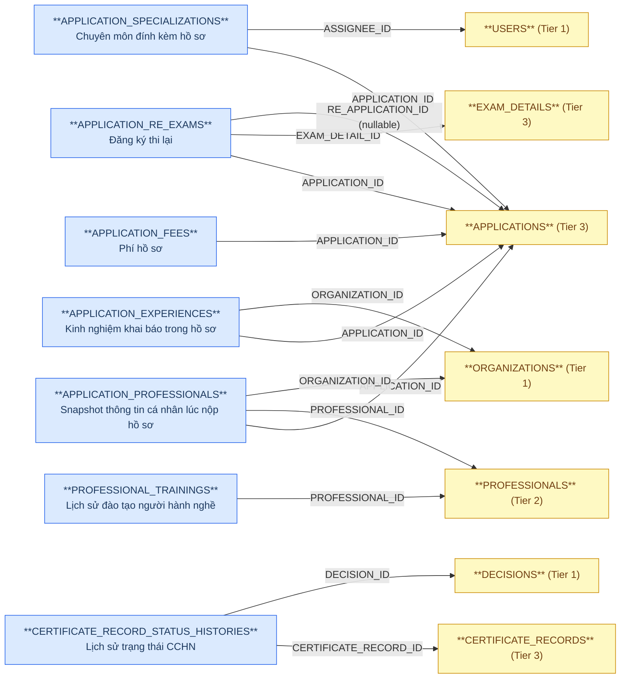

# NHNCK — HLD Tier 4: Phụ thuộc Tier 3

> **Phụ thuộc Tier 1:** Regulatory Authority Officer, Securities Organization Reference
> **Phụ thuộc Tier 2:** Securities Practitioner
> **Phụ thuộc Tier 3:** Securities Practitioner License Application, Securities Practitioner License Certificate Document
>
> **Thiết kế theo:** [NHNCK_HLD_Overview.md](NHNCK_HLD_Overview.md)

---

## 6a. Bảng tổng quan BCV Concept

| BCV Core Object | BCV Concept | Category | Source Table | Source Table Change Mode | Mô tả bảng nguồn | Atomic Entity | Table Type | BCV Term |
|---|---|---|---|---|---|---|---|---|
| Documentation | [Documentation] Education Certificate | Education Certificate | APPLICATION_SPECIALIZATIONS | Update | Chứng chỉ/chuyên môn đào tạo đính kèm trong hồ sơ đăng ký | Securities Practitioner License Application Education Certificate Document | Fundamental | Education Certificate — cấu trúc trường: Specialization Type Code (SPECIALIZATION_ID), file đính kèm (FILE_NAME/FILE_PATH), Appraisal Status Code, Appraised By Officer FK (ASSIGNEE_ID). FK đến APPLICATIONS (Tier 3) và USERS (Tier 1). Entity có lifecycle riêng (trạng thái thẩm định) — Fundamental. |
| Transaction | [Event] Transaction | Transaction | APPLICATION_FEES | Update | Phí thực tế phát sinh cho hồ sơ (phí nộp hồ sơ, phí cấp CCHN...) | Securities Practitioner License Application Fee | Fundamental | Transaction — phí thực tế phát sinh từng hồ sơ (thực thu). Có lifecycle riêng (trạng thái thanh toán), không phải sự kiện immutable. Phân biệt với Examination Assessment Fee (Condition — biểu phí quy định). FK đến APPLICATIONS (Tier 3). |
| Involved Party | [Involved Party] Individual Employment Status | Employment Status | APPLICATION_EXPERIENCES | Update | Kinh nghiệm làm việc khai báo trong hồ sơ đăng ký CCHN | Securities Practitioner License Application Employment Experience | Fundamental | Individual Employment Status — *"Identifies the current or past employment status of an Individual."* Grain = 1 khai báo kinh nghiệm trong 1 hồ sơ. Cấu trúc: FK đến APPLICATIONS (Tier 3), ORGANIZATIONS (Tier 1), DOCUMENTS (Classification Value), WORK_DURATION, START/END_DATE, POSITION, INSURANCE_NUMBER, LABOR_CONTRACT, DIRECTOR_CONFIRMATION. |
| Involved Party | [Involved Party] Individual | Individual | APPLICATION_PROFESSIONALS | Update | Snapshot thông tin cá nhân người đăng ký tại thời điểm nộp hồ sơ | Securities Practitioner License Application Snapshot | Fundamental | Individual — snapshot trạng thái nhân thân tại thời điểm nộp hồ sơ. FK đến APPLICATIONS (Tier 3), PROFESSIONALS (Tier 2), ORGANIZATIONS (Tier 1). Toàn bộ trường định danh/liên lạc/địa chỉ từ PROFESSIONALS được denormalized tại thời điểm nộp. |
| Documentation | [Documentation] Gov. Registration Document | Government Registration Document | APPLICATION_RE_EXAMS | Update | Liên kết hồ sơ cũ — kết quả thi — hồ sơ đăng ký thi lại | Securities Practitioner License Application Re-Exam Request | Fundamental | Government Registration Document — entity theo dõi chu trình thi lại. FK đến APPLICATION_ID (hồ sơ cũ), EXAM_DETAIL_ID (kết quả thi trượt), RE_APPLICATION_ID (hồ sơ thi lại mới — nullable nếu chưa có). |
| Involved Party | [Involved Party] Individual Employment Status | Employment Status | PROFESSIONAL_TRAININGS | Update | Lịch sử đào tạo, bồi dưỡng của người hành nghề | Securities Practitioner Professional Training History | Fundamental | Individual Employment Status — lịch sử đào tạo gắn với người hành nghề. FK đến PROFESSIONALS (Tier 2), START_DATE, END_DATE, TRAINING_PLACE, SPECIALIZATION, AWARDS, DISCIPLINES. Entity phụ thuộc Practitioner (không phụ thuộc Application). |
| Documentation | [Documentation] Gov. Registration Document | Government Registration Document | CERTIFICATE_RECORD_STATUS_HISTORIES | Append | Lịch sử thay đổi trạng thái chứng chỉ hành nghề (OLD_STATUS/NEW_STATUS + lý do) | Securities Practitioner License Certificate Status Change History | Fact Append | (1) Term candidate: không có BCV term riêng cho "status history" trong knowledge/terms.csv (chỉ có property-level term như Documentation Life Cycle Status Date) — tái dùng `[Documentation] Gov. Registration Document`, cùng concept với entity cha `Securities Practitioner License Certificate Document`. (2) Cấu trúc trường: CERTIFICATE_RECORD_ID (FK), UPDATE_TYPE, OLD_STATUS/NEW_STATUS (Classification Value, scheme CERTIFICATE_STATUS), DECISION_ID (FK), REASON — đúng cấu trúc 1 dòng/1 lần đổi trạng thái, mirror pattern `Securities Practitioner Reason Change History` (PROFESSIONAL_HISTORIES). (3) Chọn tái dùng concept của entity cha, Table Type Fact Append theo yêu cầu Data Modeler (2026-07-24) — mỗi dòng là 1 occurrence không sửa/xóa. |

---

## 6b. Diagram Source (Mermaid)

---

## 6c. Diagram Atomic (Mermaid)

```mermaid
graph TD
    classDef atomic fill:#dcfce7,stroke:#16a34a,color:#14532d
    classDef outscope fill:#fef9c3,stroke:#ca8a04,color:#713f12

    APPTRAIN["**License Application\nEducation Certificate Document**\n[Documentation] Education Certificate\nAPPLICATION_SPECIALIZATIONS"]:::atomic
    APPFEE["**License Application Fee**\n[Event] Transaction\nAPPLICATION_FEES"]:::atomic
    APPEXP["**License Application\nEmployment Experience**\n[Involved Party] Individual Employment Status\nAPPLICATION_EXPERIENCES"]:::atomic
    APPSNAP["**License Application Snapshot**\n[Involved Party] Individual\nAPPLICATION_PROFESSIONALS"]:::atomic
    APPREEX["**License Application\nRe-Exam Request**\n[Documentation] Gov. Registration Document\nAPPLICATION_RE_EXAMS"]:::atomic
    PROFTRAIN["**Professional Training History**\n[Involved Party] Individual Employment Status\nPROFESSIONAL_TRAININGS"]:::atomic
    CERTSTHIST["**License Certificate Status\nChange History**\n[Documentation] Gov. Registration Document\nCERTIFICATE_RECORD_STATUS_HISTORIES"]:::atomic

    APP["**License Application** (Tier 3)"]:::outscope
    CERTDOC["**License Certificate Document** (Tier 3)"]:::outscope
    OFFICER["**Regulatory Authority Officer** (Tier 1)"]:::outscope
    SECORG["**Securities Organization Reference** (Tier 1)"]:::outscope
    PRAC["**Securities Practitioner** (Tier 2)"]:::outscope
    EXAMRES["**Examination Assessment Result** (Tier 3)"]:::outscope
    DECISION["**License Decision Document** (Tier 1)"]:::outscope

    APPTRAIN -->|"License Application FK"| APP
    APPTRAIN -->|"Appraised By Officer FK"| OFFICER
    APPFEE -->|"License Application FK"| APP
    APPEXP -->|"License Application FK"| APP
    APPEXP -->|"Organization FK"| SECORG
    APPSNAP -->|"License Application FK"| APP
    APPSNAP -->|"Practitioner FK"| PRAC
    APPSNAP -->|"Organization FK"| SECORG
    APPREEX -->|"License Application FK"| APP
    APPREEX -->|"Examination Assessment Result FK"| EXAMRES
    APPREEX -->|"Re-Exam Application FK (nullable)"| APP
    PROFTRAIN -->|"Practitioner FK"| PRAC
    CERTSTHIST -->|"Certificate Document FK"| CERTDOC
    CERTSTHIST -->|"Decision FK"| DECISION
```

---

## 6d. Danh mục & Tham chiếu

| Source Table | Mô tả | Scheme Code | source_type | Ghi chú |
|---|---|---|---|---|
| `CERTIFICATE_RECORD_STATUS_HISTORIES.OLD_STATUS`/`NEW_STATUS` | Trạng thái CCHN trước/sau khi thay đổi | `CERTIFICATE_STATUS` | modeler_defined | Scheme đã đăng ký sẵn từ trước (dùng chung với `License Certificate Document.STATUS`) — nay bổ sung giá trị cụ thể (0=Chưa sử dụng...5=Hết hiệu lực) lấy từ mô tả cột nguồn. |

---

## 6e. Bảng chờ thiết kế

Không có bảng nào trong Tier 4 chưa đủ thông tin cột.

---

## 6f. Điểm cần xác nhận

| # | Câu hỏi | Ảnh hưởng |
|---|---|---|
| 1 | `APPLICATION_PROFESSIONALS` — bảng có cột USERNAME/PASSWORD (credentials hệ thống). Cần xác nhận có nên loại bỏ các cột này khi thiết kế Atomic entity không? | Nếu loại bỏ → không map USERNAME/PASSWORD vào attribute Atomic. Chỉ map các trường định danh/nhân thân nghiệp vụ. |
| 2 | `APPLICATION_RE_EXAMS.RE_APPLICATION_ID` — nullable khi hồ sơ thi lại chưa được nộp. Grain có thể có dòng với RE_APPLICATION_ID = null. Cần xác nhận có hợp lệ không? | Nếu nullable → entity hợp lệ, ETL load khi RE_APPLICATION_ID được fill. Nếu NOT NULL bắt buộc → cần xem lại grain. |
| 3 | `APPLICATION_FEES` — đổi từ Fact Append sang Fundamental (feedback). Cần xác nhận: trường hợp nào phí bị cập nhật (cancel, refund, correction)? | Nếu chỉ có STATUS thay đổi → Fundamental với trường Payment Status Code là đủ. Nếu có versioning (nhiều phiên bản phí) → cần xem lại. |
| 4 | `CERTIFICATE_RECORD_STATUS_HISTORIES` — đưa vào scope theo yêu cầu Data Modeler (2026-07-24): Documentation/Fact Append. `brd_NHNCK.yaml` trước đó ghi `data_change_mode: Update`; đã sửa lại thành `Append` để khớp Table Type (bảng lưu 1 dòng/1 lần đổi trạng thái, không sửa/xóa). | **Giả định cần Data Modeler xác nhận lại** — nếu thực tế nguồn có UPDATE bản ghi (VD: sửa REASON sau khi ghi nhận) thì cần giữ `Update` và ghi nhận cảnh báo crosswalk (Update, Fact Append) thay vì sửa BRD. |
