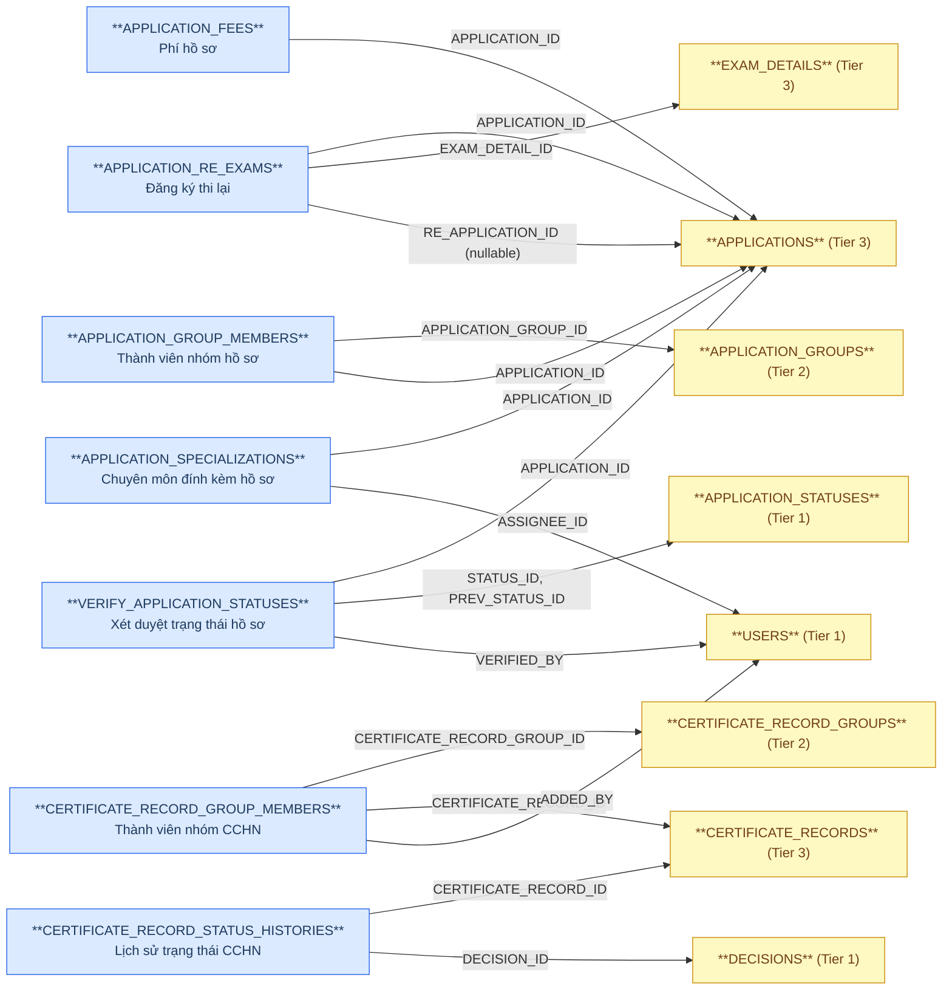

# NHNCK — HLD Tier 4: Phụ thuộc Tier 3

> **Phụ thuộc Tier 1:** Regulatory Authority Officer, Securities Practitioner License Decision Document
> **Phụ thuộc Tier 2:** Securities Practitioner License Application Group, Securities Practitioner License Certificate Group
> **Phụ thuộc Tier 3:** Securities Practitioner License Application, Securities Practitioner License Certificate Document
>
> **Thiết kế theo:** [NHNCK_HLD_Overview.md](NHNCK_HLD_Overview.md)

---

## 6a. Bảng tổng quan BCV Concept

| BCV Core Object | BCV Concept | Category | Source Table | Source Table Change Mode | Mô tả bảng nguồn | Atomic Entity | Table Type | BCV Term |
|---|---|---|---|---|---|---|---|---|
| Documentation | [Documentation] Education Certificate | Education Certificate | APPLICATION_SPECIALIZATIONS | Update | Chứng chỉ/chuyên môn đào tạo đính kèm trong hồ sơ đăng ký | Securities Practitioner License Application Education Certificate Document | Fundamental | Education Certificate — cấu trúc trường: Specialization Type Code (SPECIALIZATION_ID), file đính kèm (FILE_NAME/FILE_PATH), Appraisal Status Code, Appraised By Officer FK (ASSIGNEE_ID). FK đến APPLICATIONS (Tier 3) và USERS (Tier 1). Entity có lifecycle riêng (trạng thái thẩm định) — Fundamental. |
| Transaction | [Event] Transaction | Transaction | APPLICATION_FEES | Update | Phí thực tế phát sinh cho hồ sơ (phí nộp hồ sơ, phí cấp CCHN...) | Securities Practitioner License Application Fee | Fundamental | Transaction — phí thực tế phát sinh từng hồ sơ (thực thu). Có lifecycle riêng (trạng thái thanh toán), không phải sự kiện immutable. Phân biệt với Examination Assessment Fee (Condition — biểu phí quy định). FK đến APPLICATIONS (Tier 3). |
| Documentation | [Documentation] Gov. Registration Document | Government Registration Document | APPLICATION_RE_EXAMS | Update | Liên kết hồ sơ cũ — kết quả thi — hồ sơ đăng ký thi lại | Securities Practitioner License Application Re-Exam Request | Fundamental | Government Registration Document — entity theo dõi chu trình thi lại. FK đến APPLICATION_ID (hồ sơ cũ), EXAM_DETAIL_ID (kết quả thi trượt), RE_APPLICATION_ID (hồ sơ thi lại mới — nullable nếu chưa có). |
| Documentation | [Documentation] Gov. Registration Document | Government Registration Document | CERTIFICATE_RECORD_STATUS_HISTORIES | Append | Lịch sử thay đổi trạng thái chứng chỉ hành nghề (OLD_STATUS/NEW_STATUS + lý do) | Securities Practitioner License Certificate Status Change History | Fact Append | (1) Term candidate: không có BCV term riêng cho "status history" trong knowledge/terms.csv (chỉ có property-level term như Documentation Life Cycle Status Date) — tái dùng `[Documentation] Gov. Registration Document`, cùng concept với entity cha `Securities Practitioner License Certificate Document`. (2) Cấu trúc trường: CERTIFICATE_RECORD_ID (FK), UPDATE_TYPE, OLD_STATUS/NEW_STATUS (Classification Value, scheme CERTIFICATE_STATUS), DECISION_ID (FK), REASON — đúng cấu trúc 1 dòng/1 lần đổi trạng thái, mirror pattern `Securities Practitioner Reason Change History` (PROFESSIONAL_HISTORIES). (3) Chọn tái dùng concept của entity cha, Table Type Fact Append theo yêu cầu Data Modeler (2026-07-24) — mỗi dòng là 1 occurrence không sửa/xóa. |
| Group | [Group] Group | Group | APPLICATION_GROUP_MEMBERS | Update | Thành viên (hồ sơ CCHN) trong 1 nhóm xử lý tập thể | Application Group X Securities Practitioner License Application Relationship | Relative | (1) Term candidate: `[Group] Group` — tái dùng concept từ phía entity cha Tier 2 `Securities Practitioner License Application Group`. (2) Cấu trúc trường: APPLICATION_GROUP_ID (FK cha), APPLICATION_ID (FK), STATUS, NOTES, ORDER_INDEX — STATUS/NOTES/ORDER_INDEX là attribute của quan hệ, không thỏa điều kiện "pure junction 2 FK, không attribute riêng" → không denormalize ARRAY, giữ làm entity Relative riêng. (3) Đổi tên từ "...Group Member" sang pattern link/relationship `_x_` + Table Type Fundamental → Relative theo quyết định Data Modeler (2026-08-14, lần 2). BCV Concept: `[Group] Group` → `[Documentation] Gov. Registration Document` (2026-08-14, lần 3) → trở lại `[Group] Group` (2026-08-15) — quyết định cuối cùng, tên đặt Group lên trước. |
| Group | [Group] Group | Group | CERTIFICATE_RECORD_GROUP_MEMBERS | Update | Chứng chỉ hành nghề (CCHN) là thành viên trong 1 nhóm cấp/thu hồi tập thể | Certificate Group X Securities Practitioner License Certificate Document Relationship | Relative | (1) Term candidate: `[Group] Group` — tái dùng concept từ phía entity cha Tier 2 `Securities Practitioner License Certificate Group`, đối xứng với `Application Group X Securities Practitioner License Application Relationship`. (2) Cấu trúc trường: CERTIFICATE_RECORD_GROUP_ID (FK cha), CERTIFICATE_RECORD_ID (FK) — chỉ giữ 2 FK Id/Code theo pattern entity link khác; ADDED_DATE/ADDED_BY/STATUS/IS_REISSUE/REVOCATION_REASON/ORDER_INDEX bỏ khỏi thiết kế theo yêu cầu tường minh Data Modeler (không còn cần xác nhận REVOCATION_REASON trùng lặp — xem 6f #5, đã moot). (3) Đổi tên từ "...Group Member" sang pattern link/relationship `_x_` + Table Type Fundamental → Relative theo quyết định Data Modeler (2026-08-14, lần 3). BCV Concept: `[Group] Group` → `[Documentation] Gov. Registration Document` (2026-08-14) → trở lại `[Group] Group` (2026-08-15) — quyết định cuối cùng, tên đặt Group lên trước. |
| Business Activity | [Business Activity] Status Review | Status Review | VERIFY_APPLICATION_STATUSES | Update | Kết quả thẩm định/phê duyệt hồ sơ CCHN tại từng cấp xét duyệt | Securities Practitioner License Application Status Review | Fundamental | (1) Term candidate: `[Business Activity] Status Review` — *"Identifies a Business Activity in which the status of an item is reviewed to determine if it is still valid."* (2) Cấu trúc trường: APPLICATION_ID (FK), STATUS_ID/PREV_STATUS_ID (Classification Value, scheme APPLICATION_STATUS — revert từ FK Tier 1 2026-08-20, xem Overview.md 5c/7c), 4 trường lý do theo cấp xét duyệt (REASON/SPEC_REASON/ORG_REASON/OVERVIEW_REASON), VERIFIED_BY — đúng cấu trúc 1 lần xét duyệt chuyển trạng thái hồ sơ. (3) Chọn `[Business Activity] Status Review`. Quyết định Data Modeler (2026-08-13) — đảo lại out_of_scope trước đó (Source Process Log). |

---

## 6b. Diagram Source (Mermaid)

---

## 6c. Diagram Atomic (Mermaid)

```mermaid
graph TD
    classDef atomic fill:#dcfce7,stroke:#16a34a,color:#14532d
    classDef outscope fill:#fef9c3,stroke:#ca8a04,color:#713f12

    APPTRAIN["**License Application\nEducation Certificate Document**\n[Documentation] Education Certificate\nAPPLICATION_SPECIALIZATIONS"]:::atomic
    APPFEE["**License Application Fee**\n[Event] Transaction\nAPPLICATION_FEES"]:::atomic
    APPREEX["**License Application\nRe-Exam Request**\n[Documentation] Gov. Registration Document\nAPPLICATION_RE_EXAMS"]:::atomic
    CERTSTHIST["**License Certificate Status\nChange History**\n[Documentation] Gov. Registration Document\nCERTIFICATE_RECORD_STATUS_HISTORIES"]:::atomic
    APPGRPMEM["**Application Group\nX License Application**\n[Group] Group\nAPPLICATION_GROUP_MEMBERS"]:::atomic
    CERTGRPMEM["**Certificate Group\nX License Certificate Document**\n[Group] Group\nCERTIFICATE_RECORD_GROUP_MEMBERS"]:::atomic
    APPSTREV["**License Application\nStatus Review**\n[Business Activity] Status Review\nVERIFY_APPLICATION_STATUSES"]:::atomic

    APP["**License Application** (Tier 3)"]:::outscope
    CERTDOC["**License Certificate Document** (Tier 3)"]:::outscope
    OFFICER["**Regulatory Authority Officer** (Tier 1)"]:::outscope
    EXAMRES["**Examination Assessment Result** (Tier 3)"]:::outscope
    DECISION["**License Decision Document** (Tier 1)"]:::outscope
    APPGROUP["**License Application Group** (Tier 2)"]:::outscope
    CERTGROUP["**License Certificate Group** (Tier 2)"]:::outscope

    APPTRAIN -->|"License Application FK"| APP
    APPTRAIN -->|"Appraised By Officer FK"| OFFICER
    APPFEE -->|"License Application FK"| APP
    APPREEX -->|"License Application FK"| APP
    APPREEX -->|"Examination Assessment Result FK"| EXAMRES
    APPREEX -->|"Re-Exam Application FK (nullable)"| APP
    CERTSTHIST -->|"Certificate Document FK"| CERTDOC
    CERTSTHIST -->|"Decision FK"| DECISION
    APPGRPMEM -->|"License Application Group FK"| APPGROUP
    APPGRPMEM -->|"License Application FK"| APP
    CERTGRPMEM -->|"License Certificate Group FK"| CERTGROUP
    CERTGRPMEM -->|"License Certificate Document FK"| CERTDOC
    APPSTREV -->|"License Application FK"| APP
    APPSTREV -->|"Verified By Officer FK"| OFFICER
```

---

## 6d. Danh mục & Tham chiếu

| Source Table | Mô tả | Scheme Code | source_type | Ghi chú |
|---|---|---|---|---|
| `CERTIFICATE_RECORD_STATUS_HISTORIES.OLD_STATUS`/`NEW_STATUS` | Trạng thái CCHN trước/sau khi thay đổi | `CERTIFICATE_STATUS` | modeler_defined | Scheme đã đăng ký sẵn từ trước (dùng chung với `License Certificate Document.STATUS`) — nay bổ sung giá trị cụ thể (0=Chưa sử dụng...5=Hết hiệu lực) lấy từ mô tả cột nguồn. |

---

## 6e. Bảng chờ thiết kế

Không có bảng nào trong Tier 4 chưa đủ thông tin cột.

---

## 6f. Điểm cần xác nhận

| # | Câu hỏi | Ảnh hưởng |
|---|---|---|
| 2 | `APPLICATION_RE_EXAMS.RE_APPLICATION_ID` — nullable khi hồ sơ thi lại chưa được nộp. Grain có thể có dòng với RE_APPLICATION_ID = null. Cần xác nhận có hợp lệ không? | Nếu nullable → entity hợp lệ, ETL load khi RE_APPLICATION_ID được fill. Nếu NOT NULL bắt buộc → cần xem lại grain. |
| 3 | `APPLICATION_FEES` — đổi từ Fact Append sang Fundamental (feedback). Cần xác nhận: trường hợp nào phí bị cập nhật (cancel, refund, correction)? | Nếu chỉ có STATUS thay đổi → Fundamental với trường Payment Status Code là đủ. Nếu có versioning (nhiều phiên bản phí) → cần xem lại. |
| 4 | `CERTIFICATE_RECORD_STATUS_HISTORIES` — đưa vào scope theo yêu cầu Data Modeler (2026-07-24): Documentation/Fact Append. `brd_NHNCK.yaml` trước đó ghi `data_change_mode: Update`; đã sửa lại thành `Append` để khớp Table Type (bảng lưu 1 dòng/1 lần đổi trạng thái, không sửa/xóa). | **Giả định cần Data Modeler xác nhận lại** — nếu thực tế nguồn có UPDATE bản ghi (VD: sửa REASON sau khi ghi nhận) thì cần giữ `Update` và ghi nhận cảnh báo crosswalk (Update, Fact Append) thay vì sửa BRD. |
| 5 | `CERTIFICATE_RECORD_GROUP_MEMBERS.REVOCATION_REASON` — cần xác nhận đây là lý do thu hồi RIÊNG của lần xử lý theo lô này, hay trùng lặp với lý do thu hồi đã lưu trên chính `CERTIFICATE_RECORDS`/`DECISIONS`. | **Đã xử lý (2026-08-14) — moot.** Data Modeler yêu cầu tường minh bỏ toàn bộ attribute `ADDED_DATE/ADDED_BY/STATUS/IS_REISSUE/REVOCATION_REASON/ORDER_INDEX` khỏi thiết kế (entity đổi sang pattern link/relationship `_x_`, chỉ giữ 2 FK Id/Code). Xem `pending_design.yaml`. |
| 6 | `ORGANIZATION_REPORT_LOG_SYNCS` có 2 FK cha (Annual Report + Organization Employment Report) — cần xác nhận `ORGANIZATION_REPORT_ID` luôn có giá trị (NOT NULL) hay chỉ fill sau khi đối soát khớp với hồ sơ chính thức (nullable, tương tự pattern `APPLICATION_RE_EXAMS.RE_APPLICATION_ID`). | **Đã xử lý (2026-08-14) — Data Modeler quyết định bỏ thiết kế Atomic entity đợt này.** `scope_status` trả về `out_of_scope` trong `brd_NHNCK.yaml`. Xem Overview mục Entities #31. |
