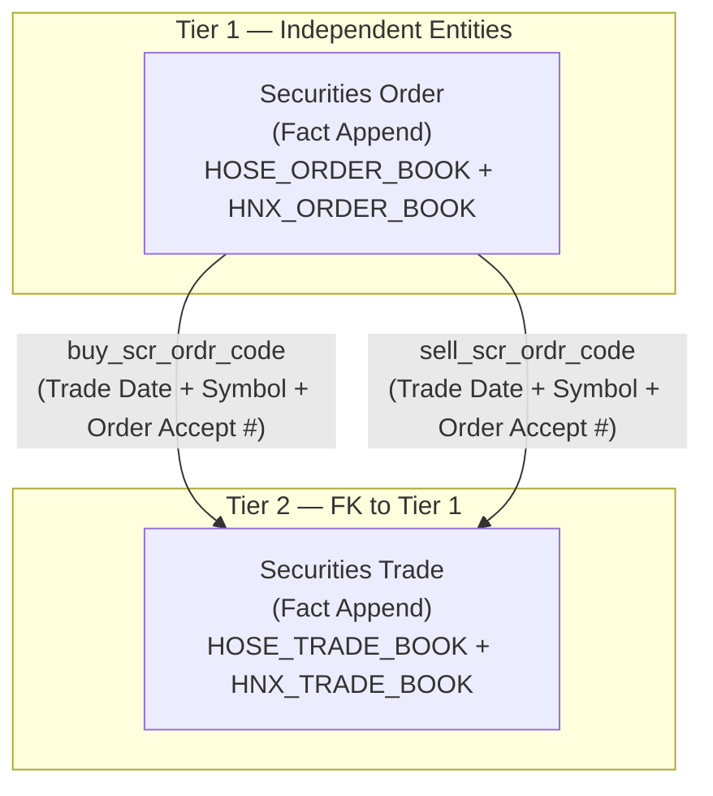

# OrderTrade HLD — Overview

**Source system:** OrderTrade (Sổ lệnh và Sổ khớp — HOSE & HNX)
**Mô tả:** OrderTrade cung cấp dữ liệu giao dịch chứng khoán từ hệ thống KRX của hai sàn giao dịch HOSE và HNX. Bao gồm toàn bộ lifecycle của từng lệnh giao dịch (new/modify/cancel) và từng lần khớp lệnh thành công, phủ mọi loại chứng khoán: cổ phiếu, trái phiếu, repo, phái sinh, UPCOM.

---

## Tổng quan Atomic Entities

| Tier | Atomic Entity | BCV Core Object | BCV Concept | Table Type | Source Table(s) | Ghi chú |
|---|---|---|---|---|---|---|
| T1 | Securities Order | Communication | [Communication] Financial Market Order | Fact Append | OrderTrade.HOSE_ORDER_BOOK + OrderTrade.HNX_ORDER_BOOK | Mỗi dòng = 1 event lệnh (new/modify/cancel). Phân biệt sàn qua `market_id_code` |
| T2 | Securities Trade | Transaction | [Transaction] Financial Market Transaction | Fact Append | OrderTrade.HOSE_TRADE_BOOK + OrderTrade.HNX_TRADE_BOOK | Mỗi dòng = 1 lần khớp lệnh thành công. Lưu đồng thời Buy side + Sell side. FK BK về Securities Order |

**Tổng: 2 Atomic entities** (1 Tier 1, 1 Tier 2)
*(Trong đó: 0 shared entities)*

---

## Diagram Phân tầng Dependencies (Mermaid)



---

## Quyết định thiết kế chính

| # | Quyết định | Lý do |
|---|---|---|
| D-01 | Gộp HOSE_ORDER_BOOK + HNX_ORDER_BOOK → 1 entity `Securities Order` | Grain giống nhau (1 event lệnh). Phân biệt sàn qua `market_id_code` (STO/BDO/RPO = HOSE; STX/UPX/BDX/DVX/HCX = HNX) và `src_stm_code`. Các field HNX-only (`pub_vol`, `cond_prc`, `auto_cncl_rsn_code`…) để nullable |
| D-02 | Gộp HOSE_TRADE_BOOK + HNX_TRADE_BOOK → 1 entity `Securities Trade` | Tương tự D-01. HNX có thêm 2 field Spread legs (`exec_prc_sprd_frst`, `exec_prc_sprd_scd`) để nullable |
| D-03 | `Securities Trade` lưu Buy side + Sell side trong cùng 1 row | Giữ đúng grain nguồn: 1 Trade ID = 1 cặp khớp. Tách thành 2 row/side sẽ mất thông tin "ai khớp với ai" |
| D-04 | FK từ `Securities Trade` → `Securities Order` dùng BK, không tạo surrogate FK | Volume cao (hàng triệu row/ngày). Join BK qua cặp `(trd_dt, symb_code, buy/sell_scr_ordr_code)`. Surrogate FK resolve tại Gold layer nếu cần |
| D-05 | Business Key của `Securities Order` = `Securities Order Code` (Order ID 17 ký tự) | Order ID ổn định qua toàn bộ lifecycle (new/modify/cancel). Order Accept # reset mỗi ngày → chỉ dùng làm BK phụ |
| D-06 | Member Code/Name không tạo FK surrogate sang `Securities Organization Reference` | BRK ID/Member ID từ sàn ≠ `org_code` trong NHNCK — hai hệ thống mã khác nhau. Pattern nhất quán với IDS, GSGD: denormalized Text. Cross-source join tại Gold layer |
| D-07 | `Investor Type Code` giữ raw value từng sàn, dùng chung scheme `ORDERTRADE_INVESTOR_TYPE` | HOSE và HNX dùng cùng cấu trúc 4 số nhưng mapping nghĩa sector khác nhau. Phân biệt qua `src_stm_code`. ETL normalize tại Gold nếu cần report cross-market |
| D-08 | `Side Code` dùng domain `Indicator` (không phải Classification Value) | Giá trị tường minh B/S — ETL chuẩn hóa HNX (1/2) → B/S. Không cần scheme lookup |
| D-09 | Không dùng prefix `OrderTrade` trong tên entity | Tên entity dùng trực tiếp BCV Term |

---

#### 7a. Bảng tổng quan Atomic entities

| Tier | BCV Core Object | BCV Concept | Category | Source Table | Source Table Change Mode | Mô tả bảng nguồn | Atomic Entity | Table Type | BCV Term |
|---|---|---|---|---|---|---|---|---|---|
| T1 | Communication | [Communication] Financial Market Order | Financial Markets Trading | OrderTrade.HOSE_ORDER_BOOK | Append | Sổ lệnh HOSE — mỗi bản ghi là 1 event lệnh: mới/sửa/hủy trên sàn HOSE (cổ phiếu/trái phiếu/repo) | Securities Order | Fact Append | Financial Market Order — Communication ghi nhận ý định giao dịch của NĐT. Gộp HOSE + HNX, phân biệt qua market_id_code. |
| T1 | Communication | [Communication] Financial Market Order | Financial Markets Trading | OrderTrade.HNX_ORDER_BOOK | Append | Sổ lệnh HNX — tương đương HOSE_ORDER_BOOK cho sàn HNX (CP/UPCOM/TPCP/TPDN/phái sinh). Bổ sung Iceberg order và Stop order theo chuẩn KRX | Securities Order | Fact Append | (gộp chung với HOSE_ORDER_BOOK) |
| T2 | Transaction | [Transaction] Financial Market Transaction | Financial Markets Trading | OrderTrade.HOSE_TRADE_BOOK | Append | Sổ khớp HOSE — mỗi bản ghi là 1 lần khớp thành công, chứa đồng thời thông tin bên mua và bên bán | Securities Trade | Fact Append | Financial Market Transaction — Transaction ghi nhận giao dịch khớp lệnh thực tế. Gộp HOSE + HNX, phân biệt qua market_id_code. |
| T2 | Transaction | [Transaction] Financial Market Transaction | Financial Markets Trading | OrderTrade.HNX_TRADE_BOOK | Append | Sổ khớp HNX — tương đương HOSE_TRADE_BOOK cho sàn HNX. Bổ sung Spread legs (Exec Price Spread First/Second) cho phái sinh/repo | Securities Trade | Fact Append | (gộp chung với HOSE_TRADE_BOOK) |

#### 7b. Diagram Atomic tổng (Mermaid)

```mermaid
erDiagram
    Securities_Order {
        string scr_ordr_id PK
        string scr_ordr_code BK
        string ordr_acpt_nbr "BK phụ"
        string src_stm_code
        date trd_dt
        date ordr_dt
        string mkt_id_code
        string symb_code
        string board_tp_code
        string ssn_code
        string ordr_actn_tp_code
        string side_code
        string ordr_tp_code
        string ordr_st_code
        decimal ordr_prc
        int ordr_vol
        int matched_vol
        int rman_vol
        string mbr_code
        string ac_nbr
        string ivsr_tp_code
        string frgn_ivsr_tp_code
    }

    Securities_Trade {
        string scr_trd_id PK
        string scr_trd_code BK
        string src_stm_code
        date trd_dt
        string mkt_id_code
        string symb_code
        decimal exec_prc
        int exec_vol
        decimal exec_val
        string buy_scr_ordr_code "FK-BK → Securities Order"
        string buy_mbr_code
        string buy_ac_nbr
        string buy_ivsr_tp_code
        string sell_scr_ordr_code "FK-BK → Securities Order"
        string sell_mbr_code
        string sell_ac_nbr
        string sell_ivsr_tp_code
    }

    Securities_Order ||--o{ Securities_Trade : "buy_scr_ordr_code / (trd_dt + symb_code + ordr_acpt_nbr)"
    Securities_Order ||--o{ Securities_Trade : "sell_scr_ordr_code / (trd_dt + symb_code + ordr_acpt_nbr)"
```

#### 7c. Bảng Classification Value Schemes

| Source Field | Scheme | Mô tả | Giá trị mẫu |
|---|---|---|---|
| Market ID | `ORDERTRADE_MARKET_ID` | Mã thị trường | STO/BDO/RPO (HOSE); STX/UPX/BDX/DVX/HCX (HNX) |
| Board Type | `ORDERTRADE_BOARD_TYPE` | Loại bảng giao dịch | G1 Main / G2 ATO / G3 ATC / G4 Odd lot / G7 Buy-in / G8 Sell-out / T1-T6 Thỏa thuận / R1 Repo |
| Session | `ORDERTRADE_SESSION` | Phiên giao dịch | 00 Pre-market / 10 ATO / 20 Continuous / 30 ATC / 40 Continuous / 80 Odd lot / 90 Halt / 99 Close |
| Order Action Type | `ORDERTRADE_ORDER_ACTION_TYPE` | Hành động lệnh (chuẩn hóa từ N/M/C + 1/2/3) | N=New / M=Modify / C=Cancel |
| Order Type | `ORDERTRADE_ORDER_TYPE` | Loại lệnh theo giá | 1=Market / 2=Limit / 3=Stop Market / 4=Stop Limit / X=Same side limit (HNX) / Y=Contrary side limit (HNX) |
| Order Condition | `ORDERTRADE_ORDER_CONDITION` | Điều kiện khớp lệnh | 0=FAS / 1=GTC / 2=ATO / 3=FAK / 4=FOK / 6=GTD / 7=ATC / 9=MTL |
| Order Status | `ORDERTRADE_ORDER_STATUS` | Trạng thái lệnh | 0=New / 1=Partial Fill / 2=Filled / 3=Cancelled / 4=Rejected / 5=Expired / 6=Pending Cancel / 7=Pending Replace / 8=Replaced |
| Client House Type | `ORDERTRADE_CLIENT_HOUSE_TYPE` | Loại giao dịch | 10=Client trade / 30=House trade |
| Investor Type | `ORDERTRADE_INVESTOR_TYPE` | Loại hình NĐT (raw từ sàn — HOSE và HNX khác nhau, phân biệt qua src_stm_code) | HOSE: 8000=Cá nhân / 7000=NN / 3000=Quỹ; HNX: 8000=Cá nhân / 7100=Tổ chức / 3000=Quỹ |
| Foreign Investor Type | `ORDERTRADE_FOREIGN_INVESTOR_TYPE` | Loại NĐT nước ngoài | 00=Trong nước / 10=NN cư trú / 20=NN không cư trú |
| Short Sell Type | `ORDERTRADE_SHORT_SELL_TYPE` | Phân loại bán khống | 00=Bình thường / 10=Lệnh bán khống |
| Quote Request Type | `ORDERTRADE_QUOTE_REQUEST_TYPE` | Loại yêu cầu báo giá RFQ (HNX) | 1=Request / 2=Cancel / 3=Confirm / 4=Reject |
| Auto Cancel Reason | `ORDERTRADE_AUTO_CANCEL_REASON` | Lý do tự động hủy lệnh (HNX) | 0=n/a / 1=Condition / 2=Batch / 3=Kill Switch / 4=Disconnect / 5=Price limit |

#### 7d. Junction Tables

*(Không có junction table trong scope OrderTrade)*

#### 7e. Điểm cần xác nhận

| # | Tier | Câu hỏi | Ảnh hưởng |
|---|---|---|---|
| 1 | T1 | `Investor Type Code` HOSE vs HNX có cùng value range trong thực tế không? (HOSE: 1000=Individual; HNX: 1000=Securities company theo spec) | Nếu conflict thực tế → cần ETL map về scheme chung trước khi load; nếu không conflict → giữ raw, phân biệt qua src_stm_code |
| 2 | T1 | `Order Status Code` trên HNX: nguồn không lưu tường minh → ETL cần derive từ Order Action Type + Remaining Volume? | Ảnh hưởng ETL logic HNX side |
| 3 | T2 | `Securities Trade` không có surrogate FK về `Securities Order` — xác nhận join qua BK tại Gold layer? | Ảnh hưởng cách xây dựng mart tại Gold |
| 4 | T1/T2 | `Account Pin Code` (`ac_pin_code`, `buy_ac_pin_code`, `sell_ac_pin_code`): cần masking trước khi load Atomic hay để raw và masking ở lớp truy cập? | Ảnh hưởng ETL pipeline và governance |

#### 7f. Bảng ngoài scope

| Nhóm | Source Table | Mô tả bảng nguồn | Lý do ngoài scope |
|---|---|---|---|

<!--
GRAIN: 1 dòng = 1 bảng nguồn. KHÔNG gộp `table1, table2`.
GROUP: dùng từ danh sách chuẩn (xem reference/group_classification.md).
-->

---

## Entities

> Single source of truth cho metadata entity. `aggregate_atomic.py` parse section này để sinh `atomic_entities.yaml`.
> Format bắt buộc: heading `### N.` + dòng `**Description:**` trong 500 ký tự đầu tiên sau heading.

### 1. Securities Order
**Tier:** 1 | **Source:** `OrderTrade.HOSE_ORDER_BOOK, OrderTrade.HNX_ORDER_BOOK` | **BCV Concept:** [Communication] Financial Market Order | **BCO:** Communication | **Table Type:** Fact Append
**Description:** Toàn bộ lifecycle của từng lệnh giao dịch chứng khoán trên HOSE và HNX. Mỗi dòng = 1 event lệnh (new/modify/cancel). Gộp HOSE_ORDER_BOOK + HNX_ORDER_BOOK, phân biệt qua market_id_code và src_stm_code. Lưu thông tin lệnh, thông tin thị trường tại thời điểm event, thông tin thành viên và tài khoản NĐT.

**Grain:** 1 dòng = 1 event lệnh (mỗi lần đặt, sửa, hoặc hủy lệnh tạo ra 1 bản ghi mới).

**Attributes chính:** scr_ordr_id (PK surrogate), scr_ordr_code (BK = Order ID 17 ký tự), ordr_acpt_nbr (BK phụ = Order Accept # / Order Reception Number), src_stm_code, trd_dt, ordr_dt, ordr_tm, mkt_id_code (ORDERTRADE_MARKET_ID), symb_code, ccy_code, board_tp_code (ORDERTRADE_BOARD_TYPE), ssn_code (ORDERTRADE_SESSION), ordr_actn_tp_code (ORDERTRADE_ORDER_ACTION_TYPE), side_code (Indicator: B/S), ordr_tp_code (ORDERTRADE_ORDER_TYPE), ordr_cd_code (ORDERTRADE_ORDER_CONDITION), ordr_st_code (ORDERTRADE_ORDER_STATUS), ordr_prc, ordr_vol, matched_vol, rman_vol, imm_matched_vol, exec_prc, last_trdd_prc, ordr_prc_vs_ltp, buy_up_sell_down_amt, buy_up_sell_down_tick, matched_rto, new_high_low_prc_ind, expc_exec_prc, expc_exec_vol, icd_bug_qty, clnt_hs_tp_code (ORDERTRADE_CLIENT_HOUSE_TYPE), ivsr_tp_code (ORDERTRADE_INVESTOR_TYPE), frgn_ivsr_tp_code (ORDERTRADE_FOREIGN_INVESTOR_TYPE), shrt_sell_tp_code (ORDERTRADE_SHORT_SELL_TYPE), mkt_maker_ordr_ind (Indicator), mbr_code, mbr_nm, ac_nbr, ac_hldr_nm, ac_pin_code, trdr_code, trdr_nm, orig_scr_ordr_code, orig_ordr_acpt_nbr, refr_seq_nbr, ordr_rjct_rsn_code (HNX-only), pub_vol (HNX Iceberg), cond_prc (HNX Stop), orig_ordr_tp_code (HNX-only), qte_rqs_tp_code (HNX RFQ), auto_cncl_rsn_code (HNX-only).

### 2. Securities Trade
**Tier:** 2 | **Source:** `OrderTrade.HOSE_TRADE_BOOK, OrderTrade.HNX_TRADE_BOOK` | **BCV Concept:** [Transaction] Financial Market Transaction | **BCO:** Transaction | **Table Type:** Fact Append
**Description:** Từng lần khớp lệnh thành công trên HOSE và HNX. Mỗi dòng = 1 Trade ID. Lưu đồng thời thông tin bên mua và bên bán trong cùng 1 row. FK-BK về Securities Order qua buy/sell_scr_ordr_code (không tạo surrogate FK — join tại Gold). Gộp HOSE_TRADE_BOOK + HNX_TRADE_BOOK, phân biệt qua market_id_code và src_stm_code.

**Grain:** 1 dòng = 1 lần khớp lệnh thành công (1 Trade ID từ KRX).

**Attributes chính:** scr_trd_id (PK surrogate), scr_trd_code (BK = Trade # / Trade Number), src_stm_code, trd_dt, trd_tm, mkt_id_code (ORDERTRADE_MARKET_ID), symb_code, ccy_code, board_tp_code, ssn_code, exec_prc, exec_vol, exec_val, exec_ltp, exec_prc_vs_ltp, exec_new_high_low_prc_ind, exec_prc_sprd_frst (HNX Spread leg 1), exec_prc_sprd_scd (HNX Spread leg 2), refr_seq_nbr. **Buy side:** buy_scr_ordr_code (FK-BK), buy_scr_ordr_id (FK surrogate), buy_ordr_dt, buy_ordr_tm, buy_mbr_code, buy_mbr_nm, buy_ac_nbr, buy_ac_hldr_nm, buy_ac_pin_code, buy_clnt_hs_tp_code, buy_ivsr_tp_code, buy_frgn_ivsr_tp_code, buy_ordr_prc, buy_ordr_vol, buy_trdr_code, buy_trdr_nm, buy_refr_seq_nbr, buy_ordr_tp_code, buy_ordr_cd_code, buy_ordr_actn_tp_code, buy_qte_rqs_tp_code. **Sell side:** (tương tự, tiền tố `sell_`).
