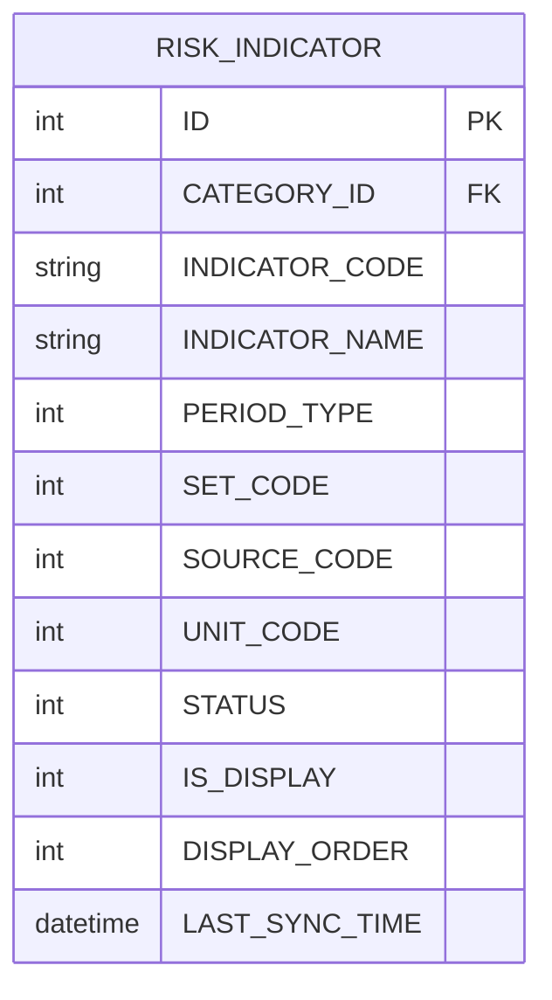
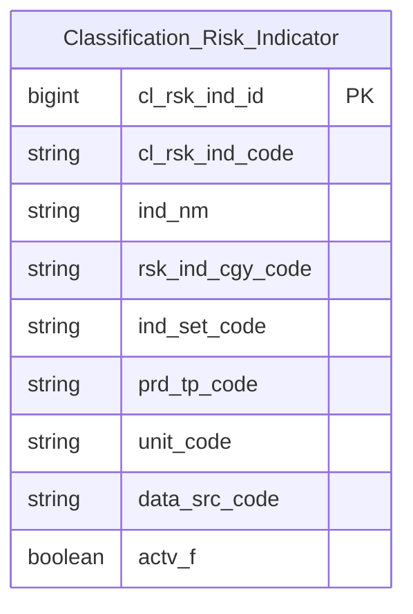

# QLRR HLD — Tier 1

**Source system:** QLRR (Quản lý rủi ro về thị trường chứng khoán)
**Tier 1:** Entity độc lập, không FK đến bảng nghiệp vụ khác trong scope — RISK_INDICATOR chỉ FK đến RISK_INDICATOR_CATEGORY (xử lý như Classification Value ở lần thiết kế này, xem 6e/6f).

---

## 6a. Bảng tổng quan BCV Concept

| BCV Core Object | BCV Concept | Category | Source Table | Source Table Change Mode | Mô tả bảng nguồn | Atomic Entity | Table Type | BCV Term |
|---|---|---|---|---|---|---|---|---|
| Common | [Common] Classification | — | RISK_INDICATOR | Update | Danh mục chỉ tiêu tài chính (trong nước & quốc tế) dùng cho Dashboard giám sát rủi ro (GDP, CPI, VNIndex, DXY...) | Classification Risk Indicator | Classification | (1) Đã tra `knowledge/terms.csv` và `reference_data_sets.csv` — không có BCV term chuyên biệt cho khái niệm "chỉ tiêu kinh tế vĩ mô/thị trường dùng để giám sát rủi ro hệ thống" (khác `Key Risk Indicator` giám sát nội bộ CTCK đã dùng ở SCMS `[Business Activity] Risk Indicator`). (2) Cấu trúc RISK_INDICATOR: INDICATOR_CODE/INDICATOR_NAME (business key + tên), CATEGORY_ID (FK nhóm), PERIOD_TYPE/UNIT_CODE/SOURCE_CODE (thuộc tính phân loại mặc định), DISPLAY_ORDER/IS_DISPLAY (UI), STATUS (active flag), LAST_SYNC_TIME (đồng bộ tự động) — bảng master định nghĩa chỉ tiêu, không lưu giá trị đo lường cụ thể (giá trị nằm ở RISK_INDICATOR_VALUE, xem Tier 2) → vai trò danh mục/reference hơn là entity nghiệp vụ có lifecycle riêng. (3) Theo chỉ đạo Data Modeler: gán BCV Core Object = Common, BCV Concept = `[Common] Classification`, Table Type = Classification (Upsert). Tên entity theo convention project cho nhóm Common/Classification hiện có (Classification Business Line, Classification Firm Status, Classification Nationality, Classification Service...): `Classification [Term]` → **Classification Risk Indicator**. |

---

## 6b. Diagram Source (Mermaid)

> CATEGORY_ID trỏ đến RISK_INDICATOR_CATEGORY — không vẽ vì xử lý như Classification Value (xem 6d, 6e).

---

## 6c. Diagram Atomic (Mermaid)

---

## 6d. Mục Danh mục & Tham chiếu (Reference Data)

| Source Field / Bảng | Mô tả | Scheme Code | source_type | Ghi chú |
|---|---|---|---|---|
| RISK_INDICATOR.CATEGORY_ID → RISK_INDICATOR_CATEGORY | Nhóm chỉ tiêu (Yếu tố vĩ mô, Yếu tố tiền tệ, Thị trường cổ phiếu...) | `QLRR_RISK_INDICATOR_CATEGORY` | source_table | RISK_INDICATOR_CATEGORY có thêm STATUS/SET_CODE ngoài CODE/NAME — xem 6e, có thể cần promote thành entity riêng sau. |
| RISK_INDICATOR.SET_CODE | Bộ chỉ tiêu: 1=Trong nước, 2=Quốc tế | `QLRR_RISK_INDICATOR_SET` | source_table | |
| RISK_INDICATOR.PERIOD_TYPE | Tần suất: 1=Ngày, 2=Tháng, 3=Quý, 4=Năm | `QLRR_RISK_PERIOD_TYPE` | source_table | Dùng chung với RISK_INDICATOR_VALUE.PERIOD_TYPE (Tier 2). |
| RISK_INDICATOR.UNIT_CODE | Đơn vị mặc định: 1=%, 2=Điểm, 3=Tỷ VND, 4=Triệu USD, 5=Hợp đồng, 6=Cổ phiếu, 7=Công ty, 8=VND, 9=Số tài khoản, 10=Đơn vị tính | `QLRR_RISK_UNIT` | source_table | Dùng chung với RISK_INDICATOR_VALUE.UNIT_CODE (Tier 2). |
| RISK_INDICATOR.SOURCE_CODE | Nguồn dữ liệu mặc định: 1=Investing, 2=Tổng cục Thống kê, 3=Ngân hàng Nhà nước, 4=Nội bộ, 5=HNX, 6=VSDC | `QLRR_RISK_DATA_SOURCE` | source_table | Dùng chung với RISK_INDICATOR_VALUE.SOURCE_CODE (Tier 2). |

---

## 6e. Bảng chờ thiết kế

| Source Table | Mô tả bảng nguồn | Lý do chưa thiết kế |
|---|---|---|
| RISK_INDICATOR_CUSTOM | Chỉ tiêu tự tạo — theo BRD gộp chung entity với RISK_INDICATOR, phân biệt qua CV RISK_INDICATOR_TYPE=2 | Ngoài phạm vi yêu cầu thiết kế lần này. Thiết kế tham khảo LinhLV đã gộp vào cùng entity Risk Indicator (Indicator Type Code = Hệ thống/Tự tạo) — cần xác nhận có áp dụng lại pattern gộp này không. |
| RISK_INDICATOR_SCHEDULE | Cấu hình job đồng bộ chỉ tiêu (1-1 FK cha RISK_INDICATOR) | Ngoài phạm vi yêu cầu thiết kế lần này. |

---

## 6f. Điểm cần xác nhận

| # | Câu hỏi | Kết quả |
|---|---|---|
| T1-01 | RISK_INDICATOR_CATEGORY (FK cha của RISK_INDICATOR) nên xử lý là Classification Value (như lần thiết kế này) hay promote thành entity riêng "Classification Risk Indicator Category" (theo tiền lệ LinhLV, do có STATUS + SET_CODE ngoài CODE/NAME)? | **Đã thiết kế LLD (2026-08-30)** theo pattern NHNCK cl_value (`lld_QLRR_RISK_INDICATOR_CATEGORY.yaml`) — map vào Fundamental entity dùng chung Classification Value, Schema Code = `QLRR.RISK_INDICATOR_CATEGORY`. SET_CODE/STATUS không có chỗ trong schema chuẩn cl_value — document `pending_design.yaml`, không map. Câu hỏi promote thành entity riêng vẫn còn open nếu sau này cần khai thác 2 field này. |
| T1-02 | RISK_INDICATOR_CUSTOM có nên gộp vào Classification Risk Indicator (theo tiền lệ LinhLV, dùng Indicator Type Code phân biệt Hệ thống/Tự tạo) ở lần thiết kế tiếp theo không? | Open — ngoài phạm vi yêu cầu lần này, xem 6e. |
| T1-03 | RISK_INDICATOR có 8/9 cột của technical bundle chuẩn (STATUS, DELETED, CREATED_AT, UPDATED_AT, CREATED_BY_ID, CREATED_BY_NAME, UPDATED_BY_ID, UPDATED_BY_NAME — thiếu VERSION). Theo Bước 2c (atomic-lld-design), bundle không đủ 9/9 nên KHÔNG tự loại trừ — đã map bình thường thành attribute (STATUS → Classification Value do có nhãn nghiệp vụ 0/1 tường minh; CREATED_BY_ID/NAME, UPDATED_BY_ID/NAME → Text denormalized do không có bảng user trong phạm vi khảo sát). Xác nhận STATUS có đúng là "trạng thái hoạt động" nghiệp vụ (không chỉ audit bundle) không? | Open — LLD đã thiết kế theo giả định STATUS là business field thật (Active Status Code), cần Data Modeler xác nhận. |
