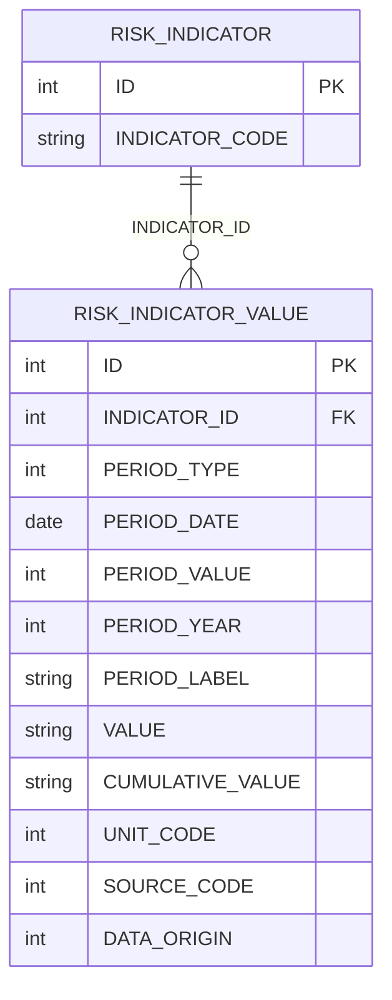
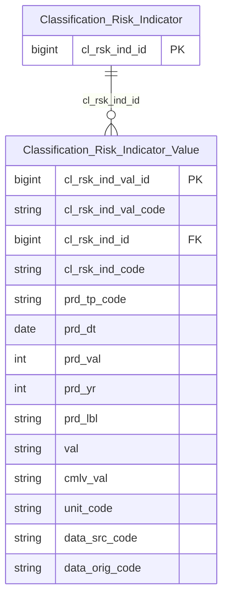

# QLRR HLD — Tier 2

**Source system:** QLRR (Quản lý rủi ro về thị trường chứng khoán)
**Tier 2:** Entity phụ thuộc Tier 1 — RISK_INDICATOR_VALUE FK đến RISK_INDICATOR (Classification Risk Indicator).

---

## 6a. Bảng tổng quan BCV Concept

| BCV Core Object | BCV Concept | Category | Source Table | Source Table Change Mode | Mô tả bảng nguồn | Atomic Entity | Table Type | BCV Term |
|---|---|---|---|---|---|---|---|---|
| Common | [Common] Classification | — | RISK_INDICATOR_VALUE | Update | Số liệu hiện tại của chỉ tiêu theo từng kỳ (ngày/tháng/quý/năm) | Classification Risk Indicator Value | Classification | (1) Không có BCV term riêng cho "giá trị đo lường theo kỳ của 1 chỉ tiêu"; gần nhất thuộc nhóm Event/Transaction (đo lường lặp lại theo thời gian) — nhưng theo chỉ đạo Data Modeler không dùng nhóm này cho bảng này. (2) Cấu trúc RISK_INDICATOR_VALUE: INDICATOR_ID (FK cha), PERIOD_TYPE/PERIOD_DATE/PERIOD_VALUE/PERIOD_YEAR/PERIOD_LABEL (xác định kỳ), VALUE/CUMULATIVE_VALUE (giá trị + luỹ kế), UNIT_CODE/SOURCE_CODE/DATA_ORIGIN (thuộc tính phân loại giá trị) — nguồn cập nhật tại chỗ (`data_change_mode = Update`) theo kỳ, không giữ lịch sử nhiều bản ghi cho cùng 1 kỳ → khớp tự nhiên với Table Type Classification/Upsert hơn Fact Append. (3) Theo chỉ đạo Data Modeler: gán Common/`[Common] Classification`/Table Type = Classification (Upsert) — khác thiết kế tham khảo LinhLV trước đây (Transaction/`[Event] Transaction`/Fact Append, dựa trên giả định Append cũ nay đã đính chính thành Update). Tên entity theo pattern rule #8 (entity con chứa tên entity cha) + convention Classification-prefix: **Classification Risk Indicator Value**. Xem điểm cần xác nhận T2-01. |

---

## 6b. Diagram Source (Mermaid)

---

## 6c. Diagram Atomic (Mermaid)

---

## 6d. Mục Danh mục & Tham chiếu (Reference Data)

| Source Field / Bảng | Mô tả | Scheme Code | source_type | Ghi chú |
|---|---|---|---|---|
| RISK_INDICATOR_VALUE.PERIOD_TYPE | Kỳ dữ liệu: 1=Ngày, 2=Tháng, 3=Quý, 4=Năm | `QLRR_RISK_PERIOD_TYPE` | source_table | Dùng chung với RISK_INDICATOR.PERIOD_TYPE (Tier 1). |
| RISK_INDICATOR_VALUE.UNIT_CODE | Đơn vị: 1=%, 2=Điểm, 3=Tỷ VND, 4=Triệu USD, 5=Hợp đồng, 6=Cổ phiếu, 7=Công ty, 8=VND, 9=Số tài khoản, 10=Đơn vị tính | `QLRR_RISK_UNIT` | source_table | Dùng chung với RISK_INDICATOR.UNIT_CODE (Tier 1). |
| RISK_INDICATOR_VALUE.SOURCE_CODE | Nguồn: 1=Investing, 2=Tổng cục Thống kê, 3=Ngân hàng Nhà nước, 4=Nội bộ, 5=HNX, 6=VSDC | `QLRR_RISK_DATA_SOURCE` | source_table | Dùng chung với RISK_INDICATOR.SOURCE_CODE (Tier 1). |
| RISK_INDICATOR_VALUE.DATA_ORIGIN | Nguồn gốc giá trị: 1=API CSDL tập trung, 2=User chỉnh sửa | `QLRR_RISK_DATA_ORIGIN` | source_table | Riêng cho Value — không có ở Tier 1. |

---

## 6e. Bảng chờ thiết kế

| Source Table | Mô tả bảng nguồn | Lý do chưa thiết kế |
|---|---|---|
| RISK_INDICATOR_VALUE_HISTORY | Lịch sử thay đổi số liệu chỉ tiêu (tự động và thủ công) | Ngoài phạm vi yêu cầu thiết kế lần này (chỉ RISK_INDICATOR + RISK_INDICATOR_VALUE). FK cha RISK_INDICATOR, 1-N với RISK_INDICATOR_VALUE theo BRD — cần thiết kế riêng ở lần sau. |

---

## 6f. Điểm cần xác nhận

| # | Câu hỏi | Kết quả |
|---|---|---|
| T2-01 | Nguồn RISK_INDICATOR_VALUE có `data_change_mode = Update` (cập nhật tại chỗ theo kỳ, filter `PERIOD_DATE = {etl_date}`) — khớp tự nhiên với Table Type Classification / ETL Upsert theo chỉ đạo, không còn mismatch như đánh giá ban đầu (trước đó ghi nhầm Append). Business key nào dùng để Upsert (VD: `INDICATOR_ID + PERIOD_TYPE + PERIOD_DATE`) vẫn cần xác nhận ở LLD. Thiết kế tham khảo LinhLV trước đây xử lý bảng này là `[Event] Transaction` / Fact Append — dựa trên giả định Append cũ, nay không còn phù hợp. | Open (chỉ còn phần business key) — mismatch Change Mode ↔ Table Type coi như đã giải quyết. |
| T2-02 | RISK_INDICATOR_VALUE.CUMULATIVE_VALUE (giá trị luỹ kế) — cơ sở tính luỹ kế (từ đầu năm hay từ đầu kỳ) chưa rõ, cần data profiling. | Open — giữ nguyên câu hỏi từ thiết kế tham khảo LinhLV (QLRR-P02), chưa có thông tin mới. |
| T2-03 | RISK_INDICATOR_VALUE có 6/9 cột của technical bundle chuẩn (DELETED, CREATED_AT, UPDATED_AT, CREATED_BY_ID, CREATED_BY_NAME, UPDATED_BY_ID, UPDATED_BY_NAME — thiếu STATUS, VERSION). Theo Bước 2c (atomic-lld-design), bundle không đủ 9/9 nên KHÔNG tự loại trừ — đã map bình thường thành attribute (CREATED_BY_ID/NAME, UPDATED_BY_ID/NAME → Text denormalized do không có bảng user trong phạm vi khảo sát). | Open — đã map theo Bước 2c, không cần xác nhận thêm trừ khi phát hiện business field ẩn. |
