# SCMS — HLD Overview: Toàn cảnh thiết kế Atomic Layer

> **Nguồn:** Hệ thống SCMS — Phân hệ Quản lý Giám sát Công ty Chứng khoán (Oracle)
>
> **Phạm vi:** Quản lý thông tin pháp lý, tổ chức, nhân sự, báo cáo, cổ đông, giám sát rủi ro (CAMEL) và cảnh báo tự động của các Công ty Chứng khoán (CTCK) thành viên do UBCKNN quản lý.
>
> **File chi tiết theo tầng:**
> - [SCMS_HLD_Tier1.md](SCMS_HLD_Tier1.md) — Entity độc lập: Securities Company, Securities Company Audit Firm, Securities Company Settlement Bank, Risk/Alert Indicators & Period, Geographic Area (shared)
> - [SCMS_HLD_Tier2.md](SCMS_HLD_Tier2.md) — Phụ thuộc Tier 1: chi nhánh/VPĐD/PGD, nhân sự, kiểm toán viên, báo cáo, CBTT, vi phạm, chế tài, cổ đông, rủi ro/cảnh báo
> - [SCMS_HLD_Tier3.md](SCMS_HLD_Tier3.md) — Phụ thuộc Tier 2: cổ đông đại diện/chuyển nhượng/quan hệ, điểm rủi ro chi tiết, tổng hợp rủi ro, báo cáo/nhân sự NN
> - [SCMS_HLD_Tier4.md](SCMS_HLD_Tier4.md) — Phụ thuộc Tier 3: chi tiết tổng hợp rủi ro theo nhóm chỉ tiêu CAMEL

---

#### 7a. Bảng tổng quan Atomic entities

| Tier | BCV Core Object | BCV Concept | Category | Source Table | Source Table Change Mode | Mô tả bảng nguồn | Atomic Entity | Table Type | BCV Term |
|---|---|---|---|---|---|---|---|---|---|
| 1 | Location | [Location] Geographic Area | Geographic Area | CAT_PROVINCE | Update | Danh mục tỉnh/thành phố trực thuộc trung ương | Geographic Area | Fundamental | Geographic Area — BCV ngoại lệ: dù chỉ có Code+Name vẫn là Atomic entity. Cùng entity với CAT_DISTRICT, CAT_WARD; phân biệt bằng Geographic Area Type Code (PROVINCE/DISTRICT/WARD). Self-ref: WARD → DISTRICT → PROVINCE. Shared entity extend source_table từ NHNCK. |
| 1 | Location | [Location] Geographic Area | Geographic Area | CAT_DISTRICT | Update | Danh mục quận/huyện/thị xã | Geographic Area | Fundamental | Geographic Area — cùng Atomic entity với CAT_PROVINCE, CAT_WARD. Geographic Area Type Code = DISTRICT. Shared entity extend source_table từ NHNCK. |
| 1 | Location | [Location] Geographic Area | Geographic Area | CAT_WARD | Update | Danh mục phường/xã/thị trấn | Geographic Area | Fundamental | Geographic Area — cùng Atomic entity với CAT_PROVINCE, CAT_DISTRICT. Geographic Area Type Code = WARD. Shared entity extend source_table từ NHNCK. |
| 1 | Involved Party | [Involved Party] Broker Dealer | Organization | SC_FIRM_INFO | Update | Thông tin pháp lý toàn diện công ty chứng khoán thành viên do UBCKNN quản lý | Securities Company | Fundamental | (1) Broker Dealer — BCV: "an Involved Party that engages in the business of buying and selling securities for its own account or on behalf of customers". (2) Bảng: SC_FIRM_CODE(UNIQUE), SC_FIRM_NAME_VI/EN, CHARTER_CAPITAL, BUSINESS_LICENSE_NUMBER, COMPANY_TYPE_ID, STATUS, FOUNDER_NAME, LISTED_DATE — thông tin pháp lý đầy đủ CTCK. (3) Broker Dealer khớp hoàn toàn — CTCK môi giới/tự doanh/quản lý danh mục/ngân hàng đầu tư. Entity trung tâm SCMS. |
| 1 | Involved Party | [Involved Party] Audit Firm | Organization | AUDIT_FIRM | Update | Danh mục công ty kiểm toán được UBCKNN chấp thuận | Securities Company Audit Firm | Fundamental | (1) Audit Firm — BCV: "an Involved Party that provides auditing services". (2) Bảng: AUDIT_FIRM_CODE(UNIQUE), AUDIT_FIRM_NAME, STATUS, BUSINESS_LICENSE_NUMBER — danh mục công ty kiểm toán chấp thuận. (3) Audit Firm khớp. Entity độc lập; không extend Securities Organization Reference NHNCK vì cấu trúc và phạm vi khác. |
| 1 | Involved Party | [Involved Party] Depositary Bank | Organization | BANK | Update | Danh mục ngân hàng đối tác lưu ký/thanh toán cho CTCK | Securities Company Settlement Bank | Fundamental | (1) Depositary Bank — BCV: "an Involved Party that holds financial assets in custody on behalf of customers". (2) Bảng: BANK_CODE(UNIQUE), BANK_NAME, STATUS — danh mục ngân hàng đối tác. (3) Depositary Bank khớp. Danh mục ngân hàng trong SCMS độc lập với NHNCK.BANKS. |
| 1 | Event | [Event] Risk Indicator | Regulatory Monitoring | RISK_INDICATOR | Update | Danh mục chỉ tiêu đánh giá rủi ro CTCK theo phương pháp CAMEL | Securities Company Risk Indicator | Fundamental | (1) Risk Indicator — BCV: "an Event identifying a measurable factor used to assess risk". (2) Bảng: CODE(UNIQUE), NAME, FK→RISK_INDICATOR_GROUP, WEIGHT, IS_QUANTITATIVE, FORMULA, PERIOD_TYPE — chỉ tiêu với trọng số, công thức, nhóm CAMEL. (3) Risk Indicator khớp. Master entity danh mục chỉ tiêu rủi ro; không phải instance scoring. |
| 1 | Group | [Group] Risk Category | Regulatory Monitoring | RISK_INDICATOR_GROUP | Update | Danh mục nhóm chỉ tiêu rủi ro theo phương pháp CAMEL (C/A/M/E/L) | Securities Company Risk Indicator Group | Fundamental | (1) Risk Category — BCV: "a Group that categorizes risk types or risk indicators". (2) Bảng: CODE(UNIQUE), NAME, CAMEL_TYPE(C/A/M/E/L), WEIGHT — nhóm CAMEL với trọng số. (3) Risk Category khớp. Master entity nhóm CAMEL; FK từ RISK_INDICATOR và RISK_SUMMARY_DETAIL. |
| 1 | Event | [Event] Alert Indicator | Regulatory Monitoring | ALERT_INDICATOR | Update | Danh mục chỉ tiêu cảnh báo giám sát CTCK | Securities Company Alert Indicator | Fundamental | (1) Alert Indicator — BCV: "an Event identifying a measurable factor used to trigger an alert". (2) Bảng: CODE(UNIQUE), NAME, INDICATOR_TYPE, THRESHOLD, CALCULATION_FORMULA — chỉ tiêu với ngưỡng và công thức. (3) Alert Indicator khớp. Master entity danh mục chỉ tiêu cảnh báo; FK từ ALERT_INDICATOR_CONDITION và ALERT_RUN. |
| 1 | Event | [Event] Alert Financial Indicator | Regulatory Monitoring | ALERT_FINANCIAL_INDICATOR | Update | Danh mục chỉ tiêu tài chính dùng trong hệ thống cảnh báo | Securities Company Alert Financial Indicator | Fundamental | (1) Alert Financial Indicator — BCV: chỉ tiêu tài chính theo dõi ngưỡng cảnh báo. (2) Bảng: CODE(UNIQUE), NAME, FORMULA, PERIOD_TYPE — cấu trúc tương tự ALERT_INDICATOR nhưng tập trung vào chỉ tiêu tài chính. (3) Tạm giữ entity riêng; xem điểm xác nhận 7e-05 về quan hệ với ALERT_INDICATOR. |
| 1 | Event | [Event] Assessment Period | Regulatory Monitoring | RISK_REPORTING_PERIOD | Update | Danh mục kỳ đánh giá rủi ro CTCK (quý/năm) | Securities Company Risk Reporting Period | Fundamental | (1) Assessment Period — BCV: "an Event defining a period for which an assessment is performed". (2) Bảng: CODE(UNIQUE), PERIOD_VALUE(VD: 2024-Q1), START_DATE, END_DATE, PERIOD_TYPE(QUARTER/YEAR) — kỳ đánh giá với thời gian rõ ràng. (3) Assessment Period khớp. Master entity kỳ; FK từ RISK_REPORTING_PERIOD_SC_FIRM, RISK_SCORING_SC_FIRM_DETAIL, RISK_SUMMARY. |
| 2 | Involved Party | [Involved Party] Branch | Organization | SC_FIRM_BRANCH | Update | Chi nhánh CTCK trong nước có địa chỉ pháp lý và giấy phép riêng | Securities Company Branch | Relative | (1) Branch — BCV: "an Involved Party that is a division of a larger organization operating in a specific location". (2) Bảng: CODE, NAME, FK→SC_FIRM_INFO, FK→CAT_PROVINCE/DISTRICT/WARD, BUSINESS_LICENSE_NUMBER, STATUS, ESTABLISH_DATE, self-ref FK→parent branch. (3) Branch khớp. Phụ thuộc Securities Company (T1). |
| 2 | Involved Party | [Involved Party] Branch | Organization | SC_FIRM_TRANSACTION_OFFICE | Update | Phòng giao dịch CTCK — đơn vị nhỏ nhất giao dịch trực tiếp với khách hàng | Securities Company Transaction Office | Relative | (1) Branch — BCV: cùng định nghĩa sub-unit theo địa điểm. (2) Bảng: CODE, NAME, FK→SC_FIRM_INFO, FK→SC_FIRM_BRANCH(nullable), FK→CAT_PROVINCE, STATUS, ESTABLISH_DATE — PGD có thể trực thuộc CN hoặc hội sở. (3) Branch phù hợp nhất cho PGD. |
| 2 | Involved Party | [Involved Party] Representative Office | Organization | SC_FIRM_REP_OFFICE | Update | Văn phòng đại diện nội địa CTCK, có thể trực thuộc chi nhánh hoặc hội sở | Securities Company Representative Office | Relative | (1) Representative Office — BCV: "an Involved Party that is an office of a larger organization that represents, but does not do business on behalf of, the organization". (2) Bảng: CODE, NAME, FK→SC_FIRM_INFO, FK→SC_FIRM_BRANCH(nullable), FK→CAT_PROVINCE, STATUS, ESTABLISH_DATE. (3) Representative Office khớp. |
| 2 | Involved Party | [Involved Party] Representative Office | Organization | SC_FIRM_DOMESTIC_REP_OFFICE | Update | Văn phòng đại diện trong nước (cấu trúc cột khác SC_FIRM_REP_OFFICE, không FK chi nhánh cha) | Securities Company Domestic Representative Office | Relative | (1) Representative Office — BCV: cùng định nghĩa. (2) Bảng: CODE, NAME, FK→SC_FIRM_INFO, FK→CAT_PROVINCE, STATUS, ESTABLISH_DATE — không có FK→SC_FIRM_BRANCH. (3) Tách entity riêng vì cấu trúc khác biệt; xem điểm xác nhận 7e-02 về khả năng gộp. |
| 2 | Involved Party | [Involved Party] Branch | Organization | SC_FIRM_FOREIGN_BRANCH | Update | Chi nhánh CTCK nước ngoài được cấp phép hoạt động tại Việt Nam | Securities Company Foreign Branch | Relative | (1) Branch — BCV: cùng định nghĩa. (2) Bảng: CODE, NAME, FK→SC_FIRM_INFO, PARENT_COMPANY_NAME/COUNTRY, CHARTER_CAPITAL, BUSINESS_LICENSE_NUMBER, STATUS, ESTABLISH_DATE. (3) Branch khớp. Phụ thuộc Securities Company (T1). |
| 2 | Involved Party | [Involved Party] Representative Office | Organization | SC_FIRM_FOREIGN_REP_OFFICE | Update | Văn phòng đại diện CTCK nước ngoài tại Việt Nam | Securities Company Foreign Representative Office | Relative | (1) Representative Office — BCV: cùng định nghĩa. (2) Bảng: CODE, NAME, FK→SC_FIRM_INFO, PARENT_COMPANY_NAME/COUNTRY, SCOPE_OF_ACTIVITY, STATUS, ESTABLISH_DATE. (3) Representative Office khớp. |
| 2 | Involved Party | [Involved Party] Representative Office | Organization | SC_FIRM_FOREIGN_REP_OFFICE_VN | Update | Văn phòng đại diện CTCK nước ngoài đã được cấp giấy phép VN | Securities Company Foreign Representative Office VN | Relative | (1) Representative Office — BCV: cùng định nghĩa. (2) Bảng: CODE, NAME, BUSINESS_LICENSE_NUMBER(own), STATUS, ESTABLISH_DATE — không tìm thấy FK→SC_FIRM_INFO trong cột; xem 7e-03. (3) Tạm đặt T2 theo logic nghiệp vụ; cần xác nhận FK. |
| 2 | Involved Party | [Involved Party] Senior Officer | Individual | SC_FIRM_SENIOR_PERSONNEL | Update | Nhân sự cấp cao của CTCK (GĐ, PGĐ, KTT, ...) | Securities Company Senior Personnel | Relative | (1) Senior Officer — BCV: "an Involved Party that is a high-ranking officer in an organization". (2) Bảng: FK→SC_FIRM_INFO, FK→SC_FIRM_BRANCH/TRANSACTION_OFFICE/REP_OFFICE(nullable), FULL_NAME, POSITION_ID, APPOINTMENT_DATE, CCHN_NUMBER, NATIONALITY_ID. (3) Senior Officer khớp. FK chính → SC_FIRM_INFO (T1); FK phụ đến T2 entities là location pointer, không gây circular. |
| 2 | Involved Party | [Involved Party] Registered Securities Practitioner | Individual | SC_FIRM_LICENSED_PRACTITIONER | Update | Người hành nghề chứng khoán đang công tác tại CTCK | Securities Practitioner | Relative | (1) Registered Securities Practitioner — BCV: người HNCK có đăng ký chính thức. (2) Bảng: FK→SC_FIRM_INFO, FK→SC_FIRM_BRANCH/TRANSACTION_OFFICE/REP_OFFICE(nullable), FULL_NAME, CCHN_NUMBER, CCHN_TYPE, APPOINTED_DATE. (3) Shared entity — extend source_table vào Securities Practitioner từ NHNCK. FK chính → SC_FIRM_INFO (T1). |
| 2 | Involved Party | [Involved Party] Auditor | Individual | AUDITOR | Update | Kiểm toán viên cá nhân trực thuộc công ty kiểm toán | Securities Company Auditor | Relative | (1) Auditor — BCV: "an Involved Party responsible for auditing financial statements". (2) Bảng: FK→AUDIT_FIRM, FULL_NAME, AUDITOR_CODE, STATUS, CERTIFICATE_NUMBER, APPOINTED_DATE. (3) Auditor khớp. Phụ thuộc Securities Company Audit Firm (T1). |
| 2 | Arrangement | [Arrangement] Securities Service Agreement | Arrangement | CUSTODIAN_BANK | Update | Thỏa thuận lưu ký/thanh toán giữa CTCK và ngân hàng được chỉ định | Securities Company Custodian Bank | Relative | (1) Securities Service Agreement — BCV: "an Arrangement defining terms of securities-related services". (2) Bảng: FK→SC_FIRM_INFO, FK→BANK(via BANK_CODE), SERVICE_TYPE_ID, AGREEMENT_DATE, STATUS. (3) Securities Service Agreement phù hợp — ghi nhận thỏa thuận lưu ký. |
| 2 | Arrangement | [Arrangement] Service License | Arrangement | LNK_SC_FIRM_SERVICE | Update | Dịch vụ chứng khoán được UBCKNN cấp phép cho CTCK | Securities Company Licensed Service | Relative | (1) Service License — BCV: "an Arrangement defining a licensed service". (2) Bảng: FK→SC_FIRM_INFO, SERVICE_TYPE_ID(FK→CAT_SERVICE), LICENSE_NUMBER, LICENSE_DATE, EXPIRY_DATE — có LICENSE_NUMBER là attribute nghiệp vụ → không phải pure junction. (3) Service License khớp. |
| 2 | Event | [Event] Transaction | Event | SC_FIRM_PERIODIC_REPORT | Update | Báo cáo định kỳ của CTCK nộp lên UBCKNN | Securities Company Periodic Report | Relative | (1) Transaction — BCV: "an Event that exchanges value or information between parties". (2) Bảng: FK→SC_FIRM_INFO, FORM_REPORT_ID(Classification Value — FORM_REPORT excluded), PERIOD, YEAR, DEADLINE, SUBMISSION_DATE, STATUS. (3) Transaction phù hợp — mỗi lần nộp là 1 sự kiện trao đổi thông tin. |
| 2 | Event | [Event] Transaction | Event | SC_FIRM_ADHOC_REPORT | Update | Báo cáo đột xuất của CTCK nộp lên UBCKNN | Securities Company Adhoc Report | Relative | (1) Transaction — BCV: cùng định nghĩa. (2) Bảng: FK→SC_FIRM_INFO, FORM_REPORT_ID(Classification Value), EVENT_DATE, SUBMISSION_DATE, STATUS — triggered by event. (3) Transaction phù hợp. |
| 2 | Event | [Event] Communication | Event | DISCLOSURE_REPORT | Update | Báo cáo công bố thông tin (CBTT) của CTCK gửi lên UBCKNN | Securities Company Disclosure Report | Relative | (1) Communication — BCV: "an Event that is an exchange of information". (2) Bảng: FK→SC_FIRM_INFO, FORM_REPORT_ID(Classification Value), DISCLOSURE_TYPE, CONTENT_SUMMARY, SUBMISSION_DATE, STATUS. (3) Communication khớp — CBTT là trao đổi thông tin có cấu trúc pháp lý. |
| 2 | Event | [Event] Communication | Event | DISCLOSURE_SECURITIES_OFFERING | Update | Thông tin công bố đợt chào bán chứng khoán của CTCK | Securities Company Disclosure Securities Offering | Relative | (1) Communication — BCV: cùng định nghĩa. (2) Bảng: FK→SC_FIRM_INFO, OFFERING_TYPE, OFFERING_VALUE, DISCLOSURE_DATE, STATUS. (3) Communication khớp. |
| 2 | Event | [Event] Communication | Event | DISCLOSURE_SHAREHOLDER | Update | Thông tin công bố về cổ đông lớn hoặc thay đổi sở hữu CTCK | Securities Company Disclosure Shareholder | Relative | (1) Communication — BCV: cùng định nghĩa. (2) Bảng: FK→SC_FIRM_INFO, SHAREHOLDER_NAME, OWNERSHIP_RATIO, DISCLOSURE_DATE, STATUS. (3) Communication khớp. |
| 2 | Event | [Event] Business Activity | Event | REPORT_VIOLATION | Append | Vi phạm phát hiện từ kết quả kiểm tra báo cáo CTCK | Securities Company Report Violation | Fact Append | (1) Business Activity — BCV: "an Event involving an action or series of actions". (2) Bảng: FK→SC_FIRM_INFO, VIOLATION_TYPE_ID, VIOLATION_DATE, DESCRIPTION, SEVERITY — mỗi dòng là 1 vi phạm phát hiện insert-only. (3) Business Activity phù hợp. Fact Append vì nguồn là Append. |
| 2 | Event | [Event] Business Activity | Event | SC_FIRM_ALERT_VIOLATION | Append | Vi phạm ngưỡng được hệ thống cảnh báo tự động phát hiện | Securities Company Alert Violation | Fact Append | (1) Business Activity — BCV: cùng định nghĩa. (2) Bảng: FK→SC_FIRM_INFO, FK→ALERT_INDICATOR, VIOLATION_DATE, ACTUAL_VALUE, THRESHOLD_VALUE, SEVERITY — vi phạm do hệ thống phát hiện tự động. (3) Business Activity phù hợp. Fact Append. |
| 2 | Documentation | [Documentation] Legal Decision | Documentation | SC_FIRM_ADMIN_PENALTY_DECISION | Update | Quyết định xử phạt vi phạm hành chính do UBCKNN ban hành cho CTCK | Securities Company Administrative Penalty Decision | Relative | (1) Legal Decision — BCV: "a Documentation Item that is a formal legal decision". (2) Bảng: FK→SC_FIRM_INFO, DECISION_NUMBER, DECISION_DATE, PENALTY_TYPE_CODE, FINE_AMOUNT, EFFECTIVE_DATE, STATUS. (3) Legal Decision khớp. |
| 2 | Documentation | [Documentation] Legal Decision | Documentation | SC_FIRM_ADMIN_SANCTION | Update | Biện pháp xử lý hành chính áp dụng cho CTCK | Securities Company Administrative Sanction | Relative | (1) Legal Decision — BCV: cùng định nghĩa. (2) Bảng: FK→SC_FIRM_INFO, SANCTION_TYPE_ID, DECISION_NUMBER, EFFECTIVE_DATE, STATUS, REASON. (3) Legal Decision phù hợp. Tách entity riêng vì nguồn bảng khác Penalty Decision. |
| 2 | Communication | [Communication] Customer Complaint | Communication | SC_FIRM_COMPLAINT_PETITION | Update | Đơn khiếu nại, tố cáo, kiến nghị, phản ánh liên quan đến CTCK | Securities Company Complaint Petition | Relative | (1) Customer Complaint — BCV: "a Communication in which a party indicates dissatisfaction or concern". (2) Bảng: FK→SC_FIRM_INFO, PETITION_TYPE_ID(COMPLAINT/DENUNCIATION/SUGGESTION/FEEDBACK), SENDER_NAME, RECEIVED_DATE, STATUS, RESOLUTION. (3) Customer Complaint khớp. |
| 2 | Business Activity | [Business Activity] Inspection Schedule | Business Activity | SC_FIRM_INSPECTION_SCHEDULE | Update | Lịch kiểm tra/thanh tra CTCK do UBCKNN thực hiện | Securities Company Inspection Schedule | Relative | (1) Inspection Schedule — BCV: "a Business Activity that defines a planned inspection". (2) Bảng: FK→SC_FIRM_INFO, INSPECTION_TYPE_ID, SCHEDULED_DATE, DECISION_NUMBER, INSPECTOR_NAMES, CONCLUSION, STATUS. (3) Inspection Schedule khớp. |
| 2 | Involved Party | [Involved Party] Shareholder | Individual / Organization | SC_FIRM_SHAREHOLDER | Update | Cổ đông của CTCK (cá nhân hoặc tổ chức sở hữu cổ phần) | Securities Company Shareholder | Relative | (1) Shareholder — BCV: "an Involved Party that owns shares in an organization". (2) Bảng: FK→SC_FIRM_INFO, SHAREHOLDER_TYPE(INDIVIDUAL/ORGANIZATION), SHAREHOLDER_NAME, NATIONALITY_ID, SHARE_COUNT, OWNERSHIP_RATIO, REGISTER_DATE. (3) Shareholder khớp. |
| 2 | Involved Party | [Involved Party] Insider | Individual | SC_FIRM_INSIDER_RELATION | Update | Người nội bộ của CTCK theo quy định công bố thông tin | Securities Company Insider Related Person | Relative | (1) Insider — BCV: "an Involved Party that is an insider of an organization (has access to material non-public information)". (2) Bảng: FK→SC_FIRM_INFO, INSIDER_NAME, POSITION, RELATIONSHIP_TYPE_ID, START_DATE, END_DATE. (3) Insider khớp. |
| 2 | Involved Party | [Involved Party] Connected Entity | Organization | SC_FIRM_OWNERSHIP_RELATION | Update | Quan hệ sở hữu của CTCK với các tổ chức khác (mẹ/con/liên kết) | Securities Company Ownership Relation | Relative | (1) Connected Entity — BCV: "an Involved Party connected through ownership or control". (2) Bảng: FK→SC_FIRM_INFO, RELATED_ENTITY_NAME, RELATIONSHIP_TYPE_ID, OWNERSHIP_RATIO, START_DATE. (3) Connected Entity phù hợp. |
| 2 | Involved Party | [Involved Party] Connected Person | Individual | SC_FIRM_RELATED_PERSON | Update | Người liên quan của CTCK theo quy định pháp luật chứng khoán | Securities Company Related Person | Relative | (1) Connected Person — BCV: "an Involved Party connected to another through personal or business relationship". (2) Bảng: FK→SC_FIRM_INFO, RELATED_PERSON_NAME, NATIONALITY_ID, RELATIONSHIP_TYPE_ID, START_DATE. (3) Connected Person phù hợp. |
| 2 | Event | [Event] Business Activity | Event | SC_FIRM_PROFILE_CHANGE | Append | Sự kiện thay đổi thông tin hồ sơ CTCK hoặc đơn vị trực thuộc | Securities Company Profile Change | Fact Append | (1) Business Activity — BCV: "an Event involving an action or series of actions". (2) Bảng: FK→SC_FIRM_INFO, CHANGE_OBJECT_TYPE, CHANGE_TYPE_ID, CHANGE_DATE, APPROVAL_DOCUMENT_NUMBER, BEFORE_VALUE, AFTER_VALUE, STATUS. (3) Business Activity phù hợp. Fact Append — mỗi lần thay đổi là event insert-only. |
| 2 | Condition | [Condition] Risk Scale | Condition | RISK_SCORING_SCALE | Update | Thang điểm đánh giá rủi ro quy định cho từng chỉ tiêu | Securities Company Risk Scoring Scale | Relative | (1) Risk Scale — BCV: "a Condition defining a scale for assessing risk". (2) Bảng: FK→RISK_INDICATOR, SCORE_LEVEL, MIN_VALUE, MAX_VALUE, DESCRIPTION — các mức điểm theo khoảng giá trị. (3) Risk Scale khớp. Condition vì đây là quy định, không phải instance. |
| 2 | Condition | [Condition] Alert Rule | Condition | ALERT_INDICATOR_CONDITION | Update | Điều kiện kích hoạt cảnh báo cho từng chỉ tiêu cảnh báo | Securities Company Alert Indicator Condition | Relative | (1) Alert Rule — BCV: "a Condition defining rules that trigger an alert". (2) Bảng: FK→ALERT_INDICATOR, CONDITION_EXPRESSION, THRESHOLD_VALUE, COMPARISON_OPERATOR, EFFECTIVE_DATE. (3) Alert Rule khớp. Condition vì đây là quy tắc kích hoạt. |
| 2 | Event | [Event] Business Activity | Event | ALERT_RUN | Append | Lần chạy batch hệ thống cảnh báo tự động kiểm tra ngưỡng vi phạm | Securities Company Alert Run | Fact Append | (1) Business Activity — BCV: "an Event involving an action or series of actions". (2) Bảng: FK→ALERT_INDICATOR, RUN_DATE, RUN_STATUS, RECORDS_CHECKED, VIOLATIONS_FOUND. (3) Business Activity phù hợp. Fact Append — mỗi lần chạy là 1 sự kiện. |
| 2 | Arrangement | [Arrangement] Assessment Assignment | Arrangement | RISK_REPORTING_PERIOD_SC_FIRM | Update | Gán kỳ đánh giá rủi ro cho từng CTCK cụ thể | Securities Company Risk Reporting Period Assignment | Relative | (1) Assessment Assignment — BCV: "an Arrangement assigning a period/entity for assessment". (2) Bảng: FK→SC_FIRM_INFO, FK→RISK_REPORTING_PERIOD, ASSIGNED_DATE, STATUS. (3) Assessment Assignment phù hợp nhất. |
| 3 | Involved Party | [Involved Party] Representative | Individual | SC_FIRM_SHAREHOLDER_REPRESENTATIVE | Update | Người được cổ đông tổ chức ủy quyền đại diện quyền lợi tại CTCK | Securities Company Shareholder Representative | Relative | (1) Representative — BCV: "an Involved Party acting on behalf of another". (2) Bảng: FK→SC_FIRM_SHAREHOLDER, FK→SC_FIRM_INFO, REPRESENTATIVE_NAME, ID_NUMBER, REPRESENTED_SHARES, APPOINTMENT_DATE. (3) Representative khớp. Phụ thuộc Securities Company Shareholder (T2). |
| 3 | Event | [Event] Transaction | Event | SC_FIRM_SHAREHOLDER_OWNERSHIP_CHANGE | Append | Giao dịch thay đổi sở hữu cổ đông CTCK | Securities Company Shareholder Ownership Change | Fact Append | (1) Transaction — BCV: "an Event that exchanges value between parties". (2) Bảng: FK→SC_FIRM_SHAREHOLDER, FK→SC_FIRM_INFO, CHANGE_DATE, SHARES_BEFORE, SHARES_AFTER, RATIO_BEFORE, RATIO_AFTER, VERIFICATION_STATUS. (3) Transaction khớp — thay đổi giá trị sở hữu insert-only. |
| 3 | Involved Party | [Involved Party] Connected Person | Individual | SC_FIRM_SHAREHOLDER_RELATION | Update | Người có liên quan của cổ đông CTCK | Securities Company Shareholder Relation | Relative | (1) Connected Person — BCV: cùng định nghĩa. (2) Bảng: FK→SC_FIRM_SHAREHOLDER, FK→SC_FIRM_INFO, RELATED_PERSON_NAME, RELATIONSHIP_TYPE_ID, ID_NUMBER. (3) Connected Person khớp. Phụ thuộc Securities Company Shareholder (T2). |
| 3 | Involved Party | [Involved Party] Major Shareholder | Individual / Organization | SC_FIRM_MAJOR_SHAREHOLDER_RELATION | Update | Quan hệ cổ đông lớn (sở hữu ≥5%) của CTCK | Securities Company Major Shareholder Relation | Relative | (1) Major Shareholder — BCV: "an Involved Party that holds a significant ownership stake". (2) Bảng: FK→SC_FIRM_INFO, SHAREHOLDER_ID(nullable — xem 7e-06), SHAREHOLDER_NAME, OWNERSHIP_RATIO, THRESHOLD_DATE. (3) Major Shareholder khớp. FK→SC_FIRM_SHAREHOLDER nullable → T3. |
| 3 | Event | [Event] Transaction | Event | SC_FIRM_SHAREHOLDER_TRANSFER | Append | Chuyển nhượng cổ phần giữa hai cổ đông CTCK | Securities Company Shareholder Transfer | Fact Append | (1) Transaction — BCV: "an Event that transfers value between parties". (2) Bảng: FK_TRANSFEROR→SC_FIRM_SHAREHOLDER, FK_TRANSFEREE→SC_FIRM_SHAREHOLDER, FK→SC_FIRM_INFO, TRANSFER_DATE, SHARE_COUNT, PRICE_PER_SHARE. (3) Transaction khớp — dual FK cùng entity cha là self-join pattern hợp lệ. |
| 3 | Event | [Event] Business Activity | Event | RISK_SCORING_SC_FIRM_DETAIL | Append | Chi tiết điểm rủi ro từng chỉ tiêu cho từng CTCK theo từng kỳ đánh giá | Securities Company Risk Scoring Detail | Fact Snapshot | (1) Business Activity — BCV: "an Event involving scoring/assessment actions". (2) Bảng: FK→SC_FIRM_INFO, FK→RISK_INDICATOR, FK→RISK_SCORING_SCALE(T2), FK→RISK_REPORTING_PERIOD, SCORE, ACTUAL_VALUE, SCORING_DATE. (3) Fact Snapshot — grain: 1 chỉ tiêu × 1 CTCK × 1 kỳ. FK→RISK_SCORING_SCALE(T2) → đặt T3. |
| 3 | Event | [Event] Business Activity | Event | RISK_SUMMARY | Append | Tổng hợp điểm rủi ro của CTCK theo kỳ đánh giá | Securities Company Risk Summary | Fact Snapshot | (1) Business Activity — BCV: "an Event summarizing assessment results". (2) Bảng: FK→SC_FIRM_INFO, FK→RISK_REPORTING_PERIOD, TOTAL_SCORE, RISK_RATING, SCORING_DATE. (3) Fact Snapshot — grain: 1 CTCK × 1 kỳ. FK→RISK_REPORTING_PERIOD(T1) + FK→SC_FIRM_INFO(T1) → xem 7e-07 về FK→RISK_REPORTING_PERIOD_SC_FIRM(T2). |
| 3 | Event | [Event] Transaction | Event | SC_FIRM_FOREIGN_BRANCH_PERIODIC_REPORT | Update | Báo cáo định kỳ do chi nhánh CTCK nước ngoài nộp lên UBCKNN | Securities Company Foreign Branch Periodic Report | Relative | (1) Transaction — BCV: cùng định nghĩa. (2) Bảng: FK→SC_FIRM_FOREIGN_BRANCH(T2), FORM_REPORT_ID(Classification Value), PERIOD, YEAR, DEADLINE, SUBMISSION_DATE, STATUS. (3) Transaction phù hợp. Phụ thuộc Securities Company Foreign Branch (T2). |
| 3 | Event | [Event] Transaction | Event | SC_FIRM_FOREIGN_REP_OFFICE_PERIODIC_REPORT | Update | Báo cáo định kỳ do VPĐD CTCK nước ngoài nộp lên UBCKNN | Securities Company Foreign Representative Office Periodic Report | Relative | (1) Transaction — BCV: cùng định nghĩa. (2) Bảng: FK→SC_FIRM_FOREIGN_REP_OFFICE(T2), FORM_REPORT_ID(Classification Value), PERIOD, YEAR, SUBMISSION_DATE, STATUS. (3) Transaction phù hợp. |
| 3 | Involved Party | [Involved Party] Key Personnel | Individual | SC_FIRM_FOREIGN_BRANCH_PERSONNEL | Update | Nhân sự tại chi nhánh CTCK nước ngoài tại Việt Nam | Securities Company Foreign Branch Personnel | Relative | (1) Key Personnel — BCV: "an Involved Party that is a key member of an organization". (2) Bảng: FK→SC_FIRM_FOREIGN_BRANCH(T2), FULL_NAME, POSITION_ID, NATIONALITY_ID, APPOINTMENT_DATE, CCHN_NUMBER. (3) Key Personnel khớp. |
| 3 | Involved Party | [Involved Party] Key Personnel | Individual | SC_FIRM_FOREIGN_REP_OFFICE_PERSONNEL | Update | Nhân sự tại VPĐD CTCK nước ngoài tại Việt Nam | Securities Company Foreign Representative Office Personnel | Relative | (1) Key Personnel — BCV: cùng định nghĩa. (2) Bảng: FK→SC_FIRM_FOREIGN_REP_OFFICE(T2), FULL_NAME, POSITION_ID, NATIONALITY_ID, APPOINTMENT_DATE, DISMISSAL_DATE. (3) Key Personnel khớp. |
| 4 | Event | [Event] Business Activity | Event | RISK_SUMMARY_DETAIL | Append | Chi tiết điểm tổng hợp rủi ro theo từng nhóm chỉ tiêu CAMEL | Securities Company Risk Summary Detail | Fact Snapshot | (1) Business Activity — BCV: "an Event summarizing component scores". (2) Bảng: FK→RISK_SUMMARY(T3), FK→RISK_INDICATOR_GROUP(T1), GROUP_SCORE, COMPONENT_WEIGHT. (3) Fact Snapshot — grain: 1 nhóm (C/A/M/E/L) × 1 tổng hợp rủi ro. FK→RISK_SUMMARY(T3) → bắt buộc T4. |

**Tổng: 52 Atomic entities** (T1: 9 entities, T2: 33 entities, T3: 11 entities, T4: 1 entity)
*(Trong đó: 2 shared entities extend source_table — không tạo mới: `Geographic Area` extend SCMS.CAT_PROVINCE/CAT_DISTRICT/CAT_WARD, `Securities Practitioner` extend SCMS.SC_FIRM_LICENSED_PRACTITIONER)*

---

#### 7b. Diagram Atomic tổng (Mermaid)

```mermaid
graph TD
    classDef atomic fill:#dcfce7,stroke:#16a34a,color:#14532d
    classDef shared fill:#fae8ff,stroke:#9333ea,color:#4a044e

    %% Tier 1
    SC_CO["**Securities Company**\n(SC_FIRM_INFO)"]:::atomic
    AU_FIRM["**Securities Company Audit Firm**\n(AUDIT_FIRM)"]:::atomic
    BANK["**Securities Company Settlement Bank**\n(BANK)"]:::atomic
    RISK_IND["**Securities Company Risk Indicator**\n(RISK_INDICATOR)"]:::atomic
    RISK_GRP["**Securities Company Risk Indicator Group**\n(RISK_INDICATOR_GROUP)"]:::atomic
    ALERT_IND["**Securities Company Alert Indicator**\n(ALERT_INDICATOR)"]:::atomic
    RISK_PER["**Securities Company Risk Reporting Period**"]:::atomic
    GEO["Geographic Area\n(shared — extend)"]:::shared

    %% Tier 2
    BRANCH["**Securities Company Branch**"]:::atomic
    TXN_OFF["**Securities Company Transaction Office**"]:::atomic
    REP_OFF["**Securities Company Representative Office**"]:::atomic
    FOR_BR["**Securities Company Foreign Branch**"]:::atomic
    FOR_RP["**Securities Company Foreign Rep. Office**"]:::atomic
    SENIOR["**Securities Company Senior Personnel**"]:::atomic
    PRACT["Securities Practitioner\n(shared — extend)"]:::shared
    AUDITOR["**Securities Company Auditor**"]:::atomic
    CUST_BK["**Securities Company Custodian Bank**"]:::atomic
    LIC_SVC["**Securities Company Licensed Service**"]:::atomic
    SHAREHOLDER["**Securities Company Shareholder**"]:::atomic
    RISK_SCALE["**Securities Company Risk Scoring Scale**"]:::atomic
    ALERT_COND["**Securities Company Alert Indicator Condition**"]:::atomic
    ALERT_RUN["**Securities Company Alert Run**"]:::atomic
    RISK_ASSIGN["**Securities Company Risk Reporting Period Assignment**"]:::atomic

    %% Tier 3
    SH_REP["**Securities Company Shareholder Representative**"]:::atomic
    SH_CHANGE["**Securities Company Shareholder Ownership Change**"]:::atomic
    SH_XFER["**Securities Company Shareholder Transfer**"]:::atomic
    RISK_DETAIL["**Securities Company Risk Scoring Detail**"]:::atomic
    RISK_SUM["**Securities Company Risk Summary**"]:::atomic
    FOR_BR_PER["**Securities Company Foreign Branch Personnel**"]:::atomic
    FOR_RP_PER["**Securities Company Foreign Rep. Office Personnel**"]:::atomic

    %% Tier 4
    RISK_SUM_DT["**Securities Company Risk Summary Detail**"]:::atomic

    %% T1 → T2
    SC_CO --> BRANCH
    SC_CO --> TXN_OFF
    SC_CO --> REP_OFF
    SC_CO --> FOR_BR
    SC_CO --> FOR_RP
    SC_CO --> SENIOR
    SC_CO --> PRACT
    SC_CO --> CUST_BK
    SC_CO --> LIC_SVC
    SC_CO --> SHAREHOLDER
    SC_CO --> RISK_ASSIGN
    AU_FIRM --> AUDITOR
    RISK_IND --> RISK_SCALE
    ALERT_IND --> ALERT_COND
    ALERT_IND --> ALERT_RUN
    RISK_PER --> RISK_ASSIGN

    %% T2 → T3
    SHAREHOLDER --> SH_REP
    SHAREHOLDER --> SH_CHANGE
    SHAREHOLDER --> SH_XFER
    RISK_SCALE --> RISK_DETAIL
    RISK_PER --> RISK_DETAIL
    RISK_PER --> RISK_SUM
    FOR_BR --> FOR_BR_PER
    FOR_RP --> FOR_RP_PER

    %% T3 → T4
    RISK_SUM --> RISK_SUM_DT
    RISK_GRP --> RISK_SUM_DT
```

---

#### 7c. Bảng Classification Value

| Source Table | Mô tả | BCV Term | Xử lý Atomic |
|---|---|---|---|
| CAT_COMPANY_TYPE | Danh mục loại hình doanh nghiệp CTCK | Classification Value | Scheme: SCMS_COMPANY_TYPE. |
| CAT_SC_FIRM_STATUS | Danh mục trạng thái pháp lý CTCK/CN/VPĐD/PGD | Classification Value | Scheme: SCMS_SC_FIRM_STATUS. |
| CAT_SERVICE | Danh mục dịch vụ chứng khoán được cấp phép | Classification Value | Scheme: SCMS_SERVICE_TYPE. |
| CAT_BUSINESS_LINE | Danh mục nghiệp vụ kinh doanh chứng khoán | Classification Value | Scheme: SCMS_BUSINESS_LINE. |
| CAT_NATIONALITY | Danh mục quốc tịch | Classification Value | Scheme: SCMS_NATIONALITY. |
| CAT_POSITION | Danh mục chức vụ nhân sự | Classification Value | Scheme: SCMS_POSITION_TYPE. |
| CAT_RELATIONSHIP | Danh mục mối quan hệ (gia đình/sở hữu/quản lý) | Classification Value | Scheme: SCMS_RELATIONSHIP_TYPE. |
| CAT_SHAREHOLDER_TRANSACTION_TYPE | Danh mục loại giao dịch cổ đông | Classification Value | Scheme: SCMS_SHAREHOLDER_TXN_TYPE. |
| CAT_VIOLATION_TYPE | Danh mục loại vi phạm | Classification Value | Scheme: SCMS_VIOLATION_TYPE. |
| CAT_EVENT_TYPE | Danh mục loại sự kiện/loại văn bản | Classification Value | Scheme: SCMS_EVENT_TYPE. |
| CAT_PROFILE_STATUS | Danh mục trạng thái hồ sơ phê duyệt | Classification Value | Scheme: SCMS_PROFILE_STATUS. |
| CAT_ALERT | Danh mục loại cảnh báo | Classification Value | Scheme: SCMS_ALERT_TYPE. |
| CAT_INDICATOR | Danh mục chỉ tiêu báo cáo | Classification Value | Scheme: SCMS_INDICATOR_TYPE. |
| CAT_INDICATOR_CATALOG | Danh mục nhóm chỉ tiêu | Classification Value | Scheme: SCMS_INDICATOR_CATALOG. |
| CAT_INDICATOR_STATISTIC | Danh mục chỉ tiêu thống kê | Classification Value | Scheme: SCMS_INDICATOR_STATISTIC. |
| CAT_SERVICE_LEGAL_CAPITAL | Vốn pháp định theo từng dịch vụ chứng khoán | Classification Value | Scheme: SCMS_SERVICE_LEGAL_CAPITAL. |
| CATEGORY | Danh mục chung hệ thống | Classification Value | Scheme: SCMS_GENERAL_CATEGORY. |

---

#### 7d. Junction Tables

| Source Table | Mô tả | Entity chính | Xử lý trên Atomic |
|---|---|---|---|
| LNK_SC_FIRM_BUSINESS_LINE | Liên kết CTCK với nghiệp vụ kinh doanh (SC_FIRM_INFO_ID + CAT_BUSINESS_LINE_ID — không có attribute nghiệp vụ) | Securities Company | Pure junction — denormalize thành `business_line_codes ARRAY<STRING>` trên Securities Company. |
| LNK_SC_FIRM_FOREIGN_BRANCH_SERVICE | Liên kết chi nhánh NN với dịch vụ CK (SC_FIRM_FOREIGN_BRANCH_ID + CAT_SERVICE_ID — không có attribute) | Securities Company Foreign Branch | Pure junction — denormalize thành `licensed_service_codes ARRAY<STRING>` trên Securities Company Foreign Branch. |
| LNK_TRANSACTION_OFFICE_SERVICE | Liên kết phòng giao dịch với dịch vụ CK (SC_FIRM_TRANSACTION_OFFICE_ID + CAT_SERVICE_ID — không có attribute) | Securities Company Transaction Office | Pure junction — denormalize thành `licensed_service_codes ARRAY<STRING>` trên Securities Company Transaction Office. |
| LNK_PRACTITIONER_BUSINESS_LINE | Liên kết người HNCK với nghiệp vụ CK (LICENSED_PRACTITIONER_ID + CAT_BUSINESS_LINE_ID — không có attribute) | Securities Practitioner | Pure junction — denormalize thành `business_line_codes ARRAY<STRING>` trên Securities Practitioner. |

---

#### 7e. Điểm cần xác nhận

| # | Tier | Câu hỏi | Ảnh hưởng |
|---|---|---|---|
| 1 | T1 | CAT_PROVINCE/DISTRICT/WARD — dữ liệu có trùng với NHNCK COUNTRIES/PROVINCES/DISTRICTS không? | Nếu trùng: ETL dedup khi load vào Geographic Area shared entity; nếu khác bộ: cần xử lý riêng trong ETL. |
| 2 | T2 | SC_FIRM_DOMESTIC_REP_OFFICE và SC_FIRM_REP_OFFICE — là 2 loại VPĐD nghiệp vụ khác nhau hay dữ liệu di chuyển từ 2 thời kỳ schema? | Nếu trùng ý nghĩa: merge vào 1 entity `Securities Company Representative Office`; nếu khác: giữ 2 entity. |
| 3 | T2 | SC_FIRM_FOREIGN_REP_OFFICE_VN — không tìm thấy FK→SC_FIRM_INFO_ID trong cột. Quan hệ với CTCK Việt Nam là gì? | Nếu không có business FK: hạ xuống T1; nếu có FK ẩn qua BUSINESS_LICENSE_NUMBER: giữ T2 và xác định join key. |
| 4 | T2 | SC_FIRM_SERVICE và LNK_SC_FIRM_SERVICE — 2 bảng có phản ánh cùng dữ liệu không? | Nếu trùng: giữ LNK_SC_FIRM_SERVICE → `Securities Company Licensed Service`, loại SC_FIRM_SERVICE. Nếu khác giai đoạn: merge 2 bảng vào 1 entity. |
| 5 | T1 | ALERT_FINANCIAL_INDICATOR — quan hệ với ALERT_INDICATOR như thế nào (subset/parallel/loại khác)? | Nếu là subset: gộp vào `Securities Company Alert Indicator` + phân biệt bằng Classification Value; nếu độc lập: giữ 2 entity. |
| 6 | T3 | SC_FIRM_MAJOR_SHAREHOLDER_RELATION.SHAREHOLDER_ID — nullable? Cổ đông lớn có thể không có trong SC_FIRM_SHAREHOLDER không? | Nếu nullable về nghiệp vụ: FK không bắt buộc, entity vẫn ở T3; nếu luôn not-null: tăng độ chặt FK constraint. |
| 7 | T3 | RISK_SUMMARY — có FK→RISK_REPORTING_PERIOD_SC_FIRM (T2) hay chỉ FK→RISK_REPORTING_PERIOD (T1) trực tiếp? | Nếu FK→RISK_REPORTING_PERIOD_SC_FIRM(T2): giữ T3 đúng. Nếu chỉ FK→T1: có thể đặt T2, nhưng logic nghiệp vụ vẫn phụ thuộc T2. |

---

#### 7f. Bảng ngoài scope

| Nhóm | Source Table | Mô tả bảng nguồn | Lý do ngoài scope |
|---|---|---|---|
| Form Metadata | FORM_REPORT | Biểu mẫu báo cáo | Loại theo yêu cầu người thiết kế — form metadata không cần trên Atomic. |
| Form Metadata | FORM_REPORT_PERIODIC | Cấu hình kỳ báo cáo của biểu mẫu | Cascade từ FORM_REPORT đã loại theo yêu cầu người thiết kế. |
| Form Metadata | FORM_SHEET | Danh sách sheet trong biểu mẫu | Cascade từ FORM_REPORT đã loại. |
| Form Metadata | FORM_SHEET_COLUMN | Định nghĩa cột trong sheet biểu mẫu | Cascade từ FORM_REPORT đã loại. |
| Form Metadata | FORM_SHEET_ROW | Định nghĩa hàng trong sheet biểu mẫu | Cascade từ FORM_REPORT đã loại. |
| Form Metadata | FORM_SHEET_CELL | Ô chỉ tiêu với vị trí hàng/cột trong sheet | Cascade từ FORM_REPORT đã loại. |
| Form Metadata | MEMBER_REPORT | Báo cáo đã nộp của đơn vị thành viên | Loại theo yêu cầu người thiết kế. |
| Form Metadata | REPORT_CELL_VALUE | Giá trị dữ liệu từng ô báo cáo | Loại theo yêu cầu người thiết kế. |
| Form Metadata | FORM_REPORT_DEEP_CONFIG | Cấu hình chi tiết biểu mẫu | Cascade từ FORM_REPORT đã loại. |
| Form Metadata | FORM_REPORT_HISTORY | Lịch sử phiên bản biểu mẫu | Cascade từ FORM_REPORT đã loại. |
| Form Metadata | FORM_ROW_HEADER | Tiêu đề hàng biểu mẫu | Cascade từ FORM_REPORT đã loại. |
| Form Metadata | FORM_ROW_HEADER_COLUMN | Cột tiêu đề hàng biểu mẫu | Cascade từ FORM_REPORT đã loại. |
| Form Metadata | FORM_INDICATOR_DATA_SOURCE | Nguồn dữ liệu chỉ tiêu biểu mẫu | Cascade từ FORM_REPORT đã loại. |
| Form Metadata | FORM_INDICATOR_FIELD_META | Metadata trường chỉ tiêu biểu mẫu | Cascade từ FORM_REPORT đã loại. |
| Form Metadata | FORM_INDICATOR_INPUT | Dữ liệu nhập chỉ tiêu biểu mẫu | Cascade từ FORM_REPORT đã loại. |
| Form Metadata | FORM_INDICATOR_REFERENCE_VALUE | Giá trị tham chiếu chỉ tiêu biểu mẫu | Cascade từ FORM_REPORT đã loại. |
| Audit Log nguồn | SC_FIRM_PROFILE_HISTORY | Lịch sử phê duyệt hồ sơ CTCK | Cấu trúc BEFORE_DATA/AFTER_DATA blob generic + LINKED_TABLE — Audit log nguồn. |
| Audit Log nguồn | SC_FIRM_FOREIGN_BRANCH_HISTORY | Lịch sử chi nhánh CTCK nước ngoài | Cấu trúc BEFORE_DATA_JSON/AFTER_DATA_JSON + ACTION — Audit log nguồn. |
| Audit Log nguồn | SC_FIRM_FOREIGN_BRANCH_PERSONNEL_HISTORY | Lịch sử nhân sự chi nhánh NN | Audit log nguồn. |
| Audit Log nguồn | SC_FIRM_FOREIGN_REP_OFFICE_HISTORY | Lịch sử VPĐD CTCK nước ngoài | Cấu trúc BEFORE_DATA_JSON/AFTER_DATA_JSON + ACTION — Audit log nguồn. |
| Audit Log nguồn | SC_FIRM_INSIDER_RELATION_HISTORY | Lịch sử người nội bộ CTCK | Audit log nguồn — CHANGE_TYPE + CONTENT generic. |
| Audit Log nguồn | SC_FIRM_PERIODIC_REPORT_HISTORY | Lịch sử nộp báo cáo định kỳ | Audit log nguồn ghi trạng thái từng action. |
| Audit Log nguồn | SC_FIRM_ADHOC_REPORT_HISTORY | Lịch sử báo cáo đột xuất | Audit log nguồn. |
| Audit Log nguồn | SC_FIRM_DELETION_HISTORY | Lịch sử xóa hồ sơ CTCK | Audit log kỹ thuật — không có instance nghiệp vụ. |
| Audit Log nguồn | BANK_HISTORY | Lịch sử ngân hàng đối tác | Audit log nguồn. |
| Audit Log nguồn | SYS_AUDIT_LOG | Log kiểm tra hệ thống tổng quát | Cấu trúc OLD_DATA/NEW_DATA JSON + ACTION_TYPE — Audit log kỹ thuật. |
| Operational / System | SCMS_SHEDLOCK | Khóa phân tán tác vụ định kỳ (Shedlock) | Operational lock — không có giá trị nghiệp vụ. |
| Operational / System | SCMS_SYSTEM_PARAM | Tham số cấu hình hệ thống SCMS | System configuration. |
| Operational / System | SCMS_WORKING_DAY | Ngày làm việc trong hệ thống SCMS | Operational calendar. |
| Operational / System | SYS_CONFIG_PARAM | Tham số cấu hình hệ thống | System configuration. |
| Operational / System | SYS_WORKING_CALENDAR | Lịch làm việc hệ thống | Operational calendar. |
| Operational / System | SYS_USER_LOGIN_LOG | Log đăng nhập người dùng hệ thống | Operational security log. |
| Operational / System | SYS_USER_BACKUP | Dữ liệu backup tài khoản người dùng | Backup table — không load lên Atomic. |
| Operational / System | SYS_EXPORT_FULL_01 | Metadata export Oracle DataPump (phần 1) | Oracle internal export metadata. |
| Operational / System | SYS_EXPORT_FULL_02 | Metadata export Oracle DataPump (phần 2) | Oracle internal export metadata. |
| Operational / System | flyway_schema_history | Lịch sử cập nhật schema CSDL | DB migration metadata. |
| Operational / System | MESSAGE | Tin nhắn nội bộ hệ thống | Internal messaging — operational. |
| Operational / System | MESSAGE_RECIPIENT | Người nhận tin nhắn nội bộ | Cascade từ MESSAGE operational. |
| Operational / System | NOTIFICATION | Thông báo hệ thống chung | Operational notification — không có entity nghiệp vụ độc lập. |
| Operational / System | SSC_NOTIFICATION | Thông báo phát đi từ UBCKNN | Operational notification — không có entity nghiệp vụ độc lập. |
| Operational / System | SSC_NOTIFICATION_RECIPIENT | Người nhận thông báo UBCKNN | Cascade từ SSC_NOTIFICATION operational. |
| Operational / System | PERMISSION_DATA | Phân quyền truy cập dữ liệu | ACL/security metadata. |
| Operational / System | PERMISSION_INPUT_REPORT | Phân quyền nhập liệu báo cáo | ACL metadata. |
| Operational / System | PERMISSION_INPUT_REPORT_EVENT | Phân quyền sự kiện nhập liệu báo cáo | ACL metadata. |
| Operational / System | PERMISSION_OUTPUT_REPORT | Phân quyền khai thác báo cáo | ACL metadata. |
| Operational / System | PERMISSION_OUTPUT_REPORT_FORM | Phân quyền biểu mẫu khai thác báo cáo | ACL metadata. |
| Operational / System | SYS_FUNCTION | Danh mục chức năng hệ thống (menu/API route) | Application function metadata. |
| Operational / System | SYS_FUNCTION_DETAIL | Chi tiết chức năng (API endpoint) | Application function metadata. |
| Operational / System | SYS_ORGANIZATION | Cơ cấu tổ chức nội bộ UBCKNN | Internal org chart — đã có Regulatory Authority Organization Unit từ NHNCK. |
| Operational / System | SYS_USER | Tài khoản người dùng hệ thống SCMS | Application user account — không phải entity nghiệp vụ. |
| Operational / System | SYS_USER_GROUP | Nhóm người dùng hệ thống | Application user group. |
| Operational / System | LNK_FUNCTION_USER | Liên kết chức năng và người dùng | ACL metadata. |
| Operational / System | LNK_FUNCTION_USER_GROUP | Liên kết chức năng và nhóm người dùng | ACL metadata. |
| Operational / System | LNK_USER_BANK | Liên kết người dùng và ngân hàng | User-bank assignment operational. |
| Operational / System | LNK_USER_GROUP | Liên kết người dùng và nhóm | User group membership operational. |
| Operational / System | LNK_USER_GROUP_REPORT | Liên kết nhóm người dùng và báo cáo | ACL report access. |
| Operational / System | LNK_USER_REPORT | Liên kết người dùng và báo cáo | ACL report access. |
| Operational / System | LNK_USER_SC_FIRM | Liên kết người dùng và CTCK | User-firm assignment operational. |
| Operational / System | LNK_SC_FIRM_REPORT | Liên kết CTCK và báo cáo định kỳ | Operational link phục vụ quy trình nộp báo cáo tại nguồn. |
| Operational / System | LNK_SC_FIRM_STATUS_REPORT | Liên kết trạng thái CTCK và loại báo cáo | Operational config. |
| Operational / System | LNK_SERVICE_SC_FIRM_REPORT | Liên kết dịch vụ, CTCK và báo cáo | Operational config. |
| Operational / System | LNK_EVENT_TYPE_FORM | Liên kết loại sự kiện và biểu mẫu | Cascade từ FORM_REPORT đã loại. |
| UI Metadata | DIGITAL_CERTIFICATE | Chứng thư số (metadata PKI xác thực) | Metadata kỹ thuật PKI — không có instance nghiệp vụ độc lập. |
| UI Metadata | DOCUMENT_FOLDER | Thư mục tài liệu hệ thống | UI/storage metadata. |
| UI Metadata | DOCUMENT_STORAGE | Lưu trữ tài liệu (file storage) | File storage metadata. |
| UI Metadata | HELP_DOCUMENT | Tài liệu hỗ trợ người dùng | UI help content. |
| UI Metadata | LEGAL_DOCUMENT_LOOKUP | Tra cứu văn bản pháp luật | Reference lookup UI. |
| UI Metadata | OUTPUT_REPORT_EXTRACTION | Metadata trích xuất báo cáo đầu ra | Output report engine metadata. |
| UI Metadata | OUTPUT_REPORT_EXTRACTION_VALUE | Giá trị trích xuất báo cáo đầu ra | Output report engine metadata. |
| UI Metadata | REPORT_DYNAMIC_ROW_VALUE | Giá trị hàng động trong báo cáo | Dynamic report rendering metadata. |
| UI Metadata | REPORT_INPUT_CELL_VALUE | Giá trị ô nhập liệu báo cáo | Cascade từ MEMBER_REPORT đã loại. |
| UI Metadata | REPORT_INPUT_SUBMISSION | Lần nộp báo cáo nhập liệu | Workflow submission state — operational. |
| UI Metadata | REPORT_INPUT_SUBMISSION_FILE | Tệp đính kèm lần nộp báo cáo | File attachment metadata. |
| UI Metadata | MEMBER_REPORT_HISTORY | Lịch sử báo cáo đơn vị thành viên | Cascade từ MEMBER_REPORT đã loại. |
| UI Metadata | MEMBER_REPORT_PROCESSING | Xử lý báo cáo đơn vị thành viên | Workflow processing state. |
| Operational / System | BANK_PERIODIC_REPORT | Báo cáo định kỳ ngân hàng đối tác | Cấu trúc cột chưa đủ rõ để thiết kế entity — cần khảo sát thêm. |
| Operational / System | BANK_PERIODIC_REPORT_HISTORY | Lịch sử báo cáo định kỳ ngân hàng | Cascade từ BANK_PERIODIC_REPORT chưa xác định. |
| Isolated | SMSNEWS | Dữ liệu tin tức từ schema SMS cũ | Schema SMS cũ, không có FK đến bảng nghiệp vụ SCMS. |
| Isolated | SMSOFFEROFSTOCKS | Dữ liệu đề nghị cổ phiếu từ schema SMS cũ | Schema SMS cũ, isolated. |
| Isolated | SMSREPORTDATA | Dữ liệu báo cáo từ schema SMS cũ | Schema SMS cũ, isolated. |
| Isolated | SMSTLLOG | Log tăng trưởng từ schema SMS cũ | Schema SMS cũ, isolated. |
| Isolated | SMSVW_SECURITIES | View danh sách chứng khoán từ schema SMS | View/shadow từ schema SMS cũ. |
| Isolated | SMSVW_TLPROFILES | View hồ sơ TL từ schema SMS | View/shadow từ schema SMS cũ. |
| Isolated | DISCLOSURE_NEWS | Tin tức công bố thông tin | Không tìm thấy FK rõ ràng đến SC_FIRM_INFO — cần xác nhận thêm. |
| Isolated | DISCLOSURE_NEWS_FILE | Tệp đính kèm tin tức CBTT | Cascade từ DISCLOSURE_NEWS chưa xác định. |

---

## Entities

> Single source of truth cho metadata entity. `aggregate_atomic.py` parse section này để sinh `atomic_entities.yaml`.

> Format bắt buộc: heading `### N.` + dòng `**Description:**` trong 500 ký tự đầu tiên sau heading.

### 1. Geographic Area
**Tier:** 1 | **Source:** `SCMS.CAT_PROVINCE, SCMS.CAT_DISTRICT, SCMS.CAT_WARD` | **BCV Concept:** [Location] Geographic Area | **BCO:** Location | **Table Type:** Fundamental
**Description:** Đơn vị địa lý gồm tỉnh/thành phố (PROVINCE), quận/huyện (DISTRICT), phường/xã (WARD) từ hệ thống SCMS. Shared entity extend source_table từ NHNCK — phân biệt bằng geographic_area_type_code. Self-ref: WARD → DISTRICT → PROVINCE.

### 2. Securities Company
**Tier:** 1 | **Source:** `SCMS.SC_FIRM_INFO` | **BCV Concept:** [Involved Party] Broker Dealer | **BCO:** Involved Party | **Table Type:** Fundamental
**Description:** Công ty chứng khoán thành viên do UBCKNN quản lý. Ghi nhận thông tin pháp lý toàn diện: tên, địa chỉ, vốn điều lệ, số giấy phép UBCKNN, loại hình doanh nghiệp và trạng thái hoạt động.

### 3. Securities Company Adhoc Report
**Tier:** 2 | **Source:** `SCMS.SC_FIRM_ADHOC_REPORT` | **BCV Concept:** [Event] Transaction | **BCO:** Event | **Table Type:** Relative
**Description:** Báo cáo đột xuất của CTCK nộp lên UBCKNN khi phát sinh sự kiện bất thường hoặc theo yêu cầu. Ghi nhận từng lần nộp báo cáo với loại sự kiện, ngày nộp và trạng thái xử lý.

### 4. Securities Company Administrative Penalty Decision
**Tier:** 2 | **Source:** `SCMS.SC_FIRM_ADMIN_PENALTY_DECISION` | **BCV Concept:** [Documentation] Legal Decision | **BCO:** Documentation | **Table Type:** Relative
**Description:** Quyết định xử phạt vi phạm hành chính do UBCKNN ban hành đối với CTCK. Ghi nhận số quyết định, hình thức phạt, số tiền phạt, ngày hiệu lực và trạng thái thực hiện.

### 5. Securities Company Administrative Sanction
**Tier:** 2 | **Source:** `SCMS.SC_FIRM_ADMIN_SANCTION` | **BCV Concept:** [Documentation] Legal Decision | **BCO:** Documentation | **Table Type:** Relative
**Description:** Biện pháp xử lý hành chính áp dụng cho CTCK (cảnh cáo, phạt tiền, đình chỉ, thu hồi giấy phép). Ghi nhận từng biện pháp với số văn bản, ngày hiệu lực và lý do áp dụng.

### 6. Securities Company Alert Financial Indicator
**Tier:** 1 | **Source:** `SCMS.ALERT_FINANCIAL_INDICATOR` | **BCV Concept:** [Event] Alert Financial Indicator | **BCO:** Event | **Table Type:** Fundamental
**Description:** Chỉ tiêu tài chính dùng trong hệ thống cảnh báo giám sát CTCK. Danh mục master định nghĩa tên, công thức tính và loại kỳ theo dõi cho từng chỉ tiêu tài chính ngưỡng cảnh báo.

### 7. Securities Company Alert Indicator
**Tier:** 1 | **Source:** `SCMS.ALERT_INDICATOR` | **BCV Concept:** [Event] Alert Indicator | **BCO:** Event | **Table Type:** Fundamental
**Description:** Chỉ tiêu cảnh báo giám sát CTCK. Danh mục master định nghĩa tên, loại, công thức tính và ngưỡng cảnh báo cho từng chỉ tiêu cần theo dõi.

### 8. Securities Company Alert Indicator Condition
**Tier:** 2 | **Source:** `SCMS.ALERT_INDICATOR_CONDITION` | **BCV Concept:** [Condition] Alert Rule | **BCO:** Condition | **Table Type:** Relative
**Description:** Điều kiện kích hoạt cảnh báo cho từng chỉ tiêu cảnh báo. Ghi nhận biểu thức logic, ngưỡng giá trị, toán tử so sánh và thời hạn hiệu lực của quy tắc.

### 9. Securities Company Alert Run
**Tier:** 2 | **Source:** `SCMS.ALERT_RUN` | **BCV Concept:** [Event] Business Activity | **BCO:** Event | **Table Type:** Fact Append
**Description:** Lần chạy batch hệ thống cảnh báo tự động kiểm tra ngưỡng vi phạm. Mỗi dòng = 1 lần chạy insert-only với chỉ tiêu, thời điểm, trạng thái và số vi phạm phát hiện.

### 10. Securities Company Alert Violation
**Tier:** 2 | **Source:** `SCMS.SC_FIRM_ALERT_VIOLATION` | **BCV Concept:** [Event] Business Activity | **BCO:** Event | **Table Type:** Fact Append
**Description:** Vi phạm ngưỡng được hệ thống cảnh báo tự động phát hiện cho CTCK. Mỗi dòng = 1 vi phạm insert-only với chỉ tiêu, giá trị thực tế, giá trị ngưỡng và mức độ vi phạm.

### 11. Securities Company Audit Firm
**Tier:** 1 | **Source:** `SCMS.AUDIT_FIRM` | **BCV Concept:** [Involved Party] Audit Firm | **BCO:** Involved Party | **Table Type:** Fundamental
**Description:** Công ty kiểm toán được UBCKNN chấp thuận thực hiện kiểm toán báo cáo tài chính của CTCK. Ghi nhận mã, tên, số GPĐKKD và trạng thái hoạt động.

### 12. Securities Company Auditor
**Tier:** 2 | **Source:** `SCMS.AUDITOR` | **BCV Concept:** [Involved Party] Auditor | **BCO:** Involved Party | **Table Type:** Relative
**Description:** Kiểm toán viên cá nhân trực thuộc công ty kiểm toán được giao thực hiện kiểm toán CTCK. Ghi nhận mã kiểm toán viên, số chứng chỉ, ngày bổ nhiệm và trạng thái.

### 13. Securities Company Branch
**Tier:** 2 | **Source:** `SCMS.SC_FIRM_BRANCH` | **BCV Concept:** [Involved Party] Branch | **BCO:** Involved Party | **Table Type:** Relative
**Description:** Chi nhánh của CTCK tại Việt Nam có địa chỉ pháp lý và giấy phép hoạt động riêng do UBCKNN cấp. Ghi nhận mã, địa chỉ, ngày thành lập và trạng thái pháp lý.

### 14. Securities Company Complaint Petition
**Tier:** 2 | **Source:** `SCMS.SC_FIRM_COMPLAINT_PETITION` | **BCV Concept:** [Communication] Customer Complaint | **BCO:** Communication | **Table Type:** Relative
**Description:** Đơn khiếu nại, tố cáo, kiến nghị hoặc phản ánh liên quan đến CTCK được UBCKNN tiếp nhận và xử lý. Ghi nhận loại đơn, người gửi, ngày tiếp nhận và kết quả giải quyết.

### 15. Securities Company Custodian Bank
**Tier:** 2 | **Source:** `SCMS.CUSTODIAN_BANK` | **BCV Concept:** [Arrangement] Securities Service Agreement | **BCO:** Arrangement | **Table Type:** Relative
**Description:** Thỏa thuận lưu ký/thanh toán giữa CTCK và ngân hàng được chỉ định. Ghi nhận loại dịch vụ, ngày ký kết và trạng thái hiệu lực của thỏa thuận.

### 16. Securities Company Disclosure Report
**Tier:** 2 | **Source:** `SCMS.DISCLOSURE_REPORT` | **BCV Concept:** [Event] Communication | **BCO:** Event | **Table Type:** Relative
**Description:** Báo cáo công bố thông tin (CBTT) của CTCK gửi lên UBCKNN theo quy định pháp luật. Ghi nhận loại CBTT, tóm tắt nội dung, ngày nộp và trạng thái phê duyệt.

### 17. Securities Company Disclosure Securities Offering
**Tier:** 2 | **Source:** `SCMS.DISCLOSURE_SECURITIES_OFFERING` | **BCV Concept:** [Event] Communication | **BCO:** Event | **Table Type:** Relative
**Description:** Thông tin công bố về đợt chào bán chứng khoán của CTCK theo quy định minh bạch thông tin thị trường. Ghi nhận loại chào bán, giá trị, ngày công bố và trạng thái.

### 18. Securities Company Disclosure Shareholder
**Tier:** 2 | **Source:** `SCMS.DISCLOSURE_SHAREHOLDER` | **BCV Concept:** [Event] Communication | **BCO:** Event | **Table Type:** Relative
**Description:** Thông tin công bố về cổ đông lớn hoặc thay đổi cơ cấu sở hữu của CTCK theo quy định CBTT. Ghi nhận tên cổ đông, tỷ lệ sở hữu, ngày công bố và trạng thái.

### 19. Securities Company Domestic Representative Office
**Tier:** 2 | **Source:** `SCMS.SC_FIRM_DOMESTIC_REP_OFFICE` | **BCV Concept:** [Involved Party] Branch | **BCO:** Involved Party | **Table Type:** Relative
**Description:** Văn phòng đại diện trong nước của CTCK (cấu trúc cột khác SC_FIRM_REP_OFFICE — không có FK chi nhánh cha). Ghi nhận mã, địa chỉ, ngày thành lập và trạng thái pháp lý.

### 20. Securities Company Foreign Branch
**Tier:** 2 | **Source:** `SCMS.SC_FIRM_FOREIGN_BRANCH` | **BCV Concept:** [Involved Party] Branch | **BCO:** Involved Party | **Table Type:** Relative
**Description:** Chi nhánh của CTCK nước ngoài được cấp phép hoạt động tại Việt Nam. Ghi nhận thông tin công ty mẹ, quốc tịch, vốn được cấp, số giấy phép và trạng thái pháp lý.

### 21. Securities Company Foreign Branch Periodic Report
**Tier:** 3 | **Source:** `SCMS.SC_FIRM_FOREIGN_BRANCH_PERIODIC_REPORT` | **BCV Concept:** [Event] Transaction | **BCO:** Event | **Table Type:** Relative
**Description:** Báo cáo định kỳ do chi nhánh CTCK nước ngoài nộp lên UBCKNN. Ghi nhận kỳ, năm, hạn nộp theo quy định, ngày nộp thực tế và trạng thái xử lý.

### 22. Securities Company Foreign Branch Personnel
**Tier:** 3 | **Source:** `SCMS.SC_FIRM_FOREIGN_BRANCH_PERSONNEL` | **BCV Concept:** [Involved Party] Key Personnel | **BCO:** Involved Party | **Table Type:** Relative
**Description:** Nhân sự tại chi nhánh CTCK nước ngoài tại Việt Nam. Ghi nhận họ tên, chức vụ, quốc tịch, số CCHN và ngày bổ nhiệm/miễn nhiệm.

### 23. Securities Company Foreign Representative Office
**Tier:** 2 | **Source:** `SCMS.SC_FIRM_FOREIGN_REP_OFFICE` | **BCV Concept:** [Involved Party] Representative Office | **BCO:** Involved Party | **Table Type:** Relative
**Description:** Văn phòng đại diện của CTCK nước ngoài tại Việt Nam. Ghi nhận thông tin công ty mẹ, phạm vi hoạt động, số giấy phép và thời hạn hoạt động.

### 24. Securities Company Foreign Representative Office Periodic Report
**Tier:** 3 | **Source:** `SCMS.SC_FIRM_FOREIGN_REP_OFFICE_PERIODIC_REPORT` | **BCV Concept:** [Event] Transaction | **BCO:** Event | **Table Type:** Relative
**Description:** Báo cáo định kỳ do VPĐD CTCK nước ngoài nộp lên UBCKNN. Ghi nhận kỳ, năm, hạn nộp, ngày nộp thực tế và trạng thái xử lý.

### 25. Securities Company Foreign Representative Office Personnel
**Tier:** 3 | **Source:** `SCMS.SC_FIRM_FOREIGN_REP_OFFICE_PERSONNEL` | **BCV Concept:** [Involved Party] Key Personnel | **BCO:** Involved Party | **Table Type:** Relative
**Description:** Nhân sự tại VPĐD CTCK nước ngoài tại Việt Nam. Ghi nhận họ tên, chức vụ, quốc tịch, ngày bổ nhiệm và ngày miễn nhiệm.

### 26. Securities Company Foreign Representative Office VN
**Tier:** 2 | **Source:** `SCMS.SC_FIRM_FOREIGN_REP_OFFICE_VN` | **BCV Concept:** [Involved Party] Representative Office | **BCO:** Involved Party | **Table Type:** Relative
**Description:** Văn phòng đại diện CTCK nước ngoài đã được cấp giấy phép hoạt động tại Việt Nam theo Luật Chứng khoán Việt Nam. Ghi nhận số GPKD, phạm vi hoạt động và trạng thái.

### 27. Securities Company Insider Related Person
**Tier:** 2 | **Source:** `SCMS.SC_FIRM_INSIDER_RELATION` | **BCV Concept:** [Involved Party] Insider | **BCO:** Involved Party | **Table Type:** Relative
**Description:** Người nội bộ của CTCK theo quy định CBTT — bao gồm người thân có quan hệ gia đình với nhân sự cấp cao. Ghi nhận họ tên, chức vụ, loại quan hệ và thời gian công tác.

### 28. Securities Company Inspection Schedule
**Tier:** 2 | **Source:** `SCMS.SC_FIRM_INSPECTION_SCHEDULE` | **BCV Concept:** [Business Activity] Inspection Schedule | **BCO:** Business Activity | **Table Type:** Relative
**Description:** Lịch kiểm tra hoặc thanh tra CTCK do UBCKNN thực hiện. Ghi nhận hình thức (định kỳ/đột xuất), ngày dự kiến, số quyết định, thành phần đoàn và kết luận kiểm tra.

### 29. Securities Company Licensed Service
**Tier:** 2 | **Source:** `SCMS.LNK_SC_FIRM_SERVICE` | **BCV Concept:** [Arrangement] Service License | **BCO:** Arrangement | **Table Type:** Relative
**Description:** Dịch vụ chứng khoán được UBCKNN cấp phép cho CTCK thực hiện. Ghi nhận loại dịch vụ, số giấy phép, ngày cấp phép và thời hạn hiệu lực. Không phải pure junction vì có LICENSE_NUMBER.

### 30. Securities Company Major Shareholder Relation
**Tier:** 3 | **Source:** `SCMS.SC_FIRM_MAJOR_SHAREHOLDER_RELATION` | **BCV Concept:** [Involved Party] Major Shareholder | **BCO:** Involved Party | **Table Type:** Relative
**Description:** Quan hệ cổ đông lớn (sở hữu từ 5% trở lên) của CTCK. Ghi nhận tên cổ đông lớn, tỷ lệ sở hữu và ngày đạt ngưỡng cổ đông lớn.

### 31. Securities Company Ownership Relation
**Tier:** 2 | **Source:** `SCMS.SC_FIRM_OWNERSHIP_RELATION` | **BCV Concept:** [Involved Party] Connected Entity | **BCO:** Involved Party | **Table Type:** Relative
**Description:** Quan hệ sở hữu của CTCK với các tổ chức khác (công ty mẹ, công ty con, liên kết). Ghi nhận loại quan hệ và tỷ lệ sở hữu theo từng mối liên kết.

### 32. Securities Company Periodic Report
**Tier:** 2 | **Source:** `SCMS.SC_FIRM_PERIODIC_REPORT` | **BCV Concept:** [Event] Transaction | **BCO:** Event | **Table Type:** Relative
**Description:** Báo cáo định kỳ của CTCK nộp lên UBCKNN (tài chính, hoạt động kinh doanh). Ghi nhận kỳ, năm, hạn nộp theo quy định, ngày nộp thực tế và trạng thái xử lý.

### 33. Securities Company Profile Change
**Tier:** 2 | **Source:** `SCMS.SC_FIRM_PROFILE_CHANGE` | **BCV Concept:** [Event] Business Activity | **BCO:** Event | **Table Type:** Fact Append
**Description:** Sự kiện thay đổi thông tin hồ sơ của CTCK hoặc đơn vị trực thuộc. Mỗi dòng = 1 lần thay đổi insert-only với đối tượng thay đổi, giá trị trước/sau và số văn bản chấp thuận.

### 34. Securities Company Related Person
**Tier:** 2 | **Source:** `SCMS.SC_FIRM_RELATED_PERSON` | **BCV Concept:** [Involved Party] Connected Person | **BCO:** Involved Party | **Table Type:** Relative
**Description:** Người liên quan của CTCK theo quy định pháp luật chứng khoán — cá nhân và tổ chức có quan hệ sở hữu hoặc quản trị. Ghi nhận loại quan hệ, thông tin định danh và thời gian.

### 35. Securities Company Report Violation
**Tier:** 2 | **Source:** `SCMS.REPORT_VIOLATION` | **BCV Concept:** [Event] Business Activity | **BCO:** Event | **Table Type:** Fact Append
**Description:** Vi phạm phát hiện từ kết quả kiểm tra báo cáo CTCK (không phải từ hệ thống cảnh báo tự động). Mỗi dòng = 1 vi phạm insert-only với loại vi phạm và mức độ.

### 36. Securities Company Representative Office
**Tier:** 2 | **Source:** `SCMS.SC_FIRM_REP_OFFICE` | **BCV Concept:** [Involved Party] Representative Office | **BCO:** Involved Party | **Table Type:** Relative
**Description:** Văn phòng đại diện trong nước của CTCK, có thể trực thuộc chi nhánh hoặc hội sở chính. Ghi nhận mã, địa chỉ, ngày thành lập và trạng thái pháp lý.

### 37. Securities Company Risk Indicator
**Tier:** 1 | **Source:** `SCMS.RISK_INDICATOR` | **BCV Concept:** [Event] Risk Indicator | **BCO:** Event | **Table Type:** Fundamental
**Description:** Chỉ tiêu đánh giá rủi ro CTCK theo phương pháp CAMEL. Danh mục master định nghĩa tên, nhóm, trọng số, công thức tính và loại kỳ đánh giá cho từng chỉ tiêu.

### 38. Securities Company Risk Indicator Group
**Tier:** 1 | **Source:** `SCMS.RISK_INDICATOR_GROUP` | **BCV Concept:** [Group] Risk Category | **BCO:** Group | **Table Type:** Fundamental
**Description:** Nhóm chỉ tiêu đánh giá rủi ro CTCK theo phương pháp CAMEL (C=Vốn, A=Tài sản, M=Quản lý, E=Thu nhập, L=Thanh khoản). Ghi nhận mã nhóm, tên và trọng số nhóm.

### 39. Securities Company Risk Reporting Period
**Tier:** 1 | **Source:** `SCMS.RISK_REPORTING_PERIOD` | **BCV Concept:** [Event] Assessment Period | **BCO:** Event | **Table Type:** Fundamental
**Description:** Kỳ đánh giá rủi ro CTCK (quý hoặc năm). Ghi nhận mã kỳ, giá trị kỳ (VD: 2024-Q1), ngày bắt đầu, ngày kết thúc và loại kỳ đánh giá.

### 40. Securities Company Risk Reporting Period Assignment
**Tier:** 2 | **Source:** `SCMS.RISK_REPORTING_PERIOD_SC_FIRM` | **BCV Concept:** [Arrangement] Assessment Assignment | **BCO:** Arrangement | **Table Type:** Relative
**Description:** Gán kỳ đánh giá rủi ro cho từng CTCK cụ thể. Xác định CTCK nào tham gia kỳ đánh giá nào trong hệ thống giám sát rủi ro CAMEL.

### 41. Securities Company Risk Scoring Detail
**Tier:** 3 | **Source:** `SCMS.RISK_SCORING_SC_FIRM_DETAIL` | **BCV Concept:** [Event] Business Activity | **BCO:** Event | **Table Type:** Fact Snapshot
**Description:** Chi tiết điểm rủi ro từng chỉ tiêu cho từng CTCK theo từng kỳ đánh giá. Grain: 1 chỉ tiêu × 1 CTCK × 1 kỳ. Ghi nhận điểm, giá trị thực tế và thang điểm áp dụng.

### 42. Securities Company Risk Scoring Scale
**Tier:** 2 | **Source:** `SCMS.RISK_SCORING_SCALE` | **BCV Concept:** [Condition] Risk Scale | **BCO:** Condition | **Table Type:** Relative
**Description:** Thang điểm đánh giá rủi ro quy định cho từng chỉ tiêu. Định nghĩa các mức điểm theo khoảng giá trị (min/max) và điều kiện áp dụng từng mức.

### 43. Securities Company Risk Summary
**Tier:** 3 | **Source:** `SCMS.RISK_SUMMARY` | **BCV Concept:** [Event] Business Activity | **BCO:** Event | **Table Type:** Fact Snapshot
**Description:** Tổng hợp điểm rủi ro của CTCK theo kỳ đánh giá. Grain: 1 CTCK × 1 kỳ. Ghi nhận tổng điểm CAMEL, xếp hạng rủi ro và ngày tính điểm.

### 44. Securities Company Risk Summary Detail
**Tier:** 4 | **Source:** `SCMS.RISK_SUMMARY_DETAIL` | **BCV Concept:** [Event] Business Activity | **BCO:** Event | **Table Type:** Fact Snapshot
**Description:** Chi tiết điểm tổng hợp rủi ro theo từng nhóm chỉ tiêu CAMEL. Grain: 1 nhóm (C/A/M/E/L) × 1 tổng hợp rủi ro. Ghi nhận điểm nhóm và trọng số thành phần.

### 45. Securities Company Senior Personnel
**Tier:** 2 | **Source:** `SCMS.SC_FIRM_SENIOR_PERSONNEL` | **BCV Concept:** [Involved Party] Senior Officer | **BCO:** Involved Party | **Table Type:** Relative
**Description:** Nhân sự cấp cao của CTCK (GĐ, PGĐ, KTT, ...). Ghi nhận thông tin cá nhân, chức vụ, số CCHN, ngày bổ nhiệm và đơn vị công tác (hội sở/chi nhánh/PGD).

### 46. Securities Company Settlement Bank
**Tier:** 1 | **Source:** `SCMS.BANK` | **BCV Concept:** [Involved Party] Depositary Bank | **BCO:** Involved Party | **Table Type:** Fundamental
**Description:** Ngân hàng đối tác thanh toán hoặc lưu ký tài sản của CTCK trong hệ thống SCMS. Ghi nhận mã ngân hàng, tên và trạng thái hoạt động.

### 47. Securities Company Shareholder
**Tier:** 2 | **Source:** `SCMS.SC_FIRM_SHAREHOLDER` | **BCV Concept:** [Involved Party] Shareholder | **BCO:** Involved Party | **Table Type:** Relative
**Description:** Cổ đông của CTCK (cá nhân hoặc tổ chức). Ghi nhận thông tin định danh, loại cổ đông, quốc tịch, số cổ phần và tỷ lệ sở hữu.

### 48. Securities Company Shareholder Ownership Change
**Tier:** 3 | **Source:** `SCMS.SC_FIRM_SHAREHOLDER_OWNERSHIP_CHANGE` | **BCV Concept:** [Event] Transaction | **BCO:** Event | **Table Type:** Fact Append
**Description:** Giao dịch thay đổi sở hữu cổ đông CTCK. Mỗi dòng = 1 lần thay đổi insert-only. Ghi nhận số cổ phần và tỷ lệ sở hữu trước/sau thay đổi.

### 49. Securities Company Shareholder Relation
**Tier:** 3 | **Source:** `SCMS.SC_FIRM_SHAREHOLDER_RELATION` | **BCV Concept:** [Involved Party] Connected Person | **BCO:** Involved Party | **Table Type:** Relative
**Description:** Người có liên quan của cổ đông CTCK. Ghi nhận thông tin định danh người liên quan và loại quan hệ với cổ đông.

### 50. Securities Company Shareholder Representative
**Tier:** 3 | **Source:** `SCMS.SC_FIRM_SHAREHOLDER_REPRESENTATIVE` | **BCV Concept:** [Involved Party] Representative | **BCO:** Involved Party | **Table Type:** Relative
**Description:** Người được cổ đông tổ chức ủy quyền đại diện quyền lợi tại CTCK. Ghi nhận thông tin cá nhân người đại diện, số cổ phần được đại diện và ngày bổ nhiệm.

### 51. Securities Company Shareholder Transfer
**Tier:** 3 | **Source:** `SCMS.SC_FIRM_SHAREHOLDER_TRANSFER` | **BCV Concept:** [Event] Transaction | **BCO:** Event | **Table Type:** Fact Append
**Description:** Giao dịch chuyển nhượng cổ phần giữa hai cổ đông CTCK. Mỗi dòng = 1 giao dịch insert-only. Ghi nhận bên chuyển nhượng, bên nhận, số cổ phần và ngày thực hiện.

### 52. Securities Company Transaction Office
**Tier:** 2 | **Source:** `SCMS.SC_FIRM_TRANSACTION_OFFICE` | **BCV Concept:** [Involved Party] Branch | **BCO:** Involved Party | **Table Type:** Relative
**Description:** Phòng giao dịch của CTCK — đơn vị nhỏ nhất giao dịch trực tiếp với khách hàng. Ghi nhận mã, địa chỉ, chi nhánh quản lý (nullable), ngày thành lập và trạng thái pháp lý.

### 53. Securities Practitioner
**Tier:** 2 | **Source:** `SCMS.SC_FIRM_LICENSED_PRACTITIONER` | **BCV Concept:** [Involved Party] Registered Securities Practitioner | **BCO:** Involved Party | **Table Type:** Relative
**Description:** Người hành nghề chứng khoán đang công tác tại CTCK. Shared entity extend source_table vào Securities Practitioner từ NHNCK. Ghi nhận số CCHN, loại CCHN, ngày bổ nhiệm và đơn vị công tác.
