# SCMS — HLD Overview: Toàn cảnh thiết kế Atomic Layer

> **Nguồn:** Hệ thống SCMS — Phân hệ Quản lý Giám sát Công ty Chứng khoán (Oracle)
>
> **Phạm vi:** Quản lý thông tin pháp lý, tổ chức, nhân sự, báo cáo, cổ đông, giám sát rủi ro (CAMEL) và cảnh báo tự động của các Công ty Chứng khoán (CTCK) thành viên do UBCKNN quản lý.
>
> **File chi tiết theo tầng:**
> - [SCMS_HLD_Tier1.md](SCMS_HLD_Tier1.md) — Entity độc lập: Securities Company, Securities Company Audit Firm, Securities Company Settlement Bank, Risk/Alert Indicators & Period, Classification Securities Company Firm Status/Securities Firm Service/Nationality/SCMS Event Type, Securities Company Report, Securities Company Report Indicator (Geographic Area đã chuyển sang nguồn ECAT — xem mục 7f)
> - [SCMS_HLD_Tier2.md](SCMS_HLD_Tier2.md) — Phụ thuộc Tier 1: chi nhánh/VPĐD/PGD, nhân sự, kiểm toán viên, báo cáo, CBTT, vi phạm, chế tài, cổ đông, rủi ro/cảnh báo, Securities Company Business Transaction Relationship, Securities Company Report Input Submission, Securities Company Report Sheet, Classification Securities Company Event Type X Securities Company Report Relationship, Securities Company Report Input Source, Securities Company Report Output Filter
> - [SCMS_HLD_Tier3.md](SCMS_HLD_Tier3.md) — Phụ thuộc Tier 2: cổ đông đại diện/chuyển nhượng/quan hệ, điểm rủi ro chi tiết, báo cáo định kỳ CN/VPĐD nước ngoài, Securities Company Practitioner Business Transaction Relationship, Securities Company Report Input Value, Securities Company Report Sheet Row/Column
> - [SCMS_HLD_Tier4.md](SCMS_HLD_Tier4.md) — Phụ thuộc Tier 3: Securities Company Report Sheet Cell (Tier 4 đầu tiên của SCMS)

---

#### 7a. Bảng tổng quan Atomic entities

| Tier | BCV Core Object | BCV Concept | Category | Source Table | Source Table Change Mode | Mô tả bảng nguồn | Atomic Entity | Table Type | BCV Term |
|---|---|---|---|---|---|---|---|---|---|
| 1 | Involved Party | [Involved Party] Broker Dealer | Organization | SC_FIRM_INFO | Update | Thông tin pháp lý toàn diện công ty chứng khoán thành viên do UBCKNN quản lý | Securities Company | Fundamental | (1) Broker Dealer — BCV: "an Involved Party that engages in the business of buying and selling securities for its own account or on behalf of customers". (2) Bảng: SC_FIRM_CODE(UNIQUE), SC_FIRM_NAME_VI/EN, CHARTER_CAPITAL, BUSINESS_LICENSE_NUMBER, COMPANY_TYPE_ID, STATUS, FOUNDER_NAME, LISTED_DATE — thông tin pháp lý đầy đủ CTCK. (3) Broker Dealer khớp hoàn toàn — CTCK môi giới/tự doanh/quản lý danh mục/ngân hàng đầu tư. Entity trung tâm SCMS. |
| 1 | Involved Party | [Involved Party] Audit Firm | Organization | AUDIT_FIRM | Update | Danh mục công ty kiểm toán được UBCKNN chấp thuận | Audit Firm | Fundamental | (1) Audit Firm — BCV: "an Involved Party that provides auditing services". (2) Bảng: AUDIT_FIRM_CODE(UNIQUE), AUDIT_FIRM_NAME, STATUS, BUSINESS_LICENSE_NUMBER — danh mục công ty kiểm toán chấp thuận. (3) Audit Firm khớp. Entity độc lập; không extend Securities Organization Reference NHNCK vì cấu trúc và phạm vi khác. |
| 1 | Involved Party | [Involved Party] Depositary Bank | Organization | BANK | Update | Danh mục ngân hàng đối tác lưu ký/thanh toán cho CTCK | Securities Company Depositary Bank | Fundamental | (1) Depositary Bank — BCV: "an Involved Party that holds financial assets in custody on behalf of customers". (2) Bảng: BANK_CODE(UNIQUE), BANK_NAME, STATUS — danh mục ngân hàng đối tác. (3) Depositary Bank khớp. Danh mục ngân hàng trong SCMS độc lập với NHNCK.BANKS. |
| 1 | Business Activity | [Business Activity] Risk Indicator | Regulatory Monitoring | RISK_INDICATOR | Update | Danh mục chỉ tiêu đánh giá rủi ro CTCK theo phương pháp CAMEL | Securities Company Risk Indicator | Fundamental | (1) Risk Indicator — BCV: "an Event identifying a measurable factor used to assess risk". (2) Bảng: CODE(UNIQUE), NAME, FK→RISK_INDICATOR_GROUP, WEIGHT, IS_QUANTITATIVE, FORMULA, PERIOD_TYPE — chỉ tiêu với trọng số, công thức, nhóm CAMEL. (3) Risk Indicator khớp. Master entity danh mục chỉ tiêu rủi ro; không phải instance scoring. |
| 1 | Business Activity | [Business Activity] Risk Category | Regulatory Monitoring | RISK_INDICATOR_GROUP | Update | Danh mục nhóm chỉ tiêu rủi ro theo phương pháp CAMEL (C/A/M/E/L) | Securities Company Risk Indicator Group | Fundamental | (1) Risk Category — BCV: "a Group that categorizes risk types or risk indicators". (2) Bảng: CODE(UNIQUE), NAME, CAMEL_TYPE(C/A/M/E/L), WEIGHT — nhóm CAMEL với trọng số. (3) Risk Category khớp. Master entity nhóm CAMEL; FK từ RISK_INDICATOR và RISK_SUMMARY_DETAIL. |
| 1 | Event | [Event] Alert Indicator | Regulatory Monitoring | ALERT_INDICATOR | Update | Danh mục chỉ tiêu cảnh báo giám sát CTCK | Securities Company Alert Indicator | Fundamental | (1) Alert Indicator — BCV: "an Event identifying a measurable factor used to trigger an alert". (2) Bảng: CODE(UNIQUE), NAME, INDICATOR_TYPE, THRESHOLD, CALCULATION_FORMULA — chỉ tiêu với ngưỡng và công thức. (3) Alert Indicator khớp. Master entity danh mục chỉ tiêu cảnh báo; FK từ ALERT_INDICATOR_CONDITION và ALERT_RUN. |
| 1 | Event | [Event] Alert Financial Indicator | Regulatory Monitoring | ALERT_FINANCIAL_INDICATOR | Update | Danh mục chỉ tiêu tài chính dùng trong hệ thống cảnh báo | Securities Company Alert Financial Indicator | Fundamental | (1) Alert Financial Indicator — BCV: chỉ tiêu tài chính theo dõi ngưỡng cảnh báo. (2) Bảng: CODE(UNIQUE), NAME, FORMULA, PERIOD_TYPE — cấu trúc tương tự ALERT_INDICATOR nhưng tập trung vào chỉ tiêu tài chính. (3) Tạm giữ entity riêng; xem điểm xác nhận 7e-05 về quan hệ với ALERT_INDICATOR. |
| 1 | Business Activity | [Business Activity] Assessment Period | Regulatory Monitoring | RISK_REPORTING_PERIOD | Update | Danh mục kỳ đánh giá rủi ro CTCK (quý/năm) | Securities Company Risk Reporting Period | Fundamental | (1) Assessment Period — BCV: "an Event defining a period for which an assessment is performed". (2) Bảng: CODE(UNIQUE), PERIOD_VALUE(VD: 2024-Q1), START_DATE, END_DATE, PERIOD_TYPE(QUARTER/YEAR) — kỳ đánh giá với thời gian rõ ràng. (3) Assessment Period khớp. Master entity kỳ; FK từ RISK_REPORTING_PERIOD_SC_FIRM, RISK_SCORING_SC_FIRM_DETAIL, RISK_SUMMARY. |
| 1 | Common | [Common] Firm Status | — | CAT_SC_FIRM_STATUS | Append | Danh mục trạng thái pháp lý CTCK/Chi nhánh/VPĐD/PGD/Ngân hàng | Classification Securities Company Firm Status | Classification | (1) Term gần nhất trong BCV: `Organization Life Cycle Status` (id 10930, Involved Party) / `Organization Registration Status` (id 11478) — mô tả vòng đời/đăng ký của 1 Organization. (2) Bảng: SC_FIRM_STATUS_CODE/NAME, REPORT_SUBMISSION_ENABLED, DISCLOSURE_ENABLED, APPLICABLE_ENTITY (CTCK/CN/VPĐD/NH/Cả hai) — danh mục dùng chung nhiều loại đối tượng. (3) Theo chỉ đạo Data Modeler: gán Common (không dùng Involved Party dù match khá tốt). Table Type = Classification theo chỉ đạo. Tên entity dạng bare `Classification [Term]` theo CLAUDE.md #7 (rev. 2026-07-14). Xem 7e #11. |
| 1 | Common | [Common] Service | — | CAT_SERVICE_LEGAL_CAPITAL | Update | Danh mục dịch vụ + nghiệp vụ kinh doanh chứng khoán CTCK/CN nước ngoài, kèm vốn pháp định tối thiểu theo tổ hợp loại hình + nghiệp vụ | Classification Securities Company Firm Service | Classification | (1) Term BCV: `Service` (id 11846, Product) — giữ nguyên quyết định gán Common thay vì Product. (2) Bảng: SERVICE_ID (PK riêng, không FK CAT_SERVICE), SERVICE_NAME, CATALOG_TYPE, CATALOG_CODE, APPLICATION_TYPE, LEGAL_CAPITAL, DESCRIPTION, RECORD_STATUS. (3) **Thay thế CAT_SERVICE và CAT_BUSINESS_LINE (cả 2 deprecated — xem 7e).** Đặt tên `Classification Securities Company Firm Service` theo yêu cầu tường minh Data Modeler (physical_name `cl_securities_company_firm_service` — theo đúng viết tắt curated chuẩn `Classification` → `cl`). Xem Tier1 6f T1-11. |
| 1 | Common | [Common] Nationality | — | CAT_NATIONALITY | Append | Danh mục quốc tịch | Classification Nationality | Classification | (1) Không có term BCV chính xác "Nationality"; gần nhất `Citizenship` (Involved Party) / `Country` (Location). (2) Bảng: NATIONALITY_CODE/NAME, NOTE, RECORD_STATUS — Code+Name thuần. (3) Gán Common theo chỉ đạo — match tự nhiên hơn vì không có term khớp sẵn. Table Type = Classification. Xem 7e #11. |
| 1 | Common | [Common] Event Type | — | CAT_EVENT_TYPE | Update | Danh mục loại sự kiện/sự vụ nghiệp vụ làm cơ sở xác định nghĩa vụ báo cáo/CBTT | Classification Securities Company Event Type | Relative | (1) Term BCV khớp: `Event Type` (id 9924, Event). (2) Bảng: EVENT_TYPE_CODE/NAME, REQUIRES_LICENSE, REQUIRES_DISCLOSURE, OBLIGATION_TYPE, EVENT_CATEGORY, CYCLE, FREQUENCY. (3) Theo chỉ đạo Data Modeler: gán Common (không dùng Event dù match mạnh). Table Type = Relative (khác 3 bảng CAT_ trên) theo chỉ đạo — không FK rõ ràng đến Fundamental khác, xem 7e #11/#12. **[ĐỔI TÊN 2026-09-16]** `Classification Securities Company Event Type` → `Classification Securities Company Event Type`, đối xứng tiền lệ `Classification FMS Event Type` — xem 7e #23. |
| 1 | Documentation | [Documentation] Form Document | Documentation | FORM_REPORT | Update | Biểu mẫu báo cáo (định kỳ/bất thường/theo yêu cầu/CBTT) CTCK/CN/VPĐD phải nộp UBCKNN, gồm căn cứ pháp lý, phiên bản, phân cấp cha-con | Securities Company Report | Relative | (1) BCV term `Form Document` (id 9348, Documentation) — theo tiền lệ IDS (FORMS/RROW/RCOL/REP_FORMS), thay thế term tự đặt `[Condition] Regulatory Reporting Requirement` trước đây (không có thật trong BCV). (2) Bảng: REPORT_CODE/NAME, LEGAL_BASIS, REPORT_TYPE, REPORT_STYLE, VERSION/VERSION_DATE, PARENT_ID tự tham chiếu, EFORM_ENABLED, STRUCTURE_FORMAT — biểu mẫu chuẩn hóa cần điền thông tin, khớp Form Document. (3) Sửa BCV Concept + đổi tên entity theo chỉ đạo Data Modeler (2026-09-15). Table Type giữ Relative (ngoại lệ tự tham chiếu). Đảo ngược quyết định loại-scope trước đây — xem 7e #12/#13/#22. |
| 2 | Documentation | [Documentation] Regulatory Report | Documentation | REPORT_INPUT_SUBMISSION | Update | Lần nộp dữ liệu báo cáo đầu vào (eForm) gắn với 1 biểu mẫu báo cáo, có thể liên kết tới báo cáo định kỳ cụ thể hoặc không liên kết | Securities Company Report Input Submission | Relative | (1) BCV term `Regulatory Report` (id 9297, Documentation) — tiền lệ IDS `Public Company Report Submission`. BCV không có concept "Submission" độc lập. (2) Bảng: FORM_REPORT_ID (FK→FORM_REPORT), REF_TYPE (BAO_CAO_DINH_KY/UNLINKED), REF_ID (con trỏ logic), FORM_VERSION_ID, CREATED_AT/LAST_MODIFIED_AT. (3) Chọn `[Documentation] Regulatory Report`. Tên chứa trọn "Securities Company Report" (Rule #8). Table Type = Relative theo chỉ đạo Data Modeler; FORM_REPORT_ID model cặp FK chuẩn Id+Code (nhất quán LLD thật của Periodic/Adhoc/Disclosure Report, xem Tier2 6f T2-13). Đảo ngược quyết định loại-scope trước đây — xem 7e #22. |
| 3 | Documentation | [Documentation] Regulatory Report | Documentation | REPORT_INPUT_CELL_VALUE | Update | Giá trị từng ô dữ liệu (cell) trong 1 lần nộp báo cáo đầu vào, xác định theo tọa độ sheet/section/cell | Securities Company Report Input Value | Classification | (1) Cùng BCV Concept với entity cha, ở grain cell — tiền lệ IDS `Financial Report Value` dùng cùng term 9297. Không có BCV term riêng cho "Cell". (2) Bảng: REPORT_INPUT_SUBMISSION_ID (FK thật→REPORT_INPUT_SUBMISSION), SHEET_ID/SECTION_ID/CELL_ID (tọa độ text, không FK family FORM_SHEET*), ROW_NO, ITEM_VALUE. (3) Đặt tên theo chỉ đạo Data Modeler (ngoại lệ Rule #8 — xem Tier3 6f T3-07). Table Type = **Classification (Upsert/SCD1)** theo chỉ đạo Data Modeler (2026-09-15, đổi từ Relative — ngoại lệ, xem Tier3 6f T3-09), FK surrogate `Report Input Submission Id`. Đảo ngược quyết định loại-scope trước đây — xem 7e #22. |
| 2 | Involved Party | [Involved Party] Branch | Organization | SC_FIRM_BRANCH | Update | Chi nhánh CTCK trong nước có địa chỉ pháp lý và giấy phép riêng | Securities Company Organization Unit | Fundamental | (1) Branch — BCV: "an Involved Party that is a division of a larger organization operating in a specific location". (2) Bảng: CODE, NAME, FK→SC_FIRM_INFO, FK→CAT_PROVINCE/DISTRICT/WARD, BUSINESS_LICENSE_NUMBER, STATUS, ESTABLISH_DATE, self-ref FK→parent branch. (3) Branch khớp. Phụ thuộc Securities Company (T1). |
| 2 | Involved Party | [Involved Party] Branch | Organization | SC_FIRM_TRANSACTION_OFFICE | Update | Phòng giao dịch CTCK — đơn vị nhỏ nhất giao dịch trực tiếp với khách hàng | Securities Company Organization Unit | Fundamental | (1) Branch — BCV: cùng định nghĩa sub-unit theo địa điểm. (2) Bảng: CODE, NAME, FK→SC_FIRM_INFO, FK→SC_FIRM_BRANCH(nullable), FK→CAT_PROVINCE, STATUS, ESTABLISH_DATE — PGD có thể trực thuộc CN hoặc hội sở. (3) Branch phù hợp nhất cho PGD. |
| 2 | Involved Party | [Involved Party] Representative Office | Organization | SC_FIRM_REP_OFFICE | Update | Văn phòng đại diện nội địa CTCK, có thể trực thuộc chi nhánh hoặc hội sở | Securities Company Organization Unit | Fundamental | (1) Representative Office — BCV: "an Involved Party that is an office of a larger organization that represents, but does not do business on behalf of, the organization". (2) Bảng: CODE, NAME, FK→SC_FIRM_INFO, FK→SC_FIRM_BRANCH(nullable), FK→CAT_PROVINCE, STATUS, ESTABLISH_DATE. (3) Representative Office khớp. |
| 2 | Involved Party | [Involved Party] Representative Office | Organization | SC_FIRM_DOMESTIC_REP_OFFICE | Update | Văn phòng đại diện trong nước (cấu trúc cột khác SC_FIRM_REP_OFFICE, không FK chi nhánh cha) | Securities Company Organization Unit | Fundamental | (1) Representative Office — BCV: cùng định nghĩa. (2) Bảng: CODE, NAME, FK→SC_FIRM_INFO, FK→CAT_PROVINCE, STATUS, ESTABLISH_DATE — không có FK→SC_FIRM_BRANCH. (3) Tách entity riêng vì cấu trúc khác biệt; xem điểm xác nhận 7e-02 về khả năng gộp. |
| 2 | Involved Party | [Involved Party] Branch | Organization | SC_FIRM_FOREIGN_BRANCH | Update | Chi nhánh CTCK nước ngoài được cấp phép hoạt động tại Việt Nam | Securities Company Foreign Branch | Fundamental | (1) Branch — BCV: cùng định nghĩa. (2) Bảng: CODE, NAME, FK→SC_FIRM_INFO, PARENT_COMPANY_NAME/COUNTRY, CHARTER_CAPITAL, BUSINESS_LICENSE_NUMBER, STATUS, ESTABLISH_DATE. (3) Branch khớp. Phụ thuộc Securities Company (T1). |
| 2 | Involved Party | [Involved Party] Representative Office | Organization | SC_FIRM_FOREIGN_REP_OFFICE | Update | Văn phòng đại diện CTCK nước ngoài tại Việt Nam | Securities Company Organization Unit | Fundamental | (1) Representative Office — BCV: cùng định nghĩa. (2) Bảng: CODE, NAME, FK→SC_FIRM_INFO, PARENT_COMPANY_NAME/COUNTRY, SCOPE_OF_ACTIVITY, STATUS, ESTABLISH_DATE. (3) Representative Office khớp. |
| 2 | Involved Party | [Involved Party] Representative Office | Organization | SC_FIRM_FOREIGN_REP_OFFICE_VN | Update | Văn phòng đại diện CTCK nước ngoài đã được cấp giấy phép VN | Securities Company Organization Unit | Fundamental | (1) Representative Office — BCV: cùng định nghĩa. (2) Bảng: CODE, NAME, BUSINESS_LICENSE_NUMBER(own), STATUS, ESTABLISH_DATE — không tìm thấy FK→SC_FIRM_INFO trong cột; xem 7e-03. (3) Tạm đặt T2 theo logic nghiệp vụ; cần xác nhận FK. |
| 2 | Involved Party | [Involved Party] Senior Officer | Individual | SC_FIRM_SENIOR_PERSONNEL | Update | Nhân sự cấp cao của CTCK (GĐ, PGĐ, KTT, ...) | Securities Company Senior Personnel | Fundamental | (1) Senior Officer — BCV: "an Involved Party that is a high-ranking officer in an organization". (2) Bảng: FK→SC_FIRM_INFO, FK→SC_FIRM_BRANCH/TRANSACTION_OFFICE/REP_OFFICE(nullable), FULL_NAME, POSITION_ID, APPOINTMENT_DATE, CCHN_NUMBER, NATIONALITY_ID. (3) Senior Officer khớp. FK chính → SC_FIRM_INFO (T1); FK phụ đến T2 entities là location pointer, không gây circular. |
| 2 | Involved Party | [Involved Party] Individual | Individual | SC_FIRM_LICENSED_PRACTITIONER | Update | Người hành nghề chứng khoán đang công tác tại CTCK | Securities Company Practitioner | Fundamental | (1) Individual — BCV: cùng term `Individual` đã dùng cho Securities Practitioner (NHNCK), nhưng đây là entity Fundamental riêng, không LOCKED/extend vào Securities Practitioner. (2) Bảng: FK→SC_FIRM_INFO, FK→SC_FIRM_BRANCH/TRANSACTION_OFFICE/REP_OFFICE(nullable), FULL_NAME, CCHN_NUMBER, CCHN_TYPE, APPOINTED_DATE. (3) Quyết định sửa lại (2026-07-09, theo yêu cầu Data Modeler): SC_FIRM_LICENSED_PRACTITIONER (SCMS) và PROFESSIONALS (NHNCK) là 2 khái niệm độc lập — khác nguồn, khác BK, khác bộ thuộc tính nghiệp vụ (SCMS thêm quan hệ công tác tại CTCK, trạng thái làm việc, xác minh CCHN). Entity `Securities Company Practitioner` tạo riêng, domain prefix `Securities Company` (cùng họ với Securities Company Senior Personnel, Securities Company Organization Unit...). Liên kết chéo hệ thống với Securities Practitioner (NHNCK) qua cặp FK Id/Code dựa trên NHN_ID (nullable — không phải mọi bản ghi đã đối chiếu). Quan hệ với SC_FIRM_INFO thể hiện qua attribute sc_id trong LLD, không qua Tier/Table Type. |
| 2 | Involved Party | [Involved Party] Auditor | Individual | AUDITOR | Update | Kiểm toán viên cá nhân trực thuộc công ty kiểm toán | Audit Firm Auditor | Fundamental | (1) Auditor — BCV: "an Involved Party responsible for auditing financial statements". (2) Bảng: FK→AUDIT_FIRM, FULL_NAME, AUDITOR_CODE, STATUS, CERTIFICATE_NUMBER, APPOINTED_DATE. (3) Auditor khớp. Phụ thuộc Securities Company Audit Firm (T1). |
| 2 | Involved Party | [Involved Party] Custodian | Arrangement | CUSTODIAN_BANK | Update | Thỏa thuận lưu ký/thanh toán giữa CTCK và ngân hàng được chỉ định | Securities Company Custodian Bank | Fundamental | (1) Securities Service Agreement — BCV: "an Arrangement defining terms of securities-related services". (2) Bảng: FK→SC_FIRM_INFO, FK→BANK(via BANK_CODE), SERVICE_TYPE_ID, AGREEMENT_DATE, STATUS. (3) Securities Service Agreement phù hợp — ghi nhận thỏa thuận lưu ký. |
| 2 | Business Activity | [Business Activity] Transaction | Business Activity | SC_FIRM_PERIODIC_REPORT | Update | Báo cáo định kỳ của CTCK nộp lên UBCKNN | Securities Company Periodic Report | Fundamental | (1) Transaction — BCV: "an Event that exchanges value or information between parties". (2) Bảng: FK→SC_FIRM_INFO, FORM_REPORT_ID(Classification Value — FORM_REPORT excluded), PERIOD, YEAR, DEADLINE, SUBMISSION_DATE, STATUS. (3) Transaction phù hợp — mỗi lần nộp là 1 sự kiện trao đổi thông tin. |
| 2 | Business Activity | [Business Activity] Transaction | Business Activity | SC_FIRM_ADHOC_REPORT | Update | Báo cáo đột xuất của CTCK nộp lên UBCKNN | Securities Company Adhoc Report | Fundamental | (1) Transaction — BCV: cùng định nghĩa. (2) Bảng: FK→SC_FIRM_INFO, FORM_REPORT_ID(Classification Value), EVENT_DATE, SUBMISSION_DATE, STATUS — triggered by event. (3) Transaction phù hợp. |
| 2 | Business Activity | [Business Activity] Communication | Business Activity | DISCLOSURE_REPORT | Update | Báo cáo công bố thông tin (CBTT) của CTCK gửi lên UBCKNN | Securities Company Disclosure Report | Fundamental | (1) Communication — BCV: "an Event that is an exchange of information". (2) Bảng: FK→SC_FIRM_INFO, FORM_REPORT_ID(Classification Value), DISCLOSURE_TYPE, CONTENT_SUMMARY, SUBMISSION_DATE, STATUS. (3) Communication khớp — CBTT là trao đổi thông tin có cấu trúc pháp lý. |
| 2 | Event | [Event] Communication | Event | DISCLOSURE_SECURITIES_OFFERING | Update | Thông tin công bố đợt chào bán chứng khoán của CTCK | Securities Company Disclosure Securities Offering | Fundamental | (1) Communication — BCV: cùng định nghĩa. (2) Bảng: FK→SC_FIRM_INFO, OFFERING_TYPE, OFFERING_VALUE, DISCLOSURE_DATE, STATUS. (3) Communication khớp. |
| 2 | Event | [Event] Communication | Event | DISCLOSURE_SHAREHOLDER | Append | Thông tin công bố về cổ đông lớn hoặc thay đổi sở hữu CTCK | Securities Company Disclosure Shareholder Change | Fact Append | (1) Communication — BCV: cùng định nghĩa. (2) Bảng: FK→SC_FIRM_INFO, SHAREHOLDER_NAME, OWNERSHIP_RATIO, DISCLOSURE_DATE, STATUS. (3) Communication khớp. |
| 2 | Event | [Event] Business Activity | Event | REPORT_VIOLATION | Update | Vi phạm phát hiện từ kết quả kiểm tra báo cáo CTCK | Securities Company Report Violation | Fact Append | (1) Business Activity — BCV: "an Event involving an action or series of actions". (2) Bảng: FK→SC_FIRM_INFO, VIOLATION_TYPE_ID, VIOLATION_DATE, DESCRIPTION, SEVERITY — mỗi dòng là 1 vi phạm phát hiện insert-only. (3) Business Activity phù hợp. Fact Append vì nguồn là Append. |
| 2 | Event | [Event] Business Activity | Event | SC_FIRM_ALERT_VIOLATION | Append | Vi phạm ngưỡng được hệ thống cảnh báo tự động phát hiện | Securities Company Alert Violation | Fact Append | (1) Business Activity — BCV: cùng định nghĩa. (2) Bảng: FK→SC_FIRM_INFO, FK→ALERT_INDICATOR, VIOLATION_DATE, ACTUAL_VALUE, THRESHOLD_VALUE, SEVERITY — vi phạm do hệ thống phát hiện tự động. (3) Business Activity phù hợp. Fact Append. |
| 2 | Documentation | [Documentation] Legal Decision | Documentation | SC_FIRM_ADMIN_PENALTY_DECISION | Update | Quyết định xử phạt vi phạm hành chính do UBCKNN ban hành cho CTCK | Securities Company Administrative Penalty Decision | Fundamental | (1) Legal Decision — BCV: "a Documentation Item that is a formal legal decision". (2) Bảng: FK→SC_FIRM_INFO, DECISION_NUMBER, DECISION_DATE, PENALTY_TYPE_CODE, FINE_AMOUNT, EFFECTIVE_DATE, STATUS. (3) Legal Decision khớp. |
| 2 | Documentation | [Documentation] Legal Decision | Documentation | SC_FIRM_ADMIN_SANCTION | Update | Biện pháp xử lý hành chính áp dụng cho CTCK | Securities Company Administrative Sanction | Relative | (1) Legal Decision — BCV: cùng định nghĩa. (2) Bảng: FK→SC_FIRM_INFO, SANCTION_TYPE_ID, DECISION_NUMBER, EFFECTIVE_DATE, STATUS, REASON. (3) Legal Decision phù hợp. Tách entity riêng vì nguồn bảng khác Penalty Decision. |
| 2 | Documentation | [Documentation] Complaint | Documentation | SC_FIRM_COMPLAINT_PETITION | Update | Đơn khiếu nại, tố cáo, kiến nghị, phản ánh liên quan đến CTCK | Securities Company Complaint Petition | Fundamental | (1) Customer Complaint — BCV: "a Communication in which a party indicates dissatisfaction or concern". (2) Bảng: FK→SC_FIRM_INFO, PETITION_TYPE_ID(COMPLAINT/DENUNCIATION/SUGGESTION/FEEDBACK), SENDER_NAME, RECEIVED_DATE, STATUS, RESOLUTION. (3) Customer Complaint khớp. |
| 2 | Business Activity | [Business Activity] Inspection Schedule | Business Activity | SC_FIRM_INSPECTION_SCHEDULE | Update | Lịch kiểm tra/thanh tra CTCK do UBCKNN thực hiện | Securities Company Inspection Schedule | Fundamental | (1) Inspection Schedule — BCV: "a Business Activity that defines a planned inspection". (2) Bảng: FK→SC_FIRM_INFO, INSPECTION_TYPE_ID, SCHEDULED_DATE, DECISION_NUMBER, INSPECTOR_NAMES, CONCLUSION, STATUS. (3) Inspection Schedule khớp. |
| 2 | Involved Party | [Involved Party] Shareholder | Individual / Organization | SC_FIRM_SHAREHOLDER | Update | Cổ đông của CTCK (cá nhân hoặc tổ chức sở hữu cổ phần) | Securities Company Shareholder | Fundamental | (1) Shareholder — BCV: "an Involved Party that owns shares in an organization". (2) Bảng: FK→SC_FIRM_INFO, SHAREHOLDER_TYPE(INDIVIDUAL/ORGANIZATION), SHAREHOLDER_NAME, NATIONALITY_ID, SHARE_COUNT, OWNERSHIP_RATIO, REGISTER_DATE. (3) Shareholder khớp. |
| 2 | Involved Party | [Involved Party] Insider | Individual | SC_FIRM_INSIDER_RELATION | Update | Người nội bộ của CTCK theo quy định công bố thông tin | Securities Company Insider Related Person | Fundamental | (1) Insider — BCV: "an Involved Party that is an insider of an organization (has access to material non-public information)". (2) Bảng: FK→SC_FIRM_INFO, INSIDER_NAME, POSITION, RELATIONSHIP_TYPE_ID, START_DATE, END_DATE. (3) Insider khớp. |
| 2 | Involved Party | [Involved Party] Connected Entity | Organization | SC_FIRM_OWNERSHIP_RELATION | Update | Quan hệ sở hữu của CTCK với các tổ chức khác (mẹ/con/liên kết) | Securities Company Ownership Relation | Fundamental | (1) Connected Entity — BCV: "an Involved Party connected through ownership or control". (2) Bảng: FK→SC_FIRM_INFO, RELATED_ENTITY_NAME, RELATIONSHIP_TYPE_ID, OWNERSHIP_RATIO, START_DATE. (3) Connected Entity phù hợp. |
| 2 | Involved Party | [Involved Party] Connected Person | Individual | SC_FIRM_RELATED_PERSON | Update | Người liên quan của CTCK theo quy định pháp luật chứng khoán | Securities Company Related Person | Fundamental | (1) Connected Person — BCV: "an Involved Party connected to another through personal or business relationship". (2) Bảng: FK→SC_FIRM_INFO, RELATED_PERSON_NAME, NATIONALITY_ID, RELATIONSHIP_TYPE_ID, START_DATE. (3) Connected Person phù hợp. |
| 2 | Event | [Event] Business Activity | Event | SC_FIRM_PROFILE_CHANGE | Append | Sự kiện thay đổi thông tin hồ sơ CTCK hoặc đơn vị trực thuộc | Securities Company Profile Change | Fact Append | (1) Business Activity — BCV: "an Event involving an action or series of actions". (2) Bảng: FK→SC_FIRM_INFO, CHANGE_OBJECT_TYPE, CHANGE_TYPE_ID, CHANGE_DATE, APPROVAL_DOCUMENT_NUMBER, BEFORE_VALUE, AFTER_VALUE, STATUS. (3) Business Activity phù hợp. Fact Append — mỗi lần thay đổi là event insert-only. |
| 2 | Condition | [Condition] Risk Scale | Condition | RISK_SCORING_SCALE | Update | Thang điểm đánh giá rủi ro quy định cho từng chỉ tiêu | Securities Company Risk Indicator Scoring Scale | Fundamental | (1) Risk Scale — BCV: "a Condition defining a scale for assessing risk". (2) Bảng: FK→RISK_INDICATOR, SCORE_LEVEL, MIN_VALUE, MAX_VALUE, DESCRIPTION — các mức điểm theo khoảng giá trị. (3) Risk Scale khớp. Condition vì đây là quy định, không phải instance. |
| 2 | Condition | [Condition] Alert Rule | Condition | ALERT_INDICATOR_CONDITION | Update | Điều kiện kích hoạt cảnh báo cho từng chỉ tiêu cảnh báo | Securities Company Alert Indicator Condition | Fundamental | (1) Alert Rule — BCV: "a Condition defining rules that trigger an alert". (2) Bảng: FK→ALERT_INDICATOR, CONDITION_EXPRESSION, THRESHOLD_VALUE, COMPARISON_OPERATOR, EFFECTIVE_DATE. (3) Alert Rule khớp. Condition vì đây là quy tắc kích hoạt. |
| 2 | Business Activity | [Business Activity] Data Monitoring | Business Activity | ALERT_RUN | Append | Lần chạy batch hệ thống cảnh báo tự động kiểm tra ngưỡng vi phạm cho 1 chỉ tiêu cảnh báo | Securities Company Alert Run | Fact Append | (1) Data Monitoring — BCV (id 7794): "Identifies a Data Processing Activity Type that relates to the examination of data for specific purposes". (2) Bảng: FK→ALERT_INDICATOR (chỉ tiêu được kiểm tra), ALERT_TARGET_ENTITY/DATA_YEAR/DATA_PERIOD (phạm vi dữ liệu quét), START_TIME/END_TIME/RECORD_STATUS/ALERT_COUNT_GENERATED/ERROR_MESSAGE (vòng đời 1 lần thực thi). (3) Data Monitoring khớp hơn `Operating Activity` (quá chung chung). Fact Append — grain 1 occurrence, nguồn Append. Đảo ngược quyết định loại-scope trước đây — xem 7e (entry mới) và SCMS_HLD_Tier2.md 6f T2-08. |
| 2 | Event | [Event] Party Registration | Event | SC_FIRM_SERVICE | Update | Dịch vụ chứng khoán được UBCKNN cấp phép cho CTCK (đăng ký/thu hồi dịch vụ) | Securities Company Licensed Service | Fundamental | (1) Party Registration — BCV: "an Event that is a formal granting, by an authorized body, of rights/privileges/statuses to an Involved Party, backed up by a Registration Document; life cycle Effective/Revoked/Suspended". (2) Bảng: FK→SC_FIRM_INFO (CTCK được cấp), FK→CAT_SERVICE (dịch vụ được cấp — nguồn deprecated, target Atomic đổi sang `Classification Securities Company Firm Service`, xem Tier1 6f T1-11), REGISTRATION_DOC_NUMBER/DATE, TERMINATION_DOC_NUMBER, END_DATE, RECORD_STATUS, PROVISIONAL — đầy đủ vòng đời cấp/thu hồi quyền hoạt động dịch vụ. (3) Party Registration khớp hơn Business Activity chung chung. Trả lời 7e-04: khác dữ liệu nghiệp vụ với LNK_SC_FIRM_SERVICE (danh mục giấy phép hiện hành) — thiết kế riêng, không loại bỏ. |
| 2 | Event | [Event] Party Registration | Event | LNK_SC_FIRM_BUSINESS_LINE | Update | Liên kết CTCK và nghiệp vụ kinh doanh chứng khoán được cấp phép, kèm trạng thái liên kết | Securities Company Business Transaction Relationship | Relative | (1) Party Registration — cùng pattern `Securities Company Licensed Service`: cấp quyền hoạt động nghiệp vụ cho Involved Party, có vòng đời hiệu lực. (2) Bảng: SC_FIRM_ID (FK→Securities Company), BUSINESS_LINE_ID (FK→**Classification Securities Company Firm Service, T1 — đổi target sau khi Classification Business Transaction deprecated**), RECORD_STATUS, ID (PK riêng) — có attribute trạng thái + PK riêng, không phải pure junction 2-cột. (3) Table Type = Relative theo chỉ đạo tường minh Data Modeler — tách entity riêng thay vì denormalize ARRAY<STRUCT>, đảo ngược quyết định cũ. **Chưa có LLD — cần Data Modeler xác nhận còn cần entity riêng này không** (xem SCMS_HLD_Tier2.md 6f T2-12). Xem 7d/7e #17. |
| 2 | Involved Party | [Involved Party] Broker Dealer | Organization | LNK_SC_FIRM_SERVICE | Append | Danh mục số giấy phép dịch vụ chứng khoán hiện hành theo CTCK × dịch vụ (LICENSE_NUMBER, LICENSE_DATE, START_DATE, END_DATE) | Securities Company X Classification Securities Company Firm Service Relationship | Relative | (1) Term candidate ban đầu `[Event] Party Registration` (cùng pattern SC_FIRM_SERVICE/LNK_SC_FIRM_BUSINESS_LINE) — bị loại theo chỉ đạo tường minh Data Modeler (2026-09-15): entity mô tả năng lực/thuộc tính hiện hành của Involved Party Securities Company, không phải sự kiện đăng ký — tái dùng đúng `[Involved Party] Broker Dealer` của entity cha `Securities Company`. (2) Bảng: SC_FIRM_INFO_ID (FK→Securities Company), SERVICE_ID (FK→Classification Securities Company Firm Service, retarget theo T1-11), LICENSE_NUMBER/LICENSE_DATE/START_DATE/END_DATE — có attribute nghiệp vụ riêng nên không denormalize ARRAY, nhưng theo quyết định Data Modeler business key vẫn là composite (SC_FIRM_INFO_ID, SERVICE_ID) — không tạo Id/Code riêng, không map ID kỹ thuật nguồn, không thiết kế CREATED_AT/RECORD_STATUS (dư thừa với ds_rcrd_eff_dt/ds_rcrd_end_dt SCD2). (3) Đặt tên theo pattern `_x_` (composite PK 2 FK Id), mirror `lld_NHNCK_APPLICATION_DECISIONS.yaml`. Table Type = Relative (SCD2) — khác Fundamental của SC_FIRM_SERVICE vì là danh mục hiện hành (state), không phải sự kiện đăng ký/thu hồi. Trả lời dứt điểm 7e-04/T2-05 (xem mục 6e cũ SCMS_HLD_Tier2.md). |
| 3 | Involved Party | [Involved Party] Representative | Individual | SC_FIRM_SHAREHOLDER_REPRESENTATIVE | Update | Người được cổ đông tổ chức ủy quyền đại diện quyền lợi tại CTCK | Securities Company Shareholder Representative | Fundamental | (1) Representative — BCV: "an Involved Party acting on behalf of another". (2) Bảng: FK→SC_FIRM_SHAREHOLDER, FK→SC_FIRM_INFO, REPRESENTATIVE_NAME, ID_NUMBER, REPRESENTED_SHARES, APPOINTMENT_DATE. (3) Representative khớp. Phụ thuộc Securities Company Shareholder (T2). |
| 3 | Event | [Event] Transaction | Event | SC_FIRM_SHAREHOLDER_OWNERSHIP_CHANGE | Append | Giao dịch thay đổi sở hữu cổ đông CTCK | Securities Company Shareholder Ownership Change | Fact Append | (1) Transaction — BCV: "an Event that exchanges value between parties". (2) Bảng: FK→SC_FIRM_SHAREHOLDER, FK→SC_FIRM_INFO, CHANGE_DATE, SHARES_BEFORE, SHARES_AFTER, RATIO_BEFORE, RATIO_AFTER, VERIFICATION_STATUS. (3) Transaction khớp — thay đổi giá trị sở hữu insert-only. |
| 3 | Involved Party | [Involved Party] Connected Person | Individual | SC_FIRM_SHAREHOLDER_RELATION | Update | Người có liên quan của cổ đông CTCK | Securities Company Shareholder Relation | Fundamental | (1) Connected Person — BCV: cùng định nghĩa. (2) Bảng: FK→SC_FIRM_SHAREHOLDER, FK→SC_FIRM_INFO, RELATED_PERSON_NAME, RELATIONSHIP_TYPE_ID, ID_NUMBER. (3) Connected Person khớp. Phụ thuộc Securities Company Shareholder (T2). |
| 2 | Involved Party | [Involved Party] Major Shareholder | Individual / Organization | SC_FIRM_MAJOR_SHAREHOLDER_RELATION | Update | Quan hệ cổ đông lớn (sở hữu ≥5%) của CTCK | Securities Company Major Shareholder Relation | Relative | (1) Major Shareholder — BCV: "an Involved Party that holds a significant ownership stake". (2) Bảng: FK→SC_FIRM_INFO(FK cứng), SHAREHOLDER_ID(key: null, fk_note: null — không phải FK). (3) Major Shareholder khớp. Chỉ FK→SC_FIRM_INFO(T1) → T2. |
| 3 | Event | [Event] Transaction | Event | SC_FIRM_SHAREHOLDER_TRANSFER | Append | Chuyển nhượng cổ phần giữa hai cổ đông CTCK | Securities Company Shareholder Transfer | Fact Append | (1) Transaction — BCV: "an Event that transfers value between parties". (2) Bảng: FK_TRANSFEROR→SC_FIRM_SHAREHOLDER, FK_TRANSFEREE→SC_FIRM_SHAREHOLDER, FK→SC_FIRM_INFO, TRANSFER_DATE, SHARE_COUNT, PRICE_PER_SHARE. (3) Transaction khớp — dual FK cùng entity cha là self-join pattern hợp lệ. |
| 3 | Business Activity | [Business Activity] Business Activity | Business Activity | RISK_SCORING_SC_FIRM_DETAIL | Update | Chi tiết điểm rủi ro từng chỉ tiêu cho từng CTCK theo từng kỳ đánh giá | Securities Company Risk Scoring Detail | Fact Snapshot | (1) Business Activity — BCV: "an Event involving scoring/assessment actions". (2) Bảng: FK→SC_FIRM_INFO, FK→RISK_INDICATOR, FK→RISK_SCORING_SCALE(T2), FK→RISK_REPORTING_PERIOD, SCORE, ACTUAL_VALUE, SCORING_DATE. (3) Fact Snapshot — grain: 1 chỉ tiêu × 1 CTCK × 1 kỳ. FK→RISK_SCORING_SCALE(T2) → đặt T3. |
| 2 | Business Activity | [Business Activity] Business Activity | Business Activity | RISK_SUMMARY | Update | Tổng hợp điểm rủi ro của CTCK theo kỳ đánh giá | Securities Company Risk Summary | Fact Snapshot | (1) Business Activity — BCV: "an Event summarizing assessment results". (2) Bảng: FK→SC_FIRM_INFO(FK cứng), RISK_REPORTING_PERIOD_ID(FK suy luận→RISK_REPORTING_PERIOD), RISK_SCORING_SC_FIRM_ID(key: null, fk_note: null — không phải FK). (3) Fact Snapshot — grain: 1 CTCK × 1 kỳ. Chỉ FK→T1 → T2. |
| 3 | Business Activity | [Business Activity] Transaction | Business Activity | SC_FIRM_FOREIGN_BRANCH_PERIODIC_REPORT | Update | Báo cáo định kỳ do chi nhánh CTCK nước ngoài nộp lên UBCKNN | Securities Company Foreign Branch Periodic Report | Fundamental | (1) Transaction — BCV: cùng định nghĩa. (2) Bảng: FK→SC_FIRM_FOREIGN_BRANCH(T2), FORM_REPORT_ID(Classification Value), PERIOD, YEAR, DEADLINE, SUBMISSION_DATE, STATUS. (3) Transaction phù hợp. Phụ thuộc Securities Company Foreign Branch (T2). |
| 3 | Business Activity | [Business Activity] Transaction | Business Activity | SC_FIRM_FOREIGN_REP_OFFICE_PERIODIC_REPORT | Update | Báo cáo định kỳ do VPĐD CTCK nước ngoài nộp lên UBCKNN | Securities Company Foreign Representative Office Periodic Report | Fundamental | (1) Transaction — BCV: cùng định nghĩa. (2) Bảng: FK→SC_FIRM_FOREIGN_REP_OFFICE(T2), FORM_REPORT_ID(Classification Value), PERIOD, YEAR, SUBMISSION_DATE, STATUS. (3) Transaction phù hợp. |
| 3 | Event | [Event] Party Registration | Event | LNK_PRACTITIONER_BUSINESS_LINE | Update | Liên kết người hành nghề chứng khoán và nghiệp vụ kinh doanh chứng khoán được phép thực hiện | Securities Company Practitioner Business Transaction Relationship | Relative | (1) Cùng BCV Concept `[Event] Party Registration` với `Securities Company Business Transaction Relationship` (T2). (2) Bảng: LICENSED_PRACTITIONER_ID (FK→Securities Company Practitioner, T2), BUSINESS_LINE_ID (FK→**Classification Securities Company Firm Service, T1 — đổi target sau khi Classification Business Transaction deprecated**) — chỉ 2 cột FK, không PK/attribute riêng. (3) Table Type = Relative theo chỉ đạo tường minh Data Modeler — nhất quán với entity Tier 2 dù bảng nguồn là pure junction 2-cột (ngoại lệ so với rule mặc định, xem SCMS_HLD_Tier3.md 6f T3-05). Đặt Tier 3 vì phụ thuộc Securities Company Practitioner (T2). **Chưa có LLD — cần Data Modeler xác nhận còn cần entity riêng này không, có thể trùng với `SC_FIRM_LICENSED_PRACTITIONER.BUSINESS_LINE_ID` (list SERVICE_ID, xem Tier3 6f T3-06).** Xem 7d/7e #17. |
| 1 | Documentation | [Documentation] Form Document | Documentation | FORM_INDICATOR_INPUT | Update | Định nghĩa chỉ tiêu/trường dữ liệu có thể gắn vào ô biểu mẫu báo cáo | Securities Company Report Indicator | Relative | (1) Tái dùng `Form Document` (id 9348) — thành phần định nghĩa trường dữ liệu của biểu mẫu. (2) Bảng: CODE/ITEM_NAME/DESCRIPTION/DATA_TYPE, REFERENCE_CATALOG_ID/TYPE, CATEGORY, FIELD_METADATA_ID — định nghĩa chỉ tiêu, không lưu giá trị. (3) BCO=Documentation theo chỉ đạo Data Modeler. Table Type=Relative — ngoại lệ tường minh (không FK nội bộ scope, cùng pattern Classification Securities Company Event Type/Securities Company Report). Đảo ngược quyết định loại-scope trước đây — xem 7e #23, SCMS_HLD_Tier1.md T1-14. |
| 2 | Documentation | [Documentation] Form Document | Documentation | FORM_SHEET | Update | Sheet/trang cụ thể trong 1 biểu mẫu báo cáo | Securities Company Report Sheet | Relative | (1) Tái dùng `Form Document` — sheet cụ thể bên trong FORM_REPORT. (2) Bảng: FORM_REPORT_ID(FK), SHEET_CODE/NAME, MAIN_TITLE/SUB_TITLE, PAPER_SIZE/ORIENTATION, SIGNATORY, REPORT_STYLE, RECORD_TYPE. (3) Documentation, Relative — phụ thuộc Securities Company Report (T1). Đảo ngược quyết định loại-scope trước đây — xem 7e #23. |
| 2 | Documentation | [Documentation] Form Document | Documentation | LNK_EVENT_TYPE_FORM | Update | Quy định biểu mẫu nào bắt buộc nộp cho loại sự kiện nào, trong khoảng thời gian nào | Classification Securities Company Event Type X Securities Company Report Relationship | Relative | (1) Tái dùng `Form Document` — quan hệ Form Document ↔ Event Type, cùng pattern tái dùng BCV Concept entity cha như LNK_SC_FIRM_SERVICE. (2) Bảng: EVENT_TYPE_ID(FK), FORM_REPORT_ID(FK), APPLICABLE_FROM/TO, REQUIRED, SORT_ORDER — có attribute nghiệp vụ thật, không phải junction thuần. (3) Đặt tên `_x_ Relationship` theo tham khảo NHNCK APPLICATION_DECISIONS. Domain Prefix (none), Relative. Đảo ngược quyết định loại-scope trước đây — xem 7e #23. |
| 2 | Documentation | [Documentation] Form Document | Documentation | FORM_REPORT_INPUT_SOURCE | N/A | Ánh xạ biểu mẫu báo cáo gộp (canonical) sang nguồn đọc dữ liệu khai thác/cảnh báo | Securities Company Report Input Source | Relative | (1) Tái dùng `Form Document` — quan hệ giữa 2 Form Document (canonical/nguồn), khác Regulatory Report vì không phải 1 lần nộp báo cáo. (2) Bảng: CANONICAL_FORM_REPORT_ID(FK), SOURCE_FORM_REPORT_ID(FK), PERIOD_SCOPE, PRIORITY, ACTIVE, NOTE. (3) Documentation, Relative. Bảng chưa khảo sát BRD trước đây — cấu trúc trích DDL UAT, bổ sung BRD 2026-09-16 — xem 7e #23. |
| 2 | Condition | [Condition] Format Condition | Condition | OUTPUT_REPORT_FILTER | N/A | Cấu hình bộ lọc khả dụng khi khai thác 1 biểu mẫu báo cáo đầu ra | Securities Company Report Output Filter | Relative | (1) Term `Format Condition` (id 9090) — cách thông tin được tổ chức/trình bày. (2) Bảng: FORM_REPORT_ID(FK), FILTER_CATALOG_ID(FK→CAT_FILTER, ngoài scope), ALLOW_SELECT, DEFAULT_VALUE, SORT_ORDER. (3) Condition, Relative — FILTER_CATALOG_ID denormalize Text (CAT_FILTER ngoài scope). Bảng chưa khảo sát BRD trước đây — cấu trúc trích DDL UAT, bổ sung BRD 2026-09-16 — xem 7e #23. |
| 3 | Documentation | [Documentation] Form Document | Documentation | FORM_SHEET_ROW | Update | Hàng dữ liệu trong 1 sheet của biểu mẫu báo cáo | Securities Company Report Sheet Row | Relative | (1) Tái dùng `Form Document` — thành phần cấu trúc chi tiết của Securities Company Report Sheet (T2). (2) Bảng: FORM_SHEET_ID(FK), ROW_CODE/NAME, ROW_TYPE, PARENT_ROW_ID(self-ref), NAME_FORMAT, COLOR/ALIGNMENT/BOLD/ITALIC/FORMULA. (3) Documentation, Relative. Đảo ngược quyết định loại-scope trước đây — xem 7e #23. |
| 3 | Documentation | [Documentation] Form Document | Documentation | FORM_SHEET_COLUMN | Update | Cột dữ liệu trong 1 sheet của biểu mẫu báo cáo | Securities Company Report Sheet Column | Relative | (1) Tái dùng `Form Document`. (2) Bảng: FORM_SHEET_ID(FK), COLUMN_CODE/NAME, DATA_TYPE, REQUIRED/EDITABLE, WIDTH, FORMULA. (3) Documentation, Relative. Đảo ngược quyết định loại-scope trước đây — xem 7e #23. |
| 4 | Documentation | [Documentation] Form Document | Documentation | FORM_SHEET_CELL | Update | Ô dữ liệu (cell) cụ thể trong sheet biểu mẫu báo cáo | Securities Company Report Sheet Cell | Relative | (1) Tái dùng `Form Document` — thành phần chi tiết nhất của biểu mẫu. (2) Bảng: FORM_SHEET_ID/FORM_SHEET_ROW_ID/FORM_SHEET_COLUMN_ID(FK), FORM_SHEET_CELL_INPUT_ID(FK→Securities Company Report Indicator), CELL_CODE, DATA_TYPE, FORMULA/SUM_FORMULA, REQUIRED/EDITABLE. (3) Documentation, Relative — Tier 4 đầu tiên của SCMS. Đảo ngược quyết định loại-scope trước đây — xem 7e #23, SCMS_HLD_Tier4.md (file mới). |

**Tổng: 66 Atomic entities** (T1: 15 entities, T2: 41 entities, T3: 9 entities, T4: 1 entity — lịch sử các lượt trước xem phiên bản Git cũ của dòng này; **thêm mới lượt này (2026-09-16, xem 7e #23):** đánh giá lại nhóm cascade bị loại khỏi scope với lý do lỗi thời "Cascade từ FORM_REPORT đã loại" (xem Tier1 6f T1-06/T1-14) — đưa vào scope 9 entity mới: `Securities Company Report Indicator` (T1, FORM_INDICATOR_INPUT, +1 T1), `Securities Company Report Sheet` (T2, FORM_SHEET), `Classification Securities Company Event Type X Securities Company Report Relationship` (T2, LNK_EVENT_TYPE_FORM), `Securities Company Report Input Source` (T2, FORM_REPORT_INPUT_SOURCE — bảng mới khảo sát BRD từ DDL UAT), `Securities Company Report Output Filter` (T2, OUTPUT_REPORT_FILTER — bảng mới khảo sát BRD từ DDL UAT, +4 T2), `Securities Company Report Sheet Row`/`...Sheet Column`/`Securities Company Report Row Header` (T3, FORM_SHEET_ROW/FORM_SHEET_COLUMN/FORM_ROW_HEADER, +3 T3), `Securities Company Report Sheet Cell` (T4 — file `SCMS_HLD_Tier4.md` mới, +1 T4). Đồng thời đổi tên `Classification Securities Company Event Type` → `Classification Securities Company Event Type` (đối xứng tiền lệ `Classification FMS Event Type`, ngoại lệ CLAUDE.md #7). Giữ ngoài scope (lý do cập nhật, không còn "cascade"): `FORM_INDICATOR_FIELD_META`/`FORM_INDICATOR_DATA_SOURCE` (Operational/System), `FORM_INDICATOR_REFERENCE_VALUE` (Reference Data), `OUTPUT_REPORT_CHART_CONFIG` (UI Metadata, bảng mới khảo sát — xem 7f). **[CẬP NHẬT cùng ngày, xem 7e #24]** `Securities Company Report Row Header` (FORM_ROW_HEADER, +3 T3 ở trên) đã bị gỡ bỏ hoàn toàn ngay sau đó — Data Modeler yêu cầu loại lại vì bảng phục vụ khai thác báo cáo đầu ra ở hệ thống cũ, không còn cần thiết. Tổng T3 thực tế của lượt này là +2 (không phải +3), tổng entities thực tế +8 (không phải +9).)
*(`Securities Company Practitioner` (SC_FIRM_LICENSED_PRACTITIONER) là entity Fundamental độc lập — xem quyết định sửa lại 2026-07-09 tại mục 6a dòng SC_FIRM_LICENSED_PRACTITIONER. Geographic Area không còn extend từ SCMS — CAT_PROVINCE/CAT_DISTRICT/CAT_WARD loại khỏi scope (2026-07-10), xem mục 7f)*

---

#### 7b. Diagram Atomic tổng (Mermaid)

```mermaid
graph TD
    classDef atomic fill:#dcfce7,stroke:#16a34a,color:#14532d
    classDef shared fill:#fae8ff,stroke:#9333ea,color:#4a044e

    %% Tier 1
    SC_CO["**Securities Company**\n(SC_FIRM_INFO)"]:::atomic
    AU_FIRM["**Audit Firm**\n(AUDIT_FIRM)"]:::atomic
    BANK["**Securities Company Depositary Bank**\n(BANK)"]:::atomic
    RISK_IND["**Securities Company Risk Indicator**\n(RISK_INDICATOR)"]:::atomic
    RISK_GRP["**Securities Company Risk Indicator Group**\n(RISK_INDICATOR_GROUP)"]:::atomic
    ALERT_IND["**Securities Company Alert Indicator**\n(ALERT_INDICATOR)"]:::atomic
    RISK_PER["**Securities Company Risk Reporting Period**"]:::atomic
    ALERT_FIN_IND["**Securities Company Alert Financial Indicator**"]:::atomic
    GEO["Geographic Area\n(nguồn ECAT — không còn extend tại SCMS)"]:::shared
    CLS_STATUS["**Classification Securities Company Firm Status**\n(CAT_SC_FIRM_STATUS)"]:::atomic
    CLS_SVC_FIRM["**Classification Securities Company Firm Service**\n(CAT_SERVICE_LEGAL_CAPITAL)"]:::atomic
    CLS_NAT["**Classification Nationality**\n(CAT_NATIONALITY)"]:::atomic
    CLS_EVT["**Classification Securities Company Event Type**\n(CAT_EVENT_TYPE)"]:::atomic
    FORM_RPT["**Securities Company Report**\n(FORM_REPORT)"]:::atomic
    RPT_IND["**Securities Company Report Indicator**\n(FORM_INDICATOR_INPUT)"]:::atomic

    %% Tier 2
    ORG_UNIT["**Securities Company Organization Unit**\n(BRANCH / TXN_OFFICE / REP_OFFICE\n/ DOM_REP_OFFICE / FOR_REP_OFFICE / FOR_REP_OFFICE_VN)"]:::atomic
    FOR_BR["**Securities Company Foreign Branch**"]:::atomic
    SENIOR["**Securities Company Senior Personnel**"]:::atomic
    PRACT["Securities Company Practitioner\n(shared — extend)"]:::shared
    AUDITOR["**Audit Firm Auditor**"]:::atomic
    CUST_BK["**Securities Company Custodian Bank**"]:::atomic
    LIC_SVC["**Securities Company Licensed Service**"]:::atomic
    BIZ_REL["**Securities Company Business Transaction Relationship**"]:::atomic
    SVC_LNK["**Securities Company X Classification Securities Company Firm Service Relationship**\n(LNK_SC_FIRM_SERVICE)"]:::atomic
    RPT_SUB["**Securities Company Report Input Submission**\n(REPORT_INPUT_SUBMISSION)"]:::atomic
    PERIODIC_RPT["**Securities Company Periodic Report**"]:::atomic
    ADHOC_RPT["**Securities Company Adhoc Report**"]:::atomic
    DISCLOSURE_RPT["**Securities Company Disclosure Report**"]:::atomic
    DISCLOSURE_SO["**Securities Company Disclosure Securities Offering**"]:::atomic
    DISCLOSURE_SH["**Securities Company Disclosure Shareholder Change**"]:::atomic
    REPORT_VIOL["**Securities Company Report Violation**"]:::atomic
    ALERT_VIOL["**Securities Company Alert Violation**"]:::atomic
    PENALTY_DEC["**Securities Company Administrative Penalty Decision**"]:::atomic
    SANCTION["**Securities Company Administrative Sanction**"]:::atomic
    COMPLAINT["**Securities Company Complaint Petition**"]:::atomic
    INSPECTION["**Securities Company Inspection Schedule**"]:::atomic
    SHAREHOLDER["**Securities Company Shareholder**"]:::atomic
    INSIDER["**Securities Company Insider Related Person**"]:::atomic
    OWNERSHIP_REL["**Securities Company Ownership Relation**"]:::atomic
    RELATED_PER["**Securities Company Related Person**"]:::atomic
    PROFILE_CHG["**Securities Company Profile Change**"]:::atomic
    RISK_SCALE["**Securities Company Risk Indicator Scoring Scale**"]:::atomic
    ALERT_COND["**Securities Company Alert Indicator Condition**"]:::atomic
    MAJ_SH_REL["**Securities Company Major Shareholder Relation**"]:::atomic
    RISK_SUM["**Securities Company Risk Summary**"]:::atomic
    ALERT_RUN["**Securities Company Alert Run**"]:::atomic
    RPT_SHEET["**Securities Company Report Sheet**\n(FORM_SHEET)"]:::atomic
    EVT_FORM_REL["**Classification Securities Company Event Type X Securities Company Report Relationship**\n(LNK_EVENT_TYPE_FORM)"]:::atomic
    RPT_IN_SRC["**Securities Company Report Input Source**\n(FORM_REPORT_INPUT_SOURCE)"]:::atomic
    RPT_OUT_FLT["**Securities Company Report Output Filter**\n(OUTPUT_REPORT_FILTER)"]:::atomic

    %% Tier 3
    SH_REP["**Securities Company Shareholder Representative**"]:::atomic
    SH_CHANGE["**Securities Company Shareholder Ownership Change**"]:::atomic
    SH_XFER["**Securities Company Shareholder Transfer**"]:::atomic
    SH_REL["**Securities Company Shareholder Relation**"]:::atomic
    RISK_DETAIL["**Securities Company Risk Scoring Detail**"]:::atomic
    FOR_BR_RPT["**Securities Company Foreign Branch Periodic Report**"]:::atomic
    FOR_RP_RPT["**Securities Company Foreign Representative Office Periodic Report**"]:::atomic
    PRACT_BIZ_REL["**Securities Company Practitioner Business Transaction Relationship**"]:::atomic
    RPT_VAL["**Securities Company Report Input Value**\n(REPORT_INPUT_CELL_VALUE)"]:::atomic
    RPT_SHEET_ROW["**Securities Company Report Sheet Row**\n(FORM_SHEET_ROW)"]:::atomic
    RPT_SHEET_COL["**Securities Company Report Sheet Column**\n(FORM_SHEET_COLUMN)"]:::atomic

    %% Tier 4
    RPT_SHEET_CELL["**Securities Company Report Sheet Cell**\n(FORM_SHEET_CELL)"]:::atomic

    %% T1 → T2
    SC_CO --> ORG_UNIT
    SC_CO --> FOR_BR
    SC_CO --> SENIOR
    SC_CO --> PRACT
    SC_CO --> CUST_BK
    SC_CO --> LIC_SVC
    SC_CO --> BIZ_REL
    CLS_SVC_FIRM --> BIZ_REL
    SC_CO --> SVC_LNK
    CLS_SVC_FIRM --> SVC_LNK
    SC_CO --> PERIODIC_RPT
    SC_CO --> ADHOC_RPT
    SC_CO --> DISCLOSURE_RPT
    SC_CO --> DISCLOSURE_SO
    SC_CO --> DISCLOSURE_SH
    SC_CO --> REPORT_VIOL
    SC_CO --> ALERT_VIOL
    SC_CO --> PENALTY_DEC
    SC_CO --> SANCTION
    SC_CO --> COMPLAINT
    SC_CO --> INSPECTION
    SC_CO --> SHAREHOLDER
    SC_CO --> INSIDER
    SC_CO --> OWNERSHIP_REL
    SC_CO --> RELATED_PER
    SC_CO --> PROFILE_CHG
    SC_CO --> MAJ_SH_REL
    SC_CO --> RISK_SUM
    AU_FIRM --> AUDITOR
    RISK_IND --> RISK_SCALE
    ALERT_IND --> ALERT_COND
    ALERT_IND --> ALERT_RUN
    ALERT_RUN --> ALERT_VIOL
    RISK_PER --> RISK_SUM
    FORM_RPT --> FORM_RPT
    FORM_RPT --> RPT_SUB
    FORM_RPT --> RPT_SHEET
    CLS_EVT --> EVT_FORM_REL
    FORM_RPT --> EVT_FORM_REL
    FORM_RPT --> RPT_IN_SRC
    FORM_RPT --> RPT_OUT_FLT

    %% T2 → T3
    SHAREHOLDER --> SH_REP
    SHAREHOLDER --> SH_CHANGE
    SHAREHOLDER --> SH_XFER
    SHAREHOLDER --> SH_REL
    RISK_SCALE --> RISK_DETAIL
    RISK_PER --> RISK_DETAIL
    FOR_BR --> FOR_BR_RPT
    ORG_UNIT --> FOR_RP_RPT
    PRACT --> PRACT_BIZ_REL
    CLS_SVC_FIRM --> PRACT_BIZ_REL
    RPT_SUB --> RPT_VAL
    RPT_SHEET --> RPT_SHEET_ROW
    RPT_SHEET --> RPT_SHEET_COL

    %% T3 → T4
    RPT_SHEET_ROW --> RPT_SHEET_CELL
    RPT_SHEET_COL --> RPT_SHEET_CELL
    RPT_SHEET --> RPT_SHEET_CELL
    RPT_IND --> RPT_SHEET_CELL

```

---

#### 7c. Bảng Classification Value

| Source Table | Mô tả | BCV Term | Xử lý Atomic |
|---|---|---|---|
| CAT_COMPANY_TYPE | Danh mục loại hình doanh nghiệp CTCK | Classification Value | Scheme: SCMS_COMPANY_TYPE. |
| CAT_SC_FIRM_STATUS | Danh mục trạng thái pháp lý CTCK/CN/VPĐD/PGD | **Đã nâng cấp lên Atomic entity thật** | ~~Scheme: SCMS_SC_FIRM_STATUS (deprecated)~~ → entity `Classification Securities Company Firm Status` (Tier 1, xem 7a + Entities). |
| CAT_SERVICE, CAT_BUSINESS_LINE | Danh mục dịch vụ / nghiệp vụ kinh doanh chứng khoán (2 bảng deprecated ở nguồn) | **Deprecated — thay thế bởi entity thật khác nguồn** | ~~Scheme: SCMS_SERVICE_TYPE / SCMS_BUSINESS_LINE (deprecated)~~ → gộp vào entity `Classification Securities Company Firm Service` (Tier 1, source CAT_SERVICE_LEGAL_CAPITAL, xem 7a + Entities + Tier1 6f T1-11). |
| CAT_NATIONALITY | Danh mục quốc tịch | **Đã nâng cấp lên Atomic entity thật** | ~~Scheme: SCMS_NATIONALITY (deprecated)~~ → entity `Classification Nationality` (Tier 1, xem 7a + Entities). |
| CAT_POSITION | Danh mục chức vụ nhân sự | Classification Value | Scheme: SCMS_POSITION_TYPE. |
| CAT_RELATIONSHIP | Danh mục mối quan hệ (gia đình/sở hữu/quản lý) | Classification Value | Scheme: SCMS_RELATIONSHIP_TYPE. |
| CAT_SHAREHOLDER_TRANSACTION_TYPE | Danh mục loại giao dịch cổ đông | Classification Value | Scheme: SCMS_SHAREHOLDER_TXN_TYPE. |
| CAT_VIOLATION_TYPE | Danh mục loại vi phạm | Classification Value | Scheme: SCMS_VIOLATION_TYPE. |
| CAT_EVENT_TYPE | Danh mục loại sự kiện/loại văn bản | **Đã nâng cấp lên Atomic entity thật** | ~~Scheme: SCMS_EVENT_TYPE (deprecated)~~ → entity `Classification Securities Company Event Type` (Tier 1, table_type Relative, đổi tên 2026-09-16, xem 7a + Entities). |
| CAT_PROFILE_STATUS | Danh mục trạng thái hồ sơ phê duyệt | Classification Value | Scheme: SCMS_PROFILE_STATUS. |
| CAT_ALERT | Danh mục loại cảnh báo | Classification Value | Scheme: SCMS_ALERT_TYPE. |
| CAT_INDICATOR | Danh mục chỉ tiêu báo cáo | Classification Value | Scheme: SCMS_INDICATOR_TYPE. |
| CAT_INDICATOR_CATALOG | Danh mục nhóm chỉ tiêu | Classification Value | Scheme: SCMS_INDICATOR_CATALOG. |
| CAT_INDICATOR_STATISTIC | Danh mục chỉ tiêu thống kê | Classification Value | Scheme: SCMS_INDICATOR_STATISTIC. |
~~| CAT_SERVICE_LEGAL_CAPITAL | Vốn pháp định theo từng dịch vụ chứng khoán | Classification Value | Scheme: SCMS_SERVICE_LEGAL_CAPITAL. |~~ *(gỡ khỏi bảng này 2026-09-12 — không phải Classification Value, có instance data thật (LEGAL_CAPITAL/CATALOG_TYPE/APPLICATION_TYPE). Đã nâng cấp thành Atomic entity thật `Classification Securities Company Firm Service`, xem 7a + Entities + Tier1 6f T1-11.)*
| CATEGORY | Danh mục chung hệ thống | Classification Value | Scheme: SCMS_GENERAL_CATEGORY. |
| CAT_SC_FIRM_POSITION | Danh mục vị trí tại công ty chứng khoán | Classification Value | Scheme: SCMS_SC_FIRM_POSITION_TYPE. |
| CAT_STATISTIC | Danh mục mã thống kê | Classification Value | Scheme: SCMS_STATISTIC_TYPE. |
| FORM_INDICATOR_REFERENCE_VALUE | Danh sách giá trị tham chiếu dùng chung nhiều loại cho chỉ tiêu SELECT (PROVINCE/NATIONALITY/SC_FIRM_STATUS/CUSTOM) | Classification Value (giữ ngoài scope Atomic) | Không nâng cấp thành entity — không có FK inbound từ bảng nghiệp vụ trong scope (`FORM_INDICATOR_INPUT.REFERENCE_CATALOG_ID` không model làm FK Atomic). Đánh giá lại 2026-09-16, xem 7f + Tier1 6f T1-14. |

---

#### 7d. Junction Tables

| Source Table | Mô tả | Entity chính | Xử lý trên Atomic |
|---|---|---|---|
| LNK_SC_FIRM_FOREIGN_BRANCH_SERVICE | Liên kết chi nhánh NN với dịch vụ CK (SC_FIRM_FOREIGN_BRANCH_ID + CAT_SERVICE_ID — không có attribute) | Securities Company Foreign Branch | Pure junction — denormalize thành `licensed_service_codes ARRAY<STRING>` trên Securities Company Foreign Branch. CAT_SERVICE_ID nay trỏ đến `Classification Securities Company Firm Service`/CAT_SERVICE_LEGAL_CAPITAL (xem Tier1 6f T1-11), không còn CAT_SERVICE. |
| LNK_TRANSACTION_OFFICE_SERVICE | Liên kết phòng giao dịch với dịch vụ CK (SC_FIRM_TRANSACTION_OFFICE_ID + CAT_SERVICE_ID + RECORD_STATUS) | Securities Company Transaction Office | Pure junction — denormalize thành `licensed_service_codes ARRAY<STRING>` trên Securities Company Transaction Office. ETL filter RECORD_STATUS = 1 (active only) trước khi denormalize. CAT_SERVICE_ID nay trỏ đến `Classification Securities Company Firm Service`/CAT_SERVICE_LEGAL_CAPITAL (xem Tier1 6f T1-11), không còn CAT_SERVICE. |

---

#### 7e. Điểm cần xác nhận

| # | Tier | Câu hỏi | Ảnh hưởng |
|---|---|---|---|
| 1 | T1 | CAT_PROVINCE/DISTRICT/WARD — dữ liệu có trùng với NHNCK COUNTRIES/PROVINCES/DISTRICTS không? | **Đã chốt (2026-07-10) — không còn liên quan.** Geographic Area chỉ còn 1 nguồn ECAT; CAT_PROVINCE/CAT_DISTRICT/CAT_WARD loại khỏi scope (xem 7f). |
| 2 | T2 | SC_FIRM_DOMESTIC_REP_OFFICE và SC_FIRM_REP_OFFICE — là 2 loại VPĐD nghiệp vụ khác nhau hay dữ liệu di chuyển từ 2 thời kỳ schema? | Nếu trùng ý nghĩa: merge vào 1 entity `Securities Company Representative Office`; nếu khác: giữ 2 entity. |
| 3 | T2 | SC_FIRM_FOREIGN_REP_OFFICE_VN — không tìm thấy FK→SC_FIRM_INFO_ID trong cột. Quan hệ với CTCK Việt Nam là gì? | Nếu không có business FK: hạ xuống T1; nếu có FK ẩn qua BUSINESS_LICENSE_NUMBER: giữ T2 và xác định join key. |
| 4 | T2 | SC_FIRM_SERVICE và LNK_SC_FIRM_SERVICE — 2 bảng có phản ánh cùng dữ liệu không? | **Đã xác nhận và đã thiết kế (2026-09-15).** 2 bảng phản ánh **2 dữ liệu nghiệp vụ khác nhau** (không trùng). `SC_FIRM_SERVICE` = hồ sơ đăng ký/thu hồi dịch vụ theo từng văn bản (REGISTRATION_DOC_NUMBER/DATE, TERMINATION_DOC_NUMBER, END_DATE) → entity `Securities Company Licensed Service` (`[Event] Party Registration`, Fundamental) — xem Tier 2 mục 6a. `LNK_SC_FIRM_SERVICE` = danh mục số giấy phép hiện hành theo CTCK × dịch vụ (LICENSE_NUMBER, LICENSE_DATE, START_DATE, END_DATE) → đã thiết kế thành entity `Securities Company X Classification Securities Company Firm Service Relationship` (`[Involved Party] Broker Dealer`, Relative, composite PK 2 FK Id, không map ID/CREATED_AT/RECORD_STATUS nguồn theo quyết định Data Modeler) — xem Tier 2 mục 6a, `lld_SCMS_LNK_SC_FIRM_SERVICE.yaml`. |
| 5 | T1 | ALERT_FINANCIAL_INDICATOR — quan hệ với ALERT_INDICATOR như thế nào (subset/parallel/loại khác)? | Nếu là subset: gộp vào `Securities Company Alert Indicator` + phân biệt bằng Classification Value; nếu độc lập: giữ 2 entity. |
| 6 | T2 | SC_FIRM_MAJOR_SHAREHOLDER_RELATION.SHAREHOLDER_ID — nullable? Cổ đông lớn có thể không có trong SC_FIRM_SHAREHOLDER không? | **Đã xác nhận từ BRD:** SHAREHOLDER_ID có `key: null, fk_note: null` — không phải FK khai báo, chỉ là cột lưu ID tham chiếu mềm. Không có FK đến SC_FIRM_SHAREHOLDER. Entity chỉ FK→SC_FIRM_INFO(T1) → **hạ xuống T2**. |
| 7 | T2 | RISK_SUMMARY — có FK→RISK_REPORTING_PERIOD_SC_FIRM (T2) hay chỉ FK→RISK_REPORTING_PERIOD (T1) trực tiếp? | **Đã xác nhận từ BRD:** RISK_SCORING_SC_FIRM_ID có `key: null, fk_note: null` — không phải FK. RISK_REPORTING_PERIOD_ID là FK suy luận→RISK_REPORTING_PERIOD(T1). Không có FK đến T2. → **hạ xuống T2**. |
| 8 | T2 | REPORT_VIOLATION — nguồn Update (có LAST_MODIFIED_AT) nhưng Table Type = Fact Append. ETL xử lý correction thế nào? | Nếu correction chỉ sửa nội dung mô tả (không thêm occurrence): ETL upsert theo khóa tự nhiên (SC_FIRM_INFO_ID + VIOLATION_DATE + VIOLATION_TYPE_ID). Nếu correction tạo occurrence mới: giữ insert-only và xem xét đổi Table Type. |
| 9 | T3 | SC_FIRM_SHAREHOLDER_TRANSFER — nguồn Update (có LAST_MODIFIED_AT + RECORD_STATUS) nhưng Table Type = Fact Append. ETL xử lý correction/huỷ chuyển nhượng thế nào? | Nếu huỷ chuyển nhượng tạo record mới với trạng thái CANCELLED: giữ Fact Append + filter RECORD_STATUS = active. Nếu cập nhật trực tiếp record gốc: ETL upsert theo transfer_id. |
| 10 | T2 | SC_FIRM_FOREIGN_BRANCH_PERSONNEL — nguồn Append (chỉ có CREATED_AT, không có UPDATED_AT), đề xuất ban đầu Table Type = Relative (SCD4A) — mâu thuẫn với hành vi cập nhật. | **Đã resolve:** đổi `table_type` = `Fundamental` cho cả `SC_FIRM_FOREIGN_BRANCH_PERSONNEL` và `SC_FIRM_FOREIGN_REP_OFFICE_PERSONNEL` — không cần track SCD4A qua UPDATED_AT. Đưa lại vào scope Tier 2 (nhóm B Personnel), BCV Core Object = Involved Party. Xem chi tiết SCMS_HLD_Tier2.md. |
| 11 | T1 | `CAT_SC_FIRM_STATUS`, `CAT_SERVICE`, `CAT_NATIONALITY`, `CAT_EVENT_TYPE` — nâng cấp từ Classification Value lên Atomic entity thật `Classification [Term]`. Tra BCV cho thấy term khớp mạnh hơn ở category khác (Organization Life Cycle Status/Involved Party; Service Type/Product; Event Type/Event) nhưng Data Modeler chỉ đạo giữ Common cho cả 4 để nhất quán naming convention. | **Quyết định Data Modeler (chốt).** BCV Core Object = Common cho cả 4 bảng. Table Type: Classification cho `CAT_SC_FIRM_STATUS`/`CAT_SERVICE`/`CAT_NATIONALITY`; Relative cho `CAT_EVENT_TYPE` (khác 3 bảng còn lại, theo chỉ đạo tường minh). Xem SCMS_HLD_Tier1.md 6f T1-05. |
| 12 | T1 | `FORM_REPORT` — trước đây bị loại khỏi scope Atomic (đã xóa khỏi 7f/`atomic_out_of_scope.yaml` trong lượt này). Data Modeler yêu cầu đảo ngược, thiết kế thành entity `Securities Company Form Report`. Cả nhóm cascade (`FORM_SHEET*`, `FORM_REPORT_PERIODIC`, `FORM_REPORT_DEEP_CONFIG`, `FORM_REPORT_HISTORY`, `FORM_ROW_HEADER*`, `FORM_INDICATOR_*`, `LNK_EVENT_TYPE_FORM`) vẫn giữ ngoài scope trong 7f/`atomic_out_of_scope.yaml`, nhưng lý do cũ "Cascade từ FORM_REPORT đã loại" không còn đúng. | **Quyết định Data Modeler (chốt) — chỉ đảo ngược riêng FORM_REPORT.** Nhóm cascade cần đánh giá lại lý do loại-scope độc lập ở lượt thiết kế sau — CHƯA thực hiện trong task này. Không tự ý đưa nhóm cascade vào scope. |
| 13 | T1 | `Table Type = Relative` cho `CAT_EVENT_TYPE` và `Securities Company Form Report` không khớp định nghĩa chuẩn trong skill ("phụ thuộc Fundamental qua FK") — cả 2 bảng không FK nghiệp vụ rõ ràng đến 1 Fundamental entity khác (FORM_REPORT chỉ tự tham chiếu PARENT_ID; CAT_EVENT_TYPE không FK đi đâu). | **Xác nhận từ Data Modeler: giữ nguyên Relative** — quyết định tường minh, ghi nhận ngoại lệ so với định nghĩa chuẩn. |
| 14 | T2 | `SERVICE_ID` trên `Securities Company Licensed Service` (entity #48/SC_FIRM_SERVICE) dùng pattern Classification Value đơn (scheme `SCMS_SERVICE_TYPE`, nay deprecated) — cần đổi sang FK Id+Code khi `Classification Service` được thiết kế. | **Đã thực hiện trong lượt này** — `lld_SCMS_SC_FIRM_SERVICE.yaml` đã sửa: attribute `Service Code` → cặp `Classification Service Id` + `Classification Service Code`. Các entity tiêu thụ khác của 4 scheme deprecated (Securities Company, entity chi nhánh/VPĐD/PGD, Securities Company Custodian Bank, 7 bảng dùng Nationality, Securities Company Profile Change, Securities Company Disclosure Report) — CHƯA sửa, để LLD hóa sau (xem SCMS_HLD_Tier1.md 6f T1-08). |
| 15 | T2 | `ALERT_RUN` — trước đây bị loại khỏi scope Atomic (nhóm "Loại sau review" trong 7f/`atomic_out_of_scope.yaml`), lý do "operational batch execution, không có giá trị nghiệp vụ độc lập". Tuy nhiên `SC_FIRM_ALERT_VIOLATION.ALERT_RUN_ID` là FK thật theo BRD → `ALERT_RUN.ID` (ghi nhận tại Tier2 6f T2-08, 2026-07-10), và `atomic_attributes.yaml` có 2 attribute pending (`Alert Run Id`/`Alert Run Code`) trên `Securities Company Alert Violation` chờ resolve. | **Quyết định Data Modeler (2026-07-12) — đảo ngược riêng `ALERT_RUN`**, theo đúng tiền lệ đã áp dụng cho `FORM_REPORT` (xem #12). Thiết kế thành entity `Securities Company Alert Run` (`[Business Activity] Data Monitoring`, Tier 2, Fact Append) — xem 7a + Entities. Đã xóa dòng `ALERT_RUN` khỏi 7f/`atomic_out_of_scope.yaml`. `CAT_ALERT` (bảng pending khác, không có FK với `ALERT_RUN`) giữ nguyên ngoài phạm vi thay đổi này. |
| 16 | T1 | ~~`CAT_BUSINESS_LINE` — nâng cấp từ Classification Value (scheme `SCMS_BUSINESS_LINE`) lên Atomic entity thật, theo đúng tiền lệ #11 (4 entity Classification khác). Đặt tên `Classification SCMS Business Line` theo convention chèn tên hệ thống nguồn ngay sau "Classification" — áp dụng chung cho mọi Classification entity đa nguồn.~~ | **Superseded bởi #18 (2026-07-14)** — xem #18. |
| 17 | T1/T2 | Mục 7d ghi nhận `LNK_PRACTITIONER_BUSINESS_LINE` với entity tiêu thụ sai tên "Securities Practitioner" (NHNCK) — không khớp quyết định tách 2 entity Practitioner riêng biệt (SCMS vs NHNCK) đã chốt 2026-07-09 (xem Tier2 T2-06). `LICENSED_PRACTITIONER_ID` thực chất trỏ đến `SCMS.SC_FIRM_LICENSED_PRACTITIONER`. | **Đã sửa** — entity liên quan đổi thành `Securities Company Practitioner`. Phần xử lý denormalize `ARRAY<STRUCT>` mô tả ở đây đã **superseded bởi #19** — cả 2 bảng LNK nay là entity Relative độc lập, không denormalize. |
| 18 | T1 | Đảo ngược #16 theo yêu cầu tường minh của Data Modeler (2026-07-14): quy tắc đặt tên Classification entity quay lại bare `Classification [Term]` (bỏ tiền tố nguồn) — áp dụng cho toàn dự án (CLAUDE.md #7, `atomic-hld-design/SKILL.md`), không riêng SCMS. `CAT_BUSINESS_LINE` đổi tên thành `Classification Business Transaction` (bỏ "SCMS" + đổi BCV Term hiển thị từ "Business Line" sang "Business Transaction", BCV Concept giữ nguyên `[Common] Business Line`). 9 entity Classification khác trong dự án (ECAT×1, NHNCK×3, SCMS×4 còn lại) cũng đổi về bare name cùng lượt. Riêng `Classification IDS Business Line` (IDS.CATEGORIES) — **xóa hẳn**, không dùng chung entity ECAT, không giữ riêng; xem IDS_HLD_Overview.md 7e #11. | Đã xử lý — mục 7a/7b/7c cập nhật; xem SCMS_HLD_Tier1.md 6f T1-10, ECAT_HLD_Tier1.md, NHNCK_HLD_Overview.md, IDS_HLD_Overview.md/Tier1.md. |
| 19 | T2/T3 | Đảo ngược quyết định denormalize tại #17/7d (cũ) theo yêu cầu tường minh của Data Modeler (2026-07-14): `LNK_SC_FIRM_BUSINESS_LINE` và `LNK_PRACTITIONER_BUSINESS_LINE` KHÔNG denormalize `ARRAY<STRUCT>` nữa — tách thành 2 entity Relative độc lập `Securities Company Business Transaction Relationship` (Tier 2) và `Securities Company Practitioner Business Transaction Relationship` (Tier 3). Lý do: `LNK_SC_FIRM_BUSINESS_LINE` có `RECORD_STATUS` + PK riêng (`ID`) — không còn thỏa điều kiện "pure junction 2-cột không attribute riêng" của skill rule; `LNK_PRACTITIONER_BUSINESS_LINE` (pure junction 2-cột thật sự) vẫn tách entity theo chỉ đạo tường minh để nhất quán 1 pattern xử lý cho cả nhóm nghiệp vụ Business Transaction — xem SCMS_HLD_Tier3.md 6f T3-05. | Đã xử lý — 2 entity mới thêm vào 7a/7b, xóa khỏi 7d; xem SCMS_HLD_Tier2.md 6f T2-11, SCMS_HLD_Tier3.md 6f T3-05, `classification_schemes.yaml` (scheme `SCMS_BUSINESS_LINE` deprecated_reason cập nhật). |
| 20 | T1 | Nguồn SCMS bổ sung bảng mới `CAT_SERVICE_LEGAL_CAPITAL` — theo xác nhận Data Modeler (2026-09-12), bảng này thay thế cả `CAT_SERVICE` và `CAT_BUSINESS_LINE` ở phía nghiệp vụ (2 bảng cũ bị bỏ). `SERVICE_ID` trên bảng mới là PK/identity riêng — KHÔNG phải FK đến `CAT_SERVICE.ID`. | **Quyết định Data Modeler (chốt, 2026-09-12).** Deprecate 2 entity `Classification Service` và `Classification Business Transaction`; gộp thành 1 entity mới `Classification Securities Company Firm Service` (Tier 1, Classification, physical_name `cl_securities_company_firm_service` — viết tắt curated chuẩn `Classification` → `cl`, xem Tier1 6f T1-11). BK/Id hash từ `SERVICE_ID`. `Catalog Type`/`Catalog Code` giữ nguyên tên trường (không prefix entity). `Application Type Code` thay thế vai trò Business Transaction. `RECORD_STATUS` không thiết kế attribute. Xem chi tiết đầy đủ tại SCMS_HLD_Tier1.md 6f T1-11, Tier2.md 6f T2-12, Tier3.md 6f T3-06. **Còn mở:** (a) `lld_SCMS_CAT_SERVICE.yaml`/`lld_SCMS_CAT_BUSINESS_LINE.yaml` đang `design_status: approved` — cần Data Modeler đổi status trước khi xoá; (b) scope_status của `CAT_SERVICE`/`CAT_BUSINESS_LINE` trong `brd_SCMS.yaml` — cần xác nhận chuyển sang giá trị nào (khả năng out_of_scope, lý do "superseded"); (c) 2 entity Relative `Securities Company Business Transaction Relationship`/`Securities Company Practitioner Business Transaction Relationship` — cần xác nhận còn cần tách riêng không khi business line đã là attribute trên entity chính. |
| 21 | T2 | `LNK_SC_FIRM_SERVICE` — nguồn `data_change_mode: Append` (filter theo `CREATED_AT`) nhưng Table Type Atomic = `Relative` (SCD2, thường đi kèm nguồn Update). Cross-check Change Mode ↔ Table Type theo skill. | **Ghi nhận, chưa resolve dứt điểm.** Theo quyết định Data Modeler (2026-09-15): không thiết kế `CREATED_AT` (không cần cho ETL vì đã có `ds_etl_pcs_tms`), business key = composite (SC_FIRM_INFO_ID, SERVICE_ID). Nếu nguồn thực sự chỉ Append (không có cột `UPDATED_AT`), ETL cần làm rõ cơ chế phát hiện thay đổi LICENSE_NUMBER/START_DATE/END_DATE cho cùng 1 cặp khóa (drop & reload theo snapshot, hay so sánh full row mỗi lần nạp) để duy trì đúng SCD2 (`ds_rcrd_eff_dt`/`ds_rcrd_end_dt`) — cần Data Modeler/ETL xác nhận ở bước triển khai. |
| 22 | T1/T2/T3 | Data Modeler yêu cầu (2026-09-15) đảo ngược scope cho `REPORT_INPUT_SUBMISSION`/`REPORT_INPUT_CELL_VALUE` (trước đây ngoài scope, nhóm UI Metadata) và sửa lại thiết kế `FORM_REPORT` theo tiền lệ IDS. `REPORT_CELL_VALUE` giữ nguyên ngoài scope, không đưa vào lượt này. | **Quyết định Data Modeler (chốt, 2026-09-15).** `FORM_REPORT`: BCV Concept sửa `[Condition] Regulatory Reporting Requirement` → `[Documentation] Form Document` (id 9348, theo tiền lệ IDS FORMS/RROW/RCOL); đổi tên entity `Securities Company Form Report` → `Securities Company Report`. Thiết kế mới `Securities Company Report Input Submission` (Tier 2, REPORT_INPUT_SUBMISSION, `[Documentation] Regulatory Report` id 9297) và `Securities Company Report Input Value` (Tier 3, REPORT_INPUT_CELL_VALUE, cùng BCV Concept ở grain cell). Cả 3 entity Table Type = Relative theo chỉ đạo tường minh Data Modeler. Đã xóa 2 dòng khỏi 7f/`atomic_out_of_scope.yaml`. Xem SCMS_HLD_Tier1.md 6f T1-12, Tier2.md 6f T2-13/14/15, Tier3.md 6f T3-07/08. |
| 23 | T1/T2/T3/T4 | Đánh giá lại nhóm cascade `FORM_SHEET*`/`FORM_INDICATOR_*`/`LNK_EVENT_TYPE_FORM` bị loại khỏi scope với lý do lỗi thời "Cascade từ FORM_REPORT đã loại" (không còn đúng từ khi `FORM_REPORT` được đảo ngược vào scope tại #22) — theo yêu cầu Data Modeler (2026-09-16). Đồng thời 3 bảng `FORM_REPORT_INPUT_SOURCE`/`OUTPUT_REPORT_FILTER`/`OUTPUT_REPORT_CHART_CONFIG` chưa từng được khảo sát BRD. | **Quyết định Data Modeler (chốt, 2026-09-16).** Đưa vào scope 9 entity mới (xem 7a/7b/Entities): `Securities Company Report Indicator` (T1, FORM_INDICATOR_INPUT — BCO=Documentation theo chỉ đạo, Table Type=Relative là ngoại lệ tường minh không FK nội bộ scope, cùng pattern #13); `Securities Company Report Sheet` (T2, FORM_SHEET); `Classification Securities Company Event Type X Securities Company Report Relationship` (T2, LNK_EVENT_TYPE_FORM — đặt tên `_x_ Relationship` theo tham khảo NHNCK APPLICATION_DECISIONS + tiền lệ SCMS LNK_SC_FIRM_SERVICE, vì có attribute nghiệp vụ thật APPLICABLE_FROM/TO/REQUIRED, không phải junction thuần); `Securities Company Report Input Source` (T2, FORM_REPORT_INPUT_SOURCE — BRD mới tạo từ DDL UAT); `Securities Company Report Output Filter` (T2, OUTPUT_REPORT_FILTER — BRD mới tạo từ DDL UAT, FILTER_CATALOG_ID→CAT_FILTER ngoài scope nên denormalize Text); `Securities Company Report Sheet Row`/`...Sheet Column`/`Securities Company Report Row Header` (T3, FORM_SHEET_ROW/COLUMN/FORM_ROW_HEADER); `Securities Company Report Sheet Cell` (T4, FORM_SHEET_CELL — Tier 4 đầu tiên của SCMS, file `SCMS_HLD_Tier4.md` mới). Giữ ngoài scope (lý do cập nhật, không còn "cascade"): `FORM_INDICATOR_FIELD_META`/`FORM_INDICATOR_DATA_SOURCE` (Operational/System — metadata kỹ thuật field-binding), `FORM_INDICATOR_REFERENCE_VALUE` (Reference Data), `OUTPUT_REPORT_CHART_CONFIG` (UI Metadata, BRD mới tạo từ DDL UAT — cùng nhóm/lý do sibling OUTPUT_REPORT_EXTRACTION* đã loại). Đồng thời đổi tên `Classification Securities Company Event Type` → `Classification Securities Company Event Type` (đối xứng tiền lệ `Classification FMS Event Type` đã có sẵn — 2 source "Event Type" khác cấu trúc; ngoại lệ so với CLAUDE.md #7 chấp nhận vì lý do nhất quán). **Còn mở:** Tier3 6f T3-08 — `REPORT_INPUT_CELL_VALUE.SHEET_ID/SECTION_ID/CELL_ID` nay có thể FK thật tới family FORM_SHEET*, chưa xử lý trong lượt này, cần Data Modeler xác nhận ở vòng sau. Xem SCMS_HLD_Tier1.md 6f T1-14, Tier2.md 6f T2-16/T2-17, Tier3.md 6f T3-08/T3-10, Tier4.md 6f T4-01/T4-02/T4-03. |
| 24 | T3 | `Securities Company Report Row Header` (FORM_ROW_HEADER, vừa đưa vào scope ở #23) — Data Modeler yêu cầu loại lại ngay trong cùng lượt (2026-09-16): bảng phục vụ khai thác báo cáo đầu ra ở hệ thống cũ, hiện không còn cần thiết. | **Quyết định Data Modeler (chốt, 2026-09-16).** Gỡ bỏ hoàn toàn thiết kế: xóa entity khỏi 7a/atomic_entities.yaml, xóa `lld_SCMS_FORM_ROW_HEADER.yaml`, xóa entry manifest.yaml, xóa scheme `SCMS_FORM_ROW_HEADER_RECORD_STATUS` (không dùng chung entity khác), xóa node/edge khỏi diagram Overview + Tier3 6b/6c, xóa entity khỏi Tier3 6a. Chuyển `FORM_ROW_HEADER` về `atomic_out_of_scope.yaml` + `scope_status: out_of_scope` trong `brd_SCMS.yaml`. Không ảnh hưởng `FORM_SHEET_ROW`/`FORM_SHEET_COLUMN`/`FORM_SHEET_CELL` (không FK đến Row Header). Xem SCMS_HLD_Tier3.md 6f T3-11. |

---

#### 7f. Bảng ngoài scope

| Nhóm | Source Table | Mô tả bảng nguồn | Lý do ngoài scope |
|---|---|---|---|
| Isolated | CAT_PROVINCE | Danh mục tỉnh/thành phố trực thuộc trung ương | Dữ liệu địa giới chuẩn hóa tại ECAT — không tự thiết kế Atomic entity, chỉ tra cứu qua mã tham chiếu (2026-07-10). |
| Isolated | CAT_DISTRICT | Danh mục quận/huyện/thị xã | Dữ liệu địa giới chuẩn hóa tại ECAT — không tự thiết kế Atomic entity, chỉ tra cứu qua mã tham chiếu (2026-07-10). |
| Isolated | CAT_WARD | Danh mục phường/xã/thị trấn | Dữ liệu địa giới chuẩn hóa tại ECAT — không tự thiết kế Atomic entity, chỉ tra cứu qua mã tham chiếu (2026-07-10). |
| Form Metadata | FORM_REPORT_PERIODIC | Cấu hình kỳ báo cáo của biểu mẫu | Cascade — cần review lý do loại-scope độc lập (FORM_REPORT không còn ngoài scope, xem 7e #12). Chưa đánh giá lại trong lượt #23 (2026-09-16) — chỉ nhóm FORM_SHEET*/FORM_INDICATOR_*/LNK_EVENT_TYPE_FORM được xử lý. |
| Form Metadata | MEMBER_REPORT | Báo cáo đã nộp của đơn vị thành viên | Loại theo yêu cầu người thiết kế. |
| Form Metadata | REPORT_CELL_VALUE | Giá trị dữ liệu từng ô báo cáo | Loại theo yêu cầu người thiết kế — khác REPORT_INPUT_CELL_VALUE (đã vào scope, xem 7e #22), giữ nguyên ngoài scope theo quyết định #22. |
| Form Metadata | FORM_REPORT_DEEP_CONFIG | Cấu hình chi tiết biểu mẫu | Cascade — cần review lý do loại-scope độc lập (FORM_REPORT không còn ngoài scope). Chưa đánh giá lại trong lượt #23. |
| Form Metadata | FORM_REPORT_HISTORY | Lịch sử phiên bản biểu mẫu | Cascade — cần review lý do loại-scope độc lập (FORM_REPORT không còn ngoài scope). Không nằm trong phạm vi 14 bảng được yêu cầu thiết kế lượt này — chưa đánh giá lại. |
| Form Metadata | FORM_ROW_HEADER | Tiêu đề hàng biểu mẫu | Đưa vào scope ở #23 (2026-09-16), đảo ngược lại ngoài scope cùng ngày theo yêu cầu Data Modeler (#24) — bảng phục vụ khai thác báo cáo đầu ra ở hệ thống cũ, hiện không còn cần thiết. Thiết kế `Securities Company Report Row Header` đã bị gỡ bỏ hoàn toàn. |
| Form Metadata | FORM_ROW_HEADER_COLUMN | Cột tiêu đề hàng biểu mẫu | Cascade — cùng nhóm với FORM_ROW_HEADER (ngoài scope, xem dòng trên). |
| Reference Data | FORM_INDICATOR_DATA_SOURCE | Nguồn dữ liệu chỉ tiêu biểu mẫu | Operational/system data — metadata kỹ thuật (DB_TABLE_NAME, URL pattern) cho engine form động, không mang ý nghĩa nghiệp vụ. Đánh giá lại 2026-09-16 (trước đó "Cascade từ FORM_REPORT đã loại" — lý do cũ không còn đúng, xem 7e #23). |
| Reference Data | FORM_INDICATOR_FIELD_META | Metadata trường chỉ tiêu biểu mẫu | Operational/system data — metadata ánh xạ field-binding (ENTITY_CODE/DB_COLUMN_NAME/JUNCTION_TABLE_NAME...) cho engine form động, không mang ý nghĩa nghiệp vụ. Đánh giá lại 2026-09-16 (trước đó "Cascade từ FORM_REPORT đã loại" — lý do cũ không còn đúng, xem 7e #23). |
| Reference Data | FORM_INDICATOR_REFERENCE_VALUE | Giá trị tham chiếu chỉ tiêu biểu mẫu | Không có FK inbound từ bảng nghiệp vụ trong scope — danh sách giá trị tham chiếu dùng chung nhiều loại (PROVINCE/NATIONALITY/SC_FIRM_STATUS/CUSTOM), FORM_INDICATOR_INPUT.REFERENCE_CATALOG_ID không model làm FK Atomic. Đánh giá lại 2026-09-16 (trước đó "Cascade từ FORM_REPORT đã loại" — lý do cũ không còn đúng, xem 7e #23). |
| UI Metadata | OUTPUT_REPORT_CHART_CONFIG | Cấu hình hiển thị biểu đồ (line marker, round point/marker) cho báo cáo đầu ra | Cấu hình hiển thị chart thuần túy, không mang ý nghĩa nghiệp vụ độc lập — cùng nhóm/lý do với sibling OUTPUT_REPORT_EXTRACTION/OUTPUT_REPORT_EXTRACTION_VALUE đã loại trước đó. Bảng chưa từng khảo sát BRD, bổ sung 2026-09-16 (xem 7e #23). |
| Audit Log nguồn | SC_FIRM_PROFILE_HISTORY | Lịch sử phê duyệt hồ sơ CTCK | Cấu trúc BEFORE_DATA/AFTER_DATA blob generic + LINKED_TABLE — Audit log nguồn. |
| Audit Log nguồn | SC_FIRM_FOREIGN_BRANCH_HISTORY | Lịch sử chi nhánh CTCK nước ngoài | Cấu trúc BEFORE_DATA_JSON/AFTER_DATA_JSON + ACTION — Audit log nguồn. |
| Audit Log nguồn | SC_FIRM_FOREIGN_BRANCH_PERSONNEL_HISTORY | Lịch sử nhân sự chi nhánh NN | Audit log nguồn. |
| Audit Log nguồn | SC_FIRM_FOREIGN_REP_OFFICE_HISTORY | Lịch sử VPĐD CTCK nước ngoài | Cấu trúc BEFORE_DATA_JSON/AFTER_DATA_JSON + ACTION — Audit log nguồn. |
| Audit Log nguồn | SC_FIRM_INSIDER_RELATION_HISTORY | Lịch sử người nội bộ CTCK | Audit log nguồn — CHANGE_TYPE + CONTENT generic. |
| Audit Log nguồn | SC_FIRM_PERIODIC_REPORT_HISTORY | Lịch sử nộp báo cáo định kỳ | Audit log nguồn ghi trạng thái từng action. |
| Audit Log nguồn | SC_FIRM_ADHOC_REPORT_HISTORY | Lịch sử báo cáo đột xuất | Audit log nguồn. |
| Audit Log nguồn | SC_FIRM_DELETION_HISTORY | Lịch sử xóa hồ sơ CTCK | Audit log kỹ thuật — không có instance nghiệp vụ. |
| Audit Log nguồn | BANK_HISTORY | Lịch sử ngân hàng đối tác | Audit log nguồn. |
| Audit Log nguồn | SYS_AUDIT_LOG | Log kiểm tra hệ thống tổng quát | Cấu trúc OLD_DATA/NEW_DATA JSON + ACTION_TYPE — Audit log kỹ thuật. |
| Operational / System | SCMS_SHEDLOCK | Khóa phân tán tác vụ định kỳ (Shedlock) | Operational lock — không có giá trị nghiệp vụ. |
| Operational / System | SCMS_SYSTEM_PARAM | Tham số cấu hình hệ thống SCMS | System configuration. |
| Operational / System | SCMS_WORKING_DAY | Ngày làm việc trong hệ thống SCMS | Operational calendar. |
| Operational / System | SYS_CONFIG_PARAM | Tham số cấu hình hệ thống | System configuration. |
| Operational / System | SYS_WORKING_CALENDAR | Lịch làm việc hệ thống | Operational calendar. |
| Operational / System | SYS_USER_LOGIN_LOG | Log đăng nhập người dùng hệ thống | Operational security log. |
| Operational / System | SYS_USER_BACKUP | Dữ liệu backup tài khoản người dùng | Backup table — không load lên Atomic. |
| Operational / System | SYS_EXPORT_FULL_01 | Metadata export Oracle DataPump (phần 1) | Oracle internal export metadata. |
| Operational / System | SYS_EXPORT_FULL_02 | Metadata export Oracle DataPump (phần 2) | Oracle internal export metadata. |
| Operational / System | flyway_schema_history | Lịch sử cập nhật schema CSDL | DB migration metadata. |
| Operational / System | MESSAGE | Tin nhắn nội bộ hệ thống | Internal messaging — operational. |
| Operational / System | MESSAGE_RECIPIENT | Người nhận tin nhắn nội bộ | Cascade từ MESSAGE operational. |
| Operational / System | NOTIFICATION | Thông báo hệ thống chung | Operational notification — không có entity nghiệp vụ độc lập. |
| Operational / System | SSC_NOTIFICATION | Thông báo phát đi từ UBCKNN | Operational notification — không có entity nghiệp vụ độc lập. |
| Operational / System | SSC_NOTIFICATION_RECIPIENT | Người nhận thông báo UBCKNN | Cascade từ SSC_NOTIFICATION operational. |
| Operational / System | PERMISSION_DATA | Phân quyền truy cập dữ liệu | ACL/security metadata. |
| Operational / System | PERMISSION_INPUT_REPORT | Phân quyền nhập liệu báo cáo | ACL metadata. |
| Operational / System | PERMISSION_INPUT_REPORT_EVENT | Phân quyền sự kiện nhập liệu báo cáo | ACL metadata. |
| Operational / System | PERMISSION_OUTPUT_REPORT | Phân quyền khai thác báo cáo | ACL metadata. |
| Operational / System | PERMISSION_OUTPUT_REPORT_FORM | Phân quyền biểu mẫu khai thác báo cáo | ACL metadata. |
| Operational / System | SYS_FUNCTION | Danh mục chức năng hệ thống (menu/API route) | Application function metadata. |
| Operational / System | SYS_FUNCTION_DETAIL | Chi tiết chức năng (API endpoint) | Application function metadata. |
| Operational / System | SYS_ORGANIZATION | Cơ cấu tổ chức nội bộ UBCKNN | Internal org chart — đã có Regulatory Authority Organization Unit từ NHNCK. |
| Operational / System | SYS_USER | Tài khoản người dùng hệ thống SCMS | Application user account — không phải entity nghiệp vụ. |
| Operational / System | SYS_USER_GROUP | Nhóm người dùng hệ thống | Application user group. |
| Operational / System | LNK_FUNCTION_USER | Liên kết chức năng và người dùng | ACL metadata. |
| Operational / System | LNK_FUNCTION_USER_GROUP | Liên kết chức năng và nhóm người dùng | ACL metadata. |
| Operational / System | LNK_USER_BANK | Liên kết người dùng và ngân hàng | User-bank assignment operational. |
| Operational / System | LNK_USER_GROUP | Liên kết người dùng và nhóm | User group membership operational. |
| Operational / System | LNK_USER_GROUP_REPORT | Liên kết nhóm người dùng và báo cáo | ACL report access. |
| Operational / System | LNK_USER_REPORT | Liên kết người dùng và báo cáo | ACL report access. |
| Operational / System | LNK_USER_SC_FIRM | Liên kết người dùng và CTCK | User-firm assignment operational. |
| Operational / System | LNK_SC_FIRM_REPORT | Liên kết CTCK và báo cáo định kỳ | Operational link phục vụ quy trình nộp báo cáo tại nguồn. |
| Operational / System | LNK_SC_FIRM_STATUS_REPORT | Liên kết trạng thái CTCK và loại báo cáo | Operational config. |
| Operational / System | LNK_SERVICE_SC_FIRM_REPORT | Liên kết dịch vụ, CTCK và báo cáo | Operational config. |
| UI Metadata | DIGITAL_CERTIFICATE | Chứng thư số (metadata PKI xác thực) | Metadata kỹ thuật PKI — không có instance nghiệp vụ độc lập. |
| UI Metadata | DOCUMENT_FOLDER | Thư mục tài liệu hệ thống | UI/storage metadata. |
| UI Metadata | DOCUMENT_STORAGE | Lưu trữ tài liệu (file storage) | File storage metadata. |
| UI Metadata | HELP_DOCUMENT | Tài liệu hỗ trợ người dùng | UI help content. |
| UI Metadata | LEGAL_DOCUMENT_LOOKUP | Tra cứu văn bản pháp luật | Reference lookup UI. |
| UI Metadata | OUTPUT_REPORT_EXTRACTION | Metadata trích xuất báo cáo đầu ra | Output report engine metadata. |
| UI Metadata | OUTPUT_REPORT_EXTRACTION_VALUE | Giá trị trích xuất báo cáo đầu ra | Output report engine metadata. |
| UI Metadata | REPORT_DYNAMIC_ROW_VALUE | Giá trị hàng động trong báo cáo | Dynamic report rendering metadata. |
| UI Metadata | REPORT_INPUT_SUBMISSION_FILE | Tệp đính kèm lần nộp báo cáo | File attachment metadata. |
| UI Metadata | MEMBER_REPORT_HISTORY | Lịch sử báo cáo đơn vị thành viên | Cascade từ MEMBER_REPORT đã loại. |
| UI Metadata | MEMBER_REPORT_PROCESSING | Xử lý báo cáo đơn vị thành viên | Workflow processing state. |
| Operational / System | BANK_PERIODIC_REPORT | Báo cáo định kỳ ngân hàng đối tác | Cấu trúc cột chưa đủ rõ để thiết kế entity — cần khảo sát thêm. |
| Operational / System | BANK_PERIODIC_REPORT_HISTORY | Lịch sử báo cáo định kỳ ngân hàng | Cascade từ BANK_PERIODIC_REPORT chưa xác định. |
| Isolated | SMSNEWS | Dữ liệu tin tức từ schema SMS cũ | Schema SMS cũ, không có FK đến bảng nghiệp vụ SCMS. |
| Isolated | SMSOFFEROFSTOCKS | Dữ liệu đề nghị cổ phiếu từ schema SMS cũ | Schema SMS cũ, isolated. |
| Isolated | SMSREPORTDATA | Dữ liệu báo cáo từ schema SMS cũ | Schema SMS cũ, isolated. |
| Isolated | SMSTLLOG | Log tăng trưởng từ schema SMS cũ | Schema SMS cũ, isolated. |
| Isolated | SMSVW_SECURITIES | View danh sách chứng khoán từ schema SMS | View/shadow từ schema SMS cũ. |
| Isolated | SMSVW_TLPROFILES | View hồ sơ TL từ schema SMS | View/shadow từ schema SMS cũ. |
| Isolated | DISCLOSURE_NEWS | Tin tức công bố thông tin | Không tìm thấy FK rõ ràng đến SC_FIRM_INFO — cần xác nhận thêm. |
| Isolated | DISCLOSURE_NEWS_FILE | Tệp đính kèm tin tức CBTT | Cascade từ DISCLOSURE_NEWS chưa xác định. |
| Loại sau review | RISK_REPORTING_PERIOD_SC_FIRM | Gán kỳ đánh giá rủi ro cho từng CTCK cụ thể | Không có trong danh sách entity đã review — quan hệ gán kỳ được xử lý trực tiếp qua FK trên RISK_SUMMARY và RISK_SCORING_SC_FIRM_DETAIL, không cần entity trung gian. |
| Loại sau review | RISK_SUMMARY_DETAIL | Chi tiết điểm tổng hợp rủi ro theo từng nhóm chỉ tiêu CAMEL | Không có trong danh sách entity đã review — thông tin điểm nhóm CAMEL có thể suy ra từ RISK_SCORING_SC_FIRM_DETAIL group by RISK_INDICATOR_GROUP. |

---

## Entities

> Single source of truth cho metadata entity. `aggregate_atomic.py` parse section này để sinh `atomic_entities.yaml`.

> Format bắt buộc: heading `### N.` + dòng `**Description:**` trong 500 ký tự đầu tiên sau heading.

### 2. Securities Company
**Tier:** 1 | **Source:** `SCMS.SC_FIRM_INFO` | **BCV Concept:** [Involved Party] Broker Dealer | **BCO:** Involved Party | **Table Type:** Fundamental
**Description:** Công ty chứng khoán thành viên do UBCKNN quản lý. Ghi nhận thông tin pháp lý toàn diện: tên, địa chỉ, vốn điều lệ, số giấy phép UBCKNN, loại hình doanh nghiệp và trạng thái hoạt động.

### 3. Securities Company Adhoc Report
**Tier:** 2 | **Source:** `SCMS.SC_FIRM_ADHOC_REPORT` | **BCV Concept:** [Business Activity] Transaction | **BCO:** Business Activity | **Table Type:** Relative
**Description:** Báo cáo đột xuất của CTCK nộp lên UBCKNN khi phát sinh sự kiện bất thường hoặc theo yêu cầu. Ghi nhận từng lần nộp báo cáo với loại sự kiện, ngày nộp và trạng thái xử lý.

### 4. Securities Company Administrative Penalty Decision
**Tier:** 2 | **Source:** `SCMS.SC_FIRM_ADMIN_PENALTY_DECISION` | **BCV Concept:** [Documentation] Legal Decision | **BCO:** Documentation | **Table Type:** Fundamental
**Description:** Quyết định xử phạt vi phạm hành chính do UBCKNN ban hành đối với CTCK. Ghi nhận số quyết định, hình thức phạt, số tiền phạt, ngày hiệu lực và trạng thái thực hiện.

### 5. Securities Company Administrative Sanction
**Tier:** 2 | **Source:** `SCMS.SC_FIRM_ADMIN_SANCTION` | **BCV Concept:** [Documentation] Legal Decision | **BCO:** Documentation | **Table Type:** Relative
**Description:** Biện pháp xử lý hành chính áp dụng cho CTCK (cảnh cáo, phạt tiền, đình chỉ, thu hồi giấy phép). Ghi nhận từng biện pháp với số văn bản, ngày hiệu lực và lý do áp dụng.

### 6. Securities Company Alert Financial Indicator
**Tier:** 1 | **Source:** `SCMS.ALERT_FINANCIAL_INDICATOR` | **BCV Concept:** [Event] Alert Financial Indicator | **BCO:** Event | **Table Type:** Fundamental
**Description:** Chỉ tiêu tài chính dùng trong hệ thống cảnh báo giám sát CTCK. Danh mục master định nghĩa tên, công thức tính và loại kỳ theo dõi cho từng chỉ tiêu tài chính ngưỡng cảnh báo.

### 7. Securities Company Alert Indicator
**Tier:** 1 | **Source:** `SCMS.ALERT_INDICATOR` | **BCV Concept:** [Event] Alert Indicator | **BCO:** Event | **Table Type:** Fundamental
**Description:** Chỉ tiêu cảnh báo giám sát CTCK. Danh mục master định nghĩa tên, loại, công thức tính và ngưỡng cảnh báo cho từng chỉ tiêu cần theo dõi.

### 8. Securities Company Alert Indicator Condition
**Tier:** 2 | **Source:** `SCMS.ALERT_INDICATOR_CONDITION` | **BCV Concept:** [Condition] Alert Rule | **BCO:** Condition | **Table Type:** Fundamental
**Description:** Điều kiện kích hoạt cảnh báo cho từng chỉ tiêu cảnh báo. Ghi nhận biểu thức logic, ngưỡng giá trị, toán tử so sánh và thời hạn hiệu lực của quy tắc.

### 9. Securities Company Alert Violation
**Tier:** 2 | **Source:** `SCMS.SC_FIRM_ALERT_VIOLATION` | **BCV Concept:** [Event] Business Activity | **BCO:** Event | **Table Type:** Fact Append
**Description:** Vi phạm ngưỡng được hệ thống cảnh báo tự động phát hiện cho CTCK. Mỗi dòng = 1 vi phạm insert-only với chỉ tiêu, giá trị thực tế, giá trị ngưỡng và mức độ vi phạm.

### 10. Audit Firm
**Tier:** 1 | **Source:** `SCMS.AUDIT_FIRM` | **BCV Concept:** [Involved Party] Audit Firm | **BCO:** Involved Party | **Table Type:** Fundamental
**Description:** Công ty kiểm toán được UBCKNN chấp thuận thực hiện kiểm toán báo cáo tài chính của CTCK. Ghi nhận mã, tên, số GPĐKKD và trạng thái hoạt động.

### 11. Audit Firm Auditor
**Tier:** 2 | **Source:** `SCMS.AUDITOR` | **BCV Concept:** [Involved Party] Auditor | **BCO:** Involved Party | **Table Type:** Fundamental
**Description:** Kiểm toán viên cá nhân trực thuộc công ty kiểm toán được giao thực hiện kiểm toán CTCK. Ghi nhận mã kiểm toán viên, số chứng chỉ, ngày bổ nhiệm và trạng thái.

### 12. Securities Company Organization Unit
**Tier:** 2 | **Source:** `SCMS.SC_FIRM_BRANCH` | **BCV Concept:** [Involved Party] Branch | **BCO:** Involved Party | **Table Type:** Fundamental
**Description:** Chi nhánh của CTCK tại Việt Nam có địa chỉ pháp lý và giấy phép hoạt động riêng do UBCKNN cấp. Ghi nhận mã, địa chỉ, ngày thành lập và trạng thái pháp lý. org_unit_type_code = BRANCH.

### 13. Securities Company Complaint Petition
**Tier:** 2 | **Source:** `SCMS.SC_FIRM_COMPLAINT_PETITION` | **BCV Concept:** [Documentation] Complaint | **BCO:** Documentation | **Table Type:** Fundamental
**Description:** Đơn khiếu nại, tố cáo, kiến nghị hoặc phản ánh liên quan đến CTCK được UBCKNN tiếp nhận và xử lý. Ghi nhận loại đơn, người gửi, ngày tiếp nhận và kết quả giải quyết.

### 14. Securities Company Custodian Bank
**Tier:** 2 | **Source:** `SCMS.CUSTODIAN_BANK` | **BCV Concept:** [Involved Party] Custodian | **BCO:** Involved Party | **Table Type:** Fundamental
**Description:** Thỏa thuận lưu ký/thanh toán giữa CTCK và ngân hàng được chỉ định. Ghi nhận loại dịch vụ, ngày ký kết và trạng thái hiệu lực của thỏa thuận.

### 15. Securities Company Disclosure Report
**Tier:** 2 | **Source:** `SCMS.DISCLOSURE_REPORT` | **BCV Concept:** [Business Activity] Communication | **BCO:** Business Activity | **Table Type:** Fundamental
**Description:** Báo cáo công bố thông tin (CBTT) của CTCK gửi lên UBCKNN theo quy định pháp luật. Ghi nhận loại CBTT, tóm tắt nội dung, ngày nộp và trạng thái phê duyệt.

### 16. Securities Company Disclosure Securities Offering
**Tier:** 2 | **Source:** `SCMS.DISCLOSURE_SECURITIES_OFFERING` | **BCV Concept:** [Event] Communication | **BCO:** Event | **Table Type:** Fundamental
**Description:** Thông tin công bố về đợt chào bán chứng khoán của CTCK theo quy định minh bạch thông tin thị trường. Ghi nhận loại chào bán, giá trị, ngày công bố và trạng thái.

### 17. Securities Company Disclosure Shareholder Change
**Tier:** 2 | **Source:** `SCMS.DISCLOSURE_SHAREHOLDER` | **BCV Concept:** [Event] Communication | **BCO:** Event | **Table Type:** Fundamental
**Description:** Thông tin công bố về cổ đông lớn hoặc thay đổi cơ cấu sở hữu của CTCK theo quy định CBTT. Ghi nhận tên cổ đông, tỷ lệ sở hữu, ngày công bố và trạng thái.

### 18. Securities Company Organization Unit
**Tier:** 2 | **Source:** `SCMS.SC_FIRM_DOMESTIC_REP_OFFICE` | **BCV Concept:** [Involved Party] Representative Office | **BCO:** Involved Party | **Table Type:** Fundamental
**Description:** Văn phòng đại diện trong nước của CTCK (cấu trúc cột khác SC_FIRM_REP_OFFICE — không có FK chi nhánh cha). Ghi nhận mã, địa chỉ, ngày thành lập và trạng thái pháp lý. org_unit_type_code = DOMESTIC_REP_OFFICE.

### 19. Securities Company Foreign Branch
**Tier:** 2 | **Source:** `SCMS.SC_FIRM_FOREIGN_BRANCH` | **BCV Concept:** [Involved Party] Branch | **BCO:** Involved Party | **Table Type:** Fundamental
**Description:** Chi nhánh của CTCK nước ngoài được cấp phép hoạt động tại Việt Nam. Ghi nhận thông tin công ty mẹ, quốc tịch, vốn được cấp, số giấy phép và trạng thái pháp lý.

### 20. Securities Company Foreign Branch Periodic Report
**Tier:** 3 | **Source:** `SCMS.SC_FIRM_FOREIGN_BRANCH_PERIODIC_REPORT` | **BCV Concept:** [Business Activity] Transaction | **BCO:** Business Activity | **Table Type:** Fundamental
**Description:** Báo cáo định kỳ do chi nhánh CTCK nước ngoài nộp lên UBCKNN. Ghi nhận kỳ, năm, hạn nộp theo quy định, ngày nộp thực tế và trạng thái xử lý.

### 21. Securities Company Organization Unit
**Tier:** 2 | **Source:** `SCMS.SC_FIRM_FOREIGN_REP_OFFICE` | **BCV Concept:** [Involved Party] Representative Office | **BCO:** Involved Party | **Table Type:** Fundamental
**Description:** Văn phòng đại diện của CTCK nước ngoài tại Việt Nam. Ghi nhận thông tin công ty mẹ, phạm vi hoạt động, số giấy phép và thời hạn hoạt động. org_unit_type_code = FOREIGN_REP_OFFICE.

### 22. Securities Company Foreign Representative Office Periodic Report
**Tier:** 3 | **Source:** `SCMS.SC_FIRM_FOREIGN_REP_OFFICE_PERIODIC_REPORT` | **BCV Concept:** [Business Activity] Transaction | **BCO:** Business Activity | **Table Type:** Fundamental
**Description:** Báo cáo định kỳ do VPĐD CTCK nước ngoài nộp lên UBCKNN. Ghi nhận kỳ, năm, hạn nộp, ngày nộp thực tế và trạng thái xử lý.

### 23. Securities Company Organization Unit
**Tier:** 2 | **Source:** `SCMS.SC_FIRM_FOREIGN_REP_OFFICE_VN` | **BCV Concept:** [Involved Party] Representative Office | **BCO:** Involved Party | **Table Type:** Fundamental
**Description:** Văn phòng đại diện CTCK nước ngoài đã được cấp giấy phép hoạt động tại Việt Nam theo Luật Chứng khoán Việt Nam. Ghi nhận số GPKD, phạm vi hoạt động và trạng thái. org_unit_type_code = FOREIGN_REP_OFFICE_VN.

### 24. Securities Company Insider Related Person
**Tier:** 2 | **Source:** `SCMS.SC_FIRM_INSIDER_RELATION` | **BCV Concept:** [Involved Party] Insider | **BCO:** Involved Party | **Table Type:** Fundamental
**Description:** Người nội bộ của CTCK theo quy định CBTT — bao gồm người thân có quan hệ gia đình với nhân sự cấp cao. Ghi nhận họ tên, chức vụ, loại quan hệ và thời gian công tác.

### 25. Securities Company Inspection Schedule
**Tier:** 2 | **Source:** `SCMS.SC_FIRM_INSPECTION_SCHEDULE` | **BCV Concept:** [Business Activity] Inspection Schedule | **BCO:** Business Activity | **Table Type:** Fundamental
**Description:** Lịch kiểm tra hoặc thanh tra CTCK do UBCKNN thực hiện. Ghi nhận hình thức (định kỳ/đột xuất), ngày dự kiến, số quyết định, thành phần đoàn và kết luận kiểm tra.

### 26. Securities Company Major Shareholder Relation
**Tier:** 2 | **Source:** `SCMS.SC_FIRM_MAJOR_SHAREHOLDER_RELATION` | **BCV Concept:** [Involved Party] Major Shareholder | **BCO:** Involved Party | **Table Type:** Relative
**Description:** Quan hệ cổ đông lớn (sở hữu từ 5% trở lên) của CTCK. Ghi nhận tên cổ đông lớn, tỷ lệ sở hữu và ngày đạt ngưỡng cổ đông lớn.

### 27. Securities Company Ownership Relation
**Tier:** 2 | **Source:** `SCMS.SC_FIRM_OWNERSHIP_RELATION` | **BCV Concept:** [Involved Party] Connected Entity | **BCO:** Involved Party | **Table Type:** Fundamental
**Description:** Quan hệ sở hữu của CTCK với các tổ chức khác (công ty mẹ, công ty con, liên kết). Ghi nhận loại quan hệ và tỷ lệ sở hữu theo từng mối liên kết.

### 28. Securities Company Periodic Report
**Tier:** 2 | **Source:** `SCMS.SC_FIRM_PERIODIC_REPORT` | **BCV Concept:** [Business Activity] Transaction | **BCO:** Business Activity | **Table Type:** Fundamental
**Description:** Báo cáo định kỳ của CTCK nộp lên UBCKNN (tài chính, hoạt động kinh doanh). Ghi nhận kỳ, năm, hạn nộp theo quy định, ngày nộp thực tế và trạng thái xử lý.

### 29. Securities Company Profile Change
**Tier:** 2 | **Source:** `SCMS.SC_FIRM_PROFILE_CHANGE` | **BCV Concept:** [Event] Business Activity | **BCO:** Event | **Table Type:** Fact Append
**Description:** Sự kiện thay đổi thông tin hồ sơ của CTCK hoặc đơn vị trực thuộc. Mỗi dòng = 1 lần thay đổi insert-only với đối tượng thay đổi, giá trị trước/sau và số văn bản chấp thuận.

### 30. Securities Company Related Person
**Tier:** 2 | **Source:** `SCMS.SC_FIRM_RELATED_PERSON` | **BCV Concept:** [Involved Party] Connected Person | **BCO:** Involved Party | **Table Type:** Fundamental
**Description:** Người liên quan của CTCK theo quy định pháp luật chứng khoán — cá nhân và tổ chức có quan hệ sở hữu hoặc quản trị. Ghi nhận loại quan hệ, thông tin định danh và thời gian.

### 31. Securities Company Report Violation
**Tier:** 2 | **Source:** `SCMS.REPORT_VIOLATION` | **BCV Concept:** [Event] Business Activity | **BCO:** Event | **Table Type:** Fact Append
**Description:** Vi phạm phát hiện từ kết quả kiểm tra báo cáo CTCK (không phải từ hệ thống cảnh báo tự động). Mỗi dòng = 1 vi phạm insert-only với loại vi phạm và mức độ.

### 32. Securities Company Organization Unit
**Tier:** 2 | **Source:** `SCMS.SC_FIRM_REP_OFFICE` | **BCV Concept:** [Involved Party] Representative Office | **BCO:** Involved Party | **Table Type:** Fundamental
**Description:** Văn phòng đại diện trong nước của CTCK, có thể trực thuộc chi nhánh hoặc hội sở chính. Ghi nhận mã, địa chỉ, ngày thành lập và trạng thái pháp lý. org_unit_type_code = REP_OFFICE.

### 33. Securities Company Risk Indicator
**Tier:** 1 | **Source:** `SCMS.RISK_INDICATOR` | **BCV Concept:** [Business Activity] Risk Indicator | **BCO:** Business Activity | **Table Type:** Fundamental
**Description:** Chỉ tiêu đánh giá rủi ro CTCK theo phương pháp CAMEL. Danh mục master định nghĩa tên, nhóm, trọng số, công thức tính và loại kỳ đánh giá cho từng chỉ tiêu.

### 34. Securities Company Risk Indicator Group
**Tier:** 1 | **Source:** `SCMS.RISK_INDICATOR_GROUP` | **BCV Concept:** [Business Activity] Risk Category | **BCO:** Business Activity | **Table Type:** Fundamental
**Description:** Nhóm chỉ tiêu đánh giá rủi ro CTCK theo phương pháp CAMEL (C=Vốn, A=Tài sản, M=Quản lý, E=Thu nhập, L=Thanh khoản). Ghi nhận mã nhóm, tên và trọng số nhóm.

### 35. Securities Company Risk Reporting Period
**Tier:** 1 | **Source:** `SCMS.RISK_REPORTING_PERIOD` | **BCV Concept:** [Business Activity] Assessment Period | **BCO:** Business Activity | **Table Type:** Fundamental
**Description:** Kỳ đánh giá rủi ro CTCK (quý hoặc năm). Ghi nhận mã kỳ, giá trị kỳ (VD: 2024-Q1), ngày bắt đầu, ngày kết thúc và loại kỳ đánh giá.

### 36. Securities Company Risk Scoring Detail
**Tier:** 3 | **Source:** `SCMS.RISK_SCORING_SC_FIRM_DETAIL` | **BCV Concept:** [Business Activity] Business Activity | **BCO:** Business Activity | **Table Type:** Fact Snapshot
**Description:** Chi tiết điểm rủi ro từng chỉ tiêu cho từng CTCK theo từng kỳ đánh giá. Grain: 1 chỉ tiêu × 1 CTCK × 1 kỳ. Ghi nhận điểm, giá trị thực tế và thang điểm áp dụng.

### 37. Securities Company Risk Indicator Scoring Scale
**Tier:** 2 | **Source:** `SCMS.RISK_SCORING_SCALE` | **BCV Concept:** [Condition] Risk Scale | **BCO:** Condition | **Table Type:** Fundamental
**Description:** Thang điểm đánh giá rủi ro quy định cho từng chỉ tiêu rủi ro. Định nghĩa các mức điểm theo khoảng giá trị (min/max) và điều kiện áp dụng từng mức.

### 38. Securities Company Risk Summary
**Tier:** 2 | **Source:** `SCMS.RISK_SUMMARY` | **BCV Concept:** [Business Activity] Business Activity | **BCO:** Business Activity | **Table Type:** Fact Snapshot
**Description:** Tổng hợp điểm rủi ro của CTCK theo kỳ đánh giá. Grain: 1 CTCK × 1 kỳ. Ghi nhận tổng điểm CAMEL, xếp hạng rủi ro và ngày tính điểm.

### 39. Securities Company Senior Personnel
**Tier:** 2 | **Source:** `SCMS.SC_FIRM_SENIOR_PERSONNEL` | **BCV Concept:** [Involved Party] Senior Officer | **BCO:** Involved Party | **Table Type:** Fundamental
**Description:** Nhân sự cấp cao của CTCK (GĐ, PGĐ, KTT, ...). Ghi nhận thông tin cá nhân, chức vụ, số CCHN, ngày bổ nhiệm và đơn vị công tác (hội sở/chi nhánh/PGD).

### 40. Securities Company Depositary Bank
**Tier:** 1 | **Source:** `SCMS.BANK` | **BCV Concept:** [Involved Party] Depositary Bank | **BCO:** Involved Party | **Table Type:** Fundamental
**Description:** Ngân hàng đối tác thanh toán hoặc lưu ký tài sản của CTCK trong hệ thống SCMS. Ghi nhận mã ngân hàng, tên và trạng thái hoạt động.

### 41. Securities Company Shareholder
**Tier:** 2 | **Source:** `SCMS.SC_FIRM_SHAREHOLDER` | **BCV Concept:** [Involved Party] Shareholder | **BCO:** Involved Party | **Table Type:** Fundamental
**Description:** Cổ đông của CTCK (cá nhân hoặc tổ chức). Ghi nhận thông tin định danh, loại cổ đông, quốc tịch, số cổ phần và tỷ lệ sở hữu.

### 42. Securities Company Shareholder Ownership Change
**Tier:** 3 | **Source:** `SCMS.SC_FIRM_SHAREHOLDER_OWNERSHIP_CHANGE` | **BCV Concept:** [Event] Transaction | **BCO:** Event | **Table Type:** Fact Append
**Description:** Giao dịch thay đổi sở hữu cổ đông CTCK. Mỗi dòng = 1 lần thay đổi insert-only. Ghi nhận số cổ phần và tỷ lệ sở hữu trước/sau thay đổi.

### 43. Securities Company Shareholder Relation
**Tier:** 3 | **Source:** `SCMS.SC_FIRM_SHAREHOLDER_RELATION` | **BCV Concept:** [Involved Party] Connected Person | **BCO:** Involved Party | **Table Type:** Fundamental
**Description:** Người có liên quan của cổ đông CTCK. Ghi nhận thông tin định danh người liên quan và loại quan hệ với cổ đông.

### 44. Securities Company Shareholder Representative
**Tier:** 3 | **Source:** `SCMS.SC_FIRM_SHAREHOLDER_REPRESENTATIVE` | **BCV Concept:** [Involved Party] Representative | **BCO:** Involved Party | **Table Type:** Fundamental
**Description:** Người được cổ đông tổ chức ủy quyền đại diện quyền lợi tại CTCK. Ghi nhận thông tin cá nhân người đại diện, số cổ phần được đại diện và ngày bổ nhiệm.

### 45. Securities Company Shareholder Transfer
**Tier:** 3 | **Source:** `SCMS.SC_FIRM_SHAREHOLDER_TRANSFER` | **BCV Concept:** [Event] Transaction | **BCO:** Event | **Table Type:** Fact Append
**Description:** Giao dịch chuyển nhượng cổ phần giữa hai cổ đông CTCK. Mỗi dòng = 1 giao dịch insert-only. Ghi nhận bên chuyển nhượng, bên nhận, số cổ phần và ngày thực hiện.

### 46. Securities Company Organization Unit
**Tier:** 2 | **Source:** `SCMS.SC_FIRM_TRANSACTION_OFFICE` | **BCV Concept:** [Involved Party] Branch | **BCO:** Involved Party | **Table Type:** Fundamental
**Description:** Phòng giao dịch của CTCK — đơn vị nhỏ nhất giao dịch trực tiếp với khách hàng. Ghi nhận mã, địa chỉ, chi nhánh quản lý (nullable), ngày thành lập và trạng thái pháp lý. org_unit_type_code = TRANSACTION_OFFICE.

### 47. Securities Company Practitioner
**Tier:** 2 | **Source:** `SCMS.SC_FIRM_LICENSED_PRACTITIONER` | **BCV Concept:** [Involved Party] Individual | **BCO:** Involved Party | **Table Type:** Fundamental
**Description:** Người hành nghề chứng khoán đang công tác tại CTCK. Shared entity extend source_table vào Securities Practitioner từ NHNCK. Ghi nhận số CCHN, loại CCHN, ngày bổ nhiệm và đơn vị công tác.

### 48. Securities Company Licensed Service
**Tier:** 2 | **Source:** `SCMS.SC_FIRM_SERVICE` | **BCV Concept:** [Event] Party Registration | **BCO:** Event | **Table Type:** Fundamental
**Description:** Dịch vụ chứng khoán được UBCKNN cấp phép cho CTCK — văn bản/ngày đăng ký, văn bản/ngày chấm dứt (nếu có), trạng thái hiệu lực. Khác dữ liệu với LNK_SC_FIRM_SERVICE (giấy phép hiện hành) — xem 7e-04.

### 49. Classification Securities Company Firm Status
**Tier:** 1 | **Source:** `SCMS.CAT_SC_FIRM_STATUS` | **BCV Concept:** [Common] Firm Status | **BCO:** Common | **Table Type:** Classification
**Domain Prefix:** Classification
**Description:** Danh mục trạng thái pháp lý áp dụng cho CTCK, Chi nhánh, VPĐD, PGD, Ngân hàng đối tác — mã, tên, cờ yêu cầu nộp báo cáo/CBTT theo từng trạng thái. Nâng cấp từ Classification Value (scheme SCMS_SC_FIRM_STATUS) lên entity thật. Tên bare (bỏ tiền tố nguồn) theo CLAUDE.md #7 rev. 2026-07-14. Xem 7e #11.

### 50. Classification Securities Company Firm Service
**Tier:** 1 | **Source:** `SCMS.CAT_SERVICE_LEGAL_CAPITAL` | **BCV Concept:** [Common] Service | **BCO:** Common | **Table Type:** Classification
**Domain Prefix:** Classification
**Description:** Danh mục dịch vụ và nghiệp vụ kinh doanh chứng khoán của CTCK/CN nước ngoài, kèm vốn pháp định tối thiểu theo tổ hợp loại hình (Catalog Type) + nghiệp vụ (Application Type). Thay thế `Classification Service` (CAT_SERVICE) và `Classification Business Transaction` (CAT_BUSINESS_LINE, cả 2 deprecated) theo quyết định Data Modeler (2026-09-12) — nguồn đã gộp 2 danh mục cũ vào 1 bảng. physical_name `cl_securities_company_firm_service` — viết tắt curated chuẩn `Classification` → `cl`. Xem 7e #20, Tier1 6f T1-11.

### 51. Classification Nationality
**Tier:** 1 | **Source:** `SCMS.CAT_NATIONALITY` | **BCV Concept:** [Common] Nationality | **BCO:** Common | **Table Type:** Classification
**Domain Prefix:** Classification
**Description:** Danh mục quốc tịch dùng cho nhân sự, cổ đông, người liên quan của CTCK. Nâng cấp từ Classification Value (scheme SCMS_NATIONALITY) lên entity thật. Xem 7e #11.

### 52. Classification Securities Company Event Type
**Tier:** 1 | **Source:** `SCMS.CAT_EVENT_TYPE` | **BCV Concept:** [Common] Event Type | **BCO:** Common | **Table Type:** Relative
**Domain Prefix:** Classification
**Description:** Danh mục loại sự kiện/sự vụ nghiệp vụ (thành lập, điều chỉnh vốn, đổi tên...) làm cơ sở xác định nghĩa vụ báo cáo/CBTT của CTCK. Nâng cấp từ Classification Value (scheme SCMS_EVENT_TYPE) lên entity thật. Table Type = Relative (khác 3 entity Classification khác trong nhóm) theo chỉ đạo Data Modeler. **[ĐỔI TÊN 2026-09-16]** `Classification Securities Company Event Type` → `Classification Securities Company Event Type` — đối xứng với `Classification FMS Event Type` đã có sẵn (2 source có "Event Type" khác cấu trúc). Ngoại lệ so với CLAUDE.md #7 (prefix Classification chuẩn là trần, không chèn tên nguồn) — chấp nhận để nhất quán với tiền lệ FMS. Xem 7e #11/#13/#23.

### 53. Securities Company Report
**Tier:** 1 | **Source:** `SCMS.FORM_REPORT` | **BCV Concept:** [Documentation] Form Document | **BCO:** Documentation | **Table Type:** Relative
**Domain Prefix:** Securities Company
**Description:** Biểu mẫu báo cáo (định kỳ/bất thường/theo yêu cầu/CBTT) mà CTCK/Chi nhánh/VPĐD phải nộp UBCKNN — căn cứ pháp lý, phiên bản, phân cấp biểu mẫu cha-con. BCV Concept sửa theo tiền lệ IDS (2026-09-15, xem 7e #22) — trước đây dùng term tự đặt không có thật trong BCV. Đổi tên từ "Securities Company Form Report". Xem 7e #12/#13/#22.

### 54. Securities Company Alert Run
**Tier:** 2 | **Source:** `SCMS.ALERT_RUN` | **BCV Concept:** [Business Activity] Data Monitoring | **BCO:** Business Activity | **Table Type:** Fact Append
**Domain Prefix:** Securities Company Alert
**Description:** Lần chạy batch hệ thống cảnh báo tự động kiểm tra ngưỡng vi phạm cho 1 chỉ tiêu cảnh báo. Mỗi dòng = 1 lần thực thi insert-only, ghi nhận chỉ tiêu được kiểm tra, phạm vi dữ liệu quét, thời gian bắt đầu/kết thúc, trạng thái và số lượng cảnh báo phát sinh. Đảo ngược quyết định loại-scope trước đây — xem 7e #15.

### 56. Securities Company Business Transaction Relationship
**Tier:** 2 | **Source:** `SCMS.LNK_SC_FIRM_BUSINESS_LINE` | **BCV Concept:** [Event] Party Registration | **BCO:** Event | **Table Type:** Relative
**Domain Prefix:** Securities Company
**Description:** Ghi nhận CTCK được cấp phép hoạt động nghiệp vụ kinh doanh chứng khoán nào (FK Securities Company + Classification Securities Company Firm Service), kèm trạng thái liên kết (RECORD_STATUS). BCV Concept `[Event] Party Registration` — cùng pattern với Securities Company Licensed Service. Có PK riêng + attribute trạng thái nên tách entity Relative độc lập thay vì denormalize ARRAY<STRUCT>, đảo ngược quyết định cũ. FK target đổi sang `Classification Securities Company Firm Service` sau khi `Classification Business Transaction` deprecated (xem 7e #20) — **chưa có LLD, cần Data Modeler xác nhận còn cần entity riêng này không.** Xem 7e #19/#20.

### 57. Securities Company Practitioner Business Transaction Relationship
**Tier:** 3 | **Source:** `SCMS.LNK_PRACTITIONER_BUSINESS_LINE` | **BCV Concept:** [Event] Party Registration | **BCO:** Event | **Table Type:** Relative
**Domain Prefix:** Securities Company Practitioner
**Description:** Ghi nhận người hành nghề chứng khoán (Securities Company Practitioner) được phép thực hiện nghiệp vụ kinh doanh chứng khoán nào (FK Securities Company Practitioner + Classification Securities Company Firm Service). Bảng nguồn chỉ có 2 cột FK, không có attribute riêng — theo yêu cầu tường minh của Data Modeler vẫn tách thành entity Relative độc lập (nhất quán với Securities Company Business Transaction Relationship) thay vì denormalize ARRAY<STRUCT>. FK target đổi sang `Classification Securities Company Firm Service` sau khi `Classification Business Transaction` deprecated — **chưa có LLD, cần Data Modeler xác nhận còn cần entity riêng này không (có thể trùng với SC_FIRM_LICENSED_PRACTITIONER.BUSINESS_LINE_ID, xem Tier3 6f T3-06).** Xem 7e #19/#20.

### 58. Securities Company X Classification Securities Company Firm Service Relationship
**Tier:** 2 | **Source:** `SCMS.LNK_SC_FIRM_SERVICE` | **BCV Concept:** [Involved Party] Broker Dealer | **BCO:** Involved Party | **Table Type:** Relative
**Domain Prefix:** (none)
**Description:** Danh mục số giấy phép dịch vụ chứng khoán hiện hành theo từng CTCK (FK Securities Company + Classification Securities Company Firm Service), gồm số giấy phép và ngày hiệu lực/hết hiệu lực. Khác dữ liệu với Securities Company Licensed Service (hồ sơ đăng ký/thu hồi dịch vụ) — xem 7e #4. Tái dùng BCV Concept của entity cha Securities Company thay vì Party Registration. Đặt tên theo pattern `_x_` vì PK là composite 2 FK Id (Securities Company Id + Classification Securities Company Firm Service Id) — theo quyết định Data Modeler (2026-09-15), business key vẫn là cặp (SC_FIRM_INFO_ID, SERVICE_ID) như các bảng link khác trong dự án, không tạo Id/Code riêng, không map ID/CREATED_AT/RECORD_STATUS kỹ thuật nguồn. Xem 7e #4/#21.

### 59. Securities Company Report Input Submission
**Tier:** 2 | **Source:** `SCMS.REPORT_INPUT_SUBMISSION` | **BCV Concept:** [Documentation] Regulatory Report | **BCO:** Documentation | **Table Type:** Relative
**Domain Prefix:** Securities Company
**Description:** Lần nộp dữ liệu báo cáo đầu vào (eForm) gắn với 1 biểu mẫu báo cáo (Securities Company Report), có thể liên kết tới báo cáo định kỳ cụ thể hoặc không liên kết. Đảo ngược quyết định loại-scope trước đây — xem 7e #22.

### 60. Securities Company Report Input Value
**Tier:** 3 | **Source:** `SCMS.REPORT_INPUT_CELL_VALUE` | **BCV Concept:** [Documentation] Regulatory Report | **BCO:** Documentation | **Table Type:** Classification
**Domain Prefix:** Securities Company
**Description:** Giá trị từng ô dữ liệu (cell) trong 1 lần nộp báo cáo đầu vào (Securities Company Report Input Submission), xác định theo tọa độ sheet/section/cell. Đảo ngược quyết định loại-scope trước đây — xem 7e #22. Table Type đổi Relative → Classification (Upsert/SCD1) theo chỉ đạo Data Modeler (2026-09-15) — xem Tier3 6f T3-09.

### 61. Securities Company Report Indicator
**Tier:** 1 | **Source:** `SCMS.FORM_INDICATOR_INPUT` | **BCV Concept:** [Documentation] Form Document | **BCO:** Documentation | **Table Type:** Relative
**Domain Prefix:** Securities Company
**Description:** Định nghĩa 1 chỉ tiêu/trường dữ liệu có thể gắn vào ô (cell) của biểu mẫu báo cáo — mã, tên, kiểu dữ liệu, nguồn giá trị tham chiếu. Table Type = Relative là ngoại lệ tường minh (không FK nội bộ scope đến Fundamental khác, cùng pattern Classification Securities Company Event Type/Securities Company Report). Đảo ngược quyết định loại-scope trước đây (cascade từ FORM_REPORT) — xem 7e #23.

### 62. Classification Securities Company Event Type X Securities Company Report Relationship
**Tier:** 2 | **Source:** `SCMS.LNK_EVENT_TYPE_FORM` | **BCV Concept:** [Documentation] Form Document | **BCO:** Documentation | **Table Type:** Relative
**Domain Prefix:** (none)
**Description:** Quy định biểu mẫu báo cáo nào bắt buộc nộp cho loại sự kiện nào, trong khoảng thời gian nào (APPLICABLE_FROM/APPLICABLE_TO, REQUIRED). Đặt tên theo pattern `_x_ Relationship` — tham khảo NHNCK APPLICATION_DECISIONS và tiền lệ SCMS LNK_SC_FIRM_SERVICE — vì có attribute nghiệp vụ thật, không phải pure junction 2 cột. Đảo ngược quyết định loại-scope trước đây (cascade từ FORM_REPORT) — xem 7e #23.

### 63. Securities Company Report Input Source
**Tier:** 2 | **Source:** `SCMS.FORM_REPORT_INPUT_SOURCE` | **BCV Concept:** [Documentation] Form Document | **BCO:** Documentation | **Table Type:** Relative
**Domain Prefix:** Securities Company
**Description:** Ánh xạ biểu mẫu báo cáo gộp (canonical) sang nguồn đọc dữ liệu khai thác/cảnh báo, kèm phạm vi kỳ áp dụng và độ ưu tiên khi trùng CTCK + kỳ báo cáo. Bảng chưa được khảo sát BRD trước đây — cấu trúc trích từ DDL UAT (Source/DDL UAT 1/SCMS_UAT_schema.txt), bổ sung BRD và thiết kế Atomic 2026-09-16 — xem 7e #23.

### 64. Securities Company Report Output Filter
**Tier:** 2 | **Source:** `SCMS.OUTPUT_REPORT_FILTER` | **BCV Concept:** [Condition] Format Condition | **BCO:** Condition | **Table Type:** Relative
**Domain Prefix:** Securities Company
**Description:** Cấu hình bộ lọc khả dụng khi khai thác 1 biểu mẫu báo cáo đầu ra — cho phép chọn, giá trị mặc định, thứ tự hiển thị. FILTER_CATALOG_ID (FK→CAT_FILTER, bảng chưa khảo sát/thiết kế Atomic) không model FK — denormalize thành attribute Text, xem Tier2 6f T2-16. Bảng chưa được khảo sát BRD trước đây — cấu trúc trích từ DDL UAT, bổ sung BRD và thiết kế Atomic 2026-09-16 — xem 7e #23.

### 65. Securities Company Report Sheet
**Tier:** 2 | **Source:** `SCMS.FORM_SHEET` | **BCV Concept:** [Documentation] Form Document | **BCO:** Documentation | **Table Type:** Relative
**Domain Prefix:** Securities Company
**Description:** Sheet/trang cụ thể trong 1 biểu mẫu báo cáo — tiêu đề, khổ giấy, người ký, loại sheet (DATA/SUMMARY/HEADER). Đảo ngược quyết định loại-scope trước đây (cascade từ FORM_REPORT) — xem 7e #23.

### 66. Securities Company Report Sheet Column
**Tier:** 3 | **Source:** `SCMS.FORM_SHEET_COLUMN` | **BCV Concept:** [Documentation] Form Document | **BCO:** Documentation | **Table Type:** Relative
**Domain Prefix:** Securities Company
**Description:** Cột dữ liệu trong 1 sheet của biểu mẫu báo cáo — mã, tên, kiểu dữ liệu, định dạng hiển thị. Đảo ngược quyết định loại-scope trước đây (cascade từ FORM_REPORT) — xem 7e #23.

### 67. Securities Company Report Sheet Row
**Tier:** 3 | **Source:** `SCMS.FORM_SHEET_ROW` | **BCV Concept:** [Documentation] Form Document | **BCO:** Documentation | **Table Type:** Relative
**Domain Prefix:** Securities Company
**Description:** Hàng dữ liệu trong 1 sheet của biểu mẫu báo cáo — mã, tên, định dạng, phân cấp cha-con (self-ref), loại hàng (DU_LIEU/TONG_CONG/TIEU_DE). Đảo ngược quyết định loại-scope trước đây (cascade từ FORM_REPORT) — xem 7e #23.

### 68. Securities Company Report Sheet Cell
**Tier:** 4 | **Source:** `SCMS.FORM_SHEET_CELL` | **BCV Concept:** [Documentation] Form Document | **BCO:** Documentation | **Table Type:** Relative
**Domain Prefix:** Securities Company
**Description:** Ô dữ liệu (cell) cụ thể trong sheet biểu mẫu báo cáo — gắn chỉ tiêu (Securities Company Report Indicator) vào đúng vị trí hàng/cột, kèm định dạng hiển thị và công thức tính toán. Entity Tier 4 đầu tiên của SCMS. Đảo ngược quyết định loại-scope trước đây (cascade từ FORM_REPORT) — xem 7e #23.
