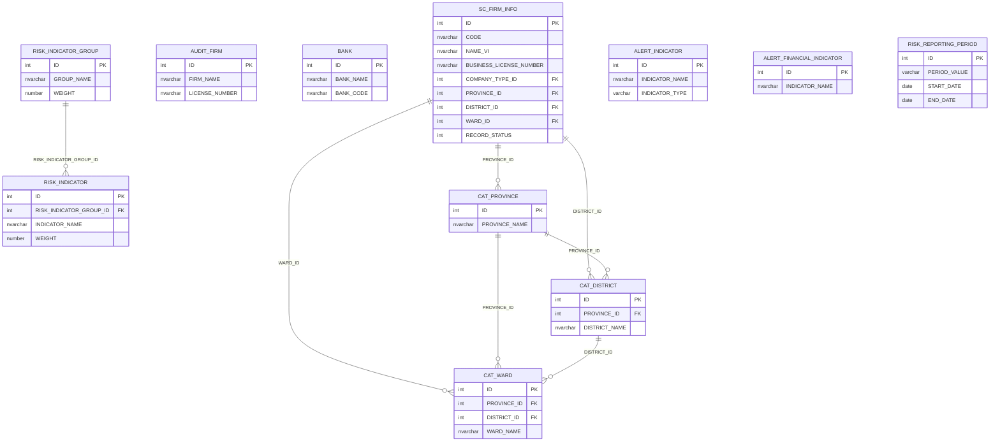
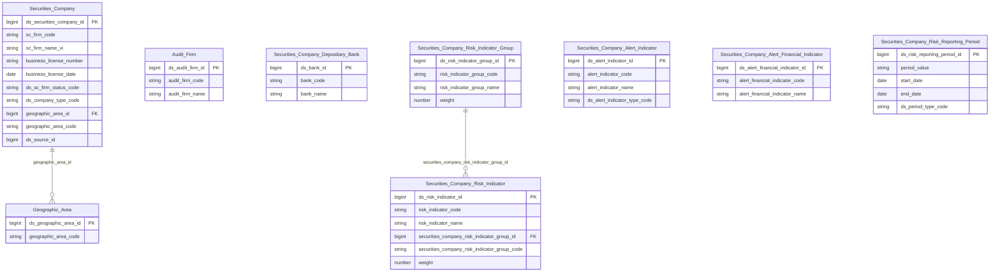

# SCMS HLD — Tier 1

**Source system:** SCMS (Quản lý Giám sát Công ty Chứng khoán)
**Tier 1:** Các entity độc lập, không FK đến bảng nghiệp vụ khác — chỉ FK đến bảng danh mục (CAT_*). Bao gồm thực thể trung tâm SC_FIRM_INFO, các bảng master về kiểm toán, ngân hàng, chỉ tiêu rủi ro/cảnh báo, kỳ đánh giá. Geographic Area extend từ NHNCK.

---

## 6a. Bảng tổng quan BCV Concept

| BCV Core Object | BCV Concept | Category | Source Table | Mô tả bảng nguồn | Atomic Entity | table_type | BCV Term |
|---|---|---|---|---|---|---|---|
| Involved Party | [Involved Party] Broker Dealer | Involved Party | SC_FIRM_INFO | Thông tin công ty chứng khoán: tên, địa chỉ, vốn điều lệ, loại hình, giấy phép thành lập | Securities Company | Fundamental | (1) BCV term `Broker Dealer` (ID 11227, category Involved Party) — mô tả tổ chức trung gian hoạt động mua bán chứng khoán cho khách hàng và cho chính mình. (2) SC_FIRM_INFO lưu thông tin pháp lý toàn diện về CTCK: giấy phép UBCKNN, vốn điều lệ, loại hình doanh nghiệp, trạng thái hoạt động — đây là thực thể Involved Party trung tâm của phân hệ. (3) Chọn `Broker Dealer` — khớp hoàn toàn với vai trò và cấu trúc trường CTCK tại Việt Nam. |
| Involved Party | [Involved Party] Audit Firm | Involved Party | AUDIT_FIRM | Công ty kiểm toán được UBCKNN chấp thuận để kiểm toán CTCK | Audit Firm | Fundamental | (1) BCV không có term `Audit Firm` chuyên biệt; term gần nhất là `External Auditor` hoặc gộp vào `Financial Institution` trong Involved Party. (2) AUDIT_FIRM lưu thông tin pháp lý độc lập của công ty kiểm toán (không phải kiểm toán viên cá nhân) — đây là tổ chức có lifecycle riêng, được FK từ AUDITOR. (3) Dùng `[Involved Party] Audit Firm` — tổ chức Involved Party độc lập, prefix Securities Company để nhóm với phân hệ. |
| Involved Party | [Involved Party] Depositary Bank | Involved Party | BANK | Ngân hàng được CTCK dùng làm đối tác thanh toán/lưu ký | Securities Company Depositary Bank | Fundamental | (1) BCV có term `Depositary Bank` và `Settlement Bank` — đều thuộc Involved Party, mô tả ngân hàng giữ tài sản hoặc xử lý thanh toán. (2) BANK trong SCMS lưu thông tin ngân hàng đối tác của CTCK — không phải ngân hàng của UBCKNN. (3) Chọn `Depositary Bank` — ngân hàng lưu ký/thanh toán cho CTCK; đặt tên `Securities Company Settlement Bank` phản ánh vai trò thanh toán chính trong SCMS. |
| Business Activity | [Business Activity] Risk Indicator | Regulatory Monitoring | RISK_INDICATOR | Chỉ tiêu đánh giá rủi ro CTCK (chỉ tiêu master, chưa có giá trị cụ thể) | Securities Company Risk Indicator | Fundamental | (1) BCV có term `Risk Indicator` trong category Event/Business Activity — mô tả định nghĩa chỉ tiêu rủi ro được dùng để đo lường. (2) RISK_INDICATOR là bảng master định nghĩa tên, nhóm, trọng số của chỉ tiêu — không lưu kết quả đánh giá. (3) Chọn `[Event] Risk Indicator` — entity định nghĩa chỉ tiêu; BCO = Event vì chỉ tiêu rủi ro là measurement point trong quá trình giám sát. |
| Business Activity | [Business Activity] Risk Category | Regulatory Monitoring | RISK_INDICATOR_GROUP | Nhóm chỉ tiêu rủi ro (CAMEL hoặc nhóm tùy chỉnh) dùng để tổng hợp điểm rủi ro | Securities Company Risk Indicator Group | Fundamental | (1) BCV có term `Risk Category` hoặc `Risk Group` trong category Group — mô tả nhóm phân loại rủi ro. (2) RISK_INDICATOR_GROUP lưu tên nhóm, trọng số nhóm để tính tổng điểm CAMEL — đây là Classification/Group entity độc lập. (3) Chọn `[Group] Risk Category` — nhóm phân loại chỉ tiêu rủi ro; BCO = Group. |
| Event | [Event] Alert Indicator | Event | ALERT_INDICATOR | Chỉ tiêu cảnh báo tài chính/phi tài chính (master) để phát hiện vi phạm ngưỡng | Securities Company Alert Indicator | Fundamental | (1) BCV có term `Alert Indicator` hoặc `Monitoring Indicator` trong Event. (2) ALERT_INDICATOR là bảng master định nghĩa chỉ tiêu cảnh báo — có tên, ngưỡng, loại chỉ tiêu. FK đến đây từ ALERT_INDICATOR_CONDITION và ALERT_RUN. (3) Chọn `[Event] Alert Indicator` — entity định nghĩa chỉ tiêu giám sát cảnh báo. |
| Event | [Event] Alert Financial Indicator | Event | ALERT_FINANCIAL_INDICATOR | Chỉ tiêu tài chính cụ thể dùng cho cảnh báo (con của ALERT_INDICATOR hoặc danh mục riêng) | Securities Company Alert Financial Indicator | Fundamental | (1) BCV có `Financial Indicator` trong Event category. (2) ALERT_FINANCIAL_INDICATOR là bảng master chỉ tiêu tài chính — không có FK đến SC_FIRM_INFO trực tiếp, là master data độc lập. (3) Chọn `[Event] Alert Financial Indicator` — entity định nghĩa chỉ tiêu tài chính dùng trong cảnh báo. |
| Business Activity | [Business Activity] Assessment Period | Regulatory Monitoring | RISK_REPORTING_PERIOD | Kỳ báo cáo rủi ro (kỳ đánh giá rủi ro CTCK) — định nghĩa kỳ để gắn với điểm rủi ro | Securities Company Risk Reporting Period | Fundamental | (1) BCV có `Assessment Period` hoặc `Reporting Period` trong Event/Business Activity. (2) RISK_REPORTING_PERIOD là bảng master kỳ đánh giá rủi ro: PERIOD_VALUE (2024-Q1), START_DATE, END_DATE, PERIOD_TYPE — không FK đến SC_FIRM_INFO. (3) Chọn `[Event] Assessment Period` — kỳ thời gian đánh giá; prefix Securities Company Risk Reporting Period mô tả rõ mục đích. |
| Location | [Location] Geographic Area | Location | CAT_PROVINCE | Danh mục tỉnh/thành phố — extend vào Geographic Area đã thiết kế từ NHNCK | Geographic Area | Fundamental | (1) BCV có `Geographic Area` trong Location — entity vùng địa lý có lifecycle riêng. (2) CAT_PROVINCE/CAT_DISTRICT/CAT_WARD tương tự COUNTRIES/PROVINCES/DISTRICTS đã được gộp vào Geographic Area tại NHNCK. (3) Extend source_table của Geographic Area, không tạo entity mới — đây là shared entity LOCKED từ NHNCK. |
| Location | [Location] Geographic Area | Location | CAT_DISTRICT | Danh mục quận/huyện (FK → CAT_PROVINCE) — extend vào Geographic Area | Geographic Area | Fundamental | Extend source_table của Geographic Area. Xem hàng CAT_PROVINCE. |
| Location | [Location] Geographic Area | Location | CAT_WARD | Danh mục phường/xã (FK → CAT_PROVINCE + CAT_DISTRICT) — extend vào Geographic Area | Geographic Area | Fundamental | Extend source_table của Geographic Area. Xem hàng CAT_PROVINCE. |

---

## 6b. Diagram Source (Mermaid)

---

## 6c. Diagram Atomic (Mermaid)

---

## 6d. Mục Danh mục & Tham chiếu (Reference Data)

| Source Field / Bảng | Mô tả | Scheme Code | source_type | Ghi chú |
|---|---|---|---|---|
| CAT_COMPANY_TYPE | Loại hình doanh nghiệp CTCK (Công ty TNHH, Công ty Cổ phần...) | `SCMS_COMPANY_TYPE` | source_table | FK từ SC_FIRM_INFO.COMPANY_TYPE_ID |
| SC_FIRM_INFO.RECORD_STATUS → CAT_SC_FIRM_STATUS | Trạng thái pháp lý CTCK (Đang hoạt động, Tạm ngừng, Đình chỉ, Đóng cửa) | `SCMS_SC_FIRM_STATUS` | source_table | FK từ SC_FIRM_INFO.RECORD_STATUS |
| CAT_SERVICE | Danh mục dịch vụ chứng khoán được cấp phép | `SCMS_SERVICE_TYPE` | source_table | FK từ LNK_SC_FIRM_SERVICE.CAT_SERVICE_ID |
| CAT_BUSINESS_LINE | Danh mục nghiệp vụ kinh doanh chứng khoán | `SCMS_BUSINESS_LINE` | source_table | Denormalize vào Securities Company |
| CAT_NATIONALITY | Danh mục quốc tịch | `SCMS_NATIONALITY` | source_table | FK từ nhiều bảng nhân sự |
| CAT_POSITION | Danh mục chức vụ | `SCMS_POSITION_TYPE` | source_table | FK từ SC_FIRM_SENIOR_PERSONNEL |
| CAT_RELATIONSHIP | Danh mục mối quan hệ | `SCMS_RELATIONSHIP_TYPE` | source_table | FK từ SC_FIRM_INSIDER_RELATION |
| CAT_SHAREHOLDER_TRANSACTION_TYPE | Danh mục loại giao dịch cổ đông | `SCMS_SHAREHOLDER_TXN_TYPE` | source_table | Dùng cho SC_FIRM_SHAREHOLDER_OWNERSHIP_CHANGE |
| CAT_VIOLATION_TYPE | Danh mục loại vi phạm | `SCMS_VIOLATION_TYPE` | source_table | FK từ SC_FIRM_ALERT_VIOLATION |
| CAT_EVENT_TYPE | Danh mục loại sự kiện nghiệp vụ (loại văn bản/thay đổi) | `SCMS_EVENT_TYPE` | source_table | FK từ SC_FIRM_INFO, SC_FIRM_BRANCH, SC_FIRM_FOREIGN_BRANCH... |
| RISK_INDICATOR.GROUP_TYPE / RISK_INDICATOR_GROUP | Loại nhóm đánh giá rủi ro CAMEL | `SCMS_RISK_CAMEL_GROUP` | source_table | Values: C, A, M, E, L |
| ALERT_INDICATOR.INDICATOR_TYPE | Loại chỉ tiêu cảnh báo (Tài chính/Phi tài chính) | `SCMS_ALERT_INDICATOR_TYPE` | source_table | Values suy luận: FINANCIAL, NON_FINANCIAL |
| CAT_SC_FIRM_STATUS | Trạng thái pháp lý cho Chi nhánh, VPDD, PGD | `SCMS_SC_FIRM_STATUS` | source_table | Dùng chung scheme với SC_FIRM_INFO.RECORD_STATUS |
| CAT_PROFILE_STATUS | Trạng thái hồ sơ trong luồng phê duyệt | `SCMS_PROFILE_STATUS` | source_table | FK từ SC_FIRM_PROFILE_HISTORY |

---

## 6e. Bảng chờ thiết kế

*(Để trống — toàn bộ Tier 1 đã có cột đầy đủ)*

---

## 6f. Điểm cần xác nhận

| # | Câu hỏi | Kết quả |
|---|---|---|
| T1-01 | SC_FIRM_INFO có FK self-reference (SC_FIRM_INFO_ID → SC_FIRM_INFO.ID) — có phải quan hệ công ty mẹ-công ty con không? | Xác nhận: đây là tự tham chiếu cho trường hợp CTCK là chi nhánh của CTCK khác. Ghi nhận là FK self-ref trên entity, không tạo entity riêng. |
| T1-02 | AUDIT_FIRM và BANK không có cột đủ chi tiết trong CSV — có nên extend Securities Organization Reference (NHNCK) không? | Quyết định: tạo entity mới `Audit Firm` và `Securities Company Depositary Bank` — cấu trúc trường khác ORGANIZATIONS của NHNCK. Sẽ extend source_table của Securities Organization Reference nếu cần liên kết. |
| T1-03 | ALERT_FINANCIAL_INDICATOR không có FK đến ALERT_INDICATOR trong CSV — quan hệ 2 bảng này là gì? | Cần xác nhận: có thể ALERT_FINANCIAL_INDICATOR là subset của ALERT_INDICATOR hoặc 2 danh mục riêng biệt. Tạm thời thiết kế là 2 entity độc lập. |
| T1-04 | CAT_PROVINCE/DISTRICT/WARD trong SCMS có trùng dữ liệu với COUNTRIES/PROVINCES/DISTRICTS của NHNCK không? | Xác nhận cần: nếu trùng → chỉ extend source_table của Geographic Area, ETL gộp. Nếu khác bộ → cần xử lý dedup tại ETL. Tạm thời ghi là extend. |
