# SCMS HLD — Tier 1

**Source system:** SCMS (Quản lý Giám sát Công ty Chứng khoán)
**Tier 1:** Các entity độc lập, không FK đến bảng nghiệp vụ khác — chỉ FK đến bảng danh mục (CAT_*). Bao gồm thực thể trung tâm SC_FIRM_INFO, các bảng master về kiểm toán, ngân hàng, chỉ tiêu rủi ro/cảnh báo, kỳ đánh giá.

> **Cập nhật (2026-07-10):** CAT_PROVINCE/CAT_DISTRICT/CAT_WARD đã loại khỏi scope Atomic
> — không extend vào Geographic Area như dự kiến trước đây. Dữ liệu địa giới hành chính
> chuẩn hóa tại nguồn **ECAT** (xem `ECAT_HLD_Tier1.md`). SCMS chỉ tham chiếu Geographic
> Area qua lookup giá trị. Xem mục 7f của `SCMS_HLD_Overview.md`.

---

## 6a. Bảng tổng quan BCV Concept

| BCV Core Object | BCV Concept | Category | Source Table | Mô tả bảng nguồn | Atomic Entity | table_type | BCV Term |
|---|---|---|---|---|---|---|---|
| Involved Party | [Involved Party] Broker Dealer | Involved Party | SC_FIRM_INFO | Thông tin công ty chứng khoán: tên, địa chỉ, vốn điều lệ, loại hình, giấy phép thành lập | Securities Company | Fundamental | (1) BCV term `Broker Dealer` (ID 11227, category Involved Party) — mô tả tổ chức trung gian hoạt động mua bán chứng khoán cho khách hàng và cho chính mình. (2) SC_FIRM_INFO lưu thông tin pháp lý toàn diện về CTCK: giấy phép UBCKNN, vốn điều lệ, loại hình doanh nghiệp, trạng thái hoạt động — đây là thực thể Involved Party trung tâm của phân hệ. (3) Chọn `Broker Dealer` — khớp hoàn toàn với vai trò và cấu trúc trường CTCK tại Việt Nam. |
| Involved Party | [Involved Party] Audit Firm | Involved Party | AUDIT_FIRM | Công ty kiểm toán được UBCKNN chấp thuận để kiểm toán CTCK | Audit Firm | Fundamental | (1) BCV không có term `Audit Firm` chuyên biệt; term gần nhất là `External Auditor` hoặc gộp vào `Financial Institution` trong Involved Party. (2) AUDIT_FIRM lưu thông tin pháp lý độc lập của công ty kiểm toán (không phải kiểm toán viên cá nhân) — đây là tổ chức có lifecycle riêng, được FK từ AUDITOR. (3) Dùng `[Involved Party] Audit Firm` — tổ chức Involved Party độc lập, prefix Securities Company để nhóm với phân hệ. |
| Involved Party | [Involved Party] Depositary Bank | Involved Party | BANK | Ngân hàng được CTCK dùng làm đối tác thanh toán/lưu ký | Securities Company Depositary Bank | Fundamental | (1) BCV có term `Depositary Bank` và `Settlement Bank` — đều thuộc Involved Party, mô tả ngân hàng giữ tài sản hoặc xử lý thanh toán. (2) BANK trong SCMS lưu thông tin ngân hàng đối tác của CTCK — không phải ngân hàng của UBCKNN. (3) Chọn `Depositary Bank` — ngân hàng lưu ký/thanh toán cho CTCK; đặt tên `Securities Company Settlement Bank` phản ánh vai trò thanh toán chính trong SCMS. |
| Business Activity | [Business Activity] Risk Indicator | Regulatory Monitoring | RISK_INDICATOR | Chỉ tiêu đánh giá rủi ro CTCK (chỉ tiêu master, chưa có giá trị cụ thể) | Securities Company Risk Indicator | Fundamental | (1) BCV có term `Risk Indicator` trong category Event/Business Activity — mô tả định nghĩa chỉ tiêu rủi ro được dùng để đo lường. (2) RISK_INDICATOR là bảng master định nghĩa tên, nhóm, trọng số của chỉ tiêu — không lưu kết quả đánh giá. (3) Chọn `[Event] Risk Indicator` — entity định nghĩa chỉ tiêu; BCO = Event vì chỉ tiêu rủi ro là measurement point trong quá trình giám sát. |
| Business Activity | [Business Activity] Risk Category | Regulatory Monitoring | RISK_INDICATOR_GROUP | Nhóm chỉ tiêu rủi ro (CAMEL hoặc nhóm tùy chỉnh) dùng để tổng hợp điểm rủi ro | Securities Company Risk Indicator Group | Fundamental | (1) BCV có term `Risk Category` hoặc `Risk Group` trong category Group — mô tả nhóm phân loại rủi ro. (2) RISK_INDICATOR_GROUP lưu tên nhóm, trọng số nhóm để tính tổng điểm CAMEL — đây là Classification/Group entity độc lập. (3) Chọn `[Group] Risk Category` — nhóm phân loại chỉ tiêu rủi ro; BCO = Group. |
| Event | [Event] Alert Indicator | Event | ALERT_INDICATOR | Chỉ tiêu cảnh báo tài chính/phi tài chính (master) để phát hiện vi phạm ngưỡng | Securities Company Alert Indicator | Fundamental | (1) BCV có term `Alert Indicator` hoặc `Monitoring Indicator` trong Event. (2) ALERT_INDICATOR là bảng master định nghĩa chỉ tiêu cảnh báo — có tên, ngưỡng, loại chỉ tiêu. FK đến đây từ ALERT_INDICATOR_CONDITION và ALERT_RUN. (3) Chọn `[Event] Alert Indicator` — entity định nghĩa chỉ tiêu giám sát cảnh báo. |
| Event | [Event] Alert Financial Indicator | Event | ALERT_FINANCIAL_INDICATOR | Chỉ tiêu tài chính cụ thể dùng cho cảnh báo (con của ALERT_INDICATOR hoặc danh mục riêng) | Securities Company Alert Financial Indicator | Fundamental | (1) BCV có `Financial Indicator` trong Event category. (2) ALERT_FINANCIAL_INDICATOR là bảng master chỉ tiêu tài chính — không có FK đến SC_FIRM_INFO trực tiếp, là master data độc lập. (3) Chọn `[Event] Alert Financial Indicator` — entity định nghĩa chỉ tiêu tài chính dùng trong cảnh báo. |
| Business Activity | [Business Activity] Assessment Period | Regulatory Monitoring | RISK_REPORTING_PERIOD | Kỳ báo cáo rủi ro (kỳ đánh giá rủi ro CTCK) — định nghĩa kỳ để gắn với điểm rủi ro | Securities Company Risk Reporting Period | Fundamental | (1) BCV có `Assessment Period` hoặc `Reporting Period` trong Event/Business Activity. (2) RISK_REPORTING_PERIOD là bảng master kỳ đánh giá rủi ro: PERIOD_VALUE (2024-Q1), START_DATE, END_DATE, PERIOD_TYPE — không FK đến SC_FIRM_INFO. (3) Chọn `[Event] Assessment Period` — kỳ thời gian đánh giá; prefix Securities Company Risk Reporting Period mô tả rõ mục đích. |
| Common | [Common] Firm Status | — | CAT_SC_FIRM_STATUS | Danh mục trạng thái pháp lý CTCK/Chi nhánh/VPĐD/PGD/Ngân hàng | Classification SCMS Firm Status | Classification | (1) Term gần nhất trong BCV: `Organization Life Cycle Status` (id 10930, category Involved Party) hoặc `Organization Registration Status` (id 11478) — mô tả vòng đời/trạng thái đăng ký của 1 Organization. (2) Cấu trúc bảng: SC_FIRM_STATUS_CODE/NAME, REPORT_SUBMISSION_ENABLED, DISCLOSURE_ENABLED (cờ nghiệp vụ theo trạng thái), APPLICABLE_ENTITY (CTCK/CN/VPĐD/NH/Cả hai) — danh mục dùng chung cho nhiều loại đối tượng, không riêng 1 Organization. (3) Theo chỉ đạo Data Modeler: gán BCV Core Object = Common (không dùng Involved Party dù match khá tốt) để nhất quán pattern NHNCK (Classification NHNCK Application Status/Document/Specialization). Table Type = Classification (Upsert) theo chỉ đạo. |
| Common | [Common] Service | — | CAT_SERVICE | Danh mục dịch vụ chứng khoán được cấp phép | Classification SCMS Service | Classification | (1) Term BCV: `Service` (id 11846, category Product) / `Service Type` (id 11852) — mô tả sản phẩm dịch vụ được cung cấp. (2) Cấu trúc bảng: SERVICE_CODE/NAME, NOTE, RECORD_STATUS — danh mục Code+Name+ghi chú. (3) Theo chỉ đạo Data Modeler: gán Common (không dùng Product dù match tốt) để nhất quán pattern Classification. Table Type = Classification theo chỉ đạo. |
| Common | [Common] Nationality | — | CAT_NATIONALITY | Danh mục quốc tịch | Classification SCMS Nationality | Classification | (1) Không có term BCV chính xác tên "Nationality"; gần nhất `Citizenship` (id 11168, Involved Party) hoặc `Country` (Location). (2) Cấu trúc bảng: NATIONALITY_CODE/NAME, NOTE, RECORD_STATUS — danh mục Code+Name thuần. (3) Gán Common theo chỉ đạo — match tự nhiên hơn 3 bảng trên vì không có term khớp sẵn có trong BCV. Table Type = Classification. |
| Common | [Common] Event Type | — | CAT_EVENT_TYPE | Danh mục loại sự kiện/sự vụ nghiệp vụ (thành lập, điều chỉnh vốn, đổi tên...) làm cơ sở xác định nghĩa vụ báo cáo/CBTT | Classification SCMS Event Type | Relative | (1) Term BCV khớp: `Event Type` (id 9924, category Event) — "distinguishes between Events according to their inherent characteristics". (2) Cấu trúc bảng: EVENT_TYPE_CODE/NAME, REQUIRES_LICENSE, REQUIRES_DISCLOSURE, OBLIGATION_TYPE, EVENT_CATEGORY, CYCLE, FREQUENCY — vượt cấu trúc Code+Name thuần, nhiều cờ nghiệp vụ xác định nghĩa vụ báo cáo. (3) Theo chỉ đạo Data Modeler: gán Common (không dùng Event dù match mạnh) để nhất quán pattern Classification-naming. Table Type = Relative (không phải Classification/Fundamental) theo chỉ đạo — lưu ý: bảng không có FK nghiệp vụ rõ ràng đến 1 Fundamental entity khác trong scope hiện tại (xem 6f T1-05). |
| Common | [Common] Business Line | — | CAT_BUSINESS_LINE | Danh mục nghiệp vụ kinh doanh chứng khoán được UBCKNN cấp phép cho CTCK (môi giới, tự doanh, bảo lãnh phát hành, tư vấn đầu tư, quản lý quỹ...) | Classification SCMS Business Line | Classification | (1) Term BCV gần nhất: `Line Of Business` (id 11422, category Involved Party) — "distinguishes... according to the type of customer" — không khớp hoàn toàn (mô tả phân loại theo khách hàng, không phải theo nghiệp vụ được cấp phép). Có `Industry Classification` (id 8291, category Common) — đã dùng cho entity `Classification ECAT Business Line` tại nguồn **ECAT** (BUSINESS_LINE_LEVEL_1/2, phân loại ngành nghề kinh doanh tổng quát, self-referencing, Table Type Relative) — KHÔNG dùng lại cho bảng này vì khác cấu trúc (flat, không phân cấp cha-con) và khác ý nghĩa (nghiệp vụ kinh doanh CK được cấp phép theo Luật Chứng khoán, gắn vốn pháp định riêng — không phải phân loại ngành nghề chung). (2) Cấu trúc bảng: BUSINESS_LINE_CODE/NAME (danh mục), NOTE, RECORD_STATUS (cờ hiệu lực), LEGAL_CAPITAL (vốn pháp định tối thiểu theo quy định pháp luật cho từng nghiệp vụ — VD môi giới/tự doanh/bảo lãnh phát hành có mức vốn pháp định khác nhau) — gần giống CAT_SERVICE (Code+Name+Note+Status) nhưng thêm LEGAL_CAPITAL, khẳng định đây là danh mục nghiệp vụ kinh doanh CK được cấp phép theo luật, khác dịch vụ (Service) thông thường. CREATED_BY (FK suy luận → SYS_USER, đã loại khỏi scope — xem 7f Overview) là audit field, không tạo FK nghiệp vụ. (3) Theo chỉ đạo Data Modeler (nhất quán tiền lệ T1-05): gán Common, đặt tên `Classification SCMS Business Line` theo convention chèn tên hệ thống nguồn ngay sau "Classification" — áp dụng chung cho mọi Classification entity đa nguồn (SCMS/ECAT/...), không riêng để phân biệt với entity `Classification ECAT Business Line` đã có tại nguồn ECAT (khác BCV Concept — xem trên; entity đó cũng đã đổi tên theo cùng convention). Table Type = Classification theo chỉ đạo. Xem 6f T1-09. |
| Condition | [Condition] Regulatory Reporting Requirement | Criterion | FORM_REPORT | Biểu mẫu báo cáo (định kỳ/bất thường/theo yêu cầu/CBTT) mà CTCK/CN/VPĐD phải nộp cho UBCKNN, gồm căn cứ pháp lý, phiên bản, phân cấp biểu mẫu cha-con | Securities Company Form Report | Relative | (1) Không có term Condition khớp hoàn toàn sẵn có trong knowledge/terms.csv. Gần nhất: `Disclosure` (id 9208, Control Condition — "specifies how associated information can be divulged according to business guidelines") nhưng chỉ khớp phần CBTT, không bao quát LEGAL_BASIS/REPORT_TYPE định kỳ-bất thường. (2) Cấu trúc bảng: REPORT_CODE/NAME, LEGAL_BASIS, REPORT_TYPE (ĐỊNH_KỲ/BẤT_THƯỜNG/THEO_YÊU_CẦU/CBTT), REPORT_STYLE, VERSION/VERSION_DATE, PARENT_ID tự tham chiếu phân cấp, RECORD_STATUS — đây là quy định về nghĩa vụ nộp báo cáo (rule), không phải bản thân báo cáo đã nộp (đã có Securities Company Periodic/Adhoc/Disclosure Report ở Tier 2). (3) Theo chỉ đạo Data Modeler: gán Condition, đề xuất term mới `Regulatory Reporting Requirement` (type_of Criterion) theo pattern `X Requirement` đã có trong BCV (General/Specific Liquidity Requirement, Collateral Requirement Criterion) — term chưa tồn tại sẵn trong knowledge base, cần bổ sung khi có điều kiện. Table Type = Relative theo chỉ đạo — lưu ý: bảng chỉ tự tham chiếu qua PARENT_ID, không FK đến 1 Fundamental khác trong scope hiện tại (xem 6f T1-05). Đảo ngược quyết định loại-scope trước đây (xem 7f/7e Overview) — chỉ riêng FORM_REPORT, không kéo theo nhóm cascade. |

---

## 6b. Diagram Source (Mermaid)

```mermaid
erDiagram
    SC_FIRM_INFO {
        int ID PK
        nvarchar CODE
        nvarchar NAME_VI
        nvarchar BUSINESS_LICENSE_NUMBER
        int COMPANY_TYPE_ID FK
        int PROVINCE_ID FK
        int DISTRICT_ID FK
        int WARD_ID FK
        int RECORD_STATUS
    }

    AUDIT_FIRM {
        int ID PK
        nvarchar FIRM_NAME
        nvarchar LICENSE_NUMBER
    }

    BANK {
        int ID PK
        nvarchar BANK_NAME
        nvarchar BANK_CODE
    }

    RISK_INDICATOR {
        int ID PK
        int RISK_INDICATOR_GROUP_ID FK
        nvarchar INDICATOR_NAME
        number WEIGHT
    }

    RISK_INDICATOR_GROUP {
        int ID PK
        nvarchar GROUP_NAME
        number WEIGHT
    }

    ALERT_INDICATOR {
        int ID PK
        nvarchar INDICATOR_NAME
        varchar INDICATOR_TYPE
    }

    ALERT_FINANCIAL_INDICATOR {
        int ID PK
        nvarchar INDICATOR_NAME
    }

    RISK_REPORTING_PERIOD {
        int ID PK
        varchar PERIOD_VALUE
        date START_DATE
        date END_DATE
    }

    CAT_PROVINCE {
        int ID PK
        nvarchar PROVINCE_NAME
    }

    CAT_DISTRICT {
        int ID PK
        int PROVINCE_ID FK
        nvarchar DISTRICT_NAME
    }

    CAT_WARD {
        int ID PK
        int PROVINCE_ID FK
        int DISTRICT_ID FK
        nvarchar WARD_NAME
    }

    CAT_SC_FIRM_STATUS {
        int ID PK
        nvarchar SC_FIRM_STATUS_CODE
        nvarchar SC_FIRM_STATUS_NAME
        nvarchar APPLICABLE_ENTITY
        number REPORT_SUBMISSION_ENABLED
        number DISCLOSURE_ENABLED
    }

    CAT_SERVICE {
        int ID PK
        nvarchar SERVICE_CODE
        nvarchar SERVICE_NAME
    }

    CAT_NATIONALITY {
        int ID PK
        nvarchar NATIONALITY_CODE
        nvarchar NATIONALITY_NAME
    }

    CAT_EVENT_TYPE {
        int ID PK
        nvarchar EVENT_TYPE_CODE
        nvarchar EVENT_TYPE_NAME
        number REQUIRES_LICENSE
        number OBLIGATION_TYPE
    }

    CAT_BUSINESS_LINE {
        int ID PK
        nvarchar BUSINESS_LINE_CODE
        nvarchar BUSINESS_LINE_NAME
        number LEGAL_CAPITAL
        number RECORD_STATUS
    }

    FORM_REPORT {
        int ID PK
        nvarchar REPORT_CODE
        nvarchar REPORT_NAME
        nvarchar LEGAL_BASIS
        nvarchar REPORT_TYPE
        int PARENT_ID FK
        number RECORD_STATUS
    }

    FORM_REPORT ||--o{ FORM_REPORT : "PARENT_ID (self-ref)"

    SC_FIRM_INFO ||--o{ CAT_PROVINCE : "PROVINCE_ID"
    SC_FIRM_INFO ||--o{ CAT_DISTRICT : "DISTRICT_ID"
    SC_FIRM_INFO ||--o{ CAT_WARD : "WARD_ID"
    CAT_PROVINCE ||--o{ CAT_DISTRICT : "PROVINCE_ID"
    CAT_PROVINCE ||--o{ CAT_WARD : "PROVINCE_ID"
    CAT_DISTRICT ||--o{ CAT_WARD : "DISTRICT_ID"
    RISK_INDICATOR_GROUP ||--o{ RISK_INDICATOR : "RISK_INDICATOR_GROUP_ID"
    SC_FIRM_INFO }o--o{ CAT_BUSINESS_LINE : "LNK_SC_FIRM_BUSINESS_LINE (M:N)"
```

---

## 6c. Diagram Atomic (Mermaid)

```mermaid
erDiagram
    Securities_Company {
        bigint ds_securities_company_id PK
        string sc_firm_code
        string sc_firm_name_vi
        string business_license_number
        date business_license_date
        string ds_sc_firm_status_code
        string ds_company_type_code
        bigint geographic_area_id FK
        string geographic_area_code
        bigint ds_source_id
    }

    Audit_Firm {
        bigint ds_audit_firm_id PK
        string audit_firm_code
        string audit_firm_name
    }

    Securities_Company_Depositary_Bank {
        bigint ds_bank_id PK
        string bank_code
        string bank_name
    }

    Securities_Company_Risk_Indicator {
        bigint ds_risk_indicator_id PK
        string risk_indicator_code
        string risk_indicator_name
        bigint securities_company_risk_indicator_group_id FK
        string securities_company_risk_indicator_group_code
        number weight
    }

    Securities_Company_Risk_Indicator_Group {
        bigint ds_risk_indicator_group_id PK
        string risk_indicator_group_code
        string risk_indicator_group_name
        number weight
    }

    Securities_Company_Alert_Indicator {
        bigint ds_alert_indicator_id PK
        string alert_indicator_code
        string alert_indicator_name
        string ds_alert_indicator_type_code
    }

    Securities_Company_Alert_Financial_Indicator {
        bigint ds_alert_financial_indicator_id PK
        string alert_financial_indicator_code
        string alert_financial_indicator_name
    }

    Securities_Company_Risk_Reporting_Period {
        bigint ds_risk_reporting_period_id PK
        string period_value
        date start_date
        date end_date
        string ds_period_type_code
    }

    Geographic_Area {
        bigint ds_geographic_area_id PK
        string geographic_area_code
    }

    Classification_Firm_Status {
        bigint ds_classification_firm_status_id PK
        string classification_firm_status_code
        string classification_firm_status_nm
    }

    Classification_Service {
        bigint ds_classification_service_id PK
        string classification_service_code
        string classification_service_nm
    }

    Classification_Nationality {
        bigint ds_classification_nationality_id PK
        string classification_nationality_code
        string classification_nationality_nm
    }

    Classification_Event_Type {
        bigint ds_classification_event_type_id PK
        string classification_event_type_code
        string classification_event_type_nm
    }

    Classification_SCMS_Business_Line {
        bigint ds_classification_scms_business_line_id PK
        string classification_scms_business_line_code
        string classification_scms_business_line_nm
        number legal_capital
    }

    Securities_Company_Form_Report {
        bigint ds_securities_company_form_report_id PK
        string securities_company_form_report_code
        string report_name
        string legal_basis
        bigint parent_securities_company_form_report_id FK
    }

    Securities_Company ||--o{ Geographic_Area : "geographic_area_id"
    Securities_Company_Form_Report ||--o{ Securities_Company_Form_Report : "parent_securities_company_form_report_id"
    Securities_Company_Risk_Indicator_Group ||--o{ Securities_Company_Risk_Indicator : "securities_company_risk_indicator_group_id"
```

---

## 6d. Mục Danh mục & Tham chiếu (Reference Data)

| Source Field / Bảng | Mô tả | Scheme Code | source_type | Ghi chú |
|---|---|---|---|---|
| CAT_COMPANY_TYPE | Loại hình doanh nghiệp CTCK (Công ty TNHH, Công ty Cổ phần...) | `SCMS_COMPANY_TYPE` | source_table | FK từ SC_FIRM_INFO.COMPANY_TYPE_ID |
| SC_FIRM_INFO.RECORD_STATUS → CAT_SC_FIRM_STATUS | Trạng thái pháp lý CTCK (Đang hoạt động, Tạm ngừng, Đình chỉ, Đóng cửa) | ~~`SCMS_SC_FIRM_STATUS`~~ (deprecated) | source_table | **Đã nâng cấp lên entity thật `Classification SCMS Firm Status` (xem 6a).** LLD SC_FIRM_INFO cần đổi sang cặp FK Firm Status Id + Firm Status Code. |
| CAT_SERVICE | Danh mục dịch vụ chứng khoán được cấp phép | ~~`SCMS_SERVICE_TYPE`~~ (deprecated) | source_table | **Đã nâng cấp lên entity thật `Classification SCMS Service` (xem 6a).** Securities Company Licensed Service đã đổi sang FK Id+Code (thực hiện lượt này); Securities Company Custodian Bank cần đổi khi thiết kế LLD. |
| CAT_BUSINESS_LINE | Danh mục nghiệp vụ kinh doanh chứng khoán | ~~`SCMS_BUSINESS_LINE`~~ (deprecated) | source_table | **Đã nâng cấp lên entity thật `Classification SCMS Business Line` (xem 6a).** `LNK_SC_FIRM_BUSINESS_LINE` (Securities Company) và `LNK_PRACTITIONER_BUSINESS_LINE` (Securities Company Practitioner) cần đổi từ denormalize `ARRAY<STRING>` sang `ARRAY<STRUCT<business_line_id, business_line_code>>` khi thiết kế LLD — xem 7d Overview. |
| CAT_NATIONALITY | Danh mục quốc tịch | ~~`SCMS_NATIONALITY`~~ (deprecated) | source_table | **Đã nâng cấp lên entity thật `Classification SCMS Nationality` (xem 6a).** Các entity tiêu thụ (7 bảng nhân sự/cổ đông, xem 6f T1-06) cần đổi sang cặp FK khi thiết kế LLD. |
| CAT_POSITION | Danh mục chức vụ | `SCMS_POSITION_TYPE` | source_table | FK từ SC_FIRM_SENIOR_PERSONNEL |
| CAT_RELATIONSHIP | Danh mục mối quan hệ | `SCMS_RELATIONSHIP_TYPE` | source_table | FK từ SC_FIRM_INSIDER_RELATION |
| CAT_SHAREHOLDER_TRANSACTION_TYPE | Danh mục loại giao dịch cổ đông | `SCMS_SHAREHOLDER_TXN_TYPE` | source_table | Dùng cho SC_FIRM_SHAREHOLDER_OWNERSHIP_CHANGE |
| CAT_VIOLATION_TYPE | Danh mục loại vi phạm | `SCMS_VIOLATION_TYPE` | source_table | FK từ SC_FIRM_ALERT_VIOLATION |
| CAT_EVENT_TYPE | Danh mục loại sự kiện nghiệp vụ (loại văn bản/thay đổi) | ~~`SCMS_EVENT_TYPE`~~ (deprecated) | source_table | **Đã nâng cấp lên entity thật `Classification SCMS Event Type` (xem 6a).** Securities Company Profile Change và Securities Company Disclosure Report cần đổi sang cặp FK khi thiết kế LLD. |
| RISK_INDICATOR.GROUP_TYPE / RISK_INDICATOR_GROUP | Loại nhóm đánh giá rủi ro CAMEL | `SCMS_RISK_CAMEL_GROUP` | source_table | Values: C, A, M, E, L |
| ALERT_INDICATOR.INDICATOR_TYPE | Loại chỉ tiêu cảnh báo (Tài chính/Phi tài chính) | `SCMS_ALERT_INDICATOR_TYPE` | source_table | Values suy luận: FINANCIAL, NON_FINANCIAL |
| CAT_SC_FIRM_STATUS | Trạng thái pháp lý cho Chi nhánh, VPDD, PGD | ~~`SCMS_SC_FIRM_STATUS`~~ (deprecated) | source_table | Dùng chung entity `Classification SCMS Firm Status` với SC_FIRM_INFO.RECORD_STATUS — xem dòng trên. |
| CAT_PROFILE_STATUS | Trạng thái hồ sơ trong luồng phê duyệt | `SCMS_PROFILE_STATUS` | source_table | FK từ SC_FIRM_PROFILE_HISTORY |

---

## 6e. Bảng chờ thiết kế

*(Để trống — toàn bộ Tier 1 đã có cột đầy đủ)*

---

## 6f. Điểm cần xác nhận

| # | Câu hỏi | Kết quả |
|---|---|---|
| T1-01 | SC_FIRM_INFO có FK self-reference (SC_FIRM_INFO_ID → SC_FIRM_INFO.ID) — có phải quan hệ công ty mẹ-công ty con không? | Xác nhận: đây là tự tham chiếu cho trường hợp CTCK là chi nhánh của CTCK khác. Ghi nhận là FK self-ref trên entity, không tạo entity riêng. |
| T1-02 | AUDIT_FIRM và BANK không có cột đủ chi tiết trong CSV — có nên extend Securities Organization Reference (NHNCK) không? | Quyết định: tạo entity mới `Audit Firm` và `Securities Company Depositary Bank` — cấu trúc trường khác ORGANIZATIONS của NHNCK. Sẽ extend source_table của Securities Organization Reference nếu cần liên kết. |
| T1-03 | ALERT_FINANCIAL_INDICATOR không có FK đến ALERT_INDICATOR trong CSV — quan hệ 2 bảng này là gì? | Cần xác nhận: có thể ALERT_FINANCIAL_INDICATOR là subset của ALERT_INDICATOR hoặc 2 danh mục riêng biệt. Tạm thời thiết kế là 2 entity độc lập. |
| T1-04 | CAT_PROVINCE/DISTRICT/WARD trong SCMS có trùng dữ liệu với COUNTRIES/PROVINCES/DISTRICTS của NHNCK không? | **Đã chốt (2026-07-10) — không còn liên quan đến NHNCK.** Geographic Area chỉ còn 1 nguồn duy nhất là ECAT. CAT_PROVINCE/CAT_DISTRICT/CAT_WARD loại khỏi scope Atomic (xem 7f Overview). SC_FIRM_*'s Province/District/Ward FK chuyển sang resolve bằng lookup giá trị đối chiếu Geographic Area (Province/Ward) hoặc Geographic Area Old (District — cấp bị bỏ sau sáp nhập 2025) nguồn ECAT, thay vì hash_id('SCMS.CAT_*', ...). |
| T1-05 | `CAT_SC_FIRM_STATUS`, `CAT_SERVICE`, `CAT_NATIONALITY`, `CAT_EVENT_TYPE` — nâng cấp từ Classification Value (scheme) lên Atomic entity thật, đặt tên `Classification [Term]` theo pattern NHNCK. Tra BCV cho thấy term khớp mạnh hơn ở category khác (Organization Life Cycle Status/Involved Party cho Firm Status; Service Type/Product cho Service; Event Type/Event cho Event Type) nhưng Data Modeler chỉ đạo giữ Common cho cả 4 bảng để nhất quán naming convention. Riêng Table Type: 3 bảng đầu = Classification (Upsert), `CAT_EVENT_TYPE` = Relative (khác 3 bảng còn lại) — theo chỉ đạo tường minh, không theo mặc định Bước 1b. | **Quyết định Data Modeler (chốt).** BCV Core Object = Common cho cả 4; Table Type: Classification (3 bảng đầu) / Relative (CAT_EVENT_TYPE). Ghi nhận độ lệch BCV để minh bạch, không chặn thiết kế. |
| T1-06 | `FORM_REPORT` — trước đây bị loại khỏi scope Atomic (§7f Overview, lý do "form metadata không cần trên Atomic"). Data Modeler yêu cầu đảo ngược, thiết kế thành entity `Securities Company Form Report`, BCV Core Object = Condition, Table Type = Relative. Cả nhóm cascade (FORM_SHEET*, FORM_REPORT_PERIODIC, LNK_EVENT_TYPE_FORM...) vẫn giữ ngoài scope — lý do cũ "Cascade từ FORM_REPORT đã loại" không còn đúng vì FORM_REPORT không còn "đã loại". | **Quyết định Data Modeler (chốt) — chỉ đảo ngược riêng FORM_REPORT.** Nhóm cascade cần lý do loại-scope độc lập, riêng biệt — chưa đánh giá lại trong lượt thiết kế này, để nguyên trong `atomic_out_of_scope.yaml`/§7f với ghi chú cần review lại lý do. |
| T1-07 | `Table Type = Relative` cho `CAT_EVENT_TYPE` và `Securities Company Form Report` không khớp định nghĩa chuẩn trong skill ("phụ thuộc Fundamental qua FK") — cả 2 bảng không FK nghiệp vụ rõ ràng đến 1 Fundamental entity khác (FORM_REPORT chỉ tự tham chiếu PARENT_ID; CAT_EVENT_TYPE không FK đi đâu). | **Xác nhận từ Data Modeler: giữ nguyên Relative** — quyết định tường minh, ghi nhận ngoại lệ so với định nghĩa chuẩn để minh bạch cho executor sau. |
| T1-08 | Danh sách entity tiêu thụ cần cập nhật cặp FK Id+Code khi thiết kế LLD (sau khi 4 entity Classification + Securities Company Form Report được LLD hóa) — chưa sửa LLD trong lượt HLD này, trừ `SERVICE_ID` trên `Securities Company Licensed Service` (đã sửa). | `SCMS_SC_FIRM_STATUS` → Securities Company + entity chi nhánh/VPĐD/PGD dùng chung scheme. `SCMS_NATIONALITY` → SC_FIRM_DOMESTIC_REP_OFFICE, SC_FIRM_FOREIGN_REP_OFFICE_VN, SC_FIRM_INSIDER_RELATION, SC_FIRM_LICENSED_PRACTITIONER, SC_FIRM_MAJOR_SHAREHOLDER_RELATION, SC_FIRM_SENIOR_PERSONNEL, SC_FIRM_SHAREHOLDER. `SCMS_EVENT_TYPE` → Securities Company Profile Change, Securities Company Disclosure Report. `FORM_REPORT_ID` (hiện "(Classification Value — FORM_REPORT excluded)") → Securities Company Periodic Report, Securities Company Adhoc Report, Securities Company Disclosure Report, Securities Company Foreign Branch Periodic Report, Securities Company Foreign Representative Office Periodic Report. |
| T1-09 | `CAT_BUSINESS_LINE` — nâng cấp từ Classification Value (scheme `SCMS_BUSINESS_LINE`) lên Atomic entity thật, theo đúng tiền lệ T1-05 (4 entity Classification khác). Đặt tên `Classification SCMS Business Line` (chèn "SCMS") theo convention chèn tên nguồn ngay sau "Classification", áp dụng chung cho mọi entity Classification đa nguồn — không riêng để phân biệt với entity `Classification ECAT Business Line` đã có tại nguồn **ECAT** (BUSINESS_LINE_LEVEL_1/2 — khác BCV Concept: `Industry Classification` tổng quát, self-referencing — xem ECAT_HLD_Tier1.md 6a). 2 junction table tiêu thụ (`LNK_SC_FIRM_BUSINESS_LINE` trên Securities Company, `LNK_PRACTITIONER_BUSINESS_LINE` trên Securities Company Practitioner) chuyển từ "pure junction với Classification Value" (denormalize `ARRAY<STRING>`) sang "pure junction giữa 2 Atomic entity" (denormalize `ARRAY<STRUCT<business_line_id, business_line_code>>`) theo skill rule. | **Quyết định Data Modeler (task này) — theo đúng tiền lệ T1-05.** BCV Core Object = Common, Table Type = Classification. Phát hiện thêm: mục 7d Overview trước đây ghi `LNK_PRACTITIONER_BUSINESS_LINE` gắn với entity tiêu thụ sai tên "Securities Practitioner" (NHNCK) — không khớp quyết định tách 2 entity Practitioner riêng biệt đã chốt 2026-07-09 (xem Tier2 T2-06). Đã sửa thành `Securities Company Practitioner` (SCMS.SC_FIRM_LICENSED_PRACTITIONER) trong lượt này — xem 7d/7e Overview. |
