# SCMS HLD — Tier 2

**Source system:** SCMS (Quản lý Giám sát Công ty Chứng khoán)
**Tier 2:** Các entity có FK đến Tier 1 — bao gồm chi nhánh, VPDD, PGD, nhân sự, kiểm toán viên, ngân hàng lưu ký, dịch vụ được cấp phép, báo cáo định kỳ/đột xuất, công bố thông tin, vi phạm, chế tài hành chính, khiếu nại, kiểm tra, cổ đông, quan hệ sở hữu, thang điểm rủi ro, điều kiện cảnh báo.

---

## 6a. Bảng tổng quan BCV Concept

| BCV Core Object | BCV Concept | Category | Source Table | Mô tả bảng nguồn | Atomic Entity | table_type | BCV Term |
|---|---|---|---|---|---|---|---|
| Involved Party | [Involved Party] Branch | Involved Party | SC_FIRM_BRANCH | Chi nhánh của CTCK trong nước (có địa chỉ, giấy phép, trạng thái riêng) | Securities Company Organization Unit | Relative | (1) BCV có `Branch` trong Involved Party — đơn vị thành viên có địa chỉ pháp lý riêng của một Involved Party lớn hơn. (2) SC_FIRM_BRANCH lưu chi nhánh CTCK: địa chỉ, tỉnh/huyện/xã, giấy phép, ngày hoạt động, trạng thái — đây là Involved Party con của Securities Company. (3) Chọn `[Involved Party] Branch`. |
| Involved Party | [Involved Party] Representative Office | Involved Party | SC_FIRM_REP_OFFICE | Văn phòng đại diện trong nước của CTCK (VPDD nội địa) | Securities Company Organization Unit | Relative | (1) BCV có `Representative Office` trong Involved Party. (2) SC_FIRM_REP_OFFICE có FK đến cả SC_FIRM_INFO và SC_FIRM_BRANCH — VPDD có thể trực thuộc hội sở hoặc chi nhánh. (3) Chọn `[Involved Party] Representative Office`. |
| Involved Party | [Involved Party] Branch | Involved Party | SC_FIRM_TRANSACTION_OFFICE | Phòng giao dịch của CTCK (PGD — đơn vị phụ thuộc chi nhánh hoặc hội sở) | Securities Company Organization Unit | Relative | (1) BCV có `Branch` hoặc `Transaction Office` trong Involved Party. (2) SC_FIRM_TRANSACTION_OFFICE có FK đến SC_FIRM_INFO và SC_FIRM_BRANCH — PGD là đơn vị nhỏ nhất trực tiếp giao dịch với KH. (3) Chọn `[Involved Party] Branch` vì không có term Transaction Office riêng trong BCV; entity name phân biệt bằng từ Transaction Office. |
| Involved Party | [Involved Party] Representative Office | Involved Party | SC_FIRM_DOMESTIC_REP_OFFICE | Văn phòng đại diện trong nước (bảng thứ hai — cấu trúc khác SC_FIRM_REP_OFFICE) | Securities Company Organization Unit | Relative | (1) SCMS có 2 bảng VPDD nội địa: SC_FIRM_REP_OFFICE và SC_FIRM_DOMESTIC_REP_OFFICE. (2) SC_FIRM_DOMESTIC_REP_OFFICE có cấu trúc khác (không có FK SC_FIRM_BRANCH_ID, chỉ FK SC_FIRM_INFO_ID + CAT_NATIONALITY_ID) — có thể là VPDD của tổ chức nước ngoài tại VN. (3) Giữ là entity riêng để tránh nhầm lẫn dữ liệu. |
| Involved Party | [Involved Party] Branch | Involved Party | SC_FIRM_FOREIGN_BRANCH | Chi nhánh CTCK nước ngoài hoạt động tại Việt Nam | Securities Company Foreign Branch | Relative | (1) BCV có `Branch` Involved Party — chi nhánh của tổ chức nước ngoài. (2) SC_FIRM_FOREIGN_BRANCH lưu thông tin pháp lý chi nhánh CTCK NN tại VN: giấy phép, công ty mẹ ở nước ngoài, vốn cấp, trạng thái. (3) Chọn `[Involved Party] Branch` với prefix Securities Company Foreign Branch để phân biệt. |
| Involved Party | [Involved Party] Representative Office | Involved Party | SC_FIRM_FOREIGN_REP_OFFICE | Văn phòng đại diện CTCK nước ngoài tại Việt Nam | Securities Company Organization Unit | Relative | (1) BCV có `Representative Office` Involved Party. (2) SC_FIRM_FOREIGN_REP_OFFICE lưu VPDD của CTCK nước ngoài: công ty mẹ, giấy phép, thời hạn hoạt động, phạm vi hoạt động. (3) Chọn `[Involved Party] Representative Office`. |
| Involved Party | [Involved Party] Representative Office | Involved Party | SC_FIRM_FOREIGN_REP_OFFICE_VN | Văn phòng đại diện CTCK nước ngoài — phiên bản tại Việt Nam (cấu trúc khác SC_FIRM_FOREIGN_REP_OFFICE) | Securities Company Organization Unit | Relative | (1) Tương tự SC_FIRM_FOREIGN_REP_OFFICE nhưng có thêm BUSINESS_LICENSE (giấy phép VN) và REP_OFFICE_NAME. Có thể là VPDD đã đăng ký tại VN (khác với VPDD đang đăng ký). (2) Giữ entity riêng — cấu trúc khác và FK khác (không có SC_FIRM_INFO_ID trực tiếp). |
| Involved Party | [Involved Party] Senior Officer | Involved Party | SC_FIRM_SENIOR_PERSONNEL | Nhân sự cao cấp của CTCK (Giám đốc, Phó GĐ, Kế toán trưởng...) | Securities Company Senior Personnel | Relative | (1) BCV có `Senior Officer` hoặc `Key Personnel` trong Involved Party. (2) SC_FIRM_SENIOR_PERSONNEL lưu nhân sự cấp cao: họ tên, CCCD, ngày bổ nhiệm/miễn nhiệm, chức vụ, FK đến SC_FIRM_INFO/BRANCH/REP_OFFICE/TRANSACTION_OFFICE. Đây là Involved Party cá nhân gắn với CTCK. (3) Chọn `[Involved Party] Senior Officer`. |
| Involved Party | [Involved Party] Individual | Involved Party | SC_FIRM_LICENSED_PRACTITIONER | Người hành nghề chứng khoán đang công tác tại CTCK (từ hệ thống SCMS) | Securities Practitioner | Fundamental | (1) BCV có `Registered Securities Practitioner` trong Involved Party — đây là entity đã LOCKED tại NHNCK với tên `Securities Practitioner`. (2) SC_FIRM_LICENSED_PRACTITIONER lưu thông tin người HNCK tại CTCK: số CCHN, ngày cấp, trạng thái làm việc, FK đến SC_FIRM_INFO. (3) Extend source_table của entity `Securities Practitioner` (LOCKED); không tạo entity mới. |
| Involved Party | [Involved Party] Auditor | Involved Party | AUDITOR | Kiểm toán viên được giao kiểm toán CTCK (cá nhân, trực thuộc AUDIT_FIRM) | Audit Firm Auditor | Relative | (1) BCV có `Auditor` trong Involved Party — cá nhân có chứng chỉ kiểm toán. (2) AUDITOR có FK AUDIT_FIRM_ID → AUDIT_FIRM.ID — là Involved Party cá nhân gắn với công ty kiểm toán. (3) Chọn `[Involved Party] Auditor`. |
| Involved Party | [Involved Party] Custodian | Involved Party | CUSTODIAN_BANK | Ngân hàng lưu ký được CTCK chỉ định (quan hệ CTCK—Ngân hàng lưu ký) | Securities Company Custodian Bank | Relative | (1) BCV có `Securities Service Agreement` hoặc `Custodian Arrangement` trong Arrangement. (2) CUSTODIAN_BANK không phải thực thể Ngân hàng — mà là quan hệ giữa CTCK và Ngân hàng lưu ký (SC_FIRM_INFO_ID + BANK_ID). Đây là arrangement/thỏa thuận lưu ký. (3) Chọn `[Arrangement] Securities Service Agreement` — mô tả quan hệ lưu ký. |
| Involved Party | [Involved Party] Key Personnel | Involved Party | SC_FIRM_FOREIGN_BRANCH_PERSONNEL | Nhân sự tại chi nhánh CTCK nước ngoài tại Việt Nam | Securities Company Foreign Branch Personnel | Fundamental | (1) Đưa lại vào scope từ Tier 3 sau khi resolve mâu thuẫn Append/SCD4A (xem SCMS_HLD_Overview.md mục 7e #10) — table_type đổi thành Fundamental, không cần track SCD4A qua UPDATED_AT. (2) FK → SC_FIRM_FOREIGN_BRANCH.ID (Securities Company Foreign Branch). (3) Grain = Involved Party (cá nhân) → tách Involved Party Postal Address, Involved Party Electronic Address, Involved Party Alternative Identification. (4) Chọn `[Involved Party] Key Personnel`. |
| Involved Party | [Involved Party] Key Personnel | Involved Party | SC_FIRM_FOREIGN_REP_OFFICE_PERSONNEL | Nhân sự tại VPĐD CTCK nước ngoài tại Việt Nam | Securities Company Foreign Representative Office Personnel | Fundamental | (1) Đưa lại vào scope từ Tier 3, cùng lý do với SC_FIRM_FOREIGN_BRANCH_PERSONNEL. (2) FK → SC_FIRM_FOREIGN_REP_OFFICE.ID (Securities Company Organization Unit). (3) Grain = Involved Party (cá nhân) → tách Involved Party Postal Address, Involved Party Electronic Address, Involved Party Alternative Identification. (4) Chọn `[Involved Party] Key Personnel`. |
| Event | [Event] Business Activity | Event | SC_FIRM_SERVICE | Dịch vụ chứng khoán được UBCKNN cấp phép cho CTCK (đăng ký/thu hồi dịch vụ) | Securities Company Licensed Service | Fundamental | (1) Đã resolve open question 7e-04 (SCMS_HLD_Overview.md) — giữ SC_FIRM_SERVICE, loại LNK_SC_FIRM_SERVICE (junction đơn giản hơn, thiếu vòng đời văn bản). (2) SC_FIRM_SERVICE có REGISTRATION_DOC_NUMBER/DATE, TERMINATION_DOC_NUMBER, EFFECTIVE_DATE, DOCUMENT_NUMBER — vòng đời cấp phép/thu hồi dịch vụ. (3) BCV Core Object = Event, theo đúng pattern đã implement thực tế cho SC_FIRM_ADMIN_PENALTY_DECISION/SC_FIRM_ADMIN_SANCTION (LLD 2 entity này dùng `bcv_core_object: Event`, `[Event] Business Activity` — khác với ghi chú Documentation trong bảng BCV ban đầu của 2 entity đó). (4) FK → SC_FIRM_INFO.ID (Securities Company); SERVICE_ID → CAT_SERVICE (Classification Value scheme SCMS_SERVICE_TYPE, đã có). (5) Chọn `[Event] Business Activity`. |
| Business Activity | [Business Activity] Transaction | Business Activity | SC_FIRM_PERIODIC_REPORT | Báo cáo định kỳ CTCK nộp lên UBCKNN (mỗi kỳ = 1 event nộp báo cáo) | Securities Company Periodic Report | Relative | (1) BCV có `Transaction` hoặc `Submission` trong Event — sự kiện nộp tài liệu. (2) SC_FIRM_PERIODIC_REPORT ghi nhận từng lần nộp báo cáo định kỳ: REPORT_YEAR, PERIOD, RECORD_STATUS (0=chưa gửi,1=đã gửi,2=đã duyệt). Đây là event nộp báo cáo, có trạng thái lifecycle. (3) Chọn `[Event] Transaction`. |
| Business Activity | [Business Activity] Transaction | Business Activity | SC_FIRM_ADHOC_REPORT | Báo cáo đột xuất/bất thường CTCK nộp lên UBCKNN | Securities Company Adhoc Report | Relative | (1) Tương tự SC_FIRM_PERIODIC_REPORT — event nộp báo cáo đột xuất theo yêu cầu hoặc bất thường. (2) SC_FIRM_ADHOC_REPORT có RECORD_STATUS, EVENT_TYPE_ID, DETAIL_TYPE — mô tả event nghiệp vụ. (3) Chọn `[Event] Transaction`. |
| Business Activity | [Business Activity] Communication | Business Activity | DISCLOSURE_REPORT | Báo cáo công bố thông tin (CBTT) của CTCK | Securities Company Disclosure Report | Relative | (1) BCV có `Communication` trong Event — sự kiện truyền đạt thông tin ra bên ngoài. (2) DISCLOSURE_REPORT = sự kiện CBTT: gắn SC_FIRM_INFO_ID, loại CBTT, nội dung. (3) Chọn `[Event] Communication`. |
| Event | [Event] Communication | Event | DISCLOSURE_SECURITIES_OFFERING | Thông tin chào bán chứng khoán CTCK công bố | Securities Company Disclosure Securities Offering | Relative | (1) CBTT chào bán chứng khoán là event Communication cụ thể. (2) DISCLOSURE_SECURITIES_OFFERING có SC_FIRM_INFO_ID, thông tin về đợt chào bán. (3) Chọn `[Event] Communication`. |
| Event | [Event] Communication | Event | DISCLOSURE_SHAREHOLDER | Thông tin cổ đông lớn CTCK công bố (CBTT cổ đông) | Securities Company Disclosure Shareholder | Relative | (1) CBTT thông tin cổ đông là event Communication. (2) DISCLOSURE_SHAREHOLDER có SC_FIRM_INFO_ID, thông tin cổ đông được công bố. (3) Chọn `[Event] Communication`. |
| Event | [Event] Business Activity | Event | REPORT_VIOLATION | Vi phạm phát hiện từ báo cáo CTCK nộp (không phải từ cảnh báo hệ thống) | Securities Company Report Violation | Fact Append | (1) BCV có `Violation` hoặc `Non-compliance Event` trong Business Activity/Event. (2) REPORT_VIOLATION ghi nhận vi phạm phát hiện từ báo cáo — mỗi dòng là 1 vi phạm, insert-only. (3) Chọn `[Event] Business Activity` với table_type Fact Append. |
| Event | [Event] Business Activity | Event | SC_FIRM_ALERT_VIOLATION | Cảnh báo vi phạm phát sinh từ hệ thống cảnh báo tự động (alert engine) | Securities Company Alert Violation | Fact Append | (1) SC_FIRM_ALERT_VIOLATION ghi nhận vi phạm ngưỡng được hệ thống phát hiện tự động — mỗi dòng là 1 lần phát hiện vi phạm, insert-only. (2) Có ALERT_INDICATOR_ID, ENTITY_TYPE, ENTITY_ID, ALERT_RUN_ID. (3) Chọn `[Event] Business Activity`, Fact Append. |
| Documentation | [Documentation] Legal Decision | Documentation | SC_FIRM_ADMIN_PENALTY_DECISION | Quyết định xử phạt hành chính của UBCKNN đối với CTCK | Securities Company Administrative Penalty Decision | Relative | (1) BCV có `Legal Decision` hoặc `Enforcement Decision` trong Documentation. (2) SC_FIRM_ADMIN_PENALTY_DECISION = văn bản quyết định xử phạt: số quyết định, ngày ban hành, hình thức phạt, số tiền. (3) Chọn `[Documentation] Legal Decision`. |
| Documentation | [Documentation] Legal Decision | Documentation | SC_FIRM_ADMIN_SANCTION | Biện pháp xử lý hành chính CTCK (cảnh cáo, đình chỉ, thu hồi giấy phép...) | Securities Company Administrative Sanction | Relative | (1) SC_FIRM_ADMIN_SANCTION = văn bản/biện pháp xử lý hành chính: hình thức xử lý (CANH_CAO, PHAT_TIEN, DINH_CHI, TUOC_GIAY_PHEP). (2) Khác với Penalty Decision — Sanction là biện pháp cụ thể được áp dụng. (3) Chọn `[Documentation] Legal Decision`. |
| Documentation | [Documentation] Complaint | Documentation | SC_FIRM_COMPLAINT_PETITION | Đơn khiếu nại/tố cáo/kiến nghị liên quan đến CTCK | Securities Company Complaint Petition | Relative | (1) BCV có `Customer Complaint` hoặc `Petition` trong Communication. (2) SC_FIRM_COMPLAINT_PETITION lưu đơn thư: loại đơn (KHIEU_NAI/TO_CAO/KIEN_NGHI), ngày tiếp nhận, trạng thái xử lý. (3) Chọn `[Communication] Customer Complaint`. |
| Business Activity | [Business Activity] Inspection Schedule | Business Activity | SC_FIRM_INSPECTION_SCHEDULE | Lịch kiểm tra/thanh tra CTCK của UBCKNN | Securities Company Inspection Schedule | Relative | (1) BCV có `Inspection` hoặc `Examination` trong Business Activity. (2) SC_FIRM_INSPECTION_SCHEDULE lưu lịch kiểm tra/thanh tra: ngày bắt đầu/kết thúc, hình thức (định kỳ/đột xuất), quyết định, kết luận. (3) Chọn `[Business Activity] Inspection Schedule`. |
| Involved Party | [Involved Party] Shareholder | Involved Party | SC_FIRM_SHAREHOLDER | Cổ đông của CTCK (cá nhân hoặc tổ chức) | Securities Company Shareholder | Relative | (1) BCV có `Shareholder` trong Involved Party — đây là Involved Party nắm cổ phần trong CTCK. (2) SC_FIRM_SHAREHOLDER lưu thông tin cổ đông: tỷ lệ sở hữu, số cổ phần, loại cổ đông (lớn/sáng lập/phổ thông). (3) Chọn `[Involved Party] Shareholder`. |
| Involved Party | [Involved Party] Insider | Involved Party | SC_FIRM_INSIDER_RELATION | Người nội bộ (người có liên quan) của CTCK theo quy định CBTT | Securities Company Insider Related Person | Relative | (1) BCV có `Insider` hoặc `Connected Person` trong Involved Party. (2) SC_FIRM_INSIDER_RELATION lưu người nội bộ: quan hệ với SENIOR_PERSONNEL (vợ/chồng/con...), CCCD, tỷ lệ sở hữu. (3) Chọn `[Involved Party] Insider`. |
| Involved Party | [Involved Party] Connected Entity | Involved Party | SC_FIRM_OWNERSHIP_RELATION | Quan hệ sở hữu CTCK — công ty mẹ, công ty con, công ty liên kết | Securities Company Ownership Relation | Relative | (1) BCV có `Connected Entity` hoặc `Affiliated Entity` trong Involved Party. (2) SC_FIRM_OWNERSHIP_RELATION lưu quan hệ sở hữu: loại quan hệ (SO_HUU_TREN_5/CONG_TY_CON/CONG_TY_ME/LIEN_KET), tỷ lệ sở hữu, tên công ty. (3) Chọn `[Involved Party] Connected Entity`. |
| Involved Party | [Involved Party] Connected Person | Involved Party | SC_FIRM_RELATED_PERSON | Người liên quan của CTCK (theo quy định CBTT/sở hữu) | Securities Company Related Person | Relative | (1) BCV có `Connected Person` trong Involved Party. (2) SC_FIRM_RELATED_PERSON lưu người liên quan: loại (CA_NHAN/TO_CHUC), tỷ lệ sở hữu, mối quan hệ. Khác INSIDER_RELATION ở chỗ không gắn SENIOR_PERSONNEL_ID. (3) Chọn `[Involved Party] Connected Person`. |
| Event | [Event] Business Activity | Event | SC_FIRM_PROFILE_CHANGE | Lịch sử thay đổi hồ sơ CTCK (loại thay đổi, trước/sau, số văn bản) | Securities Company Profile Change | Fact Append | (1) BCV có `Change Event` hoặc `Profile Amendment` trong Business Activity/Event. (2) SC_FIRM_PROFILE_CHANGE ghi nhận từng lần thay đổi hồ sơ: ENTITY_TYPE (CTCK/CHI_NHANH/NHAN_SU...), BEFORE_INFO/AFTER_INFO, EVENT_TYPE_ID, số văn bản. Insert-only. (3) Chọn `[Event] Business Activity`, Fact Append. |
| Condition | [Condition] Risk Scale | Condition | RISK_SCORING_SCALE | Thang điểm đánh giá rủi ro cho từng chỉ tiêu (mức điểm và mô tả điều kiện) | Securities Company Risk Indicator Scoring Scale | Relative | (1) BCV có `Risk Scale` hoặc `Rating Scale` trong Condition — điều kiện/quy tắc đánh giá. (2) RISK_SCORING_SCALE lưu thang điểm cho RISK_INDICATOR: từng mức điểm, mô tả điều kiện, khoảng giá trị. FK → RISK_INDICATOR.ID. (3) Chọn `[Condition] Risk Scale`. |
| Condition | [Condition] Alert Rule | Condition | ALERT_INDICATOR_CONDITION | Điều kiện kích hoạt cảnh báo cho chỉ tiêu cảnh báo (ngưỡng, công thức) | Securities Company Alert Indicator Condition | Relative | (1) BCV có `Alert Rule` hoặc `Trigger Condition` trong Condition. (2) ALERT_INDICATOR_CONDITION lưu điều kiện cảnh báo: biểu thức logic, ngưỡng, công thức. FK → ALERT_INDICATOR.ID. (3) Chọn `[Condition] Alert Rule`. |
| Involved Party | [Involved Party] Major Shareholder | Involved Party | SC_FIRM_MAJOR_SHAREHOLDER_RELATION | Quan hệ cổ đông lớn (sở hữu ≥5%) của CTCK | Securities Company Major Shareholder Relation | Relative | (1) BCV có `Major Shareholder` trong Involved Party — Involved Party nắm tỷ lệ sở hữu lớn. (2) Bảng: FK→SC_FIRM_INFO(FK cứng), SHAREHOLDER_ID(key: null — không phải FK). Grain = 1 cổ đông lớn × 1 CTCK. (3) Chọn `[Involved Party] Major Shareholder`. Chuyển từ Tier 3 xuống Tier 2 sau khi xác nhận BRD. |
| Business Activity | [Business Activity] Business Activity | Business Activity | RISK_SUMMARY | Tổng hợp điểm rủi ro CTCK theo kỳ đánh giá (tổng điểm CAMEL + xếp hạng) | Securities Company Risk Summary | Fact Snapshot | (1) BCV có `Risk Summary` trong Business Activity — sự kiện tổng hợp kết quả đánh giá. (2) Bảng: FK→SC_FIRM_INFO(FK cứng), RISK_REPORTING_PERIOD_ID(FK suy luận→T1), RISK_SCORING_SC_FIRM_ID(key: null — không phải FK). Grain = 1 CTCK × 1 kỳ → Fact Snapshot. (3) Chuyển từ Tier 3 xuống Tier 2 sau khi xác nhận BRD. |

---

## 6b. Diagram Source (Mermaid)

```mermaid
erDiagram
    SC_FIRM_INFO {
        int ID PK
    }
    AUDIT_FIRM {
        int ID PK
    }
    BANK {
        int ID PK
    }
    RISK_INDICATOR {
        int ID PK
    }
    ALERT_INDICATOR {
        int ID PK
    }
    RISK_REPORTING_PERIOD {
        int ID PK
    }

    SC_FIRM_BRANCH {
        int ID PK
        int SC_FIRM_INFO_ID FK
        int PROVINCE_ID FK
    }
    SC_FIRM_REP_OFFICE {
        int ID PK
        int SC_FIRM_INFO_ID FK
        int SC_FIRM_BRANCH_ID FK
    }
    SC_FIRM_TRANSACTION_OFFICE {
        int ID PK
        int SC_FIRM_INFO_ID FK
        int SC_FIRM_BRANCH_ID FK
    }
    SC_FIRM_DOMESTIC_REP_OFFICE {
        int ID PK
        int SC_FIRM_INFO_ID FK
    }
    SC_FIRM_FOREIGN_BRANCH {
        int ID PK
        int SC_FIRM_INFO_ID FK
    }
    SC_FIRM_FOREIGN_REP_OFFICE {
        int ID PK
        int SC_FIRM_INFO_ID FK
    }
    SC_FIRM_FOREIGN_REP_OFFICE_VN {
        int ID PK
    }
    SC_FIRM_SENIOR_PERSONNEL {
        int ID PK
        int SC_FIRM_INFO_ID FK
        int SC_FIRM_BRANCH_ID FK
    }
    SC_FIRM_LICENSED_PRACTITIONER {
        int ID PK
        int SC_FIRM_INFO_ID FK
        int SC_FIRM_BRANCH_ID FK
    }
    AUDITOR {
        int ID PK
        int AUDIT_FIRM_ID FK
    }
    CUSTODIAN_BANK {
        int ID PK
        int SC_FIRM_INFO_ID FK
    }
    SC_FIRM_FOREIGN_BRANCH_PERSONNEL {
        int ID PK
        int SC_FIRM_FOREIGN_BRANCH_ID FK
    }
    SC_FIRM_FOREIGN_REP_OFFICE_PERSONNEL {
        int ID PK
        int SC_FIRM_FOREIGN_REP_OFFICE_ID FK
    }
    SC_FIRM_SERVICE {
        int ID PK
        int SC_FIRM_INFO_ID FK
        int SERVICE_ID FK
    }
    SC_FIRM_PERIODIC_REPORT {
        int ID PK
        int SC_FIRM_INFO_ID FK
    }
    SC_FIRM_ADHOC_REPORT {
        int ID PK
        int SC_FIRM_INFO_ID FK
    }
    DISCLOSURE_REPORT {
        int ID PK
        int SC_FIRM_INFO_ID FK
    }
    DISCLOSURE_SECURITIES_OFFERING {
        int ID PK
        int SC_FIRM_INFO_ID FK
    }
    DISCLOSURE_SHAREHOLDER {
        int ID PK
        int SC_FIRM_INFO_ID FK
    }
    REPORT_VIOLATION {
        int ID PK
        int SC_FIRM_INFO_ID FK
    }
    SC_FIRM_ALERT_VIOLATION {
        int ID PK
        int SC_FIRM_INFO_ID FK
        int ALERT_INDICATOR_ID FK
    }
    SC_FIRM_ADMIN_PENALTY_DECISION {
        int ID PK
        int SC_FIRM_INFO_ID FK
    }
    SC_FIRM_ADMIN_SANCTION {
        int ID PK
        int SC_FIRM_INFO_ID FK
    }
    SC_FIRM_COMPLAINT_PETITION {
        int ID PK
        int SC_FIRM_INFO_ID FK
    }
    SC_FIRM_INSPECTION_SCHEDULE {
        int ID PK
        int SC_FIRM_INFO_ID FK
    }
    SC_FIRM_SHAREHOLDER {
        int ID PK
        int SC_FIRM_INFO_ID FK
    }
    SC_FIRM_INSIDER_RELATION {
        int ID PK
        int SC_FIRM_INFO_ID FK
    }
    SC_FIRM_OWNERSHIP_RELATION {
        int ID PK
        int SC_FIRM_INFO_ID FK
    }
    SC_FIRM_RELATED_PERSON {
        int ID PK
        int SC_FIRM_INFO_ID FK
    }
    SC_FIRM_PROFILE_CHANGE {
        int ID PK
        int SC_FIRM_INFO_ID FK
    }
    RISK_SCORING_SCALE {
        int ID PK
        int RISK_INDICATOR_ID FK
    }
    ALERT_INDICATOR_CONDITION {
        int ID PK
        int ALERT_INDICATOR_ID FK
    }

    SC_FIRM_INFO ||--o{ SC_FIRM_BRANCH : "SC_FIRM_INFO_ID"
    SC_FIRM_INFO ||--o{ SC_FIRM_REP_OFFICE : "SC_FIRM_INFO_ID"
    SC_FIRM_INFO ||--o{ SC_FIRM_TRANSACTION_OFFICE : "SC_FIRM_INFO_ID"
    SC_FIRM_INFO ||--o{ SC_FIRM_DOMESTIC_REP_OFFICE : "SC_FIRM_INFO_ID"
    SC_FIRM_INFO ||--o{ SC_FIRM_FOREIGN_BRANCH : "SC_FIRM_INFO_ID"
    SC_FIRM_INFO ||--o{ SC_FIRM_FOREIGN_REP_OFFICE : "SC_FIRM_INFO_ID"
    SC_FIRM_INFO ||--o{ SC_FIRM_SENIOR_PERSONNEL : "SC_FIRM_INFO_ID"
    SC_FIRM_INFO ||--o{ SC_FIRM_LICENSED_PRACTITIONER : "SC_FIRM_INFO_ID"
    SC_FIRM_INFO ||--o{ CUSTODIAN_BANK : "SC_FIRM_INFO_ID"
    SC_FIRM_INFO ||--o{ SC_FIRM_SERVICE : "SC_FIRM_INFO_ID"
    SC_FIRM_FOREIGN_BRANCH ||--o{ SC_FIRM_FOREIGN_BRANCH_PERSONNEL : "SC_FIRM_FOREIGN_BRANCH_ID"
    SC_FIRM_FOREIGN_REP_OFFICE ||--o{ SC_FIRM_FOREIGN_REP_OFFICE_PERSONNEL : "SC_FIRM_FOREIGN_REP_OFFICE_ID"
    SC_FIRM_INFO ||--o{ SC_FIRM_PERIODIC_REPORT : "SC_FIRM_INFO_ID"
    SC_FIRM_INFO ||--o{ SC_FIRM_ADHOC_REPORT : "SC_FIRM_INFO_ID"
    SC_FIRM_INFO ||--o{ DISCLOSURE_REPORT : "SC_FIRM_INFO_ID"
    SC_FIRM_INFO ||--o{ REPORT_VIOLATION : "SC_FIRM_INFO_ID"
    SC_FIRM_INFO ||--o{ SC_FIRM_ALERT_VIOLATION : "SC_FIRM_INFO_ID"
    SC_FIRM_INFO ||--o{ SC_FIRM_ADMIN_PENALTY_DECISION : "SC_FIRM_INFO_ID"
    SC_FIRM_INFO ||--o{ SC_FIRM_ADMIN_SANCTION : "SC_FIRM_INFO_ID"
    SC_FIRM_INFO ||--o{ SC_FIRM_COMPLAINT_PETITION : "SC_FIRM_INFO_ID"
    SC_FIRM_INFO ||--o{ SC_FIRM_INSPECTION_SCHEDULE : "SC_FIRM_INFO_ID"
    SC_FIRM_INFO ||--o{ SC_FIRM_SHAREHOLDER : "SC_FIRM_INFO_ID"
    SC_FIRM_INFO ||--o{ SC_FIRM_INSIDER_RELATION : "SC_FIRM_INFO_ID"
    SC_FIRM_INFO ||--o{ SC_FIRM_OWNERSHIP_RELATION : "SC_FIRM_INFO_ID"
    SC_FIRM_INFO ||--o{ SC_FIRM_RELATED_PERSON : "SC_FIRM_INFO_ID"
    SC_FIRM_INFO ||--o{ SC_FIRM_PROFILE_CHANGE : "SC_FIRM_INFO_ID"
    SC_FIRM_BRANCH ||--o{ SC_FIRM_REP_OFFICE : "SC_FIRM_BRANCH_ID"
    SC_FIRM_BRANCH ||--o{ SC_FIRM_TRANSACTION_OFFICE : "SC_FIRM_BRANCH_ID"
    SC_FIRM_BRANCH ||--o{ SC_FIRM_SENIOR_PERSONNEL : "SC_FIRM_BRANCH_ID"
    SC_FIRM_BRANCH ||--o{ SC_FIRM_LICENSED_PRACTITIONER : "SC_FIRM_BRANCH_ID"
    AUDIT_FIRM ||--o{ AUDITOR : "AUDIT_FIRM_ID"
    RISK_INDICATOR ||--o{ RISK_SCORING_SCALE : "RISK_INDICATOR_ID"
    ALERT_INDICATOR ||--o{ ALERT_INDICATOR_CONDITION : "ALERT_INDICATOR_ID"
    ALERT_INDICATOR ||--o{ SC_FIRM_ALERT_VIOLATION : "ALERT_INDICATOR_ID"
```

---

## 6c. Diagram Atomic (Mermaid)

```mermaid
erDiagram
    Securities_Company {
        bigint ds_securities_company_id PK
        string sc_firm_code
    }
    Audit_Firm {
        bigint ds_audit_firm_id PK
        string audit_firm_code
    }
    Securities_Company_Depositary_Bank {
        bigint ds_bank_id PK
        string bank_code
    }
    Securities_Company_Risk_Indicator {
        bigint ds_risk_indicator_id PK
        string risk_indicator_code
    }
    Securities_Company_Alert_Indicator {
        bigint ds_alert_indicator_id PK
        string alert_indicator_code
    }
    Securities_Company_Risk_Reporting_Period {
        bigint ds_risk_reporting_period_id PK
        string period_value
    }
    Securities_Company_Organization_Unit {
        bigint ds_org_unit_id PK
        bigint securities_company_id FK
        string securities_company_code
        string ds_org_unit_type_code
        string org_unit_code
        date establish_date
        string ds_org_unit_status_code
    }
    Securities_Company_Foreign_Branch {
        bigint ds_sc_firm_foreign_branch_id PK
        bigint securities_company_id FK
        string securities_company_code
        string license_number
    }
    Securities_Company_Senior_Personnel {
        bigint ds_sc_firm_senior_personnel_id PK
        bigint securities_company_id FK
        string securities_company_code
        string full_name
        date appointment_date
    }
    Securities_Practitioner {
        bigint ds_id PK
    }
    Audit_Firm_Auditor {
        bigint ds_auditor_id PK
        bigint audit_firm_id FK
        string audit_firm_code
    }
    Securities_Company_Custodian_Bank {
        bigint ds_custodian_bank_id PK
        bigint securities_company_id FK
        string securities_company_code
        bigint securities_company_depositary_bank_id FK
    }
    Securities_Company_Periodic_Report {
        bigint ds_periodic_report_id PK
        bigint securities_company_id FK
        string securities_company_code
        int report_year
        int period
        string ds_report_status_code
    }
    Securities_Company_Adhoc_Report {
        bigint ds_adhoc_report_id PK
        bigint securities_company_id FK
        string securities_company_code
    }
    Securities_Company_Disclosure_Report {
        bigint ds_disclosure_report_id PK
        bigint securities_company_id FK
        string securities_company_code
    }
    Securities_Company_Disclosure_Securities_Offering {
        bigint ds_id PK
        bigint securities_company_id FK
    }
    Securities_Company_Disclosure_Shareholder {
        bigint ds_id PK
        bigint securities_company_id FK
    }
    Securities_Company_Report_Violation {
        bigint ds_id PK
        bigint securities_company_id FK
    }
    Securities_Company_Alert_Violation {
        bigint ds_id PK
        bigint securities_company_id FK
        bigint securities_company_alert_indicator_id FK
    }
    Securities_Company_Administrative_Penalty_Decision {
        bigint ds_id PK
        bigint securities_company_id FK
    }
    Securities_Company_Administrative_Sanction {
        bigint ds_id PK
        bigint securities_company_id FK
    }
    Securities_Company_Complaint_Petition {
        bigint ds_id PK
        bigint securities_company_id FK
    }
    Securities_Company_Inspection_Schedule {
        bigint ds_id PK
        bigint securities_company_id FK
    }
    Securities_Company_Shareholder {
        bigint ds_id PK
        bigint securities_company_id FK
        string securities_company_code
    }
    Securities_Company_Insider_Related_Person {
        bigint ds_id PK
        bigint securities_company_id FK
    }
    Securities_Company_Ownership_Relation {
        bigint ds_id PK
        bigint securities_company_id FK
    }
    Securities_Company_Related_Person {
        bigint ds_id PK
        bigint securities_company_id FK
    }
    Securities_Company_Profile_Change {
        bigint ds_id PK
        bigint securities_company_id FK
    }
    Securities_Company_Risk_Scoring_Scale {
        bigint ds_id PK
        bigint securities_company_risk_indicator_id FK
        string securities_company_risk_indicator_code
    }
    Securities_Company_Alert_Indicator_Condition {
        bigint ds_id PK
        bigint securities_company_alert_indicator_id FK
    }

    Securities_Company ||--o{ Securities_Company_Organization_Unit : "securities_company_id"
    Securities_Company ||--o{ Securities_Company_Foreign_Branch : "securities_company_id"
    Securities_Company ||--o{ Securities_Company_Senior_Personnel : "securities_company_id"
    Audit_Firm ||--o{ Audit_Firm_Auditor : "audit_firm_id"
    Securities_Company_Risk_Indicator ||--o{ Securities_Company_Risk_Scoring_Scale : "securities_company_risk_indicator_id"
    Securities_Company_Alert_Indicator ||--o{ Securities_Company_Alert_Indicator_Condition : "securities_company_alert_indicator_id"
```

---

## 6d. Mục Danh mục & Tham chiếu (Reference Data)

| Source Field / Bảng | Mô tả | Scheme Code | source_type | Ghi chú |
|---|---|---|---|---|
| SC_FIRM_PERIODIC_REPORT.RECORD_STATUS | Trạng thái nộp báo cáo định kỳ (0=Chưa gửi, 1=Đã gửi, 2=Đã duyệt, -1=Từ chối, 3=Bị hủy) | `SCMS_REPORT_SUBMISSION_STATUS` | source_table | Dùng chung cho periodic, adhoc, foreign branch report |
| LNK_SC_FIRM_FOREIGN_BRANCH_SERVICE | Liên kết chi nhánh CTCK NN và dịch vụ (FK SC_FIRM_FOREIGN_BRANCH_ID + CAT_SERVICE_ID) — pure junction | `SCMS_SERVICE_TYPE` | source_table | Denormalize thành ARRAY trên Securities Company Foreign Branch |
| SC_FIRM_INSPECTION_SCHEDULE.RECORD_TYPE | Loại nghiệp vụ (KIEM_TRA / THANH_TRA) | `SCMS_INSPECTION_TYPE` | source_table | Values: KIEM_TRA, THANH_TRA |
| SC_FIRM_ADMIN_SANCTION.FORM_TYPE | Hình thức xử phạt hành chính | `SCMS_ADMIN_SANCTION_TYPE` | source_table | Values: CANH_CAO, PHAT_TIEN, DINH_CHI, TUOC_GIAY_PHEP |
| SC_FIRM_COMPLAINT_PETITION.PETITION_TYPE | Loại đơn thư | `SCMS_PETITION_TYPE` | source_table | Values: KHIEU_NAI, TO_CAO, KIEN_NGHI, PHAN_ANH |

---

## 6e. Bảng chờ thiết kế

*(Để trống)*

---

## 6f. Điểm cần xác nhận

| # | Câu hỏi | Kết quả |
|---|---|---|
| T2-01 | SC_FIRM_DOMESTIC_REP_OFFICE và SC_FIRM_REP_OFFICE đều là VPDD nội địa — có nên gộp thành 1 entity không? | Tạm giữ 2 entity riêng: cấu trúc trường khác nhau (SC_FIRM_DOMESTIC_REP_OFFICE không có SC_FIRM_BRANCH_ID, có NATIONALITY_ID). Cần xác nhận nghiệp vụ: 2 bảng này mô tả 2 loại VPDD khác nhau hay là dữ liệu trùng lặp từ 2 thời kỳ khác nhau? |
| T2-02 | SC_FIRM_FOREIGN_REP_OFFICE_VN không có SC_FIRM_INFO_ID trong CSV — quan hệ với SC_FIRM_INFO là gì? | Cần xác nhận: VPDD NN tại VN có BUSINESS_LICENSE_NUMBER riêng do UBCKNN cấp — có thể là entity độc lập không FK trực tiếp đến SC_FIRM_INFO. Tạm để T2; nếu không có business FK đến SC_FIRM_INFO, hạ xuống T1. |
| T2-03 | SC_FIRM_LICENSED_PRACTITIONER có FK đến SC_FIRM_BRANCH, SC_FIRM_TRANSACTION_OFFICE, SC_FIRM_REP_OFFICE (đều T2) — tạo circular với Tier 2 không? | Xem xét: SC_FIRM_LICENSED_PRACTITIONER chính FK đến SC_FIRM_INFO_ID (T1) → đặt T2. Các FK đến BRANCH/REP_OFFICE/TRANSACTION_OFFICE là optional location FK, không tạo dependency bắt buộc. |
| T2-04 | SC_FIRM_SENIOR_PERSONNEL cũng có FK đến SC_FIRM_BRANCH, SC_FIRM_REP_OFFICE, SC_FIRM_TRANSACTION_OFFICE (T2) — cùng issue với T2-03 | Cùng xử lý như T2-03 — chính FK là SC_FIRM_INFO_ID (T1); FK đến sub-office là optional. |
| T2-05 | SC_FIRM_SERVICE là bảng riêng bên cạnh LNK_SC_FIRM_SERVICE — 2 bảng này quan hệ gì? | SC_FIRM_SERVICE có REGISTRATION_DOC_NUMBER, EFFECTIVE_DATE + FK đến CAT_SERVICE; LNK_SC_FIRM_SERVICE có LICENSE_NUMBER, LICENSE_DATE. Có thể là 2 giai đoạn đăng ký khác nhau hoặc dữ liệu trùng. Thiết kế 1 entity `Securities Company Licensed Service` từ LNK_SC_FIRM_SERVICE; SC_FIRM_SERVICE merge vào hoặc loại nếu trùng dữ liệu. Cần xác nhận. |
