# SCMS HLD — Tier 3

**Source system:** SCMS (Quản lý Giám sát Công ty Chứng khoán)
**Tier 3:** Các entity có FK đến Tier 2 — bao gồm người đại diện cổ đông, thay đổi sở hữu cổ đông, chuyển nhượng cổ phần, quan hệ cổ đông, chi tiết điểm rủi ro, báo cáo định kỳ chi nhánh/VPDD NN, nhân sự chi nhánh/VPDD NN.

> **Lưu ý cập nhật:** `Securities Company Major Shareholder Relation` và `Securities Company Risk Summary` đã được **hạ xuống Tier 2** sau khi xác nhận từ BRD: SHAREHOLDER_ID và RISK_SCORING_SC_FIRM_ID đều có `key: null, fk_note: null` — không phải FK khai báo. Hai entity này đã được chuyển vào `SCMS_HLD_Tier2.md`. `Securities Company Risk Summary Detail` đã được **loại khỏi scope** sau review — xem SCMS_HLD_Overview.md mục 7f. `Securities Company Foreign Branch Personnel` và `Securities Company Foreign Representative Office Personnel` — sau khi resolve mâu thuẫn Append/SCD4A (table_type đổi thành Fundamental), đã **chuyển lên Tier 2** (nhóm B Personnel, cùng nhóm với Senior Personnel/Licensed Practitioner) — xem `SCMS_HLD_Tier2.md`.

---

## 6a. Bảng tổng quan BCV Concept

| BCV Core Object | BCV Concept | Category | Source Table | Mô tả bảng nguồn | Atomic Entity | table_type | BCV Term |
|---|---|---|---|---|---|---|---|
| Involved Party | [Involved Party] Representative | Involved Party | SC_FIRM_SHAREHOLDER_REPRESENTATIVE | Người đại diện của cổ đông (tổ chức) tại CTCK | Securities Company Shareholder Representative | Relative | (1) BCV có `Representative` trong Involved Party — cá nhân được ủy quyền đại diện cho Involved Party khác. (2) SC_FIRM_SHAREHOLDER_REPRESENTATIVE lưu người được cổ đông tổ chức ủy quyền: FK SC_FIRM_SHAREHOLDER_ID, tỷ lệ sở hữu, chức vụ, giấy tờ. (3) Chọn `[Involved Party] Representative`. |
| Event | [Event] Transaction | Event | SC_FIRM_SHAREHOLDER_OWNERSHIP_CHANGE | Thay đổi sở hữu cổ đông CTCK (tăng/giảm vốn góp, chuyển nhượng) | Securities Company Shareholder Ownership Change | Fact Append | (1) BCV có `Transaction` trong Event — giao dịch thay đổi sở hữu. (2) SC_FIRM_SHAREHOLDER_OWNERSHIP_CHANGE ghi nhận từng lần thay đổi sở hữu: vốn trước/sau, tỷ lệ trước/sau, loại giao dịch (TANG_VON/GIAM_VON/CHUYEN_NHUONG). Insert-only (Fact Append). (3) Chọn `[Event] Transaction`, Fact Append. |
| Involved Party | [Involved Party] Connected Person | Involved Party | SC_FIRM_SHAREHOLDER_RELATION | Quan hệ người có liên quan của cổ đông CTCK | Securities Company Shareholder Relation | Relative | (1) BCV có `Connected Person` trong Involved Party — người có quan hệ với cổ đông. (2) SC_FIRM_SHAREHOLDER_RELATION lưu người có liên quan của cổ đông: họ tên, quan hệ, nơi làm việc. FK → SC_FIRM_SHAREHOLDER.ID. (3) Chọn `[Involved Party] Connected Person`. |
~~| Involved Party | [Involved Party] Major Shareholder | Involved Party | SC_FIRM_MAJOR_SHAREHOLDER_RELATION | ... | Securities Company Major Shareholder Relation | Relative | Đã chuyển xuống Tier 2 — xem SCMS_HLD_Tier2.md |~~
| Event | [Event] Transaction | Event | SC_FIRM_SHAREHOLDER_TRANSFER | Chuyển nhượng cổ phần giữa các cổ đông CTCK | Securities Company Shareholder Transfer | Fact Append | (1) BCV có `Transfer Transaction` hoặc `Assignment` trong Event. (2) SC_FIRM_SHAREHOLDER_TRANSFER ghi nhận giao dịch chuyển nhượng: TRANSFEROR_SHAREHOLDER_ID (bên bán) → TRANSFEREE_SHAREHOLDER_ID (bên mua), số cổ phần, ngày chuyển nhượng. Insert-only, Fact Append. (3) Chọn `[Event] Transaction`, Fact Append. |
| Business Activity | [Business Activity] Business Activity | Business Activity | RISK_SCORING_SC_FIRM_DETAIL | Chi tiết điểm rủi ro từng chỉ tiêu cho từng CTCK theo từng kỳ đánh giá | Securities Company Risk Scoring Detail | Fact Snapshot | (1) BCV có `Risk Assessment` hoặc `Risk Scoring` trong Business Activity/Event. (2) RISK_SCORING_SC_FIRM_DETAIL lưu điểm rủi ro từng chỉ tiêu: SC_FIRM_INFO_ID + RISK_INDICATOR_ID + RISK_SCORING_SCALE_ID + RISK_REPORTING_PERIOD_ID + điểm thực tế. Grain = 1 chỉ tiêu × 1 CTCK × 1 kỳ → Fact Snapshot. (3) Chọn `[Event] Business Activity`, Fact Snapshot. |
~~| Event | [Event] Business Activity | Event | RISK_SUMMARY | ... | Securities Company Risk Summary | Fact Snapshot | Đã chuyển xuống Tier 2 — xem SCMS_HLD_Tier2.md |~~
| Business Activity | [Business Activity] Transaction | Business Activity | SC_FIRM_FOREIGN_BRANCH_PERIODIC_REPORT | Báo cáo định kỳ của chi nhánh CTCK nước ngoài | Securities Company Foreign Branch Periodic Report | Relative | (1) BCV có `Transaction` (submission/event) trong Event. (2) SC_FIRM_FOREIGN_BRANCH_PERIODIC_REPORT lưu từng lần nộp báo cáo định kỳ của chi nhánh NN: FK SC_FIRM_FOREIGN_BRANCH_ID, năm, kỳ, trạng thái. (3) Chọn `[Event] Transaction`. |
| Business Activity | [Business Activity] Transaction | Business Activity | SC_FIRM_FOREIGN_REP_OFFICE_PERIODIC_REPORT | Báo cáo định kỳ của VPDD CTCK nước ngoài | Securities Company Foreign Representative Office Periodic Report | Relative | (1) Tương tự SC_FIRM_FOREIGN_BRANCH_PERIODIC_REPORT. (2) FK → SC_FIRM_FOREIGN_REP_OFFICE_ID. (3) Chọn `[Event] Transaction`. |
~~| Involved Party | [Involved Party] Key Personnel | Involved Party | SC_FIRM_FOREIGN_BRANCH_PERSONNEL | ... | Securities Company Foreign Branch Personnel | Fundamental | Đã chuyển lên Tier 2 — xem SCMS_HLD_Tier2.md |~~
~~| Involved Party | [Involved Party] Key Personnel | Involved Party | SC_FIRM_FOREIGN_REP_OFFICE_PERSONNEL | ... | Securities Company Foreign Representative Office Personnel | Fundamental | Đã chuyển lên Tier 2 — xem SCMS_HLD_Tier2.md |~~
| Event | [Event] Party Registration | Event | LNK_PRACTITIONER_BUSINESS_LINE | Liên kết người hành nghề chứng khoán và nghiệp vụ kinh doanh chứng khoán được phép thực hiện (FK LICENSED_PRACTITIONER_ID + BUSINESS_LINE_ID) | Securities Company Practitioner Business Transaction Relationship | Relative | (1) Cùng BCV Concept `[Event] Party Registration` với `Securities Company Business Transaction Relationship` (Tier 2) — cấp quyền thực hiện nghiệp vụ cho Involved Party cá nhân. (2) Cấu trúc bảng: LICENSED_PRACTITIONER_ID (FK → SCMS.SC_FIRM_LICENSED_PRACTITIONER = Securities Company Practitioner, Tier 2), BUSINESS_LINE_ID (FK → **`Classification Securities Company Firm Service`, Tier 1 — đổi target sau khi `Classification Business Transaction` deprecated, xem T1-11**) — chỉ 2 cột FK, không PK riêng, không attribute khác. (3) Table Type = Relative theo chỉ đạo tường minh của Data Modeler — giữ nhất quán với `Securities Company Business Transaction Relationship` (Tier 2) dù bảng nguồn không có RECORD_STATUS/PK riêng (khác điều kiện "có attribute nghiệp vụ" mà rule mặc định pure-junction yêu cầu để tách entity) — xem 6f T3-05. Đặt Tier 3 vì phụ thuộc Securities Company Practitioner (Tier 2). **Chưa có LLD — cần Data Modeler xác nhận còn cần entity riêng này không, vì `SC_FIRM_LICENSED_PRACTITIONER.BUSINESS_LINE_ID` (cột trên chính entity Practitioner) đã map trực tiếp thành list SERVICE_ID (xem T3-06); có thể trùng lặp với junction table này.** |
| Documentation | [Documentation] Regulatory Report | Documentation | REPORT_INPUT_CELL_VALUE | Giá trị từng ô dữ liệu (cell) trong 1 lần nộp báo cáo đầu vào (eForm), xác định theo tọa độ sheet/section/cell | Securities Company Report Input Value | Classification | (1) Cùng BCV Concept `[Documentation] Regulatory Report` (id 9297) với entity cha Securities Company Report Input Submission, ở grain chi tiết từng ô dữ liệu — tiền lệ IDS: `Financial Report Value` (DATA) dùng cùng term 9297 ở cấp giá trị cell. Không có BCV term riêng cho "Cell". (2) Cấu trúc bảng: REPORT_INPUT_SUBMISSION_ID (FK→REPORT_INPUT_SUBMISSION, khai báo rõ trong BRD), SHEET_ID/SECTION_ID/CELL_ID (tọa độ text trong cấu trúc eForm động — không FK đến family FORM_SHEET* nguồn, hiện ngoài scope), ROW_NO, ITEM_VALUE. (3) Chọn `[Documentation] Regulatory Report`. Đặt tên `Securities Company Report Input Value` theo chỉ đạo Data Modeler — xem 6f T3-07 về ngoại lệ Rule #8. Table Type = **Classification (Upsert/SCD1)** theo chỉ đạo tường minh Data Modeler (2026-09-15, đổi từ Relative) — ngoại lệ so với định nghĩa mặc định (entity không phải reference/danh mục thuần mà là chi tiết/dòng con phụ thuộc Submission, vẫn giữ FK surrogate tới `Report Input Submission Id`), xem 6f T3-09. **[CẬP NHẬT 2026-09-16]** Family `FORM_SHEET*` nay đã vào scope (xem SCMS_HLD_Tier2.md/Tier3.md/Tier4.md mới) — SHEET_ID/SECTION_ID/CELL_ID **chưa đổi thành FK thật trong lượt này**, xem 6f T3-08 (cập nhật) và 7e Overview. |
| Documentation | [Documentation] Form Document | Documentation | FORM_SHEET_ROW | Hàng dữ liệu trong 1 sheet của biểu mẫu báo cáo — mã, tên, định dạng, phân cấp cha-con | Securities Company Report Sheet Row | Relative | (1) Tái dùng term `Form Document` (id 9348) — cùng concept với entity cha `Securities Company Report Sheet` (Tier 2), là thành phần cấu trúc chi tiết của biểu mẫu. (2) Cấu trúc bảng: FORM_SHEET_ID (FK), ROW_CODE/ROW_NAME, SORT_ORDER, NAME_FORMAT, COLOR/ALIGNMENT/BOLD/ITALIC/BACKGROUND_COLOR (định dạng hiển thị), FROZEN_ROW/HIDDEN_ROW/EDITABLE, FORMULA, ROW_TYPE (DU_LIEU/TONG_CONG/TIEU_DE), PARENT_ROW_ID (self-ref) — mã/tên/loại hàng mang ý nghĩa nghiệp vụ (loại dòng dữ liệu/tổng cộng/tiêu đề), không chỉ hiển thị thuần túy. (3) Chọn Documentation, Relative — phụ thuộc `Securities Company Report Sheet` (Tier 2). Đặt tên chứa trọn "Securities Company Report Sheet" (Rule #8). Đảo ngược quyết định loại-scope trước đây (xem 7e/7f Overview, T1-14). |
| Documentation | [Documentation] Form Document | Documentation | FORM_SHEET_COLUMN | Cột dữ liệu trong 1 sheet của biểu mẫu báo cáo — mã, tên, kiểu dữ liệu, định dạng | Securities Company Report Sheet Column | Relative | (1) Tái dùng term `Form Document` (id 9348) — cùng concept với entity cha `Securities Company Report Sheet` (Tier 2). (2) Cấu trúc bảng: FORM_SHEET_ID (FK), COLUMN_CODE/COLUMN_NAME, SORT_ORDER, DATA_TYPE (TEXT/NUMBER/DATE/BOOLEAN/SELECT), FORMULA, REQUIRED/EDITABLE, WIDTH, COLOR/ALIGNMENT/FROZEN_COLUMN/LOCKED_COLUMN/HIDDEN_COLUMN — DATA_TYPE/REQUIRED mang ý nghĩa nghiệp vụ (kiểu dữ liệu, bắt buộc nhập), không chỉ hiển thị thuần túy. (3) Chọn Documentation, Relative — phụ thuộc `Securities Company Report Sheet` (Tier 2). Đặt tên chứa trọn "Securities Company Report Sheet" (Rule #8). Đảo ngược quyết định loại-scope trước đây (xem 7e/7f Overview, T1-14). |

---

## 6b. Diagram Source (Mermaid)

```mermaid
erDiagram
    SC_FIRM_SHAREHOLDER {
        int ID PK
        int SC_FIRM_INFO_ID FK
    }
    SC_FIRM_FOREIGN_BRANCH {
        int ID PK
        int SC_FIRM_INFO_ID FK
    }
    SC_FIRM_FOREIGN_REP_OFFICE {
        int ID PK
        int SC_FIRM_INFO_ID FK
    }
    RISK_INDICATOR {
        int ID PK
    }
    RISK_SCORING_SCALE {
        int ID PK
        int RISK_INDICATOR_ID FK
    }
    RISK_REPORTING_PERIOD {
        int ID PK
    }
    RISK_REPORTING_PERIOD_SC_FIRM {
        int ID PK
        int SC_FIRM_INFO_ID FK
        int RISK_REPORTING_PERIOD_ID FK
    }
    SC_FIRM_LICENSED_PRACTITIONER {
        int ID PK
    }
    CAT_SERVICE_LEGAL_CAPITAL {
        int SERVICE_ID PK
    }

    SC_FIRM_SHAREHOLDER_REPRESENTATIVE {
        int ID PK
        int SC_FIRM_INFO_ID FK
        int SC_FIRM_SHAREHOLDER_ID FK
    }
    SC_FIRM_SHAREHOLDER_OWNERSHIP_CHANGE {
        int ID PK
        int SC_FIRM_INFO_ID FK
        int SHAREHOLDER_ID FK
    }
    SC_FIRM_SHAREHOLDER_RELATION {
        int ID PK
        int SC_FIRM_INFO_ID FK
        int SC_FIRM_SHAREHOLDER_ID FK
    }
    SC_FIRM_SHAREHOLDER_TRANSFER {
        int ID PK
        int SC_FIRM_INFO_ID FK
        int TRANSFEROR_SHAREHOLDER_ID FK
        int TRANSFEREE_SHAREHOLDER_ID FK
    }
    RISK_SCORING_SC_FIRM_DETAIL {
        int ID PK
        int SC_FIRM_INFO_ID FK
        int RISK_INDICATOR_ID FK
        int RISK_SCORING_SCALE_ID FK
        int RISK_REPORTING_PERIOD_ID FK
    }
    SC_FIRM_FOREIGN_BRANCH_PERIODIC_REPORT {
        int ID PK
        int SC_FIRM_FOREIGN_BRANCH_ID FK
    }
    SC_FIRM_FOREIGN_REP_OFFICE_PERIODIC_REPORT {
        int ID PK
        int SC_FIRM_FOREIGN_REP_OFFICE_ID FK
    }
    LNK_PRACTITIONER_BUSINESS_LINE {
        int LICENSED_PRACTITIONER_ID FK
        int BUSINESS_LINE_ID FK
    }
    REPORT_INPUT_SUBMISSION {
        int ID PK
    }
    REPORT_INPUT_CELL_VALUE {
        int ID PK
        int REPORT_INPUT_SUBMISSION_ID FK
        nvarchar SHEET_ID
        nvarchar SECTION_ID
        nvarchar CELL_ID
        int ROW_NO
    }
    FORM_SHEET {
        int ID PK
    }
    FORM_SHEET_ROW {
        int ID PK
        int FORM_SHEET_ID FK
        nvarchar ROW_CODE
        nvarchar ROW_NAME
        number ROW_TYPE
        int PARENT_ROW_ID FK
    }
    FORM_SHEET_COLUMN {
        int ID PK
        int FORM_SHEET_ID FK
        nvarchar COLUMN_CODE
        nvarchar COLUMN_NAME
        nvarchar DATA_TYPE
    }
    SC_FIRM_SHAREHOLDER ||--o{ SC_FIRM_SHAREHOLDER_REPRESENTATIVE : "SC_FIRM_SHAREHOLDER_ID"
    SC_FIRM_SHAREHOLDER ||--o{ SC_FIRM_SHAREHOLDER_OWNERSHIP_CHANGE : "SHAREHOLDER_ID"
    SC_FIRM_SHAREHOLDER ||--o{ SC_FIRM_SHAREHOLDER_RELATION : "SC_FIRM_SHAREHOLDER_ID"
    SC_FIRM_SHAREHOLDER ||--o{ SC_FIRM_SHAREHOLDER_TRANSFER : "TRANSFEROR_SHAREHOLDER_ID"
    SC_FIRM_SHAREHOLDER ||--o{ SC_FIRM_SHAREHOLDER_TRANSFER : "TRANSFEREE_SHAREHOLDER_ID"
    RISK_SCORING_SCALE ||--o{ RISK_SCORING_SC_FIRM_DETAIL : "RISK_SCORING_SCALE_ID"
    RISK_INDICATOR ||--o{ RISK_SCORING_SC_FIRM_DETAIL : "RISK_INDICATOR_ID"
    RISK_REPORTING_PERIOD ||--o{ RISK_SCORING_SC_FIRM_DETAIL : "RISK_REPORTING_PERIOD_ID"
    SC_FIRM_FOREIGN_BRANCH ||--o{ SC_FIRM_FOREIGN_BRANCH_PERIODIC_REPORT : "SC_FIRM_FOREIGN_BRANCH_ID"
    SC_FIRM_FOREIGN_REP_OFFICE ||--o{ SC_FIRM_FOREIGN_REP_OFFICE_PERIODIC_REPORT : "SC_FIRM_FOREIGN_REP_OFFICE_ID"
    SC_FIRM_LICENSED_PRACTITIONER ||--o{ LNK_PRACTITIONER_BUSINESS_LINE : "LICENSED_PRACTITIONER_ID"
    CAT_SERVICE_LEGAL_CAPITAL ||--o{ LNK_PRACTITIONER_BUSINESS_LINE : "BUSINESS_LINE_ID"
    REPORT_INPUT_SUBMISSION ||--o{ REPORT_INPUT_CELL_VALUE : "REPORT_INPUT_SUBMISSION_ID"
    FORM_SHEET ||--o{ FORM_SHEET_ROW : "FORM_SHEET_ID"
    FORM_SHEET_ROW ||--o{ FORM_SHEET_ROW : "PARENT_ROW_ID (self-ref)"
    FORM_SHEET ||--o{ FORM_SHEET_COLUMN : "FORM_SHEET_ID"
```

---

## 6c. Diagram Atomic (Mermaid)

```mermaid
erDiagram
    Securities_Company_Shareholder {
        bigint ds_id PK
        bigint securities_company_id FK
    }
    Securities_Company_Foreign_Branch {
        bigint ds_id PK
        bigint securities_company_id FK
    }
    Securities_Company_Foreign_Representative_Office {
        bigint ds_id PK
        bigint securities_company_id FK
    }
    Securities_Company_Risk_Scoring_Scale {
        bigint ds_id PK
        bigint securities_company_risk_indicator_id FK
    }
    Securities_Company_Risk_Reporting_Period {
        bigint ds_id PK
    }
    Securities_Company_Practitioner {
        bigint ds_id PK
    }
    Classification_Securities_Company_Firm_Service {
        bigint cl_sc_firm_service_id PK
        string cl_sc_firm_service_code
    }

    Securities_Company_Shareholder_Representative {
        bigint ds_id PK
        bigint securities_company_shareholder_id FK
        string securities_company_shareholder_code
        string representative_name
    }
    Securities_Company_Shareholder_Ownership_Change {
        bigint ds_id PK
        bigint securities_company_shareholder_id FK
        string ds_transaction_type_code
        number capital_before
        number ratio_before
        number capital_after
        number ratio_after
    }
    Securities_Company_Shareholder_Relation {
        bigint ds_id PK
        bigint securities_company_shareholder_id FK
        string full_name
        string relationship
    }
    Securities_Company_Shareholder_Transfer {
        bigint ds_id PK
        bigint transferor_securities_company_shareholder_id FK
        bigint transferee_securities_company_shareholder_id FK
        number transferred_shares
        date transfer_date
    }
    Securities_Company_Risk_Scoring_Detail {
        bigint ds_id PK
        bigint securities_company_id FK
        bigint securities_company_risk_indicator_id FK
        bigint securities_company_risk_scoring_scale_id FK
        bigint securities_company_risk_reporting_period_id FK
        number actual_score
        string ds_period_value
    }
    Securities_Company_Foreign_Branch_Periodic_Report {
        bigint ds_id PK
        bigint securities_company_foreign_branch_id FK
        int report_year
        int period
        string ds_report_status_code
    }
    Securities_Company_Foreign_Representative_Office_Periodic_Report {
        bigint ds_id PK
        bigint securities_company_foreign_representative_office_id FK
        int report_year
        int period
    }
    Securities_Company_Practitioner_Business_Transaction_Relationship {
        bigint ds_id PK
        bigint securities_company_practitioner_id FK
        string securities_company_practitioner_code
        bigint cl_sc_firm_service_id FK
        string cl_sc_firm_service_code
    }
    Securities_Company_Report_Input_Submission {
        bigint ds_id PK
    }
    Securities_Company_Report_Input_Value {
        bigint ds_id PK
        bigint report_input_submission_id FK
        string sheet_id
        string section_id
        string cell_id
        int row_no
        string item_value
    }
    Securities_Company_Report_Sheet {
        bigint ds_id PK
    }
    Securities_Company_Report_Sheet_Row {
        bigint ds_id PK
        bigint sc_report_sheet_id FK
        string row_code
        string row_name
        string ds_row_type_code
        bigint parent_sc_report_sheet_row_id FK
    }
    Securities_Company_Report_Sheet_Column {
        bigint ds_id PK
        bigint sc_report_sheet_id FK
        string column_code
        string column_name
        string ds_data_type_code
    }
    Securities_Company_Shareholder ||--o{ Securities_Company_Shareholder_Representative : "securities_company_shareholder_id"
    Securities_Company_Shareholder ||--o{ Securities_Company_Shareholder_Ownership_Change : "securities_company_shareholder_id"
    Securities_Company_Shareholder ||--o{ Securities_Company_Shareholder_Relation : "securities_company_shareholder_id"
    Securities_Company_Shareholder ||--o{ Securities_Company_Shareholder_Transfer : "transferor_securities_company_shareholder_id"
    Securities_Company_Shareholder ||--o{ Securities_Company_Shareholder_Transfer : "transferee_securities_company_shareholder_id"
    Securities_Company_Risk_Scoring_Scale ||--o{ Securities_Company_Risk_Scoring_Detail : "securities_company_risk_scoring_scale_id"
    Securities_Company_Risk_Reporting_Period ||--o{ Securities_Company_Risk_Scoring_Detail : "securities_company_risk_reporting_period_id"
    Securities_Company_Foreign_Branch ||--o{ Securities_Company_Foreign_Branch_Periodic_Report : "securities_company_foreign_branch_id"
    Securities_Company_Foreign_Representative_Office ||--o{ Securities_Company_Foreign_Representative_Office_Periodic_Report : "securities_company_foreign_representative_office_id"
    Securities_Company_Practitioner ||--o{ Securities_Company_Practitioner_Business_Transaction_Relationship : "securities_company_practitioner_id"
    Classification_Securities_Company_Firm_Service ||--o{ Securities_Company_Practitioner_Business_Transaction_Relationship : "cl_sc_firm_service_id"
    Securities_Company_Report_Input_Submission ||--o{ Securities_Company_Report_Input_Value : "report_input_submission_id"
    Securities_Company_Report_Sheet ||--o{ Securities_Company_Report_Sheet_Row : "sc_report_sheet_id"
    Securities_Company_Report_Sheet_Row ||--o{ Securities_Company_Report_Sheet_Row : "parent_sc_report_sheet_row_id"
    Securities_Company_Report_Sheet ||--o{ Securities_Company_Report_Sheet_Column : "sc_report_sheet_id"
```

---

## 6d. Mục Danh mục & Tham chiếu (Reference Data)

| Source Field / Bảng | Mô tả | Scheme Code | source_type | Ghi chú |
|---|---|---|---|---|
| SC_FIRM_SHAREHOLDER_OWNERSHIP_CHANGE.TRANSACTION_TYPE | Loại giao dịch thay đổi sở hữu | `SCMS_SHAREHOLDER_TXN_TYPE` | source_table | Values: TANG_VON, GIAM_VON, CHUYEN_NHUONG, TANG_VON_DIEU_LE |
| SC_FIRM_FOREIGN_BRANCH_PERIODIC_REPORT.RECORD_STATUS | Trạng thái báo cáo định kỳ CN NN | `SCMS_REPORT_SUBMISSION_STATUS` | source_table | Dùng chung với periodic report CTCK |
| FORM_SHEET_ROW.ROW_TYPE | Loại hàng trong sheet | `SCMS_SHEET_ROW_TYPE` | source_table | Values: DU_LIEU, TONG_CONG, TIEU_DE |
| FORM_SHEET_ROW.NAME_FORMAT / FORM_SHEET_COLUMN.NAME_FORMAT | Định dạng hiển thị tên hàng/cột | `SCMS_SHEET_NAME_FORMAT` | source_table | Values: ID, IN, IH, GC (theo mô tả nguồn) |
| FORM_SHEET_COLUMN.DATA_TYPE | Kiểu dữ liệu cột | `SCMS_FORM_DATA_TYPE` | source_table | Tái dùng scheme đã đăng ký ở Tier 1 (FORM_INDICATOR_INPUT.DATA_TYPE) — cùng value set TEXT/NUMBER/DATE/BOOLEAN/SELECT. |

---

## 6e. Bảng chờ thiết kế

*(Để trống)*

---

## 6f. Điểm cần xác nhận

| # | Câu hỏi | Kết quả |
|---|---|---|
| T3-01 | SC_FIRM_MAJOR_SHAREHOLDER_RELATION có SHAREHOLDER_ID (nullable FK đến SC_FIRM_SHAREHOLDER) — đây là entity riêng hay extend của SC_FIRM_SHAREHOLDER? | **Đã xác nhận:** SHAREHOLDER_ID có `key: null, fk_note: null` — không phải FK khai báo. Entity chỉ FK→SC_FIRM_INFO(T1) → **hạ xuống Tier 2**, đã chuyển vào SCMS_HLD_Tier2.md. |
| T3-04 | RISK_SUMMARY_DETAIL (trước đây Tier 4) — đã bổ sung vào Tier 3, sau đó loại khỏi scope. | **Đã loại:** RISK_SUMMARY_DETAIL bị loại khỏi scope sau review — xem SCMS_HLD_Overview.md mục 7f. Đã xóa khỏi 6a/6b/6c của file này. |
| T3-02 | RISK_SCORING_SC_FIRM_DETAIL có FK đến RISK_REPORTING_PERIOD (T1) trực tiếp — tại sao đặt T3 mà không phải T2? | RISK_SCORING_SC_FIRM_DETAIL cũng có FK đến RISK_SCORING_SCALE (T2) → phụ thuộc T2 → đặt T3 là đúng. |
| T3-03 | SC_FIRM_SHAREHOLDER_TRANSFER có 2 FK cùng trỏ đến SC_FIRM_SHAREHOLDER (TRANSFEROR + TRANSFEREE) — circular không? | Không circular — chỉ là self-join trên cùng entity SC_FIRM_SHAREHOLDER. Thiết kế bình thường với 2 FK riêng biệt. |
| T3-05 | `LNK_PRACTITIONER_BUSINESS_LINE` chỉ có 2 cột FK (không RECORD_STATUS, không PK riêng) — theo skill rule "Pure junction table giữa 2 Atomic entity" thì phải denormalize `ARRAY<STRUCT>` trên Securities Company Practitioner (bên Many), không tạo Atomic entity riêng. Data Modeler vẫn yêu cầu tách thành entity Relative độc lập để nhất quán với `Securities Company Business Transaction Relationship` (Tier 2, bảng có RECORD_STATUS nên đúng điều kiện tách entity). | **Quyết định tường minh của Data Modeler (2026-07-14) — ngoại lệ so với rule mặc định.** Lý do: nhất quán 1 pattern xử lý cho cả 2 bảng LNK cùng nhóm nghiệp vụ (CTCK × Business Transaction, Practitioner × Business Transaction), thay vì 1 bảng thành entity + 1 bảng denormalize ARRAY gây khó theo dõi lịch sử/audit sau này. Ghi nhận đây là ngoại lệ minh bạch, không phải suy luận sai rule. |
| T3-06 | Sau khi `CAT_SERVICE_LEGAL_CAPITAL` thay thế `CAT_SERVICE`/`CAT_BUSINESS_LINE` (Tier1 T1-11): `SC_FIRM_LICENSED_PRACTITIONER.BUSINESS_LINE_ID` (cột trực tiếp trên entity Securities Company Practitioner, Tier 2 — đã có LLD `cl_business_transaction_id/code`) hoá ra là **list nhiều SERVICE_ID**, không phải FK đơn. Quan hệ với `LNK_PRACTITIONER_BUSINESS_LINE` (bảng riêng, chưa có LLD, xem 6a dòng trên) là gì — 2 nguồn dữ liệu trùng lặp hay khác mục đích? | **Quyết định Data Modeler (chốt, 2026-09-12) cho `SC_FIRM_LICENSED_PRACTITIONER.BUSINESS_LINE_ID`:** bỏ thiết kế cặp FK Id/Code cũ, map 1:1 thành 1 attribute `Array<Text>` chứa danh sách SERVICE_ID (xem Tier2/lld_SCMS_SC_FIRM_LICENSED_PRACTITIONER.yaml khi thực hiện Phase 3). **Chưa resolve quan hệ với `LNK_PRACTITIONER_BUSINESS_LINE`** — cần Data Modeler xác nhận khi thiết kế LLD cho bảng đó (có thể là 2 nguồn dữ liệu khác nhau, hoặc 1 trong 2 đã lỗi thời). |
| T3-07 | Tên entity `Securities Company Report Input Value` không chứa trọn tên cha `Securities Company Report Input Submission` (chỉ chung phần "Securities Company Report") — có vi phạm Rule #8 (CLAUDE.md) không? | **Ngoại lệ đặt tên theo chỉ đạo tường minh Data Modeler (2026-09-15)**, tương tự pattern ngoại lệ đã ghi nhận ở T3-05 (LNK_PRACTITIONER_BUSINESS_LINE). Ghi nhận minh bạch, không phải suy luận sai rule. |
| T3-08 | `REPORT_INPUT_CELL_VALUE.SHEET_ID`/`SECTION_ID`/`CELL_ID` có nên FK đến family `FORM_SHEET*` (FORM_SHEET/FORM_SHEET_ROW/FORM_SHEET_COLUMN/FORM_SHEET_CELL) không? | **[CẬP NHẬT 2026-09-16] Chưa xử lý trong lượt này — chỉ ghi nhận điểm cần xác nhận, không tự sửa entity cũ.** Lý do loại-scope cũ ("family FORM_SHEET* ngoài scope") **không còn đúng** — cả family nay đã vào scope Atomic (xem 6a Tier2/Tier3/Tier4 mới, T1-14). Cần Data Modeler xác nhận ở vòng thiết kế sau: có nên đổi SHEET_ID/SECTION_ID/CELL_ID trên `Securities Company Report Input Value` thành FK thật tới `Securities Company Report Sheet`/`...Sheet Row`/`...Sheet Column`/`...Sheet Cell` hay không (ảnh hưởng LLD đã có, `design_status` hiện tại). |
| T3-09 | Table Type của `Securities Company Report Input Value` đổi từ Relative → Classification (Upsert/SCD1) theo yêu cầu tường minh Data Modeler (2026-09-15) — entity vẫn có FK tới Submission (Tier 2) + attribute nghiệp vụ riêng (SHEET_ID/SECTION_ID/CELL_ID/ROW_NO/ITEM_VALUE), không phải reference/danh mục thuần (Code+Name) như định nghĩa mặc định của Classification. | **Quyết định Data Modeler (chốt, 2026-09-15) — ngoại lệ so với định nghĩa mặc định**, ghi nhận minh bạch tương tự các ngoại lệ table_type khác đã có trong dự án (T1-07, T3-05). ETL pattern đổi từ SCD2 sang Upsert (SCD1) — không còn theo dõi lịch sử thay đổi giá trị ô dữ liệu qua các lần ETL, chỉ giữ trạng thái mới nhất. Xem `lld_SCMS_REPORT_INPUT_CELL_VALUE.yaml` (technical field đổi từ `ds_rcrd_eff_dt`/`ds_rcrd_end_dt` sang chỉ còn `ds_etl_pcs_tms`, theo `reference/technical_fields.md`). |
| T3-10 | **[MỚI 2026-09-16]** `FORM_SHEET_ROW`/`FORM_SHEET_COLUMN`/`FORM_ROW_HEADER` — đánh giá lại nhóm cascade bị loại khỏi scope với lý do lỗi thời (xem Tier1 T1-14). | **Quyết định Data Modeler (chốt, 2026-09-16).** Đưa cả 3 vào scope Tier 3, phụ thuộc `Securities Company Report Sheet` (Tier 2). Xem 6a/6b/6c. `FORM_SHEET_CELL` (phụ thuộc cả 2 bảng này + FORM_SHEET + FORM_INDICATOR_INPUT) đặt Tier 4 — xem `SCMS_HLD_Tier4.md` (file mới). **[CẬP NHẬT — xem T3-11]** `FORM_ROW_HEADER` đã bị đảo ngược lại ngoài scope cùng ngày; quyết định "vào scope" ở dòng này chỉ còn áp dụng cho `FORM_SHEET_ROW`/`FORM_SHEET_COLUMN`. |
| T3-11 | **[MỚI 2026-09-16]** `FORM_ROW_HEADER` (vừa đưa vào scope ở T3-10) — Data Modeler yêu cầu loại lại ngay trong cùng lượt: bảng phục vụ khai thác báo cáo đầu ra ở hệ thống cũ, hiện không còn cần thiết. | **Quyết định Data Modeler (chốt, 2026-09-16).** Gỡ bỏ hoàn toàn thiết kế `Securities Company Report Row Header` (entity, LLD, manifest, scheme `SCMS_FORM_ROW_HEADER_RECORD_STATUS`) — chuyển `FORM_ROW_HEADER` về `atomic_out_of_scope.yaml`, `scope_status: out_of_scope` trong `brd_SCMS.yaml`. Không ảnh hưởng `FORM_SHEET_ROW`/`FORM_SHEET_COLUMN`/`FORM_SHEET_CELL` — các entity này không FK đến Row Header. |
