# SCMS HLD — Tier 3

**Source system:** SCMS (Quản lý Giám sát Công ty Chứng khoán)
**Tier 3:** Các entity có FK đến Tier 2 — bao gồm người đại diện cổ đông, thay đổi sở hữu cổ đông, chuyển nhượng cổ phần, quan hệ cổ đông, chi tiết điểm rủi ro, báo cáo định kỳ chi nhánh/VPDD NN, nhân sự chi nhánh/VPDD NN.

> **Lưu ý cập nhật:** `Securities Company Major Shareholder Relation` và `Securities Company Risk Summary` đã được **hạ xuống Tier 2** sau khi xác nhận từ BRD: SHAREHOLDER_ID và RISK_SCORING_SC_FIRM_ID đều có `key: null, fk_note: null` — không phải FK khai báo. Hai entity này đã được chuyển vào `SCMS_HLD_Tier2.md`. `Securities Company Risk Summary Detail` đã được **loại khỏi scope** sau review — xem SCMS_HLD_Overview.md mục 7f. `Securities Company Foreign Branch Personnel` và `Securities Company Foreign Representative Office Personnel` — sau khi resolve mâu thuẫn Append/SCD4A (table_type đổi thành Fundamental), đã **chuyển lên Tier 2** (nhóm B Personnel, cùng nhóm với Senior Personnel/Licensed Practitioner) — xem `SCMS_HLD_Tier2.md`.

---

## 6a. Bảng tổng quan BCV Concept

| BCV Core Object | BCV Concept | Category | Source Table | Mô tả bảng nguồn | Atomic Entity | table_type | BCV Term |
|---|---|---|---|---|---|---|---|
| Involved Party | [Involved Party] Representative | Involved Party | SC_FIRM_SHAREHOLDER_REPRESENTATIVE | Người đại diện của cổ đông (tổ chức) tại CTCK | Securities Company Shareholder Representative | Relative | (1) BCV có `Representative` trong Involved Party — cá nhân được ủy quyền đại diện cho Involved Party khác. (2) SC_FIRM_SHAREHOLDER_REPRESENTATIVE lưu người được cổ đông tổ chức ủy quyền: FK SC_FIRM_SHAREHOLDER_ID, tỷ lệ sở hữu, chức vụ, giấy tờ. (3) Chọn `[Involved Party] Representative`. |
| Event | [Event] Transaction | Event | SC_FIRM_SHAREHOLDER_OWNERSHIP_CHANGE | Thay đổi sở hữu cổ đông CTCK (tăng/giảm vốn góp, chuyển nhượng) | Securities Company Shareholder Ownership Change | Fact Append | (1) BCV có `Transaction` trong Event — giao dịch thay đổi sở hữu. (2) SC_FIRM_SHAREHOLDER_OWNERSHIP_CHANGE ghi nhận từng lần thay đổi sở hữu: vốn trước/sau, tỷ lệ trước/sau, loại giao dịch (TANG_VON/GIAM_VON/CHUYEN_NHUONG). Insert-only (Fact Append). (3) Chọn `[Event] Transaction`, Fact Append. |
| Involved Party | [Involved Party] Connected Person | Involved Party | SC_FIRM_SHAREHOLDER_RELATION | Quan hệ người có liên quan của cổ đông CTCK | Securities Company Shareholder Relation | Relative | (1) BCV có `Connected Person` trong Involved Party — người có quan hệ với cổ đông. (2) SC_FIRM_SHAREHOLDER_RELATION lưu người có liên quan của cổ đông: họ tên, quan hệ, nơi làm việc. FK → SC_FIRM_SHAREHOLDER.ID. (3) Chọn `[Involved Party] Connected Person`. |
~~| Involved Party | [Involved Party] Major Shareholder | Involved Party | SC_FIRM_MAJOR_SHAREHOLDER_RELATION | ... | Securities Company Major Shareholder Relation | Relative | Đã chuyển xuống Tier 2 — xem SCMS_HLD_Tier2.md |~~
| Event | [Event] Transaction | Event | SC_FIRM_SHAREHOLDER_TRANSFER | Chuyển nhượng cổ phần giữa các cổ đông CTCK | Securities Company Shareholder Transfer | Fact Append | (1) BCV có `Transfer Transaction` hoặc `Assignment` trong Event. (2) SC_FIRM_SHAREHOLDER_TRANSFER ghi nhận giao dịch chuyển nhượng: TRANSFEROR_SHAREHOLDER_ID (bên bán) → TRANSFEREE_SHAREHOLDER_ID (bên mua), số cổ phần, ngày chuyển nhượng. Insert-only, Fact Append. (3) Chọn `[Event] Transaction`, Fact Append. |
| Business Activity | [Business Activity] Business Activity | Business Activity | RISK_SCORING_SC_FIRM_DETAIL | Chi tiết điểm rủi ro từng chỉ tiêu cho từng CTCK theo từng kỳ đánh giá | Securities Company Risk Scoring Detail | Fact Snapshot | (1) BCV có `Risk Assessment` hoặc `Risk Scoring` trong Business Activity/Event. (2) RISK_SCORING_SC_FIRM_DETAIL lưu điểm rủi ro từng chỉ tiêu: SC_FIRM_INFO_ID + RISK_INDICATOR_ID + RISK_SCORING_SCALE_ID + RISK_REPORTING_PERIOD_ID + điểm thực tế. Grain = 1 chỉ tiêu × 1 CTCK × 1 kỳ → Fact Snapshot. (3) Chọn `[Event] Business Activity`, Fact Snapshot. |
~~| Event | [Event] Business Activity | Event | RISK_SUMMARY | ... | Securities Company Risk Summary | Fact Snapshot | Đã chuyển xuống Tier 2 — xem SCMS_HLD_Tier2.md |~~
| Business Activity | [Business Activity] Transaction | Business Activity | SC_FIRM_FOREIGN_BRANCH_PERIODIC_REPORT | Báo cáo định kỳ của chi nhánh CTCK nước ngoài | Securities Company Foreign Branch Periodic Report | Relative | (1) BCV có `Transaction` (submission/event) trong Event. (2) SC_FIRM_FOREIGN_BRANCH_PERIODIC_REPORT lưu từng lần nộp báo cáo định kỳ của chi nhánh NN: FK SC_FIRM_FOREIGN_BRANCH_ID, năm, kỳ, trạng thái. (3) Chọn `[Event] Transaction`. |
| Business Activity | [Business Activity] Transaction | Business Activity | SC_FIRM_FOREIGN_REP_OFFICE_PERIODIC_REPORT | Báo cáo định kỳ của VPDD CTCK nước ngoài | Securities Company Foreign Representative Office Periodic Report | Relative | (1) Tương tự SC_FIRM_FOREIGN_BRANCH_PERIODIC_REPORT. (2) FK → SC_FIRM_FOREIGN_REP_OFFICE_ID. (3) Chọn `[Event] Transaction`. |
~~| Involved Party | [Involved Party] Key Personnel | Involved Party | SC_FIRM_FOREIGN_BRANCH_PERSONNEL | ... | Securities Company Foreign Branch Personnel | Fundamental | Đã chuyển lên Tier 2 — xem SCMS_HLD_Tier2.md |~~
~~| Involved Party | [Involved Party] Key Personnel | Involved Party | SC_FIRM_FOREIGN_REP_OFFICE_PERSONNEL | ... | Securities Company Foreign Representative Office Personnel | Fundamental | Đã chuyển lên Tier 2 — xem SCMS_HLD_Tier2.md |~~

---

## 6b. Diagram Source (Mermaid)

```mermaid
erDiagram
    SC_FIRM_SHAREHOLDER {
        int ID PK
        int SC_FIRM_INFO_ID FK
    }
    SC_FIRM_FOREIGN_BRANCH {
        int ID PK
        int SC_FIRM_INFO_ID FK
    }
    SC_FIRM_FOREIGN_REP_OFFICE {
        int ID PK
        int SC_FIRM_INFO_ID FK
    }
    RISK_INDICATOR {
        int ID PK
    }
    RISK_SCORING_SCALE {
        int ID PK
        int RISK_INDICATOR_ID FK
    }
    RISK_REPORTING_PERIOD {
        int ID PK
    }
    RISK_REPORTING_PERIOD_SC_FIRM {
        int ID PK
        int SC_FIRM_INFO_ID FK
        int RISK_REPORTING_PERIOD_ID FK
    }

    SC_FIRM_SHAREHOLDER_REPRESENTATIVE {
        int ID PK
        int SC_FIRM_INFO_ID FK
        int SC_FIRM_SHAREHOLDER_ID FK
    }
    SC_FIRM_SHAREHOLDER_OWNERSHIP_CHANGE {
        int ID PK
        int SC_FIRM_INFO_ID FK
        int SHAREHOLDER_ID FK
    }
    SC_FIRM_SHAREHOLDER_RELATION {
        int ID PK
        int SC_FIRM_INFO_ID FK
        int SC_FIRM_SHAREHOLDER_ID FK
    }
    SC_FIRM_SHAREHOLDER_TRANSFER {
        int ID PK
        int SC_FIRM_INFO_ID FK
        int TRANSFEROR_SHAREHOLDER_ID FK
        int TRANSFEREE_SHAREHOLDER_ID FK
    }
    RISK_SCORING_SC_FIRM_DETAIL {
        int ID PK
        int SC_FIRM_INFO_ID FK
        int RISK_INDICATOR_ID FK
        int RISK_SCORING_SCALE_ID FK
        int RISK_REPORTING_PERIOD_ID FK
    }
    SC_FIRM_FOREIGN_BRANCH_PERIODIC_REPORT {
        int ID PK
        int SC_FIRM_FOREIGN_BRANCH_ID FK
    }
    SC_FIRM_FOREIGN_REP_OFFICE_PERIODIC_REPORT {
        int ID PK
        int SC_FIRM_FOREIGN_REP_OFFICE_ID FK
    }

    SC_FIRM_SHAREHOLDER ||--o{ SC_FIRM_SHAREHOLDER_REPRESENTATIVE : "SC_FIRM_SHAREHOLDER_ID"
    SC_FIRM_SHAREHOLDER ||--o{ SC_FIRM_SHAREHOLDER_OWNERSHIP_CHANGE : "SHAREHOLDER_ID"
    SC_FIRM_SHAREHOLDER ||--o{ SC_FIRM_SHAREHOLDER_RELATION : "SC_FIRM_SHAREHOLDER_ID"
    SC_FIRM_SHAREHOLDER ||--o{ SC_FIRM_SHAREHOLDER_TRANSFER : "TRANSFEROR_SHAREHOLDER_ID"
    SC_FIRM_SHAREHOLDER ||--o{ SC_FIRM_SHAREHOLDER_TRANSFER : "TRANSFEREE_SHAREHOLDER_ID"
    RISK_SCORING_SCALE ||--o{ RISK_SCORING_SC_FIRM_DETAIL : "RISK_SCORING_SCALE_ID"
    RISK_INDICATOR ||--o{ RISK_SCORING_SC_FIRM_DETAIL : "RISK_INDICATOR_ID"
    RISK_REPORTING_PERIOD ||--o{ RISK_SCORING_SC_FIRM_DETAIL : "RISK_REPORTING_PERIOD_ID"
    SC_FIRM_FOREIGN_BRANCH ||--o{ SC_FIRM_FOREIGN_BRANCH_PERIODIC_REPORT : "SC_FIRM_FOREIGN_BRANCH_ID"
    SC_FIRM_FOREIGN_REP_OFFICE ||--o{ SC_FIRM_FOREIGN_REP_OFFICE_PERIODIC_REPORT : "SC_FIRM_FOREIGN_REP_OFFICE_ID"
```

---

## 6c. Diagram Atomic (Mermaid)

```mermaid
erDiagram
    Securities_Company_Shareholder {
        bigint ds_id PK
        bigint securities_company_id FK
    }
    Securities_Company_Foreign_Branch {
        bigint ds_id PK
        bigint securities_company_id FK
    }
    Securities_Company_Foreign_Representative_Office {
        bigint ds_id PK
        bigint securities_company_id FK
    }
    Securities_Company_Risk_Scoring_Scale {
        bigint ds_id PK
        bigint securities_company_risk_indicator_id FK
    }
    Securities_Company_Risk_Reporting_Period {
        bigint ds_id PK
    }

    Securities_Company_Shareholder_Representative {
        bigint ds_id PK
        bigint securities_company_shareholder_id FK
        string securities_company_shareholder_code
        string representative_name
    }
    Securities_Company_Shareholder_Ownership_Change {
        bigint ds_id PK
        bigint securities_company_shareholder_id FK
        string ds_transaction_type_code
        number capital_before
        number ratio_before
        number capital_after
        number ratio_after
    }
    Securities_Company_Shareholder_Relation {
        bigint ds_id PK
        bigint securities_company_shareholder_id FK
        string full_name
        string relationship
    }
    Securities_Company_Shareholder_Transfer {
        bigint ds_id PK
        bigint transferor_securities_company_shareholder_id FK
        bigint transferee_securities_company_shareholder_id FK
        number transferred_shares
        date transfer_date
    }
    Securities_Company_Risk_Scoring_Detail {
        bigint ds_id PK
        bigint securities_company_id FK
        bigint securities_company_risk_indicator_id FK
        bigint securities_company_risk_scoring_scale_id FK
        bigint securities_company_risk_reporting_period_id FK
        number actual_score
        string ds_period_value
    }
    Securities_Company_Foreign_Branch_Periodic_Report {
        bigint ds_id PK
        bigint securities_company_foreign_branch_id FK
        int report_year
        int period
        string ds_report_status_code
    }
    Securities_Company_Foreign_Representative_Office_Periodic_Report {
        bigint ds_id PK
        bigint securities_company_foreign_representative_office_id FK
        int report_year
        int period
    }

    Securities_Company_Shareholder ||--o{ Securities_Company_Shareholder_Representative : "securities_company_shareholder_id"
    Securities_Company_Shareholder ||--o{ Securities_Company_Shareholder_Ownership_Change : "securities_company_shareholder_id"
    Securities_Company_Shareholder ||--o{ Securities_Company_Shareholder_Relation : "securities_company_shareholder_id"
    Securities_Company_Shareholder ||--o{ Securities_Company_Shareholder_Transfer : "transferor_securities_company_shareholder_id"
    Securities_Company_Shareholder ||--o{ Securities_Company_Shareholder_Transfer : "transferee_securities_company_shareholder_id"
    Securities_Company_Risk_Scoring_Scale ||--o{ Securities_Company_Risk_Scoring_Detail : "securities_company_risk_scoring_scale_id"
    Securities_Company_Risk_Reporting_Period ||--o{ Securities_Company_Risk_Scoring_Detail : "securities_company_risk_reporting_period_id"
    Securities_Company_Foreign_Branch ||--o{ Securities_Company_Foreign_Branch_Periodic_Report : "securities_company_foreign_branch_id"
    Securities_Company_Foreign_Representative_Office ||--o{ Securities_Company_Foreign_Representative_Office_Periodic_Report : "securities_company_foreign_representative_office_id"
```

---

## 6d. Mục Danh mục & Tham chiếu (Reference Data)

| Source Field / Bảng | Mô tả | Scheme Code | source_type | Ghi chú |
|---|---|---|---|---|
| SC_FIRM_SHAREHOLDER_OWNERSHIP_CHANGE.TRANSACTION_TYPE | Loại giao dịch thay đổi sở hữu | `SCMS_SHAREHOLDER_TXN_TYPE` | source_table | Values: TANG_VON, GIAM_VON, CHUYEN_NHUONG, TANG_VON_DIEU_LE |
| SC_FIRM_FOREIGN_BRANCH_PERIODIC_REPORT.RECORD_STATUS | Trạng thái báo cáo định kỳ CN NN | `SCMS_REPORT_SUBMISSION_STATUS` | source_table | Dùng chung với periodic report CTCK |

---

## 6e. Bảng chờ thiết kế

*(Để trống)*

---

## 6f. Điểm cần xác nhận

| # | Câu hỏi | Kết quả |
|---|---|---|
| T3-01 | SC_FIRM_MAJOR_SHAREHOLDER_RELATION có SHAREHOLDER_ID (nullable FK đến SC_FIRM_SHAREHOLDER) — đây là entity riêng hay extend của SC_FIRM_SHAREHOLDER? | **Đã xác nhận:** SHAREHOLDER_ID có `key: null, fk_note: null` — không phải FK khai báo. Entity chỉ FK→SC_FIRM_INFO(T1) → **hạ xuống Tier 2**, đã chuyển vào SCMS_HLD_Tier2.md. |
| T3-04 | RISK_SUMMARY_DETAIL (trước đây Tier 4) — đã bổ sung vào Tier 3, sau đó loại khỏi scope. | **Đã loại:** RISK_SUMMARY_DETAIL bị loại khỏi scope sau review — xem SCMS_HLD_Overview.md mục 7f. Đã xóa khỏi 6a/6b/6c của file này. |
| T3-02 | RISK_SCORING_SC_FIRM_DETAIL có FK đến RISK_REPORTING_PERIOD (T1) trực tiếp — tại sao đặt T3 mà không phải T2? | RISK_SCORING_SC_FIRM_DETAIL cũng có FK đến RISK_SCORING_SCALE (T2) → phụ thuộc T2 → đặt T3 là đúng. |
| T3-03 | SC_FIRM_SHAREHOLDER_TRANSFER có 2 FK cùng trỏ đến SC_FIRM_SHAREHOLDER (TRANSFEROR + TRANSFEREE) — circular không? | Không circular — chỉ là self-join trên cùng entity SC_FIRM_SHAREHOLDER. Thiết kế bình thường với 2 FK riêng biệt. |
