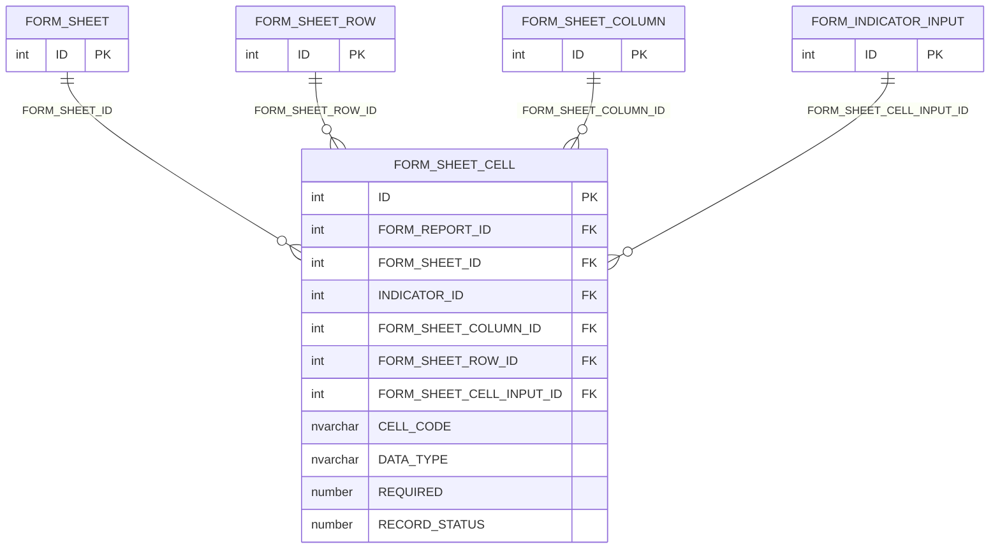
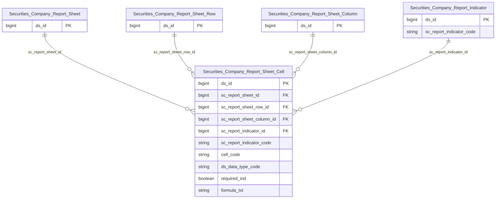

# SCMS HLD — Tier 4

**Source system:** SCMS (Quản lý Giám sát Công ty Chứng khoán)
**Tier 4:** Entity có FK đến Tier 3 — `FORM_SHEET_CELL` (ô dữ liệu trong sheet biểu mẫu báo cáo), phụ thuộc `FORM_SHEET_ROW`/`FORM_SHEET_COLUMN` (Tier 3), `FORM_SHEET` (Tier 2) và `FORM_INDICATOR_INPUT` (Tier 1).

> **[MỚI 2026-09-16]** File Tier 4 đầu tiên của SCMS — tạo mới khi đánh giá lại nhóm cascade `FORM_SHEET*`/`FORM_INDICATOR_*`/`LNK_EVENT_TYPE_FORM` bị loại khỏi scope với lý do lỗi thời (xem `SCMS_HLD_Tier1.md` T1-14).

---

## 6a. Bảng tổng quan BCV Concept

| BCV Core Object | BCV Concept | Category | Source Table | Mô tả bảng nguồn | Atomic Entity | table_type | BCV Term |
|---|---|---|---|---|---|---|---|
| Documentation | [Documentation] Form Document | Documentation | FORM_SHEET_CELL | Ô dữ liệu (cell) cụ thể trong sheet biểu mẫu báo cáo — gắn chỉ tiêu vào đúng vị trí hàng/cột, kèm định dạng hiển thị và công thức tính toán | Securities Company Report Sheet Cell | Relative | (1) Tái dùng term `Form Document` (id 9348, category Documentation) — cùng concept với toàn bộ family Sheet/Row/Column/Header, là thành phần chi tiết nhất (ô dữ liệu) của biểu mẫu báo cáo. (2) Cấu trúc bảng: FORM_SHEET_ID/FORM_SHEET_ROW_ID/FORM_SHEET_COLUMN_ID (FK xác định tọa độ ô), FORM_SHEET_CELL_INPUT_ID (FK → FORM_INDICATOR_INPUT — gắn chỉ tiêu báo cáo vào ô), CELL_CODE (mã định danh ô, VD A1/B2), DATA_TYPE, FORMULA/SUM_FORMULA (công thức tính), REQUIRED/EDITABLE, DEFAULT_VALUE, MAX_VALUE/MIN_VALUE, DROPDOWN_DATA — CELL_CODE + FORM_SHEET_CELL_INPUT_ID mang ý nghĩa nghiệp vụ cốt lõi (xác định CTCK phải nhập chỉ tiêu gì ở đâu), không chỉ là cấu hình hiển thị (LABEL/COLOR/ALIGNMENT/BOLD/ITALIC/UPPERCASE/UNDERLINE/STYLE_FORMAT/COL_SPAN/ROW_SPAN — các attribute thuần hiển thị vẫn giữ lại trên entity vì đây là bảng nguồn duy nhất mô tả ô, không tách entity con). (3) Chọn Documentation, Relative — phụ thuộc `Securities Company Report Sheet Row` + `Securities Company Report Sheet Column` + `Securities Company Report Sheet` (Tier 2/3) và `Securities Company Report Indicator` (Tier 1) → Tier 4 (tier cao nhất trong 4 FK). Đảo ngược quyết định loại-scope trước đây (xem 7e/7f Overview, T1-14). Xem 6f T4-01 về 2 cột FK khả nghi cùng trỏ indicator (INDICATOR_ID vs FORM_SHEET_CELL_INPUT_ID). |

---

## 6b. Diagram Source (Mermaid)

> `FORM_REPORT_ID` trên FORM_SHEET_CELL là FK dư thừa (denormalize) từ FORM_SHEET — không vẽ cạnh riêng, đã có đường đi qua FORM_SHEET. `TEMPLATE_FORM_REPORT_ID` (FK điều kiện, chỉ có ý nghĩa khi định dạng ký tự là ngày gửi báo cáo) không vẽ cạnh — xem 6f T4-02.

---

## 6c. Diagram Atomic (Mermaid)

> `Securities_Company_Report_Sheet`/`...Sheet_Row`/`...Sheet_Column` (Tier 2/3) và `Securities_Company_Report_Indicator` (Tier 1) hiện dạng node tham chiếu (chỉ PK).

---

## 6d. Mục Danh mục & Tham chiếu (Reference Data)

| Source Field / Bảng | Mô tả | Scheme Code | source_type | Ghi chú |
|---|---|---|---|---|
| FORM_SHEET_CELL.DATA_TYPE | Kiểu dữ liệu ô | `SCMS_CELL_DATA_TYPE` | source_table | Value set rộng hơn `SCMS_FORM_DATA_TYPE` (Tier 1/3) — có thêm `FORMULA` (công thức tính toán) ngoài TEXT/NUMBER/DATE/BOOLEAN/SELECT. Không tái dùng chung scheme để tránh áp giá trị FORMULA sai ngữ cảnh cho FORM_INDICATOR_INPUT/FORM_SHEET_COLUMN. |
| FORM_SHEET_CELL.STYLE_FORMAT | Định dạng chữ ký tự (đậm/nghiêng/hoa/gạch chân, có thể kết hợp) | `SCMS_SHEET_NAME_FORMAT` | source_table | Tái dùng scheme đã đăng ký ở Tier 3 (FORM_SHEET_ROW/COLUMN.NAME_FORMAT) — cùng value set ID/IN/IH/GC. |
| FORM_SHEET_CELL.ALIGNMENT | Canh lề văn bản trong ô | `SCMS_CELL_ALIGNMENT` | source_table | Values: LEFT, CENTER, RIGHT |
| FORM_SHEET_CELL.CHARACTER_FORMAT | Định dạng ký tự đặc biệt cho ô (VD TENTIENGVIET) | — (không gán scheme) | — | Mô tả nguồn chỉ có 1 ví dụ, chưa đủ căn cứ xác định tập giá trị đầy đủ — giữ Text tự do, cần profile dữ liệu ở LLD. |

---

## 6e. Bảng chờ thiết kế

*(Để trống — FORM_SHEET_CELL đã có cột đầy đủ)*

---

## 6f. Điểm cần xác nhận

| # | Câu hỏi | Kết quả |
|---|---|---|
| T4-01 | `FORM_SHEET_CELL` có 2 cột khả nghi cùng trỏ tới chỉ tiêu: `INDICATOR_ID` (mô tả nguồn trống, không tagged FK) và `FORM_SHEET_CELL_INPUT_ID` (mô tả nguồn trống, không tagged FK). Cả 2 đều không có `key`/`fk_note` trong BRD. Đâu là FK thật đến `FORM_INDICATOR_INPUT`, và 2 cột này có phải dư thừa/trùng lặp không? | **Chưa resolve — quyết định tạm thời.** Model `FORM_SHEET_CELL_INPUT_ID` là FK chính đến `Securities Company Report Indicator` (tên cột khớp trực tiếp "CELL_INPUT" ~ FORM_INDICATOR_INPUT). `INDICATOR_ID` giữ tạm dạng attribute số (không FK) — cần Data Modeler xác nhận khi thiết kế LLD hoặc profile dữ liệu thực tế (có thể là cột legacy trước khi tách FORM_INDICATOR_INPUT ra bảng riêng). |
| T4-02 | `FORM_SHEET_CELL.TEMPLATE_FORM_REPORT_ID` — mô tả nguồn: "biểu mẫu báo cáo ID đối với các định dạng ký tự là ngày gửi báo cáo" — FK điều kiện, chỉ có giá trị khi ô hiển thị ngày gửi báo cáo. Có nên model FK thật đến `Securities Company Report` không? | **Tạm giữ plain attribute (soft pointer), không model FK cứng** — cùng cách xử lý với các FK điều kiện/có điều kiện áp dụng khác trong SCMS (VD `REPORT_INPUT_SUBMISSION.REF_ID`, xem Tier2 T2-14). Cần Data Modeler xác nhận khi có thêm dữ liệu thực tế. |
| T4-03 | `FORM_SHEET_CELL.FORM_REPORT_ID` — dư thừa với đường FK gián tiếp qua `FORM_SHEET_ID` → `FORM_SHEET.FORM_REPORT_ID`. Có nên giữ cả 2 không? | Denormalize — không model thành FK riêng trên Atomic entity (join được qua `Securities Company Report Sheet`). Giữ nguyên trên nguồn (Bronze) nhưng không cần cặp Id+Code riêng ở Atomic. |
