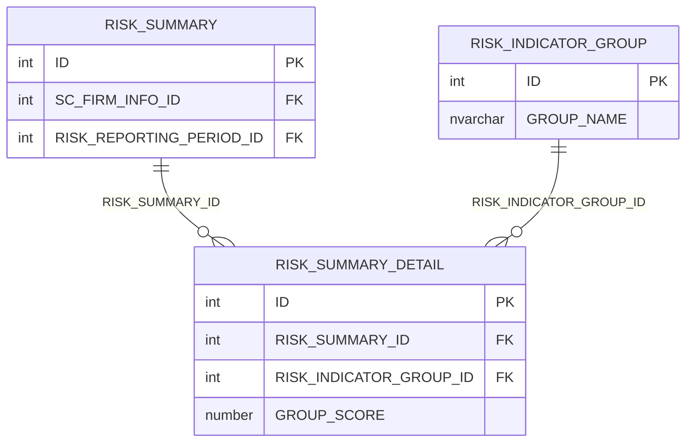
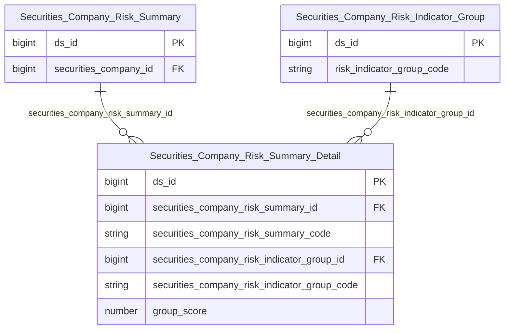

# SCMS HLD — Tier 4

**Source system:** SCMS (Quản lý Giám sát Công ty Chứng khoán)
**Tier 4:** Entity có FK đến Tier 3 — chỉ có RISK_SUMMARY_DETAIL (chi tiết tổng hợp rủi ro theo nhóm chỉ tiêu, FK đến RISK_SUMMARY T3 và RISK_INDICATOR_GROUP T1).

---

## 6a. Bảng tổng quan BCV Concept

| BCV Core Object | BCV Concept | Category | Source Table | Mô tả bảng nguồn | Atomic Entity | table_type | BCV Term |
|---|---|---|---|---|---|---|---|
| Event | [Event] Business Activity | Event | RISK_SUMMARY_DETAIL | Chi tiết tổng hợp điểm rủi ro theo nhóm chỉ tiêu (CAMEL component) cho từng CTCK theo kỳ | Securities Company Risk Summary Detail | Fact Snapshot | (1) BCV có `Risk Summary` hoặc `Risk Breakdown` trong Business Activity. (2) RISK_SUMMARY_DETAIL lưu điểm rủi ro từng nhóm (C, A, M, E, L) cho từng kỳ đánh giá: FK → RISK_SUMMARY.ID + RISK_INDICATOR_GROUP.ID + điểm nhóm. Grain = 1 nhóm × 1 kỳ × 1 CTCK. Fact Snapshot vì chụp trạng thái theo kỳ. (3) Chọn `[Event] Business Activity`, Fact Snapshot. |

---

## 6b. Diagram Source (Mermaid)

---

## 6c. Diagram Atomic (Mermaid)

---

## 6d. Mục Danh mục & Tham chiếu (Reference Data)

*(Không có Reference Data mới ở Tier 4)*

---

## 6e. Bảng chờ thiết kế

*(Để trống)*

---

## 6f. Điểm cần xác nhận

| # | Câu hỏi | Kết quả |
|---|---|---|
| T4-01 | RISK_SUMMARY_DETAIL có FK đến RISK_INDICATOR_GROUP (T1) trực tiếp — tại sao đặt T4 chứ không phải T2 hay T3? | RISK_SUMMARY_DETAIL phụ thuộc RISK_SUMMARY (T3) → bắt buộc T4. FK đến RISK_INDICATOR_GROUP (T1) là thêm, không thay đổi tier. |
