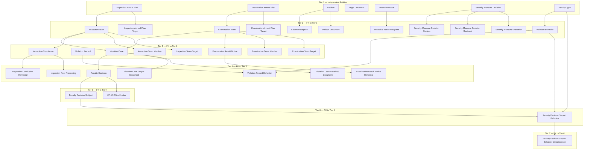

# THANHTRA HLD — Overview

**Source system:** THANHTRA (Hệ thống Thanh tra, Kiểm tra và Xử phạt vi phạm hành chính — UBCKNN)
**Mô tả:** Hệ thống quản lý toàn bộ quy trình thanh tra, kiểm tra, tiếp công dân, xử lý đơn thư và xử lý vi phạm hành chính (VPHC) của Ủy ban Chứng khoán Nhà nước (UBCKNN). Bao gồm kế hoạch năm, đoàn thanh tra/kiểm tra, kết luận, quyết định xử phạt và theo dõi thi hành.

---

#### 7a. Bảng tổng quan Atomic entities

| Tier | BCV Core Object | BCV Concept | Category | Source Table | Source Table Change Mode | Mô tả bảng nguồn | Atomic Entity | Table Type | BCV Term |
|---|---|---|---|---|---|---|---|---|---|
| T1 | Business Direction | [Business Direction] Business Plan | Regulatory Planning | INSPECTION_ANNUAL_PLAN | Update | Kế hoạch thanh tra hàng năm: 1 kế hoạch/1 năm, phê duyệt bằng quyết định hành chính | Inspection Annual Plan | Fundamental | (1) Business Plan — BCV: "a Business Direction to attain objectives; combines activities, timeframe, assigned responsibilities". (2) Bảng: PLAN_YEAR(unique/năm), DECISION_NUMBER, DECISION_DATE, STATUS(DRAFT/APPROVED) — kế hoạch chính thức với năm, quyết định, trạng thái lifecycle. (3) Chọn Business Plan: khớp với "kế hoạch nghiệp vụ hàng năm có timeframe và trạng thái phê duyệt". Không có BCV term chuyên biệt cho "regulatory inspection plan". |
| T1 | Business Direction | [Business Direction] Business Plan | Regulatory Planning | EXAMINATION_ANNUAL_PLAN | Update | Kế hoạch kiểm tra hàng năm: cấu trúc đồng nhất với INSPECTION_ANNUAL_PLAN, dành cho đoàn kiểm tra | Examination Annual Plan | Fundamental | (1) Business Plan — BCV: cùng mô tả. (2) Bảng: cấu trúc hoàn toàn đồng nhất với INSPECTION_ANNUAL_PLAN. (3) Tách entity riêng vì Inspection và Examination là 2 loại hình khác thẩm quyền. Cùng BCV Concept, khác prefix. |
| T1 | Communication | [Communication] Feedback | Petition Management | PETITION | Update | Đơn thư công dân/tổ chức: PETITION_CATEGORY(FEEDBACK_SUGGESTION/COMPLAINT/DENUNCIATION), self-ref đơn trùng, STATUS | Petition | Fundamental | (1) Feedback — BCV: "a Communication to offer a compliment or a complaint". Complaint — BCV sub-type: "indicate dissatisfaction". (2) Bảng: PETITION_CATEGORY(3 values), SENDER_NAME/ADDRESS, self-ref ORIGINAL_PETITION_ID, STATUS. (3) Dùng Feedback (parent) thay Complaint vì FEEDBACK_SUGGESTION không phải "dissatisfaction" — Feedback bao hàm cả 3 loại đơn thư. |
| T1 | Business Direction | [Business Direction] Law | Legal Reference | LEGAL_DOCUMENT | Update | Danh mục văn bản pháp luật làm căn cứ xử phạt: CODE(VBPL-XXXX), NAME, ISSUED_DATE, STATUS(ACTIVE/INACTIVE) | Legal Document | Fundamental | (1) Law — BCV: "a Business Direction defining binding rules legally enforceable; failure to comply may result in penalty". (2) Bảng: CODE(VBPL-XXXX), NAME, ISSUED_DATE, STATUS lifecycle. (3) Chọn Law: bảng lưu văn bản pháp luật làm căn cứ xử phạt. Có ISSUED_DATE + STATUS lifecycle → Fundamental (không phải Classification Value thuần túy). |
| T1 | Event | [Event] Event | Regulatory Communication | PROACTIVE_NOTICE | Update | Thông báo chủ động phát đi: NOTICE_TYPE(4 values), PRIORITY, STATUS(DRAFT/SENT), không FK đến inspection/examination | Proactive Notice | Fundamental | (1) Notification — BCV: "a Communication to convey information; e.g., update notifying of a policy change, circular". Announcement — BCV: "to make information public or widely known". (2) Bảng: TITLE, CONTENT, NOTICE_TYPE, PRIORITY, SENT_AT, STATUS(DRAFT/SENT). (3) Chọn Notification (không Announcement): mục đích truyền đạt thông tin định hướng/nhắc nhở nội bộ, không phải công bố rộng rãi. |
| T1 | Business Activity | [Business Activity] Conduct Violation | Enforcement | SECURITY_MEASURE_DECISION | Update | Quyết định biện pháp ngăn chặn/khẩn cấp: MEASURE_TYPE(BAN_POSITION/BAN_ACTIVITY/FREEZE_ACCOUNT/OTHER), không FK đến VIOLATION_CASE | Security Measure Decision | Fundamental | (1) Conduct Violation — BCV: "a Business Activity that breaches a business code of conduct". (2) Bảng: DECISION_NUMBER, MEASURE_TYPE(4 values), EFFECTIVE_DATE, DURATION_MONTHS, SIGNER_NAME — quyết định hành chính độc lập. (3) Không có BCV term cho "administrative preventive measure decision". Conduct Violation là gần nhất vì đây là hoạt động xử lý vi phạm pháp lý. Ghi nhận T1-04 để review. |
| T1 | Business Direction | [Business Direction] Law | Regulatory Catalog | PENALTY_TYPE | Update | Danh mục hình thức xử phạt hành chính: CATEGORY(PRIMARY/SUPPLEMENTARY/REMEDIAL), STATUS(ACTIVE/INACTIVE), LEGAL_BASIS | Penalty Type | Classification | (1) Law — BCV: "defines binding rules legally enforceable". (2) Bảng: CODE(UNIQUE), NAME, CATEGORY(3 values), STATUS lifecycle, LEGAL_BASIS. (3) Không thuần Code+Name vì có CATEGORY, STATUS, LEGAL_BASIS → Fundamental. Law phù hợp vì các hình thức xử phạt được pháp luật quy định. |
| T2 | Business Activity | [Business Activity] Business Review | Inspection | INSPECTION_TEAM | Update | Hồ sơ đoàn thanh tra: CODE(HSTT-YYYY-XXX), FK→ANNUAL_PLAN(nullable), FORM_TYPE(PERIODIC/UNSCHEDULED), DECISION_NUMBER | Inspection Team | Fundamental | (1) Business Review — BCV: "a Business Activity in which business operations are studied and compared to business objectives". (2) Bảng: CODE(HSTT-YYYY-XXX), FK→INSPECTION_ANNUAL_PLAN(nullable), PLAN_YEAR, FORM_TYPE, DECISION_NUMBER(UNIQUE), rich inspection details, VERIFICATION_MINUTES_SIGN_DATE. (3) Business Review là BCV term phù hợp nhất cho hoạt động thanh tra (review operations vs objectives). Không có "Regulatory Inspection" trong BCV. |
| T2 | Business Activity | [Business Activity] Business Review | Examination | EXAMINATION_TEAM | Update | Hồ sơ đoàn kiểm tra: CODE(HSKT-YYYY-XXX), FK→ANNUAL_PLAN(nullable), UNIT_ID/UNIT_NAME, FORM_TYPE | Examination Team | Fundamental | (1) Business Review — BCV: cùng mô tả. (2) Bảng: CODE(HSKT-YYYY-XXX), FK→EXAMINATION_ANNUAL_PLAN(nullable), UNIT_ID, UNIT_NAME, FORM_TYPE, DECISION_NUMBER(UNIQUE). (3) Business Review khớp. Tách 2 entity vì Inspection và Examination khác thẩm quyền. |
| T2 | Business Activity | [Business Activity] Business Review | Inspection Target | INSPECTION_ANNUAL_PLAN_TARGET | Update | Danh sách đối tượng thanh tra trong kế hoạch năm: TARGET_TYPE(3 values), TARGET_NAME | Inspection Annual Plan Target | Fundamental | (1) Business Plan — entity này mở rộng kế hoạch với danh sách mục tiêu. (2) Bảng: FK→INSPECTION_ANNUAL_PLAN, TARGET_TYPE(SECURITIES_COMPANY/FUND_MANAGEMENT_COMPANY/PUBLIC_COMPANY), TARGET_NAME. (3) Relative của TT Inspection Annual Plan, tên chứa parent ✓. |
| T2 | Business Activity | [Business Activity] Business Review | Examination Target | EXAMINATION_ANNUAL_PLAN_TARGET | Update | Danh sách đối tượng kiểm tra trong kế hoạch năm: cấu trúc tương tự INSPECTION_ANNUAL_PLAN_TARGET | Examination Annual Plan Target | Fundamental | (1) Business Plan — cùng mô tả. (2) Cấu trúc đồng nhất với INSPECTION_ANNUAL_PLAN_TARGET. (3) Relative của TT Examination Annual Plan, tên chứa parent ✓. |
| T2 | Business Activity | [Business Activity] Conduct Violation | Security Measure Subject | SECURITY_MEASURE_DECISION_SUBJECT | Update | Đối tượng bị áp dụng biện pháp ngăn chặn: SUBJECT_TYPE, SUBJECT_NAME, SUBJECT_ID_NUMBER | Security Measure Decision Subject | Fundamental | (1) Involved Party — BCV: "an Entity involved in the Financial Institution's business". (2) Bảng: FK→SECURITY_MEASURE_DECISION, SUBJECT_TYPE, SUBJECT_NAME, SUBJECT_ID_NUMBER — thông tin định danh từng đối tượng bị ngăn chặn. (3) Involved Party khớp — mỗi dòng là 1 đối tượng (Involved Party) trong bối cảnh biện pháp ngăn chặn. Tên chứa "TT Security Measure Decision" ✓. |
| T2 | Business Activity | [Business Activity] Conduct Violation | Security Measure Recipient | SECURITY_MEASURE_DECISION_RECIPIENT | Update | Đơn vị nhận quyết định ngăn chặn: RECIPIENT_TYPE(5 values), RECIPIENT_NAME | Security Measure Decision Recipient | Fundamental | (1) Communication — BCV: "an exchange of information with an Involved Party". (2) Bảng: FK→SECURITY_MEASURE_DECISION, RECIPIENT_TYPE(5 values), RECIPIENT_NAME — danh sách đơn vị nhận bản sao quyết định. (3) Không có BCV term cho "decision recipient list". Communication là parent concept phù hợp nhất. Tên chứa "TT Security Measure Decision" ✓. |
| T2 | Business Activity | [Business Activity] Business Review | Security Measure Execution | SECURITY_MEASURE_EXECUTION | Update | Kết quả thực thi biện pháp ngăn chặn: REPORTER_NAME, REPORT_DATE, EXECUTION_RESULT(3 values) | Security Measure Execution | Fundamental | (1) Business Review — BCV: "Status Review" sub-type: "a Business Activity in which the status of an item is reviewed". (2) Bảng: FK→SECURITY_MEASURE_DECISION, REPORTER_NAME, REPORT_DATE, EXECUTION_RESULT(FULLY_EXECUTED/IN_PROGRESS/NOT_EXECUTED). (3) Status Review (sub-type Business Review) phù hợp nhất — báo cáo kết quả thực thi. Tên chứa "TT Security Measure" ✓. |
| T2 | Business Activity | [Business Activity] Business Review | Citizen Reception | CITIZEN_RECEPTION | Update | Buổi tiếp công dân: RECEPTION_DATE, RECEIVER_ID, SUBJECT_TYPE, NUMBER_OF_PEOPLE, FK→PETITION(nullable) | Citizen Reception | Fundamental | (1) Business Review — BCV: gần nhất cho "formal reception/meeting activity". (2) Bảng: RECEPTION_DATE, RECEIVER_ID, SUBJECT_TYPE, SUBJECT_NAME, NUMBER_OF_PEOPLE, SUMMARY, FK→PETITION(nullable). (3) Không có BCV term cho "citizen reception". Business Review phù hợp — hoạt động gặp mặt/xem xét vụ việc. FK→PETITION nullable → Fundamental. |
| T2 | Communication | [Communication] Feedback | Petition Processing Document | PETITION_DOCUMENT | Update | Văn bản xử lý đơn thư: DOCUMENT_TYPE(8 loại), DOCUMENT_NUMBER, nội dung, người ký | Petition Document | Fundamental | (1) Feedback — đồng concept với TT Petition parent. Communication — BCV: "an exchange of information". (2) Bảng: FK→PETITION, DOCUMENT_TYPE(8 values), DOCUMENT_NUMBER, DOCUMENT_DATE, CONTENT, CLASSIFICATION_RESULT, PROPOSED_ACTION, SIGNER_NAME. (3) Artifact của quy trình xử lý Petition. Relative → tên chứa "TT Petition" ✓. |
| T2 | Event | [Event] Event | Proactive Notice Recipient | PROACTIVE_NOTICE_RECIPIENT | Update | Danh sách công ty nhận thông báo chủ động: COMPANY_CODE, RECIPIENT_TYPE | Proactive Notice Recipient | Fundamental | (1) Notification — entity này ghi nhận recipients của Notification. (2) Bảng: FK→PROACTIVE_NOTICE, COMPANY_CODE, RECIPIENT_TYPE. (3) Relative → tên chứa "TT Proactive Notice" ✓. |
| T2 | Business Activity | [Business Activity] Conduct Violation | Violation Behavior Catalog | VIOLATION_BEHAVIOR | Update | Danh mục hành vi vi phạm hành chính: CODE(UNIQUE), FK→PENALTY_TYPE, MIN/MAX_FINE_AMOUNT, REMEDIAL_MEASURE, VIOLATION_CLAUSE | Violation Behavior | Fundamental | (1) Conduct Violation — BCV: "a Business Activity that breaches a business code of conduct". (2) Bảng: CODE(UNIQUE), NAME, FK→PENALTY_TYPE, MIN_FINE_AMOUNT, MAX_FINE_AMOUNT, REMEDIAL_MEASURE, VIOLATION_CLAUSE — danh mục hành vi với mức phạt min/max, căn cứ pháp lý. (3) Không thuần Code+Name vì có FK + fine range → Fundamental. Conduct Violation phù hợp hơn Law vì đây mô tả hành vi vi phạm cụ thể. |
| T3 | Business Activity | [Business Activity] Conduct Violation | VPHC Case | VIOLATION_CASE | Update | Hồ sơ xử lý vi phạm hành chính: SOURCE_CATEGORY(5 types), FK→INSPECTION/EXAMINATION_TEAM(nullable), STATUS(5 states) | Violation Case | Fundamental | (1) Conduct Violation — BCV: "a Business Activity that breaches a business code of conduct of the Financial Institution". (2) Bảng: CODE, NAME, SOURCE_CATEGORY(5 values), FK→INSPECTION_TEAM(nullable), FK→EXAMINATION_TEAM(nullable), ASSIGNED_OFFICER_ID, STATUS(NEW/PROCESSING/DECISION_ISSUED/ENFORCED/CLOSED), BOND fields. (3) Conduct Violation khớp hoàn toàn — entity hồ sơ vi phạm pháp luật với lifecycle đầy đủ. |
| T3 | Business Activity | [Business Activity] Conduct Violation | Violation Record | VIOLATION_RECORD | Update | Biên bản vi phạm hành chính: RECORD_NUMBER, RECORD_TYPE(PAPER/ELECTRONIC), FK suy luận→Teams, STATUS(DRAFT→SIGNED→NUMBERED→SENT) | Violation Record | Fundamental | (1) Form Document — BCV: "a Documentation Item in a standard template layout requiring additional information". (2) Bảng: RECORD_NUMBER, RECORD_TYPE(2 values), FK suy luận→INSPECTION/EXAMINATION_TEAM, SUBJECT_TYPE/NAME/ID_NUMBER, STATUS(4 states), signing/forwarding tracking. (3) Form Document khớp — biên bản vi phạm là biểu mẫu pháp lý với workflow phê duyệt 4 bước. FK suy luận → Tier 3 (xem T3-01). |
| T3 | Documentation | [Documentation] Form Document | Inspection Conclusion | INSPECTION_CONCLUSION | Update | Kết luận thanh tra: CONCLUSION_NUMBER, FK→INSPECTION_TEAM, TARGET_TYPE/REFERENCE/NAME, EXECUTION_STATUS(3 states) | Inspection Conclusion | Fundamental | (1) Form Document — BCV: formal document produced as outcome of Business Activity. Status Document — BCV: "issued by inspector to document condition". (2) Bảng: FK→INSPECTION_TEAM, CONCLUSION_NUMBER, ISSUED_DATE, ANNOUNCED_DATE, TARGET_TYPE, CONTENT, RECOMMENDATION, EXECUTION_STATUS, GOVERNMENT_INSPECTOR_SENT_DATE. (3) Form Document phù hợp — kết luận là tài liệu pháp lý chính thức kết thúc đoàn thanh tra. |
| T3 | Documentation | [Documentation] Form Document | Examination Result Notice | EXAMINATION_RESULT_NOTICE | Update | Thông báo kết quả kiểm tra: NOTICE_NUMBER, FK→EXAMINATION_TEAM, TARGET_TYPE, EXECUTION_STATUS(3 states) | Examination Result Notice | Fundamental | (1) Form Document — BCV: cùng mô tả. (2) Bảng: FK→EXAMINATION_TEAM, NOTICE_NUMBER, ISSUED_DATE, ANNOUNCED_DATE, TARGET_TYPE, CONTENT, RECOMMENDATION, EXECUTION_STATUS. (3) Form Document khớp — thông báo kết quả kiểm tra là tài liệu chính thức tương đương kết luận thanh tra cho đoàn kiểm tra. |
| T3 | Business Activity | [Business Activity] Business Review | Inspection Team Member | INSPECTION_TEAM_MEMBER | Update | Danh sách thành viên đoàn thanh tra: USER_ID, ROLE_TYPE (vai trò trong đoàn) | Inspection Team Member | Fundamental | (1) Involved Party — BCV: entity này ghi nhận vai trò cá nhân trong đoàn. (2) Bảng: FK→INSPECTION_TEAM, USER_ID(FK→system_user), ROLE_TYPE, USER_NAME. (3) Involved Party khớp — 1 thành viên là 1 Involved Party trong đoàn. Tên chứa "TT Inspection Team" ✓. |
| T3 | Business Activity | [Business Activity] Business Review | Examination Team Member | EXAMINATION_TEAM_MEMBER | Update | Danh sách thành viên đoàn kiểm tra: cấu trúc đồng nhất với INSPECTION_TEAM_MEMBER | Examination Team Member | Fundamental | (1) Involved Party — BCV: cùng mô tả. (2) Cấu trúc đồng nhất với INSPECTION_TEAM_MEMBER. (3) Tên chứa "TT Examination Team" ✓. |
| T3 | Business Activity | [Business Activity] Business Review | Inspection Team Target | INSPECTION_TEAM_TARGET | Update | Đối tượng được thanh tra trong đoàn: TARGET_TYPE(7 values), TARGET_REFERENCE_ID, TARGET_NAME | Inspection Team Target | Fundamental | (1) Business Review — entity này ghi nhận "ai được review" trong inspection activity. (2) Bảng: FK→INSPECTION_TEAM, TARGET_TYPE(7 values), TARGET_REFERENCE_ID, TARGET_NAME. (3) Business Review phù hợp. Tên chứa "TT Inspection Team" ✓. |
| T3 | Business Activity | [Business Activity] Business Review | Examination Team Target | EXAMINATION_TEAM_TARGET | Update | Đối tượng được kiểm tra trong đoàn: TARGET_TYPE(7 values), TARGET_REFERENCE_ID, TARGET_NAME | Examination Team Target | Fundamental | (1) Business Review — cùng mô tả. (2) Cấu trúc đồng nhất với INSPECTION_TEAM_TARGET. (3) Tên chứa "TT Examination Team" ✓. |
| T4 | Event | [Event] Event | Penalty Decision | PENALTY_DECISION | Update | Quyết định xử phạt VPHC: DECISION_NUMBER, FK→VIOLATION_CASE, TOTAL_FINE_AMOUNT, STATUS(7 states), COMPLAINT_EXISTS, LAWSUIT_EXISTS | Penalty Decision | Fundamental | (1) Event — BCV: "identifies a significant occurrence". Judicial Event — BCV: "deals with violation of law". (2) Bảng: DECISION_NUMBER, ISSUED_DATE, FK→VIOLATION_CASE, TOTAL_FINE_AMOUNT, STATUS(7 values), COMPLAINT_EXISTS, LAWSUIT_EXISTS, SUBMITTED_BY_ID, APPROVER_ID. (3) Judicial Event gần nhất nhưng đây là quyết định hành chính (không tư pháp). Dùng parent [Event] để tránh gán concept sai. Xem T4-01. |
| T4 | Documentation | [Documentation] Form Document | VPHC Output Document | VIOLATION_CASE_OUTPUT_DOCUMENT | Update | Văn bản đầu ra quy trình VPHC: DOCUMENT_TYPE(9 values) liên kết tài liệu phát sinh | Violation Case Output Document | Fundamental | (1) Form Document — BCV: formal document. (2) Bảng: FK→VIOLATION_CASE, DOCUMENT_TYPE(9 values gồm cả PENALTY_DECISION). (3) Form Document phù hợp. Tên chứa "TT Violation Case" ✓. |
| T4 | Documentation | [Documentation] Documentation Item | VPHC Received Document | VIOLATION_CASE_RECEIVED_DOCUMENT | Update | Văn bản tiếp nhận trong hồ sơ VPHC: DOCUMENT_NUMBER, RECEIVED_DATE, SUMMARY | Violation Case Received Document | Fundamental | (1) Documentation Item — BCV: "a piece of documentation". (2) Bảng: FK→VIOLATION_CASE, DOCUMENT_NUMBER, RECEIVED_DATE, SUMMARY — tài liệu nhận vào. (3) Documentation Item (chứ không phải Form Document) vì đây là tài liệu tiếp nhận từ bên ngoài. Tên chứa "TT Violation Case" ✓. |
| T4 | Business Activity | [Business Activity] Conduct Violation | Violation Record Behavior | VIOLATION_RECORD_BEHAVIOR | Update | Hành vi vi phạm trong biên bản: FK→VIOLATION_RECORD, FK→VIOLATION_BEHAVIOR, DESCRIPTION, LEGAL_BASIS | Violation Record Behavior | Fundamental | (1) Conduct Violation — đồng concept với parent. (2) Bảng: FK→VIOLATION_RECORD, FK→VIOLATION_BEHAVIOR, DESCRIPTION(CLOB), LEGAL_BASIS. (3) Conduct Violation phù hợp — chi tiết hành vi vi phạm cụ thể. Tên chứa "TT Violation Record" ✓. |
| T4 | Documentation | [Documentation] Form Document | Inspection Conclusion Remedial | INSPECTION_CONCLUSION_REMEDIAL | Update | Biện pháp khắc phục trong kết luận thanh tra: FK→INSPECTION_CONCLUSION, DESCRIPTION | Inspection Conclusion Remedial | Fundamental | (1) Form Document — chi tiết nội dung của văn bản kết luận. (2) Bảng: FK→INSPECTION_CONCLUSION, DESCRIPTION(CLOB) — từng biện pháp khắc phục. (3) Tên chứa "TT Inspection Conclusion" ✓. |
| T4 | Documentation | [Documentation] Form Document | Examination Result Notice Remedial | EXAMINATION_RESULT_NOTICE_REMEDIAL | Update | Biện pháp khắc phục trong thông báo kết quả kiểm tra: FK→EXAMINATION_RESULT_NOTICE, DESCRIPTION | Examination Result Notice Remedial | Fundamental | (1) Form Document — cùng mô tả. (2) Cấu trúc đồng nhất với INSPECTION_CONCLUSION_REMEDIAL. (3) Tên chứa "TT Examination Result Notice" ✓. |
| T4 | Business Activity | [Business Activity] Business Review | Inspection Post Processing | POST_INSPECTION_PROCESSING | Update | Theo dõi thực hiện kiến nghị sau thanh tra: FK→INSPECTION_CONCLUSION, REQUIREMENT_TYPE, STATUS(5 states), DUE_DATE | Inspection Post Processing | Fundamental | (1) Status Review (sub-type Business Review) — BCV: "reviews status to determine if still valid". (2) Bảng: FK→INSPECTION_CONCLUSION, REQUIREMENT_TYPE, RESPONSIBLE_PARTY, DUE_DATE, STATUS(5 values), IMPLEMENTATION_NOTES, RESULT_SUMMARY. (3) Status Review phù hợp — theo dõi tiến độ thực hiện kiến nghị. Tên chứa "TT Inspection" nhưng không đủ "TT Inspection Conclusion" (xem T4-03). |
| T5 | Event | [Event] Event | Penalty Subject | PENALTY_DECISION_SUBJECT | Update | Đối tượng bị xử phạt trong quyết định: SUBJECT_TYPE, embedded identity, TOTAL_FINE_AMOUNT, PAID_AMOUNT, COMPLIANCE_STATUS(4 states) | Penalty Decision Subject | Fundamental | (1) Involved Party — BCV: "an Entity involved in the Financial Institution's business". (2) Bảng: FK→PENALTY_DECISION, SUBJECT_TYPE, SUBJECT_NAME, SUBJECT_ID_NUMBER, TOTAL_FINE_AMOUNT, PAID_AMOUNT, COERCED_AMOUNT, COMPLIANCE_STATUS, PAYMENT_PROOF_URL. (3) Involved Party khớp — mỗi đối tượng bị xử phạt là Involved Party trong bối cảnh quyết định. Tên chứa "TT Penalty Decision" ✓. |
| T5 | Documentation | [Documentation] Form Document | VPHC Official Letter | VPHC_PROCESS_OFFICIAL_LETTER | Update | Công văn trong quy trình VPHC: OFFICIAL_LETTER_SUBTYPE(8 values), FK→VIOLATION_CASE/RECORD/PENALTY_DECISION(đều nullable), form data CLOBs | VPHC Official Letter | Fundamental | (1) Form Document — BCV: "a Documentation Item in a standard template layout requiring additional information". (2) Bảng: OFFICIAL_LETTER_SUBTYPE(8 values), FK→VIOLATION_CASE(nullable), FK→VIOLATION_RECORD(nullable), FK→PENALTY_DECISION(nullable), DOCUMENT_TEMPLATE_ID, 3 CLOB form fields. (3) Form Document khớp — công văn theo mẫu. Cả 3 FK nullable → Fundamental. FK→PENALTY_DECISION(T4) → đặt T5. |
| T6 | Event | [Event] Event | Penalty Subject Behavior | PENALTY_DECISION_SUBJECT_BEHAVIOR | Update | Chi tiết hành vi vi phạm của từng đối tượng: FK→PENALTY_DECISION_SUBJECT, FK→VIOLATION_BEHAVIOR, FK→PENALTY_TYPE, MIN/MAX/APPLIED_FINE_AMOUNT | Penalty Decision Subject Behavior | Fundamental | (1) Conduct Violation — đồng concept với parent. (2) Bảng: FK→PENALTY_DECISION_SUBJECT, FK→VIOLATION_BEHAVIOR, FK→PENALTY_TYPE, MIN/MAX/APPLIED_FINE_AMOUNT, REMEDIAL_MEASURE, LEGAL_BASIS. (3) Conduct Violation phù hợp — chi tiết từng hành vi được xử lý. Tên chứa "TT Penalty Decision Subject" ✓. |
| T7 | Event | [Event] Event | Circumstance | PENALTY_DECISION_CIRCUMSTANCE | Update | Tình tiết tăng nặng/giảm nhẹ: FK→PENALTY_DECISION_SUBJECT_BEHAVIOR, CIRCUMSTANCE_TYPE(AGGRAVATING/MITIGATING), CONTENT | Penalty Decision Subject Behavior Circumstance | Fundamental | (1) Conduct Violation — đồng concept với parent. (2) Bảng: FK→PENALTY_DECISION_SUBJECT_BEHAVIOR, CIRCUMSTANCE_TYPE(2 values), CONTENT(CLOB). (3) Conduct Violation phù hợp. Tên chứa "TT Penalty Decision Subject Behavior" ✓. Tier sâu nhất (T7) vì là leaf node của chuỗi dependency dài nhất. |

**Tổng: 37 Atomic entities** (T1: 7, T2: 11, T3: 8, T4: 7, T5: 2, T6: 1, T7: 1)

---

#### 7b. Diagram Atomic tổng (Mermaid)

---

#### 7c. Bảng Classification Value

| Source Table | Mô tả | BCV Term | Xử lý Atomic |
|---|---|---|---|
| PENALTY_TYPE | Danh mục hình thức xử phạt: có STATUS + DESCRIPTION + LEGAL_BASIS | [Business Direction] Law | Thiết kế Fundamental entity TT Penalty Type (không phải thuần Classification Value vì có lifecycle và attributes) |
| VIOLATION_BEHAVIOR | Danh mục hành vi vi phạm: có fine range + FK→PENALTY_TYPE | [Business Activity] Conduct Violation | Thiết kế Fundamental entity TT Violation Behavior (có instance data phong phú) |

> Ghi chú: THANHTRA source ít có bảng thuần Classification Value (Code+Name only). Hầu hết danh mục đã được thiết kế thành entity riêng vì có lifecycle attributes.

---

#### 7d. Junction Tables

| Source Table | Mô tả | Entity chính | Xử lý trên Atomic |
|---|---|---|---|
| PENALTY_TYPE_VIOLATION_BEHAVIOR | Junction giữa PENALTY_TYPE và VIOLATION_BEHAVIOR (out_of_scope trong BRD) | Violation Behavior | Denormalize: PRIMARY_PENALTY_TYPE_ID là FK trực tiếp trên VIOLATION_BEHAVIOR |
| VIOLATION_BEHAVIOR_LEGAL_DOCUMENT | Junction giữa VIOLATION_BEHAVIOR và LEGAL_DOCUMENT (out_of_scope trong BRD) | Violation Behavior | Denormalize thành trường `legal_document_codes ARRAY<STRING>` hoặc giữ dạng text legacy trên TT Violation Behavior |

---

#### 7e. Điểm cần xác nhận

| # | Tier | Câu hỏi | Ảnh hưởng |
|---|---|---|---|
| 1 | T1 | SECURITY_MEASURE_DECISION không FK đến VIOLATION_CASE — đây là quyết định hành chính độc lập hay luôn liên kết hồ sơ vi phạm? | Nếu có FK → dời sang T4 |
| 2 | T1 | Security Measure Decision dùng BCV [Business Activity] Conduct Violation — không có term đặc thù cho "administrative preventive measure decision" | Cần review với Data Architect |
| 3 | T3 | VIOLATION_RECORD có FK suy luận đến INSPECTION/EXAMINATION_TEAM (không formal FK) — nếu không có FK chính thức → có thể là T2 | Xác nhận với BA/dev team |
| 4 | T4 | Penalty Decision dùng BCV [Event] — không có term cụ thể cho "administrative penalty decision" | Cần review với Data Architect |
| 6 | T4 | Inspection Post Processing — tên không chứa đủ "TT Inspection Conclusion" (chỉ có "TT Inspection"). Đề xuất đổi thành "TT Inspection Conclusion Post Processing" | Xác nhận với team Design |
| 7 | T5 | VPHC_PROCESS_OFFICIAL_LETTER có 3 CLOB form data (FIELD_HTML_JSON, FIELD_SOURCE_JSON, MANUAL_MERGE_DATA_JSON) — cần load lên Atomic không? | Đề xuất bỏ qua CLOBs — không có giá trị phân tích |
| 8 | T7 | PENALTY_DECISION_CIRCUMSTANCE có 3 trường nghiệp vụ — có nên denormalize vào T6 không? | Giữ entity riêng để phân tích số lượng tình tiết tăng nặng/giảm nhẹ độc lập |

---

#### 7f. Bảng ngoài scope

| Nhóm | Source Table | Mô tả bảng nguồn | Lý do ngoài scope |
|---|---|---|---|
| Audit Log nguồn | VIOLATION_CASE_STATUS_HISTORY | Log lịch sử thay đổi trạng thái hồ sơ VPHC | Audit Log nguồn — không thiết kế entity Atomic riêng |
| Audit Log nguồn | PENALTY_DECISION_APPROVAL_HISTORY | Log hoạt động phê duyệt quyết định xử phạt | Audit Log nguồn — không thiết kế entity Atomic riêng |
| Junction | PENALTY_TYPE_VIOLATION_BEHAVIOR | Bảng nối nhiều-nhiều giữa loại xử phạt và hành vi vi phạm | Pure junction không có business attribute — denormalize vào TT Violation Behavior |
| Junction | PENALTY_DECISION_VIOLATION_RECORD | Bảng nối nhiều-nhiều giữa quyết định xử phạt và biên bản vi phạm | Pure junction không có business attribute — quan hệ đã suy luận qua VIOLATION_CASE |
| Junction | VIOLATION_BEHAVIOR_LEGAL_DOCUMENT | Bảng nối nhiều-nhiều giữa hành vi vi phạm và văn bản pháp luật | Pure junction không có business attribute — denormalize vào TT Violation Behavior dạng ARRAY |
| Form Metadata | DOCUMENT_TEMPLATE | Template biểu mẫu công văn: định nghĩa cấu trúc form, placeholder fields | Operational/system data — metadata form/template không có giá trị nghiệp vụ Atomic |
| Audit Log nguồn | ADHOC_INSPECTION_REPORT | Báo cáo thanh tra ad-hoc | Báo cáo tổng hợp nguồn — không phải entity nghiệp vụ Atomic |
| Audit Log nguồn | SUPERVISION_ACTIVITY_REPORT | Báo cáo hoạt động giám sát | Báo cáo tổng hợp nguồn — không phải entity nghiệp vụ Atomic |
| Audit Log nguồn | ADHOC_ADMIN_VIOLATION_REPORT | Báo cáo vi phạm hành chính ad-hoc | Báo cáo tổng hợp nguồn — không phải entity nghiệp vụ Atomic |
| Audit Log nguồn | INSPECTION_REPORT_OUTLINE | Outline cấu trúc báo cáo thanh tra | Form Metadata — cấu trúc báo cáo, không có instance data nghiệp vụ |
| Audit Log nguồn | ADMIN_VIOLATION_REPORT_OUTLINE | Outline cấu trúc báo cáo vi phạm hành chính | Form Metadata — cấu trúc báo cáo, không có instance data nghiệp vụ |
| Audit Log nguồn | CITIZEN_COMPLAINT_REPORT_OUTLINE | Outline cấu trúc báo cáo khiếu nại | Form Metadata — cấu trúc báo cáo, không có instance data nghiệp vụ |
| Audit Log nguồn | ADHOC_ANTI_CORRUPTION_REPORT | Báo cáo phòng chống tham nhũng ad-hoc | Báo cáo tổng hợp nguồn — không phải entity nghiệp vụ Atomic |
| Audit Log nguồn | ANTI_CORRUPTION_PERIODIC_REPORT | Báo cáo phòng chống tham nhũng định kỳ | Báo cáo tổng hợp nguồn — không phải entity nghiệp vụ Atomic |
| Audit Log nguồn | ANTI_CORRUPTION_REPORT_OUTLINE | Outline cấu trúc báo cáo chống tham nhũng | Form Metadata — cấu trúc báo cáo |
| Audit Log nguồn | ANTI_CORRUPTION_DOCUMENT | Tài liệu phòng chống tham nhũng | Báo cáo tổng hợp nguồn — không phải entity nghiệp vụ Atomic |
| Audit Log nguồn | ANTI_MONEY_LAUNDERING_REPORT | Báo cáo phòng chống rửa tiền | Báo cáo tổng hợp nguồn — không phải entity nghiệp vụ Atomic |
| Audit Log nguồn | ANTI_MONEY_LAUNDERING_DOCUMENT | Tài liệu phòng chống rửa tiền | Báo cáo tổng hợp nguồn — không phải entity nghiệp vụ Atomic |
| Operational / System | OFFICIAL_LETTER_TYPE | Danh mục loại công văn hệ thống | Operational/system data — không có giá trị nghiệp vụ |
| Operational / System | PRIVATE_CATALOG_ITEM | Danh mục private do user định nghĩa trong hệ thống | Operational/system data — configuration metadata |
| Operational / System | CODE_SEQUENCE_COUNTER | Bộ đếm sinh mã tự động | Operational/system data — không có giá trị nghiệp vụ |
| Operational / System | DOCUMENT_ATTACHMENT | Tệp đính kèm tài liệu (file pointer) | Operational/system data — metadata file, không có attribute nghiệp vụ độc lập |
| Form Metadata | DOCUMENT_TEMPLATE_KEY_DEFINITION | Định nghĩa key trong template công văn | Form Metadata — cấu trúc định nghĩa form field |
| Form Metadata | DOCUMENT_TEMPLATE_KEY_ASSIGN | Gán key vào template công văn cụ thể | Form Metadata — operational form configuration |
| Form Metadata | DOCUMENT_TEMPLATE_VERSION | Phiên bản template công văn | Form Metadata — version control của form template |
| Form Metadata | FORM_TEMPLATE | Template biểu mẫu chung | Form Metadata — cấu trúc form |
| Form Metadata | FORM_TEMPLATE_VERSION | Phiên bản template biểu mẫu | Form Metadata — version control |
| Form Metadata | FORM_TEMPLATE_PLACEHOLDER | Placeholder trong template biểu mẫu | Form Metadata — field definition trong form |
| Operational / System | NOTIFICATION | Thông báo hệ thống (in-app notification) | Operational/system data — notification hệ thống, không phải nghiệp vụ |
| Operational / System | dynamic_column | Cột động của hệ thống dynamic table | Operational/system data — không có giá trị nghiệp vụ |
| Operational / System | dynamic_table | Bảng động của hệ thống | Operational/system data — không có giá trị nghiệp vụ |
| Operational / System | dynamic_connection | Kết nối dynamic table | Operational/system data — không có giá trị nghiệp vụ |
| Operational / System | dynamic_generator_config | Cấu hình generator dynamic | Operational/system data — không có giá trị nghiệp vụ |
| Operational / System | dynamic_generator_seq | Sequence cho dynamic generator | Operational/system data — không có giá trị nghiệp vụ |
| Operational / System | flyway_schema_history | Lịch sử migration schema database | Operational/system data — database maintenance |

<!--
GRAIN: 1 dòng = 1 bảng nguồn. KHÔNG gộp `table1, table2`.
GROUP: dùng từ danh sách chuẩn (xem reference/group_classification.md).
-->

---

## Entities

> Single source of truth cho metadata entity. `aggregate_atomic.py` parse section này để sinh `atomic_entities.yaml`.
> Format bắt buộc: heading `### N.` + dòng `**Description:**` trong 500 ký tự đầu tiên sau heading.

### 1. Inspection Annual Plan
**Tier:** 1 | **Source:** `INSPECTION_ANNUAL_PLAN` | **BCV Concept:** [Business Direction] Business Plan | **BCO:** Business Direction | **Table Type:** Fundamental
**Description:** Kế hoạch thanh tra hàng năm của UBCKNN, được phê duyệt bằng quyết định hành chính. Mỗi năm có 1 kế hoạch (PLAN_YEAR unique), bao gồm thông tin quyết định phê duyệt, trạng thái DRAFT/APPROVED.

### 2. Examination Annual Plan
**Tier:** 1 | **Source:** `EXAMINATION_ANNUAL_PLAN` | **BCV Concept:** [Business Direction] Business Plan | **BCO:** Business Direction | **Table Type:** Fundamental
**Description:** Kế hoạch kiểm tra hàng năm của UBCKNN, cấu trúc đồng nhất với kế hoạch thanh tra nhưng dành riêng cho hoạt động kiểm tra (khác thẩm quyền).

### 3. Citizen Reception
**Tier:** 2 | **Source:** `CITIZEN_RECEPTION` | **BCV Concept:** [Business Activity] Business Review | **BCO:** Business Activity | **Table Type:** Fundamental
**Description:** Ghi nhận buổi tiếp công dân tại UBCKNN: ngày tiếp, cán bộ tiếp, loại đối tượng, nội dung tóm tắt, liên kết hồ sơ đơn thư nếu có.

### 4. Examination Annual Plan Target
**Tier:** 2 | **Source:** `EXAMINATION_ANNUAL_PLAN_TARGET` | **BCV Concept:** [Business Activity] Business Review | **BCO:** Business Activity | **Table Type:** Fundamental
**Description:** Danh sách đối tượng được đưa vào kế hoạch kiểm tra hàng năm, phân loại theo loại đơn vị (công ty chứng khoán, quản lý quỹ, công ty đại chúng).

### 5. Examination Team
**Tier:** 2 | **Source:** `EXAMINATION_TEAM` | **BCV Concept:** [Business Activity] Business Review | **BCO:** Business Activity | **Table Type:** Fundamental
**Description:** Hồ sơ đoàn kiểm tra cụ thể (mã HSKT-YYYY-XXX), ghi nhận thông tin thành lập đoàn, quyết định kiểm tra, đơn vị chủ trì và hình thức kiểm tra (định kỳ/đột xuất).

### 6. Inspection Annual Plan Target
**Tier:** 2 | **Source:** `INSPECTION_ANNUAL_PLAN_TARGET` | **BCV Concept:** [Business Activity] Business Review | **BCO:** Business Activity | **Table Type:** Fundamental
**Description:** Danh sách đối tượng được đưa vào kế hoạch thanh tra hàng năm, phân loại theo loại đơn vị (công ty chứng khoán, quản lý quỹ, công ty đại chúng).

### 7. Inspection Team
**Tier:** 2 | **Source:** `INSPECTION_TEAM` | **BCV Concept:** [Business Activity] Business Review | **BCO:** Business Activity | **Table Type:** Fundamental
**Description:** Hồ sơ đoàn thanh tra cụ thể (mã HSTT-YYYY-XXX), ghi nhận thông tin thành lập đoàn, quyết định thanh tra, hình thức thanh tra (định kỳ/đột xuất) và ngày ký biên bản xác minh.

### 8. Legal Document
**Tier:** 1 | **Source:** `LEGAL_DOCUMENT` | **BCV Concept:** [Business Direction] Law | **BCO:** Business Direction | **Table Type:** Fundamental
**Description:** Danh mục văn bản pháp luật (nghị định, thông tư, quyết định) làm căn cứ pháp lý cho việc xử phạt vi phạm hành chính, có trạng thái hiệu lực ACTIVE/INACTIVE.

### 9. Penalty Decision
**Tier:** 4 | **Source:** `PENALTY_DECISION` | **BCV Concept:** [Event] Event | **BCO:** Event | **Table Type:** Fundamental
**Description:** Quyết định xử phạt vi phạm hành chính: ghi nhận số quyết định, ngày ban hành, tổng số tiền phạt, trạng thái (7 bước), thông tin khiếu nại và khởi kiện liên quan.

### 10. Penalty Decision Subject
**Tier:** 5 | **Source:** `PENALTY_DECISION_SUBJECT` | **BCV Concept:** [Event] Event | **BCO:** Event | **Table Type:** Fundamental
**Description:** Đối tượng bị xử phạt trong quyết định: thông tin định danh, tổng số tiền phạt, số tiền đã nộp, số tiền cưỡng chế, trạng thái tuân thủ thanh toán.

### 11. Penalty Decision Subject Behavior
**Tier:** 6 | **Source:** `PENALTY_DECISION_SUBJECT_BEHAVIOR` | **BCV Concept:** [Event] Event | **BCO:** Event | **Table Type:** Fundamental
**Description:** Chi tiết từng hành vi vi phạm của một đối tượng trong quyết định xử phạt: liên kết hành vi vi phạm, hình thức xử phạt được áp dụng, mức phạt thực tế.

### 12. Penalty Decision Subject Behavior Circumstance
**Tier:** 7 | **Source:** `PENALTY_DECISION_CIRCUMSTANCE` | **BCV Concept:** [Event] Event | **BCO:** Event | **Table Type:** Fundamental
**Description:** Tình tiết tăng nặng hoặc giảm nhẹ áp dụng cho từng hành vi vi phạm của đối tượng trong quyết định xử phạt, kèm nội dung chi tiết giải thích.

### 13. Penalty Type
**Tier:** 1 | **Source:** `PENALTY_TYPE` | **BCV Concept:** [Business Direction] Law | **BCO:** Business Direction | **Table Type:** Classification
**Description:** Danh mục hình thức xử phạt hành chính được pháp luật quy định, phân loại thành hình phạt chính, hình phạt bổ sung và biện pháp khắc phục, có trạng thái hiệu lực.

### 14. Petition
**Tier:** 1 | **Source:** `PETITION` | **BCV Concept:** [Communication] Feedback | **BCO:** Communication | **Table Type:** Fundamental
**Description:** Hồ sơ đơn thư gửi đến UBCKNN từ công dân hoặc tổ chức, gồm phản ánh kiến nghị, khiếu nại và tố cáo, với khả năng nhận diện đơn trùng qua self-reference.

### 15. Petition Document
**Tier:** 2 | **Source:** `PETITION_DOCUMENT` | **BCV Concept:** [Communication] Feedback | **BCO:** Communication | **Table Type:** Fundamental
**Description:** Văn bản phát sinh trong quá trình xử lý đơn thư (8 loại), từ tờ trình phân loại, phiếu đề xuất thụ lý đến công văn trả lời nhà đầu tư.

### 16. Proactive Notice
**Tier:** 1 | **Source:** `PROACTIVE_NOTICE` | **BCV Concept:** [Event] Event | **BCO:** Event | **Table Type:** Fundamental
**Description:** Thông báo chủ động phát đi từ thanh tra UBCKNN (không gắn với hồ sơ cụ thể), dùng để cảnh báo, nhắc nhở hoặc hướng dẫn các đơn vị được giám sát.

### 17. Proactive Notice Recipient
**Tier:** 2 | **Source:** `PROACTIVE_NOTICE_RECIPIENT` | **BCV Concept:** [Event] Event | **BCO:** Event | **Table Type:** Fundamental
**Description:** Danh sách công ty nhận thông báo chủ động: mã công ty và loại người nhận, theo dõi phạm vi phát hành thông báo.

### 18. Security Measure Decision
**Tier:** 1 | **Source:** `SECURITY_MEASURE_DECISION` | **BCV Concept:** [Business Activity] Conduct Violation | **BCO:** Business Activity | **Table Type:** Fundamental
**Description:** Quyết định áp dụng biện pháp ngăn chặn/khẩn cấp hành chính (cấm đảm nhiệm chức vụ, đình chỉ hoạt động, phong tỏa tài khoản), độc lập với hồ sơ VPHC.

### 19. Security Measure Decision Recipient
**Tier:** 2 | **Source:** `SECURITY_MEASURE_DECISION_RECIPIENT` | **BCV Concept:** [Business Activity] Conduct Violation | **BCO:** Business Activity | **Table Type:** Fundamental
**Description:** Danh sách đơn vị nhận bản sao quyết định biện pháp ngăn chặn: công ty chứng khoán, quản lý quỹ, sở giao dịch, VSDC, ban nghiệp vụ UBCKNN.

### 20. Security Measure Decision Subject
**Tier:** 2 | **Source:** `SECURITY_MEASURE_DECISION_SUBJECT` | **BCV Concept:** [Business Activity] Conduct Violation | **BCO:** Business Activity | **Table Type:** Fundamental
**Description:** Đối tượng bị áp dụng biện pháp ngăn chặn trong quyết định: thông tin định danh nhúng (loại, tên, số giấy tờ).

### 21. Security Measure Execution
**Tier:** 2 | **Source:** `SECURITY_MEASURE_EXECUTION` | **BCV Concept:** [Business Activity] Business Review | **BCO:** Business Activity | **Table Type:** Fundamental
**Description:** Theo dõi kết quả thực thi quyết định biện pháp ngăn chặn: người báo cáo, ngày báo cáo, kết quả (đã thực hiện đầy đủ/đang thực hiện/chưa thực hiện).

### 22. Violation Behavior
**Tier:** 2 | **Source:** `VIOLATION_BEHAVIOR` | **BCV Concept:** [Business Activity] Conduct Violation | **BCO:** Business Activity | **Table Type:** Fundamental
**Description:** Danh mục hành vi vi phạm hành chính được pháp luật quy định: loại hành vi, hình thức xử phạt chính, khung tiền phạt min/max, biện pháp khắc phục.

### 23. Violation Case
**Tier:** 3 | **Source:** `VIOLATION_CASE` | **BCV Concept:** [Business Activity] Conduct Violation | **BCO:** Business Activity | **Table Type:** Fundamental
**Description:** Hồ sơ xử lý vi phạm hành chính (VPHC): ghi nhận nguồn phát hiện, liên kết đoàn thanh tra/kiểm tra, cán bộ phụ trách, vòng đời hồ sơ (5 trạng thái), theo dõi tiền bảo đảm.

### 24. Violation Case Output Document
**Tier:** 4 | **Source:** `VIOLATION_CASE_OUTPUT_DOCUMENT` | **BCV Concept:** [Documentation] Form Document | **BCO:** Documentation | **Table Type:** Fundamental
**Description:** Danh sách văn bản đầu ra phát sinh trong quá trình xử lý hồ sơ VPHC (9 loại), từ thông báo vi phạm đến quyết định xử phạt.

### 25. Violation Case Received Document
**Tier:** 4 | **Source:** `VIOLATION_CASE_RECEIVED_DOCUMENT` | **BCV Concept:** [Documentation] Documentation Item | **BCO:** Documentation | **Table Type:** Fundamental
**Description:** Văn bản do đối tượng vi phạm hoặc cơ quan nộp vào hồ sơ VPHC: số văn bản, ngày tiếp nhận, nội dung tóm tắt.

### 26. Violation Record
**Tier:** 3 | **Source:** `VIOLATION_RECORD` | **BCV Concept:** [Business Activity] Conduct Violation | **BCO:** Business Activity | **Table Type:** Fundamental
**Description:** Biên bản vi phạm hành chính: tài liệu pháp lý chính thức ghi nhận hành vi vi phạm, trải qua workflow 4 bước từ soạn thảo đến gửi cho đối tượng.

### 27. Violation Record Behavior
**Tier:** 4 | **Source:** `VIOLATION_RECORD_BEHAVIOR` | **BCV Concept:** [Business Activity] Conduct Violation | **BCO:** Business Activity | **Table Type:** Fundamental
**Description:** Từng hành vi vi phạm cụ thể được ghi nhận trong biên bản: liên kết danh mục hành vi, mô tả chi tiết (thời gian, địa điểm), căn cứ pháp lý áp dụng.

### 28. Examination Result Notice Remedial
**Tier:** 4 | **Source:** `EXAMINATION_RESULT_NOTICE_REMEDIAL` | **BCV Concept:** [Documentation] Form Document | **BCO:** Documentation | **Table Type:** Fundamental
**Description:** Từng biện pháp khắc phục yêu cầu trong thông báo kết quả kiểm tra: nội dung chi tiết biện pháp khắc phục theo từng kết quả kiểm tra.

### 29. Examination Result Notice
**Tier:** 3 | **Source:** `EXAMINATION_RESULT_NOTICE` | **BCV Concept:** [Documentation] Form Document | **BCO:** Documentation | **Table Type:** Fundamental
**Description:** Thông báo kết quả kiểm tra chính thức: số công văn, ngày ban hành và công bố, đối tượng kiểm tra, nội dung kết quả, kiến nghị và trạng thái thực hiện.

### 30. Examination Team Member
**Tier:** 3 | **Source:** `EXAMINATION_TEAM_MEMBER` | **BCV Concept:** [Business Activity] Business Review | **BCO:** Business Activity | **Table Type:** Fundamental
**Description:** Danh sách thành viên đoàn kiểm tra: ID người dùng, tên và vai trò trong đoàn (trưởng đoàn, kiểm tra viên, thư ký...).

### 31. Examination Team Target
**Tier:** 3 | **Source:** `EXAMINATION_TEAM_TARGET` | **BCV Concept:** [Business Activity] Business Review | **BCO:** Business Activity | **Table Type:** Fundamental
**Description:** Danh sách đối tượng được kiểm tra trong đoàn cụ thể: 7 loại đơn vị/cá nhân, mã tham chiếu trong hệ thống nguồn, tên đối tượng.

### 32. Inspection Conclusion
**Tier:** 3 | **Source:** `INSPECTION_CONCLUSION` | **BCV Concept:** [Documentation] Form Document | **BCO:** Documentation | **Table Type:** Fundamental
**Description:** Kết luận thanh tra chính thức: số kết luận, ngày ban hành và công bố, đối tượng thanh tra, nội dung kết luận, kiến nghị, trạng thái thực hiện kiến nghị.

### 33. Inspection Conclusion Remedial
**Tier:** 4 | **Source:** `INSPECTION_CONCLUSION_REMEDIAL` | **BCV Concept:** [Documentation] Form Document | **BCO:** Documentation | **Table Type:** Fundamental
**Description:** Từng biện pháp khắc phục yêu cầu trong kết luận thanh tra: nội dung chi tiết từng kiến nghị cần thực hiện.

### 34. Inspection Post Processing
**Tier:** 4 | **Source:** `POST_INSPECTION_PROCESSING` | **BCV Concept:** [Business Activity] Business Review | **BCO:** Business Activity | **Table Type:** Fundamental
**Description:** Theo dõi tiến độ thực hiện từng kiến nghị sau thanh tra: loại yêu cầu, đơn vị chịu trách nhiệm, thời hạn, trạng thái thực hiện (5 bước), ghi chú tình hình.

### 35. Inspection Team Member
**Tier:** 3 | **Source:** `INSPECTION_TEAM_MEMBER` | **BCV Concept:** [Business Activity] Business Review | **BCO:** Business Activity | **Table Type:** Fundamental
**Description:** Danh sách thành viên đoàn thanh tra: ID người dùng, tên và vai trò trong đoàn (trưởng đoàn, thanh tra viên, thư ký...).

### 36. Inspection Team Target
**Tier:** 3 | **Source:** `INSPECTION_TEAM_TARGET` | **BCV Concept:** [Business Activity] Business Review | **BCO:** Business Activity | **Table Type:** Fundamental
**Description:** Danh sách đối tượng được thanh tra trong đoàn cụ thể: 7 loại đơn vị/cá nhân, mã tham chiếu trong hệ thống nguồn, tên đối tượng.

### 37. VPHC Official Letter
**Tier:** 5 | **Source:** `VPHC_PROCESS_OFFICIAL_LETTER` | **BCV Concept:** [Documentation] Form Document | **BCO:** Documentation | **Table Type:** Fundamental
**Description:** Công văn chính thức phát sinh trong quy trình xử lý VPHC (8 loại từ thông báo vi phạm đến đôn đốc khắc phục), sử dụng biểu mẫu chuẩn, liên kết với hồ sơ VPHC/biên bản/quyết định.
