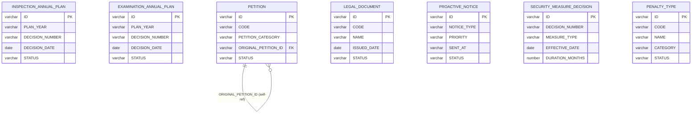

# THANHTRA HLD — Tier 1

**Source system:** THANHTRA (Hệ thống Thanh tra, Kiểm tra và Xử phạt vi phạm hành chính — UBCKNN)
**Tier 1:** Entity độc lập, không FK đến bảng nghiệp vụ nào khác trong scope (hoặc chỉ FK đến system_user ngoài scope).

---

## 6a. Bảng tổng quan BCV Concept

| BCV Core Object | BCV Concept | Category | Source Table | Source Table Change Mode | Mô tả bảng nguồn | Atomic Entity | Table Type | BCV Term |
|---|---|---|---|---|---|---|---|---|
| Business Direction | [Business Direction] Business Plan | Regulatory Planning | INSPECTION_ANNUAL_PLAN | Update | Kế hoạch thanh tra hàng năm: 1 kế hoạch / 1 năm, được phê duyệt bằng quyết định, STATUS DRAFT→APPROVED | Inspection Annual Plan | Fundamental | (1) Business Plan — BCV: "a Business Direction that is an approach used to attain one or more objectives; can combine proposed activities, timeframe, assigned responsibilities". (2) Bảng có PLAN_YEAR (unique/năm), NAME, DECISION_NUMBER, DECISION_DATE, STATUS(DRAFT/APPROVED), NOTE — kế hoạch nghiệp vụ chính thức có năm kế hoạch, quyết định phê duyệt, trạng thái lifecycle. (3) Business Plan khớp hoàn toàn. Không có BCV term chuyên biệt hơn cho "regulatory inspection plan" trong BCV. |
| Business Direction | [Business Direction] Business Plan | Regulatory Planning | EXAMINATION_ANNUAL_PLAN | Update | Kế hoạch kiểm tra hàng năm: cấu trúc tương tự INSPECTION_ANNUAL_PLAN nhưng dành cho đoàn kiểm tra | Examination Annual Plan | Fundamental | (1) Business Plan — BCV: cùng mô tả như trên. (2) Bảng có cấu trúc cột hoàn toàn đồng nhất với INSPECTION_ANNUAL_PLAN (PLAN_YEAR, NAME, DECISION_NUMBER, DECISION_DATE, STATUS, NOTE). (3) Business Plan khớp. Thanh tra (Inspection) và Kiểm tra (Examination) là 2 hoạt động tương tự nhưng khác thẩm quyền/phương thức — tạo 2 entity riêng với cùng BCV Concept, prefix phân biệt. |
| Communication | [Communication] Feedback | Petition Management | PETITION | Update | Đơn thư của công dân/tổ chức gửi đến UBCKNN: gồm phản ánh kiến nghị, khiếu nại, tố cáo; có self-ref để nhận diện đơn trùng | Petition | Fundamental | (1) Feedback — BCV: "a Communication whose purpose is to offer a compliment or a complaint". Complaint — BCV sub-type: "a Feedback to indicate dissatisfaction". (2) Bảng có PETITION_CATEGORY(FEEDBACK_SUGGESTION/COMPLAINT/DENUNCIATION), SENDER_NAME/ADDRESS, STATUS(RECEIVED/PROCESSED), self-ref ORIGINAL_PETITION_ID cho đơn trùng. (3) Dùng Feedback (parent) vì PETITION_CATEGORY=FEEDBACK_SUGGESTION không phải "dissatisfaction" — Feedback bao hàm cả 3 loại. Self-ref không thay đổi concept. |
| Business Direction | [Business Direction] Law | Legal Reference | LEGAL_DOCUMENT | Update | Danh mục văn bản pháp luật (nghị định, thông tư, quyết định) làm căn cứ pháp lý xử phạt vi phạm | Legal Document | Fundamental | (1) Law — BCV: "a Business Direction that defines binding rules legally enforceable within a jurisdiction. Failure to comply may result in penalty or prosecution". (2) Bảng có CODE(VBPL-XXXX), NAME, ISSUED_DATE, STATUS(ACTIVE/INACTIVE) — lưu tham chiếu văn bản pháp luật với lifecycle. (3) Law khớp — bảng lưu các văn bản có hiệu lực thi hành làm căn cứ xử phạt. Có ISSUED_DATE và STATUS lifecycle → Fundamental entity, không phải Classification Value thuần túy. |
| Event | [Event] Event | Regulatory Communication | PROACTIVE_NOTICE | Update | Thông báo chủ động do thanh tra phát đi: cảnh báo/nhắc nhở/hướng dẫn có NOTICE_TYPE 4 loại, STATUS DRAFT→SENT, không FK đến inspection/examination | Proactive Notice | Fundamental | (1) Event — BCV: "the Data Concept Event is used to identify a significant occurrence". (2) Bảng có TITLE, CONTENT, NOTICE_TYPE(4 values), PRIORITY, SENDER_ID, SENT_AT, STATUS(DRAFT/SENT) — thông báo outbound là 1 sự kiện phát đi có thời điểm (SENT_AT). (3) BCO đổi sang Event — thông báo chủ động là 1 occurrence có thời điểm phát sinh, phù hợp Event hơn Communication. |
| Business Activity | [Business Activity] Conduct Violation | Enforcement | SECURITY_MEASURE_DECISION | Update | Quyết định áp dụng biện pháp ngăn chặn/khẩn cấp hành chính (cấm đảm nhiệm chức vụ, đình chỉ hoạt động, phong tỏa tài khoản): độc lập với VIOLATION_CASE | Security Measure Decision | Fundamental | (1) Conduct Violation — BCV: "a Business Activity that breaches a business code of conduct of the Financial Institution". (2) Bảng có DECISION_NUMBER, DECISION_DATE, MEASURE_TYPE(BAN_POSITION/BAN_ACTIVITY/FREEZE_ACCOUNT/OTHER), EFFECTIVE_DATE, DURATION_MONTHS, SIGNER_NAME — quyết định hành chính áp dụng biện pháp cưỡng chế, không FK đến VIOLATION_CASE. (3) Không có BCV term chuyên biệt cho "administrative preventive measure decision". Dùng Conduct Violation (Business Activity) vì đây là hoạt động xử lý vi phạm pháp lý. |
| Business Direction | [Business Direction] Law | Regulatory Catalog | PENALTY_TYPE | Update | Danh mục hình thức xử phạt hành chính: phân loại PRIMARY_PENALTY / SUPPLEMENTARY_PENALTY / REMEDIAL_MEASURE, có LEGAL_BASIS và STATUS lifecycle | Penalty Type | Classification | (1) Law — BCV: "a Business Direction that defines binding rules legally enforceable". (2) Bảng có CODE(UNIQUE), NAME, CATEGORY(PRIMARY_PENALTY/SUPPLEMENTARY_PENALTY/REMEDIAL_MEASURE), DESCRIPTION, STATUS(ACTIVE/INACTIVE), NOTE, LEGAL_BASIS. (3) Danh mục hình thức xử phạt do pháp luật quy định — Table Type = Classification (load từ nguồn làm reference data). |

---

## 6b. Diagram Source (Mermaid)

---

## 6c. Diagram Atomic (Mermaid)

```mermaid
erDiagram
    Inspection_Annual_Plan {
        bigint ds_inspection_annual_plan_id PK
        varchar inspection_annual_plan_code
        varchar plan_year
        varchar annual_plan_status_code
    }

    Examination_Annual_Plan {
        bigint ds_examination_annual_plan_id PK
        varchar examination_annual_plan_code
        varchar plan_year
        varchar annual_plan_status_code
    }

    Petition {
        bigint ds_petition_id PK
        varchar petition_code
        varchar petition_category_code
        bigint original_petition_id FK
        bigint ds_original_petition_id FK
    }

    Petition ||--o{ Petition : "ds_original_petition_id"

    Legal_Document {
        bigint ds_legal_document_id PK
        varchar legal_document_code
        varchar legal_document_name
        date issued_date
        varchar legal_document_status_code
    }

    Proactive_Notice {
        bigint ds_proactive_notice_id PK
        varchar proactive_notice_type_code
        varchar proactive_notice_priority
        varchar proactive_notice_status_code
    }

    Security_Measure_Decision {
        bigint ds_security_measure_decision_id PK
        varchar decision_number
        varchar security_measure_type_code
        date effective_date
        number duration_months
    }

    Penalty_Type {
        bigint ds_penalty_type_id PK
        varchar penalty_type_code
        varchar penalty_type_name
        varchar penalty_type_category_code
        varchar penalty_type_status_code
    }
```

---

## 6d. Mục Danh mục & Tham chiếu (Reference Data)

| Source Field / Bảng | Mô tả | Scheme Code | source_type | Ghi chú |
|---|---|---|---|---|
| INSPECTION_ANNUAL_PLAN.STATUS / EXAMINATION_ANNUAL_PLAN.STATUS | Trạng thái kế hoạch: DRAFT, APPROVED | `TT_ANNUAL_PLAN_STATUS` | source_table | Dùng chung cho cả 2 bảng kế hoạch — cùng enum values |
| PETITION.PETITION_CATEGORY | Loại đơn thư: FEEDBACK_SUGGESTION, COMPLAINT, DENUNCIATION | `TT_PETITION_CATEGORY` | source_table | |
| PETITION.STATUS | Trạng thái xử lý đơn: RECEIVED, PROCESSED | `TT_PETITION_STATUS` | source_table | |
| PETITION.DUPLICATE_TYPE | Phân loại gốc/trùng: ORIGINAL, DUPLICATE | `TT_PETITION_DUPLICATE_TYPE` | source_table | |
| LEGAL_DOCUMENT.STATUS | Trạng thái văn bản pháp luật: ACTIVE, INACTIVE | `TT_LEGAL_DOCUMENT_STATUS` | source_table | |
| PROACTIVE_NOTICE.NOTICE_TYPE | Loại thông báo chủ động (4 values — cần profile từ data) | `TT_PROACTIVE_NOTICE_TYPE` | modeler_defined | Cần xác nhận enum values từ data thực tế |
| PROACTIVE_NOTICE.STATUS | Trạng thái thông báo: DRAFT, SENT | `TT_PROACTIVE_NOTICE_STATUS` | source_table | |
| SECURITY_MEASURE_DECISION.MEASURE_TYPE | Loại biện pháp ngăn chặn: BAN_POSITION, BAN_ACTIVITY, FREEZE_ACCOUNT, OTHER | `TT_SECURITY_MEASURE_TYPE` | source_table | |
| PENALTY_TYPE.CATEGORY | Phân loại hình phạt: PRIMARY_PENALTY, SUPPLEMENTARY_PENALTY, REMEDIAL_MEASURE | `TT_PENALTY_TYPE_CATEGORY` | source_table | |
| PENALTY_TYPE.STATUS | Trạng thái hình thức xử phạt: ACTIVE, INACTIVE | `TT_PENALTY_TYPE_STATUS` | source_table | |

---

## 6e. Bảng chờ thiết kế

*(Để trống — tất cả entity Tier 1 đã có đủ thông tin cột)*

---

## 6f. Điểm cần xác nhận

| # | Câu hỏi | Kết quả |
|---|---|---|
| T1-01 | SECURITY_MEASURE_DECISION không có FK đến VIOLATION_CASE trong BRD — đây là quyết định hành chính độc lập hay luôn liên kết với hồ sơ vi phạm? | Chờ xác nhận BA. Hiện tại giữ Tier 1 (independent). Nếu luôn có FK → dời sang Tier 4. |
| T1-02 | PENALTY_TYPE có STATUS lifecycle (ACTIVE/INACTIVE) → thiết kế Fundamental. Nếu thực tế chỉ đọc, không cập nhật lifecycle → cân nhắc chuyển table_type thành Classification. | Chờ xác nhận team ETL về tần suất cập nhật PENALTY_TYPE. |
| T1-03 | PROACTIVE_NOTICE.NOTICE_TYPE có 4 values chưa document đầy đủ trong BRD — cần profile values thực tế từ database để đặt tên scheme values. | Chờ profile data từ team nguồn. |
| T1-04 | TT Security Measure Decision dùng BCV [Business Activity] Conduct Violation — không có BCV term đặc thù cho "administrative preventive measure decision". | Chấp nhận tạm thời. Cần review cùng Data Architect nếu muốn term chính xác hơn. |
