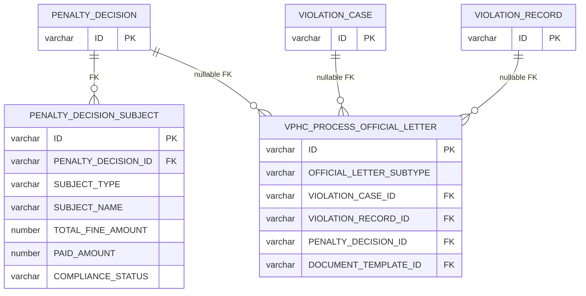
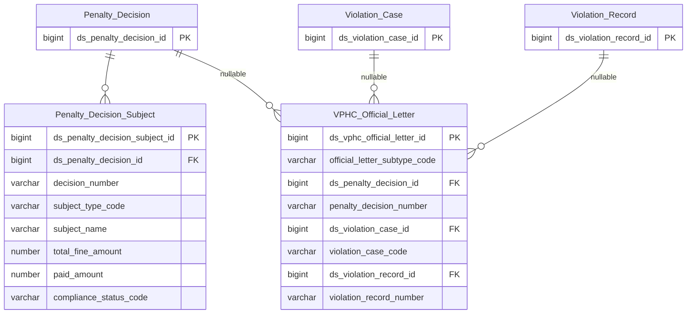

# THANHTRA HLD — Tier 5

**Source system:** THANHTRA (Hệ thống Thanh tra, Kiểm tra và Xử phạt vi phạm hành chính — UBCKNN)
**Tier 5:** Entity có FK đến Tier 4. Bao gồm: đối tượng bị xử phạt trong quyết định (→T4 Penalty Decision), activity log quyết định (→T4 Penalty Decision, ETL Pattern), công văn xử lý VPHC (→T4 Penalty Decision + T3 Violation Case/Record, tất cả nullable).

---

## 6a. Bảng tổng quan BCV Concept

| BCV Core Object | BCV Concept | Category | Source Table | Source Table Change Mode | Mô tả bảng nguồn | Atomic Entity | Table Type | BCV Term |
|---|---|---|---|---|---|---|---|---|
| Event | [Event] Event | Penalty Subject | PENALTY_DECISION_SUBJECT | Update | Đối tượng bị xử phạt trong quyết định: SUBJECT_TYPE, embedded identity (SUBJECT_NAME, SUBJECT_ID_NUMBER), TOTAL_FINE_AMOUNT, PAID_AMOUNT, COERCED_AMOUNT, COMPLIANCE_STATUS(4 trạng thái), PAYMENT_PROOF_URL | Penalty Decision Subject | Fundamental | (1) Involved Party — BCV: "an Entity that is involved in one or more ways in the Financial Institution's business". (2) Bảng có FK→PENALTY_DECISION, SUBJECT_TYPE, SUBJECT_NAME, SUBJECT_ID_NUMBER, TOTAL_FINE_AMOUNT, PAID_AMOUNT, COERCED_AMOUNT, COMPLIANCE_STATUS(PENDING/PARTIAL/COMPLETED/COERCED), PAYMENT_PROOF_URL — đối tượng cụ thể bị áp dụng quyết định xử phạt, kèm thông tin thanh toán. (3) Involved Party phù hợp — 1 quyết định có thể xử phạt nhiều đối tượng; mỗi đối tượng là Involved Party trong bối cảnh xử phạt. Relative của TT Penalty Decision → tên chứa "TT Penalty Decision" ✓. |
| Documentation | [Documentation] Form Document | Official Letter Administrative Violation Process | VPHC_PROCESS_OFFICIAL_LETTER | Update | Công văn trong quy trình xử lý VPHC: OFFICIAL_LETTER_SUBTYPE(8 loại), FK→VIOLATION_CASE(nullable), FK→VIOLATION_RECORD(nullable), FK→PENALTY_DECISION(nullable), DOCUMENT_TEMPLATE_ID, FIELD_HTML_JSON/FIELD_SOURCE_JSON/MANUAL_MERGE_DATA_JSON(3 CLOB) | Official Letter Administrative Violation Process | Fundamental | (1) Form Document — BCV: "a Documentation Item in a standard template layout which requires additional information to be supplied". (2) Bảng có OFFICIAL_LETTER_SUBTYPE(8 values), FK→VIOLATION_CASE(nullable), FK→VIOLATION_RECORD(nullable), FK→PENALTY_DECISION(nullable), template form data — các công văn chính thức phát sinh tại từng bước quy trình VPHC, mỗi công văn dùng biểu mẫu cụ thể. (3) Form Document khớp — đây là các văn bản theo mẫu chuẩn. FK→PENALTY_DECISION (T4) nullable → Tier 5. Vì cả 3 FK đều nullable, entity này về mặt kỹ thuật có thể tồn tại độc lập → đặt là Fundamental (không phải Relative). Ghi nhận T5-02. |

---

## 6b. Diagram Source (Mermaid)

---

## 6c. Diagram Atomic (Mermaid)

---

## 6d. Mục Danh mục & Tham chiếu (Reference Data)

| Source Field / Bảng | Mô tả | Scheme Code | source_type | Ghi chú |
|---|---|---|---|---|
| PENALTY_DECISION_SUBJECT.SUBJECT_TYPE | Loại đối tượng bị xử phạt (cần profile — cùng hoặc khác TT_ENFORCEMENT_SUBJECT_TYPE) | `TT_PENALTY_SUBJECT_TYPE` | modeler_defined | Kiểm tra xem có cùng values với SECURITY_MEASURE_DECISION_SUBJECT.SUBJECT_TYPE không → có thể dùng chung scheme |
| PENALTY_DECISION_SUBJECT.COMPLIANCE_STATUS | Trạng thái tuân thủ nộp phạt: PENDING, PARTIAL, COMPLETED, COERCED (4 values) | `TT_PENALTY_COMPLIANCE_STATUS` | source_table | |
| PENALTY_DECISION_APPROVAL_HISTORY.ACTION | Loại hành động phê duyệt: CREATED, EDITED, SUBMITTED, APPROVED, REJECTED, SENT_TO_SUBJECT | `TT_PENALTY_APPROVAL_ACTION` | source_table | |
| VPHC_PROCESS_OFFICIAL_LETTER.OFFICIAL_LETTER_SUBTYPE | Loại công văn VPHC: PRE_VIOLATION_NOTICE_1, REMINDER, PRE_VIOLATION_NOTICE_N, INFO_REQUEST, PRE_DECISION_NOTICE, PAYMENT_GUIDE, PAYMENT_REMINDER, REMEDIAL_REMINDER | `TT_OFFICIAL_LETTER_SUBTYPE` | source_table | 8 values — cùng tập với TT_VPHC_OUTPUT_DOCUMENT_TYPE (trừ PENALTY_DECISION) |

---

## 6e. Bảng chờ thiết kế

*(Để trống)*

---

## 6f. Điểm cần xác nhận

| # | Câu hỏi | Kết quả |
|---|---|---|
| T5-01 | PENALTY_DECISION_APPROVAL_HISTORY có Source Change Mode=Update nhưng thiết kế Fact Append. ETL pattern là gì? | Cần xác nhận với team ETL. Dựa vào cấu trúc bảng (ACTION + PERFORMED_AT) rõ ràng là append-only về mặt nghiệp vụ. |
| T5-02 | TT VPHC Official Letter có cả 3 FK đều nullable — về mặt lý thuyết có thể tồn tại không liên kết entity nào. Có valid case này không? | Cần xác nhận với BA. Nếu luôn có ít nhất 1 FK → xem xét thêm constraint. Hiện tại giữ Fundamental. |
| T5-03 | Review LLD: PENALTY_DECISION_SUBJECT.SUBJECT_ADDRESS và SUBJECT_TAX_CODE có nên tách shared entity không? | Có — grain của PENALTY_DECISION_SUBJECT là 1 Involved Party (đối tượng bị xử phạt, cá nhân hoặc tổ chức). SUBJECT_ADDRESS tách ra `Involved Party Postal Address` (`lld_THANHTRA_PENALTY_DECISION_SUBJECT_IP_Postal_Address.yaml`); SUBJECT_TAX_CODE tách ra `Involved Party Alternative Identification` (`lld_THANHTRA_PENALTY_DECISION_SUBJECT_IP_Alt_Identification.yaml`, `IP_ALT_ID_TYPE=TAX_ID`). SUBJECT_ID_NUMBER giữ nguyên denormalized trên entity chính — ngoài phạm vi yêu cầu lần này. |
| T5-03 | TT VPHC Official Letter có 3 CLOB (FIELD_HTML_JSON, FIELD_SOURCE_JSON, MANUAL_MERGE_DATA_JSON) là form rendering data — có cần load lên Atomic không hay bỏ qua? | Đề xuất: bỏ qua các CLOB form rendering trên Atomic (không có giá trị phân tích). Chỉ giữ metadata (subtype, FKs, template info). Xác nhận với BA. |
| T5-04 | TT_OFFICIAL_LETTER_SUBTYPE và TT_VPHC_OUTPUT_DOCUMENT_TYPE có nội dung gần giống nhau (8 vs 9 values, khác 1 value PENALTY_DECISION). Có nên gộp scheme không? | Đề xuất gộp thành 1 scheme TT_VPHC_DOCUMENT_TYPE nếu values tương đồng. Xác nhận khi profile data. |
