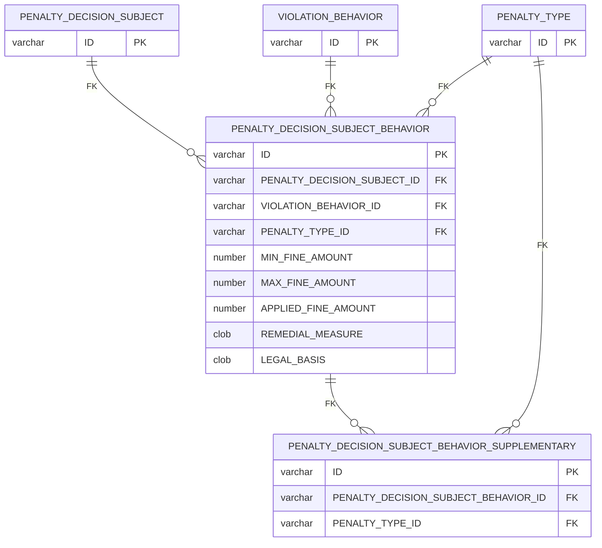
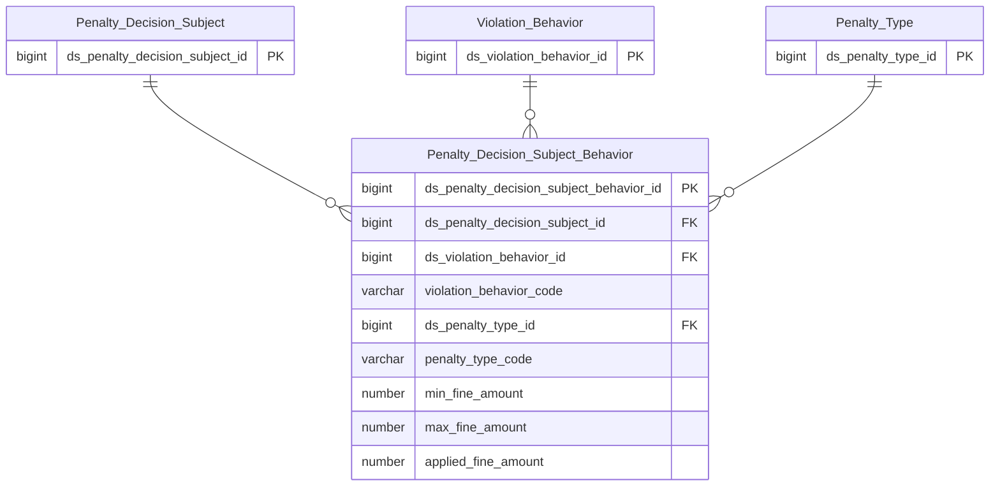

# THANHTRA HLD — Tier 6

**Source system:** THANHTRA (Hệ thống Thanh tra, Kiểm tra và Xử phạt vi phạm hành chính — UBCKNN)
**Tier 6:** Entity có FK đến Tier 5. Bao gồm: chi tiết hành vi vi phạm của từng đối tượng trong quyết định xử phạt (→T5 Penalty Decision Subject); hình thức xử phạt bổ sung theo hành vi (→T6 Penalty Decision Subject Behavior, cross-tier FK →T1 Penalty Type).

---

## 6a. Bảng tổng quan BCV Concept

| BCV Core Object | BCV Concept | Category | Source Table | Source Table Change Mode | Mô tả bảng nguồn | Atomic Entity | Table Type | BCV Term |
|---|---|---|---|---|---|---|---|---|
| Event | [Event] Event | Penalty Subject Behavior | PENALTY_DECISION_SUBJECT_BEHAVIOR | Update | Chi tiết hành vi vi phạm của từng đối tượng trong quyết định xử phạt: FK→PENALTY_DECISION_SUBJECT, FK→VIOLATION_BEHAVIOR, FK→PENALTY_TYPE, MIN/MAX/APPLIED_FINE_AMOUNT, REMEDIAL_MEASURE, LEGAL_BASIS | Penalty Decision Subject Behavior | Fundamental | (1) Conduct Violation — BCV: "a Business Activity that breaches a business code of conduct". (2) Bảng có FK→PENALTY_DECISION_SUBJECT, FK→VIOLATION_BEHAVIOR, FK→PENALTY_TYPE, MIN_FINE_AMOUNT, MAX_FINE_AMOUNT, APPLIED_FINE_AMOUNT, REMEDIAL_MEASURE, LEGAL_BASIS — chi tiết từng hành vi vi phạm của 1 đối tượng bị xử phạt: loại hành vi, hình thức phạt được áp dụng, mức phạt thực tế. (3) Conduct Violation khớp — đây là từng hành vi cụ thể được xử lý trong quyết định. Relative của TT Penalty Decision Subject → tên phải chứa "TT Penalty Decision Subject" ✓. |
| Event | [Event] Event | Penalty Subject Behavior Supplementary | PENALTY_DECISION_SUBJECT_BEHAVIOR_SUPPLEMENTARY | Update | Hình thức xử phạt bổ sung theo hành vi (bảng mới, DDL UAT cập nhật): FK→PENALTY_DECISION_SUBJECT_BEHAVIOR, FK→PENALTY_TYPE, không có business attribute nào khác ngoài audit fields chuẩn | Penalty Decision Subject Behavior X Penalty Type Relationship | Relative | (1) Event — BCV Concept kế thừa từ Penalty Decision Subject Behavior (entity neo/anchor, cùng Tier), Domain Prefix = rỗng vì là entity link/relationship thuần bắc cầu 2 entity cùng nhóm Event — cùng cơ chế `{A} X {B} Relationship` đã dùng cho `Penalty Decision X Violation Record Relationship` (xem HLD Overview 7a). (2) Bảng: chỉ 2 FK nghiệp vụ (PENALTY_DECISION_SUBJECT_BEHAVIOR_ID, PENALTY_TYPE_ID) + audit fields — pure junction cho phép 1 hành vi có N hình thức xử phạt bổ sung (trước đây chỉ lưu 1 chuỗi tự do). (3) Cân nhắc quan hệ với cột `SUPPLEMENTARY_PENALTY` (CLOB, free-text) hiện có trên PENALTY_DECISION_SUBJECT_BEHAVIOR — DDL KHÔNG đánh dấu DEPRECATED cột này, nhưng về nghiệp vụ có thể đã bị thay thế bởi bảng con có cấu trúc chuẩn hóa hơn (xem T6 Điểm cần xác nhận). PK: composite (PENALTY_DECISION_SUBJECT_BEHAVIOR_ID + PENALTY_TYPE_ID) — bảng không có business attribute nào khác ngoài 2 FK, thỏa điều kiện "pure link" (Rule 3e). Table Type = Relative vì FK đến 2 Fundamental (Penalty Decision Subject Behavior T6, Penalty Type T1) — cross-tier FK bình thường, cùng pattern PENALTY_DECISION_SUBJECT_BEHAVIOR đang dùng cho FK tới Penalty Type. |

---

## 6b. Diagram Source (Mermaid)

---

## 6c. Diagram Atomic (Mermaid)

---

## 6d. Mục Danh mục & Tham chiếu (Reference Data)

| Source Field / Bảng | Mô tả | Scheme Code | source_type | Ghi chú |
|---|---|---|---|---|
| (Không có scheme mới — FK đến entities đã có scheme từ các Tier trước) | — | — | — | PENALTY_TYPE FK đã có TT_PENALTY_TYPE_CATEGORY từ Tier 1. VIOLATION_BEHAVIOR FK đã có schemes từ Tier 2. |

---

## 6e. Bảng chờ thiết kế

*(Để trống)*

---

## 6f. Điểm cần xác nhận

| # | Câu hỏi | Kết quả |
|---|---|---|
| T6-01 | PENALTY_DECISION_SUBJECT_BEHAVIOR có FK đến cả VIOLATION_BEHAVIOR (T2) và PENALTY_TYPE (T1) — cross-tier FK. Có ảnh hưởng đến ETL ordering không? | Không ảnh hưởng thiết kế entity. ETL cần load T1→T2→...→T6 theo thứ tự. Cross-tier FK trong 1 entity là bình thường. |
| T6-02 | Tier 7 (PENALTY_DECISION_CIRCUMSTANCE) phụ thuộc vào entity này — thiết kế ở Tier 7 file riêng. | Xem THANHTRA_HLD_Tier7.md. |
| T6-03 | DDL UAT cập nhật thêm bảng con PENALTY_DECISION_SUBJECT_BEHAVIOR_SUPPLEMENTARY (FK→PENALTY_DECISION_SUBJECT_BEHAVIOR + FK→PENALTY_TYPE). Cột `SUPPLEMENTARY_PENALTY` (CLOB, free-text) hiện có trên PENALTY_DECISION_SUBJECT_BEHAVIOR KHÔNG bị đánh DEPRECATED trong DDL — có nên tiếp tục giữ cả 2 (free-text + bảng con chuẩn hóa) hay loại bỏ free-text? | Chưa có quyết định — khác với T2-05/T2-06 (nguồn đã tự đánh dấu DEPRECATED rõ ràng), trường hợp này DDL không xác nhận superseded. Đề xuất: giữ nguyên `SUPPLEMENTARY_PENALTY` trên Atomic (không loại bỏ), đồng thời thiết kế bảng con mới độc lập — để Data Modeler xác nhận khi thiết kế LLD liệu 2 nguồn dữ liệu có trùng lặp/mâu thuẫn không. |

---

> **Ghi chú:** Entity ở Tier 6 → Tier 7 (PENALTY_DECISION_CIRCUMSTANCE) tạo thành chuỗi dependency dài nhất trong THANHTRA source: INSPECTION_ANNUAL_PLAN → INSPECTION_TEAM → VIOLATION_CASE → PENALTY_DECISION → PENALTY_DECISION_SUBJECT → PENALTY_DECISION_SUBJECT_BEHAVIOR → PENALTY_DECISION_CIRCUMSTANCE (7 cấp độ). Cần theo dõi trong thiết kế ETL pipeline.
