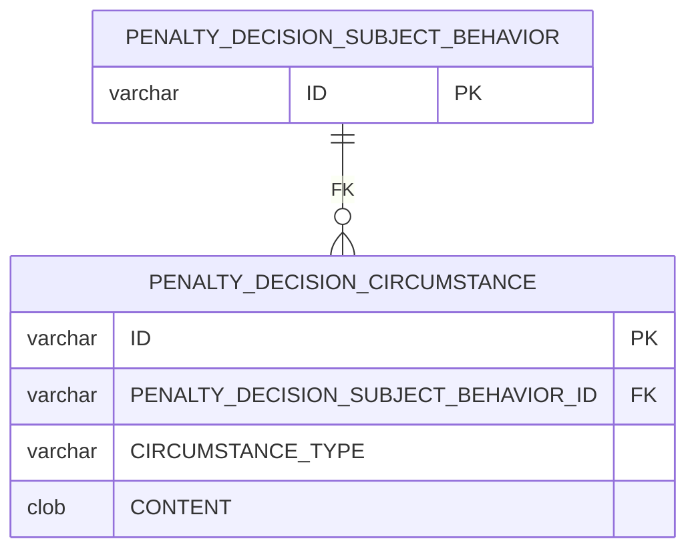
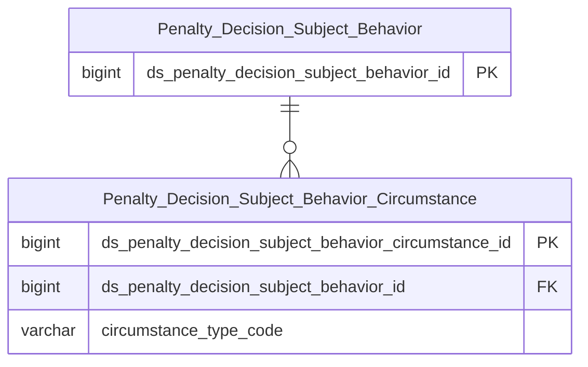

# THANHTRA HLD — Tier 7

**Source system:** THANHTRA (Hệ thống Thanh tra, Kiểm tra và Xử phạt vi phạm hành chính — UBCKNN)
**Tier 7:** Entity có FK đến Tier 6. Bao gồm: tình tiết tăng nặng/giảm nhẹ của từng hành vi vi phạm trong quyết định xử phạt (→T6 Penalty Decision Subject Behavior). Đây là Tier cuối trong THANHTRA source.

---

## 6a. Bảng tổng quan BCV Concept

| BCV Core Object | BCV Concept | Category | Source Table | Source Table Change Mode | Mô tả bảng nguồn | Atomic Entity | Table Type | BCV Term |
|---|---|---|---|---|---|---|---|---|
| Event | [Event] Event | Circumstance | PENALTY_DECISION_CIRCUMSTANCE | Update | Tình tiết tăng nặng/giảm nhẹ áp dụng cho từng hành vi vi phạm trong quyết định: FK→PENALTY_DECISION_SUBJECT_BEHAVIOR, CIRCUMSTANCE_TYPE(AGGRAVATING/MITIGATING), CONTENT — entity nhỏ nhưng cần thiết cho tính toán mức phạt | Penalty Decision Subject Behavior Circumstance | Fundamental | (1) Conduct Violation — BCV: entity này mô tả tình tiết cụ thể của hành vi vi phạm. (2) Bảng có FK→PENALTY_DECISION_SUBJECT_BEHAVIOR, CIRCUMSTANCE_TYPE(AGGRAVATING/MITIGATING), CONTENT(CLOB) — ghi nhận từng tình tiết tăng nặng hoặc giảm nhẹ ảnh hưởng đến mức phạt. (3) Conduct Violation đồng concept với chuỗi parent entities. Relative của TT Penalty Decision Subject Behavior → tên phải chứa "TT Penalty Decision Subject Behavior" ✓: "TT Penalty Decision Subject Behavior Circumstance". |

---

## 6b. Diagram Source (Mermaid)

---

## 6c. Diagram Atomic (Mermaid)

---

## 6d. Mục Danh mục & Tham chiếu (Reference Data)

| Source Field / Bảng | Mô tả | Scheme Code | source_type | Ghi chú |
|---|---|---|---|---|
| PENALTY_DECISION_CIRCUMSTANCE.CIRCUMSTANCE_TYPE | Loại tình tiết: AGGRAVATING (Tăng nặng), MITIGATING (Giảm nhẹ) | `TT_CIRCUMSTANCE_TYPE` | source_table | |

---

## 6e. Bảng chờ thiết kế

*(Để trống — đây là Tier cuối)*

---

## 6f. Điểm cần xác nhận

| # | Câu hỏi | Kết quả |
|---|---|---|
| T7-01 | PENALTY_DECISION_CIRCUMSTANCE rất lean (chỉ 3 trường nghiệp vụ: FK + CIRCUMSTANCE_TYPE + CONTENT). Có nên denormalize vào PENALTY_DECISION_SUBJECT_BEHAVIOR thành ARRAY<STRUCT> không? | Giữ entity riêng vì: (1) 1 behavior có nhiều tình tiết, (2) tình tiết có nội dung chi tiết (CLOB), (3) tách entity giúp phân tích số lượng tình tiết tăng nặng/giảm nhẹ độc lập. Xác nhận với BA. |
| T7-02 | Đây là Tier cuối (T7) — không có entity nào phụ thuộc vào PENALTY_DECISION_CIRCUMSTANCE trong scope THANHTRA. | Xác nhận qua review toàn bộ BRD — không có bảng nào FK đến PENALTY_DECISION_CIRCUMSTANCE. |
