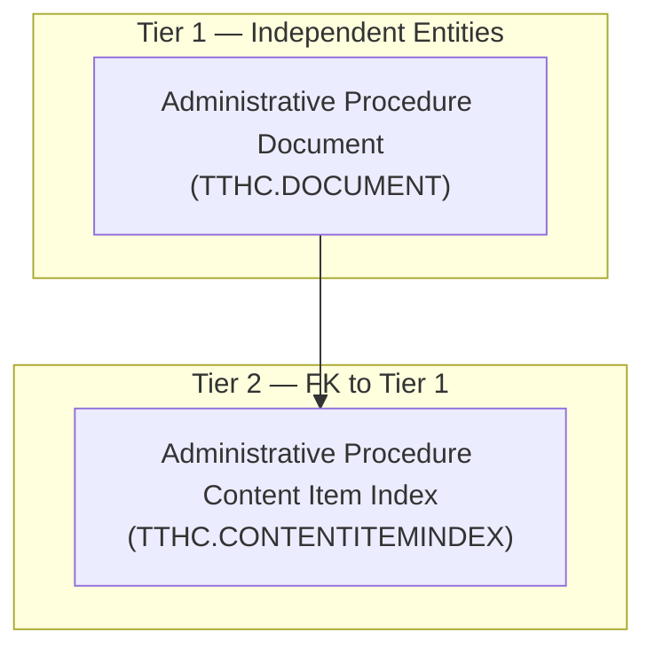
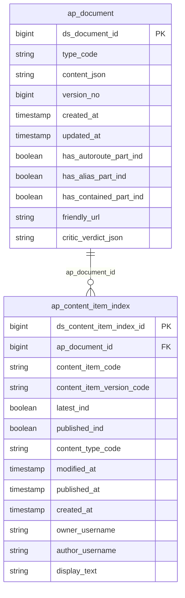

# TTHC HLD — Overview

**Source system:** TTHC (Thủ tục hành chính — Hệ thống tiếp nhận/xử lý hồ sơ trên nền Orchard Core CMS)
**Mô tả:** Hệ thống TTHC lưu trữ nội dung số hoá (content item) cho toàn bộ nghiệp vụ hành chính trên nền Orchard Core CMS — mỗi hồ sơ/trang/tin/báo cáo là 1 content item, gồm 1 dòng metadata quản lý (CONTENTITEMINDEX: loại nội dung, phiên bản, trạng thái xuất bản, người tạo/sửa) và 1 dòng nội dung JSON gốc (DOCUMENT). Đây là 2 entity nền tảng (Tier 1–2) của toàn bộ nghiệp vụ TTHC — các Tier sau (giá trị field Eform, workflow xét duyệt...) sẽ FK vào Tier 2.

---

## Tổng quan Atomic Entities

| Tier | Atomic Entity | BCV Core Object | BCV Concept | Table Type | Source Table(s) | Ghi chú |
|---|---|---|---|---|---|---|
| T1 | Administrative Procedure Document | Documentation | [Documentation] Documentation | Fundamental | TTHC.DOCUMENT | Entity nền tảng — nội dung JSON gốc của content item |
| T2 | Administrative Procedure Content Item Index | Documentation | [Documentation] Documentation Item | Fundamental | TTHC.CONTENTITEMINDEX | FK → Administrative Procedure Document qua DocumentId |

**Tổng: 2 Atomic entities mới** (1 Tier 1, 1 Tier 2)
*(Không có shared entity — cả 2 entity đều thuộc BCV Documentation, không phải Involved Party)*

---

## Diagram Phân tầng Dependencies (Mermaid)

---

## Quyết định thiết kế chính

| # | Quyết định | Lý do |
|---|---|---|
| D-01 | Domain Prefix = `Administrative Procedure` cho toàn bộ nhóm entity TTHC gốc từ CONTENTITEMINDEX/DOCUMENT (và dự kiến các Tier sau: field value, workflow xét duyệt) | TTHC = "Thủ tục hành chính" — phản ánh đúng nghiệp vụ hệ thống. Đã đăng ký viết tắt `ap` vào `system/rules/rule_domain_prefix_abbreviations.csv` |
| D-02 | Tách 2 BCV Term riêng biệt: `Documentation` (DOCUMENT — nội dung) và `Documentation Item` (CONTENTITEMINDEX — quản lý phiên bản/xuất bản), không gộp chung 1 entity | Cấu trúc trường 2 bảng khác bản chất: DOCUMENT chỉ có CONTENT/TYPE/VERSION (nội dung); CONTENTITEMINDEX có LATEST/PUBLISHED/OWNER/AUTHOR/DISPLAYTEXT (quản lý) — khớp đúng 2 định nghĩa BCV khác nhau |
| D-03 | Giữ generic toàn bộ `ContentType` ở Tier 1–2 (không lọc riêng theo nghiệp vụ hành chính cụ thể, ví dụ hồ sơ chào bán chứng khoán) | 2 bảng nguồn là index/document chung cho MỌI loại content trong Orchard CMS (LandingPage, Fragment, TTHC, BaoCao, TinTuc...) — lọc nghiệp vụ cụ thể để lại cho entity Tier sau hoặc Gold, tránh mất dữ liệu content type khác nếu lọc quá sớm ở tầng nền |
| D-04 | Chấp nhận ngoại lệ rule #8 (entity con không chứa tên entity cha làm substring liên tục) cho cặp `Administrative Procedure Content Item Index` / `Administrative Procedure Document` | 2 entity là cặp BCV khác concept (management-of-item vs. content-itself) dùng chung Domain Prefix, không phải quan hệ phân cấp cha-con theo nghĩa naming; đặt tên lồng ghép đầy đủ sẽ dài & khó đọc hơn |
| D-05 | `DOCUMENT` chuyển `scope_status: out_of_scope → in_scope`; `CONTENTITEMINDEX` giữ `in_scope` nhưng đổi entity mapping từ định hướng cũ "Securities Offering Application" (chưa từng lên Atomic) sang entity nền tảng generic | Không có entity Atomic nào đã approved trước đó cho 2 bảng này — không có xung đột thật, chỉ là đổi định hướng thiết kế mới thay thế ghi chú cũ trong `brd_TTHC.yaml` |
| D-06 | Đổi cả 2 entity từ `Fact Append`/Append → `Fundamental`/Update (2026-08-21, theo yêu cầu người thiết kế) | Khớp đúng với ngữ nghĩa `VERSION` (optimistic lock) + `UPDATEDAT`/`MODIFIEDUTC` — bản ghi bị update tại chỗ, không phải append theo phiên bản. Hệ quả: grain chuyển từ "1 dòng = 1 phiên bản" sang "1 dòng = 1 content item hiện hành" — ETL dedup theo `LATEST=1` (CONTENTITEMINDEX) và theo DOCUMENT đang được CONTENTITEMINDEX hiện hành trỏ tới, không giữ lịch sử phiên bản cũ trên Atomic (SCD4A). Ngoại lệ đã ghi nhận: `Content Item Index` vẫn FK đến `Document` dù cả 2 đều là Fundamental — xem T2-05. |

---

#### 7a. Bảng tổng quan Atomic entities

| Tier | BCV Core Object | BCV Concept | Category | Source Table | Source Table Change Mode | Mô tả bảng nguồn | Atomic Entity | Table Type | BCV Term |
|---|---|---|---|---|---|---|---|---|---|
| T1 | Documentation | [Documentation] Documentation | Documentation | DOCUMENT | Update | Raw JSON gốc của toàn bộ ContentItem — cột Content chứa JSON serialize toàn bộ nội dung chi tiết của 1 phiên bản content item | Administrative Procedure Document | Fundamental | Documentation (id 9446) — "an item or a set of Documentation... e.g. a web page". Cấu trúc TYPE/CONTENT/VERSION/CREATEDAT/UPDATEDAT/HAS*PART/FRIENDLYURL/CRITICVERDICTJSON đều mô tả nội dung/định dạng của chính item, không phải bản ghi quản lý — khớp base term Documentation. |
| T2 | Documentation | [Documentation] Documentation Item | Documentation | CONTENTITEMINDEX | Update | Index/metadata quản lý mọi content item Orchard (loại nội dung, phiên bản, trạng thái xuất bản, người tạo/sửa, tiêu đề hiển thị) | Administrative Procedure Content Item Index | Fundamental | Documentation Item (id 9504) — "concerned with the management of the item rather than its content". Cấu trúc LATEST/PUBLISHED/CONTENTTYPE/MODIFIEDUTC/PUBLISHEDUTC/CREATEDUTC/OWNER/AUTHOR/DISPLAYTEXT đều là thuộc tính quản lý phiên bản/xuất bản/quyền sở hữu — khớp đúng định nghĩa. |

#### 7b. Diagram Atomic tổng (Mermaid)

#### 7c. Bảng Classification Value

| Source Table | Mô tả | BCV Term | Xử lý Atomic |
|---|---|---|---|
| CONTENTITEMINDEX.CONTENTTYPE | Tên loại nội dung Orchard — bao trùm mọi loại content trong CMS (LandingPage, Fragment, TTHC, BaoCao, TinTuc...) | [Common] Content Type | Classification Value scheme `TTHC_CONTENT_TYPE` — cần profile toàn bộ distinct values thực tế |

#### 7d. Junction Tables

*(Không có junction table trong phạm vi Tier 1–2 này)*

#### 7e. Điểm cần xác nhận

| # | Tier | Câu hỏi | Ảnh hưởng |
|---|---|---|---|
| 1 | T1/T2 | **Đã giải quyết (2026-08-21, D-06):** đổi Table Type `Fact Append → Fundamental`, Data Change Mode `Append → Update` cho cả 2 entity — khớp đúng ngữ nghĩa `VERSION`/`UPDATEDAT`/`MODIFIEDUTC`. | Grain đổi từ "1 dòng = 1 phiên bản" sang "1 dòng = 1 content item hiện hành" (dedup `LATEST=1`) — không giữ lịch sử phiên bản cũ trên Atomic |
| 2 | T1 | `DOCUMENT.CRITICVERDICTJSON` (không có description nguồn) — ý nghĩa nghiệp vụ là gì? | Ảnh hưởng thiết kế attribute-level ở LLD |
| 3 | T1/T2 | `SITECONTENTITEMID` (cả 2 bảng) — hệ thống TTHC có phục vụ nhiều site/tenant cùng CSDL không? | Nếu multi-site → cần thêm attribute phân biệt site trên Atomic |
| 4 | T2 | `CONTENTITEMINDEX.CONTENTTYPE` — cần profile toàn bộ distinct values thực tế (ghi chú cũ trong BRD chỉ liệt kê 11 loại hồ sơ chào bán, nhưng entity hiện tại generic toàn bộ content type) | Ảnh hưởng nội dung đăng ký scheme `TTHC_CONTENT_TYPE` ở LLD |
| 5 | T2 | Table Type `Fundamental` nhưng `Content Item Index` vẫn FK đến `Document` (không khớp định nghĩa chuẩn "Fundamental = không FK entity nghiệp vụ khác") | Ghi nhận ngoại lệ có chủ đích theo quyết định người thiết kế — xem T2-05 |

#### 7f. Bảng ngoài scope

*(Chưa đánh giá trong lượt thiết kế Tier 1–2 này. TTHC còn nhiều bảng khác — 11 bảng `*FieldIndex`, `WorkflowIndex`, và nhóm lớn `TVRP_*`/`OpenId_*`/`Audit_*`/`Notification_*` — đã có `scope_status` sơ bộ trong `brd_TTHC.yaml` từ trước nhưng chưa qua HLD design review của Tier này. Mục 7f sẽ được bổ sung khi thiết kế các Tier tiếp theo.)*

<!--
GRAIN: 1 dòng = 1 bảng nguồn. KHÔNG gộp `table1, table2`.
GROUP: dùng từ danh sách chuẩn (xem reference/group_classification.md).
-->

---

## Entities

> Single source of truth cho metadata entity. `aggregate_atomic.py` parse section này để sinh `atomic_entities.yaml`.
> Format bắt buộc: heading `### N.` + dòng `**Description:**` trong 500 ký tự đầu tiên sau heading.

### 1. Administrative Procedure Document
**Tier:** 1 | **Source:** `TTHC.DOCUMENT` | **BCV Concept:** [Documentation] Documentation | **BCO:** Documentation | **Table Type:** Fundamental
**Domain Prefix:** Administrative Procedure
**Description:** Documentation — nội dung JSON gốc của content item hiện hành trong hệ thống TTHC (Orchard Core), lưu toàn bộ dữ liệu chi tiết đã serialize của hồ sơ/trang/tin/báo cáo hành chính.

**Grain:** 1 dòng = 1 content item hiện hành (cập nhật tại chỗ theo `VERSION`/`UPDATEDAT` — SCD4A, không giữ lịch sử phiên bản cũ trên Atomic; xem D-06).

**Attributes chính:** document_id (PK), type_code, content_json (CLOB), version_no, created_at, updated_at, has_autoroute_part_ind, has_alias_part_ind, has_contained_part_ind, friendly_url, critic_verdict_json.

### 2. Administrative Procedure Content Item Index
**Tier:** 2 | **Source:** `TTHC.CONTENTITEMINDEX` | **BCV Concept:** [Documentation] Documentation Item | **BCO:** Documentation | **Table Type:** Fundamental
**Domain Prefix:** Administrative Procedure
**Description:** Documentation Item — bản ghi index/metadata quản lý phiên bản và trạng thái xuất bản của mỗi content item trong hệ thống TTHC (loại nội dung, mới nhất/đã publish, người tạo/sửa, tiêu đề hiển thị), FK đến Administrative Procedure Document để lấy nội dung JSON gốc.

**Grain:** 1 dòng = 1 content item hiện hành (dedup theo `LATEST=1` — SCD4A, không giữ lịch sử phiên bản cũ trên Atomic; xem D-06).

**Attributes chính:** content_item_index_id (PK), ap_document_id (FK → ap_document), content_item_code, content_item_version_code, latest_ind, published_ind, content_type_code (ETL-derived scheme TTHC_CONTENT_TYPE), modified_at, published_at, created_at, owner_username, author_username, display_text.
