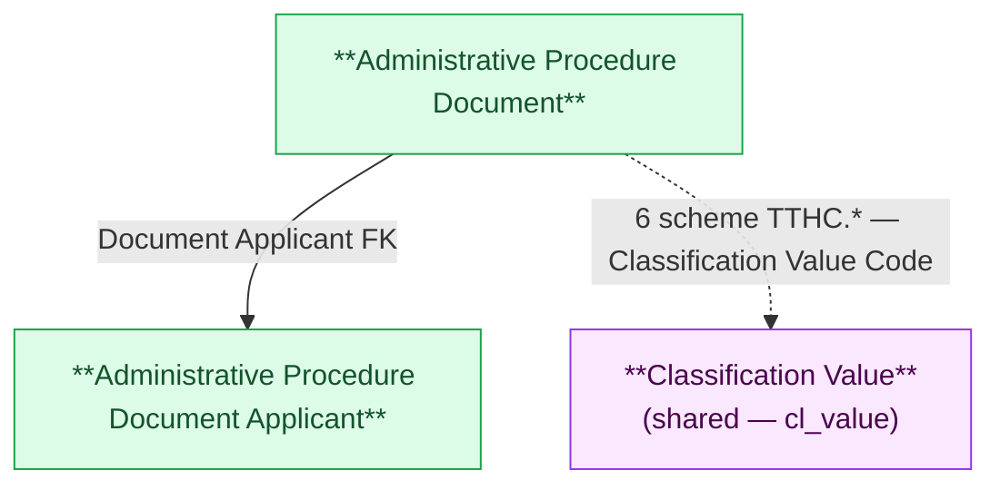

# TTHC — HLD Overview: Toàn cảnh thiết kế Atomic Layer

> **Nguồn:** Hệ thống TTHC — Tiếp nhận và xử lý hồ sơ thủ tục hành chính trên nền Orchard Core CMS. Mọi nội dung là content item: 1 dòng metadata quản lý (`CONTENTITEMINDEX`) + 1 dòng nội dung JSON gốc (`DOCUMENT`).
>
> **Phạm vi:** Hồ sơ thủ tục hành chính nộp UBCKNN (ContentType `HoSoTTHC`), đối tượng nộp hồ sơ (`DoiTuongNopHoSo`), danh mục phân loại dùng chung TTHC (trạng thái, loại hồ sơ, lĩnh vực, mức độ, kênh tiếp nhận, cơ quan xử lý).
>
> **Luồng dữ liệu (2026-09-30):** STG → parse → ODS → ATM (nguồn: `ODS_TTHC_DESCRIPTION.md`). Atomic không map 1:1 từ staging mà từ 3 bảng ODS dựng từ `DOCUMENT` + `CONTENTITEMINDEX`: `CLASSIFICATION_VALUE` (`ods_tthc_classification_value` — UNION ALL theo ContentType danh mục, không parse JSON), `AP_DOCUMENT_APPLICANT` (`ods_tthc_ap_document_applicant` — parse JSON người nộp, lookup tên hiển thị, giữ bản mới nhất), `AP_DOCUMENT` (`ods_tthc_ap_document` — JOIN ContentType `HoSoTTHC`, parse JSON hồ sơ). Cột "Source Table" ở 7a ghi bảng staging gốc kèm bảng ODS mà LLD map.
>
> **File chi tiết theo tầng:**
> - [TTHC_HLD_Tier1.md](TTHC_HLD_Tier1.md) — Classification Value (shared), Administrative Procedure Document Applicant
> - [TTHC_HLD_Tier2.md](TTHC_HLD_Tier2.md) — Administrative Procedure Document

---

#### 7a. Bảng tổng quan Atomic entities

| Tier | BCV Core Object | BCV Concept | Category | Source Table | Source Table Change Mode | Mô tả bảng nguồn | Atomic Entity | Table Type | BCV Term |
|---|---|---|---|---|---|---|---|---|---|
| 1 | Common | [Classification] Common | Common | CONTENTITEMINDEX (qua ODS `CLASSIFICATION_VALUE`) | Update | Danh mục phân loại dùng chung TTHC — content item thuộc ContentType danh mục | Classification Value | Relative | **[MỚI 2026-09-30]** Map vào shared entity Classification Value (cl_value), mirror pattern NHNCK.APPLICATION_STATUSES. `ContentItemId` → `cl_code`, `ContentType` → `schema_code`, `DisplayText` → `cl_nm`. 6 scheme đang dùng: TTHC.PROCESSING_STATUS, TTHC.PROCESSING_AUTHORITY, TTHC.DOCUMENT_TYPE, TTHC.DOMAIN, TTHC.PRIORITY_LEVEL, TTHC.RECEPTION_CHANNEL. |
| 1 | Involved Party | [Involved Party] Involved Party | Involved Party | DOCUMENT (qua ODS `AP_DOCUMENT_APPLICANT`) | Update | Nội dung JSON gốc content item — nguồn parse đối tượng nộp hồ sơ (`DoiTuongNopHoSo`) | Administrative Procedure Document Applicant | Fundamental | Involved Party — đối tượng nộp hồ sơ (cá nhân hoặc tổ chức), không phân biệt ổn định loại đối tượng nên dùng base term. ODS giữ thông tin mới nhất mỗi người nộp. Grain = 1 đối tượng nộp (BK `ContentItemId`). **[MỚI 2026-09-30]** |
| 1 | Involved Party | [Involved Party] Involved Party | Involved Party | CONTENTITEMINDEX (qua ODS `AP_DOCUMENT_APPLICANT`) | Update | Index/metadata content item — ContentItemId + DisplayText của đối tượng nộp | Administrative Procedure Document Applicant | Fundamental | Involved Party — cùng entity với DOCUMENT; `CONTENTITEMINDEX` cung cấp BK và tên hiển thị. |
| 2 | Documentation | [Documentation] Documentation | Documentation | DOCUMENT (qua ODS `AP_DOCUMENT`) | Update | Nội dung JSON gốc content item — nguồn parse trường nghiệp vụ hồ sơ (`HoSoTTHC`, `ThanhPhanHoSo`, `Eform`) | Administrative Procedure Document | Fundamental | Documentation — hồ sơ thủ tục hành chính nộp UBCKNN: phân loại, trạng thái/cơ quan xử lý, mốc thời gian, lệ phí; `ThanhPhanHoSo`/`Eform` giữ nguyên JSON. Grain = 1 hồ sơ (BK `ContentItemId`). FK đến Document Applicant (Tier 1). **[THIẾT KẾ LẠI 2026-09-30]** — trước đây generic mọi ContentType, nay chỉ `HoSoTTHC`. |
| 2 | Documentation | [Documentation] Documentation | Documentation | CONTENTITEMINDEX (qua ODS `AP_DOCUMENT`) | Update | Index/metadata content item — ContentItemId + DisplayText của hồ sơ (ContentType `HoSoTTHC`) | Administrative Procedure Document | Fundamental | Documentation — cùng entity với DOCUMENT; `CONTENTITEMINDEX` cung cấp BK (`ap_document_code`), tiêu đề (`document_title`) và điều kiện lọc ContentType. |

---

#### 7b. Diagram Atomic tổng (Mermaid)

```mermaid
graph TD
    classDef atomic fill:#dcfce7,stroke:#16a34a,color:#14532d
    classDef shared fill:#fae8ff,stroke:#9333ea,color:#4a044e
    classDef pattern fill:#e2e8f0,stroke:#64748b,color:#1e293b

    %% Tier 1
    CLVAL["**Classification Value**\n(shared — cl_value)"]:::shared
    APPLICANT["**Administrative Procedure Document Applicant**"]:::atomic

    %% Tier 2
    APDOC["**Administrative Procedure Document**"]:::atomic

    %% Tier 2
    APDOC -->|Document Applicant FK| APPLICANT
    APDOC -.->|6 scheme TTHC.* — Classification Value Code| CLVAL
```

---

#### 7c. Bảng Classification Value

| Source Table | Mô tả | BCV Term | Xử lý Atomic |
|---|---|---|---|
| CONTENTITEMINDEX (ContentType `TrangThaiHoSo`) | Trạng thái xử lý hồ sơ | Classification Value | Scheme: TTHC.PROCESSING_STATUS. Dùng tại `ap_document.processing_status_code`. |
| CONTENTITEMINDEX (ContentType `CoQuanXuLy`) | Cơ quan xử lý hồ sơ | Classification Value | Scheme: TTHC.PROCESSING_AUTHORITY. Dùng tại `ap_document.processing_authority_code`. |
| CONTENTITEMINDEX (ContentType `LoaiHoSo`) | Loại hồ sơ thủ tục hành chính | Classification Value | Scheme: TTHC.DOCUMENT_TYPE. Dùng tại `ap_document.document_tp_code`. |
| CONTENTITEMINDEX (ContentType `LinhVucTTHC`) | Lĩnh vực thủ tục hành chính | Classification Value | Scheme: TTHC.DOMAIN. Dùng tại `ap_document.domain_code`. |
| CONTENTITEMINDEX (ContentType `MucDoTTHC`) | Mức độ dịch vụ công | Classification Value | Scheme: TTHC.PRIORITY_LEVEL. Dùng tại `ap_document.priority_level_code`. |
| CONTENTITEMINDEX (ContentType `KenhTiepNhan`) | Kênh tiếp nhận hồ sơ | Classification Value | Scheme: TTHC.RECEPTION_CHANNEL. Dùng tại `ap_document.reception_channel_code`. |
| CONTENTITEMINDEX (ContentType `LoaiDoiTuongNop`, `DichVuChuyenPhat`, `TinhThanh`, `QuanHuyen`) | 4 nhóm danh mục còn lại trong ODS | Classification Value | Chưa đăng ký scheme — không còn cột Atomic tiêu thụ. Xem 7e #6. |

---

#### 7d. Junction Tables

Không có bảng nào thuộc nhóm Junction Tables (pure junction, denormalize ARRAY) trong scope hiện tại.

---

#### 7e. Điểm cần xác nhận

| # | Tier | Câu hỏi | Ảnh hưởng |
|---|---|---|---|
| 1 | 1/2 | Thiết kế 2026-08-21 (`Administrative Procedure Document` generic mọi ContentType từ `DOCUMENT` + `Administrative Procedure Content Item Index` từ `CONTENTITEMINDEX`) còn áp dụng khi đã có luồng ODS? | **Đã xử lý (2026-09-30):** thay bằng 3 entity map từ 3 bảng ODS, khớp LLD đã duyệt trong `manifest.yaml`. Entity `Administrative Procedure Content Item Index` bị loại (chưa từng có LLD/manifest). `DOCUMENT` và `CONTENTITEMINDEX` giữ `in_scope` — là staging nguồn của ODS, `scope_reason` trong `brd_TTHC.yaml` đã cập nhật. |
| 2 | 1 | Danh mục TTHC (content item danh mục) có tạo entity `cl_*` riêng không? | **Xác nhận: không.** Chỉ có Code + Name (+ mô tả) — nạp vào shared entity Classification Value, `schema_code` = ContentType. 6 scheme `TTHC.*` đã đăng ký vào `classification_schemes.yaml`. |
| 3 | 1 | ODS `CLASSIFICATION_VALUE`: tài liệu ODS ghi "chỉ map từ `contentitemindex`, không parse JSON", nhưng LLD lấy `cl_description` từ `Document.Content->{ContentType}->'MoTa'->'Text'`. | **Chưa xác nhận.** Nếu đúng tài liệu ODS → `cl_description` luôn NULL, sửa comment LLD. Xem `TTHC_HLD_Tier1.md` 6f T1-01. |
| 4 | 1 | `Administrative Procedure Document Applicant` có grain = Involved Party và có `phone_nbr`/`email` → theo quy tắc phải tách IP Electronic Address; LLD approved đang denormalize. | **Chưa xác nhận.** Tách shared entity hoặc ghi nhận ngoại lệ (ODS chỉ giữ bản mới nhất lấy từ hồ sơ). Xem T1-02. |
| 5 | 1/2 | Cơ chế nạp 3 bảng ODS (ghi đè toàn bộ hay incremental theo `MODIFIEDUTC`) chưa có trong tài liệu ODS. | **Chưa xác nhận.** Change Mode 7a tạm ghi `Update`; ảnh hưởng ETL pattern SCD4A. Xem T1-03. |
| 6 | 1 | ODS còn 4 scheme `LoaiDoiTuongNop`, `DichVuChuyenPhat`, `TinhThanh`, `QuanHuyen` không có cột tiêu thụ sau khi bỏ Postal Receipt; `TinhThanh`/`QuanHuyen` là danh mục địa lý (nên dùng Geographic Area — ECAT). | **Chưa xác nhận.** Giữ/bỏ trong ODS; nếu cần địa lý → map ECAT. Xem T1-04. |
| 7 | 2 | Hồ sơ chỉ giữ 1 người nộp (`DoiTuongNopHoSo->ContentItemIds[0]`), trong khi notes LLD Applicant ghi "1-N với hồ sơ, PK ghép (AP_DOCUMENT_ID, AP_DOCUMENT_APPLICANT_ID)" nhưng không có cột `ap_document_id`. | **Chưa xác nhận.** HLD theo FK thực tế: Document (T2) → Applicant (T1). Nếu 1 hồ sơ nhiều người nộp → cần quan hệ N-N / `ARRAY<Text>`. Xem T2-01. |
| 8 | 2 | BCV của `Administrative Procedure Document`: comment PK LLD ghi `[Business Activity] Case`, `bcv_concept` = `[Documentation] Documentation`. | **Đã xử lý (2026-09-30):** giữ `[Documentation] Documentation` (khớp LLD approved); description `atomic_entities.yaml` đã sửa. Comment PK LLD cần sửa ở lượt LLD. Xem T2-02. |
| 9 | 2 | `AP_DOCUMENT_POSTAL_RECEIPT` không có trong tài liệu ODS, LLD đã chuyển sang `DataModel/working/Backup/`, nhưng `manifest.yaml` + `atomic_entities.yaml` vẫn còn entity `Administrative Procedure Document Postal Receipt`. | **Chưa xác nhận.** Nếu bỏ hẳn → dọn đồng loạt manifest / atomic_entities / atomic_attributes / dm_manifest / `DataModel/Atomic/Documentation/`. Xem T2-03. |
| 10 | 2 | `return_method_code` là mã 0/1/2 nhưng LLD để Data Domain `Text`, chưa có scheme. | **Chưa xác nhận.** Đề xuất scheme `TTHC_RETURN_METHOD` (etl_derived). Xem T2-04. |
| 11 | 1/2 | `manifest.yaml` ghi `AP_DOCUMENT` = T1, `AP_DOCUMENT_APPLICANT` = T2 — ngược dependency. | **Chưa xử lý.** Đổi `group` trong manifest ở lượt LLD. Xem T2-05. |
| 12 | — | 11 bảng `*FieldIndex` + `WorkflowIndex` đang `in_scope` trong `brd_TTHC.yaml`, nhưng luồng ODS parse thẳng `DOCUMENT.CONTENT`, không dùng các bảng này. | **Chưa xác nhận.** Chuyển `out_of_scope` hay giữ cho Tier sau (workflow xét duyệt) — quyết định trước khi bổ sung 7f. |
| 13 | 1 | **[SỬA 2026-09-30]** Table Type của Classification Value (cl_value, dùng chung NHNCK/MRMS/TTHC) đổi `Classification` → `Relative` (ETL SCD2) theo chỉ đạo Data Modeler. Cần xác nhận: (a) BK SCD2 = schema_code + cl_code + src_stm_code; (b) bổ sung technical fields `ds_*` chuẩn cho Relative; (c) cl_value không có FK đến Fundamental — Relative áp dụng theo chỉ đạo, không theo định nghĩa FK. | Cần chốt trước khi approve lại; hiện chỉ đổi nhãn table_type/etl_pattern, chưa thêm ds_*. |

---

#### 7f. Bảng ngoài scope

| Nhóm | Source Table | Mô tả bảng nguồn | Lý do ngoài scope |
|---|---|---|---|

*(Chưa đánh giá. Các bảng `*FieldIndex`, `WorkflowIndex`, `*PartIndex`, `TVRP_*`, `OpenId_*`, `Audit_*`, `Notification_*` đã có `scope_status` sơ bộ trong `brd_TTHC.yaml` nhưng chưa qua HLD review — bổ sung sau khi chốt 7e #12.)*

---

## Entities

> Single source of truth cho metadata entity. `aggregate_atomic.py` parse section này để sinh `atomic_entities.yaml`.

> Format bắt buộc: heading `### N.` + dòng `**Description:**` trong 500 ký tự đầu tiên sau heading.

### 1. Administrative Procedure Document Applicant — MỚI (2026-09-30)
**Tier:** 1 | **Source:** `AP_DOCUMENT_APPLICANT` (ODS từ `DOCUMENT` + `CONTENTITEMINDEX`) | **BCV Concept:** [Involved Party] Involved Party | **BCO:** Involved Party | **Table Type:** Fundamental
**Description:** Involved Party — đối tượng nộp hồ sơ thủ tục hành chính (cá nhân hoặc tổ chức) trên hệ thống TTHC, lấy từ ODS trích xuất người nộp trong nội dung JSON hồ sơ, giữ thông tin mới nhất (tên hiển thị, số điện thoại, email).

### 2. Classification Value — BỔ SUNG SOURCE (2026-09-30)
**Tier:** 1 | **Source:** `CLASSIFICATION_VALUE` (ODS từ `CONTENTITEMINDEX`) | **BCV Concept:** [Classification] Common | **BCO:** Common | **Table Type:** Relative
**Description:** Classification Common — danh mục dùng chung TTHC, tổng hợp giá trị phân loại từ content item danh mục Orchard Core (ContentType = schema_code, ContentItemId = cl_code): trạng thái hồ sơ, loại hồ sơ, lĩnh vực, mức độ, kênh tiếp nhận, cơ quan xử lý. Shared entity dùng chung nhiều source.

### 3. Administrative Procedure Document — THIẾT KẾ LẠI (2026-09-30)
**Tier:** 2 | **Source:** `AP_DOCUMENT` (ODS từ `DOCUMENT` + `CONTENTITEMINDEX`, ContentType `HoSoTTHC`) | **BCV Concept:** [Documentation] Documentation | **BCO:** Documentation | **Table Type:** Fundamental
**Description:** Documentation — hồ sơ thủ tục hành chính nộp UBCKNN trên hệ thống TTHC, lấy từ ODS parse nội dung JSON hồ sơ: phân loại, trạng thái và cơ quan xử lý, các mốc thời gian, lệ phí, thành phần hồ sơ và eform, gắn với đối tượng nộp.

### 4. Administrative Procedure Content Item Index — ĐÃ BỎ THIẾT KẾ (2026-09-30)
**Tier:** 2 | **Source:** `CONTENTITEMINDEX` | **BCV Concept:** [Documentation] Documentation Item | **BCO:** Documentation | **Table Type:** Fundamental
**Description:** Đã bỏ thiết kế — `CONTENTITEMINDEX` không còn lên Atomic thành entity riêng, chỉ là nguồn ghép tại ODS cho 3 entity trên. Chưa từng có LLD/manifest. Xem 7e #1.
