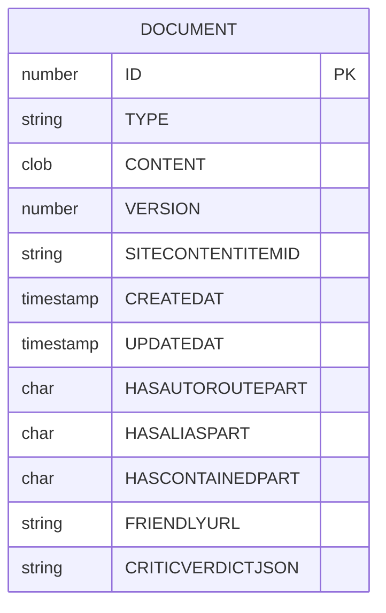
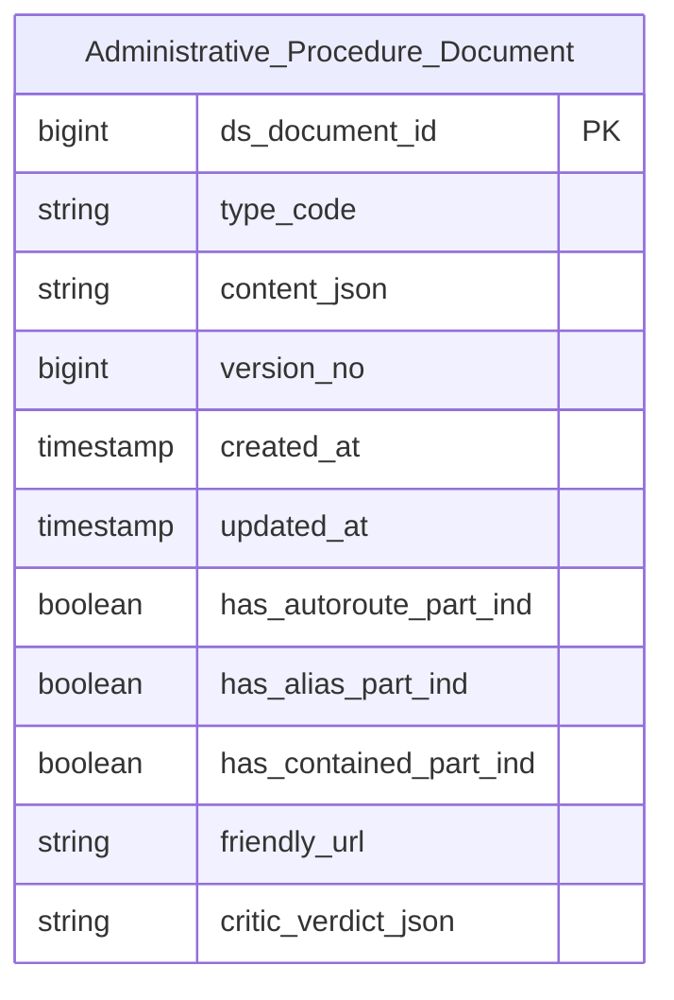

# TTHC HLD — Tier 1

**Source system:** TTHC (Thủ tục hành chính — Hệ thống tiếp nhận/xử lý hồ sơ trên nền Orchard Core CMS, SQLite/Oracle)
**Tier 1:** Entity độc lập, không FK đến bảng nghiệp vụ khác — nền tảng lưu trữ nội dung gốc (raw) của mọi content item trong hệ thống. Table Type = `Fundamental` (Data Change Mode = `Update`, theo quyết định 2026-08-21 — xem D-06 ở Overview).

**Domain Prefix đã chọn cho nhóm entity Tier 1–2 của bộ 2 bảng này: `Administrative Procedure`** (phản ánh nghiệp vụ TTHC — hệ thống quản lý thủ tục hành chính; entity con ở Tier 2 phải chứa cụm này theo rule #7).

---

## 6a. Bảng tổng quan BCV Concept

| BCV Core Object | BCV Concept | Category | Source Table | Source Table Change Mode | Mô tả bảng nguồn | Atomic Entity | Table Type | BCV Term |
|---|---|---|---|---|---|---|---|---|
| Documentation | [Documentation] Documentation | Documentation | DOCUMENT | Update | Raw JSON gốc của toàn bộ ContentItem — cột Content chứa JSON serialize toàn bộ nội dung chi tiết của 1 phiên bản content item (Orchard Core Document store) | Administrative Procedure Document | Fundamental | (1) Term candidate: **Documentation** (id 9446, category Documentation) — "Identifies an item or a set of Documentation... is generally not capable of being pledged... for example a web page or economic report." Mô tả đúng bản chất 1 "item" nội dung số hoá, ví dụ trang web/tài liệu. (2) Cấu trúc trường nguồn: TYPE (discriminator serialize), CONTENT (CLOB — nội dung thực), VERSION (optimistic lock), CREATEDAT/UPDATEDAT, các cờ HAS*PART (Orchard Part đính kèm), FRIENDLYURL (slug), CRITICVERDICTJSON — toàn bộ đều mô tả **nội dung/định dạng của chính item**, không có thuộc tính quản lý phiên bản/xuất bản (đó là vai trò của CONTENTITEMINDEX ở Tier 2). (3) Lý do chọn: khớp với định nghĩa "Documentation" ở mức base — đại diện cho chính khối nội dung, không phải bản ghi quản lý (management record). Không dùng "Documentation Item" (9504) cho bảng này vì term đó nhấn vào "management of the item rather than its content" — đúng hơn cho CONTENTITEMINDEX ở Tier 2. |

---

## 6b. Diagram Source (Mermaid)

> DOCUMENT không FK đến bảng nghiệp vụ nào trong scope Tier 1 — đây là bảng gốc (leaf/root) được các bảng khác (CONTENTITEMINDEX ở Tier 2, và các `*_Document` khác như Audit_Document, Notification_Document — ngoài scope) trỏ tới.

---

## 6c. Diagram Atomic (Mermaid)

> Entity đứng độc lập ở Tier 1 — chưa có entity Tier trước để tham chiếu.

---

## 6d. Mục Danh mục & Tham chiếu (Reference Data)

| Source Field / Bảng | Mô tả | Scheme Code | source_type | Ghi chú |
|---|---|---|---|---|
| DOCUMENT.TYPE | Discriminator kiểu serialize .NET của Orchard Document store (VD: `ContentItemRecord`) | *(không đăng ký scheme)* | — | Trường kỹ thuật hệ thống (CLR type name), không phải phân loại nghiệp vụ — xem T1-02 |

*(Không có Classification Value nghiệp vụ nào phát sinh từ bảng DOCUMENT — các cờ HAS*PART là Boolean/Indicator, không phải Classification.)*

---

## 6e. Bảng chờ thiết kế

*(Để trống — không có)*

---

## 6f. Điểm cần xác nhận

| # | Câu hỏi | Kết quả |
|---|---|---|
| T1-01 | `VERSION` (optimistic lock) + `UPDATEDAT` gợi ý bản ghi có thể bị **update tại chỗ** trong lúc soạn thảo trước khi publish. | **Đã giải quyết (2026-08-21):** Đổi Table Type `Fact Append → Fundamental`, Data Change Mode `Append → Update` theo quyết định người thiết kế — khớp đúng với ngữ nghĩa `VERSION`/`UPDATEDAT` (bản ghi update tại chỗ, không phải append-only theo phiên bản). ETL áp dụng pattern SCD4A tiêu chuẩn cho Fundamental. |
| T1-02 | `CRITICVERDICTJSON` (VARCHAR2(1000), không có description nguồn) — ý nghĩa nghiệp vụ là gì? (Nghi vấn: kết quả kiểm duyệt/soát xét tự động nội dung — "critic verdict".) | Chưa xác nhận — cần BA/steward xác nhận trước khi thiết kế attribute-level ở LLD. |
| T1-03 | Bảng `DOCUMENT` trước đây (`brd_TTHC.yaml`) có `scope_status: out_of_scope` với lý do "ETL không đọc Document.Content — dùng *FieldIndex thay thế". | **Đã giải quyết (2026-08-21):** Chưa có entity Atomic nào approved từ `DOCUMENT` trước đây — quyết định `out_of_scope` cũ chỉ là ghi chú định hướng, không phải thiết kế đã chốt. Không có xung đột thật; `scope_status` đã cập nhật `→ in_scope`, entity chính thức = `Administrative Procedure Document` (Fundamental). Việc đọc `CONTENT` JSON thô trên Atomic vẫn còn hữu ích cho lineage/audit song song với `*FieldIndex` đã parse. |
| T1-04 | `DOCUMENT.SITECONTENTITEMID` — hệ thống TTHC có phục vụ nhiều site/tenant cùng CSDL không? Nếu có, cần xác nhận UBCK chỉ khai thác 1 site hay nhiều site. | Chưa xác nhận. |
