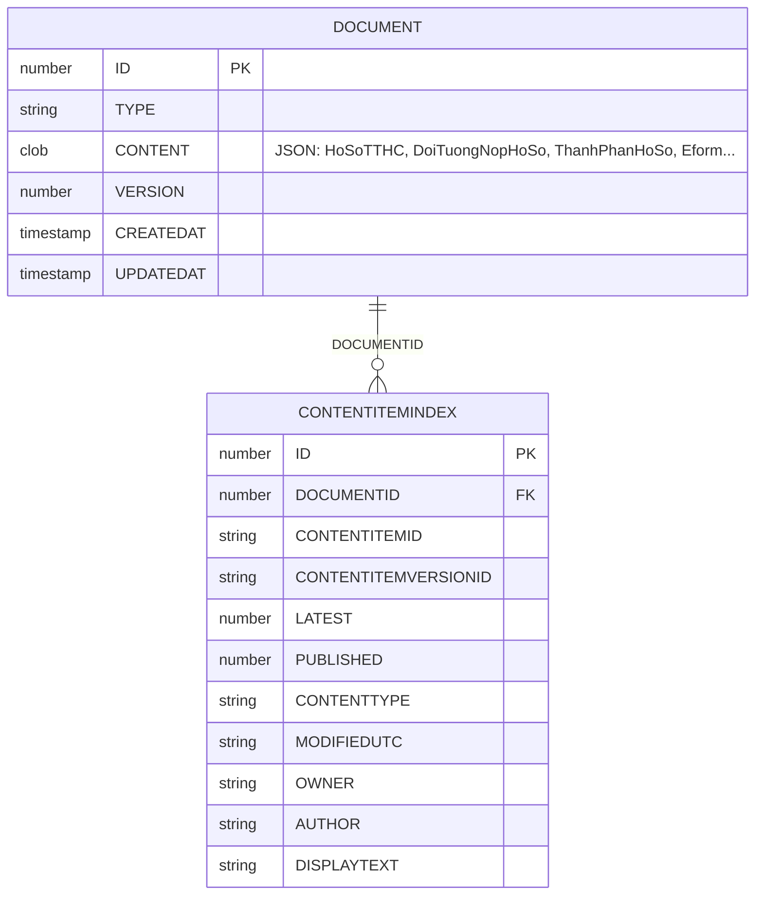
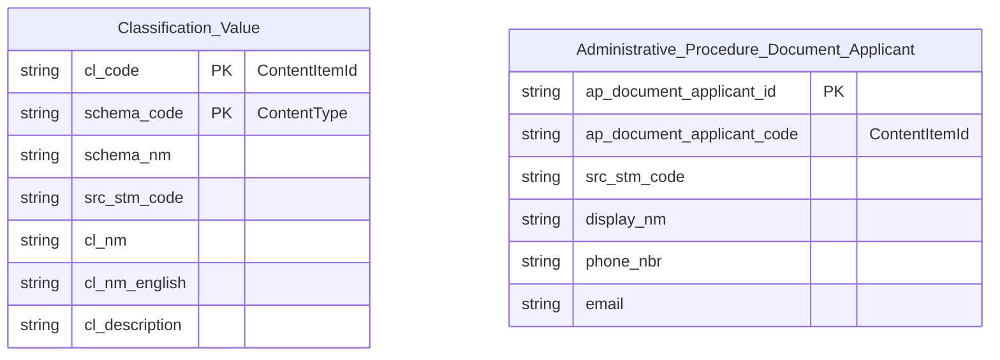

# TTHC HLD — Tier 1

**Source system:** TTHC (Thủ tục hành chính — Hệ thống tiếp nhận/xử lý hồ sơ trên nền Orchard Core CMS)
**Tier 1:** Entity độc lập, không FK đến entity nghiệp vụ khác. Gồm 2 entity: `Classification Value` (shared — danh mục dùng chung TTHC) và `Administrative Procedure Document Applicant` (đối tượng nộp hồ sơ).

> **Cập nhật 2026-09-30 — luồng STG → parse → ODS → ATM** (nguồn: `ODS_TTHC_DESCRIPTION.md`): toàn bộ entity TTHC **không map 1:1 từ staging** mà đi qua 3 bảng ODS dựng từ 2 bảng staging `DOCUMENT` + `CONTENTITEMINDEX`. Cột "Source Table" ghi bảng staging gốc (để truy vết và đánh scope) kèm bảng ODS mà LLD thực sự map `source_columns`. Thiết kế cũ (2026-08-21: `Administrative Procedure Document` generic mọi ContentType ở Tier 1 + `Administrative Procedure Content Item Index` ở Tier 2) **bị thay thế** — xem D-07 Overview.

**Domain Prefix:** `Administrative Procedure` (abbr `ap`) cho nhóm hồ sơ TTHC; `Classification Value` là shared entity dùng chung dự án (Domain Prefix rỗng, physical `cl_value`).

---

## 6a. Bảng tổng quan BCV Concept

| BCV Core Object | BCV Concept | Category | Source Table | Source Table Change Mode | Mô tả bảng nguồn | Atomic Entity | Table Type | BCV Term |
|---|---|---|---|---|---|---|---|---|
| Common | [Classification] Common | Classification | CONTENTITEMINDEX (qua ODS `CLASSIFICATION_VALUE` / `ods_tthc_classification_value`) | Update (qua ODS — cơ chế nạp ODS chưa xác nhận, xem T1-03) | Danh mục phân loại dùng chung TTHC — mỗi content item Orchard thuộc ContentType danh mục (TrangThaiHoSo, LoaiHoSo, LinhVucTTHC, MucDoTTHC, KenhTiepNhan, CoQuanXuLy, LoaiDoiTuongNop, DichVuChuyenPhat, TinhThanh, QuanHuyen) là 1 giá trị | Classification Value | Relative | (1) Term candidate: shared entity `Classification Value` (`cl_value`) đã có trong dự án (MRMS, NHNCK...) — bảng danh mục Code + Name theo scheme. (2) ODS `CLASSIFICATION_VALUE` = `UNION ALL` nhiều nhánh, mỗi nhánh lọc 1 `CONTENTTYPE` từ `CONTENTITEMINDEX`, **không parse JSON**: `ContentItemId` → `cl_code` (BK), `ContentType` → `schema_code`, `DisplayText` → `cl_nm`. Chỉ có mã + tên + nhóm, không có instance data. (3) Đúng bản chất reference data set → không tạo entity TTHC riêng; bổ sung `TTHC.CLASSIFICATION_VALUE` vào `source_table` của shared entity. BK = `schema_code ‖ cl_code`. |
| Involved Party | [Involved Party] Involved Party | Involved Party | DOCUMENT (qua ODS `AP_DOCUMENT_APPLICANT` / `ods_tthc_ap_document_applicant`) | Update (qua ODS — lấy thông tin mới nhất của người nộp) | Nội dung JSON gốc của content item — nguồn parse thông tin đối tượng nộp hồ sơ (`Content->'DoiTuongNopHoSo'`) | Administrative Procedure Document Applicant | Fundamental | (1) Term candidate: **Involved Party** (id 10817) — "all participants that may have contact with the Financial Institution or that are of interest to the Financial Institution". (2) ODS `AP_DOCUMENT_APPLICANT` = `DOCUMENT ⋈ CONTENTITEMINDEX`, trích đối tượng nộp từ JSON, lookup lại `CONTENTITEMINDEX` lấy tên hiển thị, **giữ bản ghi mới nhất** mỗi đối tượng: ap_document_applicant_code (= ContentItemId, ContentType `DoiTuongNopHoSo`), display_nm, phone_nbr, email. Người nộp có thể là cá nhân hoặc tổ chức. (3) Không tách Individual/Organization vì nguồn không phân biệt ổn định (loại đối tượng nằm ở scheme `LoaiDoiTuongNop`) → dùng base term `Involved Party`. Grain = 1 đối tượng nộp (BK `ContentItemId`). Hai phiên bản schema JSON (ranh giới 07/02/2025–30/05/2025): cũ = bag nhúng đầy đủ tại root; mới = chỉ còn `ContentItemIds` tham chiếu — xem LLD notes. |
| Involved Party | [Involved Party] Involved Party | Involved Party | CONTENTITEMINDEX (qua ODS `AP_DOCUMENT_APPLICANT`) | Update | Index/metadata content item — cung cấp ContentItemId + DisplayText của đối tượng nộp (ContentType `DoiTuongNopHoSo`) | Administrative Procedure Document Applicant | Fundamental | Cùng entity với DOCUMENT — `CONTENTITEMINDEX` cung cấp định danh (`ContentItemId` = BK) và tên hiển thị (`DisplayText`). |

---

## 6b. Diagram Source (Mermaid)

```mermaid
erDiagram
    DOCUMENT {
        number ID PK
        string TYPE
        clob CONTENT "JSON: HoSoTTHC, DoiTuongNopHoSo, ThanhPhanHoSo, Eform..."
        number VERSION
        timestamp CREATEDAT
        timestamp UPDATEDAT
    }

    CONTENTITEMINDEX {
        number ID PK
        number DOCUMENTID FK
        string CONTENTITEMID
        string CONTENTITEMVERSIONID
        number LATEST
        number PUBLISHED
        string CONTENTTYPE
        string MODIFIEDUTC
        string OWNER
        string AUTHOR
        string DISPLAYTEXT
    }

    DOCUMENT ||--o{ CONTENTITEMINDEX : "DOCUMENTID"
```

> **Ghi chú 6b — luồng ODS (2026-09-30):** entity Tier 1 không map trực tiếp từ 2 bảng staging trên mà qua ODS: `CONTENTITEMINDEX` (lọc ContentType danh mục, UNION ALL) → ODS `CLASSIFICATION_VALUE`; `DOCUMENT ⋈ CONTENTITEMINDEX` + parse `Content->'DoiTuongNopHoSo'` → ODS `AP_DOCUMENT_APPLICANT`. Chi tiết: ghi chú cuối mục 7a của `TTHC_HLD_Overview.md`.

---

## 6c. Diagram Atomic (Mermaid)

```mermaid
erDiagram
    Classification_Value {
        string cl_code PK "ContentItemId"
        string schema_code PK "ContentType"
        string schema_nm
        string src_stm_code
        string cl_nm
        string cl_nm_english
        string cl_description
    }

    Administrative_Procedure_Document_Applicant {
        string ap_document_applicant_id PK
        string ap_document_applicant_code "ContentItemId"
        string src_stm_code
        string display_nm
        string phone_nbr
        string email
    }
```

> 2 entity đứng độc lập ở Tier 1. `Classification Value` được `Administrative Procedure Document` (Tier 2) tham chiếu qua các cột `*_code` (Classification Value — không vẽ quan hệ theo quy ước).

---

## 6d. Mục Danh mục & Tham chiếu (Reference Data)

Giá trị các scheme do chính ODS `CLASSIFICATION_VALUE` cung cấp (`schema_code` = ContentType Orchard). Scheme Code Atomic dùng đúng mã đã khai trong LLD `lld_TTHC_AP_DOCUMENT.yaml`.

| Source Field / Bảng | Mô tả | Scheme Code | source_type | Ghi chú |
|---|---|---|---|---|
| CONTENTITEMINDEX (ContentType `TrangThaiHoSo`) | Trạng thái xử lý hồ sơ | `TTHC.PROCESSING_STATUS` | source_table | Dùng tại `ap_document.processing_status_code` |
| CONTENTITEMINDEX (ContentType `CoQuanXuLy`) | Cơ quan xử lý hồ sơ | `TTHC.PROCESSING_AUTHORITY` | source_table | Dùng tại `ap_document.processing_authority_code` |
| CONTENTITEMINDEX (ContentType `LoaiHoSo`) | Loại hồ sơ TTHC | `TTHC.DOCUMENT_TYPE` | source_table | Dùng tại `ap_document.document_tp_code` |
| CONTENTITEMINDEX (ContentType `LinhVucTTHC`) | Lĩnh vực thủ tục hành chính | `TTHC.DOMAIN` | source_table | Dùng tại `ap_document.domain_code` |
| CONTENTITEMINDEX (ContentType `MucDoTTHC`) | Mức độ dịch vụ công | `TTHC.PRIORITY_LEVEL` | source_table | Dùng tại `ap_document.priority_level_code` |
| CONTENTITEMINDEX (ContentType `KenhTiepNhan`) | Kênh tiếp nhận hồ sơ | `TTHC.RECEPTION_CHANNEL` | source_table | Dùng tại `ap_document.reception_channel_code` |
| CONTENTITEMINDEX (ContentType `LoaiDoiTuongNop`, `DichVuChuyenPhat`, `TinhThanh`, `QuanHuyen`) | 4 nhóm danh mục còn lại có trong ODS | *(chưa đăng ký)* | — | Chưa có cột Atomic nào tiêu thụ sau khi bỏ `ap_document_postal_receipt` — xem T1-04 |

---

## 6e. Bảng chờ thiết kế

*(Để trống — không có)*

---

## 6f. Điểm cần xác nhận

| # | Câu hỏi | Kết quả |
|---|---|---|
| T1-01 | ODS `CLASSIFICATION_VALUE`: `ODS_TTHC_DESCRIPTION.md` ghi "không cần parse JSON — chỉ map trực tiếp từ `contentitemindex`", nhưng LLD `lld_TTHC_CLASSIFICATION_VALUE.yaml` ghi ODS JOIN `DOCUMENT` và lấy `cl_description` từ `Document.Content->{ContentType}->'MoTa'->'Text'`. | Chưa xác nhận. Nếu đúng theo tài liệu ODS → `cl_description` sẽ luôn NULL, cần sửa comment LLD. HLD ghi nhận source staging = `CONTENTITEMINDEX` theo tài liệu ODS. |
| T1-02 | `Administrative Procedure Document Applicant` có grain = 1 Involved Party và có `phone_nbr`, `email` (schema cũ còn địa chỉ trong bag nhúng) — theo Bước 5 thuộc diện **bắt buộc tách** IP Electronic Address (và IP Postal Address nếu ODS có địa chỉ). LLD đã duyệt đang giữ denormalize. | Chờ Data Modeler chốt: tách shared entity hay chấp nhận ngoại lệ (ODS chỉ giữ bản mới nhất, dữ liệu liên lạc lấy từ hồ sơ chứ không phải hồ sơ Involved Party chuẩn). |
| T1-03 | Cơ chế nạp 3 bảng ODS TTHC (ghi đè toàn bộ hay incremental theo `MODIFIEDUTC`) chưa có trong `ODS_TTHC_DESCRIPTION.md`. | Tạm ghi `Update`. Ảnh hưởng ETL pattern SCD4A/Upsert trên Atomic. |
| T1-04 | ODS `CLASSIFICATION_VALUE` còn 4 scheme `LoaiDoiTuongNop`, `DichVuChuyenPhat`, `TinhThanh`, `QuanHuyen` — trước đây phục vụ `ap_document_postal_receipt` (đã bỏ khỏi ODS). `TinhThanh`/`QuanHuyen` là danh mục địa lý → theo quy tắc ngoại lệ Geographic Area phải là [Location] Geographic Area (đã chuẩn hóa tại ECAT), không phải Classification Value. | Chưa xác nhận: giữ 4 scheme trong ODS hay loại bỏ; nếu cần địa lý → map sang Geographic Area ECAT. |
| T1-05 | Người nộp là cá nhân hay tổ chức — ODS không có cột loại đối tượng (`LoaiDoiTuongNop`). | Nếu cần phân tích theo loại → bổ sung `applicant_tp_code` (scheme `LoaiDoiTuongNop`) ở LLD. |
