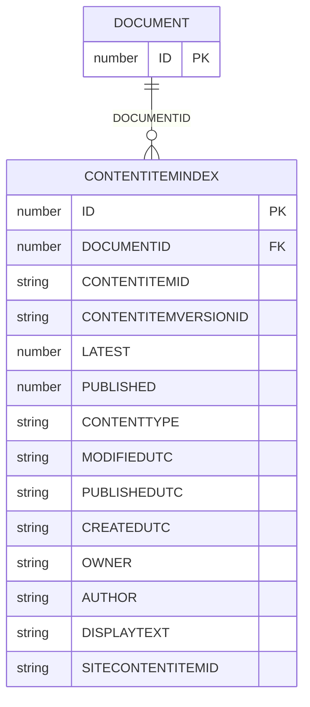
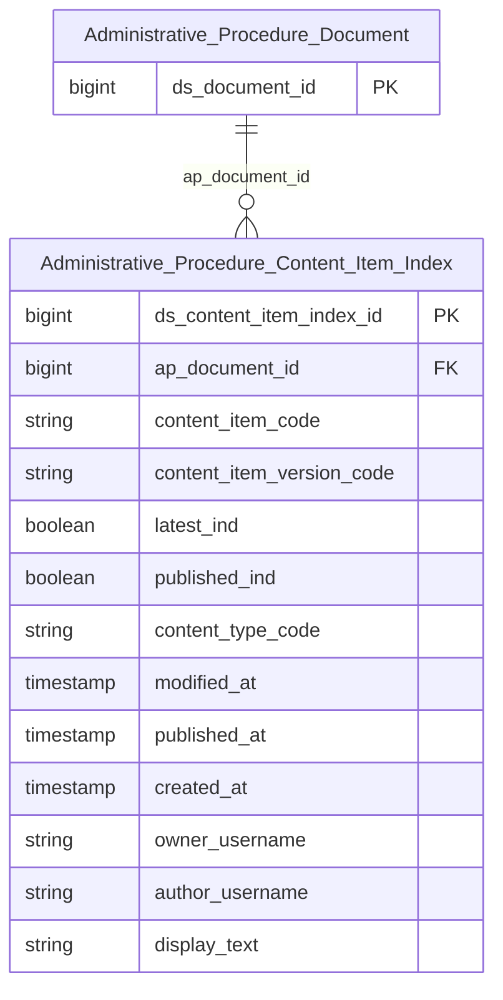

# TTHC HLD — Tier 2

**Source system:** TTHC (Thủ tục hành chính — Hệ thống tiếp nhận/xử lý hồ sơ trên nền Orchard Core CMS, SQLite/Oracle)
**Tier 2:** Entity phụ thuộc Tier 1 — `CONTENTITEMINDEX` FK đến `DOCUMENT` (qua `DOCUMENTID`), đóng vai trò index/metadata quản lý phiên bản + trạng thái xuất bản của mỗi content item. Table Type = `Fundamental` (Data Change Mode = `Update`, theo quyết định 2026-08-21 — xem D-06 ở Overview và T2-05).

**Domain Prefix: `Administrative Procedure`** (tiếp nối Tier 1 — cùng nhóm nghiệp vụ TTHC).

---

## 6a. Bảng tổng quan BCV Concept

| BCV Core Object | BCV Concept | Category | Source Table | Source Table Change Mode | Mô tả bảng nguồn | Atomic Entity | Table Type | BCV Term |
|---|---|---|---|---|---|---|---|---|
| Documentation | [Documentation] Documentation Item | Documentation | CONTENTITEMINDEX | Update | Index/metadata quản lý mọi content item Orchard (loại nội dung, phiên bản, trạng thái xuất bản, người tạo/sửa, tiêu đề hiển thị) — dùng để truy vấn nhanh thay vì đọc JSON thô trong DOCUMENT | Administrative Procedure Content Item Index | Fundamental | (1) Term candidate: **Documentation Item** (id 9504, category Documentation) — "Identifies Documentation that denotes a representation of information in a specified medium... A Documentation Item is concerned with **the management of the item rather than its content**." (2) Cấu trúc trường nguồn: `LATEST`, `PUBLISHED`, `CONTENTTYPE`, `MODIFIEDUTC`, `PUBLISHEDUTC`, `CREATEDUTC`, `OWNER`, `AUTHOR`, `DISPLAYTEXT` — toàn bộ là thuộc tính **quản lý phiên bản/xuất bản/quyền sở hữu** của item, không chứa nội dung thực (nội dung nằm ở `DOCUMENT.CONTENT` qua `DOCUMENTID`). Khớp chính xác với phần in đậm của định nghĩa BCV. (3) Lý do chọn: dùng "Documentation Item" (không dùng base term "Documentation" đã dùng cho Tier 1) để phân biệt rõ 2 khái niệm — bảng này quản lý (management), bảng DOCUMENT ở Tier 1 chứa nội dung (content). |

---

## 6b. Diagram Source (Mermaid)

---

## 6c. Diagram Atomic (Mermaid)

> `Administrative_Procedure_Document` là entity Tier 1 — hiện dạng node tham chiếu (chỉ tên + PK).

---

## 6d. Mục Danh mục & Tham chiếu (Reference Data)

| Source Field / Bảng | Mô tả | Scheme Code | source_type | Ghi chú |
|---|---|---|---|---|
| CONTENTITEMINDEX.CONTENTTYPE | Tên loại nội dung Orchard — bao trùm mọi loại content trong CMS (LandingPage, Fragment, TTHC, BaoCao, TinTuc, ...), không riêng nghiệp vụ hành chính | `TTHC_CONTENT_TYPE` | source_table | Đăng ký scheme phạm vi rộng (generic, toàn bộ content type) — khác với ghi chú cũ trong `brd_TTHC.yaml` (BRD-SRC-TTHC-ContentItemIndex) chỉ nhắc tới 11 loại hồ sơ chào bán; cần profile lại toàn bộ distinct values thực tế. Xem T2-02. |

---

## 6e. Bảng chờ thiết kế

*(Để trống — 11 bảng `*FieldIndex` và `WorkflowIndex` đã có đủ cấu trúc cột trong BRD, không thuộc diện "chưa có cấu trúc trường"; xem T2-03 để theo dõi là việc thiết kế Tier sau, không phải bảng chờ thiết kế do thiếu input.)*

---

## 6f. Điểm cần xác nhận

| # | Câu hỏi | Kết quả |
|---|---|---|
| T2-01 | Rule #8 (entity con phải chứa tên entity cha làm substring liên tục): `Administrative Procedure Content Item Index` **không chứa** `Administrative Procedure Document` như substring liên tục, dù có FK `DOCUMENTID → DOCUMENT`. | Ghi nhận là **ngoại lệ có chủ đích** theo đúng tên entity người thiết kế đã chỉ định tường minh (tương tự ngoại lệ đã ghi nhận cho KNT Invoice Detail). Lý do chấp nhận: `Content Item Index` và `Document` là 2 khái niệm BCV khác nhau (management-of-item vs. content-itself) dùng chung 1 prefix domain, không phải quan hệ cha-con phân cấp thực thể theo nghĩa naming — đặt tên theo dạng "cha lồng trong con" ở đây sẽ làm tên dài & khó đọc hơn (`Administrative Procedure Document Content Item Index`). Cần Data Modeler lead xác nhận lại ngoại lệ này khi review. |
| T2-02 | `CONTENTTYPE` gồm nhiều loại nội dung không phải hồ sơ hành chính (LandingPage, Fragment, TinTuc, BaoCao...). Entity `Administrative Procedure Content Item Index` có nên giữ **toàn bộ** content type (generic, làm nền tảng Tier 1-2 cho mọi Tier sau) hay chỉ giữ các `ContentType` liên quan nghiệp vụ hành chính (filter ETL ngay từ đầu)? | Tạm thiết kế generic (giữ toàn bộ) ở Tier 2 này theo đúng tên `Content Item Index` người thiết kế chỉ định — không filter theo ContentType tại tầng này. Filter theo nghiệp vụ cụ thể (nếu cần) sẽ đặt ở entity Tier sau hoặc tại Gold. Cần BA xác nhận hướng này. |
| T2-03 | `brd_TTHC.yaml` (BRD-SRC-TTHC-ContentItemIndex) trước đây ghi nhận định hướng cũ: khi filter theo `ContentType` phù hợp, bảng này map trực tiếp thành entity nghiệp vụ cụ thể "Securities Offering Application", 11 bảng `*FieldIndex` gộp thành "Application Eform Field Value". | **Đã giải quyết (2026-08-21):** `Administrative Procedure Document` / `Administrative Procedure Content Item Index` là 2 entity thiết kế mới, không có entity cũ nào đã approved trên Atomic — không tồn tại xung đột thật. Định hướng "Securities Offering Application" trong `brd_TTHC.yaml` chỉ là ghi chú định hướng (chưa từng lên Atomic) và đã được đánh dấu **superseded/thay thế** bởi thiết kế generic này. Các Tier sau (`*FieldIndex`, `WorkflowIndex`) sẽ thiết kế là entity Relative FK vào `Administrative Procedure Content Item Index`, không tạo lại entity "Securities Offering Application" riêng trừ khi có yêu cầu mới. |
| T2-04 | `CONTENTITEMINDEX.SITECONTENTITEMID` trùng ý nghĩa với `DOCUMENT.SITECONTENTITEMID` (T1-04) — xác nhận cùng 1 khái niệm site/tenant, không cần tách riêng theo bảng. | Giả định đúng (denormalize từ cùng nguồn) — chưa xác nhận với BA/DBA. |
| T2-05 | Table Type `Fundamental` theo định nghĩa chuẩn (Bước 1b SKILL) là entity **không FK đến entity nghiệp vụ khác** — nhưng `Administrative Procedure Content Item Index` có FK `ap_document_id → Administrative Procedure Document`. | **Ghi nhận ngoại lệ có chủ đích (2026-08-21)** theo quyết định người thiết kế (đổi cả 2 bảng về Fundamental/Update). Không đổi lại thành `Relative` vì người thiết kế xác định cả 2 entity đều có lifecycle độc lập cần SCD4A (không phải SCD2 phụ thuộc). ETL vẫn giữ FK `ap_document_id` như FK constraint bình thường — chỉ khác ở nhóm ETL pattern áp dụng cho chính bảng `Content Item Index`. |
