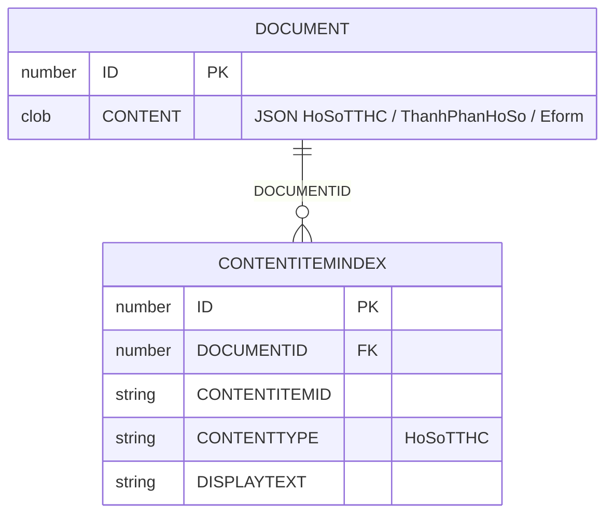
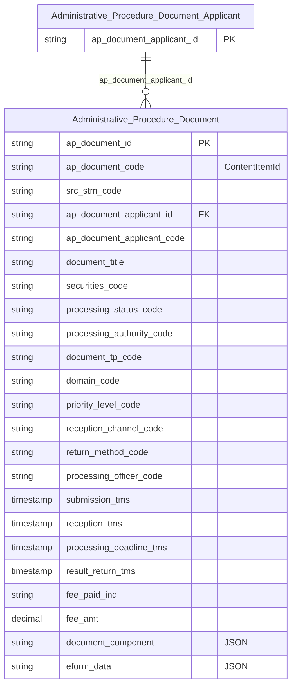

# TTHC HLD — Tier 2

**Source system:** TTHC (Thủ tục hành chính — Hệ thống tiếp nhận/xử lý hồ sơ trên nền Orchard Core CMS)
**Tier 2:** Entity phụ thuộc Tier 1 — `Administrative Procedure Document` (hồ sơ TTHC) FK đến `Administrative Procedure Document Applicant` (đối tượng nộp) và tham chiếu các scheme của `Classification Value`.

> **Cập nhật 2026-09-30 — luồng STG → parse → ODS → ATM** (nguồn: `ODS_TTHC_DESCRIPTION.md`): entity map từ ODS `AP_DOCUMENT` (`ods_tthc_ap_document`), dựng bằng `DOCUMENT ⋈ CONTENTITEMINDEX` (ContentType = `HoSoTTHC`) + parse JSON `DOCUMENT.CONTENT`. Entity `Administrative Procedure Content Item Index` (thiết kế 2026-08-21) **bị loại bỏ** — `CONTENTITEMINDEX` không còn lên Atomic thành entity riêng mà chỉ là nguồn ghép tại ODS (xem D-07 Overview).

**Domain Prefix:** `Administrative Procedure` (tiếp nối Tier 1).

---

## 6a. Bảng tổng quan BCV Concept

| BCV Core Object | BCV Concept | Category | Source Table | Source Table Change Mode | Mô tả bảng nguồn | Atomic Entity | Table Type | BCV Term |
|---|---|---|---|---|---|---|---|---|
| Documentation | [Documentation] Documentation | Documentation | DOCUMENT (qua ODS `AP_DOCUMENT` / `ods_tthc_ap_document`) | Update (qua ODS — cơ chế nạp ODS chưa xác nhận, xem T1-03) | Nội dung JSON gốc của content item — nguồn parse các trường nghiệp vụ hồ sơ (`Content->'HoSoTTHC'`, `ThanhPhanHoSo`, `Eform`) | Administrative Procedure Document | Fundamental | (1) Term candidate: **Documentation** (id 9446) — "Identifies an item or a set of Documentation... for example a web page or economic report". (2) ODS `AP_DOCUMENT` = `DOCUMENT ⋈ CONTENTITEMINDEX` (`Document.Id = ContentItemIndex.DocumentId`, ContentType = `HoSoTTHC`), parse JSON: mã chứng khoán, trạng thái/cơ quan xử lý, loại hồ sơ, lĩnh vực, mức độ, kênh tiếp nhận, hình thức trả kết quả, cán bộ xử lý, các mốc thời gian (gửi/tiếp nhận/hạn xử lý/trả kết quả), lệ phí; `ThanhPhanHoSo` và `Eform` giữ nguyên JSON. Grain = 1 hồ sơ TTHC (BK `ContentItemId`). (3) Giữ `[Documentation] Documentation` (đã khóa trong LLD approved): hồ sơ là bộ tài liệu nộp cho cơ quan quản lý kèm metadata xử lý. Term `[Business Activity] Case` từng được nhắc trong comment LLD (PK) nhưng không được chọn làm concept — xem T2-02. Khác thiết kế cũ: không còn generic mọi ContentType, chỉ `HoSoTTHC`. |
| Documentation | [Documentation] Documentation | Documentation | CONTENTITEMINDEX (qua ODS `AP_DOCUMENT`) | Update | Index/metadata content item — cung cấp ContentItemId (BK) + DisplayText (tiêu đề hồ sơ), lọc ContentType `HoSoTTHC` | Administrative Procedure Document | Fundamental | Cùng entity với DOCUMENT — `CONTENTITEMINDEX` cung cấp định danh (`ContentItemId` → `ap_document_code`) và tiêu đề (`DisplayText` → `document_title`), đồng thời là điều kiện lọc loại nội dung. |

---

## 6b. Diagram Source (Mermaid)

```mermaid
erDiagram
    DOCUMENT {
        number ID PK
        clob CONTENT "JSON HoSoTTHC / ThanhPhanHoSo / Eform"
    }

    CONTENTITEMINDEX {
        number ID PK
        number DOCUMENTID FK
        string CONTENTITEMID
        string CONTENTTYPE "HoSoTTHC"
        string DISPLAYTEXT
    }

    DOCUMENT ||--o{ CONTENTITEMINDEX : "DOCUMENTID"
```

> Quan hệ hồ sơ → đối tượng nộp không phải FK vật lý staging mà nằm trong JSON (`Content->'HoSoTTHC'->'DoiTuongNopHoSo'->ContentItemIds`), được ODS trích ra.

---

## 6c. Diagram Atomic (Mermaid)

```mermaid
erDiagram
    Administrative_Procedure_Document_Applicant {
        string ap_document_applicant_id PK
    }

    Administrative_Procedure_Document {
        string ap_document_id PK
        string ap_document_code "ContentItemId"
        string src_stm_code
        string ap_document_applicant_id FK
        string ap_document_applicant_code
        string document_title
        string securities_code
        string processing_status_code
        string processing_authority_code
        string document_tp_code
        string domain_code
        string priority_level_code
        string reception_channel_code
        string return_method_code
        string processing_officer_code
        timestamp submission_tms
        timestamp reception_tms
        timestamp processing_deadline_tms
        timestamp result_return_tms
        string fee_paid_ind
        decimal fee_amt
        string document_component "JSON"
        string eform_data "JSON"
    }

    Administrative_Procedure_Document_Applicant ||--o{ Administrative_Procedure_Document : "ap_document_applicant_id"
```

> `Administrative_Procedure_Document_Applicant` là entity Tier 1 — hiện dạng node tham chiếu (chỉ PK).

---

## 6d. Mục Danh mục & Tham chiếu (Reference Data)

Các cột `*_code` Classification Value dùng scheme của ODS `CLASSIFICATION_VALUE` — đã liệt kê ở Tier 1 mục 6d (`TTHC.PROCESSING_STATUS`, `TTHC.PROCESSING_AUTHORITY`, `TTHC.DOCUMENT_TYPE`, `TTHC.DOMAIN`, `TTHC.PRIORITY_LEVEL`, `TTHC.RECEPTION_CHANNEL`).

| Source Field / Bảng | Mô tả | Scheme Code | source_type | Ghi chú |
|---|---|---|---|---|
| ODS `AP_DOCUMENT.RETURN_METHOD_CODE` (`HoSoTTHC.ThongTinHinhThucTraHoSo`) | Hình thức trả kết quả (0/1/2 — 2 = bưu chính) | *(chưa đăng ký)* | — | LLD để Data Domain `Text`, chưa gán scheme — xem T2-04 |

---

## 6e. Bảng chờ thiết kế

*(Để trống — không có)*

---

## 6f. Điểm cần xác nhận

| # | Câu hỏi | Kết quả |
|---|---|---|
| T2-01 | `AP_DOCUMENT` chỉ giữ **1** đối tượng nộp (`DoiTuongNopHoSo->ContentItemIds[0]`), trong khi LLD Applicant ghi "quan hệ 1-N với hồ sơ" và "PK ghép (AP_DOCUMENT_ID, AP_DOCUMENT_APPLICANT_ID)" — nhưng thuộc tính LLD Applicant không có `ap_document_id`, và ODS "lấy thông tin mới nhất của người nộp" (grain = 1 đối tượng). | Chưa xác nhận. HLD theo FK thực tế trong LLD: Document (T2) → Applicant (T1), 1 hồ sơ – 1 người nộp chính. Nếu 1 hồ sơ có nhiều người nộp → cần bảng quan hệ hoặc `ARRAY<Text>` mã người nộp trên Document. Cần sửa notes LLD Applicant cho khớp. |
| T2-02 | Comment PK LLD Document ghi BCV `[Business Activity] Case` và description trong `atomic_entities.yaml` bắt đầu bằng "Business Activity Case", trong khi `bcv_concept` = `[Documentation] Documentation`. | HLD giữ `[Documentation] Documentation` (khớp metadata LLD approved); description `atomic_entities.yaml` đã chỉnh cho khớp. Comment PK trong LLD cần sửa ở lượt LLD. |
| T2-03 | Bảng `AP_DOCUMENT_POSTAL_RECEIPT` (entity `Administrative Procedure Document Postal Receipt`) không có trong `ODS_TTHC_DESCRIPTION.md` (chỉ 3 bảng ODS); LLD đã được chuyển sang `DataModel/working/Backup/` nhưng `manifest.yaml` và `atomic_entities.yaml` vẫn còn dòng entity này. | Chờ Data Modeler xác nhận bỏ hẳn → dọn `manifest.yaml`, `atomic_entities.yaml`, `atomic_attributes.yaml`, `dm_manifest.yaml`, `DataModel/Atomic/Documentation/dm_atm_ap_document_postal_receipt-*.yaml` cùng lượt. Thông tin bưu chính (khi `return_method_code = 2`) hiện không còn lên Atomic. |
| T2-04 | `return_method_code` là mã phân loại (0/1/2) nhưng LLD để Data Domain `Text`, không gán scheme. | Đề xuất đổi sang Classification Value, scheme `TTHC_RETURN_METHOD` (etl_derived) ở lượt LLD. |
| T2-05 | `manifest.yaml` đang ghi `group: T1` cho `AP_DOCUMENT` và `T2` cho `AP_DOCUMENT_APPLICANT` — ngược với dependency (Document FK → Applicant). | HLD đánh Tier theo dependency (Applicant T1, Document T2). Cần đổi `group` trong manifest ở lượt LLD. |
