# ThanhTra HLD — Tier 2

**Source system:** ThanhTra (Hệ thống Thanh tra, Kiểm tra và Xử phạt vi phạm hành chính — UBCKNN)
**Tier 2:** Entity có FK đến Tier 1. Bao gồm: đoàn thanh tra/kiểm tra (→T1 Annual Plan), danh sách mục tiêu kế hoạch (→T1 Annual Plan), biện pháp ngăn chặn phụ (→T1 Security Measure Decision), đơn thư con (→T1 Petition), thông báo recipent (→T1 Proactive Notice), danh mục hành vi vi phạm (→T1 Penalty Type).

---

## 6a. Bảng tổng quan BCV Concept

| BCV Core Object | BCV Concept | Category | Source Table | Source Table Change Mode | Mô tả bảng nguồn | Atomic Entity | Table Type | BCV Term |
|---|---|---|---|---|---|---|---|---|
| Business Activity | [Business Activity] Business Review | Inspection | INSPECTION_TEAM | Update | Hồ sơ đoàn thanh tra: mã CODE(HSTT-YYYY-XXX), FK→ANNUAL_PLAN(nullable), FORM_TYPE(PERIODIC/UNSCHEDULED), DECISION_NUMBER, thông tin đoàn, ngày ký biên bản xác minh | Inspection Team | Fundamental | (1) Business Review — BCV: "a Business Activity in which business operations are studied and compared to business objectives". Status Review — BCV: "a Business Activity in which the status of an item is reviewed". (2) Bảng có CODE chuẩn HSTT-YYYY-XXX, FK→ANNUAL_PLAN(nullable), PLAN_YEAR, FORM_TYPE(PERIODIC/UNSCHEDULED), DECISION_NUMBER(UNIQUE), rich inspection team details, VERIFICATION_MINUTES_SIGN_DATE — đây là instance một đoàn thanh tra cụ thể, có mã số, quyết định thành lập, lifecycle. (3) Business Review là term BCV phù hợp nhất cho hoạt động thanh tra (review business operations so với objectives). Không có "Regulatory Inspection" trong BCV. |
| Business Activity | [Business Activity] Business Review | Examination | EXAMINATION_TEAM | Update | Hồ sơ đoàn kiểm tra: cấu trúc song song với INSPECTION_TEAM nhưng mã CODE(HSKT-YYYY-XXX), FK→EXAMINATION_ANNUAL_PLAN(nullable), có thêm UNIT_ID/UNIT_NAME | Examination Team | Fundamental | (1) Business Review — cùng mô tả như INSPECTION_TEAM. (2) Bảng có CODE(HSKT-YYYY-XXX), FK→EXAMINATION_ANNUAL_PLAN(nullable), UNIT_ID, UNIT_NAME, FORM_TYPE, DECISION_NUMBER(UNIQUE) — đoàn kiểm tra cụ thể. (3) Business Review khớp. Inspection và Examination khác thẩm quyền nhưng cùng BCV Concept — tạo 2 entity riêng vì 2 loại hình nghiệp vụ khác nhau. |
| Business Activity | [Business Activity] Business Review | Inspection Target | INSPECTION_ANNUAL_PLAN_TARGET | Update | Danh sách đối tượng thanh tra trong kế hoạch năm: TARGET_TYPE(SECURITIES_COMPANY/FUND_MGT_COMPANY/PUBLIC_COMPANY), TARGET_NAME, số lượng | Inspection Annual Plan Target | Fundamental | (1) Business Review — BCV: entity này ghi nhận danh sách đối tượng của hoạt động thanh tra trong kế hoạch. (2) Bảng có FK→INSPECTION_ANNUAL_PLAN, TARGET_TYPE(3 values), TARGET_NAME, số lượng — danh sách đối tượng được đưa vào kế hoạch thanh tra. (3) BCO đổi sang Business Activity vì đây là đối tượng của hoạt động thanh tra. Tên chứa "Inspection Annual Plan" ✓. |
| Business Activity | [Business Activity] Business Review | Examination Target | EXAMINATION_ANNUAL_PLAN_TARGET | Update | Danh sách đối tượng kiểm tra trong kế hoạch năm: tương tự INSPECTION_ANNUAL_PLAN_TARGET | Examination Annual Plan Target | Fundamental | (1) Business Review — BCV: cùng mô tả. (2) Cấu trúc đồng nhất với INSPECTION_ANNUAL_PLAN_TARGET. (3) BCO đổi sang Business Activity. Tên chứa "Examination Annual Plan" ✓. |
| Business Activity | [Business Activity] Conduct Violation | Security Measure Subject | SECURITY_MEASURE_DECISION_SUBJECT | Update | Đối tượng bị áp dụng biện pháp ngăn chặn: SUBJECT_TYPE, SUBJECT_NAME, SUBJECT_ID_NUMBER — thông tin định danh nhúng trong quyết định | Security Measure Decision Subject | Fundamental | (1) Conduct Violation — BCV: "a Business Activity that breaches a business code of conduct". (2) Bảng có FK→SECURITY_MEASURE_DECISION, SUBJECT_TYPE, SUBJECT_NAME, SUBJECT_ID_NUMBER — 1 quyết định có thể có nhiều đối tượng bị áp dụng. (3) BCO đổi sang Business Activity / Conduct Violation — đây là đối tượng trong hoạt động xử lý vi phạm. Tên chứa "Security Measure Decision" ✓. |
| Business Activity | [Business Activity] Conduct Violation | Security Measure Recipient | SECURITY_MEASURE_DECISION_RECIPIENT | Update | Đơn vị nhận quyết định biện pháp ngăn chặn: RECIPIENT_TYPE(SECURITIES_COMPANY/FUND_MGT/STOCK_EXCHANGE/VSDC/SSC_DEPARTMENT), RECIPIENT_NAME | Security Measure Decision Recipient | Fundamental | (1) Conduct Violation — BCO đổi sang Business Activity vì đây là phần của hoạt động cưỡng chế/ngăn chặn. (2) Bảng có FK→SECURITY_MEASURE_DECISION, RECIPIENT_TYPE(5 values), RECIPIENT_NAME — danh sách đơn vị nhận bản sao quyết định. (3) BCO đổi sang Business Activity. Tên chứa "Security Measure Decision" ✓. |
| Business Activity | [Business Activity] Business Review | Security Measure Execution | SECURITY_MEASURE_EXECUTION | Update | Kết quả thực thi biện pháp ngăn chặn: REPORTER_NAME, REPORT_DATE, EXECUTION_RESULT(FULLY_EXECUTED/IN_PROGRESS/NOT_EXECUTED) | Security Measure Execution | Fundamental | (1) Business Review — BCV: "a Business Activity in which business operations are studied and compared to business objectives". (2) Bảng có FK→SECURITY_MEASURE_DECISION, REPORTER_NAME, REPORT_DATE, EXECUTION_RESULT(3 values) — theo dõi kết quả thực thi quyết định ngăn chặn. (3) Business Review phù hợp — đây là hoạt động nghiệp vụ tracking kết quả thực thi. |
| Business Activity | [Business Activity] Business Review | Citizen Reception | CITIZEN_RECEPTION | Update | Buổi tiếp công dân tại cơ quan: RECEPTION_DATE, RECEIVER_ID, SUBJECT_TYPE, NUMBER_OF_PEOPLE, SUMMARY, FK→PETITION(nullable) | Citizen Reception | Fundamental | (1) Business Review — BCV gần nhất cho "formal reception/meeting activity". (2) Bảng có RECEPTION_DATE, RECEIVER_ID, SUBJECT_TYPE, SUBJECT_NAME, NUMBER_OF_PEOPLE, SUMMARY, PETITION_ATTACHED, PETITION_CATEGORY, PROCESSING_STATUS, FK→PETITION(nullable) — ghi nhận buổi tiếp công dân cụ thể. (3) Business Review phù hợp. FK→PETITION nullable → Fundamental. |
| Communication | [Communication] Feedback | Petition Processing Document | PETITION_DOCUMENT | Update | Văn bản xử lý đơn thư: DOCUMENT_TYPE(8 loại gồm tờ trình phân loại, phiếu đề xuất, công văn thông báo thụ lý, CV trả lời NĐT v.v.), nhiều attributes nghiệp vụ | Petition Document | Fundamental | (1) Feedback — BCV: entity này là communication artifacts của quá trình xử lý đơn thư. (2) Bảng có FK→PETITION, DOCUMENT_TYPE(8 values), DOCUMENT_NUMBER, DOCUMENT_DATE, CONTENT(CLOB), CLASSIFICATION_RESULT, PROPOSED_ACTION, TRANSFER_TARGET_UNIT, SIGNER_NAME. (3) Dùng Feedback (đồng concept với Petition parent). Tên chứa "Petition" ✓. Table Type = Fundamental. |
| Event | [Event] Event | Proactive Notice Recipient | PROACTIVE_NOTICE_RECIPIENT | Update | Danh sách công ty nhận thông báo chủ động: COMPANY_CODE, RECIPIENT_TYPE — mỗi thông báo gửi đến nhiều công ty | Proactive Notice Recipient | Fundamental | (1) Event — BCO đổi sang Event đồng với parent Proactive Notice. (2) Bảng có FK→PROACTIVE_NOTICE, COMPANY_CODE, RECIPIENT_TYPE — danh sách đơn vị nhận thông báo. (3) Tên chứa "Proactive Notice" ✓. Table Type = Fundamental. |
| Business Activity | [Business Activity] Conduct Violation | Violation Behavior Catalog | VIOLATION_BEHAVIOR | Update | Danh mục hành vi vi phạm hành chính: CODE(UNIQUE), NAME, FK→PENALTY_TYPE, MIN/MAX_FINE_AMOUNT, REMEDIAL_MEASURE, VIOLATION_CLAUSE | Violation Behavior | Fundamental | (1) Conduct Violation — BCV: "a Business Activity that breaches a business code of conduct". (2) Bảng có CODE(UNIQUE), NAME, PRIMARY_PENALTY_TYPE_ID(FK→PENALTY_TYPE), MIN_FINE_AMOUNT, MAX_FINE_AMOUNT, REMEDIAL_MEASURE, LEGAL_DOCUMENT(text legacy), VIOLATION_CLAUSE — danh mục hành vi vi phạm có mức phạt tiền min/max. (3) Không thuần Code+Name vì có fine range, FK→PENALTY_TYPE → Fundamental. Conduct Violation phù hợp. |

---

## 6b. Diagram Source (Mermaid)

```mermaid
erDiagram
    INSPECTION_ANNUAL_PLAN {
        varchar ID PK
    }
    EXAMINATION_ANNUAL_PLAN {
        varchar ID PK
    }
    SECURITY_MEASURE_DECISION {
        varchar ID PK
    }
    PETITION {
        varchar ID PK
    }
    PROACTIVE_NOTICE {
        varchar ID PK
    }
    PENALTY_TYPE {
        varchar ID PK
    }

    INSPECTION_TEAM {
        varchar ID PK
        varchar INSPECTION_ANNUAL_PLAN_ID FK
        varchar FORM_TYPE
        varchar DECISION_NUMBER
    }
    EXAMINATION_TEAM {
        varchar ID PK
        varchar EXAMINATION_ANNUAL_PLAN_ID FK
        varchar FORM_TYPE
        varchar DECISION_NUMBER
    }
    INSPECTION_ANNUAL_PLAN_TARGET {
        varchar ID PK
        varchar INSPECTION_ANNUAL_PLAN_ID FK
        varchar TARGET_TYPE
        varchar TARGET_NAME
    }
    EXAMINATION_ANNUAL_PLAN_TARGET {
        varchar ID PK
        varchar EXAMINATION_ANNUAL_PLAN_ID FK
        varchar TARGET_TYPE
    }
    SECURITY_MEASURE_DECISION_SUBJECT {
        varchar ID PK
        varchar SECURITY_MEASURE_DECISION_ID FK
        varchar SUBJECT_TYPE
        varchar SUBJECT_NAME
    }
    SECURITY_MEASURE_DECISION_RECIPIENT {
        varchar ID PK
        varchar SECURITY_MEASURE_DECISION_ID FK
        varchar RECIPIENT_TYPE
    }
    SECURITY_MEASURE_EXECUTION {
        varchar ID PK
        varchar SECURITY_MEASURE_DECISION_ID FK
        varchar EXECUTION_RESULT
        date REPORT_DATE
    }
    CITIZEN_RECEPTION {
        varchar ID PK
        varchar PETITION_ID FK
        date RECEPTION_DATE
        varchar SUBJECT_TYPE
    }
    PETITION_DOCUMENT {
        varchar ID PK
        varchar PETITION_ID FK
        varchar DOCUMENT_TYPE
        varchar DOCUMENT_NUMBER
    }
    PROACTIVE_NOTICE_RECIPIENT {
        varchar ID PK
        varchar PROACTIVE_NOTICE_ID FK
        varchar COMPANY_CODE
    }
    VIOLATION_BEHAVIOR {
        varchar ID PK
        varchar PRIMARY_PENALTY_TYPE_ID FK
        varchar CODE
        number MIN_FINE_AMOUNT
        number MAX_FINE_AMOUNT
    }

    INSPECTION_ANNUAL_PLAN ||--o{ INSPECTION_TEAM : "nullable FK"
    EXAMINATION_ANNUAL_PLAN ||--o{ EXAMINATION_TEAM : "nullable FK"
    INSPECTION_ANNUAL_PLAN ||--o{ INSPECTION_ANNUAL_PLAN_TARGET : "FK"
    EXAMINATION_ANNUAL_PLAN ||--o{ EXAMINATION_ANNUAL_PLAN_TARGET : "FK"
    SECURITY_MEASURE_DECISION ||--o{ SECURITY_MEASURE_DECISION_SUBJECT : "FK"
    SECURITY_MEASURE_DECISION ||--o{ SECURITY_MEASURE_DECISION_RECIPIENT : "FK"
    SECURITY_MEASURE_DECISION ||--o{ SECURITY_MEASURE_EXECUTION : "FK"
    PETITION ||--o{ CITIZEN_RECEPTION : "nullable FK"
    PETITION ||--o{ PETITION_DOCUMENT : "FK"
    PROACTIVE_NOTICE ||--o{ PROACTIVE_NOTICE_RECIPIENT : "FK"
    PENALTY_TYPE ||--o{ VIOLATION_BEHAVIOR : "FK"
```

---

## 6c. Diagram Atomic (Mermaid)

```mermaid
erDiagram
    Inspection_Annual_Plan {
        bigint ds_inspection_annual_plan_id PK
    }
    Examination_Annual_Plan {
        bigint ds_examination_annual_plan_id PK
    }
    Security_Measure_Decision {
        bigint ds_security_measure_decision_id PK
    }
    Petition {
        bigint ds_petition_id PK
    }
    Proactive_Notice {
        bigint ds_proactive_notice_id PK
    }
    Penalty_Type {
        bigint ds_penalty_type_id PK
    }

    Inspection_Team {
        bigint ds_inspection_team_id PK
        varchar inspection_team_code
        bigint ds_inspection_annual_plan_id FK
        varchar inspection_annual_plan_code
        varchar inspection_form_type_code
        varchar decision_number
    }
    Examination_Team {
        bigint ds_examination_team_id PK
        varchar examination_team_code
        bigint ds_examination_annual_plan_id FK
        varchar examination_annual_plan_code
        varchar examination_form_type_code
        varchar decision_number
    }
    Inspection_Annual_Plan_Target {
        bigint ds_inspection_annual_plan_target_id PK
        bigint ds_inspection_annual_plan_id FK
        varchar inspection_annual_plan_code
        varchar target_type_code
    }
    Examination_Annual_Plan_Target {
        bigint ds_examination_annual_plan_target_id PK
        bigint ds_examination_annual_plan_id FK
        varchar examination_annual_plan_code
        varchar target_type_code
    }
    Security_Measure_Decision_Subject {
        bigint ds_security_measure_decision_subject_id PK
        bigint ds_security_measure_decision_id FK
        varchar security_measure_decision_number
        varchar subject_type_code
    }
    Security_Measure_Decision_Recipient {
        bigint ds_security_measure_decision_recipient_id PK
        bigint ds_security_measure_decision_id FK
        varchar security_measure_decision_number
        varchar recipient_type_code
    }
    Security_Measure_Execution {
        bigint ds_security_measure_execution_id PK
        bigint ds_security_measure_decision_id FK
        varchar security_measure_decision_number
        varchar execution_result_code
    }
    Citizen_Reception {
        bigint ds_citizen_reception_id PK
        bigint ds_petition_id FK
        varchar petition_code
        date reception_date
        varchar subject_type_code
    }
    Petition_Document {
        bigint ds_petition_document_id PK
        bigint ds_petition_id FK
        varchar petition_code
        varchar petition_document_type_code
    }
    Proactive_Notice_Recipient {
        bigint ds_proactive_notice_recipient_id PK
        bigint ds_proactive_notice_id FK
        varchar company_code
    }
    Violation_Behavior {
        bigint ds_violation_behavior_id PK
        varchar violation_behavior_code
        bigint ds_penalty_type_id FK
        varchar penalty_type_code
        number min_fine_amount
        number max_fine_amount
    }

    Inspection_Annual_Plan ||--o{ Inspection_Team : "nullable"
    Examination_Annual_Plan ||--o{ Examination_Team : "nullable"
    Inspection_Annual_Plan ||--o{ Inspection_Annual_Plan_Target : ""
    Examination_Annual_Plan ||--o{ Examination_Annual_Plan_Target : ""
    Security_Measure_Decision ||--o{ Security_Measure_Decision_Subject : ""
    Security_Measure_Decision ||--o{ Security_Measure_Decision_Recipient : ""
    Security_Measure_Decision ||--o{ Security_Measure_Execution : ""
    Petition ||--o{ Citizen_Reception : "nullable"
    Petition ||--o{ Petition_Document : ""
    Proactive_Notice ||--o{ Proactive_Notice_Recipient : ""
    Penalty_Type ||--o{ Violation_Behavior : ""
```

---

## 6d. Mục Danh mục & Tham chiếu (Reference Data)

| Source Field / Bảng | Mô tả | Scheme Code | source_type | Ghi chú |
|---|---|---|---|---|
| INSPECTION_TEAM.FORM_TYPE / EXAMINATION_TEAM.FORM_TYPE | Hình thức: PERIODIC (Định kỳ), UNSCHEDULED (Đột xuất) | `TT_REVIEW_FORM_TYPE` | source_table | Dùng chung cho cả 2 loại đoàn |
| INSPECTION_ANNUAL_PLAN_TARGET.TARGET_TYPE / EXAMINATION_ANNUAL_PLAN_TARGET.TARGET_TYPE | Loại đối tượng kế hoạch: SECURITIES_COMPANY, FUND_MANAGEMENT_COMPANY, PUBLIC_COMPANY | `TT_PLAN_TARGET_TYPE` | source_table | |
| EXAMINATION_TEAM_TARGET.TARGET_TYPE / INSPECTION_TEAM_TARGET.TARGET_TYPE | Loại đối tượng đoàn (rộng hơn plan target, thêm AUDIT_COMPANY, CRYPTO_SERVICE_PROVIDER, INDIVIDUAL, ORGANIZATION) | `TT_TEAM_TARGET_TYPE` | source_table | Khác với TT_PLAN_TARGET_TYPE — thêm 4 loại |
| SECURITY_MEASURE_DECISION_SUBJECT.SUBJECT_TYPE | Loại đối tượng bị ngăn chặn (cần profile) | `TT_ENFORCEMENT_SUBJECT_TYPE` | modeler_defined | Cần xác nhận values từ data |
| SECURITY_MEASURE_DECISION_RECIPIENT.RECIPIENT_TYPE | Loại đơn vị nhận quyết định: SECURITIES_COMPANY, FUND_MANAGEMENT_COMPANY, STOCK_EXCHANGE, VSDC, SSC_DEPARTMENT | `TT_DECISION_RECIPIENT_TYPE` | source_table | |
| SECURITY_MEASURE_EXECUTION.EXECUTION_RESULT | Kết quả thực thi: FULLY_EXECUTED, IN_PROGRESS, NOT_EXECUTED | `TT_SECURITY_MEASURE_EXECUTION_RESULT` | source_table | |
| CITIZEN_RECEPTION.SUBJECT_TYPE | Loại đối tượng tiếp công dân: INDIVIDUAL, ORGANIZATION | `TT_CITIZEN_SUBJECT_TYPE` | source_table | |
| PETITION_DOCUMENT.DOCUMENT_TYPE | Loại văn bản xử lý đơn thư: 8 values (CLASSIFICATION_REPORT, MULTI_CONTENT_GUIDE, ACCEPTANCE_NOTICE, FEEDBACK_PROPOSAL, ACCEPTANCE_PROPOSAL, FEEDBACK_TRANSFER, DENUNCIATION_TRANSFER, INVESTOR_RESPONSE) | `TT_PETITION_DOCUMENT_TYPE` | source_table | |

---

## 6e. Bảng chờ thiết kế

*(Để trống)*

---

## 6f. Điểm cần xác nhận

| # | Câu hỏi | Kết quả |
|---|---|---|
| T2-01 | INSPECTION_TEAM và EXAMINATION_TEAM có cùng BCV Concept [Business Activity] Business Review — có nên gộp thành 1 entity với Classification Value phân biệt không? | Không gộp. Hai loại hình nghiệp vụ khác nhau (thanh tra vs kiểm tra), khác thẩm quyền, có FK về 2 annual plan khác nhau. Tách entity phù hợp hơn để phân tích báo cáo riêng. |
| T2-02 | CITIZEN_RECEPTION có FK→PETITION nullable — nếu PETITION_ID null thì reception này không liên kết đơn thư nào. Grain Atomic: 1 dòng = 1 buổi tiếp công dân. Có cần Fact Append không? | Giữ Fundamental (Update). Buổi tiếp có thể bổ sung thông tin, không phải append-only. |
| T2-03 | VIOLATION_BEHAVIOR có LEGAL_DOCUMENT cột text (không FK chính thức đến bảng LEGAL_DOCUMENT) — cần làm rõ có cần FK đến TT Legal Document không hay chỉ lưu text. | Ghi nhận: LEGAL_DOCUMENT trong VIOLATION_BEHAVIOR là text legacy field. Khi thiết kế LLD sẽ xem xét thêm FK suy luận hoặc bỏ qua. |
| T2-04 | TT Citizen Reception có PETITION_CATEGORY lưu lại (denormalized từ PETITION) — có cần giữ lại cột này trên Atomic không? | Quyết định LLD. HLD ghi nhận: cột này là denormalized snapshot tại thời điểm tiếp công dân — hữu ích khi không có PETITION liên kết. |
