# ThanhTra HLD — Tier 3

**Source system:** ThanhTra (Hệ thống Thanh tra, Kiểm tra và Xử phạt vi phạm hành chính — UBCKNN)
**Tier 3:** Entity có FK đến Tier 2. Bao gồm: hồ sơ vi phạm VPHC (→T2 Teams), biên bản vi phạm (→T2 Teams), kết luận thanh tra (→T2 Inspection Team), thông báo kết quả kiểm tra (→T2 Examination Team), danh sách thành viên đoàn (→T2 Teams), danh sách đối tượng đoàn (→T2 Teams).

---

## 6a. Bảng tổng quan BCV Concept

| BCV Core Object | BCV Concept | Category | Source Table | Source Table Change Mode | Mô tả bảng nguồn | Atomic Entity | Table Type | BCV Term |
|---|---|---|---|---|---|---|---|---|
| Business Activity | [Business Activity] Conduct Violation | VPHC Case | VIOLATION_CASE | Update | Hồ sơ xử lý vi phạm hành chính (VPHC): SOURCE_CATEGORY(5 loại), FK→INSPECTION_TEAM và EXAMINATION_TEAM(đều nullable), STATUS lifecycle 5 trạng thái từ NEW→CLOSED, có theo dõi tiền bảo đảm | Violation Case | Fundamental | (1) Conduct Violation — BCV: "a Business Activity that breaches a business code of conduct of the Financial Institution". (2) Bảng có CODE, NAME, SOURCE_CATEGORY(SUPERVISION_RESULT/DIRECT_DETECTION/COMPLAINT/MEDIA/OTHER), FK→INSPECTION_TEAM(nullable), FK→EXAMINATION_TEAM(nullable), ASSIGNED_OFFICER_ID, STATUS(NEW/PROCESSING/DECISION_ISSUED/ENFORCED/CLOSED), BOND fields — hồ sơ xử lý vi phạm hành chính đầy đủ lifecycle. (3) Conduct Violation khớp hoàn toàn — entity lưu trữ hồ sơ vi phạm pháp luật và quá trình xử lý. FK đến cả 2 loại đoàn (nullable) → Tier 3. |
| Business Activity | [Business Activity] Conduct Violation | Violation Record | VIOLATION_RECORD | Update | Biên bản vi phạm hành chính (VPHC): RECORD_NUMBER, RECORD_TYPE(PAPER/ELECTRONIC), FK suy luận đến INSPECTION/EXAMINATION_TEAM, SUBJECT_TYPE/NAME/ID_NUMBER, STATUS(DRAFT→SIGNED→NUMBERED→SENT_TO_SUBJECT) | Violation Record | Fundamental | (1) Conduct Violation — BCO đổi sang Business Activity vì biên bản vi phạm là tài liệu ghi nhận hoạt động xử lý vi phạm. (2) Bảng có RECORD_NUMBER, RECORD_TYPE(PAPER/ELECTRONIC), FK suy luận đến INSPECTION/EXAMINATION_TEAM, SUBJECT_TYPE, SUBJECT_NAME, SUBJECT_ID_NUMBER, STATUS(DRAFT/SIGNED/NUMBERED/SENT_TO_SUBJECT), rich signing/forwarding tracking. (3) BCO đổi sang Business Activity / Conduct Violation. FK đến Teams là suy luận → Tier 3 theo dependency suy luận. |
| Documentation | [Documentation] Form Document | Inspection Conclusion | INSPECTION_CONCLUSION | Update | Kết luận thanh tra: CONCLUSION_NUMBER, FK→INSPECTION_TEAM, TARGET_TYPE/REFERENCE_ID/NAME, nội dung kết luận, EXECUTION_STATUS theo dõi thực hiện kiến nghị | Inspection Conclusion | Fundamental | (1) Form Document — BCV: formal document produced as outcome of a Business Activity. Status Document — BCV: "issued by a licensed inspector to document the condition". (2) Bảng có FK→INSPECTION_TEAM, CONCLUSION_NUMBER, ISSUED_DATE, ANNOUNCED_DATE, TARGET_TYPE, CONTENT(CLOB), RECOMMENDATION(CLOB), EXECUTION_STATUS, GOVERNMENT_INSPECTOR_SENT_DATE — văn bản kết luận thanh tra chính thức. (3) Form Document phù hợp — kết luận là tài liệu pháp lý chính thức kết thúc đoàn thanh tra. Dependent trên Inspection Team (T2) → Tier 3. |
| Documentation | [Documentation] Form Document | Examination Result Notice | EXAMINATION_RESULT_NOTICE | Update | Thông báo kết quả kiểm tra: NOTICE_NUMBER, FK→EXAMINATION_TEAM, TARGET_TYPE/REFERENCE_ID/NAME, nội dung, EXECUTION_STATUS theo dõi thực hiện kiến nghị | Examination Result Notice | Fundamental | (1) Form Document — BCV: formal document produced as outcome of a Business Activity. (2) Bảng có FK→EXAMINATION_TEAM, NOTICE_NUMBER, ISSUED_DATE, ANNOUNCED_DATE, TARGET_TYPE, TARGET_REFERENCE_ID, CONTENT(CLOB), RECOMMENDATION(CLOB), EXECUTION_STATUS — thông báo kết quả kiểm tra là tài liệu tương đương với kết luận thanh tra nhưng cho đoàn kiểm tra. (3) Form Document khớp. Song song với Inspection Conclusion nhưng khác loại đoàn → 2 entity riêng. |
| Business Activity | [Business Activity] Business Review | Inspection Team Member | INSPECTION_TEAM_MEMBER | Update | Danh sách thành viên đoàn thanh tra: USER_ID, ROLE_TYPE (Team leader, inspector, secretary...) | Inspection Team Member | Fundamental | (1) Business Review — BCO đổi sang Business Activity vì thành viên đoàn là phần của hoạt động thanh tra. (2) Bảng có FK→INSPECTION_TEAM, USER_ID(FK→system_user), ROLE_TYPE, USER_NAME — danh sách thành viên cùng vai trò trong đoàn. (3) BCO đổi sang Business Activity. Tên chứa "Inspection Team" ✓. Table Type = Fundamental. |
| Business Activity | [Business Activity] Business Review | Examination Team Member | EXAMINATION_TEAM_MEMBER | Update | Danh sách thành viên đoàn kiểm tra: USER_ID, ROLE_TYPE | Examination Team Member | Fundamental | (1) Business Review — BCO đổi sang Business Activity. (2) Cấu trúc đồng nhất với INSPECTION_TEAM_MEMBER. (3) Tên chứa "Examination Team" ✓. Table Type = Fundamental. |
| Business Activity | [Business Activity] Business Review | Inspection Team Target | INSPECTION_TEAM_TARGET | Update | Danh sách đối tượng được thanh tra trong đoàn cụ thể: TARGET_TYPE(7 loại), TARGET_REFERENCE_ID, TARGET_NAME | Inspection Team Target | Fundamental | (1) Business Review — BCV: entity này ghi nhận đối tượng của hoạt động thanh tra. (2) Bảng có FK→INSPECTION_TEAM, TARGET_TYPE(SECURITIES_COMPANY/FUND_MANAGEMENT_COMPANY/PUBLIC_COMPANY/AUDIT_COMPANY/CRYPTO_SERVICE_PROVIDER/INDIVIDUAL/ORGANIZATION), TARGET_REFERENCE_ID, TARGET_NAME. (3) Business Review phù hợp. Tên chứa "Inspection Team" ✓. Table Type = Fundamental. |
| Business Activity | [Business Activity] Business Review | Examination Team Target | EXAMINATION_TEAM_TARGET | Update | Danh sách đối tượng được kiểm tra trong đoàn cụ thể: TARGET_TYPE(7 loại), TARGET_REFERENCE_ID, TARGET_NAME | Examination Team Target | Fundamental | (1) Business Review — BCV: cùng mô tả. (2) Cấu trúc đồng nhất với INSPECTION_TEAM_TARGET, cùng 7 TARGET_TYPE values. (3) Tên chứa "Examination Team" ✓. Table Type = Fundamental. |

---

## 6b. Diagram Source (Mermaid)

```mermaid
erDiagram
    INSPECTION_TEAM {
        varchar ID PK
    }
    EXAMINATION_TEAM {
        varchar ID PK
    }

    VIOLATION_CASE {
        varchar ID PK
        varchar INSPECTION_TEAM_ID FK
        varchar EXAMINATION_TEAM_ID FK
        varchar SOURCE_CATEGORY
        varchar STATUS
    }
    VIOLATION_RECORD {
        varchar ID PK
        varchar RECORD_NUMBER
        varchar RECORD_TYPE
        varchar STATUS
    }
    INSPECTION_CONCLUSION {
        varchar ID PK
        varchar INSPECTION_TEAM_ID FK
        varchar CONCLUSION_NUMBER
        varchar EXECUTION_STATUS
    }
    EXAMINATION_RESULT_NOTICE {
        varchar ID PK
        varchar EXAMINATION_TEAM_ID FK
        varchar NOTICE_NUMBER
        varchar EXECUTION_STATUS
    }
    INSPECTION_TEAM_MEMBER {
        varchar ID PK
        varchar INSPECTION_TEAM_ID FK
        varchar USER_ID
        varchar ROLE_TYPE
    }
    EXAMINATION_TEAM_MEMBER {
        varchar ID PK
        varchar EXAMINATION_TEAM_ID FK
        varchar USER_ID
        varchar ROLE_TYPE
    }
    INSPECTION_TEAM_TARGET {
        varchar ID PK
        varchar INSPECTION_TEAM_ID FK
        varchar TARGET_TYPE
        varchar TARGET_REFERENCE_ID
    }
    EXAMINATION_TEAM_TARGET {
        varchar ID PK
        varchar EXAMINATION_TEAM_ID FK
        varchar TARGET_TYPE
        varchar TARGET_REFERENCE_ID
    }

    INSPECTION_TEAM ||--o{ VIOLATION_CASE : "nullable FK"
    EXAMINATION_TEAM ||--o{ VIOLATION_CASE : "nullable FK"
    INSPECTION_TEAM ||--|| INSPECTION_CONCLUSION : "FK"
    EXAMINATION_TEAM ||--|| EXAMINATION_RESULT_NOTICE : "FK"
    INSPECTION_TEAM ||--o{ INSPECTION_TEAM_MEMBER : "FK"
    EXAMINATION_TEAM ||--o{ EXAMINATION_TEAM_MEMBER : "FK"
    INSPECTION_TEAM ||--o{ INSPECTION_TEAM_TARGET : "FK"
    EXAMINATION_TEAM ||--o{ EXAMINATION_TEAM_TARGET : "FK"
```

> VIOLATION_RECORD có FK suy luận đến INSPECTION/EXAMINATION_TEAM — không vẽ trong diagram do không có formal FK trong BRD.

---

## 6c. Diagram Atomic (Mermaid)

```mermaid
erDiagram
    Inspection_Team {
        bigint ds_inspection_team_id PK
    }
    Examination_Team {
        bigint ds_examination_team_id PK
    }

    Violation_Case {
        bigint ds_violation_case_id PK
        varchar violation_case_code
        bigint ds_inspection_team_id FK
        varchar inspection_team_code
        bigint ds_examination_team_id FK
        varchar examination_team_code
        varchar violation_case_source_category_code
        varchar violation_case_status_code
    }
    Violation_Record {
        bigint ds_violation_record_id PK
        varchar violation_record_number
        varchar violation_record_type_code
        varchar violation_record_status_code
    }
    Inspection_Conclusion {
        bigint ds_inspection_conclusion_id PK
        varchar conclusion_number
        bigint ds_inspection_team_id FK
        varchar inspection_team_code
        varchar inspection_conclusion_execution_status_code
    }
    Examination_Result_Notice {
        bigint ds_examination_result_notice_id PK
        varchar notice_number
        bigint ds_examination_team_id FK
        varchar examination_team_code
        varchar examination_result_notice_execution_status_code
    }
    Inspection_Team_Member {
        bigint ds_inspection_team_member_id PK
        bigint ds_inspection_team_id FK
        varchar inspection_team_code
        varchar member_user_id
        varchar member_role_type_code
    }
    Examination_Team_Member {
        bigint ds_examination_team_member_id PK
        bigint ds_examination_team_id FK
        varchar examination_team_code
        varchar member_user_id
        varchar member_role_type_code
    }
    Inspection_Team_Target {
        bigint ds_inspection_team_target_id PK
        bigint ds_inspection_team_id FK
        varchar inspection_team_code
        varchar target_type_code
        varchar target_reference_id
    }
    Examination_Team_Target {
        bigint ds_examination_team_target_id PK
        bigint ds_examination_team_id FK
        varchar examination_team_code
        varchar target_type_code
        varchar target_reference_id
    }

    Inspection_Team ||--o{ Violation_Case : "nullable"
    Examination_Team ||--o{ Violation_Case : "nullable"
    Inspection_Team ||--|| Inspection_Conclusion : ""
    Examination_Team ||--|| Examination_Result_Notice : ""
    Inspection_Team ||--o{ Inspection_Team_Member : ""
    Examination_Team ||--o{ Examination_Team_Member : ""
    Inspection_Team ||--o{ Inspection_Team_Target : ""
    Examination_Team ||--o{ Examination_Team_Target : ""
```

---

## 6d. Mục Danh mục & Tham chiếu (Reference Data)

| Source Field / Bảng | Mô tả | Scheme Code | source_type | Ghi chú |
|---|---|---|---|---|
| VIOLATION_CASE.SOURCE_CATEGORY | Nguồn phát sinh VPHC: SUPERVISION_RESULT, DIRECT_DETECTION, COMPLAINT, MEDIA, OTHER (cần xác nhận đủ 5 values) | `TT_VIOLATION_CASE_SOURCE_CATEGORY` | source_table | Cần profile data để xác nhận tên enum |
| VIOLATION_CASE.STATUS | Trạng thái hồ sơ VPHC: NEW, PROCESSING, DECISION_ISSUED, ENFORCED, CLOSED | `TT_VIOLATION_CASE_STATUS` | source_table | |
| VIOLATION_RECORD.RECORD_TYPE | Loại biên bản: PAPER, ELECTRONIC | `TT_VIOLATION_RECORD_TYPE` | source_table | |
| VIOLATION_RECORD.STATUS | Trạng thái biên bản: DRAFT, SIGNED, NUMBERED, SENT_TO_SUBJECT | `TT_VIOLATION_RECORD_STATUS` | source_table | |
| VIOLATION_RECORD.SUBJECT_TYPE | Loại đối tượng lập biên bản (cần profile) | `TT_VIOLATION_SUBJECT_TYPE` | modeler_defined | Cần profile values từ data |
| INSPECTION_CONCLUSION.EXECUTION_STATUS / EXAMINATION_RESULT_NOTICE.EXECUTION_STATUS | Trạng thái thực hiện kiến nghị: NOT_EXECUTED, FULLY_EXECUTED, PARTIALLY_EXECUTED | `TT_CONCLUSION_EXECUTION_STATUS` | source_table | Dùng chung cho cả 2 loại |
| INSPECTION_CONCLUSION.TARGET_TYPE / EXAMINATION_RESULT_NOTICE.TARGET_TYPE | Loại đối tượng trong kết luận/thông báo (cần profile) | `TT_CONCLUSION_TARGET_TYPE` | modeler_defined | |
| INSPECTION_TEAM_MEMBER.ROLE_TYPE / EXAMINATION_TEAM_MEMBER.ROLE_TYPE | Vai trò thành viên đoàn (trưởng đoàn, thành viên, thư ký...) | `TT_TEAM_MEMBER_ROLE_TYPE` | modeler_defined | Cần xác nhận enum values |

---

## 6e. Bảng chờ thiết kế

*(Để trống)*

---

## 6f. Điểm cần xác nhận

| # | Câu hỏi | Kết quả |
|---|---|---|
| T3-01 | VIOLATION_RECORD có FK suy luận đến INSPECTION_TEAM/EXAMINATION_TEAM (không có formal FK trong BRD). Nếu không có FK chính thức → VIOLATION_RECORD độc lập → có thể là Tier 2 không? | Giữ T3 theo dependency suy luận. Cần xác nhận với BA/dev team. Nếu không có FK → dời lên T2. |
| T3-02 | INSPECTION_CONCLUSION và EXAMINATION_RESULT_NOTICE là kết luận chính thức của 2 loại đoàn — cấu trúc gần giống nhau. Có nên gộp thành 1 entity không? | Không gộp. Inspection (thanh tra) và Examination (kiểm tra) có thẩm quyền khác nhau, dữ liệu báo cáo phân tách. Tách entity rõ ràng hơn. |
| T3-03 | INSPECTION_TEAM_MEMBER và EXAMINATION_TEAM_MEMBER chỉ lưu USER_ID (FK→system_user ngoài scope ThanhTra). Có cần shared entity từ source khác không? | system_user là user nội bộ UBCKNN — không phải Involved Party trong NHNCK. Giữ denormalized trong ThanhTra, không link sang shared entity. Xác nhận với Data Architect. |
| T3-04 | VIOLATION_CASE có cả FK→INSPECTION_TEAM và FK→EXAMINATION_TEAM đều nullable — một VPHC case có thể không từ inspection cũng không từ examination (SOURCE_CATEGORY=COMPLAINT/MEDIA/OTHER). Cần xử lý khi cả 2 FK đều null. | Ghi nhận. ETL cần handle null FK. Không ảnh hưởng thiết kế entity — grain vẫn là 1 hồ sơ VPHC. |
