# ThanhTra HLD — Tier 4

**Source system:** ThanhTra (Hệ thống Thanh tra, Kiểm tra và Xử phạt vi phạm hành chính — UBCKNN)
**Tier 4:** Entity có FK đến Tier 3. Bao gồm: quyết định xử phạt (→T3 Violation Case), status log VPHC (→T3 Violation Case, ETL Pattern), tài liệu đầu ra/tiếp nhận (→T3 Violation Case), hành vi vi phạm trong biên bản (→T3 Violation Record), biện pháp khắc phục sau kết luận (→T3 Conclusion/Notice), xử lý sau thanh tra (→T3 Inspection Conclusion).

---

## 6a. Bảng tổng quan BCV Concept

| BCV Core Object | BCV Concept | Category | Source Table | Source Table Change Mode | Mô tả bảng nguồn | Atomic Entity | Table Type | BCV Term |
|---|---|---|---|---|---|---|---|---|
| Event | [Event] Event | Penalty Decision | PENALTY_DECISION | Update | Quyết định xử phạt vi phạm hành chính: DECISION_NUMBER, FK→VIOLATION_CASE, TOTAL_FINE_AMOUNT, STATUS(7 trạng thái), COMPLAINT_EXISTS, LAWSUIT_EXISTS, thông tin người ký | Penalty Decision | Fundamental | (1) Event — BCV: "the Data Concept Event is used to identify a significant occurrence". Judicial Event — BCV: "a Judicial Event that deals with... violation of law". (2) Bảng có DECISION_NUMBER, ISSUED_DATE, FK→VIOLATION_CASE, TOTAL_FINE_AMOUNT, STATUS(DRAFT/SUBMITTED/APPROVED/REJECTED/SENT_TO_SUBJECT/APPEALED/CLOSED), COMPLAINT_EXISTS, LAWSUIT_EXISTS, SUBMITTED_BY_ID, APPROVER_ID — quyết định pháp lý chính thức có tác động tài chính và lifecycle phức tạp. (3) Judicial Event gần nhất về mặt pháp lý nhưng đây là quyết định hành chính (không phải tư pháp). Dùng parent [Event] để không đặt concept sai. Ghi nhận T4-01. Vì có số quyết định, ngày phát hành, tác động tài chính, lifecycle phức tạp → Fundamental (không phải Relative). |
| Documentation | [Documentation] Form Document | VPHC Output Document | VIOLATION_CASE_OUTPUT_DOCUMENT | Update | Văn bản đầu ra của quy trình VPHC: DOCUMENT_TYPE(9 loại gồm tất cả loại công văn và cả PENALTY_DECISION), liên kết tài liệu phát sinh trong hồ sơ | Violation Case Output Document | Fundamental | (1) Form Document — BCV: "a Documentation Item in a standard template layout". (2) Bảng có FK→VIOLATION_CASE, DOCUMENT_TYPE(PRE_VIOLATION_NOTICE_1/REMINDER/PRE_VIOLATION_NOTICE_N/INFO_REQUEST/PRE_DECISION_NOTICE/PAYMENT_GUIDE/PAYMENT_REMINDER/REMEDIAL_REMINDER/PENALTY_DECISION) — danh sách văn bản đầu ra phát sinh trong hồ sơ VPHC. (3) Form Document phù hợp — mỗi văn bản đầu ra là một tài liệu chính thức. Relative của TT Violation Case → tên chứa "TT Violation Case" ✓. |
| Documentation | [Documentation] Documentation Item | VPHC Received Document | VIOLATION_CASE_RECEIVED_DOCUMENT | Update | Văn bản tiếp nhận trong hồ sơ VPHC: số văn bản, ngày tiếp nhận, nội dung tóm tắt (kết quả giám sát, biên bản từ đơn vị khác) | Violation Case Received Document | Fundamental | (1) Documentation Item — BCV: "a Documentation Item identifies a piece of documentation". (2) Bảng có FK→VIOLATION_CASE, DOCUMENT_NUMBER, RECEIVED_DATE, SUMMARY — tài liệu nhận vào (inbound documents) liên quan đến hồ sơ VPHC. (3) Documentation Item (general) phù hợp hơn Form Document vì đây là tài liệu tiếp nhận từ bên ngoài, không phải form phát sinh. Relative của TT Violation Case → tên chứa "TT Violation Case" ✓. |
| Business Activity | [Business Activity] Conduct Violation | Violation Record Behavior | VIOLATION_RECORD_BEHAVIOR | Update | Hành vi vi phạm ghi nhận trong biên bản: FK→VIOLATION_RECORD, FK→VIOLATION_BEHAVIOR, DESCRIPTION mô tả chi tiết, LEGAL_BASIS | Violation Record Behavior | Fundamental | (1) Conduct Violation — BCV: entity này là chi tiết hành vi vi phạm trong biên bản, đồng concept với parent. (2) Bảng có FK→VIOLATION_RECORD, FK→VIOLATION_BEHAVIOR, DESCRIPTION(CLOB), CREATED_BY, LEGAL_BASIS — liên kết biên bản với danh mục hành vi vi phạm, kèm mô tả chi tiết và căn cứ pháp lý. (3) Conduct Violation phù hợp — đây là từng hành vi vi phạm cụ thể được ghi nhận. Relative của TT Violation Record → tên chứa "TT Violation Record" ✓. |
| Documentation | [Documentation] Form Document | Inspection Conclusion Remedial | INSPECTION_CONCLUSION_REMEDIAL | Update | Biện pháp khắc phục trong kết luận thanh tra: FK→INSPECTION_CONCLUSION, DESCRIPTION nội dung biện pháp — mỗi kết luận có nhiều biện pháp khắc phục | Inspection Conclusion Remedial | Fundamental | (1) Form Document — BCV: đây là nội dung chi tiết trong văn bản kết luận. (2) Bảng có FK→INSPECTION_CONCLUSION, DESCRIPTION(CLOB) — danh sách biện pháp khắc phục sau thanh tra, mỗi dòng là 1 biện pháp. (3) Form Document phù hợp — là phần nội dung của TT Inspection Conclusion. Relative → tên chứa "TT Inspection Conclusion" ✓. |
| Documentation | [Documentation] Form Document | Examination Result Notice Remedial | EXAMINATION_RESULT_NOTICE_REMEDIAL | Update | Biện pháp khắc phục trong thông báo kết quả kiểm tra: FK→EXAMINATION_RESULT_NOTICE, DESCRIPTION — cấu trúc đồng nhất với INSPECTION_CONCLUSION_REMEDIAL | Examination Result Notice Remedial | Fundamental | (1) Form Document — BCV: cùng mô tả. (2) Cấu trúc đồng nhất với INSPECTION_CONCLUSION_REMEDIAL. (3) Relative → tên chứa "TT Examination Result Notice" ✓. |
| Business Activity | [Business Activity] Business Review | Inspection Post Processing | POST_INSPECTION_PROCESSING | Update | Theo dõi thực hiện kiến nghị sau thanh tra: FK→INSPECTION_CONCLUSION, REQUIREMENT_TYPE, RESPONSIBLE_PARTY, DUE_DATE, STATUS lifecycle 5 trạng thái, IMPLEMENTATION_NOTES | Inspection Post Processing | Fundamental | (1) Business Review — BCV: "a Business Activity in which the status of an item is reviewed to determine if it is still valid" (Status Review sub-type). (2) Bảng có FK→INSPECTION_CONCLUSION, REQUIREMENT_TYPE, RESPONSIBLE_PARTY, DUE_DATE, STATUS(PENDING/IN_PROGRESS/PARTIALLY_DONE/COMPLETED/OVERDUE), IMPLEMENTATION_NOTES, RESULT_SUMMARY — theo dõi tiến độ thực hiện kiến nghị sau thanh tra. (3) Status Review là sub-type của Business Review phù hợp nhất — đây là activity xem xét trạng thái thực hiện kiến nghị. Relative của TT Inspection Conclusion → tên chứa "TT Inspection" ✓ (chú ý: không chứa đầy đủ "TT Inspection Conclusion" → cần đặt lại nếu muốn strict substring). |

---

## 6b. Diagram Source (Mermaid)

```mermaid
erDiagram
    VIOLATION_CASE {
        varchar ID PK
    }
    VIOLATION_RECORD {
        varchar ID PK
    }
    INSPECTION_CONCLUSION {
        varchar ID PK
    }
    EXAMINATION_RESULT_NOTICE {
        varchar ID PK
    }

    PENALTY_DECISION {
        varchar ID PK
        varchar VIOLATION_CASE_ID FK
        varchar DECISION_NUMBER
        number TOTAL_FINE_AMOUNT
        varchar STATUS
    }
    VIOLATION_CASE_OUTPUT_DOCUMENT {
        varchar ID PK
        varchar VIOLATION_CASE_ID FK
        varchar DOCUMENT_TYPE
    }
    VIOLATION_CASE_RECEIVED_DOCUMENT {
        varchar ID PK
        varchar VIOLATION_CASE_ID FK
        varchar DOCUMENT_NUMBER
        date RECEIVED_DATE
    }
    VIOLATION_RECORD_BEHAVIOR {
        varchar ID PK
        varchar VIOLATION_RECORD_ID FK
        varchar VIOLATION_BEHAVIOR_ID FK
        varchar LEGAL_BASIS
    }
    INSPECTION_CONCLUSION_REMEDIAL {
        varchar ID PK
        varchar INSPECTION_CONCLUSION_ID FK
        clob DESCRIPTION
    }
    EXAMINATION_RESULT_NOTICE_REMEDIAL {
        varchar ID PK
        varchar EXAMINATION_RESULT_NOTICE_ID FK
        clob DESCRIPTION
    }
    POST_INSPECTION_PROCESSING {
        varchar ID PK
        varchar INSPECTION_CONCLUSION_ID FK
        varchar REQUIREMENT_TYPE
        varchar STATUS
        date DUE_DATE
    }

    VIOLATION_CASE ||--o{ PENALTY_DECISION : "FK"
    VIOLATION_CASE ||--o{ VIOLATION_CASE_OUTPUT_DOCUMENT : "FK"
    VIOLATION_CASE ||--o{ VIOLATION_CASE_RECEIVED_DOCUMENT : "FK"
    VIOLATION_RECORD ||--o{ VIOLATION_RECORD_BEHAVIOR : "FK"
    INSPECTION_CONCLUSION ||--o{ INSPECTION_CONCLUSION_REMEDIAL : "FK"
    INSPECTION_CONCLUSION ||--o{ POST_INSPECTION_PROCESSING : "FK"
    EXAMINATION_RESULT_NOTICE ||--o{ EXAMINATION_RESULT_NOTICE_REMEDIAL : "FK"
```

---

## 6c. Diagram Atomic (Mermaid)

```mermaid
erDiagram
    Violation_Case {
        bigint ds_violation_case_id PK
    }
    Violation_Record {
        bigint ds_violation_record_id PK
    }
    Inspection_Conclusion {
        bigint ds_inspection_conclusion_id PK
    }
    Examination_Result_Notice {
        bigint ds_examination_result_notice_id PK
    }
    Violation_Behavior {
        bigint ds_violation_behavior_id PK
    }

    Penalty_Decision {
        bigint ds_penalty_decision_id PK
        varchar decision_number
        bigint ds_violation_case_id FK
        varchar violation_case_code
        number total_fine_amount
        varchar penalty_decision_status_code
    }
    Violation_Case_Output_Document {
        bigint ds_violation_case_output_document_id PK
        bigint ds_violation_case_id FK
        varchar violation_case_code
        varchar output_document_type_code
    }
    Violation_Case_Received_Document {
        bigint ds_violation_case_received_document_id PK
        bigint ds_violation_case_id FK
        varchar violation_case_code
        varchar document_number
    }
    Violation_Record_Behavior {
        bigint ds_violation_record_behavior_id PK
        bigint ds_violation_record_id FK
        varchar violation_record_number
        bigint ds_violation_behavior_id FK
        varchar violation_behavior_code
    }
    Inspection_Conclusion_Remedial {
        bigint ds_inspection_conclusion_remedial_id PK
        bigint ds_inspection_conclusion_id FK
        varchar conclusion_number
    }
    Examination_Result_Notice_Remedial {
        bigint ds_examination_result_notice_remedial_id PK
        bigint ds_examination_result_notice_id FK
        varchar notice_number
    }
    Inspection_Post_Processing {
        bigint ds_inspection_post_processing_id PK
        bigint ds_inspection_conclusion_id FK
        varchar conclusion_number
        varchar post_processing_status_code
        date due_date
    }

    Violation_Case ||--o{ Penalty_Decision : ""
    Violation_Case ||--o{ Violation_Case_Output_Document : ""
    Violation_Case ||--o{ Violation_Case_Received_Document : ""
    Violation_Record ||--o{ Violation_Record_Behavior : ""
    Violation_Behavior ||--o{ Violation_Record_Behavior : ""
    Inspection_Conclusion ||--o{ Inspection_Conclusion_Remedial : ""
    Inspection_Conclusion ||--o{ Inspection_Post_Processing : ""
    Examination_Result_Notice ||--o{ Examination_Result_Notice_Remedial : ""
```

---

## 6d. Mục Danh mục & Tham chiếu (Reference Data)

| Source Field / Bảng | Mô tả | Scheme Code | source_type | Ghi chú |
|---|---|---|---|---|
| PENALTY_DECISION.STATUS | Trạng thái quyết định xử phạt: DRAFT, SUBMITTED, APPROVED, REJECTED, SENT_TO_SUBJECT, APPEALED, CLOSED (7 values) | `TT_PENALTY_DECISION_STATUS` | source_table | Cần xác nhận tên chính xác 7 values |
| VIOLATION_CASE_OUTPUT_DOCUMENT.DOCUMENT_TYPE | Loại văn bản đầu ra VPHC: 9 values (PRE_VIOLATION_NOTICE_1, REMINDER, PRE_VIOLATION_NOTICE_N, INFO_REQUEST, PRE_DECISION_NOTICE, PAYMENT_GUIDE, PAYMENT_REMINDER, REMEDIAL_REMINDER, PENALTY_DECISION) | `TT_VPHC_OUTPUT_DOCUMENT_TYPE` | source_table | |
| POST_INSPECTION_PROCESSING.STATUS | Trạng thái xử lý sau thanh tra: PENDING, IN_PROGRESS, PARTIALLY_DONE, COMPLETED, OVERDUE | `TT_POST_PROCESSING_STATUS` | source_table | |
| POST_INSPECTION_PROCESSING.REQUIREMENT_TYPE | Loại yêu cầu xử lý sau thanh tra (cần profile) | `TT_POST_PROCESSING_REQUIREMENT_TYPE` | modeler_defined | Cần xác nhận values |

---

## 6e. Bảng chờ thiết kế

*(Để trống)*

---

## 6f. Điểm cần xác nhận

| # | Câu hỏi | Kết quả |
|---|---|---|
| T4-01 | TT Penalty Decision dùng BCV [Event] — không có term chuyên biệt cho "administrative penalty decision". Judicial Event gần nhất nhưng sai vì đây là hành chính. | Chấp nhận [Event] parent concept. Cần review cùng Data Architect. |
| T4-02 | VIOLATION_CASE_STATUS_HISTORY có Source Change Mode=Update nhưng được thiết kế Fact Append. ETL có thực hiện drop & reload không hay insert-only? | Cần xác nhận với team ETL. Nếu drop & reload → table_type vẫn Fact Append nhưng ETL pattern khác. |
| T4-03 | TT Inspection Post Processing — tên không chứa đầy đủ "TT Inspection Conclusion" (chỉ có "TT Inspection"). Có cần đổi tên thành "TT Inspection Conclusion Post Processing" không? | Đề xuất đổi thành "TT Inspection Conclusion Post Processing" để đảm bảo quy tắc parent-child substring. Cần xác nhận. |
| T4-04 | VIOLATION_CASE_OUTPUT_DOCUMENT có DOCUMENT_TYPE=PENALTY_DECISION — tức là khi PENALTY_DECISION được tạo, nó cũng được đăng ký vào OUTPUT_DOCUMENT. Có circular dependency không? | Không circular — OUTPUT_DOCUMENT chỉ lưu pointer/metadata (document_type + reference_id), không FK đến PENALTY_DECISION bảng. Grain khác nhau. |
