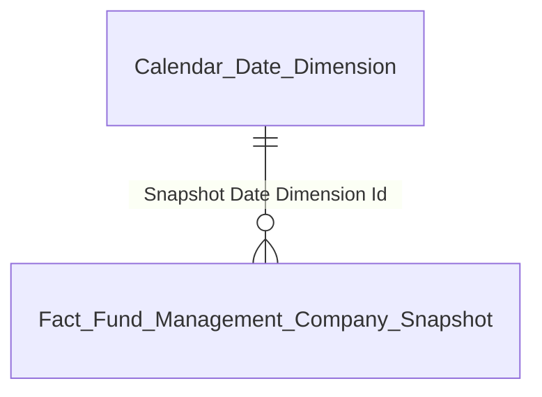
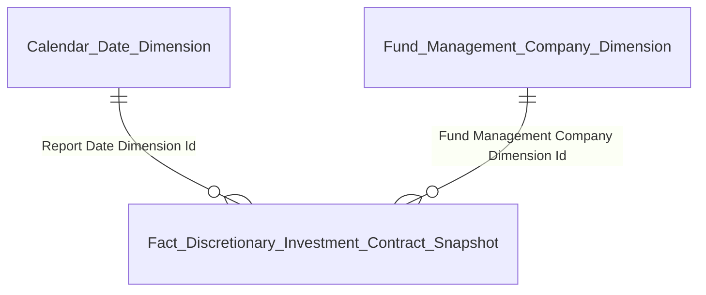
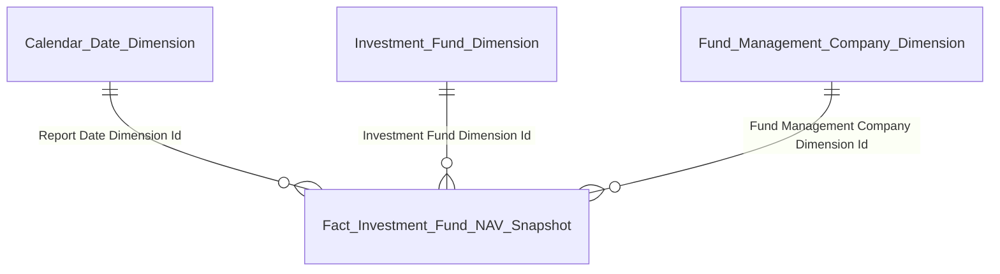
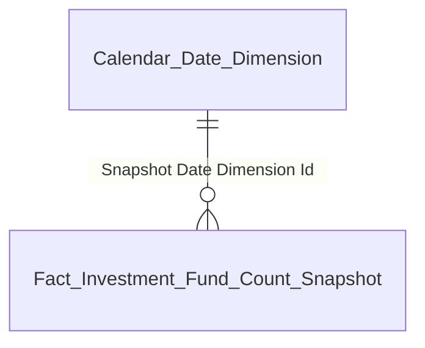
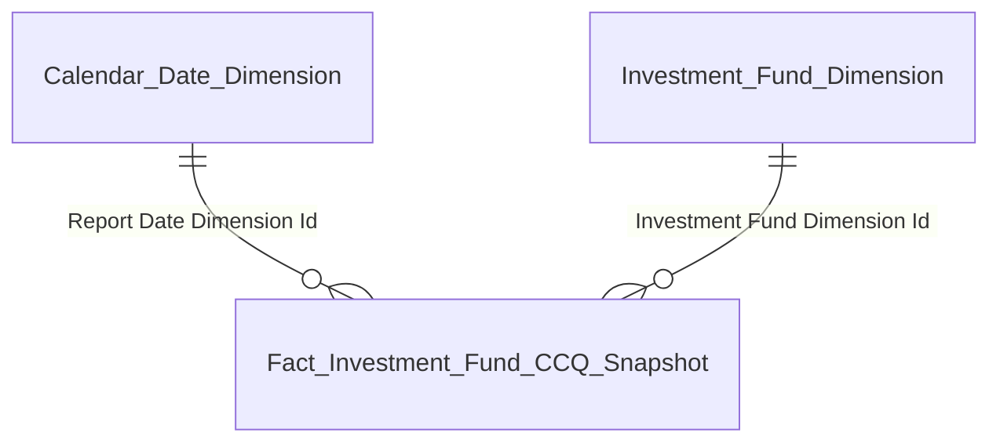

# DATAMART FMS — Phase 2b: Entity Relationships

## Nhóm 1 — Thống kê chung (Fact Fund Management Company Snapshot)

| Datamart entity | Description | Grain | KPI |
|---|---|---|---|
| Fact Fund Management Company Snapshot | Thống kê TT — COUNT db + AUM BC | 1 snapshot toàn TT × 1 tháng | K_FMS_1–9 |
| Calendar Date Dimension | Lịch ngày | 1 ngày | — |

---

## Nhóm 2 — UTDM (Fact Discretionary Investment Contract Snapshot)

| Datamart entity | Description | Grain | KPI |
|---|---|---|---|
| Fact Discretionary Investment Contract Snapshot | Số lượng + GTTT UTDM per CTQLQ per kỳ BC | 1 CTQLQ × 1 Report Template × 1 Report Date | K_FMS_10–16 |
| Fund Management Company Dimension | CTQLQ (SCD2) | 1 CTQLQ | — |
| Calendar Date Dimension | Lịch ngày | 1 ngày | — |

---

## Nhóm 3 — Danh sách CTQLQ (Operational)

Bảng tác nghiệp — lấy trực tiếp từ Atomic, không qua Dimension.

| Datamart entity | Description | Grain | KPI |
|---|---|---|---|
| Fund Management Company Profile | Hồ sơ CTQLQ latest | 1 CTQLQ × 1 tháng slicer | K_FMS_17–31 |
| Fund Management Company Fund List | Drill-down danh sách quỹ per CTQLQ | 1 quỹ × 1 tháng slicer | K_FMS_28–29 |
| Fund Management Company Contract List | Drill-down danh sách HĐ UTDM per CTQLQ | 1 Discretionary Investment Account active | K_FMS_30–31 |

---

## Nhóm 4–6 — NAV Snapshot (Fact Investment Fund NAV Snapshot)

| Datamart entity | Description | Grain | KPI |
|---|---|---|---|
| Fact Investment Fund NAV Snapshot | NAV + phân bổ TS + QLRR cross-module | 1 quỹ × 1 BC Template × 1 Report Date | K_FMS_32–37, 38–44, 47–49, 56, 61 |
| Investment Fund Dimension | Quỹ (SCD2) | 1 quỹ | — |
| Fund Management Company Dimension | CTQLQ (SCD2) | 1 CTQLQ | — |
| Calendar Date Dimension | Lịch ngày | 1 ngày | — |

---

## Nhóm 7 — Số lượng quỹ (Fact Investment Fund Count Snapshot)

| Datamart entity | Description | Grain | KPI |
|---|---|---|---|
| Fact Investment Fund Count Snapshot | Đếm quỹ theo loại hình — Market Level | 1 snapshot toàn TT × 1 năm | K_FMS_50–55 |
| Calendar Date Dimension | Lịch ngày | 1 ngày | — |

---

## Nhóm 8 — CCQ lưu hành (Fact Investment Fund CCQ Snapshot)

| Datamart entity | Description | Grain | KPI |
|---|---|---|---|
| Fact Investment Fund CCQ Snapshot | CCQ lưu hành tích lũy per quỹ per tháng ← TRANSFERMBF | 1 quỹ × 1 snapshot tháng | K_FMS_53 |
| Investment Fund Dimension | Quỹ (SCD2) | 1 quỹ | — |
| Calendar Date Dimension | Lịch ngày | 1 ngày | — |

---

## Nhóm 10 — Danh sách quỹ (Operational)

Bảng tác nghiệp — lấy trực tiếp từ Atomic.

| Datamart entity | Description | Grain | KPI |
|---|---|---|---|
| Investment Fund Profile | Hồ sơ quỹ latest | 1 quỹ × 1 tháng slicer | K_FMS_62–67 |

---

## Nhóm 12–16 — DataExplorer (Operational)

Bảng tác nghiệp — lấy trực tiếp từ Atomic RPTVALUES.

| Datamart entity | Description | Grain | KPI |
|---|---|---|---|
| Report Pass-through View | Pass-through BC — render dòng chỉ tiêu theo mẫu BC | 1 CTQLQ/Quỹ × 1 mẫu BC × 1 kỳ × 1 dòng chỉ tiêu | K_FMS_78–91 |

---

## Nhóm 11 — Báo cáo GD nhân viên CTQLQ (Operational)

Bảng tác nghiệp — cross-module FMS × GSGD.

| Datamart entity | Description | Grain | KPI |
|---|---|---|---|
| Fund Management Company Staff Trade Report | Báo cáo GD nhân viên CTQLQ — K_FMS_68–72 READY, K_FMS_73–77 PENDING sổ lệnh VSDC | 1 nhân viên × 1 TK GDCK | K_FMS_68–77 |

