# DTM_FMS_HLD — Data Mart: Phân hệ FMS (Công ty Quản lý Quỹ)

**Phiên bản:** 1.7
**Ngày:** 02/05/2026
**Phạm vi phiên bản này:** Tab TỔNG QUAN CTQLQ + Tab QUỸ ĐẦU TƯ
**Thay đổi v1.4 (review toàn diện + thảo luận):**
- [A] Nhóm 1: Giữ nguyên thiết kế — bổ sung ghi chú ETL dependency (db measures populate sớm hơn BC measures)
- [B] Nhóm 2: Bổ sung ETL note về re-submission — xử lý ở tầng Atomic, Datamart nhận dữ liệu đã lọc
- [C] Profile: Bổ sung ghi chú grain — làm rõ 2 kỳ thời gian (Report Period ≠ Rating Period) trong cùng 1 bảng
- [D] Fund List: Bổ sung `Fund_Capital_Amount` ← `FMS.FUNDS.FundCapital`
- [E] Contract List: Bổ sung `Investor_Name` ← `FMS.INVES.Name`
- [F] Cụm 3 flowchart: Bỏ SV3 (Member Periodic Report) + S3 — không có link đến bảng Datamart nào
- [G] Profile: Bổ sung ghi chú ETL policy — attributes lấy từ Atomic trực tiếp, không qua Dimension
**Thay đổi v1.5 (rà soát toàn bộ bảng grain):**
- [H] Fact UTDM: Sửa grain → `1 CTQLQ × 1 Report Template × 1 Reporting Period`; bổ sung `Reporting_Period_Id FK` vào schema; `Report_Template_Code` chuyển thành Degenerate Dimension
- [I] Profile: Làm rõ grain → `1 CTQLQ × 1 tháng slicer`
- [J] Fund List: Làm rõ grain → `1 quỹ × 1 tháng slicer`
- [K] Contract List: Làm rõ grain → `1 Discretionary Investment Account active tại tháng slicer`
- [L] Section 3 bảng Phân tích: Cập nhật grain Fact UTDM nhất quán
**Thay đổi v1.6 (phương án C — bỏ Reporting Period Dimension):**
- [M] Bỏ `Reporting Period Dimension` — Atomic RPTPERIOD không có Start/End Date, không đủ căn cứ tạo Dimension độc lập. Dùng `Calendar Date Dimension` (qua `Report_Date_Dimension_Id`) + `Reporting_Period_Code` làm Degenerate Dimension thứ 2 trên Fact. Grain Fact UTDM: `1 CTQLQ × 1 Report Template × 1 Report Date`

---
**Thay đổi v1.7:** Tích hợp nội dung Tab QUỸ ĐẦU TƯ vào đúng 4 section — bỏ cấu trúc "Section N (tiếp)" sai format

---

---

## Section 1 — Data Lineage: Staging → Atomic → Datamart

### Cụm 1: Thống kê thị trường toàn phần (`Fact Fund Management Company Snapshot`)

Phục vụ Tab TỔNG QUAN CTQLQ — Nhóm 1. Fact này là **Market-Level Aggregate Snapshot** — grain = 1 row per tháng, tổng hợp toàn bộ thị trường. Không có FK sang Company Dimension vì không GROUP BY từng CTQLQ. Dimension duy nhất là Calendar Date.

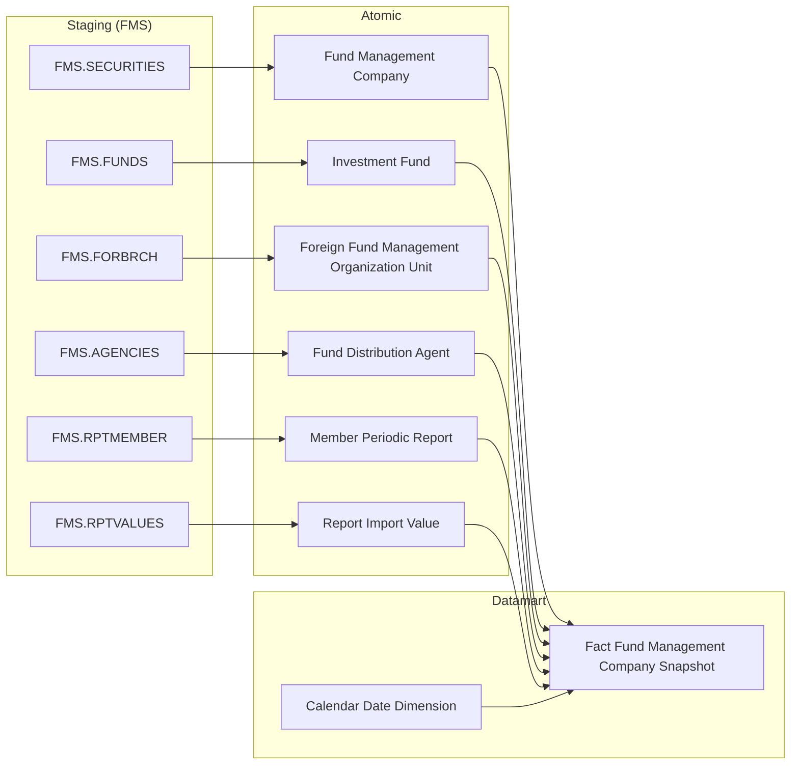
```mermaid
flowchart LR
    subgraph SRC["Staging (FMS)"]
        S1["FMS.SECURITIES"]
        S2["FMS.FUNDS"]
        S3["FMS.FORBRCH"]
        S4["FMS.AGENCIES"]
        S5["FMS.RPTMEMBER"]
        S6["FMS.RPTVALUES"]
    end

    subgraph SIL["Atomic"]
        SV1["Fund Management Company"]
        SV2["Investment Fund"]
        SV3["Foreign Fund Management Organization Unit"]
        SV4["Fund Distribution Agent"]
        SV5["Member Periodic Report"]
        SV6["Report Import Value"]
    end

    subgraph GOLD["Datamart"]
        G1["Fact Fund Management Company Snapshot"]
        G2["Calendar Date Dimension"]
    end

    S1 --> SV1
    S2 --> SV2
    S3 --> SV3
    S4 --> SV4
    S5 --> SV5
    S6 --> SV6

    SV1 --> G1
    SV2 --> G1
    SV3 --> G1
    SV4 --> G1
    SV5 --> G1
    SV6 --> G1

    G2 --> G1
```

### Cụm 2: Số liệu hợp đồng UTDM per CTQLQ (`Fact Discretionary Investment Contract Snapshot`)

Phục vụ Tab TỔNG QUAN CTQLQ — Nhóm 2. Tất cả KPI từ "Tổng từ các chỉ tiêu BC" (RPTVALUES). KPI tách cá nhân/tổ chức là **phái sinh** = chỉ tiêu tổng × tỷ lệ %, tính tại presentation layer.

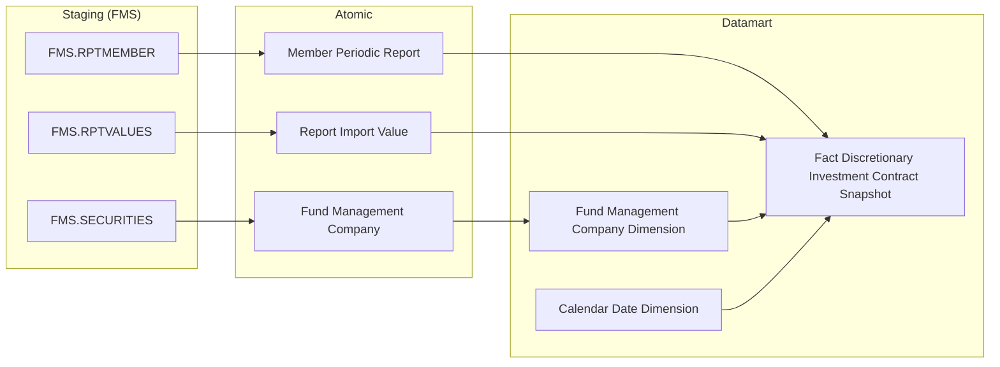
```mermaid
flowchart LR
    subgraph SRC["Staging (FMS)"]
        S1["FMS.RPTMEMBER"]
        S2["FMS.RPTVALUES"]
        S3["FMS.SECURITIES"]
    end

    subgraph SIL["Atomic"]
        SV1["Member Periodic Report"]
        SV2["Report Import Value"]
        SV3["Fund Management Company"]
    end

    subgraph GOLD["Datamart"]
        G1["Fact Discretionary Investment Contract Snapshot"]
        G2["Fund Management Company Dimension"]
        G3["Calendar Date Dimension"]
    end

    S1 --> SV1
    S2 --> SV2
    S3 --> SV3

    SV1 --> G1
    SV2 --> G1
    SV3 --> G2

    G2 --> G1
    G3 --> G1
```

### Cụm 3: Hồ sơ CTQLQ — flat + drill-down (Tác nghiệp)

Phục vụ Tab TỔNG QUAN CTQLQ — Nhóm 3. **1 bảng flat chính** (`Fund Management Company Profile`) chứa tất cả chỉ tiêu per CTQLQ. **2 bảng con** (`Fund Management Company Fund List`, `Fund Management Company Contract List`) phục vụ popup drill-down khi bấm vào Số QĐT / Số HĐUTDM — có FK về `Fund_Management_Company_Id`. Cả 3 lấy từ Atomic trực tiếp, không qua Dimension.

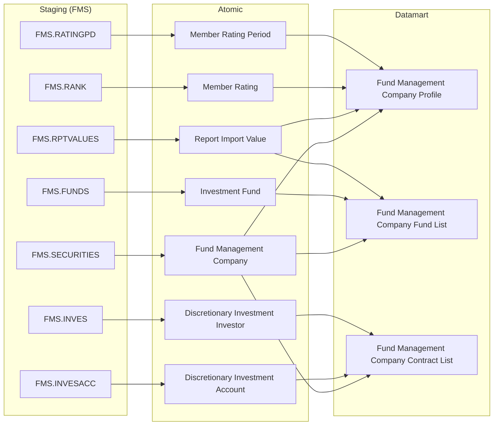
```mermaid
flowchart LR
    subgraph SRC["Staging (FMS)"]
        S1["FMS.SECURITIES"]
        S2["FMS.FUNDS"]
        S4["FMS.RPTVALUES"]
        S5["FMS.RANK"]
        S6["FMS.RATINGPD"]
        S7["FMS.INVESACC"]
        S8["FMS.INVES"]
    end

    subgraph SIL["Atomic"]
        SV1["Fund Management Company"]
        SV2["Investment Fund"]
        SV4["Report Import Value"]
        SV5["Member Rating"]
        SV6["Member Rating Period"]
        SV7["Discretionary Investment Account"]
        SV8["Discretionary Investment Investor"]
    end

    subgraph GOLD["Datamart"]
        G1["Fund Management Company Profile"]
        G2["Fund Management Company Fund List"]
        G3["Fund Management Company Contract List"]
    end

    S1 --> SV1
    S2 --> SV2
    S4 --> SV4
    S5 --> SV5
    S6 --> SV6
    S7 --> SV7
    S8 --> SV8

    SV1 --> G1
    SV4 --> G1
    SV5 --> G1
    SV6 --> G1

    SV1 --> G2
    SV2 --> G2
    SV4 --> G2

    SV1 --> G3
    SV7 --> G3
    SV8 --> G3
```

---

### Cụm 4: NAV quỹ theo kỳ + GDP cross-module (`Fact Investment Fund NAV Snapshot`)

Phục vụ Tab QUỸ ĐẦU TƯ — Nhóm 4 (Biểu đồ Tổng NAV & Tỷ lệ NAV/GDP), Nhóm 5 (Phân bổ tài sản), Nhóm 6 (Sự biến động NAV). NAV per quỹ từ RPTVALUES (FMS). GDP từ `Risk Indicator Value` (QLRR — cross-module). Tỷ lệ NAV/GDP và % phân bổ tài sản là Derived — tính tại presentation layer.

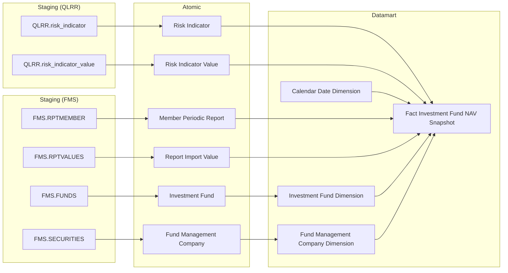
```mermaid
flowchart LR
    subgraph SRC_FMS["Staging (FMS)"]
        S1["FMS.RPTMEMBER"]
        S2["FMS.RPTVALUES"]
        S3["FMS.FUNDS"]
        S4["FMS.SECURITIES"]
    end

    subgraph SRC_QLRR["Staging (QLRR)"]
        S5["QLRR.risk_indicator"]
        S6["QLRR.risk_indicator_value"]
    end

    subgraph SIL["Atomic"]
        SV1["Member Periodic Report"]
        SV2["Report Import Value"]
        SV3["Investment Fund"]
        SV4["Fund Management Company"]
        SV5["Risk Indicator"]
        SV6["Risk Indicator Value"]
    end

    subgraph GOLD["Datamart"]
        G1["Fact Investment Fund NAV Snapshot"]
        G2["Investment Fund Dimension"]
        G3["Fund Management Company Dimension"]
        G4["Calendar Date Dimension"]
    end

    S1 --> SV1
    S2 --> SV2
    S3 --> SV3
    S4 --> SV4
    S5 --> SV5
    S6 --> SV6

    SV1 --> G1
    SV2 --> G1
    SV5 --> G1
    SV6 --> G1
    SV3 --> G2
    SV4 --> G3

    G2 --> G1
    G3 --> G1
    G4 --> G1
```

### Cụm 5: Số lượng quỹ theo loại hình (`Fact Investment Fund Count Snapshot`)

Phục vụ Tab QUỸ ĐẦU TƯ — Nhóm 7 (Số lượng quỹ ĐTCK). Market-Level Aggregate Snapshot — đếm từ db Atomic, GROUP BY loại hình quỹ. Tương tự pattern Nhóm 1 tab TỔNG QUAN CTQLQ.

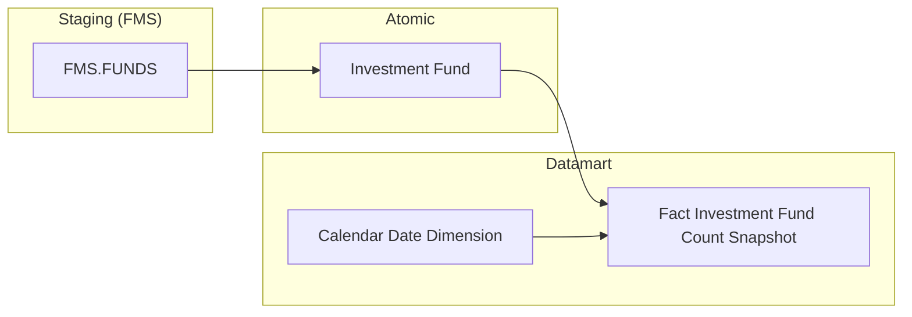
```mermaid
flowchart LR
    subgraph SRC["Staging (FMS)"]
        S1["FMS.FUNDS"]
    end

    subgraph SIL["Atomic"]
        SV1["Investment Fund"]
    end

    subgraph GOLD["Datamart"]
        G1["Fact Investment Fund Count Snapshot"]
        G2["Calendar Date Dimension"]
    end

    S1 --> SV1
    SV1 --> G1
    G2 --> G1
```

### Cụm 6: Số CCQ lưu hành per quỹ (`Fact Investment Fund CCQ Snapshot`)

Phục vụ Tab QUỸ ĐẦU TƯ — Nhóm 8 (Tăng trưởng CCQ lưu hành). Số CCQ có 3 nguồn khác nhau theo loại quỹ: BC (RPTVALUES) cho quỹ mở/ETF/TV/TTTTT/TP hạ tầng; tính từ db (FundCapital / 10.000) cho quỹ BĐS/TV dạng khác; VSDC cho quỹ đóng (PENDING — xem O_FMS_7).

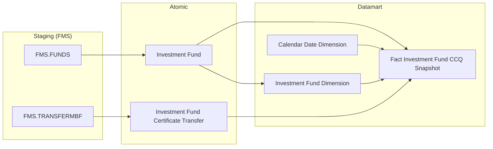
```mermaid
flowchart LR
    subgraph SRC["Staging (FMS)"]
        S1["FMS.FUNDS"]
        S2["FMS.TRANSFERMBF"]
    end

    subgraph SIL["Atomic"]
        SV1["Investment Fund"]
        SV2["Investment Fund Certificate Transfer"]
    end

    subgraph GOLD["Datamart"]
        G1["Fact Investment Fund CCQ Snapshot"]
        G2["Investment Fund Dimension"]
        G3["Calendar Date Dimension"]
    end

    S1 --> SV1
    S2 --> SV2

    SV1 --> G1
    SV2 --> G1
    SV1 --> G2

    G2 --> G1
    G3 --> G1
```

### Cụm 7: Danh sách quỹ (Tác nghiệp)

Phục vụ Tab QUỸ ĐẦU TƯ — Nhóm 10 (Danh sách các quỹ đầu tư). Bảng flat 1 quỹ × 1 tháng slicer — tổng hợp attributes db + BC. NAV hiện tại và LN YTD từ RPTVALUES (BC). CCQ lưu hành từ BC/db tùy loại quỹ (xem Cụm 6). Lấy từ Atomic trực tiếp — không qua Dimension.

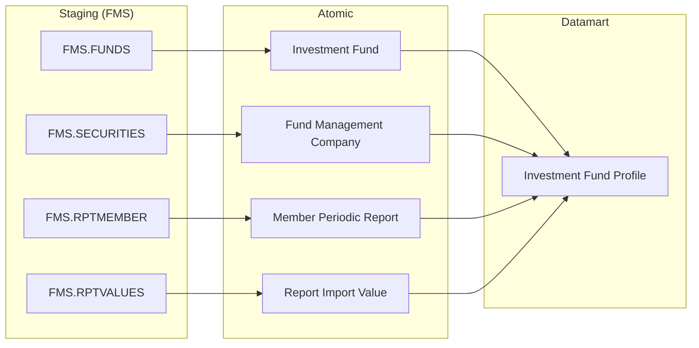
```mermaid
flowchart LR
    subgraph SRC["Staging (FMS)"]
        S1["FMS.FUNDS"]
        S2["FMS.SECURITIES"]
        S3["FMS.RPTMEMBER"]
        S4["FMS.RPTVALUES"]
    end

    subgraph SIL["Atomic"]
        SV1["Investment Fund"]
        SV2["Fund Management Company"]
        SV3["Member Periodic Report"]
        SV4["Report Import Value"]
    end

    subgraph GOLD["Datamart"]
        G1["Investment Fund Profile"]
    end

    S1 --> SV1
    S2 --> SV2
    S3 --> SV3
    S4 --> SV4

    SV1 --> G1
    SV2 --> G1
    SV3 --> G1
    SV4 --> G1
```

---

---

---

### Cụm 8: Pass-through báo cáo BC tất cả loại (`Report Pass-through View`)

Phục vụ Tab DATA EXPLORER — Nhóm 12–16. Toàn bộ 63 pass-through tabs + 19 complex tabs đều đọc từ `Report Import Value` ← FMS.RPTVALUES. Bảng Tác nghiệp dạng flat, 1 row per CTQLQ/Quỹ × biểu mẫu × kỳ × dòng chỉ tiêu. Tab Báo cáo/CTQLQ (Nhóm 11) PENDING — chờ xác nhận cross-module GSGD.

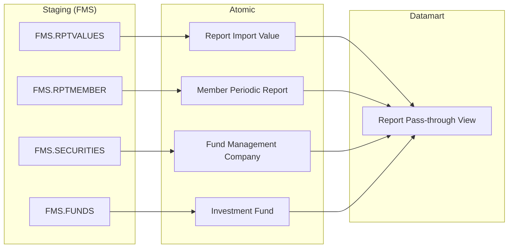
```mermaid
flowchart LR
    subgraph SRC["Staging (FMS)"]
        S1["FMS.RPTVALUES"]
        S2["FMS.RPTMEMBER"]
        S3["FMS.SECURITIES"]
        S4["FMS.FUNDS"]
    end

    subgraph SIL["Atomic"]
        SV1["Report Import Value"]
        SV2["Member Periodic Report"]
        SV3["Fund Management Company"]
        SV4["Investment Fund"]
    end

    subgraph GOLD["Datamart"]
        G1["Report Pass-through View"]
    end

    S1 --> SV1
    S2 --> SV2
    S3 --> SV3
    S4 --> SV4

    SV1 --> G1
    SV2 --> G1
    SV3 --> G1
    SV4 --> G1
```

### Cụm 9: Báo cáo giao dịch nhân viên CTQLQ (Tác nghiệp)

Phục vụ Tab BÁO CÁO / CÔNG TY QLQ — Nhóm 11. Cross-module FMS × GSGD: nhân viên CTQLQ từ `FMS.TLProfiles`, tài khoản GDCK từ `GSGD.investor_account`. Join qua `Identification_Number` (CCCD/Hộ chiếu). K_FMS_68–72 READY. K_FMS_73–77 (sổ lệnh) PENDING — chờ Atomic entity từ VSDC.

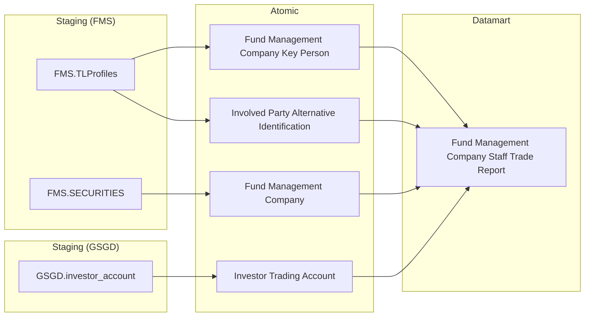
```mermaid
flowchart LR
    subgraph SRC_FMS["Staging (FMS)"]
        S1["FMS.TLProfiles"]
        S2["FMS.SECURITIES"]
    end

    subgraph SRC_GSGD["Staging (GSGD)"]
        S3["GSGD.investor_account"]
    end

    subgraph SIL["Atomic"]
        SV1["Fund Management Company Key Person"]
        SV2["Involved Party Alternative Identification"]
        SV3["Fund Management Company"]
        SV4["Investor Trading Account"]
    end

    subgraph GOLD["Datamart"]
        G1["Fund Management Company Staff Trade Report"]
    end

    S1 --> SV1
    S1 --> SV2
    S2 --> SV3
    S3 --> SV4

    SV1 --> G1
    SV2 --> G1
    SV3 --> G1
    SV4 --> G1
```

## Section 2 — Tổng quan báo cáo

### Tab: TỔNG QUAN CTQLQ

**Slicer chung:** Tháng/Năm (ví dụ: "THÁNG 5 — 2024")

---

#### Nhóm 1 — Thống kê chung

> Phân loại: **Phân tích**
> Atomic: `Fund Management Company` ← FMS.SECURITIES — **READY** *(Count db)*
> Atomic: `Investment Fund` ← FMS.FUNDS — **READY** *(Count db)*
> Atomic: `Foreign Fund Management Organization Unit` ← FMS.FORBRCH — **READY** *(Count db)*
> Atomic: `Fund Distribution Agent` ← FMS.AGENCIES — **READY** *(Count db)*
> Atomic: `Member Periodic Report` ← FMS.RPTMEMBER — **READY** *(Tổng từ chỉ tiêu BC)*
> Atomic: `Report Import Value` ← FMS.RPTVALUES — **READY** *(Tổng từ chỉ tiêu BC)*
> Ghi chú: Fact này là **Market-Level Aggregate Snapshot** — grain = 1 row per tháng, không FK sang Fund Management Company Dimension. Mỗi measure trong Fact là tổng hợp toàn thị trường: K_FMS_1, 4–8 đếm từ Atomic db; K_FMS_2–3 tổng hợp từ RPTVALUES. Không có chiều phân tích theo từng CTQLQ — đây là thiết kế có chủ ý, không phải thiếu Dimension.
> **ETL dependency [A]:** Fact có 2 nhóm measures với availability khác nhau. Nhóm db (K_FMS_1, 4–8) sẵn sàng ngay khi tháng kết thúc. Nhóm BC (K_FMS_2–3) phụ thuộc CTQLQ nộp BC qua RPTVALUES — có thể trễ vài tuần. ETL populate db measures trước, BC measures sau khi đủ dữ liệu.

**Mockup:**

| Chỉ tiêu | Giá trị | Nguồn chi tiết (BA) |
|---|---|---|
| Quỹ đầu tư CK | 124 quỹ | Count db |
| Hợp đồng UTDM | 89.521 | Tổng từ chỉ tiêu BC |
| Tổng AUM quản lý | 839 nghìn tỷ | Tổng từ chỉ tiêu BC |
| CTQLQ đang HĐ | 43 công ty | Count db |
| VPĐD QLQ NN | 14 VP | Count db |
| Đại lý phân phối CCQ | 49 đại lý | Count db |
| CN CTQLQ NN tại VN | 8 chi nhánh | Count db |
| Quỹ hưu trí | 12 quỹ | Count db |

**Source:** `Fact Fund Management Company Snapshot` → `Calendar Date Dimension`

**Bảng KPI:**

| KPI ID | Tên KPI | Đơn vị | Tính chất | Công thức / Ghi chú |
|---|---|---|---|---|
| K_FMS_1 | Quỹ đầu tư chứng khoán | Quỹ | Base | COUNT(Investment Fund) tất cả loại hình, theo tháng chọn |
| K_FMS_2 | Hợp đồng UTDM | Hợp đồng | Base | SUM Report Import Value mã **180101** (Tổng số HĐ UTĐT đang thực hiện) — tổng toàn TT, theo tháng |
| K_FMS_3 | Tổng AUM quản lý | Nghìn tỷ VND | Base | SUM Report Import Value chỉ tiêu AUM từ BC tình hình HĐ CTQLQ — tổng toàn TT, theo tháng |
| K_FMS_4 | CTQLQ đang hoạt động | Công ty | Base | COUNT(Fund Management Company) Life Cycle Status = đang HĐ, theo tháng |
| K_FMS_5 | VPĐD QLQ nước ngoài tại VN | Văn phòng | Base | COUNT(Foreign Fund Management Organization Unit) loại VPĐD, theo tháng |
| K_FMS_6 | Đại lý phân phối CCQ | Đại lý | Base | COUNT(Fund Distribution Agent) theo tháng |
| K_FMS_7 | Chi nhánh CTQLQ NN tại VN | Chi nhánh | Base | COUNT(Foreign Fund Management Organization Unit) loại Chi nhánh, theo tháng |
| K_FMS_8 | Quỹ hưu trí | Quỹ | Base | COUNT(Investment Fund) loại hình Quỹ hưu trí, theo tháng |
| K_FMS_9 | Tháng | — | Chiều | Slicer tháng/năm |

**Star Schema:**

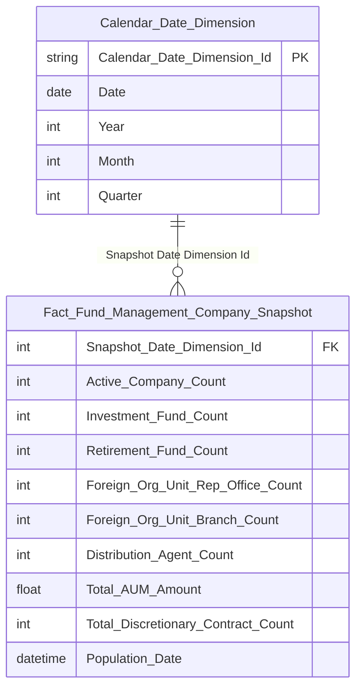
```mermaid
erDiagram
    Fact_Fund_Management_Company_Snapshot {
        int Snapshot_Date_Dimension_Id FK
        int Active_Company_Count
        int Investment_Fund_Count
        int Retirement_Fund_Count
        int Foreign_Org_Unit_Rep_Office_Count
        int Foreign_Org_Unit_Branch_Count
        int Distribution_Agent_Count
        float Total_AUM_Amount
        int Total_Discretionary_Contract_Count
        datetime Population_Date
    }
    Calendar_Date_Dimension {
        string Calendar_Date_Dimension_Id PK
        date Date
        int Year
        int Month
        int Quarter
    }

    Calendar_Date_Dimension ||--o{ Fact_Fund_Management_Company_Snapshot : "Snapshot Date Dimension Id"
```

**Lineage Mart → Báo cáo:**

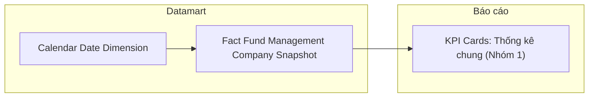
```mermaid
flowchart LR
    subgraph GOLD["Datamart"]
        G1["Fact Fund Management Company Snapshot"]
        G2["Calendar Date Dimension"]
    end
    subgraph RPT["Báo cáo"]
        R1["KPI Cards: Thống kê chung (Nhóm 1)"]
    end
    G2 --> G1
    G1 --> R1
```

**Bảng grain:**

| Tên bảng | Grain |
|---|---|
| Fact Fund Management Company Snapshot | 1 snapshot toàn thị trường × 1 tháng |
| Calendar Date Dimension | 1 ngày |

---

#### Nhóm 2 — Số liệu hợp đồng ủy thác danh mục

> Phân loại: **Phân tích**
> Atomic: `Discretionary Investment Account` ← FMS.INVESACC — **READY** *(db: Số lượng HĐ)*
> Atomic: `Report Import Value` ← FMS.RPTVALUES — **READY** *(BC: Giá trị thị trường UTDM)*
> Ghi chú: Phụ thuộc O_FMS_1 cho mapping SheetId/TgtId của giá trị UTDM. `Report_Template_Code` và `Reporting_Period_Code` là Degenerate Dimension.

**Mockup:**

| Loại | Số HĐ | Giá trị TT (tỷ) | Tỷ trọng (%) |
|---|---|---|---|
| Cá nhân | 1.250 | 12.580 | 65% |
| Tổ chức | 320 | 6.800 | 35% |
| **Tổng** | **1.570** | **19.380** | 100% |

**Source:** `Fact Discretionary Investment Contract Snapshot` → `Fund Management Company Dimension`, `Calendar Date Dimension`

**Bảng KPI:**

| KPI ID | Tên KPI | Đơn vị | Tính chất | Công thức / Ghi chú |
|---|---|---|---|---|
| K_FMS_10 | Tổng số lượng HĐ UTDM | HĐ | Base | COUNT(`Discretionary Investment Account`) toàn thị trường |
| K_FMS_11 | Số lượng HĐ UTDM cá nhân | HĐ | Base | COUNT WHERE `Investor_Object_Type_Code = Cá nhân` |
| K_FMS_12 | Số lượng HĐ UTDM tổ chức | HĐ | Base | COUNT WHERE `Investor_Object_Type_Code = Tổ chức` |
| K_FMS_13 | Tổng GTTT UTDM | Tỷ VND | Base | `Total_Trust_Market_Value` ← RPTVALUES |
| K_FMS_14 | GTTT UTDM cá nhân | Tỷ VND | Base | `Individual_Trust_Market_Value` ← RPTVALUES |
| K_FMS_15 | GTTT UTDM tổ chức | Tỷ VND | Base | `Organization_Trust_Market_Value` ← RPTVALUES |
| K_FMS_16a | % HĐ cá nhân | % | Derived | K_FMS_11 / K_FMS_10 × 100% — presentation layer |
| K_FMS_16b | % HĐ tổ chức | % | Derived | K_FMS_12 / K_FMS_10 × 100% — presentation layer |
| K_FMS_16c | % GTTT cá nhân | % | Derived | K_FMS_14 / K_FMS_13 × 100% — presentation layer |
| K_FMS_16d | % GTTT tổ chức | % | Derived | K_FMS_15 / K_FMS_13 × 100% — presentation layer |

**Star Schema:**

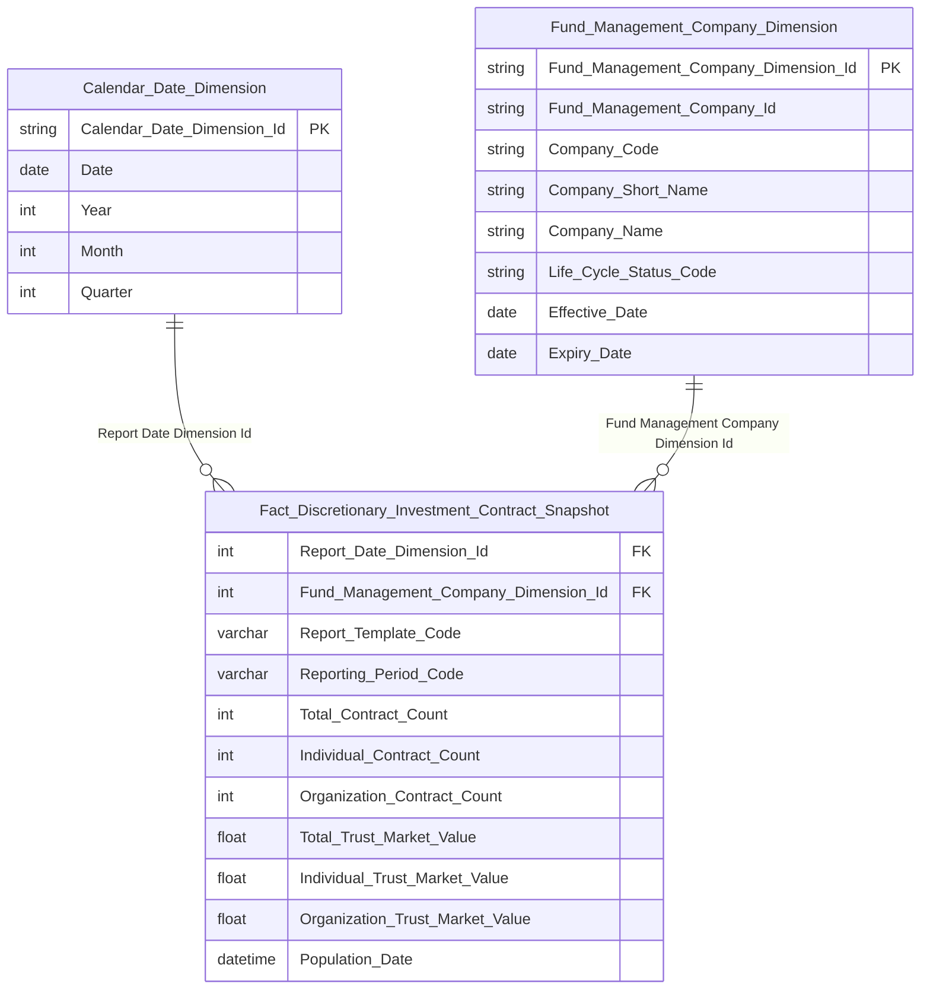
```mermaid
erDiagram
    Fact_Discretionary_Investment_Contract_Snapshot {
        int Report_Date_Dimension_Id FK
        int Fund_Management_Company_Dimension_Id FK
        varchar Report_Template_Code
        varchar Reporting_Period_Code
        int Total_Contract_Count
        int Individual_Contract_Count
        int Organization_Contract_Count
        float Total_Trust_Market_Value
        float Individual_Trust_Market_Value
        float Organization_Trust_Market_Value
        datetime Population_Date
    }
    Fund_Management_Company_Dimension {
        string Fund_Management_Company_Dimension_Id PK
        string Fund_Management_Company_Id
        string Company_Code
        string Company_Short_Name
        string Company_Name
        string Life_Cycle_Status_Code
        date Effective_Date
        date Expiry_Date
    }
    Calendar_Date_Dimension {
        string Calendar_Date_Dimension_Id PK
        date Date
        int Year
        int Month
        int Quarter
    }

    Calendar_Date_Dimension ||--o{ Fact_Discretionary_Investment_Contract_Snapshot : "Report Date Dimension Id"
    Fund_Management_Company_Dimension ||--o{ Fact_Discretionary_Investment_Contract_Snapshot : "Fund Management Company Dimension Id"
```

**Lineage Mart → Báo cáo:**

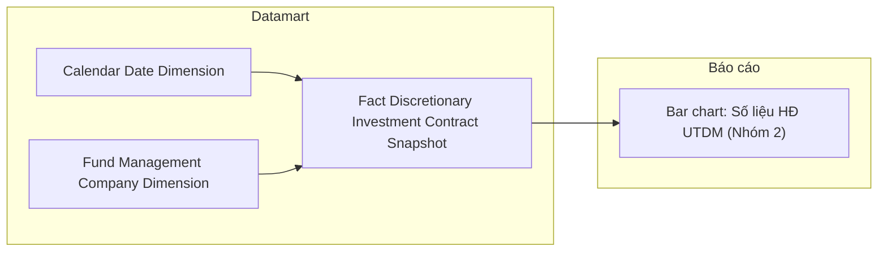
```mermaid
flowchart LR
    subgraph GOLD["Datamart"]
        G1["Fact Discretionary Investment Contract Snapshot"]
        G2["Fund Management Company Dimension"]
        G3["Calendar Date Dimension"]
    end
    subgraph RPT["Báo cáo"]
        R1["Bar chart: Số liệu HĐ UTDM (Nhóm 2)"]
    end
    G3 --> G1
    G2 --> G1
    G1 --> R1
```

**Bảng grain:**

| Tên bảng | Grain |
|---|---|
| Fact Discretionary Investment Contract Snapshot | 1 CTQLQ × 1 Report Template × 1 Report Date |
| Fund Management Company Dimension | 1 CTQLQ (SCD2 — 1 version per khoảng thời gian) |
| Calendar Date Dimension | 1 ngày |

---

#### Nhóm 3 — Danh sách các Công ty quản lý quỹ

> Phân loại: **Tác nghiệp**
> Atomic: `Fund Management Company` ← FMS.SECURITIES — **READY** *(db: Tên CT, Vốn ĐL)*
> Atomic: `Investment Fund` ← FMS.FUNDS — **READY** *(db: Tên quỹ, NAV)*
> Atomic: `Report Import Value` ← FMS.RPTVALUES — **READY** *(BC: AUM, CAR, LN, Vốn CSH, NAV)*
> Atomic: `Member Rating` ← FMS.RANK — **READY** *(db: Xếp loại, CAMEL)*
> Atomic: `Member Rating Period` ← FMS.RATINGPD — **READY** *(db)*
> Atomic: `Discretionary Investment Account` ← FMS.INVESACC — **READY** *(db: Số HĐ UTDM)*
> Ghi chú: [A] Nhóm db measures (Active_Company_Count, Investment_Fund_Count, Total_Discretionary_Contract_Count) có thể populate T-0. [B] BC measures (AUM, CAR, LN, NAV, Vốn CSH) populate sau khi RPTVALUES có dữ liệu — phụ thuộc O_FMS_1. [C] Grain Profile = 1 CTQLQ × 1 tháng slicer — attributes lấy từ Atomic trực tiếp, không qua Dimension. [D] ETL policy: xem kỳ đánh giá gần nhất (Member_Rating_Period_End_Date ≤ tháng slicer).

**Mockup:**

**Bảng chính — `Fund Management Company Profile`:**

| Mã | Tên CT | AUM (tỷ) | Số QĐT | SL HĐUTDM | CAR | LN (tỷ) | VĐL (tỷ) | Vốn CSH (tỷ) | Thị phần (%) | Xếp loại | CAMEL |
|---|---|---|---|---|---|---|---|---|---|---|---|
| CT1 | Công ty ABC | 25.450 | 12 | 350 | 18.5% | 120.4 | 150 | 165 | 8.2% | A | 89.5% |

**Mockup — popup "DANH SÁCH QUỸ - CT1":**

| Mã quỹ | Tên quỹ | Loại | NAV (tỷ) |
|---|---|---|---|
| QA1 | Quỹ ABC Cổ phần | Quỹ mở | 1.250 |

**Mockup — popup "DANH SÁCH HĐ UTDM - CT1":**

| Số HĐ | Nhà đầu tư | Loại | Giá trị (tỷ) |
|---|---|---|---|
| HĐ001 | Nguyễn Văn A | Cá nhân | 25.4 |

**Source:** `Fund Management Company Profile` → `Fund Management Company Fund List`, `Fund Management Company Contract List`

**Bảng KPI:**

| KPI ID | Tên KPI | Đơn vị | Tính chất | Công thức / Ghi chú |
|---|---|---|---|---|
| K_FMS_17 | Tên công ty | — | Chiều | `Company_Name` + `Company_Short_Name` ← Fund Management Company |
| K_FMS_18 | AUM | Tỷ VND | Base | `Total_AUM_Amount` ← RPTVALUES — pending O_FMS_1 |
| K_FMS_19 | Số lượng quỹ đang quản lý | Quỹ | Base | COUNT(`Investment Fund`) WHERE `Fund_Management_Company_Id` — COUNT db |
| K_FMS_20 | Số lượng HĐUTDM | HĐ | Base | COUNT(`Discretionary Investment Account`) per CTQLQ — COUNT db |
| K_FMS_21 | CAR | % | Base | `Rank_Class_Code` (CAR ratio) ← RPTVALUES — pending O_FMS_1 |
| K_FMS_22 | Lợi nhuận | Tỷ VND | Base | `Net_Profit_Amount` ← RPTVALUES BCTC gần nhất — pending O_FMS_1, O_FMS_4 |
| K_FMS_23 | Vốn điều lệ | Tỷ VND | Base | `Charter_Capital_Amount` ← FMS.SECURITIES.SecCapital |
| K_FMS_24 | Vốn CSH | Tỷ VND | Base | `Equity_Amount` ← RPTVALUES BCTC mã 400 — pending O_FMS_4 |
| K_FMS_25 | Xếp loại | — | Base | `Rank_Class_Code` ← FMS.RANK.RankClass (A/B/C) |
| K_FMS_26 | CAMEL | % | Base | `Total_Score` ← FMS.RANK.TotalScore |
| K_FMS_27 | Thị phần AUM | % | Derived | K_FMS_18[CT] / SUM(K_FMS_18) × 100% — presentation layer |
| K_FMS_28 | Chi tiết quỹ của CTQLQ | — | Base | `Fund_Code`, `Fund_Name`, `Fund_NAV_Amount` ← `Fund Management Company Fund List` |
| K_FMS_29 | NAV từng quỹ | Tỷ VND | Base | `Fund_NAV_Amount` ← RPTVALUES per quỹ |
| K_FMS_30 | Chi tiết HĐUTDM | — | Base | `Account_Number`, `Investor_Name`, `Contract_Value` ← `Fund Management Company Contract List` |
| K_FMS_31 | Giá trị từng HĐ UTDM | Tỷ VND | Base | `Trust_Market_Value` ← RPTVALUES per HĐ |

**Schema bảng tác nghiệp — Fund Management Company Profile:**

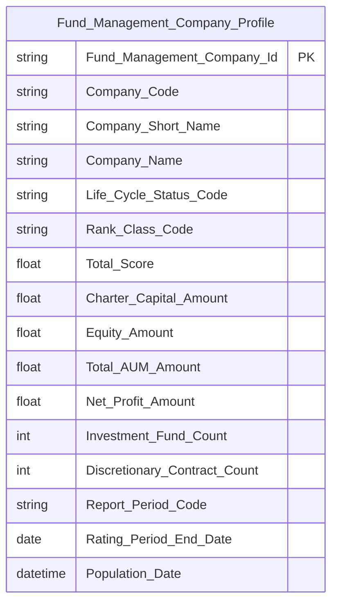
```mermaid
erDiagram
    Fund_Management_Company_Profile {
        string Fund_Management_Company_Id PK
        string Company_Code
        string Company_Short_Name
        string Company_Name
        string Life_Cycle_Status_Code
        string Rank_Class_Code
        float Total_Score
        float Charter_Capital_Amount
        float Equity_Amount
        float Total_AUM_Amount
        float Net_Profit_Amount
        int Investment_Fund_Count
        int Discretionary_Contract_Count
        string Report_Period_Code
        date Rating_Period_End_Date
        datetime Population_Date
    }
```

**Schema bảng con — Fund Management Company Fund List:**

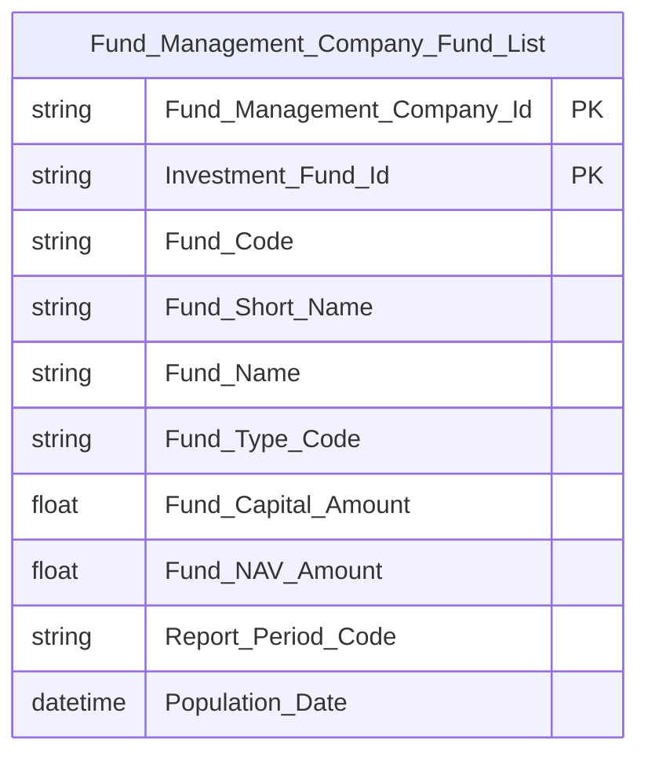
```mermaid
erDiagram
    Fund_Management_Company_Fund_List {
        string Fund_Management_Company_Id PK
        string Investment_Fund_Id PK
        string Fund_Code
        string Fund_Short_Name
        string Fund_Name
        string Fund_Type_Code
        float Fund_Capital_Amount
        float Fund_NAV_Amount
        string Report_Period_Code
        datetime Population_Date
    }
```

**Schema bảng con — Fund Management Company Contract List:**

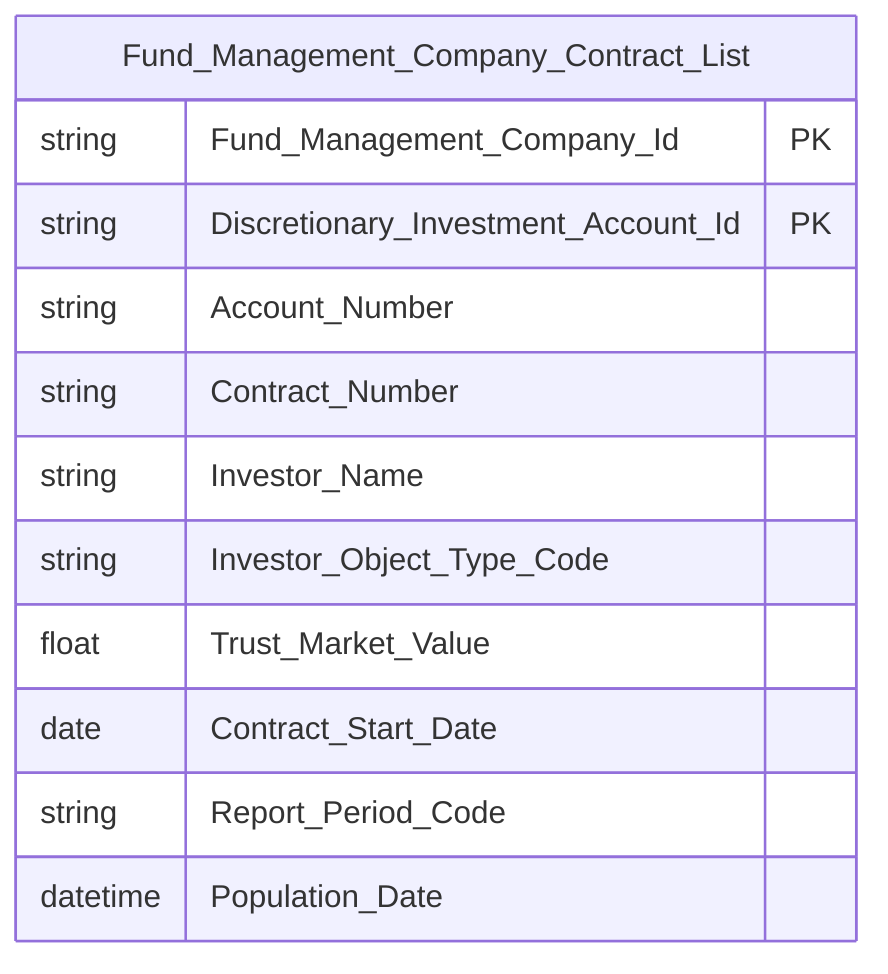
```mermaid
erDiagram
    Fund_Management_Company_Contract_List {
        string Fund_Management_Company_Id PK
        string Discretionary_Investment_Account_Id PK
        string Account_Number
        string Contract_Number
        string Investor_Name
        string Investor_Object_Type_Code
        float Trust_Market_Value
        date Contract_Start_Date
        string Report_Period_Code
        datetime Population_Date
    }
```

**Lineage Mart → Báo cáo:**

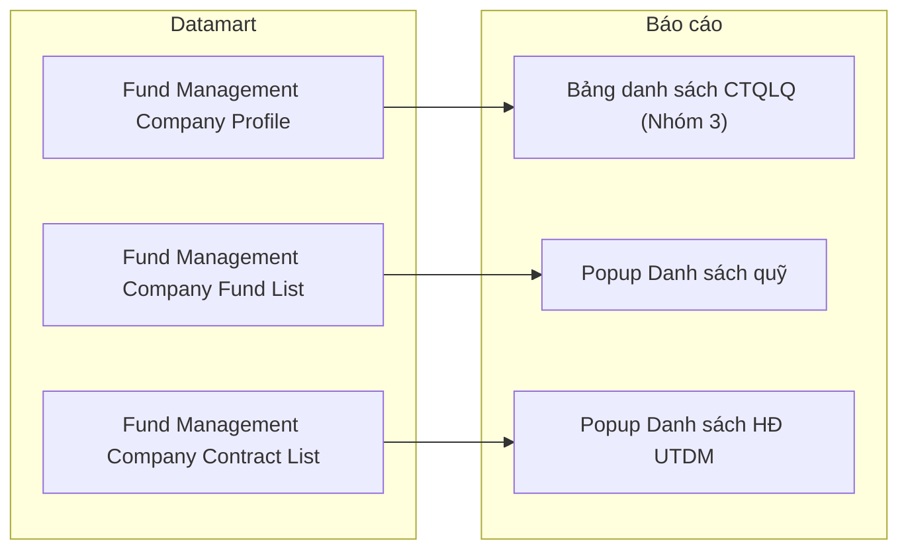
```mermaid
flowchart LR
    subgraph GOLD["Datamart"]
        G1["Fund Management Company Profile"]
        G2["Fund Management Company Fund List"]
        G3["Fund Management Company Contract List"]
    end
    subgraph RPT["Báo cáo"]
        R1["Bảng danh sách CTQLQ (Nhóm 3)"]
        R2["Popup Danh sách quỹ"]
        R3["Popup Danh sách HĐ UTDM"]
    end
    G1 --> R1
    G2 --> R2
    G3 --> R3
```

**Bảng grain:**

| Tên bảng | Grain |
|---|---|
| Fund Management Company Profile | Tác nghiệp — bảng flat chính \| 1 CTQLQ × 1 tháng slicer |
| Fund Management Company Fund List | Tác nghiệp — bảng con drill-down \| 1 quỹ × 1 tháng slicer |
| Fund Management Company Contract List | Tác nghiệp — bảng con drill-down \| 1 Discretionary Investment Account active tại tháng slicer |

---

### Tab: QUỬ ĐẦU TƯ

**Slicer chung:** Tháng/Năm (tháng slicer); một số nhóm có thêm slicer Từ tháng / Đến tháng

---

#### Nhóm 4 — Biểu đồ Tổng NAV Quỹ và Tỷ lệ NAV/GDP

> Phân loại: **Phân tích**
> Atomic: `Report Import Value` ← FMS.RPTVALUES — **READY** *(BC: NAV per quỹ)*
> Atomic: `Risk Indicator Value` ← QLRR.risk_indicator_value — **READY** *(db QLRR: GDP, category = MACRO)*
> Atomic: `Investment Fund` ← FMS.FUNDS — **READY** *(db: Fund_Type_Code để phân loại)*
> Atomic: `Fund Management Company` ← FMS.SECURITIES — **READY**
> Ghi chú: Cross-module FMS × QLRR. GDP lấy từ `Risk Indicator Value` WHERE `Indicator Set Code = 1 (Trong nước)` AND `Risk Indicator Category Code = MACRO`. Tỷ lệ NAV/GDP và NAV từng loại hình là Derived — tính tại presentation layer. Phụ thuộc O_FMS_1 cho mapping SheetId/TgtId NAV.

**Mockup:**

| Chỉ tiêu | Loại |
|---|---|
| NAV/GDP % (line chart) | Derived |
| Tổng NAV toàn TT (line chart) | Derived (SUM) |
| NAV từng loại hình quỹ (line chart) | Derived (SUM GROUP BY Fund Type) |

**Source:** `Fact Investment Fund NAV Snapshot` → `Investment Fund Dimension`, `Fund Management Company Dimension`, `Calendar Date Dimension`

**Bảng KPI:**

| KPI ID | Tên KPI | Đơn vị | Tính chất | Công thức / Ghi chú |
|---|---|---|---|---|
| K_FMS_32 | NAV per quỹ | Tỷ VND | Base | `Fund_NAV_Amount` ← RPTVALUES BC per quỹ per kỳ |
| K_FMS_33 | GDP | Nghìn tỷ VND | Base | `GDP_Value` ← `Risk Indicator Value` QLRR (MACRO) |
| K_FMS_34 | Tổng NAV toàn thị trường | Tỷ VND | Derived | SUM(K_FMS_32) toàn TT per kỳ — presentation layer |
| K_FMS_35 | Tổng NAV từng loại hình quỹ | Tỷ VND | Derived | SUM(K_FMS_32) GROUP BY Fund_Type_Code — presentation layer |
| K_FMS_36 | Loại hình quỹ | — | Chiều | `Fund_Type_Code` ← Investment Fund (FMS.FUNDS) |
| K_FMS_37 | Tỷ lệ NAV/GDP | % | Derived | K_FMS_34 / K_FMS_33 × 100% — presentation layer |

**Star Schema:**

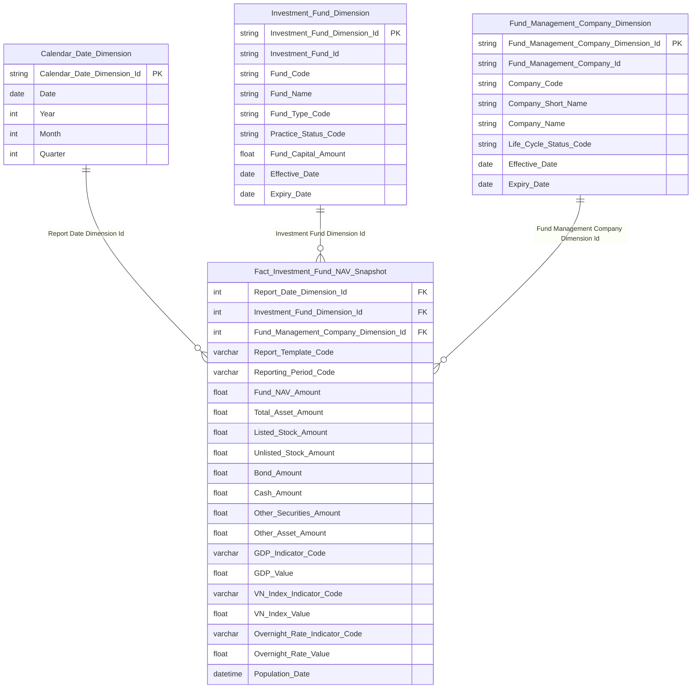
```mermaid
erDiagram
    Fact_Investment_Fund_NAV_Snapshot {
        int Report_Date_Dimension_Id FK
        int Investment_Fund_Dimension_Id FK
        int Fund_Management_Company_Dimension_Id FK
        varchar Report_Template_Code
        varchar Reporting_Period_Code
        float Fund_NAV_Amount
        float Total_Asset_Amount
        float Listed_Stock_Amount
        float Unlisted_Stock_Amount
        float Bond_Amount
        float Cash_Amount
        float Other_Securities_Amount
        float Other_Asset_Amount
        varchar GDP_Indicator_Code
        float GDP_Value
        varchar VN_Index_Indicator_Code
        float VN_Index_Value
        varchar Overnight_Rate_Indicator_Code
        float Overnight_Rate_Value
        datetime Population_Date
    }
    Investment_Fund_Dimension {
        string Investment_Fund_Dimension_Id PK
        string Investment_Fund_Id
        string Fund_Code
        string Fund_Name
        string Fund_Type_Code
        string Practice_Status_Code
        float Fund_Capital_Amount
        date Effective_Date
        date Expiry_Date
    }
    Fund_Management_Company_Dimension {
        string Fund_Management_Company_Dimension_Id PK
        string Fund_Management_Company_Id
        string Company_Code
        string Company_Short_Name
        string Company_Name
        string Life_Cycle_Status_Code
        date Effective_Date
        date Expiry_Date
    }
    Calendar_Date_Dimension {
        string Calendar_Date_Dimension_Id PK
        date Date
        int Year
        int Month
        int Quarter
    }

    Calendar_Date_Dimension ||--o{ Fact_Investment_Fund_NAV_Snapshot : "Report Date Dimension Id"
    Investment_Fund_Dimension ||--o{ Fact_Investment_Fund_NAV_Snapshot : "Investment Fund Dimension Id"
    Fund_Management_Company_Dimension ||--o{ Fact_Investment_Fund_NAV_Snapshot : "Fund Management Company Dimension Id"
```

> Ghi chú cross-module QLRR (T-1 rule): Dữ liệu QLRR chạy T-1 — ETL join theo kỳ tương ứng Report_Date:
> - **GDP_Value**: `Period_Type_Code = Quý` AND `Period_Year = YEAR(Report_Date)` AND `Period_Value = QUARTER(Report_Date)` — lấy kỳ gần nhất có dữ liệu
> - **VN_Index_Value**: `Period_Type_Code = Ngày` AND `Period_Date = ngày làm việc trước Report_Date`
> - **Overnight_Rate_Value**: `Period_Type_Code = Ngày` AND `Period_Date = ngày làm việc trước Report_Date`
> Các DD `_Indicator_Code` lưu mã chỉ tiêu QLRR để tra cứu khi cần.

**Lineage Mart → Báo cáo:**

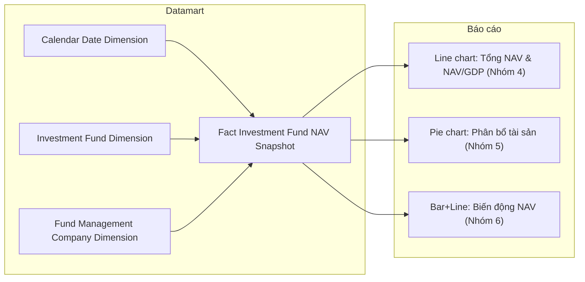
```mermaid
flowchart LR
    subgraph GOLD["Datamart"]
        G1["Fact Investment Fund NAV Snapshot"]
        G2["Investment Fund Dimension"]
        G3["Fund Management Company Dimension"]
        G4["Calendar Date Dimension"]
    end
    subgraph RPT["Báo cáo"]
        R1["Line chart: Tổng NAV & NAV/GDP (Nhóm 4)"]
        R2["Pie chart: Phân bổ tài sản (Nhóm 5)"]
        R3["Bar+Line: Biến động NAV (Nhóm 6)"]
    end
    G4 --> G1
    G2 --> G1
    G3 --> G1
    G1 --> R1
    G1 --> R2
    G1 --> R3
```

**Bảng grain:**

| Tên bảng | Grain |
|---|---|
| Fact Investment Fund NAV Snapshot | 1 quỹ × 1 Report Template × 1 Report Date |
| Investment Fund Dimension | 1 quỹ (SCD2 — 1 version per khoảng thời gian) |
| Fund Management Company Dimension | 1 CTQLQ (SCD2 — 1 version per khoảng thời gian) |
| Calendar Date Dimension | 1 ngày |

---

#### Nhóm 5 — Biểu đồ Phân bổ tài sản của Quỹ đầu tư

> Phân loại: **Phân tích**
> Atomic: `Report Import Value` ← FMS.RPTVALUES — **READY** *(BC: giá trị từng loại tài sản)*
> Ghi chú: Tất cả chỉ tiêu phân bổ tài sản (CP NY, CP chưa NY, TP, Tiền, CK khác, TS khác) là **Derived** = tỷ lệ % = Giá trị loại tài sản / Tổng giá trị tài sản × 100%. Mart lưu giá trị tuyệt đối từng loại tài sản là Base. Tổng và % tính tại presentation layer. Phụ thuộc O_FMS_1 cho mapping SheetId/TgtId từng loại tài sản.
> Reuse bảng: `Fact Investment Fund NAV Snapshot` — bổ sung các measure tài sản.

**Bảng KPI:**

| KPI ID | Tên KPI | Đơn vị | Tính chất | Công thức / Ghi chú |
|---|---|---|---|---|
| K_FMS_38 | Tổng giá trị tài sản | Tỷ VND | Base | SUM Report Import Value chỉ tiêu tổng tài sản per quỹ ← RPTVALUES |
| K_FMS_39 | Giá trị CP niêm yết | Tỷ VND | Base | Report Import Value chỉ tiêu CP niêm yết per quỹ ← RPTVALUES |
| K_FMS_40 | Giá trị CP chưa niêm yết | Tỷ VND | Base | Report Import Value chỉ tiêu CP chưa NY per quỹ ← RPTVALUES |
| K_FMS_41 | Giá trị trái phiếu | Tỷ VND | Base | Report Import Value chỉ tiêu trái phiếu per quỹ ← RPTVALUES |
| K_FMS_42 | Giá trị tiền | Tỷ VND | Base | Report Import Value chỉ tiêu tiền per quỹ ← RPTVALUES |
| K_FMS_43 | Giá trị CK khác | Tỷ VND | Base | Report Import Value chỉ tiêu CK khác per quỹ ← RPTVALUES |
| K_FMS_44 | Giá trị tài sản khác | Tỷ VND | Base | Report Import Value chỉ tiêu TS khác per quỹ ← RPTVALUES |
| K_FMS_45 | Chiều loại hình tài sản | — | Chiều | Phân loại 6 nhóm tài sản — Classification Value |
| K_FMS_46a | % CP niêm yết | % | Derived | K_FMS_39 / K_FMS_38 × 100% — presentation layer |
| K_FMS_46b | % CP chưa niêm yết | % | Derived | K_FMS_40 / K_FMS_38 × 100% — presentation layer |
| K_FMS_46c | % Trái phiếu | % | Derived | K_FMS_41 / K_FMS_38 × 100% — presentation layer |
| K_FMS_46d | % Tiền | % | Derived | K_FMS_42 / K_FMS_38 × 100% — presentation layer |
| K_FMS_46e | % CK khác | % | Derived | K_FMS_43 / K_FMS_38 × 100% — presentation layer |
| K_FMS_46f | % Tài sản khác | % | Derived | K_FMS_44 / K_FMS_38 × 100% — presentation layer |

> Ghi chú thiết kế: K_FMS_38–44 đều lưu trong `Fact Investment Fund NAV Snapshot` (bổ sung measures vào cùng Fact với Nhóm 4). Star Schema và Dimension reuse hoàn toàn từ Nhóm 4.

**Mockup:**

| Loại tài sản | Giá trị (tỷ VND) | Tỷ trọng (%) |
|---|---|---|
| Cổ phiếu niêm yết | 450.000 | 65% |
| Trái phiếu | 120.000 | 17% |
| Tiền | 80.000 | 11% |
| CP chưa niêm yết | 30.000 | 4% |
| CK khác | 15.000 | 2% |
| Tài sản khác | 7.000 | 1% |

**Source:** `Fact Investment Fund NAV Snapshot` → `Investment Fund Dimension`, `Fund Management Company Dimension`, `Calendar Date Dimension`

**Star Schema:** *(Reuse `Fact Investment Fund NAV Snapshot` — xem Nhóm 4 để biết schema đầy đủ. Nhóm 5 dùng các measure tài sản: `Total_Asset_Amount`, `Listed_Stock_Amount`, `Unlisted_Stock_Amount`, `Bond_Amount`, `Cash_Amount`, `Other_Securities_Amount`, `Other_Asset_Amount`)*

**Lineage Mart → Báo cáo:**

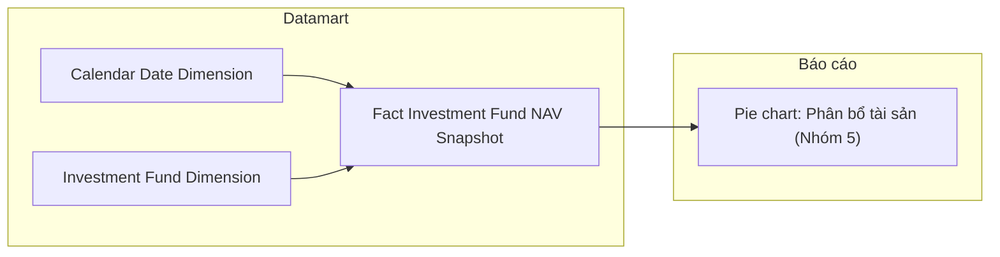
```mermaid
flowchart LR
    subgraph GOLD["Datamart"]
        G1["Fact Investment Fund NAV Snapshot"]
        G2["Investment Fund Dimension"]
        G3["Calendar Date Dimension"]
    end
    subgraph RPT["Báo cáo"]
        R1["Pie chart: Phân bổ tài sản (Nhóm 5)"]
    end
    G3 --> G1
    G2 --> G1
    G1 --> R1
```

**Bảng grain:**

| Tên bảng | Grain |
|---|---|
| Fact Investment Fund NAV Snapshot | 1 quỹ × 1 Report Template × 1 Report Date |
| Investment Fund Dimension | 1 quỹ (SCD2 — 1 version per khoảng thời gian) |
| Fund Management Company Dimension | 1 CTQLQ (SCD2 — 1 version per khoảng thời gian) |
| Calendar Date Dimension | 1 ngày |

---

#### Nhóm 6 — Sự biến động về NAV của các Quỹ ĐTCK

> Phân loại: **Phân tích**
> Atomic: `Report Import Value` ← FMS.RPTVALUES — **READY** *(BC: NAV per quỹ per tháng)*
> Ghi chú: Reuse `Fact Investment Fund NAV Snapshot`. Tăng trưởng NAV tháng (MoM%) và Trung bình tăng trưởng đều là Derived — tính tại presentation layer từ K_FMS_32.

**Bảng KPI:**

| KPI ID | Tên KPI | Đơn vị | Tính chất | Công thức / Ghi chú |
|---|---|---|---|---|
| K_FMS_47 | NAV các quỹ ĐTCK theo tháng | Tỷ VND | Base | Reuse K_FMS_32 — SUM(Fund_NAV_Amount) per tháng — presentation layer |
| K_FMS_48 | Tăng trưởng NAV tháng (MoM%) | % | Derived | (K_FMS_47[T] − K_FMS_47[T−1]) / K_FMS_47[T−1] × 100% — presentation layer |
| K_FMS_49 | Trung bình tăng trưởng NAV | % | Derived | AVG(K_FMS_48) trong khoảng thời gian chọn — presentation layer |

**Mockup:**

| Tháng | NAV (tỷ VND) | Tăng trưởng (%) |
|---|---|---|
| T1/2025 | 820.000 | +2.1% |
| T2/2025 | 835.000 | +1.8% |
| T3/2025 | 828.000 | −0.8% |

**Source:** `Fact Investment Fund NAV Snapshot` → `Investment Fund Dimension`, `Calendar Date Dimension`

**Star Schema:** *(Reuse `Fact Investment Fund NAV Snapshot` — xem Nhóm 4 để biết schema đầy đủ. Nhóm 6 chỉ dùng measure `Fund_NAV_Amount` để tính biến động NAV theo tháng)*

**Lineage Mart → Báo cáo:**

```mermaid
flowchart LR
    subgraph GOLD["Datamart"]
        G1["Fact Investment Fund NAV Snapshot"]
        G2["Investment Fund Dimension"]
        G3["Calendar Date Dimension"]
    end
    subgraph RPT["Báo cáo"]
        R1["Bar+Line: Biến động NAV theo tháng (Nhóm 6)"]
    end
    G3 --> G1
    G2 --> G1
    G1 --> R1
```

**Bảng grain:**

| Tên bảng | Grain |
|---|---|
| Fact Investment Fund NAV Snapshot | 1 quỹ × 1 Report Template × 1 Report Date |
| Investment Fund Dimension | 1 quỹ (SCD2 — 1 version per khoảng thời gian) |
| Calendar Date Dimension | 1 ngày |

---

#### Nhóm 7 — Số lượng quỹ đầu tư chứng khoán

> Phân loại: **Phân tích**
> Atomic: `Investment Fund` ← FMS.FUNDS — **READY** *(db: COUNT per Fund_Type_Code)*
> Ghi chú: Market-Level Aggregate Snapshot theo năm — đếm từ db. COUNT từng loại quỹ là Derived = COUNT WHERE Fund_Type_Code = X — tính tại presentation layer. Grain = 1 snapshot × 1 năm × loại hình được aggregate tại mart (lưu tổng, tách loại ở presentation).

**Mockup:**

| Năm | Tổng quỹ | Quỹ mở | Quỹ TV | ETF | Đóng | BĐS |
|---|---|---|---|---|---|---|
| 2018 | 47 | 20 | 10 | 8 | 5 | 4 |
| 2023 | 124 | 55 | 25 | 20 | 15 | 9 |

**Source:** `Fact Investment Fund Count Snapshot` → `Calendar Date Dimension`

**Bảng KPI:**

| KPI ID | Tên KPI | Đơn vị | Tính chất | Công thức / Ghi chú |
|---|---|---|---|---|
| K_FMS_50 | Tổng số lượng quỹ | Quỹ | Base | COUNT(Investment Fund) tất cả loại hình, theo năm ← FMS.FUNDS |
| K_FMS_51 | Loại hình quỹ | — | Chiều | Fund_Type_Code ← Investment Fund |
| K_FMS_52a | Quỹ mở | Quỹ | Derived | COUNT WHERE Fund_Type_Code = QUY_MO — presentation layer |
| K_FMS_52b | Quỹ thành viên | Quỹ | Derived | COUNT WHERE Fund_Type_Code = QUY_TV — presentation layer |
| K_FMS_52c | Quỹ ETF | Quỹ | Derived | COUNT WHERE Fund_Type_Code = QUY_ETF — presentation layer |
| K_FMS_52d | Quỹ đóng | Quỹ | Derived | COUNT WHERE Fund_Type_Code = QUY_DONG — presentation layer |
| K_FMS_52e | Quỹ BĐS | Quỹ | Derived | COUNT WHERE Fund_Type_Code = QUY_BDS — presentation layer |

**Star Schema:**

```mermaid
erDiagram
    Fact_Investment_Fund_Count_Snapshot {
        int Snapshot_Date_Dimension_Id FK
        int Total_Fund_Count
        int Open_Fund_Count
        int Member_Fund_Count
        int ETF_Fund_Count
        int Closed_Fund_Count
        int Real_Estate_Fund_Count
        int Money_Market_Fund_Count
        int Infrastructure_Bond_Fund_Count
        int Retirement_Fund_Count
        datetime Population_Date
    }
    Calendar_Date_Dimension {
        string Calendar_Date_Dimension_Id PK
        date Date
        int Year
        int Month
        int Quarter
    }

    Calendar_Date_Dimension ||--o{ Fact_Investment_Fund_Count_Snapshot : "Snapshot Date Dimension Id"
```

> Ghi chú thiết kế: Lưu count từng loại trực tiếp trong Fact (tương tự Fact Fund Management Company Snapshot ở tab TỔNG QUAN). Grain = 1 snapshot × 1 năm — slicer Tháng/Quý/Năm trên dashboard filter qua Calendar Date Dimension.

**Lineage Mart → Báo cáo:**

```mermaid
flowchart LR
    subgraph GOLD["Datamart"]
        G1["Fact Investment Fund Count Snapshot"]
        G2["Calendar Date Dimension"]
    end
    subgraph RPT["Báo cáo"]
        R1["Bar chart: Số lượng quỹ theo năm (Nhóm 7)"]
    end
    G2 --> G1
    G1 --> R1
```

**Bảng grain:**

| Tên bảng | Grain |
|---|---|
| Fact Investment Fund Count Snapshot | 1 snapshot toàn thị trường × 1 năm |
| Calendar Date Dimension | 1 ngày |

---

#### Nhóm 8 — Tăng trưởng số lượng CCQ lưu hành

> Phân loại: **Phân tích**
> Atomic: `Investment Fund Certificate Transfer` ← FMS.TRANSFERMBF — **READY** *(db: Transfer_Quantity, Transfer_Type_Code — nguồn cho tất cả loại quỹ trừ quỹ đóng)*
> Atomic: `Investment Fund` ← FMS.FUNDS — **READY** *(db: Fund_Type_Code để phân loại)*
> Ghi chú: CCQ lưu hành nguồn từ `Investment Fund Certificate Transfer` ← FMS.TRANSFERMBF (xác nhận v1.7). ETL = SUM(`Transfer_Quantity` WHERE `Transfer_Type_Code = MUA`) − SUM(`Transfer_Quantity` WHERE `Transfer_Type_Code = BAN`) per quỹ per snapshot date (T-1). Quỹ đóng PENDING O_FMS_7.

**Mockup:**

| Tháng | Quỹ mở | Quỹ ETF | Quỹ TV | Quỹ BĐS | Quỹ đóng | Quỹ TTTTT |
|---|---|---|---|---|---|---|
| T1/2025 | 1.250.000.000 | 320.000.000 | 180.000.000 | 95.000.000 | — | 42.000.000 |
| T2/2025 | 1.310.000.000 | 335.000.000 | 182.000.000 | 95.000.000 | — | 43.000.000 |

**Source:** `Fact Investment Fund CCQ Snapshot` → `Investment Fund Dimension`, `Calendar Date Dimension`

**Bảng KPI:**

| KPI ID | Tên KPI | Đơn vị | Tính chất | Công thức / Ghi chú |
|---|---|---|---|---|
| K_FMS_53 | Số lượng CCQ lưu hành | CCQ | Base | SUM(`Transfer_Quantity` MUA) − SUM(`Transfer_Quantity` BÁN) ← `Investment Fund Certificate Transfer` (FMS.TRANSFERMBF) per quỹ per snapshot date |
| K_FMS_54 | Loại hình quỹ | — | Chiều | Fund_Type_Code ← Investment Fund |
| K_FMS_55a | CCQ quỹ mở | CCQ | Derived | SUM(K_FMS_53) WHERE Fund_Type_Code = QUY_MO — presentation layer |
| K_FMS_55b | CCQ quỹ ETF | CCQ | Derived | SUM(K_FMS_53) WHERE Fund_Type_Code = QUY_ETF — presentation layer |
| K_FMS_55c | CCQ quỹ đóng | CCQ | Derived | Xem O_FMS_7 |
| K_FMS_55d | CCQ quỹ BĐS | CCQ | Derived | Fund_Capital_Amount / 10.000 per quỹ BĐS — presentation layer |
| K_FMS_55e | CCQ quỹ thành viên | CCQ | Derived | Fund_Capital_Amount / 10.000 per quỹ TV — presentation layer |
| K_FMS_55f | CCQ quỹ TTTTT | CCQ | Derived | SUM(K_FMS_53) WHERE Fund_Type_Code = QUY_TTTTT — presentation layer |
| K_FMS_55g | CCQ quỹ TP hạ tầng | CCQ | Derived | SUM(K_FMS_53) WHERE Fund_Type_Code = QUY_TPHT — presentation layer |
| K_FMS_55h | CCQ quỹ hưu trí | CCQ | Derived | SUM(K_FMS_53) WHERE Fund_Type_Code = QUY_HUUTRI — presentation layer |

**Star Schema:**

```mermaid
erDiagram
    Fact_Investment_Fund_CCQ_Snapshot {
        int Report_Date_Dimension_Id FK
        int Investment_Fund_Dimension_Id FK
        varchar Report_Template_Code
        varchar Reporting_Period_Code
        float Outstanding_Unit_Count
        datetime Population_Date
    }
    Investment_Fund_Dimension {
        string Investment_Fund_Dimension_Id PK
        string Investment_Fund_Id
        string Fund_Code
        string Fund_Name
        string Fund_Type_Code
        string Practice_Status_Code
        float Fund_Capital_Amount
        date Effective_Date
        date Expiry_Date
    }
    Calendar_Date_Dimension {
        string Calendar_Date_Dimension_Id PK
        date Date
        int Year
        int Month
        int Quarter
    }

    Calendar_Date_Dimension ||--o{ Fact_Investment_Fund_CCQ_Snapshot : "Report Date Dimension Id"
    Investment_Fund_Dimension ||--o{ Fact_Investment_Fund_CCQ_Snapshot : "Investment Fund Dimension Id"
```

**Lineage Mart → Báo cáo:**

```mermaid
flowchart LR
    subgraph GOLD["Datamart"]
        G1["Fact Investment Fund CCQ Snapshot"]
        G2["Investment Fund Dimension"]
        G3["Calendar Date Dimension"]
    end
    subgraph RPT["Báo cáo"]
        R1["Stacked bar: Tăng trưởng CCQ lưu hành (Nhóm 8)"]
    end
    G3 --> G1
    G2 --> G1
    G1 --> R1
```

**Bảng grain:**

| Tên bảng | Grain |
|---|---|
| Fact Investment Fund CCQ Snapshot | 1 quỹ × 1 Report Template × 1 Report Date |
| Investment Fund Dimension | 1 quỹ (SCD2 — 1 version per khoảng thời gian) |
| Calendar Date Dimension | 1 ngày |

---

#### Nhóm 9 — Tỷ lệ tăng trưởng NAV/CCQ so với VN-Index và Lãi suất LNH

**Bảng KPI tổng quan Nhóm 9:**

| KPI ID | Tên KPI | Đơn vị | Tính chất | Công thức / Ghi chú |
|---|---|---|---|---|
| K_FMS_56 | VN-Index | Điểm | Base | `Risk Indicator Value` WHERE `category_code = STOCK_MARKET` AND `indicator_code = VN-Index` ← QLRR cross-module |
| K_FMS_57 | NAV/CCQ quỹ mở CP | VND/CCQ | Derived | PENDING — xem O_FMS_10 (phân loại chi tiết) |
| K_FMS_58 | NAV/CCQ quỹ mở TP | VND/CCQ | Derived | PENDING — xem O_FMS_10 |
| K_FMS_59 | NAV/CCQ quỹ mở cân bằng | VND/CCQ | Derived | PENDING — xem O_FMS_10 |
| K_FMS_60 | NAV/CCQ quỹ ETF | VND/CCQ | Derived | `Fund_NAV_Amount`[ETF] / `Outstanding_Unit_Count`[ETF] — join `Fact Investment Fund NAV Snapshot` + `Fact Investment Fund CCQ Snapshot` tại presentation layer |
| K_FMS_61 | Lãi suất liên ngân hàng qua đêm | %/năm | Base | `Risk Indicator Value` WHERE `category_code = MONETARY` AND `indicator_code = Lãi suất LNH qua đêm` ← QLRR cross-module |

##### READY — VN-Index và NAV/CCQ quỹ ETF (K_FMS_56, K_FMS_60)

**KPI liên quan:** K_FMS_56 (VN-Index), K_FMS_60 (NAV/CCQ quỹ ETF)

> Atomic: `Risk Indicator Value` ← QLRR.risk_indicator_value — **READY** *(QLRR cross-module: category = STOCK_MARKET, indicator = VN-Index)*
> Ghi chú: VN-Index lưu trong `Risk Indicator Value` cùng schema với GDP và Lãi suất LNH — QLRR Source Analysis xác nhận nhóm III.1 Thị trường cổ phiếu (category_code = STOCK_MARKET) bao gồm VN-Index, HNX-Index, VN30, VN100. ETL join theo `Period Date` tương ứng `Report_Date`. BA ghi nguồn "MSS" — thực tế QLRR đồng bộ dữ liệu thị trường từ nguồn này vào `Risk Indicator Value`.

##### PENDING — Phân loại quỹ mở chi tiết (CP/TP/cân bằng)

**KPI liên quan:** K_FMS_57–59 (NAV/CCQ quỹ mở CP, TP, cân bằng)

**Lý do pending:** BA ghi "Loại hình chi tiết quỹ CP, TP, cân bằng chưa thấy có". Atomic `Investment Fund` chỉ có `Fund_Type_Code` (Quỹ mở / ETF / Đóng...) — không có sub-type phân biệt quỹ mở CP/TP/cân bằng. Cần xác nhận trong RPTPERIOD hoặc RPTMEMBER có phân loại này không — xem O_FMS_10.

##### READY — Lãi suất liên ngân hàng qua đêm

**KPI liên quan:** K_FMS_61 (Lãi suất LNH qua đêm)

> Phân loại: **Phân tích**
> Atomic: `Risk Indicator Value` ← QLRR.risk_indicator_value — **READY** *(QLRR cross-module: category = MONETARY, indicator = Lãi suất LNH qua đêm)*
> Ghi chú: "GSRR" = QLRR (xác nhận v1.7). Lãi suất LNH qua đêm ← `Risk Indicator Value` WHERE `category_code = MONETARY` ← QLRR.risk_indicator_value. Reuse `Fact Investment Fund NAV Snapshot` — lưu dạng measure DD `Overnight_Rate_Value` cùng với VN-Index.

**Mockup:** *(K_FMS_56, 60, 61 READY; K_FMS_57–59 PENDING chờ O_FMS_10)*

| Kỳ | VN-Index (điểm) | NAV/CCQ quỹ ETF (%) | Lãi suất LNH (%/năm) |
|---|---|---|---|
| T1/2025 | 1.250 | +4.2% | 4.15% |
| T2/2025 | 1.180 | −1.8% | 4.10% |
| T3/2025 | 1.310 | +6.1% | 4.05% |

**Source:** `Fact Investment Fund NAV Snapshot` → `Investment Fund Dimension`, `Calendar Date Dimension`
*(K_FMS_61 — Lãi suất LNH lấy từ `Risk Indicator Value` QLRR, join theo period tương ứng Report Date)*

**Star Schema:** *(Reuse `Fact Investment Fund NAV Snapshot` — xem Nhóm 4 để biết schema đầy đủ. Nhóm 9 dùng `Fund_NAV_Amount` (K_FMS_32 cho ETF), `VN_Index_Value` (K_FMS_56), `Overnight_Rate_Value` (K_FMS_61). `K_FMS_60` (NAV/CCQ quỹ ETF) = join Fact NAV + Fact CCQ Snapshot tại presentation layer)*

> Ghi chú cross-module (T-1 rule): `VN_Index_Value` và `Overnight_Rate_Value` ETL join theo `Period_Date = ngày làm việc trước Report_Date`. Xem Nhóm 4 để biết đầy đủ join rule cho cả 3 QLRR measures (GDP/VN-Index/Lãi suất LNH).

**Lineage Mart → Báo cáo:**

```mermaid
flowchart LR
    subgraph GOLD["Datamart"]
        G1["Fact Investment Fund NAV Snapshot"]
        G2["Investment Fund Dimension"]
        G3["Calendar Date Dimension"]
    end
    subgraph RPT["Báo cáo"]
        R1["Line chart: NAV/CCQ vs VN-Index vs Lãi suất LNH (Nhóm 9)"]
    end
    G3 --> G1
    G2 --> G1
    G1 --> R1
```

**Bảng grain:**

| Tên bảng | Grain |
|---|---|
| Fact Investment Fund NAV Snapshot | 1 quỹ × 1 Report Template × 1 Report Date |
| Investment Fund Dimension | 1 quỹ (SCD2 — 1 version per khoảng thời gian) |
| Calendar Date Dimension | 1 ngày |

---

#### Nhóm 10 — Danh sách các quỹ đầu tư

> Phân loại: **Tác nghiệp**
> Atomic: `Investment Fund` ← FMS.FUNDS — **READY** *(db: Tên, Phân loại, CTQLQ)*
> Atomic: `Fund Management Company` ← FMS.SECURITIES — **READY** *(db: Tên CTQLQ)*
> Atomic: `Report Import Value` ← FMS.RPTVALUES — **READY** *(BC: NAV, LN gốc — pending O_FMS_1)*
> Ghi chú: NAV hiện tại (K_FMS_62) là Base lấy từ kỳ BC gần nhất. LN YTD (K_FMS_63) là Derived = SUM(Net_Profit_Amount kỳ BC) trong năm — tính tại presentation layer. KL CCQ lưu hành (K_FMS_64) reuse từ Nhóm 8 — nguồn tùy loại quỹ.

**Mockup:**

| Tên quỹ | Công ty quản lý | Phân loại | NAV (tỷ) | LN YTD (tỷ) | KL CCQ lưu hành |
|---|---|---|---|---|---|
| Q1 / Quỹ ABC 1 | Công ty ABC 1 | Quỹ mở | 12.580 | 120.4 | 188.481.686 |
| Q2 / Quỹ ABC 2 | Công ty ABC 2 | Quỹ mở | 4.580 | 150.2 | 289.302.325 |

**Source:** `Investment Fund Profile`

**Bảng KPI:**

| KPI ID | Tên KPI | Đơn vị | Tính chất | Công thức / Ghi chú |
|---|---|---|---|---|
| K_FMS_62 | Tên quỹ | — | Chiều | Fund_Name + Fund_Short_Name ← Investment Fund (FMS.FUNDS) |
| K_FMS_63 | Công ty quản lý | — | Chiều | Company_Short_Name ← Fund Management Company (FMS.SECURITIES) |
| K_FMS_64 | Phân loại quỹ | — | Chiều | Fund_Type_Code ← Investment Fund (FMS.FUNDS) |
| K_FMS_65 | NAV hiện tại | Tỷ VND | Base | Report Import Value chỉ tiêu NAV per quỹ, kỳ BC gần nhất — pending O_FMS_1 |
| K_FMS_66 | Lợi nhuận YTD | Tỷ VND | Derived | SUM(Net_Profit_Amount) WHERE năm = năm hiện tại — presentation layer |
| K_FMS_67 | KL CCQ lưu hành | CCQ | Derived | Reuse K_FMS_53 per quỹ tại tháng slicer — nguồn tùy loại quỹ (xem O_FMS_7) |

**Schema bảng tác nghiệp — Investment Fund Profile:**

```mermaid
erDiagram
    Investment_Fund_Profile {
        string Investment_Fund_Id PK
        string Fund_Management_Company_Id
        string Fund_Code
        string Fund_Short_Name
        string Fund_Name
        string Fund_Type_Code
        string Practice_Status_Code
        float Fund_Capital_Amount
        string Report_Period_Code
        float Fund_NAV_Amount
        float Net_Profit_Amount
        float Outstanding_Unit_Count
        datetime Population_Date
    }
```

> Ghi chú source: `Fund_NAV_Amount` và `Net_Profit_Amount` ← Report Import Value (RPTVALUES — BC, pending O_FMS_1). `Outstanding_Unit_Count` ← `Investment Fund Certificate Transfer` (FMS.TRANSFERMBF) per O_FMS_7. Các trường còn lại từ Atomic Investment Fund (db).

**Lineage Mart → Báo cáo:**

```mermaid
flowchart LR
    subgraph GOLD["Datamart"]
        G1["Investment Fund Profile"]
    end
    subgraph RPT["Báo cáo"]
        R1["Bảng danh sách các quỹ (Nhóm 10)"]
    end
    G1 --> R1
```

**Bảng grain:**

| Tên bảng | Grain |
|---|---|
| Investment Fund Profile | 1 quỹ × 1 tháng slicer |

---

---

---

### Tab: BÁO CÁO / CÔNG TY QLQ

**Slicer chung:** CTQLQ, kỳ thời gian

---

#### Nhóm 11 — Báo cáo giao dịch nhân viên CTQLQ

> Phân loại: **Tác nghiệp**
> Atomic: `Fund Management Company Key Person` ← FMS.TLProfiles — **READY** *(db: Nhân viên CTQLQ — Họ tên, CCCD/HC)*
> Atomic: `Involved Party Alternative Identification` ← FMS.TLProfiles — **READY** *(db: Số CCCD/HC `identn_nbr` ← `FMS.TLProfiles.IdAdd` — join key sang GSGD)*
> Atomic: `Investor Trading Account` ← GSGD.investor_account — **READY** *(db: Tài khoản GDCK `ivsr_tdg_ac_code`, Trạng thái, Loại NĐT)*
> Ghi chú: Cross-module FMS × GSGD. Join key: `Involved_Party_Alternative_Identification.Identification_Number` (`Identification_Type_Code = CITIZEN_ID/PASSPORT`) = `Investor_Trading_Account.Identity_Number`. **ETL note:** `FMS.TLProfiles.IdAdd` chứa số CCCD (cột `IdNo` bị đảo tên — chứa nơi cấp). **Mã CTCK:** `Investor Trading Account` không có field riêng — ETL parse từ `Investor_Trading_Account_Code` (4-5 ký tự đầu của mã TK thường là mã CTCK). **Sổ lệnh (K_FMS_71–77):** GSGD không lưu sổ lệnh trong Atomic (đọc từ VSDC qua API) → PENDING — cần Atomic entity từ VSDC hoặc hệ thống nguồn khác.

**Mockup:**

| Họ tên | Số CCCD | TK GDCK | CTCK | Ngày GD | Lệnh | Mã CK | KL | Giá | Tổng GT (VND) |
|---|---|---|---|---|---|---|---|---|---|
| Nguyễn Văn A | 012345678901 | 123C456789 | SSI | 15/03/2025 | Mua | VNM | 1.000 | 98.500 | 98.500.000 |

**Source:** `Fund Management Company Staff Trade Report`

**Bảng KPI:**

**KPI READY (Atomic FMS + GSGD đủ dữ liệu):**

| KPI ID | Tên KPI | Đơn vị | Tính chất | Atomic Source | Công thức / Ghi chú |
|---|---|---|---|---|---|
| K_FMS_68 | Số CCCD/Hộ chiếu nhân viên | — | Chiều | `Involved Party Alternative Identification` ← FMS.TLProfiles | `Identification_Number` (`identn_nbr`) WHERE `Identification_Type_Code = CITIZEN_ID / PASSPORT` — lấy từ `FMS.TLProfiles.IdAdd` |
| K_FMS_69 | Tài khoản GDCK | — | Base | `Investor Trading Account` ← GSGD | `Investor_Trading_Account_Code` (`ivsr_tdg_ac_code`) — join qua `Identity_Number = Identification_Number` |
| K_FMS_70 | Họ tên nhân viên | — | Chiều | `Fund Management Company Key Person` ← FMS.TLProfiles | `Full_Name` (`full_nm`) ← `FMS.TLProfiles.FullName` |
| K_FMS_71 | Chức danh nhân viên | — | Chiều | `Fund Management Company Key Person` ← FMS.TLProfiles | `Job_Type_Code` (`job_tp_code`) ← `FMS.TLProfiles.JobTypeId` — Scheme: FMS_JOB_TYPE |
| K_FMS_72 | Mã CTCK mở tài khoản | — | Chiều | `Investor Trading Account` ← GSGD | ETL parse từ `Investor_Trading_Account_Code` — 4-5 ký tự đầu thường là mã CTCK. Cần xác nhận với ETL team |

**KPI PENDING — sổ lệnh giao dịch (K_FMS_73–77):**

| KPI ID | Tên KPI | Đơn vị | Tính chất | Lý do PENDING |
|---|---|---|---|---|
| K_FMS_73 | Ngày giao dịch | — | Chiều | GSGD không lưu sổ lệnh trong Atomic — đọc từ VSDC API. Cần Atomic entity từ VSDC hoặc hệ thống lưu lịch sử lệnh |
| K_FMS_74 | Phương thức giao dịch | — | Base | Tương tự K_FMS_73 |
| K_FMS_75 | Lệnh mua/bán | — | Base | Tương tự K_FMS_73 |
| K_FMS_76 | Mã chứng khoán | — | Chiều | Tương tự K_FMS_73 |
| K_FMS_77 | Số lượng CK | CK | Base | Tương tự K_FMS_73 |

**Schema bảng tác nghiệp — Fund Management Company Staff Trade Report:**

```mermaid
erDiagram
    Fund_Management_Company_Staff_Trade_Report {
        string Fund_Management_Company_Id PK
        string Fund_Management_Company_Key_Person_Id PK
        string Full_Name
        string Job_Type_Code
        string Identification_Number
        string Investor_Trading_Account_Code
        string Securities_Company_Code
        datetime Population_Date
    }
```

**Lineage Mart → Báo cáo:**

```mermaid
flowchart LR
    subgraph GOLD["Datamart"]
        G1["Fund Management Company Staff Trade Report"]
    end
    subgraph RPT["Báo cáo"]
        R1["Báo cáo GD nhân viên CTQLQ (Nhóm 11)"]
    end
    G1 --> R1
```

**Bảng grain:**

| Tên bảng | Grain |
|---|---|
| Fund Management Company Staff Trade Report | 1 nhân viên CTQLQ × 1 tài khoản GDCK *(grain hiện tại — chờ bổ sung sổ lệnh VSDC để mở rộng thành 1 lệnh × 1 ngày)* |

---

### Tab: DATA EXPLORER

**Đặc điểm chung:** DataExplorer là **pass-through** — hiển thị trực tiếp nội dung báo cáo BC từ `Report Import Value` ← FMS.RPTVALUES. Người dùng chọn loại báo cáo, kỳ, CTQLQ/quỹ → hệ thống render các dòng chỉ tiêu theo mã báo cáo. Không cần Fact analytics — dùng bảng Tác nghiệp dạng flat.

**Phân nhóm toàn bộ DataExplorer:**

| Nhóm | Nội dung | Số tab | Pattern |
|---|---|---|---|
| A | BCTC (Bảng cân đối, KQHĐKD, LCTT, BĐVCSH) | 5 tabs | Pass-through BC BCTC |
| B | Báo cáo tỷ lệ ATTC (5 phụ lục) | 6 tabs | Pass-through BC ATTC |
| C | Báo cáo tình hình QLĐMDT (7 phụ lục) | 7 tabs + 1 summary | Pass-through BC UTDM |
| D | Các báo cáo định kỳ CTQLQ | 6 tabs (6 KPI/tab) | Pass-through BC định kỳ |
| E | Báo cáo theo loại quỹ (8 loại × 5 BC) | 40 tabs | Pass-through BC quỹ |
| F | CN, VPĐD, Đại lý, NHGS, NHNCK | 18 tabs | Pass-through BC đặc thù |

**Tổng cộng:** 63 pass-through tabs + 19 complex tabs — **tất cả phục vụ bởi 1 bảng Tác nghiệp duy nhất** `Report Pass-through View`.

---

#### Nhóm 12 — DataExplorer BCTC

> Phân loại: **Tác nghiệp**
> Atomic: `Report Import Value` ← FMS.RPTVALUES — **READY** *(BC: BCTC — Bảng cân đối kế toán, KQHĐKD, LCTT trực tiếp, LCTT gián tiếp, Biến động VCSH)*
> Ghi chú: 5 tabs BCTC (110 + 23 + 36 + 46 + 17 = 232 chỉ tiêu) đều từ cùng Atomic entity. Dùng chung 1 bảng Tác nghiệp `Report Pass-through View` — phân biệt bởi `Report_Template_Code`. Phụ thuộc O_FMS_1 cho mapping SheetId/TgtId.

**Mockup:**

| Mã BC | Tên BC | Kỳ BC | Mã chỉ tiêu | Tên chỉ tiêu | Giá trị |
|---|---|---|---|---|---|
| BCTC_CDKT | Bảng cân đối kế toán | Q1/2025 | 100 | Tài sản ngắn hạn | 1.250.000 |
| BCTC_CDKT | Bảng cân đối kế toán | Q1/2025 | 110 | Tiền và tương đương tiền | 320.000 |

**Source:** `Report Pass-through View`

**Bảng KPI:**

| KPI ID | Tên KPI | Đơn vị | Tính chất | Công thức / Ghi chú |
|---|---|---|---|---|
| K_FMS_78 | Chỉ tiêu BCTC (tất cả mã) | VND/% | Base | `Report Import Value`.`Cell_Value` per `Report_Template_Code` ∈ {BCTC_CDKT, BCTC_KQHD, BCTC_LCTTT, BCTC_LCTTGT, BCTC_BDVCSH} |
| K_FMS_79 | Loại báo cáo | — | Chiều | `Report_Template_Code` ← `Report Import Value` |
| K_FMS_80 | Kỳ báo cáo | — | Chiều | `Reporting_Period_Code` ← `Report Import Value` |
| K_FMS_81 | Mã chỉ tiêu | — | Chiều | `Row_Code` ← `Report Import Value` |
| K_FMS_82 | Tên chỉ tiêu | — | Chiều | Lookup từ `Report_Template_Code` + `Row_Code` |

**Schema bảng tác nghiệp — Report Pass-through View:**

```mermaid
erDiagram
    Report_Pass_through_View {
        string Fund_Management_Company_Id PK
        string Investment_Fund_Id PK
        string Report_Template_Code PK
        string Reporting_Period_Code PK
        string Row_Code PK
        string Fund_Management_Company_Code
        string Fund_Management_Company_Name
        string Investment_Fund_Code
        string Investment_Fund_Name
        string Report_Template_Name
        string Reporting_Period_Label
        date Report_Date
        string Row_Name
        float Cell_Value
        string Cell_Text_Value
        string Data_Unit
        datetime Population_Date
    }
```

**Lineage Mart → Báo cáo:**

```mermaid
flowchart LR
    subgraph GOLD["Datamart"]
        G1["Report Pass-through View"]
    end
    subgraph RPT["Báo cáo"]
        R1["DataExplorer BCTC (5 tabs)"]
        R2["DataExplorer ATTC (6 tabs)"]
        R3["DataExplorer QLĐMDT (8 tabs)"]
        R4["DataExplorer BC định kỳ (6 tabs)"]
        R5["DataExplorer BC quỹ (40 tabs)"]
        R6["DataExplorer CN/VPĐD/Đại lý/NHGS (18 tabs)"]
    end
    G1 --> R1
    G1 --> R2
    G1 --> R3
    G1 --> R4
    G1 --> R5
    G1 --> R6
```

**Bảng grain:**

| Tên bảng | Grain |
|---|---|
| Report Pass-through View | 1 CTQLQ/Quỹ × 1 mẫu báo cáo × 1 kỳ × 1 dòng chỉ tiêu |

---

#### Nhóm 13 — DataExplorer Báo cáo tỷ lệ ATTC

> Phân loại: **Tác nghiệp**
> Atomic: `Report Import Value` ← FMS.RPTVALUES — **READY** *(BC: 5 phụ lục ATTC — BangTinhVonKhaDung_06193, RuiRoThiTruong_06194, RuiRoThanhToan_06196, RuiRoHoatDong_06199, BangTongHop_06013)*
> Ghi chú: Reuse `Report Pass-through View` — phân biệt bởi `Report_Template_Code` ∈ {06193, 06194, 06196, 06199, 06013}. Phụ thuộc O_FMS_1.

**Bảng KPI:**

| KPI ID | Tên KPI | Đơn vị | Tính chất | Công thức / Ghi chú |
|---|---|---|---|---|
| K_FMS_83 | Chỉ tiêu ATTC (tất cả mã) | VND/% | Base | `Cell_Value` per `Report_Template_Code` ∈ {06193, 06194, 06196, 06199, 06013} |
| K_FMS_84 | Phụ lục ATTC | — | Chiều | `Report_Template_Code` — phân biệt 5 phụ lục |

**Mockup:** *(Reuse pattern Nhóm 12 — chọn loại BC → kỳ → render dòng chỉ tiêu)*

**Source:** `Report Pass-through View`

**Lineage Mart → Báo cáo:**

```mermaid
flowchart LR
    subgraph GOLD["Datamart"]
        G1["Report Pass-through View"]
    end
    subgraph RPT["Báo cáo"]
        R1["DataExplorer Báo cáo ATTC (6 phụ lục) — Nhóm 13"]
    end
    G1 --> R1
```

**Bảng grain:** *(Reuse `Report Pass-through View` — xem Nhóm 12. Grain = 1 CTQLQ/Quỹ × 1 mẫu BC × 1 kỳ × 1 dòng chỉ tiêu)*

---

#### Nhóm 14 — DataExplorer Báo cáo QLĐMDT

> Phân loại: **Tác nghiệp**
> Atomic: `Report Import Value` ← FMS.RPTVALUES — **READY** *(BC: 7 phụ lục QLĐMDT — QLDMDT, THDM_tungKH, TongHopHopDongQLDMDT_06023, HanMuc_DTUT_GianTiepNN, THQLDMDT_GianTiepNN, THHDQLDMDT_GianTiepNN, THHDQLDT_GianTiepNN)*
> Ghi chú: Reuse `Report Pass-through View`. Tab summary (20 KPI) có KPI tổng hợp UTDM — phần summary thống kê reuse `Fact Discretionary Investment Contract Snapshot`.

**Bảng KPI:**

| KPI ID | Tên KPI | Đơn vị | Tính chất | Công thức / Ghi chú |
|---|---|---|---|---|
| K_FMS_85 | Chỉ tiêu QLĐMDT (tất cả mã) | VND/% | Base | `Cell_Value` per `Report_Template_Code` ∈ {QLDMDT, THDM_tungKH, TongHop...} |
| K_FMS_86 | Tổng số HĐUTDM đang thực hiện | HĐ | Base | Reuse K_FMS_10 từ `Fact Discretionary Investment Contract Snapshot` |
| K_FMS_87 | Tổng GTTT UTDM | Tỷ VND | Base | Reuse K_FMS_12 từ `Fact Discretionary Investment Contract Snapshot` |

> Ghi chú: K_FMS_86, K_FMS_87 là tổng hợp summary — reuse Fact UTDM. Các chỉ tiêu chi tiết per hợp đồng dùng `Report Pass-through View`.

**Mockup:** *(Reuse pattern Nhóm 12 — chọn loại BC → kỳ → render dòng chỉ tiêu)*

**Source:** `Report Pass-through View`

**Lineage Mart → Báo cáo:**

```mermaid
flowchart LR
    subgraph GOLD["Datamart"]
        G1["Report Pass-through View"]
    end
    subgraph RPT["Báo cáo"]
        R1["DataExplorer Báo cáo QLĐMDT (7 phụ lục) — Nhóm 14"]
    end
    G1 --> R1
```

**Bảng grain:** *(Reuse `Report Pass-through View` — xem Nhóm 12. Grain = 1 CTQLQ/Quỹ × 1 mẫu BC × 1 kỳ × 1 dòng chỉ tiêu)*

---

#### Nhóm 15 — DataExplorer Báo cáo định kỳ CTQLQ

> Phân loại: **Tác nghiệp**
> Atomic: `Report Import Value` ← FMS.RPTVALUES — **READY** *(BC định kỳ: Báo cáo tình hình hoạt động, QTCT, QLRR, RML, HĐĐLPP)*
> Ghi chú: 6 tabs × 6 KPI pass-through metadata. Reuse `Report Pass-through View` — phân biệt bởi `Report_Template_Code`.

**Bảng KPI:**

| KPI ID | Tên KPI | Đơn vị | Tính chất | Công thức / Ghi chú |
|---|---|---|---|---|
| K_FMS_88 | Chỉ tiêu BC định kỳ CTQLQ | — | Base | `Cell_Value` per template ∈ {HDHOAT, QTCT, QLRR, RML, HDDLPP, TTNH} |

**Mockup:** *(Reuse pattern Nhóm 12 — chọn loại BC → kỳ → render dòng chỉ tiêu)*

**Source:** `Report Pass-through View`

**Lineage Mart → Báo cáo:**

```mermaid
flowchart LR
    subgraph GOLD["Datamart"]
        G1["Report Pass-through View"]
    end
    subgraph RPT["Báo cáo"]
        R1["DataExplorer Báo cáo định kỳ CTQLQ (6 loại) — Nhóm 15"]
    end
    G1 --> R1
```

**Bảng grain:** *(Reuse `Report Pass-through View` — xem Nhóm 12. Grain = 1 CTQLQ/Quỹ × 1 mẫu BC × 1 kỳ × 1 dòng chỉ tiêu)*

---

#### Nhóm 16 — DataExplorer Báo cáo theo loại quỹ và đơn vị đặc thù

> Phân loại: **Tác nghiệp**
> Atomic: `Report Import Value` ← FMS.RPTVALUES — **READY** *(BC quỹ: BCTC quỹ, BC HĐĐT, BC TSNAV, BC DMDTKGT; BC CN/VPĐD/Đại lý/NHGS)*
> Ghi chú: 40 tabs quỹ (8 loại × 5 BC) + 18 tabs đặc thù. Tất cả reuse `Report Pass-through View` — phân biệt bởi `Report_Template_Code` + `Investment_Fund_Id`/`entity_type`.

**Bảng KPI:**

| KPI ID | Tên KPI | Đơn vị | Tính chất | Công thức / Ghi chú |
|---|---|---|---|---|
| K_FMS_89 | Chỉ tiêu BC quỹ (tất cả loại) | VND/% | Base | `Cell_Value` per `Investment_Fund_Id` × `Report_Template_Code` per loại quỹ |
| K_FMS_90 | Chỉ tiêu BC CN/VPĐD/Đại lý/NHGS | — | Base | `Cell_Value` per entity × `Report_Template_Code` |
| K_FMS_91 | Loại quỹ / loại đơn vị | — | Chiều | `Fund_Type_Code` ← `Investment Fund` hoặc entity type |

**Mockup:** *(Reuse pattern Nhóm 12 — chọn loại quỹ → loại BC → kỳ → render chỉ tiêu)*

**Source:** `Report Pass-through View`

**Schema bảng tác nghiệp:** *(Reuse `Report Pass-through View` — xem Nhóm 12)*

**Lineage Mart → Báo cáo:**

```mermaid
flowchart LR
    subgraph GOLD["Datamart"]
        G1["Report Pass-through View"]
    end
    subgraph RPT["Báo cáo"]
        R1["DataExplorer BC quỹ (40 tabs) — Nhóm 16"]
        R2["DataExplorer BC CN/VPĐD/Đại lý/NHGS (18 tabs) — Nhóm 16"]
    end
    G1 --> R1
    G1 --> R2
```

**Bảng grain:** *(Reuse `Report Pass-through View` — xem Nhóm 12. Grain = 1 CTQLQ/Quỹ × 1 mẫu BC × 1 kỳ × 1 dòng chỉ tiêu)*

## Section 3 — Mô hình tổng thể (READY only)

```mermaid
graph TB
    classDef dim fill:#E6F1FB,stroke:#185FA5,color:#0C447C
    classDef fact fill:#FAECE7,stroke:#993C1D,color:#4A1B0C
    classDef oper fill:#E8F5E9,stroke:#2E7D32,color:#1B5E20

    DIM_DATE["Calendar Date Dimension"]:::dim
    DIM_CO["Fund Management Company Dimension SCD2"]:::dim
    DIM_FUND["Investment Fund Dimension SCD2"]:::dim

    FACT_MKT["Fact Fund Management Company Snapshot"]:::fact
    FACT_UTDM["Fact Discretionary Investment Contract Snapshot"]:::fact
    FACT_NAV["Fact Investment Fund NAV Snapshot"]:::fact
    FACT_CNT["Fact Investment Fund Count Snapshot"]:::fact
    FACT_CCQ["Fact Investment Fund CCQ Snapshot"]:::fact

    OPR_CO_PRF["Fund Management Company Profile"]:::oper
    OPR_FND_LST["Fund Management Company Fund List"]:::oper
    OPR_CTR_LST["Fund Management Company Contract List"]:::oper
    OPR_FUND_PRF["Investment Fund Profile"]:::oper
    OPR_RPT_VIEW["Report Pass-through View"]:::oper

    DIM_DATE --> FACT_MKT
    DIM_DATE --> FACT_UTDM
    DIM_DATE --> FACT_NAV
    DIM_DATE --> FACT_CNT
    DIM_DATE --> FACT_CCQ
    DIM_CO --> FACT_UTDM
    DIM_CO --> FACT_NAV
    DIM_FUND --> FACT_NAV
    DIM_FUND --> FACT_CCQ
    OPR_CO_PRF -->|"drill FK"| OPR_FND_LST
    OPR_CO_PRF -->|"drill FK"| OPR_CTR_LST
```

**Bảng Phân tích (Star Schema):**

| Bảng | Pattern | Grain | KPI | Trạng thái |
|---|---|---|---|---|
| Fact Fund Management Company Snapshot | Periodic Snapshot (Market-Level) | 1 snapshot toàn thị trường × 1 tháng | K_FMS_1–9 | READY |
| Fact Discretionary Investment Contract Snapshot | Periodic Snapshot | 1 CTQLQ × 1 Report Template × 1 Report Date | K_FMS_10–15 (Base), K_FMS_16a–d (Derived) | READY |
| Fact Investment Fund NAV Snapshot | Periodic Snapshot | 1 quỹ × 1 Report Template × 1 Report Date | K_FMS_32–35, 38–44, 47–49, 56, 61 | READY (pending O_FMS_1) |
| Fact Investment Fund Count Snapshot | Periodic Snapshot (Market-Level) | 1 snapshot toàn thị trường × 1 năm | K_FMS_50–52e | READY |
| Fact Investment Fund CCQ Snapshot | Periodic Snapshot | 1 quỹ × 1 Report Template × 1 Report Date | K_FMS_53–55h | READY / PENDING (quỹ đóng O_FMS_7) |

**Bảng Tác nghiệp (Denormalized):**

| Bảng | Loại | Grain | KPI | Trạng thái |
|---|---|---|---|---|
| Fund Management Company Profile | Flat chính | 1 CTQLQ × 1 tháng slicer | K_FMS_17–26 | READY |
| Fund Management Company Fund List | Bảng con drill-down | 1 quỹ × 1 tháng slicer | K_FMS_28–29 | READY |
| Fund Management Company Contract List | Bảng con drill-down | 1 Discretionary Investment Account active tại tháng slicer | K_FMS_30–31 | READY |
| Investment Fund Profile | Flat | 1 quỹ × 1 tháng slicer | K_FMS_62–67 | READY (pending O_FMS_1, O_FMS_7) |

**Bảng Dimension:**

| Dimension | Loại | Mô tả | Trạng thái |
|---|---|---|---|
| Calendar Date Dimension | Conformed | Lịch ngày — năm/quý/tháng phục vụ slicer | READY |
| Fund Management Company Dimension | Reference per module (SCD2) | CTQLQ — Mã/Tên/Trạng thái | READY |
| Investment Fund Dimension | Reference per module (SCD2) | Quỹ đầu tư — Mã/Tên/Loại hình/Trạng thái ← FMS.FUNDS | READY |

---

**Bảng Tác nghiệp (Denormalized) — bổ sung Tab DataExplorer:**

| Bảng | Loại | Grain | KPI | Trạng thái |
|---|---|---|---|---|
| Report Pass-through View | Flat | 1 CTQLQ/Quỹ × 1 mẫu BC × 1 kỳ × 1 dòng chỉ tiêu | K_FMS_78–91 | READY (pending O_FMS_1) |
| Fund Management Company Staff Trade Report | Flat | 1 nhân viên × 1 TK GDCK (K_FMS_68–72 READY; K_FMS_73–77 PENDING sổ lệnh VSDC) | K_FMS_68–77 | PARTIAL — xem O_FMS_11 |

---

## Section 4 — Vấn đề mở

| ID | Vấn đề | Giải quyết / Giả định | KPI liên quan | Trạng thái |
|---|---|---|---|---|
| O_FMS_1 | RPTVALUES lưu dạng cell value (sheet/ô) — cần xác định mapping đầy đủ report_template_code + row_code cho từng chỉ tiêu BC (AUM, CAR, LN, Vốn CSH, NAV quỹ) | Ánh xạ sơ bộ từ DataExplorer BA: 180101 = Tổng HĐ, 180102/103 = % tổ chức/cá nhân, 180110 = GTTT UTDM. AUM/CAR/LN theo biểu mẫu BC tình hình HĐ CTQLQ — cần ETL team xác nhận SheetId + TgtId | K_FMS_2–3, 10–15, 18, 21–22, 24, 29 | Open |
| O_FMS_2 | Mapping Xếp loại và CAMEL từ FMS.RANK | **Đóng (v1.3):** Xếp loại = `Rank Class Code` ← `FMS.RANK.RankClass` (A/B/C). CAMEL = `Total Score` ← `FMS.RANK.TotalScore` (%). Rule lấy kỳ: Member Rating Period End Date ≤ tháng chọn, lấy kỳ gần nhất | K_FMS_25, K_FMS_26 | Closed |
| O_FMS_3 | Vốn điều lệ CTQLQ — xác nhận trường nguồn | **Đóng (v1.3):** Vốn ĐL CTQLQ = `Charter Capital Amount` ← `FMS.SECURITIES.SecCapital`. Phân biệt với vốn quỹ (`Fund Capital Amount` ← `FMS.FUNDS.FundCapital`) | K_FMS_23 | Closed |
| O_FMS_4 | Vốn CSH — cần xác nhận mapping chỉ tiêu BCTC cụ thể trong RPTVALUES | Giả định map với BCTC mã 400 (B — Vốn chủ sở hữu) trong Bảng cân đối kế toán — cần ETL team xác nhận | K_FMS_24 | Open |
| O_FMS_5 | Grain Contract List — 1 INVESACC = 1 HĐUTDM? | **Đóng (v1.3):** Xác nhận 1 `Discretionary Investment Account` = 1 HĐUTDM. INVESACC có trường `ContractNo` riêng per account. 1 NĐT (INVES) có thể có nhiều account/HĐ | K_FMS_30–31 | Closed |
| O_FMS_6 | K_FMS_19/20 dùng BC hay db? | **Đóng (v1.3):** Cả K_FMS_19 (Số quỹ) và K_FMS_20 (Số HĐ UTDM) đổi sang COUNT từ db Atomic. Đảm bảo số đếm trong Profile = số dòng trong bảng con drill-down. K_FMS_20 đếm INVESACC JOIN qua INVES.SecId = CTQLQ | K_FMS_19, K_FMS_20 | Closed |
| O_FMS_7 | Nhóm 8 — CCQ lưu hành quỹ đóng: BA ghi "Dữ liệu từ VSDC, chưa rõ lưu phân hệ nào" — chưa xác định Atomic entity nguồn | Tạm thời PENDING cho quỹ đóng. Các loại quỹ khác dùng RPTVALUES hoặc FundCapital/10.000 | K_FMS_53, K_FMS_55c | Open |
| O_FMS_8 | Nhóm 9 — VN-Index: BA ghi nguồn "MSS". Đã khảo sát GSGD và ECAT — không có time-series. Kiểm tra atomic_attributes xác nhận VN-Index nằm trong `Risk Indicator Value` (QLRR) theo QLRR Source Analysis nhóm III.1 (STOCK_MARKET). "MSS" trong BA thực tế là nguồn mà QLRR đồng bộ vào risk_indicator_value. | **Đóng (v1.7):** K_FMS_56 = `Risk Indicator Value` WHERE `category_code = STOCK_MARKET` AND `indicator_code = VN-Index` ← QLRR cross-module. K_FMS_57–59 vẫn PENDING theo O_FMS_10 | K_FMS_56 | Closed |
| O_FMS_9 | Nhóm 9 — BA ghi nguồn Lãi suất LNH là "GSRR" — cần xác nhận đây có phải là QLRR không | **Đóng (v1.7):** Xác nhận "GSRR" = QLRR. Lãi suất LNH qua đêm ← `Risk Indicator Value` WHERE `category_code = MONETARY` ← QLRR.risk_indicator_value | K_FMS_61 | Closed |
| O_FMS_10 | Nhóm 9 — Phân loại chi tiết quỹ mở (CP/TP/cân bằng): Atomic `Investment Fund` chỉ có `Fund_Type_Code` cấp 1 (Quỹ mở/ETF...) — không phân biệt quỹ mở CP/TP/cân bằng | Cần khảo sát dữ liệu thực tế trong `FMS.FUNDS.FundType` hoặc biểu mẫu BC để xác nhận có sub-type CP/TP/cân bằng không. K_FMS_57–59 PENDING đến khi có kết quả khảo sát | K_FMS_57–59 | Open |
| O_FMS_11 | Nhóm 11 — Báo cáo GD nhân viên CTQLQ: Cross-module FMS × GSGD. K_FMS_68–72 READY qua join `FMS.TLProfiles.IdAdd` = `GSGD.investor_account.identity_number`. K_FMS_73–77 (sổ lệnh: ngày GD, phương thức, mua/bán, mã CK, số lượng) PENDING — GSGD không lưu sổ lệnh trong Atomic (đọc từ VSDC API) | Chờ xác nhận Atomic entity sổ lệnh từ VSDC hoặc nguồn khác. K_FMS_70 (mã CTCK): ETL parse từ 4-5 ký tự đầu mã TK — cần xác nhận với ETL team | K_FMS_70, K_FMS_73–77 | Open |

---
