# DTM_FMS_HLD — Data Mart: Phân hệ FMS (Công ty Quản lý Quỹ)

---

## Section 1 — Data Lineage: Staging → Atomic → Datamart

### Cụm 1: Thống kê thị trường toàn phần (`Fact Fund Management Company Snapshot`)

Phục vụ Tab TỔNG QUAN CTQLQ — Nhóm 1. Fact này là **Market-Level Aggregate Snapshot** — grain = 1 row per tháng, tổng hợp toàn bộ thị trường. Không có FK sang Company Dimension vì không GROUP BY từng CTQLQ. Dimension duy nhất là Calendar Date.

> **ETL pattern — No Driving Table (CROSS JOIN scalar subquery):** Fact này không có driving table duy nhất. Mỗi measure aggregate từ 1 Atomic table độc lập, không có join key chung. ETL viết mỗi measure là 1 scalar subquery `CROSS JOIN (SELECT <aggregate> FROM <atomic_table> WHERE ...) AS <alias>` — tất cả CROSS JOIN vào nhau cho ra 1 row per tháng. Xem `etl_logic` từng cột trong Attributes CSV.

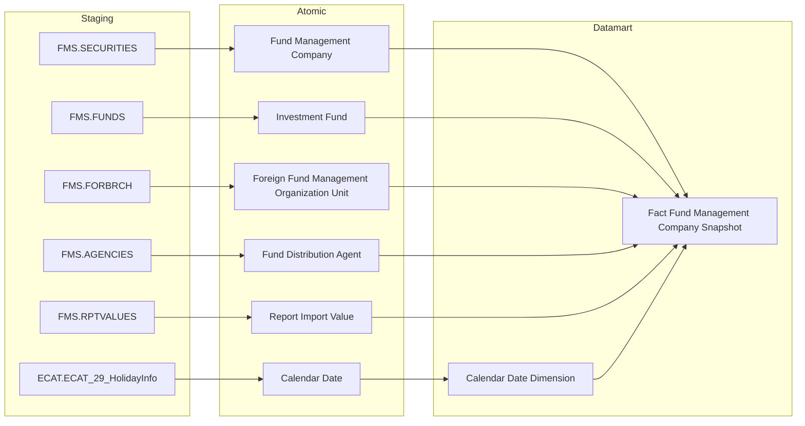
```mermaid
flowchart LR
    subgraph SRC["Staging"]
        S1["FMS.SECURITIES"]
        S2["FMS.FUNDS"]
        S3["FMS.FORBRCH"]
        S4["FMS.AGENCIES"]
        S6["FMS.RPTVALUES"]
        SE1["ECAT.ECAT_29_HolidayInfo"]
    end

    subgraph SIL["Atomic"]
        SV1["Fund Management Company"]
        SV2["Investment Fund"]
        SV3["Foreign Fund Management Organization Unit"]
        SV4["Fund Distribution Agent"]
        SV6["Report Import Value"]
        SV7["Calendar Date"]
    end

    subgraph GOLD["Datamart"]
        G1["Fact Fund Management Company Snapshot"]
        G2["Calendar Date Dimension"]
    end

    S1 --> SV1
    S2 --> SV2
    S3 --> SV3
    S4 --> SV4
    S6 --> SV6
    SE1 --> SV7

    SV1 --> G1
    SV2 --> G1
    SV3 --> G1
    SV4 --> G1
    SV6 --> G1
    SV7 --> G2

    G2 --> G1
```

### Cụm 2: Số liệu hợp đồng UTDM per CTQLQ (`Fact Discretionary Investment Contract Snapshot`)

Phục vụ Tab TỔNG QUAN CTQLQ — Nhóm 2. Tất cả KPI từ "Tổng từ các chỉ tiêu BC" (RPTVALUES). KPI tách cá nhân/tổ chức là **phái sinh** = chỉ tiêu tổng × tỷ lệ %, tính tại presentation layer.

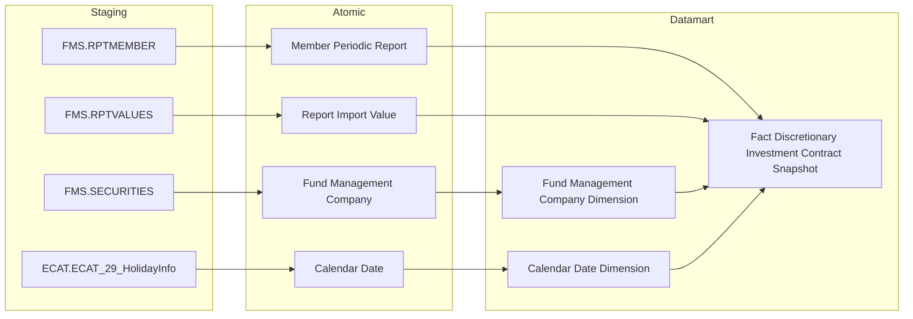
```mermaid
flowchart LR
    subgraph SRC["Staging"]
        S1["FMS.RPTMEMBER"]
        S2["FMS.RPTVALUES"]
        S3["FMS.SECURITIES"]
        SE1["ECAT.ECAT_29_HolidayInfo"]
    end

    subgraph SIL["Atomic"]
        SV1["Member Periodic Report"]
        SV2["Report Import Value"]
        SV3["Fund Management Company"]
        SV4["Calendar Date"]
    end

    subgraph GOLD["Datamart"]
        G1["Fact Discretionary Investment Contract Snapshot"]
        G2["Fund Management Company Dimension"]
        G3["Calendar Date Dimension"]
    end

    S1 --> SV1
    S2 --> SV2
    S3 --> SV3
    SE1 --> SV4

    SV1 --> G1
    SV2 --> G1
    SV3 --> G2
    SV4 --> G3

    G2 --> G1
    G3 --> G1
```

### Cụm 3: Hồ sơ CTQLQ — flat + drill-down (Tác nghiệp)

Phục vụ Tab TỔNG QUAN CTQLQ — Nhóm 3. **1 bảng flat chính** (`Fund Management Company Profile`) chứa tất cả chỉ tiêu per CTQLQ. **2 bảng con** (`Fund Management Company Fund List`, `Fund Management Company Contract List`) phục vụ popup drill-down khi bấm vào Số QĐT / Số HĐUTDM — có FK về `Fund_Management_Company_Id`. Cả 3 lấy từ Atomic trực tiếp, không qua Dimension.

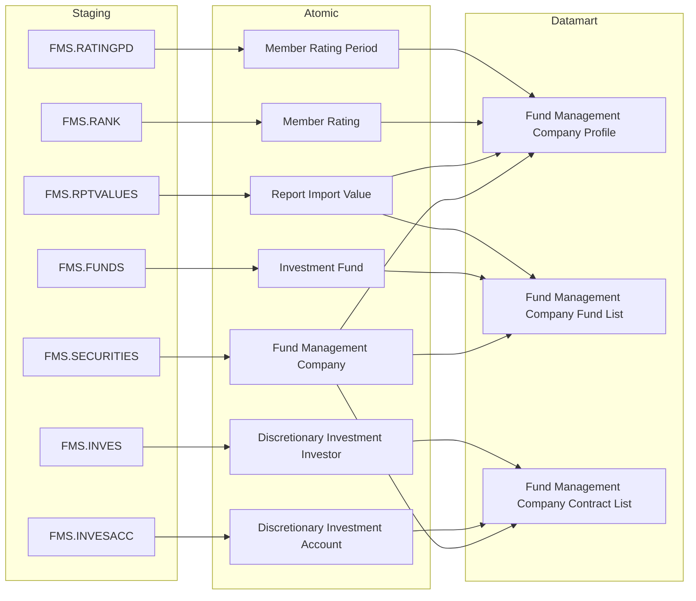
```mermaid
flowchart LR
    subgraph SRC["Staging"]
        S1["FMS.SECURITIES"]
        S2["FMS.FUNDS"]
        S4["FMS.RPTVALUES"]
        S5["FMS.RANK"]
        S6["FMS.RATINGPD"]
        S7["FMS.INVESACC"]
        S8["FMS.INVES"]
    end

    subgraph SIL["Atomic"]
        SV1["Fund Management Company"]
        SV2["Investment Fund"]
        SV4["Report Import Value"]
        SV5["Member Rating"]
        SV6["Member Rating Period"]
        SV7["Discretionary Investment Account"]
        SV8["Discretionary Investment Investor"]
    end

    subgraph GOLD["Datamart"]
        G1["Fund Management Company Profile"]
        G2["Fund Management Company Fund List"]
        G3["Fund Management Company Contract List"]
    end

    S1 --> SV1
    S2 --> SV2
    S4 --> SV4
    S5 --> SV5
    S6 --> SV6
    S7 --> SV7
    S8 --> SV8

    SV1 --> G1
    SV4 --> G1
    SV5 --> G1
    SV6 --> G1

    SV1 --> G2
    SV2 --> G2
    SV4 --> G2

    SV1 --> G3
    SV7 --> G3
    SV8 --> G3
```

---

### Cụm 4: NAV quỹ theo kỳ + GDP cross-module (`Fact Investment Fund NAV Snapshot`)

Phục vụ Tab QUỸ ĐẦU TƯ — Nhóm 4 (Biểu đồ Tổng NAV & Tỷ lệ NAV/GDP), Nhóm 5 (Phân bổ tài sản), Nhóm 6 (Sự biến động NAV). NAV per quỹ từ RPTVALUES (FMS). GDP từ `Risk Indicator Value` (QLRR — cross-module). Tỷ lệ NAV/GDP và % phân bổ tài sản là Derived — tính tại presentation layer.

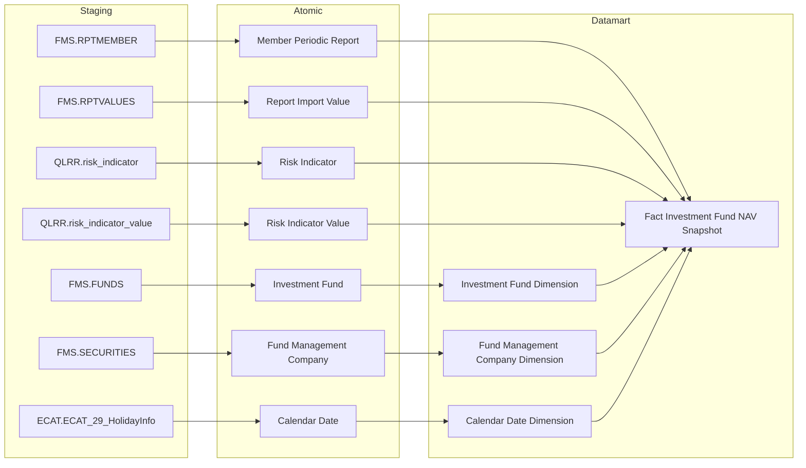
```mermaid
flowchart LR
    subgraph SRC["Staging"]
        S1["FMS.RPTMEMBER"]
        S2["FMS.RPTVALUES"]
        S3["FMS.FUNDS"]
        S4["FMS.SECURITIES"]
        S5["QLRR.risk_indicator"]
        S6["QLRR.risk_indicator_value"]
        SE1["ECAT.ECAT_29_HolidayInfo"]
    end

    subgraph SIL["Atomic"]
        SV1["Member Periodic Report"]
        SV2["Report Import Value"]
        SV3["Investment Fund"]
        SV4["Fund Management Company"]
        SV5["Risk Indicator"]
        SV6["Risk Indicator Value"]
        SV7["Calendar Date"]
    end

    subgraph GOLD["Datamart"]
        G1["Fact Investment Fund NAV Snapshot"]
        G2["Investment Fund Dimension"]
        G3["Fund Management Company Dimension"]
        G4["Calendar Date Dimension"]
    end

    S1 --> SV1
    S2 --> SV2
    S3 --> SV3
    S4 --> SV4
    S5 --> SV5
    S6 --> SV6
    SE1 --> SV7

    SV1 --> G1
    SV2 --> G1
    SV5 --> G1
    SV6 --> G1
    SV3 --> G2
    SV4 --> G3
    SV7 --> G4

    G2 --> G1
    G3 --> G1
    G4 --> G1
```

### Cụm 5: Số lượng quỹ theo loại hình (`Fact Investment Fund Count Snapshot`)

Phục vụ Tab QUỸ ĐẦU TƯ — Nhóm 7 (Số lượng quỹ ĐTCK). Market-Level Aggregate Snapshot — đếm từ db Atomic, GROUP BY loại hình quỹ. Tương tự pattern Nhóm 1 tab TỔNG QUAN CTQLQ.

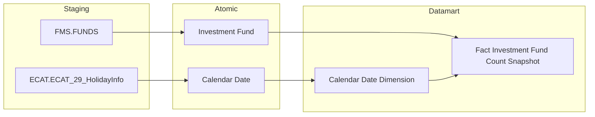
```mermaid
flowchart LR
    subgraph SRC["Staging"]
        S1["FMS.FUNDS"]
        SE1["ECAT.ECAT_29_HolidayInfo"]
    end

    subgraph SIL["Atomic"]
        SV1["Investment Fund"]
        SV2["Calendar Date"]
    end

    subgraph GOLD["Datamart"]
        G1["Fact Investment Fund Count Snapshot"]
        G2["Calendar Date Dimension"]
    end

    S1 --> SV1
    SE1 --> SV2

    SV1 --> G1
    SV2 --> G2

    G2 --> G1
```

### Cụm 6: Số CCQ lưu hành per quỹ (`Fact Investment Fund CCQ Snapshot`)

Phục vụ Tab QUỸ ĐẦU TƯ — Nhóm 8 (Tăng trưởng CCQ lưu hành). Số CCQ có 3 nguồn khác nhau theo loại quỹ: BC (RPTVALUES) cho quỹ mở/ETF/TV/TTTTT/TP hạ tầng; tính từ db (FundCapital / 10.000) cho quỹ BĐS/TV dạng khác; VSDC cho quỹ đóng (PENDING — xem O_FMS_7).

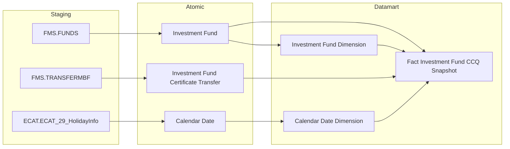
```mermaid
flowchart LR
    subgraph SRC["Staging"]
        S1["FMS.FUNDS"]
        S2["FMS.TRANSFERMBF"]
        SE1["ECAT.ECAT_29_HolidayInfo"]
    end

    subgraph SIL["Atomic"]
        SV1["Investment Fund"]
        SV2["Investment Fund Certificate Transfer"]
        SV3["Calendar Date"]
    end

    subgraph GOLD["Datamart"]
        G1["Fact Investment Fund CCQ Snapshot"]
        G2["Investment Fund Dimension"]
        G3["Calendar Date Dimension"]
    end

    S1 --> SV1
    S2 --> SV2
    SE1 --> SV3

    SV1 --> G1
    SV2 --> G1
    SV1 --> G2
    SV3 --> G3

    G2 --> G1
    G3 --> G1
```

### Cụm 7: Danh sách quỹ (Tác nghiệp)

Phục vụ Tab QUỸ ĐẦU TƯ — Nhóm 10 (Danh sách các quỹ đầu tư). Bảng flat 1 quỹ × 1 tháng slicer — tổng hợp attributes db + BC. NAV hiện tại và LN YTD từ RPTVALUES (BC). CCQ lưu hành từ BC/db tùy loại quỹ (xem Cụm 6). Lấy từ Atomic trực tiếp — không qua Dimension.

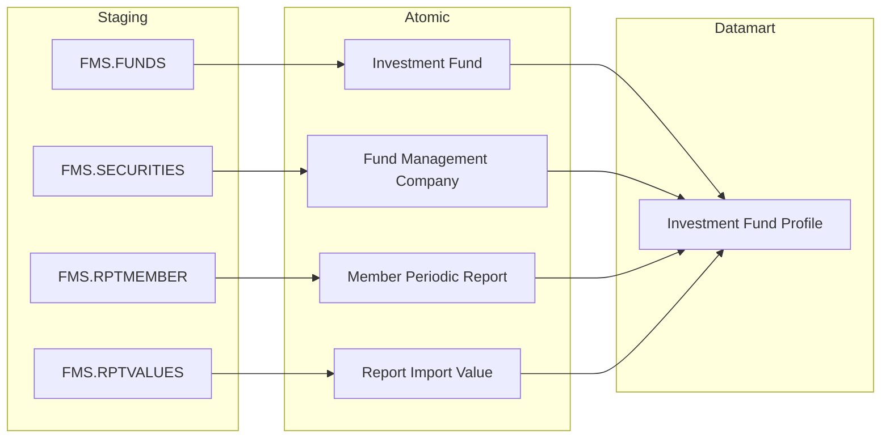
```mermaid
flowchart LR
    subgraph SRC["Staging"]
        S1["FMS.FUNDS"]
        S2["FMS.SECURITIES"]
        S3["FMS.RPTMEMBER"]
        S4["FMS.RPTVALUES"]
    end

    subgraph SIL["Atomic"]
        SV1["Investment Fund"]
        SV2["Fund Management Company"]
        SV3["Member Periodic Report"]
        SV4["Report Import Value"]
    end

    subgraph GOLD["Datamart"]
        G1["Investment Fund Profile"]
    end

    S1 --> SV1
    S2 --> SV2
    S3 --> SV3
    S4 --> SV4

    SV1 --> G1
    SV2 --> G1
    SV3 --> G1
    SV4 --> G1
```

---

---

---

### Cụm 8: Pass-through báo cáo BC tất cả loại (`Report Pass-through View`)

Phục vụ Tab DATA EXPLORER — Nhóm 12–16. Toàn bộ 63 pass-through tabs + 19 complex tabs đều đọc từ `Report Import Value` ← FMS.RPTVALUES. Bảng Tác nghiệp dạng flat, 1 row per CTQLQ/Quỹ × biểu mẫu × kỳ × dòng chỉ tiêu. Tab Báo cáo/CTQLQ (Nhóm 11) PENDING — chờ xác nhận cross-module GSGD.

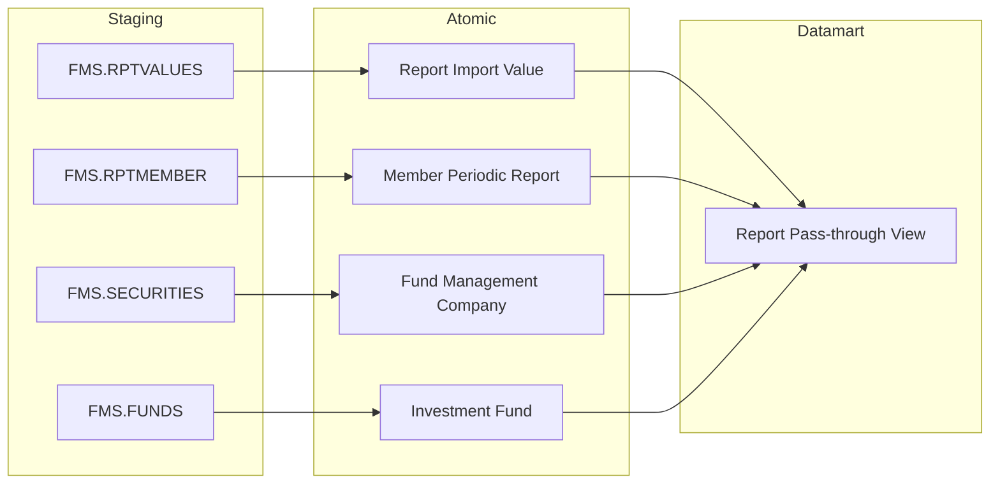
```mermaid
flowchart LR
    subgraph SRC["Staging"]
        S1["FMS.RPTVALUES"]
        S2["FMS.RPTMEMBER"]
        S3["FMS.SECURITIES"]
        S4["FMS.FUNDS"]
    end

    subgraph SIL["Atomic"]
        SV1["Report Import Value"]
        SV2["Member Periodic Report"]
        SV3["Fund Management Company"]
        SV4["Investment Fund"]
    end

    subgraph GOLD["Datamart"]
        G1["Report Pass-through View"]
    end

    S1 --> SV1
    S2 --> SV2
    S3 --> SV3
    S4 --> SV4

    SV1 --> G1
    SV2 --> G1
    SV3 --> G1
    SV4 --> G1
```

### Cụm 9: Báo cáo giao dịch nhân viên CTQLQ (Tác nghiệp)

Phục vụ Tab BÁO CÁO / CÔNG TY QLQ — Nhóm 11. Cross-module FMS × GSGD: nhân viên CTQLQ từ `FMS.TLProfiles`, tài khoản GDCK từ `GSGD.investor_account`. Join qua `Identification_Number` (CCCD/Hộ chiếu). K_FMS_68–72 READY. K_FMS_73–77 (sổ lệnh) PENDING — chờ Atomic entity từ VSDC.

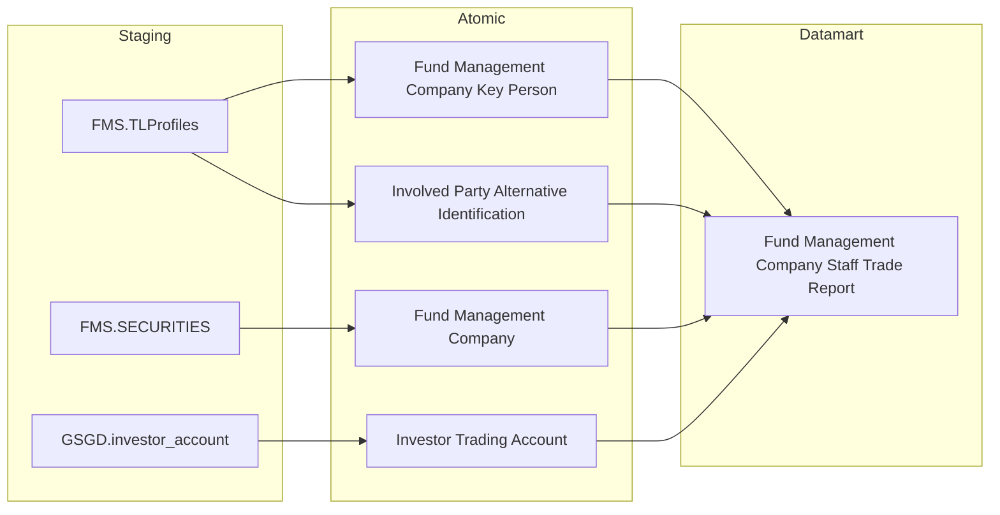
```mermaid
flowchart LR
    subgraph SRC["Staging"]
        S1["FMS.TLProfiles"]
        S2["FMS.SECURITIES"]
        S3["GSGD.investor_account"]
    end

    subgraph SIL["Atomic"]
        SV1["Fund Management Company Key Person"]
        SV2["Involved Party Alternative Identification"]
        SV3["Fund Management Company"]
        SV4["Investor Trading Account"]
    end

    subgraph GOLD["Datamart"]
        G1["Fund Management Company Staff Trade Report"]
    end

    S1 --> SV1
    S1 --> SV2
    S2 --> SV3
    S3 --> SV4

    SV1 --> G1
    SV2 --> G1
    SV3 --> G1
    SV4 --> G1
```

## Section 2 — Tổng quan báo cáo

### Tab: TỔNG QUAN CTQLQ

**Slicer chung:** Tháng/Năm (ví dụ: "THÁNG 5 — 2024")

---

#### Nhóm 1 — Thống kê chung

> Phân loại: **Phân tích**
> Atomic: `Fund Management Company` ← FMS.SECURITIES — **READY** *(K_FMS_4: COUNT db)*
> Atomic: `Investment Fund` ← FMS.FUNDS — **READY** *(K_FMS_1, 8: COUNT db)*
> Atomic: `Foreign Fund Management Organization Unit` ← FMS.FORBRCH — **READY** *(K_FMS_5, 7: COUNT db)*
> Atomic: `Fund Distribution Agent` ← FMS.AGENCIES — **READY** *(K_FMS_6: COUNT db)*
> Atomic: `Report Import Value` ← FMS.RPTVALUES — **READY** *(K_FMS_2–3: SUM từ chỉ tiêu BC)*
> Ghi chú: Fact này là **Market-Level Aggregate Snapshot** — grain = 1 row per tháng, không FK sang Fund Management Company Dimension. Mỗi measure trong Fact là tổng hợp toàn thị trường: K_FMS_1, 4–8 đếm từ Atomic db; K_FMS_2–3 tổng hợp từ RPTVALUES. Không có chiều phân tích theo từng CTQLQ — đây là thiết kế có chủ ý, không phải thiếu Dimension.
> **ETL pattern — No Driving Table [A]:** Fact không có driving table duy nhất — 5 Atomic tables độc lập, không có join key chung. ETL dùng `CROSS JOIN (SELECT <aggregate> FROM <atomic_table> WHERE ...) AS <alias>` cho từng measure, ghép thành 1 row per tháng. Chi tiết xem `etl_logic` từng cột trong Attributes CSV.
> **ETL dependency [A]:** Fact có 2 nhóm measures với availability khác nhau. Nhóm db (K_FMS_1, 4–8) sẵn sàng ngay khi tháng kết thúc. Nhóm BC (K_FMS_2–3) phụ thuộc CTQLQ nộp BC qua RPTVALUES — có thể trễ vài tuần. ETL populate db measures trước, BC measures sau khi đủ dữ liệu.

**Mockup:**

| Chỉ tiêu | Giá trị | Nguồn chi tiết (BA) |
|---|---|---|
| Quỹ đầu tư CK | 124 quỹ | Count db |
| Hợp đồng UTDM | 89.521 | Tổng từ chỉ tiêu BC |
| Tổng AUM quản lý | 839 nghìn tỷ | Tổng từ chỉ tiêu BC |
| CTQLQ đang HĐ | 43 công ty | Count db |
| VPĐD QLQ NN | 14 VP | Count db |
| Đại lý phân phối CCQ | 49 đại lý | Count db |
| CN CTQLQ NN tại VN | 8 chi nhánh | Count db |
| Quỹ hưu trí | 12 quỹ | Count db |

**Source:** `Fact Fund Management Company Snapshot` → `Calendar Date Dimension`

**Bảng KPI:**

| KPI ID | Tên KPI | Đơn vị | Tính chất | Công thức / Ghi chú |
|---|---|---|---|---|
| K_FMS_1 | Quỹ đầu tư chứng khoán | Quỹ | Base | COUNT(Investment Fund) tất cả loại hình, theo tháng chọn |
| K_FMS_2 | Hợp đồng UTDM | Hợp đồng | Base | SUM Report Import Value mã **180101** (Tổng số HĐ UTĐT đang thực hiện) — tổng toàn TT, theo tháng |
| K_FMS_3 | Tổng AUM quản lý | Nghìn tỷ VND | Base | SUM Report Import Value chỉ tiêu AUM từ BC tình hình HĐ CTQLQ — tổng toàn TT, theo tháng |
| K_FMS_4 | CTQLQ đang hoạt động | Công ty | Base | COUNT(Fund Management Company) Life Cycle Status = đang HĐ, theo tháng |
| K_FMS_5 | VPĐD QLQ nước ngoài tại VN | Văn phòng | Base | COUNT(Foreign Fund Management Organization Unit) loại VPĐD, theo tháng |
| K_FMS_6 | Đại lý phân phối CCQ | Đại lý | Base | COUNT(Fund Distribution Agent) theo tháng |
| K_FMS_7 | Chi nhánh CTQLQ NN tại VN | Chi nhánh | Base | COUNT(Foreign Fund Management Organization Unit) loại Chi nhánh, theo tháng |
| K_FMS_8 | Quỹ hưu trí | Quỹ | Base | COUNT(Investment Fund) loại hình Quỹ hưu trí, theo tháng |
| K_FMS_9 | Tháng | — | Chiều | Slicer tháng/năm |

**Star Schema:**

> **ETL note:** Không có driving table — mỗi measure là CROSS JOIN scalar subquery độc lập. Xem Attributes CSV cột `etl_logic` cho từng measure.

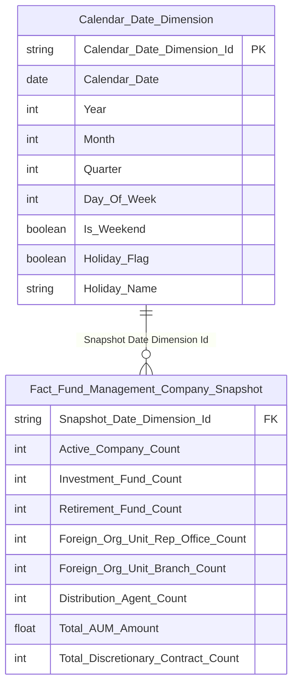
```mermaid
erDiagram
    Fact_Fund_Management_Company_Snapshot {
        string Snapshot_Date_Dimension_Id FK
        int Active_Company_Count
        int Investment_Fund_Count
        int Retirement_Fund_Count
        int Foreign_Org_Unit_Rep_Office_Count
        int Foreign_Org_Unit_Branch_Count
        int Distribution_Agent_Count
        float Total_AUM_Amount
        int Total_Discretionary_Contract_Count
    }
    Calendar_Date_Dimension {
        string Calendar_Date_Dimension_Id PK
        date Calendar_Date
        int Year
        int Month
        int Quarter
        int Day_Of_Week
        boolean Is_Weekend
        boolean Holiday_Flag
        string Holiday_Name
    }

    Calendar_Date_Dimension ||--o{ Fact_Fund_Management_Company_Snapshot : "Snapshot Date Dimension Id"
```

**Lineage Mart → Báo cáo:**

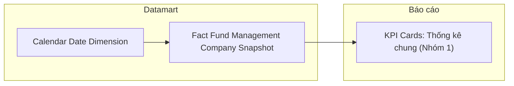
```mermaid
flowchart LR
    subgraph GOLD["Datamart"]
        G1["Fact Fund Management Company Snapshot"]
        G2["Calendar Date Dimension"]
    end
    subgraph RPT["Báo cáo"]
        R1["KPI Cards: Thống kê chung (Nhóm 1)"]
    end
    G2 --> G1
    G1 --> R1
```

**Bảng grain:**

| Tên bảng | Grain |
|---|---|
| Fact Fund Management Company Snapshot | 1 snapshot toàn thị trường × 1 tháng |
| Calendar Date Dimension | 1 ngày |

---

#### Nhóm 2 — Số liệu hợp đồng ủy thác danh mục

> Phân loại: **Phân tích**
> Atomic: `Discretionary Investment Account` ← FMS.INVESACC — **READY** *(db: Số lượng HĐ)*
> Atomic: `Report Import Value` ← FMS.RPTVALUES — **READY** *(BC: Giá trị thị trường UTDM)*
> Ghi chú: Phụ thuộc O_FMS_1 cho mapping SheetId/TgtId của giá trị UTDM. `Report_Template_Code` và `Reporting_Period_Code` là Degenerate Dimension.

**Mockup:**

| Loại | Số HĐ | Giá trị TT (tỷ) | Tỷ trọng (%) |
|---|---|---|---|
| Cá nhân | 1.250 | 12.580 | 65% |
| Tổ chức | 320 | 6.800 | 35% |
| **Tổng** | **1.570** | **19.380** | 100% |

**Source:** `Fact Discretionary Investment Contract Snapshot` → `Fund Management Company Dimension`, `Calendar Date Dimension`

**Bảng KPI:**

| KPI ID | Tên KPI | Đơn vị | Tính chất | Công thức / Ghi chú |
|---|---|---|---|---|
| K_FMS_10 | Tổng số lượng HĐ UTDM | HĐ | Base | COUNT(`Discretionary Investment Account`) toàn thị trường |
| K_FMS_11 | Số lượng HĐ UTDM cá nhân | HĐ | Base | COUNT WHERE `Investor_Object_Type_Code = Cá nhân` |
| K_FMS_12 | Số lượng HĐ UTDM tổ chức | HĐ | Base | COUNT WHERE `Investor_Object_Type_Code = Tổ chức` |
| K_FMS_13 | Tổng GTTT UTDM | Tỷ VND | Base | `Total_Trust_Market_Value` ← RPTVALUES |
| K_FMS_14 | GTTT UTDM cá nhân | Tỷ VND | Base | `Individual_Trust_Market_Value` ← RPTVALUES |
| K_FMS_15 | GTTT UTDM tổ chức | Tỷ VND | Base | `Organization_Trust_Market_Value` ← RPTVALUES |
| K_FMS_16a | % HĐ cá nhân | % | Derived | K_FMS_11 / K_FMS_10 × 100% — presentation layer |
| K_FMS_16b | % HĐ tổ chức | % | Derived | K_FMS_12 / K_FMS_10 × 100% — presentation layer |
| K_FMS_16c | % GTTT cá nhân | % | Derived | K_FMS_14 / K_FMS_13 × 100% — presentation layer |
| K_FMS_16d | % GTTT tổ chức | % | Derived | K_FMS_15 / K_FMS_13 × 100% — presentation layer |

**Star Schema:**

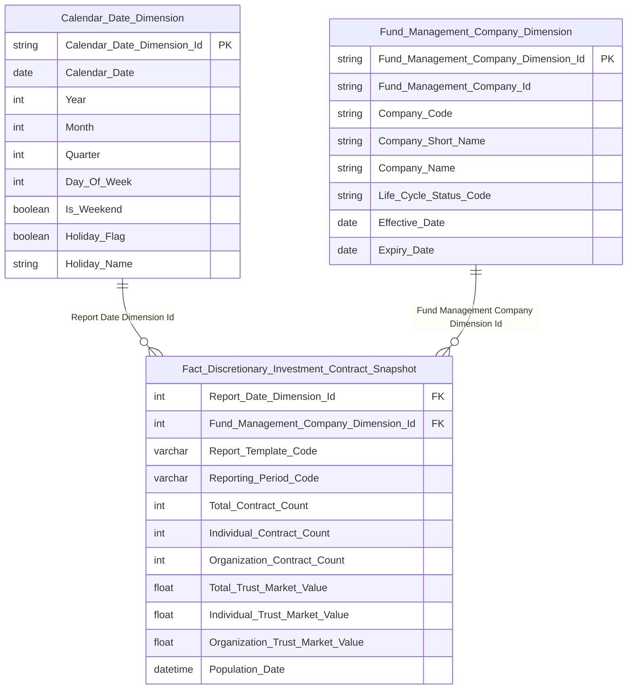
```mermaid
erDiagram
    Fact_Discretionary_Investment_Contract_Snapshot {
        int Report_Date_Dimension_Id FK
        int Fund_Management_Company_Dimension_Id FK
        varchar Report_Template_Code
        varchar Reporting_Period_Code
        int Total_Contract_Count
        int Individual_Contract_Count
        int Organization_Contract_Count
        float Total_Trust_Market_Value
        float Individual_Trust_Market_Value
        float Organization_Trust_Market_Value
        datetime Population_Date
    }
    Fund_Management_Company_Dimension {
        string Fund_Management_Company_Dimension_Id PK
        string Fund_Management_Company_Id
        string Company_Code
        string Company_Short_Name
        string Company_Name
        string Life_Cycle_Status_Code
        date Effective_Date
        date Expiry_Date
    }
    Calendar_Date_Dimension {
        string Calendar_Date_Dimension_Id PK
        date Calendar_Date
        int Year
        int Month
        int Quarter
        int Day_Of_Week
        boolean Is_Weekend
        boolean Holiday_Flag
        string Holiday_Name
    }

    Calendar_Date_Dimension ||--o{ Fact_Discretionary_Investment_Contract_Snapshot : "Report Date Dimension Id"
    Fund_Management_Company_Dimension ||--o{ Fact_Discretionary_Investment_Contract_Snapshot : "Fund Management Company Dimension Id"
```

**Lineage Mart → Báo cáo:**

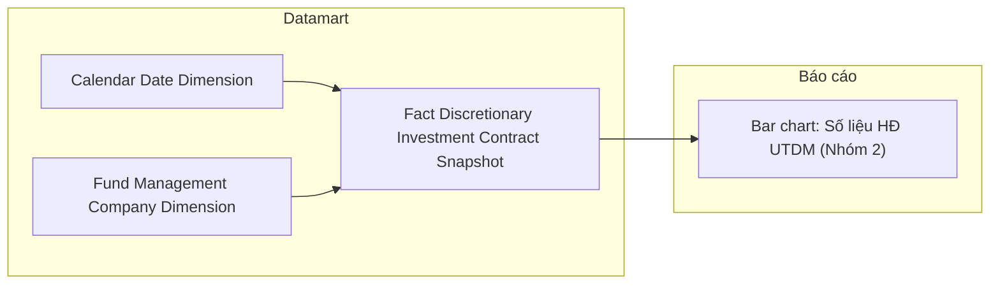
```mermaid
flowchart LR
    subgraph GOLD["Datamart"]
        G1["Fact Discretionary Investment Contract Snapshot"]
        G2["Fund Management Company Dimension"]
        G3["Calendar Date Dimension"]
    end
    subgraph RPT["Báo cáo"]
        R1["Bar chart: Số liệu HĐ UTDM (Nhóm 2)"]
    end
    G3 --> G1
    G2 --> G1
    G1 --> R1
```

**Bảng grain:**

| Tên bảng | Grain |
|---|---|
| Fact Discretionary Investment Contract Snapshot | 1 CTQLQ × 1 Report Template × 1 Report Date |
| Fund Management Company Dimension | 1 CTQLQ (SCD4A — active record (ds_rcrd_st = 1)) |
| Calendar Date Dimension | 1 ngày |

---

#### Nhóm 3 — Danh sách các Công ty quản lý quỹ

> Phân loại: **Tác nghiệp**
> Atomic: `Fund Management Company` ← FMS.SECURITIES — **READY** *(db: Tên CT, Vốn ĐL)*
> Atomic: `Investment Fund` ← FMS.FUNDS — **READY** *(db: Tên quỹ, NAV)*
> Atomic: `Report Import Value` ← FMS.RPTVALUES — **READY** *(BC: AUM, CAR, LN, Vốn CSH, NAV)*
> Atomic: `Member Rating` ← FMS.RANK — **READY** *(db: Xếp loại, CAMEL)*
> Atomic: `Member Rating Period` ← FMS.RATINGPD — **READY** *(db)*
> Atomic: `Discretionary Investment Account` ← FMS.INVESACC — **READY** *(db: Số HĐ UTDM)*
> Ghi chú: [A] Nhóm db measures (Active_Company_Count, Investment_Fund_Count, Total_Discretionary_Contract_Count) có thể populate T-0. [B] BC measures (AUM, CAR, LN, NAV, Vốn CSH) populate sau khi RPTVALUES có dữ liệu — phụ thuộc O_FMS_1. [C] Grain Profile = 1 CTQLQ × 1 tháng slicer — attributes lấy từ Atomic trực tiếp, không qua Dimension. [D] ETL policy: xem kỳ đánh giá gần nhất (Member_Rating_Period_End_Date ≤ tháng slicer).

**Mockup:**

**Bảng chính — `Fund Management Company Profile`:**

| Mã | Tên CT | AUM (tỷ) | Số QĐT | SL HĐUTDM | CAR | LN (tỷ) | VĐL (tỷ) | Vốn CSH (tỷ) | Thị phần (%) | Xếp loại | CAMEL |
|---|---|---|---|---|---|---|---|---|---|---|---|
| CT1 | Công ty ABC | 25.450 | 12 | 350 | 18.5% | 120.4 | 150 | 165 | 8.2% | A | 89.5% |

**Mockup — popup "DANH SÁCH QUỸ - CT1":**

| Mã quỹ | Tên quỹ | Loại | NAV (tỷ) |
|---|---|---|---|
| QA1 | Quỹ ABC Cổ phần | Quỹ mở | 1.250 |

**Mockup — popup "DANH SÁCH HĐ UTDM - CT1":**

| Số HĐ | Nhà đầu tư | Loại | Giá trị (tỷ) |
|---|---|---|---|
| HĐ001 | Nguyễn Văn A | Cá nhân | 25.4 |

**Source:** `Fund Management Company Profile` → `Fund Management Company Fund List`, `Fund Management Company Contract List`

**Bảng KPI:**

| KPI ID | Tên KPI | Đơn vị | Tính chất | Công thức / Ghi chú |
|---|---|---|---|---|
| K_FMS_17 | Tên công ty | — | Chiều | `Company_Name` + `Company_Short_Name` ← Fund Management Company |
| K_FMS_18 | AUM | Tỷ VND | Base | `Total_AUM_Amount` ← RPTVALUES — pending O_FMS_1 |
| K_FMS_19 | Số lượng quỹ đang quản lý | Quỹ | Base | COUNT(`Investment Fund`) WHERE `Fund_Management_Company_Id` — COUNT db |
| K_FMS_20 | Số lượng HĐUTDM | HĐ | Base | COUNT(`Discretionary Investment Account`) per CTQLQ — COUNT db |
| K_FMS_21 | CAR | % | Base | `Rank_Class_Code` (CAR ratio) ← RPTVALUES — pending O_FMS_1 |
| K_FMS_22 | Lợi nhuận | Tỷ VND | Base | `Net_Profit_Amount` ← RPTVALUES BCTC gần nhất — pending O_FMS_1, O_FMS_4 |
| K_FMS_23 | Vốn điều lệ | Tỷ VND | Base | `Charter_Capital_Amount` ← FMS.SECURITIES.SecCapital |
| K_FMS_24 | Vốn CSH | Tỷ VND | Base | `Equity_Amount` ← RPTVALUES BCTC mã 400 — pending O_FMS_4 |
| K_FMS_25 | Xếp loại | — | Base | `Rank_Class_Code` ← FMS.RANK.RankClass (A/B/C) |
| K_FMS_26 | CAMEL | % | Base | `Total_Score` ← FMS.RANK.TotalScore |
| K_FMS_27 | Thị phần AUM | % | Derived | K_FMS_18[CT] / SUM(K_FMS_18) × 100% — presentation layer |
| K_FMS_28 | Chi tiết quỹ của CTQLQ | — | Base | `Fund_Code`, `Fund_Name`, `Fund_NAV_Amount` ← `Fund Management Company Fund List` |
| K_FMS_29 | NAV từng quỹ | Tỷ VND | Base | `Fund_NAV_Amount` ← RPTVALUES per quỹ |
| K_FMS_30 | Chi tiết HĐUTDM | — | Base | `Account_Number`, `Investor_Name`, `Contract_Value` ← `Fund Management Company Contract List` |
| K_FMS_31 | Giá trị từng HĐ UTDM | Tỷ VND | Base | `Trust_Market_Value` ← RPTVALUES per HĐ |

**Schema bảng tác nghiệp — Fund Management Company Profile:**

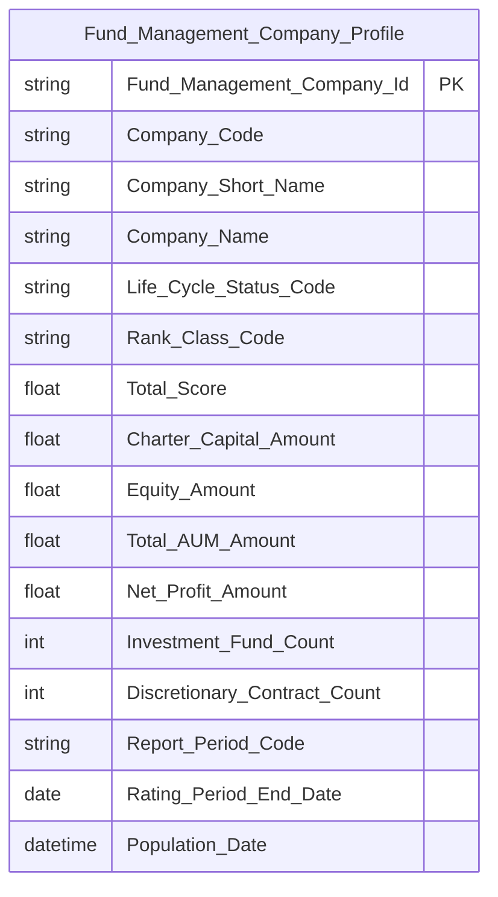
```mermaid
erDiagram
    Fund_Management_Company_Profile {
        string Fund_Management_Company_Id PK
        string Company_Code
        string Company_Short_Name
        string Company_Name
        string Life_Cycle_Status_Code
        string Rank_Class_Code
        float Total_Score
        float Charter_Capital_Amount
        float Equity_Amount
        float Total_AUM_Amount
        float Net_Profit_Amount
        int Investment_Fund_Count
        int Discretionary_Contract_Count
        string Report_Period_Code
        date Rating_Period_End_Date
        datetime Population_Date
    }
```

**Schema bảng con — Fund Management Company Fund List:**

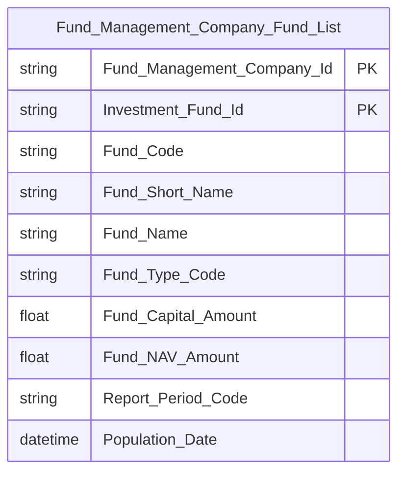
```mermaid
erDiagram
    Fund_Management_Company_Fund_List {
        string Fund_Management_Company_Id PK
        string Investment_Fund_Id PK
        string Fund_Code
        string Fund_Short_Name
        string Fund_Name
        string Fund_Type_Code
        float Fund_Capital_Amount
        float Fund_NAV_Amount
        string Report_Period_Code
        datetime Population_Date
    }
```

**Schema bảng con — Fund Management Company Contract List:**

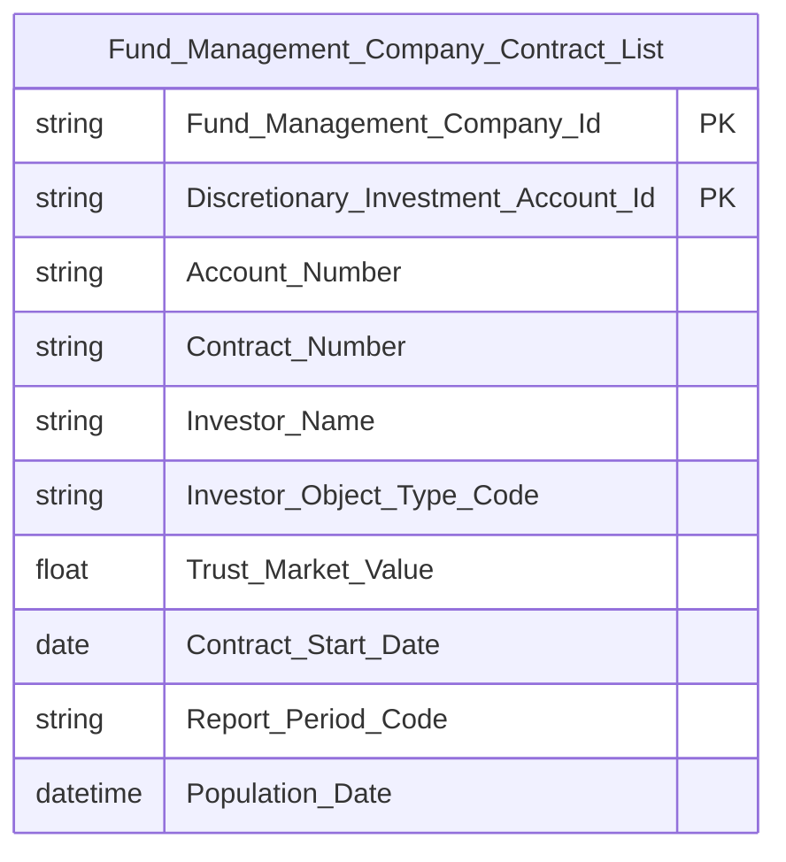
```mermaid
erDiagram
    Fund_Management_Company_Contract_List {
        string Fund_Management_Company_Id PK
        string Discretionary_Investment_Account_Id PK
        string Account_Number
        string Contract_Number
        string Investor_Name
        string Investor_Object_Type_Code
        float Trust_Market_Value
        date Contract_Start_Date
        string Report_Period_Code
        datetime Population_Date
    }
```

**Lineage Mart → Báo cáo:**

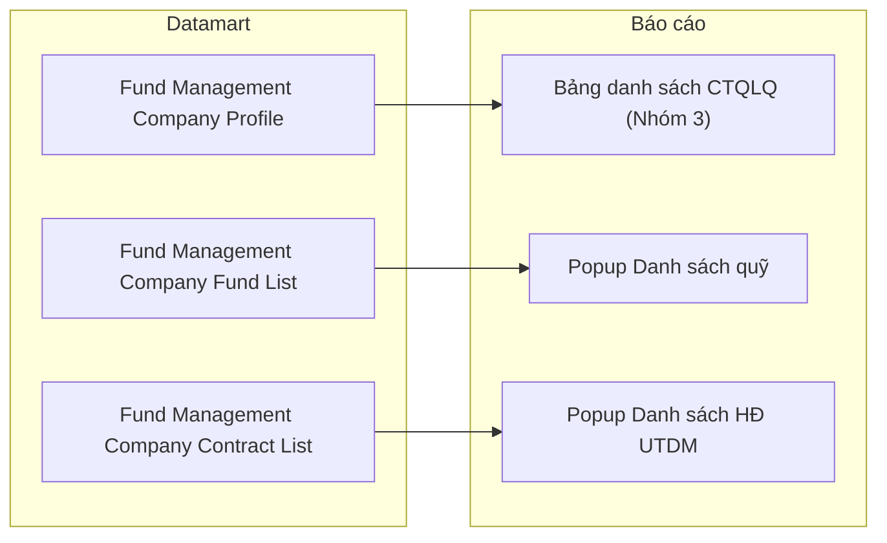
```mermaid
flowchart LR
    subgraph GOLD["Datamart"]
        G1["Fund Management Company Profile"]
        G2["Fund Management Company Fund List"]
        G3["Fund Management Company Contract List"]
    end
    subgraph RPT["Báo cáo"]
        R1["Bảng danh sách CTQLQ (Nhóm 3)"]
        R2["Popup Danh sách quỹ"]
        R3["Popup Danh sách HĐ UTDM"]
    end
    G1 --> R1
    G2 --> R2
    G3 --> R3
```

**Bảng grain:**

| Tên bảng | Grain |
|---|---|
| Fund Management Company Profile | Tác nghiệp — bảng flat chính \| 1 CTQLQ × 1 tháng slicer |
| Fund Management Company Fund List | Tác nghiệp — bảng con drill-down \| 1 quỹ × 1 tháng slicer |
| Fund Management Company Contract List | Tác nghiệp — bảng con drill-down \| 1 Discretionary Investment Account active tại tháng slicer |

---

### Tab: QUỬ ĐẦU TƯ

**Slicer chung:** Tháng/Năm (tháng slicer); một số nhóm có thêm slicer Từ tháng / Đến tháng

---

#### Nhóm 4 — Biểu đồ Tổng NAV Quỹ và Tỷ lệ NAV/GDP

> Phân loại: **Phân tích**
> Atomic: `Report Import Value` ← FMS.RPTVALUES — **READY** *(BC: NAV per quỹ)*
> Atomic: `Risk Indicator Value` ← QLRR.risk_indicator_value — **READY** *(db QLRR: GDP, category = MACRO)*
> Atomic: `Investment Fund` ← FMS.FUNDS — **READY** *(db: Fund_Type_Code để phân loại)*
> Atomic: `Fund Management Company` ← FMS.SECURITIES — **READY**
> Ghi chú: Cross-module FMS × QLRR. GDP lấy từ `Risk Indicator Value` WHERE `Indicator Set Code = 1 (Trong nước)` AND `Risk Indicator Category Code = MACRO`. Tỷ lệ NAV/GDP và NAV từng loại hình là Derived — tính tại presentation layer. Phụ thuộc O_FMS_1 cho mapping SheetId/TgtId NAV.

**Mockup:**

| Chỉ tiêu | Loại |
|---|---|
| NAV/GDP % (line chart) | Derived |
| Tổng NAV toàn TT (line chart) | Derived (SUM) |
| NAV từng loại hình quỹ (line chart) | Derived (SUM GROUP BY Fund Type) |

**Source:** `Fact Investment Fund NAV Snapshot` → `Investment Fund Dimension`, `Fund Management Company Dimension`, `Calendar Date Dimension`

**Bảng KPI:**

| KPI ID | Tên KPI | Đơn vị | Tính chất | Công thức / Ghi chú |
|---|---|---|---|---|
| K_FMS_32 | NAV per quỹ | Tỷ VND | Base | `Fund_NAV_Amount` ← RPTVALUES BC per quỹ per kỳ |
| K_FMS_33 | GDP | Nghìn tỷ VND | Base | `GDP_Value` ← `Risk Indicator Value` QLRR (MACRO) |
| K_FMS_34 | Tổng NAV toàn thị trường | Tỷ VND | Derived | SUM(K_FMS_32) toàn TT per kỳ — presentation layer |
| K_FMS_35 | Tổng NAV từng loại hình quỹ | Tỷ VND | Derived | SUM(K_FMS_32) GROUP BY Fund_Type_Code — presentation layer |
| K_FMS_36 | Loại hình quỹ | — | Chiều | `Fund_Type_Code` ← Investment Fund (FMS.FUNDS) |
| K_FMS_37 | Tỷ lệ NAV/GDP | % | Derived | K_FMS_34 / K_FMS_33 × 100% — presentation layer |

**Star Schema:**

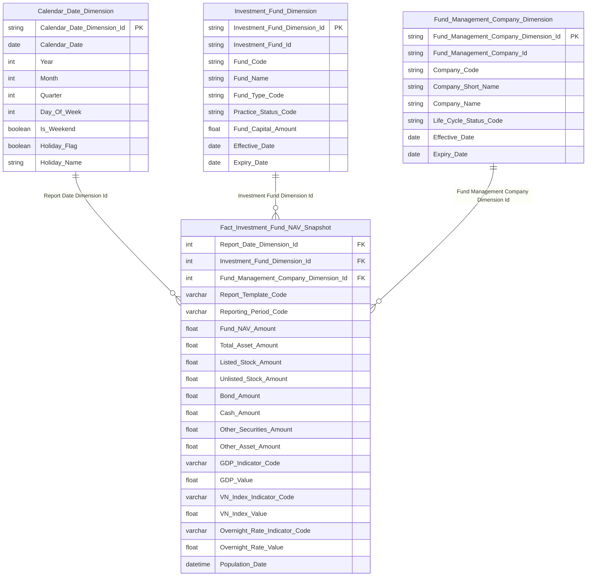
```mermaid
erDiagram
    Fact_Investment_Fund_NAV_Snapshot {
        int Report_Date_Dimension_Id FK
        int Investment_Fund_Dimension_Id FK
        int Fund_Management_Company_Dimension_Id FK
        varchar Report_Template_Code
        varchar Reporting_Period_Code
        float Fund_NAV_Amount
        float Total_Asset_Amount
        float Listed_Stock_Amount
        float Unlisted_Stock_Amount
        float Bond_Amount
        float Cash_Amount
        float Other_Securities_Amount
        float Other_Asset_Amount
        varchar GDP_Indicator_Code
        float GDP_Value
        varchar VN_Index_Indicator_Code
        float VN_Index_Value
        varchar Overnight_Rate_Indicator_Code
        float Overnight_Rate_Value
        datetime Population_Date
    }
    Investment_Fund_Dimension {
        string Investment_Fund_Dimension_Id PK
        string Investment_Fund_Id
        string Fund_Code
        string Fund_Name
        string Fund_Type_Code
        string Practice_Status_Code
        float Fund_Capital_Amount
        date Effective_Date
        date Expiry_Date
    }
    Fund_Management_Company_Dimension {
        string Fund_Management_Company_Dimension_Id PK
        string Fund_Management_Company_Id
        string Company_Code
        string Company_Short_Name
        string Company_Name
        string Life_Cycle_Status_Code
        date Effective_Date
        date Expiry_Date
    }
    Calendar_Date_Dimension {
        string Calendar_Date_Dimension_Id PK
        date Calendar_Date
        int Year
        int Month
        int Quarter
        int Day_Of_Week
        boolean Is_Weekend
        boolean Holiday_Flag
        string Holiday_Name
    }

    Calendar_Date_Dimension ||--o{ Fact_Investment_Fund_NAV_Snapshot : "Report Date Dimension Id"
    Investment_Fund_Dimension ||--o{ Fact_Investment_Fund_NAV_Snapshot : "Investment Fund Dimension Id"
    Fund_Management_Company_Dimension ||--o{ Fact_Investment_Fund_NAV_Snapshot : "Fund Management Company Dimension Id"
```

> Ghi chú cross-module QLRR (T-1 rule): Dữ liệu QLRR chạy T-1 — ETL join theo kỳ tương ứng `mbr_prd_rpt.day_rpt` (int yyyymmdd, cast sang date khi cần):
> - **GDP_Value**: `Period_Type_Code = Quý` AND `Period_Year = YEAR(TO_DATE(day_rpt))` AND `Period_Value = QUARTER(TO_DATE(day_rpt))` — lấy kỳ gần nhất có dữ liệu
> - **VN_Index_Value**: `Period_Type_Code = Ngày` AND `Period_Date = ngày làm việc trước TO_DATE(day_rpt)`
> - **Overnight_Rate_Value**: `Period_Type_Code = Ngày` AND `Period_Date = ngày làm việc trước TO_DATE(day_rpt)`
> Các DD `_Indicator_Code` lưu mã chỉ tiêu QLRR để tra cứu khi cần.

**Lineage Mart → Báo cáo:**

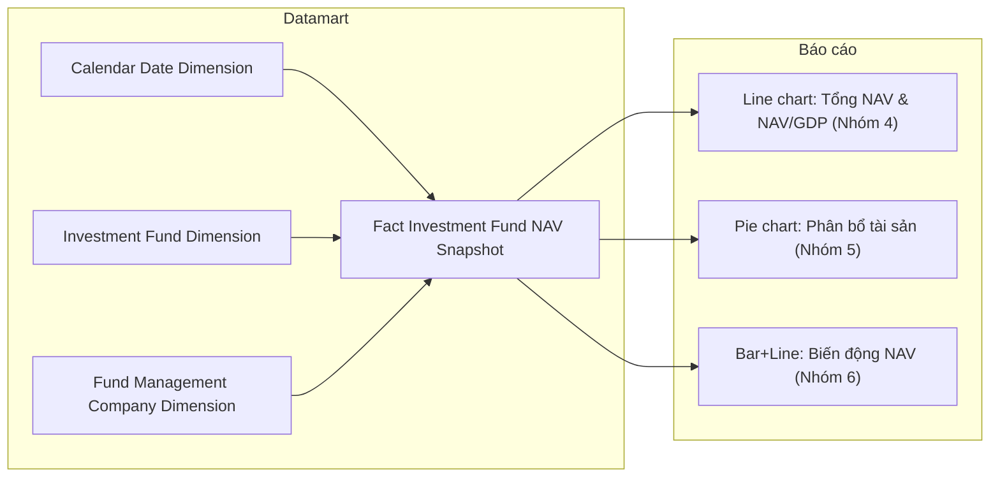
```mermaid
flowchart LR
    subgraph GOLD["Datamart"]
        G1["Fact Investment Fund NAV Snapshot"]
        G2["Investment Fund Dimension"]
        G3["Fund Management Company Dimension"]
        G4["Calendar Date Dimension"]
    end
    subgraph RPT["Báo cáo"]
        R1["Line chart: Tổng NAV & NAV/GDP (Nhóm 4)"]
        R2["Pie chart: Phân bổ tài sản (Nhóm 5)"]
        R3["Bar+Line: Biến động NAV (Nhóm 6)"]
    end
    G4 --> G1
    G2 --> G1
    G3 --> G1
    G1 --> R1
    G1 --> R2
    G1 --> R3
```

**Bảng grain:**

| Tên bảng | Grain |
|---|---|
| Fact Investment Fund NAV Snapshot | 1 quỹ × 1 Report Template × 1 Report Date |
| Investment Fund Dimension | 1 quỹ (SCD4A — active record (ds_rcrd_st = 1)) |
| Fund Management Company Dimension | 1 CTQLQ (SCD4A — active record (ds_rcrd_st = 1)) |
| Calendar Date Dimension | 1 ngày |

---

#### Nhóm 5 — Biểu đồ Phân bổ tài sản của Quỹ đầu tư

> Phân loại: **Phân tích**
> Atomic: `Report Import Value` ← FMS.RPTVALUES — **READY** *(BC: giá trị từng loại tài sản)*
> Ghi chú: Tất cả chỉ tiêu phân bổ tài sản (CP NY, CP chưa NY, TP, Tiền, CK khác, TS khác) là **Derived** = tỷ lệ % = Giá trị loại tài sản / Tổng giá trị tài sản × 100%. Mart lưu giá trị tuyệt đối từng loại tài sản là Base. Tổng và % tính tại presentation layer. Phụ thuộc O_FMS_1 cho mapping SheetId/TgtId từng loại tài sản.
> Reuse bảng: `Fact Investment Fund NAV Snapshot` — bổ sung các measure tài sản.

**Bảng KPI:**

| KPI ID | Tên KPI | Đơn vị | Tính chất | Công thức / Ghi chú |
|---|---|---|---|---|
| K_FMS_38 | Tổng giá trị tài sản | Tỷ VND | Base | SUM Report Import Value chỉ tiêu tổng tài sản per quỹ ← RPTVALUES |
| K_FMS_39 | Giá trị CP niêm yết | Tỷ VND | Base | Report Import Value chỉ tiêu CP niêm yết per quỹ ← RPTVALUES |
| K_FMS_40 | Giá trị CP chưa niêm yết | Tỷ VND | Base | Report Import Value chỉ tiêu CP chưa NY per quỹ ← RPTVALUES |
| K_FMS_41 | Giá trị trái phiếu | Tỷ VND | Base | Report Import Value chỉ tiêu trái phiếu per quỹ ← RPTVALUES |
| K_FMS_42 | Giá trị tiền | Tỷ VND | Base | Report Import Value chỉ tiêu tiền per quỹ ← RPTVALUES |
| K_FMS_43 | Giá trị CK khác | Tỷ VND | Base | Report Import Value chỉ tiêu CK khác per quỹ ← RPTVALUES |
| K_FMS_44 | Giá trị tài sản khác | Tỷ VND | Base | Report Import Value chỉ tiêu TS khác per quỹ ← RPTVALUES |
| K_FMS_45 | Chiều loại hình tài sản | — | Chiều | Phân loại 6 nhóm tài sản — Classification Value |
| K_FMS_46a | % CP niêm yết | % | Derived | K_FMS_39 / K_FMS_38 × 100% — presentation layer |
| K_FMS_46b | % CP chưa niêm yết | % | Derived | K_FMS_40 / K_FMS_38 × 100% — presentation layer |
| K_FMS_46c | % Trái phiếu | % | Derived | K_FMS_41 / K_FMS_38 × 100% — presentation layer |
| K_FMS_46d | % Tiền | % | Derived | K_FMS_42 / K_FMS_38 × 100% — presentation layer |
| K_FMS_46e | % CK khác | % | Derived | K_FMS_43 / K_FMS_38 × 100% — presentation layer |
| K_FMS_46f | % Tài sản khác | % | Derived | K_FMS_44 / K_FMS_38 × 100% — presentation layer |

> Ghi chú thiết kế: K_FMS_38–44 đều lưu trong `Fact Investment Fund NAV Snapshot` (bổ sung measures vào cùng Fact với Nhóm 4). Star Schema và Dimension reuse hoàn toàn từ Nhóm 4.

**Mockup:**

| Loại tài sản | Giá trị (tỷ VND) | Tỷ trọng (%) |
|---|---|---|
| Cổ phiếu niêm yết | 450.000 | 65% |
| Trái phiếu | 120.000 | 17% |
| Tiền | 80.000 | 11% |
| CP chưa niêm yết | 30.000 | 4% |
| CK khác | 15.000 | 2% |
| Tài sản khác | 7.000 | 1% |

**Source:** `Fact Investment Fund NAV Snapshot` → `Investment Fund Dimension`, `Fund Management Company Dimension`, `Calendar Date Dimension`

**Star Schema:** *(Reuse `Fact Investment Fund NAV Snapshot` — xem Nhóm 4 để biết schema đầy đủ. Nhóm 5 dùng các measure tài sản: `Total_Asset_Amount`, `Listed_Stock_Amount`, `Unlisted_Stock_Amount`, `Bond_Amount`, `Cash_Amount`, `Other_Securities_Amount`, `Other_Asset_Amount`)*

**Lineage Mart → Báo cáo:**

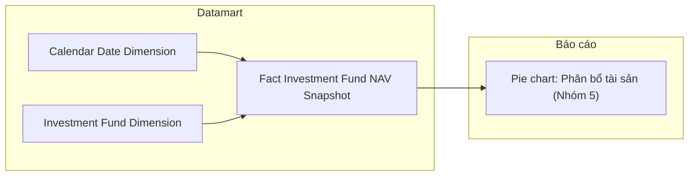
```mermaid
flowchart LR
    subgraph GOLD["Datamart"]
        G1["Fact Investment Fund NAV Snapshot"]
        G2["Investment Fund Dimension"]
        G3["Calendar Date Dimension"]
    end
    subgraph RPT["Báo cáo"]
        R1["Pie chart: Phân bổ tài sản (Nhóm 5)"]
    end
    G3 --> G1
    G2 --> G1
    G1 --> R1
```

**Bảng grain:**

| Tên bảng | Grain |
|---|---|
| Fact Investment Fund NAV Snapshot | 1 quỹ × 1 Report Template × 1 Report Date |
| Investment Fund Dimension | 1 quỹ (SCD4A — active record (ds_rcrd_st = 1)) |
| Fund Management Company Dimension | 1 CTQLQ (SCD4A — active record (ds_rcrd_st = 1)) |
| Calendar Date Dimension | 1 ngày |

---

#### Nhóm 6 — Sự biến động về NAV của các Quỹ ĐTCK

> Phân loại: **Phân tích**
> Atomic: `Report Import Value` ← FMS.RPTVALUES — **READY** *(BC: NAV per quỹ per tháng)*
> Ghi chú: Reuse `Fact Investment Fund NAV Snapshot`. Tăng trưởng NAV tháng (MoM%) và Trung bình tăng trưởng đều là Derived — tính tại presentation layer từ K_FMS_32.

**Bảng KPI:**

| KPI ID | Tên KPI | Đơn vị | Tính chất | Công thức / Ghi chú |
|---|---|---|---|---|
| K_FMS_47 | NAV các quỹ ĐTCK theo tháng | Tỷ VND | Base | Reuse K_FMS_32 — SUM(Fund_NAV_Amount) per tháng — presentation layer |
| K_FMS_48 | Tăng trưởng NAV tháng (MoM%) | % | Derived | (K_FMS_47[T] − K_FMS_47[T−1]) / K_FMS_47[T−1] × 100% — presentation layer |
| K_FMS_49 | Trung bình tăng trưởng NAV | % | Derived | AVG(K_FMS_48) trong khoảng thời gian chọn — presentation layer |

**Mockup:**

| Tháng | NAV (tỷ VND) | Tăng trưởng (%) |
|---|---|---|
| T1/2025 | 820.000 | +2.1% |
| T2/2025 | 835.000 | +1.8% |
| T3/2025 | 828.000 | −0.8% |

**Source:** `Fact Investment Fund NAV Snapshot` → `Investment Fund Dimension`, `Calendar Date Dimension`

**Star Schema:** *(Reuse `Fact Investment Fund NAV Snapshot` — xem Nhóm 4 để biết schema đầy đủ. Nhóm 6 chỉ dùng measure `Fund_NAV_Amount` để tính biến động NAV theo tháng)*

**Lineage Mart → Báo cáo:**

```mermaid
flowchart LR
    subgraph GOLD["Datamart"]
        G1["Fact Investment Fund NAV Snapshot"]
        G2["Investment Fund Dimension"]
        G3["Calendar Date Dimension"]
    end
    subgraph RPT["Báo cáo"]
        R1["Bar+Line: Biến động NAV theo tháng (Nhóm 6)"]
    end
    G3 --> G1
    G2 --> G1
    G1 --> R1
```

**Bảng grain:**

| Tên bảng | Grain |
|---|---|
| Fact Investment Fund NAV Snapshot | 1 quỹ × 1 Report Template × 1 Report Date |
| Investment Fund Dimension | 1 quỹ (SCD4A — active record (ds_rcrd_st = 1)) |
| Calendar Date Dimension | 1 ngày |

---

#### Nhóm 7 — Số lượng quỹ đầu tư chứng khoán

> Phân loại: **Phân tích**
> Atomic: `Investment Fund` ← FMS.FUNDS — **READY** *(db: COUNT per Fund_Type_Code)*
> Ghi chú: Market-Level Aggregate Snapshot theo năm — đếm từ db. COUNT từng loại quỹ là Derived = COUNT WHERE Fund_Type_Code = X — tính tại presentation layer. Grain = 1 snapshot × 1 năm × loại hình được aggregate tại mart (lưu tổng, tách loại ở presentation).

**Mockup:**

| Năm | Tổng quỹ | Quỹ mở | Quỹ TV | ETF | Đóng | BĐS |
|---|---|---|---|---|---|---|
| 2018 | 47 | 20 | 10 | 8 | 5 | 4 |
| 2023 | 124 | 55 | 25 | 20 | 15 | 9 |

**Source:** `Fact Investment Fund Count Snapshot` → `Calendar Date Dimension`

**Bảng KPI:**

| KPI ID | Tên KPI | Đơn vị | Tính chất | Công thức / Ghi chú |
|---|---|---|---|---|
| K_FMS_50 | Tổng số lượng quỹ | Quỹ | Base | COUNT(Investment Fund) tất cả loại hình, theo năm ← FMS.FUNDS |
| K_FMS_51 | Loại hình quỹ | — | Chiều | Fund_Type_Code ← Investment Fund |
| K_FMS_52a | Quỹ mở | Quỹ | Derived | COUNT WHERE Fund_Type_Code = QUY_MO — presentation layer |
| K_FMS_52b | Quỹ thành viên | Quỹ | Derived | COUNT WHERE Fund_Type_Code = QUY_TV — presentation layer |
| K_FMS_52c | Quỹ ETF | Quỹ | Derived | COUNT WHERE Fund_Type_Code = QUY_ETF — presentation layer |
| K_FMS_52d | Quỹ đóng | Quỹ | Derived | COUNT WHERE Fund_Type_Code = QUY_DONG — presentation layer |
| K_FMS_52e | Quỹ BĐS | Quỹ | Derived | COUNT WHERE Fund_Type_Code = QUY_BDS — presentation layer |

**Star Schema:**

```mermaid
erDiagram
    Fact_Investment_Fund_Count_Snapshot {
        int Snapshot_Date_Dimension_Id FK
        int Total_Fund_Count
        int Open_Fund_Count
        int Member_Fund_Count
        int ETF_Fund_Count
        int Closed_Fund_Count
        int Real_Estate_Fund_Count
        int Money_Market_Fund_Count
        int Infrastructure_Bond_Fund_Count
        int Retirement_Fund_Count
        datetime Population_Date
    }
    Calendar_Date_Dimension {
        string Calendar_Date_Dimension_Id PK
        date Calendar_Date
        int Year
        int Month
        int Quarter
        int Day_Of_Week
        boolean Is_Weekend
        boolean Holiday_Flag
        string Holiday_Name
    }

    Calendar_Date_Dimension ||--o{ Fact_Investment_Fund_Count_Snapshot : "Snapshot Date Dimension Id"
```

> Ghi chú thiết kế: Lưu count từng loại trực tiếp trong Fact (tương tự Fact Fund Management Company Snapshot ở tab TỔNG QUAN). Grain = 1 snapshot × 1 năm — slicer Tháng/Quý/Năm trên dashboard filter qua Calendar Date Dimension.

**Lineage Mart → Báo cáo:**

```mermaid
flowchart LR
    subgraph GOLD["Datamart"]
        G1["Fact Investment Fund Count Snapshot"]
        G2["Calendar Date Dimension"]
    end
    subgraph RPT["Báo cáo"]
        R1["Bar chart: Số lượng quỹ theo năm (Nhóm 7)"]
    end
    G2 --> G1
    G1 --> R1
```

**Bảng grain:**

| Tên bảng | Grain |
|---|---|
| Fact Investment Fund Count Snapshot | 1 snapshot toàn thị trường × 1 năm |
| Calendar Date Dimension | 1 ngày |

---

#### Nhóm 8 — Tăng trưởng số lượng CCQ lưu hành

> Phân loại: **Phân tích**
> Atomic: `Investment Fund Certificate Transfer` ← FMS.TRANSFERMBF — **READY** *(db: Transfer_Quantity, Transfer_Type_Code — nguồn cho tất cả loại quỹ trừ quỹ đóng)*
> Atomic: `Investment Fund` ← FMS.FUNDS — **READY** *(db: Fund_Type_Code để phân loại)*
> Ghi chú: CCQ lưu hành nguồn từ `Investment Fund Certificate Transfer` ← FMS.TRANSFERMBF (xác nhận v1.7). ETL = SUM(`Transfer_Quantity` WHERE `Transfer_Type_Code = MUA`) − SUM(`Transfer_Quantity` WHERE `Transfer_Type_Code = BAN`) per quỹ per snapshot date (T-1). Quỹ đóng PENDING O_FMS_7.

**Mockup:**

| Tháng | Quỹ mở | Quỹ ETF | Quỹ TV | Quỹ BĐS | Quỹ đóng | Quỹ TTTTT |
|---|---|---|---|---|---|---|
| T1/2025 | 1.250.000.000 | 320.000.000 | 180.000.000 | 95.000.000 | — | 42.000.000 |
| T2/2025 | 1.310.000.000 | 335.000.000 | 182.000.000 | 95.000.000 | — | 43.000.000 |

**Source:** `Fact Investment Fund CCQ Snapshot` → `Investment Fund Dimension`, `Calendar Date Dimension`

**Bảng KPI:**

| KPI ID | Tên KPI | Đơn vị | Tính chất | Công thức / Ghi chú |
|---|---|---|---|---|
| K_FMS_53 | Số lượng CCQ lưu hành | CCQ | Base | SUM(`Transfer_Quantity` MUA) − SUM(`Transfer_Quantity` BÁN) ← `Investment Fund Certificate Transfer` (FMS.TRANSFERMBF) per quỹ per snapshot date |
| K_FMS_54 | Loại hình quỹ | — | Chiều | Fund_Type_Code ← Investment Fund |
| K_FMS_55a | CCQ quỹ mở | CCQ | Derived | SUM(K_FMS_53) WHERE Fund_Type_Code = QUY_MO — presentation layer |
| K_FMS_55b | CCQ quỹ ETF | CCQ | Derived | SUM(K_FMS_53) WHERE Fund_Type_Code = QUY_ETF — presentation layer |
| K_FMS_55c | CCQ quỹ đóng | CCQ | Derived | Xem O_FMS_7 |
| K_FMS_55d | CCQ quỹ BĐS | CCQ | Derived | Fund_Capital_Amount / 10.000 per quỹ BĐS — presentation layer |
| K_FMS_55e | CCQ quỹ thành viên | CCQ | Derived | Fund_Capital_Amount / 10.000 per quỹ TV — presentation layer |
| K_FMS_55f | CCQ quỹ TTTTT | CCQ | Derived | SUM(K_FMS_53) WHERE Fund_Type_Code = QUY_TTTTT — presentation layer |
| K_FMS_55g | CCQ quỹ TP hạ tầng | CCQ | Derived | SUM(K_FMS_53) WHERE Fund_Type_Code = QUY_TPHT — presentation layer |
| K_FMS_55h | CCQ quỹ hưu trí | CCQ | Derived | SUM(K_FMS_53) WHERE Fund_Type_Code = QUY_HUUTRI — presentation layer |

**Star Schema:**

```mermaid
erDiagram
    Fact_Investment_Fund_CCQ_Snapshot {
        int Report_Date_Dimension_Id FK
        int Investment_Fund_Dimension_Id FK
        varchar Report_Template_Code
        varchar Reporting_Period_Code
        float Outstanding_Unit_Count
        datetime Population_Date
    }
    Investment_Fund_Dimension {
        string Investment_Fund_Dimension_Id PK
        string Investment_Fund_Id
        string Fund_Code
        string Fund_Name
        string Fund_Type_Code
        string Practice_Status_Code
        float Fund_Capital_Amount
        date Effective_Date
        date Expiry_Date
    }
    Calendar_Date_Dimension {
        string Calendar_Date_Dimension_Id PK
        date Calendar_Date
        int Year
        int Month
        int Quarter
        int Day_Of_Week
        boolean Is_Weekend
        boolean Holiday_Flag
        string Holiday_Name
    }

    Calendar_Date_Dimension ||--o{ Fact_Investment_Fund_CCQ_Snapshot : "Report Date Dimension Id"
    Investment_Fund_Dimension ||--o{ Fact_Investment_Fund_CCQ_Snapshot : "Investment Fund Dimension Id"
```

**Lineage Mart → Báo cáo:**

```mermaid
flowchart LR
    subgraph GOLD["Datamart"]
        G1["Fact Investment Fund CCQ Snapshot"]
        G2["Investment Fund Dimension"]
        G3["Calendar Date Dimension"]
    end
    subgraph RPT["Báo cáo"]
        R1["Stacked bar: Tăng trưởng CCQ lưu hành (Nhóm 8)"]
    end
    G3 --> G1
    G2 --> G1
    G1 --> R1
```

**Bảng grain:**

| Tên bảng | Grain |
|---|---|
| Fact Investment Fund CCQ Snapshot | 1 quỹ × 1 Report Template × 1 Report Date |
| Investment Fund Dimension | 1 quỹ (SCD4A — active record (ds_rcrd_st = 1)) |
| Calendar Date Dimension | 1 ngày |

---

#### Nhóm 9 — Tỷ lệ tăng trưởng NAV/CCQ so với VN-Index và Lãi suất LNH

**Bảng KPI tổng quan Nhóm 9:**

| KPI ID | Tên KPI | Đơn vị | Tính chất | Công thức / Ghi chú |
|---|---|---|---|---|
| K_FMS_56 | VN-Index | Điểm | Base | `Risk Indicator Value` WHERE `category_code = STOCK_MARKET` AND `indicator_code = VN-Index` ← QLRR cross-module |
| K_FMS_57 | NAV/CCQ quỹ mở CP | VND/CCQ | Derived | PENDING — xem O_FMS_10 (phân loại chi tiết) |
| K_FMS_58 | NAV/CCQ quỹ mở TP | VND/CCQ | Derived | PENDING — xem O_FMS_10 |
| K_FMS_59 | NAV/CCQ quỹ mở cân bằng | VND/CCQ | Derived | PENDING — xem O_FMS_10 |
| K_FMS_60 | NAV/CCQ quỹ ETF | VND/CCQ | Derived | `Fund_NAV_Amount`[ETF] / `Outstanding_Unit_Count`[ETF] — join `Fact Investment Fund NAV Snapshot` + `Fact Investment Fund CCQ Snapshot` tại presentation layer |
| K_FMS_61 | Lãi suất liên ngân hàng qua đêm | %/năm | Base | `Risk Indicator Value` WHERE `category_code = MONETARY` AND `indicator_code = Lãi suất LNH qua đêm` ← QLRR cross-module |

##### READY — VN-Index và NAV/CCQ quỹ ETF (K_FMS_56, K_FMS_60)

**KPI liên quan:** K_FMS_56 (VN-Index), K_FMS_60 (NAV/CCQ quỹ ETF)

> Atomic: `Risk Indicator Value` ← QLRR.risk_indicator_value — **READY** *(QLRR cross-module: category = STOCK_MARKET, indicator = VN-Index)*
> Ghi chú: VN-Index lưu trong `Risk Indicator Value` cùng schema với GDP và Lãi suất LNH — QLRR Source Analysis xác nhận nhóm III.1 Thị trường cổ phiếu (category_code = STOCK_MARKET) bao gồm VN-Index, HNX-Index, VN30, VN100. ETL join theo `Period Date` tương ứng `Report_Date`. BA ghi nguồn "MSS" — thực tế QLRR đồng bộ dữ liệu thị trường từ nguồn này vào `Risk Indicator Value`.

##### PENDING — Phân loại quỹ mở chi tiết (CP/TP/cân bằng)

**KPI liên quan:** K_FMS_57–59 (NAV/CCQ quỹ mở CP, TP, cân bằng)

**Lý do pending:** BA ghi "Loại hình chi tiết quỹ CP, TP, cân bằng chưa thấy có". Atomic `Investment Fund` chỉ có `Fund_Type_Code` (Quỹ mở / ETF / Đóng...) — không có sub-type phân biệt quỹ mở CP/TP/cân bằng. Cần xác nhận trong RPTPERIOD hoặc RPTMEMBER có phân loại này không — xem O_FMS_10.

##### READY — Lãi suất liên ngân hàng qua đêm

**KPI liên quan:** K_FMS_61 (Lãi suất LNH qua đêm)

> Phân loại: **Phân tích**
> Atomic: `Risk Indicator Value` ← QLRR.risk_indicator_value — **READY** *(QLRR cross-module: category = MONETARY, indicator = Lãi suất LNH qua đêm)*
> Ghi chú: "GSRR" = QLRR (xác nhận v1.7). Lãi suất LNH qua đêm ← `Risk Indicator Value` WHERE `category_code = MONETARY` ← QLRR.risk_indicator_value. Reuse `Fact Investment Fund NAV Snapshot` — lưu dạng measure DD `Overnight_Rate_Value` cùng với VN-Index.

**Mockup:** *(K_FMS_56, 60, 61 READY; K_FMS_57–59 PENDING chờ O_FMS_10)*

| Kỳ | VN-Index (điểm) | NAV/CCQ quỹ ETF (%) | Lãi suất LNH (%/năm) |
|---|---|---|---|
| T1/2025 | 1.250 | +4.2% | 4.15% |
| T2/2025 | 1.180 | −1.8% | 4.10% |
| T3/2025 | 1.310 | +6.1% | 4.05% |

**Source:** `Fact Investment Fund NAV Snapshot` → `Investment Fund Dimension`, `Calendar Date Dimension`
*(K_FMS_61 — Lãi suất LNH lấy từ `Risk Indicator Value` QLRR, join theo period tương ứng Report Date)*

**Star Schema:** *(Reuse `Fact Investment Fund NAV Snapshot` — xem Nhóm 4 để biết schema đầy đủ. Nhóm 9 dùng `Fund_NAV_Amount` (K_FMS_32 cho ETF), `VN_Index_Value` (K_FMS_56), `Overnight_Rate_Value` (K_FMS_61). `K_FMS_60` (NAV/CCQ quỹ ETF) = join Fact NAV + Fact CCQ Snapshot tại presentation layer)*

> Ghi chú cross-module (T-1 rule): `VN_Index_Value` và `Overnight_Rate_Value` ETL join theo `Period_Date = ngày làm việc trước TO_DATE(mbr_prd_rpt.day_rpt)`. Xem Nhóm 4 để biết đầy đủ join rule cho cả 3 QLRR measures (GDP/VN-Index/Lãi suất LNH).

**Lineage Mart → Báo cáo:**

```mermaid
flowchart LR
    subgraph GOLD["Datamart"]
        G1["Fact Investment Fund NAV Snapshot"]
        G2["Investment Fund Dimension"]
        G3["Calendar Date Dimension"]
    end
    subgraph RPT["Báo cáo"]
        R1["Line chart: NAV/CCQ vs VN-Index vs Lãi suất LNH (Nhóm 9)"]
    end
    G3 --> G1
    G2 --> G1
    G1 --> R1
```

**Bảng grain:**

| Tên bảng | Grain |
|---|---|
| Fact Investment Fund NAV Snapshot | 1 quỹ × 1 Report Template × 1 Report Date |
| Investment Fund Dimension | 1 quỹ (SCD4A — active record (ds_rcrd_st = 1)) |
| Calendar Date Dimension | 1 ngày |

---

#### Nhóm 10 — Danh sách các quỹ đầu tư

> Phân loại: **Tác nghiệp**
> Atomic: `Investment Fund` ← FMS.FUNDS — **READY** *(db: Tên, Phân loại, CTQLQ)*
> Atomic: `Fund Management Company` ← FMS.SECURITIES — **READY** *(db: Tên CTQLQ)*
> Atomic: `Report Import Value` ← FMS.RPTVALUES — **READY** *(BC: NAV, LN gốc — pending O_FMS_1)*
> Ghi chú: NAV hiện tại (K_FMS_62) là Base lấy từ kỳ BC gần nhất. LN YTD (K_FMS_63) là Derived = SUM(Net_Profit_Amount kỳ BC) trong năm — tính tại presentation layer. KL CCQ lưu hành (K_FMS_64) reuse từ Nhóm 8 — nguồn tùy loại quỹ.

**Mockup:**

| Tên quỹ | Công ty quản lý | Phân loại | NAV (tỷ) | LN YTD (tỷ) | KL CCQ lưu hành |
|---|---|---|---|---|---|
| Q1 / Quỹ ABC 1 | Công ty ABC 1 | Quỹ mở | 12.580 | 120.4 | 188.481.686 |
| Q2 / Quỹ ABC 2 | Công ty ABC 2 | Quỹ mở | 4.580 | 150.2 | 289.302.325 |

**Source:** `Investment Fund Profile`

**Bảng KPI:**

| KPI ID | Tên KPI | Đơn vị | Tính chất | Công thức / Ghi chú |
|---|---|---|---|---|
| K_FMS_62 | Tên quỹ | — | Chiều | Fund_Name + Fund_Short_Name ← Investment Fund (FMS.FUNDS) |
| K_FMS_63 | Công ty quản lý | — | Chiều | Company_Short_Name ← Fund Management Company (FMS.SECURITIES) |
| K_FMS_64 | Phân loại quỹ | — | Chiều | Fund_Type_Code ← Investment Fund (FMS.FUNDS) |
| K_FMS_65 | NAV hiện tại | Tỷ VND | Base | Report Import Value chỉ tiêu NAV per quỹ, kỳ BC gần nhất — pending O_FMS_1 |
| K_FMS_66 | Lợi nhuận YTD | Tỷ VND | Derived | SUM(Net_Profit_Amount) WHERE năm = năm hiện tại — presentation layer |
| K_FMS_67 | KL CCQ lưu hành | CCQ | Derived | Reuse K_FMS_53 per quỹ tại tháng slicer — nguồn tùy loại quỹ (xem O_FMS_7) |

**Schema bảng tác nghiệp — Investment Fund Profile:**

```mermaid
erDiagram
    Investment_Fund_Profile {
        string Investment_Fund_Id PK
        string Fund_Management_Company_Id
        string Fund_Code
        string Fund_Short_Name
        string Fund_Name
        string Fund_Type_Code
        string Practice_Status_Code
        float Fund_Capital_Amount
        string Report_Period_Code
        float Fund_NAV_Amount
        float Net_Profit_Amount
        float Outstanding_Unit_Count
        datetime Population_Date
    }
```

> Ghi chú source: `Fund_NAV_Amount` và `Net_Profit_Amount` ← Report Import Value (RPTVALUES — BC, pending O_FMS_1). `Outstanding_Unit_Count` ← `Investment Fund Certificate Transfer` (FMS.TRANSFERMBF) per O_FMS_7. Các trường còn lại từ Atomic Investment Fund (db).

**Lineage Mart → Báo cáo:**

```mermaid
flowchart LR
    subgraph GOLD["Datamart"]
        G1["Investment Fund Profile"]
    end
    subgraph RPT["Báo cáo"]
        R1["Bảng danh sách các quỹ (Nhóm 10)"]
    end
    G1 --> R1
```

**Bảng grain:**

| Tên bảng | Grain |
|---|---|
| Investment Fund Profile | 1 quỹ × 1 tháng slicer |

---

---

---

### Tab: BÁO CÁO / CÔNG TY QLQ

**Slicer chung:** CTQLQ, kỳ thời gian

---

#### Nhóm 11 — Báo cáo giao dịch nhân viên CTQLQ

> Phân loại: **Tác nghiệp**
> Atomic: `Fund Management Company Key Person` ← FMS.TLProfiles — **READY** *(db: Nhân viên CTQLQ — Họ tên, CCCD/HC)*
> Atomic: `Involved Party Alternative Identification` ← FMS.TLProfiles — **READY** *(db: Số CCCD/HC `identn_nbr` ← `FMS.TLProfiles.IdAdd` — join key sang GSGD)*
> Atomic: `Investor Trading Account` ← GSGD.investor_account — **READY** *(db: Tài khoản GDCK `ivsr_tdg_ac_code`, Trạng thái, Loại NĐT)*
> Ghi chú: Cross-module FMS × GSGD. Join key: `Involved_Party_Alternative_Identification.Identification_Number` (`Identification_Type_Code = CITIZEN_ID/PASSPORT`) = `Investor_Trading_Account.Identity_Number`. **ETL note:** `FMS.TLProfiles.IdAdd` chứa số CCCD (cột `IdNo` bị đảo tên — chứa nơi cấp). **Mã CTCK:** `Investor Trading Account` không có field riêng — ETL parse từ `Investor_Trading_Account_Code` (4-5 ký tự đầu của mã TK thường là mã CTCK). **Sổ lệnh (K_FMS_71–77):** GSGD không lưu sổ lệnh trong Atomic (đọc từ VSDC qua API) → PENDING — cần Atomic entity từ VSDC hoặc hệ thống nguồn khác.

**Mockup:**

| Họ tên | Số CCCD | TK GDCK | CTCK | Ngày GD | Lệnh | Mã CK | KL | Giá | Tổng GT (VND) |
|---|---|---|---|---|---|---|---|---|---|
| Nguyễn Văn A | 012345678901 | 123C456789 | SSI | 15/03/2025 | Mua | VNM | 1.000 | 98.500 | 98.500.000 |

**Source:** `Fund Management Company Staff Trade Report`

**Bảng KPI:**

**KPI READY (Atomic FMS + GSGD đủ dữ liệu):**

| KPI ID | Tên KPI | Đơn vị | Tính chất | Atomic Source | Công thức / Ghi chú |
|---|---|---|---|---|---|
| K_FMS_68 | Số CCCD/Hộ chiếu nhân viên | — | Chiều | `Involved Party Alternative Identification` ← FMS.TLProfiles | `Identification_Number` (`identn_nbr`) WHERE `Identification_Type_Code = CITIZEN_ID / PASSPORT` — lấy từ `FMS.TLProfiles.IdAdd` |
| K_FMS_69 | Tài khoản GDCK | — | Base | `Investor Trading Account` ← GSGD | `Investor_Trading_Account_Code` (`ivsr_tdg_ac_code`) — join qua `Identity_Number = Identification_Number` |
| K_FMS_70 | Họ tên nhân viên | — | Chiều | `Fund Management Company Key Person` ← FMS.TLProfiles | `Full_Name` (`full_nm`) ← `FMS.TLProfiles.FullName` |
| K_FMS_71 | Chức danh nhân viên | — | Chiều | `Fund Management Company Key Person` ← FMS.TLProfiles | `Job_Type_Code` (`job_tp_code`) ← `FMS.TLProfiles.JobTypeId` — Scheme: FMS_JOB_TYPE |
| K_FMS_72 | Mã CTCK mở tài khoản | — | Chiều | `Investor Trading Account` ← GSGD | ETL parse từ `Investor_Trading_Account_Code` — 4-5 ký tự đầu thường là mã CTCK. Cần xác nhận với ETL team |

**KPI PENDING — sổ lệnh giao dịch (K_FMS_73–77):**

| KPI ID | Tên KPI | Đơn vị | Tính chất | Lý do PENDING |
|---|---|---|---|---|
| K_FMS_73 | Ngày giao dịch | — | Chiều | GSGD không lưu sổ lệnh trong Atomic — đọc từ VSDC API. Cần Atomic entity từ VSDC hoặc hệ thống lưu lịch sử lệnh |
| K_FMS_74 | Phương thức giao dịch | — | Base | Tương tự K_FMS_73 |
| K_FMS_75 | Lệnh mua/bán | — | Base | Tương tự K_FMS_73 |
| K_FMS_76 | Mã chứng khoán | — | Chiều | Tương tự K_FMS_73 |
| K_FMS_77 | Số lượng CK | CK | Base | Tương tự K_FMS_73 |

**Schema bảng tác nghiệp — Fund Management Company Staff Trade Report:**

```mermaid
erDiagram
    Fund_Management_Company_Staff_Trade_Report {
        string Fund_Management_Company_Id PK
        string Fund_Management_Company_Key_Person_Id PK
        string Full_Name
        string Job_Type_Code
        string Identification_Number
        string Investor_Trading_Account_Code
        string Securities_Company_Code
        datetime Population_Date
    }
```

**Lineage Mart → Báo cáo:**

```mermaid
flowchart LR
    subgraph GOLD["Datamart"]
        G1["Fund Management Company Staff Trade Report"]
    end
    subgraph RPT["Báo cáo"]
        R1["Báo cáo GD nhân viên CTQLQ (Nhóm 11)"]
    end
    G1 --> R1
```

**Bảng grain:**

| Tên bảng | Grain |
|---|---|
| Fund Management Company Staff Trade Report | 1 nhân viên CTQLQ × 1 tài khoản GDCK *(grain hiện tại — chờ bổ sung sổ lệnh VSDC để mở rộng thành 1 lệnh × 1 ngày)* |

---

### Tab: DATA EXPLORER

**Đặc điểm chung:** DataExplorer là **pass-through** — hiển thị trực tiếp nội dung báo cáo BC từ `Report Import Value` ← FMS.RPTVALUES. Người dùng chọn loại báo cáo, kỳ, CTQLQ/quỹ → hệ thống render các dòng chỉ tiêu theo mã báo cáo. Không cần Fact analytics — dùng bảng Tác nghiệp dạng flat.

**Phân nhóm toàn bộ DataExplorer:**

| Nhóm | Nội dung | Số tab | Pattern |
|---|---|---|---|
| A | BCTC (Bảng cân đối, KQHĐKD, LCTT, BĐVCSH) | 5 tabs | Pass-through BC BCTC |
| B | Báo cáo tỷ lệ ATTC (5 phụ lục) | 6 tabs | Pass-through BC ATTC |
| C | Báo cáo tình hình QLĐMDT (7 phụ lục) | 7 tabs + 1 summary | Pass-through BC UTDM |
| D | Các báo cáo định kỳ CTQLQ | 6 tabs (6 KPI/tab) | Pass-through BC định kỳ |
| E | Báo cáo theo loại quỹ (8 loại × 5 BC) | 40 tabs | Pass-through BC quỹ |
| F | CN, VPĐD, Đại lý, NHGS, NHNCK | 18 tabs | Pass-through BC đặc thù |

**Tổng cộng:** 63 pass-through tabs + 19 complex tabs — **tất cả phục vụ bởi 1 bảng Tác nghiệp duy nhất** `Report Pass-through View`.

---

#### Nhóm 12 — DataExplorer BCTC

> Phân loại: **Tác nghiệp**
> Atomic: `Report Import Value` ← FMS.RPTVALUES — **READY** *(BC: BCTC — Bảng cân đối kế toán, KQHĐKD, LCTT trực tiếp, LCTT gián tiếp, Biến động VCSH)*
> Ghi chú: 5 tabs BCTC (110 + 23 + 36 + 46 + 17 = 232 chỉ tiêu) đều từ cùng Atomic entity. Dùng chung 1 bảng Tác nghiệp `Report Pass-through View` — phân biệt bởi `Report_Template_Code`. Phụ thuộc O_FMS_1 cho mapping SheetId/TgtId.

**Mockup:**

| Mã BC | Tên BC | Kỳ BC | Mã chỉ tiêu | Tên chỉ tiêu | Giá trị |
|---|---|---|---|---|---|
| BCTC_CDKT | Bảng cân đối kế toán | Q1/2025 | 100 | Tài sản ngắn hạn | 1.250.000 |
| BCTC_CDKT | Bảng cân đối kế toán | Q1/2025 | 110 | Tiền và tương đương tiền | 320.000 |

**Source:** `Report Pass-through View`

**Bảng KPI:**

| KPI ID | Tên KPI | Đơn vị | Tính chất | Công thức / Ghi chú |
|---|---|---|---|---|
| K_FMS_78 | Chỉ tiêu BCTC (tất cả mã) | VND/% | Base | `Report Import Value`.`Cell_Value` per `Report_Template_Code` ∈ {BCTC_CDKT, BCTC_KQHD, BCTC_LCTTT, BCTC_LCTTGT, BCTC_BDVCSH} |
| K_FMS_79 | Loại báo cáo | — | Chiều | `Report_Template_Code` ← `Report Import Value` |
| K_FMS_80 | Kỳ báo cáo | — | Chiều | `Reporting_Period_Code` ← `Report Import Value` |
| K_FMS_81 | Mã chỉ tiêu | — | Chiều | `Row_Code` ← `Report Import Value` |
| K_FMS_82 | Tên chỉ tiêu | — | Chiều | Lookup từ `Report_Template_Code` + `Row_Code` |

**Schema bảng tác nghiệp — Report Pass-through View:**

```mermaid
erDiagram
    Report_Pass_through_View {
        string Fund_Management_Company_Id PK
        string Investment_Fund_Id PK
        string Report_Template_Code PK
        string Reporting_Period_Code PK
        string Row_Code PK
        string Fund_Management_Company_Code
        string Fund_Management_Company_Name
        string Investment_Fund_Code
        string Investment_Fund_Name
        string Report_Template_Name
        string Reporting_Period_Label
        date Report_Date
        string Row_Name
        float Cell_Value
        string Cell_Text_Value
        string Data_Unit
        datetime Population_Date
    }
```

**Lineage Mart → Báo cáo:**

```mermaid
flowchart LR
    subgraph GOLD["Datamart"]
        G1["Report Pass-through View"]
    end
    subgraph RPT["Báo cáo"]
        R1["DataExplorer BCTC (5 tabs)"]
        R2["DataExplorer ATTC (6 tabs)"]
        R3["DataExplorer QLĐMDT (8 tabs)"]
        R4["DataExplorer BC định kỳ (6 tabs)"]
        R5["DataExplorer BC quỹ (40 tabs)"]
        R6["DataExplorer CN/VPĐD/Đại lý/NHGS (18 tabs)"]
    end
    G1 --> R1
    G1 --> R2
    G1 --> R3
    G1 --> R4
    G1 --> R5
    G1 --> R6
```

**Bảng grain:**

| Tên bảng | Grain |
|---|---|
| Report Pass-through View | 1 CTQLQ/Quỹ × 1 mẫu báo cáo × 1 kỳ × 1 dòng chỉ tiêu |

---

#### Nhóm 13 — DataExplorer Báo cáo tỷ lệ ATTC

> Phân loại: **Tác nghiệp**
> Atomic: `Report Import Value` ← FMS.RPTVALUES — **READY** *(BC: 5 phụ lục ATTC — BangTinhVonKhaDung_06193, RuiRoThiTruong_06194, RuiRoThanhToan_06196, RuiRoHoatDong_06199, BangTongHop_06013)*
> Ghi chú: Reuse `Report Pass-through View` — phân biệt bởi `Report_Template_Code` ∈ {06193, 06194, 06196, 06199, 06013}. Phụ thuộc O_FMS_1.

**Bảng KPI:**

| KPI ID | Tên KPI | Đơn vị | Tính chất | Công thức / Ghi chú |
|---|---|---|---|---|
| K_FMS_83 | Chỉ tiêu ATTC (tất cả mã) | VND/% | Base | `Cell_Value` per `Report_Template_Code` ∈ {06193, 06194, 06196, 06199, 06013} |
| K_FMS_84 | Phụ lục ATTC | — | Chiều | `Report_Template_Code` — phân biệt 5 phụ lục |

**Mockup:** *(Reuse pattern Nhóm 12 — chọn loại BC → kỳ → render dòng chỉ tiêu)*

**Source:** `Report Pass-through View`

**Lineage Mart → Báo cáo:**

```mermaid
flowchart LR
    subgraph GOLD["Datamart"]
        G1["Report Pass-through View"]
    end
    subgraph RPT["Báo cáo"]
        R1["DataExplorer Báo cáo ATTC (6 phụ lục) — Nhóm 13"]
    end
    G1 --> R1
```

**Bảng grain:** *(Reuse `Report Pass-through View` — xem Nhóm 12. Grain = 1 CTQLQ/Quỹ × 1 mẫu BC × 1 kỳ × 1 dòng chỉ tiêu)*

---

#### Nhóm 14 — DataExplorer Báo cáo QLĐMDT

> Phân loại: **Tác nghiệp**
> Atomic: `Report Import Value` ← FMS.RPTVALUES — **READY** *(BC: 7 phụ lục QLĐMDT — QLDMDT, THDM_tungKH, TongHopHopDongQLDMDT_06023, HanMuc_DTUT_GianTiepNN, THQLDMDT_GianTiepNN, THHDQLDMDT_GianTiepNN, THHDQLDT_GianTiepNN)*
> Ghi chú: Reuse `Report Pass-through View`. Tab summary (20 KPI) có KPI tổng hợp UTDM — phần summary thống kê reuse `Fact Discretionary Investment Contract Snapshot`.

**Bảng KPI:**

| KPI ID | Tên KPI | Đơn vị | Tính chất | Công thức / Ghi chú |
|---|---|---|---|---|
| K_FMS_85 | Chỉ tiêu QLĐMDT (tất cả mã) | VND/% | Base | `Cell_Value` per `Report_Template_Code` ∈ {QLDMDT, THDM_tungKH, TongHop...} |
| K_FMS_86 | Tổng số HĐUTDM đang thực hiện | HĐ | Base | Reuse K_FMS_10 từ `Fact Discretionary Investment Contract Snapshot` |
| K_FMS_87 | Tổng GTTT UTDM | Tỷ VND | Base | Reuse K_FMS_12 từ `Fact Discretionary Investment Contract Snapshot` |

> Ghi chú: K_FMS_86, K_FMS_87 là tổng hợp summary — reuse Fact UTDM. Các chỉ tiêu chi tiết per hợp đồng dùng `Report Pass-through View`.

**Mockup:** *(Reuse pattern Nhóm 12 — chọn loại BC → kỳ → render dòng chỉ tiêu)*

**Source:** `Report Pass-through View`

**Lineage Mart → Báo cáo:**

```mermaid
flowchart LR
    subgraph GOLD["Datamart"]
        G1["Report Pass-through View"]
    end
    subgraph RPT["Báo cáo"]
        R1["DataExplorer Báo cáo QLĐMDT (7 phụ lục) — Nhóm 14"]
    end
    G1 --> R1
```

**Bảng grain:** *(Reuse `Report Pass-through View` — xem Nhóm 12. Grain = 1 CTQLQ/Quỹ × 1 mẫu BC × 1 kỳ × 1 dòng chỉ tiêu)*

---

#### Nhóm 15 — DataExplorer Báo cáo định kỳ CTQLQ

> Phân loại: **Tác nghiệp**
> Atomic: `Report Import Value` ← FMS.RPTVALUES — **READY** *(BC định kỳ: Báo cáo tình hình hoạt động, QTCT, QLRR, RML, HĐĐLPP)*
> Ghi chú: 6 tabs × 6 KPI pass-through metadata. Reuse `Report Pass-through View` — phân biệt bởi `Report_Template_Code`.

**Bảng KPI:**

| KPI ID | Tên KPI | Đơn vị | Tính chất | Công thức / Ghi chú |
|---|---|---|---|---|
| K_FMS_88 | Chỉ tiêu BC định kỳ CTQLQ | — | Base | `Cell_Value` per template ∈ {HDHOAT, QTCT, QLRR, RML, HDDLPP, TTNH} |

**Mockup:** *(Reuse pattern Nhóm 12 — chọn loại BC → kỳ → render dòng chỉ tiêu)*

**Source:** `Report Pass-through View`

**Lineage Mart → Báo cáo:**

```mermaid
flowchart LR
    subgraph GOLD["Datamart"]
        G1["Report Pass-through View"]
    end
    subgraph RPT["Báo cáo"]
        R1["DataExplorer Báo cáo định kỳ CTQLQ (6 loại) — Nhóm 15"]
    end
    G1 --> R1
```

**Bảng grain:** *(Reuse `Report Pass-through View` — xem Nhóm 12. Grain = 1 CTQLQ/Quỹ × 1 mẫu BC × 1 kỳ × 1 dòng chỉ tiêu)*

---

#### Nhóm 16 — DataExplorer Báo cáo theo loại quỹ và đơn vị đặc thù

> Phân loại: **Tác nghiệp**
> Atomic: `Report Import Value` ← FMS.RPTVALUES — **READY** *(BC quỹ: BCTC quỹ, BC HĐĐT, BC TSNAV, BC DMDTKGT; BC CN/VPĐD/Đại lý/NHGS)*
> Ghi chú: 40 tabs quỹ (8 loại × 5 BC) + 18 tabs đặc thù. Tất cả reuse `Report Pass-through View` — phân biệt bởi `Report_Template_Code` + `Investment_Fund_Id`/`entity_type`.

**Bảng KPI:**

| KPI ID | Tên KPI | Đơn vị | Tính chất | Công thức / Ghi chú |
|---|---|---|---|---|
| K_FMS_89 | Chỉ tiêu BC quỹ (tất cả loại) | VND/% | Base | `Cell_Value` per `Investment_Fund_Id` × `Report_Template_Code` per loại quỹ |
| K_FMS_90 | Chỉ tiêu BC CN/VPĐD/Đại lý/NHGS | — | Base | `Cell_Value` per entity × `Report_Template_Code` |
| K_FMS_91 | Loại quỹ / loại đơn vị | — | Chiều | `Fund_Type_Code` ← `Investment Fund` hoặc entity type |

**Mockup:** *(Reuse pattern Nhóm 12 — chọn loại quỹ → loại BC → kỳ → render chỉ tiêu)*

**Source:** `Report Pass-through View`

**Schema bảng tác nghiệp:** *(Reuse `Report Pass-through View` — xem Nhóm 12)*

**Lineage Mart → Báo cáo:**

```mermaid
flowchart LR
    subgraph GOLD["Datamart"]
        G1["Report Pass-through View"]
    end
    subgraph RPT["Báo cáo"]
        R1["DataExplorer BC quỹ (40 tabs) — Nhóm 16"]
        R2["DataExplorer BC CN/VPĐD/Đại lý/NHGS (18 tabs) — Nhóm 16"]
    end
    G1 --> R1
    G1 --> R2
```

**Bảng grain:** *(Reuse `Report Pass-through View` — xem Nhóm 12. Grain = 1 CTQLQ/Quỹ × 1 mẫu BC × 1 kỳ × 1 dòng chỉ tiêu)*

### Tab: TỔNG QUAN ĐẠI LÝ PHÂN PHỐI

#### Nhóm — Danh sách Đại lý phân phối

##### PENDING

**KPI liên quan:** K_FMS_107 – K_FMS_128

**Lý do pending:** Chưa thiết kế Atomic source cho Fund Distribution Agent chi tiết (tài khoản NĐT, giao dịch CCQ)

**Atomic cần bổ sung:** `Fund Distribution Agent` (FMS.AGENCIES) — cần bổ sung attributes tài khoản và giao dịch CCQ

**Mart dự kiến:**
- `Fact Fund Distribution Agent Snapshot` — grain: 1 ĐLPP × 1 tháng
- `Fund Distribution Agent Profile` — grain: 1 ĐLPP (tác nghiệp)

| KPI ID | Tên KPI | Tính chất | Trạng thái |
|---|---|---|---|
| K_FMS_107 | Tên Đại lý phân phối | Cơ sở | PENDING |
| K_FMS_108 | Số GP thành lập | Cơ sở | PENDING |
| K_FMS_109 | Ngày cấp GP thành lập | Cơ sở | PENDING |
| K_FMS_110 | Địa chỉ | Cơ sở | PENDING |
| K_FMS_111 | Tình trạng hoạt động | Cơ sở | PENDING |
| K_FMS_112 | Quỹ đang phân phối | Cơ sở | PENDING |
| K_FMS_113 | Danh sách các Quỹ đang phân phối | Cơ sở | PENDING |
| K_FMS_114 | Tài khoản giao dịch | Cơ sở | PENDING |
| K_FMS_115 | Tài khoản giao dịch (YTD) | Cơ sở | PENDING |
| K_FMS_116 | Tổng số tài khoản giao dịch chứng chỉ chỉ quỹ - Tổ chức | Cơ sở | PENDING |
| K_FMS_117 | Tổng số tài khoản giao dịch chứng chỉ chỉ quỹ - Cá nhân | Cơ sở | PENDING |
| K_FMS_118 | Tổng số tài khoản giao dịch chứng chỉ chỉ quỹ - Nước ngoài | Cơ sở | PENDING |
| K_FMS_119 | Số tài khoản nắm giữ chứng chỉ chỉ quỹ - Tổ chức | Cơ sở | PENDING |
| K_FMS_120 | Số tài khoản nắm giữ chứng chỉ chỉ quỹ - Cá nhân | Cơ sở | PENDING |
| K_FMS_121 | Số tài khoản nắm giữ chứng chỉ chỉ quỹ - Nước ngoài | Cơ sở | PENDING |
| K_FMS_122 | Giá trị chứng chỉ quỹ - Tổ chức | Cơ sở | PENDING |
| K_FMS_123 | Giá trị chứng chỉ quỹ - Cá nhân | Cơ sở | PENDING |
| K_FMS_124 | Giá trị chứng chỉ quỹ - Nước ngoài | Cơ sở | PENDING |
| K_FMS_125 | Giá trị phát hành (PH) | Cơ sở | PENDING |
| K_FMS_126 | Giá trị phát hành (PH) (YTD) | Cơ sở | PENDING |
| K_FMS_127 | Giá trị mua lại (ML) | Cơ sở | PENDING |
| K_FMS_128 | Thị phần (TP) | Phái sinh | PENDING |

#### Nhóm — Giao dịch thông qua Đại lý phân phối

##### PENDING

**KPI liên quan:** K_FMS_105 – K_FMS_106

**Lý do pending:** Chưa thiết kế Atomic source cho Fund Distribution Agent chi tiết (tài khoản NĐT, giao dịch CCQ)

**Atomic cần bổ sung:** `Fund Distribution Agent` (FMS.AGENCIES) — cần bổ sung attributes tài khoản và giao dịch CCQ

**Mart dự kiến:**
- `Fact Fund Distribution Agent Snapshot` — grain: 1 ĐLPP × 1 tháng
- `Fund Distribution Agent Profile` — grain: 1 ĐLPP (tác nghiệp)

| KPI ID | Tên KPI | Tính chất | Trạng thái |
|---|---|---|---|
| K_FMS_105 | Giá trị phát hành (PH) | Cơ sở | PENDING |
| K_FMS_106 | Giá trị mua lại (ML) | Cơ sở | PENDING |

#### Nhóm — Giá trị chứng chỉ quỹ

##### PENDING

**KPI liên quan:** K_FMS_102 – K_FMS_104

**Lý do pending:** Chưa thiết kế Atomic source cho Fund Distribution Agent chi tiết (tài khoản NĐT, giao dịch CCQ)

**Atomic cần bổ sung:** `Fund Distribution Agent` (FMS.AGENCIES) — cần bổ sung attributes tài khoản và giao dịch CCQ

**Mart dự kiến:**
- `Fact Fund Distribution Agent Snapshot` — grain: 1 ĐLPP × 1 tháng
- `Fund Distribution Agent Profile` — grain: 1 ĐLPP (tác nghiệp)

| KPI ID | Tên KPI | Tính chất | Trạng thái |
|---|---|---|---|
| K_FMS_102 | Tổ chức | Cơ sở | PENDING |
| K_FMS_103 | Cá nhân | Cơ sở | PENDING |
| K_FMS_104 | Nước ngoài | Cơ sở | PENDING |

#### Nhóm — Số tài khoản nắm giữ chứng chỉ chỉ quỹ

##### PENDING

**KPI liên quan:** K_FMS_99 – K_FMS_101

**Lý do pending:** Chưa thiết kế Atomic source cho Fund Distribution Agent chi tiết (tài khoản NĐT, giao dịch CCQ)

**Atomic cần bổ sung:** `Fund Distribution Agent` (FMS.AGENCIES) — cần bổ sung attributes tài khoản và giao dịch CCQ

**Mart dự kiến:**
- `Fact Fund Distribution Agent Snapshot` — grain: 1 ĐLPP × 1 tháng
- `Fund Distribution Agent Profile` — grain: 1 ĐLPP (tác nghiệp)

| KPI ID | Tên KPI | Tính chất | Trạng thái |
|---|---|---|---|
| K_FMS_99 | Tổ chức | Cơ sở | PENDING |
| K_FMS_100 | Cá nhân | Cơ sở | PENDING |
| K_FMS_101 | Nước ngoài | Cơ sở | PENDING |

#### Nhóm — Thống kê chung

##### PENDING

**KPI liên quan:** K_FMS_92 – K_FMS_95

**Lý do pending:** Chưa thiết kế Atomic source cho Fund Distribution Agent chi tiết (tài khoản NĐT, giao dịch CCQ)

**Atomic cần bổ sung:** `Fund Distribution Agent` (FMS.AGENCIES) — cần bổ sung attributes tài khoản và giao dịch CCQ

**Mart dự kiến:**
- `Fact Fund Distribution Agent Snapshot` — grain: 1 ĐLPP × 1 tháng
- `Fund Distribution Agent Profile` — grain: 1 ĐLPP (tác nghiệp)

| KPI ID | Tên KPI | Tính chất | Trạng thái |
|---|---|---|---|
| K_FMS_92 | Số lượng Đại lý phân phối | Cơ sở | PENDING |
| K_FMS_93 | Số tài khoản | Cơ sở | PENDING |
| K_FMS_94 | Giá trị phát hành | Cơ sở | PENDING |
| K_FMS_95 | Giá trị mua lại | Cơ sở | PENDING |

#### Nhóm — Tổng số tài khoản giao dịch chứng chỉ chỉ quỹ

##### PENDING

**KPI liên quan:** K_FMS_96 – K_FMS_98

**Lý do pending:** Chưa thiết kế Atomic source cho Fund Distribution Agent chi tiết (tài khoản NĐT, giao dịch CCQ)

**Atomic cần bổ sung:** `Fund Distribution Agent` (FMS.AGENCIES) — cần bổ sung attributes tài khoản và giao dịch CCQ

**Mart dự kiến:**
- `Fact Fund Distribution Agent Snapshot` — grain: 1 ĐLPP × 1 tháng
- `Fund Distribution Agent Profile` — grain: 1 ĐLPP (tác nghiệp)

| KPI ID | Tên KPI | Tính chất | Trạng thái |
|---|---|---|---|
| K_FMS_96 | Tổ chức | Cơ sở | PENDING |
| K_FMS_97 | Cá nhân | Cơ sở | PENDING |
| K_FMS_98 | Nước ngoài | Cơ sở | PENDING |

### Tab: TỔNG QUAN CN CTQLQ NN TẠI VN

#### Nhóm — Danh sách các Chi nhánh CTQLQ nước ngoài tại Việt Nam

##### PENDING

**KPI liên quan:** K_FMS_138 – K_FMS_147

**Lý do pending:** Chưa thiết kế Atomic source cho Foreign Fund Management Organization Unit chi tiết (hợp đồng UTQLDM, nhân viên, tài chính)

**Atomic cần bổ sung:** `Foreign Fund Management Organization Unit` (FMS.FORBRCH) — cần bổ sung attributes hợp đồng, lợi nhuận, vốn CSH

**Mart dự kiến:**
- `Fact Foreign Fund Management Organization Unit Snapshot` — grain: 1 CN × 1 tháng
- `Foreign Fund Management Organization Unit Profile` — grain: 1 CN (tác nghiệp)

| KPI ID | Tên KPI | Tính chất | Trạng thái |
|---|---|---|---|
| K_FMS_138 | Tên Chi nhánh CTQLQ nước ngoài tại Việt Nam | Cơ sở | PENDING |
| K_FMS_139 | CAR (ATTC) | Cơ sở | PENDING |
| K_FMS_140 | Lợi nhuận (Tỷ đồng) | Cơ sở | PENDING |
| K_FMS_141 | Vốn CSH | Cơ sở | PENDING |
| K_FMS_142 | Số lượng hợp đồng UTQLDM | Cơ sở | PENDING |
| K_FMS_143 | Giám đốc chi nhánh | Cơ sở | PENDING |
| K_FMS_144 | Số lượng nhân viên có CCHN | Cơ sở | PENDING |
| K_FMS_145 | Mã hợp đồng UTQLDM | Cơ sở | PENDING |
| K_FMS_146 | Số tài khoản lưu ký | Cơ sở | PENDING |
| K_FMS_147 | Giá trị thị trường của từng hợp đồng UTQLDM | Cơ sở | PENDING |

#### Nhóm — Số liệu hợp đồng uỷ thác danh mục

##### PENDING

**KPI liên quan:** K_FMS_132 – K_FMS_137

**Lý do pending:** Chưa thiết kế Atomic source cho Foreign Fund Management Organization Unit chi tiết (hợp đồng UTQLDM, nhân viên, tài chính)

**Atomic cần bổ sung:** `Foreign Fund Management Organization Unit` (FMS.FORBRCH) — cần bổ sung attributes hợp đồng, lợi nhuận, vốn CSH

**Mart dự kiến:**
- `Fact Foreign Fund Management Organization Unit Snapshot` — grain: 1 CN × 1 tháng
- `Foreign Fund Management Organization Unit Profile` — grain: 1 CN (tác nghiệp)

| KPI ID | Tên KPI | Tính chất | Trạng thái |
|---|---|---|---|
| K_FMS_132 | Số lượng hợp đồng UTQLDM cá nhân | Cơ sở | PENDING |
| K_FMS_133 | Giá trị thị trường hợp đồng UTQLDM cá nhân | Cơ sở | PENDING |
| K_FMS_134 | Số lượng hợp đồng UTQLDM tổ chức | Cơ sở | PENDING |
| K_FMS_135 | Giá trị thị trường hợp đồng UTQLDM tổ chức | Cơ sở | PENDING |
| K_FMS_136 | Tổng số lượng hợp đồng UTQLDM | Cơ sở | PENDING |
| K_FMS_137 | Tổng giá trị ủy thác | Cơ sở | PENDING |

#### Nhóm — Thống kê chung

##### PENDING

**KPI liên quan:** K_FMS_129 – K_FMS_131

**Lý do pending:** Chưa thiết kế Atomic source cho Foreign Fund Management Organization Unit chi tiết (hợp đồng UTQLDM, nhân viên, tài chính)

**Atomic cần bổ sung:** `Foreign Fund Management Organization Unit` (FMS.FORBRCH) — cần bổ sung attributes hợp đồng, lợi nhuận, vốn CSH

**Mart dự kiến:**
- `Fact Foreign Fund Management Organization Unit Snapshot` — grain: 1 CN × 1 tháng
- `Foreign Fund Management Organization Unit Profile` — grain: 1 CN (tác nghiệp)

| KPI ID | Tên KPI | Tính chất | Trạng thái |
|---|---|---|---|
| K_FMS_129 | Chi nhánh CTQLQ nước ngoài tại Việt Nam | Cơ sở | PENDING |
| K_FMS_130 | Hợp đồng quản lý danh mục đầu tư | Cơ sở | PENDING |
| K_FMS_131 | Giá trị hợp đồng quản lý danh mục đầu tư | Cơ sở | PENDING |

### Tab: DATA EXPLORER

#### Nhóm — BCTC-BCLCTT_GianTiep

##### PENDING

**KPI liên quan:** K_FMS_305 – K_FMS_344

**Lý do pending:** Từng mã chỉ tiêu báo cáo chi tiết chưa được khai sinh KPI ID riêng — hiện tại K_FMS_78–91 gộp theo nhóm báo cáo

**Atomic cần bổ sung:** `Report Import Value` (FMS.RPTVALUES) — READY, cần mapping `Row_Code` cụ thể per chỉ tiêu (xem O_FMS_1)

**Mart dự kiến:**
- `Report Pass-through View` (đã thiết kế Nhóm 12–16) — grain: 1 CTQLQ/Quỹ × 1 mẫu BC × 1 kỳ × 1 dòng chỉ tiêu

| KPI ID | Tên KPI | Tính chất | Trạng thái |
|---|---|---|---|
| K_FMS_305 | I. Lưu chuyển tiền từ hoạt động kinh doanh | Cơ sở | PENDING |
| K_FMS_306 | 1. Lợi nhuận trước thuế | Cơ sở | PENDING |
| K_FMS_307 | 2. Điều chỉnh cho các khoản | Cơ sở | PENDING |
| K_FMS_308 | - Khấu hao TSCĐ | Cơ sở | PENDING |
| K_FMS_309 | - Các khoản dự phòng | Cơ sở | PENDING |
| K_FMS_310 | - Lãi, lỗ chênh lệch tỷ giá hối đoái chưa thực hiện | Cơ sở | PENDING |
| K_FMS_311 | - Lãi, lỗ từ hoạt động đầu tư | Cơ sở | PENDING |
| K_FMS_312 | - Chi phí lãi vay | Cơ sở | PENDING |
| K_FMS_313 | 3. Lợi nhuận từ hoạt động kinh doanh trước thay đổi vốn lưu động | Cơ sở | PENDING |
| K_FMS_314 | - Tăng, giảm các khoản phải thu | Cơ sở | PENDING |
| K_FMS_315 | - Tăng, giảm hàng tồn kho | Cơ sở | PENDING |
| K_FMS_316 | - Tăng, giảm các khoản phải trả (Không kể lãi vay phải trả, thuế thu nhập doanh nghiệp phải nộp) | Cơ sở | PENDING |
| K_FMS_317 | - Tăng, giảm chi phí trả trước. | Cơ sở | PENDING |
| K_FMS_318 | - Tiền lãi vay đã trả | Cơ sở | PENDING |
| K_FMS_319 | - Thuế thu nhập doanh nghiệp đã nộp | Cơ sở | PENDING |
| K_FMS_320 | - Tiền khu khác từ hoạt động kinh doanh | Cơ sở | PENDING |
| K_FMS_321 | - Tiền chi khác cho hoạt động kinh doanh | Cơ sở | PENDING |
| K_FMS_322 | Lưu chuyển tiền thuần từ hoạt động kinh doanh | Cơ sở | PENDING |
| K_FMS_323 | II. Lưu chuyển tiền từ hoạt động đầu tư | Cơ sở | PENDING |
| K_FMS_324 | 1. Tiền chi để mua sắm, xây dựng TSCĐ và các tài sản dài hạn khác | Cơ sở | PENDING |
| K_FMS_325 | 2. Tiền thu từ thanh lý, nhượng bán TSCĐ và các tài sản dài hạn khác | Cơ sở | PENDING |
| K_FMS_326 | 3. Tiền chi mua các công cụ nợ của đơn vị khác | Cơ sở | PENDING |
| K_FMS_327 | 4. Tiền thu từ thanh lý các công cụ nợ của đơn vị khác | Cơ sở | PENDING |
| K_FMS_328 | 5. Tiền chi đầu tư góp vốn vào đơn vị khác | Cơ sở | PENDING |
| K_FMS_329 | 6. Tiền thu hồi đầu tư góp vốn vào đơn vị khác | Cơ sở | PENDING |
| K_FMS_330 | 7. Tiền thu cổ tức và lợi nhuận được chia | Cơ sở | PENDING |
| K_FMS_331 | Lưu chuyển tiền thuần từ hoạt động đầu tư | Cơ sở | PENDING |
| K_FMS_332 | III. Lưu chuyển tiền từ hoạt động tài chính | Cơ sở | PENDING |
| K_FMS_333 | 1. Tiền thu từ phát hành cổ phiếu, trái phiếu, nhận vốn góp của chủ sở hữu | Cơ sở | PENDING |
| K_FMS_334 | 2. Tiền chi trả vốn góp cho các chủ sở hữu, mua lại cổ phiếu của công ty đã phát hành | Cơ sở | PENDING |
| K_FMS_335 | 3. Tiền vay ngắn hạn, dài hạn nhận được | Cơ sở | PENDING |
| K_FMS_336 | 4. Tiền chi trả nợ gốc vay | Cơ sở | PENDING |
| K_FMS_337 | 5. Tiền chi trả nợ thuê tài chính | Cơ sở | PENDING |
| K_FMS_338 | 6. Cổ tức, lợi nhuận đã trả cho chủ sở hữu | Cơ sở | PENDING |
| K_FMS_339 | Khác | Cơ sở | PENDING |
| K_FMS_340 | Lưu chuyển tiền thuần từ hoạt động tài chính | Cơ sở | PENDING |
| K_FMS_341 | Lưu chuyển tiền thuần trong kỳ (50 = 20+30+40) | Cơ sở | PENDING |
| K_FMS_342 | Tiền và tương đương tiền đầu kỳ | Cơ sở | PENDING |
| K_FMS_343 | Ảnh hưởng của thay đổi tỷ giá hối đoái quy đổi ngoại tệ | Cơ sở | PENDING |
| K_FMS_344 | Tiền và tương đương tiền cuối kỳ (70 = 50+60+61) | Cơ sở | PENDING |

#### Nhóm — BCTC-BCLCTT_TrucTiep

##### PENDING

**KPI liên quan:** K_FMS_275 – K_FMS_304

**Lý do pending:** Từng mã chỉ tiêu báo cáo chi tiết chưa được khai sinh KPI ID riêng — hiện tại K_FMS_78–91 gộp theo nhóm báo cáo

**Atomic cần bổ sung:** `Report Import Value` (FMS.RPTVALUES) — READY, cần mapping `Row_Code` cụ thể per chỉ tiêu (xem O_FMS_1)

**Mart dự kiến:**
- `Report Pass-through View` (đã thiết kế Nhóm 12–16) — grain: 1 CTQLQ/Quỹ × 1 mẫu BC × 1 kỳ × 1 dòng chỉ tiêu

| KPI ID | Tên KPI | Tính chất | Trạng thái |
|---|---|---|---|
| K_FMS_275 | I. Lưu chuyển tiền từ hoạt động kinh doanh | Cơ sở | PENDING |
| K_FMS_276 | 1. Tiền thu từ hoạt động nghiệp vụ, cung cấp dịch vụ và doanh thu khác | Cơ sở | PENDING |
| K_FMS_277 | 2. Tiền chi trả cho hoạt động nghiệp vụ và người cung cấp hàng hóa, dịch vụ | Cơ sở | PENDING |
| K_FMS_278 | 3. Tiền chi trả cho người lao động | Cơ sở | PENDING |
| K_FMS_279 | 4. Tiền chi trả lãi vay | Cơ sở | PENDING |
| K_FMS_280 | 5. Tiền chi nộp thuế thu nhập doanh nghiệp | Cơ sở | PENDING |
| K_FMS_281 | 6. Tiền thu khác từ hoạt động kinh doanh | Cơ sở | PENDING |
| K_FMS_282 | 7. Tiền chi khác từ hoạt động kinh doanh | Cơ sở | PENDING |
| K_FMS_283 | Lưu chuyển tiền thuần từ hoạt động kinh doanh | Cơ sở | PENDING |
| K_FMS_284 | II. Lưu chuyển tiền từ hoạt động đầu tư | Cơ sở | PENDING |
| K_FMS_285 | 1.Tiền chi để mua sắm, xây dựng TSCĐ và các tài sản dài hạn khác | Cơ sở | PENDING |
| K_FMS_286 | 2.Tiền thu từ thanh lý, nhượng bán TSCĐ và các tài sản dài hạn khác | Cơ sở | PENDING |
| K_FMS_287 | 3. Tiền chi mua các công cụ nợ của đơn vị khác | Cơ sở | PENDING |
| K_FMS_288 | 4. Tiền thu từ thanh lý các khoản đầu tư công cụ nợ của đơn vị khác | Cơ sở | PENDING |
| K_FMS_289 | 5.Tiền chi đầu tư góp vốn vào đơn vị khác | Cơ sở | PENDING |
| K_FMS_290 | 6.Tiền thu hồi đầu tư góp vốn vào đơn vị khác | Cơ sở | PENDING |
| K_FMS_291 | 7. Tiền thu cổ tức và lợi nhuận được chia | Cơ sở | PENDING |
| K_FMS_292 | Lưu chuyển tiền thuần từ hoạt động đầu tư | Cơ sở | PENDING |
| K_FMS_293 | III. Lưu chuyển tiền từ hoạt động tài chính | Cơ sở | PENDING |
| K_FMS_294 | 1. Tiền thu từ phát hành cổ phiếu, trái phiếu, nhận vốn góp của chủ sở hữu | Cơ sở | PENDING |
| K_FMS_295 | 2. Tiền chi trả vốn cho các chủ sở hữu, mua lại cổ phiếu của công ty đã phát hành | Cơ sở | PENDING |
| K_FMS_296 | 3. Tiền vay ngắn hạn, dài hạn nhận được | Cơ sở | PENDING |
| K_FMS_297 | 4.Tiền chi trả nợ gốc vay | Cơ sở | PENDING |
| K_FMS_298 | 5.Tiền chi trả nợ thuê tài chính | Cơ sở | PENDING |
| K_FMS_299 | 6. Cổ tức, lợi nhuận đã trả cho chủ sở hữu | Cơ sở | PENDING |
| K_FMS_300 | Lưu chuyển tiền thuần từ hoạt động tài chính | Cơ sở | PENDING |
| K_FMS_301 | Lưu chuyển tiền thuần trong kỳ (50 = 20+30+40) | Cơ sở | PENDING |
| K_FMS_302 | Tiền và tương đương tiền đầu kỳ | Cơ sở | PENDING |
| K_FMS_303 | Ảnh hưởng của thay đổi tỷ giá hối đoái quy đổi ngoại tệ | Cơ sở | PENDING |
| K_FMS_304 | Tiền và tương đương tiền cuối kỳ (70 = 50+60+61) | Cơ sở | PENDING |

#### Nhóm — BCTC-BCTinhHinhBienDongVCSH

##### PENDING

**KPI liên quan:** K_FMS_345 – K_FMS_355

**Lý do pending:** Từng mã chỉ tiêu báo cáo chi tiết chưa được khai sinh KPI ID riêng — hiện tại K_FMS_78–91 gộp theo nhóm báo cáo

**Atomic cần bổ sung:** `Report Import Value` (FMS.RPTVALUES) — READY, cần mapping `Row_Code` cụ thể per chỉ tiêu (xem O_FMS_1)

**Mart dự kiến:**
- `Report Pass-through View` (đã thiết kế Nhóm 12–16) — grain: 1 CTQLQ/Quỹ × 1 mẫu BC × 1 kỳ × 1 dòng chỉ tiêu

| KPI ID | Tên KPI | Tính chất | Trạng thái |
|---|---|---|---|
| K_FMS_345 | 1. Vốn đầu tư của chủ sở hữu | Cơ sở | PENDING |
| K_FMS_346 | 2. Thặng dư vốn cổ phần | Cơ sở | PENDING |
| K_FMS_347 | 3. Vốn khác của chủ sở hữu | Cơ sở | PENDING |
| K_FMS_348 | 4. Cổ phiếu quỹ (*) | Cơ sở | PENDING |
| K_FMS_349 | 5. Chênh lệch đánh giá lại tài sản | Cơ sở | PENDING |
| K_FMS_350 | 6. Chênh lệch tỷ giá hối đoái | Cơ sở | PENDING |
| K_FMS_351 | 7. Quỹ đầu tư phát triển | Cơ sở | PENDING |
| K_FMS_352 | 8. Quỹ dự phòng tài chính | Cơ sở | PENDING |
| K_FMS_353 | 9. Các Quỹ khác thuộc vốn chủ sở hữu | Cơ sở | PENDING |
| K_FMS_354 | 10. Lợi nhuận chưa phân phối | Cơ sở | PENDING |
| K_FMS_355 | Cộng | Cơ sở | PENDING |

#### Nhóm — BCTC-Báo cáo kết quả hoạt động kinh doanh

##### PENDING

**KPI liên quan:** K_FMS_258 – K_FMS_274

**Lý do pending:** Từng mã chỉ tiêu báo cáo chi tiết chưa được khai sinh KPI ID riêng — hiện tại K_FMS_78–91 gộp theo nhóm báo cáo

**Atomic cần bổ sung:** `Report Import Value` (FMS.RPTVALUES) — READY, cần mapping `Row_Code` cụ thể per chỉ tiêu (xem O_FMS_1)

**Mart dự kiến:**
- `Report Pass-through View` (đã thiết kế Nhóm 12–16) — grain: 1 CTQLQ/Quỹ × 1 mẫu BC × 1 kỳ × 1 dòng chỉ tiêu

| KPI ID | Tên KPI | Tính chất | Trạng thái |
|---|---|---|---|
| K_FMS_258 | 1. Doanh thu | Cơ sở | PENDING |
| K_FMS_259 | 2. Các khoản giảm trừ doanh thu | Cơ sở | PENDING |
| K_FMS_260 | 3. Doanh thu thuần về hoạt động kinh doanh (10=01-02) | Cơ sở | PENDING |
| K_FMS_261 | 4. Chi phí hoạt động kinh doanh, giá vốn hàng bán | Cơ sở | PENDING |
| K_FMS_262 | 5. Lợi nhuận gộp của hoạt động kinh doanh(20=10-11) | Cơ sở | PENDING |
| K_FMS_263 | 6. Doanh thu hoạt động tài chính | Cơ sở | PENDING |
| K_FMS_264 | 7. Chi phí tài chính | Cơ sở | PENDING |
| K_FMS_265 | 8. Chi phí quản lý doanh nghiệp | Cơ sở | PENDING |
| K_FMS_266 | 9. Lợi nhuận thuần từ hoạt động kinh doanh (30=20 +(21-22)- 25) | Cơ sở | PENDING |
| K_FMS_267 | 10. Thu nhập khác | Cơ sở | PENDING |
| K_FMS_268 | 11. Chi phí khác | Cơ sở | PENDING |
| K_FMS_269 | 12. Lợi nhuận khác (40=31-32) | Cơ sở | PENDING |
| K_FMS_270 | 13. Tổng lợi nhuận kế toán trước thuế (50=30+40) | Cơ sở | PENDING |
| K_FMS_271 | 14. Chi phí thuế TNDN hiện hành | Cơ sở | PENDING |
| K_FMS_272 | 15. Chi phí thuế TNDN hoãn lại | Cơ sở | PENDING |
| K_FMS_273 | 16. Lợi nhuận sau thuế TNDN (60=50-51-52) | Cơ sở | PENDING |
| K_FMS_274 | 17. Lãi trên cổ phiếu (*) | Cơ sở | PENDING |

#### Nhóm — BCTC-Bảng cân đối kế toán

##### PENDING

**KPI liên quan:** K_FMS_148 – K_FMS_257

**Lý do pending:** Từng mã chỉ tiêu báo cáo chi tiết chưa được khai sinh KPI ID riêng — hiện tại K_FMS_78–91 gộp theo nhóm báo cáo

**Atomic cần bổ sung:** `Report Import Value` (FMS.RPTVALUES) — READY, cần mapping `Row_Code` cụ thể per chỉ tiêu (xem O_FMS_1)

**Mart dự kiến:**
- `Report Pass-through View` (đã thiết kế Nhóm 12–16) — grain: 1 CTQLQ/Quỹ × 1 mẫu BC × 1 kỳ × 1 dòng chỉ tiêu

| KPI ID | Tên KPI | Tính chất | Trạng thái |
|---|---|---|---|
| K_FMS_148 | A- TÀI SẢN NGẮN HẠN(100 = 110 + 120 + 130 + 140 + 150) | Cơ sở | PENDING |
| K_FMS_149 | I.Tiền và các khoản tương đương tiền | Cơ sở | PENDING |
| K_FMS_150 | 1. Tiền | Cơ sở | PENDING |
| K_FMS_151 | 2. Các khoản tương đương tiền | Cơ sở | PENDING |
| K_FMS_152 | II. Các khoản đầu tư tài chính ngắn hạn | Cơ sở | PENDING |
| K_FMS_153 | 1. Đầu tư ngắn hạn | Cơ sở | PENDING |
| K_FMS_154 | 2. Dự phòng giảm giá đầu tư tài chính ngắn hạn(*) | Cơ sở | PENDING |
| K_FMS_155 | III. Các khoản phải thu ngắn hạn | Cơ sở | PENDING |
| K_FMS_156 | 1. Phải thu của khách hàng | Cơ sở | PENDING |
| K_FMS_157 | 2. Trả trước cho người bán | Cơ sở | PENDING |
| K_FMS_158 | 3. Phải thu nội bộ ngắn hạn | Cơ sở | PENDING |
| K_FMS_159 | 5. Các khoản phải thu khác | Cơ sở | PENDING |
| K_FMS_160 | 6. Dự phòng phải thu ngắn hạn khó đòi(*) | Cơ sở | PENDING |
| K_FMS_161 | IV. Hàng tồn kho | Cơ sở | PENDING |
| K_FMS_162 | V. Tài sản ngắn hạn khác | Cơ sở | PENDING |
| K_FMS_163 | 1. Chi phí trả trước ngắn hạn | Cơ sở | PENDING |
| K_FMS_164 | 2. Thuế GTGT được khấu trừ | Cơ sở | PENDING |
| K_FMS_165 | 3. Thuế và các khoản phải thu nhà nước | Cơ sở | PENDING |
| K_FMS_166 | 4. Giao dịch mua bán lại trái phiếu Chính phủ | Cơ sở | PENDING |
| K_FMS_167 | 5. Tài sản ngắn hạn khác | Cơ sở | PENDING |
| K_FMS_168 | B. TÀI SẢN DÀI HẠN (200 = 210 + 220 + 250 + 260) | Cơ sở | PENDING |
| K_FMS_169 | I. Các khoản phải thu dài hạn | Cơ sở | PENDING |
| K_FMS_170 | 1. Phải thu dài hạn của khách hàng | Cơ sở | PENDING |
| K_FMS_171 | 2.Vốn kinh doanh ở đơn vị trực thuộc | Cơ sở | PENDING |
| K_FMS_172 | 3. Phải thu dài hạn nội bộ | Cơ sở | PENDING |
| K_FMS_173 | 4. Phải thu dài hạn khác | Cơ sở | PENDING |
| K_FMS_174 | 5. Dự phòng phải thu dài hạn khó đòi(*) | Cơ sở | PENDING |
| K_FMS_175 | II. Tài sản cố định | Cơ sở | PENDING |
| K_FMS_176 | 1. Tài sản cố định hữu hình | Cơ sở | PENDING |
| K_FMS_177 | - Nguyên giá | Cơ sở | PENDING |
| K_FMS_178 | - Giá trị hao mòn luỹ kế(*) | Cơ sở | PENDING |
| K_FMS_179 | 2. Tài sản cố định thuê tài chính | Cơ sở | PENDING |
| K_FMS_180 | - Nguyên giá | Cơ sở | PENDING |
| K_FMS_181 | - Giá trị hao mòn luỹ kế (*) | Cơ sở | PENDING |
| K_FMS_182 | 3. Tài sản cố định vô hình | Cơ sở | PENDING |
| K_FMS_183 | - Nguyên giá | Cơ sở | PENDING |
| K_FMS_184 | - Giá trị hao mòn luỹ kế (*) | Cơ sở | PENDING |
| K_FMS_185 | 4. Chi phí đầu tư xây dựng cơ bản dở dang | Cơ sở | PENDING |
| K_FMS_186 | III. Các khoản đầu tư tài chính dài hạn | Cơ sở | PENDING |
| K_FMS_187 | 1. Đầu tư vào công ty con | Cơ sở | PENDING |
| K_FMS_188 | 2. Đầu tư vào công ty liên kết, liên doanh | Cơ sở | PENDING |
| K_FMS_189 | 3. Đầu tư dài hạn khác | Cơ sở | PENDING |
| K_FMS_190 | 4. Dự phòng giảm giá đầu tư tài chính dài hạn (*) | Cơ sở | PENDING |
| K_FMS_191 | IV. Tài sản dài hạn khác | Cơ sở | PENDING |
| K_FMS_192 | 1. Chi phí trả trước dài hạn | Cơ sở | PENDING |
| K_FMS_193 | 2. Tài sản thuế thu nhập hoãn lại | Cơ sở | PENDING |
| K_FMS_194 | 3. Tài sản dài hạn khác | Cơ sở | PENDING |
| K_FMS_195 | TỔNG CỘNG TÀI SẢN (270 = 100 + 200) | Cơ sở | PENDING |
| K_FMS_196 | A – NỢ PHẢI TRẢ (300 = 310 + 330) | Cơ sở | PENDING |
| K_FMS_197 | I. Nợ ngắn hạn | Cơ sở | PENDING |
| K_FMS_198 | 1.Vay ngắn hạn | Cơ sở | PENDING |
| K_FMS_199 | 2. Phải trả người bán | Cơ sở | PENDING |
| K_FMS_200 | 3. Người mua trả tiền trước | Cơ sở | PENDING |
| K_FMS_201 | 4. Thuế và các khoản phải nộp Nhà nước | Cơ sở | PENDING |
| K_FMS_202 | 5. Phải trả người lao động | Cơ sở | PENDING |
| K_FMS_203 | 6. Chi phí phải trả | Cơ sở | PENDING |
| K_FMS_204 | 7. Phải trả nội bộ | Cơ sở | PENDING |
| K_FMS_205 | 8. Các khoản phải trả, phải nộp ngắn hạn khác | Cơ sở | PENDING |
| K_FMS_206 | 9. Dự phòng phải trả ngắn hạn | Cơ sở | PENDING |
| K_FMS_207 | 10. Quỹ khen thưởng, phúc lợi | Cơ sở | PENDING |
| K_FMS_208 | 11. Giao dịch mua bán lại trái phiếu Chính phủ | Cơ sở | PENDING |
| K_FMS_209 | 12. Doanh thu chưa thực hiện ngắn hạn | Cơ sở | PENDING |
| K_FMS_210 | II. Nợ dài hạn | Cơ sở | PENDING |
| K_FMS_211 | 1. Phải trả dài hạn người bán | Cơ sở | PENDING |
| K_FMS_212 | 2. Phải trả dài hạn nội bộ | Cơ sở | PENDING |
| K_FMS_213 | 3. Phải trả dài hạn khác | Cơ sở | PENDING |
| K_FMS_214 | 4. Vay và nợ dài hạn | Cơ sở | PENDING |
| K_FMS_215 | 5. Thuế thu nhập hoãn lại phải trả | Cơ sở | PENDING |
| K_FMS_216 | 6. Dự phòng trợ cấp mất việc làm | Cơ sở | PENDING |
| K_FMS_217 | 7. Dự phòng phải trả dài hạn | Cơ sở | PENDING |
| K_FMS_218 | 8. Doanh thu chưa thực hiện dài hạn | Cơ sở | PENDING |
| K_FMS_219 | 9. Quỹ phát triển khoa học và công nghệ | Cơ sở | PENDING |
| K_FMS_220 | 10. Quỹ dự phòng bồi thường thiệt hại cho nhà đầu tư | Cơ sở | PENDING |
| K_FMS_221 | B - VỐN CHỦ SỞ HỮU | Cơ sở | PENDING |
| K_FMS_222 | 1. Vốn đầu tư của chủ sở hữu | Cơ sở | PENDING |
| K_FMS_223 | 2. Thặng dư vốn cổ phần | Cơ sở | PENDING |
| K_FMS_224 | 3. Vốn khác của chủ sở hữu | Cơ sở | PENDING |
| K_FMS_225 | 4. Cổ phiếu quỹ (*) | Cơ sở | PENDING |
| K_FMS_226 | 5. Chênh lệch đánh giá lại tài sản | Cơ sở | PENDING |
| K_FMS_227 | 6. Chênh lệch tỷ giá hối đoái | Cơ sở | PENDING |
| K_FMS_228 | 7. Quỹ đầu tư phát triển | Cơ sở | PENDING |
| K_FMS_229 | 8. Quỹ dự phòng tài chính | Cơ sở | PENDING |
| K_FMS_230 | 9. Quỹ khác thuộc vốn chủ sở hữu | Cơ sở | PENDING |
| K_FMS_231 | 10. Lợi nhuận sau thuế chưa phân phối | Cơ sở | PENDING |
| K_FMS_232 | TỔNG CỘNG NGUỒN VỐN (440 = 300 + 400) | Cơ sở | PENDING |
| K_FMS_233 | 1. Tài sản cố định thuê ngoài | Cơ sở | PENDING |
| K_FMS_234 | 2. Vật tư, chứng chỉ có giá nhận giữ hộ | Cơ sở | PENDING |
| K_FMS_235 | 3. Tài sản nhận ký cược | Cơ sở | PENDING |
| K_FMS_236 | 4. Nợ khó đòi đã xử lý | Cơ sở | PENDING |
| K_FMS_237 | 5. Ngoại tệ các loại | Cơ sở | PENDING |
| K_FMS_238 | 6. Chứng khoán lưu ký của công ty quản lý quỹ | Cơ sở | PENDING |
| K_FMS_239 | Trong đó: | Cơ sở | PENDING |
| K_FMS_240 | 6.1. Chứng khoán giao dịch | Cơ sở | PENDING |
| K_FMS_241 | 6.2. Chứng khoán tạm ngừng giao dịch | Cơ sở | PENDING |
| K_FMS_242 | 6.3. Chứng khoán cầm cố | Cơ sở | PENDING |
| K_FMS_243 | 6.4. Chứng khoán tạm giữ | Cơ sở | PENDING |
| K_FMS_244 | 6.5. Chứng khoán chờ thanh toán | Cơ sở | PENDING |
| K_FMS_245 | 6.6. Chứng khoán phong toả chờ rút | Cơ sở | PENDING |
| K_FMS_246 | 6.7. Chứng khoán chờ giao dịch | Cơ sở | PENDING |
| K_FMS_247 | 6.8. Chứng khoán ký quỹ đảm bảo khoản vay | Cơ sở | PENDING |
| K_FMS_248 | 6.9 Chứng khoán sửa lỗi giao dịch | Cơ sở | PENDING |
| K_FMS_249 | 7. Chứng khoán chưa lưu ký của Công ty quản lý quỹ | Cơ sở | PENDING |
| K_FMS_250 | 8. Tiền gửi của nhà đầu tư ủy thác | Cơ sở | PENDING |
| K_FMS_251 | - Tiền gửi của nhà đầu tư ủy thác trong nước | Cơ sở | PENDING |
| K_FMS_252 | - Tiền gửi của nhà đầu tư ủy thác nước ngoài | Cơ sở | PENDING |
| K_FMS_253 | 9. Danh mục đầu tư của nhà đầu tư ủy thác | Cơ sở | PENDING |
| K_FMS_254 | 9.1. Nhà đầu tư ủy thác trong nước | Cơ sở | PENDING |
| K_FMS_255 | 9.2. Nhà đầu tư ủy thác nước ngoài | Cơ sở | PENDING |
| K_FMS_256 | 10. Các khoản phải thu của nhà đầu tư ủy thác | Cơ sở | PENDING |
| K_FMS_257 | 11. Các khoản phải trả của nhà đầu tư ủy thác | Cơ sở | PENDING |

#### Nhóm — Báo cáo tỷ lệ an toàn tài chính

##### PENDING

**KPI liên quan:** K_FMS_792 – K_FMS_947

**Lý do pending:** Từng mã chỉ tiêu báo cáo chi tiết chưa được khai sinh KPI ID riêng — hiện tại K_FMS_78–91 gộp theo nhóm báo cáo

**Atomic cần bổ sung:** `Report Import Value` (FMS.RPTVALUES) — READY, cần mapping `Row_Code` cụ thể per chỉ tiêu (xem O_FMS_1)

**Mart dự kiến:**
- `Report Pass-through View` (đã thiết kế Nhóm 12–16) — grain: 1 CTQLQ/Quỹ × 1 mẫu BC × 1 kỳ × 1 dòng chỉ tiêu

| KPI ID | Tên KPI | Tính chất | Trạng thái |
|---|---|---|---|
| K_FMS_792 | Nguồn vốn chủ sở hữu | Cơ sở | PENDING |
| K_FMS_793 | Vốn chủ sở hữu không bao gồm cổ phần ưu đãi hoàn lại (nếu có) | Cơ sở | PENDING |
| K_FMS_794 | Thặng dư vốn cổ phần không bao gồm cổ phần ưu đãi hoàn lại (nếu có) | Cơ sở | PENDING |
| K_FMS_795 | Cổ phiếu quỹ | Cơ sở | PENDING |
| K_FMS_796 | Quỹ dự trữ bổ sung vốn điều lệ (nếu có) | Cơ sở | PENDING |
| K_FMS_797 | Quỹ đầu tư phát triển (nếu có) | Cơ sở | PENDING |
| K_FMS_798 | Quỹ dự phòng tài chính và rủi ro nghiệp vụ | Cơ sở | PENDING |
| K_FMS_799 | Quỹ khác thuộc vốn chủ sở hữu | Cơ sở | PENDING |
| K_FMS_800 | Lợi nhuận sau thuế chưa phân phối | Cơ sở | PENDING |
| K_FMS_801 | Số dư dự phòng suy giảm giá trị tài sản | Cơ sở | PENDING |
| K_FMS_802 | Chênh lệch đánh giá lại tài sản cố định | Cơ sở | PENDING |
| K_FMS_803 | Chênh lệch tỷ giá hối đoái | Cơ sở | PENDING |
| K_FMS_804 | Các khoản nợ có thể chuyển đổi | Cơ sở | PENDING |
| K_FMS_805 | Toàn bộ phần giảm đi hoặc tăng thêm của các chứng khoán tại chỉ tiêu đầu tư tài chính | Cơ sở | PENDING |
| K_FMS_806 | Vốn khác (nếu có) | Cơ sở | PENDING |
| K_FMS_807 | Tổng | Cơ sở | PENDING |
| K_FMS_808 | Tài sản ngắn hạn | Cơ sở | PENDING |
| K_FMS_809 | Tiền và các khoản tương đương tiền | Cơ sở | PENDING |
| K_FMS_810 | Các khoản đầu tư tài chính ngắn hạn | Cơ sở | PENDING |
| K_FMS_811 | Đầu tư ngắn hạn | Cơ sở | PENDING |
| K_FMS_812 | Chứng khoán tiềm ẩn rủi ro thị trường theo quy định tại khoản 2 Điều 9 | Cơ sở | PENDING |
| K_FMS_813 | Chứng khoán bị giảm trừ khỏi vốn khả dụng theo quy định khoản 5 Điều 6 | Cơ sở | PENDING |
| K_FMS_814 | Dự phòng giảm giá đầu tư ngắn hạn | Cơ sở | PENDING |
| K_FMS_815 | Các khoản phải thu ngắn hạn, kể cả phải thu từ hoạt động ủy thác | Cơ sở | PENDING |
| K_FMS_816 | Phải thu của khách hàng | Cơ sở | PENDING |
| K_FMS_817 | Phải thu của khách hàng có thời hạn thanh toán còn lại từ 90 ngày trở xuống | Cơ sở | PENDING |
| K_FMS_818 | Phải thu của khách hàng có thời hạn thanh toán còn lại trên 90 ngày | Cơ sở | PENDING |
| K_FMS_819 | Trả trước cho người bán | Cơ sở | PENDING |
| K_FMS_820 | Phải thu hoạt động nghiệp vụ | Cơ sở | PENDING |
| K_FMS_821 | Phải thu hoạt động nghiệp vụ có thời hạn thanh toán còn lại từ 90 ngày trở xuống | Cơ sở | PENDING |
| K_FMS_822 | Phải thu hoạt động nghiệp vụ có thời hạn thanh toán còn lại trên 90 ngày | Cơ sở | PENDING |
| K_FMS_823 | Phải thu nội bộ ngắn hạn | Cơ sở | PENDING |
| K_FMS_824 | Phải thu nội bộ có thời hạn thanh toán còn lại từ 90 ngày trở xuống | Cơ sở | PENDING |
| K_FMS_825 | Phải thu nội bộ có thời hạn thanh toán còn lại trên 90 ngày | Cơ sở | PENDING |
| K_FMS_826 | Phải thu hoạt động giao dịch chứng khoán | Cơ sở | PENDING |
| K_FMS_827 | Phải thu hoạt động giao dịch chứng khoán có thời hạn thanh toán còn lại từ 90 ngày trở xuống | Cơ sở | PENDING |
| K_FMS_828 | Phải thu hoạt động giao dịch chứng khoán có thời hạn thanh toán còn lại trên 90 ngày | Cơ sở | PENDING |
| K_FMS_829 | Các khoản phải thu khác | Cơ sở | PENDING |
| K_FMS_830 | Phải thu khác có thời hạn thanh toán còn lại từ 90 ngày trở xuống | Cơ sở | PENDING |
| K_FMS_831 | Phải thu khác có thời hạn thanh toán còn lại trên 90 ngày | Cơ sở | PENDING |
| K_FMS_832 | Dự phòng phải thu ngắn hạn khó đòi | Cơ sở | PENDING |
| K_FMS_833 | Hàng tồn kho | Cơ sở | PENDING |
| K_FMS_834 | Tài sản ngắn hạn khác | Cơ sở | PENDING |
| K_FMS_835 | Chi phí trả trước ngắn hạn | Cơ sở | PENDING |
| K_FMS_836 | Thuế GTGT được khấu trừ | Cơ sở | PENDING |
| K_FMS_837 | Thuế và các khoản phải thu nhà nước | Cơ sở | PENDING |
| K_FMS_838 | Tài sản ngắn hạn khác | Cơ sở | PENDING |
| K_FMS_839 | Tạm ứng | Cơ sở | PENDING |
| K_FMS_840 | Tạm ứng có thời hạn hoàn ứng còn lại từ 90 ngày trở xuống | Cơ sở | PENDING |
| K_FMS_841 | Tạm ứng có thời hạn hoàn ứng còn lại trên 90 ngày | Cơ sở | PENDING |
| K_FMS_842 | Tài sản ngắn hạn khác | Cơ sở | PENDING |
| K_FMS_843 | Tổng | Cơ sở | PENDING |
| K_FMS_844 | Tài sản dài hạn | Cơ sở | PENDING |
| K_FMS_845 | Các khoản phải thu dài hạn, kể cả phải thu từ hoạt động ủy thác | Cơ sở | PENDING |
| K_FMS_846 | Phải thu dài hạn của khách hàng | Cơ sở | PENDING |
| K_FMS_847 | Phải thu dài hạn của khách hàng có thời hạn thanh toán còn lại từ 90 ngày trở xuống | Cơ sở | PENDING |
| K_FMS_848 | Phải thu dài hạn của khách hàng có thời hạn thanh toán còn lại trên 90 ngày | Cơ sở | PENDING |
| K_FMS_849 | Vốn kinh doanh ở đơn vị trực thuộc | Cơ sở | PENDING |
| K_FMS_850 | Phải thu dài hạn nội bộ | Cơ sở | PENDING |
| K_FMS_851 | Phải thu dài hạn nội bộ có thời hạn thanh toán còn lại từ 90 ngày trở xuống | Cơ sở | PENDING |
| K_FMS_852 | Phải thu dài hạn nội bộ có thời hạn thanh toán còn lại trên 90 ngày | Cơ sở | PENDING |
| K_FMS_853 | Phải thu dài hạn khác | Cơ sở | PENDING |
| K_FMS_854 | Phải thu dài hạn khác có thời hạn thanh toán còn lại từ 90 ngày trở xuống | Cơ sở | PENDING |
| K_FMS_855 | Phải thu dài hạn khác có thời hạn thanh toán còn lại trên 90 ngày | Cơ sở | PENDING |
| K_FMS_856 | Dự phòng phải thu dài hạn khó đòi | Cơ sở | PENDING |
| K_FMS_857 | Tài sản cố định | Cơ sở | PENDING |
| K_FMS_858 | Bất động sản đầu tư | Cơ sở | PENDING |
| K_FMS_859 | Các khoản đầu tư tài chính dài hạn | Cơ sở | PENDING |
| K_FMS_860 | Đầu tư vào công ty con | Cơ sở | PENDING |
| K_FMS_861 | Đầu tư chứng khoán dài hạn | Cơ sở | PENDING |
| K_FMS_862 | Chứng khoán tiềm ẩn rủi ro thị trường theo quy định tại khoản 2 Điều 9 | Cơ sở | PENDING |
| K_FMS_863 | Chứng khoán bị giảm trừ khỏi vốn khả dụng theo quy định tại khoản 5 Điều 6 | Cơ sở | PENDING |
| K_FMS_864 | Các khoản đầu tư dài hạn ra nước ngoài | Cơ sở | PENDING |
| K_FMS_865 | Đầu tư dài hạn khác | Cơ sở | PENDING |
| K_FMS_866 | Dự phòng giảm giá đầu tư tài chính dài hạn | Cơ sở | PENDING |
| K_FMS_867 | Tài sản dài hạn khác | Cơ sở | PENDING |
| K_FMS_868 | Chi phí trả trước dài hạn | Cơ sở | PENDING |
| K_FMS_869 | Tài sản thuế thu nhập hoãn lại | Cơ sở | PENDING |
| K_FMS_870 | Ký cược, ký quỹ dài hạn | Cơ sở | PENDING |
| K_FMS_871 | Các chỉ tiêu tài sản bị coi là khoản ngoại trừ, có ý kiến trái ngược hoặc từ chối đưa ra ý kiến tại báo cáo tài chính đã được kiểm toán, soát xét mà không bị tính giảm trừ theo quy định tại Điều 6 | Cơ sở | PENDING |
| K_FMS_872 | Tổng | Cơ sở | PENDING |
| K_FMS_873 | VỐN KHẢ DỤNG = 1A-1B-1C | Cơ sở | PENDING |
| K_FMS_874 | RỦI RO THỊ TRƯỜNG | Cơ sở | PENDING |
| K_FMS_875 | Tiền và các khoản tương đương tiền, công cụ thị trường tiền tệ | Cơ sở | PENDING |
| K_FMS_876 | Tiền mặt (VND) | Cơ sở | PENDING |
| K_FMS_877 | Các khoản tương đương tiền | Cơ sở | PENDING |
| K_FMS_878 | Giấy tờ có giá, công cụ chuyển nhượng trên thị trường tiền tệ, chứng chỉ tiền gửi | Cơ sở | PENDING |
| K_FMS_879 | Trái phiếu Chính phủ | Cơ sở | PENDING |
| K_FMS_880 | Trái phiếu Chính phủ không trả lại | Cơ sở | PENDING |
| K_FMS_881 | Trái phiếu Chính phủ trả lãi suất cuống phiếu: Trái phiếu Chính phủ (bao gồm công trái và trái phiếu công trình đã phát hành trước đây), trái phiếu Chính phủ các nước thuộc khối OECD hoặc được bảo lãnh bởi Chính phủ hoặc Ngân hàng Trung ương của các nước thuộc khối này, trái phiếu được phát hành bởi các tổ chức quốc tế IBRD, ADB, IADB, AFDB, EIB và EBRD, Trái phiếu chính quyền địa phương. | Cơ sở | PENDING |
| K_FMS_882 | Trái phiếu tổ chức tín dụng | Cơ sở | PENDING |
| K_FMS_883 | Trái phiếu tổ chức tín dụng có thời gian đáo hạn còn lại dưới 1 năm, kể cả trái phiếu chuyển đổi | Cơ sở | PENDING |
| K_FMS_884 | Trái phiếu tổ chức tín dụng có thời gian đáo hạn còn từ 1 năm đến dưới 3 năm, kể cả trái phiếu chuyển đổi | Cơ sở | PENDING |
| K_FMS_885 | Trái phiếu tổ chức tín dụng có thời gian đáo hạn còn lại từ 3 năm đến dưới 5 năm, kể cả trái phiếu chuyển đổi | Cơ sở | PENDING |
| K_FMS_886 | Trái phiếu tổ chức tín dụng có thời gian đáo hạn còn lại từ 5 năm trở lên, kể cả trái phiếu chuyển đổi | Cơ sở | PENDING |
| K_FMS_887 | Trái phiếu doanh nghiệp | Cơ sở | PENDING |
| K_FMS_888 | Trái phiếu doanh nghiệp niêm yết | Cơ sở | PENDING |
| K_FMS_889 | Trái phiếu niêm yết có thời gian đáo hạn còn lại dưới 1 năm, kể cả trái phiếu chuyển đổi | Cơ sở | PENDING |
| K_FMS_890 | Trái phiếu niêm yết có thời gian đáo hạn còn lại từ 1 năm đến dưới 3 năm, kể cả trái phiếu chuyển đổi | Cơ sở | PENDING |
| K_FMS_891 | Trái phiếu niêm yết có thời gian đáo hạn còn lại từ 3 năm đến dưới 5 năm, kể cả trái phiếu chuyển đổi | Cơ sở | PENDING |
| K_FMS_892 | Trái phiếu niêm yết có thời gian đáo hạn còn lại từ 5 năm trở lên, kể cả trái phiếu chuyển đổi | Cơ sở | PENDING |
| K_FMS_893 | Trái phiếu doanh nghiệp không niêm yết | Cơ sở | PENDING |
| K_FMS_894 | Trái phiếu không niêm yết do doanh nghiệp niêm yết phát hành có thời gian đáo hạn còn lại dưới 1 năm, kể cả trái phiếu chuyển đổi | Cơ sở | PENDING |
| K_FMS_895 | Trái phiếu không niêm yết do doanh nghiệp niêm yết phát hành có thời gian đáo hạn còn lại từ 1 năm đến dưới 3 năm, kể cả trái phiếu chuyển đổi | Cơ sở | PENDING |
| K_FMS_896 | Trái phiếu không niêm yết do doanh nghiệp niêm yết phát hành có thời gian đáo hạn còn lại từ 3 năm đến dưới 5 năm, kể cả trái phiếu chuyển đổi | Cơ sở | PENDING |
| K_FMS_897 | Trái phiếu không niêm yết do doanh nghiệp niêm yết phát hành có thời gian đáo hạn còn lại từ 5 năm trở lên, kể cả trái phiếu chuyển đổi | Cơ sở | PENDING |
| K_FMS_898 | Trái phiếu không niêm yết do doanh nghiệp khác phát hành có thời gian đáo hạn còn lại dưới 1 năm, kể cả trái phiếu chuyển đổi | Cơ sở | PENDING |
| K_FMS_899 | Trái phiếu không niêm yết do doanh nghiệp khác phát hành có thời gian đáo hạn còn lại từ 1 năm đến dưới 3 năm, kể cả trái phiếu chuyển đổi | Cơ sở | PENDING |
| K_FMS_900 | Trái phiếu không niêm yết do doanh nghiệp khác phát hành có thời gian đáo hạn còn lại từ 3 năm đến dưới 5 năm, kể cả trái phiếu chuyển đổi | Cơ sở | PENDING |
| K_FMS_901 | Trái phiếu không niêm yết do doanh nghiệp khác phát hành có thời gian đáo hạn còn lại từ 5 năm trở lên, kể cả trái phiếu chuyển đổi | Cơ sở | PENDING |
| K_FMS_902 | Cổ phiếu phổ thông, cổ phiếu ưu đãi của các tổ chức niêm yết tại Sở giao dịch Chứng khoán Thành phố Hồ Chí Minh; chứng chỉ quỹ mở | Cơ sở | PENDING |
| K_FMS_903 | Cổ phiếu phổ thông, cổ phiếu ưu đãi của các tổ chức niêm yết tại Sở Giao dịch Chứng khoán Hà Nội | Cơ sở | PENDING |
| K_FMS_904 | Cổ phiếu phổ thông, cổ phiếu ưu đãi các công ty đại chúng chưa niêm yết, đăng ký giao dịch qua hệ thống UpCom | Cơ sở | PENDING |
| K_FMS_905 | Cổ phiếu phổ thông, cổ phiếu ưu đãi của các công ty đại chúng đã đăng ký lưu ký, nhưng chưa niêm yết hoặc đăng ký giao dịch; cổ phiếu đang trong đợt phát hành lần đầu (IPO) | Cơ sở | PENDING |
| K_FMS_906 | Cổ phiếu của các công ty đại chúng khác | Cơ sở | PENDING |
| K_FMS_907 | Quỹ đại chúng, bao gồm cả công ty đầu tư chứng khoán đại chúng | Cơ sở | PENDING |
| K_FMS_908 | Quỹ thành viên, công ty đầu tư chứng khoán riêng lẻ | Cơ sở | PENDING |
| K_FMS_909 | Chứng khoán công ty đại chúng chưa niêm yết bị nhắc nhở do chậm công bố thông tin báo cáo tài chính kiểm toán/soát xét theo quy định | Cơ sở | PENDING |
| K_FMS_910 | Chứng khoán niêm yết bị cảnh báo | Cơ sở | PENDING |
| K_FMS_911 | Chứng khoán niêm yết bị kiểm soát | Cơ sở | PENDING |
| K_FMS_912 | Chứng khoán bị tạm ngừng, hạn chế giao dịch | Cơ sở | PENDING |
| K_FMS_913 | Chứng khoán bị hủy niêm yết, hủy giao dịch | Cơ sở | PENDING |
| K_FMS_914 | Cổ phiếu, trái phiếu của công ty chưa đại chúng phát hành không có báo cáo tài chính kiểm toán gần nhất đến thời điểm lập báo cáo hoặc có báo cáo tài chính kiểm toán nhưng có ý kiến kiểm toán là trái ngược, từ chối đưa ra ý kiến hoặc ý kiến không chấp thuận toàn phần. | Cơ sở | PENDING |
| K_FMS_915 | Cổ phần, phần vốn góp và các loại chứng khoán khác | Cơ sở | PENDING |
| K_FMS_916 | Các tài sản đầu tư khác | Cơ sở | PENDING |
| K_FMS_917 | RỦI RO THANH TOÁN | Cơ sở | PENDING |
| K_FMS_918 | Rủi ro trước thời hạn thanh toán | Cơ sở | PENDING |
| K_FMS_919 | Tiền gửi có kỳ hạn, chứng chỉ tiền gửi, các khoản tiền cho vay không có tài sản bảo đảm, các khoản phải thu từ hoạt động kinh doanh chứng khoán và các khoản mục tiềm ẩn rủi ro thanh toán khác | Cơ sở | PENDING |
| K_FMS_920 | Cho vay chứng khoán/Các thỏa thuận kinh tế có cùng bản chất | Cơ sở | PENDING |
| K_FMS_921 | Vay chứng khoán/Các thỏa thuận kinh tế có cùng bản chất | Cơ sở | PENDING |
| K_FMS_922 | Hợp đồng mua chứng khoán có cam kết bán lại/Các thỏa thuận kinh tế có cùng bản chất | Cơ sở | PENDING |
| K_FMS_923 | Hợp đồng bán chứng khoán có cam kết mua lại/Các thỏa thuận kinh tế có cùng bản chất | Cơ sở | PENDING |
| K_FMS_924 | Hợp đồng cho vay mua ký quỹ (cho khách hàng vay mua chứng khoán)/Các thỏa thuận kinh tế có cùng bản chất | Cơ sở | PENDING |
| K_FMS_925 | Rủi ro quá thời hạn thanh toán | Cơ sở | PENDING |
| K_FMS_926 | Từ 0 đến 15 ngày sau thời hạn thanh toán, chuyển giao chứng khoán | Cơ sở | PENDING |
| K_FMS_927 | Từ 16 đến 30 ngày sau thời hạn thanh toán, chuyển giao chứng khoán | Cơ sở | PENDING |
| K_FMS_928 | Từ 31 đến 60 ngày sau thời hạn thanh toán, chuyển giao chứng khoán | Cơ sở | PENDING |
| K_FMS_929 | Trên 60 ngày sau thời hạn thanh toán, chuyển giao chứng khoán | Cơ sở | PENDING |
| K_FMS_930 | Rủi ro tăng thêm (nếu có) | Cơ sở | PENDING |
| K_FMS_931 | Chi tiết tới từng khoản vay, tới từng đối tác | Cơ sở | PENDING |
| K_FMS_932 | RỦI RO HOẠT ĐỘNG (TÍNH TRONG VÒNG 12 THÁNG) | Cơ sở | PENDING |
| K_FMS_933 | Tổng chi phí hoạt động phát sinh trong vòng 12 tháng tính tới tháng xx năm 20xx | Cơ sở | PENDING |
| K_FMS_934 | Các khoản giảm trừ khỏi tổng chi phí | Cơ sở | PENDING |
| K_FMS_935 | Chi phí khấu hao | Cơ sở | PENDING |
| K_FMS_936 | Chi phí/Hoàn nhập dự phòng giảm giá đầu tư chứng khoán ngắn hạn | Cơ sở | PENDING |
| K_FMS_937 | Chi phí/Hoàn nhập dự phòng giảm giá đầu tư chứng khoán dài hạn | Cơ sở | PENDING |
| K_FMS_938 | Chi phí/Hoàn nhập dự phòng phải thu khó đòi | Cơ sở | PENDING |
| K_FMS_939 | Tổng chi phí sau khi giảm trừ (III = I – II) | Cơ sở | PENDING |
| K_FMS_940 | 25% Tổng chi phí sau khi giảm trừ (IV = 25% III) | Cơ sở | PENDING |
| K_FMS_941 | 20% Vốn pháp định của tổ chức kinh doanh chứng khoán | Cơ sở | PENDING |
| K_FMS_942 | Tổng giá trị rủi ro thị trường | Cơ sở | PENDING |
| K_FMS_943 | Tổng giá trị rủi ro thanh toán | Cơ sở | PENDING |
| K_FMS_944 | Tổng giá trị rủi ro hoạt động | Cơ sở | PENDING |
| K_FMS_945 | Tổng giá trị rủi ro (4=1+2+3) | Cơ sở | PENDING |
| K_FMS_946 | Vốn khả dụng | Cơ sở | PENDING |
| K_FMS_947 | Tỷ lệ vốn khả dụng tháng (6=5/4) | Cơ sở | PENDING |

#### Nhóm — Báo cáo về tình hình quản lý danh mục đầu tư

##### PENDING

**KPI liên quan:** K_FMS_356 – K_FMS_791

**Lý do pending:** Từng mã chỉ tiêu báo cáo chi tiết chưa được khai sinh KPI ID riêng — hiện tại K_FMS_78–91 gộp theo nhóm báo cáo

**Atomic cần bổ sung:** `Report Import Value` (FMS.RPTVALUES) — READY, cần mapping `Row_Code` cụ thể per chỉ tiêu (xem O_FMS_1)

**Mart dự kiến:**
- `Report Pass-through View` (đã thiết kế Nhóm 12–16) — grain: 1 CTQLQ/Quỹ × 1 mẫu BC × 1 kỳ × 1 dòng chỉ tiêu

| KPI ID | Tên KPI | Tính chất | Trạng thái |
|---|---|---|---|
| K_FMS_356 | Tổng số Hợp đồng ủy thác đầu tư đang thực hiện | Cơ sở | PENDING |
| K_FMS_357 | - Tổ chức (%) | Cơ sở | PENDING |
| K_FMS_358 | - Cá nhân (%) | Cơ sở | PENDING |
| K_FMS_359 | Tổng giá trị các Hợp đồng ủy thác đầu tư (Hợp đồng khung) (VND) | Cơ sở | PENDING |
| K_FMS_360 | - Tổ chức (%) | Cơ sở | PENDING |
| K_FMS_361 | - Cá nhân (%) | Cơ sở | PENDING |
| K_FMS_362 | Tổng giá trị các Hợp đồng ủy thác đầu tư (Giá trị giải ngân thực tế) (VND) | Cơ sở | PENDING |
| K_FMS_363 | - Tổ chức (%) | Cơ sở | PENDING |
| K_FMS_364 | - Cá nhân (%) | Cơ sở | PENDING |
| K_FMS_365 | Tổng giá trị thị trường các Hợp đồng ủy thác đầu tư (VND) | Cơ sở | PENDING |
| K_FMS_366 | - Tổ chức (%) | Cơ sở | PENDING |
| K_FMS_367 | - Cá nhân (%) | Cơ sở | PENDING |
| K_FMS_368 | Tổng giá trị giá dịch vụ quản lý danh mục đầu tư thu được trong kỳ (VND) | Cơ sở | PENDING |
| K_FMS_369 | Tỷ lệ giá dịch vụ quản lý danh mục đầu tư bình quân (5/4) | Cơ sở | PENDING |
| K_FMS_370 | Khối lượng (Mua) | Cơ sở | PENDING |
| K_FMS_371 | Giá trị giao dịch (VND) (Mua) | Cơ sở | PENDING |
| K_FMS_372 | Khối lượng (Bán) | Cơ sở | PENDING |
| K_FMS_373 | Giá trị giao dịch (VND) (Bán) | Cơ sở | PENDING |
| K_FMS_374 | Tổng giá trị mua bán/tổng giá trị tài sản quản lý ủy thác bình quân-Kỳ này | Cơ sở | PENDING |
| K_FMS_375 | Tổng giá trị mua bán/tổng giá trị tài sản quản lý ủy thác bình quân-Kỳ trước | Cơ sở | PENDING |
| K_FMS_376 | Giá trị HĐUT | Cơ sở | PENDING |
| K_FMS_377 | Giá trị giải ngân thực tế | Cơ sở | PENDING |
| K_FMS_378 | Phí QL | Cơ sở | PENDING |
| K_FMS_379 | Chứng khoán niêm yết, đăng ký giao dịch | Cơ sở | PENDING |
| K_FMS_380 | Cổ phiếu niêm yết | Cơ sở | PENDING |
| K_FMS_381 | Tổng | Cơ sở | PENDING |
| K_FMS_382 | Chứng chỉ quỹ | Cơ sở | PENDING |
| K_FMS_383 | Tổng | Cơ sở | PENDING |
| K_FMS_384 | Cổ phiếu đăng ký giao dịch | Cơ sở | PENDING |
| K_FMS_385 | Tổng | Cơ sở | PENDING |
| K_FMS_386 | Trái phiếu | Cơ sở | PENDING |
| K_FMS_387 | Tổng | Cơ sở | PENDING |
| K_FMS_388 | Các loại chứng khoán niêm yết | Cơ sở | PENDING |
| K_FMS_389 | Tổng | Cơ sở | PENDING |
| K_FMS_390 | Tổng chứng khoán niêm yết, đăng ký giao dịch | Cơ sở | PENDING |
| K_FMS_391 | Chứng khoán chưa niêm yết, chưa đăng ký giao dịch | Cơ sở | PENDING |
| K_FMS_392 | Cổ phiếu | Cơ sở | PENDING |
| K_FMS_393 | Tổng | Cơ sở | PENDING |
| K_FMS_394 | Chứng chỉ quỹ | Cơ sở | PENDING |
| K_FMS_395 | Tổng | Cơ sở | PENDING |
| K_FMS_396 | Trái phiếu | Cơ sở | PENDING |
| K_FMS_397 | Tổng | Cơ sở | PENDING |
| K_FMS_398 | Các loại chứng khoán chưa niêm yết, chưa đăng ký giao dịch khác | Cơ sở | PENDING |
| K_FMS_399 | Tổng | Cơ sở | PENDING |
| K_FMS_400 | Tổng chứng khoán chưa niêm yết, chưa đăng ký giao dịch | Cơ sở | PENDING |
| K_FMS_401 | Các tài sản khác | Cơ sở | PENDING |
| K_FMS_402 | Tổng | Cơ sở | PENDING |
| K_FMS_403 | Tiền | Cơ sở | PENDING |
| K_FMS_404 | Tiền, tương đương tiền | Cơ sở | PENDING |
| K_FMS_405 | Tiền gửi ngân hàng | Cơ sở | PENDING |
| K_FMS_406 | Tổng | Cơ sở | PENDING |
| K_FMS_407 | Tổng các danh mục đầu tư | Cơ sở | PENDING |
| K_FMS_408 | Giá trị HĐUT | Cơ sở | PENDING |
| K_FMS_409 | Giá trị giải ngân thực tế | Cơ sở | PENDING |
| K_FMS_410 | Phí QL | Cơ sở | PENDING |
| K_FMS_411 | Chứng khoán niêm yết, đăng ký giao dịch | Cơ sở | PENDING |
| K_FMS_412 | Cổ phiếu niêm yết | Cơ sở | PENDING |
| K_FMS_413 | Tổng | Cơ sở | PENDING |
| K_FMS_414 | Chứng chỉ quỹ | Cơ sở | PENDING |
| K_FMS_415 | Tổng | Cơ sở | PENDING |
| K_FMS_416 | Cổ phiếu đăng ký giao dịch | Cơ sở | PENDING |
| K_FMS_417 | Tổng | Cơ sở | PENDING |
| K_FMS_418 | Trái phiếu | Cơ sở | PENDING |
| K_FMS_419 | Tổng | Cơ sở | PENDING |
| K_FMS_420 | Các loại chứng khoán niêm yết | Cơ sở | PENDING |
| K_FMS_421 | Tổng | Cơ sở | PENDING |
| K_FMS_422 | Tổng chứng khoán niêm yết, đăng ký giao dịch | Cơ sở | PENDING |
| K_FMS_423 | Chứng khoán chưa niêm yết, chưa đăng ký giao dịch | Cơ sở | PENDING |
| K_FMS_424 | Cổ phiếu | Cơ sở | PENDING |
| K_FMS_425 | Tổng | Cơ sở | PENDING |
| K_FMS_426 | Chứng chỉ quỹ | Cơ sở | PENDING |
| K_FMS_427 | Tổng | Cơ sở | PENDING |
| K_FMS_428 | Trái phiếu | Cơ sở | PENDING |
| K_FMS_429 | Tổng | Cơ sở | PENDING |
| K_FMS_430 | Các loại chứng khoán chưa niêm yết, chưa đăng ký giao dịch khác | Cơ sở | PENDING |
| K_FMS_431 | Tổng | Cơ sở | PENDING |
| K_FMS_432 | Tổng chứng khoán chưa niêm yết, chưa đăng ký giao dịch | Cơ sở | PENDING |
| K_FMS_433 | Các tài sản khác | Cơ sở | PENDING |
| K_FMS_434 | Tổng | Cơ sở | PENDING |
| K_FMS_435 | Tiền | Cơ sở | PENDING |
| K_FMS_436 | Tiền, tương đương tiền | Cơ sở | PENDING |
| K_FMS_437 | Tiền gửi ngân hàng | Cơ sở | PENDING |
| K_FMS_438 | Tổng | Cơ sở | PENDING |
| K_FMS_439 | Tổng các danh mục đầu tư | Cơ sở | PENDING |
| K_FMS_440 | Giá trị HĐUT | Cơ sở | PENDING |
| K_FMS_441 | Giá trị giải ngân thực tế | Cơ sở | PENDING |
| K_FMS_442 | Phí QL | Cơ sở | PENDING |
| K_FMS_443 | Chứng khoán niêm yết, đăng ký giao dịch | Cơ sở | PENDING |
| K_FMS_444 | Cổ phiếu niêm yết | Cơ sở | PENDING |
| K_FMS_445 | Tổng | Cơ sở | PENDING |
| K_FMS_446 | Chứng chỉ quỹ | Cơ sở | PENDING |
| K_FMS_447 | Tổng | Cơ sở | PENDING |
| K_FMS_448 | Cổ phiếu đăng ký giao dịch | Cơ sở | PENDING |
| K_FMS_449 | Tổng | Cơ sở | PENDING |
| K_FMS_450 | Trái phiếu | Cơ sở | PENDING |
| K_FMS_451 | Tổng | Cơ sở | PENDING |
| K_FMS_452 | Các loại chứng khoán niêm yết | Cơ sở | PENDING |
| K_FMS_453 | Tổng | Cơ sở | PENDING |
| K_FMS_454 | Tổng chứng khoán niêm yết, đăng ký giao dịch | Cơ sở | PENDING |
| K_FMS_455 | Chứng khoán chưa niêm yết, chưa đăng ký giao dịch | Cơ sở | PENDING |
| K_FMS_456 | Cổ phiếu | Cơ sở | PENDING |
| K_FMS_457 | Tổng | Cơ sở | PENDING |
| K_FMS_458 | Chứng chỉ quỹ | Cơ sở | PENDING |
| K_FMS_459 | Tổng | Cơ sở | PENDING |
| K_FMS_460 | Trái phiếu | Cơ sở | PENDING |
| K_FMS_461 | Tổng | Cơ sở | PENDING |
| K_FMS_462 | Các loại chứng khoán chưa niêm yết, chưa đăng ký giao dịch khác | Cơ sở | PENDING |
| K_FMS_463 | Tổng | Cơ sở | PENDING |
| K_FMS_464 | Tổng chứng khoán chưa niêm yết, chưa đăng ký giao dịch | Cơ sở | PENDING |
| K_FMS_465 | Các tài sản khác | Cơ sở | PENDING |
| K_FMS_466 | Tổng | Cơ sở | PENDING |
| K_FMS_467 | Tiền | Cơ sở | PENDING |
| K_FMS_468 | Tiền, tương đương tiền | Cơ sở | PENDING |
| K_FMS_469 | Tiền gửi ngân hàng | Cơ sở | PENDING |
| K_FMS_470 | Tổng | Cơ sở | PENDING |
| K_FMS_471 | Tổng các danh mục đầu tư | Cơ sở | PENDING |
| K_FMS_472 | Chứng khoán niêm yết, đăng ký giao dịch | Cơ sở | PENDING |
| K_FMS_473 | Cổ phiếu niêm yết | Cơ sở | PENDING |
| K_FMS_474 | Tổng | Cơ sở | PENDING |
| K_FMS_475 | Chứng chỉ quỹ | Cơ sở | PENDING |
| K_FMS_476 | Tổng | Cơ sở | PENDING |
| K_FMS_477 | Cổ phiếu đăng ký giao dịch | Cơ sở | PENDING |
| K_FMS_478 | Tổng | Cơ sở | PENDING |
| K_FMS_479 | Trái phiếu | Cơ sở | PENDING |
| K_FMS_480 | Tổng | Cơ sở | PENDING |
| K_FMS_481 | Các loại chứng khoán niêm yết | Cơ sở | PENDING |
| K_FMS_482 | Tổng | Cơ sở | PENDING |
| K_FMS_483 | Tổng chứng khoán niêm yết, đăng ký giao dịch | Cơ sở | PENDING |
| K_FMS_484 | Chứng khoán chưa niêm yết, chưa đăng ký giao dịch | Cơ sở | PENDING |
| K_FMS_485 | Cổ phiếu | Cơ sở | PENDING |
| K_FMS_486 | Tổng | Cơ sở | PENDING |
| K_FMS_487 | Chứng chỉ quỹ | Cơ sở | PENDING |
| K_FMS_488 | Tổng | Cơ sở | PENDING |
| K_FMS_489 | Trái phiếu | Cơ sở | PENDING |
| K_FMS_490 | Tổng | Cơ sở | PENDING |
| K_FMS_491 | Các loại chứng khoán chưa niêm yết, chưa đăng ký giao dịch khác | Cơ sở | PENDING |
| K_FMS_492 | Tổng | Cơ sở | PENDING |
| K_FMS_493 | Tổng chứng khoán chưa niêm yết, chưa đăng ký giao dịch | Cơ sở | PENDING |
| K_FMS_494 | Các tài sản khác | Cơ sở | PENDING |
| K_FMS_495 | Tổng | Cơ sở | PENDING |
| K_FMS_496 | Tiền | Cơ sở | PENDING |
| K_FMS_497 | Tiền, tương đương tiền | Cơ sở | PENDING |
| K_FMS_498 | Tiền gửi ngân hàng | Cơ sở | PENDING |
| K_FMS_499 | Tổng | Cơ sở | PENDING |
| K_FMS_500 | Tổng các danh mục đầu tư | Cơ sở | PENDING |
| K_FMS_501 | Chứng khoán niêm yết, đăng ký giao dịch | Cơ sở | PENDING |
| K_FMS_502 | Cổ phiếu niêm yết | Cơ sở | PENDING |
| K_FMS_503 | Tổng | Cơ sở | PENDING |
| K_FMS_504 | Chứng chỉ quỹ | Cơ sở | PENDING |
| K_FMS_505 | Tổng | Cơ sở | PENDING |
| K_FMS_506 | Cổ phiếu đăng ký giao dịch | Cơ sở | PENDING |
| K_FMS_507 | Tổng | Cơ sở | PENDING |
| K_FMS_508 | Trái phiếu | Cơ sở | PENDING |
| K_FMS_509 | Tổng | Cơ sở | PENDING |
| K_FMS_510 | Các loại chứng khoán niêm yết | Cơ sở | PENDING |
| K_FMS_511 | Tổng | Cơ sở | PENDING |
| K_FMS_512 | Tổng chứng khoán niêm yết, đăng ký giao dịch | Cơ sở | PENDING |
| K_FMS_513 | Chứng khoán chưa niêm yết, chưa đăng ký giao dịch | Cơ sở | PENDING |
| K_FMS_514 | Cổ phiếu | Cơ sở | PENDING |
| K_FMS_515 | Tổng | Cơ sở | PENDING |
| K_FMS_516 | Chứng chỉ quỹ | Cơ sở | PENDING |
| K_FMS_517 | Tổng | Cơ sở | PENDING |
| K_FMS_518 | Trái phiếu | Cơ sở | PENDING |
| K_FMS_519 | Tổng | Cơ sở | PENDING |
| K_FMS_520 | Các loại chứng khoán chưa niêm yết, chưa đăng ký giao dịch khác | Cơ sở | PENDING |
| K_FMS_521 | Tổng | Cơ sở | PENDING |
| K_FMS_522 | Tổng chứng khoán chưa niêm yết, chưa đăng ký giao dịch | Cơ sở | PENDING |
| K_FMS_523 | Các tài sản khác | Cơ sở | PENDING |
| K_FMS_524 | Tổng | Cơ sở | PENDING |
| K_FMS_525 | Tiền | Cơ sở | PENDING |
| K_FMS_526 | Tiền, tương đương tiền | Cơ sở | PENDING |
| K_FMS_527 | Tiền gửi ngân hàng | Cơ sở | PENDING |
| K_FMS_528 | Tổng | Cơ sở | PENDING |
| K_FMS_529 | Tổng các danh mục đầu tư | Cơ sở | PENDING |
| K_FMS_530 | Chứng khoán niêm yết, đăng ký giao dịch | Cơ sở | PENDING |
| K_FMS_531 | Cổ phiếu niêm yết | Cơ sở | PENDING |
| K_FMS_532 | Tổng | Cơ sở | PENDING |
| K_FMS_533 | Chứng chỉ quỹ | Cơ sở | PENDING |
| K_FMS_534 | Tổng | Cơ sở | PENDING |
| K_FMS_535 | Cổ phiếu đăng ký giao dịch | Cơ sở | PENDING |
| K_FMS_536 | Tổng | Cơ sở | PENDING |
| K_FMS_537 | Trái phiếu | Cơ sở | PENDING |
| K_FMS_538 | Tổng | Cơ sở | PENDING |
| K_FMS_539 | Các loại chứng khoán niêm yết | Cơ sở | PENDING |
| K_FMS_540 | Tổng | Cơ sở | PENDING |
| K_FMS_541 | Tổng chứng khoán niêm yết, đăng ký giao dịch | Cơ sở | PENDING |
| K_FMS_542 | Chứng khoán chưa niêm yết, chưa đăng ký giao dịch | Cơ sở | PENDING |
| K_FMS_543 | Cổ phiếu | Cơ sở | PENDING |
| K_FMS_544 | Tổng | Cơ sở | PENDING |
| K_FMS_545 | Chứng chỉ quỹ | Cơ sở | PENDING |
| K_FMS_546 | Tổng | Cơ sở | PENDING |
| K_FMS_547 | Trái phiếu | Cơ sở | PENDING |
| K_FMS_548 | Tổng | Cơ sở | PENDING |
| K_FMS_549 | Các loại chứng khoán chưa niêm yết, chưa đăng ký giao dịch khác | Cơ sở | PENDING |
| K_FMS_550 | Tổng | Cơ sở | PENDING |
| K_FMS_551 | Tổng chứng khoán chưa niêm yết, chưa đăng ký giao dịch | Cơ sở | PENDING |
| K_FMS_552 | Các tài sản khác | Cơ sở | PENDING |
| K_FMS_553 | Tổng | Cơ sở | PENDING |
| K_FMS_554 | Tiền | Cơ sở | PENDING |
| K_FMS_555 | Tiền, tương đương tiền | Cơ sở | PENDING |
| K_FMS_556 | Tiền gửi ngân hàng | Cơ sở | PENDING |
| K_FMS_557 | Tổng | Cơ sở | PENDING |
| K_FMS_558 | Tổng các danh mục đầu tư | Cơ sở | PENDING |
| K_FMS_559 | Chứng khoán niêm yết, đăng ký giao dịch | Cơ sở | PENDING |
| K_FMS_560 | Cổ phiếu niêm yết | Cơ sở | PENDING |
| K_FMS_561 | Tổng | Cơ sở | PENDING |
| K_FMS_562 | Chứng chỉ quỹ | Cơ sở | PENDING |
| K_FMS_563 | Tổng | Cơ sở | PENDING |
| K_FMS_564 | Cổ phiếu đăng ký giao dịch | Cơ sở | PENDING |
| K_FMS_565 | Tổng | Cơ sở | PENDING |
| K_FMS_566 | Trái phiếu | Cơ sở | PENDING |
| K_FMS_567 | Tổng | Cơ sở | PENDING |
| K_FMS_568 | Các loại chứng khoán niêm yết | Cơ sở | PENDING |
| K_FMS_569 | Tổng | Cơ sở | PENDING |
| K_FMS_570 | Tổng chứng khoán niêm yết, đăng ký giao dịch | Cơ sở | PENDING |
| K_FMS_571 | Chứng khoán chưa niêm yết, chưa đăng ký giao dịch | Cơ sở | PENDING |
| K_FMS_572 | Cổ phiếu | Cơ sở | PENDING |
| K_FMS_573 | Tổng | Cơ sở | PENDING |
| K_FMS_574 | Chứng chỉ quỹ | Cơ sở | PENDING |
| K_FMS_575 | Tổng | Cơ sở | PENDING |
| K_FMS_576 | Trái phiếu | Cơ sở | PENDING |
| K_FMS_577 | Tổng | Cơ sở | PENDING |
| K_FMS_578 | Các loại chứng khoán chưa niêm yết, chưa đăng ký giao dịch khác | Cơ sở | PENDING |
| K_FMS_579 | Tổng | Cơ sở | PENDING |
| K_FMS_580 | Tổng chứng khoán chưa niêm yết, chưa đăng ký giao dịch | Cơ sở | PENDING |
| K_FMS_581 | Các tài sản khác | Cơ sở | PENDING |
| K_FMS_582 | Tổng | Cơ sở | PENDING |
| K_FMS_583 | Tiền | Cơ sở | PENDING |
| K_FMS_584 | Tiền, tương đương tiền | Cơ sở | PENDING |
| K_FMS_585 | Tiền gửi ngân hàng | Cơ sở | PENDING |
| K_FMS_586 | Tổng | Cơ sở | PENDING |
| K_FMS_587 | Tổng các danh mục đầu tư | Cơ sở | PENDING |
| K_FMS_588 | Chứng khoán niêm yết, đăng ký giao dịch | Cơ sở | PENDING |
| K_FMS_589 | Cổ phiếu niêm yết | Cơ sở | PENDING |
| K_FMS_590 | Tổng | Cơ sở | PENDING |
| K_FMS_591 | Chứng chỉ quỹ | Cơ sở | PENDING |
| K_FMS_592 | Tổng | Cơ sở | PENDING |
| K_FMS_593 | Cổ phiếu đăng ký giao dịch | Cơ sở | PENDING |
| K_FMS_594 | Tổng | Cơ sở | PENDING |
| K_FMS_595 | Trái phiếu | Cơ sở | PENDING |
| K_FMS_596 | Tổng | Cơ sở | PENDING |
| K_FMS_597 | Các loại chứng khoán niêm yết khác | Cơ sở | PENDING |
| K_FMS_598 | Tổng | Cơ sở | PENDING |
| K_FMS_599 | Tổng chứng khoán niêm yết, đăng ký giao dịch | Cơ sở | PENDING |
| K_FMS_600 | Chứng khoán chưa niêm yết, chưa đăng ký giao dịch | Cơ sở | PENDING |
| K_FMS_601 | Cổ phiếu | Cơ sở | PENDING |
| K_FMS_602 | Tổng | Cơ sở | PENDING |
| K_FMS_603 | Chứng chỉ quỹ | Cơ sở | PENDING |
| K_FMS_604 | Tổng | Cơ sở | PENDING |
| K_FMS_605 | Trái phiếu | Cơ sở | PENDING |
| K_FMS_606 | Tổng | Cơ sở | PENDING |
| K_FMS_607 | Các loại chứng khoán chưa niêm yết, chưa đăng ký giao dịch khác | Cơ sở | PENDING |
| K_FMS_608 | Tổng | Cơ sở | PENDING |
| K_FMS_609 | Tổng chứng khoán chưa niêm yết, chưa đăng ký giao dịch | Cơ sở | PENDING |
| K_FMS_610 | Các tài sản khác | Cơ sở | PENDING |
| K_FMS_611 | Tổng | Cơ sở | PENDING |
| K_FMS_612 | Tiền | Cơ sở | PENDING |
| K_FMS_613 | Tiền, tương đương tiền | Cơ sở | PENDING |
| K_FMS_614 | Tiền gửi ngân hàng | Cơ sở | PENDING |
| K_FMS_615 | Tổng | Cơ sở | PENDING |
| K_FMS_616 | Tổng các danh mục đầu tư | Cơ sở | PENDING |
| K_FMS_617 | Chứng khoán niêm yết, đăng ký giao dịch | Cơ sở | PENDING |
| K_FMS_618 | Cổ phiếu niêm yết | Cơ sở | PENDING |
| K_FMS_619 | Tổng | Cơ sở | PENDING |
| K_FMS_620 | Chứng chỉ quỹ | Cơ sở | PENDING |
| K_FMS_621 | Tổng | Cơ sở | PENDING |
| K_FMS_622 | Cổ phiếu đăng ký giao dịch | Cơ sở | PENDING |
| K_FMS_623 | Tổng | Cơ sở | PENDING |
| K_FMS_624 | Trái phiếu | Cơ sở | PENDING |
| K_FMS_625 | Tổng | Cơ sở | PENDING |
| K_FMS_626 | Các loại chứng khoán niêm yết khác | Cơ sở | PENDING |
| K_FMS_627 | Tổng | Cơ sở | PENDING |
| K_FMS_628 | Tổng chứng khoán niêm yết, đăng ký giao dịch | Cơ sở | PENDING |
| K_FMS_629 | Chứng khoán chưa niêm yết, chưa đăng ký giao dịch | Cơ sở | PENDING |
| K_FMS_630 | Cổ phiếu | Cơ sở | PENDING |
| K_FMS_631 | Tổng | Cơ sở | PENDING |
| K_FMS_632 | Chứng chỉ quỹ | Cơ sở | PENDING |
| K_FMS_633 | Tổng | Cơ sở | PENDING |
| K_FMS_634 | Trái phiếu | Cơ sở | PENDING |
| K_FMS_635 | Tổng | Cơ sở | PENDING |
| K_FMS_636 | Các loại chứng khoán chưa niêm yết, chưa đăng ký giao dịch khác | Cơ sở | PENDING |
| K_FMS_637 | Tổng | Cơ sở | PENDING |
| K_FMS_638 | Tổng chứng khoán chưa niêm yết, chưa đăng ký giao dịch | Cơ sở | PENDING |
| K_FMS_639 | Các tài sản khác | Cơ sở | PENDING |
| K_FMS_640 | Tổng | Cơ sở | PENDING |
| K_FMS_641 | Tiền | Cơ sở | PENDING |
| K_FMS_642 | Tiền, tương đương tiền | Cơ sở | PENDING |
| K_FMS_643 | Tiền gửi ngân hàng | Cơ sở | PENDING |
| K_FMS_644 | Tổng | Cơ sở | PENDING |
| K_FMS_645 | Tổng các danh mục đầu tư | Cơ sở | PENDING |
| K_FMS_646 | Chứng khoán niêm yết, đăng ký giao dịch | Cơ sở | PENDING |
| K_FMS_647 | Cổ phiếu niêm yết | Cơ sở | PENDING |
| K_FMS_648 | Tổng | Cơ sở | PENDING |
| K_FMS_649 | Chứng chỉ quỹ | Cơ sở | PENDING |
| K_FMS_650 | Tổng | Cơ sở | PENDING |
| K_FMS_651 | Cổ phiếu đăng ký giao dịch | Cơ sở | PENDING |
| K_FMS_652 | Tổng | Cơ sở | PENDING |
| K_FMS_653 | Trái phiếu | Cơ sở | PENDING |
| K_FMS_654 | Tổng | Cơ sở | PENDING |
| K_FMS_655 | Các loại chứng khoán niêm yết khác | Cơ sở | PENDING |
| K_FMS_656 | Tổng | Cơ sở | PENDING |
| K_FMS_657 | Tổng chứng khoán niêm yết, đăng ký giao dịch | Cơ sở | PENDING |
| K_FMS_658 | Chứng khoán chưa niêm yết, chưa đăng ký giao dịch | Cơ sở | PENDING |
| K_FMS_659 | Cổ phiếu | Cơ sở | PENDING |
| K_FMS_660 | Tổng | Cơ sở | PENDING |
| K_FMS_661 | Chứng chỉ quỹ | Cơ sở | PENDING |
| K_FMS_662 | Tổng | Cơ sở | PENDING |
| K_FMS_663 | Trái phiếu | Cơ sở | PENDING |
| K_FMS_664 | Tổng | Cơ sở | PENDING |
| K_FMS_665 | Các loại chứng khoán chưa niêm yết, chưa đăng ký giao dịch khác | Cơ sở | PENDING |
| K_FMS_666 | Tổng | Cơ sở | PENDING |
| K_FMS_667 | Tổng chứng khoán chưa niêm yết, chưa đăng ký giao dịch | Cơ sở | PENDING |
| K_FMS_668 | Các tài sản khác | Cơ sở | PENDING |
| K_FMS_669 | Tổng | Cơ sở | PENDING |
| K_FMS_670 | Tiền | Cơ sở | PENDING |
| K_FMS_671 | Tiền, tương đương tiền | Cơ sở | PENDING |
| K_FMS_672 | Tiền gửi ngân hàng | Cơ sở | PENDING |
| K_FMS_673 | Tổng | Cơ sở | PENDING |
| K_FMS_674 | Tổng các danh mục đầu tư | Cơ sở | PENDING |
| K_FMS_675 | Hạn mức nhận ủy thác được Ngân hàng Nhà nước xác nhận | Cơ sở | PENDING |
| K_FMS_676 | Giá trị đã nhận ủy thác tính đến thời điểm cuối tháng | Cơ sở | PENDING |
| K_FMS_677 | Giá trị đã nhận ủy thác trong tháng | Cơ sở | PENDING |
| K_FMS_678 | Giá trị còn được nhận ủy thác (4)=(1)-(2) | Cơ sở | PENDING |
| K_FMS_679 | Tổng số Hợp đồng ủy thác đầu tư đang thực hiện | Cơ sở | PENDING |
| K_FMS_680 | - Tổ chức (%) | Cơ sở | PENDING |
| K_FMS_681 | - Cá nhân (%) | Cơ sở | PENDING |
| K_FMS_682 | Tổng giá trị các Hợp đồng ủy thác đầu tư (Hợp đồng khung) | Cơ sở | PENDING |
| K_FMS_683 | - Tổ chức (%) | Cơ sở | PENDING |
| K_FMS_684 | - Cá nhân (%) | Cơ sở | PENDING |
| K_FMS_685 | Tổng giá trị các Hợp đồng ủy thác đầu tư (Giá trị giải ngân thực tế) | Cơ sở | PENDING |
| K_FMS_686 | - Tổ chức (%) | Cơ sở | PENDING |
| K_FMS_687 | - Cá nhân (%) | Cơ sở | PENDING |
| K_FMS_688 | Tổng giá trị thị trường các Hợp đồng ủy thác đầu tư | Cơ sở | PENDING |
| K_FMS_689 | - Tổ chức (%) | Cơ sở | PENDING |
| K_FMS_690 | - Cá nhân (%) | Cơ sở | PENDING |
| K_FMS_691 | Tổng giá trị giá dịch vụ quản lý danh mục đầu tư thu được trong kỳ | Cơ sở | PENDING |
| K_FMS_692 | Tỷ lệ giá dịch vụ quản lý danh mục đầu tư bình quân (5/4) | Cơ sở | PENDING |
| K_FMS_693 | Khối lượng mua | Cơ sở | PENDING |
| K_FMS_694 | Giá trị mua (USD) | Cơ sở | PENDING |
| K_FMS_695 | Giá trị mua (VND) | Cơ sở | PENDING |
| K_FMS_696 | Khối lượng bán | Cơ sở | PENDING |
| K_FMS_697 | Giá trị bán (USD) | Cơ sở | PENDING |
| K_FMS_698 | Giá trị bán (VND) | Cơ sở | PENDING |
| K_FMS_699 | Tổng giá trị mua bán/tổng giá trị tài sản quản lý ủy thác bình quân - Kỳ trước | Cơ sở | PENDING |
| K_FMS_700 | Tổng giá trị mua bán/tổng giá trị tài sản quản lý ủy thác bình quân - Kỳ này | Cơ sở | PENDING |
| K_FMS_701 | Chứng chỉ tiền gửi | Cơ sở | PENDING |
| K_FMS_702 | Tổng | Cơ sở | PENDING |
| K_FMS_703 | Trái phiếu Chính phủ | Cơ sở | PENDING |
| K_FMS_704 | Tổng | Cơ sở | PENDING |
| K_FMS_705 | Cổ phiếu niêm yết | Cơ sở | PENDING |
| K_FMS_706 | Tổng | Cơ sở | PENDING |
| K_FMS_707 | Trái phiếu niêm yết | Cơ sở | PENDING |
| K_FMS_708 | Tổng | Cơ sở | PENDING |
| K_FMS_709 | Chứng chỉ quỹ niêm yết | Cơ sở | PENDING |
| K_FMS_710 | Tổng | Cơ sở | PENDING |
| K_FMS_711 | Các loại tài sản khác | Cơ sở | PENDING |
| K_FMS_712 | Tổng | Cơ sở | PENDING |
| K_FMS_713 | Tổng danh mục đầu tư | Cơ sở | PENDING |
| K_FMS_714 | Chứng chỉ tiền gửi | Cơ sở | PENDING |
| K_FMS_715 | Tổng | Cơ sở | PENDING |
| K_FMS_716 | Trái phiếu Chính phủ | Cơ sở | PENDING |
| K_FMS_717 | Tổng | Cơ sở | PENDING |
| K_FMS_718 | Cổ phiếu niêm yết | Cơ sở | PENDING |
| K_FMS_719 | Tổng | Cơ sở | PENDING |
| K_FMS_720 | Trái phiếu niêm yết | Cơ sở | PENDING |
| K_FMS_721 | Tổng | Cơ sở | PENDING |
| K_FMS_722 | Chứng chỉ quỹ niêm yết | Cơ sở | PENDING |
| K_FMS_723 | Tổng | Cơ sở | PENDING |
| K_FMS_724 | Các loại tài sản khác | Cơ sở | PENDING |
| K_FMS_725 | Tổng | Cơ sở | PENDING |
| K_FMS_726 | Tổng danh mục đầu tư | Cơ sở | PENDING |
| K_FMS_727 | Chứng chỉ tiền gửi | Cơ sở | PENDING |
| K_FMS_728 | Tổng | Cơ sở | PENDING |
| K_FMS_729 | Trái phiếu Chính phủ | Cơ sở | PENDING |
| K_FMS_730 | Tổng | Cơ sở | PENDING |
| K_FMS_731 | Cổ phiếu niêm yết | Cơ sở | PENDING |
| K_FMS_732 | Tổng | Cơ sở | PENDING |
| K_FMS_733 | Trái phiếu niêm yết | Cơ sở | PENDING |
| K_FMS_734 | Tổng | Cơ sở | PENDING |
| K_FMS_735 | Chứng chỉ quỹ niêm yết | Cơ sở | PENDING |
| K_FMS_736 | Tổng | Cơ sở | PENDING |
| K_FMS_737 | Các loại tài sản khác | Cơ sở | PENDING |
| K_FMS_738 | Tổng | Cơ sở | PENDING |
| K_FMS_739 | Tổng danh mục đầu tư | Cơ sở | PENDING |
| K_FMS_740 | Chứng chỉ tiền gửi | Cơ sở | PENDING |
| K_FMS_741 | Tổng | Cơ sở | PENDING |
| K_FMS_742 | Trái phiếu Chính phủ | Cơ sở | PENDING |
| K_FMS_743 | Tổng | Cơ sở | PENDING |
| K_FMS_744 | Cổ phiếu niêm yết | Cơ sở | PENDING |
| K_FMS_745 | Tổng | Cơ sở | PENDING |
| K_FMS_746 | Trái phiếu niêm yết | Cơ sở | PENDING |
| K_FMS_747 | Tổng | Cơ sở | PENDING |
| K_FMS_748 | Chứng chỉ quỹ niêm yết | Cơ sở | PENDING |
| K_FMS_749 | Tổng | Cơ sở | PENDING |
| K_FMS_750 | Các loại tài sản khác | Cơ sở | PENDING |
| K_FMS_751 | Tổng | Cơ sở | PENDING |
| K_FMS_752 | Tổng danh mục đầu tư | Cơ sở | PENDING |
| K_FMS_753 | Chứng chỉ tiền gửi | Cơ sở | PENDING |
| K_FMS_754 | Tổng | Cơ sở | PENDING |
| K_FMS_755 | Trái phiếu Chính phủ | Cơ sở | PENDING |
| K_FMS_756 | Tổng | Cơ sở | PENDING |
| K_FMS_757 | Cổ phiếu niêm yết | Cơ sở | PENDING |
| K_FMS_758 | Tổng | Cơ sở | PENDING |
| K_FMS_759 | Trái phiếu niêm yết | Cơ sở | PENDING |
| K_FMS_760 | Tổng | Cơ sở | PENDING |
| K_FMS_761 | Chứng chỉ quỹ niêm yết | Cơ sở | PENDING |
| K_FMS_762 | Tổng | Cơ sở | PENDING |
| K_FMS_763 | Các loại tài sản khác | Cơ sở | PENDING |
| K_FMS_764 | Tổng | Cơ sở | PENDING |
| K_FMS_765 | Tổng danh mục đầu tư | Cơ sở | PENDING |
| K_FMS_766 | Chứng chỉ tiền gửi | Cơ sở | PENDING |
| K_FMS_767 | Tổng | Cơ sở | PENDING |
| K_FMS_768 | Trái phiếu Chính phủ | Cơ sở | PENDING |
| K_FMS_769 | Tổng | Cơ sở | PENDING |
| K_FMS_770 | Cổ phiếu niêm yết | Cơ sở | PENDING |
| K_FMS_771 | Tổng | Cơ sở | PENDING |
| K_FMS_772 | Trái phiếu niêm yết | Cơ sở | PENDING |
| K_FMS_773 | Tổng | Cơ sở | PENDING |
| K_FMS_774 | Chứng chỉ quỹ niêm yết | Cơ sở | PENDING |
| K_FMS_775 | Tổng | Cơ sở | PENDING |
| K_FMS_776 | Các loại tài sản khác | Cơ sở | PENDING |
| K_FMS_777 | Tổng | Cơ sở | PENDING |
| K_FMS_778 | Tổng danh mục đầu tư | Cơ sở | PENDING |
| K_FMS_779 | Chứng chỉ tiền gửi | Cơ sở | PENDING |
| K_FMS_780 | Tổng | Cơ sở | PENDING |
| K_FMS_781 | Trái phiếu Chính phủ | Cơ sở | PENDING |
| K_FMS_782 | Tổng | Cơ sở | PENDING |
| K_FMS_783 | Cổ phiếu niêm yết | Cơ sở | PENDING |
| K_FMS_784 | Tổng | Cơ sở | PENDING |
| K_FMS_785 | Trái phiếu niêm yết | Cơ sở | PENDING |
| K_FMS_786 | Tổng | Cơ sở | PENDING |
| K_FMS_787 | Chứng chỉ quỹ niêm yết | Cơ sở | PENDING |
| K_FMS_788 | Tổng | Cơ sở | PENDING |
| K_FMS_789 | Các loại tài sản khác | Cơ sở | PENDING |
| K_FMS_790 | Tổng | Cơ sở | PENDING |
| K_FMS_791 | Tổng danh mục đầu tư | Cơ sở | PENDING |

## Section 3 — Mô hình tổng thể (READY only)

```mermaid
graph TB
    classDef dim fill:#E6F1FB,stroke:#185FA5,color:#0C447C
    classDef fact fill:#FAECE7,stroke:#993C1D,color:#4A1B0C
    classDef oper fill:#E8F5E9,stroke:#2E7D32,color:#1B5E20

    DIM_DATE["Calendar Date Dimension"]:::dim
    DIM_CO["Fund Management Company Dimension SCD2"]:::dim
    DIM_FUND["Investment Fund Dimension SCD2"]:::dim

    FACT_MKT["Fact Fund Management Company Snapshot"]:::fact
    FACT_UTDM["Fact Discretionary Investment Contract Snapshot"]:::fact
    FACT_NAV["Fact Investment Fund NAV Snapshot"]:::fact
    FACT_CNT["Fact Investment Fund Count Snapshot"]:::fact
    FACT_CCQ["Fact Investment Fund CCQ Snapshot"]:::fact

    OPR_CO_PRF["Fund Management Company Profile"]:::oper
    OPR_FND_LST["Fund Management Company Fund List"]:::oper
    OPR_CTR_LST["Fund Management Company Contract List"]:::oper
    OPR_FUND_PRF["Investment Fund Profile"]:::oper
    OPR_RPT_VIEW["Report Pass-through View"]:::oper

    DIM_DATE --> FACT_MKT
    DIM_DATE --> FACT_UTDM
    DIM_DATE --> FACT_NAV
    DIM_DATE --> FACT_CNT
    DIM_DATE --> FACT_CCQ
    DIM_CO --> FACT_UTDM
    DIM_CO --> FACT_NAV
    DIM_FUND --> FACT_NAV
    DIM_FUND --> FACT_CCQ
    OPR_CO_PRF -->|"drill FK"| OPR_FND_LST
    OPR_CO_PRF -->|"drill FK"| OPR_CTR_LST
```

**Bảng Phân tích (Star Schema):**

| Bảng | Pattern | Grain | KPI | Trạng thái |
|---|---|---|---|---|
| Fact Fund Management Company Snapshot | Periodic Snapshot (Market-Level) | 1 snapshot toàn thị trường × 1 tháng | K_FMS_1–9 | READY — ETL pattern: No Driving Table, CROSS JOIN scalar subquery |
| Fact Discretionary Investment Contract Snapshot | Periodic Snapshot | 1 CTQLQ × 1 Report Template × 1 Report Date | K_FMS_10–15 (Base), K_FMS_16a–d (Derived) | READY |
| Fact Investment Fund NAV Snapshot | Periodic Snapshot | 1 quỹ × 1 Report Template × 1 Report Date | K_FMS_32–35, 38–44, 47–49, 56, 61 | READY (pending O_FMS_1) |
| Fact Investment Fund Count Snapshot | Periodic Snapshot (Market-Level) | 1 snapshot toàn thị trường × 1 năm | K_FMS_50–52e | READY |
| Fact Investment Fund CCQ Snapshot | Periodic Snapshot | 1 quỹ × 1 Report Template × 1 Report Date | K_FMS_53–55h | READY / PENDING (quỹ đóng O_FMS_7) |

**Bảng Tác nghiệp (Denormalized):**

| Bảng | Loại | Grain | KPI | Trạng thái |
|---|---|---|---|---|
| Fund Management Company Profile | Flat chính | 1 CTQLQ × 1 tháng slicer | K_FMS_17–26 | READY |
| Fund Management Company Fund List | Bảng con drill-down | 1 quỹ × 1 tháng slicer | K_FMS_28–29 | READY |
| Fund Management Company Contract List | Bảng con drill-down | 1 Discretionary Investment Account active tại tháng slicer | K_FMS_30–31 | READY |
| Investment Fund Profile | Flat | 1 quỹ × 1 tháng slicer | K_FMS_62–67 | READY (pending O_FMS_1, O_FMS_7) |

**Bảng Dimension:**

| Dimension | Loại | Mô tả | Trạng thái |
|---|---|---|---|
| Calendar Date Dimension | Conformed | Lịch ngày — năm/quý/tháng/ngày lễ phục vụ slicer. Map từ Atomic `Calendar Date` (`cdr_dt`) | READY |
| Fund Management Company Dimension | Reference per module (SCD2) | CTQLQ — Mã/Tên/Trạng thái | READY |
| Investment Fund Dimension | Reference per module (SCD2) | Quỹ đầu tư — Mã/Tên/Loại hình/Trạng thái ← FMS.FUNDS | READY |

---

**Bảng Tác nghiệp (Denormalized) — bổ sung Tab DataExplorer:**

| Bảng | Loại | Grain | KPI | Trạng thái |
|---|---|---|---|---|
| Report Pass-through View | Flat | 1 CTQLQ/Quỹ × 1 mẫu BC × 1 kỳ × 1 dòng chỉ tiêu | K_FMS_78–91 | READY (pending O_FMS_1) |
| Fund Management Company Staff Trade Report | Flat | 1 nhân viên × 1 TK GDCK (K_FMS_68–72 READY; K_FMS_73–77 PENDING sổ lệnh VSDC) | K_FMS_68–77 | PARTIAL — xem O_FMS_11 |

---

## Section 4 — Vấn đề mở

| ID | Vấn đề | Giải quyết / Giả định | KPI liên quan | Trạng thái |
|---|---|---|---|---|
| O_FMS_1 | RPTVALUES lưu dạng cell value (sheet/ô) — cần xác định mapping đầy đủ report_template_code + row_code cho từng chỉ tiêu BC (AUM, CAR, LN, Vốn CSH, NAV quỹ) | Ánh xạ sơ bộ từ DataExplorer BA: 180101 = Tổng HĐ, 180102/103 = % tổ chức/cá nhân, 180110 = GTTT UTDM. AUM/CAR/LN theo biểu mẫu BC tình hình HĐ CTQLQ — cần ETL team xác nhận SheetId + TgtId | K_FMS_2–3, 10–15, 18, 21–22, 24, 29 | Open |
| O_FMS_2 | Mapping Xếp loại và CAMEL từ FMS.RANK | **Đóng (v1.3):** Xếp loại = `Rank Class Code` ← `FMS.RANK.RankClass` (A/B/C). CAMEL = `Total Score` ← `FMS.RANK.TotalScore` (%). Rule lấy kỳ: Member Rating Period End Date ≤ tháng chọn, lấy kỳ gần nhất | K_FMS_25, K_FMS_26 | Closed |
| O_FMS_3 | Vốn điều lệ CTQLQ — xác nhận trường nguồn | **Đóng (v1.3):** Vốn ĐL CTQLQ = `Charter Capital Amount` ← `FMS.SECURITIES.SecCapital`. Phân biệt với vốn quỹ (`Fund Capital Amount` ← `FMS.FUNDS.FundCapital`) | K_FMS_23 | Closed |
| O_FMS_4 | Vốn CSH — cần xác nhận mapping chỉ tiêu BCTC cụ thể trong RPTVALUES | Giả định map với BCTC mã 400 (B — Vốn chủ sở hữu) trong Bảng cân đối kế toán — cần ETL team xác nhận | K_FMS_24 | Open |
| O_FMS_5 | Grain Contract List — 1 INVESACC = 1 HĐUTDM? | **Đóng (v1.3):** Xác nhận 1 `Discretionary Investment Account` = 1 HĐUTDM. INVESACC có trường `ContractNo` riêng per account. 1 NĐT (INVES) có thể có nhiều account/HĐ | K_FMS_30–31 | Closed |
| O_FMS_6 | K_FMS_19/20 dùng BC hay db? | **Đóng (v1.3):** Cả K_FMS_19 (Số quỹ) và K_FMS_20 (Số HĐ UTDM) đổi sang COUNT từ db Atomic. Đảm bảo số đếm trong Profile = số dòng trong bảng con drill-down. K_FMS_20 đếm INVESACC JOIN qua INVES.SecId = CTQLQ | K_FMS_19, K_FMS_20 | Closed |
| O_FMS_7 | Nhóm 8 — CCQ lưu hành quỹ đóng: BA ghi "Dữ liệu từ VSDC, chưa rõ lưu phân hệ nào" — chưa xác định Atomic entity nguồn | Tạm thời PENDING cho quỹ đóng. Các loại quỹ khác dùng RPTVALUES hoặc FundCapital/10.000 | K_FMS_53, K_FMS_55c | Open |
| O_FMS_8 | Nhóm 9 — VN-Index: BA ghi nguồn "MSS". Đã khảo sát GSGD và ECAT — không có time-series. Kiểm tra atomic_attributes xác nhận VN-Index nằm trong `Risk Indicator Value` (QLRR) theo QLRR Source Analysis nhóm III.1 (STOCK_MARKET). "MSS" trong BA thực tế là nguồn mà QLRR đồng bộ vào risk_indicator_value. | **Đóng (v1.7):** K_FMS_56 = `Risk Indicator Value` WHERE `category_code = STOCK_MARKET` AND `indicator_code = VN-Index` ← QLRR cross-module. K_FMS_57–59 vẫn PENDING theo O_FMS_10 | K_FMS_56 | Closed |
| O_FMS_9 | Nhóm 9 — BA ghi nguồn Lãi suất LNH là "GSRR" — cần xác nhận đây có phải là QLRR không | **Đóng (v1.7):** Xác nhận "GSRR" = QLRR. Lãi suất LNH qua đêm ← `Risk Indicator Value` WHERE `category_code = MONETARY` ← QLRR.risk_indicator_value | K_FMS_61 | Closed |
| O_FMS_10 | Nhóm 9 — Phân loại chi tiết quỹ mở (CP/TP/cân bằng): Atomic `Investment Fund` chỉ có `Fund_Type_Code` cấp 1 (Quỹ mở/ETF...) — không phân biệt quỹ mở CP/TP/cân bằng | Cần khảo sát dữ liệu thực tế trong `FMS.FUNDS.FundType` hoặc biểu mẫu BC để xác nhận có sub-type CP/TP/cân bằng không. K_FMS_57–59 PENDING đến khi có kết quả khảo sát | K_FMS_57–59 | Open |
| O_FMS_11 | Nhóm 11 — Báo cáo GD nhân viên CTQLQ: Cross-module FMS × GSGD. K_FMS_68–72 READY qua join `FMS.TLProfiles.IdAdd` = `GSGD.investor_account.identity_number`. K_FMS_73–77 (sổ lệnh: ngày GD, phương thức, mua/bán, mã CK, số lượng) PENDING — GSGD không lưu sổ lệnh trong Atomic (đọc từ VSDC API) | Chờ xác nhận Atomic entity sổ lệnh từ VSDC hoặc nguồn khác. K_FMS_70 (mã CTCK): ETL parse từ 4-5 ký tự đầu mã TK — cần xác nhận với ETL team | K_FMS_70, K_FMS_73–77 | Open |
| O_FMS_12 | Calendar Date Dimension trước đây thiết kế ETL-generated độc lập — đã điều chỉnh map từ Atomic `Calendar Date` (`cdr_dt`). Đổi tên NK `Full Date` → `Calendar Date`, đồng bộ với Atomic. Bỏ `Month Name` (không có trong Atomic, không phục vụ KPI). Bổ sung `Holiday Flag` và `Holiday Name` từ `cdr_dt`. Các thuộc tính phái sinh (Year/Quarter/Month/Day Of Week/Is Weekend) computed từ `cdr_dt.cdr_dt`. | Map PK: `cdr_dt.cdr_dt_id` (int yyyymmdd, direct). NK: `cdr_dt.cdr_dt` (date, direct). Phái sinh: computed từ `cdr_dt.cdr_dt` | Tất cả KPI dùng chiều thời gian | Confirmed |
| O_FMS_13 | Chiều thời gian trên Fact lấy từ RPT đã điều chỉnh: bỏ reference `rpt_impr_val.rpt_dt` không tồn tại trong Atomic. Path chuẩn: `rpt_impr_val` → `INNER JOIN mbr_prd_rpt ON mbr_prd_rpt.mbr_prd_rpt_id = rpt_impr_val.mbr_prd_rpt_id` → lấy `day_rpt` (FMS.RPTMEMBER.DayReport, int yyyymmdd). Filter `rpt_subm_st_code IN ('SUBMITTED','LATE')` loại bản PENDING/CANCELLED. Khi gửi lại: FMS tạo `mbr_prd_rpt` mới, bản cũ CANCELLED — filter đảm bảo không duplicate per kỳ. | Join key `rpt_impr_val.mbr_prd_rpt_id` → `mbr_prd_rpt.mbr_prd_rpt_id` là NOT NULL — INNER JOIN an toàn. | K_FMS_1–3, 10–15, 32–49 | Confirmed |
| O_FMS_14 | Dimension dùng cơ chế SCD4A — lưu trạng thái current với `ds_rcrd_st = 1` (active) / `0` (inactive). Toàn bộ `lookup_dim` trước đây dùng `BETWEEN eff_dt AND expiry_dt` không áp dụng. `ds_rcrd_st` là trường kỹ thuật ETL framework — không thiết kế trong Datamart schema, không xuất hiện trong erDiagram. Chỉ xuất hiện trong `etl_logic` của Attributes.csv như một filter condition. | Filter `AND <dim>.ds_rcrd_st = 1` thay thế toàn bộ date range trên 4 dòng lookup_dim: dòng 32, 42, 43, 71 trong Attributes.csv | Tất cả FK → Dimension trên Fact tables | Confirmed |

---