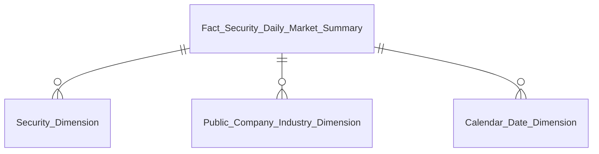
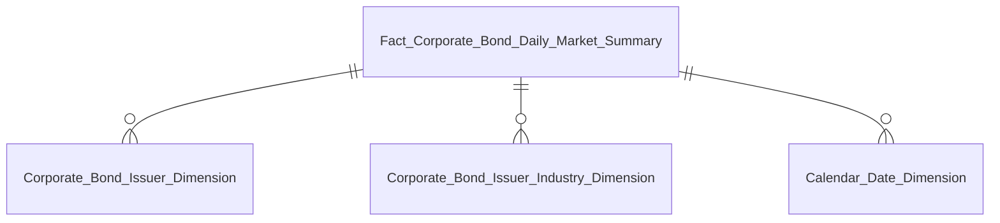
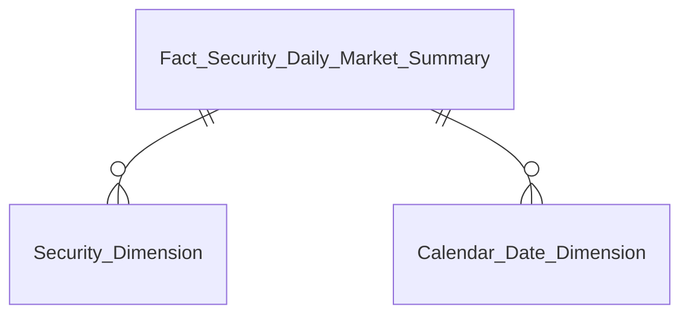

# DTM_GSTT_Entities — v1.2

**Phiên bản:** 1.2
**Ngày cập nhật:** 2026-05-15
**Phạm vi:** Star schema diagram per nhóm báo cáo — GSTT module
**Thay đổi so với v1.1:**
- E-01: Nhóm 28 — xóa attribute block lỗi (`BK` gây Mermaid parse error), giữ entity name rỗng
- E-02: Data Explorer — sửa KPI range từ `K_GSTT_100–115` thành `K_GSTT_107` (READY only)
- E-03: Nhóm 3 — bổ sung `Public Company Industry Dimension` vào erDiagram và bảng tóm tắt
- E-04: Nhóm 27b — bổ sung `K_GSTT_2, K_GSTT_19–21` vào KPI range

---

## Tab Danh mục CK

### Nhóm 1 — Bảng số liệu Cổ phiếu



| Datamart Entity | Description | Grain | KPI |
|---|---|---|---|
| Fact Security Daily Market Summary | Tổng hợp thị trường CK EOD | 1 row / mã CK / ngày | K_GSTT_1–25 |
| Security Dimension | Mã CK, Sàn, Loại CK, Chỉ số | 1 row / mã CK (SCD2) | Slicer Mã CK / Sàn / Loại / Chỉ số |
| Public Company Industry Dimension | Ngành kinh tế cấp 1 (10 ngành IDS) | 1 row / mã CP (SCD2) | Slicer Ngành |
| Calendar Date Dimension | Ngày giao dịch, Năm, Tháng, Quý | 1 row / ngày | Slicer Ngày / Kỳ |

---

### Nhóm 2 — Bảng số liệu Trái phiếu DN niêm yết



| Datamart Entity | Description | Grain | KPI |
|---|---|---|---|
| Fact Corporate Bond Daily Market Summary | Tổng hợp thị trường TPDN EOD | 1 row / mã TP / ngày | K_GSTT_14b–23 |
| Corporate Bond Issuer Dimension | Tổ chức phát hành TPDN | 1 row / mã TP (SCD2) | Slicer Mã TP / Tên nhà phát hành |
| Corporate Bond Issuer Industry Dimension | Ngành TPDN cấp 1 (10 ngành IDS) | 1 row / mã TP (SCD2) | Slicer Ngành TPDN |
| Calendar Date Dimension | Ngày giao dịch | 1 row / ngày | Slicer Ngày / Kỳ |

---

### Nhóm 3 — Biểu đồ kỹ thuật Cổ phiếu


| Datamart Entity | Description | Grain | KPI |
|---|---|---|---|
| Fact Security Daily Market Summary | Reuse — OHLCV + BCTC theo mã CK / ngày | 1 row / mã CK / ngày | K_GSTT_19–25 |
| Security Dimension | Slicer Mã CK | 1 row / mã CK (SCD2) | Slicer Mã CK |
| Public Company Industry Dimension | Slicer Ngành | 1 row / mã CP (SCD2) | Slicer Ngành |
| Calendar Date Dimension | Slicer Ngày | 1 row / ngày | Slicer Ngày / Kỳ |

---

## Tab Top Khối lượng

### Nhóm 6 — Top Khối lượng Toàn thị trường (Bảng số liệu)


| Datamart Entity | Description | Grain | KPI |
|---|---|---|---|
| Fact Security Daily Market Summary | Reuse — ranking theo KL | 1 row / mã CK / ngày | K_GSTT_1–3, K_GSTT_49–52 |
| Security Dimension | Slicer Mã CK / Sàn / Chỉ số | 1 row / mã CK (SCD2) | Slicer |
| Public Company Industry Dimension | Slicer Ngành | 1 row / mã CP (SCD2) | Slicer |
| Calendar Date Dimension | Slicer Từ ngày / Đến ngày | 1 row / ngày | Slicer |

---

### Nhóm 7 — Top Khối lượng Toàn thị trường (Biểu đồ kỹ thuật)



| Datamart Entity | Description | Grain | KPI |
|---|---|---|---|
| Fact Security Daily Market Summary | Reuse — OHLCV cho mã được chọn | 1 row / mã CK / ngày | K_GSTT_19–22, K_GSTT_25 |
| Security Dimension | Slicer Mã CK | 1 row / mã CK (SCD2) | Slicer |
| Calendar Date Dimension | Slicer Ngày | 1 row / ngày | Slicer |

---

### Nhóm 8 — Top Khối lượng theo Sàn / Chỉ số / Ngành (Bảng số liệu)


| Datamart Entity | Description | Grain | KPI |
|---|---|---|---|
| Fact Security Daily Market Summary | Reuse — filter theo Sàn / Chỉ số / Ngành | 1 row / mã CK / ngày | K_GSTT_1–3, K_GSTT_53–59 |
| Security Dimension | Filter Floor_Code / Index_Codes | 1 row / mã CK (SCD2) | Slicer Sàn / Chỉ số |
| Public Company Industry Dimension | Filter Ngành | 1 row / mã CP (SCD2) | Slicer Ngành |
| Calendar Date Dimension | Slicer Ngày | 1 row / ngày | Slicer |

---

### Nhóm 9 — Top Khối lượng theo Sàn / Chỉ số / Ngành (Biểu đồ kỹ thuật)


| Datamart Entity | Description | Grain | KPI |
|---|---|---|---|
| Fact Security Daily Market Summary | Reuse — OHLCV + filter Sàn / Chỉ số | 1 row / mã CK / ngày | K_GSTT_19–22, K_GSTT_25 |
| Security Dimension | Filter Floor_Code / Index_Codes | 1 row / mã CK (SCD2) | Slicer |
| Calendar Date Dimension | Slicer Ngày | 1 row / ngày | Slicer |

---

## Tab Top Đột phá

### Nhóm 10–13 — Top Đột phá (Bảng số liệu + Biểu đồ kỹ thuật × Toàn TT + Sàn/Chỉ số/Ngành)


| Datamart Entity | Description | Grain | KPI |
|---|---|---|---|
| Fact Security Daily Market Summary | Reuse — filter đột phá KLGD/KLGDTB | 1 row / mã CK / ngày | K_GSTT_1, K_GSTT_53–59 |
| Security Dimension | Filter Sàn / Chỉ số | 1 row / mã CK (SCD2) | Slicer |
| Public Company Industry Dimension | Filter Ngành | 1 row / mã CP (SCD2) | Slicer |
| Calendar Date Dimension | Slicer Ngày | 1 row / ngày | Slicer |

> **Ghi chú:** Nhóm 10, 12 — Bảng số liệu. Nhóm 11, 13 — Biểu đồ kỹ thuật. Schema giống nhau, KPI đột phá tính tại query layer từ `Total_Match_Volume` (O_GSTT_16 Confirmed).

---

## Tab Top Giá trị Giao dịch

### Nhóm 14–15 — Top Giá trị (Bảng số liệu + Biểu đồ kỹ thuật)


| Datamart Entity | Description | Grain | KPI |
|---|---|---|---|
| Fact Security Daily Market Summary | Reuse — ranking theo GT | 1 row / mã CK / ngày | K_GSTT_1, K_GSTT_4 |
| Security Dimension | Filter Sàn / Chỉ số | 1 row / mã CK (SCD2) | Slicer |
| Public Company Industry Dimension | Filter Ngành | 1 row / mã CP (SCD2) | Slicer |
| Calendar Date Dimension | Slicer Ngày | 1 row / ngày | Slicer |

---

## Tab Top Tăng Giá / Giảm Giá

### Nhóm 16–19 — Top Tăng Giá + Top Giảm Giá (Bảng số liệu + Biểu đồ kỹ thuật)


| Datamart Entity | Description | Grain | KPI |
|---|---|---|---|
| Fact Security Daily Market Summary | Reuse — filter % thay đổi > 0 / < 0 | 1 row / mã CK / ngày | K_GSTT_2, K_GSTT_3, K_GSTT_53 |
| Security Dimension | Filter Sàn / Chỉ số | 1 row / mã CK (SCD2) | Slicer |
| Public Company Industry Dimension | Filter Ngành | 1 row / mã CP (SCD2) | Slicer |
| Calendar Date Dimension | Slicer Ngày | 1 row / ngày | Slicer |

> **Ghi chú:** % Thay đổi = `(Close_Price − Reference_Price) / Reference_Price × 100` — tính tại query layer (O_GSTT_20 Confirmed).

---

## Tab Top Vượt Đỉnh / Thùng Đáy

### Nhóm 20–23 — Top Vượt Đỉnh + Top Thùng Đáy (Bảng số liệu + Biểu đồ kỹ thuật)


| Datamart Entity | Description | Grain | KPI |
|---|---|---|---|
| Fact Security Daily Market Summary | Reuse — filter Vượt Đỉnh / Thùng Đáy theo preset | 1 row / mã CK / ngày | K_GSTT_1–4, K_GSTT_60–61 |
| Security Dimension | Filter Sàn / Chỉ số | 1 row / mã CK (SCD2) | Slicer |
| Public Company Industry Dimension | Filter Ngành | 1 row / mã CP (SCD2) | Slicer |
| Calendar Date Dimension | Slicer Ngày | 1 row / ngày | Slicer |

> **Ghi chú:** Đỉnh Cũ / Đáy Cũ = `MAX/MIN(High/Low Price) OVER preset` tại query layer. Preset cố định: 3 THÁNG / 6 THÁNG / 1 NĂM (O_GSTT_17 Confirmed).

---

## Tab Top NDTNN

### Nhóm 24 — Top NDTNN (Bảng số liệu)


| Datamart Entity | Description | Grain | KPI |
|---|---|---|---|
| Fact Security Daily Market Summary | Reuse — ranking theo KL/GT NN mua/bán ròng | 1 row / mã CK / ngày | K_GSTT_8–13, K_GSTT_62–63 |
| Security Dimension | Filter Sàn / Chỉ số | 1 row / mã CK (SCD2) | Slicer |
| Public Company Industry Dimension | Filter Ngành | 1 row / mã CP (SCD2) | Slicer |
| Calendar Date Dimension | Slicer Từ ngày / Đến ngày | 1 row / ngày | Slicer |

---

### Nhóm 25 — Top NDTNN (Biểu đồ kỹ thuật)


| Datamart Entity | Description | Grain | KPI |
|---|---|---|---|
| Fact Security Daily Market Summary | Reuse — OHLCV + KL/GT NN | 1 row / mã CK / ngày | K_GSTT_8–13, K_GSTT_19–22 |
| Security Dimension | Slicer Mã CK | 1 row / mã CK (SCD2) | Slicer |
| Calendar Date Dimension | Slicer Ngày | 1 row / ngày | Slicer |

---

## Tab Bản Đồ Nhiệt

### Nhóm 26 — Bản Đồ Nhiệt


| Datamart Entity | Description | Grain | KPI |
|---|---|---|---|
| Fact Security Daily Market Summary | Reuse — kích thước ô + màu sắc heatmap | 1 row / mã CK / ngày | K_GSTT_1, K_GSTT_3, K_GSTT_4, K_GSTT_8–13, K_GSTT_64–65 |
| Security Dimension | Group by Industry Level1 (view Ngành) | 1 row / mã CK (SCD2) | Slicer |
| Public Company Industry Dimension | Aggregate theo ngành | 1 row / mã CP (SCD2) | Group by |
| Calendar Date Dimension | Slicer Ngày | 1 row / ngày | Slicer |

---

## Tab Xu Hướng Dòng Tiền

### Nhóm 27b — Sub-tab Nước Ngoài / Biểu đồ GTNN (STT 41)


| Datamart Entity | Description | Grain | KPI |
|---|---|---|---|
| Fact Security Daily Market Summary | Reuse — GT NN mua/bán/ròng tích lũy EOD + OHLC | 1 row / mã CK / ngày | K_GSTT_2, K_GSTT_11–13, K_GSTT_19–21 |
| Security Dimension | Filter Sàn | 1 row / mã CK (SCD2) | Slicer |
| Calendar Date Dimension | Slicer Ngày / Kỳ | 1 row / ngày | Slicer |

---

### Nhóm 27b_heatmap — Sub-tab Nước Ngoài / Bản đồ nhiệt KLNN (STT 42)


| Datamart Entity | Description | Grain | KPI |
|---|---|---|---|
| Fact Security Daily Market Summary | Reuse — KL NN mua/bán/ròng heatmap | 1 row / mã CK / ngày | K_GSTT_8–10, K_GSTT_3 |
| Security Dimension | Slicer Mã CK / Sàn | 1 row / mã CK (SCD2) | Slicer |
| Public Company Industry Dimension | Filter Ngành | 1 row / mã CP (SCD2) | Slicer |
| Calendar Date Dimension | Slicer Ngày | 1 row / ngày | Slicer |

---

### Nhóm 27c — Sub-tab Tự Doanh (STT 43)


| Datamart Entity | Description | Grain | KPI |
|---|---|---|---|
| Fact Security Daily Market Summary | Reuse — GT Tự doanh mua/bán/ròng | 1 row / mã CK / ngày | K_GSTT_2, K_GSTT_3, K_GSTT_71–73 |
| Security Dimension | Filter Sàn | 1 row / mã CK (SCD2) | Slicer |
| Calendar Date Dimension | Slicer Ngày | 1 row / ngày | Slicer |

---

### Nhóm 27d — Sub-tab Phân Loại Nhà Đầu Tư / Biểu đồ GT ròng (STT 44)


| Datamart Entity | Description | Grain | KPI |
|---|---|---|---|
| Fact Security Daily Market Summary | Reuse — GT ròng 4 nhóm NĐT | 1 row / mã CK / ngày | K_GSTT_11–13, K_GSTT_71–73, K_GSTT_77–84 |
| Security Dimension | Slicer Sàn | 1 row / mã CK (SCD2) | Slicer |
| Calendar Date Dimension | Slicer Ngày / Kỳ | 1 row / ngày | Slicer |

---

### Nhóm 27d_heatmap — Sub-tab Phân Loại Nhà Đầu Tư / Bản đồ nhiệt GT ròng (STT 45)


| Datamart Entity | Description | Grain | KPI |
|---|---|---|---|
| Fact Security Daily Market Summary | Reuse — GT ròng theo nhóm NĐT heatmap | 1 row / mã CK / ngày | K_GSTT_3, K_GSTT_4, K_GSTT_15, K_GSTT_77–84, K_GSTT_89 |
| Security Dimension | Slicer Mã CK | 1 row / mã CK (SCD2) | Slicer |
| Public Company Industry Dimension | Filter Ngành | 1 row / mã CP (SCD2) | Slicer |
| Calendar Date Dimension | Slicer Ngày | 1 row / ngày | Slicer |

---

## Tab Data Explorer — Giao dịch & Thanh khoản (STT 49)

### Data Explorer


| Datamart Entity | Description | Grain | KPI |
|---|---|---|---|
| Fact Security Daily Market Summary | Reuse — metrics giao dịch & thanh khoản | 1 row / mã CK / ngày | K_GSTT_107 |
| Security Dimension | Slicer Mã CK / Sàn / Chỉ số | 1 row / mã CK (SCD2) | Slicer |
| Public Company Industry Dimension | Slicer Ngành | 1 row / mã CP (SCD2) | Slicer |
| Calendar Date Dimension | Slicer Từ ngày / Đến ngày | 1 row / ngày | Slicer |

> **Ghi chú:** K_GSTT_108–115 PENDING (O_GSTT_12, O_GSTT_13, O_GSTT_26) — không thiết kế trong Phase 2.

---

## Tab Biểu đồ Phân tích Kỹ thuật (STT 38 / 46)

### Biểu đồ kỹ thuật

```mermaid
erDiagram
    Fact_Security_Daily_Market_Summary ||--o{ Security_Dimension : ""
    Fact_Security_Daily_Market_Summary ||--o{ Calendar_Date_Dimension : ""
```

| Datamart Entity | Description | Grain | KPI |
|---|---|---|---|
| Fact Security Daily Market Summary | Reuse — OHLCV candlestick + tài chính | 1 row / mã CK / ngày | K_GSTT_116–120 |
| Security Dimension | Slicer Mã CK | 1 row / mã CK (SCD2) | Slicer |
| Calendar Date Dimension | Slicer Ngày | 1 row / ngày | Slicer |

---

## Tab Sở hữu và giao dịch nội bộ (STT 47)

### Nhóm 28 — Thông tin sở hữu và người nội bộ

```mermaid
erDiagram
    Stock_Holder_Ownership_Profile
```

| Datamart Entity | Description | Grain | KPI |
|---|---|---|---|
| Stock Holder Ownership Profile | Thông tin cổ đông và người nội bộ | 1 row / cổ đông / công ty đại chúng | K_GSTT_123–128 |

> **Ghi chú:** Bảng Tác nghiệp standalone — không join qua Dimension. Filter theo `pblc_co_code` tại query layer.

---

## Bảng PENDING (không thiết kế trong Phase 2)

| Datamart Entity | Lý do PENDING | Issue |
|---|---|---|
| Fact Index Constituent Contribution Snapshot | IDXInfor schema chưa ổn định | O_GSTT_12 |
| Fact Market Index Daily Snapshot | IDXInfor schema chưa ổn định | O_GSTT_12 |
| Fact Market Valuation Snapshot | IDXInfor + VSDC TT138 chưa có Atomic | O_GSTT_12, O_GSTT_13 |
| Fact Security Valuation Snapshot | VSDC TT138 + IDS BCTC blocker | O_GSTT_13, O_GSTT_26 |
| Market Index Dimension | IDXInfor schema chưa ổn định | O_GSTT_12 |
| Nhóm 27a — Sub-tab Tỷ Trọng | IDXInfor + FREE FLOAT chưa có Atomic | O_GSTT_12, O_GSTT_25 |
| Tab Báo cáo BM021 (STT 48) | VSDC TT138 + IDS BCTC chưa đủ Atomic | O_GSTT_13, O_GSTT_26 |