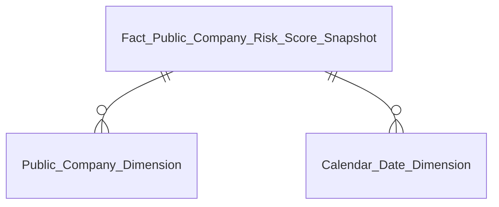
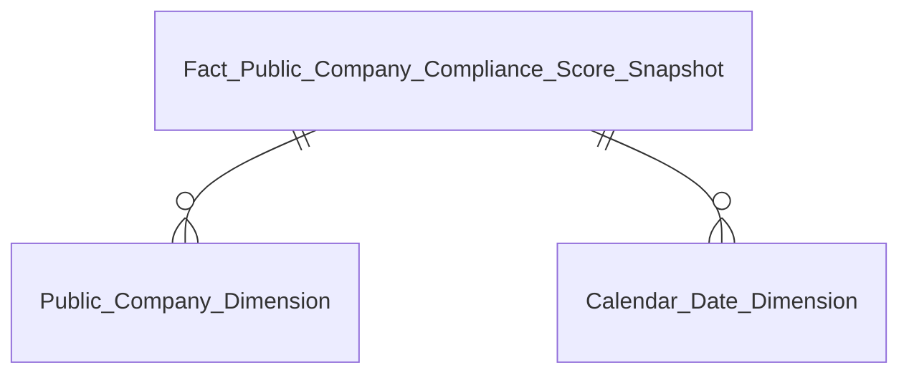
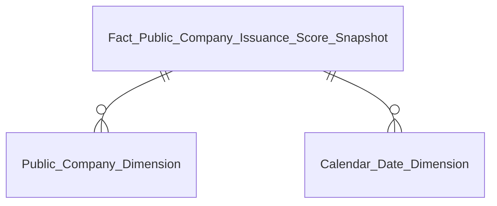
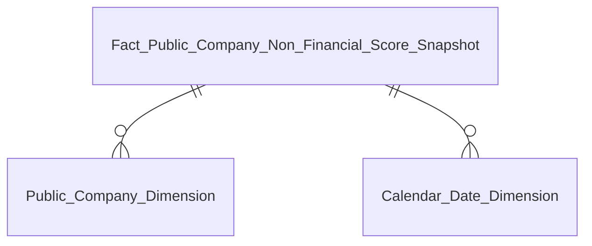
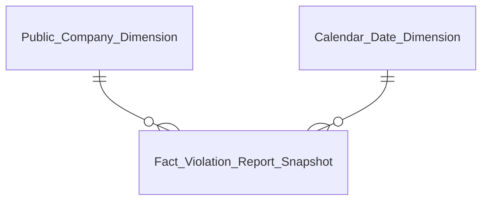
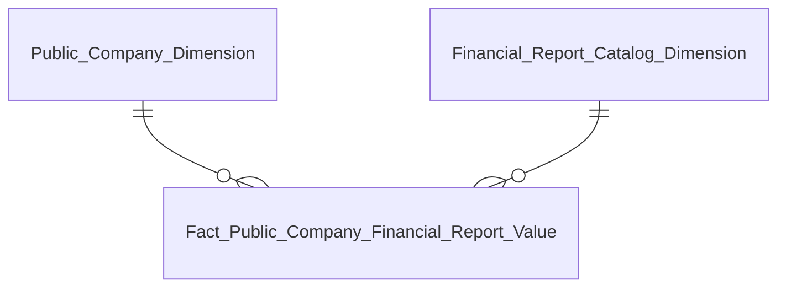
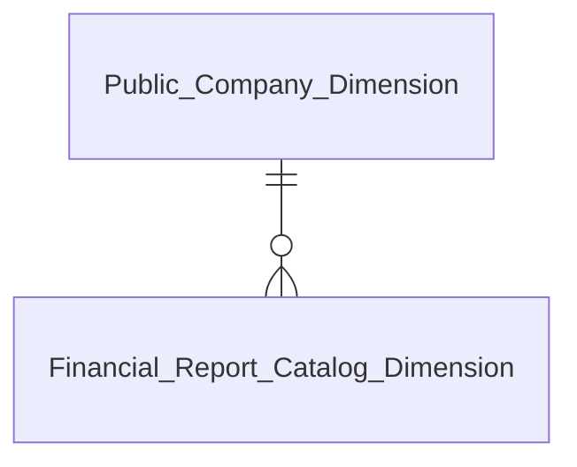
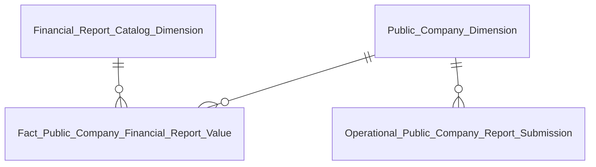

# DTM_GSDC_Entities — v2.0

**Phiên bản:** 2.0
**Ngày cập nhật:** 2026-08-06
**Phạm vi:** Star schema diagram per nhóm báo cáo — GSDC module (Phase 2, dựa trên Section 3/4 của `DTM_GSDC_HLD.md`)

> **Thay đổi so với v1.0 (2026-07-15):** `Fact Public Company Financial Summary Snapshot` đã bị xoá khỏi HLD (rà soát LLD 2026-07-23 — không còn cột nào READY). `Fact Public Company Financial Report Value` + `Financial Report Catalog Dimension` chuyển từ PENDING → READY (2026-08-06, Atomic bổ sung đủ 5 entity). Bổ sung 2 entity mới: `Operational Public Company Report Submission`, `Fact Violation Report Snapshot` (sửa lại từ Operational → Fact 2026-08-07, xem HLD Nhóm 6).

---

## Màn hình 1 — Phân loại & Xếp hạng Rủi ro CTDC

### Nhóm 1 — Tổng hợp chấm điểm phân loại CTDC

```mermaid
erDiagram
    Fact_Public_Company_Risk_Score_Snapshot ||--o{ Public_Company_Dimension : ""
    Fact_Public_Company_Risk_Score_Snapshot ||--o{ Calendar_Date_Dimension : ""
```

| Datamart Entity | Loại | Reuse | Mô tả | Grain | KPI |
|---|---|---|---|---|---|
| Fact Public Company Risk Score Snapshot | Fact Snapshot | new | Điểm Tuân thủ/Phát hành/Tài chính/Phi TC/Xếp hạng TN/Tổng điểm | 1 row / CTDC / kỳ đánh giá (SCD4A current state) | K_GSDC_1–8 |
| Public Company Dimension | Dimension | reuse | Mã CK, Tên DN | 1 row / công ty đại chúng (SCD2) | Slicer Mã CK / Tên DN |
| Calendar Date Dimension | Dimension | reuse | Kỳ đánh giá | 1 row / ngày (Conformed) | Slicer Kỳ |

---

### Nhóm 2 — Top CTDC theo chỉ tiêu tuân thủ

```mermaid
erDiagram
    Fact_Public_Company_Compliance_Score_Snapshot ||--o{ Public_Company_Dimension : ""
    Fact_Public_Company_Compliance_Score_Snapshot ||--o{ Calendar_Date_Dimension : ""
```

| Datamart Entity | Loại | Reuse | Mô tả | Grain | KPI |
|---|---|---|---|---|---|
| Fact Public Company Compliance Score Snapshot | Fact Snapshot | new | 15 tiêu chí Tuân thủ + Tổng điểm | 1 row / CTDC / kỳ đánh giá | K_GSDC_7–8 (reuse), K_GSDC_9–23 |
| Public Company Dimension | Dimension | reuse | Mã CK, Tên DN | 1 row / công ty đại chúng (SCD2) | Slicer |
| Calendar Date Dimension | Dimension | reuse | Kỳ đánh giá | 1 row / ngày (Conformed) | Slicer |

---

### Nhóm 3 — Top CTDC theo chỉ tiêu phát hành

```mermaid
erDiagram
    Fact_Public_Company_Issuance_Score_Snapshot ||--o{ Public_Company_Dimension : ""
    Fact_Public_Company_Issuance_Score_Snapshot ||--o{ Calendar_Date_Dimension : ""
```

| Datamart Entity | Loại | Reuse | Mô tả | Grain | KPI |
|---|---|---|---|---|---|
| Fact Public Company Issuance Score Snapshot | Fact Snapshot | new | 7 tiêu chí Phát hành + Tổng điểm | 1 row / CTDC / kỳ đánh giá | K_GSDC_7–8 (reuse), K_GSDC_24–31 |
| Public Company Dimension | Dimension | reuse | Mã CK, Tên DN | 1 row / công ty đại chúng (SCD2) | Slicer |
| Calendar Date Dimension | Dimension | reuse | Kỳ đánh giá | 1 row / ngày (Conformed) | Slicer |

---

### Nhóm 4 — Top CTDC theo chỉ tiêu tài chính

```mermaid
erDiagram
    Fact_Public_Company_Financial_Score_Snapshot ||--o{ Public_Company_Dimension : ""
    Fact_Public_Company_Financial_Score_Snapshot ||--o{ Calendar_Date_Dimension : ""
```

| Datamart Entity | Loại | Reuse | Mô tả | Grain | KPI |
|---|---|---|---|---|---|
| Fact Public Company Financial Score Snapshot | Fact Snapshot | new | 10 tiêu chí Tài chính + Tổng điểm | 1 row / CTDC / kỳ đánh giá | K_GSDC_7–8 (reuse), K_GSDC_32–42 |
| Public Company Dimension | Dimension | reuse | Mã CK, Tên DN | 1 row / công ty đại chúng (SCD2) | Slicer |
| Calendar Date Dimension | Dimension | reuse | Kỳ đánh giá | 1 row / ngày (Conformed) | Slicer |

---

### Nhóm 5 — Top CTDC theo chỉ tiêu phi tài chính & M-Score

```mermaid
erDiagram
    Fact_Public_Company_Non_Financial_Score_Snapshot ||--o{ Public_Company_Dimension : ""
    Fact_Public_Company_Non_Financial_Score_Snapshot ||--o{ Calendar_Date_Dimension : ""
```

| Datamart Entity | Loại | Reuse | Mô tả | Grain | KPI |
|---|---|---|---|---|---|
| Fact Public Company Non-Financial Score Snapshot | Fact Snapshot | new | 2 tiêu chí Phi TC & M-Score + Tổng điểm | 1 row / CTDC / kỳ đánh giá | K_GSDC_7–8 (reuse), K_GSDC_43–45 |
| Public Company Dimension | Dimension | reuse | Mã CK, Tên DN | 1 row / công ty đại chúng (SCD2) | Slicer |
| Calendar Date Dimension | Dimension | reuse | Kỳ đánh giá | 1 row / ngày (Conformed) | Slicer |

---

## Màn hình 2 — Giám sát Tổng hợp

### Nhóm 6 / 10 / 12 / 14 / 16 — Thống kê niêm yết theo sàn (toàn TT / HNX / HOSE / UPCOM / OTC)

```mermaid
erDiagram
    Public_Company_Dimension ||--o{ Fact_Violation_Report_Snapshot : ""
    Calendar_Date_Dimension ||--o{ Fact_Violation_Report_Snapshot : ""
```

| Datamart Entity | Loại | Reuse | Mô tả | Grain | KPI |
|---|---|---|---|---|---|
| Public Company Dimension | Dimension | reuse | Mã CK, Tên DN, Sàn — K_GSDC_47 (Số DN) tính trực tiếp trên Dimension, không qua Fact; đồng thời driving table full-scan của Fact Violation Report Snapshot | 1 row / công ty đại chúng (SCD2) | K_GSDC_46, K_GSDC_47, K_GSDC_78 |
| Calendar Date Dimension | Dimension | reuse | Kỳ thống kê (K_GSDC_46/47) — đồng thời FK ngày ETL snapshot của Fact Violation Report Snapshot | 1 row / ngày (Conformed) | — |
| Fact Violation Report Snapshot | Fact Event | new | Tỷ lệ nộp BCTC (Report_Due_Count/Report_Submitted_Count) + Số DN báo lãi (Profitable_Indicator, denormalize từ fr_value) — 1 Fact duy nhất cho cả 2 KPI, SUM đúng ở mọi cấp (toàn TT/sàn) | 1 row / CTĐC / kỳ (Report Year + Report Quarter) / ngày ETL snapshot | K_GSDC_48, K_GSDC_49 |

> **Ghi chú:** K_GSDC_46/47 query trực tiếp `Public Company Dimension` (không Fact trung gian, rà soát LLD 2026-07-23). K_GSDC_48/49 chuyển READY 2026-08-06, gộp chung 1 Fact 2026-08-07 (không dùng `Fact Public Company Financial Report Value`/`Financial Report Catalog Dimension` — 2 bảng đó chỉ phục vụ Nhóm 7 trở đi). Nhóm 10/12/14/16 giống Nhóm 6, chỉ khác filter `Equity_Listing_Exchange_Code`.

---

### Nhóm 8 — Tổng hợp chỉ tiêu tài chính & thống kê ngành (toàn thị trường)

```mermaid
erDiagram
    Public_Company_Dimension ||--o{ Fact_Public_Company_Financial_Report_Value : ""
    Financial_Report_Catalog_Dimension ||--o{ Fact_Public_Company_Financial_Report_Value : ""
```

| Datamart Entity | Loại | Reuse | Mô tả | Grain | KPI |
|---|---|---|---|---|---|
| Fact Public Company Financial Report Value | Fact Event | reuse (từ Nhóm 7) | 13 chỉ tiêu tài chính theo ngành | 1 row / CTĐC / kỳ / Row Code / Column Code | K_GSDC_64–76 |
| Public Company Dimension | Dimension | reuse | Ngành kinh tế cấp 1 (filter Active qua `cl_business_line`) | 1 row / công ty đại chúng (SCD2) | K_GSDC_63 (Group by Ngành) |
| Financial Report Catalog Dimension | Dimension | reuse | Template BCTC | 1 row / báo cáo × dòng × cột (SCD4A) | — |

---

## Màn hình 2 — Tổng hợp chỉ tiêu tài chính theo sàn

### Nhóm 7 / 11 / 13 / 15 / 17 / 37 — Tổng hợp chỉ tiêu tài chính (toàn TT / HNX / HOSE / UPCOM / OTC / hệ số cơ bản)

```mermaid
erDiagram
    Public_Company_Dimension ||--o{ Fact_Public_Company_Financial_Report_Value : ""
    Financial_Report_Catalog_Dimension ||--o{ Fact_Public_Company_Financial_Report_Value : ""
```

| Datamart Entity | Loại | Reuse | Mô tả | Grain | KPI |
|---|---|---|---|---|---|
| Fact Public Company Financial Report Value | Fact Event | new (Nhóm 7 — gốc thiết kế) | Giá trị BCTC EAV — Tổng tài sản/Nợ/VCSH/LNST/ROA/ROE/... + YoY | 1 row / CTĐC / kỳ (Report Year + Report Quarter, nullable) / Row Code / Column Code | K_GSDC_50–62+YOY (Nhóm 7); reuse ID (Nhóm 11/13/15/17/37) |
| Public Company Dimension | Dimension | reuse | Sàn, Ngành (breakdown Nhóm 11/13/15/17) | 1 row / công ty đại chúng (SCD4A) | K_GSDC_79 (Ngành, Nhóm 11/13/15/17) |
| Financial Report Catalog Dimension | Dimension | new (Nhóm 7 — gốc thiết kế) | Template BCTC — báo cáo/dòng/cột, denormalize row/column description reference | 1 row / báo cáo × dòng × cột (SCD4A) | — |

> **Ghi chú:** `Fact Public Company Financial Report Value` và `Financial Report Catalog Dimension` thiết kế gốc tại Nhóm 7 (2026-08-06) — Nhóm 8/11/13/15/17/37/18/19-30/38/39/40/41 đều reuse cùng 2 bảng này, chỉ khác filter/group-by ở tầng Detail Mapping.

---

### Nhóm 18 — Metadata BCTC

```mermaid
erDiagram
    Public_Company_Dimension ||--o{ Financial_Report_Catalog_Dimension : ""
```

| Datamart Entity | Loại | Reuse | Mô tả | Grain | KPI |
|---|---|---|---|---|---|
| Financial Report Catalog Dimension | Dimension | reuse | Mã/Tên báo cáo, dòng, cột | 1 row / báo cáo × dòng × cột (SCD4A) | K_GSDC_93–98 |
| Public Company Dimension | Dimension | reuse | Reuse Chiều (Kỳ/Sàn/Ngành/Mã CTĐC-Tên) từ Nhóm 6/8/1 | 1 row / công ty đại chúng (SCD4A) | K_GSDC_46, 78, 63, 7-8 (reuse) |

---

## Màn hình 3 — Data Explorer: Dữ liệu tài chính doanh nghiệp

### Nhóm 19–30 — DN thông thường / bảo hiểm / TCTD × BCĐKT/BCKQKD/LCTT trực tiếp/gián tiếp (591 KPI)

```mermaid
erDiagram
    Public_Company_Dimension ||--o{ Fact_Public_Company_Financial_Report_Value : ""
    Financial_Report_Catalog_Dimension ||--o{ Fact_Public_Company_Financial_Report_Value : ""
```

| Datamart Entity | Loại | Reuse | Mô tả | Grain | KPI |
|---|---|---|---|---|---|
| Fact Public Company Financial Report Value | Fact Event | reuse (từ Nhóm 7) | Tra cứu chi tiết từng chỉ tiêu BCTC theo loại DN/loại báo cáo | 1 row / CTĐC / kỳ / Row Code / Column Code | K_GSDC_99–689 |
| Financial Report Catalog Dimension | Dimension | reuse | Filter `Enterprise_Type_Code` + `Financial_Report_Catalog_Code LIKE` theo loại báo cáo | 1 row / báo cáo × dòng × cột (SCD4A) | — |

> **Ghi chú:** 12 Nhóm (19-30) dùng chung 2 bảng này — chỉ khác filter `enterprise_tp_code` ('dn'/'bh'/'td') và `fr_catalog_code LIKE` ('BCDKT%'/'BCKQKD%'/'BCLCTT_TT%'/'BCLCTT_GT%') ở tầng Detail Mapping. Không lặp lại 12 erDiagram riêng.

---

## Màn hình 1 (reuse) — Nhóm 32–36 — Data Explorer chấm điểm phân loại CTDC

### Nhóm 32 — Dữ liệu tổng hợp chấm điểm phân loại CTDC

```mermaid
erDiagram
    Fact_Public_Company_Risk_Score_Snapshot ||--o{ Public_Company_Dimension : ""
    Fact_Public_Company_Risk_Score_Snapshot ||--o{ Calendar_Date_Dimension : ""
```

| Datamart Entity | Loại | Reuse | Mô tả | Grain | KPI |
|---|---|---|---|---|---|
| Fact Public Company Risk Score Snapshot | Fact Snapshot | reuse | Reuse toàn bộ từ Nhóm 1, không tính lại | 1 row / CTDC / kỳ đánh giá (SCD4A current state) | K_GSDC_1–8 (reuse từ Nhóm 1) |
| Public Company Dimension | Dimension | reuse | Mã CK, Tên DN | 1 row / công ty đại chúng (SCD2) | Slicer |
| Calendar Date Dimension | Dimension | reuse | Kỳ đánh giá | 1 row / ngày (Conformed) | Slicer |

---

### Nhóm 33 — Phân loại CTDC theo chỉ tiêu tuân thủ

```mermaid
erDiagram
    Fact_Public_Company_Compliance_Score_Snapshot ||--o{ Public_Company_Dimension : ""
    Fact_Public_Company_Compliance_Score_Snapshot ||--o{ Calendar_Date_Dimension : ""
```

| Datamart Entity | Loại | Reuse | Mô tả | Grain | KPI |
|---|---|---|---|---|---|
| Fact Public Company Compliance Score Snapshot | Fact Snapshot | reuse | Reuse toàn bộ từ Nhóm 2, không tính lại | 1 row / CTDC / kỳ đánh giá | K_GSDC_7–8, K_GSDC_9–23 (reuse từ Nhóm 2) |
| Public Company Dimension | Dimension | reuse | Mã CK, Tên DN | 1 row / công ty đại chúng (SCD2) | Slicer |
| Calendar Date Dimension | Dimension | reuse | Kỳ đánh giá | 1 row / ngày (Conformed) | Slicer |

---

### Nhóm 34 — Phân loại CTDC theo chỉ tiêu tài chính

```mermaid
erDiagram
    Fact_Public_Company_Financial_Score_Snapshot ||--o{ Public_Company_Dimension : ""
    Fact_Public_Company_Financial_Score_Snapshot ||--o{ Calendar_Date_Dimension : ""
```

| Datamart Entity | Loại | Reuse | Mô tả | Grain | KPI |
|---|---|---|---|---|---|
| Fact Public Company Financial Score Snapshot | Fact Snapshot | reuse | Reuse toàn bộ từ Nhóm 4 (trừ K_GSDC_38 đã loại), không tính lại | 1 row / CTDC / kỳ đánh giá | K_GSDC_7–8, K_GSDC_32–42 (reuse từ Nhóm 4) |
| Public Company Dimension | Dimension | reuse | Mã CK, Tên DN | 1 row / công ty đại chúng (SCD2) | Slicer |
| Calendar Date Dimension | Dimension | reuse | Kỳ đánh giá | 1 row / ngày (Conformed) | Slicer |

---

### Nhóm 35 — Phân loại CTDC theo chỉ tiêu phát hành

```mermaid
erDiagram
    Fact_Public_Company_Issuance_Score_Snapshot ||--o{ Public_Company_Dimension : ""
    Fact_Public_Company_Issuance_Score_Snapshot ||--o{ Calendar_Date_Dimension : ""
```

| Datamart Entity | Loại | Reuse | Mô tả | Grain | KPI |
|---|---|---|---|---|---|
| Fact Public Company Issuance Score Snapshot | Fact Snapshot | reuse | Reuse toàn bộ từ Nhóm 3, không tính lại | 1 row / CTDC / kỳ đánh giá | K_GSDC_7–8, K_GSDC_24–31 (reuse từ Nhóm 3) |
| Public Company Dimension | Dimension | reuse | Mã CK, Tên DN | 1 row / công ty đại chúng (SCD2) | Slicer |
| Calendar Date Dimension | Dimension | reuse | Kỳ đánh giá | 1 row / ngày (Conformed) | Slicer |

---

### Nhóm 36 — Phân loại CTDC theo chỉ tiêu phi tài chính

```mermaid
erDiagram
    Fact_Public_Company_Non_Financial_Score_Snapshot ||--o{ Public_Company_Dimension : ""
    Fact_Public_Company_Non_Financial_Score_Snapshot ||--o{ Calendar_Date_Dimension : ""
```

| Datamart Entity | Loại | Reuse | Mô tả | Grain | KPI |
|---|---|---|---|---|---|
| Fact Public Company Non-Financial Score Snapshot | Fact Snapshot | reuse | Reuse toàn bộ từ Nhóm 5, không tính lại | 1 row / CTDC / kỳ đánh giá | K_GSDC_7–8, K_GSDC_43–45 (reuse từ Nhóm 5) |
| Public Company Dimension | Dimension | reuse | Mã CK, Tên DN | 1 row / công ty đại chúng (SCD2) | Slicer |
| Calendar Date Dimension | Dimension | reuse | Kỳ đánh giá | 1 row / ngày (Conformed) | Slicer |

---

## Màn hình 4 — Báo cáo giám sát CTDC

### Nhóm 38 — BC01.1: Báo cáo vĩ mô theo sàn

```mermaid
erDiagram
    Public_Company_Dimension ||--o{ Fact_Public_Company_Financial_Report_Value : ""
    Financial_Report_Catalog_Dimension ||--o{ Fact_Public_Company_Financial_Report_Value : ""
    Public_Company_Dimension ||--o{ Operational_Public_Company_Report_Submission : ""
```

| Datamart Entity | Loại | Reuse | Mô tả | Grain | KPI |
|---|---|---|---|---|---|
| Fact Public Company Financial Report Value | Fact Event | reuse (từ Nhóm 7) | LNKT trước thuế theo sàn | 1 row / CTĐC / kỳ / Row Code / Column Code | K_GSDC_705, K_GSDC_707 |
| Operational Public Company Report Submission | Operational | new | Lần nộp báo cáo — số BCTC đến hạn/đã nộp | 1 row / lần nộp (Public Company Report Submission Code) | K_GSDC_702, K_GSDC_703 |
| Public Company Dimension | Dimension | reuse | Số DN theo sàn — tính trực tiếp, không qua Fact | 1 row / công ty đại chúng (SCD4A) | K_GSDC_700, K_GSDC_701 |

---

### Nhóm 39 — BC01.2: Báo cáo vĩ mô theo ngành

```mermaid
erDiagram
    Public_Company_Dimension ||--o{ Fact_Public_Company_Financial_Report_Value : ""
    Financial_Report_Catalog_Dimension ||--o{ Fact_Public_Company_Financial_Report_Value : ""
```

| Datamart Entity | Loại | Reuse | Mô tả | Grain | KPI |
|---|---|---|---|---|---|
| Fact Public Company Financial Report Value | Fact Event | reuse (từ Nhóm 7) | 8 chỉ tiêu đo lường theo ngành, filter kỳ năm (`Report_Quarter IS NULL`) | 1 row / CTĐC / kỳ / Row Code / Column Code | K_GSDC_710–717 |
| Public Company Dimension | Dimension | reuse | Ngành kinh tế (filter Active qua `cl_business_line`) | 1 row / công ty đại chúng (SCD4A) | K_GSDC_709 (Group by Ngành) |

---

### Nhóm 40 — BC01.3: Báo cáo vĩ mô đa kỳ (N / N-1 / N-2)

```mermaid
erDiagram
    Public_Company_Dimension ||--o{ Fact_Public_Company_Financial_Report_Value : ""
    Financial_Report_Catalog_Dimension ||--o{ Fact_Public_Company_Financial_Report_Value : ""
```

| Datamart Entity | Loại | Reuse | Mô tả | Grain | KPI |
|---|---|---|---|---|---|
| Fact Public Company Financial Report Value | Fact Event | reuse (từ Nhóm 7) | 21 chỉ tiêu đo lường đa kỳ, filter kỳ năm không group-by | 1 row / CTĐC / kỳ / Row Code / Column Code | K_GSDC_719–739 |
| Public Company Dimension | Dimension | reuse | Kỳ báo cáo N/N-1/N-2 — tham số UI thuần cho K_GSDC_718 | 1 row / công ty đại chúng (SCD4A) | K_GSDC_718 |

---

### Nhóm 41 — BC22: Tổng hợp tình hình tài chính CTDC theo sàn

```mermaid
erDiagram
    Public_Company_Dimension ||--o{ Fact_Public_Company_Financial_Report_Value : ""
    Financial_Report_Catalog_Dimension ||--o{ Fact_Public_Company_Financial_Report_Value : ""
```

| Datamart Entity | Loại | Reuse | Mô tả | Grain | KPI |
|---|---|---|---|---|---|
| Fact Public Company Financial Report Value | Fact Event | reuse (từ Nhóm 7) | 22 chỉ tiêu đo lường + YoY theo sàn, filter kỳ quý | 1 row / CTĐC / kỳ / Row Code / Column Code | K_GSDC_741–751+YOY |
| Public Company Dimension | Dimension | reuse | Theo sàn — tính trực tiếp cho K_GSDC_740 | 1 row / công ty đại chúng (SCD4A) | K_GSDC_740 (Group by Sàn) |

---

## Bảng PENDING (không thiết kế trong Phase 2)

| Datamart Entity | Lý do PENDING | Issue |
|---|---|---|
| Fact Public Company Listing Info Snapshot | 100% PENDING — nguồn MSS chưa có Atomic thiết kế (Nhóm 31, K_GSDC_690–699, DB33) | Section 5 — Nhóm 31, chưa có Open Issue ID riêng |

> **Đã gỡ khỏi bảng PENDING (2026-08-06):** `Fact Public Company Financial Report Value` và `Financial Report Catalog Dimension` — Atomic bổ sung đủ 5 entity (`fr_value`/`financial_report_catalog`/`fr_row_template`/`fr_column_template`/`pc_report_submission`), chuyển READY, đưa vào Entities.csv. `Fact Public Company Financial Summary Snapshot` (v1.0) đã bị xoá hoàn toàn khỏi HLD từ 2026-07-23, không còn xuất hiện trong bất kỳ Nhóm nào.
