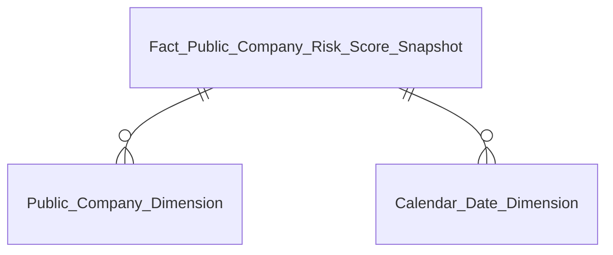
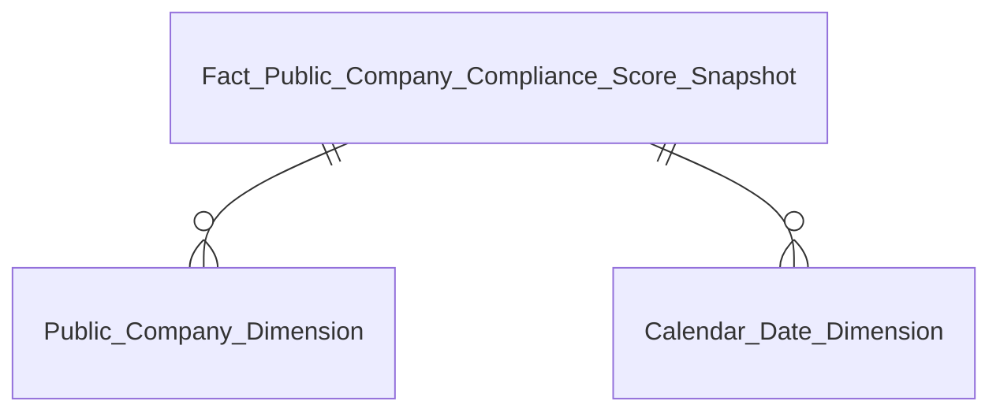
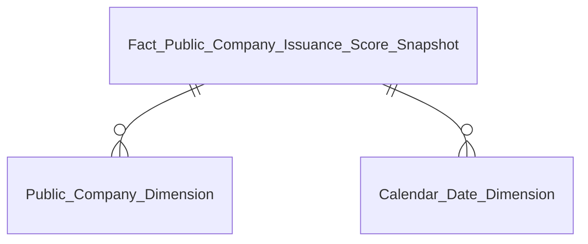
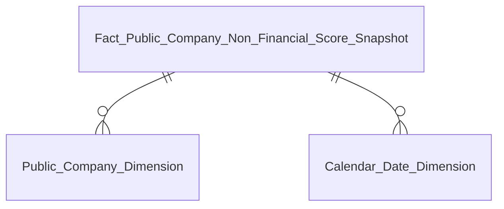
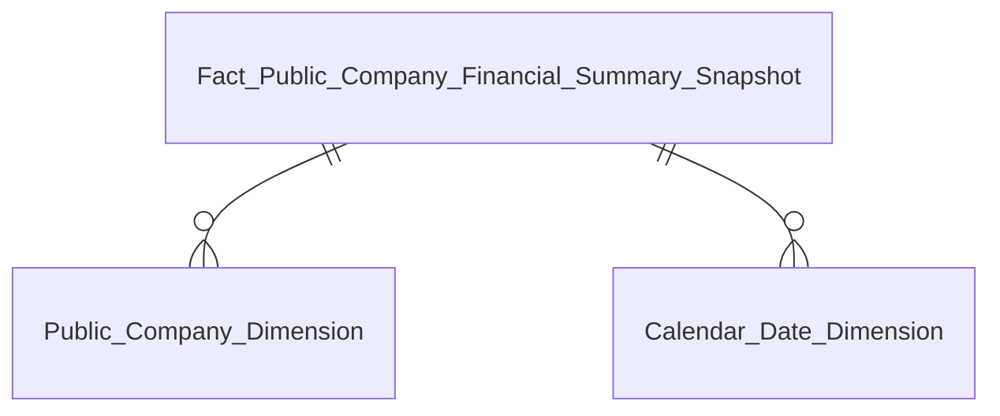

# DTM_GSDC_Entities — v1.0

**Phiên bản:** 1.0
**Ngày cập nhật:** 2026-07-15
**Phạm vi:** Star schema diagram per nhóm báo cáo — GSDC module (Phase 2, dựa trên Section 3/4 của `DTM_GSDC_HLD.md`)

---

## Màn hình 1 — Phân loại & Xếp hạng Rủi ro CTDC

### Nhóm 1 — Tổng hợp chấm điểm phân loại CTDC

```mermaid
erDiagram
    Fact_Public_Company_Risk_Score_Snapshot ||--o{ Public_Company_Dimension : ""
    Fact_Public_Company_Risk_Score_Snapshot ||--o{ Calendar_Date_Dimension : ""
```

| Datamart Entity | Loại | Reuse | Mô tả | Grain | KPI |
|---|---|---|---|---|---|
| Fact Public Company Risk Score Snapshot | Fact Snapshot | new | Điểm Tuân thủ/Phát hành/Tài chính/Phi TC/Xếp hạng TN/Tổng điểm | 1 row / CTDC / kỳ đánh giá (SCD4A current state) | K_GSDC_1–8 |
| Public Company Dimension | Dimension | reuse | Mã CK, Tên DN | 1 row / công ty đại chúng (SCD2) | Slicer Mã CK / Tên DN |
| Calendar Date Dimension | Dimension | reuse | Kỳ đánh giá | 1 row / ngày (Conformed) | Slicer Kỳ |

---

### Nhóm 2 — Top CTDC theo chỉ tiêu tuân thủ

```mermaid
erDiagram
    Fact_Public_Company_Compliance_Score_Snapshot ||--o{ Public_Company_Dimension : ""
    Fact_Public_Company_Compliance_Score_Snapshot ||--o{ Calendar_Date_Dimension : ""
```

| Datamart Entity | Loại | Reuse | Mô tả | Grain | KPI |
|---|---|---|---|---|---|
| Fact Public Company Compliance Score Snapshot | Fact Snapshot | new | 15 tiêu chí Tuân thủ + Tổng điểm | 1 row / CTDC / kỳ đánh giá | K_GSDC_7–8 (reuse), K_GSDC_9–23 |
| Public Company Dimension | Dimension | reuse | Mã CK, Tên DN | 1 row / công ty đại chúng (SCD2) | Slicer |
| Calendar Date Dimension | Dimension | reuse | Kỳ đánh giá | 1 row / ngày (Conformed) | Slicer |

---

### Nhóm 3 — Top CTDC theo chỉ tiêu phát hành

```mermaid
erDiagram
    Fact_Public_Company_Issuance_Score_Snapshot ||--o{ Public_Company_Dimension : ""
    Fact_Public_Company_Issuance_Score_Snapshot ||--o{ Calendar_Date_Dimension : ""
```

| Datamart Entity | Loại | Reuse | Mô tả | Grain | KPI |
|---|---|---|---|---|---|
| Fact Public Company Issuance Score Snapshot | Fact Snapshot | new | 7 tiêu chí Phát hành + Tổng điểm | 1 row / CTDC / kỳ đánh giá | K_GSDC_7–8 (reuse), K_GSDC_24–31 |
| Public Company Dimension | Dimension | reuse | Mã CK, Tên DN | 1 row / công ty đại chúng (SCD2) | Slicer |
| Calendar Date Dimension | Dimension | reuse | Kỳ đánh giá | 1 row / ngày (Conformed) | Slicer |

---

### Nhóm 4 — Top CTDC theo chỉ tiêu tài chính

```mermaid
erDiagram
    Fact_Public_Company_Financial_Score_Snapshot ||--o{ Public_Company_Dimension : ""
    Fact_Public_Company_Financial_Score_Snapshot ||--o{ Calendar_Date_Dimension : ""
```

| Datamart Entity | Loại | Reuse | Mô tả | Grain | KPI |
|---|---|---|---|---|---|
| Fact Public Company Financial Score Snapshot | Fact Snapshot | new | 10 tiêu chí Tài chính + Tổng điểm | 1 row / CTDC / kỳ đánh giá | K_GSDC_7–8 (reuse), K_GSDC_32–42 |
| Public Company Dimension | Dimension | reuse | Mã CK, Tên DN | 1 row / công ty đại chúng (SCD2) | Slicer |
| Calendar Date Dimension | Dimension | reuse | Kỳ đánh giá | 1 row / ngày (Conformed) | Slicer |

---

### Nhóm 5 — Top CTDC theo chỉ tiêu phi tài chính & M-Score

```mermaid
erDiagram
    Fact_Public_Company_Non_Financial_Score_Snapshot ||--o{ Public_Company_Dimension : ""
    Fact_Public_Company_Non_Financial_Score_Snapshot ||--o{ Calendar_Date_Dimension : ""
```

| Datamart Entity | Loại | Reuse | Mô tả | Grain | KPI |
|---|---|---|---|---|---|
| Fact Public Company Non-Financial Score Snapshot | Fact Snapshot | new | 2 tiêu chí Phi TC & M-Score + Tổng điểm | 1 row / CTDC / kỳ đánh giá | K_GSDC_7–8 (reuse), K_GSDC_43–45 |
| Public Company Dimension | Dimension | reuse | Mã CK, Tên DN | 1 row / công ty đại chúng (SCD2) | Slicer |
| Calendar Date Dimension | Dimension | reuse | Kỳ đánh giá | 1 row / ngày (Conformed) | Slicer |

---

## Màn hình 2 — Giám sát Tổng hợp

### Nhóm 6 / 9 / 10 / 12 / 14 / 16 — Thống kê niêm yết theo sàn (toàn TT / chưa niêm yết / HNX / HOSE / UPCOM / OTC)

```mermaid
erDiagram
    Fact_Public_Company_Financial_Summary_Snapshot ||--o{ Public_Company_Dimension : ""
    Fact_Public_Company_Financial_Summary_Snapshot ||--o{ Calendar_Date_Dimension : ""
```

| Datamart Entity | Loại | Reuse | Mô tả | Grain | KPI |
|---|---|---|---|---|---|
| Fact Public Company Financial Summary Snapshot | Fact Snapshot | new | Số DN, Tỷ lệ nộp BCTC (PENDING), Số DN báo lãi (PENDING) — theo sàn | 1 row / CTDC / kỳ báo cáo (năm × quý) | K_GSDC_46–49 (Nhóm 6); K_GSDC_77 (Nhóm 9); K_GSDC_46-49+78 reuse (Nhóm 10/12/14/16) |
| Public Company Dimension | Dimension | reuse | Mã CK, Tên DN, Sàn | 1 row / công ty đại chúng (SCD2) | Slicer Sàn |
| Calendar Date Dimension | Dimension | reuse | Kỳ thống kê | 1 row / ngày (Conformed) | Slicer |

> **Ghi chú:** K_GSDC_48/49 PENDING theo gate rule "Dữ liệu động" ở mọi Nhóm 6/10/12/14/16 — không thiết kế Attributes cho 2 cột này trong Phase 1 LLD cho đến khi gỡ gate.

---

### Nhóm 8 — Tổng hợp chỉ tiêu tài chính & thống kê ngành (toàn thị trường)

```mermaid
erDiagram
    Fact_Public_Company_Financial_Summary_Snapshot ||--o{ Public_Company_Dimension : ""
    Fact_Public_Company_Financial_Summary_Snapshot ||--o{ Calendar_Date_Dimension : ""
```

| Datamart Entity | Loại | Reuse | Mô tả | Grain | KPI |
|---|---|---|---|---|---|
| Fact Public Company Financial Summary Snapshot | Fact Snapshot | reuse | Chiều Ngành kinh tế (READY); 13 KPI CTTC theo ngành PENDING | 1 row / CTDC / kỳ báo cáo | K_GSDC_63 (READY); K_GSDC_64–76 (PENDING — không thiết kế) |
| Public Company Dimension | Dimension | reuse | Ngành kinh tế cấp 1 | 1 row / công ty đại chúng (SCD2) | Group by Ngành |
| Calendar Date Dimension | Dimension | reuse | Kỳ thống kê | 1 row / ngày (Conformed) | Slicer |

---

## Màn hình 3 — Data Explorer: Dữ liệu tài chính doanh nghiệp (Nhóm 32–36 — reuse Score Snapshot)

### Nhóm 32 — Dữ liệu tổng hợp chấm điểm phân loại CTDC

```mermaid
erDiagram
    Fact_Public_Company_Risk_Score_Snapshot ||--o{ Public_Company_Dimension : ""
    Fact_Public_Company_Risk_Score_Snapshot ||--o{ Calendar_Date_Dimension : ""
```

| Datamart Entity | Loại | Reuse | Mô tả | Grain | KPI |
|---|---|---|---|---|---|
| Fact Public Company Risk Score Snapshot | Fact Snapshot | reuse | Reuse toàn bộ từ Nhóm 1, không tính lại | 1 row / CTDC / kỳ đánh giá (SCD4A current state) | K_GSDC_1–8 (reuse từ Nhóm 1) |
| Public Company Dimension | Dimension | reuse | Mã CK, Tên DN | 1 row / công ty đại chúng (SCD2) | Slicer |
| Calendar Date Dimension | Dimension | reuse | Kỳ đánh giá | 1 row / ngày (Conformed) | Slicer |

---

### Nhóm 33 — Phân loại CTDC theo chỉ tiêu tuân thủ

```mermaid
erDiagram
    Fact_Public_Company_Compliance_Score_Snapshot ||--o{ Public_Company_Dimension : ""
    Fact_Public_Company_Compliance_Score_Snapshot ||--o{ Calendar_Date_Dimension : ""
```

| Datamart Entity | Loại | Reuse | Mô tả | Grain | KPI |
|---|---|---|---|---|---|
| Fact Public Company Compliance Score Snapshot | Fact Snapshot | reuse | Reuse toàn bộ từ Nhóm 2, không tính lại | 1 row / CTDC / kỳ đánh giá | K_GSDC_7–8, K_GSDC_9–23 (reuse từ Nhóm 2) |
| Public Company Dimension | Dimension | reuse | Mã CK, Tên DN | 1 row / công ty đại chúng (SCD2) | Slicer |
| Calendar Date Dimension | Dimension | reuse | Kỳ đánh giá | 1 row / ngày (Conformed) | Slicer |

---

### Nhóm 34 — Phân loại CTDC theo chỉ tiêu tài chính

```mermaid
erDiagram
    Fact_Public_Company_Financial_Score_Snapshot ||--o{ Public_Company_Dimension : ""
    Fact_Public_Company_Financial_Score_Snapshot ||--o{ Calendar_Date_Dimension : ""
```

| Datamart Entity | Loại | Reuse | Mô tả | Grain | KPI |
|---|---|---|---|---|---|
| Fact Public Company Financial Score Snapshot | Fact Snapshot | reuse | Reuse toàn bộ từ Nhóm 4 (trừ K_GSDC_38 đã loại), không tính lại | 1 row / CTDC / kỳ đánh giá | K_GSDC_7–8, K_GSDC_32–42 (reuse từ Nhóm 4) |
| Public Company Dimension | Dimension | reuse | Mã CK, Tên DN | 1 row / công ty đại chúng (SCD2) | Slicer |
| Calendar Date Dimension | Dimension | reuse | Kỳ đánh giá | 1 row / ngày (Conformed) | Slicer |

---

### Nhóm 35 — Phân loại CTDC theo chỉ tiêu phát hành

```mermaid
erDiagram
    Fact_Public_Company_Issuance_Score_Snapshot ||--o{ Public_Company_Dimension : ""
    Fact_Public_Company_Issuance_Score_Snapshot ||--o{ Calendar_Date_Dimension : ""
```

| Datamart Entity | Loại | Reuse | Mô tả | Grain | KPI |
|---|---|---|---|---|---|
| Fact Public Company Issuance Score Snapshot | Fact Snapshot | reuse | Reuse toàn bộ từ Nhóm 3, không tính lại | 1 row / CTDC / kỳ đánh giá | K_GSDC_7–8, K_GSDC_24–31 (reuse từ Nhóm 3) |
| Public Company Dimension | Dimension | reuse | Mã CK, Tên DN | 1 row / công ty đại chúng (SCD2) | Slicer |
| Calendar Date Dimension | Dimension | reuse | Kỳ đánh giá | 1 row / ngày (Conformed) | Slicer |

---

### Nhóm 36 — Phân loại CTDC theo chỉ tiêu phi tài chính

```mermaid
erDiagram
    Fact_Public_Company_Non_Financial_Score_Snapshot ||--o{ Public_Company_Dimension : ""
    Fact_Public_Company_Non_Financial_Score_Snapshot ||--o{ Calendar_Date_Dimension : ""
```

| Datamart Entity | Loại | Reuse | Mô tả | Grain | KPI |
|---|---|---|---|---|---|
| Fact Public Company Non-Financial Score Snapshot | Fact Snapshot | reuse | Reuse toàn bộ từ Nhóm 5, không tính lại | 1 row / CTDC / kỳ đánh giá | K_GSDC_7–8, K_GSDC_43–45 (reuse từ Nhóm 5) |
| Public Company Dimension | Dimension | reuse | Mã CK, Tên DN | 1 row / công ty đại chúng (SCD2) | Slicer |
| Calendar Date Dimension | Dimension | reuse | Kỳ đánh giá | 1 row / ngày (Conformed) | Slicer |

---

## Màn hình 4 — Báo cáo giám sát CTDC

### Nhóm 38 — BC01.1: Báo cáo vĩ mô theo sàn

```mermaid
erDiagram
    Fact_Public_Company_Financial_Summary_Snapshot ||--o{ Public_Company_Dimension : ""
    Fact_Public_Company_Financial_Summary_Snapshot ||--o{ Calendar_Date_Dimension : ""
```

| Datamart Entity | Loại | Reuse | Mô tả | Grain | KPI |
|---|---|---|---|---|---|
| Fact Public Company Financial Summary Snapshot | Fact Snapshot | reuse | Số DN, số BCTC đến hạn/đã nộp, tỷ lệ nộp, số DN báo lãi theo sàn | 1 row / CTDC / kỳ báo cáo | K_GSDC_700–708 |
| Public Company Dimension | Dimension | reuse | Sàn NY/ĐKGD | 1 row / công ty đại chúng (SCD2) | Group by Sàn |
| Calendar Date Dimension | Dimension | reuse | Kỳ báo cáo | 1 row / ngày (Conformed) | Slicer |

---

### Nhóm 39 — BC01.2: Báo cáo vĩ mô theo ngành

```mermaid
erDiagram
    Fact_Public_Company_Financial_Summary_Snapshot ||--o{ Public_Company_Dimension : ""
    Fact_Public_Company_Financial_Summary_Snapshot ||--o{ Calendar_Date_Dimension : ""
```

| Datamart Entity | Loại | Reuse | Mô tả | Grain | KPI |
|---|---|---|---|---|---|
| Fact Public Company Financial Summary Snapshot | Fact Snapshot | reuse | Chiều Ngành (READY); 8 KPI đo lường PENDING | 1 row / CTDC / kỳ báo cáo | K_GSDC_709 (READY); K_GSDC_710–717 (PENDING — không thiết kế) |
| Public Company Dimension | Dimension | reuse | Ngành kinh tế cấp 1 | 1 row / công ty đại chúng (SCD2) | Group by Ngành |
| Calendar Date Dimension | Dimension | reuse | Kỳ báo cáo | 1 row / ngày (Conformed) | Slicer |

---

### Nhóm 40 — BC01.3: Báo cáo vĩ mô đa kỳ (N / N-1 / N-2)

```mermaid
erDiagram
    Fact_Public_Company_Financial_Summary_Snapshot ||--o{ Public_Company_Dimension : ""
    Fact_Public_Company_Financial_Summary_Snapshot ||--o{ Calendar_Date_Dimension : ""
```

| Datamart Entity | Loại | Reuse | Mô tả | Grain | KPI |
|---|---|---|---|---|---|
| Fact Public Company Financial Summary Snapshot | Fact Snapshot | reuse | Chiều Kỳ báo cáo (READY); 21 KPI đo lường đa kỳ PENDING | 1 row / CTDC / kỳ báo cáo | K_GSDC_718 (READY); K_GSDC_719–739 (PENDING — không thiết kế) |
| Public Company Dimension | Dimension | reuse | Mã CK, Tên DN | 1 row / công ty đại chúng (SCD2) | Slicer |
| Calendar Date Dimension | Dimension | reuse | Kỳ báo cáo N/N-1/N-2 | 1 row / ngày (Conformed) | Slicer |

---

### Nhóm 41 — BC22: Tổng hợp tình hình tài chính CTDC theo sàn

```mermaid
erDiagram
    Fact_Public_Company_Financial_Summary_Snapshot ||--o{ Public_Company_Dimension : ""
    Fact_Public_Company_Financial_Summary_Snapshot ||--o{ Calendar_Date_Dimension : ""
```

| Datamart Entity | Loại | Reuse | Mô tả | Grain | KPI |
|---|---|---|---|---|---|
| Fact Public Company Financial Summary Snapshot | Fact Snapshot | reuse | Chiều Theo sàn (READY); 22 KPI đo lường + YoY PENDING | 1 row / CTDC / kỳ báo cáo | K_GSDC_740 (READY); K_GSDC_741–751+YOY (PENDING — không thiết kế) |
| Public Company Dimension | Dimension | reuse | Sàn NY/ĐKGD | 1 row / công ty đại chúng (SCD2) | Group by Sàn |
| Calendar Date Dimension | Dimension | reuse | Kỳ báo cáo | 1 row / ngày (Conformed) | Slicer |

---

## Bảng PENDING (không thiết kế trong Phase 2)

| Datamart Entity | Lý do PENDING | Issue |
|---|---|---|
| Fact Public Company Financial Report Value | 100% Nhóm dùng bảng này (Nhóm 7/8/11/13/15/17/19-30/37) đều PENDING — Atomic `Public Company Financial Report Value` chưa có LLD (nguồn `IDS.data`/`report_catalog`/`rrow`/`rcol`) | O_GSDC_5 |
| Fact Public Company Listing Info Snapshot | 100% PENDING — nguồn MSS chưa có Atomic thiết kế (Nhóm 31, DB33) | (Section 5 — Nhóm 31, chưa có Open Issue ID riêng) |
| Financial Report Catalog Dimension | 100% PENDING — cả 3 nguồn Atomic đều `design_status: draft`, chưa approved: `Financial Report Catalog` (`financial_report_catalog`), `Financial Report Form Row Template` (`frf_row_template`), `Financial Report Form Column Template` (`frf_column_template`). Chỉ dùng ở Nhóm 18 và MH3 Data Explorer (Nhóm 19-30) — cả 2 phạm vi đều 100% PENDING | O_GSDC_3, O_GSDC_5 |

> **Sửa lỗi so với bản trước:** Section 3 HLD từng ghi nhầm `Financial Report Catalog Dimension` = READY/new dù cả 3 entity nguồn (`Financial Report Catalog`, `Financial Report Form Row Template`, `Financial Report Form Column Template`) đều `design_status: draft` trong `DataModel/working/Atomic/lld/IDS/` — đã sửa lại thành PENDING trong Section 3/4 HLD và loại khỏi Entities.csv.
