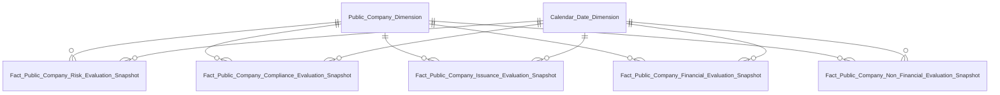
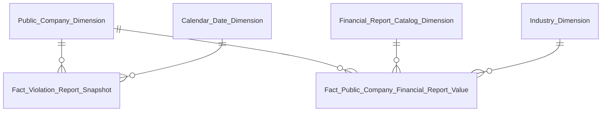

# DTM_GSDC_Entities — Phase 2

## Màn hình 1 — Phân loại & Xếp hạng Rủi ro CTDC (Nhóm 1-5, 32-36)

```mermaid
erDiagram
    Public_Company_Dimension ||--o{ Fact_Public_Company_Risk_Evaluation_Snapshot : " "
    Calendar_Date_Dimension ||--o{ Fact_Public_Company_Risk_Evaluation_Snapshot : " "
    Public_Company_Dimension ||--o{ Fact_Public_Company_Compliance_Evaluation_Snapshot : " "
    Calendar_Date_Dimension ||--o{ Fact_Public_Company_Compliance_Evaluation_Snapshot : " "
    Public_Company_Dimension ||--o{ Fact_Public_Company_Issuance_Evaluation_Snapshot : " "
    Calendar_Date_Dimension ||--o{ Fact_Public_Company_Issuance_Evaluation_Snapshot : " "
    Public_Company_Dimension ||--o{ Fact_Public_Company_Financial_Evaluation_Snapshot : " "
    Calendar_Date_Dimension ||--o{ Fact_Public_Company_Financial_Evaluation_Snapshot : " "
    Public_Company_Dimension ||--o{ Fact_Public_Company_Non_Financial_Evaluation_Snapshot : " "
    Calendar_Date_Dimension ||--o{ Fact_Public_Company_Non_Financial_Evaluation_Snapshot : " "
```

| Datamart Entity | Loại | Reuse | Mô tả | Grain | KPI |
|---|---|---|---|---|---|
| Fact Public Company Risk Evaluation Snapshot | Fact Snapshot | new | Điểm chấm & xếp loại — Risk Score | 1 CTDC × 1 ngày snapshot ETL | K_GSDC_1-6 (Nhóm 1); K_GSDC_1391-1396 (Nhóm 32, KPI riêng — dùng chung Fact) |
| Fact Public Company Compliance Evaluation Snapshot | Fact Snapshot | new | Điểm chấm & xếp loại — Compliance Score | 1 CTDC × 1 ngày snapshot ETL | K_GSDC_9-23 (Nhóm 2); K_GSDC_1399-1415 (Nhóm 33, KPI riêng — dùng chung Fact) |
| Fact Public Company Issuance Evaluation Snapshot | Fact Snapshot | new | Điểm chấm & xếp loại — Issuance Score | 1 CTDC × 1 ngày snapshot ETL | K_GSDC_24-31 (Nhóm 3); K_GSDC_1429-1438 (Nhóm 35, KPI riêng — dùng chung Fact) |
| Fact Public Company Financial Evaluation Snapshot | Fact Snapshot | new | Điểm chấm & xếp loại — Financial Score | 1 CTDC × 1 ngày snapshot ETL | K_GSDC_32-42 (Nhóm 4); K_GSDC_1416-1428 (Nhóm 34, KPI riêng — dùng chung Fact) |
| Fact Public Company Non-Financial Evaluation Snapshot | Fact Snapshot | new | Điểm chấm & xếp loại — Non-Financial Score & M-Score | 1 CTDC × 1 ngày snapshot ETL | K_GSDC_43-45 (Nhóm 5); K_GSDC_1439-1443 (Nhóm 36, KPI riêng — dùng chung Fact) |

---

## Màn hình 2 — Giám sát Tổng hợp (Nhóm 6-18, 37) & Màn hình 3 — Data Explorer BCTC (Nhóm 19-30)

```mermaid
erDiagram
    Public_Company_Dimension ||--o{ Fact_Violation_Report_Snapshot : " "
    Calendar_Date_Dimension ||--o{ Fact_Violation_Report_Snapshot : " "
    Public_Company_Dimension ||--o{ Fact_Public_Company_Financial_Report_Value : " "
    Financial_Report_Catalog_Dimension ||--o{ Fact_Public_Company_Financial_Report_Value : " "
    Industry_Dimension ||--o{ Fact_Public_Company_Financial_Report_Value : " "
```

| Datamart Entity | Loại | Reuse | Mô tả | Grain | KPI |
|---|---|---|---|---|---|
| Fact Violation Report Snapshot | Fact Event | new | Nghĩa vụ báo cáo & nộp báo cáo (tỷ lệ nộp BCTC, số DN báo lãi) | 1 row/công ty/kỳ (Report_Year + Report_Quarter)/ngày ETL snapshot | K_GSDC_48/49 (Nhóm 6/10/12/14/16) |
| Fact Public Company Financial Report Value | Fact Event | new | Chi tiết BCTC từng CTDC theo dòng/cột — dùng chung Màn hình 2 (tổng hợp/theo ngành/theo sàn) và Màn hình 3 (Data Explorer) | 1 CTĐC × 1 kỳ × Row_Code × Column_Code | K_GSDC_50-92+YOY (Nhóm 7/8/11/13/15/17); K_GSDC_1444-1456 (Nhóm 37, KPI riêng — dùng chung Fact); K_GSDC_762-1380 (Nhóm 19-30, MH3 Data Explorer, KPI riêng) |
| Financial Report Catalog Dimension | Dimension | new | Template BCTC — báo cáo/dòng/cột | 1 row/báo cáo × dòng × cột | — |
| Public Company Dimension | Dimension | reuse | Mã CK, Tên DN, Sàn, Ngành | 1 row/công ty đại chúng (current state) | — |
| Calendar Date Dimension | Dimension | reuse | Lịch ngày — Conformed toàn hệ thống | 1 row/ngày | — |
| Industry Dimension | Dimension | new | Mã ngành cấp 1 + tên ngành, chỉ ngành active — driving table breakdown ngành Nhóm 8/11/13/15/17 (khai sinh GSDC 2026-08-17, chuyển từ PTTT — PTTT reuse) | 1 row/ngành cấp 1 đang active (SCD4A) | K_GSDC_63 (Nhóm 8), K_GSDC_79 (Nhóm 11, reuse ở 13/15/17) — Chiều Ngành |
| Fact Public Company Financial Summary Snapshot | Fact Snapshot | new | Snapshot chỉ tiêu tài chính CTĐC theo kỳ (22 chỉ tiêu cơ sở + ROA/ROE + đầu kỳ + ytd) — Gold nguồn cho các Fact-report Nhóm 7 Khối A/8/11/13/15/17/37; [ĐỒNG BỘ 2026-10-08] thêm cột ytd/đầu kỳ, decimal(38,8)/(30,6) theo code dev | 1 CTĐC × 1 kỳ (rpt_year + rpt_quarter) × ngày snapshot | Nhóm 7 Khối A/8/11/13/15/17/37 |

---

## Màn hình 4 — Báo cáo giám sát CTDC (Nhóm 38-41)

```mermaid
erDiagram
```

> 4 bảng Fact-report Nhóm 38-41 + 3 bảng Fact-report bổ sung 2026-10-08 (YoY / Exchange Industry / YTD Change) của Màn hình 4 KHÔNG có FK Dimension — đúng đặc tính Fact-report (đóng gói cố định theo kỳ, denormalize hoàn toàn, ETL populate batch trực tiếp từ Atomic). Không có quan hệ nào để vẽ trong erDiagram relationship-only.

| Datamart Entity | Loại | Reuse | Mô tả | Grain | KPI |
|---|---|---|---|---|---|
| Public Company Regulatory Compliance Report | Fact-report | new | Báo cáo vĩ mô theo sàn (BC01.1) | 1 row/sàn NY-ĐKGD/kỳ (Report_Year + Report_Quarter) | K_GSDC_700-708 (Nhóm 38) |
| Public Company Industry Financial Report | Fact-report | new | Báo cáo vĩ mô theo ngành (BC01.2) | 1 row/ngành/năm báo cáo (kèm cột N-1) | K_GSDC_709-717 (Nhóm 39) |
| Public Company Multi-Period Financial Report | Fact-report | new | Báo cáo vĩ mô đa kỳ N/N-1/N-2 (BC01.3) | 1 row DUY NHẤT/năm báo cáo (kèm cột N-1/N-2), toàn thị trường không group-by | K_GSDC_718-739 (Nhóm 40) |
| Public Company Exchange Financial Summary Report | Fact-report | new | Tổng hợp tài chính theo sàn kèm YoY (BC22) | 1 row/sàn NY-ĐKGD/kỳ (Report_Year + Report_Quarter) | K_GSDC_740-751+YOY (Nhóm 41) |
| Public Company Financial YoY Report | Fact-report | new | Tổng hợp chỉ tiêu tài chính + YoY theo sàn × ngành × kỳ (có dòng rollup 'ALL') — Fact-report denormalize, không FK Dimension. [ĐỒNG BỘ 2026-10-08] grain cross-tab sàn × ngành, thêm 5 cột *_ytd_yoy (GIẢ ĐỊNH — O_GSDC_31) | 1 row/(sàn | 'ALL') × (ngành | 'ALL') × kỳ (rpt_year + rpt_quarter) | Nhóm 7/11/13/15/17 |
| Public Company Exchange Industry Financial Report | Fact-report | new | [MỚI 2026-10-08] Cross-tab sàn × ngành (code dev tạo 2026-09-30): tổng hợp tài chính + YoY + ytd + 9 cột *_ytd_chg — Gold-to-Gold từ Fact Financial Summary Snapshot + YoY Report + YTD Change Report. Không FK Dimension. KPI mapping CHỜ BA (O_GSDC_32) | 1 row/sàn × ngành × kỳ (rpt_year + rpt_quarter) | — (chờ BA) |
| Public Company Financial YTD Change Report | Fact-report (trung gian) | new | [MỚI 2026-10-08] Bảng trung gian biến động chỉ tiêu so với đầu năm (YTD change) theo sàn × ngành (code dev tạo 2026-10-01) — KHÔNG có bản ClickHouse; là nguồn cho Exchange Financial Summary / Exchange Industry Financial Report. Tên/công thức cột GIẢ ĐỊNH — CHỜ DEV (O_GSDC_31) | 1 row/sàn × ngành × kỳ (rpt_year + rpt_quarter) | — (trung gian) |
| Fact Public Company Listed Share Snapshot | Fact Snapshot | new | Khối lượng CP lưu hành/niêm yết/quỹ/free float (VSDC listed_share_info) — [TÁCH 2026-10-08] | 1 row/mã CK/ngày snapshot | K_GSDC_1381-1384 (Nhóm 31) |
| Fact Public Company Foreign Holding Snapshot | Fact Snapshot | new | Sở hữu nước ngoài + giá trị CP khối ngoại (VSDC foreign_ownership_info + MDDS security_trading_snapshot) — [TÁCH 2026-10-08]; NDTNN reuse | 1 row/mã CK/ngày snapshot | K_GSDC_1385-1388, K_NDTNN_51 |
| Fact Public Company State Capital Snapshot | Fact Snapshot | new | Sở hữu nhà nước (IDS pc_state_capital) — [TÁCH 2026-10-08] | 1 row/công ty/ngày snapshot | K_GSDC_1389-1390 (Nhóm 31) |

---
