# DTM_GSDC_HLD — High Level Design
**Module:** GSDC — Giám sát Công ty Đại chúng
**Phiên bản:** 3.0 — Phase 1 Draft
**Phạm vi:**
- Màn hình 1: **Phân loại & Xếp hạng Rủi ro Doanh nghiệp Đại chúng** (5 tab: Tổng hợp / Tuân thủ / Phát hành / Tài chính / Phi tài chính & M-Score)
- Màn hình 2: **Giám sát Tổng hợp** (5 tab sàn: Tổng hợp / HOSE / HNX / UPCoM / Chưa niêm yết — 3 nhóm nội dung)
- Màn hình 3: **Data Explorer — Dữ liệu tài chính doanh nghiệp** (DB21–32 + DB39: chi tiết BCTC theo loại hình DN + hệ số tài chính cơ bản — tất cả phục vụ bởi `Fact Public Company Financial Report Value`)
- Màn hình 4: **Báo cáo giám sát CTDC** (DB40–43: BC01.1 / BC01.2 / BC01.3 / BC22 — phục vụ bởi `Fact Public Company Financial Summary Snapshot`)
- Màn hình 5 *(PENDING)*: **Data Explorer — Dữ liệu thông tin niêm yết** (DB33 — nguồn MSS chưa có Atomic)
- Màn hình 6 *(PENDING)*: **Data Explorer — Dữ liệu chấm điểm phân loại CTDC** (DB34–38 — chưa có bảng nguồn, xem O_GSDC_1)

**Nguồn dữ liệu:** IDS (Information Disclosure System)

---

## Section 1 — Data Lineage

### Cụm 1 — Hồ sơ Công ty Đại chúng

Phục vụ chiều nhận diện DN trên toàn bộ các màn hình.

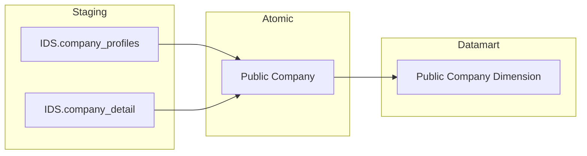

### Cụm 2 — Báo cáo tài chính & Nộp báo cáo

Phục vụ toàn bộ KPI tài chính tổng hợp và theo ngành (Màn hình 2).

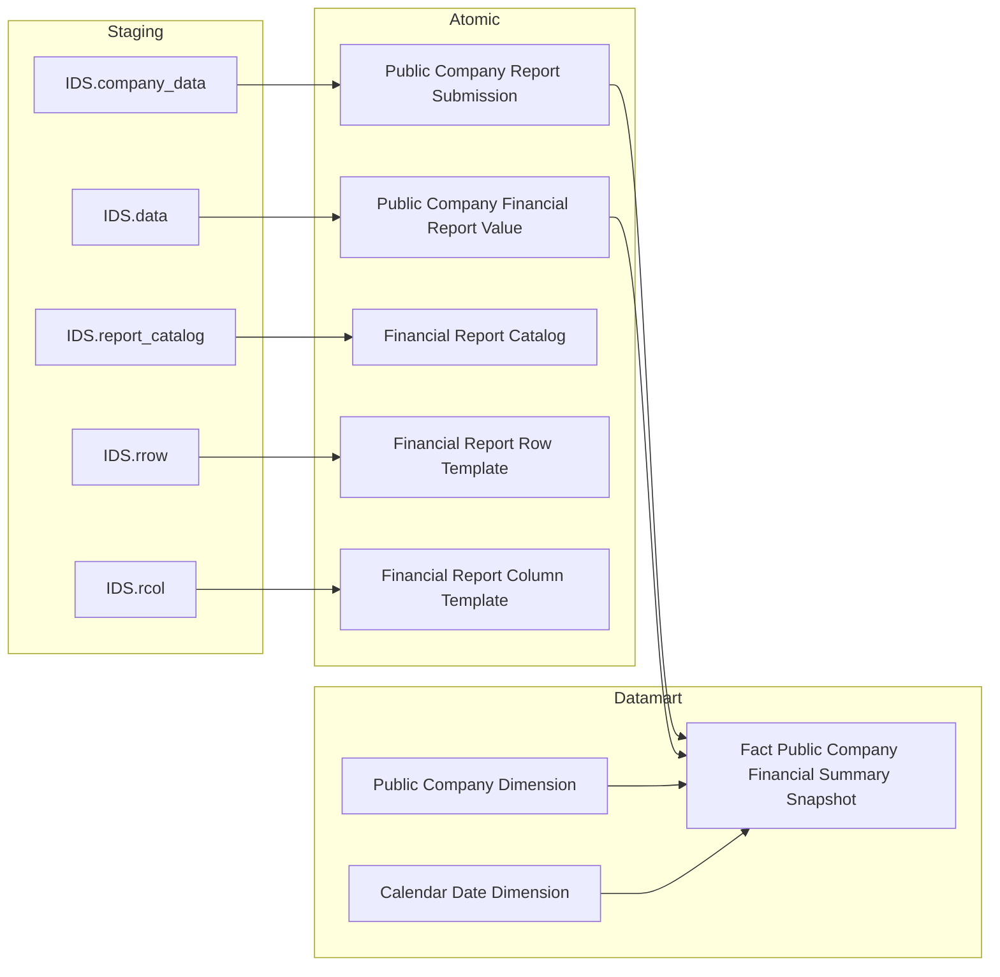

### Cụm 3 — Chi tiết BCTC từng CTDC & Danh mục template (DB21–32 + DB39)

Phục vụ Data Explorer tra cứu giá trị từng chỉ tiêu BCTC theo CTDC và kỳ báo cáo. `Financial Report Catalog Dimension` là Dimension phụ trợ cung cấp tên và thứ tự chỉ tiêu cho Fact.

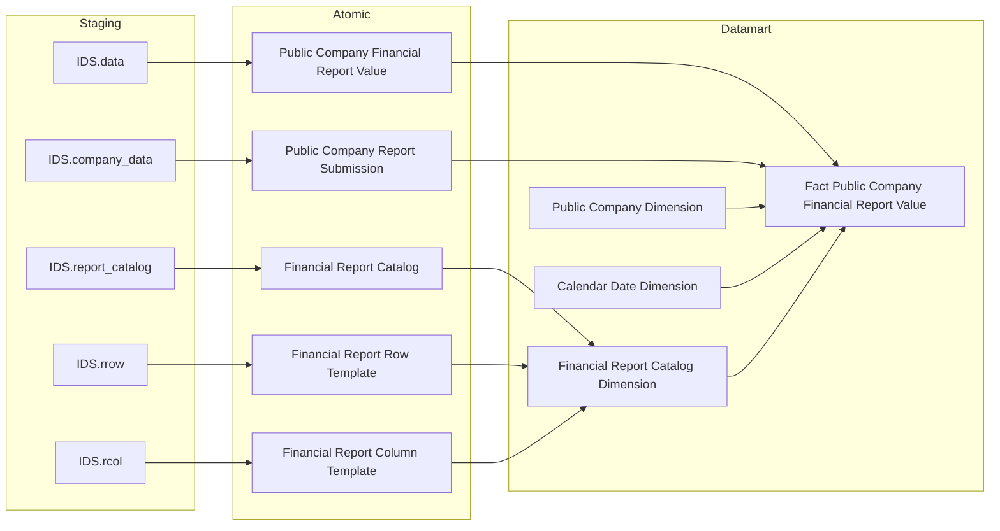

### Cụm 4 — Điểm chấm & Xếp loại CTDC *(PENDING)*

Toàn bộ KPI điểm thành phần và tổng hợp đều **PENDING** — IDS chưa có bảng lưu kết quả chấm điểm trong thiết kế CSDL hiện tại.

---

## Section 2 — Tổng quan báo cáo

---

### Màn hình 1 — Phân loại & Xếp hạng Rủi ro CTDC

#### Nhóm 1 — STT 1: Tổng hợp chấm điểm phân loại CTDC

##### PENDING

**KPI liên quan:**

| KPI ID | Tên KPI | Đơn vị | Tính chất |
|---|---|---|---|
| K_GSDC_1 | Tuân thủ | Điểm | Cơ sở |
| K_GSDC_2 | Phát hành | Điểm | Cơ sở |
| K_GSDC_3 | Tài chính | Điểm | Cơ sở |
| K_GSDC_4 | Phi tài chính & M-Score | Điểm | Cơ sở |
| K_GSDC_5 | Xếp hạng tín nhiệm DN | Text | Cơ sở |
| K_GSDC_6 | Điểm tổng hợp | Điểm (0–100) | Cơ sở |
| K_GSDC_7 | Xếp loại | Text (A/B/C…) | Cơ sở |

**Lý do PENDING:** BA ghi nhận `failed` — bảng lưu kết quả chấm điểm tổng hợp CTDC chưa được thiết kế trong CSDL IDS.

**Atomic cần bổ sung:** `Public Company Risk Score` — entity lưu điểm tổng hợp và từng tiêu chí theo kỳ đánh giá.

**Mart dự kiến:** `Fact Public Company Risk Score Snapshot` (grain: 1 row / CTDC / ngày đánh giá)

##### READY

> Phân loại: **Phân tích**
> Atomic: `Public Company` ← IDS.company_profiles — **READY**

**Mockup:**

| Tên Doanh nghiệp | Mã DN | Tuân thủ | Phát hành | Tài chính | Phi TC | M-Score | Xếp hạng TN | Điểm | Xếp loại |
|---|---|---|---|---|---|---|---|---|---|
| Công ty tập đoàn địa ốc Novaland | NVL | *(PENDING)* | *(PENDING)* | *(PENDING)* | *(PENDING)* | *(PENDING)* | *(PENDING)* | *(PENDING)* | *(PENDING)* |

**Source:** `Fact Public Company Risk Score Snapshot` → `Public Company Dimension`, `Calendar Date Dimension`

**Bảng KPI (chiều READY):**

| KPI ID | Tên KPI | Đơn vị | Tính chất | Atomic Entity | Atomic Table | Atomic Attribute | Atomic Column |
|---|---|---|---|---|---|---|---|
| K_GSDC_8 | Mã CK doanh nghiệp | Text | Chiều | Public Company | pblc_co | Equity Ticker | eqty_ticker |
| K_GSDC_9 | Tên doanh nghiệp | Text | Chiều | Public Company | pblc_co | Public Company Name | pblc_co_nm |

**Star Schema:**

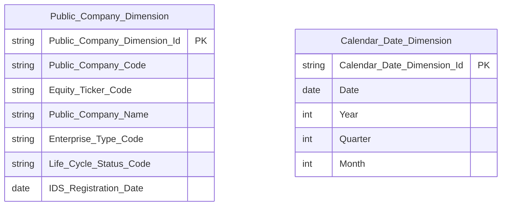

**Lineage Mart → Báo cáo:**

**Bảng grain:**

| Tên bảng | Grain |
|---|---|
| Public Company Dimension | 1 row / công ty đại chúng (SCD2) |
| Calendar Date Dimension | 1 row / ngày (Conformed) |

---

#### Nhóm 2 — STT 2: Top CTDC theo chỉ tiêu tuân thủ

##### PENDING

**KPI liên quan:**

| KPI ID | Tên KPI | Đơn vị | Tính chất |
|---|---|---|---|
| K_GSDC_10 | Công bố BCTC | Điểm | Cơ sở |
| K_GSDC_11 | Công bố BCTN | Điểm | Cơ sở |
| K_GSDC_12 | Công bố báo cáo tình hình quản trị | Điểm | Cơ sở |
| K_GSDC_13 | Công bố thông tin Thay đổi TGĐ/CTHĐQT | Điểm | Cơ sở |
| K_GSDC_14 | Công bố thông tin vi phạm, quyết định xử phạt | Điểm | Cơ sở |
| K_GSDC_15 | Điều lệ Công ty và Các Quy chế hoạt động | Điểm | Cơ sở |
| K_GSDC_16 | Số lượng ĐHĐCĐ thường niên trong 6 tháng đầu năm | Điểm | Cơ sở |
| K_GSDC_17 | Số lượng thành viên HĐQT độc lập | Điểm | Cơ sở |
| K_GSDC_18 | Số lượng thành viên HĐQT không điều hành | Điểm | Cơ sở |
| K_GSDC_19 | Tư cách thành viên HĐQT/BKS/Kế toán trưởng | Điểm | Cơ sở |
| K_GSDC_20 | Số lượng thành viên BKS hoặc Ủy ban kiểm toán | Điểm | Cơ sở |
| K_GSDC_21 | Báo cáo tiến độ sử dụng vốn | Điểm | Cơ sở |
| K_GSDC_22 | Thay đổi phương án sử dụng vốn | Điểm | Cơ sở |
| K_GSDC_23 | Tổng điểm Tuân thủ | Điểm | Cơ sở |

**Lý do PENDING:** BA ghi nhận `failed` — bảng lưu kết quả điểm từng tiêu chí tuân thủ chưa được thiết kế trong CSDL IDS.

**Atomic cần bổ sung:** `Public Company Compliance Score` — entity lưu điểm từng tiêu chí tuân thủ theo CTDC × kỳ đánh giá.

**Mart dự kiến:** `Fact Public Company Compliance Score Snapshot` (grain: 1 row / CTDC / kỳ đánh giá)

---

#### Nhóm 3 — STT 3: Top CTDC theo chỉ tiêu phát hành

##### PENDING

**KPI liên quan:**

| KPI ID | Tên KPI | Đơn vị | Tính chất |
|---|---|---|---|
| K_GSDC_24 | Phát hành tăng vốn nhanh | Điểm | Cơ sở |
| K_GSDC_25 | Số lần chào bán cổ phiếu riêng lẻ | Điểm | Cơ sở |
| K_GSDC_26 | Số lần chào bán ra công chúng | Điểm | Cơ sở |
| K_GSDC_27 | Số lần phát hành ESOP | Điểm | Cơ sở |
| K_GSDC_28 | Tỷ lệ phát hành trái phiếu không có TSBĐ | Điểm | Cơ sở |
| K_GSDC_29 | Tỷ lệ trái phiếu vi phạm nghĩa vụ thanh toán lãi và gốc | Điểm | Cơ sở |
| K_GSDC_30 | Dư nợ trái phiếu / Tổng VCSH | Điểm | Cơ sở |
| K_GSDC_31 | Tổng điểm Phát hành | Điểm | Cơ sở |

**Lý do PENDING:** BA ghi nhận `failed` — bảng lưu kết quả điểm từng tiêu chí phát hành chưa được thiết kế trong CSDL IDS.

**Atomic cần bổ sung:** `Public Company Issuance Score` — entity lưu điểm từng tiêu chí phát hành theo CTDC × kỳ đánh giá.

**Mart dự kiến:** `Fact Public Company Issuance Score Snapshot` (grain: 1 row / CTDC / kỳ đánh giá)

---

#### Nhóm 4 — STT 4: Top CTDC theo chỉ tiêu tài chính

##### PENDING

**KPI liên quan:**

| KPI ID | Tên KPI | Đơn vị | Tính chất |
|---|---|---|---|
| K_GSDC_32 | Kiểm toán — Ý kiến kiểm toán | Điểm | Cơ sở |
| K_GSDC_33 | Khả năng hoạt động liên tục | Điểm | Cơ sở |
| K_GSDC_34 | Dòng tiền từ hoạt động kinh doanh | Điểm | Cơ sở |
| K_GSDC_35 | Khả năng thanh toán hiện thời | Điểm | Cơ sở |
| K_GSDC_36 | EBIT / Lãi vay | Điểm | Cơ sở |
| K_GSDC_37 | Nợ / VCSH | Điểm | Cơ sở |
| K_GSDC_38 | Nợ / Vốn điều lệ | Điểm | Cơ sở |
| K_GSDC_39 | VCSH | Điểm | Cơ sở |
| K_GSDC_40 | ROE | Điểm | Cơ sở |
| K_GSDC_41 | Doanh thu từ HĐ tài chính / Lợi nhuận sau thuế | Điểm | Cơ sở |
| K_GSDC_42 | Doanh thu từ hoạt động khác / Lợi nhuận sau thuế | Điểm | Cơ sở |
| K_GSDC_43 | Tổng điểm Tài chính | Điểm | Cơ sở |

**Lý do PENDING:** BA ghi nhận `failed` — bảng lưu kết quả điểm từng tiêu chí tài chính chưa được thiết kế trong CSDL IDS.

**Atomic cần bổ sung:** `Public Company Financial Score` — entity lưu điểm từng tiêu chí tài chính theo CTDC × kỳ đánh giá.

**Mart dự kiến:** `Fact Public Company Financial Score Snapshot` (grain: 1 row / CTDC / kỳ đánh giá)

---

#### Nhóm 5 — STT 5: Top CTDC theo chỉ tiêu phi tài chính & M-Score

##### PENDING

**KPI liên quan:**

| KPI ID | Tên KPI | Đơn vị | Tính chất |
|---|---|---|---|
| K_GSDC_44 | Tình trạng DN từ Cục Đăng ký kinh doanh | Điểm | Cơ sở |
| K_GSDC_45 | Sở hữu giữa các bên liên quan | Điểm | Cơ sở |
| K_GSDC_46 | M-Score | Điểm | Cơ sở |
| K_GSDC_47 | Tổng điểm Phi tài chính & M-Score | Điểm | Cơ sở |

**Lý do PENDING:** BA ghi nhận `failed` — bảng lưu kết quả điểm phi tài chính và M-Score chưa được thiết kế trong CSDL IDS.

**Atomic cần bổ sung:** `Public Company Non-Financial Score` — entity lưu điểm phi tài chính và M-Score theo CTDC × kỳ đánh giá.

**Mart dự kiến:** `Fact Public Company Non-Financial Score Snapshot` (grain: 1 row / CTDC / kỳ đánh giá)

---

### Màn hình 2 — Giám sát Tổng hợp

Màn hình có bộ lọc **Năm / Quý** và 5 tab sàn. Mỗi tab hiển thị cùng cấu trúc 3 nhóm nội dung, chỉ khác filter `Equity_Listing_Exchange_Code`.

#### Nhóm 6 — STT 6: Thống kê toàn thị trường theo sàn niêm yết

##### READY

> Phân loại: **Phân tích**
> Atomic: `Public Company` ← IDS.company_detail — **READY**
> Atomic: `Public Company Report Submission` ← IDS.company_data — **READY**
> Atomic: `Public Company Financial Report Value` ← IDS.data — **READY**

**Source:** `Fact Public Company Financial Summary Snapshot` → `Public Company Dimension`, `Calendar Date Dimension`

**Bảng KPI:**

| KPI ID | Tên KPI | Đơn vị | Tính chất | Atomic Entity | Atomic Table | Atomic Attribute | Atomic Column | Ghi chú |
|---|---|---|---|---|---|---|---|---|
| K_GSDC_48 | Kỳ thống kê (Năm/Quý) | Text | Chiều (Slicer) | — | — | — | — | Tham số `:year` / `:quarter` |
| K_GSDC_49 | Số doanh nghiệp | DN | Phái sinh | Public Company | pblc_co | IDS Registration Date | ids_rgst_dt | COUNT DISTINCT WHERE ids_rgst_dt <= cuối kỳ — xem O_GSDC_2 |
| K_GSDC_50 | Tỷ lệ nộp BCTC | % | Phái sinh | Public Company Report Submission | pblc_co_rpt_subm | Submission Date / Submission Deadline Date | subm_dt / subm_ddln_dt | COUNT(CASE WHEN subm_dt <= subm_ddln_dt) / COUNT(*) × 100 |
| K_GSDC_51 | Số DN báo lãi | DN | Phái sinh | Public Company Financial Report Value | pblc_co_fnc_rpt_val | Data Value | data_val | COUNT DISTINCT WHERE data_val > 0 AND Row Description Column Code IN ('60' dn/bh, '21' td) AND report_cd LIKE 'BCKQKD%' |

**Star Schema:**

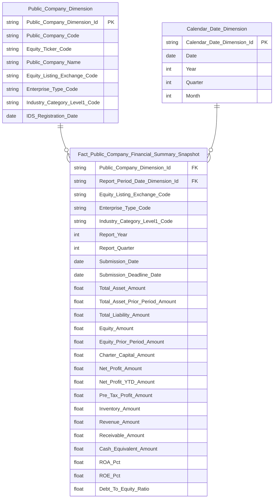

> **Ghi chú thiết kế Fact Summary Snapshot:**
> - `Total_Asset_Prior_Period_Amount`: map từ `Public Company Financial Report Value`.`Data Value` (`data_val`) WHERE `Row Description Column Code` (`row_dsc_clmn_code`) IN ('270' dn/bh, '300' td) AND `Column Code` (`clmn_code`) = col_desc='2' (đầu kỳ).
> - `Equity_Prior_Period_Amount`: tương tự WHERE row_desc IN ('400' dn/bh, '500' td), col_desc='2'.
> - `Pre_Tax_Profit_Amount`: `data_val` WHERE row_desc IN ('50' dn/bh, '17' td), col_desc='1', report_cd LIKE 'BCKQKD%'.
> - `Net_Profit_YTD_Amount`: `data_val` WHERE row_desc IN ('421' dn/bh, '450' td), col_desc='1', report_cd LIKE 'BCDKT%'.
> - `Inventory_Amount`: `data_val` WHERE row_desc='140' (dn/bh only), col_desc='1'.
> - `Receivable_Amount`: SUM `data_val` WHERE row_desc IN ('130','210') (dn/bh) / '251' (td), col_desc='1'.
> - `Cash_Equivalent_Amount`: `data_val` WHERE row_desc='110' (dn/bh) / row_desc IN ('110','120') (td), col_desc='1'.
> - `Submission_Date` / `Submission_Deadline_Date`: từ `Public Company Report Submission`.`subm_dt` / `subm_ddln_dt`.
> - `Industry_Category_Level1_Code` / `Equity_Listing_Exchange_Code` denormalize vào Fact từ `Public Company`.`idy_cgy_level1_code` / `eqty_listing_exg_code`.
> - YoY % là phái sinh thuần túy — tính tại query layer, không lưu trong mart.

**Lineage Mart → Báo cáo:**

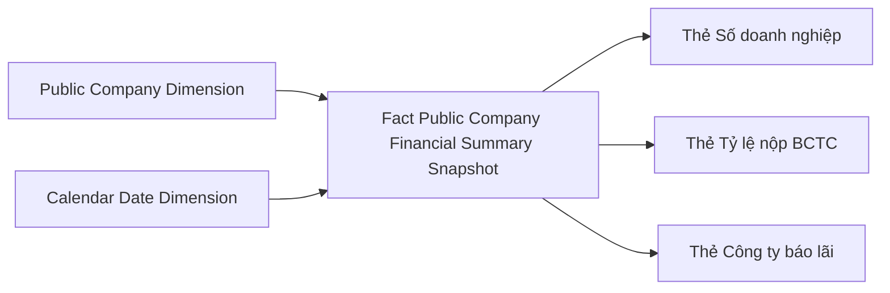

**Bảng grain:**

| Tên bảng | Grain |
|---|---|
| Fact Public Company Financial Summary Snapshot | 1 row / CTDC / kỳ báo cáo (năm × quý) |
| Public Company Dimension | 1 row / công ty đại chúng (SCD2) |
| Calendar Date Dimension | 1 row / ngày (Conformed) |

---

#### Nhóm 7 — STT 7: Tổng hợp chỉ tiêu tài chính toàn thị trường

##### READY

> Phân loại: **Phân tích**
> Source: dùng chung `Fact Public Company Financial Summary Snapshot` — aggregate toàn thị trường, filter theo sàn và kỳ.

**Bảng KPI:**

| KPI ID | Tên KPI | Đơn vị | Tính chất | Công thức / Atomic | row_dsc_clmn_code (dn) | row_dsc_clmn_code (bh) | row_dsc_clmn_code (td) | Loại BC | col_desc |
|---|---|---|---|---|---|---|---|---|---|
| K_GSDC_52 | Tổng tài sản | Tỉ đồng | Phái sinh | SUM(Total_Asset_Amount) từ pblc_co_fnc_rpt_val.data_val | 270 | 270 | 300 | BCDKT | 1 |
| K_GSDC_52_YOY | Tổng tài sản — YoY | % | Phái sinh | Derive tại query layer | — | — | — | — | — |
| K_GSDC_53 | Nợ phải trả | Tỉ đồng | Phái sinh | SUM(Total_Liability_Amount) từ pblc_co_fnc_rpt_val.data_val | 300 | 300 | 400 | BCDKT | 1 |
| K_GSDC_53_YOY | Nợ phải trả — YoY | % | Phái sinh | Derive tại query layer | — | — | — | — | — |
| K_GSDC_54 | Vốn CSH | Tỉ đồng | Phái sinh | SUM(Equity_Amount) từ pblc_co_fnc_rpt_val.data_val | 400 | 400 | 500 | BCDKT | 1 |
| K_GSDC_54_YOY | Vốn CSH — YoY | % | Phái sinh | Derive tại query layer | — | — | — | — | — |
| K_GSDC_55 | Vốn điều lệ | Tỉ đồng | Phái sinh | SUM(Charter_Capital_Amount) từ pblc_co_fnc_rpt_val.data_val | 411 | 411 | 411 | BCDKT | 1 |
| K_GSDC_55_YOY | Vốn điều lệ — YoY | % | Phái sinh | Derive tại query layer | — | — | — | — | — |
| K_GSDC_56 | Lợi nhuận sau thuế | Tỉ đồng | Phái sinh | SUM(Net_Profit_Amount) từ pblc_co_fnc_rpt_val.data_val | 60 | 60 | 21 | BCKQKD | 1 |
| K_GSDC_56_YOY | LNST — YoY | % | Phái sinh | Derive tại query layer | — | — | — | — | — |
| K_GSDC_57 | ROA | % | Phái sinh | SUM(Net_Profit_Amount) / SUM((Total_Asset_Amount + Total_Asset_Prior_Period_Amount)/2) × 100 | — | — | — | — | — |
| K_GSDC_57_YOY | ROA — YoY | % | Phái sinh | ROA_N − ROA_N-1 — query layer | — | — | — | — | — |
| K_GSDC_58 | ROE | % | Phái sinh | SUM(Net_Profit_Amount) / SUM((Equity_Amount + Equity_Prior_Period_Amount)/2) × 100 | — | — | — | — | — |
| K_GSDC_58_YOY | ROE — YoY | % | Phái sinh | ROE_N − ROE_N-1 — query layer | — | — | — | — | — |
| K_GSDC_59 | Hàng tồn kho | Tỉ đồng | Phái sinh | SUM(Inventory_Amount) từ pblc_co_fnc_rpt_val.data_val — chỉ dn/bh | 140 | 140 | — | BCDKT | 1 |
| K_GSDC_59_YOY | Hàng tồn kho — YoY | % | Phái sinh | Derive tại query layer | — | — | — | — | — |
| K_GSDC_60 | Doanh thu thuần | Tỉ đồng | Phái sinh | SUM(Revenue_Amount) từ pblc_co_fnc_rpt_val.data_val | 10 | 10 | 03 | BCKQKD | 1 |
| K_GSDC_60_YOY | Doanh thu — YoY | % | Phái sinh | Derive tại query layer | — | — | — | — | — |
| K_GSDC_61 | Lợi nhuận dồn tích YTD | Tỉ đồng | Phái sinh | SUM(Net_Profit_YTD_Amount) từ pblc_co_fnc_rpt_val.data_val | 421 | 421 | 450 | BCDKT | 1 |
| K_GSDC_61_YOY | LN YTD — YoY | % | Phái sinh | Derive tại query layer | — | — | — | — | — |
| K_GSDC_62 | Phải thu | Tỉ đồng | Phái sinh | SUM(Receivable_Amount) từ pblc_co_fnc_rpt_val.data_val — tổng ngắn hạn+dài hạn | 130+210 | 130+210 | 251 | BCDKT | 1 |
| K_GSDC_62_YOY | Phải thu — YoY | % | Phái sinh | Derive tại query layer | — | — | — | — | — |
| K_GSDC_63 | Tiền và tương đương tiền | Tỉ đồng | Phái sinh | SUM(Cash_Equivalent_Amount) từ pblc_co_fnc_rpt_val.data_val | 110 | 110 | 110+120 | BCDKT | 1 |
| K_GSDC_63_YOY | Tiền TĐT — YoY | % | Phái sinh | Derive tại query layer | — | — | — | — | — |
| K_GSDC_64 | Nợ / Vốn CSH | Lần (x) | Phái sinh | SUM(Total_Liability_Amount) / NULLIF(SUM(Equity_Amount),0) | — | — | — | — | — |
| K_GSDC_64_YOY | Nợ/Vốn CSH — YoY | % | Phái sinh | Derive tại query layer | — | — | — | — | — |

> **Ghi chú:** Cột `row_dsc_clmn_code` = `Financial Report Row Template`.`Row Description Column Code` (`row_dsc_clmn_code`) trong Atomic — đây là mã nghiệp vụ BA gọi là `row_desc` trong SQL.

**Star Schema:** dùng chung `Fact_Public_Company_Financial_Summary_Snapshot`.

**Lineage Mart → Báo cáo:**

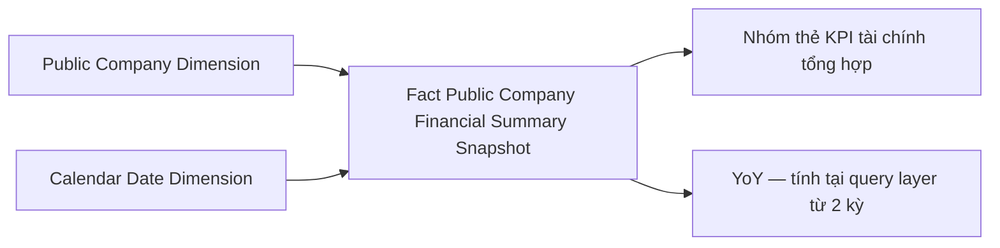

**Bảng grain:**

| Tên bảng | Grain |
|---|---|
| Fact Public Company Financial Summary Snapshot | 1 row / CTDC / kỳ báo cáo (năm × quý) |
| Public Company Dimension | 1 row / công ty đại chúng (SCD2) |
| Calendar Date Dimension | 1 row / ngày (Conformed) |

---

#### Nhóm 8 — STT 8: Tổng hợp CTTC theo ngành (Tổng TS, NPT, VCSH, VĐL)

##### READY

> Phân loại: **Phân tích**
> Source: dùng chung `Fact Public Company Financial Summary Snapshot` — GROUP BY `Industry_Category_Level1_Code`.

**Bảng KPI:**

| KPI ID | Tên KPI | Đơn vị | Tính chất | Atomic Entity | Atomic Table | Atomic Attribute | Atomic Column | row_dsc_clmn_code (dn/bh/td) | Loại BC | col_desc |
|---|---|---|---|---|---|---|---|---|---|---|
| K_GSDC_65 | Ngành kinh tế | Text | Chiều (Group By) | Public Company | pblc_co | Industry Category Level1 Code | idy_cgy_level1_code | — | — | — |
| K_GSDC_66 | Tổng tài sản theo ngành | Tỉ đồng | Phái sinh | Public Company Financial Report Value | pblc_co_fnc_rpt_val | Data Value | data_val | 270/270/300 | BCDKT | 1 |
| K_GSDC_67 | Nợ phải trả theo ngành | Tỉ đồng | Phái sinh | Public Company Financial Report Value | pblc_co_fnc_rpt_val | Data Value | data_val | 300/300/400 | BCDKT | 1 |
| K_GSDC_68 | Vốn CSH theo ngành | Tỉ đồng | Phái sinh | Public Company Financial Report Value | pblc_co_fnc_rpt_val | Data Value | data_val | 400/400/500 | BCDKT | 1 |
| K_GSDC_69 | Vốn điều lệ theo ngành | Tỉ đồng | Phái sinh | Public Company Financial Report Value | pblc_co_fnc_rpt_val | Data Value | data_val | 411/411/411 | BCDKT | 1 |

**Star Schema:** dùng chung `Fact_Public_Company_Financial_Summary_Snapshot`.

**Lineage Mart → Báo cáo:**

**Bảng grain:**

| Tên bảng | Grain |
|---|---|
| Fact Public Company Financial Summary Snapshot | 1 row / CTDC / kỳ báo cáo (năm × quý) |
| Public Company Dimension | 1 row / công ty đại chúng (SCD2) |
| Calendar Date Dimension | 1 row / ngày (Conformed) |

---

#### Nhóm 9 — STT 9: Tổng hợp CTTC theo ngành (LNST)

##### READY

> Phân loại: **Phân tích**
> Source: dùng chung `Fact Public Company Financial Summary Snapshot`.

**Bảng KPI:**

| KPI ID | Tên KPI | Đơn vị | Tính chất | Atomic Entity | Atomic Table | Atomic Attribute | Atomic Column | row_dsc_clmn_code (dn/bh/td) | Loại BC | col_desc |
|---|---|---|---|---|---|---|---|---|---|---|
| K_GSDC_70 | Lợi nhuận sau thuế theo ngành | Tỉ đồng | Phái sinh | Public Company Financial Report Value | pblc_co_fnc_rpt_val | Data Value | data_val | 60/60/21 | BCKQKD | 1 |

**Star Schema:** dùng chung `Fact_Public_Company_Financial_Summary_Snapshot`.

**Lineage Mart → Báo cáo:**

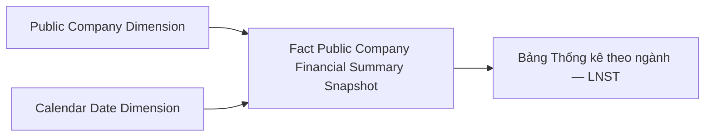

**Bảng grain:**

| Tên bảng | Grain |
|---|---|
| Fact Public Company Financial Summary Snapshot | 1 row / CTDC / kỳ báo cáo (năm × quý) |
| Public Company Dimension | 1 row / công ty đại chúng (SCD2) |
| Calendar Date Dimension | 1 row / ngày (Conformed) |

---

#### Nhóm 10 — STT 10: Tổng hợp CTTC theo ngành (ROA, ROE, HTK, DT, YTD, Phải thu, Tiền, Nợ/Vốn)

##### READY

> Phân loại: **Phân tích**
> Source: dùng chung `Fact Public Company Financial Summary Snapshot`.

**Bảng KPI:**

| KPI ID | Tên KPI | Đơn vị | Tính chất | Atomic Entity | Atomic Table | Atomic Attribute | Atomic Column | row_dsc_clmn_code (dn/bh/td) | Loại BC | col_desc |
|---|---|---|---|---|---|---|---|---|---|---|
| K_GSDC_71 | ROA theo ngành | % | Phái sinh | Public Company Financial Report Value | pblc_co_fnc_rpt_val | Data Value | data_val | — | — | — |
| K_GSDC_72 | ROE theo ngành | % | Phái sinh | Public Company Financial Report Value | pblc_co_fnc_rpt_val | Data Value | data_val | — | — | — |
| K_GSDC_73 | Hàng tồn kho theo ngành | Tỉ đồng | Phái sinh | Public Company Financial Report Value | pblc_co_fnc_rpt_val | Data Value | data_val | 140/140/— | BCDKT | 1 |
| K_GSDC_74 | Doanh thu thuần theo ngành | Tỉ đồng | Phái sinh | Public Company Financial Report Value | pblc_co_fnc_rpt_val | Data Value | data_val | 10/10/03 | BCKQKD | 1 |
| K_GSDC_75 | Lợi nhuận dồn tích YTD theo ngành | Tỉ đồng | Phái sinh | Public Company Financial Report Value | pblc_co_fnc_rpt_val | Data Value | data_val | 421/421/450 | BCDKT | 1 |
| K_GSDC_76 | Phải thu theo ngành | Tỉ đồng | Phái sinh | Public Company Financial Report Value | pblc_co_fnc_rpt_val | Data Value | data_val | 130+210/130+210/251 | BCDKT | 1 |
| K_GSDC_77 | Tiền và tương đương tiền theo ngành | Tỉ đồng | Phái sinh | Public Company Financial Report Value | pblc_co_fnc_rpt_val | Data Value | data_val | 110/110/110+120 | BCDKT | 1 |
| K_GSDC_78 | Nợ / Vốn CSH theo ngành | Lần (x) | Phái sinh | Public Company Financial Report Value | pblc_co_fnc_rpt_val | Data Value | data_val | — | — | — |

**Star Schema:** dùng chung `Fact_Public_Company_Financial_Summary_Snapshot`.

**Lineage Mart → Báo cáo:**

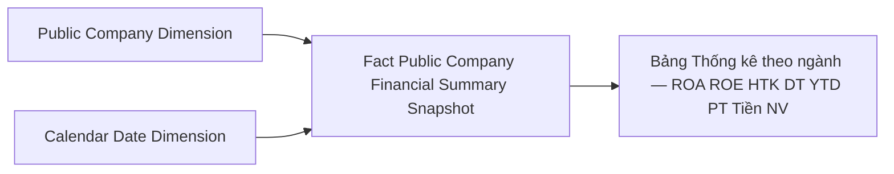

**Bảng grain:**

| Tên bảng | Grain |
|---|---|
| Fact Public Company Financial Summary Snapshot | 1 row / CTDC / kỳ báo cáo (năm × quý) |
| Public Company Dimension | 1 row / công ty đại chúng (SCD2) |
| Calendar Date Dimension | 1 row / ngày (Conformed) |

---

#### Nhóm 11 — STT 11: Giám sát tổng hợp — CTDC chưa niêm yết

##### READY

> Phân loại: **Phân tích**
> Source: `Fact Public Company Financial Summary Snapshot` — filter `Equity_Listing_Exchange_Code = 'OTC'`

**Bảng KPI:**

| KPI ID | Tên KPI | Đơn vị | Tính chất | Atomic Entity | Atomic Table | Atomic Attribute | Atomic Column | Ghi chú |
|---|---|---|---|---|---|---|---|---|
| K_GSDC_79 | Số CTDC chưa niêm yết | DN | Phái sinh | Public Company | pblc_co | IDS Registration Date | ids_rgst_dt | COUNT DISTINCT WHERE ids_rgst_dt <= cuối kỳ AND eqty_listing_exg_code IS NULL |

**Star Schema:** dùng chung `Fact_Public_Company_Financial_Summary_Snapshot`.

**Lineage Mart → Báo cáo:**

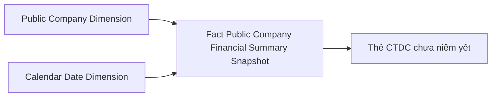

**Bảng grain:**

| Tên bảng | Grain |
|---|---|
| Fact Public Company Financial Summary Snapshot | 1 row / CTDC / kỳ báo cáo (năm × quý) |
| Public Company Dimension | 1 row / công ty đại chúng (SCD2) |
| Calendar Date Dimension | 1 row / ngày (Conformed) |

---

#### Nhóm 12 — STT 12: Giám sát tổng hợp theo sàn HNX — Thống kê niêm yết

##### READY

> Phân loại: **Phân tích**
> Source: `Fact Public Company Financial Summary Snapshot` — filter `Equity_Listing_Exchange_Code = 'HNX'`

**Bảng KPI:**

| KPI ID | Tên KPI | Đơn vị | Tính chất | Atomic Entity | Atomic Table | Atomic Attribute | Atomic Column | Ghi chú |
|---|---|---|---|---|---|---|---|---|
| K_GSDC_80 | Số DN HNX | DN | Phái sinh | Public Company | pblc_co | IDS Registration Date | ids_rgst_dt | COUNT DISTINCT WHERE eqty_listing_exg_code = 'HNX' |
| K_GSDC_81 | Tỷ lệ nộp BCTC HNX | % | Phái sinh | Public Company Report Submission | pblc_co_rpt_subm | Submission Date / Submission Deadline Date | subm_dt / subm_ddln_dt | Filter theo sàn HNX |
| K_GSDC_82 | Số DN báo lãi HNX | DN | Phái sinh | Public Company Financial Report Value | pblc_co_fnc_rpt_val | Data Value | data_val | Filter eqty_listing_exg_code = 'HNX' |

**Star Schema:** dùng chung `Fact_Public_Company_Financial_Summary_Snapshot`.

**Lineage Mart → Báo cáo:**

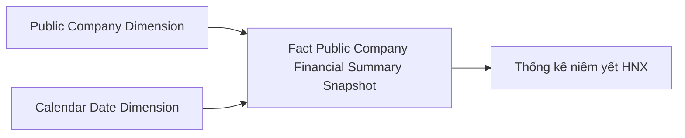

**Bảng grain:**

| Tên bảng | Grain |
|---|---|
| Fact Public Company Financial Summary Snapshot | 1 row / CTDC / kỳ báo cáo (năm × quý) |
| Public Company Dimension | 1 row / công ty đại chúng (SCD2) |
| Calendar Date Dimension | 1 row / ngày (Conformed) |

---

#### Nhóm 13 — STT 13: Giám sát tổng hợp theo sàn HNX — Tổng hợp CTTC & ngành

##### READY

> Phân loại: **Phân tích**
> Source: `Fact Public Company Financial Summary Snapshot` — filter `Equity_Listing_Exchange_Code = 'HNX'`
> Ghi chú: Cùng KPI structure với Nhóm 7–10, chỉ khác filter sàn HNX. Atomic mapping giống hệt Nhóm 7–10.

**Bảng KPI:**

| KPI ID | Tên KPI | Đơn vị | Tính chất | row_dsc_clmn_code (dn/bh/td) | Loại BC | col_desc |
|---|---|---|---|---|---|---|
| K_GSDC_83 | Tổng tài sản HNX | Tỉ đồng | Phái sinh | 270/270/300 | BCDKT | 1 |
| K_GSDC_83_YOY | Tổng tài sản HNX — YoY | % | Phái sinh | — | — | — |
| K_GSDC_84 | Nợ phải trả HNX | Tỉ đồng | Phái sinh | 300/300/400 | BCDKT | 1 |
| K_GSDC_84_YOY | Nợ phải trả HNX — YoY | % | Phái sinh | — | — | — |
| K_GSDC_85 | Vốn CSH HNX | Tỉ đồng | Phái sinh | 400/400/500 | BCDKT | 1 |
| K_GSDC_85_YOY | Vốn CSH HNX — YoY | % | Phái sinh | — | — | — |
| K_GSDC_86 | Vốn điều lệ HNX | Tỉ đồng | Phái sinh | 411/411/411 | BCDKT | 1 |
| K_GSDC_86_YOY | Vốn điều lệ HNX — YoY | % | Phái sinh | — | — | — |
| K_GSDC_87 | LNST HNX | Tỉ đồng | Phái sinh | 60/60/21 | BCKQKD | 1 |
| K_GSDC_87_YOY | LNST HNX — YoY | % | Phái sinh | — | — | — |
| K_GSDC_88 | ROA HNX | % | Phái sinh | — | — | — |
| K_GSDC_88_YOY | ROA HNX — YoY | % | Phái sinh | — | — | — |
| K_GSDC_89 | ROE HNX | % | Phái sinh | — | — | — |
| K_GSDC_89_YOY | ROE HNX — YoY | % | Phái sinh | — | — | — |
| K_GSDC_90 | Hàng tồn kho HNX | Tỉ đồng | Phái sinh | 140/140/— | BCDKT | 1 |
| K_GSDC_90_YOY | Hàng tồn kho HNX — YoY | % | Phái sinh | — | — | — |
| K_GSDC_91 | Doanh thu thuần HNX | Tỉ đồng | Phái sinh | 10/10/03 | BCKQKD | 1 |
| K_GSDC_91_YOY | Doanh thu HNX — YoY | % | Phái sinh | — | — | — |
| K_GSDC_92 | LN YTD HNX | Tỉ đồng | Phái sinh | 421/421/450 | BCDKT | 1 |
| K_GSDC_92_YOY | LN YTD HNX — YoY | % | Phái sinh | — | — | — |
| K_GSDC_93 | Phải thu HNX | Tỉ đồng | Phái sinh | 130+210/130+210/251 | BCDKT | 1 |
| K_GSDC_93_YOY | Phải thu HNX — YoY | % | Phái sinh | — | — | — |
| K_GSDC_94 | Tiền TĐT HNX | Tỉ đồng | Phái sinh | 110/110/110+120 | BCDKT | 1 |
| K_GSDC_94_YOY | Tiền TĐT HNX — YoY | % | Phái sinh | — | — | — |
| K_GSDC_95 | Nợ/Vốn CSH HNX | Lần (x) | Phái sinh | — | — | — |
| K_GSDC_95_YOY | Nợ/Vốn CSH HNX — YoY | % | Phái sinh | — | — | — |
| K_GSDC_96 | Tổng tài sản theo ngành HNX | Tỉ đồng | Phái sinh | 270/270/300 | BCDKT | 1 |
| K_GSDC_97 | Nợ phải trả theo ngành HNX | Tỉ đồng | Phái sinh | 300/300/400 | BCDKT | 1 |
| K_GSDC_98 | Vốn CSH theo ngành HNX | Tỉ đồng | Phái sinh | 400/400/500 | BCDKT | 1 |
| K_GSDC_99 | Vốn điều lệ theo ngành HNX | Tỉ đồng | Phái sinh | 411/411/411 | BCDKT | 1 |
| K_GSDC_100 | LNST theo ngành HNX | Tỉ đồng | Phái sinh | 60/60/21 | BCKQKD | 1 |
| K_GSDC_101 | ROA theo ngành HNX | % | Phái sinh | — | — | — |
| K_GSDC_102 | ROE theo ngành HNX | % | Phái sinh | — | — | — |
| K_GSDC_103 | HTK theo ngành HNX | Tỉ đồng | Phái sinh | 140/140/— | BCDKT | 1 |
| K_GSDC_104 | DT theo ngành HNX | Tỉ đồng | Phái sinh | 10/10/03 | BCKQKD | 1 |
| K_GSDC_105 | YTD theo ngành HNX | Tỉ đồng | Phái sinh | 421/421/450 | BCDKT | 1 |
| K_GSDC_106 | Phải thu theo ngành HNX | Tỉ đồng | Phái sinh | 130+210/130+210/251 | BCDKT | 1 |
| K_GSDC_107 | Tiền TĐT theo ngành HNX | Tỉ đồng | Phái sinh | 110/110/110+120 | BCDKT | 1 |
| K_GSDC_108 | Nợ/Vốn CSH theo ngành HNX | Lần (x) | Phái sinh | — | — | — |

> Atomic mapping: toàn bộ KPI từ `Public Company Financial Report Value` (`pblc_co_fnc_rpt_val`), `Data Value` (`data_val`). ROA/ROE derive từ `Total_Asset_Amount`, `Total_Asset_Prior_Period_Amount`, `Equity_Amount`, `Equity_Prior_Period_Amount`, `Net_Profit_Amount` trong Fact.

**Star Schema:** dùng chung `Fact_Public_Company_Financial_Summary_Snapshot`.

**Bảng grain:** giống Nhóm 6–10.

---

#### Nhóm 14 — STT 14: Giám sát tổng hợp theo sàn HOSE — Thống kê niêm yết

##### READY

> Phân loại: **Phân tích**
> Source: `Fact Public Company Financial Summary Snapshot` — filter `Equity_Listing_Exchange_Code = 'HOSE'`

**Bảng KPI:**

| KPI ID | Tên KPI | Đơn vị | Tính chất | Atomic Entity | Atomic Table | Atomic Attribute | Atomic Column | Ghi chú |
|---|---|---|---|---|---|---|---|---|
| K_GSDC_109 | Số DN HOSE | DN | Phái sinh | Public Company | pblc_co | IDS Registration Date | ids_rgst_dt | Filter eqty_listing_exg_code = 'HOSE' |
| K_GSDC_110 | Tỷ lệ nộp BCTC HOSE | % | Phái sinh | Public Company Report Submission | pblc_co_rpt_subm | Submission Date / Submission Deadline Date | subm_dt / subm_ddln_dt | Filter sàn HOSE |
| K_GSDC_111 | Số DN báo lãi HOSE | DN | Phái sinh | Public Company Financial Report Value | pblc_co_fnc_rpt_val | Data Value | data_val | Filter eqty_listing_exg_code = 'HOSE' |

**Star Schema:** dùng chung `Fact_Public_Company_Financial_Summary_Snapshot`.

**Bảng grain:** giống Nhóm 6.

---

#### Nhóm 15 — STT 15: Giám sát tổng hợp theo sàn HOSE — Tổng hợp CTTC & ngành

##### READY

> Phân loại: **Phân tích**
> Source: `Fact Public Company Financial Summary Snapshot` — filter `Equity_Listing_Exchange_Code = 'HOSE'`
> Ghi chú: Cùng KPI structure và Atomic mapping với Nhóm 13, chỉ khác filter sàn HOSE. KPI ID K_GSDC_112 – K_GSDC_147.

**Bảng KPI:** Cùng structure với Nhóm 13 (36 KPI + YOY variants), filter `Equity_Listing_Exchange_Code = 'HOSE'`. KPI ID K_GSDC_112 – K_GSDC_147.

**Star Schema:** dùng chung `Fact_Public_Company_Financial_Summary_Snapshot`.

**Bảng grain:** giống Nhóm 6.

---

#### Nhóm 16 — STT 16: Giám sát tổng hợp theo sàn UPCOM — Thống kê niêm yết

##### READY

> Phân loại: **Phân tích**
> Source: `Fact Public Company Financial Summary Snapshot` — filter `Equity_Listing_Exchange_Code = 'UPCOM'`

**Bảng KPI:**

| KPI ID | Tên KPI | Đơn vị | Tính chất | Atomic Entity | Atomic Table | Atomic Attribute | Atomic Column | Ghi chú |
|---|---|---|---|---|---|---|---|---|
| K_GSDC_148 | Số DN UPCOM | DN | Phái sinh | Public Company | pblc_co | IDS Registration Date | ids_rgst_dt | Filter eqty_listing_exg_code = 'UPCOM' |
| K_GSDC_149 | Tỷ lệ nộp BCTC UPCOM | % | Phái sinh | Public Company Report Submission | pblc_co_rpt_subm | Submission Date / Submission Deadline Date | subm_dt / subm_ddln_dt | Filter sàn UPCOM |
| K_GSDC_150 | Số DN báo lãi UPCOM | DN | Phái sinh | Public Company Financial Report Value | pblc_co_fnc_rpt_val | Data Value | data_val | Filter eqty_listing_exg_code = 'UPCOM' |

**Star Schema:** dùng chung `Fact_Public_Company_Financial_Summary_Snapshot`.

**Bảng grain:** giống Nhóm 6.

---

#### Nhóm 17 — STT 17: Giám sát tổng hợp theo sàn UPCOM — Tổng hợp CTTC & ngành

##### READY

> Phân loại: **Phân tích**
> Source: `Fact Public Company Financial Summary Snapshot` — filter `Equity_Listing_Exchange_Code = 'UPCOM'`
> Ghi chú: Cùng KPI structure và Atomic mapping với Nhóm 13, chỉ khác filter sàn UPCOM. KPI ID K_GSDC_151 – K_GSDC_186.

**Bảng KPI:** Cùng structure với Nhóm 13 (36 KPI + YOY variants), filter UPCOM. KPI ID K_GSDC_151 – K_GSDC_186.

**Star Schema:** dùng chung `Fact_Public_Company_Financial_Summary_Snapshot`.

**Bảng grain:** giống Nhóm 6.

---

#### Nhóm 18 — STT 18: Giám sát tổng hợp theo sàn OTC — Thống kê niêm yết

##### READY

> Phân loại: **Phân tích**
> Source: `Fact Public Company Financial Summary Snapshot` — filter `Equity_Listing_Exchange_Code = 'OTC'`

**Bảng KPI:**

| KPI ID | Tên KPI | Đơn vị | Tính chất | Atomic Entity | Atomic Table | Atomic Attribute | Atomic Column | Ghi chú |
|---|---|---|---|---|---|---|---|---|
| K_GSDC_187 | Số DN OTC/Chưa niêm yết | DN | Phái sinh | Public Company | pblc_co | IDS Registration Date | ids_rgst_dt | Filter eqty_listing_exg_code = 'OTC' |
| K_GSDC_188 | Tỷ lệ nộp BCTC OTC | % | Phái sinh | Public Company Report Submission | pblc_co_rpt_subm | Submission Date / Submission Deadline Date | subm_dt / subm_ddln_dt | Filter sàn OTC |
| K_GSDC_189 | Số DN báo lãi OTC | DN | Phái sinh | Public Company Financial Report Value | pblc_co_fnc_rpt_val | Data Value | data_val | Filter eqty_listing_exg_code = 'OTC' |

**Star Schema:** dùng chung `Fact_Public_Company_Financial_Summary_Snapshot`.

**Bảng grain:** giống Nhóm 6.

---

#### Nhóm 19 — STT 19: Giám sát tổng hợp theo sàn OTC — Tổng hợp CTTC & ngành

##### READY

> Phân loại: **Phân tích**
> Source: `Fact Public Company Financial Summary Snapshot` — filter `Equity_Listing_Exchange_Code = 'OTC'`
> Ghi chú: Cùng KPI structure và Atomic mapping với Nhóm 13, chỉ khác filter sàn OTC. KPI ID K_GSDC_190 – K_GSDC_225.

**Bảng KPI:** Cùng structure với Nhóm 13 (36 KPI + YOY variants), filter OTC. KPI ID K_GSDC_190 – K_GSDC_225.

**Star Schema:** dùng chung `Fact_Public_Company_Financial_Summary_Snapshot`.

**Bảng grain:** giống Nhóm 6.

---

#### Nhóm 20 — STT 20: Dữ liệu tài chính doanh nghiệp — Metadata BCTC

##### READY

> Phân loại: **Phân tích**
> Source: `Financial Report Catalog Dimension` — tra cứu danh mục báo cáo/dòng/cột
> Ghi chú: STT 20 chỉ có chiều, không có KPI cơ sở — phục vụ bộ lọc Data Explorer MH3.

**Bảng KPI (chiều):**

| KPI ID | Tên KPI | Đơn vị | Tính chất | Atomic Entity | Atomic Table | Atomic Attribute | Atomic Column | Ghi chú |
|---|---|---|---|---|---|---|---|---|
| K_GSDC_D1 | Mã báo cáo | Text | Chiều | Financial Report Catalog | fnc_rpt_ctlg | Financial Report Catalog Business Code | fnc_rpt_ctlg_bsn_code | Filter Report Direction Type Code = 'i' AND Active Flag = true |
| K_GSDC_D2 | Tên báo cáo | Text | Chiều | Financial Report Catalog | fnc_rpt_ctlg | Financial Report Catalog Name | fnc_rpt_ctlg_nm | — |
| K_GSDC_D3 | Mã chỉ tiêu dòng | Text | Chiều | Financial Report Row Template | fnc_rpt_row_tpl | Row Code | row_code | order by Row Index |
| K_GSDC_D4 | Tên chỉ tiêu dòng | Text | Chiều | Financial Report Row Template | fnc_rpt_row_tpl | Row Description Column Code / Row Name | row_dsc_clmn_code / row_nm | `row_dsc_clmn_code \|\| ' - ' \|\| row_nm` |
| K_GSDC_D5 | Mã chỉ tiêu cột | Text | Chiều | Financial Report Column Template | fnc_rpt_clmn_tpl | Column Code | clmn_code | order by Column Index |
| K_GSDC_D6 | Tên chỉ tiêu cột | Text | Chiều | Financial Report Column Template | fnc_rpt_clmn_tpl | Column Name | clmn_nm | xem O_GSDC_3 — col_desc chưa có trong Atomic |

---

### Màn hình 3 — Data Explorer: Dữ liệu tài chính doanh nghiệp

Data Explorer cho phép tra cứu BCTC chi tiết theo từng CTDC, kỳ báo cáo và loại hình DN. Toàn bộ STT 21–32 + STT 39 phục vụ bởi `Fact Public Company Financial Report Value` + `Financial Report Catalog Dimension`.

**Ghi chú chung toàn bộ MH3:**
- Tất cả chỉ tiêu lấy trực tiếp `Data Value` (`data_val`) từ `Public Company Financial Report Value` (`pblc_co_fnc_rpt_val`)
- `col_desc` trong BA SQL tương ứng `Column Code` (`clmn_code`) trong Atomic — xem O_GSDC_3
- `row_desc` trong BA SQL tương ứng `Row Description Column Code` (`row_dsc_clmn_code`) trong Atomic `Financial Report Row Template` (`fnc_rpt_row_tpl`)
- `col_desc='1'` = cuối kỳ / kỳ hiện tại; `col_desc='2'` = đầu kỳ (BCĐKT)

---

#### Nhóm 21 — STT 21: DN thông thường — Bảng cân đối kế toán

##### READY

> Phân loại: **Phân tích**
> Atomic: `Public Company Financial Report Value` ← IDS.data (`pblc_co_fnc_rpt_val`) — **READY**
> Filter: `Enterprise Type Code` (`entp_tp_code`) = 'dn', `Financial Report Catalog Business Code` LIKE 'BCDKT%'

**Source:** `Fact Public Company Financial Report Value` → `Public Company Dimension`, `Calendar Date Dimension`, `Financial Report Catalog Dimension`

**Bảng KPI:**

| KPI ID | Tên chỉ tiêu | Atomic Entity | Atomic Table | Atomic Attribute | Atomic Column | row_dsc_clmn_code | col_desc | Tính chất |
|---|---|---|---|---|---|---|---|---|
| K_GSDC_226 | A – Tài sản ngắn hạn | Public Company Financial Report Value | pblc_co_fnc_rpt_val | Data Value | data_val | 100 | 1/2 | Cơ sở |
| K_GSDC_227 | I – Tiền và các khoản tương đương tiền | Public Company Financial Report Value | pblc_co_fnc_rpt_val | Data Value | data_val | 110 | 1/2 | Cơ sở |
| K_GSDC_228 | 1. Tiền | Public Company Financial Report Value | pblc_co_fnc_rpt_val | Data Value | data_val | 111 | 1/2 | Cơ sở |
| K_GSDC_229 | 2. Các khoản tương đương tiền | Public Company Financial Report Value | pblc_co_fnc_rpt_val | Data Value | data_val | 112 | 1/2 | Cơ sở |
| K_GSDC_230 | II – Đầu tư tài chính ngắn hạn | Public Company Financial Report Value | pblc_co_fnc_rpt_val | Data Value | data_val | 120 | 1/2 | Cơ sở |
| K_GSDC_231 | 1. Chứng khoán kinh doanh | Public Company Financial Report Value | pblc_co_fnc_rpt_val | Data Value | data_val | 121 | 1/2 | Cơ sở |
| K_GSDC_232 | 2. Dự phòng giảm giá chứng khoán kinh doanh | Public Company Financial Report Value | pblc_co_fnc_rpt_val | Data Value | data_val | 122 | 1/2 | Cơ sở |
| K_GSDC_233 | 3. Đầu tư nắm giữ đến ngày đáo hạn | Public Company Financial Report Value | pblc_co_fnc_rpt_val | Data Value | data_val | 123 | 1/2 | Cơ sở |
| K_GSDC_234 | III – Các khoản phải thu ngắn hạn | Public Company Financial Report Value | pblc_co_fnc_rpt_val | Data Value | data_val | 130 | 1/2 | Cơ sở |
| K_GSDC_235 | 1. Phải thu ngắn hạn của khách hàng | Public Company Financial Report Value | pblc_co_fnc_rpt_val | Data Value | data_val | 131 | 1/2 | Cơ sở |
| K_GSDC_236 | 2. Trả trước cho người bán ngắn hạn | Public Company Financial Report Value | pblc_co_fnc_rpt_val | Data Value | data_val | 132 | 1/2 | Cơ sở |
| K_GSDC_237 | 3. Phải thu nội bộ ngắn hạn | Public Company Financial Report Value | pblc_co_fnc_rpt_val | Data Value | data_val | 133 | 1/2 | Cơ sở |
| K_GSDC_238 | 4. Phải thu theo tiến độ HĐXD | Public Company Financial Report Value | pblc_co_fnc_rpt_val | Data Value | data_val | 134 | 1/2 | Cơ sở |
| K_GSDC_239 | 5. Phải thu về cho vay ngắn hạn | Public Company Financial Report Value | pblc_co_fnc_rpt_val | Data Value | data_val | 135 | 1/2 | Cơ sở |
| K_GSDC_240 | 6. Phải thu ngắn hạn khác | Public Company Financial Report Value | pblc_co_fnc_rpt_val | Data Value | data_val | 136 | 1/2 | Cơ sở |
| K_GSDC_241 | 7. Dự phòng phải thu ngắn hạn khó đòi | Public Company Financial Report Value | pblc_co_fnc_rpt_val | Data Value | data_val | 137 | 1/2 | Cơ sở |
| K_GSDC_242 | 8. Tài sản thiếu chờ xử lý | Public Company Financial Report Value | pblc_co_fnc_rpt_val | Data Value | data_val | 139 | 1/2 | Cơ sở |
| K_GSDC_243 | IV – Hàng tồn kho | Public Company Financial Report Value | pblc_co_fnc_rpt_val | Data Value | data_val | 140 | 1/2 | Cơ sở |
| K_GSDC_244 | 1. Hàng tồn kho | Public Company Financial Report Value | pblc_co_fnc_rpt_val | Data Value | data_val | 141 | 1/2 | Cơ sở |
| K_GSDC_245 | 2. Dự phòng giảm giá hàng tồn kho | Public Company Financial Report Value | pblc_co_fnc_rpt_val | Data Value | data_val | 149 | 1/2 | Cơ sở |
| K_GSDC_246 | V – Tài sản ngắn hạn khác | Public Company Financial Report Value | pblc_co_fnc_rpt_val | Data Value | data_val | 150 | 1/2 | Cơ sở |
| K_GSDC_247 | 1. Chi phí trả trước ngắn hạn | Public Company Financial Report Value | pblc_co_fnc_rpt_val | Data Value | data_val | 151 | 1/2 | Cơ sở |
| K_GSDC_248 | 2. Thuế GTGT được khấu trừ | Public Company Financial Report Value | pblc_co_fnc_rpt_val | Data Value | data_val | 152 | 1/2 | Cơ sở |
| K_GSDC_249 | 3. Thuế và các khoản khác phải thu Nhà nước | Public Company Financial Report Value | pblc_co_fnc_rpt_val | Data Value | data_val | 153 | 1/2 | Cơ sở |
| K_GSDC_250 | 4. Giao dịch mua bán lại trái phiếu CP | Public Company Financial Report Value | pblc_co_fnc_rpt_val | Data Value | data_val | 154 | 1/2 | Cơ sở |
| K_GSDC_251 | 5. Tài sản ngắn hạn khác | Public Company Financial Report Value | pblc_co_fnc_rpt_val | Data Value | data_val | 155 | 1/2 | Cơ sở |
| K_GSDC_252 | B – Tài sản dài hạn | Public Company Financial Report Value | pblc_co_fnc_rpt_val | Data Value | data_val | 200 | 1/2 | Cơ sở |
| K_GSDC_253 | I – Các khoản phải thu dài hạn | Public Company Financial Report Value | pblc_co_fnc_rpt_val | Data Value | data_val | 210 | 1/2 | Cơ sở |
| K_GSDC_254 | 1. Phải thu dài hạn của khách hàng | Public Company Financial Report Value | pblc_co_fnc_rpt_val | Data Value | data_val | 211 | 1/2 | Cơ sở |
| K_GSDC_255 | 2. Trả trước cho người bán dài hạn | Public Company Financial Report Value | pblc_co_fnc_rpt_val | Data Value | data_val | 212 | 1/2 | Cơ sở |
| K_GSDC_256 | 3. Vốn kinh doanh ở đơn vị trực thuộc | Public Company Financial Report Value | pblc_co_fnc_rpt_val | Data Value | data_val | 213 | 1/2 | Cơ sở |
| K_GSDC_257 | 4. Phải thu nội bộ dài hạn | Public Company Financial Report Value | pblc_co_fnc_rpt_val | Data Value | data_val | 214 | 1/2 | Cơ sở |
| K_GSDC_258 | 5. Phải thu về cho vay dài hạn | Public Company Financial Report Value | pblc_co_fnc_rpt_val | Data Value | data_val | 215 | 1/2 | Cơ sở |
| K_GSDC_259 | 6. Phải thu dài hạn khác | Public Company Financial Report Value | pblc_co_fnc_rpt_val | Data Value | data_val | 216 | 1/2 | Cơ sở |
| K_GSDC_260 | 7. Dự phòng phải thu dài hạn khó đòi | Public Company Financial Report Value | pblc_co_fnc_rpt_val | Data Value | data_val | 219 | 1/2 | Cơ sở |
| K_GSDC_261 | II – Tài sản cố định | Public Company Financial Report Value | pblc_co_fnc_rpt_val | Data Value | data_val | 220 | 1/2 | Cơ sở |
| K_GSDC_262 | 1. TSCĐ hữu hình — Nguyên giá | Public Company Financial Report Value | pblc_co_fnc_rpt_val | Data Value | data_val | 221 | 1/2 | Cơ sở |
| K_GSDC_263 | 1. TSCĐ hữu hình — Giá trị còn lại | Public Company Financial Report Value | pblc_co_fnc_rpt_val | Data Value | data_val | 222 | 1/2 | Cơ sở |
| K_GSDC_264 | 1. TSCĐ hữu hình — Hao mòn lũy kế | Public Company Financial Report Value | pblc_co_fnc_rpt_val | Data Value | data_val | 223 | 1/2 | Cơ sở |
| K_GSDC_265 | 2. TSCĐ thuê tài chính — Nguyên giá | Public Company Financial Report Value | pblc_co_fnc_rpt_val | Data Value | data_val | 224 | 1/2 | Cơ sở |
| K_GSDC_266 | 2. TSCĐ thuê tài chính — Giá trị còn lại | Public Company Financial Report Value | pblc_co_fnc_rpt_val | Data Value | data_val | 225 | 1/2 | Cơ sở |
| K_GSDC_267 | 2. TSCĐ thuê tài chính — Hao mòn lũy kế | Public Company Financial Report Value | pblc_co_fnc_rpt_val | Data Value | data_val | 226 | 1/2 | Cơ sở |
| K_GSDC_268 | 3. TSCĐ vô hình — Nguyên giá | Public Company Financial Report Value | pblc_co_fnc_rpt_val | Data Value | data_val | 227 | 1/2 | Cơ sở |
| K_GSDC_269 | 3. TSCĐ vô hình — Giá trị còn lại | Public Company Financial Report Value | pblc_co_fnc_rpt_val | Data Value | data_val | 228 | 1/2 | Cơ sở |
| K_GSDC_270 | 3. TSCĐ vô hình — Hao mòn lũy kế | Public Company Financial Report Value | pblc_co_fnc_rpt_val | Data Value | data_val | 229 | 1/2 | Cơ sở |
| K_GSDC_271 | III – Bất động sản đầu tư — Nguyên giá | Public Company Financial Report Value | pblc_co_fnc_rpt_val | Data Value | data_val | 230 | 1/2 | Cơ sở |
| K_GSDC_272 | III – Bất động sản đầu tư — Giá trị còn lại | Public Company Financial Report Value | pblc_co_fnc_rpt_val | Data Value | data_val | 231 | 1/2 | Cơ sở |
| K_GSDC_273 | III – Bất động sản đầu tư — Hao mòn lũy kế | Public Company Financial Report Value | pblc_co_fnc_rpt_val | Data Value | data_val | 232 | 1/2 | Cơ sở |
| K_GSDC_274 | IV – Tài sản dở dang dài hạn | Public Company Financial Report Value | pblc_co_fnc_rpt_val | Data Value | data_val | 240 | 1/2 | Cơ sở |
| K_GSDC_275 | 1. Chi phí SXKD dở dang dài hạn | Public Company Financial Report Value | pblc_co_fnc_rpt_val | Data Value | data_val | 241 | 1/2 | Cơ sở |
| K_GSDC_276 | 2. Chi phí xây dựng cơ bản dở dang | Public Company Financial Report Value | pblc_co_fnc_rpt_val | Data Value | data_val | 242 | 1/2 | Cơ sở |
| K_GSDC_277 | V – Đầu tư tài chính dài hạn | Public Company Financial Report Value | pblc_co_fnc_rpt_val | Data Value | data_val | 250 | 1/2 | Cơ sở |
| K_GSDC_278 | 1. Đầu tư vào công ty con | Public Company Financial Report Value | pblc_co_fnc_rpt_val | Data Value | data_val | 251 | 1/2 | Cơ sở |
| K_GSDC_279 | 2. Đầu tư vào công ty liên doanh, liên kết | Public Company Financial Report Value | pblc_co_fnc_rpt_val | Data Value | data_val | 252 | 1/2 | Cơ sở |
| K_GSDC_280 | 3. Đầu tư góp vốn vào đơn vị khác | Public Company Financial Report Value | pblc_co_fnc_rpt_val | Data Value | data_val | 253 | 1/2 | Cơ sở |
| K_GSDC_281 | 4. Dự phòng đầu tư tài chính dài hạn | Public Company Financial Report Value | pblc_co_fnc_rpt_val | Data Value | data_val | 254 | 1/2 | Cơ sở |
| K_GSDC_282 | 5. Đầu tư nắm giữ đến ngày đáo hạn | Public Company Financial Report Value | pblc_co_fnc_rpt_val | Data Value | data_val | 255 | 1/2 | Cơ sở |
| K_GSDC_283 | VI – Tài sản dài hạn khác | Public Company Financial Report Value | pblc_co_fnc_rpt_val | Data Value | data_val | 260 | 1/2 | Cơ sở |
| K_GSDC_284 | 1. Chi phí trả trước dài hạn | Public Company Financial Report Value | pblc_co_fnc_rpt_val | Data Value | data_val | 261 | 1/2 | Cơ sở |
| K_GSDC_285 | 2. Tài sản thuế thu nhập hoãn lại | Public Company Financial Report Value | pblc_co_fnc_rpt_val | Data Value | data_val | 262 | 1/2 | Cơ sở |
| K_GSDC_286 | 3. Thiết bị, vật tư, phụ tùng thay thế dài hạn | Public Company Financial Report Value | pblc_co_fnc_rpt_val | Data Value | data_val | 263 | 1/2 | Cơ sở |
| K_GSDC_287 | 4. Tài sản dài hạn khác | Public Company Financial Report Value | pblc_co_fnc_rpt_val | Data Value | data_val | 268 | 1/2 | Cơ sở |
| K_GSDC_288 | 5. Lợi thế thương mại | Public Company Financial Report Value | pblc_co_fnc_rpt_val | Data Value | data_val | 269 | 1/2 | Cơ sở |
| K_GSDC_289 | Tổng cộng tài sản | Public Company Financial Report Value | pblc_co_fnc_rpt_val | Data Value | data_val | 270 | 1/2 | Cơ sở |
| K_GSDC_290 | C – Nợ phải trả | Public Company Financial Report Value | pblc_co_fnc_rpt_val | Data Value | data_val | 300 | 1/2 | Cơ sở |
| K_GSDC_291 | I – Nợ ngắn hạn | Public Company Financial Report Value | pblc_co_fnc_rpt_val | Data Value | data_val | 310 | 1/2 | Cơ sở |
| K_GSDC_292 | 1. Phải trả người bán ngắn hạn | Public Company Financial Report Value | pblc_co_fnc_rpt_val | Data Value | data_val | 311 | 1/2 | Cơ sở |
| K_GSDC_293 | 2. Người mua trả tiền trước ngắn hạn | Public Company Financial Report Value | pblc_co_fnc_rpt_val | Data Value | data_val | 312 | 1/2 | Cơ sở |
| K_GSDC_294 | 3. Thuế và các khoản phải nộp Nhà nước | Public Company Financial Report Value | pblc_co_fnc_rpt_val | Data Value | data_val | 313 | 1/2 | Cơ sở |
| K_GSDC_295 | 4. Phải trả người lao động | Public Company Financial Report Value | pblc_co_fnc_rpt_val | Data Value | data_val | 314 | 1/2 | Cơ sở |
| K_GSDC_296 | 5. Chi phí phải trả ngắn hạn | Public Company Financial Report Value | pblc_co_fnc_rpt_val | Data Value | data_val | 315 | 1/2 | Cơ sở |
| K_GSDC_297 | 6. Phải trả nội bộ ngắn hạn | Public Company Financial Report Value | pblc_co_fnc_rpt_val | Data Value | data_val | 316 | 1/2 | Cơ sở |
| K_GSDC_298 | 7. Phải trả theo tiến độ HĐXD | Public Company Financial Report Value | pblc_co_fnc_rpt_val | Data Value | data_val | 317 | 1/2 | Cơ sở |
| K_GSDC_299 | 8. Doanh thu chưa thực hiện ngắn hạn | Public Company Financial Report Value | pblc_co_fnc_rpt_val | Data Value | data_val | 318 | 1/2 | Cơ sở |
| K_GSDC_300 | 9. Phải trả ngắn hạn khác | Public Company Financial Report Value | pblc_co_fnc_rpt_val | Data Value | data_val | 319 | 1/2 | Cơ sở |
| K_GSDC_301 | 10. Vay và nợ thuê tài chính ngắn hạn | Public Company Financial Report Value | pblc_co_fnc_rpt_val | Data Value | data_val | 320 | 1/2 | Cơ sở |
| K_GSDC_302 | 11. Dự phòng phải trả ngắn hạn | Public Company Financial Report Value | pblc_co_fnc_rpt_val | Data Value | data_val | 321 | 1/2 | Cơ sở |
| K_GSDC_303 | 12. Quỹ khen thưởng, phúc lợi | Public Company Financial Report Value | pblc_co_fnc_rpt_val | Data Value | data_val | 322 | 1/2 | Cơ sở |
| K_GSDC_304 | 13. Quỹ bình ổn giá | Public Company Financial Report Value | pblc_co_fnc_rpt_val | Data Value | data_val | 323 | 1/2 | Cơ sở |
| K_GSDC_305 | 14. Giao dịch mua bán lại trái phiếu CP | Public Company Financial Report Value | pblc_co_fnc_rpt_val | Data Value | data_val | 324 | 1/2 | Cơ sở |
| K_GSDC_306 | II – Nợ dài hạn | Public Company Financial Report Value | pblc_co_fnc_rpt_val | Data Value | data_val | 330 | 1/2 | Cơ sở |
| K_GSDC_307 | 1. Phải trả người bán dài hạn | Public Company Financial Report Value | pblc_co_fnc_rpt_val | Data Value | data_val | 331 | 1/2 | Cơ sở |
| K_GSDC_308 | 2. Người mua trả tiền trước dài hạn | Public Company Financial Report Value | pblc_co_fnc_rpt_val | Data Value | data_val | 332 | 1/2 | Cơ sở |
| K_GSDC_309 | 3. Chi phí phải trả dài hạn | Public Company Financial Report Value | pblc_co_fnc_rpt_val | Data Value | data_val | 333 | 1/2 | Cơ sở |
| K_GSDC_310 | 4. Phải trả nội bộ về vốn kinh doanh | Public Company Financial Report Value | pblc_co_fnc_rpt_val | Data Value | data_val | 334 | 1/2 | Cơ sở |
| K_GSDC_311 | 5. Phải trả nội bộ dài hạn | Public Company Financial Report Value | pblc_co_fnc_rpt_val | Data Value | data_val | 335 | 1/2 | Cơ sở |
| K_GSDC_312 | 6. Doanh thu chưa thực hiện dài hạn | Public Company Financial Report Value | pblc_co_fnc_rpt_val | Data Value | data_val | 336 | 1/2 | Cơ sở |
| K_GSDC_313 | 7. Phải trả dài hạn khác | Public Company Financial Report Value | pblc_co_fnc_rpt_val | Data Value | data_val | 337 | 1/2 | Cơ sở |
| K_GSDC_314 | 8. Vay và nợ thuê tài chính dài hạn | Public Company Financial Report Value | pblc_co_fnc_rpt_val | Data Value | data_val | 338 | 1/2 | Cơ sở |
| K_GSDC_315 | 9. Trái phiếu chuyển đổi | Public Company Financial Report Value | pblc_co_fnc_rpt_val | Data Value | data_val | 339 | 1/2 | Cơ sở |
| K_GSDC_316 | 10. Cổ phiếu ưu đãi | Public Company Financial Report Value | pblc_co_fnc_rpt_val | Data Value | data_val | 340 | 1/2 | Cơ sở |
| K_GSDC_317 | 11. Thuế thu nhập hoãn lại phải trả | Public Company Financial Report Value | pblc_co_fnc_rpt_val | Data Value | data_val | 341 | 1/2 | Cơ sở |
| K_GSDC_318 | 12. Dự phòng phải trả dài hạn | Public Company Financial Report Value | pblc_co_fnc_rpt_val | Data Value | data_val | 342 | 1/2 | Cơ sở |
| K_GSDC_319 | 13. Quỹ phát triển KH&CN | Public Company Financial Report Value | pblc_co_fnc_rpt_val | Data Value | data_val | 343 | 1/2 | Cơ sở |
| K_GSDC_320 | D – Vốn chủ sở hữu | Public Company Financial Report Value | pblc_co_fnc_rpt_val | Data Value | data_val | 400 | 1/2 | Cơ sở |
| K_GSDC_321 | I – Vốn chủ sở hữu | Public Company Financial Report Value | pblc_co_fnc_rpt_val | Data Value | data_val | 410 | 1/2 | Cơ sở |
| K_GSDC_322 | 1. Vốn góp của chủ sở hữu | Public Company Financial Report Value | pblc_co_fnc_rpt_val | Data Value | data_val | 411 | 1/2 | Cơ sở |
| K_GSDC_323 | 1a. Cổ phiếu phổ thông có quyền biểu quyết | Public Company Financial Report Value | pblc_co_fnc_rpt_val | Data Value | data_val | 411a | 1/2 | Cơ sở |
| K_GSDC_324 | 1b. Cổ phiếu ưu đãi | Public Company Financial Report Value | pblc_co_fnc_rpt_val | Data Value | data_val | 411b | 1/2 | Cơ sở |
| K_GSDC_325 | 2. Thặng dư vốn cổ phần | Public Company Financial Report Value | pblc_co_fnc_rpt_val | Data Value | data_val | 412 | 1/2 | Cơ sở |
| K_GSDC_326 | 3. Quyền chọn chuyển đổi trái phiếu | Public Company Financial Report Value | pblc_co_fnc_rpt_val | Data Value | data_val | 413 | 1/2 | Cơ sở |
| K_GSDC_327 | 4. Vốn khác của chủ sở hữu | Public Company Financial Report Value | pblc_co_fnc_rpt_val | Data Value | data_val | 414 | 1/2 | Cơ sở |
| K_GSDC_328 | 5. Cổ phiếu quỹ | Public Company Financial Report Value | pblc_co_fnc_rpt_val | Data Value | data_val | 415 | 1/2 | Cơ sở |
| K_GSDC_329 | 6. Chênh lệch đánh giá lại tài sản | Public Company Financial Report Value | pblc_co_fnc_rpt_val | Data Value | data_val | 416 | 1/2 | Cơ sở |
| K_GSDC_330 | 7. Chênh lệch tỷ giá hối đoái | Public Company Financial Report Value | pblc_co_fnc_rpt_val | Data Value | data_val | 417 | 1/2 | Cơ sở |
| K_GSDC_331 | 8. Quỹ đầu tư phát triển | Public Company Financial Report Value | pblc_co_fnc_rpt_val | Data Value | data_val | 418 | 1/2 | Cơ sở |
| K_GSDC_332 | 9. Quỹ hỗ trợ sắp xếp doanh nghiệp | Public Company Financial Report Value | pblc_co_fnc_rpt_val | Data Value | data_val | 419 | 1/2 | Cơ sở |
| K_GSDC_333 | 10. Quỹ khác thuộc vốn chủ sở hữu | Public Company Financial Report Value | pblc_co_fnc_rpt_val | Data Value | data_val | 420 | 1/2 | Cơ sở |
| K_GSDC_334 | 11. Lợi nhuận sau thuế chưa phân phối | Public Company Financial Report Value | pblc_co_fnc_rpt_val | Data Value | data_val | 421 | 1/2 | Cơ sở |
| K_GSDC_335 | 11a. LNST chưa PP lũy kế đến đầu kỳ | Public Company Financial Report Value | pblc_co_fnc_rpt_val | Data Value | data_val | 421a | 1/2 | Cơ sở |
| K_GSDC_336 | 11b. LNST chưa PP kỳ này | Public Company Financial Report Value | pblc_co_fnc_rpt_val | Data Value | data_val | 421b | 1/2 | Cơ sở |
| K_GSDC_337 | 12. Nguồn vốn đầu tư XDCB | Public Company Financial Report Value | pblc_co_fnc_rpt_val | Data Value | data_val | 422 | 1/2 | Cơ sở |
| K_GSDC_338 | 13. Lợi ích của cổ đông không kiểm soát | Public Company Financial Report Value | pblc_co_fnc_rpt_val | Data Value | data_val | 429 | 1/2 | Cơ sở |
| K_GSDC_339 | II – Nguồn kinh phí và quỹ khác | Public Company Financial Report Value | pblc_co_fnc_rpt_val | Data Value | data_val | 430 | 1/2 | Cơ sở |
| K_GSDC_340 | 1. Nguồn kinh phí | Public Company Financial Report Value | pblc_co_fnc_rpt_val | Data Value | data_val | 431 | 1/2 | Cơ sở |
| K_GSDC_341 | 2. Nguồn kinh phí đã hình thành TSCĐ | Public Company Financial Report Value | pblc_co_fnc_rpt_val | Data Value | data_val | 432 | 1/2 | Cơ sở |
| K_GSDC_342 | Tổng cộng nguồn vốn | Public Company Financial Report Value | pblc_co_fnc_rpt_val | Data Value | data_val | 440 | 1/2 | Cơ sở |

**Star Schema:** dùng chung `Fact_Public_Company_Financial_Report_Value` + `Financial_Report_Catalog_Dimension`.

**Lineage Mart → Báo cáo:**

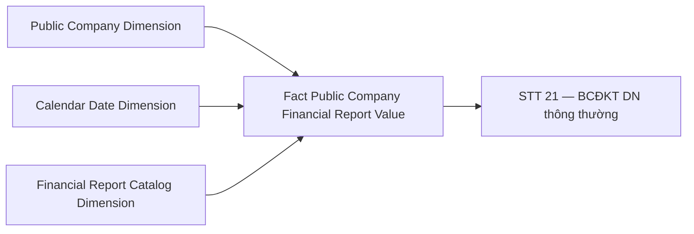

**Bảng grain:**

| Tên bảng | Grain |
|---|---|
| Fact Public Company Financial Report Value | 1 row / CTDC / kỳ / Row_Code / Column_Code |
| Public Company Dimension | 1 row / công ty đại chúng (SCD2) |
| Calendar Date Dimension | 1 row / ngày (Conformed) |
| Financial Report Catalog Dimension | 1 row / báo cáo / dòng / cột |

---

#### Nhóm 22 — STT 22: DN thông thường — Báo cáo KQKD

##### READY

> Phân loại: **Phân tích**
> Filter: `entp_tp_code = 'dn'`, `fnc_rpt_ctlg_bsn_code LIKE 'BCKQKD%'`, col_desc='1'

**Bảng KPI:**

| KPI ID | Tên chỉ tiêu | Atomic Entity | Atomic Table | Atomic Attribute | Atomic Column | row_dsc_clmn_code | col_desc | Tính chất |
|---|---|---|---|---|---|---|---|---|
| K_GSDC_343 | 1. Doanh thu bán hàng và cung cấp DV | Public Company Financial Report Value | pblc_co_fnc_rpt_val | Data Value | data_val | 1 | 1 | Cơ sở |
| K_GSDC_344 | 2. Các khoản giảm trừ doanh thu | Public Company Financial Report Value | pblc_co_fnc_rpt_val | Data Value | data_val | 2 | 1 | Cơ sở |
| K_GSDC_345 | 3. Doanh thu thuần về bán hàng và cung cấp DV | Public Company Financial Report Value | pblc_co_fnc_rpt_val | Data Value | data_val | 10 | 1 | Cơ sở |
| K_GSDC_346 | 4. Giá vốn hàng bán | Public Company Financial Report Value | pblc_co_fnc_rpt_val | Data Value | data_val | 11 | 1 | Cơ sở |
| K_GSDC_347 | 5. Lợi nhuận gộp về bán hàng và cung cấp DV | Public Company Financial Report Value | pblc_co_fnc_rpt_val | Data Value | data_val | 20 | 1 | Cơ sở |
| K_GSDC_348 | 6. Doanh thu hoạt động tài chính | Public Company Financial Report Value | pblc_co_fnc_rpt_val | Data Value | data_val | 21 | 1 | Cơ sở |
| K_GSDC_349 | 7. Chi phí tài chính | Public Company Financial Report Value | pblc_co_fnc_rpt_val | Data Value | data_val | 22 | 1 | Cơ sở |
| K_GSDC_350 | 7. Chi phí tài chính — Chi phí lãi vay | Public Company Financial Report Value | pblc_co_fnc_rpt_val | Data Value | data_val | 23 | 1 | Cơ sở |
| K_GSDC_351 | 8. Phần lãi/lỗ trong công ty liên doanh, LK | Public Company Financial Report Value | pblc_co_fnc_rpt_val | Data Value | data_val | 24 | 1 | Cơ sở |
| K_GSDC_352 | 9. Chi phí bán hàng | Public Company Financial Report Value | pblc_co_fnc_rpt_val | Data Value | data_val | 25 | 1 | Cơ sở |
| K_GSDC_353 | 10. Chi phí quản lý doanh nghiệp | Public Company Financial Report Value | pblc_co_fnc_rpt_val | Data Value | data_val | 26 | 1 | Cơ sở |
| K_GSDC_354 | 11. Lợi nhuận thuần từ HĐKD | Public Company Financial Report Value | pblc_co_fnc_rpt_val | Data Value | data_val | 30 | 1 | Cơ sở |
| K_GSDC_355 | 12. Thu nhập khác | Public Company Financial Report Value | pblc_co_fnc_rpt_val | Data Value | data_val | 31 | 1 | Cơ sở |
| K_GSDC_356 | 13. Chi phí khác | Public Company Financial Report Value | pblc_co_fnc_rpt_val | Data Value | data_val | 32 | 1 | Cơ sở |
| K_GSDC_357 | 14. Lợi nhuận khác | Public Company Financial Report Value | pblc_co_fnc_rpt_val | Data Value | data_val | 40 | 1 | Cơ sở |
| K_GSDC_358 | 15. Tổng lợi nhuận kế toán trước thuế | Public Company Financial Report Value | pblc_co_fnc_rpt_val | Data Value | data_val | 50 | 1 | Cơ sở |
| K_GSDC_359 | 16. Chi phí thuế TNDN hiện hành | Public Company Financial Report Value | pblc_co_fnc_rpt_val | Data Value | data_val | 51 | 1 | Cơ sở |
| K_GSDC_360 | 17. Chi phí thuế TNDN hoãn lại | Public Company Financial Report Value | pblc_co_fnc_rpt_val | Data Value | data_val | 52 | 1 | Cơ sở |
| K_GSDC_361 | 18. Lợi nhuận sau thuế TNDN | Public Company Financial Report Value | pblc_co_fnc_rpt_val | Data Value | data_val | 60 | 1 | Cơ sở |
| K_GSDC_362 | 19. LNST của công ty mẹ | Public Company Financial Report Value | pblc_co_fnc_rpt_val | Data Value | data_val | 61 | 1 | Cơ sở |
| K_GSDC_363 | 20. LNST của cổ đông không kiểm soát | Public Company Financial Report Value | pblc_co_fnc_rpt_val | Data Value | data_val | 62 | 1 | Cơ sở |
| K_GSDC_364 | 21. Lãi cơ bản trên cổ phiếu (EPS) | Public Company Financial Report Value | pblc_co_fnc_rpt_val | Data Value | data_val | 70 | 1 | Cơ sở |
| K_GSDC_365 | 22. Lãi suy giảm trên cổ phiếu | Public Company Financial Report Value | pblc_co_fnc_rpt_val | Data Value | data_val | 71 | 1 | Cơ sở |

**Star Schema, Lineage, Bảng grain:** giống Nhóm 21.

---

#### Nhóm 23 — STT 23: DN thông thường — Báo cáo LCTT trực tiếp

##### READY

> Phân loại: **Phân tích**
> Filter: `entp_tp_code = 'dn'`, `fnc_rpt_ctlg_bsn_code LIKE 'BCLCTT%'` (trực tiếp), col_desc='1'

**Bảng KPI:**

| KPI ID | Tên chỉ tiêu | Atomic Entity | Atomic Table | Atomic Attribute | Atomic Column | row_dsc_clmn_code | col_desc | Tính chất |
|---|---|---|---|---|---|---|---|---|
| K_GSDC_366 | 1. Tiền thu từ bán hàng, cung cấp DV và DT khác | Public Company Financial Report Value | pblc_co_fnc_rpt_val | Data Value | data_val | 1 | 1 | Cơ sở |
| K_GSDC_367 | 2. Tiền chi trả cho người cung cấp hàng hóa và DV | Public Company Financial Report Value | pblc_co_fnc_rpt_val | Data Value | data_val | 2 | 1 | Cơ sở |
| K_GSDC_368 | 3. Tiền chi trả cho người lao động | Public Company Financial Report Value | pblc_co_fnc_rpt_val | Data Value | data_val | 3 | 1 | Cơ sở |
| K_GSDC_369 | 4. Tiền lãi vay đã trả | Public Company Financial Report Value | pblc_co_fnc_rpt_val | Data Value | data_val | 4 | 1 | Cơ sở |
| K_GSDC_370 | 5. Thuế TNDN đã nộp | Public Company Financial Report Value | pblc_co_fnc_rpt_val | Data Value | data_val | 5 | 1 | Cơ sở |
| K_GSDC_371 | 6. Tiền thu khác từ HĐKD | Public Company Financial Report Value | pblc_co_fnc_rpt_val | Data Value | data_val | 6 | 1 | Cơ sở |
| K_GSDC_372 | 7. Tiền chi khác cho HĐKD | Public Company Financial Report Value | pblc_co_fnc_rpt_val | Data Value | data_val | 7 | 1 | Cơ sở |
| K_GSDC_373 | Lưu chuyển tiền thuần từ HĐKD | Public Company Financial Report Value | pblc_co_fnc_rpt_val | Data Value | data_val | 20 | 1 | Cơ sở |
| K_GSDC_374 | 1. Tiền chi mua sắm TSCĐ và TSDH khác | Public Company Financial Report Value | pblc_co_fnc_rpt_val | Data Value | data_val | 21 | 1 | Cơ sở |
| K_GSDC_375 | 2. Tiền thu từ thanh lý, nhượng bán TSCĐ và TSDH | Public Company Financial Report Value | pblc_co_fnc_rpt_val | Data Value | data_val | 22 | 1 | Cơ sở |
| K_GSDC_376 | 3. Tiền chi cho vay, mua công cụ nợ | Public Company Financial Report Value | pblc_co_fnc_rpt_val | Data Value | data_val | 23 | 1 | Cơ sở |
| K_GSDC_377 | 4. Tiền thu hồi cho vay, bán lại công cụ nợ | Public Company Financial Report Value | pblc_co_fnc_rpt_val | Data Value | data_val | 24 | 1 | Cơ sở |
| K_GSDC_378 | 5. Tiền chi đầu tư góp vốn vào đơn vị khác | Public Company Financial Report Value | pblc_co_fnc_rpt_val | Data Value | data_val | 25 | 1 | Cơ sở |
| K_GSDC_379 | 6. Tiền thu hồi đầu tư góp vốn | Public Company Financial Report Value | pblc_co_fnc_rpt_val | Data Value | data_val | 26 | 1 | Cơ sở |
| K_GSDC_380 | 7. Tiền thu lãi cho vay, cổ tức và LN được chia | Public Company Financial Report Value | pblc_co_fnc_rpt_val | Data Value | data_val | 27 | 1 | Cơ sở |
| K_GSDC_381 | Lưu chuyển tiền thuần từ HĐ đầu tư | Public Company Financial Report Value | pblc_co_fnc_rpt_val | Data Value | data_val | 30 | 1 | Cơ sở |
| K_GSDC_382 | 1. Tiền thu từ phát hành CP, nhận vốn góp | Public Company Financial Report Value | pblc_co_fnc_rpt_val | Data Value | data_val | 31 | 1 | Cơ sở |
| K_GSDC_383 | 2. Tiền trả lại vốn góp, mua lại CP đã phát hành | Public Company Financial Report Value | pblc_co_fnc_rpt_val | Data Value | data_val | 32 | 1 | Cơ sở |
| K_GSDC_384 | 3. Tiền thu từ đi vay | Public Company Financial Report Value | pblc_co_fnc_rpt_val | Data Value | data_val | 33 | 1 | Cơ sở |
| K_GSDC_385 | 4. Tiền trả nợ gốc vay | Public Company Financial Report Value | pblc_co_fnc_rpt_val | Data Value | data_val | 34 | 1 | Cơ sở |
| K_GSDC_386 | 5. Tiền trả nợ gốc thuê tài chính | Public Company Financial Report Value | pblc_co_fnc_rpt_val | Data Value | data_val | 35 | 1 | Cơ sở |
| K_GSDC_387 | 6. Cổ tức, lợi nhuận đã trả cho chủ sở hữu | Public Company Financial Report Value | pblc_co_fnc_rpt_val | Data Value | data_val | 36 | 1 | Cơ sở |
| K_GSDC_388 | Lưu chuyển tiền thuần từ HĐ tài chính | Public Company Financial Report Value | pblc_co_fnc_rpt_val | Data Value | data_val | 40 | 1 | Cơ sở |
| K_GSDC_389 | Lưu chuyển tiền thuần trong kỳ | Public Company Financial Report Value | pblc_co_fnc_rpt_val | Data Value | data_val | 50 | 1 | Cơ sở |
| K_GSDC_390 | Tiền và tương đương tiền đầu kỳ | Public Company Financial Report Value | pblc_co_fnc_rpt_val | Data Value | data_val | 60 | 1 | Cơ sở |
| K_GSDC_391 | Ảnh hưởng của thay đổi tỷ giá hối đoái | Public Company Financial Report Value | pblc_co_fnc_rpt_val | Data Value | data_val | 61 | 1 | Cơ sở |
| K_GSDC_392 | Tiền và tương đương tiền cuối kỳ | Public Company Financial Report Value | pblc_co_fnc_rpt_val | Data Value | data_val | 70 | 1 | Cơ sở |

**Star Schema, Lineage, Bảng grain:** giống Nhóm 21.

---

#### Nhóm 24 — STT 24: DN thông thường — Báo cáo LCTT gián tiếp

##### READY

> Phân loại: **Phân tích**
> Filter: `entp_tp_code = 'dn'`, BCLCTT gián tiếp, col_desc='1'

**Bảng KPI:**

| KPI ID | Tên chỉ tiêu | Atomic Entity | Atomic Table | Atomic Attribute | Atomic Column | row_dsc_clmn_code | col_desc | Tính chất |
|---|---|---|---|---|---|---|---|---|
| K_GSDC_393 | 1. Lợi nhuận trước thuế | Public Company Financial Report Value | pblc_co_fnc_rpt_val | Data Value | data_val | 1 | 1 | Cơ sở |
| K_GSDC_394 | Khấu hao TSCĐ và BĐSĐT | Public Company Financial Report Value | pblc_co_fnc_rpt_val | Data Value | data_val | 2 | 1 | Cơ sở |
| K_GSDC_395 | Các khoản dự phòng | Public Company Financial Report Value | pblc_co_fnc_rpt_val | Data Value | data_val | 3 | 1 | Cơ sở |
| K_GSDC_396 | Lãi/lỗ chênh lệch tỷ giá do đánh giá lại | Public Company Financial Report Value | pblc_co_fnc_rpt_val | Data Value | data_val | 4 | 1 | Cơ sở |
| K_GSDC_397 | Lãi/lỗ từ hoạt động đầu tư | Public Company Financial Report Value | pblc_co_fnc_rpt_val | Data Value | data_val | 5 | 1 | Cơ sở |
| K_GSDC_398 | Chi phí lãi vay | Public Company Financial Report Value | pblc_co_fnc_rpt_val | Data Value | data_val | 6 | 1 | Cơ sở |
| K_GSDC_399 | Các khoản điều chỉnh khác | Public Company Financial Report Value | pblc_co_fnc_rpt_val | Data Value | data_val | 7 | 1 | Cơ sở |
| K_GSDC_400 | 3. LN từ HĐKD trước thay đổi vốn lưu động | Public Company Financial Report Value | pblc_co_fnc_rpt_val | Data Value | data_val | 8 | 1 | Cơ sở |
| K_GSDC_401 | Tăng/giảm các khoản phải thu | Public Company Financial Report Value | pblc_co_fnc_rpt_val | Data Value | data_val | 9 | 1 | Cơ sở |
| K_GSDC_402 | Tăng/giảm hàng tồn kho | Public Company Financial Report Value | pblc_co_fnc_rpt_val | Data Value | data_val | 10 | 1 | Cơ sở |
| K_GSDC_403 | Tăng/giảm các khoản phải trả | Public Company Financial Report Value | pblc_co_fnc_rpt_val | Data Value | data_val | 11 | 1 | Cơ sở |
| K_GSDC_404 | Tăng/giảm chi phí trả trước | Public Company Financial Report Value | pblc_co_fnc_rpt_val | Data Value | data_val | 12 | 1 | Cơ sở |
| K_GSDC_405 | Tăng/giảm chứng khoán kinh doanh | Public Company Financial Report Value | pblc_co_fnc_rpt_val | Data Value | data_val | 13 | 1 | Cơ sở |
| K_GSDC_406 | Tiền lãi vay đã trả | Public Company Financial Report Value | pblc_co_fnc_rpt_val | Data Value | data_val | 14 | 1 | Cơ sở |
| K_GSDC_407 | Thuế TNDN đã nộp | Public Company Financial Report Value | pblc_co_fnc_rpt_val | Data Value | data_val | 15 | 1 | Cơ sở |
| K_GSDC_408 | Tiền thu khác từ HĐKD | Public Company Financial Report Value | pblc_co_fnc_rpt_val | Data Value | data_val | 16 | 1 | Cơ sở |
| K_GSDC_409 | Tiền chi khác cho HĐKD | Public Company Financial Report Value | pblc_co_fnc_rpt_val | Data Value | data_val | 17 | 1 | Cơ sở |
| K_GSDC_410 | Lưu chuyển tiền thuần từ HĐKD | Public Company Financial Report Value | pblc_co_fnc_rpt_val | Data Value | data_val | 20 | 1 | Cơ sở |
| K_GSDC_411 | 1. Tiền chi mua sắm TSCĐ và TSDH khác | Public Company Financial Report Value | pblc_co_fnc_rpt_val | Data Value | data_val | 21 | 1 | Cơ sở |
| K_GSDC_412 | 2. Tiền thu từ thanh lý, nhượng bán TSCĐ | Public Company Financial Report Value | pblc_co_fnc_rpt_val | Data Value | data_val | 22 | 1 | Cơ sở |
| K_GSDC_413 | 3. Tiền chi cho vay, mua công cụ nợ | Public Company Financial Report Value | pblc_co_fnc_rpt_val | Data Value | data_val | 23 | 1 | Cơ sở |
| K_GSDC_414 | 4. Tiền thu hồi cho vay, bán lại công cụ nợ | Public Company Financial Report Value | pblc_co_fnc_rpt_val | Data Value | data_val | 24 | 1 | Cơ sở |
| K_GSDC_415 | 5. Tiền chi đầu tư góp vốn vào đơn vị khác | Public Company Financial Report Value | pblc_co_fnc_rpt_val | Data Value | data_val | 25 | 1 | Cơ sở |
| K_GSDC_416 | 6. Tiền thu hồi đầu tư góp vốn | Public Company Financial Report Value | pblc_co_fnc_rpt_val | Data Value | data_val | 26 | 1 | Cơ sở |
| K_GSDC_417 | 7. Tiền thu lãi cho vay, cổ tức và LN | Public Company Financial Report Value | pblc_co_fnc_rpt_val | Data Value | data_val | 27 | 1 | Cơ sở |
| K_GSDC_418 | Lưu chuyển tiền thuần từ HĐ đầu tư | Public Company Financial Report Value | pblc_co_fnc_rpt_val | Data Value | data_val | 30 | 1 | Cơ sở |
| K_GSDC_419 | 1. Tiền thu từ phát hành CP, nhận vốn góp | Public Company Financial Report Value | pblc_co_fnc_rpt_val | Data Value | data_val | 31 | 1 | Cơ sở |
| K_GSDC_420 | 2. Tiền trả lại vốn góp, mua lại CP | Public Company Financial Report Value | pblc_co_fnc_rpt_val | Data Value | data_val | 32 | 1 | Cơ sở |
| K_GSDC_421 | 3. Tiền thu từ đi vay | Public Company Financial Report Value | pblc_co_fnc_rpt_val | Data Value | data_val | 33 | 1 | Cơ sở |
| K_GSDC_422 | 4. Tiền trả nợ gốc vay | Public Company Financial Report Value | pblc_co_fnc_rpt_val | Data Value | data_val | 34 | 1 | Cơ sở |
| K_GSDC_423 | 5. Tiền trả nợ gốc thuê tài chính | Public Company Financial Report Value | pblc_co_fnc_rpt_val | Data Value | data_val | 35 | 1 | Cơ sở |
| K_GSDC_424 | 6. Cổ tức, lợi nhuận đã trả cho chủ sở hữu | Public Company Financial Report Value | pblc_co_fnc_rpt_val | Data Value | data_val | 36 | 1 | Cơ sở |
| K_GSDC_425 | 7. Tiền thu từ vốn góp của CĐKKS | Public Company Financial Report Value | pblc_co_fnc_rpt_val | Data Value | data_val | 37 | 1 | Cơ sở |
| K_GSDC_426 | Lưu chuyển tiền thuần từ HĐ tài chính | Public Company Financial Report Value | pblc_co_fnc_rpt_val | Data Value | data_val | 40 | 1 | Cơ sở |
| K_GSDC_427 | Lưu chuyển tiền thuần trong kỳ | Public Company Financial Report Value | pblc_co_fnc_rpt_val | Data Value | data_val | 50 | 1 | Cơ sở |
| K_GSDC_428 | Tiền và tương đương tiền đầu kỳ | Public Company Financial Report Value | pblc_co_fnc_rpt_val | Data Value | data_val | 60 | 1 | Cơ sở |
| K_GSDC_429 | Tiền và tương đương tiền cuối kỳ | Public Company Financial Report Value | pblc_co_fnc_rpt_val | Data Value | data_val | 70 | 1 | Cơ sở |

**Star Schema, Lineage, Bảng grain:** giống Nhóm 21.

---

#### Nhóm 25 — STT 25: DN bảo hiểm — Bảng cân đối kế toán

##### PENDING

**KPI liên quan:** 104 chỉ tiêu BCĐKT theo template TT101/2025 (bh). KPI ID reserve: K_GSDC_430 – K_GSDC_533.

**Lý do PENDING:** Danh sách chỉ tiêu chi tiết với row_dsc_clmn_code theo Thông tư 101/2025 chờ BA xác nhận.

**Atomic cần bổ sung:** Xác nhận `Row Description Column Code` (`row_dsc_clmn_code`) mapping từ `Financial Report Row Template` (`fnc_rpt_row_tpl`) cho template bh — xem O_GSDC_3.

**Mart dự kiến:** `Fact Public Company Financial Report Value` (filter `entp_tp_code = 'bh'`, `fnc_rpt_ctlg_bsn_code LIKE 'BCDKT%'`)

---

#### Nhóm 26 — STT 26: DN bảo hiểm — Báo cáo KQKD

##### PENDING

**KPI liên quan:** 16 chỉ tiêu. KPI ID reserve: K_GSDC_534 – K_GSDC_549.

**Lý do PENDING:** Chờ BA xác nhận template TT101/2025.

**Mart dự kiến:** `Fact Public Company Financial Report Value` (filter `entp_tp_code = 'bh'`, `fnc_rpt_ctlg_bsn_code LIKE 'BCKQKD%'`)

---

#### Nhóm 27 — STT 27: DN bảo hiểm — Báo cáo LCTT trực tiếp

##### PENDING

**KPI liên quan:** 31 chỉ tiêu. KPI ID reserve: K_GSDC_550 – K_GSDC_580.

**Lý do PENDING:** Chờ BA xác nhận template.

**Mart dự kiến:** `Fact Public Company Financial Report Value` (filter `entp_tp_code = 'bh'`, BCLCTT trực tiếp)

---

#### Nhóm 28 — STT 28: DN bảo hiểm — Báo cáo LCTT gián tiếp

##### PENDING

**KPI liên quan:** 41 chỉ tiêu. KPI ID reserve: K_GSDC_581 – K_GSDC_621.

**Lý do PENDING:** Chờ BA xác nhận template.

**Mart dự kiến:** `Fact Public Company Financial Report Value` (filter `entp_tp_code = 'bh'`, BCLCTT gián tiếp)

---

#### Nhóm 29 — STT 29: TCTD — Bảng cân đối kế toán

##### PENDING

**KPI liên quan:** 85 chỉ tiêu. KPI ID reserve: K_GSDC_622 – K_GSDC_706.

**Lý do PENDING:** Chờ BA xác nhận template TT49/2014.

**Mart dự kiến:** `Fact Public Company Financial Report Value` (filter `entp_tp_code = 'td'`, `fnc_rpt_ctlg_bsn_code LIKE 'BCDKT%'`)

---

#### Nhóm 30 — STT 30: TCTD — Báo cáo KQKD

##### PENDING

**KPI liên quan:** 23 chỉ tiêu. KPI ID reserve: K_GSDC_707 – K_GSDC_729.

**Lý do PENDING:** Chờ BA xác nhận template.

**Mart dự kiến:** `Fact Public Company Financial Report Value` (filter `entp_tp_code = 'td'`, `fnc_rpt_ctlg_bsn_code LIKE 'BCKQKD%'`)

---

#### Nhóm 31 — STT 31: TCTD — Báo cáo LCTT trực tiếp

##### PENDING

**KPI liên quan:** 50 chỉ tiêu. KPI ID reserve: K_GSDC_730 – K_GSDC_779.

**Lý do PENDING:** Chờ BA xác nhận template.

**Mart dự kiến:** `Fact Public Company Financial Report Value` (filter `entp_tp_code = 'td'`, BCLCTT trực tiếp)

---

#### Nhóm 32 — STT 32: TCTD — Báo cáo LCTT gián tiếp

##### PENDING

**KPI liên quan:** 57 chỉ tiêu. KPI ID reserve: K_GSDC_780 – K_GSDC_836.

**Lý do PENDING:** Chờ BA xác nhận template.

**Mart dự kiến:** `Fact Public Company Financial Report Value` (filter `entp_tp_code = 'td'`, BCLCTT gián tiếp)

---

#### Nhóm 33 — STT 33: Dữ liệu về thông tin niêm yết

##### PENDING

**KPI liên quan:** 10 chỉ tiêu. KPI ID reserve: K_GSDC_837 – K_GSDC_846.

**Lý do PENDING:** BA ghi nhận *"MSS chưa có thiết kế bảng"* — nguồn dữ liệu từ MSS, không phải IDS.

**Atomic cần bổ sung:** Entity lưu thông tin cổ phần niêm yết từ MSS.

**Mart dự kiến:** `Fact Public Company Listing Info Snapshot` (grain: 1 row / CTDC / ngày)

---

#### Nhóm 34 — STT 34: Dữ liệu tổng hợp chấm điểm phân loại CTDC (Data Explorer)

##### PENDING

**KPI liên quan:** 9 chỉ tiêu. KPI ID reserve: K_GSDC_847 – K_GSDC_855.

**Lý do PENDING:** BA ghi nhận *"Chưa có bảng nguồn"* — xem O_GSDC_1.

**Mart dự kiến:** `Fact Public Company Risk Score Snapshot`

---

#### Nhóm 35 — STT 35: Phân loại CTDC theo chỉ tiêu tuân thủ (Data Explorer)

##### PENDING

**KPI liên quan:** 14 chỉ tiêu. KPI ID reserve: K_GSDC_856 – K_GSDC_869.

**Lý do PENDING:** BA ghi nhận *"Chưa có bảng nguồn"* — xem O_GSDC_1.

**Mart dự kiến:** `Fact Public Company Compliance Score Snapshot`

---

#### Nhóm 36 — STT 36: Phân loại CTDC theo chỉ tiêu tài chính (Data Explorer)

##### PENDING

**KPI liên quan:** 12 chỉ tiêu. KPI ID reserve: K_GSDC_870 – K_GSDC_881.

**Lý do PENDING:** BA ghi nhận *"Chưa có bảng nguồn"* — xem O_GSDC_1.

**Mart dự kiến:** `Fact Public Company Financial Score Snapshot`

---

#### Nhóm 37 — STT 37: Phân loại CTDC theo chỉ tiêu phát hành (Data Explorer)

##### PENDING

**KPI liên quan:** 8 chỉ tiêu. KPI ID reserve: K_GSDC_882 – K_GSDC_889.

**Lý do PENDING:** BA ghi nhận *"Chưa có bảng nguồn"* — xem O_GSDC_1.

**Mart dự kiến:** `Fact Public Company Issuance Score Snapshot`

---

#### Nhóm 38 — STT 38: Phân loại CTDC theo chỉ tiêu phi tài chính (Data Explorer)

##### PENDING

**KPI liên quan:** 4 chỉ tiêu. KPI ID reserve: K_GSDC_890 – K_GSDC_893.

**Lý do PENDING:** BA ghi nhận *"Chưa có bảng nguồn"* — xem O_GSDC_1.

**Mart dự kiến:** `Fact Public Company Non-Financial Score Snapshot`

---

#### Nhóm 39 — STT 39: Hệ số tài chính cơ bản

##### READY

> Phân loại: **Phân tích**
> Source: `Fact Public Company Financial Report Value` — lookup chỉ tiêu tài chính chính theo 1 CTDC, filter theo `row_dsc_clmn_code` tương ứng.

**Bảng KPI:**

| KPI ID | Tên KPI | Atomic Entity | Atomic Table | Atomic Attribute | Atomic Column | row_dsc_clmn_code (dn/bh/td) | Loại BC | col_desc | Tính chất |
|---|---|---|---|---|---|---|---|---|---|
| K_GSDC_894 | Tổng tài sản | Public Company Financial Report Value | pblc_co_fnc_rpt_val | Data Value | data_val | 270/270/300 | BCDKT | 1/2 | Cơ sở |
| K_GSDC_895 | Nợ phải trả | Public Company Financial Report Value | pblc_co_fnc_rpt_val | Data Value | data_val | 300/300/400 | BCDKT | 1/2 | Cơ sở |
| K_GSDC_896 | Vốn CSH | Public Company Financial Report Value | pblc_co_fnc_rpt_val | Data Value | data_val | 400/400/500 | BCDKT | 1/2 | Cơ sở |
| K_GSDC_897 | Vốn điều lệ | Public Company Financial Report Value | pblc_co_fnc_rpt_val | Data Value | data_val | 411/411/411 | BCDKT | 1 | Cơ sở |
| K_GSDC_898 | Lợi nhuận sau thuế | Public Company Financial Report Value | pblc_co_fnc_rpt_val | Data Value | data_val | 60/60/21 | BCKQKD | 1 | Cơ sở |
| K_GSDC_899 | ROA | Public Company Financial Report Value | pblc_co_fnc_rpt_val | Data Value | data_val | — | — | — | Phái sinh: LNST / TSBQ × 100 — dùng K_GSDC_894 col_desc 1 và 2 |
| K_GSDC_900 | ROE | Public Company Financial Report Value | pblc_co_fnc_rpt_val | Data Value | data_val | — | — | — | Phái sinh: LNST / VCSHBQ × 100 — dùng K_GSDC_896 col_desc 1 và 2 |
| K_GSDC_901 | Hàng tồn kho | Public Company Financial Report Value | pblc_co_fnc_rpt_val | Data Value | data_val | 140/140/— | BCDKT | 1 | Cơ sở — chỉ dn/bh |
| K_GSDC_902 | Doanh thu thuần | Public Company Financial Report Value | pblc_co_fnc_rpt_val | Data Value | data_val | 10/10/03 | BCKQKD | 1 | Cơ sở |
| K_GSDC_903 | Lợi nhuận dồn tích YTD | Public Company Financial Report Value | pblc_co_fnc_rpt_val | Data Value | data_val | 421/421/450 | BCDKT | 1 | Cơ sở |
| K_GSDC_904 | Phải thu | Public Company Financial Report Value | pblc_co_fnc_rpt_val | Data Value | data_val | 130+210/130+210/251 | BCDKT | 1 | Cơ sở |
| K_GSDC_905 | Tiền và tương đương tiền | Public Company Financial Report Value | pblc_co_fnc_rpt_val | Data Value | data_val | 110/110/110+120 | BCDKT | 1 | Cơ sở |
| K_GSDC_906 | Nợ / Vốn CSH | Public Company Financial Report Value | pblc_co_fnc_rpt_val | Data Value | data_val | — | — | — | Phái sinh: K_GSDC_895 / K_GSDC_896 |

**Star Schema:** dùng chung `Fact_Public_Company_Financial_Report_Value`.

**Lineage Mart → Báo cáo:**

**Bảng grain:**

| Tên bảng | Grain |
|---|---|
| Fact Public Company Financial Report Value | 1 row / CTDC / kỳ / Row_Code / Column_Code |
| Public Company Dimension | 1 row / công ty đại chúng (SCD2) |
| Calendar Date Dimension | 1 row / ngày (Conformed) |
| Financial Report Catalog Dimension | 1 row / báo cáo / dòng / cột |

---

### Màn hình 4 — Báo cáo giám sát CTDC

#### Nhóm 40 — STT 40: BC01.1 — Báo cáo vĩ mô theo sàn

##### READY

> Phân loại: **Phân tích**
> Source: `Fact Public Company Financial Summary Snapshot` → `Public Company Dimension`, `Calendar Date Dimension`

**Bảng KPI:**

| KPI ID | Tên KPI | Đơn vị | Tính chất | Atomic Entity | Atomic Table | Atomic Attribute | Atomic Column | Ghi chú |
|---|---|---|---|---|---|---|---|---|
| K_GSDC_907 | Sàn NY/ĐKGD | Text | Chiều (Group By) | Public Company | pblc_co | Equity Listing Exchange Code | eqty_listing_exg_code | — |
| K_GSDC_908 | Số lượng DN | DN | Phái sinh | Public Company | pblc_co | IDS Registration Date | ids_rgst_dt | COUNT DISTINCT WHERE ids_rgst_dt <= cuối kỳ GROUP BY sàn — xem O_GSDC_2 |
| K_GSDC_909 | Số lượng BCTC đến hạn nộp | Báo cáo | Cơ sở | Public Company Report Submission | pblc_co_rpt_subm | Submission Deadline Date | subm_ddln_dt | COUNT(*) WHERE subm_ddln_dt <= sysdate GROUP BY sàn |
| K_GSDC_910 | Số báo cáo (BCTC) đã nộp | Báo cáo | Cơ sở | Public Company Report Submission | pblc_co_rpt_subm | Submission Date | subm_dt | COUNT WHERE subm_dt IS NOT NULL AND subm_dt <= subm_ddln_dt GROUP BY sàn |
| K_GSDC_911 | Tỷ lệ nộp BCTC (%) | % | Phái sinh | — | — | — | — | K_GSDC_910 / NULLIF(K_GSDC_909,0) × 100 |
| K_GSDC_912 | Số CTDC báo lãi Năm N | DN | Phái sinh | Public Company Financial Report Value | pblc_co_fnc_rpt_val | Data Value | data_val | COUNT DISTINCT WHERE data_val > 0 AND row_dsc_clmn_code IN ('60' dn/bh,'21' td) GROUP BY sàn |
| K_GSDC_913 | Tỷ lệ DN báo lãi Năm N (%) | % | Phái sinh | — | — | — | — | K_GSDC_912 / NULLIF(K_GSDC_908,0) × 100 |
| K_GSDC_914 | Số CTDC báo lãi Năm N-1 | DN | Phái sinh | — | — | — | — | Derive từ kỳ N-1 tại query layer |
| K_GSDC_915 | Tỷ lệ DN báo lãi Năm N-1 (%) | % | Phái sinh | — | — | — | — | Derive tại query layer |

**Star Schema:** dùng chung `Fact_Public_Company_Financial_Summary_Snapshot`.

**Lineage Mart → Báo cáo:**

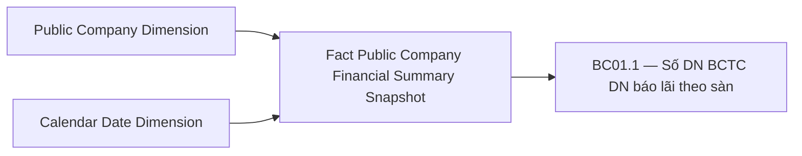

**Bảng grain:**

| Tên bảng | Grain |
|---|---|
| Fact Public Company Financial Summary Snapshot | 1 row / CTDC / kỳ báo cáo (năm × quý) |
| Public Company Dimension | 1 row / công ty đại chúng (SCD2) |
| Calendar Date Dimension | 1 row / ngày (Conformed) |

---

#### Nhóm 41 — STT 41: BC01.2 — Báo cáo vĩ mô theo ngành

##### READY

> Phân loại: **Phân tích**
> Source: `Fact Public Company Financial Summary Snapshot` — GROUP BY `Industry_Category_Level1_Code`

**Bảng KPI:**

| KPI ID | Tên KPI | Đơn vị | Tính chất | Atomic Entity | Atomic Table | Atomic Attribute | Atomic Column | row_dsc_clmn_code (dn/bh/td) | Loại BC | col_desc |
|---|---|---|---|---|---|---|---|---|---|---|
| K_GSDC_916 | Ngành kinh tế | Text | Chiều (Group By) | Public Company | pblc_co | Industry Category Level1 Code | idy_cgy_level1_code | — | — | — |
| K_GSDC_917 | DTT Năm N | Tỉ đồng | Phái sinh | Public Company Financial Report Value | pblc_co_fnc_rpt_val | Data Value | data_val | 10/10/03 | BCKQKD | 1 |
| K_GSDC_918 | LNST Năm N | Tỉ đồng | Phái sinh | Public Company Financial Report Value | pblc_co_fnc_rpt_val | Data Value | data_val | 60/60/21 | BCKQKD | 1 |
| K_GSDC_919 | ROA Năm N | % | Phái sinh | Public Company Financial Report Value | pblc_co_fnc_rpt_val | Data Value | data_val | — | — | — |
| K_GSDC_920 | ROE Năm N | % | Phái sinh | Public Company Financial Report Value | pblc_co_fnc_rpt_val | Data Value | data_val | — | — | — |
| K_GSDC_921 | DTT Năm N-1 | Tỉ đồng | Phái sinh | — | — | — | — | Derive kỳ N-1 | — | — |
| K_GSDC_922 | LNST Năm N-1 | Tỉ đồng | Phái sinh | — | — | — | — | Derive kỳ N-1 | — | — |
| K_GSDC_923 | ROA Năm N-1 | % | Phái sinh | — | — | — | — | Derive kỳ N-1 | — | — |
| K_GSDC_924 | ROE Năm N-1 | % | Phái sinh | — | — | — | — | Derive kỳ N-1 | — | — |

**Star Schema:** dùng chung `Fact_Public_Company_Financial_Summary_Snapshot`.

**Bảng grain:** giống Nhóm 40.

---

#### Nhóm 42 — STT 42: BC01.3 — Báo cáo vĩ mô đa kỳ (N / N-1 / N-2)

##### READY

> Phân loại: **Phân tích**
> Source: `Fact Public Company Financial Summary Snapshot` — join 3 kỳ (N, N-1, N-2) tại query layer

**Bảng KPI:**

| KPI ID | Tên KPI | Đơn vị | Tính chất | Atomic Entity | Atomic Table | Atomic Attribute | Atomic Column | row_dsc_clmn_code (dn/bh/td) | Loại BC | col_desc |
|---|---|---|---|---|---|---|---|---|---|---|
| K_GSDC_925 | Kỳ báo cáo | Text | Chiều (Slicer) | — | — | — | — | — | — | — |
| K_GSDC_926 | Tổng tài sản Năm N | Tỉ đồng | Phái sinh | Public Company Financial Report Value | pblc_co_fnc_rpt_val | Data Value | data_val | 270/270/300 | BCDKT | 1 |
| K_GSDC_927 | Nợ phải trả Năm N | Tỉ đồng | Phái sinh | Public Company Financial Report Value | pblc_co_fnc_rpt_val | Data Value | data_val | 300/300/400 | BCDKT | 1 |
| K_GSDC_928 | Vốn chủ sở hữu Năm N | Tỉ đồng | Phái sinh | Public Company Financial Report Value | pblc_co_fnc_rpt_val | Data Value | data_val | 400/400/500 | BCDKT | 1 |
| K_GSDC_929 | Vốn điều lệ Năm N | Tỉ đồng | Phái sinh | Public Company Financial Report Value | pblc_co_fnc_rpt_val | Data Value | data_val | 411/411/411 | BCDKT | 1 |
| K_GSDC_930 | LNST Năm N | Tỉ đồng | Phái sinh | Public Company Financial Report Value | pblc_co_fnc_rpt_val | Data Value | data_val | 60/60/21 | BCKQKD | 1 |
| K_GSDC_931 | ROA Năm N | % | Phái sinh | — | — | — | — | Derive từ bình quân TS | — | — |
| K_GSDC_932 | ROE Năm N | % | Phái sinh | — | — | — | — | Derive từ bình quân VCSH | — | — |
| K_GSDC_933 | Tổng tài sản Năm N-1 | Tỉ đồng | Phái sinh | — | — | — | — | Derive kỳ N-1 | — | — |
| K_GSDC_934 | Nợ phải trả Năm N-1 | Tỉ đồng | Phái sinh | — | — | — | — | Derive kỳ N-1 | — | — |
| K_GSDC_935 | Vốn chủ sở hữu Năm N-1 | Tỉ đồng | Phái sinh | — | — | — | — | Derive kỳ N-1 | — | — |
| K_GSDC_936 | Vốn điều lệ Năm N-1 | Tỉ đồng | Phái sinh | — | — | — | — | Derive kỳ N-1 | — | — |
| K_GSDC_937 | LNST Năm N-1 | Tỉ đồng | Phái sinh | — | — | — | — | Derive kỳ N-1 | — | — |
| K_GSDC_938 | ROA Năm N-1 | % | Phái sinh | — | — | — | — | Derive kỳ N-1 | — | — |
| K_GSDC_939 | ROE Năm N-1 | % | Phái sinh | — | — | — | — | Derive kỳ N-1 | — | — |
| K_GSDC_940 | Tổng tài sản Năm N-2 | Tỉ đồng | Phái sinh | — | — | — | — | Derive kỳ N-2 | — | — |
| K_GSDC_941 | Nợ phải trả Năm N-2 | Tỉ đồng | Phái sinh | — | — | — | — | Derive kỳ N-2 | — | — |
| K_GSDC_942 | Vốn chủ sở hữu Năm N-2 | Tỉ đồng | Phái sinh | — | — | — | — | Derive kỳ N-2 | — | — |
| K_GSDC_943 | Vốn điều lệ Năm N-2 | Tỉ đồng | Phái sinh | — | — | — | — | Derive kỳ N-2 | — | — |
| K_GSDC_944 | LNST Năm N-2 | Tỉ đồng | Phái sinh | — | — | — | — | Derive kỳ N-2 | — | — |
| K_GSDC_945 | ROA Năm N-2 | % | Phái sinh | — | — | — | — | Derive kỳ N-2 | — | — |
| K_GSDC_946 | ROE Năm N-2 | % | Phái sinh | — | — | — | — | Derive kỳ N-2 | — | — |

**Star Schema:** dùng chung `Fact_Public_Company_Financial_Summary_Snapshot`.

**Bảng grain:** giống Nhóm 40.

---

#### Nhóm 43 — STT 43: BC22 — Tổng hợp tình hình tài chính CTDC theo sàn

##### READY

> Phân loại: **Phân tích**
> Source: `Fact Public Company Financial Summary Snapshot` — GROUP BY `Equity_Listing_Exchange_Code`

**Bảng KPI:**

| KPI ID | Tên KPI | Đơn vị | Tính chất | Atomic Entity | Atomic Table | Atomic Attribute | Atomic Column | row_dsc_clmn_code (dn/bh/td) | Loại BC | col_desc |
|---|---|---|---|---|---|---|---|---|---|---|
| K_GSDC_947 | Theo sàn | Text | Chiều (Group By) | Public Company | pblc_co | Equity Listing Exchange Code | eqty_listing_exg_code | — | — | — |
| K_GSDC_948 | Tổng tài sản theo sàn | Tỉ đồng | Phái sinh | Public Company Financial Report Value | pblc_co_fnc_rpt_val | Data Value | data_val | 270/270/300 | BCDKT | 1 |
| K_GSDC_948_YOY | Tổng tài sản — YoY theo sàn | % | Phái sinh | — | — | — | — | — | — | — |
| K_GSDC_949 | Hàng tồn kho theo sàn | Tỉ đồng | Phái sinh | Public Company Financial Report Value | pblc_co_fnc_rpt_val | Data Value | data_val | 140/140/— | BCDKT | 1 |
| K_GSDC_949_YOY | Hàng tồn kho — YoY theo sàn | % | Phái sinh | — | — | — | — | — | — | — |
| K_GSDC_950 | Nợ phải trả theo sàn | Tỉ đồng | Phái sinh | Public Company Financial Report Value | pblc_co_fnc_rpt_val | Data Value | data_val | 300/300/400 | BCDKT | 1 |
| K_GSDC_950_YOY | Nợ phải trả — YoY theo sàn | % | Phái sinh | — | — | — | — | — | — | — |
| K_GSDC_951 | Vốn chủ sở hữu theo sàn | Tỉ đồng | Phái sinh | Public Company Financial Report Value | pblc_co_fnc_rpt_val | Data Value | data_val | 400/400/500 | BCDKT | 1 |
| K_GSDC_951_YOY | VCSH — YoY theo sàn | % | Phái sinh | — | — | — | — | — | — | — |
| K_GSDC_952 | Vốn góp của chủ sở hữu theo sàn | Tỉ đồng | Phái sinh | Public Company Financial Report Value | pblc_co_fnc_rpt_val | Data Value | data_val | 411/411/411 | BCDKT | 1 |
| K_GSDC_952_YOY | VGC — YoY theo sàn | % | Phái sinh | — | — | — | — | — | — | — |
| K_GSDC_953 | LNST chưa phân phối theo sàn | Tỉ đồng | Phái sinh | Public Company Financial Report Value | pblc_co_fnc_rpt_val | Data Value | data_val | 421/421/450 | BCDKT | 1 |
| K_GSDC_953_YOY | LNST chưa PP — YoY theo sàn | % | Phái sinh | — | — | — | — | — | — | — |
| K_GSDC_954 | Doanh thu thuần theo sàn | Tỉ đồng | Phái sinh | Public Company Financial Report Value | pblc_co_fnc_rpt_val | Data Value | data_val | 10/10/03 | BCKQKD | 1 |
| K_GSDC_954_YOY | DTT — YoY theo sàn | % | Phái sinh | — | — | — | — | — | — | — |
| K_GSDC_955 | LNKT trước thuế theo sàn | Tỉ đồng | Phái sinh | Public Company Financial Report Value | pblc_co_fnc_rpt_val | Data Value | data_val | 50/50/17 | BCKQKD | 1 |
| K_GSDC_955_YOY | LNKT trước thuế — YoY theo sàn | % | Phái sinh | — | — | — | — | — | — | — |
| K_GSDC_956 | LNST theo sàn | Tỉ đồng | Phái sinh | Public Company Financial Report Value | pblc_co_fnc_rpt_val | Data Value | data_val | 60/60/21 | BCKQKD | 1 |
| K_GSDC_957 | ROA theo sàn | % | Phái sinh | — | — | — | — | Derive từ bình quân TS | — | — |
| K_GSDC_958 | ROE theo sàn | % | Phái sinh | — | — | — | — | Derive từ bình quân VCSH | — | — |

**Star Schema:** dùng chung `Fact_Public_Company_Financial_Summary_Snapshot`.

**Lineage Mart → Báo cáo:**

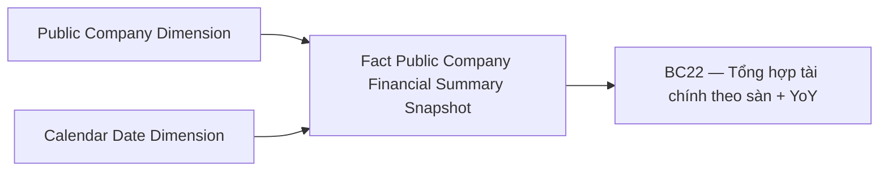

**Bảng grain:**

| Tên bảng | Grain |
|---|---|
| Fact Public Company Financial Summary Snapshot | 1 row / CTDC / kỳ báo cáo (năm × quý) |
| Public Company Dimension | 1 row / công ty đại chúng (SCD2) |
| Calendar Date Dimension | 1 row / ngày (Conformed) |

---

## Section 3 — Mô hình tổng thể

**Bảng Phân tích (Star Schema):**

| Tên bảng | Loại | Trạng thái | Màn hình / Nhóm phục vụ |
|---|---|---|---|
| Fact Public Company Financial Summary Snapshot | Fact Periodic Snapshot | READY | MH2 — Giám sát Tổng hợp; MH4 — BC01/BC22 |
| Fact Public Company Financial Report Value | Fact Event | READY | MH3 — Data Explorer BCTC chi tiết (DB21–32 + DB39) |
| Fact Public Company Risk Score Snapshot | Fact Periodic Snapshot | PENDING | MH1 — Tab Tổng hợp; MH6 — DB34 |
| Fact Public Company Compliance Score Snapshot | Fact Periodic Snapshot | PENDING | MH1 — Tab Tuân thủ; MH6 — DB35 |
| Fact Public Company Issuance Score Snapshot | Fact Periodic Snapshot | PENDING | MH1 — Tab Phát hành; MH6 — DB37 |
| Fact Public Company Financial Score Snapshot | Fact Periodic Snapshot | PENDING | MH1 — Tab Tài chính; MH6 — DB36 |
| Fact Public Company Non-Financial Score Snapshot | Fact Periodic Snapshot | PENDING | MH1 — Tab Phi TC & M-Score; MH6 — DB38 |
| Fact Public Company Listing Info Snapshot | Fact Periodic Snapshot | PENDING | MH5 — DB33 thông tin niêm yết |

**Bảng Tác nghiệp:** *(Không có trong phạm vi này)*

**Bảng Dimension:**

| Tên bảng | Loại | Trạng thái | Ghi chú |
|---|---|---|---|
| Public Company Dimension | Dimension SCD2 | READY | Mã CK, Tên DN, Sàn, Ngành — dùng chung toàn bộ màn hình |
| Calendar Date Dimension | Dimension Conformed | READY | Năm / Quý — shared toàn hệ thống |
| Financial Report Catalog Dimension | Dimension | READY | Template BCTC — báo cáo / dòng / cột; composite join key (Catalog_Business_Code + Row_Code + Column_Code) |

---

## Section 4 — Vấn đề mở

| ID | Vấn đề | Giả định hiện tại | KPI liên quan | Trạng thái |
|---|---|---|---|---|
| O_GSDC_1 | Toàn bộ bảng lưu kết quả chấm điểm rủi ro CTDC (tuân thủ, phát hành, tài chính, phi tài chính, tổng hợp) chưa được thiết kế trong CSDL IDS. BA ghi nhận `failed` / "Chưa có bảng nguồn" cho DB34–38 (Data Explorer) và DB1–5 (MH1). | Cần thiết kế thêm ít nhất 4 Atomic entity mới (Compliance Score, Issuance Score, Financial Score, Non-Financial Score) trong IDS Atomic layer trước khi thiết kế Datamart. | K_GSDC_1 — K_GSDC_7, K_GSDC_2_1 — K_GSDC_5_4 | Open |
| O_GSDC_2 | KPI Số doanh nghiệp (K_GSDC_8, K_GSDC_34) có nguồn từ `IDS.company_detail` với điều kiện `ids_reg_date <= cuối kỳ` — không join qua `company_data` hay `data`. COUNT DISTINCT từ `Fact Public Company Financial Summary Snapshot` sẽ thiếu DN đăng ký IDS nhưng chưa nộp BCTC trong kỳ. | Cần xác nhận: KPI Số DN tính trên toàn bộ DN đăng ký IDS hay chỉ DN có nộp BCTC trong kỳ? Nếu toàn bộ DN đăng ký thì cần thêm `IDS_Registration_Date` vào Fact hoặc tính riêng từ `Public Company Dimension`. | K_GSDC_8, K_GSDC_34 | Open |
| O_GSDC_3 | BA SQL DB25 xác nhận `rr.row_desc` và `rc2.col_desc` là trường thực tồn tại trong `IDS.rrow` / `IDS.rcol` — dùng làm mã hiển thị nghiệp vụ và filter điều kiện trong mọi dashboard DB21–32. Tuy nhiên Atomic `Financial Report Row Template` và `Financial Report Column Template` hiện chưa có `Row_Display_Code` (`row_desc`) và `Column_Display_Code` (`col_desc`). | Cần bổ sung `Row_Display_Code` = `IDS.rrow.row_desc` và `Column_Display_Code` = `IDS.rcol.col_desc` vào Atomic trước, sau đó thêm vào `Financial Report Catalog Dimension`. | K_GSDC_33, K_GSDC_D8–D11 | Open |
| O_GSDC_4 | DB43 BC22 có KPI "Lợi nhuận kế toán trước thuế" — không có trường tương ứng trong `Fact Public Company Financial Summary Snapshot` hiện tại (chỉ có `Net_Profit_Amount` = LNST). LNKT trước thuế là row khác trong BCTC. | **Confirmed:** Bổ sung `Pre_Tax_Profit_Amount` vào Fact Summary — map từ BCKQKD `row_desc='50'` (dn/bh) / `row_desc='17'` (td), `col_desc='1'`. Đã cập nhật erDiagram và K_GSDC_60. | K_GSDC_60 | Closed |