# DTM_GSDC_HLD — High Level Design
**Module:** GSDC — Giám sát Công ty Đại chúng
**Phiên bản:** 3.0 — Phase 1 Draft
**Phạm vi:**
- Màn hình 1: **Phân loại & Xếp hạng Rủi ro Doanh nghiệp Đại chúng** (5 tab: Tổng hợp / Tuân thủ / Phát hành / Tài chính / Phi tài chính & M-Score)
- Màn hình 2: **Giám sát Tổng hợp** (5 tab sàn: Tổng hợp / HOSE / HNX / UPCoM / Chưa niêm yết — 3 nhóm nội dung)
- Màn hình 3 *(PENDING — cập nhật 2026-07-15)*: **Data Explorer — Dữ liệu tài chính doanh nghiệp** (DB21–32 + DB39: chi tiết BCTC theo loại hình DN + hệ số tài chính cơ bản — dùng `Fact Public Company Financial Report Value`, Atomic READY nhưng 100% dòng BA là "Dữ liệu động" → toàn bộ PENDING theo gate rule, xem O_GSDC_5)
- Màn hình 4: **Báo cáo giám sát CTDC** (DB40–43: BC01.1 / BC01.2 / BC01.3 / BC22 — phần READY query trực tiếp `Public Company Dimension`, không qua Fact riêng; xem O_GSDC_5 mục (10) — `Fact Public Company Financial Summary Snapshot` đã bị xoá 2026-07-23)
- Màn hình 5 *(PENDING)*: **Data Explorer — Dữ liệu thông tin niêm yết** (DB33 — nguồn MSS chưa có Atomic)
- Màn hình 6 *(READY — Atomic draft, cập nhật 2026-07-15)*: **Data Explorer — Dữ liệu chấm điểm phân loại CTDC** (DB34–38 — BA đã bổ sung nguồn, reuse KPI từ Nhóm 1–5, xem O_GSDC_1 Closed)

**Nguồn dữ liệu:** IDS (Information Disclosure System)

---

## Section 1 — Data Lineage

### Cụm 1 — Điểm chấm & Xếp loại CTDC

**Cập nhật 2026-07-15:** Toàn bộ 5 Nhóm (Tổng hợp, Tuân thủ, Phát hành, Tài chính, Phi tài chính & M-Score) đã có nguồn thật từ `IDS.EVALUATIONS` / `EVALUATION_DETAILS` / `EVALUATION_CRITERIA` / `EVALUATION_GROUPS` / `EVALUATION_PERIODS`. Atomic entity tương ứng `design_status: draft`, chưa approved (xem O_GSDC_1). Tách riêng theo từng Fact bên dưới để dễ theo dõi — mọi Fact đều dùng chung `Public Company Dimension` và `Calendar Date Dimension` (xem Cụm 2, Section 4 Reuse Analysis).

#### Cụm 1.1 — Fact Public Company Risk Score Snapshot (Nhóm 1)

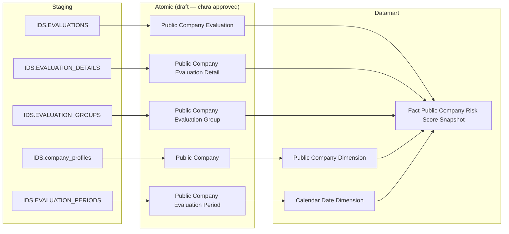
```mermaid
flowchart LR
    subgraph SRC["Staging"]
        IDS_company_profiles_c1["IDS.company_profiles"]
        IDS_EVALUATIONS_c1["IDS.EVALUATIONS"]
        IDS_EVALUATION_DETAILS_c1["IDS.EVALUATION_DETAILS"]
        IDS_EVALUATION_GROUPS_c1["IDS.EVALUATION_GROUPS"]
        IDS_EVALUATION_PERIODS_c1["IDS.EVALUATION_PERIODS"]
    end
    subgraph SIL["Atomic (draft — chưa approved)"]
        Public_Company_c1["Public Company"]
        Public_Company_Evaluation_c1["Public Company Evaluation"]
        Public_Company_Evaluation_Detail_c1["Public Company Evaluation Detail"]
        Public_Company_Evaluation_Group_c1["Public Company Evaluation Group"]
        Public_Company_Evaluation_Period_c1["Public Company Evaluation Period"]
    end
    subgraph GOLD["Datamart"]
        fct_public_company_risk_score_snpst["Fact Public Company Risk Score Snapshot"]
        public_company_dim_c1["Public Company Dimension"]
        cdr_dt_dim_c1["Calendar Date Dimension"]
    end
    IDS_company_profiles_c1 --> Public_Company_c1
    IDS_EVALUATIONS_c1 --> Public_Company_Evaluation_c1
    IDS_EVALUATION_DETAILS_c1 --> Public_Company_Evaluation_Detail_c1
    IDS_EVALUATION_GROUPS_c1 --> Public_Company_Evaluation_Group_c1
    IDS_EVALUATION_PERIODS_c1 --> Public_Company_Evaluation_Period_c1
    Public_Company_c1 --> public_company_dim_c1
    Public_Company_Evaluation_Period_c1 --> cdr_dt_dim_c1
    Public_Company_Evaluation_c1 --> fct_public_company_risk_score_snpst
    Public_Company_Evaluation_Detail_c1 --> fct_public_company_risk_score_snpst
    Public_Company_Evaluation_Group_c1 --> fct_public_company_risk_score_snpst
    public_company_dim_c1 --> fct_public_company_risk_score_snpst
    cdr_dt_dim_c1 --> fct_public_company_risk_score_snpst
```

#### Cụm 1.2 — Fact Public Company Compliance Score Snapshot (Nhóm 2)

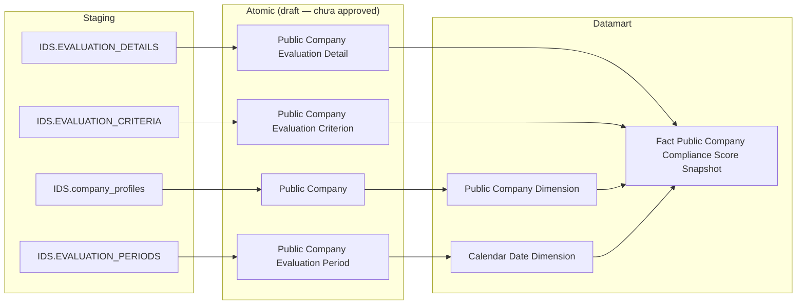
```mermaid
flowchart LR
    subgraph SRC["Staging"]
        IDS_company_profiles_c2["IDS.company_profiles"]
        IDS_EVALUATION_DETAILS_c2["IDS.EVALUATION_DETAILS"]
        IDS_EVALUATION_CRITERIA_c2["IDS.EVALUATION_CRITERIA"]
        IDS_EVALUATION_PERIODS_c2["IDS.EVALUATION_PERIODS"]
    end
    subgraph SIL["Atomic (draft — chưa approved)"]
        Public_Company_c2["Public Company"]
        Public_Company_Evaluation_Detail_c2["Public Company Evaluation Detail"]
        Public_Company_Evaluation_Criterion_c2["Public Company Evaluation Criterion"]
        Public_Company_Evaluation_Period_c2["Public Company Evaluation Period"]
    end
    subgraph GOLD["Datamart"]
        fct_public_company_compliance_score_snpst["Fact Public Company Compliance Score Snapshot"]
        public_company_dim_c2["Public Company Dimension"]
        cdr_dt_dim_c2["Calendar Date Dimension"]
    end
    IDS_company_profiles_c2 --> Public_Company_c2
    IDS_EVALUATION_DETAILS_c2 --> Public_Company_Evaluation_Detail_c2
    IDS_EVALUATION_CRITERIA_c2 --> Public_Company_Evaluation_Criterion_c2
    IDS_EVALUATION_PERIODS_c2 --> Public_Company_Evaluation_Period_c2
    Public_Company_c2 --> public_company_dim_c2
    Public_Company_Evaluation_Period_c2 --> cdr_dt_dim_c2
    Public_Company_Evaluation_Detail_c2 --> fct_public_company_compliance_score_snpst
    Public_Company_Evaluation_Criterion_c2 --> fct_public_company_compliance_score_snpst
    public_company_dim_c2 --> fct_public_company_compliance_score_snpst
    cdr_dt_dim_c2 --> fct_public_company_compliance_score_snpst
```

#### Cụm 1.3 — Fact Public Company Issuance Score Snapshot (Nhóm 3)

```mermaid
flowchart LR
    subgraph SRC["Staging"]
        IDS_company_profiles_c3["IDS.company_profiles"]
        IDS_EVALUATION_DETAILS_c3["IDS.EVALUATION_DETAILS"]
        IDS_EVALUATION_CRITERIA_c3["IDS.EVALUATION_CRITERIA"]
        IDS_EVALUATION_PERIODS_c3["IDS.EVALUATION_PERIODS"]
    end
    subgraph SIL["Atomic (draft — chưa approved)"]
        Public_Company_c3["Public Company"]
        Public_Company_Evaluation_Detail_c3["Public Company Evaluation Detail"]
        Public_Company_Evaluation_Criterion_c3["Public Company Evaluation Criterion"]
        Public_Company_Evaluation_Period_c3["Public Company Evaluation Period"]
    end
    subgraph GOLD["Datamart"]
        fct_public_company_issuance_score_snpst["Fact Public Company Issuance Score Snapshot"]
        public_company_dim_c3["Public Company Dimension"]
        cdr_dt_dim_c3["Calendar Date Dimension"]
    end
    IDS_company_profiles_c3 --> Public_Company_c3
    IDS_EVALUATION_DETAILS_c3 --> Public_Company_Evaluation_Detail_c3
    IDS_EVALUATION_CRITERIA_c3 --> Public_Company_Evaluation_Criterion_c3
    IDS_EVALUATION_PERIODS_c3 --> Public_Company_Evaluation_Period_c3
    Public_Company_c3 --> public_company_dim_c3
    Public_Company_Evaluation_Period_c3 --> cdr_dt_dim_c3
    Public_Company_Evaluation_Detail_c3 --> fct_public_company_issuance_score_snpst
    Public_Company_Evaluation_Criterion_c3 --> fct_public_company_issuance_score_snpst
    public_company_dim_c3 --> fct_public_company_issuance_score_snpst
    cdr_dt_dim_c3 --> fct_public_company_issuance_score_snpst
```

#### Cụm 1.4 — Fact Public Company Financial Score Snapshot (Nhóm 4)

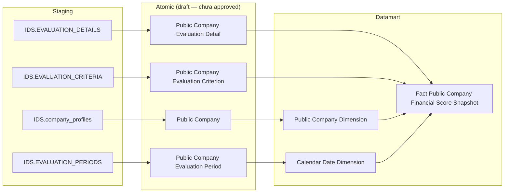
```mermaid
flowchart LR
    subgraph SRC["Staging"]
        IDS_company_profiles_c4["IDS.company_profiles"]
        IDS_EVALUATION_DETAILS_c4["IDS.EVALUATION_DETAILS"]
        IDS_EVALUATION_CRITERIA_c4["IDS.EVALUATION_CRITERIA"]
        IDS_EVALUATION_PERIODS_c4["IDS.EVALUATION_PERIODS"]
    end
    subgraph SIL["Atomic (draft — chưa approved)"]
        Public_Company_c4["Public Company"]
        Public_Company_Evaluation_Detail_c4["Public Company Evaluation Detail"]
        Public_Company_Evaluation_Criterion_c4["Public Company Evaluation Criterion"]
        Public_Company_Evaluation_Period_c4["Public Company Evaluation Period"]
    end
    subgraph GOLD["Datamart"]
        fct_public_company_financial_score_snpst["Fact Public Company Financial Score Snapshot"]
        public_company_dim_c4["Public Company Dimension"]
        cdr_dt_dim_c4["Calendar Date Dimension"]
    end
    IDS_company_profiles_c4 --> Public_Company_c4
    IDS_EVALUATION_DETAILS_c4 --> Public_Company_Evaluation_Detail_c4
    IDS_EVALUATION_CRITERIA_c4 --> Public_Company_Evaluation_Criterion_c4
    IDS_EVALUATION_PERIODS_c4 --> Public_Company_Evaluation_Period_c4
    Public_Company_c4 --> public_company_dim_c4
    Public_Company_Evaluation_Period_c4 --> cdr_dt_dim_c4
    Public_Company_Evaluation_Detail_c4 --> fct_public_company_financial_score_snpst
    Public_Company_Evaluation_Criterion_c4 --> fct_public_company_financial_score_snpst
    public_company_dim_c4 --> fct_public_company_financial_score_snpst
    cdr_dt_dim_c4 --> fct_public_company_financial_score_snpst
```

#### Cụm 1.5 — Fact Public Company Non-Financial Score Snapshot (Nhóm 5)

```mermaid
flowchart LR
    subgraph SRC["Staging"]
        IDS_company_profiles_c5["IDS.company_profiles"]
        IDS_EVALUATION_DETAILS_c5["IDS.EVALUATION_DETAILS"]
        IDS_EVALUATION_CRITERIA_c5["IDS.EVALUATION_CRITERIA"]
        IDS_EVALUATION_PERIODS_c5["IDS.EVALUATION_PERIODS"]
    end
    subgraph SIL["Atomic (draft — chưa approved)"]
        Public_Company_c5["Public Company"]
        Public_Company_Evaluation_Detail_c5["Public Company Evaluation Detail"]
        Public_Company_Evaluation_Criterion_c5["Public Company Evaluation Criterion"]
        Public_Company_Evaluation_Period_c5["Public Company Evaluation Period"]
    end
    subgraph GOLD["Datamart"]
        fct_public_company_nonfinancial_score_snpst["Fact Public Company Non-Financial Score Snapshot"]
        public_company_dim_c5["Public Company Dimension"]
        cdr_dt_dim_c5["Calendar Date Dimension"]
    end
    IDS_company_profiles_c5 --> Public_Company_c5
    IDS_EVALUATION_DETAILS_c5 --> Public_Company_Evaluation_Detail_c5
    IDS_EVALUATION_CRITERIA_c5 --> Public_Company_Evaluation_Criterion_c5
    IDS_EVALUATION_PERIODS_c5 --> Public_Company_Evaluation_Period_c5
    Public_Company_c5 --> public_company_dim_c5
    Public_Company_Evaluation_Period_c5 --> cdr_dt_dim_c5
    Public_Company_Evaluation_Detail_c5 --> fct_public_company_nonfinancial_score_snpst
    Public_Company_Evaluation_Criterion_c5 --> fct_public_company_nonfinancial_score_snpst
    public_company_dim_c5 --> fct_public_company_nonfinancial_score_snpst
    cdr_dt_dim_c5 --> fct_public_company_nonfinancial_score_snpst
```

> **Ghi chú `Public Company Evaluation Period`:** Entity Atomic tương ứng `IDS.EVALUATION_PERIODS` (physical name `pc_evaluation_period`, `design_status: draft`) map trực tiếp vào `Calendar Date Dimension` (`cdr_dt_dim`) qua `evaluation_year`/`evaluation_month` — không tạo Dimension riêng, tái sử dụng `Calendar Date Dimension` đã có trong Reuse Analysis (Section 4).

### Cụm 2 — Hồ sơ Công ty Đại chúng

Phục vụ chiều nhận diện DN trên toàn bộ các màn hình.

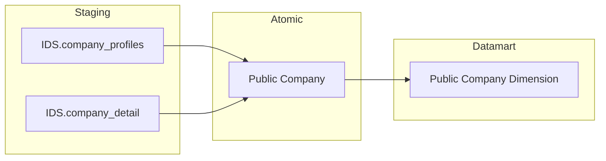
```mermaid
flowchart LR
    subgraph SRC["Staging"]
        IDS_company_profiles["IDS.company_profiles"]
        IDS_company_detail["IDS.company_detail"]
    end
    subgraph SIL["Atomic"]
        Public_Company["Public Company"]
    end
    subgraph GOLD["Datamart"]
        public_company_dim["Public Company Dimension"]
    end
    IDS_company_profiles --> Public_Company
    IDS_company_detail --> Public_Company
    Public_Company --> public_company_dim
```

### Cụm 3 — Báo cáo tài chính & Nộp báo cáo

Phục vụ toàn bộ KPI tài chính tổng hợp và theo ngành (Màn hình 2). **Cập nhật 2026-07-23 (rà soát LLD):** `Fact Public Company Financial Summary Snapshot` đã bị xoá (không còn cột nào READY — nguồn `Public Company Report Submission`/`IDS.company_data` là dữ liệu động, `Public Company Financial Report Value`/`IDS.data` Gap Atomic lúc đó, xem O_GSDC_5). Toàn bộ KPI READY của Cụm này (Nhóm 6/9/10/12/14/16/38/39/40/41) nay query trực tiếp trên `Public Company Dimension`/`Calendar Date Dimension`, không qua Fact trung gian. **Cập nhật 2026-08-06 (Atomic bổ sung 5 entity Financial Report Value + `violation_report` — Gap Atomic đã lấp):** `Fact Public Company Financial Report Value` (Nhóm 7) và `Fact Violation Report Snapshot` (Nhóm 6, K_GSDC_48) chuyển READY — xem lineage bổ sung bên dưới. **Cập nhật 2026-08-07:** sửa lại table_type của bảng phục vụ K_GSDC_48 từ Operational → **Fact** (grain 1 row/công ty/kỳ, phát sinh theo kỳ chứ không phải current-state — xem ghi chú chi tiết ở Nhóm 6).

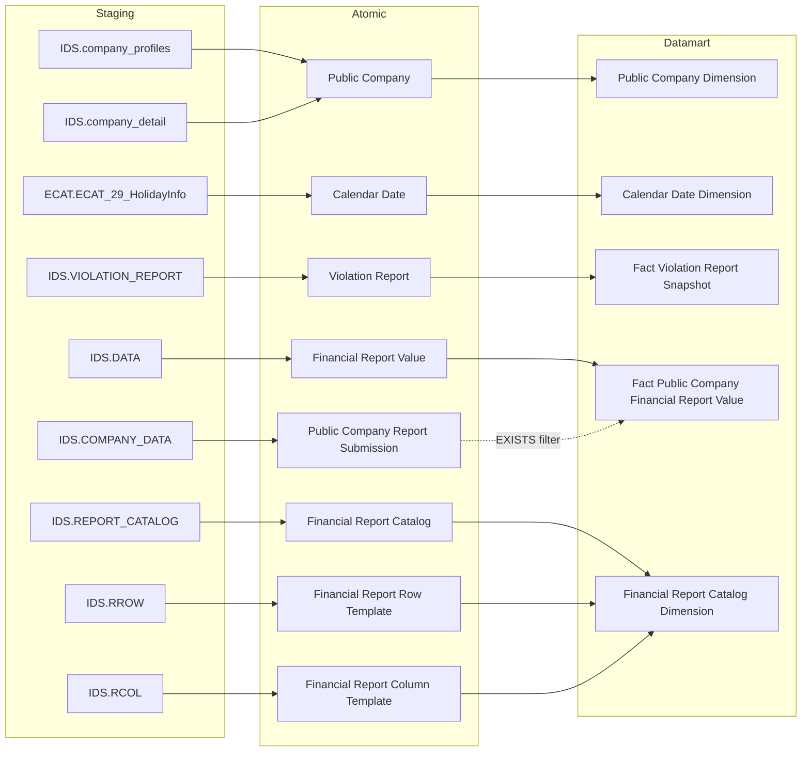
```mermaid
flowchart LR
    subgraph SRC["Staging"]
        IDS_company_profiles["IDS.company_profiles"]
        IDS_company_detail["IDS.company_detail"]
        ECAT_ECAT_29_HolidayInfo["ECAT.ECAT_29_HolidayInfo"]
        IDS_VIOLATION_REPORT["IDS.VIOLATION_REPORT"]
        IDS_DATA["IDS.DATA"]
        IDS_REPORT_CATALOG["IDS.REPORT_CATALOG"]
        IDS_RROW["IDS.RROW"]
        IDS_RCOL["IDS.RCOL"]
        IDS_COMPANY_DATA["IDS.COMPANY_DATA"]
    end
    subgraph SIL["Atomic"]
        Public_Company["Public Company"]
        Calendar_Date["Calendar Date"]
        Violation_Report["Violation Report"]
        Financial_Report_Value["Financial Report Value"]
        Financial_Report_Catalog["Financial Report Catalog"]
        Financial_Report_Row_Template["Financial Report Row Template"]
        Financial_Report_Column_Template["Financial Report Column Template"]
        Public_Company_Report_Submission["Public Company Report Submission"]
    end
    subgraph GOLD["Datamart"]
        public_company_dim["Public Company Dimension"]
        cdr_dt_dim["Calendar Date Dimension"]
        fct_violation_rpt_snpst["Fact Violation Report Snapshot"]
        fct_pc_fr_val["Fact Public Company Financial Report Value"]
        financial_rpt_catalog_dim["Financial Report Catalog Dimension"]
    end
    IDS_company_profiles --> Public_Company
    IDS_company_detail --> Public_Company
    ECAT_ECAT_29_HolidayInfo --> Calendar_Date
    IDS_VIOLATION_REPORT --> Violation_Report
    IDS_DATA --> Financial_Report_Value
    IDS_REPORT_CATALOG --> Financial_Report_Catalog
    IDS_RROW --> Financial_Report_Row_Template
    IDS_RCOL --> Financial_Report_Column_Template
    IDS_COMPANY_DATA --> Public_Company_Report_Submission
    Public_Company --> public_company_dim
    Calendar_Date --> cdr_dt_dim
    Violation_Report --> fct_violation_rpt_snpst
    Financial_Report_Value --> fct_pc_fr_val
    Financial_Report_Catalog --> financial_rpt_catalog_dim
    Financial_Report_Row_Template --> financial_rpt_catalog_dim
    Financial_Report_Column_Template --> financial_rpt_catalog_dim
    Public_Company_Report_Submission -.->|"EXISTS filter"| fct_pc_fr_val
```

> **Không còn nguồn PENDING trong Cụm này.** K_GSDC_48/49 (Nhóm 6/10/12/14/16) đã chuyển READY 2026-08-06 (`Fact Violation Report Snapshot`/`Fact Public Company Financial Report Value` — 2 Fact độc lập, không JOIN chéo). Xem O_GSDC_5 mục (1)(2)(11).

### Cụm 4 — Chi tiết BCTC từng CTDC & Danh mục template (DB21–32 + DB39)

Phục vụ Data Explorer tra cứu giá trị từng chỉ tiêu BCTC theo CTDC và kỳ báo cáo. `Financial Report Catalog Dimension` là Dimension phụ trợ cung cấp tên và thứ tự chỉ tiêu cho Fact.

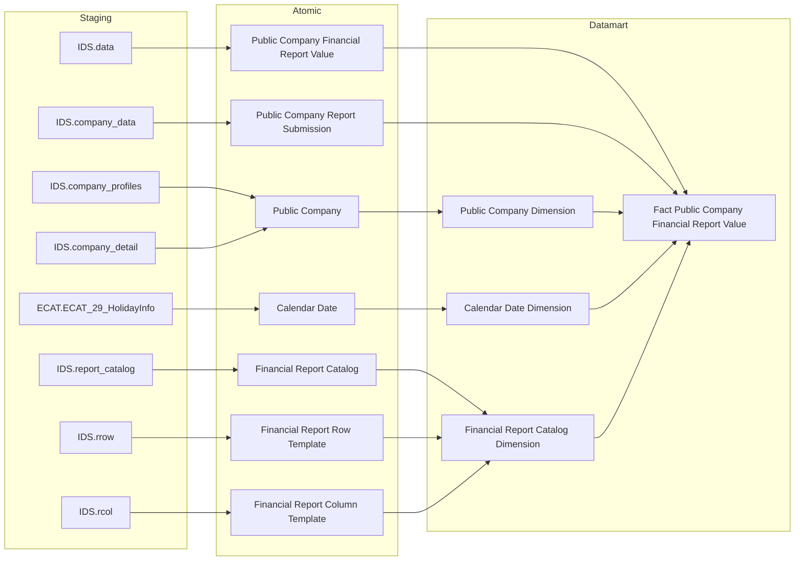
```mermaid
flowchart LR
    subgraph SRC["Staging"]
        IDS_company_profiles_b["IDS.company_profiles"]
        IDS_company_detail_b["IDS.company_detail"]
        IDS_company_data_b["IDS.company_data"]
        IDS_data_b["IDS.data"]
        IDS_report_catalog_b["IDS.report_catalog"]
        IDS_rrow_b["IDS.rrow"]
        IDS_rcol_b["IDS.rcol"]
        ECAT_ECAT_29_HolidayInfo_b["ECAT.ECAT_29_HolidayInfo"]
    end
    subgraph SIL["Atomic"]
        Public_Company_b["Public Company"]
        Public_Company_Report_Submission_b["Public Company Report Submission"]
        Public_Company_Financial_Report_Value_b["Public Company Financial Report Value"]
        Financial_Report_Catalog_b["Financial Report Catalog"]
        Financial_Report_Row_Template_b["Financial Report Row Template"]
        Financial_Report_Column_Template_b["Financial Report Column Template"]
        Calendar_Date_b["Calendar Date"]
    end
    subgraph GOLD["Datamart"]
        fct_public_company_financial_rpt_val["Fact Public Company Financial Report Value"]
        financial_rpt_catalog_dim["Financial Report Catalog Dimension"]
        public_company_dim_b["Public Company Dimension"]
        cdr_dt_dim_b["Calendar Date Dimension"]
    end
    IDS_company_profiles_b --> Public_Company_b
    IDS_company_detail_b --> Public_Company_b
    IDS_company_data_b --> Public_Company_Report_Submission_b
    IDS_data_b --> Public_Company_Financial_Report_Value_b
    IDS_report_catalog_b --> Financial_Report_Catalog_b
    IDS_rrow_b --> Financial_Report_Row_Template_b
    IDS_rcol_b --> Financial_Report_Column_Template_b
    ECAT_ECAT_29_HolidayInfo_b --> Calendar_Date_b
    Public_Company_b --> public_company_dim_b
    Public_Company_Financial_Report_Value_b --> fct_public_company_financial_rpt_val
    Public_Company_Report_Submission_b --> fct_public_company_financial_rpt_val
    Financial_Report_Catalog_b --> financial_rpt_catalog_dim
    Financial_Report_Row_Template_b --> financial_rpt_catalog_dim
    Financial_Report_Column_Template_b --> financial_rpt_catalog_dim
    Calendar_Date_b --> cdr_dt_dim_b
    public_company_dim_b --> fct_public_company_financial_rpt_val
    cdr_dt_dim_b --> fct_public_company_financial_rpt_val
    financial_rpt_catalog_dim --> fct_public_company_financial_rpt_val
```

---

## Section 2 — Tổng quan báo cáo

---

### Màn hình 1 — Phân loại & Xếp hạng Rủi ro CTDC

#### Nhóm 1 — STT 1: Tổng hợp chấm điểm phân loại CTDC

##### READY

> Phân loại: **Phân tích**
> Atomic: `Public Company` ← IDS.company_profiles — **draft** (chưa approved)
> Atomic: `Public Company Evaluation` ← IDS.EVALUATIONS — **draft** (chưa approved)
> Atomic: `Public Company Evaluation Detail` ← IDS.EVALUATION_DETAILS — **draft** (chưa approved)
> Atomic: `Public Company Evaluation Criterion` ← IDS.EVALUATION_CRITERIA — **draft** (chưa approved)
> Atomic: `Public Company Evaluation Group` ← IDS.EVALUATION_GROUPS — **draft** (chưa approved)
> **Lưu ý go-live:** Các entity Atomic trên đã có LLD tại `DataModel/working/Atomic/lld/IDS/` nhưng `design_status: draft`, chưa qua approve. Datamart chỉ chính thức READY sau khi Atomic được approve — xem [O_GSDC_1] cập nhật bên dưới.

**Mockup:**

| Tên Doanh nghiệp | Mã DN | Tuân thủ | Phát hành | Tài chính | Phi TC | M-Score | Xếp hạng TN | Điểm | Xếp loại |
|---|---|---|---|---|---|---|---|---|---|
| Công ty tập đoàn địa ốc Novaland | NVL | 85 | 90 | 78 | 82 | 88 | Tốt | 84.6 | A |

**Source:** `Fact Public Company Risk Score Snapshot` → `Public Company Dimension`, `Calendar Date Dimension`

**Bảng KPI:**

| KPI ID | Tên KPI | Đơn vị | Tính chất | Atomic Entity | Atomic Table | Atomic Attribute | Atomic Column |
|---|---|---|---|---|---|---|---|
| K_GSDC_1 | Tuân thủ | Điểm | Base | Public Company Evaluation Detail | pc_evaluation_detail | Evaluation Score | evaluation_score |
| K_GSDC_2 | Phát hành | Điểm | Base | Public Company Evaluation Detail | pc_evaluation_detail | Evaluation Score | evaluation_score |
| K_GSDC_3 | Tài chính | Điểm | Base | Public Company Evaluation Detail | pc_evaluation_detail | Evaluation Score | evaluation_score |
| K_GSDC_4 | Phi tài chính & M-Score | Điểm | Base | Public Company Evaluation Detail | pc_evaluation_detail | Evaluation Score | evaluation_score |
| K_GSDC_5 | Xếp hạng tín nhiệm DN | Điểm | Base | Public Company Evaluation Detail | pc_evaluation_detail | Evaluation Score | evaluation_score |
| K_GSDC_6 | Điểm tổng hợp | Điểm | Base | Public Company Evaluation | pc_evaluation | Total Score Percentage | total_score_percentage |
| K_GSDC_7 | Mã CK doanh nghiệp | Text | Chiều | Public Company | public_company | Equity Ticker | equity_ticker_symbol |
| K_GSDC_8 | Tên doanh nghiệp | Text | Chiều | Public Company | public_company | Public Company Name | pc_nm |

**Ghi chú tính toán K_GSDC_1–4:** `SUM(evaluation_score)` trên `Public Company Evaluation Detail`, JOIN `Public Company Evaluation Criterion` → `Public Company Evaluation Group`, filter `pc_evaluation_group_code` tương ứng: `TUAN_THU` / `PHAT_HANH` / `TAI_CHINH` / `PHI_TAI_CHINH`.

**Ghi chú K_GSDC_5:** Lấy `evaluation_score` trực tiếp (không SUM), filter `Public Company Evaluation Criterion.pc_evaluation_criterion_code = 'PHAT_HANH_TIN_NHIEM'`. BA còn trả kèm `ed.result` (kết quả text) — theo xác nhận, cột này thừa, không đưa vào KPI.

**Ghi chú K_GSDC_6:** Lấy `total_score_percentage` trực tiếp từ `Public Company Evaluation`. BA còn trả kèm `ev.type` (xếp loại) — theo xác nhận, cột này thừa, không đưa vào KPI.

**Star Schema:**

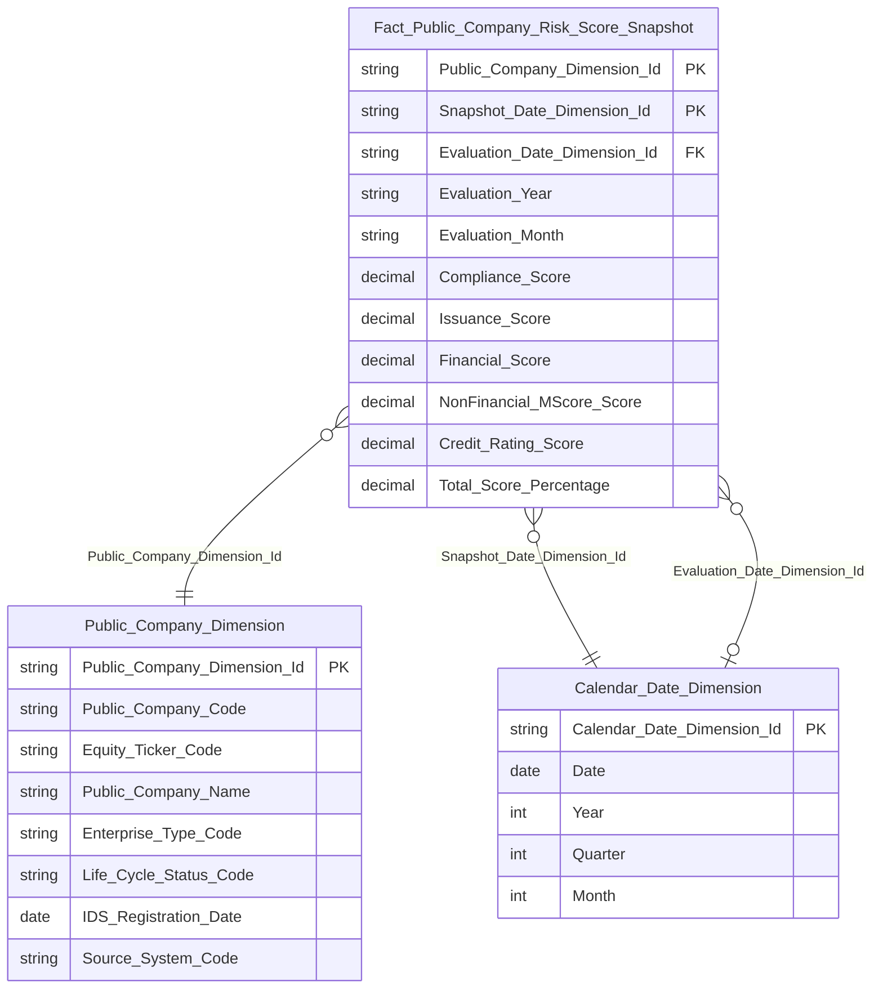
```mermaid
erDiagram
    Fact_Public_Company_Risk_Score_Snapshot {
        string Public_Company_Dimension_Id PK
        string Snapshot_Date_Dimension_Id PK
        string Evaluation_Date_Dimension_Id FK
        string Evaluation_Year
        string Evaluation_Month
        decimal Compliance_Score
        decimal Issuance_Score
        decimal Financial_Score
        decimal NonFinancial_MScore_Score
        decimal Credit_Rating_Score
        decimal Total_Score_Percentage
    }

    Public_Company_Dimension {
        string Public_Company_Dimension_Id PK
        string Public_Company_Code
        string Equity_Ticker_Code
        string Public_Company_Name
        string Enterprise_Type_Code
        string Life_Cycle_Status_Code
        date IDS_Registration_Date
        string Source_System_Code
    }

    Calendar_Date_Dimension {
        string Calendar_Date_Dimension_Id PK
        date Date
        int Year
        int Quarter
        int Month
    }

    Fact_Public_Company_Risk_Score_Snapshot }o--|| Public_Company_Dimension : "Public_Company_Dimension_Id"
    Fact_Public_Company_Risk_Score_Snapshot }o--|| Calendar_Date_Dimension : "Snapshot_Date_Dimension_Id"
    Fact_Public_Company_Risk_Score_Snapshot }o--o| Calendar_Date_Dimension : "Evaluation_Date_Dimension_Id"
```

> **Sửa 2026-08-03 (đánh giá lại ETL):** Grain đổi từ "1 row/CTDC/kỳ đánh giá" sang "1 row/CTDC/ngày snapshot ETL" — driving table là `Public Company Dimension` (full-scan toàn bộ CTĐC mỗi ngày, vì không biết trước công ty nào phát sinh kỳ đánh giá mới vào ngày nào). Với mỗi công ty, các measure (Compliance/Issuance/Financial/NonFinancial/Credit Rating/Total Score) carry-forward từ kỳ đánh giá gần nhất (`Evaluation Date <= ngày ETL`, LEFT JOIN, nullable khi công ty chưa từng có kỳ đánh giá). `Snapshot Date Dimension Id` là PK (ngày chạy ETL); `Evaluation Date Dimension Id` là thuộc tính carry-forward (ngày kỳ đánh giá thật, không phải PK) — áp dụng đồng nhất cho cả 5 Fact `Fact Public Company *_Score_Snapshot` (Risk/Compliance/Issuance/Financial/Non-Financial).
>
> **Bổ sung 2026-08-06 (yêu cầu lọc theo tháng trên UI):** Màn hình cần filter theo kỳ đánh giá dạng tháng (VD `:p_year`/`:p_month` — xem SQL BA `WHERE ep.year = :p_year AND ep.month = :p_month`), nhưng `Evaluation Date` (ngày chạy đánh giá thực tế) có thể rơi vào tháng khác với kỳ mà nó đại diện (VD kỳ đánh giá tháng 7 nhưng `evaluation_dt` là ngày 06/08) — không thể suy luận kỳ bằng `Month(Evaluation Date)`. Bổ sung 2 cột `Evaluation Year` (physical `evaluation_year`) + `Evaluation Month` (physical `evaluation_month`) — cả 2 Text, nullable, cùng tính carry-forward với `Evaluation Date Dimension Id` — lấy trực tiếp (không CONCAT) từ `Public Company Evaluation Period.evaluation_year` / `evaluation_month` — áp dụng đồng nhất cho cả 5 Fact `Fact Public Company *_Score_Snapshot`. UI filter theo tháng dùng `WHERE Evaluation_Year = :p_year AND Evaluation_Month = :p_month`, độc lập với `Evaluation Date Dimension Id`.
>
> **Sửa 2026-08-07 (tách trường theo yêu cầu):** Tách `Evaluation Period Code` (CONCAT year+month dạng `YYYYMM`) thành 2 cột riêng `Evaluation Year` + `Evaluation Month` — không concat nữa, khớp trực tiếp với `Public Company Evaluation Period.evaluation_year` / `evaluation_month` phía Atomic. Lý do: UI filter theo `:p_year`/`:p_month` độc lập, tách riêng tránh phải substring lại từ chuỗi ghép.

**Lineage Mart → Báo cáo:**

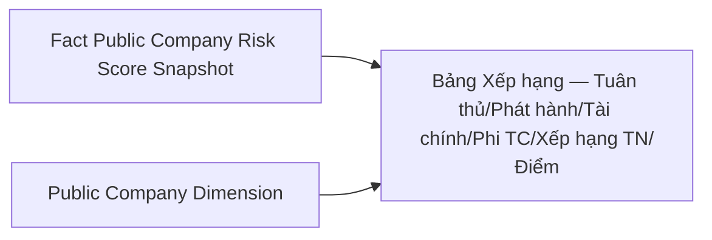
```mermaid
flowchart LR
    pc_risk_fct["Fact Public Company Risk Score Snapshot"] --> R1["Bảng Xếp hạng — Tuân thủ/Phát hành/Tài chính/Phi TC/Xếp hạng TN/Điểm"]
    public_company_dim["Public Company Dimension"] --> R1
```

**Bảng grain:**

| Tên bảng | Grain |
|---|---|
| Fact Public Company Risk Score Snapshot | 1 row / công ty đại chúng / ngày snapshot ETL (full-scan daily, carry-forward điểm số từ kỳ đánh giá gần nhất — sửa 2026-08-03) |
| Public Company Dimension | 1 row / công ty đại chúng (SCD4A) |
| Calendar Date Dimension | 1 row / ngày (Conformed) |

---

#### Nhóm 2 — STT 2: Top CTDC theo chỉ tiêu tuân thủ

##### READY

> Phân loại: **Phân tích**
> Atomic: `Public Company Evaluation Detail` ← IDS.EVALUATION_DETAILS — **draft** (chưa approved)
> Atomic: `Public Company Evaluation Criterion` ← IDS.EVALUATION_CRITERIA — **draft** (chưa approved)
> **Lưu ý go-live:** Atomic entity liên quan chưa qua approve — xem [O_GSDC_1].

**KPI liên quan:**

| KPI ID | Tên KPI | Tính chất | Atomic Entity | Atomic Table | Atomic Column | Điều kiện lọc (criterion_cd) |
|---|---|---|---|---|---|---|
| K_GSDC_7 | Mã CK doanh nghiệp | Chiều | Public Company | public_company | equity_ticker_symbol | **Reuse từ Nhóm 1** (K_GSDC_7) — không tính lại |
| K_GSDC_8 | Tên doanh nghiệp | Chiều | Public Company | public_company | pc_nm | **Reuse từ Nhóm 1** (K_GSDC_8) — không tính lại |
| K_GSDC_9 | Công bố BCTC | Base | Public Company Evaluation Detail | pc_evaluation_detail | evaluation_score | TUAN_THU_BCTC |
| K_GSDC_10 | Công bố BCTN | Base | Public Company Evaluation Detail | pc_evaluation_detail | evaluation_score | TUAN_THU_BCTN |
| K_GSDC_11 | Công bố báo cáo tình hình quản trị | Base | Public Company Evaluation Detail | pc_evaluation_detail | evaluation_score | TUAN_THU_BCTHQT |
| K_GSDC_12 | Công bố thông tin Thay đổi TGĐ/CTHĐQT | Base | Public Company Evaluation Detail | pc_evaluation_detail | evaluation_score | TUAN_THU_CBTTBT_TDTGD |
| K_GSDC_13 | Vi phạm từ UBCKNN | Base | Public Company Evaluation Detail | pc_evaluation_detail | evaluation_score | TUAN_THU_VP_UBCK |
| K_GSDC_14 | Vi phạm từ các đơn vị khác | Base | Public Company Evaluation Detail | pc_evaluation_detail | evaluation_score | TUAN_THU_CBTTBT_VPVT |
| K_GSDC_15 | Điều lệ Công ty và Các Quy chế hoạt động | Base | Public Company Evaluation Detail | pc_evaluation_detail | evaluation_score | TUAN_THU_QTCT_DLCT |
| K_GSDC_16 | Số lượng ĐHĐCĐ thường niên trong 6 tháng đầu năm | Base | Public Company Evaluation Detail | pc_evaluation_detail | evaluation_score | TUAN_THU_QTCT_SLDHDCD |
| K_GSDC_17 | Số lượng thành viên HĐQT độc lập | Base | Public Company Evaluation Detail | pc_evaluation_detail | evaluation_score | TUAN_THU_QTCT_SLTVDL |
| K_GSDC_18 | Số lượng thành viên HĐQT không điều hành | Base | Public Company Evaluation Detail | pc_evaluation_detail | evaluation_score | TUAN_THU_QTCT_SLTVKDH |
| K_GSDC_19 | Tư cách thành viên HĐQT/BKS/Kế toán trưởng | Base | Public Company Evaluation Detail | pc_evaluation_detail | evaluation_score | TUAN_THU_QTCT_TCTV |
| K_GSDC_20 | Số lượng thành viên BKS hoặc Ủy ban kiểm toán | Base | Public Company Evaluation Detail | pc_evaluation_detail | evaluation_score | TUAN_THU_QTCT_SLTVBKS |
| K_GSDC_21 | Báo cáo tiến độ sử dụng vốn | Base | Public Company Evaluation Detail | pc_evaluation_detail | evaluation_score | TUAN_THU_BCSDV_BCTDSDV |
| K_GSDC_22 | Thay đổi phương án sử dụng vốn | Base | Public Company Evaluation Detail | pc_evaluation_detail | evaluation_score | TUAN_THU_BCSDV_TDPASDV |
| K_GSDC_23 | Tổng điểm Tuân thủ | Base | Public Company Evaluation Detail | pc_evaluation_detail | SUM(evaluation_score) | group_cd = 'TUAN_THU' |

**Ghi chú tách KPI:** BA đã tách "Công bố thông tin về vi phạm, quyết định xử phạt" thành 2 tiêu chí riêng biệt trong nguồn (`criterion_cd` khác nhau): "Vi phạm từ UBCKNN" (`TUAN_THU_VP_UBCK`, K_GSDC_13) và "Vi phạm từ các đơn vị khác" (`TUAN_THU_CBTTBT_VPVT`, K_GSDC_14).

**Ghi chú lọc chung:** Mọi KPI Base join `Public Company Evaluation Detail (ed)` → `Public Company Evaluation Criterion (ec)` qua `pc_evaluation_criterion_id`, filter theo `pc_evaluation_criterion_code` tương ứng cột "Điều kiện lọc" ở trên. BA còn trả kèm `ed.result` (kết quả text) cho mỗi dòng — theo xác nhận Nhóm 1, cột này không đưa vào KPI (chỉ dùng `evaluation_score`).

**Mart:** `Fact Public Company Compliance Score Snapshot` (grain: 1 row / CTDC / ngày snapshot ETL — full-scan daily, carry-forward, sửa 2026-08-03)

---

#### Nhóm 3 — STT 3: Top CTDC theo chỉ tiêu phát hành

##### READY

> Phân loại: **Phân tích**
> Atomic: `Public Company Evaluation Detail` ← IDS.EVALUATION_DETAILS — **draft** (chưa approved)
> Atomic: `Public Company Evaluation Criterion` ← IDS.EVALUATION_CRITERIA — **draft** (chưa approved)
> **Lưu ý go-live:** Atomic entity liên quan chưa qua approve — xem [O_GSDC_1].

**KPI liên quan:**

| KPI ID | Tên KPI | Tính chất | Atomic Entity | Atomic Table | Atomic Column | Điều kiện lọc (criterion_cd) |
|---|---|---|---|---|---|---|
| K_GSDC_7 | Mã doanh nghiệp | Chiều | Public Company | public_company | equity_ticker_symbol | **Reuse từ Nhóm 1** (K_GSDC_7) — không tính lại |
| K_GSDC_8 | Tên doanh nghiệp | Chiều | Public Company | public_company | pc_nm | **Reuse từ Nhóm 1** (K_GSDC_8) — không tính lại |
| K_GSDC_24 | Phát hành tăng vốn nhanh | Base | Public Company Evaluation Detail | pc_evaluation_detail | evaluation_score | PHAT_HANH_TANG_VON_NHANH |
| K_GSDC_25 | Số lần chào bán cổ phiếu riêng lẻ | Base | Public Company Evaluation Detail | pc_evaluation_detail | evaluation_score | PHAT_HANH_SLCBCPRL |
| K_GSDC_26 | Số lần chào bán ra công chúng | Base | Public Company Evaluation Detail | pc_evaluation_detail | evaluation_score | PHAT_HANH_SLCBRCC |
| K_GSDC_27 | Số lần phát hành ESOP | Base | Public Company Evaluation Detail | pc_evaluation_detail | evaluation_score | PHAT_HANH_SLPHES |
| K_GSDC_28 | Tỷ lệ phát hành trái phiếu không có TSBĐ | Base | Public Company Evaluation Detail | pc_evaluation_detail | evaluation_score | PHAT_HANH_TLGTTP |
| K_GSDC_29 | Xếp hạng tín nhiệm | Base | Public Company Evaluation Detail | pc_evaluation_detail | evaluation_score | PHAT_HANH_TIN_NHIEM |
| K_GSDC_30 | Dư nợ trái phiếu / Tổng VCSH | Base | Public Company Evaluation Detail | pc_evaluation_detail | evaluation_score | PHAT_HANH_DNTPTVCSH |
| K_GSDC_31 | Tổng điểm Phát hành | Base | Public Company Evaluation Detail | pc_evaluation_detail | SUM(evaluation_score) | group_cd = 'PHAT_HANH' |

**Ghi chú đổi nội dung K_GSDC_29:** BA đã đổi chỉ tiêu này từ "Tỷ lệ trái phiếu vi phạm nghĩa vụ thanh toán lãi và gốc" (không còn trong BA) sang "Xếp hạng tín nhiệm" (`criterion_cd = PHAT_HANH_TIN_NHIEM`). Giữ nguyên K_GSDC_29, chỉ đổi tên KPI và nguồn — xác nhận với Data Modeler 2026-07-15.

**Ghi chú lọc chung:** Mọi KPI Base join `Public Company Evaluation Detail (ed)` → `Public Company Evaluation Criterion (ec)` qua `pc_evaluation_criterion_id`, filter theo `pc_evaluation_criterion_code` tương ứng cột "Điều kiện lọc" ở trên.

**Mart:** `Fact Public Company Issuance Score Snapshot` (grain: 1 row / CTDC / ngày snapshot ETL — full-scan daily, carry-forward, sửa 2026-08-03)

---

#### Nhóm 4 — STT 4: Top CTDC theo chỉ tiêu tài chính

##### READY

> Phân loại: **Phân tích**
> Atomic: `Public Company Evaluation Detail` ← IDS.EVALUATION_DETAILS — **draft** (chưa approved)
> Atomic: `Public Company Evaluation Criterion` ← IDS.EVALUATION_CRITERIA — **draft** (chưa approved)
> **Lưu ý go-live:** Atomic entity liên quan chưa qua approve — xem [O_GSDC_1].

**KPI liên quan:**

| KPI ID | Tên KPI | Tính chất | Atomic Entity | Atomic Table | Atomic Column | Điều kiện lọc (criterion_cd) |
|---|---|---|---|---|---|---|
| K_GSDC_7 | Mã doanh nghiệp | Chiều | Public Company | public_company | equity_ticker_symbol | **Reuse từ Nhóm 1** (K_GSDC_7) — không tính lại |
| K_GSDC_8 | Tên doanh nghiệp | Chiều | Public Company | public_company | pc_nm | **Reuse từ Nhóm 1** (K_GSDC_8) — không tính lại |
| K_GSDC_32 | Kiểm toán — Ý kiến kiểm toán | Base | Public Company Evaluation Detail | pc_evaluation_detail | evaluation_score | TAI_CHINH_YKKT |
| K_GSDC_33 | ROA | Base | Public Company Evaluation Detail | pc_evaluation_detail | evaluation_score | TAI_CHINH_ROA |
| K_GSDC_34 | Dòng tiền từ hoạt động kinh doanh | Base | Public Company Evaluation Detail | pc_evaluation_detail | evaluation_score | TAI_CHINH_DTTHDKD |
| K_GSDC_35 | Khả năng thanh toán hiện thời | Base | Public Company Evaluation Detail | pc_evaluation_detail | evaluation_score | TAI_CHINH_KNTTHT |
| K_GSDC_36 | EBIT / Lãi vay | Base | Public Company Evaluation Detail | pc_evaluation_detail | evaluation_score | TAI_CHINH_EBIT |
| K_GSDC_37 | Nợ / VCSH | Base | Public Company Evaluation Detail | pc_evaluation_detail | evaluation_score | TAI_CHINH_NO_VON_CSH |
| K_GSDC_38 | VCSH | Base | Public Company Evaluation Detail | pc_evaluation_detail | evaluation_score | TAI_CHINH_VON_CSH |
| K_GSDC_39 | ROE | Base | Public Company Evaluation Detail | pc_evaluation_detail | evaluation_score | TAI_CHINH_ROE |
| K_GSDC_40 | Doanh thu từ HĐ tài chính / Lợi nhuận sau thuế | Base | Public Company Evaluation Detail | pc_evaluation_detail | evaluation_score | TAI_CHINH_DTHDTC_LNST |
| K_GSDC_41 | Doanh thu từ hoạt động khác / Lợi nhuận sau thuế | Base | Public Company Evaluation Detail | pc_evaluation_detail | evaluation_score | TAI_CHINH_DTHD_KHAC_LNST |
| K_GSDC_42 | Tổng điểm Tài chính | Base | Public Company Evaluation Detail | pc_evaluation_detail | SUM(evaluation_score) | group_cd = 'TAI_CHINH' |

**Ghi chú thay đổi phạm vi KPI:**
- **K_GSDC_33** đổi nội dung từ "Khả năng hoạt động liên tục" (không còn trong BA) sang **"ROA"** (`criterion_cd = TAI_CHINH_ROA`) — tái sử dụng số ID theo quyết định Data Modeler 2026-07-15 (ngoại lệ quy tắc không đổi nghĩa KPI ID, xác nhận rõ ràng).
- **K_GSDC_38** "VCSH" (`criterion_cd = TAI_CHINH_VON_CSH`) — **rà soát LLD (2026-07-15) xác nhận vẫn còn trong BA**: dòng "VCSH" (STT 4, `Trạng thái mapping = Done`, `Loại dữ liệu = Dữ liệu tĩnh`). Ghi chú "loại khỏi phạm vi" trước đây sai/lỗi thời (có thể nhầm với 1 KPI khác đã đổi tên) — đã xóa, K_GSDC_38 giữ nguyên trong bảng KPI và Attributes.

**Ghi chú lọc chung:** Mọi KPI Base join `Public Company Evaluation Detail (ed)` → `Public Company Evaluation Criterion (ec)` qua `pc_evaluation_criterion_id`, filter theo `pc_evaluation_criterion_code` tương ứng cột "Điều kiện lọc" ở trên.

**Mart:** `Fact Public Company Financial Score Snapshot` (grain: 1 row / CTDC / ngày snapshot ETL — full-scan daily, carry-forward, sửa 2026-08-03)

---

#### Nhóm 5 — STT 5: Top CTDC theo chỉ tiêu phi tài chính & M-Score

##### READY

> Phân loại: **Phân tích**
> Atomic: `Public Company Evaluation Detail` ← IDS.EVALUATION_DETAILS — **draft** (chưa approved)
> Atomic: `Public Company Evaluation Criterion` ← IDS.EVALUATION_CRITERIA — **draft** (chưa approved)
> **Lưu ý go-live:** Atomic entity liên quan chưa qua approve — xem [O_GSDC_1].

**KPI liên quan:**

| KPI ID | Tên KPI | Tính chất | Atomic Entity | Atomic Table | Atomic Column | Điều kiện lọc (criterion_cd) |
|---|---|---|---|---|---|---|
| K_GSDC_7 | Mã doanh nghiệp | Chiều | Public Company | public_company | equity_ticker_symbol | **Reuse từ Nhóm 1** (K_GSDC_7) — không tính lại |
| K_GSDC_8 | Tên doanh nghiệp | Chiều | Public Company | public_company | pc_nm | **Reuse từ Nhóm 1** (K_GSDC_8) — không tính lại |
| K_GSDC_43 | Tình trạng DN từ Cục Đăng ký kinh doanh | Base | Public Company Evaluation Detail | pc_evaluation_detail | evaluation_score | PHI_TAI_CHINH_TTHD |
| K_GSDC_44 | M-Score | Base | Public Company Evaluation Detail | pc_evaluation_detail | evaluation_score | PHI_TAI_CHINH_M_SCORE |
| K_GSDC_45 | Tổng điểm Phi tài chính & M-Score | Base | Public Company Evaluation Detail | pc_evaluation_detail | SUM(evaluation_score) | group_cd = 'PHI_TAI_CHINH' |

**Ghi chú lọc chung:** Mọi KPI Base join `Public Company Evaluation Detail (ed)` → `Public Company Evaluation Criterion (ec)` qua `pc_evaluation_criterion_id`, filter theo `pc_evaluation_criterion_code` tương ứng cột "Điều kiện lọc" ở trên.

**Mart:** `Fact Public Company Non-Financial Score Snapshot` (grain: 1 row / CTDC / ngày snapshot ETL — full-scan daily, carry-forward, sửa 2026-08-03)

---

### Màn hình 2 — Giám sát Tổng hợp

Màn hình có bộ lọc **Năm / Quý** và 5 tab sàn. Mỗi tab hiển thị cùng cấu trúc 3 nhóm nội dung, chỉ khác filter `Equity_Listing_Exchange_Code`.

#### Nhóm 6 — STT 6: Thống kê niêm yết toàn thị trường

##### READY

> Phân loại: **Phân tích**
> Atomic: `Public Company` ← IDS.company_profiles — **draft** (chưa approved)
> Atomic: `Violation Report` (`violation_report`) ← IDS.VIOLATION_REPORT — **draft** (đổi tên từ "Public Company Violation Report", 2026-08-05)
> **Cập nhật 2026-07-15 — tách nhóm theo đúng STT BA:** Nhóm 6 trong HLD nay chỉ tương ứng STT 6 (không gộp STT 12/14/16/18 nữa — mỗi STT có Nhóm riêng, xem Nhóm 10/12/14/16 bên dưới).
> **Cập nhật 2026-07-15 (BA đánh số lại toàn bộ STT 6–28):** BA gộp dashboard "Tổng hợp CTTC theo ngành" (cũ STT 8+9+10) thành 1 STT duy nhất → toàn bộ STT phía sau lùi 2 đơn vị (cũ 11→9, 12→10, 13→11, ..., 19→17, 20→18 ... 30→28). STT 31–43 **giữ nguyên số cũ** (BA để trống STT 29–30, chưa xác nhận lý do — xem backlog cuối Section 4). Đã áp dụng renumber cho toàn bộ Nhóm 6–28 trong HLD, xem Section 4 để biết bảng mapping đầy đủ.
> **Cập nhật 2026-08-06 (Atomic bổ sung — chuyển READY):** BA vẫn ghi cột "Loại dữ liệu" = "Dữ liệu động" cho K_GSDC_48/49 (chưa đổi trong file BA gốc), nhưng Data Modeler xác nhận đây là task thiết kế bổ sung chính thức để giải quyết "dữ liệu động": K_GSDC_48 dùng entity `violation_report` (đã có LLD draft, `DataModel/working/Atomic/lld/IDS/lld_IDS_VIOLATION_REPORT.yaml`); K_GSDC_49 dùng đúng 5 entity Financial Report Value đã lấp gap ở Nhóm 7 → cả 2 chuyển READY.
> **Cập nhật 2026-08-07 (sửa lại table_type K_GSDC_48 — Fact, không phải Operational):** Thiết kế trước đó gán `violation_report` thành Operational SCD4A là **sai** — dữ liệu này phát sinh theo kỳ (mỗi công ty × mỗi kỳ có 1 tập hồ sơ nghĩa vụ báo cáo mới, ETL append theo kỳ, không phải cập nhật current-state), đúng ngữ nghĩa Fact Event. Đồng thời rà soát Nhóm 10/12/14/16 (BA SQL dòng 104-105, 149-150, 194-195, 239-240) xác nhận BA `GROUP BY equity_listing_exch` (sàn) cho cùng measure này — grain thật phải xuống tới cấp đủ chi tiết để `SUM` đúng ở mọi cấp độ (toàn TT/sàn), không phải pre-aggregate theo % (sai về toán học nếu SUM trung bình cộng của tỷ lệ). Quyết định cùng Data Modeler: **`Fact Violation Report Snapshot`** (mới) — grain 1 row / công ty / kỳ (Report_Year + Report_Quarter) / ngày ETL snapshot, 2 measure đếm: `Report_Due_Count` (số hồ sơ có `deadline_dt <= ngày ETL` trong kỳ) và `Report_Submitted_Count` (số hồ sơ có `actual_submit_dt` không null trong kỳ) — JOIN `Public Company Dimension` để GROUP BY sàn khi cần. Tỷ lệ nộp BCTC = `SUM(Report_Submitted_Count) / SUM(Report_Due_Count)` ở tầng Detail Mapping, đúng tại bất kỳ cấp độ nào (toàn TT ở Nhóm 6, theo sàn ở Nhóm 10/12/14/16) mà không cần Fact riêng cho từng cấp.
> **Cập nhật 2026-08-07 (gộp K_GSDC_49 vào `Fact Violation Report Snapshot` — quyết định Data Modeler):** K_GSDC_49 KHÔNG dùng `Fact Public Company Financial Report Value` (Nhóm 7) như thiết kế trước — Data Modeler yêu cầu gộp chung 1 Fact duy nhất phục vụ toàn bộ Nhóm 6, vì cả K_GSDC_48/49 đều đúng grain "1 row/công ty/kỳ" giống hệt nhau. Bổ sung cột `Profitable_Indicator` (0/1, LNST > 0) lấy từ `fr_value` JOIN theo `pc_id`+kỳ, denormalize vào `Fact Violation Report Snapshot`. K_GSDC_49 = `COUNT(DISTINCT Public_Company_Dimension_Id) WHERE Profitable_Indicator = 1`.
> **Driving Table = `Public Company Dimension`** (full-scan toàn bộ công ty mỗi ngày ETL — không phải `violation_report`, để tránh thiếu công ty không có hồ sơ `violation_report` trong `Profitable_Indicator`). Mỗi ngày ETL quét **toàn bộ kỳ đang có nghĩa vụ** trong `violation_report` (không filter theo 1 kỳ cụ thể — tham số `:p_nam`/`:p_quy` trong BA SQL chỉ là điều kiện lọc khi truy vấn, không phải điều kiện giới hạn khi populate Fact) — LEFT JOIN `violation_report` để tính Due/Submitted theo từng kỳ, LEFT JOIN `fr_value` để tính `Profitable_Indicator` theo từng kỳ.
> **K_GSDC_48** — BA SQL thực tế (`BA_analyst_GSDC_part1.csv` dòng 58): `FROM violation_report vr JOIN forms f ON f.id = vr.form_id AND f.news_type_cd = 'DINH_KY' WHERE vr.period_year = :p_nam AND (vr.period_quarter = :p_quy OR :p_quy IS NULL) AND vr.deadline_date <= TRUNC(SYSDATE)` → GROUP BY `pc_id`/`period_year`/`period_tp_code`: `Report_Due_Count = COUNT(vr.id) WHERE deadline_dt <= ngày ETL`, `Report_Submitted_Count = COUNT(vr.actual_submit_date)` (không null), JOIN `fr_template` (qua `fr_template_id`) filter `fr_template.news_tp_code = 'DINH_KY'` (← `IDS.FORMS.NEWS_TYPE_CD`, xem `lld_IDS_FORMS.yaml`) áp dụng ở tầng populate Fact (chỉ đếm hồ sơ loại "định kỳ").
> **K_GSDC_49** — BA SQL thực tế (`BA_analyst_GSDC_part1.csv` dòng 59): `FROM IDS.data d JOIN IDS.report_catalog rc ... JOIN IDS.rrow rr ... JOIN IDS.rcol rc2 ... JOIN ids.company_data cd ... WHERE rc2.col_desc='1' AND rc.report_cd LIKE 'BCKQKD%' AND d.data_value>0 AND ((rc.enterprise_type_cd='dn' AND rr.row_desc='60') OR (rc.enterprise_type_cd='bh' AND rr.row_desc='60') OR (rc.enterprise_type_cd='td' AND rr.row_desc='21'))` → `Profitable_Indicator = 1` khi tồn tại dòng `fr_value` khớp điều kiện LNST > 0 (`row_description_reference`='60' dn/bh, '21' td; `column_description_reference='1'`; `fr_catalog_code LIKE 'BCKQKD%'`) cho đúng `pc_id`+kỳ, `0`/NULL nếu không có.
> **Cập nhật 2026-07-23 (rà soát LLD) — bỏ `Fact Public Company Financial Summary Snapshot`:** Fact này ban đầu thiết kế cho K_GSDC_46/47 + K_GSDC_700-704 (Nhóm 38), nhưng rà soát phát hiện K_GSDC_47 tự đủ bằng `COUNT(DISTINCT ...)` trực tiếp trên `Public Company Dimension` (không cần grain snapshot theo kỳ), còn 4 cột còn lại của Fact (2 FK + `submission_deadline_dt`/`submission_dt`, phục vụ K_GSDC_702/703) PENDING toàn bộ vì nguồn `pc_report_submission` thật ra là `IDS.COMPANY_DATA` — dữ liệu động (xem O_GSDC_5 mục (10)). Fact không còn cột nào READY → xoá khỏi Entities/Attributes/model theo đúng pattern "bảng PENDING toàn bộ không tạo file" (giống `Fact Public Company Financial Report Value`, Nhóm 7). K_GSDC_46/47 nay dùng thẳng `Calendar Date Dimension`/`Public Company Dimension`, không qua Fact trung gian.

**Source:** `Public Company Dimension`, `Calendar Date Dimension` (K_GSDC_46/47 — không qua Fact); `Fact Violation Report Snapshot` (K_GSDC_48/49, mới — 1 Fact duy nhất phục vụ cả 2 KPI, driving `Public Company Dimension` full-scan, LEFT JOIN `violation_report` + `fr_value`)

**Bảng KPI:**

| KPI ID | Tên KPI | Đơn vị | Tính chất | Atomic Entity | Atomic Table | Atomic Attribute | Atomic Column | Trạng thái |
|---|---|---|---|---|---|---|---|---|
| K_GSDC_46 | Kỳ thống kê (Năm/Quý) | Text | Chiều (Slicer) | — | — | — | — | **READY** — Tham số `:year`/`:quarter` |
| K_GSDC_47 | Số doanh nghiệp | DN | Phái sinh | Public Company | public_company | Ids Registration Date | ids_registration_dt | **READY** — COUNT DISTINCT trực tiếp trên Public Company Dimension WHERE ids_registration_dt <= cuối kỳ — xem O_GSDC_2 |
| K_GSDC_48 | Tỷ lệ nộp BCTC | % | Phái sinh | Violation Report | violation_report | Deadline Date / Actual Submit Date / Period Year / Period Type Code | deadline_dt / actual_submit_dt / period_year / period_tp_code | **READY** — `SUM(Report_Submitted_Count) / NULLIF(SUM(Report_Due_Count), 0) * 100` trên `Fact Violation Report Snapshot` (toàn thị trường — không filter sàn ở Nhóm này), filter kỳ `Report_Year=:p_nam AND (Report_Quarter=:p_quy OR :p_quy IS NULL)` |
| K_GSDC_49 | Số DN báo lãi | DN | Cơ sở | Financial Report Value | fr_value | Data Value | data_val | **READY** — `COUNT(DISTINCT Public_Company_Dimension_Id)` trên `Fact Violation Report Snapshot` (cùng bảng với K_GSDC_48) WHERE `Profitable_Indicator = 1` |

> **Ghi chú filter K_GSDC_48:** BA JOIN `forms f ON f.id = vr.form_id AND f.news_type_cd = 'DINH_KY'` để lọc loại báo cáo "định kỳ" — map đúng field `fr_template.news_tp_code` (← `IDS.FORMS.NEWS_TYPE_CD`, `DataModel/working/Atomic/lld/IDS/lld_IDS_FORMS.yaml`), JOIN qua `violation_report.fr_template_id = fr_template.fr_template_id`, filter `fr_template.news_tp_code = 'DINH_KY'` — áp dụng ở tầng ETL populate `Fact Violation Report Snapshot` (chỉ đếm hồ sơ "định kỳ" vào Report_Due_Count/Report_Submitted_Count). Không còn Open Issue.

**Star Schema:**

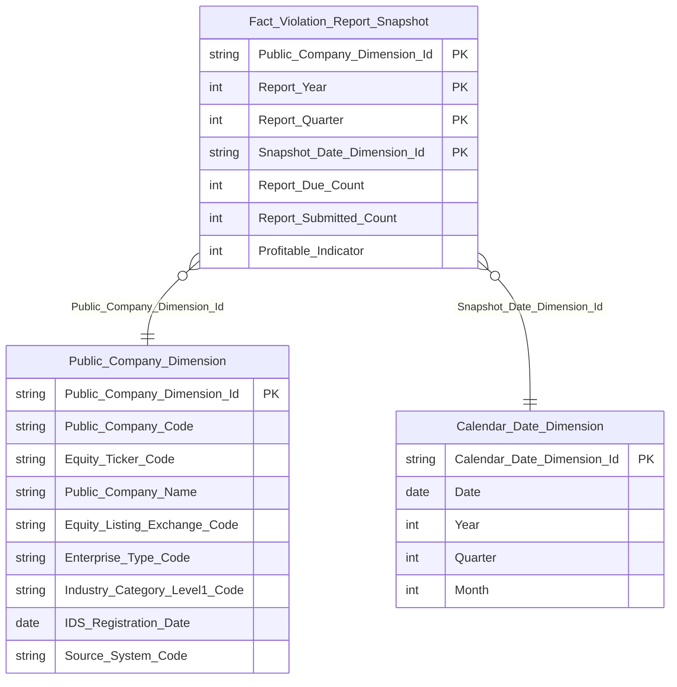
```mermaid
erDiagram
    Public_Company_Dimension {
        string Public_Company_Dimension_Id PK
        string Public_Company_Code
        string Equity_Ticker_Code
        string Public_Company_Name
        string Equity_Listing_Exchange_Code
        string Enterprise_Type_Code
        string Industry_Category_Level1_Code
        date IDS_Registration_Date
        string Source_System_Code
    }

    Calendar_Date_Dimension {
        string Calendar_Date_Dimension_Id PK
        date Date
        int Year
        int Quarter
        int Month
    }

    Fact_Violation_Report_Snapshot {
        string Public_Company_Dimension_Id PK
        int Report_Year PK
        int Report_Quarter PK
        string Snapshot_Date_Dimension_Id PK
        int Report_Due_Count
        int Report_Submitted_Count
        int Profitable_Indicator
    }

    Fact_Violation_Report_Snapshot }o--|| Public_Company_Dimension : "Public_Company_Dimension_Id"
    Fact_Violation_Report_Snapshot }o--|| Calendar_Date_Dimension : "Snapshot_Date_Dimension_Id"
```

> **Ghi chú:** K_GSDC_46/47 truy vấn trực tiếp trên `Public Company Dimension`/`Calendar Date Dimension` — không có Fact trung gian (xem ghi chú rà soát 2026-07-23 ở đầu Nhóm). K_GSDC_48/49 cùng dùng chung `Fact Violation Report Snapshot` (Fact mới, driving `Public Company Dimension` full-scan, grain 1 row/công ty/kỳ báo cáo/ngày ETL, JOIN `Public Company Dimension` để GROUP BY sàn ở Nhóm 10/12/14/16) — filter "loại tin định kỳ" (`fr_template.news_tp_code = 'DINH_KY'`) áp dụng ở tầng ETL populate Fact cho `Report_Due_Count`/`Report_Submitted_Count` (K_GSDC_48); `Profitable_Indicator` (K_GSDC_49) denormalize từ `fr_value` theo cùng grain. **Cập nhật 2026-08-07:** bổ sung FK `Snapshot_Date_Dimension_Id` sang `Calendar Date Dimension` — lưu ngày ETL chạy job populate Fact (không phải ngày nghiệp vụ trong `violation_report`, `Report_Year`/`Report_Quarter` vẫn giữ nguyên là kỳ báo cáo), theo đúng pattern `Snapshot_Date` đã dùng ở 5 Fact `*_Score_Snapshot` — cho phép full-scan daily và trace đúng thời điểm tính toán tỷ lệ nộp BCTC (VD: tỷ lệ tại ngày 06/08 có thể khác ngày 20/08 cùng kỳ Quý 3 vì có thêm công ty nộp muộn). **Cập nhật 2026-08-07 (gộp K_GSDC_49):** không còn dùng `Fact Public Company Financial Report Value`/`Financial Report Catalog Dimension` cho Nhóm này — cả 2 KPI (K_GSDC_48/49) đã gộp vào cùng 1 Fact duy nhất.

**Lineage Mart → Báo cáo:**

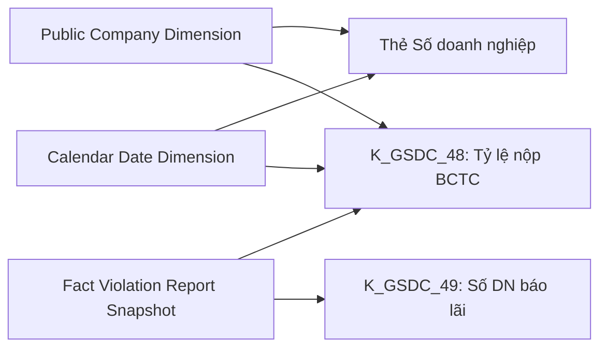
```mermaid
flowchart LR
    public_company_dim["Public Company Dimension"] --> R1["Thẻ Số doanh nghiệp"]
    cdr_dt_dim["Calendar Date Dimension"] --> R1
    fct_violation_rpt_snpst_g6["Fact Violation Report Snapshot"] --> R1b["K_GSDC_48: Tỷ lệ nộp BCTC"]
    public_company_dim --> R1b
    cdr_dt_dim --> R1b
    fct_violation_rpt_snpst_g6 --> R1c["K_GSDC_49: Số DN báo lãi"]
```

**Bảng grain:**

| Tên bảng | Grain |
|---|---|
| Public Company Dimension | 1 row / công ty đại chúng (SCD4A) |
| Calendar Date Dimension | 1 row / ngày (Conformed) |
| Fact Violation Report Snapshot | 1 row / công ty đại chúng / kỳ (Report Year + Report Quarter) / ngày ETL snapshot |

---

#### Nhóm 7 — STT 7: Tổng hợp chỉ tiêu tài chính toàn thị trường

##### READY

> Phân loại: **Phân tích**
> **Cập nhật 2026-07-15 — tách nhóm theo đúng STT BA:** Nhóm 7 trong HLD nay chỉ tương ứng STT 7 (CTTC tổng hợp toàn thị trường, không filter sàn). STT 11/13/15/17 (cùng bộ chỉ tiêu, filter theo sàn HNX/HOSE/UPCOM/OTC + thêm breakdown theo ngành) tách thành Nhóm 11/13/15/17 riêng — xem bên dưới.
> **Cập nhật 2026-07-15 (BA renumber):** STT các nhóm sàn cũ 13/15/17/19 nay là 11/13/15/17 (BA đánh số lại toàn bộ STT 6-28, xem ghi chú ở Nhóm 6).
> **Cập nhật 2026-08-06 (Atomic bổ sung Financial Report Value — chuyển READY):** BA vẫn ghi cột "Loại dữ liệu" = "Dữ liệu động" cho toàn bộ 26/26 dòng STT 7 (chưa đổi trong file BA gốc), nhưng Data Modeler xác nhận đây là task thiết kế bổ sung chính thức để giải quyết tình trạng "dữ liệu động" — Atomic đã bổ sung đủ 5 entity (`fr_value`/IDS.DATA, `financial_report_catalog`/IDS.REPORT_CATALOG, `fr_row_template`/IDS.RROW, `fr_column_template`/IDS.RCOL, `pc_report_submission`/IDS.COMPANY_DATA — `DataModel/working/Atomic/lld/IDS/`), quy tắc khai thác (JOIN key, dedup submission, EXISTS filter) đã được xác nhận rõ theo đúng SQL BA thật (`BRD/BA/BA_analyst_GSDC_part1.csv` dòng 1163–1580) → chuyển READY, không còn Gap Atomic.
> Atomic: `Financial Report Value` (`fr_value`) ← IDS.DATA — **draft** (chưa approved)
> Atomic: `Financial Report Catalog` (`financial_report_catalog`) ← IDS.REPORT_CATALOG — **draft**
> Atomic: `Financial Report Row Template` (`fr_row_template`) ← IDS.RROW — **approved**
> Atomic: `Financial Report Column Template` (`fr_column_template`) ← IDS.RCOL — **approved**
> Atomic: `Public Company Report Submission` (`pc_report_submission`) ← IDS.COMPANY_DATA — **approved** (dùng làm filter tồn tại hồ sơ nộp, không lấy measure)

**Quy tắc khai thác (chốt cùng Data Modeler, 2026-08-06):**
1. **Driving table:** `fr_value` — mỗi dòng = 1 giá trị ô báo cáo (`pc_id` × `fr_catalog_id` × `row_code` × `column_code` × `rpt_year` × `rpt_quarter`).
2. **JOIN `financial_report_catalog`** ON `fr_value.fr_catalog_id = financial_report_catalog.fr_catalog_id` — lấy `fr_catalog_code` (filter `LIKE 'BCDKT%'`/`LIKE 'BCKQKD%'`), `enterprise_tp_code` (filter `'dn'`/`'bh'`/`'td'`).
3. **JOIN `fr_row_template`** ON `fr_row_template.fr_row_template_code = fr_value.row_code AND fr_row_template.fr_catalog_id = fr_value.fr_catalog_id` — lấy `row_description_reference` (mã dòng hiển thị trên biểu mẫu, VD `'270'` — khác `row_code`/`fr_row_template_code` là mã kỹ thuật tự sinh `r+sequence`, dùng để JOIN, không dùng để filter nghiệp vụ).
4. **JOIN `fr_column_template`** ON `fr_column_template.fr_column_template_code = fr_value.column_code AND fr_column_template.fr_catalog_id = fr_value.fr_catalog_id` — lấy `column_description_reference` (VD `'1'` = cuối kỳ, `'2'` = đầu kỳ).
5. **Filter tồn tại hồ sơ nộp hợp lệ** (đúng ý nghĩa `INNER JOIN company_data` trong SQL BA — dùng để lọc, không SELECT field): `EXISTS (SELECT 1 FROM pc_report_submission WHERE pc_id = fr_value.pc_id AND rpt_year = fr_value.rpt_year AND rpt_quarter = fr_value.rpt_quarter)`. Dùng `EXISTS`/semi-join (KHÔNG `INNER JOIN` trực tiếp) để tránh fan-out khi 1 công ty + 1 kỳ có nhiều dòng `pc_report_submission` (nhiều form/bản đính chính) — `INNER JOIN` trực tiếp sẽ nhân dòng `fr_value` lên N lần, làm `SUM(data_val)` sai.
6. **Dedup `pc_report_submission` trước khi filter EXISTS** (nếu cần field khác ngoài phạm vi Nhóm 7): key = `(pc_id, fr_template_id, rpt_year, rpt_quarter, rpt_month)`, `WHERE submission_status_code = 'APPROVED'`, nhiều bản ghi cùng key → lấy `MAX(submission_dt)`.
7. **Grain Fact:** 1 row / CTĐC (`pc_id`) / kỳ (`rpt_year`+`rpt_quarter`) / Row Code / Column Code — đúng placeholder đã ghi ở Section 4 Reuse Analysis.
8. **`Data Value`** giữ riêng cho từng `column_description_reference` (`'1'` cuối kỳ, `'2'` đầu kỳ) — ROA/ROE (K_GSDC_55/56) là KPI Phái sinh, tính ở tầng Detail Mapping bằng cách lấy 2 dòng cùng Row Code khác Column Code (`'1'`/`'2'`) rồi tính trung bình, KHÔNG SUM trực tiếp trên Fact (xem BƯỚC 4B — grain measure = grain Fact, đúng cấp).

**Bảng KPI:**

| KPI ID | Tên KPI | Đơn vị | Tính chất | Atomic Table | Atomic Column | row_desc (dn/bh/td) | Loại BC | col_desc | Trạng thái |
|---|---|---|---|---|---|---|---|---|---|
| K_GSDC_50 | Tổng tài sản | Tỉ đồng | Phái sinh | fr_value | data_val | 270/270/300 | BCDKT | 1 | **READY** |
| K_GSDC_50_YOY | Tổng tài sản — YoY | % | Phái sinh | fr_value | data_val | 270/270/300 | BCDKT | 1 (kỳ N vs N-4 quarter) | **READY** |
| K_GSDC_51 | Nợ phải trả | Tỉ đồng | Phái sinh | fr_value | data_val | 300/300/400 | BCDKT | 1 | **READY** |
| K_GSDC_51_YOY | Nợ phải trả — YoY | % | Phái sinh | fr_value | data_val | 300/300/400 | BCDKT | 1 | **READY** |
| K_GSDC_52 | Vốn CSH | Tỉ đồng | Phái sinh | fr_value | data_val | 400/400/500 | BCDKT | 1 | **READY** |
| K_GSDC_52_YOY | Vốn CSH — YoY | % | Phái sinh | fr_value | data_val | 400/400/500 | BCDKT | 1 | **READY** |
| K_GSDC_53 | Vốn điều lệ | Tỉ đồng | Phái sinh | fr_value | data_val | 411/411/411 | BCDKT | 1 | **READY** |
| K_GSDC_53_YOY | Vốn điều lệ — YoY | % | Phái sinh | fr_value | data_val | 411/411/411 | BCDKT | 1 | **READY** |
| K_GSDC_54 | Lợi nhuận sau thuế | Tỉ đồng | Phái sinh | fr_value | data_val | 60/60/21 | BCKQKD | 1 | **READY** |
| K_GSDC_54_YOY | LNST — YoY | % | Phái sinh | fr_value | data_val | 60/60/21 | BCKQKD | 1 | **READY** |
| K_GSDC_55 | ROA | % | Phái sinh | fr_value | data_val | 270/270/300 (TSBQ) + 60/60/21 (LNST) | BCDKT+BCKQKD | 1+2 | **READY** |
| K_GSDC_55_YOY | ROA — YoY | % | Phái sinh | fr_value | data_val | (như K_GSDC_55) | — | — | **READY** |
| K_GSDC_56 | ROE | % | Phái sinh | fr_value | data_val | 400/400/500 (VCSHBQ) + 60/60/21 (LNST) | BCDKT+BCKQKD | 1+2 | **READY** |
| K_GSDC_56_YOY | ROE — YoY | % | Phái sinh | fr_value | data_val | (như K_GSDC_56) | — | — | **READY** |
| K_GSDC_57 | Hàng tồn kho | Tỉ đồng | Phái sinh | fr_value | data_val | 140/140/— | BCDKT | 1 | **READY** |
| K_GSDC_57_YOY | Hàng tồn kho — YoY | % | Phái sinh | fr_value | data_val | 140/140/— | BCDKT | 1 | **READY** |
| K_GSDC_58 | Doanh thu thuần | Tỉ đồng | Phái sinh | fr_value | data_val | 10/10/03 | BCKQKD | 1 | **READY** |
| K_GSDC_58_YOY | Doanh thu — YoY | % | Phái sinh | fr_value | data_val | 10/10/03 | BCKQKD | 1 | **READY** |
| K_GSDC_59 | Lợi nhuận dồn tích YTD | Tỉ đồng | Phái sinh | fr_value | data_val | 421/421/— (td không có trong BA SQL) | BCDKT | 1 | **READY** |
| K_GSDC_59_YOY | LN YTD — YoY | % | Phái sinh | fr_value | data_val | 421/421/450 | BCDKT | 1 | **READY** |
| K_GSDC_60 | Phải thu | Tỉ đồng | Phái sinh | fr_value | data_val | 130+210/130+210/251 | BCDKT | 1 | **READY** |
| K_GSDC_60_YOY | Phải thu — YoY | % | Phái sinh | fr_value | data_val | 130+210/130+210/251 | BCDKT | 1 | **READY** |
| K_GSDC_61 | Tiền và tương đương tiền | Tỉ đồng | Phái sinh | fr_value | data_val | 110/110/110+120 | BCDKT | 1 | **READY** |
| K_GSDC_61_YOY | Tiền TĐT — YoY | % | Phái sinh | fr_value | data_val | 110/110/110+120 | BCDKT | 1 | **READY** |
| K_GSDC_62 | Nợ / Vốn CSH | Lần (x) | Phái sinh | fr_value | data_val | 300/300/400 (Nợ) + 400/400/500 (VCSH) | BCDKT | 1 | **READY** |
| K_GSDC_62_YOY | Nợ/Vốn CSH — YoY | % | Phái sinh | fr_value | data_val | (như K_GSDC_62) | — | — | **READY** |

> **Ghi chú YoY:** BA gọi "so sánh cùng kỳ năm trước" — công thức `(giá_trị_kỳ_này - giá_trị_cùng_kỳ_năm_trước) / giá_trị_cùng_kỳ_năm_trước × 100`, lấy 2 dòng Fact cùng Row/Column Code, khác `rpt_year` (năm nay vs năm trước, cùng `rpt_quarter`) — pre-aggregate ở Detail Mapping, không phải cột riêng trên Fact.

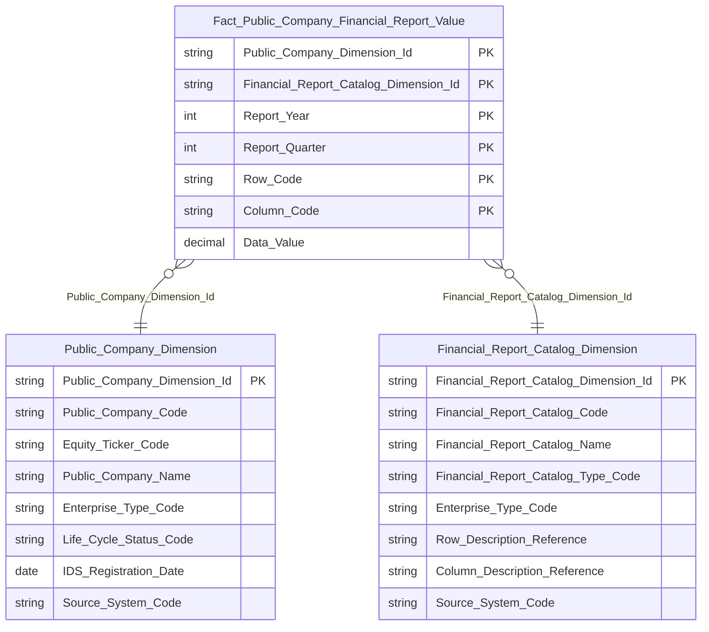
```mermaid
erDiagram
    Fact_Public_Company_Financial_Report_Value {
        string Public_Company_Dimension_Id PK
        string Financial_Report_Catalog_Dimension_Id PK
        int Report_Year PK
        int Report_Quarter PK
        string Row_Code PK
        string Column_Code PK
        decimal Data_Value
    }

    Public_Company_Dimension {
        string Public_Company_Dimension_Id PK
        string Public_Company_Code
        string Equity_Ticker_Code
        string Public_Company_Name
        string Enterprise_Type_Code
        string Life_Cycle_Status_Code
        date IDS_Registration_Date
        string Source_System_Code
    }

    Financial_Report_Catalog_Dimension {
        string Financial_Report_Catalog_Dimension_Id PK
        string Financial_Report_Catalog_Code
        string Financial_Report_Catalog_Name
        string Financial_Report_Catalog_Type_Code
        string Enterprise_Type_Code
        string Row_Description_Reference
        string Column_Description_Reference
        string Source_System_Code
    }

    Fact_Public_Company_Financial_Report_Value }o--|| Public_Company_Dimension : "Public_Company_Dimension_Id"
    Fact_Public_Company_Financial_Report_Value }o--|| Financial_Report_Catalog_Dimension : "Financial_Report_Catalog_Dimension_Id"
```

> **Ghi chú erDiagram:** `Row_Code`/`Column_Code` trên Fact là mã kỹ thuật (`fr_value.row_code`/`column_code`) dùng làm grain key — `Row_Description_Reference`/`Column_Description_Reference` (mã hiển thị biểu mẫu dùng để filter nghiệp vụ, VD `'270'`/`'1'`) nằm trên `Financial_Report_Catalog_Dimension` (denormalize từ `fr_row_template`/`fr_column_template`, join theo `row_code`/`column_code` + `fr_catalog_id`) — tách khỏi Fact vì đây là thuộc tính mô tả của template, không phải measure. `EXISTS pc_report_submission` là điều kiện filter ETL population, không xuất hiện trên Fact.

**Lineage Mart → Báo cáo:**

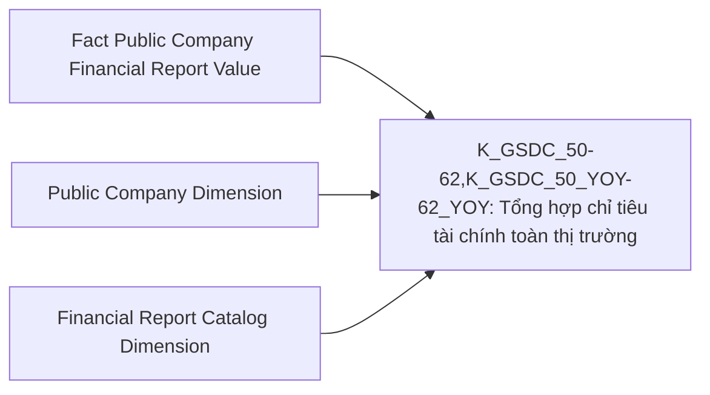
```mermaid
flowchart LR
    fct_pc_fr_val["Fact Public Company Financial Report Value"] --> R1["K_GSDC_50-62,K_GSDC_50_YOY-62_YOY: Tổng hợp chỉ tiêu tài chính toàn thị trường"]
    public_company_dim_g7["Public Company Dimension"] --> R1
    financial_rpt_catalog_dim_g7["Financial Report Catalog Dimension"] --> R1
```

**Bảng grain:**

| Tên bảng | Grain |
|---|---|
| Fact Public Company Financial Report Value | 1 row / CTĐC / kỳ (Report Year + Report Quarter) / Row Code / Column Code |
| Public Company Dimension | 1 row / công ty đại chúng (SCD4A) |
| Financial Report Catalog Dimension | 1 row / báo cáo (Catalog) × dòng (Row) × cột (Column) — reference per module (SCD4A) |

---

#### Nhóm 8 — STT 8: Tổng hợp chỉ tiêu tài chính & thống kê ngành (toàn thị trường)

##### READY

> Phân loại: **Phân tích**
> **Cập nhật 2026-07-15 (BA gộp STT + sửa BA):** BA đã **gộp lại thành 1 STT duy nhất** dashboard "Tổng hợp CTTC theo ngành toàn thị trường" — trước đây bị tách rời qua 3 STT (cũ 8/9/10, HLD từng tách thành 3 Nhóm riêng theo rule "1 Nhóm = 1 STT" áp dụng tại thời điểm đó). Nay BA đã tự sửa lại đúng — 14 dòng liên tục cùng 1 STT 8, không còn tách 3 STT nữa → **gộp lại thành 1 Nhóm 8 duy nhất** (K_GSDC_63–76).
> **Cập nhật 2026-08-06 (Atomic bổ sung Financial Report Value — chuyển READY):** Giống Nhóm 7 — reuse 100% `Fact Public Company Financial Report Value` + `Financial Report Catalog Dimension` đã thiết kế, chỉ thêm breakdown theo ngành qua `Public Company Dimension.Business_Line_Level_1_Code` (đã có sẵn, không cần cột mới trên Fact).
> **Atomic — Ngành (READY từ trước):** `Public Company` (`public_company`), field `Business Line Level 1 Code` (`business_line_level_1_code`, nguồn `IDS.company_profiles.CATEGORY_L1_ID`, Classification Value scheme `IDS_INDUSTRY_CATEGORY`). SQL BA breakdown ngành dùng `JOIN IDS.company_profiles cdet ON cdet.id = d.company_profile_id` + `GROUP BY cdet.category_l1_id` — đây chính là field trên `public_company` (đã join sẵn qua `pc_id` trên Fact), không phải cột riêng.
> Atomic: `Financial Report Value` (`fr_value`), `Financial Report Catalog` (`financial_report_catalog`), `Financial Report Row Template` (`fr_row_template`), `Financial Report Column Template` (`fr_column_template`), `Public Company Report Submission` (`pc_report_submission`) — xem chi tiết quy tắc khai thác ở Nhóm 7 (dùng chung, không lặp lại).

**Bảng KPI:**

| KPI ID | Tên KPI | Đơn vị | Tính chất | Atomic Table | Atomic Column | row_desc (dn/bh/td) | Loại BC | col_desc | Trạng thái |
|---|---|---|---|---|---|---|---|---|---|
| K_GSDC_63 | Ngành kinh tế | Text | Chiều (Group By) | public_company | business_line_level_1_code | — | — | — | **READY** |
| K_GSDC_64 | Tổng tài sản theo ngành | Tỉ đồng | Phái sinh | fr_value | data_val | 270/270/300 | BCDKT | 1 | **READY** |
| K_GSDC_65 | Nợ phải trả theo ngành | Tỉ đồng | Phái sinh | fr_value | data_val | 300/300/400 | BCDKT | 1 | **READY** |
| K_GSDC_66 | Vốn CSH theo ngành | Tỉ đồng | Phái sinh | fr_value | data_val | 400/400/500 | BCDKT | 1 | **READY** |
| K_GSDC_67 | Vốn điều lệ theo ngành | Tỉ đồng | Phái sinh | fr_value | data_val | 411/411/411 | BCDKT | 1 | **READY** |
| K_GSDC_68 | Lợi nhuận sau thuế theo ngành | Tỉ đồng | Phái sinh | fr_value | data_val | 60/60/21 | BCKQKD | 1 | **READY** |
| K_GSDC_69 | ROA theo ngành | % | Phái sinh | fr_value | data_val | 270/270/300 (TSBQ) + 60/60/21 (LNST) | BCDKT+BCKQKD | 1+2 | **READY** |
| K_GSDC_70 | ROE theo ngành | % | Phái sinh | fr_value | data_val | 400/400/500 (VCSHBQ) + 60/60/21 (LNST) | BCDKT+BCKQKD | 1+2 | **READY** |
| K_GSDC_71 | Hàng tồn kho theo ngành | Tỉ đồng | Phái sinh | fr_value | data_val | 140/140/— | BCDKT | 1 | **READY** |
| K_GSDC_72 | Doanh thu thuần theo ngành | Tỉ đồng | Phái sinh | fr_value | data_val | 10/10/03 | BCKQKD | 1 | **READY** |
| K_GSDC_73 | Lợi nhuận dồn tích YTD theo ngành | Tỉ đồng | Phái sinh | fr_value | data_val | 421/421/450 | BCDKT | 1 | **READY** |
| K_GSDC_74 | Phải thu theo ngành | Tỉ đồng | Phái sinh | fr_value | data_val | 130+210/130+210/251 | BCDKT | 1 | **READY** |
| K_GSDC_75 | Tiền và tương đương tiền theo ngành | Tỉ đồng | Phái sinh | fr_value | data_val | 110/110/110+120 | BCDKT | 1 | **READY** |
| K_GSDC_76 | Nợ / Vốn CSH theo ngành | Lần (x) | Phái sinh | fr_value | data_val | 300/300/400 (Nợ) + 400/400/500 (VCSH) | BCDKT | 1 | **READY** |

**Star Schema:** dùng chung `Fact Public Company Financial Report Value` + `Public Company Dimension` + `Financial Report Catalog Dimension` với Nhóm 7 (không có erDiagram riêng — xem Nhóm 7). Breakdown ngành = GROUP BY thêm `Public Company Dimension.Business_Line_Level_1_Code` ở tầng Detail Mapping, không thay đổi Fact/Dimension schema.

> **Ghi chú filter Active (K_GSDC_63, 2026-08-06):** BA gốc lọc danh sách ngành `IDS.categories WHERE active_flg = 1`. Map đúng: JOIN `Public_Company_Dimension.Business_Line_Level_1_Id → cl_business_line.cl_business_line_id`, filter `cl_business_line.active_indicator = 1` (xem O_GSDC_5 mục (3)).

**Lineage Mart → Báo cáo:**

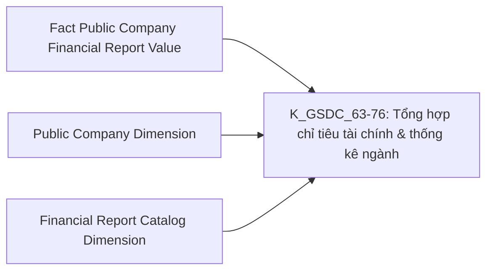
```mermaid
flowchart LR
    fct_pc_fr_val_g8["Fact Public Company Financial Report Value"] --> R8["K_GSDC_63-76: Tổng hợp chỉ tiêu tài chính & thống kê ngành"]
    public_company_dim_g8["Public Company Dimension"] --> R8
    financial_rpt_catalog_dim_g8["Financial Report Catalog Dimension"] --> R8
```

**Bảng grain:** như Nhóm 7 (`Fact Public Company Financial Report Value` — 1 row / CTĐC / kỳ / Row Code / Column Code; `Public Company Dimension` — 1 row / công ty đại chúng SCD4A).

---

#### Nhóm 9 — STT 9: Thống kê CTĐC chưa niêm yết (toàn thị trường)

##### READY

> Phân loại: **Phân tích**
> Source: `Public Company Dimension` (không qua Fact — xem ghi chú rà soát 2026-07-23 ở Nhóm 6) — filter `Public Company Status Code = 'APPROVED_PUBLIC'` AND `Equity Listing Exchange Code NOT IN ('HOSE', 'HNX')` (bao gồm NULL, UPCOM, OTC)
> **Cập nhật 2026-07-15 (BA renumber):** Nội dung cũ Nhóm 11 (STT 11) — đổi số theo STT mới (BA gộp STT 8+9+10 thành 1, mọi STT phía sau lùi 2), không đổi nội dung/KPI_ID.
> **Rà soát gap (giữ nguyên từ Nhóm 11 cũ):** Sửa 2 gap so với BA thực tế: (1) bổ sung filter `Public Company Status Code = 'APPROVED_PUBLIC'` (Atomic: `pc_status_code`, nguồn `IDS.COMPANY_PROFILES.STATUS_IDS_CD`) — trước đây thiếu, khiến COUNT tính cả DN không phải CTĐC. (2) Điều kiện sàn sửa từ `equity_listing_exchange_code IS NULL` thành `NOT IN ('HOSE', 'HNX')` — BA định nghĩa "chưa niêm yết" là loại trừ 2 sàn niêm yết chính thức (HOSE/HNX), không chỉ riêng NULL; UPCOM/OTC/giá trị khác đều tính là chưa niêm yết.
> **Cập nhật 2026-07-23 (rà soát LLD):** `Fact Public Company Financial Summary Snapshot` đã bị xoá (xem Nhóm 6) — K_GSDC_77 tự đủ bằng COUNT DISTINCT trực tiếp trên `Public Company Dimension`, không cần Fact.

**Bảng KPI:**

| KPI ID | Tên KPI | Đơn vị | Tính chất | Atomic Entity | Atomic Table | Atomic Attribute | Atomic Column | Ghi chú |
|---|---|---|---|---|---|---|---|---|
| K_GSDC_77 | Số CTDC chưa niêm yết | DN | Phái sinh | Public Company | public_company | IDS Registration Date | ids_registration_dt | COUNT(DISTINCT pc_id) WHERE ids_registration_dt <= cuối kỳ AND pc_status_code = 'APPROVED_PUBLIC' AND equity_listing_exchange_code NOT IN ('HOSE', 'HNX') |

**Star Schema:**

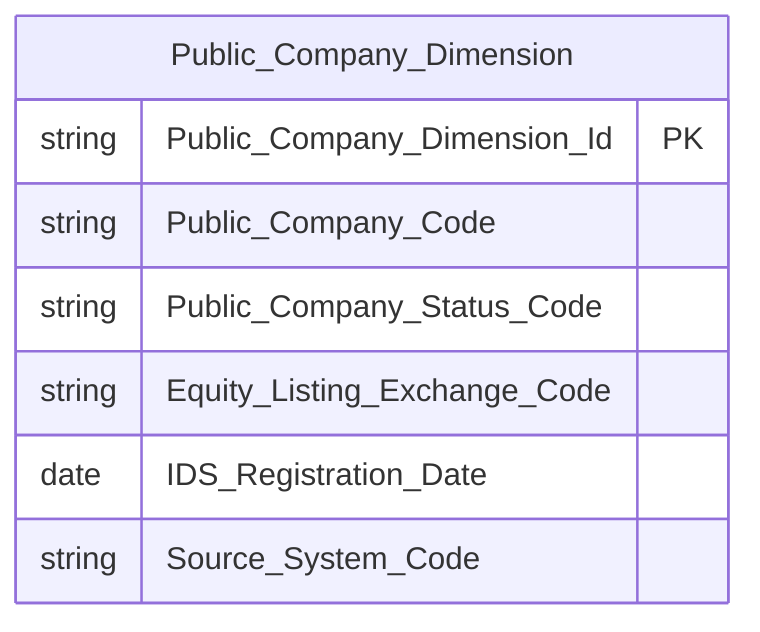
```mermaid
erDiagram
    Public_Company_Dimension {
        string Public_Company_Dimension_Id PK
        string Public_Company_Code
        string Public_Company_Status_Code
        string Equity_Listing_Exchange_Code
        date IDS_Registration_Date
        string Source_System_Code
    }
```

**Lineage Mart → Báo cáo:**

```mermaid
flowchart LR
    public_company_dim["Public Company Dimension"] --> R9["Thẻ CTDC chưa niêm yết"]
```

**Bảng grain:**

| Tên bảng | Grain |
|---|---|
| Public Company Dimension | 1 row / công ty đại chúng (SCD4A) |

---

#### Nhóm 10 — STT 10: Thống kê niêm yết sàn HNX

##### READY

> Phân loại: **Phân tích**
> Atomic: `Public Company` ← IDS.company_profiles — **draft** (chưa approved)
> Filter: `equity_listing_exchange_code = 'HNX'`
> **Cập nhật 2026-07-15 (BA renumber):** Nội dung cũ Nhóm 12 (STT 12) — đổi số theo STT mới, không đổi nội dung/KPI_ID.
> **Cập nhật 2026-08-06 (Atomic bổ sung — chuyển READY):** K_GSDC_48/49 chuyển READY theo đúng logic Nhóm 6, thêm filter `Equity_Listing_Exchange_Code='HNX'` — xem BA SQL thực tế (`BA_analyst_GSDC_part1.csv` dòng 104-105, có JOIN `company_profiles cp`/`company_profiles cdet` filter `= 'HNX'`).

**Bảng KPI:**

| KPI ID | Tên KPI | Đơn vị | Tính chất | Atomic Entity | Atomic Table | Atomic Attribute | Atomic Column | Trạng thái |
|---|---|---|---|---|---|---|---|---|
| K_GSDC_46 | Ngày thống kê (Năm/Quý) | Text | Chiều (Slicer) | — | — | — | — | **READY** — Tham số `:year`/`:quarter` |
| K_GSDC_78 | Sàn | Text | Chiều | Public Company | public_company | Equity Listing Exchange Code | equity_listing_exchange_code | **READY** — Filter cố định `= 'HNX'` — Classification Value scheme `IDS_LISTING_TYPE` |
| K_GSDC_47 | Số doanh nghiệp theo từng sàn | DN | Cơ sở | Public Company | public_company | Ids Registration Date | ids_registration_dt | **READY** — COUNT DISTINCT WHERE ids_registration_dt <= cuối kỳ AND equity_listing_exchange_code = 'HNX' — reuse công thức K_GSDC_47 Nhóm 6, filter thêm theo sàn |
| K_GSDC_48 | Tỷ lệ nộp BCTC theo từng sàn (quý) | % | Phái sinh | Violation Report | violation_report | Deadline Date / Actual Submit Date / Period Year / Period Type Code | deadline_dt / actual_submit_dt / period_year / period_tp_code | **READY** — Reuse công thức K_GSDC_48 Nhóm 6, JOIN `Public Company Dimension` filter `Equity_Listing_Exchange_Code='HNX'` |
| K_GSDC_49 | Số DN báo lãi theo từng sàn | DN | Cơ sở | Financial Report Value | fr_value | Data Value | data_val | **READY** — Reuse công thức K_GSDC_49 Nhóm 6, JOIN `Public Company Dimension` filter `Equity_Listing_Exchange_Code='HNX'` |

**Star Schema, Lineage, Bảng grain:** giống Nhóm 6 (`Public Company Dimension`, `Calendar Date Dimension`, `Fact Violation Report Snapshot` — 1 Fact duy nhất phục vụ cả K_GSDC_48/49) — chỉ khác filter sàn `= 'HNX'`.

---

#### Nhóm 11 — STT 11: Tổng hợp chỉ tiêu tài chính theo sàn HNX

##### READY

> Phân loại: **Phân tích**
> Filter: `Equity_Listing_Exchange_Code = 'HNX'` (xem Nhóm 6 K_GSDC_78 "Sàn", reuse KPI_ID) — filter bổ sung trên `Public Company Dimension`, JOIN vào Fact qua `pc_id` như Nhóm 7/8.
> **Cập nhật 2026-07-15 (BA renumber):** Nội dung cũ Nhóm 13 (STT 13) — đổi số theo STT mới, không đổi nội dung/KPI_ID.
> **Ghi chú nội dung:** STT 11 = 26 KPI giống Nhóm 7 (filter thêm sàn HNX) + 14 dòng mới: 1 Chiều "Ngành" + 13 chỉ tiêu "theo ngành" (GROUP BY `Business Line Level 1 Code`, giống Nhóm 8).
> **Cập nhật 2026-08-06 (Atomic bổ sung Financial Report Value — chuyển READY):** Reuse 100% `Fact Public Company Financial Report Value` + `Financial Report Catalog Dimension` đã thiết kế ở Nhóm 7 — chỉ thêm filter `Equity_Listing_Exchange_Code='HNX'` (qua `Public Company Dimension`) và breakdown ngành (qua `Public Company Dimension.Business_Line_Level_1_Code`, giống Nhóm 8). K_GSDC_79 "Ngành" trở lại READY vì Fact nay đã sẵn sàng.

**Bảng KPI:**

| KPI ID | Tên KPI | Đơn vị | Tính chất | Atomic Table | Atomic Column | row_desc (dn/bh/td) | Loại BC | col_desc | Trạng thái |
|---|---|---|---|---|---|---|---|---|---|
| K_GSDC_50 | Tổng tài sản (HNX) | Tỉ đồng | Phái sinh | fr_value | data_val | 270/270/300 | BCDKT | 1 | **READY** |
| K_GSDC_50_YOY | Tổng tài sản — YoY | % | Phái sinh | fr_value | data_val | 270/270/300 | BCDKT | 1 | **READY** |
| K_GSDC_51 | Nợ phải trả (HNX) | Tỉ đồng | Phái sinh | fr_value | data_val | 300/300/400 | BCDKT | 1 | **READY** |
| K_GSDC_51_YOY | Nợ phải trả — YoY | % | Phái sinh | fr_value | data_val | 300/300/400 | BCDKT | 1 | **READY** |
| K_GSDC_52 | Vốn CSH (HNX) | Tỉ đồng | Phái sinh | fr_value | data_val | 400/400/500 | BCDKT | 1 | **READY** |
| K_GSDC_52_YOY | Vốn CSH — YoY | % | Phái sinh | fr_value | data_val | 400/400/500 | BCDKT | 1 | **READY** |
| K_GSDC_53 | Vốn điều lệ (HNX) | Tỉ đồng | Phái sinh | fr_value | data_val | 411/411/411 | BCDKT | 1 | **READY** |
| K_GSDC_53_YOY | Vốn điều lệ — YoY | % | Phái sinh | fr_value | data_val | 411/411/411 | BCDKT | 1 | **READY** |
| K_GSDC_54 | Lợi nhuận sau thuế (HNX) | Tỉ đồng | Phái sinh | fr_value | data_val | 60/60/21 | BCKQKD | 1 | **READY** |
| K_GSDC_54_YOY | LNST — YoY | % | Phái sinh | fr_value | data_val | 60/60/21 | BCKQKD | 1 | **READY** |
| K_GSDC_55 | ROA (HNX) | % | Phái sinh | fr_value | data_val | 270/270/300 + 60/60/21 | BCDKT+BCKQKD | 1+2 | **READY** |
| K_GSDC_55_YOY | ROA — YoY | % | Phái sinh | fr_value | data_val | (như K_GSDC_55) | — | — | **READY** |
| K_GSDC_56 | ROE (HNX) | % | Phái sinh | fr_value | data_val | 400/400/500 + 60/60/21 | BCDKT+BCKQKD | 1+2 | **READY** |
| K_GSDC_56_YOY | ROE — YoY | % | Phái sinh | fr_value | data_val | (như K_GSDC_56) | — | — | **READY** |
| K_GSDC_57 | Hàng tồn kho (HNX) | Tỉ đồng | Phái sinh | fr_value | data_val | 140/140/— | BCDKT | 1 | **READY** |
| K_GSDC_57_YOY | Hàng tồn kho — YoY | % | Phái sinh | fr_value | data_val | 140/140/— | BCDKT | 1 | **READY** |
| K_GSDC_58 | Doanh thu thuần (HNX) | Tỉ đồng | Phái sinh | fr_value | data_val | 10/10/03 | BCKQKD | 1 | **READY** |
| K_GSDC_58_YOY | Doanh thu — YoY | % | Phái sinh | fr_value | data_val | 10/10/03 | BCKQKD | 1 | **READY** |
| K_GSDC_59 | Lợi nhuận dồn tích YTD (HNX) | Tỉ đồng | Phái sinh | fr_value | data_val | 421/421/— (td không có trong BA SQL) | BCDKT | 1 | **READY** |
| K_GSDC_59_YOY | LN YTD — YoY | % | Phái sinh | fr_value | data_val | 421/421/450 | BCDKT | 1 | **READY** |
| K_GSDC_60 | Phải thu (HNX) | Tỉ đồng | Phái sinh | fr_value | data_val | 130+210/130+210/251 | BCDKT | 1 | **READY** |
| K_GSDC_60_YOY | Phải thu — YoY | % | Phái sinh | fr_value | data_val | 130+210/130+210/251 | BCDKT | 1 | **READY** |
| K_GSDC_61 | Tiền và tương đương tiền (HNX) | Tỉ đồng | Phái sinh | fr_value | data_val | 110/110/110+120 | BCDKT | 1 | **READY** |
| K_GSDC_61_YOY | Tiền TĐT — YoY | % | Phái sinh | fr_value | data_val | 110/110/110+120 | BCDKT | 1 | **READY** |
| K_GSDC_62 | Nợ / Vốn CSH (HNX) | Lần (x) | Phái sinh | fr_value | data_val | 300/300/400 + 400/400/500 | BCDKT | 1 | **READY** |
| K_GSDC_62_YOY | Nợ/Vốn CSH — YoY | % | Phái sinh | fr_value | data_val | (như K_GSDC_62) | — | — | **READY** |
| K_GSDC_79 | Ngành | Text | Chiều | public_company | business_line_level_1_code | — | — | — | **READY** |
| K_GSDC_80 | Tổng tài sản — theo ngành (HNX) | Tỉ đồng | Phái sinh | fr_value | data_val | 270/270/300 | BCDKT | 1 | **READY** |
| K_GSDC_81 | Nợ phải trả — theo ngành (HNX) | Tỉ đồng | Phái sinh | fr_value | data_val | 300/300/400 | BCDKT | 1 | **READY** |
| K_GSDC_82 | Vốn CSH — theo ngành (HNX) | Tỉ đồng | Phái sinh | fr_value | data_val | 400/400/500 | BCDKT | 1 | **READY** |
| K_GSDC_83 | Vốn điều lệ — theo ngành (HNX) | Tỉ đồng | Phái sinh | fr_value | data_val | 411/411/411 | BCDKT | 1 | **READY** |
| K_GSDC_84 | Lợi nhuận sau thuế — theo ngành (HNX) | Tỉ đồng | Phái sinh | fr_value | data_val | 60/60/21 | BCKQKD | 1 | **READY** |
| K_GSDC_85 | ROA — theo ngành (HNX) | % | Phái sinh | fr_value | data_val | 270/270/300 + 60/60/21 | BCDKT+BCKQKD | 1+2 | **READY** |
| K_GSDC_86 | ROE — theo ngành (HNX) | % | Phái sinh | fr_value | data_val | 400/400/500 + 60/60/21 | BCDKT+BCKQKD | 1+2 | **READY** |
| K_GSDC_87 | Hàng tồn kho — theo ngành (HNX) | Tỉ đồng | Phái sinh | fr_value | data_val | 140/140/— | BCDKT | 1 | **READY** |
| K_GSDC_88 | Doanh thu — theo ngành (HNX) | Tỉ đồng | Phái sinh | fr_value | data_val | 10/10/03 | BCKQKD | 1 | **READY** |
| K_GSDC_89 | Lợi nhuận dồn tích YTD — theo ngành (HNX) | Tỉ đồng | Phái sinh | fr_value | data_val | 421/421/450 | BCDKT | 1 | **READY** |
| K_GSDC_90 | Phải thu — theo ngành (HNX) | Tỉ đồng | Phái sinh | fr_value | data_val | 130+210/130+210/251 | BCDKT | 1 | **READY** |
| K_GSDC_91 | Tiền và tương đương tiền — theo ngành (HNX) | Tỉ đồng | Phái sinh | fr_value | data_val | 110/110/110+120 | BCDKT | 1 | **READY** |
| K_GSDC_92 | Nợ/Vốn CSH — theo ngành (HNX) | Lần (x) | Phái sinh | fr_value | data_val | 300/300/400 + 400/400/500 | BCDKT | 1 | **READY** |

**Star Schema:** dùng chung `Fact Public Company Financial Report Value` + `Public Company Dimension` + `Financial Report Catalog Dimension` với Nhóm 7 (không có erDiagram riêng). Filter sàn = `Public Company Dimension.Equity_Listing_Exchange_Code = 'HNX'`, GROUP BY ngành = `Public Company Dimension.Business_Line_Level_1_Code` — cả 2 xử lý ở tầng Detail Mapping.

> **Ghi chú filter Active (K_GSDC_79, 2026-08-06):** giống K_GSDC_63 Nhóm 8 — filter `cl_business_line.active_indicator = 1` qua JOIN `Business_Line_Level_1_Id` (xem O_GSDC_5 mục (3)).

**Lineage Mart → Báo cáo:**

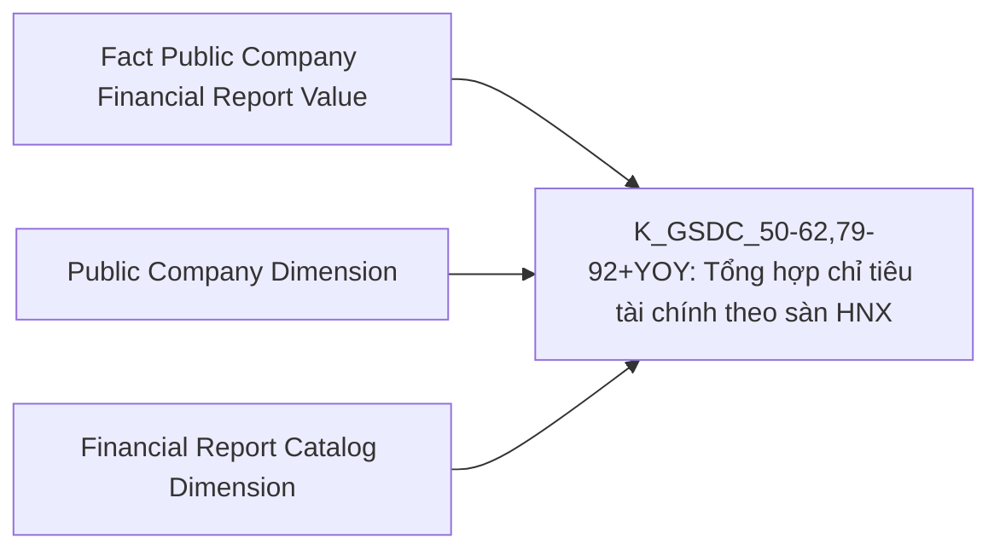
```mermaid
flowchart LR
    fct_pc_fr_val_g11["Fact Public Company Financial Report Value"] --> R11["K_GSDC_50-62,79-92+YOY: Tổng hợp chỉ tiêu tài chính theo sàn HNX"]
    public_company_dim_g11["Public Company Dimension"] --> R11
    financial_rpt_catalog_dim_g11["Financial Report Catalog Dimension"] --> R11
```

**Bảng grain:** như Nhóm 7.

---

#### Nhóm 12 — STT 12: Thống kê niêm yết sàn HOSE

##### READY

> Phân loại: **Phân tích**
> Atomic: `Public Company` ← IDS.company_profiles — **draft** (chưa approved)
> Filter: `equity_listing_exchange_code = 'HOSE'`
> **Cập nhật 2026-07-15 (BA renumber):** Nội dung cũ Nhóm 14 (STT 14) — đổi số theo STT mới, không đổi nội dung/KPI_ID.
> **Cập nhật 2026-08-06 (Atomic bổ sung — chuyển READY):** K_GSDC_48/49 chuyển READY theo đúng logic Nhóm 6, thêm filter `Equity_Listing_Exchange_Code='HOSE'` (xem BA SQL dòng 149-150).

**Bảng KPI:**

| KPI ID | Tên KPI | Đơn vị | Tính chất | Atomic Entity | Atomic Table | Atomic Attribute | Atomic Column | Trạng thái |
|---|---|---|---|---|---|---|---|---|
| K_GSDC_46 | Ngày thống kê (Năm/Quý) | Text | Chiều (Slicer) | — | — | — | — | **READY** — Tham số `:year` / `:quarter` — reuse K_GSDC_46 |
| K_GSDC_78 | Sàn | Text | Chiều | Public Company | public_company | Equity Listing Exchange Code | equity_listing_exchange_code | **READY** — Filter cố định `= 'HOSE'` — reuse KPI Sàn (K_GSDC_78), khác filter |
| K_GSDC_47 | Số doanh nghiệp theo từng sàn | DN | Cơ sở | Public Company | public_company | Ids Registration Date | ids_registration_dt | **READY** — COUNT DISTINCT WHERE ids_registration_dt <= cuối kỳ AND equity_listing_exchange_code = 'HOSE' |
| K_GSDC_48 | Tỷ lệ nộp BCTC theo từng sàn (quý) | % | Phái sinh | Violation Report | violation_report | Deadline Date / Actual Submit Date / Period Year / Period Type Code | deadline_dt / actual_submit_dt / period_year / period_tp_code | **READY** — Reuse công thức K_GSDC_48 Nhóm 6, filter `Equity_Listing_Exchange_Code='HOSE'` |
| K_GSDC_49 | Số DN báo lãi theo từng sàn | DN | Cơ sở | Financial Report Value | fr_value | Data Value | data_val | **READY** — Reuse công thức K_GSDC_49 Nhóm 6, filter `Equity_Listing_Exchange_Code='HOSE'` |

**Star Schema, Lineage, Bảng grain:** giống Nhóm 6 — chỉ khác filter sàn `= 'HOSE'`.

---

#### Nhóm 13 — STT 13: Tổng hợp chỉ tiêu tài chính theo sàn HOSE

##### READY

> Phân loại: **Phân tích**
> Filter: `Equity_Listing_Exchange_Code = 'HOSE'`. Cấu trúc giống hệt Nhóm 11 (HNX), chỉ khác filter sàn — **reuse KPI_ID** K_GSDC_50–62(+YOY) + K_GSDC_79 (Ngành, reuse từ Nhóm 11) + K_GSDC_80–92 (theo ngành, reuse KPI_ID, chỉ đổi filter sàn).
> **Cập nhật 2026-07-15 (BA renumber):** Nội dung cũ Nhóm 15 (STT 15) — đổi số theo STT mới, không đổi nội dung/KPI_ID.
> **Cập nhật 2026-08-06 (Atomic bổ sung Financial Report Value — chuyển READY):** Nhất quán với Nhóm 11 — reuse 100% Fact/Dimension, chỉ đổi filter `Equity_Listing_Exchange_Code='HOSE'`.

**Bảng KPI:**

| KPI ID | Tên KPI | Đơn vị | Tính chất | Atomic Table | Atomic Column | row_desc (dn/bh/td) | Loại BC | col_desc | Trạng thái |
|---|---|---|---|---|---|---|---|---|---|
| K_GSDC_50 | Tổng tài sản (HOSE) | Tỉ đồng | Phái sinh | fr_value | data_val | 270/270/300 | BCDKT | 1 | **READY** |
| K_GSDC_50_YOY | Tổng tài sản — YoY | % | Phái sinh | fr_value | data_val | 270/270/300 | BCDKT | 1 | **READY** |
| K_GSDC_51 | Nợ phải trả (HOSE) | Tỉ đồng | Phái sinh | fr_value | data_val | 300/300/400 | BCDKT | 1 | **READY** |
| K_GSDC_51_YOY | Nợ phải trả — YoY | % | Phái sinh | fr_value | data_val | 300/300/400 | BCDKT | 1 | **READY** |
| K_GSDC_52 | Vốn CSH (HOSE) | Tỉ đồng | Phái sinh | fr_value | data_val | 400/400/500 | BCDKT | 1 | **READY** |
| K_GSDC_52_YOY | Vốn CSH — YoY | % | Phái sinh | fr_value | data_val | 400/400/500 | BCDKT | 1 | **READY** |
| K_GSDC_53 | Vốn điều lệ (HOSE) | Tỉ đồng | Phái sinh | fr_value | data_val | 411/411/411 | BCDKT | 1 | **READY** |
| K_GSDC_53_YOY | Vốn điều lệ — YoY | % | Phái sinh | fr_value | data_val | 411/411/411 | BCDKT | 1 | **READY** |
| K_GSDC_54 | Lợi nhuận sau thuế (HOSE) | Tỉ đồng | Phái sinh | fr_value | data_val | 60/60/21 | BCKQKD | 1 | **READY** |
| K_GSDC_54_YOY | LNST — YoY | % | Phái sinh | fr_value | data_val | 60/60/21 | BCKQKD | 1 | **READY** |
| K_GSDC_55 | ROA (HOSE) | % | Phái sinh | fr_value | data_val | 270/270/300 + 60/60/21 | BCDKT+BCKQKD | 1+2 | **READY** |
| K_GSDC_55_YOY | ROA — YoY | % | Phái sinh | fr_value | data_val | (như K_GSDC_55) | — | — | **READY** |
| K_GSDC_56 | ROE (HOSE) | % | Phái sinh | fr_value | data_val | 400/400/500 + 60/60/21 | BCDKT+BCKQKD | 1+2 | **READY** |
| K_GSDC_56_YOY | ROE — YoY | % | Phái sinh | fr_value | data_val | (như K_GSDC_56) | — | — | **READY** |
| K_GSDC_57 | Hàng tồn kho (HOSE) | Tỉ đồng | Phái sinh | fr_value | data_val | 140/140/— | BCDKT | 1 | **READY** |
| K_GSDC_57_YOY | Hàng tồn kho — YoY | % | Phái sinh | fr_value | data_val | 140/140/— | BCDKT | 1 | **READY** |
| K_GSDC_58 | Doanh thu thuần (HOSE) | Tỉ đồng | Phái sinh | fr_value | data_val | 10/10/03 | BCKQKD | 1 | **READY** |
| K_GSDC_58_YOY | Doanh thu — YoY | % | Phái sinh | fr_value | data_val | 10/10/03 | BCKQKD | 1 | **READY** |
| K_GSDC_59 | Lợi nhuận dồn tích YTD (HOSE) | Tỉ đồng | Phái sinh | fr_value | data_val | 421/421/— (td không có trong BA SQL) | BCDKT | 1 | **READY** |
| K_GSDC_59_YOY | LN YTD — YoY | % | Phái sinh | fr_value | data_val | 421/421/450 | BCDKT | 1 | **READY** |
| K_GSDC_60 | Phải thu (HOSE) | Tỉ đồng | Phái sinh | fr_value | data_val | 130+210/130+210/251 | BCDKT | 1 | **READY** |
| K_GSDC_60_YOY | Phải thu — YoY | % | Phái sinh | fr_value | data_val | 130+210/130+210/251 | BCDKT | 1 | **READY** |
| K_GSDC_61 | Tiền và tương đương tiền (HOSE) | Tỉ đồng | Phái sinh | fr_value | data_val | 110/110/110+120 | BCDKT | 1 | **READY** |
| K_GSDC_61_YOY | Tiền TĐT — YoY | % | Phái sinh | fr_value | data_val | 110/110/110+120 | BCDKT | 1 | **READY** |
| K_GSDC_62 | Nợ / Vốn CSH (HOSE) | Lần (x) | Phái sinh | fr_value | data_val | 300/300/400 + 400/400/500 | BCDKT | 1 | **READY** |
| K_GSDC_62_YOY | Nợ/Vốn CSH — YoY | % | Phái sinh | fr_value | data_val | (như K_GSDC_62) | — | — | **READY** |
| K_GSDC_79 | Ngành | Text | Chiều | public_company | business_line_level_1_code | — | — | — | **READY** |
| K_GSDC_80 | Tổng tài sản — theo ngành (HOSE) | Tỉ đồng | Phái sinh | fr_value | data_val | 270/270/300 | BCDKT | 1 | **READY** |
| K_GSDC_81 | Nợ phải trả — theo ngành (HOSE) | Tỉ đồng | Phái sinh | fr_value | data_val | 300/300/400 | BCDKT | 1 | **READY** |
| K_GSDC_82 | Vốn CSH — theo ngành (HOSE) | Tỉ đồng | Phái sinh | fr_value | data_val | 400/400/500 | BCDKT | 1 | **READY** |
| K_GSDC_83 | Vốn điều lệ — theo ngành (HOSE) | Tỉ đồng | Phái sinh | fr_value | data_val | 411/411/411 | BCDKT | 1 | **READY** |
| K_GSDC_84 | Lợi nhuận sau thuế — theo ngành (HOSE) | Tỉ đồng | Phái sinh | fr_value | data_val | 60/60/21 | BCKQKD | 1 | **READY** |
| K_GSDC_85 | ROA — theo ngành (HOSE) | % | Phái sinh | fr_value | data_val | 270/270/300 + 60/60/21 | BCDKT+BCKQKD | 1+2 | **READY** |
| K_GSDC_86 | ROE — theo ngành (HOSE) | % | Phái sinh | fr_value | data_val | 400/400/500 + 60/60/21 | BCDKT+BCKQKD | 1+2 | **READY** |
| K_GSDC_87 | Hàng tồn kho — theo ngành (HOSE) | Tỉ đồng | Phái sinh | fr_value | data_val | 140/140/— | BCDKT | 1 | **READY** |
| K_GSDC_88 | Doanh thu — theo ngành (HOSE) | Tỉ đồng | Phái sinh | fr_value | data_val | 10/10/03 | BCKQKD | 1 | **READY** |
| K_GSDC_89 | Lợi nhuận dồn tích YTD — theo ngành (HOSE) | Tỉ đồng | Phái sinh | fr_value | data_val | 421/421/450 | BCDKT | 1 | **READY** |
| K_GSDC_90 | Phải thu — theo ngành (HOSE) | Tỉ đồng | Phái sinh | fr_value | data_val | 130+210/130+210/251 | BCDKT | 1 | **READY** |
| K_GSDC_91 | Tiền và tương đương tiền — theo ngành (HOSE) | Tỉ đồng | Phái sinh | fr_value | data_val | 110/110/110+120 | BCDKT | 1 | **READY** |
| K_GSDC_92 | Nợ/Vốn CSH — theo ngành (HOSE) | Lần (x) | Phái sinh | fr_value | data_val | 300/300/400 + 400/400/500 | BCDKT | 1 | **READY** |

**Star Schema:** dùng chung với Nhóm 7/11 (không có erDiagram riêng). Filter sàn = `Public Company Dimension.Equity_Listing_Exchange_Code = 'HOSE'`.

> **Ghi chú filter Active (K_GSDC_79):** giống K_GSDC_63 Nhóm 8/K_GSDC_79 Nhóm 11 — filter `cl_business_line.active_indicator = 1` (xem O_GSDC_5 mục (3)).

**Lineage Mart → Báo cáo:**

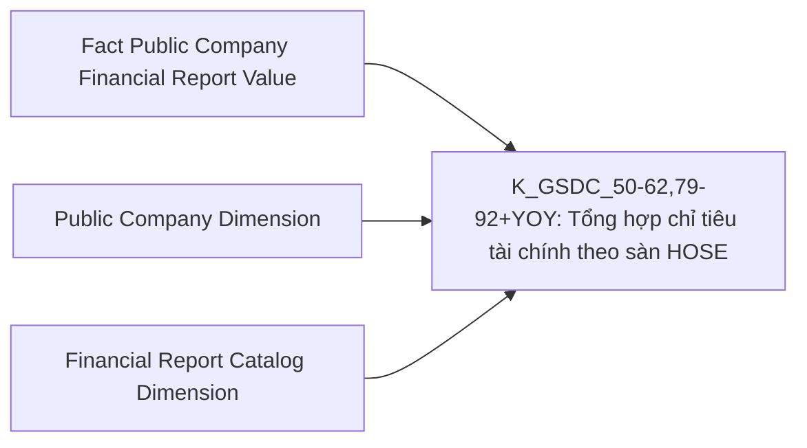
```mermaid
flowchart LR
    fct_pc_fr_val_g13["Fact Public Company Financial Report Value"] --> R13["K_GSDC_50-62,79-92+YOY: Tổng hợp chỉ tiêu tài chính theo sàn HOSE"]
    public_company_dim_g13["Public Company Dimension"] --> R13
    financial_rpt_catalog_dim_g13["Financial Report Catalog Dimension"] --> R13
```

**Bảng grain:** như Nhóm 7.

---

#### Nhóm 14 — STT 14: Thống kê niêm yết sàn UPCoM

##### READY

> Phân loại: **Phân tích**
> Atomic: `Public Company` ← IDS.company_profiles — **draft** (chưa approved)
> Filter: `equity_listing_exchange_code = 'UPCOM'`
> **Cập nhật 2026-07-15 (BA renumber):** Nội dung cũ Nhóm 16 (STT 16) — đổi số theo STT mới, không đổi nội dung/KPI_ID.
> **Cập nhật 2026-08-06 (Atomic bổ sung — chuyển READY):** K_GSDC_48/49 chuyển READY theo đúng logic Nhóm 6, thêm filter `Equity_Listing_Exchange_Code='UPCOM'` (xem BA SQL dòng 194-195).

**Bảng KPI:**

| KPI ID | Tên KPI | Đơn vị | Tính chất | Atomic Entity | Atomic Table | Atomic Attribute | Atomic Column | Trạng thái |
|---|---|---|---|---|---|---|---|---|
| K_GSDC_46 | Ngày thống kê (Năm/Quý) | Text | Chiều (Slicer) | — | — | — | — | **READY** — Tham số `:year` / `:quarter` — reuse K_GSDC_46 |
| K_GSDC_78 | Sàn | Text | Chiều | Public Company | public_company | Equity Listing Exchange Code | equity_listing_exchange_code | **READY** — Filter cố định `= 'UPCOM'` — reuse KPI Sàn (K_GSDC_78), khác filter |
| K_GSDC_47 | Số doanh nghiệp theo từng sàn | DN | Cơ sở | Public Company | public_company | Ids Registration Date | ids_registration_dt | **READY** — COUNT DISTINCT WHERE ids_registration_dt <= cuối kỳ AND equity_listing_exchange_code = 'UPCOM' |
| K_GSDC_48 | Tỷ lệ nộp BCTC theo từng sàn (quý) | % | Phái sinh | Violation Report | violation_report | Deadline Date / Actual Submit Date / Period Year / Period Type Code | deadline_dt / actual_submit_dt / period_year / period_tp_code | **READY** — Reuse công thức K_GSDC_48 Nhóm 6, filter `Equity_Listing_Exchange_Code='UPCOM'` |
| K_GSDC_49 | Số DN báo lãi theo từng sàn | DN | Cơ sở | Financial Report Value | fr_value | Data Value | data_val | **READY** — Reuse công thức K_GSDC_49 Nhóm 6, filter `Equity_Listing_Exchange_Code='UPCOM'` |

**Star Schema, Lineage, Bảng grain:** giống Nhóm 6 — chỉ khác filter sàn `= 'UPCOM'`.

---

#### Nhóm 15 — STT 15: Tổng hợp chỉ tiêu tài chính theo sàn UPCOM

##### READY

> Phân loại: **Phân tích**
> Filter: `Equity_Listing_Exchange_Code = 'UPCOM'`. Cấu trúc giống hệt Nhóm 11 (HNX), chỉ khác filter sàn — **reuse KPI_ID** K_GSDC_50–62(+YOY) + K_GSDC_79 (Ngành, reuse từ Nhóm 11) + K_GSDC_80–92 (theo ngành, reuse KPI_ID, chỉ đổi filter sàn).
> **Cập nhật 2026-07-15 (BA renumber):** Nội dung cũ Nhóm 17 (STT 17) — đổi số theo STT mới, không đổi nội dung/KPI_ID.
> **Cập nhật 2026-08-06 (Atomic bổ sung Financial Report Value — chuyển READY):** Nhất quán với Nhóm 11 — reuse 100% Fact/Dimension, chỉ đổi filter `Equity_Listing_Exchange_Code='UPCOM'`.

**Bảng KPI:**

| KPI ID | Tên KPI | Đơn vị | Tính chất | Atomic Table | Atomic Column | row_desc (dn/bh/td) | Loại BC | col_desc | Trạng thái |
|---|---|---|---|---|---|---|---|---|---|
| K_GSDC_50 | Tổng tài sản (UPCOM) | Tỉ đồng | Phái sinh | fr_value | data_val | 270/270/300 | BCDKT | 1 | **READY** |
| K_GSDC_50_YOY | Tổng tài sản — YoY | % | Phái sinh | fr_value | data_val | 270/270/300 | BCDKT | 1 | **READY** |
| K_GSDC_51 | Nợ phải trả (UPCOM) | Tỉ đồng | Phái sinh | fr_value | data_val | 300/300/400 | BCDKT | 1 | **READY** |
| K_GSDC_51_YOY | Nợ phải trả — YoY | % | Phái sinh | fr_value | data_val | 300/300/400 | BCDKT | 1 | **READY** |
| K_GSDC_52 | Vốn CSH (UPCOM) | Tỉ đồng | Phái sinh | fr_value | data_val | 400/400/500 | BCDKT | 1 | **READY** |
| K_GSDC_52_YOY | Vốn CSH — YoY | % | Phái sinh | fr_value | data_val | 400/400/500 | BCDKT | 1 | **READY** |
| K_GSDC_53 | Vốn điều lệ (UPCOM) | Tỉ đồng | Phái sinh | fr_value | data_val | 411/411/411 | BCDKT | 1 | **READY** |
| K_GSDC_53_YOY | Vốn điều lệ — YoY | % | Phái sinh | fr_value | data_val | 411/411/411 | BCDKT | 1 | **READY** |
| K_GSDC_54 | Lợi nhuận sau thuế (UPCOM) | Tỉ đồng | Phái sinh | fr_value | data_val | 60/60/21 | BCKQKD | 1 | **READY** |
| K_GSDC_54_YOY | LNST — YoY | % | Phái sinh | fr_value | data_val | 60/60/21 | BCKQKD | 1 | **READY** |
| K_GSDC_55 | ROA (UPCOM) | % | Phái sinh | fr_value | data_val | 270/270/300 + 60/60/21 | BCDKT+BCKQKD | 1+2 | **READY** |
| K_GSDC_55_YOY | ROA — YoY | % | Phái sinh | fr_value | data_val | (như K_GSDC_55) | — | — | **READY** |
| K_GSDC_56 | ROE (UPCOM) | % | Phái sinh | fr_value | data_val | 400/400/500 + 60/60/21 | BCDKT+BCKQKD | 1+2 | **READY** |
| K_GSDC_56_YOY | ROE — YoY | % | Phái sinh | fr_value | data_val | (như K_GSDC_56) | — | — | **READY** |
| K_GSDC_57 | Hàng tồn kho (UPCOM) | Tỉ đồng | Phái sinh | fr_value | data_val | 140/140/— | BCDKT | 1 | **READY** |
| K_GSDC_57_YOY | Hàng tồn kho — YoY | % | Phái sinh | fr_value | data_val | 140/140/— | BCDKT | 1 | **READY** |
| K_GSDC_58 | Doanh thu thuần (UPCOM) | Tỉ đồng | Phái sinh | fr_value | data_val | 10/10/03 | BCKQKD | 1 | **READY** |
| K_GSDC_58_YOY | Doanh thu — YoY | % | Phái sinh | fr_value | data_val | 10/10/03 | BCKQKD | 1 | **READY** |
| K_GSDC_59 | Lợi nhuận dồn tích YTD (UPCOM) | Tỉ đồng | Phái sinh | fr_value | data_val | 421/421/— (td không có trong BA SQL) | BCDKT | 1 | **READY** |
| K_GSDC_59_YOY | LN YTD — YoY | % | Phái sinh | fr_value | data_val | 421/421/450 | BCDKT | 1 | **READY** |
| K_GSDC_60 | Phải thu (UPCOM) | Tỉ đồng | Phái sinh | fr_value | data_val | 130+210/130+210/251 | BCDKT | 1 | **READY** |
| K_GSDC_60_YOY | Phải thu — YoY | % | Phái sinh | fr_value | data_val | 130+210/130+210/251 | BCDKT | 1 | **READY** |
| K_GSDC_61 | Tiền và tương đương tiền (UPCOM) | Tỉ đồng | Phái sinh | fr_value | data_val | 110/110/110+120 | BCDKT | 1 | **READY** |
| K_GSDC_61_YOY | Tiền TĐT — YoY | % | Phái sinh | fr_value | data_val | 110/110/110+120 | BCDKT | 1 | **READY** |
| K_GSDC_62 | Nợ / Vốn CSH (UPCOM) | Lần (x) | Phái sinh | fr_value | data_val | 300/300/400 + 400/400/500 | BCDKT | 1 | **READY** |
| K_GSDC_62_YOY | Nợ/Vốn CSH — YoY | % | Phái sinh | fr_value | data_val | (như K_GSDC_62) | — | — | **READY** |
| K_GSDC_79 | Ngành | Text | Chiều | public_company | business_line_level_1_code | — | — | — | **READY** |
| K_GSDC_80 | Tổng tài sản — theo ngành (UPCOM) | Tỉ đồng | Phái sinh | fr_value | data_val | 270/270/300 | BCDKT | 1 | **READY** |
| K_GSDC_81 | Nợ phải trả — theo ngành (UPCOM) | Tỉ đồng | Phái sinh | fr_value | data_val | 300/300/400 | BCDKT | 1 | **READY** |
| K_GSDC_82 | Vốn CSH — theo ngành (UPCOM) | Tỉ đồng | Phái sinh | fr_value | data_val | 400/400/500 | BCDKT | 1 | **READY** |
| K_GSDC_83 | Vốn điều lệ — theo ngành (UPCOM) | Tỉ đồng | Phái sinh | fr_value | data_val | 411/411/411 | BCDKT | 1 | **READY** |
| K_GSDC_84 | Lợi nhuận sau thuế — theo ngành (UPCOM) | Tỉ đồng | Phái sinh | fr_value | data_val | 60/60/21 | BCKQKD | 1 | **READY** |
| K_GSDC_85 | ROA — theo ngành (UPCOM) | % | Phái sinh | fr_value | data_val | 270/270/300 + 60/60/21 | BCDKT+BCKQKD | 1+2 | **READY** |
| K_GSDC_86 | ROE — theo ngành (UPCOM) | % | Phái sinh | fr_value | data_val | 400/400/500 + 60/60/21 | BCDKT+BCKQKD | 1+2 | **READY** |
| K_GSDC_87 | Hàng tồn kho — theo ngành (UPCOM) | Tỉ đồng | Phái sinh | fr_value | data_val | 140/140/— | BCDKT | 1 | **READY** |
| K_GSDC_88 | Doanh thu — theo ngành (UPCOM) | Tỉ đồng | Phái sinh | fr_value | data_val | 10/10/03 | BCKQKD | 1 | **READY** |
| K_GSDC_89 | Lợi nhuận dồn tích YTD — theo ngành (UPCOM) | Tỉ đồng | Phái sinh | fr_value | data_val | 421/421/450 | BCDKT | 1 | **READY** |
| K_GSDC_90 | Phải thu — theo ngành (UPCOM) | Tỉ đồng | Phái sinh | fr_value | data_val | 130+210/130+210/251 | BCDKT | 1 | **READY** |
| K_GSDC_91 | Tiền và tương đương tiền — theo ngành (UPCOM) | Tỉ đồng | Phái sinh | fr_value | data_val | 110/110/110+120 | BCDKT | 1 | **READY** |
| K_GSDC_92 | Nợ/Vốn CSH — theo ngành (UPCOM) | Lần (x) | Phái sinh | fr_value | data_val | 300/300/400 + 400/400/500 | BCDKT | 1 | **READY** |

**Star Schema:** dùng chung với Nhóm 7/11 (không có erDiagram riêng). Filter sàn = `Public Company Dimension.Equity_Listing_Exchange_Code = 'UPCOM'`.

> **Ghi chú filter Active (K_GSDC_79):** giống K_GSDC_63 Nhóm 8/K_GSDC_79 Nhóm 11 — filter `cl_business_line.active_indicator = 1` (xem O_GSDC_5 mục (3)).

**Lineage Mart → Báo cáo:**

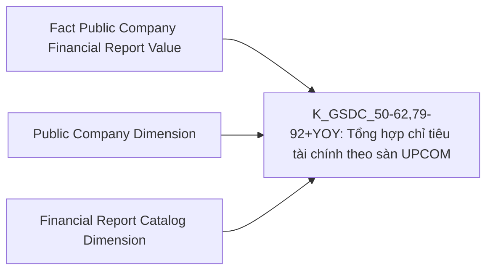
```mermaid
flowchart LR
    fct_pc_fr_val_g15["Fact Public Company Financial Report Value"] --> R15["K_GSDC_50-62,79-92+YOY: Tổng hợp chỉ tiêu tài chính theo sàn UPCOM"]
    public_company_dim_g15["Public Company Dimension"] --> R15
    financial_rpt_catalog_dim_g15["Financial Report Catalog Dimension"] --> R15
```

**Bảng grain:** như Nhóm 7.

---

#### Nhóm 16 — STT 16: Thống kê niêm yết sàn OTC (chưa niêm yết)

##### READY

> Phân loại: **Phân tích**
> Atomic: `Public Company` ← IDS.company_profiles — **draft** (chưa approved)
> Filter: `equity_listing_exchange_code = 'OTC'`
> **Cập nhật 2026-07-15 (BA renumber):** Nội dung cũ Nhóm 18 (STT 18) — đổi số theo STT mới, không đổi nội dung/KPI_ID.
> **Cập nhật 2026-08-06 (Atomic bổ sung — chuyển READY):** K_GSDC_48/49 chuyển READY theo đúng logic Nhóm 6, thêm filter `Equity_Listing_Exchange_Code='OTC'` (xem BA SQL dòng 239-240).

**Bảng KPI:**

| KPI ID | Tên KPI | Đơn vị | Tính chất | Atomic Entity | Atomic Table | Atomic Attribute | Atomic Column | Trạng thái |
|---|---|---|---|---|---|---|---|---|
| K_GSDC_46 | Ngày thống kê (Năm/Quý) | Text | Chiều (Slicer) | — | — | — | — | **READY** — Tham số `:year` / `:quarter` — reuse K_GSDC_46 |
| K_GSDC_78 | Sàn | Text | Chiều | Public Company | public_company | Equity Listing Exchange Code | equity_listing_exchange_code | **READY** — Filter cố định `= 'OTC'` — reuse KPI Sàn (K_GSDC_78), khác filter |
| K_GSDC_47 | Số doanh nghiệp theo từng sàn | DN | Cơ sở | Public Company | public_company | Ids Registration Date | ids_registration_dt | **READY** — COUNT DISTINCT WHERE ids_registration_dt <= cuối kỳ AND equity_listing_exchange_code = 'OTC' |
| K_GSDC_48 | Tỷ lệ nộp BCTC theo từng sàn (quý) | % | Phái sinh | Violation Report | violation_report | Deadline Date / Actual Submit Date / Period Year / Period Type Code | deadline_dt / actual_submit_dt / period_year / period_tp_code | **READY** — Reuse công thức K_GSDC_48 Nhóm 6, filter `Equity_Listing_Exchange_Code='OTC'` |
| K_GSDC_49 | Số DN báo lãi theo từng sàn | DN | Cơ sở | Financial Report Value | fr_value | Data Value | data_val | **READY** — Reuse công thức K_GSDC_49 Nhóm 6, filter `Equity_Listing_Exchange_Code='OTC'` |

**Star Schema, Lineage, Bảng grain:** giống Nhóm 6 — chỉ khác filter sàn `= 'OTC'`.

---

#### Nhóm 17 — STT 17: Tổng hợp chỉ tiêu tài chính theo sàn OTC

##### READY

> Phân loại: **Phân tích**
> Filter: `Equity_Listing_Exchange_Code = 'OTC'`. Cấu trúc giống hệt Nhóm 11 (HNX), chỉ khác filter sàn — **reuse KPI_ID** K_GSDC_50–62(+YOY) + K_GSDC_79 (Ngành, reuse từ Nhóm 11) + K_GSDC_80–92 (theo ngành, reuse KPI_ID, chỉ đổi filter sàn).
> **Cập nhật 2026-07-15 (BA renumber):** Nội dung cũ Nhóm 19 (STT 19) — đổi số theo STT mới, không đổi nội dung/KPI_ID.
> **Cập nhật 2026-08-06 (Atomic bổ sung Financial Report Value — chuyển READY):** Nhất quán với Nhóm 11 — reuse 100% Fact/Dimension, chỉ đổi filter `Equity_Listing_Exchange_Code='OTC'`.

**Bảng KPI:**

| KPI ID | Tên KPI | Đơn vị | Tính chất | Atomic Table | Atomic Column | row_desc (dn/bh/td) | Loại BC | col_desc | Trạng thái |
|---|---|---|---|---|---|---|---|---|---|
| K_GSDC_50 | Tổng tài sản (OTC) | Tỉ đồng | Phái sinh | fr_value | data_val | 270/270/300 | BCDKT | 1 | **READY** |
| K_GSDC_50_YOY | Tổng tài sản — YoY | % | Phái sinh | fr_value | data_val | 270/270/300 | BCDKT | 1 | **READY** |
| K_GSDC_51 | Nợ phải trả (OTC) | Tỉ đồng | Phái sinh | fr_value | data_val | 300/300/400 | BCDKT | 1 | **READY** |
| K_GSDC_51_YOY | Nợ phải trả — YoY | % | Phái sinh | fr_value | data_val | 300/300/400 | BCDKT | 1 | **READY** |
| K_GSDC_52 | Vốn CSH (OTC) | Tỉ đồng | Phái sinh | fr_value | data_val | 400/400/500 | BCDKT | 1 | **READY** |
| K_GSDC_52_YOY | Vốn CSH — YoY | % | Phái sinh | fr_value | data_val | 400/400/500 | BCDKT | 1 | **READY** |
| K_GSDC_53 | Vốn điều lệ (OTC) | Tỉ đồng | Phái sinh | fr_value | data_val | 411/411/411 | BCDKT | 1 | **READY** |
| K_GSDC_53_YOY | Vốn điều lệ — YoY | % | Phái sinh | fr_value | data_val | 411/411/411 | BCDKT | 1 | **READY** |
| K_GSDC_54 | Lợi nhuận sau thuế (OTC) | Tỉ đồng | Phái sinh | fr_value | data_val | 60/60/21 | BCKQKD | 1 | **READY** |
| K_GSDC_54_YOY | LNST — YoY | % | Phái sinh | fr_value | data_val | 60/60/21 | BCKQKD | 1 | **READY** |
| K_GSDC_55 | ROA (OTC) | % | Phái sinh | fr_value | data_val | 270/270/300 + 60/60/21 | BCDKT+BCKQKD | 1+2 | **READY** |
| K_GSDC_55_YOY | ROA — YoY | % | Phái sinh | fr_value | data_val | (như K_GSDC_55) | — | — | **READY** |
| K_GSDC_56 | ROE (OTC) | % | Phái sinh | fr_value | data_val | 400/400/500 + 60/60/21 | BCDKT+BCKQKD | 1+2 | **READY** |
| K_GSDC_56_YOY | ROE — YoY | % | Phái sinh | fr_value | data_val | (như K_GSDC_56) | — | — | **READY** |
| K_GSDC_57 | Hàng tồn kho (OTC) | Tỉ đồng | Phái sinh | fr_value | data_val | 140/140/— | BCDKT | 1 | **READY** |
| K_GSDC_57_YOY | Hàng tồn kho — YoY | % | Phái sinh | fr_value | data_val | 140/140/— | BCDKT | 1 | **READY** |
| K_GSDC_58 | Doanh thu thuần (OTC) | Tỉ đồng | Phái sinh | fr_value | data_val | 10/10/03 | BCKQKD | 1 | **READY** |
| K_GSDC_58_YOY | Doanh thu — YoY | % | Phái sinh | fr_value | data_val | 10/10/03 | BCKQKD | 1 | **READY** |
| K_GSDC_59 | Lợi nhuận dồn tích YTD (OTC) | Tỉ đồng | Phái sinh | fr_value | data_val | 421/421/— (td không có trong BA SQL) | BCDKT | 1 | **READY** |
| K_GSDC_59_YOY | LN YTD — YoY | % | Phái sinh | fr_value | data_val | 421/421/450 | BCDKT | 1 | **READY** |
| K_GSDC_60 | Phải thu (OTC) | Tỉ đồng | Phái sinh | fr_value | data_val | 130+210/130+210/251 | BCDKT | 1 | **READY** |
| K_GSDC_60_YOY | Phải thu — YoY | % | Phái sinh | fr_value | data_val | 130+210/130+210/251 | BCDKT | 1 | **READY** |
| K_GSDC_61 | Tiền và tương đương tiền (OTC) | Tỉ đồng | Phái sinh | fr_value | data_val | 110/110/110+120 | BCDKT | 1 | **READY** |
| K_GSDC_61_YOY | Tiền TĐT — YoY | % | Phái sinh | fr_value | data_val | 110/110/110+120 | BCDKT | 1 | **READY** |
| K_GSDC_62 | Nợ / Vốn CSH (OTC) | Lần (x) | Phái sinh | fr_value | data_val | 300/300/400 + 400/400/500 | BCDKT | 1 | **READY** |
| K_GSDC_62_YOY | Nợ/Vốn CSH — YoY | % | Phái sinh | fr_value | data_val | (như K_GSDC_62) | — | — | **READY** |
| K_GSDC_79 | Ngành | Text | Chiều | public_company | business_line_level_1_code | — | — | — | **READY** |
| K_GSDC_80 | Tổng tài sản — theo ngành (OTC) | Tỉ đồng | Phái sinh | fr_value | data_val | 270/270/300 | BCDKT | 1 | **READY** |
| K_GSDC_81 | Nợ phải trả — theo ngành (OTC) | Tỉ đồng | Phái sinh | fr_value | data_val | 300/300/400 | BCDKT | 1 | **READY** |
| K_GSDC_82 | Vốn CSH — theo ngành (OTC) | Tỉ đồng | Phái sinh | fr_value | data_val | 400/400/500 | BCDKT | 1 | **READY** |
| K_GSDC_83 | Vốn điều lệ — theo ngành (OTC) | Tỉ đồng | Phái sinh | fr_value | data_val | 411/411/411 | BCDKT | 1 | **READY** |
| K_GSDC_84 | Lợi nhuận sau thuế — theo ngành (OTC) | Tỉ đồng | Phái sinh | fr_value | data_val | 60/60/21 | BCKQKD | 1 | **READY** |
| K_GSDC_85 | ROA — theo ngành (OTC) | % | Phái sinh | fr_value | data_val | 270/270/300 + 60/60/21 | BCDKT+BCKQKD | 1+2 | **READY** |
| K_GSDC_86 | ROE — theo ngành (OTC) | % | Phái sinh | fr_value | data_val | 400/400/500 + 60/60/21 | BCDKT+BCKQKD | 1+2 | **READY** |
| K_GSDC_87 | Hàng tồn kho — theo ngành (OTC) | Tỉ đồng | Phái sinh | fr_value | data_val | 140/140/— | BCDKT | 1 | **READY** |
| K_GSDC_88 | Doanh thu — theo ngành (OTC) | Tỉ đồng | Phái sinh | fr_value | data_val | 10/10/03 | BCKQKD | 1 | **READY** |
| K_GSDC_89 | Lợi nhuận dồn tích YTD — theo ngành (OTC) | Tỉ đồng | Phái sinh | fr_value | data_val | 421/421/450 | BCDKT | 1 | **READY** |
| K_GSDC_90 | Phải thu — theo ngành (OTC) | Tỉ đồng | Phái sinh | fr_value | data_val | 130+210/130+210/251 | BCDKT | 1 | **READY** |
| K_GSDC_91 | Tiền và tương đương tiền — theo ngành (OTC) | Tỉ đồng | Phái sinh | fr_value | data_val | 110/110/110+120 | BCDKT | 1 | **READY** |
| K_GSDC_92 | Nợ/Vốn CSH — theo ngành (OTC) | Lần (x) | Phái sinh | fr_value | data_val | 300/300/400 + 400/400/500 | BCDKT | 1 | **READY** |

**Star Schema:** dùng chung với Nhóm 7/11 (không có erDiagram riêng). Filter sàn = `Public Company Dimension.Equity_Listing_Exchange_Code = 'OTC'`.

> **Ghi chú filter Active (K_GSDC_79):** giống K_GSDC_63 Nhóm 8/K_GSDC_79 Nhóm 11 — filter `cl_business_line.active_indicator = 1` (xem O_GSDC_5 mục (3)).

**Lineage Mart → Báo cáo:**

```mermaid
flowchart LR
    fct_pc_fr_val_g17["Fact Public Company Financial Report Value"] --> R17["K_GSDC_50-62,79-92+YOY: Tổng hợp chỉ tiêu tài chính theo sàn OTC"]
    public_company_dim_g17["Public Company Dimension"] --> R17
    financial_rpt_catalog_dim_g17["Financial Report Catalog Dimension"] --> R17
```

**Bảng grain:** như Nhóm 7.

---

#### Nhóm 18 — STT 18: Dữ liệu tài chính doanh nghiệp — Metadata BCTC

##### READY

> Phân loại: **Phân tích**
> Source: `Financial Report Catalog Dimension` — tra cứu danh mục báo cáo/dòng/cột
> **Cập nhật 2026-07-15 (BA renumber):** Nội dung cũ Nhóm 20 (STT 20) — đổi số theo STT mới (BA gộp STT 8+9+10 thành 1, mọi STT phía sau lùi 2).
> **Cập nhật 2026-08-06 (Atomic bổ sung Financial Report Value — chuyển READY):** `financial_report_catalog`/`fr_row_template`/`fr_column_template` đã có LLD (approved cho row/column template) — SQL BA xác nhận: Mã/Tên báo cáo lấy `financial_report_catalog.fr_catalog_code`/`fr_catalog_nm`, filter `fr_catalog_tp_code = 'i'` (báo cáo loại Input — comment Atomic YAML "I - Báo cáo đầu vào, O - Báo cáo xuất ra") + `active_indicator = 1`; Mã/Tên chỉ tiêu dòng lấy `fr_row_template.fr_row_template_code`/`row_description_reference || ' - ' || fr_row_template_nm`, sắp theo `row_index`; Mã/Tên chỉ tiêu cột tương tự trên `fr_column_template`, sắp theo `column_index`. 4 KPI reuse (Kỳ báo cáo/Sàn/Ngành/Mã CTĐC-Tên CTĐC) chuyển READY theo trạng thái gốc của nhóm nguồn (đã READY sẵn).

**Bảng KPI:**

| KPI ID | Tên KPI | Đơn vị | Tính chất | Atomic Table | Atomic Column | Trạng thái |
|---|---|---|---|---|---|---|
| K_GSDC_93 | Mã báo cáo | Text | Chiều | financial_report_catalog | fr_catalog_code | **READY** |
| K_GSDC_94 | Tên báo cáo | Text | Chiều | financial_report_catalog | fr_catalog_nm | **READY** |
| K_GSDC_95 | Mã chỉ tiêu dòng | Text | Chiều | fr_row_template | fr_row_template_code | **READY** |
| K_GSDC_96 | Tên chỉ tiêu dòng | Text | Chiều | fr_row_template | row_description_reference \|\| ' - ' \|\| fr_row_template_nm | **READY** |
| K_GSDC_97 | Mã chỉ tiêu cột | Text | Chiều | fr_column_template | fr_column_template_code | **READY** |
| K_GSDC_98 | Tên chỉ tiêu cột | Text | Chiều | fr_column_template | column_description_reference \|\| ' - ' \|\| fr_column_template_nm | **READY** |
| K_GSDC_46 | Kỳ báo cáo (reuse từ Nhóm 6) | Text | Chiều | — | — | **READY** |
| K_GSDC_78 | Sàn giao dịch (reuse từ Nhóm 10) | Text | Chiều | public_company | equity_listing_exchange_code | **READY** |
| K_GSDC_63 | Danh mục ngành (reuse từ Nhóm 8) | Text | Chiều | public_company | business_line_level_1_code | **READY** |
| K_GSDC_7 / K_GSDC_8 | Mã CTĐC - Tên CTĐC (reuse từ Nhóm 1) | Text | Chiều | public_company | equity_ticker_symbol / pc_nm | **READY** |

> **Ghi chú filter:** `fr_catalog_tp_code = 'i'` (báo cáo Input) + `active_indicator = 1` áp dụng cho K_GSDC_93/94; kế thừa filter tương ứng `fr_row_template.active_indicator = 1`/`fr_column_template.active_indicator = 1` cho K_GSDC_95-98 (BA ghi `rc.active_flg = 1`, đã map đúng field `active_indicator` — không có filter Active riêng trên row/column template trong SQL BA, kế thừa qua JOIN `report_catalog_id`).

**Star Schema:** dùng chung `Financial Report Catalog Dimension` với Nhóm 7 (không có erDiagram riêng — Dimension đã đủ field `Row_Description_Reference`/`Column_Description_Reference` cho Nhóm 18 lookup trực tiếp, không qua Fact).

**Lineage Mart → Báo cáo:**

```mermaid
flowchart LR
    financial_rpt_catalog_dim_g18["Financial Report Catalog Dimension"] --> R18["K_GSDC_93-98,46,78,63,7-8: Metadata BCTC"]
    public_company_dim_g18["Public Company Dimension"] --> R18
```

**Bảng grain:** `Financial Report Catalog Dimension` — 1 row / báo cáo × dòng × cột (như Nhóm 7).

---

### Màn hình 3 — Data Explorer: Dữ liệu tài chính doanh nghiệp

Data Explorer cho phép tra cứu BCTC chi tiết theo từng CTDC, kỳ báo cáo và loại hình DN. Toàn bộ STT 19–30 (Nhóm 19-30, 591 KPI) phục vụ bởi `Fact Public Company Financial Report Value` + `Financial Report Catalog Dimension` — **READY từ 2026-08-06**, xem chi tiết từng Nhóm. *(Cập nhật 2026-07-15: BA renumber — cũ STT 21–32 nay là STT 19–28 + 31–32, không còn STT 29–30 (số cũ) trong BA — 12 nhóm hiện hành là STT 19-30 mới)*

**Ghi chú chung toàn bộ MH3 (2026-08-06):**
- Tất cả chỉ tiêu lấy trực tiếp `Data Value` (`data_val`) từ `Financial Report Value` (`fr_value`) — filter `Enterprise_Type_Code` ('dn'/'bh'/'td'), `Financial_Report_Catalog_Code LIKE '{BCDKT/BCKQKD/BCLCTT_TT/BCLCTT_GT}%'`, `Report_Year`/`Report_Quarter` theo kỳ
- `row_desc` trong BA SQL chính là giá trị filter trên `Row_Code` (`fr_value.row_code`, denormalized text) — không qua field trung gian nào, join `fr_row_template` chỉ để lấy tên hiển thị (`row_description_reference`)
- `col_desc` tương tự trên `Column_Code` (`fr_value.column_code`), join `fr_column_template` lấy tên hiển thị (`column_description_reference`)
- `col_desc='1'` = cuối kỳ / kỳ hiện tại; `col_desc='2'` = đầu kỳ (dùng cho ROA/ROE bình quân — không áp dụng cho Nhóm 19-30 vì MH3 chỉ tra cứu số liệu thô, không tính phái sinh)

---

#### Nhóm 19 — STT 19: DN thông thường — Bảng cân đối kế toán

##### READY

> Phân loại: **Phân tích**
> **Cập nhật 2026-08-06 (Atomic bổ sung Financial Report Value — chuyển READY):** Reuse 100% `Fact Public Company Financial Report Value` + `Financial Report Catalog Dimension` đã thiết kế ở Nhóm 7 — filter `Enterprise_Type_Code = 'dn'` (DN thông thường), `Financial_Report_Catalog_Code LIKE 'BCDKT%'`, `Report_Year = :year AND Report_Quarter = :quarter`, `Column_Description_Reference = '1'` (cuối kỳ).

**Bảng KPI:**

| KPI ID | Tên KPI | Đơn vị | Tính chất | Atomic Table | Atomic Column | row_desc | Loại BC | col_desc | Trạng thái |
|---|---|---|---|---|---|---|---|---|---|
| K_GSDC_99 | A – Tài sản ngắn hạn | Tỉ đồng | Cơ sở | fr_value | data_val | 100 | BCDKT | 1 | **READY** |
| K_GSDC_100 | I – Tiền và các khoản tương đương tiền | Tỉ đồng | Cơ sở | fr_value | data_val | 110 | BCDKT | 1 | **READY** |
| K_GSDC_101 | 1. Tiền | Tỉ đồng | Cơ sở | fr_value | data_val | 111 | BCDKT | 1 | **READY** |
| K_GSDC_102 | 2. Các khoản tương đương tiền | Tỉ đồng | Cơ sở | fr_value | data_val | 112 | BCDKT | 1 | **READY** |
| K_GSDC_103 | II – Đầu tư tài chính ngắn hạn | Tỉ đồng | Cơ sở | fr_value | data_val | 120 | BCDKT | 1 | **READY** |
| K_GSDC_104 | 1. Chứng khoán kinh doanh | Tỉ đồng | Cơ sở | fr_value | data_val | 121 | BCDKT | 1 | **READY** |
| K_GSDC_105 | 2. Dự phòng giảm giá chứng khoán kinh doanh | Tỉ đồng | Cơ sở | fr_value | data_val | 122 | BCDKT | 1 | **READY** |
| K_GSDC_106 | 3. Đầu tư nắm giữ đến ngày đáo hạn | Tỉ đồng | Cơ sở | fr_value | data_val | 123 | BCDKT | 1 | **READY** |
| K_GSDC_107 | III – Các khoản phải thu ngắn hạn | Tỉ đồng | Cơ sở | fr_value | data_val | 130 | BCDKT | 1 | **READY** |
| K_GSDC_108 | 1. Phải thu ngắn hạn của khách hàng | Tỉ đồng | Cơ sở | fr_value | data_val | 131 | BCDKT | 1 | **READY** |
| K_GSDC_109 | 2. Trả trước cho người bán ngắn hạn | Tỉ đồng | Cơ sở | fr_value | data_val | 132 | BCDKT | 1 | **READY** |
| K_GSDC_110 | 3. Phải thu nội bộ ngắn hạn | Tỉ đồng | Cơ sở | fr_value | data_val | 133 | BCDKT | 1 | **READY** |
| K_GSDC_111 | 4. Phải thu theo tiến độ HĐXD | Tỉ đồng | Cơ sở | fr_value | data_val | 134 | BCDKT | 1 | **READY** |
| K_GSDC_112 | 5. Phải thu về cho vay ngắn hạn | Tỉ đồng | Cơ sở | fr_value | data_val | 135 | BCDKT | 1 | **READY** |
| K_GSDC_113 | 6. Phải thu ngắn hạn khác | Tỉ đồng | Cơ sở | fr_value | data_val | 136 | BCDKT | 1 | **READY** |
| K_GSDC_114 | 7. Dự phòng phải thu ngắn hạn khó đòi | Tỉ đồng | Cơ sở | fr_value | data_val | 137 | BCDKT | 1 | **READY** |
| K_GSDC_115 | 8. Tài sản thiếu chờ xử lý | Tỉ đồng | Cơ sở | fr_value | data_val | 139 | BCDKT | 1 | **READY** |
| K_GSDC_116 | IV – Hàng tồn kho | Tỉ đồng | Cơ sở | fr_value | data_val | 140 | BCDKT | 1 | **READY** |
| K_GSDC_117 | 1. Hàng tồn kho | Tỉ đồng | Cơ sở | fr_value | data_val | 141 | BCDKT | 1 | **READY** |
| K_GSDC_118 | 2. Dự phòng giảm giá hàng tồn kho | Tỉ đồng | Cơ sở | fr_value | data_val | 149 | BCDKT | 1 | **READY** |
| K_GSDC_119 | V – Tài sản ngắn hạn khác | Tỉ đồng | Cơ sở | fr_value | data_val | 150 | BCDKT | 1 | **READY** |
| K_GSDC_120 | 1. Chi phí trả trước ngắn hạn | Tỉ đồng | Cơ sở | fr_value | data_val | 151 | BCDKT | 1 | **READY** |
| K_GSDC_121 | 2. Thuế GTGT được khấu trừ | Tỉ đồng | Cơ sở | fr_value | data_val | 152 | BCDKT | 1 | **READY** |
| K_GSDC_122 | 3. Thuế và các khoản khác phải thu Nhà nước | Tỉ đồng | Cơ sở | fr_value | data_val | 153 | BCDKT | 1 | **READY** |
| K_GSDC_123 | 4. Giao dịch mua bán lại trái phiếu CP | Tỉ đồng | Cơ sở | fr_value | data_val | 154 | BCDKT | 1 | **READY** |
| K_GSDC_124 | 5. Tài sản ngắn hạn khác | Tỉ đồng | Cơ sở | fr_value | data_val | 155 | BCDKT | 1 | **READY** |
| K_GSDC_125 | B – Tài sản dài hạn | Tỉ đồng | Cơ sở | fr_value | data_val | 200 | BCDKT | 1 | **READY** |
| K_GSDC_126 | I – Các khoản phải thu dài hạn | Tỉ đồng | Cơ sở | fr_value | data_val | 210 | BCDKT | 1 | **READY** |
| K_GSDC_127 | 1. Phải thu dài hạn của khách hàng | Tỉ đồng | Cơ sở | fr_value | data_val | 211 | BCDKT | 1 | **READY** |
| K_GSDC_128 | 2. Trả trước cho người bán dài hạn | Tỉ đồng | Cơ sở | fr_value | data_val | 212 | BCDKT | 1 | **READY** |
| K_GSDC_129 | 3. Vốn kinh doanh ở đơn vị trực thuộc | Tỉ đồng | Cơ sở | fr_value | data_val | 213 | BCDKT | 1 | **READY** |
| K_GSDC_130 | 4. Phải thu nội bộ dài hạn | Tỉ đồng | Cơ sở | fr_value | data_val | 214 | BCDKT | 1 | **READY** |
| K_GSDC_131 | 5. Phải thu về cho vay dài hạn | Tỉ đồng | Cơ sở | fr_value | data_val | 215 | BCDKT | 1 | **READY** |
| K_GSDC_132 | 6. Phải thu dài hạn khác | Tỉ đồng | Cơ sở | fr_value | data_val | 216 | BCDKT | 1 | **READY** |
| K_GSDC_133 | 7. Dự phòng phải thu dài hạn khó đòi | Tỉ đồng | Cơ sở | fr_value | data_val | 219 | BCDKT | 1 | **READY** |
| K_GSDC_134 | II – Tài sản cố định | Tỉ đồng | Cơ sở | fr_value | data_val | 220 | BCDKT | 1 | **READY** |
| K_GSDC_135 | 1. TSCĐ hữu hình — Nguyên giá | Tỉ đồng | Cơ sở | fr_value | data_val | 221 | BCDKT | 1 | **READY** |
| K_GSDC_136 | 1. TSCĐ hữu hình — Giá trị còn lại | Tỉ đồng | Cơ sở | fr_value | data_val | 222 | BCDKT | 1 | **READY** |
| K_GSDC_137 | 1. TSCĐ hữu hình — Hao mòn lũy kế | Tỉ đồng | Cơ sở | fr_value | data_val | 223 | BCDKT | 1 | **READY** |
| K_GSDC_138 | 2. TSCĐ thuê tài chính — Nguyên giá | Tỉ đồng | Cơ sở | fr_value | data_val | 224 | BCDKT | 1 | **READY** |
| K_GSDC_139 | 2. TSCĐ thuê tài chính — Giá trị còn lại | Tỉ đồng | Cơ sở | fr_value | data_val | 225 | BCDKT | 1 | **READY** |
| K_GSDC_140 | 2. TSCĐ thuê tài chính — Hao mòn lũy kế | Tỉ đồng | Cơ sở | fr_value | data_val | 226 | BCDKT | 1 | **READY** |
| K_GSDC_141 | 3. TSCĐ vô hình — Nguyên giá | Tỉ đồng | Cơ sở | fr_value | data_val | 227 | BCDKT | 1 | **READY** |
| K_GSDC_142 | 3. TSCĐ vô hình — Giá trị còn lại | Tỉ đồng | Cơ sở | fr_value | data_val | 228 | BCDKT | 1 | **READY** |
| K_GSDC_143 | 3. TSCĐ vô hình — Hao mòn lũy kế | Tỉ đồng | Cơ sở | fr_value | data_val | 229 | BCDKT | 1 | **READY** |
| K_GSDC_144 | III – Bất động sản đầu tư — Nguyên giá | Tỉ đồng | Cơ sở | fr_value | data_val | 230 | BCDKT | 1 | **READY** |
| K_GSDC_145 | III – Bất động sản đầu tư — Giá trị còn lại | Tỉ đồng | Cơ sở | fr_value | data_val | 231 | BCDKT | 1 | **READY** |
| K_GSDC_146 | III – Bất động sản đầu tư — Hao mòn lũy kế | Tỉ đồng | Cơ sở | fr_value | data_val | 232 | BCDKT | 1 | **READY** |
| K_GSDC_147 | IV – Tài sản dở dang dài hạn | Tỉ đồng | Cơ sở | fr_value | data_val | 240 | BCDKT | 1 | **READY** |
| K_GSDC_148 | 1. Chi phí SXKD dở dang dài hạn | Tỉ đồng | Cơ sở | fr_value | data_val | 241 | BCDKT | 1 | **READY** |
| K_GSDC_149 | 2. Chi phí xây dựng cơ bản dở dang | Tỉ đồng | Cơ sở | fr_value | data_val | 242 | BCDKT | 1 | **READY** |
| K_GSDC_150 | V – Đầu tư tài chính dài hạn | Tỉ đồng | Cơ sở | fr_value | data_val | 250 | BCDKT | 1 | **READY** |
| K_GSDC_151 | 1. Đầu tư vào công ty con | Tỉ đồng | Cơ sở | fr_value | data_val | 251 | BCDKT | 1 | **READY** |
| K_GSDC_152 | 2. Đầu tư vào công ty liên doanh, liên kết | Tỉ đồng | Cơ sở | fr_value | data_val | 252 | BCDKT | 1 | **READY** |
| K_GSDC_153 | 3. Đầu tư góp vốn vào đơn vị khác | Tỉ đồng | Cơ sở | fr_value | data_val | 253 | BCDKT | 1 | **READY** |
| K_GSDC_154 | 4. Dự phòng đầu tư tài chính dài hạn | Tỉ đồng | Cơ sở | fr_value | data_val | 254 | BCDKT | 1 | **READY** |
| K_GSDC_155 | 5. Đầu tư nắm giữ đến ngày đáo hạn | Tỉ đồng | Cơ sở | fr_value | data_val | 255 | BCDKT | 1 | **READY** |
| K_GSDC_156 | VI – Tài sản dài hạn khác | Tỉ đồng | Cơ sở | fr_value | data_val | 260 | BCDKT | 1 | **READY** |
| K_GSDC_157 | 1. Chi phí trả trước dài hạn | Tỉ đồng | Cơ sở | fr_value | data_val | 261 | BCDKT | 1 | **READY** |
| K_GSDC_158 | 2. Tài sản thuế thu nhập hoãn lại | Tỉ đồng | Cơ sở | fr_value | data_val | 262 | BCDKT | 1 | **READY** |
| K_GSDC_159 | 3. Thiết bị, vật tư, phụ tùng thay thế dài hạn | Tỉ đồng | Cơ sở | fr_value | data_val | 263 | BCDKT | 1 | **READY** |
| K_GSDC_160 | 4. Tài sản dài hạn khác | Tỉ đồng | Cơ sở | fr_value | data_val | 268 | BCDKT | 1 | **READY** |
| K_GSDC_161 | 5. Lợi thế thương mại | Tỉ đồng | Cơ sở | fr_value | data_val | 269 | BCDKT | 1 | **READY** |
| K_GSDC_162 | Tổng cộng tài sản | Tỉ đồng | Cơ sở | fr_value | data_val | 270 | BCDKT | 1 | **READY** |
| K_GSDC_163 | C – Nợ phải trả | Tỉ đồng | Cơ sở | fr_value | data_val | 300 | BCDKT | 1 | **READY** |
| K_GSDC_164 | I – Nợ ngắn hạn | Tỉ đồng | Cơ sở | fr_value | data_val | 310 | BCDKT | 1 | **READY** |
| K_GSDC_165 | 1. Phải trả người bán ngắn hạn | Tỉ đồng | Cơ sở | fr_value | data_val | 311 | BCDKT | 1 | **READY** |
| K_GSDC_166 | 2. Người mua trả tiền trước ngắn hạn | Tỉ đồng | Cơ sở | fr_value | data_val | 312 | BCDKT | 1 | **READY** |
| K_GSDC_167 | 3. Thuế và các khoản phải nộp Nhà nước | Tỉ đồng | Cơ sở | fr_value | data_val | 313 | BCDKT | 1 | **READY** |
| K_GSDC_168 | 4. Phải trả người lao động | Tỉ đồng | Cơ sở | fr_value | data_val | 314 | BCDKT | 1 | **READY** |
| K_GSDC_169 | 5. Chi phí phải trả ngắn hạn | Tỉ đồng | Cơ sở | fr_value | data_val | 315 | BCDKT | 1 | **READY** |
| K_GSDC_170 | 6. Phải trả nội bộ ngắn hạn | Tỉ đồng | Cơ sở | fr_value | data_val | 316 | BCDKT | 1 | **READY** |
| K_GSDC_171 | 7. Phải trả theo tiến độ HĐXD | Tỉ đồng | Cơ sở | fr_value | data_val | 317 | BCDKT | 1 | **READY** |
| K_GSDC_172 | 8. Doanh thu chưa thực hiện ngắn hạn | Tỉ đồng | Cơ sở | fr_value | data_val | 318 | BCDKT | 1 | **READY** |
| K_GSDC_173 | 9. Phải trả ngắn hạn khác | Tỉ đồng | Cơ sở | fr_value | data_val | 319 | BCDKT | 1 | **READY** |
| K_GSDC_174 | 10. Vay và nợ thuê tài chính ngắn hạn | Tỉ đồng | Cơ sở | fr_value | data_val | 320 | BCDKT | 1 | **READY** |
| K_GSDC_175 | 11. Dự phòng phải trả ngắn hạn | Tỉ đồng | Cơ sở | fr_value | data_val | 321 | BCDKT | 1 | **READY** |
| K_GSDC_176 | 12. Quỹ khen thưởng, phúc lợi | Tỉ đồng | Cơ sở | fr_value | data_val | 322 | BCDKT | 1 | **READY** |
| K_GSDC_177 | 13. Quỹ bình ổn giá | Tỉ đồng | Cơ sở | fr_value | data_val | 323 | BCDKT | 1 | **READY** |
| K_GSDC_178 | 14. Giao dịch mua bán lại trái phiếu CP | Tỉ đồng | Cơ sở | fr_value | data_val | 324 | BCDKT | 1 | **READY** |
| K_GSDC_179 | II – Nợ dài hạn | Tỉ đồng | Cơ sở | fr_value | data_val | 330 | BCDKT | 1 | **READY** |
| K_GSDC_180 | 1. Phải trả người bán dài hạn | Tỉ đồng | Cơ sở | fr_value | data_val | 331 | BCDKT | 1 | **READY** |
| K_GSDC_181 | 2. Người mua trả tiền trước dài hạn | Tỉ đồng | Cơ sở | fr_value | data_val | 332 | BCDKT | 1 | **READY** |
| K_GSDC_182 | 3. Chi phí phải trả dài hạn | Tỉ đồng | Cơ sở | fr_value | data_val | 333 | BCDKT | 1 | **READY** |
| K_GSDC_183 | 4. Phải trả nội bộ về vốn kinh doanh | Tỉ đồng | Cơ sở | fr_value | data_val | 334 | BCDKT | 1 | **READY** |
| K_GSDC_184 | 5. Phải trả nội bộ dài hạn | Tỉ đồng | Cơ sở | fr_value | data_val | 335 | BCDKT | 1 | **READY** |
| K_GSDC_185 | 6. Doanh thu chưa thực hiện dài hạn | Tỉ đồng | Cơ sở | fr_value | data_val | 336 | BCDKT | 1 | **READY** |
| K_GSDC_186 | 7. Phải trả dài hạn khác | Tỉ đồng | Cơ sở | fr_value | data_val | 337 | BCDKT | 1 | **READY** |
| K_GSDC_187 | 8. Vay và nợ thuê tài chính dài hạn | Tỉ đồng | Cơ sở | fr_value | data_val | 338 | BCDKT | 1 | **READY** |
| K_GSDC_188 | 9. Trái phiếu chuyển đổi | Tỉ đồng | Cơ sở | fr_value | data_val | 339 | BCDKT | 1 | **READY** |
| K_GSDC_189 | 10. Cổ phiếu ưu đãi | Tỉ đồng | Cơ sở | fr_value | data_val | 340 | BCDKT | 1 | **READY** |
| K_GSDC_190 | 11. Thuế thu nhập hoãn lại phải trả | Tỉ đồng | Cơ sở | fr_value | data_val | 341 | BCDKT | 1 | **READY** |
| K_GSDC_191 | 12. Dự phòng phải trả dài hạn | Tỉ đồng | Cơ sở | fr_value | data_val | 342 | BCDKT | 1 | **READY** |
| K_GSDC_192 | 13. Quỹ phát triển KH&CN | Tỉ đồng | Cơ sở | fr_value | data_val | 343 | BCDKT | 1 | **READY** |
| K_GSDC_193 | D – Vốn chủ sở hữu | Tỉ đồng | Cơ sở | fr_value | data_val | 400 | BCDKT | 1 | **READY** |
| K_GSDC_194 | I – Vốn chủ sở hữu | Tỉ đồng | Cơ sở | fr_value | data_val | 410 | BCDKT | 1 | **READY** |
| K_GSDC_195 | 1. Vốn góp của chủ sở hữu | Tỉ đồng | Cơ sở | fr_value | data_val | 411 | BCDKT | 1 | **READY** |
| K_GSDC_196 | 1a. Cổ phiếu phổ thông có quyền biểu quyết | Tỉ đồng | Cơ sở | fr_value | data_val | 411a | BCDKT | 1 | **READY** |
| K_GSDC_197 | 1b. Cổ phiếu ưu đãi | Tỉ đồng | Cơ sở | fr_value | data_val | 411b | BCDKT | 1 | **READY** |
| K_GSDC_198 | 2. Thặng dư vốn cổ phần | Tỉ đồng | Cơ sở | fr_value | data_val | 412 | BCDKT | 1 | **READY** |
| K_GSDC_199 | 3. Quyền chọn chuyển đổi trái phiếu | Tỉ đồng | Cơ sở | fr_value | data_val | 413 | BCDKT | 1 | **READY** |
| K_GSDC_200 | 4. Vốn khác của chủ sở hữu | Tỉ đồng | Cơ sở | fr_value | data_val | 414 | BCDKT | 1 | **READY** |
| K_GSDC_201 | 5. Cổ phiếu quỹ | Tỉ đồng | Cơ sở | fr_value | data_val | 415 | BCDKT | 1 | **READY** |
| K_GSDC_202 | 6. Chênh lệch đánh giá lại tài sản | Tỉ đồng | Cơ sở | fr_value | data_val | 416 | BCDKT | 1 | **READY** |
| K_GSDC_203 | 7. Chênh lệch tỷ giá hối đoái | Tỉ đồng | Cơ sở | fr_value | data_val | 417 | BCDKT | 1 | **READY** |
| K_GSDC_204 | 8. Quỹ đầu tư phát triển | Tỉ đồng | Cơ sở | fr_value | data_val | 418 | BCDKT | 1 | **READY** |
| K_GSDC_205 | 9. Quỹ hỗ trợ sắp xếp doanh nghiệp | Tỉ đồng | Cơ sở | fr_value | data_val | 419 | BCDKT | 1 | **READY** |
| K_GSDC_206 | 10. Quỹ khác thuộc vốn chủ sở hữu | Tỉ đồng | Cơ sở | fr_value | data_val | 420 | BCDKT | 1 | **READY** |
| K_GSDC_207 | 11. Lợi nhuận sau thuế chưa phân phối | Tỉ đồng | Cơ sở | fr_value | data_val | 421 | BCDKT | 1 | **READY** |
| K_GSDC_208 | 11a. LNST chưa PP lũy kế đến đầu kỳ | Tỉ đồng | Cơ sở | fr_value | data_val | 421a | BCDKT | 1 | **READY** |
| K_GSDC_209 | 11b. LNST chưa PP kỳ này | Tỉ đồng | Cơ sở | fr_value | data_val | 421b | BCDKT | 1 | **READY** |
| K_GSDC_210 | 12. Nguồn vốn đầu tư XDCB | Tỉ đồng | Cơ sở | fr_value | data_val | 422 | BCDKT | 1 | **READY** |
| K_GSDC_211 | 13. Lợi ích của cổ đông không kiểm soát | Tỉ đồng | Cơ sở | fr_value | data_val | 429 | BCDKT | 1 | **READY** |
| K_GSDC_212 | II – Nguồn kinh phí và quỹ khác | Tỉ đồng | Cơ sở | fr_value | data_val | 430 | BCDKT | 1 | **READY** |
| K_GSDC_213 | 1. Nguồn kinh phí | Tỉ đồng | Cơ sở | fr_value | data_val | 431 | BCDKT | 1 | **READY** |
| K_GSDC_214 | 2. Nguồn kinh phí đã hình thành TSCĐ | Tỉ đồng | Cơ sở | fr_value | data_val | 432 | BCDKT | 1 | **READY** |
| K_GSDC_215 | Tổng cộng nguồn vốn | Tỉ đồng | Cơ sở | fr_value | data_val | 440 | BCDKT | 1 | **READY** |

**Star Schema:** dùng chung `Fact Public Company Financial Report Value` + `Financial Report Catalog Dimension` với Nhóm 7 (không có erDiagram riêng — aggregate 1 CTĐC/kỳ, không group-by, khớp Data Explorer tra cứu chi tiết).

**Lineage Mart → Báo cáo:**

```mermaid
flowchart LR
    fct_pc_fr_val_g19["Fact Public Company Financial Report Value"] --> R19["K_GSDC_99-215: DN thông thường — Bảng cân đối kế toán"]
    financial_rpt_catalog_dim_g19["Financial Report Catalog Dimension"] --> R19
```

**Bảng grain:** như Nhóm 7.

---

#### Nhóm 20 — STT 20: DN thông thường — Báo cáo KQKD

##### READY

> Phân loại: **Phân tích**
> **Cập nhật 2026-08-06 (Atomic bổ sung Financial Report Value — chuyển READY):** Reuse 100% `Fact Public Company Financial Report Value` + `Financial Report Catalog Dimension` đã thiết kế ở Nhóm 7 — filter `Enterprise_Type_Code = 'dn'` (DN thông thường), `Financial_Report_Catalog_Code LIKE 'BCKQKD%'`, `Report_Year = :year AND Report_Quarter = :quarter`, `Column_Description_Reference = '1'` (cuối kỳ).

**Bảng KPI:**

| KPI ID | Tên KPI | Đơn vị | Tính chất | Atomic Table | Atomic Column | row_desc | Loại BC | col_desc | Trạng thái |
|---|---|---|---|---|---|---|---|---|---|
| K_GSDC_216 | 1. Doanh thu bán hàng và cung cấp DV | Tỉ đồng | Cơ sở | fr_value | data_val | 01 | BCKQKD | 1 | **READY** |
| K_GSDC_217 | 2. Các khoản giảm trừ doanh thu | Tỉ đồng | Cơ sở | fr_value | data_val | 02 | BCKQKD | 1 | **READY** |
| K_GSDC_218 | 3. Doanh thu thuần về bán hàng và cung cấp DV | Tỉ đồng | Cơ sở | fr_value | data_val | 10 | BCKQKD | 1 | **READY** |
| K_GSDC_219 | 4. Giá vốn hàng bán | Tỉ đồng | Cơ sở | fr_value | data_val | 11 | BCKQKD | 1 | **READY** |
| K_GSDC_220 | 5. Lợi nhuận gộp về bán hàng và cung cấp DV | Tỉ đồng | Cơ sở | fr_value | data_val | 20 | BCKQKD | 1 | **READY** |
| K_GSDC_221 | 6. Doanh thu hoạt động tài chính | Tỉ đồng | Cơ sở | fr_value | data_val | 21 | BCKQKD | 1 | **READY** |
| K_GSDC_222 | 7. Chi phí tài chính | Tỉ đồng | Cơ sở | fr_value | data_val | 22 | BCKQKD | 1 | **READY** |
| K_GSDC_223 | 7. Chi phí tài chính — Chi phí lãi vay | Tỉ đồng | Cơ sở | fr_value | data_val | 23 | BCKQKD | 1 | **READY** |
| K_GSDC_224 | 8. Phần lãi/lỗ trong công ty liên doanh, LK | Tỉ đồng | Cơ sở | fr_value | data_val | 24 | BCKQKD | 1 | **READY** |
| K_GSDC_225 | 9. Chi phí bán hàng | Tỉ đồng | Cơ sở | fr_value | data_val | 25 | BCKQKD | 1 | **READY** |
| K_GSDC_226 | 10. Chi phí quản lý doanh nghiệp | Tỉ đồng | Cơ sở | fr_value | data_val | 26 | BCKQKD | 1 | **READY** |
| K_GSDC_227 | 11. Lợi nhuận thuần từ HĐKD | Tỉ đồng | Cơ sở | fr_value | data_val | 30 | BCKQKD | 1 | **READY** |
| K_GSDC_228 | 12. Thu nhập khác | Tỉ đồng | Cơ sở | fr_value | data_val | 31 | BCKQKD | 1 | **READY** |
| K_GSDC_229 | 13. Chi phí khác | Tỉ đồng | Cơ sở | fr_value | data_val | 32 | BCKQKD | 1 | **READY** |
| K_GSDC_230 | 14. Lợi nhuận khác | Tỉ đồng | Cơ sở | fr_value | data_val | 40 | BCKQKD | 1 | **READY** |
| K_GSDC_231 | 15. Tổng lợi nhuận kế toán trước thuế | Tỉ đồng | Cơ sở | fr_value | data_val | 50 | BCKQKD | 1 | **READY** |
| K_GSDC_232 | 16. Chi phí thuế TNDN hiện hành | Tỉ đồng | Cơ sở | fr_value | data_val | 51 | BCKQKD | 1 | **READY** |
| K_GSDC_233 | 17. Chi phí thuế TNDN hoãn lại | Tỉ đồng | Cơ sở | fr_value | data_val | 52 | BCKQKD | 1 | **READY** |
| K_GSDC_234 | 18. Lợi nhuận sau thuế TNDN | Tỉ đồng | Cơ sở | fr_value | data_val | 60 | BCKQKD | 1 | **READY** |
| K_GSDC_235 | 19. LNST của công ty mẹ | Tỉ đồng | Cơ sở | fr_value | data_val | 61 | BCKQKD | 1 | **READY** |
| K_GSDC_236 | 20. LNST của cổ đông không kiểm soát | Tỉ đồng | Cơ sở | fr_value | data_val | 62 | BCKQKD | 1 | **READY** |
| K_GSDC_237 | 21. Lãi cơ bản trên cổ phiếu (EPS) | Tỉ đồng | Cơ sở | fr_value | data_val | 70 | BCKQKD | 1 | **READY** |
| K_GSDC_238 | 22. Lãi suy giảm trên cổ phiếu | Tỉ đồng | Cơ sở | fr_value | data_val | 71 | BCKQKD | 1 | **READY** |

**Star Schema:** dùng chung `Fact Public Company Financial Report Value` + `Financial Report Catalog Dimension` với Nhóm 7 (không có erDiagram riêng — aggregate 1 CTĐC/kỳ, không group-by, khớp Data Explorer tra cứu chi tiết).

**Lineage Mart → Báo cáo:**

```mermaid
flowchart LR
    fct_pc_fr_val_g20["Fact Public Company Financial Report Value"] --> R20["K_GSDC_216-238: DN thông thường — Báo cáo KQKD"]
    financial_rpt_catalog_dim_g20["Financial Report Catalog Dimension"] --> R20
```

**Bảng grain:** như Nhóm 7.

---

#### Nhóm 21 — STT 21: DN thông thường — Báo cáo LCTT trực tiếp

##### READY

> Phân loại: **Phân tích**
> **Cập nhật 2026-08-06 (Atomic bổ sung Financial Report Value — chuyển READY):** Reuse 100% `Fact Public Company Financial Report Value` + `Financial Report Catalog Dimension` đã thiết kế ở Nhóm 7 — filter `Enterprise_Type_Code = 'dn'` (DN thông thường), `Financial_Report_Catalog_Code LIKE 'BCLCTT_TT%'`, `Report_Year = :year AND Report_Quarter = :quarter`, `Column_Description_Reference = '1'` (cuối kỳ).

**Bảng KPI:**

| KPI ID | Tên KPI | Đơn vị | Tính chất | Atomic Table | Atomic Column | row_desc | Loại BC | col_desc | Trạng thái |
|---|---|---|---|---|---|---|---|---|---|
| K_GSDC_239 | 1. Tiền thu từ bán hàng, cung cấp DV và DT khác | Tỉ đồng | Cơ sở | fr_value | data_val | 01 | BCLCTT (trực tiếp) | 1 | **READY** |
| K_GSDC_240 | 2. Tiền chi trả cho người cung cấp hàng hóa và DV | Tỉ đồng | Cơ sở | fr_value | data_val | 02 | BCLCTT (trực tiếp) | 1 | **READY** |
| K_GSDC_241 | 3. Tiền chi trả cho người lao động | Tỉ đồng | Cơ sở | fr_value | data_val | 03 | BCLCTT (trực tiếp) | 1 | **READY** |
| K_GSDC_242 | 4. Tiền lãi vay đã trả | Tỉ đồng | Cơ sở | fr_value | data_val | 04 | BCLCTT (trực tiếp) | 1 | **READY** |
| K_GSDC_243 | 5. Thuế TNDN đã nộp | Tỉ đồng | Cơ sở | fr_value | data_val | 05 | BCLCTT (trực tiếp) | 1 | **READY** |
| K_GSDC_244 | 6. Tiền thu khác từ HĐKD | Tỉ đồng | Cơ sở | fr_value | data_val | 06 | BCLCTT (trực tiếp) | 1 | **READY** |
| K_GSDC_245 | 7. Tiền chi khác cho HĐKD | Tỉ đồng | Cơ sở | fr_value | data_val | 07 | BCLCTT (trực tiếp) | 1 | **READY** |
| K_GSDC_246 | Lưu chuyển tiền thuần từ HĐKD | Tỉ đồng | Cơ sở | fr_value | data_val | 20 | BCLCTT (trực tiếp) | 1 | **READY** |
| K_GSDC_247 | 1. Tiền chi mua sắm TSCĐ và TSDH khác | Tỉ đồng | Cơ sở | fr_value | data_val | 21 | BCLCTT (trực tiếp) | 1 | **READY** |
| K_GSDC_248 | 2. Tiền thu từ thanh lý, nhượng bán TSCĐ và TSDH | Tỉ đồng | Cơ sở | fr_value | data_val | 22 | BCLCTT (trực tiếp) | 1 | **READY** |
| K_GSDC_249 | 3. Tiền chi cho vay, mua công cụ nợ | Tỉ đồng | Cơ sở | fr_value | data_val | 23 | BCLCTT (trực tiếp) | 1 | **READY** |
| K_GSDC_250 | 4. Tiền thu hồi cho vay, bán lại công cụ nợ | Tỉ đồng | Cơ sở | fr_value | data_val | 24 | BCLCTT (trực tiếp) | 1 | **READY** |
| K_GSDC_251 | 5. Tiền chi đầu tư góp vốn vào đơn vị khác | Tỉ đồng | Cơ sở | fr_value | data_val | 25 | BCLCTT (trực tiếp) | 1 | **READY** |
| K_GSDC_252 | 6. Tiền thu hồi đầu tư góp vốn | Tỉ đồng | Cơ sở | fr_value | data_val | 26 | BCLCTT (trực tiếp) | 1 | **READY** |
| K_GSDC_253 | 7. Tiền thu lãi cho vay, cổ tức và LN được chia | Tỉ đồng | Cơ sở | fr_value | data_val | 27 | BCLCTT (trực tiếp) | 1 | **READY** |
| K_GSDC_254 | Lưu chuyển tiền thuần từ HĐ đầu tư | Tỉ đồng | Cơ sở | fr_value | data_val | 30 | BCLCTT (trực tiếp) | 1 | **READY** |
| K_GSDC_255 | 1. Tiền thu từ phát hành CP, nhận vốn góp | Tỉ đồng | Cơ sở | fr_value | data_val | 31 | BCLCTT (trực tiếp) | 1 | **READY** |
| K_GSDC_256 | 2. Tiền trả lại vốn góp, mua lại CP đã phát hành | Tỉ đồng | Cơ sở | fr_value | data_val | 32 | BCLCTT (trực tiếp) | 1 | **READY** |
| K_GSDC_257 | 3. Tiền thu từ đi vay | Tỉ đồng | Cơ sở | fr_value | data_val | 33 | BCLCTT (trực tiếp) | 1 | **READY** |
| K_GSDC_258 | 4. Tiền trả nợ gốc vay | Tỉ đồng | Cơ sở | fr_value | data_val | 34 | BCLCTT (trực tiếp) | 1 | **READY** |
| K_GSDC_259 | 5. Tiền trả nợ gốc thuê tài chính | Tỉ đồng | Cơ sở | fr_value | data_val | 35 | BCLCTT (trực tiếp) | 1 | **READY** |
| K_GSDC_260 | 6. Cổ tức, lợi nhuận đã trả cho chủ sở hữu | Tỉ đồng | Cơ sở | fr_value | data_val | 36 | BCLCTT (trực tiếp) | 1 | **READY** |
| K_GSDC_261 | Lưu chuyển tiền thuần từ HĐ tài chính | Tỉ đồng | Cơ sở | fr_value | data_val | 40 | BCLCTT (trực tiếp) | 1 | **READY** |
| K_GSDC_262 | Lưu chuyển tiền thuần trong kỳ | Tỉ đồng | Cơ sở | fr_value | data_val | 50 | BCLCTT (trực tiếp) | 1 | **READY** |
| K_GSDC_263 | Tiền và tương đương tiền đầu kỳ | Tỉ đồng | Cơ sở | fr_value | data_val | 60 | BCLCTT (trực tiếp) | 1 | **READY** |
| K_GSDC_264 | Ảnh hưởng của thay đổi tỷ giá hối đoái | Tỉ đồng | Cơ sở | fr_value | data_val | 61 | BCLCTT (trực tiếp) | 1 | **READY** |
| K_GSDC_265 | Tiền và tương đương tiền cuối kỳ | Tỉ đồng | Cơ sở | fr_value | data_val | 70 | BCLCTT (trực tiếp) | 1 | **READY** |

**Star Schema:** dùng chung `Fact Public Company Financial Report Value` + `Financial Report Catalog Dimension` với Nhóm 7 (không có erDiagram riêng — aggregate 1 CTĐC/kỳ, không group-by, khớp Data Explorer tra cứu chi tiết).

**Lineage Mart → Báo cáo:**

```mermaid
flowchart LR
    fct_pc_fr_val_g21["Fact Public Company Financial Report Value"] --> R21["K_GSDC_239-265: DN thông thường — Báo cáo LCTT trực tiếp"]
    financial_rpt_catalog_dim_g21["Financial Report Catalog Dimension"] --> R21
```

**Bảng grain:** như Nhóm 7.

---

#### Nhóm 22 — STT 22: DN thông thường — Báo cáo LCTT gián tiếp

##### READY

> Phân loại: **Phân tích**
> **Cập nhật 2026-08-06 (Atomic bổ sung Financial Report Value — chuyển READY):** Reuse 100% `Fact Public Company Financial Report Value` + `Financial Report Catalog Dimension` đã thiết kế ở Nhóm 7 — filter `Enterprise_Type_Code = 'dn'` (DN thông thường), `Financial_Report_Catalog_Code LIKE 'BCLCTT_GT%'`, `Report_Year = :year AND Report_Quarter = :quarter`, `Column_Description_Reference = '1'` (cuối kỳ).

**Bảng KPI:**

| KPI ID | Tên KPI | Đơn vị | Tính chất | Atomic Table | Atomic Column | row_desc | Loại BC | col_desc | Trạng thái |
|---|---|---|---|---|---|---|---|---|---|
| K_GSDC_266 | 1. Lợi nhuận trước thuế | Tỉ đồng | Cơ sở | fr_value | data_val | 01 | BCLCTT (gián tiếp) | 1 | **READY** |
| K_GSDC_267 | Khấu hao TSCĐ và BĐSĐT | Tỉ đồng | Cơ sở | fr_value | data_val | 02 | BCLCTT (gián tiếp) | 1 | **READY** |
| K_GSDC_268 | Các khoản dự phòng | Tỉ đồng | Cơ sở | fr_value | data_val | 03 | BCLCTT (gián tiếp) | 1 | **READY** |
| K_GSDC_269 | Lãi/lỗ chênh lệch tỷ giá do đánh giá lại | Tỉ đồng | Cơ sở | fr_value | data_val | 04 | BCLCTT (gián tiếp) | 1 | **READY** |
| K_GSDC_270 | Lãi/lỗ từ hoạt động đầu tư | Tỉ đồng | Cơ sở | fr_value | data_val | 05 | BCLCTT (gián tiếp) | 1 | **READY** |
| K_GSDC_271 | Chi phí lãi vay | Tỉ đồng | Cơ sở | fr_value | data_val | 06 | BCLCTT (gián tiếp) | 1 | **READY** |
| K_GSDC_272 | Các khoản điều chỉnh khác | Tỉ đồng | Cơ sở | fr_value | data_val | 07 | BCLCTT (gián tiếp) | 1 | **READY** |
| K_GSDC_273 | 3. LN từ HĐKD trước thay đổi vốn lưu động | Tỉ đồng | Cơ sở | fr_value | data_val | 8 | BCLCTT (gián tiếp) | 1 | **READY** |
| K_GSDC_274 | Tăng/giảm các khoản phải thu | Tỉ đồng | Cơ sở | fr_value | data_val | 9 | BCLCTT (gián tiếp) | 1 | **READY** |
| K_GSDC_275 | Tăng/giảm hàng tồn kho | Tỉ đồng | Cơ sở | fr_value | data_val | 10 | BCLCTT (gián tiếp) | 1 | **READY** |
| K_GSDC_276 | Tăng/giảm các khoản phải trả | Tỉ đồng | Cơ sở | fr_value | data_val | 11 | BCLCTT (gián tiếp) | 1 | **READY** |
| K_GSDC_277 | Tăng/giảm chi phí trả trước | Tỉ đồng | Cơ sở | fr_value | data_val | 12 | BCLCTT (gián tiếp) | 1 | **READY** |
| K_GSDC_278 | Tăng/giảm chứng khoán kinh doanh | Tỉ đồng | Cơ sở | fr_value | data_val | 13 | BCLCTT (gián tiếp) | 1 | **READY** |
| K_GSDC_279 | Tiền lãi vay đã trả | Tỉ đồng | Cơ sở | fr_value | data_val | 14 | BCLCTT (gián tiếp) | 1 | **READY** |
| K_GSDC_280 | Thuế TNDN đã nộp | Tỉ đồng | Cơ sở | fr_value | data_val | 15 | BCLCTT (gián tiếp) | 1 | **READY** |
| K_GSDC_281 | Tiền thu khác từ HĐKD | Tỉ đồng | Cơ sở | fr_value | data_val | 16 | BCLCTT (gián tiếp) | 1 | **READY** |
| K_GSDC_282 | Tiền chi khác cho HĐKD | Tỉ đồng | Cơ sở | fr_value | data_val | 17 | BCLCTT (gián tiếp) | 1 | **READY** |
| K_GSDC_283 | Lưu chuyển tiền thuần từ HĐKD | Tỉ đồng | Cơ sở | fr_value | data_val | 20 | BCLCTT (gián tiếp) | 1 | **READY** |
| K_GSDC_284 | 1. Tiền chi mua sắm TSCĐ và TSDH khác | Tỉ đồng | Cơ sở | fr_value | data_val | 21 | BCLCTT (gián tiếp) | 1 | **READY** |
| K_GSDC_285 | 2. Tiền thu từ thanh lý, nhượng bán TSCĐ | Tỉ đồng | Cơ sở | fr_value | data_val | 22 | BCLCTT (gián tiếp) | 1 | **READY** |
| K_GSDC_286 | 3. Tiền chi cho vay, mua công cụ nợ | Tỉ đồng | Cơ sở | fr_value | data_val | 23 | BCLCTT (gián tiếp) | 1 | **READY** |
| K_GSDC_287 | 4. Tiền thu hồi cho vay, bán lại công cụ nợ | Tỉ đồng | Cơ sở | fr_value | data_val | 24 | BCLCTT (gián tiếp) | 1 | **READY** |
| K_GSDC_288 | 5. Tiền chi đầu tư góp vốn vào đơn vị khác | Tỉ đồng | Cơ sở | fr_value | data_val | 25 | BCLCTT (gián tiếp) | 1 | **READY** |
| K_GSDC_289 | 6. Tiền thu hồi đầu tư góp vốn | Tỉ đồng | Cơ sở | fr_value | data_val | 26 | BCLCTT (gián tiếp) | 1 | **READY** |
| K_GSDC_290 | 7. Tiền thu lãi cho vay, cổ tức và LN | Tỉ đồng | Cơ sở | fr_value | data_val | 27 | BCLCTT (gián tiếp) | 1 | **READY** |
| K_GSDC_291 | Lưu chuyển tiền thuần từ HĐ đầu tư | Tỉ đồng | Cơ sở | fr_value | data_val | 30 | BCLCTT (gián tiếp) | 1 | **READY** |
| K_GSDC_292 | 1. Tiền thu từ phát hành CP, nhận vốn góp | Tỉ đồng | Cơ sở | fr_value | data_val | 31 | BCLCTT (gián tiếp) | 1 | **READY** |
| K_GSDC_293 | 2. Tiền trả lại vốn góp, mua lại CP | Tỉ đồng | Cơ sở | fr_value | data_val | 32 | BCLCTT (gián tiếp) | 1 | **READY** |
| K_GSDC_294 | 3. Tiền thu từ đi vay | Tỉ đồng | Cơ sở | fr_value | data_val | 33 | BCLCTT (gián tiếp) | 1 | **READY** |
| K_GSDC_295 | 4. Tiền trả nợ gốc vay | Tỉ đồng | Cơ sở | fr_value | data_val | 34 | BCLCTT (gián tiếp) | 1 | **READY** |
| K_GSDC_296 | 5. Tiền trả nợ gốc thuê tài chính | Tỉ đồng | Cơ sở | fr_value | data_val | 35 | BCLCTT (gián tiếp) | 1 | **READY** |
| K_GSDC_297 | 6. Cổ tức, lợi nhuận đã trả cho chủ sở hữu | Tỉ đồng | Cơ sở | fr_value | data_val | 36 | BCLCTT (gián tiếp) | 1 | **READY** |
| K_GSDC_298 | 7. Tiền thu từ vốn góp của CĐKKS | Tỉ đồng | Cơ sở | fr_value | data_val | 37 | BCLCTT (gián tiếp) | 1 | **READY** |
| K_GSDC_299 | Lưu chuyển tiền thuần từ HĐ tài chính | Tỉ đồng | Cơ sở | fr_value | data_val | 40 | BCLCTT (gián tiếp) | 1 | **READY** |
| K_GSDC_300 | Lưu chuyển tiền thuần trong kỳ | Tỉ đồng | Cơ sở | fr_value | data_val | 50 | BCLCTT (gián tiếp) | 1 | **READY** |
| K_GSDC_301 | Tiền và tương đương tiền đầu kỳ | Tỉ đồng | Cơ sở | fr_value | data_val | 60 | BCLCTT (gián tiếp) | 1 | **READY** |
| K_GSDC_302 | Ảnh hưởng của thay đổi tỷ giá hối đoái quy đổi ngoại tệ | Tỉ đồng | Cơ sở | fr_value | data_val | 61 | BCLCTT (gián tiếp) | 1 | **READY** |
| K_GSDC_303 | Tiền và tương đương tiền cuối kỳ | Tỉ đồng | Cơ sở | fr_value | data_val | 70 | BCLCTT (gián tiếp) | 1 | **READY** |

**Star Schema:** dùng chung `Fact Public Company Financial Report Value` + `Financial Report Catalog Dimension` với Nhóm 7 (không có erDiagram riêng — aggregate 1 CTĐC/kỳ, không group-by, khớp Data Explorer tra cứu chi tiết).

**Lineage Mart → Báo cáo:**

```mermaid
flowchart LR
    fct_pc_fr_val_g22["Fact Public Company Financial Report Value"] --> R22["K_GSDC_266-303: DN thông thường — Báo cáo LCTT gián tiếp"]
    financial_rpt_catalog_dim_g22["Financial Report Catalog Dimension"] --> R22
```

**Bảng grain:** như Nhóm 7.

---

#### Nhóm 23 — STT 23: DN bảo hiểm — Bảng cân đối kế toán

##### READY

> Phân loại: **Phân tích**
> **Cập nhật 2026-08-06 (Atomic bổ sung Financial Report Value — chuyển READY):** Reuse 100% `Fact Public Company Financial Report Value` + `Financial Report Catalog Dimension` đã thiết kế ở Nhóm 7 — filter `Enterprise_Type_Code = 'bh'` (DN bảo hiểm), `Financial_Report_Catalog_Code LIKE 'BCDKT%'`, `Report_Year = :year AND Report_Quarter = :quarter`, `Column_Description_Reference = '1'` (cuối kỳ).

**Bảng KPI:**

| KPI ID | Tên KPI | Đơn vị | Tính chất | Atomic Table | Atomic Column | row_desc | Loại BC | col_desc | Trạng thái |
|---|---|---|---|---|---|---|---|---|---|
| K_GSDC_304 | A - Tài sản ngắn hạn (100) | Tỉ đồng | Cơ sở | fr_value | data_val | 100 | BCDKT | 1 | **READY** |
| K_GSDC_305 | I. Tiền và các khoản tương đương tiền | Tỉ đồng | Cơ sở | fr_value | data_val | 110 | BCDKT | 1 | **READY** |
| K_GSDC_306 | 1. Tiền | Tỉ đồng | Cơ sở | fr_value | data_val | 111 | BCDKT | 1 | **READY** |
| K_GSDC_307 | 2. Các khoản tương đương tiền | Tỉ đồng | Cơ sở | fr_value | data_val | 112 | BCDKT | 1 | **READY** |
| K_GSDC_308 | II. Các khoản đầu tư tài chính ngắn hạn | Tỉ đồng | Cơ sở | fr_value | data_val | 120 | BCDKT | 1 | **READY** |
| K_GSDC_309 | 1. Đầu tư ngắn hạn | Tỉ đồng | Cơ sở | fr_value | data_val | 121 | BCDKT | 1 | **READY** |
| K_GSDC_310 | 2. Dự phòng giảm giá đầu tư ngắn hạn | Tỉ đồng | Cơ sở | fr_value | data_val | 129 | BCDKT | 1 | **READY** |
| K_GSDC_311 | III. Các khoản phải thu ngắn hạn | Tỉ đồng | Cơ sở | fr_value | data_val | 130 | BCDKT | 1 | **READY** |
| K_GSDC_312 | 1. Phải thu của khách hàng | Tỉ đồng | Cơ sở | fr_value | data_val | 131 | BCDKT | 1 | **READY** |
| K_GSDC_313 | 1.1 Phải thu về hợp đồng bảo hiểm | Tỉ đồng | Cơ sở | fr_value | data_val | 131.1 | BCDKT | 1 | **READY** |
| K_GSDC_314 | 1.2 Phải thu khác của khách hàng | Tỉ đồng | Cơ sở | fr_value | data_val | 131.2 | BCDKT | 1 | **READY** |
| K_GSDC_315 | 2. Trả trước cho người bán | Tỉ đồng | Cơ sở | fr_value | data_val | 132 | BCDKT | 1 | **READY** |
| K_GSDC_316 | 3. Phải thu nội bộ ngắn hạn | Tỉ đồng | Cơ sở | fr_value | data_val | 133 | BCDKT | 1 | **READY** |
| K_GSDC_317 | 4. Các khoản phải thu khác | Tỉ đồng | Cơ sở | fr_value | data_val | 135 | BCDKT | 1 | **READY** |
| K_GSDC_318 | 5. Dự phòng các khoản phải thu khó đòi | Tỉ đồng | Cơ sở | fr_value | data_val | 139 | BCDKT | 1 | **READY** |
| K_GSDC_319 | IV. Hàng tồn kho | Tỉ đồng | Cơ sở | fr_value | data_val | 140 | BCDKT | 1 | **READY** |
| K_GSDC_320 | 1. Hàng tồn kho | Tỉ đồng | Cơ sở | fr_value | data_val | 141 | BCDKT | 1 | **READY** |
| K_GSDC_321 | 2. Dự phòng giảm giá hàng tồn kho | Tỉ đồng | Cơ sở | fr_value | data_val | 149 | BCDKT | 1 | **READY** |
| K_GSDC_322 | V. Tài sản ngắn hạn khác | Tỉ đồng | Cơ sở | fr_value | data_val | 150 | BCDKT | 1 | **READY** |
| K_GSDC_323 | 1. Chi phí trả trước ngắn hạn | Tỉ đồng | Cơ sở | fr_value | data_val | 151 | BCDKT | 1 | **READY** |
| K_GSDC_324 | 1.1. Chi phí hoa hồng chưa phân bổ | Tỉ đồng | Cơ sở | fr_value | data_val | 151.1 | BCDKT | 1 | **READY** |
| K_GSDC_325 | 1.2. Chi phí trả trước ngắn hạn khác | Tỉ đồng | Cơ sở | fr_value | data_val | 151.2 | BCDKT | 1 | **READY** |
| K_GSDC_326 | 2. Thuế GTGT được khấu trừ | Tỉ đồng | Cơ sở | fr_value | data_val | 152 | BCDKT | 1 | **READY** |
| K_GSDC_327 | 3. Thuế và các khoản khác phải thu Nhà nước | Tỉ đồng | Cơ sở | fr_value | data_val | 154 | BCDKT | 1 | **READY** |
| K_GSDC_328 | 4. Giao dịch mua bán lại trái phiếu Chính phủ | Tỉ đồng | Cơ sở | fr_value | data_val | 157 | BCDKT | 1 | **READY** |
| K_GSDC_329 | 5. Tài sản ngắn hạn khác | Tỉ đồng | Cơ sở | fr_value | data_val | 158 | BCDKT | 1 | **READY** |
| K_GSDC_330 | VIII. Tài sản tái bảo hiểm | Tỉ đồng | Cơ sở | fr_value | data_val | 190 | BCDKT | 1 | **READY** |
| K_GSDC_331 | 1. Dự phòng phí nhượng tái bảo hiểm | Tỉ đồng | Cơ sở | fr_value | data_val | 191 | BCDKT | 1 | **READY** |
| K_GSDC_332 | 2. Dự phòng bồi thường nhượng tái bảo hiểm | Tỉ đồng | Cơ sở | fr_value | data_val | 192 | BCDKT | 1 | **READY** |
| K_GSDC_333 | B - Tài sản dài hạn (200) | Tỉ đồng | Cơ sở | fr_value | data_val | 200 | BCDKT | 1 | **READY** |
| K_GSDC_334 | I. Các khoản phải thu dài hạn | Tỉ đồng | Cơ sở | fr_value | data_val | 210 | BCDKT | 1 | **READY** |
| K_GSDC_335 | 1. Phải thu dài hạn của khách hàng | Tỉ đồng | Cơ sở | fr_value | data_val | 211 | BCDKT | 1 | **READY** |
| K_GSDC_336 | 2. Vốn kinh doanh của đơn vị trực thuộc | Tỉ đồng | Cơ sở | fr_value | data_val | 212 | BCDKT | 1 | **READY** |
| K_GSDC_337 | 3. Phải thu dài hạn nội bộ | Tỉ đồng | Cơ sở | fr_value | data_val | 213 | BCDKT | 1 | **READY** |
| K_GSDC_338 | 4. Phải thu dài hạn khác | Tỉ đồng | Cơ sở | fr_value | data_val | 218 | BCDKT | 1 | **READY** |
| K_GSDC_339 | 4.1. Kí quỹ bảo hiểm | Tỉ đồng | Cơ sở | fr_value | data_val | 218.1 | BCDKT | 1 | **READY** |
| K_GSDC_340 | 4.2. Phải thu dài hạn khác | Tỉ đồng | Cơ sở | fr_value | data_val | 218.2 | BCDKT | 1 | **READY** |
| K_GSDC_341 | II. Tài sản cố định | Tỉ đồng | Cơ sở | fr_value | data_val | 220 | BCDKT | 1 | **READY** |
| K_GSDC_342 | 1. Tài sản cố định hữu hình | Tỉ đồng | Cơ sở | fr_value | data_val | 221 | BCDKT | 1 | **READY** |
| K_GSDC_343 | · Nguyên giá | Tỉ đồng | Cơ sở | fr_value | data_val | 222 | BCDKT | 1 | **READY** |
| K_GSDC_344 | · Giá trị hao mòn luỹ kế (*) | Tỉ đồng | Cơ sở | fr_value | data_val | 223 | BCDKT | 1 | **READY** |
| K_GSDC_345 | 2. Tài sản cố định thuê tài chính | Tỉ đồng | Cơ sở | fr_value | data_val | 224 | BCDKT | 1 | **READY** |
| K_GSDC_346 | · Nguyên giá | Tỉ đồng | Cơ sở | fr_value | data_val | 225 | BCDKT | 1 | **READY** |
| K_GSDC_347 | · Giá trị hao mòn luỹ kế (*) | Tỉ đồng | Cơ sở | fr_value | data_val | 226 | BCDKT | 1 | **READY** |
| K_GSDC_348 | 3. Tài sản cố định vô hình | Tỉ đồng | Cơ sở | fr_value | data_val | 227 | BCDKT | 1 | **READY** |
| K_GSDC_349 | · Nguyên giá | Tỉ đồng | Cơ sở | fr_value | data_val | 228 | BCDKT | 1 | **READY** |
| K_GSDC_350 | · Giá trị hao mòn luỹ kế (*) | Tỉ đồng | Cơ sở | fr_value | data_val | 229 | BCDKT | 1 | **READY** |
| K_GSDC_351 | 4. Chi phí xây dựng cơ bản dở dang | Tỉ đồng | Cơ sở | fr_value | data_val | 230 | BCDKT | 1 | **READY** |
| K_GSDC_352 | III. Bất động sản đầu tư | Tỉ đồng | Cơ sở | fr_value | data_val | 240 | BCDKT | 1 | **READY** |
| K_GSDC_353 | · Nguyên giá | Tỉ đồng | Cơ sở | fr_value | data_val | 241 | BCDKT | 1 | **READY** |
| K_GSDC_354 | · Giá trị hao mòn luỹ kế | Tỉ đồng | Cơ sở | fr_value | data_val | 242 | BCDKT | 1 | **READY** |
| K_GSDC_355 | IV. Các khoản đầu tư tài chính dài hạn | Tỉ đồng | Cơ sở | fr_value | data_val | 250 | BCDKT | 1 | **READY** |
| K_GSDC_356 | 1. Đầu tư vào công ty con | Tỉ đồng | Cơ sở | fr_value | data_val | 251 | BCDKT | 1 | **READY** |
| K_GSDC_357 | 2. Đầu tư vào công ty liên kết, liên doanh | Tỉ đồng | Cơ sở | fr_value | data_val | 252 | BCDKT | 1 | **READY** |
| K_GSDC_358 | 3. Đầu tư dài hạn khác | Tỉ đồng | Cơ sở | fr_value | data_val | 258 | BCDKT | 1 | **READY** |
| K_GSDC_359 | 4. Dự phòng giảm giá đầu tư tài chính dài hạn | Tỉ đồng | Cơ sở | fr_value | data_val | 259 | BCDKT | 1 | **READY** |
| K_GSDC_360 | V. Tài sản dài hạn khác | Tỉ đồng | Cơ sở | fr_value | data_val | 260 | BCDKT | 1 | **READY** |
| K_GSDC_361 | 1. Chi phí trả trước dài hạn | Tỉ đồng | Cơ sở | fr_value | data_val | 261 | BCDKT | 1 | **READY** |
| K_GSDC_362 | Tổng cộng tài sản (270) | Tỉ đồng | Cơ sở | fr_value | data_val | 270 | BCDKT | 1 | **READY** |
| K_GSDC_363 | A - Nợ phải trả (300) | Tỉ đồng | Cơ sở | fr_value | data_val | 300 | BCDKT | 1 | **READY** |
| K_GSDC_364 | I. Nợ ngắn hạn | Tỉ đồng | Cơ sở | fr_value | data_val | 310 | BCDKT | 1 | **READY** |
| K_GSDC_365 | 1. Vay và nợ ngắn hạn | Tỉ đồng | Cơ sở | fr_value | data_val | 311 | BCDKT | 1 | **READY** |
| K_GSDC_366 | 2. Phải trả cho người bán | Tỉ đồng | Cơ sở | fr_value | data_val | 312 | BCDKT | 1 | **READY** |
| K_GSDC_367 | 2.1. Phải trả về hợp đồng bảo hiểm | Tỉ đồng | Cơ sở | fr_value | data_val | 312.1 | BCDKT | 1 | **READY** |
| K_GSDC_368 | 2.2. Phải trả khác cho người bán | Tỉ đồng | Cơ sở | fr_value | data_val | 312.2 | BCDKT | 1 | **READY** |
| K_GSDC_369 | 3. Người mua trả tiền trước | Tỉ đồng | Cơ sở | fr_value | data_val | 313 | BCDKT | 1 | **READY** |
| K_GSDC_370 | 4. Thuế và các khoản phải nộp Nhà nước | Tỉ đồng | Cơ sở | fr_value | data_val | 314 | BCDKT | 1 | **READY** |
| K_GSDC_371 | 5. Phải trả người lao động | Tỉ đồng | Cơ sở | fr_value | data_val | 315 | BCDKT | 1 | **READY** |
| K_GSDC_372 | 6. Chi phí phải trả | Tỉ đồng | Cơ sở | fr_value | data_val | 316 | BCDKT | 1 | **READY** |
| K_GSDC_373 | 7. Phải trả nội bộ | Tỉ đồng | Cơ sở | fr_value | data_val | 317 | BCDKT | 1 | **READY** |
| K_GSDC_374 | 8. Doanh thu chưa thực hiện ngắn hạn | Tỉ đồng | Cơ sở | fr_value | data_val | 318 | BCDKT | 1 | **READY** |
| K_GSDC_375 | 9. Các khoản phải trả, phải nộp khác | Tỉ đồng | Cơ sở | fr_value | data_val | 319 | BCDKT | 1 | **READY** |
| K_GSDC_376 | 10. Doanh thu hoa hồng chưa được hưởng | Tỉ đồng | Cơ sở | fr_value | data_val | 319.1 | BCDKT | 1 | **READY** |
| K_GSDC_377 | 11. Dự phòng phải trả ngắn hạn | Tỉ đồng | Cơ sở | fr_value | data_val | 320 | BCDKT | 1 | **READY** |
| K_GSDC_378 | 12. Quỹ khen thưởng, phúc lợi | Tỉ đồng | Cơ sở | fr_value | data_val | 323 | BCDKT | 1 | **READY** |
| K_GSDC_379 | 13. Giao dịch mua bán lại trái phiếu Chính phủ | Tỉ đồng | Cơ sở | fr_value | data_val | 327 | BCDKT | 1 | **READY** |
| K_GSDC_380 | 14. Dự phòng nghiệp vụ | Tỉ đồng | Cơ sở | fr_value | data_val | 329 | BCDKT | 1 | **READY** |
| K_GSDC_381 | 14.1. Dự phòng phí bảo hiểm gốc và nhận TBH | Tỉ đồng | Cơ sở | fr_value | data_val | 329.1 | BCDKT | 1 | **READY** |
| K_GSDC_382 | 14.2. Dự phòng bồi thường bảo hiểm gốc và nhận TBH | Tỉ đồng | Cơ sở | fr_value | data_val | 329.2 | BCDKT | 1 | **READY** |
| K_GSDC_383 | 14.3. Dự phòng dao động lớn | Tỉ đồng | Cơ sở | fr_value | data_val | 329.3 | BCDKT | 1 | **READY** |
| K_GSDC_384 | II. Nợ dài hạn | Tỉ đồng | Cơ sở | fr_value | data_val | 330 | BCDKT | 1 | **READY** |
| K_GSDC_385 | 1. Phải trả dài hạn người bán | Tỉ đồng | Cơ sở | fr_value | data_val | 331 | BCDKT | 1 | **READY** |
| K_GSDC_386 | 2. Phải trả dài hạn nội bộ | Tỉ đồng | Cơ sở | fr_value | data_val | 332 | BCDKT | 1 | **READY** |
| K_GSDC_387 | 3. Phải trả dài hạn khác | Tỉ đồng | Cơ sở | fr_value | data_val | 333 | BCDKT | 1 | **READY** |
| K_GSDC_388 | 4. Vay và nợ dài hạn | Tỉ đồng | Cơ sở | fr_value | data_val | 334 | BCDKT | 1 | **READY** |
| K_GSDC_389 | 5. Thuế thu nhập hoãn lại phải trả | Tỉ đồng | Cơ sở | fr_value | data_val | 335 | BCDKT | 1 | **READY** |
| K_GSDC_390 | 6. Dự phòng trợ cấp mất việc làm | Tỉ đồng | Cơ sở | fr_value | data_val | 336 | BCDKT | 1 | **READY** |
| K_GSDC_391 | 7. Dự phòng phải trả dài hạn | Tỉ đồng | Cơ sở | fr_value | data_val | 337 | BCDKT | 1 | **READY** |
| K_GSDC_392 | 8. Doanh thu chưa thực hiện dài hạn | Tỉ đồng | Cơ sở | fr_value | data_val | 338 | BCDKT | 1 | **READY** |
| K_GSDC_393 | 9. Quỹ phát triển khoa học và công nghệ | Tỉ đồng | Cơ sở | fr_value | data_val | 339 | BCDKT | 1 | **READY** |
| K_GSDC_394 | B - Vốn chủ sở hữu (400) | Tỉ đồng | Cơ sở | fr_value | data_val | 400 | BCDKT | 1 | **READY** |
| K_GSDC_395 | I. Vốn chủ sở hữu | Tỉ đồng | Cơ sở | fr_value | data_val | 410 | BCDKT | 1 | **READY** |
| K_GSDC_396 | 1. Vốn đầu tư của chủ sở hữu | Tỉ đồng | Cơ sở | fr_value | data_val | 411 | BCDKT | 1 | **READY** |
| K_GSDC_397 | 2. Thặng dư vốn cổ phần | Tỉ đồng | Cơ sở | fr_value | data_val | 412 | BCDKT | 1 | **READY** |
| K_GSDC_398 | 3. Vốn khác của chủ sở hữu | Tỉ đồng | Cơ sở | fr_value | data_val | 413 | BCDKT | 1 | **READY** |
| K_GSDC_399 | 4. Cổ phiếu quỹ | Tỉ đồng | Cơ sở | fr_value | data_val | 414 | BCDKT | 1 | **READY** |
| K_GSDC_400 | 5. Chênh lệch đánh giá lại tài sản | Tỉ đồng | Cơ sở | fr_value | data_val | 415 | BCDKT | 1 | **READY** |
| K_GSDC_401 | 6. Chênh lệch tỷ giá hối đoái | Tỉ đồng | Cơ sở | fr_value | data_val | 416 | BCDKT | 1 | **READY** |
| K_GSDC_402 | 7. Quỹ đầu tư phát triển | Tỉ đồng | Cơ sở | fr_value | data_val | 417 | BCDKT | 1 | **READY** |
| K_GSDC_403 | 8. Quỹ dự phòng tài chính | Tỉ đồng | Cơ sở | fr_value | data_val | 418 | BCDKT | 1 | **READY** |
| K_GSDC_404 | 9. Quỹ dự trữ bắt buộc | Tỉ đồng | Cơ sở | fr_value | data_val | 419 | BCDKT | 1 | **READY** |
| K_GSDC_405 | 10. Quỹ khác thuộc vốn chủ sở hữu | Tỉ đồng | Cơ sở | fr_value | data_val | 420 | BCDKT | 1 | **READY** |
| K_GSDC_406 | 11. Lợi nhuận sau thuế chưa phân phối | Tỉ đồng | Cơ sở | fr_value | data_val | 421 | BCDKT | 1 | **READY** |
| K_GSDC_407 | Tổng cộng nguồn vốn (440) | Tỉ đồng | Cơ sở | fr_value | data_val | 440 | BCDKT | 1 | **READY** |

**Star Schema:** dùng chung `Fact Public Company Financial Report Value` + `Financial Report Catalog Dimension` với Nhóm 7 (không có erDiagram riêng — aggregate 1 CTĐC/kỳ, không group-by, khớp Data Explorer tra cứu chi tiết).

**Lineage Mart → Báo cáo:**

```mermaid
flowchart LR
    fct_pc_fr_val_g23["Fact Public Company Financial Report Value"] --> R23["K_GSDC_304-407: DN bảo hiểm — Bảng cân đối kế toán"]
    financial_rpt_catalog_dim_g23["Financial Report Catalog Dimension"] --> R23
```

**Bảng grain:** như Nhóm 7.

---

#### Nhóm 24 — STT 24: DN bảo hiểm — Báo cáo KQKD

##### READY

> Phân loại: **Phân tích**
> **Cập nhật 2026-08-06 (Atomic bổ sung Financial Report Value — chuyển READY):** Reuse 100% `Fact Public Company Financial Report Value` + `Financial Report Catalog Dimension` đã thiết kế ở Nhóm 7 — filter `Enterprise_Type_Code = 'bh'` (DN bảo hiểm), `Financial_Report_Catalog_Code LIKE 'BCKQKD%'`, `Report_Year = :year AND Report_Quarter = :quarter`, `Column_Description_Reference = '1'` (cuối kỳ).

**Bảng KPI:**

| KPI ID | Tên KPI | Đơn vị | Tính chất | Atomic Table | Atomic Column | row_desc | Loại BC | col_desc | Trạng thái |
|---|---|---|---|---|---|---|---|---|---|
| K_GSDC_408 | 1. Doanh thu thuần hoạt động kinh doanh bảo hiểm | Tỉ đồng | Cơ sở | fr_value | data_val | 10 | BCKQKD | 1 | **READY** |
| K_GSDC_409 | 2. Doanh thu kinh doanh bất động sản đầu tư | Tỉ đồng | Cơ sở | fr_value | data_val | 11 | BCKQKD | 1 | **READY** |
| K_GSDC_410 | 3. Doanh thu hoạt động tài chính | Tỉ đồng | Cơ sở | fr_value | data_val | 12 | BCKQKD | 1 | **READY** |
| K_GSDC_411 | 4. Thu nhập khác | Tỉ đồng | Cơ sở | fr_value | data_val | 13 | BCKQKD | 1 | **READY** |
| K_GSDC_412 | 5. Tổng chi phí hoạt động kinh doanh bảo hiểm | Tỉ đồng | Cơ sở | fr_value | data_val | 20 | BCKQKD | 1 | **READY** |
| K_GSDC_413 | 6. Giá vốn bất động sản đầu tư | Tỉ đồng | Cơ sở | fr_value | data_val | 21 | BCKQKD | 1 | **READY** |
| K_GSDC_414 | 7. Chi phí hoạt động tài chính | Tỉ đồng | Cơ sở | fr_value | data_val | 22 | BCKQKD | 1 | **READY** |
| K_GSDC_415 | 8. Chi phí quản lý doanh nghiệp | Tỉ đồng | Cơ sở | fr_value | data_val | 23 | BCKQKD | 1 | **READY** |
| K_GSDC_416 | 9. Chi phí khác | Tỉ đồng | Cơ sở | fr_value | data_val | 24 | BCKQKD | 1 | **READY** |
| K_GSDC_417 | 10. Tổng lợi nhuận kế toán trước thuế (50=10+11+12+13-20-21-22-23-24) | Tỉ đồng | Cơ sở | fr_value | data_val | 50 | BCKQKD | 1 | **READY** |
| K_GSDC_418 | 11. Chi phí thuế TNDN hiện hành | Tỉ đồng | Cơ sở | fr_value | data_val | 51 | BCKQKD | 1 | **READY** |
| K_GSDC_419 | 12. Chi phí thuế TNDN hoãn lại | Tỉ đồng | Cơ sở | fr_value | data_val | 52 | BCKQKD | 1 | **READY** |
| K_GSDC_420 | 13. Lợi nhuận sau thuế thu nhập doanh nghiệp (60=50-51-52) | Tỉ đồng | Cơ sở | fr_value | data_val | 60 | BCKQKD | 1 | **READY** |
| K_GSDC_421 | 14. Lợi ích của cổ đông không kiểm soát | Tỉ đồng | Cơ sở | fr_value | data_val | 61 | BCKQKD | 1 | **READY** |
| K_GSDC_422 | 15. Lợi nhuận sau thuế (62=60-61) | Tỉ đồng | Cơ sở | fr_value | data_val | 62 | BCKQKD | 1 | **READY** |
| K_GSDC_423 | 16. Lãi cơ bản trên cổ phiếu | Tỉ đồng | Cơ sở | fr_value | data_val | 70 | BCKQKD | 1 | **READY** |

**Star Schema:** dùng chung `Fact Public Company Financial Report Value` + `Financial Report Catalog Dimension` với Nhóm 7 (không có erDiagram riêng — aggregate 1 CTĐC/kỳ, không group-by, khớp Data Explorer tra cứu chi tiết).

**Lineage Mart → Báo cáo:**

```mermaid
flowchart LR
    fct_pc_fr_val_g24["Fact Public Company Financial Report Value"] --> R24["K_GSDC_408-423: DN bảo hiểm — Báo cáo KQKD"]
    financial_rpt_catalog_dim_g24["Financial Report Catalog Dimension"] --> R24
```

**Bảng grain:** như Nhóm 7.

---

#### Nhóm 25 — STT 25: DN bảo hiểm — Báo cáo LCTT trực tiếp

##### READY

> Phân loại: **Phân tích**
> **Cập nhật 2026-08-06 (Atomic bổ sung Financial Report Value — chuyển READY):** Reuse 100% `Fact Public Company Financial Report Value` + `Financial Report Catalog Dimension` đã thiết kế ở Nhóm 7 — filter `Enterprise_Type_Code = 'bh'` (DN bảo hiểm), `Financial_Report_Catalog_Code LIKE 'BCLCTT_TT%'`, `Report_Year = :year AND Report_Quarter = :quarter`, `Column_Description_Reference = '1'` (cuối kỳ).

**Bảng KPI:**

| KPI ID | Tên KPI | Đơn vị | Tính chất | Atomic Table | Atomic Column | row_desc | Loại BC | col_desc | Trạng thái |
|---|---|---|---|---|---|---|---|---|---|
| K_GSDC_424 | 1. Tiền từ thu phí và hoa hồng | Tỉ đồng | Cơ sở | fr_value | data_val | 01 | BCLCTT (trực tiếp) | 1 | **READY** |
| K_GSDC_425 | 2. Tiền thu từ các khoản nợ phí và hoa hồng | Tỉ đồng | Cơ sở | fr_value | data_val | 02 | BCLCTT (trực tiếp) | 1 | **READY** |
| K_GSDC_426 | 3. Tiền thu từ các khoản thu được giảm chi | Tỉ đồng | Cơ sở | fr_value | data_val | 03 | BCLCTT (trực tiếp) | 1 | **READY** |
| K_GSDC_427 | 4. Tiền thu từ các hoạt động kinh doanh khác | Tỉ đồng | Cơ sở | fr_value | data_val | 04 | BCLCTT (trực tiếp) | 1 | **READY** |
| K_GSDC_428 | 5. Trả tiền bồi thường bảo hiểm | Tỉ đồng | Cơ sở | fr_value | data_val | 05 | BCLCTT (trực tiếp) | 1 | **READY** |
| K_GSDC_429 | 6. Trả tiền hoa hồng và các khoản nợ khác của kinh doanh bảo hiểm | Tỉ đồng | Cơ sở | fr_value | data_val | 06 | BCLCTT (trực tiếp) | 1 | **READY** |
| K_GSDC_430 | 7. Trả tiền cho người bán, người cung cấp dịch vụ | Tỉ đồng | Cơ sở | fr_value | data_val | 07 | BCLCTT (trực tiếp) | 1 | **READY** |
| K_GSDC_431 | 8. Trả tiền cho cán bộ công nhân viên | Tỉ đồng | Cơ sở | fr_value | data_val | 08 | BCLCTT (trực tiếp) | 1 | **READY** |
| K_GSDC_432 | 9. Trả tiền nộp thuế và các khoản nợ Nhà nước | Tỉ đồng | Cơ sở | fr_value | data_val | 09 | BCLCTT (trực tiếp) | 1 | **READY** |
| K_GSDC_433 | 10. Trả tiền cho các khoản nợ khác | Tỉ đồng | Cơ sở | fr_value | data_val | 10 | BCLCTT (trực tiếp) | 1 | **READY** |
| K_GSDC_434 | 11. Tiền tạm ứng cho cán bộ công nhân viên và ứng trước cho người bán | Tỉ đồng | Cơ sở | fr_value | data_val | 11 | BCLCTT (trực tiếp) | 1 | **READY** |
| K_GSDC_435 | Lưu chuyển tiền thuần từ hoạt động kinh doanh | Tỉ đồng | Cơ sở | fr_value | data_val | 20 | BCLCTT (trực tiếp) | 1 | **READY** |
| K_GSDC_436 | 1. Tiền thu từ các khoản đầu tư vào đơn vị khác | Tỉ đồng | Cơ sở | fr_value | data_val | 21 | BCLCTT (trực tiếp) | 1 | **READY** |
| K_GSDC_437 | 2. Tiền thu lãi đầu tư | Tỉ đồng | Cơ sở | fr_value | data_val | 22 | BCLCTT (trực tiếp) | 1 | **READY** |
| K_GSDC_438 | 3. Tiền thu do bán tài sản cố định | Tỉ đồng | Cơ sở | fr_value | data_val | 23 | BCLCTT (trực tiếp) | 1 | **READY** |
| K_GSDC_439 | 4. Tiền đầu tư vào các đơn vị khác | Tỉ đồng | Cơ sở | fr_value | data_val | 24 | BCLCTT (trực tiếp) | 1 | **READY** |
| K_GSDC_440 | 5. Tiền mua tài sản cố định | Tỉ đồng | Cơ sở | fr_value | data_val | 25 | BCLCTT (trực tiếp) | 1 | **READY** |
| K_GSDC_441 | Lưu chuyển tiền thuần từ hoạt động đầu tư | Tỉ đồng | Cơ sở | fr_value | data_val | 30 | BCLCTT (trực tiếp) | 1 | **READY** |
| K_GSDC_442 | 1. Tiền thu do đi vay | Tỉ đồng | Cơ sở | fr_value | data_val | 31 | BCLCTT (trực tiếp) | 1 | **READY** |
| K_GSDC_443 | 2. Tiền thu do các chủ sở hữu góp vốn | Tỉ đồng | Cơ sở | fr_value | data_val | 32 | BCLCTT (trực tiếp) | 1 | **READY** |
| K_GSDC_444 | 3. Tiền thu từ lãi tiền gửi | Tỉ đồng | Cơ sở | fr_value | data_val | 33 | BCLCTT (trực tiếp) | 1 | **READY** |
| K_GSDC_445 | 4. Tiền đã trả nợ vay | Tỉ đồng | Cơ sở | fr_value | data_val | 34 | BCLCTT (trực tiếp) | 1 | **READY** |
| K_GSDC_446 | 5. Tiền đã hoàn vốn cho các chủ sở hữu | Tỉ đồng | Cơ sở | fr_value | data_val | 35 | BCLCTT (trực tiếp) | 1 | **READY** |
| K_GSDC_447 | 6. Tiền lãi đã trả cho các nhà đầu tư vào doanh nghiệp | Tỉ đồng | Cơ sở | fr_value | data_val | 36 | BCLCTT (trực tiếp) | 1 | **READY** |
| K_GSDC_448 | Lưu chuyển tiền thuần từ hoạt động tài chính | Tỉ đồng | Cơ sở | fr_value | data_val | 40 | BCLCTT (trực tiếp) | 1 | **READY** |
| K_GSDC_449 | Lưu chuyển tiền thuần trong kỳ (50 = 20+30+40) | Tỉ đồng | Cơ sở | fr_value | data_val | 50 | BCLCTT (trực tiếp) | 1 | **READY** |
| K_GSDC_450 | Tiền tồn đầu kỳ | Tỉ đồng | Cơ sở | fr_value | data_val | 60 | BCLCTT (trực tiếp) | 1 | **READY** |
| K_GSDC_451 | Tiền tồn cuối kỳ (70 = 50+60) | Tỉ đồng | Cơ sở | fr_value | data_val | 70 | BCLCTT (trực tiếp) | 1 | **READY** |

**Star Schema:** dùng chung `Fact Public Company Financial Report Value` + `Financial Report Catalog Dimension` với Nhóm 7 (không có erDiagram riêng — aggregate 1 CTĐC/kỳ, không group-by, khớp Data Explorer tra cứu chi tiết).

**Lineage Mart → Báo cáo:**

```mermaid
flowchart LR
    fct_pc_fr_val_g25["Fact Public Company Financial Report Value"] --> R25["K_GSDC_424-451: DN bảo hiểm — Báo cáo LCTT trực tiếp"]
    financial_rpt_catalog_dim_g25["Financial Report Catalog Dimension"] --> R25
```

**Bảng grain:** như Nhóm 7.

---

#### Nhóm 26 — STT 26: DN bảo hiểm — Báo cáo LCTT gián tiếp

##### READY

> Phân loại: **Phân tích**
> **Cập nhật 2026-08-06 (Atomic bổ sung Financial Report Value — chuyển READY):** Reuse 100% `Fact Public Company Financial Report Value` + `Financial Report Catalog Dimension` đã thiết kế ở Nhóm 7 — filter `Enterprise_Type_Code = 'bh'` (DN bảo hiểm), `Financial_Report_Catalog_Code LIKE 'BCLCTT_GT%'`, `Report_Year = :year AND Report_Quarter = :quarter`, `Column_Description_Reference = '1'` (cuối kỳ).

**Bảng KPI:**

| KPI ID | Tên KPI | Đơn vị | Tính chất | Atomic Table | Atomic Column | row_desc | Loại BC | col_desc | Trạng thái |
|---|---|---|---|---|---|---|---|---|---|
| K_GSDC_452 | 1. Lợi nhuận trước thuế | Tỉ đồng | Cơ sở | fr_value | data_val | 01 | BCLCTT (gián tiếp) | 1 | **READY** |
| K_GSDC_453 | · Khấu hao TSCĐ và BĐSĐT | Tỉ đồng | Cơ sở | fr_value | data_val | 02 | BCLCTT (gián tiếp) | 1 | **READY** |
| K_GSDC_454 | · Các khoản dự phòng | Tỉ đồng | Cơ sở | fr_value | data_val | 03 | BCLCTT (gián tiếp) | 1 | **READY** |
| K_GSDC_455 | · Lãi, lỗ chênh lệch tỷ giá hối đoái do đánh giá lại các khoản mục tiền tệ có gốc ngoại tệ | Tỉ đồng | Cơ sở | fr_value | data_val | 04 | BCLCTT (gián tiếp) | 1 | **READY** |
| K_GSDC_456 | · Lãi, lỗ từ hoạt động đầu tư | Tỉ đồng | Cơ sở | fr_value | data_val | 05 | BCLCTT (gián tiếp) | 1 | **READY** |
| K_GSDC_457 | · Chi phí lãi vay | Tỉ đồng | Cơ sở | fr_value | data_val | 06 | BCLCTT (gián tiếp) | 1 | **READY** |
| K_GSDC_458 | · Các khoản điều chỉnh khác | Tỉ đồng | Cơ sở | fr_value | data_val | 07 | BCLCTT (gián tiếp) | 1 | **READY** |
| K_GSDC_459 | 3. Lợi nhuận từ hoạt động kinh doanh trước thay đổi vốn lưu động | Tỉ đồng | Cơ sở | fr_value | data_val | 08 | BCLCTT (gián tiếp) | 1 | **READY** |
| K_GSDC_460 | · Tăng, giảm các khoản phải thu | Tỉ đồng | Cơ sở | fr_value | data_val | 09 | BCLCTT (gián tiếp) | 1 | **READY** |
| K_GSDC_461 | · Tăng, giảm hàng tồn kho | Tỉ đồng | Cơ sở | fr_value | data_val | 10 | BCLCTT (gián tiếp) | 1 | **READY** |
| K_GSDC_462 | · Tăng, giảm các khoản phải trả (Không kể lãi vay phải trả, thuế thu nhập doanh nghiệp phải nộp) | Tỉ đồng | Cơ sở | fr_value | data_val | 11 | BCLCTT (gián tiếp) | 1 | **READY** |
| K_GSDC_463 | · Tăng, giảm chi phí trả trước | Tỉ đồng | Cơ sở | fr_value | data_val | 12 | BCLCTT (gián tiếp) | 1 | **READY** |
| K_GSDC_464 | · Tăng, giảm chứng khoán kinh doanh | Tỉ đồng | Cơ sở | fr_value | data_val | 13 | BCLCTT (gián tiếp) | 1 | **READY** |
| K_GSDC_465 | · Tiền lãi vay đã trả | Tỉ đồng | Cơ sở | fr_value | data_val | 14 | BCLCTT (gián tiếp) | 1 | **READY** |
| K_GSDC_466 | · Thuế thu nhập doanh nghiệp đã nộp | Tỉ đồng | Cơ sở | fr_value | data_val | 15 | BCLCTT (gián tiếp) | 1 | **READY** |
| K_GSDC_467 | · Tiền thu khác từ hoạt động kinh doanh | Tỉ đồng | Cơ sở | fr_value | data_val | 16 | BCLCTT (gián tiếp) | 1 | **READY** |
| K_GSDC_468 | · Tiền chi khác cho hoạt động kinh doanh | Tỉ đồng | Cơ sở | fr_value | data_val | 17 | BCLCTT (gián tiếp) | 1 | **READY** |
| K_GSDC_469 | Lưu chuyển tiền thuần từ hoạt động kinh doanh | Tỉ đồng | Cơ sở | fr_value | data_val | 20 | BCLCTT (gián tiếp) | 1 | **READY** |
| K_GSDC_470 | 1.Tiền chi để mua sắm, xây dựng TSCĐ và các tài sản dài hạn khác | Tỉ đồng | Cơ sở | fr_value | data_val | 21 | BCLCTT (gián tiếp) | 1 | **READY** |
| K_GSDC_471 | 2.Tiền thu từ thanh lý, nhượng bán TSCĐ và các tài sản dài hạn khác | Tỉ đồng | Cơ sở | fr_value | data_val | 22 | BCLCTT (gián tiếp) | 1 | **READY** |
| K_GSDC_472 | 3.Tiền chi cho vay, mua các công cụ nợ của đơn vị khác | Tỉ đồng | Cơ sở | fr_value | data_val | 23 | BCLCTT (gián tiếp) | 1 | **READY** |
| K_GSDC_473 | 4.Tiền thu hồi cho vay, bán lại các công cụ nợ của đơn vị khác | Tỉ đồng | Cơ sở | fr_value | data_val | 24 | BCLCTT (gián tiếp) | 1 | **READY** |
| K_GSDC_474 | 5.Tiền chi đầu tư góp vốn vào đơn vị khác | Tỉ đồng | Cơ sở | fr_value | data_val | 25 | BCLCTT (gián tiếp) | 1 | **READY** |
| K_GSDC_475 | 6.Tiền thu hồi đầu tư góp vốn vào đơn vị khác | Tỉ đồng | Cơ sở | fr_value | data_val | 26 | BCLCTT (gián tiếp) | 1 | **READY** |
| K_GSDC_476 | 7.Tiền thu lãi cho vay, cổ tức và lợi nhuận được chia | Tỉ đồng | Cơ sở | fr_value | data_val | 27 | BCLCTT (gián tiếp) | 1 | **READY** |
| K_GSDC_477 | Lưu chuyển tiền thuần từ hoạt động đầu tư | Tỉ đồng | Cơ sở | fr_value | data_val | 30 | BCLCTT (gián tiếp) | 1 | **READY** |
| K_GSDC_478 | 1. Tiền thu từ phát hành cổ phiếu, nhận vốn góp của chủ sở hữu | Tỉ đồng | Cơ sở | fr_value | data_val | 31 | BCLCTT (gián tiếp) | 1 | **READY** |
| K_GSDC_479 | 2. Tiền trả lại vốn góp cho các chủ sở hữu, mua lại cổ phiếu của doanh nghiệp đã phát hành | Tỉ đồng | Cơ sở | fr_value | data_val | 32 | BCLCTT (gián tiếp) | 1 | **READY** |
| K_GSDC_480 | 3. Tiền thu từ đi vay | Tỉ đồng | Cơ sở | fr_value | data_val | 33 | BCLCTT (gián tiếp) | 1 | **READY** |
| K_GSDC_481 | 4. Tiền trả nợ gốc vay | Tỉ đồng | Cơ sở | fr_value | data_val | 34 | BCLCTT (gián tiếp) | 1 | **READY** |
| K_GSDC_482 | 5. Tiền trả nợ gốc thuê tài chính | Tỉ đồng | Cơ sở | fr_value | data_val | 35 | BCLCTT (gián tiếp) | 1 | **READY** |
| K_GSDC_483 | 6. Cổ tức, lợi nhuận đã trả cho chủ sở hữu | Tỉ đồng | Cơ sở | fr_value | data_val | 36 | BCLCTT (gián tiếp) | 1 | **READY** |
| K_GSDC_484 | Lưu chuyển tiền thuần từ hoạt động tài chính | Tỉ đồng | Cơ sở | fr_value | data_val | 40 | BCLCTT (gián tiếp) | 1 | **READY** |
| K_GSDC_485 | Lưu chuyển tiền thuần trong kỳ (50 = 20+30+40) | Tỉ đồng | Cơ sở | fr_value | data_val | 50 | BCLCTT (gián tiếp) | 1 | **READY** |
| K_GSDC_486 | Tiền và tương đương tiền đầu kỳ | Tỉ đồng | Cơ sở | fr_value | data_val | 60 | BCLCTT (gián tiếp) | 1 | **READY** |
| K_GSDC_487 | Ảnh hưởng của thay đổi tỷ giá hối đoái quy đổi ngoại tệ | Tỉ đồng | Cơ sở | fr_value | data_val | 61 | BCLCTT (gián tiếp) | 1 | **READY** |
| K_GSDC_488 | Tiền và tương đương tiền cuối kỳ (70 = 50+60+61) | Tỉ đồng | Cơ sở | fr_value | data_val | 70 | BCLCTT (gián tiếp) | 1 | **READY** |

**Star Schema:** dùng chung `Fact Public Company Financial Report Value` + `Financial Report Catalog Dimension` với Nhóm 7 (không có erDiagram riêng — aggregate 1 CTĐC/kỳ, không group-by, khớp Data Explorer tra cứu chi tiết).

**Lineage Mart → Báo cáo:**

```mermaid
flowchart LR
    fct_pc_fr_val_g26["Fact Public Company Financial Report Value"] --> R26["K_GSDC_452-488: DN bảo hiểm — Báo cáo LCTT gián tiếp"]
    financial_rpt_catalog_dim_g26["Financial Report Catalog Dimension"] --> R26
```

**Bảng grain:** như Nhóm 7.

---

#### Nhóm 27 — STT 27: TCTD — Bảng cân đối kế toán

##### READY

> Phân loại: **Phân tích**
> **Cập nhật 2026-08-06 (Atomic bổ sung Financial Report Value — chuyển READY):** Reuse 100% `Fact Public Company Financial Report Value` + `Financial Report Catalog Dimension` đã thiết kế ở Nhóm 7 — filter `Enterprise_Type_Code = 'td'` (TCTD), `Financial_Report_Catalog_Code LIKE 'BCDKT%'`, `Report_Year = :year AND Report_Quarter = :quarter`, `Column_Description_Reference = '1'` (cuối kỳ).

**Bảng KPI:**

| KPI ID | Tên KPI | Đơn vị | Tính chất | Atomic Table | Atomic Column | row_desc | Loại BC | col_desc | Trạng thái |
|---|---|---|---|---|---|---|---|---|---|
| K_GSDC_489 | I. Tiền mặt, vàng bạc, đá quý | Tỉ đồng | Cơ sở | fr_value | data_val | 110 | BCDKT | 1 | **READY** |
| K_GSDC_490 | II. Tiền gửi tại NHNN | Tỉ đồng | Cơ sở | fr_value | data_val | 120 | BCDKT | 1 | **READY** |
| K_GSDC_491 | III. Tiền, vàng gửi tại các TCTD khác và cho vay các TCTD khác | Tỉ đồng | Cơ sở | fr_value | data_val | 130 | BCDKT | 1 | **READY** |
| K_GSDC_492 | 1. Tiền, vàng gửi tại các TCTD khác | Tỉ đồng | Cơ sở | fr_value | data_val | 131 | BCDKT | 1 | **READY** |
| K_GSDC_493 | 2. Cho vay các TCTD khác | Tỉ đồng | Cơ sở | fr_value | data_val | 132 | BCDKT | 1 | **READY** |
| K_GSDC_494 | 3. Dự phòng rủi ro cho vay các TCTD khác (*) | Tỉ đồng | Cơ sở | fr_value | data_val | 139 | BCDKT | 1 | **READY** |
| K_GSDC_495 | IV. Chứng khoán kinh doanh | Tỉ đồng | Cơ sở | fr_value | data_val | 140 | BCDKT | 1 | **READY** |
| K_GSDC_496 | 1. Chứng khoán kinh doanh (1) | Tỉ đồng | Cơ sở | fr_value | data_val | 141 | BCDKT | 1 | **READY** |
| K_GSDC_497 | 2. Dự phòng giảm giá chứng khoán kinh doanh (*) | Tỉ đồng | Cơ sở | fr_value | data_val | 149 | BCDKT | 1 | **READY** |
| K_GSDC_498 | V. Các công cụ tài chính phái sinh và các tài sản tài chính khác | Tỉ đồng | Cơ sở | fr_value | data_val | 150 | BCDKT | 1 | **READY** |
| K_GSDC_499 | VI. Cho vay khách hàng | Tỉ đồng | Cơ sở | fr_value | data_val | 160 | BCDKT | 1 | **READY** |
| K_GSDC_500 | 1. Cho vay khách hàng | Tỉ đồng | Cơ sở | fr_value | data_val | 161 | BCDKT | 1 | **READY** |
| K_GSDC_501 | 2. Dự phòng rủi ro cho vay khách hàng (*) | Tỉ đồng | Cơ sở | fr_value | data_val | 169 | BCDKT | 1 | **READY** |
| K_GSDC_502 | VII. Hoạt động mua nợ | Tỉ đồng | Cơ sở | fr_value | data_val | 180 | BCDKT | 1 | **READY** |
| K_GSDC_503 | 1. Mua nợ | Tỉ đồng | Cơ sở | fr_value | data_val | 181 | BCDKT | 1 | **READY** |
| K_GSDC_504 | 2. Dự phòng rủi ro hoạt động mua nợ | Tỉ đồng | Cơ sở | fr_value | data_val | 189 | BCDKT | 1 | **READY** |
| K_GSDC_505 | VIII. Chứng khoán đầu tư | Tỉ đồng | Cơ sở | fr_value | data_val | 170 | BCDKT | 1 | **READY** |
| K_GSDC_506 | 1. Chứng khoán đầu tư sẵn sàng để bán (2) | Tỉ đồng | Cơ sở | fr_value | data_val | 171 | BCDKT | 1 | **READY** |
| K_GSDC_507 | 2. Chứng khoán đầu tư giữ đến ngày đáo hạn | Tỉ đồng | Cơ sở | fr_value | data_val | 172 | BCDKT | 1 | **READY** |
| K_GSDC_508 | 3. Dự phòng giảm giá chứng khoán đầu tư (*) | Tỉ đồng | Cơ sở | fr_value | data_val | 179 | BCDKT | 1 | **READY** |
| K_GSDC_509 | IX. Góp vốn, đầu tư dài hạn | Tỉ đồng | Cơ sở | fr_value | data_val | 210 | BCDKT | 1 | **READY** |
| K_GSDC_510 | 1. Đầu tư vào công ty con | Tỉ đồng | Cơ sở | fr_value | data_val | 211 | BCDKT | 1 | **READY** |
| K_GSDC_511 | 2. Vốn góp liên doanh | Tỉ đồng | Cơ sở | fr_value | data_val | 212 | BCDKT | 1 | **READY** |
| K_GSDC_512 | 3. Đầu tư vào công ty liên kết | Tỉ đồng | Cơ sở | fr_value | data_val | 213 | BCDKT | 1 | **READY** |
| K_GSDC_513 | 4. Đầu tư dài hạn khác | Tỉ đồng | Cơ sở | fr_value | data_val | 214 | BCDKT | 1 | **READY** |
| K_GSDC_514 | 5. Dự phòng giảm giá đầu tư dài hạn (*) | Tỉ đồng | Cơ sở | fr_value | data_val | 219 | BCDKT | 1 | **READY** |
| K_GSDC_515 | X. Tài sản cố định | Tỉ đồng | Cơ sở | fr_value | data_val | 220 | BCDKT | 1 | **READY** |
| K_GSDC_516 | 1. Tài sản cố định hữu hình | Tỉ đồng | Cơ sở | fr_value | data_val | 221 | BCDKT | 1 | **READY** |
| K_GSDC_517 | a. Nguyên giá TSCĐ | Tỉ đồng | Cơ sở | fr_value | data_val | 222 | BCDKT | 1 | **READY** |
| K_GSDC_518 | b. Hao mòn TSCĐ (*) | Tỉ đồng | Cơ sở | fr_value | data_val | 223 | BCDKT | 1 | **READY** |
| K_GSDC_519 | 2. Tài sản cố định thuê tài chính | Tỉ đồng | Cơ sở | fr_value | data_val | 224 | BCDKT | 1 | **READY** |
| K_GSDC_520 | a. Nguyên giá TSCĐ | Tỉ đồng | Cơ sở | fr_value | data_val | 225 | BCDKT | 1 | **READY** |
| K_GSDC_521 | b. Hao mòn TSCĐ (*) | Tỉ đồng | Cơ sở | fr_value | data_val | 226 | BCDKT | 1 | **READY** |
| K_GSDC_522 | 3. Tài sản cố định vô hình | Tỉ đồng | Cơ sở | fr_value | data_val | 227 | BCDKT | 1 | **READY** |
| K_GSDC_523 | a. Nguyên giá TSCĐ | Tỉ đồng | Cơ sở | fr_value | data_val | 228 | BCDKT | 1 | **READY** |
| K_GSDC_524 | b. Hao mòn TSCĐ (*) | Tỉ đồng | Cơ sở | fr_value | data_val | 229 | BCDKT | 1 | **READY** |
| K_GSDC_525 | XI. Bất động sản đầu tư | Tỉ đồng | Cơ sở | fr_value | data_val | 240 | BCDKT | 1 | **READY** |
| K_GSDC_526 | a. Nguyên giá BĐSĐT | Tỉ đồng | Cơ sở | fr_value | data_val | 241 | BCDKT | 1 | **READY** |
| K_GSDC_527 | b. Hao mòn BĐSĐT (*) | Tỉ đồng | Cơ sở | fr_value | data_val | 242 | BCDKT | 1 | **READY** |
| K_GSDC_528 | XII. Tài sản Có khác | Tỉ đồng | Cơ sở | fr_value | data_val | 250 | BCDKT | 1 | **READY** |
| K_GSDC_529 | 1. Các khoản phải thu | Tỉ đồng | Cơ sở | fr_value | data_val | 251 | BCDKT | 1 | **READY** |
| K_GSDC_530 | 2. Các khoản lãi, phí phải thu | Tỉ đồng | Cơ sở | fr_value | data_val | 252 | BCDKT | 1 | **READY** |
| K_GSDC_531 | 3. Tài sản thuế TNDN hoãn lại | Tỉ đồng | Cơ sở | fr_value | data_val | 253 | BCDKT | 1 | **READY** |
| K_GSDC_532 | 4. Tài sản Có khác | Tỉ đồng | Cơ sở | fr_value | data_val | 254 | BCDKT | 1 | **READY** |
| K_GSDC_533 | · Trong đó: Lợi thế thương mại | Tỉ đồng | Cơ sở | fr_value | data_val | 255 | BCDKT | 1 | **READY** |
| K_GSDC_534 | 5. Các khoản dự phòng rủi ro cho các tài sản Có nội bảng khác (*) | Tỉ đồng | Cơ sở | fr_value | data_val | 259 | BCDKT | 1 | **READY** |
| K_GSDC_535 | Tổng tài sản Có | Tỉ đồng | Cơ sở | fr_value | data_val | 300 | BCDKT | 1 | **READY** |
| K_GSDC_536 | B. Nợ phải trả và vốn chủ sở hữu | Tỉ đồng | Cơ sở | fr_value | data_val | NV | BCDKT | 1 | **READY** |
| K_GSDC_537 | I. Các khoản nợ Chính phủ và NHNN | Tỉ đồng | Cơ sở | fr_value | data_val | 310 | BCDKT | 1 | **READY** |
| K_GSDC_538 | II. Tiền gửi và vay các TCTD khác | Tỉ đồng | Cơ sở | fr_value | data_val | 320 | BCDKT | 1 | **READY** |
| K_GSDC_539 | 1. Tiền gửi của các TCTD khác | Tỉ đồng | Cơ sở | fr_value | data_val | 321 | BCDKT | 1 | **READY** |
| K_GSDC_540 | 2. Vay các TCTD khác | Tỉ đồng | Cơ sở | fr_value | data_val | 322 | BCDKT | 1 | **READY** |
| K_GSDC_541 | III. Tiền gửi của khách hàng | Tỉ đồng | Cơ sở | fr_value | data_val | 330 | BCDKT | 1 | **READY** |
| K_GSDC_542 | IV. Các công cụ tài chính phái sinh và các khoản nợ tài chính khác | Tỉ đồng | Cơ sở | fr_value | data_val | 340 | BCDKT | 1 | **READY** |
| K_GSDC_543 | V. Vốn tài trợ, uỷ thác đầu tư, cho vay TCTD chịu rủi ro | Tỉ đồng | Cơ sở | fr_value | data_val | 350 | BCDKT | 1 | **READY** |
| K_GSDC_544 | VI. Phát hành giấy tờ có giá | Tỉ đồng | Cơ sở | fr_value | data_val | 360 | BCDKT | 1 | **READY** |
| K_GSDC_545 | VII. Các khoản nợ khác | Tỉ đồng | Cơ sở | fr_value | data_val | 370 | BCDKT | 1 | **READY** |
| K_GSDC_546 | 1. Các khoản lãi, phí phải trả | Tỉ đồng | Cơ sở | fr_value | data_val | 371 | BCDKT | 1 | **READY** |
| K_GSDC_547 | 2. Thuế TNDN hoãn lại phải trả | Tỉ đồng | Cơ sở | fr_value | data_val | 372 | BCDKT | 1 | **READY** |
| K_GSDC_548 | 3. Các khoản phải trả và công nợ khác | Tỉ đồng | Cơ sở | fr_value | data_val | 373 | BCDKT | 1 | **READY** |
| K_GSDC_549 | 4. Dự phòng rủi ro khác (Dự phòng cho công nợ tiềm ẩn và cam kết ngoại bảng) | Tỉ đồng | Cơ sở | fr_value | data_val | 379 | BCDKT | 1 | **READY** |
| K_GSDC_550 | Tổng nợ phải trả | Tỉ đồng | Cơ sở | fr_value | data_val | 400 | BCDKT | 1 | **READY** |
| K_GSDC_551 | VIII. Vốn và các quỹ | Tỉ đồng | Cơ sở | fr_value | data_val | 500 | BCDKT | 1 | **READY** |
| K_GSDC_552 | 1. Vốn của TCTD | Tỉ đồng | Cơ sở | fr_value | data_val | 410 | BCDKT | 1 | **READY** |
| K_GSDC_553 | a. Vốn điều lệ | Tỉ đồng | Cơ sở | fr_value | data_val | 411 | BCDKT | 1 | **READY** |
| K_GSDC_554 | b. Vốn đầu tư XDCB | Tỉ đồng | Cơ sở | fr_value | data_val | 412 | BCDKT | 1 | **READY** |
| K_GSDC_555 | c. Thặng dư vốn cổ phần | Tỉ đồng | Cơ sở | fr_value | data_val | 413 | BCDKT | 1 | **READY** |
| K_GSDC_556 | d. Cổ phiếu quỹ (*) | Tỉ đồng | Cơ sở | fr_value | data_val | 414 | BCDKT | 1 | **READY** |
| K_GSDC_557 | e. Cổ phiếu ưu đãi | Tỉ đồng | Cơ sở | fr_value | data_val | 415 | BCDKT | 1 | **READY** |
| K_GSDC_558 | g. Vốn khác | Tỉ đồng | Cơ sở | fr_value | data_val | 416 | BCDKT | 1 | **READY** |
| K_GSDC_559 | 2. Quỹ của TCTD | Tỉ đồng | Cơ sở | fr_value | data_val | 420 | BCDKT | 1 | **READY** |
| K_GSDC_560 | 3. Chênh lệch tỷ giá hối đoái (3) | Tỉ đồng | Cơ sở | fr_value | data_val | 430 | BCDKT | 1 | **READY** |
| K_GSDC_561 | 4. Chênh lệch đánh giá lại tài sản | Tỉ đồng | Cơ sở | fr_value | data_val | 440 | BCDKT | 1 | **READY** |
| K_GSDC_562 | 5. Lợi nhuận chưa phân phối/ Lỗ lũy kế (3) | Tỉ đồng | Cơ sở | fr_value | data_val | 450 | BCDKT | 1 | **READY** |
| K_GSDC_563 | IX. Lợi ích của cổ đông thiểu số | Tỉ đồng | Cơ sở | fr_value | data_val | 700 | BCDKT | 1 | **READY** |
| K_GSDC_564 | Tổng nợ phải trả và vốn chủ sở hữu | Tỉ đồng | Cơ sở | fr_value | data_val | 800 | BCDKT | 1 | **READY** |
| K_GSDC_565 | I.Nghĩa vụ nợ tiềm ẩn | Tỉ đồng | Cơ sở | fr_value | data_val | 910 | BCDKT | 1 | **READY** |
| K_GSDC_566 | 1.Bảo lãnh vay vốn | Tỉ đồng | Cơ sở | fr_value | data_val | 911 | BCDKT | 1 | **READY** |
| K_GSDC_567 | 2.Cam kết trong nghiệp vụ L/C | Tỉ đồng | Cơ sở | fr_value | data_val | 912 | BCDKT | 1 | **READY** |
| K_GSDC_568 | 3.Bảo lãnh khác | Tỉ đồng | Cơ sở | fr_value | data_val | 913 | BCDKT | 1 | **READY** |
| K_GSDC_569 | II.Các cam kết đưa ra | Tỉ đồng | Cơ sở | fr_value | data_val | 920 | BCDKT | 1 | **READY** |
| K_GSDC_570 | 1.Cam kết tài trợ cho khách hàng | Tỉ đồng | Cơ sở | fr_value | data_val | 921 | BCDKT | 1 | **READY** |
| K_GSDC_571 | 2.Cam kết khác | Tỉ đồng | Cơ sở | fr_value | data_val | 922 | BCDKT | 1 | **READY** |

**Star Schema:** dùng chung `Fact Public Company Financial Report Value` + `Financial Report Catalog Dimension` với Nhóm 7 (không có erDiagram riêng — aggregate 1 CTĐC/kỳ, không group-by, khớp Data Explorer tra cứu chi tiết).

**Lineage Mart → Báo cáo:**

```mermaid
flowchart LR
    fct_pc_fr_val_g27["Fact Public Company Financial Report Value"] --> R27["K_GSDC_489-571: TCTD — Bảng cân đối kế toán"]
    financial_rpt_catalog_dim_g27["Financial Report Catalog Dimension"] --> R27
```

**Bảng grain:** như Nhóm 7.

---

#### Nhóm 28 — STT 28: TCTD — Báo cáo KQKD

##### READY

> Phân loại: **Phân tích**
> **Cập nhật 2026-08-06 (Atomic bổ sung Financial Report Value — chuyển READY):** Reuse 100% `Fact Public Company Financial Report Value` + `Financial Report Catalog Dimension` đã thiết kế ở Nhóm 7 — filter `Enterprise_Type_Code = 'td'` (TCTD), `Financial_Report_Catalog_Code LIKE 'BCKQKD%'`, `Report_Year = :year AND Report_Quarter = :quarter`, `Column_Description_Reference = '1'` (cuối kỳ).

**Bảng KPI:**

| KPI ID | Tên KPI | Đơn vị | Tính chất | Atomic Table | Atomic Column | row_desc | Loại BC | col_desc | Trạng thái |
|---|---|---|---|---|---|---|---|---|---|
| K_GSDC_572 | 1. Thu nhập lãi và các khoản thu nhập tương tự | Tỉ đồng | Cơ sở | fr_value | data_val | 01 | BCKQKD | 1 | **READY** |
| K_GSDC_573 | 2. Chi phí lãi và các chi phí tương tự | Tỉ đồng | Cơ sở | fr_value | data_val | 02 | BCKQKD | 1 | **READY** |
| K_GSDC_574 | I. Thu nhập lãi thuần | Tỉ đồng | Cơ sở | fr_value | data_val | 03 | BCKQKD | 1 | **READY** |
| K_GSDC_575 | 3. Thu nhập từ hoạt động dịch vụ | Tỉ đồng | Cơ sở | fr_value | data_val | 04 | BCKQKD | 1 | **READY** |
| K_GSDC_576 | 4. Chi phí hoạt động dịch vụ | Tỉ đồng | Cơ sở | fr_value | data_val | 05 | BCKQKD | 1 | **READY** |
| K_GSDC_577 | II. Lãi/ lỗ thuần từ hoạt động dịch vụ | Tỉ đồng | Cơ sở | fr_value | data_val | 06 | BCKQKD | 1 | **READY** |
| K_GSDC_578 | III. Lãi/ lỗ thuần từ hoạt động kinh doanh ngoại hối | Tỉ đồng | Cơ sở | fr_value | data_val | 07 | BCKQKD | 1 | **READY** |
| K_GSDC_579 | IV. Lãi/ lỗ thuần từ mua bán chứng khoán kinh doanh | Tỉ đồng | Cơ sở | fr_value | data_val | 08 | BCKQKD | 1 | **READY** |
| K_GSDC_580 | V. Lãi/ lỗ thuần từ mua bán chứng khoán đầu tư | Tỉ đồng | Cơ sở | fr_value | data_val | 09 | BCKQKD | 1 | **READY** |
| K_GSDC_581 | 5. Thu nhập từ hoạt động khác | Tỉ đồng | Cơ sở | fr_value | data_val | 10 | BCKQKD | 1 | **READY** |
| K_GSDC_582 | 6. Chi phí hoạt động khác | Tỉ đồng | Cơ sở | fr_value | data_val | 11 | BCKQKD | 1 | **READY** |
| K_GSDC_583 | Vl. Lãi/ lỗ thuần từ hoạt động khác | Tỉ đồng | Cơ sở | fr_value | data_val | 12 | BCKQKD | 1 | **READY** |
| K_GSDC_584 | VII. Thu nhập từ góp vốn, mua cổ phần | Tỉ đồng | Cơ sở | fr_value | data_val | 13 | BCKQKD | 1 | **READY** |
| K_GSDC_585 | VIII. Chi phí hoạt động | Tỉ đồng | Cơ sở | fr_value | data_val | 14 | BCKQKD | 1 | **READY** |
| K_GSDC_586 | IX. Lợi nhuận thuần từ hoạt động kinh doanh trước chi phí dự phòng | Tỉ đồng | Cơ sở | fr_value | data_val | 15 | BCKQKD | 1 | **READY** |
| K_GSDC_587 | X. Chi phí dự phòng rủi ro tín dụng | Tỉ đồng | Cơ sở | fr_value | data_val | 16 | BCKQKD | 1 | **READY** |
| K_GSDC_588 | XI. Tổng lợi nhuận trước thuế | Tỉ đồng | Cơ sở | fr_value | data_val | 17 | BCKQKD | 1 | **READY** |
| K_GSDC_589 | 7. Chi phí thuế TNDN hiện hành | Tỉ đồng | Cơ sở | fr_value | data_val | 18 | BCKQKD | 1 | **READY** |
| K_GSDC_590 | 8. Chi phí thuế TNDN hoãn lại | Tỉ đồng | Cơ sở | fr_value | data_val | 19 | BCKQKD | 1 | **READY** |
| K_GSDC_591 | XII. Chi phí thuế TNDN | Tỉ đồng | Cơ sở | fr_value | data_val | 20 | BCKQKD | 1 | **READY** |
| K_GSDC_592 | XIII. Lợi nhuận sau thuế | Tỉ đồng | Cơ sở | fr_value | data_val | 21 | BCKQKD | 1 | **READY** |
| K_GSDC_593 | XIV. Lợi ích của cổ đông thiểu số | Tỉ đồng | Cơ sở | fr_value | data_val | 22 | BCKQKD | 1 | **READY** |
| K_GSDC_594 | XV. Lãi cơ bản trên cổ phiếu | Tỉ đồng | Cơ sở | fr_value | data_val | 23 | BCKQKD | 1 | **READY** |

**Star Schema:** dùng chung `Fact Public Company Financial Report Value` + `Financial Report Catalog Dimension` với Nhóm 7 (không có erDiagram riêng — aggregate 1 CTĐC/kỳ, không group-by, khớp Data Explorer tra cứu chi tiết).

**Lineage Mart → Báo cáo:**

```mermaid
flowchart LR
    fct_pc_fr_val_g28["Fact Public Company Financial Report Value"] --> R28["K_GSDC_572-594: TCTD — Báo cáo KQKD"]
    financial_rpt_catalog_dim_g28["Financial Report Catalog Dimension"] --> R28
```

**Bảng grain:** như Nhóm 7.

---

#### Nhóm 29 — STT 29: TCTD — Báo cáo LCTT trực tiếp

##### READY

> Phân loại: **Phân tích**
> **Cập nhật 2026-08-06 (Atomic bổ sung Financial Report Value — chuyển READY):** Reuse 100% `Fact Public Company Financial Report Value` + `Financial Report Catalog Dimension` đã thiết kế ở Nhóm 7 — filter `Enterprise_Type_Code = 'td'` (TCTD), `Financial_Report_Catalog_Code LIKE 'BCLCTT_TT%'`, `Report_Year = :year AND Report_Quarter = :quarter`, `Column_Description_Reference = '1'` (cuối kỳ).

**Bảng KPI:**

| KPI ID | Tên KPI | Đơn vị | Tính chất | Atomic Table | Atomic Column | row_desc | Loại BC | col_desc | Trạng thái |
|---|---|---|---|---|---|---|---|---|---|
| K_GSDC_595 | 1. Thu nhập lãi và các khoản thu nhập tương tự nhận được | Tỉ đồng | Cơ sở | fr_value | data_val | 01 | BCLCTT (trực tiếp) | 1 | **READY** |
| K_GSDC_596 | 2. Chi phí lãi và các chi phí tương tự đã trả (*) | Tỉ đồng | Cơ sở | fr_value | data_val | 02 | BCLCTT (trực tiếp) | 1 | **READY** |
| K_GSDC_597 | 3. Thu nhập từ hoạt động dịch vụ nhận được | Tỉ đồng | Cơ sở | fr_value | data_val | 03 | BCLCTT (trực tiếp) | 1 | **READY** |
| K_GSDC_598 | 4. Chênh lệch số tiền thực thu/thực chi từ hoạt động kinh doanh | Tỉ đồng | Cơ sở | fr_value | data_val | 04 | BCLCTT (trực tiếp) | 1 | **READY** |
| K_GSDC_599 | 5. Thu nhập khác | Tỉ đồng | Cơ sở | fr_value | data_val | 05 | BCLCTT (trực tiếp) | 1 | **READY** |
| K_GSDC_600 | 6. Tiền thu các khoản nợ đã được xử lý xoá, bù đắp bằng nguồn rủi ro | Tỉ đồng | Cơ sở | fr_value | data_val | 06 | BCLCTT (trực tiếp) | 1 | **READY** |
| K_GSDC_601 | 7. Tiền chi trả cho nhân viên và hoạt động quản lý, công vụ (*) | Tỉ đồng | Cơ sở | fr_value | data_val | 07 | BCLCTT (trực tiếp) | 1 | **READY** |
| K_GSDC_602 | 8. Tiền thuế thu nhập thực nộp trong kỳ (*) | Tỉ đồng | Cơ sở | fr_value | data_val | 08 | BCLCTT (trực tiếp) | 1 | **READY** |
| K_GSDC_603 | B. Lưu chuyển tiền thuần từ hoạt động kinh doanh trước những thay đổi | Tỉ đồng | Cơ sở | fr_value | data_val | 09 | BCLCTT (trực tiếp) | 1 | **READY** |
| K_GSDC_604 | 9. (Tăng)/ Giảm các khoản tiền, vàng gửi và cho vay các TCTD khác | Tỉ đồng | Cơ sở | fr_value | data_val | 10 | BCLCTT (trực tiếp) | 1 | **READY** |
| K_GSDC_605 | 10. (Tăng)/ Giảm các khoản về kinh doanh chứng khoán | Tỉ đồng | Cơ sở | fr_value | data_val | 11 | BCLCTT (trực tiếp) | 1 | **READY** |
| K_GSDC_606 | 11. (Tăng)/ Giảm các công cụ tài chính phái sinh và các tài sản tài chính | Tỉ đồng | Cơ sở | fr_value | data_val | 12 | BCLCTT (trực tiếp) | 1 | **READY** |
| K_GSDC_607 | 12. (Tăng)/ Giảm các khoản cho vay khách hàng | Tỉ đồng | Cơ sở | fr_value | data_val | 13 | BCLCTT (trực tiếp) | 1 | **READY** |
| K_GSDC_608 | 13. Giảm nguồn dự phòng để bù đắp tổn thất các khoản | Tỉ đồng | Cơ sở | fr_value | data_val | 14 | BCLCTT (trực tiếp) | 1 | **READY** |
| K_GSDC_609 | 14. (Tăng)/ Giảm khác về tài sản hoạt động | Tỉ đồng | Cơ sở | fr_value | data_val | 15 | BCLCTT (trực tiếp) | 1 | **READY** |
| K_GSDC_610 | 15. Tăng/ (Giảm) các khoản nợ chính phủ và NHNN | Tỉ đồng | Cơ sở | fr_value | data_val | 16 | BCLCTT (trực tiếp) | 1 | **READY** |
| K_GSDC_611 | 16. Tăng/ (Giảm) các khoản tiền gửi, tiền vay các tổ chức tín dụng | Tỉ đồng | Cơ sở | fr_value | data_val | 17 | BCLCTT (trực tiếp) | 1 | **READY** |
| K_GSDC_612 | 17. Tăng/ (Giảm) tiền gửi của khách hàng (bao gồm cả Kho bạc Nhà nước) | Tỉ đồng | Cơ sở | fr_value | data_val | 18 | BCLCTT (trực tiếp) | 1 | **READY** |
| K_GSDC_613 | 18. Tăng/ (Giảm) phát hành giấy tờ có giá (ngoại trừ giấy tờ có giá dài hạn) | Tỉ đồng | Cơ sở | fr_value | data_val | 19 | BCLCTT (trực tiếp) | 1 | **READY** |
| K_GSDC_614 | 19. Tăng/ (Giảm) vốn tài trợ, uỷ thác đầu tư, cho vay mà TCTD chịu rủi ro | Tỉ đồng | Cơ sở | fr_value | data_val | 20 | BCLCTT (trực tiếp) | 1 | **READY** |
| K_GSDC_615 | 20. Tăng/ (Giảm) các công cụ tài chính phái sinh và các khoản nợ tài chính | Tỉ đồng | Cơ sở | fr_value | data_val | 21 | BCLCTT (trực tiếp) | 1 | **READY** |
| K_GSDC_616 | 21. Tăng/ (Giảm) khác về công nợ hoạt động | Tỉ đồng | Cơ sở | fr_value | data_val | 22 | BCLCTT (trực tiếp) | 1 | **READY** |
| K_GSDC_617 | 22. Chi từ các quỹ của TCTD (*) | Tỉ đồng | Cơ sở | fr_value | data_val | 23 | BCLCTT (trực tiếp) | 1 | **READY** |
| K_GSDC_618 | I. Lưu chuyển tiền thuần từ hoạt động kinh doanh | Tỉ đồng | Cơ sở | fr_value | data_val | 24 | BCLCTT (trực tiếp) | 1 | **READY** |
| K_GSDC_619 | 1. Mua sắm tài sản cố định (*) | Tỉ đồng | Cơ sở | fr_value | data_val | 25 | BCLCTT (trực tiếp) | 1 | **READY** |
| K_GSDC_620 | 2. Tiền thu từ thanh lý, nhượng bán TSCĐ | Tỉ đồng | Cơ sở | fr_value | data_val | 26 | BCLCTT (trực tiếp) | 1 | **READY** |
| K_GSDC_621 | 3. Tiền chi từ thanh lý, nhượng bán TSCĐ (*) | Tỉ đồng | Cơ sở | fr_value | data_val | 27 | BCLCTT (trực tiếp) | 1 | **READY** |
| K_GSDC_622 | 4. Mua sắm bất động sản đầu tư (*) | Tỉ đồng | Cơ sở | fr_value | data_val | 28 | BCLCTT (trực tiếp) | 1 | **READY** |
| K_GSDC_623 | 5. Tiền thu từ bán, thanh lý bất động sản đầu tư | Tỉ đồng | Cơ sở | fr_value | data_val | 29 | BCLCTT (trực tiếp) | 1 | **READY** |
| K_GSDC_624 | 6. Tiền chi ra do bán, thanh lý bất động sản đầu tư (*) | Tỉ đồng | Cơ sở | fr_value | data_val | 30 | BCLCTT (trực tiếp) | 1 | **READY** |
| K_GSDC_625 | 7. Tiền chi đầu tư, góp vốn vào các đơn vị khác | Tỉ đồng | Cơ sở | fr_value | data_val | 31 | BCLCTT (trực tiếp) | 1 | **READY** |
| K_GSDC_626 | 8. Tiền thu đầu tư, góp vốn vào các đơn vị khác | Tỉ đồng | Cơ sở | fr_value | data_val | 32 | BCLCTT (trực tiếp) | 1 | **READY** |
| K_GSDC_627 | 9. Tiền thu cổ tức và lợi nhuận được chia từ các khoản đầu tư, góp vốn | Tỉ đồng | Cơ sở | fr_value | data_val | 33 | BCLCTT (trực tiếp) | 1 | **READY** |
| K_GSDC_628 | II. Lưu chuyển tiền thuần từ hoạt động đầu tư | Tỉ đồng | Cơ sở | fr_value | data_val | 34 | BCLCTT (trực tiếp) | 1 | **READY** |
| K_GSDC_629 | 1. Tăng vốn cổ phần từ góp vốn và/hoặc phát hành cổ phiếu | Tỉ đồng | Cơ sở | fr_value | data_val | 35 | BCLCTT (trực tiếp) | 1 | **READY** |
| K_GSDC_630 | 2. Tiền thu từ phát hành giấy tờ có giá dài hạn có đủ điều kiện tính vào vốn | Tỉ đồng | Cơ sở | fr_value | data_val | 36 | BCLCTT (trực tiếp) | 1 | **READY** |
| K_GSDC_631 | 3. Tiền chi thanh toán giấy tờ có giá dài hạn có đủ điều kiện tính vào vốn | Tỉ đồng | Cơ sở | fr_value | data_val | 37 | BCLCTT (trực tiếp) | 1 | **READY** |
| K_GSDC_632 | 4. Cổ tức trả cho cổ đông, lợi nhuận đã chia (*) | Tỉ đồng | Cơ sở | fr_value | data_val | 38 | BCLCTT (trực tiếp) | 1 | **READY** |
| K_GSDC_633 | 5. Tiền chi ra mua cổ phiếu ngân quỹ (*) | Tỉ đồng | Cơ sở | fr_value | data_val | 39 | BCLCTT (trực tiếp) | 1 | **READY** |
| K_GSDC_634 | 6. Tiền thu được do bán cổ phiếu ngân quỹ | Tỉ đồng | Cơ sở | fr_value | data_val | 40 | BCLCTT (trực tiếp) | 1 | **READY** |
| K_GSDC_635 | III. Lưu chuyển tiền thuần từ hoạt động tài chính | Tỉ đồng | Cơ sở | fr_value | data_val | 41 | BCLCTT (trực tiếp) | 1 | **READY** |
| K_GSDC_636 | IV. Lưu chuyển tiền thuần trong kỳ | Tỉ đồng | Cơ sở | fr_value | data_val | 42 | BCLCTT (trực tiếp) | 1 | **READY** |
| K_GSDC_637 | V. Tiền và các khoản tương đương tiền tại thời điểm đầu kỳ | Tỉ đồng | Cơ sở | fr_value | data_val | 43 | BCLCTT (trực tiếp) | 1 | **READY** |
| K_GSDC_638 | VI. Điều chỉnh ảnh hưởng của thay đổi tỷ giá | Tỉ đồng | Cơ sở | fr_value | data_val | 44 | BCLCTT (trực tiếp) | 1 | **READY** |
| K_GSDC_639 | VII. Tiền và các khoản tương đương tiền tại thời điểm cuối kỳ | Tỉ đồng | Cơ sở | fr_value | data_val | 45 | BCLCTT (trực tiếp) | 1 | **READY** |

**Star Schema:** dùng chung `Fact Public Company Financial Report Value` + `Financial Report Catalog Dimension` với Nhóm 7 (không có erDiagram riêng — aggregate 1 CTĐC/kỳ, không group-by, khớp Data Explorer tra cứu chi tiết).

**Lineage Mart → Báo cáo:**

```mermaid
flowchart LR
    fct_pc_fr_val_g29["Fact Public Company Financial Report Value"] --> R29["K_GSDC_595-639: TCTD — Báo cáo LCTT trực tiếp"]
    financial_rpt_catalog_dim_g29["Financial Report Catalog Dimension"] --> R29
```

**Bảng grain:** như Nhóm 7.

---

#### Nhóm 30 — STT 30: TCTD — Báo cáo LCTT gián tiếp

##### READY

> Phân loại: **Phân tích**
> **Cập nhật 2026-08-06 (Atomic bổ sung Financial Report Value — chuyển READY):** Reuse 100% `Fact Public Company Financial Report Value` + `Financial Report Catalog Dimension` đã thiết kế ở Nhóm 7 — filter `Enterprise_Type_Code = 'td'` (TCTD), `Financial_Report_Catalog_Code LIKE 'BCLCTT_GT%'`, `Report_Year = :year AND Report_Quarter = :quarter`, `Column_Description_Reference = '1'` (cuối kỳ).

**Bảng KPI:**

| KPI ID | Tên KPI | Đơn vị | Tính chất | Atomic Table | Atomic Column | row_desc | Loại BC | col_desc | Trạng thái |
|---|---|---|---|---|---|---|---|---|---|
| K_GSDC_640 | Lợi nhuận trước thuế | Tỉ đồng | Cơ sở | fr_value | data_val | 01 | BCLCTT (gián tiếp) | 1 | **READY** |
| K_GSDC_641 | 2. Khấu hao TSCĐ, bất động sản đầu tư | Tỉ đồng | Cơ sở | fr_value | data_val | 02 | BCLCTT (gián tiếp) | 1 | **READY** |
| K_GSDC_642 | 3. Dự phòng rủi ro tín dụng, giảm giá, đầu tư tăng thêm/ (hoàn nhập) trong kỳ | Tỉ đồng | Cơ sở | fr_value | data_val | 03 | BCLCTT (gián tiếp) | 1 | **READY** |
| K_GSDC_643 | 4. Lãi và phí phải thu trong kỳ (thực tế chưa thu) (*) | Tỉ đồng | Cơ sở | fr_value | data_val | 04 | BCLCTT (gián tiếp) | 1 | **READY** |
| K_GSDC_644 | 5. Lãi và phí phải trả trong kỳ (thực tế chưa trả) | Tỉ đồng | Cơ sở | fr_value | data_val | 05 | BCLCTT (gián tiếp) | 1 | **READY** |
| K_GSDC_645 | 6. (Lãi)/ lỗ do thanh lý TSCĐ | Tỉ đồng | Cơ sở | fr_value | data_val | 06 | BCLCTT (gián tiếp) | 1 | **READY** |
| K_GSDC_646 | 7. (Lãi)/ lỗ do bán, thanh lý bất động sản đầu tư | Tỉ đồng | Cơ sở | fr_value | data_val | 07 | BCLCTT (gián tiếp) | 1 | **READY** |
| K_GSDC_647 | 8. (Lãi)/ lỗ do thanh lý những khoản đầu tư, góp vốn dài hạn | Tỉ đồng | Cơ sở | fr_value | data_val | 08 | BCLCTT (gián tiếp) | 1 | **READY** |
| K_GSDC_648 | 9. Chênh lệch tỷ giá hối đoái chưa thực hiện | Tỉ đồng | Cơ sở | fr_value | data_val | 09 | BCLCTT (gián tiếp) | 1 | **READY** |
| K_GSDC_649 | 10. Các điều chỉnh khác | Tỉ đồng | Cơ sở | fr_value | data_val | 10 | BCLCTT (gián tiếp) | 1 | **READY** |
| K_GSDC_650 | 11. (Tăng)/ Giảm các khoản tiền, vàng gửi và cho vay các TCTD | Tỉ đồng | Cơ sở | fr_value | data_val | 11 | BCLCTT (gián tiếp) | 1 | **READY** |
| K_GSDC_651 | 12. (Tăng)/ Giảm các khoản về kinh doanh chứng khoán | Tỉ đồng | Cơ sở | fr_value | data_val | 12 | BCLCTT (gián tiếp) | 1 | **READY** |
| K_GSDC_652 | 13. (Tăng)/ Giảm các công cụ tài chính phái sinh và các tài sản tài chính | Tỉ đồng | Cơ sở | fr_value | data_val | 13 | BCLCTT (gián tiếp) | 1 | **READY** |
| K_GSDC_653 | 14. (Tăng)/ Giảm các khoản cho vay khách hàng | Tỉ đồng | Cơ sở | fr_value | data_val | 14 | BCLCTT (gián tiếp) | 1 | **READY** |
| K_GSDC_654 | 15. (Tăng)/ Giảm lãi, phí phải thu | Tỉ đồng | Cơ sở | fr_value | data_val | 15 | BCLCTT (gián tiếp) | 1 | **READY** |
| K_GSDC_655 | 16. (Giảm)/ Tăng nguồn dự phòng để bù đắp tổn thất các khoản | Tỉ đồng | Cơ sở | fr_value | data_val | 16 | BCLCTT (gián tiếp) | 1 | **READY** |
| K_GSDC_656 | 17. (Tăng)/ Giảm khác về tài sản hoạt động | Tỉ đồng | Cơ sở | fr_value | data_val | 17 | BCLCTT (gián tiếp) | 1 | **READY** |
| K_GSDC_657 | 18. Tăng/ (Giảm) các khoản nợ chính phủ và NHNN | Tỉ đồng | Cơ sở | fr_value | data_val | 18 | BCLCTT (gián tiếp) | 1 | **READY** |
| K_GSDC_658 | 19. Tăng/ (Giảm) các khoản tiền gửi và vay các TCTD | Tỉ đồng | Cơ sở | fr_value | data_val | 19 | BCLCTT (gián tiếp) | 1 | **READY** |
| K_GSDC_659 | 20. Tăng/ (Giảm) tiền gửi của khách hàng (bao gồm cả Kho bạc Nhà nước) | Tỉ đồng | Cơ sở | fr_value | data_val | 20 | BCLCTT (gián tiếp) | 1 | **READY** |
| K_GSDC_660 | 21. Tăng/ (Giảm) các công cụ TC phái sinh và các khoản nợ tài chính khác | Tỉ đồng | Cơ sở | fr_value | data_val | 21 | BCLCTT (gián tiếp) | 1 | **READY** |
| K_GSDC_661 | 22. Tăng/ (Giảm) vốn tài trợ, uỷ thác đầu tư, cho vay mà TCTD phải chịu rủi ro | Tỉ đồng | Cơ sở | fr_value | data_val | 22 | BCLCTT (gián tiếp) | 1 | **READY** |
| K_GSDC_662 | 23. Tăng/ (Giảm) phát hành giấy tờ có giá (ngoại trừ GTCG được tính vào vốn) | Tỉ đồng | Cơ sở | fr_value | data_val | 23 | BCLCTT (gián tiếp) | 1 | **READY** |
| K_GSDC_663 | 24. Tăng/ (Giảm) lãi, phí phải trả | Tỉ đồng | Cơ sở | fr_value | data_val | 24 | BCLCTT (gián tiếp) | 1 | **READY** |
| K_GSDC_664 | 25. Tăng/(Giảm) khác về công nợ hoạt động | Tỉ đồng | Cơ sở | fr_value | data_val | 25 | BCLCTT (gián tiếp) | 1 | **READY** |
| K_GSDC_665 | Lưu chuyển tiền thuần từ hoạt động kinh doanh trước thuế thu nhập | Tỉ đồng | Cơ sở | fr_value | data_val | 26 | BCLCTT (gián tiếp) | 1 | **READY** |
| K_GSDC_666 | 26. Thuế TNDN đã nộp (*) | Tỉ đồng | Cơ sở | fr_value | data_val | 27 | BCLCTT (gián tiếp) | 1 | **READY** |
| K_GSDC_667 | 27. Chi từ các quỹ của TCTD (*) | Tỉ đồng | Cơ sở | fr_value | data_val | 28 | BCLCTT (gián tiếp) | 1 | **READY** |
| K_GSDC_668 | I. Lưu chuyển tiền thuần từ hoạt động kinh doanh | Tỉ đồng | Cơ sở | fr_value | data_val | 29 | BCLCTT (gián tiếp) | 1 | **READY** |
| K_GSDC_669 | 1. Mua sắm TSCĐ (*) | Tỉ đồng | Cơ sở | fr_value | data_val | 30 | BCLCTT (gián tiếp) | 1 | **READY** |
| K_GSDC_670 | 2. Tiền thu từ thanh lý, nhượng bán TSCĐ | Tỉ đồng | Cơ sở | fr_value | data_val | 31 | BCLCTT (gián tiếp) | 1 | **READY** |
| K_GSDC_671 | 3. Tiền chi từ thanh lý, nhượng bán TSCĐ (*) | Tỉ đồng | Cơ sở | fr_value | data_val | 32 | BCLCTT (gián tiếp) | 1 | **READY** |
| K_GSDC_672 | 4. Mua sắm bất động sản đầu tư (*) | Tỉ đồng | Cơ sở | fr_value | data_val | 33 | BCLCTT (gián tiếp) | 1 | **READY** |
| K_GSDC_673 | 5. Tiền thu từ bán, thanh lý bất động sản đầu tư | Tỉ đồng | Cơ sở | fr_value | data_val | 34 | BCLCTT (gián tiếp) | 1 | **READY** |
| K_GSDC_674 | 6. Tiền chi ra do bán, thanh lý bất động sản đầu tư (*) | Tỉ đồng | Cơ sở | fr_value | data_val | 35 | BCLCTT (gián tiếp) | 1 | **READY** |
| K_GSDC_675 | 7. Tiền chi đầu tư, góp vốn vào các đơn vị khác | Tỉ đồng | Cơ sở | fr_value | data_val | 36 | BCLCTT (gián tiếp) | 1 | **READY** |
| K_GSDC_676 | 8. Tiền thu đầu tư, góp vốn vào các đơn vị khác | Tỉ đồng | Cơ sở | fr_value | data_val | 37 | BCLCTT (gián tiếp) | 1 | **READY** |
| K_GSDC_677 | 9. Tiền thu cổ tức và lợi nhuận được chia từ các khoản đầu tư, góp vốn | Tỉ đồng | Cơ sở | fr_value | data_val | 38 | BCLCTT (gián tiếp) | 1 | **READY** |
| K_GSDC_678 | II. Lưu chuyển từ hoạt động đầu tư | Tỉ đồng | Cơ sở | fr_value | data_val | 39 | BCLCTT (gián tiếp) | 1 | **READY** |
| K_GSDC_679 | 1. Tăng vốn cổ phần từ góp vốn và/ hoặc phát hành cổ phiếu | Tỉ đồng | Cơ sở | fr_value | data_val | 40 | BCLCTT (gián tiếp) | 1 | **READY** |
| K_GSDC_680 | 2. Tiền thu từ phát hành giấy tờ có giá dài hạn đủ điều kiện tính vào vốn | Tỉ đồng | Cơ sở | fr_value | data_val | 41 | BCLCTT (gián tiếp) | 1 | **READY** |
| K_GSDC_681 | 3. Tiền chi thanh toán giấy tờ có giá dài hạn đủ điều kiện tính vào vốn | Tỉ đồng | Cơ sở | fr_value | data_val | 42 | BCLCTT (gián tiếp) | 1 | **READY** |
| K_GSDC_682 | 4. Cổ tức trả cho cổ đông, lợi nhuận đã chia (*) | Tỉ đồng | Cơ sở | fr_value | data_val | 43 | BCLCTT (gián tiếp) | 1 | **READY** |
| K_GSDC_683 | 5. Tiền chi ra mua cổ phiếu quỹ (*) | Tỉ đồng | Cơ sở | fr_value | data_val | 44 | BCLCTT (gián tiếp) | 1 | **READY** |
| K_GSDC_684 | 6. Tiền thu được do bán cổ phiếu quỹ | Tỉ đồng | Cơ sở | fr_value | data_val | 45 | BCLCTT (gián tiếp) | 1 | **READY** |
| K_GSDC_685 | III. Lưu chuyển tiền từ hoạt động tài chính | Tỉ đồng | Cơ sở | fr_value | data_val | 46 | BCLCTT (gián tiếp) | 1 | **READY** |
| K_GSDC_686 | IV. Lưu chuyển tiền thuần trong kỳ | Tỉ đồng | Cơ sở | fr_value | data_val | 47 | BCLCTT (gián tiếp) | 1 | **READY** |
| K_GSDC_687 | V. Tiền và các khoản tương đương tiền tại thời điểm đầu kỳ | Tỉ đồng | Cơ sở | fr_value | data_val | 48 | BCLCTT (gián tiếp) | 1 | **READY** |
| K_GSDC_688 | VI. Điều chỉnh ảnh hưởng của thay đổi tỷ giá | Tỉ đồng | Cơ sở | fr_value | data_val | 49 | BCLCTT (gián tiếp) | 1 | **READY** |
| K_GSDC_689 | VII. Tiền và các khoản tương đương tiền tại thời điểm cuối kỳ | Tỉ đồng | Cơ sở | fr_value | data_val | 50 | BCLCTT (gián tiếp) | 1 | **READY** |

**Star Schema:** dùng chung `Fact Public Company Financial Report Value` + `Financial Report Catalog Dimension` với Nhóm 7 (không có erDiagram riêng — aggregate 1 CTĐC/kỳ, không group-by, khớp Data Explorer tra cứu chi tiết).

**Lineage Mart → Báo cáo:**

```mermaid
flowchart LR
    fct_pc_fr_val_g30["Fact Public Company Financial Report Value"] --> R30["K_GSDC_640-689: TCTD — Báo cáo LCTT gián tiếp"]
    financial_rpt_catalog_dim_g30["Financial Report Catalog Dimension"] --> R30
```

**Bảng grain:** như Nhóm 7.

---

#### Nhóm 31 — STT 31: Dữ liệu về thông tin niêm yết

##### PENDING toàn bộ — 2 nhóm gap Atomic khác nhau

> **Rà soát 2026-07-16:** BA ghi Nguồn = "MSS, IDS" (không thuần MSS) và `Loại dữ liệu` phân biệt rõ 2 nhóm: 8 KPI đầu = "Dữ liệu tĩnh - **Chưa có CSDL**" (nguồn là biểu mẫu báo cáo thủ công theo Thông tư 138/2025/TT-BTC hoặc biểu mẫu Ban phát triển thị trường — chưa số hoá thành bảng CSDL); 2 KPI cuối (K_GSDC_698, K_GSDC_699) = "Dữ liệu tĩnh" (không có "chưa có CSDL") — BA ghi rõ Bảng nguồn = `state_capital`, Trường nguồn = `owned_share_qty`/`ownership_ratio`, filter `NVL(update_dated, created_date) < cuối tháng` (note: "VSDC ko có, lấy từ IDS"). Khớp Atomic entity `Public Company State Capital` (`pc_state_capital`, từ `lld_IDS_STATE_CAPITAL.yaml`) cho phần business column (`owned_share_quantity`/`ownership_ratio_percentage`).
> **Gap Atomic K_GSDC_698/699 (rà soát LLD 2026-07-16):** Entity `pc_state_capital` hiện **không có audit fields** (`created_date`/`update_dated`) — chỉ có business columns, không có timestamp nào để lọc theo tháng như BA yêu cầu (`NVL(update_dated, created_date) < cuối tháng`). Không thể thiết kế Fact snapshot đúng grain "1 row / CTDC / tháng" nếu thiếu cột này. **Giữ PENDING**, khác gap loại của 8 KPI kia (thiếu hẳn bảng nguồn) — 2 KPI này chỉ thiếu 2 audit field trên 1 entity đã tồn tại. Cần bổ sung `created_date`/`update_dated` vào `pc_state_capital` qua `atomic-lld-design` trước khi Datamart có thể thiết kế Attributes.

**KPI liên quan:**

| KPI ID | Tên KPI | Tính chất | Atomic Entity | Atomic Table | Atomic Column | Trạng thái |
|---|---|---|---|---|---|---|
| K_GSDC_690 | Khối lượng cổ phiếu đang lưu hành | Base | — | — | — | Pending - chưa có CSDL (biểu mẫu TT138/2025) |
| K_GSDC_691 | Khối lượng cổ phiếu niêm yết | Base | — | — | — | Pending - chưa có CSDL (biểu mẫu TT138/2025) |
| K_GSDC_692 | Khối lượng cổ phiếu quỹ | Base | — | — | — | Pending - chưa có CSDL (biểu mẫu TT138/2025) |
| K_GSDC_693 | Khối lượng cổ phiếu tự do chuyển nhượng (Free Float) | Base | — | — | — | Pending - chưa có CSDL (biểu mẫu TT138/2025) |
| K_GSDC_694 | Khối lượng cổ phiếu khối ngoại sở hữu | Base | — | — | — | Pending - chưa có CSDL (biểu mẫu Ban PTTT) |
| K_GSDC_695 | Tỷ lệ sở hữu nước ngoài hiện tại | Base | — | — | — | Pending - chưa có CSDL (biểu mẫu Ban PTTT) |
| K_GSDC_696 | Tỷ lệ sở hữu nước ngoài tối đa (Foreign Ownership Limit – FOL) | Base | — | — | — | Pending - chưa có CSDL (biểu mẫu Ban PTTT) |
| K_GSDC_697 | Room ngoại còn lại | Base | — | — | — | Pending - chưa có CSDL (biểu mẫu Ban PTTT) |
| K_GSDC_698 | Khối lượng cổ phiếu sở hữu nhà nước | Base | Public Company State Capital | pc_state_capital | owned_share_quantity | **PENDING** — thiếu audit field `created_date`/`update_dated` để lọc theo tháng |
| K_GSDC_699 | Tỷ lệ sở hữu nhà nước | Base | Public Company State Capital | pc_state_capital | ownership_ratio_percentage | **PENDING** — thiếu audit field `created_date`/`update_dated` để lọc theo tháng |

**Lý do PENDING (8 KPI đầu):** Nguồn là biểu mẫu báo cáo thủ công (Thông tư 138/2025/TT-BTC, biểu mẫu Ban phát triển thị trường) — chưa số hoá thành bảng CSDL, cần thiết kế Atomic mới.

**Lý do PENDING (K_GSDC_698/699):** Atomic entity `pc_state_capital` đã có business columns cần thiết nhưng thiếu audit fields (`created_date`/`update_dated`) để dựng snapshot theo tháng — cần bổ sung 2 field này vào Atomic LLD trước.

**Atomic cần bổ sung:**
- 8 KPI đầu: Entity lưu thông tin khối lượng chứng khoán lưu hành/niêm yết (từ MSS) và thông tin sở hữu nước ngoài (từ Ban phát triển thị trường).
- K_GSDC_698/699: bổ sung `created_date`/`update_dated` vào `pc_state_capital` (`lld_IDS_STATE_CAPITAL.yaml`).

**Mart dự kiến:** `Fact Public Company Listing Info Snapshot` (grain: 1 row / CTDC / tháng) — toàn bộ 10 KPI PENDING, chờ Atomic bổ sung tương ứng.

---

#### Nhóm 32 — STT 32: Dữ liệu tổng hợp chấm điểm phân loại CTDC (Data Explorer)

##### READY (Atomic draft — chưa approved)

> Phân loại: **Phân tích**
> **Cập nhật 2026-07-15 (rà soát Nhóm 32, tên cũ Nhóm 34):** BA đã chuyển 8/8 dòng sang `Trạng thái mapping = Done`, `Loại dữ liệu = Dữ liệu tĩnh` — không còn "chưa có bảng nguồn" như ghi trước đây (đóng gap O_GSDC_1 cho nhóm này). Khớp đúng cấu trúc Nhóm 1 hiện tại (K_GSDC_7, K_GSDC_8, K_GSDC_1–6). Cùng điều kiện go-live: Atomic Evaluation entity `design_status: draft`, chưa approved — xem O_GSDC_1.

**Bảng KPI:**

| KPI ID | Tên KPI | Đơn vị | Tính chất | Atomic Entity | Atomic Table | Atomic Attribute | Atomic Column | Ghi chú |
|---|---|---|---|---|---|---|---|---|
| K_GSDC_1 | Tuân thủ | Điểm | Base | Public Company Evaluation Detail | pc_evaluation_detail | Evaluation Score | evaluation_score | Reuse từ Nhóm 1 |
| K_GSDC_2 | Phát hành | Điểm | Base | Public Company Evaluation Detail | pc_evaluation_detail | Evaluation Score | evaluation_score | Reuse từ Nhóm 1 |
| K_GSDC_3 | Tài chính | Điểm | Base | Public Company Evaluation Detail | pc_evaluation_detail | Evaluation Score | evaluation_score | Reuse từ Nhóm 1 |
| K_GSDC_4 | Phi tài chính & M-Score | Điểm | Base | Public Company Evaluation Detail | pc_evaluation_detail | Evaluation Score | evaluation_score | Reuse từ Nhóm 1 |
| K_GSDC_5 | Xếp hạng tín nhiệm DN | Điểm | Base | Public Company Evaluation Detail | pc_evaluation_detail | Evaluation Score | evaluation_score | Reuse từ Nhóm 1 |
| K_GSDC_6 | Điểm tổng hợp | Điểm | Base | Public Company Evaluation | pc_evaluation | Total Score Percentage | total_score_percentage | Reuse từ Nhóm 1 |
| K_GSDC_7 | Mã CK doanh nghiệp | Text | Chiều | Public Company | public_company | Equity Ticker | equity_ticker_symbol | Reuse từ Nhóm 1 |
| K_GSDC_8 | Tên doanh nghiệp | Text | Chiều | Public Company | public_company | Public Company Name | pc_nm | Reuse từ Nhóm 1 |

**Star Schema, Lineage, Bảng grain:** giống Nhóm 1.

**Mart:** `Fact Public Company Risk Score Snapshot` (grain: 1 row / CTDC / ngày snapshot ETL — full-scan daily, carry-forward từ kỳ đánh giá gần nhất, sửa 2026-08-03)

---

#### Nhóm 33 — STT 33: Phân loại CTDC theo chỉ tiêu tuân thủ (Data Explorer)

##### READY (Atomic draft — chưa approved)

> Phân loại: **Phân tích**
> **Cập nhật 2026-07-15 (rà soát Nhóm 33, tên cũ Nhóm 35):** BA đã chuyển 17/17 dòng sang Done + Dữ liệu tĩnh. Số lượng khớp Nhóm 2 hiện tại sau khi tách "Vi phạm" thành K_GSDC_13+14 (15 chỉ tiêu Base + Tổng điểm = 16, +2 Mã/Tên DN = 17 hàng khớp chính xác BA).

**Bảng KPI:**

| KPI ID | Tên KPI | Đơn vị | Tính chất | Atomic Entity | Atomic Table | Atomic Attribute | Atomic Column | Ghi chú |
|---|---|---|---|---|---|---|---|---|
| K_GSDC_7 | Mã CK doanh nghiệp | Text | Chiều | Public Company | public_company | Equity Ticker | equity_ticker_symbol | Reuse từ Nhóm 1 |
| K_GSDC_8 | Tên doanh nghiệp | Text | Chiều | Public Company | public_company | Public Company Name | pc_nm | Reuse từ Nhóm 1 |
| K_GSDC_9 | Công bố BCTC | Điểm | Base | Public Company Evaluation Detail | pc_evaluation_detail | Evaluation Score | evaluation_score | Reuse từ Nhóm 2 |
| K_GSDC_10 | Công bố BCTN | Điểm | Base | Public Company Evaluation Detail | pc_evaluation_detail | Evaluation Score | evaluation_score | Reuse từ Nhóm 2 |
| K_GSDC_11 | Công bố báo cáo tình hình quản trị | Điểm | Base | Public Company Evaluation Detail | pc_evaluation_detail | Evaluation Score | evaluation_score | Reuse từ Nhóm 2 |
| K_GSDC_12 | Công bố thông tin Thay đổi TGĐ/CTHĐQT | Điểm | Base | Public Company Evaluation Detail | pc_evaluation_detail | Evaluation Score | evaluation_score | Reuse từ Nhóm 2 |
| K_GSDC_13 | Vi phạm từ UBCKNN | Điểm | Base | Public Company Evaluation Detail | pc_evaluation_detail | Evaluation Score | evaluation_score | Reuse từ Nhóm 2 |
| K_GSDC_14 | Vi phạm từ các đơn vị khác | Điểm | Base | Public Company Evaluation Detail | pc_evaluation_detail | Evaluation Score | evaluation_score | Reuse từ Nhóm 2 |
| K_GSDC_15 | Điều lệ Công ty và Các Quy chế hoạt động | Điểm | Base | Public Company Evaluation Detail | pc_evaluation_detail | Evaluation Score | evaluation_score | Reuse từ Nhóm 2 |
| K_GSDC_16 | Số lượng ĐHĐCĐ thường niên trong 6 tháng đầu năm | Điểm | Base | Public Company Evaluation Detail | pc_evaluation_detail | Evaluation Score | evaluation_score | Reuse từ Nhóm 2 |
| K_GSDC_17 | Số lượng thành viên HĐQT độc lập | Điểm | Base | Public Company Evaluation Detail | pc_evaluation_detail | Evaluation Score | evaluation_score | Reuse từ Nhóm 2 |
| K_GSDC_18 | Số lượng thành viên HĐQT không điều hành | Điểm | Base | Public Company Evaluation Detail | pc_evaluation_detail | Evaluation Score | evaluation_score | Reuse từ Nhóm 2 |
| K_GSDC_19 | Tư cách thành viên HĐQT/BKS/Kế toán trưởng | Điểm | Base | Public Company Evaluation Detail | pc_evaluation_detail | Evaluation Score | evaluation_score | Reuse từ Nhóm 2 |
| K_GSDC_20 | Số lượng thành viên BKS hoặc Ủy ban kiểm toán | Điểm | Base | Public Company Evaluation Detail | pc_evaluation_detail | Evaluation Score | evaluation_score | Reuse từ Nhóm 2 |
| K_GSDC_21 | Báo cáo tiến độ sử dụng vốn | Điểm | Base | Public Company Evaluation Detail | pc_evaluation_detail | Evaluation Score | evaluation_score | Reuse từ Nhóm 2 |
| K_GSDC_22 | Thay đổi phương án sử dụng vốn | Điểm | Base | Public Company Evaluation Detail | pc_evaluation_detail | Evaluation Score | evaluation_score | Reuse từ Nhóm 2 |
| K_GSDC_23 | Tổng điểm Tuân thủ | Điểm | Phái sinh | Public Company Evaluation Detail | pc_evaluation_detail | Evaluation Score | evaluation_score | Reuse từ Nhóm 2 — SUM(evaluation_score) |

**Star Schema, Lineage, Bảng grain:** tương tự Nhóm 1 (cùng pattern `Fact_..._Score_Snapshot`), Fact riêng `Fact Public Company Compliance Score Snapshot` — grain: 1 row / CTDC / ngày snapshot ETL (full-scan daily, carry-forward, sửa 2026-08-03).

**Mart:** `Fact Public Company Compliance Score Snapshot` (grain: 1 row / CTDC / ngày snapshot ETL — full-scan daily, carry-forward, sửa 2026-08-03)

---

#### Nhóm 34 — STT 34: Phân loại CTDC theo chỉ tiêu tài chính (Data Explorer)

##### READY (Atomic draft — chưa approved)

> Phân loại: **Phân tích**
> **Cập nhật 2026-07-15 (rà soát Nhóm 34, tên cũ Nhóm 36):** BA đã chuyển 13/13 dòng sang Done + Dữ liệu tĩnh — 10 chỉ tiêu Base (bao gồm K_GSDC_38 "VCSH") + Tổng điểm = 11, +2 Mã/Tên DN = 13 hàng khớp chính xác BA.
> **Sửa lỗi (rà soát LLD 2026-07-15):** Bảng KPI trước đây thiếu dòng K_GSDC_38 "VCSH" do nhầm áp dụng ghi chú "loại khỏi phạm vi" của Nhóm 4 gốc — ghi chú đó đã xác nhận sai (xem Nhóm 4). BA STT 34 (`BA_analyst_GSDC_part3.csv`) có đầy đủ dòng "VCSH" (`Trạng thái mapping = Done`, `Loại dữ liệu = Dữ liệu tĩnh`) — đã bổ sung lại K_GSDC_38 vào bảng dưới.

**Bảng KPI:**

| KPI ID | Tên KPI | Đơn vị | Tính chất | Atomic Entity | Atomic Table | Atomic Attribute | Atomic Column | Ghi chú |
|---|---|---|---|---|---|---|---|---|
| K_GSDC_7 | Mã CK doanh nghiệp | Text | Chiều | Public Company | public_company | Equity Ticker | equity_ticker_symbol | Reuse từ Nhóm 1 |
| K_GSDC_8 | Tên doanh nghiệp | Text | Chiều | Public Company | public_company | Public Company Name | pc_nm | Reuse từ Nhóm 1 |
| K_GSDC_32 | Kiểm toán — Ý kiến kiểm toán | Điểm | Base | Public Company Evaluation Detail | pc_evaluation_detail | Evaluation Score | evaluation_score | Reuse từ Nhóm 4 |
| K_GSDC_33 | ROA | Điểm | Base | Public Company Evaluation Detail | pc_evaluation_detail | Evaluation Score | evaluation_score | Reuse từ Nhóm 4 |
| K_GSDC_34 | Dòng tiền từ hoạt động kinh doanh | Điểm | Base | Public Company Evaluation Detail | pc_evaluation_detail | Evaluation Score | evaluation_score | Reuse từ Nhóm 4 |
| K_GSDC_35 | Khả năng thanh toán hiện thời | Điểm | Base | Public Company Evaluation Detail | pc_evaluation_detail | Evaluation Score | evaluation_score | Reuse từ Nhóm 4 |
| K_GSDC_36 | EBIT / Lãi vay | Điểm | Base | Public Company Evaluation Detail | pc_evaluation_detail | Evaluation Score | evaluation_score | Reuse từ Nhóm 4 |
| K_GSDC_37 | Nợ / VCSH | Điểm | Base | Public Company Evaluation Detail | pc_evaluation_detail | Evaluation Score | evaluation_score | Reuse từ Nhóm 4 |
| K_GSDC_38 | VCSH | Điểm | Base | Public Company Evaluation Detail | pc_evaluation_detail | Evaluation Score | evaluation_score | Reuse từ Nhóm 4 |
| K_GSDC_39 | ROE | Điểm | Base | Public Company Evaluation Detail | pc_evaluation_detail | Evaluation Score | evaluation_score | Reuse từ Nhóm 4 |
| K_GSDC_40 | Doanh thu từ HĐ tài chính / Lợi nhuận sau thuế | Điểm | Base | Public Company Evaluation Detail | pc_evaluation_detail | Evaluation Score | evaluation_score | Reuse từ Nhóm 4 |
| K_GSDC_41 | Doanh thu từ hoạt động khác / Lợi nhuận sau thuế | Điểm | Base | Public Company Evaluation Detail | pc_evaluation_detail | Evaluation Score | evaluation_score | Reuse từ Nhóm 4 |
| K_GSDC_42 | Tổng điểm Tài chính | Điểm | Phái sinh | Public Company Evaluation Detail | pc_evaluation_detail | Evaluation Score | evaluation_score | Reuse từ Nhóm 4 — SUM(evaluation_score) |

**Star Schema, Lineage, Bảng grain:** tương tự Nhóm 1 (cùng pattern `Fact_..._Score_Snapshot`), Fact riêng `Fact Public Company Financial Score Snapshot` — grain: 1 row / CTDC / ngày snapshot ETL (full-scan daily, carry-forward, sửa 2026-08-03).

**Mart:** `Fact Public Company Financial Score Snapshot` (grain: 1 row / CTDC / ngày snapshot ETL — full-scan daily, carry-forward, sửa 2026-08-03)

---

#### Nhóm 35 — STT 35: Phân loại CTDC theo chỉ tiêu phát hành (Data Explorer)

##### READY (Atomic draft — chưa approved)

> Phân loại: **Phân tích**
> **Cập nhật 2026-07-15 (rà soát Nhóm 35, tên cũ Nhóm 37):** BA đã chuyển 10/10 dòng sang Done + Dữ liệu tĩnh. Số lượng khớp Nhóm 3 hiện tại (7 chỉ tiêu Base + Tổng điểm = 8, +2 Mã/Tên DN = 10 hàng khớp chính xác BA).

**Bảng KPI:**

| KPI ID | Tên KPI | Đơn vị | Tính chất | Atomic Entity | Atomic Table | Atomic Attribute | Atomic Column | Ghi chú |
|---|---|---|---|---|---|---|---|---|
| K_GSDC_7 | Mã doanh nghiệp | Text | Chiều | Public Company | public_company | Equity Ticker | equity_ticker_symbol | Reuse từ Nhóm 1 |
| K_GSDC_8 | Tên doanh nghiệp | Text | Chiều | Public Company | public_company | Public Company Name | pc_nm | Reuse từ Nhóm 1 |
| K_GSDC_24 | Phát hành tăng vốn nhanh | Điểm | Base | Public Company Evaluation Detail | pc_evaluation_detail | Evaluation Score | evaluation_score | Reuse từ Nhóm 3 |
| K_GSDC_25 | Số lần chào bán cổ phiếu riêng lẻ | Điểm | Base | Public Company Evaluation Detail | pc_evaluation_detail | Evaluation Score | evaluation_score | Reuse từ Nhóm 3 |
| K_GSDC_26 | Số lần chào bán ra công chúng | Điểm | Base | Public Company Evaluation Detail | pc_evaluation_detail | Evaluation Score | evaluation_score | Reuse từ Nhóm 3 |
| K_GSDC_27 | Số lần phát hành ESOP | Điểm | Base | Public Company Evaluation Detail | pc_evaluation_detail | Evaluation Score | evaluation_score | Reuse từ Nhóm 3 |
| K_GSDC_28 | Tỷ lệ phát hành trái phiếu không có TSBĐ | Điểm | Base | Public Company Evaluation Detail | pc_evaluation_detail | Evaluation Score | evaluation_score | Reuse từ Nhóm 3 |
| K_GSDC_29 | Xếp hạng tín nhiệm | Điểm | Base | Public Company Evaluation Detail | pc_evaluation_detail | Evaluation Score | evaluation_score | Reuse từ Nhóm 3 |
| K_GSDC_30 | Dư nợ trái phiếu / Tổng VCSH | Điểm | Base | Public Company Evaluation Detail | pc_evaluation_detail | Evaluation Score | evaluation_score | Reuse từ Nhóm 3 |
| K_GSDC_31 | Tổng điểm Phát hành | Điểm | Phái sinh | Public Company Evaluation Detail | pc_evaluation_detail | Evaluation Score | evaluation_score | Reuse từ Nhóm 3 — SUM(evaluation_score) |

**Star Schema, Lineage, Bảng grain:** tương tự Nhóm 1 (cùng pattern `Fact_..._Score_Snapshot`), Fact riêng `Fact Public Company Issuance Score Snapshot` — grain: 1 row / CTDC / ngày snapshot ETL (full-scan daily, carry-forward, sửa 2026-08-03).

**Mart:** `Fact Public Company Issuance Score Snapshot` (grain: 1 row / CTDC / ngày snapshot ETL — full-scan daily, carry-forward, sửa 2026-08-03)

---

#### Nhóm 36 — STT 36: Phân loại CTDC theo chỉ tiêu phi tài chính (Data Explorer)

##### READY (Atomic draft — chưa approved)

> Phân loại: **Phân tích**
> **Cập nhật 2026-07-15 (rà soát Nhóm 36, tên cũ Nhóm 38):** BA đã chuyển 5/5 dòng sang Done + Dữ liệu tĩnh. Số lượng khớp Nhóm 5 hiện tại (2 chỉ tiêu Base còn lại + Tổng điểm = 3, +2 Mã/Tên DN = 5 hàng khớp chính xác BA).

**Bảng KPI:**

| KPI ID | Tên KPI | Đơn vị | Tính chất | Atomic Entity | Atomic Table | Atomic Attribute | Atomic Column | Ghi chú |
|---|---|---|---|---|---|---|---|---|
| K_GSDC_7 | Mã doanh nghiệp | Text | Chiều | Public Company | public_company | Equity Ticker | equity_ticker_symbol | Reuse từ Nhóm 1 |
| K_GSDC_8 | Tên doanh nghiệp | Text | Chiều | Public Company | public_company | Public Company Name | pc_nm | Reuse từ Nhóm 1 |
| K_GSDC_43 | Tình trạng DN từ Cục Đăng ký kinh doanh | Điểm | Base | Public Company Evaluation Detail | pc_evaluation_detail | Evaluation Score | evaluation_score | Reuse từ Nhóm 5 |
| K_GSDC_44 | M-Score | Điểm | Base | Public Company Evaluation Detail | pc_evaluation_detail | Evaluation Score | evaluation_score | Reuse từ Nhóm 5 |
| K_GSDC_45 | Tổng điểm Phi tài chính & M-Score | Điểm | Phái sinh | Public Company Evaluation Detail | pc_evaluation_detail | Evaluation Score | evaluation_score | Reuse từ Nhóm 5 — SUM(evaluation_score) |

**Star Schema, Lineage, Bảng grain:** tương tự Nhóm 1 (cùng pattern `Fact_..._Score_Snapshot`), Fact riêng `Fact Public Company Non-Financial Score Snapshot` — grain: 1 row / CTDC / ngày snapshot ETL (full-scan daily, carry-forward, sửa 2026-08-03).

**Mart:** `Fact Public Company Non-Financial Score Snapshot` (grain: 1 row / CTDC / ngày snapshot ETL — full-scan daily, carry-forward, sửa 2026-08-03)

---

#### Nhóm 37 — STT 37: Hệ số tài chính cơ bản

##### READY

> Phân loại: **Phân tích**
> **Cập nhật 2026-07-15 (rà soát Nhóm 37, tên cũ Nhóm 39):** Toàn bộ KPI ID (K_GSDC_50–62) là **reuse từ Nhóm 7** — trạng thái reuse đi theo gốc.
> **Cập nhật 2026-08-06 (Atomic bổ sung Financial Report Value — chuyển READY):** Nhóm 7 đã chuyển READY (xem chi tiết Fact/Dimension/quy tắc khai thác ở Nhóm 7) → Nhóm 37 reuse ID cũng chuyển READY theo, không filter/breakdown bổ sung nào khác Nhóm 7.

**KPI liên quan:**

| KPI ID | Tên KPI | Tính chất | Trạng thái |
|---|---|---|---|
| K_GSDC_50 | Tổng tài sản (reuse từ Nhóm 7) | Cơ sở | **READY** |
| K_GSDC_51 | Nợ phải trả (reuse từ Nhóm 7) | Cơ sở | **READY** |
| K_GSDC_52 | Vốn CSH (reuse từ Nhóm 7) | Cơ sở | **READY** |
| K_GSDC_53 | Vốn điều lệ (reuse từ Nhóm 7) | Cơ sở | **READY** |
| K_GSDC_54 | Lợi nhuận sau thuế (reuse từ Nhóm 7) | Cơ sở | **READY** |
| K_GSDC_55 | ROA (reuse từ Nhóm 7) | Phái sinh | **READY** |
| K_GSDC_56 | ROE (reuse từ Nhóm 7) | Phái sinh | **READY** |
| K_GSDC_57 | Hàng tồn kho (reuse từ Nhóm 7) | Cơ sở | **READY** |
| K_GSDC_58 | Doanh thu thuần (reuse từ Nhóm 7) | Cơ sở | **READY** |
| K_GSDC_59 | Lợi nhuận dồn tích YTD (reuse từ Nhóm 7) | Cơ sở | **READY** |
| K_GSDC_60 | Phải thu (reuse từ Nhóm 7) | Cơ sở | **READY** |
| K_GSDC_61 | Tiền và tương đương tiền (reuse từ Nhóm 7) | Cơ sở | **READY** |
| K_GSDC_62 | Nợ / Vốn CSH (reuse từ Nhóm 7) | Phái sinh | **READY** |

**Star Schema, Lineage, Bảng grain:** như Nhóm 7 (reuse hoàn toàn Fact/Dimension, không filter bổ sung).

---

### Màn hình 4 — Báo cáo giám sát CTDC

#### Nhóm 38 — STT 38: BC01.1 — Báo cáo vĩ mô theo sàn

##### READY

> Phân loại: **Phân tích**
> Source: `Public Company Dimension` (K_GSDC_700/701, không qua Fact) + `Public Company Report Submission` (K_GSDC_702/703, measure Operational thật, không qua `fr_value`) + `Fact Public Company Financial Report Value` (K_GSDC_705-708, giống Nhóm 7/8/11).
> **Cập nhật 2026-08-06 (BA đổi "Dữ liệu tĩnh" + Atomic bổ sung Financial Report Value — chuyển READY):** BA đã tự đổi toàn bộ 9/9 dòng STT 38 thành "Dữ liệu tĩnh" (khác các Nhóm khác vẫn "Dữ liệu động", xác nhận qua `BA_analyst_GSDC_part3.csv`). SQL BA thật xác nhận:
> - K_GSDC_702/703 dùng `IDS.company_data` JOIN `IDS.company_profiles` (không qua `IDS.data`/`fr_value`) — `COUNT(*)`/`COUNT(CASE WHEN submission_date <= submission_deadline_date)` GROUP BY `equity_listing_exch`, filter `report_year`/`report_quarter` + `submission_deadline_date <= SYSDATE`. Đây là measure Operational thật trên `pc_report_submission`, không phải chỉ dùng để `EXISTS` filter như Nhóm 7.
> - K_GSDC_705 dùng `fr_value` JOIN `company_profiles` lấy `equity_listing_exch` — giống pattern Nhóm 7 (`row_desc='60'/'21'`, `rc.report_cd LIKE 'BCKQKD%'`, `d.data_value > 0`), chỉ thêm GROUP BY sàn.
> Atomic: `Public Company Report Submission` (`pc_report_submission`) ← IDS.COMPANY_DATA — **approved**, dùng làm nguồn measure thật (không chỉ filter EXISTS).

**Bảng KPI:**

| KPI ID | Tên KPI | Đơn vị | Tính chất | Atomic Entity | Atomic Table | Atomic Attribute | Atomic Column | Ghi chú |
|---|---|---|---|---|---|---|---|---|
| K_GSDC_700 | Sàn NY/ĐKGD | Text | Chiều (Group By) | Public Company | public_company | Equity Listing Exchange Code | equity_listing_exchange_code | — |
| K_GSDC_701 | Số lượng DN | DN | Phái sinh | Public Company | public_company | IDS Registration Date | ids_registration_dt | COUNT DISTINCT WHERE ids_registration_dt <= cuối kỳ GROUP BY sàn — xem O_GSDC_2 |
| K_GSDC_702 | Số lượng BCTC đến hạn nộp | DN | Cơ sở | Public Company Report Submission | pc_report_submission | Submission Deadline Date | submission_deadline_dt | COUNT(*) WHERE rpt_year/rpt_quarter=kỳ AND submission_deadline_dt <= SYSDATE GROUP BY sàn (join qua `public_company_dim.equity_listing_exchange_code`) |
| K_GSDC_703 | Số báo cáo (BCTC) đã nộp | DN | Cơ sở | Public Company Report Submission | pc_report_submission | Submission Date | submission_dt | COUNT(CASE WHEN submission_dt IS NOT NULL AND submission_dt <= submission_deadline_dt) cùng điều kiện K_GSDC_702 |
| K_GSDC_704 | Tỷ lệ nộp BCTC (%) | % | Phái sinh | — | — | — | — | Phái sinh = K_GSDC_703 / K_GSDC_702 × 100 |
| K_GSDC_705 | Số CTDC báo lãi Năm N | DN | Cơ sở | fr_value | data_val | 60/60/21 (BCKQKD, `data_value > 0`) | READY | GROUP BY sàn (join `company_profiles`/`Public Company Dimension`) |
| K_GSDC_706 | Tỷ lệ DN báo lãi Năm N (%) | % | Phái sinh | — | — | — | — | Phái sinh = K_GSDC_705 / K_GSDC_701 × 100 |
| K_GSDC_707 | Số CTDC báo lãi Năm N-1 | DN | Cơ sở | fr_value | data_val | 60/60/21 (BCKQKD, `data_value > 0`) | READY | Cùng công thức K_GSDC_705, đổi `rpt_year = :year - 1` |
| K_GSDC_708 | Tỷ lệ DN báo lãi Năm N-1 (%) | % | Phái sinh | — | — | — | — | Phái sinh = K_GSDC_707 / K_GSDC_701 (kỳ N-1) × 100 |

**Star Schema:**

```mermaid
erDiagram
    Public_Company_Dimension {
        string Public_Company_Dimension_Id PK
        string Public_Company_Code
        string Equity_Listing_Exchange_Code
        date IDS_Registration_Date
        string Source_System_Code
    }

    Operational_Public_Company_Report_Submission {
        string Public_Company_Report_Submission_Code PK
        string Public_Company_Dimension_Id
        int Report_Year
        int Report_Quarter
        date Submission_Deadline_Date
        date Submission_Date
        string Source_System_Code
    }

    Fact_Public_Company_Financial_Report_Value {
        string Public_Company_Dimension_Id PK
        string Financial_Report_Catalog_Dimension_Id PK
        int Report_Year PK
        int Report_Quarter PK
        string Row_Code PK
        string Column_Code PK
        decimal Data_Value
    }

    Financial_Report_Catalog_Dimension {
        string Financial_Report_Catalog_Dimension_Id PK
        string Financial_Report_Catalog_Code
        string Financial_Report_Catalog_Name
        string Financial_Report_Catalog_Type_Code
        string Enterprise_Type_Code
        string Row_Description_Reference
        string Column_Description_Reference
        string Source_System_Code
    }

    Fact_Public_Company_Financial_Report_Value }o--|| Public_Company_Dimension : "Public_Company_Dimension_Id"
    Fact_Public_Company_Financial_Report_Value }o--|| Financial_Report_Catalog_Dimension : "Financial_Report_Catalog_Dimension_Id"
```

> **Ghi chú:** K_GSDC_700/701 truy vấn trực tiếp trên `Public Company Dimension` (GROUP BY sàn) — không có Fact trung gian. K_GSDC_702/703 dùng `Operational Public Company Report Submission` làm measure thật (COUNT, không chỉ EXISTS filter như Nhóm 7) — khác các Nhóm khác dùng chung Fact EAV. K_GSDC_705/707 reuse chung `Fact Public Company Financial Report Value`/`Financial Report Catalog Dimension` đã thiết kế ở Nhóm 7 (thêm vào erDiagram ở đây để đủ mọi Fact/Dim KPI nhóm này thực dùng), filter thêm sàn qua `Public Company Dimension`.

**Lineage Mart → Báo cáo:**

```mermaid
flowchart LR
    public_company_dim_g38["Public Company Dimension"] --> R38["K_GSDC_700-708: BC01.1 — Báo cáo vĩ mô theo sàn"]
    pc_report_submission_g38["Operational Public Company Report Submission"] --> R38
    fct_pc_fr_val_g38["Fact Public Company Financial Report Value"] --> R38
    financial_rpt_catalog_dim_g38["Financial Report Catalog Dimension"] --> R38
```

**Bảng grain:**

| Tên bảng | Grain |
|---|---|
| Public Company Dimension | 1 row / công ty đại chúng (SCD4A) |
| Operational Public Company Report Submission | 1 row / lần nộp báo cáo (SCD4A — theo `pc_rpt_submission_code`) |
| Fact Public Company Financial Report Value | 1 row / CTĐC / kỳ / Row Code / Column Code (như Nhóm 7) |

---

#### Nhóm 39 — STT 39: BC01.2 — Báo cáo vĩ mô theo ngành

##### READY

> Phân loại: **Phân tích**
> Source: `Public Company Dimension` — GROUP BY `Business Line Level 1 Code` (không qua Fact — xem ghi chú rà soát 2026-07-23 ở Nhóm 6)
> **Cập nhật 2026-07-15 (rà soát Nhóm 39, tên cũ Nhóm 41):** Sửa field group-by-ngành: đúng tên `Business Line Level 1 Code` (`business_line_level_1_code`), không phải `Industry Category Level1 Code`/`idy_cgy_level1_code` — xem O_GSDC_5 mục (3). *(Số nhóm đã đổi 41→39 do BA renumber toàn bộ STT 6-43, xem bảng mapping Section 4)*
> **Cập nhật 2026-08-06 (Atomic bổ sung Financial Report Value — chuyển READY):** K_GSDC_710-717 dùng `fr_value` — SQL BA xác nhận `cd.report_quarter IS NULL` (**báo cáo kỳ NĂM**, khác Nhóm 7/8/11 dùng `report_quarter = :quarter` kỳ QUÝ) — `Report_Quarter` trên Fact nullable đúng theo nguồn `IDS.DATA.REPORT_QUARTER`. DTT/LNST lấy trực tiếp `SUM(data_val)` (row_desc `10`/`03` DTT, `60`/`21` LNST, `rc.report_cd LIKE 'BCKQKD%'`); ROA/ROE phái sinh = LNST / (TS hoặc VCSH bình quân đầu+cuối kỳ, `col_desc IN ('1','2')`, `rc.report_cd LIKE 'BCDKT%'`) — cùng công thức pattern Nhóm 7 K_GSDC_55/56. Reuse 100% Fact/Dimension đã thiết kế, chỉ thêm GROUP BY ngành + filter `report_quarter IS NULL`.

**Bảng KPI:**

| KPI ID | Tên KPI | Đơn vị | Tính chất | Atomic Table | Atomic Column | row_desc (dn/bh/td) | Loại BC | col_desc | Trạng thái |
|---|---|---|---|---|---|---|---|---|---|
| K_GSDC_709 | Ngành kinh tế | Text | Chiều (Group By) | public_company | business_line_level_1_code | — | — | — | **READY** |
| K_GSDC_710 | DTT Năm N | Tỉ đồng | Cơ sở | fr_value | data_val | 10/10/03 | BCKQKD | 1 | **READY** |
| K_GSDC_711 | LNST Năm N | Tỉ đồng | Cơ sở | fr_value | data_val | 60/60/21 | BCKQKD | 1 | **READY** |
| K_GSDC_712 | ROA Năm N | % | Phái sinh | fr_value | data_val | 270/270/300 (TSBQ) + 60/60/21 (LNST) | BCDKT+BCKQKD | 1+2 | **READY** |
| K_GSDC_713 | ROE Năm N | % | Phái sinh | fr_value | data_val | 400/400/500 (VCSHBQ) + 60/60/21 (LNST) | BCDKT+BCKQKD | 1+2 | **READY** |
| K_GSDC_714 | DTT Năm N-1 | Tỉ đồng | Cơ sở | fr_value | data_val | 10/10/03 | BCKQKD | 1 | **READY** |
| K_GSDC_715 | LNST Năm N-1 | Tỉ đồng | Cơ sở | fr_value | data_val | 60/60/21 | BCKQKD | 1 | **READY** |
| K_GSDC_716 | ROA Năm N-1 | % | Phái sinh | fr_value | data_val | (như K_GSDC_712, `report_year = :year_n - 1`) | — | — | **READY** |
| K_GSDC_717 | ROE Năm N-1 | % | Phái sinh | fr_value | data_val | (như K_GSDC_713, `report_year = :year_n - 1`) | — | — | **READY** |

> **Ghi chú kỳ:** Toàn bộ measure Nhóm 39 filter `Report_Quarter IS NULL AND Report_Year IN (:year_n, :year_n - 1)` — báo cáo kỳ NĂM, khác Nhóm 7/8/11 (kỳ quý cụ thể). Năm N/N-1 lấy trong cùng 1 query bằng `CASE WHEN Report_Year = ...` theo đúng pattern SQL BA.

**Star Schema:** dùng chung `Fact Public Company Financial Report Value` + `Public Company Dimension` + `Financial Report Catalog Dimension` với Nhóm 7 (không có erDiagram riêng). GROUP BY ngành = `Public Company Dimension.Business_Line_Level_1_Code`, filter kỳ = `Report_Quarter IS NULL`.

> **Ghi chú filter Active (K_GSDC_709):** giống K_GSDC_63 Nhóm 8 — filter `cl_business_line.active_indicator = 1` (xem O_GSDC_5 mục (3)).

**Lineage Mart → Báo cáo:**

```mermaid
flowchart LR
    fct_pc_fr_val_g39["Fact Public Company Financial Report Value"] --> R39["K_GSDC_709-717: BC01.2 — Báo cáo vĩ mô theo ngành"]
    public_company_dim_g39["Public Company Dimension"] --> R39
    financial_rpt_catalog_dim_g39["Financial Report Catalog Dimension"] --> R39
```

**Bảng grain:** như Nhóm 7 (kỳ năm — `Report_Quarter IS NULL`).

---

#### Nhóm 40 — STT 40: BC01.3 — Báo cáo vĩ mô đa kỳ (N / N-1 / N-2)

##### READY

> Phân loại: **Phân tích**
> Source: K_GSDC_718 là tham số UI thuần (không map bảng nào)
> **Cập nhật 2026-07-15 (rà soát Nhóm 40, tên cũ Nhóm 42):** K_GSDC_718 "Kỳ báo cáo" là tham số UI thuần, không map bảng nào. *(Số nhóm đã đổi 42→40 do BA renumber toàn bộ STT 6-43)*
> **Cập nhật 2026-08-06 (Atomic bổ sung Financial Report Value — chuyển READY):** Giống Nhóm 39 — filter `Report_Quarter IS NULL` (kỳ NĂM), nhưng KHÔNG GROUP BY ngành/sàn (tổng thị trường, mỗi kỳ N/N-1/N-2 là 1 dòng giá trị duy nhất). SQL BA dùng 2 CTE (`bcdkt`/`kqkd`) trả cùng lúc 7 chỉ tiêu (TTS/NPT/VCSH/VĐL/LNST/ROA/ROE) mỗi kỳ, không có `GROUP BY` (aggregate toàn thị trường).

**Bảng KPI:**

| KPI ID | Tên KPI | Đơn vị | Tính chất | Atomic Table | Atomic Column | row_desc (dn/bh/td) | Loại BC | col_desc | Trạng thái |
|---|---|---|---|---|---|---|---|---|---|
| K_GSDC_718 | Kỳ báo cáo | Text | Chiều (Slicer) | — | — | — | — | — | **READY** |
| K_GSDC_719 | Tổng tài sản Năm N | Tỉ đồng | Cơ sở | fr_value | data_val | 270/270/300 | BCDKT | 1 | **READY** |
| K_GSDC_720 | Nợ phải trả Năm N | Tỉ đồng | Cơ sở | fr_value | data_val | 300/300/400 | BCDKT | 1 | **READY** |
| K_GSDC_721 | Vốn chủ sở hữu Năm N | Tỉ đồng | Cơ sở | fr_value | data_val | 400/400/500 | BCDKT | 1 | **READY** |
| K_GSDC_722 | Vốn điều lệ Năm N | Tỉ đồng | Cơ sở | fr_value | data_val | 411/411/411 | BCDKT | 1 | **READY** |
| K_GSDC_723 | LNST Năm N | Tỉ đồng | Cơ sở | fr_value | data_val | 60/60/21 | BCKQKD | 1 | **READY** |
| K_GSDC_724 | ROA Năm N | % | Phái sinh | fr_value | data_val | 270/270/300 + 60/60/21 | BCDKT+BCKQKD | 1+2 | **READY** |
| K_GSDC_725 | ROE Năm N | % | Phái sinh | fr_value | data_val | 400/400/500 + 60/60/21 | BCDKT+BCKQKD | 1+2 | **READY** |
| K_GSDC_726 | Tổng tài sản Năm N-1 | Tỉ đồng | Cơ sở | fr_value | data_val | 270/270/300 | BCDKT | 1 | **READY** |
| K_GSDC_727 | Nợ phải trả Năm N-1 | Tỉ đồng | Cơ sở | fr_value | data_val | 300/300/400 | BCDKT | 1 | **READY** |
| K_GSDC_728 | Vốn chủ sở hữu Năm N-1 | Tỉ đồng | Cơ sở | fr_value | data_val | 400/400/500 | BCDKT | 1 | **READY** |
| K_GSDC_729 | Vốn điều lệ Năm N-1 | Tỉ đồng | Cơ sở | fr_value | data_val | 411/411/411 | BCDKT | 1 | **READY** |
| K_GSDC_730 | LNST Năm N-1 | Tỉ đồng | Cơ sở | fr_value | data_val | 60/60/21 | BCKQKD | 1 | **READY** |
| K_GSDC_731 | ROA Năm N-1 | % | Phái sinh | fr_value | data_val | (như K_GSDC_724, `report_year=:year_n-1`) | — | — | **READY** |
| K_GSDC_732 | ROE Năm N-1 | % | Phái sinh | fr_value | data_val | (như K_GSDC_725, `report_year=:year_n-1`) | — | — | **READY** |
| K_GSDC_733 | Tổng tài sản Năm N-2 | Tỉ đồng | Cơ sở | fr_value | data_val | 270/270/300 | BCDKT | 1 | **READY** |
| K_GSDC_734 | Nợ phải trả Năm N-2 | Tỉ đồng | Cơ sở | fr_value | data_val | 300/300/400 | BCDKT | 1 | **READY** |
| K_GSDC_735 | Vốn chủ sở hữu Năm N-2 | Tỉ đồng | Cơ sở | fr_value | data_val | 400/400/500 | BCDKT | 1 | **READY** |
| K_GSDC_736 | Vốn điều lệ Năm N-2 | Tỉ đồng | Cơ sở | fr_value | data_val | 411/411/411 | BCDKT | 1 | **READY** |
| K_GSDC_737 | LNST Năm N-2 | Tỉ đồng | Cơ sở | fr_value | data_val | 60/60/21 | BCKQKD | 1 | **READY** |
| K_GSDC_738 | ROA Năm N-2 | % | Phái sinh | fr_value | data_val | (như K_GSDC_724, `report_year=:year_n-2`) | — | — | **READY** |
| K_GSDC_739 | ROE Năm N-2 | % | Phái sinh | fr_value | data_val | (như K_GSDC_725, `report_year=:year_n-2`) | — | — | **READY** |

> **Ghi chú kỳ:** Toàn bộ measure filter `Report_Quarter IS NULL AND Report_Year = :year_n` (hoặc `-1`/`-2`) — báo cáo kỳ NĂM, KHÔNG GROUP BY (tổng thị trường, mỗi kỳ 1 dòng giá trị duy nhất, khác Nhóm 39 group theo ngành).

**Star Schema:** dùng chung `Fact Public Company Financial Report Value` + `Financial Report Catalog Dimension` với Nhóm 7 (không có erDiagram riêng, không cần `Public Company Dimension` vì không group-by theo công ty/ngành/sàn — aggregate toàn thị trường).

**Lineage Mart → Báo cáo:**

```mermaid
flowchart LR
    fct_pc_fr_val_g40["Fact Public Company Financial Report Value"] --> R40["K_GSDC_718-739: BC01.3 — Báo cáo vĩ mô đa kỳ N/N-1/N-2"]
    financial_rpt_catalog_dim_g40["Financial Report Catalog Dimension"] --> R40
```

**Bảng grain:** như Nhóm 7 (kỳ năm — `Report_Quarter IS NULL`, không group-by).

---

#### Nhóm 41 — STT 41: BC22 — Tổng hợp tình hình tài chính CTDC theo sàn

##### READY

> Phân loại: **Phân tích**
> Source: `Public Company Dimension` — GROUP BY `Equity_Listing_Exchange_Code` (không qua Fact — xem ghi chú rà soát 2026-07-23 ở Nhóm 6)
> **Cập nhật 2026-07-15 (rà soát Nhóm 41, tên cũ Nhóm 43):** *(Số nhóm đã đổi 43→41 do BA renumber toàn bộ STT 6-43)*
> **Cập nhật 2026-08-06 (Atomic bổ sung Financial Report Value — chuyển READY):** Giống Nhóm 7 — filter kỳ quý (`report_year=:year AND report_quarter=:quarter`), GROUP BY sàn qua `Public Company Dimension.Equity_Listing_Exchange_Code`. "Vốn góp của chủ sở hữu" = row `411` (cùng khái niệm Vốn điều lệ, K_GSDC_53 Nhóm 7 — tên hiển thị khác). "LNKT trước thuế" = row `50` (dn/bh) / `17` (td), `rc.report_cd LIKE 'BCKQKD%'` — đóng O_GSDC_4 (đã Closed từ 2026-07-23, nay có Fact thật để map). YoY = so sánh cùng kỳ năm trước (`report_year - 1`, cùng `report_quarter`).

**Bảng KPI:**

| KPI ID | Tên KPI | Đơn vị | Tính chất | Atomic Table | Atomic Column | row_desc (dn/bh/td) | Loại BC | col_desc | Trạng thái |
|---|---|---|---|---|---|---|---|---|---|
| K_GSDC_740 | Theo sàn | Text | Chiều (Group By) | public_company | equity_listing_exchange_code | — | — | — | **READY** |
| K_GSDC_741 | Tổng tài sản theo sàn | Tỉ đồng | Phái sinh | fr_value | data_val | 270/270/300 | BCDKT | 1 | **READY** |
| K_GSDC_741_YOY | Tổng tài sản — YoY theo sàn | % | Phái sinh | fr_value | data_val | 270/270/300 | BCDKT | 1 | **READY** |
| K_GSDC_742 | Hàng tồn kho theo sàn | Tỉ đồng | Phái sinh | fr_value | data_val | 140/140/— | BCDKT | 1 | **READY** |
| K_GSDC_742_YOY | Hàng tồn kho — YoY theo sàn | % | Phái sinh | fr_value | data_val | 140/140/— | BCDKT | 1 | **READY** |
| K_GSDC_743 | Nợ phải trả theo sàn | Tỉ đồng | Phái sinh | fr_value | data_val | 300/300/400 | BCDKT | 1 | **READY** |
| K_GSDC_743_YOY | Nợ phải trả — YoY theo sàn | % | Phái sinh | fr_value | data_val | 300/300/400 | BCDKT | 1 | **READY** |
| K_GSDC_744 | Vốn chủ sở hữu theo sàn | Tỉ đồng | Phái sinh | fr_value | data_val | 400/400/500 | BCDKT | 1 | **READY** |
| K_GSDC_744_YOY | VCSH — YoY theo sàn | % | Phái sinh | fr_value | data_val | 400/400/500 | BCDKT | 1 | **READY** |
| K_GSDC_745 | Vốn góp của chủ sở hữu theo sàn | Tỉ đồng | Phái sinh | fr_value | data_val | 411/411/411 | BCDKT | 1 | **READY** |
| K_GSDC_745_YOY | VGC — YoY theo sàn | % | Phái sinh | fr_value | data_val | 411/411/411 | BCDKT | 1 | **READY** |
| K_GSDC_746 | LNST chưa phân phối theo sàn | Tỉ đồng | Phái sinh | fr_value | data_val | 421/421/450 | BCDKT | 1 | **READY** |
| K_GSDC_746_YOY | LNST chưa PP — YoY theo sàn | % | Phái sinh | fr_value | data_val | 421/421/450 | BCDKT | 1 | **READY** |
| K_GSDC_747 | Doanh thu thuần theo sàn | Tỉ đồng | Phái sinh | fr_value | data_val | 10/10/03 | BCKQKD | 1 | **READY** |
| K_GSDC_747_YOY | DTT — YoY theo sàn | % | Phái sinh | fr_value | data_val | 10/10/03 | BCKQKD | 1 | **READY** |
| K_GSDC_748 | LNKT trước thuế theo sàn | Tỉ đồng | Phái sinh | fr_value | data_val | 50/50/17 | BCKQKD | 1 | **READY** |
| K_GSDC_748_YOY | LNKT trước thuế — YoY theo sàn | % | Phái sinh | fr_value | data_val | 50/50/17 | BCKQKD | 1 | **READY** |
| K_GSDC_749 | LNST theo sàn | Tỉ đồng | Phái sinh | fr_value | data_val | 60/60/21 | BCKQKD | 1 | **READY** |
| K_GSDC_749_YOY | LNST — YoY theo sàn | % | Phái sinh | fr_value | data_val | 60/60/21 | BCKQKD | 1 | **READY** |
| K_GSDC_750 | ROA theo sàn | % | Phái sinh | fr_value | data_val | 270/270/300 + 60/60/21 | BCDKT+BCKQKD | 1+2 | **READY** |
| K_GSDC_750_YOY | ROA — YoY theo sàn | % | Phái sinh | fr_value | data_val | (như K_GSDC_750) | — | — | **READY** |
| K_GSDC_751 | ROE theo sàn | % | Phái sinh | fr_value | data_val | 400/400/500 + 60/60/21 | BCDKT+BCKQKD | 1+2 | **READY** |
| K_GSDC_751_YOY | ROE — YoY theo sàn | % | Phái sinh | fr_value | data_val | (như K_GSDC_751) | — | — | **READY** |

**Star Schema:** dùng chung `Fact Public Company Financial Report Value` + `Public Company Dimension` + `Financial Report Catalog Dimension` với Nhóm 7 (không có erDiagram riêng). GROUP BY sàn = `Public Company Dimension.Equity_Listing_Exchange_Code`.

**Lineage Mart → Báo cáo:**

```mermaid
flowchart LR
    fct_pc_fr_val_g41["Fact Public Company Financial Report Value"] --> R41["K_GSDC_740-751+YOY: BC22 — Tổng hợp tình hình tài chính theo sàn"]
    public_company_dim_g41["Public Company Dimension"] --> R41
    financial_rpt_catalog_dim_g41["Financial Report Catalog Dimension"] --> R41
```

**Bảng grain:** như Nhóm 7.

---

## Section 3 — Mô hình tổng thể

```mermaid
graph TB
    classDef dim fill:#E6F1FB,stroke:#185FA5,color:#0C447C
    classDef fact fill:#FAECE7,stroke:#993C1D,color:#4A1B0C

    DIM_CO["Public Company Dimension"]:::dim
    DIM_DATE["Calendar Date Dimension"]:::dim
    DIM_CTLG["Financial Report Catalog Dimension"]:::dim

    FACT_RISK["Fact Public Company Risk Score Snapshot"]:::fact
    FACT_COMP["Fact Public Company Compliance Score Snapshot"]:::fact
    FACT_ISS["Fact Public Company Issuance Score Snapshot"]:::fact
    FACT_FIN["Fact Public Company Financial Score Snapshot"]:::fact
    FACT_NONFIN["Fact Public Company Non-Financial Score Snapshot"]:::fact
    FACT_RPTVAL["Fact Public Company Financial Report Value"]:::fact
    FACT_LIST["Fact Public Company Listing Info Snapshot"]:::fact
    FACT_VLTREPORT_SNPST["Fact Violation Report Snapshot"]:::fact
    OP_RPTSUB["Operational Public Company Report Submission"]:::fact

    DIM_CO --> FACT_RISK
    DIM_DATE --> FACT_RISK
    DIM_CO --> FACT_COMP
    DIM_DATE --> FACT_COMP
    DIM_CO --> FACT_ISS
    DIM_DATE --> FACT_ISS
    DIM_CO --> FACT_FIN
    DIM_DATE --> FACT_FIN
    DIM_CO --> FACT_NONFIN
    DIM_DATE --> FACT_NONFIN
    DIM_CO --> FACT_RPTVAL
    DIM_CTLG --> FACT_RPTVAL
    DIM_CO --> FACT_LIST
    DIM_DATE --> FACT_LIST
    DIM_CO --> FACT_VLTREPORT_SNPST
    DIM_DATE --> FACT_VLTREPORT_SNPST
    DIM_CO --> OP_RPTSUB
```

> **Cập nhật 2026-07-23 (rà soát LLD):** `Fact Public Company Financial Summary Snapshot` đã bị xoá khỏi mô hình (không còn cột nào READY, xem Nhóm 6/O_GSDC_5 mục (10)). Các KPI READY trước đây gán cho Fact này (Nhóm 6/9/10/12/14/16/38/39/40/41) nay query trực tiếp `Public Company Dimension`/`Calendar Date Dimension`, không có node Fact riêng trong graph.
>
> **Cập nhật 2026-08-06 (thiết kế bổ sung Financial Report Value — toàn bộ Nhóm 7/8/11/13/15/17/18/19-30/37/38/39/40/41 READY):** `Fact Public Company Financial Report Value` (`FACT_RPTVAL`) không có FK `Calendar Date Dimension` — grain thời gian là `Report Year`/`Report Quarter` dạng thuộc tính DD trực tiếp trên Fact (kỳ báo cáo tài chính, không phải ngày lịch), khác với 5 Fact `*_Score_Snapshot` (dùng Calendar Date Dimension cho ngày snapshot ETL).
>
> **Cập nhật 2026-08-07 (sửa table_type K_GSDC_48 — Fact, không phải Operational):** `Fact Violation Report Snapshot` (`FACT_VLTREPORT_SNPST`, mới) phục vụ K_GSDC_48 (Nhóm 6/10/12/14/16) — nguồn `violation_report`/IDS.VIOLATION_REPORT. Grain 1 row/công ty/kỳ (Report_Year + Report_Quarter), phát sinh theo kỳ (ETL append) — đúng ngữ nghĩa Fact, không phải Operational SCD4A như thiết kế trước (rà soát lại vì dữ liệu này KHÔNG phải current-state, mỗi kỳ có tập hồ sơ mới). Độc lập hoàn toàn với `Fact Public Company Financial Report Value` — không JOIN chéo giữa 2 Fact.

**Bảng Phân tích (Star Schema):**

| Bảng | Pattern | Grain | KPI | Trạng thái |
|---|---|---|---|---|
| `Fact Public Company Risk Score Snapshot` | Periodic Snapshot | 1 CTDC × 1 ngày snapshot ETL (full-scan daily, carry-forward — sửa 2026-08-03) | K_GSDC_1–6 (Nhóm 1); K_GSDC_1, 2, 3, 4, 5, 6, 7, 8 (Nhóm 32, reuse) | READY (Atomic draft — chưa approved) |
| `Fact Public Company Compliance Score Snapshot` | Periodic Snapshot | 1 CTDC × 1 ngày snapshot ETL (full-scan daily, carry-forward — sửa 2026-08-03) | K_GSDC_9–23 (Nhóm 2); reuse toàn bộ (Nhóm 33) | READY (Atomic draft — chưa approved) |
| `Fact Public Company Issuance Score Snapshot` | Periodic Snapshot | 1 CTDC × 1 ngày snapshot ETL (full-scan daily, carry-forward — sửa 2026-08-03) | K_GSDC_24–31 (Nhóm 3); reuse toàn bộ (Nhóm 35) | READY (Atomic draft — chưa approved) |
| `Fact Public Company Financial Score Snapshot` | Periodic Snapshot | 1 CTDC × 1 ngày snapshot ETL (full-scan daily, carry-forward — sửa 2026-08-03) | K_GSDC_32–42 (Nhóm 4); reuse toàn bộ (Nhóm 34) | READY (Atomic draft — chưa approved) |
| `Fact Public Company Non-Financial Score Snapshot` | Periodic Snapshot | 1 CTDC × 1 ngày snapshot ETL (full-scan daily, carry-forward — sửa 2026-08-03) | K_GSDC_43–45 (Nhóm 5); reuse toàn bộ (Nhóm 36) | READY (Atomic draft — chưa approved) |
| `Fact Public Company Financial Report Value` | Event | 1 CTDC × 1 kỳ (Report_Year + Report_Quarter, nullable = kỳ năm) × Row_Code × Column_Code | K_GSDC_50–62+YOY (Nhóm 7); K_GSDC_63-76 (Nhóm 8); K_GSDC_50-62+79-92+YOY (Nhóm 11/13/15/17, reuse ID); K_GSDC_50-62 (Nhóm 37, reuse ID); K_GSDC_705/707 (Nhóm 38); K_GSDC_709-717 (Nhóm 39, kỳ năm); K_GSDC_718-739 (Nhóm 40, kỳ năm không group-by); K_GSDC_740-751+YOY (Nhóm 41); K_GSDC_99-689 (Nhóm 19-30, MH3 Data Explorer — DN thông thường/bảo hiểm/TCTD × BCĐKT/BCKQKD/LCTT trực tiếp/gián tiếp) — READY (2026-08-06) | READY cho toàn bộ Nhóm 7/8/11/13/15/17/19-30/37/38/39/40/41 (2026-08-06 — Atomic đủ 5 entity: `fr_value`/`financial_report_catalog`/`fr_row_template`/`fr_column_template`/`pc_report_submission`, xem chi tiết Nhóm 7). **Cập nhật 2026-08-07:** K_GSDC_49 (Nhóm 6/10/12/14/16) KHÔNG còn dùng Fact này — đã gộp vào `Fact Violation Report Snapshot` (denormalize `Profitable_Indicator`), xem Nhóm 6. |
| `Fact Violation Report Snapshot` | Event | 1 row / công ty đại chúng / kỳ (Report_Year + Report_Quarter) / ngày ETL snapshot (FK Calendar Date Dimension) | K_GSDC_48 (Nhóm 6/10/12/14/16) — Tỷ lệ nộp BCTC | READY (2026-08-07 — nguồn `violation_report`/draft, sửa lại từ Operational → Fact vì dữ liệu phát sinh theo kỳ, không phải current-state; bổ sung FK Calendar Date Dimension theo ngày ETL; xem Nhóm 6) |
| `Fact Public Company Listing Info Snapshot` | Periodic Snapshot | 1 CTDC × 1 ngày | K_GSDC_690–699 (Nhóm 31) | PENDING |

> **Đã xoá 2026-07-23:** `Fact Public Company Financial Summary Snapshot` — không còn cột nào READY (xem Nhóm 6/O_GSDC_5 mục (10)). KPI trước đây gán cho Fact này (K_GSDC_46–49 Nhóm 6; reuse Nhóm 9/10/12/14/16; K_GSDC_700–708 Nhóm 38; K_GSDC_709–717 Nhóm 39; K_GSDC_718–739 Nhóm 40; K_GSDC_740–751+YOY Nhóm 41) nay dùng trực tiếp `Public Company Dimension`/`Calendar Date Dimension` cho phần READY (K_GSDC_700/701/709/718/740), hoặc `Fact Public Company Financial Report Value` (K_GSDC_705/707/710-751, từ 2026-08-06), hoặc `Fact Violation Report Snapshot` (K_GSDC_48/49, từ 2026-08-07 — 1 Fact duy nhất, xem Nhóm 6) hoặc `Operational Public Company Report Submission` (K_GSDC_702/703, từ 2026-08-06).

**Bảng Tác nghiệp:**

| Bảng | Pattern | Grain | KPI | Trạng thái |
|---|---|---|---|---|
| `Operational Public Company Report Submission` | SCD4A | 1 row / lần nộp báo cáo (theo `Public_Company_Report_Submission_Code`) | K_GSDC_702-703 (Nhóm 38) | READY (2026-08-06 — nguồn `pc_report_submission`/approved, dùng làm measure Operational thật, không chỉ EXISTS filter) |

**Bảng Dimension:**

| Dimension | Loại | Mô tả | Scheme | Trạng thái |
|---|---|---|---|---|
| `Public Company Dimension` | SCD4A | Mã CK, Tên DN, Sàn, Ngành — dùng chung toàn bộ màn hình | IDS_LISTING_TYPE, IDS_INDUSTRY_CATEGORY | READY (Atomic draft — chưa approved) |
| `Calendar Date Dimension` | Conformed | Năm / Quý — shared toàn hệ thống Lakehouse, không chỉ riêng GSDC | — | READY |
| `Financial Report Catalog Dimension` | Reference per module (SCD4A) | Template BCTC — báo cáo / dòng / cột; composite join key (Financial_Report_Catalog_Code + Row_Code + Column_Code); denormalize Row/Column Description Reference từ `fr_row_template`/`fr_column_template` | — | READY (2026-08-06 — nguồn `financial_report_catalog`/draft, `fr_row_template`/approved, `fr_column_template`/approved, dùng cho Fact Public Company Financial Report Value) |

---

## Section 4 — Reuse Analysis

| Datamart Entity | datamart_table | reuse_status | Ghi chú |
|---|---|---|---|
| Fact Public Company Financial Report Value | fct_public_company_financial_rpt_val | new | Fact cho Nhóm 7/8/11/13/15/17/19-30/37/38/39/40/41 (MH2+MH3+MH4, READY 2026-08-06) — driving `fr_value`, JOIN `financial_report_catalog`/`fr_row_template`/`fr_column_template` + EXISTS `pc_report_submission` |
| Financial Report Catalog Dimension | financial_rpt_catalog_dim | new | Dimension phụ trợ cho Fact Public Company Financial Report Value (READY 2026-08-06) — nguồn `financial_report_catalog` + denormalize `fr_row_template`/`fr_column_template` |
| Operational Public Company Report Submission | opr_public_company_rpt_submission | new | Operational cho Nhóm 38 K_GSDC_702/703 (MH4, READY 2026-08-06) — measure COUNT thật trên `pc_report_submission`, khác vai trò EXISTS-filter ở Fact Financial Report Value |
| Fact Public Company Risk Score Snapshot | fct_public_company_risk_score_snpst | new | Fact mới cho Nhóm 1 (MH1 Tab Tổng hợp) — nguồn Atomic draft |
| Fact Public Company Compliance Score Snapshot | fct_public_company_compliance_score_snpst | new | Fact mới cho Nhóm 2 (MH1 Tab Tuân thủ) — nguồn Atomic draft |
| Fact Public Company Issuance Score Snapshot | fct_public_company_issuance_score_snpst | new | Fact mới cho Nhóm 3 (MH1 Tab Phát hành) — nguồn Atomic draft |
| Fact Public Company Financial Score Snapshot | fct_public_company_financial_score_snpst | new | Fact mới cho Nhóm 4 (MH1 Tab Tài chính) — nguồn Atomic draft |
| Fact Public Company Non-Financial Score Snapshot | fct_public_company_nonfinancial_score_snpst | new | Fact mới cho Nhóm 5 (MH1 Tab Phi TC & M-Score) — nguồn Atomic draft |
| Fact Public Company Listing Info Snapshot | fct_public_company_listing_info_snpst | pending | PENDING — nguồn MSS chưa có Atomic (MH5 DB33) |
| Public Company Dimension | public_company_dim | reuse | Dùng chung toàn bộ Nhóm 1–7+ (MH1/MH2/MH3/MH4) — 1 Dimension duy nhất cho toàn module |
| Calendar Date Dimension | cdr_dt_dim | reuse | Dimension Conformed dùng chung toàn hệ thống Lakehouse, không chỉ riêng GSDC |
| Fact Violation Report Snapshot | fct_violation_rpt_snpst | new | Mới 2026-08-06, sửa table_type Operational → Fact + đổi tên thêm hậu tố Snapshot 2026-08-07 (grain 1 row/công ty/kỳ/ngày ETL snapshot, FK Calendar Date Dimension) — nguồn `violation_report`/IDS.VIOLATION_REPORT (draft), phục vụ K_GSDC_48 (Nhóm 6/10/12/14/16) |

> **Ghi chú KPI reuse (không phải Datamart Entity reuse):** Reuse ở cấp KPI/cột (không phải reuse bảng Fact/Dim) được ghi trực tiếp trong bảng KPI của từng Nhóm (cột Công thức/Ghi chú) — không lặp lại ở đây. Các KPI reuse chính xuyên suốt module: K_GSDC_7/K_GSDC_8 (Mã CK/Tên DN, gốc Nhóm 1) dùng ở mọi Nhóm 2 trở đi; K_GSDC_46/K_GSDC_78 (Kỳ thống kê/Sàn, gốc Nhóm 6) dùng ở Nhóm 10/12/14/16; K_GSDC_50–62+YOY (gốc Nhóm 7) và K_GSDC_79–92 (Ngành, gốc Nhóm 11) dùng ở Nhóm 11/13/15/17; K_GSDC_63 (Ngành, gốc Nhóm 8) dùng ở Nhóm 18; K_GSDC_48/49 (gốc Nhóm 6) dùng ở Nhóm 10/12/14/16.
>
> **Gate rule "Loại dữ liệu":** BA đánh dấu "Dữ liệu động" hoặc "Dữ liệu tĩnh - Chưa có CSDL" → KPI PENDING dù `Trạng thái mapping = Done`. **Cập nhật 2026-08-06:** Toàn bộ Nhóm 6/7/8/10/11/12/13/14/15/16/17/18/19-30/37/38/39/40/41 đã chuyển READY (Atomic đủ 5 entity Financial Report Value + entity `violation_report`, xem O_GSDC_5 mục (1)(2)(11)). Không còn Nhóm nào PENDING do gate rule "Loại dữ liệu" trong module GSDC.
>
> **Gap Atomic đã lấp (lịch sử) — `Public Company Financial Report Value`:** nguồn `IDS.data` + `report_catalog` + `rrow` + `rcol`, dùng cho K_GSDC_49 và toàn bộ Nhóm 7/8/9/10/11/13/15/17/37 — **đã có Atomic LLD từ 2026-08-06** (`fr_value`/`financial_report_catalog`/`fr_row_template`/`fr_column_template`/`pc_report_submission`, `DataModel/working/Atomic/lld/IDS/`) — xem O_GSDC_5 mục (2).

---

## Section 5 — Vấn đề mở

| ID | Vấn đề | Giả định hiện tại | KPI liên quan | Trạng thái |
|---|---|---|---|---|
| O_GSDC_1 | Nhóm 1–5 (Màn hình 1) có nguồn thật từ `IDS.EVALUATIONS` / `EVALUATION_DETAILS` / `EVALUATION_CRITERIA` / `EVALUATION_GROUPS` / `EVALUATION_PERIODS`. Atomic tương ứng (`Public Company Evaluation` + 4 entity con) đã có LLD tại `DataModel/working/Atomic/lld/IDS/` nhưng `design_status: draft`, chưa approved. K_GSDC_38 "VCSH" (Nhóm 4) — **rà soát LLD 2026-07-15 xác nhận vẫn còn trong BA** (ghi chú "loại khỏi phạm vi" trước đây sai, đã sửa). K_GSDC_33 đổi nghĩa "Khả năng hoạt động liên tục"→"ROA". Nhóm 3 K_GSDC_29 đổi nghĩa "Tỷ lệ TP vi phạm nghĩa vụ thanh toán"→"Xếp hạng tín nhiệm". **Cập nhật 2026-07-23 (rà soát datamart-review):** ghi chú cũ "Nhóm 5 loại K_GSDC_45 (BA không còn)" là **sai** — K_GSDC_45 vẫn active, là "Tổng điểm Phi tài chính & M-Score" trong bảng KPI Nhóm 5 hiện hành; đã xoá ghi chú gây hiểu lầm này khỏi Nhóm 5. Nhóm 32–36 (Data Explorer, reuse KPI từ Nhóm 1–5) READY (Atomic draft), reuse KPI_ID đầy đủ, không có KPI mới. | Nhóm 1–5 + 32–36: chờ approve Atomic entity draft. | K_GSDC_1 — K_GSDC_45, K_GSDC_14, K_GSDC_7-8 (dùng chung Nhóm 1-5 + 32-36) | Closed |
| O_GSDC_2 | KPI Số doanh nghiệp (K_GSDC_7, K_GSDC_34) có nguồn từ `IDS.company_detail` với điều kiện `ids_reg_date <= cuối kỳ` — không join qua `company_data` hay `data`. **Cập nhật 2026-07-23:** Vấn đề đã tự giải quyết — `Fact Public Company Financial Summary Snapshot` đã bị xoá (xem O_GSDC_5 mục (10)), mọi KPI Số DN (K_GSDC_47/77/701...) nay tính trực tiếp `COUNT DISTINCT` trên `Public Company Dimension.IDS_Registration_Date`, không qua Fact nào — không còn rủi ro thiếu DN đăng ký IDS nhưng chưa nộp BCTC. | Đã tính trực tiếp trên `Public Company Dimension` cho toàn bộ Nhóm 6/9/10/12/14/16 — không cần Fact riêng. | K_GSDC_7, K_GSDC_34 | Closed |
| O_GSDC_3 | **Cập nhật 2026-07-16 (rà soát cross-check BA↔Atomic):** BA SQL DB25 xác nhận `rr.row_desc` và `rc2.col_desc` dùng làm mã hiển thị nghiệp vụ và filter điều kiện trong mọi dashboard DB21–32. Rà soát lại `DataModel/working/Atomic/lld/IDS/lld_IDS_RROW.yaml` / `lld_IDS_RCOL.yaml` cho thấy 2 field này **đã có mapping 1-1** (`Row Description Reference`/`row_description_reference` ← `IDS.RROW.ROW_DESC`, `Column Description Reference`/`column_description_reference` ← `IDS.RCOL.COL_DESC`) — nhận định trước đây "chưa có field" là **sai**, chỉ là tên gọi khác. **Cập nhật 2026-08-06:** team Atomic đã hoàn tất chuẩn hoá — `fr_value`/`financial_report_catalog`/`fr_row_template`/`fr_column_template`/`pc_report_submission` đã có LLD (row/column template `approved`), dùng làm nền `Fact Public Company Financial Report Value` + `Financial Report Catalog Dimension`, áp dụng cho Nhóm 7/8/11/13/15/17/18/37/38/39/40/41. | Đã thiết kế `Fact Public Company Financial Report Value` + `Financial Report Catalog Dimension` dựa trên entity Atomic mới (2026-08-06) — xem chi tiết Nhóm 7/18. Nhóm 19-30 (MH3 Data Explorer, 391 KPI) còn chờ áp dụng lại cùng pattern. | K_GSDC_33, K_GSDC_D8–D11 | Closed |
| O_GSDC_4 | DB43 BC22 có KPI "Lợi nhuận kế toán trước thuế" — không có trường tương ứng trong `Fact Public Company Financial Summary Snapshot` (khi đó còn tồn tại). LNKT trước thuế là row khác trong BCTC. | **Confirmed (lịch sử):** Bổ sung `Pre_Tax_Profit_Amount` vào Fact Summary — map từ BCKQKD `row_desc='50'` (dn/bh) / `row_desc='17'` (td), `col_desc='1'`. **Lưu ý 2026-07-23:** Fact này đã bị xoá hoàn toàn (xem O_GSDC_5 mục (10)). **Cập nhật 2026-08-06:** K_GSDC_58 (Nhóm 41: K_GSDC_748, LNKT trước thuế theo sàn) đã chuyển READY — map `fr_value` row `50`(dn/bh)/`17`(td), `rc.report_cd LIKE 'BCKQKD%'`, đúng công thức đã Confirmed trước đây. | K_GSDC_58 | Closed |
| O_GSDC_5 | (1) **Gate rule "Loại dữ liệu":** BA đánh dấu "Dữ liệu động" hoặc "Dữ liệu tĩnh - Chưa có CSDL" → PENDING dù `Trạng thái mapping = Done`. **Cập nhật 2026-08-06:** Nhóm 6/7/8/10/11/12/13/14/15/16/17/18/19-30/37/38/39/40/41 — Data Modeler chủ động thiết kế bổ sung để giải quyết "dữ liệu động" (không chờ BA đổi cột trong file BA gốc) — Atomic đã đủ 5 entity Financial Report Value + entity `violation_report`, quy tắc khai thác đã chốt → chuyển READY, xem mục (2)(11). Không còn Nhóm nào PENDING do gate rule này trong module GSDC. (2) **Gap Atomic — `Public Company Financial Report Value`** (nguồn `IDS.data` + `report_catalog` + `rrow` + `rcol`, dùng cho K_GSDC_49 và toàn bộ Nhóm 7/8/9/10/11/13/15/17/37): bảng giá trị số liệu (`IDS.data`, chứa `data_value`) **hoàn toàn chưa có Atomic LLD** (xác nhận qua rà soát `DataModel/working/Atomic/lld/IDS/` — không có file YAML nào cho bảng này). Bảng catalog/template (`REPORT_CATALOG`/`RROW`/`RCOL`) tuy đã có LLD draft (`financial_report_catalog`/`frf_row_template`/`frf_column_template`), nhưng **rà soát 2026-07-16 xác nhận với Data Modeler: cấu trúc EAV nguồn này sẽ KHÔNG được dùng làm nền tảng thiết kế** — team Atomic sẽ chuẩn hoá lại thành 1 bộ entity Financial Report Value dùng chung cho nhiều module (chưa thiết kế, cần `atomic-lld-design` làm mới hoàn toàn, không phải bổ sung field vào entity hiện có). **Cập nhật 2026-08-06 — Gap Atomic đã lấp:** Atomic bổ sung đủ 5 entity (`fr_value`/IDS.DATA, `financial_report_catalog`/IDS.REPORT_CATALOG, `fr_row_template`/IDS.RROW — approved, `fr_column_template`/IDS.RCOL — approved, `pc_report_submission`/IDS.COMPANY_DATA — approved) trong `DataModel/working/Atomic/lld/IDS/`. Data Modeler đã xác nhận quy tắc khai thác đầy đủ (driving `fr_value`, JOIN catalog/row/column template theo `fr_catalog_id`, filter EXISTS `pc_report_submission` để tránh fan-out) theo đúng SQL BA thật. **Đã thiết kế lại toàn bộ Nhóm 6(K_GSDC_49)/7/8/11/13/15/17/18/19-30/37/38/39/40/41 — chuyển READY (2026-08-06)** — xem chi tiết bảng KPI từng Nhóm. (3) **Field group-by-ngành:** tồn tại trong `Public Company` (`public_company`) — tên đúng `Business Line Level 1 Code` (`business_line_level_1_code`, lookup pair với `Business Line Level 1 Id`/`business_line_level_1_id`, FK target `cl_business_line.cl_business_line_id`). Áp dụng cho K_GSDC_63 (Nhóm 8), K_GSDC_709 (Nhóm 39) — cả 2 vẫn READY vì query trực tiếp `public_company.business_line_level_1_code`, không qua Fact nào (từ 2026-07-23, `Fact Public Company Financial Summary Snapshot` đã bị xoá — xem mục (10)). K_GSDC_79 (Nhóm 11/13/15/17) đã trở lại READY từ 2026-08-06 vì Fact `Public Company Financial Report Value` nay sẵn sàng. **Cập nhật 2026-08-06 — đã xác nhận Active Flag:** BA điều kiện `c.active_flg = 1` (`IDS.categories`) — theo `dm_atm_public_company-IDS.COMPANY_PROFILES.yaml` (comment `Business Line Level 1 Id`, quyết định 2026-07-23), `IDS.CATEGORIES` **chỉ dùng làm bảng join crosswalk** (`CATEGORY_L1_ID → INDUSTRY_CD`), không tự sinh entity riêng — ngành đã chuẩn hoá vào `cl_business_line` (`DataModel/Atomic/Common/dm_atm_cl_business_line-ECAT.BUSINESS_LINE_LEVEL_1.yaml`), entity này có sẵn field `Active Indicator`/`active_indicator` (← `ECAT.BUSINESS_LINE_LEVEL_1.ACTIVE`) tương đương `categories.active_flg`. Filter đúng: JOIN `public_company.business_line_level_1_id = cl_business_line.cl_business_line_id`, `WHERE cl_business_line.active_indicator = 1`. Không còn gap — áp dụng cho K_GSDC_63/79/709. (4) **Entity đúng cho K_GSDC_48** "Tỷ lệ nộp BCTC": map `Violation Report` (`violation_report`, đổi tên từ "Public Company Violation Report" 2026-08-05) — BA SQL dùng `violation_report`/`forms` filter `news_type_cd='DINH_KY'`, KHÔNG phải `Public Company Report Submission` (`pc_report_submission`, entity Fact Append cho tin tức CBTT chung). Áp dụng Nhóm 6/10/12/14/16 — **đã chuyển READY 2026-08-06**, xem mục (11). (5) **Nhóm 18** (Metadata BCTC): **Cập nhật 2026-08-06** — toàn bộ 10/10 dòng chuyển READY (xem chi tiết Nhóm 18) — 4 KPI Chiều reuse (K_GSDC_46/K_GSDC_78/K_GSDC_63/K_GSDC_7-8) và 6 KPI gốc K_GSDC_93–98 (dùng `financial_report_catalog`/`fr_row_template`/`fr_column_template`, xem O_GSDC_3 Closed). (6)+(7) **MH3 Data Explorer** (Nhóm 19-30, DN thông thường + bảo hiểm + TCTD, 591 KPI: K_GSDC_99-689): **Cập nhật 2026-08-06** — toàn bộ chuyển READY, reuse `Fact Public Company Financial Report Value` + `Financial Report Catalog Dimension` (Nhóm 7), filter `Enterprise_Type_Code` ('dn'/'bh'/'td') + `Financial_Report_Catalog_Code LIKE 'BCDKT%'/'BCKQKD%'/'BCLCTT_TT%'/'BCLCTT_GT%'` theo từng Nhóm — mỗi `row_desc` map 1-1 vào 1 KPI_ID. (8) **Nhóm 37**: 13/13 KPI (K_GSDC_50-62, reuse từ Nhóm 7) — **Cập nhật 2026-08-06:** chuyển READY theo Nhóm 7 (xem mục (2)). (9) **Nhóm 39-41**: **Cập nhật 2026-08-06:** toàn bộ measure (K_GSDC_709-717, 718-739, 740-751+YOY) chuyển READY — reuse Fact/Dimension Nhóm 7, filter kỳ năm (`Report_Quarter IS NULL`) cho Nhóm 39/40, kỳ quý cho Nhóm 41. (10) **Gate rule mở rộng — `pc_report_submission`/`company_data` cũng là dữ liệu động, dẫn tới xoá Fact (rà soát LLD 2026-07-23):** Rà soát cột `etl_logic` phát hiện `Public Company Report Submission` (`pc_report_submission`) có nguồn thật là `IDS.COMPANY_DATA` (xem `DataModel/Atomic/Documentation/dm_atm_pc_report_submission-IDS.COMPANY_DATA.yaml`) — Data Modeler xác nhận họ bảng `company_data`/`data` (không chỉ riêng `report_catalog`/`rrow`/`rcol`/`data` như mục (2) đã nêu) đều thuộc "dữ liệu động" theo gate rule (1). Ảnh hưởng: K_GSDC_702/703 (Nhóm 38, trước đây "Cơ sở"/READY) → PENDING (khi đó); K_GSDC_704 (phái sinh) → PENDING theo. `Fact Public Company Financial Summary Snapshot` mất toàn bộ 2 measure gốc (`submission_deadline_dt`/`submission_dt`) + cả 2 FK dự kiến từ bảng này. Rà soát tiếp theo phát hiện: K_GSDC_46/47 (Nhóm 6), K_GSDC_77 (Nhóm 9), K_GSDC_700/701 (Nhóm 38), K_GSDC_709 (Nhóm 39), K_GSDC_740 (Nhóm 41) — mọi KPI READY còn lại gán cho Fact này — thực chất đều query trực tiếp (COUNT DISTINCT / field GROUP BY) trên `Public Company Dimension`/`Calendar Date Dimension`, không cần grain snapshot của Fact. K_GSDC_718 (Nhóm 40) là tham số UI thuần, không map bảng nào. Kết luận: Fact không còn cột nào READY → **xoá hẳn** `Fact Public Company Financial Summary Snapshot` khỏi Entities.csv/datamart_attributes.csv/datamart_model.yaml (đúng pattern "bảng PENDING toàn bộ không tạo file", giống `Fact Public Company Financial Report Value` lúc đó) — không giữ lại dạng PENDING. Toàn bộ Nhóm 6/9/10/12/14/16/38/39/40/41 đã cập nhật Source/Star Schema/Lineage sang query trực tiếp Dimension. (11) **K_GSDC_48/49 chuyển READY (2026-08-06):** Đọc lại nguyên văn BA SQL (`BA_analyst_GSDC_part1.csv` dòng 58-59, 104-105, 149-150, 194-195, 239-240) xác nhận: K_GSDC_48 dùng `violation_report`/`forms` (entity `violation_report` đã có LLD draft, đủ field `deadline_dt`/`actual_submit_dt`/`period_year`/`period_tp_code`); K_GSDC_49 dùng đúng `IDS.data`/`report_catalog`/`rrow`/`rcol`/`company_data` — khớp 100% cấu trúc EAV đã lấp gap ở Nhóm 7. Áp dụng cho cả 5 Nhóm cùng pattern (6/10/12/14/16, khác nhau ở filter sàn). **Cập nhật:** field lookup filter "loại tin định kỳ" (`forms.news_type_cd = 'DINH_KY'`) đã xác nhận map đúng `fr_template.news_tp_code` (← `IDS.FORMS.NEWS_TYPE_CD`, có sẵn trong `lld_IDS_FORMS.yaml`) — không còn field thiếu, không còn Open Issue. **Cập nhật 2026-08-07 (sửa table_type K_GSDC_48):** Thiết kế ban đầu gán `violation_report` thành `Operational Violation Report` (SCD4A) là sai — dữ liệu phát sinh theo kỳ (mỗi công ty × mỗi kỳ có tập hồ sơ mới, không phải cập nhật current-state), đúng ngữ nghĩa Fact. Đồng thời Nhóm 10/12/14/16 (BA SQL dòng 104-105, 149-150, 194-195, 239-240) `GROUP BY equity_listing_exch` trên cùng measure → grain thật phải đủ chi tiết để SUM đúng ở mọi cấp (không thể pre-aggregate theo %). Quyết định: **`Fact Violation Report Snapshot`** — grain 1 row/công ty/kỳ (Report_Year + Report_Quarter)/ngày ETL snapshot, 2 measure đếm `Report_Due_Count`/`Report_Submitted_Count` (không lưu % trực tiếp) — tỷ lệ = `SUM(Submitted)/SUM(Due)` ở tầng Detail Mapping, đúng tại mọi cấp độ (toàn TT hay theo sàn). **Cập nhật 2026-08-07 (gộp K_GSDC_49):** Data Modeler yêu cầu K_GSDC_48/49 dùng chung 1 Fact duy nhất (không tách riêng theo nguồn kỹ thuật) — bổ sung `Profitable_Indicator` (denormalize từ `fr_value`) vào `Fact Violation Report Snapshot`, không còn dùng `Fact Public Company Financial Report Value` cho Nhóm 6/10/12/14/16. Driving table = `Public Company Dimension` (full-scan, tránh thiếu công ty không có hồ sơ `violation_report`). | (1) Rà soát gate rule — hoàn tất toàn bộ Nhóm 6-41, không còn Nhóm PENDING do gate rule. (2) **Đã thiết kế lại toàn bộ Nhóm 6(K_GSDC_49)/7/8/11/13/15/17/18/19-30/37/38/39/40/41 — chuyển READY (2026-08-06).** (3) Đã sửa tên field group-by-ngành cho Nhóm 8/11/13/15/17/39 — Closed. (4) Đã sửa entity tham chiếu + chuyển READY cho Nhóm 6/10/12/14/16 (K_GSDC_48) — cần đồng bộ Detail Mapping khi tới bước LLD. (5) Nhóm 18 đã chuyển READY (2026-08-06) — cần đồng bộ Detail Mapping khi tới bước LLD. (6)-(7) Nhóm 19-30 (591 KPI) đã chuyển READY (2026-08-06) — cần đồng bộ Detail Mapping khi tới bước LLD. (8)-(9) Nhóm 37/39-41 đã chuyển READY (2026-08-06) — cần đồng bộ Detail Mapping khi tới bước LLD. (10) Đã xoá hẳn `Fact Public Company Financial Summary Snapshot` (Entities/Attributes/model) + cập nhật Source/Star Schema toàn bộ Nhóm liên quan (6/9/10/12/14/16/38/39/40/41) — cần đồng bộ Detail Mapping nếu có dòng tham chiếu bảng/cột của Fact đã xoá (K_GSDC_46/47/77/700/701/702-704/709/718/740). (11) K_GSDC_48/49 (Nhóm 6/10/12/14/16) đã chuyển READY (2026-08-06) — field filter "định kỳ" đã xác nhận (`fr_template.news_tp_code`), không còn gap — cần đồng bộ Detail Mapping khi tới bước LLD. | Không còn KPI PENDING do gate rule "Loại dữ liệu"/Gap Atomic Financial Report Value trong module GSDC | Closed |