# DTM_GSDC_HLD — High Level Design
**Module:** GSDC — Giám sát Công ty Đại chúng
**Phiên bản:** 3.0 — Phase 1 Draft
**Phạm vi:**
- Màn hình 1: **Phân loại & Xếp hạng Rủi ro Doanh nghiệp Đại chúng** (5 tab: Tổng hợp / Tuân thủ / Phát hành / Tài chính / Phi tài chính & M-Score)
- Màn hình 2: **Giám sát Tổng hợp** (5 tab sàn: Tổng hợp / HOSE / HNX / UPCoM / Chưa niêm yết — 3 nhóm nội dung)
- Màn hình 3 *(PENDING — cập nhật 2026-07-15)*: **Data Explorer — Dữ liệu tài chính doanh nghiệp** (DB21–32 + DB39: chi tiết BCTC theo loại hình DN + hệ số tài chính cơ bản — dùng `Fact Public Company Financial Report Value`, Atomic READY nhưng 100% dòng BA là "Dữ liệu động" → toàn bộ PENDING theo gate rule, xem O_GSDC_5)
- Màn hình 4: **Báo cáo giám sát CTDC** (DB40–43: BC01.1 / BC01.2 / BC01.3 / BC22 — phần READY query trực tiếp `Public Company Dimension`, không qua Fact riêng; xem O_GSDC_5 mục (10) — `Fact Public Company Financial Summary Snapshot` đã bị xoá 2026-07-23)
- Màn hình 5 *(PENDING)*: **Data Explorer — Dữ liệu thông tin niêm yết** (DB33 — nguồn MSS chưa có Atomic)
- Màn hình 6 *(READY — Atomic draft, cập nhật 2026-07-15)*: **Data Explorer — Dữ liệu chấm điểm phân loại CTDC** (DB34–38 — BA đã bổ sung nguồn, reuse KPI từ Nhóm 1–5, xem O_GSDC_1 Closed)

**Nguồn dữ liệu:** IDS (Information Disclosure System)

---

## Section 1 — Data Lineage

### Cụm 1 — Điểm chấm & Xếp loại CTDC

**Cập nhật 2026-07-15:** Toàn bộ 5 Nhóm (Tổng hợp, Tuân thủ, Phát hành, Tài chính, Phi tài chính & M-Score) đã có nguồn thật từ `IDS.EVALUATIONS` / `EVALUATION_DETAILS` / `EVALUATION_CRITERIA` / `EVALUATION_GROUPS` / `EVALUATION_PERIODS`. Atomic entity tương ứng `design_status: draft`, chưa approved (xem O_GSDC_1). Tách riêng theo từng Fact bên dưới để dễ theo dõi — mọi Fact đều dùng chung `Public Company Dimension` và `Calendar Date Dimension` (xem Cụm 2, Section 4 Reuse Analysis).

#### Cụm 1.1 — Fact Public Company Risk Score Snapshot (Nhóm 1)

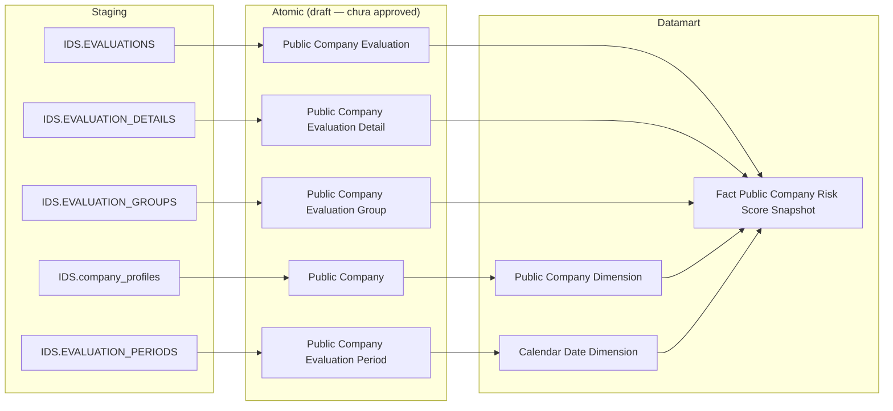
```mermaid
flowchart LR
    subgraph SRC["Staging"]
        IDS_company_profiles_c1["IDS.company_profiles"]
        IDS_EVALUATIONS_c1["IDS.EVALUATIONS"]
        IDS_EVALUATION_DETAILS_c1["IDS.EVALUATION_DETAILS"]
        IDS_EVALUATION_GROUPS_c1["IDS.EVALUATION_GROUPS"]
        IDS_EVALUATION_PERIODS_c1["IDS.EVALUATION_PERIODS"]
    end
    subgraph SIL["Atomic (draft — chưa approved)"]
        Public_Company_c1["Public Company"]
        Public_Company_Evaluation_c1["Public Company Evaluation"]
        Public_Company_Evaluation_Detail_c1["Public Company Evaluation Detail"]
        Public_Company_Evaluation_Group_c1["Public Company Evaluation Group"]
        Public_Company_Evaluation_Period_c1["Public Company Evaluation Period"]
    end
    subgraph GOLD["Datamart"]
        fct_public_company_risk_score_snpst["Fact Public Company Risk Score Snapshot"]
        public_company_dim_c1["Public Company Dimension"]
        cdr_dt_dim_c1["Calendar Date Dimension"]
    end
    IDS_company_profiles_c1 --> Public_Company_c1
    IDS_EVALUATIONS_c1 --> Public_Company_Evaluation_c1
    IDS_EVALUATION_DETAILS_c1 --> Public_Company_Evaluation_Detail_c1
    IDS_EVALUATION_GROUPS_c1 --> Public_Company_Evaluation_Group_c1
    IDS_EVALUATION_PERIODS_c1 --> Public_Company_Evaluation_Period_c1
    Public_Company_c1 --> public_company_dim_c1
    Public_Company_Evaluation_Period_c1 --> cdr_dt_dim_c1
    Public_Company_Evaluation_c1 --> fct_public_company_risk_score_snpst
    Public_Company_Evaluation_Detail_c1 --> fct_public_company_risk_score_snpst
    Public_Company_Evaluation_Group_c1 --> fct_public_company_risk_score_snpst
    public_company_dim_c1 --> fct_public_company_risk_score_snpst
    cdr_dt_dim_c1 --> fct_public_company_risk_score_snpst
```

#### Cụm 1.2 — Fact Public Company Compliance Score Snapshot (Nhóm 2)

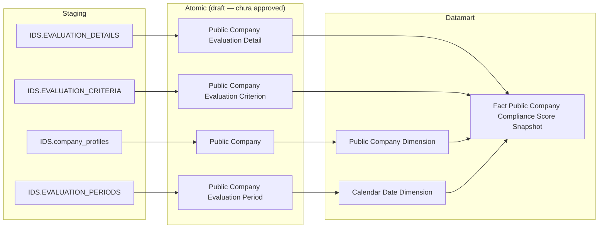
```mermaid
flowchart LR
    subgraph SRC["Staging"]
        IDS_company_profiles_c2["IDS.company_profiles"]
        IDS_EVALUATION_DETAILS_c2["IDS.EVALUATION_DETAILS"]
        IDS_EVALUATION_CRITERIA_c2["IDS.EVALUATION_CRITERIA"]
        IDS_EVALUATION_PERIODS_c2["IDS.EVALUATION_PERIODS"]
    end
    subgraph SIL["Atomic (draft — chưa approved)"]
        Public_Company_c2["Public Company"]
        Public_Company_Evaluation_Detail_c2["Public Company Evaluation Detail"]
        Public_Company_Evaluation_Criterion_c2["Public Company Evaluation Criterion"]
        Public_Company_Evaluation_Period_c2["Public Company Evaluation Period"]
    end
    subgraph GOLD["Datamart"]
        fct_public_company_compliance_score_snpst["Fact Public Company Compliance Score Snapshot"]
        public_company_dim_c2["Public Company Dimension"]
        cdr_dt_dim_c2["Calendar Date Dimension"]
    end
    IDS_company_profiles_c2 --> Public_Company_c2
    IDS_EVALUATION_DETAILS_c2 --> Public_Company_Evaluation_Detail_c2
    IDS_EVALUATION_CRITERIA_c2 --> Public_Company_Evaluation_Criterion_c2
    IDS_EVALUATION_PERIODS_c2 --> Public_Company_Evaluation_Period_c2
    Public_Company_c2 --> public_company_dim_c2
    Public_Company_Evaluation_Period_c2 --> cdr_dt_dim_c2
    Public_Company_Evaluation_Detail_c2 --> fct_public_company_compliance_score_snpst
    Public_Company_Evaluation_Criterion_c2 --> fct_public_company_compliance_score_snpst
    public_company_dim_c2 --> fct_public_company_compliance_score_snpst
    cdr_dt_dim_c2 --> fct_public_company_compliance_score_snpst
```

#### Cụm 1.3 — Fact Public Company Issuance Score Snapshot (Nhóm 3)

```mermaid
flowchart LR
    subgraph SRC["Staging"]
        IDS_company_profiles_c3["IDS.company_profiles"]
        IDS_EVALUATION_DETAILS_c3["IDS.EVALUATION_DETAILS"]
        IDS_EVALUATION_CRITERIA_c3["IDS.EVALUATION_CRITERIA"]
        IDS_EVALUATION_PERIODS_c3["IDS.EVALUATION_PERIODS"]
    end
    subgraph SIL["Atomic (draft — chưa approved)"]
        Public_Company_c3["Public Company"]
        Public_Company_Evaluation_Detail_c3["Public Company Evaluation Detail"]
        Public_Company_Evaluation_Criterion_c3["Public Company Evaluation Criterion"]
        Public_Company_Evaluation_Period_c3["Public Company Evaluation Period"]
    end
    subgraph GOLD["Datamart"]
        fct_public_company_issuance_score_snpst["Fact Public Company Issuance Score Snapshot"]
        public_company_dim_c3["Public Company Dimension"]
        cdr_dt_dim_c3["Calendar Date Dimension"]
    end
    IDS_company_profiles_c3 --> Public_Company_c3
    IDS_EVALUATION_DETAILS_c3 --> Public_Company_Evaluation_Detail_c3
    IDS_EVALUATION_CRITERIA_c3 --> Public_Company_Evaluation_Criterion_c3
    IDS_EVALUATION_PERIODS_c3 --> Public_Company_Evaluation_Period_c3
    Public_Company_c3 --> public_company_dim_c3
    Public_Company_Evaluation_Period_c3 --> cdr_dt_dim_c3
    Public_Company_Evaluation_Detail_c3 --> fct_public_company_issuance_score_snpst
    Public_Company_Evaluation_Criterion_c3 --> fct_public_company_issuance_score_snpst
    public_company_dim_c3 --> fct_public_company_issuance_score_snpst
    cdr_dt_dim_c3 --> fct_public_company_issuance_score_snpst
```

#### Cụm 1.4 — Fact Public Company Financial Score Snapshot (Nhóm 4)

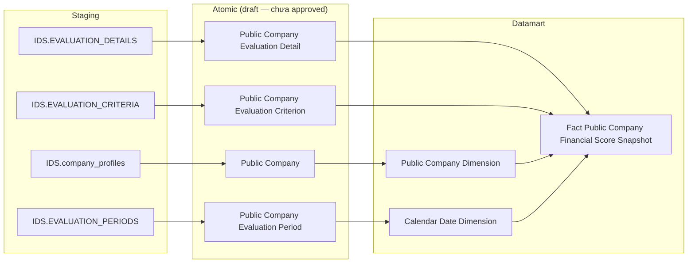
```mermaid
flowchart LR
    subgraph SRC["Staging"]
        IDS_company_profiles_c4["IDS.company_profiles"]
        IDS_EVALUATION_DETAILS_c4["IDS.EVALUATION_DETAILS"]
        IDS_EVALUATION_CRITERIA_c4["IDS.EVALUATION_CRITERIA"]
        IDS_EVALUATION_PERIODS_c4["IDS.EVALUATION_PERIODS"]
    end
    subgraph SIL["Atomic (draft — chưa approved)"]
        Public_Company_c4["Public Company"]
        Public_Company_Evaluation_Detail_c4["Public Company Evaluation Detail"]
        Public_Company_Evaluation_Criterion_c4["Public Company Evaluation Criterion"]
        Public_Company_Evaluation_Period_c4["Public Company Evaluation Period"]
    end
    subgraph GOLD["Datamart"]
        fct_public_company_financial_score_snpst["Fact Public Company Financial Score Snapshot"]
        public_company_dim_c4["Public Company Dimension"]
        cdr_dt_dim_c4["Calendar Date Dimension"]
    end
    IDS_company_profiles_c4 --> Public_Company_c4
    IDS_EVALUATION_DETAILS_c4 --> Public_Company_Evaluation_Detail_c4
    IDS_EVALUATION_CRITERIA_c4 --> Public_Company_Evaluation_Criterion_c4
    IDS_EVALUATION_PERIODS_c4 --> Public_Company_Evaluation_Period_c4
    Public_Company_c4 --> public_company_dim_c4
    Public_Company_Evaluation_Period_c4 --> cdr_dt_dim_c4
    Public_Company_Evaluation_Detail_c4 --> fct_public_company_financial_score_snpst
    Public_Company_Evaluation_Criterion_c4 --> fct_public_company_financial_score_snpst
    public_company_dim_c4 --> fct_public_company_financial_score_snpst
    cdr_dt_dim_c4 --> fct_public_company_financial_score_snpst
```

#### Cụm 1.5 — Fact Public Company Non-Financial Score Snapshot (Nhóm 5)

```mermaid
flowchart LR
    subgraph SRC["Staging"]
        IDS_company_profiles_c5["IDS.company_profiles"]
        IDS_EVALUATION_DETAILS_c5["IDS.EVALUATION_DETAILS"]
        IDS_EVALUATION_CRITERIA_c5["IDS.EVALUATION_CRITERIA"]
        IDS_EVALUATION_PERIODS_c5["IDS.EVALUATION_PERIODS"]
    end
    subgraph SIL["Atomic (draft — chưa approved)"]
        Public_Company_c5["Public Company"]
        Public_Company_Evaluation_Detail_c5["Public Company Evaluation Detail"]
        Public_Company_Evaluation_Criterion_c5["Public Company Evaluation Criterion"]
        Public_Company_Evaluation_Period_c5["Public Company Evaluation Period"]
    end
    subgraph GOLD["Datamart"]
        fct_public_company_nonfinancial_score_snpst["Fact Public Company Non-Financial Score Snapshot"]
        public_company_dim_c5["Public Company Dimension"]
        cdr_dt_dim_c5["Calendar Date Dimension"]
    end
    IDS_company_profiles_c5 --> Public_Company_c5
    IDS_EVALUATION_DETAILS_c5 --> Public_Company_Evaluation_Detail_c5
    IDS_EVALUATION_CRITERIA_c5 --> Public_Company_Evaluation_Criterion_c5
    IDS_EVALUATION_PERIODS_c5 --> Public_Company_Evaluation_Period_c5
    Public_Company_c5 --> public_company_dim_c5
    Public_Company_Evaluation_Period_c5 --> cdr_dt_dim_c5
    Public_Company_Evaluation_Detail_c5 --> fct_public_company_nonfinancial_score_snpst
    Public_Company_Evaluation_Criterion_c5 --> fct_public_company_nonfinancial_score_snpst
    public_company_dim_c5 --> fct_public_company_nonfinancial_score_snpst
    cdr_dt_dim_c5 --> fct_public_company_nonfinancial_score_snpst
```

> **Ghi chú `Public Company Evaluation Period`:** Entity Atomic tương ứng `IDS.EVALUATION_PERIODS` (physical name `pc_evaluation_period`, `design_status: draft`) map trực tiếp vào `Calendar Date Dimension` (`cdr_dt_dim`) qua `evaluation_year`/`evaluation_month` — không tạo Dimension riêng, tái sử dụng `Calendar Date Dimension` đã có trong Reuse Analysis (Section 4).

### Cụm 2 — Hồ sơ Công ty Đại chúng

Phục vụ chiều nhận diện DN trên toàn bộ các màn hình.

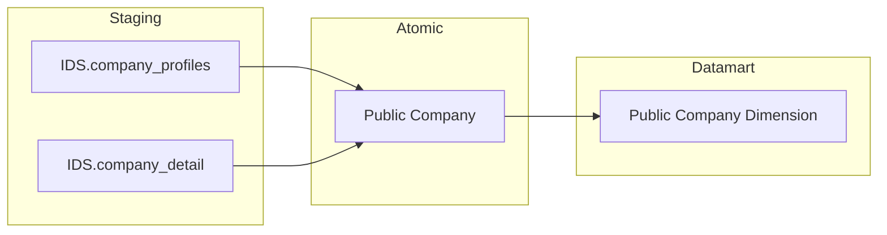
```mermaid
flowchart LR
    subgraph SRC["Staging"]
        IDS_company_profiles["IDS.company_profiles"]
        IDS_company_detail["IDS.company_detail"]
    end
    subgraph SIL["Atomic"]
        Public_Company["Public Company"]
    end
    subgraph GOLD["Datamart"]
        public_company_dim["Public Company Dimension"]
    end
    IDS_company_profiles --> Public_Company
    IDS_company_detail --> Public_Company
    Public_Company --> public_company_dim
```

### Cụm 3 — Báo cáo tài chính & Nộp báo cáo

Phục vụ toàn bộ KPI tài chính tổng hợp và theo ngành (Màn hình 2). **Cập nhật 2026-07-23 (rà soát LLD):** `Fact Public Company Financial Summary Snapshot` đã bị xoá (không còn cột nào READY — nguồn `Public Company Report Submission`/`IDS.company_data` là dữ liệu động, `Public Company Financial Report Value`/`IDS.data` Gap Atomic, xem O_GSDC_5). Toàn bộ KPI READY của Cụm này (Nhóm 6/9/10/12/14/16/38/39/40/41) nay query trực tiếp trên `Public Company Dimension`/`Calendar Date Dimension`, không qua Fact trung gian.

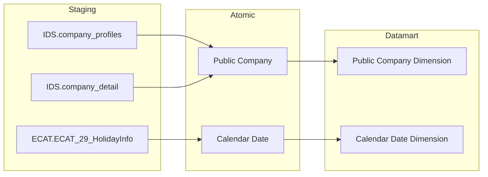
```mermaid
flowchart LR
    subgraph SRC["Staging"]
        IDS_company_profiles["IDS.company_profiles"]
        IDS_company_detail["IDS.company_detail"]
        ECAT_ECAT_29_HolidayInfo["ECAT.ECAT_29_HolidayInfo"]
    end
    subgraph SIL["Atomic"]
        Public_Company["Public Company"]
        Calendar_Date["Calendar Date"]
    end
    subgraph GOLD["Datamart"]
        public_company_dim["Public Company Dimension"]
        cdr_dt_dim["Calendar Date Dimension"]
    end
    IDS_company_profiles --> Public_Company
    IDS_company_detail --> Public_Company
    ECAT_ECAT_29_HolidayInfo --> Calendar_Date
    Public_Company --> public_company_dim
    Calendar_Date --> cdr_dt_dim
```

> **Nguồn PENDING (chưa có Fact):** `Public Company Report Submission` (`IDS.company_data`, dữ liệu động — K_GSDC_702/703/704 PENDING) và `Public Company Financial Report Value` (`IDS.data`/`report_catalog`/`rrow`/`rcol`, Gap Atomic — K_GSDC_48/49/705-708 và toàn bộ Nhóm 7/8/11/13/15/17/37 PENDING). Xem O_GSDC_5.

### Cụm 4 — Chi tiết BCTC từng CTDC & Danh mục template (DB21–32 + DB39)

Phục vụ Data Explorer tra cứu giá trị từng chỉ tiêu BCTC theo CTDC và kỳ báo cáo. `Financial Report Catalog Dimension` là Dimension phụ trợ cung cấp tên và thứ tự chỉ tiêu cho Fact.

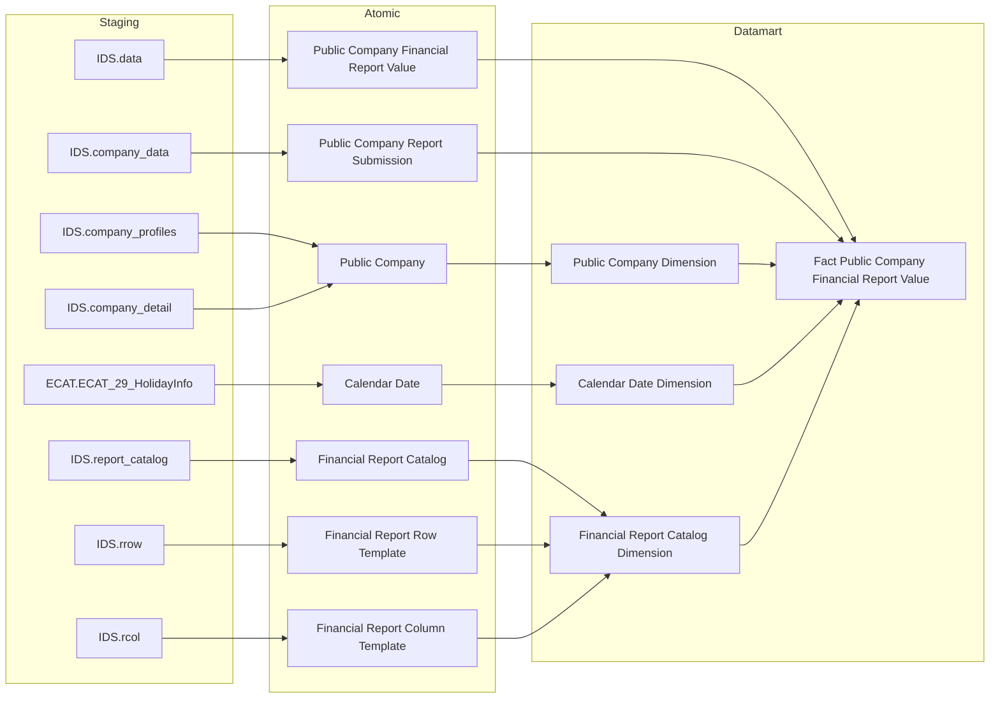
```mermaid
flowchart LR
    subgraph SRC["Staging"]
        IDS_company_profiles_b["IDS.company_profiles"]
        IDS_company_detail_b["IDS.company_detail"]
        IDS_company_data_b["IDS.company_data"]
        IDS_data_b["IDS.data"]
        IDS_report_catalog_b["IDS.report_catalog"]
        IDS_rrow_b["IDS.rrow"]
        IDS_rcol_b["IDS.rcol"]
        ECAT_ECAT_29_HolidayInfo_b["ECAT.ECAT_29_HolidayInfo"]
    end
    subgraph SIL["Atomic"]
        Public_Company_b["Public Company"]
        Public_Company_Report_Submission_b["Public Company Report Submission"]
        Public_Company_Financial_Report_Value_b["Public Company Financial Report Value"]
        Financial_Report_Catalog_b["Financial Report Catalog"]
        Financial_Report_Row_Template_b["Financial Report Row Template"]
        Financial_Report_Column_Template_b["Financial Report Column Template"]
        Calendar_Date_b["Calendar Date"]
    end
    subgraph GOLD["Datamart"]
        fct_public_company_financial_report_val["Fact Public Company Financial Report Value"]
        fnc_rpt_ctlg_dim["Financial Report Catalog Dimension"]
        public_company_dim_b["Public Company Dimension"]
        cdr_dt_dim_b["Calendar Date Dimension"]
    end
    IDS_company_profiles_b --> Public_Company_b
    IDS_company_detail_b --> Public_Company_b
    IDS_company_data_b --> Public_Company_Report_Submission_b
    IDS_data_b --> Public_Company_Financial_Report_Value_b
    IDS_report_catalog_b --> Financial_Report_Catalog_b
    IDS_rrow_b --> Financial_Report_Row_Template_b
    IDS_rcol_b --> Financial_Report_Column_Template_b
    ECAT_ECAT_29_HolidayInfo_b --> Calendar_Date_b
    Public_Company_b --> public_company_dim_b
    Public_Company_Financial_Report_Value_b --> fct_public_company_financial_report_val
    Public_Company_Report_Submission_b --> fct_public_company_financial_report_val
    Financial_Report_Catalog_b --> fnc_rpt_ctlg_dim
    Financial_Report_Row_Template_b --> fnc_rpt_ctlg_dim
    Financial_Report_Column_Template_b --> fnc_rpt_ctlg_dim
    Calendar_Date_b --> cdr_dt_dim_b
    public_company_dim_b --> fct_public_company_financial_report_val
    cdr_dt_dim_b --> fct_public_company_financial_report_val
    fnc_rpt_ctlg_dim --> fct_public_company_financial_report_val
```

---

## Section 2 — Tổng quan báo cáo

---

### Màn hình 1 — Phân loại & Xếp hạng Rủi ro CTDC

#### Nhóm 1 — STT 1: Tổng hợp chấm điểm phân loại CTDC

##### READY

> Phân loại: **Phân tích**
> Atomic: `Public Company` ← IDS.company_profiles — **draft** (chưa approved)
> Atomic: `Public Company Evaluation` ← IDS.EVALUATIONS — **draft** (chưa approved)
> Atomic: `Public Company Evaluation Detail` ← IDS.EVALUATION_DETAILS — **draft** (chưa approved)
> Atomic: `Public Company Evaluation Criterion` ← IDS.EVALUATION_CRITERIA — **draft** (chưa approved)
> Atomic: `Public Company Evaluation Group` ← IDS.EVALUATION_GROUPS — **draft** (chưa approved)
> **Lưu ý go-live:** Các entity Atomic trên đã có LLD tại `DataModel/working/Atomic/lld/IDS/` nhưng `design_status: draft`, chưa qua approve. Datamart chỉ chính thức READY sau khi Atomic được approve — xem [O_GSDC_1] cập nhật bên dưới.

**Mockup:**

| Tên Doanh nghiệp | Mã DN | Tuân thủ | Phát hành | Tài chính | Phi TC | M-Score | Xếp hạng TN | Điểm | Xếp loại |
|---|---|---|---|---|---|---|---|---|---|
| Công ty tập đoàn địa ốc Novaland | NVL | 85 | 90 | 78 | 82 | 88 | Tốt | 84.6 | A |

**Source:** `Fact Public Company Risk Score Snapshot` → `Public Company Dimension`, `Calendar Date Dimension`

**Bảng KPI:**

| KPI ID | Tên KPI | Đơn vị | Tính chất | Atomic Entity | Atomic Table | Atomic Attribute | Atomic Column |
|---|---|---|---|---|---|---|---|
| K_GSDC_1 | Tuân thủ | Điểm | Base | Public Company Evaluation Detail | pc_evaluation_detail | Evaluation Score | evaluation_score |
| K_GSDC_2 | Phát hành | Điểm | Base | Public Company Evaluation Detail | pc_evaluation_detail | Evaluation Score | evaluation_score |
| K_GSDC_3 | Tài chính | Điểm | Base | Public Company Evaluation Detail | pc_evaluation_detail | Evaluation Score | evaluation_score |
| K_GSDC_4 | Phi tài chính & M-Score | Điểm | Base | Public Company Evaluation Detail | pc_evaluation_detail | Evaluation Score | evaluation_score |
| K_GSDC_5 | Xếp hạng tín nhiệm DN | Điểm | Base | Public Company Evaluation Detail | pc_evaluation_detail | Evaluation Score | evaluation_score |
| K_GSDC_6 | Điểm tổng hợp | Điểm | Base | Public Company Evaluation | pc_evaluation | Total Score Percentage | total_score_percentage |
| K_GSDC_7 | Mã CK doanh nghiệp | Text | Chiều | Public Company | public_company | Equity Ticker | equity_ticker_symbol |
| K_GSDC_8 | Tên doanh nghiệp | Text | Chiều | Public Company | public_company | Public Company Name | pc_nm |

**Ghi chú tính toán K_GSDC_1–4:** `SUM(evaluation_score)` trên `Public Company Evaluation Detail`, JOIN `Public Company Evaluation Criterion` → `Public Company Evaluation Group`, filter `pc_evaluation_group_code` tương ứng: `TUAN_THU` / `PHAT_HANH` / `TAI_CHINH` / `PHI_TAI_CHINH`.

**Ghi chú K_GSDC_5:** Lấy `evaluation_score` trực tiếp (không SUM), filter `Public Company Evaluation Criterion.pc_evaluation_criterion_code = 'PHAT_HANH_TIN_NHIEM'`. BA còn trả kèm `ed.result` (kết quả text) — theo xác nhận, cột này thừa, không đưa vào KPI.

**Ghi chú K_GSDC_6:** Lấy `total_score_percentage` trực tiếp từ `Public Company Evaluation`. BA còn trả kèm `ev.type` (xếp loại) — theo xác nhận, cột này thừa, không đưa vào KPI.

**Star Schema:**

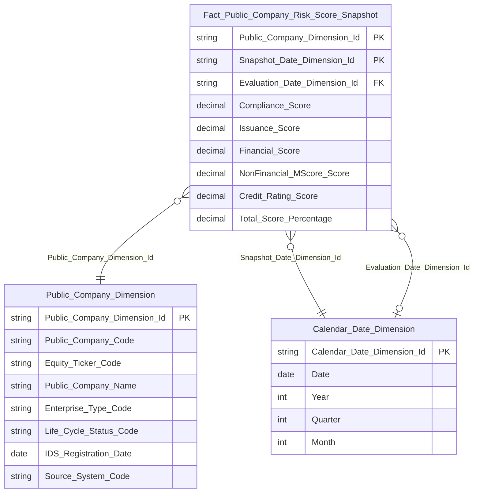
```mermaid
erDiagram
    Fact_Public_Company_Risk_Score_Snapshot {
        string Public_Company_Dimension_Id PK
        string Snapshot_Date_Dimension_Id PK
        string Evaluation_Date_Dimension_Id FK
        decimal Compliance_Score
        decimal Issuance_Score
        decimal Financial_Score
        decimal NonFinancial_MScore_Score
        decimal Credit_Rating_Score
        decimal Total_Score_Percentage
    }

    Public_Company_Dimension {
        string Public_Company_Dimension_Id PK
        string Public_Company_Code
        string Equity_Ticker_Code
        string Public_Company_Name
        string Enterprise_Type_Code
        string Life_Cycle_Status_Code
        date IDS_Registration_Date
        string Source_System_Code
    }

    Calendar_Date_Dimension {
        string Calendar_Date_Dimension_Id PK
        date Date
        int Year
        int Quarter
        int Month
    }

    Fact_Public_Company_Risk_Score_Snapshot }o--|| Public_Company_Dimension : "Public_Company_Dimension_Id"
    Fact_Public_Company_Risk_Score_Snapshot }o--|| Calendar_Date_Dimension : "Snapshot_Date_Dimension_Id"
    Fact_Public_Company_Risk_Score_Snapshot }o--o| Calendar_Date_Dimension : "Evaluation_Date_Dimension_Id"
```

> **Sửa 2026-08-03 (đánh giá lại ETL):** Grain đổi từ "1 row/CTDC/kỳ đánh giá" sang "1 row/CTDC/ngày snapshot ETL" — driving table là `Public Company Dimension` (full-scan toàn bộ CTĐC mỗi ngày, vì không biết trước công ty nào phát sinh kỳ đánh giá mới vào ngày nào). Với mỗi công ty, các measure (Compliance/Issuance/Financial/NonFinancial/Credit Rating/Total Score) carry-forward từ kỳ đánh giá gần nhất (`Evaluation Date <= ngày ETL`, LEFT JOIN, nullable khi công ty chưa từng có kỳ đánh giá). `Snapshot Date Dimension Id` là PK (ngày chạy ETL); `Evaluation Date Dimension Id` là thuộc tính carry-forward (ngày kỳ đánh giá thật, không phải PK) — áp dụng đồng nhất cho cả 5 Fact `Fact Public Company *_Score_Snapshot` (Risk/Compliance/Issuance/Financial/Non-Financial).

**Lineage Mart → Báo cáo:**

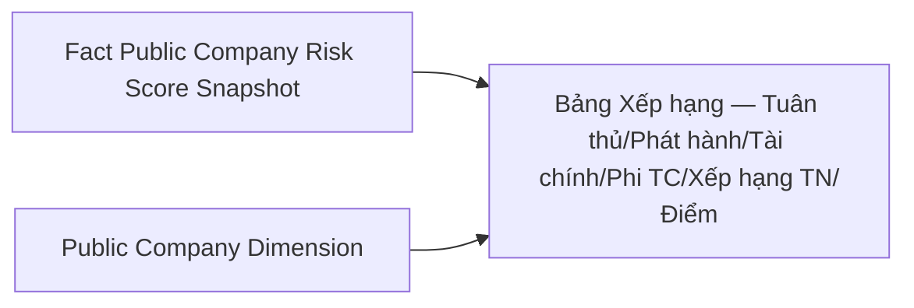
```mermaid
flowchart LR
    pc_risk_fct["Fact Public Company Risk Score Snapshot"] --> R1["Bảng Xếp hạng — Tuân thủ/Phát hành/Tài chính/Phi TC/Xếp hạng TN/Điểm"]
    public_company_dim["Public Company Dimension"] --> R1
```

**Bảng grain:**

| Tên bảng | Grain |
|---|---|
| Fact Public Company Risk Score Snapshot | 1 row / công ty đại chúng / ngày snapshot ETL (full-scan daily, carry-forward điểm số từ kỳ đánh giá gần nhất — sửa 2026-08-03) |
| Public Company Dimension | 1 row / công ty đại chúng (SCD2) |
| Calendar Date Dimension | 1 row / ngày (Conformed) |

---

#### Nhóm 2 — STT 2: Top CTDC theo chỉ tiêu tuân thủ

##### READY

> Phân loại: **Phân tích**
> Atomic: `Public Company Evaluation Detail` ← IDS.EVALUATION_DETAILS — **draft** (chưa approved)
> Atomic: `Public Company Evaluation Criterion` ← IDS.EVALUATION_CRITERIA — **draft** (chưa approved)
> **Lưu ý go-live:** Atomic entity liên quan chưa qua approve — xem [O_GSDC_1].

**KPI liên quan:**

| KPI ID | Tên KPI | Tính chất | Atomic Entity | Atomic Table | Atomic Column | Điều kiện lọc (criterion_cd) |
|---|---|---|---|---|---|---|
| K_GSDC_7 | Mã CK doanh nghiệp | Chiều | Public Company | public_company | equity_ticker_symbol | **Reuse từ Nhóm 1** (K_GSDC_7) — không tính lại |
| K_GSDC_8 | Tên doanh nghiệp | Chiều | Public Company | public_company | pc_nm | **Reuse từ Nhóm 1** (K_GSDC_8) — không tính lại |
| K_GSDC_9 | Công bố BCTC | Base | Public Company Evaluation Detail | pc_evaluation_detail | evaluation_score | TUAN_THU_BCTC |
| K_GSDC_10 | Công bố BCTN | Base | Public Company Evaluation Detail | pc_evaluation_detail | evaluation_score | TUAN_THU_BCTN |
| K_GSDC_11 | Công bố báo cáo tình hình quản trị | Base | Public Company Evaluation Detail | pc_evaluation_detail | evaluation_score | TUAN_THU_BCTHQT |
| K_GSDC_12 | Công bố thông tin Thay đổi TGĐ/CTHĐQT | Base | Public Company Evaluation Detail | pc_evaluation_detail | evaluation_score | TUAN_THU_CBTTBT_TDTGD |
| K_GSDC_13 | Vi phạm từ UBCKNN | Base | Public Company Evaluation Detail | pc_evaluation_detail | evaluation_score | TUAN_THU_VP_UBCK |
| K_GSDC_14 | Vi phạm từ các đơn vị khác | Base | Public Company Evaluation Detail | pc_evaluation_detail | evaluation_score | TUAN_THU_CBTTBT_VPVT |
| K_GSDC_15 | Điều lệ Công ty và Các Quy chế hoạt động | Base | Public Company Evaluation Detail | pc_evaluation_detail | evaluation_score | TUAN_THU_QTCT_DLCT |
| K_GSDC_16 | Số lượng ĐHĐCĐ thường niên trong 6 tháng đầu năm | Base | Public Company Evaluation Detail | pc_evaluation_detail | evaluation_score | TUAN_THU_QTCT_SLDHDCD |
| K_GSDC_17 | Số lượng thành viên HĐQT độc lập | Base | Public Company Evaluation Detail | pc_evaluation_detail | evaluation_score | TUAN_THU_QTCT_SLTVDL |
| K_GSDC_18 | Số lượng thành viên HĐQT không điều hành | Base | Public Company Evaluation Detail | pc_evaluation_detail | evaluation_score | TUAN_THU_QTCT_SLTVKDH |
| K_GSDC_19 | Tư cách thành viên HĐQT/BKS/Kế toán trưởng | Base | Public Company Evaluation Detail | pc_evaluation_detail | evaluation_score | TUAN_THU_QTCT_TCTV |
| K_GSDC_20 | Số lượng thành viên BKS hoặc Ủy ban kiểm toán | Base | Public Company Evaluation Detail | pc_evaluation_detail | evaluation_score | TUAN_THU_QTCT_SLTVBKS |
| K_GSDC_21 | Báo cáo tiến độ sử dụng vốn | Base | Public Company Evaluation Detail | pc_evaluation_detail | evaluation_score | TUAN_THU_BCSDV_BCTDSDV |
| K_GSDC_22 | Thay đổi phương án sử dụng vốn | Base | Public Company Evaluation Detail | pc_evaluation_detail | evaluation_score | TUAN_THU_BCSDV_TDPASDV |
| K_GSDC_23 | Tổng điểm Tuân thủ | Base | Public Company Evaluation Detail | pc_evaluation_detail | SUM(evaluation_score) | group_cd = 'TUAN_THU' |

**Ghi chú tách KPI:** BA đã tách "Công bố thông tin về vi phạm, quyết định xử phạt" thành 2 tiêu chí riêng biệt trong nguồn (`criterion_cd` khác nhau): "Vi phạm từ UBCKNN" (`TUAN_THU_VP_UBCK`, K_GSDC_13) và "Vi phạm từ các đơn vị khác" (`TUAN_THU_CBTTBT_VPVT`, K_GSDC_14).

**Ghi chú lọc chung:** Mọi KPI Base join `Public Company Evaluation Detail (ed)` → `Public Company Evaluation Criterion (ec)` qua `pc_evaluation_criterion_id`, filter theo `pc_evaluation_criterion_code` tương ứng cột "Điều kiện lọc" ở trên. BA còn trả kèm `ed.result` (kết quả text) cho mỗi dòng — theo xác nhận Nhóm 1, cột này không đưa vào KPI (chỉ dùng `evaluation_score`).

**Mart:** `Fact Public Company Compliance Score Snapshot` (grain: 1 row / CTDC / ngày snapshot ETL — full-scan daily, carry-forward, sửa 2026-08-03)

---

#### Nhóm 3 — STT 3: Top CTDC theo chỉ tiêu phát hành

##### READY

> Phân loại: **Phân tích**
> Atomic: `Public Company Evaluation Detail` ← IDS.EVALUATION_DETAILS — **draft** (chưa approved)
> Atomic: `Public Company Evaluation Criterion` ← IDS.EVALUATION_CRITERIA — **draft** (chưa approved)
> **Lưu ý go-live:** Atomic entity liên quan chưa qua approve — xem [O_GSDC_1].

**KPI liên quan:**

| KPI ID | Tên KPI | Tính chất | Atomic Entity | Atomic Table | Atomic Column | Điều kiện lọc (criterion_cd) |
|---|---|---|---|---|---|---|
| K_GSDC_7 | Mã doanh nghiệp | Chiều | Public Company | public_company | equity_ticker_symbol | **Reuse từ Nhóm 1** (K_GSDC_7) — không tính lại |
| K_GSDC_8 | Tên doanh nghiệp | Chiều | Public Company | public_company | pc_nm | **Reuse từ Nhóm 1** (K_GSDC_8) — không tính lại |
| K_GSDC_24 | Phát hành tăng vốn nhanh | Base | Public Company Evaluation Detail | pc_evaluation_detail | evaluation_score | PHAT_HANH_TANG_VON_NHANH |
| K_GSDC_25 | Số lần chào bán cổ phiếu riêng lẻ | Base | Public Company Evaluation Detail | pc_evaluation_detail | evaluation_score | PHAT_HANH_SLCBCPRL |
| K_GSDC_26 | Số lần chào bán ra công chúng | Base | Public Company Evaluation Detail | pc_evaluation_detail | evaluation_score | PHAT_HANH_SLCBRCC |
| K_GSDC_27 | Số lần phát hành ESOP | Base | Public Company Evaluation Detail | pc_evaluation_detail | evaluation_score | PHAT_HANH_SLPHES |
| K_GSDC_28 | Tỷ lệ phát hành trái phiếu không có TSBĐ | Base | Public Company Evaluation Detail | pc_evaluation_detail | evaluation_score | PHAT_HANH_TLGTTP |
| K_GSDC_29 | Xếp hạng tín nhiệm | Base | Public Company Evaluation Detail | pc_evaluation_detail | evaluation_score | PHAT_HANH_TIN_NHIEM |
| K_GSDC_30 | Dư nợ trái phiếu / Tổng VCSH | Base | Public Company Evaluation Detail | pc_evaluation_detail | evaluation_score | PHAT_HANH_DNTPTVCSH |
| K_GSDC_31 | Tổng điểm Phát hành | Base | Public Company Evaluation Detail | pc_evaluation_detail | SUM(evaluation_score) | group_cd = 'PHAT_HANH' |

**Ghi chú đổi nội dung K_GSDC_29:** BA đã đổi chỉ tiêu này từ "Tỷ lệ trái phiếu vi phạm nghĩa vụ thanh toán lãi và gốc" (không còn trong BA) sang "Xếp hạng tín nhiệm" (`criterion_cd = PHAT_HANH_TIN_NHIEM`). Giữ nguyên K_GSDC_29, chỉ đổi tên KPI và nguồn — xác nhận với Data Modeler 2026-07-15.

**Ghi chú lọc chung:** Mọi KPI Base join `Public Company Evaluation Detail (ed)` → `Public Company Evaluation Criterion (ec)` qua `pc_evaluation_criterion_id`, filter theo `pc_evaluation_criterion_code` tương ứng cột "Điều kiện lọc" ở trên.

**Mart:** `Fact Public Company Issuance Score Snapshot` (grain: 1 row / CTDC / ngày snapshot ETL — full-scan daily, carry-forward, sửa 2026-08-03)

---

#### Nhóm 4 — STT 4: Top CTDC theo chỉ tiêu tài chính

##### READY

> Phân loại: **Phân tích**
> Atomic: `Public Company Evaluation Detail` ← IDS.EVALUATION_DETAILS — **draft** (chưa approved)
> Atomic: `Public Company Evaluation Criterion` ← IDS.EVALUATION_CRITERIA — **draft** (chưa approved)
> **Lưu ý go-live:** Atomic entity liên quan chưa qua approve — xem [O_GSDC_1].

**KPI liên quan:**

| KPI ID | Tên KPI | Tính chất | Atomic Entity | Atomic Table | Atomic Column | Điều kiện lọc (criterion_cd) |
|---|---|---|---|---|---|---|
| K_GSDC_7 | Mã doanh nghiệp | Chiều | Public Company | public_company | equity_ticker_symbol | **Reuse từ Nhóm 1** (K_GSDC_7) — không tính lại |
| K_GSDC_8 | Tên doanh nghiệp | Chiều | Public Company | public_company | pc_nm | **Reuse từ Nhóm 1** (K_GSDC_8) — không tính lại |
| K_GSDC_32 | Kiểm toán — Ý kiến kiểm toán | Base | Public Company Evaluation Detail | pc_evaluation_detail | evaluation_score | TAI_CHINH_YKKT |
| K_GSDC_33 | ROA | Base | Public Company Evaluation Detail | pc_evaluation_detail | evaluation_score | TAI_CHINH_ROA |
| K_GSDC_34 | Dòng tiền từ hoạt động kinh doanh | Base | Public Company Evaluation Detail | pc_evaluation_detail | evaluation_score | TAI_CHINH_DTTHDKD |
| K_GSDC_35 | Khả năng thanh toán hiện thời | Base | Public Company Evaluation Detail | pc_evaluation_detail | evaluation_score | TAI_CHINH_KNTTHT |
| K_GSDC_36 | EBIT / Lãi vay | Base | Public Company Evaluation Detail | pc_evaluation_detail | evaluation_score | TAI_CHINH_EBIT |
| K_GSDC_37 | Nợ / VCSH | Base | Public Company Evaluation Detail | pc_evaluation_detail | evaluation_score | TAI_CHINH_NO_VON_CSH |
| K_GSDC_38 | VCSH | Base | Public Company Evaluation Detail | pc_evaluation_detail | evaluation_score | TAI_CHINH_VON_CSH |
| K_GSDC_39 | ROE | Base | Public Company Evaluation Detail | pc_evaluation_detail | evaluation_score | TAI_CHINH_ROE |
| K_GSDC_40 | Doanh thu từ HĐ tài chính / Lợi nhuận sau thuế | Base | Public Company Evaluation Detail | pc_evaluation_detail | evaluation_score | TAI_CHINH_DTHDTC_LNST |
| K_GSDC_41 | Doanh thu từ hoạt động khác / Lợi nhuận sau thuế | Base | Public Company Evaluation Detail | pc_evaluation_detail | evaluation_score | TAI_CHINH_DTHD_KHAC_LNST |
| K_GSDC_42 | Tổng điểm Tài chính | Base | Public Company Evaluation Detail | pc_evaluation_detail | SUM(evaluation_score) | group_cd = 'TAI_CHINH' |

**Ghi chú thay đổi phạm vi KPI:**
- **K_GSDC_33** đổi nội dung từ "Khả năng hoạt động liên tục" (không còn trong BA) sang **"ROA"** (`criterion_cd = TAI_CHINH_ROA`) — tái sử dụng số ID theo quyết định Data Modeler 2026-07-15 (ngoại lệ quy tắc không đổi nghĩa KPI ID, xác nhận rõ ràng).
- **K_GSDC_38** "VCSH" (`criterion_cd = TAI_CHINH_VON_CSH`) — **rà soát LLD (2026-07-15) xác nhận vẫn còn trong BA**: dòng "VCSH" (STT 4, `Trạng thái mapping = Done`, `Loại dữ liệu = Dữ liệu tĩnh`). Ghi chú "loại khỏi phạm vi" trước đây sai/lỗi thời (có thể nhầm với 1 KPI khác đã đổi tên) — đã xóa, K_GSDC_38 giữ nguyên trong bảng KPI và Attributes.

**Ghi chú lọc chung:** Mọi KPI Base join `Public Company Evaluation Detail (ed)` → `Public Company Evaluation Criterion (ec)` qua `pc_evaluation_criterion_id`, filter theo `pc_evaluation_criterion_code` tương ứng cột "Điều kiện lọc" ở trên.

**Mart:** `Fact Public Company Financial Score Snapshot` (grain: 1 row / CTDC / ngày snapshot ETL — full-scan daily, carry-forward, sửa 2026-08-03)

---

#### Nhóm 5 — STT 5: Top CTDC theo chỉ tiêu phi tài chính & M-Score

##### READY

> Phân loại: **Phân tích**
> Atomic: `Public Company Evaluation Detail` ← IDS.EVALUATION_DETAILS — **draft** (chưa approved)
> Atomic: `Public Company Evaluation Criterion` ← IDS.EVALUATION_CRITERIA — **draft** (chưa approved)
> **Lưu ý go-live:** Atomic entity liên quan chưa qua approve — xem [O_GSDC_1].

**KPI liên quan:**

| KPI ID | Tên KPI | Tính chất | Atomic Entity | Atomic Table | Atomic Column | Điều kiện lọc (criterion_cd) |
|---|---|---|---|---|---|---|
| K_GSDC_7 | Mã doanh nghiệp | Chiều | Public Company | public_company | equity_ticker_symbol | **Reuse từ Nhóm 1** (K_GSDC_7) — không tính lại |
| K_GSDC_8 | Tên doanh nghiệp | Chiều | Public Company | public_company | pc_nm | **Reuse từ Nhóm 1** (K_GSDC_8) — không tính lại |
| K_GSDC_43 | Tình trạng DN từ Cục Đăng ký kinh doanh | Base | Public Company Evaluation Detail | pc_evaluation_detail | evaluation_score | PHI_TAI_CHINH_TTHD |
| K_GSDC_44 | M-Score | Base | Public Company Evaluation Detail | pc_evaluation_detail | evaluation_score | PHI_TAI_CHINH_M_SCORE |
| K_GSDC_45 | Tổng điểm Phi tài chính & M-Score | Base | Public Company Evaluation Detail | pc_evaluation_detail | SUM(evaluation_score) | group_cd = 'PHI_TAI_CHINH' |

**Ghi chú lọc chung:** Mọi KPI Base join `Public Company Evaluation Detail (ed)` → `Public Company Evaluation Criterion (ec)` qua `pc_evaluation_criterion_id`, filter theo `pc_evaluation_criterion_code` tương ứng cột "Điều kiện lọc" ở trên.

**Mart:** `Fact Public Company Non-Financial Score Snapshot` (grain: 1 row / CTDC / ngày snapshot ETL — full-scan daily, carry-forward, sửa 2026-08-03)

---

### Màn hình 2 — Giám sát Tổng hợp

Màn hình có bộ lọc **Năm / Quý** và 5 tab sàn. Mỗi tab hiển thị cùng cấu trúc 3 nhóm nội dung, chỉ khác filter `Equity_Listing_Exchange_Code`.

#### Nhóm 6 — STT 6: Thống kê niêm yết toàn thị trường

##### READY (thu hẹp) — 2/4 KPI PENDING do "Dữ liệu động"

> Phân loại: **Phân tích**
> Atomic: `Public Company` ← IDS.company_profiles — **draft** (chưa approved)
> **Cập nhật 2026-07-15 — tách nhóm theo đúng STT BA:** Nhóm 6 trong HLD nay chỉ tương ứng STT 6 (không gộp STT 12/14/16/18 nữa — mỗi STT có Nhóm riêng, xem Nhóm 10/12/14/16 bên dưới).
> **Cập nhật 2026-07-15 (BA đánh số lại toàn bộ STT 6–28):** BA gộp dashboard "Tổng hợp CTTC theo ngành" (cũ STT 8+9+10) thành 1 STT duy nhất → toàn bộ STT phía sau lùi 2 đơn vị (cũ 11→9, 12→10, 13→11, ..., 19→17, 20→18 ... 30→28). STT 31–43 **giữ nguyên số cũ** (BA để trống STT 29–30, chưa xác nhận lý do — xem backlog cuối Section 4). Đã áp dụng renumber cho toàn bộ Nhóm 6–28 trong HLD, xem Section 4 để biết bảng mapping đầy đủ.
> **Ghi chú gating (Loại dữ liệu):** BA đánh dấu K_GSDC_48 "Tỷ lệ nộp BCTC" và K_GSDC_49 "Số DN báo lãi" là **"Dữ liệu động"** → theo gate rule bắt buộc PENDING dù đã xác định được nguồn, không đưa vào READY (xem O_GSDC_5).
> **Gap Atomic K_GSDC_48:** BA SQL thực tế dùng bảng `violation_report` JOIN `forms` (filter `news_type_cd='DINH_KY'`) — khớp Atomic entity `Public Company Violation Report` (`pc_violation_report`, `design_status: draft`), KHÔNG phải `Public Company Report Submission` (`pc_report_submission`, từ `IDS.company_data`) như thiết kế cũ. Đã sửa lại entity tham chiếu.
> **Gap Atomic K_GSDC_49:** Nguồn `IDS.data`/`report_catalog`/`rrow`/`rcol` (Public Company Financial Report Value) hiện **chưa có Atomic LLD** — xem O_GSDC_5.
> **Cập nhật 2026-07-23 (rà soát LLD) — bỏ `Fact Public Company Financial Summary Snapshot`:** Fact này ban đầu thiết kế cho K_GSDC_46/47 + K_GSDC_700-704 (Nhóm 38), nhưng rà soát phát hiện K_GSDC_47 tự đủ bằng `COUNT(DISTINCT ...)` trực tiếp trên `Public Company Dimension` (không cần grain snapshot theo kỳ), còn 4 cột còn lại của Fact (2 FK + `submission_deadline_dt`/`submission_dt`, phục vụ K_GSDC_702/703) PENDING toàn bộ vì nguồn `pc_report_submission` thật ra là `IDS.COMPANY_DATA` — dữ liệu động (xem O_GSDC_5 mục (10)). Fact không còn cột nào READY → xoá khỏi Entities/Attributes/model theo đúng pattern "bảng PENDING toàn bộ không tạo file" (giống `Fact Public Company Financial Report Value`, Nhóm 7). K_GSDC_46/47 nay dùng thẳng `Calendar Date Dimension`/`Public Company Dimension`, không qua Fact trung gian.

**Source:** `Public Company Dimension`, `Calendar Date Dimension` (không qua Fact — xem ghi chú rà soát 2026-07-23 ở trên)

**Bảng KPI:**

| KPI ID | Tên KPI | Đơn vị | Tính chất | Atomic Entity | Atomic Table | Atomic Attribute | Atomic Column | Ghi chú |
|---|---|---|---|---|---|---|---|---|
| K_GSDC_46 | Kỳ thống kê (Năm/Quý) | Text | Chiều (Slicer) | — | — | — | — | Tham số `:year` / `:quarter` |
| K_GSDC_47 | Số doanh nghiệp | DN | Phái sinh | Public Company | public_company | Ids Registration Date | ids_registration_dt | COUNT DISTINCT trực tiếp trên Public Company Dimension WHERE ids_registration_dt <= cuối kỳ — xem O_GSDC_2 |
| K_GSDC_48 | Tỷ lệ nộp BCTC | % | **PENDING** | Public Company Violation Report | pc_violation_report | Deadline Date / Actual Submit Date | deadline_dt / actual_submit_dt | **Dữ liệu động** — PENDING theo gate rule (xem O_GSDC_5). Công thức dự kiến: COUNT(CASE WHEN actual_submit_dt <= deadline_dt) / COUNT(*) × 100, filter `rpt_period_tp_code`/`rpt_period_year` theo kỳ, JOIN Disclosure Form Definition filter loại "định kỳ" |
| K_GSDC_49 | Số DN báo lãi | DN | **PENDING** | — (Gap Atomic) | — | — | — | **Dữ liệu động** — PENDING theo gate rule; đồng thời nguồn `Public Company Financial Report Value` (IDS.data) chưa có Atomic LLD (xem O_GSDC_5) |

**Star Schema:**

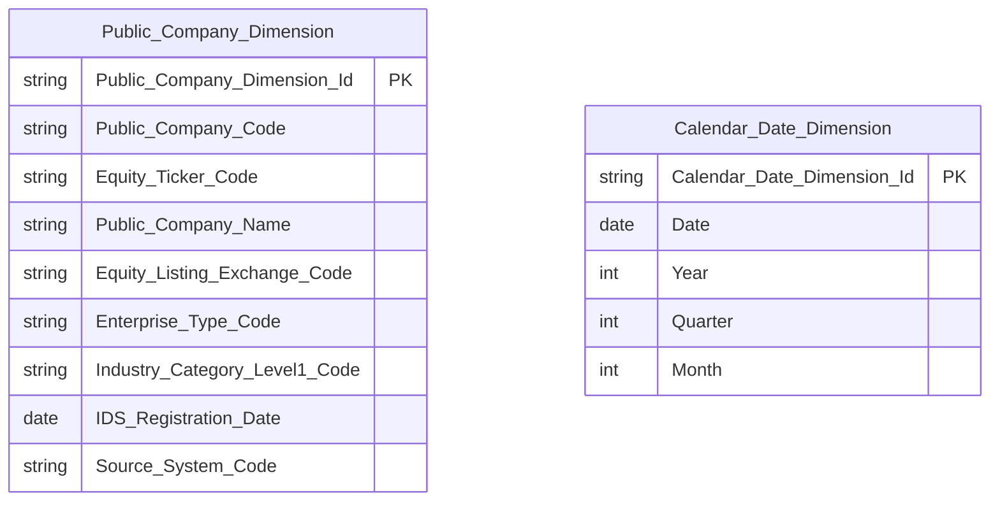
```mermaid
erDiagram
    Public_Company_Dimension {
        string Public_Company_Dimension_Id PK
        string Public_Company_Code
        string Equity_Ticker_Code
        string Public_Company_Name
        string Equity_Listing_Exchange_Code
        string Enterprise_Type_Code
        string Industry_Category_Level1_Code
        date IDS_Registration_Date
        string Source_System_Code
    }

    Calendar_Date_Dimension {
        string Calendar_Date_Dimension_Id PK
        date Date
        int Year
        int Quarter
        int Month
    }
```

> **Ghi chú:** K_GSDC_46/47 truy vấn trực tiếp trên `Public Company Dimension`/`Calendar Date Dimension` — không có Fact trung gian (xem ghi chú rà soát 2026-07-23 ở đầu Nhóm). K_GSDC_48/49 PENDING, chưa có Atomic source sẵn sàng.

**Lineage Mart → Báo cáo:**

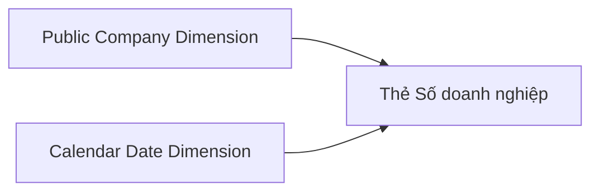
```mermaid
flowchart LR
    public_company_dim["Public Company Dimension"] --> R1["Thẻ Số doanh nghiệp"]
    cdr_dt_dim["Calendar Date Dimension"] --> R1
```

**Bảng grain:**

| Tên bảng | Grain |
|---|---|
| Public Company Dimension | 1 row / công ty đại chúng (SCD2) |
| Calendar Date Dimension | 1 row / ngày (Conformed) |

---

#### Nhóm 7 — STT 7: Tổng hợp chỉ tiêu tài chính toàn thị trường

##### PENDING toàn bộ — do "Dữ liệu động"

> Phân loại: **Phân tích**
> **Cập nhật 2026-07-15 — tách nhóm theo đúng STT BA:** Nhóm 7 trong HLD nay chỉ tương ứng STT 7 (CTTC tổng hợp toàn thị trường, không filter sàn). STT 11/13/15/17 (cùng bộ chỉ tiêu, filter theo sàn HNX/HOSE/UPCOM/OTC + thêm breakdown theo ngành) tách thành Nhóm 11/13/15/17 riêng — xem bên dưới.
> **Cập nhật 2026-07-15 (BA renumber):** STT các nhóm sàn cũ 13/15/17/19 nay là 11/13/15/17 (BA đánh số lại toàn bộ STT 6-28, xem ghi chú ở Nhóm 6).
> **Ghi chú gating (Loại dữ liệu):** BA đánh dấu **toàn bộ 26/26 dòng** (13 chỉ tiêu cơ sở + 13 dòng YoY) của STT 7 là "Dữ liệu động" → theo gate rule bắt buộc PENDING toàn bộ K_GSDC_50–62 (+ `_YOY`), dù `Trạng thái mapping = Done`. Không có dòng Chiều/Slicer nào trong STT 7 để giữ READY (khác Nhóm 6 có "Kỳ thống kê").
> **Gap Atomic:** Nguồn BA `IDS.data`/`report_catalog`/`rrow`/`rcol`/`company_data` — entity `Public Company Financial Report Value` **chưa có Atomic LLD** trong `DataModel/working/Atomic/lld/IDS/` — xem O_GSDC_5. Do toàn bộ KPI PENDING, Atomic Table/Column trong bảng dưới để trống (không map tên bảng cũ `public_company_financial_report_val` để tránh gợi ý sai một entity giả định).

**Bảng KPI:**

| KPI ID | Tên KPI | Đơn vị | Tính chất | Atomic Table | Atomic Column | row_desc (dn/bh/td) | Loại BC | col_desc | Trạng thái |
|---|---|---|---|---|---|---|---|---|---|
| K_GSDC_50 | Tổng tài sản | Tỉ đồng | Phái sinh | — (Gap Atomic) | — | 270/270/300 | BCDKT | 1 | **PENDING** |
| K_GSDC_50_YOY | Tổng tài sản — YoY | % | Phái sinh | — | — | — | — | — | **PENDING** |
| K_GSDC_51 | Nợ phải trả | Tỉ đồng | Phái sinh | — (Gap Atomic) | — | 300/300/400 | BCDKT | 1 | **PENDING** |
| K_GSDC_51_YOY | Nợ phải trả — YoY | % | Phái sinh | — | — | — | — | — | **PENDING** |
| K_GSDC_52 | Vốn CSH | Tỉ đồng | Phái sinh | — (Gap Atomic) | — | 400/400/500 | BCDKT | 1 | **PENDING** |
| K_GSDC_52_YOY | Vốn CSH — YoY | % | Phái sinh | — | — | — | — | — | **PENDING** |
| K_GSDC_53 | Vốn điều lệ | Tỉ đồng | Phái sinh | — (Gap Atomic) | — | 411/411/411 | BCDKT | 1 | **PENDING** |
| K_GSDC_53_YOY | Vốn điều lệ — YoY | % | Phái sinh | — | — | — | — | — | **PENDING** |
| K_GSDC_54 | Lợi nhuận sau thuế | Tỉ đồng | Phái sinh | — (Gap Atomic) | — | 60/60/21 | BCKQKD | 1 | **PENDING** |
| K_GSDC_54_YOY | LNST — YoY | % | Phái sinh | — | — | — | — | — | **PENDING** |
| K_GSDC_55 | ROA | % | Phái sinh | — (Gap Atomic) | — | — | — | — | **PENDING** |
| K_GSDC_55_YOY | ROA — YoY | % | Phái sinh | — | — | — | — | — | **PENDING** |
| K_GSDC_56 | ROE | % | Phái sinh | — (Gap Atomic) | — | — | — | — | **PENDING** |
| K_GSDC_56_YOY | ROE — YoY | % | Phái sinh | — | — | — | — | — | **PENDING** |
| K_GSDC_57 | Hàng tồn kho | Tỉ đồng | Phái sinh | — (Gap Atomic) | — | 140/140/— | BCDKT | 1 | **PENDING** |
| K_GSDC_57_YOY | Hàng tồn kho — YoY | % | Phái sinh | — | — | — | — | — | **PENDING** |
| K_GSDC_58 | Doanh thu thuần | Tỉ đồng | Phái sinh | — (Gap Atomic) | — | 10/10/03 | BCKQKD | 1 | **PENDING** |
| K_GSDC_58_YOY | Doanh thu — YoY | % | Phái sinh | — | — | — | — | — | **PENDING** |
| K_GSDC_59 | Lợi nhuận dồn tích YTD | Tỉ đồng | Phái sinh | — (Gap Atomic) | — | 421/421/450 | BCDKT | 1 | **PENDING** |
| K_GSDC_59_YOY | LN YTD — YoY | % | Phái sinh | — | — | — | — | — | **PENDING** |
| K_GSDC_60 | Phải thu | Tỉ đồng | Phái sinh | — (Gap Atomic) | — | 130+210/130+210/251 | BCDKT | 1 | **PENDING** |
| K_GSDC_60_YOY | Phải thu — YoY | % | Phái sinh | — | — | — | — | — | **PENDING** |
| K_GSDC_61 | Tiền và tương đương tiền | Tỉ đồng | Phái sinh | — (Gap Atomic) | — | 110/110/110+120 | BCDKT | 1 | **PENDING** |
| K_GSDC_61_YOY | Tiền TĐT — YoY | % | Phái sinh | — | — | — | — | — | **PENDING** |
| K_GSDC_62 | Nợ / Vốn CSH | Lần (x) | Phái sinh | — (Gap Atomic) | — | — | — | — | **PENDING** |
| K_GSDC_62_YOY | Nợ/Vốn CSH — YoY | % | Phái sinh | — | — | — | — | — | **PENDING** |

**Star Schema, Lineage, Bảng grain:** chờ Atomic `Public Company Financial Report Value` thiết kế xong (xem O_GSDC_5) — placeholder `Fact Public Company Financial Report Value` (`fct_public_company_financial_report_val`, Section 4 Reuse Analysis) dự kiến tái sử dụng cho toàn bộ Nhóm 7/13/15/17/19 + MH3 Data Explorer.

---

#### Nhóm 8 — STT 8: Tổng hợp chỉ tiêu tài chính & thống kê ngành (toàn thị trường)

##### READY (thu hẹp) — 13/14 KPI PENDING do "Dữ liệu động"

> Phân loại: **Phân tích**
> **Cập nhật 2026-07-15 (BA gộp STT + sửa BA):** BA đã **gộp lại thành 1 STT duy nhất** dashboard "Tổng hợp CTTC theo ngành toàn thị trường" — trước đây bị tách rời qua 3 STT (cũ 8/9/10, HLD từng tách thành 3 Nhóm riêng theo rule "1 Nhóm = 1 STT" áp dụng tại thời điểm đó). Nay BA đã tự sửa lại đúng — 14 dòng liên tục cùng 1 STT 8, không còn tách 3 STT nữa → **gộp lại thành 1 Nhóm 8 duy nhất** (K_GSDC_63–76).
> **Ghi chú gating:** K_GSDC_63 "Ngành" là **Dữ liệu tĩnh** → READY. 13 KPI còn lại (K_GSDC_64–76) là **Dữ liệu động** → PENDING theo gate rule.
> **Atomic — Ngành (READY):** `Public Company` (`public_company`), field `Business Line Level 1 Code` (`business_line_level_1_code`) — cùng field đã xác nhận ở Nhóm 11 (nguồn `IDS.company_profiles.CATEGORY_L1_ID`, Classification Value scheme `IDS_INDUSTRY_CATEGORY`). BA ghi filter `c.active_flg = 1` (bảng danh mục `categories` riêng) — cần xác nhận có cần thêm điều kiện Active Flag hay dùng trực tiếp field trên `public_company` là đủ (không có bảng `categories` riêng trong Atomic theo quyết định 2026-07-14, xem comment YAML `Business Line Level 1 Code`).
> **Gap Atomic (13 KPI CTTC):** `Public Company Financial Report Value` chưa có Atomic LLD — xem O_GSDC_5.

**Bảng KPI:**

| KPI ID | Tên KPI | Đơn vị | Tính chất | Atomic Table | Atomic Column | row_desc (dn/bh/td) | Loại BC | col_desc | Trạng thái |
|---|---|---|---|---|---|---|---|---|---|
| K_GSDC_63 | Ngành kinh tế | Text | Chiều (Group By) | public_company | business_line_level_1_code | — | — | — | **READY** |
| K_GSDC_64 | Tổng tài sản theo ngành | Tỉ đồng | Phái sinh | — (Gap Atomic) | — | 270/270/300 | BCDKT | 1 | **PENDING** |
| K_GSDC_65 | Nợ phải trả theo ngành | Tỉ đồng | Phái sinh | — (Gap Atomic) | — | 300/300/400 | BCDKT | 1 | **PENDING** |
| K_GSDC_66 | Vốn CSH theo ngành | Tỉ đồng | Phái sinh | — (Gap Atomic) | — | 400/400/500 | BCDKT | 1 | **PENDING** |
| K_GSDC_67 | Vốn điều lệ theo ngành | Tỉ đồng | Phái sinh | — (Gap Atomic) | — | 411/411/411 | BCDKT | 1 | **PENDING** |
| K_GSDC_68 | Lợi nhuận sau thuế theo ngành | Tỉ đồng | Phái sinh | — (Gap Atomic) | — | 60/60/21 | BCKQKD | 1 | **PENDING** |
| K_GSDC_69 | ROA theo ngành | % | Phái sinh | — (Gap Atomic) | — | — | — | — | **PENDING** |
| K_GSDC_70 | ROE theo ngành | % | Phái sinh | — (Gap Atomic) | — | — | — | — | **PENDING** |
| K_GSDC_71 | Hàng tồn kho theo ngành | Tỉ đồng | Phái sinh | — (Gap Atomic) | — | 140/140/— | BCDKT | 1 | **PENDING** |
| K_GSDC_72 | Doanh thu thuần theo ngành | Tỉ đồng | Phái sinh | — (Gap Atomic) | — | 10/10/03 | BCKQKD | 1 | **PENDING** |
| K_GSDC_73 | Lợi nhuận dồn tích YTD theo ngành | Tỉ đồng | Phái sinh | — (Gap Atomic) | — | 421/421/450 | BCDKT | 1 | **PENDING** |
| K_GSDC_74 | Phải thu theo ngành | Tỉ đồng | Phái sinh | — (Gap Atomic) | — | 130+210/130+210/251 | BCDKT | 1 | **PENDING** |
| K_GSDC_75 | Tiền và tương đương tiền theo ngành | Tỉ đồng | Phái sinh | — (Gap Atomic) | — | 110/110/110+120 | BCDKT | 1 | **PENDING** |
| K_GSDC_76 | Nợ / Vốn CSH theo ngành | Lần (x) | Phái sinh | — (Gap Atomic) | — | — | — | — | **PENDING** |

**Star Schema, Lineage, Bảng grain:** như Nhóm 7 (placeholder `Fact Public Company Financial Report Value`, chờ Atomic).

---

#### Nhóm 9 — STT 9: Thống kê CTĐC chưa niêm yết (toàn thị trường)

##### READY

> Phân loại: **Phân tích**
> Source: `Public Company Dimension` (không qua Fact — xem ghi chú rà soát 2026-07-23 ở Nhóm 6) — filter `Public Company Status Code = 'APPROVED_PUBLIC'` AND `Equity Listing Exchange Code NOT IN ('HOSE', 'HNX')` (bao gồm NULL, UPCOM, OTC)
> **Cập nhật 2026-07-15 (BA renumber):** Nội dung cũ Nhóm 11 (STT 11) — đổi số theo STT mới (BA gộp STT 8+9+10 thành 1, mọi STT phía sau lùi 2), không đổi nội dung/KPI_ID.
> **Rà soát gap (giữ nguyên từ Nhóm 11 cũ):** Sửa 2 gap so với BA thực tế: (1) bổ sung filter `Public Company Status Code = 'APPROVED_PUBLIC'` (Atomic: `pc_status_code`, nguồn `IDS.COMPANY_PROFILES.STATUS_IDS_CD`) — trước đây thiếu, khiến COUNT tính cả DN không phải CTĐC. (2) Điều kiện sàn sửa từ `equity_listing_exchange_code IS NULL` thành `NOT IN ('HOSE', 'HNX')` — BA định nghĩa "chưa niêm yết" là loại trừ 2 sàn niêm yết chính thức (HOSE/HNX), không chỉ riêng NULL; UPCOM/OTC/giá trị khác đều tính là chưa niêm yết.
> **Cập nhật 2026-07-23 (rà soát LLD):** `Fact Public Company Financial Summary Snapshot` đã bị xoá (xem Nhóm 6) — K_GSDC_77 tự đủ bằng COUNT DISTINCT trực tiếp trên `Public Company Dimension`, không cần Fact.

**Bảng KPI:**

| KPI ID | Tên KPI | Đơn vị | Tính chất | Atomic Entity | Atomic Table | Atomic Attribute | Atomic Column | Ghi chú |
|---|---|---|---|---|---|---|---|---|
| K_GSDC_77 | Số CTDC chưa niêm yết | DN | Phái sinh | Public Company | public_company | IDS Registration Date | ids_registration_dt | COUNT(DISTINCT pc_id) WHERE ids_registration_dt <= cuối kỳ AND pc_status_code = 'APPROVED_PUBLIC' AND equity_listing_exchange_code NOT IN ('HOSE', 'HNX') |

**Star Schema:**

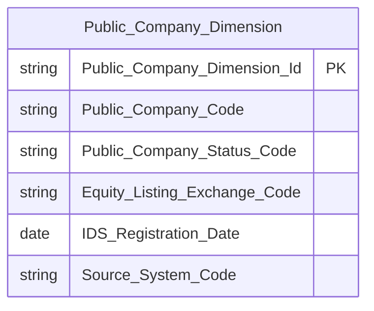
```mermaid
erDiagram
    Public_Company_Dimension {
        string Public_Company_Dimension_Id PK
        string Public_Company_Code
        string Public_Company_Status_Code
        string Equity_Listing_Exchange_Code
        date IDS_Registration_Date
        string Source_System_Code
    }
```

**Lineage Mart → Báo cáo:**

```mermaid
flowchart LR
    public_company_dim["Public Company Dimension"] --> R9["Thẻ CTDC chưa niêm yết"]
```

**Bảng grain:**

| Tên bảng | Grain |
|---|---|
| Public Company Dimension | 1 row / công ty đại chúng (SCD2) |

---

#### Nhóm 10 — STT 10: Thống kê niêm yết sàn HNX

##### READY (thu hẹp) — 2/5 KPI PENDING do "Dữ liệu động"

> Phân loại: **Phân tích**
> Atomic: `Public Company` ← IDS.company_profiles — **draft** (chưa approved)
> Filter: `equity_listing_exchange_code = 'HNX'`
> **Cập nhật 2026-07-15 (BA renumber):** Nội dung cũ Nhóm 12 (STT 12) — đổi số theo STT mới, không đổi nội dung/KPI_ID.
> **Ghi chú gating:** K_GSDC_48/K_GSDC_49 là "Dữ liệu động" → PENDING theo gate rule (xem O_GSDC_5), giống Nhóm 6.

**Bảng KPI:**

| KPI ID | Tên KPI | Đơn vị | Tính chất | Atomic Entity | Atomic Table | Atomic Attribute | Atomic Column | Ghi chú |
|---|---|---|---|---|---|---|---|---|
| K_GSDC_46 | Ngày thống kê (Năm/Quý) | Text | Chiều (Slicer) | — | — | — | — | Tham số `:year` / `:quarter` |
| K_GSDC_78 | Sàn | Text | Chiều | Public Company | public_company | Equity Listing Exchange Code | equity_listing_exchange_code | Filter cố định `= 'HNX'` — Classification Value scheme `IDS_LISTING_TYPE` |
| K_GSDC_47 | Số doanh nghiệp theo từng sàn | DN | Cơ sở | Public Company | public_company | Ids Registration Date | ids_registration_dt | COUNT DISTINCT WHERE ids_registration_dt <= cuối kỳ AND equity_listing_exchange_code = 'HNX' — reuse công thức K_GSDC_47 Nhóm 6, filter thêm theo sàn |
| K_GSDC_48 | Tỷ lệ nộp BCTC theo từng sàn (quý) | % | **PENDING** | Public Company Violation Report | pc_violation_report | Deadline Date / Actual Submit Date | deadline_dt / actual_submit_dt | **Dữ liệu động** — PENDING (xem O_GSDC_5), giống K_GSDC_48 Nhóm 6, thêm filter sàn |
| K_GSDC_49 | Số DN báo lãi theo từng sàn | DN | **PENDING** | — (Gap Atomic) | — | — | — | **Dữ liệu động** — PENDING (xem O_GSDC_5), giống K_GSDC_49 Nhóm 6 |

**Star Schema, Lineage, Bảng grain:** giống Nhóm 6.

---

#### Nhóm 11 — STT 11: Tổng hợp chỉ tiêu tài chính theo sàn HNX

##### PENDING toàn bộ — 40/40 KPI PENDING (Gap Atomic — Fact Financial Report Value chưa có LLD)

> Phân loại: **Phân tích**
> Filter: `Equity_Listing_Exchange_Code = 'HNX'` (xem Nhóm 6 K_GSDC_78 "Sàn", reuse KPI_ID).
> **Cập nhật 2026-07-15 (BA renumber):** Nội dung cũ Nhóm 13 (STT 13) — đổi số theo STT mới, không đổi nội dung/KPI_ID.
> **Ghi chú nội dung:** STT 11 = 26 KPI giống Nhóm 7 (filter thêm sàn HNX) + 14 dòng mới: 1 Chiều "Ngành" + 13 chỉ tiêu "theo ngành" (GROUP BY `Business Line Level 1 Code`).
> **Cập nhật (rà soát LLD):** K_GSDC_79 "Ngành" trước đây đánh READY do field `business_line_level_1_code` tồn tại trên `public_company`, nhưng **Fact duy nhất của Nhóm này (`Fact Public Company Financial Report Value`) 100% PENDING** — không có Fact nào sẵn sàng để đặt cột này vào. Chuyển K_GSDC_79 sang PENDING, đồng bộ với việc Fact đã loại khỏi Entities.csv (khác Nhóm 8 — K_GSDC_63 query trực tiếp `public_company.business_line_level_1_code`, không qua Fact nào, nên vẫn READY dù `Fact Public Company Financial Summary Snapshot` đã bị xoá 2026-07-23, xem O_GSDC_5 mục (10)).
> **Gap Atomic (toàn bộ 40 KPI):** `Public Company Financial Report Value` chưa có Atomic LLD, xem O_GSDC_5.

**Bảng KPI:**

| KPI ID | Tên KPI | Đơn vị | Tính chất | Atomic Table | Atomic Column | row_desc (dn/bh/td) | Loại BC | col_desc | Trạng thái |
|---|---|---|---|---|---|---|---|---|---|
| K_GSDC_50 | Tổng tài sản (HNX) | Tỉ đồng | Phái sinh | — (Gap Atomic) | — | 270/270/300 | BCDKT | 1 | **PENDING** |
| K_GSDC_50_YOY | Tổng tài sản — YoY | % | Phái sinh | — | — | — | — | — | **PENDING** |
| K_GSDC_51 | Nợ phải trả (HNX) | Tỉ đồng | Phái sinh | — (Gap Atomic) | — | 300/300/400 | BCDKT | 1 | **PENDING** |
| K_GSDC_51_YOY | Nợ phải trả — YoY | % | Phái sinh | — | — | — | — | — | **PENDING** |
| K_GSDC_52 | Vốn CSH (HNX) | Tỉ đồng | Phái sinh | — (Gap Atomic) | — | 400/400/500 | BCDKT | 1 | **PENDING** |
| K_GSDC_52_YOY | Vốn CSH — YoY | % | Phái sinh | — | — | — | — | — | **PENDING** |
| K_GSDC_53 | Vốn điều lệ (HNX) | Tỉ đồng | Phái sinh | — (Gap Atomic) | — | 411/411/411 | BCDKT | 1 | **PENDING** |
| K_GSDC_53_YOY | Vốn điều lệ — YoY | % | Phái sinh | — | — | — | — | — | **PENDING** |
| K_GSDC_54 | Lợi nhuận sau thuế (HNX) | Tỉ đồng | Phái sinh | — (Gap Atomic) | — | 60/60/21 | BCKQKD | 1 | **PENDING** |
| K_GSDC_54_YOY | LNST — YoY | % | Phái sinh | — | — | — | — | — | **PENDING** |
| K_GSDC_55 | ROA (HNX) | % | Phái sinh | — (Gap Atomic) | — | — | — | — | **PENDING** |
| K_GSDC_55_YOY | ROA — YoY | % | Phái sinh | — | — | — | — | — | **PENDING** |
| K_GSDC_56 | ROE (HNX) | % | Phái sinh | — (Gap Atomic) | — | — | — | — | **PENDING** |
| K_GSDC_56_YOY | ROE — YoY | % | Phái sinh | — | — | — | — | — | **PENDING** |
| K_GSDC_57 | Hàng tồn kho (HNX) | Tỉ đồng | Phái sinh | — (Gap Atomic) | — | 140/140/— | BCDKT | 1 | **PENDING** |
| K_GSDC_57_YOY | Hàng tồn kho — YoY | % | Phái sinh | — | — | — | — | — | **PENDING** |
| K_GSDC_58 | Doanh thu thuần (HNX) | Tỉ đồng | Phái sinh | — (Gap Atomic) | — | 10/10/03 | BCKQKD | 1 | **PENDING** |
| K_GSDC_58_YOY | Doanh thu — YoY | % | Phái sinh | — | — | — | — | — | **PENDING** |
| K_GSDC_59 | Lợi nhuận dồn tích YTD (HNX) | Tỉ đồng | Phái sinh | — (Gap Atomic) | — | 421/421/450 | BCDKT | 1 | **PENDING** |
| K_GSDC_59_YOY | LN YTD — YoY | % | Phái sinh | — | — | — | — | — | **PENDING** |
| K_GSDC_60 | Phải thu (HNX) | Tỉ đồng | Phái sinh | — (Gap Atomic) | — | 130+210/130+210/251 | BCDKT | 1 | **PENDING** |
| K_GSDC_60_YOY | Phải thu — YoY | % | Phái sinh | — | — | — | — | — | **PENDING** |
| K_GSDC_61 | Tiền và tương đương tiền (HNX) | Tỉ đồng | Phái sinh | — (Gap Atomic) | — | 110/110/110+120 | BCDKT | 1 | **PENDING** |
| K_GSDC_61_YOY | Tiền TĐT — YoY | % | Phái sinh | — | — | — | — | — | **PENDING** |
| K_GSDC_62 | Nợ / Vốn CSH (HNX) | Lần (x) | Phái sinh | — (Gap Atomic) | — | — | — | — | **PENDING** |
| K_GSDC_62_YOY | Nợ/Vốn CSH — YoY | % | Phái sinh | — | — | — | — | — | **PENDING** |
| K_GSDC_79 | Ngành | Text | Chiều | — (không có Fact ready cho Nhóm này) | — | — | — | — | **PENDING** |
| K_GSDC_80 | Tổng tài sản — theo ngành (HNX) | Tỉ đồng | Phái sinh | — (Gap Atomic) | — | 270/270/300 | BCDKT | 1 | **PENDING** |
| K_GSDC_81 | Nợ phải trả — theo ngành (HNX) | Tỉ đồng | Phái sinh | — (Gap Atomic) | — | 300/300/400 | BCDKT | 1 | **PENDING** |
| K_GSDC_82 | Vốn CSH — theo ngành (HNX) | Tỉ đồng | Phái sinh | — (Gap Atomic) | — | 400/400/500 | BCDKT | 1 | **PENDING** |
| K_GSDC_83 | Vốn điều lệ — theo ngành (HNX) | Tỉ đồng | Phái sinh | — (Gap Atomic) | — | 411/411/411 | BCDKT | 1 | **PENDING** |
| K_GSDC_84 | Lợi nhuận sau thuế — theo ngành (HNX) | Tỉ đồng | Phái sinh | — (Gap Atomic) | — | 60/60/21 | BCKQKD | 1 | **PENDING** |
| K_GSDC_85 | ROA — theo ngành (HNX) | % | Phái sinh | — (Gap Atomic) | — | — | — | — | **PENDING** |
| K_GSDC_86 | ROE — theo ngành (HNX) | % | Phái sinh | — (Gap Atomic) | — | — | — | — | **PENDING** |
| K_GSDC_87 | Hàng tồn kho — theo ngành (HNX) | Tỉ đồng | Phái sinh | — (Gap Atomic) | — | 140/140/— | BCDKT | 1 | **PENDING** |
| K_GSDC_88 | Doanh thu — theo ngành (HNX) | Tỉ đồng | Phái sinh | — (Gap Atomic) | — | 10/10/03 | BCKQKD | 1 | **PENDING** |
| K_GSDC_89 | Lợi nhuận dồn tích YTD — theo ngành (HNX) | Tỉ đồng | Phái sinh | — (Gap Atomic) | — | 421/421/450 | BCDKT | 1 | **PENDING** |
| K_GSDC_90 | Phải thu — theo ngành (HNX) | Tỉ đồng | Phái sinh | — (Gap Atomic) | — | 130+210/130+210/251 | BCDKT | 1 | **PENDING** |
| K_GSDC_91 | Tiền và tương đương tiền — theo ngành (HNX) | Tỉ đồng | Phái sinh | — (Gap Atomic) | — | 110/110/110+120 | BCDKT | 1 | **PENDING** |
| K_GSDC_92 | Nợ/Vốn CSH — theo ngành (HNX) | Lần (x) | Phái sinh | — (Gap Atomic) | — | — | — | — | **PENDING** |

**Star Schema, Lineage, Bảng grain:** giống Nhóm 7.

---

#### Nhóm 12 — STT 12: Thống kê niêm yết sàn HOSE

##### READY (thu hẹp) — 2/5 KPI PENDING do "Dữ liệu động"

> Phân loại: **Phân tích**
> Atomic: `Public Company` ← IDS.company_profiles — **draft** (chưa approved)
> Filter: `equity_listing_exchange_code = 'HOSE'`
> **Cập nhật 2026-07-15 (BA renumber):** Nội dung cũ Nhóm 14 (STT 14) — đổi số theo STT mới, không đổi nội dung/KPI_ID.
> **Ghi chú gating:** K_GSDC_48/K_GSDC_49 là "Dữ liệu động" → PENDING theo gate rule (xem O_GSDC_5), giống Nhóm 6.

**Bảng KPI:**

| KPI ID | Tên KPI | Đơn vị | Tính chất | Atomic Entity | Atomic Table | Atomic Attribute | Atomic Column | Ghi chú |
|---|---|---|---|---|---|---|---|---|
| K_GSDC_46 | Ngày thống kê (Năm/Quý) | Text | Chiều (Slicer) | — | — | — | — | Tham số `:year` / `:quarter` — reuse K_GSDC_46 |
| K_GSDC_78 | Sàn | Text | Chiều | Public Company | public_company | Equity Listing Exchange Code | equity_listing_exchange_code | Filter cố định `= 'HOSE'` — reuse KPI Sàn (K_GSDC_78), khác filter |
| K_GSDC_47 | Số doanh nghiệp theo từng sàn | DN | Cơ sở | Public Company | public_company | Ids Registration Date | ids_registration_dt | COUNT DISTINCT WHERE ids_registration_dt <= cuối kỳ AND equity_listing_exchange_code = 'HOSE' |
| K_GSDC_48 | Tỷ lệ nộp BCTC theo từng sàn (quý) | % | **PENDING** | Public Company Violation Report | pc_violation_report | Deadline Date / Actual Submit Date | deadline_dt / actual_submit_dt | **Dữ liệu động** — PENDING (xem O_GSDC_5) |
| K_GSDC_49 | Số DN báo lãi theo từng sàn | DN | **PENDING** | — (Gap Atomic) | — | — | — | **Dữ liệu động** — PENDING (xem O_GSDC_5) |

**Star Schema, Lineage, Bảng grain:** giống Nhóm 6.

---

#### Nhóm 13 — STT 13: Tổng hợp chỉ tiêu tài chính theo sàn HOSE

##### PENDING toàn bộ — 40/40 KPI PENDING (Gap Atomic — Fact Financial Report Value chưa có LLD)

> Phân loại: **Phân tích**
> Filter: `Equity_Listing_Exchange_Code = 'HOSE'`. Cấu trúc/gate rule giống hệt Nhóm 11 (HNX), chỉ khác filter sàn — **reuse KPI_ID** K_GSDC_50–62(+YOY) + K_GSDC_79 (Ngành, reuse từ Nhóm 11) + K_GSDC_80–92 (theo ngành, reuse KPI_ID, chỉ đổi filter sàn).
> **Cập nhật 2026-07-15 (BA renumber):** Nội dung cũ Nhóm 15 (STT 15) — đổi số theo STT mới, không đổi nội dung/KPI_ID.
> **Cập nhật (rà soát LLD):** K_GSDC_79 chuyển PENDING — nhất quán với Nhóm 11 (không có Fact ready cho Nhóm này).

**Bảng KPI:** giống Nhóm 11, đổi tên hiển thị "(HNX)"→"(HOSE)" và filter `equity_listing_exchange_code='HOSE'`. Toàn bộ 40 KPI (K_GSDC_50–62+YOY, K_GSDC_79, K_GSDC_80–92) = **PENDING** (Gap Atomic).

**Star Schema, Lineage, Bảng grain:** giống Nhóm 7.

---

#### Nhóm 14 — STT 14: Thống kê niêm yết sàn UPCoM

##### READY (thu hẹp) — 2/5 KPI PENDING do "Dữ liệu động"

> Phân loại: **Phân tích**
> Atomic: `Public Company` ← IDS.company_profiles — **draft** (chưa approved)
> Filter: `equity_listing_exchange_code = 'UPCOM'`
> **Cập nhật 2026-07-15 (BA renumber):** Nội dung cũ Nhóm 16 (STT 16) — đổi số theo STT mới, không đổi nội dung/KPI_ID.
> **Ghi chú gating:** K_GSDC_48/K_GSDC_49 là "Dữ liệu động" → PENDING theo gate rule (xem O_GSDC_5), giống Nhóm 6.

**Bảng KPI:**

| KPI ID | Tên KPI | Đơn vị | Tính chất | Atomic Entity | Atomic Table | Atomic Attribute | Atomic Column | Ghi chú |
|---|---|---|---|---|---|---|---|---|
| K_GSDC_46 | Ngày thống kê (Năm/Quý) | Text | Chiều (Slicer) | — | — | — | — | Tham số `:year` / `:quarter` — reuse K_GSDC_46 |
| K_GSDC_78 | Sàn | Text | Chiều | Public Company | public_company | Equity Listing Exchange Code | equity_listing_exchange_code | Filter cố định `= 'UPCOM'` — reuse KPI Sàn (K_GSDC_78), khác filter |
| K_GSDC_47 | Số doanh nghiệp theo từng sàn | DN | Cơ sở | Public Company | public_company | Ids Registration Date | ids_registration_dt | COUNT DISTINCT WHERE ids_registration_dt <= cuối kỳ AND equity_listing_exchange_code = 'UPCOM' |
| K_GSDC_48 | Tỷ lệ nộp BCTC theo từng sàn (quý) | % | **PENDING** | Public Company Violation Report | pc_violation_report | Deadline Date / Actual Submit Date | deadline_dt / actual_submit_dt | **Dữ liệu động** — PENDING (xem O_GSDC_5) |
| K_GSDC_49 | Số DN báo lãi theo từng sàn | DN | **PENDING** | — (Gap Atomic) | — | — | — | **Dữ liệu động** — PENDING (xem O_GSDC_5) |

**Star Schema, Lineage, Bảng grain:** giống Nhóm 6.

---

#### Nhóm 15 — STT 15: Tổng hợp chỉ tiêu tài chính theo sàn UPCOM

##### PENDING toàn bộ — 40/40 KPI PENDING (Gap Atomic — Fact Financial Report Value chưa có LLD)

> Phân loại: **Phân tích**
> Filter: `Equity_Listing_Exchange_Code = 'UPCOM'`. Cấu trúc/gate rule giống hệt Nhóm 11 (HNX), chỉ khác filter sàn — **reuse KPI_ID** K_GSDC_50–62(+YOY) + K_GSDC_79 (Ngành, reuse từ Nhóm 11) + K_GSDC_80–92 (theo ngành, reuse KPI_ID, chỉ đổi filter sàn).
> **Cập nhật 2026-07-15 (BA renumber):** Nội dung cũ Nhóm 17 (STT 17) — đổi số theo STT mới, không đổi nội dung/KPI_ID.
> **Cập nhật (rà soát LLD):** K_GSDC_79 chuyển PENDING — nhất quán với Nhóm 11 (không có Fact ready cho Nhóm này).

**Bảng KPI:** giống Nhóm 11, đổi tên hiển thị "(HNX)"→"(UPCOM)" và filter `equity_listing_exchange_code='UPCOM'`. Toàn bộ 40 KPI (K_GSDC_50–62+YOY, K_GSDC_79, K_GSDC_80–92) = **PENDING** (Gap Atomic).

**Star Schema, Lineage, Bảng grain:** giống Nhóm 7.

---

#### Nhóm 16 — STT 16: Thống kê niêm yết sàn OTC (chưa niêm yết)

##### READY (thu hẹp) — 2/5 KPI PENDING do "Dữ liệu động"

> Phân loại: **Phân tích**
> Atomic: `Public Company` ← IDS.company_profiles — **draft** (chưa approved)
> Filter: `equity_listing_exchange_code = 'OTC'`
> **Cập nhật 2026-07-15 (BA renumber):** Nội dung cũ Nhóm 18 (STT 18) — đổi số theo STT mới, không đổi nội dung/KPI_ID.
> **Ghi chú gating:** K_GSDC_48/K_GSDC_49 là "Dữ liệu động" → PENDING theo gate rule (xem O_GSDC_5), giống Nhóm 6.

**Bảng KPI:**

| KPI ID | Tên KPI | Đơn vị | Tính chất | Atomic Entity | Atomic Table | Atomic Attribute | Atomic Column | Ghi chú |
|---|---|---|---|---|---|---|---|---|
| K_GSDC_46 | Ngày thống kê (Năm/Quý) | Text | Chiều (Slicer) | — | — | — | — | Tham số `:year` / `:quarter` — reuse K_GSDC_46 |
| K_GSDC_78 | Sàn | Text | Chiều | Public Company | public_company | Equity Listing Exchange Code | equity_listing_exchange_code | Filter cố định `= 'OTC'` — reuse KPI Sàn (K_GSDC_78), khác filter |
| K_GSDC_47 | Số doanh nghiệp theo từng sàn | DN | Cơ sở | Public Company | public_company | Ids Registration Date | ids_registration_dt | COUNT DISTINCT WHERE ids_registration_dt <= cuối kỳ AND equity_listing_exchange_code = 'OTC' |
| K_GSDC_48 | Tỷ lệ nộp BCTC theo từng sàn (quý) | % | **PENDING** | Public Company Violation Report | pc_violation_report | Deadline Date / Actual Submit Date | deadline_dt / actual_submit_dt | **Dữ liệu động** — PENDING (xem O_GSDC_5) |
| K_GSDC_49 | Số DN báo lãi theo từng sàn | DN | **PENDING** | — (Gap Atomic) | — | — | — | **Dữ liệu động** — PENDING (xem O_GSDC_5) |

**Star Schema, Lineage, Bảng grain:** giống Nhóm 6.

---

#### Nhóm 17 — STT 17: Tổng hợp chỉ tiêu tài chính theo sàn OTC

##### PENDING toàn bộ — 40/40 KPI PENDING (Gap Atomic — Fact Financial Report Value chưa có LLD)

> Phân loại: **Phân tích**
> Filter: `Equity_Listing_Exchange_Code = 'OTC'`. Cấu trúc/gate rule giống hệt Nhóm 11 (HNX), chỉ khác filter sàn — **reuse KPI_ID** K_GSDC_50–62(+YOY) + K_GSDC_79 (Ngành, reuse từ Nhóm 11) + K_GSDC_80–92 (theo ngành, reuse KPI_ID, chỉ đổi filter sàn).
> **Cập nhật 2026-07-15 (BA renumber):** Nội dung cũ Nhóm 19 (STT 19) — đổi số theo STT mới, không đổi nội dung/KPI_ID.
> **Cập nhật (rà soát LLD):** K_GSDC_79 chuyển PENDING — nhất quán với Nhóm 11 (không có Fact ready cho Nhóm này).

**Bảng KPI:** giống Nhóm 11, đổi tên hiển thị "(HNX)"→"(OTC)" và filter `equity_listing_exchange_code='OTC'`. Toàn bộ 40 KPI (K_GSDC_50–62+YOY, K_GSDC_79, K_GSDC_80–92) = **PENDING** (Gap Atomic).

**Star Schema, Lineage, Bảng grain:** giống Nhóm 7.

---

#### Nhóm 18 — STT 18: Dữ liệu tài chính doanh nghiệp — Metadata BCTC

##### PENDING toàn bộ — do "Dữ liệu động"

> Phân loại: **Phân tích**
> Source: `Financial Report Catalog Dimension` — tra cứu danh mục báo cáo/dòng/cột
> **Cập nhật 2026-07-15 (BA renumber + sửa Loại dữ liệu):** Nội dung cũ Nhóm 20 (STT 20) — đổi số theo STT mới (BA gộp STT 8+9+10 thành 1, mọi STT phía sau lùi 2). Đồng thời BA đã sửa lại `Loại dữ liệu` cho **cả 10/10 dòng thành "Dữ liệu động"** (trước đây 4 dòng "Kỳ báo cáo"/"Sàn giao dịch"/"Danh mục ngành"/"Mã CTĐC-Tên CTĐC" được coi là reuse READY từ nhóm khác) → theo gate rule, **toàn bộ 10 KPI chuyển PENDING**, không còn KPI READY nào trong nhóm này nữa.
> **Ghi chú gating:** 6 KPI gốc (K_GSDC_93–98, Mã/Tên báo cáo + Mã/Tên chỉ tiêu dòng/cột) — PENDING theo gate rule như cũ. Atomic entity tham chiếu (`Financial Report Row/Column Template`) cũng có gap tên bảng (xem O_GSDC_3) — không sửa vì đằng nào cũng PENDING.
> **4 KPI reuse (nay cũng PENDING theo Loại dữ liệu mới):** "Kỳ báo cáo" (reuse K_GSDC_46, Nhóm 6); "Sàn giao dịch" (reuse K_GSDC_78, Nhóm 10); "Danh mục ngành" (reuse K_GSDC_63, Nhóm 8); "Mã CTĐC - Tên CTĐC" (reuse K_GSDC_7/K_GSDC_8, Nhóm 1). KPI_ID gốc ở nhóm nguồn vẫn giữ trạng thái READY của chính nhóm đó (VD K_GSDC_46 vẫn READY ở Nhóm 6) — chỉ riêng *việc sử dụng lại trong Nhóm 18* này bị PENDING hoá theo `Loại dữ liệu` mà BA gán cho dòng STT 18 tương ứng.

**Bảng KPI (chiều):**

| KPI ID | Tên KPI | Đơn vị | Tính chất | Trạng thái |
|---|---|---|---|---|
| K_GSDC_93 | Mã báo cáo | Text | Chiều | **PENDING** |
| K_GSDC_94 | Tên báo cáo | Text | Chiều | **PENDING** |
| K_GSDC_95 | Mã chỉ tiêu dòng | Text | Chiều | **PENDING** |
| K_GSDC_96 | Tên chỉ tiêu dòng | Text | Chiều | **PENDING** |
| K_GSDC_97 | Mã chỉ tiêu cột | Text | Chiều | **PENDING** |
| K_GSDC_98 | Tên chỉ tiêu cột | Text | Chiều | **PENDING** |
| K_GSDC_46 | Kỳ báo cáo (reuse từ Nhóm 6) | Text | Chiều | **PENDING** |
| K_GSDC_78 | Sàn giao dịch (reuse từ Nhóm 10) | Text | Chiều | **PENDING** |
| K_GSDC_63 | Danh mục ngành (reuse từ Nhóm 8) | Text | Chiều | **PENDING** |
| K_GSDC_7 / K_GSDC_8 | Mã CTĐC - Tên CTĐC (reuse từ Nhóm 1) | Text | Chiều | **PENDING** |

**Lý do PENDING:** BA đánh dấu toàn bộ 10/10 dòng STT 18 là "Dữ liệu động" (metadata BCTC — danh mục báo cáo/dòng/cột thay đổi theo kỳ) → PENDING theo gate rule dù `Trạng thái mapping = Done`.

**Atomic đã sẵn sàng (không cần bổ sung):** `Public Company` (`public_company`) — draft, chưa approved (như toàn bộ entity IDS khác của module — xem O_GSDC_1), dùng cho 3/10 dòng reuse (Sàn giao dịch, Danh mục ngành, Mã CTĐC-Tên CTĐC).

**Atomic cần bổ sung:** `Financial Report Catalog` (`fnc_rpt_ctlg`), `Financial Report Row Template` (`fnc_rpt_row_tpl`), `Financial Report Column Template` (`fnc_rpt_clmn_tpl`) — xem O_GSDC_3.

**Mart dự kiến:** `Financial Report Catalog Dimension` — grain: 1 row / báo cáo × dòng × cột.

---

### Màn hình 3 — Data Explorer: Dữ liệu tài chính doanh nghiệp

Data Explorer cho phép tra cứu BCTC chi tiết theo từng CTDC, kỳ báo cáo và loại hình DN. Toàn bộ STT 19–28, 31–32 + STT 39 phục vụ bởi `Fact Public Company Financial Report Value` + `Financial Report Catalog Dimension`. *(Cập nhật 2026-07-15: BA renumber — cũ STT 21–32 nay là STT 19–28 + 31–32, không còn STT 29–30 trong BA)*

**Ghi chú chung toàn bộ MH3:**
- Tất cả chỉ tiêu lấy trực tiếp `Data Value` (`data_val`) từ `Public Company Financial Report Value` (`public_company_financial_report_val`)
- `col_desc` trong BA SQL tương ứng `Column Code` (`clmn_code`) trong Atomic — xem O_GSDC_3
- `row_desc` trong BA SQL tương ứng `Row Description Column Code` (`row_dsc_clmn_code`) trong Atomic `Financial Report Row Template` (`fnc_rpt_row_tpl`)
- `col_desc='1'` = cuối kỳ / kỳ hiện tại; `col_desc='2'` = đầu kỳ (BCĐKT)

---

#### Nhóm 19 — STT 19: DN thông thường — Bảng cân đối kế toán

##### PENDING toàn bộ — do "Dữ liệu động"

> Phân loại: **Phân tích**
> **Cập nhật 2026-07-15 (rà soát Nhóm 19):** BA đánh dấu **toàn bộ 117/117 dòng** của STT 19 là "Dữ liệu động" → theo gate rule bắt buộc PENDING toàn bộ (K_GSDC_99–K_GSDC_215), dù `Trạng thái mapping = Done` và Atomic `Public Company Financial Report Value` đã có LLD (`public_company_financial_report_val`). Trước đây HLD để READY do chỉ theo gating Atomic, chưa áp dụng gate rule "Loại dữ liệu" — xem O_GSDC_5.
> Filter gốc (giữ lại tham khảo khi thiết kế lại): `Enterprise Type Code` (`entp_tp_code`) = 'dn', `Financial Report Catalog Business Code` LIKE 'BCDKT%'
> **Lưu ý số lượng dòng BA:** BA thực tế có 118 dòng cho STT 19, nhưng 2 dòng liên tiếp "2. Nguồn kinh phí đã hình thành TSCĐ" trùng lặp hoàn toàn (cùng nguồn/SQL) — BA tự ghi chú "Chỉ có 1 chỉ tiêu này => bị trùng" / "Dòng trùng - cần xác minh lại với nghiệp vụ". HLD chỉ giữ 1 KPI (K_GSDC_214) cho chỉ tiêu này, do đó bảng KPI dưới đây có 117 dòng — khớp đúng số lượng KPI nghiệp vụ thực tế của BA (118 dòng thô − 1 dòng trùng).

**KPI liên quan:**

| KPI ID | Tên KPI | Tính chất | Trạng thái |
|---|---|---|---|
| K_GSDC_99 | A – Tài sản ngắn hạn | Cơ sở | **PENDING** |
| K_GSDC_100 | I – Tiền và các khoản tương đương tiền | Cơ sở | **PENDING** |
| K_GSDC_101 | 1. Tiền | Cơ sở | **PENDING** |
| K_GSDC_102 | 2. Các khoản tương đương tiền | Cơ sở | **PENDING** |
| K_GSDC_103 | II – Đầu tư tài chính ngắn hạn | Cơ sở | **PENDING** |
| K_GSDC_104 | 1. Chứng khoán kinh doanh | Cơ sở | **PENDING** |
| K_GSDC_105 | 2. Dự phòng giảm giá chứng khoán kinh doanh | Cơ sở | **PENDING** |
| K_GSDC_106 | 3. Đầu tư nắm giữ đến ngày đáo hạn | Cơ sở | **PENDING** |
| K_GSDC_107 | III – Các khoản phải thu ngắn hạn | Cơ sở | **PENDING** |
| K_GSDC_108 | 1. Phải thu ngắn hạn của khách hàng | Cơ sở | **PENDING** |
| K_GSDC_109 | 2. Trả trước cho người bán ngắn hạn | Cơ sở | **PENDING** |
| K_GSDC_110 | 3. Phải thu nội bộ ngắn hạn | Cơ sở | **PENDING** |
| K_GSDC_111 | 4. Phải thu theo tiến độ HĐXD | Cơ sở | **PENDING** |
| K_GSDC_112 | 5. Phải thu về cho vay ngắn hạn | Cơ sở | **PENDING** |
| K_GSDC_113 | 6. Phải thu ngắn hạn khác | Cơ sở | **PENDING** |
| K_GSDC_114 | 7. Dự phòng phải thu ngắn hạn khó đòi | Cơ sở | **PENDING** |
| K_GSDC_115 | 8. Tài sản thiếu chờ xử lý | Cơ sở | **PENDING** |
| K_GSDC_116 | IV – Hàng tồn kho | Cơ sở | **PENDING** |
| K_GSDC_117 | 1. Hàng tồn kho | Cơ sở | **PENDING** |
| K_GSDC_118 | 2. Dự phòng giảm giá hàng tồn kho | Cơ sở | **PENDING** |
| K_GSDC_119 | V – Tài sản ngắn hạn khác | Cơ sở | **PENDING** |
| K_GSDC_120 | 1. Chi phí trả trước ngắn hạn | Cơ sở | **PENDING** |
| K_GSDC_121 | 2. Thuế GTGT được khấu trừ | Cơ sở | **PENDING** |
| K_GSDC_122 | 3. Thuế và các khoản khác phải thu Nhà nước | Cơ sở | **PENDING** |
| K_GSDC_123 | 4. Giao dịch mua bán lại trái phiếu CP | Cơ sở | **PENDING** |
| K_GSDC_124 | 5. Tài sản ngắn hạn khác | Cơ sở | **PENDING** |
| K_GSDC_125 | B – Tài sản dài hạn | Cơ sở | **PENDING** |
| K_GSDC_126 | I – Các khoản phải thu dài hạn | Cơ sở | **PENDING** |
| K_GSDC_127 | 1. Phải thu dài hạn của khách hàng | Cơ sở | **PENDING** |
| K_GSDC_128 | 2. Trả trước cho người bán dài hạn | Cơ sở | **PENDING** |
| K_GSDC_129 | 3. Vốn kinh doanh ở đơn vị trực thuộc | Cơ sở | **PENDING** |
| K_GSDC_130 | 4. Phải thu nội bộ dài hạn | Cơ sở | **PENDING** |
| K_GSDC_131 | 5. Phải thu về cho vay dài hạn | Cơ sở | **PENDING** |
| K_GSDC_132 | 6. Phải thu dài hạn khác | Cơ sở | **PENDING** |
| K_GSDC_133 | 7. Dự phòng phải thu dài hạn khó đòi | Cơ sở | **PENDING** |
| K_GSDC_134 | II – Tài sản cố định | Cơ sở | **PENDING** |
| K_GSDC_135 | 1. TSCĐ hữu hình — Nguyên giá | Cơ sở | **PENDING** |
| K_GSDC_136 | 1. TSCĐ hữu hình — Giá trị còn lại | Cơ sở | **PENDING** |
| K_GSDC_137 | 1. TSCĐ hữu hình — Hao mòn lũy kế | Cơ sở | **PENDING** |
| K_GSDC_138 | 2. TSCĐ thuê tài chính — Nguyên giá | Cơ sở | **PENDING** |
| K_GSDC_139 | 2. TSCĐ thuê tài chính — Giá trị còn lại | Cơ sở | **PENDING** |
| K_GSDC_140 | 2. TSCĐ thuê tài chính — Hao mòn lũy kế | Cơ sở | **PENDING** |
| K_GSDC_141 | 3. TSCĐ vô hình — Nguyên giá | Cơ sở | **PENDING** |
| K_GSDC_142 | 3. TSCĐ vô hình — Giá trị còn lại | Cơ sở | **PENDING** |
| K_GSDC_143 | 3. TSCĐ vô hình — Hao mòn lũy kế | Cơ sở | **PENDING** |
| K_GSDC_144 | III – Bất động sản đầu tư — Nguyên giá | Cơ sở | **PENDING** |
| K_GSDC_145 | III – Bất động sản đầu tư — Giá trị còn lại | Cơ sở | **PENDING** |
| K_GSDC_146 | III – Bất động sản đầu tư — Hao mòn lũy kế | Cơ sở | **PENDING** |
| K_GSDC_147 | IV – Tài sản dở dang dài hạn | Cơ sở | **PENDING** |
| K_GSDC_148 | 1. Chi phí SXKD dở dang dài hạn | Cơ sở | **PENDING** |
| K_GSDC_149 | 2. Chi phí xây dựng cơ bản dở dang | Cơ sở | **PENDING** |
| K_GSDC_150 | V – Đầu tư tài chính dài hạn | Cơ sở | **PENDING** |
| K_GSDC_151 | 1. Đầu tư vào công ty con | Cơ sở | **PENDING** |
| K_GSDC_152 | 2. Đầu tư vào công ty liên doanh, liên kết | Cơ sở | **PENDING** |
| K_GSDC_153 | 3. Đầu tư góp vốn vào đơn vị khác | Cơ sở | **PENDING** |
| K_GSDC_154 | 4. Dự phòng đầu tư tài chính dài hạn | Cơ sở | **PENDING** |
| K_GSDC_155 | 5. Đầu tư nắm giữ đến ngày đáo hạn | Cơ sở | **PENDING** |
| K_GSDC_156 | VI – Tài sản dài hạn khác | Cơ sở | **PENDING** |
| K_GSDC_157 | 1. Chi phí trả trước dài hạn | Cơ sở | **PENDING** |
| K_GSDC_158 | 2. Tài sản thuế thu nhập hoãn lại | Cơ sở | **PENDING** |
| K_GSDC_159 | 3. Thiết bị, vật tư, phụ tùng thay thế dài hạn | Cơ sở | **PENDING** |
| K_GSDC_160 | 4. Tài sản dài hạn khác | Cơ sở | **PENDING** |
| K_GSDC_161 | 5. Lợi thế thương mại | Cơ sở | **PENDING** |
| K_GSDC_162 | Tổng cộng tài sản | Cơ sở | **PENDING** |
| K_GSDC_163 | C – Nợ phải trả | Cơ sở | **PENDING** |
| K_GSDC_164 | I – Nợ ngắn hạn | Cơ sở | **PENDING** |
| K_GSDC_165 | 1. Phải trả người bán ngắn hạn | Cơ sở | **PENDING** |
| K_GSDC_166 | 2. Người mua trả tiền trước ngắn hạn | Cơ sở | **PENDING** |
| K_GSDC_167 | 3. Thuế và các khoản phải nộp Nhà nước | Cơ sở | **PENDING** |
| K_GSDC_168 | 4. Phải trả người lao động | Cơ sở | **PENDING** |
| K_GSDC_169 | 5. Chi phí phải trả ngắn hạn | Cơ sở | **PENDING** |
| K_GSDC_170 | 6. Phải trả nội bộ ngắn hạn | Cơ sở | **PENDING** |
| K_GSDC_171 | 7. Phải trả theo tiến độ HĐXD | Cơ sở | **PENDING** |
| K_GSDC_172 | 8. Doanh thu chưa thực hiện ngắn hạn | Cơ sở | **PENDING** |
| K_GSDC_173 | 9. Phải trả ngắn hạn khác | Cơ sở | **PENDING** |
| K_GSDC_174 | 10. Vay và nợ thuê tài chính ngắn hạn | Cơ sở | **PENDING** |
| K_GSDC_175 | 11. Dự phòng phải trả ngắn hạn | Cơ sở | **PENDING** |
| K_GSDC_176 | 12. Quỹ khen thưởng, phúc lợi | Cơ sở | **PENDING** |
| K_GSDC_177 | 13. Quỹ bình ổn giá | Cơ sở | **PENDING** |
| K_GSDC_178 | 14. Giao dịch mua bán lại trái phiếu CP | Cơ sở | **PENDING** |
| K_GSDC_179 | II – Nợ dài hạn | Cơ sở | **PENDING** |
| K_GSDC_180 | 1. Phải trả người bán dài hạn | Cơ sở | **PENDING** |
| K_GSDC_181 | 2. Người mua trả tiền trước dài hạn | Cơ sở | **PENDING** |
| K_GSDC_182 | 3. Chi phí phải trả dài hạn | Cơ sở | **PENDING** |
| K_GSDC_183 | 4. Phải trả nội bộ về vốn kinh doanh | Cơ sở | **PENDING** |
| K_GSDC_184 | 5. Phải trả nội bộ dài hạn | Cơ sở | **PENDING** |
| K_GSDC_185 | 6. Doanh thu chưa thực hiện dài hạn | Cơ sở | **PENDING** |
| K_GSDC_186 | 7. Phải trả dài hạn khác | Cơ sở | **PENDING** |
| K_GSDC_187 | 8. Vay và nợ thuê tài chính dài hạn | Cơ sở | **PENDING** |
| K_GSDC_188 | 9. Trái phiếu chuyển đổi | Cơ sở | **PENDING** |
| K_GSDC_189 | 10. Cổ phiếu ưu đãi | Cơ sở | **PENDING** |
| K_GSDC_190 | 11. Thuế thu nhập hoãn lại phải trả | Cơ sở | **PENDING** |
| K_GSDC_191 | 12. Dự phòng phải trả dài hạn | Cơ sở | **PENDING** |
| K_GSDC_192 | 13. Quỹ phát triển KH&CN | Cơ sở | **PENDING** |
| K_GSDC_193 | D – Vốn chủ sở hữu | Cơ sở | **PENDING** |
| K_GSDC_194 | I – Vốn chủ sở hữu | Cơ sở | **PENDING** |
| K_GSDC_195 | 1. Vốn góp của chủ sở hữu | Cơ sở | **PENDING** |
| K_GSDC_196 | 1a. Cổ phiếu phổ thông có quyền biểu quyết | Cơ sở | **PENDING** |
| K_GSDC_197 | 1b. Cổ phiếu ưu đãi | Cơ sở | **PENDING** |
| K_GSDC_198 | 2. Thặng dư vốn cổ phần | Cơ sở | **PENDING** |
| K_GSDC_199 | 3. Quyền chọn chuyển đổi trái phiếu | Cơ sở | **PENDING** |
| K_GSDC_200 | 4. Vốn khác của chủ sở hữu | Cơ sở | **PENDING** |
| K_GSDC_201 | 5. Cổ phiếu quỹ | Cơ sở | **PENDING** |
| K_GSDC_202 | 6. Chênh lệch đánh giá lại tài sản | Cơ sở | **PENDING** |
| K_GSDC_203 | 7. Chênh lệch tỷ giá hối đoái | Cơ sở | **PENDING** |
| K_GSDC_204 | 8. Quỹ đầu tư phát triển | Cơ sở | **PENDING** |
| K_GSDC_205 | 9. Quỹ hỗ trợ sắp xếp doanh nghiệp | Cơ sở | **PENDING** |
| K_GSDC_206 | 10. Quỹ khác thuộc vốn chủ sở hữu | Cơ sở | **PENDING** |
| K_GSDC_207 | 11. Lợi nhuận sau thuế chưa phân phối | Cơ sở | **PENDING** |
| K_GSDC_208 | 11a. LNST chưa PP lũy kế đến đầu kỳ | Cơ sở | **PENDING** |
| K_GSDC_209 | 11b. LNST chưa PP kỳ này | Cơ sở | **PENDING** |
| K_GSDC_210 | 12. Nguồn vốn đầu tư XDCB | Cơ sở | **PENDING** |
| K_GSDC_211 | 13. Lợi ích của cổ đông không kiểm soát | Cơ sở | **PENDING** |
| K_GSDC_212 | II – Nguồn kinh phí và quỹ khác | Cơ sở | **PENDING** |
| K_GSDC_213 | 1. Nguồn kinh phí | Cơ sở | **PENDING** |
| K_GSDC_214 | 2. Nguồn kinh phí đã hình thành TSCĐ | Cơ sở | **PENDING** |
| K_GSDC_215 | Tổng cộng nguồn vốn | Cơ sở | **PENDING** |

**Lý do PENDING:** Toàn bộ 117 chỉ tiêu là "Dữ liệu động" theo BA — chưa thống nhất quy tắc khai thác cuối cùng dù đã có Atomic nguồn.

**Atomic cần bổ sung (chưa có LLD):** `Public Company Financial Report Value` (`public_company_financial_report_val`) — chưa có Atomic LLD trong `DataModel/working/Atomic/lld/IDS/`, xem O_GSDC_5. Không phải chỉ chờ gỡ gate rule — còn cần thiết kế Atomic mới trước.

**Mart dự kiến:** `Fact Public Company Financial Report Value` (`fct_public_company_financial_report_val`) — grain: 1 row / CTDC / kỳ / Row_Code / Column_Code.

---
#### Nhóm 20 — STT 20: DN thông thường — Báo cáo KQKD

##### PENDING toàn bộ — do "Dữ liệu động"

> Phân loại: **Phân tích**
> **Cập nhật 2026-07-15 (rà soát Nhóm 20):** BA đánh dấu **toàn bộ 23/23 dòng** của STT 20 là "Dữ liệu động" → theo gate rule bắt buộc PENDING toàn bộ (K_GSDC_216–K_GSDC_238), dù `Trạng thái mapping = Done` và Atomic `Public Company Financial Report Value` đã có LLD (`public_company_financial_report_val`). Trước đây HLD để READY do chỉ theo gating Atomic, chưa áp dụng gate rule "Loại dữ liệu" — xem O_GSDC_5.
> Filter gốc (giữ lại tham khảo khi thiết kế lại): `entp_tp_code = 'dn'`, `fnc_rpt_ctlg_bsn_code LIKE 'BCKQKD%'`, col_desc='1'

**KPI liên quan:**

| KPI ID | Tên KPI | Tính chất | Trạng thái |
|---|---|---|---|
| K_GSDC_216 | 1. Doanh thu bán hàng và cung cấp DV | Cơ sở | **PENDING** |
| K_GSDC_217 | 2. Các khoản giảm trừ doanh thu | Cơ sở | **PENDING** |
| K_GSDC_218 | 3. Doanh thu thuần về bán hàng và cung cấp DV | Cơ sở | **PENDING** |
| K_GSDC_219 | 4. Giá vốn hàng bán | Cơ sở | **PENDING** |
| K_GSDC_220 | 5. Lợi nhuận gộp về bán hàng và cung cấp DV | Cơ sở | **PENDING** |
| K_GSDC_221 | 6. Doanh thu hoạt động tài chính | Cơ sở | **PENDING** |
| K_GSDC_222 | 7. Chi phí tài chính | Cơ sở | **PENDING** |
| K_GSDC_223 | 7. Chi phí tài chính — Chi phí lãi vay | Cơ sở | **PENDING** |
| K_GSDC_224 | 8. Phần lãi/lỗ trong công ty liên doanh, LK | Cơ sở | **PENDING** |
| K_GSDC_225 | 9. Chi phí bán hàng | Cơ sở | **PENDING** |
| K_GSDC_226 | 10. Chi phí quản lý doanh nghiệp | Cơ sở | **PENDING** |
| K_GSDC_227 | 11. Lợi nhuận thuần từ HĐKD | Cơ sở | **PENDING** |
| K_GSDC_228 | 12. Thu nhập khác | Cơ sở | **PENDING** |
| K_GSDC_229 | 13. Chi phí khác | Cơ sở | **PENDING** |
| K_GSDC_230 | 14. Lợi nhuận khác | Cơ sở | **PENDING** |
| K_GSDC_231 | 15. Tổng lợi nhuận kế toán trước thuế | Cơ sở | **PENDING** |
| K_GSDC_232 | 16. Chi phí thuế TNDN hiện hành | Cơ sở | **PENDING** |
| K_GSDC_233 | 17. Chi phí thuế TNDN hoãn lại | Cơ sở | **PENDING** |
| K_GSDC_234 | 18. Lợi nhuận sau thuế TNDN | Cơ sở | **PENDING** |
| K_GSDC_235 | 19. LNST của công ty mẹ | Cơ sở | **PENDING** |
| K_GSDC_236 | 20. LNST của cổ đông không kiểm soát | Cơ sở | **PENDING** |
| K_GSDC_237 | 21. Lãi cơ bản trên cổ phiếu (EPS) | Cơ sở | **PENDING** |
| K_GSDC_238 | 22. Lãi suy giảm trên cổ phiếu | Cơ sở | **PENDING** |

**Lý do PENDING:** Toàn bộ 23 chỉ tiêu là "Dữ liệu động" theo BA — chưa thống nhất quy tắc khai thác cuối cùng dù đã có Atomic nguồn.

**Atomic cần bổ sung (chưa có LLD):** `Public Company Financial Report Value` (`public_company_financial_report_val`) — chưa có Atomic LLD trong `DataModel/working/Atomic/lld/IDS/`, xem O_GSDC_5. Không phải chỉ chờ gỡ gate rule — còn cần thiết kế Atomic mới trước.

**Mart dự kiến:** `Fact Public Company Financial Report Value` (`fct_public_company_financial_report_val`) — grain: 1 row / CTDC / kỳ / Row_Code / Column_Code.

---
#### Nhóm 21 — STT 21: DN thông thường — Báo cáo LCTT trực tiếp

##### PENDING toàn bộ — do "Dữ liệu động"

> Phân loại: **Phân tích**
> **Cập nhật 2026-07-15 (rà soát Nhóm 21):** BA đánh dấu **toàn bộ 27/27 dòng** của STT 21 là "Dữ liệu động" → theo gate rule bắt buộc PENDING toàn bộ (K_GSDC_239–K_GSDC_265), dù `Trạng thái mapping = Done` và Atomic `Public Company Financial Report Value` đã có LLD (`public_company_financial_report_val`). Trước đây HLD để READY do chỉ theo gating Atomic, chưa áp dụng gate rule "Loại dữ liệu" — xem O_GSDC_5.
> Filter gốc (giữ lại tham khảo khi thiết kế lại): `entp_tp_code = 'dn'`, `fnc_rpt_ctlg_bsn_code LIKE 'BCLCTT%'` (trực tiếp), col_desc='1'
> **Lưu ý số lượng dòng BA:** BA thực tế có 30 dòng cho STT 21, nhưng 3 dòng là tiêu đề section thuần túy ("I. Lưu chuyển tiền từ hoạt động kinh doanh", "II. ... hoạt động đầu tư", "III. ... hoạt động tài chính") — BA tự ghi chú "Dòng tiêu đề, không có dữ liệu số". 3 dòng này không mang giá trị đo lường nên không có KPI_ID riêng, do đó bảng KPI dưới đây có 27 dòng (30 dòng thô − 3 dòng tiêu đề).

**KPI liên quan:**

| KPI ID | Tên KPI | Tính chất | Trạng thái |
|---|---|---|---|
| K_GSDC_239 | 1. Tiền thu từ bán hàng, cung cấp DV và DT khác | Cơ sở | **PENDING** |
| K_GSDC_240 | 2. Tiền chi trả cho người cung cấp hàng hóa và DV | Cơ sở | **PENDING** |
| K_GSDC_241 | 3. Tiền chi trả cho người lao động | Cơ sở | **PENDING** |
| K_GSDC_242 | 4. Tiền lãi vay đã trả | Cơ sở | **PENDING** |
| K_GSDC_243 | 5. Thuế TNDN đã nộp | Cơ sở | **PENDING** |
| K_GSDC_244 | 6. Tiền thu khác từ HĐKD | Cơ sở | **PENDING** |
| K_GSDC_245 | 7. Tiền chi khác cho HĐKD | Cơ sở | **PENDING** |
| K_GSDC_246 | Lưu chuyển tiền thuần từ HĐKD | Cơ sở | **PENDING** |
| K_GSDC_247 | 1. Tiền chi mua sắm TSCĐ và TSDH khác | Cơ sở | **PENDING** |
| K_GSDC_248 | 2. Tiền thu từ thanh lý, nhượng bán TSCĐ và TSDH | Cơ sở | **PENDING** |
| K_GSDC_249 | 3. Tiền chi cho vay, mua công cụ nợ | Cơ sở | **PENDING** |
| K_GSDC_250 | 4. Tiền thu hồi cho vay, bán lại công cụ nợ | Cơ sở | **PENDING** |
| K_GSDC_251 | 5. Tiền chi đầu tư góp vốn vào đơn vị khác | Cơ sở | **PENDING** |
| K_GSDC_252 | 6. Tiền thu hồi đầu tư góp vốn | Cơ sở | **PENDING** |
| K_GSDC_253 | 7. Tiền thu lãi cho vay, cổ tức và LN được chia | Cơ sở | **PENDING** |
| K_GSDC_254 | Lưu chuyển tiền thuần từ HĐ đầu tư | Cơ sở | **PENDING** |
| K_GSDC_255 | 1. Tiền thu từ phát hành CP, nhận vốn góp | Cơ sở | **PENDING** |
| K_GSDC_256 | 2. Tiền trả lại vốn góp, mua lại CP đã phát hành | Cơ sở | **PENDING** |
| K_GSDC_257 | 3. Tiền thu từ đi vay | Cơ sở | **PENDING** |
| K_GSDC_258 | 4. Tiền trả nợ gốc vay | Cơ sở | **PENDING** |
| K_GSDC_259 | 5. Tiền trả nợ gốc thuê tài chính | Cơ sở | **PENDING** |
| K_GSDC_260 | 6. Cổ tức, lợi nhuận đã trả cho chủ sở hữu | Cơ sở | **PENDING** |
| K_GSDC_261 | Lưu chuyển tiền thuần từ HĐ tài chính | Cơ sở | **PENDING** |
| K_GSDC_262 | Lưu chuyển tiền thuần trong kỳ | Cơ sở | **PENDING** |
| K_GSDC_263 | Tiền và tương đương tiền đầu kỳ | Cơ sở | **PENDING** |
| K_GSDC_264 | Ảnh hưởng của thay đổi tỷ giá hối đoái | Cơ sở | **PENDING** |
| K_GSDC_265 | Tiền và tương đương tiền cuối kỳ | Cơ sở | **PENDING** |

**Lý do PENDING:** Toàn bộ 27 chỉ tiêu là "Dữ liệu động" theo BA — chưa thống nhất quy tắc khai thác cuối cùng dù đã có Atomic nguồn.

**Atomic cần bổ sung (chưa có LLD):** `Public Company Financial Report Value` (`public_company_financial_report_val`) — chưa có Atomic LLD trong `DataModel/working/Atomic/lld/IDS/`, xem O_GSDC_5. Không phải chỉ chờ gỡ gate rule — còn cần thiết kế Atomic mới trước.

**Mart dự kiến:** `Fact Public Company Financial Report Value` (`fct_public_company_financial_report_val`) — grain: 1 row / CTDC / kỳ / Row_Code / Column_Code.

---
#### Nhóm 22 — STT 22: DN thông thường — Báo cáo LCTT gián tiếp

##### PENDING toàn bộ — do "Dữ liệu động"

> Phân loại: **Phân tích**
> **Cập nhật 2026-07-15 (rà soát Nhóm 22):** BA đánh dấu **toàn bộ 38/38 dòng** của STT 22 là "Dữ liệu động" → theo gate rule bắt buộc PENDING toàn bộ (K_GSDC_266–K_GSDC_303), dù `Trạng thái mapping = Done` và Atomic `Public Company Financial Report Value` đã có LLD (`public_company_financial_report_val`). Trước đây HLD để READY do chỉ theo gating Atomic, chưa áp dụng gate rule "Loại dữ liệu" — xem O_GSDC_5.
> Filter gốc (giữ lại tham khảo khi thiết kế lại): `entp_tp_code = 'dn'`, BCLCTT gián tiếp, col_desc='1'
> **Lưu ý số lượng dòng BA:** BA thực tế có 42 dòng cho STT 22, nhưng 4 dòng là tiêu đề section thuần túy ("I. Lưu chuyển tiền từ HĐKD", "2. Điều chỉnh cho các khoản", "II. Lưu chuyển tiền từ HĐ đầu tư", "III. Lưu chuyển tiền từ HĐ tài chính") — BA tự ghi chú "Dòng tiêu đề, không có dữ liệu số". 4 dòng này không mang giá trị đo lường nên không có KPI_ID riêng, do đó bảng KPI dưới đây có 38 dòng (42 dòng thô − 4 dòng tiêu đề).

**KPI liên quan:**

| KPI ID | Tên KPI | Tính chất | Trạng thái |
|---|---|---|---|
| K_GSDC_266 | 1. Lợi nhuận trước thuế | Cơ sở | **PENDING** |
| K_GSDC_267 | Khấu hao TSCĐ và BĐSĐT | Cơ sở | **PENDING** |
| K_GSDC_268 | Các khoản dự phòng | Cơ sở | **PENDING** |
| K_GSDC_269 | Lãi/lỗ chênh lệch tỷ giá do đánh giá lại | Cơ sở | **PENDING** |
| K_GSDC_270 | Lãi/lỗ từ hoạt động đầu tư | Cơ sở | **PENDING** |
| K_GSDC_271 | Chi phí lãi vay | Cơ sở | **PENDING** |
| K_GSDC_272 | Các khoản điều chỉnh khác | Cơ sở | **PENDING** |
| K_GSDC_273 | 3. LN từ HĐKD trước thay đổi vốn lưu động | Cơ sở | **PENDING** |
| K_GSDC_274 | Tăng/giảm các khoản phải thu | Cơ sở | **PENDING** |
| K_GSDC_275 | Tăng/giảm hàng tồn kho | Cơ sở | **PENDING** |
| K_GSDC_276 | Tăng/giảm các khoản phải trả | Cơ sở | **PENDING** |
| K_GSDC_277 | Tăng/giảm chi phí trả trước | Cơ sở | **PENDING** |
| K_GSDC_278 | Tăng/giảm chứng khoán kinh doanh | Cơ sở | **PENDING** |
| K_GSDC_279 | Tiền lãi vay đã trả | Cơ sở | **PENDING** |
| K_GSDC_280 | Thuế TNDN đã nộp | Cơ sở | **PENDING** |
| K_GSDC_281 | Tiền thu khác từ HĐKD | Cơ sở | **PENDING** |
| K_GSDC_282 | Tiền chi khác cho HĐKD | Cơ sở | **PENDING** |
| K_GSDC_283 | Lưu chuyển tiền thuần từ HĐKD | Cơ sở | **PENDING** |
| K_GSDC_284 | 1. Tiền chi mua sắm TSCĐ và TSDH khác | Cơ sở | **PENDING** |
| K_GSDC_285 | 2. Tiền thu từ thanh lý, nhượng bán TSCĐ | Cơ sở | **PENDING** |
| K_GSDC_286 | 3. Tiền chi cho vay, mua công cụ nợ | Cơ sở | **PENDING** |
| K_GSDC_287 | 4. Tiền thu hồi cho vay, bán lại công cụ nợ | Cơ sở | **PENDING** |
| K_GSDC_288 | 5. Tiền chi đầu tư góp vốn vào đơn vị khác | Cơ sở | **PENDING** |
| K_GSDC_289 | 6. Tiền thu hồi đầu tư góp vốn | Cơ sở | **PENDING** |
| K_GSDC_290 | 7. Tiền thu lãi cho vay, cổ tức và LN | Cơ sở | **PENDING** |
| K_GSDC_291 | Lưu chuyển tiền thuần từ HĐ đầu tư | Cơ sở | **PENDING** |
| K_GSDC_292 | 1. Tiền thu từ phát hành CP, nhận vốn góp | Cơ sở | **PENDING** |
| K_GSDC_293 | 2. Tiền trả lại vốn góp, mua lại CP | Cơ sở | **PENDING** |
| K_GSDC_294 | 3. Tiền thu từ đi vay | Cơ sở | **PENDING** |
| K_GSDC_295 | 4. Tiền trả nợ gốc vay | Cơ sở | **PENDING** |
| K_GSDC_296 | 5. Tiền trả nợ gốc thuê tài chính | Cơ sở | **PENDING** |
| K_GSDC_297 | 6. Cổ tức, lợi nhuận đã trả cho chủ sở hữu | Cơ sở | **PENDING** |
| K_GSDC_298 | 7. Tiền thu từ vốn góp của CĐKKS | Cơ sở | **PENDING** |
| K_GSDC_299 | Lưu chuyển tiền thuần từ HĐ tài chính | Cơ sở | **PENDING** |
| K_GSDC_300 | Lưu chuyển tiền thuần trong kỳ | Cơ sở | **PENDING** |
| K_GSDC_301 | Tiền và tương đương tiền đầu kỳ | Cơ sở | **PENDING** |
| K_GSDC_302 | Ảnh hưởng của thay đổi tỷ giá hối đoái quy đổi ngoại tệ | Cơ sở | **PENDING** |
| K_GSDC_303 | Tiền và tương đương tiền cuối kỳ | Cơ sở | **PENDING** |

**Lý do PENDING:** Toàn bộ 38 chỉ tiêu là "Dữ liệu động" theo BA — chưa thống nhất quy tắc khai thác cuối cùng dù đã có Atomic nguồn.

**Atomic cần bổ sung (chưa có LLD):** `Public Company Financial Report Value` (`public_company_financial_report_val`) — chưa có Atomic LLD trong `DataModel/working/Atomic/lld/IDS/`, xem O_GSDC_5. Không phải chỉ chờ gỡ gate rule — còn cần thiết kế Atomic mới trước.

**Mart dự kiến:** `Fact Public Company Financial Report Value` (`fct_public_company_financial_report_val`) — grain: 1 row / CTDC / kỳ / Row_Code / Column_Code.

---
#### Nhóm 23 — STT 23: DN bảo hiểm — Bảng cân đối kế toán

##### PENDING toàn bộ — do "Dữ liệu động"

> Phân loại: **Phân tích**
> **Cập nhật 2026-07-15 (rà soát Nhóm 23):** BA đánh dấu **toàn bộ 104/104 dòng** của STT 23 là "Dữ liệu động" → theo gate rule bắt buộc PENDING toàn bộ (K_GSDC_304–K_GSDC_407), dù `Trạng thái mapping = Done` và Atomic `Public Company Financial Report Value` đã có LLD (`public_company_financial_report_val`). Cùng pattern áp dụng như Nhóm 19-22 — xem O_GSDC_5.
> Filter gốc (giữ lại tham khảo khi thiết kế lại): `entp_tp_code = 'bh'`, `fnc_rpt_ctlg_bsn_code LIKE 'BCDKT%'`, `col_desc='1'`

**KPI liên quan:**

| KPI ID | Tên KPI | Tính chất | Trạng thái |
|---|---|---|---|
| K_GSDC_304 | A - Tài sản ngắn hạn (100) | Cơ sở | **PENDING** |
| K_GSDC_305 | I. Tiền và các khoản tương đương tiền | Cơ sở | **PENDING** |
| K_GSDC_306 | 1. Tiền | Cơ sở | **PENDING** |
| K_GSDC_307 | 2. Các khoản tương đương tiền | Cơ sở | **PENDING** |
| K_GSDC_308 | II. Các khoản đầu tư tài chính ngắn hạn | Cơ sở | **PENDING** |
| K_GSDC_309 | 1. Đầu tư ngắn hạn | Cơ sở | **PENDING** |
| K_GSDC_310 | 2. Dự phòng giảm giá đầu tư ngắn hạn | Cơ sở | **PENDING** |
| K_GSDC_311 | III. Các khoản phải thu ngắn hạn | Cơ sở | **PENDING** |
| K_GSDC_312 | 1. Phải thu của khách hàng | Cơ sở | **PENDING** |
| K_GSDC_313 | 1.1 Phải thu về hợp đồng bảo hiểm | Cơ sở | **PENDING** |
| K_GSDC_314 | 1.2 Phải thu khác của khách hàng | Cơ sở | **PENDING** |
| K_GSDC_315 | 2. Trả trước cho người bán | Cơ sở | **PENDING** |
| K_GSDC_316 | 3. Phải thu nội bộ ngắn hạn | Cơ sở | **PENDING** |
| K_GSDC_317 | 4. Các khoản phải thu khác | Cơ sở | **PENDING** |
| K_GSDC_318 | 5. Dự phòng các khoản phải thu khó đòi | Cơ sở | **PENDING** |
| K_GSDC_319 | IV. Hàng tồn kho | Cơ sở | **PENDING** |
| K_GSDC_320 | 1. Hàng tồn kho | Cơ sở | **PENDING** |
| K_GSDC_321 | 2. Dự phòng giảm giá hàng tồn kho | Cơ sở | **PENDING** |
| K_GSDC_322 | V. Tài sản ngắn hạn khác | Cơ sở | **PENDING** |
| K_GSDC_323 | 1. Chi phí trả trước ngắn hạn | Cơ sở | **PENDING** |
| K_GSDC_324 | 1.1. Chi phí hoa hồng chưa phân bổ | Cơ sở | **PENDING** |
| K_GSDC_325 | 1.2. Chi phí trả trước ngắn hạn khác | Cơ sở | **PENDING** |
| K_GSDC_326 | 2. Thuế GTGT được khấu trừ | Cơ sở | **PENDING** |
| K_GSDC_327 | 3. Thuế và các khoản khác phải thu Nhà nước | Cơ sở | **PENDING** |
| K_GSDC_328 | 4. Giao dịch mua bán lại trái phiếu Chính phủ | Cơ sở | **PENDING** |
| K_GSDC_329 | 5. Tài sản ngắn hạn khác | Cơ sở | **PENDING** |
| K_GSDC_330 | VIII. Tài sản tái bảo hiểm | Cơ sở | **PENDING** |
| K_GSDC_331 | 1. Dự phòng phí nhượng tái bảo hiểm | Cơ sở | **PENDING** |
| K_GSDC_332 | 2. Dự phòng bồi thường nhượng tái bảo hiểm | Cơ sở | **PENDING** |
| K_GSDC_333 | B - Tài sản dài hạn (200) | Cơ sở | **PENDING** |
| K_GSDC_334 | I. Các khoản phải thu dài hạn | Cơ sở | **PENDING** |
| K_GSDC_335 | 1. Phải thu dài hạn của khách hàng | Cơ sở | **PENDING** |
| K_GSDC_336 | 2. Vốn kinh doanh của đơn vị trực thuộc | Cơ sở | **PENDING** |
| K_GSDC_337 | 3. Phải thu dài hạn nội bộ | Cơ sở | **PENDING** |
| K_GSDC_338 | 4. Phải thu dài hạn khác | Cơ sở | **PENDING** |
| K_GSDC_339 | 4.1. Kí quỹ bảo hiểm | Cơ sở | **PENDING** |
| K_GSDC_340 | 4.2. Phải thu dài hạn khác | Cơ sở | **PENDING** |
| K_GSDC_341 | II. Tài sản cố định | Cơ sở | **PENDING** |
| K_GSDC_342 | 1. Tài sản cố định hữu hình | Cơ sở | **PENDING** |
| K_GSDC_343 | · Nguyên giá (TSCĐ hữu hình) | Cơ sở | **PENDING** |
| K_GSDC_344 | · Giá trị hao mòn luỹ kế (TSCĐ hữu hình) | Cơ sở | **PENDING** |
| K_GSDC_345 | 2. Tài sản cố định thuê tài chính | Cơ sở | **PENDING** |
| K_GSDC_346 | · Nguyên giá (TSCĐ thuê tài chính) | Cơ sở | **PENDING** |
| K_GSDC_347 | · Giá trị hao mòn luỹ kế (TSCĐ thuê tài chính) | Cơ sở | **PENDING** |
| K_GSDC_348 | 3. Tài sản cố định vô hình | Cơ sở | **PENDING** |
| K_GSDC_349 | · Nguyên giá (TSCĐ vô hình) | Cơ sở | **PENDING** |
| K_GSDC_350 | · Giá trị hao mòn luỹ kế (TSCĐ vô hình) | Cơ sở | **PENDING** |
| K_GSDC_351 | 4. Chi phí xây dựng cơ bản dở dang | Cơ sở | **PENDING** |
| K_GSDC_352 | III. Bất động sản đầu tư | Cơ sở | **PENDING** |
| K_GSDC_353 | · Nguyên giá (BĐSĐT) | Cơ sở | **PENDING** |
| K_GSDC_354 | · Giá trị hao mòn luỹ kế (BĐSĐT) | Cơ sở | **PENDING** |
| K_GSDC_355 | IV. Các khoản đầu tư tài chính dài hạn | Cơ sở | **PENDING** |
| K_GSDC_356 | 1. Đầu tư vào công ty con | Cơ sở | **PENDING** |
| K_GSDC_357 | 2. Đầu tư vào công ty liên kết, liên doanh | Cơ sở | **PENDING** |
| K_GSDC_358 | 3. Đầu tư dài hạn khác | Cơ sở | **PENDING** |
| K_GSDC_359 | 4. Dự phòng giảm giá đầu tư tài chính dài hạn | Cơ sở | **PENDING** |
| K_GSDC_360 | V. Tài sản dài hạn khác | Cơ sở | **PENDING** |
| K_GSDC_361 | 1. Chi phí trả trước dài hạn | Cơ sở | **PENDING** |
| K_GSDC_362 | Tổng cộng tài sản (270) | Cơ sở | **PENDING** |
| K_GSDC_363 | A - Nợ phải trả (300) | Cơ sở | **PENDING** |
| K_GSDC_364 | I. Nợ ngắn hạn | Cơ sở | **PENDING** |
| K_GSDC_365 | 1. Vay và nợ ngắn hạn | Cơ sở | **PENDING** |
| K_GSDC_366 | 2. Phải trả cho người bán | Cơ sở | **PENDING** |
| K_GSDC_367 | 2.1. Phải trả về hợp đồng bảo hiểm | Cơ sở | **PENDING** |
| K_GSDC_368 | 2.2. Phải trả khác cho người bán | Cơ sở | **PENDING** |
| K_GSDC_369 | 3. Người mua trả tiền trước | Cơ sở | **PENDING** |
| K_GSDC_370 | 4. Thuế và các khoản phải nộp Nhà nước | Cơ sở | **PENDING** |
| K_GSDC_371 | 5. Phải trả người lao động | Cơ sở | **PENDING** |
| K_GSDC_372 | 6. Chi phí phải trả | Cơ sở | **PENDING** |
| K_GSDC_373 | 7. Phải trả nội bộ | Cơ sở | **PENDING** |
| K_GSDC_374 | 8. Doanh thu chưa thực hiện ngắn hạn | Cơ sở | **PENDING** |
| K_GSDC_375 | 9. Các khoản phải trả, phải nộp khác | Cơ sở | **PENDING** |
| K_GSDC_376 | 10. Doanh thu hoa hồng chưa được hưởng | Cơ sở | **PENDING** |
| K_GSDC_377 | 11. Dự phòng phải trả ngắn hạn | Cơ sở | **PENDING** |
| K_GSDC_378 | 12. Quỹ khen thưởng, phúc lợi | Cơ sở | **PENDING** |
| K_GSDC_379 | 13. Giao dịch mua bán lại trái phiếu Chính phủ | Cơ sở | **PENDING** |
| K_GSDC_380 | 14. Dự phòng nghiệp vụ | Cơ sở | **PENDING** |
| K_GSDC_381 | 14.1. Dự phòng phí bảo hiểm gốc và nhận TBH | Cơ sở | **PENDING** |
| K_GSDC_382 | 14.2. Dự phòng bồi thường bảo hiểm gốc và nhận TBH | Cơ sở | **PENDING** |
| K_GSDC_383 | 14.3. Dự phòng dao động lớn | Cơ sở | **PENDING** |
| K_GSDC_384 | II. Nợ dài hạn | Cơ sở | **PENDING** |
| K_GSDC_385 | 1. Phải trả dài hạn người bán | Cơ sở | **PENDING** |
| K_GSDC_386 | 2. Phải trả dài hạn nội bộ | Cơ sở | **PENDING** |
| K_GSDC_387 | 3. Phải trả dài hạn khác | Cơ sở | **PENDING** |
| K_GSDC_388 | 4. Vay và nợ dài hạn | Cơ sở | **PENDING** |
| K_GSDC_389 | 5. Thuế thu nhập hoãn lại phải trả | Cơ sở | **PENDING** |
| K_GSDC_390 | 6. Dự phòng trợ cấp mất việc làm | Cơ sở | **PENDING** |
| K_GSDC_391 | 7. Dự phòng phải trả dài hạn | Cơ sở | **PENDING** |
| K_GSDC_392 | 8. Doanh thu chưa thực hiện dài hạn | Cơ sở | **PENDING** |
| K_GSDC_393 | 9. Quỹ phát triển khoa học và công nghệ | Cơ sở | **PENDING** |
| K_GSDC_394 | B - Vốn chủ sở hữu (400) | Cơ sở | **PENDING** |
| K_GSDC_395 | I. Vốn chủ sở hữu | Cơ sở | **PENDING** |
| K_GSDC_396 | 1. Vốn đầu tư của chủ sở hữu | Cơ sở | **PENDING** |
| K_GSDC_397 | 2. Thặng dư vốn cổ phần | Cơ sở | **PENDING** |
| K_GSDC_398 | 3. Vốn khác của chủ sở hữu | Cơ sở | **PENDING** |
| K_GSDC_399 | 4. Cổ phiếu quỹ | Cơ sở | **PENDING** |
| K_GSDC_400 | 5. Chênh lệch đánh giá lại tài sản | Cơ sở | **PENDING** |
| K_GSDC_401 | 6. Chênh lệch tỷ giá hối đoái | Cơ sở | **PENDING** |
| K_GSDC_402 | 7. Quỹ đầu tư phát triển | Cơ sở | **PENDING** |
| K_GSDC_403 | 8. Quỹ dự phòng tài chính | Cơ sở | **PENDING** |
| K_GSDC_404 | 9. Quỹ dự trữ bắt buộc | Cơ sở | **PENDING** |
| K_GSDC_405 | 10. Quỹ khác thuộc vốn chủ sở hữu | Cơ sở | **PENDING** |
| K_GSDC_406 | 11. Lợi nhuận sau thuế chưa phân phối | Cơ sở | **PENDING** |
| K_GSDC_407 | Tổng cộng nguồn vốn (440) | Cơ sở | **PENDING** |

**Lý do PENDING:** Toàn bộ 104 chỉ tiêu là "Dữ liệu động" theo BA — chưa thống nhất quy tắc khai thác cuối cùng dù đã có Atomic nguồn.

**Atomic cần bổ sung (chưa có LLD):** `Public Company Financial Report Value` (`public_company_financial_report_val`) — chưa có Atomic LLD trong `DataModel/working/Atomic/lld/IDS/`, xem O_GSDC_5. Không phải chỉ chờ gỡ gate rule — còn cần thiết kế Atomic mới trước.

**Mart dự kiến:** `Fact Public Company Financial Report Value` (`fct_public_company_financial_report_val`) — grain: 1 row / CTDC / kỳ / Row_Code / Column_Code.

---
#### Nhóm 24 — STT 24: DN bảo hiểm — Báo cáo KQKD

##### PENDING toàn bộ — do "Dữ liệu động"

> Phân loại: **Phân tích**
> **Cập nhật 2026-07-15 (rà soát Nhóm 24):** BA đánh dấu **toàn bộ 16/16 dòng** của STT 24 là "Dữ liệu động" → theo gate rule bắt buộc PENDING toàn bộ (K_GSDC_408–K_GSDC_423), dù `Trạng thái mapping = Done` và Atomic `Public Company Financial Report Value` đã có LLD (`public_company_financial_report_val`). Cùng pattern áp dụng như Nhóm 19-22 — xem O_GSDC_5.
> Filter gốc (giữ lại tham khảo khi thiết kế lại): `entp_tp_code = 'bh'`, `fnc_rpt_ctlg_bsn_code LIKE 'BCKQKD%'`, `col_desc='1'`

**KPI liên quan:**

| KPI ID | Tên KPI | Tính chất | Trạng thái |
|---|---|---|---|
| K_GSDC_408 | 1. Doanh thu thuần hoạt động kinh doanh bảo hiểm | Cơ sở | **PENDING** |
| K_GSDC_409 | 2. Doanh thu kinh doanh bất động sản đầu tư | Cơ sở | **PENDING** |
| K_GSDC_410 | 3. Doanh thu hoạt động tài chính | Cơ sở | **PENDING** |
| K_GSDC_411 | 4. Thu nhập khác | Cơ sở | **PENDING** |
| K_GSDC_412 | 5. Tổng chi phí hoạt động kinh doanh bảo hiểm | Cơ sở | **PENDING** |
| K_GSDC_413 | 6. Giá vốn bất động sản đầu tư | Cơ sở | **PENDING** |
| K_GSDC_414 | 7. Chi phí hoạt động tài chính | Cơ sở | **PENDING** |
| K_GSDC_415 | 8. Chi phí quản lý doanh nghiệp | Cơ sở | **PENDING** |
| K_GSDC_416 | 9. Chi phí khác | Cơ sở | **PENDING** |
| K_GSDC_417 | 10. Tổng lợi nhuận kế toán trước thuế (50=10+11+12+13-20-21-22-23-24) | Cơ sở | **PENDING** |
| K_GSDC_418 | 11. Chi phí thuế TNDN hiện hành | Cơ sở | **PENDING** |
| K_GSDC_419 | 12. Chi phí thuế TNDN hoãn lại | Cơ sở | **PENDING** |
| K_GSDC_420 | 13. Lợi nhuận sau thuế thu nhập doanh nghiệp (60=50-51-52) | Cơ sở | **PENDING** |
| K_GSDC_421 | 14. Lợi ích của cổ đông không kiểm soát | Cơ sở | **PENDING** |
| K_GSDC_422 | 15. Lợi nhuận sau thuế (62=60-61) | Cơ sở | **PENDING** |
| K_GSDC_423 | 16. Lãi cơ bản trên cổ phiếu | Cơ sở | **PENDING** |

**Lý do PENDING:** Toàn bộ 16 chỉ tiêu là "Dữ liệu động" theo BA — chưa thống nhất quy tắc khai thác cuối cùng dù đã có Atomic nguồn.

**Atomic cần bổ sung (chưa có LLD):** `Public Company Financial Report Value` (`public_company_financial_report_val`) — chưa có Atomic LLD trong `DataModel/working/Atomic/lld/IDS/`, xem O_GSDC_5. Không phải chỉ chờ gỡ gate rule — còn cần thiết kế Atomic mới trước.

**Mart dự kiến:** `Fact Public Company Financial Report Value` (`fct_public_company_financial_report_val`) — grain: 1 row / CTDC / kỳ / Row_Code / Column_Code.

---
#### Nhóm 25 — STT 25: DN bảo hiểm — Báo cáo LCTT trực tiếp

##### PENDING toàn bộ — do "Dữ liệu động"

> Phân loại: **Phân tích**
> **Cập nhật 2026-07-15 (rà soát Nhóm 25):** BA đánh dấu **toàn bộ 28/28 dòng** của STT 25 là "Dữ liệu động" → theo gate rule bắt buộc PENDING toàn bộ (K_GSDC_424–K_GSDC_451), dù `Trạng thái mapping = Done` và Atomic `Public Company Financial Report Value` đã có LLD (`public_company_financial_report_val`). Cùng pattern áp dụng như Nhóm 19-22 — xem O_GSDC_5.
> Filter gốc (giữ lại tham khảo khi thiết kế lại): `entp_tp_code = 'bh'`, `fnc_rpt_ctlg_bsn_code LIKE 'BCLCTT%'`, `col_desc='1'`
> **Lưu ý số lượng dòng BA:** BA thực tế có 31 dòng cho STT 25, nhưng 3 dòng là tiêu đề section thuần túy ("I. Lưu chuyển tiền từ HĐKD", "II. ... HĐ đầu tư", "III. ... HĐ tài chính") — BA tự ghi chú "Dòng tiêu đề, không có dữ liệu số". 3 dòng này không mang giá trị đo lường nên không có KPI_ID riêng, do đó bảng KPI dưới đây có 28 dòng (31 dòng thô − 3 dòng tiêu đề).

**KPI liên quan:**

| KPI ID | Tên KPI | Tính chất | Trạng thái |
|---|---|---|---|
| K_GSDC_424 | 1. Tiền từ thu phí và hoa hồng | Cơ sở | **PENDING** |
| K_GSDC_425 | 2. Tiền thu từ các khoản nợ phí và hoa hồng | Cơ sở | **PENDING** |
| K_GSDC_426 | 3. Tiền thu từ các khoản thu được giảm chi | Cơ sở | **PENDING** |
| K_GSDC_427 | 4. Tiền thu từ các hoạt động kinh doanh khác | Cơ sở | **PENDING** |
| K_GSDC_428 | 5. Trả tiền bồi thường bảo hiểm | Cơ sở | **PENDING** |
| K_GSDC_429 | 6. Trả tiền hoa hồng và các khoản nợ khác của kinh doanh bảo hiểm | Cơ sở | **PENDING** |
| K_GSDC_430 | 7. Trả tiền cho người bán, người cung cấp dịch vụ | Cơ sở | **PENDING** |
| K_GSDC_431 | 8. Trả tiền cho cán bộ công nhân viên | Cơ sở | **PENDING** |
| K_GSDC_432 | 9. Trả tiền nộp thuế và các khoản nợ Nhà nước | Cơ sở | **PENDING** |
| K_GSDC_433 | 10. Trả tiền cho các khoản nợ khác | Cơ sở | **PENDING** |
| K_GSDC_434 | 11. Tiền tạm ứng cho cán bộ công nhân viên và ứng trước cho người bán | Cơ sở | **PENDING** |
| K_GSDC_435 | Lưu chuyển tiền thuần từ hoạt động kinh doanh | Cơ sở | **PENDING** |
| K_GSDC_436 | 1. Tiền thu từ các khoản đầu tư vào đơn vị khác | Cơ sở | **PENDING** |
| K_GSDC_437 | 2. Tiền thu lãi đầu tư | Cơ sở | **PENDING** |
| K_GSDC_438 | 3. Tiền thu do bán tài sản cố định | Cơ sở | **PENDING** |
| K_GSDC_439 | 4. Tiền đầu tư vào các đơn vị khác | Cơ sở | **PENDING** |
| K_GSDC_440 | 5. Tiền mua tài sản cố định | Cơ sở | **PENDING** |
| K_GSDC_441 | Lưu chuyển tiền thuần từ hoạt động đầu tư | Cơ sở | **PENDING** |
| K_GSDC_442 | 1. Tiền thu do đi vay | Cơ sở | **PENDING** |
| K_GSDC_443 | 2. Tiền thu do các chủ sở hữu góp vốn | Cơ sở | **PENDING** |
| K_GSDC_444 | 3. Tiền thu từ lãi tiền gửi | Cơ sở | **PENDING** |
| K_GSDC_445 | 4. Tiền đã trả nợ vay | Cơ sở | **PENDING** |
| K_GSDC_446 | 5. Tiền đã hoàn vốn cho các chủ sở hữu | Cơ sở | **PENDING** |
| K_GSDC_447 | 6. Tiền lãi đã trả cho các nhà đầu tư vào doanh nghiệp | Cơ sở | **PENDING** |
| K_GSDC_448 | Lưu chuyển tiền thuần từ hoạt động tài chính | Cơ sở | **PENDING** |
| K_GSDC_449 | Lưu chuyển tiền thuần trong kỳ (50 = 20+30+40) | Cơ sở | **PENDING** |
| K_GSDC_450 | Tiền tồn đầu kỳ | Cơ sở | **PENDING** |
| K_GSDC_451 | Tiền tồn cuối kỳ (70 = 50+60) | Cơ sở | **PENDING** |

**Lý do PENDING:** Toàn bộ 28 chỉ tiêu là "Dữ liệu động" theo BA — chưa thống nhất quy tắc khai thác cuối cùng dù đã có Atomic nguồn.

**Atomic cần bổ sung (chưa có LLD):** `Public Company Financial Report Value` (`public_company_financial_report_val`) — chưa có Atomic LLD trong `DataModel/working/Atomic/lld/IDS/`, xem O_GSDC_5. Không phải chỉ chờ gỡ gate rule — còn cần thiết kế Atomic mới trước.

**Mart dự kiến:** `Fact Public Company Financial Report Value` (`fct_public_company_financial_report_val`) — grain: 1 row / CTDC / kỳ / Row_Code / Column_Code.

---
#### Nhóm 26 — STT 26: DN bảo hiểm — Báo cáo LCTT gián tiếp

##### PENDING toàn bộ — do "Dữ liệu động"

> Phân loại: **Phân tích**
> **Cập nhật 2026-07-15 (rà soát Nhóm 26):** BA đánh dấu **toàn bộ 37/37 dòng** của STT 26 là "Dữ liệu động" → theo gate rule bắt buộc PENDING toàn bộ (K_GSDC_452–K_GSDC_488), dù `Trạng thái mapping = Done` và Atomic `Public Company Financial Report Value` đã có LLD (`public_company_financial_report_val`). Cùng pattern áp dụng như Nhóm 19-22 — xem O_GSDC_5.
> Filter gốc (giữ lại tham khảo khi thiết kế lại): `entp_tp_code = 'bh'`, `fnc_rpt_ctlg_bsn_code LIKE 'BCLCTTGT%'`, `col_desc='1'`
> **Lưu ý số lượng dòng BA:** BA thực tế có 41 dòng cho STT 26, nhưng 4 dòng là tiêu đề section thuần túy ("I. Lưu chuyển tiền từ HĐKD", "2. Điều chỉnh cho các khoản", "II. ... HĐ đầu tư", "III. ... HĐ tài chính") — BA tự ghi chú "Dòng tiêu đề, không có dữ liệu số". 4 dòng này không mang giá trị đo lường nên không có KPI_ID riêng, do đó bảng KPI dưới đây có 37 dòng (41 dòng thô − 4 dòng tiêu đề).

**KPI liên quan:**

| KPI ID | Tên KPI | Tính chất | Trạng thái |
|---|---|---|---|
| K_GSDC_452 | 1. Lợi nhuận trước thuế | Cơ sở | **PENDING** |
| K_GSDC_453 | · Khấu hao TSCĐ và BĐSĐT | Cơ sở | **PENDING** |
| K_GSDC_454 | · Các khoản dự phòng | Cơ sở | **PENDING** |
| K_GSDC_455 | · Lãi, lỗ chênh lệch tỷ giá hối đoái do đánh giá lại các khoản mục tiền tệ có gốc ngoại tệ | Cơ sở | **PENDING** |
| K_GSDC_456 | · Lãi, lỗ từ hoạt động đầu tư | Cơ sở | **PENDING** |
| K_GSDC_457 | · Chi phí lãi vay | Cơ sở | **PENDING** |
| K_GSDC_458 | · Các khoản điều chỉnh khác | Cơ sở | **PENDING** |
| K_GSDC_459 | 3. Lợi nhuận từ hoạt động kinh doanh trước thay đổi vốn lưu động | Cơ sở | **PENDING** |
| K_GSDC_460 | · Tăng, giảm các khoản phải thu | Cơ sở | **PENDING** |
| K_GSDC_461 | · Tăng, giảm hàng tồn kho | Cơ sở | **PENDING** |
| K_GSDC_462 | · Tăng, giảm các khoản phải trả (Không kể lãi vay phải trả, thuế thu nhập doanh nghiệp phải nộp) | Cơ sở | **PENDING** |
| K_GSDC_463 | · Tăng, giảm chi phí trả trước | Cơ sở | **PENDING** |
| K_GSDC_464 | · Tăng, giảm chứng khoán kinh doanh | Cơ sở | **PENDING** |
| K_GSDC_465 | · Tiền lãi vay đã trả | Cơ sở | **PENDING** |
| K_GSDC_466 | · Thuế thu nhập doanh nghiệp đã nộp | Cơ sở | **PENDING** |
| K_GSDC_467 | · Tiền thu khác từ hoạt động kinh doanh | Cơ sở | **PENDING** |
| K_GSDC_468 | · Tiền chi khác cho hoạt động kinh doanh | Cơ sở | **PENDING** |
| K_GSDC_469 | Lưu chuyển tiền thuần từ hoạt động kinh doanh | Cơ sở | **PENDING** |
| K_GSDC_470 | 1.Tiền chi để mua sắm, xây dựng TSCĐ và các tài sản dài hạn khác | Cơ sở | **PENDING** |
| K_GSDC_471 | 2.Tiền thu từ thanh lý, nhượng bán TSCĐ và các tài sản dài hạn khác | Cơ sở | **PENDING** |
| K_GSDC_472 | 3.Tiền chi cho vay, mua các công cụ nợ của đơn vị khác | Cơ sở | **PENDING** |
| K_GSDC_473 | 4.Tiền thu hồi cho vay, bán lại các công cụ nợ của đơn vị khác | Cơ sở | **PENDING** |
| K_GSDC_474 | 5.Tiền chi đầu tư góp vốn vào đơn vị khác | Cơ sở | **PENDING** |
| K_GSDC_475 | 6.Tiền thu hồi đầu tư góp vốn vào đơn vị khác | Cơ sở | **PENDING** |
| K_GSDC_476 | 7.Tiền thu lãi cho vay, cổ tức và lợi nhuận được chia | Cơ sở | **PENDING** |
| K_GSDC_477 | Lưu chuyển tiền thuần từ hoạt động đầu tư | Cơ sở | **PENDING** |
| K_GSDC_478 | 1. Tiền thu từ phát hành cổ phiếu, nhận vốn góp của chủ sở hữu | Cơ sở | **PENDING** |
| K_GSDC_479 | 2. Tiền trả lại vốn góp cho các chủ sở hữu, mua lại cổ phiếu của doanh nghiệp đã phát hành | Cơ sở | **PENDING** |
| K_GSDC_480 | 3. Tiền thu từ đi vay | Cơ sở | **PENDING** |
| K_GSDC_481 | 4. Tiền trả nợ gốc vay | Cơ sở | **PENDING** |
| K_GSDC_482 | 5. Tiền trả nợ gốc thuê tài chính | Cơ sở | **PENDING** |
| K_GSDC_483 | 6. Cổ tức, lợi nhuận đã trả cho chủ sở hữu | Cơ sở | **PENDING** |
| K_GSDC_484 | Lưu chuyển tiền thuần từ hoạt động tài chính | Cơ sở | **PENDING** |
| K_GSDC_485 | Lưu chuyển tiền thuần trong kỳ (50 = 20+30+40) | Cơ sở | **PENDING** |
| K_GSDC_486 | Tiền và tương đương tiền đầu kỳ | Cơ sở | **PENDING** |
| K_GSDC_487 | Ảnh hưởng của thay đổi tỷ giá hối đoái quy đổi ngoại tệ | Cơ sở | **PENDING** |
| K_GSDC_488 | Tiền và tương đương tiền cuối kỳ (70 = 50+60+61) | Cơ sở | **PENDING** |

**Lý do PENDING:** Toàn bộ 37 chỉ tiêu là "Dữ liệu động" theo BA — chưa thống nhất quy tắc khai thác cuối cùng dù đã có Atomic nguồn.

**Atomic cần bổ sung (chưa có LLD):** `Public Company Financial Report Value` (`public_company_financial_report_val`) — chưa có Atomic LLD trong `DataModel/working/Atomic/lld/IDS/`, xem O_GSDC_5. Không phải chỉ chờ gỡ gate rule — còn cần thiết kế Atomic mới trước.

**Mart dự kiến:** `Fact Public Company Financial Report Value` (`fct_public_company_financial_report_val`) — grain: 1 row / CTDC / kỳ / Row_Code / Column_Code.

---
#### Nhóm 27 — STT 27: TCTD — Bảng cân đối kế toán

##### PENDING toàn bộ — do "Dữ liệu động"

> Phân loại: **Phân tích**
> **Cập nhật 2026-07-15 (rà soát Nhóm 27):** BA đánh dấu **toàn bộ 83/83 dòng** của STT 27 là "Dữ liệu động" → theo gate rule bắt buộc PENDING toàn bộ (K_GSDC_489–K_GSDC_571), dù `Trạng thái mapping = Done` và Atomic `Public Company Financial Report Value` đã có LLD (`public_company_financial_report_val`). Cùng pattern áp dụng như Nhóm 19-22 — xem O_GSDC_5.
> Filter gốc (giữ lại tham khảo khi thiết kế lại): `entp_tp_code = 'td'`, `fnc_rpt_ctlg_bsn_code LIKE 'BCDKT%'`, `col_desc='1'`
> **Lưu ý số lượng dòng BA:** BA thực tế có 85 dòng cho STT 27, nhưng 2 dòng là tiêu đề section thuần túy ("A. TÀI SẢN", "CÁC CHỈ TIÊU NGOÀI BẢNG") — BA tự ghi chú "Dòng tiêu đề, không có dữ liệu số". 2 dòng này không mang giá trị đo lường nên không có KPI_ID riêng, do đó bảng KPI dưới đây có 83 dòng (85 dòng thô − 2 dòng tiêu đề).

**KPI liên quan:**

| KPI ID | Tên KPI | Tính chất | Trạng thái |
|---|---|---|---|
| K_GSDC_489 | I. Tiền mặt, vàng bạc, đá quý | Cơ sở | **PENDING** |
| K_GSDC_490 | II. Tiền gửi tại NHNN | Cơ sở | **PENDING** |
| K_GSDC_491 | III. Tiền, vàng gửi tại các TCTD khác và cho vay các TCTD khác | Cơ sở | **PENDING** |
| K_GSDC_492 | 1. Tiền, vàng gửi tại các TCTD khác | Cơ sở | **PENDING** |
| K_GSDC_493 | 2. Cho vay các TCTD khác | Cơ sở | **PENDING** |
| K_GSDC_494 | 3. Dự phòng rủi ro cho vay các TCTD khác (*) | Cơ sở | **PENDING** |
| K_GSDC_495 | IV. Chứng khoán kinh doanh | Cơ sở | **PENDING** |
| K_GSDC_496 | 1. Chứng khoán kinh doanh (1) | Cơ sở | **PENDING** |
| K_GSDC_497 | 2. Dự phòng giảm giá chứng khoán kinh doanh (*) | Cơ sở | **PENDING** |
| K_GSDC_498 | V. Các công cụ tài chính phái sinh và các tài sản tài chính khác | Cơ sở | **PENDING** |
| K_GSDC_499 | VI. Cho vay khách hàng | Cơ sở | **PENDING** |
| K_GSDC_500 | 1. Cho vay khách hàng | Cơ sở | **PENDING** |
| K_GSDC_501 | 2. Dự phòng rủi ro cho vay khách hàng (*) | Cơ sở | **PENDING** |
| K_GSDC_502 | VII. Hoạt động mua nợ | Cơ sở | **PENDING** |
| K_GSDC_503 | 1. Mua nợ | Cơ sở | **PENDING** |
| K_GSDC_504 | 2. Dự phòng rủi ro hoạt động mua nợ | Cơ sở | **PENDING** |
| K_GSDC_505 | VIII. Chứng khoán đầu tư | Cơ sở | **PENDING** |
| K_GSDC_506 | 1. Chứng khoán đầu tư sẵn sàng để bán (2) | Cơ sở | **PENDING** |
| K_GSDC_507 | 2. Chứng khoán đầu tư giữ đến ngày đáo hạn | Cơ sở | **PENDING** |
| K_GSDC_508 | 3. Dự phòng giảm giá chứng khoán đầu tư (*) | Cơ sở | **PENDING** |
| K_GSDC_509 | IX. Góp vốn, đầu tư dài hạn | Cơ sở | **PENDING** |
| K_GSDC_510 | 1. Đầu tư vào công ty con | Cơ sở | **PENDING** |
| K_GSDC_511 | 2. Vốn góp liên doanh | Cơ sở | **PENDING** |
| K_GSDC_512 | 3. Đầu tư vào công ty liên kết | Cơ sở | **PENDING** |
| K_GSDC_513 | 4. Đầu tư dài hạn khác | Cơ sở | **PENDING** |
| K_GSDC_514 | 5. Dự phòng giảm giá đầu tư dài hạn (*) | Cơ sở | **PENDING** |
| K_GSDC_515 | X. Tài sản cố định | Cơ sở | **PENDING** |
| K_GSDC_516 | 1. Tài sản cố định hữu hình | Cơ sở | **PENDING** |
| K_GSDC_517 | a. Nguyên giá TSCĐ | Cơ sở | **PENDING** |
| K_GSDC_518 | b. Hao mòn TSCĐ (*) | Cơ sở | **PENDING** |
| K_GSDC_519 | 2. Tài sản cố định thuê tài chính | Cơ sở | **PENDING** |
| K_GSDC_520 | a. Nguyên giá TSCĐ | Cơ sở | **PENDING** |
| K_GSDC_521 | b. Hao mòn TSCĐ (*) | Cơ sở | **PENDING** |
| K_GSDC_522 | 3. Tài sản cố định vô hình | Cơ sở | **PENDING** |
| K_GSDC_523 | a. Nguyên giá TSCĐ | Cơ sở | **PENDING** |
| K_GSDC_524 | b. Hao mòn TSCĐ (*) | Cơ sở | **PENDING** |
| K_GSDC_525 | XI. Bất động sản đầu tư | Cơ sở | **PENDING** |
| K_GSDC_526 | a. Nguyên giá BĐSĐT | Cơ sở | **PENDING** |
| K_GSDC_527 | b. Hao mòn BĐSĐT (*) | Cơ sở | **PENDING** |
| K_GSDC_528 | XII. Tài sản Có khác | Cơ sở | **PENDING** |
| K_GSDC_529 | 1. Các khoản phải thu | Cơ sở | **PENDING** |
| K_GSDC_530 | 2. Các khoản lãi, phí phải thu | Cơ sở | **PENDING** |
| K_GSDC_531 | 3. Tài sản thuế TNDN hoãn lại | Cơ sở | **PENDING** |
| K_GSDC_532 | 4. Tài sản Có khác | Cơ sở | **PENDING** |
| K_GSDC_533 | · Trong đó: Lợi thế thương mại | Cơ sở | **PENDING** |
| K_GSDC_534 | 5. Các khoản dự phòng rủi ro cho các tài sản Có nội bảng khác (*) | Cơ sở | **PENDING** |
| K_GSDC_535 | Tổng tài sản Có | Cơ sở | **PENDING** |
| K_GSDC_536 | B. Nợ phải trả và vốn chủ sở hữu | Cơ sở | **PENDING** |
| K_GSDC_537 | I. Các khoản nợ Chính phủ và NHNN | Cơ sở | **PENDING** |
| K_GSDC_538 | II. Tiền gửi và vay các TCTD khác | Cơ sở | **PENDING** |
| K_GSDC_539 | 1. Tiền gửi của các TCTD khác | Cơ sở | **PENDING** |
| K_GSDC_540 | 2. Vay các TCTD khác | Cơ sở | **PENDING** |
| K_GSDC_541 | III. Tiền gửi của khách hàng | Cơ sở | **PENDING** |
| K_GSDC_542 | IV. Các công cụ tài chính phái sinh và các khoản nợ tài chính khác | Cơ sở | **PENDING** |
| K_GSDC_543 | V. Vốn tài trợ, uỷ thác đầu tư, cho vay TCTD chịu rủi ro | Cơ sở | **PENDING** |
| K_GSDC_544 | VI. Phát hành giấy tờ có giá | Cơ sở | **PENDING** |
| K_GSDC_545 | VII. Các khoản nợ khác | Cơ sở | **PENDING** |
| K_GSDC_546 | 1. Các khoản lãi, phí phải trả | Cơ sở | **PENDING** |
| K_GSDC_547 | 2. Thuế TNDN hoãn lại phải trả | Cơ sở | **PENDING** |
| K_GSDC_548 | 3. Các khoản phải trả và công nợ khác | Cơ sở | **PENDING** |
| K_GSDC_549 | 4. Dự phòng rủi ro khác (Dự phòng cho công nợ tiềm ẩn và cam kết ngoại bảng) | Cơ sở | **PENDING** |
| K_GSDC_550 | Tổng nợ phải trả | Cơ sở | **PENDING** |
| K_GSDC_551 | VIII. Vốn và các quỹ | Cơ sở | **PENDING** |
| K_GSDC_552 | 1. Vốn của TCTD | Cơ sở | **PENDING** |
| K_GSDC_553 | a. Vốn điều lệ | Cơ sở | **PENDING** |
| K_GSDC_554 | b. Vốn đầu tư XDCB | Cơ sở | **PENDING** |
| K_GSDC_555 | c. Thặng dư vốn cổ phần | Cơ sở | **PENDING** |
| K_GSDC_556 | d. Cổ phiếu quỹ (*) | Cơ sở | **PENDING** |
| K_GSDC_557 | e. Cổ phiếu ưu đãi | Cơ sở | **PENDING** |
| K_GSDC_558 | g. Vốn khác | Cơ sở | **PENDING** |
| K_GSDC_559 | 2. Quỹ của TCTD | Cơ sở | **PENDING** |
| K_GSDC_560 | 3. Chênh lệch tỷ giá hối đoái (3) | Cơ sở | **PENDING** |
| K_GSDC_561 | 4. Chênh lệch đánh giá lại tài sản | Cơ sở | **PENDING** |
| K_GSDC_562 | 5. Lợi nhuận chưa phân phối/ Lỗ lũy kế (3) | Cơ sở | **PENDING** |
| K_GSDC_563 | IX. Lợi ích của cổ đông thiểu số | Cơ sở | **PENDING** |
| K_GSDC_564 | Tổng nợ phải trả và vốn chủ sở hữu | Cơ sở | **PENDING** |
| K_GSDC_565 | I.Nghĩa vụ nợ tiềm ẩn | Cơ sở | **PENDING** |
| K_GSDC_566 | 1.Bảo lãnh vay vốn | Cơ sở | **PENDING** |
| K_GSDC_567 | 2.Cam kết trong nghiệp vụ L/C | Cơ sở | **PENDING** |
| K_GSDC_568 | 3.Bảo lãnh khác | Cơ sở | **PENDING** |
| K_GSDC_569 | II.Các cam kết đưa ra | Cơ sở | **PENDING** |
| K_GSDC_570 | 1.Cam kết tài trợ cho khách hàng | Cơ sở | **PENDING** |
| K_GSDC_571 | 2.Cam kết khác | Cơ sở | **PENDING** |

**Lý do PENDING:** Toàn bộ 83 chỉ tiêu là "Dữ liệu động" theo BA — chưa thống nhất quy tắc khai thác cuối cùng dù đã có Atomic nguồn.

**Atomic cần bổ sung (chưa có LLD):** `Public Company Financial Report Value` (`public_company_financial_report_val`) — chưa có Atomic LLD trong `DataModel/working/Atomic/lld/IDS/`, xem O_GSDC_5. Không phải chỉ chờ gỡ gate rule — còn cần thiết kế Atomic mới trước.

**Mart dự kiến:** `Fact Public Company Financial Report Value` (`fct_public_company_financial_report_val`) — grain: 1 row / CTDC / kỳ / Row_Code / Column_Code.

---
#### Nhóm 28 — STT 28: TCTD — Báo cáo KQKD

##### PENDING toàn bộ — do "Dữ liệu động"

> Phân loại: **Phân tích**
> **Cập nhật 2026-07-15 (rà soát Nhóm 28):** BA đánh dấu **toàn bộ 23/23 dòng** của STT 28 là "Dữ liệu động" → theo gate rule bắt buộc PENDING toàn bộ (K_GSDC_572–K_GSDC_594), dù `Trạng thái mapping = Done` và Atomic `Public Company Financial Report Value` đã có LLD (`public_company_financial_report_val`). Cùng pattern áp dụng như Nhóm 19-22 — xem O_GSDC_5.
> Filter gốc (giữ lại tham khảo khi thiết kế lại): `entp_tp_code = 'td'`, `fnc_rpt_ctlg_bsn_code LIKE 'BCKQKD%'`, `col_desc = '1'`

**KPI liên quan:**

| KPI ID | Tên KPI | Tính chất | Trạng thái |
|---|---|---|---|
| K_GSDC_572 | 1. Thu nhập lãi và các khoản thu nhập tương tự | Cơ sở | **PENDING** |
| K_GSDC_573 | 2. Chi phí lãi và các chi phí tương tự | Cơ sở | **PENDING** |
| K_GSDC_574 | I. Thu nhập lãi thuần | Cơ sở | **PENDING** |
| K_GSDC_575 | 3. Thu nhập từ hoạt động dịch vụ | Cơ sở | **PENDING** |
| K_GSDC_576 | 4. Chi phí hoạt động dịch vụ | Cơ sở | **PENDING** |
| K_GSDC_577 | II. Lãi/ lỗ thuần từ hoạt động dịch vụ | Cơ sở | **PENDING** |
| K_GSDC_578 | III. Lãi/ lỗ thuần từ hoạt động kinh doanh ngoại hối | Cơ sở | **PENDING** |
| K_GSDC_579 | IV. Lãi/ lỗ thuần từ mua bán chứng khoán kinh doanh | Cơ sở | **PENDING** |
| K_GSDC_580 | V. Lãi/ lỗ thuần từ mua bán chứng khoán đầu tư | Cơ sở | **PENDING** |
| K_GSDC_581 | 5. Thu nhập từ hoạt động khác | Cơ sở | **PENDING** |
| K_GSDC_582 | 6. Chi phí hoạt động khác | Cơ sở | **PENDING** |
| K_GSDC_583 | Vl. Lãi/ lỗ thuần từ hoạt động khác | Cơ sở | **PENDING** |
| K_GSDC_584 | VII. Thu nhập từ góp vốn, mua cổ phần | Cơ sở | **PENDING** |
| K_GSDC_585 | VIII. Chi phí hoạt động | Cơ sở | **PENDING** |
| K_GSDC_586 | IX. Lợi nhuận thuần từ hoạt động kinh doanh trước chi phí dự phòng | Cơ sở | **PENDING** |
| K_GSDC_587 | X. Chi phí dự phòng rủi ro tín dụng | Cơ sở | **PENDING** |
| K_GSDC_588 | XI. Tổng lợi nhuận trước thuế | Cơ sở | **PENDING** |
| K_GSDC_589 | 7. Chi phí thuế TNDN hiện hành | Cơ sở | **PENDING** |
| K_GSDC_590 | 8. Chi phí thuế TNDN hoãn lại | Cơ sở | **PENDING** |
| K_GSDC_591 | XII. Chi phí thuế TNDN | Cơ sở | **PENDING** |
| K_GSDC_592 | XIII. Lợi nhuận sau thuế | Cơ sở | **PENDING** |
| K_GSDC_593 | XIV. Lợi ích của cổ đông thiểu số | Cơ sở | **PENDING** |
| K_GSDC_594 | XV. Lãi cơ bản trên cổ phiếu | Cơ sở | **PENDING** |

**Lý do PENDING:** Toàn bộ 23 chỉ tiêu là "Dữ liệu động" theo BA — chưa thống nhất quy tắc khai thác cuối cùng dù đã có Atomic nguồn.

**Atomic cần bổ sung (chưa có LLD):** `Public Company Financial Report Value` (`public_company_financial_report_val`) — chưa có Atomic LLD trong `DataModel/working/Atomic/lld/IDS/`, xem O_GSDC_5. Không phải chỉ chờ gỡ gate rule — còn cần thiết kế Atomic mới trước.

**Mart dự kiến:** `Fact Public Company Financial Report Value` (`fct_public_company_financial_report_val`) — grain: 1 row / CTDC / kỳ / Row_Code / Column_Code.

---
#### Nhóm 29 — STT 29: TCTD — Báo cáo LCTT trực tiếp

##### PENDING toàn bộ — do "Dữ liệu động"

> Phân loại: **Phân tích**
> **Cập nhật 2026-07-15 (rà soát Nhóm 29, tên cũ Nhóm 31):** BA đánh dấu **toàn bộ 45/45 dòng** của STT 29 là "Dữ liệu động" → theo gate rule bắt buộc PENDING toàn bộ (K_GSDC_595–K_GSDC_639), dù `Trạng thái mapping = Done` và Atomic `Public Company Financial Report Value` đã có LLD (`public_company_financial_report_val`). Cùng pattern áp dụng như Nhóm 19-22 — xem O_GSDC_5.
> Filter gốc (giữ lại tham khảo khi thiết kế lại): `entp_tp_code = 'td'`, `fnc_rpt_ctlg_bsn_code LIKE 'BCLCTT_TT%'`, `col_desc = '1'`
> **Lưu ý số lượng dòng BA:** BA thực tế có 50 dòng cho STT 29, nhưng 5 dòng là tiêu đề section thuần túy ("A. Lưu chuyển tiền từ HĐKD", "Những thay đổi về tài sản hoạt động", "Những thay đổi về công nợ hoạt động", "Lưu chuyển tiền từ HĐ đầu tư", "Lưu chuyển tiền từ HĐ tài chính") — BA tự ghi chú "Dòng tiêu đề, không có dữ liệu số". 5 dòng này không mang giá trị đo lường nên không có KPI_ID riêng, do đó bảng KPI dưới đây có 45 dòng (50 dòng thô − 5 dòng tiêu đề).

**KPI liên quan:**

| KPI ID | Tên KPI | Tính chất | Trạng thái |
|---|---|---|---|
| K_GSDC_595 | 1. Thu nhập lãi và các khoản thu nhập tương tự nhận được | Cơ sở | **PENDING** |
| K_GSDC_596 | 2. Chi phí lãi và các chi phí tương tự đã trả (*) | Cơ sở | **PENDING** |
| K_GSDC_597 | 3. Thu nhập từ hoạt động dịch vụ nhận được | Cơ sở | **PENDING** |
| K_GSDC_598 | 4. Chênh lệch số tiền thực thu/thực chi từ hoạt động kinh doanh | Cơ sở | **PENDING** |
| K_GSDC_599 | 5. Thu nhập khác | Cơ sở | **PENDING** |
| K_GSDC_600 | 6. Tiền thu các khoản nợ đã được xử lý xoá, bù đắp bằng nguồn rủi ro | Cơ sở | **PENDING** |
| K_GSDC_601 | 7. Tiền chi trả cho nhân viên và hoạt động quản lý, công vụ (*) | Cơ sở | **PENDING** |
| K_GSDC_602 | 8. Tiền thuế thu nhập thực nộp trong kỳ (*) | Cơ sở | **PENDING** |
| K_GSDC_603 | B. Lưu chuyển tiền thuần từ hoạt động kinh doanh trước những thay đổi | Cơ sở | **PENDING** |
| K_GSDC_604 | 9. (Tăng)/ Giảm các khoản tiền, vàng gửi và cho vay các TCTD khác | Cơ sở | **PENDING** |
| K_GSDC_605 | 10. (Tăng)/ Giảm các khoản về kinh doanh chứng khoán | Cơ sở | **PENDING** |
| K_GSDC_606 | 11. (Tăng)/ Giảm các công cụ tài chính phái sinh và các tài sản tài chính | Cơ sở | **PENDING** |
| K_GSDC_607 | 12. (Tăng)/ Giảm các khoản cho vay khách hàng | Cơ sở | **PENDING** |
| K_GSDC_608 | 13. Giảm nguồn dự phòng để bù đắp tổn thất các khoản | Cơ sở | **PENDING** |
| K_GSDC_609 | 14. (Tăng)/ Giảm khác về tài sản hoạt động | Cơ sở | **PENDING** |
| K_GSDC_610 | 15. Tăng/ (Giảm) các khoản nợ chính phủ và NHNN | Cơ sở | **PENDING** |
| K_GSDC_611 | 16. Tăng/ (Giảm) các khoản tiền gửi, tiền vay các tổ chức tín dụng | Cơ sở | **PENDING** |
| K_GSDC_612 | 17. Tăng/ (Giảm) tiền gửi của khách hàng (bao gồm cả Kho bạc Nhà nước) | Cơ sở | **PENDING** |
| K_GSDC_613 | 18. Tăng/ (Giảm) phát hành giấy tờ có giá (ngoại trừ giấy tờ có giá dài hạn) | Cơ sở | **PENDING** |
| K_GSDC_614 | 19. Tăng/ (Giảm) vốn tài trợ, uỷ thác đầu tư, cho vay mà TCTD chịu rủi ro | Cơ sở | **PENDING** |
| K_GSDC_615 | 20. Tăng/ (Giảm) các công cụ tài chính phái sinh và các khoản nợ tài chính | Cơ sở | **PENDING** |
| K_GSDC_616 | 21. Tăng/ (Giảm) khác về công nợ hoạt động | Cơ sở | **PENDING** |
| K_GSDC_617 | 22. Chi từ các quỹ của TCTD (*) | Cơ sở | **PENDING** |
| K_GSDC_618 | I. Lưu chuyển tiền thuần từ hoạt động kinh doanh | Cơ sở | **PENDING** |
| K_GSDC_619 | 1. Mua sắm tài sản cố định (*) | Cơ sở | **PENDING** |
| K_GSDC_620 | 2. Tiền thu từ thanh lý, nhượng bán TSCĐ | Cơ sở | **PENDING** |
| K_GSDC_621 | 3. Tiền chi từ thanh lý, nhượng bán TSCĐ (*) | Cơ sở | **PENDING** |
| K_GSDC_622 | 4. Mua sắm bất động sản đầu tư (*) | Cơ sở | **PENDING** |
| K_GSDC_623 | 5. Tiền thu từ bán, thanh lý bất động sản đầu tư | Cơ sở | **PENDING** |
| K_GSDC_624 | 6. Tiền chi ra do bán, thanh lý bất động sản đầu tư (*) | Cơ sở | **PENDING** |
| K_GSDC_625 | 7. Tiền chi đầu tư, góp vốn vào các đơn vị khác | Cơ sở | **PENDING** |
| K_GSDC_626 | 8. Tiền thu đầu tư, góp vốn vào các đơn vị khác | Cơ sở | **PENDING** |
| K_GSDC_627 | 9. Tiền thu cổ tức và lợi nhuận được chia từ các khoản đầu tư, góp vốn | Cơ sở | **PENDING** |
| K_GSDC_628 | II. Lưu chuyển tiền thuần từ hoạt động đầu tư | Cơ sở | **PENDING** |
| K_GSDC_629 | 1. Tăng vốn cổ phần từ góp vốn và/hoặc phát hành cổ phiếu | Cơ sở | **PENDING** |
| K_GSDC_630 | 2. Tiền thu từ phát hành giấy tờ có giá dài hạn có đủ điều kiện tính vào vốn | Cơ sở | **PENDING** |
| K_GSDC_631 | 3. Tiền chi thanh toán giấy tờ có giá dài hạn có đủ điều kiện tính vào vốn | Cơ sở | **PENDING** |
| K_GSDC_632 | 4. Cổ tức trả cho cổ đông, lợi nhuận đã chia (*) | Cơ sở | **PENDING** |
| K_GSDC_633 | 5. Tiền chi ra mua cổ phiếu ngân quỹ (*) | Cơ sở | **PENDING** |
| K_GSDC_634 | 6. Tiền thu được do bán cổ phiếu ngân quỹ | Cơ sở | **PENDING** |
| K_GSDC_635 | III. Lưu chuyển tiền thuần từ hoạt động tài chính | Cơ sở | **PENDING** |
| K_GSDC_636 | IV. Lưu chuyển tiền thuần trong kỳ | Cơ sở | **PENDING** |
| K_GSDC_637 | V. Tiền và các khoản tương đương tiền tại thời điểm đầu kỳ | Cơ sở | **PENDING** |
| K_GSDC_638 | VI. Điều chỉnh ảnh hưởng của thay đổi tỷ giá | Cơ sở | **PENDING** |
| K_GSDC_639 | VII. Tiền và các khoản tương đương tiền tại thời điểm cuối kỳ | Cơ sở | **PENDING** |

**Lý do PENDING:** Toàn bộ 45 chỉ tiêu là "Dữ liệu động" theo BA — chưa thống nhất quy tắc khai thác cuối cùng dù đã có Atomic nguồn.

**Atomic cần bổ sung (chưa có LLD):** `Public Company Financial Report Value` (`public_company_financial_report_val`) — chưa có Atomic LLD trong `DataModel/working/Atomic/lld/IDS/`, xem O_GSDC_5. Không phải chỉ chờ gỡ gate rule — còn cần thiết kế Atomic mới trước.

**Mart dự kiến:** `Fact Public Company Financial Report Value` (`fct_public_company_financial_report_val`) — grain: 1 row / CTDC / kỳ / Row_Code / Column_Code.

---
#### Nhóm 30 — STT 30: TCTD — Báo cáo LCTT gián tiếp

##### PENDING toàn bộ — do "Dữ liệu động"

> Phân loại: **Phân tích**
> **Cập nhật 2026-07-15 (rà soát Nhóm 30, tên cũ Nhóm 32):** BA đánh dấu **toàn bộ 50/50 dòng** của STT 30 là "Dữ liệu động" → theo gate rule bắt buộc PENDING toàn bộ (K_GSDC_640–K_GSDC_689), dù `Trạng thái mapping = Done` và Atomic `Public Company Financial Report Value` đã có LLD (`public_company_financial_report_val`). Cùng pattern áp dụng như Nhóm 19-22 — xem O_GSDC_5.
> Filter gốc (giữ lại tham khảo khi thiết kế lại): `entp_tp_code = 'td'`, `fnc_rpt_ctlg_bsn_code LIKE 'BCLCTT_GT%'`, `col_desc = '1'`
> **Lưu ý số lượng dòng BA:** BA thực tế có 57 dòng cho STT 30, nhưng 7 dòng là tiêu đề section thuần túy ("Lưu chuyển tiền từ HĐKD", "Điều chỉnh cho các khoản", "Những thay đổi về tài sản và công nợ hoạt động", "Những thay đổi về tài sản hoạt động", "Những thay đổi về công nợ hoạt động", "Lưu chuyển tiền từ HĐ đầu tư", "Lưu chuyển tiền từ HĐ tài chính") — BA tự ghi chú "Dòng tiêu đề, không có dữ liệu số". 7 dòng này không mang giá trị đo lường nên không có KPI_ID riêng, do đó bảng KPI dưới đây có 50 dòng (57 dòng thô − 7 dòng tiêu đề).

**KPI liên quan:**

| KPI ID | Tên KPI | Tính chất | Trạng thái |
|---|---|---|---|
| K_GSDC_640 | Lợi nhuận trước thuế | Cơ sở | **PENDING** |
| K_GSDC_641 | 2. Khấu hao TSCĐ, bất động sản đầu tư | Cơ sở | **PENDING** |
| K_GSDC_642 | 3. Dự phòng rủi ro tín dụng, giảm giá, đầu tư tăng thêm/ (hoàn nhập) trong kỳ | Cơ sở | **PENDING** |
| K_GSDC_643 | 4. Lãi và phí phải thu trong kỳ (thực tế chưa thu) (*) | Cơ sở | **PENDING** |
| K_GSDC_644 | 5. Lãi và phí phải trả trong kỳ (thực tế chưa trả) | Cơ sở | **PENDING** |
| K_GSDC_645 | 6. (Lãi)/ lỗ do thanh lý TSCĐ | Cơ sở | **PENDING** |
| K_GSDC_646 | 7. (Lãi)/ lỗ do bán, thanh lý bất động sản đầu tư | Cơ sở | **PENDING** |
| K_GSDC_647 | 8. (Lãi)/ lỗ do thanh lý những khoản đầu tư, góp vốn dài hạn | Cơ sở | **PENDING** |
| K_GSDC_648 | 9. Chênh lệch tỷ giá hối đoái chưa thực hiện | Cơ sở | **PENDING** |
| K_GSDC_649 | 10. Các điều chỉnh khác | Cơ sở | **PENDING** |
| K_GSDC_650 | 11. (Tăng)/ Giảm các khoản tiền, vàng gửi và cho vay các TCTD | Cơ sở | **PENDING** |
| K_GSDC_651 | 12. (Tăng)/ Giảm các khoản về kinh doanh chứng khoán | Cơ sở | **PENDING** |
| K_GSDC_652 | 13. (Tăng)/ Giảm các công cụ tài chính phái sinh và các tài sản tài chính | Cơ sở | **PENDING** |
| K_GSDC_653 | 14. (Tăng)/ Giảm các khoản cho vay khách hàng | Cơ sở | **PENDING** |
| K_GSDC_654 | 15. (Tăng)/ Giảm lãi, phí phải thu | Cơ sở | **PENDING** |
| K_GSDC_655 | 16. (Giảm)/ Tăng nguồn dự phòng để bù đắp tổn thất các khoản | Cơ sở | **PENDING** |
| K_GSDC_656 | 17. (Tăng)/ Giảm khác về tài sản hoạt động | Cơ sở | **PENDING** |
| K_GSDC_657 | 18. Tăng/ (Giảm) các khoản nợ chính phủ và NHNN | Cơ sở | **PENDING** |
| K_GSDC_658 | 19. Tăng/ (Giảm) các khoản tiền gửi và vay các TCTD | Cơ sở | **PENDING** |
| K_GSDC_659 | 20. Tăng/ (Giảm) tiền gửi của khách hàng (bao gồm cả Kho bạc Nhà nước) | Cơ sở | **PENDING** |
| K_GSDC_660 | 21. Tăng/ (Giảm) các công cụ TC phái sinh và các khoản nợ tài chính khác | Cơ sở | **PENDING** |
| K_GSDC_661 | 22. Tăng/ (Giảm) vốn tài trợ, uỷ thác đầu tư, cho vay mà TCTD phải chịu rủi ro | Cơ sở | **PENDING** |
| K_GSDC_662 | 23. Tăng/ (Giảm) phát hành giấy tờ có giá (ngoại trừ GTCG được tính vào vốn) | Cơ sở | **PENDING** |
| K_GSDC_663 | 24. Tăng/ (Giảm) lãi, phí phải trả | Cơ sở | **PENDING** |
| K_GSDC_664 | 25. Tăng/(Giảm) khác về công nợ hoạt động | Cơ sở | **PENDING** |
| K_GSDC_665 | Lưu chuyển tiền thuần từ hoạt động kinh doanh trước thuế thu nhập | Cơ sở | **PENDING** |
| K_GSDC_666 | 26. Thuế TNDN đã nộp (*) | Cơ sở | **PENDING** |
| K_GSDC_667 | 27. Chi từ các quỹ của TCTD (*) | Cơ sở | **PENDING** |
| K_GSDC_668 | I. Lưu chuyển tiền thuần từ hoạt động kinh doanh | Cơ sở | **PENDING** |
| K_GSDC_669 | 1. Mua sắm TSCĐ (*) | Cơ sở | **PENDING** |
| K_GSDC_670 | 2. Tiền thu từ thanh lý, nhượng bán TSCĐ | Cơ sở | **PENDING** |
| K_GSDC_671 | 3. Tiền chi từ thanh lý, nhượng bán TSCĐ (*) | Cơ sở | **PENDING** |
| K_GSDC_672 | 4. Mua sắm bất động sản đầu tư (*) | Cơ sở | **PENDING** |
| K_GSDC_673 | 5. Tiền thu từ bán, thanh lý bất động sản đầu tư | Cơ sở | **PENDING** |
| K_GSDC_674 | 6. Tiền chi ra do bán, thanh lý bất động sản đầu tư (*) | Cơ sở | **PENDING** |
| K_GSDC_675 | 7. Tiền chi đầu tư, góp vốn vào các đơn vị khác | Cơ sở | **PENDING** |
| K_GSDC_676 | 8. Tiền thu đầu tư, góp vốn vào các đơn vị khác | Cơ sở | **PENDING** |
| K_GSDC_677 | 9. Tiền thu cổ tức và lợi nhuận được chia từ các khoản đầu tư, góp vốn | Cơ sở | **PENDING** |
| K_GSDC_678 | II. Lưu chuyển từ hoạt động đầu tư | Cơ sở | **PENDING** |
| K_GSDC_679 | 1. Tăng vốn cổ phần từ góp vốn và/ hoặc phát hành cổ phiếu | Cơ sở | **PENDING** |
| K_GSDC_680 | 2. Tiền thu từ phát hành giấy tờ có giá dài hạn đủ điều kiện tính vào vốn | Cơ sở | **PENDING** |
| K_GSDC_681 | 3. Tiền chi thanh toán giấy tờ có giá dài hạn đủ điều kiện tính vào vốn | Cơ sở | **PENDING** |
| K_GSDC_682 | 4. Cổ tức trả cho cổ đông, lợi nhuận đã chia (*) | Cơ sở | **PENDING** |
| K_GSDC_683 | 5. Tiền chi ra mua cổ phiếu quỹ (*) | Cơ sở | **PENDING** |
| K_GSDC_684 | 6. Tiền thu được do bán cổ phiếu quỹ | Cơ sở | **PENDING** |
| K_GSDC_685 | III. Lưu chuyển tiền từ hoạt động tài chính | Cơ sở | **PENDING** |
| K_GSDC_686 | IV. Lưu chuyển tiền thuần trong kỳ | Cơ sở | **PENDING** |
| K_GSDC_687 | V. Tiền và các khoản tương đương tiền tại thời điểm đầu kỳ | Cơ sở | **PENDING** |
| K_GSDC_688 | VI. Điều chỉnh ảnh hưởng của thay đổi tỷ giá | Cơ sở | **PENDING** |
| K_GSDC_689 | VII. Tiền và các khoản tương đương tiền tại thời điểm cuối kỳ | Cơ sở | **PENDING** |

**Lý do PENDING:** Toàn bộ 50 chỉ tiêu là "Dữ liệu động" theo BA — chưa thống nhất quy tắc khai thác cuối cùng dù đã có Atomic nguồn.

**Atomic cần bổ sung (chưa có LLD):** `Public Company Financial Report Value` (`public_company_financial_report_val`) — chưa có Atomic LLD trong `DataModel/working/Atomic/lld/IDS/`, xem O_GSDC_5. Không phải chỉ chờ gỡ gate rule — còn cần thiết kế Atomic mới trước.

**Mart dự kiến:** `Fact Public Company Financial Report Value` (`fct_public_company_financial_report_val`) — grain: 1 row / CTDC / kỳ / Row_Code / Column_Code.

---
#### Nhóm 31 — STT 31: Dữ liệu về thông tin niêm yết

##### PENDING toàn bộ — 2 nhóm gap Atomic khác nhau

> **Rà soát 2026-07-16:** BA ghi Nguồn = "MSS, IDS" (không thuần MSS) và `Loại dữ liệu` phân biệt rõ 2 nhóm: 8 KPI đầu = "Dữ liệu tĩnh - **Chưa có CSDL**" (nguồn là biểu mẫu báo cáo thủ công theo Thông tư 138/2025/TT-BTC hoặc biểu mẫu Ban phát triển thị trường — chưa số hoá thành bảng CSDL); 2 KPI cuối (K_GSDC_698, K_GSDC_699) = "Dữ liệu tĩnh" (không có "chưa có CSDL") — BA ghi rõ Bảng nguồn = `state_capital`, Trường nguồn = `owned_share_qty`/`ownership_ratio`, filter `NVL(update_dated, created_date) < cuối tháng` (note: "VSDC ko có, lấy từ IDS"). Khớp Atomic entity `Public Company State Capital` (`pc_state_capital`, từ `lld_IDS_STATE_CAPITAL.yaml`) cho phần business column (`owned_share_quantity`/`ownership_ratio_percentage`).
> **Gap Atomic K_GSDC_698/699 (rà soát LLD 2026-07-16):** Entity `pc_state_capital` hiện **không có audit fields** (`created_date`/`update_dated`) — chỉ có business columns, không có timestamp nào để lọc theo tháng như BA yêu cầu (`NVL(update_dated, created_date) < cuối tháng`). Không thể thiết kế Fact snapshot đúng grain "1 row / CTDC / tháng" nếu thiếu cột này. **Giữ PENDING**, khác gap loại của 8 KPI kia (thiếu hẳn bảng nguồn) — 2 KPI này chỉ thiếu 2 audit field trên 1 entity đã tồn tại. Cần bổ sung `created_date`/`update_dated` vào `pc_state_capital` qua `atomic-lld-design` trước khi Datamart có thể thiết kế Attributes.

**KPI liên quan:**

| KPI ID | Tên KPI | Tính chất | Atomic Entity | Atomic Table | Atomic Column | Trạng thái |
|---|---|---|---|---|---|---|
| K_GSDC_690 | Khối lượng cổ phiếu đang lưu hành | Base | — | — | — | Pending - chưa có CSDL (biểu mẫu TT138/2025) |
| K_GSDC_691 | Khối lượng cổ phiếu niêm yết | Base | — | — | — | Pending - chưa có CSDL (biểu mẫu TT138/2025) |
| K_GSDC_692 | Khối lượng cổ phiếu quỹ | Base | — | — | — | Pending - chưa có CSDL (biểu mẫu TT138/2025) |
| K_GSDC_693 | Khối lượng cổ phiếu tự do chuyển nhượng (Free Float) | Base | — | — | — | Pending - chưa có CSDL (biểu mẫu TT138/2025) |
| K_GSDC_694 | Khối lượng cổ phiếu khối ngoại sở hữu | Base | — | — | — | Pending - chưa có CSDL (biểu mẫu Ban PTTT) |
| K_GSDC_695 | Tỷ lệ sở hữu nước ngoài hiện tại | Base | — | — | — | Pending - chưa có CSDL (biểu mẫu Ban PTTT) |
| K_GSDC_696 | Tỷ lệ sở hữu nước ngoài tối đa (Foreign Ownership Limit – FOL) | Base | — | — | — | Pending - chưa có CSDL (biểu mẫu Ban PTTT) |
| K_GSDC_697 | Room ngoại còn lại | Base | — | — | — | Pending - chưa có CSDL (biểu mẫu Ban PTTT) |
| K_GSDC_698 | Khối lượng cổ phiếu sở hữu nhà nước | Base | Public Company State Capital | pc_state_capital | owned_share_quantity | **PENDING** — thiếu audit field `created_date`/`update_dated` để lọc theo tháng |
| K_GSDC_699 | Tỷ lệ sở hữu nhà nước | Base | Public Company State Capital | pc_state_capital | ownership_ratio_percentage | **PENDING** — thiếu audit field `created_date`/`update_dated` để lọc theo tháng |

**Lý do PENDING (8 KPI đầu):** Nguồn là biểu mẫu báo cáo thủ công (Thông tư 138/2025/TT-BTC, biểu mẫu Ban phát triển thị trường) — chưa số hoá thành bảng CSDL, cần thiết kế Atomic mới.

**Lý do PENDING (K_GSDC_698/699):** Atomic entity `pc_state_capital` đã có business columns cần thiết nhưng thiếu audit fields (`created_date`/`update_dated`) để dựng snapshot theo tháng — cần bổ sung 2 field này vào Atomic LLD trước.

**Atomic cần bổ sung:**
- 8 KPI đầu: Entity lưu thông tin khối lượng chứng khoán lưu hành/niêm yết (từ MSS) và thông tin sở hữu nước ngoài (từ Ban phát triển thị trường).
- K_GSDC_698/699: bổ sung `created_date`/`update_dated` vào `pc_state_capital` (`lld_IDS_STATE_CAPITAL.yaml`).

**Mart dự kiến:** `Fact Public Company Listing Info Snapshot` (grain: 1 row / CTDC / tháng) — toàn bộ 10 KPI PENDING, chờ Atomic bổ sung tương ứng.

---

#### Nhóm 32 — STT 32: Dữ liệu tổng hợp chấm điểm phân loại CTDC (Data Explorer)

##### READY (Atomic draft — chưa approved)

> Phân loại: **Phân tích**
> **Cập nhật 2026-07-15 (rà soát Nhóm 32, tên cũ Nhóm 34):** BA đã chuyển 8/8 dòng sang `Trạng thái mapping = Done`, `Loại dữ liệu = Dữ liệu tĩnh` — không còn "chưa có bảng nguồn" như ghi trước đây (đóng gap O_GSDC_1 cho nhóm này). Khớp đúng cấu trúc Nhóm 1 hiện tại (K_GSDC_7, K_GSDC_8, K_GSDC_1–6). Cùng điều kiện go-live: Atomic Evaluation entity `design_status: draft`, chưa approved — xem O_GSDC_1.

**Bảng KPI:**

| KPI ID | Tên KPI | Đơn vị | Tính chất | Atomic Entity | Atomic Table | Atomic Attribute | Atomic Column | Ghi chú |
|---|---|---|---|---|---|---|---|---|
| K_GSDC_1 | Tuân thủ | Điểm | Base | Public Company Evaluation Detail | pc_evaluation_detail | Evaluation Score | evaluation_score | Reuse từ Nhóm 1 |
| K_GSDC_2 | Phát hành | Điểm | Base | Public Company Evaluation Detail | pc_evaluation_detail | Evaluation Score | evaluation_score | Reuse từ Nhóm 1 |
| K_GSDC_3 | Tài chính | Điểm | Base | Public Company Evaluation Detail | pc_evaluation_detail | Evaluation Score | evaluation_score | Reuse từ Nhóm 1 |
| K_GSDC_4 | Phi tài chính & M-Score | Điểm | Base | Public Company Evaluation Detail | pc_evaluation_detail | Evaluation Score | evaluation_score | Reuse từ Nhóm 1 |
| K_GSDC_5 | Xếp hạng tín nhiệm DN | Điểm | Base | Public Company Evaluation Detail | pc_evaluation_detail | Evaluation Score | evaluation_score | Reuse từ Nhóm 1 |
| K_GSDC_6 | Điểm tổng hợp | Điểm | Base | Public Company Evaluation | pc_evaluation | Total Score Percentage | total_score_percentage | Reuse từ Nhóm 1 |
| K_GSDC_7 | Mã CK doanh nghiệp | Text | Chiều | Public Company | public_company | Equity Ticker | equity_ticker_symbol | Reuse từ Nhóm 1 |
| K_GSDC_8 | Tên doanh nghiệp | Text | Chiều | Public Company | public_company | Public Company Name | pc_nm | Reuse từ Nhóm 1 |

**Star Schema, Lineage, Bảng grain:** giống Nhóm 1.

**Mart:** `Fact Public Company Risk Score Snapshot` (grain: 1 row / CTDC / ngày snapshot ETL — full-scan daily, carry-forward từ kỳ đánh giá gần nhất, sửa 2026-08-03)

---

#### Nhóm 33 — STT 33: Phân loại CTDC theo chỉ tiêu tuân thủ (Data Explorer)

##### READY (Atomic draft — chưa approved)

> Phân loại: **Phân tích**
> **Cập nhật 2026-07-15 (rà soát Nhóm 33, tên cũ Nhóm 35):** BA đã chuyển 17/17 dòng sang Done + Dữ liệu tĩnh. Số lượng khớp Nhóm 2 hiện tại sau khi tách "Vi phạm" thành K_GSDC_13+14 (15 chỉ tiêu Base + Tổng điểm = 16, +2 Mã/Tên DN = 17 hàng khớp chính xác BA).

**Bảng KPI:**

| KPI ID | Tên KPI | Đơn vị | Tính chất | Atomic Entity | Atomic Table | Atomic Attribute | Atomic Column | Ghi chú |
|---|---|---|---|---|---|---|---|---|
| K_GSDC_7 | Mã CK doanh nghiệp | Text | Chiều | Public Company | public_company | Equity Ticker | equity_ticker_symbol | Reuse từ Nhóm 1 |
| K_GSDC_8 | Tên doanh nghiệp | Text | Chiều | Public Company | public_company | Public Company Name | pc_nm | Reuse từ Nhóm 1 |
| K_GSDC_9 | Công bố BCTC | Điểm | Base | Public Company Evaluation Detail | pc_evaluation_detail | Evaluation Score | evaluation_score | Reuse từ Nhóm 2 |
| K_GSDC_10 | Công bố BCTN | Điểm | Base | Public Company Evaluation Detail | pc_evaluation_detail | Evaluation Score | evaluation_score | Reuse từ Nhóm 2 |
| K_GSDC_11 | Công bố báo cáo tình hình quản trị | Điểm | Base | Public Company Evaluation Detail | pc_evaluation_detail | Evaluation Score | evaluation_score | Reuse từ Nhóm 2 |
| K_GSDC_12 | Công bố thông tin Thay đổi TGĐ/CTHĐQT | Điểm | Base | Public Company Evaluation Detail | pc_evaluation_detail | Evaluation Score | evaluation_score | Reuse từ Nhóm 2 |
| K_GSDC_13 | Vi phạm từ UBCKNN | Điểm | Base | Public Company Evaluation Detail | pc_evaluation_detail | Evaluation Score | evaluation_score | Reuse từ Nhóm 2 |
| K_GSDC_14 | Vi phạm từ các đơn vị khác | Điểm | Base | Public Company Evaluation Detail | pc_evaluation_detail | Evaluation Score | evaluation_score | Reuse từ Nhóm 2 |
| K_GSDC_15 | Điều lệ Công ty và Các Quy chế hoạt động | Điểm | Base | Public Company Evaluation Detail | pc_evaluation_detail | Evaluation Score | evaluation_score | Reuse từ Nhóm 2 |
| K_GSDC_16 | Số lượng ĐHĐCĐ thường niên trong 6 tháng đầu năm | Điểm | Base | Public Company Evaluation Detail | pc_evaluation_detail | Evaluation Score | evaluation_score | Reuse từ Nhóm 2 |
| K_GSDC_17 | Số lượng thành viên HĐQT độc lập | Điểm | Base | Public Company Evaluation Detail | pc_evaluation_detail | Evaluation Score | evaluation_score | Reuse từ Nhóm 2 |
| K_GSDC_18 | Số lượng thành viên HĐQT không điều hành | Điểm | Base | Public Company Evaluation Detail | pc_evaluation_detail | Evaluation Score | evaluation_score | Reuse từ Nhóm 2 |
| K_GSDC_19 | Tư cách thành viên HĐQT/BKS/Kế toán trưởng | Điểm | Base | Public Company Evaluation Detail | pc_evaluation_detail | Evaluation Score | evaluation_score | Reuse từ Nhóm 2 |
| K_GSDC_20 | Số lượng thành viên BKS hoặc Ủy ban kiểm toán | Điểm | Base | Public Company Evaluation Detail | pc_evaluation_detail | Evaluation Score | evaluation_score | Reuse từ Nhóm 2 |
| K_GSDC_21 | Báo cáo tiến độ sử dụng vốn | Điểm | Base | Public Company Evaluation Detail | pc_evaluation_detail | Evaluation Score | evaluation_score | Reuse từ Nhóm 2 |
| K_GSDC_22 | Thay đổi phương án sử dụng vốn | Điểm | Base | Public Company Evaluation Detail | pc_evaluation_detail | Evaluation Score | evaluation_score | Reuse từ Nhóm 2 |
| K_GSDC_23 | Tổng điểm Tuân thủ | Điểm | Phái sinh | Public Company Evaluation Detail | pc_evaluation_detail | Evaluation Score | evaluation_score | Reuse từ Nhóm 2 — SUM(evaluation_score) |

**Star Schema, Lineage, Bảng grain:** tương tự Nhóm 1 (cùng pattern `Fact_..._Score_Snapshot`), Fact riêng `Fact Public Company Compliance Score Snapshot` — grain: 1 row / CTDC / ngày snapshot ETL (full-scan daily, carry-forward, sửa 2026-08-03).

**Mart:** `Fact Public Company Compliance Score Snapshot` (grain: 1 row / CTDC / ngày snapshot ETL — full-scan daily, carry-forward, sửa 2026-08-03)

---

#### Nhóm 34 — STT 34: Phân loại CTDC theo chỉ tiêu tài chính (Data Explorer)

##### READY (Atomic draft — chưa approved)

> Phân loại: **Phân tích**
> **Cập nhật 2026-07-15 (rà soát Nhóm 34, tên cũ Nhóm 36):** BA đã chuyển 13/13 dòng sang Done + Dữ liệu tĩnh — 10 chỉ tiêu Base (bao gồm K_GSDC_38 "VCSH") + Tổng điểm = 11, +2 Mã/Tên DN = 13 hàng khớp chính xác BA.
> **Sửa lỗi (rà soát LLD 2026-07-15):** Bảng KPI trước đây thiếu dòng K_GSDC_38 "VCSH" do nhầm áp dụng ghi chú "loại khỏi phạm vi" của Nhóm 4 gốc — ghi chú đó đã xác nhận sai (xem Nhóm 4). BA STT 34 (`BA_analyst_GSDC_part3.csv`) có đầy đủ dòng "VCSH" (`Trạng thái mapping = Done`, `Loại dữ liệu = Dữ liệu tĩnh`) — đã bổ sung lại K_GSDC_38 vào bảng dưới.

**Bảng KPI:**

| KPI ID | Tên KPI | Đơn vị | Tính chất | Atomic Entity | Atomic Table | Atomic Attribute | Atomic Column | Ghi chú |
|---|---|---|---|---|---|---|---|---|
| K_GSDC_7 | Mã CK doanh nghiệp | Text | Chiều | Public Company | public_company | Equity Ticker | equity_ticker_symbol | Reuse từ Nhóm 1 |
| K_GSDC_8 | Tên doanh nghiệp | Text | Chiều | Public Company | public_company | Public Company Name | pc_nm | Reuse từ Nhóm 1 |
| K_GSDC_32 | Kiểm toán — Ý kiến kiểm toán | Điểm | Base | Public Company Evaluation Detail | pc_evaluation_detail | Evaluation Score | evaluation_score | Reuse từ Nhóm 4 |
| K_GSDC_33 | ROA | Điểm | Base | Public Company Evaluation Detail | pc_evaluation_detail | Evaluation Score | evaluation_score | Reuse từ Nhóm 4 |
| K_GSDC_34 | Dòng tiền từ hoạt động kinh doanh | Điểm | Base | Public Company Evaluation Detail | pc_evaluation_detail | Evaluation Score | evaluation_score | Reuse từ Nhóm 4 |
| K_GSDC_35 | Khả năng thanh toán hiện thời | Điểm | Base | Public Company Evaluation Detail | pc_evaluation_detail | Evaluation Score | evaluation_score | Reuse từ Nhóm 4 |
| K_GSDC_36 | EBIT / Lãi vay | Điểm | Base | Public Company Evaluation Detail | pc_evaluation_detail | Evaluation Score | evaluation_score | Reuse từ Nhóm 4 |
| K_GSDC_37 | Nợ / VCSH | Điểm | Base | Public Company Evaluation Detail | pc_evaluation_detail | Evaluation Score | evaluation_score | Reuse từ Nhóm 4 |
| K_GSDC_38 | VCSH | Điểm | Base | Public Company Evaluation Detail | pc_evaluation_detail | Evaluation Score | evaluation_score | Reuse từ Nhóm 4 |
| K_GSDC_39 | ROE | Điểm | Base | Public Company Evaluation Detail | pc_evaluation_detail | Evaluation Score | evaluation_score | Reuse từ Nhóm 4 |
| K_GSDC_40 | Doanh thu từ HĐ tài chính / Lợi nhuận sau thuế | Điểm | Base | Public Company Evaluation Detail | pc_evaluation_detail | Evaluation Score | evaluation_score | Reuse từ Nhóm 4 |
| K_GSDC_41 | Doanh thu từ hoạt động khác / Lợi nhuận sau thuế | Điểm | Base | Public Company Evaluation Detail | pc_evaluation_detail | Evaluation Score | evaluation_score | Reuse từ Nhóm 4 |
| K_GSDC_42 | Tổng điểm Tài chính | Điểm | Phái sinh | Public Company Evaluation Detail | pc_evaluation_detail | Evaluation Score | evaluation_score | Reuse từ Nhóm 4 — SUM(evaluation_score) |

**Star Schema, Lineage, Bảng grain:** tương tự Nhóm 1 (cùng pattern `Fact_..._Score_Snapshot`), Fact riêng `Fact Public Company Financial Score Snapshot` — grain: 1 row / CTDC / ngày snapshot ETL (full-scan daily, carry-forward, sửa 2026-08-03).

**Mart:** `Fact Public Company Financial Score Snapshot` (grain: 1 row / CTDC / ngày snapshot ETL — full-scan daily, carry-forward, sửa 2026-08-03)

---

#### Nhóm 35 — STT 35: Phân loại CTDC theo chỉ tiêu phát hành (Data Explorer)

##### READY (Atomic draft — chưa approved)

> Phân loại: **Phân tích**
> **Cập nhật 2026-07-15 (rà soát Nhóm 35, tên cũ Nhóm 37):** BA đã chuyển 10/10 dòng sang Done + Dữ liệu tĩnh. Số lượng khớp Nhóm 3 hiện tại (7 chỉ tiêu Base + Tổng điểm = 8, +2 Mã/Tên DN = 10 hàng khớp chính xác BA).

**Bảng KPI:**

| KPI ID | Tên KPI | Đơn vị | Tính chất | Atomic Entity | Atomic Table | Atomic Attribute | Atomic Column | Ghi chú |
|---|---|---|---|---|---|---|---|---|
| K_GSDC_7 | Mã doanh nghiệp | Text | Chiều | Public Company | public_company | Equity Ticker | equity_ticker_symbol | Reuse từ Nhóm 1 |
| K_GSDC_8 | Tên doanh nghiệp | Text | Chiều | Public Company | public_company | Public Company Name | pc_nm | Reuse từ Nhóm 1 |
| K_GSDC_24 | Phát hành tăng vốn nhanh | Điểm | Base | Public Company Evaluation Detail | pc_evaluation_detail | Evaluation Score | evaluation_score | Reuse từ Nhóm 3 |
| K_GSDC_25 | Số lần chào bán cổ phiếu riêng lẻ | Điểm | Base | Public Company Evaluation Detail | pc_evaluation_detail | Evaluation Score | evaluation_score | Reuse từ Nhóm 3 |
| K_GSDC_26 | Số lần chào bán ra công chúng | Điểm | Base | Public Company Evaluation Detail | pc_evaluation_detail | Evaluation Score | evaluation_score | Reuse từ Nhóm 3 |
| K_GSDC_27 | Số lần phát hành ESOP | Điểm | Base | Public Company Evaluation Detail | pc_evaluation_detail | Evaluation Score | evaluation_score | Reuse từ Nhóm 3 |
| K_GSDC_28 | Tỷ lệ phát hành trái phiếu không có TSBĐ | Điểm | Base | Public Company Evaluation Detail | pc_evaluation_detail | Evaluation Score | evaluation_score | Reuse từ Nhóm 3 |
| K_GSDC_29 | Xếp hạng tín nhiệm | Điểm | Base | Public Company Evaluation Detail | pc_evaluation_detail | Evaluation Score | evaluation_score | Reuse từ Nhóm 3 |
| K_GSDC_30 | Dư nợ trái phiếu / Tổng VCSH | Điểm | Base | Public Company Evaluation Detail | pc_evaluation_detail | Evaluation Score | evaluation_score | Reuse từ Nhóm 3 |
| K_GSDC_31 | Tổng điểm Phát hành | Điểm | Phái sinh | Public Company Evaluation Detail | pc_evaluation_detail | Evaluation Score | evaluation_score | Reuse từ Nhóm 3 — SUM(evaluation_score) |

**Star Schema, Lineage, Bảng grain:** tương tự Nhóm 1 (cùng pattern `Fact_..._Score_Snapshot`), Fact riêng `Fact Public Company Issuance Score Snapshot` — grain: 1 row / CTDC / ngày snapshot ETL (full-scan daily, carry-forward, sửa 2026-08-03).

**Mart:** `Fact Public Company Issuance Score Snapshot` (grain: 1 row / CTDC / ngày snapshot ETL — full-scan daily, carry-forward, sửa 2026-08-03)

---

#### Nhóm 36 — STT 36: Phân loại CTDC theo chỉ tiêu phi tài chính (Data Explorer)

##### READY (Atomic draft — chưa approved)

> Phân loại: **Phân tích**
> **Cập nhật 2026-07-15 (rà soát Nhóm 36, tên cũ Nhóm 38):** BA đã chuyển 5/5 dòng sang Done + Dữ liệu tĩnh. Số lượng khớp Nhóm 5 hiện tại (2 chỉ tiêu Base còn lại + Tổng điểm = 3, +2 Mã/Tên DN = 5 hàng khớp chính xác BA).

**Bảng KPI:**

| KPI ID | Tên KPI | Đơn vị | Tính chất | Atomic Entity | Atomic Table | Atomic Attribute | Atomic Column | Ghi chú |
|---|---|---|---|---|---|---|---|---|
| K_GSDC_7 | Mã doanh nghiệp | Text | Chiều | Public Company | public_company | Equity Ticker | equity_ticker_symbol | Reuse từ Nhóm 1 |
| K_GSDC_8 | Tên doanh nghiệp | Text | Chiều | Public Company | public_company | Public Company Name | pc_nm | Reuse từ Nhóm 1 |
| K_GSDC_43 | Tình trạng DN từ Cục Đăng ký kinh doanh | Điểm | Base | Public Company Evaluation Detail | pc_evaluation_detail | Evaluation Score | evaluation_score | Reuse từ Nhóm 5 |
| K_GSDC_44 | M-Score | Điểm | Base | Public Company Evaluation Detail | pc_evaluation_detail | Evaluation Score | evaluation_score | Reuse từ Nhóm 5 |
| K_GSDC_45 | Tổng điểm Phi tài chính & M-Score | Điểm | Phái sinh | Public Company Evaluation Detail | pc_evaluation_detail | Evaluation Score | evaluation_score | Reuse từ Nhóm 5 — SUM(evaluation_score) |

**Star Schema, Lineage, Bảng grain:** tương tự Nhóm 1 (cùng pattern `Fact_..._Score_Snapshot`), Fact riêng `Fact Public Company Non-Financial Score Snapshot` — grain: 1 row / CTDC / ngày snapshot ETL (full-scan daily, carry-forward, sửa 2026-08-03).

**Mart:** `Fact Public Company Non-Financial Score Snapshot` (grain: 1 row / CTDC / ngày snapshot ETL — full-scan daily, carry-forward, sửa 2026-08-03)

---

#### Nhóm 37 — STT 37: Hệ số tài chính cơ bản

##### PENDING toàn bộ — do "Dữ liệu động"

> Phân loại: **Phân tích**
> **Cập nhật 2026-07-15 (rà soát Nhóm 37, tên cũ Nhóm 39):** BA đánh dấu **toàn bộ 13/13 dòng** là "Dữ liệu động" → PENDING theo gate rule, dù Atomic `Public Company Financial Report Value` đã READY. Toàn bộ KPI ID (K_GSDC_50–62) là **reuse từ Nhóm 7** (đã PENDING) — trạng thái reuse đi theo gốc, không thể để READY ở đây trong khi PENDING ở Nhóm 7.

**KPI liên quan:**

| KPI ID | Tên KPI | Tính chất | Trạng thái |
|---|---|---|---|
| K_GSDC_50 | Tổng tài sản (reuse từ Nhóm 7) | Cơ sở | **PENDING** |
| K_GSDC_51 | Nợ phải trả (reuse từ Nhóm 7) | Cơ sở | **PENDING** |
| K_GSDC_52 | Vốn CSH (reuse từ Nhóm 7) | Cơ sở | **PENDING** |
| K_GSDC_53 | Vốn điều lệ (reuse từ Nhóm 7) | Cơ sở | **PENDING** |
| K_GSDC_54 | Lợi nhuận sau thuế (reuse từ Nhóm 7) | Cơ sở | **PENDING** |
| K_GSDC_55 | ROA (reuse từ Nhóm 7) | Phái sinh | **PENDING** |
| K_GSDC_56 | ROE (reuse từ Nhóm 7) | Phái sinh | **PENDING** |
| K_GSDC_57 | Hàng tồn kho (reuse từ Nhóm 7) | Cơ sở | **PENDING** |
| K_GSDC_58 | Doanh thu thuần (reuse từ Nhóm 7) | Cơ sở | **PENDING** |
| K_GSDC_59 | Lợi nhuận dồn tích YTD (reuse từ Nhóm 7) | Cơ sở | **PENDING** |
| K_GSDC_60 | Phải thu (reuse từ Nhóm 7) | Cơ sở | **PENDING** |
| K_GSDC_61 | Tiền và tương đương tiền (reuse từ Nhóm 7) | Cơ sở | **PENDING** |
| K_GSDC_62 | Nợ / Vốn CSH (reuse từ Nhóm 7) | Phái sinh | **PENDING** |

**Lý do PENDING:** Toàn bộ 13 chỉ tiêu là "Dữ liệu động" theo BA — chưa thống nhất quy tắc khai thác cuối cùng dù đã có Atomic nguồn.

**Atomic cần bổ sung (chưa có LLD):** `Public Company Financial Report Value` (`public_company_financial_report_val`) — chưa có Atomic LLD trong `DataModel/working/Atomic/lld/IDS/`, xem O_GSDC_5. Không phải chỉ chờ gỡ gate rule — còn cần thiết kế Atomic mới trước.

**Mart dự kiến:** `Fact Public Company Financial Report Value` (`fct_public_company_financial_report_val`) — grain: 1 row / CTDC / kỳ / Row_Code / Column_Code.

---

### Màn hình 4 — Báo cáo giám sát CTDC

#### Nhóm 38 — STT 38: BC01.1 — Báo cáo vĩ mô theo sàn

##### READY (thu hẹp) — 7/9 KPI PENDING do nguồn report động (Gap Atomic + gate rule)

> Phân loại: **Phân tích**
> Source: `Public Company Dimension` (không qua Fact — xem ghi chú rà soát 2026-07-23 bên dưới)
> **Cập nhật 2026-07-15 (rà soát Nhóm 38):** K_GSDC_705 (Số CTDC báo lãi) lấy nguồn `Public Company Financial Report Value` — entity này **không có Atomic LLD** (100% Gap Atomic, xem O_GSDC_5) → PENDING. K_GSDC_706-708 là phái sinh trực tiếp từ K_GSDC_705 (tỷ lệ/kỳ N-1) → PENDING theo, dù bản thân không tham chiếu bảng nguồn nào khác. Áp dụng nguyên tắc: KPI lấy từ báo cáo động hoặc phái sinh từ dữ liệu report động đó đều PENDING.
> **Cập nhật 2026-07-23 (rà soát LLD):** K_GSDC_702/703 chuyển từ "Cơ sở" (READY) sang **PENDING** — rà soát LLD phát hiện `Public Company Report Submission` (`pc_report_submission`) có nguồn thật là `IDS.COMPANY_DATA` (xem file Atomic `dm_atm_pc_report_submission-IDS.COMPANY_DATA.yaml`), thuộc nhóm bảng **"dữ liệu động"** theo gate rule O_GSDC_5 — không chỉ riêng `report_catalog`/`rrow`/`rcol`/`data`, mà cả họ bảng `company_data` cũng bị gate. K_GSDC_704 (phái sinh từ 702/703) PENDING theo. K_GSDC_700/701 vẫn READY vì dùng thẳng `public_company`, không qua `pc_report_submission`. **`Fact Public Company Financial Summary Snapshot` đã bị xoá khỏi Entities/Attributes/model** — không còn cột nào READY để giữ Fact (K_GSDC_700/701 tự đủ bằng COUNT DISTINCT trực tiếp trên `Public Company Dimension`, giống Nhóm 6).

**Bảng KPI:**

| KPI ID | Tên KPI | Đơn vị | Tính chất | Atomic Entity | Atomic Table | Atomic Attribute | Atomic Column | Ghi chú |
|---|---|---|---|---|---|---|---|---|
| K_GSDC_700 | Sàn NY/ĐKGD | Text | Chiều (Group By) | Public Company | public_company | Equity Listing Exchange Code | equity_listing_exchange_code | — |
| K_GSDC_701 | Số lượng DN | DN | Phái sinh | Public Company | public_company | IDS Registration Date | ids_registration_dt | COUNT DISTINCT WHERE ids_registration_dt <= cuối kỳ GROUP BY sàn — xem O_GSDC_2 |

**Bảng KPI PENDING:**

| KPI ID | Tên KPI | Tính chất | Trạng thái |
|---|---|---|---|
| K_GSDC_702 | Số lượng BCTC đến hạn nộp | Cơ sở | **PENDING** |
| K_GSDC_703 | Số báo cáo (BCTC) đã nộp | Cơ sở | **PENDING** |
| K_GSDC_704 | Tỷ lệ nộp BCTC (%) | Phái sinh | **PENDING** |
| K_GSDC_705 | Số CTDC báo lãi Năm N | Phái sinh | **PENDING** |
| K_GSDC_706 | Tỷ lệ DN báo lãi Năm N (%) | Phái sinh | **PENDING** |
| K_GSDC_707 | Số CTDC báo lãi Năm N-1 | Phái sinh | **PENDING** |
| K_GSDC_708 | Tỷ lệ DN báo lãi Năm N-1 (%) | Phái sinh | **PENDING** |

**Lý do PENDING:** K_GSDC_702/703 nguồn `Public Company Report Submission` (`pc_report_submission`, thật ra từ `IDS.COMPANY_DATA`) — thuộc nhóm "dữ liệu động" theo gate rule O_GSDC_5 (rà soát 2026-07-23). K_GSDC_704 phái sinh từ 702/703. K_GSDC_705 nguồn `Public Company Financial Report Value` — Gap Atomic (không có LLD, xem O_GSDC_5). K_GSDC_706-708 phái sinh trực tiếp/gián tiếp từ K_GSDC_705.

**Atomic cần bổ sung:** `Public Company Financial Report Value` (`public_company_financial_report_val`) — xem O_GSDC_5.

**Mart dự kiến:** `Fact Public Company Financial Report Value` (reuse khi Atomic sẵn sàng).

**Star Schema:**

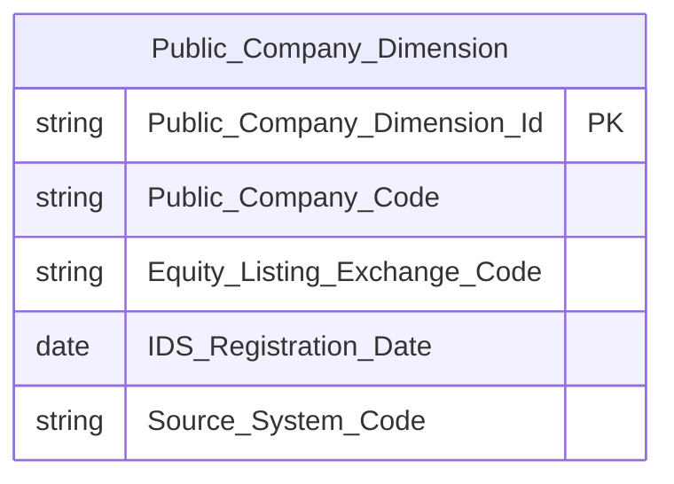
```mermaid
erDiagram
    Public_Company_Dimension {
        string Public_Company_Dimension_Id PK
        string Public_Company_Code
        string Equity_Listing_Exchange_Code
        date IDS_Registration_Date
        string Source_System_Code
    }
```

> **Ghi chú:** K_GSDC_700/701 truy vấn trực tiếp trên `Public Company Dimension` (GROUP BY sàn) — không có Fact trung gian (xem ghi chú rà soát 2026-07-23 ở đầu Nhóm).

**Lineage Mart → Báo cáo:**

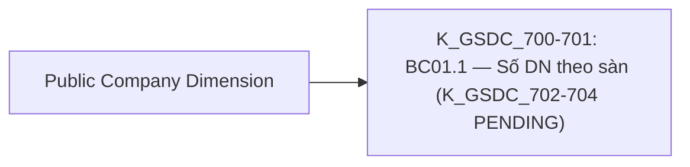
```mermaid
flowchart LR
    public_company_dim["Public Company Dimension"] --> R40["K_GSDC_700-701: BC01.1 — Số DN theo sàn (K_GSDC_702-704 PENDING)"]
```

**Bảng grain:**

| Tên bảng | Grain |
|---|---|
| Public Company Dimension | 1 row / công ty đại chúng (SCD2) |

---

#### Nhóm 39 — STT 39: BC01.2 — Báo cáo vĩ mô theo ngành

##### READY (thu hẹp) — 8/9 KPI PENDING do "Dữ liệu động"

> Phân loại: **Phân tích**
> Source: `Public Company Dimension` — GROUP BY `Business Line Level 1 Code` (không qua Fact — xem ghi chú rà soát 2026-07-23 ở Nhóm 6)
> **Cập nhật 2026-07-15 (rà soát Nhóm 39, tên cũ Nhóm 41):** BA đánh dấu chỉ dòng "Ngành" là Dữ liệu tĩnh (READY); 8 chỉ tiêu đo lường còn lại (DTT/LNST/ROA/ROE năm N và N-1) đều Dữ liệu động → PENDING theo gate rule — tách theo pattern "block có cả tĩnh lẫn động" (không gộp chung 1 bảng). Đồng thời sửa field group-by-ngành: đúng tên `Business Line Level 1 Code` (`business_line_level_1_code`), không phải `Industry Category Level1 Code`/`idy_cgy_level1_code` — xem O_GSDC_5 mục (3). *(Số nhóm đã đổi 41→39 do BA renumber toàn bộ STT 6-43, xem bảng mapping Section 4)*
> **Cập nhật 2026-07-23 (rà soát LLD):** `Fact Public Company Financial Summary Snapshot` đã bị xoá (xem Nhóm 6) — K_GSDC_709 tự đủ bằng field `business_line_level_1_code` trực tiếp trên `Public Company Dimension`, không cần Fact.

**Bảng KPI (READY):**

| KPI ID | Tên KPI | Đơn vị | Tính chất | Atomic Entity | Atomic Table | Atomic Attribute | Atomic Column |
|---|---|---|---|---|---|---|---|
| K_GSDC_709 | Ngành kinh tế | Text | Chiều (Group By) | Public Company | public_company | Business Line Level 1 Code | business_line_level_1_code |

**KPI liên quan (PENDING — Dữ liệu động):**

| KPI ID | Tên KPI | Tính chất | Trạng thái |
|---|---|---|---|
| K_GSDC_710 | DTT Năm N | Phái sinh | **PENDING** |
| K_GSDC_711 | LNST Năm N | Phái sinh | **PENDING** |
| K_GSDC_712 | ROA Năm N | Phái sinh | **PENDING** |
| K_GSDC_713 | ROE Năm N | Phái sinh | **PENDING** |
| K_GSDC_714 | DTT Năm N-1 | Phái sinh | **PENDING** |
| K_GSDC_715 | LNST Năm N-1 | Phái sinh | **PENDING** |
| K_GSDC_716 | ROA Năm N-1 | Phái sinh | **PENDING** |
| K_GSDC_717 | ROE Năm N-1 | Phái sinh | **PENDING** |

**Star Schema:**

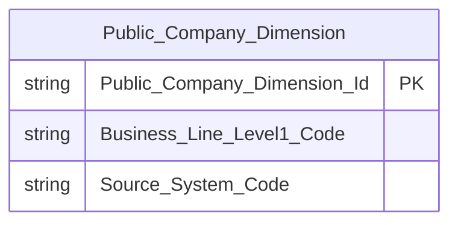
```mermaid
erDiagram
    Public_Company_Dimension {
        string Public_Company_Dimension_Id PK
        string Business_Line_Level1_Code
        string Source_System_Code
    }
```

**Lineage Mart → Báo cáo:**

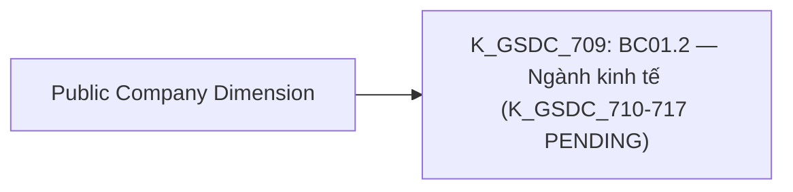
```mermaid
flowchart LR
    public_company_dim["Public Company Dimension"] --> R39["K_GSDC_709: BC01.2 — Ngành kinh tế (K_GSDC_710-717 PENDING)"]
```

**Bảng grain:**

| Tên bảng | Grain |
|---|---|
| Public Company Dimension | 1 row / công ty đại chúng (SCD2) |

---

#### Nhóm 40 — STT 40: BC01.3 — Báo cáo vĩ mô đa kỳ (N / N-1 / N-2)

##### READY (thu hẹp) — 21/22 KPI PENDING do "Dữ liệu động"

> Phân loại: **Phân tích**
> Source: K_GSDC_718 là tham số UI thuần (không map bảng nào)
> **Cập nhật 2026-07-15 (rà soát Nhóm 40, tên cũ Nhóm 42):** BA đánh dấu chỉ dòng "Kỳ báo cáo" (tham số, không map bảng) là Dữ liệu tĩnh (READY); toàn bộ 21 chỉ tiêu đo lường (Tổng tài sản/Nợ phải trả/VCSH/Vốn điều lệ/LNST/ROA/ROE × 3 kỳ N/N-1/N-2) đều Dữ liệu động → PENDING theo gate rule. *(Số nhóm đã đổi 42→40 do BA renumber toàn bộ STT 6-43)*
> **Cập nhật 2026-07-23 (rà soát LLD):** `Fact Public Company Financial Summary Snapshot` đã bị xoá (xem Nhóm 6). K_GSDC_718 không tham chiếu bảng nào — không cần Star Schema/Lineage.

**Bảng KPI (READY):**

| KPI ID | Tên KPI | Đơn vị | Tính chất |
|---|---|---|---|
| K_GSDC_718 | Kỳ báo cáo | Text | Chiều (Slicer) |

**KPI liên quan (PENDING — Dữ liệu động):**

| KPI ID | Tên KPI | Tính chất | Trạng thái |
|---|---|---|---|
| K_GSDC_719 | Tổng tài sản Năm N | Phái sinh | **PENDING** |
| K_GSDC_720 | Nợ phải trả Năm N | Phái sinh | **PENDING** |
| K_GSDC_721 | Vốn chủ sở hữu Năm N | Phái sinh | **PENDING** |
| K_GSDC_722 | Vốn điều lệ Năm N | Phái sinh | **PENDING** |
| K_GSDC_723 | LNST Năm N | Phái sinh | **PENDING** |
| K_GSDC_724 | ROA Năm N | Phái sinh | **PENDING** |
| K_GSDC_725 | ROE Năm N | Phái sinh | **PENDING** |
| K_GSDC_726 | Tổng tài sản Năm N-1 | Phái sinh | **PENDING** |
| K_GSDC_727 | Nợ phải trả Năm N-1 | Phái sinh | **PENDING** |
| K_GSDC_728 | Vốn chủ sở hữu Năm N-1 | Phái sinh | **PENDING** |
| K_GSDC_729 | Vốn điều lệ Năm N-1 | Phái sinh | **PENDING** |
| K_GSDC_730 | LNST Năm N-1 | Phái sinh | **PENDING** |
| K_GSDC_731 | ROA Năm N-1 | Phái sinh | **PENDING** |
| K_GSDC_732 | ROE Năm N-1 | Phái sinh | **PENDING** |
| K_GSDC_733 | Tổng tài sản Năm N-2 | Phái sinh | **PENDING** |
| K_GSDC_734 | Nợ phải trả Năm N-2 | Phái sinh | **PENDING** |
| K_GSDC_735 | Vốn chủ sở hữu Năm N-2 | Phái sinh | **PENDING** |
| K_GSDC_736 | Vốn điều lệ Năm N-2 | Phái sinh | **PENDING** |
| K_GSDC_737 | LNST Năm N-2 | Phái sinh | **PENDING** |
| K_GSDC_738 | ROA Năm N-2 | Phái sinh | **PENDING** |
| K_GSDC_739 | ROE Năm N-2 | Phái sinh | **PENDING** |

**Star Schema:** K_GSDC_718 không tham chiếu bảng nào (xem ghi chú rà soát 2026-07-23 ở trên).

---

#### Nhóm 41 — STT 41: BC22 — Tổng hợp tình hình tài chính CTDC theo sàn

##### READY (thu hẹp) — 22/23 KPI PENDING do "Dữ liệu động"

> Phân loại: **Phân tích**
> Source: `Public Company Dimension` — GROUP BY `Equity_Listing_Exchange_Code` (không qua Fact — xem ghi chú rà soát 2026-07-23 ở Nhóm 6)
> **Cập nhật 2026-07-15 (rà soát Nhóm 41, tên cũ Nhóm 43):** BA đánh dấu chỉ dòng "Theo sàn" là Dữ liệu tĩnh (READY); toàn bộ 22 chỉ tiêu đo lường (Tổng tài sản/Hàng tồn kho/Nợ phải trả/VCSH/... + YoY %) đều Dữ liệu động → PENDING theo gate rule. *(Số nhóm đã đổi 43→41 do BA renumber toàn bộ STT 6-43)*
> **Cập nhật 2026-07-23 (rà soát LLD):** `Fact Public Company Financial Summary Snapshot` đã bị xoá (xem Nhóm 6) — K_GSDC_740 tự đủ bằng field `equity_listing_exchange_code` trực tiếp trên `Public Company Dimension`, không cần Fact.

**Bảng KPI (READY):**

| KPI ID | Tên KPI | Đơn vị | Tính chất | Atomic Entity | Atomic Table | Atomic Attribute | Atomic Column |
|---|---|---|---|---|---|---|---|
| K_GSDC_740 | Theo sàn | Text | Chiều (Group By) | Public Company | public_company | Equity Listing Exchange Code | equity_listing_exchange_code |

**KPI liên quan (PENDING — Dữ liệu động):**

| KPI ID | Tên KPI | Tính chất | Trạng thái |
|---|---|---|---|
| K_GSDC_741 | Tổng tài sản theo sàn | Phái sinh | **PENDING** |
| K_GSDC_741_YOY | Tổng tài sản — YoY theo sàn | Phái sinh | **PENDING** |
| K_GSDC_742 | Hàng tồn kho theo sàn | Phái sinh | **PENDING** |
| K_GSDC_742_YOY | Hàng tồn kho — YoY theo sàn | Phái sinh | **PENDING** |
| K_GSDC_743 | Nợ phải trả theo sàn | Phái sinh | **PENDING** |
| K_GSDC_743_YOY | Nợ phải trả — YoY theo sàn | Phái sinh | **PENDING** |
| K_GSDC_744 | Vốn chủ sở hữu theo sàn | Phái sinh | **PENDING** |
| K_GSDC_744_YOY | VCSH — YoY theo sàn | Phái sinh | **PENDING** |
| K_GSDC_745 | Vốn góp của chủ sở hữu theo sàn | Phái sinh | **PENDING** |
| K_GSDC_745_YOY | VGC — YoY theo sàn | Phái sinh | **PENDING** |
| K_GSDC_746 | LNST chưa phân phối theo sàn | Phái sinh | **PENDING** |
| K_GSDC_746_YOY | LNST chưa PP — YoY theo sàn | Phái sinh | **PENDING** |
| K_GSDC_747 | Doanh thu thuần theo sàn | Phái sinh | **PENDING** |
| K_GSDC_747_YOY | DTT — YoY theo sàn | Phái sinh | **PENDING** |
| K_GSDC_748 | LNKT trước thuế theo sàn | Phái sinh | **PENDING** |
| K_GSDC_748_YOY | LNKT trước thuế — YoY theo sàn | Phái sinh | **PENDING** |
| K_GSDC_749 | LNST theo sàn | Phái sinh | **PENDING** |
| K_GSDC_749_YOY | LNST — YoY theo sàn | Phái sinh | **PENDING** |
| K_GSDC_750 | ROA theo sàn | Phái sinh | **PENDING** |
| K_GSDC_750_YOY | ROA — YoY theo sàn | Phái sinh | **PENDING** |
| K_GSDC_751 | ROE theo sàn | Phái sinh | **PENDING** |
| K_GSDC_751_YOY | ROE — YoY theo sàn | Phái sinh | **PENDING** |

**Star Schema:**

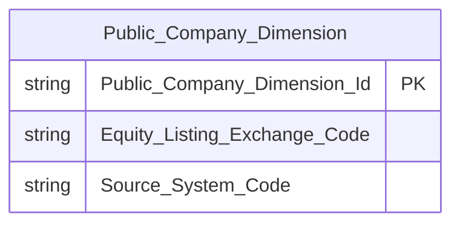
```mermaid
erDiagram
    Public_Company_Dimension {
        string Public_Company_Dimension_Id PK
        string Equity_Listing_Exchange_Code
        string Source_System_Code
    }
```

**Lineage Mart → Báo cáo:**

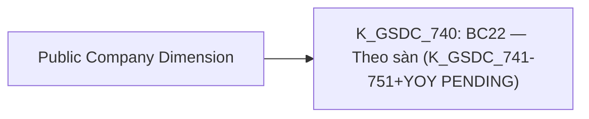
```mermaid
flowchart LR
    public_company_dim["Public Company Dimension"] --> R41["K_GSDC_740: BC22 — Theo sàn (K_GSDC_741-751+YOY PENDING)"]
```

**Bảng grain:**

| Tên bảng | Grain |
|---|---|
| Public Company Dimension | 1 row / công ty đại chúng (SCD2) |

---

## Section 3 — Mô hình tổng thể

```mermaid
graph TB
    classDef dim fill:#E6F1FB,stroke:#185FA5,color:#0C447C
    classDef fact fill:#FAECE7,stroke:#993C1D,color:#4A1B0C

    DIM_CO["Public Company Dimension"]:::dim
    DIM_DATE["Calendar Date Dimension"]:::dim
    DIM_CTLG["Financial Report Catalog Dimension"]:::dim

    FACT_RISK["Fact Public Company Risk Score Snapshot"]:::fact
    FACT_COMP["Fact Public Company Compliance Score Snapshot"]:::fact
    FACT_ISS["Fact Public Company Issuance Score Snapshot"]:::fact
    FACT_FIN["Fact Public Company Financial Score Snapshot"]:::fact
    FACT_NONFIN["Fact Public Company Non-Financial Score Snapshot"]:::fact
    FACT_RPTVAL["Fact Public Company Financial Report Value"]:::fact
    FACT_LIST["Fact Public Company Listing Info Snapshot"]:::fact

    DIM_CO --> FACT_RISK
    DIM_DATE --> FACT_RISK
    DIM_CO --> FACT_COMP
    DIM_DATE --> FACT_COMP
    DIM_CO --> FACT_ISS
    DIM_DATE --> FACT_ISS
    DIM_CO --> FACT_FIN
    DIM_DATE --> FACT_FIN
    DIM_CO --> FACT_NONFIN
    DIM_DATE --> FACT_NONFIN
    DIM_CO --> FACT_RPTVAL
    DIM_DATE --> FACT_RPTVAL
    DIM_CTLG --> FACT_RPTVAL
    DIM_CO --> FACT_LIST
    DIM_DATE --> FACT_LIST
```

> **Cập nhật 2026-07-23 (rà soát LLD):** `Fact Public Company Financial Summary Snapshot` đã bị xoá khỏi mô hình (không còn cột nào READY, xem Nhóm 6/O_GSDC_5 mục (10)). Các KPI READY trước đây gán cho Fact này (Nhóm 6/9/10/12/14/16/38/39/40/41) nay query trực tiếp `Public Company Dimension`/`Calendar Date Dimension`, không có node Fact riêng trong graph.

**Bảng Phân tích (Star Schema):**

| Bảng | Pattern | Grain | KPI | Trạng thái |
|---|---|---|---|---|
| `Fact Public Company Risk Score Snapshot` | Periodic Snapshot | 1 CTDC × 1 ngày snapshot ETL (full-scan daily, carry-forward — sửa 2026-08-03) | K_GSDC_1–6 (Nhóm 1); K_GSDC_1, 2, 3, 4, 5, 6, 7, 8 (Nhóm 32, reuse) | READY (Atomic draft — chưa approved) |
| `Fact Public Company Compliance Score Snapshot` | Periodic Snapshot | 1 CTDC × 1 ngày snapshot ETL (full-scan daily, carry-forward — sửa 2026-08-03) | K_GSDC_9–23 (Nhóm 2); reuse toàn bộ (Nhóm 33) | READY (Atomic draft — chưa approved) |
| `Fact Public Company Issuance Score Snapshot` | Periodic Snapshot | 1 CTDC × 1 ngày snapshot ETL (full-scan daily, carry-forward — sửa 2026-08-03) | K_GSDC_24–31 (Nhóm 3); reuse toàn bộ (Nhóm 35) | READY (Atomic draft — chưa approved) |
| `Fact Public Company Financial Score Snapshot` | Periodic Snapshot | 1 CTDC × 1 ngày snapshot ETL (full-scan daily, carry-forward — sửa 2026-08-03) | K_GSDC_32–42 (Nhóm 4); reuse toàn bộ (Nhóm 34) | READY (Atomic draft — chưa approved) |
| `Fact Public Company Non-Financial Score Snapshot` | Periodic Snapshot | 1 CTDC × 1 ngày snapshot ETL (full-scan daily, carry-forward — sửa 2026-08-03) | K_GSDC_43–45 (Nhóm 5); reuse toàn bộ (Nhóm 36) | READY (Atomic draft — chưa approved) |
| `Fact Public Company Financial Report Value` | Event | 1 CTDC × 1 kỳ × Row_Code × Column_Code | K_GSDC_50–92 (Nhóm 7, 8, 11, 13, 15, 17); K_GSDC_99–689 (Nhóm 19-30); K_GSDC_50-62 reuse (Nhóm 37) | PENDING (Gap Atomic — không có Atomic LLD nào trong `DataModel/working/Atomic/lld/IDS/`, xem O_GSDC_5; 100% KPI dùng Fact này đều PENDING — K_GSDC_63/79 READY thuộc `public_company`, không thuộc Fact này) |
| `Fact Public Company Listing Info Snapshot` | Periodic Snapshot | 1 CTDC × 1 ngày | K_GSDC_690–699 (Nhóm 31) | PENDING |

> **Đã xoá 2026-07-23:** `Fact Public Company Financial Summary Snapshot` — không còn cột nào READY (xem Nhóm 6/O_GSDC_5 mục (10)). KPI trước đây gán cho Fact này (K_GSDC_46–49 Nhóm 6; reuse Nhóm 9/10/12/14/16; K_GSDC_700–708 Nhóm 38; K_GSDC_709–717 Nhóm 39; K_GSDC_718–739 Nhóm 40; K_GSDC_740–751+YOY Nhóm 41) nay dùng trực tiếp `Public Company Dimension`/`Calendar Date Dimension` cho phần READY; phần PENDING giữ nguyên trạng thái.

**Bảng Tác nghiệp:** Không có.

**Bảng Dimension:**

| Dimension | Loại | Mô tả | Scheme | Trạng thái |
|---|---|---|---|---|
| `Public Company Dimension` | SCD2 | Mã CK, Tên DN, Sàn, Ngành — dùng chung toàn bộ màn hình | IDS_LISTING_TYPE, IDS_INDUSTRY_CATEGORY | READY (Atomic draft — chưa approved) |
| `Calendar Date Dimension` | Conformed | Năm / Quý — shared toàn hệ thống Lakehouse, không chỉ riêng GSDC | — | READY |
| `Financial Report Catalog Dimension` | Reference per module | Template BCTC — báo cáo / dòng / cột; composite join key (Catalog_Business_Code + Row_Code + Column_Code) | — | PENDING (Gap Atomic — `Financial Report Catalog`/`Financial Report Form Row/Column Template` đều `design_status: draft`, chưa approved — xem O_GSDC_3) |

---

## Section 4 — Reuse Analysis

| Datamart Entity | datamart_table | reuse_status | Ghi chú |
|---|---|---|---|
| Fact Public Company Financial Report Value | fct_public_company_financial_report_val | pending | Fact placeholder cho MH3 Data Explorer BCTC chi tiết + Nhóm 7/13/15/17/19 (MH2) — **PENDING**: Atomic nguồn (`Public Company Financial Report Value`) chưa có LLD, xem O_GSDC_5 |
| Fact Public Company Risk Score Snapshot | fct_public_company_risk_score_snpst | new | Fact mới cho Nhóm 1 (MH1 Tab Tổng hợp) — nguồn Atomic draft |
| Fact Public Company Compliance Score Snapshot | fct_public_company_compliance_score_snpst | new | Fact mới cho Nhóm 2 (MH1 Tab Tuân thủ) — nguồn Atomic draft |
| Fact Public Company Issuance Score Snapshot | fct_public_company_issuance_score_snpst | new | Fact mới cho Nhóm 3 (MH1 Tab Phát hành) — nguồn Atomic draft |
| Fact Public Company Financial Score Snapshot | fct_public_company_financial_score_snpst | new | Fact mới cho Nhóm 4 (MH1 Tab Tài chính) — nguồn Atomic draft |
| Fact Public Company Non-Financial Score Snapshot | fct_public_company_nonfinancial_score_snpst | new | Fact mới cho Nhóm 5 (MH1 Tab Phi TC & M-Score) — nguồn Atomic draft |
| Fact Public Company Listing Info Snapshot | fct_public_company_listing_info_snpst | pending | PENDING — nguồn MSS chưa có Atomic (MH5 DB33) |
| Public Company Dimension | public_company_dim | reuse | Dùng chung toàn bộ Nhóm 1–7+ (MH1/MH2/MH3/MH4) — 1 Dimension duy nhất cho toàn module |
| Calendar Date Dimension | cdr_dt_dim | reuse | Dimension Conformed dùng chung toàn hệ thống Lakehouse, không chỉ riêng GSDC |
| Financial Report Catalog Dimension | fnc_rpt_ctlg_dim | pending | Dimension phụ trợ mới cho MH3 Data Explorer (Cụm 4) — **PENDING**: cả 3 nguồn Atomic (`Financial Report Catalog`, `Financial Report Form Row Template`, `Financial Report Form Column Template`) đều `design_status: draft`, chưa approved, xem O_GSDC_3 |

> **Ghi chú KPI reuse (không phải Datamart Entity reuse):** Reuse ở cấp KPI/cột (không phải reuse bảng Fact/Dim) được ghi trực tiếp trong bảng KPI của từng Nhóm (cột Công thức/Ghi chú) — không lặp lại ở đây. Các KPI reuse chính xuyên suốt module: K_GSDC_7/K_GSDC_8 (Mã CK/Tên DN, gốc Nhóm 1) dùng ở mọi Nhóm 2 trở đi; K_GSDC_46/K_GSDC_78 (Kỳ thống kê/Sàn, gốc Nhóm 6) dùng ở Nhóm 10/12/14/16; K_GSDC_50–62+YOY (gốc Nhóm 7) và K_GSDC_79–92 (Ngành, gốc Nhóm 11) dùng ở Nhóm 11/13/15/17; K_GSDC_63 (Ngành, gốc Nhóm 8) dùng ở Nhóm 18.
>
> **Gate rule "Loại dữ liệu":** BA đánh dấu "Dữ liệu động" hoặc "Dữ liệu tĩnh - Chưa có CSDL" → KPI PENDING dù `Trạng thái mapping = Done`. Áp dụng: Nhóm 6 (K_GSDC_48/49), Nhóm 7/11/13/15/17/37 (K_GSDC_50-62+YOY, K_GSDC_80-92), Nhóm 8 (K_GSDC_64-76), Nhóm 9 (K_GSDC_77), Nhóm 18 (K_GSDC_93-98, cả 10/10 dòng — không còn KPI reuse READY), Nhóm 19-30 (toàn bộ 391 KPI DN thông thường/bảo hiểm/TCTD), Nhóm 37/39-41 (measure động, trừ 1 KPI Chiều/nhóm giữ READY). Chi tiết mapping Atomic đầy đủ (khi gate rule gỡ) — xem git history bản trước 2026-07-15.
>
> **Gap Atomic — `Public Company Financial Report Value`:** nguồn `IDS.data` + `report_catalog` + `rrow` + `rcol`, dùng cho K_GSDC_49 và toàn bộ Nhóm 7/8/9/10/11/13/15/17/37 — **chưa có Atomic LLD** trong `DataModel/working/Atomic/lld/IDS/` — cần `atomic-lld-design` thiết kế mới.

---

## Section 5 — Vấn đề mở

| ID | Vấn đề | Giả định hiện tại | KPI liên quan | Trạng thái |
|---|---|---|---|---|
| O_GSDC_1 | Nhóm 1–5 (Màn hình 1) có nguồn thật từ `IDS.EVALUATIONS` / `EVALUATION_DETAILS` / `EVALUATION_CRITERIA` / `EVALUATION_GROUPS` / `EVALUATION_PERIODS`. Atomic tương ứng (`Public Company Evaluation` + 4 entity con) đã có LLD tại `DataModel/working/Atomic/lld/IDS/` nhưng `design_status: draft`, chưa approved. K_GSDC_38 "VCSH" (Nhóm 4) — **rà soát LLD 2026-07-15 xác nhận vẫn còn trong BA** (ghi chú "loại khỏi phạm vi" trước đây sai, đã sửa). K_GSDC_33 đổi nghĩa "Khả năng hoạt động liên tục"→"ROA". Nhóm 3 K_GSDC_29 đổi nghĩa "Tỷ lệ TP vi phạm nghĩa vụ thanh toán"→"Xếp hạng tín nhiệm". **Cập nhật 2026-07-23 (rà soát datamart-review):** ghi chú cũ "Nhóm 5 loại K_GSDC_45 (BA không còn)" là **sai** — K_GSDC_45 vẫn active, là "Tổng điểm Phi tài chính & M-Score" trong bảng KPI Nhóm 5 hiện hành; đã xoá ghi chú gây hiểu lầm này khỏi Nhóm 5. Nhóm 32–36 (Data Explorer, reuse KPI từ Nhóm 1–5) READY (Atomic draft), reuse KPI_ID đầy đủ, không có KPI mới. | Nhóm 1–5 + 32–36: chờ approve Atomic entity draft. | K_GSDC_1 — K_GSDC_45, K_GSDC_14, K_GSDC_7-8 (dùng chung Nhóm 1-5 + 32-36) | Closed |
| O_GSDC_2 | KPI Số doanh nghiệp (K_GSDC_7, K_GSDC_34) có nguồn từ `IDS.company_detail` với điều kiện `ids_reg_date <= cuối kỳ` — không join qua `company_data` hay `data`. **Cập nhật 2026-07-23:** Vấn đề đã tự giải quyết — `Fact Public Company Financial Summary Snapshot` đã bị xoá (xem O_GSDC_5 mục (10)), mọi KPI Số DN (K_GSDC_47/77/701...) nay tính trực tiếp `COUNT DISTINCT` trên `Public Company Dimension.IDS_Registration_Date`, không qua Fact nào — không còn rủi ro thiếu DN đăng ký IDS nhưng chưa nộp BCTC. | Đã tính trực tiếp trên `Public Company Dimension` cho toàn bộ Nhóm 6/9/10/12/14/16 — không cần Fact riêng. | K_GSDC_7, K_GSDC_34 | Closed |
| O_GSDC_3 | **Cập nhật 2026-07-16 (rà soát cross-check BA↔Atomic):** BA SQL DB25 xác nhận `rr.row_desc` và `rc2.col_desc` dùng làm mã hiển thị nghiệp vụ và filter điều kiện trong mọi dashboard DB21–32. Rà soát lại `DataModel/working/Atomic/lld/IDS/lld_IDS_RROW.yaml` / `lld_IDS_RCOL.yaml` cho thấy 2 field này **đã có mapping 1-1** (`Row Description`/`row_description` ← `IDS.RROW.ROW_DESC`, `Column Description`/`column_description` ← `IDS.RCOL.COL_DESC`) — nhận định trước đây "chưa có field" là **sai**, chỉ là tên gọi khác `Row_Display_Code`/`Column_Display_Code`. Tuy nhiên, theo xác nhận Data Modeler (2026-07-16): **toàn bộ cấu trúc EAV nguồn (RROW/RCOL/REPORT_CATALOG/`IDS.data`) sẽ KHÔNG được tái sử dụng trực tiếp** — team Atomic sẽ chuẩn hoá lại thành 1 bộ entity dùng chung cho mọi module (chưa thiết kế, sẽ bổ sung sau). Do đó gap thực chất **không phải "thiếu field"** mà là "chờ entity Atomic chuẩn hoá mới thay thế hoàn toàn cấu trúc EAV hiện có". | Không cần bổ sung field vào `frf_row_template`/`frf_column_template` hiện tại (cấu trúc này sẽ không dùng làm nền thiết kế Fact). Chờ Data Modeler thiết kế entity Atomic chuẩn hoá mới cho Financial Report Value (dùng chung nhiều module) qua `atomic-lld-design`, sau đó Datamart mới thiết kế lại Fact Public Company Financial Report Value dựa trên entity mới. | K_GSDC_33, K_GSDC_D8–D11 | Open |
| O_GSDC_4 | DB43 BC22 có KPI "Lợi nhuận kế toán trước thuế" — không có trường tương ứng trong `Fact Public Company Financial Summary Snapshot` (khi đó còn tồn tại). LNKT trước thuế là row khác trong BCTC. | **Confirmed (lịch sử):** Bổ sung `Pre_Tax_Profit_Amount` vào Fact Summary — map từ BCKQKD `row_desc='50'` (dn/bh) / `row_desc='17'` (td), `col_desc='1'`. **Lưu ý 2026-07-23:** Fact này đã bị xoá hoàn toàn (xem O_GSDC_5 mục (10)); K_GSDC_58 nay nằm ở Nhóm 41 (K_GSDC_748, LNKT trước thuế theo sàn) — vẫn PENDING vì thuộc measure động, không map field nào từ Fact đã xoá. | K_GSDC_58 | Closed |
| O_GSDC_5 | (1) **Gate rule "Loại dữ liệu":** BA đánh dấu "Dữ liệu động" hoặc "Dữ liệu tĩnh - Chưa có CSDL" → PENDING dù `Trạng thái mapping = Done`. Áp dụng: Nhóm 6 (K_GSDC_48/49), Nhóm 7/11/13/15/17/37 (100% dòng động), Nhóm 8/9/10, Nhóm 18 (10/10 dòng), Nhóm 19-30 (391 KPI DN thông thường/bảo hiểm/TCTD), Nhóm 38-41 (measure động, 1 KPI Chiều/nhóm giữ READY; Nhóm 38 nay 2 KPI Cơ sở K_GSDC_702/703 cũng PENDING — xem mục (10)). (2) **Gap Atomic — `Public Company Financial Report Value`** (nguồn `IDS.data` + `report_catalog` + `rrow` + `rcol`, dùng cho K_GSDC_49 và toàn bộ Nhóm 7/8/9/10/11/13/15/17/37): bảng giá trị số liệu (`IDS.data`, chứa `data_value`) **hoàn toàn chưa có Atomic LLD** (xác nhận qua rà soát `DataModel/working/Atomic/lld/IDS/` — không có file YAML nào cho bảng này). Bảng catalog/template (`REPORT_CATALOG`/`RROW`/`RCOL`) tuy đã có LLD draft (`financial_report_catalog`/`frf_row_template`/`frf_column_template`), nhưng **rà soát 2026-07-16 xác nhận với Data Modeler: cấu trúc EAV nguồn này sẽ KHÔNG được dùng làm nền tảng thiết kế** — team Atomic sẽ chuẩn hoá lại thành 1 bộ entity Financial Report Value dùng chung cho nhiều module (chưa thiết kế, cần `atomic-lld-design` làm mới hoàn toàn, không phải bổ sung field vào entity hiện có). (3) **Field group-by-ngành:** tồn tại trong `Public Company` (`public_company`) — tên đúng `Business Line Level 1 Code` (`business_line_level_1_code`, Classification Value scheme `IDS_INDUSTRY_CATEGORY`). Áp dụng cho K_GSDC_63 (Nhóm 8), K_GSDC_709 (Nhóm 39) — cả 2 vẫn READY vì query trực tiếp `public_company.business_line_level_1_code`, không qua Fact nào (từ 2026-07-23, `Fact Public Company Financial Summary Snapshot` đã bị xoá — xem mục (10)). **K_GSDC_79 (Nhóm 11/13/15/17) đã chuyển PENDING** (rà soát LLD 2026-07-15) — dù field tồn tại đúng trên `public_company`, Fact duy nhất của các Nhóm này (`Fact Public Company Financial Report Value`) 100% PENDING nên không có Fact để populate. BA còn ghi điều kiện `c.active_flg = 1` (bảng `categories` riêng) — cần xác nhận có bổ sung Active Flag hay dùng trực tiếp field trên `public_company` (không có entity `categories` riêng theo quyết định 2026-07-14). (4) **Entity đúng cho K_GSDC_48** "Tỷ lệ nộp BCTC": map `Public Company Violation Report` (`pc_violation_report`) — BA SQL dùng `violation_report`/`forms` filter `news_type_cd='DINH_KY'`, KHÔNG phải `Public Company Report Submission` (`pc_report_submission`, entity Fact Append cho tin tức CBTT chung). Áp dụng Nhóm 6/10/12/14/16. (5) **Nhóm 18** (Metadata BCTC): 10/10 dòng PENDING do "Dữ liệu động" — 4 KPI Chiều reuse (K_GSDC_46/K_GSDC_78/K_GSDC_63/K_GSDC_7-8) vẫn READY tại nhóm gốc nhưng PENDING khi dùng trong Nhóm 18; 6 KPI gốc K_GSDC_93–98 PENDING (Atomic Row/Column Template cũng có gap tên bảng, xem O_GSDC_3 — không cần sửa vì đằng nào PENDING). (6)+(7) **MH3 Data Explorer** (Nhóm 19-30, DN thông thường + bảo hiểm + TCTD, 391 KPI): PENDING toàn bộ do 100% "Dữ liệu động". Bảng KPI rút gọn 4 cột chuẩn (KPI ID/Tên KPI/Tính chất/Trạng thái) theo `datamart-hld-design` — chi tiết mapping Atomic đầy đủ xem git history bản trước 2026-07-15. (8) **Nhóm 37**: 13/13 KPI (K_GSDC_50-62, reuse từ Nhóm 7) PENDING — nhất quán với Nhóm 7 (reuse KPI_ID cùng trạng thái với gốc). (9) **Nhóm 39-41**: mỗi nhóm 1 KPI Chiều (Ngành/Kỳ báo cáo/Theo sàn, Dữ liệu tĩnh) giữ READY, toàn bộ measure còn lại (51 KPI) PENDING do Dữ liệu động. (10) **Gate rule mở rộng — `pc_report_submission`/`company_data` cũng là dữ liệu động, dẫn tới xoá Fact (rà soát LLD 2026-07-23):** Rà soát cột `etl_logic` phát hiện `Public Company Report Submission` (`pc_report_submission`) có nguồn thật là `IDS.COMPANY_DATA` (xem `DataModel/Atomic/Documentation/dm_atm_pc_report_submission-IDS.COMPANY_DATA.yaml`) — Data Modeler xác nhận họ bảng `company_data`/`data` (không chỉ riêng `report_catalog`/`rrow`/`rcol`/`data` như mục (2) đã nêu) đều thuộc "dữ liệu động" theo gate rule (1). Ảnh hưởng: K_GSDC_702/703 (Nhóm 38, trước đây "Cơ sở"/READY) → PENDING; K_GSDC_704 (phái sinh) → PENDING theo. `Fact Public Company Financial Summary Snapshot` mất toàn bộ 2 measure gốc (`submission_deadline_dt`/`submission_dt`) + cả 2 FK dự kiến từ bảng này. Rà soát tiếp theo phát hiện: K_GSDC_46/47 (Nhóm 6), K_GSDC_77 (Nhóm 9), K_GSDC_700/701 (Nhóm 38), K_GSDC_709 (Nhóm 39), K_GSDC_740 (Nhóm 41) — mọi KPI READY còn lại gán cho Fact này — thực chất đều query trực tiếp (COUNT DISTINCT / field GROUP BY) trên `Public Company Dimension`/`Calendar Date Dimension`, không cần grain snapshot của Fact. K_GSDC_718 (Nhóm 40) là tham số UI thuần, không map bảng nào. Kết luận: Fact không còn cột nào READY → **xoá hẳn** `Fact Public Company Financial Summary Snapshot` khỏi Entities.csv/datamart_attributes.csv/datamart_model.yaml (đúng pattern "bảng PENDING toàn bộ không tạo file", giống `Fact Public Company Financial Report Value`) — không giữ lại dạng PENDING. Toàn bộ Nhóm 6/9/10/12/14/16/38/39/40/41 đã cập nhật Source/Star Schema/Lineage sang query trực tiếp Dimension. | (1) Rà soát gate rule — hoàn tất toàn bộ Nhóm 6-41. (2) Chờ atomic-lld-design bổ sung entity `Public Company Financial Report Value`. (3) Đã sửa tên field group-by-ngành cho Nhóm 8/11/13/15/17/39 — Closed. (4) Đã sửa entity tham chiếu cho Nhóm 6/10/12/14/16 — cần đồng bộ Detail Mapping khi tới bước LLD. (5) Đã bổ sung KPI thiếu cho Nhóm 18, PENDING toàn bộ — cần đồng bộ Detail Mapping khi tới bước LLD. (6)-(9) Đã gate PENDING Nhóm 19-30 + 37 + phần động của Nhóm 39-41 — cần đồng bộ Detail Mapping khi tới bước LLD. (10) Đã xoá hẳn `Fact Public Company Financial Summary Snapshot` (Entities/Attributes/model) + cập nhật Source/Star Schema toàn bộ Nhóm liên quan (6/9/10/12/14/16/38/39/40/41) — cần đồng bộ Detail Mapping nếu có dòng tham chiếu bảng/cột của Fact đã xoá (K_GSDC_46/47/77/700/701/702-704/709/718/740). | K_GSDC_48, K_GSDC_49 (Nhóm 6/10/12/14/16); K_GSDC_50-62+YOY, K_GSDC_80-92 (Nhóm 7/11/13/15/17/37); K_GSDC_64-76 (Nhóm 8); K_GSDC_93-98+46+78+63+7-8 (Nhóm 18, PENDING toàn bộ); K_GSDC_99-303 (Nhóm 19-22); K_GSDC_304-689 (Nhóm 23-30); K_GSDC_710-717, K_GSDC_719-739, K_GSDC_741-751+YOY (Nhóm 39-41); K_GSDC_702, K_GSDC_703, K_GSDC_704 (Nhóm 38) | Open |