# DTM_GSDC_HLD — High Level Design
**Module:** GSDC — Giám sát Công ty Đại chúng
**Phiên bản:** 3.0 — Phase 1 Draft
**Phạm vi:**
- Màn hình 1: **Phân loại & Xếp hạng Rủi ro Doanh nghiệp Đại chúng** (5 tab: Tổng hợp / Tuân thủ / Phát hành / Tài chính / Phi tài chính & M-Score)
- Màn hình 2: **Giám sát Tổng hợp** (5 tab sàn: Tổng hợp / HOSE / HNX / UPCoM / Chưa niêm yết — 3 nhóm nội dung)
- Màn hình 3: **Data Explorer — Dữ liệu tài chính doanh nghiệp** (DB21–32 + DB39: chi tiết BCTC theo loại hình DN + hệ số tài chính cơ bản — tất cả phục vụ bởi `Fact Public Company Financial Report Value`)
- Màn hình 4: **Báo cáo giám sát CTDC** (DB40–43: BC01.1 / BC01.2 / BC01.3 / BC22 — phục vụ bởi `Fact Public Company Financial Summary Snapshot`)
- Màn hình 5 *(PENDING)*: **Data Explorer — Dữ liệu thông tin niêm yết** (DB33 — nguồn MSS chưa có Atomic)
- Màn hình 6 *(PENDING)*: **Data Explorer — Dữ liệu chấm điểm phân loại CTDC** (DB34–38 — chưa có bảng nguồn, xem O_GSDC_1)

**Nguồn dữ liệu:** IDS (Information Disclosure System)

---

## Section 1 — Data Lineage

### Cụm 1 — Hồ sơ Công ty Đại chúng

Phục vụ chiều nhận diện DN trên toàn bộ các màn hình.

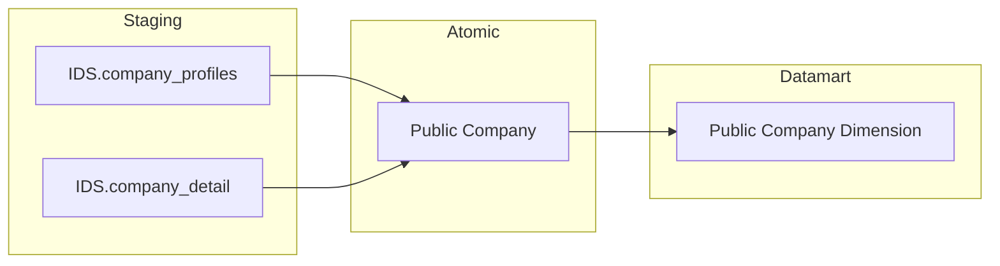
```mermaid
flowchart LR
    subgraph SRC["Staging"]
        S1[IDS.company_profiles]
        S2[IDS.company_detail]
    end
    subgraph SIL["Atomic"]
        A1[Public Company]
    end
    subgraph GOLD["Datamart"]
        D1[Public Company Dimension]
    end
    S1 --> A1
    S2 --> A1
    A1 --> D1
```

### Cụm 2 — Báo cáo tài chính & Nộp báo cáo

Phục vụ toàn bộ KPI tài chính tổng hợp và theo ngành (Màn hình 2).

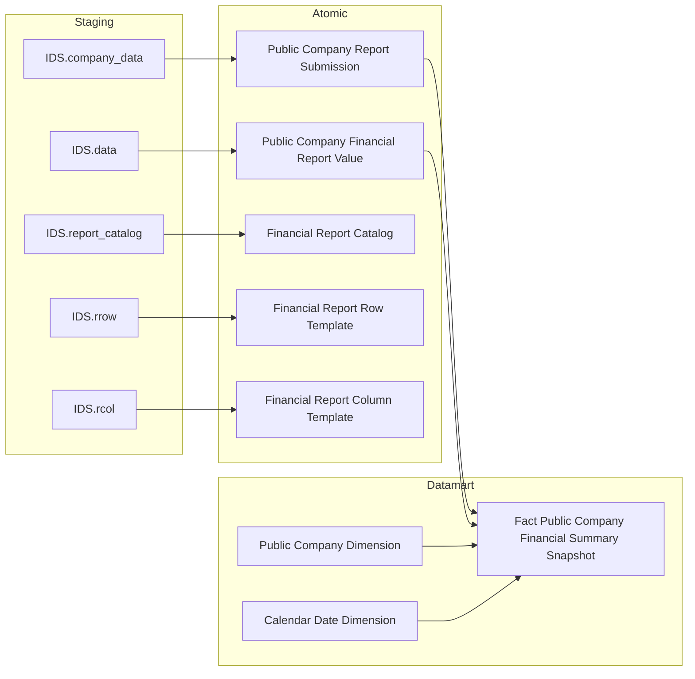
```mermaid
flowchart LR
    subgraph SRC["Staging"]
        S3[IDS.company_data]
        S4[IDS.data]
        S5[IDS.report_catalog]
        S6[IDS.rrow]
        S7[IDS.rcol]
    end
    subgraph SIL["Atomic"]
        A2[Public Company Report Submission]
        A3[Public Company Financial Report Value]
        A4[Financial Report Catalog]
        A5[Financial Report Row Template]
        A6[Financial Report Column Template]
    end
    subgraph GOLD["Datamart"]
        D2[Fact Public Company Financial Summary Snapshot]
        D1[Public Company Dimension]
        D8[Calendar Date Dimension]
    end
    S3 --> A2
    S4 --> A3
    S5 --> A4
    S6 --> A5
    S7 --> A6
    A2 --> D2
    A3 --> D2
    D1 --> D2
    D8 --> D2
```

### Cụm 3 — Chi tiết BCTC từng CTDC & Danh mục template (DB21–32 + DB39)

Phục vụ Data Explorer tra cứu giá trị từng chỉ tiêu BCTC theo CTDC và kỳ báo cáo. `Financial Report Catalog Dimension` là Dimension phụ trợ cung cấp tên và thứ tự chỉ tiêu cho Fact.

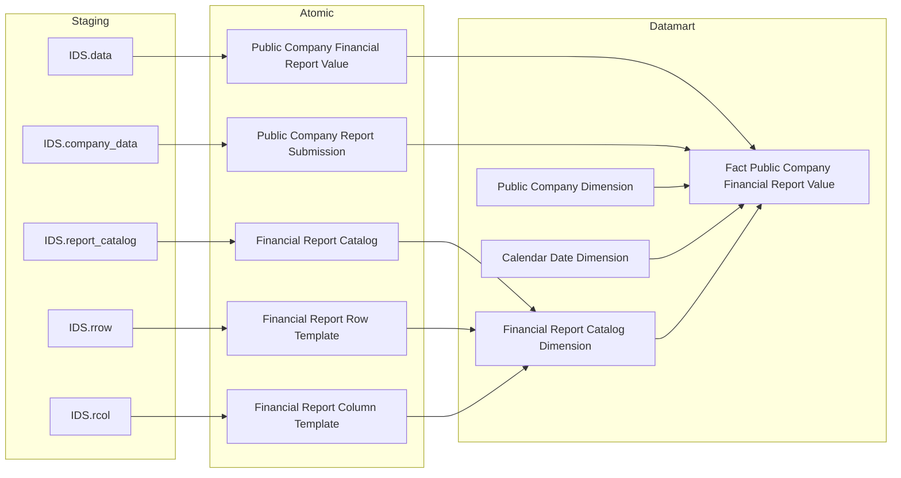
```mermaid
flowchart LR
    subgraph SRC["Staging"]
        S3b[IDS.company_data]
        S4b[IDS.data]
        S5b[IDS.report_catalog]
        S6b[IDS.rrow]
        S7b[IDS.rcol]
    end
    subgraph SIL["Atomic"]
        A2b[Public Company Report Submission]
        A3b[Public Company Financial Report Value]
        A4b[Financial Report Catalog]
        A5b[Financial Report Row Template]
        A6b[Financial Report Column Template]
    end
    subgraph GOLD["Datamart"]
        D10[Fact Public Company Financial Report Value]
        D9[Financial Report Catalog Dimension]
        D1b[Public Company Dimension]
        D8b[Calendar Date Dimension]
    end
    S3b --> A2b
    S4b --> A3b
    S5b --> A4b
    S6b --> A5b
    S7b --> A6b
    A3b --> D10
    A2b --> D10
    A4b --> D9
    A5b --> D9
    A6b --> D9
    D1b --> D10
    D8b --> D10
    D9 --> D10
```

### Cụm 4 — Điểm chấm & Xếp loại CTDC *(PENDING)*

Toàn bộ KPI điểm thành phần và tổng hợp đều **PENDING** — IDS chưa có bảng lưu kết quả chấm điểm trong thiết kế CSDL hiện tại.

---

## Section 2 — Tổng quan báo cáo

---

### Màn hình 1 — Phân loại & Xếp hạng Rủi ro CTDC

#### Nhóm 1 — STT 1: Tổng hợp chấm điểm phân loại CTDC

##### PENDING

**KPI liên quan:**

| KPI ID | Tên KPI | Tính chất | Trạng thái |
|---|---|---|---|
| K_GSDC_1 | Tuân thủ | Base | Pending - chưa thiết kế nguồn |
| K_GSDC_2 | Phát hành | Base | Pending - chưa thiết kế nguồn |
| K_GSDC_3 | Tài chính | Base | Pending - chưa thiết kế nguồn |
| K_GSDC_4 | Phi tài chính & M-Score | Base | Pending - chưa thiết kế nguồn |
| K_GSDC_5 | Xếp hạng tín nhiệm DN | Base | Pending - chưa thiết kế nguồn |
| K_GSDC_6 | Điểm tổng hợp | Base | Pending - chưa thiết kế nguồn |

**Lý do PENDING:** BA ghi nhận `failed` — bảng lưu kết quả chấm điểm tổng hợp CTDC chưa được thiết kế trong CSDL IDS.

**Atomic cần bổ sung:** `Public Company Risk Score` — entity lưu điểm tổng hợp và từng tiêu chí theo kỳ đánh giá.

**Mart dự kiến:** `Fact Public Company Risk Score Snapshot` (grain: 1 row / CTDC / ngày đánh giá)

##### READY

> Phân loại: **Phân tích**
> Atomic: `Public Company` ← IDS.company_profiles — **READY**

**Mockup:**

| Tên Doanh nghiệp | Mã DN | Tuân thủ | Phát hành | Tài chính | Phi TC | M-Score | Xếp hạng TN | Điểm | Xếp loại |
|---|---|---|---|---|---|---|---|---|---|
| Công ty tập đoàn địa ốc Novaland | NVL | *(PENDING)* | *(PENDING)* | *(PENDING)* | *(PENDING)* | *(PENDING)* | *(PENDING)* | *(PENDING)* | *(PENDING)* |

**Source:** `Fact Public Company Risk Score Snapshot` → `Public Company Dimension`, `Calendar Date Dimension`

**Bảng KPI (chiều READY):**

| KPI ID | Tên KPI | Đơn vị | Tính chất | Atomic Entity | Atomic Table | Atomic Attribute | Atomic Column |
|---|---|---|---|---|---|---|---|
| K_GSDC_8 | Mã CK doanh nghiệp | Text | Chiều | Public Company | pblc_co | Equity Ticker | eqty_ticker |
| K_GSDC_9 | Tên doanh nghiệp | Text | Chiều | Public Company | pblc_co | Public Company Name | pblc_co_nm |

**Star Schema:**

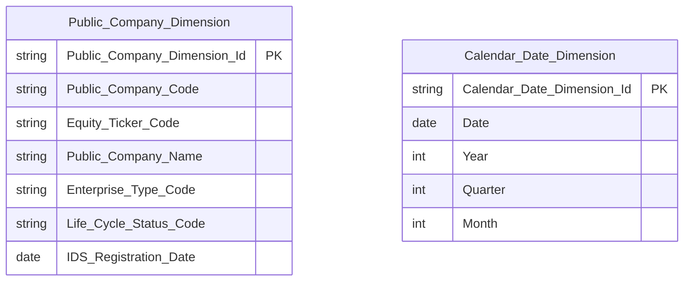
```mermaid
erDiagram
    Public_Company_Dimension {
        string Public_Company_Dimension_Id PK
        string Public_Company_Code
        string Equity_Ticker_Code
        string Public_Company_Name
        string Enterprise_Type_Code
        string Life_Cycle_Status_Code
        date IDS_Registration_Date
    }

    Calendar_Date_Dimension {
        string Calendar_Date_Dimension_Id PK
        date Date
        int Year
        int Quarter
        int Month
    }
```

**Lineage Mart → Báo cáo:**

```mermaid
flowchart LR
    D1[Public Company Dimension] --> R1[Bảng Xếp hạng — Cột Tên DN và Mã DN]
```

**Bảng grain:**

| Tên bảng | Grain |
|---|---|
| Public Company Dimension | 1 row / công ty đại chúng (SCD2) |
| Calendar Date Dimension | 1 row / ngày (Conformed) |

---

#### Nhóm 2 — STT 2: Top CTDC theo chỉ tiêu tuân thủ

##### PENDING

**KPI liên quan:**

| KPI ID | Tên KPI | Tính chất | Trạng thái |
|---|---|---|---|
| K_GSDC_8 | Mã CK doanh nghiệp | Chiều | reuse từ Nhóm 1 |
| K_GSDC_9 | Tên doanh nghiệp | Chiều | reuse từ Nhóm 1 |
| K_GSDC_10 | Công bố BCTC | Base | Pending - chưa thiết kế nguồn |
| K_GSDC_11 | Công bố BCTN | Base | Pending - chưa thiết kế nguồn |
| K_GSDC_12 | Công bố báo cáo tình hình quản trị | Base | Pending - chưa thiết kế nguồn |
| K_GSDC_13 | Công bố thông tin Thay đổi TGĐ/CTHĐQT | Base | Pending - chưa thiết kế nguồn |
| K_GSDC_14 | Công bố thông tin vi phạm, quyết định xử phạt | Base | Pending - chưa thiết kế nguồn |
| K_GSDC_15 | Điều lệ Công ty và Các Quy chế hoạt động | Base | Pending - chưa thiết kế nguồn |
| K_GSDC_16 | Số lượng ĐHĐCĐ thường niên trong 6 tháng đầu năm | Base | Pending - chưa thiết kế nguồn |
| K_GSDC_17 | Số lượng thành viên HĐQT độc lập | Base | Pending - chưa thiết kế nguồn |
| K_GSDC_18 | Số lượng thành viên HĐQT không điều hành | Base | Pending - chưa thiết kế nguồn |
| K_GSDC_19 | Tư cách thành viên HĐQT/BKS/Kế toán trưởng | Base | Pending - chưa thiết kế nguồn |
| K_GSDC_20 | Số lượng thành viên BKS hoặc Ủy ban kiểm toán | Base | Pending - chưa thiết kế nguồn |
| K_GSDC_21 | Báo cáo tiến độ sử dụng vốn | Base | Pending - chưa thiết kế nguồn |
| K_GSDC_22 | Thay đổi phương án sử dụng vốn | Base | Pending - chưa thiết kế nguồn |
| K_GSDC_23 | Tổng điểm Tuân thủ | Base | Pending - chưa thiết kế nguồn |

**Lý do PENDING:** BA ghi nhận `failed` — bảng lưu kết quả điểm từng tiêu chí tuân thủ chưa được thiết kế trong CSDL IDS.

**Atomic cần bổ sung:** `Public Company Compliance Score` — entity lưu điểm từng tiêu chí tuân thủ theo CTDC × kỳ đánh giá.

**Mart dự kiến:** `Fact Public Company Compliance Score Snapshot` (grain: 1 row / CTDC / kỳ đánh giá)

---

#### Nhóm 3 — STT 3: Top CTDC theo chỉ tiêu phát hành

##### PENDING

**KPI liên quan:**

| KPI ID | Tên KPI | Tính chất | Trạng thái |
|---|---|---|---|
| K_GSDC_8 | Mã doanh nghiệp | Chiều | reuse từ Nhóm 1 |
| K_GSDC_9 | Tên doanh nghiệp | Chiều | reuse từ Nhóm 1 |
| K_GSDC_24 | Phát hành tăng vốn nhanh | Base | Pending - chưa thiết kế nguồn |
| K_GSDC_25 | Số lần chào bán cổ phiếu riêng lẻ | Base | Pending - chưa thiết kế nguồn |
| K_GSDC_26 | Số lần chào bán ra công chúng | Base | Pending - chưa thiết kế nguồn |
| K_GSDC_27 | Số lần phát hành ESOP | Base | Pending - chưa thiết kế nguồn |
| K_GSDC_28 | Tỷ lệ phát hành trái phiếu không có TSBĐ | Base | Pending - chưa thiết kế nguồn |
| K_GSDC_29 | Tỷ lệ trái phiếu vi phạm nghĩa vụ thanh toán lãi và gốc | Base | Pending - chưa thiết kế nguồn |
| K_GSDC_30 | Dư nợ trái phiếu / Tổng VCSH | Base | Pending - chưa thiết kế nguồn |
| K_GSDC_31 | Tổng điểm Phát hành | Base | Pending - chưa thiết kế nguồn |

**Lý do PENDING:** BA ghi nhận `failed` — bảng lưu kết quả điểm từng tiêu chí phát hành chưa được thiết kế trong CSDL IDS.

**Atomic cần bổ sung:** `Public Company Issuance Score` — entity lưu điểm từng tiêu chí phát hành theo CTDC × kỳ đánh giá.

**Mart dự kiến:** `Fact Public Company Issuance Score Snapshot` (grain: 1 row / CTDC / kỳ đánh giá)

---

#### Nhóm 4 — STT 4: Top CTDC theo chỉ tiêu tài chính

##### PENDING

**KPI liên quan:**

| KPI ID | Tên KPI | Tính chất | Trạng thái |
|---|---|---|---|
| K_GSDC_8 | Mã doanh nghiệp | Chiều | reuse từ Nhóm 1 |
| K_GSDC_9 | Tên doanh nghiệp | Chiều | reuse từ Nhóm 1 |
| K_GSDC_32 | Kiểm toán — Ý kiến kiểm toán | Base | Pending - chưa thiết kế nguồn |
| K_GSDC_33 | Khả năng hoạt động liên tục | Base | Pending - chưa thiết kế nguồn |
| K_GSDC_34 | Dòng tiền từ hoạt động kinh doanh | Base | Pending - chưa thiết kế nguồn |
| K_GSDC_35 | Khả năng thanh toán hiện thời | Base | Pending - chưa thiết kế nguồn |
| K_GSDC_36 | EBIT / Lãi vay | Base | Pending - chưa thiết kế nguồn |
| K_GSDC_37 | Nợ / VCSH | Base | Pending - chưa thiết kế nguồn |
| K_GSDC_38 | Nợ / Vốn điều lệ | Base | Pending - chưa thiết kế nguồn |
| K_GSDC_39 | VCSH | Base | Pending - chưa thiết kế nguồn |
| K_GSDC_40 | ROE | Base | Pending - chưa thiết kế nguồn |
| K_GSDC_41 | Doanh thu từ HĐ tài chính / Lợi nhuận sau thuế | Base | Pending - chưa thiết kế nguồn |
| K_GSDC_42 | Doanh thu từ hoạt động khác / Lợi nhuận sau thuế | Base | Pending - chưa thiết kế nguồn |
| K_GSDC_43 | Tổng điểm Tài chính | Base | Pending - chưa thiết kế nguồn |

**Lý do PENDING:** BA ghi nhận `failed` — bảng lưu kết quả điểm từng tiêu chí tài chính chưa được thiết kế trong CSDL IDS.

**Atomic cần bổ sung:** `Public Company Financial Score` — entity lưu điểm từng tiêu chí tài chính theo CTDC × kỳ đánh giá.

**Mart dự kiến:** `Fact Public Company Financial Score Snapshot` (grain: 1 row / CTDC / kỳ đánh giá)

---

#### Nhóm 5 — STT 5: Top CTDC theo chỉ tiêu phi tài chính & M-Score

##### PENDING

**KPI liên quan:**

| KPI ID | Tên KPI | Tính chất | Trạng thái |
|---|---|---|---|
| K_GSDC_8 | Mã doanh nghiệp | Chiều | reuse từ Nhóm 1 |
| K_GSDC_9 | Tên doanh nghiệp | Chiều | reuse từ Nhóm 1 |
| K_GSDC_44 | Tình trạng DN từ Cục Đăng ký kinh doanh | Base | Pending - chưa thiết kế nguồn |
| K_GSDC_45 | Sở hữu giữa các bên liên quan | Base | Pending - chưa thiết kế nguồn |
| K_GSDC_46 | M-Score | Base | Pending - chưa thiết kế nguồn |
| K_GSDC_47 | Tổng điểm Phi tài chính & M-Score | Base | Pending - chưa thiết kế nguồn |

**Lý do PENDING:** BA ghi nhận `failed` — bảng lưu kết quả điểm phi tài chính và M-Score chưa được thiết kế trong CSDL IDS.

**Atomic cần bổ sung:** `Public Company Non-Financial Score` — entity lưu điểm phi tài chính và M-Score theo CTDC × kỳ đánh giá.

**Mart dự kiến:** `Fact Public Company Non-Financial Score Snapshot` (grain: 1 row / CTDC / kỳ đánh giá)

---

### Màn hình 2 — Giám sát Tổng hợp

Màn hình có bộ lọc **Năm / Quý** và 5 tab sàn. Mỗi tab hiển thị cùng cấu trúc 3 nhóm nội dung, chỉ khác filter `Equity_Listing_Exchange_Code`.

#### Nhóm 6 — STT 6, 12, 14, 16, 18: Thống kê theo sàn niêm yết

##### READY

> Phân loại: **Phân tích**
> Atomic: `Public Company` ← IDS.company_detail — **READY**
> Atomic: `Public Company Report Submission` ← IDS.company_data — **READY**
> Atomic: `Public Company Financial Report Value` ← IDS.data — **READY**
> **Ghi chú thiết kế (Hướng A):** Nhóm 6 phục vụ toàn bộ STT 6, 12, 14, 16, 18 (thống kê niêm yết theo từng sàn). Các KPI này dùng chung — phân biệt sàn bằng SLICER `Equity_Listing_Exchange_Code`. Các Nhóm 12/14/16/18 đã được gộp vào đây; không tạo KPI_ID riêng theo sàn.
> **Ghi chú Detail Mapping:** Detail Mapping tách per-sàn thành 4 nhóm riêng (Nhóm 12 HNX / Nhóm 14 HOSE / Nhóm 16 UPCOM / Nhóm 18 OTC) để ánh xạ 1:1 với BA analyst theo từng dashboard sàn. Tất cả đều dùng cùng KPI_ID K_GSDC_48–51 với filter `eqty_listing_exg_code` tương ứng từng sàn.

**Source:** `Fact Public Company Financial Summary Snapshot` → `Public Company Dimension`, `Calendar Date Dimension`

**Bảng KPI:**

| KPI ID | Tên KPI | Đơn vị | Tính chất | Atomic Entity | Atomic Table | Atomic Attribute | Atomic Column | Ghi chú |
|---|---|---|---|---|---|---|---|---|
| K_GSDC_48 | Kỳ thống kê (Năm/Quý) | Text | Chiều (Slicer) | — | — | — | — | Tham số `:year` / `:quarter` |
| K_GSDC_49 | Số doanh nghiệp | DN | Phái sinh | Public Company | pblc_co | IDS Registration Date | ids_rgst_dt | COUNT DISTINCT WHERE ids_rgst_dt <= cuối kỳ — xem O_GSDC_2 |
| K_GSDC_50 | Tỷ lệ nộp BCTC | % | Phái sinh | Public Company Report Submission | pblc_co_rpt_subm | Submission Date / Submission Deadline Date | subm_dt / subm_ddln_dt | COUNT(CASE WHEN subm_dt <= subm_ddln_dt) / COUNT(*) × 100 |
| K_GSDC_51 | Số DN báo lãi | DN | Phái sinh | Public Company Financial Report Value | pblc_co_fnc_rpt_val | Data Value | data_val | COUNT DISTINCT WHERE data_val > 0 AND Row Description Column Code IN ('60' dn/bh, '21' td) AND report_cd LIKE 'BCKQKD%' |

**Star Schema:**

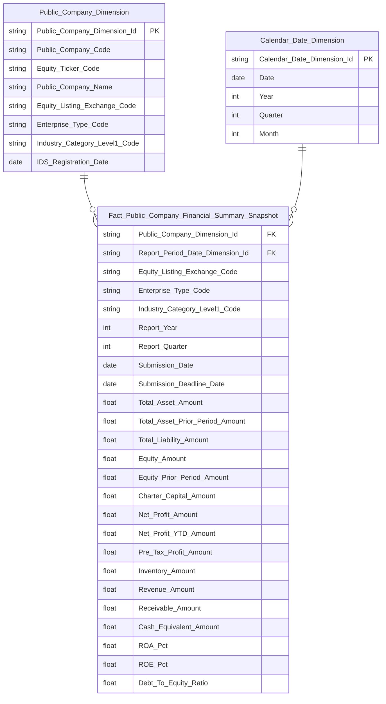
```mermaid
erDiagram
    Fact_Public_Company_Financial_Summary_Snapshot {
        string Public_Company_Dimension_Id FK
        string Report_Period_Date_Dimension_Id FK
        string Equity_Listing_Exchange_Code
        string Enterprise_Type_Code
        string Industry_Category_Level1_Code
        int Report_Year
        int Report_Quarter
        date Submission_Date
        date Submission_Deadline_Date
        float Total_Asset_Amount
        float Total_Asset_Prior_Period_Amount
        float Total_Liability_Amount
        float Equity_Amount
        float Equity_Prior_Period_Amount
        float Charter_Capital_Amount
        float Net_Profit_Amount
        float Net_Profit_YTD_Amount
        float Pre_Tax_Profit_Amount
        float Inventory_Amount
        float Revenue_Amount
        float Receivable_Amount
        float Cash_Equivalent_Amount
        float ROA_Pct
        float ROE_Pct
        float Debt_To_Equity_Ratio
    }

    Public_Company_Dimension {
        string Public_Company_Dimension_Id PK
        string Public_Company_Code
        string Equity_Ticker_Code
        string Public_Company_Name
        string Equity_Listing_Exchange_Code
        string Enterprise_Type_Code
        string Industry_Category_Level1_Code
        date IDS_Registration_Date
    }

    Calendar_Date_Dimension {
        string Calendar_Date_Dimension_Id PK
        date Date
        int Year
        int Quarter
        int Month
    }

    Public_Company_Dimension ||--o{ Fact_Public_Company_Financial_Summary_Snapshot : ""
    Calendar_Date_Dimension ||--o{ Fact_Public_Company_Financial_Summary_Snapshot : ""
```

> **Ghi chú thiết kế Fact Summary Snapshot:**
> - `Total_Asset_Prior_Period_Amount`: map từ `Public Company Financial Report Value`.`Data Value` (`data_val`) WHERE `Row Description Column Code` (`row_dsc_clmn_code`) IN ('270' dn/bh, '300' td) AND `Column Code` (`clmn_code`) = col_desc='2' (đầu kỳ).
> - `Equity_Prior_Period_Amount`: tương tự WHERE row_desc IN ('400' dn/bh, '500' td), col_desc='2'.
> - `Pre_Tax_Profit_Amount`: `data_val` WHERE row_desc IN ('50' dn/bh, '17' td), col_desc='1', report_cd LIKE 'BCKQKD%'.
> - `Net_Profit_YTD_Amount`: `data_val` WHERE row_desc IN ('421' dn/bh, '450' td), col_desc='1', report_cd LIKE 'BCDKT%'.
> - `Inventory_Amount`: `data_val` WHERE row_desc='140' (dn/bh only), col_desc='1'.
> - `Receivable_Amount`: SUM `data_val` WHERE row_desc IN ('130','210') (dn/bh) / '251' (td), col_desc='1'.
> - `Cash_Equivalent_Amount`: `data_val` WHERE row_desc='110' (dn/bh) / row_desc IN ('110','120') (td), col_desc='1'.
> - `Submission_Date` / `Submission_Deadline_Date`: từ `Public Company Report Submission`.`subm_dt` / `subm_ddln_dt`.
> - `Industry_Category_Level1_Code` / `Equity_Listing_Exchange_Code` denormalize vào Fact từ `Public Company`.`idy_cgy_level1_code` / `eqty_listing_exg_code`.
> - YoY % là phái sinh thuần túy — tính tại query layer, không lưu trong mart.

**Lineage Mart → Báo cáo:**

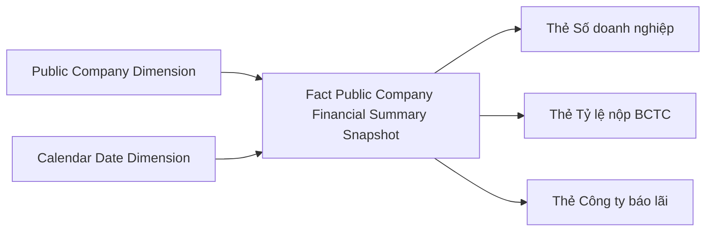
```mermaid
flowchart LR
    F1[Fact Public Company Financial Summary Snapshot] --> R1[Thẻ Số doanh nghiệp]
    F1 --> R2[Thẻ Tỷ lệ nộp BCTC]
    F1 --> R3[Thẻ Công ty báo lãi]
    D1[Public Company Dimension] --> F1
    D8[Calendar Date Dimension] --> F1
```

**Bảng grain:**

| Tên bảng | Grain |
|---|---|
| Fact Public Company Financial Summary Snapshot | 1 row / CTDC / kỳ báo cáo (năm × quý) |
| Public Company Dimension | 1 row / công ty đại chúng (SCD2) |
| Calendar Date Dimension | 1 row / ngày (Conformed) |

---

#### Nhóm 7 — STT 7, 13, 15, 17, 19: Tổng hợp chỉ tiêu tài chính theo sàn

##### READY

> Phân loại: **Phân tích**
> Source: dùng chung `Fact Public Company Financial Summary Snapshot` — aggregate theo sàn và kỳ.
> **Ghi chú thiết kế (Hướng A):** Nhóm 7 phục vụ toàn bộ STT 7, 13, 15, 17, 19 (CTTC tổng hợp theo từng sàn). Dùng 1 bộ KPI_ID duy nhất (K_GSDC_52–64 + _YOY). Phân biệt sàn bằng SLICER `Equity_Listing_Exchange_Code` (xem Nhóm 6 K_GSDC_48). Các Nhóm 13/15/17/19 đã được gộp vào đây.
> **Ghi chú Detail Mapping:** Detail Mapping tách per-sàn thành 4 nhóm riêng (Nhóm 13 HNX / Nhóm 15 HOSE / Nhóm 17 UPCOM / Nhóm 19 OTC) để ánh xạ 1:1 với BA analyst theo từng dashboard sàn. Tất cả đều dùng cùng KPI_ID K_GSDC_52–78 với filter `eqty_listing_exg_code` tương ứng từng sàn.

**Bảng KPI:**

| KPI ID | Tên KPI | Đơn vị | Tính chất | Công thức / Atomic | row_dsc_clmn_code (dn) | row_dsc_clmn_code (bh) | row_dsc_clmn_code (td) | Loại BC | col_desc |
|---|---|---|---|---|---|---|---|---|---|
| K_GSDC_52 | Tổng tài sản | Tỉ đồng | Phái sinh | SUM(Total_Asset_Amount) từ pblc_co_fnc_rpt_val.data_val | 270 | 270 | 300 | BCDKT | 1 |
| K_GSDC_52_YOY | Tổng tài sản — YoY | % | Phái sinh | Derive tại query layer | — | — | — | — | — |
| K_GSDC_53 | Nợ phải trả | Tỉ đồng | Phái sinh | SUM(Total_Liability_Amount) từ pblc_co_fnc_rpt_val.data_val | 300 | 300 | 400 | BCDKT | 1 |
| K_GSDC_53_YOY | Nợ phải trả — YoY | % | Phái sinh | Derive tại query layer | — | — | — | — | — |
| K_GSDC_54 | Vốn CSH | Tỉ đồng | Phái sinh | SUM(Equity_Amount) từ pblc_co_fnc_rpt_val.data_val | 400 | 400 | 500 | BCDKT | 1 |
| K_GSDC_54_YOY | Vốn CSH — YoY | % | Phái sinh | Derive tại query layer | — | — | — | — | — |
| K_GSDC_55 | Vốn điều lệ | Tỉ đồng | Phái sinh | SUM(Charter_Capital_Amount) từ pblc_co_fnc_rpt_val.data_val | 411 | 411 | 411 | BCDKT | 1 |
| K_GSDC_55_YOY | Vốn điều lệ — YoY | % | Phái sinh | Derive tại query layer | — | — | — | — | — |
| K_GSDC_56 | Lợi nhuận sau thuế | Tỉ đồng | Phái sinh | SUM(Net_Profit_Amount) từ pblc_co_fnc_rpt_val.data_val | 60 | 60 | 21 | BCKQKD | 1 |
| K_GSDC_56_YOY | LNST — YoY | % | Phái sinh | Derive tại query layer | — | — | — | — | — |
| K_GSDC_57 | ROA | % | Phái sinh | SUM(Net_Profit_Amount) / SUM((Total_Asset_Amount + Total_Asset_Prior_Period_Amount)/2) × 100 | — | — | — | — | — |
| K_GSDC_57_YOY | ROA — YoY | % | Phái sinh | ROA_N − ROA_N-1 — query layer | — | — | — | — | — |
| K_GSDC_58 | ROE | % | Phái sinh | SUM(Net_Profit_Amount) / SUM((Equity_Amount + Equity_Prior_Period_Amount)/2) × 100 | — | — | — | — | — |
| K_GSDC_58_YOY | ROE — YoY | % | Phái sinh | ROE_N − ROE_N-1 — query layer | — | — | — | — | — |
| K_GSDC_59 | Hàng tồn kho | Tỉ đồng | Phái sinh | SUM(Inventory_Amount) từ pblc_co_fnc_rpt_val.data_val — chỉ dn/bh | 140 | 140 | — | BCDKT | 1 |
| K_GSDC_59_YOY | Hàng tồn kho — YoY | % | Phái sinh | Derive tại query layer | — | — | — | — | — |
| K_GSDC_60 | Doanh thu thuần | Tỉ đồng | Phái sinh | SUM(Revenue_Amount) từ pblc_co_fnc_rpt_val.data_val | 10 | 10 | 03 | BCKQKD | 1 |
| K_GSDC_60_YOY | Doanh thu — YoY | % | Phái sinh | Derive tại query layer | — | — | — | — | — |
| K_GSDC_61 | Lợi nhuận dồn tích YTD | Tỉ đồng | Phái sinh | SUM(Net_Profit_YTD_Amount) từ pblc_co_fnc_rpt_val.data_val | 421 | 421 | 450 | BCDKT | 1 |
| K_GSDC_61_YOY | LN YTD — YoY | % | Phái sinh | Derive tại query layer | — | — | — | — | — |
| K_GSDC_62 | Phải thu | Tỉ đồng | Phái sinh | SUM(Receivable_Amount) từ pblc_co_fnc_rpt_val.data_val — tổng ngắn hạn+dài hạn | 130+210 | 130+210 | 251 | BCDKT | 1 |
| K_GSDC_62_YOY | Phải thu — YoY | % | Phái sinh | Derive tại query layer | — | — | — | — | — |
| K_GSDC_63 | Tiền và tương đương tiền | Tỉ đồng | Phái sinh | SUM(Cash_Equivalent_Amount) từ pblc_co_fnc_rpt_val.data_val | 110 | 110 | 110+120 | BCDKT | 1 |
| K_GSDC_63_YOY | Tiền TĐT — YoY | % | Phái sinh | Derive tại query layer | — | — | — | — | — |
| K_GSDC_64 | Nợ / Vốn CSH | Lần (x) | Phái sinh | SUM(Total_Liability_Amount) / NULLIF(SUM(Equity_Amount),0) | — | — | — | — | — |
| K_GSDC_64_YOY | Nợ/Vốn CSH — YoY | % | Phái sinh | Derive tại query layer | — | — | — | — | — |

> **Ghi chú:** Cột `row_dsc_clmn_code` = `Financial Report Row Template`.`Row Description Column Code` (`row_dsc_clmn_code`) trong Atomic — đây là mã nghiệp vụ BA gọi là `row_desc` trong SQL.

**Star Schema:** dùng chung `Fact_Public_Company_Financial_Summary_Snapshot`.

**Lineage Mart → Báo cáo:**

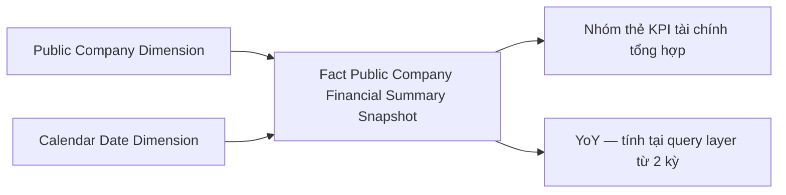
```mermaid
flowchart LR
    F1[Fact Public Company Financial Summary Snapshot] --> R4[Nhóm thẻ KPI tài chính tổng hợp]
    F1 --> R5[YoY — tính tại query layer từ 2 kỳ]
    D1[Public Company Dimension] --> F1
    D8[Calendar Date Dimension] --> F1
```

**Bảng grain:**

| Tên bảng | Grain |
|---|---|
| Fact Public Company Financial Summary Snapshot | 1 row / CTDC / kỳ báo cáo (năm × quý) |
| Public Company Dimension | 1 row / công ty đại chúng (SCD2) |
| Calendar Date Dimension | 1 row / ngày (Conformed) |

---

#### Nhóm 8 — STT 8, 9, 10: Tổng hợp CTTC theo ngành

##### READY

> Phân loại: **Phân tích**
> Source: dùng chung `Fact Public Company Financial Summary Snapshot` — GROUP BY `Industry_Category_Level1_Code`.
> **Ghi chú thiết kế (Hướng A):** STT 8, 9, 10 đều là aggregate theo ngành — gộp thành 1 nhóm. Các KPI_ID K_GSDC_65–78 bao gồm đầy đủ tất cả chỉ tiêu. Các Nhóm 9/10 đã được gộp vào đây.

**Bảng KPI:**

| KPI ID | Tên KPI | Đơn vị | Tính chất | Atomic Entity | Atomic Table | Atomic Attribute | Atomic Column | row_dsc_clmn_code (dn/bh/td) | Loại BC | col_desc |
|---|---|---|---|---|---|---|---|---|---|---|
| K_GSDC_65 | Ngành kinh tế | Text | Chiều (Group By) | Public Company | pblc_co | Industry Category Level1 Code | idy_cgy_level1_code | — | — | — |
| K_GSDC_66 | Tổng tài sản theo ngành | Tỉ đồng | Phái sinh | Public Company Financial Report Value | pblc_co_fnc_rpt_val | Data Value | data_val | 270/270/300 | BCDKT | 1 |
| K_GSDC_67 | Nợ phải trả theo ngành | Tỉ đồng | Phái sinh | Public Company Financial Report Value | pblc_co_fnc_rpt_val | Data Value | data_val | 300/300/400 | BCDKT | 1 |
| K_GSDC_68 | Vốn CSH theo ngành | Tỉ đồng | Phái sinh | Public Company Financial Report Value | pblc_co_fnc_rpt_val | Data Value | data_val | 400/400/500 | BCDKT | 1 |
| K_GSDC_69 | Vốn điều lệ theo ngành | Tỉ đồng | Phái sinh | Public Company Financial Report Value | pblc_co_fnc_rpt_val | Data Value | data_val | 411/411/411 | BCDKT | 1 |
| K_GSDC_70 | Lợi nhuận sau thuế theo ngành | Tỉ đồng | Phái sinh | Public Company Financial Report Value | pblc_co_fnc_rpt_val | Data Value | data_val | 60/60/21 | BCKQKD | 1 |
| K_GSDC_71 | ROA theo ngành | % | Phái sinh | Public Company Financial Report Value | pblc_co_fnc_rpt_val | Data Value | data_val | — | — | — |
| K_GSDC_72 | ROE theo ngành | % | Phái sinh | Public Company Financial Report Value | pblc_co_fnc_rpt_val | Data Value | data_val | — | — | — |
| K_GSDC_73 | Hàng tồn kho theo ngành | Tỉ đồng | Phái sinh | Public Company Financial Report Value | pblc_co_fnc_rpt_val | Data Value | data_val | 140/140/— | BCDKT | 1 |
| K_GSDC_74 | Doanh thu thuần theo ngành | Tỉ đồng | Phái sinh | Public Company Financial Report Value | pblc_co_fnc_rpt_val | Data Value | data_val | 10/10/03 | BCKQKD | 1 |
| K_GSDC_75 | Lợi nhuận dồn tích YTD theo ngành | Tỉ đồng | Phái sinh | Public Company Financial Report Value | pblc_co_fnc_rpt_val | Data Value | data_val | 421/421/450 | BCDKT | 1 |
| K_GSDC_76 | Phải thu theo ngành | Tỉ đồng | Phái sinh | Public Company Financial Report Value | pblc_co_fnc_rpt_val | Data Value | data_val | 130+210/130+210/251 | BCDKT | 1 |
| K_GSDC_77 | Tiền và tương đương tiền theo ngành | Tỉ đồng | Phái sinh | Public Company Financial Report Value | pblc_co_fnc_rpt_val | Data Value | data_val | 110/110/110+120 | BCDKT | 1 |
| K_GSDC_78 | Nợ / Vốn CSH theo ngành | Lần (x) | Phái sinh | Public Company Financial Report Value | pblc_co_fnc_rpt_val | Data Value | data_val | — | — | — |

**Star Schema:** dùng chung `Fact_Public_Company_Financial_Summary_Snapshot`.

**Lineage Mart → Báo cáo:**

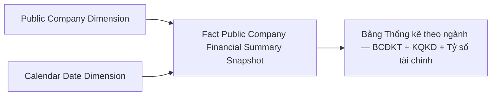
```mermaid
flowchart LR
    F1[Fact Public Company Financial Summary Snapshot] --> R6[Bảng Thống kê theo ngành — BCĐKT + KQKD + Tỷ số tài chính]
    D1[Public Company Dimension] --> F1
    D8[Calendar Date Dimension] --> F1
```

**Bảng grain:**

| Tên bảng | Grain |
|---|---|
| Fact Public Company Financial Summary Snapshot | 1 row / CTDC / kỳ báo cáo (năm × quý) |
| Public Company Dimension | 1 row / công ty đại chúng (SCD2) |
| Calendar Date Dimension | 1 row / ngày (Conformed) |

---

#### Nhóm 11 — STT 11: Giám sát tổng hợp — CTDC chưa niêm yết

##### READY

> Phân loại: **Phân tích**
> Source: `Fact Public Company Financial Summary Snapshot` — filter `Equity_Listing_Exchange_Code = 'OTC'`

**Bảng KPI:**

| KPI ID | Tên KPI | Đơn vị | Tính chất | Atomic Entity | Atomic Table | Atomic Attribute | Atomic Column | Ghi chú |
|---|---|---|---|---|---|---|---|---|
| K_GSDC_79 | Số CTDC chưa niêm yết | DN | Phái sinh | Public Company | pblc_co | IDS Registration Date | ids_rgst_dt | COUNT DISTINCT WHERE ids_rgst_dt <= cuối kỳ AND eqty_listing_exg_code IS NULL |

**Star Schema:** dùng chung `Fact_Public_Company_Financial_Summary_Snapshot`.

**Lineage Mart → Báo cáo:**

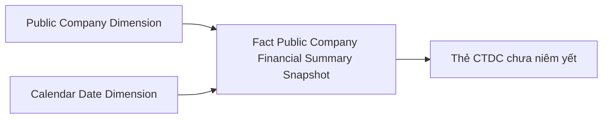
```mermaid
flowchart LR
    F1[Fact Public Company Financial Summary Snapshot] --> R9[Thẻ CTDC chưa niêm yết]
    D1[Public Company Dimension] --> F1
    D8[Calendar Date Dimension] --> F1
```

**Bảng grain:**

| Tên bảng | Grain |
|---|---|
| Fact Public Company Financial Summary Snapshot | 1 row / CTDC / kỳ báo cáo (năm × quý) |
| Public Company Dimension | 1 row / công ty đại chúng (SCD2) |
| Calendar Date Dimension | 1 row / ngày (Conformed) |

---

#### Nhóm 20 — STT 20: Dữ liệu tài chính doanh nghiệp — Metadata BCTC

##### READY

> Phân loại: **Phân tích**
> Source: `Financial Report Catalog Dimension` — tra cứu danh mục báo cáo/dòng/cột
> Ghi chú: STT 20 chỉ có chiều, không có KPI cơ sở — phục vụ bộ lọc Data Explorer MH3.

**Bảng KPI (chiều):**

| KPI ID | Tên KPI | Đơn vị | Tính chất | Atomic Entity | Atomic Table | Atomic Attribute | Atomic Column | Ghi chú |
|---|---|---|---|---|---|---|---|---|
| K_GSDC_80 | Mã báo cáo | Text | Chiều | Financial Report Catalog | fnc_rpt_ctlg | Financial Report Catalog Business Code | fnc_rpt_ctlg_bsn_code | Filter Report Direction Type Code = 'i' AND Active Flag = true |
| K_GSDC_81 | Tên báo cáo | Text | Chiều | Financial Report Catalog | fnc_rpt_ctlg | Financial Report Catalog Name | fnc_rpt_ctlg_nm | — |
| K_GSDC_82 | Mã chỉ tiêu dòng | Text | Chiều | Financial Report Row Template | fnc_rpt_row_tpl | Row Code | row_code | order by Row Index |
| K_GSDC_83 | Tên chỉ tiêu dòng | Text | Chiều | Financial Report Row Template | fnc_rpt_row_tpl | Row Description Column Code / Row Name | row_dsc_clmn_code / row_nm | `row_dsc_clmn_code \|\| ' - ' \|\| row_nm` |
| K_GSDC_84 | Mã chỉ tiêu cột | Text | Chiều | Financial Report Column Template | fnc_rpt_clmn_tpl | Column Code | clmn_code | order by Column Index |
| K_GSDC_85 | Tên chỉ tiêu cột | Text | Chiều | Financial Report Column Template | fnc_rpt_clmn_tpl | Column Name | clmn_nm | xem O_GSDC_3 — col_desc chưa có trong Atomic |

---

### Màn hình 3 — Data Explorer: Dữ liệu tài chính doanh nghiệp

Data Explorer cho phép tra cứu BCTC chi tiết theo từng CTDC, kỳ báo cáo và loại hình DN. Toàn bộ STT 21–32 + STT 39 phục vụ bởi `Fact Public Company Financial Report Value` + `Financial Report Catalog Dimension`.

**Ghi chú chung toàn bộ MH3:**
- Tất cả chỉ tiêu lấy trực tiếp `Data Value` (`data_val`) từ `Public Company Financial Report Value` (`pblc_co_fnc_rpt_val`)
- `col_desc` trong BA SQL tương ứng `Column Code` (`clmn_code`) trong Atomic — xem O_GSDC_3
- `row_desc` trong BA SQL tương ứng `Row Description Column Code` (`row_dsc_clmn_code`) trong Atomic `Financial Report Row Template` (`fnc_rpt_row_tpl`)
- `col_desc='1'` = cuối kỳ / kỳ hiện tại; `col_desc='2'` = đầu kỳ (BCĐKT)

---

#### Nhóm 21 — STT 21: DN thông thường — Bảng cân đối kế toán

##### READY

> Phân loại: **Phân tích**
> Atomic: `Public Company Financial Report Value` ← IDS.data (`pblc_co_fnc_rpt_val`) — **READY**
> Filter: `Enterprise Type Code` (`entp_tp_code`) = 'dn', `Financial Report Catalog Business Code` LIKE 'BCDKT%'

**Source:** `Fact Public Company Financial Report Value` → `Public Company Dimension`, `Calendar Date Dimension`, `Financial Report Catalog Dimension`

**Bảng KPI:**

| KPI ID | Tên chỉ tiêu | Atomic Entity | Atomic Table | Atomic Attribute | Atomic Column | row_dsc_clmn_code | col_desc | Tính chất |
|---|---|---|---|---|---|---|---|---|
| K_GSDC_86 | A – Tài sản ngắn hạn | Public Company Financial Report Value | pblc_co_fnc_rpt_val | Data Value | data_val | 100 | 1/2 | Cơ sở |
| K_GSDC_87 | I – Tiền và các khoản tương đương tiền | Public Company Financial Report Value | pblc_co_fnc_rpt_val | Data Value | data_val | 110 | 1/2 | Cơ sở |
| K_GSDC_88 | 1. Tiền | Public Company Financial Report Value | pblc_co_fnc_rpt_val | Data Value | data_val | 111 | 1/2 | Cơ sở |
| K_GSDC_89 | 2. Các khoản tương đương tiền | Public Company Financial Report Value | pblc_co_fnc_rpt_val | Data Value | data_val | 112 | 1/2 | Cơ sở |
| K_GSDC_90 | II – Đầu tư tài chính ngắn hạn | Public Company Financial Report Value | pblc_co_fnc_rpt_val | Data Value | data_val | 120 | 1/2 | Cơ sở |
| K_GSDC_91 | 1. Chứng khoán kinh doanh | Public Company Financial Report Value | pblc_co_fnc_rpt_val | Data Value | data_val | 121 | 1/2 | Cơ sở |
| K_GSDC_92 | 2. Dự phòng giảm giá chứng khoán kinh doanh | Public Company Financial Report Value | pblc_co_fnc_rpt_val | Data Value | data_val | 122 | 1/2 | Cơ sở |
| K_GSDC_93 | 3. Đầu tư nắm giữ đến ngày đáo hạn | Public Company Financial Report Value | pblc_co_fnc_rpt_val | Data Value | data_val | 123 | 1/2 | Cơ sở |
| K_GSDC_94 | III – Các khoản phải thu ngắn hạn | Public Company Financial Report Value | pblc_co_fnc_rpt_val | Data Value | data_val | 130 | 1/2 | Cơ sở |
| K_GSDC_95 | 1. Phải thu ngắn hạn của khách hàng | Public Company Financial Report Value | pblc_co_fnc_rpt_val | Data Value | data_val | 131 | 1/2 | Cơ sở |
| K_GSDC_96 | 2. Trả trước cho người bán ngắn hạn | Public Company Financial Report Value | pblc_co_fnc_rpt_val | Data Value | data_val | 132 | 1/2 | Cơ sở |
| K_GSDC_97 | 3. Phải thu nội bộ ngắn hạn | Public Company Financial Report Value | pblc_co_fnc_rpt_val | Data Value | data_val | 133 | 1/2 | Cơ sở |
| K_GSDC_98 | 4. Phải thu theo tiến độ HĐXD | Public Company Financial Report Value | pblc_co_fnc_rpt_val | Data Value | data_val | 134 | 1/2 | Cơ sở |
| K_GSDC_99 | 5. Phải thu về cho vay ngắn hạn | Public Company Financial Report Value | pblc_co_fnc_rpt_val | Data Value | data_val | 135 | 1/2 | Cơ sở |
| K_GSDC_100 | 6. Phải thu ngắn hạn khác | Public Company Financial Report Value | pblc_co_fnc_rpt_val | Data Value | data_val | 136 | 1/2 | Cơ sở |
| K_GSDC_101 | 7. Dự phòng phải thu ngắn hạn khó đòi | Public Company Financial Report Value | pblc_co_fnc_rpt_val | Data Value | data_val | 137 | 1/2 | Cơ sở |
| K_GSDC_102 | 8. Tài sản thiếu chờ xử lý | Public Company Financial Report Value | pblc_co_fnc_rpt_val | Data Value | data_val | 139 | 1/2 | Cơ sở |
| K_GSDC_103 | IV – Hàng tồn kho | Public Company Financial Report Value | pblc_co_fnc_rpt_val | Data Value | data_val | 140 | 1/2 | Cơ sở |
| K_GSDC_104 | 1. Hàng tồn kho | Public Company Financial Report Value | pblc_co_fnc_rpt_val | Data Value | data_val | 141 | 1/2 | Cơ sở |
| K_GSDC_105 | 2. Dự phòng giảm giá hàng tồn kho | Public Company Financial Report Value | pblc_co_fnc_rpt_val | Data Value | data_val | 149 | 1/2 | Cơ sở |
| K_GSDC_106 | V – Tài sản ngắn hạn khác | Public Company Financial Report Value | pblc_co_fnc_rpt_val | Data Value | data_val | 150 | 1/2 | Cơ sở |
| K_GSDC_107 | 1. Chi phí trả trước ngắn hạn | Public Company Financial Report Value | pblc_co_fnc_rpt_val | Data Value | data_val | 151 | 1/2 | Cơ sở |
| K_GSDC_108 | 2. Thuế GTGT được khấu trừ | Public Company Financial Report Value | pblc_co_fnc_rpt_val | Data Value | data_val | 152 | 1/2 | Cơ sở |
| K_GSDC_109 | 3. Thuế và các khoản khác phải thu Nhà nước | Public Company Financial Report Value | pblc_co_fnc_rpt_val | Data Value | data_val | 153 | 1/2 | Cơ sở |
| K_GSDC_110 | 4. Giao dịch mua bán lại trái phiếu CP | Public Company Financial Report Value | pblc_co_fnc_rpt_val | Data Value | data_val | 154 | 1/2 | Cơ sở |
| K_GSDC_111 | 5. Tài sản ngắn hạn khác | Public Company Financial Report Value | pblc_co_fnc_rpt_val | Data Value | data_val | 155 | 1/2 | Cơ sở |
| K_GSDC_112 | B – Tài sản dài hạn | Public Company Financial Report Value | pblc_co_fnc_rpt_val | Data Value | data_val | 200 | 1/2 | Cơ sở |
| K_GSDC_113 | I – Các khoản phải thu dài hạn | Public Company Financial Report Value | pblc_co_fnc_rpt_val | Data Value | data_val | 210 | 1/2 | Cơ sở |
| K_GSDC_114 | 1. Phải thu dài hạn của khách hàng | Public Company Financial Report Value | pblc_co_fnc_rpt_val | Data Value | data_val | 211 | 1/2 | Cơ sở |
| K_GSDC_115 | 2. Trả trước cho người bán dài hạn | Public Company Financial Report Value | pblc_co_fnc_rpt_val | Data Value | data_val | 212 | 1/2 | Cơ sở |
| K_GSDC_116 | 3. Vốn kinh doanh ở đơn vị trực thuộc | Public Company Financial Report Value | pblc_co_fnc_rpt_val | Data Value | data_val | 213 | 1/2 | Cơ sở |
| K_GSDC_117 | 4. Phải thu nội bộ dài hạn | Public Company Financial Report Value | pblc_co_fnc_rpt_val | Data Value | data_val | 214 | 1/2 | Cơ sở |
| K_GSDC_118 | 5. Phải thu về cho vay dài hạn | Public Company Financial Report Value | pblc_co_fnc_rpt_val | Data Value | data_val | 215 | 1/2 | Cơ sở |
| K_GSDC_119 | 6. Phải thu dài hạn khác | Public Company Financial Report Value | pblc_co_fnc_rpt_val | Data Value | data_val | 216 | 1/2 | Cơ sở |
| K_GSDC_120 | 7. Dự phòng phải thu dài hạn khó đòi | Public Company Financial Report Value | pblc_co_fnc_rpt_val | Data Value | data_val | 219 | 1/2 | Cơ sở |
| K_GSDC_121 | II – Tài sản cố định | Public Company Financial Report Value | pblc_co_fnc_rpt_val | Data Value | data_val | 220 | 1/2 | Cơ sở |
| K_GSDC_122 | 1. TSCĐ hữu hình — Nguyên giá | Public Company Financial Report Value | pblc_co_fnc_rpt_val | Data Value | data_val | 221 | 1/2 | Cơ sở |
| K_GSDC_123 | 1. TSCĐ hữu hình — Giá trị còn lại | Public Company Financial Report Value | pblc_co_fnc_rpt_val | Data Value | data_val | 222 | 1/2 | Cơ sở |
| K_GSDC_124 | 1. TSCĐ hữu hình — Hao mòn lũy kế | Public Company Financial Report Value | pblc_co_fnc_rpt_val | Data Value | data_val | 223 | 1/2 | Cơ sở |
| K_GSDC_125 | 2. TSCĐ thuê tài chính — Nguyên giá | Public Company Financial Report Value | pblc_co_fnc_rpt_val | Data Value | data_val | 224 | 1/2 | Cơ sở |
| K_GSDC_126 | 2. TSCĐ thuê tài chính — Giá trị còn lại | Public Company Financial Report Value | pblc_co_fnc_rpt_val | Data Value | data_val | 225 | 1/2 | Cơ sở |
| K_GSDC_127 | 2. TSCĐ thuê tài chính — Hao mòn lũy kế | Public Company Financial Report Value | pblc_co_fnc_rpt_val | Data Value | data_val | 226 | 1/2 | Cơ sở |
| K_GSDC_128 | 3. TSCĐ vô hình — Nguyên giá | Public Company Financial Report Value | pblc_co_fnc_rpt_val | Data Value | data_val | 227 | 1/2 | Cơ sở |
| K_GSDC_129 | 3. TSCĐ vô hình — Giá trị còn lại | Public Company Financial Report Value | pblc_co_fnc_rpt_val | Data Value | data_val | 228 | 1/2 | Cơ sở |
| K_GSDC_130 | 3. TSCĐ vô hình — Hao mòn lũy kế | Public Company Financial Report Value | pblc_co_fnc_rpt_val | Data Value | data_val | 229 | 1/2 | Cơ sở |
| K_GSDC_131 | III – Bất động sản đầu tư — Nguyên giá | Public Company Financial Report Value | pblc_co_fnc_rpt_val | Data Value | data_val | 230 | 1/2 | Cơ sở |
| K_GSDC_132 | III – Bất động sản đầu tư — Giá trị còn lại | Public Company Financial Report Value | pblc_co_fnc_rpt_val | Data Value | data_val | 231 | 1/2 | Cơ sở |
| K_GSDC_133 | III – Bất động sản đầu tư — Hao mòn lũy kế | Public Company Financial Report Value | pblc_co_fnc_rpt_val | Data Value | data_val | 232 | 1/2 | Cơ sở |
| K_GSDC_134 | IV – Tài sản dở dang dài hạn | Public Company Financial Report Value | pblc_co_fnc_rpt_val | Data Value | data_val | 240 | 1/2 | Cơ sở |
| K_GSDC_135 | 1. Chi phí SXKD dở dang dài hạn | Public Company Financial Report Value | pblc_co_fnc_rpt_val | Data Value | data_val | 241 | 1/2 | Cơ sở |
| K_GSDC_136 | 2. Chi phí xây dựng cơ bản dở dang | Public Company Financial Report Value | pblc_co_fnc_rpt_val | Data Value | data_val | 242 | 1/2 | Cơ sở |
| K_GSDC_137 | V – Đầu tư tài chính dài hạn | Public Company Financial Report Value | pblc_co_fnc_rpt_val | Data Value | data_val | 250 | 1/2 | Cơ sở |
| K_GSDC_138 | 1. Đầu tư vào công ty con | Public Company Financial Report Value | pblc_co_fnc_rpt_val | Data Value | data_val | 251 | 1/2 | Cơ sở |
| K_GSDC_139 | 2. Đầu tư vào công ty liên doanh, liên kết | Public Company Financial Report Value | pblc_co_fnc_rpt_val | Data Value | data_val | 252 | 1/2 | Cơ sở |
| K_GSDC_140 | 3. Đầu tư góp vốn vào đơn vị khác | Public Company Financial Report Value | pblc_co_fnc_rpt_val | Data Value | data_val | 253 | 1/2 | Cơ sở |
| K_GSDC_141 | 4. Dự phòng đầu tư tài chính dài hạn | Public Company Financial Report Value | pblc_co_fnc_rpt_val | Data Value | data_val | 254 | 1/2 | Cơ sở |
| K_GSDC_142 | 5. Đầu tư nắm giữ đến ngày đáo hạn | Public Company Financial Report Value | pblc_co_fnc_rpt_val | Data Value | data_val | 255 | 1/2 | Cơ sở |
| K_GSDC_143 | VI – Tài sản dài hạn khác | Public Company Financial Report Value | pblc_co_fnc_rpt_val | Data Value | data_val | 260 | 1/2 | Cơ sở |
| K_GSDC_144 | 1. Chi phí trả trước dài hạn | Public Company Financial Report Value | pblc_co_fnc_rpt_val | Data Value | data_val | 261 | 1/2 | Cơ sở |
| K_GSDC_145 | 2. Tài sản thuế thu nhập hoãn lại | Public Company Financial Report Value | pblc_co_fnc_rpt_val | Data Value | data_val | 262 | 1/2 | Cơ sở |
| K_GSDC_146 | 3. Thiết bị, vật tư, phụ tùng thay thế dài hạn | Public Company Financial Report Value | pblc_co_fnc_rpt_val | Data Value | data_val | 263 | 1/2 | Cơ sở |
| K_GSDC_147 | 4. Tài sản dài hạn khác | Public Company Financial Report Value | pblc_co_fnc_rpt_val | Data Value | data_val | 268 | 1/2 | Cơ sở |
| K_GSDC_148 | 5. Lợi thế thương mại | Public Company Financial Report Value | pblc_co_fnc_rpt_val | Data Value | data_val | 269 | 1/2 | Cơ sở |
| K_GSDC_149 | Tổng cộng tài sản | Public Company Financial Report Value | pblc_co_fnc_rpt_val | Data Value | data_val | 270 | 1/2 | Cơ sở |
| K_GSDC_150 | C – Nợ phải trả | Public Company Financial Report Value | pblc_co_fnc_rpt_val | Data Value | data_val | 300 | 1/2 | Cơ sở |
| K_GSDC_151 | I – Nợ ngắn hạn | Public Company Financial Report Value | pblc_co_fnc_rpt_val | Data Value | data_val | 310 | 1/2 | Cơ sở |
| K_GSDC_152 | 1. Phải trả người bán ngắn hạn | Public Company Financial Report Value | pblc_co_fnc_rpt_val | Data Value | data_val | 311 | 1/2 | Cơ sở |
| K_GSDC_153 | 2. Người mua trả tiền trước ngắn hạn | Public Company Financial Report Value | pblc_co_fnc_rpt_val | Data Value | data_val | 312 | 1/2 | Cơ sở |
| K_GSDC_154 | 3. Thuế và các khoản phải nộp Nhà nước | Public Company Financial Report Value | pblc_co_fnc_rpt_val | Data Value | data_val | 313 | 1/2 | Cơ sở |
| K_GSDC_155 | 4. Phải trả người lao động | Public Company Financial Report Value | pblc_co_fnc_rpt_val | Data Value | data_val | 314 | 1/2 | Cơ sở |
| K_GSDC_156 | 5. Chi phí phải trả ngắn hạn | Public Company Financial Report Value | pblc_co_fnc_rpt_val | Data Value | data_val | 315 | 1/2 | Cơ sở |
| K_GSDC_157 | 6. Phải trả nội bộ ngắn hạn | Public Company Financial Report Value | pblc_co_fnc_rpt_val | Data Value | data_val | 316 | 1/2 | Cơ sở |
| K_GSDC_158 | 7. Phải trả theo tiến độ HĐXD | Public Company Financial Report Value | pblc_co_fnc_rpt_val | Data Value | data_val | 317 | 1/2 | Cơ sở |
| K_GSDC_159 | 8. Doanh thu chưa thực hiện ngắn hạn | Public Company Financial Report Value | pblc_co_fnc_rpt_val | Data Value | data_val | 318 | 1/2 | Cơ sở |
| K_GSDC_160 | 9. Phải trả ngắn hạn khác | Public Company Financial Report Value | pblc_co_fnc_rpt_val | Data Value | data_val | 319 | 1/2 | Cơ sở |
| K_GSDC_161 | 10. Vay và nợ thuê tài chính ngắn hạn | Public Company Financial Report Value | pblc_co_fnc_rpt_val | Data Value | data_val | 320 | 1/2 | Cơ sở |
| K_GSDC_162 | 11. Dự phòng phải trả ngắn hạn | Public Company Financial Report Value | pblc_co_fnc_rpt_val | Data Value | data_val | 321 | 1/2 | Cơ sở |
| K_GSDC_163 | 12. Quỹ khen thưởng, phúc lợi | Public Company Financial Report Value | pblc_co_fnc_rpt_val | Data Value | data_val | 322 | 1/2 | Cơ sở |
| K_GSDC_164 | 13. Quỹ bình ổn giá | Public Company Financial Report Value | pblc_co_fnc_rpt_val | Data Value | data_val | 323 | 1/2 | Cơ sở |
| K_GSDC_165 | 14. Giao dịch mua bán lại trái phiếu CP | Public Company Financial Report Value | pblc_co_fnc_rpt_val | Data Value | data_val | 324 | 1/2 | Cơ sở |
| K_GSDC_166 | II – Nợ dài hạn | Public Company Financial Report Value | pblc_co_fnc_rpt_val | Data Value | data_val | 330 | 1/2 | Cơ sở |
| K_GSDC_167 | 1. Phải trả người bán dài hạn | Public Company Financial Report Value | pblc_co_fnc_rpt_val | Data Value | data_val | 331 | 1/2 | Cơ sở |
| K_GSDC_168 | 2. Người mua trả tiền trước dài hạn | Public Company Financial Report Value | pblc_co_fnc_rpt_val | Data Value | data_val | 332 | 1/2 | Cơ sở |
| K_GSDC_169 | 3. Chi phí phải trả dài hạn | Public Company Financial Report Value | pblc_co_fnc_rpt_val | Data Value | data_val | 333 | 1/2 | Cơ sở |
| K_GSDC_170 | 4. Phải trả nội bộ về vốn kinh doanh | Public Company Financial Report Value | pblc_co_fnc_rpt_val | Data Value | data_val | 334 | 1/2 | Cơ sở |
| K_GSDC_171 | 5. Phải trả nội bộ dài hạn | Public Company Financial Report Value | pblc_co_fnc_rpt_val | Data Value | data_val | 335 | 1/2 | Cơ sở |
| K_GSDC_172 | 6. Doanh thu chưa thực hiện dài hạn | Public Company Financial Report Value | pblc_co_fnc_rpt_val | Data Value | data_val | 336 | 1/2 | Cơ sở |
| K_GSDC_173 | 7. Phải trả dài hạn khác | Public Company Financial Report Value | pblc_co_fnc_rpt_val | Data Value | data_val | 337 | 1/2 | Cơ sở |
| K_GSDC_174 | 8. Vay và nợ thuê tài chính dài hạn | Public Company Financial Report Value | pblc_co_fnc_rpt_val | Data Value | data_val | 338 | 1/2 | Cơ sở |
| K_GSDC_175 | 9. Trái phiếu chuyển đổi | Public Company Financial Report Value | pblc_co_fnc_rpt_val | Data Value | data_val | 339 | 1/2 | Cơ sở |
| K_GSDC_176 | 10. Cổ phiếu ưu đãi | Public Company Financial Report Value | pblc_co_fnc_rpt_val | Data Value | data_val | 340 | 1/2 | Cơ sở |
| K_GSDC_177 | 11. Thuế thu nhập hoãn lại phải trả | Public Company Financial Report Value | pblc_co_fnc_rpt_val | Data Value | data_val | 341 | 1/2 | Cơ sở |
| K_GSDC_178 | 12. Dự phòng phải trả dài hạn | Public Company Financial Report Value | pblc_co_fnc_rpt_val | Data Value | data_val | 342 | 1/2 | Cơ sở |
| K_GSDC_179 | 13. Quỹ phát triển KH&CN | Public Company Financial Report Value | pblc_co_fnc_rpt_val | Data Value | data_val | 343 | 1/2 | Cơ sở |
| K_GSDC_180 | D – Vốn chủ sở hữu | Public Company Financial Report Value | pblc_co_fnc_rpt_val | Data Value | data_val | 400 | 1/2 | Cơ sở |
| K_GSDC_181 | I – Vốn chủ sở hữu | Public Company Financial Report Value | pblc_co_fnc_rpt_val | Data Value | data_val | 410 | 1/2 | Cơ sở |
| K_GSDC_182 | 1. Vốn góp của chủ sở hữu | Public Company Financial Report Value | pblc_co_fnc_rpt_val | Data Value | data_val | 411 | 1/2 | Cơ sở |
| K_GSDC_183 | 1a. Cổ phiếu phổ thông có quyền biểu quyết | Public Company Financial Report Value | pblc_co_fnc_rpt_val | Data Value | data_val | 411a | 1/2 | Cơ sở |
| K_GSDC_184 | 1b. Cổ phiếu ưu đãi | Public Company Financial Report Value | pblc_co_fnc_rpt_val | Data Value | data_val | 411b | 1/2 | Cơ sở |
| K_GSDC_185 | 2. Thặng dư vốn cổ phần | Public Company Financial Report Value | pblc_co_fnc_rpt_val | Data Value | data_val | 412 | 1/2 | Cơ sở |
| K_GSDC_186 | 3. Quyền chọn chuyển đổi trái phiếu | Public Company Financial Report Value | pblc_co_fnc_rpt_val | Data Value | data_val | 413 | 1/2 | Cơ sở |
| K_GSDC_187 | 4. Vốn khác của chủ sở hữu | Public Company Financial Report Value | pblc_co_fnc_rpt_val | Data Value | data_val | 414 | 1/2 | Cơ sở |
| K_GSDC_188 | 5. Cổ phiếu quỹ | Public Company Financial Report Value | pblc_co_fnc_rpt_val | Data Value | data_val | 415 | 1/2 | Cơ sở |
| K_GSDC_189 | 6. Chênh lệch đánh giá lại tài sản | Public Company Financial Report Value | pblc_co_fnc_rpt_val | Data Value | data_val | 416 | 1/2 | Cơ sở |
| K_GSDC_190 | 7. Chênh lệch tỷ giá hối đoái | Public Company Financial Report Value | pblc_co_fnc_rpt_val | Data Value | data_val | 417 | 1/2 | Cơ sở |
| K_GSDC_191 | 8. Quỹ đầu tư phát triển | Public Company Financial Report Value | pblc_co_fnc_rpt_val | Data Value | data_val | 418 | 1/2 | Cơ sở |
| K_GSDC_192 | 9. Quỹ hỗ trợ sắp xếp doanh nghiệp | Public Company Financial Report Value | pblc_co_fnc_rpt_val | Data Value | data_val | 419 | 1/2 | Cơ sở |
| K_GSDC_193 | 10. Quỹ khác thuộc vốn chủ sở hữu | Public Company Financial Report Value | pblc_co_fnc_rpt_val | Data Value | data_val | 420 | 1/2 | Cơ sở |
| K_GSDC_194 | 11. Lợi nhuận sau thuế chưa phân phối | Public Company Financial Report Value | pblc_co_fnc_rpt_val | Data Value | data_val | 421 | 1/2 | Cơ sở |
| K_GSDC_195 | 11a. LNST chưa PP lũy kế đến đầu kỳ | Public Company Financial Report Value | pblc_co_fnc_rpt_val | Data Value | data_val | 421a | 1/2 | Cơ sở |
| K_GSDC_196 | 11b. LNST chưa PP kỳ này | Public Company Financial Report Value | pblc_co_fnc_rpt_val | Data Value | data_val | 421b | 1/2 | Cơ sở |
| K_GSDC_197 | 12. Nguồn vốn đầu tư XDCB | Public Company Financial Report Value | pblc_co_fnc_rpt_val | Data Value | data_val | 422 | 1/2 | Cơ sở |
| K_GSDC_198 | 13. Lợi ích của cổ đông không kiểm soát | Public Company Financial Report Value | pblc_co_fnc_rpt_val | Data Value | data_val | 429 | 1/2 | Cơ sở |
| K_GSDC_199 | II – Nguồn kinh phí và quỹ khác | Public Company Financial Report Value | pblc_co_fnc_rpt_val | Data Value | data_val | 430 | 1/2 | Cơ sở |
| K_GSDC_200 | 1. Nguồn kinh phí | Public Company Financial Report Value | pblc_co_fnc_rpt_val | Data Value | data_val | 431 | 1/2 | Cơ sở |
| K_GSDC_201 | 2. Nguồn kinh phí đã hình thành TSCĐ | Public Company Financial Report Value | pblc_co_fnc_rpt_val | Data Value | data_val | 432 | 1/2 | Cơ sở |
| K_GSDC_202 | Tổng cộng nguồn vốn | Public Company Financial Report Value | pblc_co_fnc_rpt_val | Data Value | data_val | 440 | 1/2 | Cơ sở |

**Star Schema:** dùng chung `Fact_Public_Company_Financial_Report_Value` + `Financial_Report_Catalog_Dimension`.

**Lineage Mart → Báo cáo:**

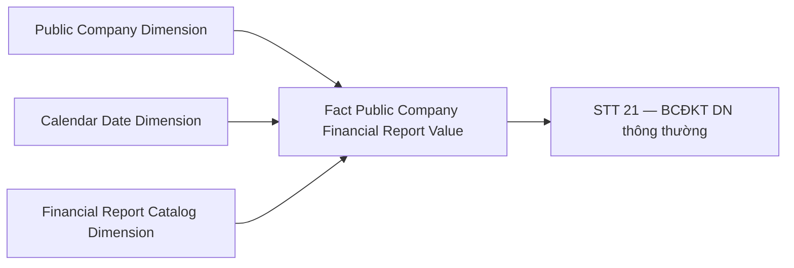
```mermaid
flowchart LR
    F3[Fact Public Company Financial Report Value] --> R21[STT 21 — BCĐKT DN thông thường]
    D1b[Public Company Dimension] --> F3
    D8b[Calendar Date Dimension] --> F3
    D9[Financial Report Catalog Dimension] --> F3
```

**Bảng grain:**

| Tên bảng | Grain |
|---|---|
| Fact Public Company Financial Report Value | 1 row / CTDC / kỳ / Row_Code / Column_Code |
| Public Company Dimension | 1 row / công ty đại chúng (SCD2) |
| Calendar Date Dimension | 1 row / ngày (Conformed) |
| Financial Report Catalog Dimension | 1 row / báo cáo / dòng / cột |

---

#### Nhóm 22 — STT 22: DN thông thường — Báo cáo KQKD

##### READY

> Phân loại: **Phân tích**
> Filter: `entp_tp_code = 'dn'`, `fnc_rpt_ctlg_bsn_code LIKE 'BCKQKD%'`, col_desc='1'

**Bảng KPI:**

| KPI ID | Tên chỉ tiêu | Atomic Entity | Atomic Table | Atomic Attribute | Atomic Column | row_dsc_clmn_code | col_desc | Tính chất |
|---|---|---|---|---|---|---|---|---|
| K_GSDC_203 | 1. Doanh thu bán hàng và cung cấp DV | Public Company Financial Report Value | pblc_co_fnc_rpt_val | Data Value | data_val | 1 | 1 | Cơ sở |
| K_GSDC_204 | 2. Các khoản giảm trừ doanh thu | Public Company Financial Report Value | pblc_co_fnc_rpt_val | Data Value | data_val | 2 | 1 | Cơ sở |
| K_GSDC_205 | 3. Doanh thu thuần về bán hàng và cung cấp DV | Public Company Financial Report Value | pblc_co_fnc_rpt_val | Data Value | data_val | 10 | 1 | Cơ sở |
| K_GSDC_206 | 4. Giá vốn hàng bán | Public Company Financial Report Value | pblc_co_fnc_rpt_val | Data Value | data_val | 11 | 1 | Cơ sở |
| K_GSDC_207 | 5. Lợi nhuận gộp về bán hàng và cung cấp DV | Public Company Financial Report Value | pblc_co_fnc_rpt_val | Data Value | data_val | 20 | 1 | Cơ sở |
| K_GSDC_208 | 6. Doanh thu hoạt động tài chính | Public Company Financial Report Value | pblc_co_fnc_rpt_val | Data Value | data_val | 21 | 1 | Cơ sở |
| K_GSDC_209 | 7. Chi phí tài chính | Public Company Financial Report Value | pblc_co_fnc_rpt_val | Data Value | data_val | 22 | 1 | Cơ sở |
| K_GSDC_210 | 7. Chi phí tài chính — Chi phí lãi vay | Public Company Financial Report Value | pblc_co_fnc_rpt_val | Data Value | data_val | 23 | 1 | Cơ sở |
| K_GSDC_211 | 8. Phần lãi/lỗ trong công ty liên doanh, LK | Public Company Financial Report Value | pblc_co_fnc_rpt_val | Data Value | data_val | 24 | 1 | Cơ sở |
| K_GSDC_212 | 9. Chi phí bán hàng | Public Company Financial Report Value | pblc_co_fnc_rpt_val | Data Value | data_val | 25 | 1 | Cơ sở |
| K_GSDC_213 | 10. Chi phí quản lý doanh nghiệp | Public Company Financial Report Value | pblc_co_fnc_rpt_val | Data Value | data_val | 26 | 1 | Cơ sở |
| K_GSDC_214 | 11. Lợi nhuận thuần từ HĐKD | Public Company Financial Report Value | pblc_co_fnc_rpt_val | Data Value | data_val | 30 | 1 | Cơ sở |
| K_GSDC_215 | 12. Thu nhập khác | Public Company Financial Report Value | pblc_co_fnc_rpt_val | Data Value | data_val | 31 | 1 | Cơ sở |
| K_GSDC_216 | 13. Chi phí khác | Public Company Financial Report Value | pblc_co_fnc_rpt_val | Data Value | data_val | 32 | 1 | Cơ sở |
| K_GSDC_217 | 14. Lợi nhuận khác | Public Company Financial Report Value | pblc_co_fnc_rpt_val | Data Value | data_val | 40 | 1 | Cơ sở |
| K_GSDC_218 | 15. Tổng lợi nhuận kế toán trước thuế | Public Company Financial Report Value | pblc_co_fnc_rpt_val | Data Value | data_val | 50 | 1 | Cơ sở |
| K_GSDC_219 | 16. Chi phí thuế TNDN hiện hành | Public Company Financial Report Value | pblc_co_fnc_rpt_val | Data Value | data_val | 51 | 1 | Cơ sở |
| K_GSDC_220 | 17. Chi phí thuế TNDN hoãn lại | Public Company Financial Report Value | pblc_co_fnc_rpt_val | Data Value | data_val | 52 | 1 | Cơ sở |
| K_GSDC_221 | 18. Lợi nhuận sau thuế TNDN | Public Company Financial Report Value | pblc_co_fnc_rpt_val | Data Value | data_val | 60 | 1 | Cơ sở |
| K_GSDC_222 | 19. LNST của công ty mẹ | Public Company Financial Report Value | pblc_co_fnc_rpt_val | Data Value | data_val | 61 | 1 | Cơ sở |
| K_GSDC_223 | 20. LNST của cổ đông không kiểm soát | Public Company Financial Report Value | pblc_co_fnc_rpt_val | Data Value | data_val | 62 | 1 | Cơ sở |
| K_GSDC_224 | 21. Lãi cơ bản trên cổ phiếu (EPS) | Public Company Financial Report Value | pblc_co_fnc_rpt_val | Data Value | data_val | 70 | 1 | Cơ sở |
| K_GSDC_225 | 22. Lãi suy giảm trên cổ phiếu | Public Company Financial Report Value | pblc_co_fnc_rpt_val | Data Value | data_val | 71 | 1 | Cơ sở |

**Star Schema, Lineage, Bảng grain:** giống Nhóm 21.

---

#### Nhóm 23 — STT 23: DN thông thường — Báo cáo LCTT trực tiếp

##### READY

> Phân loại: **Phân tích**
> Filter: `entp_tp_code = 'dn'`, `fnc_rpt_ctlg_bsn_code LIKE 'BCLCTT%'` (trực tiếp), col_desc='1'

**Bảng KPI:**

| KPI ID | Tên chỉ tiêu | Atomic Entity | Atomic Table | Atomic Attribute | Atomic Column | row_dsc_clmn_code | col_desc | Tính chất |
|---|---|---|---|---|---|---|---|---|
| K_GSDC_226 | 1. Tiền thu từ bán hàng, cung cấp DV và DT khác | Public Company Financial Report Value | pblc_co_fnc_rpt_val | Data Value | data_val | 1 | 1 | Cơ sở |
| K_GSDC_227 | 2. Tiền chi trả cho người cung cấp hàng hóa và DV | Public Company Financial Report Value | pblc_co_fnc_rpt_val | Data Value | data_val | 2 | 1 | Cơ sở |
| K_GSDC_228 | 3. Tiền chi trả cho người lao động | Public Company Financial Report Value | pblc_co_fnc_rpt_val | Data Value | data_val | 3 | 1 | Cơ sở |
| K_GSDC_229 | 4. Tiền lãi vay đã trả | Public Company Financial Report Value | pblc_co_fnc_rpt_val | Data Value | data_val | 4 | 1 | Cơ sở |
| K_GSDC_230 | 5. Thuế TNDN đã nộp | Public Company Financial Report Value | pblc_co_fnc_rpt_val | Data Value | data_val | 5 | 1 | Cơ sở |
| K_GSDC_231 | 6. Tiền thu khác từ HĐKD | Public Company Financial Report Value | pblc_co_fnc_rpt_val | Data Value | data_val | 6 | 1 | Cơ sở |
| K_GSDC_232 | 7. Tiền chi khác cho HĐKD | Public Company Financial Report Value | pblc_co_fnc_rpt_val | Data Value | data_val | 7 | 1 | Cơ sở |
| K_GSDC_233 | Lưu chuyển tiền thuần từ HĐKD | Public Company Financial Report Value | pblc_co_fnc_rpt_val | Data Value | data_val | 20 | 1 | Cơ sở |
| K_GSDC_234 | 1. Tiền chi mua sắm TSCĐ và TSDH khác | Public Company Financial Report Value | pblc_co_fnc_rpt_val | Data Value | data_val | 21 | 1 | Cơ sở |
| K_GSDC_235 | 2. Tiền thu từ thanh lý, nhượng bán TSCĐ và TSDH | Public Company Financial Report Value | pblc_co_fnc_rpt_val | Data Value | data_val | 22 | 1 | Cơ sở |
| K_GSDC_236 | 3. Tiền chi cho vay, mua công cụ nợ | Public Company Financial Report Value | pblc_co_fnc_rpt_val | Data Value | data_val | 23 | 1 | Cơ sở |
| K_GSDC_237 | 4. Tiền thu hồi cho vay, bán lại công cụ nợ | Public Company Financial Report Value | pblc_co_fnc_rpt_val | Data Value | data_val | 24 | 1 | Cơ sở |
| K_GSDC_238 | 5. Tiền chi đầu tư góp vốn vào đơn vị khác | Public Company Financial Report Value | pblc_co_fnc_rpt_val | Data Value | data_val | 25 | 1 | Cơ sở |
| K_GSDC_239 | 6. Tiền thu hồi đầu tư góp vốn | Public Company Financial Report Value | pblc_co_fnc_rpt_val | Data Value | data_val | 26 | 1 | Cơ sở |
| K_GSDC_240 | 7. Tiền thu lãi cho vay, cổ tức và LN được chia | Public Company Financial Report Value | pblc_co_fnc_rpt_val | Data Value | data_val | 27 | 1 | Cơ sở |
| K_GSDC_241 | Lưu chuyển tiền thuần từ HĐ đầu tư | Public Company Financial Report Value | pblc_co_fnc_rpt_val | Data Value | data_val | 30 | 1 | Cơ sở |
| K_GSDC_242 | 1. Tiền thu từ phát hành CP, nhận vốn góp | Public Company Financial Report Value | pblc_co_fnc_rpt_val | Data Value | data_val | 31 | 1 | Cơ sở |
| K_GSDC_243 | 2. Tiền trả lại vốn góp, mua lại CP đã phát hành | Public Company Financial Report Value | pblc_co_fnc_rpt_val | Data Value | data_val | 32 | 1 | Cơ sở |
| K_GSDC_244 | 3. Tiền thu từ đi vay | Public Company Financial Report Value | pblc_co_fnc_rpt_val | Data Value | data_val | 33 | 1 | Cơ sở |
| K_GSDC_245 | 4. Tiền trả nợ gốc vay | Public Company Financial Report Value | pblc_co_fnc_rpt_val | Data Value | data_val | 34 | 1 | Cơ sở |
| K_GSDC_246 | 5. Tiền trả nợ gốc thuê tài chính | Public Company Financial Report Value | pblc_co_fnc_rpt_val | Data Value | data_val | 35 | 1 | Cơ sở |
| K_GSDC_247 | 6. Cổ tức, lợi nhuận đã trả cho chủ sở hữu | Public Company Financial Report Value | pblc_co_fnc_rpt_val | Data Value | data_val | 36 | 1 | Cơ sở |
| K_GSDC_248 | Lưu chuyển tiền thuần từ HĐ tài chính | Public Company Financial Report Value | pblc_co_fnc_rpt_val | Data Value | data_val | 40 | 1 | Cơ sở |
| K_GSDC_249 | Lưu chuyển tiền thuần trong kỳ | Public Company Financial Report Value | pblc_co_fnc_rpt_val | Data Value | data_val | 50 | 1 | Cơ sở |
| K_GSDC_250 | Tiền và tương đương tiền đầu kỳ | Public Company Financial Report Value | pblc_co_fnc_rpt_val | Data Value | data_val | 60 | 1 | Cơ sở |
| K_GSDC_251 | Ảnh hưởng của thay đổi tỷ giá hối đoái | Public Company Financial Report Value | pblc_co_fnc_rpt_val | Data Value | data_val | 61 | 1 | Cơ sở |
| K_GSDC_252 | Tiền và tương đương tiền cuối kỳ | Public Company Financial Report Value | pblc_co_fnc_rpt_val | Data Value | data_val | 70 | 1 | Cơ sở |

**Star Schema, Lineage, Bảng grain:** giống Nhóm 21.

---

#### Nhóm 24 — STT 24: DN thông thường — Báo cáo LCTT gián tiếp

##### READY

> Phân loại: **Phân tích**
> Filter: `entp_tp_code = 'dn'`, BCLCTT gián tiếp, col_desc='1'

**Bảng KPI:**

| KPI ID | Tên chỉ tiêu | Atomic Entity | Atomic Table | Atomic Attribute | Atomic Column | row_dsc_clmn_code | col_desc | Tính chất |
|---|---|---|---|---|---|---|---|---|
| K_GSDC_253 | 1. Lợi nhuận trước thuế | Public Company Financial Report Value | pblc_co_fnc_rpt_val | Data Value | data_val | 1 | 1 | Cơ sở |
| K_GSDC_254 | Khấu hao TSCĐ và BĐSĐT | Public Company Financial Report Value | pblc_co_fnc_rpt_val | Data Value | data_val | 2 | 1 | Cơ sở |
| K_GSDC_255 | Các khoản dự phòng | Public Company Financial Report Value | pblc_co_fnc_rpt_val | Data Value | data_val | 3 | 1 | Cơ sở |
| K_GSDC_256 | Lãi/lỗ chênh lệch tỷ giá do đánh giá lại | Public Company Financial Report Value | pblc_co_fnc_rpt_val | Data Value | data_val | 4 | 1 | Cơ sở |
| K_GSDC_257 | Lãi/lỗ từ hoạt động đầu tư | Public Company Financial Report Value | pblc_co_fnc_rpt_val | Data Value | data_val | 5 | 1 | Cơ sở |
| K_GSDC_258 | Chi phí lãi vay | Public Company Financial Report Value | pblc_co_fnc_rpt_val | Data Value | data_val | 6 | 1 | Cơ sở |
| K_GSDC_259 | Các khoản điều chỉnh khác | Public Company Financial Report Value | pblc_co_fnc_rpt_val | Data Value | data_val | 7 | 1 | Cơ sở |
| K_GSDC_260 | 3. LN từ HĐKD trước thay đổi vốn lưu động | Public Company Financial Report Value | pblc_co_fnc_rpt_val | Data Value | data_val | 8 | 1 | Cơ sở |
| K_GSDC_261 | Tăng/giảm các khoản phải thu | Public Company Financial Report Value | pblc_co_fnc_rpt_val | Data Value | data_val | 9 | 1 | Cơ sở |
| K_GSDC_262 | Tăng/giảm hàng tồn kho | Public Company Financial Report Value | pblc_co_fnc_rpt_val | Data Value | data_val | 10 | 1 | Cơ sở |
| K_GSDC_263 | Tăng/giảm các khoản phải trả | Public Company Financial Report Value | pblc_co_fnc_rpt_val | Data Value | data_val | 11 | 1 | Cơ sở |
| K_GSDC_264 | Tăng/giảm chi phí trả trước | Public Company Financial Report Value | pblc_co_fnc_rpt_val | Data Value | data_val | 12 | 1 | Cơ sở |
| K_GSDC_265 | Tăng/giảm chứng khoán kinh doanh | Public Company Financial Report Value | pblc_co_fnc_rpt_val | Data Value | data_val | 13 | 1 | Cơ sở |
| K_GSDC_266 | Tiền lãi vay đã trả | Public Company Financial Report Value | pblc_co_fnc_rpt_val | Data Value | data_val | 14 | 1 | Cơ sở |
| K_GSDC_267 | Thuế TNDN đã nộp | Public Company Financial Report Value | pblc_co_fnc_rpt_val | Data Value | data_val | 15 | 1 | Cơ sở |
| K_GSDC_268 | Tiền thu khác từ HĐKD | Public Company Financial Report Value | pblc_co_fnc_rpt_val | Data Value | data_val | 16 | 1 | Cơ sở |
| K_GSDC_269 | Tiền chi khác cho HĐKD | Public Company Financial Report Value | pblc_co_fnc_rpt_val | Data Value | data_val | 17 | 1 | Cơ sở |
| K_GSDC_270 | Lưu chuyển tiền thuần từ HĐKD | Public Company Financial Report Value | pblc_co_fnc_rpt_val | Data Value | data_val | 20 | 1 | Cơ sở |
| K_GSDC_271 | 1. Tiền chi mua sắm TSCĐ và TSDH khác | Public Company Financial Report Value | pblc_co_fnc_rpt_val | Data Value | data_val | 21 | 1 | Cơ sở |
| K_GSDC_272 | 2. Tiền thu từ thanh lý, nhượng bán TSCĐ | Public Company Financial Report Value | pblc_co_fnc_rpt_val | Data Value | data_val | 22 | 1 | Cơ sở |
| K_GSDC_273 | 3. Tiền chi cho vay, mua công cụ nợ | Public Company Financial Report Value | pblc_co_fnc_rpt_val | Data Value | data_val | 23 | 1 | Cơ sở |
| K_GSDC_274 | 4. Tiền thu hồi cho vay, bán lại công cụ nợ | Public Company Financial Report Value | pblc_co_fnc_rpt_val | Data Value | data_val | 24 | 1 | Cơ sở |
| K_GSDC_275 | 5. Tiền chi đầu tư góp vốn vào đơn vị khác | Public Company Financial Report Value | pblc_co_fnc_rpt_val | Data Value | data_val | 25 | 1 | Cơ sở |
| K_GSDC_276 | 6. Tiền thu hồi đầu tư góp vốn | Public Company Financial Report Value | pblc_co_fnc_rpt_val | Data Value | data_val | 26 | 1 | Cơ sở |
| K_GSDC_277 | 7. Tiền thu lãi cho vay, cổ tức và LN | Public Company Financial Report Value | pblc_co_fnc_rpt_val | Data Value | data_val | 27 | 1 | Cơ sở |
| K_GSDC_278 | Lưu chuyển tiền thuần từ HĐ đầu tư | Public Company Financial Report Value | pblc_co_fnc_rpt_val | Data Value | data_val | 30 | 1 | Cơ sở |
| K_GSDC_279 | 1. Tiền thu từ phát hành CP, nhận vốn góp | Public Company Financial Report Value | pblc_co_fnc_rpt_val | Data Value | data_val | 31 | 1 | Cơ sở |
| K_GSDC_280 | 2. Tiền trả lại vốn góp, mua lại CP | Public Company Financial Report Value | pblc_co_fnc_rpt_val | Data Value | data_val | 32 | 1 | Cơ sở |
| K_GSDC_281 | 3. Tiền thu từ đi vay | Public Company Financial Report Value | pblc_co_fnc_rpt_val | Data Value | data_val | 33 | 1 | Cơ sở |
| K_GSDC_282 | 4. Tiền trả nợ gốc vay | Public Company Financial Report Value | pblc_co_fnc_rpt_val | Data Value | data_val | 34 | 1 | Cơ sở |
| K_GSDC_283 | 5. Tiền trả nợ gốc thuê tài chính | Public Company Financial Report Value | pblc_co_fnc_rpt_val | Data Value | data_val | 35 | 1 | Cơ sở |
| K_GSDC_284 | 6. Cổ tức, lợi nhuận đã trả cho chủ sở hữu | Public Company Financial Report Value | pblc_co_fnc_rpt_val | Data Value | data_val | 36 | 1 | Cơ sở |
| K_GSDC_285 | 7. Tiền thu từ vốn góp của CĐKKS | Public Company Financial Report Value | pblc_co_fnc_rpt_val | Data Value | data_val | 37 | 1 | Cơ sở |
| K_GSDC_286 | Lưu chuyển tiền thuần từ HĐ tài chính | Public Company Financial Report Value | pblc_co_fnc_rpt_val | Data Value | data_val | 40 | 1 | Cơ sở |
| K_GSDC_287 | Lưu chuyển tiền thuần trong kỳ | Public Company Financial Report Value | pblc_co_fnc_rpt_val | Data Value | data_val | 50 | 1 | Cơ sở |
| K_GSDC_288 | Tiền và tương đương tiền đầu kỳ | Public Company Financial Report Value | pblc_co_fnc_rpt_val | Data Value | data_val | 60 | 1 | Cơ sở |
| K_GSDC_313 | Ảnh hưởng của thay đổi tỷ giá hối đoái quy đổi ngoại tệ | Public Company Financial Report Value | pblc_co_fnc_rpt_val | Data Value | data_val | 61 | 1 | Cơ sở |
| K_GSDC_289 | Tiền và tương đương tiền cuối kỳ | Public Company Financial Report Value | pblc_co_fnc_rpt_val | Data Value | data_val | 70 | 1 | Cơ sở |

**Star Schema, Lineage, Bảng grain:** giống Nhóm 21.

---

#### Nhóm 25 — STT 25: DN bảo hiểm — Bảng cân đối kế toán

##### READY

> Phân loại: **Phân tích**
> Filter: `entp_tp_code = 'bh'`, `fnc_rpt_ctlg_bsn_code LIKE 'BCDKT%'`, `col_desc='1'`

**Bảng KPI:**

| KPI ID | Tên chỉ tiêu | Atomic Entity | Atomic Table | Atomic Attribute | Atomic Column | row_dsc_clmn_code | col_desc | Tính chất |
|---|---|---|---|---|---|---|---|---|
| K_GSDC_314 | A - Tài sản ngắn hạn (100) | Public Company Financial Report Value | pblc_co_fnc_rpt_val | Data Value | data_val | 100 | 1 | Cơ sở |
| K_GSDC_315 | I. Tiền và các khoản tương đương tiền | Public Company Financial Report Value | pblc_co_fnc_rpt_val | Data Value | data_val | 110 | 1 | Cơ sở |
| K_GSDC_397 | 1. Tiền | Public Company Financial Report Value | pblc_co_fnc_rpt_val | Data Value | data_val | 111 | 1 | Cơ sở |
| K_GSDC_398 | 2. Các khoản tương đương tiền | Public Company Financial Report Value | pblc_co_fnc_rpt_val | Data Value | data_val | 112 | 1 | Cơ sở |
| K_GSDC_316 | II. Các khoản đầu tư tài chính ngắn hạn | Public Company Financial Report Value | pblc_co_fnc_rpt_val | Data Value | data_val | 120 | 1 | Cơ sở |
| K_GSDC_317 | 1. Đầu tư ngắn hạn | Public Company Financial Report Value | pblc_co_fnc_rpt_val | Data Value | data_val | 121 | 1 | Cơ sở |
| K_GSDC_318 | 2. Dự phòng giảm giá đầu tư ngắn hạn | Public Company Financial Report Value | pblc_co_fnc_rpt_val | Data Value | data_val | 129 | 1 | Cơ sở |
| K_GSDC_319 | III. Các khoản phải thu ngắn hạn | Public Company Financial Report Value | pblc_co_fnc_rpt_val | Data Value | data_val | 130 | 1 | Cơ sở |
| K_GSDC_320 | 1. Phải thu của khách hàng | Public Company Financial Report Value | pblc_co_fnc_rpt_val | Data Value | data_val | 131 | 1 | Cơ sở |
| K_GSDC_321 | 1.1 Phải thu về hợp đồng bảo hiểm | Public Company Financial Report Value | pblc_co_fnc_rpt_val | Data Value | data_val | 131.1 | 1 | Cơ sở |
| K_GSDC_322 | 1.2 Phải thu khác của khách hàng | Public Company Financial Report Value | pblc_co_fnc_rpt_val | Data Value | data_val | 131.2 | 1 | Cơ sở |
| K_GSDC_323 | 2. Trả trước cho người bán | Public Company Financial Report Value | pblc_co_fnc_rpt_val | Data Value | data_val | 132 | 1 | Cơ sở |
| K_GSDC_399 | 3. Phải thu nội bộ ngắn hạn | Public Company Financial Report Value | pblc_co_fnc_rpt_val | Data Value | data_val | 133 | 1 | Cơ sở |
| K_GSDC_324 | 4. Các khoản phải thu khác | Public Company Financial Report Value | pblc_co_fnc_rpt_val | Data Value | data_val | 135 | 1 | Cơ sở |
| K_GSDC_325 | 5. Dự phòng các khoản phải thu khó đòi | Public Company Financial Report Value | pblc_co_fnc_rpt_val | Data Value | data_val | 139 | 1 | Cơ sở |
| K_GSDC_326 | IV. Hàng tồn kho | Public Company Financial Report Value | pblc_co_fnc_rpt_val | Data Value | data_val | 140 | 1 | Cơ sở |
| K_GSDC_400 | 1. Hàng tồn kho | Public Company Financial Report Value | pblc_co_fnc_rpt_val | Data Value | data_val | 141 | 1 | Cơ sở |
| K_GSDC_401 | 2. Dự phòng giảm giá hàng tồn kho | Public Company Financial Report Value | pblc_co_fnc_rpt_val | Data Value | data_val | 149 | 1 | Cơ sở |
| K_GSDC_327 | V. Tài sản ngắn hạn khác | Public Company Financial Report Value | pblc_co_fnc_rpt_val | Data Value | data_val | 150 | 1 | Cơ sở |
| K_GSDC_402 | 1. Chi phí trả trước ngắn hạn | Public Company Financial Report Value | pblc_co_fnc_rpt_val | Data Value | data_val | 151 | 1 | Cơ sở |
| K_GSDC_328 | 1.1. Chi phí hoa hồng chưa phân bổ | Public Company Financial Report Value | pblc_co_fnc_rpt_val | Data Value | data_val | 151.1 | 1 | Cơ sở |
| K_GSDC_329 | 1.2. Chi phí trả trước ngắn hạn khác | Public Company Financial Report Value | pblc_co_fnc_rpt_val | Data Value | data_val | 151.2 | 1 | Cơ sở |
| K_GSDC_403 | 2. Thuế GTGT được khấu trừ | Public Company Financial Report Value | pblc_co_fnc_rpt_val | Data Value | data_val | 152 | 1 | Cơ sở |
| K_GSDC_404 | 3. Thuế và các khoản khác phải thu Nhà nước | Public Company Financial Report Value | pblc_co_fnc_rpt_val | Data Value | data_val | 154 | 1 | Cơ sở |
| K_GSDC_330 | 4. Giao dịch mua bán lại trái phiếu Chính phủ | Public Company Financial Report Value | pblc_co_fnc_rpt_val | Data Value | data_val | 157 | 1 | Cơ sở |
| K_GSDC_405 | 5. Tài sản ngắn hạn khác | Public Company Financial Report Value | pblc_co_fnc_rpt_val | Data Value | data_val | 158 | 1 | Cơ sở |
| K_GSDC_331 | VIII. Tài sản tái bảo hiểm | Public Company Financial Report Value | pblc_co_fnc_rpt_val | Data Value | data_val | 190 | 1 | Cơ sở |
| K_GSDC_332 | 1. Dự phòng phí nhượng tái bảo hiểm | Public Company Financial Report Value | pblc_co_fnc_rpt_val | Data Value | data_val | 191 | 1 | Cơ sở |
| K_GSDC_333 | 2. Dự phòng bồi thường nhượng tái bảo hiểm | Public Company Financial Report Value | pblc_co_fnc_rpt_val | Data Value | data_val | 192 | 1 | Cơ sở |
| K_GSDC_334 | B - Tài sản dài hạn (200) | Public Company Financial Report Value | pblc_co_fnc_rpt_val | Data Value | data_val | 200 | 1 | Cơ sở |
| K_GSDC_335 | I. Các khoản phải thu dài hạn | Public Company Financial Report Value | pblc_co_fnc_rpt_val | Data Value | data_val | 210 | 1 | Cơ sở |
| K_GSDC_406 | 1. Phải thu dài hạn của khách hàng | Public Company Financial Report Value | pblc_co_fnc_rpt_val | Data Value | data_val | 211 | 1 | Cơ sở |
| K_GSDC_336 | 2. Vốn kinh doanh của đơn vị trực thuộc | Public Company Financial Report Value | pblc_co_fnc_rpt_val | Data Value | data_val | 212 | 1 | Cơ sở |
| K_GSDC_337 | 3. Phải thu dài hạn nội bộ | Public Company Financial Report Value | pblc_co_fnc_rpt_val | Data Value | data_val | 213 | 1 | Cơ sở |
| K_GSDC_338 | 4. Phải thu dài hạn khác | Public Company Financial Report Value | pblc_co_fnc_rpt_val | Data Value | data_val | 218 | 1 | Cơ sở |
| K_GSDC_339 | 4.1. Kí quỹ bảo hiểm | Public Company Financial Report Value | pblc_co_fnc_rpt_val | Data Value | data_val | 218.1 | 1 | Cơ sở |
| K_GSDC_340 | 4.2. Phải thu dài hạn khác | Public Company Financial Report Value | pblc_co_fnc_rpt_val | Data Value | data_val | 218.2 | 1 | Cơ sở |
| K_GSDC_341 | II. Tài sản cố định | Public Company Financial Report Value | pblc_co_fnc_rpt_val | Data Value | data_val | 220 | 1 | Cơ sở |
| K_GSDC_342 | 1. Tài sản cố định hữu hình | Public Company Financial Report Value | pblc_co_fnc_rpt_val | Data Value | data_val | 221 | 1 | Cơ sở |
| K_GSDC_343 | · Nguyên giá (TSCĐ hữu hình) | Public Company Financial Report Value | pblc_co_fnc_rpt_val | Data Value | data_val | 222 | 1 | Cơ sở |
| K_GSDC_344 | · Giá trị hao mòn luỹ kế (TSCĐ hữu hình) | Public Company Financial Report Value | pblc_co_fnc_rpt_val | Data Value | data_val | 223 | 1 | Cơ sở |
| K_GSDC_345 | 2. Tài sản cố định thuê tài chính | Public Company Financial Report Value | pblc_co_fnc_rpt_val | Data Value | data_val | 224 | 1 | Cơ sở |
| K_GSDC_407 | · Nguyên giá (TSCĐ thuê tài chính) | Public Company Financial Report Value | pblc_co_fnc_rpt_val | Data Value | data_val | 225 | 1 | Cơ sở |
| K_GSDC_408 | · Giá trị hao mòn luỹ kế (TSCĐ thuê tài chính) | Public Company Financial Report Value | pblc_co_fnc_rpt_val | Data Value | data_val | 226 | 1 | Cơ sở |
| K_GSDC_346 | 3. Tài sản cố định vô hình | Public Company Financial Report Value | pblc_co_fnc_rpt_val | Data Value | data_val | 227 | 1 | Cơ sở |
| K_GSDC_409 | · Nguyên giá (TSCĐ vô hình) | Public Company Financial Report Value | pblc_co_fnc_rpt_val | Data Value | data_val | 228 | 1 | Cơ sở |
| K_GSDC_410 | · Giá trị hao mòn luỹ kế (TSCĐ vô hình) | Public Company Financial Report Value | pblc_co_fnc_rpt_val | Data Value | data_val | 229 | 1 | Cơ sở |
| K_GSDC_347 | 4. Chi phí xây dựng cơ bản dở dang | Public Company Financial Report Value | pblc_co_fnc_rpt_val | Data Value | data_val | 230 | 1 | Cơ sở |
| K_GSDC_348 | III. Bất động sản đầu tư | Public Company Financial Report Value | pblc_co_fnc_rpt_val | Data Value | data_val | 240 | 1 | Cơ sở |
| K_GSDC_411 | · Nguyên giá (BĐSĐT) | Public Company Financial Report Value | pblc_co_fnc_rpt_val | Data Value | data_val | 241 | 1 | Cơ sở |
| K_GSDC_349 | · Giá trị hao mòn luỹ kế (BĐSĐT) | Public Company Financial Report Value | pblc_co_fnc_rpt_val | Data Value | data_val | 242 | 1 | Cơ sở |
| K_GSDC_350 | IV. Các khoản đầu tư tài chính dài hạn | Public Company Financial Report Value | pblc_co_fnc_rpt_val | Data Value | data_val | 250 | 1 | Cơ sở |
| K_GSDC_412 | 1. Đầu tư vào công ty con | Public Company Financial Report Value | pblc_co_fnc_rpt_val | Data Value | data_val | 251 | 1 | Cơ sở |
| K_GSDC_351 | 2. Đầu tư vào công ty liên kết, liên doanh | Public Company Financial Report Value | pblc_co_fnc_rpt_val | Data Value | data_val | 252 | 1 | Cơ sở |
| K_GSDC_352 | 3. Đầu tư dài hạn khác | Public Company Financial Report Value | pblc_co_fnc_rpt_val | Data Value | data_val | 258 | 1 | Cơ sở |
| K_GSDC_353 | 4. Dự phòng giảm giá đầu tư tài chính dài hạn | Public Company Financial Report Value | pblc_co_fnc_rpt_val | Data Value | data_val | 259 | 1 | Cơ sở |
| K_GSDC_354 | V. Tài sản dài hạn khác | Public Company Financial Report Value | pblc_co_fnc_rpt_val | Data Value | data_val | 260 | 1 | Cơ sở |
| K_GSDC_413 | 1. Chi phí trả trước dài hạn | Public Company Financial Report Value | pblc_co_fnc_rpt_val | Data Value | data_val | 261 | 1 | Cơ sở |
| K_GSDC_355 | Tổng cộng tài sản (270) | Public Company Financial Report Value | pblc_co_fnc_rpt_val | Data Value | data_val | 270 | 1 | Cơ sở |
| K_GSDC_356 | A - Nợ phải trả (300) | Public Company Financial Report Value | pblc_co_fnc_rpt_val | Data Value | data_val | 300 | 1 | Cơ sở |
| K_GSDC_357 | I. Nợ ngắn hạn | Public Company Financial Report Value | pblc_co_fnc_rpt_val | Data Value | data_val | 310 | 1 | Cơ sở |
| K_GSDC_358 | 1. Vay và nợ ngắn hạn | Public Company Financial Report Value | pblc_co_fnc_rpt_val | Data Value | data_val | 311 | 1 | Cơ sở |
| K_GSDC_359 | 2. Phải trả cho người bán | Public Company Financial Report Value | pblc_co_fnc_rpt_val | Data Value | data_val | 312 | 1 | Cơ sở |
| K_GSDC_360 | 2.1. Phải trả về hợp đồng bảo hiểm | Public Company Financial Report Value | pblc_co_fnc_rpt_val | Data Value | data_val | 312.1 | 1 | Cơ sở |
| K_GSDC_361 | 2.2. Phải trả khác cho người bán | Public Company Financial Report Value | pblc_co_fnc_rpt_val | Data Value | data_val | 312.2 | 1 | Cơ sở |
| K_GSDC_362 | 3. Người mua trả tiền trước | Public Company Financial Report Value | pblc_co_fnc_rpt_val | Data Value | data_val | 313 | 1 | Cơ sở |
| K_GSDC_363 | 4. Thuế và các khoản phải nộp Nhà nước | Public Company Financial Report Value | pblc_co_fnc_rpt_val | Data Value | data_val | 314 | 1 | Cơ sở |
| K_GSDC_364 | 5. Phải trả người lao động | Public Company Financial Report Value | pblc_co_fnc_rpt_val | Data Value | data_val | 315 | 1 | Cơ sở |
| K_GSDC_365 | 6. Chi phí phải trả | Public Company Financial Report Value | pblc_co_fnc_rpt_val | Data Value | data_val | 316 | 1 | Cơ sở |
| K_GSDC_366 | 7. Phải trả nội bộ | Public Company Financial Report Value | pblc_co_fnc_rpt_val | Data Value | data_val | 317 | 1 | Cơ sở |
| K_GSDC_414 | 8. Doanh thu chưa thực hiện ngắn hạn | Public Company Financial Report Value | pblc_co_fnc_rpt_val | Data Value | data_val | 318 | 1 | Cơ sở |
| K_GSDC_367 | 9. Các khoản phải trả, phải nộp khác | Public Company Financial Report Value | pblc_co_fnc_rpt_val | Data Value | data_val | 319 | 1 | Cơ sở |
| K_GSDC_368 | 10. Doanh thu hoa hồng chưa được hưởng | Public Company Financial Report Value | pblc_co_fnc_rpt_val | Data Value | data_val | 319.1 | 1 | Cơ sở |
| K_GSDC_369 | 11. Dự phòng phải trả ngắn hạn | Public Company Financial Report Value | pblc_co_fnc_rpt_val | Data Value | data_val | 320 | 1 | Cơ sở |
| K_GSDC_370 | 12. Quỹ khen thưởng, phúc lợi | Public Company Financial Report Value | pblc_co_fnc_rpt_val | Data Value | data_val | 323 | 1 | Cơ sở |
| K_GSDC_371 | 13. Giao dịch mua bán lại trái phiếu Chính phủ | Public Company Financial Report Value | pblc_co_fnc_rpt_val | Data Value | data_val | 327 | 1 | Cơ sở |
| K_GSDC_372 | 14. Dự phòng nghiệp vụ | Public Company Financial Report Value | pblc_co_fnc_rpt_val | Data Value | data_val | 329 | 1 | Cơ sở |
| K_GSDC_373 | 14.1. Dự phòng phí bảo hiểm gốc và nhận TBH | Public Company Financial Report Value | pblc_co_fnc_rpt_val | Data Value | data_val | 329.1 | 1 | Cơ sở |
| K_GSDC_374 | 14.2. Dự phòng bồi thường bảo hiểm gốc và nhận TBH | Public Company Financial Report Value | pblc_co_fnc_rpt_val | Data Value | data_val | 329.2 | 1 | Cơ sở |
| K_GSDC_375 | 14.3. Dự phòng dao động lớn | Public Company Financial Report Value | pblc_co_fnc_rpt_val | Data Value | data_val | 329.3 | 1 | Cơ sở |
| K_GSDC_376 | II. Nợ dài hạn | Public Company Financial Report Value | pblc_co_fnc_rpt_val | Data Value | data_val | 330 | 1 | Cơ sở |
| K_GSDC_377 | 1. Phải trả dài hạn người bán | Public Company Financial Report Value | pblc_co_fnc_rpt_val | Data Value | data_val | 331 | 1 | Cơ sở |
| K_GSDC_378 | 2. Phải trả dài hạn nội bộ | Public Company Financial Report Value | pblc_co_fnc_rpt_val | Data Value | data_val | 332 | 1 | Cơ sở |
| K_GSDC_379 | 3. Phải trả dài hạn khác | Public Company Financial Report Value | pblc_co_fnc_rpt_val | Data Value | data_val | 333 | 1 | Cơ sở |
| K_GSDC_380 | 4. Vay và nợ dài hạn | Public Company Financial Report Value | pblc_co_fnc_rpt_val | Data Value | data_val | 334 | 1 | Cơ sở |
| K_GSDC_381 | 5. Thuế thu nhập hoãn lại phải trả | Public Company Financial Report Value | pblc_co_fnc_rpt_val | Data Value | data_val | 335 | 1 | Cơ sở |
| K_GSDC_382 | 6. Dự phòng trợ cấp mất việc làm | Public Company Financial Report Value | pblc_co_fnc_rpt_val | Data Value | data_val | 336 | 1 | Cơ sở |
| K_GSDC_383 | 7. Dự phòng phải trả dài hạn | Public Company Financial Report Value | pblc_co_fnc_rpt_val | Data Value | data_val | 337 | 1 | Cơ sở |
| K_GSDC_384 | 8. Doanh thu chưa thực hiện dài hạn | Public Company Financial Report Value | pblc_co_fnc_rpt_val | Data Value | data_val | 338 | 1 | Cơ sở |
| K_GSDC_385 | 9. Quỹ phát triển khoa học và công nghệ | Public Company Financial Report Value | pblc_co_fnc_rpt_val | Data Value | data_val | 339 | 1 | Cơ sở |
| K_GSDC_386 | B - Vốn chủ sở hữu (400) | Public Company Financial Report Value | pblc_co_fnc_rpt_val | Data Value | data_val | 400 | 1 | Cơ sở |
| K_GSDC_387 | I. Vốn chủ sở hữu | Public Company Financial Report Value | pblc_co_fnc_rpt_val | Data Value | data_val | 410 | 1 | Cơ sở |
| K_GSDC_388 | 1. Vốn đầu tư của chủ sở hữu | Public Company Financial Report Value | pblc_co_fnc_rpt_val | Data Value | data_val | 411 | 1 | Cơ sở |
| K_GSDC_415 | 2. Thặng dư vốn cổ phần | Public Company Financial Report Value | pblc_co_fnc_rpt_val | Data Value | data_val | 412 | 1 | Cơ sở |
| K_GSDC_389 | 3. Vốn khác của chủ sở hữu | Public Company Financial Report Value | pblc_co_fnc_rpt_val | Data Value | data_val | 413 | 1 | Cơ sở |
| K_GSDC_390 | 4. Cổ phiếu quỹ | Public Company Financial Report Value | pblc_co_fnc_rpt_val | Data Value | data_val | 414 | 1 | Cơ sở |
| K_GSDC_391 | 5. Chênh lệch đánh giá lại tài sản | Public Company Financial Report Value | pblc_co_fnc_rpt_val | Data Value | data_val | 415 | 1 | Cơ sở |
| K_GSDC_392 | 6. Chênh lệch tỷ giá hối đoái | Public Company Financial Report Value | pblc_co_fnc_rpt_val | Data Value | data_val | 416 | 1 | Cơ sở |
| K_GSDC_393 | 7. Quỹ đầu tư phát triển | Public Company Financial Report Value | pblc_co_fnc_rpt_val | Data Value | data_val | 417 | 1 | Cơ sở |
| K_GSDC_394 | 8. Quỹ dự phòng tài chính | Public Company Financial Report Value | pblc_co_fnc_rpt_val | Data Value | data_val | 418 | 1 | Cơ sở |
| K_GSDC_395 | 9. Quỹ dự trữ bắt buộc | Public Company Financial Report Value | pblc_co_fnc_rpt_val | Data Value | data_val | 419 | 1 | Cơ sở |
| K_GSDC_416 | 10. Quỹ khác thuộc vốn chủ sở hữu | Public Company Financial Report Value | pblc_co_fnc_rpt_val | Data Value | data_val | 420 | 1 | Cơ sở |
| K_GSDC_417 | 11. Lợi nhuận sau thuế chưa phân phối | Public Company Financial Report Value | pblc_co_fnc_rpt_val | Data Value | data_val | 421 | 1 | Cơ sở |
| K_GSDC_396 | Tổng cộng nguồn vốn (440) | Public Company Financial Report Value | pblc_co_fnc_rpt_val | Data Value | data_val | 440 | 1 | Cơ sở |

**Star Schema, Lineage, Bảng grain:** giống Nhóm 21.

---

#### Nhóm 26 — STT 26: DN bảo hiểm — Báo cáo KQKD

##### READY

> Phân loại: **Phân tích**
> Filter: `entp_tp_code = 'bh'`, `fnc_rpt_ctlg_bsn_code LIKE 'BCKQKD%'`, `col_desc='1'`

**Bảng KPI:**

| KPI ID | Tên chỉ tiêu | Atomic Entity | Atomic Table | Atomic Attribute | Atomic Column | row_dsc_clmn_code | col_desc | Tính chất |
|---|---|---|---|---|---|---|---|---|
| K_GSDC_418 | 1. Doanh thu thuần hoạt động kinh doanh bảo hiểm | Public Company Financial Report Value | pblc_co_fnc_rpt_val | Data Value | data_val | 10 | 1 | Cơ sở |
| K_GSDC_419 | 2. Doanh thu kinh doanh bất động sản đầu tư | Public Company Financial Report Value | pblc_co_fnc_rpt_val | Data Value | data_val | 11 | 1 | Cơ sở |
| K_GSDC_420 | 3. Doanh thu hoạt động tài chính | Public Company Financial Report Value | pblc_co_fnc_rpt_val | Data Value | data_val | 12 | 1 | Cơ sở |
| K_GSDC_421 | 4. Thu nhập khác | Public Company Financial Report Value | pblc_co_fnc_rpt_val | Data Value | data_val | 13 | 1 | Cơ sở |
| K_GSDC_422 | 5. Tổng chi phí hoạt động kinh doanh bảo hiểm | Public Company Financial Report Value | pblc_co_fnc_rpt_val | Data Value | data_val | 20 | 1 | Cơ sở |
| K_GSDC_423 | 6. Giá vốn bất động sản đầu tư | Public Company Financial Report Value | pblc_co_fnc_rpt_val | Data Value | data_val | 21 | 1 | Cơ sở |
| K_GSDC_424 | 7. Chi phí hoạt động tài chính | Public Company Financial Report Value | pblc_co_fnc_rpt_val | Data Value | data_val | 22 | 1 | Cơ sở |
| K_GSDC_425 | 8. Chi phí quản lý doanh nghiệp | Public Company Financial Report Value | pblc_co_fnc_rpt_val | Data Value | data_val | 23 | 1 | Cơ sở |
| K_GSDC_426 | 9. Chi phí khác | Public Company Financial Report Value | pblc_co_fnc_rpt_val | Data Value | data_val | 24 | 1 | Cơ sở |
| K_GSDC_427 | 10. Tổng lợi nhuận kế toán trước thuế (50=10+11+12+13-20-21-22-23-24) | Public Company Financial Report Value | pblc_co_fnc_rpt_val | Data Value | data_val | 50 | 1 | Cơ sở |
| K_GSDC_428 | 11. Chi phí thuế TNDN hiện hành | Public Company Financial Report Value | pblc_co_fnc_rpt_val | Data Value | data_val | 51 | 1 | Cơ sở |
| K_GSDC_429 | 12. Chi phí thuế TNDN hoãn lại | Public Company Financial Report Value | pblc_co_fnc_rpt_val | Data Value | data_val | 52 | 1 | Cơ sở |
| K_GSDC_430 | 13. Lợi nhuận sau thuế thu nhập doanh nghiệp (60=50-51-52) | Public Company Financial Report Value | pblc_co_fnc_rpt_val | Data Value | data_val | 60 | 1 | Cơ sở |
| K_GSDC_431 | 14. Lợi ích của cổ đông không kiểm soát | Public Company Financial Report Value | pblc_co_fnc_rpt_val | Data Value | data_val | 61 | 1 | Cơ sở |
| K_GSDC_432 | 15. Lợi nhuận sau thuế (62=60-61) | Public Company Financial Report Value | pblc_co_fnc_rpt_val | Data Value | data_val | 62 | 1 | Cơ sở |
| K_GSDC_433 | 16. Lãi cơ bản trên cổ phiếu | Public Company Financial Report Value | pblc_co_fnc_rpt_val | Data Value | data_val | 70 | 1 | Cơ sở |

**Star Schema, Lineage, Bảng grain:** giống Nhóm 21.

---

#### Nhóm 27 — STT 27: DN bảo hiểm — Báo cáo LCTT trực tiếp

##### READY

> Phân loại: **Phân tích**
> Filter: `entp_tp_code = 'bh'`, `fnc_rpt_ctlg_bsn_code LIKE 'BCLCTT%'`, `col_desc='1'`

**Bảng KPI:**

| KPI ID | Tên chỉ tiêu | Atomic Entity | Atomic Table | Atomic Attribute | Atomic Column | row_dsc_clmn_code | col_desc | Tính chất |
|---|---|---|---|---|---|---|---|---|
| K_GSDC_434 | 1. Tiền từ thu phí và hoa hồng | Public Company Financial Report Value | pblc_co_fnc_rpt_val | Data Value | data_val | 01 | 1 | Cơ sở |
| K_GSDC_435 | 2. Tiền thu từ các khoản nợ phí và hoa hồng | Public Company Financial Report Value | pblc_co_fnc_rpt_val | Data Value | data_val | 02 | 1 | Cơ sở |
| K_GSDC_436 | 3. Tiền thu từ các khoản thu được giảm chi | Public Company Financial Report Value | pblc_co_fnc_rpt_val | Data Value | data_val | 03 | 1 | Cơ sở |
| K_GSDC_437 | 4. Tiền thu từ các hoạt động kinh doanh khác | Public Company Financial Report Value | pblc_co_fnc_rpt_val | Data Value | data_val | 04 | 1 | Cơ sở |
| K_GSDC_438 | 5. Trả tiền bồi thường bảo hiểm | Public Company Financial Report Value | pblc_co_fnc_rpt_val | Data Value | data_val | 05 | 1 | Cơ sở |
| K_GSDC_439 | 6. Trả tiền hoa hồng và các khoản nợ khác của kinh doanh bảo hiểm | Public Company Financial Report Value | pblc_co_fnc_rpt_val | Data Value | data_val | 06 | 1 | Cơ sở |
| K_GSDC_440 | 7. Trả tiền cho người bán, người cung cấp dịch vụ | Public Company Financial Report Value | pblc_co_fnc_rpt_val | Data Value | data_val | 07 | 1 | Cơ sở |
| K_GSDC_441 | 8. Trả tiền cho cán bộ công nhân viên | Public Company Financial Report Value | pblc_co_fnc_rpt_val | Data Value | data_val | 08 | 1 | Cơ sở |
| K_GSDC_442 | 9. Trả tiền nộp thuế và các khoản nợ Nhà nước | Public Company Financial Report Value | pblc_co_fnc_rpt_val | Data Value | data_val | 09 | 1 | Cơ sở |
| K_GSDC_443 | 10. Trả tiền cho các khoản nợ khác | Public Company Financial Report Value | pblc_co_fnc_rpt_val | Data Value | data_val | 10 | 1 | Cơ sở |
| K_GSDC_444 | 11. Tiền tạm ứng cho cán bộ công nhân viên và ứng trước cho người bán | Public Company Financial Report Value | pblc_co_fnc_rpt_val | Data Value | data_val | 11 | 1 | Cơ sở |
| K_GSDC_445 | Lưu chuyển tiền thuần từ hoạt động kinh doanh | Public Company Financial Report Value | pblc_co_fnc_rpt_val | Data Value | data_val | 20 | 1 | Cơ sở |
| K_GSDC_446 | 1. Tiền thu từ các khoản đầu tư vào đơn vị khác | Public Company Financial Report Value | pblc_co_fnc_rpt_val | Data Value | data_val | 21 | 1 | Cơ sở |
| K_GSDC_447 | 2. Tiền thu lãi đầu tư | Public Company Financial Report Value | pblc_co_fnc_rpt_val | Data Value | data_val | 22 | 1 | Cơ sở |
| K_GSDC_448 | 3. Tiền thu do bán tài sản cố định | Public Company Financial Report Value | pblc_co_fnc_rpt_val | Data Value | data_val | 23 | 1 | Cơ sở |
| K_GSDC_449 | 4. Tiền đầu tư vào các đơn vị khác | Public Company Financial Report Value | pblc_co_fnc_rpt_val | Data Value | data_val | 24 | 1 | Cơ sở |
| K_GSDC_450 | 5. Tiền mua tài sản cố định | Public Company Financial Report Value | pblc_co_fnc_rpt_val | Data Value | data_val | 25 | 1 | Cơ sở |
| K_GSDC_451 | Lưu chuyển tiền thuần từ hoạt động đầu tư | Public Company Financial Report Value | pblc_co_fnc_rpt_val | Data Value | data_val | 30 | 1 | Cơ sở |
| K_GSDC_452 | 1. Tiền thu do đi vay | Public Company Financial Report Value | pblc_co_fnc_rpt_val | Data Value | data_val | 31 | 1 | Cơ sở |
| K_GSDC_453 | 2. Tiền thu do các chủ sở hữu góp vốn | Public Company Financial Report Value | pblc_co_fnc_rpt_val | Data Value | data_val | 32 | 1 | Cơ sở |
| K_GSDC_454 | 3. Tiền thu từ lãi tiền gửi | Public Company Financial Report Value | pblc_co_fnc_rpt_val | Data Value | data_val | 33 | 1 | Cơ sở |
| K_GSDC_455 | 4. Tiền đã trả nợ vay | Public Company Financial Report Value | pblc_co_fnc_rpt_val | Data Value | data_val | 34 | 1 | Cơ sở |
| K_GSDC_456 | 5. Tiền đã hoàn vốn cho các chủ sở hữu | Public Company Financial Report Value | pblc_co_fnc_rpt_val | Data Value | data_val | 35 | 1 | Cơ sở |
| K_GSDC_457 | 6. Tiền lãi đã trả cho các nhà đầu tư vào doanh nghiệp | Public Company Financial Report Value | pblc_co_fnc_rpt_val | Data Value | data_val | 36 | 1 | Cơ sở |
| K_GSDC_458 | Lưu chuyển tiền thuần từ hoạt động tài chính | Public Company Financial Report Value | pblc_co_fnc_rpt_val | Data Value | data_val | 40 | 1 | Cơ sở |
| K_GSDC_459 | Lưu chuyển tiền thuần trong kỳ (50 = 20+30+40) | Public Company Financial Report Value | pblc_co_fnc_rpt_val | Data Value | data_val | 50 | 1 | Cơ sở |
| K_GSDC_460 | Tiền tồn đầu kỳ | Public Company Financial Report Value | pblc_co_fnc_rpt_val | Data Value | data_val | 60 | 1 | Cơ sở |
| K_GSDC_461 | Tiền tồn cuối kỳ (70 = 50+60) | Public Company Financial Report Value | pblc_co_fnc_rpt_val | Data Value | data_val | 70 | 1 | Cơ sở |

**Star Schema, Lineage, Bảng grain:** giống Nhóm 21.

---

#### Nhóm 28 — STT 28: DN bảo hiểm — Báo cáo LCTT gián tiếp

##### READY

> Phân loại: **Phân tích**
> Filter: `entp_tp_code = 'bh'`, `fnc_rpt_ctlg_bsn_code LIKE 'BCLCTTGT%'`, `col_desc='1'`

**Bảng KPI:**

| KPI ID | Tên chỉ tiêu | Atomic Entity | Atomic Table | Atomic Attribute | Atomic Column | row_dsc_clmn_code | col_desc | Tính chất |
|---|---|---|---|---|---|---|---|---|
| K_GSDC_462 | 1. Lợi nhuận trước thuế | Public Company Financial Report Value | pblc_co_fnc_rpt_val | Data Value | data_val | 01 | 1 | Cơ sở |
| K_GSDC_463 | · Khấu hao TSCĐ và BĐSĐT | Public Company Financial Report Value | pblc_co_fnc_rpt_val | Data Value | data_val | 02 | 1 | Cơ sở |
| K_GSDC_464 | · Các khoản dự phòng | Public Company Financial Report Value | pblc_co_fnc_rpt_val | Data Value | data_val | 03 | 1 | Cơ sở |
| K_GSDC_465 | · Lãi, lỗ chênh lệch tỷ giá hối đoái do đánh giá lại các khoản mục tiền tệ có gốc ngoại tệ | Public Company Financial Report Value | pblc_co_fnc_rpt_val | Data Value | data_val | 04 | 1 | Cơ sở |
| K_GSDC_466 | · Lãi, lỗ từ hoạt động đầu tư | Public Company Financial Report Value | pblc_co_fnc_rpt_val | Data Value | data_val | 05 | 1 | Cơ sở |
| K_GSDC_467 | · Chi phí lãi vay | Public Company Financial Report Value | pblc_co_fnc_rpt_val | Data Value | data_val | 06 | 1 | Cơ sở |
| K_GSDC_468 | · Các khoản điều chỉnh khác | Public Company Financial Report Value | pblc_co_fnc_rpt_val | Data Value | data_val | 07 | 1 | Cơ sở |
| K_GSDC_469 | 3. Lợi nhuận từ hoạt động kinh doanh trước thay đổi vốn lưu động | Public Company Financial Report Value | pblc_co_fnc_rpt_val | Data Value | data_val | 08 | 1 | Cơ sở |
| K_GSDC_470 | · Tăng, giảm các khoản phải thu | Public Company Financial Report Value | pblc_co_fnc_rpt_val | Data Value | data_val | 09 | 1 | Cơ sở |
| K_GSDC_471 | · Tăng, giảm hàng tồn kho | Public Company Financial Report Value | pblc_co_fnc_rpt_val | Data Value | data_val | 10 | 1 | Cơ sở |
| K_GSDC_472 | · Tăng, giảm các khoản phải trả (Không kể lãi vay phải trả, thuế thu nhập doanh nghiệp phải nộp) | Public Company Financial Report Value | pblc_co_fnc_rpt_val | Data Value | data_val | 11 | 1 | Cơ sở |
| K_GSDC_473 | · Tăng, giảm chi phí trả trước | Public Company Financial Report Value | pblc_co_fnc_rpt_val | Data Value | data_val | 12 | 1 | Cơ sở |
| K_GSDC_474 | · Tăng, giảm chứng khoán kinh doanh | Public Company Financial Report Value | pblc_co_fnc_rpt_val | Data Value | data_val | 13 | 1 | Cơ sở |
| K_GSDC_475 | · Tiền lãi vay đã trả | Public Company Financial Report Value | pblc_co_fnc_rpt_val | Data Value | data_val | 14 | 1 | Cơ sở |
| K_GSDC_476 | · Thuế thu nhập doanh nghiệp đã nộp | Public Company Financial Report Value | pblc_co_fnc_rpt_val | Data Value | data_val | 15 | 1 | Cơ sở |
| K_GSDC_477 | · Tiền thu khác từ hoạt động kinh doanh | Public Company Financial Report Value | pblc_co_fnc_rpt_val | Data Value | data_val | 16 | 1 | Cơ sở |
| K_GSDC_478 | · Tiền chi khác cho hoạt động kinh doanh | Public Company Financial Report Value | pblc_co_fnc_rpt_val | Data Value | data_val | 17 | 1 | Cơ sở |
| K_GSDC_479 | Lưu chuyển tiền thuần từ hoạt động kinh doanh | Public Company Financial Report Value | pblc_co_fnc_rpt_val | Data Value | data_val | 20 | 1 | Cơ sở |
| K_GSDC_480 | 1.Tiền chi để mua sắm, xây dựng TSCĐ và các tài sản dài hạn khác | Public Company Financial Report Value | pblc_co_fnc_rpt_val | Data Value | data_val | 21 | 1 | Cơ sở |
| K_GSDC_481 | 2.Tiền thu từ thanh lý, nhượng bán TSCĐ và các tài sản dài hạn khác | Public Company Financial Report Value | pblc_co_fnc_rpt_val | Data Value | data_val | 22 | 1 | Cơ sở |
| K_GSDC_482 | 3.Tiền chi cho vay, mua các công cụ nợ của đơn vị khác | Public Company Financial Report Value | pblc_co_fnc_rpt_val | Data Value | data_val | 23 | 1 | Cơ sở |
| K_GSDC_483 | 4.Tiền thu hồi cho vay, bán lại các công cụ nợ của đơn vị khác | Public Company Financial Report Value | pblc_co_fnc_rpt_val | Data Value | data_val | 24 | 1 | Cơ sở |
| K_GSDC_484 | 5.Tiền chi đầu tư góp vốn vào đơn vị khác | Public Company Financial Report Value | pblc_co_fnc_rpt_val | Data Value | data_val | 25 | 1 | Cơ sở |
| K_GSDC_485 | 6.Tiền thu hồi đầu tư góp vốn vào đơn vị khác | Public Company Financial Report Value | pblc_co_fnc_rpt_val | Data Value | data_val | 26 | 1 | Cơ sở |
| K_GSDC_486 | 7.Tiền thu lãi cho vay, cổ tức và lợi nhuận được chia | Public Company Financial Report Value | pblc_co_fnc_rpt_val | Data Value | data_val | 27 | 1 | Cơ sở |
| K_GSDC_487 | Lưu chuyển tiền thuần từ hoạt động đầu tư | Public Company Financial Report Value | pblc_co_fnc_rpt_val | Data Value | data_val | 30 | 1 | Cơ sở |
| K_GSDC_488 | 1. Tiền thu từ phát hành cổ phiếu, nhận vốn góp của chủ sở hữu | Public Company Financial Report Value | pblc_co_fnc_rpt_val | Data Value | data_val | 31 | 1 | Cơ sở |
| K_GSDC_489 | 2. Tiền trả lại vốn góp cho các chủ sở hữu, mua lại cổ phiếu của doanh nghiệp đã phát hành | Public Company Financial Report Value | pblc_co_fnc_rpt_val | Data Value | data_val | 32 | 1 | Cơ sở |
| K_GSDC_495 | 3. Tiền thu từ đi vay | Public Company Financial Report Value | pblc_co_fnc_rpt_val | Data Value | data_val | 33 | 1 | Cơ sở |
| K_GSDC_496 | 4. Tiền trả nợ gốc vay | Public Company Financial Report Value | pblc_co_fnc_rpt_val | Data Value | data_val | 34 | 1 | Cơ sở |
| K_GSDC_497 | 5. Tiền trả nợ gốc thuê tài chính | Public Company Financial Report Value | pblc_co_fnc_rpt_val | Data Value | data_val | 35 | 1 | Cơ sở |
| K_GSDC_490 | 6. Cổ tức, lợi nhuận đã trả cho chủ sở hữu | Public Company Financial Report Value | pblc_co_fnc_rpt_val | Data Value | data_val | 36 | 1 | Cơ sở |
| K_GSDC_491 | Lưu chuyển tiền thuần từ hoạt động tài chính | Public Company Financial Report Value | pblc_co_fnc_rpt_val | Data Value | data_val | 40 | 1 | Cơ sở |
| K_GSDC_492 | Lưu chuyển tiền thuần trong kỳ (50 = 20+30+40) | Public Company Financial Report Value | pblc_co_fnc_rpt_val | Data Value | data_val | 50 | 1 | Cơ sở |
| K_GSDC_498 | Tiền và tương đương tiền đầu kỳ | Public Company Financial Report Value | pblc_co_fnc_rpt_val | Data Value | data_val | 60 | 1 | Cơ sở |
| K_GSDC_493 | Ảnh hưởng của thay đổi tỷ giá hối đoái quy đổi ngoại tệ | Public Company Financial Report Value | pblc_co_fnc_rpt_val | Data Value | data_val | 61 | 1 | Cơ sở |
| K_GSDC_494 | Tiền và tương đương tiền cuối kỳ (70 = 50+60+61) | Public Company Financial Report Value | pblc_co_fnc_rpt_val | Data Value | data_val | 70 | 1 | Cơ sở |

**Star Schema, Lineage, Bảng grain:** giống Nhóm 21.

---

#### Nhóm 29 — STT 29: TCTD — Bảng cân đối kế toán

##### READY

> Phân loại: **Phân tích**
> Filter: `entp_tp_code = 'td'`, `fnc_rpt_ctlg_bsn_code LIKE 'BCDKT%'`, `col_desc='1'`

**Bảng KPI:**

| KPI ID | Tên chỉ tiêu | Atomic Entity | Atomic Table | Atomic Attribute | Atomic Column | row_dsc_clmn_code | col_desc | Tính chất |
|---|---|---|---|---|---|---|---|---|
| K_GSDC_499 | I. Tiền mặt, vàng bạc, đá quý | Public Company Financial Report Value | pblc_co_fnc_rpt_val | Data Value | data_val | 110 | 1 | Cơ sở |
| K_GSDC_500 | II. Tiền gửi tại NHNN | Public Company Financial Report Value | pblc_co_fnc_rpt_val | Data Value | data_val | 120 | 1 | Cơ sở |
| K_GSDC_501 | III. Tiền, vàng gửi tại các TCTD khác và cho vay các TCTD khác | Public Company Financial Report Value | pblc_co_fnc_rpt_val | Data Value | data_val | 130 | 1 | Cơ sở |
| K_GSDC_502 | 1. Tiền, vàng gửi tại các TCTD khác | Public Company Financial Report Value | pblc_co_fnc_rpt_val | Data Value | data_val | 131 | 1 | Cơ sở |
| K_GSDC_503 | 2. Cho vay các TCTD khác | Public Company Financial Report Value | pblc_co_fnc_rpt_val | Data Value | data_val | 132 | 1 | Cơ sở |
| K_GSDC_504 | 3. Dự phòng rủi ro cho vay các TCTD khác (*) | Public Company Financial Report Value | pblc_co_fnc_rpt_val | Data Value | data_val | 139 | 1 | Cơ sở |
| K_GSDC_505 | IV. Chứng khoán kinh doanh | Public Company Financial Report Value | pblc_co_fnc_rpt_val | Data Value | data_val | 140 | 1 | Cơ sở |
| K_GSDC_506 | 1. Chứng khoán kinh doanh (1) | Public Company Financial Report Value | pblc_co_fnc_rpt_val | Data Value | data_val | 141 | 1 | Cơ sở |
| K_GSDC_507 | 2. Dự phòng giảm giá chứng khoán kinh doanh (*) | Public Company Financial Report Value | pblc_co_fnc_rpt_val | Data Value | data_val | 149 | 1 | Cơ sở |
| K_GSDC_508 | V. Các công cụ tài chính phái sinh và các tài sản tài chính khác | Public Company Financial Report Value | pblc_co_fnc_rpt_val | Data Value | data_val | 150 | 1 | Cơ sở |
| K_GSDC_509 | VI. Cho vay khách hàng | Public Company Financial Report Value | pblc_co_fnc_rpt_val | Data Value | data_val | 160 | 1 | Cơ sở |
| K_GSDC_510 | 1. Cho vay khách hàng | Public Company Financial Report Value | pblc_co_fnc_rpt_val | Data Value | data_val | 161 | 1 | Cơ sở |
| K_GSDC_511 | 2. Dự phòng rủi ro cho vay khách hàng (*) | Public Company Financial Report Value | pblc_co_fnc_rpt_val | Data Value | data_val | 169 | 1 | Cơ sở |
| K_GSDC_512 | VII. Hoạt động mua nợ | Public Company Financial Report Value | pblc_co_fnc_rpt_val | Data Value | data_val | 180 | 1 | Cơ sở |
| K_GSDC_513 | 1. Mua nợ | Public Company Financial Report Value | pblc_co_fnc_rpt_val | Data Value | data_val | 181 | 1 | Cơ sở |
| K_GSDC_514 | 2. Dự phòng rủi ro hoạt động mua nợ | Public Company Financial Report Value | pblc_co_fnc_rpt_val | Data Value | data_val | 189 | 1 | Cơ sở |
| K_GSDC_515 | VIII. Chứng khoán đầu tư | Public Company Financial Report Value | pblc_co_fnc_rpt_val | Data Value | data_val | 170 | 1 | Cơ sở |
| K_GSDC_516 | 1. Chứng khoán đầu tư sẵn sàng để bán (2) | Public Company Financial Report Value | pblc_co_fnc_rpt_val | Data Value | data_val | 171 | 1 | Cơ sở |
| K_GSDC_517 | 2. Chứng khoán đầu tư giữ đến ngày đáo hạn | Public Company Financial Report Value | pblc_co_fnc_rpt_val | Data Value | data_val | 172 | 1 | Cơ sở |
| K_GSDC_518 | 3. Dự phòng giảm giá chứng khoán đầu tư (*) | Public Company Financial Report Value | pblc_co_fnc_rpt_val | Data Value | data_val | 179 | 1 | Cơ sở |
| K_GSDC_519 | IX. Góp vốn, đầu tư dài hạn | Public Company Financial Report Value | pblc_co_fnc_rpt_val | Data Value | data_val | 210 | 1 | Cơ sở |
| K_GSDC_577 | 1. Đầu tư vào công ty con | Public Company Financial Report Value | pblc_co_fnc_rpt_val | Data Value | data_val | 211 | 1 | Cơ sở |
| K_GSDC_520 | 2. Vốn góp liên doanh | Public Company Financial Report Value | pblc_co_fnc_rpt_val | Data Value | data_val | 212 | 1 | Cơ sở |
| K_GSDC_521 | 3. Đầu tư vào công ty liên kết | Public Company Financial Report Value | pblc_co_fnc_rpt_val | Data Value | data_val | 213 | 1 | Cơ sở |
| K_GSDC_522 | 4. Đầu tư dài hạn khác | Public Company Financial Report Value | pblc_co_fnc_rpt_val | Data Value | data_val | 214 | 1 | Cơ sở |
| K_GSDC_523 | 5. Dự phòng giảm giá đầu tư dài hạn (*) | Public Company Financial Report Value | pblc_co_fnc_rpt_val | Data Value | data_val | 219 | 1 | Cơ sở |
| K_GSDC_524 | X. Tài sản cố định | Public Company Financial Report Value | pblc_co_fnc_rpt_val | Data Value | data_val | 220 | 1 | Cơ sở |
| K_GSDC_525 | 1. Tài sản cố định hữu hình | Public Company Financial Report Value | pblc_co_fnc_rpt_val | Data Value | data_val | 221 | 1 | Cơ sở |
| K_GSDC_526 | a. Nguyên giá TSCĐ | Public Company Financial Report Value | pblc_co_fnc_rpt_val | Data Value | data_val | 222 | 1 | Cơ sở |
| K_GSDC_527 | b. Hao mòn TSCĐ (*) | Public Company Financial Report Value | pblc_co_fnc_rpt_val | Data Value | data_val | 223 | 1 | Cơ sở |
| K_GSDC_528 | 2. Tài sản cố định thuê tài chính | Public Company Financial Report Value | pblc_co_fnc_rpt_val | Data Value | data_val | 224 | 1 | Cơ sở |
| K_GSDC_578 | a. Nguyên giá TSCĐ | Public Company Financial Report Value | pblc_co_fnc_rpt_val | Data Value | data_val | 225 | 1 | Cơ sở |
| K_GSDC_579 | b. Hao mòn TSCĐ (*) | Public Company Financial Report Value | pblc_co_fnc_rpt_val | Data Value | data_val | 226 | 1 | Cơ sở |
| K_GSDC_529 | 3. Tài sản cố định vô hình | Public Company Financial Report Value | pblc_co_fnc_rpt_val | Data Value | data_val | 227 | 1 | Cơ sở |
| K_GSDC_580 | a. Nguyên giá TSCĐ | Public Company Financial Report Value | pblc_co_fnc_rpt_val | Data Value | data_val | 228 | 1 | Cơ sở |
| K_GSDC_581 | b. Hao mòn TSCĐ (*) | Public Company Financial Report Value | pblc_co_fnc_rpt_val | Data Value | data_val | 229 | 1 | Cơ sở |
| K_GSDC_530 | XI. Bất động sản đầu tư | Public Company Financial Report Value | pblc_co_fnc_rpt_val | Data Value | data_val | 240 | 1 | Cơ sở |
| K_GSDC_531 | a. Nguyên giá BĐSĐT | Public Company Financial Report Value | pblc_co_fnc_rpt_val | Data Value | data_val | 241 | 1 | Cơ sở |
| K_GSDC_532 | b. Hao mòn BĐSĐT (*) | Public Company Financial Report Value | pblc_co_fnc_rpt_val | Data Value | data_val | 242 | 1 | Cơ sở |
| K_GSDC_533 | XII. Tài sản Có khác | Public Company Financial Report Value | pblc_co_fnc_rpt_val | Data Value | data_val | 250 | 1 | Cơ sở |
| K_GSDC_534 | 1. Các khoản phải thu | Public Company Financial Report Value | pblc_co_fnc_rpt_val | Data Value | data_val | 251 | 1 | Cơ sở |
| K_GSDC_535 | 2. Các khoản lãi, phí phải thu | Public Company Financial Report Value | pblc_co_fnc_rpt_val | Data Value | data_val | 252 | 1 | Cơ sở |
| K_GSDC_536 | 3. Tài sản thuế TNDN hoãn lại | Public Company Financial Report Value | pblc_co_fnc_rpt_val | Data Value | data_val | 253 | 1 | Cơ sở |
| K_GSDC_537 | 4. Tài sản Có khác | Public Company Financial Report Value | pblc_co_fnc_rpt_val | Data Value | data_val | 254 | 1 | Cơ sở |
| K_GSDC_538 | · Trong đó: Lợi thế thương mại | Public Company Financial Report Value | pblc_co_fnc_rpt_val | Data Value | data_val | 255 | 1 | Cơ sở |
| K_GSDC_539 | 5. Các khoản dự phòng rủi ro cho các tài sản Có nội bảng khác (*) | Public Company Financial Report Value | pblc_co_fnc_rpt_val | Data Value | data_val | 259 | 1 | Cơ sở |
| K_GSDC_540 | Tổng tài sản Có | Public Company Financial Report Value | pblc_co_fnc_rpt_val | Data Value | data_val | 300 | 1 | Cơ sở |
| K_GSDC_541 | B. Nợ phải trả và vốn chủ sở hữu | Public Company Financial Report Value | pblc_co_fnc_rpt_val | Data Value | data_val | NV | 1 | Cơ sở |
| K_GSDC_542 | I. Các khoản nợ Chính phủ và NHNN | Public Company Financial Report Value | pblc_co_fnc_rpt_val | Data Value | data_val | 310 | 1 | Cơ sở |
| K_GSDC_543 | II. Tiền gửi và vay các TCTD khác | Public Company Financial Report Value | pblc_co_fnc_rpt_val | Data Value | data_val | 320 | 1 | Cơ sở |
| K_GSDC_544 | 1. Tiền gửi của các TCTD khác | Public Company Financial Report Value | pblc_co_fnc_rpt_val | Data Value | data_val | 321 | 1 | Cơ sở |
| K_GSDC_545 | 2. Vay các TCTD khác | Public Company Financial Report Value | pblc_co_fnc_rpt_val | Data Value | data_val | 322 | 1 | Cơ sở |
| K_GSDC_546 | III. Tiền gửi của khách hàng | Public Company Financial Report Value | pblc_co_fnc_rpt_val | Data Value | data_val | 330 | 1 | Cơ sở |
| K_GSDC_547 | IV. Các công cụ tài chính phái sinh và các khoản nợ tài chính khác | Public Company Financial Report Value | pblc_co_fnc_rpt_val | Data Value | data_val | 340 | 1 | Cơ sở |
| K_GSDC_548 | V. Vốn tài trợ, uỷ thác đầu tư, cho vay TCTD chịu rủi ro | Public Company Financial Report Value | pblc_co_fnc_rpt_val | Data Value | data_val | 350 | 1 | Cơ sở |
| K_GSDC_549 | VI. Phát hành giấy tờ có giá | Public Company Financial Report Value | pblc_co_fnc_rpt_val | Data Value | data_val | 360 | 1 | Cơ sở |
| K_GSDC_550 | VII. Các khoản nợ khác | Public Company Financial Report Value | pblc_co_fnc_rpt_val | Data Value | data_val | 370 | 1 | Cơ sở |
| K_GSDC_551 | 1. Các khoản lãi, phí phải trả | Public Company Financial Report Value | pblc_co_fnc_rpt_val | Data Value | data_val | 371 | 1 | Cơ sở |
| K_GSDC_552 | 2. Thuế TNDN hoãn lại phải trả | Public Company Financial Report Value | pblc_co_fnc_rpt_val | Data Value | data_val | 372 | 1 | Cơ sở |
| K_GSDC_553 | 3. Các khoản phải trả và công nợ khác | Public Company Financial Report Value | pblc_co_fnc_rpt_val | Data Value | data_val | 373 | 1 | Cơ sở |
| K_GSDC_554 | 4. Dự phòng rủi ro khác (Dự phòng cho công nợ tiềm ẩn và cam kết ngoại bảng) | Public Company Financial Report Value | pblc_co_fnc_rpt_val | Data Value | data_val | 379 | 1 | Cơ sở |
| K_GSDC_555 | Tổng nợ phải trả | Public Company Financial Report Value | pblc_co_fnc_rpt_val | Data Value | data_val | 400 | 1 | Cơ sở |
| K_GSDC_556 | VIII. Vốn và các quỹ | Public Company Financial Report Value | pblc_co_fnc_rpt_val | Data Value | data_val | 500 | 1 | Cơ sở |
| K_GSDC_557 | 1. Vốn của TCTD | Public Company Financial Report Value | pblc_co_fnc_rpt_val | Data Value | data_val | 410 | 1 | Cơ sở |
| K_GSDC_558 | a. Vốn điều lệ | Public Company Financial Report Value | pblc_co_fnc_rpt_val | Data Value | data_val | 411 | 1 | Cơ sở |
| K_GSDC_559 | b. Vốn đầu tư XDCB | Public Company Financial Report Value | pblc_co_fnc_rpt_val | Data Value | data_val | 412 | 1 | Cơ sở |
| K_GSDC_560 | c. Thặng dư vốn cổ phần | Public Company Financial Report Value | pblc_co_fnc_rpt_val | Data Value | data_val | 413 | 1 | Cơ sở |
| K_GSDC_561 | d. Cổ phiếu quỹ (*) | Public Company Financial Report Value | pblc_co_fnc_rpt_val | Data Value | data_val | 414 | 1 | Cơ sở |
| K_GSDC_562 | e. Cổ phiếu ưu đãi | Public Company Financial Report Value | pblc_co_fnc_rpt_val | Data Value | data_val | 415 | 1 | Cơ sở |
| K_GSDC_563 | g. Vốn khác | Public Company Financial Report Value | pblc_co_fnc_rpt_val | Data Value | data_val | 416 | 1 | Cơ sở |
| K_GSDC_564 | 2. Quỹ của TCTD | Public Company Financial Report Value | pblc_co_fnc_rpt_val | Data Value | data_val | 420 | 1 | Cơ sở |
| K_GSDC_565 | 3. Chênh lệch tỷ giá hối đoái (3) | Public Company Financial Report Value | pblc_co_fnc_rpt_val | Data Value | data_val | 430 | 1 | Cơ sở |
| K_GSDC_566 | 4. Chênh lệch đánh giá lại tài sản | Public Company Financial Report Value | pblc_co_fnc_rpt_val | Data Value | data_val | 440 | 1 | Cơ sở |
| K_GSDC_567 | 5. Lợi nhuận chưa phân phối/ Lỗ lũy kế (3) | Public Company Financial Report Value | pblc_co_fnc_rpt_val | Data Value | data_val | 450 | 1 | Cơ sở |
| K_GSDC_568 | IX. Lợi ích của cổ đông thiểu số | Public Company Financial Report Value | pblc_co_fnc_rpt_val | Data Value | data_val | 700 | 1 | Cơ sở |
| K_GSDC_569 | Tổng nợ phải trả và vốn chủ sở hữu | Public Company Financial Report Value | pblc_co_fnc_rpt_val | Data Value | data_val | 800 | 1 | Cơ sở |
| K_GSDC_570 | I.Nghĩa vụ nợ tiềm ẩn | Public Company Financial Report Value | pblc_co_fnc_rpt_val | Data Value | data_val | 910 | 1 | Cơ sở |
| K_GSDC_571 | 1.Bảo lãnh vay vốn | Public Company Financial Report Value | pblc_co_fnc_rpt_val | Data Value | data_val | 911 | 1 | Cơ sở |
| K_GSDC_572 | 2.Cam kết trong nghiệp vụ L/C | Public Company Financial Report Value | pblc_co_fnc_rpt_val | Data Value | data_val | 912 | 1 | Cơ sở |
| K_GSDC_573 | 3.Bảo lãnh khác | Public Company Financial Report Value | pblc_co_fnc_rpt_val | Data Value | data_val | 913 | 1 | Cơ sở |
| K_GSDC_574 | II.Các cam kết đưa ra | Public Company Financial Report Value | pblc_co_fnc_rpt_val | Data Value | data_val | 920 | 1 | Cơ sở |
| K_GSDC_575 | 1.Cam kết tài trợ cho khách hàng | Public Company Financial Report Value | pblc_co_fnc_rpt_val | Data Value | data_val | 921 | 1 | Cơ sở |
| K_GSDC_576 | 2.Cam kết khác | Public Company Financial Report Value | pblc_co_fnc_rpt_val | Data Value | data_val | 922 | 1 | Cơ sở |

**Star Schema, Lineage, Bảng grain:** giống Nhóm 21.

---

#### Nhóm 30 — STT 30: TCTD — Báo cáo KQKD

##### READY

**Phân loại:** Phân tích

**Atomic:** `fct_pblc_co_fnc_rpt_val`, `fnc_rpt_ctlg_dim`

**Source:** IDS.data, IDS.report_catalog, IDS.rrow, IDS.rcol

**Bảng KPI:**

| KPI ID | Tên KPI | Tính chất | row_code |
|---|---|---|---|
| K_GSDC_582 | 1. Thu nhập lãi và các khoản thu nhập tương tự | MEASURE | 01 |
| K_GSDC_583 | 2. Chi phí lãi và các chi phí tương tự | MEASURE | 02 |
| K_GSDC_584 | I. Thu nhập lãi thuần | MEASURE | 03 |
| K_GSDC_585 | 3. Thu nhập từ hoạt động dịch vụ | MEASURE | 04 |
| K_GSDC_586 | 4. Chi phí hoạt động dịch vụ | MEASURE | 05 |
| K_GSDC_587 | II. Lãi/ lỗ thuần từ hoạt động dịch vụ | MEASURE | 06 |
| K_GSDC_588 | III. Lãi/ lỗ thuần từ hoạt động kinh doanh ngoại hối | MEASURE | 07 |
| K_GSDC_589 | IV. Lãi/ lỗ thuần từ mua bán chứng khoán kinh doanh | MEASURE | 08 |
| K_GSDC_590 | V. Lãi/ lỗ thuần từ mua bán chứng khoán đầu tư | MEASURE | 09 |
| K_GSDC_591 | 5. Thu nhập từ hoạt động khác | MEASURE | 10 |
| K_GSDC_592 | 6. Chi phí hoạt động khác | MEASURE | 11 |
| K_GSDC_593 | Vl. Lãi/ lỗ thuần từ hoạt động khác | MEASURE | 12 |
| K_GSDC_594 | VII. Thu nhập từ góp vốn, mua cổ phần | MEASURE | 13 |
| K_GSDC_595 | VIII. Chi phí hoạt động | MEASURE | 14 |
| K_GSDC_596 | IX. Lợi nhuận thuần từ hoạt động kinh doanh trước chi phí dự phòng | MEASURE | 15 |
| K_GSDC_597 | X. Chi phí dự phòng rủi ro tín dụng | MEASURE | 16 |
| K_GSDC_598 | XI. Tổng lợi nhuận trước thuế | MEASURE | 17 |
| K_GSDC_599 | 7. Chi phí thuế TNDN hiện hành | MEASURE | 18 |
| K_GSDC_600 | 8. Chi phí thuế TNDN hoãn lại | MEASURE | 19 |
| K_GSDC_601 | XII. Chi phí thuế TNDN | MEASURE | 20 |
| K_GSDC_602 | XIII. Lợi nhuận sau thuế | MEASURE | 21 |
| K_GSDC_603 | XIV. Lợi ích của cổ đông thiểu số | MEASURE | 22 |
| K_GSDC_604 | XV. Lãi cơ bản trên cổ phiếu | MEASURE | 23 |

**Filter grain:** `entp_tp_code = 'td'`, `fnc_rpt_ctlg_bsn_code LIKE 'BCKQKD%'`, `col_desc = '1'`

**Star Schema, Lineage, Bảng grain:** giống Nhóm 21.

---

#### Nhóm 31 — STT 31: TCTD — Báo cáo LCTT trực tiếp

##### READY

**Phân loại:** Phân tích

**Atomic:** `fct_pblc_co_fnc_rpt_val`, `fnc_rpt_ctlg_dim`

**Source:** IDS.data, IDS.report_catalog, IDS.rrow, IDS.rcol

**Bảng KPI:**

| KPI ID | Tên KPI | Tính chất | row_code |
|---|---|---|---|
| K_GSDC_605 | 1. Thu nhập lãi và các khoản thu nhập tương tự nhận được | MEASURE | 01 |
| K_GSDC_606 | 2. Chi phí lãi và các chi phí tương tự đã trả (*) | MEASURE | 02 |
| K_GSDC_607 | 3. Thu nhập từ hoạt động dịch vụ nhận được | MEASURE | 03 |
| K_GSDC_608 | 4. Chênh lệch số tiền thực thu/thực chi từ hoạt động kinh doanh | MEASURE | 04 |
| K_GSDC_609 | 5. Thu nhập khác | MEASURE | 05 |
| K_GSDC_610 | 6. Tiền thu các khoản nợ đã được xử lý xoá, bù đắp bằng nguồn rủi ro | MEASURE | 06 |
| K_GSDC_611 | 7. Tiền chi trả cho nhân viên và hoạt động quản lý, công vụ (*) | MEASURE | 07 |
| K_GSDC_612 | 8. Tiền thuế thu nhập thực nộp trong kỳ (*) | MEASURE | 08 |
| K_GSDC_613 | B. Lưu chuyển tiền thuần từ hoạt động kinh doanh trước những thay đổi | MEASURE | 09 |
| K_GSDC_614 | 9. (Tăng)/ Giảm các khoản tiền, vàng gửi và cho vay các TCTD khác | MEASURE | 10 |
| K_GSDC_615 | 10. (Tăng)/ Giảm các khoản về kinh doanh chứng khoán | MEASURE | 11 |
| K_GSDC_616 | 11. (Tăng)/ Giảm các công cụ tài chính phái sinh và các tài sản tài chính | MEASURE | 12 |
| K_GSDC_617 | 12. (Tăng)/ Giảm các khoản cho vay khách hàng | MEASURE | 13 |
| K_GSDC_618 | 13. Giảm nguồn dự phòng để bù đắp tổn thất các khoản | MEASURE | 14 |
| K_GSDC_619 | 14. (Tăng)/ Giảm khác về tài sản hoạt động | MEASURE | 15 |
| K_GSDC_620 | 15. Tăng/ (Giảm) các khoản nợ chính phủ và NHNN | MEASURE | 16 |
| K_GSDC_621 | 16. Tăng/ (Giảm) các khoản tiền gửi, tiền vay các tổ chức tín dụng | MEASURE | 17 |
| K_GSDC_622 | 17. Tăng/ (Giảm) tiền gửi của khách hàng (bao gồm cả Kho bạc Nhà nước) | MEASURE | 18 |
| K_GSDC_623 | 18. Tăng/ (Giảm) phát hành giấy tờ có giá (ngoại trừ giấy tờ có giá dài hạn) | MEASURE | 19 |
| K_GSDC_624 | 19. Tăng/ (Giảm) vốn tài trợ, uỷ thác đầu tư, cho vay mà TCTD chịu rủi ro | MEASURE | 20 |
| K_GSDC_625 | 20. Tăng/ (Giảm) các công cụ tài chính phái sinh và các khoản nợ tài chính | MEASURE | 21 |
| K_GSDC_626 | 21. Tăng/ (Giảm) khác về công nợ hoạt động | MEASURE | 22 |
| K_GSDC_627 | 22. Chi từ các quỹ của TCTD (*) | MEASURE | 23 |
| K_GSDC_628 | I. Lưu chuyển tiền thuần từ hoạt động kinh doanh | MEASURE | 24 |
| K_GSDC_629 | 1. Mua sắm tài sản cố định (*) | MEASURE | 25 |
| K_GSDC_630 | 2. Tiền thu từ thanh lý, nhượng bán TSCĐ | MEASURE | 26 |
| K_GSDC_631 | 3. Tiền chi từ thanh lý, nhượng bán TSCĐ (*) | MEASURE | 27 |
| K_GSDC_632 | 4. Mua sắm bất động sản đầu tư (*) | MEASURE | 28 |
| K_GSDC_633 | 5. Tiền thu từ bán, thanh lý bất động sản đầu tư | MEASURE | 29 |
| K_GSDC_634 | 6. Tiền chi ra do bán, thanh lý bất động sản đầu tư (*) | MEASURE | 30 |
| K_GSDC_635 | 7. Tiền chi đầu tư, góp vốn vào các đơn vị khác | MEASURE | 31 |
| K_GSDC_636 | 8. Tiền thu đầu tư, góp vốn vào các đơn vị khác | MEASURE | 32 |
| K_GSDC_637 | 9. Tiền thu cổ tức và lợi nhuận được chia từ các khoản đầu tư, góp vốn | MEASURE | 33 |
| K_GSDC_638 | II. Lưu chuyển tiền thuần từ hoạt động đầu tư | MEASURE | 34 |
| K_GSDC_639 | 1. Tăng vốn cổ phần từ góp vốn và/hoặc phát hành cổ phiếu | MEASURE | 35 |
| K_GSDC_640 | 2. Tiền thu từ phát hành giấy tờ có giá dài hạn có đủ điều kiện tính vào vốn | MEASURE | 36 |
| K_GSDC_641 | 3. Tiền chi thanh toán giấy tờ có giá dài hạn có đủ điều kiện tính vào vốn | MEASURE | 37 |
| K_GSDC_642 | 4. Cổ tức trả cho cổ đông, lợi nhuận đã chia (*) | MEASURE | 38 |
| K_GSDC_643 | 5. Tiền chi ra mua cổ phiếu ngân quỹ (*) | MEASURE | 39 |
| K_GSDC_644 | 6. Tiền thu được do bán cổ phiếu ngân quỹ | MEASURE | 40 |
| K_GSDC_645 | III. Lưu chuyển tiền thuần từ hoạt động tài chính | MEASURE | 41 |
| K_GSDC_646 | IV. Lưu chuyển tiền thuần trong kỳ | MEASURE | 42 |
| K_GSDC_647 | V. Tiền và các khoản tương đương tiền tại thời điểm đầu kỳ | MEASURE | 43 |
| K_GSDC_648 | VI. Điều chỉnh ảnh hưởng của thay đổi tỷ giá | MEASURE | 44 |
| K_GSDC_649 | VII. Tiền và các khoản tương đương tiền tại thời điểm cuối kỳ | MEASURE | 45 |

**Filter grain:** `entp_tp_code = 'td'`, `fnc_rpt_ctlg_bsn_code LIKE 'BCLCTT_TT%'`, `col_desc = '1'`

**Star Schema, Lineage, Bảng grain:** giống Nhóm 21.

---

#### Nhóm 32 — STT 32: TCTD — Báo cáo LCTT gián tiếp

##### READY

**Phân loại:** Phân tích

**Atomic:** `fct_pblc_co_fnc_rpt_val`, `fnc_rpt_ctlg_dim`

**Source:** IDS.data, IDS.report_catalog, IDS.rrow, IDS.rcol

**Bảng KPI:**

| KPI ID | Tên KPI | Tính chất | row_code |
|---|---|---|---|
| K_GSDC_650 | Lợi nhuận trước thuế | MEASURE | 01 |
| K_GSDC_651 | 2. Khấu hao TSCĐ, bất động sản đầu tư | MEASURE | 02 |
| K_GSDC_652 | 3. Dự phòng rủi ro tín dụng, giảm giá, đầu tư tăng thêm/ (hoàn nhập) trong kỳ | MEASURE | 03 |
| K_GSDC_653 | 4. Lãi và phí phải thu trong kỳ (thực tế chưa thu) (*) | MEASURE | 04 |
| K_GSDC_654 | 5. Lãi và phí phải trả trong kỳ (thực tế chưa trả) | MEASURE | 05 |
| K_GSDC_655 | 6. (Lãi)/ lỗ do thanh lý TSCĐ | MEASURE | 06 |
| K_GSDC_656 | 7. (Lãi)/ lỗ do bán, thanh lý bất động sản đầu tư | MEASURE | 07 |
| K_GSDC_657 | 8. (Lãi)/ lỗ do thanh lý những khoản đầu tư, góp vốn dài hạn | MEASURE | 08 |
| K_GSDC_658 | 9. Chênh lệch tỷ giá hối đoái chưa thực hiện | MEASURE | 09 |
| K_GSDC_659 | 10. Các điều chỉnh khác | MEASURE | 10 |
| K_GSDC_660 | 11. (Tăng)/ Giảm các khoản tiền, vàng gửi và cho vay các TCTD | MEASURE | 11 |
| K_GSDC_661 | 12. (Tăng)/ Giảm các khoản về kinh doanh chứng khoán | MEASURE | 12 |
| K_GSDC_662 | 13. (Tăng)/ Giảm các công cụ tài chính phái sinh và các tài sản tài chính | MEASURE | 13 |
| K_GSDC_663 | 14. (Tăng)/ Giảm các khoản cho vay khách hàng | MEASURE | 14 |
| K_GSDC_664 | 15. (Tăng)/ Giảm lãi, phí phải thu | MEASURE | 15 |
| K_GSDC_665 | 16. (Giảm)/ Tăng nguồn dự phòng để bù đắp tổn thất các khoản | MEASURE | 16 |
| K_GSDC_666 | 17. (Tăng)/ Giảm khác về tài sản hoạt động | MEASURE | 17 |
| K_GSDC_667 | 18. Tăng/ (Giảm) các khoản nợ chính phủ và NHNN | MEASURE | 18 |
| K_GSDC_668 | 19. Tăng/ (Giảm) các khoản tiền gửi và vay các TCTD | MEASURE | 19 |
| K_GSDC_669 | 20. Tăng/ (Giảm) tiền gửi của khách hàng (bao gồm cả Kho bạc Nhà nước) | MEASURE | 20 |
| K_GSDC_670 | 21. Tăng/ (Giảm) các công cụ TC phái sinh và các khoản nợ tài chính khác | MEASURE | 21 |
| K_GSDC_671 | 22. Tăng/ (Giảm) vốn tài trợ, uỷ thác đầu tư, cho vay mà TCTD phải chịu rủi ro | MEASURE | 22 |
| K_GSDC_672 | 23. Tăng/ (Giảm) phát hành giấy tờ có giá (ngoại trừ GTCG được tính vào vốn) | MEASURE | 23 |
| K_GSDC_673 | 24. Tăng/ (Giảm) lãi, phí phải trả | MEASURE | 24 |
| K_GSDC_674 | 25. Tăng/(Giảm) khác về công nợ hoạt động | MEASURE | 25 |
| K_GSDC_675 | Lưu chuyển tiền thuần từ hoạt động kinh doanh trước thuế thu nhập | MEASURE | 26 |
| K_GSDC_676 | 26. Thuế TNDN đã nộp (*) | MEASURE | 27 |
| K_GSDC_677 | 27. Chi từ các quỹ của TCTD (*) | MEASURE | 28 |
| K_GSDC_678 | I. Lưu chuyển tiền thuần từ hoạt động kinh doanh | MEASURE | 29 |
| K_GSDC_679 | 1. Mua sắm TSCĐ (*) | MEASURE | 30 |
| K_GSDC_680 | 2. Tiền thu từ thanh lý, nhượng bán TSCĐ | MEASURE | 31 |
| K_GSDC_681 | 3. Tiền chi từ thanh lý, nhượng bán TSCĐ (*) | MEASURE | 32 |
| K_GSDC_682 | 4. Mua sắm bất động sản đầu tư (*) | MEASURE | 33 |
| K_GSDC_683 | 5. Tiền thu từ bán, thanh lý bất động sản đầu tư | MEASURE | 34 |
| K_GSDC_684 | 6. Tiền chi ra do bán, thanh lý bất động sản đầu tư (*) | MEASURE | 35 |
| K_GSDC_685 | 7. Tiền chi đầu tư, góp vốn vào các đơn vị khác | MEASURE | 36 |
| K_GSDC_686 | 8. Tiền thu đầu tư, góp vốn vào các đơn vị khác | MEASURE | 37 |
| K_GSDC_687 | 9. Tiền thu cổ tức và lợi nhuận được chia từ các khoản đầu tư, góp vốn | MEASURE | 38 |
| K_GSDC_688 | II. Lưu chuyển từ hoạt động đầu tư | MEASURE | 39 |
| K_GSDC_689 | 1. Tăng vốn cổ phần từ góp vốn và/ hoặc phát hành cổ phiếu | MEASURE | 40 |
| K_GSDC_690 | 2. Tiền thu từ phát hành giấy tờ có giá dài hạn đủ điều kiện tính vào vốn | MEASURE | 41 |
| K_GSDC_691 | 3. Tiền chi thanh toán giấy tờ có giá dài hạn đủ điều kiện tính vào vốn | MEASURE | 42 |
| K_GSDC_692 | 4. Cổ tức trả cho cổ đông, lợi nhuận đã chia (*) | MEASURE | 43 |
| K_GSDC_693 | 5. Tiền chi ra mua cổ phiếu quỹ (*) | MEASURE | 44 |
| K_GSDC_694 | 6. Tiền thu được do bán cổ phiếu quỹ | MEASURE | 45 |
| K_GSDC_695 | III. Lưu chuyển tiền từ hoạt động tài chính | MEASURE | 46 |
| K_GSDC_696 | IV. Lưu chuyển tiền thuần trong kỳ | MEASURE | 47 |
| K_GSDC_697 | V. Tiền và các khoản tương đương tiền tại thời điểm đầu kỳ | MEASURE | 48 |
| K_GSDC_698 | VI. Điều chỉnh ảnh hưởng của thay đổi tỷ giá | MEASURE | 49 |
| K_GSDC_699 | VII. Tiền và các khoản tương đương tiền tại thời điểm cuối kỳ | MEASURE | 50 |

**Filter grain:** `entp_tp_code = 'td'`, `fnc_rpt_ctlg_bsn_code LIKE 'BCLCTT_GT%'`, `col_desc = '1'`

**Star Schema, Lineage, Bảng grain:** giống Nhóm 21.

---

#### Nhóm 33 — STT 33: Dữ liệu về thông tin niêm yết

##### PENDING

**KPI liên quan:**

| KPI ID | Tên KPI | Tính chất | Trạng thái |
|---|---|---|---|
| K_GSDC_303 | Khối lượng cổ phiếu đang lưu hành | Base | Pending - chưa thiết kế nguồn |
| K_GSDC_304 | Khối lượng cổ phiếu niêm yết | Base | Pending - chưa thiết kế nguồn |
| K_GSDC_305 | Khối lượng cổ phiếu quỹ | Base | Pending - chưa thiết kế nguồn |
| K_GSDC_306 | Khối lượng cổ phiếu tự do chuyển nhượng (Free Float) | Base | Pending - chưa thiết kế nguồn |
| K_GSDC_307 | Khối lượng cổ phiếu khối ngoại sở hữu | Base | Pending - chưa thiết kế nguồn |
| K_GSDC_308 | Tỷ lệ sở hữu nước ngoài hiện tại | Base | Pending - chưa thiết kế nguồn |
| K_GSDC_309 | Tỷ lệ sở hữu nước ngoài tối đa (Foreign Ownership Limit – FOL) | Base | Pending - chưa thiết kế nguồn |
| K_GSDC_310 | Room ngoại còn lại | Base | Pending - chưa thiết kế nguồn |
| K_GSDC_311 | Khối lượng cổ phiếu sở hữu nhà nước | Base | Pending - chưa thiết kế nguồn |
| K_GSDC_312 | Tỷ lệ sở hữu nhà nước | Base | Pending - chưa thiết kế nguồn |

**Lý do PENDING:** BA ghi nhận *"MSS chưa có thiết kế bảng"* — nguồn dữ liệu từ MSS, không phải IDS.

**Atomic cần bổ sung:** Entity lưu thông tin cổ phần niêm yết từ MSS.

**Mart dự kiến:** `Fact Public Company Listing Info Snapshot` (grain: 1 row / CTDC / ngày)

---

#### Nhóm 34 — STT 34: Dữ liệu tổng hợp chấm điểm phân loại CTDC (Data Explorer)

##### PENDING

**KPI liên quan:** 8 chỉ tiêu. KPI ID: reuse K_GSDC_8 (Mã DN) + reuse K_GSDC_9 (Tên DN) + reuse K_GSDC_1 – K_GSDC_6 (reuse từ MH1 Nhóm 1).

**Lý do PENDING:** BA ghi nhận *"Chưa có bảng nguồn"* — xem O_GSDC_1.

**Mart dự kiến:** `Fact Public Company Risk Score Snapshot`

---

#### Nhóm 35 — STT 35: Phân loại CTDC theo chỉ tiêu tuân thủ (Data Explorer)

##### PENDING

**KPI liên quan:** 16 chỉ tiêu. KPI ID: reuse K_GSDC_8 – K_GSDC_9 (Mã DN + Tên DN) + reuse K_GSDC_10 – K_GSDC_23 (reuse từ MH1 Nhóm 2). BA xác nhận STT 35 trùng hoàn toàn STT 2 — không có KPI mới.

**Lý do PENDING:** BA ghi nhận *"Chưa có bảng nguồn"* — xem O_GSDC_1.

**Mart dự kiến:** `Fact Public Company Compliance Score Snapshot`

---

#### Nhóm 36 — STT 36: Phân loại CTDC theo chỉ tiêu tài chính (Data Explorer)

##### PENDING

**KPI liên quan:** 14 chỉ tiêu. KPI ID: reuse K_GSDC_8 – K_GSDC_9 (Mã DN + Tên DN) + reuse K_GSDC_32 – K_GSDC_43 (từ MH1 Nhóm 4). BA xác nhận STT 36 trùng hoàn toàn STT 4 — không có KPI mới.

**Lý do PENDING:** BA ghi nhận *"Chưa có bảng nguồn"* — xem O_GSDC_1.

**Mart dự kiến:** `Fact Public Company Financial Score Snapshot`

---

#### Nhóm 37 — STT 37: Phân loại CTDC theo chỉ tiêu phát hành (Data Explorer)

##### PENDING

**KPI liên quan:** 10 chỉ tiêu. KPI ID: reuse K_GSDC_8 – K_GSDC_9 (Mã DN + Tên DN) + reuse K_GSDC_24 – K_GSDC_31 (reuse từ MH1 Nhóm 3). BA xác nhận STT 37 trùng hoàn toàn STT 3 — không có KPI mới.

**Lý do PENDING:** BA ghi nhận *"Chưa có bảng nguồn"* — xem O_GSDC_1.

**Mart dự kiến:** `Fact Public Company Issuance Score Snapshot`

---

#### Nhóm 38 — STT 38: Phân loại CTDC theo chỉ tiêu phi tài chính (Data Explorer)

##### PENDING

**KPI liên quan:** 6 chỉ tiêu. KPI ID: reuse K_GSDC_8 – K_GSDC_9 (Mã DN + Tên DN) + reuse K_GSDC_44 – K_GSDC_47 (reuse từ MH1 Nhóm 5).

**Lý do PENDING:** BA ghi nhận *"Chưa có bảng nguồn"* — xem O_GSDC_1.

**Mart dự kiến:** `Fact Public Company Non-Financial Score Snapshot`

---

#### Nhóm 39 — STT 39: Hệ số tài chính cơ bản

##### READY

> Phân loại: **Phân tích**
> Source: `Fact Public Company Financial Report Value` — lookup chỉ tiêu tài chính chính theo 1 CTDC, filter theo `row_dsc_clmn_code` tương ứng.

**Bảng KPI:**

| KPI ID | Tên KPI | Atomic Entity | Atomic Table | Atomic Attribute | Atomic Column | row_dsc_clmn_code (dn/bh/td) | Loại BC | col_desc | Tính chất |
|---|---|---|---|---|---|---|---|---|---|
| K_GSDC_52 | Tổng tài sản | Public Company Financial Report Value | pblc_co_fnc_rpt_val | Data Value | data_val | 270/270/300 | BCDKT | 1/2 | Cơ sở |
| K_GSDC_53 | Nợ phải trả | Public Company Financial Report Value | pblc_co_fnc_rpt_val | Data Value | data_val | 300/300/400 | BCDKT | 1/2 | Cơ sở |
| K_GSDC_54 | Vốn CSH | Public Company Financial Report Value | pblc_co_fnc_rpt_val | Data Value | data_val | 400/400/500 | BCDKT | 1/2 | Cơ sở |
| K_GSDC_55 | Vốn điều lệ | Public Company Financial Report Value | pblc_co_fnc_rpt_val | Data Value | data_val | 411/411/411 | BCDKT | 1 | Cơ sở |
| K_GSDC_56 | Lợi nhuận sau thuế | Public Company Financial Report Value | pblc_co_fnc_rpt_val | Data Value | data_val | 60/60/21 | BCKQKD | 1 | Cơ sở |
| K_GSDC_57 | ROA | Public Company Financial Report Value | pblc_co_fnc_rpt_val | Data Value | data_val | — | — | — | Phái sinh: LNST / TSBQ × 100 — dùng K_GSDC_52 col_desc 1 và 2 |
| K_GSDC_58 | ROE | Public Company Financial Report Value | pblc_co_fnc_rpt_val | Data Value | data_val | — | — | — | Phái sinh: LNST / VCSHBQ × 100 — dùng K_GSDC_54 col_desc 1 và 2 |
| K_GSDC_59 | Hàng tồn kho | Public Company Financial Report Value | pblc_co_fnc_rpt_val | Data Value | data_val | 140/140/— | BCDKT | 1 | Cơ sở — chỉ dn/bh |
| K_GSDC_60 | Doanh thu thuần | Public Company Financial Report Value | pblc_co_fnc_rpt_val | Data Value | data_val | 10/10/03 | BCKQKD | 1 | Cơ sở |
| K_GSDC_61 | Lợi nhuận dồn tích YTD | Public Company Financial Report Value | pblc_co_fnc_rpt_val | Data Value | data_val | 421/421/450 | BCDKT | 1 | Cơ sở |
| K_GSDC_62 | Phải thu | Public Company Financial Report Value | pblc_co_fnc_rpt_val | Data Value | data_val | 130+210/130+210/251 | BCDKT | 1 | Cơ sở |
| K_GSDC_63 | Tiền và tương đương tiền | Public Company Financial Report Value | pblc_co_fnc_rpt_val | Data Value | data_val | 110/110/110+120 | BCDKT | 1 | Cơ sở |
| K_GSDC_64 | Nợ / Vốn CSH | Public Company Financial Report Value | pblc_co_fnc_rpt_val | Data Value | data_val | — | — | — | Phái sinh: K_GSDC_53 / K_GSDC_54 |

**Star Schema:** dùng chung `Fact_Public_Company_Financial_Report_Value`.

**Lineage Mart → Báo cáo:**

```mermaid
flowchart LR
    F3[Fact Public Company Financial Report Value] --> R39[STT 39 — Hệ số tài chính cơ bản per CTDC]
    D1b[Public Company Dimension] --> F3
    D8b[Calendar Date Dimension] --> F3
    D9[Financial Report Catalog Dimension] --> F3
```

**Bảng grain:**

| Tên bảng | Grain |
|---|---|
| Fact Public Company Financial Report Value | 1 row / CTDC / kỳ / Row_Code / Column_Code |
| Public Company Dimension | 1 row / công ty đại chúng (SCD2) |
| Calendar Date Dimension | 1 row / ngày (Conformed) |
| Financial Report Catalog Dimension | 1 row / báo cáo / dòng / cột |

---

### Màn hình 4 — Báo cáo giám sát CTDC

#### Nhóm 40 — STT 40: BC01.1 — Báo cáo vĩ mô theo sàn

##### READY

> Phân loại: **Phân tích**
> Source: `Fact Public Company Financial Summary Snapshot` → `Public Company Dimension`, `Calendar Date Dimension`

**Bảng KPI:**

| KPI ID | Tên KPI | Đơn vị | Tính chất | Atomic Entity | Atomic Table | Atomic Attribute | Atomic Column | Ghi chú |
|---|---|---|---|---|---|---|---|---|
| K_GSDC_700 | Sàn NY/ĐKGD | Text | Chiều (Group By) | Public Company | pblc_co | Equity Listing Exchange Code | eqty_listing_exg_code | — |
| K_GSDC_701 | Số lượng DN | DN | Phái sinh | Public Company | pblc_co | IDS Registration Date | ids_rgst_dt | COUNT DISTINCT WHERE ids_rgst_dt <= cuối kỳ GROUP BY sàn — xem O_GSDC_2 |
| K_GSDC_702 | Số lượng BCTC đến hạn nộp | Báo cáo | Cơ sở | Public Company Report Submission | pblc_co_rpt_subm | Submission Deadline Date | subm_ddln_dt | COUNT(*) WHERE subm_ddln_dt <= sysdate GROUP BY sàn |
| K_GSDC_703 | Số báo cáo (BCTC) đã nộp | Báo cáo | Cơ sở | Public Company Report Submission | pblc_co_rpt_subm | Submission Date | subm_dt | COUNT WHERE subm_dt IS NOT NULL AND subm_dt <= subm_ddln_dt GROUP BY sàn |
| K_GSDC_704 | Tỷ lệ nộp BCTC (%) | % | Phái sinh | — | — | — | — | K_GSDC_703 / NULLIF(K_GSDC_702,0) × 100 |
| K_GSDC_705 | Số CTDC báo lãi Năm N | DN | Phái sinh | Public Company Financial Report Value | pblc_co_fnc_rpt_val | Data Value | data_val | COUNT DISTINCT WHERE data_val > 0 AND row_dsc_clmn_code IN ('60' dn/bh,'21' td) GROUP BY sàn |
| K_GSDC_706 | Tỷ lệ DN báo lãi Năm N (%) | % | Phái sinh | — | — | — | — | K_GSDC_705 / NULLIF(K_GSDC_701,0) × 100 |
| K_GSDC_707 | Số CTDC báo lãi Năm N-1 | DN | Phái sinh | — | — | — | — | Derive từ kỳ N-1 tại query layer |
| K_GSDC_708 | Tỷ lệ DN báo lãi Năm N-1 (%) | % | Phái sinh | — | — | — | — | Derive tại query layer |

**Star Schema:** dùng chung `Fact_Public_Company_Financial_Summary_Snapshot`.

**Lineage Mart → Báo cáo:**

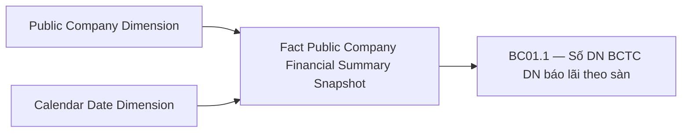
```mermaid
flowchart LR
    F1[Fact Public Company Financial Summary Snapshot] --> R40[BC01.1 — Số DN BCTC DN báo lãi theo sàn]
    D1[Public Company Dimension] --> F1
    D8[Calendar Date Dimension] --> F1
```

**Bảng grain:**

| Tên bảng | Grain |
|---|---|
| Fact Public Company Financial Summary Snapshot | 1 row / CTDC / kỳ báo cáo (năm × quý) |
| Public Company Dimension | 1 row / công ty đại chúng (SCD2) |
| Calendar Date Dimension | 1 row / ngày (Conformed) |

---

#### Nhóm 41 — STT 41: BC01.2 — Báo cáo vĩ mô theo ngành

##### READY

> Phân loại: **Phân tích**
> Source: `Fact Public Company Financial Summary Snapshot` — GROUP BY `Industry_Category_Level1_Code`

**Bảng KPI:**

| KPI ID | Tên KPI | Đơn vị | Tính chất | Atomic Entity | Atomic Table | Atomic Attribute | Atomic Column | row_dsc_clmn_code (dn/bh/td) | Loại BC | col_desc |
|---|---|---|---|---|---|---|---|---|---|---|
| K_GSDC_709 | Ngành kinh tế | Text | Chiều (Group By) | Public Company | pblc_co | Industry Category Level1 Code | idy_cgy_level1_code | — | — | — |
| K_GSDC_710 | DTT Năm N | Tỉ đồng | Phái sinh | Public Company Financial Report Value | pblc_co_fnc_rpt_val | Data Value | data_val | 10/10/03 | BCKQKD | 1 |
| K_GSDC_711 | LNST Năm N | Tỉ đồng | Phái sinh | Public Company Financial Report Value | pblc_co_fnc_rpt_val | Data Value | data_val | 60/60/21 | BCKQKD | 1 |
| K_GSDC_712 | ROA Năm N | % | Phái sinh | Public Company Financial Report Value | pblc_co_fnc_rpt_val | Data Value | data_val | — | — | — |
| K_GSDC_713 | ROE Năm N | % | Phái sinh | Public Company Financial Report Value | pblc_co_fnc_rpt_val | Data Value | data_val | — | — | — |
| K_GSDC_714 | DTT Năm N-1 | Tỉ đồng | Phái sinh | — | — | — | — | Derive kỳ N-1 | — | — |
| K_GSDC_715 | LNST Năm N-1 | Tỉ đồng | Phái sinh | — | — | — | — | Derive kỳ N-1 | — | — |
| K_GSDC_716 | ROA Năm N-1 | % | Phái sinh | — | — | — | — | Derive kỳ N-1 | — | — |
| K_GSDC_717 | ROE Năm N-1 | % | Phái sinh | — | — | — | — | Derive kỳ N-1 | — | — |

**Star Schema:** dùng chung `Fact_Public_Company_Financial_Summary_Snapshot`.

**Bảng grain:** giống Nhóm 40.

---

#### Nhóm 42 — STT 42: BC01.3 — Báo cáo vĩ mô đa kỳ (N / N-1 / N-2)

##### READY

> Phân loại: **Phân tích**
> Source: `Fact Public Company Financial Summary Snapshot` — join 3 kỳ (N, N-1, N-2) tại query layer

**Bảng KPI:**

| KPI ID | Tên KPI | Đơn vị | Tính chất | Atomic Entity | Atomic Table | Atomic Attribute | Atomic Column | row_dsc_clmn_code (dn/bh/td) | Loại BC | col_desc |
|---|---|---|---|---|---|---|---|---|---|---|
| K_GSDC_718 | Kỳ báo cáo | Text | Chiều (Slicer) | — | — | — | — | — | — | — |
| K_GSDC_719 | Tổng tài sản Năm N | Tỉ đồng | Phái sinh | Public Company Financial Report Value | pblc_co_fnc_rpt_val | Data Value | data_val | 270/270/300 | BCDKT | 1 |
| K_GSDC_720 | Nợ phải trả Năm N | Tỉ đồng | Phái sinh | Public Company Financial Report Value | pblc_co_fnc_rpt_val | Data Value | data_val | 300/300/400 | BCDKT | 1 |
| K_GSDC_721 | Vốn chủ sở hữu Năm N | Tỉ đồng | Phái sinh | Public Company Financial Report Value | pblc_co_fnc_rpt_val | Data Value | data_val | 400/400/500 | BCDKT | 1 |
| K_GSDC_722 | Vốn điều lệ Năm N | Tỉ đồng | Phái sinh | Public Company Financial Report Value | pblc_co_fnc_rpt_val | Data Value | data_val | 411/411/411 | BCDKT | 1 |
| K_GSDC_723 | LNST Năm N | Tỉ đồng | Phái sinh | Public Company Financial Report Value | pblc_co_fnc_rpt_val | Data Value | data_val | 60/60/21 | BCKQKD | 1 |
| K_GSDC_724 | ROA Năm N | % | Phái sinh | — | — | — | — | Derive từ bình quân TS | — | — |
| K_GSDC_725 | ROE Năm N | % | Phái sinh | — | — | — | — | Derive từ bình quân VCSH | — | — |
| K_GSDC_726 | Tổng tài sản Năm N-1 | Tỉ đồng | Phái sinh | — | — | — | — | Derive kỳ N-1 | — | — |
| K_GSDC_727 | Nợ phải trả Năm N-1 | Tỉ đồng | Phái sinh | — | — | — | — | Derive kỳ N-1 | — | — |
| K_GSDC_728 | Vốn chủ sở hữu Năm N-1 | Tỉ đồng | Phái sinh | — | — | — | — | Derive kỳ N-1 | — | — |
| K_GSDC_729 | Vốn điều lệ Năm N-1 | Tỉ đồng | Phái sinh | — | — | — | — | Derive kỳ N-1 | — | — |
| K_GSDC_730 | LNST Năm N-1 | Tỉ đồng | Phái sinh | — | — | — | — | Derive kỳ N-1 | — | — |
| K_GSDC_731 | ROA Năm N-1 | % | Phái sinh | — | — | — | — | Derive kỳ N-1 | — | — |
| K_GSDC_732 | ROE Năm N-1 | % | Phái sinh | — | — | — | — | Derive kỳ N-1 | — | — |
| K_GSDC_733 | Tổng tài sản Năm N-2 | Tỉ đồng | Phái sinh | — | — | — | — | Derive kỳ N-2 | — | — |
| K_GSDC_734 | Nợ phải trả Năm N-2 | Tỉ đồng | Phái sinh | — | — | — | — | Derive kỳ N-2 | — | — |
| K_GSDC_735 | Vốn chủ sở hữu Năm N-2 | Tỉ đồng | Phái sinh | — | — | — | — | Derive kỳ N-2 | — | — |
| K_GSDC_736 | Vốn điều lệ Năm N-2 | Tỉ đồng | Phái sinh | — | — | — | — | Derive kỳ N-2 | — | — |
| K_GSDC_737 | LNST Năm N-2 | Tỉ đồng | Phái sinh | — | — | — | — | Derive kỳ N-2 | — | — |
| K_GSDC_738 | ROA Năm N-2 | % | Phái sinh | — | — | — | — | Derive kỳ N-2 | — | — |
| K_GSDC_739 | ROE Năm N-2 | % | Phái sinh | — | — | — | — | Derive kỳ N-2 | — | — |

**Star Schema:** dùng chung `Fact_Public_Company_Financial_Summary_Snapshot`.

**Bảng grain:** giống Nhóm 40.

---

#### Nhóm 43 — STT 43: BC22 — Tổng hợp tình hình tài chính CTDC theo sàn

##### READY

> Phân loại: **Phân tích**
> Source: `Fact Public Company Financial Summary Snapshot` — GROUP BY `Equity_Listing_Exchange_Code`

**Bảng KPI:**

| KPI ID | Tên KPI | Đơn vị | Tính chất | Atomic Entity | Atomic Table | Atomic Attribute | Atomic Column | row_dsc_clmn_code (dn/bh/td) | Loại BC | col_desc |
|---|---|---|---|---|---|---|---|---|---|---|
| K_GSDC_740 | Theo sàn | Text | Chiều (Group By) | Public Company | pblc_co | Equity Listing Exchange Code | eqty_listing_exg_code | — | — | — |
| K_GSDC_741 | Tổng tài sản theo sàn | Tỉ đồng | Phái sinh | Public Company Financial Report Value | pblc_co_fnc_rpt_val | Data Value | data_val | 270/270/300 | BCDKT | 1 |
| K_GSDC_741_YOY | Tổng tài sản — YoY theo sàn | % | Phái sinh | — | — | — | — | — | — | — |
| K_GSDC_742 | Hàng tồn kho theo sàn | Tỉ đồng | Phái sinh | Public Company Financial Report Value | pblc_co_fnc_rpt_val | Data Value | data_val | 140/140/— | BCDKT | 1 |
| K_GSDC_742_YOY | Hàng tồn kho — YoY theo sàn | % | Phái sinh | — | — | — | — | — | — | — |
| K_GSDC_743 | Nợ phải trả theo sàn | Tỉ đồng | Phái sinh | Public Company Financial Report Value | pblc_co_fnc_rpt_val | Data Value | data_val | 300/300/400 | BCDKT | 1 |
| K_GSDC_743_YOY | Nợ phải trả — YoY theo sàn | % | Phái sinh | — | — | — | — | — | — | — |
| K_GSDC_744 | Vốn chủ sở hữu theo sàn | Tỉ đồng | Phái sinh | Public Company Financial Report Value | pblc_co_fnc_rpt_val | Data Value | data_val | 400/400/500 | BCDKT | 1 |
| K_GSDC_744_YOY | VCSH — YoY theo sàn | % | Phái sinh | — | — | — | — | — | — | — |
| K_GSDC_745 | Vốn góp của chủ sở hữu theo sàn | Tỉ đồng | Phái sinh | Public Company Financial Report Value | pblc_co_fnc_rpt_val | Data Value | data_val | 411/411/411 | BCDKT | 1 |
| K_GSDC_745_YOY | VGC — YoY theo sàn | % | Phái sinh | — | — | — | — | — | — | — |
| K_GSDC_746 | LNST chưa phân phối theo sàn | Tỉ đồng | Phái sinh | Public Company Financial Report Value | pblc_co_fnc_rpt_val | Data Value | data_val | 421/421/450 | BCDKT | 1 |
| K_GSDC_746_YOY | LNST chưa PP — YoY theo sàn | % | Phái sinh | — | — | — | — | — | — | — |
| K_GSDC_747 | Doanh thu thuần theo sàn | Tỉ đồng | Phái sinh | Public Company Financial Report Value | pblc_co_fnc_rpt_val | Data Value | data_val | 10/10/03 | BCKQKD | 1 |
| K_GSDC_747_YOY | DTT — YoY theo sàn | % | Phái sinh | — | — | — | — | — | — | — |
| K_GSDC_748 | LNKT trước thuế theo sàn | Tỉ đồng | Phái sinh | Public Company Financial Report Value | pblc_co_fnc_rpt_val | Data Value | data_val | 50/50/17 | BCKQKD | 1 |
| K_GSDC_748_YOY | LNKT trước thuế — YoY theo sàn | % | Phái sinh | — | — | — | — | — | — | — |
| K_GSDC_749 | LNST theo sàn | Tỉ đồng | Phái sinh | Public Company Financial Report Value | pblc_co_fnc_rpt_val | Data Value | data_val | 60/60/21 | BCKQKD | 1 |
| K_GSDC_749_YOY | LNST — YoY theo sàn | % | Phái sinh | — | — | — | — | — | — | — |
| K_GSDC_750 | ROA theo sàn | % | Phái sinh | — | — | — | — | Derive từ bình quân TS | — | — |
| K_GSDC_750_YOY | ROA — YoY theo sàn | % | Phái sinh | — | — | — | — | — | — | — |
| K_GSDC_751 | ROE theo sàn | % | Phái sinh | — | — | — | — | Derive từ bình quân VCSH | — | — |
| K_GSDC_751_YOY | ROE — YoY theo sàn | % | Phái sinh | — | — | — | — | — | — | — |

**Star Schema:** dùng chung `Fact_Public_Company_Financial_Summary_Snapshot`.

**Lineage Mart → Báo cáo:**

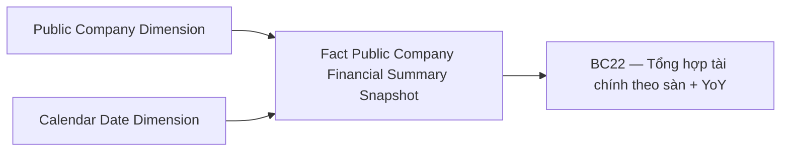
```mermaid
flowchart LR
    F1[Fact Public Company Financial Summary Snapshot] --> R43[BC22 — Tổng hợp tài chính theo sàn + YoY]
    D1[Public Company Dimension] --> F1
    D8[Calendar Date Dimension] --> F1
```

**Bảng grain:**

| Tên bảng | Grain |
|---|---|
| Fact Public Company Financial Summary Snapshot | 1 row / CTDC / kỳ báo cáo (năm × quý) |
| Public Company Dimension | 1 row / công ty đại chúng (SCD2) |
| Calendar Date Dimension | 1 row / ngày (Conformed) |

---

## Section 3 — Mô hình tổng thể

**Bảng Phân tích (Star Schema):**

| Tên bảng | Loại | Trạng thái | Màn hình / Nhóm phục vụ |
|---|---|---|---|
| Fact Public Company Financial Summary Snapshot | Fact Periodic Snapshot | READY | MH2 — Giám sát Tổng hợp; MH4 — BC01/BC22 |
| Fact Public Company Financial Report Value | Fact Event | READY | MH3 — Data Explorer BCTC chi tiết (DB21–32 + DB39) |
| Fact Public Company Risk Score Snapshot | Fact Periodic Snapshot | PENDING | MH1 — Tab Tổng hợp; MH6 — DB34 |
| Fact Public Company Compliance Score Snapshot | Fact Periodic Snapshot | PENDING | MH1 — Tab Tuân thủ; MH6 — DB35 |
| Fact Public Company Issuance Score Snapshot | Fact Periodic Snapshot | PENDING | MH1 — Tab Phát hành; MH6 — DB37 |
| Fact Public Company Financial Score Snapshot | Fact Periodic Snapshot | PENDING | MH1 — Tab Tài chính; MH6 — DB36 |
| Fact Public Company Non-Financial Score Snapshot | Fact Periodic Snapshot | PENDING | MH1 — Tab Phi TC & M-Score; MH6 — DB38 |
| Fact Public Company Listing Info Snapshot | Fact Periodic Snapshot | PENDING | MH5 — DB33 thông tin niêm yết |

**Bảng Tác nghiệp:** *(Không có trong phạm vi này)*

**Bảng Dimension:**

| Tên bảng | Loại | Trạng thái | Ghi chú |
|---|---|---|---|
| Public Company Dimension | Dimension SCD2 | READY | Mã CK, Tên DN, Sàn, Ngành — dùng chung toàn bộ màn hình |
| Calendar Date Dimension | Dimension Conformed | READY | Năm / Quý — shared toàn hệ thống |
| Financial Report Catalog Dimension | Dimension | READY | Template BCTC — báo cáo / dòng / cột; composite join key (Catalog_Business_Code + Row_Code + Column_Code) |

---

## Section 4 — Vấn đề mở

| ID | Vấn đề | Giả định hiện tại | KPI liên quan | Trạng thái |
|---|---|---|---|---|
| O_GSDC_1 | Toàn bộ bảng lưu kết quả chấm điểm rủi ro CTDC (tuân thủ, phát hành, tài chính, phi tài chính, tổng hợp) chưa được thiết kế trong CSDL IDS. BA ghi nhận `failed` / "Chưa có bảng nguồn" cho DB34–38 (Data Explorer) và DB1–5 (MH1). | Cần thiết kế thêm ít nhất 4 Atomic entity mới (Compliance Score, Issuance Score, Financial Score, Non-Financial Score) trong IDS Atomic layer trước khi thiết kế Datamart. | K_GSDC_1 — K_GSDC_7, K_GSDC_2_1 — K_GSDC_5_4 | Open |
| O_GSDC_2 | KPI Số doanh nghiệp (K_GSDC_8, K_GSDC_34) có nguồn từ `IDS.company_detail` với điều kiện `ids_reg_date <= cuối kỳ` — không join qua `company_data` hay `data`. COUNT DISTINCT từ `Fact Public Company Financial Summary Snapshot` sẽ thiếu DN đăng ký IDS nhưng chưa nộp BCTC trong kỳ. | Cần xác nhận: KPI Số DN tính trên toàn bộ DN đăng ký IDS hay chỉ DN có nộp BCTC trong kỳ? Nếu toàn bộ DN đăng ký thì cần thêm `IDS_Registration_Date` vào Fact hoặc tính riêng từ `Public Company Dimension`. | K_GSDC_8, K_GSDC_34 | Open |
| O_GSDC_3 | BA SQL DB25 xác nhận `rr.row_desc` và `rc2.col_desc` là trường thực tồn tại trong `IDS.rrow` / `IDS.rcol` — dùng làm mã hiển thị nghiệp vụ và filter điều kiện trong mọi dashboard DB21–32. Tuy nhiên Atomic `Financial Report Row Template` và `Financial Report Column Template` hiện chưa có `Row_Display_Code` (`row_desc`) và `Column_Display_Code` (`col_desc`). | Cần bổ sung `Row_Display_Code` = `IDS.rrow.row_desc` và `Column_Display_Code` = `IDS.rcol.col_desc` vào Atomic trước, sau đó thêm vào `Financial Report Catalog Dimension`. | K_GSDC_33, K_GSDC_D8–D11 | Open |
| O_GSDC_4 | DB43 BC22 có KPI "Lợi nhuận kế toán trước thuế" — không có trường tương ứng trong `Fact Public Company Financial Summary Snapshot` hiện tại (chỉ có `Net_Profit_Amount` = LNST). LNKT trước thuế là row khác trong BCTC. | **Confirmed:** Bổ sung `Pre_Tax_Profit_Amount` vào Fact Summary — map từ BCKQKD `row_desc='50'` (dn/bh) / `row_desc='17'` (td), `col_desc='1'`. Đã cập nhật erDiagram và K_GSDC_60. | K_GSDC_60 | Closed |