# DTM_GSDC_HLD — High Level Design
**Module:** GSDC — Giám sát Công ty Đại chúng
**Phiên bản:** 3.0 — Phase 1 Draft
**Phạm vi:**
- Màn hình 1: **Phân loại & Xếp hạng Rủi ro Doanh nghiệp Đại chúng** (5 tab: Tổng hợp / Tuân thủ / Phát hành / Tài chính / Phi tài chính & M-Score)
- Màn hình 2: **Giám sát Tổng hợp** (5 tab sàn: Tổng hợp / HOSE / HNX / UPCoM / Chưa niêm yết — 3 nhóm nội dung)
- Màn hình 3 *(READY)*: **Data Explorer — Dữ liệu tài chính doanh nghiệp** (DB21–32 + DB39: chi tiết BCTC theo loại hình DN + hệ số tài chính cơ bản — dùng `Fact Public Company Financial Report Value`, Atomic đủ 5 entity Financial Report Value, quy tắc khai thác theo SQL BA áp dụng cho toàn bộ Nhóm 19-30 + 37)
- Màn hình 4: **Báo cáo giám sát CTDC** (DB40–43: BC01.1 / BC01.2 / BC01.3 / BC22 — 4 bảng Fact-report riêng, ETL populate theo batch, không FK Dimension runtime)
- Màn hình 5 *(PENDING)*: **Data Explorer — Dữ liệu thông tin niêm yết** (DB33 — nguồn MSS chưa có Atomic)
- Màn hình 6 *(READY — Atomic draft)*: **Data Explorer — Dữ liệu chấm điểm phân loại CTDC** (DB34–38 — reuse KPI từ Nhóm 1–5)

**Nguồn dữ liệu:** IDS (Information Disclosure System)

---

## Section 1 — Data Lineage

Toàn bộ 5 Nhóm (Tổng hợp, Tuân thủ, Phát hành, Tài chính, Phi tài chính & M-Score) có nguồn từ `IDS.EVALUATIONS` / `EVALUATION_DETAILS` / `EVALUATION_CRITERIA` / `EVALUATION_GROUPS` / `EVALUATION_PERIODS`. Atomic entity tương ứng `design_status: draft`, chưa approved (xem O_GSDC_1). Tách riêng theo từng Fact bên dưới để dễ theo dõi — mọi Fact đều dùng chung `Public Company Dimension` và `Calendar Date Dimension` (xem Cụm 6, Section 4 Reuse Analysis).

##### Cụm 1: Điểm chấm & Xếp loại CTDC (Fact Public Company Risk Score Snapshot) (Nhóm 1)

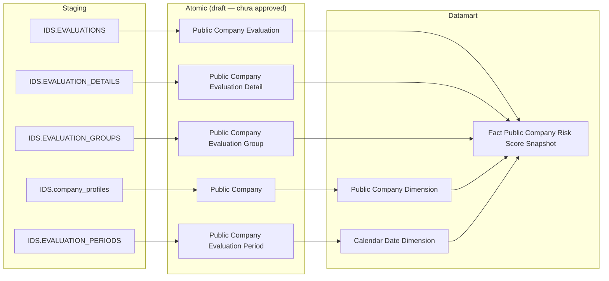
```mermaid
flowchart LR
    subgraph SRC["Staging"]
        IDS_company_profiles_c1["IDS.company_profiles"]
        IDS_EVALUATIONS_c1["IDS.EVALUATIONS"]
        IDS_EVALUATION_DETAILS_c1["IDS.EVALUATION_DETAILS"]
        IDS_EVALUATION_GROUPS_c1["IDS.EVALUATION_GROUPS"]
        IDS_EVALUATION_PERIODS_c1["IDS.EVALUATION_PERIODS"]
    end
    subgraph SIL["Atomic (draft — chưa approved)"]
        Public_Company_c1["Public Company"]
        Public_Company_Evaluation_c1["Public Company Evaluation"]
        Public_Company_Evaluation_Detail_c1["Public Company Evaluation Detail"]
        Public_Company_Evaluation_Group_c1["Public Company Evaluation Group"]
        Public_Company_Evaluation_Period_c1["Public Company Evaluation Period"]
    end
    subgraph GOLD["Datamart"]
        fct_public_company_risk_score_snpst["Fact Public Company Risk Score Snapshot"]
        public_company_dim_c1["Public Company Dimension"]
        cdr_dt_dim_c1["Calendar Date Dimension"]
    end
    IDS_company_profiles_c1 --> Public_Company_c1
    IDS_EVALUATIONS_c1 --> Public_Company_Evaluation_c1
    IDS_EVALUATION_DETAILS_c1 --> Public_Company_Evaluation_Detail_c1
    IDS_EVALUATION_GROUPS_c1 --> Public_Company_Evaluation_Group_c1
    IDS_EVALUATION_PERIODS_c1 --> Public_Company_Evaluation_Period_c1
    Public_Company_c1 --> public_company_dim_c1
    Public_Company_Evaluation_Period_c1 --> cdr_dt_dim_c1
    Public_Company_Evaluation_c1 --> fct_public_company_risk_score_snpst
    Public_Company_Evaluation_Detail_c1 --> fct_public_company_risk_score_snpst
    Public_Company_Evaluation_Group_c1 --> fct_public_company_risk_score_snpst
    public_company_dim_c1 --> fct_public_company_risk_score_snpst
    cdr_dt_dim_c1 --> fct_public_company_risk_score_snpst
```

##### Cụm 2: Điểm chấm & Xếp loại CTDC (Fact Public Company Compliance Score Snapshot) (Nhóm 2)

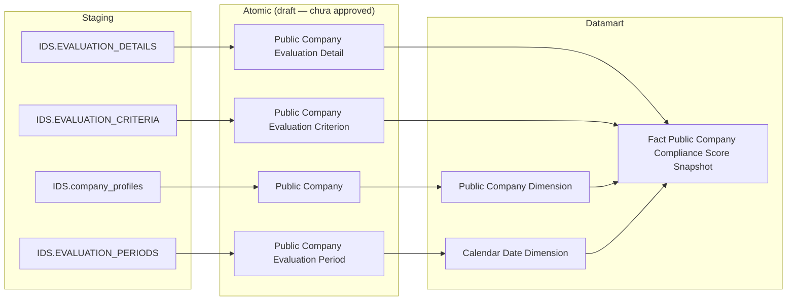
```mermaid
flowchart LR
    subgraph SRC["Staging"]
        IDS_company_profiles_c2["IDS.company_profiles"]
        IDS_EVALUATION_DETAILS_c2["IDS.EVALUATION_DETAILS"]
        IDS_EVALUATION_CRITERIA_c2["IDS.EVALUATION_CRITERIA"]
        IDS_EVALUATION_PERIODS_c2["IDS.EVALUATION_PERIODS"]
    end
    subgraph SIL["Atomic (draft — chưa approved)"]
        Public_Company_c2["Public Company"]
        Public_Company_Evaluation_Detail_c2["Public Company Evaluation Detail"]
        Public_Company_Evaluation_Criterion_c2["Public Company Evaluation Criterion"]
        Public_Company_Evaluation_Period_c2["Public Company Evaluation Period"]
    end
    subgraph GOLD["Datamart"]
        fct_public_company_compliance_score_snpst["Fact Public Company Compliance Score Snapshot"]
        public_company_dim_c2["Public Company Dimension"]
        cdr_dt_dim_c2["Calendar Date Dimension"]
    end
    IDS_company_profiles_c2 --> Public_Company_c2
    IDS_EVALUATION_DETAILS_c2 --> Public_Company_Evaluation_Detail_c2
    IDS_EVALUATION_CRITERIA_c2 --> Public_Company_Evaluation_Criterion_c2
    IDS_EVALUATION_PERIODS_c2 --> Public_Company_Evaluation_Period_c2
    Public_Company_c2 --> public_company_dim_c2
    Public_Company_Evaluation_Period_c2 --> cdr_dt_dim_c2
    Public_Company_Evaluation_Detail_c2 --> fct_public_company_compliance_score_snpst
    Public_Company_Evaluation_Criterion_c2 --> fct_public_company_compliance_score_snpst
    public_company_dim_c2 --> fct_public_company_compliance_score_snpst
    cdr_dt_dim_c2 --> fct_public_company_compliance_score_snpst
```

##### Cụm 3: Điểm chấm & Xếp loại CTDC (Fact Public Company Issuance Score Snapshot) (Nhóm 3)

```mermaid
flowchart LR
    subgraph SRC["Staging"]
        IDS_company_profiles_c3["IDS.company_profiles"]
        IDS_EVALUATION_DETAILS_c3["IDS.EVALUATION_DETAILS"]
        IDS_EVALUATION_CRITERIA_c3["IDS.EVALUATION_CRITERIA"]
        IDS_EVALUATION_PERIODS_c3["IDS.EVALUATION_PERIODS"]
    end
    subgraph SIL["Atomic (draft — chưa approved)"]
        Public_Company_c3["Public Company"]
        Public_Company_Evaluation_Detail_c3["Public Company Evaluation Detail"]
        Public_Company_Evaluation_Criterion_c3["Public Company Evaluation Criterion"]
        Public_Company_Evaluation_Period_c3["Public Company Evaluation Period"]
    end
    subgraph GOLD["Datamart"]
        fct_public_company_issuance_score_snpst["Fact Public Company Issuance Score Snapshot"]
        public_company_dim_c3["Public Company Dimension"]
        cdr_dt_dim_c3["Calendar Date Dimension"]
    end
    IDS_company_profiles_c3 --> Public_Company_c3
    IDS_EVALUATION_DETAILS_c3 --> Public_Company_Evaluation_Detail_c3
    IDS_EVALUATION_CRITERIA_c3 --> Public_Company_Evaluation_Criterion_c3
    IDS_EVALUATION_PERIODS_c3 --> Public_Company_Evaluation_Period_c3
    Public_Company_c3 --> public_company_dim_c3
    Public_Company_Evaluation_Period_c3 --> cdr_dt_dim_c3
    Public_Company_Evaluation_Detail_c3 --> fct_public_company_issuance_score_snpst
    Public_Company_Evaluation_Criterion_c3 --> fct_public_company_issuance_score_snpst
    public_company_dim_c3 --> fct_public_company_issuance_score_snpst
    cdr_dt_dim_c3 --> fct_public_company_issuance_score_snpst
```

##### Cụm 4: Điểm chấm & Xếp loại CTDC (Fact Public Company Financial Score Snapshot) (Nhóm 4)

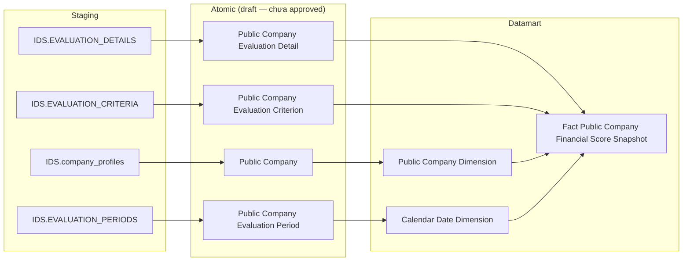
```mermaid
flowchart LR
    subgraph SRC["Staging"]
        IDS_company_profiles_c4["IDS.company_profiles"]
        IDS_EVALUATION_DETAILS_c4["IDS.EVALUATION_DETAILS"]
        IDS_EVALUATION_CRITERIA_c4["IDS.EVALUATION_CRITERIA"]
        IDS_EVALUATION_PERIODS_c4["IDS.EVALUATION_PERIODS"]
    end
    subgraph SIL["Atomic (draft — chưa approved)"]
        Public_Company_c4["Public Company"]
        Public_Company_Evaluation_Detail_c4["Public Company Evaluation Detail"]
        Public_Company_Evaluation_Criterion_c4["Public Company Evaluation Criterion"]
        Public_Company_Evaluation_Period_c4["Public Company Evaluation Period"]
    end
    subgraph GOLD["Datamart"]
        fct_public_company_financial_score_snpst["Fact Public Company Financial Score Snapshot"]
        public_company_dim_c4["Public Company Dimension"]
        cdr_dt_dim_c4["Calendar Date Dimension"]
    end
    IDS_company_profiles_c4 --> Public_Company_c4
    IDS_EVALUATION_DETAILS_c4 --> Public_Company_Evaluation_Detail_c4
    IDS_EVALUATION_CRITERIA_c4 --> Public_Company_Evaluation_Criterion_c4
    IDS_EVALUATION_PERIODS_c4 --> Public_Company_Evaluation_Period_c4
    Public_Company_c4 --> public_company_dim_c4
    Public_Company_Evaluation_Period_c4 --> cdr_dt_dim_c4
    Public_Company_Evaluation_Detail_c4 --> fct_public_company_financial_score_snpst
    Public_Company_Evaluation_Criterion_c4 --> fct_public_company_financial_score_snpst
    public_company_dim_c4 --> fct_public_company_financial_score_snpst
    cdr_dt_dim_c4 --> fct_public_company_financial_score_snpst
```

##### Cụm 5: Điểm chấm & Xếp loại CTDC (Fact Public Company Non-Financial Score Snapshot) (Nhóm 5)

```mermaid
flowchart LR
    subgraph SRC["Staging"]
        IDS_company_profiles_c5["IDS.company_profiles"]
        IDS_EVALUATION_DETAILS_c5["IDS.EVALUATION_DETAILS"]
        IDS_EVALUATION_CRITERIA_c5["IDS.EVALUATION_CRITERIA"]
        IDS_EVALUATION_PERIODS_c5["IDS.EVALUATION_PERIODS"]
    end
    subgraph SIL["Atomic (draft — chưa approved)"]
        Public_Company_c5["Public Company"]
        Public_Company_Evaluation_Detail_c5["Public Company Evaluation Detail"]
        Public_Company_Evaluation_Criterion_c5["Public Company Evaluation Criterion"]
        Public_Company_Evaluation_Period_c5["Public Company Evaluation Period"]
    end
    subgraph GOLD["Datamart"]
        fct_public_company_nonfinancial_score_snpst["Fact Public Company Non-Financial Score Snapshot"]
        public_company_dim_c5["Public Company Dimension"]
        cdr_dt_dim_c5["Calendar Date Dimension"]
    end
    IDS_company_profiles_c5 --> Public_Company_c5
    IDS_EVALUATION_DETAILS_c5 --> Public_Company_Evaluation_Detail_c5
    IDS_EVALUATION_CRITERIA_c5 --> Public_Company_Evaluation_Criterion_c5
    IDS_EVALUATION_PERIODS_c5 --> Public_Company_Evaluation_Period_c5
    Public_Company_c5 --> public_company_dim_c5
    Public_Company_Evaluation_Period_c5 --> cdr_dt_dim_c5
    Public_Company_Evaluation_Detail_c5 --> fct_public_company_nonfinancial_score_snpst
    Public_Company_Evaluation_Criterion_c5 --> fct_public_company_nonfinancial_score_snpst
    public_company_dim_c5 --> fct_public_company_nonfinancial_score_snpst
    cdr_dt_dim_c5 --> fct_public_company_nonfinancial_score_snpst
```

> **Ghi chú `Public Company Evaluation Period`:** Entity Atomic tương ứng `IDS.EVALUATION_PERIODS` (physical name `pc_evaluation_period`, `design_status: draft`) map trực tiếp vào `Calendar Date Dimension` (`cdr_dt_dim`) qua `evaluation_year`/`evaluation_month` — không tạo Dimension riêng, tái sử dụng `Calendar Date Dimension` đã có trong Reuse Analysis (Section 4).

##### Cụm 6: Hồ sơ Công ty Đại chúng (Public Company Dimension)

Phục vụ chiều nhận diện DN trên toàn bộ các màn hình.

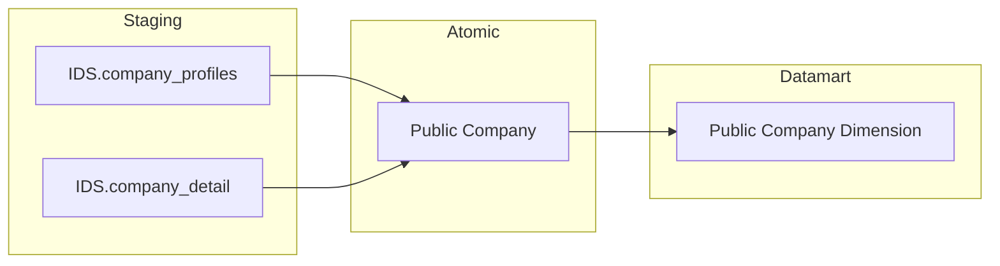
```mermaid
flowchart LR
    subgraph SRC["Staging"]
        IDS_company_profiles["IDS.company_profiles"]
        IDS_company_detail["IDS.company_detail"]
    end
    subgraph SIL["Atomic"]
        Public_Company["Public Company"]
    end
    subgraph GOLD["Datamart"]
        public_company_dim["Public Company Dimension"]
    end
    IDS_company_profiles --> Public_Company
    IDS_company_detail --> Public_Company
    Public_Company --> public_company_dim
```

##### Cụm 7: Nghĩa vụ báo cáo & Nộp báo cáo (Fact Violation Report Snapshot) (Nhóm 6)

Phục vụ K_GSDC_48 (tỷ lệ nộp BCTC, Nhóm 6/10/12/14/16) qua `Fact Violation Report Snapshot` — driving `Public Company Dimension` full-scan, filter loại tin định kỳ qua `fr_template.news_tp_code = 'DINH_KY'`. K_GSDC_49 (số DN báo lãi, cùng Nhóm) KHÔNG dùng Fact này — dùng trực tiếp `Fact Public Company Financial Report Value` (Cụm 8/Nhóm 7), xem chi tiết Nhóm 6.

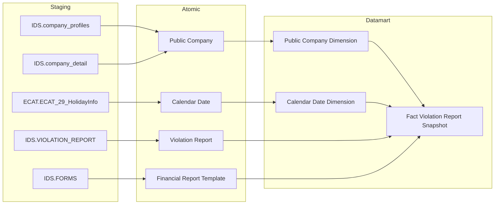
```mermaid
flowchart LR
    subgraph SRC["Staging"]
        IDS_company_profiles["IDS.company_profiles"]
        IDS_company_detail["IDS.company_detail"]
        ECAT_ECAT_29_HolidayInfo["ECAT.ECAT_29_HolidayInfo"]
        IDS_VIOLATION_REPORT["IDS.VIOLATION_REPORT"]
        IDS_FORMS["IDS.FORMS"]
    end
    subgraph SIL["Atomic"]
        Public_Company["Public Company"]
        Calendar_Date["Calendar Date"]
        Violation_Report["Violation Report"]
        Financial_Report_Template["Financial Report Template"]
    end
    subgraph GOLD["Datamart"]
        public_company_dim["Public Company Dimension"]
        cdr_dt_dim["Calendar Date Dimension"]
        fct_violation_rpt_snpst["Fact Violation Report Snapshot"]
    end
    IDS_company_profiles --> Public_Company
    IDS_company_detail --> Public_Company
    ECAT_ECAT_29_HolidayInfo --> Calendar_Date
    IDS_VIOLATION_REPORT --> Violation_Report
    IDS_FORMS --> Financial_Report_Template
    Public_Company --> public_company_dim
    Calendar_Date --> cdr_dt_dim
    public_company_dim --> fct_violation_rpt_snpst
    cdr_dt_dim --> fct_violation_rpt_snpst
    Violation_Report --> fct_violation_rpt_snpst
    Financial_Report_Template --> fct_violation_rpt_snpst
```

> `Fact Violation Report Snapshot` giờ chỉ phục vụ K_GSDC_48 (Report_Due_Count/Report_Submitted_Count) — không còn denormalize `Profitable_Indicator` từ `fr_value` (đã bỏ, xem Nhóm 6). Lineage đầy đủ của `Financial Report Value`/`Financial Report Catalog`/`Row Template`/`Column Template` (dùng cho K_GSDC_49) xem Cụm 8.

##### Cụm 8: Chi tiết BCTC từng CTDC & Danh mục template (Fact Public Company Financial Report Value) (Nhóm 7-30, 37)

Phục vụ toàn bộ KPI tài chính tổng hợp/theo ngành/theo sàn (Màn hình 2) và Data Explorer tra cứu chi tiết BCTC (Màn hình 3) qua `Fact Public Company Financial Report Value` — driving `fr_value`, JOIN `financial_report_catalog`/`fr_row_template`/`fr_column_template` (denormalize vào `Financial Report Catalog Dimension`), `EXISTS pc_report_submission` làm filter tồn tại hồ sơ nộp (không lấy measure). Quy tắc khai thác đầy đủ xem Nhóm 7. Nhóm 38-41 (BC01.1/01.2/01.3/BC22) dùng 4 bảng Fact-report riêng (Cụm 9-12), không dùng Fact/Operational này.

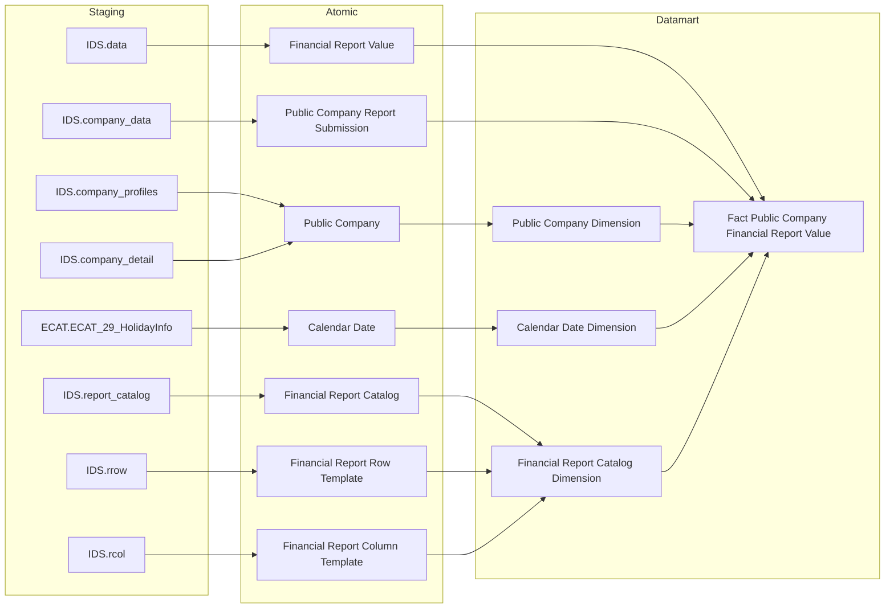
```mermaid
flowchart LR
    subgraph SRC["Staging"]
        IDS_company_profiles_c4["IDS.company_profiles"]
        IDS_company_detail_c4["IDS.company_detail"]
        IDS_company_data_c4["IDS.company_data"]
        IDS_data_c4["IDS.data"]
        IDS_report_catalog_c4["IDS.report_catalog"]
        IDS_rrow_c4["IDS.rrow"]
        IDS_rcol_c4["IDS.rcol"]
        ECAT_ECAT_29_HolidayInfo_c4["ECAT.ECAT_29_HolidayInfo"]
    end
    subgraph SIL["Atomic"]
        Public_Company_c4["Public Company"]
        Public_Company_Report_Submission_c4["Public Company Report Submission"]
        Financial_Report_Value_c4["Financial Report Value"]
        Financial_Report_Catalog_c4["Financial Report Catalog"]
        Financial_Report_Row_Template_c4["Financial Report Row Template"]
        Financial_Report_Column_Template_c4["Financial Report Column Template"]
        Calendar_Date_c4["Calendar Date"]
    end
    subgraph GOLD["Datamart"]
        fct_public_company_financial_rpt_val["Fact Public Company Financial Report Value"]
        financial_rpt_catalog_dim["Financial Report Catalog Dimension"]
        public_company_dim_c4["Public Company Dimension"]
        cdr_dt_dim_c4["Calendar Date Dimension"]
    end
    IDS_company_profiles_c4 --> Public_Company_c4
    IDS_company_detail_c4 --> Public_Company_c4
    IDS_company_data_c4 --> Public_Company_Report_Submission_c4
    IDS_data_c4 --> Financial_Report_Value_c4
    IDS_report_catalog_c4 --> Financial_Report_Catalog_c4
    IDS_rrow_c4 --> Financial_Report_Row_Template_c4
    IDS_rcol_c4 --> Financial_Report_Column_Template_c4
    ECAT_ECAT_29_HolidayInfo_c4 --> Calendar_Date_c4
    Public_Company_c4 --> public_company_dim_c4
    Financial_Report_Value_c4 --> fct_public_company_financial_rpt_val
    Public_Company_Report_Submission_c4 --> fct_public_company_financial_rpt_val
    Financial_Report_Catalog_c4 --> financial_rpt_catalog_dim
    Financial_Report_Row_Template_c4 --> financial_rpt_catalog_dim
    Financial_Report_Column_Template_c4 --> financial_rpt_catalog_dim
    Calendar_Date_c4 --> cdr_dt_dim_c4
    public_company_dim_c4 --> fct_public_company_financial_rpt_val
    cdr_dt_dim_c4 --> fct_public_company_financial_rpt_val
    financial_rpt_catalog_dim --> fct_public_company_financial_rpt_val
```

---

##### Cụm 9: Báo cáo vĩ mô theo sàn (Public Company Regulatory Compliance Report) (Nhóm 38)

> **[SỬA 2026-08-19 lần 2]** Toàn bộ Nhóm 38 đổi sang aggregate từ Datamart — 4 sub-select độc lập, không JOIN Fact-to-Fact ở tầng chi tiết: Số lượng DN (K_GSDC_701) từ `Public Company Dimension`; Số BCTC đến hạn/đã nộp (K_GSDC_702/703) từ `Fact Violation Report Snapshot` (`fct_violation_rpt_snpst`, Cụm 7); Số CTĐC báo lãi (K_GSDC_705/707) từ `Fact Public Company Financial Summary Snapshot` (`fct_public_company_financial_smy_snpst`, Cụm 12). **[SỬA 2026-08-19 lần 4 — tối ưu, DRIVING TABLE]** `Profitable Company Count Year N` (đã GROUP BY sẵn theo sàn+kỳ trên `fct_public_company_financial_smy_snpst`, `rpt_year`/`rpt_quarter` NOT NULL) làm **driving table** cung cấp danh sách sàn+kỳ chuẩn cho toàn bộ report (KHÔNG dùng tham số ETL ngoài, KHÔNG dùng `rpt_year`/`rpt_quarter` của `fct_violation_rpt_snpst` — nullable, tránh lặp lại lỗi đã ghi nhận ở K_GSDC_49/Nhóm 6). `Report Due Count`/`Report Submitted Count` JOIN vào driving qua sàn+kỳ (phụ thuộc kỳ thật). `Company Count` đã bỏ điều kiện theo kỳ (`ids_registration_dt <= cuối kỳ`) — JOIN vào driving CHỈ qua sàn.

Phục vụ K_GSDC_700-708 (BC01.1) qua `Public Company Regulatory Compliance Report` — Fact-report denormalize hoàn toàn, ETL populate theo batch mỗi kỳ (Report_Year + Report_Quarter, lấy từ driving table `fct_public_company_financial_smy_snpst`), không FK Dimension runtime.

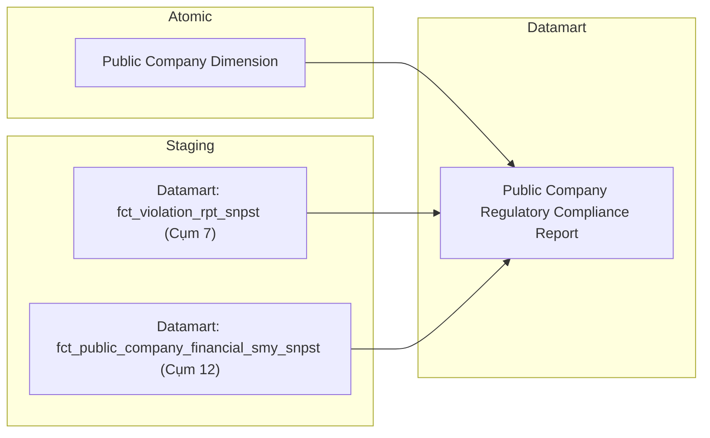
```mermaid
flowchart LR
    subgraph SRC["Staging"]
        GOLD_fct_violation_c9["Datamart: fct_violation_rpt_snpst (Cụm 7)"]
        GOLD_fct_smy_c9["Datamart: fct_public_company_financial_smy_snpst (Cụm 12)"]
    end
    subgraph SIL["Atomic"]
        Public_Company_Dim_c9["Public Company Dimension"]
    end
    subgraph GOLD["Datamart"]
        public_company_regulatory_compliance_rpt["Public Company Regulatory Compliance Report"]
    end
    Public_Company_Dim_c9 --> public_company_regulatory_compliance_rpt
    GOLD_fct_violation_c9 --> public_company_regulatory_compliance_rpt
    GOLD_fct_smy_c9 --> public_company_regulatory_compliance_rpt
```

> **Ghi chú kỹ thuật flowchart:** `fct_violation_rpt_snpst` (Cụm 7) và `fct_public_company_financial_smy_snpst` (Cụm 12) là 2 bảng Datamart Gold đã populate xong, đóng vai trò input ETL tầng 2 (Gold-to-Gold) — đặt trong `SRC["Staging"]` chỉ để giữ đúng cú pháp 3-subgraph, không phải Staging thô. `fct_public_company_financial_smy_snpst` (qua sub-select Profitable Company Count Year N) là **driving table** — nguồn sàn+kỳ chuẩn cho toàn bộ report. `Public Company Dimension` dùng làm nguồn trực tiếp cho Số lượng DN (không phụ thuộc kỳ, JOIN vào driving chỉ qua sàn), đồng thời JOIN filter status/sàn cho 2 Fact còn lại. 4 sub-select độc lập, không có edge nào nối trực tiếp 2 Fact với nhau ở tầng chi tiết.

---

##### Cụm 10: Báo cáo vĩ mô theo ngành (Public Company Industry Financial Report) (Nhóm 39)

> **[SỬA 2026-08-19]** Đổi nguồn ETL nạp — từ JOIN trực tiếp `fr_value`/`public_company` (thiếu dedup form-ưu-tiên, cồng kềnh do 2 scalar subquery lồng nhau cho ROA/ROE mỗi năm) sang aggregate từ `fct_public_company_financial_smy_snpst` (đã dedup sẵn — xem Cụm 12) JOIN `Public Company Dimension` (lấy sẵn `business_line_level_1_code`/`classification_business_line_nm` đã denormalize, không cần LOOKUP `Industry`/`Classification Business Line` riêng). Chạy 2 lần (rpt_year = :year_n / :year_n - 1), GROUP BY ngành. Không dùng `Public Company Financial YoY Report` — measure Nhóm 39 là giá trị tuyệt đối N/N-1 (không phải %).

Phục vụ K_GSDC_709-717 (BC01.2) qua `Public Company Industry Financial Report` — Fact-report denormalize hoàn toàn, ETL populate theo batch mỗi năm báo cáo, không FK Dimension runtime.

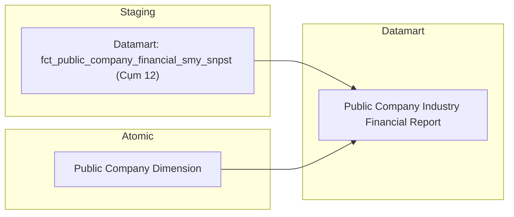
```mermaid
flowchart LR
    subgraph SRC["Staging"]
        GOLD_fct_smy_c10["Datamart: fct_public_company_financial_smy_snpst (Cụm 12)"]
    end
    subgraph SIL["Atomic"]
        Public_Company_Dim_c10["Public Company Dimension"]
    end
    subgraph GOLD["Datamart"]
        public_company_industry_financial_rpt["Public Company Industry Financial Report"]
    end
    GOLD_fct_smy_c10 --> public_company_industry_financial_rpt
    Public_Company_Dim_c10 --> public_company_industry_financial_rpt
```

> **Ghi chú kỹ thuật flowchart:** SRC ở đây là bảng Datamart Gold đã populate xong (Cụm 12), đóng vai trò input ETL tầng 2 (Gold-to-Gold) cho Cụm này — không phải Staging thô. `Public Company Dimension` dùng để lấy `business_line_level_1_code`/`classification_business_line_nm` qua `public_company_dim_id` có sẵn trên Fact (không đặt trong SIL đúng nghĩa nhưng giữ đúng cú pháp 3-subgraph).

---

##### Cụm 11: Báo cáo vĩ mô đa kỳ (Public Company Multi-Period Financial Report) (Nhóm 40)

> **[SỬA 2026-08-19]** Đổi nguồn ETL nạp — từ JOIN trực tiếp `fr_value` sang aggregate từ `fct_public_company_financial_smy_snpst` (đã dedup sẵn — xem Cụm 12), SUM toàn thị trường (không GROUP BY), chạy 3 lần (rpt_year = :year_n / :year_n - 1 / :year_n - 2). Cột "Vốn điều lệ" (`charter_capital_amt_year_*`) đổi nguồn sang `fct.contributed_capital` (cùng khái niệm), giữ nguyên tên field báo cáo. Không dùng `Public Company Financial YoY Report` — measure Nhóm 40 là giá trị tuyệt đối từng kỳ (không phải %).

Phục vụ K_GSDC_718-739 (BC01.3) qua `Public Company Multi-Period Financial Report` — Fact-report denormalize hoàn toàn, aggregate toàn thị trường (không group-by), ETL populate theo batch mỗi năm báo cáo.

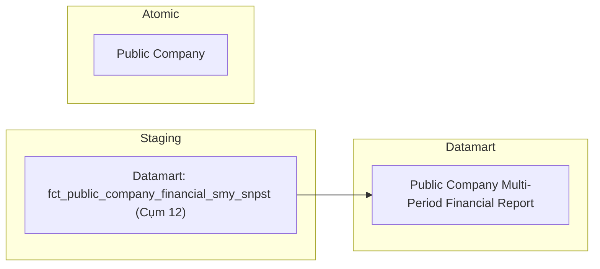
```mermaid
flowchart LR
    subgraph SRC["Staging"]
        GOLD_fct_smy_c11["Datamart: fct_public_company_financial_smy_snpst (Cụm 12)"]
    end
    subgraph SIL["Atomic"]
        Public_Company_c11["Public Company"]
    end
    subgraph GOLD["Datamart"]
        public_company_multi_period_financial_rpt["Public Company Multi-Period Financial Report"]
    end
    GOLD_fct_smy_c11 --> public_company_multi_period_financial_rpt
```

> **Ghi chú kỹ thuật flowchart:** SRC là bảng Datamart Gold đã populate xong (Cụm 12), đóng vai trò input ETL tầng 2 (Gold-to-Gold) — không phải Staging thô. Không GROUP BY theo Dimension nào (SUM toàn thị trường), nên không cần JOIN `Public Company Dimension` ở Cụm này (khác Cụm 10).

---

##### Cụm 12: Snapshot chỉ tiêu tài chính theo CTĐC (Fact Public Company Financial Summary Snapshot) (Nhóm 7 Khối A, 8, 11, 13, 15, 17, 37)

> **[SỬA 2026-08-19]** Cụm mới bổ sung — phản ánh Fact `fct_public_company_financial_smy_snpst` (thiết kế 2026-08-18, thay EAV cho Nhóm 7 Khối A) vốn chưa có trong Section 1 Data Lineage dù đã dùng cho nhiều Nhóm. **[SỬA 2026-08-19 lần 2]** Nhóm 41 (BC22) KHÔNG query trực tiếp Fact này ở tầng báo cáo — Fact này chỉ là nguồn ETL trung gian nạp vào `Public Company Exchange Financial Summary Report` (bảng report riêng, pre-aggregate sẵn, xem Cụm 14), giữ đúng bản chất Fact-report denormalize hoàn toàn cho BC22.

Phục vụ K_GSDC_50-92 (Nhóm 7 Khối A/8/11/13/15/17), K_GSDC_1444-1456 (Nhóm 37) qua `Fact Public Company Financial Summary Snapshot` — driving `fr_value`, dedup form ưu tiên HN>TH>ME>RI + bản ghi mới nhất mỗi ô, pivot 12 chỉ tiêu (+1 `Pre_Tax_Profit` bổ sung phục vụ ETL nạp Nhóm 41 — xem Section 5) thành cột trên Fact khi ETL populate. Quy tắc khai thác đầy đủ xem Nhóm 7. Cụm 14 (Nhóm 41) dùng Fact này làm nguồn ETL tầng 2 (Gold-to-Gold), không phải nguồn báo cáo trực tiếp.

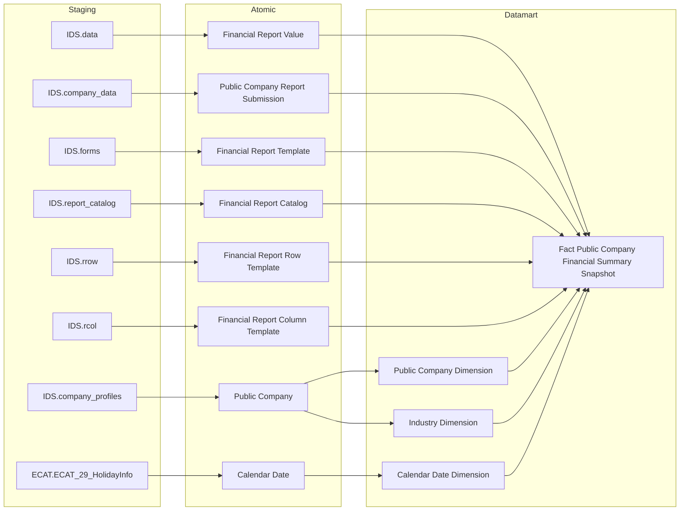
```mermaid
flowchart LR
    subgraph SRC["Staging"]
        IDS_data_c12["IDS.data"]
        IDS_company_data_c12["IDS.company_data"]
        IDS_forms_c12["IDS.forms"]
        IDS_report_catalog_c12["IDS.report_catalog"]
        IDS_rrow_c12["IDS.rrow"]
        IDS_rcol_c12["IDS.rcol"]
        IDS_company_profiles_c12["IDS.company_profiles"]
        ECAT_ECAT_29_HolidayInfo_c12["ECAT.ECAT_29_HolidayInfo"]
    end
    subgraph SIL["Atomic"]
        Financial_Report_Value_c12["Financial Report Value"]
        Public_Company_Report_Submission_c12["Public Company Report Submission"]
        Financial_Report_Template_c12["Financial Report Template"]
        Financial_Report_Catalog_c12["Financial Report Catalog"]
        Financial_Report_Row_Template_c12["Financial Report Row Template"]
        Financial_Report_Column_Template_c12["Financial Report Column Template"]
        Public_Company_c12["Public Company"]
        Calendar_Date_c12["Calendar Date"]
    end
    subgraph GOLD["Datamart"]
        fct_public_company_financial_smy_snpst_c12["Fact Public Company Financial Summary Snapshot"]
        public_company_dim_c12["Public Company Dimension"]
        industry_dim_c12["Industry Dimension"]
        cdr_dt_dim_c12["Calendar Date Dimension"]
    end
    IDS_data_c12 --> Financial_Report_Value_c12
    IDS_company_data_c12 --> Public_Company_Report_Submission_c12
    IDS_forms_c12 --> Financial_Report_Template_c12
    IDS_report_catalog_c12 --> Financial_Report_Catalog_c12
    IDS_rrow_c12 --> Financial_Report_Row_Template_c12
    IDS_rcol_c12 --> Financial_Report_Column_Template_c12
    IDS_company_profiles_c12 --> Public_Company_c12
    ECAT_ECAT_29_HolidayInfo_c12 --> Calendar_Date_c12
    Financial_Report_Value_c12 --> fct_public_company_financial_smy_snpst_c12
    Public_Company_Report_Submission_c12 --> fct_public_company_financial_smy_snpst_c12
    Financial_Report_Template_c12 --> fct_public_company_financial_smy_snpst_c12
    Financial_Report_Catalog_c12 --> fct_public_company_financial_smy_snpst_c12
    Financial_Report_Row_Template_c12 --> fct_public_company_financial_smy_snpst_c12
    Financial_Report_Column_Template_c12 --> fct_public_company_financial_smy_snpst_c12
    Public_Company_c12 --> public_company_dim_c12
    Public_Company_c12 --> industry_dim_c12
    Calendar_Date_c12 --> cdr_dt_dim_c12
    public_company_dim_c12 --> fct_public_company_financial_smy_snpst_c12
    industry_dim_c12 --> fct_public_company_financial_smy_snpst_c12
    cdr_dt_dim_c12 --> fct_public_company_financial_smy_snpst_c12
```

---

##### Cụm 13: Tổng hợp YoY chỉ tiêu tài chính theo sàn (Public Company Financial YoY Report) (Nhóm 7 Khối B, 11, 13, 15, 17)

> **[SỬA 2026-08-19]** Cụm mới bổ sung — phản ánh `public_company_financial_yoy_rpt` (giữ nguyên thiết kế cũ từ trước 2026-08-18) vốn chưa có Cụm riêng trong Section 1. **[SỬA 2026-08-19 lần 2]** Nhóm 41 (BC22) KHÔNG query trực tiếp bảng này ở tầng báo cáo — chỉ là nguồn ETL trung gian nạp phần YoY vào `Public Company Exchange Financial Summary Report` (xem Cụm 14). **[SỬA 2026-08-19 lần 5 — redesign]** Đổi hẳn nguồn ETL nạp — từ EAV (`fr_value`/`pc_report_submission`/`fr_template`/`financial_report_catalog`/`fr_row_template`/`fr_column_template`/`public_company`, 2 tầng `ROW_NUMBER()` lồng nhau trong mỗi scalar subquery YoY) sang aggregate từ `fct_public_company_financial_smy_snpst` (đã dedup form-ưu-tiên sẵn — xem Cụm 12) JOIN `Public Company Dimension`, theo đúng nguyên tắc đã áp dụng Nhóm 38/39/40/41 — tránh lặp lại logic dedup phức tạp lần thứ 2 trong module.

Phục vụ K_GSDC_50_YOY-62_YOY (Nhóm 7 Khối B/11/13/15/17) qua `Public Company Financial YoY Report` — SUM(measure) theo sàn+kỳ N và N-1 trên `fct_public_company_financial_smy_snpst` JOIN `Public Company Dimension`, self-join N với N-1 qua `rpt_year - 1`, tính `(N - N1) / NULLIF(N1, 0) * 100`; nhóm `'ALL'` (toàn thị trường) bỏ JOIN `Public Company Dimension`, không GROUP BY sàn. ROA/ROE/Debt-to-Equity tính lại theo grain-matching (SUM(net_profit)/SUM(TSBQ hoặc VCSHBQ), SUM(total_liability)/SUM(equity)) tại từng kỳ trước khi tính YoY — KHÔNG SUM/AVG cột `roa`/`roe`/`debt_to_equity` per-company có sẵn trên Fact. Tính sẵn % YoY khi ETL populate (không phải Detail Mapping tính runtime). Bao gồm `Pre_Tax_Profit_Yoy` (xem Section 5) phục vụ ETL nạp Nhóm 41. Cụm 14 (Nhóm 41) dùng bảng này làm nguồn ETL tầng 2 (Gold-to-Gold).

```mermaid
flowchart LR
    subgraph SRC["Staging"]
        GOLD_fct_smy_c13["Datamart: fct_public_company_financial_smy_snpst (Cụm 12)"]
    end
    subgraph SIL["Atomic"]
        Public_Company_Dim_c13["Public Company Dimension"]
    end
    subgraph GOLD["Datamart"]
        public_company_financial_yoy_rpt_c13["Public Company Financial YoY Report"]
    end
    GOLD_fct_smy_c13 --> public_company_financial_yoy_rpt_c13
    Public_Company_Dim_c13 --> public_company_financial_yoy_rpt_c13
```

> **Ghi chú kỹ thuật flowchart:** `fct_public_company_financial_smy_snpst` (Cụm 12) là bảng Datamart Gold đã populate xong, đóng vai trò input ETL tầng 2 (Gold-to-Gold) — đặt trong `SRC["Staging"]` chỉ để giữ đúng cú pháp 3-subgraph, không phải Staging thô. `Public Company Dimension` dùng để lấy `equity_listing_exchange_code` khi GROUP BY sàn (nhóm `'ALL'` bỏ JOIN này).

---

##### Cụm 14: Tổng hợp tài chính theo sàn kèm YoY (Public Company Exchange Financial Summary Report) (Nhóm 41)

> **[SỬA 2026-08-19 lần 2]** Khôi phục bảng report riêng cho BC22 (đã bị loại bỏ nhầm ở bản sửa lần 1 cùng ngày) — theo yêu cầu tường minh Data Modeler: BC22 cần 1 bảng **tính toán sẵn (pre-aggregate ở tầng ETL populate)**, không phải query trực tiếp Fact ở tầng báo cáo, giữ đúng bản chất Fact-report denormalize hoàn toàn (đóng gói cố định theo kỳ). Điểm khác biệt duy nhất so với thiết kế gốc (trước 2026-08-18): nguồn ETL nạp đổi từ JOIN trực tiếp `fr_value`/`company_data`/`company_profiles` (thiếu dedup form-ưu-tiên, lỗi thời) sang ETL 2 tầng (Gold-to-Gold) từ 2 bảng đã dedup sẵn ở Cụm 12/13 — tránh lặp lại logic dedup phức tạp lần thứ 3 trong cùng module.
>
> **Pattern ETL 2 tầng (khác thông thường Atomic→Datamart 1 tầng):** `fct_public_company_financial_smy_snpst` (GOLD của Cụm 12) + `public_company_financial_yoy_rpt` (GOLD của Cụm 13) đóng vai trò **nguồn ETL tầng 2** cho `public_company_exchange_financial_summary_rpt` — batch ETL populate BC22 chạy SAU khi 2 bảng nguồn đã được populate xong trong cùng chu kỳ, không phải JOIN runtime khi user xem báo cáo.
> - Giá trị tuyệt đối (9 measure): `SELECT public_company_dim.equity_listing_exchange_code, SUM(measure)... FROM fct_public_company_financial_smy_snpst JOIN public_company_dim ... GROUP BY equity_listing_exchange_code, rpt_year, rpt_quarter` — nạp 1 lần mỗi kỳ.
> - ROA/ROE tuyệt đối: tính lại ở mức sàn ngay trong bước ETL populate (không copy cột `roa`/`roe` per-company).
> - YoY (11 measure): SELECT thẳng từ `public_company_financial_yoy_rpt` theo `equity_listing_exchange_code` khớp — copy giá trị đã tính sẵn, không tính lại.

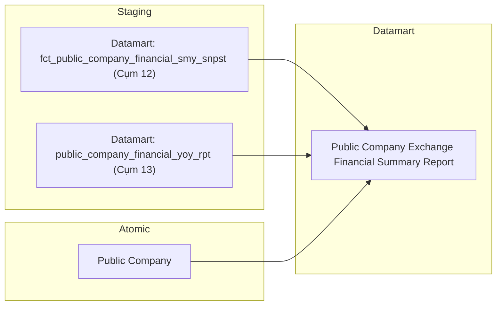
```mermaid
flowchart LR
    subgraph SRC["Staging"]
        GOLD_fct_smy_c14["Datamart: fct_public_company_financial_smy_snpst (Cụm 12)"]
        GOLD_yoy_rpt_c14["Datamart: public_company_financial_yoy_rpt (Cụm 13)"]
    end
    subgraph SIL["Atomic"]
        Public_Company_c14["Public Company"]
    end
    subgraph GOLD["Datamart"]
        public_company_exchange_financial_summary_rpt["Public Company Exchange Financial Summary Report"]
    end
    GOLD_fct_smy_c14 --> public_company_exchange_financial_summary_rpt
    GOLD_yoy_rpt_c14 --> public_company_exchange_financial_summary_rpt
    Public_Company_c14 --> public_company_exchange_financial_summary_rpt
```

> **Ghi chú kỹ thuật flowchart:** SRC ở đây KHÔNG phải bảng nguồn thô (Staging) như thông thường — là 2 bảng Datamart Gold đã populate xong (Cụm 12/13), đóng vai trò input ETL tầng 2 cho Cụm này. Đặt trong subgraph `SRC["Staging"]` chỉ để giữ đúng cú pháp 3-subgraph bắt buộc của skill, không phản ánh đúng nghĩa "Staging" thông thường — ghi rõ prefix "Datamart:" trong label để tránh nhầm lẫn khi đọc lại. `Public Company` (Atomic) dùng để JOIN lấy `equity_listing_exchange_code` khi GROUP BY sàn ở bước ETL tầng 2 (qua `Public Company Dimension`, không lặp lại trong diagram này vì đã có ở Cụm 12).

---

## Section 2 — Tổng quan báo cáo

---

### Màn hình 1 — Phân loại & Xếp hạng Rủi ro CTDC

#### Nhóm 1 — STT 1: Tổng hợp chấm điểm phân loại CTDC

> Phân loại: **Phân tích**
> Atomic: `Public Company` ← IDS.company_profiles — **draft** (chưa approved)
> Atomic: `Public Company Evaluation` ← IDS.EVALUATIONS — **draft** (chưa approved)
> Atomic: `Public Company Evaluation Detail` ← IDS.EVALUATION_DETAILS — **draft** (chưa approved)
> Atomic: `Public Company Evaluation Criterion` ← IDS.EVALUATION_CRITERIA — **draft** (chưa approved)
> Atomic: `Public Company Evaluation Group` ← IDS.EVALUATION_GROUPS — **draft** (chưa approved)
> **Lưu ý go-live:** Các entity Atomic trên đã có LLD tại `DataModel/working/Atomic/lld/IDS/` nhưng `design_status: draft`, chưa qua approve. Datamart chỉ chính thức READY sau khi Atomic được approve — xem [O_GSDC_1] cập nhật bên dưới.

**Mockup:**

| Tên Doanh nghiệp | Mã DN | Tuân thủ | Phát hành | Tài chính | Phi TC | M-Score | Xếp hạng TN | Điểm | Xếp loại |
|---|---|---|---|---|---|---|---|---|---|
| Công ty tập đoàn địa ốc Novaland | NVL | 85 | 90 | 78 | 82 | 88 | Tốt | 84.6 | A |

**Source:** `Fact Public Company Risk Score Snapshot` → `Public Company Dimension`, `Calendar Date Dimension`

**Bảng KPI:**

| KPI ID | Tên KPI | Đơn vị | Tính chất | Công thức | Ghi chú | Trạng thái |
|---|---|---|---|---|---|---|
| K_GSDC_1 | Tuân thủ | Điểm | Cơ sở | SUM(evaluation_score) WHERE group_code = 'TUAN_THU' | Public Company Evaluation Detail JOIN Criterion → Group | READY |
| K_GSDC_2 | Phát hành | Điểm | Cơ sở | SUM(evaluation_score) WHERE group_code = 'PHAT_HANH' | Public Company Evaluation Detail JOIN Criterion → Group | READY |
| K_GSDC_3 | Tài chính | Điểm | Cơ sở | SUM(evaluation_score) WHERE group_code = 'TAI_CHINH' | Public Company Evaluation Detail JOIN Criterion → Group | READY |
| K_GSDC_4 | Phi tài chính & M-Score | Điểm | Cơ sở | SUM(evaluation_score) WHERE group_code = 'PHI_TAI_CHINH' | Public Company Evaluation Detail JOIN Criterion → Group | READY |
| K_GSDC_5 | Xếp hạng tín nhiệm DN | Điểm | Cơ sở | evaluation_score (trực tiếp, không SUM) WHERE criterion_code = 'PHAT_HANH_TIN_NHIEM' | BA còn trả kèm ed.result (kết quả text) — thừa, không đưa vào KPI | READY |
| K_GSDC_6 | Điểm tổng hợp | Điểm | Cơ sở | total_score_percentage (trực tiếp) | Public Company Evaluation. BA còn trả kèm ev.type (xếp loại) — thừa, không đưa vào KPI | READY |
| K_GSDC_7 | Mã CK doanh nghiệp | Text | Chiều | equity_ticker_symbol (trực tiếp) | Public Company | READY |
| K_GSDC_8 | Tên doanh nghiệp | Text | Chiều | pc_nm (trực tiếp) | Public Company | READY |

**Star Schema:**

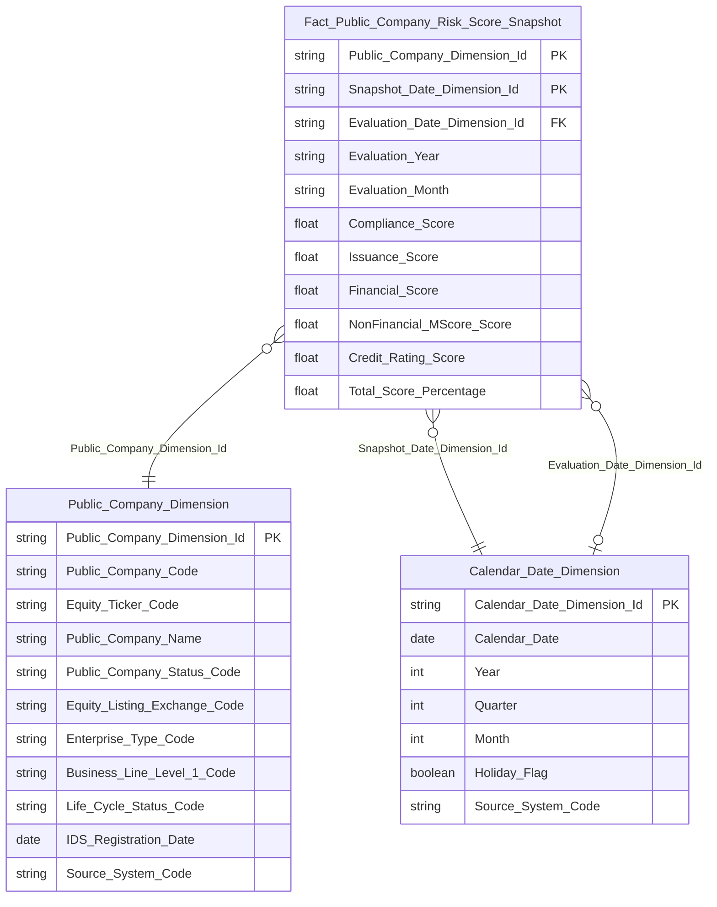
```mermaid
erDiagram
    Fact_Public_Company_Risk_Score_Snapshot {
        string Public_Company_Dimension_Id PK
        string Snapshot_Date_Dimension_Id PK
        string Evaluation_Date_Dimension_Id FK
        string Evaluation_Year
        string Evaluation_Month
        float Compliance_Score
        float Issuance_Score
        float Financial_Score
        float NonFinancial_MScore_Score
        float Credit_Rating_Score
        float Total_Score_Percentage
    }

    Public_Company_Dimension {
        string Public_Company_Dimension_Id PK
        string Public_Company_Code
        string Equity_Ticker_Code
        string Public_Company_Name
        string Public_Company_Status_Code
        string Equity_Listing_Exchange_Code
        string Enterprise_Type_Code
        string Business_Line_Level_1_Code
        string Life_Cycle_Status_Code
        date IDS_Registration_Date
        string Source_System_Code
    }

    Calendar_Date_Dimension {
        string Calendar_Date_Dimension_Id PK
        date Calendar_Date
        int Year
        int Quarter
        int Month
        boolean Holiday_Flag
        string Source_System_Code
    }

    Fact_Public_Company_Risk_Score_Snapshot }o--|| Public_Company_Dimension : "Public_Company_Dimension_Id"
    Fact_Public_Company_Risk_Score_Snapshot }o--|| Calendar_Date_Dimension : "Snapshot_Date_Dimension_Id"
    Fact_Public_Company_Risk_Score_Snapshot }o--o| Calendar_Date_Dimension : "Evaluation_Date_Dimension_Id"
```

> **Ghi chú grain & ETL:** Grain = "1 row/CTDC/ngày snapshot ETL" — driving table là `Public Company Dimension` (full-scan toàn bộ CTĐC mỗi ngày, vì không biết trước công ty nào phát sinh kỳ đánh giá mới vào ngày nào). Với mỗi công ty, các measure (Compliance/Issuance/Financial/NonFinancial/Credit Rating/Total Score) carry-forward từ kỳ đánh giá gần nhất (`Evaluation Date <= ngày ETL`, LEFT JOIN, nullable khi công ty chưa từng có kỳ đánh giá). `Snapshot Date Dimension Id` là PK (ngày chạy ETL); `Evaluation Date Dimension Id` là thuộc tính carry-forward (ngày kỳ đánh giá thật, không phải PK) — áp dụng đồng nhất cho cả 5 Fact `Fact Public Company *_Score_Snapshot` (Risk/Compliance/Issuance/Financial/Non-Financial).
>
> **Ghi chú filter kỳ theo tháng:** Màn hình cần filter theo kỳ đánh giá dạng tháng (VD `:p_year`/`:p_month` — xem SQL BA `WHERE ep.year = :p_year AND ep.month = :p_month`), nhưng `Evaluation Date` (ngày chạy đánh giá thực tế) có thể rơi vào tháng khác với kỳ mà nó đại diện (VD kỳ đánh giá tháng 7 nhưng `evaluation_dt` là ngày 06/08) — không thể suy luận kỳ bằng `Month(Evaluation Date)`. Có 2 cột `Evaluation Year` (physical `evaluation_year`) + `Evaluation Month` (physical `evaluation_month`) — cả 2 Text, nullable, cùng tính carry-forward với `Evaluation Date Dimension Id` — lấy trực tiếp (không CONCAT) từ `Public Company Evaluation Period.evaluation_year` / `evaluation_month` — áp dụng đồng nhất cho cả 5 Fact `Fact Public Company *_Score_Snapshot`. UI filter theo tháng dùng `WHERE Evaluation_Year = :p_year AND Evaluation_Month = :p_month`, độc lập với `Evaluation Date Dimension Id`.

**Lineage Mart → Báo cáo:**

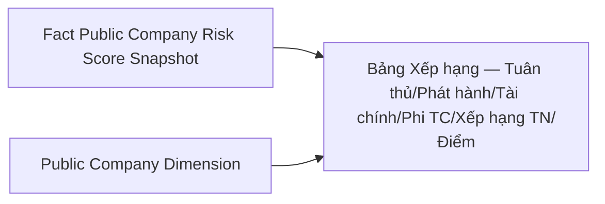
```mermaid
flowchart LR
    pc_risk_fct["Fact Public Company Risk Score Snapshot"] --> R1["Bảng Xếp hạng — Tuân thủ/Phát hành/Tài chính/Phi TC/Xếp hạng TN/Điểm"]
    public_company_dim["Public Company Dimension"] --> R1
```

**Bảng grain:**

| Tên bảng | Grain |
|---|---|
| Fact Public Company Risk Score Snapshot | 1 row / công ty đại chúng / ngày snapshot ETL (full-scan daily, carry-forward điểm số từ kỳ đánh giá gần nhất) |
| Public Company Dimension | 1 row / công ty đại chúng (SCD4A) |
| Calendar Date Dimension | 1 row / ngày (Conformed) |

---

#### Nhóm 2 — STT 2: Top CTDC theo chỉ tiêu tuân thủ

> Phân loại: **Phân tích**
> Atomic: `Public Company Evaluation Detail` ← IDS.EVALUATION_DETAILS — **draft** (chưa approved)
> Atomic: `Public Company Evaluation Criterion` ← IDS.EVALUATION_CRITERIA — **draft** (chưa approved)
> **Lưu ý go-live:** Atomic entity liên quan chưa qua approve — xem [O_GSDC_1].

**KPI liên quan:**

| KPI ID | Tên KPI | Đơn vị | Tính chất | Công thức | Ghi chú | Trạng thái |
|---|---|---|---|---|---|---|
| K_GSDC_7 | Mã CK doanh nghiệp | Text | Chiều | equity_ticker_symbol (trực tiếp) | **Reuse từ Nhóm 1** — không tính lại | READY |
| K_GSDC_8 | Tên doanh nghiệp | Text | Chiều | pc_nm (trực tiếp) | **Reuse từ Nhóm 1** — không tính lại | READY |
| K_GSDC_9 | Công bố BCTC | Điểm | Cơ sở | evaluation_score WHERE criterion_code = 'TUAN_THU_BCTC' | Public Company Evaluation Detail | READY |
| K_GSDC_10 | Công bố BCTN | Điểm | Cơ sở | evaluation_score WHERE criterion_code = 'TUAN_THU_BCTN' | Public Company Evaluation Detail | READY |
| K_GSDC_11 | Công bố báo cáo tình hình quản trị | Điểm | Cơ sở | evaluation_score WHERE criterion_code = 'TUAN_THU_BCTHQT' | Public Company Evaluation Detail | READY |
| K_GSDC_12 | Công bố thông tin Thay đổi TGĐ/CTHĐQT | Điểm | Cơ sở | evaluation_score WHERE criterion_code = 'TUAN_THU_CBTTBT_TDTGD' | Public Company Evaluation Detail | READY |
| K_GSDC_13 | Vi phạm từ UBCKNN | Điểm | Cơ sở | evaluation_score WHERE criterion_code = 'TUAN_THU_VP_UBCK' | Public Company Evaluation Detail | READY |
| K_GSDC_14 | Vi phạm từ các đơn vị khác | Điểm | Cơ sở | evaluation_score WHERE criterion_code = 'TUAN_THU_CBTTBT_VPVT' | Public Company Evaluation Detail | READY |
| K_GSDC_15 | Điều lệ Công ty và Các Quy chế hoạt động | Điểm | Cơ sở | evaluation_score WHERE criterion_code = 'TUAN_THU_QTCT_DLCT' | Public Company Evaluation Detail | READY |
| K_GSDC_16 | Số lượng ĐHĐCĐ thường niên trong 6 tháng đầu năm | Điểm | Cơ sở | evaluation_score WHERE criterion_code = 'TUAN_THU_QTCT_SLDHDCD' | Public Company Evaluation Detail | READY |
| K_GSDC_17 | Số lượng thành viên HĐQT độc lập | Điểm | Cơ sở | evaluation_score WHERE criterion_code = 'TUAN_THU_QTCT_SLTVDL' | Public Company Evaluation Detail | READY |
| K_GSDC_18 | Số lượng thành viên HĐQT không điều hành | Điểm | Cơ sở | evaluation_score WHERE criterion_code = 'TUAN_THU_QTCT_SLTVKDH' | Public Company Evaluation Detail | READY |
| K_GSDC_19 | Tư cách thành viên HĐQT/BKS/Kế toán trưởng | Điểm | Cơ sở | evaluation_score WHERE criterion_code = 'TUAN_THU_QTCT_TCTV' | Public Company Evaluation Detail | READY |
| K_GSDC_20 | Số lượng thành viên BKS hoặc Ủy ban kiểm toán | Điểm | Cơ sở | evaluation_score WHERE criterion_code = 'TUAN_THU_QTCT_SLTVBKS' | Public Company Evaluation Detail | READY |
| K_GSDC_21 | Báo cáo tiến độ sử dụng vốn | Điểm | Cơ sở | evaluation_score WHERE criterion_code = 'TUAN_THU_BCSDV_BCTDSDV' | Public Company Evaluation Detail | READY |
| K_GSDC_22 | Thay đổi phương án sử dụng vốn | Điểm | Cơ sở | evaluation_score WHERE criterion_code = 'TUAN_THU_BCSDV_TDPASDV' | Public Company Evaluation Detail | READY |
| K_GSDC_23 | Tổng điểm Tuân thủ | Điểm | Cơ sở | SUM(evaluation_score) WHERE group_cd = 'TUAN_THU' | Public Company Evaluation Detail | READY |

**Ghi chú tách KPI:** BA đã tách "Công bố thông tin về vi phạm, quyết định xử phạt" thành 2 tiêu chí riêng biệt trong nguồn (`criterion_cd` khác nhau): "Vi phạm từ UBCKNN" (`TUAN_THU_VP_UBCK`, K_GSDC_13) và "Vi phạm từ các đơn vị khác" (`TUAN_THU_CBTTBT_VPVT`, K_GSDC_14).

**Ghi chú lọc chung:** Mọi KPI Base join `Public Company Evaluation Detail (ed)` → `Public Company Evaluation Criterion (ec)` qua `pc_evaluation_criterion_id`, filter theo `pc_evaluation_criterion_code` tương ứng cột "Điều kiện lọc" ở trên. BA còn trả kèm `ed.result` (kết quả text) cho mỗi dòng — theo xác nhận Nhóm 1, cột này không đưa vào KPI (chỉ dùng `evaluation_score`).

**Source:** `Fact Public Company Compliance Score Snapshot` → `Public Company Dimension`, `Calendar Date Dimension`

**Star Schema:**

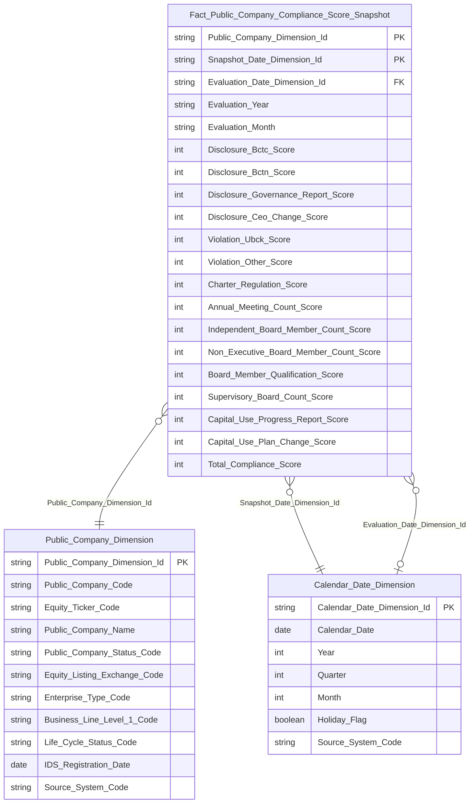
```mermaid
erDiagram
    Fact_Public_Company_Compliance_Score_Snapshot {
        string Public_Company_Dimension_Id PK
        string Snapshot_Date_Dimension_Id PK
        string Evaluation_Date_Dimension_Id FK
        string Evaluation_Year
        string Evaluation_Month
        int Disclosure_Bctc_Score
        int Disclosure_Bctn_Score
        int Disclosure_Governance_Report_Score
        int Disclosure_Ceo_Change_Score
        int Violation_Ubck_Score
        int Violation_Other_Score
        int Charter_Regulation_Score
        int Annual_Meeting_Count_Score
        int Independent_Board_Member_Count_Score
        int Non_Executive_Board_Member_Count_Score
        int Board_Member_Qualification_Score
        int Supervisory_Board_Count_Score
        int Capital_Use_Progress_Report_Score
        int Capital_Use_Plan_Change_Score
        int Total_Compliance_Score
    }

    Public_Company_Dimension {
        string Public_Company_Dimension_Id PK
        string Public_Company_Code
        string Equity_Ticker_Code
        string Public_Company_Name
        string Public_Company_Status_Code
        string Equity_Listing_Exchange_Code
        string Enterprise_Type_Code
        string Business_Line_Level_1_Code
        string Life_Cycle_Status_Code
        date IDS_Registration_Date
        string Source_System_Code
    }

    Calendar_Date_Dimension {
        string Calendar_Date_Dimension_Id PK
        date Calendar_Date
        int Year
        int Quarter
        int Month
        boolean Holiday_Flag
        string Source_System_Code
    }

    Fact_Public_Company_Compliance_Score_Snapshot }o--|| Public_Company_Dimension : "Public_Company_Dimension_Id"
    Fact_Public_Company_Compliance_Score_Snapshot }o--|| Calendar_Date_Dimension : "Snapshot_Date_Dimension_Id"
    Fact_Public_Company_Compliance_Score_Snapshot }o--o| Calendar_Date_Dimension : "Evaluation_Date_Dimension_Id"
```

> Grain + carry-forward logic giống hệt `Fact Public Company Risk Score Snapshot` (Nhóm 1) — xem ghi chú chi tiết ở đó. Mỗi criterion (K_GSDC_9–22) là 1 measure riêng trên Fact — pivot từ `pc_evaluation_detail.evaluation_score` theo từng `pc_evaluation_criterion_code` cố định (LEFT JOIN riêng biệt cho mỗi cột); `Total_Compliance_Score` (K_GSDC_23) = `SUM(evaluation_score)` filter `pc_evaluation_group_code = 'TUAN_THU'`.

**Lineage Mart → Báo cáo:**

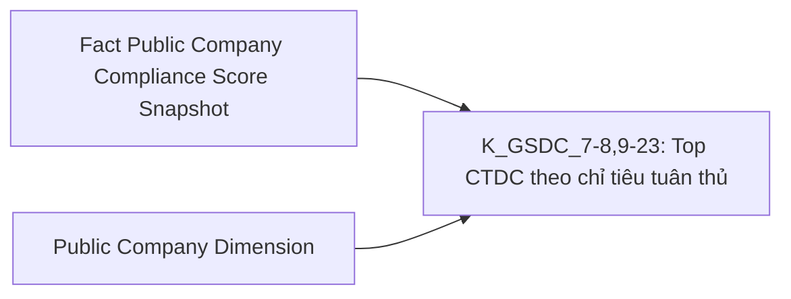
```mermaid
flowchart LR
    pc_compliance_fct["Fact Public Company Compliance Score Snapshot"] --> R2["K_GSDC_7-8,9-23: Top CTDC theo chỉ tiêu tuân thủ"]
    public_company_dim_g2["Public Company Dimension"] --> R2
```

**Bảng grain:**

| Tên bảng | Grain |
|---|---|
| Fact Public Company Compliance Score Snapshot | 1 row / công ty đại chúng / ngày snapshot ETL (full-scan daily, carry-forward điểm số từ kỳ đánh giá gần nhất) |
| Public Company Dimension | 1 row / công ty đại chúng (SCD4A) |
| Calendar Date Dimension | 1 row / ngày (Conformed) |

---

#### Nhóm 3 — STT 3: Top CTDC theo chỉ tiêu phát hành

> Phân loại: **Phân tích**
> Atomic: `Public Company Evaluation Detail` ← IDS.EVALUATION_DETAILS — **draft** (chưa approved)
> Atomic: `Public Company Evaluation Criterion` ← IDS.EVALUATION_CRITERIA — **draft** (chưa approved)
> **Lưu ý go-live:** Atomic entity liên quan chưa qua approve — xem [O_GSDC_1].

**KPI liên quan:**

| KPI ID | Tên KPI | Đơn vị | Tính chất | Công thức | Ghi chú | Trạng thái |
|---|---|---|---|---|---|---|
| K_GSDC_7 | Mã doanh nghiệp | Text | Chiều | equity_ticker_symbol (trực tiếp) | **Reuse từ Nhóm 1** — không tính lại | READY |
| K_GSDC_8 | Tên doanh nghiệp | Text | Chiều | pc_nm (trực tiếp) | **Reuse từ Nhóm 1** — không tính lại | READY |
| K_GSDC_24 | Phát hành tăng vốn nhanh | Điểm | Cơ sở | evaluation_score WHERE criterion_code = 'PHAT_HANH_TANG_VON_NHANH' | Public Company Evaluation Detail | READY |
| K_GSDC_25 | Số lần chào bán cổ phiếu riêng lẻ | Điểm | Cơ sở | evaluation_score WHERE criterion_code = 'PHAT_HANH_SLCBCPRL' | Public Company Evaluation Detail | READY |
| K_GSDC_26 | Số lần chào bán ra công chúng | Điểm | Cơ sở | evaluation_score WHERE criterion_code = 'PHAT_HANH_SLCBRCC' | Public Company Evaluation Detail | READY |
| K_GSDC_27 | Số lần phát hành ESOP | Điểm | Cơ sở | evaluation_score WHERE criterion_code = 'PHAT_HANH_SLPHES' | Public Company Evaluation Detail | READY |
| K_GSDC_28 | Tỷ lệ phát hành trái phiếu không có TSBĐ | Điểm | Cơ sở | evaluation_score WHERE criterion_code = 'PHAT_HANH_TLGTTP' | Public Company Evaluation Detail | READY |
| K_GSDC_29 | Xếp hạng tín nhiệm | Điểm | Cơ sở | evaluation_score WHERE criterion_code = 'PHAT_HANH_TIN_NHIEM' | Public Company Evaluation Detail | READY |
| K_GSDC_30 | Dư nợ trái phiếu / Tổng VCSH | Điểm | Cơ sở | evaluation_score WHERE criterion_code = 'PHAT_HANH_DNTPTVCSH' | Public Company Evaluation Detail | READY |
| K_GSDC_31 | Tổng điểm Phát hành | Điểm | Cơ sở | SUM(evaluation_score) WHERE group_cd = 'PHAT_HANH' | Public Company Evaluation Detail | READY |

**Ghi chú K_GSDC_29:** Xếp hạng tín nhiệm, `pc_evaluation_criterion_code = PHAT_HANH_TIN_NHIEM`.

**Ghi chú lọc chung:** Mọi KPI Base join `Public Company Evaluation Detail (ed)` → `Public Company Evaluation Criterion (ec)` qua `pc_evaluation_criterion_id`, filter theo `pc_evaluation_criterion_code` tương ứng cột "Điều kiện lọc" ở trên.

**Source:** `Fact Public Company Issuance Score Snapshot` → `Public Company Dimension`, `Calendar Date Dimension`

**Star Schema:**

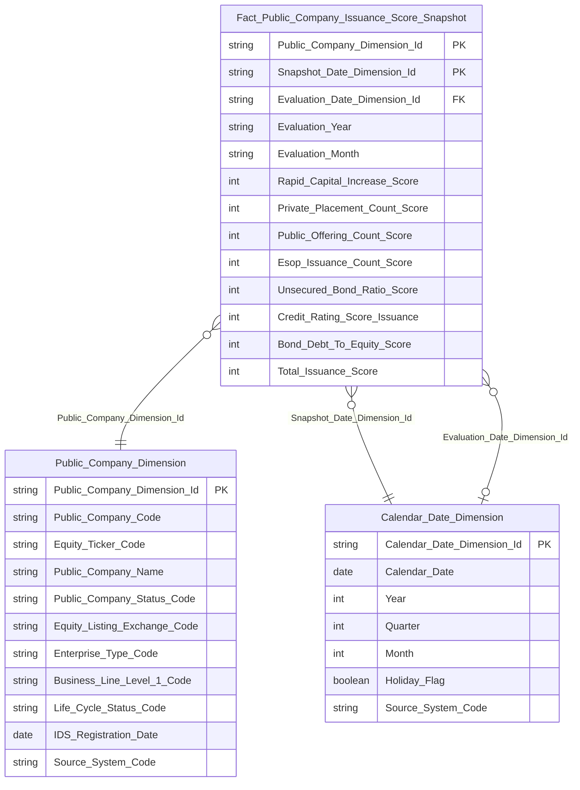
```mermaid
erDiagram
    Fact_Public_Company_Issuance_Score_Snapshot {
        string Public_Company_Dimension_Id PK
        string Snapshot_Date_Dimension_Id PK
        string Evaluation_Date_Dimension_Id FK
        string Evaluation_Year
        string Evaluation_Month
        int Rapid_Capital_Increase_Score
        int Private_Placement_Count_Score
        int Public_Offering_Count_Score
        int Esop_Issuance_Count_Score
        int Unsecured_Bond_Ratio_Score
        int Credit_Rating_Score_Issuance
        int Bond_Debt_To_Equity_Score
        int Total_Issuance_Score
    }

    Public_Company_Dimension {
        string Public_Company_Dimension_Id PK
        string Public_Company_Code
        string Equity_Ticker_Code
        string Public_Company_Name
        string Public_Company_Status_Code
        string Equity_Listing_Exchange_Code
        string Enterprise_Type_Code
        string Business_Line_Level_1_Code
        string Life_Cycle_Status_Code
        date IDS_Registration_Date
        string Source_System_Code
    }

    Calendar_Date_Dimension {
        string Calendar_Date_Dimension_Id PK
        date Calendar_Date
        int Year
        int Quarter
        int Month
        boolean Holiday_Flag
        string Source_System_Code
    }

    Fact_Public_Company_Issuance_Score_Snapshot }o--|| Public_Company_Dimension : "Public_Company_Dimension_Id"
    Fact_Public_Company_Issuance_Score_Snapshot }o--|| Calendar_Date_Dimension : "Snapshot_Date_Dimension_Id"
    Fact_Public_Company_Issuance_Score_Snapshot }o--o| Calendar_Date_Dimension : "Evaluation_Date_Dimension_Id"
```

> Grain + carry-forward logic giống hệt `Fact Public Company Risk Score Snapshot` (Nhóm 1). Mỗi criterion (K_GSDC_24–30) là 1 measure riêng — pivot từ `pc_evaluation_detail.evaluation_score` theo từng `pc_evaluation_criterion_code` cố định; `Total_Issuance_Score` (K_GSDC_31) = `SUM(evaluation_score)` filter `pc_evaluation_group_code = 'PHAT_HANH'`.

**Lineage Mart → Báo cáo:**

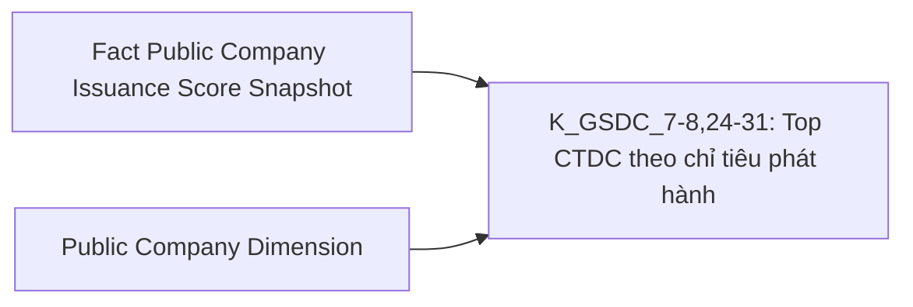
```mermaid
flowchart LR
    pc_issuance_fct["Fact Public Company Issuance Score Snapshot"] --> R3["K_GSDC_7-8,24-31: Top CTDC theo chỉ tiêu phát hành"]
    public_company_dim_g3["Public Company Dimension"] --> R3
```

**Bảng grain:**

| Tên bảng | Grain |
|---|---|
| Fact Public Company Issuance Score Snapshot | 1 row / công ty đại chúng / ngày snapshot ETL (full-scan daily, carry-forward điểm số từ kỳ đánh giá gần nhất) |
| Public Company Dimension | 1 row / công ty đại chúng (SCD4A) |
| Calendar Date Dimension | 1 row / ngày (Conformed) |

---

#### Nhóm 4 — STT 4: Top CTDC theo chỉ tiêu tài chính

> Phân loại: **Phân tích**
> Atomic: `Public Company Evaluation Detail` ← IDS.EVALUATION_DETAILS — **draft** (chưa approved)
> Atomic: `Public Company Evaluation Criterion` ← IDS.EVALUATION_CRITERIA — **draft** (chưa approved)
> **Lưu ý go-live:** Atomic entity liên quan chưa qua approve — xem [O_GSDC_1].

**KPI liên quan:**

| KPI ID | Tên KPI | Đơn vị | Tính chất | Công thức | Ghi chú | Trạng thái |
|---|---|---|---|---|---|---|
| K_GSDC_7 | Mã doanh nghiệp | Text | Chiều | equity_ticker_symbol (trực tiếp) | **Reuse từ Nhóm 1** — không tính lại | READY |
| K_GSDC_8 | Tên doanh nghiệp | Text | Chiều | pc_nm (trực tiếp) | **Reuse từ Nhóm 1** — không tính lại | READY |
| K_GSDC_32 | Kiểm toán — Ý kiến kiểm toán | Điểm | Cơ sở | evaluation_score WHERE criterion_code = 'TAI_CHINH_YKKT' | Public Company Evaluation Detail | READY |
| K_GSDC_33 | ROA | Điểm | Cơ sở | evaluation_score WHERE criterion_code = 'TAI_CHINH_ROA' | Public Company Evaluation Detail | READY |
| K_GSDC_34 | Dòng tiền từ hoạt động kinh doanh | Điểm | Cơ sở | evaluation_score WHERE criterion_code = 'TAI_CHINH_DTTHDKD' | Public Company Evaluation Detail | READY |
| K_GSDC_35 | Khả năng thanh toán hiện thời | Điểm | Cơ sở | evaluation_score WHERE criterion_code = 'TAI_CHINH_KNTTHT' | Public Company Evaluation Detail | READY |
| K_GSDC_36 | EBIT / Lãi vay | Điểm | Cơ sở | evaluation_score WHERE criterion_code = 'TAI_CHINH_EBIT' | Public Company Evaluation Detail | READY |
| K_GSDC_37 | Nợ / VCSH | Điểm | Cơ sở | evaluation_score WHERE criterion_code = 'TAI_CHINH_NO_VON_CSH' | Public Company Evaluation Detail | READY |
| K_GSDC_38 | VCSH | Điểm | Cơ sở | evaluation_score WHERE criterion_code = 'TAI_CHINH_VON_CSH' | Public Company Evaluation Detail | READY |
| K_GSDC_39 | ROE | Điểm | Cơ sở | evaluation_score WHERE criterion_code = 'TAI_CHINH_ROE' | Public Company Evaluation Detail | READY |
| K_GSDC_40 | Doanh thu từ HĐ tài chính / Lợi nhuận sau thuế | Điểm | Cơ sở | evaluation_score WHERE criterion_code = 'TAI_CHINH_DTHDTC_LNST' | Public Company Evaluation Detail | READY |
| K_GSDC_41 | Doanh thu từ hoạt động khác / Lợi nhuận sau thuế | Điểm | Cơ sở | evaluation_score WHERE criterion_code = 'TAI_CHINH_DTHD_KHAC_LNST' | Public Company Evaluation Detail | READY |
| K_GSDC_42 | Tổng điểm Tài chính | Điểm | Cơ sở | SUM(evaluation_score) WHERE group_cd = 'TAI_CHINH' | Public Company Evaluation Detail | READY |

**Ghi chú KPI:**
- **K_GSDC_33** = "ROA" (`criterion_cd = TAI_CHINH_ROA`).
- **K_GSDC_38** = "VCSH" (`criterion_cd = TAI_CHINH_VON_CSH`), STT 4, `Trạng thái mapping = Done`, `Loại dữ liệu = Dữ liệu tĩnh` — giữ nguyên trong bảng KPI và Attributes.

**Ghi chú lọc chung:** Mọi KPI Base join `Public Company Evaluation Detail (ed)` → `Public Company Evaluation Criterion (ec)` qua `pc_evaluation_criterion_id`, filter theo `pc_evaluation_criterion_code` tương ứng cột "Điều kiện lọc" ở trên.

**Source:** `Fact Public Company Financial Score Snapshot` → `Public Company Dimension`, `Calendar Date Dimension`

**Star Schema:**

```mermaid
erDiagram
    Fact_Public_Company_Financial_Score_Snapshot {
        string Public_Company_Dimension_Id PK
        string Snapshot_Date_Dimension_Id PK
        string Evaluation_Date_Dimension_Id FK
        string Evaluation_Year
        string Evaluation_Month
        int Audit_Opinion_Score
        int Roa_Score
        int Operating_Cash_Flow_Score
        int Current_Ratio_Score
        int Ebit_Interest_Coverage_Score
        int Debt_To_Equity_Score
        int Equity_Score
        int Roe_Score
        int Financial_Revenue_To_Profit_Score
        int Other_Revenue_To_Profit_Score
        int Total_Financial_Score
    }

    Public_Company_Dimension {
        string Public_Company_Dimension_Id PK
        string Public_Company_Code
        string Equity_Ticker_Code
        string Public_Company_Name
        string Public_Company_Status_Code
        string Equity_Listing_Exchange_Code
        string Enterprise_Type_Code
        string Business_Line_Level_1_Code
        string Life_Cycle_Status_Code
        date IDS_Registration_Date
        string Source_System_Code
    }

    Calendar_Date_Dimension {
        string Calendar_Date_Dimension_Id PK
        date Calendar_Date
        int Year
        int Quarter
        int Month
        boolean Holiday_Flag
        string Source_System_Code
    }

    Fact_Public_Company_Financial_Score_Snapshot }o--|| Public_Company_Dimension : "Public_Company_Dimension_Id"
    Fact_Public_Company_Financial_Score_Snapshot }o--|| Calendar_Date_Dimension : "Snapshot_Date_Dimension_Id"
    Fact_Public_Company_Financial_Score_Snapshot }o--o| Calendar_Date_Dimension : "Evaluation_Date_Dimension_Id"
```

> Grain + carry-forward logic giống hệt `Fact Public Company Risk Score Snapshot` (Nhóm 1). Mỗi criterion (K_GSDC_32–41) là 1 measure riêng — pivot từ `pc_evaluation_detail.evaluation_score` theo từng `pc_evaluation_criterion_code` cố định; `Total_Financial_Score` (K_GSDC_42) = `SUM(evaluation_score)` filter `pc_evaluation_group_code = 'TAI_CHINH'`.

**Lineage Mart → Báo cáo:**

```mermaid
flowchart LR
    pc_financial_fct["Fact Public Company Financial Score Snapshot"] --> R4["K_GSDC_7-8,32-42: Top CTDC theo chỉ tiêu tài chính"]
    public_company_dim_g4["Public Company Dimension"] --> R4
```

**Bảng grain:**

| Tên bảng | Grain |
|---|---|
| Fact Public Company Financial Score Snapshot | 1 row / công ty đại chúng / ngày snapshot ETL (full-scan daily, carry-forward điểm số từ kỳ đánh giá gần nhất) |
| Public Company Dimension | 1 row / công ty đại chúng (SCD4A) |
| Calendar Date Dimension | 1 row / ngày (Conformed) |

---

#### Nhóm 5 — STT 5: Top CTDC theo chỉ tiêu phi tài chính & M-Score

> Phân loại: **Phân tích**
> Atomic: `Public Company Evaluation Detail` ← IDS.EVALUATION_DETAILS — **draft** (chưa approved)
> Atomic: `Public Company Evaluation Criterion` ← IDS.EVALUATION_CRITERIA — **draft** (chưa approved)
> **Lưu ý go-live:** Atomic entity liên quan chưa qua approve — xem [O_GSDC_1].

**KPI liên quan:**

| KPI ID | Tên KPI | Đơn vị | Tính chất | Công thức | Ghi chú | Trạng thái |
|---|---|---|---|---|---|---|
| K_GSDC_7 | Mã doanh nghiệp | Text | Chiều | equity_ticker_symbol (trực tiếp) | **Reuse từ Nhóm 1** — không tính lại | READY |
| K_GSDC_8 | Tên doanh nghiệp | Text | Chiều | pc_nm (trực tiếp) | **Reuse từ Nhóm 1** — không tính lại | READY |
| K_GSDC_43 | Tình trạng DN từ Cục Đăng ký kinh doanh | Điểm | Cơ sở | evaluation_score WHERE criterion_code = 'PHI_TAI_CHINH_TTHD' | Public Company Evaluation Detail | READY |
| K_GSDC_44 | M-Score | Điểm | Cơ sở | evaluation_score WHERE criterion_code = 'PHI_TAI_CHINH_M_SCORE' | Public Company Evaluation Detail | READY |
| K_GSDC_45 | Tổng điểm Phi tài chính & M-Score | Điểm | Cơ sở | SUM(evaluation_score) WHERE group_cd = 'PHI_TAI_CHINH' | Public Company Evaluation Detail | READY |

**Ghi chú lọc chung:** Mọi KPI Base join `Public Company Evaluation Detail (ed)` → `Public Company Evaluation Criterion (ec)` qua `pc_evaluation_criterion_id`, filter theo `pc_evaluation_criterion_code` tương ứng cột "Điều kiện lọc" ở trên.

**Source:** `Fact Public Company Non-Financial Score Snapshot` → `Public Company Dimension`, `Calendar Date Dimension`

**Star Schema:**

```mermaid
erDiagram
    Fact_Public_Company_NonFinancial_Score_Snapshot {
        string Public_Company_Dimension_Id PK
        string Snapshot_Date_Dimension_Id PK
        string Evaluation_Date_Dimension_Id FK
        string Evaluation_Year
        string Evaluation_Month
        int Business_Registration_Status_Score
        int M_Score
        int Total_NonFinancial_Score
    }

    Public_Company_Dimension {
        string Public_Company_Dimension_Id PK
        string Public_Company_Code
        string Equity_Ticker_Code
        string Public_Company_Name
        string Public_Company_Status_Code
        string Equity_Listing_Exchange_Code
        string Enterprise_Type_Code
        string Business_Line_Level_1_Code
        string Life_Cycle_Status_Code
        date IDS_Registration_Date
        string Source_System_Code
    }

    Calendar_Date_Dimension {
        string Calendar_Date_Dimension_Id PK
        date Calendar_Date
        int Year
        int Quarter
        int Month
        boolean Holiday_Flag
        string Source_System_Code
    }

    Fact_Public_Company_NonFinancial_Score_Snapshot }o--|| Public_Company_Dimension : "Public_Company_Dimension_Id"
    Fact_Public_Company_NonFinancial_Score_Snapshot }o--|| Calendar_Date_Dimension : "Snapshot_Date_Dimension_Id"
    Fact_Public_Company_NonFinancial_Score_Snapshot }o--o| Calendar_Date_Dimension : "Evaluation_Date_Dimension_Id"
```

> Grain + carry-forward logic giống hệt `Fact Public Company Risk Score Snapshot` (Nhóm 1). Mỗi criterion (K_GSDC_43–44) là 1 measure riêng — pivot từ `pc_evaluation_detail.evaluation_score` theo từng `pc_evaluation_criterion_code` cố định; `Total_NonFinancial_Score` (K_GSDC_45) = `SUM(evaluation_score)` filter `pc_evaluation_group_code = 'PHI_TAI_CHINH'`.

**Lineage Mart → Báo cáo:**

```mermaid
flowchart LR
    pc_nonfinancial_fct["Fact Public Company Non-Financial Score Snapshot"] --> R5["K_GSDC_7-8,43-45: Top CTDC theo chỉ tiêu phi tài chính & M-Score"]
    public_company_dim_g5["Public Company Dimension"] --> R5
```

**Bảng grain:**

| Tên bảng | Grain |
|---|---|
| Fact Public Company Non-Financial Score Snapshot | 1 row / công ty đại chúng / ngày snapshot ETL (full-scan daily, carry-forward điểm số từ kỳ đánh giá gần nhất) |
| Public Company Dimension | 1 row / công ty đại chúng (SCD4A) |
| Calendar Date Dimension | 1 row / ngày (Conformed) |

---

### Màn hình 2 — Giám sát Tổng hợp

Màn hình có bộ lọc **Năm / Quý** và 5 tab sàn. Mỗi tab hiển thị cùng cấu trúc 3 nhóm nội dung, chỉ khác filter `Equity_Listing_Exchange_Code`.

#### Nhóm 6 — STT 6: Thống kê niêm yết toàn thị trường

> Phân loại: **Phân tích**
> Atomic: `Public Company` ← IDS.company_profiles — **draft** (chưa approved)
> Atomic: `Violation Report` (`violation_report`) ← IDS.VIOLATION_REPORT — **draft**
> Nhóm 6 tương ứng STT 6. Bảng mapping renumber STT đầy đủ xem Section 4.
> K_GSDC_48 dùng entity `violation_report` (LLD draft `DataModel/working/Atomic/lld/IDS/lld_IDS_VIOLATION_REPORT.yaml`); K_GSDC_49 dùng `Fact Public Company Financial Report Value` (5 entity Financial Report Value, xem Nhóm 7) → cả 2 **READY**.
> `violation_report` mang ngữ nghĩa Fact Event (mỗi công ty × mỗi kỳ phát sinh 1 tập hồ sơ nghĩa vụ báo cáo mới, ETL append theo kỳ, không phải cập nhật current-state) — không phải Operational SCD4A. Grain phải xuống đủ chi tiết để `SUM` đúng ở mọi cấp độ (toàn TT/sàn — Nhóm 10/12/14/16 `GROUP BY` theo sàn cùng measure này), không pre-aggregate theo %. **`Fact Violation Report Snapshot`** — grain 1 row / công ty / kỳ (Report_Year + Report_Quarter) / ngày ETL snapshot, 2 measure đếm: `Report_Due_Count` (số hồ sơ có `deadline_dt <= ngày ETL` trong kỳ) và `Report_Submitted_Count` (số hồ sơ có `actual_submit_dt` không null trong kỳ) — JOIN `Public Company Dimension` để GROUP BY sàn khi cần. Tỷ lệ nộp BCTC = `SUM(Report_Submitted_Count) / SUM(Report_Due_Count)` ở tầng Detail Mapping, đúng tại bất kỳ cấp độ nào (toàn TT ở Nhóm 6, theo sàn ở Nhóm 10/12/14/16) mà không cần Fact riêng cho từng cấp.
> **K_GSDC_49 ĐỘC LẬP HOÀN TOÀN với K_GSDC_48** — không dùng `Fact Violation Report Snapshot`. Sửa lại 2026-08-15 (review phát hiện lỗi): thiết kế trước đó denormalize `Profitable_Indicator` vào `Fact Violation Report Snapshot` bằng cách JOIN `fr_value` theo kỳ lấy từ `violation_report.period_year`/`period_tp_code` — SAI vì `violation_report` (nguồn `IDS.VIOLATION_REPORT.PERIOD_YEAR`) và `company_data`/`pc_report_submission` (nguồn `IDS.COMPANY_DATA.REPORT_YEAR`) là 2 bảng nguồn độc lập, không đảm bảo luôn có bản ghi `violation_report` khớp đúng kỳ khi công ty có báo cáo tài chính — dẫn tới bỏ sót công ty có LNST>0 nhưng không có nghĩa vụ báo cáo khớp kỳ đó. Dùng trực tiếp `Fact Public Company Financial Report Value` (Nhóm 7, đã có sẵn đúng logic dedup `pc_report_submission` theo kỳ tài chính thật) — xem công thức K_GSDC_49 trong Bảng KPI bên dưới. Đúng theo màn hình thực tế: 3 thẻ (Số doanh nghiệp / Tỷ lệ nộp BCTC / Công ty báo lãi) là 3 con số độc lập, không cần chung 1 Fact.
> **Driving Table K_GSDC_48 = `Public Company Dimension`** (full-scan toàn bộ công ty mỗi ngày ETL — không phải `violation_report`, để tránh thiếu công ty không có hồ sơ `violation_report`). Mỗi ngày ETL quét **toàn bộ kỳ đang có nghĩa vụ** trong `violation_report` (không filter theo 1 kỳ cụ thể — tham số `:p_nam`/`:p_quy` trong BA SQL chỉ là điều kiện lọc khi truy vấn, không phải điều kiện giới hạn khi populate Fact) — LEFT JOIN `violation_report` để tính Due/Submitted theo từng kỳ.
> **K_GSDC_48** — BA SQL thực tế (`BA_analyst_GSDC_part1.csv` dòng 58): `FROM violation_report vr JOIN forms f ON f.id = vr.form_id AND f.news_type_cd = 'DINH_KY' WHERE vr.period_year = :p_nam AND (vr.period_quarter = :p_quy OR :p_quy IS NULL) AND vr.deadline_date <= TRUNC(SYSDATE)` → GROUP BY `pc_id`/`period_year`/`period_tp_code`: `Report_Due_Count = COUNT(vr.id) WHERE deadline_dt <= ngày ETL`, `Report_Submitted_Count = COUNT(vr.actual_submit_date)` (không null), JOIN `fr_template` (qua `fr_template_id`) filter `fr_template.news_tp_code = 'DINH_KY'` (← `IDS.FORMS.NEWS_TYPE_CD`, xem `lld_IDS_FORMS.yaml`) áp dụng ở tầng populate Fact (chỉ đếm hồ sơ loại "định kỳ").
> **K_GSDC_49** — BA SQL thực tế (`BA_analyst_GSDC_part1.csv` dòng 59, cùng logic dedup `Company_data_chuan` đã dùng cho `Fact Public Company Financial Report Value`, xem Nhóm 7): `FROM IDS.data d JOIN IDS.report_catalog rc ... JOIN IDS.rrow rr ... JOIN IDS.rcol rc2 ... JOIN ids.company_data cd ... WHERE rc2.col_desc='1' AND rc.report_cd LIKE 'BCKQKD%' AND d.data_value>0 AND ((rc.enterprise_type_cd='dn' AND rr.row_desc='60') OR (rc.enterprise_type_cd='bh' AND rr.row_desc='60') OR (rc.enterprise_type_cd='td' AND rr.row_desc='21'))` → đếm số công ty có ≥1 dòng `fr_value` khớp điều kiện LNST > 0 (`row_description_reference`='60' dn/bh, '21' td; `column_description_reference='1'`; `fr_catalog_code LIKE 'BCKQKD%'`) đúng kỳ `:p_year`/`:p_quarter`.
> `Fact Public Company Financial Summary Snapshot` không tồn tại trong mô hình — K_GSDC_47 tự đủ bằng `COUNT(DISTINCT ...)` trực tiếp trên `Public Company Dimension` (không cần grain snapshot theo kỳ). K_GSDC_46/47 dùng thẳng `Calendar Date Dimension`/`Public Company Dimension`, không qua Fact trung gian.

**Source:** `Public Company Dimension`, `Calendar Date Dimension` (K_GSDC_46/47 — không qua Fact); `Fact Violation Report Snapshot` (K_GSDC_48, driving `Public Company Dimension` full-scan, LEFT JOIN `violation_report`); `Fact Public Company Financial Report Value` + `Financial Report Catalog Dimension` (K_GSDC_49, reuse từ Nhóm 7)

**Bảng KPI:**

| KPI ID | Tên KPI | Đơn vị | Tính chất | Công thức | Ghi chú | Trạng thái |
|---|---|---|---|---|---|---|
| K_GSDC_46 | Kỳ thống kê (Năm/Quý) | Text | Chiều (Slicer) | — (trực tiếp) | — | **READY** — Tham số `:year`/`:quarter` |
| K_GSDC_47 | Số doanh nghiệp | DN | Phái sinh | ids_registration_dt (trực tiếp) | Public Company | **READY** — COUNT DISTINCT trực tiếp trên Public Company Dimension WHERE ids_registration_dt <= cuối kỳ — xem O_GSDC_2 |
| K_GSDC_48 | Tỷ lệ nộp BCTC | % | Phái sinh | deadline_dt / actual_submit_dt / period_year / period_tp_code (trực tiếp) | Violation Report | **READY** — `SUM(Report_Submitted_Count) / NULLIF(SUM(Report_Due_Count), 0) * 100` trên `Fact Violation Report Snapshot` (toàn thị trường — không filter sàn ở Nhóm này), filter kỳ `Report_Year=:p_nam AND (Report_Quarter=:p_quy OR :p_quy IS NULL)` |
| K_GSDC_49 | Số DN báo lãi | DN | Cơ sở | data_val (trực tiếp) | Financial Report Value | **READY** — `COUNT(DISTINCT Public_Company_Dimension_Id)` trên `Fact Public Company Financial Report Value` (Nhóm 7, JOIN `Financial Report Catalog Dimension`) WHERE `Row_Description_Reference` IN ('60','21') theo Enterprise_Type, `Column_Description_Reference='1'`, `Financial_Report_Catalog_Code LIKE 'BCKQKD%'`, `Data_Value > 0`, `Report_Year=:p_year AND Report_Quarter=:p_quarter` — sửa 2026-08-15, không còn dùng `Fact Violation Report Snapshot` |

> **Ghi chú filter K_GSDC_48:** BA JOIN `forms f ON f.id = vr.form_id AND f.news_type_cd = 'DINH_KY'` để lọc loại báo cáo "định kỳ" — map đúng field `fr_template.news_tp_code` (← `IDS.FORMS.NEWS_TYPE_CD`, `DataModel/working/Atomic/lld/IDS/lld_IDS_FORMS.yaml`), JOIN qua `violation_report.fr_template_id = fr_template.fr_template_id`, filter `fr_template.news_tp_code = 'DINH_KY'` — áp dụng ở tầng ETL populate `Fact Violation Report Snapshot` (chỉ đếm hồ sơ "định kỳ" vào Report_Due_Count/Report_Submitted_Count). Không còn Open Issue.

**Star Schema:**

```mermaid
erDiagram
    Public_Company_Dimension {
        string Public_Company_Dimension_Id PK
        string Public_Company_Code
        string Equity_Ticker_Code
        string Public_Company_Name
        string Public_Company_Status_Code
        string Equity_Listing_Exchange_Code
        string Enterprise_Type_Code
        string Business_Line_Level_1_Code
        string Life_Cycle_Status_Code
        date IDS_Registration_Date
        string Source_System_Code
    }

    Calendar_Date_Dimension {
        string Calendar_Date_Dimension_Id PK
        date Calendar_Date
        int Year
        int Quarter
        int Month
        boolean Holiday_Flag
        string Source_System_Code
    }

    Fact_Violation_Report_Snapshot {
        string Public_Company_Dimension_Id PK
        int Report_Year PK
        int Report_Quarter PK
        string Snapshot_Date_Dimension_Id PK
        int Report_Due_Count
        int Report_Submitted_Count
    }

    Fact_Violation_Report_Snapshot }o--|| Public_Company_Dimension : "Public_Company_Dimension_Id"
    Fact_Violation_Report_Snapshot }o--|| Calendar_Date_Dimension : "Snapshot_Date_Dimension_Id"
```

> **Ghi chú:** K_GSDC_46/47 truy vấn trực tiếp trên `Public Company Dimension`/`Calendar Date Dimension` — không có Fact trung gian. K_GSDC_48 dùng `Fact Violation Report Snapshot` (driving `Public Company Dimension` full-scan, grain 1 row/công ty/kỳ báo cáo/ngày ETL, JOIN `Public Company Dimension` để GROUP BY sàn ở Nhóm 10/12/14/16) — filter "loại tin định kỳ" (`fr_template.news_tp_code = 'DINH_KY'`) áp dụng ở tầng ETL populate Fact cho `Report_Due_Count`/`Report_Submitted_Count`. FK `Snapshot_Date_Dimension_Id` sang `Calendar Date Dimension` lưu ngày ETL chạy job populate Fact (không phải ngày nghiệp vụ trong `violation_report`, `Report_Year`/`Report_Quarter` vẫn giữ nguyên là kỳ báo cáo), theo đúng pattern `Snapshot_Date` đã dùng ở 5 Fact `*_Score_Snapshot` — cho phép full-scan daily và trace đúng thời điểm tính toán tỷ lệ nộp BCTC (VD: tỷ lệ tại ngày 06/08 có thể khác ngày 20/08 cùng kỳ Quý 3 vì có thêm công ty nộp muộn). **K_GSDC_49 (Số DN báo lãi) KHÔNG còn dùng Fact này** (sửa 2026-08-15) — dùng trực tiếp `Fact Public Company Financial Report Value`/`Financial Report Catalog Dimension` đã vẽ ở Nhóm 7, không vẽ lại erDiagram ở đây.

**Lineage Mart → Báo cáo:**

```mermaid
flowchart LR
    public_company_dim["Public Company Dimension"] --> R1["Thẻ Số doanh nghiệp"]
    cdr_dt_dim["Calendar Date Dimension"] --> R1
    fct_violation_rpt_snpst_g6["Fact Violation Report Snapshot"] --> R1b["K_GSDC_48: Tỷ lệ nộp BCTC"]
    public_company_dim --> R1b
    cdr_dt_dim --> R1b
    fct_public_company_financial_rpt_val_g6["Fact Public Company Financial Report Value"] --> R1c["K_GSDC_49: Số DN báo lãi"]
    financial_rpt_catalog_dim_g6["Financial Report Catalog Dimension"] --> R1c
```

**Bảng grain:**

| Tên bảng | Grain |
|---|---|
| Public Company Dimension | 1 row / công ty đại chúng (SCD4A) |
| Calendar Date Dimension | 1 row / ngày (Conformed) |
| Fact Violation Report Snapshot | 1 row / công ty đại chúng / kỳ (Report Year + Report Quarter) / ngày ETL snapshot — chỉ phục vụ K_GSDC_48 |
| Fact Public Company Financial Report Value | như Nhóm 7 — phục vụ K_GSDC_49 (reuse) |

---

#### Nhóm 7 — STT 7: Tổng hợp chỉ tiêu tài chính toàn thị trường

> Phân loại: **Phân tích**
> Nhóm 7 tương ứng STT 7 (CTTC tổng hợp toàn thị trường, không filter sàn). STT 11/13/15/17 (cùng bộ chỉ tiêu, filter theo sàn HNX/HOSE/UPCOM/OTC + thêm breakdown theo ngành) tách thành Nhóm 11/13/15/17 riêng — xem bên dưới. Bảng mapping renumber STT đầy đủ xem Section 4.
> **[SỬA 2026-08-18 — tách 2 khối theo 2 Fact riêng]** Nhóm 7 gồm 2 khối độc lập, mỗi khối 1 Fact riêng — không dùng chung 1 Fact như thiết kế trước: **Khối A** (13 KPI base K_GSDC_50-62, giá trị tuyệt đối + ROA/ROE/D-E tại kỳ hiện tại) dùng `fct_public_company_financial_smy_snpst` (grain 1 row/CTĐC/kỳ, đã pivot sẵn 12 chỉ tiêu — xem `Datamart/lld/GSDC/DTM_GSDC_fct_public_company_financial_smy_snpst.csv`); **Khối B** (10 KPI `_YOY`) dùng `public_company_financial_yoy_rpt` (grain 1 row/sàn/kỳ, giữ nguyên thiết kế cũ, KHÔNG đổi). Lý do tách: 2 Fact có grain khác nhau (company vs sàn) và mục đích ETL khác nhau (snapshot per-company vs pre-aggregate YoY per-sàn) — gộp chung 1 Fact trước đây buộc phải viết subquery pivot phức tạp lặp lại ở từng KPI base (xem lịch sử `Fact Public Company Financial Report Value` bên dưới).
> Atomic đã đủ 5 entity (`fr_value`/IDS.DATA, `fr_catalog`/IDS.REPORT_CATALOG — physical name đúng theo `DataModel/working/Atomic/lld/IDS/lld_IDS_REPORT_CATALOG.yaml`, không phải `financial_report_catalog`, `fr_row_template`/IDS.RROW, `fr_column_template`/IDS.RCOL, `pc_report_submission`/IDS.COMPANY_DATA — `DataModel/working/Atomic/lld/IDS/`), quy tắc khai thác (JOIN key, dedup submission, form ưu tiên HN>TH>ME>RI) theo đúng SQL BA (`BRD/BA/BA_analyst_GSDC_part1.csv` dòng 1163–1580) → **READY**, không còn Gap Atomic.
> Atomic: `Financial Report Value` (`fr_value`) ← IDS.DATA — **draft** (chưa approved)
> Atomic: `Financial Report Catalog` (`fr_catalog`) ← IDS.REPORT_CATALOG — **draft**
> Atomic: `Financial Report Row Template` (`fr_row_template`) ← IDS.RROW — **approved**
> Atomic: `Financial Report Column Template` (`fr_column_template`) ← IDS.RCOL — **approved**
> Atomic: `Public Company Report Submission` (`pc_report_submission`) ← IDS.COMPANY_DATA — **approved** (dùng để chọn form ưu tiên mỗi (company, kỳ), không lấy measure)

##### Khối A — 13 KPI base (K_GSDC_50-62), Fact `fct_public_company_financial_smy_snpst`

**Quy tắc khai thác:**
1. **Driving table:** `fr_value` — mỗi dòng = 1 giá trị ô báo cáo (`pc_id` × `fr_catalog_id` × `row_code` × `column_code` × `rpt_year` × `rpt_quarter`).
2. **Chọn form ưu tiên mỗi (company, kỳ):** `INNER JOIN pc_report_submission` (`submission_status_code = 'APPROVED'`) + `INNER JOIN fr_template` (`news_tp_code = 'DINH_KY'`) — `ROW_NUMBER() OVER (PARTITION BY pc_code, rpt_year, rpt_quarter ORDER BY CASE WHEN fr_template_code LIKE 'HN%' THEN 1 WHEN 'TH%' THEN 2 WHEN 'ME%' THEN 3 WHEN 'RI%' THEN 4 END, submission_dt DESC) = 1`.
3. **JOIN `fr_catalog`** ON `fr_value.fr_catalog_id = fr_catalog.fr_catalog_id AND fr_catalog.fr_year = fr_value.rpt_year AND fr_catalog.financial_statement_reference = SUBSTR(fr_template_code,1,2)` — lấy `fr_catalog_code` (filter `LIKE 'BCDKT%'`/`LIKE 'BCKQKD%'`), `enterprise_tp_code` (filter `'DN'`/`'BH'`/`'TD'`).
4. **JOIN `fr_row_template`** ON `fr_row_template.fr_row_template_code = fr_value.row_code AND fr_row_template.fr_catalog_id = fr_value.fr_catalog_id` — lấy `row_description_reference`.
5. **JOIN `fr_column_template`** ON `fr_column_template.fr_column_template_code = fr_value.column_code AND fr_column_template.fr_catalog_id = fr_value.fr_catalog_id` — lấy `column_description_reference` (`'1'` cuối kỳ, `'2'` đầu kỳ).
6. **Dedup `fr_value`:** `ROW_NUMBER() OVER (PARTITION BY pc_id, rpt_year, rpt_quarter, row_code, column_code ORDER BY ds_rcrd_udt_dt DESC, ds_rcrd_isrt_dt DESC) = 1` — bản ghi mới nhất mỗi ô.
7. **Pivot 1 lần khi ETL populate Fact:** 12 chỉ tiêu (Tổng tài sản/Nợ PT/VCSH/VĐL/LNST/Tài sản đầu kỳ/VCSH đầu kỳ/HTK/DTT/LN_YTD/Phải thu/Tiền&TĐT) là 12 cột riêng trên Fact — GROUP BY `pc_id, rpt_year, rpt_quarter`. ROA/ROE/D-E tính sẵn ngay trên Fact (`computed`), không cần subquery pivot lặp lại ở Detail Mapping.
8. **Grain Fact:** 1 row / CTĐC (`public_company_dim_id`) / kỳ (`rpt_year`+`rpt_quarter`) — khác grain per-cell của `Fact Public Company Financial Report Value` (vẫn giữ nguyên, phục vụ Nhóm 19-30 Data Explorer).

**Bảng KPI — Khối A:**

| KPI ID | Tên KPI | Đơn vị | Tính chất | Công thức | Ghi chú | Trạng thái |
|---|---|---|---|---|---|---|
| K_GSDC_50 | Tổng tài sản | Tỉ đồng | Phái sinh | `SUM(fct_public_company_financial_smy_snpst.total_asset)` | pivot sẵn trên Fact | **READY** |
| K_GSDC_51 | Nợ phải trả | Tỉ đồng | Phái sinh | `SUM(fct_public_company_financial_smy_snpst.total_liability)` | pivot sẵn trên Fact | **READY** |
| K_GSDC_52 | Vốn CSH | Tỉ đồng | Phái sinh | `SUM(fct_public_company_financial_smy_snpst.equity)` | pivot sẵn trên Fact | **READY** |
| K_GSDC_53 | Vốn điều lệ | Tỉ đồng | Phái sinh | `SUM(fct_public_company_financial_smy_snpst.contributed_capital)` | pivot sẵn trên Fact | **READY** |
| K_GSDC_54 | Lợi nhuận sau thuế | Tỉ đồng | Phái sinh | `SUM(fct_public_company_financial_smy_snpst.net_profit)` | pivot sẵn trên Fact | **READY** |
| K_GSDC_55 | ROA | % | Phái sinh | `SUM(net_profit) / NULLIF(SUM(COALESCE(total_asset_beginning, total_asset) + COALESCE(total_asset, total_asset_beginning)) / 2, 0) * 100` | computed sẵn trên Fact (`roa`), toàn thị trường = SUM lại | **READY** |
| K_GSDC_56 | ROE | % | Phái sinh | `SUM(net_profit) / NULLIF(SUM(COALESCE(equity_beginning, equity) + COALESCE(equity, equity_beginning)) / 2, 0) * 100` | computed sẵn trên Fact (`roe`), toàn thị trường = SUM lại | **READY** |
| K_GSDC_57 | Hàng tồn kho | Tỉ đồng | Phái sinh | `SUM(fct_public_company_financial_smy_snpst.inventory)` | pivot sẵn trên Fact (TD luôn NULL) | **READY** |
| K_GSDC_58 | Doanh thu thuần | Tỉ đồng | Phái sinh | `SUM(fct_public_company_financial_smy_snpst.net_revenue)` | pivot sẵn trên Fact | **READY** |
| K_GSDC_59 | Lợi nhuận dồn tích YTD | Tỉ đồng | Phái sinh | `SUM(fct_public_company_financial_smy_snpst.undistributed_profit)` | pivot sẵn trên Fact (TD luôn NULL) | **READY** |
| K_GSDC_60 | Phải thu | Tỉ đồng | Phái sinh | `SUM(fct_public_company_financial_smy_snpst.receivable)` | pivot sẵn trên Fact | **READY** |
| K_GSDC_61 | Tiền và tương đương tiền | Tỉ đồng | Phái sinh | `SUM(fct_public_company_financial_smy_snpst.cash_and_equivalent)` | pivot sẵn trên Fact | **READY** |
| K_GSDC_62 | Nợ / Vốn CSH | Lần (x) | Phái sinh | `SUM(total_liability) / NULLIF(SUM(equity), 0)` | computed sẵn trên Fact (`debt_to_equity`), toàn thị trường = SUM lại | **READY** |

```mermaid
erDiagram
    Fact_Public_Company_Financial_Summary_Snapshot {
        string Public_Company_Dimension_Id FK
        string Snapshot_Date_Dimension_Id FK
        string Industry_Dimension_Id FK
        int Report_Year
        int Report_Quarter
        decimal Total_Asset
        decimal Total_Liability
        decimal Equity
        decimal Contributed_Capital
        decimal Net_Profit
        decimal Total_Asset_Beginning
        decimal Equity_Beginning
        decimal Inventory
        decimal Net_Revenue
        decimal Undistributed_Profit
        decimal Pre_Tax_Profit
        decimal Receivable
        decimal Cash_And_Equivalent
        decimal Roa
        decimal Roe
        decimal Debt_To_Equity
    }

    Public_Company_Dimension {
        string Public_Company_Dimension_Id PK
        string Public_Company_Code
        string Equity_Ticker_Code
        string Public_Company_Name
        string Public_Company_Status_Code
        string Equity_Listing_Exchange_Code
        string Enterprise_Type_Code
        string Business_Line_Level_1_Code
        string Life_Cycle_Status_Code
        date IDS_Registration_Date
        string Source_System_Code
    }

    Calendar_Date_Dimension {
        string Calendar_Date_Dimension_Id PK
        date Calendar_Date
        int Year
        int Quarter
        int Month
        boolean Holiday_Flag
        string Source_System_Code
    }

    Industry_Dimension {
        string Industry_Dimension_Id PK
        string Industry_Code
        string Industry_Name
        string Source_System_Code
    }

    Fact_Public_Company_Financial_Summary_Snapshot }o--|| Public_Company_Dimension : "Public_Company_Dimension_Id"
    Fact_Public_Company_Financial_Summary_Snapshot }o--|| Calendar_Date_Dimension : "Snapshot_Date_Dimension_Id"
    Fact_Public_Company_Financial_Summary_Snapshot }o--|| Industry_Dimension : "Industry_Dimension_Id"
```

> **Ghi chú erDiagram Khối A:** không có PK riêng trên Fact (theo quy tắc Fact — key trống, không tạo surrogate) — grain đảm bảo bởi UPSERT theo khóa nghiệp vụ `(Public_Company_Dimension_Id, Report_Year, Report_Quarter)`. `Snapshot_Date_Dimension_Id` — ngày ETL chạy job populate Fact (không phải ngày nghiệp vụ báo cáo). `Industry_Dimension_Id` denormalize sẵn từ `Public_Company_Dimension.Business_Line_Level_1_Code` — dùng cho breakdown ngành ở Nhóm 8/11/13/15/17 (xem Nhóm 8), cùng cơ chế "driving từ Industry Dimension, LEFT JOIN Fact, COALESCE 0 khi ngành rỗng" như thiết kế trước.

**Lineage Mart → Báo cáo — Khối A:**

```mermaid
flowchart LR
    fct_smy["Fact Public Company Financial Summary Snapshot"] --> R1A["K_GSDC_50-62: Tổng hợp chỉ tiêu tài chính toàn thị trường (giá trị hiện tại)"]
    public_company_dim_g7a["Public Company Dimension"] --> R1A
    cdr_dt_dim_g7a["Calendar Date Dimension"] --> R1A
```

##### Khối B — 10 KPI YoY (K_GSDC_50_YOY-62_YOY), Fact `public_company_financial_yoy_rpt`

> Giữ nguyên 100% thiết kế cũ — KHÔNG đổi theo yêu cầu tường minh của Data Modeler (2026-08-18). Bảng `public_company_financial_yoy_rpt` (grain 1 row/sàn bao gồm 'ALL'=toàn thị trường/kỳ) tiếp tục dùng scalar subquery độc lập trên `fr_value`/`pc_report_submission`/`fr_template`/`financial_report_catalog`/`fr_row_template`/`fr_column_template`/`public_company` — xem chi tiết `Datamart/lld/GSDC/DTM_GSDC_public_company_financial_yoy_rpt.csv`.

**Bảng KPI — Khối B:**

| KPI ID | Tên KPI | Đơn vị | Tính chất | Công thức | Ghi chú | Trạng thái |
|---|---|---|---|---|---|---|
| K_GSDC_50_YOY | Tổng tài sản — YoY | % | Phái sinh | data_val WHERE row_desc=270/270/300, report=BCDKT, col_desc=1 (kỳ N vs N-4 quarter) | fct_public_company_financial_smy_snpst, qua `public_company_financial_yoy_rpt` (redesign 2026-08-19) | **READY** |
| K_GSDC_51_YOY | Nợ phải trả — YoY | % | Phái sinh | data_val WHERE row_desc=300/300/400, report=BCDKT, col_desc=1 | fct_public_company_financial_smy_snpst, qua `public_company_financial_yoy_rpt` (redesign 2026-08-19) | **READY** |
| K_GSDC_52_YOY | Vốn CSH — YoY | % | Phái sinh | data_val WHERE row_desc=400/400/500, report=BCDKT, col_desc=1 | fct_public_company_financial_smy_snpst, qua `public_company_financial_yoy_rpt` (redesign 2026-08-19) | **READY** |
| K_GSDC_53_YOY | Vốn điều lệ — YoY | % | Phái sinh | data_val WHERE row_desc=411/411/411, report=BCDKT, col_desc=1 | fct_public_company_financial_smy_snpst, qua `public_company_financial_yoy_rpt` (redesign 2026-08-19) | **READY** |
| K_GSDC_54_YOY | LNST — YoY | % | Phái sinh | data_val WHERE row_desc=60/60/21, report=BCKQKD, col_desc=1 | fct_public_company_financial_smy_snpst, qua `public_company_financial_yoy_rpt` (redesign 2026-08-19) | **READY** |
| K_GSDC_55_YOY | ROA — YoY | % | Phái sinh | data_val WHERE row_desc=(như K_GSDC_55), report=—, col_desc=— | fct_public_company_financial_smy_snpst, qua `public_company_financial_yoy_rpt` (redesign 2026-08-19) | **READY** |
| K_GSDC_56_YOY | ROE — YoY | % | Phái sinh | data_val WHERE row_desc=(như K_GSDC_56), report=—, col_desc=— | fct_public_company_financial_smy_snpst, qua `public_company_financial_yoy_rpt` (redesign 2026-08-19) | **READY** |
| K_GSDC_57_YOY | Hàng tồn kho — YoY | % | Phái sinh | data_val WHERE row_desc=140/140/—, report=BCDKT, col_desc=1 | fct_public_company_financial_smy_snpst, qua `public_company_financial_yoy_rpt` (redesign 2026-08-19) | **READY** |
| K_GSDC_58_YOY | Doanh thu — YoY | % | Phái sinh | data_val WHERE row_desc=10/10/03, report=BCKQKD, col_desc=1 | fct_public_company_financial_smy_snpst, qua `public_company_financial_yoy_rpt` (redesign 2026-08-19) | **READY** |
| K_GSDC_59_YOY | LN YTD — YoY | % | Phái sinh | data_val WHERE row_desc=421/421/— (td không có trong BA SQL), report=BCDKT, col_desc=1 | fct_public_company_financial_smy_snpst, qua `public_company_financial_yoy_rpt` (redesign 2026-08-19) | **READY** |
| K_GSDC_60_YOY | Phải thu — YoY | % | Phái sinh | data_val WHERE row_desc=130+210/130+210/251, report=BCDKT, col_desc=1 | fct_public_company_financial_smy_snpst, qua `public_company_financial_yoy_rpt` (redesign 2026-08-19) | **READY** |
| K_GSDC_61_YOY | Tiền TĐT — YoY | % | Phái sinh | data_val WHERE row_desc=110/110/110+120, report=BCDKT, col_desc=1 | fct_public_company_financial_smy_snpst, qua `public_company_financial_yoy_rpt` (redesign 2026-08-19) | **READY** |
| K_GSDC_62_YOY | Nợ/Vốn CSH — YoY | % | Phái sinh | data_val WHERE row_desc=(như K_GSDC_62), report=—, col_desc=— | fct_public_company_financial_smy_snpst, qua `public_company_financial_yoy_rpt` (redesign 2026-08-19) | **READY** |

> **Ghi chú YoY:** BA gọi "so sánh cùng kỳ năm trước" — công thức `(giá_trị_kỳ_này - giá_trị_cùng_kỳ_năm_trước) / giá_trị_cùng_kỳ_năm_trước × 100`, lấy 2 dòng cùng Row/Column Code, khác `rpt_year` (năm nay vs năm trước, cùng `rpt_quarter`) — pre-tính sẵn trên `public_company_financial_yoy_rpt` khi ETL populate (không phải Detail Mapping tính runtime, khác Khối A).

```mermaid
erDiagram
    Public_Company_Financial_YoY_Report {
        string Equity_Listing_Exchange_Code
        int Report_Year
        int Report_Quarter
        decimal Total_Asset_Yoy
        decimal Total_Liability_Yoy
        decimal Equity_Yoy
        decimal Contributed_Capital_Yoy
        decimal Net_Profit_Yoy
        decimal Inventory_Yoy
        decimal Net_Revenue_Yoy
        decimal Undistributed_Profit_Yoy
        decimal Pre_Tax_Profit_Yoy
        decimal Receivable_Yoy
        decimal Cash_And_Equivalent_Yoy
        decimal Roa_Yoy
        decimal Roe_Yoy
        decimal Debt_To_Equity_Yoy
        string Source_System_Code
    }
```

> **Ghi chú erDiagram Khối B:** Grain 1 row / sàn (`Equity_Listing_Exchange_Code`, giá trị `'ALL'` = toàn thị trường dùng cho Nhóm 7, `'HNX'/'HOSE'/'UPCOM'/'OTC'` dùng cho Nhóm 11/13/15/17) / kỳ. Không FK Dimension — denormalize hoàn toàn theo pattern Fact-report. Chi tiết cột/etl_logic xem file LLD gốc, KHÔNG đổi.

**Lineage Mart → Báo cáo — Khối B:**

```mermaid
flowchart LR
    yoy_rpt["Public Company Financial YoY Report"] --> R1B["K_GSDC_50_YOY-62_YOY: Tổng hợp chỉ tiêu tài chính toàn thị trường (YoY)"]
```

**Bảng grain (cả 2 khối):**

| Tên bảng | Grain |
|---|---|
| Fact Public Company Financial Summary Snapshot | 1 row / CTĐC / kỳ (Report Year + Report Quarter) — Khối A |
| Public Company Financial YoY Report | 1 row / sàn (bao gồm 'ALL'=toàn thị trường) / kỳ — Khối B, giữ nguyên |
| Public Company Dimension | 1 row / công ty đại chúng (SCD4A) |
| Calendar Date Dimension | 1 row / ngày (Conformed) |
| Industry Dimension | 1 row / ngành cấp 1 đang active (SCD4A) — dùng làm driving table breakdown ngành ở Nhóm 8/11/13/15/17, xem Nhóm 8 |
| Fact Public Company Financial Report Value | 1 row / CTĐC / kỳ / Row Code / Column Code / ngày ETL snapshot — KHÔNG dùng cho Nhóm 7 nữa, vẫn giữ nguyên phục vụ Nhóm 19-30 (Data Explorer per-cell) |

---

#### Nhóm 8 — STT 8: Tổng hợp chỉ tiêu tài chính & thống kê ngành (toàn thị trường)

> Phân loại: **Phân tích**
> Nhóm 8 = 1 STT duy nhất (STT 8, 14 dòng liên tục: K_GSDC_63–76) — dashboard "Tổng hợp CTTC theo ngành toàn thị trường".
> **[SỬA 2026-08-18 — đổi nguồn sang Fact mới, đảo quyết định "ngành rỗng = 0" 2026-08-17]** Đổi driving sang `Fact Public Company Financial Summary Snapshot` (Nhóm 7 Khối A) — GROUP BY trực tiếp qua `Industry_Dimension_Id` đã denormalize sẵn trên Fact. Theo yêu cầu tường minh Data Modeler (2026-08-18): **không còn yêu cầu ngành rỗng hiển thị giá trị 0** — bỏ driving từ `Industry Dimension`, bỏ LEFT JOIN/COALESCE. Ngành không có CTĐC nào phát sinh Fact sẽ KHÔNG xuất hiện trong kết quả (đảo lại quyết định "SỬA 2026-08-17 — Kịch bản D" trước đây).

**Bảng KPI:**

| KPI ID | Tên KPI | Đơn vị | Tính chất | Công thức | Ghi chú | Trạng thái |
|---|---|---|---|---|---|---|
| K_GSDC_63 | Ngành kinh tế | Text | Chiều (Group By) | `fct_public_company_financial_smy_snpst.industry_dim_id` → `industry_dim.industry_code` | GROUP BY trực tiếp trên Fact, không cần driving Industry Dimension | **READY** |
| K_GSDC_64 | Tổng tài sản theo ngành | Tỉ đồng | Phái sinh | `SUM(fct_public_company_financial_smy_snpst.total_asset)` | GROUP BY industry_dim_id | **READY** |
| K_GSDC_65 | Nợ phải trả theo ngành | Tỉ đồng | Phái sinh | `SUM(fct_public_company_financial_smy_snpst.total_liability)` | GROUP BY industry_dim_id | **READY** |
| K_GSDC_66 | Vốn CSH theo ngành | Tỉ đồng | Phái sinh | `SUM(fct_public_company_financial_smy_snpst.equity)` | GROUP BY industry_dim_id | **READY** |
| K_GSDC_67 | Vốn điều lệ theo ngành | Tỉ đồng | Phái sinh | `SUM(fct_public_company_financial_smy_snpst.contributed_capital)` | GROUP BY industry_dim_id | **READY** |
| K_GSDC_68 | Lợi nhuận sau thuế theo ngành | Tỉ đồng | Phái sinh | `SUM(fct_public_company_financial_smy_snpst.net_profit)` | GROUP BY industry_dim_id | **READY** |
| K_GSDC_69 | ROA theo ngành | % | Phái sinh | `SUM(net_profit) / NULLIF(SUM(COALESCE(total_asset_beginning, total_asset) + COALESCE(total_asset, total_asset_beginning)) / 2, 0) * 100` | GROUP BY industry_dim_id | **READY** |
| K_GSDC_70 | ROE theo ngành | % | Phái sinh | `SUM(net_profit) / NULLIF(SUM(COALESCE(equity_beginning, equity) + COALESCE(equity, equity_beginning)) / 2, 0) * 100` | GROUP BY industry_dim_id | **READY** |
| K_GSDC_71 | Hàng tồn kho theo ngành | Tỉ đồng | Phái sinh | `SUM(fct_public_company_financial_smy_snpst.inventory)` | GROUP BY industry_dim_id | **READY** |
| K_GSDC_72 | Doanh thu thuần theo ngành | Tỉ đồng | Phái sinh | `SUM(fct_public_company_financial_smy_snpst.net_revenue)` | GROUP BY industry_dim_id | **READY** |
| K_GSDC_73 | Lợi nhuận dồn tích YTD theo ngành | Tỉ đồng | Phái sinh | `SUM(fct_public_company_financial_smy_snpst.undistributed_profit)` | GROUP BY industry_dim_id | **READY** |
| K_GSDC_74 | Phải thu theo ngành | Tỉ đồng | Phái sinh | `SUM(fct_public_company_financial_smy_snpst.receivable)` | GROUP BY industry_dim_id | **READY** |
| K_GSDC_75 | Tiền và tương đương tiền theo ngành | Tỉ đồng | Phái sinh | `SUM(fct_public_company_financial_smy_snpst.cash_and_equivalent)` | GROUP BY industry_dim_id | **READY** |
| K_GSDC_76 | Nợ / Vốn CSH theo ngành | Lần (x) | Phái sinh | `SUM(total_liability) / NULLIF(SUM(equity), 0)` | GROUP BY industry_dim_id | **READY** |

**Star Schema:** `Fact Public Company Financial Summary Snapshot` (Nhóm 7 Khối A) → `Industry Dimension` (LOOKUP qua `Industry_Dimension_Id` đã denormalize sẵn trên Fact). GROUP BY `Industry_Dimension.Industry_Code` trực tiếp trên Fact — không LEFT JOIN, không COALESCE.

```mermaid
erDiagram
    Fact_Public_Company_Financial_Summary_Snapshot {
        string Public_Company_Dimension_Id FK
        string Snapshot_Date_Dimension_Id FK
        string Industry_Dimension_Id FK
        int Report_Year
        int Report_Quarter
        decimal Total_Asset
        decimal Total_Liability
        decimal Equity
        decimal Contributed_Capital
        decimal Net_Profit
        decimal Total_Asset_Beginning
        decimal Equity_Beginning
        decimal Inventory
        decimal Net_Revenue
        decimal Undistributed_Profit
        decimal Pre_Tax_Profit
        decimal Receivable
        decimal Cash_And_Equivalent
        decimal Roa
        decimal Roe
        decimal Debt_To_Equity
    }

    Industry_Dimension {
        string Industry_Dimension_Id PK
        string Industry_Code
        string Industry_Name
        string Source_System_Code
    }

    Fact_Public_Company_Financial_Summary_Snapshot }o--|| Industry_Dimension : "Industry_Dimension_Id"
```

> **Ghi chú filter Active (K_GSDC_63):** BA gốc lọc danh sách ngành `IDS.categories WHERE active_flg = 1`. Vì không còn driving từ `Industry Dimension`, filter `active_indicator = 1` áp dụng khi LOOKUP `industry_dim` để lấy `industry_code`/tên hiển thị — không ảnh hưởng kết quả GROUP BY (ngành inactive nhưng có CTĐC phát sinh Fact vẫn hiện, hiếm khi xảy ra trong thực tế).

**Lineage Mart → Báo cáo:**

```mermaid
flowchart LR
    fct_smy_g8["Fact Public Company Financial Summary Snapshot"] --> R8["K_GSDC_63-76: Tổng hợp chỉ tiêu tài chính & thống kê ngành"]
    industry_dim_g8["Industry Dimension"] --> R8
```

**Bảng grain:** `Fact Public Company Financial Summary Snapshot` — 1 row / CTĐC / kỳ (xem Nhóm 7); `Industry Dimension` — 1 row / ngành cấp 1 đang active.

---

#### Nhóm 9 — STT 9: Thống kê CTĐC chưa niêm yết (toàn thị trường)

> Phân loại: **Phân tích**
> Source: `Public Company Dimension` (không qua Fact) — filter `Public Company Status Code = 'APPROVED_PUBLIC'` AND `Equity Listing Exchange Code NOT IN ('HOSE', 'HNX', 'UPCOM')` (bao gồm NULL, OTC)
> Filter: `Public Company Status Code = 'APPROVED_PUBLIC'` (Atomic: `pc_status_code`, nguồn `IDS.COMPANY_PROFILES.STATUS_IDS_CD`) AND `equity_listing_exchange_code NOT IN ('HOSE', 'HNX', 'UPCOM')` — BA định nghĩa "chưa niêm yết" là loại trừ 3 sàn niêm yết/đăng ký giao dịch chính thức (HOSE/HNX/UPCOM); OTC/NULL/giá trị khác đều tính là chưa niêm yết. Cập nhật 2026-08-14 theo SQL BA mới nhất (cột "Câu lệnh update SIT", `BA_analyst_GSDC_part1.csv` STT 9) — bản gốc chỉ loại trừ HOSE/HNX (coi UPCOM là chưa niêm yết), bản cập nhật thêm UPCOM vào danh sách loại trừ (coi UPCOM là đã niêm yết).
> K_GSDC_77 tự đủ bằng COUNT DISTINCT trực tiếp trên `Public Company Dimension`, không cần Fact.

**Bảng KPI:**

| KPI ID | Tên KPI | Đơn vị | Tính chất | Công thức | Ghi chú | Trạng thái |
|---|---|---|---|---|---|---|
| K_GSDC_77 | Số CTDC chưa niêm yết | DN | Phái sinh | ids_registration_dt (trực tiếp) | COUNT(DISTINCT pc_id) WHERE ids_registration_dt <= cuối kỳ AND pc_status_code = 'APPROVED_PUBLIC' AND equity_listing_exchange_code NOT IN ('HOSE', 'HNX', 'UPCOM') | READY |

**Star Schema:**

```mermaid
erDiagram
    Public_Company_Dimension {
        string Public_Company_Dimension_Id PK
        string Public_Company_Code
        string Equity_Ticker_Code
        string Public_Company_Name
        string Public_Company_Status_Code
        string Equity_Listing_Exchange_Code
        string Enterprise_Type_Code
        string Business_Line_Level_1_Code
        string Life_Cycle_Status_Code
        date IDS_Registration_Date
        string Source_System_Code
    }
```

**Lineage Mart → Báo cáo:**

```mermaid
flowchart LR
    public_company_dim["Public Company Dimension"] --> R9["Thẻ CTDC chưa niêm yết"]
```

**Bảng grain:**

| Tên bảng | Grain |
|---|---|
| Public Company Dimension | 1 row / công ty đại chúng (SCD4A) |

---

#### Nhóm 10 — STT 10: Thống kê niêm yết sàn HNX

> Phân loại: **Phân tích**
> Atomic: `Public Company` ← IDS.company_profiles — **draft** (chưa approved)
> Filter: `equity_listing_exchange_code = 'HNX'`
> K_GSDC_48/49 theo đúng logic Nhóm 6, thêm filter `Equity_Listing_Exchange_Code='HNX'` — BA SQL thực tế (`BA_analyst_GSDC_part1.csv` dòng 104-105, JOIN `company_profiles cp`/`company_profiles cdet` filter `= 'HNX'`).

**Bảng KPI:**

| KPI ID | Tên KPI | Đơn vị | Tính chất | Công thức | Ghi chú | Trạng thái |
|---|---|---|---|---|---|---|
| K_GSDC_46 | Ngày thống kê (Năm/Quý) | Text | Chiều (Slicer) | — (trực tiếp) | — | **READY** — Tham số `:year`/`:quarter` |
| K_GSDC_78 | Sàn | Text | Chiều | equity_listing_exchange_code (trực tiếp) | Public Company | **READY** — Filter cố định `= 'HNX'` — Classification Value scheme `IDS_LISTING_TYPE` |
| K_GSDC_47 | Số doanh nghiệp theo từng sàn | DN | Cơ sở | ids_registration_dt (trực tiếp) | Public Company | **READY** — COUNT DISTINCT WHERE ids_registration_dt <= cuối kỳ AND equity_listing_exchange_code = 'HNX' — reuse công thức K_GSDC_47 Nhóm 6, filter thêm theo sàn |
| K_GSDC_48 | Tỷ lệ nộp BCTC theo từng sàn (quý) | % | Phái sinh | deadline_dt / actual_submit_dt / period_year / period_tp_code (trực tiếp) | Violation Report | **READY** — Reuse công thức K_GSDC_48 Nhóm 6, JOIN `Public Company Dimension` filter `Equity_Listing_Exchange_Code='HNX'` |
| K_GSDC_49 | Số DN báo lãi theo từng sàn | DN | Cơ sở | data_val (trực tiếp) | Financial Report Value | **READY** — Reuse công thức K_GSDC_49 Nhóm 6 (`Fact Public Company Financial Report Value`), JOIN `Public Company Dimension` filter `Equity_Listing_Exchange_Code='HNX'` |

**Star Schema, Lineage, Bảng grain:** giống Nhóm 6 — K_GSDC_46/47/48 dùng `Public Company Dimension`, `Calendar Date Dimension`, `Fact Violation Report Snapshot`; K_GSDC_49 dùng `Fact Public Company Financial Report Value`/`Financial Report Catalog Dimension` (Nhóm 7) — chỉ khác filter sàn `= 'HNX'`.

---

#### Nhóm 11 — STT 11: Tổng hợp chỉ tiêu tài chính theo sàn HNX

> Phân loại: **Phân tích**
> **[SỬA 2026-08-18 — tách 2 khối theo 2 Fact riêng, đồng bộ Nhóm 7]** Filter: `Equity_Listing_Exchange_Code = 'HNX'` (xem Nhóm 6 K_GSDC_78 "Sàn", reuse KPI_ID) — filter bổ sung trên `Public Company Dimension`.
> **Ghi chú nội dung:** STT 11 = 26 KPI giống Nhóm 7 (filter thêm sàn HNX) + 14 dòng mới: 1 Chiều "Ngành" + 13 chỉ tiêu "theo ngành" (GROUP BY `Business Line Level 1 Code`, giống Nhóm 8).
> K_GSDC_50-62 (base, Khối A) reuse `Fact Public Company Financial Summary Snapshot` đã thiết kế ở Nhóm 7 — JOIN `Public Company Dimension` filter `Equity_Listing_Exchange_Code='HNX'`. K_GSDC_50_YOY-62_YOY (Khối B) reuse `Public Company Financial YoY Report`, filter `Equity_Listing_Exchange_Code='HNX'` (khác `'ALL'` ở Nhóm 7) — giữ nguyên, không đổi. K_GSDC_79-92 (breakdown ngành) **[SỬA 2026-08-18, đồng bộ Nhóm 8]** đổi sang GROUP BY trực tiếp trên `Fact Public Company Financial Summary Snapshot` qua `Industry_Dimension_Id`, thêm filter `Equity_Listing_Exchange_Code='HNX'` — không còn driving từ `Industry Dimension`, không COALESCE 0 (ngành rỗng trong sàn HNX sẽ không xuất hiện).

**Bảng KPI:**

| KPI ID | Tên KPI | Đơn vị | Tính chất | Công thức | Ghi chú | Trạng thái |
|---|---|---|---|---|---|---|
| K_GSDC_50 | Tổng tài sản (HNX) | Tỉ đồng | Phái sinh | `SUM(fct_public_company_financial_smy_snpst.total_asset)` | pivot sẵn trên Fact, JOIN Public Company Dimension filter HNX | **READY** |
| K_GSDC_50_YOY | Tổng tài sản — YoY | % | Phái sinh | data_val WHERE row_desc=270/270/300, report=BCDKT, col_desc=1 | fct_public_company_financial_smy_snpst, qua `public_company_financial_yoy_rpt` (redesign 2026-08-19) filter HNX | **READY** |
| K_GSDC_51 | Nợ phải trả (HNX) | Tỉ đồng | Phái sinh | `SUM(fct_public_company_financial_smy_snpst.total_liability)` | pivot sẵn trên Fact, JOIN Public Company Dimension filter HNX | **READY** |
| K_GSDC_51_YOY | Nợ phải trả — YoY | % | Phái sinh | data_val WHERE row_desc=300/300/400, report=BCDKT, col_desc=1 | fct_public_company_financial_smy_snpst, qua `public_company_financial_yoy_rpt` (redesign 2026-08-19) filter HNX | **READY** |
| K_GSDC_52 | Vốn CSH (HNX) | Tỉ đồng | Phái sinh | `SUM(fct_public_company_financial_smy_snpst.equity)` | pivot sẵn trên Fact, JOIN Public Company Dimension filter HNX | **READY** |
| K_GSDC_52_YOY | Vốn CSH — YoY | % | Phái sinh | data_val WHERE row_desc=400/400/500, report=BCDKT, col_desc=1 | fct_public_company_financial_smy_snpst, qua `public_company_financial_yoy_rpt` (redesign 2026-08-19) filter HNX | **READY** |
| K_GSDC_53 | Vốn điều lệ (HNX) | Tỉ đồng | Phái sinh | `SUM(fct_public_company_financial_smy_snpst.contributed_capital)` | pivot sẵn trên Fact, JOIN Public Company Dimension filter HNX | **READY** |
| K_GSDC_53_YOY | Vốn điều lệ — YoY | % | Phái sinh | data_val WHERE row_desc=411/411/411, report=BCDKT, col_desc=1 | fct_public_company_financial_smy_snpst, qua `public_company_financial_yoy_rpt` (redesign 2026-08-19) filter HNX | **READY** |
| K_GSDC_54 | Lợi nhuận sau thuế (HNX) | Tỉ đồng | Phái sinh | `SUM(fct_public_company_financial_smy_snpst.net_profit)` | pivot sẵn trên Fact, JOIN Public Company Dimension filter HNX | **READY** |
| K_GSDC_54_YOY | LNST — YoY | % | Phái sinh | data_val WHERE row_desc=60/60/21, report=BCKQKD, col_desc=1 | fct_public_company_financial_smy_snpst, qua `public_company_financial_yoy_rpt` (redesign 2026-08-19) filter HNX | **READY** |
| K_GSDC_55 | ROA (HNX) | % | Phái sinh | `SUM(net_profit) / NULLIF(SUM(COALESCE(total_asset_beginning, total_asset) + COALESCE(total_asset, total_asset_beginning)) / 2, 0) * 100` | computed sẵn trên Fact (`roa`), JOIN Public Company Dimension filter HNX | **READY** |
| K_GSDC_55_YOY | ROA — YoY | % | Phái sinh | data_val WHERE row_desc=(như K_GSDC_55), report=—, col_desc=— | fct_public_company_financial_smy_snpst, qua `public_company_financial_yoy_rpt` (redesign 2026-08-19) filter HNX | **READY** |
| K_GSDC_56 | ROE (HNX) | % | Phái sinh | `SUM(net_profit) / NULLIF(SUM(COALESCE(equity_beginning, equity) + COALESCE(equity, equity_beginning)) / 2, 0) * 100` | computed sẵn trên Fact (`roe`), JOIN Public Company Dimension filter HNX | **READY** |
| K_GSDC_56_YOY | ROE — YoY | % | Phái sinh | data_val WHERE row_desc=(như K_GSDC_56), report=—, col_desc=— | fct_public_company_financial_smy_snpst, qua `public_company_financial_yoy_rpt` (redesign 2026-08-19) filter HNX | **READY** |
| K_GSDC_57 | Hàng tồn kho (HNX) | Tỉ đồng | Phái sinh | `SUM(fct_public_company_financial_smy_snpst.inventory)` | pivot sẵn trên Fact, JOIN Public Company Dimension filter HNX | **READY** |
| K_GSDC_57_YOY | Hàng tồn kho — YoY | % | Phái sinh | data_val WHERE row_desc=140/140/—, report=BCDKT, col_desc=1 | fct_public_company_financial_smy_snpst, qua `public_company_financial_yoy_rpt` (redesign 2026-08-19) filter HNX | **READY** |
| K_GSDC_58 | Doanh thu thuần (HNX) | Tỉ đồng | Phái sinh | `SUM(fct_public_company_financial_smy_snpst.net_revenue)` | pivot sẵn trên Fact, JOIN Public Company Dimension filter HNX | **READY** |
| K_GSDC_58_YOY | Doanh thu — YoY | % | Phái sinh | data_val WHERE row_desc=10/10/03, report=BCKQKD, col_desc=1 | fct_public_company_financial_smy_snpst, qua `public_company_financial_yoy_rpt` (redesign 2026-08-19) filter HNX | **READY** |
| K_GSDC_59 | Lợi nhuận dồn tích YTD (HNX) | Tỉ đồng | Phái sinh | `SUM(fct_public_company_financial_smy_snpst.undistributed_profit)` | pivot sẵn trên Fact, JOIN Public Company Dimension filter HNX | **READY** |
| K_GSDC_59_YOY | LN YTD — YoY | % | Phái sinh | data_val WHERE row_desc=421/421/— (td không có trong BA SQL), report=BCDKT, col_desc=1 | fct_public_company_financial_smy_snpst, qua `public_company_financial_yoy_rpt` (redesign 2026-08-19) filter HNX | **READY** |
| K_GSDC_60 | Phải thu (HNX) | Tỉ đồng | Phái sinh | `SUM(fct_public_company_financial_smy_snpst.receivable)` | pivot sẵn trên Fact, JOIN Public Company Dimension filter HNX | **READY** |
| K_GSDC_60_YOY | Phải thu — YoY | % | Phái sinh | data_val WHERE row_desc=130+210/130+210/251, report=BCDKT, col_desc=1 | fct_public_company_financial_smy_snpst, qua `public_company_financial_yoy_rpt` (redesign 2026-08-19) filter HNX | **READY** |
| K_GSDC_61 | Tiền và tương đương tiền (HNX) | Tỉ đồng | Phái sinh | `SUM(fct_public_company_financial_smy_snpst.cash_and_equivalent)` | pivot sẵn trên Fact, JOIN Public Company Dimension filter HNX | **READY** |
| K_GSDC_61_YOY | Tiền TĐT — YoY | % | Phái sinh | data_val WHERE row_desc=110/110/110+120, report=BCDKT, col_desc=1 | fct_public_company_financial_smy_snpst, qua `public_company_financial_yoy_rpt` (redesign 2026-08-19) filter HNX | **READY** |
| K_GSDC_62 | Nợ / Vốn CSH (HNX) | Lần (x) | Phái sinh | `SUM(total_liability) / NULLIF(SUM(equity), 0)` | computed sẵn trên Fact (`debt_to_equity`), JOIN Public Company Dimension filter HNX | **READY** |
| K_GSDC_62_YOY | Nợ/Vốn CSH — YoY | % | Phái sinh | data_val WHERE row_desc=(như K_GSDC_62), report=—, col_desc=— | fct_public_company_financial_smy_snpst, qua `public_company_financial_yoy_rpt` (redesign 2026-08-19) filter HNX | **READY** |
| K_GSDC_79 | Ngành | Text | Chiều | `fct_public_company_financial_smy_snpst.industry_dim_id` → `industry_dim.industry_code` | GROUP BY trực tiếp trên Fact filter HNX, không cần driving Industry Dimension | **READY** |
| K_GSDC_80 | Tổng tài sản — theo ngành (HNX) | Tỉ đồng | Phái sinh | `SUM(fct_public_company_financial_smy_snpst.total_asset)` | GROUP BY industry_dim_id, filter HNX | **READY** |
| K_GSDC_81 | Nợ phải trả — theo ngành (HNX) | Tỉ đồng | Phái sinh | `SUM(fct_public_company_financial_smy_snpst.total_liability)` | GROUP BY industry_dim_id, filter HNX | **READY** |
| K_GSDC_82 | Vốn CSH — theo ngành (HNX) | Tỉ đồng | Phái sinh | `SUM(fct_public_company_financial_smy_snpst.equity)` | GROUP BY industry_dim_id, filter HNX | **READY** |
| K_GSDC_83 | Vốn điều lệ — theo ngành (HNX) | Tỉ đồng | Phái sinh | `SUM(fct_public_company_financial_smy_snpst.contributed_capital)` | GROUP BY industry_dim_id, filter HNX | **READY** |
| K_GSDC_84 | Lợi nhuận sau thuế — theo ngành (HNX) | Tỉ đồng | Phái sinh | `SUM(fct_public_company_financial_smy_snpst.net_profit)` | GROUP BY industry_dim_id, filter HNX | **READY** |
| K_GSDC_85 | ROA — theo ngành (HNX) | % | Phái sinh | `SUM(net_profit) / NULLIF(SUM(COALESCE(total_asset_beginning, total_asset) + COALESCE(total_asset, total_asset_beginning)) / 2, 0) * 100` | GROUP BY industry_dim_id, filter HNX | **READY** |
| K_GSDC_86 | ROE — theo ngành (HNX) | % | Phái sinh | `SUM(net_profit) / NULLIF(SUM(COALESCE(equity_beginning, equity) + COALESCE(equity, equity_beginning)) / 2, 0) * 100` | GROUP BY industry_dim_id, filter HNX | **READY** |
| K_GSDC_87 | Hàng tồn kho — theo ngành (HNX) | Tỉ đồng | Phái sinh | `SUM(fct_public_company_financial_smy_snpst.inventory)` | GROUP BY industry_dim_id, filter HNX | **READY** |
| K_GSDC_88 | Doanh thu — theo ngành (HNX) | Tỉ đồng | Phái sinh | `SUM(fct_public_company_financial_smy_snpst.net_revenue)` | GROUP BY industry_dim_id, filter HNX | **READY** |
| K_GSDC_89 | Lợi nhuận dồn tích YTD — theo ngành (HNX) | Tỉ đồng | Phái sinh | `SUM(fct_public_company_financial_smy_snpst.undistributed_profit)` | GROUP BY industry_dim_id, filter HNX | **READY** |
| K_GSDC_90 | Phải thu — theo ngành (HNX) | Tỉ đồng | Phái sinh | `SUM(fct_public_company_financial_smy_snpst.receivable)` | GROUP BY industry_dim_id, filter HNX | **READY** |
| K_GSDC_91 | Tiền và tương đương tiền — theo ngành (HNX) | Tỉ đồng | Phái sinh | `SUM(fct_public_company_financial_smy_snpst.cash_and_equivalent)` | GROUP BY industry_dim_id, filter HNX | **READY** |
| K_GSDC_92 | Nợ/Vốn CSH — theo ngành (HNX) | Lần (x) | Phái sinh | `SUM(total_liability) / NULLIF(SUM(equity), 0)` | GROUP BY industry_dim_id, filter HNX | **READY** |

**Star Schema:** K_GSDC_50-62 (Khối A) dùng chung `Fact Public Company Financial Summary Snapshot` + `Public Company Dimension` với Nhóm 7, filter sàn `Public Company Dimension.Equity_Listing_Exchange_Code = 'HNX'`. K_GSDC_50_YOY-62_YOY (Khối B) dùng chung `Public Company Financial YoY Report` với Nhóm 7, filter `Equity_Listing_Exchange_Code='HNX'` (thay vì `'ALL'`). K_GSDC_79-92 (breakdown ngành) dùng chung `Fact Public Company Financial Summary Snapshot` — GROUP BY `Industry_Dimension.Industry_Code` (LOOKUP qua `Industry_Dimension_Id`), thêm filter `Equity_Listing_Exchange_Code='HNX'` qua `Public Company Dimension` — không LEFT JOIN, không COALESCE (giống Nhóm 8).

> **Ghi chú filter Active (K_GSDC_79):** giống K_GSDC_63 Nhóm 8 — filter `active_indicator = 1` khi LOOKUP `industry_dim`, không ảnh hưởng GROUP BY.

```mermaid
erDiagram
    Fact_Public_Company_Financial_Summary_Snapshot {
        string Public_Company_Dimension_Id FK
        string Snapshot_Date_Dimension_Id FK
        string Industry_Dimension_Id FK
        int Report_Year
        int Report_Quarter
        decimal Total_Asset
        decimal Total_Liability
        decimal Equity
        decimal Contributed_Capital
        decimal Net_Profit
        decimal Total_Asset_Beginning
        decimal Equity_Beginning
        decimal Inventory
        decimal Net_Revenue
        decimal Undistributed_Profit
        decimal Pre_Tax_Profit
        decimal Receivable
        decimal Cash_And_Equivalent
        decimal Roa
        decimal Roe
        decimal Debt_To_Equity
    }

    Public_Company_Dimension {
        string Public_Company_Dimension_Id PK
        string Public_Company_Code
        string Equity_Ticker_Code
        string Public_Company_Name
        string Public_Company_Status_Code
        string Equity_Listing_Exchange_Code
        string Enterprise_Type_Code
        string Business_Line_Level_1_Code
        string Life_Cycle_Status_Code
        date IDS_Registration_Date
        string Source_System_Code
    }

    Industry_Dimension {
        string Industry_Dimension_Id PK
        string Industry_Code
        string Industry_Name
        string Source_System_Code
    }

    Fact_Public_Company_Financial_Summary_Snapshot }o--|| Public_Company_Dimension : "Public_Company_Dimension_Id"
    Fact_Public_Company_Financial_Summary_Snapshot }o--|| Industry_Dimension : "Industry_Dimension_Id"
```

```mermaid
erDiagram
    Public_Company_Financial_YoY_Report {
        string Equity_Listing_Exchange_Code
        int Report_Year
        int Report_Quarter
        decimal Total_Asset_Yoy
        decimal Total_Liability_Yoy
        decimal Equity_Yoy
        decimal Contributed_Capital_Yoy
        decimal Net_Profit_Yoy
        decimal Inventory_Yoy
        decimal Net_Revenue_Yoy
        decimal Undistributed_Profit_Yoy
        decimal Pre_Tax_Profit_Yoy
        decimal Receivable_Yoy
        decimal Cash_And_Equivalent_Yoy
        decimal Roa_Yoy
        decimal Roe_Yoy
        decimal Debt_To_Equity_Yoy
        string Source_System_Code
    }
```

> **Ghi chú erDiagram:** 2 khối erDiagram trên giống hệt khối tương ứng ở Nhóm 7 (mục 11 Bước 5B — cùng entity phải cùng schema mọi Nhóm dùng chung) — chỉ khác filter `Equity_Listing_Exchange_Code='HNX'` áp dụng ở tầng Detail Mapping, không đổi cấu trúc bảng.

**Lineage Mart → Báo cáo:**

```mermaid
flowchart LR
    fct_smy_g11["Fact Public Company Financial Summary Snapshot"] --> R11A["K_GSDC_50-62: Tổng hợp chỉ tiêu tài chính theo sàn HNX (giá trị hiện tại)"]
    public_company_dim_g11a["Public Company Dimension"] --> R11A
    yoy_rpt_g11["Public Company Financial YoY Report"] --> R11B["K_GSDC_50_YOY-62_YOY: Tổng hợp chỉ tiêu tài chính theo sàn HNX (YoY)"]
    fct_smy_g11c["Fact Public Company Financial Summary Snapshot"] --> R11C["K_GSDC_79-92: Theo ngành trong sàn HNX"]
    industry_dim_g11["Industry Dimension"] --> R11C
```

**Bảng grain:** như Nhóm 7.

---

#### Nhóm 12 — STT 12: Thống kê niêm yết sàn HOSE

> Phân loại: **Phân tích**
> Atomic: `Public Company` ← IDS.company_profiles — **draft** (chưa approved)
> Filter: `equity_listing_exchange_code = 'HOSE'`
> K_GSDC_48/49 theo đúng logic Nhóm 6, thêm filter `Equity_Listing_Exchange_Code='HOSE'` (BA SQL dòng 149-150).

**Bảng KPI:**

| KPI ID | Tên KPI | Đơn vị | Tính chất | Công thức | Ghi chú | Trạng thái |
|---|---|---|---|---|---|---|
| K_GSDC_46 | Ngày thống kê (Năm/Quý) | Text | Chiều (Slicer) | — (trực tiếp) | — | **READY** — Tham số `:year` / `:quarter` — reuse K_GSDC_46 |
| K_GSDC_78 | Sàn | Text | Chiều | equity_listing_exchange_code (trực tiếp) | Public Company | **READY** — Filter cố định `= 'HOSE'` — reuse KPI Sàn (K_GSDC_78), khác filter |
| K_GSDC_47 | Số doanh nghiệp theo từng sàn | DN | Cơ sở | ids_registration_dt (trực tiếp) | Public Company | **READY** — COUNT DISTINCT WHERE ids_registration_dt <= cuối kỳ AND equity_listing_exchange_code = 'HOSE' |
| K_GSDC_48 | Tỷ lệ nộp BCTC theo từng sàn (quý) | % | Phái sinh | deadline_dt / actual_submit_dt / period_year / period_tp_code (trực tiếp) | Violation Report | **READY** — Reuse công thức K_GSDC_48 Nhóm 6, filter `Equity_Listing_Exchange_Code='HOSE'` |
| K_GSDC_49 | Số DN báo lãi theo từng sàn | DN | Cơ sở | data_val (trực tiếp) | Financial Report Value | **READY** — Reuse công thức K_GSDC_49 Nhóm 6 (`Fact Public Company Financial Report Value`), filter `Equity_Listing_Exchange_Code='HOSE'` |

**Star Schema, Lineage, Bảng grain:** giống Nhóm 6 — K_GSDC_49 dùng `Fact Public Company Financial Report Value`/`Financial Report Catalog Dimension` (Nhóm 7), không dùng `Fact Violation Report Snapshot` — chỉ khác filter sàn `= 'HOSE'`.

---

#### Nhóm 13 — STT 13: Tổng hợp chỉ tiêu tài chính theo sàn HOSE

> Phân loại: **Phân tích**
> **[SỬA 2026-08-18 — tách 2 khối theo 2 Fact riêng, đồng bộ Nhóm 7/11]** Filter: `Equity_Listing_Exchange_Code = 'HOSE'`. Cấu trúc giống hệt Nhóm 11 (HNX), chỉ khác filter sàn — **reuse KPI_ID** K_GSDC_50–62(+YOY) + K_GSDC_79 (Ngành, reuse từ Nhóm 11) + K_GSDC_80–92 (theo ngành, reuse KPI_ID, chỉ đổi filter sàn). K_GSDC_50-62 (Khối A) reuse `Fact Public Company Financial Summary Snapshot`; K_GSDC_50_YOY-62_YOY (Khối B) reuse `Public Company Financial YoY Report`, filter `Equity_Listing_Exchange_Code='HOSE'`; K_GSDC_79-92 (breakdown ngành) GROUP BY trực tiếp trên `Fact Public Company Financial Summary Snapshot` qua `Industry_Dimension_Id`, filter `Equity_Listing_Exchange_Code='HOSE'` — không driving Industry Dimension, không COALESCE 0. Reuse 100% Fact/Dimension của Nhóm 11.

**Bảng KPI:**

| KPI ID | Tên KPI | Đơn vị | Tính chất | Công thức | Ghi chú | Trạng thái |
|---|---|---|---|---|---|---|
| K_GSDC_50 | Tổng tài sản (HOSE) | Tỉ đồng | Phái sinh | `SUM(fct_public_company_financial_smy_snpst.total_asset)` | pivot sẵn trên Fact, JOIN Public Company Dimension filter HOSE | **READY** |
| K_GSDC_50_YOY | Tổng tài sản — YoY | % | Phái sinh | data_val WHERE row_desc=270/270/300, report=BCDKT, col_desc=1 | fct_public_company_financial_smy_snpst, qua `public_company_financial_yoy_rpt` (redesign 2026-08-19) filter HOSE | **READY** |
| K_GSDC_51 | Nợ phải trả (HOSE) | Tỉ đồng | Phái sinh | `SUM(fct_public_company_financial_smy_snpst.total_liability)` | pivot sẵn trên Fact, JOIN Public Company Dimension filter HOSE | **READY** |
| K_GSDC_51_YOY | Nợ phải trả — YoY | % | Phái sinh | data_val WHERE row_desc=300/300/400, report=BCDKT, col_desc=1 | fct_public_company_financial_smy_snpst, qua `public_company_financial_yoy_rpt` (redesign 2026-08-19) filter HOSE | **READY** |
| K_GSDC_52 | Vốn CSH (HOSE) | Tỉ đồng | Phái sinh | `SUM(fct_public_company_financial_smy_snpst.equity)` | pivot sẵn trên Fact, JOIN Public Company Dimension filter HOSE | **READY** |
| K_GSDC_52_YOY | Vốn CSH — YoY | % | Phái sinh | data_val WHERE row_desc=400/400/500, report=BCDKT, col_desc=1 | fct_public_company_financial_smy_snpst, qua `public_company_financial_yoy_rpt` (redesign 2026-08-19) filter HOSE | **READY** |
| K_GSDC_53 | Vốn điều lệ (HOSE) | Tỉ đồng | Phái sinh | `SUM(fct_public_company_financial_smy_snpst.contributed_capital)` | pivot sẵn trên Fact, JOIN Public Company Dimension filter HOSE | **READY** |
| K_GSDC_53_YOY | Vốn điều lệ — YoY | % | Phái sinh | data_val WHERE row_desc=411/411/411, report=BCDKT, col_desc=1 | fct_public_company_financial_smy_snpst, qua `public_company_financial_yoy_rpt` (redesign 2026-08-19) filter HOSE | **READY** |
| K_GSDC_54 | Lợi nhuận sau thuế (HOSE) | Tỉ đồng | Phái sinh | `SUM(fct_public_company_financial_smy_snpst.net_profit)` | pivot sẵn trên Fact, JOIN Public Company Dimension filter HOSE | **READY** |
| K_GSDC_54_YOY | LNST — YoY | % | Phái sinh | data_val WHERE row_desc=60/60/21, report=BCKQKD, col_desc=1 | fct_public_company_financial_smy_snpst, qua `public_company_financial_yoy_rpt` (redesign 2026-08-19) filter HOSE | **READY** |
| K_GSDC_55 | ROA (HOSE) | % | Phái sinh | `SUM(net_profit) / NULLIF(SUM(COALESCE(total_asset_beginning, total_asset) + COALESCE(total_asset, total_asset_beginning)) / 2, 0) * 100` | computed sẵn trên Fact (`roa`), JOIN Public Company Dimension filter HOSE | **READY** |
| K_GSDC_55_YOY | ROA — YoY | % | Phái sinh | data_val WHERE row_desc=(như K_GSDC_55), report=—, col_desc=— | fct_public_company_financial_smy_snpst, qua `public_company_financial_yoy_rpt` (redesign 2026-08-19) filter HOSE | **READY** |
| K_GSDC_56 | ROE (HOSE) | % | Phái sinh | `SUM(net_profit) / NULLIF(SUM(COALESCE(equity_beginning, equity) + COALESCE(equity, equity_beginning)) / 2, 0) * 100` | computed sẵn trên Fact (`roe`), JOIN Public Company Dimension filter HOSE | **READY** |
| K_GSDC_56_YOY | ROE — YoY | % | Phái sinh | data_val WHERE row_desc=(như K_GSDC_56), report=—, col_desc=— | fct_public_company_financial_smy_snpst, qua `public_company_financial_yoy_rpt` (redesign 2026-08-19) filter HOSE | **READY** |
| K_GSDC_57 | Hàng tồn kho (HOSE) | Tỉ đồng | Phái sinh | `SUM(fct_public_company_financial_smy_snpst.inventory)` | pivot sẵn trên Fact, JOIN Public Company Dimension filter HOSE | **READY** |
| K_GSDC_57_YOY | Hàng tồn kho — YoY | % | Phái sinh | data_val WHERE row_desc=140/140/—, report=BCDKT, col_desc=1 | fct_public_company_financial_smy_snpst, qua `public_company_financial_yoy_rpt` (redesign 2026-08-19) filter HOSE | **READY** |
| K_GSDC_58 | Doanh thu thuần (HOSE) | Tỉ đồng | Phái sinh | `SUM(fct_public_company_financial_smy_snpst.net_revenue)` | pivot sẵn trên Fact, JOIN Public Company Dimension filter HOSE | **READY** |
| K_GSDC_58_YOY | Doanh thu — YoY | % | Phái sinh | data_val WHERE row_desc=10/10/03, report=BCKQKD, col_desc=1 | fct_public_company_financial_smy_snpst, qua `public_company_financial_yoy_rpt` (redesign 2026-08-19) filter HOSE | **READY** |
| K_GSDC_59 | Lợi nhuận dồn tích YTD (HOSE) | Tỉ đồng | Phái sinh | `SUM(fct_public_company_financial_smy_snpst.undistributed_profit)` | pivot sẵn trên Fact, JOIN Public Company Dimension filter HOSE | **READY** |
| K_GSDC_59_YOY | LN YTD — YoY | % | Phái sinh | data_val WHERE row_desc=421/421/— (td không có trong BA SQL), report=BCDKT, col_desc=1 | fct_public_company_financial_smy_snpst, qua `public_company_financial_yoy_rpt` (redesign 2026-08-19) filter HOSE | **READY** |
| K_GSDC_60 | Phải thu (HOSE) | Tỉ đồng | Phái sinh | `SUM(fct_public_company_financial_smy_snpst.receivable)` | pivot sẵn trên Fact, JOIN Public Company Dimension filter HOSE | **READY** |
| K_GSDC_60_YOY | Phải thu — YoY | % | Phái sinh | data_val WHERE row_desc=130+210/130+210/251, report=BCDKT, col_desc=1 | fct_public_company_financial_smy_snpst, qua `public_company_financial_yoy_rpt` (redesign 2026-08-19) filter HOSE | **READY** |
| K_GSDC_61 | Tiền và tương đương tiền (HOSE) | Tỉ đồng | Phái sinh | `SUM(fct_public_company_financial_smy_snpst.cash_and_equivalent)` | pivot sẵn trên Fact, JOIN Public Company Dimension filter HOSE | **READY** |
| K_GSDC_61_YOY | Tiền TĐT — YoY | % | Phái sinh | data_val WHERE row_desc=110/110/110+120, report=BCDKT, col_desc=1 | fct_public_company_financial_smy_snpst, qua `public_company_financial_yoy_rpt` (redesign 2026-08-19) filter HOSE | **READY** |
| K_GSDC_62 | Nợ / Vốn CSH (HOSE) | Lần (x) | Phái sinh | `SUM(total_liability) / NULLIF(SUM(equity), 0)` | computed sẵn trên Fact (`debt_to_equity`), JOIN Public Company Dimension filter HOSE | **READY** |
| K_GSDC_62_YOY | Nợ/Vốn CSH — YoY | % | Phái sinh | data_val WHERE row_desc=(như K_GSDC_62), report=—, col_desc=— | fct_public_company_financial_smy_snpst, qua `public_company_financial_yoy_rpt` (redesign 2026-08-19) filter HOSE | **READY** |
| K_GSDC_79 | Ngành | Text | Chiều | `fct_public_company_financial_smy_snpst.industry_dim_id` → `industry_dim.industry_code` | GROUP BY trực tiếp trên Fact filter HOSE, không cần driving Industry Dimension | **READY** |
| K_GSDC_80 | Tổng tài sản — theo ngành (HOSE) | Tỉ đồng | Phái sinh | `SUM(fct_public_company_financial_smy_snpst.total_asset)` | GROUP BY industry_dim_id, filter HOSE | **READY** |
| K_GSDC_81 | Nợ phải trả — theo ngành (HOSE) | Tỉ đồng | Phái sinh | `SUM(fct_public_company_financial_smy_snpst.total_liability)` | GROUP BY industry_dim_id, filter HOSE | **READY** |
| K_GSDC_82 | Vốn CSH — theo ngành (HOSE) | Tỉ đồng | Phái sinh | `SUM(fct_public_company_financial_smy_snpst.equity)` | GROUP BY industry_dim_id, filter HOSE | **READY** |
| K_GSDC_83 | Vốn điều lệ — theo ngành (HOSE) | Tỉ đồng | Phái sinh | `SUM(fct_public_company_financial_smy_snpst.contributed_capital)` | GROUP BY industry_dim_id, filter HOSE | **READY** |
| K_GSDC_84 | Lợi nhuận sau thuế — theo ngành (HOSE) | Tỉ đồng | Phái sinh | `SUM(fct_public_company_financial_smy_snpst.net_profit)` | GROUP BY industry_dim_id, filter HOSE | **READY** |
| K_GSDC_85 | ROA — theo ngành (HOSE) | % | Phái sinh | `SUM(net_profit) / NULLIF(SUM(COALESCE(total_asset_beginning, total_asset) + COALESCE(total_asset, total_asset_beginning)) / 2, 0) * 100` | GROUP BY industry_dim_id, filter HOSE | **READY** |
| K_GSDC_86 | ROE — theo ngành (HOSE) | % | Phái sinh | `SUM(net_profit) / NULLIF(SUM(COALESCE(equity_beginning, equity) + COALESCE(equity, equity_beginning)) / 2, 0) * 100` | GROUP BY industry_dim_id, filter HOSE | **READY** |
| K_GSDC_87 | Hàng tồn kho — theo ngành (HOSE) | Tỉ đồng | Phái sinh | `SUM(fct_public_company_financial_smy_snpst.inventory)` | GROUP BY industry_dim_id, filter HOSE | **READY** |
| K_GSDC_88 | Doanh thu — theo ngành (HOSE) | Tỉ đồng | Phái sinh | `SUM(fct_public_company_financial_smy_snpst.net_revenue)` | GROUP BY industry_dim_id, filter HOSE | **READY** |
| K_GSDC_89 | Lợi nhuận dồn tích YTD — theo ngành (HOSE) | Tỉ đồng | Phái sinh | `SUM(fct_public_company_financial_smy_snpst.undistributed_profit)` | GROUP BY industry_dim_id, filter HOSE | **READY** |
| K_GSDC_90 | Phải thu — theo ngành (HOSE) | Tỉ đồng | Phái sinh | `SUM(fct_public_company_financial_smy_snpst.receivable)` | GROUP BY industry_dim_id, filter HOSE | **READY** |
| K_GSDC_91 | Tiền và tương đương tiền — theo ngành (HOSE) | Tỉ đồng | Phái sinh | `SUM(fct_public_company_financial_smy_snpst.cash_and_equivalent)` | GROUP BY industry_dim_id, filter HOSE | **READY** |
| K_GSDC_92 | Nợ/Vốn CSH — theo ngành (HOSE) | Lần (x) | Phái sinh | `SUM(total_liability) / NULLIF(SUM(equity), 0)` | GROUP BY industry_dim_id, filter HOSE | **READY** |

**Star Schema:** K_GSDC_50-62 (Khối A) dùng chung `Fact Public Company Financial Summary Snapshot` + `Public Company Dimension` với Nhóm 7, filter sàn `Public Company Dimension.Equity_Listing_Exchange_Code = 'HOSE'`. K_GSDC_50_YOY-62_YOY (Khối B) dùng chung `Public Company Financial YoY Report` với Nhóm 7, filter `Equity_Listing_Exchange_Code='HOSE'` (thay vì `'ALL'`). K_GSDC_79-92 (breakdown ngành) dùng chung `Fact Public Company Financial Summary Snapshot` — GROUP BY `Industry_Dimension.Industry_Code` (LOOKUP qua `Industry_Dimension_Id`), thêm filter `Equity_Listing_Exchange_Code='HOSE'` qua `Public Company Dimension` — không LEFT JOIN, không COALESCE (giống Nhóm 8).

> **Ghi chú filter Active (K_GSDC_79):** giống K_GSDC_63 Nhóm 8 — filter `active_indicator = 1` khi LOOKUP `industry_dim`, không ảnh hưởng GROUP BY.

```mermaid
erDiagram
    Fact_Public_Company_Financial_Summary_Snapshot {
        string Public_Company_Dimension_Id FK
        string Snapshot_Date_Dimension_Id FK
        string Industry_Dimension_Id FK
        int Report_Year
        int Report_Quarter
        decimal Total_Asset
        decimal Total_Liability
        decimal Equity
        decimal Contributed_Capital
        decimal Net_Profit
        decimal Total_Asset_Beginning
        decimal Equity_Beginning
        decimal Inventory
        decimal Net_Revenue
        decimal Undistributed_Profit
        decimal Pre_Tax_Profit
        decimal Receivable
        decimal Cash_And_Equivalent
        decimal Roa
        decimal Roe
        decimal Debt_To_Equity
    }

    Public_Company_Dimension {
        string Public_Company_Dimension_Id PK
        string Public_Company_Code
        string Equity_Ticker_Code
        string Public_Company_Name
        string Public_Company_Status_Code
        string Equity_Listing_Exchange_Code
        string Enterprise_Type_Code
        string Business_Line_Level_1_Code
        string Life_Cycle_Status_Code
        date IDS_Registration_Date
        string Source_System_Code
    }

    Industry_Dimension {
        string Industry_Dimension_Id PK
        string Industry_Code
        string Industry_Name
        string Source_System_Code
    }

    Fact_Public_Company_Financial_Summary_Snapshot }o--|| Public_Company_Dimension : "Public_Company_Dimension_Id"
    Fact_Public_Company_Financial_Summary_Snapshot }o--|| Industry_Dimension : "Industry_Dimension_Id"
```

```mermaid
erDiagram
    Public_Company_Financial_YoY_Report {
        string Equity_Listing_Exchange_Code
        int Report_Year
        int Report_Quarter
        decimal Total_Asset_Yoy
        decimal Total_Liability_Yoy
        decimal Equity_Yoy
        decimal Contributed_Capital_Yoy
        decimal Net_Profit_Yoy
        decimal Inventory_Yoy
        decimal Net_Revenue_Yoy
        decimal Undistributed_Profit_Yoy
        decimal Pre_Tax_Profit_Yoy
        decimal Receivable_Yoy
        decimal Cash_And_Equivalent_Yoy
        decimal Roa_Yoy
        decimal Roe_Yoy
        decimal Debt_To_Equity_Yoy
        string Source_System_Code
    }
```

> **Ghi chú erDiagram:** 2 khối erDiagram trên giống hệt khối tương ứng ở Nhóm 7 (mục 11 Bước 5B — cùng entity phải cùng schema mọi Nhóm dùng chung) — chỉ khác filter `Equity_Listing_Exchange_Code='HOSE'` áp dụng ở tầng Detail Mapping, không đổi cấu trúc bảng.

**Lineage Mart → Báo cáo:**

```mermaid
flowchart LR
    fct_smy_g13["Fact Public Company Financial Summary Snapshot"] --> R13A["K_GSDC_50-62: Tổng hợp chỉ tiêu tài chính theo sàn HOSE (giá trị hiện tại)"]
    public_company_dim_g13a["Public Company Dimension"] --> R13A
    yoy_rpt_g13["Public Company Financial YoY Report"] --> R13B["K_GSDC_50_YOY-62_YOY: Tổng hợp chỉ tiêu tài chính theo sàn HOSE (YoY)"]
    fct_smy_g13c["Fact Public Company Financial Summary Snapshot"] --> R13C["K_GSDC_79-92: Theo ngành trong sàn HOSE"]
    industry_dim_g13["Industry Dimension"] --> R13C
```

**Bảng grain:** như Nhóm 7.

---
#### Nhóm 14 — STT 14: Thống kê niêm yết sàn UPCoM

> Phân loại: **Phân tích**
> Atomic: `Public Company` ← IDS.company_profiles — **draft** (chưa approved)
> Filter: `equity_listing_exchange_code = 'UPCOM'`
> K_GSDC_48/49 theo đúng logic Nhóm 6, thêm filter `Equity_Listing_Exchange_Code='UPCOM'` (BA SQL dòng 194-195).

**Bảng KPI:**

| KPI ID | Tên KPI | Đơn vị | Tính chất | Công thức | Ghi chú | Trạng thái |
|---|---|---|---|---|---|---|
| K_GSDC_46 | Ngày thống kê (Năm/Quý) | Text | Chiều (Slicer) | — (trực tiếp) | — | **READY** — Tham số `:year` / `:quarter` — reuse K_GSDC_46 |
| K_GSDC_78 | Sàn | Text | Chiều | equity_listing_exchange_code (trực tiếp) | Public Company | **READY** — Filter cố định `= 'UPCOM'` — reuse KPI Sàn (K_GSDC_78), khác filter |
| K_GSDC_47 | Số doanh nghiệp theo từng sàn | DN | Cơ sở | ids_registration_dt (trực tiếp) | Public Company | **READY** — COUNT DISTINCT WHERE ids_registration_dt <= cuối kỳ AND equity_listing_exchange_code = 'UPCOM' |
| K_GSDC_48 | Tỷ lệ nộp BCTC theo từng sàn (quý) | % | Phái sinh | deadline_dt / actual_submit_dt / period_year / period_tp_code (trực tiếp) | Violation Report | **READY** — Reuse công thức K_GSDC_48 Nhóm 6, filter `Equity_Listing_Exchange_Code='UPCOM'` |
| K_GSDC_49 | Số DN báo lãi theo từng sàn | DN | Cơ sở | data_val (trực tiếp) | Financial Report Value | **READY** — Reuse công thức K_GSDC_49 Nhóm 6 (`Fact Public Company Financial Report Value`), filter `Equity_Listing_Exchange_Code='UPCOM'` |

**Star Schema, Lineage, Bảng grain:** giống Nhóm 6 — K_GSDC_49 dùng `Fact Public Company Financial Report Value`/`Financial Report Catalog Dimension` (Nhóm 7), không dùng `Fact Violation Report Snapshot` — chỉ khác filter sàn `= 'UPCOM'`.

---

#### Nhóm 15 — STT 15: Tổng hợp chỉ tiêu tài chính theo sàn UPCOM

> Phân loại: **Phân tích**
> **[SỬA 2026-08-18 — tách 2 khối theo 2 Fact riêng, đồng bộ Nhóm 7/11]** Filter: `Equity_Listing_Exchange_Code = 'UPCOM'`. Cấu trúc giống hệt Nhóm 11 (HNX), chỉ khác filter sàn — **reuse KPI_ID** K_GSDC_50–62(+YOY) + K_GSDC_79 (Ngành, reuse từ Nhóm 11) + K_GSDC_80–92 (theo ngành, reuse KPI_ID, chỉ đổi filter sàn). K_GSDC_50-62 (Khối A) reuse `Fact Public Company Financial Summary Snapshot`; K_GSDC_50_YOY-62_YOY (Khối B) reuse `Public Company Financial YoY Report`, filter `Equity_Listing_Exchange_Code='UPCOM'`; K_GSDC_79-92 (breakdown ngành) GROUP BY trực tiếp trên `Fact Public Company Financial Summary Snapshot` qua `Industry_Dimension_Id`, filter `Equity_Listing_Exchange_Code='UPCOM'` — không driving Industry Dimension, không COALESCE 0. Reuse 100% Fact/Dimension của Nhóm 11.

**Bảng KPI:**

| KPI ID | Tên KPI | Đơn vị | Tính chất | Công thức | Ghi chú | Trạng thái |
|---|---|---|---|---|---|---|
| K_GSDC_50 | Tổng tài sản (UPCOM) | Tỉ đồng | Phái sinh | `SUM(fct_public_company_financial_smy_snpst.total_asset)` | pivot sẵn trên Fact, JOIN Public Company Dimension filter UPCOM | **READY** |
| K_GSDC_50_YOY | Tổng tài sản — YoY | % | Phái sinh | data_val WHERE row_desc=270/270/300, report=BCDKT, col_desc=1 | fct_public_company_financial_smy_snpst, qua `public_company_financial_yoy_rpt` (redesign 2026-08-19) filter UPCOM | **READY** |
| K_GSDC_51 | Nợ phải trả (UPCOM) | Tỉ đồng | Phái sinh | `SUM(fct_public_company_financial_smy_snpst.total_liability)` | pivot sẵn trên Fact, JOIN Public Company Dimension filter UPCOM | **READY** |
| K_GSDC_51_YOY | Nợ phải trả — YoY | % | Phái sinh | data_val WHERE row_desc=300/300/400, report=BCDKT, col_desc=1 | fct_public_company_financial_smy_snpst, qua `public_company_financial_yoy_rpt` (redesign 2026-08-19) filter UPCOM | **READY** |
| K_GSDC_52 | Vốn CSH (UPCOM) | Tỉ đồng | Phái sinh | `SUM(fct_public_company_financial_smy_snpst.equity)` | pivot sẵn trên Fact, JOIN Public Company Dimension filter UPCOM | **READY** |
| K_GSDC_52_YOY | Vốn CSH — YoY | % | Phái sinh | data_val WHERE row_desc=400/400/500, report=BCDKT, col_desc=1 | fct_public_company_financial_smy_snpst, qua `public_company_financial_yoy_rpt` (redesign 2026-08-19) filter UPCOM | **READY** |
| K_GSDC_53 | Vốn điều lệ (UPCOM) | Tỉ đồng | Phái sinh | `SUM(fct_public_company_financial_smy_snpst.contributed_capital)` | pivot sẵn trên Fact, JOIN Public Company Dimension filter UPCOM | **READY** |
| K_GSDC_53_YOY | Vốn điều lệ — YoY | % | Phái sinh | data_val WHERE row_desc=411/411/411, report=BCDKT, col_desc=1 | fct_public_company_financial_smy_snpst, qua `public_company_financial_yoy_rpt` (redesign 2026-08-19) filter UPCOM | **READY** |
| K_GSDC_54 | Lợi nhuận sau thuế (UPCOM) | Tỉ đồng | Phái sinh | `SUM(fct_public_company_financial_smy_snpst.net_profit)` | pivot sẵn trên Fact, JOIN Public Company Dimension filter UPCOM | **READY** |
| K_GSDC_54_YOY | LNST — YoY | % | Phái sinh | data_val WHERE row_desc=60/60/21, report=BCKQKD, col_desc=1 | fct_public_company_financial_smy_snpst, qua `public_company_financial_yoy_rpt` (redesign 2026-08-19) filter UPCOM | **READY** |
| K_GSDC_55 | ROA (UPCOM) | % | Phái sinh | `SUM(net_profit) / NULLIF(SUM(COALESCE(total_asset_beginning, total_asset) + COALESCE(total_asset, total_asset_beginning)) / 2, 0) * 100` | computed sẵn trên Fact (`roa`), JOIN Public Company Dimension filter UPCOM | **READY** |
| K_GSDC_55_YOY | ROA — YoY | % | Phái sinh | data_val WHERE row_desc=(như K_GSDC_55), report=—, col_desc=— | fct_public_company_financial_smy_snpst, qua `public_company_financial_yoy_rpt` (redesign 2026-08-19) filter UPCOM | **READY** |
| K_GSDC_56 | ROE (UPCOM) | % | Phái sinh | `SUM(net_profit) / NULLIF(SUM(COALESCE(equity_beginning, equity) + COALESCE(equity, equity_beginning)) / 2, 0) * 100` | computed sẵn trên Fact (`roe`), JOIN Public Company Dimension filter UPCOM | **READY** |
| K_GSDC_56_YOY | ROE — YoY | % | Phái sinh | data_val WHERE row_desc=(như K_GSDC_56), report=—, col_desc=— | fct_public_company_financial_smy_snpst, qua `public_company_financial_yoy_rpt` (redesign 2026-08-19) filter UPCOM | **READY** |
| K_GSDC_57 | Hàng tồn kho (UPCOM) | Tỉ đồng | Phái sinh | `SUM(fct_public_company_financial_smy_snpst.inventory)` | pivot sẵn trên Fact, JOIN Public Company Dimension filter UPCOM | **READY** |
| K_GSDC_57_YOY | Hàng tồn kho — YoY | % | Phái sinh | data_val WHERE row_desc=140/140/—, report=BCDKT, col_desc=1 | fct_public_company_financial_smy_snpst, qua `public_company_financial_yoy_rpt` (redesign 2026-08-19) filter UPCOM | **READY** |
| K_GSDC_58 | Doanh thu thuần (UPCOM) | Tỉ đồng | Phái sinh | `SUM(fct_public_company_financial_smy_snpst.net_revenue)` | pivot sẵn trên Fact, JOIN Public Company Dimension filter UPCOM | **READY** |
| K_GSDC_58_YOY | Doanh thu — YoY | % | Phái sinh | data_val WHERE row_desc=10/10/03, report=BCKQKD, col_desc=1 | fct_public_company_financial_smy_snpst, qua `public_company_financial_yoy_rpt` (redesign 2026-08-19) filter UPCOM | **READY** |
| K_GSDC_59 | Lợi nhuận dồn tích YTD (UPCOM) | Tỉ đồng | Phái sinh | `SUM(fct_public_company_financial_smy_snpst.undistributed_profit)` | pivot sẵn trên Fact, JOIN Public Company Dimension filter UPCOM | **READY** |
| K_GSDC_59_YOY | LN YTD — YoY | % | Phái sinh | data_val WHERE row_desc=421/421/— (td không có trong BA SQL), report=BCDKT, col_desc=1 | fct_public_company_financial_smy_snpst, qua `public_company_financial_yoy_rpt` (redesign 2026-08-19) filter UPCOM | **READY** |
| K_GSDC_60 | Phải thu (UPCOM) | Tỉ đồng | Phái sinh | `SUM(fct_public_company_financial_smy_snpst.receivable)` | pivot sẵn trên Fact, JOIN Public Company Dimension filter UPCOM | **READY** |
| K_GSDC_60_YOY | Phải thu — YoY | % | Phái sinh | data_val WHERE row_desc=130+210/130+210/251, report=BCDKT, col_desc=1 | fct_public_company_financial_smy_snpst, qua `public_company_financial_yoy_rpt` (redesign 2026-08-19) filter UPCOM | **READY** |
| K_GSDC_61 | Tiền và tương đương tiền (UPCOM) | Tỉ đồng | Phái sinh | `SUM(fct_public_company_financial_smy_snpst.cash_and_equivalent)` | pivot sẵn trên Fact, JOIN Public Company Dimension filter UPCOM | **READY** |
| K_GSDC_61_YOY | Tiền TĐT — YoY | % | Phái sinh | data_val WHERE row_desc=110/110/110+120, report=BCDKT, col_desc=1 | fct_public_company_financial_smy_snpst, qua `public_company_financial_yoy_rpt` (redesign 2026-08-19) filter UPCOM | **READY** |
| K_GSDC_62 | Nợ / Vốn CSH (UPCOM) | Lần (x) | Phái sinh | `SUM(total_liability) / NULLIF(SUM(equity), 0)` | computed sẵn trên Fact (`debt_to_equity`), JOIN Public Company Dimension filter UPCOM | **READY** |
| K_GSDC_62_YOY | Nợ/Vốn CSH — YoY | % | Phái sinh | data_val WHERE row_desc=(như K_GSDC_62), report=—, col_desc=— | fct_public_company_financial_smy_snpst, qua `public_company_financial_yoy_rpt` (redesign 2026-08-19) filter UPCOM | **READY** |
| K_GSDC_79 | Ngành | Text | Chiều | `fct_public_company_financial_smy_snpst.industry_dim_id` → `industry_dim.industry_code` | GROUP BY trực tiếp trên Fact filter UPCOM, không cần driving Industry Dimension | **READY** |
| K_GSDC_80 | Tổng tài sản — theo ngành (UPCOM) | Tỉ đồng | Phái sinh | `SUM(fct_public_company_financial_smy_snpst.total_asset)` | GROUP BY industry_dim_id, filter UPCOM | **READY** |
| K_GSDC_81 | Nợ phải trả — theo ngành (UPCOM) | Tỉ đồng | Phái sinh | `SUM(fct_public_company_financial_smy_snpst.total_liability)` | GROUP BY industry_dim_id, filter UPCOM | **READY** |
| K_GSDC_82 | Vốn CSH — theo ngành (UPCOM) | Tỉ đồng | Phái sinh | `SUM(fct_public_company_financial_smy_snpst.equity)` | GROUP BY industry_dim_id, filter UPCOM | **READY** |
| K_GSDC_83 | Vốn điều lệ — theo ngành (UPCOM) | Tỉ đồng | Phái sinh | `SUM(fct_public_company_financial_smy_snpst.contributed_capital)` | GROUP BY industry_dim_id, filter UPCOM | **READY** |
| K_GSDC_84 | Lợi nhuận sau thuế — theo ngành (UPCOM) | Tỉ đồng | Phái sinh | `SUM(fct_public_company_financial_smy_snpst.net_profit)` | GROUP BY industry_dim_id, filter UPCOM | **READY** |
| K_GSDC_85 | ROA — theo ngành (UPCOM) | % | Phái sinh | `SUM(net_profit) / NULLIF(SUM(COALESCE(total_asset_beginning, total_asset) + COALESCE(total_asset, total_asset_beginning)) / 2, 0) * 100` | GROUP BY industry_dim_id, filter UPCOM | **READY** |
| K_GSDC_86 | ROE — theo ngành (UPCOM) | % | Phái sinh | `SUM(net_profit) / NULLIF(SUM(COALESCE(equity_beginning, equity) + COALESCE(equity, equity_beginning)) / 2, 0) * 100` | GROUP BY industry_dim_id, filter UPCOM | **READY** |
| K_GSDC_87 | Hàng tồn kho — theo ngành (UPCOM) | Tỉ đồng | Phái sinh | `SUM(fct_public_company_financial_smy_snpst.inventory)` | GROUP BY industry_dim_id, filter UPCOM | **READY** |
| K_GSDC_88 | Doanh thu — theo ngành (UPCOM) | Tỉ đồng | Phái sinh | `SUM(fct_public_company_financial_smy_snpst.net_revenue)` | GROUP BY industry_dim_id, filter UPCOM | **READY** |
| K_GSDC_89 | Lợi nhuận dồn tích YTD — theo ngành (UPCOM) | Tỉ đồng | Phái sinh | `SUM(fct_public_company_financial_smy_snpst.undistributed_profit)` | GROUP BY industry_dim_id, filter UPCOM | **READY** |
| K_GSDC_90 | Phải thu — theo ngành (UPCOM) | Tỉ đồng | Phái sinh | `SUM(fct_public_company_financial_smy_snpst.receivable)` | GROUP BY industry_dim_id, filter UPCOM | **READY** |
| K_GSDC_91 | Tiền và tương đương tiền — theo ngành (UPCOM) | Tỉ đồng | Phái sinh | `SUM(fct_public_company_financial_smy_snpst.cash_and_equivalent)` | GROUP BY industry_dim_id, filter UPCOM | **READY** |
| K_GSDC_92 | Nợ/Vốn CSH — theo ngành (UPCOM) | Lần (x) | Phái sinh | `SUM(total_liability) / NULLIF(SUM(equity), 0)` | GROUP BY industry_dim_id, filter UPCOM | **READY** |

**Star Schema:** K_GSDC_50-62 (Khối A) dùng chung `Fact Public Company Financial Summary Snapshot` + `Public Company Dimension` với Nhóm 7, filter sàn `Public Company Dimension.Equity_Listing_Exchange_Code = 'UPCOM'`. K_GSDC_50_YOY-62_YOY (Khối B) dùng chung `Public Company Financial YoY Report` với Nhóm 7, filter `Equity_Listing_Exchange_Code='UPCOM'` (thay vì `'ALL'`). K_GSDC_79-92 (breakdown ngành) dùng chung `Fact Public Company Financial Summary Snapshot` — GROUP BY `Industry_Dimension.Industry_Code` (LOOKUP qua `Industry_Dimension_Id`), thêm filter `Equity_Listing_Exchange_Code='UPCOM'` qua `Public Company Dimension` — không LEFT JOIN, không COALESCE (giống Nhóm 8).

> **Ghi chú filter Active (K_GSDC_79):** giống K_GSDC_63 Nhóm 8 — filter `active_indicator = 1` khi LOOKUP `industry_dim`, không ảnh hưởng GROUP BY.

```mermaid
erDiagram
    Fact_Public_Company_Financial_Summary_Snapshot {
        string Public_Company_Dimension_Id FK
        string Snapshot_Date_Dimension_Id FK
        string Industry_Dimension_Id FK
        int Report_Year
        int Report_Quarter
        decimal Total_Asset
        decimal Total_Liability
        decimal Equity
        decimal Contributed_Capital
        decimal Net_Profit
        decimal Total_Asset_Beginning
        decimal Equity_Beginning
        decimal Inventory
        decimal Net_Revenue
        decimal Undistributed_Profit
        decimal Pre_Tax_Profit
        decimal Receivable
        decimal Cash_And_Equivalent
        decimal Roa
        decimal Roe
        decimal Debt_To_Equity
    }

    Public_Company_Dimension {
        string Public_Company_Dimension_Id PK
        string Public_Company_Code
        string Equity_Ticker_Code
        string Public_Company_Name
        string Public_Company_Status_Code
        string Equity_Listing_Exchange_Code
        string Enterprise_Type_Code
        string Business_Line_Level_1_Code
        string Life_Cycle_Status_Code
        date IDS_Registration_Date
        string Source_System_Code
    }

    Industry_Dimension {
        string Industry_Dimension_Id PK
        string Industry_Code
        string Industry_Name
        string Source_System_Code
    }

    Fact_Public_Company_Financial_Summary_Snapshot }o--|| Public_Company_Dimension : "Public_Company_Dimension_Id"
    Fact_Public_Company_Financial_Summary_Snapshot }o--|| Industry_Dimension : "Industry_Dimension_Id"
```

```mermaid
erDiagram
    Public_Company_Financial_YoY_Report {
        string Equity_Listing_Exchange_Code
        int Report_Year
        int Report_Quarter
        decimal Total_Asset_Yoy
        decimal Total_Liability_Yoy
        decimal Equity_Yoy
        decimal Contributed_Capital_Yoy
        decimal Net_Profit_Yoy
        decimal Inventory_Yoy
        decimal Net_Revenue_Yoy
        decimal Undistributed_Profit_Yoy
        decimal Pre_Tax_Profit_Yoy
        decimal Receivable_Yoy
        decimal Cash_And_Equivalent_Yoy
        decimal Roa_Yoy
        decimal Roe_Yoy
        decimal Debt_To_Equity_Yoy
        string Source_System_Code
    }
```

> **Ghi chú erDiagram:** 2 khối erDiagram trên giống hệt khối tương ứng ở Nhóm 7 (mục 11 Bước 5B — cùng entity phải cùng schema mọi Nhóm dùng chung) — chỉ khác filter `Equity_Listing_Exchange_Code='UPCOM'` áp dụng ở tầng Detail Mapping, không đổi cấu trúc bảng.

**Lineage Mart → Báo cáo:**

```mermaid
flowchart LR
    fct_smy_g15["Fact Public Company Financial Summary Snapshot"] --> R15A["K_GSDC_50-62: Tổng hợp chỉ tiêu tài chính theo sàn UPCOM (giá trị hiện tại)"]
    public_company_dim_g15a["Public Company Dimension"] --> R15A
    yoy_rpt_g15["Public Company Financial YoY Report"] --> R15B["K_GSDC_50_YOY-62_YOY: Tổng hợp chỉ tiêu tài chính theo sàn UPCOM (YoY)"]
    fct_smy_g15c["Fact Public Company Financial Summary Snapshot"] --> R15C["K_GSDC_79-92: Theo ngành trong sàn UPCOM"]
    industry_dim_g15["Industry Dimension"] --> R15C
```

**Bảng grain:** như Nhóm 7.

---
#### Nhóm 16 — STT 16: Thống kê niêm yết sàn OTC (chưa niêm yết)

> Phân loại: **Phân tích**
> Atomic: `Public Company` ← IDS.company_profiles — **draft** (chưa approved)
> Filter: `equity_listing_exchange_code = 'OTC'`
> K_GSDC_48/49 theo đúng logic Nhóm 6, thêm filter `Equity_Listing_Exchange_Code='OTC'` (BA SQL dòng 239-240).

**Bảng KPI:**

| KPI ID | Tên KPI | Đơn vị | Tính chất | Công thức | Ghi chú | Trạng thái |
|---|---|---|---|---|---|---|
| K_GSDC_46 | Ngày thống kê (Năm/Quý) | Text | Chiều (Slicer) | — (trực tiếp) | — | **READY** — Tham số `:year` / `:quarter` — reuse K_GSDC_46 |
| K_GSDC_78 | Sàn | Text | Chiều | equity_listing_exchange_code (trực tiếp) | Public Company | **READY** — Filter cố định `= 'OTC'` — reuse KPI Sàn (K_GSDC_78), khác filter |
| K_GSDC_47 | Số doanh nghiệp theo từng sàn | DN | Cơ sở | ids_registration_dt (trực tiếp) | Public Company | **READY** — COUNT DISTINCT WHERE ids_registration_dt <= cuối kỳ AND equity_listing_exchange_code = 'OTC' |
| K_GSDC_48 | Tỷ lệ nộp BCTC theo từng sàn (quý) | % | Phái sinh | deadline_dt / actual_submit_dt / period_year / period_tp_code (trực tiếp) | Violation Report | **READY** — Reuse công thức K_GSDC_48 Nhóm 6, filter `Equity_Listing_Exchange_Code='OTC'` |
| K_GSDC_49 | Số DN báo lãi theo từng sàn | DN | Cơ sở | data_val (trực tiếp) | Financial Report Value | **READY** — Reuse công thức K_GSDC_49 Nhóm 6 (`Fact Public Company Financial Report Value`), filter `Equity_Listing_Exchange_Code='OTC'` |

**Star Schema, Lineage, Bảng grain:** giống Nhóm 6 — K_GSDC_49 dùng `Fact Public Company Financial Report Value`/`Financial Report Catalog Dimension` (Nhóm 7), không dùng `Fact Violation Report Snapshot` — chỉ khác filter sàn `= 'OTC'`.

---

#### Nhóm 17 — STT 17: Tổng hợp chỉ tiêu tài chính theo sàn OTC

> Phân loại: **Phân tích**
> **[SỬA 2026-08-18 — tách 2 khối theo 2 Fact riêng, đồng bộ Nhóm 7/11]** Filter: `Equity_Listing_Exchange_Code = 'OTC'`. Cấu trúc giống hệt Nhóm 11 (HNX), chỉ khác filter sàn — **reuse KPI_ID** K_GSDC_50–62(+YOY) + K_GSDC_79 (Ngành, reuse từ Nhóm 11) + K_GSDC_80–92 (theo ngành, reuse KPI_ID, chỉ đổi filter sàn). K_GSDC_50-62 (Khối A) reuse `Fact Public Company Financial Summary Snapshot`; K_GSDC_50_YOY-62_YOY (Khối B) reuse `Public Company Financial YoY Report`, filter `Equity_Listing_Exchange_Code='OTC'`; K_GSDC_79-92 (breakdown ngành) GROUP BY trực tiếp trên `Fact Public Company Financial Summary Snapshot` qua `Industry_Dimension_Id`, filter `Equity_Listing_Exchange_Code='OTC'` — không driving Industry Dimension, không COALESCE 0. Reuse 100% Fact/Dimension của Nhóm 11.

**Bảng KPI:**

| KPI ID | Tên KPI | Đơn vị | Tính chất | Công thức | Ghi chú | Trạng thái |
|---|---|---|---|---|---|---|
| K_GSDC_50 | Tổng tài sản (OTC) | Tỉ đồng | Phái sinh | `SUM(fct_public_company_financial_smy_snpst.total_asset)` | pivot sẵn trên Fact, JOIN Public Company Dimension filter OTC | **READY** |
| K_GSDC_50_YOY | Tổng tài sản — YoY | % | Phái sinh | data_val WHERE row_desc=270/270/300, report=BCDKT, col_desc=1 | fct_public_company_financial_smy_snpst, qua `public_company_financial_yoy_rpt` (redesign 2026-08-19) filter OTC | **READY** |
| K_GSDC_51 | Nợ phải trả (OTC) | Tỉ đồng | Phái sinh | `SUM(fct_public_company_financial_smy_snpst.total_liability)` | pivot sẵn trên Fact, JOIN Public Company Dimension filter OTC | **READY** |
| K_GSDC_51_YOY | Nợ phải trả — YoY | % | Phái sinh | data_val WHERE row_desc=300/300/400, report=BCDKT, col_desc=1 | fct_public_company_financial_smy_snpst, qua `public_company_financial_yoy_rpt` (redesign 2026-08-19) filter OTC | **READY** |
| K_GSDC_52 | Vốn CSH (OTC) | Tỉ đồng | Phái sinh | `SUM(fct_public_company_financial_smy_snpst.equity)` | pivot sẵn trên Fact, JOIN Public Company Dimension filter OTC | **READY** |
| K_GSDC_52_YOY | Vốn CSH — YoY | % | Phái sinh | data_val WHERE row_desc=400/400/500, report=BCDKT, col_desc=1 | fct_public_company_financial_smy_snpst, qua `public_company_financial_yoy_rpt` (redesign 2026-08-19) filter OTC | **READY** |
| K_GSDC_53 | Vốn điều lệ (OTC) | Tỉ đồng | Phái sinh | `SUM(fct_public_company_financial_smy_snpst.contributed_capital)` | pivot sẵn trên Fact, JOIN Public Company Dimension filter OTC | **READY** |
| K_GSDC_53_YOY | Vốn điều lệ — YoY | % | Phái sinh | data_val WHERE row_desc=411/411/411, report=BCDKT, col_desc=1 | fct_public_company_financial_smy_snpst, qua `public_company_financial_yoy_rpt` (redesign 2026-08-19) filter OTC | **READY** |
| K_GSDC_54 | Lợi nhuận sau thuế (OTC) | Tỉ đồng | Phái sinh | `SUM(fct_public_company_financial_smy_snpst.net_profit)` | pivot sẵn trên Fact, JOIN Public Company Dimension filter OTC | **READY** |
| K_GSDC_54_YOY | LNST — YoY | % | Phái sinh | data_val WHERE row_desc=60/60/21, report=BCKQKD, col_desc=1 | fct_public_company_financial_smy_snpst, qua `public_company_financial_yoy_rpt` (redesign 2026-08-19) filter OTC | **READY** |
| K_GSDC_55 | ROA (OTC) | % | Phái sinh | `SUM(net_profit) / NULLIF(SUM(COALESCE(total_asset_beginning, total_asset) + COALESCE(total_asset, total_asset_beginning)) / 2, 0) * 100` | computed sẵn trên Fact (`roa`), JOIN Public Company Dimension filter OTC | **READY** |
| K_GSDC_55_YOY | ROA — YoY | % | Phái sinh | data_val WHERE row_desc=(như K_GSDC_55), report=—, col_desc=— | fct_public_company_financial_smy_snpst, qua `public_company_financial_yoy_rpt` (redesign 2026-08-19) filter OTC | **READY** |
| K_GSDC_56 | ROE (OTC) | % | Phái sinh | `SUM(net_profit) / NULLIF(SUM(COALESCE(equity_beginning, equity) + COALESCE(equity, equity_beginning)) / 2, 0) * 100` | computed sẵn trên Fact (`roe`), JOIN Public Company Dimension filter OTC | **READY** |
| K_GSDC_56_YOY | ROE — YoY | % | Phái sinh | data_val WHERE row_desc=(như K_GSDC_56), report=—, col_desc=— | fct_public_company_financial_smy_snpst, qua `public_company_financial_yoy_rpt` (redesign 2026-08-19) filter OTC | **READY** |
| K_GSDC_57 | Hàng tồn kho (OTC) | Tỉ đồng | Phái sinh | `SUM(fct_public_company_financial_smy_snpst.inventory)` | pivot sẵn trên Fact, JOIN Public Company Dimension filter OTC | **READY** |
| K_GSDC_57_YOY | Hàng tồn kho — YoY | % | Phái sinh | data_val WHERE row_desc=140/140/—, report=BCDKT, col_desc=1 | fct_public_company_financial_smy_snpst, qua `public_company_financial_yoy_rpt` (redesign 2026-08-19) filter OTC | **READY** |
| K_GSDC_58 | Doanh thu thuần (OTC) | Tỉ đồng | Phái sinh | `SUM(fct_public_company_financial_smy_snpst.net_revenue)` | pivot sẵn trên Fact, JOIN Public Company Dimension filter OTC | **READY** |
| K_GSDC_58_YOY | Doanh thu — YoY | % | Phái sinh | data_val WHERE row_desc=10/10/03, report=BCKQKD, col_desc=1 | fct_public_company_financial_smy_snpst, qua `public_company_financial_yoy_rpt` (redesign 2026-08-19) filter OTC | **READY** |
| K_GSDC_59 | Lợi nhuận dồn tích YTD (OTC) | Tỉ đồng | Phái sinh | `SUM(fct_public_company_financial_smy_snpst.undistributed_profit)` | pivot sẵn trên Fact, JOIN Public Company Dimension filter OTC | **READY** |
| K_GSDC_59_YOY | LN YTD — YoY | % | Phái sinh | data_val WHERE row_desc=421/421/— (td không có trong BA SQL), report=BCDKT, col_desc=1 | fct_public_company_financial_smy_snpst, qua `public_company_financial_yoy_rpt` (redesign 2026-08-19) filter OTC | **READY** |
| K_GSDC_60 | Phải thu (OTC) | Tỉ đồng | Phái sinh | `SUM(fct_public_company_financial_smy_snpst.receivable)` | pivot sẵn trên Fact, JOIN Public Company Dimension filter OTC | **READY** |
| K_GSDC_60_YOY | Phải thu — YoY | % | Phái sinh | data_val WHERE row_desc=130+210/130+210/251, report=BCDKT, col_desc=1 | fct_public_company_financial_smy_snpst, qua `public_company_financial_yoy_rpt` (redesign 2026-08-19) filter OTC | **READY** |
| K_GSDC_61 | Tiền và tương đương tiền (OTC) | Tỉ đồng | Phái sinh | `SUM(fct_public_company_financial_smy_snpst.cash_and_equivalent)` | pivot sẵn trên Fact, JOIN Public Company Dimension filter OTC | **READY** |
| K_GSDC_61_YOY | Tiền TĐT — YoY | % | Phái sinh | data_val WHERE row_desc=110/110/110+120, report=BCDKT, col_desc=1 | fct_public_company_financial_smy_snpst, qua `public_company_financial_yoy_rpt` (redesign 2026-08-19) filter OTC | **READY** |
| K_GSDC_62 | Nợ / Vốn CSH (OTC) | Lần (x) | Phái sinh | `SUM(total_liability) / NULLIF(SUM(equity), 0)` | computed sẵn trên Fact (`debt_to_equity`), JOIN Public Company Dimension filter OTC | **READY** |
| K_GSDC_62_YOY | Nợ/Vốn CSH — YoY | % | Phái sinh | data_val WHERE row_desc=(như K_GSDC_62), report=—, col_desc=— | fct_public_company_financial_smy_snpst, qua `public_company_financial_yoy_rpt` (redesign 2026-08-19) filter OTC | **READY** |
| K_GSDC_79 | Ngành | Text | Chiều | `fct_public_company_financial_smy_snpst.industry_dim_id` → `industry_dim.industry_code` | GROUP BY trực tiếp trên Fact filter OTC, không cần driving Industry Dimension | **READY** |
| K_GSDC_80 | Tổng tài sản — theo ngành (OTC) | Tỉ đồng | Phái sinh | `SUM(fct_public_company_financial_smy_snpst.total_asset)` | GROUP BY industry_dim_id, filter OTC | **READY** |
| K_GSDC_81 | Nợ phải trả — theo ngành (OTC) | Tỉ đồng | Phái sinh | `SUM(fct_public_company_financial_smy_snpst.total_liability)` | GROUP BY industry_dim_id, filter OTC | **READY** |
| K_GSDC_82 | Vốn CSH — theo ngành (OTC) | Tỉ đồng | Phái sinh | `SUM(fct_public_company_financial_smy_snpst.equity)` | GROUP BY industry_dim_id, filter OTC | **READY** |
| K_GSDC_83 | Vốn điều lệ — theo ngành (OTC) | Tỉ đồng | Phái sinh | `SUM(fct_public_company_financial_smy_snpst.contributed_capital)` | GROUP BY industry_dim_id, filter OTC | **READY** |
| K_GSDC_84 | Lợi nhuận sau thuế — theo ngành (OTC) | Tỉ đồng | Phái sinh | `SUM(fct_public_company_financial_smy_snpst.net_profit)` | GROUP BY industry_dim_id, filter OTC | **READY** |
| K_GSDC_85 | ROA — theo ngành (OTC) | % | Phái sinh | `SUM(net_profit) / NULLIF(SUM(COALESCE(total_asset_beginning, total_asset) + COALESCE(total_asset, total_asset_beginning)) / 2, 0) * 100` | GROUP BY industry_dim_id, filter OTC | **READY** |
| K_GSDC_86 | ROE — theo ngành (OTC) | % | Phái sinh | `SUM(net_profit) / NULLIF(SUM(COALESCE(equity_beginning, equity) + COALESCE(equity, equity_beginning)) / 2, 0) * 100` | GROUP BY industry_dim_id, filter OTC | **READY** |
| K_GSDC_87 | Hàng tồn kho — theo ngành (OTC) | Tỉ đồng | Phái sinh | `SUM(fct_public_company_financial_smy_snpst.inventory)` | GROUP BY industry_dim_id, filter OTC | **READY** |
| K_GSDC_88 | Doanh thu — theo ngành (OTC) | Tỉ đồng | Phái sinh | `SUM(fct_public_company_financial_smy_snpst.net_revenue)` | GROUP BY industry_dim_id, filter OTC | **READY** |
| K_GSDC_89 | Lợi nhuận dồn tích YTD — theo ngành (OTC) | Tỉ đồng | Phái sinh | `SUM(fct_public_company_financial_smy_snpst.undistributed_profit)` | GROUP BY industry_dim_id, filter OTC | **READY** |
| K_GSDC_90 | Phải thu — theo ngành (OTC) | Tỉ đồng | Phái sinh | `SUM(fct_public_company_financial_smy_snpst.receivable)` | GROUP BY industry_dim_id, filter OTC | **READY** |
| K_GSDC_91 | Tiền và tương đương tiền — theo ngành (OTC) | Tỉ đồng | Phái sinh | `SUM(fct_public_company_financial_smy_snpst.cash_and_equivalent)` | GROUP BY industry_dim_id, filter OTC | **READY** |
| K_GSDC_92 | Nợ/Vốn CSH — theo ngành (OTC) | Lần (x) | Phái sinh | `SUM(total_liability) / NULLIF(SUM(equity), 0)` | GROUP BY industry_dim_id, filter OTC | **READY** |

**Star Schema:** K_GSDC_50-62 (Khối A) dùng chung `Fact Public Company Financial Summary Snapshot` + `Public Company Dimension` với Nhóm 7, filter sàn `Public Company Dimension.Equity_Listing_Exchange_Code = 'OTC'`. K_GSDC_50_YOY-62_YOY (Khối B) dùng chung `Public Company Financial YoY Report` với Nhóm 7, filter `Equity_Listing_Exchange_Code='OTC'` (thay vì `'ALL'`). K_GSDC_79-92 (breakdown ngành) dùng chung `Fact Public Company Financial Summary Snapshot` — GROUP BY `Industry_Dimension.Industry_Code` (LOOKUP qua `Industry_Dimension_Id`), thêm filter `Equity_Listing_Exchange_Code='OTC'` qua `Public Company Dimension` — không LEFT JOIN, không COALESCE (giống Nhóm 8).

> **Ghi chú filter Active (K_GSDC_79):** giống K_GSDC_63 Nhóm 8 — filter `active_indicator = 1` khi LOOKUP `industry_dim`, không ảnh hưởng GROUP BY.

```mermaid
erDiagram
    Fact_Public_Company_Financial_Summary_Snapshot {
        string Public_Company_Dimension_Id FK
        string Snapshot_Date_Dimension_Id FK
        string Industry_Dimension_Id FK
        int Report_Year
        int Report_Quarter
        decimal Total_Asset
        decimal Total_Liability
        decimal Equity
        decimal Contributed_Capital
        decimal Net_Profit
        decimal Total_Asset_Beginning
        decimal Equity_Beginning
        decimal Inventory
        decimal Net_Revenue
        decimal Undistributed_Profit
        decimal Pre_Tax_Profit
        decimal Receivable
        decimal Cash_And_Equivalent
        decimal Roa
        decimal Roe
        decimal Debt_To_Equity
    }

    Public_Company_Dimension {
        string Public_Company_Dimension_Id PK
        string Public_Company_Code
        string Equity_Ticker_Code
        string Public_Company_Name
        string Public_Company_Status_Code
        string Equity_Listing_Exchange_Code
        string Enterprise_Type_Code
        string Business_Line_Level_1_Code
        string Life_Cycle_Status_Code
        date IDS_Registration_Date
        string Source_System_Code
    }

    Industry_Dimension {
        string Industry_Dimension_Id PK
        string Industry_Code
        string Industry_Name
        string Source_System_Code
    }

    Fact_Public_Company_Financial_Summary_Snapshot }o--|| Public_Company_Dimension : "Public_Company_Dimension_Id"
    Fact_Public_Company_Financial_Summary_Snapshot }o--|| Industry_Dimension : "Industry_Dimension_Id"
```

```mermaid
erDiagram
    Public_Company_Financial_YoY_Report {
        string Equity_Listing_Exchange_Code
        int Report_Year
        int Report_Quarter
        decimal Total_Asset_Yoy
        decimal Total_Liability_Yoy
        decimal Equity_Yoy
        decimal Contributed_Capital_Yoy
        decimal Net_Profit_Yoy
        decimal Inventory_Yoy
        decimal Net_Revenue_Yoy
        decimal Undistributed_Profit_Yoy
        decimal Pre_Tax_Profit_Yoy
        decimal Receivable_Yoy
        decimal Cash_And_Equivalent_Yoy
        decimal Roa_Yoy
        decimal Roe_Yoy
        decimal Debt_To_Equity_Yoy
        string Source_System_Code
    }
```

> **Ghi chú erDiagram:** 2 khối erDiagram trên giống hệt khối tương ứng ở Nhóm 7 (mục 11 Bước 5B — cùng entity phải cùng schema mọi Nhóm dùng chung) — chỉ khác filter `Equity_Listing_Exchange_Code='OTC'` áp dụng ở tầng Detail Mapping, không đổi cấu trúc bảng.

**Lineage Mart → Báo cáo:**

```mermaid
flowchart LR
    fct_smy_g17["Fact Public Company Financial Summary Snapshot"] --> R17A["K_GSDC_50-62: Tổng hợp chỉ tiêu tài chính theo sàn OTC (giá trị hiện tại)"]
    public_company_dim_g17a["Public Company Dimension"] --> R17A
    yoy_rpt_g17["Public Company Financial YoY Report"] --> R17B["K_GSDC_50_YOY-62_YOY: Tổng hợp chỉ tiêu tài chính theo sàn OTC (YoY)"]
    fct_smy_g17c["Fact Public Company Financial Summary Snapshot"] --> R17C["K_GSDC_79-92: Theo ngành trong sàn OTC"]
    industry_dim_g17["Industry Dimension"] --> R17C
```

**Bảng grain:** như Nhóm 7.

---
#### Nhóm 18 — STT 18: Dữ liệu tài chính doanh nghiệp — Metadata BCTC

> Phân loại: **Phân tích**
> Source: `Financial Report Catalog Dimension` — tra cứu danh mục báo cáo/dòng/cột
> `financial_report_catalog`/`fr_row_template`/`fr_column_template` đã có LLD (approved cho row/column template). Mã/Tên báo cáo lấy `financial_report_catalog.fr_catalog_code`/`fr_catalog_nm`, filter `fr_catalog_tp_code = 'i'` (báo cáo loại Input — comment Atomic YAML "I - Báo cáo đầu vào, O - Báo cáo xuất ra") + `active_indicator = 1`; Mã/Tên chỉ tiêu dòng lấy `fr_row_template.fr_row_template_code`/`row_description_reference || ' - ' || fr_row_template_nm`, sắp theo `row_index`; Mã/Tên chỉ tiêu cột tương tự trên `fr_column_template`, sắp theo `column_index`. 4 KPI Chiều dùng chung Dimension (Kỳ báo cáo/Sàn/Ngành/Mã CTĐC-Tên CTĐC) — **READY**.

**Bảng KPI:**

| KPI ID | Tên KPI | Đơn vị | Tính chất | Công thức | Ghi chú | Trạng thái |
|---|---|---|---|---|---|---|
| K_GSDC_752 | Mã báo cáo | Text | Chiều | fr_catalog_code (trực tiếp) | financial_report_catalog, filter fr_catalog_tp_code='i' + active_indicator=1 | READY |
| K_GSDC_753 | Tên báo cáo | Text | Chiều | fr_catalog_nm (trực tiếp) | financial_report_catalog | READY |
| K_GSDC_754 | Mã chỉ tiêu dòng | Text | Chiều | fr_row_template_code (trực tiếp) | fr_row_template | READY |
| K_GSDC_755 | Tên chỉ tiêu dòng | Text | Chiều | row_description_reference \|\| ' - ' \|\| fr_row_template_nm | fr_row_template | READY |
| K_GSDC_756 | Mã chỉ tiêu cột | Text | Chiều | fr_column_template_code (trực tiếp) | fr_column_template | READY |
| K_GSDC_757 | Tên chỉ tiêu cột | Text | Chiều | column_description_reference \|\| ' - ' \|\| fr_column_template_nm | fr_column_template | READY |
| K_GSDC_758 | Kỳ báo cáo | Text | Chiều | (tham số :year/:quarter) | —| READY |
| K_GSDC_759 | Sàn giao dịch | Text | Chiều | equity_listing_exchange_code (trực tiếp) | public_company| READY |
| K_GSDC_760 | Danh mục ngành | Text | Chiều | business_line_level_1_code (trực tiếp) | public_company| READY |
| K_GSDC_761 | Mã CTĐC - Tên CTĐC | Text | Chiều | equity_ticker_symbol / pc_nm (trực tiếp) | public_company| READY |

> **Ghi chú filter:** `fr_catalog_tp_code = 'i'` (báo cáo Input) + `active_indicator = 1` áp dụng cho K_GSDC_752/753; kế thừa filter tương ứng `fr_row_template.active_indicator = 1`/`fr_column_template.active_indicator = 1` cho K_GSDC_754-757 (BA ghi `rc.active_flg = 1`, đã map đúng field `active_indicator` — không có filter Active riêng trên row/column template trong SQL BA, kế thừa qua JOIN `report_catalog_id`).

**Star Schema:** dùng chung `Financial Report Catalog Dimension` với Nhóm 7 (không có erDiagram riêng — Dimension đã đủ field `Row_Description_Reference`/`Column_Description_Reference` cho Nhóm 18 lookup trực tiếp, không qua Fact).

**Lineage Mart → Báo cáo:**

```mermaid
flowchart LR
    financial_rpt_catalog_dim_g18["Financial Report Catalog Dimension"] --> R18["K_GSDC_752-757,758,759,760,761: Metadata BCTC"]
    public_company_dim_g18["Public Company Dimension"] --> R18
```

**Bảng grain:** `Financial Report Catalog Dimension` — 1 row / báo cáo × dòng × cột (như Nhóm 7).

---

### Màn hình 3 — Data Explorer: Dữ liệu tài chính doanh nghiệp

Data Explorer cho phép tra cứu BCTC chi tiết theo từng CTDC, kỳ báo cáo và loại hình DN. Toàn bộ STT 19–30 (Nhóm 19-30, 591 KPI) phục vụ bởi `Fact Public Company Financial Report Value` + `Financial Report Catalog Dimension` — **READY**, xem chi tiết từng Nhóm.

**Ghi chú chung toàn bộ MH3:**
- Tất cả chỉ tiêu lấy trực tiếp `Data Value` (`data_val`) từ `Financial Report Value` (`fr_value`) — filter `Enterprise_Type_Code` ('dn'/'bh'/'td'), `Financial_Report_Catalog_Code LIKE '{BCDKT/BCKQKD/BCLCTT_TT/BCLCTT_GT}%'`, `Report_Year`/`Report_Quarter` theo kỳ
- `row_desc` trong BA SQL chính là giá trị filter trên `Row_Code` (`fr_value.row_code`, denormalized text) — không qua field trung gian nào, join `fr_row_template` chỉ để lấy tên hiển thị (`row_description_reference`)
- `col_desc` tương tự trên `Column_Code` (`fr_value.column_code`), join `fr_column_template` lấy tên hiển thị (`column_description_reference`)
- `col_desc='1'` = cuối kỳ / kỳ hiện tại; `col_desc='2'` = đầu kỳ (dùng cho ROA/ROE bình quân — không áp dụng cho Nhóm 19-30 vì MH3 chỉ tra cứu số liệu thô, không tính phái sinh)

---

#### Nhóm 19 — STT 19: DN thông thường — Bảng cân đối kế toán

> Phân loại: **Phân tích**
> Reuse 100% `Fact Public Company Financial Report Value` + `Financial Report Catalog Dimension` đã thiết kế ở Nhóm 7 — filter `Enterprise_Type_Code = 'dn'` (DN thông thường), `Financial_Report_Catalog_Code LIKE 'BCDKT%'`, `Report_Year = :year AND Report_Quarter = :quarter`, `Column_Description_Reference = '1'` (cuối kỳ).

**Bảng KPI:**

| KPI ID | Tên KPI | Đơn vị | Tính chất | Công thức | Ghi chú | Trạng thái |
|---|---|---|---|---|---|---|
| K_GSDC_762 | A – Tài sản ngắn hạn | Tỉ đồng | Cơ sở | data_val WHERE row_desc=100, report=BCDKT, col_desc=1 | fr_value | **READY** |
| K_GSDC_763 | I – Tiền và các khoản tương đương tiền | Tỉ đồng | Cơ sở | data_val WHERE row_desc=110, report=BCDKT, col_desc=1 | fr_value | **READY** |
| K_GSDC_764 | 1. Tiền | Tỉ đồng | Cơ sở | data_val WHERE row_desc=111, report=BCDKT, col_desc=1 | fr_value | **READY** |
| K_GSDC_765 | 2. Các khoản tương đương tiền | Tỉ đồng | Cơ sở | data_val WHERE row_desc=112, report=BCDKT, col_desc=1 | fr_value | **READY** |
| K_GSDC_766 | II – Đầu tư tài chính ngắn hạn | Tỉ đồng | Cơ sở | data_val WHERE row_desc=120, report=BCDKT, col_desc=1 | fr_value | **READY** |
| K_GSDC_767 | 1. Chứng khoán kinh doanh | Tỉ đồng | Cơ sở | data_val WHERE row_desc=121, report=BCDKT, col_desc=1 | fr_value | **READY** |
| K_GSDC_768 | 2. Dự phòng giảm giá chứng khoán kinh doanh | Tỉ đồng | Cơ sở | data_val WHERE row_desc=122, report=BCDKT, col_desc=1 | fr_value | **READY** |
| K_GSDC_769 | 3. Đầu tư nắm giữ đến ngày đáo hạn | Tỉ đồng | Cơ sở | data_val WHERE row_desc=123, report=BCDKT, col_desc=1 | fr_value | **READY** |
| K_GSDC_770 | III – Các khoản phải thu ngắn hạn | Tỉ đồng | Cơ sở | data_val WHERE row_desc=130, report=BCDKT, col_desc=1 | fr_value | **READY** |
| K_GSDC_771 | 1. Phải thu ngắn hạn của khách hàng | Tỉ đồng | Cơ sở | data_val WHERE row_desc=131, report=BCDKT, col_desc=1 | fr_value | **READY** |
| K_GSDC_772 | 2. Trả trước cho người bán ngắn hạn | Tỉ đồng | Cơ sở | data_val WHERE row_desc=132, report=BCDKT, col_desc=1 | fr_value | **READY** |
| K_GSDC_773 | 3. Phải thu nội bộ ngắn hạn | Tỉ đồng | Cơ sở | data_val WHERE row_desc=133, report=BCDKT, col_desc=1 | fr_value | **READY** |
| K_GSDC_774 | 4. Phải thu theo tiến độ HĐXD | Tỉ đồng | Cơ sở | data_val WHERE row_desc=134, report=BCDKT, col_desc=1 | fr_value | **READY** |
| K_GSDC_775 | 5. Phải thu về cho vay ngắn hạn | Tỉ đồng | Cơ sở | data_val WHERE row_desc=135, report=BCDKT, col_desc=1 | fr_value | **READY** |
| K_GSDC_776 | 6. Phải thu ngắn hạn khác | Tỉ đồng | Cơ sở | data_val WHERE row_desc=136, report=BCDKT, col_desc=1 | fr_value | **READY** |
| K_GSDC_777 | 7. Dự phòng phải thu ngắn hạn khó đòi | Tỉ đồng | Cơ sở | data_val WHERE row_desc=137, report=BCDKT, col_desc=1 | fr_value | **READY** |
| K_GSDC_778 | 8. Tài sản thiếu chờ xử lý | Tỉ đồng | Cơ sở | data_val WHERE row_desc=139, report=BCDKT, col_desc=1 | fr_value | **READY** |
| K_GSDC_779 | IV – Hàng tồn kho | Tỉ đồng | Cơ sở | data_val WHERE row_desc=140, report=BCDKT, col_desc=1 | fr_value | **READY** |
| K_GSDC_780 | 1. Hàng tồn kho | Tỉ đồng | Cơ sở | data_val WHERE row_desc=141, report=BCDKT, col_desc=1 | fr_value | **READY** |
| K_GSDC_781 | 2. Dự phòng giảm giá hàng tồn kho | Tỉ đồng | Cơ sở | data_val WHERE row_desc=149, report=BCDKT, col_desc=1 | fr_value | **READY** |
| K_GSDC_782 | V – Tài sản ngắn hạn khác | Tỉ đồng | Cơ sở | data_val WHERE row_desc=150, report=BCDKT, col_desc=1 | fr_value | **READY** |
| K_GSDC_783 | 1. Chi phí trả trước ngắn hạn | Tỉ đồng | Cơ sở | data_val WHERE row_desc=151, report=BCDKT, col_desc=1 | fr_value | **READY** |
| K_GSDC_784 | 2. Thuế GTGT được khấu trừ | Tỉ đồng | Cơ sở | data_val WHERE row_desc=152, report=BCDKT, col_desc=1 | fr_value | **READY** |
| K_GSDC_785 | 3. Thuế và các khoản khác phải thu Nhà nước | Tỉ đồng | Cơ sở | data_val WHERE row_desc=153, report=BCDKT, col_desc=1 | fr_value | **READY** |
| K_GSDC_786 | 4. Giao dịch mua bán lại trái phiếu CP | Tỉ đồng | Cơ sở | data_val WHERE row_desc=154, report=BCDKT, col_desc=1 | fr_value | **READY** |
| K_GSDC_787 | 5. Tài sản ngắn hạn khác | Tỉ đồng | Cơ sở | data_val WHERE row_desc=155, report=BCDKT, col_desc=1 | fr_value | **READY** |
| K_GSDC_788 | B – Tài sản dài hạn | Tỉ đồng | Cơ sở | data_val WHERE row_desc=200, report=BCDKT, col_desc=1 | fr_value | **READY** |
| K_GSDC_789 | I – Các khoản phải thu dài hạn | Tỉ đồng | Cơ sở | data_val WHERE row_desc=210, report=BCDKT, col_desc=1 | fr_value | **READY** |
| K_GSDC_790 | 1. Phải thu dài hạn của khách hàng | Tỉ đồng | Cơ sở | data_val WHERE row_desc=211, report=BCDKT, col_desc=1 | fr_value | **READY** |
| K_GSDC_791 | 2. Trả trước cho người bán dài hạn | Tỉ đồng | Cơ sở | data_val WHERE row_desc=212, report=BCDKT, col_desc=1 | fr_value | **READY** |
| K_GSDC_792 | 3. Vốn kinh doanh ở đơn vị trực thuộc | Tỉ đồng | Cơ sở | data_val WHERE row_desc=213, report=BCDKT, col_desc=1 | fr_value | **READY** |
| K_GSDC_793 | 4. Phải thu nội bộ dài hạn | Tỉ đồng | Cơ sở | data_val WHERE row_desc=214, report=BCDKT, col_desc=1 | fr_value | **READY** |
| K_GSDC_794 | 5. Phải thu về cho vay dài hạn | Tỉ đồng | Cơ sở | data_val WHERE row_desc=215, report=BCDKT, col_desc=1 | fr_value | **READY** |
| K_GSDC_795 | 6. Phải thu dài hạn khác | Tỉ đồng | Cơ sở | data_val WHERE row_desc=216, report=BCDKT, col_desc=1 | fr_value | **READY** |
| K_GSDC_796 | 7. Dự phòng phải thu dài hạn khó đòi | Tỉ đồng | Cơ sở | data_val WHERE row_desc=219, report=BCDKT, col_desc=1 | fr_value | **READY** |
| K_GSDC_797 | II – Tài sản cố định | Tỉ đồng | Cơ sở | data_val WHERE row_desc=220, report=BCDKT, col_desc=1 | fr_value | **READY** |
| K_GSDC_798 | 1. TSCĐ hữu hình — Nguyên giá | Tỉ đồng | Cơ sở | data_val WHERE row_desc=221, report=BCDKT, col_desc=1 | fr_value | **READY** |
| K_GSDC_799 | 1. TSCĐ hữu hình — Giá trị còn lại | Tỉ đồng | Cơ sở | data_val WHERE row_desc=222, report=BCDKT, col_desc=1 | fr_value | **READY** |
| K_GSDC_800 | 1. TSCĐ hữu hình — Hao mòn lũy kế | Tỉ đồng | Cơ sở | data_val WHERE row_desc=223, report=BCDKT, col_desc=1 | fr_value | **READY** |
| K_GSDC_801 | 2. TSCĐ thuê tài chính — Nguyên giá | Tỉ đồng | Cơ sở | data_val WHERE row_desc=224, report=BCDKT, col_desc=1 | fr_value | **READY** |
| K_GSDC_802 | 2. TSCĐ thuê tài chính — Giá trị còn lại | Tỉ đồng | Cơ sở | data_val WHERE row_desc=225, report=BCDKT, col_desc=1 | fr_value | **READY** |
| K_GSDC_803 | 2. TSCĐ thuê tài chính — Hao mòn lũy kế | Tỉ đồng | Cơ sở | data_val WHERE row_desc=226, report=BCDKT, col_desc=1 | fr_value | **READY** |
| K_GSDC_804 | 3. TSCĐ vô hình — Nguyên giá | Tỉ đồng | Cơ sở | data_val WHERE row_desc=227, report=BCDKT, col_desc=1 | fr_value | **READY** |
| K_GSDC_805 | 3. TSCĐ vô hình — Giá trị còn lại | Tỉ đồng | Cơ sở | data_val WHERE row_desc=228, report=BCDKT, col_desc=1 | fr_value | **READY** |
| K_GSDC_806 | 3. TSCĐ vô hình — Hao mòn lũy kế | Tỉ đồng | Cơ sở | data_val WHERE row_desc=229, report=BCDKT, col_desc=1 | fr_value | **READY** |
| K_GSDC_807 | III – Bất động sản đầu tư — Nguyên giá | Tỉ đồng | Cơ sở | data_val WHERE row_desc=230, report=BCDKT, col_desc=1 | fr_value | **READY** |
| K_GSDC_808 | III – Bất động sản đầu tư — Giá trị còn lại | Tỉ đồng | Cơ sở | data_val WHERE row_desc=231, report=BCDKT, col_desc=1 | fr_value | **READY** |
| K_GSDC_809 | III – Bất động sản đầu tư — Hao mòn lũy kế | Tỉ đồng | Cơ sở | data_val WHERE row_desc=232, report=BCDKT, col_desc=1 | fr_value | **READY** |
| K_GSDC_810 | IV – Tài sản dở dang dài hạn | Tỉ đồng | Cơ sở | data_val WHERE row_desc=240, report=BCDKT, col_desc=1 | fr_value | **READY** |
| K_GSDC_811 | 1. Chi phí SXKD dở dang dài hạn | Tỉ đồng | Cơ sở | data_val WHERE row_desc=241, report=BCDKT, col_desc=1 | fr_value | **READY** |
| K_GSDC_812 | 2. Chi phí xây dựng cơ bản dở dang | Tỉ đồng | Cơ sở | data_val WHERE row_desc=242, report=BCDKT, col_desc=1 | fr_value | **READY** |
| K_GSDC_813 | V – Đầu tư tài chính dài hạn | Tỉ đồng | Cơ sở | data_val WHERE row_desc=250, report=BCDKT, col_desc=1 | fr_value | **READY** |
| K_GSDC_814 | 1. Đầu tư vào công ty con | Tỉ đồng | Cơ sở | data_val WHERE row_desc=251, report=BCDKT, col_desc=1 | fr_value | **READY** |
| K_GSDC_815 | 2. Đầu tư vào công ty liên doanh, liên kết | Tỉ đồng | Cơ sở | data_val WHERE row_desc=252, report=BCDKT, col_desc=1 | fr_value | **READY** |
| K_GSDC_816 | 3. Đầu tư góp vốn vào đơn vị khác | Tỉ đồng | Cơ sở | data_val WHERE row_desc=253, report=BCDKT, col_desc=1 | fr_value | **READY** |
| K_GSDC_817 | 4. Dự phòng đầu tư tài chính dài hạn | Tỉ đồng | Cơ sở | data_val WHERE row_desc=254, report=BCDKT, col_desc=1 | fr_value | **READY** |
| K_GSDC_818 | 5. Đầu tư nắm giữ đến ngày đáo hạn | Tỉ đồng | Cơ sở | data_val WHERE row_desc=255, report=BCDKT, col_desc=1 | fr_value | **READY** |
| K_GSDC_819 | VI – Tài sản dài hạn khác | Tỉ đồng | Cơ sở | data_val WHERE row_desc=260, report=BCDKT, col_desc=1 | fr_value | **READY** |
| K_GSDC_820 | 1. Chi phí trả trước dài hạn | Tỉ đồng | Cơ sở | data_val WHERE row_desc=261, report=BCDKT, col_desc=1 | fr_value | **READY** |
| K_GSDC_821 | 2. Tài sản thuế thu nhập hoãn lại | Tỉ đồng | Cơ sở | data_val WHERE row_desc=262, report=BCDKT, col_desc=1 | fr_value | **READY** |
| K_GSDC_822 | 3. Thiết bị, vật tư, phụ tùng thay thế dài hạn | Tỉ đồng | Cơ sở | data_val WHERE row_desc=263, report=BCDKT, col_desc=1 | fr_value | **READY** |
| K_GSDC_823 | 4. Tài sản dài hạn khác | Tỉ đồng | Cơ sở | data_val WHERE row_desc=268, report=BCDKT, col_desc=1 | fr_value | **READY** |
| K_GSDC_824 | 5. Lợi thế thương mại | Tỉ đồng | Cơ sở | data_val WHERE row_desc=269, report=BCDKT, col_desc=1 | fr_value | **READY** |
| K_GSDC_825 | Tổng cộng tài sản | Tỉ đồng | Cơ sở | data_val WHERE row_desc=270, report=BCDKT, col_desc=1 | fr_value | **READY** |
| K_GSDC_826 | C – Nợ phải trả | Tỉ đồng | Cơ sở | data_val WHERE row_desc=300, report=BCDKT, col_desc=1 | fr_value | **READY** |
| K_GSDC_827 | I – Nợ ngắn hạn | Tỉ đồng | Cơ sở | data_val WHERE row_desc=310, report=BCDKT, col_desc=1 | fr_value | **READY** |
| K_GSDC_828 | 1. Phải trả người bán ngắn hạn | Tỉ đồng | Cơ sở | data_val WHERE row_desc=311, report=BCDKT, col_desc=1 | fr_value | **READY** |
| K_GSDC_829 | 2. Người mua trả tiền trước ngắn hạn | Tỉ đồng | Cơ sở | data_val WHERE row_desc=312, report=BCDKT, col_desc=1 | fr_value | **READY** |
| K_GSDC_830 | 3. Thuế và các khoản phải nộp Nhà nước | Tỉ đồng | Cơ sở | data_val WHERE row_desc=313, report=BCDKT, col_desc=1 | fr_value | **READY** |
| K_GSDC_831 | 4. Phải trả người lao động | Tỉ đồng | Cơ sở | data_val WHERE row_desc=314, report=BCDKT, col_desc=1 | fr_value | **READY** |
| K_GSDC_832 | 5. Chi phí phải trả ngắn hạn | Tỉ đồng | Cơ sở | data_val WHERE row_desc=315, report=BCDKT, col_desc=1 | fr_value | **READY** |
| K_GSDC_833 | 6. Phải trả nội bộ ngắn hạn | Tỉ đồng | Cơ sở | data_val WHERE row_desc=316, report=BCDKT, col_desc=1 | fr_value | **READY** |
| K_GSDC_834 | 7. Phải trả theo tiến độ HĐXD | Tỉ đồng | Cơ sở | data_val WHERE row_desc=317, report=BCDKT, col_desc=1 | fr_value | **READY** |
| K_GSDC_835 | 8. Doanh thu chưa thực hiện ngắn hạn | Tỉ đồng | Cơ sở | data_val WHERE row_desc=318, report=BCDKT, col_desc=1 | fr_value | **READY** |
| K_GSDC_836 | 9. Phải trả ngắn hạn khác | Tỉ đồng | Cơ sở | data_val WHERE row_desc=319, report=BCDKT, col_desc=1 | fr_value | **READY** |
| K_GSDC_837 | 10. Vay và nợ thuê tài chính ngắn hạn | Tỉ đồng | Cơ sở | data_val WHERE row_desc=320, report=BCDKT, col_desc=1 | fr_value | **READY** |
| K_GSDC_838 | 11. Dự phòng phải trả ngắn hạn | Tỉ đồng | Cơ sở | data_val WHERE row_desc=321, report=BCDKT, col_desc=1 | fr_value | **READY** |
| K_GSDC_839 | 12. Quỹ khen thưởng, phúc lợi | Tỉ đồng | Cơ sở | data_val WHERE row_desc=322, report=BCDKT, col_desc=1 | fr_value | **READY** |
| K_GSDC_840 | 13. Quỹ bình ổn giá | Tỉ đồng | Cơ sở | data_val WHERE row_desc=323, report=BCDKT, col_desc=1 | fr_value | **READY** |
| K_GSDC_841 | 14. Giao dịch mua bán lại trái phiếu CP | Tỉ đồng | Cơ sở | data_val WHERE row_desc=324, report=BCDKT, col_desc=1 | fr_value | **READY** |
| K_GSDC_842 | II – Nợ dài hạn | Tỉ đồng | Cơ sở | data_val WHERE row_desc=330, report=BCDKT, col_desc=1 | fr_value | **READY** |
| K_GSDC_843 | 1. Phải trả người bán dài hạn | Tỉ đồng | Cơ sở | data_val WHERE row_desc=331, report=BCDKT, col_desc=1 | fr_value | **READY** |
| K_GSDC_844 | 2. Người mua trả tiền trước dài hạn | Tỉ đồng | Cơ sở | data_val WHERE row_desc=332, report=BCDKT, col_desc=1 | fr_value | **READY** |
| K_GSDC_845 | 3. Chi phí phải trả dài hạn | Tỉ đồng | Cơ sở | data_val WHERE row_desc=333, report=BCDKT, col_desc=1 | fr_value | **READY** |
| K_GSDC_846 | 4. Phải trả nội bộ về vốn kinh doanh | Tỉ đồng | Cơ sở | data_val WHERE row_desc=334, report=BCDKT, col_desc=1 | fr_value | **READY** |
| K_GSDC_847 | 5. Phải trả nội bộ dài hạn | Tỉ đồng | Cơ sở | data_val WHERE row_desc=335, report=BCDKT, col_desc=1 | fr_value | **READY** |
| K_GSDC_848 | 6. Doanh thu chưa thực hiện dài hạn | Tỉ đồng | Cơ sở | data_val WHERE row_desc=336, report=BCDKT, col_desc=1 | fr_value | **READY** |
| K_GSDC_849 | 7. Phải trả dài hạn khác | Tỉ đồng | Cơ sở | data_val WHERE row_desc=337, report=BCDKT, col_desc=1 | fr_value | **READY** |
| K_GSDC_850 | 8. Vay và nợ thuê tài chính dài hạn | Tỉ đồng | Cơ sở | data_val WHERE row_desc=338, report=BCDKT, col_desc=1 | fr_value | **READY** |
| K_GSDC_851 | 9. Trái phiếu chuyển đổi | Tỉ đồng | Cơ sở | data_val WHERE row_desc=339, report=BCDKT, col_desc=1 | fr_value | **READY** |
| K_GSDC_852 | 10. Cổ phiếu ưu đãi | Tỉ đồng | Cơ sở | data_val WHERE row_desc=340, report=BCDKT, col_desc=1 | fr_value | **READY** |
| K_GSDC_853 | 11. Thuế thu nhập hoãn lại phải trả | Tỉ đồng | Cơ sở | data_val WHERE row_desc=341, report=BCDKT, col_desc=1 | fr_value | **READY** |
| K_GSDC_854 | 12. Dự phòng phải trả dài hạn | Tỉ đồng | Cơ sở | data_val WHERE row_desc=342, report=BCDKT, col_desc=1 | fr_value | **READY** |
| K_GSDC_855 | 13. Quỹ phát triển KH&CN | Tỉ đồng | Cơ sở | data_val WHERE row_desc=343, report=BCDKT, col_desc=1 | fr_value | **READY** |
| K_GSDC_856 | D – Vốn chủ sở hữu | Tỉ đồng | Cơ sở | data_val WHERE row_desc=400, report=BCDKT, col_desc=1 | fr_value | **READY** |
| K_GSDC_857 | I – Vốn chủ sở hữu | Tỉ đồng | Cơ sở | data_val WHERE row_desc=410, report=BCDKT, col_desc=1 | fr_value | **READY** |
| K_GSDC_858 | 1. Vốn góp của chủ sở hữu | Tỉ đồng | Cơ sở | data_val WHERE row_desc=411, report=BCDKT, col_desc=1 | fr_value | **READY** |
| K_GSDC_859 | 1a. Cổ phiếu phổ thông có quyền biểu quyết | Tỉ đồng | Cơ sở | data_val WHERE row_desc=411a, report=BCDKT, col_desc=1 | fr_value | **READY** |
| K_GSDC_860 | 1b. Cổ phiếu ưu đãi | Tỉ đồng | Cơ sở | data_val WHERE row_desc=411b, report=BCDKT, col_desc=1 | fr_value | **READY** |
| K_GSDC_861 | 2. Thặng dư vốn cổ phần | Tỉ đồng | Cơ sở | data_val WHERE row_desc=412, report=BCDKT, col_desc=1 | fr_value | **READY** |
| K_GSDC_862 | 3. Quyền chọn chuyển đổi trái phiếu | Tỉ đồng | Cơ sở | data_val WHERE row_desc=413, report=BCDKT, col_desc=1 | fr_value | **READY** |
| K_GSDC_863 | 4. Vốn khác của chủ sở hữu | Tỉ đồng | Cơ sở | data_val WHERE row_desc=414, report=BCDKT, col_desc=1 | fr_value | **READY** |
| K_GSDC_864 | 5. Cổ phiếu quỹ | Tỉ đồng | Cơ sở | data_val WHERE row_desc=415, report=BCDKT, col_desc=1 | fr_value | **READY** |
| K_GSDC_865 | 6. Chênh lệch đánh giá lại tài sản | Tỉ đồng | Cơ sở | data_val WHERE row_desc=416, report=BCDKT, col_desc=1 | fr_value | **READY** |
| K_GSDC_866 | 7. Chênh lệch tỷ giá hối đoái | Tỉ đồng | Cơ sở | data_val WHERE row_desc=417, report=BCDKT, col_desc=1 | fr_value | **READY** |
| K_GSDC_867 | 8. Quỹ đầu tư phát triển | Tỉ đồng | Cơ sở | data_val WHERE row_desc=418, report=BCDKT, col_desc=1 | fr_value | **READY** |
| K_GSDC_868 | 9. Quỹ hỗ trợ sắp xếp doanh nghiệp | Tỉ đồng | Cơ sở | data_val WHERE row_desc=419, report=BCDKT, col_desc=1 | fr_value | **READY** |
| K_GSDC_869 | 10. Quỹ khác thuộc vốn chủ sở hữu | Tỉ đồng | Cơ sở | data_val WHERE row_desc=420, report=BCDKT, col_desc=1 | fr_value | **READY** |
| K_GSDC_870 | 11. Lợi nhuận sau thuế chưa phân phối | Tỉ đồng | Cơ sở | data_val WHERE row_desc=421, report=BCDKT, col_desc=1 | fr_value | **READY** |
| K_GSDC_871 | 11a. LNST chưa PP lũy kế đến đầu kỳ | Tỉ đồng | Cơ sở | data_val WHERE row_desc=421a, report=BCDKT, col_desc=1 | fr_value | **READY** |
| K_GSDC_872 | 11b. LNST chưa PP kỳ này | Tỉ đồng | Cơ sở | data_val WHERE row_desc=421b, report=BCDKT, col_desc=1 | fr_value | **READY** |
| K_GSDC_873 | 12. Nguồn vốn đầu tư XDCB | Tỉ đồng | Cơ sở | data_val WHERE row_desc=422, report=BCDKT, col_desc=1 | fr_value | **READY** |
| K_GSDC_874 | 13. Lợi ích của cổ đông không kiểm soát | Tỉ đồng | Cơ sở | data_val WHERE row_desc=429, report=BCDKT, col_desc=1 | fr_value | **READY** |
| K_GSDC_875 | II – Nguồn kinh phí và quỹ khác | Tỉ đồng | Cơ sở | data_val WHERE row_desc=430, report=BCDKT, col_desc=1 | fr_value | **READY** |
| K_GSDC_876 | 1. Nguồn kinh phí | Tỉ đồng | Cơ sở | data_val WHERE row_desc=431, report=BCDKT, col_desc=1 | fr_value | **READY** |
| K_GSDC_877 | 2. Nguồn kinh phí đã hình thành TSCĐ | Tỉ đồng | Cơ sở | data_val WHERE row_desc=432, report=BCDKT, col_desc=1 | fr_value | **READY** |
| K_GSDC_878 | Tổng cộng nguồn vốn | Tỉ đồng | Cơ sở | data_val WHERE row_desc=440, report=BCDKT, col_desc=1 | fr_value | **READY** |

**Star Schema:** dùng chung `Fact Public Company Financial Report Value` + `Financial Report Catalog Dimension` với Nhóm 7 (không có erDiagram riêng — aggregate 1 CTĐC/kỳ, không group-by, khớp Data Explorer tra cứu chi tiết).

**Lineage Mart → Báo cáo:**

```mermaid
flowchart LR
    fct_pc_fr_val_g19["Fact Public Company Financial Report Value"] --> R19["K_GSDC_762-878: DN thông thường — Bảng cân đối kế toán"]
    financial_rpt_catalog_dim_g19["Financial Report Catalog Dimension"] --> R19
```

**Bảng grain:** như Nhóm 7.

---

#### Nhóm 20 — STT 20: DN thông thường — Báo cáo KQKD

> Phân loại: **Phân tích**
> Filter `Enterprise_Type_Code = 'dn'` (DN thông thường), `Financial_Report_Catalog_Code LIKE 'BCKQKD%'`, `Report_Year = :year AND Report_Quarter = :quarter`, `Column_Description_Reference = '1'` (cuối kỳ).

**Bảng KPI:**

| KPI ID | Tên KPI | Đơn vị | Tính chất | Công thức | Ghi chú | Trạng thái |
|---|---|---|---|---|---|---|
| K_GSDC_879 | 1. Doanh thu bán hàng và cung cấp DV | Tỉ đồng | Cơ sở | data_val WHERE row_desc=01, report=BCKQKD, col_desc=1 | fr_value | **READY** |
| K_GSDC_880 | 2. Các khoản giảm trừ doanh thu | Tỉ đồng | Cơ sở | data_val WHERE row_desc=02, report=BCKQKD, col_desc=1 | fr_value | **READY** |
| K_GSDC_881 | 3. Doanh thu thuần về bán hàng và cung cấp DV | Tỉ đồng | Cơ sở | data_val WHERE row_desc=10, report=BCKQKD, col_desc=1 | fr_value | **READY** |
| K_GSDC_882 | 4. Giá vốn hàng bán | Tỉ đồng | Cơ sở | data_val WHERE row_desc=11, report=BCKQKD, col_desc=1 | fr_value | **READY** |
| K_GSDC_883 | 5. Lợi nhuận gộp về bán hàng và cung cấp DV | Tỉ đồng | Cơ sở | data_val WHERE row_desc=20, report=BCKQKD, col_desc=1 | fr_value | **READY** |
| K_GSDC_884 | 6. Doanh thu hoạt động tài chính | Tỉ đồng | Cơ sở | data_val WHERE row_desc=21, report=BCKQKD, col_desc=1 | fr_value | **READY** |
| K_GSDC_885 | 7. Chi phí tài chính | Tỉ đồng | Cơ sở | data_val WHERE row_desc=22, report=BCKQKD, col_desc=1 | fr_value | **READY** |
| K_GSDC_886 | 7. Chi phí tài chính — Chi phí lãi vay | Tỉ đồng | Cơ sở | data_val WHERE row_desc=23, report=BCKQKD, col_desc=1 | fr_value | **READY** |
| K_GSDC_887 | 8. Phần lãi/lỗ trong công ty liên doanh, LK | Tỉ đồng | Cơ sở | data_val WHERE row_desc=24, report=BCKQKD, col_desc=1 | fr_value | **READY** |
| K_GSDC_888 | 9. Chi phí bán hàng | Tỉ đồng | Cơ sở | data_val WHERE row_desc=25, report=BCKQKD, col_desc=1 | fr_value | **READY** |
| K_GSDC_889 | 10. Chi phí quản lý doanh nghiệp | Tỉ đồng | Cơ sở | data_val WHERE row_desc=26, report=BCKQKD, col_desc=1 | fr_value | **READY** |
| K_GSDC_890 | 11. Lợi nhuận thuần từ HĐKD | Tỉ đồng | Cơ sở | data_val WHERE row_desc=30, report=BCKQKD, col_desc=1 | fr_value | **READY** |
| K_GSDC_891 | 12. Thu nhập khác | Tỉ đồng | Cơ sở | data_val WHERE row_desc=31, report=BCKQKD, col_desc=1 | fr_value | **READY** |
| K_GSDC_892 | 13. Chi phí khác | Tỉ đồng | Cơ sở | data_val WHERE row_desc=32, report=BCKQKD, col_desc=1 | fr_value | **READY** |
| K_GSDC_893 | 14. Lợi nhuận khác | Tỉ đồng | Cơ sở | data_val WHERE row_desc=40, report=BCKQKD, col_desc=1 | fr_value | **READY** |
| K_GSDC_894 | 15. Tổng lợi nhuận kế toán trước thuế | Tỉ đồng | Cơ sở | data_val WHERE row_desc=50, report=BCKQKD, col_desc=1 | fr_value | **READY** |
| K_GSDC_895 | 16. Chi phí thuế TNDN hiện hành | Tỉ đồng | Cơ sở | data_val WHERE row_desc=51, report=BCKQKD, col_desc=1 | fr_value | **READY** |
| K_GSDC_896 | 17. Chi phí thuế TNDN hoãn lại | Tỉ đồng | Cơ sở | data_val WHERE row_desc=52, report=BCKQKD, col_desc=1 | fr_value | **READY** |
| K_GSDC_897 | 18. Lợi nhuận sau thuế TNDN | Tỉ đồng | Cơ sở | data_val WHERE row_desc=60, report=BCKQKD, col_desc=1 | fr_value | **READY** |
| K_GSDC_898 | 19. LNST của công ty mẹ | Tỉ đồng | Cơ sở | data_val WHERE row_desc=61, report=BCKQKD, col_desc=1 | fr_value | **READY** |
| K_GSDC_899 | 20. LNST của cổ đông không kiểm soát | Tỉ đồng | Cơ sở | data_val WHERE row_desc=62, report=BCKQKD, col_desc=1 | fr_value | **READY** |
| K_GSDC_900 | 21. Lãi cơ bản trên cổ phiếu (EPS) | Tỉ đồng | Cơ sở | data_val WHERE row_desc=70, report=BCKQKD, col_desc=1 | fr_value | **READY** |
| K_GSDC_901 | 22. Lãi suy giảm trên cổ phiếu | Tỉ đồng | Cơ sở | data_val WHERE row_desc=71, report=BCKQKD, col_desc=1 | fr_value | **READY** |

**Star Schema:** dùng chung `Fact Public Company Financial Report Value` + `Financial Report Catalog Dimension` với Nhóm 7 (không có erDiagram riêng — aggregate 1 CTĐC/kỳ, không group-by, khớp Data Explorer tra cứu chi tiết).

**Lineage Mart → Báo cáo:**

```mermaid
flowchart LR
    fct_pc_fr_val_g20["Fact Public Company Financial Report Value"] --> R20["K_GSDC_879-901: DN thông thường — Báo cáo KQKD"]
    financial_rpt_catalog_dim_g20["Financial Report Catalog Dimension"] --> R20
```

**Bảng grain:** như Nhóm 7.

---

#### Nhóm 21 — STT 21: DN thông thường — Báo cáo LCTT trực tiếp

> Phân loại: **Phân tích**
> Filter `Enterprise_Type_Code = 'dn'` (DN thông thường), `Financial_Report_Catalog_Code LIKE 'BCLCTT_TT%'`, `Report_Year = :year AND Report_Quarter = :quarter`, `Column_Description_Reference = '1'` (cuối kỳ).

**Bảng KPI:**

| KPI ID | Tên KPI | Đơn vị | Tính chất | Công thức | Ghi chú | Trạng thái |
|---|---|---|---|---|---|---|
| K_GSDC_902 | I. Lưu chuyển tiền từ hoạt động kinh doanh | | N/A | — | Section label — không có logic tính toán | READY |
| K_GSDC_903 | 1. Tiền thu từ bán hàng, cung cấp DV và DT khác | Tỉ đồng | Cơ sở | data_val WHERE row_desc=01, report=BCLCTT (trực tiếp), col_desc=1 | fr_value | **READY** |
| K_GSDC_904 | 2. Tiền chi trả cho người cung cấp hàng hóa và DV | Tỉ đồng | Cơ sở | data_val WHERE row_desc=02, report=BCLCTT (trực tiếp), col_desc=1 | fr_value | **READY** |
| K_GSDC_905 | 3. Tiền chi trả cho người lao động | Tỉ đồng | Cơ sở | data_val WHERE row_desc=03, report=BCLCTT (trực tiếp), col_desc=1 | fr_value | **READY** |
| K_GSDC_906 | 4. Tiền lãi vay đã trả | Tỉ đồng | Cơ sở | data_val WHERE row_desc=04, report=BCLCTT (trực tiếp), col_desc=1 | fr_value | **READY** |
| K_GSDC_907 | 5. Thuế TNDN đã nộp | Tỉ đồng | Cơ sở | data_val WHERE row_desc=05, report=BCLCTT (trực tiếp), col_desc=1 | fr_value | **READY** |
| K_GSDC_908 | 6. Tiền thu khác từ HĐKD | Tỉ đồng | Cơ sở | data_val WHERE row_desc=06, report=BCLCTT (trực tiếp), col_desc=1 | fr_value | **READY** |
| K_GSDC_909 | 7. Tiền chi khác cho HĐKD | Tỉ đồng | Cơ sở | data_val WHERE row_desc=07, report=BCLCTT (trực tiếp), col_desc=1 | fr_value | **READY** |
| K_GSDC_910 | Lưu chuyển tiền thuần từ HĐKD | Tỉ đồng | Cơ sở | data_val WHERE row_desc=20, report=BCLCTT (trực tiếp), col_desc=1 | fr_value | **READY** |
| K_GSDC_911 | II. Lưu chuyển tiền từ hoạt động đầu tư | | N/A | — | Section label — không có logic tính toán | READY |
| K_GSDC_912 | 1. Tiền chi mua sắm TSCĐ và TSDH khác | Tỉ đồng | Cơ sở | data_val WHERE row_desc=21, report=BCLCTT (trực tiếp), col_desc=1 | fr_value | **READY** |
| K_GSDC_913 | 2. Tiền thu từ thanh lý, nhượng bán TSCĐ và TSDH | Tỉ đồng | Cơ sở | data_val WHERE row_desc=22, report=BCLCTT (trực tiếp), col_desc=1 | fr_value | **READY** |
| K_GSDC_914 | 3. Tiền chi cho vay, mua công cụ nợ | Tỉ đồng | Cơ sở | data_val WHERE row_desc=23, report=BCLCTT (trực tiếp), col_desc=1 | fr_value | **READY** |
| K_GSDC_915 | 4. Tiền thu hồi cho vay, bán lại công cụ nợ | Tỉ đồng | Cơ sở | data_val WHERE row_desc=24, report=BCLCTT (trực tiếp), col_desc=1 | fr_value | **READY** |
| K_GSDC_916 | 5. Tiền chi đầu tư góp vốn vào đơn vị khác | Tỉ đồng | Cơ sở | data_val WHERE row_desc=25, report=BCLCTT (trực tiếp), col_desc=1 | fr_value | **READY** |
| K_GSDC_917 | 6. Tiền thu hồi đầu tư góp vốn | Tỉ đồng | Cơ sở | data_val WHERE row_desc=26, report=BCLCTT (trực tiếp), col_desc=1 | fr_value | **READY** |
| K_GSDC_918 | 7. Tiền thu lãi cho vay, cổ tức và LN được chia | Tỉ đồng | Cơ sở | data_val WHERE row_desc=27, report=BCLCTT (trực tiếp), col_desc=1 | fr_value | **READY** |
| K_GSDC_919 | Lưu chuyển tiền thuần từ HĐ đầu tư | Tỉ đồng | Cơ sở | data_val WHERE row_desc=30, report=BCLCTT (trực tiếp), col_desc=1 | fr_value | **READY** |
| K_GSDC_920 | III. Lưu chuyển tiền từ hoạt động tài chính | | N/A | — | Section label — không có logic tính toán | READY |
| K_GSDC_921 | 1. Tiền thu từ phát hành CP, nhận vốn góp | Tỉ đồng | Cơ sở | data_val WHERE row_desc=31, report=BCLCTT (trực tiếp), col_desc=1 | fr_value | **READY** |
| K_GSDC_922 | 2. Tiền trả lại vốn góp, mua lại CP đã phát hành | Tỉ đồng | Cơ sở | data_val WHERE row_desc=32, report=BCLCTT (trực tiếp), col_desc=1 | fr_value | **READY** |
| K_GSDC_923 | 3. Tiền thu từ đi vay | Tỉ đồng | Cơ sở | data_val WHERE row_desc=33, report=BCLCTT (trực tiếp), col_desc=1 | fr_value | **READY** |
| K_GSDC_924 | 4. Tiền trả nợ gốc vay | Tỉ đồng | Cơ sở | data_val WHERE row_desc=34, report=BCLCTT (trực tiếp), col_desc=1 | fr_value | **READY** |
| K_GSDC_925 | 5. Tiền trả nợ gốc thuê tài chính | Tỉ đồng | Cơ sở | data_val WHERE row_desc=35, report=BCLCTT (trực tiếp), col_desc=1 | fr_value | **READY** |
| K_GSDC_926 | 6. Cổ tức, lợi nhuận đã trả cho chủ sở hữu | Tỉ đồng | Cơ sở | data_val WHERE row_desc=36, report=BCLCTT (trực tiếp), col_desc=1 | fr_value | **READY** |
| K_GSDC_927 | Lưu chuyển tiền thuần từ HĐ tài chính | Tỉ đồng | Cơ sở | data_val WHERE row_desc=40, report=BCLCTT (trực tiếp), col_desc=1 | fr_value | **READY** |
| K_GSDC_928 | Lưu chuyển tiền thuần trong kỳ | Tỉ đồng | Cơ sở | data_val WHERE row_desc=50, report=BCLCTT (trực tiếp), col_desc=1 | fr_value | **READY** |
| K_GSDC_929 | Tiền và tương đương tiền đầu kỳ | Tỉ đồng | Cơ sở | data_val WHERE row_desc=60, report=BCLCTT (trực tiếp), col_desc=1 | fr_value | **READY** |
| K_GSDC_930 | Ảnh hưởng của thay đổi tỷ giá hối đoái | Tỉ đồng | Cơ sở | data_val WHERE row_desc=61, report=BCLCTT (trực tiếp), col_desc=1 | fr_value | **READY** |
| K_GSDC_931 | Tiền và tương đương tiền cuối kỳ | Tỉ đồng | Cơ sở | data_val WHERE row_desc=70, report=BCLCTT (trực tiếp), col_desc=1 | fr_value | **READY** |

**Star Schema:** dùng chung `Fact Public Company Financial Report Value` + `Financial Report Catalog Dimension` với Nhóm 7 (không có erDiagram riêng — aggregate 1 CTĐC/kỳ, không group-by, khớp Data Explorer tra cứu chi tiết).

**Lineage Mart → Báo cáo:**

```mermaid
flowchart LR
    fct_pc_fr_val_g21["Fact Public Company Financial Report Value"] --> R21["K_GSDC_902-931: DN thông thường — Báo cáo LCTT trực tiếp"]
    financial_rpt_catalog_dim_g21["Financial Report Catalog Dimension"] --> R21
```

**Bảng grain:** như Nhóm 7.

---

#### Nhóm 22 — STT 22: DN thông thường — Báo cáo LCTT gián tiếp

> Phân loại: **Phân tích**
> Filter `Enterprise_Type_Code = 'dn'` (DN thông thường), `Financial_Report_Catalog_Code LIKE 'BCLCTT_GT%'`, `Report_Year = :year AND Report_Quarter = :quarter`, `Column_Description_Reference = '1'` (cuối kỳ).

**Bảng KPI:**

| KPI ID | Tên KPI | Đơn vị | Tính chất | Công thức | Ghi chú | Trạng thái |
|---|---|---|---|---|---|---|
| K_GSDC_932 | I. Lưu chuyển tiền từ hoạt động kinh doanh | | N/A | — | Section label — không có logic tính toán | READY |
| K_GSDC_933 | 1. Lợi nhuận trước thuế | Tỉ đồng | Cơ sở | data_val WHERE row_desc=01, report=BCLCTT (gián tiếp), col_desc=1 | fr_value | **READY** |
| K_GSDC_934 | 2. Điều chỉnh cho các khoản | | N/A | — | Section label — không có logic tính toán | READY |
| K_GSDC_935 | Khấu hao TSCĐ và BĐSĐT | Tỉ đồng | Cơ sở | data_val WHERE row_desc=02, report=BCLCTT (gián tiếp), col_desc=1 | fr_value | **READY** |
| K_GSDC_936 | Các khoản dự phòng | Tỉ đồng | Cơ sở | data_val WHERE row_desc=03, report=BCLCTT (gián tiếp), col_desc=1 | fr_value | **READY** |
| K_GSDC_937 | Lãi/lỗ chênh lệch tỷ giá do đánh giá lại | Tỉ đồng | Cơ sở | data_val WHERE row_desc=04, report=BCLCTT (gián tiếp), col_desc=1 | fr_value | **READY** |
| K_GSDC_938 | Lãi/lỗ từ hoạt động đầu tư | Tỉ đồng | Cơ sở | data_val WHERE row_desc=05, report=BCLCTT (gián tiếp), col_desc=1 | fr_value | **READY** |
| K_GSDC_939 | Chi phí lãi vay | Tỉ đồng | Cơ sở | data_val WHERE row_desc=06, report=BCLCTT (gián tiếp), col_desc=1 | fr_value | **READY** |
| K_GSDC_940 | Các khoản điều chỉnh khác | Tỉ đồng | Cơ sở | data_val WHERE row_desc=07, report=BCLCTT (gián tiếp), col_desc=1 | fr_value | **READY** |
| K_GSDC_941 | 3. LN từ HĐKD trước thay đổi vốn lưu động | Tỉ đồng | Cơ sở | data_val WHERE row_desc=8, report=BCLCTT (gián tiếp), col_desc=1 | fr_value | **READY** |
| K_GSDC_942 | Tăng/giảm các khoản phải thu | Tỉ đồng | Cơ sở | data_val WHERE row_desc=9, report=BCLCTT (gián tiếp), col_desc=1 | fr_value | **READY** |
| K_GSDC_943 | Tăng/giảm hàng tồn kho | Tỉ đồng | Cơ sở | data_val WHERE row_desc=10, report=BCLCTT (gián tiếp), col_desc=1 | fr_value | **READY** |
| K_GSDC_944 | Tăng/giảm các khoản phải trả | Tỉ đồng | Cơ sở | data_val WHERE row_desc=11, report=BCLCTT (gián tiếp), col_desc=1 | fr_value | **READY** |
| K_GSDC_945 | Tăng/giảm chi phí trả trước | Tỉ đồng | Cơ sở | data_val WHERE row_desc=12, report=BCLCTT (gián tiếp), col_desc=1 | fr_value | **READY** |
| K_GSDC_946 | Tăng/giảm chứng khoán kinh doanh | Tỉ đồng | Cơ sở | data_val WHERE row_desc=13, report=BCLCTT (gián tiếp), col_desc=1 | fr_value | **READY** |
| K_GSDC_947 | Tiền lãi vay đã trả | Tỉ đồng | Cơ sở | data_val WHERE row_desc=14, report=BCLCTT (gián tiếp), col_desc=1 | fr_value | **READY** |
| K_GSDC_948 | Thuế TNDN đã nộp | Tỉ đồng | Cơ sở | data_val WHERE row_desc=15, report=BCLCTT (gián tiếp), col_desc=1 | fr_value | **READY** |
| K_GSDC_949 | Tiền thu khác từ HĐKD | Tỉ đồng | Cơ sở | data_val WHERE row_desc=16, report=BCLCTT (gián tiếp), col_desc=1 | fr_value | **READY** |
| K_GSDC_950 | Tiền chi khác cho HĐKD | Tỉ đồng | Cơ sở | data_val WHERE row_desc=17, report=BCLCTT (gián tiếp), col_desc=1 | fr_value | **READY** |
| K_GSDC_951 | Lưu chuyển tiền thuần từ HĐKD | Tỉ đồng | Cơ sở | data_val WHERE row_desc=20, report=BCLCTT (gián tiếp), col_desc=1 | fr_value | **READY** |
| K_GSDC_952 | II. Lưu chuyển tiền từ hoạt động đầu tư | | N/A | — | Section label — không có logic tính toán | READY |
| K_GSDC_953 | 1. Tiền chi mua sắm TSCĐ và TSDH khác | Tỉ đồng | Cơ sở | data_val WHERE row_desc=21, report=BCLCTT (gián tiếp), col_desc=1 | fr_value | **READY** |
| K_GSDC_954 | 2. Tiền thu từ thanh lý, nhượng bán TSCĐ | Tỉ đồng | Cơ sở | data_val WHERE row_desc=22, report=BCLCTT (gián tiếp), col_desc=1 | fr_value | **READY** |
| K_GSDC_955 | 3. Tiền chi cho vay, mua công cụ nợ | Tỉ đồng | Cơ sở | data_val WHERE row_desc=23, report=BCLCTT (gián tiếp), col_desc=1 | fr_value | **READY** |
| K_GSDC_956 | 4. Tiền thu hồi cho vay, bán lại công cụ nợ | Tỉ đồng | Cơ sở | data_val WHERE row_desc=24, report=BCLCTT (gián tiếp), col_desc=1 | fr_value | **READY** |
| K_GSDC_957 | 5. Tiền chi đầu tư góp vốn vào đơn vị khác | Tỉ đồng | Cơ sở | data_val WHERE row_desc=25, report=BCLCTT (gián tiếp), col_desc=1 | fr_value | **READY** |
| K_GSDC_958 | 6. Tiền thu hồi đầu tư góp vốn | Tỉ đồng | Cơ sở | data_val WHERE row_desc=26, report=BCLCTT (gián tiếp), col_desc=1 | fr_value | **READY** |
| K_GSDC_959 | 7. Tiền thu lãi cho vay, cổ tức và LN | Tỉ đồng | Cơ sở | data_val WHERE row_desc=27, report=BCLCTT (gián tiếp), col_desc=1 | fr_value | **READY** |
| K_GSDC_960 | Lưu chuyển tiền thuần từ HĐ đầu tư | Tỉ đồng | Cơ sở | data_val WHERE row_desc=30, report=BCLCTT (gián tiếp), col_desc=1 | fr_value | **READY** |
| K_GSDC_961 | III. Lưu chuyển tiền từ hoạt động tài chính | | N/A | — | Section label — không có logic tính toán | READY |
| K_GSDC_962 | 1. Tiền thu từ phát hành CP, nhận vốn góp | Tỉ đồng | Cơ sở | data_val WHERE row_desc=31, report=BCLCTT (gián tiếp), col_desc=1 | fr_value | **READY** |
| K_GSDC_963 | 2. Tiền trả lại vốn góp, mua lại CP | Tỉ đồng | Cơ sở | data_val WHERE row_desc=32, report=BCLCTT (gián tiếp), col_desc=1 | fr_value | **READY** |
| K_GSDC_964 | 3. Tiền thu từ đi vay | Tỉ đồng | Cơ sở | data_val WHERE row_desc=33, report=BCLCTT (gián tiếp), col_desc=1 | fr_value | **READY** |
| K_GSDC_965 | 4. Tiền trả nợ gốc vay | Tỉ đồng | Cơ sở | data_val WHERE row_desc=34, report=BCLCTT (gián tiếp), col_desc=1 | fr_value | **READY** |
| K_GSDC_966 | 5. Tiền trả nợ gốc thuê tài chính | Tỉ đồng | Cơ sở | data_val WHERE row_desc=35, report=BCLCTT (gián tiếp), col_desc=1 | fr_value | **READY** |
| K_GSDC_967 | 6. Cổ tức, lợi nhuận đã trả cho chủ sở hữu | Tỉ đồng | Cơ sở | data_val WHERE row_desc=36, report=BCLCTT (gián tiếp), col_desc=1 | fr_value | **READY** |
| K_GSDC_968 | 7. Tiền thu từ vốn góp của CĐKKS | Tỉ đồng | Cơ sở | data_val WHERE row_desc=37, report=BCLCTT (gián tiếp), col_desc=1 | fr_value | **READY** |
| K_GSDC_969 | Lưu chuyển tiền thuần từ HĐ tài chính | Tỉ đồng | Cơ sở | data_val WHERE row_desc=40, report=BCLCTT (gián tiếp), col_desc=1 | fr_value | **READY** |
| K_GSDC_970 | Lưu chuyển tiền thuần trong kỳ | Tỉ đồng | Cơ sở | data_val WHERE row_desc=50, report=BCLCTT (gián tiếp), col_desc=1 | fr_value | **READY** |
| K_GSDC_971 | Tiền và tương đương tiền đầu kỳ | Tỉ đồng | Cơ sở | data_val WHERE row_desc=60, report=BCLCTT (gián tiếp), col_desc=1 | fr_value | **READY** |
| K_GSDC_972 | Ảnh hưởng của thay đổi tỷ giá hối đoái quy đổi ngoại tệ | Tỉ đồng | Cơ sở | data_val WHERE row_desc=61, report=BCLCTT (gián tiếp), col_desc=1 | fr_value | **READY** |
| K_GSDC_973 | Tiền và tương đương tiền cuối kỳ | Tỉ đồng | Cơ sở | data_val WHERE row_desc=70, report=BCLCTT (gián tiếp), col_desc=1 | fr_value | **READY** |

**Star Schema:** dùng chung `Fact Public Company Financial Report Value` + `Financial Report Catalog Dimension` với Nhóm 7 (không có erDiagram riêng — aggregate 1 CTĐC/kỳ, không group-by, khớp Data Explorer tra cứu chi tiết).

**Lineage Mart → Báo cáo:**

```mermaid
flowchart LR
    fct_pc_fr_val_g22["Fact Public Company Financial Report Value"] --> R22["K_GSDC_932-973: DN thông thường — Báo cáo LCTT gián tiếp"]
    financial_rpt_catalog_dim_g22["Financial Report Catalog Dimension"] --> R22
```

**Bảng grain:** như Nhóm 7.

---

#### Nhóm 23 — STT 23: DN bảo hiểm — Bảng cân đối kế toán

> Phân loại: **Phân tích**
> Filter `Enterprise_Type_Code = 'bh'` (DN bảo hiểm), `Financial_Report_Catalog_Code LIKE 'BCDKT%'`, `Report_Year = :year AND Report_Quarter = :quarter`, `Column_Description_Reference = '1'` (cuối kỳ).

**Bảng KPI:**

| KPI ID | Tên KPI | Đơn vị | Tính chất | Công thức | Ghi chú | Trạng thái |
|---|---|---|---|---|---|---|
| K_GSDC_974 | A - Tài sản ngắn hạn (100) | Tỉ đồng | Cơ sở | data_val WHERE row_desc=100, report=BCDKT, col_desc=1 | fr_value | **READY** |
| K_GSDC_975 | I. Tiền và các khoản tương đương tiền | Tỉ đồng | Cơ sở | data_val WHERE row_desc=110, report=BCDKT, col_desc=1 | fr_value | **READY** |
| K_GSDC_976 | 1. Tiền | Tỉ đồng | Cơ sở | data_val WHERE row_desc=111, report=BCDKT, col_desc=1 | fr_value | **READY** |
| K_GSDC_977 | 2. Các khoản tương đương tiền | Tỉ đồng | Cơ sở | data_val WHERE row_desc=112, report=BCDKT, col_desc=1 | fr_value | **READY** |
| K_GSDC_978 | II. Các khoản đầu tư tài chính ngắn hạn | Tỉ đồng | Cơ sở | data_val WHERE row_desc=120, report=BCDKT, col_desc=1 | fr_value | **READY** |
| K_GSDC_979 | 1. Đầu tư ngắn hạn | Tỉ đồng | Cơ sở | data_val WHERE row_desc=121, report=BCDKT, col_desc=1 | fr_value | **READY** |
| K_GSDC_980 | 2. Dự phòng giảm giá đầu tư ngắn hạn | Tỉ đồng | Cơ sở | data_val WHERE row_desc=129, report=BCDKT, col_desc=1 | fr_value | **READY** |
| K_GSDC_981 | III. Các khoản phải thu ngắn hạn | Tỉ đồng | Cơ sở | data_val WHERE row_desc=130, report=BCDKT, col_desc=1 | fr_value | **READY** |
| K_GSDC_982 | 1. Phải thu của khách hàng | Tỉ đồng | Cơ sở | data_val WHERE row_desc=131, report=BCDKT, col_desc=1 | fr_value | **READY** |
| K_GSDC_983 | 1.1 Phải thu về hợp đồng bảo hiểm | Tỉ đồng | Cơ sở | data_val WHERE row_desc=131.1, report=BCDKT, col_desc=1 | fr_value | **READY** |
| K_GSDC_984 | 1.2 Phải thu khác của khách hàng | Tỉ đồng | Cơ sở | data_val WHERE row_desc=131.2, report=BCDKT, col_desc=1 | fr_value | **READY** |
| K_GSDC_985 | 2. Trả trước cho người bán | Tỉ đồng | Cơ sở | data_val WHERE row_desc=132, report=BCDKT, col_desc=1 | fr_value | **READY** |
| K_GSDC_986 | 3. Phải thu nội bộ ngắn hạn | Tỉ đồng | Cơ sở | data_val WHERE row_desc=133, report=BCDKT, col_desc=1 | fr_value | **READY** |
| K_GSDC_987 | 4. Các khoản phải thu khác | Tỉ đồng | Cơ sở | data_val WHERE row_desc=135, report=BCDKT, col_desc=1 | fr_value | **READY** |
| K_GSDC_988 | 5. Dự phòng các khoản phải thu khó đòi | Tỉ đồng | Cơ sở | data_val WHERE row_desc=139, report=BCDKT, col_desc=1 | fr_value | **READY** |
| K_GSDC_989 | IV. Hàng tồn kho | Tỉ đồng | Cơ sở | data_val WHERE row_desc=140, report=BCDKT, col_desc=1 | fr_value | **READY** |
| K_GSDC_990 | 1. Hàng tồn kho | Tỉ đồng | Cơ sở | data_val WHERE row_desc=141, report=BCDKT, col_desc=1 | fr_value | **READY** |
| K_GSDC_991 | 2. Dự phòng giảm giá hàng tồn kho | Tỉ đồng | Cơ sở | data_val WHERE row_desc=149, report=BCDKT, col_desc=1 | fr_value | **READY** |
| K_GSDC_992 | V. Tài sản ngắn hạn khác | Tỉ đồng | Cơ sở | data_val WHERE row_desc=150, report=BCDKT, col_desc=1 | fr_value | **READY** |
| K_GSDC_993 | 1. Chi phí trả trước ngắn hạn | Tỉ đồng | Cơ sở | data_val WHERE row_desc=151, report=BCDKT, col_desc=1 | fr_value | **READY** |
| K_GSDC_994 | 1.1. Chi phí hoa hồng chưa phân bổ | Tỉ đồng | Cơ sở | data_val WHERE row_desc=151.1, report=BCDKT, col_desc=1 | fr_value | **READY** |
| K_GSDC_995 | 1.2. Chi phí trả trước ngắn hạn khác | Tỉ đồng | Cơ sở | data_val WHERE row_desc=151.2, report=BCDKT, col_desc=1 | fr_value | **READY** |
| K_GSDC_996 | 2. Thuế GTGT được khấu trừ | Tỉ đồng | Cơ sở | data_val WHERE row_desc=152, report=BCDKT, col_desc=1 | fr_value | **READY** |
| K_GSDC_997 | 3. Thuế và các khoản khác phải thu Nhà nước | Tỉ đồng | Cơ sở | data_val WHERE row_desc=154, report=BCDKT, col_desc=1 | fr_value | **READY** |
| K_GSDC_998 | 4. Giao dịch mua bán lại trái phiếu Chính phủ | Tỉ đồng | Cơ sở | data_val WHERE row_desc=157, report=BCDKT, col_desc=1 | fr_value | **READY** |
| K_GSDC_999 | 5. Tài sản ngắn hạn khác | Tỉ đồng | Cơ sở | data_val WHERE row_desc=158, report=BCDKT, col_desc=1 | fr_value | **READY** |
| K_GSDC_1000 | VIII. Tài sản tái bảo hiểm | Tỉ đồng | Cơ sở | data_val WHERE row_desc=190, report=BCDKT, col_desc=1 | fr_value | **READY** |
| K_GSDC_1001 | 1. Dự phòng phí nhượng tái bảo hiểm | Tỉ đồng | Cơ sở | data_val WHERE row_desc=191, report=BCDKT, col_desc=1 | fr_value | **READY** |
| K_GSDC_1002 | 2. Dự phòng bồi thường nhượng tái bảo hiểm | Tỉ đồng | Cơ sở | data_val WHERE row_desc=192, report=BCDKT, col_desc=1 | fr_value | **READY** |
| K_GSDC_1003 | B - Tài sản dài hạn (200) | Tỉ đồng | Cơ sở | data_val WHERE row_desc=200, report=BCDKT, col_desc=1 | fr_value | **READY** |
| K_GSDC_1004 | I. Các khoản phải thu dài hạn | Tỉ đồng | Cơ sở | data_val WHERE row_desc=210, report=BCDKT, col_desc=1 | fr_value | **READY** |
| K_GSDC_1005 | 1. Phải thu dài hạn của khách hàng | Tỉ đồng | Cơ sở | data_val WHERE row_desc=211, report=BCDKT, col_desc=1 | fr_value | **READY** |
| K_GSDC_1006 | 2. Vốn kinh doanh của đơn vị trực thuộc | Tỉ đồng | Cơ sở | data_val WHERE row_desc=212, report=BCDKT, col_desc=1 | fr_value | **READY** |
| K_GSDC_1007 | 3. Phải thu dài hạn nội bộ | Tỉ đồng | Cơ sở | data_val WHERE row_desc=213, report=BCDKT, col_desc=1 | fr_value | **READY** |
| K_GSDC_1008 | 4. Phải thu dài hạn khác | Tỉ đồng | Cơ sở | data_val WHERE row_desc=218, report=BCDKT, col_desc=1 | fr_value | **READY** |
| K_GSDC_1009 | 4.1. Kí quỹ bảo hiểm | Tỉ đồng | Cơ sở | data_val WHERE row_desc=218.1, report=BCDKT, col_desc=1 | fr_value | **READY** |
| K_GSDC_1010 | 4.2. Phải thu dài hạn khác | Tỉ đồng | Cơ sở | data_val WHERE row_desc=218.2, report=BCDKT, col_desc=1 | fr_value | **READY** |
| K_GSDC_1011 | II. Tài sản cố định | Tỉ đồng | Cơ sở | data_val WHERE row_desc=220, report=BCDKT, col_desc=1 | fr_value | **READY** |
| K_GSDC_1012 | 1. Tài sản cố định hữu hình | Tỉ đồng | Cơ sở | data_val WHERE row_desc=221, report=BCDKT, col_desc=1 | fr_value | **READY** |
| K_GSDC_1013 | · Nguyên giá | Tỉ đồng | Cơ sở | data_val WHERE row_desc=222, report=BCDKT, col_desc=1 | fr_value | **READY** |
| K_GSDC_1014 | · Giá trị hao mòn luỹ kế (*) | Tỉ đồng | Cơ sở | data_val WHERE row_desc=223, report=BCDKT, col_desc=1 | fr_value | **READY** |
| K_GSDC_1015 | 2. Tài sản cố định thuê tài chính | Tỉ đồng | Cơ sở | data_val WHERE row_desc=224, report=BCDKT, col_desc=1 | fr_value | **READY** |
| K_GSDC_1016 | · Nguyên giá | Tỉ đồng | Cơ sở | data_val WHERE row_desc=225, report=BCDKT, col_desc=1 | fr_value | **READY** |
| K_GSDC_1017 | · Giá trị hao mòn luỹ kế (*) | Tỉ đồng | Cơ sở | data_val WHERE row_desc=226, report=BCDKT, col_desc=1 | fr_value | **READY** |
| K_GSDC_1018 | 3. Tài sản cố định vô hình | Tỉ đồng | Cơ sở | data_val WHERE row_desc=227, report=BCDKT, col_desc=1 | fr_value | **READY** |
| K_GSDC_1019 | · Nguyên giá | Tỉ đồng | Cơ sở | data_val WHERE row_desc=228, report=BCDKT, col_desc=1 | fr_value | **READY** |
| K_GSDC_1020 | · Giá trị hao mòn luỹ kế (*) | Tỉ đồng | Cơ sở | data_val WHERE row_desc=229, report=BCDKT, col_desc=1 | fr_value | **READY** |
| K_GSDC_1021 | 4. Chi phí xây dựng cơ bản dở dang | Tỉ đồng | Cơ sở | data_val WHERE row_desc=230, report=BCDKT, col_desc=1 | fr_value | **READY** |
| K_GSDC_1022 | III. Bất động sản đầu tư | Tỉ đồng | Cơ sở | data_val WHERE row_desc=240, report=BCDKT, col_desc=1 | fr_value | **READY** |
| K_GSDC_1023 | · Nguyên giá | Tỉ đồng | Cơ sở | data_val WHERE row_desc=241, report=BCDKT, col_desc=1 | fr_value | **READY** |
| K_GSDC_1024 | · Giá trị hao mòn luỹ kế | Tỉ đồng | Cơ sở | data_val WHERE row_desc=242, report=BCDKT, col_desc=1 | fr_value | **READY** |
| K_GSDC_1025 | IV. Các khoản đầu tư tài chính dài hạn | Tỉ đồng | Cơ sở | data_val WHERE row_desc=250, report=BCDKT, col_desc=1 | fr_value | **READY** |
| K_GSDC_1026 | 1. Đầu tư vào công ty con | Tỉ đồng | Cơ sở | data_val WHERE row_desc=251, report=BCDKT, col_desc=1 | fr_value | **READY** |
| K_GSDC_1027 | 2. Đầu tư vào công ty liên kết, liên doanh | Tỉ đồng | Cơ sở | data_val WHERE row_desc=252, report=BCDKT, col_desc=1 | fr_value | **READY** |
| K_GSDC_1028 | 3. Đầu tư dài hạn khác | Tỉ đồng | Cơ sở | data_val WHERE row_desc=258, report=BCDKT, col_desc=1 | fr_value | **READY** |
| K_GSDC_1029 | 4. Dự phòng giảm giá đầu tư tài chính dài hạn | Tỉ đồng | Cơ sở | data_val WHERE row_desc=259, report=BCDKT, col_desc=1 | fr_value | **READY** |
| K_GSDC_1030 | V. Tài sản dài hạn khác | Tỉ đồng | Cơ sở | data_val WHERE row_desc=260, report=BCDKT, col_desc=1 | fr_value | **READY** |
| K_GSDC_1031 | 1. Chi phí trả trước dài hạn | Tỉ đồng | Cơ sở | data_val WHERE row_desc=261, report=BCDKT, col_desc=1 | fr_value | **READY** |
| K_GSDC_1032 | Tổng cộng tài sản (270) | Tỉ đồng | Cơ sở | data_val WHERE row_desc=270, report=BCDKT, col_desc=1 | fr_value | **READY** |
| K_GSDC_1033 | A - Nợ phải trả (300) | Tỉ đồng | Cơ sở | data_val WHERE row_desc=300, report=BCDKT, col_desc=1 | fr_value | **READY** |
| K_GSDC_1034 | I. Nợ ngắn hạn | Tỉ đồng | Cơ sở | data_val WHERE row_desc=310, report=BCDKT, col_desc=1 | fr_value | **READY** |
| K_GSDC_1035 | 1. Vay và nợ ngắn hạn | Tỉ đồng | Cơ sở | data_val WHERE row_desc=311, report=BCDKT, col_desc=1 | fr_value | **READY** |
| K_GSDC_1036 | 2. Phải trả cho người bán | Tỉ đồng | Cơ sở | data_val WHERE row_desc=312, report=BCDKT, col_desc=1 | fr_value | **READY** |
| K_GSDC_1037 | 2.1. Phải trả về hợp đồng bảo hiểm | Tỉ đồng | Cơ sở | data_val WHERE row_desc=312.1, report=BCDKT, col_desc=1 | fr_value | **READY** |
| K_GSDC_1038 | 2.2. Phải trả khác cho người bán | Tỉ đồng | Cơ sở | data_val WHERE row_desc=312.2, report=BCDKT, col_desc=1 | fr_value | **READY** |
| K_GSDC_1039 | 3. Người mua trả tiền trước | Tỉ đồng | Cơ sở | data_val WHERE row_desc=313, report=BCDKT, col_desc=1 | fr_value | **READY** |
| K_GSDC_1040 | 4. Thuế và các khoản phải nộp Nhà nước | Tỉ đồng | Cơ sở | data_val WHERE row_desc=314, report=BCDKT, col_desc=1 | fr_value | **READY** |
| K_GSDC_1041 | 5. Phải trả người lao động | Tỉ đồng | Cơ sở | data_val WHERE row_desc=315, report=BCDKT, col_desc=1 | fr_value | **READY** |
| K_GSDC_1042 | 6. Chi phí phải trả | Tỉ đồng | Cơ sở | data_val WHERE row_desc=316, report=BCDKT, col_desc=1 | fr_value | **READY** |
| K_GSDC_1043 | 7. Phải trả nội bộ | Tỉ đồng | Cơ sở | data_val WHERE row_desc=317, report=BCDKT, col_desc=1 | fr_value | **READY** |
| K_GSDC_1044 | 8. Doanh thu chưa thực hiện ngắn hạn | Tỉ đồng | Cơ sở | data_val WHERE row_desc=318, report=BCDKT, col_desc=1 | fr_value | **READY** |
| K_GSDC_1045 | 9. Các khoản phải trả, phải nộp khác | Tỉ đồng | Cơ sở | data_val WHERE row_desc=319, report=BCDKT, col_desc=1 | fr_value | **READY** |
| K_GSDC_1046 | 10. Doanh thu hoa hồng chưa được hưởng | Tỉ đồng | Cơ sở | data_val WHERE row_desc=319.1, report=BCDKT, col_desc=1 | fr_value | **READY** |
| K_GSDC_1047 | 11. Dự phòng phải trả ngắn hạn | Tỉ đồng | Cơ sở | data_val WHERE row_desc=320, report=BCDKT, col_desc=1 | fr_value | **READY** |
| K_GSDC_1048 | 12. Quỹ khen thưởng, phúc lợi | Tỉ đồng | Cơ sở | data_val WHERE row_desc=323, report=BCDKT, col_desc=1 | fr_value | **READY** |
| K_GSDC_1049 | 13. Giao dịch mua bán lại trái phiếu Chính phủ | Tỉ đồng | Cơ sở | data_val WHERE row_desc=327, report=BCDKT, col_desc=1 | fr_value | **READY** |
| K_GSDC_1050 | 14. Dự phòng nghiệp vụ | Tỉ đồng | Cơ sở | data_val WHERE row_desc=329, report=BCDKT, col_desc=1 | fr_value | **READY** |
| K_GSDC_1051 | 14.1. Dự phòng phí bảo hiểm gốc và nhận TBH | Tỉ đồng | Cơ sở | data_val WHERE row_desc=329.1, report=BCDKT, col_desc=1 | fr_value | **READY** |
| K_GSDC_1052 | 14.2. Dự phòng bồi thường bảo hiểm gốc và nhận TBH | Tỉ đồng | Cơ sở | data_val WHERE row_desc=329.2, report=BCDKT, col_desc=1 | fr_value | **READY** |
| K_GSDC_1053 | 14.3. Dự phòng dao động lớn | Tỉ đồng | Cơ sở | data_val WHERE row_desc=329.3, report=BCDKT, col_desc=1 | fr_value | **READY** |
| K_GSDC_1054 | II. Nợ dài hạn | Tỉ đồng | Cơ sở | data_val WHERE row_desc=330, report=BCDKT, col_desc=1 | fr_value | **READY** |
| K_GSDC_1055 | 1. Phải trả dài hạn người bán | Tỉ đồng | Cơ sở | data_val WHERE row_desc=331, report=BCDKT, col_desc=1 | fr_value | **READY** |
| K_GSDC_1056 | 2. Phải trả dài hạn nội bộ | Tỉ đồng | Cơ sở | data_val WHERE row_desc=332, report=BCDKT, col_desc=1 | fr_value | **READY** |
| K_GSDC_1057 | 3. Phải trả dài hạn khác | Tỉ đồng | Cơ sở | data_val WHERE row_desc=333, report=BCDKT, col_desc=1 | fr_value | **READY** |
| K_GSDC_1058 | 4. Vay và nợ dài hạn | Tỉ đồng | Cơ sở | data_val WHERE row_desc=334, report=BCDKT, col_desc=1 | fr_value | **READY** |
| K_GSDC_1059 | 5. Thuế thu nhập hoãn lại phải trả | Tỉ đồng | Cơ sở | data_val WHERE row_desc=335, report=BCDKT, col_desc=1 | fr_value | **READY** |
| K_GSDC_1060 | 6. Dự phòng trợ cấp mất việc làm | Tỉ đồng | Cơ sở | data_val WHERE row_desc=336, report=BCDKT, col_desc=1 | fr_value | **READY** |
| K_GSDC_1061 | 7. Dự phòng phải trả dài hạn | Tỉ đồng | Cơ sở | data_val WHERE row_desc=337, report=BCDKT, col_desc=1 | fr_value | **READY** |
| K_GSDC_1062 | 8. Doanh thu chưa thực hiện dài hạn | Tỉ đồng | Cơ sở | data_val WHERE row_desc=338, report=BCDKT, col_desc=1 | fr_value | **READY** |
| K_GSDC_1063 | 9. Quỹ phát triển khoa học và công nghệ | Tỉ đồng | Cơ sở | data_val WHERE row_desc=339, report=BCDKT, col_desc=1 | fr_value | **READY** |
| K_GSDC_1064 | B - Vốn chủ sở hữu (400) | Tỉ đồng | Cơ sở | data_val WHERE row_desc=400, report=BCDKT, col_desc=1 | fr_value | **READY** |
| K_GSDC_1065 | I. Vốn chủ sở hữu | Tỉ đồng | Cơ sở | data_val WHERE row_desc=410, report=BCDKT, col_desc=1 | fr_value | **READY** |
| K_GSDC_1066 | 1. Vốn đầu tư của chủ sở hữu | Tỉ đồng | Cơ sở | data_val WHERE row_desc=411, report=BCDKT, col_desc=1 | fr_value | **READY** |
| K_GSDC_1067 | 2. Thặng dư vốn cổ phần | Tỉ đồng | Cơ sở | data_val WHERE row_desc=412, report=BCDKT, col_desc=1 | fr_value | **READY** |
| K_GSDC_1068 | 3. Vốn khác của chủ sở hữu | Tỉ đồng | Cơ sở | data_val WHERE row_desc=413, report=BCDKT, col_desc=1 | fr_value | **READY** |
| K_GSDC_1069 | 4. Cổ phiếu quỹ | Tỉ đồng | Cơ sở | data_val WHERE row_desc=414, report=BCDKT, col_desc=1 | fr_value | **READY** |
| K_GSDC_1070 | 5. Chênh lệch đánh giá lại tài sản | Tỉ đồng | Cơ sở | data_val WHERE row_desc=415, report=BCDKT, col_desc=1 | fr_value | **READY** |
| K_GSDC_1071 | 6. Chênh lệch tỷ giá hối đoái | Tỉ đồng | Cơ sở | data_val WHERE row_desc=416, report=BCDKT, col_desc=1 | fr_value | **READY** |
| K_GSDC_1072 | 7. Quỹ đầu tư phát triển | Tỉ đồng | Cơ sở | data_val WHERE row_desc=417, report=BCDKT, col_desc=1 | fr_value | **READY** |
| K_GSDC_1073 | 8. Quỹ dự phòng tài chính | Tỉ đồng | Cơ sở | data_val WHERE row_desc=418, report=BCDKT, col_desc=1 | fr_value | **READY** |
| K_GSDC_1074 | 9. Quỹ dự trữ bắt buộc | Tỉ đồng | Cơ sở | data_val WHERE row_desc=419, report=BCDKT, col_desc=1 | fr_value | **READY** |
| K_GSDC_1075 | 10. Quỹ khác thuộc vốn chủ sở hữu | Tỉ đồng | Cơ sở | data_val WHERE row_desc=420, report=BCDKT, col_desc=1 | fr_value | **READY** |
| K_GSDC_1076 | 11. Lợi nhuận sau thuế chưa phân phối | Tỉ đồng | Cơ sở | data_val WHERE row_desc=421, report=BCDKT, col_desc=1 | fr_value | **READY** |
| K_GSDC_1077 | Tổng cộng nguồn vốn (440) | Tỉ đồng | Cơ sở | data_val WHERE row_desc=440, report=BCDKT, col_desc=1 | fr_value | **READY** |

**Star Schema:** dùng chung `Fact Public Company Financial Report Value` + `Financial Report Catalog Dimension` với Nhóm 7 (không có erDiagram riêng — aggregate 1 CTĐC/kỳ, không group-by, khớp Data Explorer tra cứu chi tiết).

**Lineage Mart → Báo cáo:**

```mermaid
flowchart LR
    fct_pc_fr_val_g23["Fact Public Company Financial Report Value"] --> R23["K_GSDC_974-1077: DN bảo hiểm — Bảng cân đối kế toán"]
    financial_rpt_catalog_dim_g23["Financial Report Catalog Dimension"] --> R23
```

**Bảng grain:** như Nhóm 7.

---

#### Nhóm 24 — STT 24: DN bảo hiểm — Báo cáo KQKD

> Phân loại: **Phân tích**
> Filter `Enterprise_Type_Code = 'bh'` (DN bảo hiểm), `Financial_Report_Catalog_Code LIKE 'BCKQKD%'`, `Report_Year = :year AND Report_Quarter = :quarter`, `Column_Description_Reference = '1'` (cuối kỳ).

**Bảng KPI:**

| KPI ID | Tên KPI | Đơn vị | Tính chất | Công thức | Ghi chú | Trạng thái |
|---|---|---|---|---|---|---|
| K_GSDC_1078 | 1. Doanh thu thuần hoạt động kinh doanh bảo hiểm | Tỉ đồng | Cơ sở | data_val WHERE row_desc=10, report=BCKQKD, col_desc=1 | fr_value | **READY** |
| K_GSDC_1079 | 2. Doanh thu kinh doanh bất động sản đầu tư | Tỉ đồng | Cơ sở | data_val WHERE row_desc=11, report=BCKQKD, col_desc=1 | fr_value | **READY** |
| K_GSDC_1080 | 3. Doanh thu hoạt động tài chính | Tỉ đồng | Cơ sở | data_val WHERE row_desc=12, report=BCKQKD, col_desc=1 | fr_value | **READY** |
| K_GSDC_1081 | 4. Thu nhập khác | Tỉ đồng | Cơ sở | data_val WHERE row_desc=13, report=BCKQKD, col_desc=1 | fr_value | **READY** |
| K_GSDC_1082 | 5. Tổng chi phí hoạt động kinh doanh bảo hiểm | Tỉ đồng | Cơ sở | data_val WHERE row_desc=20, report=BCKQKD, col_desc=1 | fr_value | **READY** |
| K_GSDC_1083 | 6. Giá vốn bất động sản đầu tư | Tỉ đồng | Cơ sở | data_val WHERE row_desc=21, report=BCKQKD, col_desc=1 | fr_value | **READY** |
| K_GSDC_1084 | 7. Chi phí hoạt động tài chính | Tỉ đồng | Cơ sở | data_val WHERE row_desc=22, report=BCKQKD, col_desc=1 | fr_value | **READY** |
| K_GSDC_1085 | 8. Chi phí quản lý doanh nghiệp | Tỉ đồng | Cơ sở | data_val WHERE row_desc=23, report=BCKQKD, col_desc=1 | fr_value | **READY** |
| K_GSDC_1086 | 9. Chi phí khác | Tỉ đồng | Cơ sở | data_val WHERE row_desc=24, report=BCKQKD, col_desc=1 | fr_value | **READY** |
| K_GSDC_1087 | 10. Tổng lợi nhuận kế toán trước thuế (50=10+11+12+13-20-21-22-23-24) | Tỉ đồng | Cơ sở | data_val WHERE row_desc=50, report=BCKQKD, col_desc=1 | fr_value | **READY** |
| K_GSDC_1088 | 11. Chi phí thuế TNDN hiện hành | Tỉ đồng | Cơ sở | data_val WHERE row_desc=51, report=BCKQKD, col_desc=1 | fr_value | **READY** |
| K_GSDC_1089 | 12. Chi phí thuế TNDN hoãn lại | Tỉ đồng | Cơ sở | data_val WHERE row_desc=52, report=BCKQKD, col_desc=1 | fr_value | **READY** |
| K_GSDC_1090 | 13. Lợi nhuận sau thuế thu nhập doanh nghiệp (60=50-51-52) | Tỉ đồng | Cơ sở | data_val WHERE row_desc=60, report=BCKQKD, col_desc=1 | fr_value | **READY** |
| K_GSDC_1091 | 14. Lợi ích của cổ đông không kiểm soát | Tỉ đồng | Cơ sở | data_val WHERE row_desc=61, report=BCKQKD, col_desc=1 | fr_value | **READY** |
| K_GSDC_1092 | 15. Lợi nhuận sau thuế (62=60-61) | Tỉ đồng | Cơ sở | data_val WHERE row_desc=62, report=BCKQKD, col_desc=1 | fr_value | **READY** |
| K_GSDC_1093 | 16. Lãi cơ bản trên cổ phiếu | Tỉ đồng | Cơ sở | data_val WHERE row_desc=70, report=BCKQKD, col_desc=1 | fr_value | **READY** |

**Star Schema:** dùng chung `Fact Public Company Financial Report Value` + `Financial Report Catalog Dimension` với Nhóm 7 (không có erDiagram riêng — aggregate 1 CTĐC/kỳ, không group-by, khớp Data Explorer tra cứu chi tiết).

**Lineage Mart → Báo cáo:**

```mermaid
flowchart LR
    fct_pc_fr_val_g24["Fact Public Company Financial Report Value"] --> R24["K_GSDC_1078-1093: DN bảo hiểm — Báo cáo KQKD"]
    financial_rpt_catalog_dim_g24["Financial Report Catalog Dimension"] --> R24
```

**Bảng grain:** như Nhóm 7.

---

#### Nhóm 25 — STT 25: DN bảo hiểm — Báo cáo LCTT trực tiếp

> Phân loại: **Phân tích**
> Filter `Enterprise_Type_Code = 'bh'` (DN bảo hiểm), `Financial_Report_Catalog_Code LIKE 'BCLCTT_TT%'`, `Report_Year = :year AND Report_Quarter = :quarter`, `Column_Description_Reference = '1'` (cuối kỳ).

**Bảng KPI:**

| KPI ID | Tên KPI | Đơn vị | Tính chất | Công thức | Ghi chú | Trạng thái |
|---|---|---|---|---|---|---|
| K_GSDC_1094 | I - Lưu chuyển tiền từ hoạt động kinh doanh | | N/A | — | Section label — không có logic tính toán | READY |
| K_GSDC_1095 | 1. Tiền từ thu phí và hoa hồng | Tỉ đồng | Cơ sở | data_val WHERE row_desc=01, report=BCLCTT (trực tiếp), col_desc=1 | fr_value | **READY** |
| K_GSDC_1096 | 2. Tiền thu từ các khoản nợ phí và hoa hồng | Tỉ đồng | Cơ sở | data_val WHERE row_desc=02, report=BCLCTT (trực tiếp), col_desc=1 | fr_value | **READY** |
| K_GSDC_1097 | 3. Tiền thu từ các khoản thu được giảm chi | Tỉ đồng | Cơ sở | data_val WHERE row_desc=03, report=BCLCTT (trực tiếp), col_desc=1 | fr_value | **READY** |
| K_GSDC_1098 | 4. Tiền thu từ các hoạt động kinh doanh khác | Tỉ đồng | Cơ sở | data_val WHERE row_desc=04, report=BCLCTT (trực tiếp), col_desc=1 | fr_value | **READY** |
| K_GSDC_1099 | 5. Trả tiền bồi thường bảo hiểm | Tỉ đồng | Cơ sở | data_val WHERE row_desc=05, report=BCLCTT (trực tiếp), col_desc=1 | fr_value | **READY** |
| K_GSDC_1100 | 6. Trả tiền hoa hồng và các khoản nợ khác của kinh doanh bảo hiểm | Tỉ đồng | Cơ sở | data_val WHERE row_desc=06, report=BCLCTT (trực tiếp), col_desc=1 | fr_value | **READY** |
| K_GSDC_1101 | 7. Trả tiền cho người bán, người cung cấp dịch vụ | Tỉ đồng | Cơ sở | data_val WHERE row_desc=07, report=BCLCTT (trực tiếp), col_desc=1 | fr_value | **READY** |
| K_GSDC_1102 | 8. Trả tiền cho cán bộ công nhân viên | Tỉ đồng | Cơ sở | data_val WHERE row_desc=08, report=BCLCTT (trực tiếp), col_desc=1 | fr_value | **READY** |
| K_GSDC_1103 | 9. Trả tiền nộp thuế và các khoản nợ Nhà nước | Tỉ đồng | Cơ sở | data_val WHERE row_desc=09, report=BCLCTT (trực tiếp), col_desc=1 | fr_value | **READY** |
| K_GSDC_1104 | 10. Trả tiền cho các khoản nợ khác | Tỉ đồng | Cơ sở | data_val WHERE row_desc=10, report=BCLCTT (trực tiếp), col_desc=1 | fr_value | **READY** |
| K_GSDC_1105 | 11. Tiền tạm ứng cho cán bộ công nhân viên và ứng trước cho người bán | Tỉ đồng | Cơ sở | data_val WHERE row_desc=11, report=BCLCTT (trực tiếp), col_desc=1 | fr_value | **READY** |
| K_GSDC_1106 | Lưu chuyển tiền thuần từ hoạt động kinh doanh | Tỉ đồng | Cơ sở | data_val WHERE row_desc=20, report=BCLCTT (trực tiếp), col_desc=1 | fr_value | **READY** |
| K_GSDC_1107 | II - Lưu chuyển tiền từ hoạt động đầu tư | | N/A | — | Section label — không có logic tính toán | READY |
| K_GSDC_1108 | 1. Tiền thu từ các khoản đầu tư vào đơn vị khác | Tỉ đồng | Cơ sở | data_val WHERE row_desc=21, report=BCLCTT (trực tiếp), col_desc=1 | fr_value | **READY** |
| K_GSDC_1109 | 2. Tiền thu lãi đầu tư | Tỉ đồng | Cơ sở | data_val WHERE row_desc=22, report=BCLCTT (trực tiếp), col_desc=1 | fr_value | **READY** |
| K_GSDC_1110 | 3. Tiền thu do bán tài sản cố định | Tỉ đồng | Cơ sở | data_val WHERE row_desc=23, report=BCLCTT (trực tiếp), col_desc=1 | fr_value | **READY** |
| K_GSDC_1111 | 4. Tiền đầu tư vào các đơn vị khác | Tỉ đồng | Cơ sở | data_val WHERE row_desc=24, report=BCLCTT (trực tiếp), col_desc=1 | fr_value | **READY** |
| K_GSDC_1112 | 5. Tiền mua tài sản cố định | Tỉ đồng | Cơ sở | data_val WHERE row_desc=25, report=BCLCTT (trực tiếp), col_desc=1 | fr_value | **READY** |
| K_GSDC_1113 | Lưu chuyển tiền thuần từ hoạt động đầu tư | Tỉ đồng | Cơ sở | data_val WHERE row_desc=30, report=BCLCTT (trực tiếp), col_desc=1 | fr_value | **READY** |
| K_GSDC_1114 | III - Lưu chuyển tiền từ hoạt động tài chính | | N/A | — | Section label — không có logic tính toán | READY |
| K_GSDC_1115 | 1. Tiền thu do đi vay | Tỉ đồng | Cơ sở | data_val WHERE row_desc=31, report=BCLCTT (trực tiếp), col_desc=1 | fr_value | **READY** |
| K_GSDC_1116 | 2. Tiền thu do các chủ sở hữu góp vốn | Tỉ đồng | Cơ sở | data_val WHERE row_desc=32, report=BCLCTT (trực tiếp), col_desc=1 | fr_value | **READY** |
| K_GSDC_1117 | 3. Tiền thu từ lãi tiền gửi | Tỉ đồng | Cơ sở | data_val WHERE row_desc=33, report=BCLCTT (trực tiếp), col_desc=1 | fr_value | **READY** |
| K_GSDC_1118 | 4. Tiền đã trả nợ vay | Tỉ đồng | Cơ sở | data_val WHERE row_desc=34, report=BCLCTT (trực tiếp), col_desc=1 | fr_value | **READY** |
| K_GSDC_1119 | 5. Tiền đã hoàn vốn cho các chủ sở hữu | Tỉ đồng | Cơ sở | data_val WHERE row_desc=35, report=BCLCTT (trực tiếp), col_desc=1 | fr_value | **READY** |
| K_GSDC_1120 | 6. Tiền lãi đã trả cho các nhà đầu tư vào doanh nghiệp | Tỉ đồng | Cơ sở | data_val WHERE row_desc=36, report=BCLCTT (trực tiếp), col_desc=1 | fr_value | **READY** |
| K_GSDC_1121 | Lưu chuyển tiền thuần từ hoạt động tài chính | Tỉ đồng | Cơ sở | data_val WHERE row_desc=40, report=BCLCTT (trực tiếp), col_desc=1 | fr_value | **READY** |
| K_GSDC_1122 | Lưu chuyển tiền thuần trong kỳ (50 = 20+30+40) | Tỉ đồng | Cơ sở | data_val WHERE row_desc=50, report=BCLCTT (trực tiếp), col_desc=1 | fr_value | **READY** |
| K_GSDC_1123 | Tiền tồn đầu kỳ | Tỉ đồng | Cơ sở | data_val WHERE row_desc=60, report=BCLCTT (trực tiếp), col_desc=1 | fr_value | **READY** |
| K_GSDC_1124 | Tiền tồn cuối kỳ (70 = 50+60) | Tỉ đồng | Cơ sở | data_val WHERE row_desc=70, report=BCLCTT (trực tiếp), col_desc=1 | fr_value | **READY** |

**Star Schema:** dùng chung `Fact Public Company Financial Report Value` + `Financial Report Catalog Dimension` với Nhóm 7 (không có erDiagram riêng — aggregate 1 CTĐC/kỳ, không group-by, khớp Data Explorer tra cứu chi tiết).

**Lineage Mart → Báo cáo:**

```mermaid
flowchart LR
    fct_pc_fr_val_g25["Fact Public Company Financial Report Value"] --> R25["K_GSDC_1094-1124: DN bảo hiểm — Báo cáo LCTT trực tiếp"]
    financial_rpt_catalog_dim_g25["Financial Report Catalog Dimension"] --> R25
```

**Bảng grain:** như Nhóm 7.

---

#### Nhóm 26 — STT 26: DN bảo hiểm — Báo cáo LCTT gián tiếp

> Phân loại: **Phân tích**
> Filter `Enterprise_Type_Code = 'bh'` (DN bảo hiểm), `Financial_Report_Catalog_Code LIKE 'BCLCTT_GT%'`, `Report_Year = :year AND Report_Quarter = :quarter`, `Column_Description_Reference = '1'` (cuối kỳ).

**Bảng KPI:**

| KPI ID | Tên KPI | Đơn vị | Tính chất | Công thức | Ghi chú | Trạng thái |
|---|---|---|---|---|---|---|
| K_GSDC_1125 | I. Lưu chuyển tiền từ hoạt động kinh doanh | | N/A | — | Section label — không có logic tính toán | READY |
| K_GSDC_1126 | 1. Lợi nhuận trước thuế | Tỉ đồng | Cơ sở | data_val WHERE row_desc=01, report=BCLCTT (gián tiếp), col_desc=1 | fr_value | **READY** |
| K_GSDC_1127 | 2. Điều chỉnh cho các khoản | | N/A | — | Section label — không có logic tính toán | READY |
| K_GSDC_1128 | · Khấu hao TSCĐ và BĐSĐT | Tỉ đồng | Cơ sở | data_val WHERE row_desc=02, report=BCLCTT (gián tiếp), col_desc=1 | fr_value | **READY** |
| K_GSDC_1129 | · Các khoản dự phòng | Tỉ đồng | Cơ sở | data_val WHERE row_desc=03, report=BCLCTT (gián tiếp), col_desc=1 | fr_value | **READY** |
| K_GSDC_1130 | · Lãi, lỗ chênh lệch tỷ giá hối đoái do đánh giá lại các khoản mục tiền tệ có gốc ngoại tệ | Tỉ đồng | Cơ sở | data_val WHERE row_desc=04, report=BCLCTT (gián tiếp), col_desc=1 | fr_value | **READY** |
| K_GSDC_1131 | · Lãi, lỗ từ hoạt động đầu tư | Tỉ đồng | Cơ sở | data_val WHERE row_desc=05, report=BCLCTT (gián tiếp), col_desc=1 | fr_value | **READY** |
| K_GSDC_1132 | · Chi phí lãi vay | Tỉ đồng | Cơ sở | data_val WHERE row_desc=06, report=BCLCTT (gián tiếp), col_desc=1 | fr_value | **READY** |
| K_GSDC_1133 | · Các khoản điều chỉnh khác | Tỉ đồng | Cơ sở | data_val WHERE row_desc=07, report=BCLCTT (gián tiếp), col_desc=1 | fr_value | **READY** |
| K_GSDC_1134 | 3. Lợi nhuận từ hoạt động kinh doanh trước thay đổi vốn lưu động | Tỉ đồng | Cơ sở | data_val WHERE row_desc=08, report=BCLCTT (gián tiếp), col_desc=1 | fr_value | **READY** |
| K_GSDC_1135 | · Tăng, giảm các khoản phải thu | Tỉ đồng | Cơ sở | data_val WHERE row_desc=09, report=BCLCTT (gián tiếp), col_desc=1 | fr_value | **READY** |
| K_GSDC_1136 | · Tăng, giảm hàng tồn kho | Tỉ đồng | Cơ sở | data_val WHERE row_desc=10, report=BCLCTT (gián tiếp), col_desc=1 | fr_value | **READY** |
| K_GSDC_1137 | · Tăng, giảm các khoản phải trả (Không kể lãi vay phải trả, thuế thu nhập doanh nghiệp phải nộp) | Tỉ đồng | Cơ sở | data_val WHERE row_desc=11, report=BCLCTT (gián tiếp), col_desc=1 | fr_value | **READY** |
| K_GSDC_1138 | · Tăng, giảm chi phí trả trước | Tỉ đồng | Cơ sở | data_val WHERE row_desc=12, report=BCLCTT (gián tiếp), col_desc=1 | fr_value | **READY** |
| K_GSDC_1139 | · Tăng, giảm chứng khoán kinh doanh | Tỉ đồng | Cơ sở | data_val WHERE row_desc=13, report=BCLCTT (gián tiếp), col_desc=1 | fr_value | **READY** |
| K_GSDC_1140 | · Tiền lãi vay đã trả | Tỉ đồng | Cơ sở | data_val WHERE row_desc=14, report=BCLCTT (gián tiếp), col_desc=1 | fr_value | **READY** |
| K_GSDC_1141 | · Thuế thu nhập doanh nghiệp đã nộp | Tỉ đồng | Cơ sở | data_val WHERE row_desc=15, report=BCLCTT (gián tiếp), col_desc=1 | fr_value | **READY** |
| K_GSDC_1142 | · Tiền thu khác từ hoạt động kinh doanh | Tỉ đồng | Cơ sở | data_val WHERE row_desc=16, report=BCLCTT (gián tiếp), col_desc=1 | fr_value | **READY** |
| K_GSDC_1143 | · Tiền chi khác cho hoạt động kinh doanh | Tỉ đồng | Cơ sở | data_val WHERE row_desc=17, report=BCLCTT (gián tiếp), col_desc=1 | fr_value | **READY** |
| K_GSDC_1144 | Lưu chuyển tiền thuần từ hoạt động kinh doanh | Tỉ đồng | Cơ sở | data_val WHERE row_desc=20, report=BCLCTT (gián tiếp), col_desc=1 | fr_value | **READY** |
| K_GSDC_1145 | II. Lưu chuyển tiền từ hoạt động đầu tư | | N/A | — | Section label — không có logic tính toán | READY |
| K_GSDC_1146 | 1.Tiền chi để mua sắm, xây dựng TSCĐ và các tài sản dài hạn khác | Tỉ đồng | Cơ sở | data_val WHERE row_desc=21, report=BCLCTT (gián tiếp), col_desc=1 | fr_value | **READY** |
| K_GSDC_1147 | 2.Tiền thu từ thanh lý, nhượng bán TSCĐ và các tài sản dài hạn khác | Tỉ đồng | Cơ sở | data_val WHERE row_desc=22, report=BCLCTT (gián tiếp), col_desc=1 | fr_value | **READY** |
| K_GSDC_1148 | 3.Tiền chi cho vay, mua các công cụ nợ của đơn vị khác | Tỉ đồng | Cơ sở | data_val WHERE row_desc=23, report=BCLCTT (gián tiếp), col_desc=1 | fr_value | **READY** |
| K_GSDC_1149 | 4.Tiền thu hồi cho vay, bán lại các công cụ nợ của đơn vị khác | Tỉ đồng | Cơ sở | data_val WHERE row_desc=24, report=BCLCTT (gián tiếp), col_desc=1 | fr_value | **READY** |
| K_GSDC_1150 | 5.Tiền chi đầu tư góp vốn vào đơn vị khác | Tỉ đồng | Cơ sở | data_val WHERE row_desc=25, report=BCLCTT (gián tiếp), col_desc=1 | fr_value | **READY** |
| K_GSDC_1151 | 6.Tiền thu hồi đầu tư góp vốn vào đơn vị khác | Tỉ đồng | Cơ sở | data_val WHERE row_desc=26, report=BCLCTT (gián tiếp), col_desc=1 | fr_value | **READY** |
| K_GSDC_1152 | 7.Tiền thu lãi cho vay, cổ tức và lợi nhuận được chia | Tỉ đồng | Cơ sở | data_val WHERE row_desc=27, report=BCLCTT (gián tiếp), col_desc=1 | fr_value | **READY** |
| K_GSDC_1153 | Lưu chuyển tiền thuần từ hoạt động đầu tư | Tỉ đồng | Cơ sở | data_val WHERE row_desc=30, report=BCLCTT (gián tiếp), col_desc=1 | fr_value | **READY** |
| K_GSDC_1154 | III. Lưu chuyển tiền từ hoạt động tài chính | | N/A | — | Section label — không có logic tính toán | READY |
| K_GSDC_1155 | 1. Tiền thu từ phát hành cổ phiếu, nhận vốn góp của chủ sở hữu | Tỉ đồng | Cơ sở | data_val WHERE row_desc=31, report=BCLCTT (gián tiếp), col_desc=1 | fr_value | **READY** |
| K_GSDC_1156 | 2. Tiền trả lại vốn góp cho các chủ sở hữu, mua lại cổ phiếu của doanh nghiệp đã phát hành | Tỉ đồng | Cơ sở | data_val WHERE row_desc=32, report=BCLCTT (gián tiếp), col_desc=1 | fr_value | **READY** |
| K_GSDC_1157 | 3. Tiền thu từ đi vay | Tỉ đồng | Cơ sở | data_val WHERE row_desc=33, report=BCLCTT (gián tiếp), col_desc=1 | fr_value | **READY** |
| K_GSDC_1158 | 4. Tiền trả nợ gốc vay | Tỉ đồng | Cơ sở | data_val WHERE row_desc=34, report=BCLCTT (gián tiếp), col_desc=1 | fr_value | **READY** |
| K_GSDC_1159 | 5. Tiền trả nợ gốc thuê tài chính | Tỉ đồng | Cơ sở | data_val WHERE row_desc=35, report=BCLCTT (gián tiếp), col_desc=1 | fr_value | **READY** |
| K_GSDC_1160 | 6. Cổ tức, lợi nhuận đã trả cho chủ sở hữu | Tỉ đồng | Cơ sở | data_val WHERE row_desc=36, report=BCLCTT (gián tiếp), col_desc=1 | fr_value | **READY** |
| K_GSDC_1161 | Lưu chuyển tiền thuần từ hoạt động tài chính | Tỉ đồng | Cơ sở | data_val WHERE row_desc=40, report=BCLCTT (gián tiếp), col_desc=1 | fr_value | **READY** |
| K_GSDC_1162 | Lưu chuyển tiền thuần trong kỳ (50 = 20+30+40) | Tỉ đồng | Cơ sở | data_val WHERE row_desc=50, report=BCLCTT (gián tiếp), col_desc=1 | fr_value | **READY** |
| K_GSDC_1163 | Tiền và tương đương tiền đầu kỳ | Tỉ đồng | Cơ sở | data_val WHERE row_desc=60, report=BCLCTT (gián tiếp), col_desc=1 | fr_value | **READY** |
| K_GSDC_1164 | Ảnh hưởng của thay đổi tỷ giá hối đoái quy đổi ngoại tệ | Tỉ đồng | Cơ sở | data_val WHERE row_desc=61, report=BCLCTT (gián tiếp), col_desc=1 | fr_value | **READY** |
| K_GSDC_1165 | Tiền và tương đương tiền cuối kỳ (70 = 50+60+61) | Tỉ đồng | Cơ sở | data_val WHERE row_desc=70, report=BCLCTT (gián tiếp), col_desc=1 | fr_value | **READY** |

**Star Schema:** dùng chung `Fact Public Company Financial Report Value` + `Financial Report Catalog Dimension` với Nhóm 7 (không có erDiagram riêng — aggregate 1 CTĐC/kỳ, không group-by, khớp Data Explorer tra cứu chi tiết).

**Lineage Mart → Báo cáo:**

```mermaid
flowchart LR
    fct_pc_fr_val_g26["Fact Public Company Financial Report Value"] --> R26["K_GSDC_1125-1165: DN bảo hiểm — Báo cáo LCTT gián tiếp"]
    financial_rpt_catalog_dim_g26["Financial Report Catalog Dimension"] --> R26
```

**Bảng grain:** như Nhóm 7.

---

#### Nhóm 27 — STT 27: TCTD — Bảng cân đối kế toán

> Phân loại: **Phân tích**
> Filter `Enterprise_Type_Code = 'td'` (TCTD), `Financial_Report_Catalog_Code LIKE 'BCDKT%'`, `Report_Year = :year AND Report_Quarter = :quarter`, `Column_Description_Reference = '1'` (cuối kỳ).

**Bảng KPI:**

| KPI ID | Tên KPI | Đơn vị | Tính chất | Công thức | Ghi chú | Trạng thái |
|---|---|---|---|---|---|---|
| K_GSDC_1166 | A. TÀI SẢN | | N/A | — | Section label — không có logic tính toán | READY |
| K_GSDC_1167 | I. Tiền mặt, vàng bạc, đá quý | Tỉ đồng | Cơ sở | data_val WHERE row_desc=110, report=BCDKT, col_desc=1 | fr_value | **READY** |
| K_GSDC_1168 | II. Tiền gửi tại NHNN | Tỉ đồng | Cơ sở | data_val WHERE row_desc=120, report=BCDKT, col_desc=1 | fr_value | **READY** |
| K_GSDC_1169 | III. Tiền, vàng gửi tại các TCTD khác và cho vay các TCTD khác | Tỉ đồng | Cơ sở | data_val WHERE row_desc=130, report=BCDKT, col_desc=1 | fr_value | **READY** |
| K_GSDC_1170 | 1. Tiền, vàng gửi tại các TCTD khác | Tỉ đồng | Cơ sở | data_val WHERE row_desc=131, report=BCDKT, col_desc=1 | fr_value | **READY** |
| K_GSDC_1171 | 2. Cho vay các TCTD khác | Tỉ đồng | Cơ sở | data_val WHERE row_desc=132, report=BCDKT, col_desc=1 | fr_value | **READY** |
| K_GSDC_1172 | 3. Dự phòng rủi ro cho vay các TCTD khác (*) | Tỉ đồng | Cơ sở | data_val WHERE row_desc=139, report=BCDKT, col_desc=1 | fr_value | **READY** |
| K_GSDC_1173 | IV. Chứng khoán kinh doanh | Tỉ đồng | Cơ sở | data_val WHERE row_desc=140, report=BCDKT, col_desc=1 | fr_value | **READY** |
| K_GSDC_1174 | 1. Chứng khoán kinh doanh (1) | Tỉ đồng | Cơ sở | data_val WHERE row_desc=141, report=BCDKT, col_desc=1 | fr_value | **READY** |
| K_GSDC_1175 | 2. Dự phòng giảm giá chứng khoán kinh doanh (*) | Tỉ đồng | Cơ sở | data_val WHERE row_desc=149, report=BCDKT, col_desc=1 | fr_value | **READY** |
| K_GSDC_1176 | V. Các công cụ tài chính phái sinh và các tài sản tài chính khác | Tỉ đồng | Cơ sở | data_val WHERE row_desc=150, report=BCDKT, col_desc=1 | fr_value | **READY** |
| K_GSDC_1177 | VI. Cho vay khách hàng | Tỉ đồng | Cơ sở | data_val WHERE row_desc=160, report=BCDKT, col_desc=1 | fr_value | **READY** |
| K_GSDC_1178 | 1. Cho vay khách hàng | Tỉ đồng | Cơ sở | data_val WHERE row_desc=161, report=BCDKT, col_desc=1 | fr_value | **READY** |
| K_GSDC_1179 | 2. Dự phòng rủi ro cho vay khách hàng (*) | Tỉ đồng | Cơ sở | data_val WHERE row_desc=169, report=BCDKT, col_desc=1 | fr_value | **READY** |
| K_GSDC_1180 | VII. Hoạt động mua nợ | Tỉ đồng | Cơ sở | data_val WHERE row_desc=180, report=BCDKT, col_desc=1 | fr_value | **READY** |
| K_GSDC_1181 | 1. Mua nợ | Tỉ đồng | Cơ sở | data_val WHERE row_desc=181, report=BCDKT, col_desc=1 | fr_value | **READY** |
| K_GSDC_1182 | 2. Dự phòng rủi ro hoạt động mua nợ | Tỉ đồng | Cơ sở | data_val WHERE row_desc=189, report=BCDKT, col_desc=1 | fr_value | **READY** |
| K_GSDC_1183 | VIII. Chứng khoán đầu tư | Tỉ đồng | Cơ sở | data_val WHERE row_desc=170, report=BCDKT, col_desc=1 | fr_value | **READY** |
| K_GSDC_1184 | 1. Chứng khoán đầu tư sẵn sàng để bán (2) | Tỉ đồng | Cơ sở | data_val WHERE row_desc=171, report=BCDKT, col_desc=1 | fr_value | **READY** |
| K_GSDC_1185 | 2. Chứng khoán đầu tư giữ đến ngày đáo hạn | Tỉ đồng | Cơ sở | data_val WHERE row_desc=172, report=BCDKT, col_desc=1 | fr_value | **READY** |
| K_GSDC_1186 | 3. Dự phòng giảm giá chứng khoán đầu tư (*) | Tỉ đồng | Cơ sở | data_val WHERE row_desc=179, report=BCDKT, col_desc=1 | fr_value | **READY** |
| K_GSDC_1187 | IX. Góp vốn, đầu tư dài hạn | Tỉ đồng | Cơ sở | data_val WHERE row_desc=210, report=BCDKT, col_desc=1 | fr_value | **READY** |
| K_GSDC_1188 | 1. Đầu tư vào công ty con | Tỉ đồng | Cơ sở | data_val WHERE row_desc=211, report=BCDKT, col_desc=1 | fr_value | **READY** |
| K_GSDC_1189 | 2. Vốn góp liên doanh | Tỉ đồng | Cơ sở | data_val WHERE row_desc=212, report=BCDKT, col_desc=1 | fr_value | **READY** |
| K_GSDC_1190 | 3. Đầu tư vào công ty liên kết | Tỉ đồng | Cơ sở | data_val WHERE row_desc=213, report=BCDKT, col_desc=1 | fr_value | **READY** |
| K_GSDC_1191 | 4. Đầu tư dài hạn khác | Tỉ đồng | Cơ sở | data_val WHERE row_desc=214, report=BCDKT, col_desc=1 | fr_value | **READY** |
| K_GSDC_1192 | 5. Dự phòng giảm giá đầu tư dài hạn (*) | Tỉ đồng | Cơ sở | data_val WHERE row_desc=219, report=BCDKT, col_desc=1 | fr_value | **READY** |
| K_GSDC_1193 | X. Tài sản cố định | Tỉ đồng | Cơ sở | data_val WHERE row_desc=220, report=BCDKT, col_desc=1 | fr_value | **READY** |
| K_GSDC_1194 | 1. Tài sản cố định hữu hình | Tỉ đồng | Cơ sở | data_val WHERE row_desc=221, report=BCDKT, col_desc=1 | fr_value | **READY** |
| K_GSDC_1195 | a. Nguyên giá TSCĐ | Tỉ đồng | Cơ sở | data_val WHERE row_desc=222, report=BCDKT, col_desc=1 | fr_value | **READY** |
| K_GSDC_1196 | b. Hao mòn TSCĐ (*) | Tỉ đồng | Cơ sở | data_val WHERE row_desc=223, report=BCDKT, col_desc=1 | fr_value | **READY** |
| K_GSDC_1197 | 2. Tài sản cố định thuê tài chính | Tỉ đồng | Cơ sở | data_val WHERE row_desc=224, report=BCDKT, col_desc=1 | fr_value | **READY** |
| K_GSDC_1198 | a. Nguyên giá TSCĐ | Tỉ đồng | Cơ sở | data_val WHERE row_desc=225, report=BCDKT, col_desc=1 | fr_value | **READY** |
| K_GSDC_1199 | b. Hao mòn TSCĐ (*) | Tỉ đồng | Cơ sở | data_val WHERE row_desc=226, report=BCDKT, col_desc=1 | fr_value | **READY** |
| K_GSDC_1200 | 3. Tài sản cố định vô hình | Tỉ đồng | Cơ sở | data_val WHERE row_desc=227, report=BCDKT, col_desc=1 | fr_value | **READY** |
| K_GSDC_1201 | a. Nguyên giá TSCĐ | Tỉ đồng | Cơ sở | data_val WHERE row_desc=228, report=BCDKT, col_desc=1 | fr_value | **READY** |
| K_GSDC_1202 | b. Hao mòn TSCĐ (*) | Tỉ đồng | Cơ sở | data_val WHERE row_desc=229, report=BCDKT, col_desc=1 | fr_value | **READY** |
| K_GSDC_1203 | XI. Bất động sản đầu tư | Tỉ đồng | Cơ sở | data_val WHERE row_desc=240, report=BCDKT, col_desc=1 | fr_value | **READY** |
| K_GSDC_1204 | a. Nguyên giá BĐSĐT | Tỉ đồng | Cơ sở | data_val WHERE row_desc=241, report=BCDKT, col_desc=1 | fr_value | **READY** |
| K_GSDC_1205 | b. Hao mòn BĐSĐT (*) | Tỉ đồng | Cơ sở | data_val WHERE row_desc=242, report=BCDKT, col_desc=1 | fr_value | **READY** |
| K_GSDC_1206 | XII. Tài sản Có khác | Tỉ đồng | Cơ sở | data_val WHERE row_desc=250, report=BCDKT, col_desc=1 | fr_value | **READY** |
| K_GSDC_1207 | 1. Các khoản phải thu | Tỉ đồng | Cơ sở | data_val WHERE row_desc=251, report=BCDKT, col_desc=1 | fr_value | **READY** |
| K_GSDC_1208 | 2. Các khoản lãi, phí phải thu | Tỉ đồng | Cơ sở | data_val WHERE row_desc=252, report=BCDKT, col_desc=1 | fr_value | **READY** |
| K_GSDC_1209 | 3. Tài sản thuế TNDN hoãn lại | Tỉ đồng | Cơ sở | data_val WHERE row_desc=253, report=BCDKT, col_desc=1 | fr_value | **READY** |
| K_GSDC_1210 | 4. Tài sản Có khác | Tỉ đồng | Cơ sở | data_val WHERE row_desc=254, report=BCDKT, col_desc=1 | fr_value | **READY** |
| K_GSDC_1211 | · Trong đó: Lợi thế thương mại | Tỉ đồng | Cơ sở | data_val WHERE row_desc=255, report=BCDKT, col_desc=1 | fr_value | **READY** |
| K_GSDC_1212 | 5. Các khoản dự phòng rủi ro cho các tài sản Có nội bảng khác (*) | Tỉ đồng | Cơ sở | data_val WHERE row_desc=259, report=BCDKT, col_desc=1 | fr_value | **READY** |
| K_GSDC_1213 | Tổng tài sản Có | Tỉ đồng | Cơ sở | data_val WHERE row_desc=300, report=BCDKT, col_desc=1 | fr_value | **READY** |
| K_GSDC_1214 | B. Nợ phải trả và vốn chủ sở hữu | Tỉ đồng | Cơ sở | data_val WHERE row_desc=NV, report=BCDKT, col_desc=1 | fr_value | **READY** |
| K_GSDC_1215 | I. Các khoản nợ Chính phủ và NHNN | Tỉ đồng | Cơ sở | data_val WHERE row_desc=310, report=BCDKT, col_desc=1 | fr_value | **READY** |
| K_GSDC_1216 | II. Tiền gửi và vay các TCTD khác | Tỉ đồng | Cơ sở | data_val WHERE row_desc=320, report=BCDKT, col_desc=1 | fr_value | **READY** |
| K_GSDC_1217 | 1. Tiền gửi của các TCTD khác | Tỉ đồng | Cơ sở | data_val WHERE row_desc=321, report=BCDKT, col_desc=1 | fr_value | **READY** |
| K_GSDC_1218 | 2. Vay các TCTD khác | Tỉ đồng | Cơ sở | data_val WHERE row_desc=322, report=BCDKT, col_desc=1 | fr_value | **READY** |
| K_GSDC_1219 | III. Tiền gửi của khách hàng | Tỉ đồng | Cơ sở | data_val WHERE row_desc=330, report=BCDKT, col_desc=1 | fr_value | **READY** |
| K_GSDC_1220 | IV. Các công cụ tài chính phái sinh và các khoản nợ tài chính khác | Tỉ đồng | Cơ sở | data_val WHERE row_desc=340, report=BCDKT, col_desc=1 | fr_value | **READY** |
| K_GSDC_1221 | V. Vốn tài trợ, uỷ thác đầu tư, cho vay TCTD chịu rủi ro | Tỉ đồng | Cơ sở | data_val WHERE row_desc=350, report=BCDKT, col_desc=1 | fr_value | **READY** |
| K_GSDC_1222 | VI. Phát hành giấy tờ có giá | Tỉ đồng | Cơ sở | data_val WHERE row_desc=360, report=BCDKT, col_desc=1 | fr_value | **READY** |
| K_GSDC_1223 | VII. Các khoản nợ khác | Tỉ đồng | Cơ sở | data_val WHERE row_desc=370, report=BCDKT, col_desc=1 | fr_value | **READY** |
| K_GSDC_1224 | 1. Các khoản lãi, phí phải trả | Tỉ đồng | Cơ sở | data_val WHERE row_desc=371, report=BCDKT, col_desc=1 | fr_value | **READY** |
| K_GSDC_1225 | 2. Thuế TNDN hoãn lại phải trả | Tỉ đồng | Cơ sở | data_val WHERE row_desc=372, report=BCDKT, col_desc=1 | fr_value | **READY** |
| K_GSDC_1226 | 3. Các khoản phải trả và công nợ khác | Tỉ đồng | Cơ sở | data_val WHERE row_desc=373, report=BCDKT, col_desc=1 | fr_value | **READY** |
| K_GSDC_1227 | 4. Dự phòng rủi ro khác (Dự phòng cho công nợ tiềm ẩn và cam kết ngoại bảng) | Tỉ đồng | Cơ sở | data_val WHERE row_desc=379, report=BCDKT, col_desc=1 | fr_value | **READY** |
| K_GSDC_1228 | Tổng nợ phải trả | Tỉ đồng | Cơ sở | data_val WHERE row_desc=400, report=BCDKT, col_desc=1 | fr_value | **READY** |
| K_GSDC_1229 | VIII. Vốn và các quỹ | Tỉ đồng | Cơ sở | data_val WHERE row_desc=500, report=BCDKT, col_desc=1 | fr_value | **READY** |
| K_GSDC_1230 | 1. Vốn của TCTD | Tỉ đồng | Cơ sở | data_val WHERE row_desc=410, report=BCDKT, col_desc=1 | fr_value | **READY** |
| K_GSDC_1231 | a. Vốn điều lệ | Tỉ đồng | Cơ sở | data_val WHERE row_desc=411, report=BCDKT, col_desc=1 | fr_value | **READY** |
| K_GSDC_1232 | b. Vốn đầu tư XDCB | Tỉ đồng | Cơ sở | data_val WHERE row_desc=412, report=BCDKT, col_desc=1 | fr_value | **READY** |
| K_GSDC_1233 | c. Thặng dư vốn cổ phần | Tỉ đồng | Cơ sở | data_val WHERE row_desc=413, report=BCDKT, col_desc=1 | fr_value | **READY** |
| K_GSDC_1234 | d. Cổ phiếu quỹ (*) | Tỉ đồng | Cơ sở | data_val WHERE row_desc=414, report=BCDKT, col_desc=1 | fr_value | **READY** |
| K_GSDC_1235 | e. Cổ phiếu ưu đãi | Tỉ đồng | Cơ sở | data_val WHERE row_desc=415, report=BCDKT, col_desc=1 | fr_value | **READY** |
| K_GSDC_1236 | g. Vốn khác | Tỉ đồng | Cơ sở | data_val WHERE row_desc=416, report=BCDKT, col_desc=1 | fr_value | **READY** |
| K_GSDC_1237 | 2. Quỹ của TCTD | Tỉ đồng | Cơ sở | data_val WHERE row_desc=420, report=BCDKT, col_desc=1 | fr_value | **READY** |
| K_GSDC_1238 | 3. Chênh lệch tỷ giá hối đoái (3) | Tỉ đồng | Cơ sở | data_val WHERE row_desc=430, report=BCDKT, col_desc=1 | fr_value | **READY** |
| K_GSDC_1239 | 4. Chênh lệch đánh giá lại tài sản | Tỉ đồng | Cơ sở | data_val WHERE row_desc=440, report=BCDKT, col_desc=1 | fr_value | **READY** |
| K_GSDC_1240 | 5. Lợi nhuận chưa phân phối/ Lỗ lũy kế (3) | Tỉ đồng | Cơ sở | data_val WHERE row_desc=450, report=BCDKT, col_desc=1 | fr_value | **READY** |
| K_GSDC_1241 | IX. Lợi ích của cổ đông thiểu số | Tỉ đồng | Cơ sở | data_val WHERE row_desc=700, report=BCDKT, col_desc=1 | fr_value | **READY** |
| K_GSDC_1242 | Tổng nợ phải trả và vốn chủ sở hữu | Tỉ đồng | Cơ sở | data_val WHERE row_desc=800, report=BCDKT, col_desc=1 | fr_value | **READY** |
| K_GSDC_1243 | CÁC CHỈ TIÊU NGOÀI BẢNG | | N/A | — | Section label — không có logic tính toán | READY |
| K_GSDC_1244 | I.Nghĩa vụ nợ tiềm ẩn | Tỉ đồng | Cơ sở | data_val WHERE row_desc=910, report=BCDKT, col_desc=1 | fr_value | **READY** |
| K_GSDC_1245 | 1.Bảo lãnh vay vốn | Tỉ đồng | Cơ sở | data_val WHERE row_desc=911, report=BCDKT, col_desc=1 | fr_value | **READY** |
| K_GSDC_1246 | 2.Cam kết trong nghiệp vụ L/C | Tỉ đồng | Cơ sở | data_val WHERE row_desc=912, report=BCDKT, col_desc=1 | fr_value | **READY** |
| K_GSDC_1247 | 3.Bảo lãnh khác | Tỉ đồng | Cơ sở | data_val WHERE row_desc=913, report=BCDKT, col_desc=1 | fr_value | **READY** |
| K_GSDC_1248 | II.Các cam kết đưa ra | Tỉ đồng | Cơ sở | data_val WHERE row_desc=920, report=BCDKT, col_desc=1 | fr_value | **READY** |
| K_GSDC_1249 | 1.Cam kết tài trợ cho khách hàng | Tỉ đồng | Cơ sở | data_val WHERE row_desc=921, report=BCDKT, col_desc=1 | fr_value | **READY** |
| K_GSDC_1250 | 2.Cam kết khác | Tỉ đồng | Cơ sở | data_val WHERE row_desc=922, report=BCDKT, col_desc=1 | fr_value | **READY** |

**Star Schema:** dùng chung `Fact Public Company Financial Report Value` + `Financial Report Catalog Dimension` với Nhóm 7 (không có erDiagram riêng — aggregate 1 CTĐC/kỳ, không group-by, khớp Data Explorer tra cứu chi tiết).

**Lineage Mart → Báo cáo:**

```mermaid
flowchart LR
    fct_pc_fr_val_g27["Fact Public Company Financial Report Value"] --> R27["K_GSDC_1166-1250: TCTD — Bảng cân đối kế toán"]
    financial_rpt_catalog_dim_g27["Financial Report Catalog Dimension"] --> R27
```

**Bảng grain:** như Nhóm 7.

---

#### Nhóm 28 — STT 28: TCTD — Báo cáo KQKD

> Phân loại: **Phân tích**
> Filter `Enterprise_Type_Code = 'td'` (TCTD), `Financial_Report_Catalog_Code LIKE 'BCKQKD%'`, `Report_Year = :year AND Report_Quarter = :quarter`, `Column_Description_Reference = '1'` (cuối kỳ).

**Bảng KPI:**

| KPI ID | Tên KPI | Đơn vị | Tính chất | Công thức | Ghi chú | Trạng thái |
|---|---|---|---|---|---|---|
| K_GSDC_1251 | 1. Thu nhập lãi và các khoản thu nhập tương tự | Tỉ đồng | Cơ sở | data_val WHERE row_desc=01, report=BCKQKD, col_desc=1 | fr_value | **READY** |
| K_GSDC_1252 | 2. Chi phí lãi và các chi phí tương tự | Tỉ đồng | Cơ sở | data_val WHERE row_desc=02, report=BCKQKD, col_desc=1 | fr_value | **READY** |
| K_GSDC_1253 | I. Thu nhập lãi thuần | Tỉ đồng | Cơ sở | data_val WHERE row_desc=03, report=BCKQKD, col_desc=1 | fr_value | **READY** |
| K_GSDC_1254 | 3. Thu nhập từ hoạt động dịch vụ | Tỉ đồng | Cơ sở | data_val WHERE row_desc=04, report=BCKQKD, col_desc=1 | fr_value | **READY** |
| K_GSDC_1255 | 4. Chi phí hoạt động dịch vụ | Tỉ đồng | Cơ sở | data_val WHERE row_desc=05, report=BCKQKD, col_desc=1 | fr_value | **READY** |
| K_GSDC_1256 | II. Lãi/ lỗ thuần từ hoạt động dịch vụ | Tỉ đồng | Cơ sở | data_val WHERE row_desc=06, report=BCKQKD, col_desc=1 | fr_value | **READY** |
| K_GSDC_1257 | III. Lãi/ lỗ thuần từ hoạt động kinh doanh ngoại hối | Tỉ đồng | Cơ sở | data_val WHERE row_desc=07, report=BCKQKD, col_desc=1 | fr_value | **READY** |
| K_GSDC_1258 | IV. Lãi/ lỗ thuần từ mua bán chứng khoán kinh doanh | Tỉ đồng | Cơ sở | data_val WHERE row_desc=08, report=BCKQKD, col_desc=1 | fr_value | **READY** |
| K_GSDC_1259 | V. Lãi/ lỗ thuần từ mua bán chứng khoán đầu tư | Tỉ đồng | Cơ sở | data_val WHERE row_desc=09, report=BCKQKD, col_desc=1 | fr_value | **READY** |
| K_GSDC_1260 | 5. Thu nhập từ hoạt động khác | Tỉ đồng | Cơ sở | data_val WHERE row_desc=10, report=BCKQKD, col_desc=1 | fr_value | **READY** |
| K_GSDC_1261 | 6. Chi phí hoạt động khác | Tỉ đồng | Cơ sở | data_val WHERE row_desc=11, report=BCKQKD, col_desc=1 | fr_value | **READY** |
| K_GSDC_1262 | Vl. Lãi/ lỗ thuần từ hoạt động khác | Tỉ đồng | Cơ sở | data_val WHERE row_desc=12, report=BCKQKD, col_desc=1 | fr_value | **READY** |
| K_GSDC_1263 | VII. Thu nhập từ góp vốn, mua cổ phần | Tỉ đồng | Cơ sở | data_val WHERE row_desc=13, report=BCKQKD, col_desc=1 | fr_value | **READY** |
| K_GSDC_1264 | VIII. Chi phí hoạt động | Tỉ đồng | Cơ sở | data_val WHERE row_desc=14, report=BCKQKD, col_desc=1 | fr_value | **READY** |
| K_GSDC_1265 | IX. Lợi nhuận thuần từ hoạt động kinh doanh trước chi phí dự phòng | Tỉ đồng | Cơ sở | data_val WHERE row_desc=15, report=BCKQKD, col_desc=1 | fr_value | **READY** |
| K_GSDC_1266 | X. Chi phí dự phòng rủi ro tín dụng | Tỉ đồng | Cơ sở | data_val WHERE row_desc=16, report=BCKQKD, col_desc=1 | fr_value | **READY** |
| K_GSDC_1267 | XI. Tổng lợi nhuận trước thuế | Tỉ đồng | Cơ sở | data_val WHERE row_desc=17, report=BCKQKD, col_desc=1 | fr_value | **READY** |
| K_GSDC_1268 | 7. Chi phí thuế TNDN hiện hành | Tỉ đồng | Cơ sở | data_val WHERE row_desc=18, report=BCKQKD, col_desc=1 | fr_value | **READY** |
| K_GSDC_1269 | 8. Chi phí thuế TNDN hoãn lại | Tỉ đồng | Cơ sở | data_val WHERE row_desc=19, report=BCKQKD, col_desc=1 | fr_value | **READY** |
| K_GSDC_1270 | XII. Chi phí thuế TNDN | Tỉ đồng | Cơ sở | data_val WHERE row_desc=20, report=BCKQKD, col_desc=1 | fr_value | **READY** |
| K_GSDC_1271 | XIII. Lợi nhuận sau thuế | Tỉ đồng | Cơ sở | data_val WHERE row_desc=21, report=BCKQKD, col_desc=1 | fr_value | **READY** |
| K_GSDC_1272 | XIV. Lợi ích của cổ đông thiểu số | Tỉ đồng | Cơ sở | data_val WHERE row_desc=22, report=BCKQKD, col_desc=1 | fr_value | **READY** |
| K_GSDC_1273 | XV. Lãi cơ bản trên cổ phiếu | Tỉ đồng | Cơ sở | data_val WHERE row_desc=23, report=BCKQKD, col_desc=1 | fr_value | **READY** |

**Star Schema:** dùng chung `Fact Public Company Financial Report Value` + `Financial Report Catalog Dimension` với Nhóm 7 (không có erDiagram riêng — aggregate 1 CTĐC/kỳ, không group-by, khớp Data Explorer tra cứu chi tiết).

**Lineage Mart → Báo cáo:**

```mermaid
flowchart LR
    fct_pc_fr_val_g28["Fact Public Company Financial Report Value"] --> R28["K_GSDC_1251-1273: TCTD — Báo cáo KQKD"]
    financial_rpt_catalog_dim_g28["Financial Report Catalog Dimension"] --> R28
```

**Bảng grain:** như Nhóm 7.

---

#### Nhóm 29 — STT 29: TCTD — Báo cáo LCTT trực tiếp

> Phân loại: **Phân tích**
> Filter `Enterprise_Type_Code = 'td'` (TCTD), `Financial_Report_Catalog_Code LIKE 'BCLCTT_TT%'`, `Report_Year = :year AND Report_Quarter = :quarter`, `Column_Description_Reference = '1'` (cuối kỳ).

**Bảng KPI:**

| KPI ID | Tên KPI | Đơn vị | Tính chất | Công thức | Ghi chú | Trạng thái |
|---|---|---|---|---|---|---|
| K_GSDC_1274 | A. Lưu chuyển tiền từ hoạt động kinh doanh | | N/A | — | Section label — không có logic tính toán | READY |
| K_GSDC_1275 | 1. Thu nhập lãi và các khoản thu nhập tương tự nhận được | Tỉ đồng | Cơ sở | data_val WHERE row_desc=01, report=BCLCTT (trực tiếp), col_desc=1 | fr_value | **READY** |
| K_GSDC_1276 | 2. Chi phí lãi và các chi phí tương tự đã trả (*) | Tỉ đồng | Cơ sở | data_val WHERE row_desc=02, report=BCLCTT (trực tiếp), col_desc=1 | fr_value | **READY** |
| K_GSDC_1277 | 3. Thu nhập từ hoạt động dịch vụ nhận được | Tỉ đồng | Cơ sở | data_val WHERE row_desc=03, report=BCLCTT (trực tiếp), col_desc=1 | fr_value | **READY** |
| K_GSDC_1278 | 4. Chênh lệch số tiền thực thu/thực chi từ hoạt động kinh doanh | Tỉ đồng | Cơ sở | data_val WHERE row_desc=04, report=BCLCTT (trực tiếp), col_desc=1 | fr_value | **READY** |
| K_GSDC_1279 | 5. Thu nhập khác | Tỉ đồng | Cơ sở | data_val WHERE row_desc=05, report=BCLCTT (trực tiếp), col_desc=1 | fr_value | **READY** |
| K_GSDC_1280 | 6. Tiền thu các khoản nợ đã được xử lý xoá, bù đắp bằng nguồn rủi ro | Tỉ đồng | Cơ sở | data_val WHERE row_desc=06, report=BCLCTT (trực tiếp), col_desc=1 | fr_value | **READY** |
| K_GSDC_1281 | 7. Tiền chi trả cho nhân viên và hoạt động quản lý, công vụ (*) | Tỉ đồng | Cơ sở | data_val WHERE row_desc=07, report=BCLCTT (trực tiếp), col_desc=1 | fr_value | **READY** |
| K_GSDC_1282 | 8. Tiền thuế thu nhập thực nộp trong kỳ (*) | Tỉ đồng | Cơ sở | data_val WHERE row_desc=08, report=BCLCTT (trực tiếp), col_desc=1 | fr_value | **READY** |
| K_GSDC_1283 | B. Lưu chuyển tiền thuần từ hoạt động kinh doanh trước những thay đổi | Tỉ đồng | Cơ sở | data_val WHERE row_desc=09, report=BCLCTT (trực tiếp), col_desc=1 | fr_value | **READY** |
| K_GSDC_1284 | Những thay đổi về tài sản hoạt động | | N/A | — | Section label — không có logic tính toán | READY |
| K_GSDC_1285 | 9. (Tăng)/ Giảm các khoản tiền, vàng gửi và cho vay các TCTD khác | Tỉ đồng | Cơ sở | data_val WHERE row_desc=10, report=BCLCTT (trực tiếp), col_desc=1 | fr_value | **READY** |
| K_GSDC_1286 | 10. (Tăng)/ Giảm các khoản về kinh doanh chứng khoán | Tỉ đồng | Cơ sở | data_val WHERE row_desc=11, report=BCLCTT (trực tiếp), col_desc=1 | fr_value | **READY** |
| K_GSDC_1287 | 11. (Tăng)/ Giảm các công cụ tài chính phái sinh và các tài sản tài chính | Tỉ đồng | Cơ sở | data_val WHERE row_desc=12, report=BCLCTT (trực tiếp), col_desc=1 | fr_value | **READY** |
| K_GSDC_1288 | 12. (Tăng)/ Giảm các khoản cho vay khách hàng | Tỉ đồng | Cơ sở | data_val WHERE row_desc=13, report=BCLCTT (trực tiếp), col_desc=1 | fr_value | **READY** |
| K_GSDC_1289 | 13. Giảm nguồn dự phòng để bù đắp tổn thất các khoản | Tỉ đồng | Cơ sở | data_val WHERE row_desc=14, report=BCLCTT (trực tiếp), col_desc=1 | fr_value | **READY** |
| K_GSDC_1290 | 14. (Tăng)/ Giảm khác về tài sản hoạt động | Tỉ đồng | Cơ sở | data_val WHERE row_desc=15, report=BCLCTT (trực tiếp), col_desc=1 | fr_value | **READY** |
| K_GSDC_1291 | Những thay đổi về công nợ hoạt động | | N/A | — | Section label — không có logic tính toán | READY |
| K_GSDC_1292 | 15. Tăng/ (Giảm) các khoản nợ chính phủ và NHNN | Tỉ đồng | Cơ sở | data_val WHERE row_desc=16, report=BCLCTT (trực tiếp), col_desc=1 | fr_value | **READY** |
| K_GSDC_1293 | 16. Tăng/ (Giảm) các khoản tiền gửi, tiền vay các tổ chức tín dụng | Tỉ đồng | Cơ sở | data_val WHERE row_desc=17, report=BCLCTT (trực tiếp), col_desc=1 | fr_value | **READY** |
| K_GSDC_1294 | 17. Tăng/ (Giảm) tiền gửi của khách hàng (bao gồm cả Kho bạc Nhà nước) | Tỉ đồng | Cơ sở | data_val WHERE row_desc=18, report=BCLCTT (trực tiếp), col_desc=1 | fr_value | **READY** |
| K_GSDC_1295 | 18. Tăng/ (Giảm) phát hành giấy tờ có giá (ngoại trừ giấy tờ có giá dài hạn) | Tỉ đồng | Cơ sở | data_val WHERE row_desc=19, report=BCLCTT (trực tiếp), col_desc=1 | fr_value | **READY** |
| K_GSDC_1296 | 19. Tăng/ (Giảm) vốn tài trợ, uỷ thác đầu tư, cho vay mà TCTD chịu rủi ro | Tỉ đồng | Cơ sở | data_val WHERE row_desc=20, report=BCLCTT (trực tiếp), col_desc=1 | fr_value | **READY** |
| K_GSDC_1297 | 20. Tăng/ (Giảm) các công cụ tài chính phái sinh và các khoản nợ tài chính | Tỉ đồng | Cơ sở | data_val WHERE row_desc=21, report=BCLCTT (trực tiếp), col_desc=1 | fr_value | **READY** |
| K_GSDC_1298 | 21. Tăng/ (Giảm) khác về công nợ hoạt động | Tỉ đồng | Cơ sở | data_val WHERE row_desc=22, report=BCLCTT (trực tiếp), col_desc=1 | fr_value | **READY** |
| K_GSDC_1299 | 22. Chi từ các quỹ của TCTD (*) | Tỉ đồng | Cơ sở | data_val WHERE row_desc=23, report=BCLCTT (trực tiếp), col_desc=1 | fr_value | **READY** |
| K_GSDC_1300 | I. Lưu chuyển tiền thuần từ hoạt động kinh doanh | Tỉ đồng | Cơ sở | data_val WHERE row_desc=24, report=BCLCTT (trực tiếp), col_desc=1 | fr_value | **READY** |
| K_GSDC_1301 | Lưu chuyển tiền từ hoạt động đầu tư | | N/A | — | Section label — không có logic tính toán | READY |
| K_GSDC_1302 | 1. Mua sắm tài sản cố định (*) | Tỉ đồng | Cơ sở | data_val WHERE row_desc=25, report=BCLCTT (trực tiếp), col_desc=1 | fr_value | **READY** |
| K_GSDC_1303 | 2. Tiền thu từ thanh lý, nhượng bán TSCĐ | Tỉ đồng | Cơ sở | data_val WHERE row_desc=26, report=BCLCTT (trực tiếp), col_desc=1 | fr_value | **READY** |
| K_GSDC_1304 | 3. Tiền chi từ thanh lý, nhượng bán TSCĐ (*) | Tỉ đồng | Cơ sở | data_val WHERE row_desc=27, report=BCLCTT (trực tiếp), col_desc=1 | fr_value | **READY** |
| K_GSDC_1305 | 4. Mua sắm bất động sản đầu tư (*) | Tỉ đồng | Cơ sở | data_val WHERE row_desc=28, report=BCLCTT (trực tiếp), col_desc=1 | fr_value | **READY** |
| K_GSDC_1306 | 5. Tiền thu từ bán, thanh lý bất động sản đầu tư | Tỉ đồng | Cơ sở | data_val WHERE row_desc=29, report=BCLCTT (trực tiếp), col_desc=1 | fr_value | **READY** |
| K_GSDC_1307 | 6. Tiền chi ra do bán, thanh lý bất động sản đầu tư (*) | Tỉ đồng | Cơ sở | data_val WHERE row_desc=30, report=BCLCTT (trực tiếp), col_desc=1 | fr_value | **READY** |
| K_GSDC_1308 | 7. Tiền chi đầu tư, góp vốn vào các đơn vị khác | Tỉ đồng | Cơ sở | data_val WHERE row_desc=31, report=BCLCTT (trực tiếp), col_desc=1 | fr_value | **READY** |
| K_GSDC_1309 | 8. Tiền thu đầu tư, góp vốn vào các đơn vị khác | Tỉ đồng | Cơ sở | data_val WHERE row_desc=32, report=BCLCTT (trực tiếp), col_desc=1 | fr_value | **READY** |
| K_GSDC_1310 | 9. Tiền thu cổ tức và lợi nhuận được chia từ các khoản đầu tư, góp vốn | Tỉ đồng | Cơ sở | data_val WHERE row_desc=33, report=BCLCTT (trực tiếp), col_desc=1 | fr_value | **READY** |
| K_GSDC_1311 | II. Lưu chuyển tiền thuần từ hoạt động đầu tư | Tỉ đồng | Cơ sở | data_val WHERE row_desc=34, report=BCLCTT (trực tiếp), col_desc=1 | fr_value | **READY** |
| K_GSDC_1312 | Lưu chuyển tiền từ hoạt động tài chính | | N/A | — | Section label — không có logic tính toán | READY |
| K_GSDC_1313 | 1. Tăng vốn cổ phần từ góp vốn và/hoặc phát hành cổ phiếu | Tỉ đồng | Cơ sở | data_val WHERE row_desc=35, report=BCLCTT (trực tiếp), col_desc=1 | fr_value | **READY** |
| K_GSDC_1314 | 2. Tiền thu từ phát hành giấy tờ có giá dài hạn có đủ điều kiện tính vào vốn | Tỉ đồng | Cơ sở | data_val WHERE row_desc=36, report=BCLCTT (trực tiếp), col_desc=1 | fr_value | **READY** |
| K_GSDC_1315 | 3. Tiền chi thanh toán giấy tờ có giá dài hạn có đủ điều kiện tính vào vốn | Tỉ đồng | Cơ sở | data_val WHERE row_desc=37, report=BCLCTT (trực tiếp), col_desc=1 | fr_value | **READY** |
| K_GSDC_1316 | 4. Cổ tức trả cho cổ đông, lợi nhuận đã chia (*) | Tỉ đồng | Cơ sở | data_val WHERE row_desc=38, report=BCLCTT (trực tiếp), col_desc=1 | fr_value | **READY** |
| K_GSDC_1317 | 5. Tiền chi ra mua cổ phiếu ngân quỹ (*) | Tỉ đồng | Cơ sở | data_val WHERE row_desc=39, report=BCLCTT (trực tiếp), col_desc=1 | fr_value | **READY** |
| K_GSDC_1318 | 6. Tiền thu được do bán cổ phiếu ngân quỹ | Tỉ đồng | Cơ sở | data_val WHERE row_desc=40, report=BCLCTT (trực tiếp), col_desc=1 | fr_value | **READY** |
| K_GSDC_1319 | III. Lưu chuyển tiền thuần từ hoạt động tài chính | Tỉ đồng | Cơ sở | data_val WHERE row_desc=41, report=BCLCTT (trực tiếp), col_desc=1 | fr_value | **READY** |
| K_GSDC_1320 | IV. Lưu chuyển tiền thuần trong kỳ | Tỉ đồng | Cơ sở | data_val WHERE row_desc=42, report=BCLCTT (trực tiếp), col_desc=1 | fr_value | **READY** |
| K_GSDC_1321 | V. Tiền và các khoản tương đương tiền tại thời điểm đầu kỳ | Tỉ đồng | Cơ sở | data_val WHERE row_desc=43, report=BCLCTT (trực tiếp), col_desc=1 | fr_value | **READY** |
| K_GSDC_1322 | VI. Điều chỉnh ảnh hưởng của thay đổi tỷ giá | Tỉ đồng | Cơ sở | data_val WHERE row_desc=44, report=BCLCTT (trực tiếp), col_desc=1 | fr_value | **READY** |
| K_GSDC_1323 | VII. Tiền và các khoản tương đương tiền tại thời điểm cuối kỳ | Tỉ đồng | Cơ sở | data_val WHERE row_desc=45, report=BCLCTT (trực tiếp), col_desc=1 | fr_value | **READY** |

**Star Schema:** dùng chung `Fact Public Company Financial Report Value` + `Financial Report Catalog Dimension` với Nhóm 7 (không có erDiagram riêng — aggregate 1 CTĐC/kỳ, không group-by, khớp Data Explorer tra cứu chi tiết).

**Lineage Mart → Báo cáo:**

```mermaid
flowchart LR
    fct_pc_fr_val_g29["Fact Public Company Financial Report Value"] --> R29["K_GSDC_1274-1323: TCTD — Báo cáo LCTT trực tiếp"]
    financial_rpt_catalog_dim_g29["Financial Report Catalog Dimension"] --> R29
```

**Bảng grain:** như Nhóm 7.

---

#### Nhóm 30 — STT 30: TCTD — Báo cáo LCTT gián tiếp

> Phân loại: **Phân tích**
> Filter `Enterprise_Type_Code = 'td'` (TCTD), `Financial_Report_Catalog_Code LIKE 'BCLCTT_GT%'`, `Report_Year = :year AND Report_Quarter = :quarter`, `Column_Description_Reference = '1'` (cuối kỳ).

**Bảng KPI:**

| KPI ID | Tên KPI | Đơn vị | Tính chất | Công thức | Ghi chú | Trạng thái |
|---|---|---|---|---|---|---|
| K_GSDC_1324 | Lưu chuyển tiền từ hoạt động kinh doanh | | N/A | — | Section label — không có logic tính toán | READY |
| K_GSDC_1325 | Lợi nhuận trước thuế | Tỉ đồng | Cơ sở | data_val WHERE row_desc=01, report=BCLCTT (gián tiếp), col_desc=1 | fr_value | **READY** |
| K_GSDC_1326 | Điều chỉnh cho các khoản: | | N/A | — | Section label — không có logic tính toán | READY |
| K_GSDC_1327 | 2. Khấu hao TSCĐ, bất động sản đầu tư | Tỉ đồng | Cơ sở | data_val WHERE row_desc=02, report=BCLCTT (gián tiếp), col_desc=1 | fr_value | **READY** |
| K_GSDC_1328 | 3. Dự phòng rủi ro tín dụng, giảm giá, đầu tư tăng thêm/ (hoàn nhập) trong kỳ | Tỉ đồng | Cơ sở | data_val WHERE row_desc=03, report=BCLCTT (gián tiếp), col_desc=1 | fr_value | **READY** |
| K_GSDC_1329 | 4. Lãi và phí phải thu trong kỳ (thực tế chưa thu) (*) | Tỉ đồng | Cơ sở | data_val WHERE row_desc=04, report=BCLCTT (gián tiếp), col_desc=1 | fr_value | **READY** |
| K_GSDC_1330 | 5. Lãi và phí phải trả trong kỳ (thực tế chưa trả) | Tỉ đồng | Cơ sở | data_val WHERE row_desc=05, report=BCLCTT (gián tiếp), col_desc=1 | fr_value | **READY** |
| K_GSDC_1331 | 6. (Lãi)/ lỗ do thanh lý TSCĐ | Tỉ đồng | Cơ sở | data_val WHERE row_desc=06, report=BCLCTT (gián tiếp), col_desc=1 | fr_value | **READY** |
| K_GSDC_1332 | 7. (Lãi)/ lỗ do bán, thanh lý bất động sản đầu tư | Tỉ đồng | Cơ sở | data_val WHERE row_desc=07, report=BCLCTT (gián tiếp), col_desc=1 | fr_value | **READY** |
| K_GSDC_1333 | 8. (Lãi)/ lỗ do thanh lý những khoản đầu tư, góp vốn dài hạn | Tỉ đồng | Cơ sở | data_val WHERE row_desc=08, report=BCLCTT (gián tiếp), col_desc=1 | fr_value | **READY** |
| K_GSDC_1334 | 9. Chênh lệch tỷ giá hối đoái chưa thực hiện | Tỉ đồng | Cơ sở | data_val WHERE row_desc=09, report=BCLCTT (gián tiếp), col_desc=1 | fr_value | **READY** |
| K_GSDC_1335 | 10. Các điều chỉnh khác | Tỉ đồng | Cơ sở | data_val WHERE row_desc=10, report=BCLCTT (gián tiếp), col_desc=1 | fr_value | **READY** |
| K_GSDC_1336 | Những thay đổi về tài sản và công nợ hoạt động | | N/A | — | Section label — không có logic tính toán | READY |
| K_GSDC_1337 | Những thay đổi về tài sản hoạt động | | N/A | — | Section label — không có logic tính toán | READY |
| K_GSDC_1338 | 11. (Tăng)/ Giảm các khoản tiền, vàng gửi và cho vay các TCTD | Tỉ đồng | Cơ sở | data_val WHERE row_desc=11, report=BCLCTT (gián tiếp), col_desc=1 | fr_value | **READY** |
| K_GSDC_1339 | 12. (Tăng)/ Giảm các khoản về kinh doanh chứng khoán | Tỉ đồng | Cơ sở | data_val WHERE row_desc=12, report=BCLCTT (gián tiếp), col_desc=1 | fr_value | **READY** |
| K_GSDC_1340 | 13. (Tăng)/ Giảm các công cụ tài chính phái sinh và các tài sản tài chính | Tỉ đồng | Cơ sở | data_val WHERE row_desc=13, report=BCLCTT (gián tiếp), col_desc=1 | fr_value | **READY** |
| K_GSDC_1341 | 14. (Tăng)/ Giảm các khoản cho vay khách hàng | Tỉ đồng | Cơ sở | data_val WHERE row_desc=14, report=BCLCTT (gián tiếp), col_desc=1 | fr_value | **READY** |
| K_GSDC_1342 | 15. (Tăng)/ Giảm lãi, phí phải thu | Tỉ đồng | Cơ sở | data_val WHERE row_desc=15, report=BCLCTT (gián tiếp), col_desc=1 | fr_value | **READY** |
| K_GSDC_1343 | 16. (Giảm)/ Tăng nguồn dự phòng để bù đắp tổn thất các khoản | Tỉ đồng | Cơ sở | data_val WHERE row_desc=16, report=BCLCTT (gián tiếp), col_desc=1 | fr_value | **READY** |
| K_GSDC_1344 | 17. (Tăng)/ Giảm khác về tài sản hoạt động | Tỉ đồng | Cơ sở | data_val WHERE row_desc=17, report=BCLCTT (gián tiếp), col_desc=1 | fr_value | **READY** |
| K_GSDC_1345 | Những thay đổi về công nợ hoạt động | | N/A | — | Section label — không có logic tính toán | READY |
| K_GSDC_1346 | 18. Tăng/ (Giảm) các khoản nợ chính phủ và NHNN | Tỉ đồng | Cơ sở | data_val WHERE row_desc=18, report=BCLCTT (gián tiếp), col_desc=1 | fr_value | **READY** |
| K_GSDC_1347 | 19. Tăng/ (Giảm) các khoản tiền gửi và vay các TCTD | Tỉ đồng | Cơ sở | data_val WHERE row_desc=19, report=BCLCTT (gián tiếp), col_desc=1 | fr_value | **READY** |
| K_GSDC_1348 | 20. Tăng/ (Giảm) tiền gửi của khách hàng (bao gồm cả Kho bạc Nhà nước) | Tỉ đồng | Cơ sở | data_val WHERE row_desc=20, report=BCLCTT (gián tiếp), col_desc=1 | fr_value | **READY** |
| K_GSDC_1349 | 21. Tăng/ (Giảm) các công cụ TC phái sinh và các khoản nợ tài chính khác | Tỉ đồng | Cơ sở | data_val WHERE row_desc=21, report=BCLCTT (gián tiếp), col_desc=1 | fr_value | **READY** |
| K_GSDC_1350 | 22. Tăng/ (Giảm) vốn tài trợ, uỷ thác đầu tư, cho vay mà TCTD phải chịu rủi ro | Tỉ đồng | Cơ sở | data_val WHERE row_desc=22, report=BCLCTT (gián tiếp), col_desc=1 | fr_value | **READY** |
| K_GSDC_1351 | 23. Tăng/ (Giảm) phát hành giấy tờ có giá (ngoại trừ GTCG được tính vào vốn) | Tỉ đồng | Cơ sở | data_val WHERE row_desc=23, report=BCLCTT (gián tiếp), col_desc=1 | fr_value | **READY** |
| K_GSDC_1352 | 24. Tăng/ (Giảm) lãi, phí phải trả | Tỉ đồng | Cơ sở | data_val WHERE row_desc=24, report=BCLCTT (gián tiếp), col_desc=1 | fr_value | **READY** |
| K_GSDC_1353 | 25. Tăng/(Giảm) khác về công nợ hoạt động | Tỉ đồng | Cơ sở | data_val WHERE row_desc=25, report=BCLCTT (gián tiếp), col_desc=1 | fr_value | **READY** |
| K_GSDC_1354 | Lưu chuyển tiền thuần từ hoạt động kinh doanh trước thuế thu nhập | Tỉ đồng | Cơ sở | data_val WHERE row_desc=26, report=BCLCTT (gián tiếp), col_desc=1 | fr_value | **READY** |
| K_GSDC_1355 | 26. Thuế TNDN đã nộp (*) | Tỉ đồng | Cơ sở | data_val WHERE row_desc=27, report=BCLCTT (gián tiếp), col_desc=1 | fr_value | **READY** |
| K_GSDC_1356 | 27. Chi từ các quỹ của TCTD (*) | Tỉ đồng | Cơ sở | data_val WHERE row_desc=28, report=BCLCTT (gián tiếp), col_desc=1 | fr_value | **READY** |
| K_GSDC_1357 | I. Lưu chuyển tiền thuần từ hoạt động kinh doanh | Tỉ đồng | Cơ sở | data_val WHERE row_desc=29, report=BCLCTT (gián tiếp), col_desc=1 | fr_value | **READY** |
| K_GSDC_1358 | Lưu chuyển tiền từ hoạt động đầu tư | | N/A | — | Section label — không có logic tính toán | READY |
| K_GSDC_1359 | 1. Mua sắm TSCĐ (*) | Tỉ đồng | Cơ sở | data_val WHERE row_desc=30, report=BCLCTT (gián tiếp), col_desc=1 | fr_value | **READY** |
| K_GSDC_1360 | 2. Tiền thu từ thanh lý, nhượng bán TSCĐ | Tỉ đồng | Cơ sở | data_val WHERE row_desc=31, report=BCLCTT (gián tiếp), col_desc=1 | fr_value | **READY** |
| K_GSDC_1361 | 3. Tiền chi từ thanh lý, nhượng bán TSCĐ (*) | Tỉ đồng | Cơ sở | data_val WHERE row_desc=32, report=BCLCTT (gián tiếp), col_desc=1 | fr_value | **READY** |
| K_GSDC_1362 | 4. Mua sắm bất động sản đầu tư (*) | Tỉ đồng | Cơ sở | data_val WHERE row_desc=33, report=BCLCTT (gián tiếp), col_desc=1 | fr_value | **READY** |
| K_GSDC_1363 | 5. Tiền thu từ bán, thanh lý bất động sản đầu tư | Tỉ đồng | Cơ sở | data_val WHERE row_desc=34, report=BCLCTT (gián tiếp), col_desc=1 | fr_value | **READY** |
| K_GSDC_1364 | 6. Tiền chi ra do bán, thanh lý bất động sản đầu tư (*) | Tỉ đồng | Cơ sở | data_val WHERE row_desc=35, report=BCLCTT (gián tiếp), col_desc=1 | fr_value | **READY** |
| K_GSDC_1365 | 7. Tiền chi đầu tư, góp vốn vào các đơn vị khác | Tỉ đồng | Cơ sở | data_val WHERE row_desc=36, report=BCLCTT (gián tiếp), col_desc=1 | fr_value | **READY** |
| K_GSDC_1366 | 8. Tiền thu đầu tư, góp vốn vào các đơn vị khác | Tỉ đồng | Cơ sở | data_val WHERE row_desc=37, report=BCLCTT (gián tiếp), col_desc=1 | fr_value | **READY** |
| K_GSDC_1367 | 9. Tiền thu cổ tức và lợi nhuận được chia từ các khoản đầu tư, góp vốn | Tỉ đồng | Cơ sở | data_val WHERE row_desc=38, report=BCLCTT (gián tiếp), col_desc=1 | fr_value | **READY** |
| K_GSDC_1368 | II. Lưu chuyển từ hoạt động đầu tư | Tỉ đồng | Cơ sở | data_val WHERE row_desc=39, report=BCLCTT (gián tiếp), col_desc=1 | fr_value | **READY** |
| K_GSDC_1369 | Lưu chuyển tiền từ hoạt động tài chính | | N/A | — | Section label — không có logic tính toán | READY |
| K_GSDC_1370 | 1. Tăng vốn cổ phần từ góp vốn và/ hoặc phát hành cổ phiếu | Tỉ đồng | Cơ sở | data_val WHERE row_desc=40, report=BCLCTT (gián tiếp), col_desc=1 | fr_value | **READY** |
| K_GSDC_1371 | 2. Tiền thu từ phát hành giấy tờ có giá dài hạn đủ điều kiện tính vào vốn | Tỉ đồng | Cơ sở | data_val WHERE row_desc=41, report=BCLCTT (gián tiếp), col_desc=1 | fr_value | **READY** |
| K_GSDC_1372 | 3. Tiền chi thanh toán giấy tờ có giá dài hạn đủ điều kiện tính vào vốn | Tỉ đồng | Cơ sở | data_val WHERE row_desc=42, report=BCLCTT (gián tiếp), col_desc=1 | fr_value | **READY** |
| K_GSDC_1373 | 4. Cổ tức trả cho cổ đông, lợi nhuận đã chia (*) | Tỉ đồng | Cơ sở | data_val WHERE row_desc=43, report=BCLCTT (gián tiếp), col_desc=1 | fr_value | **READY** |
| K_GSDC_1374 | 5. Tiền chi ra mua cổ phiếu quỹ (*) | Tỉ đồng | Cơ sở | data_val WHERE row_desc=44, report=BCLCTT (gián tiếp), col_desc=1 | fr_value | **READY** |
| K_GSDC_1375 | 6. Tiền thu được do bán cổ phiếu quỹ | Tỉ đồng | Cơ sở | data_val WHERE row_desc=45, report=BCLCTT (gián tiếp), col_desc=1 | fr_value | **READY** |
| K_GSDC_1376 | III. Lưu chuyển tiền từ hoạt động tài chính | Tỉ đồng | Cơ sở | data_val WHERE row_desc=46, report=BCLCTT (gián tiếp), col_desc=1 | fr_value | **READY** |
| K_GSDC_1377 | IV. Lưu chuyển tiền thuần trong kỳ | Tỉ đồng | Cơ sở | data_val WHERE row_desc=47, report=BCLCTT (gián tiếp), col_desc=1 | fr_value | **READY** |
| K_GSDC_1378 | V. Tiền và các khoản tương đương tiền tại thời điểm đầu kỳ | Tỉ đồng | Cơ sở | data_val WHERE row_desc=48, report=BCLCTT (gián tiếp), col_desc=1 | fr_value | **READY** |
| K_GSDC_1379 | VI. Điều chỉnh ảnh hưởng của thay đổi tỷ giá | Tỉ đồng | Cơ sở | data_val WHERE row_desc=49, report=BCLCTT (gián tiếp), col_desc=1 | fr_value | **READY** |
| K_GSDC_1380 | VII. Tiền và các khoản tương đương tiền tại thời điểm cuối kỳ | Tỉ đồng | Cơ sở | data_val WHERE row_desc=50, report=BCLCTT (gián tiếp), col_desc=1 | fr_value | **READY** |

**Star Schema:** dùng chung `Fact Public Company Financial Report Value` + `Financial Report Catalog Dimension` với Nhóm 7 (không có erDiagram riêng — aggregate 1 CTĐC/kỳ, không group-by, khớp Data Explorer tra cứu chi tiết).

**Lineage Mart → Báo cáo:**

```mermaid
flowchart LR
    fct_pc_fr_val_g30["Fact Public Company Financial Report Value"] --> R30["K_GSDC_1324-1380: TCTD — Báo cáo LCTT gián tiếp"]
    financial_rpt_catalog_dim_g30["Financial Report Catalog Dimension"] --> R30
```

**Bảng grain:** như Nhóm 7.

---

#### Nhóm 31 — STT 31: Dữ liệu về thông tin niêm yết

> **Rà soát 2026-07-16:** BA ghi Nguồn = "MSS, IDS" (không thuần MSS) và `Loại dữ liệu` phân biệt rõ 2 nhóm: 8 KPI đầu = "Dữ liệu tĩnh - **Chưa có CSDL**" (nguồn là biểu mẫu báo cáo thủ công theo Thông tư 138/2025/TT-BTC hoặc biểu mẫu Ban phát triển thị trường — chưa số hoá thành bảng CSDL); 2 KPI cuối (K_GSDC_1389, K_GSDC_1390) = "Dữ liệu tĩnh" (không có "chưa có CSDL") — BA ghi rõ Bảng nguồn = `state_capital`, Trường nguồn = `owned_share_qty`/`ownership_ratio`, filter `NVL(update_dated, created_date) < cuối tháng` (note: "VSDC ko có, lấy từ IDS"). Khớp Atomic entity `Public Company State Capital` (`pc_state_capital`, từ `lld_IDS_STATE_CAPITAL.yaml`) cho phần business column (`owned_share_quantity`/`ownership_ratio_percentage`).
> **Gap Atomic K_GSDC_1389/1390 (rà soát LLD 2026-07-16):** Entity `pc_state_capital` hiện **không có audit fields** (`created_date`/`update_dated`) — chỉ có business columns, không có timestamp nào để lọc theo tháng như BA yêu cầu (`NVL(update_dated, created_date) < cuối tháng`). Không thể thiết kế Fact snapshot đúng grain "1 row / CTDC / tháng" nếu thiếu cột này. **Giữ PENDING**, khác gap loại của 8 KPI kia (thiếu hẳn bảng nguồn) — 2 KPI này chỉ thiếu 2 audit field trên 1 entity đã tồn tại. Cần bổ sung `created_date`/`update_dated` vào `pc_state_capital` qua `atomic-lld-design` trước khi Datamart có thể thiết kế Attributes.

**KPI liên quan:**

| KPI ID | Tên KPI | Đơn vị | Tính chất | Công thức | Ghi chú | Trạng thái |
|---|---|---|---|---|---|---|
| K_GSDC_1381 | Khối lượng cổ phiếu đang lưu hành | | Base | (chưa xác định — xem Atomic cần bổ sung) |  | Pending - chưa có CSDL (biểu mẫu TT138/2025) |
| K_GSDC_1382 | Khối lượng cổ phiếu niêm yết | | Base | (chưa xác định — xem Atomic cần bổ sung) |  | Pending - chưa có CSDL (biểu mẫu TT138/2025) |
| K_GSDC_1383 | Khối lượng cổ phiếu quỹ | | Base | (chưa xác định — xem Atomic cần bổ sung) |  | Pending - chưa có CSDL (biểu mẫu TT138/2025) |
| K_GSDC_1384 | Khối lượng cổ phiếu tự do chuyển nhượng (Free Float) | | Base | (chưa xác định — xem Atomic cần bổ sung) |  | Pending - chưa có CSDL (biểu mẫu TT138/2025) |
| K_GSDC_1385 | Khối lượng cổ phiếu khối ngoại sở hữu | | Base | (chưa xác định — xem Atomic cần bổ sung) |  | Pending - chưa có CSDL (biểu mẫu Ban PTTT) |
| K_GSDC_1386 | Tỷ lệ sở hữu nước ngoài hiện tại | | Base | (chưa xác định — xem Atomic cần bổ sung) |  | Pending - chưa có CSDL (biểu mẫu Ban PTTT) |
| K_GSDC_1387 | Tỷ lệ sở hữu nước ngoài tối đa (Foreign Ownership Limit – FOL) | | Base | (chưa xác định — xem Atomic cần bổ sung) |  | Pending - chưa có CSDL (biểu mẫu Ban PTTT) |
| K_GSDC_1388 | Room ngoại còn lại | | Base | (chưa xác định — xem Atomic cần bổ sung) |  | Pending - chưa có CSDL (biểu mẫu Ban PTTT) |
| K_GSDC_1389 | Khối lượng cổ phiếu sở hữu nhà nước | | Base | owned_share_quantity (trực tiếp) | Public Company State Capital | **PENDING** — thiếu audit field `created_date`/`update_dated` để lọc theo tháng |
| K_GSDC_1390 | Tỷ lệ sở hữu nhà nước | | Base | ownership_ratio_percentage (trực tiếp) | Public Company State Capital | **PENDING** — thiếu audit field `created_date`/`update_dated` để lọc theo tháng |

**Lý do PENDING (8 KPI đầu):** Nguồn là biểu mẫu báo cáo thủ công (Thông tư 138/2025/TT-BTC, biểu mẫu Ban phát triển thị trường) — chưa số hoá thành bảng CSDL, cần thiết kế Atomic mới.

**Lý do PENDING (K_GSDC_1389/1390):** Atomic entity `pc_state_capital` đã có business columns cần thiết nhưng thiếu audit fields (`created_date`/`update_dated`) để dựng snapshot theo tháng — cần bổ sung 2 field này vào Atomic LLD trước.

**Atomic cần bổ sung:**
- 8 KPI đầu: Entity lưu thông tin khối lượng chứng khoán lưu hành/niêm yết (từ MSS) và thông tin sở hữu nước ngoài (từ Ban phát triển thị trường).
- K_GSDC_1389/1390: bổ sung `created_date`/`update_dated` vào `pc_state_capital` (`lld_IDS_STATE_CAPITAL.yaml`).

**Mart dự kiến:** `Fact Public Company Listing Info Snapshot` (grain: 1 row / CTDC / tháng) — toàn bộ 10 KPI PENDING, chờ Atomic bổ sung tương ứng.

---

#### Nhóm 32 — STT 32: Dữ liệu tổng hợp chấm điểm phân loại CTDC (Data Explorer)

> Phân loại: **Phân tích**
> 8/8 dòng `Trạng thái mapping = Done`, `Loại dữ liệu = Dữ liệu tĩnh`. Khớp đúng cấu trúc Nhóm 1 (K_GSDC_1397, K_GSDC_1398, K_GSDC_1391–1396). Cùng điều kiện go-live: Atomic Evaluation entity `design_status: draft`, chưa approved — xem O_GSDC_1.

**Bảng KPI:**

| KPI ID | Tên KPI | Đơn vị | Tính chất | Công thức | Ghi chú | Trạng thái |
|---|---|---|---|---|---|---|
| K_GSDC_1391 | Tuân thủ | Điểm | Base | evaluation_score (trực tiếp) | —| READY |
| K_GSDC_1392 | Phát hành | Điểm | Base | evaluation_score (trực tiếp) | —| READY |
| K_GSDC_1393 | Tài chính | Điểm | Base | evaluation_score (trực tiếp) | —| READY |
| K_GSDC_1394 | Phi tài chính & M-Score | Điểm | Base | evaluation_score (trực tiếp) | —| READY |
| K_GSDC_1395 | Xếp hạng tín nhiệm DN | Điểm | Base | evaluation_score (trực tiếp) | —| READY |
| K_GSDC_1396 | Điểm tổng hợp | Điểm | Base | total_score_percentage (trực tiếp) | —| READY |
| K_GSDC_1397 | Mã CK doanh nghiệp | Text | Chiều | equity_ticker_symbol (trực tiếp) | —| READY |
| K_GSDC_1398 | Tên doanh nghiệp | Text | Chiều | pc_nm (trực tiếp) | —| READY |

**Star Schema, Lineage, Bảng grain:** giống Nhóm 1.

**Mart:** `Fact Public Company Risk Score Snapshot` (grain: 1 row / CTDC / ngày snapshot ETL — full-scan daily, carry-forward từ kỳ đánh giá gần nhất)

---

#### Nhóm 33 — STT 33: Phân loại CTDC theo chỉ tiêu tuân thủ (Data Explorer)

> Phân loại: **Phân tích**
> 17/17 dòng `Trạng thái mapping = Done`, `Loại dữ liệu = Dữ liệu tĩnh` — 15 chỉ tiêu Base (gồm "Vi phạm" tách K_GSDC_1405+14) + Tổng điểm = 16, +2 Mã/Tên DN = 17 hàng.

**Bảng KPI:**

| KPI ID | Tên KPI | Đơn vị | Tính chất | Công thức | Ghi chú | Trạng thái |
|---|---|---|---|---|---|---|
| K_GSDC_1399 | Mã CK doanh nghiệp | Text | Chiều | equity_ticker_symbol (trực tiếp) | —| READY |
| K_GSDC_1400 | Tên doanh nghiệp | Text | Chiều | pc_nm (trực tiếp) | —| READY |
| K_GSDC_1401 | Công bố BCTC | Điểm | Base | evaluation_score (trực tiếp) | —| READY |
| K_GSDC_1402 | Công bố BCTN | Điểm | Base | evaluation_score (trực tiếp) | —| READY |
| K_GSDC_1403 | Công bố báo cáo tình hình quản trị | Điểm | Base | evaluation_score (trực tiếp) | —| READY |
| K_GSDC_1404 | Công bố thông tin Thay đổi TGĐ/CTHĐQT | Điểm | Base | evaluation_score (trực tiếp) | —| READY |
| K_GSDC_1405 | Vi phạm từ UBCKNN | Điểm | Base | evaluation_score (trực tiếp) | —| READY |
| K_GSDC_1406 | Vi phạm từ các đơn vị khác | Điểm | Base | evaluation_score (trực tiếp) | —| READY |
| K_GSDC_1407 | Điều lệ Công ty và Các Quy chế hoạt động | Điểm | Base | evaluation_score (trực tiếp) | —| READY |
| K_GSDC_1408 | Số lượng ĐHĐCĐ thường niên trong 6 tháng đầu năm | Điểm | Base | evaluation_score (trực tiếp) | —| READY |
| K_GSDC_1409 | Số lượng thành viên HĐQT độc lập | Điểm | Base | evaluation_score (trực tiếp) | —| READY |
| K_GSDC_1410 | Số lượng thành viên HĐQT không điều hành | Điểm | Base | evaluation_score (trực tiếp) | —| READY |
| K_GSDC_1411 | Tư cách thành viên HĐQT/BKS/Kế toán trưởng | Điểm | Base | evaluation_score (trực tiếp) | —| READY |
| K_GSDC_1412 | Số lượng thành viên BKS hoặc Ủy ban kiểm toán | Điểm | Base | evaluation_score (trực tiếp) | —| READY |
| K_GSDC_1413 | Báo cáo tiến độ sử dụng vốn | Điểm | Base | evaluation_score (trực tiếp) | —| READY |
| K_GSDC_1414 | Thay đổi phương án sử dụng vốn | Điểm | Base | evaluation_score (trực tiếp) | —| READY |
| K_GSDC_1415 | Tổng điểm Tuân thủ | Điểm | Phái sinh | evaluation_score (trực tiếp) | SUM(evaluation_score)| READY |

**Star Schema, Lineage, Bảng grain:** tương tự Nhóm 1 (cùng pattern `Fact_..._Score_Snapshot`), Fact riêng `Fact Public Company Compliance Score Snapshot` — grain: 1 row / CTDC / ngày snapshot ETL (full-scan daily, carry-forward).

**Mart:** `Fact Public Company Compliance Score Snapshot` (grain: 1 row / CTDC / ngày snapshot ETL — full-scan daily, carry-forward)

---

#### Nhóm 34 — STT 34: Phân loại CTDC theo chỉ tiêu tài chính (Data Explorer)

> Phân loại: **Phân tích**
> 13/13 dòng `Trạng thái mapping = Done`, `Loại dữ liệu = Dữ liệu tĩnh` — 10 chỉ tiêu Base (bao gồm K_GSDC_1424 "VCSH") + Tổng điểm = 11, +2 Mã/Tên DN = 13 hàng.

**Bảng KPI:**

| KPI ID | Tên KPI | Đơn vị | Tính chất | Công thức | Ghi chú | Trạng thái |
|---|---|---|---|---|---|---|
| K_GSDC_1416 | Mã CK doanh nghiệp | Text | Chiều | equity_ticker_symbol (trực tiếp) | —| READY |
| K_GSDC_1417 | Tên doanh nghiệp | Text | Chiều | pc_nm (trực tiếp) | —| READY |
| K_GSDC_1418 | Kiểm toán — Ý kiến kiểm toán | Điểm | Base | evaluation_score (trực tiếp) | —| READY |
| K_GSDC_1419 | ROA | Điểm | Base | evaluation_score (trực tiếp) | —| READY |
| K_GSDC_1420 | Dòng tiền từ hoạt động kinh doanh | Điểm | Base | evaluation_score (trực tiếp) | —| READY |
| K_GSDC_1421 | Khả năng thanh toán hiện thời | Điểm | Base | evaluation_score (trực tiếp) | —| READY |
| K_GSDC_1422 | EBIT / Lãi vay | Điểm | Base | evaluation_score (trực tiếp) | —| READY |
| K_GSDC_1423 | Nợ / VCSH | Điểm | Base | evaluation_score (trực tiếp) | —| READY |
| K_GSDC_1424 | VCSH | Điểm | Base | evaluation_score (trực tiếp) | —| READY |
| K_GSDC_1425 | ROE | Điểm | Base | evaluation_score (trực tiếp) | —| READY |
| K_GSDC_1426 | Doanh thu từ HĐ tài chính / Lợi nhuận sau thuế | Điểm | Base | evaluation_score (trực tiếp) | —| READY |
| K_GSDC_1427 | Doanh thu từ hoạt động khác / Lợi nhuận sau thuế | Điểm | Base | evaluation_score (trực tiếp) | —| READY |
| K_GSDC_1428 | Tổng điểm Tài chính | Điểm | Phái sinh | evaluation_score (trực tiếp) | SUM(evaluation_score)| READY |

**Star Schema, Lineage, Bảng grain:** tương tự Nhóm 1 (cùng pattern `Fact_..._Score_Snapshot`), Fact riêng `Fact Public Company Financial Score Snapshot` — grain: 1 row / CTDC / ngày snapshot ETL (full-scan daily, carry-forward).

**Mart:** `Fact Public Company Financial Score Snapshot` (grain: 1 row / CTDC / ngày snapshot ETL — full-scan daily, carry-forward)

---

#### Nhóm 35 — STT 35: Phân loại CTDC theo chỉ tiêu phát hành (Data Explorer)

> Phân loại: **Phân tích**
> 10/10 dòng `Trạng thái mapping = Done`, `Loại dữ liệu = Dữ liệu tĩnh` — 7 chỉ tiêu Base + Tổng điểm = 8, +2 Mã/Tên DN = 10 hàng.

**Bảng KPI:**

| KPI ID | Tên KPI | Đơn vị | Tính chất | Công thức | Ghi chú | Trạng thái |
|---|---|---|---|---|---|---|
| K_GSDC_1429 | Mã doanh nghiệp | Text | Chiều | equity_ticker_symbol (trực tiếp) | —| READY |
| K_GSDC_1430 | Tên doanh nghiệp | Text | Chiều | pc_nm (trực tiếp) | —| READY |
| K_GSDC_1431 | Phát hành tăng vốn nhanh | Điểm | Base | evaluation_score (trực tiếp) | —| READY |
| K_GSDC_1432 | Số lần chào bán cổ phiếu riêng lẻ | Điểm | Base | evaluation_score (trực tiếp) | —| READY |
| K_GSDC_1433 | Số lần chào bán ra công chúng | Điểm | Base | evaluation_score (trực tiếp) | —| READY |
| K_GSDC_1434 | Số lần phát hành ESOP | Điểm | Base | evaluation_score (trực tiếp) | —| READY |
| K_GSDC_1435 | Tỷ lệ phát hành trái phiếu không có TSBĐ | Điểm | Base | evaluation_score (trực tiếp) | —| READY |
| K_GSDC_1436 | Xếp hạng tín nhiệm | Điểm | Base | evaluation_score (trực tiếp) | —| READY |
| K_GSDC_1437 | Dư nợ trái phiếu / Tổng VCSH | Điểm | Base | evaluation_score (trực tiếp) | —| READY |
| K_GSDC_1438 | Tổng điểm Phát hành | Điểm | Phái sinh | evaluation_score (trực tiếp) | SUM(evaluation_score)| READY |

**Star Schema, Lineage, Bảng grain:** tương tự Nhóm 1 (cùng pattern `Fact_..._Score_Snapshot`), Fact riêng `Fact Public Company Issuance Score Snapshot` — grain: 1 row / CTDC / ngày snapshot ETL (full-scan daily, carry-forward).

**Mart:** `Fact Public Company Issuance Score Snapshot` (grain: 1 row / CTDC / ngày snapshot ETL — full-scan daily, carry-forward)

---

#### Nhóm 36 — STT 36: Phân loại CTDC theo chỉ tiêu phi tài chính (Data Explorer)

> Phân loại: **Phân tích**
> 5/5 dòng `Trạng thái mapping = Done`, `Loại dữ liệu = Dữ liệu tĩnh` — 2 chỉ tiêu Base + Tổng điểm = 3, +2 Mã/Tên DN = 5 hàng.

**Bảng KPI:**

| KPI ID | Tên KPI | Đơn vị | Tính chất | Công thức | Ghi chú | Trạng thái |
|---|---|---|---|---|---|---|
| K_GSDC_1439 | Mã doanh nghiệp | Text | Chiều | equity_ticker_symbol (trực tiếp) | —| READY |
| K_GSDC_1440 | Tên doanh nghiệp | Text | Chiều | pc_nm (trực tiếp) | —| READY |
| K_GSDC_1441 | Tình trạng DN từ Cục Đăng ký kinh doanh | Điểm | Base | evaluation_score (trực tiếp) | —| READY |
| K_GSDC_1442 | M-Score | Điểm | Base | evaluation_score (trực tiếp) | —| READY |
| K_GSDC_1443 | Tổng điểm Phi tài chính & M-Score | Điểm | Phái sinh | evaluation_score (trực tiếp) | SUM(evaluation_score)| READY |

**Star Schema, Lineage, Bảng grain:** tương tự Nhóm 1 (cùng pattern `Fact_..._Score_Snapshot`), Fact riêng `Fact Public Company Non-Financial Score Snapshot` — grain: 1 row / CTDC / ngày snapshot ETL (full-scan daily, carry-forward).

**Mart:** `Fact Public Company Non-Financial Score Snapshot` (grain: 1 row / CTDC / ngày snapshot ETL — full-scan daily, carry-forward)

---

#### Nhóm 37 — STT 37: Hệ số tài chính cơ bản

> Phân loại: **Phân tích**
> **[SỬA 2026-08-18 — đổi nguồn, đồng bộ Nhóm 7]** Toàn bộ KPI ID K_GSDC_1444–1456 đổi sang dùng `Fact Public Company Financial Summary Snapshot` (Nhóm 7 Khối A) — pivot/computed sẵn trên Fact, không filter/breakdown bổ sung nào khác — **READY**.

**KPI liên quan:**

| KPI ID | Tên KPI | Đơn vị | Tính chất | Công thức | Ghi chú | Trạng thái |
|---|---|---|---|---|---|---|
| K_GSDC_1444 | Tổng tài sản | | Cơ sở | `SUM(fct_public_company_financial_smy_snpst.total_asset)` | pivot sẵn trên Fact | **READY** |
| K_GSDC_1445 | Nợ phải trả | | Cơ sở | `SUM(fct_public_company_financial_smy_snpst.total_liability)` | pivot sẵn trên Fact | **READY** |
| K_GSDC_1446 | Vốn CSH | | Cơ sở | `SUM(fct_public_company_financial_smy_snpst.equity)` | pivot sẵn trên Fact | **READY** |
| K_GSDC_1447 | Vốn điều lệ | | Cơ sở | `SUM(fct_public_company_financial_smy_snpst.contributed_capital)` | pivot sẵn trên Fact | **READY** |
| K_GSDC_1448 | Lợi nhuận sau thuế | | Cơ sở | `SUM(fct_public_company_financial_smy_snpst.net_profit)` | pivot sẵn trên Fact | **READY** |
| K_GSDC_1454 | ROA | | Phái sinh | `SUM(net_profit) / NULLIF(SUM(COALESCE(total_asset_beginning, total_asset) + COALESCE(total_asset, total_asset_beginning)) / 2, 0) * 100` | computed sẵn trên Fact (`roa`) | **READY** |
| K_GSDC_1455 | ROE | | Phái sinh | `SUM(net_profit) / NULLIF(SUM(COALESCE(equity_beginning, equity) + COALESCE(equity, equity_beginning)) / 2, 0) * 100` | computed sẵn trên Fact (`roe`) | **READY** |
| K_GSDC_1449 | Hàng tồn kho | | Cơ sở | `SUM(fct_public_company_financial_smy_snpst.inventory)` | pivot sẵn trên Fact | **READY** |
| K_GSDC_1450 | Doanh thu thuần | | Cơ sở | `SUM(fct_public_company_financial_smy_snpst.net_revenue)` | pivot sẵn trên Fact | **READY** |
| K_GSDC_1451 | Lợi nhuận dồn tích YTD | | Cơ sở | `SUM(fct_public_company_financial_smy_snpst.undistributed_profit)` | pivot sẵn trên Fact (TD luôn NULL) | **READY** |
| K_GSDC_1452 | Phải thu | | Cơ sở | `SUM(fct_public_company_financial_smy_snpst.receivable)` | pivot sẵn trên Fact | **READY** |
| K_GSDC_1453 | Tiền và tương đương tiền | | Cơ sở | `SUM(fct_public_company_financial_smy_snpst.cash_and_equivalent)` | pivot sẵn trên Fact | **READY** |
| K_GSDC_1456 | Nợ / Vốn CSH | | Phái sinh | `SUM(total_liability) / NULLIF(SUM(equity), 0)` | computed sẵn trên Fact (`debt_to_equity`) | **READY** |

**Star Schema, Lineage, Bảng grain:** dùng chung `Fact Public Company Financial Summary Snapshot` như Nhóm 7 Khối A, không filter bổ sung.

---

### Màn hình 4 — Báo cáo giám sát CTDC

#### Nhóm 38 — STT 38: BC01.1 — Báo cáo vĩ mô theo sàn

> Phân loại: **Phân tích**
> Source: `Public Company Regulatory Compliance Report` (`public_company_regulatory_compliance_rpt`) — Fact-report denormalize hoàn toàn, không qua Dimension/Fact trung gian nào khi xem báo cáo.
> Đây là báo cáo BC01.1 cố định theo kỳ (`:p_year`/`:p_quarter`), SQL BA aggregate trực tiếp ra 1 dòng kết quả/sàn (không cần giữ current-state theo công ty) — đúng tiêu chí Fact-report (`naming_conventions.md`: "báo cáo đóng gói cố định theo kỳ — ETL append-only theo Report Date, không SCD4A, thường denormalize hoàn toàn"). Denormalize toàn bộ 9 measure vào 1 bảng phẳng `Public Company Regulatory Compliance Report`, ETL populate theo batch mỗi kỳ (Report_Year + Report_Quarter), không có FK Dimension — `Equity_Listing_Exchange_Code` lưu trực tiếp dạng text.
> **[SỬA 2026-08-19 lần 2 — toàn bộ Nhóm 38 chuyển sang lấy từ Datamart, 4 sub-select độc lập]** Theo đánh giá Data Modeler: Số lượng DN (K_GSDC_701) hoàn toàn có thể đếm từ `Public Company Dimension` (đã denormalize sẵn `equity_listing_exchange_code`/`public_company_status_code`); Số BCTC đến hạn/đã nộp (K_GSDC_702/703) lấy từ `Fact Violation Report Snapshot` (`fct_violation_rpt_snpst`, grain 1 row/công ty/ngày snapshot, đã có sẵn `rpt_due_count`/`rpt_submitted_count` per-company) — SUM lại theo sàn tại snapshot mới nhất.
> **Đổi nguồn K_GSDC_703 (quan trọng):** thiết kế cũ dùng `Public Company Report Submission` (`pc_report_submission`, nguồn Atomic `IDS.COMPANY_DATA`) với điều kiện `submission_dt <= submission_deadline_dt`. Đối chiếu lại Câu lệnh update SIT mới nhất của BA: `COUNT(1) WHERE news_status_cd='APPROVED' AND submission_deadline_date <= SYSDATE` — không còn điều kiện so sánh ngày nộp với hạn nộp. Đổi hẳn nguồn sang `Fact Violation Report Snapshot` (nguồn Atomic `violation_report`, `IDS.VIOLATION_REPORT`) dùng chung với K_GSDC_702.
> **[SỬA 2026-08-19]** Số CTĐC báo lãi (K_GSDC_705/707) đổi nguồn ETL nạp — sang `COUNT(DISTINCT public_company_dim_id) WHERE net_profit > 0` trên `fct_public_company_financial_smy_snpst` (đã dedup form-ưu-tiên sẵn — xem Cụm 12, Section 1) JOIN `Public Company Dimension` (filter `public_company_status_code = 'APPROVED_PUBLIC'` + `equity_listing_exchange_code IN ('HNX','HOSE','UPCOM','OTC')`, vì Fact này không tự filter status CTĐC).
> **[SỬA 2026-08-19 lần 4 — tối ưu, DRIVING TABLE = Profitable Company Count Year N]** `Profitable Company Count Year N` (sub-select trên `fct_public_company_financial_smy_snpst`, đã GROUP BY sẵn theo sàn+kỳ) làm **driving table** của toàn bộ report — cung cấp danh sách sàn+kỳ chuẩn (`rpt_year`/`rpt_quarter` NOT NULL, grain key thật; KHÔNG dùng `Fact Violation Report Snapshot` làm nguồn kỳ vì cột này nullable, tránh lặp lại lỗi đã ghi nhận ở K_GSDC_49/Nhóm 6, sửa 2026-08-15). `Report Due Count`/`Report Submitted Count` JOIN vào driving qua `Equity Listing Exchange Code` + `Report Year` + `Report Quarter` (measure phụ thuộc kỳ thật). **`Company Count` (K_GSDC_701) đã bỏ điều kiện `ids_registration_dt <= cuối kỳ`** — trở thành 1 giá trị duy nhất/sàn (không phụ thuộc kỳ), JOIN vào driving CHỈ qua `Equity Listing Exchange Code`, không cần CROSS JOIN danh sách kỳ riêng. 4 sub-select vẫn không JOIN Fact-to-Fact ở tầng chi tiết.

**Bảng KPI:**

| KPI ID | Tên KPI | Đơn vị | Tính chất | Công thức | Ghi chú | Trạng thái |
|---|---|---|---|---|---|---|
| K_GSDC_700 | Sàn NY/ĐKGD | Text | Chiều (Group By) | `equity_listing_exchange_code` (trực tiếp) | ETL nạp: từ driving table Profitable Company Count Year N | READY |
| K_GSDC_701 | Số lượng DN | DN | Phái sinh | `company_count` (trực tiếp) | ETL nạp: sub-select độc lập, không phụ thuộc kỳ — COUNT DISTINCT từ Public Company Dimension WHERE status=APPROVED_PUBLIC GROUP BY sàn; JOIN vào driving chỉ qua sàn | READY |
| K_GSDC_702 | Số lượng BCTC đến hạn nộp | DN | Cơ sở | `rpt_due_count` (trực tiếp) | ETL nạp: sub-select độc lập — SUM(fct_violation_rpt_snpst.rpt_due_count) tại snapshot mới nhất GROUP BY sàn/kỳ; JOIN vào driving qua sàn+kỳ | READY |
| K_GSDC_703 | Số báo cáo (BCTC) đã nộp | DN | Cơ sở | `rpt_submitted_count` (trực tiếp) | ETL nạp: sub-select độc lập — SUM(fct_violation_rpt_snpst.rpt_submitted_count) tại snapshot mới nhất GROUP BY sàn/kỳ — đổi hẳn nguồn sang Fact Violation Report Snapshot, khớp Câu lệnh update SIT BA mới nhất | READY |
| K_GSDC_704 | Tỷ lệ nộp BCTC (%) | % | Phái sinh | — (trực tiếp) | Phái sinh = K_GSDC_703 / K_GSDC_702 × 100 | READY |
| K_GSDC_705 | Số CTDC báo lãi Năm N | DN | Cơ sở | `profitable_company_count_year_n` (trực tiếp) | ETL nạp: DRIVING TABLE — COUNT DISTINCT WHERE fct_public_company_financial_smy_snpst.net_profit > 0 GROUP BY sàn/rpt_year/rpt_quarter (JOIN Public Company Dimension) | READY |
| K_GSDC_706 | Tỷ lệ DN báo lãi Năm N (%) | % | Phái sinh | — (trực tiếp) | Phái sinh = K_GSDC_705 / K_GSDC_701 × 100 | READY |
| K_GSDC_707 | Số CTDC báo lãi Năm N-1 | DN | Cơ sở | `profitable_company_count_year_n1` (trực tiếp) | ETL nạp: cùng công thức K_GSDC_705, JOIN danh sách kỳ N (từ chính Fact) lấy `rpt_year - 1` làm điều kiện lọc | READY |
| K_GSDC_708 | Tỷ lệ DN báo lãi Năm N-1 (%) | % | Phái sinh | — (trực tiếp) | Phái sinh = K_GSDC_707 / K_GSDC_701 (kỳ N-1) × 100 | READY |

**Star Schema:**

```mermaid
erDiagram
    Public_Company_Regulatory_Compliance_Report {
        string Equity_Listing_Exchange_Code PK
        int Report_Year PK
        int Report_Quarter PK
        int Company_Count
        int Report_Due_Count
        int Report_Submitted_Count
        int Profitable_Company_Count_Year_N
        int Profitable_Company_Count_Year_N1
        string Source_System_Code
    }
```

> **Ghi chú thiết kế:** Bảng report này KHÔNG có FK Dimension — đúng đặc tính Fact-report (đóng gói cố định theo kỳ, denormalize hoàn toàn). `Equity_Listing_Exchange_Code` lưu trực tiếp dạng text. Tỷ lệ (K_GSDC_704/706/708) tính ở tầng Detail Mapping từ 4 measure gốc, không lưu cột riêng trên report. `Source_System_Code` giữ theo quy ước chung (dù không phải Dimension/Operational, vẫn cần để trace nguồn ETL populate — hardcode 'IDS').

**Lineage Mart → Báo cáo:**

```mermaid
flowchart LR
    public_company_regulatory_compliance_rpt_g38["Public Company Regulatory Compliance Report"] --> R38["K_GSDC_700-708: BC01.1 — Báo cáo vĩ mô theo sàn"]
```

**Bảng grain:**

| Tên bảng | Grain |
|---|---|
| Public Company Regulatory Compliance Report | 1 row / sàn NY-ĐKGD / kỳ (Report_Year + Report_Quarter) |

---

#### Nhóm 39 — STT 39: BC01.2 — Báo cáo vĩ mô theo ngành

> Phân loại: **Phân tích**
> Source: `Public Company Industry Financial Report` (`public_company_industry_financial_rpt`) — Fact-report denormalize hoàn toàn.
> Field group-by-ngành: đúng tên `Business Line Level 1 Code` (`business_line_level_1_code`), không phải `Industry Category Level1 Code`/`idy_cgy_level1_code`.
> **[SỬA 2026-08-19]** Đổi nguồn ETL nạp — từ JOIN trực tiếp `fr_value`/`public_company` (thiếu dedup form-ưu-tiên, cồng kềnh do 2 scalar subquery lồng nhau tính TSBQ/VCSHBQ mỗi năm) sang aggregate từ `fct_public_company_financial_smy_snpst` (đã dedup sẵn — xem Cụm 12, Section 1) JOIN `Public Company Dimension` (lấy `business_line_level_1_code`/`classification_business_line_nm` đã denormalize sẵn, không LOOKUP `cl_business_line` riêng). Đây là ETL populate report — không còn là 1 câu SQL CTE `kqkd` gốc của BA (BA dùng để tham khảo logic nghiệp vụ, ETL populate thật đơn giản hơn nhờ Fact trung gian đã pivot/dedup sẵn), chạy 2 lần (rpt_year = :year_n / :year_n - 1). Denormalize 8 measure (DTT/LNST/ROA/ROE × N/N-1) vào 1 bảng phẳng `Public Company Industry Financial Report`, không FK Dimension — `Business_Line_Level_1_Code` lưu trực tiếp dạng text.
> **ROA/ROE — tính lại ở mức ngành ngay trong bước ETL populate, KHÔNG copy cột `roa`/`roe` per-company có sẵn trên Fact** (giống nguyên tắc grain-matching đã áp dụng Nhóm 41): `SUM(net_profit) / NULLIF(SUM(COALESCE(total_asset_beginning,total_asset)+COALESCE(total_asset,total_asset_beginning))/2, 0) * 100` (ROA); tương tự ROE dùng `equity`/`equity_beginning`.
> Atomic nguồn (chỉ dùng ở tầng ETL populate `fct_public_company_financial_smy_snpst`/`Public Company Dimension`, không phải nguồn trực tiếp của báo cáo): `Financial Report Value` (`fr_value`) qua Fact trung gian.

**Bảng KPI:**

| KPI ID | Tên KPI | Đơn vị | Tính chất | Công thức | Ghi chú | Trạng thái |
|---|---|---|---|---|---|---|
| K_GSDC_709 | Ngành kinh tế | Text | Chiều (Group By) | `business_line_level_1_code` (trực tiếp) | ETL nạp: từ Public Company Dimension (JOIN qua public_company_dim_id trên Fact) | **READY** |
| K_GSDC_710 | DTT Năm N | Tỉ đồng | Cơ sở | `net_revenue_amt_year_n` (trực tiếp) | ETL nạp: SUM(fct_public_company_financial_smy_snpst.net_revenue) GROUP BY ngành, rpt_year=:year_n | **READY** |
| K_GSDC_711 | LNST Năm N | Tỉ đồng | Cơ sở | `net_profit_amt_year_n` (trực tiếp) | ETL nạp: SUM(fct_public_company_financial_smy_snpst.net_profit) GROUP BY ngành, rpt_year=:year_n | **READY** |
| K_GSDC_712 | ROA Năm N | % | Phái sinh | `roa_percentage_year_n` (trực tiếp) | ETL nạp: tính lại ở mức ngành (xem công thức ROA/ROE trên) | **READY** |
| K_GSDC_713 | ROE Năm N | % | Phái sinh | `roe_percentage_year_n` (trực tiếp) | ETL nạp: tính lại ở mức ngành (xem công thức ROA/ROE trên) | **READY** |
| K_GSDC_714 | DTT Năm N-1 | Tỉ đồng | Cơ sở | `net_revenue_amt_year_n1` (trực tiếp) | ETL nạp: cùng công thức K_GSDC_710, rpt_year=:year_n - 1 | **READY** |
| K_GSDC_715 | LNST Năm N-1 | Tỉ đồng | Cơ sở | `net_profit_amt_year_n1` (trực tiếp) | ETL nạp: cùng công thức K_GSDC_711, rpt_year=:year_n - 1 | **READY** |
| K_GSDC_716 | ROA Năm N-1 | % | Phái sinh | `roa_percentage_year_n1` (trực tiếp) | ETL nạp: cùng công thức K_GSDC_712, rpt_year=:year_n - 1 | **READY** |
| K_GSDC_717 | ROE Năm N-1 | % | Phái sinh | `roe_percentage_year_n1` (trực tiếp) | ETL nạp: cùng công thức K_GSDC_713, rpt_year=:year_n - 1 | **READY** |

> **Ghi chú kỳ:** Toàn bộ measure Nhóm 39 filter `Report_Quarter IS NULL AND Report_Year IN (:year_n, :year_n - 1)` — báo cáo kỳ NĂM. Năm N/N-1 denormalize thành 2 cột riêng trên cùng 1 row report (không phải 2 row), khớp đúng pattern SQL BA (`CASE WHEN Report_Year = ...` trong 1 query).

**Star Schema:**

```mermaid
erDiagram
    Public_Company_Industry_Financial_Report {
        string Business_Line_Level_1_Code PK
        string Business_Line_Level_1_Name
        int Report_Year PK
        float Net_Revenue_Amount_Year_N
        float Net_Profit_Amount_Year_N
        float Roa_Percentage_Year_N
        float Roe_Percentage_Year_N
        float Net_Revenue_Amount_Year_N1
        float Net_Profit_Amount_Year_N1
        float Roa_Percentage_Year_N1
        float Roe_Percentage_Year_N1
        string Source_System_Code
    }
```

> **Ghi chú thiết kế:** `Business_Line_Level_1_Code` denormalize trực tiếp dạng text (filter Active áp dụng ở tầng ETL populate report — `cl_business_line.active_indicator = 1`). `Business_Line_Level_1_Name` denormalize dạng text — LOOKUP `cl_business_line` theo `cl_business_line_code = Business_Line_Level_1_Code`, lấy tên hiệu lực tại thời điểm chạy ETL (`effective_start_dt`/`effective_end_dt` so khớp `:etl_date`) — không versioning theo lịch sử SCD2 gốc, khớp cách `Business_Line_Level_1_Code` đang xử lý UPSERT theo khóa nghiệp vụ. `Report_Year` = Năm N; cột N-1 lưu kèm trên cùng row (không tạo thêm PK) — khớp đúng pattern "Năm N/N-1 trong cùng 1 query" của SQL BA. Không FK Dimension — đúng đặc tính Fact-report.

**Lineage Mart → Báo cáo:**

```mermaid
flowchart LR
    public_company_industry_financial_rpt_g39["Public Company Industry Financial Report"] --> R39["K_GSDC_709-717: BC01.2 — Báo cáo vĩ mô theo ngành"]
```

**Bảng grain:**

| Tên bảng | Grain |
|---|---|
| Public Company Industry Financial Report | 1 row / ngành (Business_Line_Level_1_Code) / năm báo cáo (Report_Year = Năm N, kèm cột N-1) |

---

#### Nhóm 40 — STT 40: BC01.3 — Báo cáo vĩ mô đa kỳ (N / N-1 / N-2)

> Phân loại: **Phân tích**
> Source: `Public Company Multi-Period Financial Report` (`public_company_multi_period_financial_rpt`) — Fact-report denormalize hoàn toàn, K_GSDC_718 là tham số UI thuần (không map bảng nào).
> K_GSDC_718 "Kỳ báo cáo" là tham số UI thuần, không map bảng nào.
> **[SỬA 2026-08-19]** Đổi nguồn ETL nạp — từ JOIN trực tiếp `fr_value` sang aggregate từ `fct_public_company_financial_smy_snpst` (đã dedup form-ưu-tiên sẵn — xem Cụm 12, Section 1), SUM toàn thị trường (không GROUP BY), chạy 3 lần (rpt_year = :year_n / :year_n - 1 / :year_n - 2). SQL BA (`BA_analyst_GSDC_part3.csv` dòng 204-225, CTE `bcdkt`/`kqkd`) dùng để tham khảo logic nghiệp vụ gốc — ETL populate thật đơn giản hơn nhờ Fact trung gian đã pivot/dedup sẵn. Đúng tiêu chí Fact-report — không cần Dimension nào (không group-by công ty/ngành/sàn). Denormalize 21 measure (7 chỉ tiêu × 3 kỳ) vào 1 bảng phẳng `Public Company Multi-Period Financial Report`, grain 1 row DUY NHẤT/năm báo cáo (Năm N), 2 kỳ so sánh (N-1/N-2) lưu kèm cột trên cùng row.
> **Cột "Vốn điều lệ"** (`charter_capital_amt_year_n/n1/n2`) đổi nguồn ETL sang `fct_public_company_financial_smy_snpst.contributed_capital` (cùng khái niệm nghiệp vụ) — giữ nguyên tên field báo cáo `charter_capital_amt_year_*`, không đổi tên.
> **ROA/ROE — tính lại ở mức toàn thị trường ngay trong bước ETL populate, KHÔNG copy cột `roa`/`roe` per-company có sẵn trên Fact** (giống nguyên tắc grain-matching đã áp dụng Nhóm 39/41): `SUM(net_profit) / NULLIF(SUM(COALESCE(total_asset_beginning,total_asset)+COALESCE(total_asset,total_asset_beginning))/2, 0) * 100` (ROA); tương tự ROE dùng `equity`/`equity_beginning`.
> Atomic nguồn (chỉ dùng ở tầng ETL populate `fct_public_company_financial_smy_snpst`, không phải nguồn trực tiếp của báo cáo): `Financial Report Value` (`fr_value`) qua Fact trung gian.

**Bảng KPI:**

| KPI ID | Tên KPI | Đơn vị | Tính chất | Công thức | Ghi chú | Trạng thái |
|---|---|---|---|---|---|---|
| K_GSDC_718 | Kỳ báo cáo | Text | Chiều (Slicer) | — (xem KPI liên quan cùng công thức) |  | **READY** |
| K_GSDC_719 | Tổng tài sản Năm N | Tỉ đồng | Cơ sở | `total_asset_amt_year_n` (trực tiếp) | ETL nạp: SUM(fct_public_company_financial_smy_snpst.total_asset), rpt_year=:year_n | **READY** |
| K_GSDC_720 | Nợ phải trả Năm N | Tỉ đồng | Cơ sở | `total_liability_amt_year_n` (trực tiếp) | ETL nạp: SUM(fct.total_liability), rpt_year=:year_n | **READY** |
| K_GSDC_721 | Vốn chủ sở hữu Năm N | Tỉ đồng | Cơ sở | `equity_amt_year_n` (trực tiếp) | ETL nạp: SUM(fct.equity), rpt_year=:year_n | **READY** |
| K_GSDC_722 | Vốn điều lệ Năm N | Tỉ đồng | Cơ sở | `charter_capital_amt_year_n` (trực tiếp) | ETL nạp: SUM(fct.contributed_capital), rpt_year=:year_n | **READY** |
| K_GSDC_723 | LNST Năm N | Tỉ đồng | Cơ sở | `net_profit_amt_year_n` (trực tiếp) | ETL nạp: SUM(fct.net_profit), rpt_year=:year_n | **READY** |
| K_GSDC_724 | ROA Năm N | % | Phái sinh | `roa_percentage_year_n` (trực tiếp) | ETL nạp: tính lại toàn thị trường (xem công thức ROA/ROE trên) | **READY** |
| K_GSDC_725 | ROE Năm N | % | Phái sinh | `roe_percentage_year_n` (trực tiếp) | ETL nạp: tính lại toàn thị trường (xem công thức ROA/ROE trên) | **READY** |
| K_GSDC_726 | Tổng tài sản Năm N-1 | Tỉ đồng | Cơ sở | `total_asset_amt_year_n1` (trực tiếp) | ETL nạp: cùng công thức K_GSDC_719, rpt_year=:year_n - 1 | **READY** |
| K_GSDC_727 | Nợ phải trả Năm N-1 | Tỉ đồng | Cơ sở | `total_liability_amt_year_n1` (trực tiếp) | ETL nạp: cùng công thức K_GSDC_720, rpt_year=:year_n - 1 | **READY** |
| K_GSDC_728 | Vốn chủ sở hữu Năm N-1 | Tỉ đồng | Cơ sở | `equity_amt_year_n1` (trực tiếp) | ETL nạp: cùng công thức K_GSDC_721, rpt_year=:year_n - 1 | **READY** |
| K_GSDC_729 | Vốn điều lệ Năm N-1 | Tỉ đồng | Cơ sở | `charter_capital_amt_year_n1` (trực tiếp) | ETL nạp: cùng công thức K_GSDC_722, rpt_year=:year_n - 1 | **READY** |
| K_GSDC_730 | LNST Năm N-1 | Tỉ đồng | Cơ sở | `net_profit_amt_year_n1` (trực tiếp) | ETL nạp: cùng công thức K_GSDC_723, rpt_year=:year_n - 1 | **READY** |
| K_GSDC_731 | ROA Năm N-1 | % | Phái sinh | `roa_percentage_year_n1` (trực tiếp) | ETL nạp: cùng công thức K_GSDC_724, rpt_year=:year_n - 1 | **READY** |
| K_GSDC_732 | ROE Năm N-1 | % | Phái sinh | `roe_percentage_year_n1` (trực tiếp) | ETL nạp: cùng công thức K_GSDC_725, rpt_year=:year_n - 1 | **READY** |
| K_GSDC_733 | Tổng tài sản Năm N-2 | Tỉ đồng | Cơ sở | `total_asset_amt_year_n2` (trực tiếp) | ETL nạp: cùng công thức K_GSDC_719, rpt_year=:year_n - 2 | **READY** |
| K_GSDC_734 | Nợ phải trả Năm N-2 | Tỉ đồng | Cơ sở | `total_liability_amt_year_n2` (trực tiếp) | ETL nạp: cùng công thức K_GSDC_720, rpt_year=:year_n - 2 | **READY** |
| K_GSDC_735 | Vốn chủ sở hữu Năm N-2 | Tỉ đồng | Cơ sở | `equity_amt_year_n2` (trực tiếp) | ETL nạp: cùng công thức K_GSDC_721, rpt_year=:year_n - 2 | **READY** |
| K_GSDC_736 | Vốn điều lệ Năm N-2 | Tỉ đồng | Cơ sở | `charter_capital_amt_year_n2` (trực tiếp) | ETL nạp: cùng công thức K_GSDC_722, rpt_year=:year_n - 2 | **READY** |
| K_GSDC_737 | LNST Năm N-2 | Tỉ đồng | Cơ sở | `net_profit_amt_year_n2` (trực tiếp) | ETL nạp: cùng công thức K_GSDC_723, rpt_year=:year_n - 2 | **READY** |
| K_GSDC_738 | ROA Năm N-2 | % | Phái sinh | `roa_percentage_year_n2` (trực tiếp) | ETL nạp: cùng công thức K_GSDC_724, rpt_year=:year_n - 2 | **READY** |
| K_GSDC_739 | ROE Năm N-2 | % | Phái sinh | `roe_percentage_year_n2` (trực tiếp) | ETL nạp: cùng công thức K_GSDC_725, rpt_year=:year_n - 2 | **READY** |

> **Ghi chú kỳ:** Toàn bộ measure filter `Report_Quarter IS NULL AND Report_Year = :year_n` (hoặc `-1`/`-2`) — báo cáo kỳ NĂM, KHÔNG GROUP BY (tổng thị trường, mỗi kỳ 1 dòng giá trị duy nhất, khác Nhóm 39 group theo ngành). 3 kỳ N/N-1/N-2 denormalize thành 3 bộ cột trên cùng 1 row report duy nhất.

**Star Schema:**

```mermaid
erDiagram
    Public_Company_Multi_Period_Financial_Report {
        int Report_Year PK
        float Total_Asset_Amount_Year_N
        float Total_Liability_Amount_Year_N
        float Equity_Amount_Year_N
        float Charter_Capital_Amount_Year_N
        float Net_Profit_Amount_Year_N
        float Roa_Percentage_Year_N
        float Roe_Percentage_Year_N
        float Total_Asset_Amount_Year_N1
        float Total_Liability_Amount_Year_N1
        float Equity_Amount_Year_N1
        float Charter_Capital_Amount_Year_N1
        float Net_Profit_Amount_Year_N1
        float Roa_Percentage_Year_N1
        float Roe_Percentage_Year_N1
        float Total_Asset_Amount_Year_N2
        float Total_Liability_Amount_Year_N2
        float Equity_Amount_Year_N2
        float Charter_Capital_Amount_Year_N2
        float Net_Profit_Amount_Year_N2
        float Roa_Percentage_Year_N2
        float Roe_Percentage_Year_N2
        string Source_System_Code
    }
```

> **Ghi chú thiết kế:** Không có FK Dimension nào — bảng aggregate toàn thị trường (không group-by công ty/ngành/sàn), đúng đặc tính Fact-report. `Report_Year` = Năm N (PK duy nhất), 2 kỳ so sánh (N-1/N-2) lưu kèm cột trên cùng row, không tạo thêm PK.

**Lineage Mart → Báo cáo:**

```mermaid
flowchart LR
    public_company_multi_period_financial_rpt_g40["Public Company Multi-Period Financial Report"] --> R40["K_GSDC_718-739: BC01.3 — Báo cáo vĩ mô đa kỳ N/N-1/N-2"]
```

**Bảng grain:**

| Tên bảng | Grain |
|---|---|
| Public Company Multi-Period Financial Report | 1 row DUY NHẤT / năm báo cáo (Report_Year = Năm N, kèm cột N-1/N-2) — toàn thị trường, không group-by |

---

#### Nhóm 41 — STT 41: BC22 — Tổng hợp tình hình tài chính CTDC theo sàn

> Phân loại: **Phân tích**
> Source: `Public Company Exchange Financial Summary Report` (`public_company_exchange_financial_summary_rpt`) — Fact-report denormalize hoàn toàn, KHÔNG FK Dimension, `Equity_Listing_Exchange_Code` lưu trực tiếp dạng text.
> **[SỬA 2026-08-19 lần 2 — khôi phục bảng report riêng, đổi nguồn ETL nạp]** Cột "Câu lệnh update SIT" mới nhất của BA (`BA_analyst_GSDC_part3.csv`, STT 41, dòng "Tổng tài sản") ghi rõ "Tham khảo câu lệnh mục 13, mục 7" — nghĩa là **quy tắc dedup/form-ưu-tiên** dùng chung với Nhóm 7/13, không phải đổi hẳn kiến trúc bảng. Theo xác nhận tường minh Data Modeler: BC22 vẫn là 1 bảng report tính toán sẵn (pre-aggregate ở tầng ETL populate), KHÔNG query trực tiếp Fact ở tầng báo cáo — chỉ đổi **nguồn ETL nạp** từ JOIN thẳng `fr_value`/`company_data`/`company_profiles` (thiếu dedup, lỗi thời) sang ETL 2 tầng (Gold-to-Gold) từ `fct_public_company_financial_smy_snpst` (giá trị, đã dedup sẵn — xem Cụm 12) + `public_company_financial_yoy_rpt` (YoY, đã tính sẵn — xem Cụm 13), tránh lặp lại logic dedup phức tạp lần thứ 3 trong module. Xem chi tiết pattern ETL 2 tầng ở Cụm 14 (Section 1).
> **ETL populate giá trị tuyệt đối (9 measure):** `SELECT public_company_dim.equity_listing_exchange_code, SUM(measure)... FROM fct_public_company_financial_smy_snpst JOIN public_company_dim ... GROUP BY equity_listing_exchange_code, rpt_year, rpt_quarter` — batch mỗi kỳ, ghi kết quả vào `public_company_exchange_financial_summary_rpt`.
> **ROA/ROE tuyệt đối — tính lại ở mức sàn ngay trong bước ETL populate, KHÔNG copy cột `roa`/`roe` per-company có sẵn trên Fact** (SUM/AVG lại sẽ sai tầng, giống nguyên tắc grain-matching đã áp dụng ROA/ROE toàn thị trường ở Nhóm 7/8): `SUM(net_profit) / NULLIF(SUM(COALESCE(total_asset_beginning,total_asset)+COALESCE(total_asset,total_asset_beginning))/2, 0) * 100` (ROA); tương tự ROE dùng `equity`/`equity_beginning`.
> **ETL populate YoY (11 measure):** SELECT thẳng từ `public_company_financial_yoy_rpt` theo `equity_listing_exchange_code` khớp — copy giá trị đã tính sẵn vào `public_company_exchange_financial_summary_rpt`, không tính lại, không dedup thêm. **Lưu ý ngữ nghĩa YoY:** khác ghi chú thiết kế cũ (từng ghi "ROA/ROE YoY là hiệu số điểm %") — công thức thật trên `public_company_financial_yoy_rpt` là `(giá_trị_N - giá_trị_N-1)/giá_trị_N-1 × 100` (% tăng/giảm TƯƠNG ĐỐI, giống mọi measure YoY khác trên bảng này), không phải hiệu số điểm phần trăm — sửa lại đúng khi đổi nguồn ETL nạp.
> **"CHƯA NIÊM YẾT"** (giá trị thứ 4 của K_GSDC_740 "Theo sàn") = lọc trực tiếp `Equity_Listing_Exchange_Code = 'OTC'` khi ETL populate — theo xác nhận tường minh Data Modeler, KHÁC với định nghĩa "chưa niêm yết" ở Nhóm 9 (Nhóm 9 dùng logic loại trừ NOT IN ('HOSE','HNX','UPCOM')). Ở Nhóm 41, 4 giá trị hiển thị (HOSE/HNX/UPCOM/CHƯA NIÊM YẾT) map 1-1 vào 4 giá trị thật của `Equity_Listing_Exchange_Code` (HOSE/HNX/UPCOM/OTC).
> **Open Issue — 2 measure mới cần bổ sung ở LLD (xem Section 5):** (1) `Pre_Tax_Profit` (LNTT, row `50` dn/bh / `17` td, report BCKQKD, col_desc=1) trên `fct_public_company_financial_smy_snpst` (2) `Pre_Tax_Profit_Yoy` trên `public_company_financial_yoy_rpt` — cả 2 là input ETL cho `Pre_Tax_Profit_Amount`/`Pre_Tax_Profit_Yoy_Percentage` trên bảng report Nhóm 41.
> Atomic nguồn (chỉ dùng ở tầng ETL populate `Public Company Dimension`, không phải nguồn trực tiếp của báo cáo): `Financial Report Value` (`fr_value`) qua 2 Fact trung gian.

**Bảng KPI:**

| KPI ID | Tên KPI | Đơn vị | Tính chất | Công thức | Ghi chú | Trạng thái |
|---|---|---|---|---|---|---|
| K_GSDC_740 | Theo sàn | Text | Chiều (Group By) | `equity_listing_exchange_code` (trực tiếp) | Denormalize trực tiếp vào cột report — không FK Dimension; ETL nạp từ Public Company Dimension | **READY** |
| K_GSDC_741 | Tổng tài sản theo sàn | Tỉ đồng | Phái sinh | `total_asset_amt` (trực tiếp) | ETL nạp: SUM(fct_public_company_financial_smy_snpst.total_asset) GROUP BY sàn | **READY** |
| K_GSDC_741_YOY | Tổng tài sản — YoY theo sàn | % | Phái sinh | `total_asset_yoy` (trực tiếp) | ETL nạp: copy từ public_company_financial_yoy_rpt.total_asset_yoy | **READY** |
| K_GSDC_742 | Hàng tồn kho theo sàn | Tỉ đồng | Phái sinh | `inventory_amt` (trực tiếp) | ETL nạp: SUM(fct_public_company_financial_smy_snpst.inventory) GROUP BY sàn (TD luôn NULL) | **READY** |
| K_GSDC_742_YOY | Hàng tồn kho — YoY theo sàn | % | Phái sinh | `inventory_yoy` (trực tiếp) | ETL nạp: copy từ public_company_financial_yoy_rpt.inventory_yoy | **READY** |
| K_GSDC_743 | Nợ phải trả theo sàn | Tỉ đồng | Phái sinh | `total_liability_amt` (trực tiếp) | ETL nạp: SUM(fct_public_company_financial_smy_snpst.total_liability) GROUP BY sàn | **READY** |
| K_GSDC_743_YOY | Nợ phải trả — YoY theo sàn | % | Phái sinh | `total_liability_yoy` (trực tiếp) | ETL nạp: copy từ public_company_financial_yoy_rpt.total_liability_yoy | **READY** |
| K_GSDC_744 | Vốn chủ sở hữu theo sàn | Tỉ đồng | Phái sinh | `equity_amt` (trực tiếp) | ETL nạp: SUM(fct_public_company_financial_smy_snpst.equity) GROUP BY sàn | **READY** |
| K_GSDC_744_YOY | VCSH — YoY theo sàn | % | Phái sinh | `equity_yoy` (trực tiếp) | ETL nạp: copy từ public_company_financial_yoy_rpt.equity_yoy | **READY** |
| K_GSDC_745 | Vốn góp của chủ sở hữu theo sàn | Tỉ đồng | Phái sinh | `contributed_capital_amt` (trực tiếp) | ETL nạp: SUM(fct_public_company_financial_smy_snpst.contributed_capital) GROUP BY sàn — cùng khái niệm Vốn điều lệ K_GSDC_53 | **READY** |
| K_GSDC_745_YOY | VGC — YoY theo sàn | % | Phái sinh | `contributed_capital_yoy` (trực tiếp) | ETL nạp: copy từ public_company_financial_yoy_rpt.contributed_capital_yoy | **READY** |
| K_GSDC_746 | LNST chưa phân phối theo sàn | Tỉ đồng | Phái sinh | `undistributed_profit_amt` (trực tiếp) | ETL nạp: SUM(fct_public_company_financial_smy_snpst.undistributed_profit) GROUP BY sàn (TD luôn NULL) | **READY** |
| K_GSDC_746_YOY | LNST chưa PP — YoY theo sàn | % | Phái sinh | `undistributed_profit_yoy` (trực tiếp) | ETL nạp: copy từ public_company_financial_yoy_rpt.undistributed_profit_yoy | **READY** |
| K_GSDC_747 | Doanh thu thuần theo sàn | Tỉ đồng | Phái sinh | `net_revenue_amt` (trực tiếp) | ETL nạp: SUM(fct_public_company_financial_smy_snpst.net_revenue) GROUP BY sàn | **READY** |
| K_GSDC_747_YOY | DTT — YoY theo sàn | % | Phái sinh | `net_revenue_yoy` (trực tiếp) | ETL nạp: copy từ public_company_financial_yoy_rpt.net_revenue_yoy | **READY** |
| K_GSDC_748 | LNKT trước thuế theo sàn | Tỉ đồng | Phái sinh | `pre_tax_profit_amt` (trực tiếp) | ETL nạp: SUM(fct_public_company_financial_smy_snpst.pre_tax_profit) GROUP BY sàn — **measure mới, xem Open Issue** | **READY** |
| K_GSDC_748_YOY | LNKT trước thuế — YoY theo sàn | % | Phái sinh | `pre_tax_profit_yoy` (trực tiếp) | ETL nạp: copy từ public_company_financial_yoy_rpt.pre_tax_profit_yoy — **measure mới, xem Open Issue** | **READY** |
| K_GSDC_749 | LNST theo sàn | Tỉ đồng | Phái sinh | `net_profit_amt` (trực tiếp) | ETL nạp: SUM(fct_public_company_financial_smy_snpst.net_profit) GROUP BY sàn | **READY** |
| K_GSDC_749_YOY | LNST — YoY theo sàn | % | Phái sinh | `net_profit_yoy` (trực tiếp) | ETL nạp: copy từ public_company_financial_yoy_rpt.net_profit_yoy | **READY** |
| K_GSDC_750 | ROA theo sàn | % | Phái sinh | `roa_percentage` (trực tiếp) | ETL nạp: tính lại ở mức sàn — `SUM(net_profit)/NULLIF(SUM(COALESCE(total_asset_beginning,total_asset)+COALESCE(total_asset,total_asset_beginning))/2,0)*100`, KHÔNG copy cột `roa` per-company | **READY** |
| K_GSDC_750_YOY | ROA — YoY theo sàn | % | Phái sinh | `roa_yoy_percentage` (trực tiếp) | ETL nạp: copy từ public_company_financial_yoy_rpt.roa_yoy (% tương đối, không phải hiệu số điểm %) | **READY** |
| K_GSDC_751 | ROE theo sàn | % | Phái sinh | `roe_percentage` (trực tiếp) | ETL nạp: tính lại ở mức sàn — `SUM(net_profit)/NULLIF(SUM(COALESCE(equity_beginning,equity)+COALESCE(equity,equity_beginning))/2,0)*100`, KHÔNG copy cột `roe` per-company | **READY** |
| K_GSDC_751_YOY | ROE — YoY theo sàn | % | Phái sinh | `roe_yoy_percentage` (trực tiếp) | ETL nạp: copy từ public_company_financial_yoy_rpt.roe_yoy (% tương đối, không phải hiệu số điểm %) | **READY** |

**Star Schema:**

```mermaid
erDiagram
    Public_Company_Exchange_Financial_Summary_Report {
        string Equity_Listing_Exchange_Code PK
        int Report_Year PK
        int Report_Quarter PK
        float Total_Asset_Amount
        float Total_Asset_Yoy_Percentage
        float Inventory_Amount
        float Inventory_Yoy_Percentage
        float Total_Liability_Amount
        float Total_Liability_Yoy_Percentage
        float Equity_Amount
        float Equity_Yoy_Percentage
        float Contributed_Capital_Amount
        float Contributed_Capital_Yoy_Percentage
        float Undistributed_Profit_Amount
        float Undistributed_Profit_Yoy_Percentage
        float Net_Revenue_Amount
        float Net_Revenue_Yoy_Percentage
        float Pre_Tax_Profit_Amount
        float Pre_Tax_Profit_Yoy_Percentage
        float Net_Profit_Amount
        float Net_Profit_Yoy_Percentage
        float Roa_Percentage
        float Roa_Yoy_Percentage
        float Roe_Percentage
        float Roe_Yoy_Percentage
        string Source_System_Code
    }
```

> **Ghi chú thiết kế:** `Equity_Listing_Exchange_Code` denormalize trực tiếp dạng text — không FK Dimension. Mỗi chỉ tiêu có 2 cột (giá trị kỳ hiện tại + YoY) trên cùng row. **[SỬA 2026-08-19 lần 2]** ROA/ROE YoY đổi tên field từ `Roa_Yoy_Difference`/`Roe_Yoy_Difference` (bản gốc, ngỡ là hiệu số điểm %) sang `Roa_Yoy_Percentage`/`Roe_Yoy_Percentage` (đúng bản chất % tương đối, khớp nguồn `public_company_financial_yoy_rpt.roa_yoy`/`roe_yoy`). ETL populate bảng này KHÔNG còn JOIN trực tiếp `fr_value`/`company_data`/`company_profiles` như thiết kế gốc trước 2026-08-18 — thay bằng ETL 2 tầng từ `fct_public_company_financial_smy_snpst` + `public_company_financial_yoy_rpt` (xem Cụm 14, Section 1, và phần mô tả Nhóm 41 phía trên).

**Lineage Mart → Báo cáo:**

```mermaid
flowchart LR
    public_company_exchange_financial_summary_rpt_g41["Public Company Exchange Financial Summary Report"] --> R41["K_GSDC_740-751+YOY: BC22 — Tổng hợp tình hình tài chính theo sàn"]
```

**Bảng grain:**

| Tên bảng | Grain |
|---|---|
| Public Company Exchange Financial Summary Report | 1 row / sàn NY-ĐKGD / kỳ (Report_Year + Report_Quarter) |

---

## Section 3 — Mô hình tổng thể

```mermaid
graph TB
    classDef dim fill:#E6F1FB,stroke:#185FA5,color:#0C447C
    classDef fact fill:#FAECE7,stroke:#993C1D,color:#4A1B0C

    DIM_CO["Public Company Dimension"]:::dim
    DIM_DATE["Calendar Date Dimension"]:::dim
    DIM_CTLG["Financial Report Catalog Dimension"]:::dim
    DIM_IND["Industry Dimension"]:::dim

    FACT_RISK["Fact Public Company Risk Score Snapshot"]:::fact
    FACT_COMP["Fact Public Company Compliance Score Snapshot"]:::fact
    FACT_ISS["Fact Public Company Issuance Score Snapshot"]:::fact
    FACT_FIN["Fact Public Company Financial Score Snapshot"]:::fact
    FACT_NONFIN["Fact Public Company Non-Financial Score Snapshot"]:::fact
    FACT_RPTVAL["Fact Public Company Financial Report Value"]:::fact
    FACT_LIST["Fact Public Company Listing Info Snapshot"]:::fact
    FACT_VLTREPORT_SNPST["Fact Violation Report Snapshot"]:::fact
    RPT_REGCOMP["Public Company Regulatory Compliance Report"]:::fact
    RPT_INDFIN["Public Company Industry Financial Report"]:::fact
    RPT_MULTIPERIOD["Public Company Multi-Period Financial Report"]:::fact
    RPT_EXCHSUM["Public Company Exchange Financial Summary Report"]:::fact

    DIM_CO --> FACT_RISK
    DIM_DATE --> FACT_RISK
    DIM_CO --> FACT_COMP
    DIM_DATE --> FACT_COMP
    DIM_CO --> FACT_ISS
    DIM_DATE --> FACT_ISS
    DIM_CO --> FACT_FIN
    DIM_DATE --> FACT_FIN
    DIM_CO --> FACT_NONFIN
    DIM_DATE --> FACT_NONFIN
    DIM_CO --> FACT_RPTVAL
    DIM_CTLG --> FACT_RPTVAL
    DIM_IND --> FACT_RPTVAL
    DIM_CO --> FACT_LIST
    DIM_DATE --> FACT_LIST
    DIM_CO --> FACT_VLTREPORT_SNPST
    DIM_DATE --> FACT_VLTREPORT_SNPST
```

> `Fact Public Company Financial Summary Snapshot` và `Public Company Financial YoY Report` không có node riêng trong graph TB này (graph chỉ vẽ Fact/Dim theo Score Snapshot pattern). Các KPI Nhóm 6/9/10/12/14/16/38/39/40 query trực tiếp `Public Company Dimension`/`Calendar Date Dimension`. **[SỬA 2026-08-19 lần 2]** Nhóm 41 KHÔNG query trực tiếp 2 bảng này — chỉ dùng làm nguồn ETL tầng 2 (Gold-to-Gold) nạp vào `RPT_EXCHSUM`, xem Nhóm 41 và Cụm 14 (Section 1).
>
> `Fact Public Company Financial Report Value` (`FACT_RPTVAL`) không có FK `Calendar Date Dimension` — grain thời gian là `Report Year`/`Report Quarter` dạng thuộc tính DD trực tiếp trên Fact (kỳ báo cáo tài chính, không phải ngày lịch), khác với 5 Fact `*_Score_Snapshot` (dùng Calendar Date Dimension cho ngày snapshot ETL).
>
> `FACT_RPTVAL` có FK `Industry Dimension` (`DIM_IND`, mới 2026-08-17) — denormalize sẵn khi ETL populate, thuần mục đích tra cứu/GROUP BY ngành nhanh trên Fact. Sửa gap thiếu ngành ở Nhóm 8/11/13/15/17 (breakdown ngành báo cáo thiếu ngành không có CTĐC/dữ liệu) nằm ở tầng Detail Mapping của 5 Nhóm đó — đảo chiều driving (bắt đầu từ `Industry Dimension`, LEFT JOIN sang Fact, COALESCE 0) — không thể hiện trong graph TB này vì đây là hướng JOIN ở tầng query, không phải quan hệ schema cấp Fact/Dim. Xem chi tiết Nhóm 7 (erDiagram) và Nhóm 8 (Star Schema).
>
> `Fact Violation Report Snapshot` (`FACT_VLTREPORT_SNPST`) phục vụ K_GSDC_48 (Nhóm 6/10/12/14/16) — nguồn `violation_report`/IDS.VIOLATION_REPORT. Grain 1 row/công ty/kỳ (Report_Year + Report_Quarter), phát sinh theo kỳ (ETL append) — đúng ngữ nghĩa Fact, không phải Operational SCD4A (dữ liệu này KHÔNG phải current-state, mỗi kỳ có tập hồ sơ mới). Độc lập hoàn toàn với `Fact Public Company Financial Report Value` — không JOIN chéo giữa 2 Fact. K_GSDC_49 (Số DN báo lãi, cùng Nhóm 6/10/12/14/16) KHÔNG dùng Fact này — dùng trực tiếp `Fact Public Company Financial Report Value` (sửa 2026-08-15).
>
> 4 bảng report (`RPT_REGCOMP`/`RPT_INDFIN`/`RPT_MULTIPERIOD`/`RPT_EXCHSUM`) KHÔNG có FK Dimension nào trong graph này — đúng đặc tính Fact-report (đóng gói cố định theo kỳ, denormalize hoàn toàn). `RPT_EXCHSUM` khác 3 bảng còn lại ở nguồn ETL populate: **không** trực tiếp từ Atomic mà qua ETL 2 tầng (Gold-to-Gold) từ `Fact Public Company Financial Summary Snapshot` + `Public Company Financial YoY Report` — xem Nhóm 41 và Cụm 14 (Section 1). `Fact Public Company Financial Report Value` không phục vụ Nhóm 38-41 — xem bảng KPI bên dưới.

**Bảng Phân tích (Star Schema):**

| Bảng | Pattern | Grain | KPI | Trạng thái |
|---|---|---|---|---|
| `Fact Public Company Risk Score Snapshot` | Periodic Snapshot | 1 CTDC × 1 ngày snapshot ETL (full-scan daily, carry-forward) | K_GSDC_1–6 (Nhóm 1); K_GSDC_1, 2, 3, 4, 5, 6, 7, 8 (Nhóm 32, reuse) | READY (Atomic draft — chưa approved) |
| `Fact Public Company Compliance Score Snapshot` | Periodic Snapshot | 1 CTDC × 1 ngày snapshot ETL (full-scan daily, carry-forward) | K_GSDC_9–23 (Nhóm 2); reuse toàn bộ (Nhóm 33) | READY (Atomic draft — chưa approved) |
| `Fact Public Company Issuance Score Snapshot` | Periodic Snapshot | 1 CTDC × 1 ngày snapshot ETL (full-scan daily, carry-forward) | K_GSDC_24–31 (Nhóm 3); reuse toàn bộ (Nhóm 35) | READY (Atomic draft — chưa approved) |
| `Fact Public Company Financial Score Snapshot` | Periodic Snapshot | 1 CTDC × 1 ngày snapshot ETL (full-scan daily, carry-forward) | K_GSDC_32–42 (Nhóm 4); reuse toàn bộ (Nhóm 34) | READY (Atomic draft — chưa approved) |
| `Fact Public Company Non-Financial Score Snapshot` | Periodic Snapshot | 1 CTDC × 1 ngày snapshot ETL (full-scan daily, carry-forward) | K_GSDC_43–45 (Nhóm 5); reuse toàn bộ (Nhóm 36) | READY (Atomic draft — chưa approved) |
| `Fact Public Company Financial Summary Snapshot` | Periodic Snapshot | 1 CTDC × 1 kỳ (Report_Year + Report_Quarter) — 12 chỉ tiêu pivot sẵn (+1 `Pre_Tax_Profit` bổ sung cho Nhóm 41, xem Section 5) + 3 computed (ROA/ROE/D-E) | K_GSDC_50–62 (Nhóm 7 Khối A); K_GSDC_63-76 (Nhóm 8); K_GSDC_50-62+79-92 (Nhóm 11/13/15/17, reuse ID); K_GSDC_1444-1456 (Nhóm 37, reuse ID); K_GSDC_705+707 (Nhóm 38, COUNT DISTINCT WHERE net_profit > 0 qua Public Company Dimension); K_GSDC_709-717 (Nhóm 39, GROUP BY ngành qua Public Company Dimension, ROA/ROE tính lại ở mức ngành); K_GSDC_718-739 (Nhóm 40, SUM toàn thị trường không GROUP BY, ROA/ROE tính lại toàn thị trường); K_GSDC_740-749+750+751 (Nhóm 41, GROUP BY toàn bộ sàn, ROA/ROE tính lại ở mức sàn — không dùng cột `roa`/`roe` per-company có sẵn) | READY (mới 2026-08-18 — thay `Fact Public Company Financial Report Value` cho các Nhóm trên, xem Nhóm 7 Khối A. Driving `fr_value`, pivot 1 lần khi ETL populate — không cần subquery pivot lặp lại ở Detail Mapping). **[SỬA 2026-08-19]** Bổ sung Nhóm 41. **[SỬA 2026-08-19 lần 2]** Bổ sung Nhóm 39/40 (đổi nguồn ETL nạp 2 bảng report này từ JOIN trực tiếp `fr_value` sang Fact này, tránh dedup lần thứ 3/4 trong module — xem Cụm 10/11, Section 1). **[SỬA 2026-08-19 lần 3]** Bổ sung Nhóm 38 (Số CTĐC báo lãi K_GSDC_705/707 đổi nguồn tương tự — xem Cụm 9, Section 1). |
| `Public Company Financial YoY Report` | Fact-report | 1 row / sàn (bao gồm 'ALL'=toàn thị trường) / kỳ | K_GSDC_50_YOY-62_YOY (Nhóm 7 Khối B, Nhóm 11/13/15/17 reuse ID filter sàn); K_GSDC_741_YOY-751_YOY (Nhóm 41, JOIN theo Equity_Listing_Exchange_Code) | READY — giữ nguyên thiết kế cũ, không đổi theo yêu cầu Data Modeler (2026-08-18). Không FK Dimension, denormalize hoàn toàn. **[SỬA 2026-08-19]** Bổ sung Nhóm 41; cần thêm cột `Pre_Tax_Profit_Yoy` (xem Section 5). |
| `Fact Public Company Financial Report Value` | Event | 1 CTDC × 1 kỳ (Report_Year + Report_Quarter, nullable = kỳ năm) × Row_Code × Column_Code | K_GSDC_99-689 (Nhóm 19-30, MH3 Data Explorer — DN thông thường/bảo hiểm/TCTD × BCĐKT/BCKQKD/LCTT trực tiếp/gián tiếp); K_GSDC_49 (Nhóm 6/10/12/14/16, reuse — Số DN báo lãi) | READY cho Nhóm 6/19-30 (Atomic đủ 5 entity: `fr_value`/`financial_report_catalog`/`fr_row_template`/`fr_column_template`/`pc_report_submission`). **[SỬA 2026-08-18]** Không còn phục vụ Nhóm 7/8/11/13/15/17/37 (đã chuyển sang `Fact Public Company Financial Summary Snapshot`) — chỉ giữ lại cho Nhóm 19-30 (per-cell Data Explorer) và Nhóm 6 (K_GSDC_49). Nhóm 38-41 dùng 4 bảng Fact-report riêng (xem 4 dòng bên dưới), không dùng Fact này. |
| `Fact Violation Report Snapshot` | Event | 1 row / công ty đại chúng / kỳ (Report_Year + Report_Quarter) / ngày ETL snapshot (FK Calendar Date Dimension) | K_GSDC_48 (Nhóm 6/10/12/14/16) — Tỷ lệ nộp BCTC; K_GSDC_702/703 (Nhóm 38, SUM theo sàn tại snapshot mới nhất, filter rpt_year/rpt_quarter bằng tham số ETL :p_year/:p_quarter — không dùng rpt_year/rpt_quarter của Fact làm nguồn kỳ vì nullable) | READY (2026-08-07 — nguồn `violation_report`/draft, sửa lại từ Operational → Fact vì dữ liệu phát sinh theo kỳ, không phải current-state; bổ sung FK Calendar Date Dimension theo ngày ETL; xem Nhóm 6). Sửa 2026-08-15: bỏ cột `Profitable_Indicator`, chỉ còn phục vụ K_GSDC_48. **[SỬA 2026-08-19 lần 2]** Bổ sung Nhóm 38 (K_GSDC_702/703) — xem Cụm 9, Section 1. |
| `Fact Public Company Listing Info Snapshot` | Periodic Snapshot | 1 CTDC × 1 ngày | K_GSDC_690–699 (Nhóm 31) | PENDING |
| `Public Company Regulatory Compliance Report` | Fact-report | 1 row / sàn NY-ĐKGD / kỳ (Report_Year + Report_Quarter) | K_GSDC_700-708 (Nhóm 38) — BC01.1 | READY (2026-08-07 — thiết kế lại từ query đa nguồn thành Fact-report denormalize, xem Nhóm 38). **[SỬA 2026-08-19]** Số CTĐC báo lãi (K_GSDC_705/707) đổi nguồn ETL nạp từ JOIN trực tiếp `fr_value` sang aggregate từ `Fact Public Company Financial Summary Snapshot` (đã dedup sẵn) + `Public Company Dimension`. **[SỬA 2026-08-19 lần 2]** Toàn bộ 9 measure đổi sang aggregate từ Datamart — Số lượng DN từ `Public Company Dimension`, Số BCTC đến hạn/đã nộp từ `Fact Violation Report Snapshot` — theo pattern 4 sub-select độc lập, Report Year/Quarter là tham số ETL (không suy diễn từ Fact) — xem Cụm 9, Section 1. |
| `Public Company Industry Financial Report` | Fact-report | 1 row / ngành / năm báo cáo (kèm cột N-1) | K_GSDC_709-717 (Nhóm 39) — BC01.2 | READY (2026-08-07 — thiết kế lại thành Fact-report, xem Nhóm 39). **[SỬA 2026-08-19]** ETL populate đổi nguồn từ JOIN trực tiếp `fr_value` sang aggregate từ `Fact Public Company Financial Summary Snapshot` (đã dedup sẵn) + `Public Company Dimension` (lấy ngành denormalize sẵn) — xem Cụm 10, Section 1. |
| `Public Company Multi-Period Financial Report` | Fact-report | 1 row DUY NHẤT / năm báo cáo (kèm cột N-1/N-2), toàn thị trường không group-by | K_GSDC_718-739 (Nhóm 40) — BC01.3 | READY (2026-08-07 — thiết kế lại thành Fact-report, xem Nhóm 40). **[SỬA 2026-08-19]** ETL populate đổi nguồn từ JOIN trực tiếp `fr_value` sang SUM toàn thị trường từ `Fact Public Company Financial Summary Snapshot` (đã dedup sẵn) — xem Cụm 11, Section 1. |
| `Public Company Exchange Financial Summary Report` | Fact-report | 1 row / sàn NY-ĐKGD / kỳ (Report_Year + Report_Quarter) | K_GSDC_740-751+YOY (Nhóm 41) — BC22 | READY. **[SỬA 2026-08-19 lần 2]** Khôi phục bảng report riêng (đã bị loại bỏ nhầm ở bản sửa lần 1 cùng ngày) — ETL populate đổi nguồn từ JOIN trực tiếp Atomic sang ETL 2 tầng (Gold-to-Gold) từ `Fact Public Company Financial Summary Snapshot` + `Public Company Financial YoY Report` (2 dòng phía trên), xem chi tiết Nhóm 41 và Cụm 14 (Section 1). |

> KPI Nhóm 6/9/10/12/14/16 (K_GSDC_46–49) dùng trực tiếp `Public Company Dimension`/`Calendar Date Dimension`, `Fact Violation Report Snapshot` (K_GSDC_48, Nhóm 6), `Fact Public Company Financial Report Value` (K_GSDC_49, Nhóm 6, reuse từ Nhóm 7); K_GSDC_700–708 (Nhóm 38)/K_GSDC_709–717 (Nhóm 39)/K_GSDC_718–739 (Nhóm 40) dùng 3 bảng Fact-report riêng nguồn trực tiếp Atomic; K_GSDC_740-751+YOY (Nhóm 41) dùng Fact-report riêng nhưng nguồn ETL 2 tầng qua Gold (xem trên).

**Bảng Tác nghiệp:**

Không có bảng Tác nghiệp nào trong module này. `Operational Public Company Report Submission` (thiết kế 2026-08-06) đã bị loại bỏ khi thiết kế lại Nhóm 38 thành Fact-report (2026-08-07) — measure COUNT thật nay được ETL trực tiếp từ Atomic `pc_report_submission` vào `Public Company Regulatory Compliance Report`, không cần bảng Tác nghiệp trung gian.

**Bảng Dimension:**

| Dimension | Loại | Mô tả | Scheme | Trạng thái |
|---|---|---|---|---|
| `Public Company Dimension` | SCD4A | Mã CK, Tên DN, Sàn, Ngành — dùng chung toàn bộ màn hình | IDS_LISTING_TYPE, IDS_INDUSTRY_CATEGORY | READY (Atomic draft — chưa approved) |
| `Calendar Date Dimension` | Conformed | Năm / Quý — shared toàn hệ thống Lakehouse, không chỉ riêng GSDC | — | READY |
| `Financial Report Catalog Dimension` | Reference per module (SCD4A) | Template BCTC — báo cáo / dòng / cột; composite join key (Financial_Report_Catalog_Code + Row_Code + Column_Code); denormalize Row/Column Description Reference từ `fr_row_template`/`fr_column_template` | — | READY (2026-08-06 — nguồn `financial_report_catalog`/draft, `fr_row_template`/approved, `fr_column_template`/approved, dùng cho Fact Public Company Financial Report Value) |
| `Industry Dimension` | SCD4A | Mã ngành cấp 1 + tên ngành — chỉ lấy ngành đang active (`Active_Indicator = 1`); LOOKUP qua `Industry_Dimension_Id` denormalize sẵn trên `Fact Public Company Financial Summary Snapshot` cho breakdown ngành ở Nhóm 8/11/13/15/17. **[SỬA 2026-08-18]** Không còn dùng làm driving table — GROUP BY trực tiếp trên Fact, ngành không có CTĐC nào sẽ không xuất hiện (bỏ yêu cầu "ngành rỗng = 0" của quyết định 2026-08-17) | IDS_INDUSTRY_CATEGORY (qua `cl_business_line`) | READY (khai sinh 2026-08-17 tại GSDC, chuyển quyền sở hữu từ PTTT; PTTT reuse cho `Fact Sector Risk Snapshot`, xem `Datamart/hld/DTM_PTTT_HLD.md` Section 4) |

---

## Section 4 — Reuse Analysis

| Datamart Entity | datamart_table | reuse_status | Ghi chú |
|---|---|---|---|
| Fact Public Company Financial Summary Snapshot | fct_public_company_financial_smy_snpst | new | Mới 2026-08-18 — Fact cho Nhóm 7 Khối A/8/11/13/15/17/37 (READY) — driving `fr_value`, pivot 12 chỉ tiêu + 3 computed (ROA/ROE/D-E) 1 lần khi ETL populate, grain 1 CTĐC/kỳ. Thay thế `Fact Public Company Financial Report Value` cho các Nhóm này. **[SỬA 2026-08-19]** `partial` — bổ sung Nhóm 41 (GROUP BY toàn bộ sàn, không filter cứng 1 sàn) + cột mới `Pre_Tax_Profit` (xem Section 5) |
| Public Company Financial YoY Report | public_company_financial_yoy_rpt | new | Fact cho Nhóm 7 Khối B/11/13/15/17 (reuse ID, filter sàn) — giữ nguyên thiết kế cũ, không đổi (2026-08-18). **[SỬA 2026-08-19]** `partial` — bổ sung Nhóm 41 (JOIN theo Equity_Listing_Exchange_Code) + cột mới `Pre_Tax_Profit_Yoy` (xem Section 5) |
| Fact Public Company Financial Report Value | fct_public_company_financial_rpt_val | new | Fact cho Nhóm 6 (K_GSDC_49)/19-30 (MH2+MH3, READY) — driving `fr_value`, JOIN `financial_report_catalog`/`fr_row_template`/`fr_column_template` + EXISTS `pc_report_submission`. **[SỬA 2026-08-18]** Không còn phục vụ Nhóm 7/8/11/13/15/17/37 (đã chuyển sang `Fact Public Company Financial Summary Snapshot`). Không phục vụ Nhóm 38-41 (4 bảng Fact-report riêng) |
| Financial Report Catalog Dimension | financial_rpt_catalog_dim | new | Dimension phụ trợ cho Fact Public Company Financial Report Value (READY 2026-08-06) — nguồn `financial_report_catalog` + denormalize `fr_row_template`/`fr_column_template`. Chỉ còn phục vụ Nhóm 6/19-30 (2026-08-18) |
| Industry Dimension | industry_dim | new | Khai sinh 2026-08-17 tại GSDC (chuyển quyền sở hữu từ PTTT, PTTT reuse). Nguồn `cl_business_line`, filter `Active_Indicator = 1`. **[SỬA 2026-08-18]** Không còn làm driving table cho breakdown ngành ở Nhóm 8/11/13/15/17 — GROUP BY trực tiếp trên `Fact Public Company Financial Summary Snapshot` qua `Industry_Dimension_Id` denormalize sẵn, LOOKUP `Industry Dimension` chỉ để lấy tên hiển thị, không đảm bảo ngành rỗng = 0 nữa |
| Fact Public Company Risk Score Snapshot | fct_public_company_risk_score_snpst | new | Fact mới cho Nhóm 1 (MH1 Tab Tổng hợp) — nguồn Atomic draft |
| Fact Public Company Compliance Score Snapshot | fct_public_company_compliance_score_snpst | new | Fact mới cho Nhóm 2 (MH1 Tab Tuân thủ) — nguồn Atomic draft |
| Fact Public Company Issuance Score Snapshot | fct_public_company_issuance_score_snpst | new | Fact mới cho Nhóm 3 (MH1 Tab Phát hành) — nguồn Atomic draft |
| Fact Public Company Financial Score Snapshot | fct_public_company_financial_score_snpst | new | Fact mới cho Nhóm 4 (MH1 Tab Tài chính) — nguồn Atomic draft |
| Fact Public Company Non-Financial Score Snapshot | fct_public_company_nonfinancial_score_snpst | new | Fact mới cho Nhóm 5 (MH1 Tab Phi TC & M-Score) — nguồn Atomic draft |
| Fact Public Company Listing Info Snapshot | fct_public_company_listing_info_snpst | pending | PENDING — nguồn MSS chưa có Atomic (MH5 DB33) |
| Public Company Dimension | public_company_dim | reuse | Dùng chung toàn bộ Nhóm 1–37 (MH1/MH2/MH3) — 1 Dimension duy nhất cho toàn module (không dùng cho Nhóm 38-41 nữa — xem 4 dòng Fact-report bên dưới) |
| Calendar Date Dimension | cdr_dt_dim | reuse | Dimension Conformed dùng chung toàn hệ thống Lakehouse, không chỉ riêng GSDC |
| Fact Violation Report Snapshot | fct_violation_rpt_snpst | new | Mới 2026-08-06, sửa table_type Operational → Fact + đổi tên thêm hậu tố Snapshot 2026-08-07 (grain 1 row/công ty/kỳ/ngày ETL snapshot, FK Calendar Date Dimension) — nguồn `violation_report`/IDS.VIOLATION_REPORT (draft), phục vụ K_GSDC_48 (Nhóm 6/10/12/14/16). Sửa 2026-08-15: bỏ cột `Profitable_Indicator` (K_GSDC_49 chuyển sang dùng `Fact Public Company Financial Report Value`, xem dòng trên) — lý do: kỳ join `fr_value` trước đó bắc cầu sai qua `violation_report.period_year`, 2 bảng nguồn độc lập không đảm bảo khớp kỳ. |
| Public Company Regulatory Compliance Report | public_company_regulatory_compliance_rpt | new | Mới 2026-08-07, thay thế thiết kế đa nguồn (Public Company Dimension + Operational Public Company Report Submission + Fact Financial Report Value) — Fact-report denormalize cho Nhóm 38 (BC01.1), K_GSDC_700-708, grain 1 row/sàn/kỳ |
| Public Company Industry Financial Report | public_company_industry_financial_rpt | new | Mới 2026-08-07, thay thế reuse Fact Financial Report Value — Fact-report denormalize cho Nhóm 39 (BC01.2), K_GSDC_709-717, grain 1 row/ngành/năm |
| Public Company Multi-Period Financial Report | public_company_multi_period_financial_rpt | new | Mới 2026-08-07, thay thế reuse Fact Financial Report Value — Fact-report denormalize cho Nhóm 40 (BC01.3), K_GSDC_718-739, grain 1 row DUY NHẤT/năm (toàn thị trường) |
| Public Company Exchange Financial Summary Report | public_company_exchange_financial_summary_rpt | new | Mới 2026-08-07, Fact-report denormalize cho Nhóm 41 (BC22), K_GSDC_740-751+YOY, grain 1 row/sàn/kỳ. **[SỬA 2026-08-19 lần 2]** Khôi phục (đã bị xóa nhầm ở bản sửa lần 1 cùng ngày) — ETL populate đổi nguồn từ đa nguồn Atomic trực tiếp sang ETL 2 tầng (Gold-to-Gold) từ `fct_public_company_financial_smy_snpst` + `public_company_financial_yoy_rpt`, tránh lặp lại logic dedup form-ưu-tiên lần thứ 3 trong module |

> **Ghi chú KPI reuse (không phải Datamart Entity reuse):** Reuse ở cấp KPI/cột (không phải reuse bảng Fact/Dim) được ghi trực tiếp trong bảng KPI của từng Nhóm (cột Công thức/Ghi chú) — không lặp lại ở đây. Các KPI reuse chính xuyên suốt module: K_GSDC_7/K_GSDC_8 (Mã CK/Tên DN, gốc Nhóm 1) dùng ở mọi Nhóm 2 trở đi; K_GSDC_46/K_GSDC_78 (Kỳ thống kê/Sàn, gốc Nhóm 6) dùng ở Nhóm 10/12/14/16; K_GSDC_50–62+YOY (gốc Nhóm 7) và K_GSDC_79–92 (Ngành, gốc Nhóm 11) dùng ở Nhóm 11/13/15/17; K_GSDC_63 (Ngành, gốc Nhóm 8) dùng ở Nhóm 18; K_GSDC_48/49 (gốc Nhóm 6) dùng ở Nhóm 10/12/14/16.
>
> **Gate rule "Loại dữ liệu":** BA đánh dấu "Dữ liệu động" hoặc "Dữ liệu tĩnh - Chưa có CSDL" → KPI PENDING dù `Trạng thái mapping = Done`. Toàn bộ Nhóm 6/7/8/10/11/12/13/14/15/16/17/18/19-30/37/38/39/40/41 **READY** (Atomic đủ 5 entity Financial Report Value + entity `violation_report`). Không còn Nhóm nào PENDING do gate rule "Loại dữ liệu" trong module GSDC.
>
> **`Public Company Financial Report Value`:** nguồn `IDS.data` + `report_catalog` + `rrow` + `rcol`, dùng cho K_GSDC_49 và toàn bộ Nhóm 7/8/9/10/11/13/15/17/37 — Atomic LLD: `fr_value`/`financial_report_catalog`/`fr_row_template`/`fr_column_template`/`pc_report_submission`, `DataModel/working/Atomic/lld/IDS/`.
>
> **Nhóm 38-41 dùng Fact-report:** cả 4 Nhóm là báo cáo cố định theo kỳ (BC01.1/01.2/01.3/BC22), đúng tiêu chí Fact-report theo `naming_conventions.md` — 4 bảng phẳng riêng biệt, denormalize hoàn toàn, không FK Dimension. **[SỬA 2026-08-19 lần 4]** Nhóm 38 giờ hoàn toàn không JOIN Atomic trực tiếp — 4 sub-select độc lập từ Datamart: Số lượng DN (K_GSDC_701) từ `Public Company Dimension`; Số BCTC đến hạn/đã nộp (K_GSDC_702/703) từ `Fact Violation Report Snapshot`; Số CTĐC báo lãi (K_GSDC_705/707) từ `Fact Public Company Financial Summary Snapshot` — Report Year/Quarter là tham số ETL `:p_year`/`:p_quarter`, không suy diễn từ Fact nào (tránh lặp lại lỗi grain đã ghi nhận ở K_GSDC_49/Nhóm 6) — xem Cụm 9, Section 1. Nhóm 39/40 ETL populate từ `fct_public_company_financial_smy_snpst` (đã dedup sẵn — xem Cụm 10/11, Section 1) — **[SỬA 2026-08-19 lần 2]** đổi nguồn từ JOIN trực tiếp `fr_value` (thiếu dedup, cồng kềnh subquery lồng nhau) sang Fact trung gian, tránh lặp lại logic dedup phức tạp lần thứ 3/4 trong module; không dùng `Public Company Financial YoY Report` (measure N-1/N-2 là giá trị tuyệt đối, không phải %). Nhóm 41 ETL populate 2 tầng (Gold-to-Gold) từ `fct_public_company_financial_smy_snpst` + `public_company_financial_yoy_rpt` (xem Cụm 12-14, Section 1).

---

## Section 5 — Vấn đề mở

| ID | Vấn đề | Giả định hiện tại | KPI liên quan | Trạng thái |
|---|---|---|---|---|
| O_GSDC_1 | Nhóm 1–5 (Màn hình 1) có nguồn thật từ `IDS.EVALUATIONS` / `EVALUATION_DETAILS` / `EVALUATION_CRITERIA` / `EVALUATION_GROUPS` / `EVALUATION_PERIODS`. Atomic tương ứng (`Public Company Evaluation` + 4 entity con) đã có LLD tại `DataModel/working/Atomic/lld/IDS/` nhưng `design_status: draft`, chưa approved. K_GSDC_38 "VCSH" (Nhóm 4) vẫn còn trong BA. K_GSDC_33 = "ROA". Nhóm 3 K_GSDC_29 = "Xếp hạng tín nhiệm". K_GSDC_45 = "Tổng điểm Phi tài chính & M-Score" (Nhóm 5). Nhóm 32–36 (Data Explorer) READY (Atomic draft) — logic/công thức giống hệt Nhóm 1–5 tương ứng nhưng **KHÔNG reuse KPI_ID** (quyết định thiết kế: Data Explorer là luồng khai thác độc lập với Dashboard, không dùng chung KPI_ID dù cùng Fact/công thức) — cấp dải KPI_ID riêng K_GSDC_1391–1443 (Nhóm 32: 1391–1398, Nhóm 33: 1399–1415, Nhóm 34: 1416–1428, Nhóm 35: 1429–1438, Nhóm 36: 1439–1443). | Nhóm 1–5 + 32–36: chờ approve Atomic entity draft. | K_GSDC_1–45, K_GSDC_7-8 (Nhóm 1-5, Dashboard); K_GSDC_1391–1443 (Nhóm 32-36, Data Explorer — dải ID riêng, không reuse) | Closed |
| O_GSDC_2 | KPI Số doanh nghiệp (K_GSDC_7, K_GSDC_34) có nguồn từ `IDS.company_detail` với điều kiện `ids_reg_date <= cuối kỳ` — không join qua `company_data` hay `data`. Mọi KPI Số DN (K_GSDC_47/77/701...) tính trực tiếp `COUNT DISTINCT` trên `Public Company Dimension.IDS_Registration_Date`, không qua Fact nào. | Đã tính trực tiếp trên `Public Company Dimension` cho toàn bộ Nhóm 6/9/10/12/14/16 — không cần Fact riêng. | K_GSDC_7, K_GSDC_34 | Closed |
| O_GSDC_3 | BA SQL DB25 xác nhận `rr.row_desc` và `rc2.col_desc` dùng làm mã hiển thị nghiệp vụ và filter điều kiện trong mọi dashboard DB21–32 — map 1-1 (`Row Description Reference`/`row_description_reference` ← `IDS.RROW.ROW_DESC`, `Column Description Reference`/`column_description_reference` ← `IDS.RCOL.COL_DESC`). `fr_value`/`financial_report_catalog`/`fr_row_template`/`fr_column_template`/`pc_report_submission` đã có LLD (row/column template `approved`), dùng làm nền `Fact Public Company Financial Report Value` + `Financial Report Catalog Dimension`, áp dụng cho Nhóm 7/8/11/13/15/17/18/19-30/37 (Nhóm 38-41 đã tách thành Fact-report riêng, xem Nhóm 38-41). | Đã thiết kế `Fact Public Company Financial Report Value` + `Financial Report Catalog Dimension` dựa trên entity Atomic — xem chi tiết Nhóm 7/18. | K_GSDC_33, K_GSDC_D8–D11 | Closed |
| O_GSDC_4 | DB43 BC22 có KPI "Lợi nhuận kế toán trước thuế" (LNKT trước thuế) — cần map đúng row BCTC. | K_GSDC_58 (Nhóm 41: K_GSDC_748, LNKT trước thuế theo sàn) — map `fr_value` row `50`(dn/bh)/`17`(td), `rc.report_cd LIKE 'BCKQKD%'`. | K_GSDC_58 | Closed |
| O_GSDC_5 | **[MỞ 2026-08-19]** Nhóm 41 (BC22) đổi nguồn sang `Fact Public Company Financial Summary Snapshot` + `Public Company Financial YoY Report` (theo update SIT BA "Tham khảo câu lệnh mục 13, mục 7") — cần bổ sung 2 measure mới ở LLD (Attributes) trước khi Detail Mapping có thể trỏ tới: (1) `Pre_Tax_Profit` (row `50` dn/bh, `17` td, report BCKQKD, col_desc=1) trên `fct_public_company_financial_smy_snpst`, dùng đúng chuỗi JOIN dedup form-ưu-tiên (`pc_report_submission`+`fr_template`+`fr_catalog`+`fr_row_template`+`fr_column_template`, dedup `ROW_NUMBER() ... ds_rcrd_udt_dt/ds_rcrd_isrt_dt`) như các measure khác cùng Fact; (2) `Pre_Tax_Profit_Yoy` trên `public_company_financial_yoy_rpt`, cùng pattern các cột `_yoy` khác. | Chưa bổ sung — Attributes 2 bảng hiện chưa có 2 cột này. HLD tạm ghi K_GSDC_748/748_YOY là READY vì nguồn/logic đã xác định rõ, nhưng cần xử lý LLD trước khi Detail Mapping hoàn chỉnh. | K_GSDC_748, K_GSDC_748_YOY (Nhóm 41) | Open |
