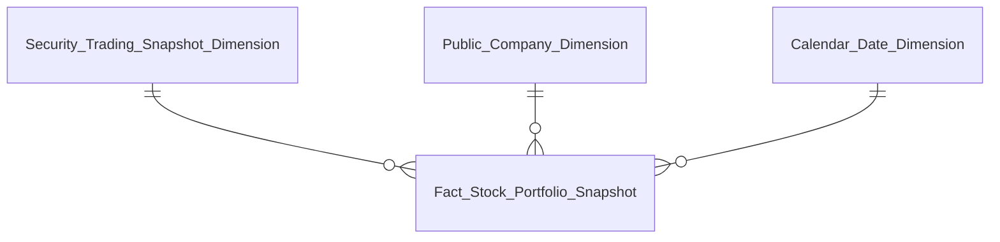
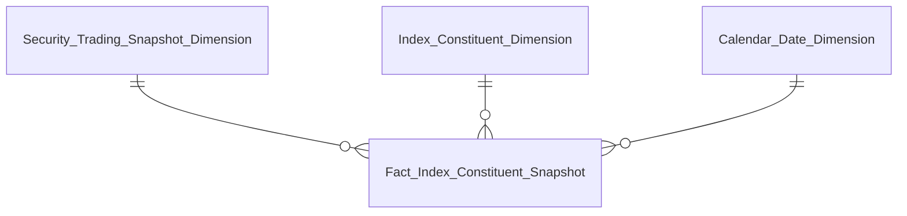
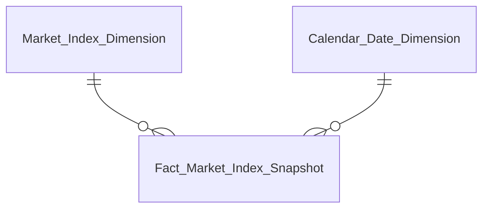
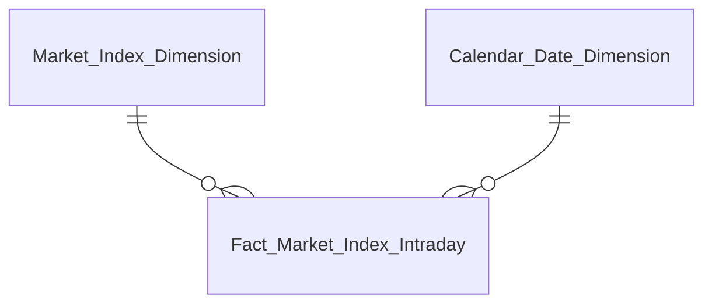
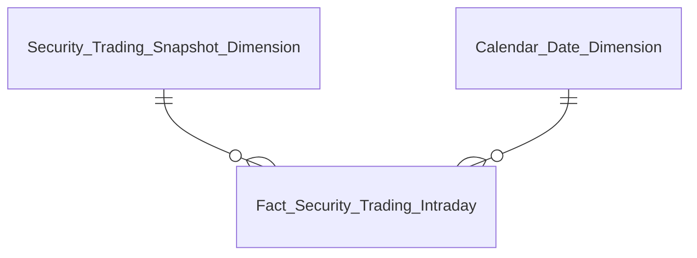
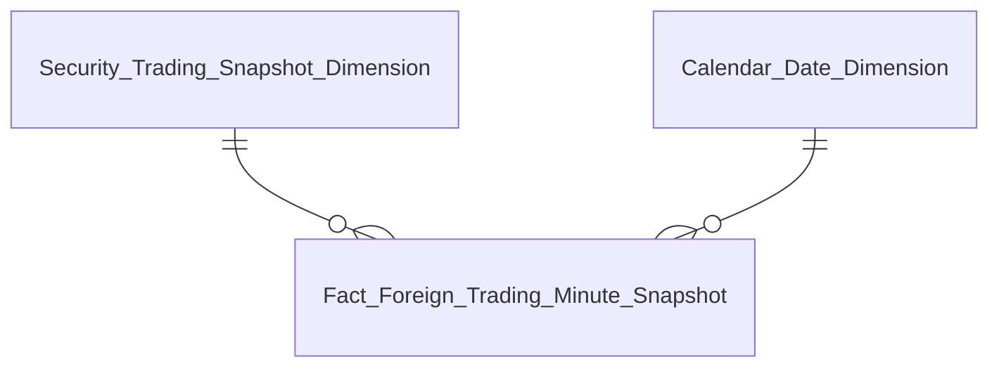
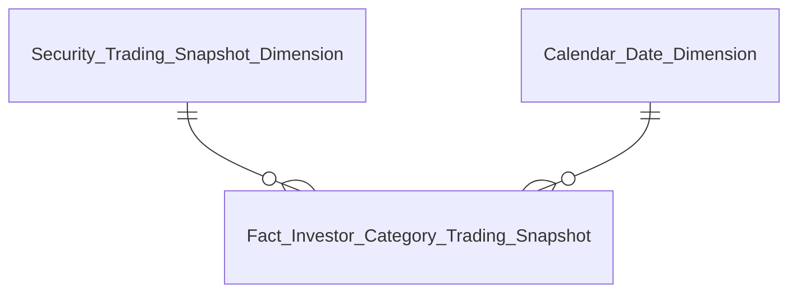
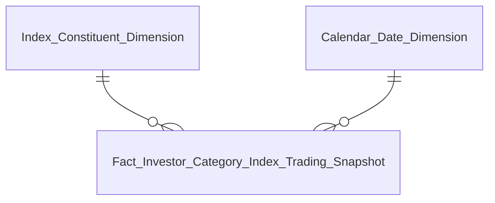
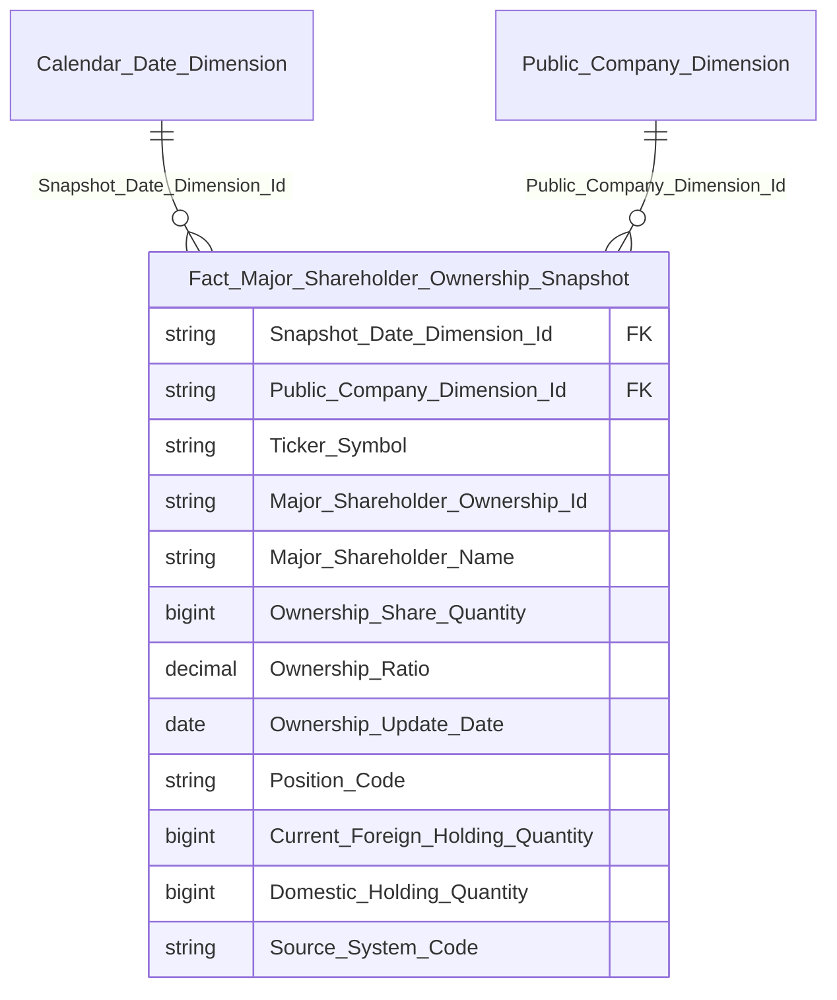

# DTM_GSTT_Entities — v2.3

**Phiên bản:** 2.3
**Ngày cập nhật:** 2026-09-14
**Phạm vi:** Star schema diagram theo Fact chính — GSTT module, khớp `DTM_GSTT_HLD.md` v4.15 (49/49 Nhóm)
**Thay đổi v2.6 (2026-09-23):** Bổ sung `Fact Investor Category Index Trading Snapshot` (mới, Nhóm 28/31 — grain Chỉ số); `Fact Investor Category Trading Snapshot` nay phục vụ Nhóm 29/30. Đánh số lại Nhóm 30→31 … 35→36 theo BA 2026-09-23 (HLD v4.23).
**Thay đổi v2.5 (2026-09-21):** Bổ sung `Fact Investor Category Trading Snapshot` (mới) — tách phân loại NĐT khỏi `Fact Stock Portfolio Snapshot`, phục vụ Nhóm 28/29 (K_GSTT_85–94).
**Thay đổi v2.4 (2026-09-16):** Đổi nguồn `Outstanding Share Quantity` (trên `Fact Stock Portfolio Snapshot`) và `Index Market Cap` (trên `Fact Index Constituent Snapshot`) từ `pc_share_statistics_hstr` (IDS) sang `listed_share_info` (VSDC `outstanding_shares`, `src_stm_code = 'VSDC_OUTSTANDING_SHARES'`). Đồng bộ hoàn toàn nguồn dữ liệu số lượng cổ phiếu lưu hành & tự do chuyển nhượng về VSDC, khắc phục dứt điểm tình trạng rỗng dữ liệu trên sàn HNX/UPCOM.
**Thay đổi v2.3:** Đổi tên `Index Total Volume`/`Index Total Value` → `Index Total Matched Volume`/`Index Total Matched Value` — review sheet Tổng hợp công thức xác nhận KLGD/GTGD của chỉ số (K_GSTT_47/48) phải loại trừ thỏa thuận, khác BA_analyst_GSTT.csv STT5.
**Thay đổi v2.2:** Bổ sung 8 measure tính sẵn theo rổ chỉ số lên `Fact Index Constituent Snapshot` (Index Total Matched Volume/Value, Index Foreign Net Volume/Value, Index Total Negotiated Volume/Value, Index Market Cap, Index Free Float Market Cap — theo yêu cầu Design, không chấp nhận Bridge thuần 3 FK). Sửa mô tả `Fact Stock Portfolio Snapshot` — nguồn Free Float đổi từ `listed_security_info_snapshot` (chưa tồn tại) sang `listed_share_info`.
**Thay đổi v2.1:** Tách `Fact Index Constituent Snapshot` (Bridge Factless) khỏi `Fact Stock Portfolio Snapshot` — giải quyết fan-out do 1 mã CK thuộc N rổ chỉ số (Index Constituent Dimension trước đây là FK trực tiếp trên Fact chính). `Index Constituent Dimension` đổi grain còn 1 row/Index Code (thuần mô tả), Symbol/Floor Code/Add Date chuyển sang Fact mới.
**Thay đổi so với v1.3:** Viết lại toàn bộ — bản v1.3 (2026-06-04) theo cấu trúc HLD cũ trước v4.0 (`Fact Security Daily Market Summary`, `Corporate Bond Trading Snapshot Dimension`...) đã lỗi thời, không còn khớp với HLD hiện hành (thiết kế lại toàn bộ theo BA CSV mới, 1 Nhóm = 1 STT). Tổ chức lại theo 4 Fact chính (thay vì liệt kê rời rạc 49 Nhóm) vì phần lớn các Nhóm dùng chung `Fact Stock Portfolio Snapshot`.

---

## Fact Stock Portfolio Snapshot (phục vụ Nhóm 1–44, 46, 47)

Bảng trung tâm của module — 1 row / mã CK / ngày giao dịch. Phục vụ toàn bộ Tab "Danh mục CK", "Top", "Xu hướng dòng tiền" (Nhóm 1–4, 6–44, 46, 47). **[SỬA 2026-09-14]** Không còn FK rổ chỉ số — xem `Fact Index Constituent Snapshot` bên dưới cho nhu cầu phân tích theo rổ chỉ số.

| Datamart Entity | Loại | Reuse | Mô tả | Grain | KPI |
|---|---|---|---|---|---|
| Fact Stock Portfolio Snapshot | Fact Snapshot | new | Giá, khối lượng/giá trị GD, NĐT nước ngoài/tự doanh/phân loại NĐT, LNST/VCSH/P-E/P-B (PENDING). [SỬA 2026-09-14] + Free_Float_Share_Quantity (nguồn `listed_share_info`, VSDC outstanding_shares — sửa từ `listed_security_info_snapshot` chưa tồn tại). Bỏ FK Index Constituent Dimension Id | 1 row / mã CK / ngày giao dịch | K_GSTT_1–32, 55–61, 64–92, 98–119, 124–125, 133–143 (xem Bảng grain Section 3.2 HLD) |
| Security Trading Snapshot Dimension | Dimension | new | Hồ sơ mô tả chứng khoán + giá hiện hành (Open/High/Low/Reference/Close) | 1 row / mã CK (SCD4A) | — |
| Public Company Dimension | Dimension | reuse | Mã CK/tên DN/ngành — conformed GSDC/QLCB/NDTNN | 1 row / mã CK (SCD4A) | — |
| Calendar Date Dimension | Dimension | reuse | Lịch ngày — conformed toàn hệ thống | 1 row / ngày | — |

---

## Fact Index Constituent Snapshot (phục vụ Nhóm 1, 5, 6, 7-22, 49 — mọi KPI theo rổ chỉ số)

**[MỚI 2026-09-14]** Bridge — tách khỏi `Fact Stock Portfolio Snapshot` để giải quyết fan-out (1 mã CK thuộc N rổ chỉ số từng gây double-count trên measure của Fact chính). Phục vụ K_GSTT_4 (chọn 1 Chỉ số), K_GSTT_62/63 (Bộ chỉ số thị trường/theo ngành) — join qua `Symbol` + `Trading Date` sang `Fact Stock Portfolio Snapshot` khi cần lấy measure theo mã CK. **[SỬA 2026-09-14, theo yêu cầu Design]** Bổ sung 8 measure tính sẵn theo Index+Date (Index Total Matched Volume/Value, Index Foreign Net Volume/Value, Index Total Negotiated Volume/Value, Index Market Cap, Index Free Float Market Cap) phục vụ K_GSTT_47-52/54/61 + mẫu số K_GSTT_74/76 — giá trị lặp lại trên mọi dòng Symbol cùng Index+Date, dùng MAX()/DISTINCT khi truy vấn.

| Datamart Entity | Loại | Reuse | Mô tả | Grain | KPI |
|---|---|---|---|---|---|
| Fact Index Constituent Snapshot | Fact Snapshot (Bridge + measure tính sẵn) | new | Thành viên rổ chỉ số theo ngày + 8 measure tính sẵn theo Index+Date (lặp lại trên mọi dòng Symbol cùng rổ) | 1 row / mã CK / rổ chỉ số / ngày giao dịch | K_GSTT_4, 47–52, 54, 61, 62–63, 74, 76 |
| Security Trading Snapshot Dimension | Dimension | reuse | Hồ sơ mô tả chứng khoán — đã thiết kế ở Nhóm 1 | 1 row / mã CK (SCD4A) | — |
| Index Constituent Dimension | Dimension | new | Mô tả rổ chỉ số (Index Code, Index Id) — [SỬA 2026-09-14] không còn chứa Symbol/Floor Code/Add Date | 1 row / Index Code | — |
| Calendar Date Dimension | Dimension | reuse | Lịch ngày — conformed toàn hệ thống | 1 row / ngày | — |

---

## Fact Market Index Snapshot (phục vụ Nhóm 5, 49)

Diễn biến chỉ số thị trường cuối ngày — sở hữu QLKD, GSTT reuse + mở rộng.

| Datamart Entity | Loại | Reuse | Mô tả | Grain | KPI |
|---|---|---|---|---|---|
| Fact Market Index Snapshot | Fact Snapshot | partial | Điểm chỉ số, thay đổi, mã tăng/giảm/trần/sàn, KLGD/GTGD thỏa thuận — sở hữu QLKD, GSTT mở rộng 15 measure | 1 row / chỉ số thị trường (market_code) / ngày (bản ghi cuối phiên) | K_GSTT_4, 33, 35–52 |
| Market Index Dimension | Dimension | reuse | Danh mục chỉ số thị trường (VN-Index/HNX/UPCOM/VN30) — conformed sở hữu QLKD | 1 row / combo (Market Id, Market Code) (SCD4A) | — |
| Calendar Date Dimension | Dimension | reuse | Lịch ngày — conformed toàn hệ thống | 1 row / ngày | — |

---

## Fact Market Index Intraday (phục vụ Nhóm 5)

Diễn biến chỉ số thị trường realtime trong ngày — grain khác Fact Market Index Snapshot (theo Index Time thay vì theo ngày).

| Datamart Entity | Loại | Reuse | Mô tả | Grain | KPI |
|---|---|---|---|---|---|
| Fact Market Index Intraday | Fact Snapshot | new | Giá trị GD và điểm chỉ số theo thời gian thực trong ngày | 1 row / chỉ số thị trường (market_code) / Index Time — FK Calendar Date Dimension qua Trading Date | K_GSTT_34, 45–46 |
| Market Index Dimension | Dimension | reuse | Danh mục chỉ số thị trường — conformed sở hữu QLKD | 1 row / combo (Market Id, Market Code) (SCD4A) | — |
| Calendar Date Dimension | Dimension | reuse | Lịch ngày — conformed toàn hệ thống | 1 row / ngày | — |

---

## Fact Security Trading Intraday (phục vụ Nhóm 44)

Biểu đồ phân tích kỹ thuật theo thời gian trong ngày — grain khác `Security Trading Snapshot Dimension` (theo Trading Timestamp thay vì 1 row/mã CK cuối ngày). `Trading Timestamp` (`trading_tms`) là cột mới bổ sung 2026-08-26 trên Atomic `Security Trading Snapshot` (nối chuỗi `trading_dt` + `' '` + `trading_time` tại tầng ODS) — `Trading Date`/`Trading Time` gốc giữ nguyên không đổi.

| Datamart Entity | Loại | Reuse | Mô tả | Grain | KPI |
|---|---|---|---|---|---|
| Fact Security Trading Intraday | Fact Snapshot | new | Giá mở/cao/thấp/đóng cửa + khối lượng lũy kế theo từng thời điểm trong ngày | 1 row / mã CK (Symbol) / Trading Timestamp (`trading_tms`) — FK Calendar Date Dimension qua Trading Date | K_GSTT_95–99 |
| Security Trading Snapshot Dimension | Dimension | reuse | Hồ sơ mô tả chứng khoán — đã thiết kế ở Nhóm 1 | 1 row / mã CK (SCD4A) | — |
| Calendar Date Dimension | Dimension | reuse | Lịch ngày — conformed toàn hệ thống | 1 row / ngày | — |

---

## Fact Foreign Trading Minute Snapshot (phục vụ Nhóm 25)

**[BỔ SUNG 2026-09-11]** Thiết kế thật đã có từ 2026-09-04 (Resolved O_GSTT_8, Attributes + Detail Mapping + HLD đều đã READY) nhưng bị bỏ sót khỏi Entities.csv/.md — bổ sung lại cho khớp, không phải thiết kế mới.

Dòng tiền NĐT nước ngoài theo phút — grain mịn hơn `Fact Stock Portfolio Snapshot` (theo phút thay vì theo ngày). Nguồn `Securities Trade` (per-trade, sổ lệnh HOSE/HNX GROUP BY phút) — khác `Fact Security Trading Intraday` (nguồn `Security Trading Snapshot`, per-tick MDDS).

| Datamart Entity | Loại | Reuse | Mô tả | Grain | KPI |
|---|---|---|---|---|---|
| Fact Foreign Trading Minute Snapshot | Fact Snapshot | new | Giá trị mua/bán của NĐT nước ngoài theo phút | 1 row / mã CK (Symbol) / Trade Minute (`trade_minute_tms`) — FK Calendar Date Dimension qua Trade Date | K_GSTT_78–80 |
| Security Trading Snapshot Dimension | Dimension | reuse | Hồ sơ mô tả chứng khoán — đã thiết kế ở Nhóm 1 | 1 row / mã CK (SCD4A) | — |
| Calendar Date Dimension | Dimension | reuse | Lịch ngày — conformed toàn hệ thống | 1 row / ngày | — |

---

## Fact Investor Category Trading Snapshot (phục vụ Nhóm 29, 30)

**[MỚI 2026-09-21, theo yêu cầu Data Modeler]** Tách khỏi `Fact Stock Portfolio Snapshot` để có cột vật lý `Investor Category Code` thay vì 4 cụm cột cố định (`Individual_*`/`Domestic_Institution_*`/`Proprietary_*`/`Foreign_*`) + CASE WHEN switch tại tầng BI. Nguồn `Securities Trade.Buy/Sell Investor Type Code` (Cá nhân/Tổ chức trong nước, phân nhánh HOSE/HNX) + `Buy/Sell Client House Classification Code='30'` (Tự doanh) + `Buy/Sell Foreign Investor Type Code IN ('10','20')` (Nước ngoài). Không đổi grain/cột của `Fact Stock Portfolio Snapshot` — Nhóm 21/25/27/35 tiếp tục dùng nguyên các cột đã có, không bị ảnh hưởng.

| Datamart Entity | Loại | Reuse | Mô tả | Grain | KPI |
|---|---|---|---|---|---|
| Fact Investor Category Trading Snapshot | Fact Snapshot | new | Giá trị mua/bán theo Phân loại NĐT (Cá nhân/Tổ chức trong nước/Tự doanh/Nước ngoài), tách riêng khớp lệnh/thỏa thuận | 1 row / mã CK / ngày giao dịch / Phân loại NĐT | K_GSTT_85, 90–92, 153–158 (86–89/93/94/152 DEPRECATED) |
| Security Trading Snapshot Dimension | Dimension | reuse | Hồ sơ mô tả chứng khoán — đã thiết kế ở Nhóm 1 | 1 row / mã CK (SCD4A) | — |
| Calendar Date Dimension | Dimension | reuse | Lịch ngày — conformed toàn hệ thống | 1 row / ngày | — |

---

## Fact Investor Category Index Trading Snapshot (phục vụ Nhóm 28, 31)

**[MỚI 2026-09-23, Data Modeler duyệt]** Giao dịch theo phân loại NĐT ở cấp **Chỉ số** — tách riêng khỏi `Fact Investor Category Trading Snapshot` (cấp Mã CK) để không SUM runtime lệch hạt. Chứa 6 measure GT (Tổng/Khớp lệnh/Thỏa thuận × Mua/Bán) và 3 measure giá chỉ số (broadcast trên 4 dòng Phân loại NĐT — truy vấn dùng MAX). Xem HLD Cụm 1d.

| Datamart Entity | Loại | Reuse | Mô tả | Grain | KPI |
|---|---|---|---|---|---|
| Fact Investor Category Index Trading Snapshot | Fact Snapshot | new | GT mua/bán theo Phân loại NĐT theo rổ chỉ số + điểm/thay đổi/% thay đổi chỉ số | 1 row / Index Code / ngày giao dịch / Phân loại NĐT | K_GSTT_85, 35, 38, 39, 161–169 |
| Index Constituent Dimension | Dimension | reuse | Mô tả rổ chỉ số — đã thiết kế ở Nhóm 1 | 1 row / Index Code (SCD4A) | — |
| Calendar Date Dimension | Dimension | reuse | Lịch ngày — conformed toàn hệ thống | 1 row / ngày | — |

---

## Fact Major Shareholder Ownership Snapshot (phục vụ Nhóm 33)

**[MỚI 2026-09-25, GSTT Nhóm 33 — BA cập nhật nguồn VSDC major_shareholder]** Thay nguồn IDS `Public Company Shareholding` cho Nhóm 33 bằng VSDC `major_shareholder` (Atomic `major_shareholder_ownership`, mapping md) — số liệu theo kỳ đầu/cuối, chọn kỳ theo ngày tham số. `Operational Public Company Shareholding` giữ nguyên cho Nhóm 36.

| Datamart Entity | Loại | Reuse | Mô tả | Grain | KPI |
|---|---|---|---|---|---|
| Fact Major Shareholder Ownership Snapshot | Fact Snapshot | new | Sở hữu cổ đông lớn + chức vụ nội bộ + sở hữu NN/trong nước theo ngày tham số | 1 row / mã CK × cổ đông lớn × ngày | K_GSTT_100–104, 103b, 120, 121, 177 |

---

