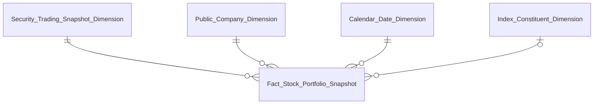
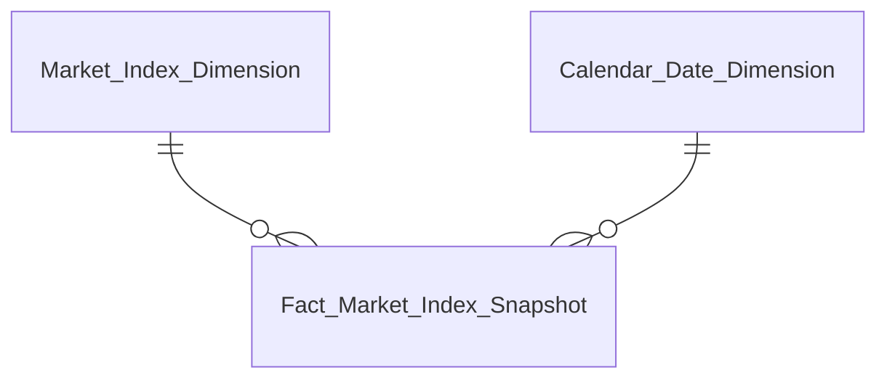
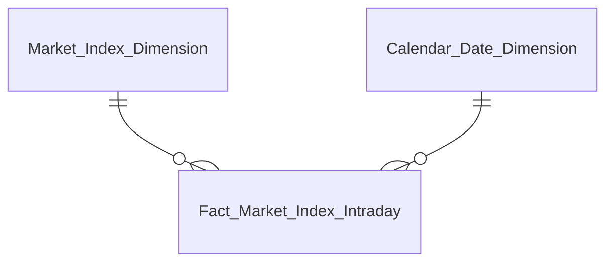
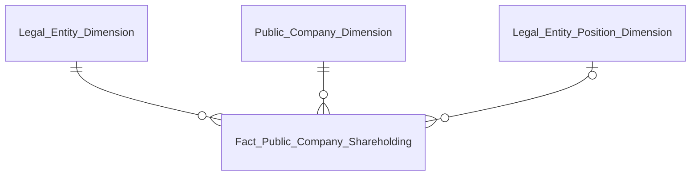

# DTM_GSTT_Entities — v2.0

**Phiên bản:** 2.0
**Ngày cập nhật:** 2026-07-28
**Phạm vi:** Star schema diagram theo Fact chính — GSTT module, khớp `DTM_GSTT_HLD.md` v4.1 (49/49 Nhóm)
**Thay đổi so với v1.3:** Viết lại toàn bộ — bản v1.3 (2026-06-04) theo cấu trúc HLD cũ trước v4.0 (`Fact Security Daily Market Summary`, `Corporate Bond Trading Snapshot Dimension`...) đã lỗi thời, không còn khớp với HLD hiện hành (thiết kế lại toàn bộ theo BA CSV mới, 1 Nhóm = 1 STT). Tổ chức lại theo 4 Fact chính (thay vì liệt kê rời rạc 49 Nhóm) vì phần lớn các Nhóm dùng chung `Fact Stock Portfolio Snapshot`.

---

## Fact Stock Portfolio Snapshot (phục vụ Nhóm 1–44, 46, 47)

Bảng trung tâm của module — 1 row / mã CK / rổ chỉ số (FK nullable) / ngày giao dịch. Phục vụ toàn bộ Tab "Danh mục CK", "Top", "Xu hướng dòng tiền" (Nhóm 1–4, 6–44, 46, 47).

| Datamart Entity | Loại | Reuse | Mô tả | Grain | KPI |
|---|---|---|---|---|---|
| Fact Stock Portfolio Snapshot | Fact Snapshot | new | Giá, khối lượng/giá trị GD, NĐT nước ngoài/tự doanh/phân loại NĐT, LNST/VCSH/P-E/P-B (PENDING) | 1 row / mã CK / rổ chỉ số (FK nullable) / ngày giao dịch | K_GSTT_1–32, 55–61, 64–92, 98–119 (xem Bảng grain Section 3.2 HLD) |
| Security Trading Snapshot Dimension | Dimension | new | Hồ sơ mô tả chứng khoán + giá hiện hành (Open/High/Low/Reference/Close) | 1 row / mã CK (SCD4A) | — |
| Public Company Dimension | Dimension | reuse | Mã CK/tên DN/ngành — conformed GSDC/QLCB/NDTNN | 1 row / mã CK (SCD4A) | — |
| Calendar Date Dimension | Dimension | reuse | Lịch ngày — conformed toàn hệ thống | 1 row / ngày | — |
| Index Constituent Dimension | Dimension | new | Quan hệ thành viên rổ chỉ số (Index Code, Symbol) | 1 row / (Index Code, Symbol) có thật trong nguồn (SCD4A) | — |

---

## Fact Market Index Snapshot (phục vụ Nhóm 5, 49)

Diễn biến chỉ số thị trường cuối ngày — sở hữu QLKD, GSTT reuse + mở rộng.

| Datamart Entity | Loại | Reuse | Mô tả | Grain | KPI |
|---|---|---|---|---|---|
| Fact Market Index Snapshot | Fact Snapshot | partial | Điểm chỉ số, thay đổi, mã tăng/giảm/trần/sàn, KLGD/GTGD thỏa thuận — sở hữu QLKD, GSTT mở rộng 15 measure | 1 row / chỉ số thị trường (market_code) / ngày (bản ghi cuối phiên) | K_GSTT_4, 33, 35–52 |
| Market Index Dimension | Dimension | reuse | Danh mục chỉ số thị trường (VN-Index/HNX/UPCOM/VN30) — conformed sở hữu QLKD | 1 row / combo (Market Id, Market Code) (SCD4A) | — |
| Calendar Date Dimension | Dimension | reuse | Lịch ngày — conformed toàn hệ thống | 1 row / ngày | — |

---

## Fact Market Index Intraday (phục vụ Nhóm 5)

Diễn biến chỉ số thị trường realtime trong ngày — grain khác Fact Market Index Snapshot (theo Index Time thay vì theo ngày).

| Datamart Entity | Loại | Reuse | Mô tả | Grain | KPI |
|---|---|---|---|---|---|
| Fact Market Index Intraday | Fact Snapshot | new | Giá trị GD và điểm chỉ số theo thời gian thực trong ngày | 1 row / chỉ số thị trường (market_code) / Index Time — FK Calendar Date Dimension qua Trading Date | K_GSTT_34, 45–46 |
| Market Index Dimension | Dimension | reuse | Danh mục chỉ số thị trường — conformed sở hữu QLKD | 1 row / combo (Market Id, Market Code) (SCD4A) | — |
| Calendar Date Dimension | Dimension | reuse | Lịch ngày — conformed toàn hệ thống | 1 row / ngày | — |

---

## Fact Public Company Shareholding (phục vụ Nhóm 45, 48)

Sở hữu cổ đông và chức vụ người nội bộ — entity mới hoàn toàn, chưa từng xuất hiện ở các Nhóm trước.

| Datamart Entity | Loại | Reuse | Mô tả | Grain | KPI |
|---|---|---|---|---|---|
| Fact Public Company Shareholding | Fact Snapshot | new | Số cổ phiếu sở hữu, tỷ lệ sở hữu, cờ cổ đông lớn/người nội bộ | 1 row / cổ đông (Legal Entity) / mã công ty (Public Company) / chức vụ (nullable) | K_GSTT_93–97 |
| Legal Entity Dimension | Dimension | new | Tên cổ đông — driving entity chỉ có ở Atomic Nguồn 2 (working/Atomic), chưa promote Nguồn 1 | 1 row / cổ đông (SCD4A) | — |
| Public Company Dimension | Dimension | reuse | Mã CK/tên DN/ngành — conformed GSDC/QLCB/NDTNN | 1 row / mã CK (SCD4A) | — |
| Legal Entity Position Dimension | Dimension | new | Chức vụ người nội bộ | 1 row / (cổ đông, chức vụ) (SCD4A) | — |

---

## Bảng PENDING (không thiết kế trong Phase 2)

Không có bảng nào PENDING toàn bộ trong module GSTT. Tất cả 4 Fact đều có ít nhất 1 KPI/Nhóm READY (xem Bảng grain Section 3.2 HLD để biết measure/KPI cụ thể còn PENDING trong từng Fact — VD `Fact Stock Portfolio Snapshot` có nhiều cột PENDING như LNST/VCSH/P-E/P-B chờ Atomic EAV báo cáo tài chính, xem O_GSTT_1/O_GSTT_2).
