# DTM_GSTT_HLD — v3.3

**Phiên bản:** 3.4
**Ngày cập nhật:** 2026-05-15
**Thay đổi v3.4:** Rename naming sát Atomic nguồn: (1) `Security Dimension` → `Security Trading Snapshot Dimension`; (2) `Public Company Industry Dimension` → `Public Company Dimension`; (3) `Corporate Bond Issuer Dimension` → `Corporate Bond Trading Snapshot Dimension`; (4) `Corporate Bond Issuer Industry Dimension` → `Corporate Bond Trading Snapshot Industry Dimension`. Physical names giữ nguyên. (logical) và `Security_Dimension` → `Security_Trading_Snapshot_Dimension` (erDiagram) để tuân thủ quy tắc naming sát Atomic nguồn. Physical name `scr_tdg_snpst_dim` giữ nguyên.
**Phạm vi:** Nhóm 1–28 + STT 47–49 (Danh mục CK, Thị trường Chuyên sâu, Top Khối lượng, Top Đột phá, Top Giá trị, Top Tăng Giá, Top Giảm Giá, Top Vượt Đỉnh, Top Thùng Đáy, Top NDTNN, Bản Đồ Nhiệt, Xu Hướng Dòng Tiền, Báo cáo BM021 STT 48, Data Explorer STT 49, Sở hữu và giao dịch nội bộ STT 47)

---

## Section 1 — Data Lineage

### Cụm 1 — Security Daily Market

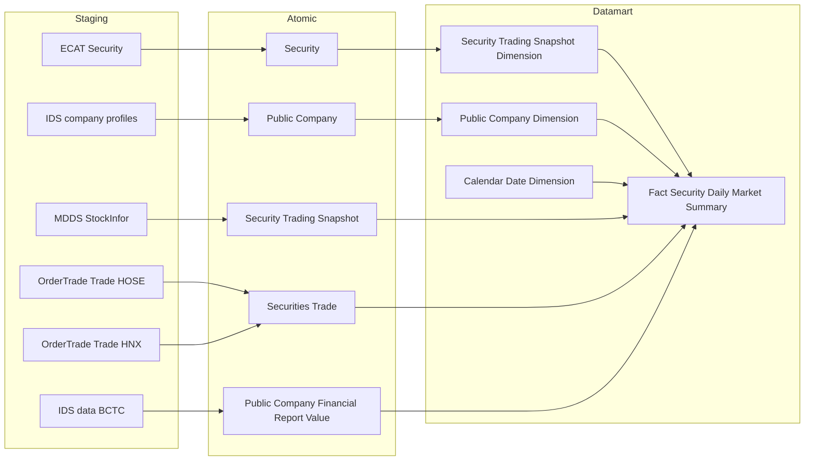

> **Ghi chú:** `Fact Security Daily Market Summary` phục vụ toàn bộ Nhóm 1, 3, 6–27d_heatmap và STT 49. Schema đầy đủ bao gồm cột GT Tự doanh (STT 43 — O_GSTT_22 Closed), cột GT Phân loại NĐT (STT 44/45 — O_GSTT_23 Closed), cột KL Thỏa Thuận (STT 49) — tất cả có nguồn từ `Securities Trade`, không cần Cụm riêng.

---

### Cụm 2 — Corporate Bond Daily Market

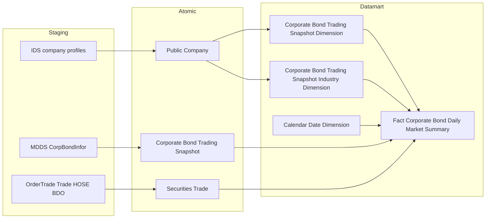

---

### Cụm 3 — Index Constituent Snapshot (PENDING O_GSTT_12)

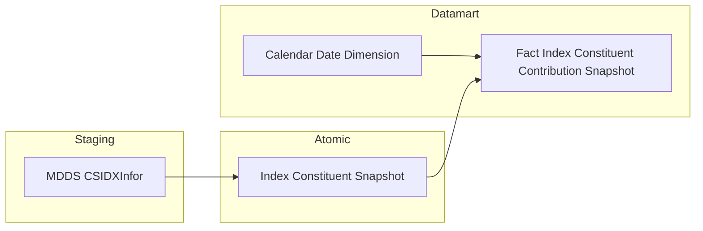

> **PENDING O_GSTT_12** — không triển khai cho đến khi IDXInfor schema xác nhận.

---

### Cụm 4 — Stock Holder Ownership

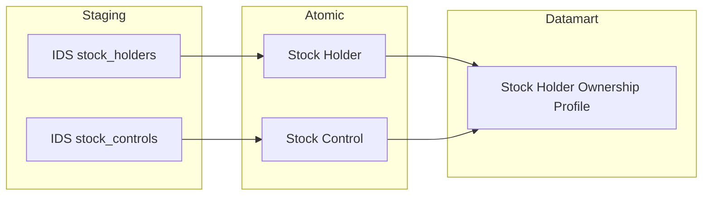

---

## Section 2 — Tổng quan báo cáo

### Tab Danh mục CK

#### Nhóm 1 — Bảng số liệu Cổ phiếu

##### READY

> **Phân loại:** Phân tích
> **Atomic:** `Security Trading Snapshot` ← MDDS.StockInfor — **READY** / `Securities Trade` ← OrderTrade.Trade_HOSE, Trade_HNX — **READY**

**Mockup:**

| Mã CK | Ngành | Giá TC | Giá ĐC | Thay đổi | % TĐ | Tổng KL | Tổng GT | KLNN mua | KLNN bán | KLNN ròng |
|---|---|---|---|---|---|---|---|---|---|---|
| VCB / HOSE | Ngân hàng | 82.00 | 82.50 | +0.50 | +0.61% | 548 Tr | 22.1 Tỷ | 12 Tr | 8 Tr | +4 Tr |

**Source:** `Fact Security Daily Market Summary` → `Security Trading Snapshot Dimension`, `Public Company Dimension`, `Calendar Date Dimension`

**Bảng KPI:**

| KPI ID | Tên KPI | Đơn vị | Tính chất | Công thức / Nguồn |
|---|---|---|---|---|
| K_GSTT_1 | Tổng KLGD | Cổ phiếu | Phái sinh | `SUM(Exec Volume)` từ Trade_HOSE/HNX, Market Id Code IN (STO, STX, UPX) |
| K_GSTT_2 | Giá đóng cửa | VNĐ | Cơ sở | `Security Trading Snapshot.Close Price` |
| K_GSTT_3 | % Thay đổi | % | Phái sinh | `(Close Price − Reference Price) / Reference Price × 100` |
| K_GSTT_4 | Tổng GTGD | Tỷ VNĐ | Phái sinh | `SUM(Exec Value)` HOSE / `SUM(Trade Price × Trade Quantity)` HNX |
| K_GSTT_5 | Giá tham chiếu | VNĐ | Cơ sở | `Security Trading Snapshot.Reference Price` |
| K_GSTT_6 | Giá trần | VNĐ | Cơ sở | `Security Trading Snapshot.Ceiling Price` |
| K_GSTT_7 | Giá sàn | VNĐ | Cơ sở | `Security Trading Snapshot.Floor Price` |
| K_GSTT_8 | KLNN mua | Cổ phiếu | Cơ sở | `SUM(Exec Volume WHERE Buy Foreign Investor Type IN ('10','20'))` |
| K_GSTT_9 | KLNN bán | Cổ phiếu | Cơ sở | `SUM(Exec Volume WHERE Sell Foreign Investor Type IN ('10','20'))` |
| K_GSTT_10 | KLNN ròng | Cổ phiếu | Phái sinh | `K_GSTT_8 − K_GSTT_9` |
| K_GSTT_11 | GTNN mua | Tỷ VNĐ | Phái sinh | `SUM(Exec Value WHERE Buy Foreign Investor Type IN ('10','20'))` |
| K_GSTT_12 | GTNN bán | Tỷ VNĐ | Phái sinh | `SUM(Exec Value WHERE Sell Foreign Investor Type IN ('10','20'))` |
| K_GSTT_13 | GTNN ròng | Tỷ VNĐ | Phái sinh | `K_GSTT_11 − K_GSTT_12` |
| K_GSTT_14 | Tổng KL thỏa thuận | Cổ phiếu | Phái sinh | `SUM(Exec Volume WHERE Board Type IN ('T1','T2','T3','T4','T6'))` |
| K_GSTT_15 | Tổng GT thỏa thuận | Tỷ VNĐ | Phái sinh | `SUM(Exec Value WHERE Board Type IN ('T1','T2','T3','T4','T6'))` |
| K_GSTT_16 | Tổng KL phái sinh | Hợp đồng | Phái sinh | `SUM(Exec Volume WHERE Market Id Code = 'DVX')` |
| K_GSTT_17 | Tổng GT phái sinh | Tỷ VNĐ | Phái sinh | `SUM(Exec Value WHERE Market Id Code = 'DVX')` |
| K_GSTT_18 | Ngày đáo hạn phái sinh | Ngày | Cơ sở | `Security Trading Snapshot.Maturity Date WHERE Floor Code = '03'`` |
| K_GSTT_19 | Giá mở cửa | VNĐ | Cơ sở | `Security Trading Snapshot.Open Price` |
| K_GSTT_20 | Giá cao nhất | VNĐ | Cơ sở | `Security Trading Snapshot.High Price` |
| K_GSTT_21 | Giá thấp nhất | VNĐ | Cơ sở | `Security Trading Snapshot.Low Price` |
| K_GSTT_22 | Doanh thu | Tỷ VNĐ | Cơ sở | `SUM(Public Company Financial Report Value.Data Value)` WHERE Report Type = BCKQKD, Row Code IN ('10'/'03' theo loại DN) — forward-fill theo quý |

**Star Schema:**

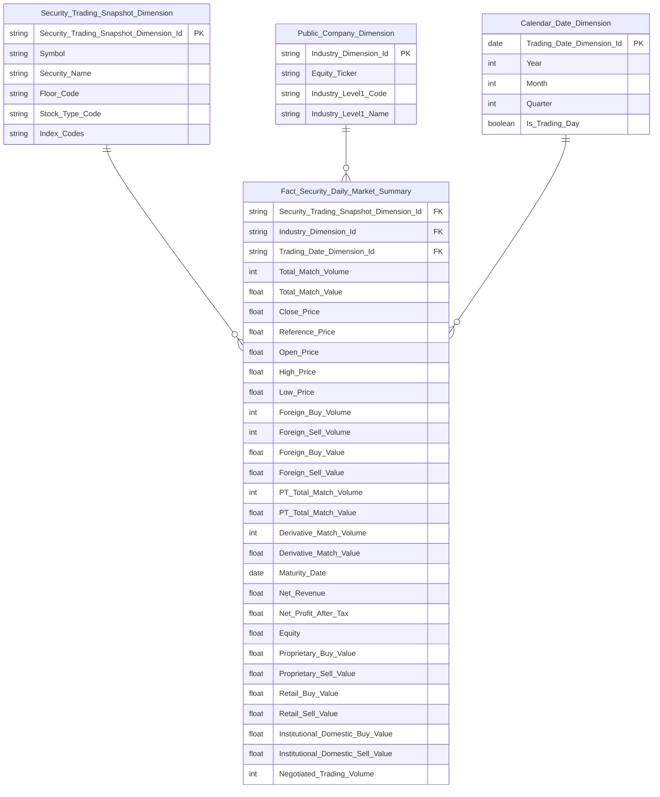

> **Ghi chú thiết kế Security Trading Snapshot Dimension:** Driving table = `scr_tdg_snpst` (Security Trading Snapshot). `Security_Name` lấy từ `scr_tdg_snpst.full_nm`. Entity `Security` (`scr` ← ECAT) không có FK ngược về `scr_tdg_snpst` — không tham gia ETL job này. `Index_Codes` cần xác nhận Atomic column (O_GSTT_3 Closed nhưng source column chưa map).
>
> **Ghi chú cột bổ sung:** `Proprietary_Buy_Value`, `Proprietary_Sell_Value` (O_GSTT_22 — Closed), `Retail_Buy_Value`, `Retail_Sell_Value`, `Institutional_Domestic_Buy_Value`, `Institutional_Domestic_Sell_Value` (O_GSTT_23 — Closed), `Negotiated_Trading_Volume` (STT 49 — READY) — schema v3.3 hoàn tất. `Shares_Outstanding` bổ sung khi O_GSTT_13 resolved.
> **Cột đã rút khỏi schema (derived metric — không lưu trong mart):** `Price_Change_Value` = `Close_Price − Reference_Price`; `Price_Change_Percentage` = `(Close_Price − Reference_Price) / Reference_Price × 100` — cả hai tính được tại query layer từ `Close_Price` và `Reference_Price` đã có trên Fact. KPI K_GSTT_3, K_GSTT_53 và các filter Top Tăng Giá / Giảm Giá khai thác qua công thức derived tại query layer.

**Lineage Mart → Báo cáo:**

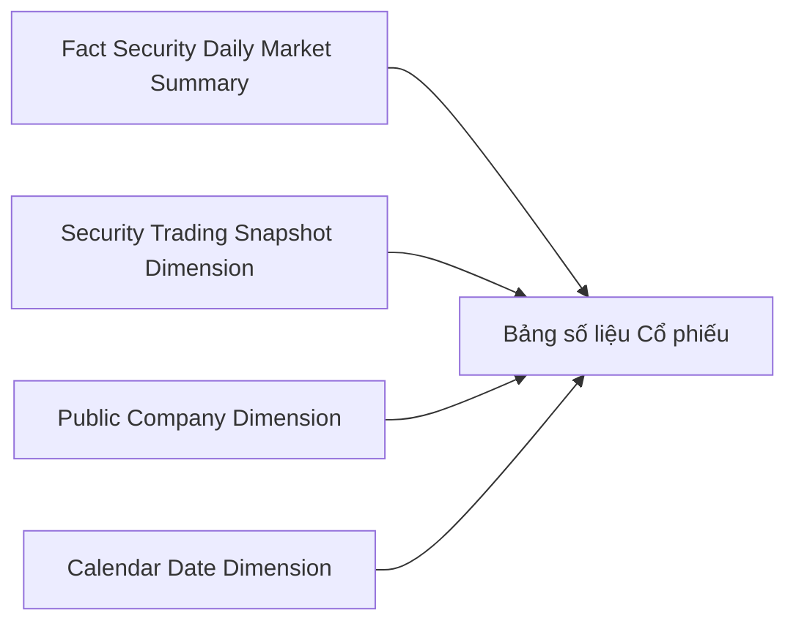

**Bảng grain:**

| Tên bảng | Grain |
|---|---|
| Fact Security Daily Market Summary | 1 row / mã CK / ngày |
| Security Trading Snapshot Dimension | 1 row / mã CK (SCD2) |
| Public Company Dimension | 1 row / mã CK (SCD2) |
| Calendar Date Dimension | 1 row / ngày |

---

#### Nhóm 2 — Bảng số liệu Trái phiếu DN niêm yết

##### READY (1 KPI PENDING)

> **Phân loại:** Phân tích
> **Atomic:** `Corporate Bond Trading Snapshot` ← MDDS.CorpBondInfor — **READY** / `Securities Trade` ← OrderTrade.Trade_HOSE (Market=BDO) — **READY**

**Mockup:**

| Mã TP | Tổ chức phát hành | Giá TC | Giá ĐC | % TĐ | KLGD | GTGD | YTM bình quân |
|---|---|---|---|---|---|---|---|
| TCH2226 | CTCP Nhựa Thiếu Niên Tiền Phong | 102.5 | 103.0 | +0.49% | 1.200 | 12.4 Tỷ | — |

**Source:** `Fact Corporate Bond Daily Market Summary` → `Corporate Bond Trading Snapshot Dimension`, `Corporate Bond Trading Snapshot Industry Dimension`, `Calendar Date Dimension`

**Bảng KPI:**

| KPI ID | Tên KPI | Đơn vị | Tính chất | Công thức / Nguồn |
|---|---|---|---|---|
| K_GSTT_14b | Giá tham chiếu TPDN | VNĐ | Cơ sở | `Corporate Bond Trading Snapshot.Reference Price` |
| K_GSTT_15b | Giá đóng cửa TPDN | VNĐ | Cơ sở | `Corporate Bond Trading Snapshot.Close Price` |
| K_GSTT_16b | % Thay đổi TPDN | % | Phái sinh | `(Close Price − Reference Price) / Reference Price × 100` |
| K_GSTT_17b | KLGD TPDN | Trái phiếu | Phái sinh | `SUM(Exec Volume WHERE Market Id Code = 'BDO' AND Board Type IN ('G1','G2','G3','T1','T2','T3'))` |
| K_GSTT_18b | GTGD TPDN | Tỷ VNĐ | Phái sinh | `SUM(Exec Value WHERE Market Id Code = 'BDO' AND Board Type IN ('G1','G2','G3','T1','T2','T3'))` |
| K_GSTT_23 | Doanh thu | Tỷ VNĐ | Cơ sở | `Public Company Financial Report Value.Data Value` — forward-fill từ BCKQKD |
| K_GSTT_24 | YTM bình quân | % | Cơ sở | **PENDING** — O_GSTT_6 |

**Star Schema:**

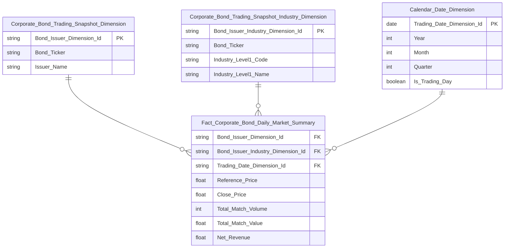

**Lineage Mart → Báo cáo:**

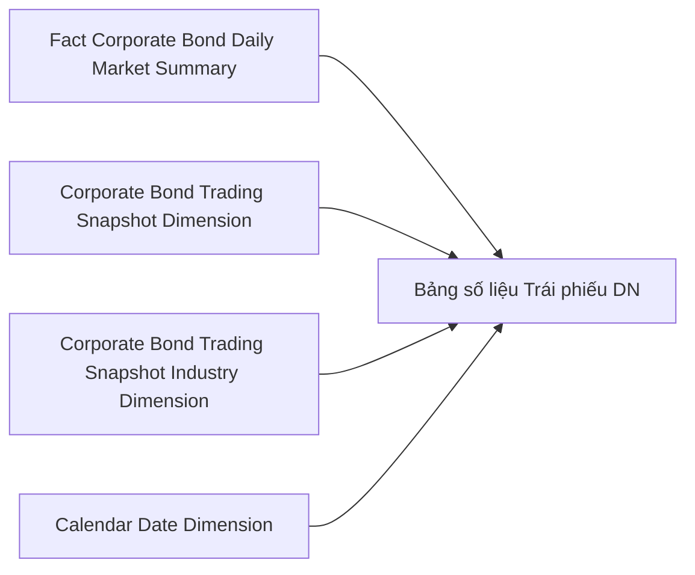

**Bảng grain:**

| Tên bảng | Grain |
|---|---|
| Fact Corporate Bond Daily Market Summary | 1 row / mã TP / ngày |
| Corporate Bond Trading Snapshot Dimension | 1 row / mã TP (SCD2) |
| Corporate Bond Trading Snapshot Industry Dimension | 1 row / mã TP (SCD2) |
| Calendar Date Dimension | 1 row / ngày |

---

#### Nhóm 3 — Biểu đồ kỹ thuật Cổ phiếu

##### READY

> **Phân loại:** Phân tích
> **Atomic:** `Security Trading Snapshot` ← MDDS.StockInfor — **READY** / `Securities Trade` ← OrderTrade.Trade_HOSE, Trade_HNX — **READY** / `Public Company Financial Report Value` ← IDS.data — **READY**

**Mockup:**

| Mã CK | Ngành | Giá mở cửa | Giá cao nhất | Giá thấp nhất | Giá đóng cửa | KLGD | Doanh thu | LNST |
|---|---|---|---|---|---|---|---|---|
| VCB / HOSE | Ngân hàng | 81.50 | 83.00 | 81.00 | 82.50 | 548 Tr | 18.5 Tỷ | 5.2 Tỷ |

**Source:** `Fact Security Daily Market Summary` → `Security Trading Snapshot Dimension`, `Public Company Dimension`, `Calendar Date Dimension`

**Bảng KPI:**

| KPI ID | Tên KPI | Đơn vị | Tính chất | Công thức / Nguồn |
|---|---|---|---|---|
| K_GSTT_19 | Giá mở cửa | VNĐ | Cơ sở | `Security Trading Snapshot.Open Price` |
| K_GSTT_20 | Giá cao nhất | VNĐ | Cơ sở | `Security Trading Snapshot.High Price` |
| K_GSTT_21 | Giá thấp nhất | VNĐ | Cơ sở | `Security Trading Snapshot.Low Price` |
| K_GSTT_2 | Giá đóng cửa | VNĐ | Cơ sở | `Security Trading Snapshot.Close Price` |
| K_GSTT_1 | Tổng KLGD | Cổ phiếu | Phái sinh | `SUM(Exec Volume)` từ Trade_HOSE/HNX, Market Id Code IN (STO, STX, UPX) |
| K_GSTT_22 | Doanh thu | Tỷ VNĐ | Cơ sở | `Public Company Financial Report Value.Data Value` — forward-fill từ BCKQKD |
| K_GSTT_25 | Lợi nhuận sau thuế | Tỷ VNĐ | Cơ sở | `SUM(Public Company Financial Report Value.Data Value)` WHERE Report Type = BCKQKD, Row Code IN ('60'/'21' theo loại DN) — forward-fill theo quý |

**Star Schema:**


**Lineage Mart → Báo cáo:**

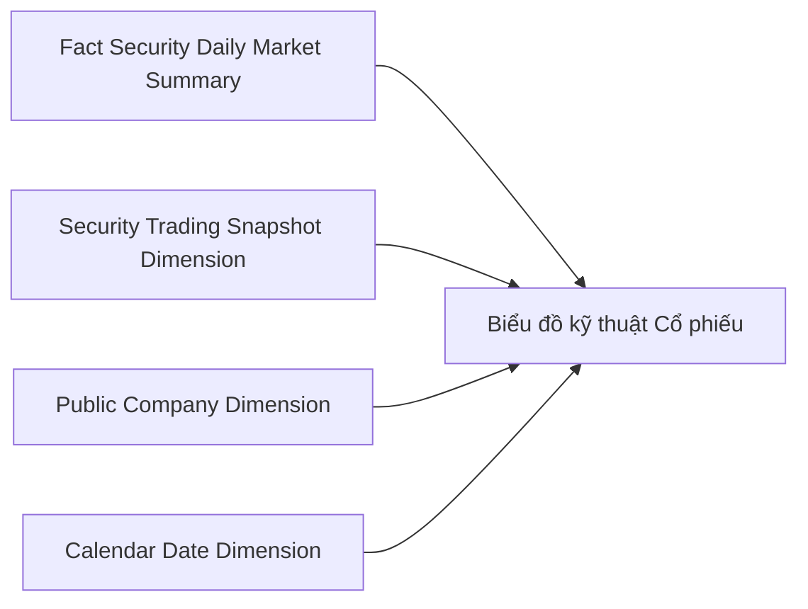

**Bảng grain:**

| Tên bảng | Grain |
|---|---|
| Fact Security Daily Market Summary | 1 row / mã CK / ngày |
| Security Trading Snapshot Dimension | 1 row / mã CK (SCD2) |
| Public Company Dimension | 1 row / mã CK (SCD2) |
| Calendar Date Dimension | 1 row / ngày |

---

### Tab Thị trường Chuyên sâu

#### Nhóm 4 — Chỉ số thị trường

##### PENDING

> **Lý do:** `MDDS.IDXInfor` đang thay đổi thiết kế CSDL nguồn — O_GSTT_12.

**KPI liên quan (tất cả PENDING):**

| KPI ID | Tên KPI | Lý do PENDING |
|---|---|---|
| K_GSTT_26 | Giá trị chỉ số (điểm số) | O_GSTT_12 |
| K_GSTT_27 | Thay đổi điểm chỉ số (+/-) | O_GSTT_12 |
| K_GSTT_28 | % thay đổi điểm chỉ số | O_GSTT_12 |
| K_GSTT_29 | KLGD của chỉ số | O_GSTT_12 |
| K_GSTT_30 | GTGD của chỉ số | O_GSTT_12 |
| K_GSTT_31 | Số mã tăng giá | O_GSTT_12 |
| K_GSTT_32 | Số mã giảm giá | O_GSTT_12 |
| K_GSTT_33 | Số mã đứng giá | O_GSTT_12 |
| K_GSTT_34 | Số mã tăng trần | O_GSTT_12 |
| K_GSTT_35 | Số mã giảm sàn | O_GSTT_12 |
| K_GSTT_36 | KLNN ròng theo chỉ số | O_GSTT_12 |
| K_GSTT_37 | GTNN ròng theo chỉ số | O_GSTT_12 |
| K_GSTT_38 | KLGD thỏa thuận chỉ số | O_GSTT_12 |
| K_GSTT_39 | GTGD thỏa thuận chỉ số | O_GSTT_12 |

**Mart dự kiến (placeholder):** `Fact Market Index Daily Snapshot` — grain: 1 row / Index Code / ngày; `Market Index Dimension` — NK: Index Code.

---

#### Nhóm 5 — Định giá thị trường

##### PENDING

> **Lý do 1:** IDXInfor PENDING — O_GSTT_12
> **Lý do 2:** VSDC TT138 chưa có Atomic — O_GSTT_13
> **Lý do 3:** IDS.categories chưa có Atomic — O_GSTT_14

**KPI liên quan (tất cả PENDING):**

| KPI ID | Tên KPI | Lý do PENDING |
|---|---|---|
| K_GSTT_40 | Giá trị chỉ số | O_GSTT_12 |
| K_GSTT_41 | Giá đóng cửa chỉ số | O_GSTT_12 |
| K_GSTT_42 | LNST aggregate theo rổ | O_GSTT_12 |
| K_GSTT_43 | VCSH aggregate theo rổ | O_GSTT_12 |
| K_GSTT_44 | Số CP đang lưu hành | O_GSTT_13 |
| K_GSTT_45 | P/E thị trường | O_GSTT_12, O_GSTT_13 |
| K_GSTT_46 | P/B thị trường | O_GSTT_12, O_GSTT_13 |
| K_GSTT_47 | EPS thị trường | O_GSTT_13 |
| K_GSTT_48 | Vốn hóa thị trường | O_GSTT_12, O_GSTT_13 |

**Mart dự kiến (placeholder):** `Fact Market Valuation Snapshot` — grain: 1 row / Index Code / quý.

---

### Tab Top Khối lượng

> **Phân loại:** Phân tích
> **Reuse:** `Fact Security Daily Market Summary` — không tạo bảng mới
> **Cơ chế ranking:** `ORDER BY Total Match Volume DESC LIMIT N` tại query layer — O_GSTT_15
> **Cơ chế filter tab:** sàn qua `Floor Code` trong `Security Trading Snapshot Dimension`; chỉ số qua `Index Codes` array trong `Security Trading Snapshot Dimension` — O_GSTT_3 Closed, độc lập với IDXInfor

#### Nhóm 6 — Top Khối lượng Toàn thị trường (Bảng số liệu)

##### READY (4 KPI PENDING)

> **Phân loại:** Phân tích
> **Atomic:** `Security Trading Snapshot` ← MDDS.StockInfor — **READY** / `Securities Trade` ← OrderTrade.Trade_HOSE, Trade_HNX — **READY**

**Mockup:**

| STT | Mã CK | Ngành | Tổng KL | Giá đóng cửa | % Thay đổi | Vốn hóa | P/E | P/B |
|---|---|---|---|---|---|---|---|---|
| 1 | ROS / HOSE | Xây dựng | 4.100 Tr | 26.00 | -2.62% | — | — | — |

**Source:** `Fact Security Daily Market Summary` → `Security Trading Snapshot Dimension`, `Public Company Dimension`, `Calendar Date Dimension`

**Bảng KPI:**

| KPI ID | Tên KPI | Đơn vị | Tính chất | Công thức / Nguồn | Trạng thái |
|---|---|---|---|---|---|
| K_GSTT_1 | Tổng KLGD | Cổ phiếu | Phái sinh | `SUM(Total Match Volume)` trong [Từ ngày → Đến ngày] | READY |
| K_GSTT_2 | Giá đóng cửa | VNĐ | Cơ sở | `Security Trading Snapshot.Close Price` | READY |
| K_GSTT_3 | % Thay đổi | % | Phái sinh | `(Close Price − Reference Price) / Reference Price × 100` | READY |
| K_GSTT_49 | Số CP lưu hành | Cổ phiếu | Cơ sở | VSDC TT138.2025 Mẫu số 01 | **PENDING** — O_GSTT_13 |
| K_GSTT_50 | Vốn hóa | Tỷ VNĐ | Phái sinh | `Close Price × Shares Outstanding` | **PENDING** — O_GSTT_13 |
| K_GSTT_51 | P/E | lần (x) | Phái sinh | `Close Price ÷ (Net Profit After Tax ÷ Shares Outstanding)` | **PENDING** — O_GSTT_13 |
| K_GSTT_52 | P/B | lần (x) | Phái sinh | `Close Price ÷ (Equity ÷ Shares Outstanding)` | **PENDING** — O_GSTT_13 |

**Star Schema:**


**Lineage Mart → Báo cáo:**

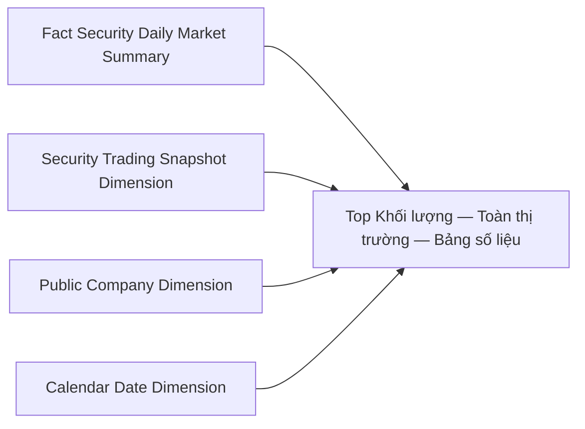

**Bảng grain:**

| Tên bảng | Grain |
|---|---|
| Fact Security Daily Market Summary | 1 row / mã CK / ngày |
| Security Trading Snapshot Dimension | 1 row / mã CK (SCD2) |
| Public Company Dimension | 1 row / mã CK (SCD2) |
| Calendar Date Dimension | 1 row / ngày |

---

#### Nhóm 7 — Top Khối lượng Toàn thị trường (Biểu đồ kỹ thuật)

##### READY

> **Phân loại:** Phân tích
> **Atomic:** `Security Trading Snapshot` ← MDDS.StockInfor — **READY** / `Securities Trade` ← OrderTrade.Trade_HOSE, Trade_HNX — **READY** / `Public Company Financial Report Value` ← IDS.data — **READY**

**Mockup:**

| Mã CK | Ngành | Giá mở cửa | Giá cao nhất | Giá thấp nhất | Giá đóng cửa | KLGD | Doanh thu | LNST |
|---|---|---|---|---|---|---|---|---|
| ROS / HOSE | Xây dựng | 26.50 | 27.00 | 25.80 | 26.00 | 4.100 Tr | 2.1 Tỷ | 0.3 Tỷ |

**Bảng KPI:**

| KPI ID | Tên KPI | Đơn vị | Tính chất | Công thức / Nguồn |
|---|---|---|---|---|
| K_GSTT_19 | Giá mở cửa | VNĐ | Cơ sở | `Security Trading Snapshot.Open Price` |
| K_GSTT_20 | Giá cao nhất | VNĐ | Cơ sở | `Security Trading Snapshot.High Price` |
| K_GSTT_21 | Giá thấp nhất | VNĐ | Cơ sở | `Security Trading Snapshot.Low Price` |
| K_GSTT_2 | Giá đóng cửa | VNĐ | Cơ sở | `Security Trading Snapshot.Close Price` |
| K_GSTT_1 | Tổng KLGD | Cổ phiếu | Phái sinh | `SUM(Total Match Volume)` trong [Từ ngày → Đến ngày] |
| K_GSTT_22 | Doanh thu | Tỷ VNĐ | Cơ sở | `Public Company Financial Report Value.Data Value` — forward-fill từ BCKQKD |
| K_GSTT_25 | Lợi nhuận sau thuế | Tỷ VNĐ | Cơ sở | `Public Company Financial Report Value.Data Value` — forward-fill từ BCKQKD |

> *Star Schema, Source, Lineage, Bảng grain: xem Nhóm 3 — Biểu đồ kỹ thuật Cổ phiếu*
> *Khác biệt khi bổ sung đầy đủ:*
> - Lineage đích: `RPT7["Top Khối lượng — Toàn thị trường — Biểu đồ kỹ thuật"]`
> - Không có filter tab thêm (Toàn thị trường)

---

#### Nhóm 8 — Top Khối lượng theo Sàn / Chỉ số (Bảng số liệu)

##### READY (4 KPI PENDING)

> **Phân loại:** Phân tích
> **Atomic:** `Security Trading Snapshot` ← MDDS.StockInfor — **READY** / `Securities Trade` ← OrderTrade.Trade_HOSE, Trade_HNX — **READY**

**Mockup:**

| STT | Mã CK | Ngành | Tổng KL | Giá đóng cửa | % Thay đổi | Vốn hóa | P/E | P/B |
|---|---|---|---|---|---|---|---|---|
| 1 | TLD / HOSE | Xây dựng | 1.413 Tr | 6.50 | +0.19% | — | — | — |

**Bảng KPI:**

| KPI ID | Tên KPI | Đơn vị | Tính chất | Công thức / Nguồn | Trạng thái |
|---|---|---|---|---|---|
| K_GSTT_1 | Tổng KLGD | Cổ phiếu | Phái sinh | `SUM(Total Match Volume)` trong [Từ ngày → Đến ngày] | READY |
| K_GSTT_2 | Giá đóng cửa | VNĐ | Cơ sở | `Security Trading Snapshot.Close Price` | READY |
| K_GSTT_3 | % Thay đổi | % | Phái sinh | `(Close Price − Reference Price) / Reference Price × 100` | READY |
| K_GSTT_49 | Số CP lưu hành | Cổ phiếu | Cơ sở | VSDC TT138.2025 Mẫu số 01 | **PENDING** — O_GSTT_13 |
| K_GSTT_50 | Vốn hóa | Tỷ VNĐ | Phái sinh | `Close Price × Shares Outstanding` | **PENDING** — O_GSTT_13 |
| K_GSTT_51 | P/E | lần (x) | Phái sinh | `Close Price ÷ (Net Profit After Tax ÷ Shares Outstanding)` | **PENDING** — O_GSTT_13 |
| K_GSTT_52 | P/B | lần (x) | Phái sinh | `Close Price ÷ (Equity ÷ Shares Outstanding)` | **PENDING** — O_GSTT_13 |

> *Star Schema, Source, Lineage, Bảng grain: xem Nhóm 6 — Top Khối lượng Toàn thị trường (Bảng số liệu)*
> *Khác biệt khi bổ sung đầy đủ:*
> - Lineage đích: `RPT8["Top Khối lượng — Sàn / Chỉ số — Bảng số liệu"]`
> - Filter tab HOSE / HNX / UPCOM: `WHERE Security_Trading_Snapshot_Dimension.Floor_Code = '<sàn>'`
> - Filter tab Chỉ số thị trường / Chỉ số nhóm ngành: `WHERE Security_Trading_Snapshot_Dimension.Index_Codes CONTAINS '<index_code>'`

---

#### Nhóm 9 — Top Khối lượng theo Sàn / Chỉ số (Biểu đồ kỹ thuật)

##### READY

> **Phân loại:** Phân tích
> **Atomic:** `Security Trading Snapshot` ← MDDS.StockInfor — **READY** / `Securities Trade` ← OrderTrade.Trade_HOSE, Trade_HNX — **READY** / `Public Company Financial Report Value` ← IDS.data — **READY**

**Mockup:**

| Mã CK | Ngành | Giá mở cửa | Giá cao nhất | Giá thấp nhất | Giá đóng cửa | KLGD | Doanh thu | LNST |
|---|---|---|---|---|---|---|---|---|
| TLD / HOSE | Xây dựng | 6.40 | 6.60 | 6.30 | 6.50 | 1.413 Tr | 1.8 Tỷ | 0.2 Tỷ |

**Bảng KPI:**

| KPI ID | Tên KPI | Đơn vị | Tính chất | Công thức / Nguồn |
|---|---|---|---|---|
| K_GSTT_19 | Giá mở cửa | VNĐ | Cơ sở | `Security Trading Snapshot.Open Price` |
| K_GSTT_20 | Giá cao nhất | VNĐ | Cơ sở | `Security Trading Snapshot.High Price` |
| K_GSTT_21 | Giá thấp nhất | VNĐ | Cơ sở | `Security Trading Snapshot.Low Price` |
| K_GSTT_2 | Giá đóng cửa | VNĐ | Cơ sở | `Security Trading Snapshot.Close Price` |
| K_GSTT_1 | Tổng KLGD | Cổ phiếu | Phái sinh | `SUM(Total Match Volume)` trong [Từ ngày → Đến ngày] |
| K_GSTT_22 | Doanh thu | Tỷ VNĐ | Cơ sở | `Public Company Financial Report Value.Data Value` — forward-fill từ BCKQKD |
| K_GSTT_25 | Lợi nhuận sau thuế | Tỷ VNĐ | Cơ sở | `Public Company Financial Report Value.Data Value` — forward-fill từ BCKQKD |

> *Star Schema, Source, Lineage, Bảng grain: xem Nhóm 3 — Biểu đồ kỹ thuật Cổ phiếu*
> *Khác biệt khi bổ sung đầy đủ:*
> - Lineage đích: `RPT9["Top Khối lượng — Sàn / Chỉ số — Biểu đồ kỹ thuật"]`
> - Filter tab HOSE / HNX / UPCOM: `WHERE Security_Trading_Snapshot_Dimension.Floor_Code = '<sàn>'`
> - Filter tab Chỉ số thị trường / Chỉ số nhóm ngành: `WHERE Security_Trading_Snapshot_Dimension.Index_Codes CONTAINS '<index_code>'`

---

### Tab Top Đột phá

> **Phân loại:** Phân tích
> **Reuse:** `Fact Security Daily Market Summary` — không tạo bảng mới
> **Cơ chế filter đột phá:** `Total Match Volume ngày chọn ÷ KLGDTB N ngày trước ≥ X lần` — tính tại query layer bằng window function; không cần cột mới trong mart — xem O_GSTT_16
> **Cơ chế filter tab:** sàn qua `Floor Code` trong `Security Trading Snapshot Dimension`; chỉ số qua `Index Codes` array trong `Security Trading Snapshot Dimension`

#### Nhóm 10 — Top Đột phá Toàn thị trường (Bảng số liệu)

##### READY một phần (K_GSTT_49–52 PENDING VSDC; K_GSTT_54–59 chờ BA xác nhận N — O_GSTT_16)

> **Phân loại:** Phân tích
> **Atomic:** `Security Trading Snapshot` ← MDDS.StockInfor — **READY** / `Securities Trade` ← OrderTrade.Trade_HOSE, Trade_HNX — **READY**

**Mockup:**

| STT | Mã CK | Khối lượng | Giá đóng cửa | Thay đổi (+/-) | % Thay đổi | Vốn hóa | P/E | P/B |
|---|---|---|---|---|---|---|---|---|
| 1 | SVI / HNX | 208.5 Tr | 50.20 | -3.20 | -5.99% | — | — | — |

**Source:** `Fact Security Daily Market Summary` → `Security Trading Snapshot Dimension`, `Public Company Dimension`, `Calendar Date Dimension`

**Bảng KPI:**

| KPI ID | Tên KPI | Đơn vị | Tính chất | Công thức / Nguồn | Trạng thái |
|---|---|---|---|---|---|
| K_GSTT_1 | Tổng KLGD | Cổ phiếu | Phái sinh | `SUM(Total Match Volume)` trong [Từ ngày → Đến ngày] | READY |
| K_GSTT_2 | Giá đóng cửa | VNĐ | Cơ sở | `Security Trading Snapshot.Close Price` | READY |
| K_GSTT_53 | Thay đổi (+/-) | VNĐ | Phái sinh | `Close Price − Reference Price` | READY |
| K_GSTT_3 | % Thay đổi | % | Phái sinh | `(Close Price − Reference Price) / Reference Price × 100` | READY |
| K_GSTT_49 | Số CP lưu hành | Cổ phiếu | Cơ sở | VSDC TT138.2025 Mẫu số 01 | **PENDING** — O_GSTT_13 |
| K_GSTT_50 | Vốn hóa | Tỷ VNĐ | Phái sinh | `Close Price × Shares Outstanding` | **PENDING** — O_GSTT_13 |
| K_GSTT_51 | P/E | lần (x) | Phái sinh | `Close Price ÷ (Net Profit After Tax ÷ Shares Outstanding)` | **PENDING** — O_GSTT_13 |
| K_GSTT_52 | P/B | lần (x) | Phái sinh | `Close Price ÷ (Equity ÷ Shares Outstanding)` | **PENDING** — O_GSTT_13 |
| K_GSTT_54 | KLGDTB 5 ngày | Cổ phiếu | Phái sinh | `AVG(Total Match Volume) OVER (PARTITION BY Symbol ORDER BY Trading Date ROWS BETWEEN 5 PRECEDING AND 1 PRECEDING)` | Chờ BA xác nhận N — O_GSTT_16 |
| K_GSTT_55 | KLGDTB 10 ngày | Cổ phiếu | Phái sinh | `AVG(Total Match Volume) OVER (PARTITION BY Symbol ORDER BY Trading Date ROWS BETWEEN 10 PRECEDING AND 1 PRECEDING)` | Chờ BA xác nhận N — O_GSTT_16 |
| K_GSTT_56 | KLGDTB 20 ngày | Cổ phiếu | Phái sinh | `AVG(Total Match Volume) OVER (PARTITION BY Symbol ORDER BY Trading Date ROWS BETWEEN 20 PRECEDING AND 1 PRECEDING)` | Chờ BA xác nhận N — O_GSTT_16 |
| K_GSTT_57 | Tỷ lệ KLGD / KLGDTB 5 ngày | lần (x) | Phái sinh | `Total Match Volume ngày chọn ÷ K_GSTT_54` | Chờ BA xác nhận N — O_GSTT_16 |
| K_GSTT_58 | Tỷ lệ KLGD / KLGDTB 10 ngày | lần (x) | Phái sinh | `Total Match Volume ngày chọn ÷ K_GSTT_55` | Chờ BA xác nhận N — O_GSTT_16 |
| K_GSTT_59 | Tỷ lệ KLGD / KLGDTB 20 ngày | lần (x) | Phái sinh | `Total Match Volume ngày chọn ÷ K_GSTT_56` | Chờ BA xác nhận N — O_GSTT_16 |

**Star Schema:**


**Lineage Mart → Báo cáo:**

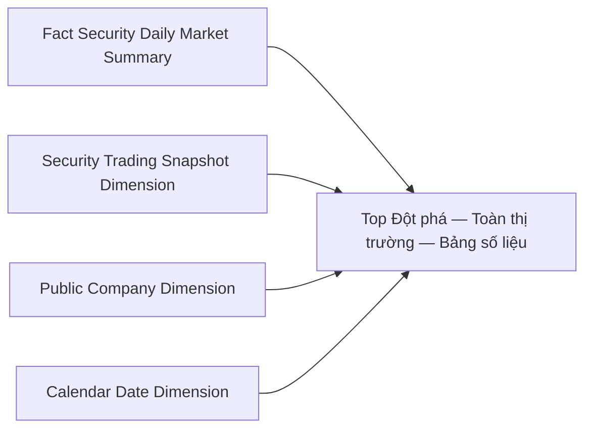

**Bảng grain:**

| Tên bảng | Grain |
|---|---|
| Fact Security Daily Market Summary | 1 row / mã CK / ngày |
| Security Trading Snapshot Dimension | 1 row / mã CK (SCD2) |
| Public Company Dimension | 1 row / mã CK (SCD2) |
| Calendar Date Dimension | 1 row / ngày |

---

#### Nhóm 11 — Top Đột phá Toàn thị trường (Biểu đồ kỹ thuật)

##### READY một phần (K_GSTT_54–59 chờ BA xác nhận N — O_GSTT_16)

> **Phân loại:** Phân tích
> **Atomic:** `Security Trading Snapshot` ← MDDS.StockInfor — **READY** / `Securities Trade` ← OrderTrade.Trade_HOSE, Trade_HNX — **READY** / `Public Company Financial Report Value` ← IDS.data — **READY**

**Mockup:**

| Mã CK | Ngành | Giá mở cửa | Giá cao nhất | Giá thấp nhất | Giá đóng cửa | KLGD | Doanh thu | LNST |
|---|---|---|---|---|---|---|---|---|
| SVI / HNX | Kim loại | 52.00 | 52.50 | 49.80 | 50.20 | 208.5 Tr | 3.4 Tỷ | 0.5 Tỷ |

**Bảng KPI:**

| KPI ID | Tên KPI | Đơn vị | Tính chất | Công thức / Nguồn | Trạng thái |
|---|---|---|---|---|---|
| K_GSTT_19 | Giá mở cửa | VNĐ | Cơ sở | `Security Trading Snapshot.Open Price` | READY |
| K_GSTT_20 | Giá cao nhất | VNĐ | Cơ sở | `Security Trading Snapshot.High Price` | READY |
| K_GSTT_21 | Giá thấp nhất | VNĐ | Cơ sở | `Security Trading Snapshot.Low Price` | READY |
| K_GSTT_2 | Giá đóng cửa | VNĐ | Cơ sở | `Security Trading Snapshot.Close Price` | READY |
| K_GSTT_1 | Tổng KLGD | Cổ phiếu | Phái sinh | `SUM(Total Match Volume)` trong [Từ ngày → Đến ngày] | READY |
| K_GSTT_22 | Doanh thu | Tỷ VNĐ | Cơ sở | `Public Company Financial Report Value.Data Value` — forward-fill từ BCKQKD | READY |
| K_GSTT_25 | Lợi nhuận sau thuế | Tỷ VNĐ | Cơ sở | `Public Company Financial Report Value.Data Value` — forward-fill từ BCKQKD | READY |
| K_GSTT_54 | KLGDTB 5 ngày | Cổ phiếu | Phái sinh | `AVG(Total Match Volume) OVER (PARTITION BY Symbol ORDER BY Trading Date ROWS BETWEEN 5 PRECEDING AND 1 PRECEDING)` | Chờ BA xác nhận N — O_GSTT_16 |
| K_GSTT_55 | KLGDTB 10 ngày | Cổ phiếu | Phái sinh | `AVG(Total Match Volume) OVER (PARTITION BY Symbol ORDER BY Trading Date ROWS BETWEEN 10 PRECEDING AND 1 PRECEDING)` | Chờ BA xác nhận N — O_GSTT_16 |
| K_GSTT_56 | KLGDTB 20 ngày | Cổ phiếu | Phái sinh | `AVG(Total Match Volume) OVER (PARTITION BY Symbol ORDER BY Trading Date ROWS BETWEEN 20 PRECEDING AND 1 PRECEDING)` | Chờ BA xác nhận N — O_GSTT_16 |
| K_GSTT_57 | Tỷ lệ KLGD / KLGDTB 5 ngày | lần (x) | Phái sinh | `Total Match Volume ngày chọn ÷ K_GSTT_54` | Chờ BA xác nhận N — O_GSTT_16 |
| K_GSTT_58 | Tỷ lệ KLGD / KLGDTB 10 ngày | lần (x) | Phái sinh | `Total Match Volume ngày chọn ÷ K_GSTT_55` | Chờ BA xác nhận N — O_GSTT_16 |
| K_GSTT_59 | Tỷ lệ KLGD / KLGDTB 20 ngày | lần (x) | Phái sinh | `Total Match Volume ngày chọn ÷ K_GSTT_56` | Chờ BA xác nhận N — O_GSTT_16 |

> *Star Schema, Source, Lineage, Bảng grain: xem Nhóm 3 — Biểu đồ kỹ thuật Cổ phiếu*
> *Khác biệt khi bổ sung đầy đủ:*
> - Lineage đích: `RPT11["Top Đột phá — Toàn thị trường — Biểu đồ kỹ thuật"]`
> - Không có filter tab thêm (Toàn thị trường)

---

#### Nhóm 12 — Top Đột phá theo Sàn / Chỉ số (Bảng số liệu)

##### READY một phần (K_GSTT_49–52 PENDING VSDC; K_GSTT_54–59 chờ BA xác nhận N — O_GSTT_16)

> **Phân loại:** Phân tích
> **Atomic:** `Security Trading Snapshot` ← MDDS.StockInfor — **READY** / `Securities Trade` ← OrderTrade.Trade_HOSE, Trade_HNX — **READY**

**Mockup:**

| STT | Mã CK | Khối lượng | Giá đóng cửa | Thay đổi (+/-) | % Thay đổi | Vốn hóa | P/E | P/B |
|---|---|---|---|---|---|---|---|---|
| 1 | TLD / HOSE | 1.413 Tr | 6.50 | +0.01 | +0.19% | — | — | — |

**Bảng KPI:**

| KPI ID | Tên KPI | Đơn vị | Tính chất | Công thức / Nguồn | Trạng thái |
|---|---|---|---|---|---|
| K_GSTT_1 | Tổng KLGD | Cổ phiếu | Phái sinh | `SUM(Total Match Volume)` trong [Từ ngày → Đến ngày] | READY |
| K_GSTT_2 | Giá đóng cửa | VNĐ | Cơ sở | `Security Trading Snapshot.Close Price` | READY |
| K_GSTT_53 | Thay đổi (+/-) | VNĐ | Phái sinh | `Close Price − Reference Price` | READY |
| K_GSTT_3 | % Thay đổi | % | Phái sinh | `(Close Price − Reference Price) / Reference Price × 100` | READY |
| K_GSTT_49 | Số CP lưu hành | Cổ phiếu | Cơ sở | VSDC TT138.2025 Mẫu số 01 | **PENDING** — O_GSTT_13 |
| K_GSTT_50 | Vốn hóa | Tỷ VNĐ | Phái sinh | `Close Price × Shares Outstanding` | **PENDING** — O_GSTT_13 |
| K_GSTT_51 | P/E | lần (x) | Phái sinh | `Close Price ÷ (Net Profit After Tax ÷ Shares Outstanding)` | **PENDING** — O_GSTT_13 |
| K_GSTT_52 | P/B | lần (x) | Phái sinh | `Close Price ÷ (Equity ÷ Shares Outstanding)` | **PENDING** — O_GSTT_13 |
| K_GSTT_54 | KLGDTB 5 ngày | Cổ phiếu | Phái sinh | `AVG(Total Match Volume) OVER (PARTITION BY Symbol ORDER BY Trading Date ROWS BETWEEN 5 PRECEDING AND 1 PRECEDING)` | Chờ BA xác nhận N — O_GSTT_16 |
| K_GSTT_55 | KLGDTB 10 ngày | Cổ phiếu | Phái sinh | `AVG(Total Match Volume) OVER (PARTITION BY Symbol ORDER BY Trading Date ROWS BETWEEN 10 PRECEDING AND 1 PRECEDING)` | Chờ BA xác nhận N — O_GSTT_16 |
| K_GSTT_56 | KLGDTB 20 ngày | Cổ phiếu | Phái sinh | `AVG(Total Match Volume) OVER (PARTITION BY Symbol ORDER BY Trading Date ROWS BETWEEN 20 PRECEDING AND 1 PRECEDING)` | Chờ BA xác nhận N — O_GSTT_16 |
| K_GSTT_57 | Tỷ lệ KLGD / KLGDTB 5 ngày | lần (x) | Phái sinh | `Total Match Volume ngày chọn ÷ K_GSTT_54` | Chờ BA xác nhận N — O_GSTT_16 |
| K_GSTT_58 | Tỷ lệ KLGD / KLGDTB 10 ngày | lần (x) | Phái sinh | `Total Match Volume ngày chọn ÷ K_GSTT_55` | Chờ BA xác nhận N — O_GSTT_16 |
| K_GSTT_59 | Tỷ lệ KLGD / KLGDTB 20 ngày | lần (x) | Phái sinh | `Total Match Volume ngày chọn ÷ K_GSTT_56` | Chờ BA xác nhận N — O_GSTT_16 |

> *Star Schema, Source, Lineage, Bảng grain: xem Nhóm 10 — Top Đột phá Toàn thị trường (Bảng số liệu)*
> *Khác biệt khi bổ sung đầy đủ:*
> - Lineage đích: `RPT12["Top Đột phá — Sàn / Chỉ số — Bảng số liệu"]`
> - Filter tab HOSE / HNX / UPCOM: `WHERE Security_Trading_Snapshot_Dimension.Floor_Code = '<sàn>'`
> - Filter tab Chỉ số thị trường / Chỉ số nhóm ngành: `WHERE Security_Trading_Snapshot_Dimension.Index_Codes CONTAINS '<index_code>'`

---

#### Nhóm 13 — Top Đột phá theo Sàn / Chỉ số (Biểu đồ kỹ thuật)

##### READY một phần (K_GSTT_54–59 chờ BA xác nhận N — O_GSTT_16)

> **Phân loại:** Phân tích
> **Atomic:** `Security Trading Snapshot` ← MDDS.StockInfor — **READY** / `Securities Trade` ← OrderTrade.Trade_HOSE, Trade_HNX — **READY** / `Public Company Financial Report Value` ← IDS.data — **READY**

**Mockup:**

| Mã CK | Ngành | Giá mở cửa | Giá cao nhất | Giá thấp nhất | Giá đóng cửa | KLGD | Doanh thu | LNST |
|---|---|---|---|---|---|---|---|---|
| TLD / HOSE | Xây dựng | 6.40 | 6.60 | 6.30 | 6.50 | 1.413 Tr | 1.8 Tỷ | 0.2 Tỷ |

**Bảng KPI:**

| KPI ID | Tên KPI | Đơn vị | Tính chất | Công thức / Nguồn | Trạng thái |
|---|---|---|---|---|---|
| K_GSTT_19 | Giá mở cửa | VNĐ | Cơ sở | `Security Trading Snapshot.Open Price` | READY |
| K_GSTT_20 | Giá cao nhất | VNĐ | Cơ sở | `Security Trading Snapshot.High Price` | READY |
| K_GSTT_21 | Giá thấp nhất | VNĐ | Cơ sở | `Security Trading Snapshot.Low Price` | READY |
| K_GSTT_2 | Giá đóng cửa | VNĐ | Cơ sở | `Security Trading Snapshot.Close Price` | READY |
| K_GSTT_1 | Tổng KLGD | Cổ phiếu | Phái sinh | `SUM(Total Match Volume)` trong [Từ ngày → Đến ngày] | READY |
| K_GSTT_22 | Doanh thu | Tỷ VNĐ | Cơ sở | `Public Company Financial Report Value.Data Value` — forward-fill từ BCKQKD | READY |
| K_GSTT_25 | Lợi nhuận sau thuế | Tỷ VNĐ | Cơ sở | `Public Company Financial Report Value.Data Value` — forward-fill từ BCKQKD | READY |
| K_GSTT_54 | KLGDTB 5 ngày | Cổ phiếu | Phái sinh | `AVG(Total Match Volume) OVER (PARTITION BY Symbol ORDER BY Trading Date ROWS BETWEEN 5 PRECEDING AND 1 PRECEDING)` | Chờ BA xác nhận N — O_GSTT_16 |
| K_GSTT_55 | KLGDTB 10 ngày | Cổ phiếu | Phái sinh | `AVG(Total Match Volume) OVER (PARTITION BY Symbol ORDER BY Trading Date ROWS BETWEEN 10 PRECEDING AND 1 PRECEDING)` | Chờ BA xác nhận N — O_GSTT_16 |
| K_GSTT_56 | KLGDTB 20 ngày | Cổ phiếu | Phái sinh | `AVG(Total Match Volume) OVER (PARTITION BY Symbol ORDER BY Trading Date ROWS BETWEEN 20 PRECEDING AND 1 PRECEDING)` | Chờ BA xác nhận N — O_GSTT_16 |
| K_GSTT_57 | Tỷ lệ KLGD / KLGDTB 5 ngày | lần (x) | Phái sinh | `Total Match Volume ngày chọn ÷ K_GSTT_54` | Chờ BA xác nhận N — O_GSTT_16 |
| K_GSTT_58 | Tỷ lệ KLGD / KLGDTB 10 ngày | lần (x) | Phái sinh | `Total Match Volume ngày chọn ÷ K_GSTT_55` | Chờ BA xác nhận N — O_GSTT_16 |
| K_GSTT_59 | Tỷ lệ KLGD / KLGDTB 20 ngày | lần (x) | Phái sinh | `Total Match Volume ngày chọn ÷ K_GSTT_56` | Chờ BA xác nhận N — O_GSTT_16 |

> *Star Schema, Source, Lineage, Bảng grain: xem Nhóm 3 — Biểu đồ kỹ thuật Cổ phiếu*
> *Khác biệt khi bổ sung đầy đủ:*
> - Lineage đích: `RPT13["Top Đột phá — Sàn / Chỉ số — Biểu đồ kỹ thuật"]`
> - Filter tab HOSE / HNX / UPCOM: `WHERE Security_Trading_Snapshot_Dimension.Floor_Code = '<sàn>'`
> - Filter tab Chỉ số thị trường / Chỉ số nhóm ngành: `WHERE Security_Trading_Snapshot_Dimension.Index_Codes CONTAINS '<index_code>'`

---

### Tab Top Giá trị Giao dịch

> **Phân loại:** Phân tích
> **Reuse:** `Fact Security Daily Market Summary` — không tạo bảng mới
> **Cơ chế ranking:** `ORDER BY Total Match Value DESC LIMIT N` tại query layer
> **Cơ chế filter tab:** sàn qua `Floor Code` trong `Security Trading Snapshot Dimension`; chỉ số qua `Index Codes` array trong `Security Trading Snapshot Dimension`

#### Nhóm 14 — Top Giá trị Toàn thị trường / Sàn / Chỉ số (Bảng số liệu)

##### READY (4 KPI PENDING)

> **Phân loại:** Phân tích
> **Atomic:** `Security Trading Snapshot` ← MDDS.StockInfor — **READY** / `Securities Trade` ← OrderTrade.Trade_HOSE, Trade_HNX — **READY**

**Mockup:**

| STT | Mã CK | Ngành | GT GD | Giá đóng cửa | % Thay đổi | Vốn hóa | P/E | P/B |
|---|---|---|---|---|---|---|---|---|
| 1 | MWG / HOSE | Phân phối hàng chủ nhãn | 69.64 Tỷ | 124.40 | +1.63% | — | — | — |

**Bảng KPI:**

| KPI ID | Tên KPI | Đơn vị | Tính chất | Công thức / Nguồn | Trạng thái |
|---|---|---|---|---|---|
| K_GSTT_4 | Tổng GTGD | Tỷ VNĐ | Phái sinh | `SUM(Total Match Value)` trong [Từ ngày → Đến ngày] — tiêu chí ranking | READY |
| K_GSTT_2 | Giá đóng cửa | VNĐ | Cơ sở | `Security Trading Snapshot.Close Price` | READY |
| K_GSTT_3 | % Thay đổi | % | Phái sinh | `(Close Price − Reference Price) / Reference Price × 100` | READY |
| K_GSTT_49 | Số CP lưu hành | Cổ phiếu | Cơ sở | VSDC TT138.2025 Mẫu số 01 | **PENDING** — O_GSTT_13 |
| K_GSTT_50 | Vốn hóa | Tỷ VNĐ | Phái sinh | `Close Price × Shares Outstanding` | **PENDING** — O_GSTT_13 |
| K_GSTT_51 | P/E | lần (x) | Phái sinh | `Close Price ÷ (Net Profit After Tax ÷ Shares Outstanding)` | **PENDING** — O_GSTT_13 |
| K_GSTT_52 | P/B | lần (x) | Phái sinh | `Close Price ÷ (Equity ÷ Shares Outstanding)` | **PENDING** — O_GSTT_13 |

> *Star Schema, Source, Lineage, Bảng grain: xem Nhóm 6 — Top Khối lượng Toàn thị trường (Bảng số liệu)*
> *Khác biệt khi bổ sung đầy đủ:*
> - Lineage đích: `RPT14["Top Giá trị — Toàn thị trường / Sàn / Chỉ số — Bảng số liệu"]`
> - Ranking metric: `ORDER BY Total_Match_Value DESC` (thay vì `Total_Match_Volume`)
> - Filter tab HOSE / HNX / UPCOM: `WHERE Security_Trading_Snapshot_Dimension.Floor_Code = '<sàn>'`
> - Filter tab Chỉ số thị trường / Chỉ số nhóm ngành: `WHERE Security_Trading_Snapshot_Dimension.Index_Codes CONTAINS '<index_code>'`

---

#### Nhóm 15 — Top Giá trị Toàn thị trường (Biểu đồ kỹ thuật)

##### READY

> **Phân loại:** Phân tích
> **Atomic:** `Security Trading Snapshot` ← MDDS.StockInfor — **READY** / `Securities Trade` ← OrderTrade.Trade_HOSE, Trade_HNX — **READY** / `Public Company Financial Report Value` ← IDS.data — **READY**

**Mockup:**

| Mã CK | Ngành | Giá mở cửa | Giá cao nhất | Giá thấp nhất | Giá đóng cửa | KLGD | Doanh thu | LNST |
|---|---|---|---|---|---|---|---|---|
| MWG / HOSE | Phân phối hàng chủ nhãn | 123.50 | 125.00 | 123.00 | 124.40 | 560 Tr | 32.4 Tỷ | 3.1 Tỷ |

**Bảng KPI:**

| KPI ID | Tên KPI | Đơn vị | Tính chất | Công thức / Nguồn |
|---|---|---|---|---|
| K_GSTT_19 | Giá mở cửa | VNĐ | Cơ sở | `Security Trading Snapshot.Open Price` |
| K_GSTT_20 | Giá cao nhất | VNĐ | Cơ sở | `Security Trading Snapshot.High Price` |
| K_GSTT_21 | Giá thấp nhất | VNĐ | Cơ sở | `Security Trading Snapshot.Low Price` |
| K_GSTT_2 | Giá đóng cửa | VNĐ | Cơ sở | `Security Trading Snapshot.Close Price` |
| K_GSTT_1 | Tổng KLGD | Cổ phiếu | Phái sinh | `SUM(Total Match Volume)` trong [Từ ngày → Đến ngày] |
| K_GSTT_22 | Doanh thu | Tỷ VNĐ | Cơ sở | `Public Company Financial Report Value.Data Value` — forward-fill từ BCKQKD |
| K_GSTT_25 | Lợi nhuận sau thuế | Tỷ VNĐ | Cơ sở | `Public Company Financial Report Value.Data Value` — forward-fill từ BCKQKD |

> *Star Schema, Source, Lineage, Bảng grain: xem Nhóm 3 — Biểu đồ kỹ thuật Cổ phiếu*
> *Khác biệt khi bổ sung đầy đủ:*
> - Lineage đích: `RPT15["Top Giá trị — Toàn thị trường — Biểu đồ kỹ thuật"]`
> - Không có filter tab thêm (Toàn thị trường)

---

### Tab Top Tăng Giá

> **Phân loại:** Phân tích
> **Reuse:** `Fact Security Daily Market Summary` — không tạo bảng mới
> **Cơ chế filter:** `% Thay đổi > 0` — tính tại query layer từ `Close_Price` và `Reference_Price`; sắp xếp `ORDER BY (Close_Price - Reference_Price) / Reference_Price DESC LIMIT N`
> **Màu sắc presentation:** `% Thay đổi` và `Thay đổi (+/-)` tô màu xanh khi dương / đỏ khi âm / xám khi = 0 — xử lý tại presentation layer; mart không thêm cột.
> **Cơ chế filter tab:** sàn qua `Floor Code` trong `Security Trading Snapshot Dimension`; chỉ số qua `Index Codes` array trong `Security Trading Snapshot Dimension`
> **Danh sách chỉ số TT (dropdown):** VN30, HNX30, VN100, VNALL, VNMID, VNSML (và các chỉ số khác theo danh mục)
> **Danh sách chỉ số nhóm ngành (dropdown):** Ngân hàng, Bất động sản, Xây dựng, Kim loại, Bán lẻ, Phần mềm, Dầu khí (và các ngành khác theo danh mục)

#### Nhóm 16 — Top Tăng Giá (Bảng số liệu)

##### READY (4 KPI PENDING)

> **Phân loại:** Phân tích
> **Atomic:** `Security Trading Snapshot` ← MDDS.StockInfor — **READY** / `Securities Trade` ← OrderTrade.Trade_HOSE, Trade_HNX — **READY**

**Mockup:**

| STT | Mã | Ngành | % Thay đổi | KLGD | Giá đóng cửa | Vốn hóa | P/E | P/B |
|---|---|---|---|---|---|---|---|---|
| 1 | ACM / HNX | Khai khoáng | +25.00% | 178.7 Tr | 0.50 | 0.02 Tỷ | — | 0.4x |
| 2 | SPP / HOSE | Containers & Đóng gói | +7.69% | 44.9 Tr | 4.20 | 0.16 Tỷ | 7x | 0.9x |
| 3 | MBG / HNX | Vật liệu XD & Nội thất | +9.78% | 30.7 Tr | 20.20 | 0.77 Tỷ | 45x | 1.7x |

**Bảng KPI:**

| KPI ID | Tên KPI | Đơn vị | Tính chất | Công thức / Nguồn | Trạng thái |
|---|---|---|---|---|---|
| K_GSTT_3 | % Thay đổi | % | Phái sinh | `(Close Price − Reference Price) / Reference Price × 100` — tiêu chí filter (> 0) và ranking DESC | READY |
| K_GSTT_1 | Tổng KLGD | Cổ phiếu | Phái sinh | `SUM(Total Match Volume)` trong [Từ ngày → Đến ngày] | READY |
| K_GSTT_2 | Giá đóng cửa | VNĐ | Cơ sở | `Security Trading Snapshot.Close Price` | READY |
| K_GSTT_49 | Số CP lưu hành | Cổ phiếu | Cơ sở | VSDC TT138.2025 Mẫu số 01 | **PENDING** — O_GSTT_13 |
| K_GSTT_50 | Vốn hóa | Tỷ VNĐ | Phái sinh | `Close Price × Shares Outstanding` | **PENDING** — O_GSTT_13 |
| K_GSTT_51 | P/E | lần (x) | Phái sinh | `Close Price ÷ (Net Profit After Tax ÷ Shares Outstanding)` | **PENDING** — O_GSTT_13 |
| K_GSTT_52 | P/B | lần (x) | Phái sinh | `Close Price ÷ (Equity ÷ Shares Outstanding)` | **PENDING** — O_GSTT_13 |

> *Star Schema, Source, Lineage, Bảng grain: xem Nhóm 6 — Top Khối lượng Toàn thị trường (Bảng số liệu)*
> *Khác biệt khi bổ sung đầy đủ:*
> - Lineage đích: `RPT16["Top Tăng Giá — Bảng số liệu"]`
> - Filter: `WHERE (Close_Price - Reference_Price) / Reference_Price > 0`
> - Ranking: `ORDER BY (Close_Price - Reference_Price) / Reference_Price DESC LIMIT N`
> - Filter tab HOSE / HNX / UPCOM: `WHERE Security_Trading_Snapshot_Dimension.Floor_Code = '<sàn>'`
> - Filter tab Chỉ số thị trường / Chỉ số nhóm ngành: `WHERE Security_Trading_Snapshot_Dimension.Index_Codes CONTAINS '<index_code>'`

---

#### Nhóm 17 — Top Tăng Giá (Biểu đồ kỹ thuật)

##### READY

> **Phân loại:** Phân tích
> **Atomic:** `Security Trading Snapshot` ← MDDS.StockInfor — **READY** / `Securities Trade` ← OrderTrade.Trade_HOSE, Trade_HNX — **READY** / `Public Company Financial Report Value` ← IDS.data — **READY**

**Mockup:**

| Mã CK | Ngành | Giá mở cửa | Giá cao nhất | Giá thấp nhất | Giá đóng cửa | KLGD | Doanh thu | LNST |
|---|---|---|---|---|---|---|---|---|
| ACM / HNX | Khai khoáng | 0.40 | 0.50 | 0.40 | 0.50 | 178.7 Tr | 0.8 Tỷ | 0.1 Tỷ |

**Bảng KPI:**

| KPI ID | Tên KPI | Đơn vị | Tính chất | Công thức / Nguồn |
|---|---|---|---|---|
| K_GSTT_19 | Giá mở cửa | VNĐ | Cơ sở | `Security Trading Snapshot.Open Price` |
| K_GSTT_20 | Giá cao nhất | VNĐ | Cơ sở | `Security Trading Snapshot.High Price` |
| K_GSTT_21 | Giá thấp nhất | VNĐ | Cơ sở | `Security Trading Snapshot.Low Price` |
| K_GSTT_2 | Giá đóng cửa | VNĐ | Cơ sở | `Security Trading Snapshot.Close Price` |
| K_GSTT_1 | Tổng KLGD | Cổ phiếu | Phái sinh | `SUM(Total Match Volume)` trong [Từ ngày → Đến ngày] |
| K_GSTT_22 | Doanh thu | Tỷ VNĐ | Cơ sở | `Public Company Financial Report Value.Data Value` — forward-fill từ BCKQKD |
| K_GSTT_25 | Lợi nhuận sau thuế | Tỷ VNĐ | Cơ sở | `Public Company Financial Report Value.Data Value` — forward-fill từ BCKQKD |

> *Star Schema, Source, Lineage, Bảng grain: xem Nhóm 3 — Biểu đồ kỹ thuật Cổ phiếu*
> *Khác biệt khi bổ sung đầy đủ:*
> - Lineage đích: `RPT17["Top Tăng Giá — Biểu đồ kỹ thuật"]`
> - Filter: `WHERE (Close_Price - Reference_Price) / Reference_Price > 0 ORDER BY (Close_Price - Reference_Price) / Reference_Price DESC LIMIT N`
> - Filter tab HOSE / HNX / UPCOM: `WHERE Security_Trading_Snapshot_Dimension.Floor_Code = '<sàn>'`
> - Filter tab Chỉ số thị trường / Chỉ số nhóm ngành: `WHERE Security_Trading_Snapshot_Dimension.Index_Codes CONTAINS '<index_code>'`

---

### Tab Top Giảm Giá

> **Phân loại:** Phân tích
> **Reuse:** `Fact Security Daily Market Summary` — không tạo bảng mới
> **Cơ chế filter:** `% Thay đổi < 0` — tính tại query layer; sắp xếp `ORDER BY (Close_Price - Reference_Price) / Reference_Price ASC LIMIT N` (giảm nhiều nhất lên đầu)
> **Màu sắc presentation:** `% Thay đổi` và `Thay đổi (+/-)` tô màu xanh khi dương / đỏ khi âm / xám khi = 0 — xử lý tại presentation layer; mart không thêm cột.
> **Cơ chế filter tab:** sàn qua `Floor Code` trong `Security Trading Snapshot Dimension`; chỉ số qua `Index Codes` array trong `Security Trading Snapshot Dimension`

#### Nhóm 18 — Top Giảm Giá (Bảng số liệu)

##### READY (4 KPI PENDING)

> **Phân loại:** Phân tích
> **Atomic:** `Security Trading Snapshot` ← MDDS.StockInfor — **READY** / `Securities Trade` ← OrderTrade.Trade_HOSE, Trade_HNX — **READY**

**Mockup:**

| STT | Mã CK | Ngành | % Thay đổi | KLGD | Giá | Vốn hóa | P/E | P/B |
|---|---|---|---|---|---|---|---|---|
| 1 | DPS / HNX | Thép & Sản phẩm thép | -20.00% | 130.2 Tr | 0.40 | 15.5 Tỷ | — | 0.2x |
| 2 | FRM / HOSE | Lâm sản và Chế biến gỗ | -14.90% | 7.9 Tr | 14.30 | 196.6 Tỷ | 24x | 1.0x |
| 3 | VLB / HNX | Vật liệu XD & Nội thất | -13.70% | 1.9 Tr | 30.90 | 1678.1 Tỷ | 12x | 0.9x |

> **Ghi chú mockup:** Cột "Giá" = Giá đóng cửa (`Close Price`). Ranking theo `% Thay đổi ASC` (giảm nhiều nhất lên đầu). Vốn hóa `—` = PENDING do O_GSTT_13.

**Bảng KPI:**

| KPI ID | Tên KPI | Đơn vị | Tính chất | Công thức / Nguồn | Trạng thái |
|---|---|---|---|---|---|
| K_GSTT_3 | % Thay đổi | % | Phái sinh | `(Close Price − Reference Price) / Reference Price × 100` — tiêu chí filter (< 0) và ranking ASC | READY |
| K_GSTT_1 | Tổng KLGD | Cổ phiếu | Phái sinh | `SUM(Total Match Volume)` trong [Từ ngày → Đến ngày] | READY |
| K_GSTT_2 | Giá đóng cửa | VNĐ | Cơ sở | `Security Trading Snapshot.Close Price` | READY |
| K_GSTT_49 | Số CP lưu hành | Cổ phiếu | Cơ sở | VSDC TT138.2025 Mẫu số 01 | **PENDING** — O_GSTT_13 |
| K_GSTT_50 | Vốn hóa | Tỷ VNĐ | Phái sinh | `Close Price × Shares Outstanding` | **PENDING** — O_GSTT_13 |
| K_GSTT_51 | P/E | lần (x) | Phái sinh | `Close Price ÷ (Net Profit After Tax ÷ Shares Outstanding)` | **PENDING** — O_GSTT_13 |
| K_GSTT_52 | P/B | lần (x) | Phái sinh | `Close Price ÷ (Equity ÷ Shares Outstanding)` | **PENDING** — O_GSTT_13 |

> *Star Schema, Source, Lineage, Bảng grain: xem Nhóm 6 — Top Khối lượng Toàn thị trường (Bảng số liệu)*
> *Khác biệt khi bổ sung đầy đủ:*
> - Lineage đích: `RPT18["Top Giảm Giá — Bảng số liệu"]`
> - Filter: `WHERE (Close_Price - Reference_Price) / Reference_Price < 0`
> - Ranking: `ORDER BY (Close_Price - Reference_Price) / Reference_Price ASC LIMIT N`
> - Filter tab HOSE / HNX / UPCOM: `WHERE Security_Trading_Snapshot_Dimension.Floor_Code = '<sàn>'`
> - Filter tab Chỉ số thị trường / Chỉ số nhóm ngành: `WHERE Security_Trading_Snapshot_Dimension.Index_Codes CONTAINS '<index_code>'`

---

#### Nhóm 19 — Top Giảm Giá (Biểu đồ kỹ thuật)

##### READY

> **Phân loại:** Phân tích
> **Atomic:** `Security Trading Snapshot` ← MDDS.StockInfor — **READY** / `Securities Trade` ← OrderTrade.Trade_HOSE, Trade_HNX — **READY** / `Public Company Financial Report Value` ← IDS.data — **READY**

**Mockup:**

| Mã CK | Ngành | Giá mở cửa | Giá cao nhất | Giá thấp nhất | Giá đóng cửa | KLGD | Doanh thu | LNST |
|---|---|---|---|---|---|---|---|---|
| DPS / HNX | Thép & Sản phẩm thép | 0.50 | 0.50 | 0.40 | 0.40 | 130.2 Tr | 0.3 Tỷ | -0.1 Tỷ |

**Bảng KPI:**

| KPI ID | Tên KPI | Đơn vị | Tính chất | Công thức / Nguồn |
|---|---|---|---|---|
| K_GSTT_19 | Giá mở cửa | VNĐ | Cơ sở | `Security Trading Snapshot.Open Price` |
| K_GSTT_20 | Giá cao nhất | VNĐ | Cơ sở | `Security Trading Snapshot.High Price` |
| K_GSTT_21 | Giá thấp nhất | VNĐ | Cơ sở | `Security Trading Snapshot.Low Price` |
| K_GSTT_2 | Giá đóng cửa | VNĐ | Cơ sở | `Security Trading Snapshot.Close Price` |
| K_GSTT_1 | Tổng KLGD | Cổ phiếu | Phái sinh | `SUM(Total Match Volume)` trong [Từ ngày → Đến ngày] |
| K_GSTT_22 | Doanh thu | Tỷ VNĐ | Cơ sở | `Public Company Financial Report Value.Data Value` — forward-fill từ BCKQKD |
| K_GSTT_25 | Lợi nhuận sau thuế | Tỷ VNĐ | Cơ sở | `Public Company Financial Report Value.Data Value` — forward-fill từ BCKQKD |

> *Star Schema, Source, Lineage, Bảng grain: xem Nhóm 3 — Biểu đồ kỹ thuật Cổ phiếu*
> *Khác biệt khi bổ sung đầy đủ:*
> - Lineage đích: `RPT19["Top Giảm Giá — Biểu đồ kỹ thuật"]`
> - Filter: `WHERE (Close_Price - Reference_Price) / Reference_Price < 0 ORDER BY (Close_Price - Reference_Price) / Reference_Price ASC LIMIT N`
> - Filter tab HOSE / HNX / UPCOM: `WHERE Security_Trading_Snapshot_Dimension.Floor_Code = '<sàn>'`
> - Filter tab Chỉ số thị trường / Chỉ số nhóm ngành: `WHERE Security_Trading_Snapshot_Dimension.Index_Codes CONTAINS '<index_code>'`

---

### Tab Top Vượt Đỉnh

> **Phân loại:** Phân tích
> **Reuse:** `Fact Security Daily Market Summary` — không tạo bảng mới
> **Định nghĩa Vượt Đỉnh:** `Close Price ngày chọn > MAX(High Price) trong khoảng [3 tháng / 6 tháng / 1 năm] trước ngày chọn` — tính tại query layer bằng window function; không cần cột mới trong mart
> **Bộ lọc thời gian:** preset cố định **3 THÁNG / 6 THÁNG / 1 NĂM**
> **Ranking:** `ORDER BY Total Match Value DESC LIMIT N`
> **Cơ chế filter tab:** sàn qua `Floor Code` trong `Security Trading Snapshot Dimension`; chỉ số qua `Index Codes` array trong `Security Trading Snapshot Dimension`

#### Nhóm 20 — Top Vượt Đỉnh (Bảng số liệu)

##### READY một phần (2 KPI PENDING — O_GSTT_13)

> **Phân loại:** Phân tích
> **Atomic:** `Security Trading Snapshot` ← MDDS.StockInfor — **READY** / `Securities Trade` ← OrderTrade.Trade_HOSE, Trade_HNX — **READY**

**Mockup (tab 3 THÁNG):**

| STT | Mã | Ngành | Khối lượng | Giá đóng cửa | % Thay đổi | Đỉnh Cũ | P/E | P/B |
|---|---|---|---|---|---|---|---|---|
| 1 | MWG / HOSE | Phân phối hàng chủ nhãn | 0.8 Tr | 123.70 | +1.09% | 122.40 | 24x | 4.2x |
| 2 | FPT / HOSE | Phần mềm | 0.9 Tr | 57.70 | +1.58% | 57.40 | 14x | 3.2x |
| 3 | VJC / HOSE | Hàng không | 0.4 Tr | 139.50 | +0.94% | 138.70 | 22x | 3.6x |

> **Ghi chú mockup:** Đỉnh Cũ = `MAX(High Price)` trong khoảng preset trước ngày chọn. Điều kiện vượt đỉnh: `Close Price > Đỉnh Cũ`. Ranking theo GT GD giảm dần — footer: "HIỂN THỊ 14 / 14 MÃ VƯỢT ĐỈNH 3 THÁNG · SẮP XẾP THEO GT GD".

**Bảng KPI:**

| KPI ID | Tên KPI | Đơn vị | Tính chất | Công thức / Nguồn | Trạng thái |
|---|---|---|---|---|---|
| K_GSTT_1 | Tổng KLGD | Cổ phiếu | Phái sinh | `SUM(Total Match Volume)` trong ngày chọn | READY |
| K_GSTT_2 | Giá đóng cửa | VNĐ | Cơ sở | `Security Trading Snapshot.Close Price` | READY |
| K_GSTT_3 | % Thay đổi | % | Phái sinh | `(Close Price − Reference Price) / Reference Price × 100` | READY |
| K_GSTT_60 | Đỉnh Cũ | VNĐ | Phái sinh | `MAX(High Price) OVER (PARTITION BY Symbol ORDER BY Trading Date ROWS BETWEEN <preset> PRECEDING AND 1 PRECEDING)` — preset: 3 THÁNG / 6 THÁNG / 1 NĂM | READY |
| K_GSTT_4 | Tổng GTGD | Tỷ VNĐ | Phái sinh | `SUM(Total Match Value)` trong ngày chọn — tiêu chí ranking | READY |
| K_GSTT_51 | P/E | lần (x) | Phái sinh | `Close Price ÷ (Net Profit After Tax ÷ Shares Outstanding)` | **PENDING** — O_GSTT_13 |
| K_GSTT_52 | P/B | lần (x) | Phái sinh | `Close Price ÷ (Equity ÷ Shares Outstanding)` | **PENDING** — O_GSTT_13 |

> **Lưu ý thiết kế:** `K_GSTT_60 (Đỉnh Cũ)` phái sinh hoàn toàn từ `High Price` đã có trong mart — không cần cột mới. Preset thời gian là tham số query layer.

> *Star Schema, Source, Lineage, Bảng grain: xem Nhóm 6 — Top Khối lượng Toàn thị trường (Bảng số liệu)*
> *Khác biệt khi bổ sung đầy đủ:*
> - Lineage đích: `RPT20["Top Vượt Đỉnh — Bảng số liệu"]`
> - Filter vượt đỉnh: `WHERE Close_Price > MAX(High_Price) OVER (PARTITION BY Symbol ORDER BY Trading_Date ROWS BETWEEN <preset> PRECEDING AND 1 PRECEDING)`
> - Ranking: `ORDER BY Total_Match_Value DESC LIMIT N`
> - Filter tab HOSE / HNX / UPCOM: `WHERE Security_Trading_Snapshot_Dimension.Floor_Code = '<sàn>'`
> - Filter tab Chỉ số thị trường / Chỉ số nhóm ngành: `WHERE Security_Trading_Snapshot_Dimension.Index_Codes CONTAINS '<index_code>'`

---

#### Nhóm 21 — Top Vượt Đỉnh (Biểu đồ kỹ thuật)

##### READY

> **Phân loại:** Phân tích
> **Atomic:** `Security Trading Snapshot` ← MDDS.StockInfor — **READY** / `Securities Trade` ← OrderTrade.Trade_HOSE, Trade_HNX — **READY** / `Public Company Financial Report Value` ← IDS.data — **READY**

**Mockup:**

| Mã CK | Ngành | Giá mở cửa | Giá cao nhất | Giá thấp nhất | Giá đóng cửa | KLGD | Doanh thu | LNST |
|---|---|---|---|---|---|---|---|---|
| MWG / HOSE | Phân phối hàng chủ nhãn | 122.50 | 124.00 | 122.00 | 123.70 | 0.8 Tr | 32.4 Tỷ | 3.1 Tỷ |

**Bảng KPI:**

| KPI ID | Tên KPI | Đơn vị | Tính chất | Công thức / Nguồn |
|---|---|---|---|---|
| K_GSTT_19 | Giá mở cửa | VNĐ | Cơ sở | `Security Trading Snapshot.Open Price` |
| K_GSTT_20 | Giá cao nhất | VNĐ | Cơ sở | `Security Trading Snapshot.High Price` |
| K_GSTT_21 | Giá thấp nhất | VNĐ | Cơ sở | `Security Trading Snapshot.Low Price` |
| K_GSTT_2 | Giá đóng cửa | VNĐ | Cơ sở | `Security Trading Snapshot.Close Price` |
| K_GSTT_1 | Tổng KLGD | Cổ phiếu | Phái sinh | `SUM(Total Match Volume)` trong ngày chọn |
| K_GSTT_60 | Đỉnh Cũ | VNĐ | Phái sinh | `MAX(High Price) OVER (PARTITION BY Symbol ORDER BY Trading Date ROWS BETWEEN <preset> PRECEDING AND 1 PRECEDING)` |
| K_GSTT_22 | Doanh thu | Tỷ VNĐ | Cơ sở | `Public Company Financial Report Value.Data Value` — forward-fill từ BCKQKD |
| K_GSTT_25 | Lợi nhuận sau thuế | Tỷ VNĐ | Cơ sở | `Public Company Financial Report Value.Data Value` — forward-fill từ BCKQKD |

> *Star Schema, Source, Lineage, Bảng grain: xem Nhóm 3 — Biểu đồ kỹ thuật Cổ phiếu*
> *Khác biệt khi bổ sung đầy đủ:*
> - Lineage đích: `RPT21["Top Vượt Đỉnh — Biểu đồ kỹ thuật"]`
> - Filter vượt đỉnh: `WHERE Close_Price > MAX(High_Price) OVER (PARTITION BY Symbol ORDER BY Trading_Date ROWS BETWEEN <preset> PRECEDING AND 1 PRECEDING)`
> - Ranking: `ORDER BY Total_Match_Value DESC LIMIT N`
> - Filter tab HOSE / HNX / UPCOM: `WHERE Security_Trading_Snapshot_Dimension.Floor_Code = '<sàn>'`
> - Filter tab Chỉ số thị trường / Chỉ số nhóm ngành: `WHERE Security_Trading_Snapshot_Dimension.Index_Codes CONTAINS '<index_code>'`

---

### Tab Top Thùng Đáy

> **Phân loại:** Phân tích
> **Reuse:** `Fact Security Daily Market Summary` — không tạo bảng mới
> **Định nghĩa Thùng Đáy:** `Close Price ngày chọn < MIN(Low Price) trong khoảng [3 tháng / 6 tháng / 1 năm] trước ngày chọn` — tính tại query layer; không cần cột mới trong mart
> **Bộ lọc thời gian:** preset cố định **3 THÁNG / 6 THÁNG / 1 NĂM**
> **Ranking:** `ORDER BY Total Match Value DESC LIMIT N`
> **Cơ chế filter tab:** sàn qua `Floor Code` trong `Security Trading Snapshot Dimension`; chỉ số qua `Index Codes` array trong `Security Trading Snapshot Dimension`

#### Nhóm 22 — Top Thùng Đáy (Bảng số liệu)

##### READY một phần (2 KPI PENDING — O_GSTT_13)

> **Phân loại:** Phân tích
> **Atomic:** `Security Trading Snapshot` ← MDDS.StockInfor — **READY** / `Securities Trade` ← OrderTrade.Trade_HOSE, Trade_HNX — **READY**

**Mockup (tab 3 THÁNG):**

| STT | Mã | Ngành | Khối lượng | Giá đóng cửa | % Thay đổi | Đáy Cũ | P/E | P/B |
|---|---|---|---|---|---|---|---|---|
| 1 | SCR / HOSE | Bất động sản | 1.6 Tr | 6.60 | -1.97% | 6.47 | 19x | 0.7x |
| 2 | ASM / HOSE | Nuôi trồng nông & hải sản | 0.8 Tr | 5.60 | -2.52% | 5.93 | 29x | 0.6x |
| 3 | HOC / HNX | Bất động sản | 1.5 Tr | 1.24 | -2.36% | 1.25 | -15x | 0.2x |

> **Ghi chú mockup:** Đáy Cũ = `MIN(Low Price)` trong khoảng preset trước ngày chọn. Điều kiện thùng đáy: `Close Price < Đáy Cũ`. P/E âm (HOC: -15x) — trường hợp lỗ — hiển thị bình thường trong mart. Ranking theo GT GD giảm dần — footer: "HIỂN THỊ 8 / 8 MÃ THÙNG ĐÁY 3 THÁNG · SẮP XẾP THEO GT GD".

**Bảng KPI:**

| KPI ID | Tên KPI | Đơn vị | Tính chất | Công thức / Nguồn | Trạng thái |
|---|---|---|---|---|---|
| K_GSTT_1 | Tổng KLGD | Cổ phiếu | Phái sinh | `SUM(Total Match Volume)` trong ngày chọn | READY |
| K_GSTT_2 | Giá đóng cửa | VNĐ | Cơ sở | `Security Trading Snapshot.Close Price` | READY |
| K_GSTT_3 | % Thay đổi | % | Phái sinh | `(Close Price − Reference Price) / Reference Price × 100` | READY |
| K_GSTT_61 | Đáy Cũ | VNĐ | Phái sinh | `MIN(Low Price) OVER (PARTITION BY Symbol ORDER BY Trading Date ROWS BETWEEN <preset> PRECEDING AND 1 PRECEDING)` — preset: 3 THÁNG / 6 THÁNG / 1 NĂM | READY |
| K_GSTT_4 | Tổng GTGD | Tỷ VNĐ | Phái sinh | `SUM(Total Match Value)` trong ngày chọn — tiêu chí ranking | READY |
| K_GSTT_51 | P/E | lần (x) | Phái sinh | `Close Price ÷ (Net Profit After Tax ÷ Shares Outstanding)` | **PENDING** — O_GSTT_13 |
| K_GSTT_52 | P/B | lần (x) | Phái sinh | `Close Price ÷ (Equity ÷ Shares Outstanding)` | **PENDING** — O_GSTT_13 |

> **Lưu ý thiết kế:** `K_GSTT_61 (Đáy Cũ)` phái sinh hoàn toàn từ `Low Price` đã có trong mart — không cần cột mới. Preset 3T/6T/1N là tham số query layer.

> *Star Schema, Source, Lineage, Bảng grain: xem Nhóm 6 — Top Khối lượng Toàn thị trường (Bảng số liệu)*
> *Khác biệt khi bổ sung đầy đủ:*
> - Lineage đích: `RPT22["Top Thùng Đáy — Bảng số liệu"]`
> - Filter thùng đáy: `WHERE Close_Price < MIN(Low_Price) OVER (PARTITION BY Symbol ORDER BY Trading_Date ROWS BETWEEN <preset> PRECEDING AND 1 PRECEDING)`
> - Ranking: `ORDER BY Total_Match_Value DESC LIMIT N`
> - Filter tab HOSE / HNX / UPCOM: `WHERE Security_Trading_Snapshot_Dimension.Floor_Code = '<sàn>'`
> - Filter tab Chỉ số thị trường / Chỉ số nhóm ngành: `WHERE Security_Trading_Snapshot_Dimension.Index_Codes CONTAINS '<index_code>'`

---

#### Nhóm 23 — Top Thùng Đáy (Biểu đồ kỹ thuật)

##### READY

> **Phân loại:** Phân tích
> **Atomic:** `Security Trading Snapshot` ← MDDS.StockInfor — **READY** / `Securities Trade` ← OrderTrade.Trade_HOSE, Trade_HNX — **READY** / `Public Company Financial Report Value` ← IDS.data — **READY**

**Mockup:**

| Mã CK | Ngành | Giá mở cửa | Giá cao nhất | Giá thấp nhất | Giá đóng cửa | KLGD | Doanh thu | LNST |
|---|---|---|---|---|---|---|---|---|
| SCR / HOSE | Bất động sản | 6.70 | 6.75 | 6.55 | 6.60 | 1.6 Tr | 8.2 Tỷ | 0.4 Tỷ |

**Bảng KPI:**

| KPI ID | Tên KPI | Đơn vị | Tính chất | Công thức / Nguồn |
|---|---|---|---|---|
| K_GSTT_19 | Giá mở cửa | VNĐ | Cơ sở | `Security Trading Snapshot.Open Price` |
| K_GSTT_20 | Giá cao nhất | VNĐ | Cơ sở | `Security Trading Snapshot.High Price` |
| K_GSTT_21 | Giá thấp nhất | VNĐ | Cơ sở | `Security Trading Snapshot.Low Price` |
| K_GSTT_2 | Giá đóng cửa | VNĐ | Cơ sở | `Security Trading Snapshot.Close Price` |
| K_GSTT_1 | Tổng KLGD | Cổ phiếu | Phái sinh | `SUM(Total Match Volume)` trong ngày chọn |
| K_GSTT_61 | Đáy Cũ | VNĐ | Phái sinh | `MIN(Low Price) OVER (PARTITION BY Symbol ORDER BY Trading Date ROWS BETWEEN <preset> PRECEDING AND 1 PRECEDING)` |
| K_GSTT_22 | Doanh thu | Tỷ VNĐ | Cơ sở | `Public Company Financial Report Value.Data Value` — forward-fill từ BCKQKD |
| K_GSTT_25 | Lợi nhuận sau thuế | Tỷ VNĐ | Cơ sở | `Public Company Financial Report Value.Data Value` — forward-fill từ BCKQKD |

> *Star Schema, Source, Lineage, Bảng grain: xem Nhóm 3 — Biểu đồ kỹ thuật Cổ phiếu*
> *Khác biệt khi bổ sung đầy đủ:*
> - Lineage đích: `RPT23["Top Thùng Đáy — Biểu đồ kỹ thuật"]`
> - Filter thùng đáy: `WHERE Close_Price < MIN(Low_Price) OVER (PARTITION BY Symbol ORDER BY Trading_Date ROWS BETWEEN <preset> PRECEDING AND 1 PRECEDING)`
> - Ranking: `ORDER BY Total_Match_Value DESC LIMIT N`
> - Filter tab HOSE / HNX / UPCOM: `WHERE Security_Trading_Snapshot_Dimension.Floor_Code = '<sàn>'`
> - Filter tab Chỉ số thị trường / Chỉ số nhóm ngành: `WHERE Security_Trading_Snapshot_Dimension.Index_Codes CONTAINS '<index_code>'`

---

### Tab Top NDTNN

> **Tên hiển thị UI:** Top Giao dịch Khối ngoại
> **Phân loại:** Phân tích
> **Reuse:** `Fact Security Daily Market Summary` — không tạo bảng mới
> **Cơ chế ranking:** dropdown có thể switch tiêu chí — mặc định `KHỐI LƯỢNG MUA RÒNG DESC` — O_GSTT_18
> **Cơ chế filter tab:** sàn qua `Floor Code` trong `Security Trading Snapshot Dimension`; chỉ số qua `Index Codes` array trong `Security Trading Snapshot Dimension`

#### Nhóm 24 — Top NDTNN (Bảng số liệu)

##### READY một phần (KL Bán Ròng, GT Bán Ròng chờ xác nhận — O_GSTT_18)

> **Phân loại:** Phân tích
> **Atomic:** `Security Trading Snapshot` ← MDDS.StockInfor — **READY** / `Securities Trade` ← OrderTrade.Trade_HOSE, Trade_HNX — **READY**

**Mockup (ranking: KL Mua Ròng):**

| STT | Mã | Ngành | KLGD | Giá | % Thay đổi | KL Mua Ròng | KL Bán Ròng | GT Mua Ròng |
|---|---|---|---|---|---|---|---|---|
| 1 | HPG / HOSE | Thép & Sản phẩm thép | 1.277,4 Tr | 22.40 | -0.88% | 484.1 | — | 120.5 |
| 2 | DXG / HOSE | Bất động sản | 578,5 Tr | 16.70 | +0.91% | 81.2 | — | 15.4 |
| 3 | BII / HOSE | Bất động sản | 127,4 Tr | 1.20 | +0.00% | 80.0 | — | 0.1 |

> **Ghi chú mockup:** Dropdown ranking switch 4 tiêu chí: KL Mua Ròng / KL Bán Ròng / GT Mua Ròng / GT Bán Ròng. Mỗi lần chỉ ORDER BY theo 1 tiêu chí được chọn. Tất cả 4 tiêu chí là phái sinh tại query layer từ `Foreign_Buy_Volume`, `Foreign_Sell_Volume`, `Foreign_Buy_Value`, `Foreign_Sell_Value` đã có trên Fact — mart không thêm cột. Footer: "HIỂN THỊ 18 / 18 MÃ · KHỐI LƯỢNG MUA RÒNG".

**Bảng KPI:**

| KPI ID | Tên KPI | Đơn vị | Tính chất | Công thức / Nguồn | Trạng thái |
|---|---|---|---|---|---|
| K_GSTT_1 | Tổng KLGD | Cổ phiếu | Phái sinh | `SUM(Total Match Volume)` trong [Từ ngày → Đến ngày] | READY |
| K_GSTT_2 | Giá đóng cửa | VNĐ | Cơ sở | `Security Trading Snapshot.Close Price` | READY |
| K_GSTT_3 | % Thay đổi | % | Phái sinh | `(Close Price − Reference Price) / Reference Price × 100` | READY |
| K_GSTT_8 | KLNN mua | Cổ phiếu | Cơ sở | `SUM(Exec Volume WHERE Buy Foreign Investor Type IN ('10','20'))` | READY |
| K_GSTT_9 | KLNN bán | Cổ phiếu | Cơ sở | `SUM(Exec Volume WHERE Sell Foreign Investor Type IN ('10','20'))` | READY |
| K_GSTT_10 | KL Mua Ròng | Cổ phiếu | Phái sinh | `Foreign Buy Volume − Foreign Sell Volume` — tiêu chí ranking "KL Mua Ròng" | READY |
| K_GSTT_62 | KL Bán Ròng | Cổ phiếu | Phái sinh | `Foreign Sell Volume − Foreign Buy Volume` — tiêu chí ranking "KL Bán Ròng" | READY |
| K_GSTT_11 | GT Mua Ròng | Tỷ VNĐ | Phái sinh | `Foreign Buy Value − Foreign Sell Value` — tiêu chí ranking "GT Mua Ròng" | READY |
| K_GSTT_63 | GT Bán Ròng | Tỷ VNĐ | Phái sinh | `Foreign Sell Value − Foreign Buy Value` — tiêu chí ranking "GT Bán Ròng" | READY |

> **Lưu ý thiết kế:** Tất cả KPI đã có sẵn trong `Fact Security Daily Market Summary`. KL/GT Mua Ròng / Bán Ròng là phái sinh tại query layer — không lưu trong mart.

> *Star Schema, Source, Lineage, Bảng grain: xem Nhóm 6 — Top Khối lượng Toàn thị trường (Bảng số liệu)*
> *Khác biệt khi bổ sung đầy đủ:*
> - Lineage đích: `RPT24["Top NDTNN — Bảng số liệu"]`
> - Ranking mặc định: `ORDER BY (Foreign_Buy_Volume − Foreign_Sell_Volume) DESC LIMIT N`
> - Ranking switch: dropdown tại query layer — KL Mua Ròng / GT Mua Ròng / KL Bán Ròng / GT Bán Ròng
> - Filter tab HOSE / HNX / UPCOM: `WHERE Security_Trading_Snapshot_Dimension.Floor_Code = '<sàn>'`
> - Filter tab Chỉ số thị trường / Chỉ số nhóm ngành: `WHERE Security_Trading_Snapshot_Dimension.Index_Codes CONTAINS '<index_code>'`

---

#### Nhóm 25 — Top NDTNN (Biểu đồ kỹ thuật)

##### READY

> **Phân loại:** Phân tích
> **Atomic:** `Security Trading Snapshot` ← MDDS.StockInfor — **READY** / `Securities Trade` ← OrderTrade.Trade_HOSE, Trade_HNX — **READY** / `Public Company Financial Report Value` ← IDS.data — **READY**

**Mockup:**

| Mã CK | Ngành | Giá mở cửa | Giá cao nhất | Giá thấp nhất | Giá đóng cửa | KLGD | Doanh thu | LNST |
|---|---|---|---|---|---|---|---|---|
| HPG / HOSE | Thép & Sản phẩm thép | 22.50 | 22.80 | 22.20 | 22.40 | 1.277 Tr | 35.2 Tỷ | 4.1 Tỷ |

**Bảng KPI:**

| KPI ID | Tên KPI | Đơn vị | Tính chất | Công thức / Nguồn |
|---|---|---|---|---|
| K_GSTT_19 | Giá mở cửa | VNĐ | Cơ sở | `Security Trading Snapshot.Open Price` |
| K_GSTT_20 | Giá cao nhất | VNĐ | Cơ sở | `Security Trading Snapshot.High Price` |
| K_GSTT_21 | Giá thấp nhất | VNĐ | Cơ sở | `Security Trading Snapshot.Low Price` |
| K_GSTT_2 | Giá đóng cửa | VNĐ | Cơ sở | `Security Trading Snapshot.Close Price` |
| K_GSTT_1 | Tổng KLGD | Cổ phiếu | Phái sinh | `SUM(Total Match Volume)` trong [Từ ngày → Đến ngày] |
| K_GSTT_8 | KLNN mua | Cổ phiếu | Cơ sở | `SUM(Exec Volume WHERE Buy Foreign Investor Type IN ('10','20'))` |
| K_GSTT_9 | KLNN bán | Cổ phiếu | Cơ sở | `SUM(Exec Volume WHERE Sell Foreign Investor Type IN ('10','20'))` |
| K_GSTT_10 | KL Mua Ròng | Cổ phiếu | Phái sinh | `K_GSTT_8 − K_GSTT_9` |
| K_GSTT_22 | Doanh thu | Tỷ VNĐ | Cơ sở | `Public Company Financial Report Value.Data Value` — forward-fill từ BCKQKD |
| K_GSTT_25 | Lợi nhuận sau thuế | Tỷ VNĐ | Cơ sở | `Public Company Financial Report Value.Data Value` — forward-fill từ BCKQKD |

> *Star Schema, Source, Lineage, Bảng grain: xem Nhóm 3 — Biểu đồ kỹ thuật Cổ phiếu*
> *Khác biệt khi bổ sung đầy đủ:*
> - Lineage đích: `RPT25["Top NDTNN — Biểu đồ kỹ thuật"]`
> - Filter tab HOSE / HNX / UPCOM: `WHERE Security_Trading_Snapshot_Dimension.Floor_Code = '<sàn>'`
> - Filter tab Chỉ số thị trường / Chỉ số nhóm ngành: `WHERE Security_Trading_Snapshot_Dimension.Index_Codes CONTAINS '<index_code>'`

---

### Tab Bản Đồ Nhiệt

> **Phân loại:** Phân tích
> **Reuse:** `Fact Security Daily Market Summary` + `Public Company Dimension` — không tạo bảng mới
> **View mode:** CỔ PHIẾU (mặc định) / NGÀNH — toggle tại presentation layer
> **Metric kích thước ô:** VỐN HÓA / KHỐI LƯỢNG / GIÁ TRỊ / KLNN MUA / KLNN BÁN / GTNN MUA / GTNN BÁN — switch tại query layer
> **Màu sắc ô:** theo `% Thay đổi` — 5 mức: Tăng mạnh / Tăng / TC / Giảm / Giảm mạnh — logic tại presentation layer
> **Nhóm ngành:** từ `Industry Level 1 Name` trong `Public Company Dimension`
> **Cơ chế filter tab:** sàn qua `Floor Code` trong `Security Trading Snapshot Dimension`

#### Nhóm 26 — Bản Đồ Nhiệt

##### READY một phần (Metric VỐN HÓA PENDING — O_GSTT_13)

> **Phân loại:** Phân tích
> **Atomic:** `Security Trading Snapshot` ← MDDS.StockInfor — **READY** / `Securities Trade` ← OrderTrade.Trade_HOSE, Trade_HNX — **READY**

**Mockup (View: Cổ phiếu — Metric: Vốn hóa — Toàn thị trường):**

```
┌─────────────────────────────────────────────────────────────┐
│ NGÂN HÀNG          │ TÀI CHÍNH    │ HÀNG TIÊU DÙNG         │
│ ┌────────────────┐ │ ┌──────────┐ │ ┌──────────┐ ┌───────┐ │
│ │  VCB  +3.02%  │ │ │   VIC    │ │ │   VNM    │ │  SAB  │ │
│ │               │ │ │  +0.74%  │ │ │  +0.08%  │ │+1.87% │ │
│ └────────────────┘ │ │          │ │ └──────────┘ └───────┘ │
│ ┌───────┐ ┌──────┐ │ └──────────┘ │ ┌──────────┐           │
│ │  BID  │ │ CTG  │ │              │ │  MSN     │           │
│ │+1.60% │ │+3.15%│ │              │ │  -0.24%  │           │
│ └───────┘ └──────┘ │              │ └──────────┘           │
└─────────────────────────────────────────────────────────────┘
Footer: 48 CỔ PHIẾU · 10 NGÀNH · XEM THEO: VỐN HÓA
```

**Bảng KPI:**

| KPI ID | Tên KPI | Đơn vị | Tính chất | Công thức / Nguồn | Metric tab | Trạng thái |
|---|---|---|---|---|---|---|
| K_GSTT_3 | % Thay đổi | % | Phái sinh | `(Close Price − Reference Price) / Reference Price × 100` — màu sắc ô | Tất cả | READY |
| K_GSTT_50 | Vốn hóa | Tỷ VNĐ | Phái sinh | `Close Price × Shares Outstanding` — kích thước ô | VỐN HÓA | **PENDING** — O_GSTT_13 |
| K_GSTT_1 | Tổng KLGD | Cổ phiếu | Phái sinh | `SUM(Total Match Volume)` — kích thước ô | KHỐI LƯỢNG | READY |
| K_GSTT_4 | Tổng GTGD | Tỷ VNĐ | Phái sinh | `SUM(Total Match Value)` — kích thước ô | GIÁ TRỊ | READY |
| K_GSTT_8 | KLNN mua | Cổ phiếu | Cơ sở | `SUM(Exec Volume WHERE Buy Foreign Investor Type IN ('10','20'))` — kích thước ô | KLNN MUA | READY |
| K_GSTT_9 | KLNN bán | Cổ phiếu | Cơ sở | `SUM(Exec Volume WHERE Sell Foreign Investor Type IN ('10','20'))` — kích thước ô | KLNN BÁN | READY |
| K_GSTT_11 | GTNN mua | Tỷ VNĐ | Phái sinh | `SUM(Exec Value WHERE Buy Foreign Investor Type IN ('10','20'))` — kích thước ô | GTNN MUA | READY |
| K_GSTT_12 | GTNN bán | Tỷ VNĐ | Phái sinh | `SUM(Exec Value WHERE Sell Foreign Investor Type IN ('10','20'))` — kích thước ô | GTNN BÁN | READY |
| K_GSTT_64 | Màu sắc Tăng mạnh | — | Phái sinh | `% Thay đổi ≥ ngưỡng_tăng_mạnh` — O_GSTT_20 | Tất cả | Chờ BA xác nhận ngưỡng — O_GSTT_20 |
| K_GSTT_65 | Màu sắc Giảm mạnh | — | Phái sinh | `% Thay đổi ≤ ngưỡng_giảm_mạnh` — O_GSTT_20 | Tất cả | Chờ BA xác nhận ngưỡng — O_GSTT_20 |

> **Lưu ý thiết kế:** Tất cả metric kích thước ô đã có trong `Fact Security Daily Market Summary`. Logic màu sắc và kích thước ô tỉ lệ là presentation layer. View NGÀNH: aggregate theo `Industry Level 1` tại query layer. Ngưỡng Tăng mạnh / Giảm mạnh chờ BA xác nhận — O_GSTT_20.

> *Star Schema, Source, Lineage, Bảng grain: xem Nhóm 1 — Bảng số liệu Cổ phiếu*
> *Khác biệt khi bổ sung đầy đủ:*
> - Lineage đích: `RPT26["Bản Đồ Nhiệt"]`
> - Query trả về toàn bộ mã CK trong ngày chọn (không LIMIT N) — presentation layer tự render treemap
> - Filter tab HOSE / HNX / UPCOM: `WHERE Security_Trading_Snapshot_Dimension.Floor_Code = '<sàn>'`
> - Không có filter Chỉ số TT / Chỉ số nhóm ngành (UI chỉ có Toàn TT / HOSE / HNX / UPCOM)

---

### Tab Xu Hướng Dòng Tiền

> **Cấu trúc:** 4 sub-tab — TỶ TRỌNG / NƯỚC NGOÀI / TỰ DOANH / PHÂN LOẠI NHÀ ĐẦU TƯ
> **Mỗi sub-tab có 2 phần:** Biểu đồ tổng hợp + Bản đồ nhiệt mua ròng / bán ròng
> **Filter sàn:** HOSE / HNX / UPCOM (dropdown)
> **Filter thời gian:** 1 NGÀY / 5 NGÀY / 20 NGÀY / TỪ ĐẦU NĂM

#### Nhóm 27a — Sub-tab Tỷ Trọng (STT 40)

##### PENDING

> **Lý do:** `CSIDXInfor` và `IDXInfor` — PENDING O_GSTT_12. FREE FLOAT chưa có Atomic — O_GSTT_25.

**KPI liên quan (tất cả PENDING):**

| KPI ID | Tên KPI | Nguồn BA | Lý do PENDING |
|---|---|---|---|
| K_GSTT_66 | Giá trị chỉ số (VNINDEX...) | IDXInfor.CloseIndex | O_GSTT_12 |
| K_GSTT_67 | Biến động điểm (+/-) | IDXInfor | O_GSTT_12 |
| K_GSTT_68 | % Biến động chỉ số | IDXInfor | O_GSTT_12 |
| K_GSTT_69 | Tỷ trọng mã trong rổ (%) | `(Vốn hóa mã / Tổng vốn hóa rổ) × 100` — MSS + MDDS | O_GSTT_12, O_GSTT_13 |
| K_GSTT_70 | Điểm đóng góp theo Số CPLH | `indx_constituent_snpst.stk_ctb` | O_GSTT_12 |
| K_GSTT_85 | Điểm đóng góp theo Free Float | Vốn hóa tự do chuyển nhượng — MSS/MDDS | O_GSTT_12, O_GSTT_25 |
| K_GSTT_1 | Khối lượng giao dịch | Securities Trade.Exec Volume | READY — reuse |
| K_GSTT_4 | Giá trị giao dịch | Securities Trade.Exec Value | READY — reuse |
| K_GSTT_2 | Giá đóng cửa | Security Trading Snapshot.Close Price | READY — reuse |
| K_GSTT_3 | % Biến động giá | `(Close Price − Reference Price) / Reference Price × 100` | READY — phái sinh tại query layer |

> *K_GSTT_74–76: gap — rút khỏi scope (KL Tự doanh không yêu cầu theo BA STT 42).*
> *K_GSTT_86–88: gap — rút khỏi scope (Biểu đồ GTNN intraday theo giờ — O_GSTT_24 Closed, EOD đủ).*

**Mart dự kiến (placeholder):** `Fact Index Constituent Contribution Snapshot` — grain: 1 row / mã CK / index code / ngày.

---

#### Nhóm 27b — Sub-tab Nước Ngoài / Biểu đồ GTNN (STT 41)

##### READY một phần

> **Phân loại:** Phân tích
> **Atomic:** `Securities Trade` ← OrderTrade.Trade_HOSE, Trade_HNX — **READY**
> **Reuse:** `Fact Security Daily Market Summary` — không tạo bảng mới cho phần EOD
> **Filter NDTNN:** `buy_frgn_ivsr_tp_code IN ('10','20')` / `sell_frgn_ivsr_tp_code IN ('10','20')`

**Mockup:**

| Phần | Nội dung |
|---|---|
| Line chart | GTNN MUA / GTNN BÁN / GTNN RÒNG tích lũy theo giờ trong ngày (09:00→15:00) — O_GSTT_24: phần intraday là presentation layer / real-time feed riêng |
| Treemap dưới | MUA RÒNG / BÁN RÒNG theo mã CK — kích thước theo GTNN ròng, màu theo % thay đổi giá |

**Bảng KPI:**

| KPI ID | Tên KPI | Đơn vị | Tính chất | Công thức / Nguồn | Trạng thái |
|---|---|---|---|---|---|
| K_GSTT_11 | GTNN mua | Tỷ VNĐ | Phái sinh | `SUM(Securities Trade.Exec Value WHERE Buy Foreign Investor Type Code IN ('10','20'))` | READY |
| K_GSTT_12 | GTNN bán | Tỷ VNĐ | Phái sinh | `SUM(Securities Trade.Exec Value WHERE Sell Foreign Investor Type Code IN ('10','20'))` | READY |
| K_GSTT_13 | GTNN ròng | Tỷ VNĐ | Phái sinh | `K_GSTT_11 − K_GSTT_12` | READY |
| K_GSTT_19 | Giá mở cửa | VNĐ | Cơ sở | `Security Trading Snapshot.Open Price` | READY |
| K_GSTT_20 | Giá cao nhất | VNĐ | Cơ sở | `Security Trading Snapshot.High Price` | READY |
| K_GSTT_21 | Giá thấp nhất | VNĐ | Cơ sở | `Security Trading Snapshot.Low Price` | READY |
| K_GSTT_2 | Giá đóng cửa | VNĐ | Cơ sở | `Security Trading Snapshot.Close Price` | READY |

> *Star Schema, Source, Lineage, Bảng grain (phần EOD): xem Nhóm 1 — Bảng số liệu Cổ phiếu*
> *Khác biệt khi bổ sung đầy đủ:*
> - Lineage đích: `RPT27b["Xu Hướng Dòng Tiền — Nước Ngoài — Biểu đồ"]`
> - Phần intraday line chart: cần bảng riêng khi O_GSTT_24 resolved (hiện Closed — EOD đủ)

---

#### Nhóm 27b_heatmap — Sub-tab Nước Ngoài / Bản đồ nhiệt KLNN (STT 42)

##### READY

> **Phân loại:** Phân tích
> **Atomic:** `Securities Trade` ← OrderTrade.Trade_HOSE, Trade_HNX — **READY**
> **Reuse:** `Fact Security Daily Market Summary` — không tạo bảng mới

**Mockup:**

```
┌─────────────────────────────────────────────────┐
│  MUA RÒNG 171,3 Tỷ        │  BÁN RÒNG 71,5 Tỷ  │
│  ┌───────┐ ┌──────┐       │ ┌──────┐ ┌───────┐ │
│  │  VCB  │ │ VHM  │  HPG  │ │ HPG  │ │  MWG  │ │
│  │ 3.02% │ │1.27% │ 2.21% │ │-0.88%│ │-1.06% │ │
│  └───────┘ └──────┘       │ └──────┘ └───────┘ │
└─────────────────────────────────────────────────┘
```

**Bảng KPI:**

| KPI ID | Tên KPI | Đơn vị | Tính chất | Công thức / Nguồn | Trạng thái |
|---|---|---|---|---|---|
| K_GSTT_8 | KLNN mua | Cổ phiếu | Cơ sở | `SUM(Securities Trade.Exec Volume WHERE Buy Foreign Investor Type Code IN ('10','20'))` | READY |
| K_GSTT_9 | KLNN bán | Cổ phiếu | Cơ sở | `SUM(Securities Trade.Exec Volume WHERE Sell Foreign Investor Type Code IN ('10','20'))` | READY |
| K_GSTT_10 | KLNN ròng | Cổ phiếu | Phái sinh | `K_GSTT_8 − K_GSTT_9` — kích thước ô treemap | READY |
| K_GSTT_3 | % Thay đổi | % | Phái sinh | `(Close Price − Reference Price) / Reference Price × 100` — màu sắc ô | READY |

> *Star Schema, Source, Lineage, Bảng grain: xem Nhóm 1 — Bảng số liệu Cổ phiếu*
> *Khác biệt khi bổ sung đầy đủ:*
> - Lineage đích: `RPT27b_hm["Xu Hướng Dòng Tiền — Nước Ngoài — Bản Đồ Nhiệt"]`
> - Treemap: kích thước ô = `|KLNN Ròng|`; màu = % Thay đổi; tách 2 vùng MUA RÒNG (ròng > 0) / BÁN RÒNG (ròng < 0)
> - Filter sàn: `WHERE Security_Trading_Snapshot_Dimension.Floor_Code = '<sàn>'`

---

#### Nhóm 27c — Sub-tab Tự Doanh (STT 43)

##### READY

> **Phân loại:** Phân tích
> **Atomic:** `Securities Trade` ← OrderTrade.Trade_HOSE, Trade_HNX — **READY**
> **Reuse:** `Fact Security Daily Market Summary` — cột `Proprietary_Buy_Value`, `Proprietary_Sell_Value` đã tích hợp vào schema (O_GSTT_22 Closed)
> **Filter Tự doanh:** `buy_clnt_hs_tp_code = '30'` / `sell_clnt_hs_tp_code = '30'`
> **Scheme:** `ORDERTRADE_CLIENT_HOUSE_TYPE` — `10`=Client / `30`=House

**Mockup (Treemap GT Tự doanh Ròng):**

```
┌─────────────────────────────────────────────────┐
│  MUA RÒNG 2.030,9 Tỷ      │  BÁN RÒNG ...       │
│  ┌──────────┐ ┌─────────┐ │ ┌──────┐ ┌───────┐ │
│  │   GEE    │ │   TCB   │ │ │ STB  │ │  DGC  │ │
│  │  6.97%   │ │  0.33%  │ │ │-1.50%│ │-6.90% │ │
│  └──────────┘ └─────────┘ │ └──────┘ └───────┘ │
└─────────────────────────────────────────────────┘
```

**Bảng KPI:**

| KPI ID | Tên KPI | Đơn vị | Tính chất | Công thức / Nguồn | Trạng thái |
|---|---|---|---|---|---|
| K_GSTT_71 | GT Tự doanh mua | Tỷ VNĐ | Phái sinh | `SUM(Securities Trade.Exec Value WHERE Buy Client House Type Code = '30')` — Trade_HOSE/HNX | READY |
| K_GSTT_72 | GT Tự doanh bán | Tỷ VNĐ | Phái sinh | `SUM(Securities Trade.Exec Value WHERE Sell Client House Type Code = '30')` — Trade_HOSE/HNX | READY |
| K_GSTT_73 | GT Tự doanh ròng | Tỷ VNĐ | Phái sinh | `K_GSTT_71 − K_GSTT_72` — kích thước ô treemap | READY |
| K_GSTT_3 | % Thay đổi | % | Phái sinh | `(Close Price − Reference Price) / Reference Price × 100` — màu sắc ô | READY |
| K_GSTT_2 | Giá đóng cửa | VNĐ | Cơ sở | `Security Trading Snapshot.Close Price` | READY |

> *Star Schema, Source, Lineage, Bảng grain: xem Nhóm 1 — Bảng số liệu Cổ phiếu*
> *Khác biệt khi bổ sung đầy đủ:*
> - Lineage đích: `RPT27c["Xu Hướng Dòng Tiền — Tự Doanh"]`
> - Treemap: kích thước ô = `|GT Tự doanh Ròng|`; màu = % Thay đổi; tách MUA RÒNG / BÁN RÒNG
> - Filter sàn: `WHERE Security_Trading_Snapshot_Dimension.Floor_Code = '<sàn>'`

---

#### Nhóm 27d — Sub-tab Phân Loại Nhà Đầu Tư / Biểu đồ GT ròng (STT 44)

##### READY

> **Phân loại:** Phân tích
> **Atomic:** `Securities Trade` ← OrderTrade.Trade_HOSE, Trade_HNX — **READY**
> **Reuse:** `Fact Security Daily Market Summary` — cột GT Phân loại NĐT đã tích hợp vào schema (O_GSTT_23 Closed)
> **4 nhóm NĐT (xác nhận từ BA STT 44 + UI):**

| Nhóm | Filter | Ghi chú |
|---|---|---|
| Cá nhân | `ivsr_tp_code='8000' AND frgn_ivsr_tp_code='00'` | Cả HOSE lẫn HNX đều dùng `'8000'` |
| Tổ chức trong nước | HOSE: `ivsr_tp_code IN ('3000','4000','5000') AND frgn_ivsr_tp_code='00'` / HNX: `ivsr_tp_code IN ('1000','2000','3000','4000','7100') AND frgn_ivsr_tp_code='00'` | Dùng `src_stm_code` làm discriminator |
| Tự doanh | `clnt_hs_tp_code='30'` | Độc lập với `ivsr_tp_code` |
| Nước ngoài | `frgn_ivsr_tp_code IN ('10','20')` | Bao gồm cả cá nhân lẫn tổ chức NN |

**Mockup:**

| Phần | Nội dung |
|---|---|
| Stacked bar chart | GT ròng 4 nhóm theo ngày/tuần/tháng — CÁ NHÂN / TỔ CHỨC TRONG NƯỚC / TỰ DOANH / NƯỚC NGOÀI |
| Line overlay | Giá chỉ số (VNINDEX) — PENDING O_GSTT_12 |
| Treemap dưới | MUA RÒNG / BÁN RÒNG theo mã CK — filter theo nhóm NĐT được chọn (dropdown) |

**Bảng KPI:**

| KPI ID | Tên KPI | Đơn vị | Tính chất | Công thức / Nguồn | Trạng thái |
|---|---|---|---|---|---|
| K_GSTT_77 | GT Cá nhân mua | Tỷ VNĐ | Phái sinh | `SUM(Securities Trade.Exec Value WHERE Buy Investor Type Code='8000' AND Buy Foreign Investor Type Code='00')` | READY |
| K_GSTT_78 | GT Cá nhân bán | Tỷ VNĐ | Phái sinh | `SUM(Securities Trade.Exec Value WHERE Sell Investor Type Code='8000' AND Sell Foreign Investor Type Code='00')` | READY |
| K_GSTT_79 | GT Cá nhân ròng | Tỷ VNĐ | Phái sinh | `K_GSTT_77 − K_GSTT_78` | READY |
| K_GSTT_80 | GT Tổ chức trong nước mua | Tỷ VNĐ | Phái sinh | HOSE: `SUM(Securities Trade.Exec Value WHERE Buy Investor Type Code IN ('3000','4000','5000') AND Buy Foreign Investor Type Code='00')` / HNX: `Buy Investor Type Code IN ('1000','2000','3000','4000','7100') AND Buy Foreign Investor Type Code='00'` | READY |
| K_GSTT_81 | GT Tổ chức trong nước bán | Tỷ VNĐ | Phái sinh | Tương tự K_GSTT_80 — sell side | READY |
| K_GSTT_82 | GT Tổ chức trong nước ròng | Tỷ VNĐ | Phái sinh | `K_GSTT_80 − K_GSTT_81` | READY |
| K_GSTT_71 | GT Tự doanh mua | Tỷ VNĐ | Phái sinh | `SUM(Securities Trade.Exec Value WHERE Buy Client House Type Code='30')` | READY |
| K_GSTT_72 | GT Tự doanh bán | Tỷ VNĐ | Phái sinh | `SUM(Securities Trade.Exec Value WHERE Sell Client House Type Code='30')` | READY |
| K_GSTT_73 | GT Tự doanh ròng | Tỷ VNĐ | Phái sinh | `K_GSTT_71 − K_GSTT_72` | READY |
| K_GSTT_11 | GT Nước ngoài mua | Tỷ VNĐ | Phái sinh | `SUM(Securities Trade.Exec Value WHERE Buy Foreign Investor Type Code IN ('10','20'))` | READY |
| K_GSTT_12 | GT Nước ngoài bán | Tỷ VNĐ | Phái sinh | `SUM(Securities Trade.Exec Value WHERE Sell Foreign Investor Type Code IN ('10','20'))` | READY |
| K_GSTT_13 | GT Nước ngoài ròng | Tỷ VNĐ | Phái sinh | `K_GSTT_11 − K_GSTT_12` | READY |
| K_GSTT_66 | Giá chỉ số overlay | Điểm | Cơ sở | IDXInfor.CloseIndex | **PENDING** O_GSTT_12 |

> *Star Schema, Source, Lineage, Bảng grain: xem Nhóm 1 — Bảng số liệu Cổ phiếu*
> *Khác biệt khi bổ sung đầy đủ:*
> - Lineage đích: `RPT27d["Xu Hướng Dòng Tiền — Phân Loại NĐT — Biểu đồ"]`
> - GT Phân loại NĐT: 6 cột (`Retail_Buy/Sell_Value`, `Institutional_Domestic_Buy/Sell_Value`, `Proprietary_Buy/Sell_Value`) đã có trong mart — O_GSTT_23 Closed

---

#### Nhóm 27d_heatmap — Sub-tab Phân Loại Nhà Đầu Tư / Bản đồ nhiệt GT ròng (STT 45)

##### READY

> **Phân loại:** Phân tích
> **Atomic:** `Securities Trade` ← OrderTrade.Trade_HOSE, Trade_HNX — **READY**
> **Reuse:** `Fact Security Daily Market Summary` — cột GT Phân loại NĐT đã tích hợp vào schema (O_GSTT_23 Closed)

**Bảng KPI:**

| KPI ID | Tên KPI | Đơn vị | Tính chất | Công thức / Nguồn | Trạng thái |
|---|---|---|---|---|---|
| K_GSTT_4 | GT Khớp lệnh | Tỷ VNĐ | Phái sinh | `SUM(Securities Trade.Exec Value WHERE Board Type Code NOT IN ('T1','T2','T3','T4','T6'))` | READY |
| K_GSTT_15 | GT Thỏa thuận | Tỷ VNĐ | Phái sinh | `SUM(Securities Trade.Exec Value WHERE Board Type Code IN ('T1','T2','T3','T4','T6'))` | READY |
| K_GSTT_89 | Tổng GTGD | Tỷ VNĐ | Phái sinh | `K_GSTT_4 + K_GSTT_15` | READY |
| K_GSTT_77–84 | GT mua/bán/ròng theo nhóm NĐT | Tỷ VNĐ | Phái sinh | Theo công thức nhóm NĐT — xem Nhóm 27d | READY |
| K_GSTT_3 | % Thay đổi | % | Phái sinh | Màu sắc ô treemap | READY |

> *Star Schema, Source, Lineage, Bảng grain: xem Nhóm 1 — Bảng số liệu Cổ phiếu*
> *Khác biệt khi bổ sung đầy đủ:*
> - Lineage đích: `RPT27d_hm["Xu Hướng Dòng Tiền — Phân Loại NĐT — Bản Đồ Nhiệt"]`
> - Treemap: kích thước ô = `|GT ròng theo nhóm NĐT được chọn|`; màu = % Thay đổi
> - Dropdown nhóm NĐT: Cá nhân / Tổ chức trong nước / Tự doanh / Nước ngoài

---

### Tab Báo cáo BM021 — Thống kê Định giá TTCK (STT 48)

#### PENDING

> **Lý do:** Toàn bộ KPI STT 45 PENDING — thiếu Atomic cho 2 nguồn trọng yếu: VSDC TT138 (O_GSTT_13) và IDS Financial Statement (O_GSTT_26).

**KPI liên quan:**

| KPI ID | Tên KPI | Nguồn BA | Lý do PENDING |
|---|---|---|---|
| K_GSTT_90 | Giá trị vốn hóa thị trường | MSS + MDDS | Phụ thuộc Số CP lưu hành — O_GSTT_13 |
| K_GSTT_91 | Giá cao nhất 4 tuần gần nhất | MDDS | Derive từ `Fact Security Daily Market Summary` — hợp lệ khi mart có đủ lịch sử |
| K_GSTT_92 | Giá thấp nhất 4 tuần gần nhất | MDDS | Tương tự K_GSTT_91 |
| K_GSTT_93 | Giá cao nhất 52 tuần gần nhất | MDDS | Tương tự K_GSTT_91 |
| K_GSTT_94 | Giá thấp nhất 52 tuần gần nhất | MDDS | Tương tự K_GSTT_91 |
| K_GSTT_95 | Khối lượng CP niêm yết hiện tại | MSS/VSDC TT138 | O_GSTT_13 |
| K_GSTT_96 | Khối lượng CP đang lưu hành | MSS/VSDC TT138 | O_GSTT_13 |
| K_GSTT_97 | Khối lượng CP đang lưu hành bình quân | MSS/VSDC TT138 | Phái sinh từ K_GSTT_96 — PENDING |
| K_GSTT_98 | LNST | IDS-GSĐC | Atomic IDS Financial Statement chưa xác nhận — O_GSTT_26 |
| K_GSTT_99 | Số cổ phiếu đang lưu hành | MSS/VSDC TT138 | O_GSTT_13 |
| K_GSTT_100 | EPS quý gần nhất | IDS + MSS + MDDS | Phái sinh từ K_GSTT_98 / K_GSTT_99 — PENDING |
| K_GSTT_101 | EPS bình quân 4 quý gần nhất | IDS + MSS | Phái sinh từ K_GSTT_100 — PENDING |
| K_GSTT_102 | VCSH | IDS-GSĐC | O_GSTT_26 |
| K_GSTT_103 | Giá trị sổ sách quý gần nhất | IDS + MSS + MDDS | Phái sinh từ K_GSTT_102 / K_GSTT_99 — PENDING |
| K_GSTT_104 | Giá trị sổ sách bình quân 4 quý | IDS + MSS | Phái sinh từ K_GSTT_103 — PENDING |
| K_GSTT_105 | P/E | MSS + IDS + MDDS | Phái sinh từ K_GSTT_100 — PENDING |
| K_GSTT_106 | P/B | MSS + IDS + MDDS | Phái sinh từ K_GSTT_103 — PENDING |

**Lý do PENDING chi tiết:**
- Nhóm KPI vốn hóa, KL CP, Số CP lưu hành: phụ thuộc **VSDC TT138** — O_GSTT_13 đang Open.
- Nhóm KPI tài chính (LNST, VCSH, EPS, P/E, P/B): phụ thuộc **IDS Financial Statement** — O_GSTT_26 đang Open.
- Giá cao/thấp 4/52 tuần là phái sinh derive từ `Fact Security Daily Market Summary` (MAX/MIN) — KHÔNG thiết kế cột trong mart; bảng nguồn READY, chỉ cần mart đủ lịch sử ngày.

**Atomic cần bổ sung:**
1. `Security Share Volume` (VSDC TT138 — Mẫu số 01): KL niêm yết, KL lưu hành per mã CK per ngày
2. `Company Financial Statement` (IDS-GSĐC): LNST, VCSH per mã CK per kỳ báo cáo (quý/năm)

**Mart dự kiến khi Atomic sẵn sàng:** `Fact Security Valuation Snapshot`
- Grain: 1 row / mã CK / ngày (join với BCTC theo kỳ quý gần nhất)
- FK: Security Trading Snapshot Dimension, Calendar Date Dimension
- Measures cơ sở: Shares Listed, Shares Outstanding, Net Profit After Tax, Equity
- Measures phái sinh (KHÔNG lưu mart): Vốn hóa, EPS, Book Value, P/E, P/B

---

### Tab Data Explorer — Giao dịch & Thanh khoản (STT 49)

#### READY — KL Thỏa Thuận

> **Phân loại:** Phân tích
> **Atomic:** `Securities Trade` ← OrderTrade.Trade_HOSE, Trade_HNX — **READY**
> **Bảng đích:** Bổ sung cột `Negotiated_Trading_Volume` vào `Fact Security Daily Market Summary`

**Mockup — cột bổ sung:**

| Mã CK | ... | KL Thỏa Thuận | ... |
|---|---|---|---|
| VNM | ... | 125,000 | ... |
| HPG | ... | 0 | ... |
| VIC | ... | 350,000 | ... |

**Bảng KPI — cột bổ sung:**

| KPI ID | Tên KPI | Đơn vị | Tính chất | Công thức / Nguồn |
|---|---|---|---|---|
| K_GSTT_107 | KL Thỏa Thuận | Cổ phiếu | Cơ sở | `SUM(Securities Trade.Exec Volume) WHERE Board Type Code IN ('T1','T2','T3','T4','T6')` — Trade_HOSE + Trade_HNX |

> **Ghi chú:** Toàn bộ KPI còn lại của STT 46 đều ghi **Trùng** trong BA — reuse `Fact Security Daily Market Summary` và các Dimension đã thiết kế. Không cần mart mới.

**Source:** `Fact Security Daily Market Summary` ← cột bổ sung từ `Securities Trade` (Trade_HOSE + Trade_HNX)

**Bảng grain:**

| Tên bảng | Grain |
|---|---|
| Fact Security Daily Market Summary | 1 row / mã CK / ngày giao dịch |
| Security Trading Snapshot Dimension | 1 row / mã CK (SCD2) |
| Calendar Date Dimension | 1 row / ngày |

#### PENDING — STT 46 KPI chưa có Atomic

| KPI ID | Tên KPI | Nguồn | Lý do PENDING |
|---|---|---|---|
| K_GSTT_108 | Tỷ trọng trong chỉ số (%) | MDDS/CSIDXInfor | O_GSTT_12 — IDXInfor schema chưa ổn định |
| K_GSTT_109 | Điểm đóng góp | MSS + MDDS | O_GSTT_12 |
| K_GSTT_110 | Doanh thu | IDS-GSĐC | O_GSTT_26 |
| K_GSTT_111 | Lợi nhuận | IDS-GSĐC | O_GSTT_26 |
| K_GSTT_112 | P/E thị trường | MSS + IDS + MDDS | Phụ thuộc K_GSTT_98/99 — PENDING |
| K_GSTT_113 | P/B thị trường | MSS + IDS + MDDS | Phụ thuộc K_GSTT_102/99 — PENDING |
| K_GSTT_114 | EPS thị trường | MSS + IDS | Phụ thuộc K_GSTT_98/99 — PENDING |
| K_GSTT_115 | Vốn hóa thị trường | MSS + MDDS | O_GSTT_13 |

---

### Tab Biểu đồ Phân tích Kỹ thuật (STT 38 / 46)

#### READY — OHLCV Candlestick + Tài chính

> **Phân loại:** Phân tích
> **Atomic:** `Security Trading Snapshot` ← MDDS.StockInfor — **READY**
> **Bảng đích:** Reuse `Fact Security Daily Market Summary` — không cần mart mới

**Mockup:**

| Ngày | Mở cửa | Cao nhất | Thấp nhất | Đóng cửa | KLGD | Doanh thu | LNST |
|---|---|---|---|---|---|---|---|
| 2025-05-14 | 68,000 | 70,500 | 67,200 | 69,800 | 1,250,000 | (PENDING) | (PENDING) |
| 2025-05-13 | 67,500 | 68,800 | 66,900 | 68,000 | 980,000 | (PENDING) | (PENDING) |

**Source:** `Fact Security Daily Market Summary` → `Security Trading Snapshot Dimension`, `Calendar Date Dimension`

**Bảng KPI:**

| KPI ID | Tên KPI | Đơn vị | Tính chất | Công thức / Nguồn |
|---|---|---|---|---|
| K_GSTT_116 | Giá mở cửa | VNĐ | Cơ sở | `Security Trading Snapshot.Open Price` |
| K_GSTT_117 | Giá cao nhất | VNĐ | Cơ sở | `Security Trading Snapshot.High Price` |
| K_GSTT_118 | Giá thấp nhất | VNĐ | Cơ sở | `Security Trading Snapshot.Low Price` |
| K_GSTT_119 | Giá đóng cửa | VNĐ | Cơ sở | `Security Trading Snapshot.Close Price` |
| K_GSTT_120 | Khối lượng giao dịch | Cổ phiếu | Phái sinh | `SUM(Securities Trade.Exec Volume)` GROUP BY symbol / ngày — Market Id Code IN ('STO','STX','UPX') |

> **Ghi chú:** Slicer **Ngày**, **Mã CK** → điều kiện lọc trên `Fact Security Daily Market Summary`. K_GSTT_116–119 map về `Open_Price`, `High_Price`, `Low_Price`, `Close_Price` đã có trong mart. K_GSTT_120 map về `Total_Match_Volume` đã có trong mart. Không có cột mới cần bổ sung.

**Star Schema:** Reuse — xem erDiagram `Fact Security Daily Market Summary` tại Nhóm 1 (Tab Danh mục CK).

**Bảng grain:**

| Tên bảng | Grain |
|---|---|
| Fact Security Daily Market Summary | 1 row / mã CK / ngày giao dịch |
| Security Trading Snapshot Dimension | 1 row / mã CK (SCD2) |
| Calendar Date Dimension | 1 row / ngày |

#### PENDING — STT 38/46 KPI chưa có Atomic

| KPI ID | Tên KPI | Nguồn | Lý do PENDING | Atomic cần bổ sung |
|---|---|---|---|---|
| K_GSTT_121 | Doanh thu | IDS-GSĐC | O_GSTT_26 — IDS BCTC entities đã Confirmed nhưng bị chặn bởi O_GSTT_13 (Shares Outstanding) ở các mart liên quan | `Public Company Financial Report Value` (pblc_co_fnc_rpt_val) |
| K_GSTT_122 | Lợi nhuận sau thuế | IDS-GSĐC | O_GSTT_26 — cùng blockers với K_GSTT_121 | `Public Company Financial Report Value` (pblc_co_fnc_rpt_val) |

> **Mart dự kiến khi Atomic sẵn sàng:** Gộp vào `Fact Security Daily Market Summary` qua cơ chế forward-fill BCTC — pattern đã xác nhận tại O_GSTT_9.

---

### Tab Sở hữu và giao dịch nội bộ (STT 47)

#### Nhóm 28 — Thông tin sở hữu và người nội bộ

##### READY

> **Phân loại:** Tác nghiệp
> **Atomic:** `Stock Holder` ← IDS.stock_holders — **READY** / `Stock Control` ← IDS.stock_controls — **READY**

**Mockup:**

| Tên cổ đông | Loại | Chức vụ | Số CP sở hữu | Tỷ lệ sở hữu (%) | Nội bộ | Cổ đông lớn | Nước ngoài |
|---|---|---|---|---|---|---|---|
| Nguyễn Văn A | Cá nhân | Chủ tịch HĐQT | 12,500,000 | 2.50% | ✓ | ✓ | — |
| Công ty TNHH B | Tổ chức | — | 30,000,000 | 6.00% | — | ✓ | ✓ |

**Source:** `Stock Holder Ownership Profile` ← `Stock Holder`, `Stock Control`

**Bảng KPI:**

| KPI ID | Tên KPI | Đơn vị | Tính chất | Công thức / Nguồn |
|---|---|---|---|---|
| K_GSTT_123 | Tên cổ đông | — | Chiều | `Stock Holder.Shareholder Name` |
| K_GSTT_124 | Số CP sở hữu | Cổ phiếu | Cơ sở | `Stock Holder.Ownership Quantity` |
| K_GSTT_125 | Tỷ lệ sở hữu | % | Cơ sở | `Stock Holder.Ownership Ratio` |
| K_GSTT_126 | Sở hữu nước ngoài | % | Cơ sở | `Stock Holder.Foreign Holder Flag` + `Stock Holder.Ownership Ratio` WHERE `Foreign Holder Flag = true` |
| K_GSTT_127 | Sở hữu cổ đông lớn | % | Phái sinh | `SUM(Ownership Ratio) WHERE Major Holder Flag = true` |
| K_GSTT_128 | Chức vụ người nội bộ | — | Cơ sở | `Stock Holder.Position Codes` |

**Lineage Mart → Báo cáo:**

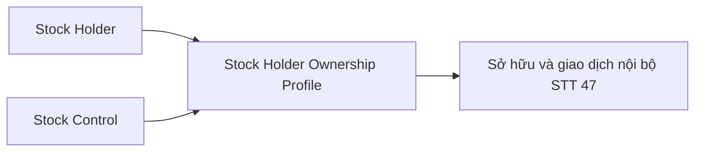

**Bảng grain:**

| Tên bảng | Grain |
|---|---|
| Stock Holder Ownership Profile | 1 row / cổ đông / công ty đại chúng |

---

## Section 3 — Mô hình tổng thể

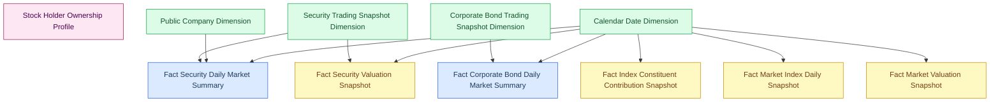

**Bảng Phân tích:**

| Bảng Datamart | Loại | Grain | Nhóm | Trạng thái |
|---|---|---|---|---|
| Fact Security Daily Market Summary | Fact Periodic Snapshot | 1 row / mã CK / ngày | 1, 3, 6–27d_heatmap, STT 49 | READY |
| Fact Corporate Bond Daily Market Summary | Fact Periodic Snapshot | 1 row / mã TP / ngày | 2 | READY |
| Fact Index Constituent Contribution Snapshot | Fact Periodic Snapshot | 1 row / mã CK / index code / ngày | 27a | **PENDING** O_GSTT_12 |
| Fact Market Index Daily Snapshot | Fact Periodic Snapshot | 1 row / Index Code / ngày | 4 | **PENDING** O_GSTT_12 |
| Fact Market Valuation Snapshot | Fact Periodic Snapshot | 1 row / Index Code / quý | 5 | **PENDING** O_GSTT_12, O_GSTT_13 |
| Fact Security Valuation Snapshot | Fact Periodic Snapshot | 1 row / mã CK / ngày | STT 48 | **PENDING** O_GSTT_13, O_GSTT_26 |

> **Schema `Fact Security Daily Market Summary` — đầy đủ (v3.3):**
>
> | Cột | Nguồn filter (Atomic logical) | Trạng thái |
> |---|---|---|
> | `Proprietary_Buy_Value` | `Securities Trade.Exec Value WHERE Buy Client House Type Code='30'` | READY |
> | `Proprietary_Sell_Value` | `Securities Trade.Exec Value WHERE Sell Client House Type Code='30'` | READY |
> | `Retail_Buy_Value` | `Securities Trade.Exec Value WHERE Buy Investor Type Code='8000' AND Buy Foreign Investor Type Code='00'` | READY |
> | `Retail_Sell_Value` | `Securities Trade.Exec Value WHERE Sell Investor Type Code='8000' AND Sell Foreign Investor Type Code='00'` | READY |
> | `Institutional_Domestic_Buy_Value` | HOSE: `Buy Investor Type Code IN('3000','4000','5000') AND Buy Foreign Investor Type Code='00'` / HNX: `Buy Investor Type Code IN('1000','2000','3000','4000','7100') AND Buy Foreign Investor Type Code='00'` | READY |
> | `Institutional_Domestic_Sell_Value` | Tương tự — sell side | READY |
> | `Negotiated_Trading_Volume` | `Securities Trade.Exec Volume WHERE Board Type Code IN ('T1','T2','T3','T4','T6')` | READY |
> | `Shares_Outstanding` | VSDC TT138 — Atomic chưa có | **PENDING** O_GSTT_13 |
>
> **Rút khỏi scope:** KL Tự doanh và KL Phân loại NĐT — BA STT 43/44/45 chỉ yêu cầu GT.

**Bảng Tác nghiệp:**

| Bảng Datamart | Atomic nguồn | Grain | Nhóm | Trạng thái |
|---|---|---|---|---|
| Stock Holder Ownership Profile | Stock Holder, Stock Control | 1 row / cổ đông / công ty đại chúng | 28 | READY |


**Bảng Dimension:**

| Bảng Datamart | NK | Nhóm |
|---|---|---|
| Security Trading Snapshot Dimension | Symbol | 1, 3, 6–27d_heatmap, STT 49 |
| Public Company Dimension | Equity Ticker | 1, 3, 6–27d_heatmap |
| Corporate Bond Trading Snapshot Dimension | Bond Ticker | 2 |
| Corporate Bond Trading Snapshot Industry Dimension | Bond Ticker | 2 |
| Calendar Date Dimension | Date (Conformed) | Tất cả |

> Dimension PENDING chưa thiết kế: `Market Index Dimension` (Nhóm 4, 5, 27a).

---

## Section 4 — Vấn đề mở

| ID | Vấn đề | Giả định hiện tại | KPI liên quan | Trạng thái |
|---|---|---|---|---|
| O_GSTT_1 | MDDS EOD snapshot — lấy bản tin cuối ngày từ StockInfor intraday | Lấy bản tin có sequenceMsg lớn nhất trong ngày | K_GSTT_1–25 | Closed |
| O_GSTT_2 | Grain Fact Market Index — EOD hay intraday | EOD — IDXInfor là EOD | K_GSTT_26–39 | Closed (PENDING vì O_GSTT_12) |
| O_GSTT_3 | Index Codes array — 1 mã CK thuộc nhiều rổ chỉ số | Array<string> sort alphabetically trong Security Trading Snapshot Dimension; Spark explode_outer khi build flat table | K_GSTT_1 | Closed |
| O_GSTT_4 | Ngành NULL — mã CK không có ngành trong IDS | Lưu NULL, filter bỏ NULL khi aggregate | K_GSTT_1 | Confirmed |
| O_GSTT_5 | Scope STT 1 — bao gồm FDS và CorpBond không | Bao gồm FDS (FloorCode=03), loại trừ trái phiếu (StockType B/BO/D) | K_GSTT_1–25 | Confirmed |
| O_GSTT_6 | YTM bình quân TPDN — chưa có Atomic source | PENDING — chờ Atomic team xác nhận field YTM trong CorpBondInfor | K_GSTT_24 | Open |
| O_GSTT_7 | Bond Ticker → Ngành TPDN — join 2 bước | Join: `Corporate Bond Trading Snapshot.Symbol` → `Public Company.Bond Ticker` → cv (scheme IDS_INDUSTRY_CATEGORY) | K_GSTT_14b–23 | Confirmed |
| O_GSTT_8 | BDO — scope trái phiếu niêm yết HOSE | Market Id Code = BDO (Trade_HOSE) cho KLGD/GTGD TPDN | K_GSTT_14b–18b | Confirmed |
| O_GSTT_9 | BCTC forward-fill — Doanh thu, LNST | Gộp vào Fact Security Daily Market Summary theo pattern forward-fill; không tạo bảng riêng | K_GSTT_22, K_GSTT_25 | Confirmed |
| O_GSTT_10 | KLGD/GTGD/KLNN/GTNN theo chỉ số — BA đang xác nhận | Chờ BA xác nhận | K_GSTT_36, K_GSTT_37 | Open → PENDING (O_GSTT_12 phủ) |
| O_GSTT_11 | IDX_2 Theo giờ / Realtime / VSDC lưu hành / Vốn hóa | Chờ BA xác nhận | K_GSTT_27, K_GSTT_40+ | Open → PENDING (O_GSTT_12 phủ) |
| O_GSTT_12 | IDXInfor thay đổi thiết kế CSDL nguồn — Nhóm 4, 5, 27a bị treo | Chờ Atomic team xác nhận schema mới `MDDS.IDXInfor`. Sau đó: (1) cập nhật `mkt_indx_snpst`; (2) reopen thiết kế Nhóm 4; (3) đánh giá lại Nhóm 5 | K_GSTT_26–48, K_GSTT_66–70, K_GSTT_85, K_GSTT_108, K_GSTT_109 | Open |
| O_GSTT_13 | VSDC TT138 — Số CP đang lưu hành chưa có Atomic entity | Atomic team cần thiết kế entity mới từ TT138.2025.TT.BTC Mẫu số 01. Sau đó bổ sung cột `Shares_Outstanding` vào `Fact Security Daily Market Summary` | K_GSTT_44, K_GSTT_49–52, K_GSTT_90, K_GSTT_95–97, K_GSTT_99, K_GSTT_115 | Open |
| O_GSTT_14 | IDS.categories — Ngành kinh tế IDS (10 ngành) cho TPDN | Atomic `Public Company` (`pblc_co`) đã có `Industry Category Level1 Code` (`idy_cgy_level1_code`, scheme `IDS_INDUSTRY_CATEGORY`) — ánh xạ từ `IDS.company_profiles.category_id`. Giải pháp: tạo `Corporate Bond Trading Snapshot Industry Dimension` riêng (NK = Bond Ticker), join chain: `Bond Ticker → pblc_co.bond_ticker → pblc_co.idy_cgy_level1_code`. Hiển thị Level1 (10 ngành IDS). Không dùng `IDS.categories` staging trực tiếp. | Nhóm 2 slicer Ngành | Confirmed |
| O_GSTT_15 | Ranking Top N — cơ chế tính và lưu trữ | `ORDER BY DESC LIMIT N` tại query layer. N mặc định = 20. Không lưu rank trong mart | K_GSTT_1, K_GSTT_49–52 | Confirmed |
| O_GSTT_16 | KLGDTB N ngày và Tỷ lệ KLGD/KLGDTB — BA chưa xác nhận danh sách giá trị N | Chờ BA xác nhận danh sách N. Logic đã rõ: KLGDTB N ngày = `AVG(Total Match Volume) OVER (PARTITION BY Symbol ORDER BY Trading Date ROWS BETWEEN N PRECEDING AND 1 PRECEDING)`; Tỷ lệ = `Total Match Volume ngày chọn ÷ KLGDTB N ngày` — phái sinh hoàn toàn từ `Total Match Volume`, không cần cột mới trong mart | K_GSTT_54–59 | Confirmed |
| O_GSTT_17 | Top Vượt Đỉnh / Thùng Đáy — preset thời gian nhìn lại | UI xác nhận 3 preset cố định: **3 THÁNG / 6 THÁNG / 1 NĂM**. Tham số preset là query-layer parameter, không lưu trong mart. Vượt Đỉnh = `Close Price > MAX(High Price) OVER preset`; Thùng Đáy = `Close Price < MIN(Low Price) OVER preset`. `High Price` và `Low Price` đã có trong `Fact Security Daily Market Summary` — không cần cột mới. | K_GSTT_60, K_GSTT_61 | Confirmed |
| O_GSTT_18 | Top NDTNN — dropdown ranking 4 tiêu chí KL/GT Mua/Bán Ròng | Dropdown UI cho phép switch 4 tiêu chí: KL Mua Ròng / KL Bán Ròng / GT Mua Ròng / GT Bán Ròng. Mỗi lần ORDER BY 1 tiêu chí. Tất cả 4 đều phái sinh tại query layer từ `Foreign_Buy_Volume`, `Foreign_Sell_Volume`, `Foreign_Buy_Value`, `Foreign_Sell_Value` đã có trên Fact — mart không thêm cột. K_GSTT_62 = `Foreign Sell Volume − Foreign Buy Volume`; K_GSTT_63 = `Foreign Sell Value − Foreign Buy Value`. | K_GSTT_62, K_GSTT_63 | Confirmed |
| O_GSTT_19 | Nguồn KLNN / GTNN — Security Trading Snapshot snapshot vs Securities Trade | Giả định dùng `Securities Trade` làm primary (có GT, nhất quán KL+GT). Cần Atomic team xác nhận: (1) `Security Trading Snapshot.Foreign Buy Volume` có khớp với `SUM(Securities Trade.Exec Volume WHERE Buy Foreign Investor Type Code IN ('10','20'))` không? (2) Nếu lệch — dùng nguồn nào làm chuẩn? (3) ETL SUM từ Trade có đảm bảo performance với volume HOSE/HNX không? | K_GSTT_8, K_GSTT_9, K_GSTT_10, K_GSTT_11, K_GSTT_12, K_GSTT_13, K_GSTT_62, K_GSTT_63 | Open |
| O_GSTT_20 | Bản Đồ Nhiệt — ngưỡng phân loại màu Tăng mạnh / Giảm mạnh | Confirmed: `% Thay đổi` và `Thay đổi (+/-)` tô màu xanh khi dương / đỏ khi âm / xám khi = 0. Áp dụng cho tất cả các Nhóm hiển thị 2 chỉ tiêu này (Nhóm 1, 6–27d_heatmap). Logic màu tại presentation layer — mart không thêm cột. | K_GSTT_3, K_GSTT_53, K_GSTT_64, K_GSTT_65 | Confirmed |
| O_GSTT_21 | Investor Type Code HOSE/HNX dùng mã khác nhau | Giải pháp Confirmed: Dùng `src_stm_code` làm discriminator kết hợp `frgn_ivsr_tp_code` làm discriminator quốc tịch. Logic: (1) `frgn_ivsr_tp_code IN ('10','20')` → Nước ngoài; (2) `clnt_hs_tp_code='30'` → Tự doanh; (3) `ivsr_tp_code='8000' AND frgn='00'` → Cá nhân trong nước; (4) còn lại AND `frgn='00'` → Tổ chức trong nước — với CASE WHEN trên `src_stm_code`. BA STT 43 xác nhận 4 nhóm này. | K_GSTT_77–84 | Closed |
| O_GSTT_22 | Fact Security Daily Market Summary thiếu cột GT Tự doanh | Đã bổ sung 2 cột: `Proprietary_Buy_Value`, `Proprietary_Sell_Value`. Schema v3.3 hoàn tất. | K_GSTT_71–73 | Closed |
| O_GSTT_23 | Fact Security Daily Market Summary thiếu cột GT Phân loại NĐT | Đã bổ sung 6 cột: `Retail_Buy_Value`, `Retail_Sell_Value`, `Institutional_Domestic_Buy_Value`, `Institutional_Domestic_Sell_Value`, `Proprietary_Buy_Value`, `Proprietary_Sell_Value`. Schema v3.3 hoàn tất. | K_GSTT_77–84 | Closed |
| O_GSTT_24 | Biểu đồ GTNN intraday theo giờ (STT 40) — grain cần xác nhận | Closed — EOD đủ. Câu lệnh tham khảo BA STT 40 dùng `GROUP BY symbol, ngay_gd` — aggregate theo ngày. Line chart tích lũy theo giờ trên UI là presentation layer / real-time feed riêng, không phải từ datamart. `Fact Security Daily Market Summary` EOD đáp ứng đủ — không cần bảng intraday mới. K_GSTT_86–88 rút khỏi scope mart. | K_GSTT_86–88 | Closed |
| O_GSTT_25 | FREE FLOAT chưa có nguồn — BA và Atomic đều chưa xác định | BA STT 39: công thức `wi = (Giá đóng cửa × KL tự do chuyển nhượng) / ΣMarketCap`. Bảng nguồn và trường nguồn để trống trong BA, trạng thái Pending, đánh giá Khó. Cần BA làm việc với MSS/MDDS team để xác định field `KL tự do chuyển nhượng` trước khi thiết kế Atomic. | K_GSTT_85 | Open — blocked by BA |
| O_GSTT_26 | IDS BCTC — Atomic entities cho LNST, VCSH, Doanh thu | Confirmed — tất cả entities đã có trong `atomic_attributes.csv`: `Public Company Financial Report Value` (`pblc_co_fnc_rpt_val` ← `IDS.data`); `Public Company Report Submission` (`pblc_co_rpt_subm` ← `IDS.company_data`); `Financial Report Catalog` (`fnc_rpt_ctlg` ← `IDS.report_catalog`); `Financial Report Row Template` (`fnc_rpt_row_tpl` ← `IDS.rrow`); `Financial Report Column Template` (`fnc_rpt_clmn_tpl` ← `IDS.rcol`). Filter mapping: Report Type Code LIKE `'BCKQKD%'`/`'BCDKT%'` → `fnc_rpt_ctlg.fnc_rpt_ctlg_bsn_code`; Enterprise Type Code (`dn`/`bh`/`td`) → `fnc_rpt_ctlg.entp_tp_code`; Row Description → `fnc_rpt_row_tpl.row_dsc_clmn_code`; Column Code `'1'` (kỳ hiện tại) → `fnc_rpt_clmn_tpl.clmn_code`; Year/Quarter → `pblc_co_rpt_subm.rpt_yr`/`rpt_qtr`. Blocker còn lại: O_GSTT_13 (Shares Outstanding từ VSDC). | K_GSTT_22, K_GSTT_25, K_GSTT_98–115 | Confirmed |
| O_GSTT_27 | KL Thỏa Thuận (STT 46) — Board Type HOSE ('T1','T2','T3','T4','T6') có bao gồm lô lẻ (T4, T6) không? | Tạm thời include toàn bộ Board Type IN ('T1','T2','T3','T4','T6') — BA ghi chú cần hỏi nghiệp vụ | K_GSTT_107 | Open || O_GSTT_28 | STT 47 — nguồn Atomic cho "Sở hữu và giao dịch nội bộ" — BA ghi VSDC nhưng Atomic source là IDS | Atomic team xác nhận: `Stock Holder` và `Stock Control` tại `IDS.stock_holders` / `IDS.stock_controls` là nguồn chính thức cho dữ liệu cổ đông. BA ghi VSDC là nguồn gốc ban đầu nhưng data đã được ingest vào IDS. | K_GSTT_123–128 | Open |