# DTM_GSTT_HLD — v4.0

**Phiên bản:** 4.0
**Ngày cập nhật:** 2026-07-27
**Thay đổi v4.0:** Thiết kế lại toàn bộ theo BA mới (`BRD/BA/BA_analyst_GSTT.csv`, thay bản `Old versions/BA_analyst_GSTT_20260727.csv`). Đổi nguyên tắc tổ chức Section 2: **1 Nhóm = 1 STT** (bám tuyệt đối theo cột STT của BA, không gộp nhiều STT vào 1 Nhóm, không tách 1 STT thành nhiều Nhóm phụ a/b/c). Áp dụng gating mới theo cột "Loại dữ liệu" (Dữ liệu tĩnh/động) — độc lập với gating theo Atomic. Dùng biến thể 5-Section (thêm Section 4 — Reuse Analysis). File được viết lại tăng dần theo từng Nhóm được duyệt — xem lịch sử bản cũ tại git history nếu cần đối chiếu.
**Phạm vi:** Đang thiết kế — cập nhật dần theo tiến độ duyệt từng Nhóm (1 → 49).

---

## Section 1 — Data Lineage

##### Cụm 1: Thông tin danh mục chứng khoán (Fact Stock Portfolio Snapshot)

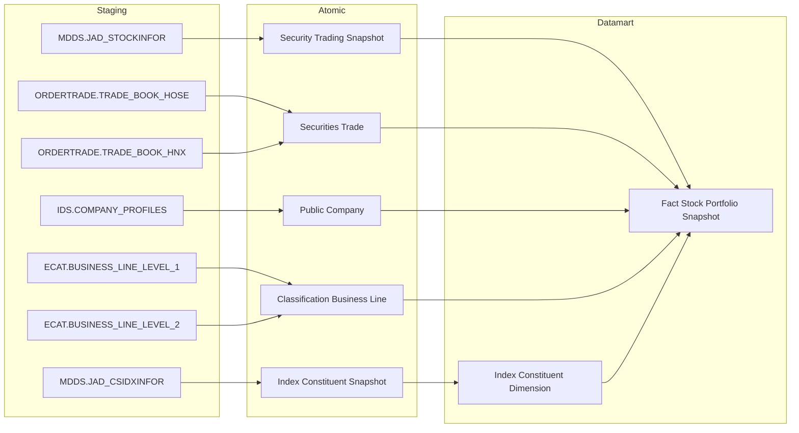
```mermaid
flowchart LR
    subgraph SRC["Staging"]
        S1A["MDDS.JAD_STOCKINFOR"]
        S1C["ORDERTRADE.TRADE_BOOK_HOSE"]
        S1D["ORDERTRADE.TRADE_BOOK_HNX"]
        S1E["IDS.COMPANY_PROFILES"]
        S1F["ECAT.BUSINESS_LINE_LEVEL_1"]
        S1G["ECAT.BUSINESS_LINE_LEVEL_2"]
        S1H["MDDS.JAD_CSIDXINFOR"]
    end
    subgraph SIL["Atomic"]
        A1A["Security Trading Snapshot"]
        A1C["Securities Trade"]
        A1D["Public Company"]
        A1E["Classification Business Line"]
        A1H["Index Constituent Snapshot"]
    end
    subgraph GOLD["Datamart"]
        fct_stock_portfolio_snpst["Fact Stock Portfolio Snapshot"]
        index_constituent_dim["Index Constituent Dimension"]
    end
    S1A --> A1A
    S1C --> A1C
    S1D --> A1C
    S1E --> A1D
    S1F --> A1E
    S1G --> A1E
    S1H --> A1H
    A1A --> fct_stock_portfolio_snpst
    A1C --> fct_stock_portfolio_snpst
    A1D --> fct_stock_portfolio_snpst
    A1E --> fct_stock_portfolio_snpst
    A1H --> index_constituent_dim
    index_constituent_dim --> fct_stock_portfolio_snpst
```

> **Ghi chú nguồn Ngành:** BA viết SQL tham khảo JOIN trực tiếp `IDS.CATEGORIES`, nhưng Atomic thật quy định `IDS.CATEGORIES` chỉ là bảng join nội bộ — không tự sinh entity (quyết định 2026-07-23). Đường JOIN chuẩn: `Public Company.Business Line Level 1 Id` → `Classification Business Line.Classification Business Line Id`. `public_company_dim` (Datamart, dùng chung GSDC/QLCB/NDTNN) đã có sẵn cột đệm `Classification Business Line Name` — logic JOIN của cột này vừa được sửa lại từ so khớp theo Code sang so khớp theo Id (2026-07-27, theo khuyến nghị Atomic designer — Id = hash theo source_system nên tránh sai khi `cl_business_line` nhận thêm nguồn ngoài ECAT). GSTT reuse nguyên trạng `public_company_dim`, không tạo Dimension riêng cho Ngành.
> **Ghi chú measure tổng hợp:** `Securities Trade` (Fact Append, grain = 1 lệnh khớp) thô hơn grain Fact — Tổng KL/GT, Tổng KL/GT thỏa thuận, KLNN ròng đều phải `SUM(...) GROUP BY Security Symbol Code, Trade Date` trước khi đặt lên Fact (Bước 4B — grain-matching); các measure này **không phụ thuộc rổ chỉ số**, aggregate 1 lần theo mã CK/ngày rồi mới nhân bản (broadcast) ra từng row Index Constituent khi ETL ghi Fact — xem ghi chú Index dưới đây về cách tránh double-count khi truy vấn.
> **Ghi chú thiết kế Index Constituent Dimension (đã sửa 3 lần, chốt lại 2026-07-27):**
> - **Lần 1** — đặt `Index_Code` scalar trên Fact chính: sai vì 1 mã CK có thể thuộc nhiều rổ chỉ số cùng lúc (quan hệ N:N thật ở Atomic `Index Constituent Snapshot`, grain 1 cặp index_code×symbol×trading_date).
> - **Lần 2** — tách bridge Fact `Fact Index Constituent Snapshot` + `Index Constituent Dimension` (1 row/rổ chỉ số), KHÔNG đổi grain Fact chính: gây Fact-to-Fact JOIN fanout ở tầng báo cáo khi Dashboard cần hiển thị "Chỉ số" cùng dòng với measure của `Fact_Stock_Portfolio_Snapshot`.
> - **Lần 3** — dùng multi-valued attribute `Index_Codes` (array/CSV) trên `Security_Trading_Snapshot_Dimension`: sai vì trộn 2 nguồn Atomic khác nhau vào 1 Dimension — `Security Trading Snapshot` gốc từ `MDDS.JAD_STOCKINFOR` (hồ sơ mô tả CK), còn thành phần rổ chỉ số gốc từ `MDDS.JAD_CSIDXINFOR` (`Index Constituent Snapshot`), khác chu kỳ cập nhật (rổ chỉ số review theo kỳ HOSE/HNX công bố, không đồng bộ ngày niêm yết) — vi phạm nguyên tắc 1 Dimension = 1 driving Atomic entity (Bước 1a).
> - **Quyết định cuối:** tạo `Index Constituent Dimension` — đặt tên bám sát driving Atomic entity `Index Constituent Snapshot` (← `MDDS.JAD_CSIDXINFOR`) vì bảng nguồn mang ý nghĩa "chứng khoán thuộc rổ chỉ số", không phải danh mục rổ chỉ số đơn thuần. **Grain Dimension = 1 row / (Index Code, Symbol)** — mỗi cặp rổ×mã CK có thật trong nguồn là 1 row riêng (SCD4A), kéo dư thừa toàn bộ attribute mô tả có thật trong nguồn theo coverage rule (Bước 1a): `Index Code`, `Index Id` (định danh rổ), `Symbol` (mã CK thành viên), `Floor Code` (sàn niêm yết ghi nhận tại nguồn rổ chỉ số), `Add Date` (ngày mã CK được thêm vào rổ). Không kéo `Trading Date`/`Total Match Volume` — đây là measure/thời điểm biến động theo ngày, sai grain nếu đặt trên Dimension (thuộc Fact/Securities Trade nếu KPI cần). FK **trực tiếp** từ Dimension này vào `Fact_Stock_Portfolio_Snapshot` — không qua bridge Fact. Vì Dimension đã có grain đúng theo cặp rổ×mã CK, FK này tự mang ý nghĩa N:N mà không cần bridge riêng. Để FK hợp lệ mà không đổi ý nghĩa các measure sẵn có, **đổi grain Fact** thành `1 row / mã CK / rổ chỉ số / ngày giao dịch`, với `Index_Constituent_Dimension_Id` **cho phép NULL**: nguồn `JAD_CSIDXINFOR` chỉ chứa cặp (Index Code, Symbol) có thật (mã CK đang thuộc rổ đó) — không có khái niệm "N/A" trong nguồn, nên Dimension không tự sinh thêm row giả. Mã CK thuộc N rổ chỉ số cùng lúc → N row Fact (FK khác nhau); mã CK không thuộc rổ nào tại ngày đó → 1 row Fact duy nhất với FK NULL. Các measure không phụ thuộc rổ chỉ số (Tổng KL, Tổng GT, KLNN ròng...) được ETL nhân bản (broadcast) giống nhau trên mọi row Index Constituent của cùng 1 mã CK/ngày — do đó **mọi truy vấn các measure này ở Dashboard không lọc theo Chỉ số bắt buộc phải `WHERE Index_Constituent_Dimension_Id IS NULL` (mã không thuộc rổ nào) hoặc `SELECT DISTINCT` theo (Symbol, Trade Date) trước khi SUM**, nếu không sẽ double-count theo số rổ chỉ số mã CK đó thuộc về. Khi Dashboard lọc theo 1 Chỉ số cụ thể (`WHERE Index_Code = :selected_index`), không có rủi ro double-count vì mỗi mã CK chỉ có đúng 1 row cho Chỉ số đó.

##### Cụm 2a: Diễn biến chỉ số thị trường — snapshot cuối ngày (`Fact Market Index Snapshot`)

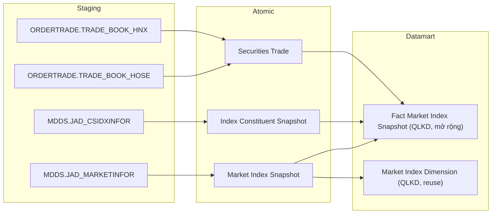
```mermaid
flowchart LR
    subgraph SRC["Staging"]
        S2A["MDDS.JAD_MARKETINFOR"]
        S2B["MDDS.JAD_CSIDXINFOR"]
        S2C["ORDERTRADE.TRADE_BOOK_HOSE"]
        S2D["ORDERTRADE.TRADE_BOOK_HNX"]
    end
    subgraph SIL["Atomic"]
        A2A["Market Index Snapshot"]
        A2B["Index Constituent Snapshot"]
        A2C["Securities Trade"]
    end
    subgraph GOLD["Datamart"]
        fct_market_index_snpst["Fact Market Index Snapshot (QLKD, mở rộng)"]
        market_index_dim["Market Index Dimension (QLKD, reuse)"]
    end
    S2A --> A2A
    S2B --> A2B
    S2C --> A2C
    S2D --> A2C
    A2A --> fct_market_index_snpst
    A2A --> market_index_dim
    A2B --> fct_market_index_snpst
    A2C --> fct_market_index_snpst
```

> **Ghi chú reuse cross-module (Bước 3):** `Fact Market Index Snapshot` (`fct_market_index_snpst`) và `Market Index Dimension` (`market_index_dim`) đã tồn tại, sở hữu bởi **QLKD** (reuse bởi NDTNN qua K_NDTNN_34). GSTT **mở rộng thêm cột** trên Fact hiện có (không tạo Fact song song trùng grain/nguồn) — đã xác nhận an toàn: 3 cột hiện có (`snpst_dt_dim_id`, `market_index_dim_id`, `market_index_val`) và toàn bộ measure GSTT cần đều lấy từ cùng 1 row nguồn `market_index_snapshot` đã được ETL định vị đúng theo `ROW_NUMBER() PARTITION BY market_id, market_code, trading_dt ORDER BY index_time DESC` (`rn=1`, bản ghi cuối phiên) — không thêm JOIN/logic lọc mới, không đổi grain (`1 market_code × 1 ngày`), K_QLKD_88-91/K_NDTNN_34 không bị ảnh hưởng. Đã cập nhật `modules_using` (+GSTT) trong `datamart_model.yaml` và ghi chú tại `DTM_QLKD_HLD.md` Cụm 6b.
> **Ghi chú KLGD/GTGD/KLNN ròng/GTNN ròng của chỉ số:** BA yêu cầu JOIN `JAD_CSIDXINFOR` (Atomic `Index Constituent Snapshot`, đã dùng cho `Index Constituent Dimension` ở Nhóm 1) để lấy danh sách mã CK thuộc rổ chỉ số, sau đó `SUM(Securities Trade.Execution Volume/Value WHERE Symbol IN (danh sách mã thuộc Index Code) AND Trade Date = ngày) GROUP BY Index Code, Trade Date` — đây là measure pre-aggregate qua 2 tầng nguồn khác (`Index Constituent Snapshot` + `Securities Trade`), không có sẵn trong `Market Index Snapshot`, đặt trực tiếp lên `Fact Market Index Snapshot` (join `Market Index Dimension` qua Index Type Code — không phải cùng cơ chế định danh `Index Code` như `Index Constituent Dimension`, xem ghi chú riêng dưới bảng KPI).
> **Ghi chú Index Code vs Market Code (2 hệ định danh khác nhau):** `Market Index Dimension` định danh theo `Market Code`/`Index Type Code` (VD: HOSE→VN-Index, 30→VN30), trong khi `Index Constituent Dimension` (Nhóm 1) định danh theo `Index Code` (VD: VN30, HNX30) từ nguồn `JAD_CSIDXINFOR` — đã xác nhận trước đó (Section 1, ghi chú Index Constituent) đây là 2 hệ định danh khác nhau, không có join key 1-1 rõ ràng. Với KLGD/GTGD/KLNN/GTNN ròng của chỉ số, ETL cần bảng mapping thủ công `Market Code ↔ Index Code` (VD: market_code='30' ↔ index_code='VN30') để JOIN đúng — **PENDING xác nhận mapping đầy đủ với nghiệp vụ** trước khi lên LLD.

##### Cụm 2b: Diễn biến chỉ số thị trường — realtime trong ngày (`Fact Market Index Intraday`)

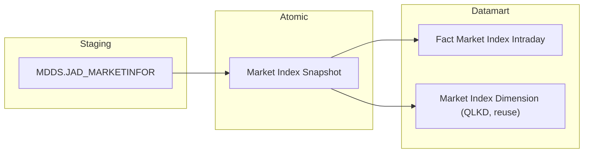
```mermaid
flowchart LR
    subgraph SRC["Staging"]
        S2E["MDDS.JAD_MARKETINFOR"]
    end
    subgraph SIL["Atomic"]
        A2D["Market Index Snapshot"]
    end
    subgraph GOLD["Datamart"]
        fct_market_index_intraday["Fact Market Index Intraday"]
        market_index_dim2["Market Index Dimension (QLKD, reuse)"]
    end
    S2E --> A2D
    A2D --> fct_market_index_intraday
    A2D --> market_index_dim2
```

> **Ghi chú grain Fact Market Index Intraday:** BA xác nhận (trao đổi trực tiếp) mục đích là vẽ biểu đồ đường/cột theo thời gian trong ngày — khác hẳn Fact EOD (1 row/ngày), dùng chung nguồn `Market Index Snapshot` nhưng KHÔNG lọc `rn=1`. Grain = **1 row / Market Code / Index Time** (theo đúng nguồn `JAD_MARKETINFOR`, không gộp về giờ/ngày ở tầng ETL) — chỉ 3 cột (Index Time, Market Index Value theo thời điểm, GTGD theo thời điểm). Dashboard xử lý lại theo giờ ở tầng BI (lấy giá trị cuối giờ hoặc SUM), không xử lý ở Datamart để giữ nguyên độ chi tiết gốc, tránh mất thông tin nếu yêu cầu hiển thị thay đổi sau này.

---

## Section 2 — Tổng quan báo cáo

### Tab Dashboard thông tin về danh mục chứng khoán

#### Nhóm 1 - Bảng số liệu

> **Phân loại:** Phân tích
> **Atomic:** `Security Trading Snapshot` ← MDDS.JAD_STOCKINFOR — **READY** (Nguồn 2, approved) / `Securities Trade` ← ORDERTRADE.TRADE_BOOK_HOSE, TRADE_BOOK_HNX — **READY** (Nguồn 2, approved) / `Public Company` ← IDS.COMPANY_PROFILES — **READY** (Nguồn 1, approved) / `Classification Business Line` ← ECAT.BUSINESS_LINE_LEVEL_1, BUSINESS_LINE_LEVEL_2 — **READY** (Nguồn 1, approved) / `Index Constituent Snapshot` ← MDDS.JAD_CSIDXINFOR — **READY** (Nguồn 2, approved) — driving entity cho `Index Constituent Dimension` mới (xem ghi chú Section 1)

**Mockup:**

| Mã CK | Ngành | Sàn | Chỉ số | Loại phái sinh | Ngày đáo hạn | Giá TC | Giá ĐC | Thay đổi | % TĐ | Tổng KL | Tổng GT | Tổng KL PS | Tổng GT PS | Tổng KL TT | Tổng GT TT | KLNN ròng |
|---|---|---|---|---|---|---|---|---|---|---|---|---|---|---|---|---|
| VCB | Ngân hàng | HOSE | VN30 | — | — | 82.00 | 82.50 | +0.50 | +0.61% | 548 Tr | 22.1 Tỷ | 0 | 0 | 12 Tr | 1.0 Tỷ | +4 Tr |

**Source:** `Fact Stock Portfolio Snapshot` → `Security Trading Snapshot Dimension`, `Public Company Dimension`, `Calendar Date Dimension`, `Index Constituent Dimension`

**Bảng KPI:**

| KPI ID | Tên KPI | Đơn vị | Tính chất | Công thức | Ghi chú | Trạng thái |
|---|---|---|---|---|---|---|
| K_GSTT_1 | Mã CK | — | Chiều | `Security Trading Snapshot Dimension.Symbol` | Filter: `Stock Type Code NOT IN ('B','1','BO','D')` (loại trái phiếu) | READY |
| K_GSTT_2 | Ngành | — | Chiều | `Public Company Dimension.Business Line Level 1 Code`, `Classification Business Line Name` | Reuse nguyên trạng `public_company_dim` — cột đệm sẵn tên ngành đã sửa JOIN theo Id (xem Section 1) | READY |
| K_GSTT_3 | Sàn | — | Chiều | `Security Trading Snapshot Dimension.Floor Code` | Scheme MDDS_FLOOR_CODE: 10-HOSE, 02-HNX, 04-UPCOM, 03-FDS | READY |
| K_GSTT_4 | Chỉ số | — | Chiều | `Index Constituent Dimension.Index Code` | FK optional (nullable) trực tiếp trên Fact (grain Fact = .../rổ chỉ số/...; grain Dimension = 1 row/(Index Code, Symbol)). Filter: `WHERE Index_Code = :selected_index`. Xem ghi chú thiết kế ở Section 1 | READY |
| K_GSTT_5 | Loại phái sinh | — | Chiều | `Security Trading Snapshot Dimension.Stock Type Code`, `Underlying Symbol` | Chỉ có giá trị khi Floor Code = '03' | READY |
| K_GSTT_6 | Phương thức khớp lệnh (thỏa thuận) | — | Chiều | `Securities Trade.Board Type Code IN ('T1','T2','T3','T4','T6')` | Slicer phân biệt Khớp lệnh / Thỏa thuận | READY |
| K_GSTT_7 | Ngày | — | Chiều | `Calendar Date Dimension.Calendar Date` | Tham số lọc theo ngày giao dịch | READY |
| K_GSTT_8 | Ngày đáo hạn phái sinh | Ngày | Cơ sở | `Security Trading Snapshot Dimension.Maturity Date` | Chỉ có giá trị khi Floor Code = '03' | READY |
| K_GSTT_9 | Giá tham chiếu | VNĐ | Cơ sở | `Security Trading Snapshot Dimension.Reference Price` | — | READY |
| K_GSTT_10 | Giá đóng cửa | VNĐ | Cơ sở | `Security Trading Snapshot Dimension.Close Price` | — | READY |
| K_GSTT_11 | Thay đổi (+/-) | VNĐ | Cơ sở | `Security Trading Snapshot Dimension.Price Change` | = Giá đóng cửa − Giá TC | READY |
| K_GSTT_12 | % thay đổi | % | Phái sinh | `Price Change / Reference Price × 100` | Computed tại query layer | READY |
| K_GSTT_13 | Tổng KL | Cổ phiếu | Phái sinh | `SUM(Securities Trade.Execution Volume) GROUP BY Symbol, Trade Date` | Pre-aggregate, ETL broadcast giống nhau trên mọi row Index Constituent cùng mã CK/ngày — nếu Dashboard không lọc theo 1 Chỉ số cụ thể **bắt buộc** `SELECT DISTINCT` theo (Symbol, Trade Date) trước khi SUM (không dùng `WHERE FK IS NULL` vì mã CK có thể vừa thuộc rổ vừa cần tính đúng 1 lần) để tránh double-count theo số rổ chỉ số | READY |
| K_GSTT_14 | Tổng GT | VNĐ | Phái sinh | `SUM(Securities Trade.Execution Value) GROUP BY Symbol, Trade Date` | Pre-aggregate — cùng cảnh báo double-count như K_GSTT_13 | READY |
| K_GSTT_15 | Tổng KL theo loại phái sinh | Hợp đồng | Phái sinh | `SUM(Securities Trade.Execution Volume WHERE Market Id Code = 'DVX') GROUP BY Symbol, Trade Date` | Pre-aggregate — cùng cảnh báo double-count như K_GSTT_13 | READY |
| K_GSTT_16 | Tổng GT theo loại phái sinh | VNĐ | Phái sinh | `SUM(Securities Trade.Execution Value WHERE Market Id Code = 'DVX') GROUP BY Symbol, Trade Date` | Pre-aggregate — cùng cảnh báo double-count như K_GSTT_13 | READY |
| K_GSTT_17 | Tổng KL thỏa thuận | Cổ phiếu | Phái sinh | `SUM(Securities Trade.Execution Volume WHERE Board Type Code IN ('T1','T2','T3','T4','T6')) GROUP BY Symbol, Trade Date` | Pre-aggregate — cùng cảnh báo double-count như K_GSTT_13 | READY |
| K_GSTT_18 | Tổng GT thỏa thuận | VNĐ | Phái sinh | `SUM(Securities Trade.Execution Value WHERE Board Type Code IN ('T1','T2','T3','T4','T6')) GROUP BY Symbol, Trade Date` | Pre-aggregate — cùng cảnh báo double-count như K_GSTT_13 | READY |
| K_GSTT_19 | KLNN ròng | Cổ phiếu | Phái sinh | `SUM(Buy Foreign Investor Type Code IN ('10','20') → Execution Volume) − SUM(Sell Foreign Investor Type Code IN ('10','20') → Execution Volume) GROUP BY Symbol, Trade Date` | Pre-aggregate — cùng cảnh báo double-count như K_GSTT_13 | READY |

**Star Schema:**

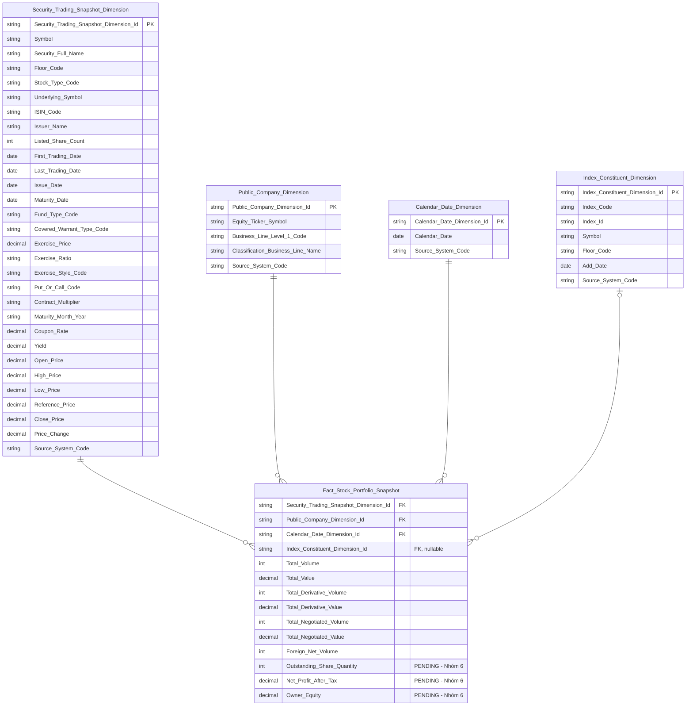
```mermaid
erDiagram
    Security_Trading_Snapshot_Dimension {
        string Security_Trading_Snapshot_Dimension_Id PK
        string Symbol
        string Security_Full_Name
        string Floor_Code
        string Stock_Type_Code
        string Underlying_Symbol
        string ISIN_Code
        string Issuer_Name
        int Listed_Share_Count
        date First_Trading_Date
        date Last_Trading_Date
        date Issue_Date
        date Maturity_Date
        string Fund_Type_Code
        string Covered_Warrant_Type_Code
        decimal Exercise_Price
        string Exercise_Ratio
        string Exercise_Style_Code
        string Put_Or_Call_Code
        string Contract_Multiplier
        string Maturity_Month_Year
        decimal Coupon_Rate
        decimal Yield
        decimal Open_Price
        decimal High_Price
        decimal Low_Price
        decimal Reference_Price
        decimal Close_Price
        decimal Price_Change
        string Source_System_Code
    }
    Public_Company_Dimension {
        string Public_Company_Dimension_Id PK
        string Equity_Ticker_Symbol
        string Business_Line_Level_1_Code
        string Classification_Business_Line_Name
        string Source_System_Code
    }
    Calendar_Date_Dimension {
        string Calendar_Date_Dimension_Id PK
        date Calendar_Date
        string Source_System_Code
    }
    Index_Constituent_Dimension {
        string Index_Constituent_Dimension_Id PK
        string Index_Code
        string Index_Id
        string Symbol
        string Floor_Code
        date Add_Date
        string Source_System_Code
    }
    Fact_Stock_Portfolio_Snapshot {
        string Security_Trading_Snapshot_Dimension_Id FK
        string Public_Company_Dimension_Id FK
        string Calendar_Date_Dimension_Id FK
        string Index_Constituent_Dimension_Id "FK, nullable"
        int Total_Volume
        decimal Total_Value
        int Total_Derivative_Volume
        decimal Total_Derivative_Value
        int Total_Negotiated_Volume
        decimal Total_Negotiated_Value
        int Foreign_Net_Volume
        int Outstanding_Share_Quantity "PENDING - Nhóm 6"
        decimal Net_Profit_After_Tax "PENDING - Nhóm 6"
        decimal Owner_Equity "PENDING - Nhóm 6"
    }
    Security_Trading_Snapshot_Dimension ||--o{ Fact_Stock_Portfolio_Snapshot : " "
    Public_Company_Dimension ||--o{ Fact_Stock_Portfolio_Snapshot : " "
    Calendar_Date_Dimension ||--o{ Fact_Stock_Portfolio_Snapshot : " "
    Index_Constituent_Dimension |o--o{ Fact_Stock_Portfolio_Snapshot : " "
```

> **FK `Index_Constituent_Dimension_Id` cho phép NULL** (quan hệ optional |o, khác 3 FK bắt buộc còn lại) — nguồn `JAD_CSIDXINFOR` chỉ chứa cặp (Index Code, Symbol) có thật (mã CK đang thuộc rổ đó), không có khái niệm "N/A" trong nguồn nên Dimension không sinh thêm row giả. Mã CK thuộc N rổ chỉ số cùng lúc tại 1 ngày → N row Fact (FK khác nhau); mã CK không thuộc rổ chỉ số nào tại ngày đó → 1 row Fact duy nhất với FK NULL.

**Lineage Mart → Báo cáo:**

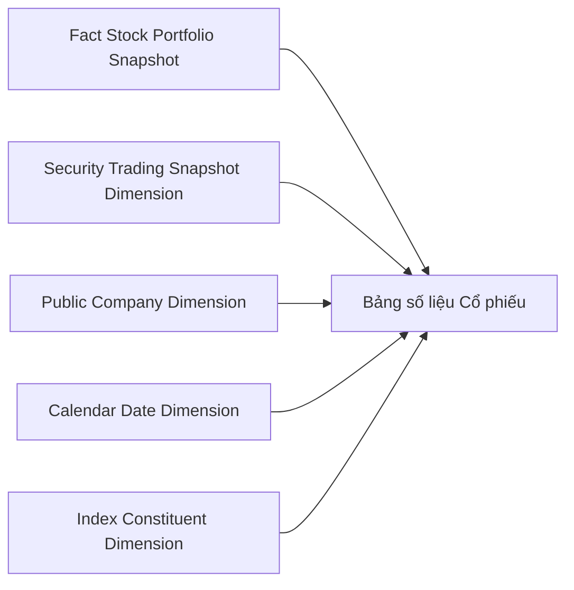
```mermaid
flowchart LR
    F1["Fact Stock Portfolio Snapshot"] --> RPT1["Bảng số liệu Cổ phiếu"]
    D1["Security Trading Snapshot Dimension"] --> RPT1
    D2["Public Company Dimension"] --> RPT1
    D3["Calendar Date Dimension"] --> RPT1
    D4["Index Constituent Dimension"] --> RPT1
```

**Bảng grain:**

| Tên bảng | Grain |
|---|---|
| Fact Stock Portfolio Snapshot | 1 row / mã CK / rổ chỉ số (FK nullable nếu không thuộc rổ nào) / ngày giao dịch |
| Security Trading Snapshot Dimension | 1 row / mã CK (SCD4A) |
| Public Company Dimension | 1 row / mã CK (SCD4A) |
| Calendar Date Dimension | 1 row / ngày |
| Index Constituent Dimension | 1 row / (Index Code, Symbol) có thật trong nguồn (SCD4A) |

> **Coverage rule (Bước 1a skill):** `Security Trading Snapshot Dimension` kéo dư thừa toàn bộ attribute hồ sơ mô tả chứng khoán từ `security_trading_snapshot` (Symbol, Security Full Name, Floor Code, Stock Type Code, Underlying Symbol, ISIN Code, Issuer Name, Listed Share Count, First/Last Trading Date, Issue Date, Maturity Date, Fund Type Code, Covered Warrant Type/Exercise Price/Ratio/Style Code, Put Or Call Code, Contract Multiplier, Maturity Month Year, Coupon Rate, Yield) — kể cả cột chưa cần cho Nhóm 1, để tránh phải bổ sung nhiều lần khi các Nhóm sau (Nhóm 2 — Trái phiếu, biểu đồ kỹ thuật, phái sinh...) cần đến. `Open Price`/`High Price`/`Low Price`/`Reference Price`/`Close Price`/`Price Change` giữ trên Dimension (không phải Fact) vì được dùng làm giá "hiện hành" hiển thị cùng hồ sơ mô tả — grain 1 row/mã CK snapshot ngày gần nhất (theo mockup BA), không phải để tính toán lịch sử theo nhiều ngày (bổ sung Open/High/Low tại Nhóm 3 theo coverage rule, cùng bản chất với Reference/Close/Change đã có ở Nhóm 1).
> **Cảnh báo grain-fanout (Bước 4B):** vì grain Fact đã nhân theo rổ chỉ số, các measure không phụ thuộc Chỉ số (Total_Volume, Total_Value, Total_Derivative_Volume/Value, Total_Negotiated_Volume/Value, Foreign_Net_Volume) bị lặp giá trị trên mọi row Index Constituent của cùng 1 mã CK/ngày — xem ghi chú Index Constituent ở Section 1 về cách filter đúng khi truy vấn.

---

#### Nhóm 2 - Bảng số liệu của trái phiếu

> **Phân loại:** Phân tích
> **Atomic:** `Security Trading Snapshot` ← MDDS.JAD_STOCKINFOR — **READY** (Nguồn 2, approved) / `Securities Trade` ← ORDERTRADE.TRADE_BOOK_HOSE, TRADE_BOOK_HNX — **READY** (Nguồn 2, approved)
>
> **Ghi chú nguồn (khác bản HLD cũ):** BA xác nhận trái phiếu niêm yết dùng **cùng** `MDDS.JAD_STOCKINFOR` với cổ phiếu (filter `Stock Type Code = '1'`), không phải entity riêng `MDDS.CorpBondInfor` như thiết kế trước — Note BA: "đổi lại do CorpBondInfor là trái phiếu riêng lẻ?". Do đó reuse toàn bộ `Fact Stock Portfolio Snapshot` + `Security Trading Snapshot Dimension` đã thiết kế ở Nhóm 1, không tạo Fact/Dimension riêng cho trái phiếu.

**Mockup:**

| Mã TP | Ngày | Giá TC | Giá ĐC | Giá mở cửa | Thay đổi | % TĐ | Ngày đáo hạn | KLGD | GTGD | YTM bình quân | Lãi suất |
|---|---|---|---|---|---|---|---|---|---|---|---|
| TCH2226 | 27/07/2026 | 102.5 | 103.0 | 102.8 | +0.5 | +0.49% | 15/03/2028 | 1.200 | 12.4 Tỷ | 6.8% | 7.2% |

**Source:** `Fact Stock Portfolio Snapshot` → `Security Trading Snapshot Dimension`, `Calendar Date Dimension`

**Bảng KPI:**

| KPI ID | Tên KPI | Đơn vị | Tính chất | Công thức | Ghi chú | Trạng thái |
|---|---|---|---|---|---|---|
| K_GSTT_20 | Mã trái phiếu | — | Chiều | `Security Trading Snapshot Dimension.Symbol` | Filter: `Stock Type Code = '1' AND Floor Code IN ('04','10','03','02')` | READY |
| K_GSTT_7 | Ngày | — | Chiều | `Calendar Date Dimension.Calendar Date` | Reuse từ Nhóm 1 | READY |
| K_GSTT_9 | Giá tham chiếu | VNĐ | Cơ sở | `Security Trading Snapshot Dimension.Reference Price` | Reuse từ Nhóm 1 | READY |
| K_GSTT_10 | Giá đóng cửa | VNĐ | Cơ sở | `Security Trading Snapshot Dimension.Close Price` | Reuse từ Nhóm 1 | READY |
| K_GSTT_21 | Giá mở cửa | VNĐ | Cơ sở | `Security Trading Snapshot Dimension.Open Price` | — | READY |
| K_GSTT_11 | Thay đổi (+/-) | VNĐ | Cơ sở | `Security Trading Snapshot Dimension.Price Change` | Reuse từ Nhóm 1 | READY |
| K_GSTT_22 | Ngày đáo hạn của trái phiếu | Ngày | Cơ sở | `Security Trading Snapshot Dimension.Maturity Date` | — | READY |
| K_GSTT_23 | KLGD | Trái phiếu | Phái sinh | `SUM(Securities Trade.Execution Volume WHERE Market Id Code IN ('BDO','HCX') AND Board Type Code IN ('G1','G2','G3','T1','T2','T3')) GROUP BY Symbol, Trade Date` | Pre-aggregate — không có G4/T4/T6 vì TP không có lô lẻ. Trái phiếu không xuất hiện trong nguồn `JAD_CSIDXINFOR` — FK Index Constituent luôn NULL | READY |
| K_GSTT_24 | GTGD | VNĐ | Phái sinh | `SUM(Securities Trade.Execution Value WHERE Market Id Code IN ('BDO','HCX') AND Board Type Code IN ('G1','G2','G3','T1','T2','T3')) GROUP BY Symbol, Trade Date` | Pre-aggregate — cùng ghi chú FK NULL như K_GSTT_23 | READY |
| K_GSTT_25 | YTM bình quân | % | Cơ sở | `Security Trading Snapshot Dimension.Yield` | — | READY |
| K_GSTT_26 | Lãi suất | % | Cơ sở | `Security Trading Snapshot Dimension.Coupon Rate` | — | READY |

**Star Schema:** *(dùng chung `Fact Stock Portfolio Snapshot` + `Security Trading Snapshot Dimension` + `Calendar Date Dimension` đã vẽ ở Nhóm 1 — xem Nhóm 1 để có schema đầy đủ đã bổ sung `Coupon_Rate`, `Yield`. Trái phiếu không dùng `Index Constituent Dimension` — mọi row Fact của trái phiếu có FK `Index_Constituent_Dimension_Id` = NULL.)*

**Lineage Mart → Báo cáo:**

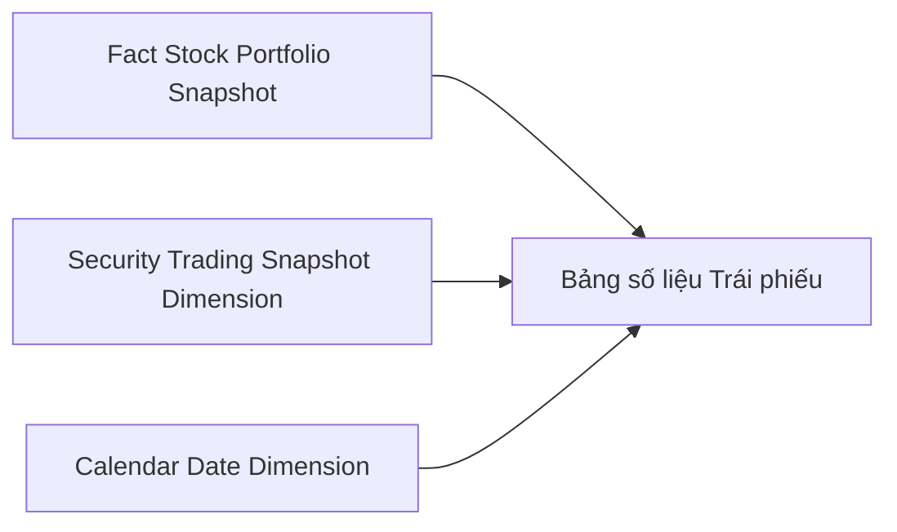
```mermaid
flowchart LR
    F1["Fact Stock Portfolio Snapshot"] --> RPT2["Bảng số liệu Trái phiếu"]
    D1["Security Trading Snapshot Dimension"] --> RPT2
    D3["Calendar Date Dimension"] --> RPT2
```

**Bảng grain:** *(giống Nhóm 1 — cùng Fact/Dimension, không grain riêng; trái phiếu luôn có FK Index Constituent = NULL)*

---

#### Nhóm 3 - Biểu đồ kỹ thuật cổ phiếu

> **Phân loại:** Phân tích
> **Atomic:** `Security Trading Snapshot` ← MDDS.JAD_STOCKINFOR — **READY** (Nguồn 2, `design_status: approved` tại file LLD, 2026-07-03) / `Securities Trade` ← ORDERTRADE.TRADE_BOOK_HOSE, TRADE_BOOK_HNX — **READY** (Nguồn 2, approved) / `Public Company` ← IDS.COMPANY_PROFILES — **READY** (Nguồn 1, approved) / `Classification Business Line` ← ECAT.BUSINESS_LINE_LEVEL_1, BUSINESS_LINE_LEVEL_2 — **READY** (Nguồn 1, approved) / `Index Constituent Snapshot` ← MDDS.JAD_CSIDXINFOR — **READY** (Nguồn 2, approved)
>
> **Ghi chú tái sử dụng:** BA liệt kê 17 dòng con cho STT 3, nhưng 14/17 chỉ tiêu (Ngành, Sàn, Mã CK, Chỉ số, Loại phái sinh, Phương thức khớp lệnh, Ngày, Giá đóng cửa, Giá tham chiếu, Thay đổi %, KLGD) đã có KPI ID sẵn từ Nhóm 1/Nhóm 2 — reuse thẳng, không khai sinh KPI mới. Chỉ có 3 chỉ tiêu mới thật (Giá mở cửa, Giá cao nhất, Giá thấp nhất) — bổ sung 3 cột lên `Security Trading Snapshot Dimension` theo coverage rule. 2 chỉ tiêu còn lại (Doanh thu, Lợi nhuận sau thuế) cùng "Kỳ báo cáo" — xem ghi chú Dữ liệu động dưới đây.
> **Ghi chú Dữ liệu động (Doanh thu, LNST, Kỳ báo cáo):** Nguồn BA tham khảo `IDS.data`/`report_catalog`/`rrow`/`rcol` (cấu trúc EAV báo cáo tài chính) — theo quyết định trước đó (ghi nhớ dự án), cấu trúc EAV này **không dùng làm nền Fact** cho tới khi có entity Atomic chuẩn hóa dùng chung nhiều module. Doanh thu/LNST là measure sẽ **bổ sung sau lên `Fact Stock Portfolio Snapshot` hiện có** (không tạo Fact riêng) — join qua FK `Public Company Dimension` đã có sẵn trên Fact (BA xác nhận: "Join qua từ company_profiles với Id và company_profile_id" — tức join theo mã công ty đại chúng, đúng theo Public Company đã dùng ở Nhóm 1). "Kỳ báo cáo" (năm/quý) là chiều thời gian riêng của 2 measure này, khác `Calendar Date Dimension` (theo ngày giao dịch) — đánh PENDING cùng nhóm, chưa thiết kế chiều thời gian kỳ báo cáo cho tới khi Atomic sẵn sàng.

**Mockup:**

| Mã CK | Ngành | Sàn | Chỉ số | Ngày | Giá mở | Giá cao | Giá thấp | Giá đóng | Giá TC | Thay đổi | % TĐ | KLGD | Doanh thu | LNST |
|---|---|---|---|---|---|---|---|---|---|---|---|---|---|---|
| VCB | Ngân hàng | HOSE | VN30 | 27/07/2026 | 82.00 | 83.00 | 81.50 | 82.50 | 82.00 | +0.50 | +0.61% | 548 Tr | — | — |

**Source:** `Fact Stock Portfolio Snapshot` → `Security Trading Snapshot Dimension`, `Public Company Dimension`, `Calendar Date Dimension`, `Index Constituent Dimension`

**Bảng KPI:**

| KPI ID | Tên KPI | Đơn vị | Tính chất | Công thức | Ghi chú | Trạng thái |
|---|---|---|---|---|---|---|
| K_GSTT_2 | Ngành | — | Chiều | `Public Company Dimension.Business Line Level 1 Code`, `Classification Business Line Name` | Reuse từ Nhóm 1 | READY |
| K_GSTT_3 | Sàn | — | Chiều | `Security Trading Snapshot Dimension.Floor Code` | Reuse từ Nhóm 1 | READY |
| K_GSTT_1 | Mã CK | — | Chiều | `Security Trading Snapshot Dimension.Symbol` | Reuse từ Nhóm 1. BA lọc riêng "Mã CK cổ phiếu" (`Stock Type Code <> '1' AND Floor Code IN ('04','10','03','02') AND Market Id Code NOT IN ('BDO','HCX')`) — filter con của K_GSTT_1, không khai KPI mới | READY |
| K_GSTT_4 | Chỉ số | — | Chiều | `Index Constituent Dimension.Index Code` | Reuse từ Nhóm 1 | READY |
| K_GSTT_5 | Loại phái sinh | — | Chiều | `Security Trading Snapshot Dimension.Stock Type Code`, `Underlying Symbol` | Reuse từ Nhóm 1 | READY |
| K_GSTT_6 | Phương thức khớp lệnh (thỏa thuận) | — | Chiều | `Securities Trade.Board Type Code IN ('T1','T2','T3','T4','T6')` | Reuse từ Nhóm 1 | READY |
| K_GSTT_7 | Ngày | — | Chiều | `Calendar Date Dimension.Calendar Date` | Reuse từ Nhóm 1 | READY |
| K_GSTT_27 | Giá mở cửa | VNĐ | Cơ sở | `Security Trading Snapshot Dimension.Open Price` | Mới — bổ sung cột lên Dimension theo coverage rule | READY |
| K_GSTT_28 | Giá cao nhất | VNĐ | Cơ sở | `Security Trading Snapshot Dimension.High Price` | Mới — bổ sung cột lên Dimension theo coverage rule | READY |
| K_GSTT_29 | Giá thấp nhất | VNĐ | Cơ sở | `Security Trading Snapshot Dimension.Low Price` | Mới — bổ sung cột lên Dimension theo coverage rule | READY |
| K_GSTT_10 | Giá đóng cửa | VNĐ | Cơ sở | `Security Trading Snapshot Dimension.Close Price` | Reuse từ Nhóm 1 | READY |
| K_GSTT_9 | Giá tham chiếu | VNĐ | Cơ sở | `Security Trading Snapshot Dimension.Reference Price` | Reuse từ Nhóm 1 | READY |
| K_GSTT_11 | Thay đổi (+/-) | VNĐ | Cơ sở | `Security Trading Snapshot Dimension.Price Change` | Reuse từ Nhóm 1 | READY |
| K_GSTT_13 | Khối lượng giao dịch | Cổ phiếu | Phái sinh | `SUM(Securities Trade.Execution Volume WHERE Market Id Code IN ('UPX','STX','STO')) GROUP BY Symbol, Trade Date` | Reuse từ Nhóm 1 (K_GSTT_13 = Tổng KL) — cùng cảnh báo double-count Index Constituent như Nhóm 1 | READY |
| K_GSTT_30 | Kỳ báo cáo | — | Chiều | *(chưa xác định — chiều thời gian riêng cho BCTC, khác Calendar Date Dimension theo ngày giao dịch)* | Dữ liệu động — chờ Atomic chuẩn hóa EAV IDS report | PENDING |
| K_GSTT_31 | Doanh thu | VNĐ | Cơ sở | *(chưa xác định — SUM(IDS.data.data_value) theo report_cd BCKQKD, row tùy enterprise_type)* | Dữ liệu động — bổ sung sau lên Fact Stock Portfolio Snapshot, join qua Public Company Dimension. Chờ Atomic chuẩn hóa EAV IDS report | PENDING |
| K_GSTT_32 | Lợi nhuận sau thuế | VNĐ | Cơ sở | *(chưa xác định — SUM(IDS.data.data_value) theo report_cd BCKQKD, row tùy enterprise_type)* | Dữ liệu động — bổ sung sau lên Fact Stock Portfolio Snapshot, join qua Public Company Dimension. Chờ Atomic chuẩn hóa EAV IDS report | PENDING |

**Star Schema:** *(dùng chung `Fact Stock Portfolio Snapshot` + `Security Trading Snapshot Dimension` (đã bổ sung `Open_Price`, `High_Price`, `Low_Price`) + `Public Company Dimension` + `Calendar Date Dimension` + `Index Constituent Dimension` đã vẽ ở Nhóm 1 — xem Nhóm 1. K_GSTT_31/32 (Doanh thu, LNST) PENDING, chưa vẽ thêm bảng nào cho tới khi Atomic EAV sẵn sàng.)*

**Lineage Mart → Báo cáo:**

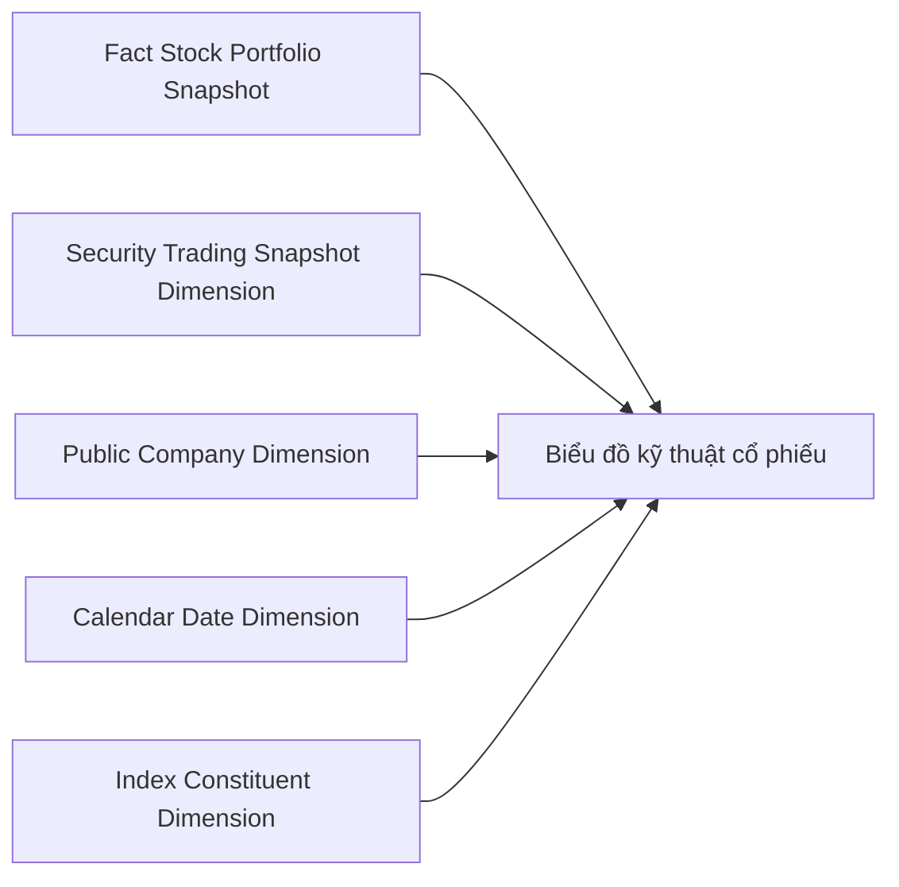
```mermaid
flowchart LR
    F1["Fact Stock Portfolio Snapshot"] --> RPT3["Biểu đồ kỹ thuật cổ phiếu"]
    D1["Security Trading Snapshot Dimension"] --> RPT3
    D2["Public Company Dimension"] --> RPT3
    D3["Calendar Date Dimension"] --> RPT3
    D4["Index Constituent Dimension"] --> RPT3
```

**Bảng grain:** *(giống Nhóm 1 — cùng Fact/Dimension, không grain riêng)*

---

#### Nhóm 4 - Biểu đồ kỹ thuật trái phiếu

> **Phân loại:** Phân tích
> **Atomic:** `Security Trading Snapshot` ← MDDS.JAD_STOCKINFOR — **READY** (Nguồn 2, approved) / `Securities Trade` ← ORDERTRADE.TRADE_BOOK_HOSE, TRADE_BOOK_HNX — **READY** (Nguồn 2, approved)
>
> **Ghi chú tái sử dụng:** 100% chỉ tiêu của STT 4 đã có KPI ID sẵn từ Nhóm 2 (trái phiếu) và Nhóm 3 (Open/High/Low Price) — không có chỉ tiêu mới, không tạo/sửa Fact hay Dimension nào. BA không liệt kê Doanh thu/LNST cho trái phiếu (khác STT 3 dành cho cổ phiếu) — đúng nghiệp vụ, BCTC gắn theo mã công ty đại chúng (cổ phiếu), không áp dụng cho trái phiếu.

**Mockup:**

| Mã TP | Ngày | Giá mở | Giá cao | Giá thấp | Giá đóng | Giá TC | Thay đổi | % TĐ | KLGD |
|---|---|---|---|---|---|---|---|---|---|
| TCH2226 | 27/07/2026 | 102.8 | 103.2 | 102.5 | 103.0 | 102.5 | +0.5 | +0.49% | 1.200 |

**Source:** `Fact Stock Portfolio Snapshot` → `Security Trading Snapshot Dimension`, `Calendar Date Dimension`

**Bảng KPI:**

| KPI ID | Tên KPI | Đơn vị | Tính chất | Công thức | Ghi chú | Trạng thái |
|---|---|---|---|---|---|---|
| K_GSTT_20 | Mã trái phiếu | — | Chiều | `Security Trading Snapshot Dimension.Symbol` | Reuse từ Nhóm 2. BA lọc thêm `Market Id Code IN ('BDO','HCX')` — filter con của K_GSTT_20, không khai KPI mới | READY |
| K_GSTT_7 | Ngày | — | Chiều | `Calendar Date Dimension.Calendar Date` | Reuse từ Nhóm 1 | READY |
| K_GSTT_30 | Kỳ báo cáo | — | Chiều | *(chưa xác định)* | Reuse từ Nhóm 3 — vẫn PENDING, chờ Atomic chuẩn hóa EAV IDS report | PENDING |
| K_GSTT_27 | Giá mở cửa | VNĐ | Cơ sở | `Security Trading Snapshot Dimension.Open Price` | Reuse từ Nhóm 3 | READY |
| K_GSTT_28 | Giá cao nhất | VNĐ | Cơ sở | `Security Trading Snapshot Dimension.High Price` | Reuse từ Nhóm 3 | READY |
| K_GSTT_29 | Giá thấp nhất | VNĐ | Cơ sở | `Security Trading Snapshot Dimension.Low Price` | Reuse từ Nhóm 3 | READY |
| K_GSTT_10 | Giá đóng cửa | VNĐ | Cơ sở | `Security Trading Snapshot Dimension.Close Price` | Reuse từ Nhóm 1 | READY |
| K_GSTT_9 | Giá tham chiếu | VNĐ | Cơ sở | `Security Trading Snapshot Dimension.Reference Price` | Reuse từ Nhóm 1 | READY |
| K_GSTT_11 | Thay đổi (+/-) | VNĐ | Cơ sở | `Security Trading Snapshot Dimension.Price Change` | Reuse từ Nhóm 1 | READY |
| K_GSTT_23 | Khối lượng giao dịch | Trái phiếu | Phái sinh | `SUM(Securities Trade.Execution Volume WHERE Market Id Code IN ('BDO','HCX') AND Board Type Code IN ('G1','G2','G3','T1','T2','T3')) GROUP BY Symbol, Trade Date` | Reuse từ Nhóm 2 (K_GSTT_23 = KLGD trái phiếu) — FK Index Constituent luôn NULL (trái phiếu không thuộc rổ chỉ số) | READY |

**Star Schema:** *(dùng chung `Fact Stock Portfolio Snapshot` + `Security Trading Snapshot Dimension` + `Calendar Date Dimension` đã vẽ ở Nhóm 1/3 — không có cột/bảng mới)*

**Lineage Mart → Báo cáo:**

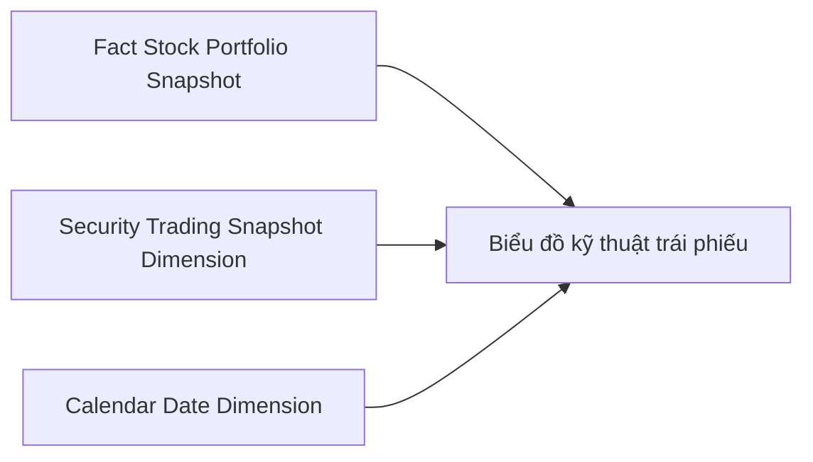
```mermaid
flowchart LR
    F1["Fact Stock Portfolio Snapshot"] --> RPT4["Biểu đồ kỹ thuật trái phiếu"]
    D1["Security Trading Snapshot Dimension"] --> RPT4
    D3["Calendar Date Dimension"] --> RPT4
```

**Bảng grain:** *(giống Nhóm 1 — cùng Fact/Dimension, không grain riêng; trái phiếu luôn có FK Index Constituent = NULL)*

---

#### Nhóm 5 - Diễn biến chỉ số thị trường

> **Phân loại:** Phân tích
> **Atomic:** `Market Index Snapshot` ← MDDS.JAD_MARKETINFOR — **READY** (Nguồn 1, approved 2026-07-03) / `Index Constituent Snapshot` ← MDDS.JAD_CSIDXINFOR — **READY** (Nguồn 2, approved) / `Securities Trade` ← ORDERTRADE.TRADE_BOOK_HOSE, TRADE_BOOK_HNX — **READY** (Nguồn 2, approved)
>
> **Ghi chú tái sử dụng:** BA liệt kê 23 dòng con — 22 KPI khai sinh (K_GSTT_4, K_GSTT_33–54), 1 dòng trùng ("Giá" = điểm chỉ số gần nhất trong ngày, trùng hoàn toàn K_GSTT_34, không khai KPI mới). `Market Index Dimension`/`Fact Market Index Snapshot` reuse + mở rộng từ QLKD (xem ghi chú Cụm 2a). "Số cổ phiếu lưu hành" và "Vốn hóa thị trường" (sub-row 22, 23) tham chiếu nguồn VSDC (báo cáo "BM 1_Báo cáo về khối lượng chứng khoán đang lưu hành") — **chưa có entity Atomic nào** (đã tra cứu xác nhận, kể cả `IDS.COMPANY_SHARE_STATISTICS` không map trực tiếp) — PENDING chờ nguồn CSDL thực tế.

**Mockup:**

| Chỉ số | Ngày | Giá ĐC | Giá cao | Giá thấp | Thay đổi | % TĐ | Mã tăng | Mã giảm | Mã đứng giá | Mã trần | Mã sàn | KLGD | GTGD | KLGD TT | GTGD TT | KLNN ròng | GTNN ròng | Vốn hóa TT |
|---|---|---|---|---|---|---|---|---|---|---|---|---|---|---|---|---|---|---|
| VN-Index | 27/07/2026 | 1,245.32 | 1,250.10 | 1,238.50 | +5.20 | +0.42% | 245 | 180 | 32 | 12 | 5 | 850 Tr | 18.5 Tỷ | 45 Tr | 1.2 Tỷ | +80 Tỷ | +120 Tỷ | — |

**Source:** `Fact Market Index Snapshot` → `Market Index Dimension`, `Calendar Date Dimension`

**Bảng KPI:**

| KPI ID | Tên KPI | Đơn vị | Tính chất | Công thức | Ghi chú | Trạng thái |
|---|---|---|---|---|---|---|
| K_GSTT_4 | Chỉ số | — | Chiều | `Market Index Dimension.Market Code` | Reuse cơ chế Chiều, khác Dimension với K_GSTT_4 gốc (Nhóm 1 dùng Index Constituent Dimension) — đây là chỉ số thị trường (VN-Index/HNX/UPCOM/VN30), không phải rổ thành viên. Xem ghi chú Index Code vs Market Code | READY |
| K_GSTT_33 | Ngày | — | Chiều | `Calendar Date Dimension.Calendar Date` | Reuse cơ chế, Fact khác Nhóm 1 | READY |
| K_GSTT_54 | Theo giờ trong ngày | — | Chiều | `Fact Market Index Intraday.Index Time` | Chiều slicer theo khung giờ trong ngày (khác `Ngày` — theo `Calendar Date`), gắn trực tiếp trên grain của `Fact Market Index Intraday` | READY |
| K_GSTT_34 | Giá đóng cửa (điểm chỉ số) | Điểm | Cơ sở | `Fact Market Index Snapshot.Market Index Value` | Đã có sẵn ở Fact QLKD. BA có 1 dòng riêng "Giá" (điểm chỉ số gần nhất trong ngày, cùng logic `rn=1` theo `indexTime`) — trùng hoàn toàn K_GSTT_34, không khai KPI mới | READY |
| K_GSTT_35 | Giá cao nhất | Điểm | Cơ sở | `Fact Market Index Snapshot.High Index` | Mới — bổ sung cột (mở rộng Fact QLKD) | READY |
| K_GSTT_36 | Giá thấp nhất | Điểm | Cơ sở | `Fact Market Index Snapshot.Low Index` | Mới — bổ sung cột (mở rộng Fact QLKD) | READY |
| K_GSTT_37 | Thay đổi (+/-) | Điểm | Cơ sở | `Fact Market Index Snapshot.Index Change` | Mới — bổ sung cột (mở rộng Fact QLKD) | READY |
| K_GSTT_38 | % thay đổi | % | Phái sinh | `Fact Market Index Snapshot.Index Percent Change` | Mới — bổ sung cột (mở rộng Fact QLKD) | READY |
| K_GSTT_39 | Số lượng mã tăng | Mã | Cơ sở | `Fact Market Index Snapshot.Advances Count` | Mới — bổ sung cột (mở rộng Fact QLKD) | READY |
| K_GSTT_40 | Số lượng mã giảm | Mã | Cơ sở | `Fact Market Index Snapshot.Declines Count` | Mới — bổ sung cột (mở rộng Fact QLKD) | READY |
| K_GSTT_41 | Số lượng mã đứng giá | Mã | Cơ sở | `Fact Market Index Snapshot.No Change Count` | Mới — bổ sung cột (mở rộng Fact QLKD) | READY |
| K_GSTT_42 | Số lượng mã tăng trần | Mã | Cơ sở | `Fact Market Index Snapshot.Ceiling Count` | Mới — bổ sung cột (mở rộng Fact QLKD) | READY |
| K_GSTT_43 | Số lượng mã giảm sàn | Mã | Cơ sở | `Fact Market Index Snapshot.Floor Count` | Mới — bổ sung cột (mở rộng Fact QLKD) | READY |
| K_GSTT_44 | Giá trị GD theo realtime | VNĐ | Cơ sở | `Fact Market Index Intraday.Total Value At Time` | Grain riêng (1 row/Market Code/Index Time) — xem Fact Market Index Intraday bên dưới | READY |
| K_GSTT_45 | Điểm của chỉ số theo realtime | Điểm | Cơ sở | `Fact Market Index Intraday.Market Index Value At Time` | Grain riêng (1 row/Market Code/Index Time) — xem Fact Market Index Intraday bên dưới | READY |
| K_GSTT_46 | KLGD của chỉ số | Cổ phiếu | Phái sinh | `SUM(Securities Trade.Execution Volume WHERE Symbol IN (Index Constituent Dimension.Symbol WHERE Index Code = mapping(Market Code)) AND Market Id Code IN ('STO','STX','UPX')) GROUP BY Index Code, Trade Date` | Pre-aggregate qua 2 tầng nguồn (Index Constituent + Securities Trade) — cần mapping Market Code↔Index Code, xem ghi chú Cụm 2 | READY |
| K_GSTT_47 | GTGD của chỉ số | VNĐ | Phái sinh | `SUM(Securities Trade.Execution Value WHERE Symbol IN (Index Constituent Dimension.Symbol WHERE Index Code = mapping(Market Code)) AND Market Id Code IN ('STO','STX','UPX')) GROUP BY Index Code, Trade Date` | Pre-aggregate — cùng ghi chú K_GSTT_46 | READY |
| K_GSTT_48 | KLNN ròng (theo chỉ số) | Cổ phiếu | Phái sinh | `SUM(Buy Foreign Investor Type Code IN ('10','20') → Execution Volume) − SUM(Sell Foreign Investor Type Code IN ('10','20') → Execution Volume) WHERE Symbol IN (mã thuộc Index Code) GROUP BY Index Code, Trade Date` | Kỹ thuật đủ nguồn giống K_GSTT_46/47 (JOIN Index Constituent + Securities Trade) — thiết kế READY dù BA ghi "Chưa có CSDL - Map biểu mẫu" (đánh giá: đây là ghi chú BA chưa chốt biểu mẫu hiển thị, không phải thiếu nguồn) | READY |
| K_GSTT_49 | GTNN ròng (theo chỉ số) | VNĐ | Phái sinh | `SUM(Buy Foreign Investor Type Code IN ('10','20') → Execution Value) − SUM(Sell Foreign Investor Type Code IN ('10','20') → Execution Value) WHERE Symbol IN (mã thuộc Index Code) GROUP BY Index Code, Trade Date` | Cùng ghi chú K_GSTT_48 | READY |
| K_GSTT_50 | KLGD thỏa thuận (chỉ số) | Cổ phiếu | Phái sinh | `Fact Market Index Snapshot.PT Total Volume` | Mới — bổ sung cột (mở rộng Fact QLKD), có sẵn trên Market Index Snapshot, không cần pre-aggregate qua Securities Trade | READY |
| K_GSTT_51 | GTGD thỏa thuận (chỉ số) | VNĐ | Phái sinh | `Fact Market Index Snapshot.PT Total Value` | Mới — bổ sung cột (mở rộng Fact QLKD) | READY |
| K_GSTT_52 | Số cổ phiếu lưu hành | Cổ phiếu | Cơ sở | *(chưa xác định)* | Trùng K_GSTT_55 (Nhóm 6) — cùng 1 chỉ tiêu, cùng nguồn VSDC "BM 1_Báo cáo về khối lượng chứng khoán đang lưu hành". Atomic `Public Company Share Statistics` có attribute tương ứng nhưng grain mismatch + cột Loại dữ liệu BA để trống → PENDING (xem O_GSTT_2). Cột đặt trên `Fact Stock Portfolio Snapshot` (Nhóm 1, join qua Public Company Dimension), KHÔNG phải Fact Market Index Snapshot — measure này theo mã CK, không theo market_code | PENDING |
| K_GSTT_53 | Vốn hóa thị trường | VNĐ | Phái sinh | `SUM(Giá đóng cửa × Số cổ phiếu lưu hành) theo từng mã CK, GROUP BY Index Code` (qua `Index Constituent Dimension`) | Phụ thuộc K_GSTT_52 (chưa có nguồn) — PENDING. Trùng K_GSTT_61 (Nhóm 6) — cùng 1 chỉ tiêu. Công thức đặt trên `Fact Stock Portfolio Snapshot` (Nhóm 1), không phải Fact Market Index Snapshot — đã sửa lại ghi chú Fact đích cho nhất quán với Nhóm 6 (2026-07-27) | PENDING |

**Star Schema:**

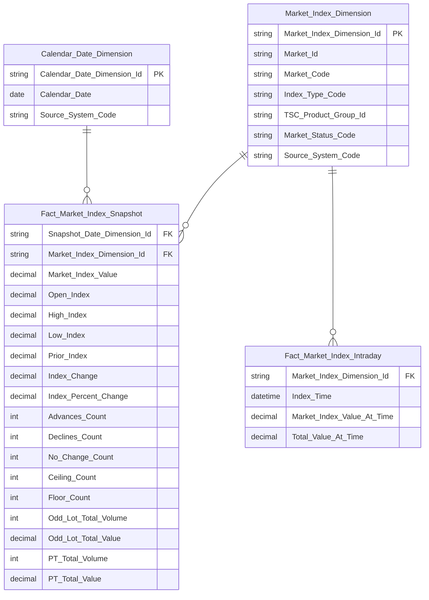
```mermaid
erDiagram
    Market_Index_Dimension {
        string Market_Index_Dimension_Id PK
        string Market_Id
        string Market_Code
        string Index_Type_Code
        string TSC_Product_Group_Id
        string Market_Status_Code
        string Source_System_Code
    }
    Calendar_Date_Dimension {
        string Calendar_Date_Dimension_Id PK
        date Calendar_Date
        string Source_System_Code
    }
    Fact_Market_Index_Snapshot {
        string Snapshot_Date_Dimension_Id FK
        string Market_Index_Dimension_Id FK
        decimal Market_Index_Value
        decimal Open_Index
        decimal High_Index
        decimal Low_Index
        decimal Prior_Index
        decimal Index_Change
        decimal Index_Percent_Change
        int Advances_Count
        int Declines_Count
        int No_Change_Count
        int Ceiling_Count
        int Floor_Count
        int Odd_Lot_Total_Volume
        decimal Odd_Lot_Total_Value
        int PT_Total_Volume
        decimal PT_Total_Value
    }
    Fact_Market_Index_Intraday {
        string Market_Index_Dimension_Id FK
        datetime Index_Time
        decimal Market_Index_Value_At_Time
        decimal Total_Value_At_Time
    }
    Market_Index_Dimension ||--o{ Fact_Market_Index_Snapshot : " "
    Calendar_Date_Dimension ||--o{ Fact_Market_Index_Snapshot : " "
    Market_Index_Dimension ||--o{ Fact_Market_Index_Intraday : " "
```

> **Fact Market Index Intraday không có FK riêng tới Calendar Date Dimension** — `Index Time` (datetime) đã bao hàm ngày, dùng trực tiếp làm trục thời gian cho biểu đồ đường/cột, không cần join thêm Calendar Date Dimension (đây là dimension theo ngày, quá thô so với grain phút của Fact này).

**Lineage Mart → Báo cáo:**

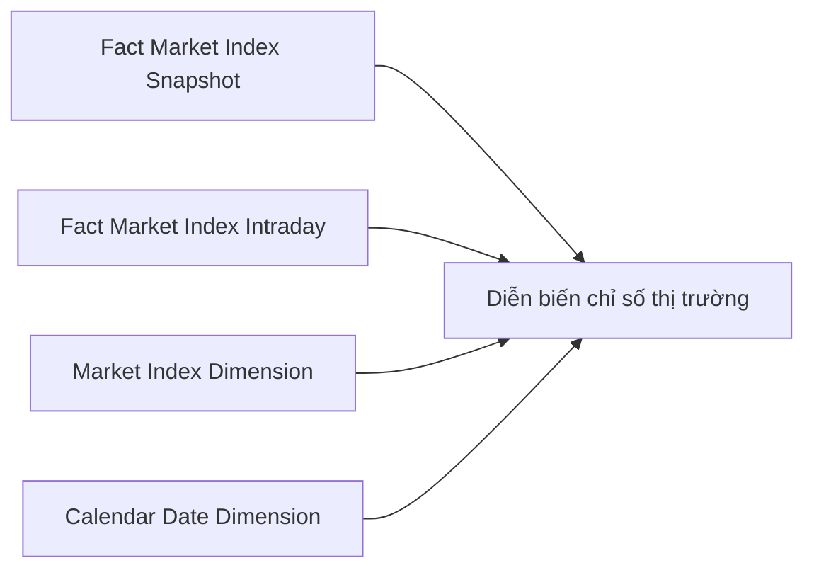
```mermaid
flowchart LR
    F1["Fact Market Index Snapshot"] --> RPT5["Diễn biến chỉ số thị trường"]
    F2["Fact Market Index Intraday"] --> RPT5
    D1["Market Index Dimension"] --> RPT5
    D2["Calendar Date Dimension"] --> RPT5
```

**Bảng grain:**

| Tên bảng | Grain |
|---|---|
| Fact Market Index Snapshot | 1 row / chỉ số thị trường (market_code) / ngày (bản ghi cuối phiên) — reuse + mở rộng từ QLKD |
| Fact Market Index Intraday | 1 row / chỉ số thị trường (market_code) / Index Time (theo phút, đúng nguồn) |
| Market Index Dimension | 1 row / combo (Market Id, Market Code) (SCD4A) — reuse từ QLKD |
| Calendar Date Dimension | 1 row / ngày |

> **Coverage rule:** Không áp dụng thêm cho `Market Index Dimension` (reuse nguyên trạng từ QLKD, không sửa cấu trúc Dimension). Coverage rule áp dụng cho `Fact Market Index Snapshot`: đã kéo đủ toàn bộ measure snapshot cuối ngày có thật trong Atomic `Market Index Snapshot` (Open/High/Low/Prior Index, Change, %Change, Advances/Declines/No Change/Ceiling/Floor Count, Odd Lot, PT Total) — không có measure nào trong Atomic entity này bị bỏ sót.

---

#### Nhóm 6 - Định giá thị trường

> **Phân loại:** Dashboard
> **Atomic:** `Security Trading Snapshot` ← MDDS.JAD_STOCKINFOR — **READY** (Nguồn 2, approved, reuse Nhóm 1) / `Public Company` ← IDS.COMPANY_PROFILES — **READY** (Nguồn 1, approved, reuse Nhóm 1) / `Classification Business Line` ← ECAT.BUSINESS_LINE_LEVEL_1, BUSINESS_LINE_LEVEL_2 — **READY** (Nguồn 1, approved, reuse Nhóm 1) / `Index Constituent Snapshot` ← MDDS.JAD_CSIDXINFOR — **READY** (Nguồn 2, approved, reuse Nhóm 1) / `Public Company Share Statistics` ← IDS.COMPANY_SHARE_STATISTICS — **READY** (Nguồn 2, draft) nhưng **grain mismatch** (current-state, không có ngày lịch sử) + cột "Loại dữ liệu" BA để trống — PENDING (xem O_GSTT_2) / EAV báo cáo tài chính (`IDS.data`/`report_catalog`/`rrow`/`rcol` cho LNST/VCSH) — PENDING (xem O_GSTT_1)
>
> **Ghi chú tái sử dụng và sửa lại kiến trúc (2026-07-27):** Thiết kế lần đầu đã sai — đặt "Chỉ số"/"Giá trị chỉ số" lên `Fact Market Index Snapshot` (Nhóm 5, grain market_code/ngày, không có FK tới `Public Company Dimension`) trong khi "Ngành"/LNST/VCSH lại join qua `Public Company Dimension` — 2 nhánh không có join key nối nhau, tách rời sai thực tế nghiệp vụ. **Sửa lại đúng:** toàn bộ 13 dòng con của STT 6 dùng chung **1 Fact duy nhất** — mở rộng `Fact Stock Portfolio Snapshot` (Nhóm 1, grain 1 row/mã CK/rổ chỉ số/ngày, đã có sẵn FK `Public Company Dimension`, `Index Constituent Dimension`, `Calendar Date Dimension`). LNST/VCSH/Số cổ phiếu lưu hành (nguồn biểu mẫu/EAV khác nhau) đều **link về Fact này qua mã công ty** (`Public Company Dimension`) — đúng cơ chế BA mô tả ("Join qua từ company_profiles với Id và company_profile_id"), sau đó P/E/P/B/EPS tính theo từng mã CK, rồi "Vốn hóa thị trường"/"Giá trị chỉ số" là SUM cộng dồn theo `Index Code` (qua `Index Constituent Dimension`, đã có FK sẵn) — không dùng `Fact Market Index Snapshot`/`Market Index Dimension` của QLKD nữa.
> **Sửa nguồn giá (khác SQL tham khảo BA):** SQL tham khảo của BA cho P/E/P/B/Vốn hóa dùng CTE `GĐC` lấy `marketIndex` (điểm chỉ số, từ `JAD_MARKETINFOR`) JOIN `JAD_CSIDXINFOR` rồi gán nhãn là giá theo `MCK` — đây là nhầm lẫn khái niệm (điểm chỉ số không phải giá cổ phiếu). Đã sửa dùng **Giá đóng cửa thật của từng mã CK** (K_GSTT_10, `Security Trading Snapshot Dimension.Close Price`, đã khai sinh ở Nhóm 1) làm nguồn giá cho toàn bộ công thức P/E/P/B/Vốn hóa — đúng bản chất tài chính. Cần xác nhận lại với BA/nghiệp vụ về nhầm lẫn này trước khi lên LLD (xem O_GSTT_4).
> "Ngành" chỉ dùng làm **filter/slicer** (BA: `SELECT DISTINCT industry_cd, industry_name FROM IDS.categories`) trên danh sách công ty, không phải chiều bổ sung logic tính toán khác.

**Mockup:**

| Mã CK | Ngành | sàn | Chỉ số | Ngày | Giá đóng cửa | Số CP lưu hành | LNST | VCSH | P/E | P/B | EPS | Vốn hóa TT (theo Chỉ số) |
|---|---|---|---|---|---|---|---|---|---|---|---|---|
| VCB | Ngân hàng | HOSE | VN30 | 27/07/2026 | 82.50 | *(pending)* | *(pending)* | *(pending)* | *(pending)* | *(pending)* | *(pending)* | *(pending)* |

**Source:** `Fact Stock Portfolio Snapshot` (mở rộng, Nhóm 1) → `Security Trading Snapshot Dimension`, `Public Company Dimension`, `Calendar Date Dimension`, `Index Constituent Dimension` — 1 Fact duy nhất, không tạo Fact/Dimension mới.

**Bảng KPI:**

| KPI ID | Tên KPI | Đơn vị | Tính chất | Công thức | Ghi chú | Trạng thái |
|---|---|---|---|---|---|---|
| K_GSTT_4 | Chỉ số | — | Chiều | `Index Constituent Dimension.Index Code` | Reuse từ Nhóm 1 (không phải biến thể Market Index Dimension của Nhóm 5) | READY |
| K_GSTT_2 | Ngành | — | Chiều | `Public Company Dimension.Business Line Level 1 Code`, `Classification Business Line Name` | Reuse từ Nhóm 1 — dùng làm filter/slicer danh sách công ty trước khi tính LNST/VCSH | READY |
| K_GSTT_3 | sàn | — | Chiều | `Security Trading Snapshot Dimension.Floor Code` | Reuse từ Nhóm 1 | READY |
| K_GSTT_33 | Ngày | — | Chiều | `Calendar Date Dimension.Calendar Date` | Reuse từ Nhóm 1 | READY |
| K_GSTT_10 | Giá trị chỉ số | Điểm | Chỉ tiêu phái sinh | `Security Trading Snapshot Dimension.Close Price` | BA tham chiếu `JAD_MARKETINFOR.marketIndex` (điểm chỉ số) — đã sửa dùng Giá đóng cửa thật theo mã CK (xem ghi chú sửa nguồn giá ở trên), trùng hoàn toàn K_GSTT_10, không khai KPI mới | READY |
| K_GSTT_10 | Giá đóng cửa | VNĐ | Cơ sở | `Security Trading Snapshot Dimension.Close Price` | Reuse từ Nhóm 1 — dòng con này của BA cùng công thức với "Giá trị chỉ số" ở trên (cả 2 cùng tham chiếu `marketIndex` gốc), không khai KPI mới | READY |
| K_GSTT_55 | Số cổ phiếu đang lưu hành | Cổ phiếu | Cơ sở | *(chưa xác định)* | Nguồn VSDC "BM 1_Báo cáo về khối lượng chứng khoán đang lưu hành". Atomic `Public Company Share Statistics` có attribute tương ứng nhưng grain mismatch (current-state, không theo ngày) + cột Loại dữ liệu BA để trống → PENDING (xem O_GSTT_2). Cột mới trên `Fact Stock Portfolio Snapshot`, join qua `Public Company Dimension` | PENDING |
| K_GSTT_56 | LNST | VNĐ | Cơ sở | *(chưa xác định)* | Nguồn EAV báo cáo tài chính IDS — PENDING chờ Atomic chuẩn hóa (xem O_GSTT_1). Cột mới trên `Fact Stock Portfolio Snapshot`, join qua `Public Company Dimension` | PENDING |
| K_GSTT_57 | VCSH | VNĐ | Cơ sở | *(chưa xác định)* | Nguồn EAV báo cáo tài chính IDS — PENDING chờ Atomic chuẩn hóa (xem O_GSTT_1). Cột mới trên `Fact Stock Portfolio Snapshot`, join qua `Public Company Dimension` | PENDING |
| K_GSTT_58 | P/E thị trường | Lần | Chỉ tiêu phái sinh | `K_GSTT_10 (Giá đóng cửa) / (K_GSTT_56 (LNST) / K_GSTT_55 (Số CP lưu hành))` theo từng mã CK, SUM/weighted theo Index Code khi hiển thị mức Chỉ số | Phụ thuộc K_GSTT_55 + K_GSTT_56 — cả 2 đều PENDING | PENDING |
| K_GSTT_59 | P/B thị trường | Lần | Chỉ tiêu phái sinh | `K_GSTT_10 (Giá đóng cửa) / (K_GSTT_57 (VCSH) / K_GSTT_55 (Số CP lưu hành))` theo từng mã CK, SUM/weighted theo Index Code khi hiển thị mức Chỉ số | Phụ thuộc K_GSTT_55 + K_GSTT_57 — cả 2 đều PENDING | PENDING |
| K_GSTT_60 | EPS thị trường | VNĐ | Chỉ tiêu phái sinh | `K_GSTT_56 (LNST) / K_GSTT_55 (Số CP lưu hành)` theo từng mã CK | Phụ thuộc K_GSTT_55 + K_GSTT_56 — cả 2 đều PENDING | PENDING |
| K_GSTT_61 | Vốn hóa thị trường | VNĐ | Chỉ tiêu phái sinh | `SUM(K_GSTT_10 (Giá đóng cửa) × K_GSTT_55 (Số CP lưu hành)) GROUP BY Index Code` (qua `Index Constituent Dimension`) | Phụ thuộc K_GSTT_55 — PENDING. Trùng công thức K_GSTT_53 (Nhóm 5) — cùng 1 chỉ tiêu "Vốn hóa thị trường"; cả 2 đều đặt đúng trên `Fact Stock Portfolio Snapshot` (đã sửa lại Nhóm 5 để nhất quán, không phải Fact Market Index Snapshot) | PENDING |

**Star Schema:** Không có bảng mới — 100% reuse `Fact Stock Portfolio Snapshot` (đã có FK `Public Company Dimension`, `Index Constituent Dimension`, `Calendar Date Dimension`, `Security Trading Snapshot Dimension` từ Nhóm 1), bổ sung 3 cột mới (`Outstanding Share Quantity`, `Net Profit After Tax`, `Owner Equity` — cả 3 PENDING). Xem erDiagram tại Nhóm 1.

**Lineage Mart → Báo cáo:**

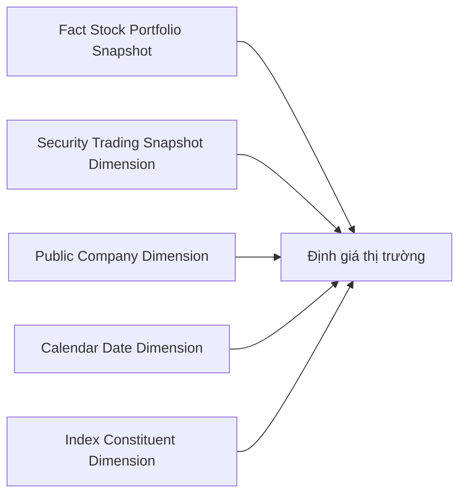
```mermaid
flowchart LR
    F1["Fact Stock Portfolio Snapshot"] --> RPT6["Định giá thị trường"]
    D1["Security Trading Snapshot Dimension"] --> RPT6
    D2["Public Company Dimension"] --> RPT6
    D3["Calendar Date Dimension"] --> RPT6
    D4["Index Constituent Dimension"] --> RPT6
```

**Bảng grain:** Không có bảng mới — cùng grain `Fact Stock Portfolio Snapshot` (1 row/mã CK/rổ chỉ số/ngày) đã có ở Nhóm 1. 3 cột PENDING (Số CP lưu hành, LNST, VCSH) khi sẵn sàng sẽ bổ sung vào đúng Fact này, cùng grain, không tạo bảng mới.

> **Coverage rule:** Không áp dụng thêm cho Dimension nào (toàn bộ reuse nguyên trạng từ Nhóm 1). 3 cột PENDING sẽ bổ sung lên `Fact Stock Portfolio Snapshot` khi Atomic sẵn sàng — theo đúng nguyên tắc measure đặt tại true grain (mã CK/ngày), không tạo Fact riêng.

---

## Section 3 — Mô hình tổng thể

### 3.1 graph TB

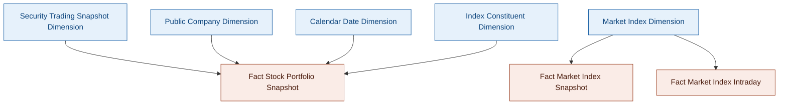
```mermaid
graph TB
    classDef dim fill:#E6F1FB,stroke:#185FA5,color:#0C447C
    classDef fact fill:#FAECE7,stroke:#993C1D,color:#4A1B0C
    classDef oper fill:#E8F5E9,stroke:#2E7D32,color:#1B5E20

    ScrTdgSnpstDim["Security Trading Snapshot Dimension"]:::dim
    PblcCoDim["Public Company Dimension"]:::dim
    CdrDtDim["Calendar Date Dimension"]:::dim
    IndexConstituentDim["Index Constituent Dimension"]:::dim
    MarketIndexDim["Market Index Dimension"]:::dim
    FctStockPortfolioSnpst["Fact Stock Portfolio Snapshot"]:::fact
    FctMarketIndexSnpst["Fact Market Index Snapshot"]:::fact
    FctMarketIndexIntraday["Fact Market Index Intraday"]:::fact

    ScrTdgSnpstDim --> FctStockPortfolioSnpst
    PblcCoDim --> FctStockPortfolioSnpst
    CdrDtDim --> FctStockPortfolioSnpst
    IndexConstituentDim --> FctStockPortfolioSnpst
    MarketIndexDim --> FctMarketIndexSnpst
    MarketIndexDim --> FctMarketIndexIntraday
```

### 3.2 Bảng Phân tích (chỉ liệt kê Fact)

| Bảng | Pattern | Grain | KPI | Trạng thái |
|---|---|---|---|---|
| Fact Stock Portfolio Snapshot | Periodic Snapshot | 1 row / mã CK / rổ chỉ số (FK nullable) / ngày giao dịch | K_GSTT_1–19 (Nhóm 1), K_GSTT_20–26 (Nhóm 2, reuse Nhóm 1), K_GSTT_27–29 (Nhóm 3, mới), K_GSTT_30–32 (Nhóm 3, PENDING), Nhóm 4 (100% reuse Nhóm 2/3), K_GSTT_55–62 (Nhóm 6, mở rộng 3 cột PENDING: Số CP lưu hành/LNST/VCSH) | READY |
| Fact Market Index Snapshot | Periodic Snapshot | 1 row / chỉ số thị trường (market_code) / ngày (bản ghi cuối phiên) | K_GSTT_34–43, K_GSTT_46–51 (Nhóm 5, reuse + mở rộng Fact QLKD) | READY |
| Fact Market Index Intraday | Transaction/Tick Snapshot | 1 row / chỉ số thị trường (market_code) / Index Time | K_GSTT_44–45, K_GSTT_54 (Nhóm 5, mới) | READY |

### 3.3 Bảng Tác nghiệp

Không có.

| Bảng | Grain | KPI | Trạng thái |
|---|---|---|---|

### 3.4 Bảng Dimension (chỉ liệt kê Dimension)

*Tất cả Dimension áp dụng SCD Type 4A (trừ khi ghi chú khác).*

| Dimension | Loại | Mô tả | Scheme | Trạng thái |
|---|---|---|---|---|
| Security Trading Snapshot Dimension | Reference per module | 1 row / mã CK — hồ sơ mô tả chứng khoán (tên, ISIN, tổ chức phát hành, ngày niêm yết, đặc điểm CW/OP/HĐTL/TP) + giá tham chiếu/đóng cửa gần nhất | MDDS_FLOOR_CODE | READY |
| Public Company Dimension | Conformed (dùng chung GSDC/QLCB/NDTNN) | 1 row / mã CK — thông tin công ty đại chúng, ngành | — | READY |
| Calendar Date Dimension | Conformed (dùng chung toàn hệ thống) | 1 row / ngày | — | READY |
| Index Constituent Dimension | Reference per module | 1 row / (Index Code, Symbol) — quan hệ thành viên rổ chỉ số, driving entity `Index Constituent Snapshot` ← MDDS.JAD_CSIDXINFOR. FK trên Fact cho phép NULL khi mã CK không thuộc rổ nào | — | READY |
| Market Index Dimension | Conformed (sở hữu QLKD, dùng chung QLKD/NDTNN/GSTT) | 1 row / combo (Market Id, Market Code) — danh mục chỉ số thị trường (VN-Index/HNX/UPCOM/VN30) | MDDS_INDEX_TYPE | READY |

---

## Section 4 — Reuse Analysis

| Datamart Entity | datamart_table | reuse_status | Ghi chú |
|---|---|---|---|
| Fact Stock Portfolio Snapshot | fct_stock_portfolio_snpst | new | Chưa có trong master — Nhóm đầu tiên của module GSTT. Grain = mã CK/rổ chỉ số/ngày, FK Index Constituent nullable — xem ghi chú Index Constituent ở Section 1. Nhóm 6 mở rộng thêm 3 cột PENDING (Outstanding Share Quantity, Net Profit After Tax, Owner Equity) — không đổi grain, join qua FK Public Company Dimension đã có sẵn |
| Security Trading Snapshot Dimension | security_trading_snpst_dim | new | Chưa có trong master. Schema đã áp dụng coverage rule (Bước 1a) ngay từ Nhóm 1 — bao gồm sẵn cột phục vụ Nhóm 2 (Coupon Rate, Yield) và các Nhóm biểu đồ/phái sinh sau này (ISIN, Issuer, CW/OP/HĐTL...). Nhóm 3 bổ sung `Open Price`, `High Price`, `Low Price` (nguồn Atomic Nguồn 2, `design_status: approved` 2026-07-03) |
| Index Constituent Dimension | index_constituent_dim | new | Chưa có trong master. Driving entity `Index Constituent Snapshot` ← MDDS.JAD_CSIDXINFOR — tách riêng khỏi `Security Trading Snapshot Dimension` vì khác driving Atomic entity/nguồn (xem lịch sử 3 lần sửa ở Section 1). Grain = 1 row/(Index Code, Symbol) có thật trong nguồn, kéo đủ 5 attribute mô tả theo coverage rule (Index Code, Index Id, Symbol, Floor Code, Add Date). FK trực tiếp vào Fact (nullable), không qua bridge Fact, đổi grain Fact để tránh Fact-to-Fact join fanout ở tầng báo cáo |
| Fact Market Index Snapshot | fct_market_index_snpst | partial | Đã có trong master, sở hữu **QLKD** (reuse NDTNN K_NDTNN_34). GSTT (Nhóm 5) **mở rộng thêm 15 measure** (Open/High/Low/Prior Index, Change, %Change, Advances/Declines/No Change/Ceiling/Floor Count, Odd Lot Volume/Value, PT Total Volume/Value) — không đổi grain, không sửa 3 cột hiện có. Đã cập nhật `modules_using` (+GSTT) và ghi chú tại `DTM_QLKD_HLD.md` Cụm 6b |
| Fact Market Index Intraday | fct_market_index_intraday | new | Chưa có trong master. GSTT tạo mới — grain 1 row/market_code/index_time (theo phút, đúng nguồn `Market Index Snapshot`) — khác grain với `fct_market_index_snpst` (1 row/market_code/ngày), phục vụ biểu đồ đường/cột theo thời gian trong ngày, không gộp chung để tránh trộn 2 grain trên 1 Fact |
| Market Index Dimension | market_index_dim | reuse | Đã có trong master, sở hữu QLKD (reuse NDTNN). GSTT reuse nguyên trạng, không cần thêm cột — đã cập nhật `modules_using` (+GSTT) |
| Public Company Dimension | public_company_dim | reuse | Đã có trong master (module gốc GSDC, dùng chung QLCB/NDTNN) — đủ cột (Code + Name ngành đệm sẵn) cho nhu cầu GSTT, không cần thêm cột. Đã sửa logic JOIN nội bộ của cột `Classification Business Line Name` sang so khớp qua Id (2026-07-27) — không đổi cấu trúc schema |
| Calendar Date Dimension | cdr_dt_dim | reuse | Conformed Dimension — luôn reuse toàn hệ thống |

---

## Section 5 — Vấn đề mở

| Open Issue ID | Nhóm | Mô tả | Trạng thái |
|---|---|---|---|
| O_GSTT_1 | Nhóm 3, Nhóm 6 | K_GSTT_30 (Kỳ báo cáo), K_GSTT_31 (Doanh thu), K_GSTT_32 (Lợi nhuận sau thuế — Nhóm 3), K_GSTT_56 (LNST), K_GSTT_57 (VCSH — Nhóm 6) — nguồn BA tham khảo `IDS.data`/`report_catalog`/`rrow`/`rcol` (cấu trúc EAV báo cáo tài chính), theo quyết định trước đó KHÔNG dùng làm nền Fact cho tới khi có entity Atomic chuẩn hóa dùng chung nhiều module. PENDING chờ Atomic chuẩn hóa; khi sẵn sàng sẽ bổ sung measure lên `Fact Stock Portfolio Snapshot` hiện có (join qua `Public Company Dimension`), không tạo Fact riêng. Cũng cần thiết kế thêm chiều "Kỳ báo cáo" (năm/quý) — khác `Calendar Date Dimension` theo ngày giao dịch. Nhóm 6 còn phụ thuộc thêm K_GSTT_58-62 (P/E/P/B/EPS/Vốn hóa thị trường — chỉ tiêu phái sinh từ LNST/VCSH) | Open |
| O_GSTT_2 | Nhóm 5, Nhóm 6 | K_GSTT_52/53 (Số cổ phiếu lưu hành, Vốn hóa thị trường — Nhóm 5), K_GSTT_55–62 (Số cổ phiếu lưu hành, P/E, P/B, EPS, Vốn hóa thị trường — Nhóm 6) — nguồn BA tham khảo "BM 1_Báo cáo về khối lượng chứng khoán đang lưu hành" (VSDC, TT138/2025/TT-BTC Mẫu số 01). Tra cứu lại (2026-07-27) tìm thấy entity Atomic `Public Company Share Statistics` (`pc_share_statistics`, Nguồn 2 working/Atomic, draft) có attribute `Total Outstanding Share Quantity` theo từng `Public Company` — nhưng đây là bảng **SCD4A current-state, không có trường ngày lịch sử**, trong khi BA cần giá trị theo từng ngày giao dịch quá khứ (JOIN `JAD_MARKETINFOR` theo `tradingdate`) → **grain mismatch**, không dùng trực tiếp làm nguồn Fact theo ngày được. Đồng thời cột "Loại dữ liệu" của các dòng con này trong BA đang **để trống** (chưa phân loại tĩnh/động) — theo rule gating, cột trống không tự suy diễn, phải PENDING chờ xác nhận. PENDING vì cả 2 lý do: (1) chờ nghiệp vụ xác nhận Loại dữ liệu, (2) chờ quyết định xử lý grain mismatch (dùng current-state xấp xỉ, hay chờ Atomic bổ sung lịch sử theo ngày) | Open |
| O_GSTT_3 | Nhóm 5 | K_GSTT_46–49 (KLGD/GTGD/KLNN ròng/GTNN ròng theo chỉ số) cần bảng mapping `Market Code ↔ Index Code` (VD: market_code='30' ↔ index_code='VN30') vì `Market Index Dimension` (định danh Market Code/Index Type Code) và `Index Constituent Dimension` (định danh Index Code) dùng 2 hệ định danh khác nhau, không có join key 1-1 sẵn có trong Atomic. Cần xác nhận với nghiệp vụ bảng mapping đầy đủ trước khi lên LLD | Open |
| O_GSTT_4 | Nhóm 6 | K_GSTT_58–62 (P/E/P/B/EPS/Vốn hóa thị trường) — SQL tham khảo của BA (CTE `GĐC`) lấy `marketIndex` (điểm chỉ số, từ `JAD_MARKETINFOR`) JOIN `JAD_CSIDXINFOR` rồi gán nhãn kết quả là giá theo `MCK` (mã CK) — đây là nhầm lẫn khái niệm tài chính (điểm chỉ số ≠ giá cổ phiếu; P/E/P/B/Vốn hóa thị trường chuẩn phải tính từ giá cổ phiếu thật). HLD đã tự sửa dùng Giá đóng cửa thật theo mã CK (K_GSTT_10, `Security Trading Snapshot Dimension.Close Price`) thay vì bám theo SQL BA. Cần xác nhận lại với BA/nghiệp vụ về nhầm lẫn này trước khi chốt Detail Mapping/LLD — nếu BA thực sự muốn dùng điểm chỉ số (không phải giá CP), công thức toàn bộ Nhóm 6 cần thiết kế lại | Open |
