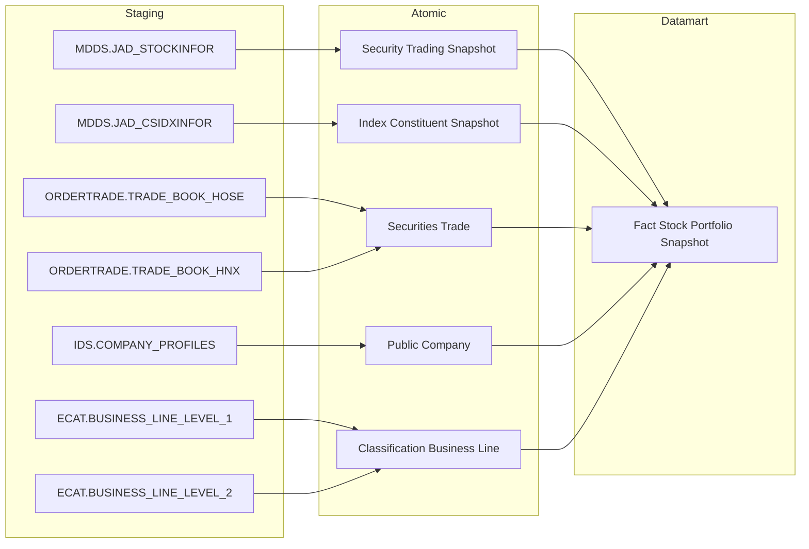
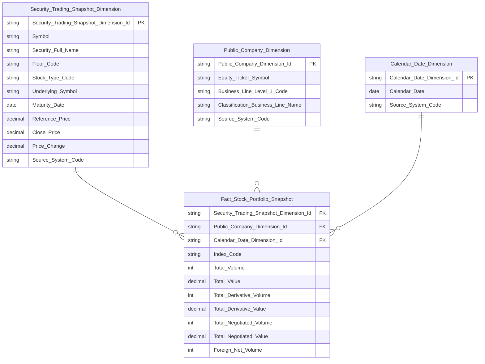
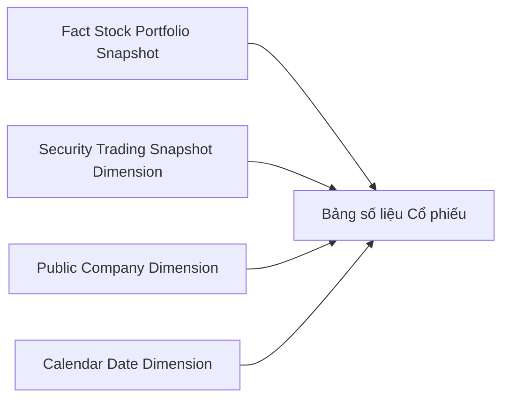
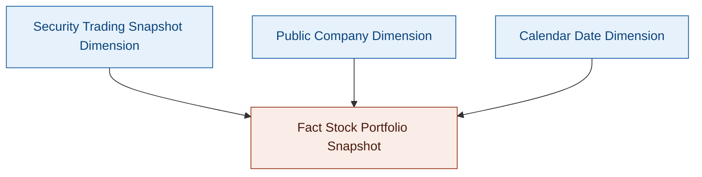

# DTM_GSTT_HLD — v4.0

**Phiên bản:** 4.0
**Ngày cập nhật:** 2026-07-27
**Thay đổi v4.0:** Thiết kế lại toàn bộ theo BA mới (`BRD/BA/BA_analyst_GSTT.csv`, thay bản `Old versions/BA_analyst_GSTT_20260727.csv`). Đổi nguyên tắc tổ chức Section 2: **1 Nhóm = 1 STT** (bám tuyệt đối theo cột STT của BA, không gộp nhiều STT vào 1 Nhóm, không tách 1 STT thành nhiều Nhóm phụ a/b/c). Áp dụng gating mới theo cột "Loại dữ liệu" (Dữ liệu tĩnh/động) — độc lập với gating theo Atomic. Dùng biến thể 5-Section (thêm Section 4 — Reuse Analysis). File được viết lại tăng dần theo từng Nhóm được duyệt — xem lịch sử bản cũ tại git history nếu cần đối chiếu.
**Phạm vi:** Đang thiết kế — cập nhật dần theo tiến độ duyệt từng Nhóm (1 → 49).

---

## Section 1 — Data Lineage

##### Cụm 1: Thông tin danh mục chứng khoán (Fact Stock Portfolio Snapshot)

```mermaid
flowchart LR
    subgraph SRC["Staging"]
        S1A["MDDS.JAD_STOCKINFOR"]
        S1B["MDDS.JAD_CSIDXINFOR"]
        S1C["ORDERTRADE.TRADE_BOOK_HOSE"]
        S1D["ORDERTRADE.TRADE_BOOK_HNX"]
        S1E["IDS.COMPANY_PROFILES"]
        S1F["ECAT.BUSINESS_LINE_LEVEL_1"]
        S1G["ECAT.BUSINESS_LINE_LEVEL_2"]
    end
    subgraph SIL["Atomic"]
        A1A["Security Trading Snapshot"]
        A1B["Index Constituent Snapshot"]
        A1C["Securities Trade"]
        A1D["Public Company"]
        A1E["Classification Business Line"]
    end
    subgraph GOLD["Datamart"]
        fct_stock_portfolio_snpst["Fact Stock Portfolio Snapshot"]
    end
    S1A --> A1A
    S1B --> A1B
    S1C --> A1C
    S1D --> A1C
    S1E --> A1D
    S1F --> A1E
    S1G --> A1E
    A1A --> fct_stock_portfolio_snpst
    A1B --> fct_stock_portfolio_snpst
    A1C --> fct_stock_portfolio_snpst
    A1D --> fct_stock_portfolio_snpst
    A1E --> fct_stock_portfolio_snpst
```

> **Ghi chú nguồn Ngành:** BA viết SQL tham khảo JOIN trực tiếp `IDS.CATEGORIES`, nhưng Atomic thật quy định `IDS.CATEGORIES` chỉ là bảng join nội bộ — không tự sinh entity (quyết định 2026-07-23). Đường JOIN chuẩn: `Public Company.Business Line Level 1 Id` → `Classification Business Line.Classification Business Line Id`. `public_company_dim` (Datamart, dùng chung GSDC/QLCB/NDTNN) đã có sẵn cột đệm `Classification Business Line Name` — logic JOIN của cột này vừa được sửa lại từ so khớp theo Code sang so khớp theo Id (2026-07-27, theo khuyến nghị Atomic designer — Id = hash theo source_system nên tránh sai khi `cl_business_line` nhận thêm nguồn ngoài ECAT). GSTT reuse nguyên trạng `public_company_dim`, không tạo Dimension riêng cho Ngành.
> **Ghi chú measure tổng hợp:** `Securities Trade` (Fact Append, grain = 1 lệnh khớp) thô hơn grain Fact (1 mã CK/ngày) — Tổng KL/GT, Tổng KL/GT thỏa thuận, KLNN ròng đều phải `SUM(...) GROUP BY Security Symbol Code, Trade Date` trước khi đặt lên Fact (Bước 4B — grain-matching).

---

## Section 2 — Tổng quan báo cáo

### Tab Dashboard thông tin về danh mục chứng khoán

#### Nhóm 1 - Bảng số liệu

> **Phân loại:** Phân tích
> **Atomic:** `Security Trading Snapshot` ← MDDS.JAD_STOCKINFOR — **READY** (Nguồn 2, approved) / `Index Constituent Snapshot` ← MDDS.JAD_CSIDXINFOR — **READY** (Nguồn 2, approved) / `Securities Trade` ← ORDERTRADE.TRADE_BOOK_HOSE, TRADE_BOOK_HNX — **READY** (Nguồn 2, approved) / `Public Company` ← IDS.COMPANY_PROFILES — **READY** (Nguồn 1, approved) / `Classification Business Line` ← ECAT.BUSINESS_LINE_LEVEL_1, BUSINESS_LINE_LEVEL_2 — **READY** (Nguồn 1, approved)

**Mockup:**

| Mã CK | Ngành | Sàn | Chỉ số | Loại phái sinh | Ngày đáo hạn | Giá TC | Giá ĐC | Thay đổi | % TĐ | Tổng KL | Tổng GT | Tổng KL PS | Tổng GT PS | Tổng KL TT | Tổng GT TT | KLNN ròng |
|---|---|---|---|---|---|---|---|---|---|---|---|---|---|---|---|---|
| VCB | Ngân hàng | HOSE | VN30 | — | — | 82.00 | 82.50 | +0.50 | +0.61% | 548 Tr | 22.1 Tỷ | 0 | 0 | 12 Tr | 1.0 Tỷ | +4 Tr |

**Source:** `Fact Stock Portfolio Snapshot` → `Security Trading Snapshot Dimension`, `Public Company Dimension`, `Calendar Date Dimension`

**Bảng KPI:**

| KPI ID | Tên KPI | Đơn vị | Tính chất | Công thức | Ghi chú | Trạng thái |
|---|---|---|---|---|---|---|
| K_GSTT_1 | Mã CK | — | Chiều | `Security Trading Snapshot Dimension.Symbol` | Filter: `Stock Type Code NOT IN ('B','1','BO','D')` (loại trái phiếu) | READY |
| K_GSTT_2 | Ngành | — | Chiều | `Public Company Dimension.Business Line Level 1 Code`, `Classification Business Line Name` | Reuse nguyên trạng `public_company_dim` — cột đệm sẵn tên ngành đã sửa JOIN theo Id (xem Section 1) | READY |
| K_GSTT_3 | Sàn | — | Chiều | `Security Trading Snapshot Dimension.Floor Code` | Scheme MDDS_FLOOR_CODE: 10-HOSE, 02-HNX, 04-UPCOM, 03-FDS | READY |
| K_GSTT_4 | Chỉ số | — | Chiều | `Index Constituent Snapshot.Index Code` | Join qua (Symbol, Trading Date) | READY |
| K_GSTT_5 | Loại phái sinh | — | Chiều | `Security Trading Snapshot Dimension.Stock Type Code`, `Underlying Symbol` | Chỉ có giá trị khi Floor Code = '03' | READY |
| K_GSTT_6 | Phương thức khớp lệnh (thỏa thuận) | — | Chiều | `Securities Trade.Board Type Code IN ('T1','T2','T3','T4','T6')` | Slicer phân biệt Khớp lệnh / Thỏa thuận | READY |
| K_GSTT_7 | Ngày | — | Chiều | `Calendar Date Dimension.Calendar Date` | Tham số lọc theo ngày giao dịch | READY |
| K_GSTT_8 | Ngày đáo hạn phái sinh | Ngày | Cơ sở | `Security Trading Snapshot Dimension.Maturity Date` | Chỉ có giá trị khi Floor Code = '03' | READY |
| K_GSTT_9 | Giá tham chiếu | VNĐ | Cơ sở | `Security Trading Snapshot Dimension.Reference Price` | — | READY |
| K_GSTT_10 | Giá đóng cửa | VNĐ | Cơ sở | `Security Trading Snapshot Dimension.Close Price` | — | READY |
| K_GSTT_11 | Thay đổi (+/-) | VNĐ | Cơ sở | `Security Trading Snapshot Dimension.Price Change` | = Giá đóng cửa − Giá TC | READY |
| K_GSTT_12 | % thay đổi | % | Phái sinh | `Price Change / Reference Price × 100` | Computed tại query layer | READY |
| K_GSTT_13 | Tổng KL | Cổ phiếu | Phái sinh | `SUM(Securities Trade.Execution Volume) GROUP BY Symbol, Trade Date` | Pre-aggregate — grain measure thô hơn grain Fact (Bước 4B) | READY |
| K_GSTT_14 | Tổng GT | VNĐ | Phái sinh | `SUM(Securities Trade.Execution Value) GROUP BY Symbol, Trade Date` | Pre-aggregate | READY |
| K_GSTT_15 | Tổng KL theo loại phái sinh | Hợp đồng | Phái sinh | `SUM(Securities Trade.Execution Volume WHERE Market Id Code = 'DVX') GROUP BY Symbol, Trade Date` | Pre-aggregate | READY |
| K_GSTT_16 | Tổng GT theo loại phái sinh | VNĐ | Phái sinh | `SUM(Securities Trade.Execution Value WHERE Market Id Code = 'DVX') GROUP BY Symbol, Trade Date` | Pre-aggregate | READY |
| K_GSTT_17 | Tổng KL thỏa thuận | Cổ phiếu | Phái sinh | `SUM(Securities Trade.Execution Volume WHERE Board Type Code IN ('T1','T2','T3','T4','T6')) GROUP BY Symbol, Trade Date` | Pre-aggregate | READY |
| K_GSTT_18 | Tổng GT thỏa thuận | VNĐ | Phái sinh | `SUM(Securities Trade.Execution Value WHERE Board Type Code IN ('T1','T2','T3','T4','T6')) GROUP BY Symbol, Trade Date` | Pre-aggregate | READY |
| K_GSTT_19 | KLNN ròng | Cổ phiếu | Phái sinh | `SUM(Buy Foreign Investor Type Code IN ('10','20') → Execution Volume) − SUM(Sell Foreign Investor Type Code IN ('10','20') → Execution Volume) GROUP BY Symbol, Trade Date` | Pre-aggregate | READY |

**Star Schema:**

```mermaid
erDiagram
    Security_Trading_Snapshot_Dimension {
        string Security_Trading_Snapshot_Dimension_Id PK
        string Symbol
        string Security_Full_Name
        string Floor_Code
        string Stock_Type_Code
        string Underlying_Symbol
        date Maturity_Date
        decimal Reference_Price
        decimal Close_Price
        decimal Price_Change
        string Source_System_Code
    }
    Public_Company_Dimension {
        string Public_Company_Dimension_Id PK
        string Equity_Ticker_Symbol
        string Business_Line_Level_1_Code
        string Classification_Business_Line_Name
        string Source_System_Code
    }
    Calendar_Date_Dimension {
        string Calendar_Date_Dimension_Id PK
        date Calendar_Date
        string Source_System_Code
    }
    Fact_Stock_Portfolio_Snapshot {
        string Security_Trading_Snapshot_Dimension_Id FK
        string Public_Company_Dimension_Id FK
        string Calendar_Date_Dimension_Id FK
        string Index_Code
        int Total_Volume
        decimal Total_Value
        int Total_Derivative_Volume
        decimal Total_Derivative_Value
        int Total_Negotiated_Volume
        decimal Total_Negotiated_Value
        int Foreign_Net_Volume
    }
    Security_Trading_Snapshot_Dimension ||--o{ Fact_Stock_Portfolio_Snapshot : " "
    Public_Company_Dimension ||--o{ Fact_Stock_Portfolio_Snapshot : " "
    Calendar_Date_Dimension ||--o{ Fact_Stock_Portfolio_Snapshot : " "
```

**Lineage Mart → Báo cáo:**

```mermaid
flowchart LR
    F1["Fact Stock Portfolio Snapshot"] --> RPT1["Bảng số liệu Cổ phiếu"]
    D1["Security Trading Snapshot Dimension"] --> RPT1
    D2["Public Company Dimension"] --> RPT1
    D3["Calendar Date Dimension"] --> RPT1
```

**Bảng grain:**

| Tên bảng | Grain |
|---|---|
| Fact Stock Portfolio Snapshot | 1 row / mã CK / ngày giao dịch |
| Security Trading Snapshot Dimension | 1 row / mã CK (SCD4A) |
| Public Company Dimension | 1 row / mã CK (SCD4A) |
| Calendar Date Dimension | 1 row / ngày |

---

## Section 3 — Mô hình tổng thể

### 3.1 graph TB

```mermaid
graph TB
    classDef dim fill:#E6F1FB,stroke:#185FA5,color:#0C447C
    classDef fact fill:#FAECE7,stroke:#993C1D,color:#4A1B0C
    classDef oper fill:#E8F5E9,stroke:#2E7D32,color:#1B5E20

    ScrTdgSnpstDim["Security Trading Snapshot Dimension"]:::dim
    PblcCoDim["Public Company Dimension"]:::dim
    CdrDtDim["Calendar Date Dimension"]:::dim
    FctStockPortfolioSnpst["Fact Stock Portfolio Snapshot"]:::fact

    ScrTdgSnpstDim --> FctStockPortfolioSnpst
    PblcCoDim --> FctStockPortfolioSnpst
    CdrDtDim --> FctStockPortfolioSnpst
```

### 3.2 Bảng Phân tích (chỉ liệt kê Fact)

| Bảng | Pattern | Grain | KPI | Trạng thái |
|---|---|---|---|---|
| Fact Stock Portfolio Snapshot | Periodic Snapshot | 1 row / mã CK / ngày giao dịch | K_GSTT_1–19 (Nhóm 1) | READY |

### 3.3 Bảng Tác nghiệp

Không có.

| Bảng | Grain | KPI | Trạng thái |
|---|---|---|---|

### 3.4 Bảng Dimension (chỉ liệt kê Dimension)

*Tất cả Dimension áp dụng SCD Type 4A (trừ khi ghi chú khác).*

| Dimension | Loại | Mô tả | Scheme | Trạng thái |
|---|---|---|---|---|
| Security Trading Snapshot Dimension | Reference per module | 1 row / mã CK — thông tin giá, sàn, loại chứng khoán | MDDS_FLOOR_CODE | READY |
| Public Company Dimension | Conformed (dùng chung GSDC/QLCB/NDTNN) | 1 row / mã CK — thông tin công ty đại chúng, ngành | — | READY |
| Calendar Date Dimension | Conformed (dùng chung toàn hệ thống) | 1 row / ngày | — | READY |

---

## Section 4 — Reuse Analysis

| Datamart Entity | datamart_table | reuse_status | Ghi chú |
|---|---|---|---|
| Fact Stock Portfolio Snapshot | fct_stock_portfolio_snpst | new | Chưa có trong master — Nhóm đầu tiên của module GSTT |
| Security Trading Snapshot Dimension | security_trading_snpst_dim | new | Chưa có trong master |
| Public Company Dimension | public_company_dim | reuse | Đã có trong master (module gốc GSDC, dùng chung QLCB/NDTNN) — đủ cột (Code + Name ngành đệm sẵn) cho nhu cầu GSTT, không cần thêm cột. Đã sửa logic JOIN nội bộ của cột `Classification Business Line Name` sang so khớp qua Id (2026-07-27) — không đổi cấu trúc schema |
| Calendar Date Dimension | cdr_dt_dim | reuse | Conformed Dimension — luôn reuse toàn hệ thống |

---

## Section 5 — Vấn đề mở

*(Chưa phát sinh vấn đề mở nào — sẽ cập nhật khi có Nhóm cần ghi nhận Open Issue)*
