# DTM_GSTT_HLD — v4.4

**Phiên bản:** 4.4
**Ngày cập nhật:** 2026-07-28
**Thay đổi v4.4 (renumber toàn diện toàn bộ KPI_ID, liên tục từ K_GSTT_1):** Dải ID cũ chạy 1–120 nhưng chỉ có 119 KPI thật (thiếu K_GSTT_62 — ID đã bị bỏ ở v4.3 khi tách "Bộ chỉ số thị trường"/"Bộ chỉ số theo ngành" thành 2 KPI mới K_GSTT_119/120, một ngoại lệ có chủ đích ngoài thứ tự tại thời điểm đó). Theo yêu cầu đối chiếu lại toàn diện, đã renumber lại **toàn bộ 119 KPI_ID** liên tục từ K_GSTT_1 theo đúng thứ tự Nhóm xuất hiện, xóa bỏ mọi gap/ngoại lệ còn sót — 76/119 ID đổi số (43 ID giữ nguyên). K_GSTT_119/120 (cũ) nay về đúng vị trí tự nhiên K_GSTT_62/63 (sau Nhóm 6), không còn là ngoại lệ. Đã cập nhật đồng bộ 3 file: `DTM_GSTT_HLD.md` (bảng KPI mọi Nhóm + Section 3.2 + Section 5 + Ghi chú Nhóm 5/9/41/42/46), `DTM_GSTT_Detail_Mapping.csv` (676 dòng), `DTM_GSTT_Entities.md` (4 dòng range KPI). Self-check sau renumber: ID 1–119 liên tục không gap/trùng, thứ tự khai sinh theo Nhóm tăng dần 100% (không còn ngoại lệ), code fence 114 (chẵn), semantic check 119/119 tên KPI khớp đúng ID mới, TC5/TC6 Detail Mapping PASS.
**Thay đổi v4.3 (renumber KPI_ID theo yêu cầu đối chiếu thứ tự Nhóm):** KPI_ID mới khai sinh phải tăng dần +1 liên tục theo đúng thứ tự Nhóm xuất hiện trong file (bắt đầu Nhóm 1/K_GSTT_1). Phát hiện K_GSTT_113–118 (khai sinh ở Nhóm 43/44, bổ sung muộn ngày 2026-07-28) có ID lớn hơn K_GSTT_106–111 (khai sinh ở Nhóm 47, đứng sau) — sai thứ tự. Đã renumber lại toàn bộ dải K_GSTT_93–118 theo đúng thứ tự Nhóm: Nhóm 43 (87–93, +2 KPI mới "GT mua ròng/bán ròng"), Nhóm 44 (94–98, 5 KPI Intraday), Nhóm 45 (99–103, dịch từ 92–96), Nhóm 46 (104–112, dịch từ 97–105), Nhóm 47 (113–118, giữ nguyên vị trí cuối). Không phát sinh/xóa ID nào — chỉ hoán đổi vị trí trong đúng dải 92–118. Đã cập nhật toàn bộ tham chiếu chéo (Ghi chú, Star Schema, Section 3.2, Section 5 — O_GSTT_9/10/11) và chạy lại self-check: ID 1–118 liên tục không gap/trùng, thứ tự khai sinh theo Nhóm tăng dần 100%, code fence 114 (chẵn), số dòng KPI mỗi Nhóm khớp mô tả gốc.
**Thay đổi v4.2 (phát hiện trong lúc thiết kế LLD Nhóm 45):** Section 1 thiếu hẳn Cụm cho `Fact Public Company Shareholding` (Nhóm 45) dù Fact này đã có đầy đủ ở Section 2/3/4 — bổ sung **Cụm 3: Sở hữu và giao dịch nội bộ** (nguồn `IDS.COMPANY_SHAREHOLDING`/`IDS.POSITIONS`/`IDS.LEGAL_ENTITIES`). Star Schema Nhóm 45 thiếu BK trên 2 Dimension mới (`Legal_Entity_Dimension` thiếu `Legal_Entity_Code`, `Legal_Entity_Position_Dimension` thiếu `Legal_Entity_Position_Code`) — bổ sung theo đúng quy tắc "mọi Dimension phải có ≥1 BK làm join anchor cho Fact". Đã chạy lại Bước 5B toàn file — code fence 114 (chẵn), KPI ID 1–118 liên tục, erDiagram/flowchart không còn Fact thiếu Cụm.
**Thay đổi v4.1:** Dọn dẹp Section 1 (Cụm 2a/2b) — bổ sung link Dimension → Fact còn thiếu trên diagram, bỏ chú thích `(QLKD, reuse)`/`(QLKD, mở rộng)` khỏi node label; tối giản các ghi chú lịch sử/diễn giải dài dòng; bỏ nhãn không hợp lệ (`"FK, nullable"`) và cột PENDING khỏi erDiagram (Fact Stock Portfolio Snapshot, Fact Public Company Shareholding) — theo đúng quy tắc "không thiết kế Star Schema cho measure PENDING". Đã đối chiếu lại cấu trúc file so với `reference/section_structure.md`, `flowchart_rules.md`, `erdiagram_rules.md` — đạt chuẩn 5-Section, Cụm cấp `#####`, Nhóm cấp `####`, KPI ID 1–111 liên tục không gap, 49/49 Nhóm khớp Section 2.
**Thay đổi v4.0:** Thiết kế lại toàn bộ theo BA mới (`BRD/BA/BA_analyst_GSTT.csv`, thay bản `Old versions/BA_analyst_GSTT_20260727.csv`). Đổi nguyên tắc tổ chức Section 2: **1 Nhóm = 1 STT** (bám tuyệt đối theo cột STT của BA, không gộp nhiều STT vào 1 Nhóm, không tách 1 STT thành nhiều Nhóm phụ a/b/c). Áp dụng gating mới theo cột "Loại dữ liệu" (Dữ liệu tĩnh/động) — độc lập với gating theo Atomic. Dùng biến thể 5-Section (thêm Section 4 — Reuse Analysis). File được viết lại tăng dần theo từng Nhóm được duyệt — xem lịch sử bản cũ tại git history nếu cần đối chiếu.
**Phạm vi:** Section 2 hoàn tất 49/49 Nhóm. Đang chờ duyệt GATE Phase 1.

---

## Section 1 — Data Lineage

##### Cụm 1: Thông tin danh mục chứng khoán (Fact Stock Portfolio Snapshot)

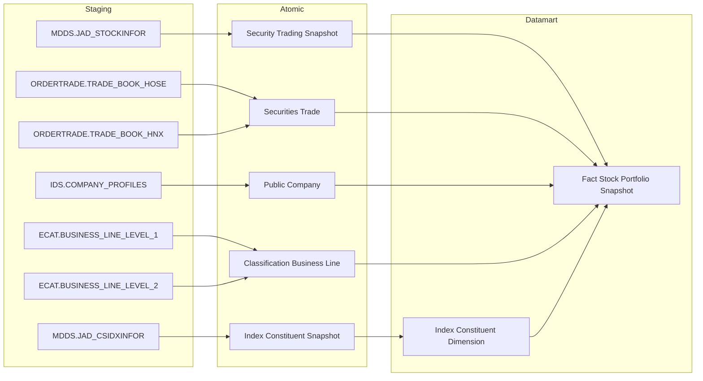
```mermaid
flowchart LR
    subgraph SRC["Staging"]
        S1A["MDDS.JAD_STOCKINFOR"]
        S1C["ORDERTRADE.TRADE_BOOK_HOSE"]
        S1D["ORDERTRADE.TRADE_BOOK_HNX"]
        S1E["IDS.COMPANY_PROFILES"]
        S1F["ECAT.BUSINESS_LINE_LEVEL_1"]
        S1G["ECAT.BUSINESS_LINE_LEVEL_2"]
        S1H["MDDS.JAD_CSIDXINFOR"]
    end
    subgraph SIL["Atomic"]
        A1A["Security Trading Snapshot"]
        A1C["Securities Trade"]
        A1D["Public Company"]
        A1E["Classification Business Line"]
        A1H["Index Constituent Snapshot"]
    end
    subgraph GOLD["Datamart"]
        fct_stock_portfolio_snpst["Fact Stock Portfolio Snapshot"]
        index_constituent_dim["Index Constituent Dimension"]
    end
    S1A --> A1A
    S1C --> A1C
    S1D --> A1C
    S1E --> A1D
    S1F --> A1E
    S1G --> A1E
    S1H --> A1H
    A1A --> fct_stock_portfolio_snpst
    A1C --> fct_stock_portfolio_snpst
    A1D --> fct_stock_portfolio_snpst
    A1E --> fct_stock_portfolio_snpst
    A1H --> index_constituent_dim
    index_constituent_dim --> fct_stock_portfolio_snpst
```

> **Ghi chú nguồn Ngành:** Đường JOIN chuẩn: `Public Company.Business Line Level 1 Id` → `Classification Business Line.Classification Business Line Id` (không JOIN trực tiếp `IDS.CATEGORIES` — bảng này chỉ là join nội bộ, không tự sinh entity). `public_company_dim` (Datamart, dùng chung GSDC/QLCB/NDTNN) đã có sẵn cột đệm `Classification Business Line Name`. GSTT reuse nguyên trạng, không tạo Dimension riêng cho Ngành.
> **Ghi chú measure tổng hợp:** `Securities Trade` (Fact Append, grain = 1 lệnh khớp) thô hơn grain Fact — Tổng KL/GT, Tổng KL/GT thỏa thuận, KLNN ròng đều phải `SUM(...) GROUP BY Security Symbol Code, Trade Date` trước khi đặt lên Fact; các measure này **không phụ thuộc rổ chỉ số**, aggregate 1 lần theo mã CK/ngày rồi broadcast ra từng row Index Constituent khi ETL ghi Fact — xem ghi chú Index dưới đây về cách tránh double-count khi truy vấn.
> **Ghi chú thiết kế Index Constituent Dimension:** Grain = **1 row / (Index Code, Symbol)** có thật trong nguồn `JAD_CSIDXINFOR` (SCD4A), gồm `Index Code`, `Index Id`, `Symbol`, `Floor Code`, `Add Date`. FK **trực tiếp** từ Dimension này vào `Fact_Stock_Portfolio_Snapshot` (không qua bridge Fact, tránh Fact-to-Fact fanout). Grain Fact = `1 row / mã CK / rổ chỉ số / ngày giao dịch`, với `Index_Constituent_Dimension_Id` **cho phép NULL** (mã CK không thuộc rổ chỉ số nào tại ngày đó). Mã CK thuộc N rổ chỉ số cùng lúc → N row Fact; các measure không phụ thuộc rổ chỉ số (Tổng KL, Tổng GT, KLNN ròng...) bị broadcast giống nhau trên mọi row Index Constituent của cùng 1 mã CK/ngày — **mọi truy vấn các measure này không lọc theo Chỉ số bắt buộc `SELECT DISTINCT` theo (Symbol, Trade Date) trước khi SUM**, tránh double-count theo số rổ chỉ số mã CK thuộc về. Khi lọc theo 1 Chỉ số cụ thể thì không có rủi ro double-count.

##### Cụm 2a: Diễn biến chỉ số thị trường — snapshot cuối ngày (`Fact Market Index Snapshot`)

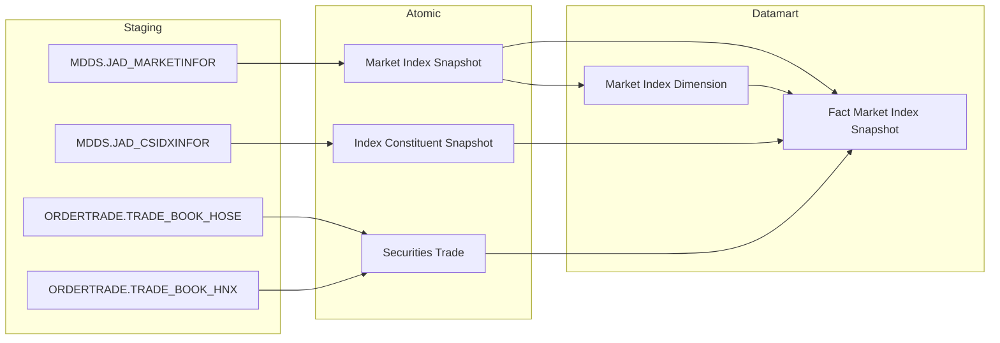
```mermaid
flowchart LR
    subgraph SRC["Staging"]
        S2A["MDDS.JAD_MARKETINFOR"]
        S2B["MDDS.JAD_CSIDXINFOR"]
        S2C["ORDERTRADE.TRADE_BOOK_HOSE"]
        S2D["ORDERTRADE.TRADE_BOOK_HNX"]
    end
    subgraph SIL["Atomic"]
        A2A["Market Index Snapshot"]
        A2B["Index Constituent Snapshot"]
        A2C["Securities Trade"]
    end
    subgraph GOLD["Datamart"]
        fct_market_index_snpst["Fact Market Index Snapshot"]
        market_index_dim["Market Index Dimension"]
    end
    S2A --> A2A
    S2B --> A2B
    S2C --> A2C
    S2D --> A2C
    A2A --> fct_market_index_snpst
    A2A --> market_index_dim
    A2B --> fct_market_index_snpst
    A2C --> fct_market_index_snpst
    market_index_dim --> fct_market_index_snpst
```

> **Ghi chú reuse cross-module:** `Fact Market Index Snapshot`/`Market Index Dimension` sở hữu bởi **QLKD**, GSTT mở rộng thêm cột trên Fact hiện có, không đổi grain (`1 market_code × 1 ngày`, bản ghi cuối phiên `rn=1`). Xem Section 4 — Reuse Analysis.
> **Ghi chú KLGD/GTGD/KLNN ròng/GTNN ròng của chỉ số:** Cần JOIN `Index Constituent Snapshot` (lấy danh sách mã CK thuộc rổ chỉ số) với `Securities Trade` để `SUM(Execution Volume/Value) GROUP BY Index Code, Trade Date` — measure pre-aggregate qua 2 tầng nguồn, đặt trực tiếp lên `Fact Market Index Snapshot`.
> **Ghi chú Index Code vs Market Code:** `Market Index Dimension` định danh theo `Market Code`/`Index Type Code`, còn `Index Constituent Dimension` (Nhóm 1) định danh theo `Index Code` — 2 hệ định danh khác nhau, không có join key 1-1 sẵn có. Cần bảng mapping thủ công `Market Code ↔ Index Code` — **PENDING xác nhận với nghiệp vụ** trước khi lên LLD.

##### Cụm 2b: Diễn biến chỉ số thị trường — realtime trong ngày (`Fact Market Index Intraday`)

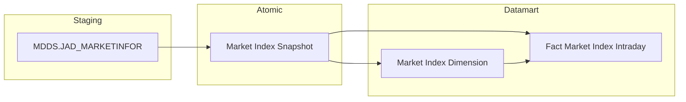
```mermaid
flowchart LR
    subgraph SRC["Staging"]
        S2E["MDDS.JAD_MARKETINFOR"]
    end
    subgraph SIL["Atomic"]
        A2D["Market Index Snapshot"]
    end
    subgraph GOLD["Datamart"]
        fct_market_index_intraday["Fact Market Index Intraday"]
        market_index_dim2["Market Index Dimension"]
    end
    S2E --> A2D
    A2D --> fct_market_index_intraday
    A2D --> market_index_dim2
    market_index_dim2 --> fct_market_index_intraday
```

> **Ghi chú grain:** Mục đích là vẽ biểu đồ đường/cột theo thời gian trong ngày — khác Fact EOD (1 row/ngày), dùng chung nguồn `Market Index Snapshot` nhưng KHÔNG lọc `rn=1`. Grain = **1 row / Market Code / Index Time** (theo đúng nguồn `JAD_MARKETINFOR`). Dashboard xử lý lại theo giờ ở tầng BI, không xử lý ở Datamart.

##### Cụm 3: Sở hữu và giao dịch nội bộ (`Legal Entity Position Dimension`)

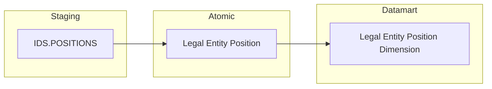
```mermaid
flowchart LR
    subgraph SRC["Staging"]
        S3B["IDS.POSITIONS"]
    end
    subgraph SIL["Atomic"]
        A3B["Legal Entity Position"]
    end
    subgraph GOLD["Datamart"]
        legal_entity_position_dim["Legal Entity Position Dimension"]
    end
    S3B --> A3B
    A3B --> legal_entity_position_dim
```

> **Ghi chú (sửa 2026-08-03):** Chỉ 2/8 KPI của Nhóm 45 READY (Mã cổ phiếu — reuse `Public Company Dimension` từ Cụm 1; Chức vụ người nội bộ — `Legal Entity Position Dimension`, Nguồn 1 approved `dm_atm_legal_entity_position-IDS.POSITIONS.yaml`). 6 KPI còn lại (Tên cổ đông, Số cổ phiếu sở hữu, Sở hữu nước ngoài, Sở hữu trong nước, Tỷ lệ sở hữu, Sở hữu cổ đông lớn) PENDING — nguồn `Chưa có CSDL - Map biểu mẫu` (BM8/BM70 VSDC), không vẽ Fact/Dimension cho phần này ở giai đoạn hiện tại (xem Bảng mapping nguồn — Atomic Placeholder ở Section 2, Nhóm 45).

---

## Section 2 — Tổng quan báo cáo

### Tab Dashboard thông tin về danh mục chứng khoán

#### Nhóm 1 - Bảng số liệu

> **Phân loại:** Phân tích
> **Atomic:** `Security Trading Snapshot` ← MDDS.JAD_STOCKINFOR — **READY** (Nguồn 2, approved) / `Securities Trade` ← ORDERTRADE.TRADE_BOOK_HOSE, TRADE_BOOK_HNX — **READY** (Nguồn 2, approved) / `Public Company` ← IDS.COMPANY_PROFILES — **READY** (Nguồn 1, approved) / `Classification Business Line` ← ECAT.BUSINESS_LINE_LEVEL_1, BUSINESS_LINE_LEVEL_2 — **READY** (Nguồn 1, approved) / `Index Constituent Snapshot` ← MDDS.JAD_CSIDXINFOR — **READY** (Nguồn 2, approved) — driving entity cho `Index Constituent Dimension` mới (xem ghi chú Section 1)

**Mockup:**

| Mã CK | Ngành | Sàn | Chỉ số | Loại phái sinh | Ngày đáo hạn | Giá TC | Giá ĐC | Thay đổi | % TĐ | Tổng KL | Tổng GT | Tổng KL PS | Tổng GT PS | Tổng KL TT | Tổng GT TT | KLNN ròng |
|---|---|---|---|---|---|---|---|---|---|---|---|---|---|---|---|---|
| VCB | Ngân hàng | HOSE | VN30 | — | — | 82.00 | 82.50 | +0.50 | +0.61% | 548 Tr | 22.1 Tỷ | 0 | 0 | 12 Tr | 1.0 Tỷ | +4 Tr |

**Source:** `Fact Stock Portfolio Snapshot` → `Security Trading Snapshot Dimension`, `Public Company Dimension`, `Calendar Date Dimension`, `Index Constituent Dimension`

**Bảng KPI:**

| KPI ID | Tên KPI | Đơn vị | Tính chất | Công thức | Ghi chú | Trạng thái |
|---|---|---|---|---|---|---|
| K_GSTT_1 | Mã CK | — | Chiều | `Security Trading Snapshot Dimension.Symbol` | Filter: `Stock Type Code NOT IN ('B','1','BO','D')` (loại trái phiếu) | READY |
| K_GSTT_2 | Ngành | — | Chiều | `Public Company Dimension.Business Line Level 1 Code`, `Classification Business Line Name` | Reuse nguyên trạng `public_company_dim` — cột đệm sẵn tên ngành đã sửa JOIN theo Id (xem Section 1) | READY |
| K_GSTT_3 | Sàn | — | Chiều | `Security Trading Snapshot Dimension.Floor Code` | Scheme MDDS_FLOOR_CODE: 10-HOSE, 02-HNX, 04-UPCOM, 03-FDS | READY |
| K_GSTT_4 | Chỉ số | — | Chiều | `Index Constituent Dimension.Index Code` | FK optional (nullable) trực tiếp trên Fact (grain Fact = .../rổ chỉ số/...; grain Dimension = 1 row/(Index Code, Symbol)). Filter: `WHERE Index_Code = :selected_index`. Xem ghi chú thiết kế ở Section 1 | READY |
| K_GSTT_5 | Loại phái sinh | — | Chiều | `Security Trading Snapshot Dimension.Stock Type Code`, `Underlying Symbol` | Chỉ có giá trị khi Floor Code = '03' | READY |
| K_GSTT_6 | Phương thức khớp lệnh (thỏa thuận) | — | Chiều | `Securities Trade.Board Type Code IN ('T1','T2','T3','T4','T6')` | Slicer phân biệt Khớp lệnh / Thỏa thuận | READY |
| K_GSTT_7 | Ngày | — | Chiều | `Calendar Date Dimension.Calendar Date` | Tham số lọc theo ngày giao dịch | READY |
| K_GSTT_8 | Ngày đáo hạn phái sinh | Ngày | Cơ sở | `Security Trading Snapshot Dimension.Maturity Date` | Chỉ có giá trị khi Floor Code = '03' | READY |
| K_GSTT_9 | Giá tham chiếu | VNĐ | Cơ sở | `Security Trading Snapshot Dimension.Reference Price` | — | READY |
| K_GSTT_10 | Giá đóng cửa | VNĐ | Cơ sở | `Security Trading Snapshot Dimension.Close Price` | — | READY |
| K_GSTT_11 | Thay đổi (+/-) | VNĐ | Cơ sở | `Security Trading Snapshot Dimension.Price Change` | = Giá đóng cửa − Giá TC | READY |
| K_GSTT_12 | % thay đổi | % | Phái sinh | `Price Change / Reference Price × 100` | Computed tại query layer | READY |
| K_GSTT_13 | Tổng KL | Cổ phiếu | Phái sinh | `SUM(Securities Trade.Execution Volume WHERE Market Id Code IN ('UPX','STX','STO')) GROUP BY Symbol, Trade Date` | **Sửa công thức (khác bản HLD trước, 2026-07-29):** Bản trước không filter Market Id — sai, BA SQL gốc STT 1 xác nhận `WHERE Market ID IN ('UPX','STX','STO')` (chỉ tính khớp lệnh cổ phiếu/chứng chỉ quỹ 3 sàn, loại trừ phái sinh DVX và trái phiếu BDO/HCX). Pre-aggregate, ETL broadcast giống nhau trên mọi row Index Constituent cùng mã CK/ngày — nếu Dashboard không lọc theo 1 Chỉ số cụ thể **bắt buộc** `SELECT DISTINCT` theo (Symbol, Trade Date) trước khi SUM (không dùng `WHERE FK IS NULL` vì mã CK có thể vừa thuộc rổ vừa cần tính đúng 1 lần) để tránh double-count theo số rổ chỉ số | READY |
| K_GSTT_14 | Tổng GT | VNĐ | Phái sinh | `SUM(Securities Trade.Execution Value WHERE Market Id Code IN ('UPX','STX','STO')) GROUP BY Symbol, Trade Date` | **Sửa công thức (khác bản HLD trước, 2026-07-29):** cùng lý do K_GSTT_13 — BA SQL gốc STT 1 xác nhận filter `Market ID IN ('UPX','STX','STO')`. Pre-aggregate — cùng cảnh báo double-count như K_GSTT_13 | READY |
| K_GSTT_15 | Tổng KL theo loại phái sinh | Hợp đồng | Phái sinh | `SUM(Securities Trade.Execution Volume WHERE Market Id Code = 'DVX') GROUP BY Symbol, Trade Date` | Pre-aggregate — cùng cảnh báo double-count như K_GSTT_13 | READY |
| K_GSTT_16 | Tổng GT theo loại phái sinh | VNĐ | Phái sinh | `SUM(Securities Trade.Execution Value WHERE Market Id Code = 'DVX') GROUP BY Symbol, Trade Date` | Pre-aggregate — cùng cảnh báo double-count như K_GSTT_13 | READY |
| K_GSTT_17 | Tổng KL thỏa thuận | Cổ phiếu | Phái sinh | `SUM(Securities Trade.Execution Volume WHERE Board Type Code IN ('T1','T2','T3','T4','T6')) GROUP BY Symbol, Trade Date` | Pre-aggregate — cùng cảnh báo double-count như K_GSTT_13 | READY |
| K_GSTT_18 | Tổng GT thỏa thuận | VNĐ | Phái sinh | `SUM(Securities Trade.Execution Value WHERE Board Type Code IN ('T1','T2','T3','T4','T6')) GROUP BY Symbol, Trade Date` | Pre-aggregate — cùng cảnh báo double-count như K_GSTT_13 | READY |
| K_GSTT_19 | KLNN ròng | Cổ phiếu | Phái sinh | `SUM(Buy Foreign Investor Type Code IN ('10','20') → Execution Volume WHERE Market Id Code IN ('UPX','STX','STO')) − SUM(Sell Foreign Investor Type Code IN ('10','20') → Execution Volume WHERE Market Id Code IN ('UPX','STX','STO')) GROUP BY Symbol, Trade Date` | **Sửa công thức (khác bản HLD trước, 2026-07-29):** Bản trước không filter Market Id. BA SQL gốc STT 1 tính riêng theo từng sàn — HOSE: `Market ID = 'STO'`; HNX/UPCOM: `Market ID IN ('STX','UPX')` (loại trừ DVX/BDX/HCX) — rồi cộng kl_nn_mua/kl_nn_ban 2 khối trước khi lấy hiệu; gộp tương đương `Market Id Code IN ('UPX','STX','STO')` áp cho cả 2 vế Buy/Sell. Pre-aggregate — cùng cảnh báo double-count như K_GSTT_13 | READY |

**Star Schema:**

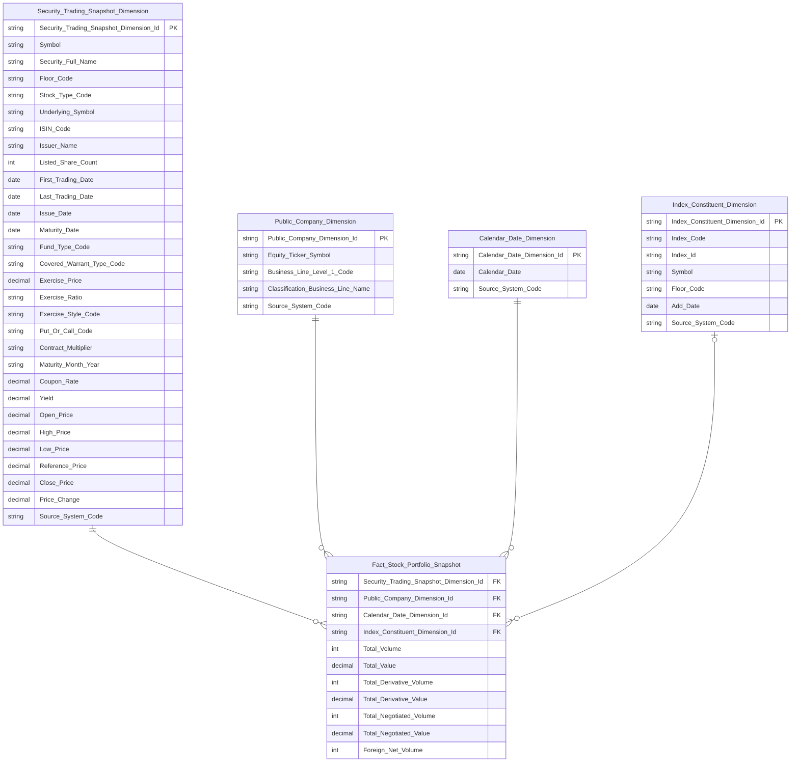
```mermaid
erDiagram
    Security_Trading_Snapshot_Dimension {
        string Security_Trading_Snapshot_Dimension_Id PK
        string Symbol
        string Security_Full_Name
        string Floor_Code
        string Stock_Type_Code
        string Underlying_Symbol
        string ISIN_Code
        string Issuer_Name
        int Listed_Share_Count
        date First_Trading_Date
        date Last_Trading_Date
        date Issue_Date
        date Maturity_Date
        string Fund_Type_Code
        string Covered_Warrant_Type_Code
        decimal Exercise_Price
        string Exercise_Ratio
        string Exercise_Style_Code
        string Put_Or_Call_Code
        string Contract_Multiplier
        string Maturity_Month_Year
        decimal Coupon_Rate
        decimal Yield
        decimal Open_Price
        decimal High_Price
        decimal Low_Price
        decimal Reference_Price
        decimal Close_Price
        decimal Price_Change
        string Source_System_Code
    }
    Public_Company_Dimension {
        string Public_Company_Dimension_Id PK
        string Equity_Ticker_Symbol
        string Business_Line_Level_1_Code
        string Classification_Business_Line_Name
        string Source_System_Code
    }
    Calendar_Date_Dimension {
        string Calendar_Date_Dimension_Id PK
        date Calendar_Date
        string Source_System_Code
    }
    Index_Constituent_Dimension {
        string Index_Constituent_Dimension_Id PK
        string Index_Code
        string Index_Id
        string Symbol
        string Floor_Code
        date Add_Date
        string Source_System_Code
    }
    Fact_Stock_Portfolio_Snapshot {
        string Security_Trading_Snapshot_Dimension_Id FK
        string Public_Company_Dimension_Id FK
        string Calendar_Date_Dimension_Id FK
        string Index_Constituent_Dimension_Id FK
        int Total_Volume
        decimal Total_Value
        int Total_Derivative_Volume
        decimal Total_Derivative_Value
        int Total_Negotiated_Volume
        decimal Total_Negotiated_Value
        int Foreign_Net_Volume
    }
    Security_Trading_Snapshot_Dimension ||--o{ Fact_Stock_Portfolio_Snapshot : " "
    Public_Company_Dimension ||--o{ Fact_Stock_Portfolio_Snapshot : " "
    Calendar_Date_Dimension ||--o{ Fact_Stock_Portfolio_Snapshot : " "
    Index_Constituent_Dimension |o--o{ Fact_Stock_Portfolio_Snapshot : " "
```

> **FK `Index_Constituent_Dimension_Id` cho phép NULL** (quan hệ optional |o, khác 3 FK bắt buộc còn lại) — nguồn `JAD_CSIDXINFOR` chỉ chứa cặp (Index Code, Symbol) có thật (mã CK đang thuộc rổ đó), không có khái niệm "N/A" trong nguồn nên Dimension không sinh thêm row giả. Mã CK thuộc N rổ chỉ số cùng lúc tại 1 ngày → N row Fact (FK khác nhau); mã CK không thuộc rổ chỉ số nào tại ngày đó → 1 row Fact duy nhất với FK NULL.

**Lineage Mart → Báo cáo:**

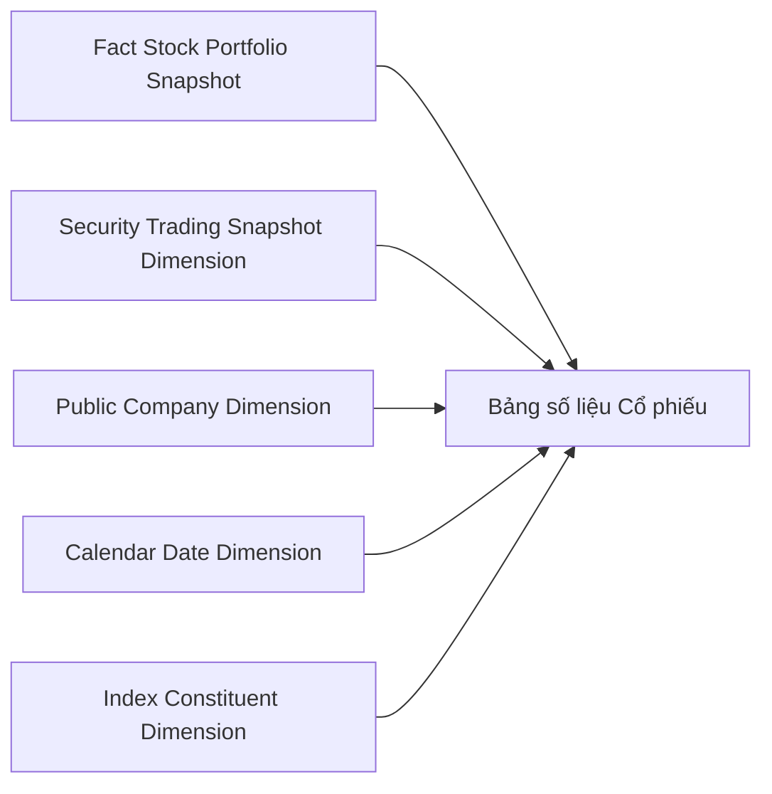
```mermaid
flowchart LR
    F1["Fact Stock Portfolio Snapshot"] --> RPT1["Bảng số liệu Cổ phiếu"]
    D1["Security Trading Snapshot Dimension"] --> RPT1
    D2["Public Company Dimension"] --> RPT1
    D3["Calendar Date Dimension"] --> RPT1
    D4["Index Constituent Dimension"] --> RPT1
```

**Bảng grain:**

| Tên bảng | Grain |
|---|---|
| Fact Stock Portfolio Snapshot | 1 row / mã CK / rổ chỉ số (FK nullable nếu không thuộc rổ nào) / ngày giao dịch |
| Security Trading Snapshot Dimension | 1 row / mã CK (SCD4A) |
| Public Company Dimension | 1 row / mã CK (SCD4A) |
| Calendar Date Dimension | 1 row / ngày |
| Index Constituent Dimension | 1 row / (Index Code, Symbol) có thật trong nguồn (SCD4A) |

> **Coverage rule (Bước 1a skill):** `Security Trading Snapshot Dimension` kéo dư thừa toàn bộ attribute hồ sơ mô tả chứng khoán từ `security_trading_snapshot` (Symbol, Security Full Name, Floor Code, Stock Type Code, Underlying Symbol, ISIN Code, Issuer Name, Listed Share Count, First/Last Trading Date, Issue Date, Maturity Date, Fund Type Code, Covered Warrant Type/Exercise Price/Ratio/Style Code, Put Or Call Code, Contract Multiplier, Maturity Month Year, Coupon Rate, Yield) — kể cả cột chưa cần cho Nhóm 1, để tránh phải bổ sung nhiều lần khi các Nhóm sau (Nhóm 2 — Trái phiếu, biểu đồ kỹ thuật, phái sinh...) cần đến. `Open Price`/`High Price`/`Low Price`/`Reference Price`/`Close Price`/`Price Change` giữ trên Dimension (không phải Fact) vì được dùng làm giá "hiện hành" hiển thị cùng hồ sơ mô tả — grain 1 row/mã CK snapshot ngày gần nhất (theo mockup BA), không phải để tính toán lịch sử theo nhiều ngày (bổ sung Open/High/Low tại Nhóm 3 theo coverage rule, cùng bản chất với Reference/Close/Change đã có ở Nhóm 1).
> **Cảnh báo grain-fanout (Bước 4B):** vì grain Fact đã nhân theo rổ chỉ số, các measure không phụ thuộc Chỉ số (Total_Volume, Total_Value, Total_Derivative_Volume/Value, Total_Negotiated_Volume/Value, Foreign_Net_Volume) bị lặp giá trị trên mọi row Index Constituent của cùng 1 mã CK/ngày — xem ghi chú Index Constituent ở Section 1 về cách filter đúng khi truy vấn.

---

#### Nhóm 2 - Bảng số liệu của trái phiếu

> **Phân loại:** Phân tích
> **Atomic:** `Security Trading Snapshot` ← MDDS.JAD_STOCKINFOR — **READY** (Nguồn 2, approved) / `Securities Trade` ← ORDERTRADE.TRADE_BOOK_HOSE, TRADE_BOOK_HNX — **READY** (Nguồn 2, approved)
>
> **Ghi chú nguồn (khác bản HLD cũ):** BA xác nhận trái phiếu niêm yết dùng **cùng** `MDDS.JAD_STOCKINFOR` với cổ phiếu (filter `Stock Type Code = '1'`), không phải entity riêng `MDDS.CorpBondInfor` như thiết kế trước — Note BA: "đổi lại do CorpBondInfor là trái phiếu riêng lẻ?". Do đó reuse toàn bộ `Fact Stock Portfolio Snapshot` + `Security Trading Snapshot Dimension` đã thiết kế ở Nhóm 1, không tạo Fact/Dimension riêng cho trái phiếu.

**Mockup:**

| Mã TP | Ngày | Giá TC | Giá ĐC | Giá mở cửa | Thay đổi | % TĐ | Ngày đáo hạn | KLGD | GTGD | YTM bình quân | Lãi suất |
|---|---|---|---|---|---|---|---|---|---|---|---|
| TCH2226 | 27/07/2026 | 102.5 | 103.0 | 102.8 | +0.5 | +0.49% | 15/03/2028 | 1.200 | 12.4 Tỷ | 6.8% | 7.2% |

**Source:** `Fact Stock Portfolio Snapshot` → `Security Trading Snapshot Dimension`, `Calendar Date Dimension`

**Bảng KPI:**

| KPI ID | Tên KPI | Đơn vị | Tính chất | Công thức | Ghi chú | Trạng thái |
|---|---|---|---|---|---|---|
| K_GSTT_20 | Mã trái phiếu | — | Chiều | `Security Trading Snapshot Dimension.Symbol` | Filter: `Stock Type Code = '1' AND Floor Code IN ('04','10','03','02')` | READY |
| K_GSTT_7 | Ngày | — | Chiều | `Calendar Date Dimension.Calendar Date` | Reuse từ Nhóm 1 | READY |
| K_GSTT_9 | Giá tham chiếu | VNĐ | Cơ sở | `Security Trading Snapshot Dimension.Reference Price` | Reuse từ Nhóm 1 | READY |
| K_GSTT_10 | Giá đóng cửa | VNĐ | Cơ sở | `Security Trading Snapshot Dimension.Close Price` | Reuse từ Nhóm 1 | READY |
| K_GSTT_21 | Giá mở cửa | VNĐ | Cơ sở | `Security Trading Snapshot Dimension.Open Price` | — | READY |
| K_GSTT_11 | Thay đổi (+/-) | VNĐ | Cơ sở | `Security Trading Snapshot Dimension.Price Change` | Reuse từ Nhóm 1 | READY |
| K_GSTT_22 | Ngày đáo hạn của trái phiếu | Ngày | Cơ sở | `Security Trading Snapshot Dimension.Maturity Date` | — | READY |
| K_GSTT_23 | KLGD | Trái phiếu | Phái sinh | `SUM(Securities Trade.Execution Volume WHERE Market Id Code IN ('BDO','HCX') AND Board Type Code IN ('G1','G2','G3','T1','T2','T3')) GROUP BY Symbol, Trade Date` | Pre-aggregate — không có G4/T4/T6 vì TP không có lô lẻ. Trái phiếu không xuất hiện trong nguồn `JAD_CSIDXINFOR` — FK Index Constituent luôn NULL | READY |
| K_GSTT_24 | GTGD | VNĐ | Phái sinh | `SUM(Securities Trade.Execution Value WHERE Market Id Code IN ('BDO','HCX') AND Board Type Code IN ('G1','G2','G3','T1','T2','T3')) GROUP BY Symbol, Trade Date` | Pre-aggregate — cùng ghi chú FK NULL như K_GSTT_23 | READY |
| K_GSTT_25 | YTM bình quân | % | Cơ sở | `Security Trading Snapshot Dimension.Yield` | — | READY |
| K_GSTT_26 | Lãi suất | % | Cơ sở | `Security Trading Snapshot Dimension.Coupon Rate` | — | READY |

**Star Schema:** *(dùng chung `Fact Stock Portfolio Snapshot` + `Security Trading Snapshot Dimension` + `Calendar Date Dimension` đã vẽ ở Nhóm 1 — xem Nhóm 1 để có schema đầy đủ đã bổ sung `Coupon_Rate`, `Yield`. Trái phiếu không dùng `Index Constituent Dimension` — mọi row Fact của trái phiếu có FK `Index_Constituent_Dimension_Id` = NULL.)*

**Lineage Mart → Báo cáo:**

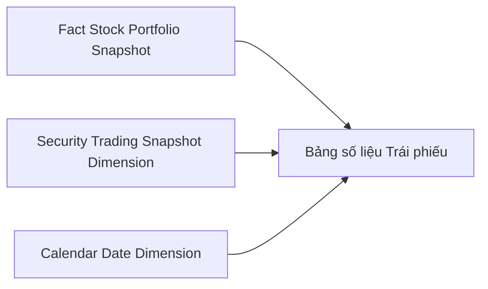
```mermaid
flowchart LR
    F1["Fact Stock Portfolio Snapshot"] --> RPT2["Bảng số liệu Trái phiếu"]
    D1["Security Trading Snapshot Dimension"] --> RPT2
    D3["Calendar Date Dimension"] --> RPT2
```

**Bảng grain:** *(giống Nhóm 1 — cùng Fact/Dimension, không grain riêng; trái phiếu luôn có FK Index Constituent = NULL)*

---

#### Nhóm 3 - Biểu đồ kỹ thuật cổ phiếu

> **Phân loại:** Phân tích
> **Atomic:** `Security Trading Snapshot` ← MDDS.JAD_STOCKINFOR — **READY** (Nguồn 2, `design_status: approved` tại file LLD, 2026-07-03) / `Securities Trade` ← ORDERTRADE.TRADE_BOOK_HOSE, TRADE_BOOK_HNX — **READY** (Nguồn 2, approved) / `Public Company` ← IDS.COMPANY_PROFILES — **READY** (Nguồn 1, approved) / `Classification Business Line` ← ECAT.BUSINESS_LINE_LEVEL_1, BUSINESS_LINE_LEVEL_2 — **READY** (Nguồn 1, approved) / `Index Constituent Snapshot` ← MDDS.JAD_CSIDXINFOR — **READY** (Nguồn 2, approved)
>
> **Ghi chú tái sử dụng:** BA liệt kê 17 dòng con cho STT 3, nhưng 14/17 chỉ tiêu (Ngành, Sàn, Mã CK, Chỉ số, Loại phái sinh, Phương thức khớp lệnh, Ngày, Giá đóng cửa, Giá tham chiếu, Thay đổi %, KLGD) đã có KPI ID sẵn từ Nhóm 1/Nhóm 2 — reuse thẳng, không khai sinh KPI mới. Chỉ có 3 chỉ tiêu mới thật (Giá mở cửa, Giá cao nhất, Giá thấp nhất) — bổ sung 3 cột lên `Security Trading Snapshot Dimension` theo coverage rule. 2 chỉ tiêu còn lại (Doanh thu, Lợi nhuận sau thuế) cùng "Kỳ báo cáo" — xem ghi chú Dữ liệu động dưới đây.
> **Ghi chú Dữ liệu động (Doanh thu, LNST, Kỳ báo cáo):** Nguồn BA tham khảo `IDS.data`/`report_catalog`/`rrow`/`rcol` (cấu trúc EAV báo cáo tài chính) — theo quyết định trước đó (ghi nhớ dự án), cấu trúc EAV này **không dùng làm nền Fact** cho tới khi có entity Atomic chuẩn hóa dùng chung nhiều module. Doanh thu/LNST là measure sẽ **bổ sung sau lên `Fact Stock Portfolio Snapshot` hiện có** (không tạo Fact riêng) — join qua FK `Public Company Dimension` đã có sẵn trên Fact (BA xác nhận: "Join qua từ company_profiles với Id và company_profile_id" — tức join theo mã công ty đại chúng, đúng theo Public Company đã dùng ở Nhóm 1). "Kỳ báo cáo" (năm/quý) là chiều thời gian riêng của 2 measure này, khác `Calendar Date Dimension` (theo ngày giao dịch) — đánh PENDING cùng nhóm, chưa thiết kế chiều thời gian kỳ báo cáo cho tới khi Atomic sẵn sàng.

**Mockup:**

| Mã CK | Ngành | Sàn | Chỉ số | Ngày | Giá mở | Giá cao | Giá thấp | Giá đóng | Giá TC | Thay đổi | % TĐ | KLGD | Doanh thu | LNST |
|---|---|---|---|---|---|---|---|---|---|---|---|---|---|---|
| VCB | Ngân hàng | HOSE | VN30 | 27/07/2026 | 82.00 | 83.00 | 81.50 | 82.50 | 82.00 | +0.50 | +0.61% | 548 Tr | — | — |

**Source:** `Fact Stock Portfolio Snapshot` → `Security Trading Snapshot Dimension`, `Public Company Dimension`, `Calendar Date Dimension`, `Index Constituent Dimension`

**Bảng KPI:**

| KPI ID | Tên KPI | Đơn vị | Tính chất | Công thức | Ghi chú | Trạng thái |
|---|---|---|---|---|---|---|
| K_GSTT_2 | Ngành | — | Chiều | `Public Company Dimension.Business Line Level 1 Code`, `Classification Business Line Name` | Reuse từ Nhóm 1 | READY |
| K_GSTT_3 | Sàn | — | Chiều | `Security Trading Snapshot Dimension.Floor Code` | Reuse từ Nhóm 1 | READY |
| K_GSTT_1 | Mã CK | — | Chiều | `Security Trading Snapshot Dimension.Symbol` | Reuse từ Nhóm 1. BA lọc riêng "Mã CK cổ phiếu" (`Stock Type Code <> '1' AND Floor Code IN ('04','10','03','02') AND Market Id Code NOT IN ('BDO','HCX')`) — filter con của K_GSTT_1, không khai KPI mới | READY |
| K_GSTT_4 | Chỉ số | — | Chiều | `Index Constituent Dimension.Index Code` | Reuse từ Nhóm 1 | READY |
| K_GSTT_5 | Loại phái sinh | — | Chiều | `Security Trading Snapshot Dimension.Stock Type Code`, `Underlying Symbol` | Reuse từ Nhóm 1 | READY |
| K_GSTT_6 | Phương thức khớp lệnh (thỏa thuận) | — | Chiều | `Securities Trade.Board Type Code IN ('T1','T2','T3','T4','T6')` | Reuse từ Nhóm 1 | READY |
| K_GSTT_7 | Ngày | — | Chiều | `Calendar Date Dimension.Calendar Date` | Reuse từ Nhóm 1 | READY |
| K_GSTT_27 | Giá mở cửa | VNĐ | Cơ sở | `Security Trading Snapshot Dimension.Open Price` | Mới — bổ sung cột lên Dimension theo coverage rule | READY |
| K_GSTT_28 | Giá cao nhất | VNĐ | Cơ sở | `Security Trading Snapshot Dimension.High Price` | Mới — bổ sung cột lên Dimension theo coverage rule | READY |
| K_GSTT_29 | Giá thấp nhất | VNĐ | Cơ sở | `Security Trading Snapshot Dimension.Low Price` | Mới — bổ sung cột lên Dimension theo coverage rule | READY |
| K_GSTT_10 | Giá đóng cửa | VNĐ | Cơ sở | `Security Trading Snapshot Dimension.Close Price` | Reuse từ Nhóm 1 | READY |
| K_GSTT_9 | Giá tham chiếu | VNĐ | Cơ sở | `Security Trading Snapshot Dimension.Reference Price` | Reuse từ Nhóm 1 | READY |
| K_GSTT_11 | Thay đổi (+/-) | VNĐ | Cơ sở | `Security Trading Snapshot Dimension.Price Change` | Reuse từ Nhóm 1 | READY |
| K_GSTT_13 | Khối lượng giao dịch | Cổ phiếu | Phái sinh | `SUM(Securities Trade.Execution Volume) GROUP BY Symbol, Trade Date` | Reuse từ Nhóm 1 (K_GSTT_13 = Tổng KL, đã bao gồm filter Market Id Code IN ('UPX','STX','STO') tại tầng Fact total_vol) — cùng cảnh báo double-count Index Constituent như Nhóm 1 | READY |
| K_GSTT_30 | Kỳ báo cáo | — | Chiều | *(chưa xác định — chiều thời gian riêng cho BCTC, khác Calendar Date Dimension theo ngày giao dịch)* | Dữ liệu động — chờ Atomic chuẩn hóa EAV IDS report | PENDING |
| K_GSTT_31 | Doanh thu | VNĐ | Cơ sở | *(chưa xác định — SUM(IDS.data.data_value) theo report_cd BCKQKD, row tùy enterprise_type)* | Dữ liệu động — bổ sung sau lên Fact Stock Portfolio Snapshot, join qua Public Company Dimension. Chờ Atomic chuẩn hóa EAV IDS report | PENDING |
| K_GSTT_32 | Lợi nhuận sau thuế | VNĐ | Cơ sở | *(chưa xác định — SUM(IDS.data.data_value) theo report_cd BCKQKD, row tùy enterprise_type)* | Dữ liệu động — bổ sung sau lên Fact Stock Portfolio Snapshot, join qua Public Company Dimension. Chờ Atomic chuẩn hóa EAV IDS report | PENDING |

**Star Schema:** *(dùng chung `Fact Stock Portfolio Snapshot` + `Security Trading Snapshot Dimension` (đã bổ sung `Open_Price`, `High_Price`, `Low_Price`) + `Public Company Dimension` + `Calendar Date Dimension` + `Index Constituent Dimension` đã vẽ ở Nhóm 1 — xem Nhóm 1. K_GSTT_31/32 (Doanh thu, LNST) PENDING, chưa vẽ thêm bảng nào cho tới khi Atomic EAV sẵn sàng.)*

**Lineage Mart → Báo cáo:**

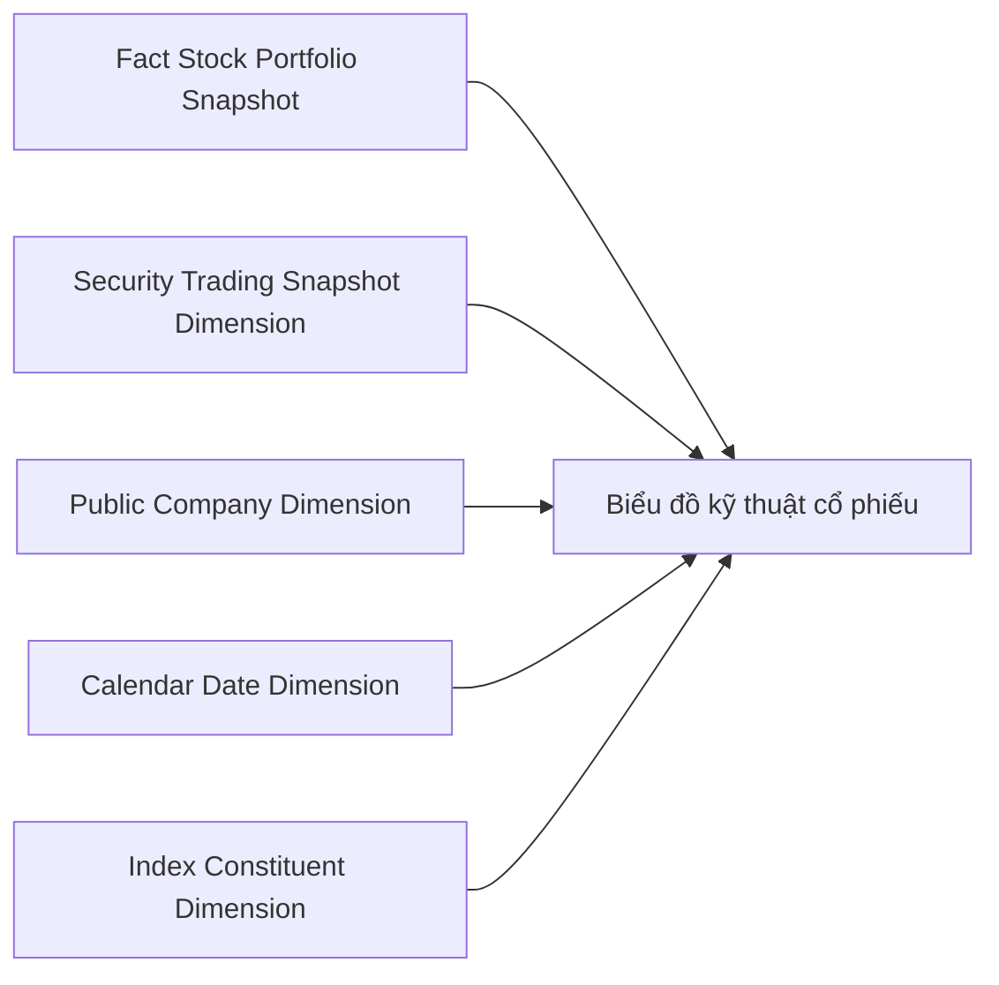
```mermaid
flowchart LR
    F1["Fact Stock Portfolio Snapshot"] --> RPT3["Biểu đồ kỹ thuật cổ phiếu"]
    D1["Security Trading Snapshot Dimension"] --> RPT3
    D2["Public Company Dimension"] --> RPT3
    D3["Calendar Date Dimension"] --> RPT3
    D4["Index Constituent Dimension"] --> RPT3
```

**Bảng grain:** *(giống Nhóm 1 — cùng Fact/Dimension, không grain riêng)*

---

#### Nhóm 4 - Biểu đồ kỹ thuật trái phiếu

> **Phân loại:** Phân tích
> **Atomic:** `Security Trading Snapshot` ← MDDS.JAD_STOCKINFOR — **READY** (Nguồn 2, approved) / `Securities Trade` ← ORDERTRADE.TRADE_BOOK_HOSE, TRADE_BOOK_HNX — **READY** (Nguồn 2, approved)
>
> **Ghi chú tái sử dụng:** 100% chỉ tiêu của STT 4 đã có KPI ID sẵn từ Nhóm 2 (trái phiếu) và Nhóm 3 (Open/High/Low Price) — không có chỉ tiêu mới, không tạo/sửa Fact hay Dimension nào. BA không liệt kê Doanh thu/LNST cho trái phiếu (khác STT 3 dành cho cổ phiếu) — đúng nghiệp vụ, BCTC gắn theo mã công ty đại chúng (cổ phiếu), không áp dụng cho trái phiếu.

**Mockup:**

| Mã TP | Ngày | Giá mở | Giá cao | Giá thấp | Giá đóng | Giá TC | Thay đổi | % TĐ | KLGD |
|---|---|---|---|---|---|---|---|---|---|
| TCH2226 | 27/07/2026 | 102.8 | 103.2 | 102.5 | 103.0 | 102.5 | +0.5 | +0.49% | 1.200 |

**Source:** `Fact Stock Portfolio Snapshot` → `Security Trading Snapshot Dimension`, `Calendar Date Dimension`

**Bảng KPI:**

| KPI ID | Tên KPI | Đơn vị | Tính chất | Công thức | Ghi chú | Trạng thái |
|---|---|---|---|---|---|---|
| K_GSTT_20 | Mã trái phiếu | — | Chiều | `Security Trading Snapshot Dimension.Symbol` | Reuse từ Nhóm 2. BA lọc thêm `Market Id Code IN ('BDO','HCX')` — filter con của K_GSTT_20, không khai KPI mới | READY |
| K_GSTT_7 | Ngày | — | Chiều | `Calendar Date Dimension.Calendar Date` | Reuse từ Nhóm 1 | READY |
| K_GSTT_30 | Kỳ báo cáo | — | Chiều | *(chưa xác định)* | Reuse từ Nhóm 3 — vẫn PENDING, chờ Atomic chuẩn hóa EAV IDS report | PENDING |
| K_GSTT_27 | Giá mở cửa | VNĐ | Cơ sở | `Security Trading Snapshot Dimension.Open Price` | Reuse từ Nhóm 3 | READY |
| K_GSTT_28 | Giá cao nhất | VNĐ | Cơ sở | `Security Trading Snapshot Dimension.High Price` | Reuse từ Nhóm 3 | READY |
| K_GSTT_29 | Giá thấp nhất | VNĐ | Cơ sở | `Security Trading Snapshot Dimension.Low Price` | Reuse từ Nhóm 3 | READY |
| K_GSTT_10 | Giá đóng cửa | VNĐ | Cơ sở | `Security Trading Snapshot Dimension.Close Price` | Reuse từ Nhóm 1 | READY |
| K_GSTT_9 | Giá tham chiếu | VNĐ | Cơ sở | `Security Trading Snapshot Dimension.Reference Price` | Reuse từ Nhóm 1 | READY |
| K_GSTT_11 | Thay đổi (+/-) | VNĐ | Cơ sở | `Security Trading Snapshot Dimension.Price Change` | Reuse từ Nhóm 1 | READY |
| K_GSTT_23 | Khối lượng giao dịch | Trái phiếu | Phái sinh | `SUM(Securities Trade.Execution Volume WHERE Market Id Code IN ('BDO','HCX') AND Board Type Code IN ('G1','G2','G3','T1','T2','T3')) GROUP BY Symbol, Trade Date` | Reuse từ Nhóm 2 (K_GSTT_23 = KLGD trái phiếu) — FK Index Constituent luôn NULL (trái phiếu không thuộc rổ chỉ số) | READY |

**Star Schema:** *(dùng chung `Fact Stock Portfolio Snapshot` + `Security Trading Snapshot Dimension` + `Calendar Date Dimension` đã vẽ ở Nhóm 1/3 — không có cột/bảng mới)*

**Lineage Mart → Báo cáo:**

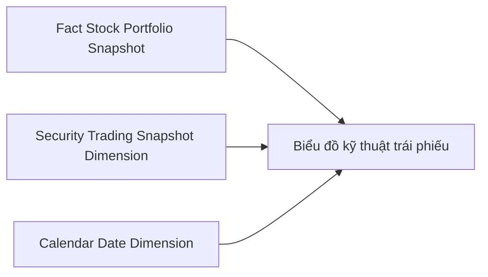
```mermaid
flowchart LR
    F1["Fact Stock Portfolio Snapshot"] --> RPT4["Biểu đồ kỹ thuật trái phiếu"]
    D1["Security Trading Snapshot Dimension"] --> RPT4
    D3["Calendar Date Dimension"] --> RPT4
```

**Bảng grain:** *(giống Nhóm 1 — cùng Fact/Dimension, không grain riêng; trái phiếu luôn có FK Index Constituent = NULL)*

---

#### Nhóm 5 - Diễn biến chỉ số thị trường

> **Phân loại:** Phân tích
> **Atomic:** `Market Index Snapshot` ← MDDS.JAD_MARKETINFOR — **READY** (Nguồn 1, approved 2026-07-03) / `Index Constituent Snapshot` ← MDDS.JAD_CSIDXINFOR — **READY** (Nguồn 2, approved) / `Securities Trade` ← ORDERTRADE.TRADE_BOOK_HOSE, TRADE_BOOK_HNX — **READY** (Nguồn 2, approved)
>
> **Ghi chú tái sử dụng:** BA liệt kê 23 dòng con — 22 KPI khai sinh (K_GSTT_4, K_GSTT_33, K_GSTT_34–54), 1 dòng trùng ("Giá" = điểm chỉ số gần nhất trong ngày, trùng hoàn toàn K_GSTT_35, không khai KPI mới). `Market Index Dimension`/`Fact Market Index Snapshot` reuse + mở rộng từ QLKD (xem ghi chú Cụm 2a). "Số cổ phiếu lưu hành" và "Vốn hóa thị trường" (sub-row 22, 23) tham chiếu nguồn VSDC (báo cáo "BM 1_Báo cáo về khối lượng chứng khoán đang lưu hành") — **chưa có entity Atomic nào** (đã tra cứu xác nhận, kể cả `IDS.COMPANY_SHARE_STATISTICS` không map trực tiếp) — PENDING chờ nguồn CSDL thực tế.

**Mockup:**

| Chỉ số | Ngày | Giá ĐC | Giá cao | Giá thấp | Thay đổi | % TĐ | Mã tăng | Mã giảm | Mã đứng giá | Mã trần | Mã sàn | KLGD | GTGD | KLGD TT | GTGD TT | KLNN ròng | GTNN ròng | Vốn hóa TT |
|---|---|---|---|---|---|---|---|---|---|---|---|---|---|---|---|---|---|---|
| VN-Index | 27/07/2026 | 1,245.32 | 1,250.10 | 1,238.50 | +5.20 | +0.42% | 245 | 180 | 32 | 12 | 5 | 850 Tr | 18.5 Tỷ | 45 Tr | 1.2 Tỷ | +80 Tỷ | +120 Tỷ | — |

**Source:** `Fact Market Index Snapshot` → `Market Index Dimension`, `Calendar Date Dimension`; `Fact Market Index Intraday` → `Market Index Dimension`, `Calendar Date Dimension`

**Bảng KPI:**

| KPI ID | Tên KPI | Đơn vị | Tính chất | Công thức | Ghi chú | Trạng thái |
|---|---|---|---|---|---|---|
| K_GSTT_4 | Chỉ số | — | Chiều | `Market Index Dimension.Market Code` | Reuse cơ chế Chiều, khác Dimension với K_GSTT_4 gốc (Nhóm 1 dùng Index Constituent Dimension) — đây là chỉ số thị trường (VN-Index/HNX/UPCOM/VN30), không phải rổ thành viên. Xem ghi chú Index Code vs Market Code | READY |
| K_GSTT_33 | Ngày | — | Chiều | `Calendar Date Dimension.Calendar Date` | Reuse cơ chế, Fact khác Nhóm 1 | READY |
| K_GSTT_34 | Theo giờ trong ngày | — | Chiều | `Fact Market Index Intraday.Index Time` | Chiều slicer theo khung giờ trong ngày, gắn trực tiếp trên grain của `Fact Market Index Intraday`. Dùng kèm FK `Calendar Date Dimension` (K_GSTT_33, xác định qua `Market Index Snapshot.Trading Date`) để filter theo ngày trước khi khai thác chi tiết theo giờ — 2 chiều bổ trợ nhau, không thay thế | READY |
| K_GSTT_35 | Giá đóng cửa (điểm chỉ số) | Điểm | Cơ sở | `Fact Market Index Snapshot.Market Index Value` | Đã có sẵn ở Fact QLKD. BA có 1 dòng riêng "Giá" (điểm chỉ số gần nhất trong ngày, cùng logic `rn=1` theo `indexTime`) — trùng hoàn toàn K_GSTT_35, không khai KPI mới | READY |
| K_GSTT_36 | Giá cao nhất | Điểm | Cơ sở | `Fact Market Index Snapshot.High Index` | Mới — bổ sung cột (mở rộng Fact QLKD) | READY |
| K_GSTT_37 | Giá thấp nhất | Điểm | Cơ sở | `Fact Market Index Snapshot.Low Index` | Mới — bổ sung cột (mở rộng Fact QLKD) | READY |
| K_GSTT_38 | Thay đổi (+/-) | Điểm | Cơ sở | `Fact Market Index Snapshot.Index Change` | Mới — bổ sung cột (mở rộng Fact QLKD) | READY |
| K_GSTT_39 | % thay đổi | % | Phái sinh | `Fact Market Index Snapshot.Index Percent Change` | Mới — bổ sung cột (mở rộng Fact QLKD) | READY |
| K_GSTT_40 | Số lượng mã tăng | Mã | Cơ sở | `Fact Market Index Snapshot.Advances Count` | Mới — bổ sung cột (mở rộng Fact QLKD) | READY |
| K_GSTT_41 | Số lượng mã giảm | Mã | Cơ sở | `Fact Market Index Snapshot.Declines Count` | Mới — bổ sung cột (mở rộng Fact QLKD) | READY |
| K_GSTT_42 | Số lượng mã đứng giá | Mã | Cơ sở | `Fact Market Index Snapshot.No Change Count` | Mới — bổ sung cột (mở rộng Fact QLKD) | READY |
| K_GSTT_43 | Số lượng mã tăng trần | Mã | Cơ sở | `Fact Market Index Snapshot.Ceiling Count` | Mới — bổ sung cột (mở rộng Fact QLKD) | READY |
| K_GSTT_44 | Số lượng mã giảm sàn | Mã | Cơ sở | `Fact Market Index Snapshot.Floor Count` | Mới — bổ sung cột (mở rộng Fact QLKD) | READY |
| K_GSTT_45 | Giá trị GD theo realtime | VNĐ | Cơ sở | `Fact Market Index Intraday.Total Value At Time` | Grain riêng (1 row/Market Code/Index Time) — xem Fact Market Index Intraday bên dưới | READY |
| K_GSTT_46 | Điểm của chỉ số theo realtime | Điểm | Cơ sở | `Fact Market Index Intraday.Market Index Value At Time` | Grain riêng (1 row/Market Code/Index Time) — xem Fact Market Index Intraday bên dưới | READY |
| K_GSTT_47 | KLGD của chỉ số | Cổ phiếu | Phái sinh | `SUM(Securities Trade.Execution Volume WHERE Symbol IN (Index Constituent Dimension.Symbol WHERE Index Code = mapping(Market Code)) AND Market Id Code IN ('STO','STX','UPX')) GROUP BY Index Code, Trade Date` | Pre-aggregate qua 2 tầng nguồn (Index Constituent + Securities Trade) — cần mapping Market Code↔Index Code, xem ghi chú Cụm 2 | READY |
| K_GSTT_48 | GTGD của chỉ số | VNĐ | Phái sinh | `SUM(Securities Trade.Execution Value WHERE Symbol IN (Index Constituent Dimension.Symbol WHERE Index Code = mapping(Market Code)) AND Market Id Code IN ('STO','STX','UPX')) GROUP BY Index Code, Trade Date` | Pre-aggregate — cùng ghi chú K_GSTT_47 | READY |
| K_GSTT_49 | KLNN ròng (theo chỉ số) | Cổ phiếu | Phái sinh | `SUM(Buy Foreign Investor Type Code IN ('10','20') → Execution Volume) − SUM(Sell Foreign Investor Type Code IN ('10','20') → Execution Volume) WHERE Symbol IN (mã thuộc Index Code) GROUP BY Index Code, Trade Date` | Kỹ thuật đủ nguồn giống K_GSTT_47/48 (JOIN Index Constituent + Securities Trade) — thiết kế READY dù BA ghi "Chưa có CSDL - Map biểu mẫu" (đánh giá: đây là ghi chú BA chưa chốt biểu mẫu hiển thị, không phải thiếu nguồn) | READY |
| K_GSTT_50 | GTNN ròng (theo chỉ số) | VNĐ | Phái sinh | `SUM(Buy Foreign Investor Type Code IN ('10','20') → Execution Value) − SUM(Sell Foreign Investor Type Code IN ('10','20') → Execution Value) WHERE Symbol IN (mã thuộc Index Code) GROUP BY Index Code, Trade Date` | Cùng ghi chú K_GSTT_49 | READY |
| K_GSTT_51 | KLGD thỏa thuận (chỉ số) | Cổ phiếu | Phái sinh | `Fact Market Index Snapshot.PT Total Volume` | Mới — bổ sung cột (mở rộng Fact QLKD), có sẵn trên Market Index Snapshot, không cần pre-aggregate qua Securities Trade | READY |
| K_GSTT_52 | GTGD thỏa thuận (chỉ số) | VNĐ | Phái sinh | `Fact Market Index Snapshot.PT Total Value` | Mới — bổ sung cột (mở rộng Fact QLKD) | READY |
| K_GSTT_53 | Số cổ phiếu lưu hành | Cổ phiếu | Cơ sở | *(chưa xác định)* | Trùng K_GSTT_55 (Nhóm 6) — cùng 1 chỉ tiêu, cùng nguồn VSDC "BM 1_Báo cáo về khối lượng chứng khoán đang lưu hành". Atomic `Public Company Share Statistics` có attribute tương ứng nhưng grain mismatch + cột Loại dữ liệu BA để trống → PENDING (xem O_GSTT_2). Cột đặt trên `Fact Stock Portfolio Snapshot` (Nhóm 1, join qua Public Company Dimension), KHÔNG phải Fact Market Index Snapshot — measure này theo mã CK, không theo market_code | PENDING |
| K_GSTT_54 | Vốn hóa thị trường | VNĐ | Phái sinh | `SUM(Giá đóng cửa × Số cổ phiếu lưu hành) theo từng mã CK, GROUP BY Index Code` (qua `Index Constituent Dimension`) | Phụ thuộc K_GSTT_53 (chưa có nguồn) — PENDING. Trùng K_GSTT_61 (Nhóm 6) — cùng 1 chỉ tiêu. Công thức đặt trên `Fact Stock Portfolio Snapshot` (Nhóm 1), không phải Fact Market Index Snapshot — đã sửa lại ghi chú Fact đích cho nhất quán với Nhóm 6 (2026-07-27) | PENDING |

**Star Schema:**

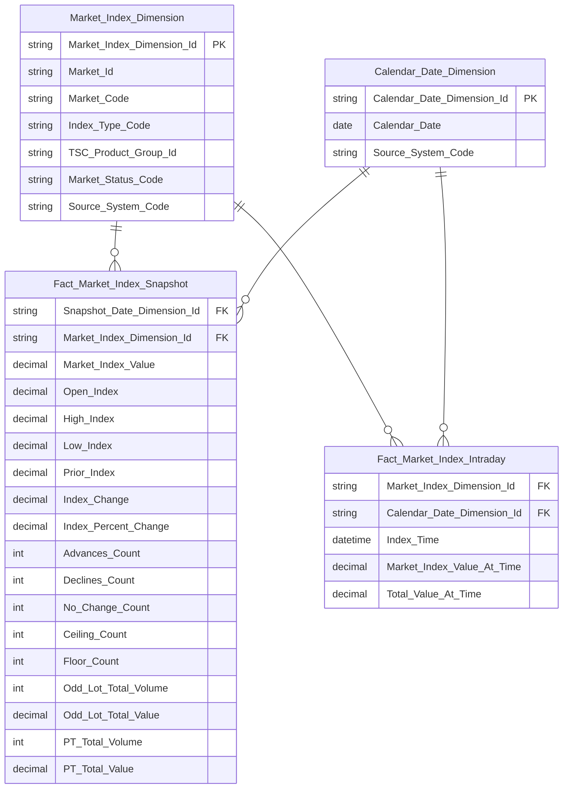
```mermaid
erDiagram
    Market_Index_Dimension {
        string Market_Index_Dimension_Id PK
        string Market_Id
        string Market_Code
        string Index_Type_Code
        string TSC_Product_Group_Id
        string Market_Status_Code
        string Source_System_Code
    }
    Calendar_Date_Dimension {
        string Calendar_Date_Dimension_Id PK
        date Calendar_Date
        string Source_System_Code
    }
    Fact_Market_Index_Snapshot {
        string Snapshot_Date_Dimension_Id FK
        string Market_Index_Dimension_Id FK
        decimal Market_Index_Value
        decimal Open_Index
        decimal High_Index
        decimal Low_Index
        decimal Prior_Index
        decimal Index_Change
        decimal Index_Percent_Change
        int Advances_Count
        int Declines_Count
        int No_Change_Count
        int Ceiling_Count
        int Floor_Count
        int Odd_Lot_Total_Volume
        decimal Odd_Lot_Total_Value
        int PT_Total_Volume
        decimal PT_Total_Value
    }
    Fact_Market_Index_Intraday {
        string Market_Index_Dimension_Id FK
        string Calendar_Date_Dimension_Id FK
        datetime Index_Time
        decimal Market_Index_Value_At_Time
        decimal Total_Value_At_Time
    }
    Market_Index_Dimension ||--o{ Fact_Market_Index_Snapshot : " "
    Calendar_Date_Dimension ||--o{ Fact_Market_Index_Snapshot : " "
    Market_Index_Dimension ||--o{ Fact_Market_Index_Intraday : " "
    Calendar_Date_Dimension ||--o{ Fact_Market_Index_Intraday : " "
```

> **Fact Market Index Intraday có FK tới Calendar Date Dimension** — xác định qua `Market Index Snapshot.Trading Date` (`trading_dt`, nguồn `MDDS.JAD_MARKETINFOR`, data_domain Date, tách biệt với `Index Time` dạng Text) — cho phép filter/slicer theo ngày giao dịch trước khi phân tích chi tiết theo `Index Time` trong ngày đó.

**Lineage Mart → Báo cáo:**

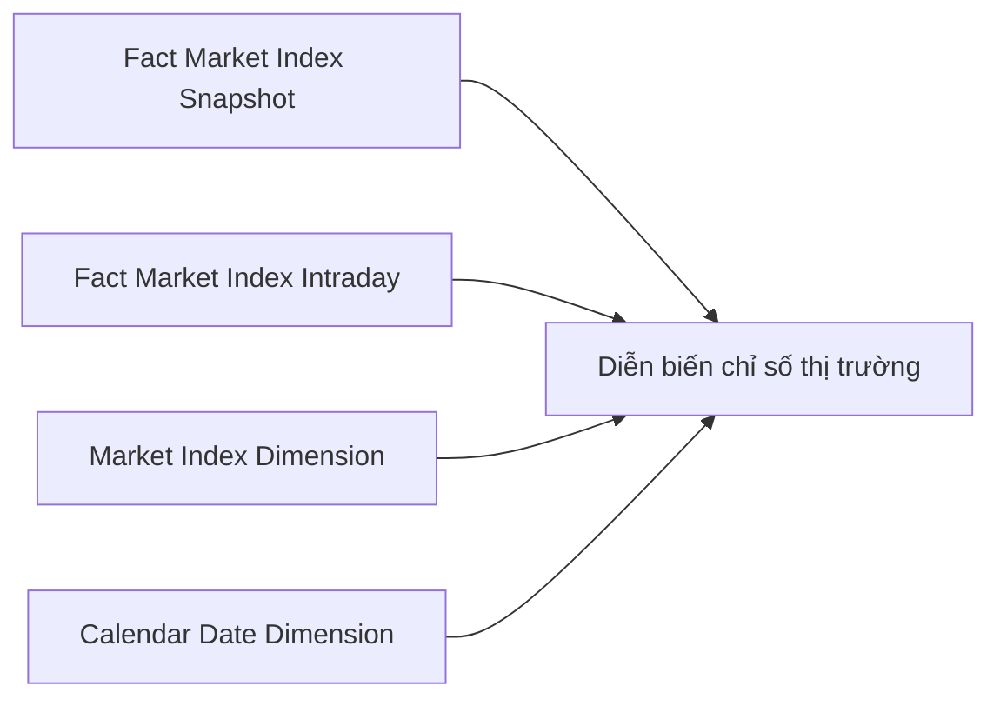
```mermaid
flowchart LR
    F1["Fact Market Index Snapshot"] --> RPT5["Diễn biến chỉ số thị trường"]
    F2["Fact Market Index Intraday"] --> RPT5
    D1["Market Index Dimension"] --> RPT5
    D2["Calendar Date Dimension"] --> RPT5
```

**Bảng grain:**

| Tên bảng | Grain |
|---|---|
| Fact Market Index Snapshot | 1 row / chỉ số thị trường (market_code) / ngày (bản ghi cuối phiên) — reuse + mở rộng từ QLKD |
| Fact Market Index Intraday | 1 row / chỉ số thị trường (market_code) / Index Time (theo phút, đúng nguồn) — có FK `Calendar Date Dimension` xác định qua `Trading Date` |
| Market Index Dimension | 1 row / combo (Market Id, Market Code) (SCD4A) — reuse từ QLKD |
| Calendar Date Dimension | 1 row / ngày |

> **Coverage rule:** Không áp dụng thêm cho `Market Index Dimension` (reuse nguyên trạng từ QLKD, không sửa cấu trúc Dimension). Coverage rule áp dụng cho `Fact Market Index Snapshot`: đã kéo đủ toàn bộ measure snapshot cuối ngày có thật trong Atomic `Market Index Snapshot` (Open/High/Low/Prior Index, Change, %Change, Advances/Declines/No Change/Ceiling/Floor Count, Odd Lot, PT Total) — không có measure nào trong Atomic entity này bị bỏ sót.

---

#### Nhóm 6 - Định giá thị trường

> **Phân loại:** Dashboard
> **Atomic:** `Security Trading Snapshot` ← MDDS.JAD_STOCKINFOR — **READY** (Nguồn 2, approved, reuse Nhóm 1) / `Public Company` ← IDS.COMPANY_PROFILES — **READY** (Nguồn 1, approved, reuse Nhóm 1) / `Classification Business Line` ← ECAT.BUSINESS_LINE_LEVEL_1, BUSINESS_LINE_LEVEL_2 — **READY** (Nguồn 1, approved, reuse Nhóm 1) / `Index Constituent Snapshot` ← MDDS.JAD_CSIDXINFOR — **READY** (Nguồn 2, approved, reuse Nhóm 1) / `Public Company Share Statistics` ← IDS.COMPANY_SHARE_STATISTICS — **READY** (Nguồn 2, draft) nhưng **grain mismatch** (current-state, không có ngày lịch sử) + cột "Loại dữ liệu" BA để trống — PENDING (xem O_GSTT_2) / EAV báo cáo tài chính (`IDS.data`/`report_catalog`/`rrow`/`rcol` cho LNST/VCSH) — PENDING (xem O_GSTT_1)
>
> **Ghi chú kiến trúc:** Toàn bộ 13 dòng con của STT 6 dùng chung **1 Fact duy nhất** — mở rộng `Fact Stock Portfolio Snapshot` (Nhóm 1, grain 1 row/mã CK/rổ chỉ số/ngày, đã có sẵn FK `Public Company Dimension`, `Index Constituent Dimension`, `Calendar Date Dimension`), không dùng `Fact Market Index Snapshot`/`Market Index Dimension` (QLKD). LNST/VCSH/Số cổ phiếu lưu hành đều link về Fact này qua `Public Company Dimension` (mã công ty); P/E/P/B/EPS tính theo từng mã CK, "Vốn hóa thị trường" SUM cộng dồn theo `Index Code` (qua `Index Constituent Dimension`).
> **Sửa nguồn giá (khác SQL tham khảo BA):** SQL tham khảo của BA cho P/E/P/B/Vốn hóa dùng `marketIndex` (điểm chỉ số) làm giá theo mã CK — nhầm lẫn khái niệm (điểm chỉ số không phải giá cổ phiếu). Đã sửa dùng **Giá đóng cửa thật của từng mã CK** (K_GSTT_10) làm nguồn giá cho toàn bộ công thức P/E/P/B/Vốn hóa. Cần xác nhận lại với BA/nghiệp vụ trước khi lên LLD (xem O_GSTT_4).
> "Ngành" chỉ dùng làm **filter/slicer** (BA: `SELECT DISTINCT industry_cd, industry_name FROM IDS.categories`) trên danh sách công ty, không phải chiều bổ sung logic tính toán khác.

**Mockup:**

| Mã CK | Ngành | sàn | Chỉ số | Ngày | Giá đóng cửa | Số CP lưu hành | LNST | VCSH | P/E | P/B | EPS | Vốn hóa TT (theo Chỉ số) |
|---|---|---|---|---|---|---|---|---|---|---|---|---|
| VCB | Ngân hàng | HOSE | VN30 | 27/07/2026 | 82.50 | *(pending)* | *(pending)* | *(pending)* | *(pending)* | *(pending)* | *(pending)* | *(pending)* |

**Source:** `Fact Stock Portfolio Snapshot` (mở rộng, Nhóm 1) → `Security Trading Snapshot Dimension`, `Public Company Dimension`, `Calendar Date Dimension`, `Index Constituent Dimension` — 1 Fact duy nhất, không tạo Fact/Dimension mới.

**Bảng KPI:**

| KPI ID | Tên KPI | Đơn vị | Tính chất | Công thức | Ghi chú | Trạng thái |
|---|---|---|---|---|---|---|
| K_GSTT_4 | Chỉ số | — | Chiều | `Index Constituent Dimension.Index Code` | Reuse từ Nhóm 1 (không phải biến thể Market Index Dimension của Nhóm 5) | READY |
| K_GSTT_2 | Ngành | — | Chiều | `Public Company Dimension.Business Line Level 1 Code`, `Classification Business Line Name` | Reuse từ Nhóm 1 — dùng làm filter/slicer danh sách công ty trước khi tính LNST/VCSH | READY |
| K_GSTT_3 | sàn | — | Chiều | `Security Trading Snapshot Dimension.Floor Code` | Reuse từ Nhóm 1 | READY |
| K_GSTT_33 | Ngày | — | Chiều | `Calendar Date Dimension.Calendar Date` | Reuse từ Nhóm 1 | READY |
| K_GSTT_10 | Giá trị chỉ số | Điểm | Chỉ tiêu phái sinh | `Security Trading Snapshot Dimension.Close Price` | BA tham chiếu `JAD_MARKETINFOR.marketIndex` (điểm chỉ số) — đã sửa dùng Giá đóng cửa thật theo mã CK (xem ghi chú sửa nguồn giá ở trên), trùng hoàn toàn K_GSTT_10, không khai KPI mới | READY |
| K_GSTT_10 | Giá đóng cửa | VNĐ | Cơ sở | `Security Trading Snapshot Dimension.Close Price` | Reuse từ Nhóm 1 — dòng con này của BA cùng công thức với "Giá trị chỉ số" ở trên (cả 2 cùng tham chiếu `marketIndex` gốc), không khai KPI mới | READY |
| K_GSTT_55 | Số cổ phiếu đang lưu hành | Cổ phiếu | Cơ sở | *(chưa xác định)* | Nguồn VSDC "BM 1_Báo cáo về khối lượng chứng khoán đang lưu hành". Atomic `Public Company Share Statistics` có attribute tương ứng nhưng grain mismatch (current-state, không theo ngày) + cột Loại dữ liệu BA để trống → PENDING (xem O_GSTT_2). Cột mới trên `Fact Stock Portfolio Snapshot`, join qua `Public Company Dimension` | PENDING |
| K_GSTT_56 | LNST | VNĐ | Cơ sở | *(chưa xác định)* | Nguồn EAV báo cáo tài chính IDS — PENDING chờ Atomic chuẩn hóa (xem O_GSTT_1). Cột mới trên `Fact Stock Portfolio Snapshot`, join qua `Public Company Dimension` | PENDING |
| K_GSTT_57 | VCSH | VNĐ | Cơ sở | *(chưa xác định)* | Nguồn EAV báo cáo tài chính IDS — PENDING chờ Atomic chuẩn hóa (xem O_GSTT_1). Cột mới trên `Fact Stock Portfolio Snapshot`, join qua `Public Company Dimension` | PENDING |
| K_GSTT_58 | P/E thị trường | Lần | Chỉ tiêu phái sinh | `K_GSTT_10 (Giá đóng cửa) / (K_GSTT_56 (LNST) / K_GSTT_55 (Số CP lưu hành))` theo từng mã CK, SUM/weighted theo Index Code khi hiển thị mức Chỉ số | Phụ thuộc K_GSTT_55 + K_GSTT_56 — cả 2 đều PENDING | PENDING |
| K_GSTT_59 | P/B thị trường | Lần | Chỉ tiêu phái sinh | `K_GSTT_10 (Giá đóng cửa) / (K_GSTT_57 (VCSH) / K_GSTT_55 (Số CP lưu hành))` theo từng mã CK, SUM/weighted theo Index Code khi hiển thị mức Chỉ số | Phụ thuộc K_GSTT_55 + K_GSTT_57 — cả 2 đều PENDING | PENDING |
| K_GSTT_60 | EPS thị trường | VNĐ | Chỉ tiêu phái sinh | `K_GSTT_56 (LNST) / K_GSTT_55 (Số CP lưu hành)` theo từng mã CK | Phụ thuộc K_GSTT_55 + K_GSTT_56 — cả 2 đều PENDING | PENDING |
| K_GSTT_61 | Vốn hóa thị trường | VNĐ | Chỉ tiêu phái sinh | `SUM(K_GSTT_10 (Giá đóng cửa) × K_GSTT_55 (Số CP lưu hành)) GROUP BY Index Code` (qua `Index Constituent Dimension`) | Phụ thuộc K_GSTT_55 — PENDING. Trùng công thức K_GSTT_54 (Nhóm 5) — cùng 1 chỉ tiêu "Vốn hóa thị trường"; cả 2 đều đặt đúng trên `Fact Stock Portfolio Snapshot` (đã sửa lại Nhóm 5 để nhất quán, không phải Fact Market Index Snapshot) | PENDING |

**Star Schema:** Không có bảng mới — 100% reuse `Fact Stock Portfolio Snapshot` (đã có FK `Public Company Dimension`, `Index Constituent Dimension`, `Calendar Date Dimension`, `Security Trading Snapshot Dimension` từ Nhóm 1), bổ sung 3 cột mới (`Outstanding Share Quantity`, `Net Profit After Tax`, `Owner Equity` — cả 3 PENDING). Xem erDiagram tại Nhóm 1.

**Lineage Mart → Báo cáo:**

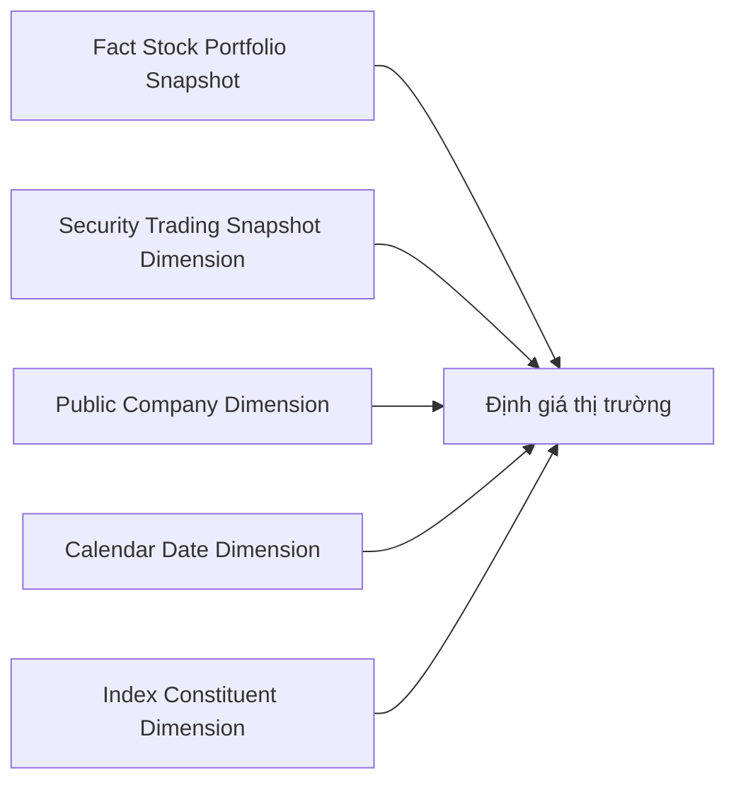
```mermaid
flowchart LR
    F1["Fact Stock Portfolio Snapshot"] --> RPT6["Định giá thị trường"]
    D1["Security Trading Snapshot Dimension"] --> RPT6
    D2["Public Company Dimension"] --> RPT6
    D3["Calendar Date Dimension"] --> RPT6
    D4["Index Constituent Dimension"] --> RPT6
```

**Bảng grain:** Không có bảng mới — cùng grain `Fact Stock Portfolio Snapshot` (1 row/mã CK/rổ chỉ số/ngày) đã có ở Nhóm 1. 3 cột PENDING (Số CP lưu hành, LNST, VCSH) khi sẵn sàng sẽ bổ sung vào đúng Fact này, cùng grain, không tạo bảng mới.

> **Coverage rule:** Không áp dụng thêm cho Dimension nào (toàn bộ reuse nguyên trạng từ Nhóm 1). 3 cột PENDING sẽ bổ sung lên `Fact Stock Portfolio Snapshot` khi Atomic sẵn sàng — theo đúng nguyên tắc measure đặt tại true grain (mã CK/ngày), không tạo Fact riêng.

---

#### Nhóm 7 - Top khối lượng theo toàn thị trường (bảng số liệu)

> **Phân loại:** Dashboard
> **Atomic:** 100% reuse Nhóm 1 (`Security Trading Snapshot`, `Securities Trade`, `Public Company`, `Classification Business Line`) + Nhóm 6 (`Public Company Share Statistics` PENDING, EAV IDS PENDING) — không có nguồn mới.
>
> **Ghi chú tái sử dụng:** BA liệt kê 12 dòng con — toàn bộ đã có KPI ID sẵn từ Nhóm 1 (Mã CK, Ngành, Ngày, KLGD, Giá, % thay đổi) và Nhóm 6 (Số CP lưu hành, LNST, VCSH, P/E, P/B, Vốn hóa thị trường) — reuse thẳng, không khai sinh KPI mới, không tạo/sửa Fact hay Dimension nào. Bản chất STT 7 là **Top-N sắp xếp theo KLGD** (`ORDER BY K_GSTT_13 DESC LIMIT N`) trên cùng `Fact Stock Portfolio Snapshot` — logic Top-N là truy vấn tại tầng BI (ORDER BY + LIMIT), không phải cấu trúc Datamart riêng.

**Mockup:**

| Mã CK | Ngành | Ngày | KLGD | Giá | % thay đổi | Số CP lưu hành | Vốn hóa TT | LNST | P/E | VCSH | P/B |
|---|---|---|---|---|---|---|---|---|---|---|---|
| VCB | Ngân hàng | 27/07/2026 | 548 Tr | 82.50 | +0.61% | *(pending)* | *(pending)* | *(pending)* | *(pending)* | *(pending)* | *(pending)* |

**Source:** `Fact Stock Portfolio Snapshot` → `Security Trading Snapshot Dimension`, `Public Company Dimension`, `Calendar Date Dimension` — 100% reuse, sắp xếp Top-N theo KLGD tại tầng BI.

**Bảng KPI:**

| KPI ID | Tên KPI | Đơn vị | Tính chất | Công thức | Ghi chú | Trạng thái |
|---|---|---|---|---|---|---|
| K_GSTT_1 | Mã ck | — | Chiều | `Security Trading Snapshot Dimension.Symbol` | Reuse từ Nhóm 1 | READY |
| K_GSTT_2 | Ngành | — | Chiều | `Public Company Dimension.Business Line Level 1 Code`, `Classification Business Line Name` | Reuse từ Nhóm 1 | READY |
| K_GSTT_7 | Ngày | — | Chiều | `Calendar Date Dimension.Calendar Date` | Reuse từ Nhóm 1 | READY |
| K_GSTT_13 | KLGD | Cổ phiếu | Phái sinh | `SUM(Securities Trade.Execution Volume) GROUP BY Symbol, Trade Date` | Reuse từ Nhóm 1 (K_GSTT_13 = Tổng KL, đã bao gồm filter Market Id Code IN ('UPX','STX','STO') tại tầng Fact total_vol) — dùng làm tiêu chí sắp xếp Top-N (`ORDER BY ... DESC`). Cùng cảnh báo double-count Index Constituent như Nhóm 1 | READY |
| K_GSTT_10 | Giá | VNĐ | Cơ sở | `Security Trading Snapshot Dimension.Close Price` | Reuse từ Nhóm 1 (K_GSTT_10 = Giá đóng cửa) | READY |
| K_GSTT_12 | % thay đổi | % | Phái sinh | `Price Change / Reference Price × 100` | Reuse từ Nhóm 1 | READY |
| K_GSTT_55 | Số cổ phiếu đang lưu hành | Cổ phiếu | Cơ sở | *(chưa xác định)* | Reuse từ Nhóm 6 — vẫn PENDING (xem O_GSTT_2) | PENDING |
| K_GSTT_61 | Vốn hóa thị trường | VNĐ | Chỉ tiêu phái sinh | `SUM(K_GSTT_10 × K_GSTT_55) GROUP BY Index Code` | Reuse từ Nhóm 6 — vẫn PENDING (phụ thuộc K_GSTT_55) | PENDING |
| K_GSTT_56 | LNST | VNĐ | Cơ sở | *(chưa xác định)* | Reuse từ Nhóm 6 — vẫn PENDING (xem O_GSTT_1) | PENDING |
| K_GSTT_58 | P/E thị trường | Lần | Chỉ tiêu phái sinh | `K_GSTT_10 / (K_GSTT_56 / K_GSTT_55)` | Reuse từ Nhóm 6 — vẫn PENDING | PENDING |
| K_GSTT_57 | VCSH | VNĐ | Cơ sở | *(chưa xác định)* | Reuse từ Nhóm 6 — vẫn PENDING (xem O_GSTT_1) | PENDING |
| K_GSTT_59 | P/B thị trường | Lần | Chỉ tiêu phái sinh | `K_GSTT_10 / (K_GSTT_57 / K_GSTT_55)` | Reuse từ Nhóm 6 — vẫn PENDING | PENDING |

**Star Schema:** Không có bảng mới — 100% reuse `Fact Stock Portfolio Snapshot`, `Security Trading Snapshot Dimension`, `Public Company Dimension`, `Calendar Date Dimension` đã vẽ ở Nhóm 1.

**Lineage Mart → Báo cáo:**

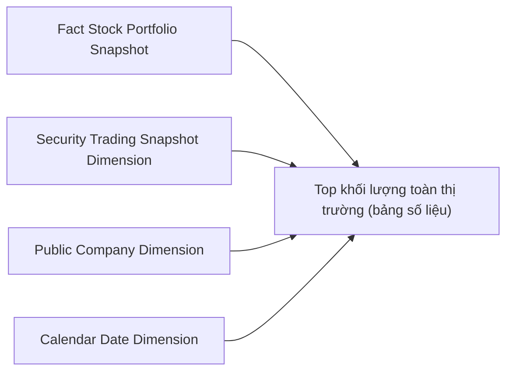
```mermaid
flowchart LR
    F1["Fact Stock Portfolio Snapshot"] --> RPT7["Top khối lượng toàn thị trường (bảng số liệu)"]
    D1["Security Trading Snapshot Dimension"] --> RPT7
    D2["Public Company Dimension"] --> RPT7
    D3["Calendar Date Dimension"] --> RPT7
```

**Bảng grain:** Không có bảng mới — cùng grain `Fact Stock Portfolio Snapshot` đã có ở Nhóm 1.

> **Coverage rule:** Không áp dụng — Nhóm này không tạo/mở rộng Fact hay Dimension nào, thuần túy reuse + Top-N tại tầng BI.

---

#### Nhóm 8 - Top khối lượng theo toàn thị trường (biểu đồ kỹ thuật)

> **Phân loại:** Dashboard
> **Atomic:** 100% reuse Nhóm 1/3 (`Security Trading Snapshot`, `Securities Trade`) + Nhóm 3 (EAV IDS PENDING) — không có nguồn mới.
>
> **Ghi chú tái sử dụng:** BA liệt kê 10 dòng con — toàn bộ đã có KPI ID sẵn từ Nhóm 1 (Mã CK, Ngày, Giá đóng cửa, % thay đổi, KLGD), Nhóm 3 (Giá mở/cao/thấp cửa, Doanh thu, LNST) — reuse thẳng, không khai sinh KPI mới, không tạo/sửa Fact hay Dimension nào. Biến thể biểu đồ kỹ thuật của Nhóm 7 (cùng bộ chỉ tiêu Top-N theo KLGD, khác cách hiển thị — biểu đồ nến/đường thay vì bảng). BA dùng "Doanh thu"/"LNST" (không có VCSH/P-E/P-B như Nhóm 6) — đúng pattern Nhóm 3/4, reuse K_GSTT_31/32, không phải K_GSTT_56 (Nhóm 6).

**Mockup:**

| Mã CK | Ngày | Giá mở | Giá cao | Giá thấp | Giá đóng | Thay đổi % | KLGD | Doanh thu | LNST |
|---|---|---|---|---|---|---|---|---|---|
| VCB | 27/07/2026 | 82.00 | 83.00 | 81.50 | 82.50 | +0.61% | 548 Tr | — | — |

**Source:** `Fact Stock Portfolio Snapshot` → `Security Trading Snapshot Dimension`, `Calendar Date Dimension` — 100% reuse, Top-N theo KLGD tại tầng BI.

**Bảng KPI:**

| KPI ID | Tên KPI | Đơn vị | Tính chất | Công thức | Ghi chú | Trạng thái |
|---|---|---|---|---|---|---|
| K_GSTT_1 | Mã CK | — | Chiều | `Security Trading Snapshot Dimension.Symbol` | Reuse từ Nhóm 1 | READY |
| K_GSTT_7 | Ngày | — | Chiều | `Calendar Date Dimension.Calendar Date` | Reuse từ Nhóm 1 | READY |
| K_GSTT_27 | Giá mở cửa | VNĐ | Cơ sở | `Security Trading Snapshot Dimension.Open Price` | Reuse từ Nhóm 3 | READY |
| K_GSTT_28 | Giá cao nhất | VNĐ | Cơ sở | `Security Trading Snapshot Dimension.High Price` | Reuse từ Nhóm 3 | READY |
| K_GSTT_29 | Giá thấp nhất | VNĐ | Cơ sở | `Security Trading Snapshot Dimension.Low Price` | Reuse từ Nhóm 3 | READY |
| K_GSTT_10 | Giá đóng cửa | VNĐ | Cơ sở | `Security Trading Snapshot Dimension.Close Price` | Reuse từ Nhóm 1 | READY |
| K_GSTT_12 | Thay đổi (%) | % | Phái sinh | `Price Change / Reference Price × 100` | Reuse từ Nhóm 1 | READY |
| K_GSTT_13 | Khối lượng giao dịch | Cổ phiếu | Phái sinh | `SUM(Securities Trade.Execution Volume) GROUP BY Symbol, Trade Date` | Reuse từ Nhóm 1 (K_GSTT_13 = Tổng KL, đã bao gồm filter Market Id Code IN ('UPX','STX','STO') tại tầng Fact total_vol) — dùng làm tiêu chí sắp xếp Top-N | READY |
| K_GSTT_31 | Doanh thu | VNĐ | Cơ sở | *(chưa xác định)* | Reuse từ Nhóm 3 — vẫn PENDING (xem O_GSTT_1) | PENDING |
| K_GSTT_32 | Lợi nhuận sau thuế | VNĐ | Cơ sở | *(chưa xác định)* | Reuse từ Nhóm 3 — vẫn PENDING (xem O_GSTT_1) | PENDING |

**Star Schema:** Không có bảng mới — 100% reuse `Fact Stock Portfolio Snapshot`, `Security Trading Snapshot Dimension`, `Calendar Date Dimension` đã vẽ ở Nhóm 1/3.

**Lineage Mart → Báo cáo:**

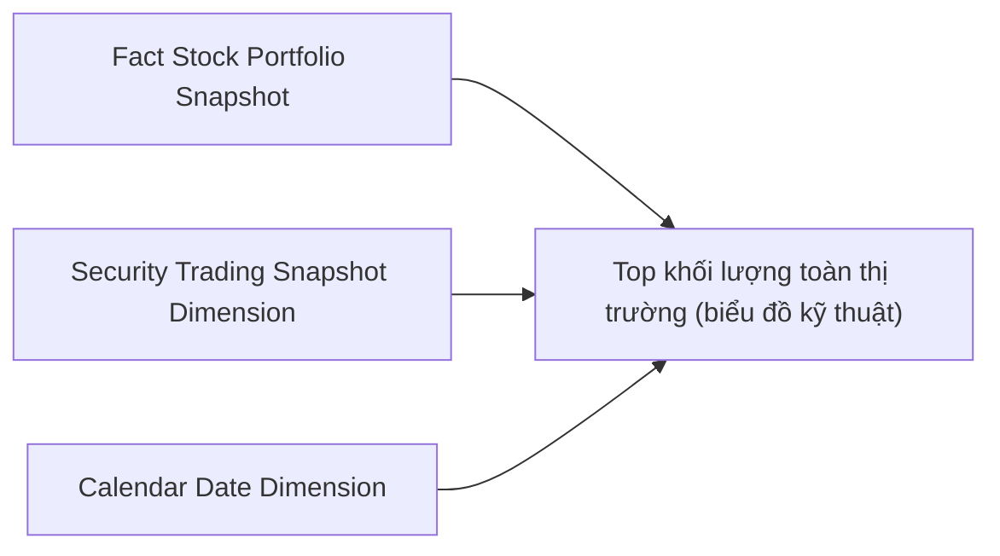
```mermaid
flowchart LR
    F1["Fact Stock Portfolio Snapshot"] --> RPT8["Top khối lượng toàn thị trường (biểu đồ kỹ thuật)"]
    D1["Security Trading Snapshot Dimension"] --> RPT8
    D3["Calendar Date Dimension"] --> RPT8
```

**Bảng grain:** Không có bảng mới — cùng grain `Fact Stock Portfolio Snapshot` đã có ở Nhóm 1.

> **Coverage rule:** Không áp dụng — Nhóm này không tạo/mở rộng Fact hay Dimension nào, thuần túy reuse + Top-N tại tầng BI.

---

#### Nhóm 9 - Top khối lượng theo sàn, Bộ chỉ số tài chính, Bộ chỉ số ngành (bảng số liệu)

> **Phân loại:** Dashboard
> **Atomic:** 100% reuse Nhóm 1 (`Security Trading Snapshot`, `Securities Trade`, `Public Company`, `Classification Business Line`) + Nhóm 6 (`Public Company Share Statistics` PENDING, EAV IDS PENDING) — không có nguồn mới.
>
> **Ghi chú tái sử dụng:** BA liệt kê 15 dòng con — 13 dòng đã có KPI ID sẵn từ Nhóm 1 (Mã CK, Sàn, Ngành, Ngày, KLGD, Giá, % thay đổi) và Nhóm 6 (Số CP lưu hành, Vốn hóa, LNST, P/E, VCSH, P/B) — reuse thẳng, không khai sinh KPI mới. Còn 2 dòng ("Bộ chỉ số thị trường", "Bộ chỉ số theo ngành") là 2 chỉ tiêu độc lập, khai sinh mới — xem ghi chú dưới đây.
> **Ghi chú "Bộ chỉ số thị trường"/"Bộ chỉ số theo ngành" (K_GSTT_62–63):** BA xác nhận cột nguồn thật là `Index Constituent Dimension.Index Code` (cùng cột vật lý với K_GSTT_4 — Chỉ số, Nhóm 1), nguồn `MDDS.JAD_CSIDXINFOR.INDEXCODE` — **không phải `Floor Code`** như bản thiết kế trước. Tuy dùng chung 1 cột vật lý, đây là 2 chỉ tiêu nghiệp vụ khác K_GSTT_4 (Chỉ số — chọn 1 rổ chỉ số cụ thể để lọc) và khác nhau: "Bộ chỉ số thị trường" (K_GSTT_62) = `Index Code IN ('HOSE','UPCOM','HNX')`; "Bộ chỉ số theo ngành" (K_GSTT_63) = `Index Code NOT IN ('HOSE','UPCOM','HNX')` (VD: VN30, HNX30...) — 2 slicer phân loại khác nhau trên dashboard, không phải cùng 1 khái niệm. Khai 2 KPI_ID mới, không thêm Fact/FK/Dimension (cùng dùng `Index Constituent Dimension` đã có). Đã cân nhắc phương án thêm FK mới `Fact Stock Portfolio Snapshot → Market Index Dimension` nhưng xác nhận không có join key Symbol↔Market Code trong Atomic hiện có (`Market Index Snapshot` không có attribute Symbol) — dùng thẳng `Index Constituent Dimension` sẵn có là đúng, không cần FK mới.
> **Ghi chú lịch sử renumber (2026-07-28):** 2 chỉ tiêu này ban đầu được khai sinh muộn (phát hiện sau khi Phase 2 đã hoàn tất tới Nhóm 49) và tạm gán ID K_GSTT_119/120 làm ngoại lệ ngoài thứ tự. Toàn bộ module đã được đánh số lại liên tục từ K_GSTT_1 theo đúng thứ tự Nhóm xuất hiện — 2 chỉ tiêu này nay có ID chính thức K_GSTT_62/63, nằm đúng vị trí tự nhiên ngay sau Nhóm 6 (K_GSTT_61). Không còn ngoại lệ về thứ tự ID trong toàn bộ HLD.

**Mockup:**

| Mã CK | Sàn | Bộ chỉ số ngành | Ngành | Ngày | KLGD | Giá | % thay đổi | Số CP lưu hành | Vốn hóa | LNST | P/E | VCSH | P/B |
|---|---|---|---|---|---|---|---|---|---|---|---|---|---|
| VCB | HOSE | VN30 | Ngân hàng | 27/07/2026 | 548 Tr | 82.50 | +0.61% | *(pending)* | *(pending)* | *(pending)* | *(pending)* | *(pending)* |

**Source:** `Fact Stock Portfolio Snapshot` → `Security Trading Snapshot Dimension`, `Public Company Dimension`, `Calendar Date Dimension`, `Index Constituent Dimension` — 100% reuse, Top-N theo KLGD tại tầng BI.

**Bảng KPI:**

| KPI ID | Tên KPI | Đơn vị | Tính chất | Công thức | Ghi chú | Trạng thái |
|---|---|---|---|---|---|---|
| K_GSTT_1 | Mã CK | — | Chiều | `Security Trading Snapshot Dimension.Symbol` | Reuse từ Nhóm 1 | READY |
| K_GSTT_3 | Sàn | — | Chiều | `Security Trading Snapshot Dimension.Floor Code` | Reuse từ Nhóm 1 | READY |
| K_GSTT_62 | Bộ chỉ số thị trường | — | Chiều | `Index Constituent Dimension.Index Code` | Mới — cùng cột vật lý K_GSTT_4 (Chỉ số, Nhóm 1) nhưng khác chỉ tiêu nghiệp vụ: `Index Code IN ('HOSE','UPCOM','HNX')` | READY |
| K_GSTT_63 | Bộ chỉ số theo ngành | — | Chiều | `Index Constituent Dimension.Index Code` | Mới — cùng cột vật lý K_GSTT_4, khác chỉ tiêu nghiệp vụ: `Index Code NOT IN ('HOSE','UPCOM','HNX')` (VD: VN30, HNX30...) | READY |
| K_GSTT_2 | Ngành | — | Chiều | `Public Company Dimension.Business Line Level 1 Code`, `Classification Business Line Name` | Reuse từ Nhóm 1 | READY |
| K_GSTT_7 | Ngày | — | Chiều | `Calendar Date Dimension.Calendar Date` | Reuse từ Nhóm 1 | READY |
| K_GSTT_13 | KLGD | Cổ phiếu | Phái sinh | `SUM(Securities Trade.Execution Volume) GROUP BY Symbol, Trade Date` | Reuse từ Nhóm 1 (K_GSTT_13 = Tổng KL, đã bao gồm filter Market Id Code IN ('UPX','STX','STO') tại tầng Fact total_vol) — dùng làm tiêu chí sắp xếp Top-N | READY |
| K_GSTT_10 | Giá | VNĐ | Cơ sở | `Security Trading Snapshot Dimension.Close Price` | Reuse từ Nhóm 1 (K_GSTT_10 = Giá đóng cửa) | READY |
| K_GSTT_12 | % thay đổi | % | Phái sinh | `Price Change / Reference Price × 100` | Reuse từ Nhóm 1 | READY |
| K_GSTT_55 | Số cổ phiếu đang lưu hành | Cổ phiếu | Cơ sở | *(chưa xác định)* | Reuse từ Nhóm 6 — vẫn PENDING (xem O_GSTT_2) | PENDING |
| K_GSTT_61 | Vốn hóa | VNĐ | Chỉ tiêu phái sinh | `SUM(K_GSTT_10 × K_GSTT_55) GROUP BY Index Code` | Reuse từ Nhóm 6 — vẫn PENDING (phụ thuộc K_GSTT_55) | PENDING |
| K_GSTT_56 | LNST | VNĐ | Cơ sở | *(chưa xác định)* | Reuse từ Nhóm 6 — vẫn PENDING (xem O_GSTT_1) | PENDING |
| K_GSTT_58 | P/E thị trường | Lần | Chỉ tiêu phái sinh | `K_GSTT_10 / (K_GSTT_56 / K_GSTT_55)` | Reuse từ Nhóm 6 — vẫn PENDING | PENDING |
| K_GSTT_57 | VCSH | VNĐ | Cơ sở | *(chưa xác định)* | Reuse từ Nhóm 6 — vẫn PENDING (xem O_GSTT_1) | PENDING |
| K_GSTT_59 | P/B thị trường | Lần | Chỉ tiêu phái sinh | `K_GSTT_10 / (K_GSTT_57 / K_GSTT_55)` | Reuse từ Nhóm 6 — vẫn PENDING | PENDING |

**Star Schema:** Không có bảng mới — 100% reuse `Fact Stock Portfolio Snapshot`, `Security Trading Snapshot Dimension`, `Public Company Dimension`, `Calendar Date Dimension`, `Index Constituent Dimension` đã vẽ ở Nhóm 1.

**Lineage Mart → Báo cáo:**

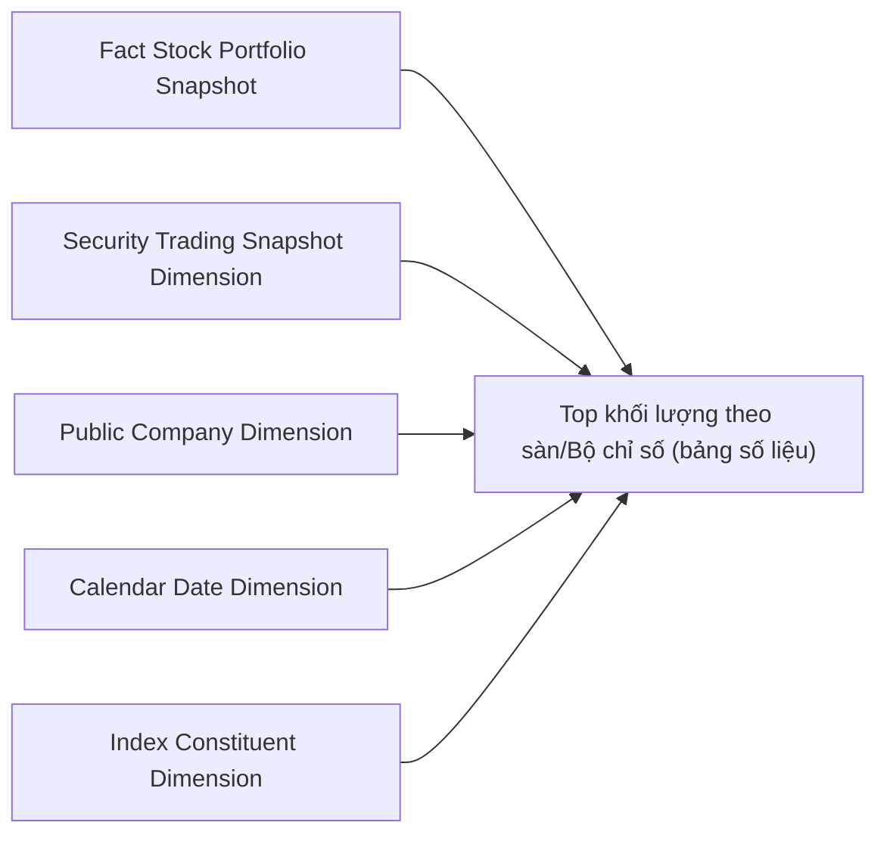
```mermaid
flowchart LR
    F1["Fact Stock Portfolio Snapshot"] --> RPT9["Top khối lượng theo sàn/Bộ chỉ số (bảng số liệu)"]
    D1["Security Trading Snapshot Dimension"] --> RPT9
    D2["Public Company Dimension"] --> RPT9
    D3["Calendar Date Dimension"] --> RPT9
    D4["Index Constituent Dimension"] --> RPT9
```

**Bảng grain:** Không có bảng mới — cùng grain `Fact Stock Portfolio Snapshot` đã có ở Nhóm 1.

> **Coverage rule:** Không áp dụng — Nhóm này không tạo/mở rộng Fact hay Dimension nào, thuần túy reuse + Top-N tại tầng BI.

---

#### Nhóm 10 - Top khối lượng theo sàn, Bộ chỉ số tài chính, Bộ chỉ số ngành (biểu đồ kỹ thuật)

> **Phân loại:** Dashboard
> **Atomic:** 100% reuse Nhóm 1/3/9 (`Security Trading Snapshot`, `Securities Trade`, `Public Company`, `Classification Business Line`) + Nhóm 3 (EAV IDS PENDING) — không có nguồn mới.
>
> **Ghi chú tái sử dụng:** BA liệt kê 13 dòng con — 11 dòng đã có KPI ID sẵn từ Nhóm 1 (Mã CK, Ngành, Sàn, Ngày, KLGD, Giá đóng cửa), Nhóm 3 (Giá mở/cao/thấp cửa, Doanh thu, LNST) và Nhóm 9 (Bộ chỉ số tài chính, Bộ chỉ số theo ngành) — reuse thẳng, không khai sinh KPI mới, không tạo/sửa Fact hay Dimension nào. Biến thể biểu đồ kỹ thuật của Nhóm 9 (cùng bộ chỉ tiêu Top-N theo KLGD, khác cách hiển thị). BA dùng "Doanh thu"/"LNST" (không có VCSH/P-E/P-B/Số CP lưu hành/Vốn hóa như Nhóm 9) — đúng pattern Nhóm 3/8, reuse K_GSTT_31/32.
> **Ghi chú "Bộ chỉ số tài chính"/"Bộ chỉ số theo ngành" (cập nhật 2026-07-28):** Cùng bản chất đã xác nhận ở Nhóm 9 — cả 2 là filter con của K_GSTT_4 (`Index Constituent Dimension.Index Code`, Nhóm 1): "Bộ chỉ số tài chính" = `Index Code IN ('HOSE','UPCOM','HNX')`, "Bộ chỉ số theo ngành" = `Index Code NOT IN ('HOSE','UPCOM','HNX')`. Reuse từ Nhóm 9, cả 2 đều READY.

**Mockup:**

| Mã CK | Ngành | Sàn | Bộ chỉ số ngành | Ngày | Giá mở | Giá cao | Giá thấp | Giá đóng | KLGD | Doanh thu | LNST |
|---|---|---|---|---|---|---|---|---|---|---|---|
| VCB | Ngân hàng | HOSE | VN30 | 27/07/2026 | 82.00 | 83.00 | 81.50 | 82.50 | 548 Tr | — | — |

**Source:** `Fact Stock Portfolio Snapshot` → `Security Trading Snapshot Dimension`, `Public Company Dimension`, `Calendar Date Dimension`, `Index Constituent Dimension` — 100% reuse, Top-N theo KLGD tại tầng BI.

**Bảng KPI:**

| KPI ID | Tên KPI | Đơn vị | Tính chất | Công thức | Ghi chú | Trạng thái |
|---|---|---|---|---|---|---|
| K_GSTT_1 | Mã CK | — | Chiều | `Security Trading Snapshot Dimension.Symbol` | Reuse từ Nhóm 1 | READY |
| K_GSTT_2 | Ngành | — | Chiều | `Public Company Dimension.Business Line Level 1 Code`, `Classification Business Line Name` | Reuse từ Nhóm 1 | READY |
| K_GSTT_3 | Sàn | — | Chiều | `Security Trading Snapshot Dimension.Floor Code` | Reuse từ Nhóm 1 | READY |
| K_GSTT_62 | Bộ chỉ số tài chính | — | Chiều | `Index Constituent Dimension.Index Code` | Reuse từ K_GSTT_62 (Nhóm 9): `Index Code IN ('HOSE','UPCOM','HNX')` | READY |
| K_GSTT_63 | Bộ chỉ số theo ngành | — | Chiều | `Index Constituent Dimension.Index Code` | Reuse từ K_GSTT_63 (Nhóm 9): `Index Code NOT IN ('HOSE','UPCOM','HNX')` | READY |
| K_GSTT_7 | Ngày | — | Chiều | `Calendar Date Dimension.Calendar Date` | Reuse từ Nhóm 1 | READY |
| K_GSTT_28 | Giá cao nhất | VNĐ | Cơ sở | `Security Trading Snapshot Dimension.High Price` | Reuse từ Nhóm 3 | READY |
| K_GSTT_29 | Giá thấp nhất | VNĐ | Cơ sở | `Security Trading Snapshot Dimension.Low Price` | Reuse từ Nhóm 3 | READY |
| K_GSTT_27 | Giá mở cửa | VNĐ | Cơ sở | `Security Trading Snapshot Dimension.Open Price` | Reuse từ Nhóm 3 | READY |
| K_GSTT_10 | Giá đóng cửa | VNĐ | Cơ sở | `Security Trading Snapshot Dimension.Close Price` | Reuse từ Nhóm 1 | READY |
| K_GSTT_13 | Khối lượng giao dịch | Cổ phiếu | Phái sinh | `SUM(Securities Trade.Execution Volume) GROUP BY Symbol, Trade Date` | Reuse từ Nhóm 1 (K_GSTT_13 = Tổng KL, đã bao gồm filter Market Id Code IN ('UPX','STX','STO') tại tầng Fact total_vol) — dùng làm tiêu chí sắp xếp Top-N | READY |
| K_GSTT_31 | Doanh thu | VNĐ | Cơ sở | *(chưa xác định)* | Reuse từ Nhóm 3 — vẫn PENDING (xem O_GSTT_1) | PENDING |
| K_GSTT_32 | Lợi nhuận sau thuế | VNĐ | Cơ sở | *(chưa xác định)* | Reuse từ Nhóm 3 — vẫn PENDING (xem O_GSTT_1) | PENDING |

**Star Schema:** Không có bảng mới — 100% reuse `Fact Stock Portfolio Snapshot`, `Security Trading Snapshot Dimension`, `Public Company Dimension`, `Calendar Date Dimension`, `Index Constituent Dimension` đã vẽ ở Nhóm 1/3.

**Lineage Mart → Báo cáo:**

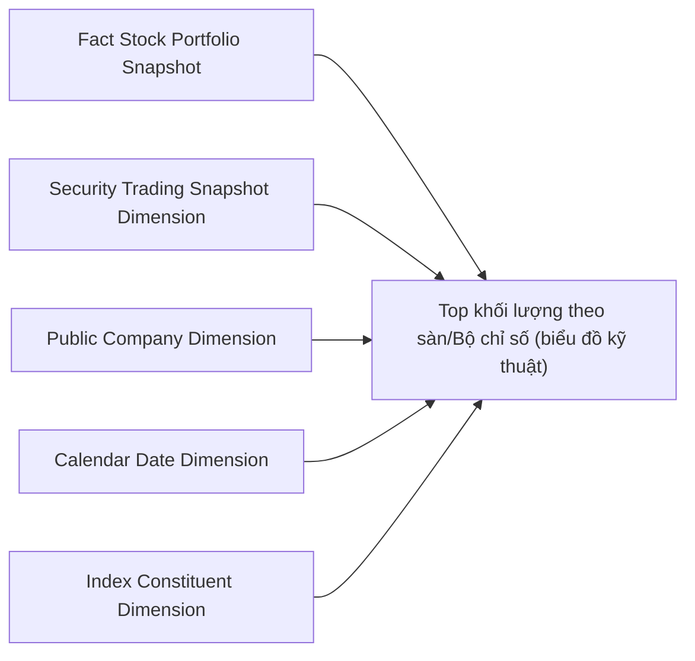
```mermaid
flowchart LR
    F1["Fact Stock Portfolio Snapshot"] --> RPT10["Top khối lượng theo sàn/Bộ chỉ số (biểu đồ kỹ thuật)"]
    D1["Security Trading Snapshot Dimension"] --> RPT10
    D2["Public Company Dimension"] --> RPT10
    D3["Calendar Date Dimension"] --> RPT10
    D4["Index Constituent Dimension"] --> RPT10
```

**Bảng grain:** Không có bảng mới — cùng grain `Fact Stock Portfolio Snapshot` đã có ở Nhóm 1.

> **Coverage rule:** Không áp dụng — Nhóm này không tạo/mở rộng Fact hay Dimension nào, thuần túy reuse + Top-N tại tầng BI.

---

#### Nhóm 11 - Top đột phá theo toàn thị trường (bảng số liệu)

> **Phân loại:** Dashboard
> **Atomic:** 100% reuse Nhóm 1 (`Security Trading Snapshot`, `Securities Trade`) + Nhóm 6 (`Public Company Share Statistics` PENDING, EAV IDS PENDING) — không có nguồn mới.
>
> **Ghi chú tái sử dụng:** BA liệt kê 18 dòng con — 12 dòng đã có KPI ID sẵn từ Nhóm 1 (Mã CK, Ngày, Khối lượng, Giá đóng cửa, Thay đổi, % thay đổi) và Nhóm 6 (Số CP lưu hành, Vốn hóa, LNST, P/E, VCSH, P/B) — reuse thẳng, không khai sinh KPI mới. 6 dòng còn lại là chỉ tiêu "đột phá khối lượng" thật sự mới — xem ghi chú rolling window dưới đây.
> **Ghi chú measure rolling window (KLGDTB N ngày, Tỷ lệ đột phá N ngày):** BA yêu cầu `KLGDTB trong N ngày` (N=5/10/20, `AVG(Execution Volume) WHERE Trade Date BETWEEN :ngay_gd-N AND :ngay_gd-1`, tức N phiên **trước** ngày hiện tại, không gồm ngày hiện tại) và `Tỷ lệ giữa KLGD/KLGDTB N ngày` (`K_GSTT_13 (KLGD ngày hiện tại) / KLGDTB N ngày`). Cả 2 đều là window function (rolling average) trên cùng nguồn đã pre-aggregate ở K_GSTT_13 (`Securities Trade`, GROUP BY Symbol/Trade Date) — tính tại tầng BI/query layer bằng `AVG(...) OVER (PARTITION BY Symbol ORDER BY Trade Date ROWS BETWEEN N PRECEDING AND 1 PRECEDING)`, không cần cột/Fact mới trên Datamart vì `Fact Stock Portfolio Snapshot` đã có đủ chuỗi KLGD theo ngày để window function truy vấn ngược lại N phiên.

**Mockup:**

| Mã CK | Ngày | KLGDTB 5 ngày | Tỷ lệ 5 ngày | KLGDTB 10 ngày | Tỷ lệ 10 ngày | KLGDTB 20 ngày | Tỷ lệ 20 ngày | Khối lượng | Giá đóng cửa | Thay đổi | % thay đổi | Số CP lưu hành | Vốn hóa | LNST | P/E | VCSH | P/B |
|---|---|---|---|---|---|---|---|---|---|---|---|---|---|---|---|---|---|
| VCB | 27/07/2026 | 420 Tr | 1.3x | 400 Tr | 1.37x | 380 Tr | 1.44x | 548 Tr | 82.50 | +0.50 | +0.61% | *(pending)* | *(pending)* | *(pending)* | *(pending)* | *(pending)* | *(pending)* |

**Source:** `Fact Stock Portfolio Snapshot` → `Security Trading Snapshot Dimension`, `Calendar Date Dimension` — 100% reuse, rolling window + Top-N tại tầng BI.

**Bảng KPI:**

| KPI ID | Tên KPI | Đơn vị | Tính chất | Công thức | Ghi chú | Trạng thái |
|---|---|---|---|---|---|---|
| K_GSTT_1 | Mã CK | — | Chiều | `Security Trading Snapshot Dimension.Symbol` | Reuse từ Nhóm 1 | READY |
| K_GSTT_7 | Ngày | — | Chiều | `Calendar Date Dimension.Calendar Date` | Reuse từ Nhóm 1 | READY |
| K_GSTT_64 | KLGDTB trong 5 ngày | Cổ phiếu | Phái sinh | `AVG(K_GSTT_13) OVER (PARTITION BY Symbol ORDER BY Trade Date ROWS BETWEEN 5 PRECEDING AND 1 PRECEDING)` | Window function tại tầng BI trên `Fact Stock Portfolio Snapshot` — không tính ngày hiện tại | READY |
| K_GSTT_65 | Tỷ lệ KLGD/KLGDTB 5 ngày | Lần | Phái sinh | `K_GSTT_13 (ngày hiện tại) / K_GSTT_64` | Dùng làm tiêu chí Top-N "đột phá" (`ORDER BY ... DESC`) | READY |
| K_GSTT_66 | KLGDTB trong 10 ngày | Cổ phiếu | Phái sinh | `AVG(K_GSTT_13) OVER (PARTITION BY Symbol ORDER BY Trade Date ROWS BETWEEN 10 PRECEDING AND 1 PRECEDING)` | Window function tại tầng BI, cùng cơ chế K_GSTT_64 | READY |
| K_GSTT_67 | Tỷ lệ KLGD/KLGDTB 10 ngày | Lần | Phái sinh | `K_GSTT_13 (ngày hiện tại) / K_GSTT_66` | Cùng cơ chế K_GSTT_65 | READY |
| K_GSTT_68 | KLGDTB trong 20 ngày | Cổ phiếu | Phái sinh | `AVG(K_GSTT_13) OVER (PARTITION BY Symbol ORDER BY Trade Date ROWS BETWEEN 20 PRECEDING AND 1 PRECEDING)` | Window function tại tầng BI, cùng cơ chế K_GSTT_64 | READY |
| K_GSTT_69 | Tỷ lệ KLGD/KLGDTB 20 ngày | Lần | Phái sinh | `K_GSTT_13 (ngày hiện tại) / K_GSTT_68` | Cùng cơ chế K_GSTT_65 | READY |
| K_GSTT_13 | Khối lượng | Cổ phiếu | Phái sinh | `SUM(Securities Trade.Execution Volume) GROUP BY Symbol, Trade Date` | Reuse từ Nhóm 1 (K_GSTT_13 = Tổng KL, đã bao gồm filter Market Id Code IN ('UPX','STX','STO') tại tầng Fact total_vol) | READY |
| K_GSTT_10 | Giá đóng cửa | VNĐ | Cơ sở | `Security Trading Snapshot Dimension.Close Price` | Reuse từ Nhóm 1 | READY |
| K_GSTT_11 | Thay đổi (+/-) | VNĐ | Cơ sở | `Security Trading Snapshot Dimension.Price Change` | Reuse từ Nhóm 1 | READY |
| K_GSTT_12 | % thay đổi | % | Phái sinh | `Price Change / Reference Price × 100` | Reuse từ Nhóm 1 | READY |
| K_GSTT_55 | Số cổ phiếu đang lưu hành | Cổ phiếu | Cơ sở | *(chưa xác định)* | Reuse từ Nhóm 6 — vẫn PENDING (xem O_GSTT_2) | PENDING |
| K_GSTT_61 | Vốn hóa | VNĐ | Chỉ tiêu phái sinh | `SUM(K_GSTT_10 × K_GSTT_55) GROUP BY Index Code` | Reuse từ Nhóm 6 — vẫn PENDING (phụ thuộc K_GSTT_55) | PENDING |
| K_GSTT_56 | LNST | VNĐ | Cơ sở | *(chưa xác định)* | Reuse từ Nhóm 6 — vẫn PENDING (xem O_GSTT_1) | PENDING |
| K_GSTT_58 | P/E thị trường | Lần | Chỉ tiêu phái sinh | `K_GSTT_10 / (K_GSTT_56 / K_GSTT_55)` | Reuse từ Nhóm 6 — vẫn PENDING | PENDING |
| K_GSTT_57 | VCSH | VNĐ | Cơ sở | *(chưa xác định)* | Reuse từ Nhóm 6 — vẫn PENDING (xem O_GSTT_1) | PENDING |
| K_GSTT_59 | P/B thị trường | Lần | Chỉ tiêu phái sinh | `K_GSTT_10 / (K_GSTT_57 / K_GSTT_55)` | Reuse từ Nhóm 6 — vẫn PENDING | PENDING |

**Star Schema:** Không có bảng mới — 100% reuse `Fact Stock Portfolio Snapshot`, `Security Trading Snapshot Dimension`, `Calendar Date Dimension` đã vẽ ở Nhóm 1. K_GSTT_64–68 (rolling window) không cần cột mới — tính từ chuỗi K_GSTT_13 theo Symbol/Trade Date đã có sẵn.

**Lineage Mart → Báo cáo:**

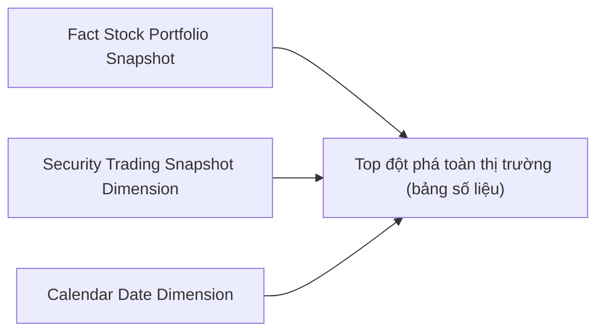
```mermaid
flowchart LR
    F1["Fact Stock Portfolio Snapshot"] --> RPT11["Top đột phá toàn thị trường (bảng số liệu)"]
    D1["Security Trading Snapshot Dimension"] --> RPT11
    D3["Calendar Date Dimension"] --> RPT11
```

**Bảng grain:** Không có bảng mới — cùng grain `Fact Stock Portfolio Snapshot` đã có ở Nhóm 1.

> **Coverage rule:** Không áp dụng — Nhóm này không tạo/mở rộng Fact hay Dimension nào, thuần túy reuse + rolling window/Top-N tại tầng BI.

---

#### Nhóm 12 - Top đột phá theo toàn thị trường (biểu đồ kỹ thuật)

> **Phân loại:** Dashboard
> **Atomic:** 100% reuse Nhóm 1 (`Security Trading Snapshot`, `Securities Trade`) + Nhóm 3 (EAV IDS PENDING) + Nhóm 11 (rolling window) — không có nguồn mới.
>
> **Ghi chú tái sử dụng:** BA liệt kê 15 dòng con — toàn bộ đã có KPI ID sẵn từ Nhóm 1 (Mã CK, Ngày, Khối lượng), Nhóm 3 (Giá mở/cao/thấp cửa, Doanh thu, Lợi nhuận) và Nhóm 11 (KLGDTB 5/10/20 ngày, Tỷ lệ KLGD/KLGDTB 5/10/20 ngày) — reuse thẳng, không khai sinh KPI mới, không tạo/sửa Fact hay Dimension nào. Biến thể biểu đồ kỹ thuật của Nhóm 11 (cùng bộ chỉ tiêu Top-N "đột phá" theo tỷ lệ KLGD/KLGDTB, khác cách hiển thị — biểu đồ nến/đường thay vì bảng). BA dùng "Doanh thu"/"Lợi nhuận" (không có VCSH/P-E/P-B/Số CP lưu hành/Vốn hóa như Nhóm 11) — đúng pattern Nhóm 3/8/10, reuse K_GSTT_31/32, không phải K_GSTT_56 (Nhóm 6).

**Mockup:**

| Mã CK | Ngày | KLGDTB 5 ngày | Tỷ lệ 5 ngày | KLGDTB 10 ngày | Tỷ lệ 10 ngày | KLGDTB 20 ngày | Tỷ lệ 20 ngày | Giá mở | Giá cao | Giá thấp | Giá đóng | Khối lượng | Doanh thu | Lợi nhuận |
|---|---|---|---|---|---|---|---|---|---|---|---|---|---|---|
| VCB | 27/07/2026 | 420 Tr | 1.3x | 400 Tr | 1.37x | 380 Tr | 1.44x | 82.00 | 83.00 | 81.50 | 82.50 | 548 Tr | — | — |

**Source:** `Fact Stock Portfolio Snapshot` → `Security Trading Snapshot Dimension`, `Calendar Date Dimension` — 100% reuse, rolling window + Top-N tại tầng BI.

**Bảng KPI:**

| KPI ID | Tên KPI | Đơn vị | Tính chất | Công thức | Ghi chú | Trạng thái |
|---|---|---|---|---|---|---|
| K_GSTT_1 | Mã CK | — | Chiều | `Security Trading Snapshot Dimension.Symbol` | Reuse từ Nhóm 1 | READY |
| K_GSTT_7 | Ngày | — | Chiều | `Calendar Date Dimension.Calendar Date` | Reuse từ Nhóm 1 | READY |
| K_GSTT_64 | KLGDTB trong 5 ngày | Cổ phiếu | Phái sinh | `AVG(K_GSTT_13) OVER (PARTITION BY Symbol ORDER BY Trade Date ROWS BETWEEN 5 PRECEDING AND 1 PRECEDING)` | Reuse từ Nhóm 11 | READY |
| K_GSTT_65 | Tỷ lệ KLGD/KLGDTB 5 ngày | Lần | Phái sinh | `K_GSTT_13 (ngày hiện tại) / K_GSTT_64` | Reuse từ Nhóm 11 — dùng làm tiêu chí Top-N "đột phá" | READY |
| K_GSTT_66 | KLGDTB trong 10 ngày | Cổ phiếu | Phái sinh | `AVG(K_GSTT_13) OVER (PARTITION BY Symbol ORDER BY Trade Date ROWS BETWEEN 10 PRECEDING AND 1 PRECEDING)` | Reuse từ Nhóm 11 | READY |
| K_GSTT_67 | Tỷ lệ KLGD/KLGDTB 10 ngày | Lần | Phái sinh | `K_GSTT_13 (ngày hiện tại) / K_GSTT_66` | Reuse từ Nhóm 11 | READY |
| K_GSTT_68 | KLGDTB trong 20 ngày | Cổ phiếu | Phái sinh | `AVG(K_GSTT_13) OVER (PARTITION BY Symbol ORDER BY Trade Date ROWS BETWEEN 20 PRECEDING AND 1 PRECEDING)` | Reuse từ Nhóm 11 | READY |
| K_GSTT_69 | Tỷ lệ KLGD/KLGDTB 20 ngày | Lần | Phái sinh | `K_GSTT_13 (ngày hiện tại) / K_GSTT_68` | Reuse từ Nhóm 11 | READY |
| K_GSTT_27 | Giá mở cửa | VNĐ | Cơ sở | `Security Trading Snapshot Dimension.Open Price` | Reuse từ Nhóm 3 | READY |
| K_GSTT_28 | Giá cao nhất | VNĐ | Cơ sở | `Security Trading Snapshot Dimension.High Price` | Reuse từ Nhóm 3 | READY |
| K_GSTT_29 | Giá thấp nhất | VNĐ | Cơ sở | `Security Trading Snapshot Dimension.Low Price` | Reuse từ Nhóm 3 | READY |
| K_GSTT_10 | Giá đóng cửa | VNĐ | Cơ sở | `Security Trading Snapshot Dimension.Close Price` | Reuse từ Nhóm 1 | READY |
| K_GSTT_13 | Khối lượng giao dịch | Cổ phiếu | Phái sinh | `SUM(Securities Trade.Execution Volume) GROUP BY Symbol, Trade Date` | Reuse từ Nhóm 1 (K_GSTT_13 = Tổng KL, đã bao gồm filter Market Id Code IN ('UPX','STX','STO') tại tầng Fact total_vol) | READY |
| K_GSTT_31 | Doanh thu | VNĐ | Cơ sở | *(chưa xác định)* | Reuse từ Nhóm 3 — vẫn PENDING (xem O_GSTT_1) | PENDING |
| K_GSTT_32 | Lợi nhuận sau thuế | VNĐ | Cơ sở | *(chưa xác định)* | Reuse từ Nhóm 3 — vẫn PENDING (xem O_GSTT_1) | PENDING |

**Star Schema:** Không có bảng mới — 100% reuse `Fact Stock Portfolio Snapshot`, `Security Trading Snapshot Dimension`, `Calendar Date Dimension` đã vẽ ở Nhóm 1. K_GSTT_64–68 (rolling window) không cần cột mới — tính từ chuỗi K_GSTT_13 theo Symbol/Trade Date đã có sẵn.

**Lineage Mart → Báo cáo:**

```mermaid
flowchart LR
    F1["Fact Stock Portfolio Snapshot"] --> RPT12["Top đột phá toàn thị trường (biểu đồ kỹ thuật)"]
    D1["Security Trading Snapshot Dimension"] --> RPT12
    D3["Calendar Date Dimension"] --> RPT12
```

**Bảng grain:** Không có bảng mới — cùng grain `Fact Stock Portfolio Snapshot` đã có ở Nhóm 1.

> **Coverage rule:** Không áp dụng — Nhóm này không tạo/mở rộng Fact hay Dimension nào, thuần túy reuse + rolling window/Top-N tại tầng BI.

---

#### Nhóm 13 - Top đột phá theo sàn, Bộ chỉ số tài chính, Bộ chỉ số ngành (bảng số liệu)

> **Phân loại:** Dashboard
> **Atomic:** 100% reuse Nhóm 1 (`Security Trading Snapshot`, `Securities Trade`) + Nhóm 6 (`Public Company Share Statistics` PENDING, EAV IDS PENDING) + Nhóm 9 (Bộ chỉ số thị trường/ngành) + Nhóm 11 (rolling window) — không có nguồn mới.
>
> **Ghi chú tái sử dụng:** BA liệt kê 20 dòng con — toàn bộ đã có KPI ID sẵn từ Nhóm 1 (Mã CK, Sàn, Ngày, Khối lượng, Giá, Thay đổi, % thay đổi), Nhóm 6 (Số CP lưu hành, Vốn hóa, LNST, P/E, VCSH, P/B) và Nhóm 11 (KLGDTB 5/10/20 ngày, Tỷ lệ KLGD/KLGDTB 5/10/20 ngày) — reuse thẳng, không khai sinh KPI mới, không tạo/sửa Fact hay Dimension nào. Bản chất là biến thể "theo sàn/bộ chỉ số" của Nhóm 11 (cùng bộ chỉ tiêu Top-N đột phá, khác điều kiện lọc/nhóm theo Sàn hoặc Bộ chỉ số thay vì toàn thị trường) — đúng quan hệ Nhóm 9 với Nhóm 7.
> **Ghi chú "Bộ chỉ số ngành/bộ chỉ số thị trường" (BA gộp 1 dòng con thành 2 KPI — bảng KPI có 21 dòng dù BA chỉ 20 dòng con; cập nhật 2026-07-28):** Dòng con thứ 3 của BA gộp chung tên "Bộ chỉ số ngành/ bộ chỉ số thị trường" trong 1 dòng CSV duy nhất, nhưng đây là 2 khái niệm khác nhau đã tách riêng và xác nhận tại Nhóm 9 — cả 2 là filter con của K_GSTT_4 (`Index Constituent Dimension.Index Code`): "Bộ chỉ số thị trường" = `Index Code IN ('HOSE','UPCOM','HNX')`, "Bộ chỉ số theo ngành" = `Index Code NOT IN ('HOSE','UPCOM','HNX')`. Bảng KPI dưới đây tách đúng 2 dòng cho 1 dòng BA gộp này — không phải lỗi thừa KPI, cũng không phải trường hợp "trùng KPI" thông thường (nơi nhiều dòng BA cùng trỏ 1 KPI); ở đây là chiều ngược lại (1 dòng BA chứa 2 khái niệm chưa tách bạch).

**Mockup:**

| Mã CK | Sàn | Bộ chỉ số ngành | Ngày | KLGDTB 5 ngày | Tỷ lệ 5 ngày | KLGDTB 10 ngày | Tỷ lệ 10 ngày | KLGDTB 20 ngày | Tỷ lệ 20 ngày | Khối lượng | Giá | Thay đổi | % thay đổi | Số CP lưu hành | Vốn hóa | LNST | P/E | VCSH | P/B |
|---|---|---|---|---|---|---|---|---|---|---|---|---|---|---|---|---|---|---|
| VCB | HOSE | VN30 | 27/07/2026 | 420 Tr | 1.3x | 400 Tr | 1.37x | 380 Tr | 1.44x | 548 Tr | 82.50 | +0.50 | +0.61% | *(pending)* | *(pending)* | *(pending)* | *(pending)* | *(pending)* | *(pending)* |

**Source:** `Fact Stock Portfolio Snapshot` → `Security Trading Snapshot Dimension`, `Public Company Dimension`, `Calendar Date Dimension`, `Index Constituent Dimension` — 100% reuse, rolling window + Top-N tại tầng BI.

**Bảng KPI:**

| KPI ID | Tên KPI | Đơn vị | Tính chất | Công thức | Ghi chú | Trạng thái |
|---|---|---|---|---|---|---|
| K_GSTT_1 | Mã CK | — | Chiều | `Security Trading Snapshot Dimension.Symbol` | Reuse từ Nhóm 1 | READY |
| K_GSTT_3 | Sàn | — | Chiều | `Security Trading Snapshot Dimension.Floor Code` | Reuse từ Nhóm 1 | READY |
| K_GSTT_62 | Bộ chỉ số thị trường | — | Chiều | `Index Constituent Dimension.Index Code` | Reuse từ K_GSTT_62 (Nhóm 9): `Index Code IN ('HOSE','UPCOM','HNX')` | READY |
| K_GSTT_63 | Bộ chỉ số theo ngành | — | Chiều | `Index Constituent Dimension.Index Code` | Reuse từ K_GSTT_63 (Nhóm 9): `Index Code NOT IN ('HOSE','UPCOM','HNX')` | READY |
| K_GSTT_7 | Ngày | — | Chiều | `Calendar Date Dimension.Calendar Date` | Reuse từ Nhóm 1 | READY |
| K_GSTT_64 | KLGDTB trong 5 ngày | Cổ phiếu | Phái sinh | `AVG(K_GSTT_13) OVER (PARTITION BY Symbol ORDER BY Trade Date ROWS BETWEEN 5 PRECEDING AND 1 PRECEDING)` | Reuse từ Nhóm 11 | READY |
| K_GSTT_65 | Tỷ lệ KLGD/KLGDTB 5 ngày | Lần | Phái sinh | `K_GSTT_13 (ngày hiện tại) / K_GSTT_64` | Reuse từ Nhóm 11 — dùng làm tiêu chí Top-N "đột phá" | READY |
| K_GSTT_66 | KLGDTB trong 10 ngày | Cổ phiếu | Phái sinh | `AVG(K_GSTT_13) OVER (PARTITION BY Symbol ORDER BY Trade Date ROWS BETWEEN 10 PRECEDING AND 1 PRECEDING)` | Reuse từ Nhóm 11 | READY |
| K_GSTT_67 | Tỷ lệ KLGD/KLGDTB 10 ngày | Lần | Phái sinh | `K_GSTT_13 (ngày hiện tại) / K_GSTT_66` | Reuse từ Nhóm 11 | READY |
| K_GSTT_68 | KLGDTB trong 20 ngày | Cổ phiếu | Phái sinh | `AVG(K_GSTT_13) OVER (PARTITION BY Symbol ORDER BY Trade Date ROWS BETWEEN 20 PRECEDING AND 1 PRECEDING)` | Reuse từ Nhóm 11 | READY |
| K_GSTT_69 | Tỷ lệ KLGD/KLGDTB 20 ngày | Lần | Phái sinh | `K_GSTT_13 (ngày hiện tại) / K_GSTT_68` | Reuse từ Nhóm 11 | READY |
| K_GSTT_13 | Khối lượng | Cổ phiếu | Phái sinh | `SUM(Securities Trade.Execution Volume) GROUP BY Symbol, Trade Date` | Reuse từ Nhóm 1 (K_GSTT_13 = Tổng KL, đã bao gồm filter Market Id Code IN ('UPX','STX','STO') tại tầng Fact total_vol) | READY |
| K_GSTT_10 | Giá | VNĐ | Cơ sở | `Security Trading Snapshot Dimension.Close Price` | Reuse từ Nhóm 1 (K_GSTT_10 = Giá đóng cửa) | READY |
| K_GSTT_11 | Thay đổi (+/-) | VNĐ | Cơ sở | `Security Trading Snapshot Dimension.Price Change` | Reuse từ Nhóm 1 | READY |
| K_GSTT_12 | % thay đổi | % | Phái sinh | `Price Change / Reference Price × 100` | Reuse từ Nhóm 1 | READY |
| K_GSTT_55 | Số cổ phiếu đang lưu hành | Cổ phiếu | Cơ sở | *(chưa xác định)* | Reuse từ Nhóm 6 — vẫn PENDING (xem O_GSTT_2) | PENDING |
| K_GSTT_61 | Vốn hóa | VNĐ | Chỉ tiêu phái sinh | `SUM(K_GSTT_10 × K_GSTT_55) GROUP BY Index Code` | Reuse từ Nhóm 6 — vẫn PENDING (phụ thuộc K_GSTT_55) | PENDING |
| K_GSTT_56 | LNST | VNĐ | Cơ sở | *(chưa xác định)* | Reuse từ Nhóm 6 — vẫn PENDING (xem O_GSTT_1) | PENDING |
| K_GSTT_58 | P/E thị trường | Lần | Chỉ tiêu phái sinh | `K_GSTT_10 / (K_GSTT_56 / K_GSTT_55)` | Reuse từ Nhóm 6 — vẫn PENDING | PENDING |
| K_GSTT_57 | VCSH | VNĐ | Cơ sở | *(chưa xác định)* | Reuse từ Nhóm 6 — vẫn PENDING (xem O_GSTT_1) | PENDING |
| K_GSTT_59 | P/B thị trường | Lần | Chỉ tiêu phái sinh | `K_GSTT_10 / (K_GSTT_57 / K_GSTT_55)` | Reuse từ Nhóm 6 — vẫn PENDING | PENDING |

**Star Schema:** Không có bảng mới — 100% reuse `Fact Stock Portfolio Snapshot`, `Security Trading Snapshot Dimension`, `Public Company Dimension`, `Calendar Date Dimension`, `Index Constituent Dimension` đã vẽ ở Nhóm 1. K_GSTT_64–68 (rolling window) không cần cột mới.

**Lineage Mart → Báo cáo:**

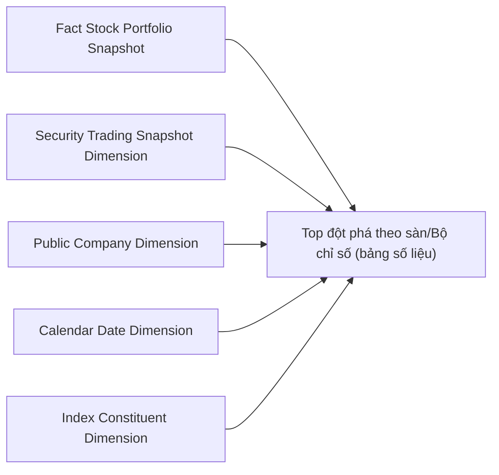
```mermaid
flowchart LR
    F1["Fact Stock Portfolio Snapshot"] --> RPT13["Top đột phá theo sàn/Bộ chỉ số (bảng số liệu)"]
    D1["Security Trading Snapshot Dimension"] --> RPT13
    D2["Public Company Dimension"] --> RPT13
    D3["Calendar Date Dimension"] --> RPT13
    D4["Index Constituent Dimension"] --> RPT13
```

**Bảng grain:** Không có bảng mới — cùng grain `Fact Stock Portfolio Snapshot` đã có ở Nhóm 1.

> **Coverage rule:** Không áp dụng — Nhóm này không tạo/mở rộng Fact hay Dimension nào, thuần túy reuse + rolling window/Top-N tại tầng BI.

---

#### Nhóm 14 - Top đột phá theo sàn, Bộ chỉ số tài chính, Bộ chỉ số ngành (biểu đồ kỹ thuật)

> **Phân loại:** Dashboard
> **Atomic:** 100% reuse Nhóm 1 (`Security Trading Snapshot`, `Securities Trade`) + Nhóm 3 (EAV IDS PENDING) + Nhóm 9 (Bộ chỉ số thị trường/ngành) + Nhóm 11 (rolling window) — không có nguồn mới.
>
> **Ghi chú tái sử dụng:** BA liệt kê 18 dòng con — toàn bộ đã có KPI ID sẵn từ Nhóm 1 (Mã CK, Sàn, Ngày, Thay đổi, Khối lượng), Nhóm 3 (Giá mở/cao/thấp/đóng cửa, Doanh thu, Lợi nhuận), Nhóm 9 (Bộ chỉ số thị trường/ngành) và Nhóm 11 (KLGDTB 5/10/20 ngày, Tỷ lệ KLGD/KLGDTB 5/10/20 ngày) — reuse thẳng, không khai sinh KPI mới, không tạo/sửa Fact hay Dimension nào. Biến thể biểu đồ kỹ thuật của Nhóm 13 (cùng bộ chỉ tiêu Top-N đột phá theo sàn/bộ chỉ số, khác cách hiển thị — biểu đồ nến/đường thay vì bảng), đồng thời là biến thể "theo sàn/bộ chỉ số" của Nhóm 12 — đúng quan hệ tứ giác Nhóm 11/12/13/14 giống Nhóm 7/8/9/10. BA dùng "Doanh thu"/"Lợi nhuận" (không có VCSH/P-E/P-B/Số CP lưu hành/Vốn hóa như Nhóm 13) — đúng pattern Nhóm 3/8/10/12, reuse K_GSTT_31/32.
> **Ghi chú "Bộ chỉ số ngành/bộ chỉ số thị trường" (BA gộp 1 dòng con thành 2 KPI, giống Nhóm 13; cập nhật 2026-07-28):** Cùng bản chất đã xác nhận ở Nhóm 9/13 — cả 2 là filter con của K_GSTT_4 (`Index Constituent Dimension.Index Code`): "Bộ chỉ số thị trường" = `Index Code IN ('HOSE','UPCOM','HNX')`, "Bộ chỉ số theo ngành" = `Index Code NOT IN ('HOSE','UPCOM','HNX')`. Bảng KPI dưới đây có 19 dòng cho 18 dòng BA (cùng lý do +1 như Nhóm 13).

**Mockup:**

| Mã CK | Sàn | Bộ chỉ số ngành | Ngày | KLGDTB 5 ngày | Tỷ lệ 5 ngày | KLGDTB 10 ngày | Tỷ lệ 10 ngày | KLGDTB 20 ngày | Tỷ lệ 20 ngày | Giá mở | Giá cao | Giá thấp | Giá đóng | Thay đổi | Khối lượng | Doanh thu | Lợi nhuận |
|---|---|---|---|---|---|---|---|---|---|---|---|---|---|---|---|---|---|
| VCB | HOSE | VN30 | 27/07/2026 | 420 Tr | 1.3x | 400 Tr | 1.37x | 380 Tr | 1.44x | 82.00 | 83.00 | 81.50 | 82.50 | +0.50 | 548 Tr | — | — |

**Source:** `Fact Stock Portfolio Snapshot` → `Security Trading Snapshot Dimension`, `Calendar Date Dimension`, `Index Constituent Dimension` — 100% reuse, rolling window + Top-N tại tầng BI.

**Bảng KPI:**

| KPI ID | Tên KPI | Đơn vị | Tính chất | Công thức | Ghi chú | Trạng thái |
|---|---|---|---|---|---|---|
| K_GSTT_1 | Mã CK | — | Chiều | `Security Trading Snapshot Dimension.Symbol` | Reuse từ Nhóm 1 | READY |
| K_GSTT_3 | Sàn | — | Chiều | `Security Trading Snapshot Dimension.Floor Code` | Reuse từ Nhóm 1 | READY |
| K_GSTT_62 | Bộ chỉ số thị trường | — | Chiều | `Index Constituent Dimension.Index Code` | Reuse từ K_GSTT_62 (Nhóm 9): `Index Code IN ('HOSE','UPCOM','HNX')` | READY |
| K_GSTT_63 | Bộ chỉ số theo ngành | — | Chiều | `Index Constituent Dimension.Index Code` | Reuse từ K_GSTT_63 (Nhóm 9): `Index Code NOT IN ('HOSE','UPCOM','HNX')` | READY |
| K_GSTT_7 | Ngày | — | Chiều | `Calendar Date Dimension.Calendar Date` | Reuse từ Nhóm 1 | READY |
| K_GSTT_64 | KLGDTB trong 5 ngày | Cổ phiếu | Phái sinh | `AVG(K_GSTT_13) OVER (PARTITION BY Symbol ORDER BY Trade Date ROWS BETWEEN 5 PRECEDING AND 1 PRECEDING)` | Reuse từ Nhóm 11 | READY |
| K_GSTT_65 | Tỷ lệ KLGD/KLGDTB 5 ngày | Lần | Phái sinh | `K_GSTT_13 (ngày hiện tại) / K_GSTT_64` | Reuse từ Nhóm 11 — dùng làm tiêu chí Top-N "đột phá" | READY |
| K_GSTT_66 | KLGDTB trong 10 ngày | Cổ phiếu | Phái sinh | `AVG(K_GSTT_13) OVER (PARTITION BY Symbol ORDER BY Trade Date ROWS BETWEEN 10 PRECEDING AND 1 PRECEDING)` | Reuse từ Nhóm 11 | READY |
| K_GSTT_67 | Tỷ lệ KLGD/KLGDTB 10 ngày | Lần | Phái sinh | `K_GSTT_13 (ngày hiện tại) / K_GSTT_66` | Reuse từ Nhóm 11 | READY |
| K_GSTT_68 | KLGDTB trong 20 ngày | Cổ phiếu | Phái sinh | `AVG(K_GSTT_13) OVER (PARTITION BY Symbol ORDER BY Trade Date ROWS BETWEEN 20 PRECEDING AND 1 PRECEDING)` | Reuse từ Nhóm 11 | READY |
| K_GSTT_69 | Tỷ lệ KLGD/KLGDTB 20 ngày | Lần | Phái sinh | `K_GSTT_13 (ngày hiện tại) / K_GSTT_68` | Reuse từ Nhóm 11 | READY |
| K_GSTT_27 | Giá mở cửa | VNĐ | Cơ sở | `Security Trading Snapshot Dimension.Open Price` | Reuse từ Nhóm 3 | READY |
| K_GSTT_28 | Giá cao nhất | VNĐ | Cơ sở | `Security Trading Snapshot Dimension.High Price` | Reuse từ Nhóm 3 | READY |
| K_GSTT_29 | Giá thấp nhất | VNĐ | Cơ sở | `Security Trading Snapshot Dimension.Low Price` | Reuse từ Nhóm 3 | READY |
| K_GSTT_10 | Giá đóng cửa | VNĐ | Cơ sở | `Security Trading Snapshot Dimension.Close Price` | Reuse từ Nhóm 1 | READY |
| K_GSTT_11 | Thay đổi (+/-) | VNĐ | Cơ sở | `Security Trading Snapshot Dimension.Price Change` | Reuse từ Nhóm 1 | READY |
| K_GSTT_13 | Khối lượng giao dịch | Cổ phiếu | Phái sinh | `SUM(Securities Trade.Execution Volume) GROUP BY Symbol, Trade Date` | Reuse từ Nhóm 1 (K_GSTT_13 = Tổng KL, đã bao gồm filter Market Id Code IN ('UPX','STX','STO') tại tầng Fact total_vol) | READY |
| K_GSTT_31 | Doanh thu | VNĐ | Cơ sở | *(chưa xác định)* | Reuse từ Nhóm 3 — vẫn PENDING (xem O_GSTT_1) | PENDING |
| K_GSTT_32 | Lợi nhuận sau thuế | VNĐ | Cơ sở | *(chưa xác định)* | Reuse từ Nhóm 3 — vẫn PENDING (xem O_GSTT_1) | PENDING |

**Star Schema:** Không có bảng mới — 100% reuse `Fact Stock Portfolio Snapshot`, `Security Trading Snapshot Dimension`, `Calendar Date Dimension`, `Index Constituent Dimension` đã vẽ ở Nhóm 1. K_GSTT_64–68 (rolling window) không cần cột mới.

**Lineage Mart → Báo cáo:**

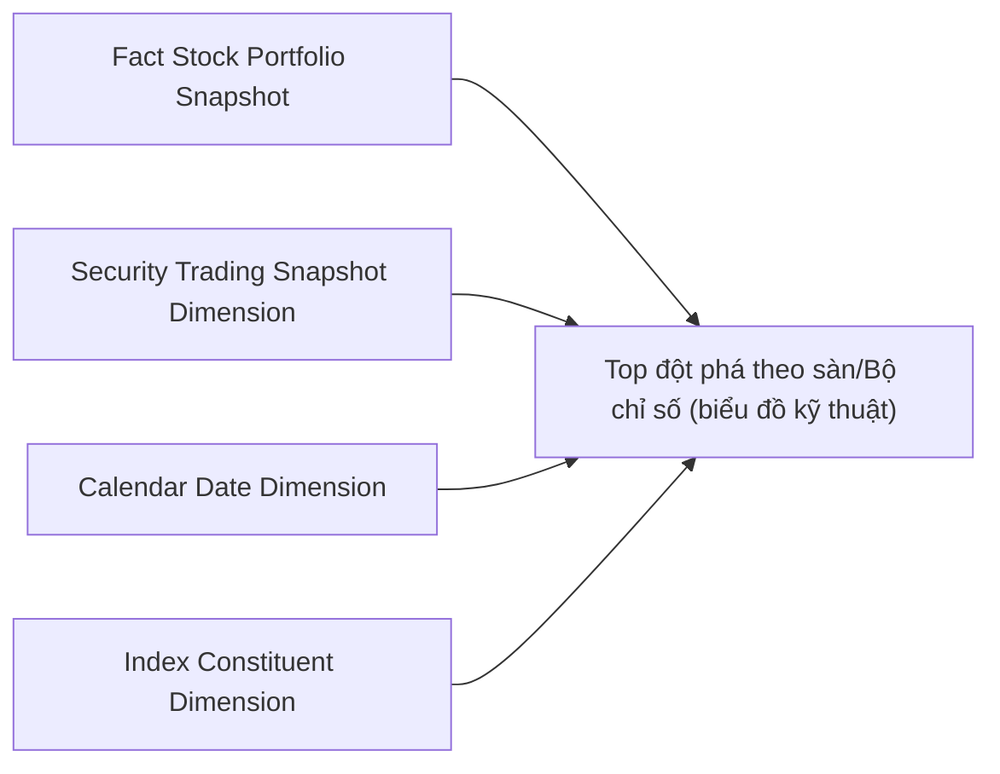
```mermaid
flowchart LR
    F1["Fact Stock Portfolio Snapshot"] --> RPT14["Top đột phá theo sàn/Bộ chỉ số (biểu đồ kỹ thuật)"]
    D1["Security Trading Snapshot Dimension"] --> RPT14
    D3["Calendar Date Dimension"] --> RPT14
    D4["Index Constituent Dimension"] --> RPT14
```

**Bảng grain:** Không có bảng mới — cùng grain `Fact Stock Portfolio Snapshot` đã có ở Nhóm 1.

> **Coverage rule:** Không áp dụng — Nhóm này không tạo/mở rộng Fact hay Dimension nào, thuần túy reuse + rolling window/Top-N tại tầng BI.

---

#### Nhóm 15 - Top giá trị (bảng số liệu)

> **Phân loại:** Dashboard
> **Atomic:** 100% reuse Nhóm 1 (`Security Trading Snapshot`, `Securities Trade`, `Public Company`, `Classification Business Line`) + Nhóm 6 (`Public Company Share Statistics` PENDING, EAV IDS PENDING) + Nhóm 9 (Bộ chỉ số thị trường/ngành) — không có nguồn mới.
>
> **Ghi chú tái sử dụng:** BA liệt kê 14 dòng con — toàn bộ đã có KPI ID sẵn từ Nhóm 1 (Mã CK, Sàn, Ngành, Ngày, GTGD = Tổng GT, Giá, % thay đổi), Nhóm 6 (Số CP lưu hành, Vốn hóa, LNST, P/E, VCSH, P/B) và Nhóm 9 (Bộ chỉ số thị trường/ngành) — reuse thẳng, không khai sinh KPI mới, không tạo/sửa Fact hay Dimension nào. Bản chất là Top-N sắp xếp theo GTGD (K_GSTT_14, `ORDER BY ... DESC LIMIT N`), cùng cấu trúc chỉ tiêu với Nhóm 9 nhưng đổi tiêu chí xếp hạng từ Khối lượng (K_GSTT_13) sang Giá trị giao dịch (K_GSTT_14).
> **Ghi chú "Bộ chỉ số ngành/bộ chỉ số thị trường" (BA gộp 1 dòng con thành 2 KPI, giống Nhóm 13/14; cập nhật 2026-07-28):** Cùng bản chất đã xác nhận ở Nhóm 9 — cả 2 là filter con của K_GSTT_4 (`Index Constituent Dimension.Index Code`): "Bộ chỉ số thị trường" = `Index Code IN ('HOSE','UPCOM','HNX')`, "Bộ chỉ số theo ngành" = `Index Code NOT IN ('HOSE','UPCOM','HNX')`. Bảng KPI dưới đây có 15 dòng cho 14 dòng BA (cùng lý do +1 như Nhóm 13/14).

**Mockup:**

| Mã CK | Sàn | Bộ chỉ số ngành | Ngành | Ngày | GTGD | Giá | % thay đổi | Số CP lưu hành | Vốn hóa | LNST | P/E | VCSH | P/B |
|---|---|---|---|---|---|---|---|---|---|---|---|---|---|
| VCB | HOSE | VN30 | Ngân hàng | 27/07/2026 | 22.1 Tỷ | 82.50 | +0.61% | *(pending)* | *(pending)* | *(pending)* | *(pending)* | *(pending)* | *(pending)* |

**Source:** `Fact Stock Portfolio Snapshot` → `Security Trading Snapshot Dimension`, `Public Company Dimension`, `Calendar Date Dimension`, `Index Constituent Dimension` — 100% reuse, Top-N theo GTGD tại tầng BI.

**Bảng KPI:**

| KPI ID | Tên KPI | Đơn vị | Tính chất | Công thức | Ghi chú | Trạng thái |
|---|---|---|---|---|---|---|
| K_GSTT_1 | Mã CK | — | Chiều | `Security Trading Snapshot Dimension.Symbol` | Reuse từ Nhóm 1 | READY |
| K_GSTT_3 | Sàn | — | Chiều | `Security Trading Snapshot Dimension.Floor Code` | Reuse từ Nhóm 1 | READY |
| K_GSTT_62 | Bộ chỉ số thị trường | — | Chiều | `Index Constituent Dimension.Index Code` | Reuse từ K_GSTT_62 (Nhóm 9): `Index Code IN ('HOSE','UPCOM','HNX')` | READY |
| K_GSTT_63 | Bộ chỉ số theo ngành | — | Chiều | `Index Constituent Dimension.Index Code` | Reuse từ K_GSTT_63 (Nhóm 9): `Index Code NOT IN ('HOSE','UPCOM','HNX')` | READY |
| K_GSTT_2 | Ngành | — | Chiều | `Public Company Dimension.Business Line Level 1 Code`, `Classification Business Line Name` | Reuse từ Nhóm 1 | READY |
| K_GSTT_7 | Ngày | — | Chiều | `Calendar Date Dimension.Calendar Date` | Reuse từ Nhóm 1 | READY |
| K_GSTT_14 | GTGD | VNĐ | Phái sinh | `SUM(Securities Trade.Execution Value) GROUP BY Symbol, Trade Date` | Reuse từ Nhóm 1 (K_GSTT_14 = Tổng GT, đã bao gồm filter Market Id Code IN ('UPX','STX','STO') tại tầng Fact total_val) — dùng làm tiêu chí sắp xếp Top-N. Cùng cảnh báo double-count Index Constituent như Nhóm 1 | READY |
| K_GSTT_10 | Giá | VNĐ | Cơ sở | `Security Trading Snapshot Dimension.Close Price` | Reuse từ Nhóm 1 (K_GSTT_10 = Giá đóng cửa) | READY |
| K_GSTT_12 | % thay đổi | % | Phái sinh | `Price Change / Reference Price × 100` | Reuse từ Nhóm 1 | READY |
| K_GSTT_55 | Số cổ phiếu đang lưu hành | Cổ phiếu | Cơ sở | *(chưa xác định)* | Reuse từ Nhóm 6 — vẫn PENDING (xem O_GSTT_2) | PENDING |
| K_GSTT_61 | Vốn hóa | VNĐ | Chỉ tiêu phái sinh | `SUM(K_GSTT_10 × K_GSTT_55) GROUP BY Index Code` | Reuse từ Nhóm 6 — vẫn PENDING (phụ thuộc K_GSTT_55) | PENDING |
| K_GSTT_56 | LNST | VNĐ | Cơ sở | *(chưa xác định)* | Reuse từ Nhóm 6 — vẫn PENDING (xem O_GSTT_1) | PENDING |
| K_GSTT_58 | P/E thị trường | Lần | Chỉ tiêu phái sinh | `K_GSTT_10 / (K_GSTT_56 / K_GSTT_55)` | Reuse từ Nhóm 6 — vẫn PENDING | PENDING |
| K_GSTT_57 | VCSH | VNĐ | Cơ sở | *(chưa xác định)* | Reuse từ Nhóm 6 — vẫn PENDING (xem O_GSTT_1) | PENDING |
| K_GSTT_59 | P/B thị trường | Lần | Chỉ tiêu phái sinh | `K_GSTT_10 / (K_GSTT_57 / K_GSTT_55)` | Reuse từ Nhóm 6 — vẫn PENDING | PENDING |

**Star Schema:** Không có bảng mới — 100% reuse `Fact Stock Portfolio Snapshot`, `Security Trading Snapshot Dimension`, `Public Company Dimension`, `Calendar Date Dimension`, `Index Constituent Dimension` đã vẽ ở Nhóm 1.

**Lineage Mart → Báo cáo:**

```mermaid
flowchart LR
    F1["Fact Stock Portfolio Snapshot"] --> RPT15["Top giá trị (bảng số liệu)"]
    D1["Security Trading Snapshot Dimension"] --> RPT15
    D2["Public Company Dimension"] --> RPT15
    D3["Calendar Date Dimension"] --> RPT15
    D4["Index Constituent Dimension"] --> RPT15
```

**Bảng grain:** Không có bảng mới — cùng grain `Fact Stock Portfolio Snapshot` đã có ở Nhóm 1.

> **Coverage rule:** Không áp dụng — Nhóm này không tạo/mở rộng Fact hay Dimension nào, thuần túy reuse + Top-N tại tầng BI.

---

#### Nhóm 16 - Top giá trị (biểu đồ kỹ thuật)

> **Phân loại:** Dashboard
> **Atomic:** 100% reuse Nhóm 1 (`Security Trading Snapshot`, `Securities Trade`, `Public Company`, `Classification Business Line`) + Nhóm 3 (EAV IDS PENDING) + Nhóm 9 (Bộ chỉ số thị trường/ngành) — không có nguồn mới.
>
> **Ghi chú tái sử dụng:** BA liệt kê 14 dòng con — toàn bộ đã có KPI ID sẵn từ Nhóm 1 (Mã CK, Chỉ số, Sàn, Ngành, Ngày, Thay đổi, Khối lượng giao dịch), Nhóm 3 (Giá mở/cao/thấp/đóng cửa, Doanh thu, Lợi nhuận) và Nhóm 9 (Bộ chỉ số thị trường/ngành) — reuse thẳng, không khai sinh KPI mới, không tạo/sửa Fact hay Dimension nào. Biến thể biểu đồ kỹ thuật của Nhóm 15 (đổi tiêu chí Top-N từ GTGD hiển thị dạng bảng sang biểu đồ nến/đường), cùng pattern Nhóm 3/8/10/12/14 dùng Doanh thu/Lợi nhuận (K_GSTT_31/32) thay vì bộ VCSH/P-E/P-B/Số CP lưu hành/Vốn hóa như Nhóm 15. Khác Nhóm 15 (Top-N theo GTGD K_GSTT_14), BA ở đây liệt kê chỉ tiêu hiển thị là "Khối lượng giao dịch" (K_GSTT_13) chứ không lặp lại GTGD — bản chất biểu đồ kỹ thuật ưu tiên hiển thị khối lượng thay vì giá trị, tiêu chí Top-N vẫn kế thừa GTGD từ Nhóm 15 ở tầng BI khi lọc danh sách mã hiển thị.
> **Ghi chú "Bộ chỉ số ngành/bộ chỉ số thị trường" (BA gộp 1 dòng con thành 2 KPI, giống Nhóm 13/14/15; cập nhật 2026-07-28):** Cùng bản chất đã xác nhận ở Nhóm 9 — cả 2 là filter con của K_GSTT_4 (`Index Constituent Dimension.Index Code`): "Bộ chỉ số thị trường" = `Index Code IN ('HOSE','UPCOM','HNX')`, "Bộ chỉ số theo ngành" = `Index Code NOT IN ('HOSE','UPCOM','HNX')`. Bảng KPI dưới đây có 15 dòng cho 14 dòng BA (cùng lý do +1 như Nhóm 13/14/15).

**Mockup:**

| Mã CK | Chỉ số | Sàn | Bộ chỉ số ngành | Ngành | Ngày | Giá mở | Giá cao | Giá thấp | Giá đóng | Thay đổi | Khối lượng | Doanh thu | Lợi nhuận |
|---|---|---|---|---|---|---|---|---|---|---|---|---|---|
| VCB | VN30 | HOSE | VN30 | Ngân hàng | 27/07/2026 | 82.00 | 83.00 | 81.50 | 82.50 | +0.50 | 548 Tr | — | — |

**Source:** `Fact Stock Portfolio Snapshot` → `Security Trading Snapshot Dimension`, `Public Company Dimension`, `Calendar Date Dimension`, `Index Constituent Dimension` — 100% reuse, Top-N theo GTGD tại tầng BI.

**Bảng KPI:**

| KPI ID | Tên KPI | Đơn vị | Tính chất | Công thức | Ghi chú | Trạng thái |
|---|---|---|---|---|---|---|
| K_GSTT_1 | Mã CK | — | Chiều | `Security Trading Snapshot Dimension.Symbol` | Reuse từ Nhóm 1 | READY |
| K_GSTT_4 | Chỉ số | — | Chiều | `Index Constituent Dimension.Index Code` | Reuse từ Nhóm 1 | READY |
| K_GSTT_3 | Sàn | — | Chiều | `Security Trading Snapshot Dimension.Floor Code` | Reuse từ Nhóm 1 | READY |
| K_GSTT_62 | Bộ chỉ số thị trường | — | Chiều | `Index Constituent Dimension.Index Code` | Reuse từ K_GSTT_62 (Nhóm 9): `Index Code IN ('HOSE','UPCOM','HNX')` | READY |
| K_GSTT_63 | Bộ chỉ số theo ngành | — | Chiều | `Index Constituent Dimension.Index Code` | Reuse từ K_GSTT_63 (Nhóm 9): `Index Code NOT IN ('HOSE','UPCOM','HNX')` | READY |
| K_GSTT_2 | Ngành | — | Chiều | `Public Company Dimension.Business Line Level 1 Code`, `Classification Business Line Name` | Reuse từ Nhóm 1 | READY |
| K_GSTT_7 | Ngày | — | Chiều | `Calendar Date Dimension.Calendar Date` | Reuse từ Nhóm 1 | READY |
| K_GSTT_27 | Giá mở cửa | VNĐ | Cơ sở | `Security Trading Snapshot Dimension.Open Price` | Reuse từ Nhóm 3 | READY |
| K_GSTT_28 | Giá cao nhất | VNĐ | Cơ sở | `Security Trading Snapshot Dimension.High Price` | Reuse từ Nhóm 3 | READY |
| K_GSTT_29 | Giá thấp nhất | VNĐ | Cơ sở | `Security Trading Snapshot Dimension.Low Price` | Reuse từ Nhóm 3 | READY |
| K_GSTT_10 | Giá đóng cửa | VNĐ | Cơ sở | `Security Trading Snapshot Dimension.Close Price` | Reuse từ Nhóm 1 | READY |
| K_GSTT_11 | Thay đổi (+/-) | VNĐ | Cơ sở | `Security Trading Snapshot Dimension.Price Change` | Reuse từ Nhóm 1 | READY |
| K_GSTT_13 | Khối lượng giao dịch | Cổ phiếu | Phái sinh | `SUM(Securities Trade.Execution Volume) GROUP BY Symbol, Trade Date` | Reuse từ Nhóm 1 (K_GSTT_13 = Tổng KL, đã bao gồm filter Market Id Code IN ('UPX','STX','STO') tại tầng Fact total_vol) — hiển thị trên biểu đồ, tiêu chí Top-N vẫn kế thừa GTGD (K_GSTT_14) từ Nhóm 15 | READY |
| K_GSTT_31 | Doanh thu | VNĐ | Cơ sở | *(chưa xác định)* | Reuse từ Nhóm 3 — vẫn PENDING (xem O_GSTT_1) | PENDING |
| K_GSTT_32 | Lợi nhuận sau thuế | VNĐ | Cơ sở | *(chưa xác định)* | Reuse từ Nhóm 3 — vẫn PENDING (xem O_GSTT_1) | PENDING |

**Star Schema:** Không có bảng mới — 100% reuse `Fact Stock Portfolio Snapshot`, `Security Trading Snapshot Dimension`, `Public Company Dimension`, `Calendar Date Dimension`, `Index Constituent Dimension` đã vẽ ở Nhóm 1.

**Lineage Mart → Báo cáo:**

```mermaid
flowchart LR
    F1["Fact Stock Portfolio Snapshot"] --> RPT16["Top giá trị (biểu đồ kỹ thuật)"]
    D1["Security Trading Snapshot Dimension"] --> RPT16
    D2["Public Company Dimension"] --> RPT16
    D3["Calendar Date Dimension"] --> RPT16
    D4["Index Constituent Dimension"] --> RPT16
```

**Bảng grain:** Không có bảng mới — cùng grain `Fact Stock Portfolio Snapshot` đã có ở Nhóm 1.

> **Coverage rule:** Không áp dụng — Nhóm này không tạo/mở rộng Fact hay Dimension nào, thuần túy reuse + Top-N tại tầng BI.

---

#### Nhóm 17 - Top giảm giá theo toàn thị trường (bảng số liệu)

> **Phân loại:** Dashboard
> **Atomic:** 100% reuse Nhóm 1 (`Security Trading Snapshot`, `Securities Trade`, `Public Company`, `Classification Business Line`) + Nhóm 6 (`Public Company Share Statistics` PENDING, EAV IDS PENDING) — không có nguồn mới.
>
> **Ghi chú tái sử dụng:** BA liệt kê 12 dòng con — toàn bộ đã có KPI ID sẵn từ Nhóm 1 (Mã CK, Ngành, Ngày, % thay đổi, KLGD, Giá) và Nhóm 6 (Số CP lưu hành, Vốn hóa, LNST, P/E, VCSH, P/B) — reuse thẳng, không khai sinh KPI mới, không tạo/sửa Fact hay Dimension nào. Bản chất là Top-N sắp xếp theo % thay đổi tăng dần (`ORDER BY K_GSTT_12 ASC LIMIT N`, giá trị âm lớn nhất/giảm mạnh nhất lên đầu) trên cùng `Fact Stock Portfolio Snapshot` — cùng cấu trúc chỉ tiêu với Nhóm 7 (Top khối lượng toàn thị trường), chỉ khác tiêu chí xếp hạng.

**Mockup:**

| Mã CK | Ngành | Ngày | % thay đổi | KLGD | Giá | Số CP lưu hành | Vốn hóa | LNST | P/E | VCSH | P/B |
|---|---|---|---|---|---|---|---|---|---|---|---|
| ABC | Bất động sản | 27/07/2026 | -6.85% | 12 Tr | 24.50 | *(pending)* | *(pending)* | *(pending)* | *(pending)* | *(pending)* | *(pending)* |

**Source:** `Fact Stock Portfolio Snapshot` → `Security Trading Snapshot Dimension`, `Public Company Dimension`, `Calendar Date Dimension` — 100% reuse, Top-N theo % thay đổi (tăng dần) tại tầng BI.

**Bảng KPI:**

| KPI ID | Tên KPI | Đơn vị | Tính chất | Công thức | Ghi chú | Trạng thái |
|---|---|---|---|---|---|---|
| K_GSTT_1 | Mã ck | — | Chiều | `Security Trading Snapshot Dimension.Symbol` | Reuse từ Nhóm 1 | READY |
| K_GSTT_2 | Ngành | — | Chiều | `Public Company Dimension.Business Line Level 1 Code`, `Classification Business Line Name` | Reuse từ Nhóm 1 | READY |
| K_GSTT_7 | Ngày | — | Chiều | `Calendar Date Dimension.Calendar Date` | Reuse từ Nhóm 1 | READY |
| K_GSTT_12 | % thay đổi | % | Phái sinh | `Price Change / Reference Price × 100` | Reuse từ Nhóm 1 — dùng làm tiêu chí sắp xếp Top-N (`ORDER BY ... ASC`, giá trị âm/giảm mạnh nhất lên đầu) | READY |
| K_GSTT_13 | KLGD | Cổ phiếu | Phái sinh | `SUM(Securities Trade.Execution Volume) GROUP BY Symbol, Trade Date` | Reuse từ Nhóm 1 (K_GSTT_13 = Tổng KL, đã bao gồm filter Market Id Code IN ('UPX','STX','STO') tại tầng Fact total_vol). Cùng cảnh báo double-count Index Constituent như Nhóm 1 | READY |
| K_GSTT_10 | Giá | VNĐ | Cơ sở | `Security Trading Snapshot Dimension.Close Price` | Reuse từ Nhóm 1 (K_GSTT_10 = Giá đóng cửa) | READY |
| K_GSTT_55 | Số cổ phiếu đang lưu hành | Cổ phiếu | Cơ sở | *(chưa xác định)* | Reuse từ Nhóm 6 — vẫn PENDING (xem O_GSTT_2) | PENDING |
| K_GSTT_61 | Vốn hóa | VNĐ | Chỉ tiêu phái sinh | `SUM(K_GSTT_10 × K_GSTT_55) GROUP BY Index Code` | Reuse từ Nhóm 6 — vẫn PENDING (phụ thuộc K_GSTT_55) | PENDING |
| K_GSTT_56 | LNST | VNĐ | Cơ sở | *(chưa xác định)* | Reuse từ Nhóm 6 — vẫn PENDING (xem O_GSTT_1) | PENDING |
| K_GSTT_58 | P/E thị trường | Lần | Chỉ tiêu phái sinh | `K_GSTT_10 / (K_GSTT_56 / K_GSTT_55)` | Reuse từ Nhóm 6 — vẫn PENDING | PENDING |
| K_GSTT_57 | VCSH | VNĐ | Cơ sở | *(chưa xác định)* | Reuse từ Nhóm 6 — vẫn PENDING (xem O_GSTT_1) | PENDING |
| K_GSTT_59 | P/B thị trường | Lần | Chỉ tiêu phái sinh | `K_GSTT_10 / (K_GSTT_57 / K_GSTT_55)` | Reuse từ Nhóm 6 — vẫn PENDING | PENDING |

**Star Schema:** Không có bảng mới — 100% reuse `Fact Stock Portfolio Snapshot`, `Security Trading Snapshot Dimension`, `Public Company Dimension`, `Calendar Date Dimension` đã vẽ ở Nhóm 1.

**Lineage Mart → Báo cáo:**

```mermaid
flowchart LR
    F1["Fact Stock Portfolio Snapshot"] --> RPT17["Top giảm giá toàn thị trường (bảng số liệu)"]
    D1["Security Trading Snapshot Dimension"] --> RPT17
    D2["Public Company Dimension"] --> RPT17
    D3["Calendar Date Dimension"] --> RPT17
```

**Bảng grain:** Không có bảng mới — cùng grain `Fact Stock Portfolio Snapshot` đã có ở Nhóm 1.

> **Coverage rule:** Không áp dụng — Nhóm này không tạo/mở rộng Fact hay Dimension nào, thuần túy reuse + Top-N tại tầng BI.

---

#### Nhóm 18 - Top giảm giá theo toàn thị trường (biểu đồ kỹ thuật)

> **Phân loại:** Dashboard
> **Atomic:** 100% reuse Nhóm 1 (`Security Trading Snapshot`, `Securities Trade`, `Public Company`, `Classification Business Line`) + Nhóm 3 (EAV IDS PENDING) — không có nguồn mới.
>
> **Ghi chú tái sử dụng:** BA liệt kê 12 dòng con — toàn bộ đã có KPI ID sẵn từ Nhóm 1 (Mã CK, Chỉ số, Ngành, Ngày, Giá đóng cửa, % thay đổi, Khối lượng giao dịch) và Nhóm 3 (Giá mở/cao/thấp cửa, Doanh thu, Lợi nhuận) — reuse thẳng, không khai sinh KPI mới, không tạo/sửa Fact hay Dimension nào. Biến thể biểu đồ kỹ thuật của Nhóm 17 (cùng tiêu chí Top-N theo % thay đổi tăng dần/giảm mạnh nhất, khác cách hiển thị — biểu đồ nến/đường thay vì bảng). BA dùng "Doanh thu"/"Lợi nhuận" (không có VCSH/P-E/P-B/Số CP lưu hành/Vốn hóa như Nhóm 17) — đúng pattern Nhóm 3/8/10/12/14/16, reuse K_GSTT_31/32, không phải K_GSTT_56 (Nhóm 6).

**Mockup:**

| Mã | Chỉ số | Ngành | Ngày | Giá mở | Giá cao | Giá thấp | Giá đóng | % thay đổi | Khối lượng | Doanh thu | Lợi nhuận |
|---|---|---|---|---|---|---|---|---|---|---|---|
| ABC | VN30 | Bất động sản | 27/07/2026 | 26.00 | 26.20 | 24.30 | 24.50 | -6.85% | 12 Tr | — | — |

**Source:** `Fact Stock Portfolio Snapshot` → `Security Trading Snapshot Dimension`, `Public Company Dimension`, `Calendar Date Dimension`, `Index Constituent Dimension` — 100% reuse, Top-N theo % thay đổi (tăng dần) tại tầng BI.

**Bảng KPI:**

| KPI ID | Tên KPI | Đơn vị | Tính chất | Công thức | Ghi chú | Trạng thái |
|---|---|---|---|---|---|---|
| K_GSTT_1 | Mã | — | Chiều | `Security Trading Snapshot Dimension.Symbol` | Reuse từ Nhóm 1 | READY |
| K_GSTT_4 | Chỉ số | — | Chiều | `Index Constituent Dimension.Index Code` | Reuse từ Nhóm 1 | READY |
| K_GSTT_2 | Ngành | — | Chiều | `Public Company Dimension.Business Line Level 1 Code`, `Classification Business Line Name` | Reuse từ Nhóm 1 | READY |
| K_GSTT_7 | Ngày | — | Chiều | `Calendar Date Dimension.Calendar Date` | Reuse từ Nhóm 1 | READY |
| K_GSTT_27 | Giá mở cửa | VNĐ | Cơ sở | `Security Trading Snapshot Dimension.Open Price` | Reuse từ Nhóm 3 | READY |
| K_GSTT_28 | Giá cao nhất | VNĐ | Cơ sở | `Security Trading Snapshot Dimension.High Price` | Reuse từ Nhóm 3 | READY |
| K_GSTT_29 | Giá thấp nhất | VNĐ | Cơ sở | `Security Trading Snapshot Dimension.Low Price` | Reuse từ Nhóm 3 | READY |
| K_GSTT_10 | Giá đóng cửa | VNĐ | Cơ sở | `Security Trading Snapshot Dimension.Close Price` | Reuse từ Nhóm 1 | READY |
| K_GSTT_12 | % thay đổi | % | Phái sinh | `Price Change / Reference Price × 100` | Reuse từ Nhóm 1 — dùng làm tiêu chí sắp xếp Top-N (`ORDER BY ... ASC`, giá trị âm/giảm mạnh nhất lên đầu) | READY |
| K_GSTT_13 | Khối lượng giao dịch | Cổ phiếu | Phái sinh | `SUM(Securities Trade.Execution Volume) GROUP BY Symbol, Trade Date` | Reuse từ Nhóm 1 (K_GSTT_13 = Tổng KL, đã bao gồm filter Market Id Code IN ('UPX','STX','STO') tại tầng Fact total_vol) | READY |
| K_GSTT_31 | Doanh thu | VNĐ | Cơ sở | *(chưa xác định)* | Reuse từ Nhóm 3 — vẫn PENDING (xem O_GSTT_1) | PENDING |
| K_GSTT_32 | Lợi nhuận sau thuế | VNĐ | Cơ sở | *(chưa xác định)* | Reuse từ Nhóm 3 — vẫn PENDING (xem O_GSTT_1) | PENDING |

**Star Schema:** Không có bảng mới — 100% reuse `Fact Stock Portfolio Snapshot`, `Security Trading Snapshot Dimension`, `Public Company Dimension`, `Calendar Date Dimension`, `Index Constituent Dimension` đã vẽ ở Nhóm 1.

**Lineage Mart → Báo cáo:**

```mermaid
flowchart LR
    F1["Fact Stock Portfolio Snapshot"] --> RPT18["Top giảm giá toàn thị trường (biểu đồ kỹ thuật)"]
    D1["Security Trading Snapshot Dimension"] --> RPT18
    D2["Public Company Dimension"] --> RPT18
    D3["Calendar Date Dimension"] --> RPT18
    D4["Index Constituent Dimension"] --> RPT18
```

**Bảng grain:** Không có bảng mới — cùng grain `Fact Stock Portfolio Snapshot` đã có ở Nhóm 1.

> **Coverage rule:** Không áp dụng — Nhóm này không tạo/mở rộng Fact hay Dimension nào, thuần túy reuse + Top-N tại tầng BI.

---

#### Nhóm 19 - Top giảm giá theo sàn (bảng số liệu)

> **Phân loại:** Dashboard
> **Atomic:** 100% reuse Nhóm 1 (`Security Trading Snapshot`, `Securities Trade`, `Public Company`, `Classification Business Line`) + Nhóm 6 (`Public Company Share Statistics` PENDING, EAV IDS PENDING) — không có nguồn mới.
>
> **Ghi chú tái sử dụng:** BA liệt kê 13 dòng con — toàn bộ đã có KPI ID sẵn từ Nhóm 1 (Mã, Sàn, Ngành, Ngày, % thay đổi, KLGD, Giá) và Nhóm 6 (Số CP lưu hành, Vốn hóa, LNST, P/E, VCSH, P/B) — reuse thẳng, không khai sinh KPI mới, không tạo/sửa Fact hay Dimension nào. Bản chất là biến thể "theo sàn" của Nhóm 17 (cùng tiêu chí Top-N theo % thay đổi tăng dần/giảm mạnh nhất, thêm điều kiện lọc theo Sàn) — không có dòng "Bộ chỉ số ngành/bộ chỉ số thị trường" gộp như Nhóm 9/13/14/15/16, chỉ có "Sàn" đơn thuần (K_GSTT_3).

**Mockup:**

| Mã | Sàn | Ngành | Ngày | % thay đổi | KLGD | Giá | Số CP lưu hành | Vốn hóa | LNST | P/E | VCSH | P/B |
|---|---|---|---|---|---|---|---|---|---|---|---|---|
| ABC | HOSE | Bất động sản | 27/07/2026 | -6.85% | 12 Tr | 24.50 | *(pending)* | *(pending)* | *(pending)* | *(pending)* | *(pending)* | *(pending)* |

**Source:** `Fact Stock Portfolio Snapshot` → `Security Trading Snapshot Dimension`, `Public Company Dimension`, `Calendar Date Dimension` — 100% reuse, Top-N theo % thay đổi (tăng dần) tại tầng BI, lọc theo Sàn.

**Bảng KPI:**

| KPI ID | Tên KPI | Đơn vị | Tính chất | Công thức | Ghi chú | Trạng thái |
|---|---|---|---|---|---|---|
| K_GSTT_1 | Mã | — | Chiều | `Security Trading Snapshot Dimension.Symbol` | Reuse từ Nhóm 1 | READY |
| K_GSTT_3 | Sàn | — | Chiều | `Security Trading Snapshot Dimension.Floor Code` | Reuse từ Nhóm 1 | READY |
| K_GSTT_2 | Ngành | — | Chiều | `Public Company Dimension.Business Line Level 1 Code`, `Classification Business Line Name` | Reuse từ Nhóm 1 | READY |
| K_GSTT_7 | Ngày | — | Chiều | `Calendar Date Dimension.Calendar Date` | Reuse từ Nhóm 1 | READY |
| K_GSTT_12 | % thay đổi | % | Phái sinh | `Price Change / Reference Price × 100` | Reuse từ Nhóm 1 — dùng làm tiêu chí sắp xếp Top-N (`ORDER BY ... ASC`, giá trị âm/giảm mạnh nhất lên đầu) | READY |
| K_GSTT_13 | KLGD | Cổ phiếu | Phái sinh | `SUM(Securities Trade.Execution Volume) GROUP BY Symbol, Trade Date` | Reuse từ Nhóm 1 (K_GSTT_13 = Tổng KL, đã bao gồm filter Market Id Code IN ('UPX','STX','STO') tại tầng Fact total_vol). Cùng cảnh báo double-count Index Constituent như Nhóm 1 | READY |
| K_GSTT_10 | Giá | VNĐ | Cơ sở | `Security Trading Snapshot Dimension.Close Price` | Reuse từ Nhóm 1 (K_GSTT_10 = Giá đóng cửa) | READY |
| K_GSTT_55 | Số cổ phiếu đang lưu hành | Cổ phiếu | Cơ sở | *(chưa xác định)* | Reuse từ Nhóm 6 — vẫn PENDING (xem O_GSTT_2) | PENDING |
| K_GSTT_61 | Vốn hóa | VNĐ | Chỉ tiêu phái sinh | `SUM(K_GSTT_10 × K_GSTT_55) GROUP BY Index Code` | Reuse từ Nhóm 6 — vẫn PENDING (phụ thuộc K_GSTT_55) | PENDING |
| K_GSTT_56 | LNST | VNĐ | Cơ sở | *(chưa xác định)* | Reuse từ Nhóm 6 — vẫn PENDING (xem O_GSTT_1) | PENDING |
| K_GSTT_58 | P/E thị trường | Lần | Chỉ tiêu phái sinh | `K_GSTT_10 / (K_GSTT_56 / K_GSTT_55)` | Reuse từ Nhóm 6 — vẫn PENDING | PENDING |
| K_GSTT_57 | VCSH | VNĐ | Cơ sở | *(chưa xác định)* | Reuse từ Nhóm 6 — vẫn PENDING (xem O_GSTT_1) | PENDING |
| K_GSTT_59 | P/B thị trường | Lần | Chỉ tiêu phái sinh | `K_GSTT_10 / (K_GSTT_57 / K_GSTT_55)` | Reuse từ Nhóm 6 — vẫn PENDING | PENDING |

**Star Schema:** Không có bảng mới — 100% reuse `Fact Stock Portfolio Snapshot`, `Security Trading Snapshot Dimension`, `Public Company Dimension`, `Calendar Date Dimension` đã vẽ ở Nhóm 1.

**Lineage Mart → Báo cáo:**

```mermaid
flowchart LR
    F1["Fact Stock Portfolio Snapshot"] --> RPT19["Top giảm giá theo sàn (bảng số liệu)"]
    D1["Security Trading Snapshot Dimension"] --> RPT19
    D2["Public Company Dimension"] --> RPT19
    D3["Calendar Date Dimension"] --> RPT19
```

**Bảng grain:** Không có bảng mới — cùng grain `Fact Stock Portfolio Snapshot` đã có ở Nhóm 1.

> **Coverage rule:** Không áp dụng — Nhóm này không tạo/mở rộng Fact hay Dimension nào, thuần túy reuse + Top-N tại tầng BI.

---

#### Nhóm 20 - Top giảm giá theo sàn (biểu đồ kỹ thuật)

> **Phân loại:** Dashboard
> **Atomic:** 100% reuse Nhóm 1 (`Security Trading Snapshot`, `Securities Trade`, `Public Company`, `Classification Business Line`) + Nhóm 3 (EAV IDS PENDING) — không có nguồn mới.
>
> **Ghi chú tái sử dụng:** BA liệt kê 12 dòng con — toàn bộ đã có KPI ID sẵn từ Nhóm 1 (Mã, Chỉ số, Sàn, Ngành, Ngày, Khối lượng giao dịch) và Nhóm 3 (Giá mở/cao/thấp/đóng cửa, Doanh thu, Lợi nhuận sau thuế) — reuse thẳng, không khai sinh KPI mới, không tạo/sửa Fact hay Dimension nào. Biến thể biểu đồ kỹ thuật của Nhóm 19 (cùng tiêu chí Top-N theo % thay đổi tăng dần/giảm mạnh nhất theo sàn, khác cách hiển thị — biểu đồ nến/đường thay vì bảng). BA dùng "Doanh thu"/"Lợi nhuận sau thuế" (không có VCSH/P-E/P-B/Số CP lưu hành/Vốn hóa như Nhóm 19) — đúng pattern Nhóm 3/8/10/12/14/16/18, reuse K_GSTT_31/32. Khác Nhóm 18 (biến thể toàn thị trường của Nhóm 17), ở đây BA liệt kê cả "Chỉ số" và "Sàn" cùng lúc.

**Mockup:**

| Mã | Chỉ số | Sàn | Ngành | Ngày | Giá mở | Giá cao | Giá thấp | Giá đóng | Khối lượng | Doanh thu | Lợi nhuận sau thuế |
|---|---|---|---|---|---|---|---|---|---|---|---|
| ABC | VN30 | HOSE | Bất động sản | 27/07/2026 | 26.00 | 26.20 | 24.30 | 24.50 | 12 Tr | — | — |

**Source:** `Fact Stock Portfolio Snapshot` → `Security Trading Snapshot Dimension`, `Public Company Dimension`, `Calendar Date Dimension`, `Index Constituent Dimension` — 100% reuse, Top-N theo % thay đổi (tăng dần) tại tầng BI, lọc theo Sàn.

**Bảng KPI:**

| KPI ID | Tên KPI | Đơn vị | Tính chất | Công thức | Ghi chú | Trạng thái |
|---|---|---|---|---|---|---|
| K_GSTT_1 | Mã | — | Chiều | `Security Trading Snapshot Dimension.Symbol` | Reuse từ Nhóm 1. BA gắn nhãn "Chỉ tiêu cơ sở" cho dòng này nhưng bản chất là khóa định danh mã CK — cùng KPI Chiều K_GSTT_1, không tách KPI mới | READY |
| K_GSTT_4 | Chỉ số | — | Chiều | `Index Constituent Dimension.Index Code` | Reuse từ Nhóm 1 | READY |
| K_GSTT_3 | Sàn | — | Chiều | `Security Trading Snapshot Dimension.Floor Code` | Reuse từ Nhóm 1 | READY |
| K_GSTT_2 | Ngành | — | Chiều | `Public Company Dimension.Business Line Level 1 Code`, `Classification Business Line Name` | Reuse từ Nhóm 1 | READY |
| K_GSTT_7 | Ngày | — | Chiều | `Calendar Date Dimension.Calendar Date` | Reuse từ Nhóm 1 | READY |
| K_GSTT_27 | Giá mở cửa | VNĐ | Cơ sở | `Security Trading Snapshot Dimension.Open Price` | Reuse từ Nhóm 3 | READY |
| K_GSTT_28 | Giá cao nhất | VNĐ | Cơ sở | `Security Trading Snapshot Dimension.High Price` | Reuse từ Nhóm 3 | READY |
| K_GSTT_29 | Giá thấp nhất | VNĐ | Cơ sở | `Security Trading Snapshot Dimension.Low Price` | Reuse từ Nhóm 3 | READY |
| K_GSTT_10 | Giá đóng cửa | VNĐ | Cơ sở | `Security Trading Snapshot Dimension.Close Price` | Reuse từ Nhóm 1 | READY |
| K_GSTT_13 | Khối lượng giao dịch | Cổ phiếu | Phái sinh | `SUM(Securities Trade.Execution Volume) GROUP BY Symbol, Trade Date` | Reuse từ Nhóm 1 (K_GSTT_13 = Tổng KL, đã bao gồm filter Market Id Code IN ('UPX','STX','STO') tại tầng Fact total_vol) | READY |
| K_GSTT_31 | Doanh thu | VNĐ | Cơ sở | *(chưa xác định)* | Reuse từ Nhóm 3 — vẫn PENDING (xem O_GSTT_1) | PENDING |
| K_GSTT_32 | Lợi nhuận sau thuế | VNĐ | Cơ sở | *(chưa xác định)* | Reuse từ Nhóm 3 — vẫn PENDING (xem O_GSTT_1) | PENDING |

**Star Schema:** Không có bảng mới — 100% reuse `Fact Stock Portfolio Snapshot`, `Security Trading Snapshot Dimension`, `Public Company Dimension`, `Calendar Date Dimension`, `Index Constituent Dimension` đã vẽ ở Nhóm 1.

**Lineage Mart → Báo cáo:**

```mermaid
flowchart LR
    F1["Fact Stock Portfolio Snapshot"] --> RPT20["Top giảm giá theo sàn (biểu đồ kỹ thuật)"]
    D1["Security Trading Snapshot Dimension"] --> RPT20
    D2["Public Company Dimension"] --> RPT20
    D3["Calendar Date Dimension"] --> RPT20
    D4["Index Constituent Dimension"] --> RPT20
```

**Bảng grain:** Không có bảng mới — cùng grain `Fact Stock Portfolio Snapshot` đã có ở Nhóm 1.

> **Coverage rule:** Không áp dụng — Nhóm này không tạo/mở rộng Fact hay Dimension nào, thuần túy reuse + Top-N tại tầng BI.

---

#### Nhóm 21 - Top vượt đỉnh theo toàn thị trường (bảng số liệu)

> **Phân loại:** Dashboard
> **Atomic:** 100% reuse Nhóm 1 (`Security Trading Snapshot`, `Securities Trade`, `Public Company`, `Classification Business Line`) + Nhóm 3 (`High Price`) + Nhóm 6 (`Public Company Share Statistics` PENDING, EAV IDS PENDING) — không có nguồn mới.
>
> **Ghi chú tái sử dụng:** BA liệt kê 12 dòng con — toàn bộ đã có KPI ID sẵn từ Nhóm 1 (Mã, Ngành, Ngày, Khối lượng, Giá, % thay đổi), Nhóm 3 (Giá cao nhất) và Nhóm 6 (Số CP lưu hành, LNST, P/E, VCSH, P/B) — reuse thẳng, không khai sinh KPI mới, không tạo/sửa Fact hay Dimension nào. Bản chất là Top-N sắp xếp theo % thay đổi giảm dần (`ORDER BY K_GSTT_12 DESC LIMIT N`, tăng mạnh nhất lên đầu) trên cùng `Fact Stock Portfolio Snapshot` — cùng cấu trúc chỉ tiêu với Nhóm 17 (Top giảm giá), chỉ khác chiều sắp xếp.
> **Ghi chú "Đỉnh cũ" (khác K_GSTT_28 — không tạo KPI mới):** BA gán "Đánh giá" mức TB (có tính toán tổng hợp) cho dòng này, gợi ý một logic rolling/lookback lịch sử ("giá cao nhất trong giai đoạn tham chiếu"), nhưng cột Bảng nguồn/Trường nguồn/Điều kiện chung/Câu lệnh tham khảo trong BA chỉ ghi `MDDS.JAD_STOCKINFOR.high` — không có điều kiện lọc khoảng thời gian hay window function nào cụ thể. Không tự suy diễn thêm logic rolling ngoài phạm vi BA cung cấp — "Đỉnh cũ" trùng hoàn toàn K_GSTT_28 (Giá cao nhất, Nhóm 3, cùng nguồn `high`), không khai KPI mới. Nếu nghiệp vụ thực sự cần "đỉnh" theo 1 khung thời gian lịch sử (VD: đỉnh 52 tuần) khác giá cao nhất trong ngày hiện tại, cần BA xác nhận lại điều kiện lọc/window cụ thể trước khi lên LLD.

**Mockup:**

| Mã | Ngành | Ngày | Khối lượng | Giá | % thay đổi | Đỉnh cũ | Số cổ phiếu lưu hành | LNST | VCSH | P/E | P/B |
|---|---|---|---|---|---|---|---|---|---|---|---|
| XYZ | Công nghệ | 27/07/2026 | 8 Tr | 45.20 | +6.90% | 45.50 | *(pending)* | *(pending)* | *(pending)* | *(pending)* | *(pending)* |

**Source:** `Fact Stock Portfolio Snapshot` → `Security Trading Snapshot Dimension`, `Public Company Dimension`, `Calendar Date Dimension` — 100% reuse, Top-N theo % thay đổi (giảm dần) tại tầng BI.

**Bảng KPI:**

| KPI ID | Tên KPI | Đơn vị | Tính chất | Công thức | Ghi chú | Trạng thái |
|---|---|---|---|---|---|---|
| K_GSTT_1 | Mã | — | Chiều | `Security Trading Snapshot Dimension.Symbol` | Reuse từ Nhóm 1 | READY |
| K_GSTT_2 | Ngành | — | Chiều | `Public Company Dimension.Business Line Level 1 Code`, `Classification Business Line Name` | Reuse từ Nhóm 1 | READY |
| K_GSTT_7 | Ngày | — | Chiều | `Calendar Date Dimension.Calendar Date` | Reuse từ Nhóm 1 | READY |
| K_GSTT_13 | Khối lượng | Cổ phiếu | Phái sinh | `SUM(Securities Trade.Execution Volume) GROUP BY Symbol, Trade Date` | Reuse từ Nhóm 1 (K_GSTT_13 = Tổng KL, đã bao gồm filter Market Id Code IN ('UPX','STX','STO') tại tầng Fact total_vol). Cùng cảnh báo double-count Index Constituent như Nhóm 1 | READY |
| K_GSTT_10 | Giá | VNĐ | Cơ sở | `Security Trading Snapshot Dimension.Close Price` | Reuse từ Nhóm 1 (K_GSTT_10 = Giá đóng cửa) | READY |
| K_GSTT_12 | % thay đổi | % | Phái sinh | `Price Change / Reference Price × 100` | Reuse từ Nhóm 1 — dùng làm tiêu chí sắp xếp Top-N (`ORDER BY ... DESC`, tăng mạnh nhất lên đầu) | READY |
| K_GSTT_28 | Đỉnh cũ | VNĐ | Cơ sở | `Security Trading Snapshot Dimension.High Price` | Trùng hoàn toàn K_GSTT_28 (Giá cao nhất, Nhóm 3) — BA không có điều kiện lọc/window riêng, không khai KPI mới | READY |
| K_GSTT_55 | Số cổ phiếu đang lưu hành | Cổ phiếu | Cơ sở | *(chưa xác định)* | Reuse từ Nhóm 6 — vẫn PENDING (xem O_GSTT_2) | PENDING |
| K_GSTT_56 | LNST | VNĐ | Cơ sở | *(chưa xác định)* | Reuse từ Nhóm 6 — vẫn PENDING (xem O_GSTT_1) | PENDING |
| K_GSTT_57 | VCSH | VNĐ | Cơ sở | *(chưa xác định)* | Reuse từ Nhóm 6 — vẫn PENDING (xem O_GSTT_1) | PENDING |
| K_GSTT_58 | P/E thị trường | Lần | Chỉ tiêu phái sinh | `K_GSTT_10 / (K_GSTT_56 / K_GSTT_55)` | Reuse từ Nhóm 6 — vẫn PENDING | PENDING |
| K_GSTT_59 | P/B thị trường | Lần | Chỉ tiêu phái sinh | `K_GSTT_10 / (K_GSTT_57 / K_GSTT_55)` | Reuse từ Nhóm 6 — vẫn PENDING | PENDING |

**Star Schema:** Không có bảng mới — 100% reuse `Fact Stock Portfolio Snapshot`, `Security Trading Snapshot Dimension`, `Public Company Dimension`, `Calendar Date Dimension` đã vẽ ở Nhóm 1.

**Lineage Mart → Báo cáo:**

```mermaid
flowchart LR
    F1["Fact Stock Portfolio Snapshot"] --> RPT21["Top vượt đỉnh toàn thị trường (bảng số liệu)"]
    D1["Security Trading Snapshot Dimension"] --> RPT21
    D2["Public Company Dimension"] --> RPT21
    D3["Calendar Date Dimension"] --> RPT21
```

**Bảng grain:** Không có bảng mới — cùng grain `Fact Stock Portfolio Snapshot` đã có ở Nhóm 1.

> **Coverage rule:** Không áp dụng — Nhóm này không tạo/mở rộng Fact hay Dimension nào, thuần túy reuse + Top-N tại tầng BI.

---

#### Nhóm 22 - Top vượt đỉnh theo toàn thị trường (biểu đồ kỹ thuật)

> **Phân loại:** Dashboard
> **Atomic:** 100% reuse Nhóm 1 (`Security Trading Snapshot`, `Securities Trade`, `Public Company`, `Classification Business Line`) + Nhóm 3 (EAV IDS PENDING) — không có nguồn mới.
>
> **Ghi chú tái sử dụng:** BA liệt kê 10 dòng con — toàn bộ đã có KPI ID sẵn từ Nhóm 1 (Mã CK, Ngành, Ngày, Khối lượng giao dịch) và Nhóm 3 (Giá mở/cao/thấp/đóng cửa, Doanh thu, Lợi nhuận sau thuế) — reuse thẳng, không khai sinh KPI mới, không tạo/sửa Fact hay Dimension nào. Biến thể biểu đồ kỹ thuật của Nhóm 21 (cùng tiêu chí Top-N theo % thay đổi giảm dần/tăng mạnh nhất, khác cách hiển thị). Khác Nhóm 21, BA không liệt kê "Đỉnh cũ" ở đây — biểu đồ kỹ thuật chỉ hiển thị Giá mở/cao/thấp/đóng thông thường (nến/đường), không cần cột tham chiếu đỉnh riêng. BA dùng "Doanh thu"/"Lợi nhuận sau thuế" (không có VCSH/P-E/P-B/Số CP lưu hành như Nhóm 21) — đúng pattern Nhóm 3/8/10/12/14/16/18/20, reuse K_GSTT_31/32.

**Mockup:**

| Mã ck | Ngành | Ngày | Giá mở cửa | Giá cao nhất | Giá thấp nhất | Giá đóng cửa | Khối lượng giao dịch | Doanh thu | Lợi nhuận sau thuế |
|---|---|---|---|---|---|---|---|---|---|
| XYZ | Công nghệ | 27/07/2026 | 43.00 | 45.50 | 42.80 | 45.20 | 8 Tr | — | — |

**Source:** `Fact Stock Portfolio Snapshot` → `Security Trading Snapshot Dimension`, `Public Company Dimension`, `Calendar Date Dimension` — 100% reuse, Top-N theo % thay đổi (giảm dần) tại tầng BI.

**Bảng KPI:**

| KPI ID | Tên KPI | Đơn vị | Tính chất | Công thức | Ghi chú | Trạng thái |
|---|---|---|---|---|---|---|
| K_GSTT_1 | Mã ck | — | Chiều | `Security Trading Snapshot Dimension.Symbol` | Reuse từ Nhóm 1 | READY |
| K_GSTT_2 | Ngành | — | Chiều | `Public Company Dimension.Business Line Level 1 Code`, `Classification Business Line Name` | Reuse từ Nhóm 1 | READY |
| K_GSTT_7 | Ngày | — | Chiều | `Calendar Date Dimension.Calendar Date` | Reuse từ Nhóm 1 | READY |
| K_GSTT_27 | Giá mở cửa | VNĐ | Cơ sở | `Security Trading Snapshot Dimension.Open Price` | Reuse từ Nhóm 3 | READY |
| K_GSTT_28 | Giá cao nhất | VNĐ | Cơ sở | `Security Trading Snapshot Dimension.High Price` | Reuse từ Nhóm 3 | READY |
| K_GSTT_29 | Giá thấp nhất | VNĐ | Cơ sở | `Security Trading Snapshot Dimension.Low Price` | Reuse từ Nhóm 3 | READY |
| K_GSTT_10 | Giá đóng cửa | VNĐ | Cơ sở | `Security Trading Snapshot Dimension.Close Price` | Reuse từ Nhóm 1 | READY |
| K_GSTT_13 | Khối lượng giao dịch | Cổ phiếu | Phái sinh | `SUM(Securities Trade.Execution Volume) GROUP BY Symbol, Trade Date` | Reuse từ Nhóm 1 (K_GSTT_13 = Tổng KL, đã bao gồm filter Market Id Code IN ('UPX','STX','STO') tại tầng Fact total_vol) — % thay đổi (K_GSTT_12) vẫn dùng làm tiêu chí Top-N dù không hiển thị trên Mockup | READY |
| K_GSTT_31 | Doanh thu | VNĐ | Cơ sở | *(chưa xác định)* | Reuse từ Nhóm 3 — vẫn PENDING (xem O_GSTT_1) | PENDING |
| K_GSTT_32 | Lợi nhuận sau thuế | VNĐ | Cơ sở | *(chưa xác định)* | Reuse từ Nhóm 3 — vẫn PENDING (xem O_GSTT_1) | PENDING |

**Star Schema:** Không có bảng mới — 100% reuse `Fact Stock Portfolio Snapshot`, `Security Trading Snapshot Dimension`, `Public Company Dimension`, `Calendar Date Dimension` đã vẽ ở Nhóm 1.

**Lineage Mart → Báo cáo:**

```mermaid
flowchart LR
    F1["Fact Stock Portfolio Snapshot"] --> RPT22["Top vượt đỉnh toàn thị trường (biểu đồ kỹ thuật)"]
    D1["Security Trading Snapshot Dimension"] --> RPT22
    D2["Public Company Dimension"] --> RPT22
    D3["Calendar Date Dimension"] --> RPT22
```

**Bảng grain:** Không có bảng mới — cùng grain `Fact Stock Portfolio Snapshot` đã có ở Nhóm 1.

> **Coverage rule:** Không áp dụng — Nhóm này không tạo/mở rộng Fact hay Dimension nào, thuần túy reuse + Top-N tại tầng BI.

---

#### Nhóm 23 - Top vượt đỉnh theo sàn (bảng số liệu)

> **Phân loại:** Dashboard
> **Atomic:** 100% reuse Nhóm 1 (`Security Trading Snapshot`, `Securities Trade`, `Public Company`, `Classification Business Line`) + Nhóm 3 (`High Price`) + Nhóm 6 (`Public Company Share Statistics` PENDING, EAV IDS PENDING) + Nhóm 9 (Bộ chỉ số thị trường/ngành) — không có nguồn mới.
>
> **Ghi chú tái sử dụng:** BA liệt kê 14 dòng con — toàn bộ đã có KPI ID sẵn từ Nhóm 1 (Mã, Sàn, Ngành, Ngày, Khối lượng, Giá, % thay đổi), Nhóm 3 (Giá cao nhất → Đỉnh cũ, xem ghi chú Nhóm 21), Nhóm 6 (LNST, VCSH, Số CP lưu hành, P/E, P/B) và Nhóm 9 (Bộ chỉ số thị trường/ngành) — reuse thẳng, không khai sinh KPI mới, không tạo/sửa Fact hay Dimension nào. Bản chất là biến thể "theo sàn" của Nhóm 21 (cùng tiêu chí Top-N theo % thay đổi giảm dần/tăng mạnh nhất, thêm điều kiện lọc theo Sàn/Bộ chỉ số) — không có Vốn hóa (khác Nhóm 21 cũng không có, khớp nhau).
> **Ghi chú "Bộ chỉ số thị trường/bộ chỉ số ngành" (BA gộp 1 dòng con thành 2 KPI, giống Nhóm 13/14/15/16; cập nhật 2026-07-28):** Cùng bản chất đã xác nhận ở Nhóm 9 — cả 2 là filter con của K_GSTT_4 (`Index Constituent Dimension.Index Code`): "Bộ chỉ số thị trường" = `Index Code IN ('HOSE','UPCOM','HNX')`, "Bộ chỉ số theo ngành" = `Index Code NOT IN ('HOSE','UPCOM','HNX')`. Bảng KPI dưới đây có 15 dòng cho 14 dòng BA (cùng lý do +1 như Nhóm 13/14/15/16).
> **Ghi chú "Đỉnh cũ" (trùng K_GSTT_28, không tạo KPI mới):** Cùng bản chất đã xác nhận ở Nhóm 21 (xem O_GSTT_6) — BA chỉ ghi nguồn `MDDS.JAD_STOCKINFOR.high`, không có điều kiện lọc/window lịch sử riêng.

**Mockup:**

| Mã | Sàn | Ngành | Bộ chỉ số ngành | Ngày | Khối lượng | Giá | % thay đổi | Đỉnh cũ | LNST | VCSH | Số cổ phiếu lưu hành | P/E | P/B |
|---|---|---|---|---|---|---|---|---|---|---|---|---|---|
| XYZ | HOSE | Công nghệ | VN30 | 27/07/2026 | 8 Tr | 45.20 | +6.90% | 45.50 | *(pending)* | *(pending)* | *(pending)* | *(pending)* | *(pending)* |

**Source:** `Fact Stock Portfolio Snapshot` → `Security Trading Snapshot Dimension`, `Public Company Dimension`, `Calendar Date Dimension`, `Index Constituent Dimension` — 100% reuse, Top-N theo % thay đổi (giảm dần) tại tầng BI, lọc theo Sàn.

**Bảng KPI:**

| KPI ID | Tên KPI | Đơn vị | Tính chất | Công thức | Ghi chú | Trạng thái |
|---|---|---|---|---|---|---|
| K_GSTT_1 | Mã | — | Chiều | `Security Trading Snapshot Dimension.Symbol` | Reuse từ Nhóm 1 | READY |
| K_GSTT_3 | Sàn | — | Chiều | `Security Trading Snapshot Dimension.Floor Code` | Reuse từ Nhóm 1 | READY |
| K_GSTT_2 | Ngành | — | Chiều | `Public Company Dimension.Business Line Level 1 Code`, `Classification Business Line Name` | Reuse từ Nhóm 1 | READY |
| K_GSTT_62 | Bộ chỉ số thị trường | — | Chiều | `Index Constituent Dimension.Index Code` | Reuse từ K_GSTT_62 (Nhóm 9): `Index Code IN ('HOSE','UPCOM','HNX')` | READY |
| K_GSTT_63 | Bộ chỉ số theo ngành | — | Chiều | `Index Constituent Dimension.Index Code` | Reuse từ K_GSTT_63 (Nhóm 9): `Index Code NOT IN ('HOSE','UPCOM','HNX')` | READY |
| K_GSTT_7 | Ngày | — | Chiều | `Calendar Date Dimension.Calendar Date` | Reuse từ Nhóm 1 | READY |
| K_GSTT_13 | Khối lượng | Cổ phiếu | Phái sinh | `SUM(Securities Trade.Execution Volume) GROUP BY Symbol, Trade Date` | Reuse từ Nhóm 1 (K_GSTT_13 = Tổng KL, đã bao gồm filter Market Id Code IN ('UPX','STX','STO') tại tầng Fact total_vol). Cùng cảnh báo double-count Index Constituent như Nhóm 1 | READY |
| K_GSTT_10 | Giá | VNĐ | Cơ sở | `Security Trading Snapshot Dimension.Close Price` | Reuse từ Nhóm 1 (K_GSTT_10 = Giá đóng cửa) | READY |
| K_GSTT_12 | % thay đổi | % | Phái sinh | `Price Change / Reference Price × 100` | Reuse từ Nhóm 1 — dùng làm tiêu chí sắp xếp Top-N (`ORDER BY ... DESC`, tăng mạnh nhất lên đầu) | READY |
| K_GSTT_28 | Đỉnh cũ | VNĐ | Cơ sở | `Security Trading Snapshot Dimension.High Price` | Trùng hoàn toàn K_GSTT_28 (Giá cao nhất, Nhóm 3) — cùng ghi chú Nhóm 21 (xem O_GSTT_6) | READY |
| K_GSTT_56 | LNST | VNĐ | Cơ sở | *(chưa xác định)* | Reuse từ Nhóm 6 — vẫn PENDING (xem O_GSTT_1) | PENDING |
| K_GSTT_57 | VCSH | VNĐ | Cơ sở | *(chưa xác định)* | Reuse từ Nhóm 6 — vẫn PENDING (xem O_GSTT_1) | PENDING |
| K_GSTT_55 | Số cổ phiếu đang lưu hành | Cổ phiếu | Cơ sở | *(chưa xác định)* | Reuse từ Nhóm 6 — vẫn PENDING (xem O_GSTT_2) | PENDING |
| K_GSTT_58 | P/E thị trường | Lần | Chỉ tiêu phái sinh | `K_GSTT_10 / (K_GSTT_56 / K_GSTT_55)` | Reuse từ Nhóm 6 — vẫn PENDING | PENDING |
| K_GSTT_59 | P/B thị trường | Lần | Chỉ tiêu phái sinh | `K_GSTT_10 / (K_GSTT_57 / K_GSTT_55)` | Reuse từ Nhóm 6 — vẫn PENDING | PENDING |

**Star Schema:** Không có bảng mới — 100% reuse `Fact Stock Portfolio Snapshot`, `Security Trading Snapshot Dimension`, `Public Company Dimension`, `Calendar Date Dimension`, `Index Constituent Dimension` đã vẽ ở Nhóm 1.

**Lineage Mart → Báo cáo:**

```mermaid
flowchart LR
    F1["Fact Stock Portfolio Snapshot"] --> RPT23["Top vượt đỉnh theo sàn (bảng số liệu)"]
    D1["Security Trading Snapshot Dimension"] --> RPT23
    D2["Public Company Dimension"] --> RPT23
    D3["Calendar Date Dimension"] --> RPT23
    D4["Index Constituent Dimension"] --> RPT23
```

**Bảng grain:** Không có bảng mới — cùng grain `Fact Stock Portfolio Snapshot` đã có ở Nhóm 1.

> **Coverage rule:** Không áp dụng — Nhóm này không tạo/mở rộng Fact hay Dimension nào, thuần túy reuse + Top-N tại tầng BI.

---

#### Nhóm 24 - Top vượt đỉnh theo sàn (biểu đồ kỹ thuật)

> **Phân loại:** Dashboard
> **Atomic:** 100% reuse Nhóm 1 (`Security Trading Snapshot`, `Securities Trade`, `Public Company`, `Classification Business Line`) + Nhóm 3 (EAV IDS PENDING) + Nhóm 9 (Bộ chỉ số thị trường/ngành) — không có nguồn mới.
>
> **Ghi chú tái sử dụng:** BA liệt kê 12 dòng con — toàn bộ đã có KPI ID sẵn từ Nhóm 1 (Mã, Sàn, Ngành, Ngày, Khối lượng giao dịch), Nhóm 3 (Giá mở/cao/thấp/đóng cửa, Doanh thu, Lợi nhuận sau thuế) và Nhóm 9 (Bộ chỉ số thị trường/ngành) — reuse thẳng, không khai sinh KPI mới, không tạo/sửa Fact hay Dimension nào. Biến thể biểu đồ kỹ thuật của Nhóm 23 (cùng tiêu chí Top-N theo % thay đổi giảm dần/tăng mạnh nhất theo sàn, khác cách hiển thị), đồng thời là biến thể "theo sàn" của Nhóm 22 — đúng quan hệ tứ giác Nhóm 21/22/23/24 giống Nhóm 17/18/19/20. Khác Nhóm 23, BA không liệt kê "Đỉnh cũ" ở đây — cùng lý do đã xác nhận ở Nhóm 22 (biểu đồ kỹ thuật chỉ hiển thị giá thông thường). BA dùng "Doanh thu"/"Lợi nhuận sau thuế" (không có LNST/VCSH/Số CP lưu hành/P-E/P-B như Nhóm 23) — đúng pattern Nhóm 3/8/10/12/14/16/18/20/22, reuse K_GSTT_31/32.
> **Ghi chú "Bộ chỉ số thị trường/bộ chỉ số ngành" (BA gộp 1 dòng con thành 2 KPI, giống Nhóm 23; cập nhật 2026-07-28):** Cùng bản chất đã xác nhận ở Nhóm 9/23 — cả 2 là filter con của K_GSTT_4 (`Index Constituent Dimension.Index Code`): "Bộ chỉ số thị trường" = `Index Code IN ('HOSE','UPCOM','HNX')`, "Bộ chỉ số theo ngành" = `Index Code NOT IN ('HOSE','UPCOM','HNX')`. Bảng KPI dưới đây có 13 dòng cho 12 dòng BA (cùng lý do +1 như Nhóm 13/14/15/16/23).

**Mockup:**

| Mã | Sàn | Ngành | Bộ chỉ số ngành | Ngày | Giá mở | Giá cao | Giá thấp | Giá đóng | Khối lượng | Doanh thu | Lợi nhuận sau thuế |
|---|---|---|---|---|---|---|---|---|---|---|---|
| XYZ | HOSE | Công nghệ | VN30 | 27/07/2026 | 43.00 | 45.50 | 42.80 | 45.20 | 8 Tr | — | — |

**Source:** `Fact Stock Portfolio Snapshot` → `Security Trading Snapshot Dimension`, `Public Company Dimension`, `Calendar Date Dimension`, `Index Constituent Dimension` — 100% reuse, Top-N theo % thay đổi (giảm dần) tại tầng BI, lọc theo Sàn.

**Bảng KPI:**

| KPI ID | Tên KPI | Đơn vị | Tính chất | Công thức | Ghi chú | Trạng thái |
|---|---|---|---|---|---|---|
| K_GSTT_1 | Mã | — | Chiều | `Security Trading Snapshot Dimension.Symbol` | Reuse từ Nhóm 1 | READY |
| K_GSTT_3 | Sàn | — | Chiều | `Security Trading Snapshot Dimension.Floor Code` | Reuse từ Nhóm 1 | READY |
| K_GSTT_2 | Ngành | — | Chiều | `Public Company Dimension.Business Line Level 1 Code`, `Classification Business Line Name` | Reuse từ Nhóm 1 | READY |
| K_GSTT_62 | Bộ chỉ số thị trường | — | Chiều | `Index Constituent Dimension.Index Code` | Reuse từ K_GSTT_62 (Nhóm 9): `Index Code IN ('HOSE','UPCOM','HNX')` | READY |
| K_GSTT_63 | Bộ chỉ số theo ngành | — | Chiều | `Index Constituent Dimension.Index Code` | Reuse từ K_GSTT_63 (Nhóm 9): `Index Code NOT IN ('HOSE','UPCOM','HNX')` | READY |
| K_GSTT_7 | Ngày | — | Chiều | `Calendar Date Dimension.Calendar Date` | Reuse từ Nhóm 1 | READY |
| K_GSTT_27 | Giá mở cửa | VNĐ | Cơ sở | `Security Trading Snapshot Dimension.Open Price` | Reuse từ Nhóm 3 | READY |
| K_GSTT_28 | Giá cao nhất | VNĐ | Cơ sở | `Security Trading Snapshot Dimension.High Price` | Reuse từ Nhóm 3 | READY |
| K_GSTT_29 | Giá thấp nhất | VNĐ | Cơ sở | `Security Trading Snapshot Dimension.Low Price` | Reuse từ Nhóm 3 | READY |
| K_GSTT_10 | Giá đóng cửa | VNĐ | Cơ sở | `Security Trading Snapshot Dimension.Close Price` | Reuse từ Nhóm 1 | READY |
| K_GSTT_13 | Khối lượng giao dịch | Cổ phiếu | Phái sinh | `SUM(Securities Trade.Execution Volume) GROUP BY Symbol, Trade Date` | Reuse từ Nhóm 1 (K_GSTT_13 = Tổng KL, đã bao gồm filter Market Id Code IN ('UPX','STX','STO') tại tầng Fact total_vol) — % thay đổi (K_GSTT_12) vẫn dùng làm tiêu chí Top-N dù không hiển thị trên Mockup | READY |
| K_GSTT_31 | Doanh thu | VNĐ | Cơ sở | *(chưa xác định)* | Reuse từ Nhóm 3 — vẫn PENDING (xem O_GSTT_1) | PENDING |
| K_GSTT_32 | Lợi nhuận sau thuế | VNĐ | Cơ sở | *(chưa xác định)* | Reuse từ Nhóm 3 — vẫn PENDING (xem O_GSTT_1) | PENDING |

**Star Schema:** Không có bảng mới — 100% reuse `Fact Stock Portfolio Snapshot`, `Security Trading Snapshot Dimension`, `Public Company Dimension`, `Calendar Date Dimension`, `Index Constituent Dimension` đã vẽ ở Nhóm 1.

**Lineage Mart → Báo cáo:**

```mermaid
flowchart LR
    F1["Fact Stock Portfolio Snapshot"] --> RPT24["Top vượt đỉnh theo sàn (biểu đồ kỹ thuật)"]
    D1["Security Trading Snapshot Dimension"] --> RPT24
    D2["Public Company Dimension"] --> RPT24
    D3["Calendar Date Dimension"] --> RPT24
    D4["Index Constituent Dimension"] --> RPT24
```

**Bảng grain:** Không có bảng mới — cùng grain `Fact Stock Portfolio Snapshot` đã có ở Nhóm 1.

> **Coverage rule:** Không áp dụng — Nhóm này không tạo/mở rộng Fact hay Dimension nào, thuần túy reuse + Top-N tại tầng BI.

---

#### Nhóm 25 - Top thủng đáy theo toàn thị trường (bảng số liệu)

> **Phân loại:** Dashboard
> **Atomic:** 100% reuse Nhóm 1 (`Security Trading Snapshot`, `Securities Trade`, `Public Company`, `Classification Business Line`) + Nhóm 3 (`Low Price`) + Nhóm 6 (`Public Company Share Statistics` PENDING, EAV IDS PENDING) — không có nguồn mới.
>
> **Ghi chú tái sử dụng:** BA liệt kê 12 dòng con — toàn bộ đã có KPI ID sẵn từ Nhóm 1 (Mã, Ngành, Ngày, Khối lượng, Giá đóng cửa, % thay đổi), Nhóm 3 (Giá thấp nhất) và Nhóm 6 (LNST, VCSH, Số CP lưu hành, P/E, P/B) — reuse thẳng, không khai sinh KPI mới, không tạo/sửa Fact hay Dimension nào. Bản chất đối xứng với Nhóm 21 (Top vượt đỉnh) — Top-N sắp xếp theo % thay đổi tăng dần (`ORDER BY K_GSTT_12 ASC LIMIT N`, giảm mạnh nhất lên đầu), cùng cấu trúc chỉ tiêu (không có Vốn hóa, giống Nhóm 21).
> **Ghi chú "Đáy cũ" (khác K_GSTT_29 — không tạo KPI mới, cùng bản chất "Đỉnh cũ" Nhóm 21):** BA gán "Đánh giá" mức TB cho dòng này, gợi ý logic rolling/lookback lịch sử ("giá thấp nhất trong giai đoạn tham chiếu"), nhưng nguồn BA chỉ ghi `MDDS.JAD_STOCKINFOR.low` (Giá thấp nhất trong ngày hiện tại) — không có điều kiện lọc khoảng thời gian hay window function nào. Cùng tình huống đã xác nhận với "Đỉnh cũ" (Nhóm 21, xem O_GSTT_6) — không tự suy diễn thêm logic rolling ngoài phạm vi BA cung cấp. "Đáy cũ" trùng hoàn toàn K_GSTT_29 (Giá thấp nhất, Nhóm 3), không khai KPI mới. Bổ sung vào O_GSTT_6 (mở rộng phạm vi Open Issue sang cả "Đáy cũ").

**Mockup:**

| Mã | Ngành | Ngày | Khối lượng | Giá đóng cửa | % thay đổi | Đáy cũ | LNST | VCSH | Số cổ phiếu lưu hành | P/E | P/B |
|---|---|---|---|---|---|---|---|---|---|---|---|
| DEF | Xây dựng | 27/07/2026 | 5 Tr | 12.30 | -6.82% | 12.10 | *(pending)* | *(pending)* | *(pending)* | *(pending)* | *(pending)* |

**Source:** `Fact Stock Portfolio Snapshot` → `Security Trading Snapshot Dimension`, `Public Company Dimension`, `Calendar Date Dimension` — 100% reuse, Top-N theo % thay đổi (tăng dần) tại tầng BI.

**Bảng KPI:**

| KPI ID | Tên KPI | Đơn vị | Tính chất | Công thức | Ghi chú | Trạng thái |
|---|---|---|---|---|---|---|
| K_GSTT_1 | Mã | — | Chiều | `Security Trading Snapshot Dimension.Symbol` | Reuse từ Nhóm 1 | READY |
| K_GSTT_2 | Ngành | — | Chiều | `Public Company Dimension.Business Line Level 1 Code`, `Classification Business Line Name` | Reuse từ Nhóm 1 | READY |
| K_GSTT_7 | Ngày | — | Chiều | `Calendar Date Dimension.Calendar Date` | Reuse từ Nhóm 1 | READY |
| K_GSTT_13 | Khối lượng | Cổ phiếu | Phái sinh | `SUM(Securities Trade.Execution Volume) GROUP BY Symbol, Trade Date` | Reuse từ Nhóm 1 (K_GSTT_13 = Tổng KL, đã bao gồm filter Market Id Code IN ('UPX','STX','STO') tại tầng Fact total_vol). Cùng cảnh báo double-count Index Constituent như Nhóm 1 | READY |
| K_GSTT_10 | Giá đóng cửa | VNĐ | Cơ sở | `Security Trading Snapshot Dimension.Close Price` | Reuse từ Nhóm 1 | READY |
| K_GSTT_12 | % thay đổi | % | Phái sinh | `Price Change / Reference Price × 100` | Reuse từ Nhóm 1 — dùng làm tiêu chí sắp xếp Top-N (`ORDER BY ... ASC`, giảm mạnh nhất lên đầu) | READY |
| K_GSTT_29 | Đáy cũ | VNĐ | Cơ sở | `Security Trading Snapshot Dimension.Low Price` | Trùng hoàn toàn K_GSTT_29 (Giá thấp nhất, Nhóm 3) — BA không có điều kiện lọc/window riêng, cùng bản chất "Đỉnh cũ" (xem O_GSTT_6), không khai KPI mới | READY |
| K_GSTT_56 | LNST | VNĐ | Cơ sở | *(chưa xác định)* | Reuse từ Nhóm 6 — vẫn PENDING (xem O_GSTT_1) | PENDING |
| K_GSTT_57 | VCSH | VNĐ | Cơ sở | *(chưa xác định)* | Reuse từ Nhóm 6 — vẫn PENDING (xem O_GSTT_1) | PENDING |
| K_GSTT_55 | Số cổ phiếu đang lưu hành | Cổ phiếu | Cơ sở | *(chưa xác định)* | Reuse từ Nhóm 6 — vẫn PENDING (xem O_GSTT_2) | PENDING |
| K_GSTT_58 | P/E thị trường | Lần | Chỉ tiêu phái sinh | `K_GSTT_10 / (K_GSTT_56 / K_GSTT_55)` | Reuse từ Nhóm 6 — vẫn PENDING | PENDING |
| K_GSTT_59 | P/B thị trường | Lần | Chỉ tiêu phái sinh | `K_GSTT_10 / (K_GSTT_57 / K_GSTT_55)` | Reuse từ Nhóm 6 — vẫn PENDING | PENDING |

**Star Schema:** Không có bảng mới — 100% reuse `Fact Stock Portfolio Snapshot`, `Security Trading Snapshot Dimension`, `Public Company Dimension`, `Calendar Date Dimension` đã vẽ ở Nhóm 1.

**Lineage Mart → Báo cáo:**

```mermaid
flowchart LR
    F1["Fact Stock Portfolio Snapshot"] --> RPT25["Top thủng đáy toàn thị trường (bảng số liệu)"]
    D1["Security Trading Snapshot Dimension"] --> RPT25
    D2["Public Company Dimension"] --> RPT25
    D3["Calendar Date Dimension"] --> RPT25
```

**Bảng grain:** Không có bảng mới — cùng grain `Fact Stock Portfolio Snapshot` đã có ở Nhóm 1.

> **Coverage rule:** Không áp dụng — Nhóm này không tạo/mở rộng Fact hay Dimension nào, thuần túy reuse + Top-N tại tầng BI.

---

#### Nhóm 26 - Top thủng đáy theo toàn thị trường (biểu đồ kỹ thuật)

> **Phân loại:** Dashboard
> **Atomic:** 100% reuse Nhóm 1 (`Security Trading Snapshot`, `Securities Trade`, `Public Company`, `Classification Business Line`) + Nhóm 3 (EAV IDS PENDING) — không có nguồn mới.
>
> **Ghi chú tái sử dụng:** BA liệt kê 10 dòng con — toàn bộ đã có KPI ID sẵn từ Nhóm 1 (Mã CK, Ngành, Ngày, Khối lượng giao dịch) và Nhóm 3 (Giá mở/cao/thấp/đóng cửa, Doanh thu, Lợi nhuận sau thuế) — reuse thẳng, không khai sinh KPI mới, không tạo/sửa Fact hay Dimension nào. Biến thể biểu đồ kỹ thuật của Nhóm 25 (cùng tiêu chí Top-N theo % thay đổi tăng dần/giảm mạnh nhất, khác cách hiển thị), cùng cấu trúc chỉ tiêu với Nhóm 22 (Top vượt đỉnh, biểu đồ) — không có "Đáy cũ" (cùng lý do đã xác nhận ở Nhóm 22/24: biểu đồ kỹ thuật chỉ hiển thị giá thông thường). BA dùng "Doanh thu"/"Lợi nhuận sau thuế" — đúng pattern Nhóm 3/8/10/12/14/16/18/20/22/24, reuse K_GSTT_31/32.

**Mockup:**

| Mã ck | Ngành | Ngày | Giá mở cửa | Giá cao nhất | Giá thấp nhất | Giá đóng cửa | Khối lượng giao dịch | Doanh thu | Lợi nhuận sau thuế |
|---|---|---|---|---|---|---|---|---|---|
| DEF | Xây dựng | 27/07/2026 | 12.60 | 12.70 | 12.10 | 12.30 | 5 Tr | — | — |

**Source:** `Fact Stock Portfolio Snapshot` → `Security Trading Snapshot Dimension`, `Public Company Dimension`, `Calendar Date Dimension` — 100% reuse, Top-N theo % thay đổi (tăng dần) tại tầng BI.

**Bảng KPI:**

| KPI ID | Tên KPI | Đơn vị | Tính chất | Công thức | Ghi chú | Trạng thái |
|---|---|---|---|---|---|---|
| K_GSTT_1 | Mã ck | — | Chiều | `Security Trading Snapshot Dimension.Symbol` | Reuse từ Nhóm 1 | READY |
| K_GSTT_2 | Ngành | — | Chiều | `Public Company Dimension.Business Line Level 1 Code`, `Classification Business Line Name` | Reuse từ Nhóm 1 | READY |
| K_GSTT_7 | Ngày | — | Chiều | `Calendar Date Dimension.Calendar Date` | Reuse từ Nhóm 1 | READY |
| K_GSTT_27 | Giá mở cửa | VNĐ | Cơ sở | `Security Trading Snapshot Dimension.Open Price` | Reuse từ Nhóm 3 | READY |
| K_GSTT_28 | Giá cao nhất | VNĐ | Cơ sở | `Security Trading Snapshot Dimension.High Price` | Reuse từ Nhóm 3 | READY |
| K_GSTT_29 | Giá thấp nhất | VNĐ | Cơ sở | `Security Trading Snapshot Dimension.Low Price` | Reuse từ Nhóm 3 | READY |
| K_GSTT_10 | Giá đóng cửa | VNĐ | Cơ sở | `Security Trading Snapshot Dimension.Close Price` | Reuse từ Nhóm 1 | READY |
| K_GSTT_13 | Khối lượng giao dịch | Cổ phiếu | Phái sinh | `SUM(Securities Trade.Execution Volume) GROUP BY Symbol, Trade Date` | Reuse từ Nhóm 1 (K_GSTT_13 = Tổng KL, đã bao gồm filter Market Id Code IN ('UPX','STX','STO') tại tầng Fact total_vol) — % thay đổi (K_GSTT_12) vẫn dùng làm tiêu chí Top-N dù không hiển thị trên Mockup | READY |
| K_GSTT_31 | Doanh thu | VNĐ | Cơ sở | *(chưa xác định)* | Reuse từ Nhóm 3 — vẫn PENDING (xem O_GSTT_1) | PENDING |
| K_GSTT_32 | Lợi nhuận sau thuế | VNĐ | Cơ sở | *(chưa xác định)* | Reuse từ Nhóm 3 — vẫn PENDING (xem O_GSTT_1) | PENDING |

**Star Schema:** Không có bảng mới — 100% reuse `Fact Stock Portfolio Snapshot`, `Security Trading Snapshot Dimension`, `Public Company Dimension`, `Calendar Date Dimension` đã vẽ ở Nhóm 1.

**Lineage Mart → Báo cáo:**

```mermaid
flowchart LR
    F1["Fact Stock Portfolio Snapshot"] --> RPT26["Top thủng đáy toàn thị trường (biểu đồ kỹ thuật)"]
    D1["Security Trading Snapshot Dimension"] --> RPT26
    D2["Public Company Dimension"] --> RPT26
    D3["Calendar Date Dimension"] --> RPT26
```

**Bảng grain:** Không có bảng mới — cùng grain `Fact Stock Portfolio Snapshot` đã có ở Nhóm 1.

> **Coverage rule:** Không áp dụng — Nhóm này không tạo/mở rộng Fact hay Dimension nào, thuần túy reuse + Top-N tại tầng BI.

---

#### Nhóm 27 - Top thủng đáy theo sàn (bảng số liệu)

> **Phân loại:** Dashboard
> **Atomic:** 100% reuse Nhóm 1 (`Security Trading Snapshot`, `Securities Trade`, `Public Company`, `Classification Business Line`) + Nhóm 3 (`Low Price`) + Nhóm 6 (`Public Company Share Statistics` PENDING, EAV IDS PENDING) + Nhóm 9 (Bộ chỉ số thị trường/ngành) — không có nguồn mới.
>
> **Ghi chú tái sử dụng:** BA liệt kê 14 dòng con — toàn bộ đã có KPI ID sẵn từ Nhóm 1 (Mã CK, Sàn, Ngành, Ngày, Khối lượng, Giá, % thay đổi), Nhóm 3 (Giá thấp nhất → Đáy cũ, xem ghi chú Nhóm 25), Nhóm 6 (LNST, VCSH, Số CP lưu hành, P/E, P/B) và Nhóm 9 (Bộ chỉ số thị trường/ngành) — reuse thẳng, không khai sinh KPI mới, không tạo/sửa Fact hay Dimension nào. Bản chất là biến thể "theo sàn" của Nhóm 25 (cùng tiêu chí Top-N theo % thay đổi tăng dần/giảm mạnh nhất, thêm điều kiện lọc theo Sàn/Bộ chỉ số) — cùng cấu trúc chỉ tiêu với Nhóm 23 (Top vượt đỉnh theo sàn), chỉ khác chiều Top-N và "Đáy cũ" thay "Đỉnh cũ".
> **Ghi chú "Bộ chỉ số thị trường/bộ chỉ số ngành" (BA gộp 1 dòng con thành 2 KPI, giống Nhóm 13/14/15/16/23/24; cập nhật 2026-07-28):** Cùng bản chất đã xác nhận ở Nhóm 9 — cả 2 là filter con của K_GSTT_4 (`Index Constituent Dimension.Index Code`): "Bộ chỉ số thị trường" = `Index Code IN ('HOSE','UPCOM','HNX')`, "Bộ chỉ số theo ngành" = `Index Code NOT IN ('HOSE','UPCOM','HNX')`. Bảng KPI dưới đây có 15 dòng cho 14 dòng BA (cùng lý do +1 như các Nhóm trên).
> **Ghi chú "Đáy cũ" (trùng K_GSTT_29, không tạo KPI mới):** Cùng bản chất đã xác nhận ở Nhóm 25 (xem O_GSTT_6) — BA chỉ ghi nguồn `MDDS.JAD_STOCKINFOR.low`, không có điều kiện lọc/window lịch sử riêng.

**Mockup:**

| Mã ck | Sàn | Ngành | Bộ chỉ số ngành | Ngày | Khối lượng | Giá | % thay đổi | Đáy cũ | LNST | VCSH | Số cổ phiếu lưu hành | P/E | P/B |
|---|---|---|---|---|---|---|---|---|---|---|---|---|---|
| DEF | HOSE | Xây dựng | VN30 | 27/07/2026 | 5 Tr | 12.30 | -6.82% | 12.10 | *(pending)* | *(pending)* | *(pending)* | *(pending)* | *(pending)* |

**Source:** `Fact Stock Portfolio Snapshot` → `Security Trading Snapshot Dimension`, `Public Company Dimension`, `Calendar Date Dimension`, `Index Constituent Dimension` — 100% reuse, Top-N theo % thay đổi (tăng dần) tại tầng BI, lọc theo Sàn.

**Bảng KPI:**

| KPI ID | Tên KPI | Đơn vị | Tính chất | Công thức | Ghi chú | Trạng thái |
|---|---|---|---|---|---|---|
| K_GSTT_1 | Mã ck | — | Chiều | `Security Trading Snapshot Dimension.Symbol` | Reuse từ Nhóm 1 | READY |
| K_GSTT_3 | Sàn | — | Chiều | `Security Trading Snapshot Dimension.Floor Code` | Reuse từ Nhóm 1 | READY |
| K_GSTT_2 | Ngành | — | Chiều | `Public Company Dimension.Business Line Level 1 Code`, `Classification Business Line Name` | Reuse từ Nhóm 1 | READY |
| K_GSTT_62 | Bộ chỉ số thị trường | — | Chiều | `Index Constituent Dimension.Index Code` | Reuse từ K_GSTT_62 (Nhóm 9): `Index Code IN ('HOSE','UPCOM','HNX')` | READY |
| K_GSTT_63 | Bộ chỉ số theo ngành | — | Chiều | `Index Constituent Dimension.Index Code` | Reuse từ K_GSTT_63 (Nhóm 9): `Index Code NOT IN ('HOSE','UPCOM','HNX')` | READY |
| K_GSTT_7 | Ngày | — | Chiều | `Calendar Date Dimension.Calendar Date` | Reuse từ Nhóm 1 | READY |
| K_GSTT_13 | Khối lượng | Cổ phiếu | Phái sinh | `SUM(Securities Trade.Execution Volume) GROUP BY Symbol, Trade Date` | Reuse từ Nhóm 1 (K_GSTT_13 = Tổng KL, đã bao gồm filter Market Id Code IN ('UPX','STX','STO') tại tầng Fact total_vol). Cùng cảnh báo double-count Index Constituent như Nhóm 1 | READY |
| K_GSTT_10 | Giá | VNĐ | Cơ sở | `Security Trading Snapshot Dimension.Close Price` | Reuse từ Nhóm 1 (K_GSTT_10 = Giá đóng cửa) | READY |
| K_GSTT_12 | % thay đổi | % | Phái sinh | `Price Change / Reference Price × 100` | Reuse từ Nhóm 1 — dùng làm tiêu chí sắp xếp Top-N (`ORDER BY ... ASC`, giảm mạnh nhất lên đầu) | READY |
| K_GSTT_29 | Đáy cũ | VNĐ | Cơ sở | `Security Trading Snapshot Dimension.Low Price` | Trùng hoàn toàn K_GSTT_29 (Giá thấp nhất, Nhóm 3) — cùng ghi chú Nhóm 25 (xem O_GSTT_6) | READY |
| K_GSTT_56 | LNST | VNĐ | Cơ sở | *(chưa xác định)* | Reuse từ Nhóm 6 — vẫn PENDING (xem O_GSTT_1) | PENDING |
| K_GSTT_57 | VCSH | VNĐ | Cơ sở | *(chưa xác định)* | Reuse từ Nhóm 6 — vẫn PENDING (xem O_GSTT_1) | PENDING |
| K_GSTT_55 | Số cổ phiếu đang lưu hành | Cổ phiếu | Cơ sở | *(chưa xác định)* | Reuse từ Nhóm 6 — vẫn PENDING (xem O_GSTT_2) | PENDING |
| K_GSTT_58 | P/E thị trường | Lần | Chỉ tiêu phái sinh | `K_GSTT_10 / (K_GSTT_56 / K_GSTT_55)` | Reuse từ Nhóm 6 — vẫn PENDING | PENDING |
| K_GSTT_59 | P/B thị trường | Lần | Chỉ tiêu phái sinh | `K_GSTT_10 / (K_GSTT_57 / K_GSTT_55)` | Reuse từ Nhóm 6 — vẫn PENDING | PENDING |

**Star Schema:** Không có bảng mới — 100% reuse `Fact Stock Portfolio Snapshot`, `Security Trading Snapshot Dimension`, `Public Company Dimension`, `Calendar Date Dimension`, `Index Constituent Dimension` đã vẽ ở Nhóm 1.

**Lineage Mart → Báo cáo:**

```mermaid
flowchart LR
    F1["Fact Stock Portfolio Snapshot"] --> RPT27["Top thủng đáy theo sàn (bảng số liệu)"]
    D1["Security Trading Snapshot Dimension"] --> RPT27
    D2["Public Company Dimension"] --> RPT27
    D3["Calendar Date Dimension"] --> RPT27
    D4["Index Constituent Dimension"] --> RPT27
```

**Bảng grain:** Không có bảng mới — cùng grain `Fact Stock Portfolio Snapshot` đã có ở Nhóm 1.

> **Coverage rule:** Không áp dụng — Nhóm này không tạo/mở rộng Fact hay Dimension nào, thuần túy reuse + Top-N tại tầng BI.

---

#### Nhóm 28 - Top thủng đáy theo sàn (biểu đồ kỹ thuật)

> **Phân loại:** Dashboard
> **Atomic:** 100% reuse Nhóm 1 (`Security Trading Snapshot`, `Securities Trade`, `Public Company`, `Classification Business Line`) + Nhóm 3 (EAV IDS PENDING) + Nhóm 9 (Bộ chỉ số thị trường/ngành) — không có nguồn mới.
>
> **Ghi chú tái sử dụng:** BA liệt kê 13 dòng con — toàn bộ đã có KPI ID sẵn từ Nhóm 1 (Mã CK, Sàn, Ngành, Ngày, % thay đổi, Khối lượng giao dịch), Nhóm 3 (Giá mở/cao/thấp/đóng cửa, Doanh thu, Lợi nhuận sau thuế) và Nhóm 9 (Bộ chỉ số thị trường/ngành) — reuse thẳng, không khai sinh KPI mới, không tạo/sửa Fact hay Dimension nào. Biến thể biểu đồ kỹ thuật của Nhóm 27 (cùng tiêu chí Top-N theo % thay đổi tăng dần/giảm mạnh nhất theo sàn, khác cách hiển thị), đồng thời là biến thể "theo sàn" của Nhóm 26 — đúng quan hệ tứ giác Nhóm 25/26/27/28 giống Nhóm 21/22/23/24. Khác Nhóm 24 (biến thể tương ứng bên "vượt đỉnh"), BA ở đây liệt kê tường minh "% thay đổi" (K_GSTT_12) trong danh sách hiển thị — không chỉ dùng ngầm làm tiêu chí Top-N. Không có "Đáy cũ" — cùng lý do đã xác nhận ở Nhóm 22/24/26 (biểu đồ kỹ thuật chỉ hiển thị giá thông thường). BA dùng "Doanh thu"/"Lợi nhuận sau thuế" — đúng pattern Nhóm 3/8/10/12/14/16/18/20/22/24/26, reuse K_GSTT_31/32.
> **Ghi chú "Bộ chỉ số thị trường/bộ chỉ số ngành" (BA gộp 1 dòng con thành 2 KPI, giống Nhóm 27; cập nhật 2026-07-28):** Cùng bản chất đã xác nhận ở Nhóm 9/27 — cả 2 là filter con của K_GSTT_4 (`Index Constituent Dimension.Index Code`): "Bộ chỉ số thị trường" = `Index Code IN ('HOSE','UPCOM','HNX')`, "Bộ chỉ số theo ngành" = `Index Code NOT IN ('HOSE','UPCOM','HNX')`. Bảng KPI dưới đây có 14 dòng cho 13 dòng BA (cùng lý do +1 như các Nhóm trên).

**Mockup:**

| Mã ck | Sàn | Ngành | Bộ chỉ số ngành | Ngày | Giá mở | Giá cao | Giá thấp | Giá đóng | % thay đổi | Khối lượng | Doanh thu | Lợi nhuận sau thuế |
|---|---|---|---|---|---|---|---|---|---|---|---|---|
| DEF | HOSE | Xây dựng | VN30 | 27/07/2026 | 12.60 | 12.70 | 12.10 | 12.30 | -6.82% | 5 Tr | — | — |

**Source:** `Fact Stock Portfolio Snapshot` → `Security Trading Snapshot Dimension`, `Public Company Dimension`, `Calendar Date Dimension`, `Index Constituent Dimension` — 100% reuse, Top-N theo % thay đổi (tăng dần) tại tầng BI, lọc theo Sàn.

**Bảng KPI:**

| KPI ID | Tên KPI | Đơn vị | Tính chất | Công thức | Ghi chú | Trạng thái |
|---|---|---|---|---|---|---|
| K_GSTT_1 | Mã ck | — | Chiều | `Security Trading Snapshot Dimension.Symbol` | Reuse từ Nhóm 1 | READY |
| K_GSTT_3 | Sàn | — | Chiều | `Security Trading Snapshot Dimension.Floor Code` | Reuse từ Nhóm 1 | READY |
| K_GSTT_2 | Ngành | — | Chiều | `Public Company Dimension.Business Line Level 1 Code`, `Classification Business Line Name` | Reuse từ Nhóm 1 | READY |
| K_GSTT_62 | Bộ chỉ số thị trường | — | Chiều | `Index Constituent Dimension.Index Code` | Reuse từ K_GSTT_62 (Nhóm 9): `Index Code IN ('HOSE','UPCOM','HNX')` | READY |
| K_GSTT_63 | Bộ chỉ số theo ngành | — | Chiều | `Index Constituent Dimension.Index Code` | Reuse từ K_GSTT_63 (Nhóm 9): `Index Code NOT IN ('HOSE','UPCOM','HNX')` | READY |
| K_GSTT_7 | Ngày | — | Chiều | `Calendar Date Dimension.Calendar Date` | Reuse từ Nhóm 1 | READY |
| K_GSTT_27 | Giá mở cửa | VNĐ | Cơ sở | `Security Trading Snapshot Dimension.Open Price` | Reuse từ Nhóm 3 | READY |
| K_GSTT_28 | Giá cao nhất | VNĐ | Cơ sở | `Security Trading Snapshot Dimension.High Price` | Reuse từ Nhóm 3 | READY |
| K_GSTT_29 | Giá thấp nhất | VNĐ | Cơ sở | `Security Trading Snapshot Dimension.Low Price` | Reuse từ Nhóm 3 | READY |
| K_GSTT_10 | Giá đóng cửa | VNĐ | Cơ sở | `Security Trading Snapshot Dimension.Close Price` | Reuse từ Nhóm 1 | READY |
| K_GSTT_12 | % thay đổi | % | Phái sinh | `Price Change / Reference Price × 100` | Reuse từ Nhóm 1 — dùng làm tiêu chí sắp xếp Top-N (`ORDER BY ... ASC`, giảm mạnh nhất lên đầu) | READY |
| K_GSTT_13 | Khối lượng giao dịch | Cổ phiếu | Phái sinh | `SUM(Securities Trade.Execution Volume) GROUP BY Symbol, Trade Date` | Reuse từ Nhóm 1 (K_GSTT_13 = Tổng KL, đã bao gồm filter Market Id Code IN ('UPX','STX','STO') tại tầng Fact total_vol) | READY |
| K_GSTT_31 | Doanh thu | VNĐ | Cơ sở | *(chưa xác định)* | Reuse từ Nhóm 3 — vẫn PENDING (xem O_GSTT_1) | PENDING |
| K_GSTT_32 | Lợi nhuận sau thuế | VNĐ | Cơ sở | *(chưa xác định)* | Reuse từ Nhóm 3 — vẫn PENDING (xem O_GSTT_1) | PENDING |

**Star Schema:** Không có bảng mới — 100% reuse `Fact Stock Portfolio Snapshot`, `Security Trading Snapshot Dimension`, `Public Company Dimension`, `Calendar Date Dimension`, `Index Constituent Dimension` đã vẽ ở Nhóm 1.

**Lineage Mart → Báo cáo:**

```mermaid
flowchart LR
    F1["Fact Stock Portfolio Snapshot"] --> RPT28["Top thủng đáy theo sàn (biểu đồ kỹ thuật)"]
    D1["Security Trading Snapshot Dimension"] --> RPT28
    D2["Public Company Dimension"] --> RPT28
    D3["Calendar Date Dimension"] --> RPT28
    D4["Index Constituent Dimension"] --> RPT28
```

**Bảng grain:** Không có bảng mới — cùng grain `Fact Stock Portfolio Snapshot` đã có ở Nhóm 1.

> **Coverage rule:** Không áp dụng — Nhóm này không tạo/mở rộng Fact hay Dimension nào, thuần túy reuse + Top-N tại tầng BI.

---

#### Nhóm 29 - Top tăng giá theo toàn thị trường (bảng số liệu)

> **Phân loại:** Dashboard
> **Atomic:** 100% reuse Nhóm 1 (`Security Trading Snapshot`, `Securities Trade`, `Public Company`, `Classification Business Line`) + Nhóm 6 (`Public Company Share Statistics` PENDING, EAV IDS PENDING) — không có nguồn mới.
>
> **Ghi chú tái sử dụng:** BA liệt kê 12 dòng con — toàn bộ đã có KPI ID sẵn từ Nhóm 1 (Mã CK, Ngành, Ngày, % thay đổi, KLGD, Giá) và Nhóm 6 (LNST, VCSH, Số CP lưu hành, Vốn hóa, P/E, P/B) — reuse thẳng, không khai sinh KPI mới, không tạo/sửa Fact hay Dimension nào. Đối xứng hoàn toàn với Nhóm 17 (Top giảm giá toàn thị trường) — cùng bộ chỉ tiêu, chỉ đảo chiều Top-N: sắp xếp theo % thay đổi giảm dần (`ORDER BY K_GSTT_12 DESC LIMIT N`, tăng mạnh nhất lên đầu). Khác Nhóm 21 (Top vượt đỉnh, cũng Top-N tăng mạnh nhất), BA ở đây KHÔNG liệt kê "Đỉnh cũ" — cùng cấu trúc chỉ tiêu với Nhóm 17.

**Mockup:**

| Mã ck | Ngành | Ngày | % thay đổi | KLGD | Giá | LNST | VCSH | Số cổ phiếu lưu hành | Vốn hóa | P/E | P/B |
|---|---|---|---|---|---|---|---|---|---|---|---|
| XYZ | Công nghệ | 27/07/2026 | +6.90% | 8 Tr | 45.20 | *(pending)* | *(pending)* | *(pending)* | *(pending)* | *(pending)* | *(pending)* |

**Source:** `Fact Stock Portfolio Snapshot` → `Security Trading Snapshot Dimension`, `Public Company Dimension`, `Calendar Date Dimension` — 100% reuse, Top-N theo % thay đổi (giảm dần) tại tầng BI.

**Bảng KPI:**

| KPI ID | Tên KPI | Đơn vị | Tính chất | Công thức | Ghi chú | Trạng thái |
|---|---|---|---|---|---|---|
| K_GSTT_1 | Mã ck | — | Chiều | `Security Trading Snapshot Dimension.Symbol` | Reuse từ Nhóm 1 | READY |
| K_GSTT_2 | Ngành | — | Chiều | `Public Company Dimension.Business Line Level 1 Code`, `Classification Business Line Name` | Reuse từ Nhóm 1 | READY |
| K_GSTT_7 | Ngày | — | Chiều | `Calendar Date Dimension.Calendar Date` | Reuse từ Nhóm 1 | READY |
| K_GSTT_12 | % thay đổi | % | Phái sinh | `Price Change / Reference Price × 100` | Reuse từ Nhóm 1 — dùng làm tiêu chí sắp xếp Top-N (`ORDER BY ... DESC`, tăng mạnh nhất lên đầu) | READY |
| K_GSTT_13 | KLGD | Cổ phiếu | Phái sinh | `SUM(Securities Trade.Execution Volume) GROUP BY Symbol, Trade Date` | Reuse từ Nhóm 1 (K_GSTT_13 = Tổng KL, đã bao gồm filter Market Id Code IN ('UPX','STX','STO') tại tầng Fact total_vol). Cùng cảnh báo double-count Index Constituent như Nhóm 1 | READY |
| K_GSTT_10 | Giá | VNĐ | Cơ sở | `Security Trading Snapshot Dimension.Close Price` | Reuse từ Nhóm 1 (K_GSTT_10 = Giá đóng cửa) | READY |
| K_GSTT_56 | LNST | VNĐ | Cơ sở | *(chưa xác định)* | Reuse từ Nhóm 6 — vẫn PENDING (xem O_GSTT_1) | PENDING |
| K_GSTT_57 | VCSH | VNĐ | Cơ sở | *(chưa xác định)* | Reuse từ Nhóm 6 — vẫn PENDING (xem O_GSTT_1) | PENDING |
| K_GSTT_55 | Số cổ phiếu đang lưu hành | Cổ phiếu | Cơ sở | *(chưa xác định)* | Reuse từ Nhóm 6 — vẫn PENDING (xem O_GSTT_2) | PENDING |
| K_GSTT_61 | Vốn hóa | VNĐ | Chỉ tiêu phái sinh | `SUM(K_GSTT_10 × K_GSTT_55) GROUP BY Index Code` | Reuse từ Nhóm 6 — vẫn PENDING (phụ thuộc K_GSTT_55) | PENDING |
| K_GSTT_58 | P/E thị trường | Lần | Chỉ tiêu phái sinh | `K_GSTT_10 / (K_GSTT_56 / K_GSTT_55)` | Reuse từ Nhóm 6 — vẫn PENDING | PENDING |
| K_GSTT_59 | P/B thị trường | Lần | Chỉ tiêu phái sinh | `K_GSTT_10 / (K_GSTT_57 / K_GSTT_55)` | Reuse từ Nhóm 6 — vẫn PENDING | PENDING |

**Star Schema:** Không có bảng mới — 100% reuse `Fact Stock Portfolio Snapshot`, `Security Trading Snapshot Dimension`, `Public Company Dimension`, `Calendar Date Dimension` đã vẽ ở Nhóm 1.

**Lineage Mart → Báo cáo:**

```mermaid
flowchart LR
    F1["Fact Stock Portfolio Snapshot"] --> RPT29["Top tăng giá toàn thị trường (bảng số liệu)"]
    D1["Security Trading Snapshot Dimension"] --> RPT29
    D2["Public Company Dimension"] --> RPT29
    D3["Calendar Date Dimension"] --> RPT29
```

**Bảng grain:** Không có bảng mới — cùng grain `Fact Stock Portfolio Snapshot` đã có ở Nhóm 1.

> **Coverage rule:** Không áp dụng — Nhóm này không tạo/mở rộng Fact hay Dimension nào, thuần túy reuse + Top-N tại tầng BI.

---

#### Nhóm 30 - Top tăng giá theo toàn thị trường (biểu đồ kỹ thuật)

> **Phân loại:** Dashboard
> **Atomic:** 100% reuse Nhóm 1 (`Security Trading Snapshot`, `Securities Trade`, `Public Company`, `Classification Business Line`) + Nhóm 3 (`Open/High/Low Price`, EAV IDS PENDING) — không có nguồn mới.
>
> **Ghi chú tái sử dụng:** BA liệt kê 11 dòng con — toàn bộ đã có KPI ID sẵn từ Nhóm 1 (Mã, Chỉ số, Ngành, Ngày, Khối lượng giao dịch) và Nhóm 3 (Giá mở/cao/thấp/đóng cửa, Doanh thu, Lợi nhuận sau thuế) — reuse thẳng, không khai sinh KPI mới, không tạo/sửa Fact hay Dimension nào. Biến thể biểu đồ kỹ thuật của Nhóm 29, cùng cấu trúc với Nhóm 18/22/26 (Top giảm giá/vượt đỉnh/thủng đáy dạng biểu đồ). BA dùng "Doanh thu"/"Lợi nhuận sau thuế" — đúng pattern Nhóm 3/8/10/12/14/16/18/20/22/24/26/28, reuse K_GSTT_31/32.

**Mockup:**

| Mã | Chỉ số | Ngành | Ngày | Giá mở cửa | Giá cao nhất | Giá thấp nhất | Giá đóng cửa | Khối lượng giao dịch | Doanh thu | Lợi nhuận sau thuế |
|---|---|---|---|---|---|---|---|---|---|---|
| XYZ | VN30 | Công nghệ | 27/07/2026 | 43.00 | 45.50 | 42.80 | 45.20 | 8 Tr | — | — |

**Source:** `Fact Stock Portfolio Snapshot` → `Security Trading Snapshot Dimension`, `Public Company Dimension`, `Calendar Date Dimension`, `Index Constituent Dimension` — 100% reuse, Top-N theo % thay đổi (giảm dần) tại tầng BI.

**Bảng KPI:**

| KPI ID | Tên KPI | Đơn vị | Tính chất | Công thức | Ghi chú | Trạng thái |
|---|---|---|---|---|---|---|
| K_GSTT_1 | Mã | — | Chiều | `Security Trading Snapshot Dimension.Symbol` | Reuse từ Nhóm 1 | READY |
| K_GSTT_4 | Chỉ số | — | Chiều | `Index Constituent Dimension.Index Code` | Reuse từ Nhóm 1 | READY |
| K_GSTT_2 | Ngành | — | Chiều | `Public Company Dimension.Business Line Level 1 Code`, `Classification Business Line Name` | Reuse từ Nhóm 1 | READY |
| K_GSTT_7 | Ngày | — | Chiều | `Calendar Date Dimension.Calendar Date` | Reuse từ Nhóm 1 | READY |
| K_GSTT_27 | Giá mở cửa | VNĐ | Cơ sở | `Security Trading Snapshot Dimension.Open Price` | Reuse từ Nhóm 3 | READY |
| K_GSTT_28 | Giá cao nhất | VNĐ | Cơ sở | `Security Trading Snapshot Dimension.High Price` | Reuse từ Nhóm 3 | READY |
| K_GSTT_29 | Giá thấp nhất | VNĐ | Cơ sở | `Security Trading Snapshot Dimension.Low Price` | Reuse từ Nhóm 3 | READY |
| K_GSTT_10 | Giá đóng cửa | VNĐ | Cơ sở | `Security Trading Snapshot Dimension.Close Price` | Reuse từ Nhóm 1 | READY |
| K_GSTT_13 | Khối lượng giao dịch | Cổ phiếu | Phái sinh | `SUM(Securities Trade.Execution Volume) GROUP BY Symbol, Trade Date` | Reuse từ Nhóm 1 (K_GSTT_13 = Tổng KL, đã bao gồm filter Market Id Code IN ('UPX','STX','STO') tại tầng Fact total_vol) — % thay đổi (K_GSTT_12) vẫn dùng làm tiêu chí Top-N dù không hiển thị trên Mockup | READY |
| K_GSTT_31 | Doanh thu | VNĐ | Cơ sở | *(chưa xác định)* | Reuse từ Nhóm 3 — vẫn PENDING (xem O_GSTT_1) | PENDING |
| K_GSTT_32 | Lợi nhuận sau thuế | VNĐ | Cơ sở | *(chưa xác định)* | Reuse từ Nhóm 3 — vẫn PENDING (xem O_GSTT_1) | PENDING |

**Star Schema:** Không có bảng mới — 100% reuse `Fact Stock Portfolio Snapshot`, `Security Trading Snapshot Dimension`, `Public Company Dimension`, `Calendar Date Dimension`, `Index Constituent Dimension` đã vẽ ở Nhóm 1.

**Lineage Mart → Báo cáo:**

```mermaid
flowchart LR
    F1["Fact Stock Portfolio Snapshot"] --> RPT30["Top tăng giá toàn thị trường (biểu đồ kỹ thuật)"]
    D1["Security Trading Snapshot Dimension"] --> RPT30
    D2["Public Company Dimension"] --> RPT30
    D3["Calendar Date Dimension"] --> RPT30
    D4["Index Constituent Dimension"] --> RPT30
```

**Bảng grain:** Không có bảng mới — cùng grain `Fact Stock Portfolio Snapshot` đã có ở Nhóm 1.

> **Coverage rule:** Không áp dụng — Nhóm này không tạo/mở rộng Fact hay Dimension nào, thuần túy reuse + Top-N tại tầng BI.

---

#### Nhóm 31 - Top tăng giá theo sàn (bảng số liệu)

> **Phân loại:** Dashboard
> **Atomic:** 100% reuse Nhóm 1 (`Security Trading Snapshot`, `Securities Trade`, `Public Company`, `Classification Business Line`) + Nhóm 6 (`Public Company Share Statistics` PENDING, EAV IDS PENDING) + Nhóm 9 (Bộ chỉ số thị trường/ngành) — không có nguồn mới.
>
> **Ghi chú tái sử dụng:** BA liệt kê 14 dòng con — toàn bộ đã có KPI ID sẵn từ Nhóm 1 (Mã, Sàn, Ngành, Ngày, % thay đổi, KLGD, Giá), Nhóm 6 (LNST, VCSH, Số CP lưu hành, Vốn hóa, P/E, P/B) và Nhóm 9 (Bộ chỉ số thị trường/ngành) — reuse thẳng, không khai sinh KPI mới, không tạo/sửa Fact hay Dimension nào. Biến thể "theo sàn" của Nhóm 29 — cùng cấu trúc chỉ tiêu với Nhóm 19 (Top giảm giá theo sàn) và Nhóm 23 (Top vượt đỉnh theo sàn, không có "Đỉnh cũ").
> **Ghi chú "Bộ chỉ số thị trường/bộ chỉ số ngành" (BA gộp 1 dòng con thành 2 KPI, giống Nhóm 13/14/15/16/23/24/27/28; cập nhật 2026-07-28):** Cùng bản chất đã xác nhận ở Nhóm 9 — cả 2 là filter con của K_GSTT_4 (`Index Constituent Dimension.Index Code`): "Bộ chỉ số thị trường" = `Index Code IN ('HOSE','UPCOM','HNX')`, "Bộ chỉ số theo ngành" = `Index Code NOT IN ('HOSE','UPCOM','HNX')`. Bảng KPI dưới đây có 15 dòng cho 14 dòng BA (cùng lý do +1 như các Nhóm trên).

**Mockup:**

| Mã | Sàn | Ngành | Bộ chỉ số ngành | Ngày | % thay đổi | KLGD | Giá | LNST | VCSH | Số cổ phiếu lưu hành | Vốn hóa | P/E | P/B |
|---|---|---|---|---|---|---|---|---|---|---|---|---|---|
| XYZ | HOSE | Công nghệ | VN30 | 27/07/2026 | +6.90% | 8 Tr | 45.20 | *(pending)* | *(pending)* | *(pending)* | *(pending)* | *(pending)* | *(pending)* |

**Source:** `Fact Stock Portfolio Snapshot` → `Security Trading Snapshot Dimension`, `Public Company Dimension`, `Calendar Date Dimension`, `Index Constituent Dimension` — 100% reuse, Top-N theo % thay đổi (giảm dần) tại tầng BI, lọc theo Sàn.

**Bảng KPI:**

| KPI ID | Tên KPI | Đơn vị | Tính chất | Công thức | Ghi chú | Trạng thái |
|---|---|---|---|---|---|---|
| K_GSTT_1 | Mã | — | Chiều | `Security Trading Snapshot Dimension.Symbol` | Reuse từ Nhóm 1 | READY |
| K_GSTT_3 | Sàn | — | Chiều | `Security Trading Snapshot Dimension.Floor Code` | Reuse từ Nhóm 1 | READY |
| K_GSTT_2 | Ngành | — | Chiều | `Public Company Dimension.Business Line Level 1 Code`, `Classification Business Line Name` | Reuse từ Nhóm 1 | READY |
| K_GSTT_62 | Bộ chỉ số thị trường | — | Chiều | `Index Constituent Dimension.Index Code` | Reuse từ K_GSTT_62 (Nhóm 9): `Index Code IN ('HOSE','UPCOM','HNX')` | READY |
| K_GSTT_63 | Bộ chỉ số theo ngành | — | Chiều | `Index Constituent Dimension.Index Code` | Reuse từ K_GSTT_63 (Nhóm 9): `Index Code NOT IN ('HOSE','UPCOM','HNX')` | READY |
| K_GSTT_7 | Ngày | — | Chiều | `Calendar Date Dimension.Calendar Date` | Reuse từ Nhóm 1 | READY |
| K_GSTT_12 | % thay đổi | % | Phái sinh | `Price Change / Reference Price × 100` | Reuse từ Nhóm 1 — dùng làm tiêu chí sắp xếp Top-N (`ORDER BY ... DESC`, tăng mạnh nhất lên đầu) | READY |
| K_GSTT_13 | KLGD | Cổ phiếu | Phái sinh | `SUM(Securities Trade.Execution Volume) GROUP BY Symbol, Trade Date` | Reuse từ Nhóm 1 (K_GSTT_13 = Tổng KL, đã bao gồm filter Market Id Code IN ('UPX','STX','STO') tại tầng Fact total_vol). Cùng cảnh báo double-count Index Constituent như Nhóm 1 | READY |
| K_GSTT_10 | Giá | VNĐ | Cơ sở | `Security Trading Snapshot Dimension.Close Price` | Reuse từ Nhóm 1 (K_GSTT_10 = Giá đóng cửa) | READY |
| K_GSTT_56 | LNST | VNĐ | Cơ sở | *(chưa xác định)* | Reuse từ Nhóm 6 — vẫn PENDING (xem O_GSTT_1) | PENDING |
| K_GSTT_57 | VCSH | VNĐ | Cơ sở | *(chưa xác định)* | Reuse từ Nhóm 6 — vẫn PENDING (xem O_GSTT_1) | PENDING |
| K_GSTT_55 | Số cổ phiếu đang lưu hành | Cổ phiếu | Cơ sở | *(chưa xác định)* | Reuse từ Nhóm 6 — vẫn PENDING (xem O_GSTT_2) | PENDING |
| K_GSTT_61 | Vốn hóa | VNĐ | Chỉ tiêu phái sinh | `SUM(K_GSTT_10 × K_GSTT_55) GROUP BY Index Code` | Reuse từ Nhóm 6 — vẫn PENDING (phụ thuộc K_GSTT_55) | PENDING |
| K_GSTT_58 | P/E thị trường | Lần | Chỉ tiêu phái sinh | `K_GSTT_10 / (K_GSTT_56 / K_GSTT_55)` | Reuse từ Nhóm 6 — vẫn PENDING | PENDING |
| K_GSTT_59 | P/B thị trường | Lần | Chỉ tiêu phái sinh | `K_GSTT_10 / (K_GSTT_57 / K_GSTT_55)` | Reuse từ Nhóm 6 — vẫn PENDING | PENDING |

**Star Schema:** Không có bảng mới — 100% reuse `Fact Stock Portfolio Snapshot`, `Security Trading Snapshot Dimension`, `Public Company Dimension`, `Calendar Date Dimension`, `Index Constituent Dimension` đã vẽ ở Nhóm 1.

**Lineage Mart → Báo cáo:**

```mermaid
flowchart LR
    F1["Fact Stock Portfolio Snapshot"] --> RPT31["Top tăng giá theo sàn (bảng số liệu)"]
    D1["Security Trading Snapshot Dimension"] --> RPT31
    D2["Public Company Dimension"] --> RPT31
    D3["Calendar Date Dimension"] --> RPT31
    D4["Index Constituent Dimension"] --> RPT31
```

**Bảng grain:** Không có bảng mới — cùng grain `Fact Stock Portfolio Snapshot` đã có ở Nhóm 1.

> **Coverage rule:** Không áp dụng — Nhóm này không tạo/mở rộng Fact hay Dimension nào, thuần túy reuse + Top-N tại tầng BI.

---

#### Nhóm 32 - Top tăng giá theo sàn (biểu đồ kỹ thuật)

> **Phân loại:** Dashboard
> **Atomic:** 100% reuse Nhóm 1 (`Security Trading Snapshot`, `Securities Trade`, `Public Company`, `Classification Business Line`) + Nhóm 3 (EAV IDS PENDING) + Nhóm 9 (Bộ chỉ số thị trường/ngành) — không có nguồn mới.
>
> **Ghi chú tái sử dụng:** BA liệt kê 13 dòng con — toàn bộ đã có KPI ID sẵn từ Nhóm 1 (Mã, Chỉ số, Sàn, Ngành, Ngày, Khối lượng giao dịch), Nhóm 3 (Giá mở/cao/thấp/đóng cửa, Doanh thu, Lợi nhuận sau thuế) và Nhóm 9 (Bộ chỉ số thị trường/ngành) — reuse thẳng, không khai sinh KPI mới, không tạo/sửa Fact hay Dimension nào. Biến thể biểu đồ kỹ thuật của Nhóm 31, hoàn tất tứ giác Nhóm 29/30/31/32 (giống Nhóm 17-20/21-24/25-28). BA gán "Chỉ tiêu cơ sở" cho dòng "Mã" (giống Nhóm 24) nhưng bản chất vẫn là khóa định danh — cùng KPI Chiều K_GSTT_1.
> **Ghi chú "Bộ chỉ số thị trường/bộ chỉ số ngành" (BA gộp 1 dòng con thành 2 KPI, giống Nhóm 31; cập nhật 2026-07-28):** Cùng bản chất đã xác nhận ở Nhóm 9/31 — cả 2 là filter con của K_GSTT_4 (`Index Constituent Dimension.Index Code`): "Bộ chỉ số thị trường" = `Index Code IN ('HOSE','UPCOM','HNX')`, "Bộ chỉ số theo ngành" = `Index Code NOT IN ('HOSE','UPCOM','HNX')`. Bảng KPI dưới đây có 14 dòng cho 13 dòng BA (cùng lý do +1 như các Nhóm trên).

**Mockup:**

| Mã | Chỉ số | Sàn | Bộ chỉ số ngành | Ngành | Ngày | Giá mở | Giá cao | Giá thấp | Giá đóng | Khối lượng | Doanh thu | Lợi nhuận sau thuế |
|---|---|---|---|---|---|---|---|---|---|---|---|---|
| XYZ | VN30 | HOSE | VN30 | Công nghệ | 27/07/2026 | 43.00 | 45.50 | 42.80 | 45.20 | 8 Tr | — | — |

**Source:** `Fact Stock Portfolio Snapshot` → `Security Trading Snapshot Dimension`, `Public Company Dimension`, `Calendar Date Dimension`, `Index Constituent Dimension` — 100% reuse, Top-N theo % thay đổi (giảm dần) tại tầng BI, lọc theo Sàn.

**Bảng KPI:**

| KPI ID | Tên KPI | Đơn vị | Tính chất | Công thức | Ghi chú | Trạng thái |
|---|---|---|---|---|---|---|
| K_GSTT_1 | Mã | — | Chiều | `Security Trading Snapshot Dimension.Symbol` | Reuse từ Nhóm 1 — BA gán "Chỉ tiêu cơ sở" nhưng bản chất là khóa định danh, không tách KPI mới | READY |
| K_GSTT_4 | Chỉ số | — | Chiều | `Index Constituent Dimension.Index Code` | Reuse từ Nhóm 1 | READY |
| K_GSTT_3 | Sàn | — | Chiều | `Security Trading Snapshot Dimension.Floor Code` | Reuse từ Nhóm 1 | READY |
| K_GSTT_62 | Bộ chỉ số thị trường | — | Chiều | `Index Constituent Dimension.Index Code` | Reuse từ K_GSTT_62 (Nhóm 9): `Index Code IN ('HOSE','UPCOM','HNX')` | READY |
| K_GSTT_63 | Bộ chỉ số theo ngành | — | Chiều | `Index Constituent Dimension.Index Code` | Reuse từ K_GSTT_63 (Nhóm 9): `Index Code NOT IN ('HOSE','UPCOM','HNX')` | READY |
| K_GSTT_2 | Ngành | — | Chiều | `Public Company Dimension.Business Line Level 1 Code`, `Classification Business Line Name` | Reuse từ Nhóm 1 | READY |
| K_GSTT_7 | Ngày | — | Chiều | `Calendar Date Dimension.Calendar Date` | Reuse từ Nhóm 1 | READY |
| K_GSTT_27 | Giá mở cửa | VNĐ | Cơ sở | `Security Trading Snapshot Dimension.Open Price` | Reuse từ Nhóm 3 | READY |
| K_GSTT_28 | Giá cao nhất | VNĐ | Cơ sở | `Security Trading Snapshot Dimension.High Price` | Reuse từ Nhóm 3 | READY |
| K_GSTT_29 | Giá thấp nhất | VNĐ | Cơ sở | `Security Trading Snapshot Dimension.Low Price` | Reuse từ Nhóm 3 | READY |
| K_GSTT_10 | Giá đóng cửa | VNĐ | Cơ sở | `Security Trading Snapshot Dimension.Close Price` | Reuse từ Nhóm 1 | READY |
| K_GSTT_13 | Khối lượng giao dịch | Cổ phiếu | Phái sinh | `SUM(Securities Trade.Execution Volume) GROUP BY Symbol, Trade Date` | Reuse từ Nhóm 1 (K_GSTT_13 = Tổng KL, đã bao gồm filter Market Id Code IN ('UPX','STX','STO') tại tầng Fact total_vol) | READY |
| K_GSTT_31 | Doanh thu | VNĐ | Cơ sở | *(chưa xác định)* | Reuse từ Nhóm 3 — vẫn PENDING (xem O_GSTT_1) | PENDING |
| K_GSTT_32 | Lợi nhuận sau thuế | VNĐ | Cơ sở | *(chưa xác định)* | Reuse từ Nhóm 3 — vẫn PENDING (xem O_GSTT_1) | PENDING |

**Star Schema:** Không có bảng mới — 100% reuse `Fact Stock Portfolio Snapshot`, `Security Trading Snapshot Dimension`, `Public Company Dimension`, `Calendar Date Dimension`, `Index Constituent Dimension` đã vẽ ở Nhóm 1.

**Lineage Mart → Báo cáo:**

```mermaid
flowchart LR
    F1["Fact Stock Portfolio Snapshot"] --> RPT32["Top tăng giá theo sàn (biểu đồ kỹ thuật)"]
    D1["Security Trading Snapshot Dimension"] --> RPT32
    D2["Public Company Dimension"] --> RPT32
    D3["Calendar Date Dimension"] --> RPT32
    D4["Index Constituent Dimension"] --> RPT32
```

**Bảng grain:** Không có bảng mới — cùng grain `Fact Stock Portfolio Snapshot` đã có ở Nhóm 1.

> **Coverage rule:** Không áp dụng — Nhóm này không tạo/mở rộng Fact hay Dimension nào, thuần túy reuse + Top-N tại tầng BI.

---

#### Nhóm 33 - Top nhà đầu tư nước ngoài theo toàn thị trường (bảng số liệu)

> **Phân loại:** Dashboard
> **Atomic:** 100% reuse Nhóm 1 (`Security Trading Snapshot`, `Securities Trade`, `Public Company`, `Classification Business Line`) + Nhóm 6 (`Public Company Share Statistics` PENDING, EAV IDS PENDING) — bổ sung 4 measure mới từ `Securities Trade` (Buy/Sell Foreign Investor Type Code, đã có sẵn ở Atomic Nguồn 1, chỉ chưa khai KPI riêng chiều mua/bán tách biệt).
>
> **Ghi chú tái sử dụng:** BA liệt kê 16 dòng con — 12 dòng đã có KPI ID sẵn từ Nhóm 1 (Mã, Ngành, Ngày, KLGD, Giá, % thay đổi) và Nhóm 6 (LNST, VCSH, Số CP lưu hành, Vốn hóa, P/E, P/B) — reuse thẳng. 4 dòng còn lại ("KL mua ròng", "KL bán ròng", "GT mua ròng", "GT bán ròng") là chỉ tiêu mới thật — xem ghi chú dưới đây.
> **Ghi chú 4 measure NĐT nước ngoài mới (K_GSTT_70–72):** Khác K_GSTT_19 (KLNN ròng, Nhóm 1 — đã là hiệu số mua-bán gộp), BA ở đây yêu cầu tách riêng từng chiều mua và bán (không phải chỉ hiệu số ròng). Atomic `Securities Trade` (Nguồn 1, entity approved) có sẵn 2 cặp attribute riêng biệt cho từng chiều: `Buy Foreign Investor Type Code`/`Sell Foreign Investor Type Code` (scheme `ORDERTRADE_FOREIGN_INVESTOR_TYPE`: `10`=Foreigner Residence, `20`=Foreigner Non-residence, `00`=Not Foreigner) — mỗi dòng lệnh khớp chỉ có 1 `Execution Volume`/`Execution Value` duy nhất, dùng làm measure filter theo đúng chiều mua/bán. Công thức: `SUM(Execution Volume/Value) WHERE buy_foreign_investor_tp_code IN ('10','20')` cho chiều mua; tương tự `sell_foreign_investor_tp_code` cho chiều bán. Đặt cột mới lên `Fact Stock Portfolio Snapshot` (cùng grain mã CK/ngày, không đổi cấu trúc Fact).

**Mockup:**

| Mã | Ngành | Ngày | KLGD | Giá | % thay đổi | KL mua ròng | KL bán ròng | GT mua ròng | GT bán ròng | LNST | VCSH | Số cổ phiếu lưu hành | Vốn hóa | P/E | P/B |
|---|---|---|---|---|---|---|---|---|---|---|---|---|---|---|---|
| VCB | Ngân hàng | 27/07/2026 | 548 Tr | 82.50 | +0.61% | 12 Tr | 8 Tr | 1.0 Tỷ | 0.6 Tỷ | *(pending)* | *(pending)* | *(pending)* | *(pending)* | *(pending)* | *(pending)* |

**Source:** `Fact Stock Portfolio Snapshot` → `Security Trading Snapshot Dimension`, `Public Company Dimension`, `Calendar Date Dimension` — mở rộng 4 cột mới, reuse cấu trúc Fact hiện có.

**Bảng KPI:**

| KPI ID | Tên KPI | Đơn vị | Tính chất | Công thức | Ghi chú | Trạng thái |
|---|---|---|---|---|---|---|
| K_GSTT_1 | Mã | — | Chiều | `Security Trading Snapshot Dimension.Symbol` | Reuse từ Nhóm 1 | READY |
| K_GSTT_2 | Ngành | — | Chiều | `Public Company Dimension.Business Line Level 1 Code`, `Classification Business Line Name` | Reuse từ Nhóm 1 | READY |
| K_GSTT_7 | Ngày | — | Chiều | `Calendar Date Dimension.Calendar Date` | Reuse từ Nhóm 1 | READY |
| K_GSTT_13 | KLGD | Cổ phiếu | Phái sinh | `SUM(Securities Trade.Execution Volume) GROUP BY Symbol, Trade Date` | Reuse từ Nhóm 1 (K_GSTT_13 = Tổng KL, đã bao gồm filter Market Id Code IN ('UPX','STX','STO') tại tầng Fact total_vol) | READY |
| K_GSTT_10 | Giá | VNĐ | Cơ sở | `Security Trading Snapshot Dimension.Close Price` | Reuse từ Nhóm 1 (K_GSTT_10 = Giá đóng cửa) | READY |
| K_GSTT_12 | % thay đổi | % | Phái sinh | `Price Change / Reference Price × 100` | Reuse từ Nhóm 1 | READY |
| K_GSTT_70 | KL mua ròng (NĐTNN) | Cổ phiếu | Phái sinh | `SUM(Securities Trade.Execution Volume WHERE Buy Foreign Investor Type Code IN ('10','20')) GROUP BY Symbol, Trade Date` | Mới — Atomic Nguồn 1 `Securities Trade`, đã có sẵn attribute, chỉ khai KPI mới cho chiều mua riêng | READY |
| K_GSTT_71 | KL bán ròng (NĐTNN) | Cổ phiếu | Phái sinh | `SUM(Securities Trade.Execution Volume WHERE Sell Foreign Investor Type Code IN ('10','20')) GROUP BY Symbol, Trade Date` | Mới — cùng nguồn K_GSTT_70, chiều bán | READY |
| K_GSTT_72 | GT mua ròng (NĐTNN) | VNĐ | Phái sinh | `SUM(Securities Trade.Execution Value WHERE Buy Foreign Investor Type Code IN ('10','20')) GROUP BY Symbol, Trade Date` | Mới — cùng nguồn K_GSTT_70, đo theo giá trị | READY |
| K_GSTT_73 | GT bán ròng (NĐTNN) | VNĐ | Phái sinh | `SUM(Securities Trade.Execution Value WHERE Sell Foreign Investor Type Code IN ('10','20')) GROUP BY Symbol, Trade Date` | Mới — cùng nguồn K_GSTT_70, chiều bán theo giá trị | READY |
| K_GSTT_56 | LNST | VNĐ | Cơ sở | *(chưa xác định)* | Reuse từ Nhóm 6 — vẫn PENDING (xem O_GSTT_1) | PENDING |
| K_GSTT_57 | VCSH | VNĐ | Cơ sở | *(chưa xác định)* | Reuse từ Nhóm 6 — vẫn PENDING (xem O_GSTT_1) | PENDING |
| K_GSTT_55 | Số cổ phiếu đang lưu hành | Cổ phiếu | Cơ sở | *(chưa xác định)* | Reuse từ Nhóm 6 — vẫn PENDING (xem O_GSTT_2) | PENDING |
| K_GSTT_61 | Vốn hóa | VNĐ | Chỉ tiêu phái sinh | `SUM(K_GSTT_10 × K_GSTT_55) GROUP BY Index Code` | Reuse từ Nhóm 6 — vẫn PENDING (phụ thuộc K_GSTT_55) | PENDING |
| K_GSTT_58 | P/E thị trường | Lần | Chỉ tiêu phái sinh | `K_GSTT_10 / (K_GSTT_56 / K_GSTT_55)` | Reuse từ Nhóm 6 — vẫn PENDING | PENDING |
| K_GSTT_59 | P/B thị trường | Lần | Chỉ tiêu phái sinh | `K_GSTT_10 / (K_GSTT_57 / K_GSTT_55)` | Reuse từ Nhóm 6 — vẫn PENDING | PENDING |

**Star Schema:** Không có bảng mới — reuse `Fact Stock Portfolio Snapshot` đã vẽ ở Nhóm 1, bổ sung 4 cột `Foreign_Buy_Volume`, `Foreign_Sell_Volume`, `Foreign_Buy_Value`, `Foreign_Sell_Value` (READY, có nguồn Atomic sẵn).

**Lineage Mart → Báo cáo:**

```mermaid
flowchart LR
    F1["Fact Stock Portfolio Snapshot"] --> RPT33["Top NĐT nước ngoài toàn thị trường (bảng số liệu)"]
    D1["Security Trading Snapshot Dimension"] --> RPT33
    D2["Public Company Dimension"] --> RPT33
    D3["Calendar Date Dimension"] --> RPT33
```

**Bảng grain:** Không có bảng mới — cùng grain `Fact Stock Portfolio Snapshot` đã có ở Nhóm 1. 4 cột mới (K_GSTT_70–72) đặt cùng grain mã CK/ngày.

> **Coverage rule:** Áp dụng cho `Fact Stock Portfolio Snapshot` — bổ sung đủ 4 measure buy/sell theo Foreign Investor Type Code có thật trong `Securities Trade` (Nguồn 1), tránh phải quay lại bổ sung riêng lẻ ở các Nhóm sau (Nhóm 35 theo sàn cũng dùng lại 4 cột này).

---

#### Nhóm 34 - Top nhà đầu tư nước ngoài theo biểu đồ kỹ thuật

> **Phân loại:** Dashboard
> **Atomic:** 100% reuse Nhóm 1 (`Security Trading Snapshot`, `Securities Trade`) + Nhóm 3 (EAV IDS PENDING) — không có nguồn mới.
>
> **Ghi chú tái sử dụng:** BA liệt kê 9 dòng con — toàn bộ đã có KPI ID sẵn từ Nhóm 1 (Mã CK, Ngày, Khối lượng giao dịch) và Nhóm 3 (Giá mở/cao/thấp/đóng cửa, Doanh thu, Lợi nhuận sau thuế) — reuse thẳng, không khai sinh KPI mới, không tạo/sửa Fact hay Dimension nào. Biến thể biểu đồ kỹ thuật của Nhóm 33 — nhưng khác các cặp Nhóm trước (VD Nhóm 17/18), ở đây BA KHÔNG lặp lại 4 measure NĐTNN (KL/GT mua-bán ròng) trên biểu đồ — chỉ hiển thị giá + khối lượng + Doanh thu/LNST thông thường, đúng pattern chung của mọi Nhóm "biểu đồ kỹ thuật" trong module này.

**Mockup:**

| Mã ck | Ngày | Giá mở cửa | Giá cao nhất | Giá thấp nhất | Giá đóng cửa | Khối lượng giao dịch | Doanh thu | Lợi nhuận sau thuế |
|---|---|---|---|---|---|---|---|---|
| VCB | 27/07/2026 | 82.00 | 83.00 | 81.50 | 82.50 | 548 Tr | — | — |

**Source:** `Fact Stock Portfolio Snapshot` → `Security Trading Snapshot Dimension`, `Calendar Date Dimension` — 100% reuse.

**Bảng KPI:**

| KPI ID | Tên KPI | Đơn vị | Tính chất | Công thức | Ghi chú | Trạng thái |
|---|---|---|---|---|---|---|
| K_GSTT_1 | Mã ck | — | Chiều | `Security Trading Snapshot Dimension.Symbol` | Reuse từ Nhóm 1 | READY |
| K_GSTT_7 | Ngày | — | Chiều | `Calendar Date Dimension.Calendar Date` | Reuse từ Nhóm 1 | READY |
| K_GSTT_27 | Giá mở cửa | VNĐ | Cơ sở | `Security Trading Snapshot Dimension.Open Price` | Reuse từ Nhóm 3 | READY |
| K_GSTT_28 | Giá cao nhất | VNĐ | Cơ sở | `Security Trading Snapshot Dimension.High Price` | Reuse từ Nhóm 3 | READY |
| K_GSTT_29 | Giá thấp nhất | VNĐ | Cơ sở | `Security Trading Snapshot Dimension.Low Price` | Reuse từ Nhóm 3 | READY |
| K_GSTT_10 | Giá đóng cửa | VNĐ | Cơ sở | `Security Trading Snapshot Dimension.Close Price` | Reuse từ Nhóm 1 | READY |
| K_GSTT_13 | Khối lượng giao dịch | Cổ phiếu | Phái sinh | `SUM(Securities Trade.Execution Volume) GROUP BY Symbol, Trade Date` | Reuse từ Nhóm 1 (K_GSTT_13 = Tổng KL, đã bao gồm filter Market Id Code IN ('UPX','STX','STO') tại tầng Fact total_vol) | READY |
| K_GSTT_31 | Doanh thu | VNĐ | Cơ sở | *(chưa xác định)* | Reuse từ Nhóm 3 — vẫn PENDING (xem O_GSTT_1) | PENDING |
| K_GSTT_32 | Lợi nhuận sau thuế | VNĐ | Cơ sở | *(chưa xác định)* | Reuse từ Nhóm 3 — vẫn PENDING (xem O_GSTT_1) | PENDING |

**Star Schema:** Không có bảng mới — 100% reuse `Fact Stock Portfolio Snapshot`, `Security Trading Snapshot Dimension`, `Calendar Date Dimension` đã vẽ ở Nhóm 1.

**Lineage Mart → Báo cáo:**

```mermaid
flowchart LR
    F1["Fact Stock Portfolio Snapshot"] --> RPT34["Top NĐT nước ngoài toàn thị trường (biểu đồ kỹ thuật)"]
    D1["Security Trading Snapshot Dimension"] --> RPT34
    D3["Calendar Date Dimension"] --> RPT34
```

**Bảng grain:** Không có bảng mới — cùng grain `Fact Stock Portfolio Snapshot` đã có ở Nhóm 1.

> **Coverage rule:** Không áp dụng — Nhóm này không tạo/mở rộng Fact hay Dimension nào, thuần túy reuse tại tầng BI.

---

#### Nhóm 35 - Top nhà đầu tư nước ngoài theo sàn (bảng số liệu)

> **Phân loại:** Dashboard
> **Atomic:** 100% reuse Nhóm 1 (`Security Trading Snapshot`, `Securities Trade`, `Public Company`, `Classification Business Line`) + Nhóm 6 (`Public Company Share Statistics` PENDING, EAV IDS PENDING) + Nhóm 9 (Bộ chỉ số thị trường/ngành) + Nhóm 33 (4 measure NĐTNN mới) — không có nguồn mới.
>
> **Ghi chú tái sử dụng:** BA liệt kê 18 dòng con — toàn bộ đã có KPI ID sẵn từ Nhóm 1 (Mã, Ngành, Sàn, Ngày, KLGD, Giá, % thay đổi), Nhóm 6 (LNST, VCSH, Số CP lưu hành, Vốn hóa, P/E, P/B), Nhóm 9 (Bộ chỉ số thị trường/ngành) và Nhóm 33 (KL/GT mua-bán ròng NĐTNN) — reuse thẳng, không khai sinh KPI mới, không tạo/sửa Fact hay Dimension nào. Biến thể "theo sàn" của Nhóm 33.
> **Ghi chú "Bộ chỉ số thị trường/bộ chỉ số ngành" (BA gộp 1 dòng con thành 2 KPI, giống Nhóm 13/14/15/16/23/24/27/28/31/32; cập nhật 2026-07-28):** Cùng bản chất đã xác nhận ở Nhóm 9 — cả 2 là filter con của K_GSTT_4 (`Index Constituent Dimension.Index Code`): "Bộ chỉ số thị trường" = `Index Code IN ('HOSE','UPCOM','HNX')`, "Bộ chỉ số theo ngành" = `Index Code NOT IN ('HOSE','UPCOM','HNX')`. Bảng KPI dưới đây có 19 dòng cho 18 dòng BA (cùng lý do +1 như các Nhóm trên).

**Mockup:**

| Mã | Ngành | Sàn | Bộ chỉ số ngành | Ngày | KLGD | Giá | % thay đổi | KL mua ròng | KL bán ròng | GT mua ròng | GT bán ròng | LNST | VCSH | Số cổ phiếu lưu hành | Vốn hóa | P/E | P/B |
|---|---|---|---|---|---|---|---|---|---|---|---|---|---|---|---|---|---|
| VCB | Ngân hàng | HOSE | VN30 | 27/07/2026 | 548 Tr | 82.50 | +0.61% | 12 Tr | 8 Tr | 1.0 Tỷ | 0.6 Tỷ | *(pending)* | *(pending)* | *(pending)* | *(pending)* | *(pending)* | *(pending)* |

**Source:** `Fact Stock Portfolio Snapshot` → `Security Trading Snapshot Dimension`, `Public Company Dimension`, `Calendar Date Dimension`, `Index Constituent Dimension` — 100% reuse.

**Bảng KPI:**

| KPI ID | Tên KPI | Đơn vị | Tính chất | Công thức | Ghi chú | Trạng thái |
|---|---|---|---|---|---|---|
| K_GSTT_1 | Mã | — | Chiều | `Security Trading Snapshot Dimension.Symbol` | Reuse từ Nhóm 1 | READY |
| K_GSTT_2 | Ngành | — | Chiều | `Public Company Dimension.Business Line Level 1 Code`, `Classification Business Line Name` | Reuse từ Nhóm 1 | READY |
| K_GSTT_3 | Sàn | — | Chiều | `Security Trading Snapshot Dimension.Floor Code` | Reuse từ Nhóm 1 | READY |
| K_GSTT_62 | Bộ chỉ số thị trường | — | Chiều | `Index Constituent Dimension.Index Code` | Reuse từ K_GSTT_62 (Nhóm 9): `Index Code IN ('HOSE','UPCOM','HNX')` | READY |
| K_GSTT_63 | Bộ chỉ số theo ngành | — | Chiều | `Index Constituent Dimension.Index Code` | Reuse từ K_GSTT_63 (Nhóm 9): `Index Code NOT IN ('HOSE','UPCOM','HNX')` | READY |
| K_GSTT_7 | Ngày | — | Chiều | `Calendar Date Dimension.Calendar Date` | Reuse từ Nhóm 1 | READY |
| K_GSTT_13 | KLGD | Cổ phiếu | Phái sinh | `SUM(Securities Trade.Execution Volume) GROUP BY Symbol, Trade Date` | Reuse từ Nhóm 1 (K_GSTT_13 = Tổng KL, đã bao gồm filter Market Id Code IN ('UPX','STX','STO') tại tầng Fact total_vol) | READY |
| K_GSTT_10 | Giá | VNĐ | Cơ sở | `Security Trading Snapshot Dimension.Close Price` | Reuse từ Nhóm 1 (K_GSTT_10 = Giá đóng cửa) | READY |
| K_GSTT_12 | % thay đổi | % | Phái sinh | `Price Change / Reference Price × 100` | Reuse từ Nhóm 1 | READY |
| K_GSTT_70 | KL mua ròng (NĐTNN) | Cổ phiếu | Phái sinh | `SUM(Securities Trade.Execution Volume WHERE Buy Foreign Investor Type Code IN ('10','20')) GROUP BY Symbol, Trade Date` | Reuse từ Nhóm 33 | READY |
| K_GSTT_71 | KL bán ròng (NĐTNN) | Cổ phiếu | Phái sinh | `SUM(Securities Trade.Execution Volume WHERE Sell Foreign Investor Type Code IN ('10','20')) GROUP BY Symbol, Trade Date` | Reuse từ Nhóm 33 | READY |
| K_GSTT_72 | GT mua ròng (NĐTNN) | VNĐ | Phái sinh | `SUM(Securities Trade.Execution Value WHERE Buy Foreign Investor Type Code IN ('10','20')) GROUP BY Symbol, Trade Date` | Reuse từ Nhóm 33 | READY |
| K_GSTT_73 | GT bán ròng (NĐTNN) | VNĐ | Phái sinh | `SUM(Securities Trade.Execution Value WHERE Sell Foreign Investor Type Code IN ('10','20')) GROUP BY Symbol, Trade Date` | Reuse từ Nhóm 33 | READY |
| K_GSTT_56 | LNST | VNĐ | Cơ sở | *(chưa xác định)* | Reuse từ Nhóm 6 — vẫn PENDING (xem O_GSTT_1) | PENDING |
| K_GSTT_57 | VCSH | VNĐ | Cơ sở | *(chưa xác định)* | Reuse từ Nhóm 6 — vẫn PENDING (xem O_GSTT_1) | PENDING |
| K_GSTT_55 | Số cổ phiếu đang lưu hành | Cổ phiếu | Cơ sở | *(chưa xác định)* | Reuse từ Nhóm 6 — vẫn PENDING (xem O_GSTT_2) | PENDING |
| K_GSTT_61 | Vốn hóa | VNĐ | Chỉ tiêu phái sinh | `SUM(K_GSTT_10 × K_GSTT_55) GROUP BY Index Code` | Reuse từ Nhóm 6 — vẫn PENDING (phụ thuộc K_GSTT_55) | PENDING |
| K_GSTT_58 | P/E thị trường | Lần | Chỉ tiêu phái sinh | `K_GSTT_10 / (K_GSTT_56 / K_GSTT_55)` | Reuse từ Nhóm 6 — vẫn PENDING | PENDING |
| K_GSTT_59 | P/B thị trường | Lần | Chỉ tiêu phái sinh | `K_GSTT_10 / (K_GSTT_57 / K_GSTT_55)` | Reuse từ Nhóm 6 — vẫn PENDING | PENDING |

**Star Schema:** Không có bảng mới — 100% reuse `Fact Stock Portfolio Snapshot` (đã mở rộng 4 cột NĐTNN ở Nhóm 33), `Security Trading Snapshot Dimension`, `Public Company Dimension`, `Calendar Date Dimension`, `Index Constituent Dimension` đã vẽ ở Nhóm 1.

**Lineage Mart → Báo cáo:**

```mermaid
flowchart LR
    F1["Fact Stock Portfolio Snapshot"] --> RPT35["Top NĐT nước ngoài theo sàn (bảng số liệu)"]
    D1["Security Trading Snapshot Dimension"] --> RPT35
    D2["Public Company Dimension"] --> RPT35
    D3["Calendar Date Dimension"] --> RPT35
    D4["Index Constituent Dimension"] --> RPT35
```

**Bảng grain:** Không có bảng mới — cùng grain `Fact Stock Portfolio Snapshot` đã có ở Nhóm 1.

> **Coverage rule:** Không áp dụng — Nhóm này không tạo/mở rộng Fact hay Dimension nào, thuần túy reuse tại tầng BI.

---

#### Nhóm 36 - Top nhà đầu tư nước ngoài theo sàn (biểu đồ kỹ thuật)

> **Phân loại:** Dashboard
> **Atomic:** 100% reuse Nhóm 1 (`Security Trading Snapshot`, `Securities Trade`, `Public Company`, `Classification Business Line`) + Nhóm 3 (EAV IDS PENDING) + Nhóm 9 (Bộ chỉ số thị trường/ngành) — không có nguồn mới.
>
> **Ghi chú tái sử dụng:** BA liệt kê 12 dòng con — toàn bộ đã có KPI ID sẵn từ Nhóm 1 (Mã, Ngành, Sàn, Ngày, Khối lượng giao dịch), Nhóm 3 (Giá mở/cao/thấp/đóng cửa, Doanh thu, Lợi nhuận sau thuế) và Nhóm 9 (Bộ chỉ số thị trường/ngành) — reuse thẳng, không khai sinh KPI mới, không tạo/sửa Fact hay Dimension nào. Biến thể biểu đồ kỹ thuật của Nhóm 35 — cùng lý do đã xác nhận ở Nhóm 34, không lặp lại 4 measure NĐTNN trên biểu đồ. Hoàn tất tứ giác Nhóm 33/34/35/36.
> **Ghi chú "Bộ chỉ số thị trường/bộ chỉ số ngành" (BA gộp 1 dòng con thành 2 KPI; cập nhật 2026-07-28):** Cùng bản chất đã xác nhận ở Nhóm 9/35 — cả 2 là filter con của K_GSTT_4 (`Index Constituent Dimension.Index Code`): "Bộ chỉ số thị trường" = `Index Code IN ('HOSE','UPCOM','HNX')`, "Bộ chỉ số theo ngành" = `Index Code NOT IN ('HOSE','UPCOM','HNX')`. Bảng KPI dưới đây có 13 dòng cho 12 dòng BA (cùng lý do +1 như các Nhóm trên).

**Mockup:**

| Mã | Ngành | Sàn | Bộ chỉ số ngành | Ngày | Giá mở | Giá cao | Giá thấp | Giá đóng | Khối lượng | Doanh thu | Lợi nhuận sau thuế |
|---|---|---|---|---|---|---|---|---|---|---|---|
| VCB | Ngân hàng | HOSE | VN30 | 27/07/2026 | 82.00 | 83.00 | 81.50 | 82.50 | 548 Tr | — | — |

**Source:** `Fact Stock Portfolio Snapshot` → `Security Trading Snapshot Dimension`, `Public Company Dimension`, `Calendar Date Dimension`, `Index Constituent Dimension` — 100% reuse.

**Bảng KPI:**

| KPI ID | Tên KPI | Đơn vị | Tính chất | Công thức | Ghi chú | Trạng thái |
|---|---|---|---|---|---|---|
| K_GSTT_1 | Mã | — | Chiều | `Security Trading Snapshot Dimension.Symbol` | Reuse từ Nhóm 1 | READY |
| K_GSTT_2 | Ngành | — | Chiều | `Public Company Dimension.Business Line Level 1 Code`, `Classification Business Line Name` | Reuse từ Nhóm 1 | READY |
| K_GSTT_3 | Sàn | — | Chiều | `Security Trading Snapshot Dimension.Floor Code` | Reuse từ Nhóm 1 | READY |
| K_GSTT_62 | Bộ chỉ số thị trường | — | Chiều | `Index Constituent Dimension.Index Code` | Reuse từ K_GSTT_62 (Nhóm 9): `Index Code IN ('HOSE','UPCOM','HNX')` | READY |
| K_GSTT_63 | Bộ chỉ số theo ngành | — | Chiều | `Index Constituent Dimension.Index Code` | Reuse từ K_GSTT_63 (Nhóm 9): `Index Code NOT IN ('HOSE','UPCOM','HNX')` | READY |
| K_GSTT_7 | Ngày | — | Chiều | `Calendar Date Dimension.Calendar Date` | Reuse từ Nhóm 1 | READY |
| K_GSTT_27 | Giá mở cửa | VNĐ | Cơ sở | `Security Trading Snapshot Dimension.Open Price` | Reuse từ Nhóm 3 | READY |
| K_GSTT_28 | Giá cao nhất | VNĐ | Cơ sở | `Security Trading Snapshot Dimension.High Price` | Reuse từ Nhóm 3 | READY |
| K_GSTT_29 | Giá thấp nhất | VNĐ | Cơ sở | `Security Trading Snapshot Dimension.Low Price` | Reuse từ Nhóm 3 | READY |
| K_GSTT_10 | Giá đóng cửa | VNĐ | Cơ sở | `Security Trading Snapshot Dimension.Close Price` | Reuse từ Nhóm 1 | READY |
| K_GSTT_13 | Khối lượng giao dịch | Cổ phiếu | Phái sinh | `SUM(Securities Trade.Execution Volume) GROUP BY Symbol, Trade Date` | Reuse từ Nhóm 1 (K_GSTT_13 = Tổng KL, đã bao gồm filter Market Id Code IN ('UPX','STX','STO') tại tầng Fact total_vol) | READY |
| K_GSTT_31 | Doanh thu | VNĐ | Cơ sở | *(chưa xác định)* | Reuse từ Nhóm 3 — vẫn PENDING (xem O_GSTT_1) | PENDING |
| K_GSTT_32 | Lợi nhuận sau thuế | VNĐ | Cơ sở | *(chưa xác định)* | Reuse từ Nhóm 3 — vẫn PENDING (xem O_GSTT_1) | PENDING |

**Star Schema:** Không có bảng mới — 100% reuse `Fact Stock Portfolio Snapshot`, `Security Trading Snapshot Dimension`, `Public Company Dimension`, `Calendar Date Dimension`, `Index Constituent Dimension` đã vẽ ở Nhóm 1.

**Lineage Mart → Báo cáo:**

```mermaid
flowchart LR
    F1["Fact Stock Portfolio Snapshot"] --> RPT36["Top NĐT nước ngoài theo sàn (biểu đồ kỹ thuật)"]
    D1["Security Trading Snapshot Dimension"] --> RPT36
    D2["Public Company Dimension"] --> RPT36
    D3["Calendar Date Dimension"] --> RPT36
    D4["Index Constituent Dimension"] --> RPT36
```

**Bảng grain:** Không có bảng mới — cùng grain `Fact Stock Portfolio Snapshot` đã có ở Nhóm 1.

> **Coverage rule:** Không áp dụng — Nhóm này không tạo/mở rộng Fact hay Dimension nào, thuần túy reuse tại tầng BI.

---

#### Nhóm 37 - Bản đồ nhiệt cổ phiếu/ngành theo vốn hóa/KLGD/GTGD/KLNN/GTNN

> **Phân loại:** Dashboard
> **Atomic:** 100% reuse Nhóm 1 (`Security Trading Snapshot`, `Public Company`, `Classification Business Line`) + Nhóm 6 (`Public Company Share Statistics` PENDING) + Nhóm 33 (KL/GT mua-bán ròng NĐTNN) — không có nguồn mới.
>
> **Ghi chú tái sử dụng:** BA liệt kê 13 dòng con — toàn bộ đã có KPI ID sẵn từ Nhóm 1 (Mã, Ngành, Ngày, Giá, % thay đổi, KLGD, GTGD), Nhóm 6 (Số CP lưu hành, Vốn hóa) và Nhóm 33 (KLNN mua/bán, GTNN mua/bán) — reuse thẳng, không khai sinh KPI mới, không tạo/sửa Fact hay Dimension nào. "KLNN mua"/"KLNN bán"/"GTNN mua"/"GTNN bán" ở đây cùng bản chất và cùng nguồn với K_GSTT_70–72 (Nhóm 33, KL/GT mua-bán ròng NĐTNN) — chỉ khác cách hiển thị (bản đồ nhiệt màu theo cường độ, thay vì bảng), không phải chỉ tiêu mới. Bản chất báo cáo là "bản đồ nhiệt" (treemap) — không có cấu trúc Datamart riêng, chỉ là biến thể trực quan hóa tại tầng BI trên cùng `Fact Stock Portfolio Snapshot`.

**Mockup:**

| Mã | Ngành | Ngày | Giá | % thay đổi | Số cổ phiếu lưu hành | Vốn hóa | KLGD | GTGD | KLNN mua | KLNN bán | GTNN mua | GTNN bán |
|---|---|---|---|---|---|---|---|---|---|---|---|---|
| VCB | Ngân hàng | 27/07/2026 | 82.50 | +0.61% | *(pending)* | *(pending)* | 548 Tr | 22.1 Tỷ | 12 Tr | 8 Tr | 1.0 Tỷ | 0.6 Tỷ |

**Source:** `Fact Stock Portfolio Snapshot` → `Security Trading Snapshot Dimension`, `Public Company Dimension`, `Calendar Date Dimension` — 100% reuse, hiển thị dạng treemap (màu/kích thước ô theo Vốn hóa hoặc measure được chọn) tại tầng BI.

**Bảng KPI:**

| KPI ID | Tên KPI | Đơn vị | Tính chất | Công thức | Ghi chú | Trạng thái |
|---|---|---|---|---|---|---|
| K_GSTT_1 | Mã | — | Chiều | `Security Trading Snapshot Dimension.Symbol` | Reuse từ Nhóm 1 | READY |
| K_GSTT_2 | Ngành | — | Chiều | `Public Company Dimension.Business Line Level 1 Code`, `Classification Business Line Name` | Reuse từ Nhóm 1 | READY |
| K_GSTT_7 | Ngày | — | Chiều | `Calendar Date Dimension.Calendar Date` | Reuse từ Nhóm 1 | READY |
| K_GSTT_10 | Giá | VNĐ | Cơ sở | `Security Trading Snapshot Dimension.Close Price` | Reuse từ Nhóm 1 (K_GSTT_10 = Giá đóng cửa) | READY |
| K_GSTT_12 | % thay đổi | % | Phái sinh | `Price Change / Reference Price × 100` | Reuse từ Nhóm 1 — dùng làm màu sắc ô treemap | READY |
| K_GSTT_55 | Số cổ phiếu đang lưu hành | Cổ phiếu | Cơ sở | *(chưa xác định)* | Reuse từ Nhóm 6 — vẫn PENDING (xem O_GSTT_2) | PENDING |
| K_GSTT_61 | Vốn hóa | VNĐ | Chỉ tiêu phái sinh | `SUM(K_GSTT_10 × K_GSTT_55) GROUP BY Index Code` | Reuse từ Nhóm 6 — vẫn PENDING (phụ thuộc K_GSTT_55) — dùng làm kích thước ô treemap | PENDING |
| K_GSTT_13 | KLGD | Cổ phiếu | Phái sinh | `SUM(Securities Trade.Execution Volume) GROUP BY Symbol, Trade Date` | Reuse từ Nhóm 1 (K_GSTT_13 = Tổng KL, đã bao gồm filter Market Id Code IN ('UPX','STX','STO') tại tầng Fact total_vol) | READY |
| K_GSTT_14 | GTGD | VNĐ | Phái sinh | `SUM(Securities Trade.Execution Value) GROUP BY Symbol, Trade Date` | Reuse từ Nhóm 1 (K_GSTT_14 = Tổng GT, đã bao gồm filter Market Id Code IN ('UPX','STX','STO') tại tầng Fact total_val) | READY |
| K_GSTT_70 | KLNN mua | Cổ phiếu | Phái sinh | `SUM(Securities Trade.Execution Volume WHERE Buy Foreign Investor Type Code IN ('10','20')) GROUP BY Symbol, Trade Date` | Reuse từ Nhóm 33 (K_GSTT_70 = KL mua ròng NĐTNN) | READY |
| K_GSTT_71 | KLNN bán | Cổ phiếu | Phái sinh | `SUM(Securities Trade.Execution Volume WHERE Sell Foreign Investor Type Code IN ('10','20')) GROUP BY Symbol, Trade Date` | Reuse từ Nhóm 33 (K_GSTT_71 = KL bán ròng NĐTNN) | READY |
| K_GSTT_72 | GTNN mua | VNĐ | Phái sinh | `SUM(Securities Trade.Execution Value WHERE Buy Foreign Investor Type Code IN ('10','20')) GROUP BY Symbol, Trade Date` | Reuse từ Nhóm 33 (K_GSTT_72 = GT mua ròng NĐTNN) | READY |
| K_GSTT_73 | GTNN bán | VNĐ | Phái sinh | `SUM(Securities Trade.Execution Value WHERE Sell Foreign Investor Type Code IN ('10','20')) GROUP BY Symbol, Trade Date` | Reuse từ Nhóm 33 (K_GSTT_73 = GT bán ròng NĐTNN) | READY |

**Star Schema:** Không có bảng mới — 100% reuse `Fact Stock Portfolio Snapshot`, `Security Trading Snapshot Dimension`, `Public Company Dimension`, `Calendar Date Dimension` đã vẽ ở Nhóm 1.

**Lineage Mart → Báo cáo:**

```mermaid
flowchart LR
    F1["Fact Stock Portfolio Snapshot"] --> RPT37["Bản đồ nhiệt cổ phiếu/ngành theo Vốn hóa/KLGD/GTGD/KLNN/GTNN"]
    D1["Security Trading Snapshot Dimension"] --> RPT37
    D2["Public Company Dimension"] --> RPT37
    D3["Calendar Date Dimension"] --> RPT37
```

**Bảng grain:** Không có bảng mới — cùng grain `Fact Stock Portfolio Snapshot` đã có ở Nhóm 1.

> **Coverage rule:** Không áp dụng — Nhóm này không tạo/mở rộng Fact hay Dimension nào, thuần túy reuse tại tầng BI.

---

#### Nhóm 38 - Xu hướng dòng tiền — Tỷ trọng dòng tiền

> **Phân loại:** Dashboard
> **Atomic:** 100% reuse Nhóm 1 (`Security Trading Snapshot`, `Securities Trade`, `Index Constituent Snapshot`) + Nhóm 5 (`Market Index Snapshot`) + Nhóm 6 (`Public Company Share Statistics` PENDING) — không có nguồn mới.
>
> **Ghi chú tái sử dụng:** BA liệt kê 10 dòng con — 7 dòng đã có KPI ID sẵn từ Nhóm 1 (Mã CK, Sàn, Chỉ số, Khối lượng giao dịch, Giá trị giao dịch, Giá đóng cửa, % Biến động giá) — reuse thẳng. 3 dòng còn lại ("Tỷ trọng trong chỉ số", "Điểm đóng góp theo vốn hóa lưu hành", "Điểm đóng góp theo vốn hóa tự do chuyển nhượng") là chỉ tiêu Free Float mới — xem ghi chú dưới đây.
> **Ghi chú "Tỷ trọng trong chỉ số"/"Điểm đóng góp theo vốn hóa" — PENDING, chưa có nguồn Atomic:** BA yêu cầu công thức `Contribution = w × Return × Index(t-1)`, trong đó `w` (trọng số) tính từ Giá đóng cửa × Khối lượng cổ phiếu lưu hành (hoặc khối lượng cổ phiếu tự do chuyển nhượng — free float). Đã tra cứu toàn bộ `DataModel/Atomic/` và `DataModel/working/Atomic/lld/` (bao gồm `Index Constituent Snapshot`, `Market Index Snapshot`) — không có attribute nào tên Free Float/Weight/Tỷ trọng/Market Cap Contribution. "Khối lượng cổ phiếu tự do chuyển nhượng" (free float shares, khác "Số cổ phiếu lưu hành" K_GSTT_55 đã PENDING) hoàn toàn chưa có nguồn nào được xác nhận. PENDING toàn bộ 3 chỉ tiêu — cần BA/nghiệp vụ bổ sung nguồn dữ liệu free float trước khi thiết kế (xem O_GSTT_7).

**Mockup:**

| Mã ck | Sàn | Chỉ số | Tỷ trọng trong chỉ số (%) | Điểm đóng góp (lưu hành) | Điểm đóng góp (tự do CN) | Khối lượng giao dịch | Giá trị giao dịch | Giá đóng cửa | % Biến động giá |
|---|---|---|---|---|---|---|---|---|---|
| VCB | HOSE | VN30 | *(pending)* | *(pending)* | *(pending)* | 548 Tr | 22.1 Tỷ | 82.50 | +0.61% |

**Source:** `Fact Stock Portfolio Snapshot` → `Security Trading Snapshot Dimension`, `Index Constituent Dimension`, `Calendar Date Dimension` — 100% reuse cho 7/10 chỉ tiêu; 3 chỉ tiêu Free Float PENDING chưa có nguồn.

**Bảng KPI:**

| KPI ID | Tên KPI | Đơn vị | Tính chất | Công thức | Ghi chú | Trạng thái |
|---|---|---|---|---|---|---|
| K_GSTT_1 | Mã ck | — | Chiều | `Security Trading Snapshot Dimension.Symbol` | Reuse từ Nhóm 1 | READY |
| K_GSTT_3 | Sàn | — | Chiều | `Security Trading Snapshot Dimension.Floor Code` | Reuse từ Nhóm 1 | READY |
| K_GSTT_4 | Chỉ số | — | Chiều | `Index Constituent Dimension.Index Code` | Reuse từ Nhóm 1 | READY |
| K_GSTT_74 | Tỷ trọng trong chỉ số (%) | % | Phái sinh | *(chưa xác định — cần nguồn Free Float)* | Mới — PENDING, chưa có Atomic nguồn (xem O_GSTT_7) | PENDING |
| K_GSTT_75 | Điểm đóng góp theo vốn hóa lưu hành | Điểm | Phái sinh | *(chưa xác định — `w × Return × Index(t-1)`, w từ K_GSTT_55)* | Mới — PENDING, phụ thuộc K_GSTT_55 (đã PENDING) + Free Float (chưa có nguồn) | PENDING |
| K_GSTT_76 | Điểm đóng góp theo vốn hóa tự do chuyển nhượng | Điểm | Phái sinh | *(chưa xác định — cần nguồn Free Float Share Quantity)* | Mới — PENDING, chưa có Atomic nguồn nào cho "khối lượng cổ phiếu tự do chuyển nhượng" (xem O_GSTT_7) | PENDING |
| K_GSTT_13 | Khối lượng giao dịch | Cổ phiếu | Phái sinh | `SUM(Securities Trade.Execution Volume) GROUP BY Symbol, Trade Date` | Reuse từ Nhóm 1 (K_GSTT_13 = Tổng KL, đã bao gồm filter Market Id Code IN ('UPX','STX','STO') tại tầng Fact total_vol) | READY |
| K_GSTT_14 | Giá trị giao dịch | VNĐ | Phái sinh | `SUM(Securities Trade.Execution Value) GROUP BY Symbol, Trade Date` | Reuse từ Nhóm 1 (K_GSTT_14 = Tổng GT, đã bao gồm filter Market Id Code IN ('UPX','STX','STO') tại tầng Fact total_val) | READY |
| K_GSTT_10 | Giá đóng cửa | VNĐ | Cơ sở | `Security Trading Snapshot Dimension.Close Price` | Reuse từ Nhóm 1 | READY |
| K_GSTT_12 | % Biến động giá | % | Phái sinh | `Price Change / Reference Price × 100` | Reuse từ Nhóm 1 (K_GSTT_12 = % thay đổi) | READY |

**Star Schema:** Không có bảng mới — 100% reuse `Fact Stock Portfolio Snapshot`, `Security Trading Snapshot Dimension`, `Index Constituent Dimension`, `Calendar Date Dimension` đã vẽ ở Nhóm 1. 3 KPI mới (K_GSTT_74–75) PENDING, chưa vẽ cột nào cho tới khi có nguồn Free Float.

**Lineage Mart → Báo cáo:**

```mermaid
flowchart LR
    F1["Fact Stock Portfolio Snapshot"] --> RPT38["Xu hướng dòng tiền — Tỷ trọng"]
    D1["Security Trading Snapshot Dimension"] --> RPT38
    D4["Index Constituent Dimension"] --> RPT38
```

**Bảng grain:** Không có bảng mới — cùng grain `Fact Stock Portfolio Snapshot` đã có ở Nhóm 1.

> **Coverage rule:** Không áp dụng cho phần READY. 3 cột PENDING (Free Float) sẽ bổ sung lên `Fact Stock Portfolio Snapshot` khi có nguồn Atomic xác nhận.

---

#### Nhóm 39 - Xu hướng dòng tiền — Giao dịch nước ngoài (biểu đồ tổng giá trị GD khối ngoại)

> **Phân loại:** Dashboard
> **Atomic:** 100% reuse Nhóm 1 (`Security Trading Snapshot`, `Securities Trade`) + Nhóm 3 (`Open/High/Low Price`) + Nhóm 33 (KL/GT mua-bán ròng NĐTNN) — không có nguồn mới.
>
> **Ghi chú tái sử dụng:** BA liệt kê 11 dòng con — 7 dòng đã có KPI ID sẵn từ Nhóm 3 (Mã CK, Giá mở/cao/thấp/đóng cửa) và Nhóm 33 (GTNN mua = K_GSTT_72, GTNN bán = K_GSTT_73) — reuse thẳng. "GTNN ròng" là công thức derive mới (= K_GSTT_72 − K_GSTT_73, chưa có KPI riêng). 3 dòng "theo từng time trong ngày" PENDING — xem ghi chú dưới đây.
> **Ghi chú "GTNN ròng" (K_GSTT_77, mới — chỉ tiêu phái sinh từ 2 KPI đã có):** Công thức đơn giản `K_GSTT_72 (GT mua ròng NĐTNN) − K_GSTT_73 (GT bán ròng NĐTNN)`, tính tại tầng BI, không cần cột Fact riêng vì cả 2 measure gốc đã có sẵn trên `Fact Stock Portfolio Snapshot` (Nhóm 33).
> **Ghi chú "GTNN mua/bán/ròng theo từng time trong ngày" — PENDING:** BA yêu cầu độ chi tiết theo thời điểm trong ngày (tương tự `Fact Market Index Intraday`, Cụm 2b), nhưng `Securities Trade` (nguồn `Buy/Sell Foreign Investor Type Code`) là Fact Append theo từng lệnh khớp, không có snapshot theo phút định sẵn — cần xác nhận với nghiệp vụ độ chi tiết thời gian thực tế cần thiết (theo phút/theo phiên) trước khi thiết kế Fact Intraday riêng cho NĐTNN, tránh tạo Fact sai grain. Xem O_GSTT_8.

**Mockup:**

| Mã ck | GTNN mua | GTNN bán | GTNN ròng | GTNN mua theo time | GTNN bán theo time | GTNN ròng theo time | Giá mở | Giá cao | Giá thấp | Giá đóng |
|---|---|---|---|---|---|---|---|---|---|---|
| VCB | 1.0 Tỷ | 0.6 Tỷ | +0.4 Tỷ | *(pending)* | *(pending)* | *(pending)* | 82.00 | 83.00 | 81.50 | 82.50 |

**Source:** `Fact Stock Portfolio Snapshot` → `Security Trading Snapshot Dimension` — 100% reuse cho 8/11 chỉ tiêu; 3 chỉ tiêu "theo từng time trong ngày" PENDING.

**Bảng KPI:**

| KPI ID | Tên KPI | Đơn vị | Tính chất | Công thức | Ghi chú | Trạng thái |
|---|---|---|---|---|---|---|
| K_GSTT_1 | Mã ck | — | Chiều | `Security Trading Snapshot Dimension.Symbol` | Reuse từ Nhóm 1 | READY |
| K_GSTT_72 | GTNN mua | VNĐ | Phái sinh | `SUM(Securities Trade.Execution Value WHERE Buy Foreign Investor Type Code IN ('10','20')) GROUP BY Symbol, Trade Date` | Reuse từ Nhóm 33 (K_GSTT_72) | READY |
| K_GSTT_73 | GTNN bán | VNĐ | Phái sinh | `SUM(Securities Trade.Execution Value WHERE Sell Foreign Investor Type Code IN ('10','20')) GROUP BY Symbol, Trade Date` | Reuse từ Nhóm 33 (K_GSTT_73) | READY |
| K_GSTT_77 | GTNN ròng | VNĐ | Phái sinh | `K_GSTT_72 − K_GSTT_73` | Mới — derive từ 2 KPI đã có, tính tại tầng BI | READY |
| K_GSTT_78 | GTNN mua theo từng time trong ngày | VNĐ | Phái sinh | *(chưa xác định — cần Fact Intraday riêng cho NĐTNN)* | Mới — PENDING, chờ xác nhận độ chi tiết thời gian với nghiệp vụ (xem O_GSTT_8) | PENDING |
| K_GSTT_79 | GTNN bán theo từng time trong ngày | VNĐ | Phái sinh | *(chưa xác định)* | Mới — PENDING, cùng ghi chú K_GSTT_78 | PENDING |
| K_GSTT_80 | GTNN ròng theo từng time trong ngày | VNĐ | Phái sinh | *(chưa xác định)* | Mới — PENDING, cùng ghi chú K_GSTT_78 | PENDING |
| K_GSTT_27 | Giá mở cửa | VNĐ | Cơ sở | `Security Trading Snapshot Dimension.Open Price` | Reuse từ Nhóm 3 | READY |
| K_GSTT_28 | Giá cao nhất | VNĐ | Cơ sở | `Security Trading Snapshot Dimension.High Price` | Reuse từ Nhóm 3 | READY |
| K_GSTT_29 | Giá thấp nhất | VNĐ | Cơ sở | `Security Trading Snapshot Dimension.Low Price` | Reuse từ Nhóm 3 | READY |
| K_GSTT_10 | Giá đóng cửa | VNĐ | Cơ sở | `Security Trading Snapshot Dimension.Close Price` | Reuse từ Nhóm 1 | READY |

**Star Schema:** Không có bảng mới — 100% reuse `Fact Stock Portfolio Snapshot`, `Security Trading Snapshot Dimension` đã vẽ ở Nhóm 1/33. 3 KPI PENDING (K_GSTT_78–79) chưa vẽ Fact Intraday riêng, chờ xác nhận nghiệp vụ.

**Lineage Mart → Báo cáo:**

```mermaid
flowchart LR
    F1["Fact Stock Portfolio Snapshot"] --> RPT39["Xu hướng dòng tiền — GD nước ngoài (biểu đồ GTNN)"]
    D1["Security Trading Snapshot Dimension"] --> RPT39
```

**Bảng grain:** Không có bảng mới — cùng grain `Fact Stock Portfolio Snapshot` đã có ở Nhóm 1.

> **Coverage rule:** Không áp dụng cho phần READY. Fact Intraday riêng cho NĐTNN (nếu cần) sẽ thiết kế khi có xác nhận độ chi tiết thời gian.

---

#### Nhóm 40 - Xu hướng dòng tiền — Giao dịch nước ngoài (bản đồ nhiệt KLNN)

> **Phân loại:** Dashboard
> **Atomic:** 100% reuse Nhóm 1 (`Security Trading Snapshot`) + Nhóm 33 (KL mua-bán ròng NĐTNN) — không có nguồn mới.
>
> **Ghi chú tái sử dụng:** BA liệt kê 6 dòng con — 4 dòng đã có KPI ID sẵn từ Nhóm 1 (Mã CK, % thay đổi, Giá) và Nhóm 33 (KLNN mua = K_GSTT_70, KLNN bán = K_GSTT_71) — reuse thẳng. "KLNN ròng" trùng hoàn toàn K_GSTT_19 (Nhóm 1, đã là hiệu số mua-bán KL theo Foreign Investor Type Code) — không khai KPI mới. Biến thể bản đồ nhiệt (treemap, màu theo % thay đổi hoặc KLNN ròng) của cùng bộ chỉ tiêu Nhóm 39, không có cấu trúc Datamart riêng.

**Mockup:**

| Mã ck | KLNN mua | KLNN bán | KLNN ròng | % thay đổi | Giá |
|---|---|---|---|---|---|
| VCB | 12 Tr | 8 Tr | +4 Tr | +0.61% | 82.50 |

**Source:** `Fact Stock Portfolio Snapshot` → `Security Trading Snapshot Dimension` — 100% reuse, hiển thị dạng treemap tại tầng BI.

**Bảng KPI:**

| KPI ID | Tên KPI | Đơn vị | Tính chất | Công thức | Ghi chú | Trạng thái |
|---|---|---|---|---|---|---|
| K_GSTT_1 | Mã ck | — | Chiều | `Security Trading Snapshot Dimension.Symbol` | Reuse từ Nhóm 1 | READY |
| K_GSTT_70 | KLNN mua | Cổ phiếu | Phái sinh | `SUM(Securities Trade.Execution Volume WHERE Buy Foreign Investor Type Code IN ('10','20')) GROUP BY Symbol, Trade Date` | Reuse từ Nhóm 33 | READY |
| K_GSTT_71 | KLNN bán | Cổ phiếu | Phái sinh | `SUM(Securities Trade.Execution Volume WHERE Sell Foreign Investor Type Code IN ('10','20')) GROUP BY Symbol, Trade Date` | Reuse từ Nhóm 33 | READY |
| K_GSTT_19 | KLNN ròng | Cổ phiếu | Phái sinh | `SUM(Buy Foreign Investor Type Code IN ('10','20') → Execution Volume) − SUM(Sell Foreign Investor Type Code IN ('10','20') → Execution Volume) GROUP BY Symbol, Trade Date` | Trùng hoàn toàn K_GSTT_19 (Nhóm 1) — không khai KPI mới, đã bao gồm filter Market Id Code IN ('UPX','STX','STO') tại tầng Fact foreign_net_vol | READY |
| K_GSTT_12 | % thay đổi | % | Phái sinh | `Price Change / Reference Price × 100` | Reuse từ Nhóm 1 | READY |
| K_GSTT_10 | Giá | VNĐ | Cơ sở | `Security Trading Snapshot Dimension.Close Price` | Reuse từ Nhóm 1 (K_GSTT_10 = Giá đóng cửa) | READY |

**Star Schema:** Không có bảng mới — 100% reuse `Fact Stock Portfolio Snapshot`, `Security Trading Snapshot Dimension` đã vẽ ở Nhóm 1/33.

**Lineage Mart → Báo cáo:**

```mermaid
flowchart LR
    F1["Fact Stock Portfolio Snapshot"] --> RPT40["Xu hướng dòng tiền — GD nước ngoài (bản đồ nhiệt KLNN)"]
    D1["Security Trading Snapshot Dimension"] --> RPT40
```

**Bảng grain:** Không có bảng mới — cùng grain `Fact Stock Portfolio Snapshot` đã có ở Nhóm 1.

> **Coverage rule:** Không áp dụng — Nhóm này không tạo/mở rộng Fact hay Dimension nào, thuần túy reuse tại tầng BI.

---

#### Nhóm 41 - Xu hướng dòng tiền — Giao dịch tự doanh

> **Phân loại:** Dashboard
> **Atomic:** 100% reuse Nhóm 1 (`Security Trading Snapshot`, `Securities Trade`) — bổ sung 3 measure mới từ `Securities Trade` (Buy/Sell Client House Classification Code, đã có sẵn ở Atomic Nguồn 1, chỉ chưa khai KPI tự doanh).
>
> **Ghi chú tái sử dụng:** BA liệt kê 7 dòng con — 3 dòng đã có KPI ID sẵn từ Nhóm 1 (Sàn, Mã CK, Giá đóng cửa) — reuse thẳng. 4 dòng còn lại ("Phân loại của giao dịch tự doanh", "GT tự doanh mua", "GT tự doanh ròng", "GT tự doanh bán") là chỉ tiêu mới thật — xem ghi chú dưới đây.
> **Ghi chú "Giao dịch tự doanh" (K_GSTT_81, 82, 84, mới):** Atomic `Securities Trade` (Nguồn 1, entity approved) có sẵn 2 attribute riêng biệt cho từng chiều: `Buy Client House Classification Code`/`Sell Client House Classification Code` (scheme `ORDERTRADE_CLIENT_HOUSE_TYPE`: `10`=Client trade, `30`=House trade — House = tự doanh). "Phân loại của giao dịch tự doanh" (K_GSTT_81) là chiều lọc dựa trên chính giá trị này (`= '30'`); "GT tự doanh mua/bán" (K_GSTT_82/84) là `SUM(Execution Value) WHERE Buy/Sell Client House Classification Code = '30'`; "GT tự doanh ròng" (K_GSTT_83) = K_GSTT_82 − K_GSTT_84, tính tại tầng BI. Đặt 2 cột measure mới (Proprietary Buy Value, Proprietary Sell Value) lên `Fact Stock Portfolio Snapshot` — cùng grain mã CK/ngày, không đổi cấu trúc Fact.

**Mockup:**

| Sàn | Mã ck | Phân loại GD tự doanh | Giá đóng cửa | GT tự doanh mua | GT tự doanh ròng | GT tự doanh bán |
|---|---|---|---|---|---|---|
| HOSE | VCB | Tự doanh | 82.50 | 3.2 Tỷ | +1.1 Tỷ | 2.1 Tỷ |

**Source:** `Fact Stock Portfolio Snapshot` → `Security Trading Snapshot Dimension` — mở rộng 2 cột mới, reuse cấu trúc Fact hiện có.

**Bảng KPI:**

| KPI ID | Tên KPI | Đơn vị | Tính chất | Công thức | Ghi chú | Trạng thái |
|---|---|---|---|---|---|---|
| K_GSTT_3 | Sàn | — | Chiều | `Security Trading Snapshot Dimension.Floor Code` | Reuse từ Nhóm 1 | READY |
| K_GSTT_1 | Mã ck | — | Chiều | `Security Trading Snapshot Dimension.Symbol` | Reuse từ Nhóm 1 | READY |
| K_GSTT_81 | Phân loại của giao dịch tự doanh | — | Chiều | `Securities Trade.Buy/Sell Client House Classification Code = '30'` | Mới — Atomic Nguồn 1 `Securities Trade`, scheme `ORDERTRADE_CLIENT_HOUSE_TYPE` (`30`=House/Tự doanh, `10`=Client) | READY |
| K_GSTT_10 | Giá đóng cửa | VNĐ | Cơ sở | `Security Trading Snapshot Dimension.Close Price` | Reuse từ Nhóm 1 | READY |
| K_GSTT_82 | GT tự doanh mua | VNĐ | Phái sinh | `SUM(Securities Trade.Execution Value WHERE Buy Client House Classification Code = '30') GROUP BY Symbol, Trade Date` | Mới — Atomic Nguồn 1, cột mới trên `Fact Stock Portfolio Snapshot` | READY |
| K_GSTT_83 | GT tự doanh ròng | VNĐ | Phái sinh | `K_GSTT_82 − K_GSTT_84` | Mới — derive tại tầng BI, không cần cột Fact riêng | READY |
| K_GSTT_84 | GT tự doanh bán | VNĐ | Phái sinh | `SUM(Securities Trade.Execution Value WHERE Sell Client House Classification Code = '30') GROUP BY Symbol, Trade Date` | Mới — Atomic Nguồn 1, cột mới trên `Fact Stock Portfolio Snapshot` | READY |

**Star Schema:** Không có bảng mới — reuse `Fact Stock Portfolio Snapshot` đã vẽ ở Nhóm 1, bổ sung 2 cột `Proprietary_Buy_Value`, `Proprietary_Sell_Value` (READY, có nguồn Atomic sẵn — `Buy/Sell Client House Classification Code`).

**Lineage Mart → Báo cáo:**

```mermaid
flowchart LR
    F1["Fact Stock Portfolio Snapshot"] --> RPT41["Xu hướng dòng tiền — GD tự doanh"]
    D1["Security Trading Snapshot Dimension"] --> RPT41
```

**Bảng grain:** Không có bảng mới — cùng grain `Fact Stock Portfolio Snapshot` đã có ở Nhóm 1. 2 cột mới (K_GSTT_82/84) đặt cùng grain mã CK/ngày.

> **Coverage rule:** Áp dụng cho `Fact Stock Portfolio Snapshot` — bổ sung đủ 2 measure buy/sell theo Client House Classification Code có thật trong `Securities Trade` (Nguồn 1), tránh phải quay lại bổ sung riêng lẻ ở các Nhóm sau (Nhóm 42/43 cũng dùng lại 2 cột này cho GT tự doanh ròng theo phân loại NĐT).

---

#### Nhóm 42 - Xu hướng dòng tiền — Giao dịch theo phân loại Nhà đầu tư (biểu đồ GT ròng)

> **Phân loại:** Dashboard
> **Atomic:** 100% reuse Nhóm 1 (`Security Trading Snapshot`, `Securities Trade`) + Nhóm 3 (`Open/High/Low Price`) + Nhóm 33 (Foreign Investor) + Nhóm 41 (Client House/Tự doanh) — bổ sung measure "cá nhân ròng"/"tổ chức trong nước ròng" mới, dùng `Buy/Sell Account Number` (mới) với các cột đã có.
>
> **Ghi chú tái sử dụng:** BA liệt kê 11 dòng con — 6 dòng đã có KPI ID sẵn từ Nhóm 1 (Mã CK, Chỉ số, % thay đổi), Nhóm 3 (Giá cao/thấp/đóng cửa — **không có Giá mở cửa**, khác các Nhóm khác) — reuse thẳng. "GT tự doanh ròng" trùng hoàn toàn K_GSTT_83 (Nhóm 41), "GT NN ròng" trùng hoàn toàn K_GSTT_77 (Nhóm 39, = K_GSTT_72 − K_GSTT_73) — không khai KPI mới cho 2 dòng này. 2 dòng còn lại ("GT cá nhân ròng", "GT tổ chức trong nước ròng") là chỉ tiêu mới — xem ghi chú dưới đây.
> **Sửa nguồn phân loại NĐT (khác bản HLD trước, 2026-07-29):** Bản thiết kế trước dùng `Buy/Sell Investor Type Code` (scheme `ORDERTRADE_INVESTOR_TYPE`) để phân biệt Cá nhân/Tổ chức — **sai nguồn**. BA minh thị trong cột Note của dòng "Phân loại nhà đầu tư": *"Hiện tại chưa có cơ sở để phân biệt chính xác về phân loại hình NĐT. Theo CĐS hiện tại sẽ phân biệt qua **số tài khoản** của nhà đầu tư"* — kèm SQL tham khảo đầy đủ dùng `SUBSTRING(account_number, 4, 1)`. Atomic `Securities Trade` (Nguồn 1) có sẵn `Buy Account Number`/`Sell Account Number` (`buy_account_nbr`/`sell_account_nbr`, cùng physical_name cho cả HOSE `BUY_ACCT_NO`/`SELL_ACCT_NO` và HNX `BUY_ACCOUNT_NUMBER`/`SELL_ACCOUNT_NUMBER`) — đủ nguồn để redesign đúng theo BA.
> **Ghi chú "Phân loại nhà đầu tư" (Chiều, K_GSTT_85) và "GT cá nhân ròng"/"GT tổ chức trong nước ròng" (K_GSTT_86/87, mới) — công thức đã sửa:** Phân loại dựa trên ký tự thứ 4 của số tài khoản giao dịch (`SUBSTRING(Account Number, 4, 1)`), áp dụng cùng cơ chế cho cả Buy/Sell:
> - **Cá nhân**: `SUBSTRING(Account Number, 4, 1) IN ('C','E')` HOẶC (`SUBSTRING(Account Number, 4, 1) = 'B'` AND `Account Number NOT LIKE '%/%'`)
> - **Tổ chức trong nước**: `SUBSTRING(Account Number, 4, 1) IN ('P','A')` HOẶC (`SUBSTRING(Account Number, 4, 1) = 'B'` AND `Account Number LIKE '%/%'`)
>
> "GT cá nhân ròng" = `SUM(Execution Value WHERE SUBSTRING(Buy Account Number,4,1) IN ('C','E') OR (SUBSTRING(Buy Account Number,4,1)='B' AND Buy Account Number NOT LIKE '%/%')) − SUM(Execution Value WHERE điều kiện tương tự trên Sell Account Number) GROUP BY Symbol, Trade Date`; "GT tổ chức trong nước ròng" = công thức tương tự với điều kiện `IN ('P','A')` hoặc `('B' AND LIKE '%/%')`. Cả 2 đặt measure mới lên `Fact Stock Portfolio Snapshot`, cùng grain mã CK/ngày. BA không phân biệt HOSE/HNX trong công thức phân loại (cùng ký tự thứ 4 của số tài khoản trên cả 2 sàn), nên ETL không cần rẽ nhánh theo sàn khi tính measure này.

**Mockup:**

| Phân loại NĐT | Mã ck | Chỉ số | Giá cao | Giá thấp | Giá đóng | % thay đổi | GT cá nhân ròng | GT tổ chức trong nước ròng | GT tự doanh ròng | GT NN ròng |
|---|---|---|---|---|---|---|---|---|---|---|
| Cá nhân | VCB | VN30 | 83.00 | 81.50 | 82.50 | +0.61% | +2.5 Tỷ | -1.8 Tỷ | +1.1 Tỷ | +0.4 Tỷ |

**Source:** `Fact Stock Portfolio Snapshot` → `Security Trading Snapshot Dimension`, `Index Constituent Dimension` — mở rộng 2 cột mới (cá nhân/tổ chức trong nước), reuse cấu trúc Fact hiện có.

**Bảng KPI:**

| KPI ID | Tên KPI | Đơn vị | Tính chất | Công thức | Ghi chú | Trạng thái |
|---|---|---|---|---|---|---|
| K_GSTT_85 | Phân loại nhà đầu tư | — | Chiều | `Securities Trade.Buy/Sell Account Number` — `SUBSTRING(Account Number, 4, 1)` | Mới — Chiều slicer 4 giá trị: Cá nhân/Tổ chức trong nước/Tự doanh/Nước ngoài. Cá nhân/Tổ chức trong nước xác định qua ký tự thứ 4 của số tài khoản (xem công thức phân loại ở ghi chú trên); Tự doanh/Nước ngoài vẫn dùng Client House Classification Code/Foreign Investor Type Code như Nhóm 39/41 | READY |
| K_GSTT_1 | Mã ck | — | Chiều | `Security Trading Snapshot Dimension.Symbol` | Reuse từ Nhóm 1 | READY |
| K_GSTT_4 | Chỉ số | — | Chiều | `Index Constituent Dimension.Index Code` | Reuse từ Nhóm 1 | READY |
| K_GSTT_28 | Giá cao nhất | VNĐ | Cơ sở | `Security Trading Snapshot Dimension.High Price` | Reuse từ Nhóm 3 | READY |
| K_GSTT_29 | Giá thấp nhất | VNĐ | Cơ sở | `Security Trading Snapshot Dimension.Low Price` | Reuse từ Nhóm 3 | READY |
| K_GSTT_10 | Giá đóng cửa | VNĐ | Cơ sở | `Security Trading Snapshot Dimension.Close Price` | Reuse từ Nhóm 1 | READY |
| K_GSTT_12 | % thay đổi | % | Phái sinh | `Price Change / Reference Price × 100` | Reuse từ Nhóm 1 | READY |
| K_GSTT_86 | GT cá nhân ròng | VNĐ | Phái sinh | `SUM(Execution Value WHERE SUBSTRING(Buy Account Number,4,1) IN ('C','E') OR (SUBSTRING(Buy Account Number,4,1)='B' AND Buy Account Number NOT LIKE '%/%')) − SUM(Execution Value WHERE điều kiện tương tự trên Sell Account Number) GROUP BY Symbol, Trade Date` | Mới — cột mới trên `Fact Stock Portfolio Snapshot`. Sửa nguồn (2026-07-29): dùng Account Number substring thay Investor Type Code, theo đúng BA | READY |
| K_GSTT_87 | GT tổ chức trong nước ròng | VNĐ | Phái sinh | `SUM(Execution Value WHERE SUBSTRING(Buy Account Number,4,1) IN ('P','A') OR (SUBSTRING(Buy Account Number,4,1)='B' AND Buy Account Number LIKE '%/%')) − SUM(Execution Value WHERE điều kiện tương tự trên Sell Account Number) GROUP BY Symbol, Trade Date` | Mới — cột mới trên `Fact Stock Portfolio Snapshot`. Sửa nguồn (2026-07-29): dùng Account Number substring thay Investor Type Code, theo đúng BA. Không cần loại trừ tự doanh riêng — ký tự 'B' kèm điều kiện dấu `/` đã tự phân biệt | READY |
| K_GSTT_83 | GT tự doanh ròng | VNĐ | Phái sinh | `K_GSTT_82 − K_GSTT_84` | Trùng hoàn toàn K_GSTT_83 (Nhóm 41) — không khai KPI mới | READY |
| K_GSTT_77 | GT NN ròng | VNĐ | Phái sinh | `K_GSTT_72 − K_GSTT_73` | Trùng hoàn toàn K_GSTT_77 (Nhóm 39) — không khai KPI mới | READY |

**Star Schema:** Không có bảng mới — reuse `Fact Stock Portfolio Snapshot` đã vẽ ở Nhóm 1/33/41, bổ sung 2 cột `Individual_Net_Value`, `Domestic_Institution_Net_Value` (READY, nguồn Atomic `Buy/Sell Account Number` — đã sửa 2026-07-29, xem ghi chú sửa nguồn ở trên).

**Lineage Mart → Báo cáo:**

```mermaid
flowchart LR
    F1["Fact Stock Portfolio Snapshot"] --> RPT42["Xu hướng dòng tiền — GD theo phân loại NĐT (biểu đồ GT ròng)"]
    D1["Security Trading Snapshot Dimension"] --> RPT42
    D4["Index Constituent Dimension"] --> RPT42
```

**Bảng grain:** Không có bảng mới — cùng grain `Fact Stock Portfolio Snapshot` đã có ở Nhóm 1. 2 cột mới (K_GSTT_86/87) đặt cùng grain mã CK/ngày.

> **Coverage rule:** Áp dụng cho `Fact Stock Portfolio Snapshot` — bổ sung đủ 2 measure còn thiếu (cá nhân/tổ chức trong nước ròng) để hoàn thiện toàn bộ 4 phân khúc NĐT (cá nhân/tổ chức trong nước/tự doanh/nước ngoài) trên cùng Fact, tránh bổ sung lẻ tẻ ở Nhóm 43.

---

#### Nhóm 43 - Xu hướng dòng tiền — Giao dịch theo phân loại Nhà đầu tư (bản đồ nhiệt GT mua/bán ròng)

> **Phân loại:** Dashboard
> **Atomic:** 100% reuse Nhóm 1 (`Security Trading Snapshot`, `Securities Trade`) + Nhóm 42 (Phân loại NĐT, GT cá nhân/tổ chức/tự doanh/NN ròng) — bổ sung "GT khớp lệnh"/"GT thỏa thuận" tách theo Board Type Code (đã có cơ chế từ K_GSTT_6, Nhóm 1).
>
> **Ghi chú tái sử dụng:** BA liệt kê 13 dòng con — 4 dòng đã có KPI ID sẵn từ Nhóm 1 (Mã chứng khoán, Chỉ số, Giá, % thay đổi) và Nhóm 42 (Phân loại nhà đầu tư = K_GSTT_85) — reuse thẳng. "Tổng GTGD" trùng hoàn toàn K_GSTT_14 (Nhóm 1, Tổng GT) — không khai KPI mới. 5 dòng ("GT khớp lệnh", "GT thỏa thuận", "GT mua", "GT bán", "GT ròng") cần tách theo cả Board Type (khớp lệnh/thỏa thuận) và Phân loại NĐT cùng lúc — xem ghi chú dưới đây. 2 dòng cuối ("GT mua ròng", "GT bán ròng") là filter con của "GT ròng" — xem ghi chú riêng.
> **Ghi chú "GT khớp lệnh"/"GT thỏa thuận" (K_GSTT_88/89, mới) và "GT mua"/"GT bán"/"GT ròng" theo phân loại NĐT (tổng quát hóa K_GSTT_86/87):** "GT khớp lệnh" = `SUM(Execution Value WHERE Board Type Code NOT IN ('T1','T2','T3','T4','T6'))` (phần bù của K_GSTT_6 — Phương thức khớp lệnh thỏa thuận, Nhóm 1); "GT thỏa thuận" = `SUM(Execution Value WHERE Board Type Code IN ('T1','T2','T3','T4','T6'))`, cùng điều kiện đã dùng cho K_GSTT_18 (Tổng GT thỏa thuận, Nhóm 1) nhưng không GROUP BY theo mã CK/ngày đơn thuần mà thêm chiều Phân loại NĐT (K_GSTT_85). "GT mua"/"GT bán"/"GT ròng" (K_GSTT_90/91/92) là công thức tổng quát của K_GSTT_86/87/K_GSTT_82-84/K_GSTT_72-73 — cùng 1 cách tính (SUM Execution Value theo Buy/Sell + điều kiện phân loại tương ứng theo NHÁNH được chọn của Phân loại NĐT), nhưng tham số hóa theo `Phân loại nhà đầu tư` (K_GSTT_85) được chọn thay vì 4 cột cố định riêng biệt — bản chất là 1 công thức duy nhất filter động theo K_GSTT_85, không phải 3 KPI độc lập mới. **Sửa nguồn (2026-07-29, đồng bộ theo Nhóm 42):** điều kiện filter theo từng nhánh của K_GSTT_85 nay dùng `SUBSTRING(Account Number,4,1)` cho 2 nhánh Cá nhân/Tổ chức trong nước (thay vì Investor Type Code) — Tự doanh (`Client House Classification Code='30'`) và Nước ngoài (`Foreign Investor Type Code IN ('10','20')`) giữ nguyên không đổi. Biến thể bản đồ nhiệt (treemap) của cùng bộ dữ liệu, không có cấu trúc Datamart riêng.
> **Ghi chú "GT mua ròng"/"GT bán ròng" (K_GSTT_93/94, mới — filter con của K_GSTT_92, không phải measure độc lập):** BA mô tả 2 dòng này là "GT ròng = GT mua − GT bán > 0" (GT mua ròng) và "GT ròng = GT mua − GT bán < 0" (GT bán ròng) — tức không phải 2 giá trị tính riêng, mà là cách hiển thị phân loại theo dấu của K_GSTT_92 (GT ròng) đã có: hiển thị dưới nhãn "GT mua ròng" khi K_GSTT_92 > 0, dưới nhãn "GT bán ròng" khi K_GSTT_92 < 0 (cùng 1 con số, khác nhãn hiển thị theo điều kiện dấu). Áp dụng cho bản đồ nhiệt (treemap): màu/vị trí ô phân biệt theo dấu dương/âm của K_GSTT_92.

**Mockup:**

| Mã CK | Chỉ số | Phân loại NĐT | GT khớp lệnh | GT thỏa thuận | Tổng GTGD | GT mua | GT bán | GT ròng | GT mua ròng | GT bán ròng | Giá | % thay đổi |
|---|---|---|---|---|---|---|---|---|---|---|---|---|
| VCB | VN30 | Cá nhân | 20.5 Tỷ | 1.6 Tỷ | 22.1 Tỷ | 12.3 Tỷ | 9.8 Tỷ | +2.5 Tỷ | 2.5 Tỷ | — | 82.50 | +0.61% |

**Source:** `Fact Stock Portfolio Snapshot` → `Security Trading Snapshot Dimension`, `Index Constituent Dimension` — 100% reuse, filter động theo Phân loại NĐT tại tầng BI.

**Bảng KPI:**

| KPI ID | Tên KPI | Đơn vị | Tính chất | Công thức | Ghi chú | Trạng thái |
|---|---|---|---|---|---|---|
| K_GSTT_1 | Mã chứng khoán | — | Chiều | `Security Trading Snapshot Dimension.Symbol` | Reuse từ Nhóm 1 | READY |
| K_GSTT_4 | Chỉ số | — | Chiều | `Index Constituent Dimension.Index Code` | Reuse từ Nhóm 1 | READY |
| K_GSTT_85 | Phân loại nhà đầu tư | — | Chiều | `Securities Trade.Buy/Sell Account Number` — `SUBSTRING(Account Number, 4, 1)` (Cá nhân/Tổ chức trong nước), kết hợp Foreign/Client House (Tự doanh/Nước ngoài) | Reuse từ Nhóm 42 — đã sửa nguồn 2026-07-29 | READY |
| K_GSTT_88 | GT khớp lệnh | VNĐ | Phái sinh | `SUM(Securities Trade.Execution Value WHERE Board Type Code NOT IN ('T1','T2','T3','T4','T6')) GROUP BY Symbol, Trade Date, Phân loại NĐT` | Mới — phần bù của K_GSTT_6 (Nhóm 1), thêm chiều Phân loại NĐT | READY |
| K_GSTT_89 | GT thỏa thuận | VNĐ | Phái sinh | `SUM(Securities Trade.Execution Value WHERE Board Type Code IN ('T1','T2','T3','T4','T6')) GROUP BY Symbol, Trade Date, Phân loại NĐT` | Mới — cùng điều kiện K_GSTT_18 (Nhóm 1), thêm chiều Phân loại NĐT | READY |
| K_GSTT_14 | Tổng GTGD | VNĐ | Phái sinh | `SUM(Securities Trade.Execution Value) GROUP BY Symbol, Trade Date` | Trùng hoàn toàn K_GSTT_14 (Nhóm 1) — không khai KPI mới, đã bao gồm filter Market Id Code IN ('UPX','STX','STO') tại tầng Fact total_val | READY |
| K_GSTT_90 | GT mua | VNĐ | Phái sinh | `SUM(Execution Value) WHERE Buy-side filter theo nhánh Phân loại NĐT được chọn (K_GSTT_85: SUBSTRING(Buy Account Number,4,1) cho Cá nhân/Tổ chức trong nước, Client House/Foreign Investor Type cho Tự doanh/Nước ngoài) GROUP BY Symbol, Trade Date, Phân loại NĐT` | Mới — công thức tổng quát hóa của K_GSTT_70/71/81/85/86 (Nhóm 33/41/42), filter động theo K_GSTT_85 thay vì 4 cột cố định riêng. Sửa nguồn (2026-07-29) đồng bộ K_GSTT_85 | READY |
| K_GSTT_91 | GT bán | VNĐ | Phái sinh | `SUM(Execution Value) WHERE Sell-side filter theo nhánh Phân loại NĐT được chọn (K_GSTT_85, cùng cơ chế K_GSTT_90) GROUP BY Symbol, Trade Date, Phân loại NĐT` | Mới — cùng cơ chế K_GSTT_90, chiều bán | READY |
| K_GSTT_92 | GT ròng | VNĐ | Phái sinh | `K_GSTT_90 − K_GSTT_91` | Mới — derive tại tầng BI, tổng quát hóa K_GSTT_77/83/85/86 | READY |
| K_GSTT_93 | GT mua ròng | VNĐ | Phái sinh | `K_GSTT_92 WHERE K_GSTT_92 > 0` | Mới — filter con của K_GSTT_92 theo dấu dương, không phải measure tính riêng | READY |
| K_GSTT_94 | GT bán ròng | VNĐ | Phái sinh | `K_GSTT_92 WHERE K_GSTT_92 < 0` | Mới — filter con của K_GSTT_92 theo dấu âm, không phải measure tính riêng | READY |
| K_GSTT_10 | Giá | VNĐ | Cơ sở | `Security Trading Snapshot Dimension.Close Price` | Reuse từ Nhóm 1 (K_GSTT_10 = Giá đóng cửa) | READY |
| K_GSTT_12 | % thay đổi | % | Phái sinh | `Price Change / Reference Price × 100` | Reuse từ Nhóm 1 | READY |

**Star Schema:** Không có bảng mới — 100% reuse `Fact Stock Portfolio Snapshot`, `Security Trading Snapshot Dimension`, `Index Constituent Dimension` đã vẽ ở Nhóm 1/33/41/42. K_GSTT_88–91 tính tại tầng BI qua filter động theo Phân loại NĐT; K_GSTT_92–94 (GT ròng/mua ròng/bán ròng) derive thêm 1 tầng nữa từ K_GSTT_90/91 — không cần cột Fact mới (đã có sẵn 6 cột nguồn: Foreign Buy/Sell Volume/Value, Proprietary Buy/Sell Value, Individual/Domestic Institution Net Value).

**Lineage Mart → Báo cáo:**

```mermaid
flowchart LR
    F1["Fact Stock Portfolio Snapshot"] --> RPT43["Xu hướng dòng tiền — GD theo phân loại NĐT (bản đồ nhiệt)"]
    D1["Security Trading Snapshot Dimension"] --> RPT43
    D4["Index Constituent Dimension"] --> RPT43
```

**Bảng grain:** Không có bảng mới — cùng grain `Fact Stock Portfolio Snapshot` đã có ở Nhóm 1.

> **Coverage rule:** Không áp dụng — Nhóm này không tạo/mở rộng Fact hay Dimension nào, thuần túy reuse + filter động tại tầng BI.

---

#### Nhóm 44 - Biểu đồ phân tích kỹ thuật

> **Phân loại:** Dashboard
> **Atomic:** 100% reuse Nhóm 1 (`Security Trading Snapshot`, `Securities Trade`, `Index Constituent Snapshot`) + Nhóm 3 (`Open/High/Low Price`, EAV IDS PENDING) — không có nguồn mới ngoài Fact Intraday.
>
> **Ghi chú tái sử dụng:** BA liệt kê 14 dòng con — 2 dòng đã có KPI ID sẵn từ Nhóm 1 (Mã, Chỉ số) — reuse thẳng. Khác các Nhóm khác, BA Nhóm 44 **không có "Ngày"/"Ngành"/"Sàn"/"Bộ chỉ số"** — thay vào đó có 2 bộ giá/KLGD riêng biệt: 5 dòng "... theo từng time trong 1 ngày" (grain intraday, mới) và 5 dòng thường không ghi "theo time" (đã reuse K_GSTT_27-29/10/13 — SQL tham khảo ghi rõ "Lấy giá trị cuối ngày", trùng hoàn toàn logic `rn=1` đã dùng cho `Security Trading Snapshot Dimension`), cùng Doanh thu/LNST (reuse Nhóm 3, PENDING). Bảng KPI có đúng 14 dòng cho 14 dòng BA — không có gộp Bộ chỉ số (khác Nhóm 31/32/35/36, BA nhóm này không có dòng đó).
> **Ghi chú 5 KPI Intraday mới (K_GSTT_95–98) — thiết kế bổ sung 2026-07-28 (đã bỏ sót ở bản trước):** BA yêu cầu Giá mở/cao/thấp/đóng cửa + Khối lượng giao dịch **"theo từng time trong 1 ngày"** — khác hẳn 5 chỉ tiêu cùng tên không kèm "theo time" (đã reuse, lấy giá trị cuối ngày qua `rn=1`). Đối chiếu Atomic xác nhận `Security Trading Snapshot` (MDDS.JAD_STOCKINFOR) có grain gốc **theo từng thời điểm snapshot trong ngày** (BK = `HISTORYID`, unique per lần chụp — không phải theo ngày), với field `Trading Time` (`trading_time`, kiểu Text, "Nguồn lưu dạng string — giữ Text vì format chưa chuẩn hóa. Cần profile trước khi convert sang Timestamp" — theo comment gốc trong YAML Atomic). `Security Trading Snapshot Dimension` (Nhóm 1) chỉ là 1 lát cắt `rn=1` (bản ghi cuối ngày) của cùng nguồn này — không đủ để phục vụ hiển thị biến động trong ngày. Thiết kế **`Fact Security Trading Intraday`** mới (tương tự `Fact Market Index Intraday` ở Cụm 2b nhưng theo Symbol thay vì Market Code), grain = 1 row/Symbol/Trading Time, FK `Security Trading Snapshot Dimension` (mã CK, reuse Nhóm 1) + `Calendar Date Dimension` (reuse, xác định qua Trading Date). "Khối lượng giao dịch theo từng time" — BA tự ghi chú nguồn `totaltrading` là **lũy kế từ đầu ngày, không phải khối lượng phát sinh riêng tại thời điểm đó** — giữ nguyên bản chất lũy kế khi thiết kế, không tự suy diễn thành khối lượng tức thời. **PENDING profile `Trading Time`** trước khi lên LLD — Atomic đã cảnh báo cần profile định dạng chuỗi trước khi convert Timestamp; note BA cũng có giá trị lạ (`0,042361111`, khả năng lỗi convert serial-time Excel khi export) — cần DBA/BA xác nhận định dạng thật trước khi chốt ETL.

**Mockup:**

| Mã | Chỉ số | Giá mở (time) | Giá cao (time) | Giá thấp (time) | Giá đóng (time) | KLGD (time) | Giá mở | Giá cao | Giá thấp | Giá đóng | Khối lượng | Doanh thu | Lợi nhuận sau thuế |
|---|---|---|---|---|---|---|---|---|---|---|---|---|---|
| VCB | VN30 | *(pending)* | *(pending)* | *(pending)* | *(pending)* | *(pending)* | 82.00 | 83.00 | 81.50 | 82.50 | 548 Tr | — | — |

**Source:** `Fact Stock Portfolio Snapshot` → `Security Trading Snapshot Dimension`, `Index Constituent Dimension` (5 chỉ tiêu cuối ngày, reuse); `Fact Security Trading Intraday` (mới) → `Security Trading Snapshot Dimension`, `Calendar Date Dimension` (5 chỉ tiêu theo time, PENDING chờ profile Trading Time).

**Bảng KPI:**

| KPI ID | Tên KPI | Đơn vị | Tính chất | Công thức | Ghi chú | Trạng thái |
|---|---|---|---|---|---|---|
| K_GSTT_1 | Mã | — | Chiều | `Security Trading Snapshot Dimension.Symbol` | Reuse từ Nhóm 1 | READY |
| K_GSTT_4 | Chỉ số | — | Chiều | `Index Constituent Dimension.Index Code` | Reuse từ Nhóm 1 | READY |
| K_GSTT_95 | Giá mở cửa theo từng time trong ngày | VNĐ | Cơ sở | `Fact Security Trading Intraday.Open Price At Time` | Mới — grain intraday, PENDING chờ profile `Trading Time` (xem O_GSTT_11) | PENDING |
| K_GSTT_96 | Giá cao nhất theo từng time trong ngày | VNĐ | Cơ sở | `Fact Security Trading Intraday.High Price At Time` | Mới — cùng ghi chú K_GSTT_95 | PENDING |
| K_GSTT_97 | Giá thấp nhất theo từng time trong ngày | VNĐ | Cơ sở | `Fact Security Trading Intraday.Low Price At Time` | Mới — cùng ghi chú K_GSTT_95 | PENDING |
| K_GSTT_98 | Giá đóng cửa theo từng time trong ngày | VNĐ | Cơ sở | `Fact Security Trading Intraday.Close Price At Time` | Mới — cùng ghi chú K_GSTT_95 | PENDING |
| K_GSTT_99 | Khối lượng giao dịch theo từng time trong ngày | Cổ phiếu | Cơ sở | `Fact Security Trading Intraday.Cumulative Volume At Time` | Mới — nguồn `totaltrading` là lũy kế từ đầu ngày (BA tự ghi chú), không phải khối lượng phát sinh riêng tại thời điểm — giữ nguyên bản chất lũy kế. Cùng ghi chú PENDING K_GSTT_95 | PENDING |
| K_GSTT_27 | Giá mở cửa | VNĐ | Cơ sở | `Security Trading Snapshot Dimension.Open Price` | Reuse từ Nhóm 3 — BA ghi "Lấy giá trị cuối ngày" (rn=1), trùng hoàn toàn | READY |
| K_GSTT_28 | Giá cao nhất | VNĐ | Cơ sở | `Security Trading Snapshot Dimension.High Price` | Reuse từ Nhóm 3 — cùng ghi chú K_GSTT_27 | READY |
| K_GSTT_29 | Giá thấp nhất | VNĐ | Cơ sở | `Security Trading Snapshot Dimension.Low Price` | Reuse từ Nhóm 3 — cùng ghi chú K_GSTT_27 | READY |
| K_GSTT_10 | Giá đóng cửa | VNĐ | Cơ sở | `Security Trading Snapshot Dimension.Close Price` | Reuse từ Nhóm 1 — cùng ghi chú K_GSTT_27 | READY |
| K_GSTT_13 | Khối lượng giao dịch | Cổ phiếu | Phái sinh | `SUM(Securities Trade.Execution Volume) GROUP BY Symbol, Trade Date` | Reuse từ Nhóm 1 (K_GSTT_13 = Tổng KL, đã bao gồm filter Market Id Code IN ('UPX','STX','STO') tại tầng Fact total_vol) | READY |
| K_GSTT_31 | Doanh thu | VNĐ | Cơ sở | *(chưa xác định)* | Reuse từ Nhóm 3 — vẫn PENDING (xem O_GSTT_1) | PENDING |
| K_GSTT_32 | Lợi nhuận sau thuế | VNĐ | Cơ sở | *(chưa xác định)* | Reuse từ Nhóm 3 — vẫn PENDING (xem O_GSTT_1) | PENDING |

**Star Schema:** *(dùng chung `Fact Stock Portfolio Snapshot` + `Security Trading Snapshot Dimension` + `Index Constituent Dimension` đã vẽ ở Nhóm 1 cho 8 chỉ tiêu READY/PENDING không đổi grain. 5 KPI Intraday (K_GSTT_95–98) PENDING, chưa vẽ `Fact Security Trading Intraday` cho tới khi profile xong `Trading Time` — dự kiến grain 1 row/Symbol/Trading Time, FK `Security Trading Snapshot Dimension` + `Calendar Date Dimension`.)*

**Lineage Mart → Báo cáo:**

```mermaid
flowchart LR
    F1["Fact Stock Portfolio Snapshot"] --> RPT44["Biểu đồ phân tích kỹ thuật"]
    D1["Security Trading Snapshot Dimension"] --> RPT44
    D4["Index Constituent Dimension"] --> RPT44
```

**Bảng grain:** *(phần READY giống Nhóm 1 — cùng grain `Fact Stock Portfolio Snapshot`. Phần PENDING — `Fact Security Trading Intraday` dự kiến 1 row/Symbol/Trading Time, chưa thiết kế chính thức cho tới khi profile xong format `Trading Time`.)*

> **Coverage rule:** Không áp dụng cho phần READY (100% reuse). `Fact Security Trading Intraday` sẽ áp dụng coverage rule khi thiết kế chính thức (sau khi profile Trading Time) — kéo đủ measure snapshot theo thời điểm có thật trong `Security Trading Snapshot`.

---

#### Nhóm 45 - Sở hữu và giao dịch nội bộ

> **Phân loại:** Dashboard
> **Atomic (2 KPI READY — Chiều tĩnh):** `Public Company` ← IDS.COMPANY_PROFILES — **Nguồn 1, approved** (Equity Ticker Symbol, reuse nguyên trạng từ Nhóm 1) / `Legal Entity Position` ← IDS.POSITIONS — **Nguồn 1, draft** (`dm_atm_legal_entity_position-IDS.POSITIONS.yaml`, attribute `Position Code`) — vẫn READY theo nguyên tắc "Atomic working = READY cho Datamart".
>
> **Ghi chú gating theo Loại dữ liệu (sửa 2026-08-03 — đảo ngược đánh giá v4.2):** BA cập nhật lại (2026-08-03) STT=45 nay có **8 dòng con** (trước đây 6 dòng, thiếu "Sở hữu nước ngoài"/"Sở hữu trong nước"). Cột **Loại dữ liệu** xác nhận: 2/8 dòng là `Dữ liệu tĩnh` (Mã cổ phiếu, Chức vụ người nội bộ) → READY. **6/8 dòng còn lại là `Chưa có CSDL - Map biểu mẫu`** (Tên cổ đông, Số cổ phiếu sở hữu, Sở hữu nước ngoài, Sở hữu trong nước, Tỷ lệ sở hữu, Sở hữu cổ đông lớn của người nội bộ/ban lãnh đạo) — nguồn thật là **biểu mẫu giấy VSDC** (`BM 8_Danh sách cổ đông lớn...`, `BM 70_Quản lý thông tin nhà đầu tư nước ngoài`), hệ thống **chưa có CSDL lưu trữ**. Theo gating rule "dữ liệu động/biểu mẫu luôn PENDING dù Atomic READY, độc lập với Atomic gating" — 6 dòng này PENDING, bất kể `Public Company Shareholding` (IDS.COMPANY_SHAREHOLDING) có field `Ownership Quantity`/`Ownership Ratio Percentage` tương ứng hay không.
> **Bằng chứng bổ sung xác nhận PENDING đúng:** Atomic entity `Public Company Shareholding` (`lld_IDS_COMPANY_SHAREHOLDING.yaml`) có 2 attribute `Data Source Code` ("Nguồn cập nhật dữ liệu cổ đông — trung tâm lưu ký hay thủ công") và `Approval Indicator` (workflow phê duyệt) — xác nhận trực tiếp bản chất đây là dữ liệu nhập từ biểu mẫu qua quy trình phê duyệt, không phải feed hệ thống tự động theo ngày. Việc HLD v4.2 override đánh giá BA "Chưa có CSDL" thành READY chỉ vì tìm thấy Atomic entity là **sai gating rule** — đã sửa lại đúng ở bản này.
> **Ghi chú phần "giao dịch" (vẫn chưa có nguồn, giữ nguyên từ v4.2):** BA đặt tên Nhóm là "Sở hữu **và giao dịch** nội bộ" nhưng không dòng con nào mô tả giao dịch phát sinh (khối lượng đăng ký mua/bán, ngày giao dịch dự kiến) — đã khảo sát IDS/MDDS/ORDERTRADE, không có entity "Insider Transaction/Trade" riêng biệt. PENDING phần "giao dịch" — cần BA xác nhận yêu cầu thêm hay tên Nhóm chỉ mang tính mô tả chung (xem O_GSTT_9).
> **Ghi chú Fact (sửa 2026-08-03):** Với chỉ 2 KPI READY đều là Chiều thuần (Equity Ticker Symbol trên `Public Company Dimension` — reuse Nhóm 1; Position Code trên `Legal Entity Position Dimension`), **không còn measure Cơ sở/Phái sinh nào READY thuộc Fact** — 6 measure (Ownership Quantity, Ownership Ratio Percentage, Insider Shareholder Indicator, Shareholder Type Code, Sở hữu nước ngoài, Sở hữu trong nước) đều PENDING. Do đó **loại bỏ `Fact Public Company Shareholding` và `Legal Entity Dimension` khỏi Star Schema ở giai đoạn này** — 2 KPI READY chỉ cần 2 Dimension attribute (không cần Fact riêng, không cần Dimension mới cho "Tên cổ đông" vì Legal Entity Dimension chỉ phục vụ measure PENDING). Sẽ thiết kế lại Fact đầy đủ khi VSDC tích hợp CSDL cho các biểu mẫu BM8/BM70.

**Mockup:**

| Mã cổ phiếu | Tên cổ đông | Số cổ phiếu sở hữu | Sở hữu nước ngoài | Sở hữu trong nước | Tỷ lệ sở hữu | Chức vụ người nội bộ | Sở hữu cổ đông lớn (%) |
|---|---|---|---|---|---|---|---|
| VCB | *(pending)* | *(pending)* | *(pending)* | *(pending)* | *(pending)* | Thành viên HĐQT | *(pending)* |

**Source:** `Public Company Dimension` (reuse Nhóm 1), `Legal Entity Position Dimension` (mới) — 2/8 chỉ tiêu READY, không có Fact ở giai đoạn này.

**Bảng KPI:**

| KPI ID | Tên KPI | Đơn vị | Tính chất | Công thức | Ghi chú | Trạng thái |
|---|---|---|---|---|---|---|
| K_GSTT_100 | Mã cổ phiếu | — | Chiều | `Public Company Dimension.Equity Ticker Symbol` | Reuse cơ chế Public Company Dimension từ Nhóm 1 | READY |
| K_GSTT_101 | Tên cổ đông | — | Chiều | *(chưa xác định)* | **Lý do pending:** `Chưa có CSDL - Map biểu mẫu` — nguồn `BM 8_Danh sách cổ đông lớn...`, hệ thống chưa có CSDL. **Atomic cần bổ sung:** entity lưu trữ dữ liệu BM8 (Tên cổ đông) khi VSDC tích hợp. **Mart dự kiến:** `Fact Public Company Shareholding` (grain 1 CTCK × 1 cổ đông) | PENDING |
| K_GSTT_102 | Số cổ phiếu sở hữu | Cổ phiếu | Cơ sở | *(chưa xác định)* | **Lý do pending:** `Chưa có CSDL - Map biểu mẫu` — nguồn `BM 8` (Số lượng chứng khoán sở hữu kỳ gần nhất). **Atomic cần bổ sung:** entity lưu trữ BM8. **Mart dự kiến:** `Fact Public Company Shareholding` | PENDING |
| K_GSTT_120 | Sở hữu nước ngoài | % | Phái sinh | *(chưa xác định)* | **Lý do pending:** `Chưa có CSDL - Map biểu mẫu` — nguồn `BM 70_Quản lý thông tin nhà đầu tư nước ngoài` (Số lượng CP nắm giữ bởi NĐTNN / Tổng số CP phát hành). Mới — khai sinh KPI_ID nối tiếp dải hiện có (không renumber theo thứ tự Nhóm). **Mart dự kiến:** `Fact Public Company Shareholding` hoặc Fact riêng theo BM70 | PENDING |
| K_GSTT_121 | Sở hữu trong nước | % | Phái sinh | *(chưa xác định)* | **Lý do pending:** cùng nguồn K_GSTT_120 (`BM 70`), công thức = Tổng số CP phát hành − Sở hữu nước ngoài. Mới — khai sinh liền sau K_GSTT_120 | PENDING |
| K_GSTT_103 | Tỷ lệ sở hữu | % | Cơ sở | *(chưa xác định)* | **Lý do pending:** `Chưa có CSDL - Map biểu mẫu` — nguồn `BM 8` (Tỷ lệ %). **Mart dự kiến:** `Fact Public Company Shareholding` | PENDING |
| K_GSTT_104 | Chức vụ người nội bộ | — | Chiều | `Legal Entity Position Dimension.Position Code` | Mới — Atomic Nguồn 1 `Legal Entity Position` (`dm_atm_legal_entity_position-IDS.POSITIONS.yaml`, draft), scheme `IDS_POSITION` | READY |
| K_GSTT_103b | Sở hữu cổ đông lớn của người nội bộ/ban lãnh đạo | % | Cơ sở | *(chưa xác định)* | **Lý do pending:** cùng nguồn K_GSTT_103 (`BM 8`, Tỷ lệ %), filter thêm Insider/Major — vẫn PENDING theo K_GSTT_103. BA note thêm: "Sẽ đánh giá lại lấy từ IDS hay thẳng VSDC vì lấy IDS có thể phụ thuộc" — chưa chốt nguồn cuối cùng | PENDING |

**Star Schema:**

```mermaid
erDiagram
    Legal_Entity_Position_Dimension {
        string Legal_Entity_Position_Dimension_Id PK
        string Legal_Entity_Position_Code
        string Position_Code
        date Appointment_Date
        date Dismissal_Date
        string Source_System_Code
    }
```

> **Ghi chú (sửa 2026-08-03):** Không vẽ Fact ở giai đoạn này — 2 KPI READY (K_GSTT_100, K_GSTT_104) là Chiều thuần, không cần Star Schema nối Fact. `K_GSTT_100` dùng `Public Company Dimension` đã có Star Schema đầy đủ ở Nhóm 1, không vẽ lại. `Legal Entity Position Dimension` vẽ riêng vì là entity mới, dùng độc lập không qua Fact (phục vụ K_GSTT_104 dạng danh mục Chiều).

**Lineage Mart → Báo cáo:**

```mermaid
flowchart LR
    D1["Public Company Dimension"] --> RPT45["Sở hữu và giao dịch nội bộ (K_GSTT_100,104)"]
    D2["Legal Entity Position Dimension"] --> RPT45
```

**Bảng grain:**

| Tên bảng | Grain |
|---|---|
| Legal Entity Position Dimension | 1 row / (cổ đông, chức vụ) (SCD4A) |

> **Coverage rule:** Không áp dụng ở giai đoạn này — `Legal Entity Position Dimension` chỉ mới thiết kế đủ cột phục vụ K_GSTT_104 (Position Code + BK). Sẽ áp dụng coverage rule đầy đủ khi thiết kế `Fact Public Company Shareholding` chính thức (sau khi VSDC tích hợp CSDL BM8/BM70).

**Bảng mapping nguồn (Atomic Placeholder):**

| Tên KPI | Bảng nguồn (BA) | Atomic entity dự kiến | Atomic table dự kiến |
|---|---|---|---|
| Tên cổ đông, Số cổ phiếu sở hữu, Tỷ lệ sở hữu, Sở hữu cổ đông lớn | BM 8_Danh sách cổ đông lớn của các công ty đăng ký chứng khoán tại VSDC và công ty con | Public Company Shareholding (nếu VSDC tích hợp CSDL) | TBD |
| Sở hữu nước ngoài, Sở hữu trong nước | BM 70_Quản lý thông tin nhà đầu tư nước ngoài | TBD (Foreign Ownership Statistics) | TBD |

---

#### Nhóm 46 - Báo cáo Thống kê định giá TTCK Việt Nam (BM021_MSS)

> **Phân loại:** Dashboard
> **Atomic:** 100% reuse Nhóm 1/3 (`Security Trading Snapshot`) cho 3/16 chỉ tiêu + `Public Company Share Statistics` (PENDING, Nguồn 2 only) cho 2/16 + EAV IDS (PENDING) cho 2/16 — **10/16 chỉ tiêu hoàn toàn không có nguồn Atomic nào** (52-tuần rolling, EPS, Book Value, P/E, P/B) — xem ghi chú dưới đây.
>
> **Ghi chú tái sử dụng (3 chỉ tiêu READY):** "Mã ck" (K_GSTT_1), "Giá đóng cửa" (K_GSTT_10) reuse từ Nhóm 1. "Ngày giao dịch đầu tiên" là attribute có sẵn theo coverage rule (Bước 1a) trên `Security Trading Snapshot Dimension` (`First Trading Date`, đã kéo dư thừa từ Nhóm 1 dù chưa dùng tới) — khai KPI mới K_GSTT_105.
> **Ghi chú "Khối lượng niêm yết hiện tại" (K_GSTT_108, mới):** Atomic `Security Trading Snapshot.Listed Share Count` (nguồn `MDDS.JAD_STOCKINFOR.LISTEDSHARE`) đã có sẵn theo coverage rule Nhóm 1 nhưng chưa khai KPI — đúng ý nghĩa "khối lượng niêm yết" (khác "khối lượng lưu hành" — 2 khái niệm khác nhau theo đúng BA phân biệt "niêm yết hiện tại" vs "đang lưu hành").
> **Ghi chú "Khối lượng lưu hành"/"lưu hành bình quân" — PENDING:** `Public Company Share Statistics.Total Outstanding Share Quantity` chỉ có ở Nguồn 2 (`design_status: draft`), là snapshot 1 thời điểm (current-state), không có cơ chế "bình quân" theo kỳ — cùng bản chất grain mismatch đã ghi ở O_GSTT_2 (Số cổ phiếu lưu hành K_GSTT_55). Reuse thẳng K_GSTT_55, vẫn PENDING.
> **Ghi chú "Giá cao/thấp nhất 4/52 tuần gần nhất" — PENDING:** Dù BA ghi nguồn `MDDS.HIGH`/`.LOW` (trùng tên field với K_GSTT_28/29, Giá cao/thấp trong ngày), bản chất chỉ tiêu này là rolling window 52 tuần (~1 năm) — không phải giá cao/thấp trong 1 phiên. Không có Atomic entity nào lưu sẵn giá trị rolling 52 tuần; đây sẽ là window function tại tầng BI tương tự pattern KLGDTB N ngày (K_GSTT_64-68, Nhóm 11: `MAX/MIN(K_GSTT_28/29) OVER (PARTITION BY Symbol ORDER BY Trade Date ROWS BETWEEN 52*5 PRECEDING AND CURRENT ROW)`) — nhưng khác Nhóm 11 (đã READY vì chỉ cần SUM/AVG đơn giản), ở đây BA ghi rõ "4/52 tuần" mà không có SQL tham khảo cụ thể xác nhận cách tính (theo tuần hay theo phiên giao dịch, có loại trừ ngày nghỉ lễ không) — cần xác nhận công thức chính xác với BA trước khi chốt là READY hay PENDING (xem O_GSTT_10).
> **Ghi chú "LNST"/"VCSH" — PENDING:** Trùng hoàn toàn K_GSTT_56/57 (Nhóm 6, EAV IDS PENDING — xem O_GSTT_1).
> **Ghi chú "EPS quý/bình quân 4 quý", "Giá trị sổ sách quý/bình quân 4 quý", "P/E", "P/B" — PENDING hoàn toàn, không có Atomic nào:** Đã tra cứu toàn bộ `DataModel/Atomic/` và `DataModel/working/Atomic/lld/` (kể cả EAV IDS report) — không tìm thấy attribute nào tên EPS/earning-per-share hay Book Value/giá trị sổ sách cho cổ phiếu niêm yết (chỉ có NAV của **quỹ đầu tư** trong `FMS.FUNDS`, không liên quan). Khác K_GSTT_58-60 (Nhóm 6, cũng P/E/P/B nhưng tính theo ngày từ LNST/VCSH/Giá đóng cửa/Số CP lưu hành — công thức tương tự nhưng ở đây BA yêu cầu thêm biến thể "theo quý"/"bình quân 4 quý" — khác chu kỳ thời gian, cần chiều "Kỳ báo cáo" đã PENDING ở O_GSTT_1). PENDING hoàn toàn cho tới khi Atomic có nguồn EAV báo cáo tài chính chuẩn hóa.

**Mockup:**

| Mã ck | Ngày GD đầu tiên | Giá đóng cửa | Vốn hóa | Giá cao 52 tuần | Giá thấp 52 tuần | KL niêm yết | KL lưu hành | KL lưu hành BQ | LNST | EPS quý | EPS BQ 4Q | VCSH | GT sổ sách quý | GT sổ sách BQ 4Q | P/E | P/B |
|---|---|---|---|---|---|---|---|---|---|---|---|---|---|---|---|---|
| VCB | 31/07/2019 | 82.50 | *(pending)* | *(pending)* | *(pending)* | *(pending)* | *(pending)* | *(pending)* | *(pending)* | *(pending)* | *(pending)* | *(pending)* | *(pending)* | *(pending)* | *(pending)* | *(pending)* |

**Source:** `Fact Stock Portfolio Snapshot` → `Security Trading Snapshot Dimension` — 3/16 chỉ tiêu READY; 13/16 PENDING.

**Bảng KPI:**

| KPI ID | Tên KPI | Đơn vị | Tính chất | Công thức | Ghi chú | Trạng thái |
|---|---|---|---|---|---|---|
| K_GSTT_1 | Mã ck | — | Chiều | `Security Trading Snapshot Dimension.Symbol` | Reuse từ Nhóm 1 | READY |
| K_GSTT_105 | Ngày giao dịch đầu tiên | Ngày | Cơ sở | `Security Trading Snapshot Dimension.First Trading Date` | Mới — đã có sẵn theo coverage rule Nhóm 1, chưa khai KPI trước đó | READY |
| K_GSTT_10 | Giá đóng cửa | VNĐ | Cơ sở | `Security Trading Snapshot Dimension.Close Price` | Reuse từ Nhóm 1 | READY |
| K_GSTT_61 | Vốn hóa | VNĐ | Chỉ tiêu phái sinh | `SUM(K_GSTT_10 × K_GSTT_55) GROUP BY Index Code` | Reuse từ Nhóm 6 — vẫn PENDING (phụ thuộc K_GSTT_55) | PENDING |
| K_GSTT_106 | Giá cao nhất 52 tuần gần nhất | VNĐ | Phái sinh | *(chưa xác định — rolling window, chưa rõ công thức chính xác)* | Mới — PENDING, chờ xác nhận công thức với BA (xem O_GSTT_10) | PENDING |
| K_GSTT_107 | Giá thấp nhất 52 tuần gần nhất | VNĐ | Phái sinh | *(chưa xác định)* | Mới — PENDING, cùng ghi chú K_GSTT_106 | PENDING |
| K_GSTT_108 | Khối lượng niêm yết hiện tại | Cổ phiếu | Cơ sở | `Security Trading Snapshot Dimension.Listed Share Count` | Mới — đã có sẵn theo coverage rule Nhóm 1, chưa khai KPI trước đó | READY |
| K_GSTT_55 | Khối lượng cổ phiếu đang lưu hành | Cổ phiếu | Cơ sở | *(chưa xác định)* | Reuse từ Nhóm 6 — vẫn PENDING (xem O_GSTT_2) | PENDING |
| K_GSTT_109 | Khối lượng cổ phiếu đang lưu hành bình quân | Cổ phiếu | Phái sinh | *(chưa xác định — cần cơ chế bình quân theo kỳ)* | Mới — PENDING, phụ thuộc K_GSTT_55 (PENDING) + chưa có cơ chế bình quân | PENDING |
| K_GSTT_56 | LNST | VNĐ | Cơ sở | *(chưa xác định)* | Reuse từ Nhóm 6 — vẫn PENDING (xem O_GSTT_1) | PENDING |
| K_GSTT_110 | EPS quý gần nhất | VNĐ | Phái sinh | *(chưa xác định — không có Atomic)* | Mới — PENDING hoàn toàn, không có nguồn EPS nào (xem O_GSTT_1 mở rộng) | PENDING |
| K_GSTT_111 | EPS bình quân 4 quý gần nhất | VNĐ | Phái sinh | *(chưa xác định)* | Mới — PENDING, cùng ghi chú K_GSTT_110 | PENDING |
| K_GSTT_57 | VCSH | VNĐ | Cơ sở | *(chưa xác định)* | Reuse từ Nhóm 6 — vẫn PENDING (xem O_GSTT_1) | PENDING |
| K_GSTT_112 | Giá trị sổ sách quý gần nhất | VNĐ | Phái sinh | *(chưa xác định — không có Atomic)* | Mới — PENDING hoàn toàn, không có nguồn Book Value nào | PENDING |
| K_GSTT_113 | Giá trị sổ sách bình quân 4 quý gần nhất | VNĐ | Phái sinh | *(chưa xác định)* | Mới — PENDING, cùng ghi chú K_GSTT_112 | PENDING |
| K_GSTT_58 | P/E | Lần | Chỉ tiêu phái sinh | *(chưa xác định — biến thể theo quý của K_GSTT_58, Nhóm 6)* | Reuse cơ chế K_GSTT_58 nhưng theo chu kỳ quý — vẫn PENDING (phụ thuộc EPS quý PENDING) | PENDING |
| K_GSTT_59 | P/B | Lần | Chỉ tiêu phái sinh | *(chưa xác định — biến thể theo quý của K_GSTT_59, Nhóm 6)* | Reuse cơ chế K_GSTT_59 nhưng theo chu kỳ quý — vẫn PENDING (phụ thuộc Book Value quý PENDING) | PENDING |

**Star Schema:** Không có bảng mới cho phần READY — reuse `Security Trading Snapshot Dimension` (Nhóm 1). Phần PENDING (13/16 chỉ tiêu) chưa vẽ bảng nào cho tới khi có nguồn Atomic xác nhận.

**Lineage Mart → Báo cáo:**

```mermaid
flowchart LR
    F1["Fact Stock Portfolio Snapshot"] --> RPT46["Báo cáo BM021_MSS Thống kê định giá TTCK VN"]
    D1["Security Trading Snapshot Dimension"] --> RPT46
```

**Bảng grain:** Không có bảng mới — cùng grain `Fact Stock Portfolio Snapshot` đã có ở Nhóm 1.

> **Coverage rule:** Không áp dụng thêm — K_GSTT_105/98 đã có sẵn trên `Security Trading Snapshot Dimension` theo coverage rule từ Nhóm 1, chỉ mới khai KPI ID ở Nhóm này.

---

#### Nhóm 47 - Data Explorer: Giao dịch & thanh khoản

> **Phân loại:** Data Explorer
> **Atomic:** 100% reuse Nhóm 1/3/6/9/33/41/42/43 — bổ sung 3 measure mới ("KL mua/bán/ròng tự doanh" — Volume, khác GT tự doanh đã có ở Nhóm 41) — không có nguồn mới ngoài phạm vi đã xác nhận.
>
> **Ghi chú tái sử dụng:** BA liệt kê 37 dòng con — đây là Data Explorer tổng hợp lại gần như toàn bộ chỉ tiêu đã thiết kế qua các Nhóm 1-43. 33 dòng đã có KPI ID sẵn: Mã CK/Sàn/Ngành/Ngày/Chỉ số (Nhóm 1), Giá tham chiếu/đóng/mở/cao/thấp, Thay đổi, % thay đổi (Nhóm 1/3), P/E/P/B/EPS/Vốn hóa thị trường (Nhóm 6, PENDING), Tổng KL/GT (Nhóm 1), KLNN/GTNN mua/bán/ròng (Nhóm 33/39/40), KL thỏa thuận (Nhóm 1, K_GSTT_17), GT mua/bán/ròng tự doanh (Nhóm 41), GT mua/bán/ròng theo phân loại NĐT (Nhóm 43) — reuse thẳng, không khai sinh KPI mới cho 33 dòng này. 3 dòng còn lại ("KL mua tự doanh", "KL bán tự doanh", "KL tự doanh ròng") là chỉ tiêu mới thật — xem ghi chú dưới đây. "KL mua"/"KL bán"/"KL ròng" theo phân loại NĐT (3 dòng cuối, không tính trùng vào 33 dòng trên) tổng quát hóa tương tự K_GSTT_90-91 (Nhóm 43) nhưng đo Volume thay Value — xem ghi chú.
> **Ghi chú "KL mua/bán/ròng tự doanh" (K_GSTT_114–116, mới):** Cùng nguồn `Securities Trade.Buy/Sell Client House Classification Code = '30'` đã dùng cho GT tự doanh (K_GSTT_82/84/83, Nhóm 41), nhưng đo `Execution Volume` thay vì `Execution Value`. Đặt 2 cột measure mới (Proprietary Buy Volume, Proprietary Sell Volume) lên `Fact Stock Portfolio Snapshot` — cùng grain mã CK/ngày.
> **Ghi chú "KL mua/bán/ròng" theo phân loại NĐT (K_GSTT_117–119, mới):** Tổng quát hóa của K_GSTT_90/91 (Nhóm 43, đo Value) nhưng đo Volume — cùng công thức filter động theo Phân loại NĐT (K_GSTT_85, Nhóm 42), không cần cột Fact mới (đã có sẵn 8 cột nguồn Volume: Foreign Buy/Sell Volume, Proprietary Buy/Sell Volume — mới thêm ở Nhóm này).

**Mockup:**

| Mã CK | Sàn | Ngành | Ngày | Chỉ số | Giá TC | Giá ĐC | Giá mở | Giá cao | Giá thấp | Thay đổi | % TĐ | P/E | P/B | EPS | Tổng KL | Tổng GT | KLNN mua | KLNN bán | KLNN ròng | GTNN mua | GTNN bán | GTNN ròng | KL thỏa thuận | GT mua TD | GT bán TD | GT TD ròng | KL mua TD | KL bán TD | KL TD ròng | GT mua | GT bán | GT ròng | KL mua | KL bán | KL ròng | Vốn hóa TT |
|---|---|---|---|---|---|---|---|---|---|---|---|---|---|---|---|---|---|---|---|---|---|---|---|---|---|---|---|---|---|---|---|---|---|---|---|---|
| VCB | HOSE | Ngân hàng | 27/07/2026 | VN30 | 82.00 | 82.50 | 82.00 | 83.00 | 81.50 | +0.50 | +0.61% | *(pending)* | *(pending)* | *(pending)* | 548 Tr | 22.1 Tỷ | 12 Tr | 8 Tr | +4 Tr | 1.0 Tỷ | 0.6 Tỷ | +0.4 Tỷ | 12 Tr | 3.2 Tỷ | 2.1 Tỷ | +1.1 Tỷ | 5 Tr | 3 Tr | +2 Tr | *(theo NĐT chọn)* | *(theo NĐT chọn)* | *(theo NĐT chọn)* | *(theo NĐT chọn)* | *(theo NĐT chọn)* | *(theo NĐT chọn)* | *(pending)* |

**Source:** `Fact Stock Portfolio Snapshot` → `Security Trading Snapshot Dimension`, `Public Company Dimension`, `Calendar Date Dimension`, `Index Constituent Dimension` — mở rộng 2 cột mới (KL mua/bán tự doanh), phần lớn reuse.

**Bảng KPI:**

| KPI ID | Tên KPI | Đơn vị | Tính chất | Công thức | Ghi chú | Trạng thái |
|---|---|---|---|---|---|---|
| K_GSTT_1 | Mã CK | — | Chiều | `Security Trading Snapshot Dimension.Symbol` | Reuse từ Nhóm 1 | READY |
| K_GSTT_3 | Sàn | — | Chiều | `Security Trading Snapshot Dimension.Floor Code` | Reuse từ Nhóm 1 | READY |
| K_GSTT_2 | Ngành | — | Chiều | `Public Company Dimension.Business Line Level 1 Code`, `Classification Business Line Name` | Reuse từ Nhóm 1 | READY |
| K_GSTT_7 | Ngày | — | Chiều | `Calendar Date Dimension.Calendar Date` | Reuse từ Nhóm 1 | READY |
| K_GSTT_4 | Chỉ số | — | Chiều | `Index Constituent Dimension.Index Code` | Reuse từ Nhóm 1 | READY |
| K_GSTT_9 | Giá tham chiếu | VNĐ | Cơ sở | `Security Trading Snapshot Dimension.Reference Price` | Reuse từ Nhóm 1 | READY |
| K_GSTT_10 | Giá đóng cửa | VNĐ | Cơ sở | `Security Trading Snapshot Dimension.Close Price` | Reuse từ Nhóm 1 | READY |
| K_GSTT_27 | Giá mở cửa | VNĐ | Cơ sở | `Security Trading Snapshot Dimension.Open Price` | Reuse từ Nhóm 3 | READY |
| K_GSTT_28 | Giá cao nhất | VNĐ | Cơ sở | `Security Trading Snapshot Dimension.High Price` | Reuse từ Nhóm 3 | READY |
| K_GSTT_29 | Giá thấp nhất | VNĐ | Cơ sở | `Security Trading Snapshot Dimension.Low Price` | Reuse từ Nhóm 3 | READY |
| K_GSTT_11 | Thay đổi (+/-) | VNĐ | Cơ sở | `Security Trading Snapshot Dimension.Price Change` | Reuse từ Nhóm 1 | READY |
| K_GSTT_12 | % thay đổi | % | Phái sinh | `Price Change / Reference Price × 100` | Reuse từ Nhóm 1 | READY |
| K_GSTT_58 | P/E thị trường | Lần | Chỉ tiêu phái sinh | `K_GSTT_10 / (K_GSTT_56 / K_GSTT_55)` | Reuse từ Nhóm 6 — vẫn PENDING | PENDING |
| K_GSTT_59 | P/B thị trường | Lần | Chỉ tiêu phái sinh | `K_GSTT_10 / (K_GSTT_57 / K_GSTT_55)` | Reuse từ Nhóm 6 — vẫn PENDING | PENDING |
| K_GSTT_60 | EPS thị trường | VNĐ | Chỉ tiêu phái sinh | `K_GSTT_56 / K_GSTT_55` | Reuse từ Nhóm 6 — vẫn PENDING | PENDING |
| K_GSTT_13 | Tổng KL | Cổ phiếu | Phái sinh | `SUM(Securities Trade.Execution Volume) GROUP BY Symbol, Trade Date` | Reuse từ Nhóm 1 (K_GSTT_13 = Tổng KL, đã bao gồm filter Market Id Code IN ('UPX','STX','STO') tại tầng Fact total_vol) | READY |
| K_GSTT_14 | Tổng GT | VNĐ | Phái sinh | `SUM(Securities Trade.Execution Value) GROUP BY Symbol, Trade Date` | Reuse từ Nhóm 1 (K_GSTT_14 = Tổng GT, đã bao gồm filter Market Id Code IN ('UPX','STX','STO') tại tầng Fact total_val) | READY |
| K_GSTT_70 | KLNN mua | Cổ phiếu | Phái sinh | `SUM(Execution Volume WHERE Buy Foreign Investor Type Code IN ('10','20'))` | Reuse từ Nhóm 33 | READY |
| K_GSTT_71 | KLNN bán | Cổ phiếu | Phái sinh | `SUM(Execution Volume WHERE Sell Foreign Investor Type Code IN ('10','20'))` | Reuse từ Nhóm 33 | READY |
| K_GSTT_19 | KLNN ròng | Cổ phiếu | Phái sinh | `K_GSTT_70 − K_GSTT_71` | Trùng hoàn toàn K_GSTT_19 (Nhóm 1) | READY |
| K_GSTT_72 | GTNN mua | VNĐ | Phái sinh | `SUM(Execution Value WHERE Buy Foreign Investor Type Code IN ('10','20'))` | Reuse từ Nhóm 33 | READY |
| K_GSTT_73 | GTNN bán | VNĐ | Phái sinh | `SUM(Execution Value WHERE Sell Foreign Investor Type Code IN ('10','20'))` | Reuse từ Nhóm 33 | READY |
| K_GSTT_77 | GTNN ròng | VNĐ | Phái sinh | `K_GSTT_72 − K_GSTT_73` | Trùng hoàn toàn K_GSTT_77 (Nhóm 39) | READY |
| K_GSTT_17 | KL thỏa thuận | Cổ phiếu | Phái sinh | `SUM(Execution Volume WHERE Board Type Code IN ('T1','T2','T3','T4','T6'))` | Trùng hoàn toàn K_GSTT_17 (Tổng KL thỏa thuận, Nhóm 1) | READY |
| K_GSTT_82 | GT mua tự doanh | VNĐ | Phái sinh | `SUM(Execution Value WHERE Buy Client House Classification Code = '30')` | Reuse từ Nhóm 41 | READY |
| K_GSTT_84 | GT bán tự doanh | VNĐ | Phái sinh | `SUM(Execution Value WHERE Sell Client House Classification Code = '30')` | Reuse từ Nhóm 41 | READY |
| K_GSTT_83 | GT tự doanh ròng | VNĐ | Phái sinh | `K_GSTT_82 − K_GSTT_84` | Reuse từ Nhóm 41 | READY |
| K_GSTT_114 | KL mua tự doanh | Cổ phiếu | Phái sinh | `SUM(Securities Trade.Execution Volume WHERE Buy Client House Classification Code = '30') GROUP BY Symbol, Trade Date` | Mới — cùng nguồn K_GSTT_82, đo Volume thay Value, cột mới trên `Fact Stock Portfolio Snapshot` | READY |
| K_GSTT_115 | KL bán tự doanh | Cổ phiếu | Phái sinh | `SUM(Securities Trade.Execution Volume WHERE Sell Client House Classification Code = '30') GROUP BY Symbol, Trade Date` | Mới — cùng nguồn K_GSTT_84, đo Volume thay Value | READY |
| K_GSTT_116 | KL tự doanh ròng | Cổ phiếu | Phái sinh | `K_GSTT_114 − K_GSTT_115` | Mới — derive tại tầng BI | READY |
| K_GSTT_90 | GT mua | VNĐ | Phái sinh | `SUM(Execution Value) filter động theo Phân loại NĐT (K_GSTT_85)` | Reuse từ Nhóm 43 | READY |
| K_GSTT_91 | GT bán | VNĐ | Phái sinh | `SUM(Execution Value) filter động theo Phân loại NĐT (K_GSTT_85)` | Reuse từ Nhóm 43 | READY |
| K_GSTT_92 | GT ròng | VNĐ | Phái sinh | `K_GSTT_90 − K_GSTT_91` | Reuse từ Nhóm 43 | READY |
| K_GSTT_117 | KL mua | Cổ phiếu | Phái sinh | `SUM(Execution Volume) filter động theo Phân loại NĐT (K_GSTT_85)` | Mới — tổng quát hóa K_GSTT_90, đo Volume thay Value, dùng lại 8 cột Volume đã có (Foreign/Proprietary Buy/Sell Volume) | READY |
| K_GSTT_118 | KL bán | Cổ phiếu | Phái sinh | `SUM(Execution Volume) filter động theo Phân loại NĐT (K_GSTT_85)` | Mới — cùng cơ chế K_GSTT_117, chiều bán | READY |
| K_GSTT_119 | KL ròng | Cổ phiếu | Phái sinh | `K_GSTT_117 − K_GSTT_118` | Mới — derive tại tầng BI | READY |
| K_GSTT_61 | Vốn hóa thị trường | VNĐ | Chỉ tiêu phái sinh | `SUM(K_GSTT_10 × K_GSTT_55) GROUP BY Index Code` | Reuse từ Nhóm 6 — vẫn PENDING | PENDING |

**Star Schema:** Không có bảng mới — reuse `Fact Stock Portfolio Snapshot` đã vẽ ở Nhóm 1/33/41/42, bổ sung 2 cột `Proprietary_Buy_Volume`, `Proprietary_Sell_Volume` (READY, cùng nguồn Client House Classification Code đã dùng cho GT tự doanh).

**Lineage Mart → Báo cáo:**

```mermaid
flowchart LR
    F1["Fact Stock Portfolio Snapshot"] --> RPT47["Data Explorer: Giao dịch & thanh khoản"]
    D1["Security Trading Snapshot Dimension"] --> RPT47
    D2["Public Company Dimension"] --> RPT47
    D3["Calendar Date Dimension"] --> RPT47
    D4["Index Constituent Dimension"] --> RPT47
```

**Bảng grain:** Không có bảng mới — cùng grain `Fact Stock Portfolio Snapshot` đã có ở Nhóm 1. 2 cột mới (K_GSTT_114/115) đặt cùng grain mã CK/ngày.

> **Coverage rule:** Áp dụng cho `Fact Stock Portfolio Snapshot` — bổ sung 2 measure Volume còn thiếu cho tự doanh (đã có Value ở Nhóm 41) để đủ cặp Volume/Value theo coverage rule, tránh bổ sung lẻ tẻ sau này.

---

#### Nhóm 48 - Data Explorer: Giao dịch & thanh khoản — Số cổ phiếu sở hữu

> **Phân loại:** Data Explorer
> **Atomic:** 100% reuse Nhóm 45 — không có nguồn mới.
>
> **Ghi chú tái sử dụng (sửa 2026-08-03):** BA liệt kê **6 dòng con** (khác Nhóm 45 nay có 8 dòng — Nhóm 48 KHÔNG có "Sở hữu nước ngoài"/"Sở hữu trong nước"). 6 dòng còn lại giống hệt (cùng tên, cùng nguồn) 6/8 dòng con gốc của Nhóm 45 — reuse thẳng theo đúng trạng thái đã xác nhận ở Nhóm 45: 2 KPI READY (Mã cổ phiếu, Chức vụ người nội bộ), 4 KPI PENDING (Tên cổ đông, Số cổ phiếu sở hữu, Tỷ lệ sở hữu, Sở hữu cổ đông lớn của người nội bộ/ban lãnh đạo — đều `Chưa có CSDL - Map biểu mẫu`, xem ghi chú gating Nhóm 45). Không khai sinh KPI mới, không tạo/sửa Fact hay Dimension nào.

**Mockup:**

| Mã cổ phiếu | Tên cổ đông | Số cổ phiếu sở hữu | Tỷ lệ sở hữu | Chức vụ người nội bộ | Sở hữu cổ đông lớn (%) |
|---|---|---|---|---|---|
| VCB | *(pending)* | *(pending)* | *(pending)* | Thành viên HĐQT | *(pending)* |

**Source:** `Public Company Dimension`, `Legal Entity Position Dimension` — 100% reuse từ Nhóm 45.

**Bảng KPI:**

| KPI ID | Tên KPI | Đơn vị | Tính chất | Công thức | Ghi chú | Trạng thái |
|---|---|---|---|---|---|---|
| K_GSTT_100 | Mã cổ phiếu | — | Chiều | `Public Company Dimension.Equity Ticker Symbol` | Reuse từ Nhóm 45 | READY |
| K_GSTT_101 | Tên cổ đông | — | Chiều | *(chưa xác định)* | Reuse từ Nhóm 45 — vẫn PENDING (`Chưa có CSDL - Map biểu mẫu`, xem O_GSTT_9) | PENDING |
| K_GSTT_102 | Số cổ phiếu sở hữu | Cổ phiếu | Cơ sở | *(chưa xác định)* | Reuse từ Nhóm 45 — vẫn PENDING | PENDING |
| K_GSTT_103 | Tỷ lệ sở hữu | % | Cơ sở | *(chưa xác định)* | Reuse từ Nhóm 45 — vẫn PENDING | PENDING |
| K_GSTT_104 | Chức vụ người nội bộ | — | Chiều | `Legal Entity Position Dimension.Position Code` | Reuse từ Nhóm 45 | READY |
| K_GSTT_103b | Sở hữu cổ đông lớn của người nội bộ/ban lãnh đạo | % | Cơ sở | *(chưa xác định)* | Reuse từ Nhóm 45 — vẫn PENDING (filter con của K_GSTT_103) | PENDING |

**Star Schema:** Không có bảng mới — 100% reuse `Public Company Dimension` (Nhóm 1), `Legal Entity Position Dimension` (Nhóm 45).

**Lineage Mart → Báo cáo:**

```mermaid
flowchart LR
    D1["Public Company Dimension"] --> RPT48["Data Explorer: Giao dịch & thanh khoản — Số cổ phiếu sở hữu (K_GSTT_100,104)"]
    D2["Legal Entity Position Dimension"] --> RPT48
```

**Bảng grain:** Không có bảng mới — cùng grain `Legal Entity Position Dimension` đã có ở Nhóm 45.

> **Coverage rule:** Không áp dụng — Nhóm này không tạo/mở rộng Dimension nào, thuần túy reuse từ Nhóm 45.

**Bảng mapping nguồn (Atomic Placeholder):**

| Tên KPI | Bảng nguồn (BA) | Atomic entity dự kiến | Atomic table dự kiến |
|---|---|---|---|
| Tên cổ đông, Số cổ phiếu sở hữu, Tỷ lệ sở hữu, Sở hữu cổ đông lớn | BM 8_Danh sách cổ đông lớn của các công ty đăng ký chứng khoán tại VSDC và công ty con | Public Company Shareholding (nếu VSDC tích hợp CSDL) — cùng Atomic Placeholder Nhóm 45 | TBD |

---

#### Nhóm 49 - Data Explorer: Giao dịch & thanh khoản — Chỉ số

> **Phân loại:** Data Explorer
> **Atomic:** 100% reuse Nhóm 5 (`Market Index Snapshot`, `Index Constituent Snapshot`, `Securities Trade`) — không có nguồn mới.
>
> **Ghi chú tái sử dụng:** BA liệt kê 9 dòng con — toàn bộ đã có KPI ID sẵn từ Nhóm 5 (Diễn biến chỉ số thị trường): Chỉ số (K_GSTT_4, biến thể Market Index Dimension), Giá trị chỉ số (K_GSTT_35), thay đổi (K_GSTT_38), KLGD của chỉ số (K_GSTT_47), GTGD của chỉ số (K_GSTT_48), KLNN ròng theo chỉ số (K_GSTT_49), GTNN ròng theo chỉ số (K_GSTT_50), KLGD thỏa thuận theo chỉ số (K_GSTT_51), GTGD thỏa thuận theo chỉ số (K_GSTT_52) — reuse thẳng, không khai sinh KPI mới, không tạo/sửa Fact hay Dimension nào. Data Explorer này là biến thể trình bày (lưới dữ liệu thô, không dashboard hóa) của cùng bộ chỉ tiêu Nhóm 5, ở cấp độ chỉ số thị trường (market_code), không phải cấp mã CK.

**Mockup:**

| Chỉ số | Giá trị chỉ số | Thay đổi | KLGD | GTGD | KLNN ròng | GT NN ròng | KLGD thỏa thuận | GTGD thỏa thuận |
|---|---|---|---|---|---|---|---|---|
| VN-Index | 1,245.32 | +5.20 | 850 Tr | 18.5 Tỷ | +80 Tỷ | +120 Tỷ | 45 Tr | 1.2 Tỷ |

**Source:** `Fact Market Index Snapshot` → `Market Index Dimension` — 100% reuse từ Nhóm 5.

**Bảng KPI:**

| KPI ID | Tên KPI | Đơn vị | Tính chất | Công thức | Ghi chú | Trạng thái |
|---|---|---|---|---|---|---|
| K_GSTT_4 | Chỉ số | — | Chiều | `Market Index Dimension.Market Code` | Reuse từ Nhóm 5 (biến thể Market Index Dimension) | READY |
| K_GSTT_35 | Giá trị chỉ số | Điểm | Cơ sở | `Fact Market Index Snapshot.Market Index Value` | Reuse từ Nhóm 5 | READY |
| K_GSTT_38 | thay đổi | Điểm | Cơ sở | `Fact Market Index Snapshot.Index Change` | Reuse từ Nhóm 5 | READY |
| K_GSTT_47 | KLGD | Cổ phiếu | Phái sinh | `SUM(Securities Trade.Execution Volume WHERE Symbol IN (Index Constituent Dimension.Symbol WHERE Index Code = mapping(Market Code))) GROUP BY Index Code, Trade Date` | Reuse từ Nhóm 5 (K_GSTT_47 = KLGD của chỉ số) | READY |
| K_GSTT_48 | GTGD | VNĐ | Phái sinh | `SUM(Securities Trade.Execution Value WHERE Symbol IN (Index Constituent Dimension.Symbol WHERE Index Code = mapping(Market Code))) GROUP BY Index Code, Trade Date` | Reuse từ Nhóm 5 (K_GSTT_48 = GTGD của chỉ số) | READY |
| K_GSTT_49 | KLNN ròng | Cổ phiếu | Phái sinh | `SUM(Buy Foreign Investor Type Code IN ('10','20') → Execution Volume) − SUM(Sell ...) WHERE Symbol IN (mã thuộc Index Code) GROUP BY Index Code, Trade Date` | Reuse từ Nhóm 5 (K_GSTT_49) | READY |
| K_GSTT_50 | GT NN ròng | VNĐ | Phái sinh | `SUM(Buy Foreign Investor Type Code IN ('10','20') → Execution Value) − SUM(Sell ...) WHERE Symbol IN (mã thuộc Index Code) GROUP BY Index Code, Trade Date` | Reuse từ Nhóm 5 (K_GSTT_50) | READY |
| K_GSTT_51 | KLGD thỏa thuận | Cổ phiếu | Phái sinh | `Fact Market Index Snapshot.PT Total Volume` | Reuse từ Nhóm 5 (K_GSTT_51) | READY |
| K_GSTT_52 | GTGD thỏa thuận | VNĐ | Phái sinh | `Fact Market Index Snapshot.PT Total Value` | Reuse từ Nhóm 5 (K_GSTT_52) | READY |

**Star Schema:** Không có bảng mới — 100% reuse `Fact Market Index Snapshot`, `Market Index Dimension` đã vẽ ở Nhóm 5.

**Lineage Mart → Báo cáo:**

```mermaid
flowchart LR
    F1["Fact Market Index Snapshot"] --> RPT49["Data Explorer: Giao dịch & thanh khoản — Chỉ số"]
    D1["Market Index Dimension"] --> RPT49
```

**Bảng grain:** Không có bảng mới — cùng grain `Fact Market Index Snapshot` đã có ở Nhóm 5.

> **Coverage rule:** Không áp dụng — Nhóm này không tạo/mở rộng Fact hay Dimension nào, thuần túy reuse từ Nhóm 5.

---

## Section 3 — Mô hình tổng thể

### 3.1 graph TB

```mermaid
graph TB
    classDef dim fill:#E6F1FB,stroke:#185FA5,color:#0C447C
    classDef fact fill:#FAECE7,stroke:#993C1D,color:#4A1B0C
    classDef oper fill:#E8F5E9,stroke:#2E7D32,color:#1B5E20

    ScrTdgSnpstDim["Security Trading Snapshot Dimension"]:::dim
    PblcCoDim["Public Company Dimension"]:::dim
    CdrDtDim["Calendar Date Dimension"]:::dim
    IndexConstituentDim["Index Constituent Dimension"]:::dim
    MarketIndexDim["Market Index Dimension"]:::dim
    FctStockPortfolioSnpst["Fact Stock Portfolio Snapshot"]:::fact
    FctMarketIndexSnpst["Fact Market Index Snapshot"]:::fact
    FctMarketIndexIntraday["Fact Market Index Intraday"]:::fact

    ScrTdgSnpstDim --> FctStockPortfolioSnpst
    PblcCoDim --> FctStockPortfolioSnpst
    CdrDtDim --> FctStockPortfolioSnpst
    IndexConstituentDim --> FctStockPortfolioSnpst
    MarketIndexDim --> FctMarketIndexSnpst
    MarketIndexDim --> FctMarketIndexIntraday
    CdrDtDim --> FctMarketIndexIntraday
```

### 3.2 Bảng Phân tích (chỉ liệt kê Fact)

| Bảng | Pattern | Grain | KPI | Trạng thái |
|---|---|---|---|---|
| Fact Stock Portfolio Snapshot | Periodic Snapshot | 1 row / mã CK / rổ chỉ số (FK nullable) / ngày giao dịch | K_GSTT_1–19 (Nhóm 1), K_GSTT_20–26 (Nhóm 2, reuse Nhóm 1), K_GSTT_27–29 (Nhóm 3, mới), K_GSTT_30–32 (Nhóm 3, PENDING), Nhóm 4 (100% reuse Nhóm 2/3), K_GSTT_55–61 (Nhóm 6, mở rộng 3 cột PENDING: Số CP lưu hành/LNST/VCSH), Nhóm 7 (100% reuse Nhóm 1/6, Top-N theo KLGD), Nhóm 8 (100% reuse Nhóm 1/3, Top-N theo KLGD dạng biểu đồ), K_GSTT_62–63 (Nhóm 9, mới: Bộ chỉ số thị trường/theo ngành — cùng cột vật lý K_GSTT_4 nhưng 2 chỉ tiêu nghiệp vụ độc lập, reuse ở 13 Nhóm khác), Nhóm 10 (100% reuse Nhóm 1/3/9, Top-N theo KLGD dạng biểu đồ), K_GSTT_64–69 (Nhóm 11, rolling window KLGDTB/tỷ lệ đột phá 5/10/20 ngày, không cần cột mới), Nhóm 12 (100% reuse Nhóm 1/3/11, Top-N theo tỷ lệ đột phá dạng biểu đồ), Nhóm 13 (100% reuse Nhóm 1/6/9/11, Top-N theo tỷ lệ đột phá theo sàn/bộ chỉ số), Nhóm 14 (100% reuse Nhóm 1/3/9/11, Top-N theo tỷ lệ đột phá theo sàn/bộ chỉ số dạng biểu đồ), Nhóm 15 (100% reuse Nhóm 1/6/9, Top-N theo GTGD), Nhóm 16 (100% reuse Nhóm 1/3/9, Top-N theo GTGD dạng biểu đồ), Nhóm 17 (100% reuse Nhóm 1/6, Top-N theo % thay đổi giảm mạnh nhất), Nhóm 18 (100% reuse Nhóm 1/3, Top-N theo % thay đổi giảm mạnh nhất dạng biểu đồ), Nhóm 19 (100% reuse Nhóm 1/6, Top-N theo % thay đổi giảm mạnh nhất theo sàn), Nhóm 20 (100% reuse Nhóm 1/3, Top-N theo % thay đổi giảm mạnh nhất theo sàn dạng biểu đồ), Nhóm 21 (100% reuse Nhóm 1/3/6, Top-N theo % thay đổi tăng mạnh nhất "vượt đỉnh"), Nhóm 22 (100% reuse Nhóm 1/3, Top-N theo % thay đổi tăng mạnh nhất "vượt đỉnh" dạng biểu đồ), Nhóm 23 (100% reuse Nhóm 1/3/6/9, Top-N theo % thay đổi tăng mạnh nhất "vượt đỉnh" theo sàn/bộ chỉ số), Nhóm 24 (100% reuse Nhóm 1/3/9, Top-N theo % thay đổi tăng mạnh nhất "vượt đỉnh" theo sàn/bộ chỉ số dạng biểu đồ), Nhóm 25 (100% reuse Nhóm 1/3/6, Top-N theo % thay đổi giảm mạnh nhất "thủng đáy"), Nhóm 26 (100% reuse Nhóm 1/3, Top-N theo % thay đổi giảm mạnh nhất "thủng đáy" dạng biểu đồ), Nhóm 27 (100% reuse Nhóm 1/3/6/9, Top-N theo % thay đổi giảm mạnh nhất "thủng đáy" theo sàn/bộ chỉ số), Nhóm 28 (100% reuse Nhóm 1/3/9, Top-N theo % thay đổi giảm mạnh nhất "thủng đáy" theo sàn/bộ chỉ số dạng biểu đồ), Nhóm 29 (100% reuse Nhóm 1/6, Top-N theo % thay đổi tăng mạnh nhất "tăng giá"), Nhóm 30 (100% reuse Nhóm 1/3, Top-N theo % thay đổi tăng mạnh nhất "tăng giá" dạng biểu đồ), Nhóm 31 (100% reuse Nhóm 1/6/9, Top-N theo % thay đổi tăng mạnh nhất "tăng giá" theo sàn/bộ chỉ số), Nhóm 32 (100% reuse Nhóm 1/3/9, Top-N theo % thay đổi tăng mạnh nhất "tăng giá" theo sàn/bộ chỉ số dạng biểu đồ), K_GSTT_70–73 (Nhóm 33, mới: KL/GT mua-bán ròng NĐTNN, mở rộng Fact — reuse Nhóm 35), Nhóm 34/36 (100% reuse, biến thể biểu đồ không lặp measure NĐTNN), Nhóm 37 (100% reuse Nhóm 1/6/33, bản đồ nhiệt), K_GSTT_75–76 (Nhóm 38, PENDING: Free Float/Tỷ trọng/Điểm đóng góp — chưa có nguồn Atomic), K_GSTT_77 (Nhóm 39, GTNN ròng — derive từ K_GSTT_72/73), K_GSTT_78–80 (Nhóm 39, PENDING: theo từng time trong ngày), Nhóm 40 (100% reuse Nhóm 1/33, bản đồ nhiệt KLNN), K_GSTT_81–84 (Nhóm 41, mới: Phân loại + GT tự doanh mua/bán/ròng, mở rộng Fact), K_GSTT_85–87 (Nhóm 42, mới: Phân loại NĐT + GT cá nhân/tổ chức trong nước ròng, mở rộng Fact), K_GSTT_88–94 (Nhóm 43, mới: GT khớp lệnh/thỏa thuận/mua/bán/ròng/mua ròng/bán ròng theo phân loại NĐT, filter động tại BI), K_GSTT_95–99 (Nhóm 44, PENDING: Giá mở/cao/thấp/đóng cửa + Khối lượng giao dịch theo từng time trong ngày, chờ profile `Trading Time`), K_GSTT_105 (Nhóm 46, mới: Ngày GD đầu tiên/Khối lượng niêm yết — đã có sẵn theo coverage rule Nhóm 1, mới khai KPI), K_GSTT_106–107, K_GSTT_109–113 (Nhóm 46, PENDING: 52 tuần/EPS/Book Value, không có Atomic), K_GSTT_114–119 (Nhóm 47, mới: KL mua/bán/ròng tự doanh + theo phân loại NĐT, mở rộng Fact + filter động) | READY |
| Fact Market Index Snapshot | Periodic Snapshot | 1 row / chỉ số thị trường (market_code) / ngày (bản ghi cuối phiên) | K_GSTT_35–43, K_GSTT_47–51 (Nhóm 5, reuse + mở rộng Fact QLKD), Nhóm 49 (100% reuse Nhóm 5, Data Explorer) | READY |
| Fact Market Index Intraday | Transaction/Tick Snapshot | 1 row / chỉ số thị trường (market_code) / Index Time — FK `Calendar Date Dimension` qua `Trading Date` | K_GSTT_34, K_GSTT_45–46 (Nhóm 5, mới) | READY |

### 3.3 Bảng Tác nghiệp

Không có.

| Bảng | Grain | KPI | Trạng thái |
|---|---|---|---|

### 3.4 Bảng Dimension (chỉ liệt kê Dimension)

*Tất cả Dimension áp dụng SCD Type 4A (trừ khi ghi chú khác).*

| Dimension | Loại | Mô tả | Scheme | Trạng thái |
|---|---|---|---|---|
| Security Trading Snapshot Dimension | Reference per module | 1 row / mã CK — hồ sơ mô tả chứng khoán (tên, ISIN, tổ chức phát hành, ngày niêm yết, đặc điểm CW/OP/HĐTL/TP) + giá tham chiếu/đóng cửa gần nhất | MDDS_FLOOR_CODE | READY |
| Public Company Dimension | Conformed (dùng chung GSDC/QLCB/NDTNN) | 1 row / mã CK — thông tin công ty đại chúng, ngành | — | READY |
| Calendar Date Dimension | Conformed (dùng chung toàn hệ thống) | 1 row / ngày | — | READY |
| Index Constituent Dimension | Reference per module | 1 row / (Index Code, Symbol) — quan hệ thành viên rổ chỉ số, driving entity `Index Constituent Snapshot` ← MDDS.JAD_CSIDXINFOR. FK trên Fact cho phép NULL khi mã CK không thuộc rổ nào | — | READY |
| Market Index Dimension | Conformed (sở hữu QLKD, dùng chung QLKD/NDTNN/GSTT) | 1 row / combo (Market Id, Market Code) — danh mục chỉ số thị trường (VN-Index/HNX/UPCOM/VN30) | MDDS_INDEX_TYPE | READY |
| Legal Entity Position Dimension | Reference per module | 1 row / (cổ đông, chức vụ) — chức vụ người nội bộ, driving entity `Legal Entity Position` ← IDS.POSITIONS (Nguồn 1, draft) | IDS_POSITION | READY |

---

## Section 4 — Reuse Analysis

| Datamart Entity | datamart_table | reuse_status | Ghi chú |
|---|---|---|---|
| Fact Stock Portfolio Snapshot | fct_stock_portfolio_snpst | new | Chưa có trong master — Nhóm đầu tiên của module GSTT. Grain = mã CK/rổ chỉ số/ngày, FK Index Constituent nullable — xem ghi chú Index Constituent ở Section 1. Nhóm 6 mở rộng thêm 3 cột PENDING (Outstanding Share Quantity, Net Profit After Tax, Owner Equity) — không đổi grain, join qua FK Public Company Dimension đã có sẵn. Nhóm 33 mở rộng thêm 4 cột READY (Foreign Buy/Sell Volume, Foreign Buy/Sell Value — nguồn `Securities Trade.Buy/Sell Foreign Investor Type Code`, Atomic Nguồn 1 approved) — không đổi grain. Nhóm 41 mở rộng thêm 2 cột READY (Proprietary Buy/Sell Value — nguồn `Securities Trade.Buy/Sell Client House Classification Code`). Nhóm 42 mở rộng thêm 2 cột READY (Individual/Domestic Institution Net Value — nguồn kết hợp `Investor Type Code` + `Foreign Investor Type Code` + `Client House Classification Code`). Nhóm 47 mở rộng thêm 2 cột READY (Proprietary Buy/Sell Volume — cùng nguồn Client House Classification Code, đo Volume thay Value) — tất cả không đổi grain mã CK/ngày |
| Security Trading Snapshot Dimension | security_trading_snpst_dim | new | Chưa có trong master. Schema đã áp dụng coverage rule (Bước 1a) ngay từ Nhóm 1 — bao gồm sẵn cột phục vụ Nhóm 2 (Coupon Rate, Yield) và các Nhóm biểu đồ/phái sinh sau này (ISIN, Issuer, CW/OP/HĐTL...). Nhóm 3 bổ sung `Open Price`, `High Price`, `Low Price` (nguồn Atomic Nguồn 2, `design_status: approved` 2026-07-03) |
| Index Constituent Dimension | index_constituent_dim | new | Chưa có trong master. Driving entity `Index Constituent Snapshot` ← MDDS.JAD_CSIDXINFOR — tách riêng khỏi `Security Trading Snapshot Dimension` vì khác driving Atomic entity/nguồn (xem lịch sử 3 lần sửa ở Section 1). Grain = 1 row/(Index Code, Symbol) có thật trong nguồn, kéo đủ 5 attribute mô tả theo coverage rule (Index Code, Index Id, Symbol, Floor Code, Add Date). FK trực tiếp vào Fact (nullable), không qua bridge Fact, đổi grain Fact để tránh Fact-to-Fact join fanout ở tầng báo cáo |
| Fact Market Index Snapshot | fct_market_index_snpst | partial | Đã có trong master, sở hữu **QLKD** (reuse NDTNN K_NDTNN_34). GSTT (Nhóm 5) **mở rộng thêm 15 measure** (Open/High/Low/Prior Index, Change, %Change, Advances/Declines/No Change/Ceiling/Floor Count, Odd Lot Volume/Value, PT Total Volume/Value) — không đổi grain, không sửa 3 cột hiện có. Đã cập nhật `modules_using` (+GSTT) và ghi chú tại `DTM_QLKD_HLD.md` Cụm 6b |
| Fact Market Index Intraday | fct_market_index_intraday | new | Chưa có trong master. GSTT tạo mới — grain 1 row/market_code/index_time (theo phút, đúng nguồn `Market Index Snapshot`) — khác grain với `fct_market_index_snpst` (1 row/market_code/ngày), phục vụ biểu đồ đường/cột theo thời gian trong ngày, không gộp chung để tránh trộn 2 grain trên 1 Fact. Có FK `Calendar Date Dimension` (reuse `cdr_dt_dim`, Lớp 1 Whitelist) xác định qua `Market Index Snapshot.Trading Date` — bổ sung 2026-07-28 để filter theo ngày trước khi khai thác chi tiết theo `Index Time` |
| Market Index Dimension | market_index_dim | reuse | Đã có trong master, sở hữu QLKD (reuse NDTNN). GSTT reuse nguyên trạng, không cần thêm cột — đã cập nhật `modules_using` (+GSTT) |
| Public Company Dimension | public_company_dim | reuse | Đã có trong master (module gốc GSDC, dùng chung QLCB/NDTNN) — đủ cột (Code + Name ngành đệm sẵn) cho nhu cầu GSTT, không cần thêm cột. Đã sửa logic JOIN nội bộ của cột `Classification Business Line Name` sang so khớp qua Id (2026-07-27) — không đổi cấu trúc schema |
| Calendar Date Dimension | cdr_dt_dim | reuse | Conformed Dimension — luôn reuse toàn hệ thống |
| Legal Entity Position Dimension | legal_entity_position_dim | new | Chưa có trong master. Driving entity `Legal Entity Position` ← IDS.POSITIONS (Nguồn 1, draft) — phục vụ K_GSTT_104 (Chiều "Chức vụ người nội bộ", READY). **Sửa 2026-08-03:** Không còn FK nullable trên Fact vì `Fact Public Company Shareholding` đã loại khỏi Star Schema (6/8 KPI của Nhóm 45 PENDING theo gating "Chưa có CSDL - Map biểu mẫu" — xem Nhóm 45 Section 2). Dimension này hiện dùng độc lập như danh mục Chiều, không qua Fact |

---

## Section 5 — Vấn đề mở

| Open Issue ID | Nhóm | Mô tả | Trạng thái |
|---|---|---|---|
| O_GSTT_1 | Nhóm 3, Nhóm 6, Nhóm 8, Nhóm 10, Nhóm 11, Nhóm 12, Nhóm 13, Nhóm 14, Nhóm 15, Nhóm 16, Nhóm 17, Nhóm 18, Nhóm 19, Nhóm 20, Nhóm 21, Nhóm 22, Nhóm 23, Nhóm 24, Nhóm 25, Nhóm 26, Nhóm 27, Nhóm 28, Nhóm 29, Nhóm 30, Nhóm 31, Nhóm 32, Nhóm 33, Nhóm 34, Nhóm 35, Nhóm 36, Nhóm 44 | K_GSTT_30 (Kỳ báo cáo), K_GSTT_31 (Doanh thu), K_GSTT_32 (Lợi nhuận sau thuế — Nhóm 3, reuse Nhóm 8/10/12/14/16/18/20/22/24/26/28/30/32/34/36/44), K_GSTT_56 (LNST), K_GSTT_57 (VCSH — Nhóm 6, reuse Nhóm 11/13/15/17/19/21/23/25/27/29/31/33/35/47) — nguồn BA tham khảo `IDS.data`/`report_catalog`/`rrow`/`rcol` (cấu trúc EAV báo cáo tài chính), theo quyết định trước đó KHÔNG dùng làm nền Fact cho tới khi có entity Atomic chuẩn hóa dùng chung nhiều module. PENDING chờ Atomic chuẩn hóa; khi sẵn sàng sẽ bổ sung measure lên `Fact Stock Portfolio Snapshot` hiện có (join qua `Public Company Dimension`), không tạo Fact riêng. Cũng cần thiết kế thêm chiều "Kỳ báo cáo" (năm/quý) — khác `Calendar Date Dimension` theo ngày giao dịch. Nhóm 6 còn phụ thuộc thêm K_GSTT_58-61 (P/E/P/B/EPS/Vốn hóa thị trường — chỉ tiêu phái sinh từ LNST/VCSH) | Open |
| O_GSTT_2 | Nhóm 5, Nhóm 6, Nhóm 11, Nhóm 13, Nhóm 15, Nhóm 17, Nhóm 19, Nhóm 21, Nhóm 23, Nhóm 25, Nhóm 27, Nhóm 29, Nhóm 31, Nhóm 33, Nhóm 35, Nhóm 37, Nhóm 47 | K_GSTT_53/54 (Số cổ phiếu lưu hành, Vốn hóa thị trường — Nhóm 5), K_GSTT_55–61 (Số cổ phiếu lưu hành, P/E, P/B, EPS, Vốn hóa thị trường — Nhóm 6, reuse Nhóm 11/13/15/17/19/21/23/25/27/29/31/33/35/37/47) — nguồn BA tham khảo "BM 1_Báo cáo về khối lượng chứng khoán đang lưu hành" (VSDC, TT138/2025/TT-BTC Mẫu số 01). Tra cứu lại (2026-07-27) tìm thấy entity Atomic `Public Company Share Statistics` (`pc_share_statistics`, Nguồn 2 working/Atomic, draft) có attribute `Total Outstanding Share Quantity` theo từng `Public Company` — nhưng đây là bảng **SCD4A current-state, không có trường ngày lịch sử**, trong khi BA cần giá trị theo từng ngày giao dịch quá khứ (JOIN `JAD_MARKETINFOR` theo `tradingdate`) → **grain mismatch**, không dùng trực tiếp làm nguồn Fact theo ngày được. Đồng thời cột "Loại dữ liệu" của các dòng con này trong BA đang **để trống** (chưa phân loại tĩnh/động) — theo rule gating, cột trống không tự suy diễn, phải PENDING chờ xác nhận. PENDING vì cả 2 lý do: (1) chờ nghiệp vụ xác nhận Loại dữ liệu, (2) chờ quyết định xử lý grain mismatch (dùng current-state xấp xỉ, hay chờ Atomic bổ sung lịch sử theo ngày) | Open |
| O_GSTT_3 | Nhóm 5 | K_GSTT_47–49 (KLGD/GTGD/KLNN ròng/GTNN ròng theo chỉ số) cần bảng mapping `Market Code ↔ Index Code` (VD: market_code='30' ↔ index_code='VN30') vì `Market Index Dimension` (định danh Market Code/Index Type Code) và `Index Constituent Dimension` (định danh Index Code) dùng 2 hệ định danh khác nhau, không có join key 1-1 sẵn có trong Atomic. Cần xác nhận với nghiệp vụ bảng mapping đầy đủ trước khi lên LLD | Open |
| O_GSTT_4 | Nhóm 6 | K_GSTT_58–61 (P/E/P/B/EPS/Vốn hóa thị trường) — SQL tham khảo của BA (CTE `GĐC`) lấy `marketIndex` (điểm chỉ số, từ `JAD_MARKETINFOR`) JOIN `JAD_CSIDXINFOR` rồi gán nhãn kết quả là giá theo `MCK` (mã CK) — đây là nhầm lẫn khái niệm tài chính (điểm chỉ số ≠ giá cổ phiếu; P/E/P/B/Vốn hóa thị trường chuẩn phải tính từ giá cổ phiếu thật). HLD đã tự sửa dùng Giá đóng cửa thật theo mã CK (K_GSTT_10, `Security Trading Snapshot Dimension.Close Price`) thay vì bám theo SQL BA. Cần xác nhận lại với BA/nghiệp vụ về nhầm lẫn này trước khi chốt Detail Mapping/LLD — nếu BA thực sự muốn dùng điểm chỉ số (không phải giá CP), công thức toàn bộ Nhóm 6 cần thiết kế lại | Open |
| O_GSTT_5 | Nhóm 9, Nhóm 10, Nhóm 13, Nhóm 14, Nhóm 15, Nhóm 16, Nhóm 23, Nhóm 24, Nhóm 27, Nhóm 28, Nhóm 31, Nhóm 32, Nhóm 35, Nhóm 36 | K_GSTT_62–63 ("Bộ chỉ số thị trường"/"Bộ chỉ số theo ngành") — **Resolved 2026-07-28.** Ban đầu BA liệt kê tách biệt nhưng không có filter/nguồn cụ thể, tự ghi chú "chưa có dữ liệu để xác thực" → PENDING. BA cung cấp lại logic qua hội thoại (chưa cập nhật vào BA CSV): cả 2 dùng cùng cột vật lý `Index Constituent Dimension.Index Code` (Nhóm 1) nhưng là 2 chỉ tiêu nghiệp vụ độc lập khác K_GSTT_4 (Chỉ số) — "Bộ chỉ số thị trường" (K_GSTT_62) = `Index Code IN ('HOSE','UPCOM','HNX')`, "Bộ chỉ số theo ngành" (K_GSTT_63) = `Index Code NOT IN ('HOSE','UPCOM','HNX')` (VD: VN30, HNX30...). Quá trình xử lý trải qua 3 lần sửa: lần 1 gán tạm ID chỉ trong ghi chú prose (không có trong bảng KPI thật) — phát hiện mâu thuẫn; lần 2 dùng chung K_GSTT_4 cho cả 2 filter — sau đó nhận ra đây là 2 khái niệm nghiệp vụ khác biệt, không nên gộp chung ID với nhau lẫn với K_GSTT_4; lần 3 khai 2 KPI_ID mới tạm thời K_GSTT_119/120 (ngoại lệ ngoài thứ tự, vì dải ID lúc đó đã dùng hết tới 118). Đã cân nhắc phương án thêm FK mới `Fact Stock Portfolio Snapshot → Market Index Dimension` nhưng xác nhận không có join key Symbol↔Market Code trong Atomic (`Market Index Snapshot` không có attribute Symbol) — dùng `Index Constituent Dimension` sẵn có, không cần FK/Fact/Dimension mới. Toàn bộ module sau đó được renumber liên tục từ K_GSTT_1 (2026-07-28) — 2 chỉ tiêu này nay có ID chính thức K_GSTT_62/63, đúng vị trí tự nhiên sau Nhóm 6, không còn là ngoại lệ. Cả 2 filter chuyển từ PENDING sang READY tại toàn bộ 14 Nhóm liên quan | Resolved |
| O_GSTT_6 | Nhóm 21, Nhóm 23, Nhóm 25, Nhóm 27 | K_GSTT_28 ("Đỉnh cũ"), K_GSTT_29 ("Đáy cũ" — Nhóm 25) — BA gán "Đánh giá" mức TB (có tính toán tổng hợp/logic phức tạp) cho cả 2 chỉ tiêu này trong bối cảnh dashboard "Top vượt đỉnh"/"Top thủng đáy", gợi ý cần so sánh với 1 mốc lịch sử (VD: đỉnh/đáy 52 tuần, N phiên gần nhất) — nhưng cột Bảng nguồn/Trường nguồn/Điều kiện chung/Câu lệnh tham khảo trong BA chỉ ghi `MDDS.JAD_STOCKINFOR.high`/`.low` (Giá cao/thấp nhất trong ngày hiện tại), không có điều kiện lọc khoảng thời gian hay window function nào. HLD đã thiết kế theo đúng nguồn BA cung cấp (trùng K_GSTT_28/K_GSTT_29, không khai KPI mới, không tự suy diễn thêm rolling window). Cần xác nhận lại với BA/nghiệp vụ: nếu "Đỉnh cũ"/"Đáy cũ" thực sự cần là giá cao/thấp nhất trong 1 khung thời gian lịch sử (khác ngày hiện tại), phải bổ sung điều kiện lọc/window cụ thể và thiết kế lại theo pattern rolling window (giống K_GSTT_64-69, Nhóm 11) trước khi lên LLD | Open |
| O_GSTT_7 | Nhóm 38 | K_GSTT_74–75 (Tỷ trọng trong chỉ số, Điểm đóng góp theo vốn hóa lưu hành/tự do chuyển nhượng) — BA yêu cầu công thức `Contribution = w × Return × Index(t-1)` cần trọng số (weight) theo Free Float (khối lượng cổ phiếu tự do chuyển nhượng, khác Số cổ phiếu lưu hành K_GSTT_55 đã PENDING). Đã tra cứu toàn bộ `DataModel/Atomic/` và `DataModel/working/Atomic/lld/` (bao gồm `Index Constituent Snapshot`, `Market Index Snapshot`) — không tìm thấy attribute nào tên Free Float/Weight/Tỷ trọng/Market Cap Contribution. PENDING hoàn toàn, cần BA/nghiệp vụ bổ sung nguồn dữ liệu Free Float trước khi thiết kế | Open |
| O_GSTT_8 | Nhóm 39 | K_GSTT_78–79 (GTNN mua/bán/ròng theo từng time trong ngày) — BA yêu cầu độ chi tiết theo thời điểm trong ngày (tương tự `Fact Market Index Intraday`, Cụm 2b), nhưng nguồn `Securities Trade` (Buy/Sell Foreign Investor Type Code) là Fact Append theo từng lệnh khớp, không có snapshot chuẩn hóa theo phút. Cần xác nhận với nghiệp vụ độ chi tiết thời gian thực tế cần thiết (theo phút/theo phiên/theo khung giờ) trước khi thiết kế Fact Intraday riêng cho giao dịch NĐTNN — PENDING chờ xác nhận, tránh tạo Fact sai grain | Open |
| O_GSTT_9 | Nhóm 45 | K_GSTT_101–102 ("Tên cổ đông", "Số cổ phiếu sở hữu", "Tỷ lệ sở hữu") — BA tự đánh giá "Chưa có CSDL - Map biểu mẫu" cho cả 3 chỉ tiêu này, nhưng tra cứu lại Atomic (2026-07-28) xác nhận CÓ nguồn thật: `Public Company Shareholding.Ownership Quantity`/`.Ownership Ratio Percentage` (Nguồn 1, entity draft) và `Legal Entity.Legal Entity Name` (Nguồn 2, chưa promote Nguồn 1). HLD đã đánh giá lại thành READY thay vì PENDING theo BA. Cũng cần xác nhận với BA: tên Nhóm là "Sở hữu **và giao dịch** nội bộ" nhưng cả 6 dòng con chỉ mô tả sở hữu (holding snapshot), không có chỉ tiêu nào về giao dịch phát sinh (khối lượng đăng ký mua/bán) — đã khảo sát toàn bộ nguồn IDS/MDDS/ORDERTRADE, không tìm thấy entity "Insider Transaction" riêng biệt. Cần BA xác nhận: (1) có đồng ý đánh giá lại READY cho 3 chỉ tiêu trên không, (2) có yêu cầu thêm chỉ tiêu giao dịch phát sinh nào chưa liệt kê hay tên Nhóm chỉ mang tính mô tả chung | Open |
| O_GSTT_10 | Nhóm 46 | K_GSTT_106–112 (Giá cao/thấp 52 tuần, Khối lượng lưu hành bình quân, EPS quý/bình quân 4 quý, Giá trị sổ sách quý/bình quân 4 quý, P/E, P/B — theo chu kỳ quý) — 7/16 chỉ tiêu của STT 46 hoàn toàn không có nguồn Atomic (đã tra cứu toàn bộ `DataModel/Atomic/` + `DataModel/working/Atomic/lld/`, kể cả EAV IDS report — không tìm thấy EPS/Book Value cho cổ phiếu niêm yết, chỉ có NAV của quỹ đầu tư trong `FMS.FUNDS`, không liên quan). Riêng "Giá cao/thấp 52 tuần": BA ghi nguồn `MDDS.HIGH`/`.LOW` (trùng tên field giá cao/thấp trong ngày) nhưng bản chất là rolling window ~1 năm — cần BA xác nhận công thức chính xác (theo tuần hay theo phiên, có loại trừ ngày nghỉ lễ không) trước khi xác định READY (dùng pattern rolling window giống Nhóm 11) hay tiếp tục PENDING. PENDING toàn bộ 7 chỉ tiêu chờ Atomic bổ sung nguồn EAV báo cáo tài chính chuẩn hóa + xác nhận công thức 52 tuần | Open |
| O_GSTT_11 | Nhóm 44 | K_GSTT_95–98 (Giá mở/cao/thấp/đóng cửa, Khối lượng giao dịch — "theo từng time trong 1 ngày") — phát hiện bổ sung 2026-07-28 (bản trước đã bỏ sót hoàn toàn 5 KPI này, nhầm lẫn với 5 chỉ tiêu cùng tên không kèm "theo time"/snapshot cuối ngày). Atomic `Security Trading Snapshot` (MDDS.JAD_STOCKINFOR) có grain gốc theo từng thời điểm (BK = `HISTORYID`), field `Trading Time` (`trading_time`) nhưng **kiểu Text chưa chuẩn hóa** — chính comment gốc trong YAML Atomic đã ghi "Nguồn lưu dạng string... Cần profile trước khi convert sang Timestamp". BA cũng có giá trị lạ trong cột Note (`0,042361111` cho cả 4 dòng giá) — nghi ngờ lỗi convert serial-time Excel khi export CSV, cần xác nhận lại dữ liệu gốc không bị hỏng. Đã thiết kế khung `Fact Security Trading Intraday` (grain dự kiến 1 row/Symbol/Trading Time) nhưng để PENDING cho tới khi: (1) DBA/BA xác nhận định dạng thật của `Trading Time` (giờ:phút:giây theo string pattern nào), (2) xác nhận giá trị Note trong BA có phải lỗi export hay không, (3) profile xong mới chốt ETL convert Timestamp. "Khối lượng giao dịch theo từng time" cũng cần lưu ý: BA tự ghi chú nguồn `totaltrading` là lũy kế từ đầu ngày, không phải KLGD phát sinh riêng tại thời điểm — giữ đúng bản chất lũy kế khi thiết kế LLD, không tự suy ra KLGD tức thời bằng phép trừ liên tiếp nếu chưa xác nhận với BA | Open |
| O_GSTT_12 | Nhóm 33, Nhóm 35, Nhóm 37, Nhóm 47 | K_GSTT_70–73 (KL/GT mua-bán ròng NĐTNN — Nhóm 33, reuse Nhóm 35/37/47) — phát hiện bổ sung 2026-07-29 qua review: BA không cung cấp SQL tham khảo cho 4 dòng con này ở STT 33 (cột Câu lệnh tham khảo để trống), và cột Note của cả 4 dòng ghi rõ **"Cần check lại có bỏ loại giao dịch G7,G8"** (Board Type G7=Buy-in, G8=Sell-out — giao dịch xử lý vi phạm thanh toán, theo `classification_schemes.yaml`) — tức BA tự nhận chưa chắc chắn có cần loại trừ 2 loại giao dịch này khỏi công thức KL/GT mua-bán ròng NĐTNN hay không. HLD bản trước thiết kế cả 4 KPI là READY dứt khoát (dùng nguyên `Buy/Sell Foreign Investor Type Code IN ('10','20')`, không loại trừ G7/G8) mà chưa ghi nhận nghi vấn này. Cần xác nhận với BA/nghiệp vụ: (1) có cần bổ sung điều kiện loại trừ `Board Type Code NOT IN ('G7','G8')` vào công thức hay không, (2) nếu có, áp dụng đồng bộ cho cả 4 KPI gốc (Nhóm 33) và mọi Nhóm reuse (35/37/47) trước khi chốt Detail Mapping | Open |
