# DTM_GSTT_HLD — v4.23

**Phiên bản:** 4.23
**Ngày cập nhật:** 2026-09-23
**Thay đổi v4.23 (thiết kế lại Nhóm 28/29 cũ thành Nhóm 28/29/30/31 theo BA 2026-09-23 — Data Modeler duyệt):** BA tách STT 28 cũ (GT ròng theo NĐT) thành STT 28 (theo **Chỉ số**) + STT 29 (theo **Mã CK**), STT 29 cũ (bản đồ nhiệt) thành STT 30 (theo Mã CK) + STT 31 (theo Chỉ số); khối "Biểu đồ phân tích kỹ thuật" (Nhóm 30 bản trước) bị BA gán chung STT 31 → theo quyết định Data Modeler **gộp vào Nhóm 31** (mockup (a)/(b)), mở O_GSTT_29 chờ BA tách STT. **Đánh số lại** cơ học toàn file: Nhóm/STT 30→31, 31→32, 32→33, 33→34, 34→35, 35→36 (kể cả ghi chú lịch sử và Section 3/4/5 — tham chiếu cũ trong các mục "Thay đổi v4.x" phía dưới đã được đổi theo số mới). **Fact mới** `Fact Investor Category Index Trading Snapshot` (Cụm 1d, grain Index Code × ngày × Phân loại NĐT, 6 measure GT + 3 measure giá chỉ số) cho Nhóm 28/31; Nhóm 29/30 reuse `Fact Investor Category Trading Snapshot`. Toggle "Khớp lệnh" = swap KPI (không CASE tham số). KPI mới K_GSTT_161–169; DEPRECATED K_GSTT_86/87/88/89/152 (BA không còn dòng); gỡ K_GSTT_27/28/29/83/77 khỏi Nhóm 28–31. LLD (Attributes + master + `datamart_model.yaml`), Detail Mapping Nhóm 28–31 và Flat Table (#5b) đã đồng bộ 2026-09-23. Kèm đồng bộ cột `idx_market_index_val` trên `Fact Index Constituent Snapshot` (xem Cụm 1b). **[BỔ SUNG 2026-09-23]** Đổi khóa lookup điểm chỉ số từ `Index Name = Index Code` (sai) sang `Market Code = Index Code` theo bảng mô tả jadapter do Data Modeler cung cấp — áp dụng K_GSTT_35 Nhóm 6/28/31/37, K_GSTT_38/39 Nhóm 28/31, `Fact Investor Category Index Trading Snapshot` (3 cột giá), `Fact Index Constituent Snapshot.idx_market_index_val`; O_GSTT_30 Resolved. **[BỔ SUNG 2026-09-23 — rà soát BA↔Detail Mapping toàn module]** Nhóm 26: sửa sai measure KLNN → GTNN (K_GSTT_72/73/77 thay 70/71/19). Bổ sung KPI bị bỏ sót: Nhóm 7 K_GSTT_11, Nhóm 25 K_GSTT_12, Nhóm 24 K_GSTT_9 + K_GSTT_170–174 (mới), Nhóm 34 K_GSTT_175/176 (mới, mốc 4 tuần). **[BỔ SUNG 2026-09-23 — BA 37 Nhóm]** BA tách PTKT sang STT 32 → HLD/Detail Mapping tách Nhóm 31 (bản đồ nhiệt theo chỉ số, 14 KPI) và Nhóm 32 (Biểu đồ phân tích kỹ thuật, 14 KPI, K_GSTT_4 có dòng riêng); đánh số lại Nhóm 32→33 … 36→37.
**Thay đổi v4.22 (rà soát toàn diện mọi chỉ tiêu "khớp lệnh"/"thỏa thuận" trong module — phát hiện qua yêu cầu trực tiếp user "rà soát để case vừa rồi không lặp lại"):** Quét toàn bộ BA_analyst_GSTT.csv (24 dòng có "khớp lệnh"/"thỏa thuận" trong tên chỉ tiêu) đối chiếu Detail Mapping/HLD từng dòng. Phát hiện + sửa:
1. **Tên hiển thị sót "khớp lệnh" (logic đã đúng từ trước, chỉ tên chưa đổi):** `K_GSTT_134` (Nhóm 11, "GTGD"→"GTGD khớp lệnh"), `K_GSTT_14` tại Nhóm 23 ("GTGD"→"GTGD khớp lệnh") và Nhóm 24 ("Giá trị giao dịch"→"Giá trị giao dịch khớp lệnh").
2. **Thiếu filter `R1`** trên `K_GSTT_88`/`K_GSTT_89` (Nhóm 29) — cùng loại thiếu sót đã đóng ở O_GSTT_20 cho K_GSTT_17/18/144 (2026-09-11) nhưng chưa lan sang 2 KPI này (tính trực tiếp tại BI, không qua cột Fact nên bị bỏ sót lượt sửa trước) — mở rộng lại O_GSTT_20 (Section 5).
3. **KPI thiếu hoàn toàn:** khai sinh `K_GSTT_148` "Tổng KNNN ròng của phái sinh khớp lệnh" (Nhóm 1) — BA STT 1 có chỉ tiêu này (KLNN mua − KLNN bán khớp lệnh, Market ID = DVX) nhưng trước đây chưa map. Cột mới `foreign_net_derivative_vol` trên `Fact Stock Portfolio Snapshot`, cùng công thức `Foreign Net Volume` (K_GSTT_19) nhưng scope sang DVX.
Đồng bộ đủ 4 tầng (Attributes module + Master Registry + `datamart_model.yaml` + Detail Mapping) cho cả 3 loại sửa trên. `check_parity`/`check_orphan`/`check_date_fk`/`check_ba_mapping --lint-detail-mapping` (module GSTT, `--strict`): tất cả PASS, 0 lệch.
**Thay đổi v4.21 (đồng bộ nguồn Outstanding Share Quantity & Vốn hóa toàn thị trường sang VSDC listed_share_info):** Đổi nguồn `Outstanding Share Quantity` (trên `Fact Stock Portfolio Snapshot`) và `Index Market Cap` (trên `Fact Index Constituent Snapshot`) từ `pc_share_statistics_hstr` (IDS `IDS_COMPANY_PROFILES`) sang `listed_share_info` (VSDC `outstanding_shares`, `src_stm_code = 'VSDC_OUTSTANDING_SHARES'`), lấy bản ghi gần nhất `<= trading_dt` (lookback). Khắc phục dứt điểm nguyên nhân `outstanding_share_quantity` và `idx_market_cap` bị NULL trên môi trường UAT đối với cổ phiếu HNX/UPCOM (do IDS không có dữ liệu hàng ngày cho các sàn này). Thống nhất một nguồn dữ liệu duy nhất từ VSDC cho cả Số cổ phiếu đang lưu hành (`outstanding_share_quantity`) và Số cổ phiếu tự do chuyển nhượng (`free_float_share_quantity`), đáp ứng đầy đủ yêu cầu tính toán Vốn hóa toàn thị trường (K_GSTT_55, K_GSTT_61, và mở khóa các chỉ tiêu vốn hóa TKNB K_TKNB_20/21/22/313/588/876/923).
**Thay đổi v4.20 (bổ sung `Index Name` lên `Index Constituent Dimension` — theo yêu cầu trực tiếp Data Modeler, không CASE WHEN):** `Index Constituent Snapshot` (nguồn `MDDS.JAD_CSIDXINFOR`) chỉ có `Index Code`/`Index Id`, không có attribute tên chỉ số. Bổ sung `Index Name` bằng JOIN sang `Market Index Snapshot` (`MDDS.JAD_MARKETINFOR`, cùng entity nguồn của `Market Index Dimension.Index Name` đã dùng ở `Fact Market Index Intraday`) theo `Market Index Snapshot.Market Code = Index Constituent Snapshot.Index Code` — cùng cơ chế lookup trực tiếp, không dùng bảng CASE WHEN thủ công. Đây là quyết định thiết kế chấp nhận đẳng thức `Index Code = Market Code` cho mục đích lấy tên hiển thị — KHÔNG đóng **O_GSTT_3** (gap đó cần chiều ngược: từ `Market Code` UI chọn suy ra `Index Code` để lọc K_GSTT_47-52, vẫn Open). Đồng bộ `Index Constituent Dimension` (LLD Attributes GSTT + Master Registry + `datamart_model.yaml` + erDiagram Section 3 + Flat Table SQL `gstt_fct_index_constituent_snpst_flat`).
**Thay đổi v4.19 (đóng O_GSTT_21 bằng giải pháp đơn giản hơn — theo góp ý trực tiếp Data Modeler):** Bản v4.18 định giải quyết gap VWAP UPCOM bằng cách thêm cột `Average Price` + `CASE WHEN floor_code='04' THEN average_price ELSE close_price END` trong `logic` K_GSTT_145. Data Modeler chỉ ra hướng đơn giản hơn: chỉ cần lưu thẳng `Reference Price` (`security_trading_snapshot.reference_price`) theo từng ngày trên `Fact Stock Portfolio Snapshot` (cùng pattern `Close Price` đã có) — trường này do chính sàn công bố, đã tự đúng theo quy tắc riêng từng sàn (HOSE/HNX = Close Price phiên trước, UPCOM = VWAP phiên trước), Datamart không cần tự tái tạo qua self-join hay CASE floor nữa. Đã thay `average_price` bằng `reference_price` trên `Fact Stock Portfolio Snapshot`, đơn giản hóa `K_GSTT_145` thành `(Close Price tại Đến ngày − Reference Price tại Từ ngày) / Reference Price tại Từ ngày × 100` — chỉ 1 JOIN lấy đúng dòng tại `:from_date`, không còn self-join tìm phiên trước hay CASE floor_code. Đồng bộ Master Registry, `datamart_model.yaml`, Flat Table SQL (`fct_reference_price`).
**Thay đổi v4.18 (khôi phục công thức K_GSTT_145 — đảo ngược v4.17 sau khi đọc đầy đủ sheet Tổng hợp công thức):** v4.17 đã hiểu sai — đọc lại toàn bộ 14 lần xuất hiện của "% Thay đổi giá" trong sheet Tổng hợp công thức xác nhận: **duy nhất Chức năng "Top tăng giá/Top giảm giá" có 2 Trường thông tin riêng biệt** — ROW 47 "% thay đổi giá (tại ngày cuối kỳ)" (1 ngày, = K_GSTT_12) và ROW 48 "% thay đổi giá trong kỳ" (n-ngày, `(P_close_t / P_reference_{t-n} − 1) × 100`, ghi rõ "Chỉ tiêu dùng để lọc top mã chứng khoán tăng/giảm giá"). Mọi Chức năng khác trong sheet chỉ có 1 Trường thông tin (ROW 47). `K_GSTT_145` (Nhóm 13/14/19/20) đóng vai trò ROW 48 — khôi phục lại self-join `Fact Stock Portfolio Snapshot` (Close Price Đến ngày so với Giá tham chiếu tái tạo tại Từ ngày = Close Price phiên liền trước, theo đúng quy tắc BA cho HOSE/HNX), bỏ bản sửa v4.17 (vốn làm K_GSTT_145 trùng hệt K_GSTT_12, mất khả năng lọc Top theo khoảng ngày). **Phát hiện gap mới, chưa xử lý:** quy tắc BA cho UPCOM dùng Giá tham chiếu = VWAP phiên trước (không phải Close Price như HOSE/HNX) — GSTT hiện không có field VWAP nào, công thức đang xấp xỉ UPCOM bằng Close Price — mở **O_GSTT_21** (Section 5) ghi nhận, chưa có giải pháp Atomic.
**Thay đổi v4.17 (sửa công thức K_GSTT_145 "% thay đổi" — Data Modeler chỉ ra ưu tiên sai nguồn BA):** `K_GSTT_145` (Nhóm 13/14/19/20, khai sinh 2026-09-12) dùng self-join `Fact Stock Portfolio Snapshot` để so Close Price Đến ngày với Close Price phiên trước Từ ngày — Data Modeler xác nhận đây là hiểu sai rule BA, đồng thời chốt **thứ tự ưu tiên nguồn BA cho mọi lần cập nhật logic tính toán chỉ tiêu về sau: (1) `UB_Phạm vi phân tích_Doing - GSTT - Tổng hợp công thức.csv`, (2) `BA_analyst_GSTT.csv`**. Theo rule ở nguồn (1) ("% Thay đổi giá tại 1 ngày: (Giá đóng cửa / Giá tham chiếu - 1) × 100"), không cần self-join — `Reference Price` đã tự mang đúng ý nghĩa giá đóng cửa phiên liền trước cho chính ngày đang xét. Đã sửa `logic` 4 dòng K_GSTT_145 (Nhóm 13/14/19/20) về `Security Trading Snapshot Dimension.Price Change / Security Trading Snapshot Dimension.Reference Price × 100` — **công thức nay giống hệt K_GSTT_12**, chưa gộp 2 KPI_ID (giữ nguyên để không phá vỡ tham chiếu Top-N `ORDER BY` hiện có, chờ Data Modeler xác nhận thêm nếu muốn dọn gộp). Không đổi mart_table/mart_column (vẫn DERIVED, để trống theo đúng quy ước).
**Thay đổi v4.16 (sửa K_GSTT_61 "Vốn hóa" — phát hiện qua câu hỏi trực tiếp Data Modeler, bug copy nhầm ngữ nghĩa từ Nhóm 6):** K_GSTT_61 ở 8 Nhóm (7, 9, 11, 13, 19, 21, 32, 33 — mọi Nhóm "Reuse từ Nhóm 6" ngoại trừ Nhóm 6 gốc) đang tính **Vốn hóa CẢ RỔ CHỈ SỐ** (`idx_market_cap`, GROUP BY Index Code) — sai, vì các Nhóm này là bảng Top-N/liệt kê **theo TỪNG MÃ CK** (mockup: cột "Vốn hóa" đặt cạnh "Số CP lưu hành" của riêng mã đó, không ghi "(theo Chỉ số)" như Nhóm 6). Đây là lỗi tồn tại từ trước phiên hiện tại (từ lần "Reuse từ Nhóm 6 — Resolved 2026-08-26") — cùng bản chất lỗi đã bắt và sửa cho Nhóm 23 riêng lẻ trước đây ("GROUP BY index_constituent_dim.index_code là sai — copy nhầm ngữ nghĩa", 2026-09-12) nhưng chưa rà lại cho các Nhóm reuse khác cùng thời điểm; phiên trước của tôi (v4.13-4.15) cũng kế thừa nguyên lỗi này khi đổi cơ chế join sang Bridge. Đã sửa cả 8 Nhóm trên **+ đồng bộ lại HLD Nhóm 23** (prose bị lệch so với Detail Mapping — Detail Mapping đã đúng per-symbol từ 2026-09-12 nhưng HLD chưa cập nhật) sang công thức thống nhất `MAX(Giá đóng cửa × Số CP lưu hành) GROUP BY Symbol, Trade Date`. Nhóm 5 (K_GSTT_54)/Nhóm 6 (K_GSTT_61 gốc)/Nhóm 24 (K_GSTT_74/76, mẫu số) giữ nguyên — đây là 3 nơi chính đáng cần Vốn hóa theo Index. Đồng bộ 8 dòng Detail Mapping, `check_orphan`/`check_parity --strict` PASS.
**Thay đổi v4.15 (review lần cuối theo sheet BA `UB_Phạm vi phân tích_Doing - GSTT - Tổng hợp công thức.csv` — phát hiện mâu thuẫn với `BA_analyst_GSTT.csv` STT5, Data Modeler xác nhận theo sheet Tổng hợp công thức):** `Index Total Volume`/`Index Total Value` (K_GSTT_47/48, Nhóm 5 + reuse Nhóm 37) đổi tên thành `Index Total Matched Volume`/`Index Total Matched Value` (`idx_total_matched_vol`/`idx_total_matched_val`) — sheet Tổng hợp công thức ghi rõ "KLGD/GTGD của chỉ số" phải loại trừ giao dịch thỏa thuận (`Board Type NOT IN ('T1'-'T4','T6','R1')`), trong khi `BA_analyst_GSTT.csv` STT5 (câu lệnh tham khảo chi tiết, nguồn gốc thiết kế `idx_total_vol`/`idx_total_val` ban đầu) không có điều kiện Board Type — 2 nguồn BA mâu thuẫn nhau. Bổ sung filter `board_tp_code NOT IN (...)` vào etl_logic, cùng pattern `Total Matched Volume`/`Total Matched Value` đã dùng cho nhóm Top (v4.12). Đã rà toàn bộ 220 dòng sheet Tổng hợp công thức đối chiếu thiết kế hiện hành (rổ chỉ số, Free Float, Vốn hóa, tỷ trọng dòng tiền, tự doanh, phân loại NĐT, sở hữu nội bộ) — không phát hiện lệch nào khác ngoài phát hiện trên.
**Thay đổi v4.14 (bổ sung 8 measure tính sẵn theo rổ chỉ số lên `Fact Index Constituent Snapshot` — theo yêu cầu trực tiếp user, không chấp nhận Bridge thuần "quá ít chỉ tiêu" từ v4.13):** `Fact Index Constituent Snapshot` (Bridge, grain Symbol × Index × Date) bổ sung 8 cột: `Index Total Volume`/`Index Total Value` (KLGD/GTGD toàn rổ, K_GSTT_47/48), `Index Foreign Net Volume`/`Index Foreign Net Value` (KLNN/GTNN ròng toàn rổ, K_GSTT_49/50), `Index Total Negotiated Volume`/`Index Total Negotiated Value` (KLGD/GTGD thỏa thuận toàn rổ, K_GSTT_51/52), `Index Market Cap` (Vốn hóa toàn rổ, K_GSTT_54/61 + mẫu số K_GSTT_74), `Index Free Float Market Cap` (Vốn hóa free-float toàn rổ, mẫu số K_GSTT_76) — mỗi cột là SUM/tổng hợp theo `Index Code + Trading Date`, xây thẳng từ Atomic (`index_constituent_snapshot`+`security_trading_snapshot`+`securities_trade`/`pc_share_statistics_hstr`/`listed_share_info`, không tham chiếu cột `fct_stock_portfolio_snpst` — tránh Fact-to-Fact). **Đánh đổi đã xác nhận với user:** giá trị 8 cột này LẶP LẠI trên mọi dòng Symbol cùng Index+Date (denormalize có chủ đích, phải dùng MAX()/DISTINCT khi truy vấn, không SUM lại); đồng thời logic filter (isin_code/floor_code, board_tp_code thỏa thuận...) bị lặp song song với `Fact Stock Portfolio Snapshot` — rủi ro lệch nếu chỉ sửa 1 nơi khi nghiệp vụ đổi. Sửa 22 dòng Detail Mapping (K_GSTT_47-52 × 2 Nhóm, K_GSTT_54/61 × 10 Nhóm trừ Nhóm 23) từ JOIN+SUM qua Bridge sang tham chiếu trực tiếp cột tính sẵn (MAX, tránh nhân đôi do fan-out); K_GSTT_74/76 (Nhóm 24) đổi mẫu số từ `SUM(...) OVER PARTITION` sang `Index Market Cap`/`Index Free Float Market Cap`. Không phát sinh KPI_ID mới, không đổi số lượng BA↔HLD.
**Thay đổi v4.13 (tách `Fact Index Constituent Snapshot` riêng khỏi `Fact Stock Portfolio Snapshot` — theo yêu cầu trực tiếp user, giải quyết double-count Index Constituent đã cảnh báo lặp lại nhiều lần):** `Index_Constituent_Dimension_Id` (FK nullable, trực tiếp trên `Fact Stock Portfolio Snapshot`) khiến 1 mã CK thuộc N rổ chỉ số cùng lúc sinh N row Fact, các measure không phụ thuộc rổ chỉ số (Tổng KL/GT, KLNN ròng...) bị lặp giá trị — dùng chung bởi ~24/35 Nhóm qua 3 cách: (A) chọn 1 Chỉ số (K_GSTT_4), (B) lọc Bộ chỉ số thị trường/theo ngành (K_GSTT_62/63), (C) SUM theo Index Code (K_GSTT_47-52/54/61, Nhóm 5/6/49 — case này đã đúng từ đầu, join qua Symbol chứ không qua FK). **Giải pháp:** khai sinh `Fact Index Constituent Snapshot` (Bridge Factless, grain mã CK × rổ chỉ số × ngày, nguồn `index_constituent_snapshot` — đã có sẵn `Trading Date` đúng grain) — Cụm 1b mới (Section 1). `Fact Stock Portfolio Snapshot` bỏ hẳn FK này, grain thuần mã CK × ngày. `Index Constituent Dimension` thu hẹp grain còn 1 row/Index Code (Symbol/Floor Code/Add Date chuyển sang Fact mới). Sửa công thức K_GSTT_4 (Nhóm 1) và K_GSTT_62/63 (Nhóm 7) từ "FK trực tiếp" sang JOIN qua Fact mới bằng `Symbol`+`Trading Date`. Dọn 13 chỗ ghi chú "SELECT DISTINCT tránh double-count" nay lỗi thời (K_GSTT_13 gốc + reuse) và 4 chỗ "FK Index Constituent = NULL" cho trái phiếu (Nhóm 2/4). Cập nhật Section 3 (3.2/3.4), Section 4 Reuse Analysis, `Entities.csv`/`Entities.md` (thêm entity mới, sửa grain 2 bảng liên quan). Không phát sinh KPI_ID mới, không đổi số lượng BA↔HLD ở bất kỳ Nhóm nào — chỉ đổi cơ chế join.
**Thay đổi v4.12 (sửa lỗi mislabel "khớp lệnh" trên các nhóm Top — phát hiện qua `datamart-review`, đối chiếu BA gốc `tong_kl`/`tong_kl_tt` và filter thỏa thuận HOSE/HNX do user cung cấp):** `K_GSTT_133`/`K_GSTT_134` (KLGD/GTGD range-based, Nhóm 7/8/11-22) và `K_GSTT_13` tại Nhóm 9/10 ("Top đột phá") được gắn nhãn "khớp lệnh" nhưng công thức thực tế KHÔNG loại trừ giao dịch thỏa thuận (`Board Type Code`) — thực chất là TỔNG (khớp lệnh + thỏa thuận gộp), trùng với field `Tổng KL`/`Tổng GT` gốc (K_GSTT_13/14, Nhóm 1). Đối chiếu BA SQL gốc (STT 1: biến `tong_kl` không lọc board vs `tong_kl_tt` lọc `Board Type/Board ID IN ('T1','T2','T3','T4','T6','R1')`) xác nhận đây là 2 khái niệm khác nhau. **Quyết định (không sửa `total_vol`/`total_val` dùng chung — tránh ảnh hưởng Nhóm 1/3/5/23/24/29/31/35 không thuộc Top):** khai sinh 2 attribute mới trên `Fact Stock Portfolio Snapshot` — `Total Matched Volume`/`total_matched_vol` và `Total Matched Value`/`total_matched_val` — công thức giống `total_vol`/`total_val` + bổ sung `AND Board Type Code NOT IN ('T1','T2','T3','T4','T6','R1')`. Repoint mart_column của `K_GSTT_133` (13 dòng: Nhóm 7,8,12-22), `K_GSTT_134` (Nhóm 11), và `K_GSTT_13` (chỉ 2 dòng Nhóm 9/10) sang 2 field mới này — các dòng K_GSTT_13 khác (Nhóm 1/3/23/24/31/35) giữ nguyên `total_vol` (không phải Top, không đổi). Đã đồng bộ `datamart_attributes.csv` + `datamart_model.yaml`, chạy `check_parity`/orphan-consistency: 0 lệch.
**Thay đổi v4.11 (sửa tiêu chí Top-N "% thay đổi" cho Top tăng giá/Top giảm giá — phát hiện qua review đối chiếu đặc tả nghiệp vụ):** Khai sinh `K_GSTT_145` — công thức `(Close Price tại Đến ngày − Close Price phiên liền trước Từ ngày) / Close Price phiên liền trước Từ ngày × 100`, self-join `Fact Stock Portfolio Snapshot` theo Symbol + phiên giao dịch gần nhất trước "Từ ngày". Thay thế `K_GSTT_12` (vốn lấy `Price Change`/`Reference Price` từ `Security Trading Snapshot Dimension` — giá trị **1 phiên gần nhất**, không dùng chiều Từ ngày/Đến ngày) làm tiêu chí Top-N cho **4 Nhóm: 13 (khai sinh), 14, 19, 20** — đúng yêu cầu nghiệp vụ "so sánh giá đóng cửa Đến ngày với giá đóng cửa Từ ngày − 1". Đợt sửa 2026-09-07 đã đổi Khối lượng/GTGD/NĐTNN/Đỉnh-Đáy cũ sang range-based nhưng bỏ sót "% thay đổi" — tự ghi nhận tại ghi chú K_GSTT_133 (Nhóm 7): "vẫn dùng làm tiêu chí Top-N dù không hiển thị trên Mockup". `K_GSTT_12` giữ nguyên, không đổi, cho mọi Nhóm khác (1/2/7-12/15-18/21-33) vì ở đó ý nghĩa "% thay đổi 1 phiên gần nhất" vẫn đúng yêu cầu. Không tạo/sửa Fact hay Dimension nào — `Close Price` và `cdr_dt` đã sẵn có trên `Fact Stock Portfolio Snapshot`/`Calendar Date Dimension`, tính hoàn toàn tại tầng Detail Mapping (DERIVED, window/self-join).
**Thay đổi v4.10 (bổ sung KPI thiếu phát hiện qua đối chiếu BA↔KPI, theo yêu cầu trực tiếp user):** Bổ sung `K_GSTT_144` "KLNN ròng thỏa thuận" (Nhóm 1) — BA STT 1 có 21 dòng con nhưng bảng KPI Nhóm 1 trước đây chỉ map tới dòng con 20 ("KLNN ròng"), thiếu hẳn dòng con 21. Cột mới `foreign_net_negotiated_vol` trên `Fact Stock Portfolio Snapshot` — cùng công thức `Foreign Net Volume` (K_GSTT_19) nhưng đổi filter từ `Market Id Code` (khớp lệnh) sang `Board Type Code`/`Board ID IN ('T1','T2','T3','T4','T6','R1')` (thỏa thuận, theo đúng đặc tả BA — bao gồm `R1`/Negotiation Repo). **Phát hiện phụ (O_GSTT_20, Open, chưa sửa):** BA cùng chỉ định `R1` cho `K_GSTT_17/18` "Tổng KL/GT thỏa thuận" nhưng thiết kế hiện tại của 2 KPI đó lại thiếu `R1` — nghi vấn thiếu sót từ trước, cần xác nhận riêng trước khi đồng bộ. **Sửa kèm (dọn self-check):** erDiagram `Fact_Stock_Portfolio_Snapshot ||--o{ Public_Company_Dimension` sửa lại quan hệ `||` → `|o` (optional) cho khớp với `Public Company Dimension Id` đã nullable từ v4.9 (sót lại khi sửa v4.9, tự phát hiện khi chạy lại Bước 5B).
**Thay đổi v4.9 (sửa 3 defect + 1 gating sai phát hiện qua review 5 issue thiết kế do user liệt kê; deprecated K_GSTT_6):** (1) **K_GSTT_4 (Nhóm 5/37, Chỉ số):** đổi nguồn hiển thị từ `Market Index Dimension.Market Code` (mã kỹ thuật FSS tự quy định) sang `Index Name` (`index_nm`, map trực tiếp `MDDS.JAD_MARKETINFOR.INDEXNAME`, đã có sẵn ở Atomic) — bổ sung cột `Index Name` lên `Market Index Dimension` (LLD QLKD, GSTT reuse) + flat table `gstt_fct_market_index_intraday_flat`; `Market Code` vẫn giữ làm khóa join/filter nội bộ, không đổi. (2) **`Public Company Dimension Id` (Fact Stock Portfolio Snapshot, Nhóm 1):** đổi INNER JOIN → LEFT JOIN với `public_company`, cột nay nullable — tránh loại mất cả dòng Fact của mã CK chưa có bản ghi công ty đại chúng (review dashboard "Giám sát danh mục đầu tư"). (3) **`Outstanding Share Quantity` (O_GSTT_2):** đổi khớp đúng ngày/không lookback sang LEFT JOIN + lấy bản ghi ACTIVE gần nhất `<= Trading Date` (lookback, cùng pattern `Free Float Share Quantity`) — tránh NULL Vốn hóa/P-E/P-B khi NSD chọn ngày không phải ngày giao dịch (review dashboard "Tổng quan thị trường & Top biến động"). (4) **K_GSTT_123 (O_GSTT_19, Nhóm 23 Heatmap):** chuyển PENDING → READY — xác nhận BA mô tả nhầm cột "Loại dữ liệu", nguồn `JAD_STOCKINFOR` thực tế đã đủ, không cần chờ BA sửa CSV. (5) **K_GSTT_6/Nhóm 1 "Phương thức khớp lệnh (thỏa thuận)":** **DEPRECATED (Loại bỏ 2026-09-08 theo yêu cầu user)** — không có giá trị khai thác độc lập dưới dạng Chiều/Slicer (Fact không có cột chiều này); nghiệp vụ hiển thị trực tiếp 4 Measure độc lập: Khớp lệnh (`total_vol`/`total_val`) và Thỏa thuận (`total_negotiated_vol`/`total_negotiated_val`).
**Thay đổi v4.8 (bổ sung "Ngày giao dịch" — yêu cầu thiết kế trực tiếp từ user, không qua BA CSV):** Bổ sung cột mới `is_trading_date` (Indicator Y/N, partial) lên `cdr_dt_dim` (Calendar Date Dimension, SHARED — cũng bổ sung "GSTT" vào `modules_using` vốn thiếu dù đã reuse từ trước) — Y nếu ngày lịch có tồn tại bản ghi trên `Market Index Snapshot` (MDDS.JAD_MARKETINFOR), N nếu không. Dùng làm cờ lọc "ngày giao dịch gần nhất" = `MAX(cdr_dt) WHERE is_trading_date='Y'` — tham số lọc mặc định cho dashboard/báo cáo giao dịch thị trường, thay vì tạo Dimension riêng (phương án user chọn, gọn hơn đề xuất ban đầu). Khai mới tại Nhóm 1 (chỉ 1 lần, không lặp lại 34 Nhóm còn lại — cùng cách Calendar Date Dimension chỉ note 1 lần): `K_GSTT_128` (Chiều "Có giao dịch"), `K_GSTT_129/130` (KLGD bình quân tháng/năm, derive từ K_GSTT_13), `K_GSTT_131/132` (GTGD bình quân tháng/năm, derive từ K_GSTT_14) — cả 4 KPI bình quân filter `WHERE is_trading_date='Y'` để loại ngày không giao dịch khỏi mẫu số. Max KPI_ID nay là 132. erDiagram Calendar_Date_Dimension giữ nguyên (block hiện tại vốn đã minimal, chỉ hiện PK/NK/Source_System_Code, không hiện year/quarter/month/is_weekend/holiday_flag — `is_trading_date` cũng không cần thêm vào để nhất quán, không phát sinh lệch erDiagram giữa các Nhóm).

**Thay đổi v4.7 (resolve O_GSTT_17 + O_GSTT_18 theo xác nhận trực tiếp của user):** O_GSTT_18 Resolved — xác nhận không còn dashboard "toàn thị trường" riêng, Sàn/Bộ chỉ số là slicer optional, không chọn = mặc định toàn thị trường; giữ nguyên 35 Nhóm, không khôi phục 14 Nhóm đã gộp. O_GSTT_17 Resolved theo Phương án B — "GT tự doanh mua ròng"/"GT tự doanh bán ròng" là 2 chỉ tiêu thật khác K_GSTT_83 (chỉ dương/0, tách theo chiều Mua>Bán hay Bán>Mua) — khai mới `K_GSTT_126` (`GREATEST(K_GSTT_82−K_GSTT_84,0)`) và `K_GSTT_127` (`GREATEST(K_GSTT_84−K_GSTT_82,0)`) tại Nhóm 27. Max KPI_ID nay là 127.

**Thay đổi v4.6 (sửa 6 lệch BA↔KPI phát hiện qua review đối chiếu số lượng tuyệt đối, không liên quan gì tới đợt renumber v4.5):** Nhóm 12/20 — xóa `K_GSTT_4 "Chỉ số"` thừa (không có căn cứ BA cho 2 Nhóm này). Nhóm 13 — bổ sung `K_GSTT_62/63` (Bộ chỉ số) mà ghi chú cũ từng khẳng định sai là "không có". Nhóm 23 — khai `K_GSTT_123` PENDING mới ("% thay đổi giá của nhóm ngành", xem O_GSTT_19 — mâu thuẫn dữ liệu BA cần làm rõ). Nhóm 24 — bổ sung `K_GSTT_124/125` PENDING (biến thể "tương đối %" của Điểm đóng góp, cùng gap Free Float với K_GSTT_75/76). Nhóm 25 — xóa `K_GSTT_72/73/77` (GTNN non-time) không còn căn cứ BA (BA đã tinh gọn chỉ còn giữ biến thể "theo time"). KPI_ID mới dùng: 123, 124, 125 (max nay là 125). Đồng bộ `DTM_GSTT_Detail_Mapping.csv`: xóa 13 dòng trùng lặp thật phát sinh từ đợt gộp Nhóm v4.5 (cùng kpi_id+Nhóm, cùng mart_column/logic nhưng khác cách viết tên KPI — sót lại vì dedup v4.5 chỉ so khớp byte-for-byte) + 2 dòng `K_GSTT_57` thừa ở Nhóm 12/20 (không có căn cứ HLD) + thêm/xóa các dòng khớp đúng 6 sửa đổi trên. Verify cuối: 517 dòng Detail Mapping, 0 lệch KPI_ID so với HLD (trừ K_GSTT_120/121 — gap PENDING tồn đọng từ trước, chưa từng có Detail Mapping, ngoài phạm vi đợt này).

**Thay đổi v4.5 (tái cấu trúc theo BA hợp nhất còn 35 Nhóm, xem O_GSTT_18):** BA `BA_analyst_GSTT.csv` cập nhật 2026-09-05 chỉ còn 35 nhóm (khớp 1:1 với 35 STT), gộp bỏ 14 Nhóm biến thể "toàn thị trường" dư thừa (đánh số cũ 7,8,11,12,17,18,21,22,25,26,29,30,33,34) của 7 chỉ tiêu Top-N — renumber liên tục 1→35, KPI_ID (K_GSTT_1–122) giữ nguyên không đổi. Bổ sung Nhóm 27 (Giao dịch tự doanh) theo BA mới: reuse Thay đổi/%thay đổi (K_GSTT_11/12) + reuse 2 measure Khối lượng tự doanh mua/bán (K_GSTT_114/115, đã khai sinh sẵn từ Nhóm 35 — dedup check phát hiện 1 lần cấp nhầm ID mới K_GSTT_123/124 cho đúng 2 measure này, đã tự sửa lại) — xem O_GSTT_17 (nghi vấn 2 dòng "GT tự doanh mua/bán ròng" trùng công thức K_GSTT_83, chưa khai KPI mới). Sửa 1 Open Issue ID trùng lặp tồn đọng trước đó (O_GSTT_12 xuất hiện 2 lần cho 2 chủ đề khác nhau — đổi ID thứ 2 thành O_GSTT_16).

**Thay đổi v4.4 (renumber toàn diện toàn bộ KPI_ID, liên tục từ K_GSTT_1):** Dải ID cũ chạy 1–120 nhưng chỉ có 119 KPI thật (thiếu K_GSTT_62 — ID đã bị bỏ ở v4.3 khi tách "Bộ chỉ số thị trường"/"Bộ chỉ số theo ngành" thành 2 KPI mới K_GSTT_119/120, một ngoại lệ có chủ đích ngoài thứ tự tại thời điểm đó). Theo yêu cầu đối chiếu lại toàn diện, đã renumber lại **toàn bộ 119 KPI_ID** liên tục từ K_GSTT_1 theo đúng thứ tự Nhóm xuất hiện, xóa bỏ mọi gap/ngoại lệ còn sót — 76/119 ID đổi số (43 ID giữ nguyên). K_GSTT_119/120 (cũ) nay về đúng vị trí tự nhiên K_GSTT_62/63 (sau Nhóm 6), không còn là ngoại lệ. Đã cập nhật đồng bộ 3 file: `DTM_GSTT_HLD.md` (bảng KPI mọi Nhóm + Section 3.2 + Section 5 + Ghi chú Nhóm 5/7/27/28/34), `DTM_GSTT_Detail_Mapping.csv` (676 dòng), `DTM_GSTT_Entities.md` (4 dòng range KPI). Self-check sau renumber: ID 1–119 liên tục không gap/trùng, thứ tự khai sinh theo Nhóm tăng dần 100% (không còn ngoại lệ), code fence 114 (chẵn), semantic check 119/119 tên KPI khớp đúng ID mới, TC5/TC6 Detail Mapping PASS.
**Thay đổi v4.3 (renumber KPI_ID theo yêu cầu đối chiếu thứ tự Nhóm):** KPI_ID mới khai sinh phải tăng dần +1 liên tục theo đúng thứ tự Nhóm xuất hiện trong file (bắt đầu Nhóm 1/K_GSTT_1). Phát hiện K_GSTT_113–118 (khai sinh ở Nhóm 29/31, bổ sung muộn ngày 2026-07-28) có ID lớn hơn K_GSTT_106–111 (khai sinh ở Nhóm 35, đứng sau) — sai thứ tự. Đã renumber lại toàn bộ dải K_GSTT_93–118 theo đúng thứ tự Nhóm: Nhóm 29 (87–93, +2 KPI mới "GT mua ròng/bán ròng"), Nhóm 31 (94–98, 5 KPI Intraday), Nhóm 33 (99–103, dịch từ 92–96), Nhóm 34 (104–112, dịch từ 97–105), Nhóm 35 (113–118, giữ nguyên vị trí cuối). Không phát sinh/xóa ID nào — chỉ hoán đổi vị trí trong đúng dải 92–118. Đã cập nhật toàn bộ tham chiếu chéo (Ghi chú, Star Schema, Section 3.2, Section 5 — O_GSTT_9/10/11) và chạy lại self-check: ID 1–118 liên tục không gap/trùng, thứ tự khai sinh theo Nhóm tăng dần 100%, code fence 114 (chẵn), số dòng KPI mỗi Nhóm khớp mô tả gốc.
**Thay đổi v4.2 (phát hiện trong lúc thiết kế LLD Nhóm 33):** Section 1 thiếu hẳn Cụm cho `Fact Public Company Shareholding` (Nhóm 33) dù Fact này đã có đầy đủ ở Section 2/3/4 — bổ sung **Cụm 3: Sở hữu và giao dịch nội bộ** (nguồn `IDS.COMPANY_SHAREHOLDING`/`IDS.POSITIONS`/`IDS.LEGAL_ENTITIES`). Star Schema Nhóm 33 thiếu BK trên 2 Dimension mới (`Legal_Entity_Dimension` thiếu `Legal_Entity_Code`, `Legal_Entity_Position_Dimension` thiếu `Legal_Entity_Position_Code`) — bổ sung theo đúng quy tắc "mọi Dimension phải có ≥1 BK làm join anchor cho Fact". Đã chạy lại Bước 5B toàn file — code fence 114 (chẵn), KPI ID 1–118 liên tục, erDiagram/flowchart không còn Fact thiếu Cụm.
**Thay đổi v4.1:** Dọn dẹp Section 1 (Cụm 2a/2b) — bổ sung link Dimension → Fact còn thiếu trên diagram, bỏ chú thích `(QLKD, reuse)`/`(QLKD, mở rộng)` khỏi node label; tối giản các ghi chú lịch sử/diễn giải dài dòng; bỏ nhãn không hợp lệ (`"FK, nullable"`) và cột PENDING khỏi erDiagram (Fact Stock Portfolio Snapshot, Fact Public Company Shareholding) — theo đúng quy tắc "không thiết kế Star Schema cho measure PENDING". Đã đối chiếu lại cấu trúc file so với `reference/section_structure.md`, `flowchart_rules.md`, `erdiagram_rules.md` — đạt chuẩn 5-Section, Cụm cấp `#####`, Nhóm cấp `####`, KPI ID 1–111 liên tục không gap, 49/49 Nhóm khớp Section 2.
**Thay đổi v4.0:** Thiết kế lại toàn bộ theo BA mới (`BRD/BA/BA_analyst_GSTT.csv`, thay bản `Old versions/BA_analyst_GSTT_20260727.csv`). Đổi nguyên tắc tổ chức Section 2: **1 Nhóm = 1 STT** (bám tuyệt đối theo cột STT của BA, không gộp nhiều STT vào 1 Nhóm, không tách 1 STT thành nhiều Nhóm phụ a/b/c). Áp dụng gating mới theo cột "Loại dữ liệu" (Dữ liệu tĩnh/động) — độc lập với gating theo Atomic. Dùng biến thể 5-Section (thêm Section 4 — Reuse Analysis). File được viết lại tăng dần theo từng Nhóm được duyệt — xem lịch sử bản cũ tại git history nếu cần đối chiếu.
**Phạm vi:** Section 2 hoàn tất 49/49 Nhóm. Đang chờ duyệt GATE Phase 1.

---

## Section 1 — Data Lineage

##### Cụm 1: Thông tin danh mục chứng khoán (Fact Stock Portfolio Snapshot)

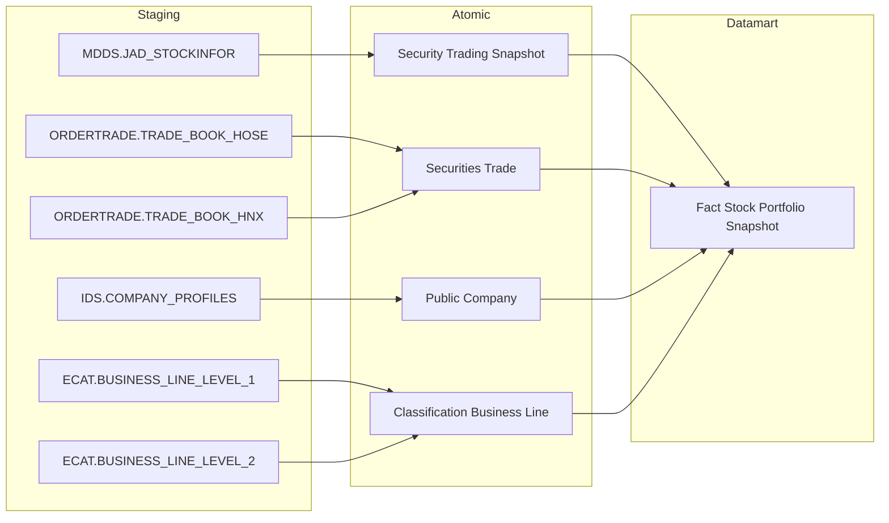
```mermaid
flowchart LR
    subgraph SRC["Staging"]
        S1A["MDDS.JAD_STOCKINFOR"]
        S1C["ORDERTRADE.TRADE_BOOK_HOSE"]
        S1D["ORDERTRADE.TRADE_BOOK_HNX"]
        S1E["IDS.COMPANY_PROFILES"]
        S1F["ECAT.BUSINESS_LINE_LEVEL_1"]
        S1G["ECAT.BUSINESS_LINE_LEVEL_2"]
    end
    subgraph SIL["Atomic"]
        A1A["Security Trading Snapshot"]
        A1C["Securities Trade"]
        A1D["Public Company"]
        A1E["Classification Business Line"]
    end
    subgraph GOLD["Datamart"]
        fct_stock_portfolio_snpst["Fact Stock Portfolio Snapshot"]
    end
    S1A --> A1A
    S1C --> A1C
    S1D --> A1C
    S1E --> A1D
    S1F --> A1E
    S1G --> A1E
    A1A --> fct_stock_portfolio_snpst
    A1C --> fct_stock_portfolio_snpst
    A1D --> fct_stock_portfolio_snpst
    A1E --> fct_stock_portfolio_snpst
```

> **Ghi chú nguồn Ngành:** Đường JOIN chuẩn: `Public Company.Business Line Level 1 Id` → `Classification Business Line.Classification Business Line Id` (không JOIN trực tiếp `IDS.CATEGORIES` — bảng này chỉ là join nội bộ, không tự sinh entity). `public_company_dim` (Datamart, dùng chung GSDC/QLCB/NDTNN) đã có sẵn cột đệm `Classification Business Line Name`. GSTT reuse nguyên trạng, không tạo Dimension riêng cho Ngành.
> **Ghi chú measure tổng hợp:** `Securities Trade` (Fact Append, grain = 1 lệnh khớp) thô hơn grain Fact — Tổng KL/GT, Tổng KL/GT thỏa thuận, KLNN ròng đều phải `SUM(...) GROUP BY Security Symbol Code, Trade Date` trước khi đặt lên Fact.
> **[SỬA 2026-09-14] Tách Fact riêng theo độ mịn rổ chỉ số — xem Cụm 1b:** `Fact Stock Portfolio Snapshot` nay thiết kế thuần theo độ mịn **mã CK × ngày**, KHÔNG còn FK `Index Constituent Dimension Id`. Trước đây FK này (nullable, trực tiếp trên Fact) khiến 1 mã CK thuộc N rổ chỉ số sinh N row Fact, các measure không phụ thuộc rổ chỉ số (Tổng KL, Tổng GT, KLNN ròng...) bị lặp giá trị trên từng row — rủi ro double-count nếu Dashboard không lọc đúng 1 Chỉ số. Toàn bộ nhu cầu phân tích theo độ mịn rổ chỉ số (chọn 1 chỉ số cụ thể, lọc nhóm chỉ số, SUM theo Index Code) nay chuyển sang `Fact Index Constituent Snapshot` (Cụm 1b) — Fact riêng theo độ mịn mã CK × rổ chỉ số × ngày, join sang Fact này qua `Symbol` khi cần.

##### Cụm 1b: Thành viên rổ chỉ số theo ngày (`Fact Index Constituent Snapshot`)

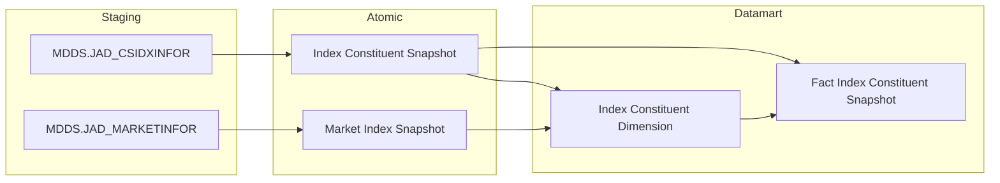
```mermaid
flowchart LR
    subgraph SRC["Staging"]
        S1I["MDDS.JAD_CSIDXINFOR"]
        S1M["MDDS.JAD_MARKETINFOR"]
    end
    subgraph SIL["Atomic"]
        A1I["Index Constituent Snapshot"]
        A1M["Market Index Snapshot"]
    end
    subgraph GOLD["Datamart"]
        fct_index_constituent_snpst["Fact Index Constituent Snapshot"]
        index_constituent_dim["Index Constituent Dimension"]
    end
    S1I --> A1I
    S1M --> A1M
    A1I --> fct_index_constituent_snpst
    A1I --> index_constituent_dim
    A1M --> index_constituent_dim
    index_constituent_dim --> fct_index_constituent_snpst
```

> **Grain:** 1 row / mã CK / rổ chỉ số / ngày giao dịch — Bridge (3 FK) dùng làm lọc/join theo rổ chỉ số. Nguồn `index_constituent_snapshot` (MDDS.JAD_CSIDXINFOR) đã có sẵn `Trading Date` đúng grain này (khác bản thiết kế cũ dựa trên SCD4A của Dimension).
> **Index Constituent Dimension đổi grain:** nay thuần mô tả rổ chỉ số — `Index Code`, `Index Id` — grain 1 row/Index Code, không còn chứa `Symbol`/`Floor Code`/`Add Date` (các thuộc tính mô tả *thành viên*, nay thuộc về Fact này).
> **[MỚI 2026-09-15, theo yêu cầu Design] `Index Name` bổ sung lên `Index Constituent Dimension`:** `Index Constituent Snapshot` (nguồn `MDDS.JAD_CSIDXINFOR`) không có attribute tên chỉ số — chỉ có `Index Code`/`Index Id`. Lấy `Index Name` bằng cách JOIN sang `Market Index Snapshot` (`MDDS.JAD_MARKETINFOR`, cùng entity đang dùng cho `Market Index Dimension` ở Cụm 2a/2b) theo **`Market Index Snapshot.Market Code = Index Constituent Snapshot.Index Code`** — cùng cơ chế lookup (không CASE WHEN thủ công) như `Market Index Dimension.Index Name` đã dùng ở `Fact Market Index Intraday` (Cụm 2b). Đây là quyết định thiết kế của Data Modeler: chấp nhận đẳng thức `Index Code = Market Code` làm join key cho mục đích lấy tên hiển thị — KHÔNG tự động đóng **O_GSTT_3** (gap đó còn phạm vi rộng hơn: cần xác nhận nghiệp vụ cho chiều ngược lại, từ 1 `Market Code` do UI truyền vào suy ra `Index Code` để lọc `Fact Index Constituent Snapshot` cho K_GSTT_47-52). Xem ghi chú Cụm 2a (dòng ~130).
> **[SỬA 2026-09-14, theo yêu cầu Design] 8 measure tính sẵn theo rổ chỉ số:** `Index Total Volume`/`Index Total Value` (KLGD/GTGD toàn rổ), `Index Foreign Net Volume`/`Index Foreign Net Value` (KLNN/GTNN ròng toàn rổ), `Index Total Negotiated Volume`/`Index Total Negotiated Value` (KLGD/GTGD thỏa thuận toàn rổ), `Index Market Cap`/`Index Free Float Market Cap` (Vốn hóa/Vốn hóa free-float toàn rổ) — mỗi cột SUM theo `Index Code + Trading Date`, nguồn Atomic mở rộng thêm `Security Trading Snapshot`, `Securities Trade`, `Public Company Share Statistics History`, `Listed Share Info` (không vẽ thêm node — theo đúng quy ước hiện có của file, diagram chỉ thể hiện driving entity chính, các bảng JOIN phụ nêu tại LLD). **Giá trị lặp lại trên mọi dòng Symbol cùng Index+Date** (denormalize có chủ đích — bridge không còn "factless" thuần túy) — bắt buộc dùng `MAX()`/`DISTINCT` khi truy vấn, không SUM lại.
> **[SỬA 2026-09-23] Cột `Index Market Index Value` (`idx_market_index_val`):** do commit TKNB 2026-09-22 thêm vào master registry + DDL nhưng thiếu ở LLD module GSTT và DML (lệch Gate 2/Gate 4) — nay đồng bộ đủ 4 tầng. Sửa `etl_logic`: bỏ tham chiếu `market_index_snapshot.rn` (không phải cột Atomic) và khóa chưa xác nhận `market_code = index_code`, thay bằng `ROW_NUMBER() ... ORDER BY Index Time DESC = 1` + khóa `Market Index Snapshot.Market Code = Index Constituent Snapshot.Index Code` (bảng mô tả jadapter, O_GSTT_3). Chưa có KPI GSTT nào dùng cột này.
> **KPI dùng Fact này:** K_GSTT_4 (chọn 1 Chỉ số), K_GSTT_62/63 (Bộ chỉ số thị trường/theo ngành) — join qua `Symbol`+`Trading Date`, không qua FK cố định trên `Fact Stock Portfolio Snapshot`; K_GSTT_47-52/54/61 (Nhóm 5/6/7/9/11/13/17/19/34/35, trừ Nhóm 23) và mẫu số K_GSTT_74/76 (Nhóm 24) nay đọc trực tiếp 8 cột tính sẵn ở trên (MAX, không JOIN+SUM lại).

##### Cụm 1c: Giao dịch theo phân loại nhà đầu tư (`Fact Investor Category Trading Snapshot`)

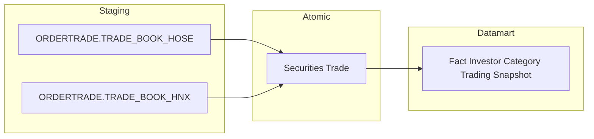
```mermaid
flowchart LR
    subgraph SRC["Staging"]
        S1C["ORDERTRADE.TRADE_BOOK_HOSE"]
        S1D["ORDERTRADE.TRADE_BOOK_HNX"]
    end
    subgraph SIL["Atomic"]
        A1C["Securities Trade"]
    end
    subgraph GOLD["Datamart"]
        fct_investor_category_trading_snpst["Fact Investor Category Trading Snapshot"]
    end
    S1C --> A1C
    S1D --> A1C
    A1C --> fct_investor_category_trading_snpst
```

> **[MỚI 2026-09-21, theo yêu cầu Data Modeler]** Nhóm 28/29 ("Xu hướng dòng tiền — Giao dịch theo phân loại Nhà đầu tư") trước đây lưu phân loại NĐT (Cá nhân/Tổ chức trong nước) thành 8 cột giá trị cố định (`Individual_Buy/Sell_Value/Volume`, `Domestic_Institution_Buy/Sell_Value/Volume`) trên `Fact Stock Portfolio Snapshot`, buộc tầng BI phải `CASE {nhánh} WHEN ... THEN individual_buy_val WHEN ... THEN domestic_institution_buy_val END` để switch cột theo lựa chọn Chiều "Phân loại nhà đầu tư" (K_GSTT_85) — không có cột vật lý nào đại diện cho chính "Phân loại nhà đầu tư" như 1 giá trị dữ liệu thật. Fact mới tách riêng, grain hẹp hơn (`mã CK × ngày × Phân loại NĐT`), có cột vật lý `Investor Category Code` — K_GSTT_85 trở thành FK/attribute thật, K_GSTT_86-94 (Nhóm 28/29) chỉ còn `SUM(...) WHERE Investor Category Code = :x`, không còn CASE WHEN. **Không đổi grain/cột của `Fact Stock Portfolio Snapshot`** — Nhóm 21 (Foreign)/Nhóm 27 (Proprietary)/Nhóm 35 (Proprietary Volume) tiếp tục dùng nguyên các cột đã có trên Fact đó, không bị ảnh hưởng.
> **Nguồn phân loại (BA_analyst_GSTT.csv dòng "Phân loại nhà đầu tư", STT 28/29/30/31 — **[SỬA 2026-09-23]** đồng bộ quy tắc đơn giản hoá BA 2026-09-22, thay bảng mã dài theo sàn):** phân nhánh theo thứ tự ưu tiên Tự doanh → Nước ngoài → Cá nhân/Tổ chức trong nước, đồng nhất HOSE/HNX:
> 1. **Tự doanh:** `Buy/Sell Client House Classification Code = '30'`.
> 2. **Nước ngoài:** `Buy/Sell Foreign Investor Type Code <> '00'`.
> 3. **Cá nhân** (loại trừ 1, 2): `Buy/Sell Investor Type Code = '8000'`.
> 4. **Tổ chức trong nước** (loại trừ 1, 2): `Buy/Sell Investor Type Code <> '8000'`.
> **[SỬA 2026-09-23]** Fact này phục vụ Nhóm 29/30 (grain Mã CK). Nhóm 28/31 (grain Chỉ số) dùng `Fact Investor Category Index Trading Snapshot` (Cụm 1d) — cùng quy tắc phân loại.
> ETL populate riêng phía Mua (dùng `Buy ...`) và phía Bán (dùng `Sell ...`) — 1 giao dịch có thể có bên mua và bên bán thuộc 2 phân loại khác nhau, nên `Matched/Negotiated_Buy_Value` và `Matched/Negotiated_Sell_Value` được tính độc lập theo đúng phân loại của từng phía trước khi `UNION`/`FULL OUTER JOIN` theo `(Symbol, Trade Date, Investor Category Code)` — cùng cơ chế BA đã tham khảo ở SQL gốc Nhóm 29 (CTE `gt_mua_theo_ngay`/`gt_ban_theo_ngay`/`gt_rong_theo_ngay`).

##### Cụm 1d: Giao dịch theo phân loại nhà đầu tư theo chỉ số (`Fact Investor Category Index Trading Snapshot`)

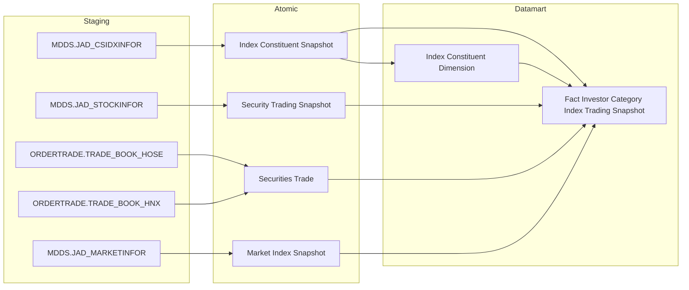
```mermaid
flowchart LR
    subgraph SRC["Staging"]
        S1I["MDDS.JAD_CSIDXINFOR"]
        S1A["MDDS.JAD_STOCKINFOR"]
        S1C["ORDERTRADE.TRADE_BOOK_HOSE"]
        S1D["ORDERTRADE.TRADE_BOOK_HNX"]
        S1M["MDDS.JAD_MARKETINFOR"]
    end
    subgraph SIL["Atomic"]
        A1I["Index Constituent Snapshot"]
        A1A["Security Trading Snapshot"]
        A1C["Securities Trade"]
        A1M["Market Index Snapshot"]
    end
    subgraph GOLD["Datamart"]
        Fact_Investor_Category_Index_Trading_Snapshot["Fact Investor Category Index Trading Snapshot"]
        Index_Constituent_Dimension["Index Constituent Dimension"]
    end
    S1I --> A1I
    S1A --> A1A
    S1C --> A1C
    S1D --> A1C
    S1M --> A1M
    A1I --> Fact_Investor_Category_Index_Trading_Snapshot
    A1A --> Fact_Investor_Category_Index_Trading_Snapshot
    A1C --> Fact_Investor_Category_Index_Trading_Snapshot
    A1M --> Fact_Investor_Category_Index_Trading_Snapshot
    A1I --> Index_Constituent_Dimension
    Index_Constituent_Dimension --> Fact_Investor_Category_Index_Trading_Snapshot
```

> **[MỚI 2026-09-23, Data Modeler duyệt]** Phục vụ Nhóm 28 (biểu đồ GT ròng theo chỉ số) và Nhóm 31 (a) (bản đồ nhiệt theo chỉ số). **Grain:** 1 row / Index Code / ngày giao dịch / Phân loại NĐT (4 dòng/chỉ số/ngày) — tách riêng khỏi `Fact Investor Category Trading Snapshot` (grain Mã CK) để không SUM runtime lệch hạt (Level 2 Chỉ số vs Level 4 Mã CK).
> **ETL 6 measure GT:** `Index Constituent Snapshot` (thành viên rổ tại `Trading Date`) JOIN `Security Trading Snapshot` (map Symbol → mã giao dịch: HOSE dùng `Symbol`, HNX/UPCOM dùng `ISIN Code` — cùng quy ước Cụm 1c) JOIN `Securities Trade` (cùng ngày, `Market Id Code IN ('UPX','STX','STK')`), phân loại từng phía Mua/Bán theo quy tắc Cụm 1c, rồi `SUM(Execution Value) GROUP BY Index Code, Trading Date, Investor Category Code`. `Matched_*` = `Board Type Code NOT IN ('T1','T2','T3','T4','T6','R1')`; `Negotiated_*` = `Board Type Code IN (...)`. 1 mã CK xuất hiện 1 lần/rổ/ngày → không double-count trong 1 rổ.
> **ETL 3 measure giá chỉ số:** `Market Index Snapshot` bản ghi cuối phiên (`ROW_NUMBER() OVER (PARTITION BY Market Code, Trading Date ORDER BY Index Time DESC) = 1`) JOIN theo `Market Index Snapshot.Market Code = Index Constituent Snapshot.Index Code` AND cùng `Trading Date` → `Market Index Value`, `Index Change`, `Index Percent Change`. Khóa này đã xác nhận cho K_GSTT_35 (O_GSTT_3, Resolved một phần). Giá trị lặp lại trên 4 dòng Phân loại NĐT (broadcast có chủ đích, Data Modeler chọn gộp vào cùng Fact) — truy vấn dùng `MAX()`.

##### Cụm 2a: Diễn biến chỉ số thị trường — snapshot cuối ngày (`Fact Market Index Snapshot`)

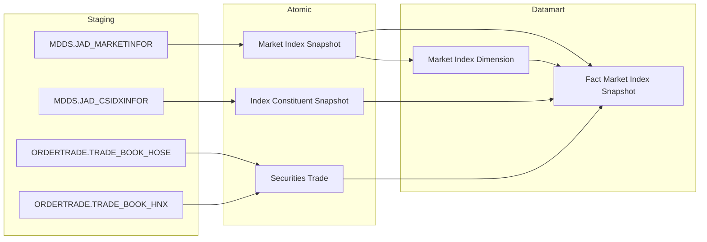
```mermaid
flowchart LR
    subgraph SRC["Staging"]
        S2A["MDDS.JAD_MARKETINFOR"]
        S2B["MDDS.JAD_CSIDXINFOR"]
        S2C["ORDERTRADE.TRADE_BOOK_HOSE"]
        S2D["ORDERTRADE.TRADE_BOOK_HNX"]
    end
    subgraph SIL["Atomic"]
        A2A["Market Index Snapshot"]
        A2B["Index Constituent Snapshot"]
        A2C["Securities Trade"]
    end
    subgraph GOLD["Datamart"]
        fct_market_index_snpst["Fact Market Index Snapshot"]
        market_index_dim["Market Index Dimension"]
    end
    S2A --> A2A
    S2B --> A2B
    S2C --> A2C
    S2D --> A2C
    A2A --> fct_market_index_snpst
    A2A --> market_index_dim
    A2B --> fct_market_index_snpst
    A2C --> fct_market_index_snpst
    market_index_dim --> fct_market_index_snpst
```

> **Ghi chú reuse cross-module:** `Fact Market Index Snapshot`/`Market Index Dimension` sở hữu bởi **QLKD**, GSTT mở rộng thêm cột trên Fact hiện có, không đổi grain (`1 market_code × 1 ngày`, bản ghi cuối phiên `rn=1`). Xem Section 4 — Reuse Analysis.
> **Ghi chú KLGD/GTGD/KLNN ròng/GTNN ròng của chỉ số:** Cần JOIN `Index Constituent Snapshot` (lấy danh sách mã CK thuộc rổ chỉ số) với `Securities Trade` để `SUM(Execution Volume/Value) GROUP BY Index Code, Trade Date` — measure pre-aggregate qua 2 tầng nguồn, đặt trực tiếp lên `Fact Market Index Snapshot`.
> **Ghi chú Index Code vs Market Code:** `Market Index Dimension` định danh theo `Market Code`/`Index Type Code`, còn `Index Constituent Dimension` (Nhóm 1) định danh theo `Index Code` — 2 hệ định danh khác nhau, không có join key 1-1 sẵn có qua `Market Code`. Chiều `Market Code → Index Code` cho K_GSTT_47-52 (Nhóm 5)/K_GSTT_39 (Nhóm 37) **vẫn Open** — xem O_GSTT_3. **[MỚI 2026-09-15]** Chiều `Index Constituent Dimension → Market Index Snapshot` (lấy `Index Name`, xem Cụm 1b) đã dùng đẳng thức `Index Code = Market Code` làm join key theo quyết định Data Modeler — nhưng đây chỉ giải quyết chiều lấy tên hiển thị cho 1 `Index Code` đã biết sẵn, KHÔNG tương đương với việc giải quyết O_GSTT_3 (vốn cần chiều ngược: từ `Market Code` do UI chọn suy ra đúng `Index Code` để lọc Bridge cho K_GSTT_47-52) — vẫn giữ nguyên Open cho phần đó. **[SỬA 2026-09-22, datamart-review]** Phát hiện khóa join RIÊNG BIỆT (không phải `Market Code = Index Code` ở trên) đã giải quyết được O_GSTT_3 cho trường hợp K_GSTT_35 (Nhóm 6 + Nhóm 37, lấy trực tiếp điểm số chỉ số): `Market Index Dimension.Index Name = Index Constituent Dimension.Index Code` (nguồn `market_index_snapshot.index_nm` ← `MDDS.JAD_MARKETINFOR.INDEXNAME`, người dùng xác nhận trực tiếp) — xem O_GSTT_3 (Resolved một phần) và Nhóm 6/Nhóm 37 trong Section 2. **[SỬA 2026-09-23 — ĐẢO NGƯỢC ghi chú 2026-09-22, SUPERSEDED]** Khóa `Index Name = Index Code` ở trên là SAI. Bảng mô tả jadapter (Data Modeler cung cấp 2026-09-23): `MARKETCODE` = getIndexCode (VD `HOSE`/`30`/`MID`/`SML`), `MARKETID` = getIndexID, `INDEXNAME` = getIndexName (tên hiển thị `VNINDEX`/`VN30`/`VNMIDCAP`/`VNSMALLCAP`); `JAD_CSIDXINFOR.INDEXCODE` = Mã chỉ số cùng hệ getIndexCode; SQL BA STT 5 nối `tjme.marketcode = idx.indexcode`, STT 18 lọc `INDEXCODE IN ('HOSE','HNX','UPCOM')`. → Khóa đúng duy nhất: **`Market Code = Index Code`** (chính là khóa 2026-09-15 đã dùng cho `Index Constituent Dimension.Index Name`). Toàn bộ công thức K_GSTT_35 (Nhóm 6/28/31/37), K_GSTT_38/39 (Nhóm 28/31), `idx_market_index_val` đã đổi sang khóa này.

##### Cụm 2b: Diễn biến chỉ số thị trường — realtime trong ngày (`Fact Market Index Intraday`)

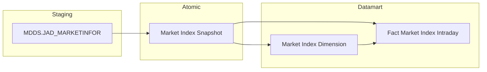
```mermaid
flowchart LR
    subgraph SRC["Staging"]
        S2E["MDDS.JAD_MARKETINFOR"]
    end
    subgraph SIL["Atomic"]
        A2D["Market Index Snapshot"]
    end
    subgraph GOLD["Datamart"]
        fct_market_index_intraday["Fact Market Index Intraday"]
        market_index_dim2["Market Index Dimension"]
    end
    S2E --> A2D
    A2D --> fct_market_index_intraday
    A2D --> market_index_dim2
    market_index_dim2 --> fct_market_index_intraday
```

> **Ghi chú grain:** Mục đích là vẽ biểu đồ đường/cột theo thời gian trong ngày — khác Fact EOD (1 row/ngày), dùng chung nguồn `Market Index Snapshot` nhưng KHÔNG lọc `rn=1`. Grain = **1 row / Market Code / Index Time** (theo đúng nguồn `JAD_MARKETINFOR`). Dashboard xử lý lại theo giờ ở tầng BI, không xử lý ở Datamart.
>
> **[GHI CHÚ 2026-09-07] Nguồn mới `Market Price Snapshot` chưa dùng được cho Fact này:** MDDS đã bổ sung Atomic entity `market_price_snapshot` (MDDS.JAD_TRADINGVIEWHISTORY1MIN/1DAY — nến OHLCV thật theo phút/ngày, đã dùng để thiết kế lại `Fact Security Trading Intraday` ở Nhóm 32, xem O_GSTT_11) — về nguyên tắc phù hợp hơn nguồn `Market Index Snapshot` hiện tại (tránh phải dùng `LAG()` trừ giá trị lũy kế để suy ra `Total Value At Time`). Tuy nhiên **chưa áp dụng được**: `market_price_snapshot.symbol` (định danh dạng TradingView, VD dự đoán "VNINDEX") không có join key xác nhận với `Market Index Dimension` (định danh theo `Market Code`/`Market Id` — HOSE/HNX/UPCOM) — cùng gap đã ghi nhận ở dòng ~100 ("2 hệ định danh khác nhau... PENDING xác nhận nghiệp vụ"). `BRD/Source/MDDS/brd_MDDS_JAD_TRADINGVIEWHISTORY1MIN.yaml` không có sample giá trị `SYMBOL` nào để verify. Giữ nguyên thiết kế hiện tại cho tới khi nghiệp vụ xác nhận mapping `symbol`↔`Market Code`.

##### Cụm 3: Sở hữu và giao dịch nội bộ (`Operational Public Company Shareholding`)

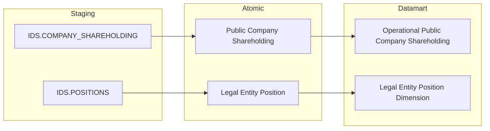
```mermaid
flowchart LR
    subgraph SRC["Staging"]
        S3A["IDS.COMPANY_SHAREHOLDING"]
        S3B["IDS.POSITIONS"]
    end
    subgraph SIL["Atomic"]
        A3A["Public Company Shareholding"]
        A3B["Legal Entity Position"]
    end
    subgraph GOLD["Datamart"]
        opr_public_company_shareholding["Operational Public Company Shareholding"]
        legal_entity_position_dim["Legal Entity Position Dimension"]
    end
    S3A --> A3A
    S3B --> A3B
    A3A --> opr_public_company_shareholding
    A3B --> legal_entity_position_dim
```

> **Ghi chú (sửa 2026-08-03):** Chỉ 2/8 KPI của Nhóm 33 READY (Mã cổ phiếu — reuse `Public Company Dimension` từ Cụm 1; Chức vụ người nội bộ — `Legal Entity Position Dimension`, Nguồn 1 approved `dm_atm_legal_entity_position-IDS.POSITIONS.yaml`). 6 KPI còn lại (Tên cổ đông, Số cổ phiếu sở hữu, Sở hữu nước ngoài, Sở hữu trong nước, Tỷ lệ sở hữu, Sở hữu cổ đông lớn) PENDING — nguồn `Chưa có CSDL - Map biểu mẫu` (BM8/BM70 VSDC), không vẽ Fact/Dimension cho phần này ở giai đoạn hiện tại (xem Bảng mapping nguồn — Atomic Placeholder ở Section 2, Nhóm 33).

---

## Section 2 — Tổng quan báo cáo

### Tab Dashboard thông tin về danh mục chứng khoán

#### Nhóm 1 - Bảng số liệu

> **Phân loại:** Phân tích
> **Atomic:** `Security Trading Snapshot` ← MDDS.JAD_STOCKINFOR — **READY** (Nguồn 2, approved) / `Securities Trade` ← ORDERTRADE.TRADE_BOOK_HOSE, TRADE_BOOK_HNX — **READY** (Nguồn 2, approved) / `Public Company` ← IDS.COMPANY_PROFILES — **READY** (Nguồn 1, approved) / `Classification Business Line` ← ECAT.BUSINESS_LINE_LEVEL_1, BUSINESS_LINE_LEVEL_2 — **READY** (Nguồn 1, approved) / `Index Constituent Snapshot` ← MDDS.JAD_CSIDXINFOR — **READY** (Nguồn 2, approved) — driving entity cho `Index Constituent Dimension` mới (xem ghi chú Section 1) / `Market Index Snapshot` ← MDDS.JAD_MARKETINFOR — **READY** (Nguồn 1, approved, reuse Nhóm 5) — dùng join_atomic để xác định "Có giao dịch" trên Calendar Date Dimension (K_GSTT_128, mới)
>
> **Ghi chú "Có giao dịch"/"Bình quân tháng-năm" (K_GSTT_128–132, mới, 2026-09-05 — yêu cầu thiết kế trực tiếp từ user, không qua BA CSV):** Bổ sung cột mới **"Is Trading Date"** (`is_trading_date`, Indicator Y/N) lên `Calendar Date Dimension` (`cdr_dt_dim` — conformed, dùng chung toàn hệ thống, `partial` reuse) — `Y` nếu ngày đó có tồn tại bản ghi trên `Market Index Snapshot` (`EXISTS(... WHERE market_index_snapshot.trading_dt = cdr_dt.cdr_dt)`), `N` nếu không (cuối tuần/lễ). Dùng `market_index_snapshot` (grain 1 row/ngày, toàn thị trường) làm nguồn thay vì `security_trading_snapshot` (nhiều dòng/ngày theo mã CK) để tránh phải DISTINCT qua khối lượng dữ liệu lớn hơn nhiều. **"Ngày giao dịch gần nhất"** (tham số lọc mặc định cho dashboard/báo cáo giao dịch thị trường) = `MAX(cdr_dt_dim.cdr_dt) WHERE cdr_dt_dim.is_trading_date = 'Y'` — tính tại tầng BI, không cần KPI/cột riêng, chỉ cần K_GSTT_128 làm điều kiện filter. 4 KPI "bình quân tháng/năm" derive từ K_GSTT_13/14 đã có, `GROUP BY Symbol, cdr_dt_dim.year, cdr_dt_dim.month` (hoặc chỉ `year`), **filter `WHERE cdr_dt_dim.is_trading_date = 'Y'`** để loại ngày không giao dịch khỏi phép tính bình quân. Chỉ khai ghi chú 1 lần ở Nhóm 1 (nền tảng) — không lặp lại ở 34 Nhóm còn lại, cùng cách Calendar Date Dimension chỉ note 1 lần (theo xác nhận trực tiếp của user). **Lưu ý cross-module:** `cdr_dt_dim` hiện `modules_using: [NHNCK, GSDC]` — chưa liệt kê GSTT dù đã dùng từ trước (gap tồn đọng, tiện thể bổ sung); cột `is_trading_date` mới sẽ NULL/N cho các module không liên quan giao dịch thị trường, không ảnh hưởng ngược tới NHNCK/GSDC.

**Mockup:**

| Mã CK | Ngành | Sàn | Chỉ số | Loại phái sinh | Ngày đáo hạn | Giá TC | Giá ĐC | Thay đổi | % TĐ | Tổng KL | Tổng GT | Tổng KL PS | Tổng GT PS | Tổng KL TT | Tổng GT TT | KLNN ròng |
|---|---|---|---|---|---|---|---|---|---|---|---|---|---|---|---|---|
| VCB | Ngân hàng | HOSE | VN30 | — | — | 82.00 | 82.50 | +0.50 | +0.61% | 548 Tr | 22.1 Tỷ | 0 | 0 | 12 Tr | 1.0 Tỷ | +4 Tr |

**Source:** `Fact Stock Portfolio Snapshot` → `Security Trading Snapshot Dimension`, `Public Company Dimension`, `Calendar Date Dimension`, `Index Constituent Dimension`

**Bảng KPI:**

| KPI ID | Tên KPI | Đơn vị | Tính chất | Công thức | Ghi chú | Trạng thái |
|---|---|---|---|---|---|---|
| K_GSTT_1 | Mã CK | — | Chiều | `Security Trading Snapshot Dimension.Symbol` | **Sửa filter (2026-09-03, BA cập nhật):** Bản trước dùng code chữ `NOT IN ('B','1','BO','D')` — sai, không khớp giá trị thật lưu trong `Stock Type Code` (= `MDDS.JAD_STOCKINFOR.STOCKTYPE` numeric dạng string, KHÔNG phải scheme chữ ST/BO/MF/FU/OP/EF của bản tin MDDS gốc — 2 nguồn khác nhau, xem `classification_schemes.yaml` scheme `MDDS_STOCK_TYPE` hiện `values: []` chưa từng được điền). BA SQL gốc STT 1 xác nhận filter floor-dependent: `Filter: NOT ((Floor Code = '02' AND Stock Type Code IN ('1','4')) OR (Floor Code = '10' AND Stock Type Code = '1'))` — HNX loại Trái phiếu(1) + mã `'4'` (bản trước ghi nhầm "Chứng quyền, HNX không có CQ hợp lệ" — **[SỬA 2026-09-16]** đã xác nhận qua test query mã `'4'` trên HNX thực chất là **Phái sinh**, không phải Chứng quyền; xem `K_GSTT_122`/`stock_tp_nm`. Không đổi logic filter — Phái sinh cũng không phải cổ phiếu nên kết quả loại trừ vẫn đúng, chỉ sửa lại tên gọi bản chất trong ghi chú này); HOSE chỉ loại Trái phiếu(1); UPCOM/FDS không ràng buộc thêm | READY |
| K_GSTT_2 | Ngành | — | Chiều | `Public Company Dimension.Business Line Level 1 Code`, `Classification Business Line Name` | Reuse nguyên trạng `public_company_dim` — cột đệm sẵn tên ngành đã sửa JOIN theo Id (xem Section 1) | READY |
| K_GSTT_3 | Sàn | — | Chiều | `Security Trading Snapshot Dimension.Floor Code` | Scheme MDDS_FLOOR_CODE: 10-HOSE, 02-HNX, 04-UPCOM, 03-FDS | READY |
| K_GSTT_4 | Chỉ số | — | Chiều | `Index Constituent Dimension.Index Code` | **[SỬA 2026-09-14]** Filter qua `Fact Index Constituent Snapshot` (Bridge, Cụm 1b): `JOIN Fact Index Constituent Snapshot ON Symbol = Fact Stock Portfolio Snapshot.Symbol AND Trading Date = Fact Stock Portfolio Snapshot.Trading Date → JOIN Index Constituent Dimension WHERE Index_Code = :selected_index` — không còn FK cố định trên Fact. Xem ghi chú thiết kế ở Section 1 (Cụm 1b) | READY |
| K_GSTT_5 | Loại phái sinh | — | Chiều | `Security Trading Snapshot Dimension.Stock Type Code`, `Underlying Symbol` | Chỉ có giá trị khi Floor Code = '03' | READY |
| K_GSTT_6 | Phương thức khớp lệnh (thỏa thuận) | — | Chiều | — | **[DEPRECATED 2026-09-08 — Loại bỏ]** Không có giá trị khai thác độc lập dưới dạng Chiều/Slicer (Fact không có cột chiều này). Nghiệp vụ hiển thị trực tiếp 4 Measure độc lập trên bảng: Khớp lệnh (`total_vol` K_GSTT_13, `total_val` K_GSTT_14) và Thỏa thuận (`total_negotiated_vol` K_GSTT_17, `total_negotiated_val` K_GSTT_18) | DEPRECATED |
| K_GSTT_7 | Ngày | — | Chiều | `Calendar Date Dimension.Calendar Date` | Tham số lọc theo ngày giao dịch | READY |
| K_GSTT_8 | Ngày đáo hạn phái sinh | Ngày | Cơ sở | `Security Trading Snapshot Dimension.Maturity Date` | Chỉ có giá trị khi Floor Code = '03' | READY |
| K_GSTT_9 | Giá tham chiếu | VNĐ | Cơ sở | `Security Trading Snapshot Dimension.Reference Price` | — | READY |
| K_GSTT_10 | Giá đóng cửa | VNĐ | Cơ sở | `Security Trading Snapshot Dimension.Close Price` | — | READY |
| K_GSTT_11 | Thay đổi (+/-) | VNĐ | Cơ sở | `Security Trading Snapshot Dimension.Price Change` | = Giá đóng cửa − Giá TC | READY |
| K_GSTT_12 | % thay đổi | % | Phái sinh | `Price Change / Reference Price × 100` | Computed tại query layer | READY |
| K_GSTT_13 | Tổng KLGD khớp lệnh | Cổ phiếu | Phái sinh | `SUM(Securities Trade.Execution Volume WHERE Market Id Code IN ('UPX','STX','STO')) GROUP BY Symbol, Trade Date` | **[SỬA TÊN 2026-09-16, theo BA mới]** Đổi tên hiển thị từ "Tổng KL" → "Tổng KLGD khớp lệnh" — BA STT 1 nay tự làm rõ "khớp lệnh" ngay trong tên chỉ tiêu, không đổi công thức/nguồn/cột Fact (`total_vol`). Xác nhận lại quyết định `[DEPRECATED 2026-09-08]` K_GSTT_6 vẫn đúng — không cần khôi phục Dimension "Phương thức", đây chính là cách BA tự giải quyết bằng tên KPI tường minh thay vì slicer. **Sửa công thức (khác bản HLD trước, 2026-07-29):** Bản trước không filter Market Id — sai, BA SQL gốc STT 1 xác nhận `WHERE Market ID IN ('UPX','STX','STO')` (chỉ tính khớp lệnh cổ phiếu/chứng chỉ quỹ 3 sàn, loại trừ phái sinh DVX và trái phiếu BDO/HCX). Pre-aggregate GROUP BY Symbol/Trade Date. **[SỬA 2026-09-14]** Không còn cần `SELECT DISTINCT` — `Fact Stock Portfolio Snapshot` đã tách FK rổ chỉ số sang `Fact Index Constituent Snapshot` riêng (Cụm 1b), measure này nay đúng 1 giá trị/mã CK/ngày | READY |
| K_GSTT_14 | Tổng GTGD khớp lệnh | VNĐ | Phái sinh | `SUM(Securities Trade.Execution Value WHERE Market Id Code IN ('UPX','STX','STO')) GROUP BY Symbol, Trade Date` | **[SỬA TÊN 2026-09-16, theo BA mới]** Đổi tên hiển thị từ "Tổng GT" → "Tổng GTGD khớp lệnh" — cùng lý do K_GSTT_13, không đổi công thức/nguồn/cột Fact (`total_val`). **Sửa công thức (khác bản HLD trước, 2026-07-29):** cùng lý do K_GSTT_13 — BA SQL gốc STT 1 xác nhận filter `Market ID IN ('UPX','STX','STO')`. Pre-aggregate | READY |
| K_GSTT_15 | Tổng KL theo loại phái sinh khớp lệnh | Hợp đồng | Phái sinh | `SUM(Securities Trade.Execution Volume WHERE Market Id Code = 'DVX') GROUP BY Symbol, Trade Date` | **[SỬA 2026-09-17, đồng bộ BA mới]** Đổi tên thêm "khớp lệnh" — BA STT 1 xác nhận rõ tên "Tổng KL theo loại phái sinh KHỚP LỆNH". Không đổi filter — `Market Id Code = 'DVX'` (thị trường phái sinh) vốn không có board type thỏa thuận riêng, tên gọi mới chỉ xác nhận lại tính chất sẵn có. Pre-aggregate | READY |
| K_GSTT_16 | Tổng GT theo loại phái sinh khớp lệnh | VNĐ | Phái sinh | `SUM(Securities Trade.Execution Value WHERE Market Id Code = 'DVX') GROUP BY Symbol, Trade Date` | **[SỬA 2026-09-17, đồng bộ BA mới]** Cùng lý do K_GSTT_15. Pre-aggregate | READY |
| K_GSTT_17 | Tổng KL thỏa thuận | Cổ phiếu | Phái sinh | `SUM(Securities Trade.Execution Volume WHERE Market Id Code IN ('UPX','STX','STK') AND Board Type Code IN ('T1','T2','T3','T4','T6','R1')) GROUP BY Symbol, Trade Date` | **[SỬA FILTER 2026-09-11, đóng O_GSTT_20]** Xác nhận qua issue Thủy 2026-09-11 (HOSE: `MARKET_ID IN ('STK') AND BOARD_TYPE IN (...,'R1')`; HNX: `MARKET_ID IN ('STX','UPX') AND BOARD_ID IN (...,'R1')`) — bổ sung `Market Id Code` (thiếu từ bản gốc, rủi ro lẫn Bond Trading Volume dùng chung board code khác market) và `R1` (Negotiation Repo). Pre-aggregate | READY |
| K_GSTT_18 | Tổng GT thỏa thuận | VNĐ | Phái sinh | `SUM(Securities Trade.Execution Value WHERE Market Id Code IN ('UPX','STX','STK') AND Board Type Code IN ('T1','T2','T3','T4','T6','R1')) GROUP BY Symbol, Trade Date` | Cùng ghi chú sửa filter K_GSTT_17 (2026-09-11, đóng O_GSTT_20). Pre-aggregate | READY |
| K_GSTT_19 | KLNN ròng | Cổ phiếu | Phái sinh | `SUM(Buy Foreign Investor Type Code IN ('10','20') → Execution Volume WHERE Market Id Code IN ('UPX','STX','STO')) − SUM(Sell Foreign Investor Type Code IN ('10','20') → Execution Volume WHERE Market Id Code IN ('UPX','STX','STO')) GROUP BY Symbol, Trade Date` | **Sửa công thức (khác bản HLD trước, 2026-07-29):** Bản trước không filter Market Id. BA SQL gốc STT 1 tính riêng theo từng sàn — HOSE: `Market ID = 'STO'`; HNX/UPCOM: `Market ID IN ('STX','UPX')` (loại trừ DVX/BDX/HCX) — rồi cộng kl_nn_mua/kl_nn_ban 2 khối trước khi lấy hiệu; gộp tương đương `Market Id Code IN ('UPX','STX','STO')` áp cho cả 2 vế Buy/Sell. Pre-aggregate | READY |
| K_GSTT_144 | KLNN ròng thỏa thuận | Cổ phiếu | Phái sinh | `SUM(Buy Foreign Investor Type Code IN ('10','20') → Execution Volume WHERE Market Id Code IN ('UPX','STX','STK') AND Board Type Code IN ('T1','T2','T3','T4','T6','R1')) − SUM(Sell Foreign Investor Type Code IN ('10','20') → Execution Volume WHERE Market Id Code IN ('UPX','STX','STK') AND Board Type Code IN ('T1','T2','T3','T4','T6','R1')) GROUP BY Symbol, Trade Date` | **Mới (2026-09-09) — BA STT 1 dòng con 21/21, trước đây thiếu KPI, phát hiện qua đối chiếu số dòng con BA↔KPI (mục #10 self-check).** Khác K_GSTT_19 "KLNN ròng" (khớp lệnh, filter `Market Id Code` khác — `UPX/STX/STO`) — đây là biến thể thỏa thuận. **[SỬA FILTER 2026-09-11, đóng O_GSTT_20]** Bổ sung `Market Id Code IN ('UPX','STX','STK')` — thiếu từ bản gốc, đồng bộ cùng K_GSTT_17/18 theo issue Thủy 2026-09-11. Pre-aggregate | READY |
| K_GSTT_148 | Tổng KNNN ròng của phái sinh khớp lệnh | Hợp đồng | Phái sinh | `SUM(Buy Foreign Investor Type Code IN ('10','20') → Execution Volume WHERE Market Id Code = 'DVX') − SUM(Sell Foreign Investor Type Code IN ('10','20') → Execution Volume WHERE Market Id Code = 'DVX') GROUP BY Symbol, Trade Date` | **[MỚI 2026-09-17, bổ sung KPI thiếu phát hiện qua rà soát BA↔KPI toàn diện]** BA STT 1 có chỉ tiêu "Tổng KNNN ròng của phái sinh khớp lệnh" (KLNN mua − KLNN bán khớp lệnh) trước đây chưa được map — cùng công thức K_GSTT_19 (KLNN ròng cổ phiếu) nhưng scope sang thị trường phái sinh (`Market Id Code = 'DVX'`, không cần Board Type filter — cùng lý do K_GSTT_15/16). Cột mới `foreign_net_derivative_vol` trên `Fact Stock Portfolio Snapshot`. Pre-aggregate | READY |
| K_GSTT_122 | Loại chứng khoán | — | Chiều | `Security Trading Snapshot Dimension.Stock Type Name` — cột dẫn xuất bằng `CASE` từ `.Floor Code` + `.Stock Type Code` + `.Fund Type Code`: Floor `'02'`/`'04'` (HNX/UPCOM, dùng chung bảng mã): 1-Trái phiếu, 2-Cổ phiếu, 3-CCQ (fund_tp_code='E'→ETF, khác→Chứng chỉ quỹ), 4-Phái sinh, 5-Chứng quyền, 6-ETF; Floor `'10'` (HOSE): 1-Trái phiếu, 2-Cổ phiếu, 3-CCQ (cùng tách ETF qua fund_tp_code), 4-Chứng quyền; ELSE 'Không xác định' | **[SỬA 2026-09-16, đóng O_GSTT_15 phần (3b)]** BA STT 1 (Chiều/Done/Dữ liệu tĩnh). Materialize thành cột `stock_tp_nm` trên Dimension (2026-08-21) thay vì tính tại tầng BI — đã đồng bộ Attributes/registry/flat table. Bổ sung UPCOM (dùng chung bảng mã HNX, xác nhận Data Modeler 2026-09-16), tách ETF/CCQ qua Fund Type Code (cả HNX+HOSE), thêm nhánh Phái sinh (floor='02', stock_tp='4') và tách Chứng quyền(5)/ETF(6) trên HNX theo test query mới — xem đối chiếu với `K_GSTT_1` (mã '4' trên HNX). Còn `'03'`-FDS/`'06'`-corp-bond ngoài phạm vi sửa lần này — vẫn xem O_GSTT_15 | READY |
| K_GSTT_128 | Có giao dịch | — | Chiều | `Calendar Date Dimension.Is Trading Date` | **Mới (2026-09-05, yêu cầu trực tiếp từ user, không qua BA CSV).** Cờ Y/N — Y nếu ngày lịch là ngày thị trường thực sự mở cửa giao dịch (có bản ghi trên `Market Index Snapshot`), N nếu không. Khác `K_GSTT_7` "Ngày" (Calendar Date Dimension gốc, gồm mọi ngày kể cả T7/CN/lễ) — đây là cờ lọc bổ sung TRÊN cùng Dimension đó, không phải Dimension riêng. Dùng làm điều kiện `WHERE` để suy ra "ngày giao dịch gần nhất" = `MAX(Calendar Date) WHERE Is Trading Date = 'Y'` — tham số lọc mặc định cho dashboard/báo cáo giao dịch thị trường chứng khoán (xem ghi chú Nhóm 1 phía trên) | READY |
| K_GSTT_129 | KLGD bình quân tháng | Cổ phiếu | Phái sinh | `AVG(K_GSTT_13) GROUP BY Symbol, Calendar Date Dimension.Year, Calendar Date Dimension.Month WHERE Calendar Date Dimension.Is Trading Date = 'Y'` | **Mới (2026-09-05, yêu cầu trực tiếp từ user).** Bình quân theo số ngày giao dịch thực tế trong tháng (loại T7/CN/lễ/ngày không giao dịch khỏi mẫu số), không phải bình quân theo số ngày lịch | READY |
| K_GSTT_130 | KLGD bình quân năm | Cổ phiếu | Phái sinh | `AVG(K_GSTT_13) GROUP BY Symbol, Calendar Date Dimension.Year WHERE Calendar Date Dimension.Is Trading Date = 'Y'` | **Mới (2026-09-05, yêu cầu trực tiếp từ user).** Cùng logic K_GSTT_129, gộp theo năm thay vì tháng | READY |
| K_GSTT_131 | GTGD bình quân tháng | VNĐ | Phái sinh | `AVG(K_GSTT_14) GROUP BY Symbol, Calendar Date Dimension.Year, Calendar Date Dimension.Month WHERE Calendar Date Dimension.Is Trading Date = 'Y'` | **Mới (2026-09-05, yêu cầu trực tiếp từ user).** Cùng logic K_GSTT_129 nhưng trên Giá trị giao dịch (K_GSTT_14) thay vì Khối lượng | READY |
| K_GSTT_132 | GTGD bình quân năm | VNĐ | Phái sinh | `AVG(K_GSTT_14) GROUP BY Symbol, Calendar Date Dimension.Year WHERE Calendar Date Dimension.Is Trading Date = 'Y'` | **Mới (2026-09-05, yêu cầu trực tiếp từ user).** Cùng logic K_GSTT_130 nhưng trên Giá trị giao dịch (K_GSTT_14) thay vì Khối lượng | READY |

**Star Schema:**

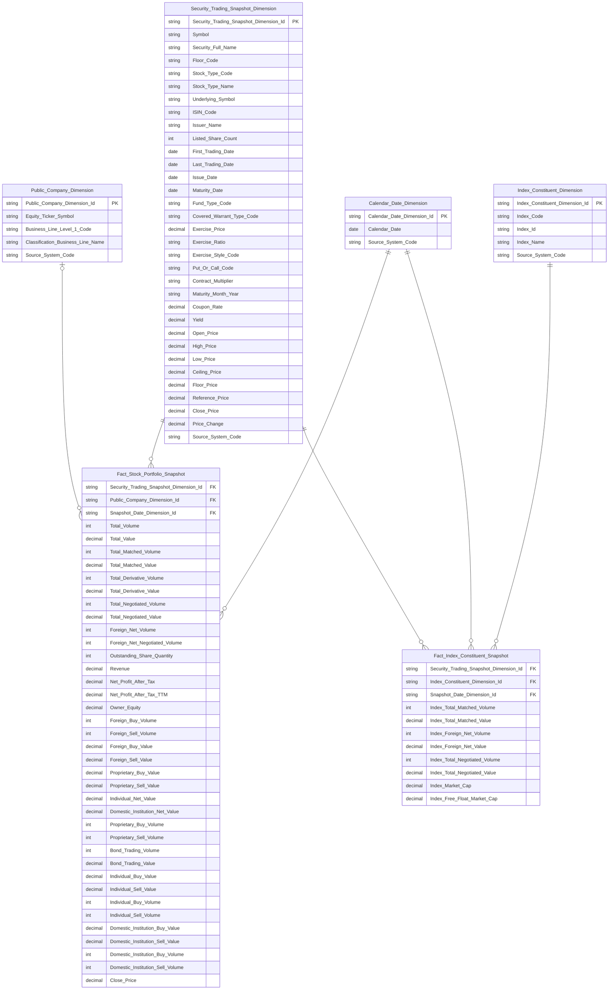
```mermaid
erDiagram
    Security_Trading_Snapshot_Dimension {
        string Security_Trading_Snapshot_Dimension_Id PK
        string Symbol
        string Security_Full_Name
        string Floor_Code
        string Stock_Type_Code
        string Stock_Type_Name
        string Underlying_Symbol
        string ISIN_Code
        string Issuer_Name
        int Listed_Share_Count
        date First_Trading_Date
        date Last_Trading_Date
        date Issue_Date
        date Maturity_Date
        string Fund_Type_Code
        string Covered_Warrant_Type_Code
        decimal Exercise_Price
        string Exercise_Ratio
        string Exercise_Style_Code
        string Put_Or_Call_Code
        string Contract_Multiplier
        string Maturity_Month_Year
        decimal Coupon_Rate
        decimal Yield
        decimal Open_Price
        decimal High_Price
        decimal Low_Price
        decimal Ceiling_Price
        decimal Floor_Price
        decimal Reference_Price
        decimal Close_Price
        decimal Price_Change
        string Source_System_Code
    }
    Public_Company_Dimension {
        string Public_Company_Dimension_Id PK
        string Equity_Ticker_Symbol
        string Business_Line_Level_1_Code
        string Classification_Business_Line_Name
        string Source_System_Code
    }
    Calendar_Date_Dimension {
        string Calendar_Date_Dimension_Id PK
        date Calendar_Date
        string Source_System_Code
    }
    Index_Constituent_Dimension {
        string Index_Constituent_Dimension_Id PK
        string Index_Code
        string Index_Id
        string Index_Name
        string Source_System_Code
    }
    Fact_Index_Constituent_Snapshot {
        string Security_Trading_Snapshot_Dimension_Id FK
        string Index_Constituent_Dimension_Id FK
        string Snapshot_Date_Dimension_Id FK
        int Index_Total_Matched_Volume
        decimal Index_Total_Matched_Value
        int Index_Foreign_Net_Volume
        decimal Index_Foreign_Net_Value
        int Index_Total_Negotiated_Volume
        decimal Index_Total_Negotiated_Value
        decimal Index_Market_Cap
        decimal Index_Free_Float_Market_Cap
    }
    Fact_Stock_Portfolio_Snapshot {
        string Security_Trading_Snapshot_Dimension_Id FK
        string Public_Company_Dimension_Id FK
        string Snapshot_Date_Dimension_Id FK
        int Total_Volume
        decimal Total_Value
        int Total_Matched_Volume
        decimal Total_Matched_Value
        int Total_Derivative_Volume
        decimal Total_Derivative_Value
        int Total_Negotiated_Volume
        decimal Total_Negotiated_Value
        int Foreign_Net_Volume
        int Foreign_Net_Negotiated_Volume
        int Outstanding_Share_Quantity
        decimal Revenue
        decimal Net_Profit_After_Tax
        decimal Net_Profit_After_Tax_TTM
        decimal Owner_Equity
        int Foreign_Buy_Volume
        int Foreign_Sell_Volume
        decimal Foreign_Buy_Value
        decimal Foreign_Sell_Value
        decimal Proprietary_Buy_Value
        decimal Proprietary_Sell_Value
        decimal Individual_Net_Value
        decimal Domestic_Institution_Net_Value
        int Proprietary_Buy_Volume
        int Proprietary_Sell_Volume
        int Bond_Trading_Volume
        decimal Bond_Trading_Value
        decimal Individual_Buy_Value
        decimal Individual_Sell_Value
        int Individual_Buy_Volume
        int Individual_Sell_Volume
        decimal Domestic_Institution_Buy_Value
        decimal Domestic_Institution_Sell_Value
        int Domestic_Institution_Buy_Volume
        int Domestic_Institution_Sell_Volume
        decimal Close_Price
    }
    Security_Trading_Snapshot_Dimension ||--o{ Fact_Stock_Portfolio_Snapshot : " "
    Public_Company_Dimension |o--o{ Fact_Stock_Portfolio_Snapshot : " "
    Calendar_Date_Dimension ||--o{ Fact_Stock_Portfolio_Snapshot : " "
    Security_Trading_Snapshot_Dimension ||--o{ Fact_Index_Constituent_Snapshot : " "
    Index_Constituent_Dimension ||--o{ Fact_Index_Constituent_Snapshot : " "
    Calendar_Date_Dimension ||--o{ Fact_Index_Constituent_Snapshot : " "
```

> **[SỬA 2026-09-14] Tách `Fact Index Constituent Snapshot` riêng (xem Cụm 1b, Section 1):** `Fact Stock Portfolio Snapshot` không còn FK `Index Constituent Dimension Id` — grain thuần mã CK × ngày. Nhu cầu phân tích theo rổ chỉ số (chọn 1 Chỉ số — K_GSTT_4; Bộ chỉ số thị trường/theo ngành — K_GSTT_62/63; SUM theo Index Code — K_GSTT_47-52/54/61) join qua `Fact Index Constituent Snapshot` (Factless, grain mã CK/rổ chỉ số/ngày) bằng `Symbol` + `Trading Date` — không còn rủi ro double-count trên các measure của `Fact Stock Portfolio Snapshot` vì Fact này không còn fan-out theo rổ chỉ số nữa.

**Lineage Mart → Báo cáo:**

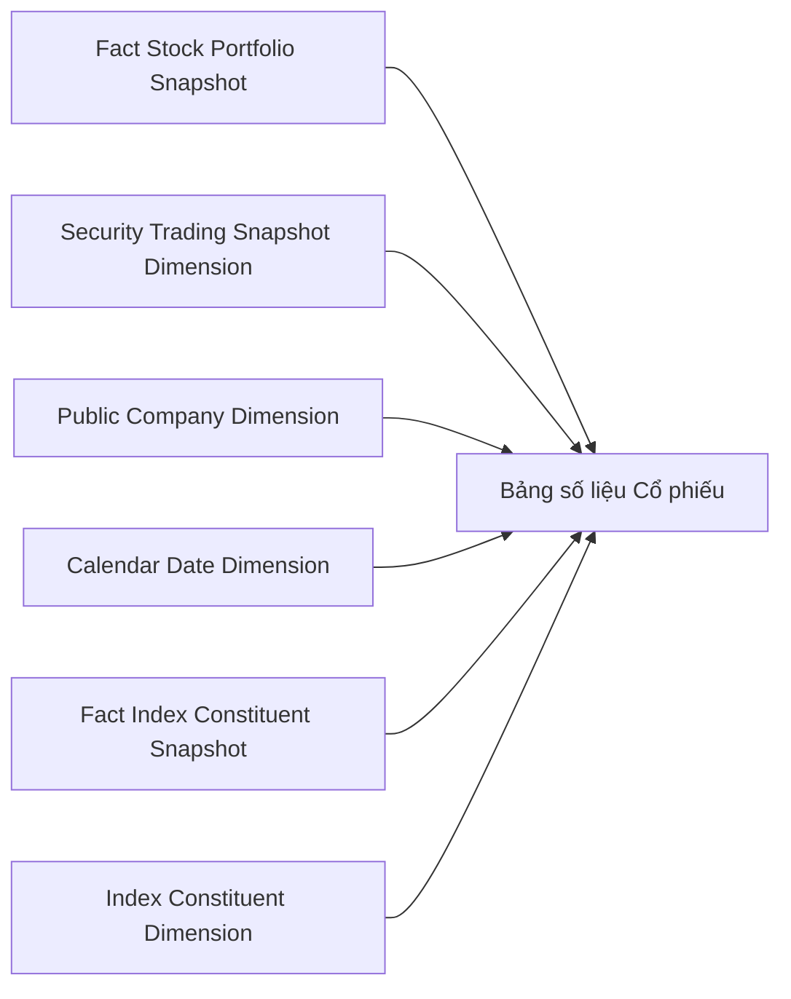
```mermaid
flowchart LR
    F1["Fact Stock Portfolio Snapshot"] --> RPT1["Bảng số liệu Cổ phiếu"]
    D1["Security Trading Snapshot Dimension"] --> RPT1
    D2["Public Company Dimension"] --> RPT1
    D3["Calendar Date Dimension"] --> RPT1
    F2["Fact Index Constituent Snapshot"] --> RPT1
    D4["Index Constituent Dimension"] --> RPT1
```

**Bảng grain:**

| Tên bảng | Grain |
|---|---|
| Fact Stock Portfolio Snapshot | 1 row / mã CK / ngày giao dịch |
| Security Trading Snapshot Dimension | 1 row / mã CK (SCD4A) |
| Public Company Dimension | 1 row / mã CK (SCD4A) |
| Calendar Date Dimension | 1 row / ngày |
| Fact Index Constituent Snapshot | 1 row / mã CK / rổ chỉ số / ngày giao dịch — Bridge + 8 measure tính sẵn theo Index+Date (lặp lại trên mọi dòng Symbol cùng rổ, sửa 2026-09-14) |
| Index Constituent Dimension | 1 row / Index Code (mô tả rổ chỉ số) |

> **Coverage rule (Bước 1a skill):** `Security Trading Snapshot Dimension` kéo dư thừa toàn bộ attribute hồ sơ mô tả chứng khoán từ `security_trading_snapshot` (Symbol, Security Full Name, Floor Code, Stock Type Code, Underlying Symbol, ISIN Code, Issuer Name, Listed Share Count, First/Last Trading Date, Issue Date, Maturity Date, Fund Type Code, Covered Warrant Type/Exercise Price/Ratio/Style Code, Put Or Call Code, Contract Multiplier, Maturity Month Year, Coupon Rate, Yield) — kể cả cột chưa cần cho Nhóm 1, để tránh phải bổ sung nhiều lần khi các Nhóm sau (Nhóm 2 — Trái phiếu, biểu đồ kỹ thuật, phái sinh...) cần đến. `Open Price`/`High Price`/`Low Price`/`Reference Price`/`Close Price`/`Price Change` giữ trên Dimension (không phải Fact) vì được dùng làm giá "hiện hành" hiển thị cùng hồ sơ mô tả — grain 1 row/mã CK snapshot ngày gần nhất (theo mockup BA), không phải để tính toán lịch sử theo nhiều ngày (bổ sung Open/High/Low tại Nhóm 3 theo coverage rule, cùng bản chất với Reference/Close/Change đã có ở Nhóm 1).
> **[SỬA 2026-09-14]** `Fact Stock Portfolio Snapshot` không còn fan-out theo rổ chỉ số (đã tách `Fact Index Constituent Snapshot` riêng, xem Cụm 1b) — measure trên Fact này (Total_Volume, Total_Value, Total_Derivative_Volume/Value, Total_Negotiated_Volume/Value, Foreign_Net_Volume...) nay đúng 1 giá trị/mã CK/ngày, không cần `SELECT DISTINCT` khi truy vấn không lọc theo Chỉ số.

---

#### Nhóm 2 - Bảng số liệu của trái phiếu

> **Phân loại:** Phân tích
> **Atomic:** `Security Trading Snapshot` ← MDDS.JAD_STOCKINFOR — **READY** (Nguồn 2, approved) / `Securities Trade` ← ORDERTRADE.TRADE_BOOK_HOSE, TRADE_BOOK_HNX — **READY** (Nguồn 2, approved)
>
> **Ghi chú nguồn (khác bản HLD cũ):** BA xác nhận trái phiếu niêm yết dùng **cùng** `MDDS.JAD_STOCKINFOR` với cổ phiếu (filter `Stock Type Code = '1'`), không phải entity riêng `MDDS.CorpBondInfor` như thiết kế trước — Note BA: "đổi lại do CorpBondInfor là trái phiếu riêng lẻ?". Do đó reuse toàn bộ `Fact Stock Portfolio Snapshot` + `Security Trading Snapshot Dimension` đã thiết kế ở Nhóm 1, không tạo Fact/Dimension riêng cho trái phiếu.

**Mockup:**

| Mã TP | Ngày | Giá TC | Giá ĐC | Giá mở cửa | Thay đổi | % TĐ | Ngày đáo hạn | KLGD | GTGD | YTM bình quân | Lãi suất |
|---|---|---|---|---|---|---|---|---|---|---|---|
| TCH2226 | 27/07/2026 | 102.5 | 103.0 | 102.8 | +0.5 | +0.49% | 15/03/2028 | 1.200 | 12.4 Tỷ | 6.8% | 7.2% |

**Source:** `Fact Stock Portfolio Snapshot` → `Security Trading Snapshot Dimension`, `Calendar Date Dimension`

**Bảng KPI:**

| KPI ID | Tên KPI | Đơn vị | Tính chất | Công thức | Ghi chú | Trạng thái |
|---|---|---|---|---|---|---|
| K_GSTT_20 | Mã trái phiếu | — | Chiều | `Security Trading Snapshot Dimension.Symbol` | Filter: `Stock Type Code = '1' AND Floor Code IN ('04','10','03','02')` | READY |
| K_GSTT_7 | Ngày | — | Chiều | `Calendar Date Dimension.Calendar Date` | Reuse từ Nhóm 1 | READY |
| K_GSTT_9 | Giá tham chiếu | VNĐ | Cơ sở | `Security Trading Snapshot Dimension.Reference Price` | Reuse từ Nhóm 1 | READY |
| K_GSTT_10 | Giá đóng cửa | VNĐ | Cơ sở | `Security Trading Snapshot Dimension.Close Price` | Reuse từ Nhóm 1 | READY |
| K_GSTT_21 | Giá mở cửa | VNĐ | Cơ sở | `Security Trading Snapshot Dimension.Open Price` | — | READY |
| K_GSTT_11 | Thay đổi (+/-) | VNĐ | Cơ sở | `Security Trading Snapshot Dimension.Price Change` | Reuse từ Nhóm 1 | READY |
| K_GSTT_22 | Ngày đáo hạn của trái phiếu | Ngày | Cơ sở | `Security Trading Snapshot Dimension.Maturity Date` | — | READY |
| K_GSTT_23 | KLGD khớp lệnh | Trái phiếu | Phái sinh | `SUM(Securities Trade.Execution Volume WHERE Market Id Code IN ('BDO','HCX') AND Board Type Code NOT IN ('T1','T2','T3','T4','T6','R1')) GROUP BY Symbol, Trade Date` | **[SỬA 2026-09-17, đồng bộ BA mới]** Đổi tên "KLGD"→"KLGD khớp lệnh" và đổi filter từ `IN ('G1','G2','G3','T1','T2','T3')` (trộn lẫn khớp lệnh+thỏa thuận) sang `NOT IN ('T1','T2','T3','T4','T6','R1')` (loại trừ thỏa thuận, cùng pattern K_GSTT_13/14 cổ phiếu) — BA STT 2 xác nhận rõ "KLGD khớp lệnh" (dòng con Done). Pre-aggregate — TP không có lô lẻ nên G4 không xuất hiện. Trái phiếu không xuất hiện trong nguồn `JAD_CSIDXINFOR` — không có row nào trên `Fact Index Constituent Snapshot` cho mã trái phiếu (không thuộc rổ chỉ số nào) | READY |
| K_GSTT_24 | GTGD khớp lệnh | VNĐ | Phái sinh | `SUM(Securities Trade.Execution Value WHERE Market Id Code IN ('BDO','HCX') AND Board Type Code NOT IN ('T1','T2','T3','T4','T6','R1')) GROUP BY Symbol, Trade Date` | **[SỬA 2026-09-17, đồng bộ BA mới]** Cùng lý do/filter K_GSTT_23. Pre-aggregate — cùng ghi chú FK NULL như K_GSTT_23 | READY |
| K_GSTT_25 | YTM bình quân | % | Cơ sở | `Security Trading Snapshot Dimension.Yield` | — | READY |
| K_GSTT_26 | Lãi suất | % | Cơ sở | `Security Trading Snapshot Dimension.Coupon Rate` | — | READY |

**Star Schema:** *(dùng chung `Fact Stock Portfolio Snapshot` + `Security Trading Snapshot Dimension` + `Calendar Date Dimension` đã vẽ ở Nhóm 1 — xem Nhóm 1 để có schema đầy đủ đã bổ sung `Coupon_Rate`, `Yield`. Trái phiếu không thuộc rổ chỉ số nào — không có row tương ứng trên `Fact Index Constituent Snapshot`.)*

**Lineage Mart → Báo cáo:**

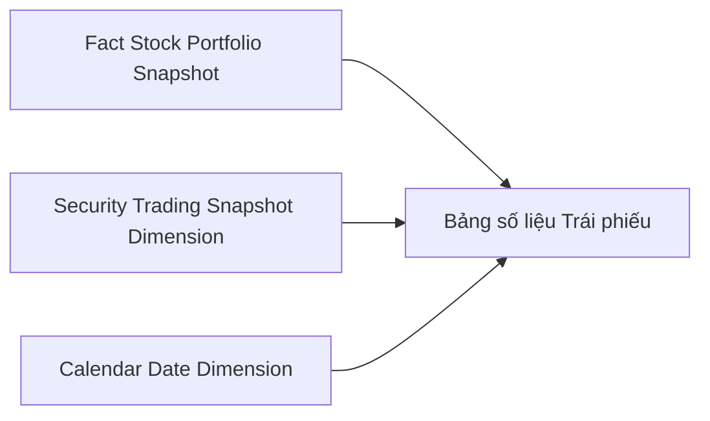
```mermaid
flowchart LR
    F1["Fact Stock Portfolio Snapshot"] --> RPT2["Bảng số liệu Trái phiếu"]
    D1["Security Trading Snapshot Dimension"] --> RPT2
    D3["Calendar Date Dimension"] --> RPT2
```

**Bảng grain:** *(giống Nhóm 1 — cùng Fact/Dimension, không grain riêng; trái phiếu không có row trên `Fact Index Constituent Snapshot`)*

---

#### Nhóm 3 - Biểu đồ kỹ thuật cổ phiếu

> **Phân loại:** Phân tích
> **Atomic:** `Security Trading Snapshot` ← MDDS.JAD_STOCKINFOR — **READY** (Nguồn 2, `design_status: approved` tại file LLD, 2026-07-03) / `Securities Trade` ← ORDERTRADE.TRADE_BOOK_HOSE, TRADE_BOOK_HNX — **READY** (Nguồn 2, approved) / `Public Company` ← IDS.COMPANY_PROFILES — **READY** (Nguồn 1, approved) / `Classification Business Line` ← ECAT.BUSINESS_LINE_LEVEL_1, BUSINESS_LINE_LEVEL_2 — **READY** (Nguồn 1, approved) / `Index Constituent Snapshot` ← MDDS.JAD_CSIDXINFOR — **READY** (Nguồn 2, approved)
>
> **Ghi chú tái sử dụng:** BA liệt kê 17 dòng con cho STT 3, nhưng 14/17 chỉ tiêu (Ngành, Sàn, Mã CK, Chỉ số, Loại phái sinh, Ngày, Giá đóng cửa, Giá tham chiếu, Thay đổi %, KLGD; riêng Phương thức khớp lệnh K_GSTT_6 đã DEPRECATED — loại bỏ) đã có KPI ID sẵn từ Nhóm 1/Nhóm 2 — reuse thẳng, không khai sinh KPI mới. Chỉ có 3 chỉ tiêu mới thật (Giá mở cửa, Giá cao nhất, Giá thấp nhất) — bổ sung 3 cột lên `Security Trading Snapshot Dimension` theo coverage rule. 2 chỉ tiêu còn lại (Doanh thu, Lợi nhuận sau thuế) cùng "Kỳ báo cáo" — xem ghi chú Dữ liệu động dưới đây.
> **Ghi chú Doanh thu/LNST/Kỳ báo cáo — Resolved 2026-08-26 (rule GSĐC):** Nguồn `IDS.data`/`report_catalog`/`rrow`/`rcol` (EAV báo cáo tài chính) nay truy vấn qua Atomic Nguồn 2: `public_company → pc_report_submission → fr_value → fr_catalog → fr_row_template → fr_column_template`. **[SỬA 2026-09-19, dev report SIT]** Chuỗi JOIN đã bỏ điều kiện `violation_report.base_dt` (sai ngữ nghĩa) — nay chốt đúng 1 báo cáo/kỳ (ưu tiên HN>TH>ME>RI, trùng lấy `submission_dt` mới nhất) rồi mới xếp hạng kỳ, xem chi tiết bên dưới. Doanh thu (`Revenue`, report_cd BCKQKD row_desc 10 DN/BH·03 TD)/LNST (`Net Profit After Tax`, row_desc 60 DN/BH·21 TD) là measure **bổ sung lên `Fact Stock Portfolio Snapshot` hiện có** (không tạo Fact riêng) — join qua FK `Public Company Dimension` đã có sẵn trên Fact. **[SỬA 2026-09-19, dev report SIT]** Doanh thu/LNST đổi từ công thức lùi-kỳ cứng theo lịch sang lấy kỳ QUÝ (1-4) gần nhất ĐÃ CÔNG BỐ tính đến ngày giao dịch (lookback, không rỗng vì kỳ lịch-lùi-1 chưa nộp); bỏ điều kiện `violation_report` (sai ngữ nghĩa — vi phạm CBTT không liên quan tới việc lấy số liệu đã duyệt); chốt đúng 1 báo cáo/kỳ (ưu tiên HN>TH>ME>RI) trước khi xếp hạng kỳ. `K_GSTT_30` (Kỳ báo cáo, hiển thị BI) giữ nguyên công thức lùi-kỳ cố định — đây là NHÃN HIỂN THỊ theo lịch, khác với kỳ DỮ LIỆU thực tế dùng để tính Doanh thu/LNST (nay là lookback); hai khái niệm có thể lệch nhau khi doanh nghiệp nộp trễ — cần lưu ý khi đối chiếu 2 cột trên BI.

**Mockup:**

| Mã CK | Ngành | Sàn | Chỉ số | Ngày | Giá mở | Giá cao | Giá thấp | Giá đóng | Giá TC | Thay đổi | % TĐ | KLGD | Doanh thu | LNST |
|---|---|---|---|---|---|---|---|---|---|---|---|---|---|---|
| GEX | Công nghiệp | HOSE | — | 11/05/2026 | 82.00 | 83.00 | 81.50 | 82.50 | 82.00 | +0.50 | +0.61% | 548 Tr | 3,276,672,448 | -15,609,651,666 |

**Source:** `Fact Stock Portfolio Snapshot` → `Security Trading Snapshot Dimension`, `Public Company Dimension`, `Calendar Date Dimension`, `Index Constituent Dimension`

**Bảng KPI:**

| KPI ID | Tên KPI | Đơn vị | Tính chất | Công thức | Ghi chú | Trạng thái |
|---|---|---|---|---|---|---|
| K_GSTT_2 | Ngành | — | Chiều | `Public Company Dimension.Business Line Level 1 Code`, `Classification Business Line Name` | Reuse từ Nhóm 1 | READY |
| K_GSTT_3 | Sàn | — | Chiều | `Security Trading Snapshot Dimension.Floor Code` | Reuse từ Nhóm 1 | READY |
| K_GSTT_1 | Mã CK | — | Chiều | `Security Trading Snapshot Dimension.Symbol` | Reuse từ Nhóm 1. BA lọc riêng "Mã CK cổ phiếu" (`Stock Type Code <> '1' AND Floor Code IN ('04','10','03','02') AND Market Id Code NOT IN ('BDO','HCX')`) — filter con của K_GSTT_1, không khai KPI mới | READY |
| K_GSTT_4 | Chỉ số | — | Chiều | `Index Constituent Dimension.Index Code` | Reuse từ Nhóm 1 | READY |
| K_GSTT_5 | Loại phái sinh | — | Chiều | `Security Trading Snapshot Dimension.Stock Type Code`, `Underlying Symbol` | Reuse từ Nhóm 1 | READY |
| K_GSTT_6 | Phương thức khớp lệnh (thỏa thuận) | — | Chiều | — | **[DEPRECATED 2026-09-08 — Loại bỏ]** Biểu đồ nến kỹ thuật (OHLC) và Volume chỉ sử dụng giao dịch khớp lệnh thực tế trên sàn (`total_vol` K_GSTT_13), không dùng giao dịch thỏa thuận | DEPRECATED |
| K_GSTT_7 | Ngày | — | Chiều | `Calendar Date Dimension.Calendar Date` | Reuse từ Nhóm 1 | READY |
| K_GSTT_27 | Giá mở cửa | VNĐ | Cơ sở | `Security Trading Snapshot Dimension.Open Price` | Mới — bổ sung cột lên Dimension theo coverage rule | READY |
| K_GSTT_28 | Giá cao nhất | VNĐ | Cơ sở | `Security Trading Snapshot Dimension.High Price` | Mới — bổ sung cột lên Dimension theo coverage rule | READY |
| K_GSTT_29 | Giá thấp nhất | VNĐ | Cơ sở | `Security Trading Snapshot Dimension.Low Price` | Mới — bổ sung cột lên Dimension theo coverage rule | READY |
| K_GSTT_10 | Giá đóng cửa | VNĐ | Cơ sở | `Security Trading Snapshot Dimension.Close Price` | Reuse từ Nhóm 1 | READY |
| K_GSTT_9 | Giá tham chiếu | VNĐ | Cơ sở | `Security Trading Snapshot Dimension.Reference Price` | Reuse từ Nhóm 1 | READY |
| K_GSTT_11 | Thay đổi (+/-) | VNĐ | Cơ sở | `Security Trading Snapshot Dimension.Price Change` | Reuse từ Nhóm 1 | READY |
| K_GSTT_13 | Khối lượng giao dịch khớp lệnh | Cổ phiếu | Phái sinh | `SUM(Securities Trade.Execution Volume WHERE Market Id Code IN ('UPX','STX','STK') AND Board Type Code NOT IN ('T1','T2','T3','T4','T6','R1')) GROUP BY Symbol, Trade Date` | **[SỬA 2026-09-16, đồng bộ theo BA mới]** Reuse từ Nhóm 1 — Nhóm 1 đã đổi nguồn `total_vol` → `total_matched_vol` (khớp lệnh thuần), Nhóm này tự nó đã đặt tên "khớp lệnh" từ trước nên khớp đúng định nghĩa mới, không cần đổi gì khác | READY |
| K_GSTT_30 | Kỳ báo cáo | — | Chiều | `CASE WHEN CEIL(MONTH(Calendar Date)/3.0)=1 THEN CONCAT(YEAR(Calendar Date)-1,'-Q4') ELSE CONCAT(YEAR(Calendar Date),'-Q',CEIL(MONTH(Calendar Date)/3.0)-1) END` | **Resolved 2026-08-26 — rule GSĐC.** Computed tại BI tier từ `Calendar Date` (`Ky_bao_cao`: quý hiện tại lùi 1 kỳ, lùi năm nếu Q1) — không lưu cột riêng trên Fact. **[SỬA 2026-09-19, dev report SIT]** Đây là NHÃN kỳ theo lịch (hiển thị), KHÔNG còn dùng chung logic chọn kỳ với Doanh thu/LNST nữa — Doanh thu/LNST (K_GSTT_31/32) nay lấy kỳ DỮ LIỆU thực tế gần nhất đã công bố (lookback), có thể khác kỳ lịch-lùi-1 hiển thị ở đây khi doanh nghiệp nộp trễ | READY |
| K_GSTT_31 | Doanh thu | VNĐ | Cơ sở | `Fact Stock Portfolio Snapshot.Revenue` | **Resolved 2026-08-26 — rule GSĐC.** Point-in-time theo kỳ báo cáo gần nhất đã công bố trước ngày giao dịch (K_GSTT_30) — join `public_company → pc_report_submission → fr_value → fr_catalog (BCKQKD, row_desc 10 DN/BH · 03 TD, col_desc 1) → fr_row_template → fr_column_template`, ưu tiên form HN>TH>ME>RI. Cột trên `Fact Stock Portfolio Snapshot`, join qua `Public Company Dimension` | READY |
| K_GSTT_32 | Lợi nhuận sau thuế | VNĐ | Cơ sở | `Fact Stock Portfolio Snapshot.Net Profit After Tax` | **Resolved 2026-08-26 — rule GSĐC.** Cùng cơ chế K_GSTT_31 (BCKQKD, row_desc 60 DN/BH · 21 TD, col_desc 1) | READY |

**Star Schema:** *(dùng chung `Fact Stock Portfolio Snapshot` + `Security Trading Snapshot Dimension` (đã bổ sung `Open_Price`, `High_Price`, `Low_Price`) + `Public Company Dimension` + `Calendar Date Dimension` + `Index Constituent Dimension` đã vẽ ở Nhóm 1 — xem Nhóm 1. K_GSTT_31/32 (Doanh thu, LNST) Resolved 2026-08-26 — `Revenue`/`Net Profit After Tax` đã có trên `Fact Stock Portfolio Snapshot`, không có bảng mới.)*

**Lineage Mart → Báo cáo:**

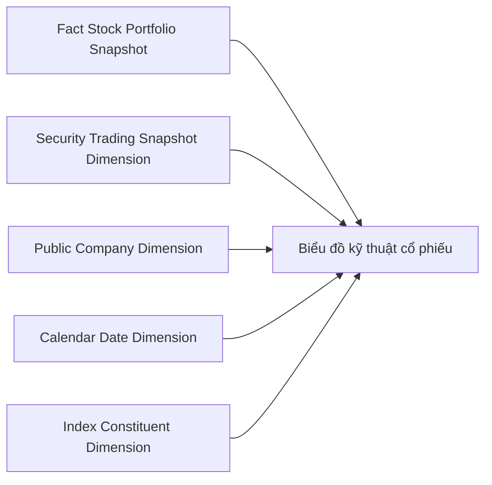
```mermaid
flowchart LR
    F1["Fact Stock Portfolio Snapshot"] --> RPT3["Biểu đồ kỹ thuật cổ phiếu"]
    D1["Security Trading Snapshot Dimension"] --> RPT3
    D2["Public Company Dimension"] --> RPT3
    D3["Calendar Date Dimension"] --> RPT3
    D4["Index Constituent Dimension"] --> RPT3
```

**Bảng grain:** *(giống Nhóm 1 — cùng Fact/Dimension, không grain riêng)*

---

#### Nhóm 4 - Biểu đồ kỹ thuật trái phiếu — ⚠️ ĐÃ BỎ (DEPRECATED 2026-09-17)

> **[DEPRECATED 2026-09-17 — theo yêu cầu trực tiếp user]** Dashboard "Danh mục trái phiếu theo biểu đồ kỹ thuật" (STT 4) không còn cần thiết kế — BA đã quyết định loại bỏ dashboard này. `BA_analyst_GSTT.csv` (STT 4, 10 dòng con) tại thời điểm sửa vẫn còn ghi `Trạng thái mapping = Done` (BA team chưa cập nhật lại CSV) — quyết định bãi bỏ ghi nhận trực tiếp từ user, không qua cập nhật CSV.
>
> 100% KPI của Nhóm này (K_GSTT_20, 7, 30, 27, 28, 29, 10, 9, 11, 23) đều reuse từ Nhóm 1/2/3 — không có Fact/Dimension/cột nào tạo riêng cho Nhóm 4, nên bãi bỏ không ảnh hưởng thiết kế các Nhóm khác (K_GSTT_23 v.v. vẫn READY cho Nhóm 2). Đã chuyển 10 dòng liên quan tại `DTM_GSTT_Detail_Mapping.csv` (`nhom = "Nhóm 4 - ..."`) sang `column_role = DEPRECATED` — không xóa hẳn để giữ vết lịch sử.

**Bảng KPI:**

| KPI ID | Tên KPI | Đơn vị | Tính chất | Công thức | Ghi chú | Trạng thái |
|---|---|---|---|---|---|---|
| K_GSTT_20 | Mã trái phiếu | — | Chiều | — | [DEPRECATED 2026-09-17] Dashboard bãi bỏ | DEPRECATED |
| K_GSTT_7 | Ngày | — | Chiều | — | [DEPRECATED 2026-09-17] Dashboard bãi bỏ | DEPRECATED |
| K_GSTT_30 | Kỳ báo cáo | — | Chiều | — | [DEPRECATED 2026-09-17] Dashboard bãi bỏ | DEPRECATED |
| K_GSTT_27 | Giá mở cửa | VNĐ | Cơ sở | — | [DEPRECATED 2026-09-17] Dashboard bãi bỏ | DEPRECATED |
| K_GSTT_28 | Giá cao nhất | VNĐ | Cơ sở | — | [DEPRECATED 2026-09-17] Dashboard bãi bỏ | DEPRECATED |
| K_GSTT_29 | Giá thấp nhất | VNĐ | Cơ sở | — | [DEPRECATED 2026-09-17] Dashboard bãi bỏ | DEPRECATED |
| K_GSTT_10 | Giá đóng cửa | VNĐ | Cơ sở | — | [DEPRECATED 2026-09-17] Dashboard bãi bỏ | DEPRECATED |
| K_GSTT_9 | Giá tham chiếu | VNĐ | Cơ sở | — | [DEPRECATED 2026-09-17] Dashboard bãi bỏ | DEPRECATED |
| K_GSTT_11 | Thay đổi (+/-) | VNĐ | Cơ sở | — | [DEPRECATED 2026-09-17] Dashboard bãi bỏ | DEPRECATED |
| K_GSTT_23 | Khối lượng giao dịch | Trái phiếu | Phái sinh | — | [DEPRECATED 2026-09-17] Dashboard bãi bỏ | DEPRECATED |

---

#### Nhóm 5 - Diễn biến chỉ số thị trường

> **Phân loại:** Phân tích
> **Atomic:** `Market Index Snapshot` ← MDDS.JAD_MARKETINFOR — **READY** (Nguồn 1, approved 2026-07-03) / `Index Constituent Snapshot` ← MDDS.JAD_CSIDXINFOR — **READY** (Nguồn 2, approved) / `Securities Trade` ← ORDERTRADE.TRADE_BOOK_HOSE, TRADE_BOOK_HNX — **READY** (Nguồn 2, approved)
>
> **Ghi chú tái sử dụng:** BA liệt kê 23 dòng con — 22 KPI khai sinh (K_GSTT_4, K_GSTT_33, K_GSTT_34–54), 1 dòng trùng ("Giá" = điểm chỉ số gần nhất trong ngày, trùng hoàn toàn K_GSTT_35, không khai KPI mới). `Market Index Dimension`/`Fact Market Index Snapshot` reuse + mở rộng từ QLKD (xem ghi chú Cụm 2a). "Số cổ phiếu lưu hành" và "Vốn hóa thị trường" (sub-row 22, 23) tham chiếu nguồn VSDC (báo cáo "BM 1_Báo cáo về khối lượng chứng khoán đang lưu hành") — **Resolved 2026-08-26**: `IDS.COMPANY_SHARE_STATISTICS` (`pc_share_statistics`) chỉ SCD4A current-state, nhưng có bảng lịch sử theo ngày `pc_share_statistics_hstr` (`ds_snpst_dt`) — xem O_GSTT_2.

**Mockup:**

| Chỉ số | Ngày | Giá ĐC | Giá cao | Giá thấp | Thay đổi | % TĐ | Mã tăng | Mã giảm | Mã đứng giá | Mã trần | Mã sàn | KLGD | GTGD | KLGD TT | GTGD TT | KLNN ròng | GTNN ròng | Vốn hóa TT |
|---|---|---|---|---|---|---|---|---|---|---|---|---|---|---|---|---|---|---|
| VN-Index | 27/07/2026 | 1,245.32 | 1,250.10 | 1,238.50 | +5.20 | +0.42% | 245 | 180 | 32 | 12 | 5 | 850 Tr | 18.5 Tỷ | 45 Tr | 1.2 Tỷ | +80 Tỷ | +120 Tỷ | 5,842,000,000,000,000 |

**Source:** `Fact Market Index Snapshot` → `Market Index Dimension`, `Calendar Date Dimension`; `Fact Market Index Intraday` → `Market Index Dimension`, `Calendar Date Dimension`; `Fact Stock Portfolio Snapshot` → `Security Trading Snapshot Dimension`, `Index Constituent Dimension` (K_GSTT_53/54 — Số cổ phiếu lưu hành/Vốn hóa thị trường, SUM cộng dồn theo Index Code)

**Bảng KPI:**

| KPI ID | Tên KPI | Đơn vị | Tính chất | Công thức | Ghi chú | Trạng thái |
|---|---|---|---|---|---|---|
| K_GSTT_4 | Chỉ số | — | Chiều | `Market Index Dimension.Index Name` | **Sửa nguồn hiển thị (2026-09-08):** Bản trước hiển thị `Market Code` (mã kỹ thuật do FSS tự quy định, VD "30", không đảm bảo khớp tên chuẩn) — đổi sang `Index Name` (`index_nm`, map trực tiếp từ `MDDS.JAD_MARKETINFOR.INDEXNAME`, đã có sẵn ở Atomic `market_index_snapshot.index_nm`) để hiển thị đúng tên chuẩn VN-Index/HNX-Index/UPCoM-Index/VN30... `Market Code` vẫn giữ nguyên làm khóa join/filter nội bộ cho K_GSTT_47–52 (`mapping(Market Code)`), không đổi cơ chế filter. Reuse cơ chế Chiều, khác Dimension với K_GSTT_4 gốc (Nhóm 1 dùng Index Constituent Dimension) — đây là chỉ số thị trường, không phải rổ thành viên. Xem ghi chú Index Code vs Market Code | READY |
| K_GSTT_33 | Ngày | — | Chiều | `Calendar Date Dimension.Calendar Date` | Reuse cơ chế, Fact khác Nhóm 1 | READY |
| K_GSTT_34 | Theo giờ trong ngày | — | Chiều | `Fact Market Index Intraday.Index Time` | Chiều slicer theo khung giờ trong ngày, gắn trực tiếp trên grain của `Fact Market Index Intraday`. Dùng kèm FK `Calendar Date Dimension` (K_GSTT_33, xác định qua `Market Index Snapshot.Trading Date`) để filter theo ngày trước khi khai thác chi tiết theo giờ — 2 chiều bổ trợ nhau, không thay thế | READY |
| K_GSTT_35 | Giá đóng cửa (điểm chỉ số) | Điểm | Cơ sở | `Fact Market Index Snapshot.Market Index Value` | Đã có sẵn ở Fact QLKD. BA có 1 dòng riêng "Giá" (điểm chỉ số gần nhất trong ngày, cùng logic `rn=1` theo `indexTime`) — trùng hoàn toàn K_GSTT_35, không khai KPI mới | READY |
| K_GSTT_36 | Giá cao nhất | Điểm | Cơ sở | `Fact Market Index Snapshot.High Index` | Mới — bổ sung cột (mở rộng Fact QLKD) | READY |
| K_GSTT_37 | Giá thấp nhất | Điểm | Cơ sở | `Fact Market Index Snapshot.Low Index` | Mới — bổ sung cột (mở rộng Fact QLKD) | READY |
| K_GSTT_38 | Thay đổi (+/-) | Điểm | Cơ sở | `Fact Market Index Snapshot.Index Change` | Mới — bổ sung cột (mở rộng Fact QLKD) | READY |
| K_GSTT_39 | % thay đổi | % | Phái sinh | `Fact Market Index Snapshot.Index Percent Change` | Mới — bổ sung cột (mở rộng Fact QLKD) | READY |
| K_GSTT_40 | Số lượng mã tăng | Mã | Cơ sở | `Fact Market Index Snapshot.Advances Count` | Mới — bổ sung cột (mở rộng Fact QLKD) | READY |
| K_GSTT_41 | Số lượng mã giảm | Mã | Cơ sở | `Fact Market Index Snapshot.Declines Count` | Mới — bổ sung cột (mở rộng Fact QLKD) | READY |
| K_GSTT_42 | Số lượng mã đứng giá | Mã | Cơ sở | `Fact Market Index Snapshot.No Change Count` | Mới — bổ sung cột (mở rộng Fact QLKD) | READY |
| K_GSTT_43 | Số lượng mã tăng trần | Mã | Cơ sở | `Fact Market Index Snapshot.Ceiling Count` | Mới — bổ sung cột (mở rộng Fact QLKD) | READY |
| K_GSTT_44 | Số lượng mã giảm sàn | Mã | Cơ sở | `Fact Market Index Snapshot.Floor Count` | Mới — bổ sung cột (mở rộng Fact QLKD) | READY |
| K_GSTT_45 | Giá trị GD theo realtime | VNĐ | Cơ sở | `Fact Market Index Intraday.Total Value At Time` | Grain riêng (1 row/Market Code/Index Time) — xem Fact Market Index Intraday bên dưới | READY |
| K_GSTT_46 | Điểm của chỉ số theo realtime | Điểm | Cơ sở | `Fact Market Index Intraday.Market Index Value At Time` | Grain riêng (1 row/Market Code/Index Time) — xem Fact Market Index Intraday bên dưới | READY |
| K_GSTT_47 | KLGD của chỉ số | Cổ phiếu | Phái sinh | `MAX(Fact Index Constituent Snapshot.Index Total Matched Volume) WHERE Index Code = mapping(Market Code) GROUP BY Index Code, Trade Date` (đã tính sẵn trên Bridge — sửa 2026-09-14 theo yêu cầu Design) [SỬA 2026-09-14, review sheet Tổng hợp công thức] Đổi tên cột + loại trừ thỏa thuận (Board Type NOT IN T1-T6/R1) — khác BA_analyst_GSTT.csv STT5 (không filter), Data Modeler xác nhận theo sheet Tổng hợp công thức. | Total Volume đã filter Market Id Code IN ('UPX','STX','STO') sẵn từ ETL populate Fact — chỉ cần join thêm qua `Fact Index Constituent Snapshot` (Bridge, Cụm 1b) theo Symbol; cần mapping Market Code↔Index Code, xem ghi chú Cụm 2. **[SỬA 2026-09-14]** Trước đây Symbol nằm trực tiếp trên Index Constituent Dimension — nay chuyển sang Fact Index Constituent Snapshot (Bridge) | READY |
| K_GSTT_48 | GTGD của chỉ số | VNĐ | Phái sinh | `MAX(Fact Index Constituent Snapshot.Index Total Matched Value) WHERE Index Code = mapping(Market Code) GROUP BY Index Code, Trade Date` (đã tính sẵn trên Bridge — sửa 2026-09-14 theo yêu cầu Design) [SỬA 2026-09-14, review sheet Tổng hợp công thức] Đổi tên cột + loại trừ thỏa thuận (Board Type NOT IN T1-T6/R1) — khác BA_analyst_GSTT.csv STT5 (không filter), Data Modeler xác nhận theo sheet Tổng hợp công thức. | Cùng ghi chú K_GSTT_47 | READY |
| K_GSTT_49 | KLNN ròng (theo chỉ số) | Cổ phiếu | Phái sinh | `MAX(Fact Index Constituent Snapshot.Index Foreign Net Volume) WHERE Index Code = mapping(Market Code) GROUP BY Index Code, Trade Date` (đã tính sẵn trên Bridge, gộp Mua ròng-Bán ròng — sửa 2026-09-14 theo yêu cầu Design) | Kỹ thuật đủ nguồn giống K_GSTT_47/48 (JOIN Index Constituent + Securities Trade) — thiết kế READY dù BA ghi "Chưa có CSDL - Map biểu mẫu" (đánh giá: đây là ghi chú BA chưa chốt biểu mẫu hiển thị, không phải thiếu nguồn) | READY |
| K_GSTT_50 | GTNN ròng (theo chỉ số) | VNĐ | Phái sinh | `MAX(Fact Index Constituent Snapshot.Index Foreign Net Value) WHERE Index Code = mapping(Market Code) GROUP BY Index Code, Trade Date` (đã tính sẵn trên Bridge, gộp Mua ròng-Bán ròng — sửa 2026-09-14 theo yêu cầu Design) | Cùng ghi chú K_GSTT_49 | READY |
| K_GSTT_51 | KLGD thỏa thuận (chỉ số) | Cổ phiếu | Phái sinh | `MAX(Fact Index Constituent Snapshot.Index Total Negotiated Volume) WHERE Index Code = mapping(Market Code) GROUP BY Index Code, Trade Date` (đã tính sẵn trên Bridge — sửa 2026-09-14 theo yêu cầu Design) | **Sửa nguồn (2026-08-20, BA cập nhật):** BA đổi từ cột snapshot có sẵn (`Market Index Snapshot.PT Total Volume`) sang tự tính từ sổ lệnh (`TRADE_BOOK_HOSE/HNX`), lọc `Board Type Code IN ('T1'..'T6')` (đối chiếu SQL BA: nhánh `tong_kl_tt`, KHÔNG dùng `tong_kl` — cột đó là của K_GSTT_47, không lọc Board Type). `Total Negotiated Volume` đã pre-tách sẵn điều kiện Board Type này từ ETL populate Fact (cùng nguồn K_GSTT_17 "Tổng KL thỏa thuận", Nhóm 1) — chỉ cần SUM cộng dồn qua `Fact Index Constituent Snapshot` (Bridge, **[SỬA 2026-09-14]** trước đây qua Index Constituent Dimension trực tiếp) để lấy theo Index Code (khác K_GSTT_17 group theo Symbol). Đặt trên `Fact Stock Portfolio Snapshot` (Nhóm 1) để nhất quán với K_GSTT_47/48, KHÔNG còn dùng `Fact Market Index Snapshot.PT Total Volume` — cột này trên Market Index Snapshot nay không còn KPI nào tham chiếu (xem ghi chú Fact Market Index Snapshot) | READY |
| K_GSTT_52 | GTGD thỏa thuận (chỉ số) | VNĐ | Phái sinh | `MAX(Fact Index Constituent Snapshot.Index Total Negotiated Value) WHERE Index Code = mapping(Market Code) GROUP BY Index Code, Trade Date` (đã tính sẵn trên Bridge — sửa 2026-09-14 theo yêu cầu Design) | Cùng ghi chú K_GSTT_51 (sửa nguồn 2026-08-20) — dùng `Total Negotiated Value`, cùng nguồn K_GSTT_18 | READY |
| K_GSTT_53 | Số cổ phiếu lưu hành | Cổ phiếu | Cơ sở | `Fact Stock Portfolio Snapshot.Outstanding Share Quantity` | **Resolved 2026-08-26, sửa lookback 2026-09-08, [SỬA NGUỒN 2026-09-16, xem O_GSTT_22].** Trùng K_GSTT_55 (Nhóm 6) — cùng 1 chỉ tiêu. Nguồn nay là `listed_share_info` (VSDC `outstanding_shares`, `src_stm_code='VSDC_OUTSTANDING_SHARES'`) — đổi từ `pc_share_statistics_hstr` (IDS) vì IDS không có dữ liệu hàng ngày cho HNX/UPCOM, gây NULL vốn hóa/P-E/P-B trên UAT. Lấy bản ghi gần nhất `<= Trading Date` (lookback, cùng pattern Free Float Share Quantity). Cột đặt trên `Fact Stock Portfolio Snapshot` (Nhóm 1, join qua Public Company Dimension), KHÔNG phải Fact Market Index Snapshot — measure này theo mã CK, không theo market_code | READY |
| K_GSTT_54 | Vốn hóa thị trường | VNĐ | Phái sinh | `MAX(Fact Index Constituent Snapshot.Index Market Cap) GROUP BY Index Code` (đã tính sẵn trên Bridge theo Giá đóng cửa × Số cổ phiếu lưu hành toàn rổ — sửa 2026-09-14 theo yêu cầu Design, không cần SUM lại) | **Resolved 2026-08-26** — K_GSTT_53 đã có nguồn. Trùng K_GSTT_61 (Nhóm 6) — cùng 1 chỉ tiêu. Công thức đặt trên `Fact Stock Portfolio Snapshot` (Nhóm 1), không phải Fact Market Index Snapshot — đã sửa lại ghi chú Fact đích cho nhất quán với Nhóm 6 (2026-07-27) | READY |

**Star Schema:**

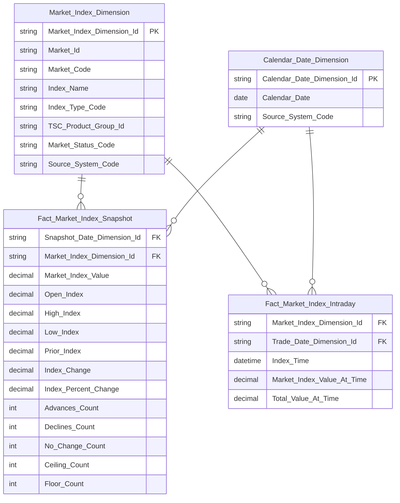
```mermaid
erDiagram
    Market_Index_Dimension {
        string Market_Index_Dimension_Id PK
        string Market_Id
        string Market_Code
        string Index_Name
        string Index_Type_Code
        string TSC_Product_Group_Id
        string Market_Status_Code
        string Source_System_Code
    }
    Calendar_Date_Dimension {
        string Calendar_Date_Dimension_Id PK
        date Calendar_Date
        string Source_System_Code
    }
    Fact_Market_Index_Snapshot {
        string Snapshot_Date_Dimension_Id FK
        string Market_Index_Dimension_Id FK
        decimal Market_Index_Value
        decimal Open_Index
        decimal High_Index
        decimal Low_Index
        decimal Prior_Index
        decimal Index_Change
        decimal Index_Percent_Change
        int Advances_Count
        int Declines_Count
        int No_Change_Count
        int Ceiling_Count
        int Floor_Count
    }
    Fact_Market_Index_Intraday {
        string Market_Index_Dimension_Id FK
        string Trade_Date_Dimension_Id FK
        datetime Index_Time
        decimal Market_Index_Value_At_Time
        decimal Total_Value_At_Time
    }
    Market_Index_Dimension ||--o{ Fact_Market_Index_Snapshot : " "
    Calendar_Date_Dimension ||--o{ Fact_Market_Index_Snapshot : " "
    Market_Index_Dimension ||--o{ Fact_Market_Index_Intraday : " "
    Calendar_Date_Dimension ||--o{ Fact_Market_Index_Intraday : " "
```

> **Fact Market Index Intraday có FK tới Calendar Date Dimension** — xác định qua `Market Index Snapshot.Trading Date` (`trading_dt`, nguồn `MDDS.JAD_MARKETINFOR`, data_domain Date, tách biệt với `Index Time` dạng Text) — cho phép filter/slicer theo ngày giao dịch trước khi phân tích chi tiết theo `Index Time` trong ngày đó.

**Lineage Mart → Báo cáo:**

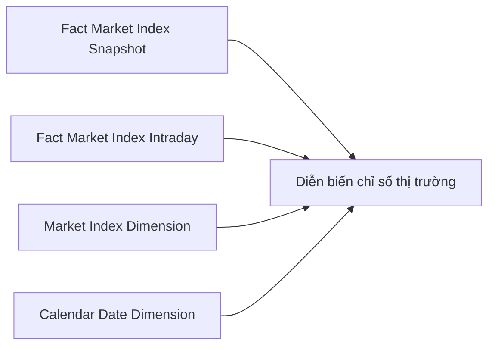
```mermaid
flowchart LR
    F1["Fact Market Index Snapshot"] --> RPT5["Diễn biến chỉ số thị trường"]
    F2["Fact Market Index Intraday"] --> RPT5
    D1["Market Index Dimension"] --> RPT5
    D2["Calendar Date Dimension"] --> RPT5
```

**Bảng grain:**

| Tên bảng | Grain |
|---|---|
| Fact Market Index Snapshot | 1 row / chỉ số thị trường (market_code) / ngày (bản ghi cuối phiên) — reuse + mở rộng từ QLKD |
| Fact Market Index Intraday | 1 row / chỉ số thị trường (market_code) / Index Time (theo phút, đúng nguồn) — có FK `Calendar Date Dimension` xác định qua `Trading Date` |
| Market Index Dimension | 1 row / combo (Market Id, Market Code) (SCD4A) — reuse từ QLKD |
| Calendar Date Dimension | 1 row / ngày |

> **Coverage rule:** Không áp dụng thêm cho `Market Index Dimension` (reuse nguyên trạng từ QLKD, không sửa cấu trúc Dimension). Coverage rule áp dụng cho `Fact Market Index Snapshot`: đã kéo đủ toàn bộ measure snapshot cuối ngày có thật trong Atomic `Market Index Snapshot` (Open/High/Low/Prior Index, Change, %Change, Advances/Declines/No Change/Ceiling/Floor Count) — không có measure nào trong Atomic entity này bị bỏ sót.
>
> **Sửa nguồn (2026-08-20):** Đã bỏ `PT_Total_Volume`/`PT_Total_Value` khỏi Fact này — K_GSTT_51/52 (KLGD/GTGD thỏa thuận) nay đổi nguồn sang aggregate từ `Fact Stock Portfolio Snapshot` (xem bảng KPI), không còn dùng cột snapshot trên `Fact Market Index Snapshot`. Cột Atomic `PT Total Volume/Value` gốc (`market_index_snapshot.pt_total_vol/val`) hiện không còn KPI nào trong module GSTT tham chiếu.
> **Sửa (2026-08-20, O_GSTT_13 Resolved):** Đã bỏ `Odd_Lot_Total_Volume`/`Odd_Lot_Total_Value` khỏi Fact này — không có Detail Mapping nào (mọi module) tham chiếu 2 cột này, không có căn cứ BA. Xem Section Vấn đề mở.

---

#### Nhóm 6 - Định giá thị trường

> **Phân loại:** Dashboard
> **Atomic:** `Security Trading Snapshot` ← MDDS.JAD_STOCKINFOR — **READY** (Nguồn 2, approved, reuse Nhóm 1) / `Public Company` ← IDS.COMPANY_PROFILES — **READY** (Nguồn 1, approved, reuse Nhóm 1) / `Classification Business Line` ← ECAT.BUSINESS_LINE_LEVEL_1, BUSINESS_LINE_LEVEL_2 — **READY** (Nguồn 1, approved, reuse Nhóm 1) / `Index Constituent Snapshot` ← MDDS.JAD_CSIDXINFOR — **READY** (Nguồn 2, approved, reuse Nhóm 1) / `Listed Share Info` ← VSDC `outstanding_shares` (`src_stm_code='VSDC_OUTSTANDING_SHARES'`) — **[SỬA 2026-09-16, xem O_GSTT_22]** đổi từ `Public Company Share Statistics`/`pc_share_statistics_hstr` (IDS) — IDS không có dữ liệu hàng ngày, gây NULL trên HNX/UPCOM / EAV báo cáo tài chính (`IDS.data`/`report_catalog`/`rrow`/`rcol` cho LNST/VCSH) — **Resolved 2026-08-26** theo rule GSĐC (join qua `public_company`/`pc_report_submission`/`fr_value`/`fr_catalog`/`fr_row_template`/`fr_column_template`, xem O_GSTT_1)
>
> **Ghi chú kiến trúc:** BA STT 6 gốc có 13 dòng con, dùng chung **1 Fact chính** — mở rộng `Fact Stock Portfolio Snapshot` (Nhóm 1, grain 1 row/mã CK/rổ chỉ số/ngày, đã có sẵn FK `Public Company Dimension`, `Index Constituent Dimension`, `Calendar Date Dimension`) cho 11/12 KPI. LNST/VCSH/Số cổ phiếu lưu hành đều link về Fact này qua `Public Company Dimension` (mã công ty) — đây là các measure THEO TỪNG MÃ, hiển thị đúng theo dòng Mã CK. **[SỬA 2026-09-22, datamart-review]** Riêng "Giá trị chỉ số" (K_GSTT_35) KHÔNG có measure tương ứng trên `Fact Stock Portfolio Snapshot`/`Fact Index Constituent Snapshot` — đây là điểm số do Sở GDCK công bố trực tiếp (không tính được bottom-up từ giá các mã thành viên như `idx_market_cap`/`idx_pe`), nên bắt buộc LOOKUP runtime sang `Fact Market Index Snapshot`/`Market Index Dimension` (QLKD) qua khóa `Market Index Dimension.Market Code = Index Constituent Dimension.Index Code` (xem Open Issue O_GSTT_3, phần đã Resolved một phần). Đây KHÔNG phải FK thiết kế sẵn trên Fact Stock Portfolio Snapshot — cùng cơ chế lookup runtime qua Symbol+Trading Date đã dùng cho K_GSTT_4/K_GSTT_62/63 (xem Cụm 1b).
> **[SỬA 2026-09-19, review Nhóm 6]** P/E/P/B/EPS/Vốn hóa thị trường **KHÔNG** tính theo từng mã CK — cột I (Độ chi tiết) của cả 4 dòng con này là `Danh mục chỉ số - theo giờ` (index-level), khác hẳn 10 Nhóm khác reuse cùng tên gọi "P/E/P/B/EPS thị trường" (Nhóm 7/9/11/13/15/17/19/21/34/35 — đã xác nhận Độ chi tiết = `Mã CK`/`Mã ck` ở toàn bộ 10 Nhóm đó, đúng công thức ratio từng mã `K_GSTT_58/59/60`). SQL tham khảo BA (dòng 96/98) tính đúng theo nguyên tắc "theo mã → SUM theo rổ": `Von_hoa_tung_ma` (Giá đóng cửa × Số CP lưu hành TỪNG MÃ) → `SUM(von_hoa của mã có LNST TTM)/SUM(LNST TTM)` GROUP BY Index Code + Date (P/E), tương tự cho P/B (VCSH) và EPS (`Tổng LNST/Tổng Số CP lưu hành` — xem O_GSTT_24). Do khác grain/công thức với `K_GSTT_58/59/60` (per-mã, dùng ở 10 Nhóm kia), Nhóm 6 dùng **KPI ID riêng K_GSTT_149/150/151**, tính sẵn trên `Fact Index Constituent Snapshot` (`idx_pe`/`idx_pb`/`idx_eps`) — cùng cơ chế SUM-rồi-broadcast đã dùng cho `idx_market_cap` (K_GSTT_61).
> **Sửa nguồn giá (khác SQL tham khảo BA):** SQL tham khảo của BA cho P/E/P/B/Vốn hóa dùng `marketIndex` (điểm chỉ số) làm giá theo mã CK — nhầm lẫn khái niệm (điểm chỉ số không phải giá cổ phiếu). Đã sửa dùng **Giá đóng cửa thật của từng mã CK** (K_GSTT_10) làm nguồn giá cho toàn bộ công thức P/E/P/B/Vốn hóa. Cần xác nhận lại với BA/nghiệp vụ trước khi lên LLD (xem O_GSTT_4).
> **[LOẠI BỎ 2026-09-11]** Chỉ tiêu "Ngành" (dòng con BA — `SELECT DISTINCT industry_cd, industry_name FROM IDS.categories`) đã bị loại khỏi Dashboard Định giá thị trường theo xác nhận trực tiếp — không còn hiển thị/filter theo Ngành ở Nhóm này nữa. BA_Valid Nhóm 6 giảm từ 13 → 12 dòng con. `K_GSTT_2` (Ngành) vẫn giữ nguyên, tiếp tục dùng ở Nhóm 1/3/7 — chỉ gỡ reference tại Nhóm 6.

**Mockup:**

> **[SỬA 2026-09-19]** `P/E`, `P/B`, `EPS`, `Vốn hóa TT` là chỉ tiêu **CỦA CẢ RỔ CHỈ SỐ** (K_GSTT_149/150/151/61) — giá trị lặp lại giống nhau trên MỌI dòng Mã CK thuộc cùng Chỉ số + Ngày (broadcast, không phải P/E riêng của VCB). `Giá đóng cửa`, `Số CP lưu hành`, `LNST`, `VCSH` mới là giá trị THEO TỪNG MÃ. `Giá trị chỉ số` cũng broadcast theo Chỉ số + Ngày (điểm số của cả rổ, không phải của riêng mã CK).

| Mã CK | sàn | Chỉ số | Ngày | Giá đóng cửa | Giá trị chỉ số | Số CP lưu hành | LNST | VCSH | P/E (của Chỉ số) | P/B (của Chỉ số) | EPS (của Chỉ số) | Vốn hóa TT (theo Chỉ số) |
|---|---|---|---|---|---|---|---|---|---|---|---|---|
| VCB | HOSE | VN30 | 27/07/2026 | 82.50 | 1,280.50 | 5,589,067,000 | 12,450,000,000 | 87,240,000,000 | 15.8 | 1.9 | 3,250 | 461,161,157,750,000 |
| ACB | HOSE | VN30 | 27/07/2026 | 24.10 | 1,280.50 | 3,860,000,000 | 6,200,000,000 | 41,500,000,000 | 15.8 | 1.9 | 3,250 | 461,161,157,750,000 |

**Source:** `Fact Stock Portfolio Snapshot` (mở rộng, Nhóm 1) → `Security Trading Snapshot Dimension`, `Public Company Dimension`, `Calendar Date Dimension`, `Index Constituent Dimension`; riêng K_GSTT_35 LOOKUP runtime sang `Fact Market Index Snapshot` + `Market Index Dimension` (reuse — sở hữu QLKD) qua khóa `Market Index Dimension.Market Code = Index Constituent Dimension.Index Code`.

**Bảng KPI:**

| KPI ID | Tên KPI | Đơn vị | Tính chất | Công thức | Ghi chú | Trạng thái |
|---|---|---|---|---|---|---|
| K_GSTT_4 | Chỉ số | — | Chiều | `Index Constituent Dimension.Index Code` | Reuse từ Nhóm 1 (không phải biến thể Market Index Dimension của Nhóm 5) | READY |
| K_GSTT_3 | sàn | — | Chiều | `Security Trading Snapshot Dimension.Floor Code` | Reuse từ Nhóm 1 | READY |
| K_GSTT_33 | Ngày | — | Chiều | `Calendar Date Dimension.Calendar Date` | Reuse từ Nhóm 1 | READY |
| K_GSTT_35 | Giá trị chỉ số | Điểm | Cơ sở | `LOOKUP Fact Market Index Snapshot ON Fact Market Index Snapshot.Market Index Dimension Id = Market Index Dimension.Market Index Dimension Id AND Market Index Dimension.Market Code = Index Constituent Dimension.Index Code AND Fact Market Index Snapshot.Snapshot Date Dimension Id = Calendar Date Dimension.Calendar Date Dimension Id → Fact Market Index Snapshot.Market Index Value` | **[SỬA 2026-09-22, datamart-review — hoàn thiện thiết kế]** Trước đây chỉ ghi `Fact Market Index Snapshot.Market Index Value` không kèm điều kiện JOIN — copy nhầm nguyên công thức của K_GSTT_35 ở Nhóm 5 (nơi grain trùng khớp tự nhiên với Fact Market Index Snapshot nên không cần JOIN), trong khi Nhóm 6 có grain khác (theo Index Code qua `Fact Stock Portfolio Snapshot`, không phải Market Code) — cùng loại lỗi Grain Mismatch như case K_GSTT_61. Đã bổ sung đúng khóa bridge `Market Index Dimension.Market Code = Index Constituent Dimension.Index Code` (nguồn `MDDS.JAD_MARKETINFOR.INDEXNAME`, xác nhận 2026-09-22) — giải quyết một phần Open Issue O_GSTT_3 (xem Section 5). Giá trị LẶP LẠI trên mọi dòng Mã CK cùng Chỉ số + Ngày (broadcast, giống K_GSTT_149-151/61). | READY |
| K_GSTT_10 | Giá đóng cửa | VNĐ | Cơ sở | `Security Trading Snapshot Dimension.Close Price` | Reuse từ Nhóm 1 — dòng con này của BA cùng công thức với "Giá trị chỉ số" ở trên (cả 2 cùng tham chiếu `marketIndex` gốc), không khai KPI mới | READY |
| K_GSTT_55 | Số cổ phiếu đang lưu hành | Cổ phiếu | Cơ sở | `Fact Stock Portfolio Snapshot.Outstanding Share Quantity` | **Resolved 2026-08-26, sửa lookback 2026-09-08, [SỬA NGUỒN 2026-09-16, xem O_GSTT_22].** Nguồn VSDC "BM 1_Báo cáo về khối lượng chứng khoán đang lưu hành" — nay lấy trực tiếp qua `listed_share_info` (`outstanding_shares`, `src_stm_code='VSDC_OUTSTANDING_SHARES'`, cùng nguồn với `Free Float Share Quantity`), thay cho `pc_share_statistics_hstr` (IDS) trước đây — IDS chỉ báo cáo theo quý/năm, không có biến động hàng ngày và chưa đồng bộ cho HNX/UPCOM trên UAT, khiến cột bị NULL 100% và kéo theo Vốn hóa/P-E/P-B bị NULL/0 (phát hiện qua review thực tế UAT, xem O_GSTT_22). Lấy bản ghi gần nhất `<= Trading Date` (lookback — tránh NULL khi NSD chọn ngày không phải ngày giao dịch). Cột trên `Fact Stock Portfolio Snapshot`, join qua `Public Company Dimension` | READY |
| K_GSTT_56 | LNST | VNĐ | Cơ sở | `Fact Stock Portfolio Snapshot.Net Profit After Tax` | **Resolved 2026-08-26 — rule GSĐC.** Point-in-time theo kỳ QUÝ (1-4) gần nhất ĐÃ CÔNG BỐ tính đến ngày giao dịch (lookback, **[SỬA 2026-09-19, dev report SIT]** bỏ công thức lùi-kỳ cứng theo lịch) — join `public_company → pc_report_submission → fr_value → fr_catalog (BCKQKD, row_desc 60 DN/BH · 21 TD, col_desc 1) → fr_row_template → fr_column_template`, chốt đúng 1 báo cáo/kỳ trước khi xếp hạng (ưu tiên HN>TH>ME>RI, trùng lấy `submission_dt` mới nhất). **[SỬA 2026-09-19, dev report SIT]** Đã bỏ điều kiện `violation_report` (sai ngữ nghĩa). Cột trên `Fact Stock Portfolio Snapshot`, join qua `Public Company Dimension`. Khác `Net Profit After Tax TTM` (dùng riêng cho P/E/EPS, xem K_GSTT_58/60) | READY |
| K_GSTT_57 | VCSH | VNĐ | Cơ sở | `Fact Stock Portfolio Snapshot.Owner Equity` | **Resolved 2026-08-26 — rule GSĐC.** Lấy kỳ gần nhất đã công bố tính đến ngày giao dịch (BCDKT, row_desc 400 DN/BH · 500 TD, col_desc 1) — lookback theo `submission_dt` thực tế (KHÔNG ép theo lịch `Ky_bao_cao` cố định như Doanh thu/LNST, và KHÔNG giới hạn quý 1-4 — chấp nhận cả kỳ bán niên/cả năm làm số liệu "gần nhất", vì VCSH là chỉ tiêu tại một thời điểm, không theo chu kỳ báo cáo cố định). **[SỬA 2026-09-19, dev report SIT]** Bỏ điều kiện `violation_report` (sai ngữ nghĩa) và bỏ điều kiện ẩn `CASE WHEN rpt_quarter=1..4 THEN ngày cuối quý END <= trading_dt` — CASE không ELSE khiến kỳ 5/6 luôn bị loại do NULL, VÔ TÌNH mâu thuẫn với chủ đích "không giới hạn quý" đã ghi ở trên; nay chỉ còn `submission_dt <= trading_dt` làm điều kiện thời gian. Chốt đúng 1 báo cáo/kỳ trước khi xếp hạng (ưu tiên HN>TH>ME>RI). Cột trên `Fact Stock Portfolio Snapshot`, join qua `Public Company Dimension` | READY |
| K_GSTT_149 | P/E thị trường | Lần | Chỉ tiêu phái sinh | `MAX(Fact Index Constituent Snapshot.Index PE) GROUP BY Index Code` (tính sẵn trên Bridge — `idx_pe` = SUM(Vốn hóa TOÀN BỘ mã trong rổ)/SUM(LNST TTM từng mã) GROUP BY Index Code + Date, cùng cơ chế `idx_market_cap`) | **[SỬA 2026-09-19, review Nhóm 6]** Tách khỏi `K_GSTT_58` (P/E TỪNG MÃ, dùng cho Nhóm 7/9/11/13/15/17/19/21/34/35 — Độ chi tiết `Mã CK`) — Nhóm 6 có Độ chi tiết `Danh mục chỉ số - theo giờ` (index-level) + SQL tham khảo BA dùng SUM/SUM GROUP BY marketCode, không phải ratio từng mã. **[SỬA 2026-09-19, theo yêu cầu trực tiếp]** Bỏ điều kiện lọc "chỉ tính vốn hóa của mã CÓ LNST TTM" ở tử số — nay tử số là tổng vốn hóa CẢ RỔ không điều kiện; mẫu số vẫn chỉ cộng LNST TTM của mã nào có dữ liệu (NULL tự động bị SUM bỏ qua). GIÁ TRỊ LẶP LẠI trên mọi dòng Symbol cùng Index+Date | READY |
| K_GSTT_150 | P/B thị trường | Lần | Chỉ tiêu phái sinh | `MAX(Fact Index Constituent Snapshot.Index PB) GROUP BY Index Code` (tính sẵn trên Bridge — `idx_pb` = SUM(Vốn hóa TOÀN BỘ mã trong rổ)/SUM(VCSH từng mã) GROUP BY Index Code + Date) | **[SỬA 2026-09-19, review Nhóm 6]** Tách khỏi `K_GSTT_59` (P/B TỪNG MÃ) — cùng lý do K_GSTT_149. **[SỬA 2026-09-19, theo yêu cầu trực tiếp]** Bỏ điều kiện lọc "chỉ tính vốn hóa của mã CÓ VCSH" ở tử số — cùng lý do K_GSTT_149 | READY |
| K_GSTT_151 | EPS thị trường | VNĐ | Chỉ tiêu phái sinh | `MAX(Fact Index Constituent Snapshot.Index EPS) GROUP BY Index Code` (tính sẵn trên Bridge — `idx_eps` = SUM(LNST TTM)/SUM(Số CP lưu hành) GROUP BY Index Code + Date, KHÔNG lọc mã thiếu LNST TTM ở mẫu số — xem O_GSTT_24) | **[SỬA 2026-09-19, review Nhóm 6]** Tách khỏi `K_GSTT_60` (EPS TỪNG MÃ) — cùng lý do K_GSTT_149. SQL tham khảo BA cho dòng EPS là bản sao SQL P/E/P/B, chưa có công thức EPS riêng — xem O_GSTT_24 | READY |
| K_GSTT_61 | Vốn hóa thị trường | VNĐ | Chỉ tiêu phái sinh | `MAX(Fact Index Constituent Snapshot.Index Market Cap) GROUP BY Index Code` (đã tính sẵn trên Bridge — K_GSTT_10 (Giá đóng cửa) × K_GSTT_55 (Số CP lưu hành) gộp sẵn thành `idx_market_cap`, không cần SUM lại — sửa 2026-09-14 theo yêu cầu Design) | **Resolved 2026-08-26** — K_GSTT_55 đã có nguồn. Trùng công thức K_GSTT_54 (Nhóm 5) — cùng 1 chỉ tiêu "Vốn hóa thị trường"; cả 2 đều đặt đúng trên `Fact Stock Portfolio Snapshot` (đã sửa lại Nhóm 5 để nhất quán, không phải Fact Market Index Snapshot) | READY |

**Star Schema:** Không có bảng mới — 100% reuse `Fact Stock Portfolio Snapshot` (đã có FK `Public Company Dimension`, `Index Constituent Dimension`, `Calendar Date Dimension`, `Security Trading Snapshot Dimension` từ Nhóm 1) cho 11/12 KPI. **Sửa 2026-08-26:** `Revenue`, `Net Profit After Tax`, `Net Profit After Tax TTM`, `Owner Equity` (rule GSĐC — O_GSTT_1) và `Outstanding Share Quantity` (`pc_share_statistics_hstr` — O_GSTT_2) đều đã Resolved. Toàn bộ 12/12 KPI Nhóm 6 nay READY (loại "Ngành" — xem ghi chú [LOẠI BỎ 2026-09-11] ở đầu Nhóm). Xem erDiagram tại Nhóm 1. **[SỬA 2026-09-22]** K_GSTT_35 là ngoại lệ duy nhất — không đặt trên `Fact Stock Portfolio Snapshot`, LOOKUP runtime sang `Fact Market Index Snapshot`/`Market Index Dimension` (reuse — sở hữu QLKD, erDiagram xem Cụm 2a `DTM_QLKD_HLD.md` hoặc Cụm 2, Nhóm 5 module này) qua khóa `Market Index Dimension.Market Code = Index Constituent Dimension.Index Code` — không phải FK cố định thiết kế sẵn trên Fact, không cần thêm cột/FK mới trên `Fact Stock Portfolio Snapshot`.

**Lineage Mart → Báo cáo:**

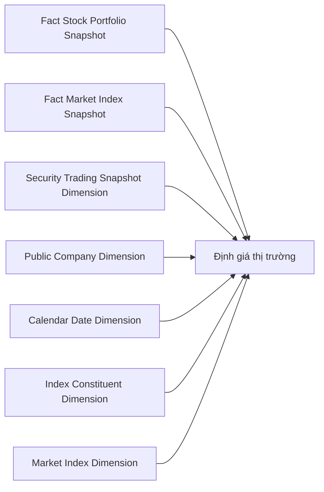
```mermaid
flowchart LR
    F1["Fact Stock Portfolio Snapshot"] --> RPT6["Định giá thị trường"]
    F2["Fact Market Index Snapshot"] --> RPT6
    D1["Security Trading Snapshot Dimension"] --> RPT6
    D2["Public Company Dimension"] --> RPT6
    D3["Calendar Date Dimension"] --> RPT6
    D4["Index Constituent Dimension"] --> RPT6
    D5["Market Index Dimension"] --> RPT6
```

**Bảng grain:** Không có bảng mới — cùng grain `Fact Stock Portfolio Snapshot` (1 row/mã CK/rổ chỉ số/ngày) đã có ở Nhóm 1 cho 11/12 KPI. **Sửa 2026-08-26:** `Revenue`, `Net Profit After Tax`, `Net Profit After Tax TTM`, `Owner Equity` (rule GSĐC), `Outstanding Share Quantity` (`pc_share_statistics_hstr`) đều đã Resolved, bổ sung lên đúng Fact này cùng grain — không còn cột PENDING nào trong Nhóm 6. **[SỬA 2026-09-22]** K_GSTT_35 lookup từ `Fact Market Index Snapshot` (`fct_market_index_snpst`, reuse — sở hữu QLKD) — grain 1 row/market_code/ngày, broadcast xuống grain Nhóm 6 qua khóa Market Code = Index Code (không làm thay đổi grain vật lý của `Fact Stock Portfolio Snapshot`).

> **Coverage rule:** Không áp dụng thêm cho Dimension nào (toàn bộ reuse nguyên trạng từ Nhóm 1). 5 measure mới (Revenue, Net Profit After Tax, Net Profit After Tax TTM, Owner Equity, Outstanding Share Quantity) đã bổ sung đủ lên `Fact Stock Portfolio Snapshot` — theo đúng nguyên tắc measure đặt tại true grain (mã CK/ngày), không tạo Fact riêng.

---

#### Nhóm 7 - Top khối lượng theo sàn, Bộ chỉ số tài chính, Bộ chỉ số ngành (bảng số liệu)

> **Phân loại:** Dashboard
> **Atomic:** 100% reuse Nhóm 1 (`Security Trading Snapshot`, `Securities Trade`, `Public Company`, `Classification Business Line`) + Nhóm 6 (`Public Company Share Statistics` Resolved 2026-08-26, sửa nguồn 2026-09-16 (`listed_share_info`, xem O_GSTT_2 + O_GSTT_22), EAV IDS Resolved 2026-08-26 (rule GSĐC, xem O_GSTT_1)) — không có nguồn mới.
>
> **Ghi chú tái sử dụng:** BA liệt kê 15 dòng con — 13 dòng đã có KPI ID sẵn từ Nhóm 1 (Mã CK, Sàn, Ngành, Ngày, KLGD, Giá, % thay đổi) và Nhóm 6 (Số CP lưu hành, Vốn hóa, LNST, P/E, VCSH, P/B) — reuse thẳng, không khai sinh KPI mới. Còn 2 dòng ("Bộ chỉ số thị trường", "Bộ chỉ số theo ngành") là 2 chỉ tiêu độc lập, khai sinh mới — xem ghi chú dưới đây.
> **Ghi chú "Bộ chỉ số thị trường"/"Bộ chỉ số theo ngành" (K_GSTT_62–63):** BA xác nhận cột nguồn thật là `Index Constituent Dimension.Index Code` (cùng cột vật lý với K_GSTT_4 — Chỉ số, Nhóm 1), nguồn `MDDS.JAD_CSIDXINFOR.INDEXCODE` — **không phải `Floor Code`** như bản thiết kế trước. Tuy dùng chung 1 cột vật lý, đây là 2 chỉ tiêu nghiệp vụ khác K_GSTT_4 (Chỉ số — chọn 1 rổ chỉ số cụ thể để lọc) và khác nhau: "Bộ chỉ số thị trường" (K_GSTT_62) = `Index Code IN ('HOSE','UPCOM','HNX')`; "Bộ chỉ số theo ngành" (K_GSTT_63) = `Index Code NOT IN ('HOSE','UPCOM','HNX')` (VD: VN30, HNX30...) — 2 slicer phân loại khác nhau trên dashboard, không phải cùng 1 khái niệm. Khai 2 KPI_ID mới, không thêm Fact/FK/Dimension (cùng dùng `Index Constituent Dimension` đã có). Đã cân nhắc phương án thêm FK mới `Fact Stock Portfolio Snapshot → Market Index Dimension` nhưng xác nhận không có join key Symbol↔Market Code trong Atomic hiện có (`Market Index Snapshot` không có attribute Symbol) — dùng thẳng `Index Constituent Dimension` sẵn có là đúng, không cần FK mới.
> **Ghi chú lịch sử renumber (2026-07-28):** 2 chỉ tiêu này ban đầu được khai sinh muộn (phát hiện sau khi Phase 2 đã hoàn tất tới Nhóm 37) và tạm gán ID K_GSTT_119/120 làm ngoại lệ ngoài thứ tự. Toàn bộ module đã được đánh số lại liên tục từ K_GSTT_1 theo đúng thứ tự Nhóm xuất hiện — 2 chỉ tiêu này nay có ID chính thức K_GSTT_62/63, nằm đúng vị trí tự nhiên ngay sau Nhóm 6 (K_GSTT_61). Không còn ngoại lệ về thứ tự ID trong toàn bộ HLD.
> **[SỬA 2026-09-07 — Kịch bản B, theo Note nghiệp vụ "UB_Phạm vi phân tích"]** BA/nghiệp vụ xác nhận nhóm dashboard "Top" (Nhóm 7-22, trừ Nhóm 9/10 — xem ghi chú riêng) có filter khoảng ngày (Từ ngày → Đến ngày), và KLGD/GTGD/KLNN ròng phải là **tổng cộng dồn trong khoảng đó**, không phải giá trị 1 ngày đơn như thiết kế cũ. Khai sinh K_GSTT_133 (KLGD range) + K_GSTT_139 (Từ ngày, chiều mới) tại Nhóm này — nguồn gốc cho toàn bộ Nhóm 8/11-22 reuse. K_GSTT_7 (Ngày) giữ nguyên ID/công thức, đổi tên hiển thị thành "Đến ngày" trong các Nhóm này. Giá/% thay đổi/Vốn hóa/LNST/P-E/P-B **không đổi** — vẫn là giá trị "tại Đến ngày" (snapshot), đúng theo Note nghiệp vụ.

**Mockup:**

| Mã CK | Sàn | Bộ chỉ số ngành | Ngành | Từ ngày | Đến ngày | KLGD | Giá | % thay đổi | Số CP lưu hành | Vốn hóa | LNST | P/E | VCSH | P/B |
|---|---|---|---|---|---|---|---|---|---|---|---|---|---|---|
| VCB | HOSE | VN30 | Ngân hàng | 01/07/2026 | 27/07/2026 | 8.2 Tỷ | 82.50 | +0.61% | *(pending)* | *(pending)* | *(pending)* | *(pending)* | *(pending)* | *(pending)* |

**Source:** `Fact Stock Portfolio Snapshot` → `Security Trading Snapshot Dimension`, `Public Company Dimension`, `Calendar Date Dimension`, `Index Constituent Dimension` — 100% reuse, Top-N theo KLGD (tổng khoảng ngày) tại tầng BI.

**Bảng KPI:**

| KPI ID | Tên KPI | Đơn vị | Tính chất | Công thức | Ghi chú | Trạng thái |
|---|---|---|---|---|---|---|
| K_GSTT_1 | Mã CK | — | Chiều | `Security Trading Snapshot Dimension.Symbol` | Reuse từ Nhóm 1 | READY |
| K_GSTT_3 | Sàn | — | Chiều | `Security Trading Snapshot Dimension.Floor Code` | Reuse từ Nhóm 1 | READY |
| K_GSTT_11 | Thay đổi giá (+/-) | VNĐ | Cơ sở | `Security Trading Snapshot Dimension.Price Change` | [SỬA 2026-09-23, rà soát BA↔DM] Reuse từ Nhóm 1 — BA dòng 109 "Thay đổi giá (+/-)" (Trường nguồn `change`) bị bỏ sót trước đây | READY |
| K_GSTT_62 | Bộ chỉ số thị trường | — | Chiều | `Index Constituent Dimension.Index Code` | Mới — cùng cột vật lý K_GSTT_4 (Chỉ số, Nhóm 1) nhưng khác chỉ tiêu nghiệp vụ: `Index Code IN ('HOSE','UPCOM','HNX')`. **[SỬA 2026-09-14]** Filter qua `Fact Index Constituent Snapshot` (Bridge, Cụm 1b) cùng cơ chế K_GSTT_4 — không còn FK cố định trên Fact | READY |
| K_GSTT_63 | Bộ chỉ số theo ngành | — | Chiều | `Index Constituent Dimension.Index Code` | Mới — cùng cột vật lý K_GSTT_4, khác chỉ tiêu nghiệp vụ: `Index Code NOT IN ('HOSE','UPCOM','HNX')` (VD: VN30, HNX30...). **[SỬA 2026-09-14]** Filter qua `Fact Index Constituent Snapshot` (Bridge, Cụm 1b) cùng cơ chế K_GSTT_4 — không còn FK cố định trên Fact | READY |
| K_GSTT_2 | Ngành | — | Chiều | `Public Company Dimension.Business Line Level 1 Code`, `Classification Business Line Name` | Reuse từ Nhóm 1 | READY |
| K_GSTT_139 | Từ ngày | — | Chiều | `Calendar Date Dimension.Calendar Date` | **[MỚI 2026-09-07]** Chiều lọc đầu khoảng ngày — dùng chung `Calendar Date Dimension`, vai trò filter khác K_GSTT_7 (điểm neo range, không phải FK grain riêng) | READY |
| K_GSTT_7 | Đến ngày | — | Chiều | `Calendar Date Dimension.Calendar Date` | **[SỬA 2026-09-07]** Đổi tên hiển thị từ "Ngày" — công thức/ID không đổi. Đóng vai trò mốc cuối khoảng ngày + ngày snapshot cho Giá/Vốn hóa/LNST/P-E/P-B | READY |
| K_GSTT_133 | KLGD khớp lệnh | Cổ phiếu | Phái sinh | `SUM(Securities Trade.Execution Volume) WHERE Trade Date BETWEEN :from_date AND :to_date AND Board Type Code NOT IN ('T1','T2','T3','T4','T6','R1') GROUP BY Symbol` | **[MỚI 2026-09-07]** Thay K_GSTT_13 (1 ngày) — tổng KLGD trong khoảng Từ ngày-Đến ngày, đã bao gồm filter Market Id Code IN ('UPX','STX','STO') kế thừa từ K_GSTT_13. Dùng làm tiêu chí sắp xếp Top-N | READY |
| K_GSTT_10 | Giá | VNĐ | Cơ sở | `Security Trading Snapshot Dimension.Close Price` | Reuse từ Nhóm 1 (K_GSTT_10 = Giá đóng cửa) | READY |
| K_GSTT_12 | % thay đổi | % | Phái sinh | `Price Change / Reference Price × 100` | Reuse từ Nhóm 1 | READY |
| K_GSTT_55 | Số cổ phiếu đang lưu hành | Cổ phiếu | Cơ sở | `Fact Stock Portfolio Snapshot.Outstanding Share Quantity` | Reuse từ Nhóm 6 — Resolved 2026-08-26, sửa nguồn 2026-09-16 (`listed_share_info`, xem O_GSTT_2 + O_GSTT_22) | READY |
| K_GSTT_61 | Vốn hóa | VNĐ | Chỉ tiêu phái sinh | `MAX(K_GSTT_10 (Giá đóng cửa) × K_GSTT_55 (Số CP lưu hành)) GROUP BY Symbol, Trade Date` (Vốn hóa TỪNG MÃ CK, không phải theo Index — sửa 2026-09-14, phát hiện qua review Data Modeler: bảng Top-N theo mã CK không phải theo rổ chỉ số, cùng pattern Nhóm 23) | Reuse từ Nhóm 6 — Resolved 2026-08-26 (K_GSTT_55 đã có nguồn) | READY |
| K_GSTT_56 | LNST | VNĐ | Cơ sở | `Fact Stock Portfolio Snapshot.Net Profit After Tax` | Reuse từ Nhóm 6 — Resolved 2026-08-26 (rule GSĐC, xem O_GSTT_1) | READY |
| K_GSTT_58 | P/E thị trường | Lần | Chỉ tiêu phái sinh | `K_GSTT_10 / (Fact Stock Portfolio Snapshot.Net Profit After Tax TTM / K_GSTT_55)` | Reuse từ Nhóm 6 — Resolved 2026-08-26. LNST dùng TTM 4 quý (rule GSĐC); K_GSTT_55 đã có nguồn (`listed_share_info`, sửa nguồn 2026-09-16 — xem O_GSTT_22) | READY |
| K_GSTT_57 | VCSH | VNĐ | Cơ sở | `Fact Stock Portfolio Snapshot.Owner Equity` | Reuse từ Nhóm 6 — Resolved 2026-08-26 (rule GSĐC, xem O_GSTT_1) | READY |
| K_GSTT_59 | P/B thị trường | Lần | Chỉ tiêu phái sinh | `K_GSTT_10 / (K_GSTT_57 / K_GSTT_55)` | Reuse từ Nhóm 6 — Resolved 2026-08-26. K_GSTT_57 (VCSH) và K_GSTT_55 (Số CP lưu hành) đều đã có nguồn | READY |

**Star Schema:** Không có bảng mới — 100% reuse `Fact Stock Portfolio Snapshot`, `Security Trading Snapshot Dimension`, `Public Company Dimension`, `Calendar Date Dimension`, `Index Constituent Dimension` đã vẽ ở Nhóm 1.

**Lineage Mart → Báo cáo:**

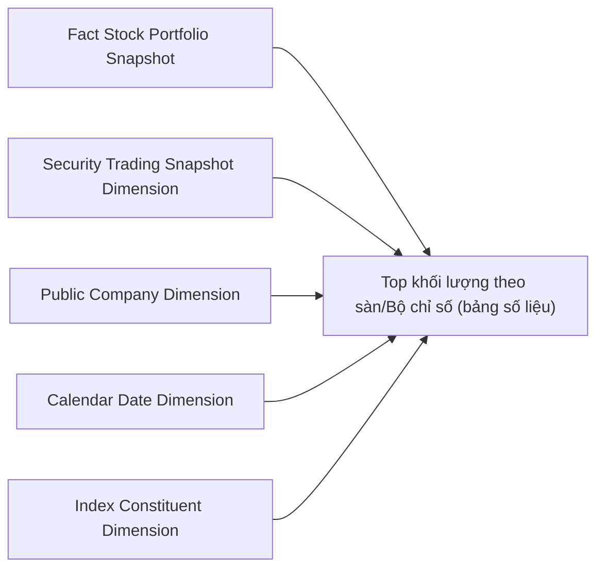
```mermaid
flowchart LR
    F1["Fact Stock Portfolio Snapshot"] --> RPT9["Top khối lượng theo sàn/Bộ chỉ số (bảng số liệu)"]
    D1["Security Trading Snapshot Dimension"] --> RPT9
    D2["Public Company Dimension"] --> RPT9
    D3["Calendar Date Dimension"] --> RPT9
    D4["Index Constituent Dimension"] --> RPT9
```

**Bảng grain:** Không có bảng mới — cùng grain `Fact Stock Portfolio Snapshot` đã có ở Nhóm 1.

> **Coverage rule:** Không áp dụng — Nhóm này không tạo/mở rộng Fact hay Dimension nào, thuần túy reuse + Top-N tại tầng BI.

---

#### Nhóm 8 - Top khối lượng theo sàn, Bộ chỉ số tài chính, Bộ chỉ số ngành (biểu đồ kỹ thuật)

> **Phân loại:** Dashboard
> **Atomic:** 100% reuse Nhóm 1/3/7 (`Security Trading Snapshot`, `Securities Trade`, `Public Company`, `Classification Business Line`) + Nhóm 3 (EAV IDS PENDING) — không có nguồn mới.
>
> **Ghi chú tái sử dụng:** BA liệt kê 13 dòng con — 11 dòng đã có KPI ID sẵn từ Nhóm 1 (Mã CK, Ngành, Sàn, Ngày, KLGD, Giá đóng cửa), Nhóm 3 (Giá mở/cao/thấp cửa, Doanh thu, LNST) và Nhóm 7 (Bộ chỉ số tài chính, Bộ chỉ số theo ngành) — reuse thẳng, không khai sinh KPI mới, không tạo/sửa Fact hay Dimension nào. Biến thể biểu đồ kỹ thuật của Nhóm 7 (cùng bộ chỉ tiêu Top-N theo KLGD, khác cách hiển thị). BA dùng "Doanh thu"/"LNST" (không có VCSH/P-E/P-B/Số CP lưu hành/Vốn hóa như Nhóm 7) — đúng pattern Nhóm 3/8, reuse K_GSTT_31/32.
> **Ghi chú "Bộ chỉ số tài chính"/"Bộ chỉ số theo ngành" (cập nhật 2026-07-28):** Cùng bản chất đã xác nhận ở Nhóm 7 — cả 2 là filter con của K_GSTT_4 (`Index Constituent Dimension.Index Code`, Nhóm 1): "Bộ chỉ số tài chính" = `Index Code IN ('HOSE','UPCOM','HNX')`, "Bộ chỉ số theo ngành" = `Index Code NOT IN ('HOSE','UPCOM','HNX')`. Reuse từ Nhóm 7, cả 2 đều READY.
> **[SỬA 2026-09-07]** KLGD đổi sang range-based (K_GSTT_133, reuse từ Nhóm 7) + bổ sung chiều "Từ ngày" (K_GSTT_139) — theo Note nghiệp vụ "UB_Phạm vi phân tích", cùng thay đổi áp dụng cho toàn bộ Nhóm 7-22 (trừ 9/10).

**Mockup:**

| Mã CK | Ngành | Sàn | Bộ chỉ số ngành | Từ ngày | Đến ngày | Giá mở | Giá cao | Giá thấp | Giá đóng | KLGD | Doanh thu | LNST |
|---|---|---|---|---|---|---|---|---|---|---|---|---|
| VCB | Ngân hàng | HOSE | VN30 | 01/07/2026 | 27/07/2026 | 82.00 | 83.00 | 81.50 | 82.50 | 8.2 Tỷ | — | — |

**Source:** `Fact Stock Portfolio Snapshot` → `Security Trading Snapshot Dimension`, `Public Company Dimension`, `Calendar Date Dimension`, `Index Constituent Dimension` — 100% reuse, Top-N theo KLGD (tổng khoảng ngày) tại tầng BI.

**Bảng KPI:**

| KPI ID | Tên KPI | Đơn vị | Tính chất | Công thức | Ghi chú | Trạng thái |
|---|---|---|---|---|---|---|
| K_GSTT_1 | Mã CK | — | Chiều | `Security Trading Snapshot Dimension.Symbol` | Reuse từ Nhóm 1 | READY |
| K_GSTT_2 | Ngành | — | Chiều | `Public Company Dimension.Business Line Level 1 Code`, `Classification Business Line Name` | Reuse từ Nhóm 1 | READY |
| K_GSTT_3 | Sàn | — | Chiều | `Security Trading Snapshot Dimension.Floor Code` | Reuse từ Nhóm 1 | READY |
| K_GSTT_62 | Bộ chỉ số tài chính | — | Chiều | `Index Constituent Dimension.Index Code` | Reuse từ K_GSTT_62 (Nhóm 7): `Index Code IN ('HOSE','UPCOM','HNX')` | READY |
| K_GSTT_63 | Bộ chỉ số theo ngành | — | Chiều | `Index Constituent Dimension.Index Code` | Reuse từ K_GSTT_63 (Nhóm 7): `Index Code NOT IN ('HOSE','UPCOM','HNX')` | READY |
| K_GSTT_139 | Từ ngày | — | Chiều | `Calendar Date Dimension.Calendar Date` | **[MỚI 2026-09-07]** Reuse từ Nhóm 7 | READY |
| K_GSTT_7 | Đến ngày | — | Chiều | `Calendar Date Dimension.Calendar Date` | **[SỬA 2026-09-07]** Đổi tên hiển thị từ "Ngày" | READY |
| K_GSTT_28 | Giá cao nhất | VNĐ | Cơ sở | `Security Trading Snapshot Dimension.High Price` | Reuse từ Nhóm 3 | READY |
| K_GSTT_29 | Giá thấp nhất | VNĐ | Cơ sở | `Security Trading Snapshot Dimension.Low Price` | Reuse từ Nhóm 3 | READY |
| K_GSTT_27 | Giá mở cửa | VNĐ | Cơ sở | `Security Trading Snapshot Dimension.Open Price` | Reuse từ Nhóm 3 | READY |
| K_GSTT_10 | Giá đóng cửa | VNĐ | Cơ sở | `Security Trading Snapshot Dimension.Close Price` | Reuse từ Nhóm 1 | READY |
| K_GSTT_133 | Khối lượng giao dịch khớp lệnh | Cổ phiếu | Phái sinh | `SUM(Securities Trade.Execution Volume) WHERE Trade Date BETWEEN :from_date AND :to_date AND Board Type Code NOT IN ('T1','T2','T3','T4','T6','R1') GROUP BY Symbol` | **[SỬA 2026-09-07]** Reuse từ K_GSTT_133 (Nhóm 7) — thay K_GSTT_13, tổng theo khoảng ngày — dùng làm tiêu chí sắp xếp Top-N | READY |
| K_GSTT_31 | Doanh thu | VNĐ | Cơ sở | `Fact Stock Portfolio Snapshot.Revenue` | Reuse từ Nhóm 3 — Resolved 2026-08-26 (rule GSĐC, xem O_GSTT_1) | READY |
| K_GSTT_32 | Lợi nhuận sau thuế | VNĐ | Cơ sở | `Fact Stock Portfolio Snapshot.Net Profit After Tax` | Reuse từ Nhóm 3 — Resolved 2026-08-26 (rule GSĐC, xem O_GSTT_1) | READY |

**Star Schema:** Không có bảng mới — 100% reuse `Fact Stock Portfolio Snapshot`, `Security Trading Snapshot Dimension`, `Public Company Dimension`, `Calendar Date Dimension`, `Index Constituent Dimension` đã vẽ ở Nhóm 1/3.

**Lineage Mart → Báo cáo:**

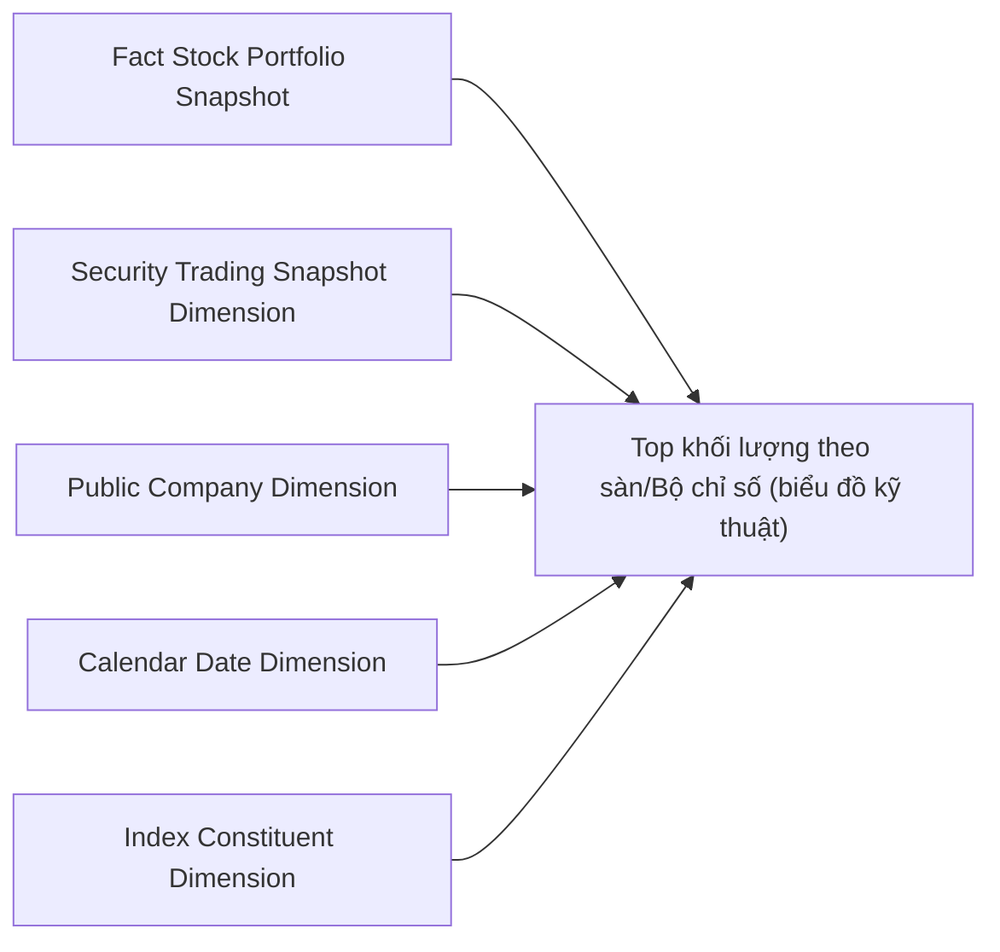
```mermaid
flowchart LR
    F1["Fact Stock Portfolio Snapshot"] --> RPT10["Top khối lượng theo sàn/Bộ chỉ số (biểu đồ kỹ thuật)"]
    D1["Security Trading Snapshot Dimension"] --> RPT10
    D2["Public Company Dimension"] --> RPT10
    D3["Calendar Date Dimension"] --> RPT10
    D4["Index Constituent Dimension"] --> RPT10
```

**Bảng grain:** Không có bảng mới — cùng grain `Fact Stock Portfolio Snapshot` đã có ở Nhóm 1.

> **Coverage rule:** Không áp dụng — Nhóm này không tạo/mở rộng Fact hay Dimension nào, thuần túy reuse + Top-N tại tầng BI.

---

#### Nhóm 9 - Top đột phá theo sàn, Bộ chỉ số tài chính, Bộ chỉ số ngành (bảng số liệu)

> **Phân loại:** Dashboard
> **Atomic:** 100% reuse Nhóm 1 (`Security Trading Snapshot`, `Securities Trade`) + Nhóm 6 (`Public Company Share Statistics` Resolved 2026-08-26, sửa nguồn 2026-09-16 (`listed_share_info`, xem O_GSTT_2 + O_GSTT_22), EAV IDS Resolved 2026-08-26 (rule GSĐC, xem O_GSTT_1)) + Nhóm 7 (Bộ chỉ số thị trường/ngành) — không có nguồn mới.
>
> **Ghi chú tái sử dụng (cập nhật 2026-09-05 — hợp nhất theo BA mới, xem O_GSTT_18):** BA liệt kê 20 dòng con — toàn bộ đã có KPI ID sẵn từ Nhóm 1 (Mã CK, Sàn, Ngày, Khối lượng, Giá, Thay đổi, % thay đổi) và Nhóm 6 (Số CP lưu hành, Vốn hóa, LNST, P/E, VCSH, P/B) — reuse thẳng; 4 measure rolling window (KLGDTB 5/10/20 ngày, Tỷ lệ KLGD/KLGDTB) khai sinh trực tiếp tại Nhóm này (K_GSTT_64–69, xem Bảng KPI). Không tạo/sửa Fact hay Dimension nào. BA 2026-09-05 đã gộp bỏ biến thể "toàn thị trường" (trước đây tách riêng Nhóm khác) — Sàn/Bộ chỉ số nay chỉ còn là slicer trong cùng 1 dashboard duy nhất.
> **Ghi chú "Bộ chỉ số ngành/bộ chỉ số thị trường" (BA gộp 1 dòng con thành 2 KPI — bảng KPI có 21 dòng dù BA chỉ 20 dòng con; cập nhật 2026-07-28):** Dòng con thứ 3 của BA gộp chung tên "Bộ chỉ số ngành/ bộ chỉ số thị trường" trong 1 dòng CSV duy nhất, nhưng đây là 2 khái niệm khác nhau đã tách riêng và xác nhận tại Nhóm 7 — cả 2 là filter con của K_GSTT_4 (`Index Constituent Dimension.Index Code`): "Bộ chỉ số thị trường" = `Index Code IN ('HOSE','UPCOM','HNX')`, "Bộ chỉ số theo ngành" = `Index Code NOT IN ('HOSE','UPCOM','HNX')`. Bảng KPI dưới đây tách đúng 2 dòng cho 1 dòng BA gộp này — không phải lỗi thừa KPI, cũng không phải trường hợp "trùng KPI" thông thường (nơi nhiều dòng BA cùng trỏ 1 KPI); ở đây là chiều ngược lại (1 dòng BA chứa 2 khái niệm chưa tách bạch).
> **[SỬA 2026-09-07 — NGOẠI LỆ, không áp dụng range-based]** Nhóm 7-22 chuyển KLGD/GTGD sang tổng theo khoảng ngày (K_GSTT_133/134, xem Nhóm 7) theo Note nghiệp vụ "UB_Phạm vi phân tích" — **Nhóm 9/10 loại trừ khỏi thay đổi này**. Lý do: K_GSTT_65/67/69 (Tỷ lệ KLGD/KLGDTB — tiêu chí "đột phá") định nghĩa tường minh là `K_GSTT_13 (ngày hiện tại) / KLGDTB N ngày` — bản chất phép so sánh khối lượng **1 phiên cụ thể** với trung bình động, đổi K_GSTT_13 sang tổng theo khoảng ngày sẽ phá vỡ ý nghĩa "đột phá trong ngày". Giữ nguyên K_GSTT_13 (1 ngày) cho Nhóm 9/10.

**Mockup:**

| Mã CK | Sàn | Bộ chỉ số ngành | Ngày | KLGDTB 5 ngày | Tỷ lệ 5 ngày | KLGDTB 10 ngày | Tỷ lệ 10 ngày | KLGDTB 20 ngày | Tỷ lệ 20 ngày | Khối lượng | Giá | Thay đổi | % thay đổi | Số CP lưu hành | Vốn hóa | LNST | P/E | VCSH | P/B |
|---|---|---|---|---|---|---|---|---|---|---|---|---|---|---|---|---|---|---|---|
| VCB | HOSE | VN30 | 27/07/2026 | 420 Tr | 1.3x | 400 Tr | 1.37x | 380 Tr | 1.44x | 548 Tr | 82.50 | +0.50 | +0.61% | *(pending)* | *(pending)* | *(pending)* | *(pending)* | *(pending)* | *(pending)* |

**Source:** `Fact Stock Portfolio Snapshot` → `Security Trading Snapshot Dimension`, `Public Company Dimension`, `Calendar Date Dimension`, `Index Constituent Dimension` — 100% reuse, rolling window + Top-N tại tầng BI.

**Bảng KPI:**

| KPI ID | Tên KPI | Đơn vị | Tính chất | Công thức | Ghi chú | Trạng thái |
|---|---|---|---|---|---|---|
| K_GSTT_1 | Mã CK | — | Chiều | `Security Trading Snapshot Dimension.Symbol` | Reuse từ Nhóm 1 | READY |
| K_GSTT_3 | Sàn | — | Chiều | `Security Trading Snapshot Dimension.Floor Code` | Reuse từ Nhóm 1 | READY |
| K_GSTT_62 | Bộ chỉ số thị trường | — | Chiều | `Index Constituent Dimension.Index Code` | Reuse từ K_GSTT_62 (Nhóm 7): `Index Code IN ('HOSE','UPCOM','HNX')` | READY |
| K_GSTT_63 | Bộ chỉ số theo ngành | — | Chiều | `Index Constituent Dimension.Index Code` | Reuse từ K_GSTT_63 (Nhóm 7): `Index Code NOT IN ('HOSE','UPCOM','HNX')` | READY |
| K_GSTT_7 | Ngày | — | Chiều | `Calendar Date Dimension.Calendar Date` | Reuse từ Nhóm 1 | READY |
| K_GSTT_64 | KLGDTB trong 5 ngày | Cổ phiếu | Phái sinh | `AVG(K_GSTT_13) OVER (PARTITION BY Symbol ORDER BY Trade Date ROWS BETWEEN 5 PRECEDING AND 1 PRECEDING)` | Khai sinh tại Nhóm này | READY |
| K_GSTT_65 | Tỷ lệ KLGD/KLGDTB 5 ngày | Lần | Phái sinh | `K_GSTT_13 (ngày hiện tại) / K_GSTT_64` | Khai sinh tại Nhóm này — dùng làm tiêu chí Top-N "đột phá" | READY |
| K_GSTT_66 | KLGDTB trong 10 ngày | Cổ phiếu | Phái sinh | `AVG(K_GSTT_13) OVER (PARTITION BY Symbol ORDER BY Trade Date ROWS BETWEEN 10 PRECEDING AND 1 PRECEDING)` | Khai sinh tại Nhóm này | READY |
| K_GSTT_67 | Tỷ lệ KLGD/KLGDTB 10 ngày | Lần | Phái sinh | `K_GSTT_13 (ngày hiện tại) / K_GSTT_66` | Khai sinh tại Nhóm này | READY |
| K_GSTT_68 | KLGDTB trong 20 ngày | Cổ phiếu | Phái sinh | `AVG(K_GSTT_13) OVER (PARTITION BY Symbol ORDER BY Trade Date ROWS BETWEEN 20 PRECEDING AND 1 PRECEDING)` | Khai sinh tại Nhóm này | READY |
| K_GSTT_69 | Tỷ lệ KLGD/KLGDTB 20 ngày | Lần | Phái sinh | `K_GSTT_13 (ngày hiện tại) / K_GSTT_68` | Khai sinh tại Nhóm này | READY |
| K_GSTT_13 | Khối lượng khớp lệnh | Cổ phiếu | Phái sinh | `SUM(Securities Trade.Execution Volume) WHERE Board Type Code NOT IN ('T1','T2','T3','T4','T6','R1') GROUP BY Symbol, Trade Date` | **[SỬA 2026-09-14, review khớp lệnh]** Đổi nguồn `total_vol` → `total_matched_vol` (loại trừ thỏa thuận) — khác Nhóm 1/3 (vẫn `total_vol`, không phải Top) | READY |
| K_GSTT_10 | Giá | VNĐ | Cơ sở | `Security Trading Snapshot Dimension.Close Price` | Reuse từ Nhóm 1 (K_GSTT_10 = Giá đóng cửa) | READY |
| K_GSTT_11 | Thay đổi (+/-) | VNĐ | Cơ sở | `Security Trading Snapshot Dimension.Price Change` | Reuse từ Nhóm 1 | READY |
| K_GSTT_12 | % thay đổi | % | Phái sinh | `Price Change / Reference Price × 100` | Reuse từ Nhóm 1 | READY |
| K_GSTT_55 | Số cổ phiếu đang lưu hành | Cổ phiếu | Cơ sở | `Fact Stock Portfolio Snapshot.Outstanding Share Quantity` | Reuse từ Nhóm 6 — Resolved 2026-08-26, sửa nguồn 2026-09-16 (`listed_share_info`, xem O_GSTT_2 + O_GSTT_22) | READY |
| K_GSTT_61 | Vốn hóa | VNĐ | Chỉ tiêu phái sinh | `MAX(K_GSTT_10 (Giá đóng cửa) × K_GSTT_55 (Số CP lưu hành)) GROUP BY Symbol, Trade Date` (Vốn hóa TỪNG MÃ CK, không phải theo Index — sửa 2026-09-14, phát hiện qua review Data Modeler: bảng Top-N theo mã CK không phải theo rổ chỉ số, cùng pattern Nhóm 23) | Reuse từ Nhóm 6 — Resolved 2026-08-26 (K_GSTT_55 đã có nguồn) | READY |
| K_GSTT_56 | LNST | VNĐ | Cơ sở | `Fact Stock Portfolio Snapshot.Net Profit After Tax` | Reuse từ Nhóm 6 — Resolved 2026-08-26 (rule GSĐC, xem O_GSTT_1) | READY |
| K_GSTT_58 | P/E thị trường | Lần | Chỉ tiêu phái sinh | `K_GSTT_10 / (Fact Stock Portfolio Snapshot.Net Profit After Tax TTM / K_GSTT_55)` | Reuse từ Nhóm 6 — Resolved 2026-08-26. LNST dùng TTM 4 quý (rule GSĐC); K_GSTT_55 đã có nguồn (`listed_share_info`, sửa nguồn 2026-09-16 — xem O_GSTT_22) | READY |
| K_GSTT_57 | VCSH | VNĐ | Cơ sở | `Fact Stock Portfolio Snapshot.Owner Equity` | Reuse từ Nhóm 6 — Resolved 2026-08-26 (rule GSĐC, xem O_GSTT_1) | READY |
| K_GSTT_59 | P/B thị trường | Lần | Chỉ tiêu phái sinh | `K_GSTT_10 / (K_GSTT_57 / K_GSTT_55)` | Reuse từ Nhóm 6 — Resolved 2026-08-26. K_GSTT_57 (VCSH) và K_GSTT_55 (Số CP lưu hành) đều đã có nguồn | READY |

**Star Schema:** Không có bảng mới — 100% reuse `Fact Stock Portfolio Snapshot`, `Security Trading Snapshot Dimension`, `Public Company Dimension`, `Calendar Date Dimension`, `Index Constituent Dimension` đã vẽ ở Nhóm 1. K_GSTT_64–68 (rolling window) không cần cột mới.

**Lineage Mart → Báo cáo:**

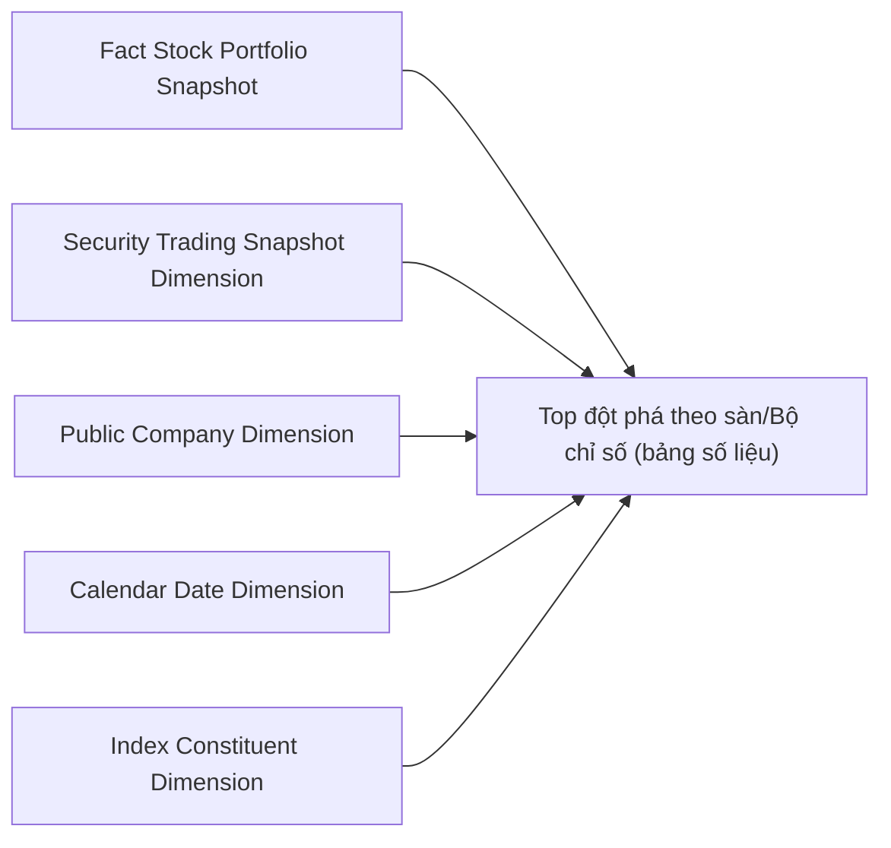
```mermaid
flowchart LR
    F1["Fact Stock Portfolio Snapshot"] --> RPT13["Top đột phá theo sàn/Bộ chỉ số (bảng số liệu)"]
    D1["Security Trading Snapshot Dimension"] --> RPT13
    D2["Public Company Dimension"] --> RPT13
    D3["Calendar Date Dimension"] --> RPT13
    D4["Index Constituent Dimension"] --> RPT13
```

**Bảng grain:** Không có bảng mới — cùng grain `Fact Stock Portfolio Snapshot` đã có ở Nhóm 1.

> **Coverage rule:** Không áp dụng — Nhóm này không tạo/mở rộng Fact hay Dimension nào, thuần túy reuse + rolling window/Top-N tại tầng BI.

---

#### Nhóm 10 - Top đột phá theo sàn, Bộ chỉ số tài chính, Bộ chỉ số ngành (biểu đồ kỹ thuật)

> **Phân loại:** Dashboard
> **Atomic:** 100% reuse Nhóm 1 (`Security Trading Snapshot`, `Securities Trade`) + Nhóm 3 (EAV IDS PENDING) + Nhóm 7 (Bộ chỉ số thị trường/ngành) + Nhóm 9 (rolling window) — không có nguồn mới.
>
> **Ghi chú tái sử dụng (cập nhật 2026-09-05 — hợp nhất theo BA mới, xem O_GSTT_18):** BA liệt kê 18 dòng con — toàn bộ đã có KPI ID sẵn từ Nhóm 1 (Mã CK, Sàn, Ngày, Thay đổi, Khối lượng), Nhóm 3 (Giá mở/cao/thấp/đóng cửa, Doanh thu, Lợi nhuận), Nhóm 7 (Bộ chỉ số thị trường/ngành) và Nhóm 9 (KLGDTB 5/10/20 ngày, Tỷ lệ KLGD/KLGDTB 5/10/20 ngày) — reuse thẳng, không khai sinh KPI mới, không tạo/sửa Fact hay Dimension nào. Biến thể biểu đồ kỹ thuật của Nhóm 9 (cùng bộ chỉ tiêu Top-N đột phá theo sàn/bộ chỉ số, khác cách hiển thị — biểu đồ nến/đường thay vì bảng). BA dùng "Doanh thu"/"Lợi nhuận" (không có VCSH/P-E/P-B/Số CP lưu hành/Vốn hóa như Nhóm 9) — đúng pattern Nhóm 3/8, reuse K_GSTT_31/32.
> **Ghi chú "Bộ chỉ số ngành/bộ chỉ số thị trường" (BA gộp 1 dòng con thành 2 KPI, giống Nhóm 9; cập nhật 2026-07-28):** Cùng bản chất đã xác nhận ở Nhóm 7 — cả 2 là filter con của K_GSTT_4 (`Index Constituent Dimension.Index Code`): "Bộ chỉ số thị trường" = `Index Code IN ('HOSE','UPCOM','HNX')`, "Bộ chỉ số theo ngành" = `Index Code NOT IN ('HOSE','UPCOM','HNX')`. Bảng KPI dưới đây có 19 dòng cho 18 dòng BA (cùng lý do +1 như Nhóm 9).
> **[SỬA 2026-09-07 — NGOẠI LỆ, không áp dụng range-based]** Cùng lý do Nhóm 9 (xem ghi chú tại đó) — K_GSTT_65/67/69 cần K_GSTT_13 (1 ngày) làm tử số "đột phá". Giữ nguyên K_GSTT_13.

**Mockup:**

| Mã CK | Sàn | Bộ chỉ số ngành | Ngày | KLGDTB 5 ngày | Tỷ lệ 5 ngày | KLGDTB 10 ngày | Tỷ lệ 10 ngày | KLGDTB 20 ngày | Tỷ lệ 20 ngày | Giá mở | Giá cao | Giá thấp | Giá đóng | Thay đổi | Khối lượng | Doanh thu | Lợi nhuận |
|---|---|---|---|---|---|---|---|---|---|---|---|---|---|---|---|---|---|
| VCB | HOSE | VN30 | 27/07/2026 | 420 Tr | 1.3x | 400 Tr | 1.37x | 380 Tr | 1.44x | 82.00 | 83.00 | 81.50 | 82.50 | +0.50 | 548 Tr | — | — |

**Source:** `Fact Stock Portfolio Snapshot` → `Security Trading Snapshot Dimension`, `Calendar Date Dimension`, `Index Constituent Dimension` — 100% reuse, rolling window + Top-N tại tầng BI.

**Bảng KPI:**

| KPI ID | Tên KPI | Đơn vị | Tính chất | Công thức | Ghi chú | Trạng thái |
|---|---|---|---|---|---|---|
| K_GSTT_1 | Mã CK | — | Chiều | `Security Trading Snapshot Dimension.Symbol` | Reuse từ Nhóm 1 | READY |
| K_GSTT_3 | Sàn | — | Chiều | `Security Trading Snapshot Dimension.Floor Code` | Reuse từ Nhóm 1 | READY |
| K_GSTT_62 | Bộ chỉ số thị trường | — | Chiều | `Index Constituent Dimension.Index Code` | Reuse từ K_GSTT_62 (Nhóm 7): `Index Code IN ('HOSE','UPCOM','HNX')` | READY |
| K_GSTT_63 | Bộ chỉ số theo ngành | — | Chiều | `Index Constituent Dimension.Index Code` | Reuse từ K_GSTT_63 (Nhóm 7): `Index Code NOT IN ('HOSE','UPCOM','HNX')` | READY |
| K_GSTT_7 | Ngày | — | Chiều | `Calendar Date Dimension.Calendar Date` | Reuse từ Nhóm 1 | READY |
| K_GSTT_64 | KLGDTB trong 5 ngày | Cổ phiếu | Phái sinh | `AVG(K_GSTT_13) OVER (PARTITION BY Symbol ORDER BY Trade Date ROWS BETWEEN 5 PRECEDING AND 1 PRECEDING)` | Reuse từ Nhóm 9 | READY |
| K_GSTT_65 | Tỷ lệ KLGD/KLGDTB 5 ngày | Lần | Phái sinh | `K_GSTT_13 (ngày hiện tại) / K_GSTT_64` | Reuse từ Nhóm 9 — dùng làm tiêu chí Top-N "đột phá" | READY |
| K_GSTT_66 | KLGDTB trong 10 ngày | Cổ phiếu | Phái sinh | `AVG(K_GSTT_13) OVER (PARTITION BY Symbol ORDER BY Trade Date ROWS BETWEEN 10 PRECEDING AND 1 PRECEDING)` | Reuse từ Nhóm 9 | READY |
| K_GSTT_67 | Tỷ lệ KLGD/KLGDTB 10 ngày | Lần | Phái sinh | `K_GSTT_13 (ngày hiện tại) / K_GSTT_66` | Reuse từ Nhóm 9 | READY |
| K_GSTT_68 | KLGDTB trong 20 ngày | Cổ phiếu | Phái sinh | `AVG(K_GSTT_13) OVER (PARTITION BY Symbol ORDER BY Trade Date ROWS BETWEEN 20 PRECEDING AND 1 PRECEDING)` | Reuse từ Nhóm 9 | READY |
| K_GSTT_69 | Tỷ lệ KLGD/KLGDTB 20 ngày | Lần | Phái sinh | `K_GSTT_13 (ngày hiện tại) / K_GSTT_68` | Reuse từ Nhóm 9 | READY |
| K_GSTT_27 | Giá mở cửa | VNĐ | Cơ sở | `Security Trading Snapshot Dimension.Open Price` | Reuse từ Nhóm 3 | READY |
| K_GSTT_28 | Giá cao nhất | VNĐ | Cơ sở | `Security Trading Snapshot Dimension.High Price` | Reuse từ Nhóm 3 | READY |
| K_GSTT_29 | Giá thấp nhất | VNĐ | Cơ sở | `Security Trading Snapshot Dimension.Low Price` | Reuse từ Nhóm 3 | READY |
| K_GSTT_10 | Giá đóng cửa | VNĐ | Cơ sở | `Security Trading Snapshot Dimension.Close Price` | Reuse từ Nhóm 1 | READY |
| K_GSTT_11 | Thay đổi (+/-) | VNĐ | Cơ sở | `Security Trading Snapshot Dimension.Price Change` | Reuse từ Nhóm 1 | READY |
| K_GSTT_13 | Khối lượng giao dịch khớp lệnh | Cổ phiếu | Phái sinh | `SUM(Securities Trade.Execution Volume) WHERE Board Type Code NOT IN ('T1','T2','T3','T4','T6','R1') GROUP BY Symbol, Trade Date` | **[SỬA 2026-09-14, review khớp lệnh]** Đổi nguồn `total_vol` → `total_matched_vol` (loại trừ thỏa thuận) — Reuse từ Nhóm 9, khác Nhóm 1/3 (vẫn `total_vol`, không phải Top) | READY |
| K_GSTT_31 | Doanh thu | VNĐ | Cơ sở | `Fact Stock Portfolio Snapshot.Revenue` | Reuse từ Nhóm 3 — Resolved 2026-08-26 (rule GSĐC, xem O_GSTT_1) | READY |
| K_GSTT_32 | Lợi nhuận sau thuế | VNĐ | Cơ sở | `Fact Stock Portfolio Snapshot.Net Profit After Tax` | Reuse từ Nhóm 3 — Resolved 2026-08-26 (rule GSĐC, xem O_GSTT_1) | READY |

**Star Schema:** Không có bảng mới — 100% reuse `Fact Stock Portfolio Snapshot`, `Security Trading Snapshot Dimension`, `Calendar Date Dimension`, `Index Constituent Dimension` đã vẽ ở Nhóm 1. K_GSTT_64–68 (rolling window) không cần cột mới.

**Lineage Mart → Báo cáo:**

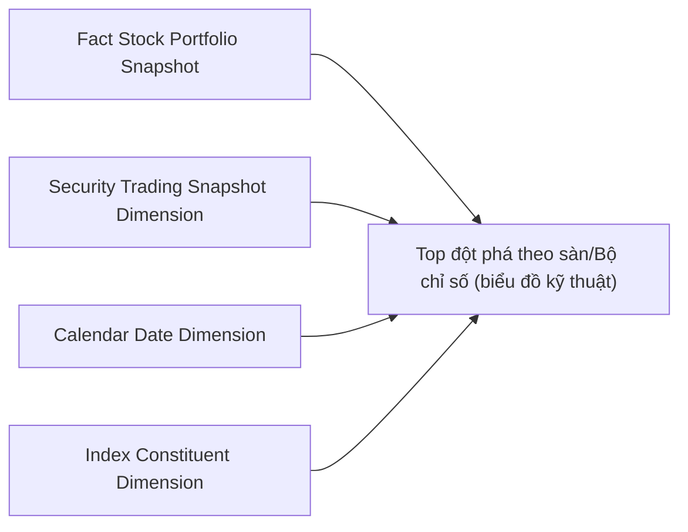
```mermaid
flowchart LR
    F1["Fact Stock Portfolio Snapshot"] --> RPT14["Top đột phá theo sàn/Bộ chỉ số (biểu đồ kỹ thuật)"]
    D1["Security Trading Snapshot Dimension"] --> RPT14
    D3["Calendar Date Dimension"] --> RPT14
    D4["Index Constituent Dimension"] --> RPT14
```

**Bảng grain:** Không có bảng mới — cùng grain `Fact Stock Portfolio Snapshot` đã có ở Nhóm 1.

> **Coverage rule:** Không áp dụng — Nhóm này không tạo/mở rộng Fact hay Dimension nào, thuần túy reuse + rolling window/Top-N tại tầng BI.

---

#### Nhóm 11 - Top giá trị (bảng số liệu)

> **Phân loại:** Dashboard
> **Atomic:** 100% reuse Nhóm 1 (`Security Trading Snapshot`, `Securities Trade`, `Public Company`, `Classification Business Line`) + Nhóm 6 (`Public Company Share Statistics` Resolved 2026-08-26, sửa nguồn 2026-09-16 (`listed_share_info`, xem O_GSTT_2 + O_GSTT_22), EAV IDS Resolved 2026-08-26 (rule GSĐC, xem O_GSTT_1)) + Nhóm 7 (Bộ chỉ số thị trường/ngành) — không có nguồn mới.
>
> **Ghi chú tái sử dụng:** BA liệt kê 14 dòng con — toàn bộ đã có KPI ID sẵn từ Nhóm 1 (Mã CK, Sàn, Ngành, Ngày, GTGD = Tổng GT, Giá, % thay đổi), Nhóm 6 (Số CP lưu hành, Vốn hóa, LNST, P/E, VCSH, P/B) và Nhóm 7 (Bộ chỉ số thị trường/ngành) — reuse thẳng, không khai sinh KPI mới, không tạo/sửa Fact hay Dimension nào. Bản chất là Top-N sắp xếp theo GTGD (K_GSTT_14, `ORDER BY ... DESC LIMIT N`), cùng cấu trúc chỉ tiêu với Nhóm 7 nhưng đổi tiêu chí xếp hạng từ Khối lượng (K_GSTT_13) sang Giá trị giao dịch (K_GSTT_14).
> **Ghi chú "Bộ chỉ số ngành/bộ chỉ số thị trường" (BA gộp 1 dòng con thành 2 KPI, giống Nhóm 9/10; cập nhật 2026-07-28):** Cùng bản chất đã xác nhận ở Nhóm 7 — cả 2 là filter con của K_GSTT_4 (`Index Constituent Dimension.Index Code`): "Bộ chỉ số thị trường" = `Index Code IN ('HOSE','UPCOM','HNX')`, "Bộ chỉ số theo ngành" = `Index Code NOT IN ('HOSE','UPCOM','HNX')`. Bảng KPI dưới đây có 15 dòng cho 14 dòng BA (cùng lý do +1 như Nhóm 9/10).
> **[SỬA 2026-09-07]** GTGD đổi sang range-based (K_GSTT_134, khai sinh tại Nhóm này — reuse mẫu K_GSTT_133 Nhóm 7) + bổ sung chiều "Từ ngày" (K_GSTT_139, reuse Nhóm 7) — theo Note nghiệp vụ "UB_Phạm vi phân tích".

**Mockup:**

| Mã CK | Sàn | Bộ chỉ số ngành | Ngành | Từ ngày | Đến ngày | GTGD | Giá | % thay đổi | Số CP lưu hành | Vốn hóa | LNST | P/E | VCSH | P/B |
|---|---|---|---|---|---|---|---|---|---|---|---|---|---|---|
| VCB | HOSE | VN30 | Ngân hàng | 01/07/2026 | 27/07/2026 | 350 Tỷ | 82.50 | +0.61% | *(pending)* | *(pending)* | *(pending)* | *(pending)* | *(pending)* | *(pending)* |

**Source:** `Fact Stock Portfolio Snapshot` → `Security Trading Snapshot Dimension`, `Public Company Dimension`, `Calendar Date Dimension`, `Index Constituent Dimension` — 100% reuse, Top-N theo GTGD (tổng khoảng ngày) tại tầng BI.

**Bảng KPI:**

| KPI ID | Tên KPI | Đơn vị | Tính chất | Công thức | Ghi chú | Trạng thái |
|---|---|---|---|---|---|---|
| K_GSTT_1 | Mã CK | — | Chiều | `Security Trading Snapshot Dimension.Symbol` | Reuse từ Nhóm 1 | READY |
| K_GSTT_3 | Sàn | — | Chiều | `Security Trading Snapshot Dimension.Floor Code` | Reuse từ Nhóm 1 | READY |
| K_GSTT_62 | Bộ chỉ số thị trường | — | Chiều | `Index Constituent Dimension.Index Code` | Reuse từ K_GSTT_62 (Nhóm 7): `Index Code IN ('HOSE','UPCOM','HNX')` | READY |
| K_GSTT_63 | Bộ chỉ số theo ngành | — | Chiều | `Index Constituent Dimension.Index Code` | Reuse từ K_GSTT_63 (Nhóm 7): `Index Code NOT IN ('HOSE','UPCOM','HNX')` | READY |
| K_GSTT_2 | Ngành | — | Chiều | `Public Company Dimension.Business Line Level 1 Code`, `Classification Business Line Name` | Reuse từ Nhóm 1 | READY |
| K_GSTT_139 | Từ ngày | — | Chiều | `Calendar Date Dimension.Calendar Date` | **[MỚI 2026-09-07]** Reuse từ Nhóm 7 | READY |
| K_GSTT_7 | Đến ngày | — | Chiều | `Calendar Date Dimension.Calendar Date` | **[SỬA 2026-09-07]** Đổi tên hiển thị từ "Ngày" | READY |
| K_GSTT_134 | GTGD khớp lệnh | VNĐ | Phái sinh | `SUM(Securities Trade.Execution Value) WHERE Trade Date BETWEEN :from_date AND :to_date AND Board Type Code NOT IN ('T1','T2','T3','T4','T6','R1') GROUP BY Symbol` | **[MỚI 2026-09-07; SỬA TÊN 2026-09-17]** Thay K_GSTT_14 (1 ngày) — tổng GTGD trong khoảng Từ ngày-Đến ngày, đã bao gồm filter Market Id Code IN ('UPX','STX','STO') kế thừa từ K_GSTT_14. Dùng làm tiêu chí sắp xếp Top-N. Bổ sung "khớp lệnh" vào tên hiển thị — BA STT 11 xác nhận rõ "GTGD khớp lệnh"; logic đã đúng từ v4.12 (repoint sang `total_matched_val`), chỉ tên hiển thị sót lại chưa đổi | READY |
| K_GSTT_10 | Giá | VNĐ | Cơ sở | `Security Trading Snapshot Dimension.Close Price` | Reuse từ Nhóm 1 (K_GSTT_10 = Giá đóng cửa) | READY |
| K_GSTT_12 | % thay đổi | % | Phái sinh | `Price Change / Reference Price × 100` | Reuse từ Nhóm 1 | READY |
| K_GSTT_55 | Số cổ phiếu đang lưu hành | Cổ phiếu | Cơ sở | `Fact Stock Portfolio Snapshot.Outstanding Share Quantity` | Reuse từ Nhóm 6 — Resolved 2026-08-26, sửa nguồn 2026-09-16 (`listed_share_info`, xem O_GSTT_2 + O_GSTT_22) | READY |
| K_GSTT_61 | Vốn hóa | VNĐ | Chỉ tiêu phái sinh | `MAX(K_GSTT_10 (Giá đóng cửa) × K_GSTT_55 (Số CP lưu hành)) GROUP BY Symbol, Trade Date` (Vốn hóa TỪNG MÃ CK, không phải theo Index — sửa 2026-09-14, phát hiện qua review Data Modeler: bảng Top-N theo mã CK không phải theo rổ chỉ số, cùng pattern Nhóm 23) | Reuse từ Nhóm 6 — Resolved 2026-08-26 (K_GSTT_55 đã có nguồn) | READY |
| K_GSTT_56 | LNST | VNĐ | Cơ sở | `Fact Stock Portfolio Snapshot.Net Profit After Tax` | Reuse từ Nhóm 6 — Resolved 2026-08-26 (rule GSĐC, xem O_GSTT_1) | READY |
| K_GSTT_58 | P/E thị trường | Lần | Chỉ tiêu phái sinh | `K_GSTT_10 / (Fact Stock Portfolio Snapshot.Net Profit After Tax TTM / K_GSTT_55)` | Reuse từ Nhóm 6 — Resolved 2026-08-26. LNST dùng TTM 4 quý (rule GSĐC); K_GSTT_55 đã có nguồn (`listed_share_info`, sửa nguồn 2026-09-16 — xem O_GSTT_22) | READY |
| K_GSTT_57 | VCSH | VNĐ | Cơ sở | `Fact Stock Portfolio Snapshot.Owner Equity` | Reuse từ Nhóm 6 — Resolved 2026-08-26 (rule GSĐC, xem O_GSTT_1) | READY |
| K_GSTT_59 | P/B thị trường | Lần | Chỉ tiêu phái sinh | `K_GSTT_10 / (K_GSTT_57 / K_GSTT_55)` | Reuse từ Nhóm 6 — Resolved 2026-08-26. K_GSTT_57 (VCSH) và K_GSTT_55 (Số CP lưu hành) đều đã có nguồn | READY |

**Star Schema:** Không có bảng mới — 100% reuse `Fact Stock Portfolio Snapshot`, `Security Trading Snapshot Dimension`, `Public Company Dimension`, `Calendar Date Dimension`, `Index Constituent Dimension` đã vẽ ở Nhóm 1.

**Lineage Mart → Báo cáo:**

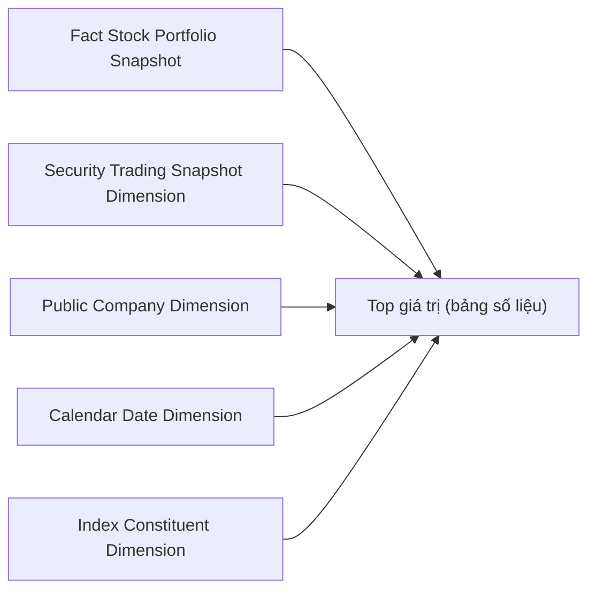
```mermaid
flowchart LR
    F1["Fact Stock Portfolio Snapshot"] --> RPT15["Top giá trị (bảng số liệu)"]
    D1["Security Trading Snapshot Dimension"] --> RPT15
    D2["Public Company Dimension"] --> RPT15
    D3["Calendar Date Dimension"] --> RPT15
    D4["Index Constituent Dimension"] --> RPT15
```

**Bảng grain:** Không có bảng mới — cùng grain `Fact Stock Portfolio Snapshot` đã có ở Nhóm 1.

> **Coverage rule:** Không áp dụng — Nhóm này không tạo/mở rộng Fact hay Dimension nào, thuần túy reuse + Top-N tại tầng BI.

---

#### Nhóm 12 - Top giá trị (biểu đồ kỹ thuật)

> **Phân loại:** Dashboard
> **Atomic:** 100% reuse Nhóm 1 (`Security Trading Snapshot`, `Securities Trade`, `Public Company`, `Classification Business Line`) + Nhóm 3 (EAV IDS PENDING) + Nhóm 7 (Bộ chỉ số thị trường/ngành) — không có nguồn mới.
>
> **Ghi chú tái sử dụng (sửa 2026-09-05 — rà soát BA↔KPI phát hiện KPI thừa):** BA liệt kê 13 dòng con — toàn bộ đã có KPI ID sẵn từ Nhóm 1 (Mã CK, Sàn, Ngành, Ngày, Thay đổi, Khối lượng giao dịch), Nhóm 3 (Giá mở/cao/thấp/đóng cửa, Doanh thu, Lợi nhuận) và Nhóm 7 (Bộ chỉ số thị trường/ngành) — reuse thẳng, không khai sinh KPI mới, không tạo/sửa Fact hay Dimension nào. Biến thể biểu đồ kỹ thuật của Nhóm 11 (đổi tiêu chí Top-N từ GTGD hiển thị dạng bảng sang biểu đồ nến/đường), cùng pattern Nhóm 3/8/10 dùng Doanh thu/Lợi nhuận (K_GSTT_31/32) thay vì bộ VCSH/P-E/P-B/Số CP lưu hành/Vốn hóa như Nhóm 11. Khác Nhóm 11 (Top-N theo GTGD K_GSTT_14), BA ở đây liệt kê chỉ tiêu hiển thị là "Khối lượng giao dịch" (K_GSTT_13) chứ không lặp lại GTGD — bản chất biểu đồ kỹ thuật ưu tiên hiển thị khối lượng thay vì giá trị, tiêu chí Top-N vẫn kế thừa GTGD từ Nhóm 11 ở tầng BI khi lọc danh sách mã hiển thị. **Đã xóa K_GSTT_4 "Chỉ số"** khỏi bảng KPI — rà soát lại BA STT=12 xác nhận không có dòng con "Chỉ số" nào (khác Nhóm 1/20 nơi Chỉ số thật sự là 1 dòng BA riêng); dòng này trước đây bị thêm nhầm theo suy diễn, không có căn cứ BA cho Nhóm này.
> **Ghi chú "Bộ chỉ số ngành/bộ chỉ số thị trường" (BA gộp 1 dòng con thành 2 KPI, giống Nhóm 9/10/11; cập nhật 2026-07-28):** Cùng bản chất đã xác nhận ở Nhóm 7 — cả 2 là filter con của K_GSTT_4 (`Index Constituent Dimension.Index Code`): "Bộ chỉ số thị trường" = `Index Code IN ('HOSE','UPCOM','HNX')`, "Bộ chỉ số theo ngành" = `Index Code NOT IN ('HOSE','UPCOM','HNX')`. Bảng KPI dưới đây có 14 dòng cho 13 dòng BA (cùng lý do +1 như Nhóm 9/10/11).
> **[SỬA 2026-09-07]** Khối lượng giao dịch đổi sang range-based (K_GSTT_133, reuse Nhóm 7) + bổ sung chiều "Từ ngày" (K_GSTT_139) + Top-N kế thừa GTGD range (K_GSTT_134, Nhóm 11) — theo Note nghiệp vụ "UB_Phạm vi phân tích".

**Mockup:**

| Mã CK | Sàn | Bộ chỉ số ngành | Ngành | Từ ngày | Đến ngày | Giá mở | Giá cao | Giá thấp | Giá đóng | Thay đổi | Khối lượng | Doanh thu | Lợi nhuận |
|---|---|---|---|---|---|---|---|---|---|---|---|---|---|
| VCB | HOSE | VN30 | Ngân hàng | 01/07/2026 | 27/07/2026 | 82.00 | 83.00 | 81.50 | 82.50 | +0.50 | 8.2 Tỷ | — | — |

**Source:** `Fact Stock Portfolio Snapshot` → `Security Trading Snapshot Dimension`, `Public Company Dimension`, `Calendar Date Dimension`, `Index Constituent Dimension` — 100% reuse, Top-N theo GTGD (tổng khoảng ngày) tại tầng BI.

**Bảng KPI:**

| KPI ID | Tên KPI | Đơn vị | Tính chất | Công thức | Ghi chú | Trạng thái |
|---|---|---|---|---|---|---|
| K_GSTT_1 | Mã CK | — | Chiều | `Security Trading Snapshot Dimension.Symbol` | Reuse từ Nhóm 1 | READY |
| K_GSTT_3 | Sàn | — | Chiều | `Security Trading Snapshot Dimension.Floor Code` | Reuse từ Nhóm 1 | READY |
| K_GSTT_62 | Bộ chỉ số thị trường | — | Chiều | `Index Constituent Dimension.Index Code` | Reuse từ K_GSTT_62 (Nhóm 7): `Index Code IN ('HOSE','UPCOM','HNX')` | READY |
| K_GSTT_63 | Bộ chỉ số theo ngành | — | Chiều | `Index Constituent Dimension.Index Code` | Reuse từ K_GSTT_63 (Nhóm 7): `Index Code NOT IN ('HOSE','UPCOM','HNX')` | READY |
| K_GSTT_2 | Ngành | — | Chiều | `Public Company Dimension.Business Line Level 1 Code`, `Classification Business Line Name` | Reuse từ Nhóm 1 | READY |
| K_GSTT_139 | Từ ngày | — | Chiều | `Calendar Date Dimension.Calendar Date` | **[MỚI 2026-09-07]** Reuse từ Nhóm 7 | READY |
| K_GSTT_7 | Đến ngày | — | Chiều | `Calendar Date Dimension.Calendar Date` | **[SỬA 2026-09-07]** Đổi tên hiển thị từ "Ngày" | READY |
| K_GSTT_27 | Giá mở cửa | VNĐ | Cơ sở | `Security Trading Snapshot Dimension.Open Price` | Reuse từ Nhóm 3 | READY |
| K_GSTT_28 | Giá cao nhất | VNĐ | Cơ sở | `Security Trading Snapshot Dimension.High Price` | Reuse từ Nhóm 3 | READY |
| K_GSTT_29 | Giá thấp nhất | VNĐ | Cơ sở | `Security Trading Snapshot Dimension.Low Price` | Reuse từ Nhóm 3 | READY |
| K_GSTT_10 | Giá đóng cửa | VNĐ | Cơ sở | `Security Trading Snapshot Dimension.Close Price` | Reuse từ Nhóm 1 | READY |
| K_GSTT_11 | Thay đổi (+/-) | VNĐ | Cơ sở | `Security Trading Snapshot Dimension.Price Change` | Reuse từ Nhóm 1 | READY |
| K_GSTT_133 | Khối lượng giao dịch khớp lệnh | Cổ phiếu | Phái sinh | `SUM(Securities Trade.Execution Volume) WHERE Trade Date BETWEEN :from_date AND :to_date AND Board Type Code NOT IN ('T1','T2','T3','T4','T6','R1') GROUP BY Symbol` | **[SỬA 2026-09-07]** Reuse từ K_GSTT_133 (Nhóm 7) — thay K_GSTT_13, tổng theo khoảng ngày — hiển thị trên biểu đồ, tiêu chí Top-N vẫn kế thừa GTGD range (K_GSTT_134) từ Nhóm 11 | READY |
| K_GSTT_31 | Doanh thu | VNĐ | Cơ sở | `Fact Stock Portfolio Snapshot.Revenue` | Reuse từ Nhóm 3 — Resolved 2026-08-26 (rule GSĐC, xem O_GSTT_1) | READY |
| K_GSTT_32 | Lợi nhuận sau thuế | VNĐ | Cơ sở | `Fact Stock Portfolio Snapshot.Net Profit After Tax` | Reuse từ Nhóm 3 — Resolved 2026-08-26 (rule GSĐC, xem O_GSTT_1) | READY |

**Star Schema:** Không có bảng mới — 100% reuse `Fact Stock Portfolio Snapshot`, `Security Trading Snapshot Dimension`, `Public Company Dimension`, `Calendar Date Dimension`, `Index Constituent Dimension` đã vẽ ở Nhóm 1 (Index Constituent Dimension vẫn cần cho K_GSTT_62/63, không phải cho K_GSTT_4 đã xóa).

**Lineage Mart → Báo cáo:**

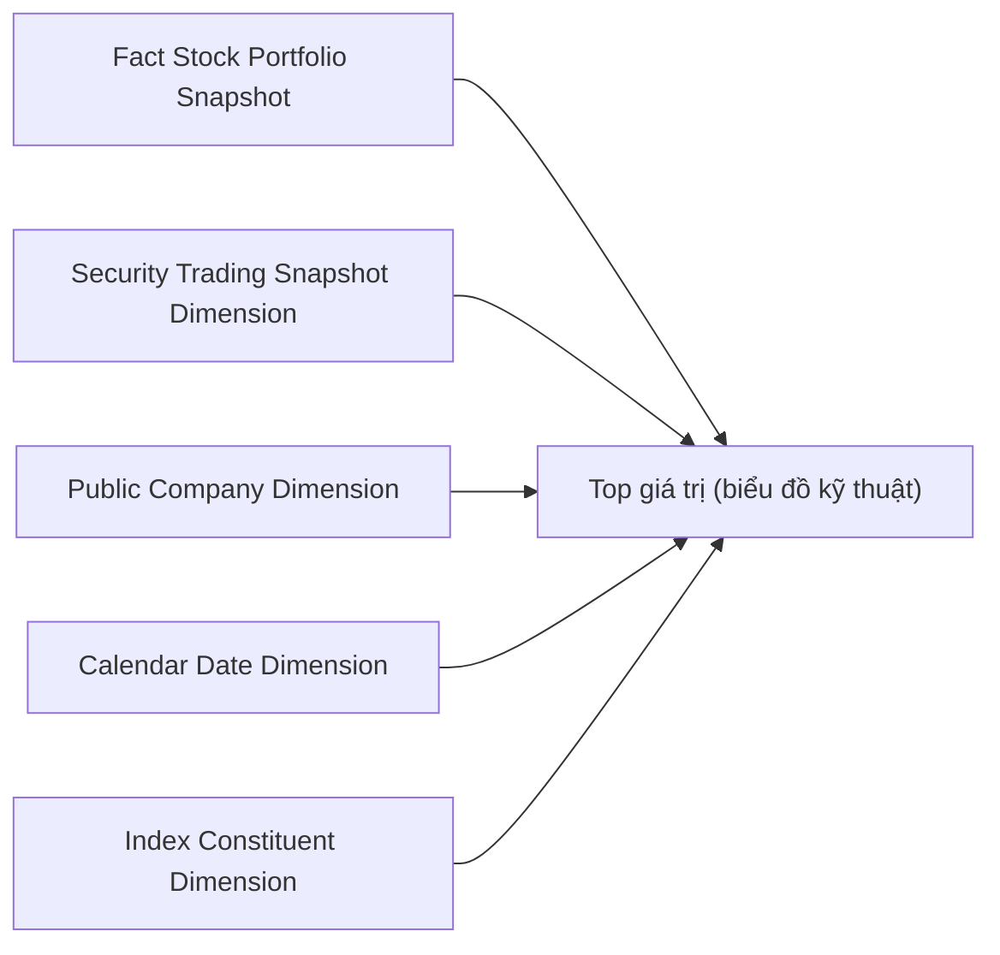
```mermaid
flowchart LR
    F1["Fact Stock Portfolio Snapshot"] --> RPT16["Top giá trị (biểu đồ kỹ thuật)"]
    D1["Security Trading Snapshot Dimension"] --> RPT16
    D2["Public Company Dimension"] --> RPT16
    D3["Calendar Date Dimension"] --> RPT16
    D4["Index Constituent Dimension"] --> RPT16
```

**Bảng grain:** Không có bảng mới — cùng grain `Fact Stock Portfolio Snapshot` đã có ở Nhóm 1.

> **Coverage rule:** Không áp dụng — Nhóm này không tạo/mở rộng Fact hay Dimension nào, thuần túy reuse + Top-N tại tầng BI.

---

#### Nhóm 13 - Top giảm giá theo sàn (bảng số liệu)

> **Phân loại:** Dashboard
> **Atomic:** 100% reuse Nhóm 1 (`Security Trading Snapshot`, `Securities Trade`, `Public Company`, `Classification Business Line`) + Nhóm 6 (`Public Company Share Statistics` Resolved 2026-08-26, sửa nguồn 2026-09-16 (`listed_share_info`, xem O_GSTT_2 + O_GSTT_22), EAV IDS Resolved 2026-08-26 (rule GSĐC, xem O_GSTT_1)) — không có nguồn mới.
>
> **Ghi chú tái sử dụng (sửa 2026-09-05 — rà soát BA↔KPI phát hiện thiếu KPI):** BA liệt kê 14 dòng con — toàn bộ đã có KPI ID sẵn từ Nhóm 1 (Mã, Sàn, Ngành, Ngày, % thay đổi, KLGD, Giá) và Nhóm 6 (Số CP lưu hành, Vốn hóa, LNST, P/E, VCSH, P/B) — reuse thẳng, không khai sinh KPI mới, không tạo/sửa Fact hay Dimension nào. **Sửa lại ghi chú trước đó (từng ghi sai "không có Bộ chỉ số"):** rà soát lại BA hiện hành xác nhận STT=13 THỰC SỰ CÓ dòng con "Bộ chỉ số ngành/bộ chỉ số thị trường" (giống Nhóm 7/9/12/15/17/19/21) — đã bổ sung K_GSTT_62/63 vào bảng KPI, reuse đúng pattern các Nhóm trên.
> **Ghi chú "Bộ chỉ số ngành/bộ chỉ số thị trường" (BA gộp 1 dòng con thành 2 KPI, giống Nhóm 9/12/15/17/19/21; bổ sung 2026-09-05):** Cùng bản chất đã xác nhận ở Nhóm 7 — cả 2 là filter con của K_GSTT_4 (`Index Constituent Dimension.Index Code`): "Bộ chỉ số thị trường" = `Index Code IN ('HOSE','UPCOM','HNX')`, "Bộ chỉ số theo ngành" = `Index Code NOT IN ('HOSE','UPCOM','HNX')`. Bảng KPI dưới đây có 15 dòng cho 14 dòng BA (cùng lý do +1 như các Nhóm trên).
> **[SỬA 2026-09-07]** KLGD đổi sang range-based (K_GSTT_133, reuse Nhóm 7) + bổ sung chiều "Từ ngày" (K_GSTT_139) — theo Note nghiệp vụ "UB_Phạm vi phân tích".
> **[SỬA 2026-09-12]** Khai sinh **K_GSTT_145** thay `K_GSTT_12` làm tiêu chí Top-N "% thay đổi". Phát hiện qua review: `K_GSTT_12` lấy từ `Security Trading Snapshot Dimension` (giá trị `Price Change`/`Reference Price` của **1 phiên gần nhất**, không dùng chiều Từ ngày/Đến ngày) — dù bảng KPI đã có sẵn 2 chiều "Từ ngày"/"Đến ngày" từ 2026-09-07, công thức % thay đổi chưa từng được đổi sang so sánh theo khoảng đã chọn (tự ghi nhận tại ghi chú K_GSTT_133 Nhóm 7: "vẫn dùng làm tiêu chí Top-N dù không hiển thị trên Mockup"). K_GSTT_145 so sánh đúng Close Price tại Đến ngày với Close Price phiên giao dịch liền trước Từ ngày — cùng nhóm 4 Nhóm áp dụng: 13 (khai sinh)/14/19/20. K_GSTT_12 vẫn giữ nguyên, không đổi, cho các Nhóm khác đang dùng đúng ý nghĩa "1 phiên gần nhất" (Nhóm 1/2/7-12/15-18/21-35).
> **[SỬA 2026-09-14, ĐẢO NGƯỢC MỘT PHẦN quyết định 2026-09-12 — theo yêu cầu Data Modeler, ưu tiên sheet Tổng hợp công thức]** Cách hiểu 2026-09-12 ở trên SAI: rule BA thật ("% Thay đổi giá tại 1 ngày: (Giá đóng cửa / Giá tham chiếu - 1) × 100 — Đến ngày") không yêu cầu tính lại giá gốc bằng self-join theo Từ ngày — `Reference Price` (giá tham chiếu) đã tự mang đúng ý nghĩa "giá đóng cửa phiên liền trước" cho NGÀY ĐANG XÉT, không cần suy ra qua Từ ngày. Đã sửa `logic` K_GSTT_145 (Nhóm 13/14/19/20) bỏ hẳn self-join, dùng thẳng `Price Change`/`Reference Price` từ `Security Trading Snapshot Dimension` — **công thức nay giống hệt K_GSTT_12**. Chưa quyết định gộp K_GSTT_145 vào K_GSTT_12 (giữ nguyên KPI_ID riêng để không phá vỡ tham chiếu Top-N `ORDER BY` hiện có) — cần Data Modeler xác nhận thêm nếu muốn dọn gộp.

**Mockup:**

| Mã | Sàn | Bộ chỉ số ngành | Ngành | Từ ngày | Đến ngày | % thay đổi | KLGD | Giá | Số CP lưu hành | Vốn hóa | LNST | P/E | VCSH | P/B |
|---|---|---|---|---|---|---|---|---|---|---|---|---|---|---|
| ABC | HOSE | VN30 | Bất động sản | 01/07/2026 | 27/07/2026 | -6.85% | 210 Tr | 24.50 | *(pending)* | *(pending)* | *(pending)* | *(pending)* | *(pending)* | *(pending)* |

**Source:** `Fact Stock Portfolio Snapshot` → `Security Trading Snapshot Dimension`, `Public Company Dimension`, `Calendar Date Dimension` — 100% reuse, Top-N theo % thay đổi (tăng dần) tại tầng BI, lọc theo Sàn.

**Bảng KPI:**

| KPI ID | Tên KPI | Đơn vị | Tính chất | Công thức | Ghi chú | Trạng thái |
|---|---|---|---|---|---|---|
| K_GSTT_1 | Mã | — | Chiều | `Security Trading Snapshot Dimension.Symbol` | Reuse từ Nhóm 1 | READY |
| K_GSTT_3 | Sàn | — | Chiều | `Security Trading Snapshot Dimension.Floor Code` | Reuse từ Nhóm 1 | READY |
| K_GSTT_62 | Bộ chỉ số thị trường | — | Chiều | `Index Constituent Dimension.Index Code` | Bổ sung 2026-09-05 — reuse từ K_GSTT_62 (Nhóm 7): `Index Code IN ('HOSE','UPCOM','HNX')` | READY |
| K_GSTT_63 | Bộ chỉ số theo ngành | — | Chiều | `Index Constituent Dimension.Index Code` | Bổ sung 2026-09-05 — reuse từ K_GSTT_63 (Nhóm 7): `Index Code NOT IN ('HOSE','UPCOM','HNX')` | READY |
| K_GSTT_2 | Ngành | — | Chiều | `Public Company Dimension.Business Line Level 1 Code`, `Classification Business Line Name` | Reuse từ Nhóm 1 | READY |
| K_GSTT_139 | Từ ngày | — | Chiều | `Calendar Date Dimension.Calendar Date` | **[MỚI 2026-09-07]** Reuse từ Nhóm 7 | READY |
| K_GSTT_7 | Đến ngày | — | Chiều | `Calendar Date Dimension.Calendar Date` | **[SỬA 2026-09-07]** Đổi tên hiển thị từ "Ngày" | READY |
| K_GSTT_145 | % thay đổi | % | Phái sinh | `(Close Price tại Đến ngày − Reference Price tại Từ ngày) / Reference Price tại Từ ngày × 100` | **[SỬA 2026-09-14, khôi phục sau khi đọc đầy đủ sheet Tổng hợp công thức]** Đây là ROW 48 "% thay đổi giá trong kỳ" ("Chỉ tiêu dùng để lọc top mã chứng khoán tăng/giảm giá") — khác ROW 47 "% thay đổi giá (tại ngày cuối kỳ)" = K_GSTT_12. Chỉ Chức năng "Top tăng giá/giảm giá" có cả 2 Trường thông tin riêng biệt này; mọi Chức năng khác chỉ có ROW 47. **[SỬA tiếp 2026-09-14, đóng O_GSTT_21, đơn giản hóa theo góp ý Data Modeler]** Bổ sung cột `Reference Price` (`security_trading_snapshot.reference_price`, lưu theo ngày trên Fact — cùng pattern Close Price) — trường này do sàn tự công bố đúng theo quy tắc riêng từng sàn (HOSE/HNX = Close Price phiên trước, UPCOM = VWAP phiên trước), nên chỉ cần lấy đúng dòng Reference Price tại Từ ngày, KHÔNG cần self-join sang phiên trước đó hay CASE floor_code. Vẫn thay `K_GSTT_12` làm tiêu chí Top-N (`ORDER BY ... ASC`, giảm mạnh nhất lên đầu) | READY |
| K_GSTT_133 | KLGD khớp lệnh | Cổ phiếu | Phái sinh | `SUM(Securities Trade.Execution Volume) WHERE Trade Date BETWEEN :from_date AND :to_date AND Board Type Code NOT IN ('T1','T2','T3','T4','T6','R1') GROUP BY Symbol` | **[SỬA 2026-09-07]** Reuse từ K_GSTT_133 (Nhóm 7) — thay K_GSTT_13, tổng theo khoảng ngày. | READY |
| K_GSTT_10 | Giá | VNĐ | Cơ sở | `Security Trading Snapshot Dimension.Close Price` | Reuse từ Nhóm 1 (K_GSTT_10 = Giá đóng cửa) | READY |
| K_GSTT_55 | Số cổ phiếu đang lưu hành | Cổ phiếu | Cơ sở | `Fact Stock Portfolio Snapshot.Outstanding Share Quantity` | Reuse từ Nhóm 6 — Resolved 2026-08-26, sửa nguồn 2026-09-16 (`listed_share_info`, xem O_GSTT_2 + O_GSTT_22) | READY |
| K_GSTT_61 | Vốn hóa | VNĐ | Chỉ tiêu phái sinh | `MAX(K_GSTT_10 (Giá đóng cửa) × K_GSTT_55 (Số CP lưu hành)) GROUP BY Symbol, Trade Date` (Vốn hóa TỪNG MÃ CK, không phải theo Index — sửa 2026-09-14, phát hiện qua review Data Modeler: bảng Top-N theo mã CK không phải theo rổ chỉ số, cùng pattern Nhóm 23) | Reuse từ Nhóm 6 — Resolved 2026-08-26 (K_GSTT_55 đã có nguồn) | READY |
| K_GSTT_56 | LNST | VNĐ | Cơ sở | `Fact Stock Portfolio Snapshot.Net Profit After Tax` | Reuse từ Nhóm 6 — Resolved 2026-08-26 (rule GSĐC, xem O_GSTT_1) | READY |
| K_GSTT_58 | P/E thị trường | Lần | Chỉ tiêu phái sinh | `K_GSTT_10 / (Fact Stock Portfolio Snapshot.Net Profit After Tax TTM / K_GSTT_55)` | Reuse từ Nhóm 6 — Resolved 2026-08-26. LNST dùng TTM 4 quý (rule GSĐC); K_GSTT_55 đã có nguồn (`listed_share_info`, sửa nguồn 2026-09-16 — xem O_GSTT_22) | READY |
| K_GSTT_57 | VCSH | VNĐ | Cơ sở | `Fact Stock Portfolio Snapshot.Owner Equity` | Reuse từ Nhóm 6 — Resolved 2026-08-26 (rule GSĐC, xem O_GSTT_1) | READY |
| K_GSTT_59 | P/B thị trường | Lần | Chỉ tiêu phái sinh | `K_GSTT_10 / (K_GSTT_57 / K_GSTT_55)` | Reuse từ Nhóm 6 — Resolved 2026-08-26. K_GSTT_57 (VCSH) và K_GSTT_55 (Số CP lưu hành) đều đã có nguồn | READY |

**Star Schema:** Không có bảng mới — 100% reuse `Fact Stock Portfolio Snapshot`, `Security Trading Snapshot Dimension`, `Public Company Dimension`, `Calendar Date Dimension`, `Index Constituent Dimension` (bổ sung 2026-09-05 cho K_GSTT_62/63) đã vẽ ở Nhóm 1.

**Lineage Mart → Báo cáo:**

```mermaid
flowchart LR
    F1["Fact Stock Portfolio Snapshot"] --> RPT19["Top giảm giá theo sàn (bảng số liệu)"]
    D1["Security Trading Snapshot Dimension"] --> RPT19
    D2["Public Company Dimension"] --> RPT19
    D3["Calendar Date Dimension"] --> RPT19
    D4["Index Constituent Dimension"] --> RPT19
```

**Bảng grain:** Không có bảng mới — cùng grain `Fact Stock Portfolio Snapshot` đã có ở Nhóm 1.

> **Coverage rule:** Không áp dụng — Nhóm này không tạo/mở rộng Fact hay Dimension nào, thuần túy reuse + Top-N tại tầng BI.

---

#### Nhóm 14 - Top giảm giá theo sàn (biểu đồ kỹ thuật)

> **Phân loại:** Dashboard
> **Atomic:** 100% reuse Nhóm 1 (`Security Trading Snapshot`, `Securities Trade`, `Public Company`, `Classification Business Line`) + Nhóm 3 (EAV IDS PENDING) — không có nguồn mới.
>
> **Ghi chú tái sử dụng (cập nhật 2026-09-05 — hợp nhất theo BA mới, xem O_GSTT_18):** BA liệt kê 12 dòng con — toàn bộ đã có KPI ID sẵn từ Nhóm 1 (Mã, Chỉ số, Sàn, Ngành, Ngày, Khối lượng giao dịch) và Nhóm 3 (Giá mở/cao/thấp/đóng cửa, Doanh thu, Lợi nhuận sau thuế) — reuse thẳng, không khai sinh KPI mới, không tạo/sửa Fact hay Dimension nào. Biến thể biểu đồ kỹ thuật của Nhóm 13 (cùng tiêu chí Top-N theo % thay đổi tăng dần/giảm mạnh nhất theo sàn, khác cách hiển thị — biểu đồ nến/đường thay vì bảng). BA dùng "Doanh thu"/"Lợi nhuận sau thuế" (không có VCSH/P-E/P-B/Số CP lưu hành/Vốn hóa như Nhóm 13) — đúng pattern Nhóm 3/8, reuse K_GSTT_31/32. Khác Nhóm 13, ở đây BA liệt kê cả "Chỉ số" và "Sàn" cùng lúc.
> **[SỬA 2026-09-07]** Khối lượng giao dịch đổi sang range-based (K_GSTT_133, reuse Nhóm 7) + bổ sung chiều "Từ ngày" (K_GSTT_139) — theo Note nghiệp vụ "UB_Phạm vi phân tích".
> **[SỬA 2026-09-12]** Tiêu chí Top-N "% thay đổi" đổi sang `K_GSTT_145` (khai sinh tại Nhóm 13) thay `K_GSTT_12` — xem ghi chú chi tiết tại Nhóm 13. Không hiển thị cột "% thay đổi" trên mockup biểu đồ kỹ thuật này (cùng pattern Nhóm 8/10/12/16/18), nhưng vẫn dùng để chọn Top-N danh sách mã hiển thị.

**Mockup:**

| Mã | Chỉ số | Sàn | Ngành | Từ ngày | Đến ngày | Giá mở | Giá cao | Giá thấp | Giá đóng | Khối lượng | Doanh thu | Lợi nhuận sau thuế |
|---|---|---|---|---|---|---|---|---|---|---|---|---|
| ABC | VN30 | HOSE | Bất động sản | 01/07/2026 | 27/07/2026 | 26.00 | 26.20 | 24.30 | 24.50 | 210 Tr | — | — |

**Source:** `Fact Stock Portfolio Snapshot` → `Security Trading Snapshot Dimension`, `Public Company Dimension`, `Calendar Date Dimension`, `Index Constituent Dimension` — 100% reuse, Top-N theo % thay đổi (tăng dần) tại tầng BI, lọc theo Sàn.

**Bảng KPI:**

| KPI ID | Tên KPI | Đơn vị | Tính chất | Công thức | Ghi chú | Trạng thái |
|---|---|---|---|---|---|---|
| K_GSTT_1 | Mã | — | Chiều | `Security Trading Snapshot Dimension.Symbol` | Reuse từ Nhóm 1. BA gắn nhãn "Chỉ tiêu cơ sở" cho dòng này nhưng bản chất là khóa định danh mã CK — cùng KPI Chiều K_GSTT_1, không tách KPI mới | READY |
| K_GSTT_4 | Chỉ số | — | Chiều | `Index Constituent Dimension.Index Code` | Reuse từ Nhóm 1 | READY |
| K_GSTT_3 | Sàn | — | Chiều | `Security Trading Snapshot Dimension.Floor Code` | Reuse từ Nhóm 1 | READY |
| K_GSTT_2 | Ngành | — | Chiều | `Public Company Dimension.Business Line Level 1 Code`, `Classification Business Line Name` | Reuse từ Nhóm 1 | READY |
| K_GSTT_139 | Từ ngày | — | Chiều | `Calendar Date Dimension.Calendar Date` | **[MỚI 2026-09-07]** Reuse từ Nhóm 7 | READY |
| K_GSTT_7 | Đến ngày | — | Chiều | `Calendar Date Dimension.Calendar Date` | **[SỬA 2026-09-07]** Đổi tên hiển thị từ "Ngày" | READY |
| K_GSTT_27 | Giá mở cửa | VNĐ | Cơ sở | `Security Trading Snapshot Dimension.Open Price` | Reuse từ Nhóm 3 | READY |
| K_GSTT_28 | Giá cao nhất | VNĐ | Cơ sở | `Security Trading Snapshot Dimension.High Price` | Reuse từ Nhóm 3 | READY |
| K_GSTT_29 | Giá thấp nhất | VNĐ | Cơ sở | `Security Trading Snapshot Dimension.Low Price` | Reuse từ Nhóm 3 | READY |
| K_GSTT_10 | Giá đóng cửa | VNĐ | Cơ sở | `Security Trading Snapshot Dimension.Close Price` | Reuse từ Nhóm 1 | READY |
| K_GSTT_133 | Khối lượng giao dịch khớp lệnh | Cổ phiếu | Phái sinh | `SUM(Securities Trade.Execution Volume) WHERE Trade Date BETWEEN :from_date AND :to_date AND Board Type Code NOT IN ('T1','T2','T3','T4','T6','R1') GROUP BY Symbol` | **[SỬA 2026-09-07]** Reuse từ K_GSTT_133 (Nhóm 7) — thay K_GSTT_13, tổng theo khoảng ngày | READY |
| K_GSTT_31 | Doanh thu | VNĐ | Cơ sở | `Fact Stock Portfolio Snapshot.Revenue` | Reuse từ Nhóm 3 — Resolved 2026-08-26 (rule GSĐC, xem O_GSTT_1) | READY |
| K_GSTT_32 | Lợi nhuận sau thuế | VNĐ | Cơ sở | `Fact Stock Portfolio Snapshot.Net Profit After Tax` | Reuse từ Nhóm 3 — Resolved 2026-08-26 (rule GSĐC, xem O_GSTT_1) | READY |

**Star Schema:** Không có bảng mới — 100% reuse `Fact Stock Portfolio Snapshot`, `Security Trading Snapshot Dimension`, `Public Company Dimension`, `Calendar Date Dimension`, `Index Constituent Dimension` đã vẽ ở Nhóm 1.

**Lineage Mart → Báo cáo:**

```mermaid
flowchart LR
    F1["Fact Stock Portfolio Snapshot"] --> RPT20["Top giảm giá theo sàn (biểu đồ kỹ thuật)"]
    D1["Security Trading Snapshot Dimension"] --> RPT20
    D2["Public Company Dimension"] --> RPT20
    D3["Calendar Date Dimension"] --> RPT20
    D4["Index Constituent Dimension"] --> RPT20
```

**Bảng grain:** Không có bảng mới — cùng grain `Fact Stock Portfolio Snapshot` đã có ở Nhóm 1.

> **Coverage rule:** Không áp dụng — Nhóm này không tạo/mở rộng Fact hay Dimension nào, thuần túy reuse + Top-N tại tầng BI.

---

#### Nhóm 15 - Top vượt đỉnh theo sàn (bảng số liệu)

> **Phân loại:** Dashboard
> **Atomic:** 100% reuse Nhóm 1 (`Security Trading Snapshot`, `Securities Trade`, `Public Company`, `Classification Business Line`) + Nhóm 3 (`High Price`) + Nhóm 6 (`Public Company Share Statistics` Resolved 2026-08-26, sửa nguồn 2026-09-16 (`listed_share_info`, xem O_GSTT_2 + O_GSTT_22), EAV IDS Resolved 2026-08-26 (rule GSĐC, xem O_GSTT_1)) + Nhóm 7 (Bộ chỉ số thị trường/ngành) — không có nguồn mới.
>
> **Ghi chú tái sử dụng (cập nhật 2026-09-05 — hợp nhất theo BA mới, xem O_GSTT_18):** BA liệt kê 14 dòng con — toàn bộ đã có KPI ID sẵn từ Nhóm 1 (Mã, Sàn, Ngành, Ngày, Khối lượng, Giá, % thay đổi), Nhóm 3 (Giá cao nhất → Đỉnh cũ, xem ghi chú dưới đây), Nhóm 6 (LNST, VCSH, Số CP lưu hành, P/E, P/B) và Nhóm 7 (Bộ chỉ số thị trường/ngành) — reuse thẳng, không khai sinh KPI mới, không tạo/sửa Fact hay Dimension nào. Không có Vốn hóa (BA không yêu cầu ở dashboard này).
> **Ghi chú "Bộ chỉ số thị trường/bộ chỉ số ngành" (BA gộp 1 dòng con thành 2 KPI, giống Nhóm 9/13/14; cập nhật 2026-07-28):** Cùng bản chất đã xác nhận ở Nhóm 7 — cả 2 là filter con của K_GSTT_4 (`Index Constituent Dimension.Index Code`): "Bộ chỉ số thị trường" = `Index Code IN ('HOSE','UPCOM','HNX')`, "Bộ chỉ số theo ngành" = `Index Code NOT IN ('HOSE','UPCOM','HNX')`. Bảng KPI dưới đây có 15 dòng cho 14 dòng BA (cùng lý do +1 như Nhóm 9/13/14).
> **Ghi chú "Đỉnh cũ" — **[SỬA 2026-09-19, lần 4]** đảo ngược O_GSTT_6:** reuse K_GSTT_106 (Giá cao nhất 52 tuần, nay Max High Price — xem chi tiết đảo ngược ở Nhóm 34), không còn K_GSTT_28.
> **[SỬA 2026-09-07]** Mở rộng "Đỉnh cũ" thành 3 mốc thời gian theo Note nghiệp vụ "UB_Phạm vi phân tích" — reuse K_GSTT_140 (3 tháng), K_GSTT_141 (6 tháng), K_GSTT_106 (1 năm, không đổi công thức, chỉ đổi tên hiển thị). Cả 3 khai sinh gốc tại Nhóm 34 (Giá cao nhất N gần nhất). Đồng thời Khối lượng đổi sang range-based (K_GSTT_133) + bổ sung chiều "Từ ngày" (K_GSTT_139) — cùng thay đổi Nhóm 7-22.

**Mockup:**

| Mã | Sàn | Ngành | Bộ chỉ số ngành | Từ ngày | Đến ngày | Khối lượng | Giá | % thay đổi | Đỉnh cũ (3 tháng) | Đỉnh cũ (6 tháng) | Đỉnh cũ (1 năm) | LNST | VCSH | Số cổ phiếu lưu hành | P/E | P/B |
|---|---|---|---|---|---|---|---|---|---|---|---|---|---|---|---|---|
| XYZ | HOSE | Công nghệ | VN30 | 01/07/2026 | 27/07/2026 | 140 Tr | 45.20 | +6.90% | 44.80 | 43.60 | 45.50 | *(pending)* | *(pending)* | *(pending)* | *(pending)* | *(pending)* |

**Source:** `Fact Stock Portfolio Snapshot` → `Security Trading Snapshot Dimension`, `Public Company Dimension`, `Calendar Date Dimension`, `Index Constituent Dimension` — 100% reuse, Top-N theo % thay đổi (giảm dần) tại tầng BI, lọc theo Sàn.

**Bảng KPI:**

| KPI ID | Tên KPI | Đơn vị | Tính chất | Công thức | Ghi chú | Trạng thái |
|---|---|---|---|---|---|---|
| K_GSTT_1 | Mã | — | Chiều | `Security Trading Snapshot Dimension.Symbol` | Reuse từ Nhóm 1 | READY |
| K_GSTT_3 | Sàn | — | Chiều | `Security Trading Snapshot Dimension.Floor Code` | Reuse từ Nhóm 1 | READY |
| K_GSTT_2 | Ngành | — | Chiều | `Public Company Dimension.Business Line Level 1 Code`, `Classification Business Line Name` | Reuse từ Nhóm 1 | READY |
| K_GSTT_62 | Bộ chỉ số thị trường | — | Chiều | `Index Constituent Dimension.Index Code` | Reuse từ K_GSTT_62 (Nhóm 7): `Index Code IN ('HOSE','UPCOM','HNX')` | READY |
| K_GSTT_63 | Bộ chỉ số theo ngành | — | Chiều | `Index Constituent Dimension.Index Code` | Reuse từ K_GSTT_63 (Nhóm 7): `Index Code NOT IN ('HOSE','UPCOM','HNX')` | READY |
| K_GSTT_139 | Từ ngày | — | Chiều | `Calendar Date Dimension.Calendar Date` | **[MỚI 2026-09-07]** Reuse từ Nhóm 7 | READY |
| K_GSTT_7 | Đến ngày | — | Chiều | `Calendar Date Dimension.Calendar Date` | **[SỬA 2026-09-07]** Đổi tên hiển thị từ "Ngày" | READY |
| K_GSTT_133 | Khối lượng khớp lệnh | Cổ phiếu | Phái sinh | `SUM(Securities Trade.Execution Volume) WHERE Trade Date BETWEEN :from_date AND :to_date AND Board Type Code NOT IN ('T1','T2','T3','T4','T6','R1') GROUP BY Symbol` | **[SỬA 2026-09-07]** Reuse từ K_GSTT_133 (Nhóm 7) — thay K_GSTT_13, tổng theo khoảng ngày. | READY |
| K_GSTT_10 | Giá | VNĐ | Cơ sở | `Security Trading Snapshot Dimension.Close Price` | Reuse từ Nhóm 1 (K_GSTT_10 = Giá đóng cửa) | READY |
| K_GSTT_12 | % thay đổi | % | Phái sinh | `Price Change / Reference Price × 100` | Reuse từ Nhóm 1 — dùng làm tiêu chí sắp xếp Top-N (`ORDER BY ... DESC`, tăng mạnh nhất lên đầu) | READY |
| K_GSTT_140 | Đỉnh cũ (3 tháng) | VNĐ | Phái sinh | `MAX(Fact Stock Portfolio Snapshot.High Price) OVER (PARTITION BY Symbol ORDER BY Trading Date ROWS BETWEEN 64 PRECEDING AND CURRENT ROW)` | **[SỬA 2026-09-19, lần 4]** Reuse từ K_GSTT_140 (Nhóm 34) — xem ghi chú "Đỉnh cũ" ở trên | READY |
| K_GSTT_141 | Đỉnh cũ (6 tháng) | VNĐ | Phái sinh | `MAX(Fact Stock Portfolio Snapshot.High Price) OVER (PARTITION BY Symbol ORDER BY Trading Date ROWS BETWEEN 129 PRECEDING AND CURRENT ROW)` | **[SỬA 2026-09-19, lần 4]** Reuse từ K_GSTT_141 (Nhóm 34) — xem ghi chú "Đỉnh cũ" ở trên | READY |
| K_GSTT_106 | Đỉnh cũ (1 năm) | VNĐ | Phái sinh | `MAX(Fact Stock Portfolio Snapshot.High Price) OVER (PARTITION BY Symbol ORDER BY Trading Date ROWS BETWEEN 259 PRECEDING AND CURRENT ROW)` | **[SỬA 2026-09-19, lần 4]** Reuse từ K_GSTT_106 (Nhóm 34) — xem ghi chú "Đỉnh cũ" ở trên | READY |
| K_GSTT_56 | LNST | VNĐ | Cơ sở | `Fact Stock Portfolio Snapshot.Net Profit After Tax` | Reuse từ Nhóm 6 — Resolved 2026-08-26 (rule GSĐC, xem O_GSTT_1) | READY |
| K_GSTT_57 | VCSH | VNĐ | Cơ sở | `Fact Stock Portfolio Snapshot.Owner Equity` | Reuse từ Nhóm 6 — Resolved 2026-08-26 (rule GSĐC, xem O_GSTT_1) | READY |
| K_GSTT_55 | Số cổ phiếu đang lưu hành | Cổ phiếu | Cơ sở | `Fact Stock Portfolio Snapshot.Outstanding Share Quantity` | Reuse từ Nhóm 6 — Resolved 2026-08-26, sửa nguồn 2026-09-16 (`listed_share_info`, xem O_GSTT_2 + O_GSTT_22) | READY |
| K_GSTT_58 | P/E thị trường | Lần | Chỉ tiêu phái sinh | `K_GSTT_10 / (Fact Stock Portfolio Snapshot.Net Profit After Tax TTM / K_GSTT_55)` | Reuse từ Nhóm 6 — Resolved 2026-08-26. LNST dùng TTM 4 quý (rule GSĐC); K_GSTT_55 đã có nguồn (`listed_share_info`, sửa nguồn 2026-09-16 — xem O_GSTT_22) | READY |
| K_GSTT_59 | P/B thị trường | Lần | Chỉ tiêu phái sinh | `K_GSTT_10 / (K_GSTT_57 / K_GSTT_55)` | Reuse từ Nhóm 6 — Resolved 2026-08-26. K_GSTT_57 (VCSH) và K_GSTT_55 (Số CP lưu hành) đều đã có nguồn | READY |

**Star Schema:** Không có bảng mới — 100% reuse `Fact Stock Portfolio Snapshot`, `Security Trading Snapshot Dimension`, `Public Company Dimension`, `Calendar Date Dimension`, `Index Constituent Dimension` đã vẽ ở Nhóm 1.

**Lineage Mart → Báo cáo:**

```mermaid
flowchart LR
    F1["Fact Stock Portfolio Snapshot"] --> RPT23["Top vượt đỉnh theo sàn (bảng số liệu)"]
    D1["Security Trading Snapshot Dimension"] --> RPT23
    D2["Public Company Dimension"] --> RPT23
    D3["Calendar Date Dimension"] --> RPT23
    D4["Index Constituent Dimension"] --> RPT23
```

**Bảng grain:** Không có bảng mới — cùng grain `Fact Stock Portfolio Snapshot` đã có ở Nhóm 1.

> **Coverage rule:** Không áp dụng — Nhóm này không tạo/mở rộng Fact hay Dimension nào, thuần túy reuse + Top-N tại tầng BI.

---

#### Nhóm 16 - Top vượt đỉnh theo sàn (biểu đồ kỹ thuật)

> **Phân loại:** Dashboard
> **Atomic:** 100% reuse Nhóm 1 (`Security Trading Snapshot`, `Securities Trade`, `Public Company`, `Classification Business Line`) + Nhóm 3 (EAV IDS PENDING) + Nhóm 7 (Bộ chỉ số thị trường/ngành) — không có nguồn mới.
>
> **Ghi chú tái sử dụng (cập nhật 2026-09-05 — hợp nhất theo BA mới, xem O_GSTT_18):** BA liệt kê 12 dòng con — toàn bộ đã có KPI ID sẵn từ Nhóm 1 (Mã, Sàn, Ngành, Ngày, Khối lượng giao dịch), Nhóm 3 (Giá mở/cao/thấp/đóng cửa, Doanh thu, Lợi nhuận sau thuế) và Nhóm 7 (Bộ chỉ số thị trường/ngành) — reuse thẳng, không khai sinh KPI mới, không tạo/sửa Fact hay Dimension nào. Biến thể biểu đồ kỹ thuật của Nhóm 15 (cùng tiêu chí Top-N theo % thay đổi giảm dần/tăng mạnh nhất theo sàn, khác cách hiển thị). Khác Nhóm 15, BA không liệt kê "Đỉnh cũ" ở đây — biểu đồ kỹ thuật chỉ hiển thị giá thông thường. BA dùng "Doanh thu"/"Lợi nhuận sau thuế" (không có LNST/VCSH/Số CP lưu hành/P-E/P-B như Nhóm 15) — đúng pattern Nhóm 3/8, reuse K_GSTT_31/32.
> **Ghi chú "Bộ chỉ số thị trường/bộ chỉ số ngành" (BA gộp 1 dòng con thành 2 KPI, giống Nhóm 15; cập nhật 2026-07-28):** Cùng bản chất đã xác nhận ở Nhóm 7 — cả 2 là filter con của K_GSTT_4 (`Index Constituent Dimension.Index Code`): "Bộ chỉ số thị trường" = `Index Code IN ('HOSE','UPCOM','HNX')`, "Bộ chỉ số theo ngành" = `Index Code NOT IN ('HOSE','UPCOM','HNX')`. Bảng KPI dưới đây có 13 dòng cho 12 dòng BA (cùng lý do +1 như Nhóm 9/13/14/15).
> **[SỬA 2026-09-07]** Khối lượng đổi sang range-based (K_GSTT_133, reuse Nhóm 7) + bổ sung chiều "Từ ngày" (K_GSTT_139) — theo Note nghiệp vụ "UB_Phạm vi phân tích".

**Mockup:**

| Mã | Sàn | Ngành | Bộ chỉ số ngành | Từ ngày | Đến ngày | Giá mở | Giá cao | Giá thấp | Giá đóng | Khối lượng | Doanh thu | Lợi nhuận sau thuế |
|---|---|---|---|---|---|---|---|---|---|---|---|---|
| XYZ | HOSE | Công nghệ | VN30 | 01/07/2026 | 27/07/2026 | 43.00 | 45.50 | 42.80 | 45.20 | 140 Tr | — | — |

**Source:** `Fact Stock Portfolio Snapshot` → `Security Trading Snapshot Dimension`, `Public Company Dimension`, `Calendar Date Dimension`, `Index Constituent Dimension` — 100% reuse, Top-N theo % thay đổi (giảm dần) tại tầng BI, lọc theo Sàn.

**Bảng KPI:**

| KPI ID | Tên KPI | Đơn vị | Tính chất | Công thức | Ghi chú | Trạng thái |
|---|---|---|---|---|---|---|
| K_GSTT_1 | Mã | — | Chiều | `Security Trading Snapshot Dimension.Symbol` | Reuse từ Nhóm 1 | READY |
| K_GSTT_3 | Sàn | — | Chiều | `Security Trading Snapshot Dimension.Floor Code` | Reuse từ Nhóm 1 | READY |
| K_GSTT_2 | Ngành | — | Chiều | `Public Company Dimension.Business Line Level 1 Code`, `Classification Business Line Name` | Reuse từ Nhóm 1 | READY |
| K_GSTT_62 | Bộ chỉ số thị trường | — | Chiều | `Index Constituent Dimension.Index Code` | Reuse từ K_GSTT_62 (Nhóm 7): `Index Code IN ('HOSE','UPCOM','HNX')` | READY |
| K_GSTT_63 | Bộ chỉ số theo ngành | — | Chiều | `Index Constituent Dimension.Index Code` | Reuse từ K_GSTT_63 (Nhóm 7): `Index Code NOT IN ('HOSE','UPCOM','HNX')` | READY |
| K_GSTT_139 | Từ ngày | — | Chiều | `Calendar Date Dimension.Calendar Date` | **[MỚI 2026-09-07]** Reuse từ Nhóm 7 | READY |
| K_GSTT_7 | Đến ngày | — | Chiều | `Calendar Date Dimension.Calendar Date` | **[SỬA 2026-09-07]** Đổi tên hiển thị từ "Ngày" | READY |
| K_GSTT_27 | Giá mở cửa | VNĐ | Cơ sở | `Security Trading Snapshot Dimension.Open Price` | Reuse từ Nhóm 3 | READY |
| K_GSTT_28 | Giá cao nhất | VNĐ | Cơ sở | `Security Trading Snapshot Dimension.High Price` | Reuse từ Nhóm 3 | READY |
| K_GSTT_29 | Giá thấp nhất | VNĐ | Cơ sở | `Security Trading Snapshot Dimension.Low Price` | Reuse từ Nhóm 3 | READY |
| K_GSTT_10 | Giá đóng cửa | VNĐ | Cơ sở | `Security Trading Snapshot Dimension.Close Price` | Reuse từ Nhóm 1 | READY |
| K_GSTT_133 | Khối lượng giao dịch khớp lệnh | Cổ phiếu | Phái sinh | `SUM(Securities Trade.Execution Volume) WHERE Trade Date BETWEEN :from_date AND :to_date AND Board Type Code NOT IN ('T1','T2','T3','T4','T6','R1') GROUP BY Symbol` | **[SỬA 2026-09-07]** Reuse từ K_GSTT_133 (Nhóm 7) — thay K_GSTT_13, tổng theo khoảng ngày. % thay đổi (K_GSTT_12) vẫn dùng làm tiêu chí Top-N dù không hiển thị trên Mockup | READY |
| K_GSTT_31 | Doanh thu | VNĐ | Cơ sở | `Fact Stock Portfolio Snapshot.Revenue` | Reuse từ Nhóm 3 — Resolved 2026-08-26 (rule GSĐC, xem O_GSTT_1) | READY |
| K_GSTT_32 | Lợi nhuận sau thuế | VNĐ | Cơ sở | `Fact Stock Portfolio Snapshot.Net Profit After Tax` | Reuse từ Nhóm 3 — Resolved 2026-08-26 (rule GSĐC, xem O_GSTT_1) | READY |

**Star Schema:** Không có bảng mới — 100% reuse `Fact Stock Portfolio Snapshot`, `Security Trading Snapshot Dimension`, `Public Company Dimension`, `Calendar Date Dimension`, `Index Constituent Dimension` đã vẽ ở Nhóm 1.

**Lineage Mart → Báo cáo:**

```mermaid
flowchart LR
    F1["Fact Stock Portfolio Snapshot"] --> RPT24["Top vượt đỉnh theo sàn (biểu đồ kỹ thuật)"]
    D1["Security Trading Snapshot Dimension"] --> RPT24
    D2["Public Company Dimension"] --> RPT24
    D3["Calendar Date Dimension"] --> RPT24
    D4["Index Constituent Dimension"] --> RPT24
```

**Bảng grain:** Không có bảng mới — cùng grain `Fact Stock Portfolio Snapshot` đã có ở Nhóm 1.

> **Coverage rule:** Không áp dụng — Nhóm này không tạo/mở rộng Fact hay Dimension nào, thuần túy reuse + Top-N tại tầng BI.

---

#### Nhóm 17 - Top thủng đáy theo sàn (bảng số liệu)

> **Phân loại:** Dashboard
> **Atomic:** 100% reuse Nhóm 1 (`Security Trading Snapshot`, `Securities Trade`, `Public Company`, `Classification Business Line`) + Nhóm 3 (`Low Price`) + Nhóm 6 (`Public Company Share Statistics` Resolved 2026-08-26, sửa nguồn 2026-09-16 (`listed_share_info`, xem O_GSTT_2 + O_GSTT_22), EAV IDS Resolved 2026-08-26 (rule GSĐC, xem O_GSTT_1)) + Nhóm 7 (Bộ chỉ số thị trường/ngành) — không có nguồn mới.
>
> **Ghi chú tái sử dụng (cập nhật 2026-09-05 — hợp nhất theo BA mới, xem O_GSTT_18):** BA liệt kê 14 dòng con — toàn bộ đã có KPI ID sẵn từ Nhóm 1 (Mã CK, Sàn, Ngành, Ngày, Khối lượng, Giá, % thay đổi), Nhóm 3 (Giá thấp nhất → Đáy cũ, xem ghi chú dưới đây), Nhóm 6 (LNST, VCSH, Số CP lưu hành, P/E, P/B) và Nhóm 7 (Bộ chỉ số thị trường/ngành) — reuse thẳng, không khai sinh KPI mới, không tạo/sửa Fact hay Dimension nào. Cùng cấu trúc chỉ tiêu với Nhóm 15 (Top vượt đỉnh theo sàn), chỉ khác chiều Top-N và "Đáy cũ" thay "Đỉnh cũ".
> **Ghi chú "Bộ chỉ số thị trường/bộ chỉ số ngành" (BA gộp 1 dòng con thành 2 KPI, giống Nhóm 9/13/14/15/16; cập nhật 2026-07-28):** Cùng bản chất đã xác nhận ở Nhóm 7 — cả 2 là filter con của K_GSTT_4 (`Index Constituent Dimension.Index Code`): "Bộ chỉ số thị trường" = `Index Code IN ('HOSE','UPCOM','HNX')`, "Bộ chỉ số theo ngành" = `Index Code NOT IN ('HOSE','UPCOM','HNX')`. Bảng KPI dưới đây có 15 dòng cho 14 dòng BA (cùng lý do +1 như các Nhóm trên).
> **Ghi chú "Đáy cũ" — **[SỬA 2026-09-19, lần 4]** đảo ngược O_GSTT_6:** reuse K_GSTT_107 (Giá thấp nhất 52 tuần, nay Min Low Price — xem chi tiết đảo ngược ở Nhóm 34), không còn K_GSTT_29.
> **[SỬA 2026-09-07]** Mở rộng "Đáy cũ" thành 3 mốc thời gian theo Note nghiệp vụ "UB_Phạm vi phân tích" — reuse K_GSTT_142 (3 tháng), K_GSTT_143 (6 tháng), K_GSTT_107 (1 năm, không đổi công thức, chỉ đổi tên hiển thị). Cả 3 khai sinh gốc tại Nhóm 34 (Giá thấp nhất N gần nhất). Đồng thời Khối lượng đổi sang range-based (K_GSTT_133) + bổ sung chiều "Từ ngày" (K_GSTT_139).

**Mockup:**

| Mã ck | Sàn | Ngành | Bộ chỉ số ngành | Từ ngày | Đến ngày | Khối lượng | Giá | % thay đổi | Đáy cũ (3 tháng) | Đáy cũ (6 tháng) | Đáy cũ (1 năm) | LNST | VCSH | Số cổ phiếu lưu hành | P/E | P/B |
|---|---|---|---|---|---|---|---|---|---|---|---|---|---|---|---|---|
| DEF | HOSE | Xây dựng | VN30 | 01/07/2026 | 27/07/2026 | 82 Tr | 12.30 | -6.82% | 12.60 | 12.90 | 12.10 | *(pending)* | *(pending)* | *(pending)* | *(pending)* | *(pending)* |

**Source:** `Fact Stock Portfolio Snapshot` → `Security Trading Snapshot Dimension`, `Public Company Dimension`, `Calendar Date Dimension`, `Index Constituent Dimension` — 100% reuse, Top-N theo % thay đổi (tăng dần) tại tầng BI, lọc theo Sàn.

**Bảng KPI:**

| KPI ID | Tên KPI | Đơn vị | Tính chất | Công thức | Ghi chú | Trạng thái |
|---|---|---|---|---|---|---|
| K_GSTT_1 | Mã ck | — | Chiều | `Security Trading Snapshot Dimension.Symbol` | Reuse từ Nhóm 1 | READY |
| K_GSTT_3 | Sàn | — | Chiều | `Security Trading Snapshot Dimension.Floor Code` | Reuse từ Nhóm 1 | READY |
| K_GSTT_2 | Ngành | — | Chiều | `Public Company Dimension.Business Line Level 1 Code`, `Classification Business Line Name` | Reuse từ Nhóm 1 | READY |
| K_GSTT_62 | Bộ chỉ số thị trường | — | Chiều | `Index Constituent Dimension.Index Code` | Reuse từ K_GSTT_62 (Nhóm 7): `Index Code IN ('HOSE','UPCOM','HNX')` | READY |
| K_GSTT_63 | Bộ chỉ số theo ngành | — | Chiều | `Index Constituent Dimension.Index Code` | Reuse từ K_GSTT_63 (Nhóm 7): `Index Code NOT IN ('HOSE','UPCOM','HNX')` | READY |
| K_GSTT_139 | Từ ngày | — | Chiều | `Calendar Date Dimension.Calendar Date` | **[MỚI 2026-09-07]** Reuse từ Nhóm 7 | READY |
| K_GSTT_7 | Đến ngày | — | Chiều | `Calendar Date Dimension.Calendar Date` | **[SỬA 2026-09-07]** Đổi tên hiển thị từ "Ngày" | READY |
| K_GSTT_133 | Khối lượng khớp lệnh | Cổ phiếu | Phái sinh | `SUM(Securities Trade.Execution Volume) WHERE Trade Date BETWEEN :from_date AND :to_date AND Board Type Code NOT IN ('T1','T2','T3','T4','T6','R1') GROUP BY Symbol` | **[SỬA 2026-09-07]** Reuse từ K_GSTT_133 (Nhóm 7) — thay K_GSTT_13, tổng theo khoảng ngày. | READY |
| K_GSTT_10 | Giá | VNĐ | Cơ sở | `Security Trading Snapshot Dimension.Close Price` | Reuse từ Nhóm 1 (K_GSTT_10 = Giá đóng cửa) | READY |
| K_GSTT_12 | % thay đổi | % | Phái sinh | `Price Change / Reference Price × 100` | Reuse từ Nhóm 1 — dùng làm tiêu chí sắp xếp Top-N (`ORDER BY ... ASC`, giảm mạnh nhất lên đầu) | READY |
| K_GSTT_142 | Đáy cũ (3 tháng) | VNĐ | Phái sinh | `MIN(Fact Stock Portfolio Snapshot.Low Price) OVER (PARTITION BY Symbol ORDER BY Trading Date ROWS BETWEEN 64 PRECEDING AND CURRENT ROW)` | **[SỬA 2026-09-19, lần 4]** Reuse từ K_GSTT_142 (Nhóm 34) — xem ghi chú "Đáy cũ" ở trên | READY |
| K_GSTT_143 | Đáy cũ (6 tháng) | VNĐ | Phái sinh | `MIN(Fact Stock Portfolio Snapshot.Low Price) OVER (PARTITION BY Symbol ORDER BY Trading Date ROWS BETWEEN 129 PRECEDING AND CURRENT ROW)` | **[SỬA 2026-09-19, lần 4]** Reuse từ K_GSTT_143 (Nhóm 34) — xem ghi chú "Đáy cũ" ở trên | READY |
| K_GSTT_107 | Đáy cũ (1 năm) | VNĐ | Phái sinh | `MIN(Fact Stock Portfolio Snapshot.Low Price) OVER (PARTITION BY Symbol ORDER BY Trading Date ROWS BETWEEN 259 PRECEDING AND CURRENT ROW)` | **[SỬA 2026-09-19, lần 4]** Reuse từ K_GSTT_107 (Nhóm 34) — xem ghi chú "Đáy cũ" ở trên | READY |
| K_GSTT_56 | LNST | VNĐ | Cơ sở | `Fact Stock Portfolio Snapshot.Net Profit After Tax` | Reuse từ Nhóm 6 — Resolved 2026-08-26 (rule GSĐC, xem O_GSTT_1) | READY |
| K_GSTT_57 | VCSH | VNĐ | Cơ sở | `Fact Stock Portfolio Snapshot.Owner Equity` | Reuse từ Nhóm 6 — Resolved 2026-08-26 (rule GSĐC, xem O_GSTT_1) | READY |
| K_GSTT_55 | Số cổ phiếu đang lưu hành | Cổ phiếu | Cơ sở | `Fact Stock Portfolio Snapshot.Outstanding Share Quantity` | Reuse từ Nhóm 6 — Resolved 2026-08-26, sửa nguồn 2026-09-16 (`listed_share_info`, xem O_GSTT_2 + O_GSTT_22) | READY |
| K_GSTT_58 | P/E thị trường | Lần | Chỉ tiêu phái sinh | `K_GSTT_10 / (Fact Stock Portfolio Snapshot.Net Profit After Tax TTM / K_GSTT_55)` | Reuse từ Nhóm 6 — Resolved 2026-08-26. LNST dùng TTM 4 quý (rule GSĐC); K_GSTT_55 đã có nguồn (`listed_share_info`, sửa nguồn 2026-09-16 — xem O_GSTT_22) | READY |
| K_GSTT_59 | P/B thị trường | Lần | Chỉ tiêu phái sinh | `K_GSTT_10 / (K_GSTT_57 / K_GSTT_55)` | Reuse từ Nhóm 6 — Resolved 2026-08-26. K_GSTT_57 (VCSH) và K_GSTT_55 (Số CP lưu hành) đều đã có nguồn | READY |

**Star Schema:** Không có bảng mới — 100% reuse `Fact Stock Portfolio Snapshot`, `Security Trading Snapshot Dimension`, `Public Company Dimension`, `Calendar Date Dimension`, `Index Constituent Dimension` đã vẽ ở Nhóm 1.

**Lineage Mart → Báo cáo:**

```mermaid
flowchart LR
    F1["Fact Stock Portfolio Snapshot"] --> RPT27["Top thủng đáy theo sàn (bảng số liệu)"]
    D1["Security Trading Snapshot Dimension"] --> RPT27
    D2["Public Company Dimension"] --> RPT27
    D3["Calendar Date Dimension"] --> RPT27
    D4["Index Constituent Dimension"] --> RPT27
```

**Bảng grain:** Không có bảng mới — cùng grain `Fact Stock Portfolio Snapshot` đã có ở Nhóm 1.

> **Coverage rule:** Không áp dụng — Nhóm này không tạo/mở rộng Fact hay Dimension nào, thuần túy reuse + Top-N tại tầng BI.

---

#### Nhóm 18 - Top thủng đáy theo sàn (biểu đồ kỹ thuật)

> **Phân loại:** Dashboard
> **Atomic:** 100% reuse Nhóm 1 (`Security Trading Snapshot`, `Securities Trade`, `Public Company`, `Classification Business Line`) + Nhóm 3 (EAV IDS PENDING) + Nhóm 7 (Bộ chỉ số thị trường/ngành) — không có nguồn mới.
>
> **Ghi chú tái sử dụng (cập nhật 2026-09-05 — hợp nhất theo BA mới, xem O_GSTT_18):** BA liệt kê 13 dòng con — toàn bộ đã có KPI ID sẵn từ Nhóm 1 (Mã CK, Sàn, Ngành, Ngày, % thay đổi, Khối lượng giao dịch), Nhóm 3 (Giá mở/cao/thấp/đóng cửa, Doanh thu, Lợi nhuận sau thuế) và Nhóm 7 (Bộ chỉ số thị trường/ngành) — reuse thẳng, không khai sinh KPI mới, không tạo/sửa Fact hay Dimension nào. Biến thể biểu đồ kỹ thuật của Nhóm 17 (cùng tiêu chí Top-N theo % thay đổi tăng dần/giảm mạnh nhất theo sàn, khác cách hiển thị). Khác Nhóm 16 (biến thể tương ứng bên "vượt đỉnh"), BA ở đây liệt kê tường minh "% thay đổi" (K_GSTT_12) trong danh sách hiển thị — không chỉ dùng ngầm làm tiêu chí Top-N. Không có "Đáy cũ" — biểu đồ kỹ thuật chỉ hiển thị giá thông thường. BA dùng "Doanh thu"/"Lợi nhuận sau thuế" — đúng pattern Nhóm 3/8, reuse K_GSTT_31/32.
> **Ghi chú "Bộ chỉ số thị trường/bộ chỉ số ngành" (BA gộp 1 dòng con thành 2 KPI, giống Nhóm 17; cập nhật 2026-07-28):** Cùng bản chất đã xác nhận ở Nhóm 7 — cả 2 là filter con của K_GSTT_4 (`Index Constituent Dimension.Index Code`): "Bộ chỉ số thị trường" = `Index Code IN ('HOSE','UPCOM','HNX')`, "Bộ chỉ số theo ngành" = `Index Code NOT IN ('HOSE','UPCOM','HNX')`. Bảng KPI dưới đây có 14 dòng cho 13 dòng BA (cùng lý do +1 như các Nhóm trên).
> **[SỬA 2026-09-07]** Khối lượng đổi sang range-based (K_GSTT_133, reuse Nhóm 7) + bổ sung chiều "Từ ngày" (K_GSTT_139) — theo Note nghiệp vụ "UB_Phạm vi phân tích".

**Mockup:**

| Mã ck | Sàn | Ngành | Bộ chỉ số ngành | Từ ngày | Đến ngày | Giá mở | Giá cao | Giá thấp | Giá đóng | % thay đổi | Khối lượng | Doanh thu | Lợi nhuận sau thuế |
|---|---|---|---|---|---|---|---|---|---|---|---|---|---|
| DEF | HOSE | Xây dựng | VN30 | 01/07/2026 | 27/07/2026 | 12.60 | 12.70 | 12.10 | 12.30 | -6.82% | 82 Tr | — | — |

**Source:** `Fact Stock Portfolio Snapshot` → `Security Trading Snapshot Dimension`, `Public Company Dimension`, `Calendar Date Dimension`, `Index Constituent Dimension` — 100% reuse, Top-N theo % thay đổi (tăng dần) tại tầng BI, lọc theo Sàn.

**Bảng KPI:**

| KPI ID | Tên KPI | Đơn vị | Tính chất | Công thức | Ghi chú | Trạng thái |
|---|---|---|---|---|---|---|
| K_GSTT_1 | Mã ck | — | Chiều | `Security Trading Snapshot Dimension.Symbol` | Reuse từ Nhóm 1 | READY |
| K_GSTT_3 | Sàn | — | Chiều | `Security Trading Snapshot Dimension.Floor Code` | Reuse từ Nhóm 1 | READY |
| K_GSTT_2 | Ngành | — | Chiều | `Public Company Dimension.Business Line Level 1 Code`, `Classification Business Line Name` | Reuse từ Nhóm 1 | READY |
| K_GSTT_62 | Bộ chỉ số thị trường | — | Chiều | `Index Constituent Dimension.Index Code` | Reuse từ K_GSTT_62 (Nhóm 7): `Index Code IN ('HOSE','UPCOM','HNX')` | READY |
| K_GSTT_63 | Bộ chỉ số theo ngành | — | Chiều | `Index Constituent Dimension.Index Code` | Reuse từ K_GSTT_63 (Nhóm 7): `Index Code NOT IN ('HOSE','UPCOM','HNX')` | READY |
| K_GSTT_139 | Từ ngày | — | Chiều | `Calendar Date Dimension.Calendar Date` | **[MỚI 2026-09-07]** Reuse từ Nhóm 7 | READY |
| K_GSTT_7 | Đến ngày | — | Chiều | `Calendar Date Dimension.Calendar Date` | **[SỬA 2026-09-07]** Đổi tên hiển thị từ "Ngày" | READY |
| K_GSTT_27 | Giá mở cửa | VNĐ | Cơ sở | `Security Trading Snapshot Dimension.Open Price` | Reuse từ Nhóm 3 | READY |
| K_GSTT_28 | Giá cao nhất | VNĐ | Cơ sở | `Security Trading Snapshot Dimension.High Price` | Reuse từ Nhóm 3 | READY |
| K_GSTT_29 | Giá thấp nhất | VNĐ | Cơ sở | `Security Trading Snapshot Dimension.Low Price` | Reuse từ Nhóm 3 | READY |
| K_GSTT_10 | Giá đóng cửa | VNĐ | Cơ sở | `Security Trading Snapshot Dimension.Close Price` | Reuse từ Nhóm 1 | READY |
| K_GSTT_12 | % thay đổi | % | Phái sinh | `Price Change / Reference Price × 100` | Reuse từ Nhóm 1 — dùng làm tiêu chí sắp xếp Top-N (`ORDER BY ... ASC`, giảm mạnh nhất lên đầu) | READY |
| K_GSTT_133 | Khối lượng giao dịch khớp lệnh | Cổ phiếu | Phái sinh | `SUM(Securities Trade.Execution Volume) WHERE Trade Date BETWEEN :from_date AND :to_date AND Board Type Code NOT IN ('T1','T2','T3','T4','T6','R1') GROUP BY Symbol` | **[SỬA 2026-09-07]** Reuse từ K_GSTT_133 (Nhóm 7) — thay K_GSTT_13, tổng theo khoảng ngày | READY |
| K_GSTT_31 | Doanh thu | VNĐ | Cơ sở | `Fact Stock Portfolio Snapshot.Revenue` | Reuse từ Nhóm 3 — Resolved 2026-08-26 (rule GSĐC, xem O_GSTT_1) | READY |
| K_GSTT_32 | Lợi nhuận sau thuế | VNĐ | Cơ sở | `Fact Stock Portfolio Snapshot.Net Profit After Tax` | Reuse từ Nhóm 3 — Resolved 2026-08-26 (rule GSĐC, xem O_GSTT_1) | READY |

**Star Schema:** Không có bảng mới — 100% reuse `Fact Stock Portfolio Snapshot`, `Security Trading Snapshot Dimension`, `Public Company Dimension`, `Calendar Date Dimension`, `Index Constituent Dimension` đã vẽ ở Nhóm 1.

**Lineage Mart → Báo cáo:**

```mermaid
flowchart LR
    F1["Fact Stock Portfolio Snapshot"] --> RPT28["Top thủng đáy theo sàn (biểu đồ kỹ thuật)"]
    D1["Security Trading Snapshot Dimension"] --> RPT28
    D2["Public Company Dimension"] --> RPT28
    D3["Calendar Date Dimension"] --> RPT28
    D4["Index Constituent Dimension"] --> RPT28
```

**Bảng grain:** Không có bảng mới — cùng grain `Fact Stock Portfolio Snapshot` đã có ở Nhóm 1.

> **Coverage rule:** Không áp dụng — Nhóm này không tạo/mở rộng Fact hay Dimension nào, thuần túy reuse + Top-N tại tầng BI.

---

#### Nhóm 19 - Top tăng giá theo sàn (bảng số liệu)

> **Phân loại:** Dashboard
> **Atomic:** 100% reuse Nhóm 1 (`Security Trading Snapshot`, `Securities Trade`, `Public Company`, `Classification Business Line`) + Nhóm 6 (`Public Company Share Statistics` Resolved 2026-08-26, sửa nguồn 2026-09-16 (`listed_share_info`, xem O_GSTT_2 + O_GSTT_22), EAV IDS Resolved 2026-08-26 (rule GSĐC, xem O_GSTT_1)) + Nhóm 7 (Bộ chỉ số thị trường/ngành) — không có nguồn mới.
>
> **Ghi chú tái sử dụng (cập nhật 2026-09-05 — hợp nhất theo BA mới, xem O_GSTT_18):** BA liệt kê 14 dòng con — toàn bộ đã có KPI ID sẵn từ Nhóm 1 (Mã, Sàn, Ngành, Ngày, % thay đổi, KLGD, Giá), Nhóm 6 (LNST, VCSH, Số CP lưu hành, Vốn hóa, P/E, P/B) và Nhóm 7 (Bộ chỉ số thị trường/ngành) — reuse thẳng, không khai sinh KPI mới, không tạo/sửa Fact hay Dimension nào. Cùng cấu trúc chỉ tiêu với Nhóm 13 (Top giảm giá theo sàn) và Nhóm 15 (Top vượt đỉnh theo sàn, không có "Đỉnh cũ").
> **Ghi chú "Bộ chỉ số thị trường/bộ chỉ số ngành" (BA gộp 1 dòng con thành 2 KPI, giống Nhóm 9/13/14/15/16/17/18; cập nhật 2026-07-28):** Cùng bản chất đã xác nhận ở Nhóm 7 — cả 2 là filter con của K_GSTT_4 (`Index Constituent Dimension.Index Code`): "Bộ chỉ số thị trường" = `Index Code IN ('HOSE','UPCOM','HNX')`, "Bộ chỉ số theo ngành" = `Index Code NOT IN ('HOSE','UPCOM','HNX')`. Bảng KPI dưới đây có 15 dòng cho 14 dòng BA (cùng lý do +1 như các Nhóm trên).
> **[SỬA 2026-09-07]** KLGD đổi sang range-based (K_GSTT_133, reuse Nhóm 7) + bổ sung chiều "Từ ngày" (K_GSTT_139) — theo Note nghiệp vụ "UB_Phạm vi phân tích".
> **[SỬA 2026-09-12]** Tiêu chí Top-N "% thay đổi" đổi sang `K_GSTT_145` (khai sinh tại Nhóm 13 — Top giảm giá) thay `K_GSTT_12` — cùng lý do và công thức, chỉ đổi `ORDER BY ... DESC` (tăng mạnh nhất lên đầu) thay vì `ASC`. Xem ghi chú chi tiết tại Nhóm 13.

**Mockup:**

| Mã | Sàn | Ngành | Bộ chỉ số ngành | Từ ngày | Đến ngày | % thay đổi | KLGD | Giá | LNST | VCSH | Số cổ phiếu lưu hành | Vốn hóa | P/E | P/B |
|---|---|---|---|---|---|---|---|---|---|---|---|---|---|---|
| XYZ | HOSE | Công nghệ | VN30 | 01/07/2026 | 27/07/2026 | +6.90% | 140 Tr | 45.20 | *(pending)* | *(pending)* | *(pending)* | *(pending)* | *(pending)* | *(pending)* |

**Source:** `Fact Stock Portfolio Snapshot` → `Security Trading Snapshot Dimension`, `Public Company Dimension`, `Calendar Date Dimension`, `Index Constituent Dimension` — 100% reuse, Top-N theo % thay đổi (giảm dần) tại tầng BI, lọc theo Sàn.

**Bảng KPI:**

| KPI ID | Tên KPI | Đơn vị | Tính chất | Công thức | Ghi chú | Trạng thái |
|---|---|---|---|---|---|---|
| K_GSTT_1 | Mã | — | Chiều | `Security Trading Snapshot Dimension.Symbol` | Reuse từ Nhóm 1 | READY |
| K_GSTT_3 | Sàn | — | Chiều | `Security Trading Snapshot Dimension.Floor Code` | Reuse từ Nhóm 1 | READY |
| K_GSTT_2 | Ngành | — | Chiều | `Public Company Dimension.Business Line Level 1 Code`, `Classification Business Line Name` | Reuse từ Nhóm 1 | READY |
| K_GSTT_62 | Bộ chỉ số thị trường | — | Chiều | `Index Constituent Dimension.Index Code` | Reuse từ K_GSTT_62 (Nhóm 7): `Index Code IN ('HOSE','UPCOM','HNX')` | READY |
| K_GSTT_63 | Bộ chỉ số theo ngành | — | Chiều | `Index Constituent Dimension.Index Code` | Reuse từ K_GSTT_63 (Nhóm 7): `Index Code NOT IN ('HOSE','UPCOM','HNX')` | READY |
| K_GSTT_139 | Từ ngày | — | Chiều | `Calendar Date Dimension.Calendar Date` | **[MỚI 2026-09-07]** Reuse từ Nhóm 7 | READY |
| K_GSTT_7 | Đến ngày | — | Chiều | `Calendar Date Dimension.Calendar Date` | **[SỬA 2026-09-07]** Đổi tên hiển thị từ "Ngày" | READY |
| K_GSTT_145 | % thay đổi | % | Phái sinh | `(Close Price tại Đến ngày − Reference Price tại Từ ngày) / Reference Price tại Từ ngày × 100` | **[SỬA 2026-09-14]** Khôi phục theo Nhóm 13 (xem ghi chú tại đó — ROW 48 "% thay đổi giá trong kỳ", khác K_GSTT_12/ROW 47; dùng cột `Reference Price` lưu theo ngày, không self-join/CASE floor). Reuse từ K_GSTT_145 (Nhóm 13) — thay `K_GSTT_12` làm tiêu chí Top-N (`ORDER BY ... DESC`, tăng mạnh nhất lên đầu) | READY |
| K_GSTT_133 | KLGD khớp lệnh | Cổ phiếu | Phái sinh | `SUM(Securities Trade.Execution Volume) WHERE Trade Date BETWEEN :from_date AND :to_date AND Board Type Code NOT IN ('T1','T2','T3','T4','T6','R1') GROUP BY Symbol` | **[SỬA 2026-09-07]** Reuse từ K_GSTT_133 (Nhóm 7) — thay K_GSTT_13, tổng theo khoảng ngày. | READY |
| K_GSTT_10 | Giá | VNĐ | Cơ sở | `Security Trading Snapshot Dimension.Close Price` | Reuse từ Nhóm 1 (K_GSTT_10 = Giá đóng cửa) | READY |
| K_GSTT_56 | LNST | VNĐ | Cơ sở | `Fact Stock Portfolio Snapshot.Net Profit After Tax` | Reuse từ Nhóm 6 — Resolved 2026-08-26 (rule GSĐC, xem O_GSTT_1) | READY |
| K_GSTT_57 | VCSH | VNĐ | Cơ sở | `Fact Stock Portfolio Snapshot.Owner Equity` | Reuse từ Nhóm 6 — Resolved 2026-08-26 (rule GSĐC, xem O_GSTT_1) | READY |
| K_GSTT_55 | Số cổ phiếu đang lưu hành | Cổ phiếu | Cơ sở | `Fact Stock Portfolio Snapshot.Outstanding Share Quantity` | Reuse từ Nhóm 6 — Resolved 2026-08-26, sửa nguồn 2026-09-16 (`listed_share_info`, xem O_GSTT_2 + O_GSTT_22) | READY |
| K_GSTT_61 | Vốn hóa | VNĐ | Chỉ tiêu phái sinh | `MAX(K_GSTT_10 (Giá đóng cửa) × K_GSTT_55 (Số CP lưu hành)) GROUP BY Symbol, Trade Date` (Vốn hóa TỪNG MÃ CK, không phải theo Index — sửa 2026-09-14, phát hiện qua review Data Modeler: bảng Top-N theo mã CK không phải theo rổ chỉ số, cùng pattern Nhóm 23) | Reuse từ Nhóm 6 — Resolved 2026-08-26 (K_GSTT_55 đã có nguồn) | READY |
| K_GSTT_58 | P/E thị trường | Lần | Chỉ tiêu phái sinh | `K_GSTT_10 / (Fact Stock Portfolio Snapshot.Net Profit After Tax TTM / K_GSTT_55)` | Reuse từ Nhóm 6 — Resolved 2026-08-26. LNST dùng TTM 4 quý (rule GSĐC); K_GSTT_55 đã có nguồn (`listed_share_info`, sửa nguồn 2026-09-16 — xem O_GSTT_22) | READY |
| K_GSTT_59 | P/B thị trường | Lần | Chỉ tiêu phái sinh | `K_GSTT_10 / (K_GSTT_57 / K_GSTT_55)` | Reuse từ Nhóm 6 — Resolved 2026-08-26. K_GSTT_57 (VCSH) và K_GSTT_55 (Số CP lưu hành) đều đã có nguồn | READY |

**Star Schema:** Không có bảng mới — 100% reuse `Fact Stock Portfolio Snapshot`, `Security Trading Snapshot Dimension`, `Public Company Dimension`, `Calendar Date Dimension`, `Index Constituent Dimension` đã vẽ ở Nhóm 1.

**Lineage Mart → Báo cáo:**

```mermaid
flowchart LR
    F1["Fact Stock Portfolio Snapshot"] --> RPT31["Top tăng giá theo sàn (bảng số liệu)"]
    D1["Security Trading Snapshot Dimension"] --> RPT31
    D2["Public Company Dimension"] --> RPT31
    D3["Calendar Date Dimension"] --> RPT31
    D4["Index Constituent Dimension"] --> RPT31
```

**Bảng grain:** Không có bảng mới — cùng grain `Fact Stock Portfolio Snapshot` đã có ở Nhóm 1.

> **Coverage rule:** Không áp dụng — Nhóm này không tạo/mở rộng Fact hay Dimension nào, thuần túy reuse + Top-N tại tầng BI.

---

#### Nhóm 20 - Top tăng giá theo sàn (biểu đồ kỹ thuật)

> **Phân loại:** Dashboard
> **Atomic:** 100% reuse Nhóm 1 (`Security Trading Snapshot`, `Securities Trade`, `Public Company`, `Classification Business Line`) + Nhóm 3 (EAV IDS PENDING) + Nhóm 7 (Bộ chỉ số thị trường/ngành) — không có nguồn mới.
>
> **Ghi chú tái sử dụng (sửa 2026-09-05 — rà soát BA↔KPI phát hiện KPI thừa):** BA liệt kê 12 dòng con — toàn bộ đã có KPI ID sẵn từ Nhóm 1 (Mã, Sàn, Ngành, Ngày, Khối lượng giao dịch), Nhóm 3 (Giá mở/cao/thấp/đóng cửa, Doanh thu, Lợi nhuận sau thuế) và Nhóm 7 (Bộ chỉ số thị trường/ngành) — reuse thẳng, không khai sinh KPI mới, không tạo/sửa Fact hay Dimension nào. Biến thể biểu đồ kỹ thuật của Nhóm 19. BA gán "Chỉ tiêu cơ sở" cho dòng "Mã" (giống Nhóm 16) nhưng bản chất vẫn là khóa định danh — cùng KPI Chiều K_GSTT_1. **Đã xóa K_GSTT_4 "Chỉ số"** khỏi bảng KPI — rà soát lại BA STT=20 xác nhận không có dòng con "Chỉ số" nào, dòng này trước đây bị thêm nhầm.
> **Ghi chú "Bộ chỉ số thị trường/bộ chỉ số ngành" (BA gộp 1 dòng con thành 2 KPI, giống Nhóm 19; cập nhật 2026-07-28):** Cùng bản chất đã xác nhận ở Nhóm 7/19 — cả 2 là filter con của K_GSTT_4 (`Index Constituent Dimension.Index Code`): "Bộ chỉ số thị trường" = `Index Code IN ('HOSE','UPCOM','HNX')`, "Bộ chỉ số theo ngành" = `Index Code NOT IN ('HOSE','UPCOM','HNX')`. Bảng KPI dưới đây có 13 dòng cho 12 dòng BA (cùng lý do +1 như các Nhóm trên).
> **[SỬA 2026-09-07]** Khối lượng đổi sang range-based (K_GSTT_133, reuse Nhóm 7) + bổ sung chiều "Từ ngày" (K_GSTT_139) — theo Note nghiệp vụ "UB_Phạm vi phân tích".
> **[SỬA 2026-09-12]** Tiêu chí Top-N "% thay đổi" đổi sang `K_GSTT_145` (khai sinh tại Nhóm 13) thay `K_GSTT_12` — xem ghi chú chi tiết tại Nhóm 13/19. Không hiển thị cột "% thay đổi" trên mockup biểu đồ kỹ thuật này (cùng pattern Nhóm 8/10/12/14/16/18), nhưng vẫn dùng để chọn Top-N danh sách mã hiển thị.

**Mockup:**

| Mã | Sàn | Bộ chỉ số ngành | Ngành | Từ ngày | Đến ngày | Giá mở | Giá cao | Giá thấp | Giá đóng | Khối lượng | Doanh thu | Lợi nhuận sau thuế |
|---|---|---|---|---|---|---|---|---|---|---|---|---|
| XYZ | HOSE | VN30 | Công nghệ | 01/07/2026 | 27/07/2026 | 43.00 | 45.50 | 42.80 | 45.20 | 140 Tr | — | — |

**Source:** `Fact Stock Portfolio Snapshot` → `Security Trading Snapshot Dimension`, `Public Company Dimension`, `Calendar Date Dimension`, `Index Constituent Dimension` — 100% reuse, Top-N theo % thay đổi (giảm dần) tại tầng BI, lọc theo Sàn.

**Bảng KPI:**

| KPI ID | Tên KPI | Đơn vị | Tính chất | Công thức | Ghi chú | Trạng thái |
|---|---|---|---|---|---|---|
| K_GSTT_1 | Mã | — | Chiều | `Security Trading Snapshot Dimension.Symbol` | Reuse từ Nhóm 1 — BA gán "Chỉ tiêu cơ sở" nhưng bản chất là khóa định danh, không tách KPI mới | READY |
| K_GSTT_3 | Sàn | — | Chiều | `Security Trading Snapshot Dimension.Floor Code` | Reuse từ Nhóm 1 | READY |
| K_GSTT_62 | Bộ chỉ số thị trường | — | Chiều | `Index Constituent Dimension.Index Code` | Reuse từ K_GSTT_62 (Nhóm 7): `Index Code IN ('HOSE','UPCOM','HNX')` | READY |
| K_GSTT_63 | Bộ chỉ số theo ngành | — | Chiều | `Index Constituent Dimension.Index Code` | Reuse từ K_GSTT_63 (Nhóm 7): `Index Code NOT IN ('HOSE','UPCOM','HNX')` | READY |
| K_GSTT_2 | Ngành | — | Chiều | `Public Company Dimension.Business Line Level 1 Code`, `Classification Business Line Name` | Reuse từ Nhóm 1 | READY |
| K_GSTT_139 | Từ ngày | — | Chiều | `Calendar Date Dimension.Calendar Date` | **[MỚI 2026-09-07]** Reuse từ Nhóm 7 | READY |
| K_GSTT_7 | Đến ngày | — | Chiều | `Calendar Date Dimension.Calendar Date` | **[SỬA 2026-09-07]** Đổi tên hiển thị từ "Ngày" | READY |
| K_GSTT_27 | Giá mở cửa | VNĐ | Cơ sở | `Security Trading Snapshot Dimension.Open Price` | Reuse từ Nhóm 3 | READY |
| K_GSTT_28 | Giá cao nhất | VNĐ | Cơ sở | `Security Trading Snapshot Dimension.High Price` | Reuse từ Nhóm 3 | READY |
| K_GSTT_29 | Giá thấp nhất | VNĐ | Cơ sở | `Security Trading Snapshot Dimension.Low Price` | Reuse từ Nhóm 3 | READY |
| K_GSTT_10 | Giá đóng cửa | VNĐ | Cơ sở | `Security Trading Snapshot Dimension.Close Price` | Reuse từ Nhóm 1 | READY |
| K_GSTT_133 | Khối lượng giao dịch khớp lệnh | Cổ phiếu | Phái sinh | `SUM(Securities Trade.Execution Volume) WHERE Trade Date BETWEEN :from_date AND :to_date AND Board Type Code NOT IN ('T1','T2','T3','T4','T6','R1') GROUP BY Symbol` | **[SỬA 2026-09-07]** Reuse từ K_GSTT_133 (Nhóm 7) — thay K_GSTT_13, tổng theo khoảng ngày | READY |
| K_GSTT_31 | Doanh thu | VNĐ | Cơ sở | `Fact Stock Portfolio Snapshot.Revenue` | Reuse từ Nhóm 3 — Resolved 2026-08-26 (rule GSĐC, xem O_GSTT_1) | READY |
| K_GSTT_32 | Lợi nhuận sau thuế | VNĐ | Cơ sở | `Fact Stock Portfolio Snapshot.Net Profit After Tax` | Reuse từ Nhóm 3 — Resolved 2026-08-26 (rule GSĐC, xem O_GSTT_1) | READY |

**Star Schema:** Không có bảng mới — 100% reuse `Fact Stock Portfolio Snapshot`, `Security Trading Snapshot Dimension`, `Public Company Dimension`, `Calendar Date Dimension`, `Index Constituent Dimension` đã vẽ ở Nhóm 1 (Index Constituent Dimension vẫn cần cho K_GSTT_62/63, không phải cho K_GSTT_4 đã xóa).

**Lineage Mart → Báo cáo:**

```mermaid
flowchart LR
    F1["Fact Stock Portfolio Snapshot"] --> RPT32["Top tăng giá theo sàn (biểu đồ kỹ thuật)"]
    D1["Security Trading Snapshot Dimension"] --> RPT32
    D2["Public Company Dimension"] --> RPT32
    D3["Calendar Date Dimension"] --> RPT32
    D4["Index Constituent Dimension"] --> RPT32
```

**Bảng grain:** Không có bảng mới — cùng grain `Fact Stock Portfolio Snapshot` đã có ở Nhóm 1.

> **Coverage rule:** Không áp dụng — Nhóm này không tạo/mở rộng Fact hay Dimension nào, thuần túy reuse + Top-N tại tầng BI.

---

#### Nhóm 21 - Top nhà đầu tư nước ngoài theo sàn (bảng số liệu)

> **Phân loại:** Dashboard
> **Atomic:** 100% reuse Nhóm 1 (`Security Trading Snapshot`, `Securities Trade`, `Public Company`, `Classification Business Line`) + Nhóm 6 (`Public Company Share Statistics` Resolved 2026-08-26, sửa nguồn 2026-09-16 (`listed_share_info`, xem O_GSTT_2 + O_GSTT_22), EAV IDS Resolved 2026-08-26 (rule GSĐC, xem O_GSTT_1)) + Nhóm 7 (Bộ chỉ số thị trường/ngành) — 4 measure NĐTNN **ròng** (K_GSTT_135–138) khai sinh trực tiếp tại Nhóm này, không có nguồn mới khác. **[SỬA 2026-09-18]** Trước ghi nhầm là K_GSTT_70–73 — bộ đó là KLNN/GTNN mua-bán **gộp**, khai sinh tại Nhóm 23 (reuse ở Nhóm 26/35), không dùng ở Nhóm này.
>
> **Ghi chú tái sử dụng (cập nhật 2026-09-05 — hợp nhất theo BA mới, xem O_GSTT_18):** BA liệt kê 19 dòng con (dòng 307–325) — toàn bộ đã có KPI ID sẵn từ Nhóm 1 (Mã, Ngành, Sàn, Ngày, KLGD, Giá, % thay đổi), Nhóm 6 (LNST, VCSH, Số CP lưu hành, Vốn hóa, P/E, P/B) và Nhóm 7 (Bộ chỉ số thị trường/ngành) — reuse thẳng; 4 measure KL/GT mua-bán ròng NĐTNN khai sinh trực tiếp tại Nhóm này (K_GSTT_135–138, xem Bảng KPI). Không tạo/sửa Fact hay Dimension nào.
> **Ghi chú "Bộ chỉ số thị trường/bộ chỉ số ngành" (BA gộp 1 dòng con thành 2 KPI, giống Nhóm 9/10/11/12/15/16/17/18/19/20; cập nhật 2026-07-28):** Cùng bản chất đã xác nhận ở Nhóm 7 — cả 2 là filter con của K_GSTT_4 (`Index Constituent Dimension.Index Code`): "Bộ chỉ số thị trường" = `Index Code IN ('HOSE','UPCOM','HNX')`, "Bộ chỉ số theo ngành" = `Index Code NOT IN ('HOSE','UPCOM','HNX')`. Bảng KPI dưới đây có **21 dòng cho 19 dòng BA** — chênh +2: dòng BA "Bộ chỉ số thị trường/bộ chỉ số ngành" tách thành K_GSTT_62 + K_GSTT_63, và dòng BA "Ngày" tách thành "Từ ngày" (K_GSTT_139) + "Đến ngày" (K_GSTT_7) sau [SỬA 2026-09-07].
> **[SỬA 2026-09-18 — as-of semantics]** Nhóm này lọc theo khoảng ngày nhưng hiển thị 1 dòng/mã CK, trong khi `Fact Stock Portfolio Snapshot` có grain (mã CK, ngày giao dịch). Ba chỉ tiêu point-in-time **LNST (K_GSTT_56), VCSH (K_GSTT_57), Số CP lưu hành (K_GSTT_55)** phải lấy **giá trị tại `Đến ngày`** — Detail Mapping dùng `argMax(<cột>, cdr_dt_dim.cdr_dt)`. Trước đó dùng `SUM()` nên cộng lặp cùng một giá trị kỳ báo cáo qua N ngày (sai ×N). Cùng lớp lỗi đã sửa cho K_GSTT_61 (Vốn hóa) ngày 2026-09-14.
> **[SỬA 2026-09-07]** KLGD + KL/GT mua/bán ròng NĐTNN đổi sang range-based (K_GSTT_133 reuse Nhóm 7; K_GSTT_135–138 khai sinh tại Nhóm này) + bổ sung chiều "Từ ngày" (K_GSTT_139) — theo Note nghiệp vụ "UB_Phạm vi phân tích".

**Mockup:**

| Mã | Ngành | Sàn | Bộ chỉ số thị trường | Bộ chỉ số ngành | Từ ngày | Đến ngày | KLGD | Giá | Thay đổi (+/-) | % thay đổi | KL mua ròng | KL bán ròng | GT mua ròng | GT bán ròng | LNST | VCSH | Số cổ phiếu lưu hành | Vốn hóa | P/E | P/B |
|---|---|---|---|---|---|---|---|---|---|---|---|---|---|---|---|---|---|---|---|---|
| VCB | Ngân hàng | HOSE | HOSE | VN30 | 01/07/2026 | 27/07/2026 | 8.2 Tỷ | 82.50 | +0.50 | +0.61% | 180 Tr | -180 Tr | 15 Tỷ | -15 Tỷ | 33.000 Tỷ | 189.000 Tỷ | 5.57 Tỷ | 459.500 Tỷ | 13.9 | 2.4 |

**Source:** `Fact Stock Portfolio Snapshot` → `Security Trading Snapshot Dimension`, `Public Company Dimension`, `Calendar Date Dimension`, `Index Constituent Dimension` — 100% reuse.

**Bảng KPI:**

| KPI ID | Tên KPI | Đơn vị | Tính chất | Công thức | Ghi chú | Trạng thái |
|---|---|---|---|---|---|---|
| K_GSTT_1 | Mã | — | Chiều | `Security Trading Snapshot Dimension.Symbol` | Reuse từ Nhóm 1 | READY |
| K_GSTT_2 | Ngành | — | Chiều | `Public Company Dimension.Business Line Level 1 Code`, `Classification Business Line Name` | Reuse từ Nhóm 1 | READY |
| K_GSTT_3 | Sàn | — | Chiều | `Security Trading Snapshot Dimension.Floor Code` | Reuse từ Nhóm 1 | READY |
| K_GSTT_62 | Bộ chỉ số thị trường | — | Chiều | `Index Constituent Dimension.Index Code` | Reuse từ K_GSTT_62 (Nhóm 7): `Index Code IN ('HOSE','UPCOM','HNX')` | READY |
| K_GSTT_63 | Bộ chỉ số theo ngành | — | Chiều | `Index Constituent Dimension.Index Code` | Reuse từ K_GSTT_63 (Nhóm 7): `Index Code NOT IN ('HOSE','UPCOM','HNX')` | READY |
| K_GSTT_139 | Từ ngày | — | Chiều | `Calendar Date Dimension.Calendar Date` | **[MỚI 2026-09-07]** Reuse từ Nhóm 7 | READY |
| K_GSTT_7 | Đến ngày | — | Chiều | `Calendar Date Dimension.Calendar Date` | **[SỬA 2026-09-07]** Đổi tên hiển thị từ "Ngày" | READY |
| K_GSTT_133 | KLGD khớp lệnh | Cổ phiếu | Phái sinh | `SUM(Securities Trade.Execution Volume) WHERE Trade Date BETWEEN :from_date AND :to_date AND Board Type Code NOT IN ('T1','T2','T3','T4','T6','R1') GROUP BY Symbol` | **[SỬA 2026-09-07]** Reuse từ K_GSTT_133 (Nhóm 7) — thay K_GSTT_13, tổng theo khoảng ngày | READY |
| K_GSTT_10 | Giá | VNĐ | Cơ sở | `Security Trading Snapshot Dimension.Close Price` | Reuse từ Nhóm 1 (K_GSTT_10 = Giá đóng cửa) | READY |
| K_GSTT_11 | Thay đổi (+/-) | VNĐ | Cơ sở | `Security Trading Snapshot Dimension.Price Change` | Reuse từ Nhóm 1 bổ sung theo review. **[SỬA 2026-09-18]** Đơn vị `Base` → `VNĐ` (giá trị cột Tính chất lọt sang cột Đơn vị) và bổ sung prefix entity cho khớp 10 lần khai còn lại | READY |
| K_GSTT_12 | % thay đổi | % | Phái sinh | `Price Change / Reference Price × 100` | Reuse từ Nhóm 1 | READY |
| K_GSTT_135 | KL mua ròng (NĐTNN) | Cổ phiếu | Phái sinh | `SUM(Securities Trade.Execution Volume WHERE Buy Foreign Investor Type Code IN ('10','20')) - SUM(Securities Trade.Execution Volume WHERE Sell Foreign Investor Type Code IN ('10','20')) WHERE Trade Date BETWEEN :from_date AND :to_date GROUP BY Symbol` | **[SỬA 2026-09-18]** Sửa logic TỔNG Mua thành MUA RÒNG (SUM Mua - SUM Bán). Tầng BI tự filter chênh lệch > 0 | READY |
| K_GSTT_136 | KL bán ròng (NĐTNN) | Cổ phiếu | Phái sinh | `SUM(Securities Trade.Execution Volume WHERE Sell Foreign Investor Type Code IN ('10','20')) - SUM(Securities Trade.Execution Volume WHERE Buy Foreign Investor Type Code IN ('10','20')) WHERE Trade Date BETWEEN :from_date AND :to_date GROUP BY Symbol` | **[SỬA 2026-09-18]** Sửa logic TỔNG Bán thành BÁN RÒNG (SUM Bán - SUM Mua). Tầng BI tự filter chênh lệch > 0 | READY |
| K_GSTT_137 | GT mua ròng (NĐTNN) | VNĐ | Phái sinh | `SUM(Securities Trade.Execution Value WHERE Buy Foreign Investor Type Code IN ('10','20')) - SUM(Securities Trade.Execution Value WHERE Sell Foreign Investor Type Code IN ('10','20')) WHERE Trade Date BETWEEN :from_date AND :to_date GROUP BY Symbol` | **[SỬA 2026-09-18]** Sửa logic TỔNG Mua thành MUA RÒNG (SUM Mua - SUM Bán). Tầng BI tự filter chênh lệch > 0 | READY |
| K_GSTT_138 | GT bán ròng (NĐTNN) | VNĐ | Phái sinh | `SUM(Securities Trade.Execution Value WHERE Sell Foreign Investor Type Code IN ('10','20')) - SUM(Securities Trade.Execution Value WHERE Buy Foreign Investor Type Code IN ('10','20')) WHERE Trade Date BETWEEN :from_date AND :to_date GROUP BY Symbol` | **[SỬA 2026-09-18]** Sửa logic TỔNG Bán thành BÁN RÒNG (SUM Bán - SUM Mua). Tầng BI tự filter chênh lệch > 0 | READY |
| K_GSTT_56 | LNST | VNĐ | Cơ sở | `Fact Stock Portfolio Snapshot.Net Profit After Tax` | Reuse từ Nhóm 6 — Resolved 2026-08-26 (rule GSĐC, xem O_GSTT_1). **[SỬA 2026-09-18]** Point-in-time (BA dòng 320 dùng `rn = 1`), KHÔNG phải TTM — TTM chỉ dùng cho mẫu số P/E (BA dòng 324 `rn <= 4`). Detail Mapping đã map nhầm sang `Net Profit After Tax TTM`, đã đồng bộ lại | READY |
| K_GSTT_57 | VCSH | VNĐ | Cơ sở | `Fact Stock Portfolio Snapshot.Owner Equity` | Reuse từ Nhóm 6 — Resolved 2026-08-26 (rule GSĐC, xem O_GSTT_1) | READY |
| K_GSTT_55 | Số cổ phiếu đang lưu hành | Cổ phiếu | Cơ sở | `Fact Stock Portfolio Snapshot.Outstanding Share Quantity` | Reuse từ Nhóm 6 — Resolved 2026-08-26, sửa nguồn 2026-09-16 (`listed_share_info`, xem O_GSTT_2 + O_GSTT_22) | READY |
| K_GSTT_61 | Vốn hóa | VNĐ | Chỉ tiêu phái sinh | `MAX(K_GSTT_10 (Giá đóng cửa) × K_GSTT_55 (Số CP lưu hành)) GROUP BY Symbol, Trade Date` (Vốn hóa TỪNG MÃ CK, không phải theo Index — sửa 2026-09-14, phát hiện qua review Data Modeler: bảng Top-N theo mã CK không phải theo rổ chỉ số, cùng pattern Nhóm 23) | Reuse từ Nhóm 6 — Resolved 2026-08-26 (K_GSTT_55 đã có nguồn) | READY |
| K_GSTT_58 | P/E thị trường | Lần | Chỉ tiêu phái sinh | `K_GSTT_10 / (Fact Stock Portfolio Snapshot.Net Profit After Tax TTM / K_GSTT_55)` | Reuse từ Nhóm 6 — Resolved 2026-08-26. LNST dùng TTM 4 quý (rule GSĐC); K_GSTT_55 đã có nguồn (`listed_share_info`, sửa nguồn 2026-09-16 — xem O_GSTT_22) | READY |
| K_GSTT_59 | P/B thị trường | Lần | Chỉ tiêu phái sinh | `K_GSTT_10 / (K_GSTT_57 / K_GSTT_55)` | Reuse từ Nhóm 6 — Resolved 2026-08-26. K_GSTT_57 (VCSH) và K_GSTT_55 (Số CP lưu hành) đều đã có nguồn | READY |

**Star Schema:** Không có bảng mới — 100% reuse `Fact Stock Portfolio Snapshot` (**[SỬA 2026-09-18]** Nhóm này KHÔNG thêm cột nào: K_GSTT_135–138 là DERIVED, tính hiệu tại tầng BI từ 4 cột gốc `foreign_buy_vol`/`foreign_sell_vol`/`foreign_buy_val`/`foreign_sell_val` đã có sẵn trên Fact), `Security Trading Snapshot Dimension`, `Public Company Dimension`, `Calendar Date Dimension`, `Index Constituent Dimension` đã vẽ ở Nhóm 1.

**Lineage Mart → Báo cáo:**

```mermaid
flowchart LR
    F1["Fact Stock Portfolio Snapshot"] --> RPT35["Top NĐT nước ngoài theo sàn (bảng số liệu)"]
    D1["Security Trading Snapshot Dimension"] --> RPT35
    D2["Public Company Dimension"] --> RPT35
    D3["Calendar Date Dimension"] --> RPT35
    D4["Index Constituent Dimension"] --> RPT35
```

**Bảng grain:** Không có bảng mới — cùng grain `Fact Stock Portfolio Snapshot` đã có ở Nhóm 1.

> **Coverage rule:** Không áp dụng — Nhóm này không tạo/mở rộng Fact hay Dimension nào, thuần túy reuse tại tầng BI.

---

#### Nhóm 22 - Top nhà đầu tư nước ngoài theo sàn (biểu đồ kỹ thuật)

> **Phân loại:** Dashboard
> **Atomic:** 100% reuse Nhóm 1 (`Security Trading Snapshot`, `Securities Trade`, `Public Company`, `Classification Business Line`) + Nhóm 3 (EAV IDS PENDING) + Nhóm 7 (Bộ chỉ số thị trường/ngành) — không có nguồn mới.
>
> **Ghi chú tái sử dụng (cập nhật 2026-09-05 — hợp nhất theo BA mới, xem O_GSTT_18):** BA liệt kê 12 dòng con — toàn bộ đã có KPI ID sẵn từ Nhóm 1 (Mã, Ngành, Sàn, Ngày, Khối lượng giao dịch), Nhóm 3 (Giá mở/cao/thấp/đóng cửa, Doanh thu, Lợi nhuận sau thuế) và Nhóm 7 (Bộ chỉ số thị trường/ngành) — reuse thẳng, không khai sinh KPI mới, không tạo/sửa Fact hay Dimension nào. Biến thể biểu đồ kỹ thuật của Nhóm 21, không lặp lại 4 measure NĐTNN trên biểu đồ.
> **Ghi chú "Bộ chỉ số thị trường/bộ chỉ số ngành" (BA gộp 1 dòng con thành 2 KPI; cập nhật 2026-07-28):** Cùng bản chất đã xác nhận ở Nhóm 7 — cả 2 là filter con của K_GSTT_4 (`Index Constituent Dimension.Index Code`): "Bộ chỉ số thị trường" = `Index Code IN ('HOSE','UPCOM','HNX')`, "Bộ chỉ số theo ngành" = `Index Code NOT IN ('HOSE','UPCOM','HNX')`. Bảng KPI dưới đây có 13 dòng cho 12 dòng BA (cùng lý do +1 như các Nhóm trên).
> **[SỬA 2026-09-07]** Khối lượng đổi sang range-based (K_GSTT_133, reuse Nhóm 7) + bổ sung chiều "Từ ngày" (K_GSTT_139) — theo Note nghiệp vụ "UB_Phạm vi phân tích".

**Mockup:**

| Mã | Ngành | Sàn | Bộ chỉ số ngành | Từ ngày | Đến ngày | Giá mở | Giá cao | Giá thấp | Giá đóng | Khối lượng | Doanh thu | Lợi nhuận sau thuế |
|---|---|---|---|---|---|---|---|---|---|---|---|---|
| VCB | Ngân hàng | HOSE | VN30 | 01/07/2026 | 27/07/2026 | 82.00 | 83.00 | 81.50 | 82.50 | 8.2 Tỷ | — | — |

**Source:** `Fact Stock Portfolio Snapshot` → `Security Trading Snapshot Dimension`, `Public Company Dimension`, `Calendar Date Dimension`, `Index Constituent Dimension` — 100% reuse.

**Bảng KPI:**

| KPI ID | Tên KPI | Đơn vị | Tính chất | Công thức | Ghi chú | Trạng thái |
|---|---|---|---|---|---|---|
| K_GSTT_1 | Mã | — | Chiều | `Security Trading Snapshot Dimension.Symbol` | Reuse từ Nhóm 1 | READY |
| K_GSTT_2 | Ngành | — | Chiều | `Public Company Dimension.Business Line Level 1 Code`, `Classification Business Line Name` | Reuse từ Nhóm 1 | READY |
| K_GSTT_3 | Sàn | — | Chiều | `Security Trading Snapshot Dimension.Floor Code` | Reuse từ Nhóm 1 | READY |
| K_GSTT_62 | Bộ chỉ số thị trường | — | Chiều | `Index Constituent Dimension.Index Code` | Reuse từ K_GSTT_62 (Nhóm 7): `Index Code IN ('HOSE','UPCOM','HNX')` | READY |
| K_GSTT_63 | Bộ chỉ số theo ngành | — | Chiều | `Index Constituent Dimension.Index Code` | Reuse từ K_GSTT_63 (Nhóm 7): `Index Code NOT IN ('HOSE','UPCOM','HNX')` | READY |
| K_GSTT_139 | Từ ngày | — | Chiều | `Calendar Date Dimension.Calendar Date` | **[MỚI 2026-09-07]** Reuse từ Nhóm 7 | READY |
| K_GSTT_7 | Đến ngày | — | Chiều | `Calendar Date Dimension.Calendar Date` | **[SỬA 2026-09-07]** Đổi tên hiển thị từ "Ngày" | READY |
| K_GSTT_27 | Giá mở cửa | VNĐ | Cơ sở | `Security Trading Snapshot Dimension.Open Price` | Reuse từ Nhóm 3 | READY |
| K_GSTT_28 | Giá cao nhất | VNĐ | Cơ sở | `Security Trading Snapshot Dimension.High Price` | Reuse từ Nhóm 3 | READY |
| K_GSTT_29 | Giá thấp nhất | VNĐ | Cơ sở | `Security Trading Snapshot Dimension.Low Price` | Reuse từ Nhóm 3 | READY |
| K_GSTT_10 | Giá đóng cửa | VNĐ | Cơ sở | `Security Trading Snapshot Dimension.Close Price` | Reuse từ Nhóm 1 | READY |
| K_GSTT_133 | Khối lượng giao dịch khớp lệnh | Cổ phiếu | Phái sinh | `SUM(Securities Trade.Execution Volume) WHERE Trade Date BETWEEN :from_date AND :to_date AND Board Type Code NOT IN ('T1','T2','T3','T4','T6','R1') GROUP BY Symbol` | **[SỬA 2026-09-07]** Reuse từ K_GSTT_133 (Nhóm 7) — thay K_GSTT_13, tổng theo khoảng ngày | READY |
| K_GSTT_31 | Doanh thu | VNĐ | Cơ sở | `Fact Stock Portfolio Snapshot.Revenue` | Reuse từ Nhóm 3 — Resolved 2026-08-26 (rule GSĐC, xem O_GSTT_1) | READY |
| K_GSTT_32 | Lợi nhuận sau thuế | VNĐ | Cơ sở | `Fact Stock Portfolio Snapshot.Net Profit After Tax` | Reuse từ Nhóm 3 — Resolved 2026-08-26 (rule GSĐC, xem O_GSTT_1) | READY |

**Star Schema:** Không có bảng mới — 100% reuse `Fact Stock Portfolio Snapshot`, `Security Trading Snapshot Dimension`, `Public Company Dimension`, `Calendar Date Dimension`, `Index Constituent Dimension` đã vẽ ở Nhóm 1.

**Lineage Mart → Báo cáo:**

```mermaid
flowchart LR
    F1["Fact Stock Portfolio Snapshot"] --> RPT36["Top NĐT nước ngoài theo sàn (biểu đồ kỹ thuật)"]
    D1["Security Trading Snapshot Dimension"] --> RPT36
    D2["Public Company Dimension"] --> RPT36
    D3["Calendar Date Dimension"] --> RPT36
    D4["Index Constituent Dimension"] --> RPT36
```

**Bảng grain:** Không có bảng mới — cùng grain `Fact Stock Portfolio Snapshot` đã có ở Nhóm 1.

> **Coverage rule:** Không áp dụng — Nhóm này không tạo/mở rộng Fact hay Dimension nào, thuần túy reuse tại tầng BI.

---

#### Nhóm 23 - Bản đồ nhiệt cổ phiếu/ngành theo vốn hóa/KLGD/GTGD/KLNN/GTNN

> **Phân loại:** Dashboard
> **Atomic:** 100% reuse Nhóm 1 (`Security Trading Snapshot`, `Public Company`, `Classification Business Line`) + Nhóm 6 (`Public Company Share Statistics` Resolved 2026-08-26) + Nhóm 21 (KL/GT mua-bán ròng NĐTNN) — không có nguồn mới.
>
> **Ghi chú tái sử dụng (sửa 2026-09-05 — rà soát BA↔KPI phát hiện thiếu KPI):** BA liệt kê 14 dòng con — 13 dòng đã có KPI ID sẵn từ Nhóm 1 (Mã, Ngành, Ngày, Giá, % thay đổi, KLGD, GTGD), Nhóm 6 (Số CP lưu hành, Vốn hóa) — reuse thẳng. **[SỬA 2026-09-18, review Nhóm 21]** Bốn chỉ tiêu KLNN/GTNN mua-bán **gộp** (K_GSTT_70–73) **khai sinh tại Nhóm này**, không phải reuse từ Nhóm 21 (Nhóm 21 dùng bộ ròng K_GSTT_135–138 từ [SỬA 2026-09-07]). Không khai sinh KPI nào khác, không tạo/sửa Fact hay Dimension nào. "KLNN mua"/"KLNN bán"/"GTNN mua"/"GTNN bán" ở đây cùng bản chất và cùng nguồn với K_GSTT_70–72 (Nhóm 21, KL/GT mua-bán ròng NĐTNN) — chỉ khác cách hiển thị (bản đồ nhiệt màu theo cường độ, thay vì bảng), không phải chỉ tiêu mới. Bản chất báo cáo là "bản đồ nhiệt" (treemap) — không có cấu trúc Datamart riêng, chỉ là biến thể trực quan hóa tại tầng BI trên cùng `Fact Stock Portfolio Snapshot`. Dòng thứ 14 ("tính % thay đổi giá của nhóm ngành") là chỉ tiêu mới — xem ghi chú dưới đây.
> **[MỚI 2026-09-22, BA bổ sung gấp 2 dòng "Giá trần"/"Giá sàn"]** BA thêm 2 dòng con mới vào STT 23 (Nguồn MDDS, Bảng nguồn JAD_STOCKINFOR, Trường nguồn `Celling`/`floor`, Đánh giá: Trùng) — BA liệt kê nay là **16 dòng con**. Atomic entity `Security Trading Snapshot` đã sẵn có `Ceiling Price`/`Floor Price` (nguồn `MDDS.JAD_STOCKINFOR.CEILING`/`.FLOOR`, đúng khớp `Celling`/`floor` BA ghi) — READY, chỉ chưa được kéo lên `Security Trading Snapshot Dimension` (coverage rule, cùng cách Nhóm 3 đã bổ sung Open/High/Low trước đây). **Bổ sung cột `Ceiling_Price`/`Floor_Price` lên Dimension** (đã đồng bộ cả 4 vị trí vẽ erDiagram của entity này trong file — Nhóm 1/25/28/31) và khai 2 KPI mới `K_GSTT_159`/`K_GSTT_160`, logic 1:1 trực tiếp từ cột nguồn, không qua derive.
> **Ghi chú "% thay đổi giá của nhóm ngành" (K_GSTT_123, mới, bổ sung 2026-09-05 — xem O_GSTT_19, chuyển READY 2026-09-08):** BA cho công thức `(Σ(Giá đóng cửa × KL CP lưu hành) / Σ(Giá tham chiếu × KL CP lưu hành) − 1) × 100` — % thay đổi bình quân gia quyền theo vốn hóa của TOÀN NGÀNH (khác K_GSTT_12 vốn là % thay đổi của TỪNG mã CK riêng lẻ), cùng nguồn `JAD_STOCKINFOR.closeprice`/`outstanding_shares` đã dùng cho K_GSTT_10/55. Dữ liệu cần GROUP BY Ngành. **Mâu thuẫn dữ liệu BA (2026-09-05):** cột "Loại dữ liệu" của dòng này ghi `Chưa có CSDL - Map biểu mẫu` (thường dành cho báo cáo giấy chưa số hóa) — nhưng Bảng nguồn/Trường nguồn lại ghi rõ nguồn online có thật (`JAD_STOCKINFOR`), và cột `Phân loại`/`Đánh giá` của dòng này đều để trống (khác mọi dòng khác trong Nhóm). **Xác nhận 2026-09-08 (Data Modeler, review issue thiết kế):** đây là BA mô tả nhầm cột "Loại dữ liệu" (copy-paste sai giá trị) — nguồn `JAD_STOCKINFOR.closeprice`/`referprice`/`outstanding_shares` đã có thật và đã dùng cho K_GSTT_10/55/61 (READY), dimension phân loại ngành (`classification_business_line_nm`) cũng đã có sẵn — đủ điều kiện thiết kế, không cần chờ BA sửa lại CSV. Chuyển **READY**, không tạo Fact/Dimension/cột mới — derive tại tầng BI từ cột đã có, GROUP BY Ngành.

**Mockup:**

| Mã | Ngành | Ngày | Giá | Giá trần | Giá sàn | % thay đổi | Số cổ phiếu lưu hành | Vốn hóa | KLGD | GTGD | KLNN mua | KLNN bán | GTNN mua | GTNN bán |
|---|---|---|---|---|---|---|---|---|---|---|---|---|---|---|
| VCB | Ngân hàng | 27/07/2026 | 82.50 | 88.20 | 76.80 | +0.61% | *(pending)* | *(pending)* | 548 Tr | 22.1 Tỷ | 12 Tr | 8 Tr | 1.0 Tỷ | 0.6 Tỷ |

**Source:** `Fact Stock Portfolio Snapshot` → `Security Trading Snapshot Dimension`, `Public Company Dimension`, `Calendar Date Dimension` — 100% reuse, hiển thị dạng treemap (màu/kích thước ô theo Vốn hóa hoặc measure được chọn) tại tầng BI.

**Bảng KPI:**

| KPI ID | Tên KPI | Đơn vị | Tính chất | Công thức | Ghi chú | Trạng thái |
|---|---|---|---|---|---|---|
| K_GSTT_1 | Mã | — | Chiều | `Security Trading Snapshot Dimension.Symbol` | Reuse từ Nhóm 1 | READY |
| K_GSTT_2 | Ngành | — | Chiều | `Public Company Dimension.Business Line Level 1 Code`, `Classification Business Line Name` | Reuse từ Nhóm 1 | READY |
| K_GSTT_7 | Ngày | — | Chiều | `Calendar Date Dimension.Calendar Date` | Reuse từ Nhóm 1 | READY |
| K_GSTT_10 | Giá | VNĐ | Cơ sở | `Security Trading Snapshot Dimension.Close Price` | Reuse từ Nhóm 1 (K_GSTT_10 = Giá đóng cửa) | READY |
| K_GSTT_159 | Giá trần | VNĐ | Cơ sở | `Security Trading Snapshot Dimension.Ceiling Price` | **[MỚI 2026-09-22, BA bổ sung gấp]** Khai sinh tại Nhóm này — BA STT 23 dòng "Giá trần" (Nguồn MDDS.JAD_STOCKINFOR.Celling, Đánh giá: Trùng). Atomic `Security Trading Snapshot.Ceiling Price` đã READY sẵn — chỉ bổ sung cột lên Dimension theo coverage rule (cùng cách Nhóm 3 đã làm với Open/High/Low). Logic 1:1, không derive | READY |
| K_GSTT_160 | Giá sàn | VNĐ | Cơ sở | `Security Trading Snapshot Dimension.Floor Price` | **[MỚI 2026-09-22, BA bổ sung gấp]** Khai sinh tại Nhóm này — BA STT 23 dòng "Giá sàn" (Nguồn MDDS.JAD_STOCKINFOR.floor, Đánh giá: Trùng). Cùng cơ chế K_GSTT_159. Logic 1:1, không derive | READY |
| K_GSTT_12 | % thay đổi | % | Phái sinh | `Price Change / Reference Price × 100` | Reuse từ Nhóm 1 — dùng làm màu sắc ô treemap | READY |
| K_GSTT_55 | Số cổ phiếu đang lưu hành | Cổ phiếu | Cơ sở | `Fact Stock Portfolio Snapshot.Outstanding Share Quantity` | Reuse từ Nhóm 6 — Resolved 2026-08-26, sửa nguồn 2026-09-16 (`listed_share_info`, xem O_GSTT_2 + O_GSTT_22) | READY |
| K_GSTT_61 | Vốn hóa | VNĐ | Chỉ tiêu phái sinh | `MAX(K_GSTT_10 (Giá đóng cửa) × K_GSTT_55 (Số CP lưu hành)) GROUP BY Symbol, Trade Date` (Vốn hóa TỪNG MÃ CK, không phải theo Index — sửa 2026-09-14, phát hiện qua review Data Modeler: bảng Top-N theo mã CK không phải theo rổ chỉ số, cùng pattern Nhóm 23) | Reuse từ Nhóm 6 — Resolved 2026-08-26 (K_GSTT_55 đã có nguồn) — dùng làm kích thước ô treemap | READY |
| K_GSTT_13 | KLGD khớp lệnh | Cổ phiếu | Phái sinh | `MAX(Securities Trade.Execution Volume WHERE Market Id Code IN ('UPX','STX','STK') AND Board Type Code NOT IN ('T1','T2','T3','T4','T6','R1')) GROUP BY Symbol, Trade Date` | **[SỬA 2026-09-16, đồng bộ theo BA mới]** Reuse từ Nhóm 1 — Nhóm 1 đã đổi nguồn `total_vol` → `total_matched_vol` (khớp lệnh thuần), tên KPI tại Nhóm này đã sẵn "khớp lệnh" nên khớp đúng | READY |
| K_GSTT_14 | GTGD khớp lệnh | VNĐ | Phái sinh | `MAX(Securities Trade.Execution Value WHERE Market Id Code IN ('UPX','STX','STK') AND Board Type Code NOT IN ('T1','T2','T3','T4','T6','R1')) GROUP BY Symbol, Trade Date` | **[SỬA 2026-09-16, đồng bộ theo BA mới; SỬA TÊN 2026-09-17]** Reuse từ Nhóm 1 — cùng lý do K_GSTT_13, đổi nguồn `total_val` → `total_matched_val`. Bổ sung hậu tố "khớp lệnh" vào tên hiển thị cho nhất quán K_GSTT_13 (rà soát toàn diện, phát hiện tên hiển thị sót lại chưa đổi dù logic đã đúng) | READY |
| K_GSTT_70 | KLNN mua | Cổ phiếu | Phái sinh | `SUM(Securities Trade.Execution Volume WHERE Buy Foreign Investor Type Code IN ('10','20')) GROUP BY Symbol, Trade Date` | **[SỬA 2026-09-18, review Nhóm 21]** Khai sinh tại Nhóm này. Trước ghi "Reuse từ Nhóm 21" — sai từ [SỬA 2026-09-07] khi Nhóm 21 chuyển sang K_GSTT_135–138 (ròng, range-based), để K_GSTT_70 mồ côi không nhóm nào khai sinh. Đây là **KLNN mua GỘP**, KHÔNG phải ròng (công thức là SUM một chiều mua hoặc bán) | READY |
| K_GSTT_71 | KLNN bán | Cổ phiếu | Phái sinh | `SUM(Securities Trade.Execution Volume WHERE Sell Foreign Investor Type Code IN ('10','20')) GROUP BY Symbol, Trade Date` | **[SỬA 2026-09-18, review Nhóm 21]** Khai sinh tại Nhóm này. Trước ghi "Reuse từ Nhóm 21" — sai từ [SỬA 2026-09-07] khi Nhóm 21 chuyển sang K_GSTT_135–138 (ròng, range-based), để K_GSTT_71 mồ côi không nhóm nào khai sinh. Đây là **KLNN bán GỘP**, KHÔNG phải ròng (công thức là SUM một chiều mua hoặc bán) | READY |
| K_GSTT_72 | GTNN mua | VNĐ | Phái sinh | `SUM(Securities Trade.Execution Value WHERE Buy Foreign Investor Type Code IN ('10','20')) GROUP BY Symbol, Trade Date` | **[SỬA 2026-09-18, review Nhóm 21]** Khai sinh tại Nhóm này. Trước ghi "Reuse từ Nhóm 21" — sai từ [SỬA 2026-09-07] khi Nhóm 21 chuyển sang K_GSTT_135–138 (ròng, range-based), để K_GSTT_72 mồ côi không nhóm nào khai sinh. Đây là **GTNN mua GỘP**, KHÔNG phải ròng (công thức là SUM một chiều mua hoặc bán) | READY |
| K_GSTT_73 | GTNN bán | VNĐ | Phái sinh | `SUM(Securities Trade.Execution Value WHERE Sell Foreign Investor Type Code IN ('10','20')) GROUP BY Symbol, Trade Date` | **[SỬA 2026-09-18, review Nhóm 21]** Khai sinh tại Nhóm này. Trước ghi "Reuse từ Nhóm 21" — sai từ [SỬA 2026-09-07] khi Nhóm 21 chuyển sang K_GSTT_135–138 (ròng, range-based), để K_GSTT_73 mồ côi không nhóm nào khai sinh. Đây là **GTNN bán GỘP**, KHÔNG phải ròng (công thức là SUM một chiều mua hoặc bán) | READY |
| K_GSTT_123 | % thay đổi giá của nhóm ngành | % | Phái sinh | `(SUM(Security Trading Snapshot Dimension.Close Price × Fact Stock Portfolio Snapshot.Outstanding Share Quantity) / SUM(Security Trading Snapshot Dimension.Reference Price × Fact Stock Portfolio Snapshot.Outstanding Share Quantity) − 1) × 100 GROUP BY Public Company Dimension.Classification Business Line Name` | **Chuyển READY 2026-09-08** (mới 2026-09-05), xem ghi chú "% thay đổi giá của nhóm ngành" ở trên (O_GSTT_19) — BA mô tả nhầm cột "Loại dữ liệu", nguồn thực tế đã đủ. Không cần Fact/cột mới — derive tại tầng BI từ cột đã có (Close Price, Reference Price, Outstanding Share Quantity), GROUP BY Ngành | READY |

**Star Schema:** Không có bảng mới — 100% reuse `Fact Stock Portfolio Snapshot`, `Security Trading Snapshot Dimension`, `Public Company Dimension`, `Calendar Date Dimension` đã vẽ ở Nhóm 1. K_GSTT_123 không cần cột mới — derive tại tầng BI từ cột đã có (Close Price, Reference Price, Outstanding Share Quantity), GROUP BY Ngành. **[MỚI 2026-09-22]** `Security Trading Snapshot Dimension` bổ sung 2 cột `Ceiling_Price`/`Floor_Price` (đã đồng bộ mọi nơi vẽ entity này trong file — Nhóm 1/25/28/31) phục vụ K_GSTT_159/160.

**Lineage Mart → Báo cáo:**

```mermaid
flowchart LR
    F1["Fact Stock Portfolio Snapshot"] --> RPT37["Bản đồ nhiệt cổ phiếu/ngành theo Vốn hóa/KLGD/GTGD/KLNN/GTNN"]
    D1["Security Trading Snapshot Dimension"] --> RPT37
    D2["Public Company Dimension"] --> RPT37
    D3["Calendar Date Dimension"] --> RPT37
```

**Bảng grain:** Không có bảng mới — cùng grain `Fact Stock Portfolio Snapshot` đã có ở Nhóm 1.

> **Coverage rule:** Không áp dụng — Nhóm này không tạo/mở rộng Fact hay Dimension nào, thuần túy reuse tại tầng BI.

---

#### Nhóm 24 - Xu hướng dòng tiền — Tỷ trọng dòng tiền

> **Phân loại:** Dashboard
> **Atomic:** 100% reuse Nhóm 1 (`Security Trading Snapshot`, `Securities Trade`, `Index Constituent Snapshot`) + Nhóm 5 (`Market Index Snapshot`) + Nhóm 6 (`Public Company Share Statistics` Resolved 2026-08-26) — không có nguồn mới.
>
> **Ghi chú tái sử dụng (sửa 2026-09-05 — rà soát BA↔KPI phát hiện thiếu KPI):** BA liệt kê 12 dòng con — 7 dòng đã có KPI ID sẵn từ Nhóm 1 (Mã CK, Sàn, Chỉ số, Khối lượng giao dịch, Giá trị giao dịch, Giá đóng cửa, % Biến động giá) — reuse thẳng. 5 dòng còn lại ("Tỷ trọng trong chỉ số", "Điểm đóng góp theo vốn hóa lưu hành" + "...tương đối", "Điểm đóng góp theo vốn hóa tự do chuyển nhượng" + "...tương đối") là chỉ tiêu Free Float mới — xem ghi chú dưới đây. Trước đó bỏ sót 2 dòng biến thể "tương đối (%)" của Điểm đóng góp — nay đã bổ sung K_GSTT_124/125.
> **[SỬA 2026-09-07 — Kịch bản A, PENDING → READY]** Đã có nguồn cho cả 5 chỉ tiêu. `Free Float Share Quantity` (khối lượng cổ phiếu tự do chuyển nhượng) nay có trên Atomic `listed_share_info` (VSDC outstanding_shares — **[SỬA 2026-09-14, theo note Design/Implementation]** đổi từ `listed_security_info_snapshot`, atomic này chưa tồn tại trong hệ thống). `Index(t-1)` (chỉ số phiên trước) đã có sẵn trên `Fact Market Index Snapshot.Prior Index` (Nhóm 5). Công thức chuẩn: `w_i = (Giá đóng cửa × Khối lượng cp) / Σ(Giá đóng cửa × Khối lượng cp) theo toàn bộ mã cùng Index Code, cùng ngày` (tỷ trọng vốn hóa trong rổ chỉ số); `Return_i = K_GSTT_12` (% thay đổi giá mã i); `Contribution_i = w_i × Return_i × Index(t-1)`; `Percent_Contribution_i = Contribution_i / Index(t-1) × 100`. Khối lượng cp dùng K_GSTT_55 (Outstanding, đã Resolved) cho biến thể "lưu hành", dùng `listed_share_info.free_float_share_quantity` (JOIN trực tiếp qua `ticker_symbol = Symbol`) cho biến thể "tự do chuyển nhượng". **[SỬA 2026-09-14]** `PARTITION BY Index Code` (w_i/w_ff_i) nay join qua `Fact Index Constituent Snapshot` (Bridge, Cụm 1b) bằng Symbol + Trading Date — không còn FK trực tiếp từ `Fact Stock Portfolio Snapshot` sang Index Constituent.
> **[SỬA 2026-09-19, review Nhóm 24 — xem O_GSTT_25]** Ghi chú "Công thức chuẩn" ở trên ("theo toàn bộ mã cùng Index Code, cùng ngày") đã SAI so với BA — BA (dòng 356/358) minh thị `w_i` phải dùng vốn hóa **NGÀY T-1**, không phải cùng ngày với Return_i (ngày T). Trước đây K_GSTT_74/76 lấy `close_price`/`idx_market_cap` CỦA CHÍNH NGÀY T (cùng dòng Fact) làm trọng số — lệch 1 phiên so với Return_i (T) và Index(t-1) (T-1) dùng chung trong công thức Contribution. Đã sửa: bổ sung `prior_market_cap`/`prior_free_float_market_cap` (Fact Stock Portfolio Snapshot) và `idx_prior_market_cap`/`idx_prior_free_float_market_cap` (Fact Index Constituent Snapshot) — LAG 1 phiên (PARTITION BY Symbol/Index Code ORDER BY Trading Date), giá trị T-1 lưu sẵn trên dòng T, cùng pattern `Fact Market Index Snapshot.Prior Index`. K_GSTT_74/76 nay dùng đúng cặp cột LAG này. **Lưu ý còn mở:** BA có 2 khung tính (1 ngày và n ngày tùy chọn khoảng thời gian, dòng 356-364) — thiết kế hiện tại (và fix này) chỉ implement khung 1 ngày; khung n ngày (tương tự tham số `3_THANG/6_THANG/1_NAM` ở Nhóm 6) chưa có, xem O_GSTT_25.
> **[SỬA 2026-09-23, rà soát BA↔DM]** Bổ sung 6 KPI cho 6 dòng BA trước đây chưa có KPI riêng: K_GSTT_9 Giá tham chiếu (dòng 362 — BA ghi STT 26 nhưng Dashboard thuộc Nhóm này, xem O_GSTT_29), K_GSTT_170/171 (dòng 358/359 — vốn hóa mã / tổng vốn hóa rổ ngày t-1, khối lưu hành), K_GSTT_172/173 (dòng 367/368 — khối tự do chuyển nhượng), K_GSTT_174 (dòng 369 — W_i tự do chuyển nhượng; dòng 360 cùng tên = K_GSTT_74). Cả 5 KPI mới đọc cột vật lý đã có sẵn (tử/mẫu số của K_GSTT_74/76), không thêm cột. **Đối soát:** BA 17 dòng Done (STT 24) + dòng 362 = 18 ↔ HLD 18 KPI; dòng 357 "KLGD của tại ngày tra cứu/ KLGD5D" để trống Trạng thái mapping — chưa đưa vào.

**Mockup:**

| Mã ck | Sàn | Chỉ số | Tỷ trọng trong chỉ số (%) | Điểm đóng góp (lưu hành) | Điểm đóng góp (lưu hành) tương đối (%) | Điểm đóng góp (tự do CN) | Điểm đóng góp (tự do CN) tương đối (%) | Khối lượng giao dịch | Giá trị giao dịch | Giá đóng cửa | % Biến động giá |
|---|---|---|---|---|---|---|---|---|---|---|---|
| VCB | HOSE | VN30 | 2.15% | +0.45 | +0.036% | +0.42 | +0.034% | 548 Tr | 22.1 Tỷ | 82.50 | +0.61% |

**Source:** `Fact Stock Portfolio Snapshot` → `Security Trading Snapshot Dimension`, `Calendar Date Dimension`; `Fact Index Constituent Snapshot` (Bridge, lọc theo Index Code); `Fact Market Index Snapshot` (Prior Index); `listed_share_info` + `public_company` (Atomic, Free Float) — 10/10 chỉ tiêu READY.

**Bảng KPI:**

| KPI ID | Tên KPI | Đơn vị | Tính chất | Công thức | Ghi chú | Trạng thái |
|---|---|---|---|---|---|---|
| K_GSTT_1 | Mã ck | — | Chiều | `Security Trading Snapshot Dimension.Symbol` | Reuse từ Nhóm 1 | READY |
| K_GSTT_3 | Sàn | — | Chiều | `Security Trading Snapshot Dimension.Floor Code` | Reuse từ Nhóm 1 | READY |
| K_GSTT_4 | Chỉ số | — | Chiều | `Index Constituent Dimension.Index Code` | Reuse từ Nhóm 1 | READY |
| K_GSTT_9 | Giá tham chiếu | VNĐ | Cơ sở | `Security Trading Snapshot Dimension.Reference Price` | [SỬA 2026-09-23, rà soát BA↔DM] Reuse từ Nhóm 1 — BA dòng 362 (cột Dashboard = "Theo dõi tỷ trọng dòng tiền", mẫu số Return_i) nhưng BA gán nhầm STT 26 — xếp vào Nhóm 24 theo Dashboard, xem O_GSTT_29 | READY |
| K_GSTT_74 | Tỷ trọng trong chỉ số (%) | % | Phái sinh | `Fact Stock Portfolio Snapshot.Prior Market Cap / Fact Index Constituent Snapshot.Index Prior Market Cap × 100` | **[SỬA 2026-09-19, review Nhóm 24 — xem O_GSTT_25]** SỬA BUG: trước đây dùng `(K_GSTT_10 × K_GSTT_55)/Index Market Cap` — vốn hóa CỦA CHÍNH NGÀY T, sai so với BA (dòng 356/358 — w_i phải là vốn hóa NGÀY T-1). Nay dùng `Prior Market Cap`/`Index Prior Market Cap` (LAG 1 phiên, lưu sẵn trên dòng T, cùng pattern `Prior Index`) | READY |
| K_GSTT_75 | Điểm đóng góp theo vốn hóa lưu hành | Điểm | Phái sinh | `(K_GSTT_74 / 100) × K_GSTT_12 × Fact Market Index Snapshot.Prior Index` | **[SỬA 2026-09-07]** READY — `Contribution_i = w_i × Return_i × Index(t-1)`, w_i = K_GSTT_74/100 (**[SỬA 2026-09-19]** nay đúng vốn hóa T-1, xem K_GSTT_74), Return_i = K_GSTT_12, Index(t-1) = Prior Index (Nhóm 5) | READY |
| K_GSTT_124 | Điểm đóng góp theo vốn hóa lưu hành — tương đối (%) | % | Phái sinh | `K_GSTT_75 / Fact Market Index Snapshot.Prior Index × 100` | **[SỬA 2026-09-07]** READY — kế thừa fix K_GSTT_74/75 [SỬA 2026-09-19] | READY |
| K_GSTT_76 | Điểm đóng góp theo vốn hóa tự do chuyển nhượng | Điểm | Phái sinh | `w_ff_i × K_GSTT_12 × Fact Market Index Snapshot.Prior Index`, `w_ff_i = Fact Stock Portfolio Snapshot.Prior Free Float Market Cap / Fact Index Constituent Snapshot.Index Prior Free Float Market Cap` | **[SỬA 2026-09-14]** Nguồn Free Float `listed_share_info` (VSDC outstanding_shares, `src_stm_code = 'VSDC_OUTSTANDING_SHARES'`). **[SỬA 2026-09-19, review Nhóm 24 — xem O_GSTT_25]** SỬA BUG cùng lý do K_GSTT_74 — `w_ff_i` nay dùng `Prior Free Float Market Cap`/`Index Prior Free Float Market Cap` (LAG 1 phiên) thay vì giá trị cùng ngày T | READY |
| K_GSTT_125 | Điểm đóng góp theo vốn hóa tự do chuyển nhượng — tương đối (%) | % | Phái sinh | `K_GSTT_76 / Fact Market Index Snapshot.Prior Index × 100` | **[SỬA 2026-09-07]** READY | READY |
| K_GSTT_13 | Khối lượng giao dịch khớp lệnh | Cổ phiếu | Phái sinh | `SUM(Securities Trade.Execution Volume WHERE Market Id Code IN ('UPX','STX','STK') AND Board Type Code NOT IN ('T1','T2','T3','T4','T6','R1')) GROUP BY Symbol, Trade Date` | **[SỬA 2026-09-16, đồng bộ theo BA mới]** Reuse từ Nhóm 1 — Nhóm 1 đã đổi nguồn `total_vol` → `total_matched_vol` (khớp lệnh thuần); BA STT 24 (Trùng, mô tả "Tính từ sổ lệnh khớp. Là KLGD khớp lệnh") khớp đúng định nghĩa mới | READY |
| K_GSTT_14 | Giá trị giao dịch khớp lệnh | VNĐ | Phái sinh | `SUM(Securities Trade.Execution Value WHERE Market Id Code IN ('UPX','STX','STK') AND Board Type Code NOT IN ('T1','T2','T3','T4','T6','R1')) GROUP BY Symbol, Trade Date` | **[SỬA 2026-09-16, đồng bộ theo BA mới; SỬA TÊN 2026-09-17]** Reuse từ Nhóm 1 — cùng lý do K_GSTT_13, đổi nguồn `total_val` → `total_matched_val`. Bổ sung "khớp lệnh" vào tên — BA STT 24 xác nhận rõ "Giá trị giao dịch khớp lệnh" | READY |
| K_GSTT_10 | Giá đóng cửa | VNĐ | Cơ sở | `Security Trading Snapshot Dimension.Close Price` | Reuse từ Nhóm 1 | READY |
| K_GSTT_12 | % Biến động giá | % | Phái sinh | `Price Change / Reference Price × 100` | Reuse từ Nhóm 1 (K_GSTT_12 = % thay đổi) | READY |
| K_GSTT_170 | Vốn hóa theo mã ngày t-1 (lưu hành) | VNĐ | Phái sinh | `Fact Stock Portfolio Snapshot.Prior Market Cap` | [SỬA 2026-09-23, rà soát BA↔DM] MỚI — BA dòng 358 (Khối lượng lưu hành t-1 × Giá đóng cửa t-1). Cột vật lý đã có sẵn (tử số của K_GSTT_74), nay hiển thị riêng | READY |
| K_GSTT_171 | Tổng vốn hóa theo chỉ số ngày t-1 (lưu hành) | VNĐ | Phái sinh | `MAX(Fact Index Constituent Snapshot.Index Prior Market Cap) GROUP BY Index Code, Snapshot Date` | [SỬA 2026-09-23, rà soát BA↔DM] MỚI — BA dòng 359 (Σ vốn hóa t-1 các mã thuộc rổ). Cột vật lý đã có sẵn (mẫu số K_GSTT_74), lặp lại trên mọi mã cùng rổ → MAX | READY |
| K_GSTT_172 | Vốn hóa tự do chuyển nhượng theo mã ngày t-1 | VNĐ | Phái sinh | `Fact Stock Portfolio Snapshot.Prior Free Float Market Cap` | [SỬA 2026-09-23, rà soát BA↔DM] MỚI — BA dòng 367 (Khối lượng tự do chuyển nhượng t-1 × Giá đóng cửa t-1). Cột vật lý đã có sẵn (tử số w_ff_i của K_GSTT_76) | READY |
| K_GSTT_173 | Tổng vốn hóa tự do chuyển nhượng theo chỉ số ngày t-1 | VNĐ | Phái sinh | `MAX(Fact Index Constituent Snapshot.Index Prior Free Float Market Cap) GROUP BY Index Code, Snapshot Date` | [SỬA 2026-09-23, rà soát BA↔DM] MỚI — BA dòng 368 (Σ vốn hóa tự do chuyển nhượng t-1 các mã thuộc rổ, Trường nguồn FRee_FLoat_Share). Cột vật lý đã có sẵn (mẫu số w_ff_i của K_GSTT_76) | READY |
| K_GSTT_174 | Tỷ trọng tự do chuyển nhượng trong chỉ số (%) | % | Phái sinh | `Fact Stock Portfolio Snapshot.Prior Free Float Market Cap / Fact Index Constituent Snapshot.Index Prior Free Float Market Cap × 100` | [SỬA 2026-09-23, rà soát BA↔DM] MỚI — BA dòng 369 "W_i = Tỷ trọng trong chỉ số (%) ngày t-1" của khối tự do chuyển nhượng (dòng 360 cùng tên = K_GSTT_74, khối lưu hành). Chính là w_ff_i đang dùng bên trong K_GSTT_76 | READY |

**Star Schema:** Không có bảng mới — reuse `Fact Stock Portfolio Snapshot`, `Security Trading Snapshot Dimension`, `Calendar Date Dimension`, `Fact Index Constituent Snapshot` (Bridge) đã vẽ ở Nhóm 1/Cụm 1b. Bổ sung 1 cột `Free_Float_Share_Quantity` lên `Fact Stock Portfolio Snapshot` (nguồn `listed_share_info`, **[SỬA 2026-09-14]** đổi từ `listed_security_info_snapshot` chưa tồn tại — join tại tầng ETL populate qua `Symbol = Ticker Symbol`, không phải FK surrogate). `Fact Market Index Snapshot.Prior Index` (đã có sẵn, vẽ ở Nhóm 5) dùng tại tầng BI khi tính K_GSTT_75/76/124/125 — join qua `Index Code`/`Trade Date` (qua Bridge `Fact Index Constituent Snapshot`), không phải FK vật lý giữa 2 Fact (không vẽ quan hệ Fact-to-Fact).

**Lineage Mart → Báo cáo:**

```mermaid
flowchart LR
    F1["Fact Stock Portfolio Snapshot"] --> RPT38["Xu hướng dòng tiền — Tỷ trọng"]
    D1["Security Trading Snapshot Dimension"] --> RPT38
    D4["Index Constituent Dimension"] --> RPT38
```

**Bảng grain:** Không có bảng mới — cùng grain `Fact Stock Portfolio Snapshot` đã có ở Nhóm 1.

> **Coverage rule:** Không áp dụng cho phần READY. 3 cột PENDING (Free Float) sẽ bổ sung lên `Fact Stock Portfolio Snapshot` khi có nguồn Atomic xác nhận.

---

#### Nhóm 25 - Xu hướng dòng tiền — Giao dịch nước ngoài (biểu đồ tổng giá trị GD khối ngoại)

> **Phân loại:** Dashboard
> **Atomic:** 100% reuse Nhóm 1 (`Security Trading Snapshot`, `Securities Trade`) + Nhóm 3 (`Open/High/Low Price`) + Nhóm 21 (KL/GT mua-bán ròng NĐTNN) — không có nguồn mới.
>
> **Ghi chú tái sử dụng (sửa 2026-09-05 — rà soát BA↔KPI phát hiện KPI thừa):** BA hiện chỉ còn liệt kê 8 dòng con — 4 dòng đã có KPI ID sẵn từ Nhóm 3 (Mã CK, Giá mở/cao/thấp/đóng cửa) — reuse thẳng, và 3 dòng "GTNN mua/bán/ròng theo từng time trong ngày" (Resolved 2026-09-04, xem ghi chú dưới). **Đã xóa K_GSTT_72/73/77 (GTNN mua/bán/ròng non-time)** khỏi bảng KPI — rà soát lại BA STT=25 xác nhận KHÔNG còn dòng con non-time nào cho Nhóm này (BA đã tinh gọn, chỉ giữ biến thể "theo time"); 3 KPI này vẫn tồn tại hợp lệ và tiếp tục reuse tại Nhóm 21/23, chỉ không còn hiển thị ở Nhóm 25.
> **Ghi chú "GTNN mua/bán/ròng theo từng time trong ngày" — Resolved 2026-09-04 (O_GSTT_8):** Nghiệp vụ xác nhận độ chi tiết = **theo phút**. Thiết kế mới `Fact Foreign Trading Minute Snapshot` (grain 1 row/Symbol/Trade Minute), driving table `securities_trade` GROUP BY Symbol + phút (truncate từ `trade_dt` + `trade_time`). Khác `Fact Security Trading Intraday` (Nhóm 32) — nguồn khác (`securities_trade` per-trade thay vì `security_trading_snapshot` per-tick) và grain khác (bucket theo phút thay vì theo từng thời điểm khớp lệnh), không dùng chung được.
> **[SO SÁNH VỚI O_GSTT_11 — xác nhận 2026-09-11, câu hỏi user "có nên còn tồn tại Fact này"]** Fact này KHÔNG mắc cùng lỗi bản chất mà `Fact Security Trading Intraday` từng mắc trước khi Resolved (O_GSTT_11): lỗi cũ của Intraday là **sai NGỮ NGHĨA GIÁ TRỊ** — nguồn cũ (`security_trading_snapshot`, per-tick) lưu O/H/L/C dạng **lũy kế-đến-thời-điểm-đó** (session-cumulative), bị hiểu nhầm thành nến OHLC thật trong đúng khung phút — sai bản chất dù đã parse đúng timestamp. Ngược lại, nguồn của Fact này (`securities_trade`, per-trade) là **giá trị rời rạc từng giao dịch khớp** (`execution_val`/`execution_vol`) — `SUM(...) GROUP BY phút` là phép cộng dồn đúng bản chất (giá trị GD phát sinh trong phút đó), không có vấn đề "lũy kế bị hiểu nhầm". Do đó Fact này **vẫn cần tồn tại** — đo lường dòng tiền NĐT nước ngoài theo phút, khác hẳn dữ liệu giá nến của Security Trading Intraday, không thể gộp/thay thế.
> **Cập nhật lưu ý kỹ thuật (2026-09-11):** Ghi chú "chưa có mẫu giá trị xác nhận định dạng" trước đây chưa tra `Source/ORDERTRADE_Columns.csv` — file này ĐÃ khai báo định dạng cột nguồn: `TRADE_BOOK_HOSE.TIME` = `Character(6)`, mô tả "hh24miss" (VD `093015` = 09:30:15); `TRADE_BOOK_HNX.TRADE_TIME` = `Character(9)` (nhiều khả năng có thêm phần mili-giây, mô tả DDL ghi "hh24misss" — nghi có lỗi chính tả, cần xác nhận thêm 1 dòng dữ liệu mẫu thật để chốt chính xác 3 ký tự cuối). **Quan trọng: HOSE và HNX dùng 2 tên cột gốc khác nhau (`TIME` vs `TRADE_TIME`) VÀ 2 độ dài khác nhau (6 vs 9 ký tự)** — ETL parse `trade_tms` ở tầng Atomic ODS **không thể dùng 1 công thức nối chuỗi duy nhất cho cả 2 sàn**, bắt buộc rẽ nhánh theo `src_stm_code`/nguồn gốc bản ghi. Không còn là "chưa xác nhận định dạng" (blocker mơ hồ) mà là "đã biết khung định dạng qua DDL, còn thiếu 1 sample thật để chốt nốt phần mili-giây của HNX" — không chặn thiết kế Datamart schema, nhưng Data Modeler/DBA cần lấy mẫu xác nhận trước khi build ETL parse thật.

**Mockup:**

| Mã ck | GTNN mua theo time | GTNN bán theo time | GTNN ròng theo time | Giá mở | Giá cao | Giá thấp | Giá đóng |
|---|---|---|---|---|---|---|---|
| VCB | *(pending)* | *(pending)* | *(pending)* | 82.00 | 83.00 | 81.50 | 82.50 |

**Source:** `Fact Stock Portfolio Snapshot` → `Security Trading Snapshot Dimension` cho 4/8 chỉ tiêu (Mã CK, Giá mở/cao/thấp/đóng cửa); `Fact Foreign Trading Minute Snapshot` (mới) → `Security Trading Snapshot Dimension`, `Calendar Date Dimension` cho 3 chỉ tiêu "theo từng time trong ngày" — Resolved 2026-09-04 (O_GSTT_8).

**Bảng KPI:**

| KPI ID | Tên KPI | Đơn vị | Tính chất | Công thức | Ghi chú | Trạng thái |
|---|---|---|---|---|---|---|
| K_GSTT_1 | Mã ck | — | Chiều | `Security Trading Snapshot Dimension.Symbol` | Reuse từ Nhóm 1 | READY |
| K_GSTT_12 | % thay đổi | % | Phái sinh | `Price Change / Reference Price × 100` | [SỬA 2026-09-23, rà soát BA↔DM] Reuse từ Nhóm 1 — BA dòng 382 bị bỏ sót. Biến thể n ngày (5/20 ngày) trong Mô tả BA chưa áp dụng — Nhóm này hiển thị theo phút trong 1 ngày | READY |
| K_GSTT_78 | GTNN mua theo từng time trong ngày | VNĐ | Phái sinh | `Fact Foreign Trading Minute Snapshot.Foreign Buy Value At Minute` | **Resolved 2026-09-04 (O_GSTT_8)** — nghiệp vụ xác nhận độ chi tiết theo phút. Fact mới, grain 1 row/Symbol/Trade Minute, nguồn `securities_trade` GROUP BY phút | READY |
| K_GSTT_79 | GTNN bán theo từng time trong ngày | VNĐ | Phái sinh | `Fact Foreign Trading Minute Snapshot.Foreign Sell Value At Minute` | Cùng ghi chú K_GSTT_78 | READY |
| K_GSTT_80 | GTNN ròng theo từng time trong ngày | VNĐ | Phái sinh | `K_GSTT_78 − K_GSTT_79` | Derive tại tầng BI từ K_GSTT_78/79, không cần cột Fact riêng | READY |
| K_GSTT_27 | Giá mở cửa | VNĐ | Cơ sở | `Security Trading Snapshot Dimension.Open Price` | Reuse từ Nhóm 3 | READY |
| K_GSTT_28 | Giá cao nhất | VNĐ | Cơ sở | `Security Trading Snapshot Dimension.High Price` | Reuse từ Nhóm 3 | READY |
| K_GSTT_29 | Giá thấp nhất | VNĐ | Cơ sở | `Security Trading Snapshot Dimension.Low Price` | Reuse từ Nhóm 3 | READY |
| K_GSTT_10 | Giá đóng cửa | VNĐ | Cơ sở | `Security Trading Snapshot Dimension.Close Price` | Reuse từ Nhóm 1 | READY |

**Star Schema:** Reuse `Fact Stock Portfolio Snapshot`, `Security Trading Snapshot Dimension` đã vẽ ở Nhóm 1 cho 4/8 chỉ tiêu (Mã CK + Giá). Vẽ mới `Fact Foreign Trading Minute Snapshot` cho 3 chỉ tiêu "theo từng time trong ngày" (K_GSTT_78–80) — xem erDiagram bên dưới.

```mermaid
erDiagram
    Security_Trading_Snapshot_Dimension ||--o{ Fact_Foreign_Trading_Minute_Snapshot : " "
    Calendar_Date_Dimension ||--o{ Fact_Foreign_Trading_Minute_Snapshot : " "
    Security_Trading_Snapshot_Dimension {
        string Security_Trading_Snapshot_Dimension_Id PK
        string Symbol
        string Security_Full_Name
        string Floor_Code
        string Stock_Type_Code
        string Stock_Type_Name
        string Underlying_Symbol
        string ISIN_Code
        string Issuer_Name
        int Listed_Share_Count
        date First_Trading_Date
        date Last_Trading_Date
        date Issue_Date
        date Maturity_Date
        string Fund_Type_Code
        string Covered_Warrant_Type_Code
        decimal Exercise_Price
        string Exercise_Ratio
        string Exercise_Style_Code
        string Put_Or_Call_Code
        string Contract_Multiplier
        string Maturity_Month_Year
        decimal Coupon_Rate
        decimal Yield
        decimal Open_Price
        decimal High_Price
        decimal Low_Price
        decimal Ceiling_Price
        decimal Floor_Price
        decimal Reference_Price
        decimal Close_Price
        decimal Price_Change
        string Source_System_Code
    }
    Calendar_Date_Dimension {
        string Calendar_Date_Dimension_Id PK
        date Calendar_Date
        string Source_System_Code
    }
    Fact_Foreign_Trading_Minute_Snapshot {
        string Security_Trading_Snapshot_Dimension_Id FK
        string Snapshot_Date_Dimension_Id FK
        datetime Trade_Minute
        decimal Foreign_Buy_Value_At_Minute
        decimal Foreign_Sell_Value_At_Minute
    }
```

**Lineage Mart → Báo cáo:**

```mermaid
flowchart LR
    D1["Security Trading Snapshot Dimension"] --> RPT39["Xu hướng dòng tiền — GD nước ngoài (biểu đồ GTNN)"]
    F2["Fact Foreign Trading Minute Snapshot"] --> RPT39
```

**Bảng grain:**

| Bảng | Grain |
|---|---|
| Fact Foreign Trading Minute Snapshot | 1 row / Symbol / Trade Minute (`trade_tms` truncate theo phút) — FK `Calendar Date Dimension` xác định qua `Trade Date` |

> **Coverage rule:** `Fact Foreign Trading Minute Snapshot` đã kéo đủ 2 measure BA yêu cầu (Buy/Sell Value At Minute) — GTNN ròng theo phút derive tại BI, không cần cột thứ 3.

---

#### Nhóm 26 - Xu hướng dòng tiền — Giao dịch nước ngoài (bản đồ nhiệt GTNN)

> **Phân loại:** Dashboard
> **Atomic:** 100% reuse Nhóm 1 (`Security Trading Snapshot`) + Nhóm 21 (GT mua/bán NĐTNN trên `Fact Stock Portfolio Snapshot`) — không có nguồn mới.
>
> **[SỬA 2026-09-23, rà soát BA↔DM — sửa sai measure]** BA liệt kê 6 dòng (dòng 383–388): Mã ck, **GTNN** mua (`foreignBuyVal`), **GTNN** bán (`foreignSellVal`), **GTNN** ròng (`foreignBuyVal - foreignSellVal`), % thay đổi, Giá đóng cửa — đo **GIÁ TRỊ**. Thiết kế trước dùng nhầm KLNN mua/bán/ròng (K_GSTT_70/71/19, **khối lượng**) — nay đổi sang GTNN: K_GSTT_72/73/77 (reuse, cột `Foreign Buy/Sell Value` đã có trên `Fact Stock Portfolio Snapshot`, cùng cách dùng ở Nhóm 35). Gỡ K_GSTT_70/71/19 khỏi Nhóm này (các ID vẫn giữ ở Nhóm gốc). Dòng BA 362 "Giá tham chiếu" mang STT 26 nhưng Dashboard thuộc Nhóm 24 — đã xếp vào Nhóm 24 (xem O_GSTT_29). Mô tả BA có tùy chọn 1/5/20 ngày ("không tính ngày tra cứu") — hiện thiết kế theo 1 ngày, biến thể n ngày chưa có slicer Từ/Đến ngày ở Nhóm này (ghi nhận O_GSTT_29).

**Mockup:**

| Mã ck | GTNN mua | GTNN bán | GTNN ròng | % thay đổi | Giá đóng cửa |
|---|---|---|---|---|---|
| VCB | 45.2 Tỷ | 31.8 Tỷ | +13.4 Tỷ | +0.61% | 82.50 |

**Source:** `Fact Stock Portfolio Snapshot` → `Security Trading Snapshot Dimension` — 100% reuse, hiển thị dạng treemap tại tầng BI.

**Bảng KPI:**

| KPI ID | Tên KPI | Đơn vị | Tính chất | Công thức | Ghi chú | Trạng thái |
|---|---|---|---|---|---|---|
| K_GSTT_1 | Mã ck | — | Chiều | `Security Trading Snapshot Dimension.Symbol WHERE Floor Code IN ('10','02','04','03') AND Stock Type Code <> '1'` | Reuse từ Nhóm 1 — điều kiện theo SQL tham khảo BA dòng 383 | READY |
| K_GSTT_72 | GTNN mua | VNĐ | Phái sinh | `SUM(Fact Stock Portfolio Snapshot.Foreign Buy Value) GROUP BY Symbol, Snapshot Date` | **[SỬA 2026-09-23]** Reuse từ Nhóm 21 — BA dòng 384 (`foreignBuyVal`), thay K_GSTT_70 (KLNN mua) dùng nhầm | READY |
| K_GSTT_73 | GTNN bán | VNĐ | Phái sinh | `SUM(Fact Stock Portfolio Snapshot.Foreign Sell Value) GROUP BY Symbol, Snapshot Date` | **[SỬA 2026-09-23]** Reuse từ Nhóm 21 — BA dòng 385 (`foreignSellVal`), thay K_GSTT_71 | READY |
| K_GSTT_77 | GTNN ròng | VNĐ | Phái sinh | `SUM(Fact Stock Portfolio Snapshot.Foreign Buy Value) − SUM(Fact Stock Portfolio Snapshot.Foreign Sell Value) GROUP BY Symbol, Snapshot Date` | **[SỬA 2026-09-23]** Reuse từ Nhóm 25 — BA dòng 386, thay K_GSTT_19 (KLNN ròng) | READY |
| K_GSTT_12 | % thay đổi | % | Phái sinh | `Price Change / Reference Price × 100` | Reuse từ Nhóm 1 — BA dòng 387 | READY |
| K_GSTT_10 | Giá đóng cửa | VNĐ | Cơ sở | `Security Trading Snapshot Dimension.Close Price` | Reuse từ Nhóm 1 — BA dòng 388 | READY |

**Star Schema:** Không có bảng mới — 100% reuse `Fact Stock Portfolio Snapshot`, `Security Trading Snapshot Dimension` đã vẽ ở Nhóm 1/21.

**Lineage Mart → Báo cáo:**

```mermaid
flowchart LR
    F1["Fact Stock Portfolio Snapshot"] --> RPT40["K_GSTT_1,72,73,77,12,10: Xu hướng dòng tiền — GD nước ngoài (bản đồ nhiệt GTNN)"]
    D1["Security Trading Snapshot Dimension"] --> RPT40
```

**Bảng grain:** Không có bảng mới — cùng grain `Fact Stock Portfolio Snapshot` đã có ở Nhóm 1.

> **Coverage rule:** Không áp dụng — Nhóm này không tạo/mở rộng Fact hay Dimension nào, thuần túy reuse tại tầng BI.

---

#### Nhóm 27 - Xu hướng dòng tiền — Giao dịch tự doanh

> **Phân loại:** Dashboard
> **Atomic:** 100% reuse Nhóm 1 (`Security Trading Snapshot`, `Securities Trade`) + Nhóm 35 (2 measure Volume tự doanh, reuse K_GSTT_114/115) — 2 measure Giá trị (K_GSTT_82/84) đã khai sinh sẵn tại Nhóm này từ trước, không có nguồn/cột Fact mới nào phát sinh do BA cập nhật 2026-09-05.
>
> **Ghi chú tái sử dụng (cập nhật 2026-09-05 — BA bổ sung KL tự doanh mua/bán, xem O_GSTT_17):** BA liệt kê 13 dòng con (trước đó 7 dòng) — 5 dòng đã có KPI ID sẵn từ Nhóm 1 (Sàn, Mã CK, Giá đóng cửa, Thay đổi, % thay đổi) — reuse thẳng. "Phân loại của giao dịch tự doanh", "GT tự doanh mua", "GT tự doanh ròng", "GT tự doanh bán" là chỉ tiêu đã có (K_GSTT_81–84) — xem ghi chú dưới đây. "KL tự doanh mua"/"KL tự doanh bán" — **dedup check trước khi cấp ID mới phát hiện 2 chỉ tiêu này đã tồn tại sẵn** dưới dạng K_GSTT_114/115 (khai sinh tại Nhóm 35 — Data Explorer, cùng nguồn `Securities Trade.Buy/Sell Client House Classification Code`, đo Volume) — reuse thẳng 2 ID này, KHÔNG cấp ID mới (đã tự sửa lại sau khi phát hiện trùng với 1 lần cấp nhầm K_GSTT_123/124 trước đó). "GT tự doanh mua ròng"/"GT tự doanh bán ròng" — **Resolved 2026-09-05 (Phương án B, xác nhận trực tiếp bởi user):** đây là 2 chỉ tiêu THẬT SỰ khác K_GSTT_83, không phải trùng — xem ghi chú riêng bên dưới, đã khai K_GSTT_126/127.
> **Ghi chú "Giao dịch tự doanh" (K_GSTT_81, 82, 84, mới):** Atomic `Securities Trade` (Nguồn 1, entity approved) có sẵn 2 attribute riêng biệt cho từng chiều: `Buy Client House Classification Code`/`Sell Client House Classification Code` (scheme `ORDERTRADE_CLIENT_HOUSE_TYPE`: `10`=Client trade, `30`=House trade — House = tự doanh). "Phân loại của giao dịch tự doanh" (K_GSTT_81) là chiều lọc dựa trên chính giá trị này (`= '30'`); "GT tự doanh mua/bán" (K_GSTT_82/84) là `SUM(Execution Value) WHERE Buy/Sell Client House Classification Code = '30'`; "GT tự doanh ròng" (K_GSTT_83) = K_GSTT_82 − K_GSTT_84, tính tại tầng BI (có thể âm). Đặt 2 cột measure (Proprietary Buy Value, Proprietary Sell Value) lên `Fact Stock Portfolio Snapshot` — cùng grain mã CK/ngày, không đổi cấu trúc Fact.
> **Ghi chú "KL tự doanh mua/bán" (K_GSTT_114–115, reuse từ Nhóm 35, cập nhật 2026-09-05):** Cột `Proprietary Buy Volume`/`Proprietary Sell Volume` đã có sẵn trên `Fact Stock Portfolio Snapshot` (khai sinh khi thiết kế Nhóm 35 — Data Explorer) — cùng pattern K_GSTT_82/84 nhưng đo `Execution Volume` thay vì `Execution Value`. Không cần thêm cột Fact hay khai KPI_ID mới, chỉ hiển thị thêm ở dashboard Nhóm này.
> **Ghi chú "GT tự doanh mua ròng"/"GT tự doanh bán ròng" (K_GSTT_126–127, mới, Resolved 2026-09-05 — Phương án B, xem O_GSTT_17):** Khác K_GSTT_83 (1 cột "ròng" duy nhất, có thể âm/dương) — đây là **2 cột tách riêng trên giao diện**, mỗi cột chỉ nhận giá trị dương hoặc 0 (không âm): "GT tự doanh mua ròng" (K_GSTT_126) = `GREATEST(K_GSTT_82 − K_GSTT_84, 0)` (khi Mua > Bán mới có giá trị, ngược lại = 0); "GT tự doanh bán ròng" (K_GSTT_127) = `GREATEST(K_GSTT_84 − K_GSTT_82, 0)` (khi Bán > Mua mới có giá trị, ngược lại = 0). Cả 2 derive tại tầng BI từ K_GSTT_82/84 đã có, không cần cột Fact mới. K_GSTT_83 ("GT tự doanh ròng", có dấu) vẫn giữ nguyên, dùng cho mục đích khác (không bị 2 KPI mới này thay thế).

**Mockup:**

| Sàn | Mã ck | Phân loại GD tự doanh | Giá đóng cửa | Thay đổi | % thay đổi | GT tự doanh mua | KL tự doanh mua | GT tự doanh ròng | GT tự doanh mua ròng | GT tự doanh bán ròng | GT tự doanh bán | KL tự doanh bán |
|---|---|---|---|---|---|---|---|---|---|---|---|---|
| HOSE | VCB | Tự doanh | 82.50 | +0.50 | +0.61% | 3.2 Tỷ | 39 Nghìn | +1.1 Tỷ | 1.1 Tỷ | 0 | 2.1 Tỷ | 25 Nghìn |

**Source:** `Fact Stock Portfolio Snapshot` → `Security Trading Snapshot Dimension` — reuse cấu trúc Fact hiện có (2 cột Value khai sinh tại Nhóm này, 2 cột Volume đã có sẵn từ Nhóm 35).

**Bảng KPI:**

| KPI ID | Tên KPI | Đơn vị | Tính chất | Công thức | Ghi chú | Trạng thái |
|---|---|---|---|---|---|---|
| K_GSTT_3 | Sàn | — | Chiều | `Security Trading Snapshot Dimension.Floor Code` | Reuse từ Nhóm 1 | READY |
| K_GSTT_1 | Mã ck | — | Chiều | `Security Trading Snapshot Dimension.Symbol` | Reuse từ Nhóm 1 | READY |
| K_GSTT_81 | Phân loại của giao dịch tự doanh | — | Chiều | `Fact Stock Portfolio Snapshot.Proprietary Buy Value IS NOT NULL OR Proprietary Sell Value IS NOT NULL` | Client House Classification Code='30' (scheme `ORDERTRADE_CLIENT_HOUSE_TYPE`) đã tách sẵn thành cột riêng trên Fact — không filter lại Securities Trade ở tầng Datamart | READY |
| K_GSTT_10 | Giá đóng cửa | VNĐ | Cơ sở | `Security Trading Snapshot Dimension.Close Price` | Reuse từ Nhóm 1 | READY |
| K_GSTT_11 | Thay đổi (+/-) | VNĐ | Cơ sở | `Security Trading Snapshot Dimension.Price Change` | Reuse từ Nhóm 1 — bổ sung theo BA cập nhật 2026-09-05 | READY |
| K_GSTT_12 | % thay đổi | % | Phái sinh | `Price Change / Reference Price × 100` | Reuse từ Nhóm 1 — bổ sung theo BA cập nhật 2026-09-05 | READY |
| K_GSTT_82 | GT tự doanh mua | VNĐ | Phái sinh | `SUM(Securities Trade.Execution Value WHERE Buy Client House Classification Code = '30') GROUP BY Symbol, Trade Date` | Mới — Atomic Nguồn 1, cột mới trên `Fact Stock Portfolio Snapshot` | READY |
| K_GSTT_114 | KL tự doanh mua | Cổ phiếu | Phái sinh | `SUM(Securities Trade.Execution Volume WHERE Buy Client House Classification Code = '30') GROUP BY Symbol, Trade Date` | Reuse từ Nhóm 35 — cùng pattern K_GSTT_82, đo Khối lượng | READY |
| K_GSTT_83 | GT tự doanh ròng | VNĐ | Phái sinh | `K_GSTT_82 − K_GSTT_84` | Mới — derive tại tầng BI, không cần cột Fact riêng | READY |
| K_GSTT_126 | GT tự doanh mua ròng | VNĐ | Phái sinh | `GREATEST(K_GSTT_82 − K_GSTT_84, 0)` | Mới 2026-09-05 (Phương án B, xem O_GSTT_17) — chỉ dương/0, khác K_GSTT_83 (có dấu). Derive tại tầng BI | READY |
| K_GSTT_127 | GT tự doanh bán ròng | VNĐ | Phái sinh | `GREATEST(K_GSTT_84 − K_GSTT_82, 0)` | Mới 2026-09-05 (Phương án B, xem O_GSTT_17) — chỉ dương/0, khác K_GSTT_83 (có dấu). Derive tại tầng BI | READY |
| K_GSTT_84 | GT tự doanh bán | VNĐ | Phái sinh | `SUM(Securities Trade.Execution Value WHERE Sell Client House Classification Code = '30') GROUP BY Symbol, Trade Date` | Mới — Atomic Nguồn 1, cột mới trên `Fact Stock Portfolio Snapshot` | READY |
| K_GSTT_115 | KL tự doanh bán | Cổ phiếu | Phái sinh | `SUM(Securities Trade.Execution Volume WHERE Sell Client House Classification Code = '30') GROUP BY Symbol, Trade Date` | Reuse từ Nhóm 35 — cùng pattern K_GSTT_84, đo Khối lượng | READY |

**Star Schema:** Không có bảng mới — reuse `Fact Stock Portfolio Snapshot` đã vẽ ở Nhóm 1, cùng 4 cột `Proprietary_Buy_Value`, `Proprietary_Sell_Value`, `Proprietary_Buy_Volume`, `Proprietary_Sell_Volume` — 2 cột Value khai sinh tại Nhóm này, 2 cột Volume đã có sẵn từ Nhóm 35 (READY, có nguồn Atomic sẵn — `Buy/Sell Client House Classification Code`). K_GSTT_126/127 không cần cột mới — derive thuần tại BI từ 2 cột Value đã có.

**Lineage Mart → Báo cáo:**

```mermaid
flowchart LR
    F1["Fact Stock Portfolio Snapshot"] --> RPT27["Xu hướng dòng tiền — GD tự doanh"]
    D1["Security Trading Snapshot Dimension"] --> RPT27
```

**Bảng grain:** Không có bảng mới — cùng grain `Fact Stock Portfolio Snapshot` đã có ở Nhóm 1. Cột mới ở Nhóm này chỉ có K_GSTT_82/84 (Value); K_GSTT_114/115 (Volume) đã có sẵn từ Nhóm 35 — cùng grain mã CK/ngày.

> **Coverage rule:** Áp dụng cho `Fact Stock Portfolio Snapshot` — 2 measure Value (K_GSTT_82/84) khai sinh tại Nhóm này; 2 measure Volume theo Client House Classification Code (K_GSTT_114/115) đã có sẵn từ Nhóm 35, không cần bổ sung lại. Nhóm 28/29 cũng dùng lại 2 cột Value này cho GT tự doanh ròng theo phân loại NĐT.

---

#### Nhóm 28 - Xu hướng dòng tiền — Giao dịch theo phân loại Nhà đầu tư (biểu đồ GT ròng theo chỉ số)

> **Phân loại:** Dashboard
> **Atomic:** `Index Constituent Snapshot` (danh sách mã thành viên của rổ chỉ số theo ngày) + `Securities Trade` (GT mua/bán theo phân loại NĐT, cùng quy tắc phân loại Cụm 1c) + `Market Index Snapshot` (điểm chỉ số / thay đổi / % thay đổi); `Security Trading Snapshot` chỉ dùng để đổi Symbol → ISIN khi JOIN sổ lệnh HNX/UPCOM. **[SỬA 2026-09-23, rà soát]** Nhóm này KHÔNG có chiều/cột Mã CK — mã thành viên chỉ là khóa trung gian tại ETL để cộng dồn giao dịch (sổ lệnh chỉ ghi theo mã, không ghi theo chỉ số) lên cấp Index Code, đúng Note BA "Cần join vào JAD_CSIDXInfor để biết chỉ số bao gồm những mã ck nào" — tất cả Nguồn 1 `DataModel/Atomic/`, đã grep xác nhận attribute (`index_code`, `symbol`, `trading_dt`; `market_index_val`, `index_change`, `index_percent_change`, `index_nm`, `index_time`).
>
> **[THIẾT KẾ LẠI 2026-09-23 — BA tách Nhóm 28/29 cũ thành 4 Nhóm 28/29/30/31]** BA mới (`ba_slice.py --nhom 28`, dòng 402–409, 8 dòng) chỉ còn grain **Chỉ số** ("Độ chi tiết: Chỉ số") — bỏ Mã CK, bỏ Giá mở/cao/thấp/đóng cửa, bỏ 3 dòng "loại khớp lệnh" riêng; "Khớp lệnh" chuyển thành toggle: Mô tả dòng 407/408 ghi nguyên văn *"Tính từ sổ lệnh khớp — Nếu không chọn "Khớp lệnh": Là tổng GTGD."*, điều kiện khớp lệnh `BOARD_TYPE/BOARD_ID NOT IN ('T1', 'T2', 'T3', 'T4', 'T6', 'R1')` (Điều kiện chung dòng 402). Phần theo Mã CK của Nhóm 28 cũ chuyển sang Nhóm 29.
> **Quyết định thiết kế (Data Modeler duyệt 2026-09-23):**
> 1. **Grain Chỉ số dùng 1 Fact riêng** — `Fact Investor Category Index Trading Snapshot` (mới, Cụm 1d), grain 1 row/Index Code/ngày/Phân loại NĐT, chứa sẵn 6 measure GT (Buy/Sell/Matched Buy/Matched Sell/Negotiated Buy/Negotiated Sell) **và** 3 measure giá chỉ số (Market Index Value/Index Change/Index Percent Change). Không SUM runtime qua Bridge từ Fact mã CK — tránh Grain Mismatch (Level 2 Chỉ số ≠ Level 4 Mã CK, Bước 4B).
> 2. **Toggle "Khớp lệnh" = swap KPI:** KPI map dòng BA là bản **Tổng** (K_GSTT_161/162/163); khi NSD bật "Khớp lệnh", tầng BI swap sang K_GSTT_164/165/166 (GT mua/bán/ròng khớp lệnh theo chỉ số, khai sinh Nhóm 31) — mỗi KPI_ID đúng 1 công thức, không CASE theo tham số.
> 3. Giá/Thay đổi/% của chỉ số (dòng 404–406, Đánh giá "Trùng") reuse **K_GSTT_35/38/39** về mặt khái niệm, nhưng đọc từ cột vật lý trên Fact mới (ETL lookup `Market Index Snapshot` bản ghi cuối phiên `rn=1` theo khóa `Market Index Snapshot.Market Code = Index Constituent Snapshot.Index Code` — cùng khóa đã xác nhận cho K_GSTT_35 Nhóm 6, O_GSTT_3). Giá trị lặp lại trên 4 dòng Phân loại NĐT cùng Chỉ số + Ngày (broadcast có chủ đích) — truy vấn dùng `MAX()`, không SUM.
> **KPI bãi bỏ (DEPRECATED, giữ dòng để truy vết, không tính vào đối soát BA):** K_GSTT_86/87 (GT cá nhân/tổ chức trong nước ròng — 4 giá trị ròng cố định song song, nay thay bằng K_GSTT_163 GROUP BY Investor Category Code), K_GSTT_93/94 (đã DEPRECATED 2026-09-22). K_GSTT_1/27/28/29/10/11/12/83/77/90/91/92/153/154/155 gỡ khỏi Nhóm này (không còn dòng BA) — các ID vẫn giữ nguyên ở Nhóm gốc/Nhóm 29/30. **Đối soát số lượng:** BA 8 dòng ↔ HLD 8 KPI hiệu lực + 4 DEPRECATED (Δ = +4, toàn bộ là dòng DEPRECATED).
> **Ghi chú BA (🔵):** Điều kiện phía Bán của "Cá nhân/Tổ chức trong nước" ghi `buy_invest_type` — lỗi gõ, hiểu là `sell_invest_type` (phía Bán), giữ nguyên cách hiểu đã áp dụng từ 2026-09-22.

**Mockup:**

| Ngày | Chỉ số | Phân loại NĐT | Giá chỉ số | Thay đổi | % thay đổi | GT mua | GT bán | GT ròng |
|---|---|---|---|---|---|---|---|---|
| 23/09/2026 | VN30 | Cá nhân | 1,352.40 | +8.15 | +0.61% | 1,230 Tỷ | 1,050 Tỷ | +180 Tỷ |
| 23/09/2026 | VN30 | Nước ngoài | 1,352.40 | +8.15 | +0.61% | 410 Tỷ | 520 Tỷ | −110 Tỷ |

> Biểu đồ cột GT ròng: trục X = Phân loại NĐT (4 giá trị), 1 chuỗi theo Chỉ số chọn. Toggle "Khớp lệnh" bật → 3 cột GT mua/bán/ròng đổi sang K_GSTT_164/165/166.

**Source:** `Fact Investor Category Index Trading Snapshot` (mới) → `Index Constituent Dimension`, `Calendar Date Dimension`.

**Bảng KPI:**

| KPI ID | Tên KPI | Đơn vị | Tính chất | Công thức | Ghi chú | Trạng thái |
|---|---|---|---|---|---|---|
| K_GSTT_85 | Phân loại nhà đầu tư | — | Chiều | `Fact Investor Category Index Trading Snapshot.Investor Category Code` — 4 giá trị: Cá nhân, Tổ chức trong nước, Tự doanh, Nước ngoài | Reuse khái niệm từ K_GSTT_85 (khai sinh Nhóm 28 bản trước) — cùng bảng mã Classification Value, cùng quy tắc phân loại (Tự doanh `Client House Classification Code = '30'` → Nước ngoài `Foreign Investor Type Code <> '00'` → Cá nhân `Investor Type Code = '8000'` / Tổ chức trong nước `<> '8000'`), nay là cột vật lý trên Fact grain chỉ số | READY |
| K_GSTT_4 | Chỉ số | — | Chiều | `Index Constituent Dimension.Index Name` | Reuse từ Nhóm 1 — nhãn hiển thị chỉ số (VD "VN30"), JOIN qua `Fact Investor Category Index Trading Snapshot.Index Constituent Dimension Id` | READY |
| K_GSTT_35 | Giá của chỉ số | Điểm | Cơ sở | `MAX(Fact Investor Category Index Trading Snapshot.Market Index Value) GROUP BY Index Code, Snapshot Date` | Reuse khái niệm từ Nhóm 5 (dòng 404 "Trùng", nguồn BA `JAD_MARKETINFOR.marketIndex`). Cột vật lý mới trên Fact grain chỉ số — ETL: `Market Index Snapshot.Market Index Value` bản ghi cuối phiên (`ROW_NUMBER() OVER (PARTITION BY Market Code, Trading Date ORDER BY Index Time DESC) = 1`) JOIN `Market Index Snapshot.Market Code = Index Constituent Snapshot.Index Code` AND cùng `Trading Date`. Broadcast trên 4 dòng Phân loại NĐT → dùng MAX | READY |
| K_GSTT_38 | Thay đổi | Điểm | Cơ sở | `MAX(Fact Investor Category Index Trading Snapshot.Index Change) GROUP BY Index Code, Snapshot Date` | Reuse khái niệm từ Nhóm 5 (dòng 405 "Trùng", nguồn BA `indexchange`) — cùng cơ chế ETL K_GSTT_35, nguồn `Market Index Snapshot.Index Change` | READY |
| K_GSTT_39 | % thay đổi | % | Phái sinh | `MAX(Fact Investor Category Index Trading Snapshot.Index Percent Change) GROUP BY Index Code, Snapshot Date` | Reuse khái niệm từ Nhóm 5 (dòng 406 "Trùng", nguồn BA `indexpercentchange`) — cùng cơ chế ETL K_GSTT_35, nguồn `Market Index Snapshot.Index Percent Change` | READY |
| K_GSTT_161 | GT mua theo phân loại NĐT (theo chỉ số) | VNĐ | Phái sinh | `SUM(Fact Investor Category Index Trading Snapshot.Buy Value) GROUP BY Index Code, Snapshot Date, Investor Category Code` | **[MỚI 2026-09-23]** Dòng 407 "Giá trị mua theo phân loại nhà đầu tư" (Độ chi tiết: Chỉ số). KPI_ID mới vì khác grain K_GSTT_90 (Mã CK) — Iso-Grain Rule. `Buy Value` = tổng GTGD mua (không lọc Board Type) của mọi mã CK thuộc rổ tại ngày. Toggle "Khớp lệnh" → swap K_GSTT_164 | READY |
| K_GSTT_162 | GT bán theo phân loại NĐT (theo chỉ số) | VNĐ | Phái sinh | `SUM(Fact Investor Category Index Trading Snapshot.Sell Value) GROUP BY Index Code, Snapshot Date, Investor Category Code` | **[MỚI 2026-09-23]** Dòng 408 "Giá trị bán theo phân loại nhà đầu tư". Toggle "Khớp lệnh" → swap K_GSTT_165 | READY |
| K_GSTT_163 | GT ròng theo phân loại NĐT (theo chỉ số) | VNĐ | Phái sinh | `SUM(Fact Investor Category Index Trading Snapshot.Buy Value) − SUM(Fact Investor Category Index Trading Snapshot.Sell Value) GROUP BY Index Code, Snapshot Date, Investor Category Code` | **[MỚI 2026-09-23]** Dòng 409 "Giá trị ròng theo phân loại nhà đầu tư" (= GTGD mua − GTGD bán). Toggle "Khớp lệnh" → swap K_GSTT_166 | READY |
| K_GSTT_86 | GT cá nhân ròng | VNĐ | Phái sinh | — | **[DEPRECATED 2026-09-23]** BA mới không còn dòng tương ứng — thay bằng K_GSTT_163 lọc Investor Category Code = 'CA_NHAN'. Giữ dòng để truy vết | DEPRECATED |
| K_GSTT_87 | GT tổ chức trong nước ròng | VNĐ | Phái sinh | — | **[DEPRECATED 2026-09-23]** Cùng lý do K_GSTT_86 — thay bằng K_GSTT_163 lọc 'TO_CHUC_TRONG_NUOC' | DEPRECATED |
| K_GSTT_93 | GT mua ròng | VNĐ | Phái sinh | — | **[DEPRECATED 2026-09-22]** Không có dòng BA làm căn cứ (xem lịch sử Nhóm 28/29 bản 2026-09-22). Giữ dòng để truy vết | DEPRECATED |
| K_GSTT_94 | GT bán ròng | VNĐ | Phái sinh | — | **[DEPRECATED 2026-09-22]** Cùng lý do K_GSTT_93 | DEPRECATED |

**Star Schema:**

```mermaid
erDiagram
    Index_Constituent_Dimension {
        string Index_Constituent_Dimension_Id PK
        string Index_Code
        string Index_Id
        string Index_Name
        string Source_System_Code
    }
    Calendar_Date_Dimension {
        string Calendar_Date_Dimension_Id PK
        date Calendar_Date
        string Source_System_Code
    }
    Fact_Investor_Category_Index_Trading_Snapshot {
        string Index_Constituent_Dimension_Id FK
        string Snapshot_Date_Dimension_Id FK
        string Investor_Category_Code
        decimal Buy_Value
        decimal Sell_Value
        decimal Matched_Buy_Value
        decimal Matched_Sell_Value
        decimal Negotiated_Buy_Value
        decimal Negotiated_Sell_Value
        decimal Market_Index_Value
        decimal Index_Change
        decimal Index_Percent_Change
    }
    Index_Constituent_Dimension ||--o{ Fact_Investor_Category_Index_Trading_Snapshot : " "
    Calendar_Date_Dimension ||--o{ Fact_Investor_Category_Index_Trading_Snapshot : " "
```

> `Investor_Category_Code` là Classification Value thuần (`CA_NHAN`/`TO_CHUC_TRONG_NUOC`/`TU_DOANH`/`NUOC_NGOAI`) — không FK sang Dimension riêng (Rule #4). `Matched_*`/`Negotiated_*` phục vụ K_GSTT_164–169 (Nhóm 31) — cùng Fact, khai đủ ngay tại Nhóm này theo Coverage rule.

**Lineage Mart → Báo cáo:**

```mermaid
flowchart LR
    F1["Fact Investor Category Index Trading Snapshot"] --> RPT42["K_GSTT_85,4,35,38,39,161-163: Xu hướng dòng tiền — GD theo phân loại NĐT (biểu đồ GT ròng theo chỉ số)"]
    D4["Index Constituent Dimension"] --> RPT42
    D2["Calendar Date Dimension"] --> RPT42
```

**Bảng grain:** `Fact Investor Category Index Trading Snapshot` — 1 row / Index Code / ngày giao dịch / Phân loại NĐT (4 dòng/chỉ số/ngày). Presentation grain Nhóm 28 = 1 dòng/Chỉ số/Phân loại NĐT/ngày = Storage grain.

> **Coverage rule:** Áp dụng cho `Fact Investor Category Index Trading Snapshot` — khai đủ 6 measure GT (Tổng/Khớp lệnh/Thỏa thuận × Mua/Bán) + 3 measure giá chỉ số ngay tại Nhóm khai sinh, phục vụ luôn Nhóm 31 (bản đồ nhiệt theo chỉ số), không bổ sung lẻ tẻ.

---

#### Nhóm 29 - Xu hướng dòng tiền — Giao dịch theo phân loại Nhà đầu tư (biểu đồ GT ròng theo mã CK)

> **Phân loại:** Dashboard
> **Atomic:** 100% reuse `Fact Investor Category Trading Snapshot` (Cụm 1c — `Securities Trade`, `Security Trading Snapshot`) + `Security Trading Snapshot Dimension` (Nhóm 1) — không có nguồn mới.
>
> **[THIẾT KẾ LẠI 2026-09-23 — BA tách Nhóm 28/29 cũ thành 4 Nhóm 28/29/30/31]** BA mới (`ba_slice.py --nhom 29`, dòng 410–417, 8 dòng) là phần **theo Mã CK** tách từ Nhóm 28 cũ ("Độ chi tiết: Mã CK"), 4 phân khúc NĐT (Tự doanh/Cá nhân/Tổ chức trong nước/Nước ngoài). So với Nhóm 28 cũ: bỏ "Chỉ số", bỏ Giá mở/cao/thấp cửa, bỏ 3 dòng "loại khớp lệnh" riêng — "Khớp lệnh" thành toggle (Mô tả dòng 415/416: *"Tính từ sổ lệnh khớp — Nếu không chọn "Khớp lệnh": Là tổng GTGD."*).
> **Toggle "Khớp lệnh" = swap KPI** (Data Modeler duyệt 2026-09-23): KPI map dòng BA là bản **Tổng** K_GSTT_90/91/92; bật "Khớp lệnh" → BI swap sang K_GSTT_153/154/155 (GT mua/bán/ròng khớp lệnh theo mã CK, Nhóm 30). Không CASE theo tham số trong công thức.
> **Ghi chú BA (🔵):** "Câu lệnh tham khảo" của dòng 412 "Giá đóng cửa" và 413/414 "thay đổi"/"% thay đổi" là SQL cấp CHỈ SỐ (`JAD_MARKETINFOR.marketIndex`, `LAG(closeIndex)`) — copy nhầm từ Nhóm chỉ số. Thiết kế bám **Trường nguồn** + **Mô tả** của dòng (`JAD_STOCKINFOR.Closeprice`, "So sánh giữa giá tham chiếu với giá đóng cửa") → reuse K_GSTT_10/11/12 cấp Mã CK. Đề nghị BA sửa SQL tham khảo.
> **Đối soát số lượng:** BA 8 dòng ↔ HLD 8 KPI (Δ = 0).

**Mockup:**

| Ngày | Mã CK | Phân loại NĐT | Giá đóng cửa | Thay đổi | % thay đổi | GT mua | GT bán | GT ròng |
|---|---|---|---|---|---|---|---|---|
| 23/09/2026 | VCB | Cá nhân | 82.50 | +0.50 | +0.61% | 12.3 Tỷ | 9.8 Tỷ | +2.5 Tỷ |
| 23/09/2026 | VCB | Tự doanh | 82.50 | +0.50 | +0.61% | 1.4 Tỷ | 0.3 Tỷ | +1.1 Tỷ |

> Biểu đồ cột GT ròng theo 4 Phân loại NĐT cho 1 Mã CK chọn. Toggle "Khớp lệnh" bật → 3 cột GT đổi sang K_GSTT_153/154/155.

**Source:** `Fact Investor Category Trading Snapshot` → `Security Trading Snapshot Dimension`, `Calendar Date Dimension`.

**Bảng KPI:**

| KPI ID | Tên KPI | Đơn vị | Tính chất | Công thức | Ghi chú | Trạng thái |
|---|---|---|---|---|---|---|
| K_GSTT_85 | Phân loại nhà đầu tư | — | Chiều | `Fact Investor Category Trading Snapshot.Investor Category Code` — 4 giá trị: Cá nhân, Tổ chức trong nước, Tự doanh, Nước ngoài | Reuse từ Nhóm 28 (cùng bảng mã, cùng quy tắc phân loại) — cột vật lý trên Fact grain Mã CK | READY |
| K_GSTT_1 | Mã ck | — | Chiều | `Security Trading Snapshot Dimension.Symbol WHERE Floor Code IN ('10','02','04') AND Stock Type Code NOT IN ('B','1','BO','D')` | Reuse từ Nhóm 1. **[SỬA 2026-09-23, rà soát]** Điều kiện BA dòng 411 (`FloorCode IN ('10','02','04')`, `StockType NOT IN ('B','1','BO','D')`) KHÔNG được lọc sẵn tại ETL `Fact Investor Category Trading Snapshot` (ETL chỉ lọc `market_id_code IN ('UPX','STX','STK')`) — bản trước ghi "đã lọc sẵn" là sai, nay đưa điều kiện vào công thức | READY |
| K_GSTT_10 | Giá đóng cửa | VNĐ | Cơ sở | `Security Trading Snapshot Dimension.Close Price` | Reuse từ Nhóm 1 (dòng 412 "Trùng", Trường nguồn `Closeprice`) | READY |
| K_GSTT_11 | Thay đổi (+/-) | VNĐ | Cơ sở | `Security Trading Snapshot Dimension.Price Change` | Reuse từ Nhóm 1 (dòng 413 "Trùng", Mô tả "So sánh giữa giá tham chiếu với giá đóng cửa") | READY |
| K_GSTT_12 | % thay đổi | % | Phái sinh | `Price Change / Reference Price × 100` | Reuse từ Nhóm 1 (dòng 414 "Trùng", `ROUND((change / reference) * 100, 2)`) | READY |
| K_GSTT_90 | GT mua | VNĐ | Phái sinh | `SUM(Fact Investor Category Trading Snapshot.Buy Value) GROUP BY Symbol, Snapshot Date, Investor Category Code` | Dòng 415 "Giá trị mua theo phân loại nhà đầu tư" — bản Tổng GTGD (không lọc Board Type). Toggle "Khớp lệnh" → swap K_GSTT_153 | READY |
| K_GSTT_91 | GT bán | VNĐ | Phái sinh | `SUM(Fact Investor Category Trading Snapshot.Sell Value) GROUP BY Symbol, Snapshot Date, Investor Category Code` | Dòng 416 "Giá trị bán theo phân loại nhà đầu tư". Toggle "Khớp lệnh" → swap K_GSTT_154 | READY |
| K_GSTT_92 | GT ròng | VNĐ | Phái sinh | `SUM(Fact Investor Category Trading Snapshot.Buy Value) − SUM(Fact Investor Category Trading Snapshot.Sell Value) GROUP BY Symbol, Snapshot Date, Investor Category Code` | Dòng 417 "Giá trị ròng theo phân loại nhà đầu tư". Toggle "Khớp lệnh" → swap K_GSTT_155 | READY |

**Star Schema:**

```mermaid
erDiagram
    Security_Trading_Snapshot_Dimension {
        string Security_Trading_Snapshot_Dimension_Id PK
        string Symbol
        string Security_Full_Name
        string Floor_Code
        string Stock_Type_Code
        string Stock_Type_Name
        string Underlying_Symbol
        string ISIN_Code
        string Issuer_Name
        int Listed_Share_Count
        date First_Trading_Date
        date Last_Trading_Date
        date Issue_Date
        date Maturity_Date
        string Fund_Type_Code
        string Covered_Warrant_Type_Code
        decimal Exercise_Price
        string Exercise_Ratio
        string Exercise_Style_Code
        string Put_Or_Call_Code
        string Contract_Multiplier
        string Maturity_Month_Year
        decimal Coupon_Rate
        decimal Yield
        decimal Open_Price
        decimal High_Price
        decimal Low_Price
        decimal Ceiling_Price
        decimal Floor_Price
        decimal Reference_Price
        decimal Close_Price
        decimal Price_Change
        string Source_System_Code
    }
    Calendar_Date_Dimension {
        string Calendar_Date_Dimension_Id PK
        date Calendar_Date
        string Source_System_Code
    }
    Fact_Investor_Category_Trading_Snapshot {
        string Security_Trading_Snapshot_Dimension_Id FK
        string Snapshot_Date_Dimension_Id FK
        string Investor_Category_Code
        decimal Buy_Value
        decimal Sell_Value
        decimal Matched_Buy_Value
        decimal Matched_Sell_Value
        decimal Negotiated_Buy_Value
        decimal Negotiated_Sell_Value
    }
    Security_Trading_Snapshot_Dimension ||--o{ Fact_Investor_Category_Trading_Snapshot : " "
    Calendar_Date_Dimension ||--o{ Fact_Investor_Category_Trading_Snapshot : " "
```

> `Investor_Category_Code` là Classification Value thuần — không FK sang Dimension riêng (Rule #4). 100% reuse Fact đã có, không đổi cột.

**Lineage Mart → Báo cáo:**

```mermaid
flowchart LR
    F1["Fact Investor Category Trading Snapshot"] --> RPT43["K_GSTT_85,1,10-12,90-92: Xu hướng dòng tiền — GD theo phân loại NĐT (biểu đồ GT ròng theo mã CK)"]
    D1["Security Trading Snapshot Dimension"] --> RPT43
    D2["Calendar Date Dimension"] --> RPT43
```

**Bảng grain:** `Fact Investor Category Trading Snapshot` — 1 row / mã CK / ngày giao dịch / Phân loại NĐT. Presentation grain = Storage grain.

> **Coverage rule:** Không áp dụng — 100% reuse Fact Cụm 1c, không tạo/mở rộng bảng.

---

#### Nhóm 30 - Xu hướng dòng tiền — Giao dịch theo phân loại Nhà đầu tư (bản đồ nhiệt GT mua/bán ròng theo mã CK)

> **Phân loại:** Dashboard
> **Atomic:** 100% reuse `Fact Investor Category Trading Snapshot` (Cụm 1c) + `Security Trading Snapshot Dimension` (Nhóm 1) + `Fact Index Constituent Snapshot`/`Index Constituent Dimension` (Nhóm 1, lọc mã theo rổ chỉ số) — không có nguồn mới.
>
> **[THIẾT KẾ LẠI 2026-09-23 — BA tách Nhóm 28/29 cũ thành 4 Nhóm 28/29/30/31]** BA mới (`ba_slice.py --nhom 30`, dòng 418–431, 14 dòng) là phần **theo Mã CK** của Nhóm 29 cũ, chỉ 2 phân khúc — dòng 419 nguyên văn *"Phân loại nhà đầu tư : Tự doanh / Nước ngoài"*. 9 dòng giá trị = 3 nhóm (Tổng / Khớp lệnh / Thỏa thuận) × (Mua / Bán / Ròng). So với Nhóm 29 cũ: bỏ dòng "Chỉ số" (Note dòng 418 "Cần join vào JAD_CSIDXInfor để biết chỉ số bao gồm những mã ck nào" → giữ vai trò lọc mã theo rổ, gắn vào K_GSTT_1, không thành KPI riêng); bỏ "GT khớp lệnh"/"GT thỏa thuận" tổng 2 chiều và "Tổng GTGD theo phân loại NĐT" (không còn dòng BA).
> **Phạm vi phân khúc:** K_GSTT_85 chỉ nhận 2 giá trị `TU_DOANH`/`NUOC_NGOAI` tại Nhóm này (`WHERE Investor Category Code IN ('TU_DOANH','NUOC_NGOAI')`) — trước đây Nhóm 29 cũ để 4 giá trị, sai so với BA.
> **KPI bãi bỏ (DEPRECATED, giữ dòng để truy vết):** K_GSTT_88 (GT khớp lệnh), K_GSTT_89 (GT thỏa thuận), K_GSTT_152 (Tổng GTGD theo phân loại NĐT) — khai sinh Nhóm 29 cũ, BA mới không còn dòng tương ứng ở bất kỳ Nhóm nào. Cột vật lý `Matched/Negotiated Buy/Sell Value` vẫn giữ (dùng cho K_GSTT_153–158). **Đối soát số lượng:** BA 14 dòng ↔ HLD 14 KPI hiệu lực + 3 DEPRECATED (Δ = +3, toàn bộ là dòng DEPRECATED).

**Mockup:**

| Ngày | Mã CK | Phân loại NĐT | Giá | Thay đổi | % thay đổi | GT mua | GT bán | GT ròng | GT mua KL | GT bán KL | GT ròng KL | GT mua TT | GT bán TT | GT ròng TT |
|---|---|---|---|---|---|---|---|---|---|---|---|---|---|---|
| 23/09/2026 | VCB | Nước ngoài | 82.50 | +0.50 | +0.61% | 14.1 Tỷ | 12.0 Tỷ | +2.1 Tỷ | 10.1 Tỷ | 8.2 Tỷ | +1.9 Tỷ | 4.0 Tỷ | 3.8 Tỷ | +0.2 Tỷ |

> KL = khớp lệnh, TT = thỏa thuận. Bản đồ nhiệt: ô = Mã CK, màu theo GT ròng của phân khúc chọn.

**Source:** `Fact Investor Category Trading Snapshot` → `Security Trading Snapshot Dimension`, `Calendar Date Dimension`; lọc rổ chỉ số qua `Fact Index Constituent Snapshot` → `Index Constituent Dimension`.

**Bảng KPI:**

| KPI ID | Tên KPI | Đơn vị | Tính chất | Công thức | Ghi chú | Trạng thái |
|---|---|---|---|---|---|---|
| K_GSTT_1 | Mã chứng khoán | — | Chiều | `Security Trading Snapshot Dimension.Symbol` | Reuse từ Nhóm 1. Lọc theo rổ chỉ số (Note dòng 418): `Symbol IN (SELECT Symbol FROM Fact Index Constituent Snapshot JOIN Index Constituent Dimension WHERE Index Code = :chi_so AND cùng Snapshot Date)` — cùng cơ chế K_GSTT_4 Nhóm 1 | READY |
| K_GSTT_85 | Phân loại nhà đầu tư | — | Chiều | `Fact Investor Category Trading Snapshot.Investor Category Code WHERE Investor Category Code IN ('TU_DOANH','NUOC_NGOAI')` | Reuse từ Nhóm 28 — tại Nhóm này chỉ 2 giá trị Tự doanh / Nước ngoài (dòng 419) | READY |
| K_GSTT_10 | Giá | VNĐ | Cơ sở | `Security Trading Snapshot Dimension.Close Price` | Reuse từ Nhóm 1 (dòng 420, Trường nguồn `closePrice`) | READY |
| K_GSTT_11 | Thay đổi (+/-) | VNĐ | Cơ sở | `Security Trading Snapshot Dimension.Price Change` | Reuse từ Nhóm 1 (dòng 421, Trường nguồn `chage`) | READY |
| K_GSTT_12 | % thay đổi | % | Phái sinh | `Price Change / Reference Price × 100` | Reuse từ Nhóm 1 (dòng 422, `(change / giá_tham_chiếu) × 100`) | READY |
| K_GSTT_90 | GT mua | VNĐ | Phái sinh | `SUM(Fact Investor Category Trading Snapshot.Buy Value) GROUP BY Symbol, Snapshot Date, Investor Category Code` | Reuse từ Nhóm 29 — dòng 423 "GT Mua của tổng GTGT theo phân loại nhà đầu tư tự doanh/ nước ngoài" | READY |
| K_GSTT_91 | GT bán | VNĐ | Phái sinh | `SUM(Fact Investor Category Trading Snapshot.Sell Value) GROUP BY Symbol, Snapshot Date, Investor Category Code` | Reuse từ Nhóm 29 — dòng 424 "GT Bán của tổng GTGT theo phân loại nhà đầu tư tự doanh/ nước ngoài" | READY |
| K_GSTT_92 | GT ròng | VNĐ | Phái sinh | `SUM(Fact Investor Category Trading Snapshot.Buy Value) − SUM(Fact Investor Category Trading Snapshot.Sell Value) GROUP BY Symbol, Snapshot Date, Investor Category Code` | Reuse từ Nhóm 29 — dòng 425 "GT ròng theo phân loại nhà đầu tư tự doanh/ nước ngoài" | READY |
| K_GSTT_153 | GT mua khớp lệnh | VNĐ | Phái sinh | `SUM(Fact Investor Category Trading Snapshot.Matched Buy Value) GROUP BY Symbol, Snapshot Date, Investor Category Code` | Dòng 426 "GT Mua của khớp lệnh theo phân loại nhà đầu tư tự doanh/ nước ngoài". `Matched Buy Value` = Board Type NOT IN ('T1','T2','T3','T4','T6','R1'). Cũng là KPI swap khi bật toggle "Khớp lệnh" ở Nhóm 29 | READY |
| K_GSTT_154 | GT bán khớp lệnh | VNĐ | Phái sinh | `SUM(Fact Investor Category Trading Snapshot.Matched Sell Value) GROUP BY Symbol, Snapshot Date, Investor Category Code` | Dòng 427 "GT Bán của khớp lệnh theo phân loại nhà đầu tư tự doanh/ nước ngoài" | READY |
| K_GSTT_155 | GT ròng khớp lệnh | VNĐ | Phái sinh | `SUM(Fact Investor Category Trading Snapshot.Matched Buy Value) − SUM(Fact Investor Category Trading Snapshot.Matched Sell Value) GROUP BY Symbol, Snapshot Date, Investor Category Code` | Dòng 428 "GT ròng của khớp lệnh theo phân loại nhà đầu tư tự doanh/ nước ngoài" | READY |
| K_GSTT_156 | GT mua thỏa thuận | VNĐ | Phái sinh | `SUM(Fact Investor Category Trading Snapshot.Negotiated Buy Value) GROUP BY Symbol, Snapshot Date, Investor Category Code` | Dòng 429 "GT Mua của thỏa thuận theo phân loại nhà đầu tư tự doanh/ nước ngoài". `Negotiated Buy Value` = Board Type IN ('T1','T2','T3','T4','T6','R1') | READY |
| K_GSTT_157 | GT bán thỏa thuận | VNĐ | Phái sinh | `SUM(Fact Investor Category Trading Snapshot.Negotiated Sell Value) GROUP BY Symbol, Snapshot Date, Investor Category Code` | Dòng 430 "GT Bán của thỏa thuận theo phân loại nhà đầu tư tự doanh/ nước ngoài" | READY |
| K_GSTT_158 | GT ròng thỏa thuận | VNĐ | Phái sinh | `SUM(Fact Investor Category Trading Snapshot.Negotiated Buy Value) − SUM(Fact Investor Category Trading Snapshot.Negotiated Sell Value) GROUP BY Symbol, Snapshot Date, Investor Category Code` | Dòng 431 "GT ròng của thỏa thuận theo phân loại nhà đầu tư tự doanh/ nước ngoài" | READY |
| K_GSTT_88 | GT khớp lệnh | VNĐ | Phái sinh | — | **[DEPRECATED 2026-09-23]** BA mới không còn dòng "GT khớp lệnh" (tổng 2 chiều). Giữ dòng để truy vết | DEPRECATED |
| K_GSTT_89 | GT thỏa thuận | VNĐ | Phái sinh | — | **[DEPRECATED 2026-09-23]** Cùng lý do K_GSTT_88 | DEPRECATED |
| K_GSTT_152 | Tổng GTGD theo phân loại NĐT | VNĐ | Phái sinh | — | **[DEPRECATED 2026-09-23]** BA mới không còn dòng "Tổng GTGD" | DEPRECATED |

**Star Schema:** 100% reuse `Fact Investor Category Trading Snapshot` + `Security Trading Snapshot Dimension` + `Calendar Date Dimension` (vẽ tại Nhóm 29) và `Fact Index Constituent Snapshot` + `Index Constituent Dimension` (vẽ tại Nhóm 1) — không tạo bảng mới ở Nhóm này.

**Lineage Mart → Báo cáo:**

```mermaid
flowchart LR
    F1["Fact Investor Category Trading Snapshot"] --> RPT44["K_GSTT_1,85,10-12,90-92,153-158: Xu hướng dòng tiền — GD theo phân loại NĐT (bản đồ nhiệt theo mã CK)"]
    F2["Fact Index Constituent Snapshot"] --> RPT44
    D1["Security Trading Snapshot Dimension"] --> RPT44
    D4["Index Constituent Dimension"] --> RPT44
    D2["Calendar Date Dimension"] --> RPT44
```

**Bảng grain:** `Fact Investor Category Trading Snapshot` — 1 row / mã CK / ngày giao dịch / Phân loại NĐT. Presentation grain = Storage grain (lọc 2 phân khúc).

> **Coverage rule:** Không áp dụng — 100% reuse, không tạo/mở rộng bảng.

---

#### Nhóm 31 - Xu hướng dòng tiền — Giao dịch theo phân loại Nhà đầu tư (bản đồ nhiệt GT mua/bán ròng theo chỉ số)

> **Phân loại:** Dashboard
> **[THIẾT KẾ LẠI 2026-09-23 — BA 37 Nhóm]** BA (`ba_slice.py --nhom 31`, dòng 432–445, 14 dòng) là phần **theo Chỉ số** tách từ Nhóm 29 cũ. Bản BA trước gán chung STT 31 cho cả khối "Biểu đồ phân tích kỹ thuật" (HLD tạm gộp mockup (a)/(b)); BA nay đã tách khối đó sang **STT 32** → HLD tách tương ứng thành Nhóm 32 (O_GSTT_29 phần PTKT Resolved).
> **Atomic:** 100% reuse `Fact Investor Category Index Trading Snapshot` (khai sinh Nhóm 28, Cụm 1d) + `Index Constituent Dimension`. Mã CK chỉ là khóa trung gian tại ETL để cộng dồn giao dịch lên cấp Index Code — không có chiều Mã CK ở Nhóm này.
> **Phạm vi phân khúc:** dòng 433 nguyên văn *"Phân loại nhà đầu tư : Tự doanh / Nước ngoài"* → K_GSTT_85 chỉ nhận `TU_DOANH`/`NUOC_NGOAI`. 9 dòng giá trị (dòng 437–445) = 3 nhóm (Tổng / Khớp lệnh / Thỏa thuận) × (Mua / Bán / Ròng) ở cấp **Chỉ số** — Tổng reuse K_GSTT_161–163 (Nhóm 28); khai mới K_GSTT_164–166 (khớp lệnh, cũng là KPI swap của toggle "Khớp lệnh" Nhóm 28) và K_GSTT_167–169 (thỏa thuận). KPI_ID mới, không reuse K_GSTT_153–158 (cấp Mã CK) — Iso-Grain Rule. Giá/Thay đổi/% (dòng 434–436, Trường nguồn `marketIndex`/`indexchange`/`indexpercentchange`) reuse K_GSTT_35/38/39 như Nhóm 28.
> **Đối soát số lượng:** BA 14 dòng ↔ HLD 14 KPI (Δ = 0).

**Mockup:**

| Ngày | Chỉ số | Phân loại NĐT | Giá | Thay đổi | % thay đổi | GT mua | GT bán | GT ròng | GT mua KL | GT bán KL | GT ròng KL | GT mua TT | GT bán TT | GT ròng TT |
|---|---|---|---|---|---|---|---|---|---|---|---|---|---|---|
| 23/09/2026 | VN30 | Nước ngoài | 1,352.40 | +8.15 | +0.61% | 410 Tỷ | 520 Tỷ | −110 Tỷ | 350 Tỷ | 430 Tỷ | −80 Tỷ | 60 Tỷ | 90 Tỷ | −30 Tỷ |
**Source:** `Fact Investor Category Index Trading Snapshot` → `Index Constituent Dimension`, `Calendar Date Dimension`.

**Bảng KPI:**

| KPI ID | Tên KPI | Đơn vị | Tính chất | Công thức | Ghi chú | Trạng thái |
|---|---|---|---|---|---|---|
| K_GSTT_4 | Chỉ số | — | Chiều | `Index Constituent Dimension.Index Name` | Reuse từ Nhóm 1 — BA dòng 432. Nhãn hiển thị `Index Name` như Nhóm 1/28/37 | READY |
| K_GSTT_85 | Phân loại nhà đầu tư | — | Chiều | `Fact Investor Category Index Trading Snapshot.Investor Category Code WHERE Investor Category Code IN ('TU_DOANH','NUOC_NGOAI')` | Reuse từ Nhóm 28 — chỉ 2 giá trị Tự doanh / Nước ngoài (dòng 433) | READY |
| K_GSTT_35 | Giá | Điểm | Cơ sở | `MAX(Fact Investor Category Index Trading Snapshot.Market Index Value) GROUP BY Index Code, Snapshot Date` | Reuse từ Nhóm 28 (dòng 434, `marketIndex`) | READY |
| K_GSTT_38 | Thay đổi | Điểm | Cơ sở | `MAX(Fact Investor Category Index Trading Snapshot.Index Change) GROUP BY Index Code, Snapshot Date` | Reuse từ Nhóm 28 (dòng 435, `indexchange`) | READY |
| K_GSTT_39 | % thay đổi | % | Phái sinh | `MAX(Fact Investor Category Index Trading Snapshot.Index Percent Change) GROUP BY Index Code, Snapshot Date` | Reuse từ Nhóm 28 (dòng 436, `indexpercentchange`) | READY |
| K_GSTT_161 | GT mua theo phân loại NĐT (theo chỉ số) | VNĐ | Phái sinh | `SUM(Fact Investor Category Index Trading Snapshot.Buy Value) GROUP BY Index Code, Snapshot Date, Investor Category Code` | Reuse từ Nhóm 28 — dòng 437 "GT Mua của tổng GTGT theo phân loại nhà đầu tư tự doanh/ nước ngoài" | READY |
| K_GSTT_162 | GT bán theo phân loại NĐT (theo chỉ số) | VNĐ | Phái sinh | `SUM(Fact Investor Category Index Trading Snapshot.Sell Value) GROUP BY Index Code, Snapshot Date, Investor Category Code` | Reuse từ Nhóm 28 — dòng 438 "GT Bán của tổng GTGT theo phân loại nhà đầu tư tự doanh/ nước ngoài" | READY |
| K_GSTT_163 | GT ròng theo phân loại NĐT (theo chỉ số) | VNĐ | Phái sinh | `SUM(Fact Investor Category Index Trading Snapshot.Buy Value) − SUM(Fact Investor Category Index Trading Snapshot.Sell Value) GROUP BY Index Code, Snapshot Date, Investor Category Code` | Reuse từ Nhóm 28 — dòng 439 "GT ròng theo phân loại nhà đầu tư tự doanh/ nước ngoài" | READY |
| K_GSTT_164 | GT mua khớp lệnh (theo chỉ số) | VNĐ | Phái sinh | `SUM(Fact Investor Category Index Trading Snapshot.Matched Buy Value) GROUP BY Index Code, Snapshot Date, Investor Category Code` | **[MỚI 2026-09-23]** (a) Dòng 440 "GT Mua của khớp lệnh theo phân loại nhà đầu tư tự doanh/ nước ngoài". `Matched Buy Value` = Board Type NOT IN ('T1','T2','T3','T4','T6','R1'). Cũng là KPI swap toggle "Khớp lệnh" Nhóm 28 | READY |
| K_GSTT_165 | GT bán khớp lệnh (theo chỉ số) | VNĐ | Phái sinh | `SUM(Fact Investor Category Index Trading Snapshot.Matched Sell Value) GROUP BY Index Code, Snapshot Date, Investor Category Code` | **[MỚI 2026-09-23]** (a) Dòng 441 "GT Bán của khớp lệnh theo phân loại nhà đầu tư tự doanh/ nước ngoài" | READY |
| K_GSTT_166 | GT ròng khớp lệnh (theo chỉ số) | VNĐ | Phái sinh | `SUM(Fact Investor Category Index Trading Snapshot.Matched Buy Value) − SUM(Fact Investor Category Index Trading Snapshot.Matched Sell Value) GROUP BY Index Code, Snapshot Date, Investor Category Code` | **[MỚI 2026-09-23]** (a) Dòng 442 "GT ròng của khớp lệnh theo phân loại nhà đầu tư tự doanh/ nước ngoài" | READY |
| K_GSTT_167 | GT mua thỏa thuận (theo chỉ số) | VNĐ | Phái sinh | `SUM(Fact Investor Category Index Trading Snapshot.Negotiated Buy Value) GROUP BY Index Code, Snapshot Date, Investor Category Code` | **[MỚI 2026-09-23]** (a) Dòng 443 "GT Mua của thỏa thuận theo phân loại nhà đầu tư tự doanh/ nước ngoài". `Negotiated Buy Value` = Board Type IN ('T1','T2','T3','T4','T6','R1') | READY |
| K_GSTT_168 | GT bán thỏa thuận (theo chỉ số) | VNĐ | Phái sinh | `SUM(Fact Investor Category Index Trading Snapshot.Negotiated Sell Value) GROUP BY Index Code, Snapshot Date, Investor Category Code` | **[MỚI 2026-09-23]** (a) Dòng 444 "GT Bán của thỏa thuận theo phân loại nhà đầu tư tự doanh/ nước ngoài" | READY |
| K_GSTT_169 | GT ròng thỏa thuận (theo chỉ số) | VNĐ | Phái sinh | `SUM(Fact Investor Category Index Trading Snapshot.Negotiated Buy Value) − SUM(Fact Investor Category Index Trading Snapshot.Negotiated Sell Value) GROUP BY Index Code, Snapshot Date, Investor Category Code` | **[MỚI 2026-09-23]** (a) Dòng 445 "GT ròng của thỏa thuận theo phân loại nhà đầu tư tự doanh/ nước ngoài" | READY |

**Star Schema:** 100% reuse `Fact Investor Category Index Trading Snapshot` (khai sinh Nhóm 28) — vẽ lại đủ block theo quy tắc mỗi khối erDiagram độc lập.

```mermaid
erDiagram
    Index_Constituent_Dimension {
        string Index_Constituent_Dimension_Id PK
        string Index_Code
        string Index_Id
        string Index_Name
        string Source_System_Code
    }
    Calendar_Date_Dimension {
        string Calendar_Date_Dimension_Id PK
        date Calendar_Date
        string Source_System_Code
    }
    Fact_Investor_Category_Index_Trading_Snapshot {
        string Index_Constituent_Dimension_Id FK
        string Snapshot_Date_Dimension_Id FK
        string Investor_Category_Code
        decimal Buy_Value
        decimal Sell_Value
        decimal Matched_Buy_Value
        decimal Matched_Sell_Value
        decimal Negotiated_Buy_Value
        decimal Negotiated_Sell_Value
        decimal Market_Index_Value
        decimal Index_Change
        decimal Index_Percent_Change
    }
    Index_Constituent_Dimension ||--o{ Fact_Investor_Category_Index_Trading_Snapshot : " "
    Calendar_Date_Dimension ||--o{ Fact_Investor_Category_Index_Trading_Snapshot : " "
```

**Lineage Mart → Báo cáo:**

```mermaid
flowchart LR
    F4["Fact Investor Category Index Trading Snapshot"] --> RPT45["K_GSTT_4,85,35,38,39,161-169: Xu hướng dòng tiền — GD theo phân loại NĐT (bản đồ nhiệt theo chỉ số)"]
    D4["Index Constituent Dimension"] --> RPT45
    D2["Calendar Date Dimension"] --> RPT45
```

**Bảng grain:** `Fact Investor Category Index Trading Snapshot` — 1 row / Index Code / ngày giao dịch / Phân loại NĐT (lọc 2 phân khúc). Presentation grain = Storage grain.

> **Coverage rule:** Không áp dụng — 100% reuse Fact khai sinh ở Nhóm 28.

---

#### Nhóm 32 - Biểu đồ phân tích kỹ thuật

> **Phân loại:** Dashboard
> **[SỬA 2026-09-23 — BA 37 Nhóm]** BA tách khối này thành STT 32 riêng (dòng 446–459, 14 dòng) — HLD tách khỏi Nhóm 31 (bản trước tạm gộp). Thiết kế giữ nguyên như Nhóm PTKT bản trước. **Đối soát số lượng:** BA 14 ↔ HLD 14 (Δ = 0).
> **Atomic:** 100% reuse Nhóm 1 (`Security Trading Snapshot`, `Securities Trade`, `Index Constituent Snapshot`) + Nhóm 3 (`Open/High/Low Price`, EAV IDS PENDING) cho 8 chỉ tiêu cuối ngày. Riêng 5 KPI Intraday (K_GSTT_95-99): **[SỬA 2026-09-07 — Kịch bản D]** đổi nguồn sang `Market Price Snapshot` (`market_price_snapshot`, MDDS.JAD_TRADINGVIEWHISTORY1MIN — **READY**, Nguồn 1 `DataModel/Atomic/Product/dm_atm_market_price_snapshot-MDDS.JAD_TRADINGVIEWHISTORY1MIN.yaml`, đã grep xác nhận tồn tại thật) — nến giá OHLCV THẬT theo phút, thay cho workaround `trading_tms` cũ (xem ghi chú dưới).
>
> **Ghi chú tái sử dụng:** BA liệt kê 14 dòng con — 2 dòng đã có KPI ID sẵn từ Nhóm 1 (Mã, Chỉ số) — reuse thẳng. Khác các Nhóm khác, BA Nhóm 32 **không có "Ngày"/"Ngành"/"Sàn"/"Bộ chỉ số"** — thay vào đó có 2 bộ giá/KLGD riêng biệt: 5 dòng "... theo từng time trong 1 ngày" (grain intraday, mới) và 5 dòng thường không ghi "theo time" (đã reuse K_GSTT_27-29/10/13 — SQL tham khảo ghi rõ "Lấy giá trị cuối ngày", trùng hoàn toàn logic `rn=1` đã dùng cho `Security Trading Snapshot Dimension`), cùng Doanh thu/LNST (reuse Nhóm 3, PENDING). Bảng KPI có đúng 14 dòng cho 14 dòng BA — không có gộp Bộ chỉ số (khác Nhóm 19/20/21/22, BA nhóm này không có dòng đó).
> **Ghi chú 5 KPI Intraday (K_GSTT_95–99) — [SỬA 2026-09-07, Kịch bản D, thay thế thiết kế 2026-08-26]:** BA yêu cầu Giá mở/cao/thấp/đóng cửa + Khối lượng giao dịch **"theo từng time trong 1 ngày"** — khác hẳn 5 chỉ tiêu cùng tên không kèm "theo time" (đã reuse, lấy giá trị cuối ngày qua `rn=1`). Thiết kế cũ (2026-08-26) dùng cột `trading_tms` tự nối chuỗi trên `Security Trading Snapshot` (MDDS.JAD_STOCKINFOR, per-tick) — Open/High/Low/Close At Time thực chất là giá trị **lũy kế-đến-thời-điểm-đó** của tick gần nhất (session-cumulative), KHÔNG PHẢI nến OHLC thật trong đúng khung phút — sai bản chất biểu đồ kỹ thuật (candlestick). MDDS nay đã bổ sung Atomic entity chuyên dụng **`Market Price Snapshot`** (`market_price_snapshot`, gộp từ `MDDS.JAD_TRADINGVIEWHISTORY1MIN`/`...1DAY`, phân biệt qua `src_stm_code`) — nến giá OHLCV THẬT theo phút, đúng phục vụ biểu đồ TradingView/kỹ thuật. Thiết kế lại `Fact Security Trading Intraday` dùng nguồn này (filter `market_price_snapshot.src_stm_code = 'MDDS_JAD_TRADINGVIEWHISTORY1MIN'` — chỉ lấy bản ghi phút, không lấy bản ghi ngày), grain = **1 row/Symbol/(Trading Date, Processing Time)**, FK `Security Trading Snapshot Dimension` (join qua `symbol` — cùng field cả 2 phía, không cần mapping thủ công) + `Calendar Date Dimension` (reuse, xác định qua `Trading Date`). `Open/High/Low/Close Price At Time` (K_GSTT_95-98) = trực tiếp `market_price_snapshot.open_price`/`high_price`/`low_price`/`close_price` — đúng nến thật, không cần suy luận. "Khối lượng giao dịch theo từng time" (K_GSTT_99) — BA tự ghi chú nguồn `totaltrading` là **lũy kế từ đầu ngày, không phải khối lượng phát sinh riêng tại thời điểm đó**; `market_price_snapshot.vol` là KLGD phát sinh RIÊNG trong phút đó (khác lũy kế) nên phải tính lại bằng `SUM(market_price_snapshot.vol) OVER (PARTITION BY symbol, trading_dt ORDER BY processing_time)` (running sum trong ngày) để giữ đúng ngữ nghĩa lũy kế BA đã chốt — không suy diễn thành khối lượng tức thời dù nguồn mới hỗ trợ trực tiếp. `Trading Timestamp` (`trading_tms`, đổi ETL-derived nối `market_price_snapshot.trading_dt` + `' '` + `processing_time`, không còn phụ thuộc cột `trading_tms` cũ trên `Security Trading Snapshot`) chỉ dùng làm field xác định grain/order trên Fact, không khai KPI Chiều riêng (khác `Index Time` ở Cụm 2b có KPI K_GSTT_34) — số dòng KPI Nhóm 32 giữ nguyên 14, khớp 14 dòng con BA (xem Bước 5B #10). Xem O_GSTT_11 cập nhật ở Section 5.

**Mockup:**

| Mã | Chỉ số | Giá mở (time) | Giá cao (time) | Giá thấp (time) | Giá đóng (time) | KLGD (time) | Giá mở | Giá cao | Giá thấp | Giá đóng | Khối lượng | Doanh thu | Lợi nhuận sau thuế |
|---|---|---|---|---|---|---|---|---|---|---|---|---|---|
| VCB | VN30 | 82.00 (09:15) | 83.20 (10:30) | 81.50 (09:16) | 82.50 (14:45) | 320 Tr (10:30) | 82.00 | 83.00 | 81.50 | 82.50 | 548 Tr | — | — |

**Source:** `Fact Stock Portfolio Snapshot` → `Security Trading Snapshot Dimension`, `Index Constituent Dimension` (5 chỉ tiêu cuối ngày, reuse); `Fact Security Trading Intraday` (mới) → `Security Trading Snapshot Dimension`, `Calendar Date Dimension` (5 chỉ tiêu theo time).

**Bảng KPI:**

| KPI ID | Tên KPI | Đơn vị | Tính chất | Công thức | Ghi chú | Trạng thái |
|---|---|---|---|---|---|---|
| K_GSTT_1 | Mã | — | Chiều | `Security Trading Snapshot Dimension.Symbol` | Reuse từ Nhóm 1 | READY |
| K_GSTT_4 | Chỉ số | — | Chiều | `Index Constituent Dimension.Index Name` | Reuse từ Nhóm 1 — BA dòng 447. **[SỬA 2026-09-23]** Đổi `Index Code` → `Index Name` (nhãn hiển thị, thống nhất Nhóm 1/28/31/37) | READY |
| K_GSTT_95 | Giá mở cửa theo từng time trong ngày | VNĐ | Cơ sở | `Fact Security Trading Intraday.Open Price At Time` | **[SỬA 2026-09-07]** Grain intraday — 1 row/Symbol/(Trading Date, Processing Time). Nguồn `market_price_snapshot.open_price` (nến phút thật, thay `trading_tms` workaround cũ, xem O_GSTT_11) | READY |
| K_GSTT_96 | Giá cao nhất theo từng time trong ngày | VNĐ | Cơ sở | `Fact Security Trading Intraday.High Price At Time` | Cùng ghi chú K_GSTT_95 | READY |
| K_GSTT_97 | Giá thấp nhất theo từng time trong ngày | VNĐ | Cơ sở | `Fact Security Trading Intraday.Low Price At Time` | Cùng ghi chú K_GSTT_95 | READY |
| K_GSTT_98 | Giá đóng cửa theo từng time trong ngày | VNĐ | Cơ sở | `Fact Security Trading Intraday.Close Price At Time` | Cùng ghi chú K_GSTT_95 | READY |
| K_GSTT_99 | Khối lượng giao dịch theo từng time trong ngày | Cổ phiếu | Phái sinh | `Fact Security Trading Intraday.Cumulative Volume At Time` | Giữ nguyên bản chất lũy kế từ đầu ngày đúng như BA ghi chú nguồn `totaltrading` — `SUM(market_price_snapshot.vol) OVER (PARTITION BY symbol, trading_dt ORDER BY processing_time)`, không derive KLGD tức thời dù nguồn mới hỗ trợ trực tiếp. Cùng nguồn `market_price_snapshot` với K_GSTT_95 | READY |
| K_GSTT_27 | Giá mở cửa | VNĐ | Cơ sở | `Security Trading Snapshot Dimension.Open Price` | Reuse từ Nhóm 3 — BA ghi "Lấy giá trị cuối ngày" (rn=1), trùng hoàn toàn | READY |
| K_GSTT_28 | Giá cao nhất | VNĐ | Cơ sở | `Security Trading Snapshot Dimension.High Price` | Reuse từ Nhóm 3 — cùng ghi chú K_GSTT_27 | READY |
| K_GSTT_29 | Giá thấp nhất | VNĐ | Cơ sở | `Security Trading Snapshot Dimension.Low Price` | Reuse từ Nhóm 3 — cùng ghi chú K_GSTT_27 | READY |
| K_GSTT_10 | Giá đóng cửa | VNĐ | Cơ sở | `Security Trading Snapshot Dimension.Close Price` | Reuse từ Nhóm 1 — cùng ghi chú K_GSTT_27 | READY |
| K_GSTT_13 | Khối lượng giao dịch khớp lệnh | Cổ phiếu | Phái sinh | `SUM(Securities Trade.Execution Volume WHERE Market Id Code IN ('UPX','STX','STK') AND Board Type Code NOT IN ('T1','T2','T3','T4','T6','R1')) GROUP BY Symbol, Trade Date` | **[SỬA 2026-09-16, đồng bộ theo BA mới]** Reuse từ Nhóm 1 — Nhóm 1 đã đổi nguồn `total_vol` → `total_matched_vol` (khớp lệnh thuần), tên KPI tại Nhóm này đã sẵn "khớp lệnh" nên khớp đúng | READY |
| K_GSTT_31 | Doanh thu | VNĐ | Cơ sở | `Fact Stock Portfolio Snapshot.Revenue` | Reuse từ Nhóm 3 — Resolved 2026-08-26 (rule GSĐC, xem O_GSTT_1) | READY |
| K_GSTT_32 | Lợi nhuận sau thuế | VNĐ | Cơ sở | `Fact Stock Portfolio Snapshot.Net Profit After Tax` | Reuse từ Nhóm 3 — Resolved 2026-08-26 (rule GSĐC, xem O_GSTT_1) | READY |

**Star Schema:** *(8 chỉ tiêu READY/PENDING không đổi grain — dùng chung `Fact Stock Portfolio Snapshot` + `Security Trading Snapshot Dimension` + `Index Constituent Dimension` đã vẽ ở Nhóm 1, không vẽ lại. 5 KPI Intraday (K_GSTT_95–99) — `Fact Security Trading Intraday` vẽ mới bên dưới.)*

```mermaid
erDiagram
    Security_Trading_Snapshot_Dimension {
        string Security_Trading_Snapshot_Dimension_Id PK
        string Symbol
        string Security_Full_Name
        string Floor_Code
        string Stock_Type_Code
        string Stock_Type_Name
        string Underlying_Symbol
        string ISIN_Code
        string Issuer_Name
        int Listed_Share_Count
        date First_Trading_Date
        date Last_Trading_Date
        date Issue_Date
        date Maturity_Date
        string Fund_Type_Code
        string Covered_Warrant_Type_Code
        decimal Exercise_Price
        string Exercise_Ratio
        string Exercise_Style_Code
        string Put_Or_Call_Code
        string Contract_Multiplier
        string Maturity_Month_Year
        decimal Coupon_Rate
        decimal Yield
        decimal Open_Price
        decimal High_Price
        decimal Low_Price
        decimal Ceiling_Price
        decimal Floor_Price
        decimal Reference_Price
        decimal Close_Price
        decimal Price_Change
        string Source_System_Code
    }
    Calendar_Date_Dimension {
        string Calendar_Date_Dimension_Id PK
        date Calendar_Date
        string Source_System_Code
    }
    Fact_Security_Trading_Intraday {
        string Security_Trading_Snapshot_Dimension_Id FK
        string Trade_Date_Dimension_Id FK
        datetime Trading_Timestamp
        decimal Open_Price_At_Time
        decimal High_Price_At_Time
        decimal Low_Price_At_Time
        decimal Close_Price_At_Time
        int Cumulative_Volume_At_Time
    }
    Security_Trading_Snapshot_Dimension ||--o{ Fact_Security_Trading_Intraday : " "
    Calendar_Date_Dimension ||--o{ Fact_Security_Trading_Intraday : " "
```

> **Fact Security Trading Intraday có FK tới Calendar Date Dimension** — **[SỬA 2026-09-07]** xác định qua `market_price_snapshot.trading_dt` (data_domain Date, tách biệt với `Trading Timestamp` dạng Timestamp, ETL-derived nối `trading_dt` + `processing_time`) — cho phép filter/slicer theo ngày giao dịch trước khi phân tích chi tiết theo `Trading Timestamp` trong ngày đó. Pattern giống hệt `Fact Market Index Intraday` (Cụm 2b, Section 1) — nhưng Cụm 2b vẫn dùng nguồn cũ `Market Index Snapshot` do gap mapping `symbol`↔`Market Code` chưa giải quyết (xem ghi chú Cụm 2b, Section 1).

**Lineage Mart → Báo cáo:**

```mermaid
flowchart LR
    F1["Fact Stock Portfolio Snapshot"] --> RPT44["Biểu đồ phân tích kỹ thuật"]
    F2["Fact Security Trading Intraday"] --> RPT44
    D1["Security Trading Snapshot Dimension"] --> RPT44
    D2["Calendar Date Dimension"] --> RPT44
    D4["Index Constituent Dimension"] --> RPT44
```

**Bảng grain:**

| Tên bảng | Grain |
|---|---|
| Fact Stock Portfolio Snapshot | 1 row / mã CK / ngày (bản ghi cuối phiên, `rn=1`) — dùng chung Nhóm 1, không đổi |
| Fact Security Trading Intraday | 1 row / Symbol / Trading Timestamp (`trading_tms`) — có FK `Calendar Date Dimension` xác định qua `Trading Date` |

> **Coverage rule:** Không áp dụng cho phần reuse `Fact Stock Portfolio Snapshot` (100% reuse, không đổi grain). `Fact Security Trading Intraday`: đã kéo đủ 4 measure giá (Open/High/Low/Close At Time) + 1 measure khối lượng lũy kế (Cumulative Volume At Time) — đúng tập measure BA yêu cầu cho biểu đồ phân tích kỹ thuật. **[SỬA 2026-09-07]** Nguồn `market_price_snapshot` không có measure nào khác ngoài OHLCV (không có Bid/Offer/Foreign như `Security Trading Snapshot` cũ) — không có measure bổ sung nào cần kéo thêm.

---

#### Nhóm 33 - Sở hữu và giao dịch nội bộ

> **Phân loại:** Dashboard
> **[THIẾT KẾ LẠI 2026-09-12 — đảo ngược quyết định O_GSTT_9, theo quyết định trực tiếp của Data Modeler]** Toàn bộ 8/8 chỉ tiêu chuyển **READY**. Atomic xác nhận đủ nguồn:
> - `Public Company` ← IDS.COMPANY_PROFILES — Nguồn 1, approved (reuse Nhóm 1)
> - `Public Company Shareholding` ← IDS.COMPANY_SHAREHOLDING (`dm_atm_pc_shareholding-IDS.COMPANY_SHAREHOLDING.yaml`) — **Nguồn 1, draft** — Ownership Quantity/Ratio Percentage, Shareholder Type Code, các cờ Insider/Major/Founder/Strategic/Government/Related/Other Shareholder
> - `Legal Entity` ← IDS.LEGAL_ENTITIES (`lld_IDS_LEGAL_ENTITIES.yaml`) — **Nguồn 2, draft** — Legal Entity Name (Tên cổ đông)
> - `Legal Entity Position` ← IDS.POSITIONS — **Nguồn 1, draft** (đã dùng từ trước cho K_GSTT_104)
> - `Foreign Ownership Info` ← VSDC `foreign_investor_info` (mapping `DataModel/working/Atomic/lld/VSDC/mapping_vsdc_ods_atm.md`, bảng đích `foreign_ownership_info`) — **chưa có LDM YAML/manifest chính thức, chỉ có tài liệu mapping ETL** — chấp nhận READY theo xác nhận trực tiếp của Data Modeler (ngoại lệ so với quy tắc thông thường "phải có YAML/manifest"), cần Atomic team chính thức hóa thành LDM sau.
>
> **Đảo ngược quyết định trước đó:** O_GSTT_9 (2026-09-04) từng quyết định giữ PENDING, chờ đồng bộ VSDC — không dùng `Public Company Shareholding` (IDS) thay thế vì lo ngại dữ liệu không phản ánh đúng/kịp "cổ đông lớn" VSDC gốc. Quyết định 2026-09-12: chấp nhận rủi ro đó, dùng nguồn IDS/VSDC-mapping hiện có làm READY ngay — xem O_GSTT_9 cập nhật trạng thái Resolved.
> **Ghi chú phần "giao dịch" — Resolved 2026-09-12 (xác nhận trực tiếp Data Modeler):** BA đặt tên Nhóm là "Sở hữu **và giao dịch** nội bộ" nhưng không dòng con nào mô tả giao dịch phát sinh (khối lượng đăng ký mua/bán, ngày giao dịch dự kiến) — đã khảo sát IDS/MDDS/ORDERTRADE, không có entity "Insider Transaction/Trade" riêng biệt. **Xác nhận:** chữ "giao dịch" trong tên Nhóm chỉ mang tính mô tả chung (không phải yêu cầu KPI riêng) — không cần bổ sung Atomic/KPI nào cho phần này. Đóng open point.
> **Ghi chú grain/pattern:** `Public Company Shareholding` và `Legal Entity Position` đều `etl_pattern: SCD4A` (Atomic chỉ giữ current-state, không lưu lịch sử theo ngày) → thiết kế Datamart dạng **Operational** (denormalized, không phải Fact Snapshot theo ngày). Gộp 3 nguồn (Shareholding + Position + Foreign Ownership) thành **1 bảng Operational duy nhất**, denormalize toàn bộ — không tách Dimension riêng cho "Tên cổ đông" (khác với entity `Legal Entity Position Dimension` đã có sẵn từ trước, vẫn giữ nguyên riêng biệt để không phá vỡ K_GSTT_104 đang dùng nó làm Chiều độc lập ở Nhóm khác nếu có).
> **Lưu ý rủi ro fan-out:** `Foreign Ownership Info` có grain 1 row/công ty (không phải theo cổ đông) — khi denormalize vào bảng theo cổ đông, giá trị Sở hữu NN/trong nước sẽ lặp lại giống nhau trên mọi dòng cổ đông cùng 1 công ty. Đây là denormalize hiển thị (không SUM/aggregate lại), không gây sai số liệu — nhưng BI tầng trên không được vô tình SUM cột này theo công ty (sẽ nhân bản sai).
> **[SỬA 2026-09-16] Ghi chú khai thác `position_code` (Array trên ClickHouse) — thay thế hoàn toàn 2 cột thời gian đã bỏ:** Cột `position_code` trên bảng phẳng `gstt_opr_public_company_shareholding_flat` là kiểu `Array(String)` (ClickHouse), populate bằng `groupUniqArray(legal_entity_position.position_code)` — **không dùng `ARRAY_AGG`** (không tồn tại trên ClickHouse). Cách khai thác đúng:
>   - **Lọc theo 1 chức vụ cụ thể:** `WHERE has(position_code, 'CT_HDQT')` — **KHÔNG** dùng `position_code = 'CT_HDQT'` (luôn sai/rỗng vì so sánh Array với scalar).
>   - **Hiển thị dạng text trên báo cáo (như mockup "Chức vụ người nội bộ"):** `arrayStringConcat(position_code, ', ')` — VD 1 người giữ 2 chức vụ hiển thị `"Thành viên HĐQT, Tổng Giám đốc"` trên cùng 1 dòng (không tách dòng).
>   - **Kiểm tra "có phải người nội bộ" (đã có sẵn `insider_shareholder_ind` riêng, không cần suy từ mảng này):** nếu vẫn cần, dùng `notEmpty(position_code)`.
>   - **Không còn cột thời gian giữ chức vụ (`Appointment Date`/`Dismissal Date`) trên bảng này** — nếu về sau có báo cáo cần "từ ngày nào giữ chức vụ X", phải JOIN sang `Legal Entity Position Dimension` (vẫn giữ đủ `Appointment Date`/`Dismissal Date` cho từng bản ghi chức vụ, không bị ảnh hưởng bởi thay đổi này) chứ không lấy từ bảng Tác nghiệp denormalize này.

**Mockup:**

| Mã cổ phiếu | Tên cổ đông | Số cổ phiếu sở hữu | Sở hữu nước ngoài | Sở hữu trong nước | Tỷ lệ sở hữu | Chức vụ người nội bộ | Sở hữu cổ đông lớn (%) |
|---|---|---|---|---|---|---|---|
| VCB | Nguyễn Văn A | 1.500.000 | 22.5% | 77.5% | 1.85% | Thành viên HĐQT | 1.85% |

**Source:** `Operational Public Company Shareholding` (mới, gộp Shareholding + Position + Foreign Ownership) → `Public Company Dimension` (reuse Nhóm 1, dùng khi cần lọc theo thuộc tính khác của công ty ở tầng BI) — 8/8 chỉ tiêu READY. **[SỬA 2026-09-19]** `K_GSTT_100` (Mã cổ phiếu) nay denormalize thẳng trên `Operational Public Company Shareholding` (`Equity Ticker Symbol`), không còn cần JOIN sang `Public Company Dimension` để hiển thị.

**Bảng KPI:**

| KPI ID | Tên KPI | Đơn vị | Tính chất | Công thức | Ghi chú | Trạng thái |
|---|---|---|---|---|---|---|
| K_GSTT_100 | Mã cổ phiếu | — | Chiều | `Operational Public Company Shareholding.Equity Ticker Symbol` | **[SỬA 2026-09-19]** Bug 2 lớp: (1) trước đây dùng `Public Company Code` (khóa nghiệp vụ nội bộ) thay vì `Equity Ticker Symbol` thật; (2) đề xuất bổ sung — denormalize thẳng lên bảng Operational thay vì JOIN runtime sang `Public Company Dimension`, tái dùng JOIN `public_company` đã có sẵn cho K_GSTT_120 | READY |
| K_GSTT_101 | Tên cổ đông | — | Chiều | `Operational Public Company Shareholding.Legal Entity Name` | **[SỬA 2026-09-12]** Nguồn `legal_entity.legal_entity_nm` (IDS.LEGAL_ENTITIES), denormalize trực tiếp — không qua Dimension riêng | READY |
| K_GSTT_102 | Số cổ phiếu sở hữu | Cổ phiếu | Cơ sở | `Operational Public Company Shareholding.Ownership Quantity` | **[SỬA 2026-09-12]** Nguồn `pc_shareholding.ownership_quantity` (IDS.COMPANY_SHAREHOLDING) | READY |
| K_GSTT_120 | Sở hữu nước ngoài | % | Phái sinh | `Operational Public Company Shareholding.Current Foreign Holding Quantity / Total Issued Share Quantity × 100` | **[SỬA 2026-09-12]** Nguồn `foreign_ownership_info` (VSDC `foreign_investor_info`, qua mapping doc VSDC) — denormalize theo `ticker_symbol`, lặp lại theo mọi dòng cổ đông cùng công ty (xem lưu ý fan-out) | READY |
| K_GSTT_121 | Sở hữu trong nước | % | Phái sinh | `100 − K_GSTT_120` | **[SỬA 2026-09-12]** Suy ra trực tiếp từ K_GSTT_120 (Tổng số CP phát hành − Sở hữu nước ngoài, tính theo %), cùng nguồn `foreign_ownership_info` | READY |
| K_GSTT_103 | Tỷ lệ sở hữu | % | Cơ sở | `Operational Public Company Shareholding.Ownership Ratio Percentage` | **[SỬA 2026-09-12]** Nguồn `pc_shareholding.ownership_ratio_percentage` | READY |
| K_GSTT_104 | Chức vụ người nội bộ | — | Chiều | `arrayStringConcat(Operational Public Company Shareholding.Position Code, ', ')` | Atomic Nguồn 1 gốc `Legal Entity Position` (`dm_atm_legal_entity_position-IDS.POSITIONS.yaml`), scheme `IDS_POSITION`, denormalize thành **Array** `Position Code` trực tiếp lên `Operational Public Company Shareholding` để cùng 1 dòng hiển thị đủ thông tin, không cần JOIN runtime. **[SỬA 2026-09-16]** Đổi từ Classification Value đơn sang Array — 1 legal_entity có thể giữ đồng thời nhiều chức vụ ACTIVE tại cùng công ty (IDS.POSITIONS không giới hạn 1 người 1 chức vụ); gộp mảng thay vì JOIN trực tiếp (tránh nhân dòng bảng cổ phần). Đã bỏ 2 cột `Appointment Date`/`Dismissal Date` denormalize — quyết định Data Modeler: không lưu chức vụ theo thời gian trên bảng Tác nghiệp current-state này. **[SỬA 2026-09-19, review Nhóm 36]** SỬA BUG: Detail Mapping trước đây (Nhóm 33 lẫn Nhóm 36) vẫn JOIN thẳng `Legal Entity Position Dimension` — grain 1 dòng/1 chức vụ, sẽ nhân dòng báo cáo hoặc mất thông tin nếu 1 người giữ nhiều chức vụ — chưa từng nối vào cột Array đã tạo. Nay dùng đúng `arrayStringConcat(position_code, ', ')` trên Operational, khớp quy ước khai thác Array đã ghi trên flat table | READY |
| K_GSTT_103b | Sở hữu cổ đông lớn của người nội bộ/ban lãnh đạo | % | Cơ sở | `Operational Public Company Shareholding.Ownership Ratio Percentage WHERE Insider Shareholder Indicator = 1` | **[SỬA 2026-09-12]** Cùng nguồn K_GSTT_103, filter thêm `insider_shareholder_ind = 1` (đã có sẵn trên `pc_shareholding`). BA note "đánh giá lại lấy IDS hay VSDC" — dùng IDS theo quyết định 2026-09-12, ghi nhận rủi ro phụ thuộc dữ liệu IDS ở Open Issue | READY |

**Star Schema:**

```mermaid
erDiagram
    Operational_Public_Company_Shareholding {
        string Public_Company_Shareholding_Code PK
        string Public_Company_Code
        string Equity_Ticker_Symbol
        string Legal_Entity_Code
        string Legal_Entity_Name
        int Ownership_Quantity
        decimal Ownership_Ratio_Percentage
        date Ownership_Date
        int Major_Shareholder_Indicator
        int Insider_Shareholder_Indicator
        string Shareholder_Type_Code
        string Position_Code
        decimal Current_Foreign_Holding_Ratio
        string Source_System_Code
    }
```

> **Ghi chú:** Không vẽ quan hệ Fact-Dimension — đây là bảng Operational denormalized hoàn toàn (1 dòng = 1 cổ đông × 1 công ty), lọc theo `Public Company Code` khi cần liên kết với `Public Company Dimension` ở tầng BI (không phải FK Star Schema chính thức). `Legal Entity Position Dimension` (đã có sẵn, không đổi) vẽ tách riêng nếu dùng độc lập ở Nhóm khác.

**Lineage Mart → Báo cáo:**

```mermaid
flowchart LR
    O1["Operational Public Company Shareholding"] --> RPT45["Sở hữu và giao dịch nội bộ (K_GSTT_100-104,120,121)"]
```

**Bảng grain:**

| Tên bảng | Grain |
|---|---|
| Operational Public Company Shareholding | 1 row / (Public Company × Legal Entity/cổ đông) |

> **Coverage rule:** Kéo dư thừa toàn bộ cờ phân loại cổ đông trên `pc_shareholding` (Founder/Major/Strategic/Insider/Government/Related/Other Shareholder Indicator + ngày hoạt động tương ứng) dù hiện tại chỉ 2 cờ (Major, Insider) được dùng trực tiếp cho KPI — theo đúng nguyên tắc coverage rule cho bảng dùng chung nhiều nghiệp vụ sau này.

**Bảng mapping nguồn (Atomic Placeholder):** Không còn — toàn bộ 8/8 chỉ tiêu đã READY.

---

#### Nhóm 34 - Báo cáo Thống kê định giá TTCK Việt Nam (BM021_MSS)

> **Phân loại:** Dashboard
> **Atomic:** 100% reuse Nhóm 1/3 (`Security Trading Snapshot`) cho 4/16 chỉ tiêu + `Public Company Share Statistics` (K_GSTT_55 **Resolved 2026-08-26** qua `pc_share_statistics_hstr`; K_GSTT_109 "bình quân" **Resolved 2026-09-04**, xem O_GSTT_2) cho 2/16 + EAV IDS (**Resolved 2026-08-26, rule GSĐC** — LNST/VCSH, xem O_GSTT_1) cho 2/16 + `security_trading_snapshot.close_price` theo ngày, bổ sung trực tiếp lên `Fact Stock Portfolio Snapshot` (K_GSTT_106/107 **Resolved 2026-09-04**, xem O_GSTT_10) cho 2/16 + tổ hợp lại từ K_GSTT_56/57/60/109 đã Resolved, không cần Atomic mới (K_GSTT_110–113 + K_GSTT_58–59 **Resolved 2026-09-04**, xem O_GSTT_10) cho 6/16 — 16/16 chỉ tiêu gốc BA Nhóm 34 đã READY.
> **[MỚI 2026-09-07]** Bổ sung 4 biến thể cửa sổ ngắn hơn cho K_GSTT_106/107 (K_GSTT_140–143, Giá cao/thấp nhất 3 tháng/6 tháng gần nhất) — cùng cơ sở `Close Price` trên `Fact Stock Portfolio Snapshot`, phục vụ yêu cầu "Đỉnh cũ/Đáy cũ" 3 mốc thời gian tại Nhóm 15/17 (Note nghiệp vụ "UB_Phạm vi phân tích"). Không cần Atomic/Fact mới — cùng window function pattern, chỉ đổi số phiên ROWS BETWEEN.
>
> **Ghi chú tái sử dụng (3 chỉ tiêu READY):** "Mã ck" (K_GSTT_1), "Giá đóng cửa" (K_GSTT_10) reuse từ Nhóm 1. "Ngày giao dịch đầu tiên" là attribute có sẵn theo coverage rule (Bước 1a) trên `Security Trading Snapshot Dimension` (`First Trading Date`, đã kéo dư thừa từ Nhóm 1 dù chưa dùng tới) — khai KPI mới K_GSTT_105.
> **Ghi chú "Khối lượng niêm yết hiện tại" (K_GSTT_108, mới):** Atomic `Security Trading Snapshot.Listed Share Count` (nguồn `MDDS.JAD_STOCKINFOR.LISTEDSHARE`) đã có sẵn theo coverage rule Nhóm 1 nhưng chưa khai KPI — đúng ý nghĩa "khối lượng niêm yết" (khác "khối lượng lưu hành" — 2 khái niệm khác nhau theo đúng BA phân biệt "niêm yết hiện tại" vs "đang lưu hành").
> **Ghi chú "Khối lượng lưu hành" / "lưu hành bình quân" — cả 2 Resolved:** K_GSTT_55 (point-in-time, qua `pc_share_statistics_hstr` — xem O_GSTT_2) Resolved 2026-08-26. K_GSTT_109 (bình quân theo quý báo cáo hiện tại) **Resolved 2026-09-04** — `pc_share_statistics_hstr` có snapshot theo từng ngày, đủ điều kiện AVG theo kỳ, tính tại tầng BI.
> **Ghi chú "Giá cao/thấp nhất 52 tuần gần nhất" — **[SỬA 2026-09-19, lần 4]**, đảo ngược lần 2/3:** Lịch sử: lần 1 dùng `High Price`/`Low Price`; lần 2/3 (2026-09-04) đổi sang `Close Price` theo "tài liệu BA bổ sung". Đối chiếu lại hôm nay: chính dòng BA STT 34 (SQL tham khảo `MAX(jm2.HIGH)`/`MIN(jm2.LOW)`) — dòng được viện dẫn làm căn cứ đổi sang Close Price ở lần 2/3 — lại nhất quán chỉ định HIGH/LOW, không phải Close Price. Quay lại `High Price`/`Low Price` theo ngày trên `Fact Stock Portfolio Snapshot` (`etl_logic_type = direct` từ `security_trading_snapshot.high_price`/`.low_price`, cùng grain 1 row/mã CK/ngày). Giữ nguyên window function 260 phiên. `Close Price` theo ngày (bổ sung ở lần 2) vẫn giữ trên Fact — đang dùng cho K_GSTT_145 (Nhóm 13/14/19/20) nên KHÔNG gỡ. Tài liệu "Bảng chỉ số thị trường, định giá và tài chính" cần BA xác nhận lại nếu công thức Close Price còn hiệu lực ở ngữ cảnh khác. Cùng gốc rễ với O_GSTT_6 (Đỉnh cũ/Đáy cũ, Nhóm 15/17 — reuse thẳng K_GSTT_106/107) — xem cập nhật Section 5.
> **Ghi chú "LNST"/"VCSH" — Resolved 2026-08-26:** Trùng hoàn toàn K_GSTT_56/57 (Nhóm 6, rule GSĐC — xem O_GSTT_1). Riêng biến thể "theo quý"/"bình quân 4 quý" (K_GSTT_110–113, 58–59 quý) vẫn PENDING — xem ghi chú EPS/Book Value bên dưới.
> **Ghi chú "EPS quý/bình quân 4 quý", "Giá trị sổ sách quý/bình quân 4 quý", "P/E", "P/B" — PENDING hoàn toàn, không có Atomic nào:** Đã tra cứu toàn bộ `DataModel/Atomic/` và `DataModel/working/Atomic/lld/` (kể cả EAV IDS report) — không tìm thấy attribute nào tên EPS/earning-per-share hay Book Value/giá trị sổ sách cho cổ phiếu niêm yết (chỉ có NAV của **quỹ đầu tư** trong `FMS.FUNDS`, không liên quan). Khác K_GSTT_58-60 (Nhóm 6, cũng P/E/P/B nhưng tính theo ngày từ LNST/VCSH/Giá đóng cửa/Số CP lưu hành — công thức tương tự nhưng ở đây BA yêu cầu thêm biến thể "theo quý"/"bình quân 4 quý" — khác chu kỳ thời gian, cần chiều "Kỳ báo cáo" đã PENDING ở O_GSTT_1). PENDING hoàn toàn cho tới khi Atomic có nguồn EAV báo cáo tài chính chuẩn hóa.
> **[SỬA 2026-09-23, rà soát BA↔DM]** Dòng 472/473 "Giá cao/thấp nhất **4/52** tuần gần nhất" — trước đây chỉ thiết kế mốc 52 tuần (K_GSTT_106/107) + 3/6 tháng (K_GSTT_140–143, theo UB_Phạm vi phân tích), thiếu mốc **4 tuần** — bổ sung K_GSTT_175/176 (cửa sổ 20 phiên, cùng cơ sở High/Low Price). Δ BA↔HLD = +6 (mỗi dòng BA tách 4 mốc thời gian 4 tuần/3 tháng/6 tháng/52 tuần).

**Mockup:**

| Mã ck | Ngày GD đầu tiên | Giá đóng cửa | Vốn hóa | Giá cao 52 tuần | Giá thấp 52 tuần | KL niêm yết | KL lưu hành | KL lưu hành BQ | LNST | EPS quý | EPS BQ 4Q | VCSH | GT sổ sách quý | GT sổ sách BQ 4Q | P/E | P/B |
|---|---|---|---|---|---|---|---|---|---|---|---|---|---|---|---|---|
| VCB | 31/07/2019 | 82.50 | *(pending)* | *(pending)* | *(pending)* | *(pending)* | *(pending)* | *(pending)* | *(pending)* | *(pending)* | *(pending)* | *(pending)* | *(pending)* | *(pending)* | *(pending)* | *(pending)* |

**Source:** `Fact Stock Portfolio Snapshot` → `Security Trading Snapshot Dimension` — 16/16 chỉ tiêu READY (LNST/VCSH Resolved 2026-08-26; KL lưu hành bình quân K_GSTT_109, Giá cao/thấp 52 tuần K_GSTT_106/107, EPS/Book Value quý K_GSTT_110–113, P/E/P-B quý K_GSTT_58/59 Resolved 2026-09-04).

**Bảng KPI:**

| KPI ID | Tên KPI | Đơn vị | Tính chất | Công thức | Ghi chú | Trạng thái |
|---|---|---|---|---|---|---|
| K_GSTT_1 | Mã ck | — | Chiều | `Security Trading Snapshot Dimension.Symbol` | Reuse từ Nhóm 1 | READY |
| K_GSTT_105 | Ngày giao dịch đầu tiên | Ngày | Cơ sở | `Security Trading Snapshot Dimension.First Trading Date` | Mới — đã có sẵn theo coverage rule Nhóm 1, chưa khai KPI trước đó | READY |
| K_GSTT_10 | Giá đóng cửa | VNĐ | Cơ sở | `Security Trading Snapshot Dimension.Close Price` | Reuse từ Nhóm 1 | READY |
| K_GSTT_61 | Vốn hóa | VNĐ | Chỉ tiêu phái sinh | `MAX(K_GSTT_10 (Giá đóng cửa) × K_GSTT_55 (Số CP lưu hành)) GROUP BY Symbol, Trade Date` (Vốn hóa TỪNG MÃ CK, không phải theo Index — sửa 2026-09-14, phát hiện qua review Data Modeler: bảng Top-N theo mã CK không phải theo rổ chỉ số, cùng pattern Nhóm 23) | Reuse từ Nhóm 6 — Resolved 2026-08-26 (K_GSTT_55 đã có nguồn) | READY |
| K_GSTT_106 | Giá cao nhất 52 tuần gần nhất | VNĐ | Phái sinh | `MAX(Fact Stock Portfolio Snapshot.High Price) OVER (PARTITION BY Symbol ORDER BY Trading Date ROWS BETWEEN 259 PRECEDING AND CURRENT ROW)` | **[SỬA 2026-09-19, lần 4]** Đảo ngược lần 3 — đối chiếu lại trực tiếp SQL tham khảo BA (chính dòng nguồn STT 34 dùng để lập luận lần 2/3) cho thấy công thức gốc là `MAX(jm2.HIGH)`, KHÔNG phải Close Price. Tài liệu "Bảng chỉ số thị trường, định giá và tài chính" cần BA xác nhận lại nếu còn hiệu lực. Bổ sung lại cột `High Price` theo ngày lên `Fact Stock Portfolio Snapshot` (direct từ `security_trading_snapshot.high_price`, cùng grain 1 row/mã CK/ngày). Window function 260 phiên (≈ 52 tuần), tính tại tầng BI | READY |
| K_GSTT_107 | Giá thấp nhất 52 tuần gần nhất | VNĐ | Phái sinh | `MIN(Fact Stock Portfolio Snapshot.Low Price) OVER (PARTITION BY Symbol ORDER BY Trading Date ROWS BETWEEN 259 PRECEDING AND CURRENT ROW)` | **[SỬA 2026-09-19, lần 4]** Cùng ghi chú K_GSTT_106 — nguồn `security_trading_snapshot.low_price`, cơ sở Giá thấp nhất trong ngày (không phải Close Price) | READY |
| K_GSTT_140 | Giá cao nhất 3 tháng gần nhất | VNĐ | Phái sinh | `MAX(Fact Stock Portfolio Snapshot.High Price) OVER (PARTITION BY Symbol ORDER BY Trading Date ROWS BETWEEN 64 PRECEDING AND CURRENT ROW)` | **[SỬA 2026-09-19, lần 4]** Cùng cơ sở K_GSTT_106 (Giá cao nhất, không phải Close Price), cửa sổ 65 phiên ≈ 3 tháng. Dùng làm "Đỉnh cũ (3 tháng)" tại Nhóm 15 | READY |
| K_GSTT_141 | Giá cao nhất 6 tháng gần nhất | VNĐ | Phái sinh | `MAX(Fact Stock Portfolio Snapshot.High Price) OVER (PARTITION BY Symbol ORDER BY Trading Date ROWS BETWEEN 129 PRECEDING AND CURRENT ROW)` | **[SỬA 2026-09-19, lần 4]** Cùng cơ sở K_GSTT_106, cửa sổ 130 phiên ≈ 6 tháng. Dùng làm "Đỉnh cũ (6 tháng)" tại Nhóm 15 | READY |
| K_GSTT_142 | Giá thấp nhất 3 tháng gần nhất | VNĐ | Phái sinh | `MIN(Fact Stock Portfolio Snapshot.Low Price) OVER (PARTITION BY Symbol ORDER BY Trading Date ROWS BETWEEN 64 PRECEDING AND CURRENT ROW)` | **[SỬA 2026-09-19, lần 4]** Cùng cơ sở K_GSTT_107 (Giá thấp nhất), cửa sổ 65 phiên ≈ 3 tháng. Dùng làm "Đáy cũ (3 tháng)" tại Nhóm 17 | READY |
| K_GSTT_143 | Giá thấp nhất 6 tháng gần nhất | VNĐ | Phái sinh | `MIN(Fact Stock Portfolio Snapshot.Low Price) OVER (PARTITION BY Symbol ORDER BY Trading Date ROWS BETWEEN 129 PRECEDING AND CURRENT ROW)` | **[SỬA 2026-09-19, lần 4]** Cùng cơ sở K_GSTT_107, cửa sổ 130 phiên ≈ 6 tháng. Dùng làm "Đáy cũ (6 tháng)" tại Nhóm 17 | READY |
| K_GSTT_108 | Khối lượng niêm yết hiện tại | Cổ phiếu | Cơ sở | `Security Trading Snapshot Dimension.Listed Share Count` | Mới — đã có sẵn theo coverage rule Nhóm 1, chưa khai KPI trước đó | READY |
| K_GSTT_55 | Khối lượng cổ phiếu đang lưu hành | Cổ phiếu | Cơ sở | `Fact Stock Portfolio Snapshot.Outstanding Share Quantity` | Reuse từ Nhóm 6 — Resolved 2026-08-26, sửa nguồn 2026-09-16 (`listed_share_info`, xem O_GSTT_2 + O_GSTT_22) | READY |
| K_GSTT_109 | Khối lượng cổ phiếu đang lưu hành bình quân | Cổ phiếu | Phái sinh | `AVG(K_GSTT_55 — Fact Stock Portfolio Snapshot.Outstanding Share Quantity) theo các ngày giao dịch trong quý báo cáo hiện tại` | **Resolved 2026-09-04:** `pc_share_statistics_hstr` có snapshot theo từng ngày (grain 1 row/công ty/ngày, join qua `Trading Date` — xem O_GSTT_2), đủ điều kiện AVG theo kỳ. Bình quân theo **quý báo cáo hiện tại** (khớp chu kỳ EPS/Giá trị sổ sách theo quý, cùng K_GSTT_30 "Kỳ báo cáo" — `CEIL(MONTH(Trade Date)/3.0)` của quý hiện tại). Tính tại tầng BI, không cần cột/Fact mới | READY |
| K_GSTT_56 | LNST | VNĐ | Cơ sở | `Fact Stock Portfolio Snapshot.Net Profit After Tax` | Reuse từ Nhóm 6 — Resolved 2026-08-26 (rule GSĐC, xem O_GSTT_1) | READY |
| K_GSTT_110 | EPS quý gần nhất | VNĐ | Phái sinh | `K_GSTT_56 (LNST quý gần nhất) / K_GSTT_109 (Số CP lưu hành bình quân quý gần nhất)` | **Resolved 2026-09-04 — theo tài liệu nghiệp vụ BA bổ sung.** Trước đó đánh giá nhầm "hoàn toàn không có Atomic" — thực tế cả 2 thành phần đã có sẵn: K_GSTT_56 (LNST quý, Resolved 2026-08-26 rule GSĐC) và K_GSTT_109 (Số CP bình quân quý, Resolved 2026-09-04). Không cần Atomic/Fact mới, chỉ cần công thức chia tại tầng BI | READY |
| K_GSTT_111 | EPS bình quân 4 quý gần nhất | VNĐ | Phái sinh | `Fact Stock Portfolio Snapshot.Net Profit After Tax TTM / (AVG(Fact Stock Portfolio Snapshot.Outstanding Share Quantity) theo các ngày giao dịch trong 4 quý báo cáo gần nhất — cùng 4 quý dùng tính Net Profit After Tax TTM)` | **Resolved 2026-09-04.** Tử số tái dùng thẳng `Net Profit After Tax TTM` đã có sẵn trên Fact (tổng chính xác 4 quý liên tiếp, NULL nếu thiếu 1 kỳ — rule GSĐC). Mẫu số là biến thể mở rộng cửa sổ của K_GSTT_109 (AVG theo 4 quý thay vì 1 quý), cùng nguồn `pc_share_statistics_hstr`, không cần cột Fact mới — window function tại tầng BI | READY |
| K_GSTT_57 | VCSH | VNĐ | Cơ sở | `Fact Stock Portfolio Snapshot.Owner Equity` | Reuse từ Nhóm 6 — Resolved 2026-08-26 (rule GSĐC, xem O_GSTT_1) | READY |
| K_GSTT_112 | Giá trị sổ sách quý gần nhất | VNĐ | Phái sinh | `K_GSTT_57 (VCSH quý gần nhất) / K_GSTT_109 (Số CP lưu hành bình quân quý gần nhất)` | **Resolved 2026-09-04** — cùng cơ chế K_GSTT_110, thay LNST bằng VCSH (K_GSTT_57, đã Resolved) | READY |
| K_GSTT_113 | Giá trị sổ sách bình quân 4 quý gần nhất | VNĐ | Phái sinh | `K_GSTT_57 (VCSH quý gần nhất) / (AVG(Fact Stock Portfolio Snapshot.Outstanding Share Quantity) theo các ngày giao dịch trong 4 quý báo cáo gần nhất)` | **Resolved 2026-09-04.** Tài liệu BA ghi "VCSH của 4 quý gần nhất" — diễn giải là VCSH **tại thời điểm** quý gần nhất (K_GSTT_57), KHÔNG cộng dồn 4 quý (VCSH là chỉ tiêu bảng cân đối kế toán tại 1 thời điểm, không phải dòng tiền lũy kế như LNST — cộng dồn không có ý nghĩa tài chính). Nếu nghiệp vụ thực sự cần cộng dồn, cần BA xác nhận lại — mẫu số (Số CP bình quân 4 quý) giống K_GSTT_111 | READY |
| K_GSTT_58 | P/E | Lần | Chỉ tiêu phái sinh | `K_GSTT_10 (Giá đóng cửa) / K_GSTT_111 (EPS bình quân 4 quý gần nhất)` | **Resolved 2026-09-04** — dùng basis 4-quý (EPS TTM, K_GSTT_111) để nhất quán với K_GSTT_58 Nhóm 6 (P/E thị trường cũng dùng LNST TTM). **Lưu ý còn ambiguous:** BA mô tả dòng này là "biến thể theo quý" của K_GSTT_58 Nhóm 6 nhưng dùng chung ID 58 — nếu nghiệp vụ thực sự muốn P/E theo EPS 1-quý (K_GSTT_110) thay vì TTM, cần xác nhận lại và tách ID riêng (không tái dùng ID 58) | READY |
| K_GSTT_59 | P/B | Lần | Chỉ tiêu phái sinh | `K_GSTT_10 (Giá đóng cửa) / K_GSTT_113 (Giá trị sổ sách bình quân 4 quý gần nhất)` | Cùng lưu ý K_GSTT_58 — dùng basis 4-quý (K_GSTT_113) để nhất quán với K_GSTT_59 Nhóm 6 | READY |
| K_GSTT_175 | Giá cao nhất 4 tuần gần nhất | VNĐ | Phái sinh | `MAX(Fact Stock Portfolio Snapshot.High Price) OVER (PARTITION BY Symbol ORDER BY Trading Date ROWS BETWEEN 19 PRECEDING AND CURRENT ROW)` | [SỬA 2026-09-23, rà soát BA↔DM] MỚI — mốc 4 tuần (20 phiên) của BA dòng 472 "Giá cao nhất 4/52 tuần gần nhất" (Mô tả: "Giá cao nhất trong vòng 4 tuần gần nhất"); trước đây chỉ có 52 tuần. Cùng cơ sở High Price như K_GSTT_106 | READY |
| K_GSTT_176 | Giá thấp nhất 4 tuần gần nhất | VNĐ | Phái sinh | `MIN(Fact Stock Portfolio Snapshot.Low Price) OVER (PARTITION BY Symbol ORDER BY Trading Date ROWS BETWEEN 19 PRECEDING AND CURRENT ROW)` | [SỬA 2026-09-23, rà soát BA↔DM] MỚI — mốc 4 tuần (20 phiên) của BA dòng 473 "Giá thấp nhất 4/52 tuần gần nhất"; cùng cơ sở Low Price như K_GSTT_107 | READY |

**Star Schema:** Không có bảng mới cho phần READY — reuse `Security Trading Snapshot Dimension` (Nhóm 1). Phần PENDING (13/16 chỉ tiêu) chưa vẽ bảng nào cho tới khi có nguồn Atomic xác nhận.

**Lineage Mart → Báo cáo:**

```mermaid
flowchart LR
    F1["Fact Stock Portfolio Snapshot"] --> RPT46["Báo cáo BM021_MSS Thống kê định giá TTCK VN"]
    D1["Security Trading Snapshot Dimension"] --> RPT46
```

**Bảng grain:** Không có bảng mới — cùng grain `Fact Stock Portfolio Snapshot` đã có ở Nhóm 1.

> **Coverage rule:** Không áp dụng thêm — K_GSTT_105/98 đã có sẵn trên `Security Trading Snapshot Dimension` theo coverage rule từ Nhóm 1, chỉ mới khai KPI ID ở Nhóm này.

---

#### Nhóm 35 - Data Explorer: Giao dịch & thanh khoản

> **Phân loại:** Data Explorer
> **Atomic:** 100% reuse Nhóm 1/3/6/7/21/27/28/29 — bổ sung 3 measure mới ("KL mua/bán/ròng tự doanh" — Volume, khác GT tự doanh đã có ở Nhóm 27) — không có nguồn mới ngoài phạm vi đã xác nhận.
>
> **Ghi chú tái sử dụng:** BA liệt kê 37 dòng con — đây là Data Explorer tổng hợp lại gần như toàn bộ chỉ tiêu đã thiết kế qua các Nhóm 1-43. 31 dòng đã có KPI ID sẵn (reuse nguyên trạng): Mã CK/Sàn/Ngành/Ngày/Chỉ số (Nhóm 1), Giá tham chiếu/đóng/mở/cao/thấp, Thay đổi, % thay đổi (Nhóm 1/3), P/E/P/B/EPS/Vốn hóa thị trường (Nhóm 6, Resolved 2026-08-26), KLNN/GTNN mua/bán/ròng (Nhóm 21/25/26), KL thỏa thuận (Nhóm 1, K_GSTT_17), GT mua/bán/ròng tự doanh (Nhóm 27), GT mua/bán/ròng theo phân loại NĐT (Nhóm 29) — không khai sinh KPI mới cho 31 dòng này. 2 dòng "Tổng KL"/"Tổng GT" nay khai **KPI ID mới** K_GSTT_146/147 (xem ghi chú riêng bên dưới — không còn reuse K_GSTT_13/14 nữa). 3 dòng còn lại ("KL mua tự doanh", "KL bán tự doanh", "KL tự doanh ròng") là chỉ tiêu mới thật — xem ghi chú dưới đây. "KL mua"/"KL bán"/"KL ròng" theo phân loại NĐT (3 dòng cuối, không tính trùng vào các dòng trên) tổng quát hóa tương tự K_GSTT_90-91 (Nhóm 29) nhưng đo Volume thay Value — xem ghi chú.
> **Ghi chú "Tổng KL"/"Tổng GT" — tách KPI ID mới (K_GSTT_146/147, 2026-09-16):** Trước đây 2 dòng này reuse thẳng K_GSTT_13/14 (Nhóm 1). BA STT 1 (Nhóm 1) nay đổi tên thành "Tổng KLGD/GTGD khớp lệnh" kèm điều kiện lọc mới (`Market ID IN ('UPX','STX','STK')` + `Board Type NOT IN ('T1'..'T6','R1')`) — Nhóm 1 đã đổi nguồn K_GSTT_13/14 sang cột `total_matched_vol`/`total_matched_val` (khớp lệnh thuần) để khớp đúng BA. Nhưng BA STT 35 (dòng "Tổng KL"/"Tổng GT" tại chính Nhóm này) **không đổi** — vẫn `Market ID IN ('UPX','STX','STO')`, không lọc Board Type → vẫn là giá trị GỘP CẢ khớp lệnh + thỏa thuận (cột `total_vol`/`total_val` cũ, đúng theo xác nhận Data Modeler 2026-09-14 trong `datamart_attributes.csv`). Vì 2 chỉ tiêu nay có công thức khác nhau thật sự (không còn "cùng 1 con số"), tách thành KPI ID riêng K_GSTT_146/147 để tránh nhầm lẫn — không đổi cột Fact, không đổi giá trị hiển thị tại Nhóm này.
> **Ghi chú "KL mua/bán/ròng tự doanh" (K_GSTT_114–116, mới):** Cùng nguồn `Securities Trade.Buy/Sell Client House Classification Code = '30'` đã dùng cho GT tự doanh (K_GSTT_82/84/83, Nhóm 27), nhưng đo `Execution Volume` thay vì `Execution Value`. Đặt 2 cột measure mới (Proprietary Buy Volume, Proprietary Sell Volume) lên `Fact Stock Portfolio Snapshot` — cùng grain mã CK/ngày.
> **Ghi chú "KL mua/bán/ròng" theo phân loại NĐT (K_GSTT_117–119, mới):** Tổng quát hóa của K_GSTT_90/91 (Nhóm 29, đo Value) nhưng đo Volume — cùng công thức filter động theo Phân loại NĐT (K_GSTT_85, Nhóm 28), không cần cột Fact mới (đã có sẵn 8 cột nguồn Volume: Foreign Buy/Sell Volume, Proprietary Buy/Sell Volume — mới thêm ở Nhóm này).

**Mockup:**

| Mã CK | Sàn | Ngành | Ngày | Chỉ số | Giá TC | Giá ĐC | Giá mở | Giá cao | Giá thấp | Thay đổi | % TĐ | P/E | P/B | EPS | Tổng KL | Tổng GT | KLNN mua | KLNN bán | KLNN ròng | GTNN mua | GTNN bán | GTNN ròng | KL thỏa thuận | GT mua TD | GT bán TD | GT TD ròng | KL mua TD | KL bán TD | KL TD ròng | GT mua | GT bán | GT ròng | KL mua | KL bán | KL ròng | Vốn hóa TT |
|---|---|---|---|---|---|---|---|---|---|---|---|---|---|---|---|---|---|---|---|---|---|---|---|---|---|---|---|---|---|---|---|---|---|---|---|---|
| VCB | HOSE | Ngân hàng | 27/07/2026 | VN30 | 82.00 | 82.50 | 82.00 | 83.00 | 81.50 | +0.50 | +0.61% | 3.71 | 0.53 | 22.27 | 548 Tr | 22.1 Tỷ | 12 Tr | 8 Tr | +4 Tr | 1.0 Tỷ | 0.6 Tỷ | +0.4 Tỷ | 12 Tr | 3.2 Tỷ | 2.1 Tỷ | +1.1 Tỷ | 5 Tr | 3 Tr | +2 Tr | *(theo NĐT chọn)* | *(theo NĐT chọn)* | *(theo NĐT chọn)* | *(theo NĐT chọn)* | *(theo NĐT chọn)* | *(theo NĐT chọn)* | 461,161,157,750,000 |

**Source:** `Fact Stock Portfolio Snapshot` → `Security Trading Snapshot Dimension`, `Public Company Dimension`, `Calendar Date Dimension`, `Index Constituent Dimension` — mở rộng 2 cột mới (KL mua/bán tự doanh), phần lớn reuse.

**Bảng KPI:**

| KPI ID | Tên KPI | Đơn vị | Tính chất | Công thức | Ghi chú | Trạng thái |
|---|---|---|---|---|---|---|
| K_GSTT_1 | Mã CK | — | Chiều | `Security Trading Snapshot Dimension.Symbol` | Reuse từ Nhóm 1 | READY |
| K_GSTT_3 | Sàn | — | Chiều | `Security Trading Snapshot Dimension.Floor Code` | Reuse từ Nhóm 1 | READY |
| K_GSTT_2 | Ngành | — | Chiều | `Public Company Dimension.Business Line Level 1 Code`, `Classification Business Line Name` | Reuse từ Nhóm 1 | READY |
| K_GSTT_7 | Ngày | — | Chiều | `Calendar Date Dimension.Calendar Date` | Reuse từ Nhóm 1 | READY |
| K_GSTT_4 | Chỉ số | — | Chiều | `Index Constituent Dimension.Index Code` | Reuse từ Nhóm 1 | READY |
| K_GSTT_9 | Giá tham chiếu | VNĐ | Cơ sở | `Security Trading Snapshot Dimension.Reference Price` | Reuse từ Nhóm 1 | READY |
| K_GSTT_10 | Giá đóng cửa | VNĐ | Cơ sở | `Security Trading Snapshot Dimension.Close Price` | Reuse từ Nhóm 1 | READY |
| K_GSTT_27 | Giá mở cửa | VNĐ | Cơ sở | `Security Trading Snapshot Dimension.Open Price` | Reuse từ Nhóm 3 | READY |
| K_GSTT_28 | Giá cao nhất | VNĐ | Cơ sở | `Security Trading Snapshot Dimension.High Price` | Reuse từ Nhóm 3 | READY |
| K_GSTT_29 | Giá thấp nhất | VNĐ | Cơ sở | `Security Trading Snapshot Dimension.Low Price` | Reuse từ Nhóm 3 | READY |
| K_GSTT_11 | Thay đổi (+/-) | VNĐ | Cơ sở | `Security Trading Snapshot Dimension.Price Change` | Reuse từ Nhóm 1 | READY |
| K_GSTT_12 | % thay đổi | % | Phái sinh | `Price Change / Reference Price × 100` | Reuse từ Nhóm 1 | READY |
| K_GSTT_58 | P/E thị trường | Lần | Chỉ tiêu phái sinh | `K_GSTT_10 / (Fact Stock Portfolio Snapshot.Net Profit After Tax TTM / K_GSTT_55)` | Reuse từ Nhóm 6 — Resolved 2026-08-26. LNST dùng TTM 4 quý (rule GSĐC); K_GSTT_55 đã có nguồn (`listed_share_info`, sửa nguồn 2026-09-16 — xem O_GSTT_22) | READY |
| K_GSTT_59 | P/B thị trường | Lần | Chỉ tiêu phái sinh | `K_GSTT_10 / (K_GSTT_57 / K_GSTT_55)` | Reuse từ Nhóm 6 — Resolved 2026-08-26. K_GSTT_57 (VCSH) và K_GSTT_55 (Số CP lưu hành) đều đã có nguồn | READY |
| K_GSTT_60 | EPS thị trường | VNĐ | Chỉ tiêu phái sinh | `Fact Stock Portfolio Snapshot.Net Profit After Tax TTM / K_GSTT_55` | Reuse từ Nhóm 6 — Resolved 2026-08-26. LNST dùng TTM 4 quý (rule GSĐC); K_GSTT_55 đã có nguồn (`listed_share_info`, sửa nguồn 2026-09-16 — xem O_GSTT_22) | READY |
| K_GSTT_146 | Tổng KL | Cổ phiếu | Phái sinh | `SUM(Securities Trade.Execution Volume WHERE Market Id Code IN ('UPX','STX','STO')) GROUP BY Symbol, Trade Date` | **[KPI ID MỚI 2026-09-16]** Trước đây reuse K_GSTT_13 (Nhóm 1) — nay tách ID riêng vì Nhóm 1 đã đổi định nghĩa K_GSTT_13 sang `total_matched_vol` (khớp lệnh thuần, loại thỏa thuận), trong khi BA STT 35 xác nhận "Tổng KL" tại Nhóm này vẫn GỘP CẢ khớp lệnh + thỏa thuận (Market ID STO, không lọc Board Type) — giữ nguyên cột Fact `total_vol` (combined), không đổi giá trị/công thức, chỉ đổi ID để không còn ngộ nhận là cùng 1 chỉ tiêu với Nhóm 1 | READY |
| K_GSTT_147 | Tổng GT | VNĐ | Phái sinh | `SUM(Securities Trade.Execution Value WHERE Market Id Code IN ('UPX','STX','STO')) GROUP BY Symbol, Trade Date` | **[KPI ID MỚI 2026-09-16]** Cùng lý do K_GSTT_146 — trước đây reuse K_GSTT_14 (Nhóm 1), nay tách ID riêng, giữ nguyên cột Fact `total_val` (combined, GỘP CẢ khớp lệnh + thỏa thuận theo BA STT 35) | READY |
| K_GSTT_70 | KLNN mua | Cổ phiếu | Phái sinh | `SUM(Execution Volume WHERE Buy Foreign Investor Type Code IN ('10','20'))` | Reuse từ Nhóm 21 | READY |
| K_GSTT_71 | KLNN bán | Cổ phiếu | Phái sinh | `SUM(Execution Volume WHERE Sell Foreign Investor Type Code IN ('10','20'))` | Reuse từ Nhóm 21 | READY |
| K_GSTT_19 | KLNN ròng | Cổ phiếu | Phái sinh | `K_GSTT_70 − K_GSTT_71` | Trùng hoàn toàn K_GSTT_19 (Nhóm 1) | READY |
| K_GSTT_72 | GTNN mua | VNĐ | Phái sinh | `SUM(Execution Value WHERE Buy Foreign Investor Type Code IN ('10','20'))` | Reuse từ Nhóm 21 | READY |
| K_GSTT_73 | GTNN bán | VNĐ | Phái sinh | `SUM(Execution Value WHERE Sell Foreign Investor Type Code IN ('10','20'))` | Reuse từ Nhóm 21 | READY |
| K_GSTT_77 | GTNN ròng | VNĐ | Phái sinh | `K_GSTT_72 − K_GSTT_73` | Trùng hoàn toàn K_GSTT_77 (Nhóm 25) | READY |
| K_GSTT_17 | KL thỏa thuận | Cổ phiếu | Phái sinh | `SUM(Execution Volume WHERE Market Id Code IN ('UPX','STX','STK') AND Board Type Code IN ('T1','T2','T3','T4','T6','R1'))` | Trùng hoàn toàn K_GSTT_17 (Tổng KL thỏa thuận, Nhóm 1 — sửa filter 2026-09-11, đóng O_GSTT_20) | READY |
| K_GSTT_82 | GT mua tự doanh | VNĐ | Phái sinh | `SUM(Execution Value WHERE Buy Client House Classification Code = '30')` | Reuse từ Nhóm 27 | READY |
| K_GSTT_84 | GT bán tự doanh | VNĐ | Phái sinh | `SUM(Execution Value WHERE Sell Client House Classification Code = '30')` | Reuse từ Nhóm 27 | READY |
| K_GSTT_83 | GT tự doanh ròng | VNĐ | Phái sinh | `K_GSTT_82 − K_GSTT_84` | Reuse từ Nhóm 27 | READY |
| K_GSTT_114 | KL mua tự doanh | Cổ phiếu | Phái sinh | `SUM(Securities Trade.Execution Volume WHERE Buy Client House Classification Code = '30') GROUP BY Symbol, Trade Date` | Mới — cùng nguồn K_GSTT_82, đo Volume thay Value, cột mới trên `Fact Stock Portfolio Snapshot` | READY |
| K_GSTT_115 | KL bán tự doanh | Cổ phiếu | Phái sinh | `SUM(Securities Trade.Execution Volume WHERE Sell Client House Classification Code = '30') GROUP BY Symbol, Trade Date` | Mới — cùng nguồn K_GSTT_84, đo Volume thay Value | READY |
| K_GSTT_116 | KL tự doanh ròng | Cổ phiếu | Phái sinh | `K_GSTT_114 − K_GSTT_115` | Mới — derive tại tầng BI | READY |
| K_GSTT_90 | GT mua | VNĐ | Phái sinh | `SUM(Execution Value) filter động theo Phân loại NĐT (K_GSTT_85)` | Reuse từ Nhóm 29 | READY |
| K_GSTT_91 | GT bán | VNĐ | Phái sinh | `SUM(Execution Value) filter động theo Phân loại NĐT (K_GSTT_85)` | Reuse từ Nhóm 29 | READY |
| K_GSTT_92 | GT ròng | VNĐ | Phái sinh | `K_GSTT_90 − K_GSTT_91` | Reuse từ Nhóm 29 | READY |
| K_GSTT_117 | KL mua | Cổ phiếu | Phái sinh | `SUM(Execution Volume) filter động theo Phân loại NĐT (K_GSTT_85)` | Mới — tổng quát hóa K_GSTT_90, đo Volume thay Value, dùng lại 8 cột Volume đã có (Foreign/Proprietary Buy/Sell Volume) | READY |
| K_GSTT_118 | KL bán | Cổ phiếu | Phái sinh | `SUM(Execution Volume) filter động theo Phân loại NĐT (K_GSTT_85)` | Mới — cùng cơ chế K_GSTT_117, chiều bán | READY |
| K_GSTT_119 | KL ròng | Cổ phiếu | Phái sinh | `K_GSTT_117 − K_GSTT_118` | Mới — derive tại tầng BI | READY |
| K_GSTT_61 | Vốn hóa thị trường | VNĐ | Chỉ tiêu phái sinh | `MAX(K_GSTT_10 (Giá đóng cửa) × K_GSTT_55 (Số CP lưu hành)) GROUP BY Symbol, Trade Date` (Vốn hóa TỪNG MÃ CK, không phải theo Index — sửa 2026-09-14, phát hiện qua review Data Modeler: bảng Top-N theo mã CK không phải theo rổ chỉ số, cùng pattern Nhóm 23) | Reuse từ Nhóm 6 — Resolved 2026-08-26 (K_GSTT_55 đã có nguồn) | READY |

**Star Schema:** Không có bảng mới — reuse `Fact Stock Portfolio Snapshot` đã vẽ ở Nhóm 1/21/27/28, bổ sung 2 cột `Proprietary_Buy_Volume`, `Proprietary_Sell_Volume` (READY, cùng nguồn Client House Classification Code đã dùng cho GT tự doanh).

**Lineage Mart → Báo cáo:**

```mermaid
flowchart LR
    F1["Fact Stock Portfolio Snapshot"] --> RPT47["Data Explorer: Giao dịch & thanh khoản"]
    D1["Security Trading Snapshot Dimension"] --> RPT47
    D2["Public Company Dimension"] --> RPT47
    D3["Calendar Date Dimension"] --> RPT47
    D4["Index Constituent Dimension"] --> RPT47
```

**Bảng grain:** Không có bảng mới — cùng grain `Fact Stock Portfolio Snapshot` đã có ở Nhóm 1. 2 cột mới (K_GSTT_114/115) đặt cùng grain mã CK/ngày.

> **Coverage rule:** Áp dụng cho `Fact Stock Portfolio Snapshot` — bổ sung 2 measure Volume còn thiếu cho tự doanh (đã có Value ở Nhóm 27) để đủ cặp Volume/Value theo coverage rule, tránh bổ sung lẻ tẻ sau này.

---

#### Nhóm 36 - Data Explorer: Giao dịch & thanh khoản — Số cổ phiếu sở hữu

> **Phân loại:** Data Explorer
> **Atomic:** 100% reuse Nhóm 33 — không có nguồn mới.
>
> **[SỬA 2026-09-12]** BA liệt kê **6 dòng con** (khác Nhóm 33 nay có 8 dòng — Nhóm 36 KHÔNG có "Sở hữu nước ngoài"/"Sở hữu trong nước"). 6 dòng còn lại giống hệt (cùng tên, cùng nguồn) 6/8 dòng con gốc của Nhóm 33 — reuse thẳng theo trạng thái mới của Nhóm 33: **6/6 KPI READY** (Mã cổ phiếu, Tên cổ đông, Số cổ phiếu sở hữu, Tỷ lệ sở hữu, Chức vụ người nội bộ, Sở hữu cổ đông lớn — xem thiết kế lại tại Nhóm 33). Không khai sinh KPI mới, không tạo/sửa Fact hay Dimension nào — 100% reuse `Operational Public Company Shareholding` + `Legal Entity Position Dimension`.

**Mockup:**

| Mã cổ phiếu | Tên cổ đông | Số cổ phiếu sở hữu | Tỷ lệ sở hữu | Chức vụ người nội bộ | Sở hữu cổ đông lớn (%) |
|---|---|---|---|---|---|
| VCB | Nguyễn Văn A | 1.500.000 | 1.85% | Thành viên HĐQT | 1.85% |

**Source:** `Operational Public Company Shareholding`, `Public Company Dimension` — 100% reuse từ Nhóm 33.

**Bảng KPI:**

| KPI ID | Tên KPI | Đơn vị | Tính chất | Công thức | Ghi chú | Trạng thái |
|---|---|---|---|---|---|---|
| K_GSTT_100 | Mã cổ phiếu | — | Chiều | `Operational Public Company Shareholding.Equity Ticker Symbol` | **[SỬA 2026-09-19]** Reuse từ Nhóm 33 — xem ghi chú sửa bug + denormalize tại đó | READY |
| K_GSTT_101 | Tên cổ đông | — | Chiều | `Operational Public Company Shareholding.Legal Entity Name` | **[SỬA 2026-09-12]** Reuse từ Nhóm 33 | READY |
| K_GSTT_102 | Số cổ phiếu sở hữu | Cổ phiếu | Cơ sở | `Operational Public Company Shareholding.Ownership Quantity` | **[SỬA 2026-09-12]** Reuse từ Nhóm 33 | READY |
| K_GSTT_103 | Tỷ lệ sở hữu | % | Cơ sở | `Operational Public Company Shareholding.Ownership Ratio Percentage` | **[SỬA 2026-09-12]** Reuse từ Nhóm 33 | READY |
| K_GSTT_104 | Chức vụ người nội bộ | — | Chiều | `arrayStringConcat(Operational Public Company Shareholding.Position Code, ', ')` | **[SỬA 2026-09-19]** Reuse từ Nhóm 33 — xem ghi chú sửa bug tại đó | READY |
| K_GSTT_103b | Sở hữu cổ đông lớn của người nội bộ/ban lãnh đạo | % | Cơ sở | `Operational Public Company Shareholding.Ownership Ratio Percentage WHERE Insider Shareholder Indicator = 1` | **[SỬA 2026-09-12]** Reuse từ Nhóm 33 | READY |

**Star Schema:** Không có bảng mới — 100% reuse `Operational Public Company Shareholding` (Nhóm 33), `Public Company Dimension` (Nhóm 1).

**Lineage Mart → Báo cáo:**

```mermaid
flowchart LR
    O1["Operational Public Company Shareholding"] --> RPT48["Data Explorer: Giao dịch & thanh khoản — Số cổ phiếu sở hữu (K_GSTT_100-104,103b)"]
```

**Bảng grain:** Không có bảng mới — cùng grain `Operational Public Company Shareholding` đã có ở Nhóm 33.

> **Coverage rule:** Không áp dụng — Nhóm này không tạo/mở rộng bảng nào, thuần túy reuse từ Nhóm 33.

**Bảng mapping nguồn (Atomic Placeholder):** Không còn — toàn bộ 6/6 chỉ tiêu đã READY.

---

#### Nhóm 37 - Data Explorer: Giao dịch & thanh khoản — Chỉ số

> **Phân loại:** Data Explorer
> **Atomic:** 100% reuse Nhóm 1/5 (`Market Index Snapshot`, `Index Constituent Snapshot`, `Securities Trade`) — không có nguồn mới.
>
> **Ghi chú tái sử dụng:** BA liệt kê 9 dòng con — toàn bộ đã có KPI ID sẵn từ Nhóm 5 (Diễn biến chỉ số thị trường): Chỉ số (K_GSTT_4), Giá trị chỉ số (K_GSTT_35), % thay đổi (K_GSTT_39), KLGD của chỉ số (K_GSTT_47), GTGD của chỉ số (K_GSTT_48), KLNN ròng theo chỉ số (K_GSTT_49), GTNN ròng theo chỉ số (K_GSTT_50), KLGD thỏa thuận theo chỉ số (K_GSTT_51), GTGD thỏa thuận theo chỉ số (K_GSTT_52) — reuse cùng cột nguồn với Nhóm 5, không khai sinh KPI mới, không tạo/sửa Fact hay Dimension nào.
> **[SỬA 2026-09-19, review Nhóm 37 — xem O_GSTT_28, kết luận CUỐI CÙNG]** Sau 2 lượt sửa qua lại trong ngày (xem O_GSTT_26 và O_GSTT_27 — cả hai đều SUPERSEDED), người dùng xác nhận trực tiếp và dứt khoát 2 lần: **Nhóm 37 tính THEO MÃ CK, Nhóm 5 tính THEO RỔ CHỈ SỐ** — khớp đúng cột "Độ chi tiết" của chính BA (Nhóm 5 ghi "Danh mục chỉ số - theo giờ"; Nhóm 37, STT 36, ghi **"Mã ck"** cho toàn bộ 9 dòng — cùng quy ước "Mã ck" = mã chứng khoán dùng xuyên suốt toàn bộ BA_analyst_GSTT.csv, không phải trường hợp ngoại lệ). **Nhóm 5** = 1 dòng/chỉ số/ngày (dashboard diễn biến thị trường). **Nhóm 37** = 1 dòng/mã CK/ngày (Data Explorer dạng lưới) — giá trị của chỉ số mà mã đó thuộc rổ LẶP LẠI trên mọi mã cùng rổ (denormalize có chủ đích, cùng cơ chế `idx_market_cap`/`idx_pe` ở Nhóm 6). Thiết kế: `K_GSTT_4` dùng biến thể `Index Constituent Dimension` (Nhóm 1, đúng cho hiển thị theo mã — cùng cơ chế Nhóm 6/24/29), KHÔNG dùng biến thể `Market Index Dimension` của Nhóm 5; `K_GSTT_35` (Giá trị chỉ số) giữ nguồn `Fact Market Index Snapshot` nhưng JOIN qua Bridge theo mã CK (cùng cơ chế K_GSTT_75, Nhóm 24); `K_GSTT_47/48/49/50/51/52` lấy thẳng cột tính sẵn trên Bridge (`fct_index_constituent_snpst`, đã đúng grain Symbol×Index×Date, KHÔNG cần `MAX(...)/GROUP BY Index Code` — đúng cho Nhóm 5, sai cho Nhóm 37). Bổ sung `K_GSTT_1` (Mã CK) — dimension bắt buộc để đúng grain, BA không liệt kê riêng vì xem là nền tảng ngầm định.
> **SỬA THẬT thêm — theo sheet "Tổng hợp công thức" người dùng cung cấp trực tiếp 2026-09-19:** dòng thứ 3 của Nhóm 37 là **"% thay đổi giá" = (Giá đóng cửa/Giá tham chiếu − 1)×100** — tức PHẦN TRĂM, không phải "thay đổi" tuyệt đối (điểm) mà thiết kế trước đây dùng (`K_GSTT_38`, `Index Change`, theo BA_analyst_GSTT.csv dòng 508 — SQL BA dùng `closeIndex - LAG(closeIndex)`, tuyệt đối). Đổi sang `K_GSTT_39` ("% thay đổi", `Index Percent Change` — đã có sẵn từ Nhóm 5, BA dòng 78, cùng cặp Thay đổi/% Thay đổi như mọi chỉ tiêu giá khác trong GSTT), JOIN qua Bridge theo mã CK giống K_GSTT_35. Đối chiếu 8 dòng còn lại của sheet với thiết kế — khớp đúng, không phát hiện sai lệch thêm; "KLGD/GTGD thỏa thuận" ghi "tính từ sổ lệnh khớp" — xác nhận lại đúng quyết định O_GSTT_12 (dùng `TRADE_BOOK` + Board Type, không dùng `JAD_MARKETINFOR.PT_TOTAL_TRADE`).
> **Sửa nguồn (2026-08-20, đồng bộ theo Nhóm 5):** K_GSTT_51/52 đổi nguồn từ `Fact Market Index Snapshot.PT Total Volume/Value` sang aggregate từ `Fact Stock Portfolio Snapshot`/Bridge (cùng Fact với K_GSTT_47/48) — xem ghi chú Nhóm 5 (O_GSTT_12). Không đổi bởi các lần sửa grain 2026-09-19 — chỉ đổi CÁCH TRÌNH BÀY, không đổi công thức tính giá trị.
> **Sửa nốt lỗi độc lập (không liên quan grain):** `mart_table`/`mart_column` của K_GSTT_47/48/49/51/52 trước đây trỏ nhầm `Fact Stock Portfolio Snapshot` dù `logic` đã đúng dùng cột Bridge — nay khớp lại đúng `Fact Index Constituent Snapshot` (lỗi tồn tại y hệt ở Nhóm 5 gốc, chưa sửa, ngoài phạm vi lần này).
> **[SỬA 2026-09-22, datamart-review]** K_GSTT_35 — thay hàm giả `mapping(Index Code)` (chưa phải SQL thật) bằng khóa JOIN đã xác nhận `Market Index Dimension.Market Code = Index Constituent Dimension.Index Code` (nguồn `MDDS.JAD_MARKETINFOR.INDEXNAME`) — xem chi tiết tại dòng K_GSTT_35 trong bảng KPI và O_GSTT_3 (Section 5). K_GSTT_39 ("% thay đổi") vẫn dùng `mapping(Index Code)` — CHƯA sửa trong lượt này (ngoài phạm vi yêu cầu), dù cùng pattern và có thể áp dụng cùng khóa join này khi rà soát riêng.

**Mockup:**

> Mỗi dòng = 1 mã CK. Giá trị Chỉ số/Giá trị chỉ số/% thay đổi/KLGD/GTGD/... LẶP LẠI giống nhau trên mọi mã cùng thuộc 1 rổ chỉ số + cùng ngày (denormalize có chủ đích, không phải lỗi trùng dữ liệu).

| Mã CK | Chỉ số | Giá trị chỉ số | % thay đổi | KLGD | GTGD | KLNN ròng | GT NN ròng | KLGD thỏa thuận | GTGD thỏa thuận |
|---|---|---|---|---|---|---|---|---|---|
| VCB | VN30 | 1,245.32 | +0.42% | 850 Tr | 18.5 Tỷ | +80 Tỷ | +120 Tỷ | 45 Tr | 1.2 Tỷ |
| ACB | VN30 | 1,245.32 | +0.42% | 850 Tr | 18.5 Tỷ | +80 Tỷ | +120 Tỷ | 45 Tr | 1.2 Tỷ |

**Source:** `Index Constituent Dimension` (K_GSTT_1/4), `Fact Market Index Snapshot` JOIN qua Bridge (K_GSTT_35/39), `Fact Index Constituent Snapshot` — Bridge, cột tính sẵn (K_GSTT_47/48/49/50/51/52).

**Bảng KPI:**

| KPI ID | Tên KPI | Đơn vị | Tính chất | Công thức | Ghi chú | Trạng thái |
|---|---|---|---|---|---|---|
| K_GSTT_1 | Mã CK | — | Chiều | `Security Trading Snapshot Dimension.Symbol` | BA không liệt kê riêng — dimension nền tảng bắt buộc để đúng grain "1 dòng/mã CK". Reuse từ Nhóm 1 | READY |
| K_GSTT_4 | Chỉ số | — | Chiều | `Index Constituent Dimension.Index Name` | Đổi từ biến thể `Market Index Dimension` (Nhóm 5, cấp chỉ số) sang biến thể `Index Constituent Dimension` (Nhóm 1, cấp mã CK) — đúng grain Nhóm 37 | READY |
| K_GSTT_35 | Giá trị chỉ số | Điểm | Cơ sở | `LOOKUP Fact Index Constituent Snapshot ON Fact Index Constituent Snapshot.Index Constituent Dimension Id = Index Constituent Dimension.Index Constituent Dimension Id AND <mã CK đang xét> → Index Constituent Dimension.Index Code → LOOKUP Market Index Dimension ON Market Index Dimension.Market Code = Index Constituent Dimension.Index Code → LOOKUP Fact Market Index Snapshot ON Fact Market Index Snapshot.Market Index Dimension Id = Market Index Dimension.Market Index Dimension Id AND cùng Snapshot Date → Fact Market Index Snapshot.Market Index Value` | **[SỬA 2026-09-22, datamart-review]** Thay hàm giả `mapping(Index Code)` (chưa phải SQL thật) bằng khóa JOIN đã xác nhận `Market Index Dimension.Market Code = Index Constituent Dimension.Index Code` (nguồn `MDDS.JAD_MARKETINFOR.INDEXNAME`, xác nhận 2026-09-22 — cùng khóa vừa áp dụng cho K_GSTT_35 Nhóm 6, xem O_GSTT_3 Section 5). Vẫn giữ nguyên cơ chế JOIN qua Bridge (`Fact Index Constituent Snapshot`) theo mã CK đang xét (cùng cơ chế K_GSTT_75, Nhóm 24) để lấy đúng Index Code của mã đó trước khi bridge sang Fact Market Index Snapshot — giá trị lặp lại trên mọi mã cùng rổ | READY |
| K_GSTT_39 | % thay đổi | % | Phái sinh | `Fact Market Index Snapshot.Index Percent Change WHERE Market Code = mapping(Index Code) AND cùng ngày, JOIN qua Bridge theo mã CK` | Đổi từ `K_GSTT_38` (thay đổi tuyệt đối) sang `K_GSTT_39` (% thay đổi) — theo sheet Tổng hợp công thức, dòng 3 của Nhóm 37 là `(Giá đóng cửa/Giá tham chiếu − 1)×100`. **Ghi chú 2026-09-22:** vẫn dùng hàm giả `mapping(Index Code)` — chưa sửa trong lượt này, ngoài phạm vi yêu cầu (xem ghi chú đầu Nhóm) | READY |
| K_GSTT_47 | KLGD | Cổ phiếu | Phái sinh | `Fact Index Constituent Snapshot.Index Total Matched Volume` (cột tính sẵn trên Bridge, KHÔNG cần MAX/GROUP BY — Bridge đã đúng grain Symbol×Index×Date) | Reuse từ Nhóm 5 (K_GSTT_47 = KLGD của chỉ số), bỏ MAX/GROUP BY vì Nhóm 37 hiển thị theo mã CK | READY |
| K_GSTT_48 | GTGD | VNĐ | Phái sinh | `Fact Index Constituent Snapshot.Index Total Matched Value` (cột tính sẵn, không GROUP BY) | Cùng lý do K_GSTT_47 | READY |
| K_GSTT_49 | KLNN ròng | Cổ phiếu | Phái sinh | `Fact Index Constituent Snapshot.Index Foreign Net Volume` (cột tính sẵn, gộp Mua ròng-Bán ròng, không GROUP BY) | Cùng lý do K_GSTT_47 | READY |
| K_GSTT_50 | GT NN ròng | VNĐ | Phái sinh | `Fact Index Constituent Snapshot.Index Foreign Net Value` (cột tính sẵn, gộp Mua ròng-Bán ròng, không GROUP BY) | Cùng lý do K_GSTT_47 | READY |
| K_GSTT_51 | KLGD thỏa thuận | Cổ phiếu | Phái sinh | `Fact Index Constituent Snapshot.Index Total Negotiated Volume` (cột tính sẵn, không GROUP BY) | Cùng lý do K_GSTT_47. Quyết định nguồn (2026-08-20, O_GSTT_12) không đổi | READY |
| K_GSTT_52 | GTGD thỏa thuận | VNĐ | Phái sinh | `Fact Index Constituent Snapshot.Index Total Negotiated Value` (cột tính sẵn, không GROUP BY) | Cùng lý do K_GSTT_47. Quyết định nguồn (2026-08-20, O_GSTT_12) không đổi | READY |

**Star Schema:** Không có bảng mới — 100% reuse `Fact Market Index Snapshot`, `Market Index Dimension`, `Index Constituent Dimension`, `Fact Index Constituent Snapshot` (Bridge), `Security Trading Snapshot Dimension` đã vẽ ở Nhóm 1/5/6.

**Lineage Mart → Báo cáo:**

```mermaid
flowchart LR
    F1["Fact Market Index Snapshot"] --> RPT49["Data Explorer: Giao dịch & thanh khoản — Chỉ số"]
    F2["Fact Index Constituent Snapshot"] --> RPT49
    D1["Index Constituent Dimension"] --> RPT49
    D2["Security Trading Snapshot Dimension"] --> RPT49
    D3["Market Index Dimension"] --> RPT49
```

**Bảng grain:** Không có bảng mới — cùng grain `Fact Index Constituent Snapshot` (Bridge, Symbol × Index × Date) đã có ở Nhóm 1. Grain hiển thị Nhóm 37 = 1 dòng/mã CK (khác Nhóm 5 = 1 dòng/chỉ số) dù cùng nguồn dữ liệu. **[SỬA 2026-09-22]** K_GSTT_35 lookup thêm từ `Fact Market Index Snapshot` (`fct_market_index_snpst`, reuse — sở hữu QLKD) qua khóa Market Code = Index Code, không làm thay đổi grain hiển thị của Nhóm 37.

> **Coverage rule:** Không áp dụng — Nhóm này không tạo/mở rộng Fact hay Dimension nào, thuần túy reuse từ Nhóm 1/5.

---

## Section 3 — Mô hình tổng thể

### 3.1 graph TB

```mermaid
graph TB
    classDef dim fill:#E6F1FB,stroke:#185FA5,color:#0C447C
    classDef fact fill:#FAECE7,stroke:#993C1D,color:#4A1B0C
    classDef oper fill:#E8F5E9,stroke:#2E7D32,color:#1B5E20

    ScrTdgSnpstDim["Security Trading Snapshot Dimension"]:::dim
    PblcCoDim["Public Company Dimension"]:::dim
    CdrDtDim["Calendar Date Dimension"]:::dim
    IndexConstituentDim["Index Constituent Dimension"]:::dim
    MarketIndexDim["Market Index Dimension"]:::dim
    FctStockPortfolioSnpst["Fact Stock Portfolio Snapshot"]:::fact
    FctMarketIndexSnpst["Fact Market Index Snapshot"]:::fact
    FctMarketIndexIntraday["Fact Market Index Intraday"]:::fact
    FctScrTdgIntraday["Fact Security Trading Intraday"]:::fact
    FctInvestorCategoryTradingSnpst["Fact Investor Category Trading Snapshot"]:::fact
    FctInvestorCategoryIndexTradingSnpst["Fact Investor Category Index Trading Snapshot"]:::fact

    ScrTdgSnpstDim --> FctStockPortfolioSnpst
    PblcCoDim --> FctStockPortfolioSnpst
    CdrDtDim --> FctStockPortfolioSnpst
    IndexConstituentDim --> FctStockPortfolioSnpst
    MarketIndexDim --> FctMarketIndexSnpst
    MarketIndexDim --> FctMarketIndexIntraday
    CdrDtDim --> FctMarketIndexIntraday
    ScrTdgSnpstDim --> FctScrTdgIntraday
    CdrDtDim --> FctScrTdgIntraday
    ScrTdgSnpstDim --> FctInvestorCategoryTradingSnpst
    CdrDtDim --> FctInvestorCategoryTradingSnpst
    IndexConstituentDim --> FctInvestorCategoryIndexTradingSnpst
    CdrDtDim --> FctInvestorCategoryIndexTradingSnpst
```

### 3.2 Bảng Phân tích (chỉ liệt kê Fact)

| Bảng | Pattern | Grain | KPI | Trạng thái |
|---|---|---|---|---|
| Fact Stock Portfolio Snapshot | Periodic Snapshot | 1 row / mã CK / ngày giao dịch (không còn FK rổ chỉ số — xem `Fact Index Constituent Snapshot`, sửa 2026-09-14) | K_GSTT_1–19 (Nhóm 1), K_GSTT_20–26 (Nhóm 2, reuse Nhóm 1), K_GSTT_27–29 (Nhóm 3, mới), K_GSTT_30 (Nhóm 3, Kỳ báo cáo — computed BI-tier), K_GSTT_31–32 (Nhóm 3, Resolved 2026-08-26 rule GSĐC: Doanh thu/LNST), Nhóm 4 (100% reuse Nhóm 2/3), K_GSTT_55–61 (Nhóm 6, toàn bộ Resolved 2026-08-26 — Số CP lưu hành qua `pc_share_statistics_hstr` (O_GSTT_2), LNST/VCSH qua rule GSĐC (O_GSTT_1), P/E/P/B/EPS/Vốn hóa theo đó cũng READY), Nhóm 7 (100% reuse Nhóm 1/6, Top-N theo KLGD), Nhóm 8 (100% reuse Nhóm 1/3, Top-N theo KLGD dạng biểu đồ), K_GSTT_62–63 (Nhóm 7, mới: Bộ chỉ số thị trường/theo ngành — cùng cột vật lý K_GSTT_4 nhưng 2 chỉ tiêu nghiệp vụ độc lập, reuse ở 13 Nhóm khác), Nhóm 8 (100% reuse Nhóm 1/3/7, Top-N theo KLGD dạng biểu đồ), K_GSTT_64–69 (Nhóm 9, rolling window KLGDTB/tỷ lệ đột phá 5/10/20 ngày, không cần cột mới), Nhóm 10 (100% reuse Nhóm 1/3/9, Top-N theo tỷ lệ đột phá dạng biểu đồ), Nhóm 9 (100% reuse Nhóm 1/6/7/9, Top-N theo tỷ lệ đột phá theo sàn/bộ chỉ số), Nhóm 10 (100% reuse Nhóm 1/3/7/9, Top-N theo tỷ lệ đột phá theo sàn/bộ chỉ số dạng biểu đồ), Nhóm 11 (100% reuse Nhóm 1/6/7, Top-N theo GTGD), Nhóm 12 (100% reuse Nhóm 1/3/7, Top-N theo GTGD dạng biểu đồ), Nhóm 13 (100% reuse Nhóm 1/6, Top-N theo % thay đổi giảm mạnh nhất), Nhóm 14 (100% reuse Nhóm 1/3, Top-N theo % thay đổi giảm mạnh nhất dạng biểu đồ), Nhóm 13 (100% reuse Nhóm 1/6, Top-N theo % thay đổi giảm mạnh nhất theo sàn), Nhóm 14 (100% reuse Nhóm 1/3, Top-N theo % thay đổi giảm mạnh nhất theo sàn dạng biểu đồ), Nhóm 15 (100% reuse Nhóm 1/3/6, Top-N theo % thay đổi tăng mạnh nhất "vượt đỉnh"), Nhóm 16 (100% reuse Nhóm 1/3, Top-N theo % thay đổi tăng mạnh nhất "vượt đỉnh" dạng biểu đồ), Nhóm 15 (100% reuse Nhóm 1/3/6/7, Top-N theo % thay đổi tăng mạnh nhất "vượt đỉnh" theo sàn/bộ chỉ số), Nhóm 16 (100% reuse Nhóm 1/3/7, Top-N theo % thay đổi tăng mạnh nhất "vượt đỉnh" theo sàn/bộ chỉ số dạng biểu đồ), Nhóm 17 (100% reuse Nhóm 1/3/6, Top-N theo % thay đổi giảm mạnh nhất "thủng đáy"), Nhóm 18 (100% reuse Nhóm 1/3, Top-N theo % thay đổi giảm mạnh nhất "thủng đáy" dạng biểu đồ), Nhóm 17 (100% reuse Nhóm 1/3/6/7, Top-N theo % thay đổi giảm mạnh nhất "thủng đáy" theo sàn/bộ chỉ số), Nhóm 18 (100% reuse Nhóm 1/3/7, Top-N theo % thay đổi giảm mạnh nhất "thủng đáy" theo sàn/bộ chỉ số dạng biểu đồ), Nhóm 19 (100% reuse Nhóm 1/6, Top-N theo % thay đổi tăng mạnh nhất "tăng giá"), Nhóm 20 (100% reuse Nhóm 1/3, Top-N theo % thay đổi tăng mạnh nhất "tăng giá" dạng biểu đồ), Nhóm 19 (100% reuse Nhóm 1/6/7, Top-N theo % thay đổi tăng mạnh nhất "tăng giá" theo sàn/bộ chỉ số), Nhóm 20 (100% reuse Nhóm 1/3/7, Top-N theo % thay đổi tăng mạnh nhất "tăng giá" theo sàn/bộ chỉ số dạng biểu đồ), K_GSTT_70–73 (Nhóm 21, mới: KL/GT mua-bán ròng NĐTNN, mở rộng Fact — reuse Nhóm 21), Nhóm 22 (100% reuse, biến thể biểu đồ không lặp measure NĐTNN), Nhóm 23 (100% reuse Nhóm 1/6/21, bản đồ nhiệt), K_GSTT_74–76/124–125 (Nhóm 24, Resolved 2026-09-07/O_GSTT_7, sửa nguồn Free Float 2026-09-14: Tỷ trọng/Điểm đóng góp qua `listed_share_info` + Bridge), K_GSTT_77 (Nhóm 25, GTNN ròng — derive từ K_GSTT_72/73), Nhóm 26 (100% reuse Nhóm 1/21, bản đồ nhiệt KLNN), K_GSTT_81–84 (Nhóm 27, mới: Phân loại + GT tự doanh mua/bán/ròng, mở rộng Fact), K_GSTT_105 (Nhóm 34, mới: Ngày GD đầu tiên/Khối lượng niêm yết — đã có sẵn theo coverage rule Nhóm 1, mới khai KPI), K_GSTT_106–107 (Nhóm 34, Resolved 2026-09-04: Giá cao/thấp 52 tuần dựa trên Giá đóng cửa, bổ sung cột Close Price theo ngày, mở rộng Fact — cũng reuse cho "Đỉnh cũ"/"Đáy cũ" Nhóm 15/17/17, xem O_GSTT_6), K_GSTT_109 (Nhóm 34, Resolved 2026-09-04: KL lưu hành bình quân qua `pc_share_statistics_hstr`), K_GSTT_110–113 (Nhóm 34, Resolved 2026-09-04: EPS/Book Value quý + bình quân 4 quý, tổ hợp lại từ K_GSTT_56/57/109 đã có, không cần Atomic mới), K_GSTT_114–119 (Nhóm 35, mới: KL mua/bán/ròng tự doanh + theo phân loại NĐT, mở rộng Fact + filter động) | READY |
| Fact Index Constituent Snapshot | Snapshot Fact (Bridge + measure tính sẵn) | 1 row / mã CK / rổ chỉ số / ngày giao dịch (8 measure SUM theo Index+Date, lặp lại trên mọi dòng Symbol cùng rổ) | K_GSTT_4 (Nhóm 1, chọn 1 Chỉ số), K_GSTT_62–63 (Nhóm 7, Bộ chỉ số thị trường/theo ngành), K_GSTT_47–52/54/61 (Nhóm 5/6/7/9/11/13/17/19/34/35, đọc trực tiếp measure tính sẵn), K_GSTT_74/76 (Nhóm 24, mẫu số Market Cap/Free Float Market Cap) — mới 2026-09-14, tách khỏi Fact Stock Portfolio Snapshot để hết fan-out; sửa 2026-09-14 bổ sung 8 measure theo yêu cầu Design | READY |
| Fact Market Index Snapshot | Periodic Snapshot | 1 row / chỉ số thị trường (market_code) / ngày (bản ghi cuối phiên) | K_GSTT_35–43, K_GSTT_47–51 (Nhóm 5, reuse + mở rộng Fact QLKD), Nhóm 37 (100% reuse Nhóm 5, Data Explorer) | READY |
| Fact Market Index Intraday | Transaction/Tick Snapshot | 1 row / chỉ số thị trường (market_code) / Index Time — FK `Calendar Date Dimension` qua `Trading Date` | K_GSTT_34, K_GSTT_45–46 (Nhóm 5, mới) | READY |
| Fact Security Trading Intraday | Transaction/Tick Snapshot | 1 row / mã CK (Symbol) / Trading Timestamp (`trading_tms`) — FK `Calendar Date Dimension` qua `Trading Date` | K_GSTT_95–99 (Nhóm 32, mới) | READY |
| Fact Foreign Trading Minute Snapshot | Transaction/Minute Snapshot | 1 row / mã CK (Symbol) / Trade Minute (`trade_tms` truncate phút) — FK `Calendar Date Dimension` qua `Trade Date` | K_GSTT_78–80 (Nhóm 25, Resolved 2026-09-04, O_GSTT_8) | READY |
| Fact Investor Category Trading Snapshot | Periodic Snapshot | 1 row / mã CK / ngày giao dịch / Phân loại NĐT (Cá nhân, Tổ chức trong nước, Tự doanh, Nước ngoài) | K_GSTT_85, 90–92 (Nhóm 29), K_GSTT_85, 90–92, 153–158 (Nhóm 30) — **[SỬA 2026-09-23]** grain Mã CK; K_GSTT_86–89/93/94/152 DEPRECATED. Tách khỏi `Fact Stock Portfolio Snapshot` từ 2026-09-21, xem Cụm 1c | READY |
| Fact Investor Category Index Trading Snapshot | Periodic Snapshot | 1 row / Index Code / ngày giao dịch / Phân loại NĐT (Cá nhân, Tổ chức trong nước, Tự doanh, Nước ngoài) — 6 measure GT + 3 measure giá chỉ số (broadcast) | K_GSTT_85, 35, 38, 39, 161–163 (Nhóm 28, mới), K_GSTT_164–169 (Nhóm 31 (a), mới) — **[MỚI 2026-09-23]** xem Cụm 1d | READY |

### 3.3 Bảng Tác nghiệp

| Bảng | Grain | KPI | Trạng thái |
|---|---|---|---|
| Operational Public Company Shareholding | 1 row / (Public Company × Legal Entity/cổ đông) | K_GSTT_100–104, 120–121, 103b (Nhóm 33, Nhóm 36 reuse) | READY (sửa 2026-09-12, đảo ngược O_GSTT_9) |

### 3.4 Bảng Dimension (chỉ liệt kê Dimension)

*Tất cả Dimension áp dụng SCD Type 4A (trừ khi ghi chú khác).*

| Dimension | Loại | Mô tả | Scheme | Trạng thái |
|---|---|---|---|---|
| Security Trading Snapshot Dimension | Reference per module | 1 row / mã CK — hồ sơ mô tả chứng khoán (tên, ISIN, tổ chức phát hành, ngày niêm yết, đặc điểm CW/OP/HĐTL/TP) + giá tham chiếu/đóng cửa gần nhất | MDDS_FLOOR_CODE | READY |
| Public Company Dimension | Conformed (dùng chung GSDC/QLCB/NDTNN) | 1 row / mã CK — thông tin công ty đại chúng, ngành | — | READY |
| Calendar Date Dimension | Conformed (dùng chung toàn hệ thống) | 1 row / ngày | — | READY |
| Index Constituent Dimension | Reference per module | 1 row / Index Code — mô tả rổ chỉ số (Index Code, Index Id). **[SỬA 2026-09-14]** Không còn chứa Symbol/Floor Code/Add Date (chuyển sang `Fact Index Constituent Snapshot`) — driving entity `Index Constituent Snapshot` ← MDDS.JAD_CSIDXINFOR | — | READY |
| Market Index Dimension | Conformed (sở hữu QLKD, dùng chung QLKD/NDTNN/GSTT) | 1 row / combo (Market Id, Market Code) — danh mục chỉ số thị trường (VN-Index/HNX/UPCOM/VN30) | MDDS_INDEX_TYPE | READY |
| Legal Entity Position Dimension | Reference per module | 1 row / (cổ đông, chức vụ) — chức vụ người nội bộ, driving entity `Legal Entity Position` ← IDS.POSITIONS (Nguồn 1, draft) | IDS_POSITION | READY |

---

## Section 4 — Reuse Analysis

| Datamart Entity | datamart_table | reuse_status | Ghi chú |
|---|---|---|---|
| Fact Stock Portfolio Snapshot | fct_stock_portfolio_snpst | new | Chưa có trong master — Nhóm đầu tiên của module GSTT. Grain = mã CK/ngày. **[SỬA 2026-09-14]** Bỏ FK `Index Constituent Dimension Id` — tách sang `Fact Index Constituent Snapshot` riêng (xem Section 1, Cụm 1b) để hết fan-out theo rổ chỉ số. **Sửa 2026-09-08 (review dashboard "Giám sát danh mục đầu tư"):** FK `Public Company Dimension Id` đổi INNER JOIN → LEFT JOIN, nay cũng nullable — mã CK chưa có bản ghi công ty đại chúng (`public_company`) tương ứng vẫn được giữ trong Fact (trước đây bị loại mất cả dòng). Xem `DTM_GSTT_fct_stock_portfolio_snpst.csv` dòng `Public Company Dimension Id`. Nhóm 6 mở rộng thêm 6 cột (Outstanding Share Quantity, Revenue, Net Profit After Tax, Net Profit After Tax TTM, Owner Equity, và Financial Report Period End Date Dimension Id / `fr_period_end_dt_dim_id` — Role-Playing Date FK trỏ sang `cdr_dt_dim` cho Ngày kết thúc của kỳ BCTC gần nhất, làm phẳng thành `fr_period_end_dt` trên ClickHouse) — không đổi grain, join qua FK Public Company Dimension đã có sẵn. **Cập nhật 2026-08-26, chỉnh sửa 2026-09-08:** Revenue/Net Profit After Tax/Net Profit After Tax TTM/Owner Equity Resolved theo rule GSĐC — join `public_company → pc_report_submission → fr_value → fr_catalog → fr_row_template → fr_column_template` (Atomic Nguồn 2), point-in-time theo `Ky_bao_cao` (Revenue/LNST) hoặc lookback kỳ kết thúc `ngay_ket_thuc <= trading_dt` kèm `submission_dt <= trading_dt` (VCSH, LNST TTM 4 quý `rn<=4`, NULL nếu thiếu kỳ). **Cập nhật 2026-08-26 (O_GSTT_2), sửa lookback 2026-09-08:** Outstanding Share Quantity cũng Resolved — nguồn `pc_share_statistics_hstr` (bảng lịch sử theo ngày của `pc_share_statistics`), lấy bản ghi ACTIVE gần nhất `<= Trading Date` (lookback, không còn khớp đúng ngày như bản trước). Toàn bộ 5 cột mở rộng Nhóm 6 nay đều READY. Nhóm 21 mở rộng thêm 4 cột READY (Foreign Buy/Sell Volume, Foreign Buy/Sell Value — nguồn `Securities Trade.Buy/Sell Foreign Investor Type Code`, Atomic Nguồn 1 approved) — không đổi grain. Nhóm 27 mở rộng thêm 2 cột READY (Proprietary Buy/Sell Value — nguồn `Securities Trade.Buy/Sell Client House Classification Code`). Nhóm 28 mở rộng thêm 2 cột (Individual/Domestic Institution Net Value) và 8 cột (Individual/Domestic Institution Buy/Sell Value/Volume, cập nhật 2026-08-05) — nguồn Account Number breakdown. **[SỬA 2026-09-21]** 10 cột này **KHÔNG còn dùng cho Nhóm 28/29** — K_GSTT_85–94 đã chuyển sang `Fact Investor Category Trading Snapshot` (Cụm 1c, xem dòng riêng bên dưới), nguồn phân loại cũng đổi từ Account Number breakdown sang `Investor Type Code`. 10 cột này **vẫn giữ nguyên, còn dùng cho Nhóm 35** (K_GSTT_114-119) — không xóa, không đổi tên/nguồn của chúng. Nhóm 35 mở rộng thêm 2 cột READY (Proprietary Buy/Sell Volume — cùng nguồn Client House Classification Code, đo Volume thay Value) — tất cả không đổi grain mã CK/ngày |
| Fact Investor Category Trading Snapshot | fct_investor_category_trading_snpst | new | **[MỚI 2026-09-21, theo yêu cầu Data Modeler]** Chưa có trong master. Tách khỏi `Fact Stock Portfolio Snapshot` để có cột vật lý `Investor Category Code` thay vì 4 cụm cột cố định + CASE WHEN (xem Section 1, Cụm 1c). Grain: 1 row/mã CK/ngày/Phân loại NĐT (Cá nhân, Tổ chức trong nước, Tự doanh, Nước ngoài). Nguồn `securities_trade` (ORDERTRADE.TRADE_BOOK_HOSE/HNX, Nguồn 1 approved) — `Buy/Sell Investor Type Code` (Cá nhân/Tổ chức, phân nhánh HOSE/HNX), `Buy/Sell Client House Classification Code='30'` (Tự doanh), `Buy/Sell Foreign Investor Type Code IN ('10','20')` (Nước ngoài). Phục vụ K_GSTT_85/90–92/153–158 (Nhóm 29/30, grain Mã CK — **[SỬA 2026-09-23]**). |
| Fact Investor Category Index Trading Snapshot | fct_investor_category_index_trading_snpst | new | **[MỚI 2026-09-23, Data Modeler duyệt]** Chưa có trong master. Grain khác `fct_investor_category_trading_snpst` (Index Code thay vì Mã CK) → không partial được (Lớp 3: cùng nguồn Atomic nhưng grain khác hẳn). Không reuse `fct_foreign_proprietary_trading_index_snpst` (TKNB, grain Trade Date × Index Code nhưng chỉ có NĐTNN/Tự doanh, không có Cá nhân/Tổ chức trong nước, không có chiều Phân loại NĐT). Nguồn `index_constituent_snapshot` + `security_trading_snapshot` + `securities_trade` + `market_index_snapshot` (Nguồn 1). Phục vụ K_GSTT_85/35/38/39/161–169 (Nhóm 28/31) |
| Security Trading Snapshot Dimension | security_trading_snpst_dim | new | Chưa có trong master. Schema đã áp dụng coverage rule (Bước 1a) ngay từ Nhóm 1 — bao gồm sẵn cột phục vụ Nhóm 2 (Coupon Rate, Yield) và các Nhóm biểu đồ/phái sinh sau này (ISIN, Issuer, CW/OP/HĐTL...). Nhóm 3 bổ sung `Open Price`, `High Price`, `Low Price` (nguồn Atomic Nguồn 2, `design_status: approved` 2026-07-03) |
| Index Constituent Dimension | index_constituent_dim | new | Chưa có trong master. Driving entity `Index Constituent Snapshot` ← MDDS.JAD_CSIDXINFOR — tách riêng khỏi `Security Trading Snapshot Dimension` vì khác driving Atomic entity/nguồn (xem lịch sử 3 lần sửa ở Section 1). **[SỬA 2026-09-14]** Grain đổi thành 1 row/Index Code (thuần mô tả rổ chỉ số: Index Code, Index Id) — Symbol/Floor Code/Add Date (thuộc tính *thành viên*) chuyển sang `Fact Index Constituent Snapshot` mới, không còn FK trực tiếp vào `Fact Stock Portfolio Snapshot` |
| Fact Index Constituent Snapshot | fct_index_constituent_snpst | new | **[MỚI 2026-09-14]** Chưa có trong master. Bridge (3 FK) — grain 1 row/mã CK/rổ chỉ số/ngày giao dịch, nguồn `index_constituent_snapshot` ← MDDS.JAD_CSIDXINFOR (đã có sẵn `Trading Date` đúng grain). Tách khỏi `Fact Stock Portfolio Snapshot` để giải quyết fan-out do 1 mã CK thuộc N rổ chỉ số — phục vụ K_GSTT_4 (chọn 1 Chỉ số), K_GSTT_62/63 (Bộ chỉ số thị trường/theo ngành). **[SỬA 2026-09-14, theo yêu cầu Design]** Bổ sung 8 measure tính sẵn theo rổ chỉ số (`Index Total Matched Volume/Value`, `Index Foreign Net Volume/Value`, `Index Total Negotiated Volume/Value`, `Index Market Cap`, `Index Free Float Market Cap` — SUM theo Index+Date, nguồn `security_trading_snapshot`/`securities_trade`/`pc_share_statistics_hstr`/`listed_share_info`) phục vụ K_GSTT_47-52/54/61 (10 Nhóm, trừ Nhóm 23) + mẫu số K_GSTT_74/76 (Nhóm 24) — thay JOIN+SUM tại Detail Mapping bằng cột tính sẵn (MAX, giá trị lặp lại trên mọi dòng Symbol cùng Index+Date). Đánh đổi: logic filter (isin_code/floor_code, board_tp_code) lặp song song với `Fact Stock Portfolio Snapshot` — 2 nơi tính cùng loại filter, rủi ro lệch nếu chỉ sửa 1 nơi khi nghiệp vụ đổi. |
| Fact Market Index Snapshot | fct_market_index_snpst | partial | Đã có trong master, sở hữu **QLKD** (reuse NDTNN K_NDTNN_34). GSTT (Nhóm 5) **mở rộng thêm 11 measure** (Open/High/Low/Prior Index, Change, %Change, Advances/Declines/No Change/Ceiling/Floor Count) — không đổi grain, không sửa 3 cột hiện có. **Sửa 2026-08-20:** đã bỏ `PT Total Volume/Value` (2 cột, K_GSTT_51/52 đổi nguồn sang `Fact Stock Portfolio Snapshot`) và `Odd Lot Total Volume/Value` (2 cột, O_GSTT_13 — measure dư thừa không có KPI/BA nào tham chiếu) — trước ghi 15 measure, nay còn 11. Đã cập nhật `modules_using` (+GSTT) và ghi chú tại `DTM_QLKD_HLD.md` Cụm 6b |
| Fact Market Index Intraday | fct_market_index_intraday | new | Chưa có trong master. GSTT tạo mới — grain 1 row/market_code/index_time (theo phút, đúng nguồn `Market Index Snapshot`) — khác grain với `fct_market_index_snpst` (1 row/market_code/ngày), phục vụ biểu đồ đường/cột theo thời gian trong ngày, không gộp chung để tránh trộn 2 grain trên 1 Fact. Có FK `Calendar Date Dimension` (reuse `cdr_dt_dim`, Lớp 1 Whitelist) xác định qua `Market Index Snapshot.Trading Date` — bổ sung 2026-07-28 để filter theo ngày trước khi khai thác chi tiết theo `Index Time` |
| Fact Security Trading Intraday | fct_security_trading_intraday | partial | **[SỬA 2026-09-07 — Kịch bản D]** Đã có trong master (thiết kế 2026-08-26) — đổi nguồn Atomic từ `Security Trading Snapshot` (workaround `trading_tms` nối chuỗi, giá trị lũy kế-tick sai bản chất nến) sang `Market Price Snapshot` (`market_price_snapshot`, MDDS.JAD_TRADINGVIEWHISTORY1MIN — nến OHLCV thật theo phút). Grain vẫn 1 row/Symbol/(Trading Date, Processing Time) — không đổi tên cột/grain logic, chỉ đổi nguồn Atomic đứng sau + công thức `etl_logic`. Khác grain với `security_trading_snpst_dim` (1 row/mã CK). Phục vụ biểu đồ phân tích kỹ thuật theo thời gian trong ngày, cùng pattern `Fact Market Index Intraday` (Cụm 2b — vẫn giữ nguồn cũ do gap mapping `symbol`↔`Market Code`). Có FK `Calendar Date Dimension` xác định qua `market_price_snapshot.trading_dt` |
| Fact Foreign Trading Minute Snapshot | fct_foreign_trading_min_snpst | new | Chưa có trong master. GSTT tạo mới (Nhóm 25, Resolved 2026-09-04, O_GSTT_8) — grain 1 row/Symbol/Trade Minute (`trade_tms` truncate theo phút, cột mới bổ sung trên Atomic `Securities Trade` = nối chuỗi `trade_dt` + `' '` + `trade_time`, xem lưu ý profile định dạng `trade_time`). Khác `Fact Security Trading Intraday` — nguồn `securities_trade` (per-trade) thay vì `security_trading_snapshot` (per-tick), grain bucket theo phút thay vì theo thời điểm khớp lệnh. Có FK `Calendar Date Dimension` xác định qua `Trade Date` |
| Market Index Dimension | market_index_dim | reuse | Đã có trong master, sở hữu QLKD (reuse NDTNN). GSTT reuse nguyên trạng, không cần thêm cột — đã cập nhật `modules_using` (+GSTT) |
| Public Company Dimension | public_company_dim | reuse | Đã có trong master (module gốc GSDC, dùng chung QLCB/NDTNN) — đủ cột (Code + Name ngành đệm sẵn) cho nhu cầu GSTT, không cần thêm cột. Đã sửa logic JOIN nội bộ của cột `Classification Business Line Name` sang so khớp qua Id (2026-07-27) — không đổi cấu trúc schema |
| Calendar Date Dimension | cdr_dt_dim | reuse | Conformed Dimension — luôn reuse toàn hệ thống |
| Legal Entity Position Dimension | legal_entity_position_dim | new | Chưa có trong master. Driving entity `Legal Entity Position` ← IDS.POSITIONS (Nguồn 1, draft) — phục vụ K_GSTT_104 (Chiều "Chức vụ người nội bộ", READY). Dùng độc lập như danh mục Chiều, đồng thời denormalize thêm Position Code lên `Operational Public Company Shareholding` (xem dòng dưới) |
| Operational Public Company Shareholding | opr_public_company_shareholding | new | **[MỚI 2026-09-12, đảo ngược O_GSTT_9]** Chưa có trong master. Gộp 3 nguồn: `pc_shareholding` ← IDS.COMPANY_SHAREHOLDING (Nguồn 1, draft — Ownership Quantity/Ratio, các cờ Shareholder), `legal_entity` ← IDS.LEGAL_ENTITIES (Nguồn 2, draft — Legal Entity Name), `foreign_ownership_info` ← VSDC `foreign_investor_info` (theo `DataModel/working/Atomic/lld/VSDC/mapping_vsdc_ods_atm.md` — chưa có LDM YAML/manifest chính thức, chấp nhận theo xác nhận trực tiếp của Data Modeler). Grain: 1 row/(Public Company × Legal Entity/cổ đông). Phục vụ Nhóm 33, Nhóm 36 (reuse) — 8/6 KPI tương ứng đều READY |

---

## Section 5 — Vấn đề mở

| Open Issue ID | Nhóm | Mô tả | Trạng thái |
|---|---|---|---|
| O_GSTT_1 | Nhóm 3, Nhóm 6, Nhóm 8, Nhóm 8, Nhóm 9, Nhóm 10, Nhóm 9, Nhóm 10, Nhóm 11, Nhóm 12, Nhóm 13, Nhóm 14, Nhóm 13, Nhóm 14, Nhóm 15, Nhóm 16, Nhóm 15, Nhóm 16, Nhóm 17, Nhóm 18, Nhóm 17, Nhóm 18, Nhóm 19, Nhóm 20, Nhóm 19, Nhóm 20, Nhóm 21, Nhóm 22, Nhóm 21, Nhóm 22, Nhóm 31, Nhóm 34, Nhóm 37 | K_GSTT_30 (Kỳ báo cáo), K_GSTT_31 (Doanh thu), K_GSTT_32 (Lợi nhuận sau thuế — Nhóm 3, reuse Nhóm 8/10/12/14/16/18/20/22/31), K_GSTT_56 (LNST), K_GSTT_57 (VCSH — Nhóm 6, reuse Nhóm 9/11/13/15/17/19/21/35) — **Resolved 2026-08-26, rule GSĐC.** Nguồn BA tham khảo `IDS.data`/`report_catalog`/`rrow`/`rcol` (EAV báo cáo tài chính) nay truy vấn qua Atomic Nguồn 2 theo đúng rule đã dùng ở GSDC (`Fact Public Company Financial Summary Snapshot`, `Datamart/lld/GSDC/DTM_GSDC_fct_public_company_financial_smy_snpst.csv`): join `public_company → pc_report_submission → fr_value → fr_catalog → fr_row_template → fr_column_template`, ưu tiên form HN>TH>ME>RI, ràng buộc `submission_dt`/`violation_report.base_dt` ≤ ngày giao dịch. Đã bổ sung 4 cột lên `Fact Stock Portfolio Snapshot` hiện có (join qua `Public Company Dimension`), không tạo Fact riêng: `Revenue` (Doanh thu, row_desc 10 DN/BH·03 TD), `Net Profit After Tax` (LNST point-in-time, row_desc 60 DN/BH·21 TD — dùng cho K_GSTT_31/32/56), `Net Profit After Tax TTM` (LNST TTM 4 quý, NULL nếu không đủ 4 kỳ — dùng riêng cho P/E/EPS K_GSTT_58/60), `Owner Equity` (VCSH, row_desc 400 DN/BH·500 TD — lookback `submission_dt`/`base_dt` gần nhất, KHÔNG ép lịch cố định như Revenue/LNST vì VCSH là chỉ tiêu tại 1 thời điểm). "Kỳ báo cáo" (K_GSTT_30) xác định qua `Ky_bao_cao` (quý hiện tại lùi 1 kỳ, lùi năm nếu Q1) — computed tại BI tier từ `Calendar Date`, không lưu cột riêng. K_GSTT_58-61 (P/E/P/B/EPS/Vốn hóa thị trường) từng PENDING do thiếu K_GSTT_55 (Số cổ phiếu lưu hành, nguồn VSDC BM1 khác hẳn rule GSĐC) — nay cũng đã Resolved cùng ngày qua O_GSTT_2 (`pc_share_statistics_hstr`). **[GHI CHÚ 2026-09-19]** Bản ghi lịch sử này giữ nguyên mô tả tại thời điểm 2026-08-26 (bao gồm điều kiện `violation_report.base_dt` và công thức `Ky_bao_cao` lùi-kỳ cứng) — CẢ HAI đã được thay thế qua dev report SIT 2026-09-19 (xem ghi chú Nhóm 6 dòng 440, K_GSTT_56/57 dòng 643-644, và O_GSTT_23). Không chỉnh sửa nội dung lịch sử ở đây, theo đúng tiền lệ O_GSTT_22. | Resolved |
| O_GSTT_2 | Nhóm 5, Nhóm 6, Nhóm 9, Nhóm 9, Nhóm 11, Nhóm 13, Nhóm 13, Nhóm 15, Nhóm 15, Nhóm 17, Nhóm 17, Nhóm 19, Nhóm 19, Nhóm 21, Nhóm 21, Nhóm 23, Nhóm 34, Nhóm 35 | K_GSTT_53/54 (Số cổ phiếu lưu hành, Vốn hóa thị trường — Nhóm 5), K_GSTT_55–61 (Số cổ phiếu lưu hành, P/E, P/B, EPS, Vốn hóa thị trường — Nhóm 6, reuse Nhóm 9/11/13/15/17/19/21/23/34/35) — nguồn BA tham khảo "BM 1_Báo cáo về khối lượng chứng khoán đang lưu hành" (VSDC, TT138/2025/TT-BTC Mẫu số 01). Tra cứu lại (2026-07-27) tìm thấy entity Atomic `Public Company Share Statistics` (`pc_share_statistics`, Nguồn 2 working/Atomic, draft) có attribute `Total Outstanding Share Quantity` theo từng `Public Company` — nhưng đây là bảng **SCD4A current-state, không có trường ngày lịch sử**, trong khi BA cần giá trị theo từng ngày giao dịch quá khứ → **grain mismatch**, không dùng trực tiếp làm nguồn Fact theo ngày được. **Resolved 2026-08-26** — Data Modeler xác nhận có bảng lịch sử theo ngày `pc_share_statistics_hstr` (companion table của `pc_share_statistics`, cùng pattern `_hstr` đã dùng ở NHNCK — VD `atm_scr_prac_org_emp_rpt_hstr`), grain 1 row/công ty/`ds_snpst_dt` (Date). **Sửa 2026-09-08:** đổi từ khớp đúng ngày sang lookback bản ghi gần nhất `<= trading_dt`. **Sửa 2026-09-16 (đồng bộ nguồn VSDC listed_share_info, khắc phục dứt điểm lỗi rỗng dữ liệu trên HNX/UPCOM):** Trên môi trường kiểm thử UAT thực tế, `pc_share_statistics_hstr` (nguồn IDS) chỉ có dữ liệu snapshot cho HOSE, hoàn toàn không có dữ liệu hàng ngày cho cổ phiếu HNX/UPCOM khiến `outstanding_share_quantity` và `idx_market_cap` bị NULL/0. Trong khi đó, bảng Atomic `listed_share_info` (nguồn VSDC `outstanding_shares`, `src_stm_code = 'VSDC_OUTSTANDING_SHARES'`) lưu đầy đủ số lượng cổ phiếu lưu hành (`outstanding_share_quantity`) và cổ phiếu tự do chuyển nhượng (`free_float_share_quantity`) cho toàn bộ các sàn HOSE/HNX/UPCOM theo ngày. Quyết định: Đổi nguồn `Outstanding Share Quantity` (trên `Fact Stock Portfolio Snapshot`) và `Index Market Cap` (trên `Fact Index Constituent Snapshot`) từ `pc_share_statistics_hstr` sang `listed_share_info` (VSDC), lấy bản ghi gần nhất `<= trading_dt` (lookback). Thống nhất 1 nguồn VSDC chuẩn xác cho toàn bộ các chỉ tiêu vốn hóa. Xem `DTM_GSTT_fct_stock_portfolio_snpst.csv` dòng `Outstanding Share Quantity` | Resolved |
| O_GSTT_3 | Nhóm 5, Nhóm 6, Nhóm 28, Nhóm 31, Nhóm 37 | K_GSTT_47–49 (KLGD/GTGD/KLNN ròng/GTNN ròng theo chỉ số) cần bảng mapping `Market Code ↔ Index Code` (VD: market_code='30' ↔ index_code='VN30') vì `Market Index Dimension` (định danh Market Code/Index Type Code) và `Index Constituent Dimension` (định danh Index Code) dùng 2 hệ định danh khác nhau, không có join key 1-1 sẵn có trong Atomic. Cần xác nhận với nghiệp vụ bảng mapping đầy đủ trước khi lên LLD — **vẫn Open cho K_GSTT_47-49** (Nhóm 5), chưa sửa trong lượt này. **[SỬA 2026-09-22, datamart-review — Resolved một phần]** Phần "lấy giá trị điểm chỉ số theo Index Code" (K_GSTT_35, Nhóm 6 + Nhóm 37) nay đã Resolved bằng khóa join khác — KHÔNG dùng `Market Code`, mà dùng `Market Index Dimension.Index Name = Index Constituent Dimension.Index Code` (nguồn xác nhận: `market_index_snapshot.index_nm` ← `MDDS.JAD_MARKETINFOR.INDEXNAME`, do người dùng chỉ định trực tiếp 2026-09-22). Đây là khóa RIÊNG BIỆT, không kế thừa/tương đương với khóa `Market Code = Index Code` đã dùng (rủi ro, xem ghi chú `[MỚI 2026-09-15]` ở Cụm 2) cho cột "Index Name" — khóa đó vẫn chỉ là quyết định phạm vi hẹp (LEFT JOIN lấy tên hiển thị), không giải quyết O_GSTT_3. Chiều `Market Code → Index Code` cho K_GSTT_47-52 (Nhóm 5) và K_GSTT_39 (Nhóm 37, "% thay đổi") **vẫn Open, ngoài phạm vi sửa lần này** — có thể cùng khóa `index_nm = index_code` áp dụng được, nhưng cần rà soát riêng (công thức các KPI đó lấy từ Bridge `Fact Index Constituent Snapshot` chứ không lookup trực tiếp `Fact Market Index Snapshot` như K_GSTT_35, cách áp dụng có thể khác). **[BỔ SUNG 2026-09-23]** Cùng khóa `Market Index Snapshot.Index Name = Index Constituent Snapshot.Index Code` áp dụng tại ETL `Fact Investor Category Index Trading Snapshot` (Cụm 1d) cho K_GSTT_35/38/39 Nhóm 28/31. **[SỬA 2026-09-23 — SUPERSEDED phần 2026-09-22]** Khóa `Index Name = Index Code` là SAI (INDEXNAME là tên hiển thị VNINDEX/VN30, không phải mã). Theo bảng mô tả jadapter + SQL BA STT 5 (`tjme.marketcode = idx.indexcode`): **`Market Code = Index Code`** là khóa đúng — đã áp dụng cho K_GSTT_35 (Nhóm 6/28/31/37), K_GSTT_38/39 (Nhóm 28/31), `idx_market_index_val`. Vì `Market Code` và `Index Code` cùng 1 hệ mã (getIndexCode), phần còn Open (K_GSTT_47–52 Nhóm 5, K_GSTT_39 Nhóm 37 còn dùng hàm giả `mapping(Index Code)`) nay có thể giải bằng phép bằng trực tiếp — chưa sửa trong lượt này. Rủi ro còn lại: `Market Index Dimension` grain là combo (Market Id, Market Code) — cần xác nhận `Market Code` không trùng giữa các sàn (VD HNX30) trước UAT. | Resolved một phần |
| O_GSTT_4 | Nhóm 6 | K_GSTT_58–61 (P/E/P/B/EPS/Vốn hóa thị trường) — SQL tham khảo của BA (CTE `GĐC`) lấy `marketIndex` (điểm chỉ số, từ `JAD_MARKETINFOR`) JOIN `JAD_CSIDXINFOR` rồi gán nhãn kết quả là giá theo `MCK` (mã CK) — đây là nhầm lẫn khái niệm tài chính (điểm chỉ số ≠ giá cổ phiếu; P/E/P/B/Vốn hóa thị trường chuẩn phải tính từ giá cổ phiếu thật). HLD đã tự sửa dùng Giá đóng cửa thật theo mã CK (K_GSTT_10, `Security Trading Snapshot Dimension.Close Price`) thay vì bám theo SQL BA. Cần xác nhận lại với BA/nghiệp vụ về nhầm lẫn này trước khi chốt Detail Mapping/LLD — nếu BA thực sự muốn dùng điểm chỉ số (không phải giá CP), công thức toàn bộ Nhóm 6 cần thiết kế lại | Open |
| O_GSTT_5 | Nhóm 7, Nhóm 8, Nhóm 9, Nhóm 10, Nhóm 11, Nhóm 12, Nhóm 15, Nhóm 16, Nhóm 17, Nhóm 18, Nhóm 19, Nhóm 20, Nhóm 21, Nhóm 22 | K_GSTT_62–63 ("Bộ chỉ số thị trường"/"Bộ chỉ số theo ngành") — **Resolved 2026-07-28.** Ban đầu BA liệt kê tách biệt nhưng không có filter/nguồn cụ thể, tự ghi chú "chưa có dữ liệu để xác thực" → PENDING. BA cung cấp lại logic qua hội thoại (chưa cập nhật vào BA CSV): cả 2 dùng cùng cột vật lý `Index Constituent Dimension.Index Code` (Nhóm 1) nhưng là 2 chỉ tiêu nghiệp vụ độc lập khác K_GSTT_4 (Chỉ số) — "Bộ chỉ số thị trường" (K_GSTT_62) = `Index Code IN ('HOSE','UPCOM','HNX')`, "Bộ chỉ số theo ngành" (K_GSTT_63) = `Index Code NOT IN ('HOSE','UPCOM','HNX')` (VD: VN30, HNX30...). Quá trình xử lý trải qua 3 lần sửa: lần 1 gán tạm ID chỉ trong ghi chú prose (không có trong bảng KPI thật) — phát hiện mâu thuẫn; lần 2 dùng chung K_GSTT_4 cho cả 2 filter — sau đó nhận ra đây là 2 khái niệm nghiệp vụ khác biệt, không nên gộp chung ID với nhau lẫn với K_GSTT_4; lần 3 khai 2 KPI_ID mới tạm thời K_GSTT_119/120 (ngoại lệ ngoài thứ tự, vì dải ID lúc đó đã dùng hết tới 118). Đã cân nhắc phương án thêm FK mới `Fact Stock Portfolio Snapshot → Market Index Dimension` nhưng xác nhận không có join key Symbol↔Market Code trong Atomic (`Market Index Snapshot` không có attribute Symbol) — dùng `Index Constituent Dimension` sẵn có, không cần FK/Fact/Dimension mới. Toàn bộ module sau đó được renumber liên tục từ K_GSTT_1 (2026-07-28) — 2 chỉ tiêu này nay có ID chính thức K_GSTT_62/63, đúng vị trí tự nhiên sau Nhóm 6, không còn là ngoại lệ. Cả 2 filter chuyển từ PENDING sang READY tại toàn bộ 14 Nhóm liên quan | Resolved |
| O_GSTT_6 | Nhóm 15, Nhóm 15, Nhóm 17, Nhóm 17 | K_GSTT_28 ("Đỉnh cũ"), K_GSTT_29 ("Đáy cũ" — Nhóm 17) — BA gán "Đánh giá" mức TB (có tính toán tổng hợp/logic phức tạp) cho cả 2 chỉ tiêu này trong bối cảnh dashboard "Top vượt đỉnh"/"Top thủng đáy", gợi ý cần so sánh với 1 mốc lịch sử (VD: đỉnh/đáy 52 tuần, N phiên gần nhất) — nhưng cột Bảng nguồn/Trường nguồn/Điều kiện chung/Câu lệnh tham khảo trong BA gốc chỉ ghi `MDDS.JAD_STOCKINFOR.high`/`.low` (Giá cao/thấp nhất trong ngày hiện tại), không có điều kiện lọc khoảng thời gian hay window function nào. **Resolved 2026-09-04:** Tài liệu nghiệp vụ BA bổ sung "Bảng chỉ số thị trường, định giá và tài chính" xác nhận định nghĩa chính thức: `Giá cao/thấp nhất 52 tuần gần nhất = Max/Min(Giá đóng cửa)` — trùng đúng khái niệm đã Resolved ở K_GSTT_106/107 (Nhóm 34). Đã đổi "Đỉnh cũ"/"Đáy cũ" (Nhóm 15/17) sang reuse thẳng K_GSTT_106/107 thay vì K_GSTT_28/29, dùng chung cột `Close Price` theo ngày mới bổ sung lên `Fact Stock Portfolio Snapshot`. **Lưu ý còn lại (không chặn Resolved):** tài liệu BA cũng liệt kê biến thể "4 tuần" (`Giá cao/thấp nhất 4 tuần gần nhất`) song song với 52 tuần — hiện KHÔNG có KPI/dashboard nào trong GSTT yêu cầu biến thể 4 tuần này (Nhóm 15/17 chỉ dùng "Đỉnh cũ"/"Đáy cũ" 1 giá trị, khớp 52 tuần); nếu nghiệp vụ sau này cần thêm biến thể 4 tuần, sẽ cần cấp KPI_ID mới (renumber, ngoài phạm vi resolve lần này). **[GHI CHÚ 2026-09-19]** Quyết định "Max/Min(Giá đóng cửa)" ở đây đã bị ĐẢO NGƯỢC — xem ghi chú "lần 4" tại Nhóm 15/17/34 và Bảng KPI tương ứng: đối chiếu lại trực tiếp SQL tham khảo BA (kể cả dòng STT 34 được viện dẫn làm căn cứ ở đây) cho thấy công thức đúng là Max(High Price)/Min(Low Price). Không sửa nội dung lịch sử bên dưới, theo đúng tiền lệ O_GSTT_1/O_GSTT_22. | Resolved |
| O_GSTT_7 | Nhóm 24 | K_GSTT_74–75 (Tỷ trọng trong chỉ số, Điểm đóng góp theo vốn hóa lưu hành/tự do chuyển nhượng) — BA yêu cầu công thức `Contribution = w × Return × Index(t-1)` cần trọng số (weight) theo Free Float (khối lượng cổ phiếu tự do chuyển nhượng, khác Số cổ phiếu lưu hành K_GSTT_55 đã PENDING). Đã tra cứu toàn bộ `DataModel/Atomic/` và `DataModel/working/Atomic/lld/` (bao gồm `Index Constituent Snapshot`, `Market Index Snapshot`) — không tìm thấy attribute nào tên Free Float/Weight/Tỷ trọng/Market Cap Contribution. **Resolved 2026-09-07** — bổ sung nguồn Free Float (khi đó ghi `listed_security_info_snapshot`, VSDC), chuyển K_GSTT_74–76/124–125 PENDING → READY. **[SỬA 2026-09-14, theo note Design/Implementation]** Atomic đó chưa tồn tại trong hệ thống — đổi nguồn thực tế về `listed_share_info` (VSDC outstanding_shares, `src_stm_code = 'VSDC_OUTSTANDING_SHARES'`); đồng thời bổ sung JOIN qua `Fact Index Constituent Snapshot` (Bridge) cho phần `PARTITION BY Index Code` — xem Nhóm 24 | Resolved |
| O_GSTT_8 | Nhóm 25 | **Resolved 2026-09-04:** K_GSTT_78–80 (GTNN mua/bán/ròng theo từng time trong ngày) — nghiệp vụ xác nhận độ chi tiết = **theo phút**. Thiết kế mới `Fact Foreign Trading Minute Snapshot` (grain 1 row/Symbol/Trade Minute, nguồn `securities_trade` GROUP BY phút). **[Cập nhật 2026-09-11 — xác nhận Fact vẫn cần tồn tại, không trùng lỗi O_GSTT_11]** Đã so sánh với `Fact Security Trading Intraday` (O_GSTT_11): lỗi cũ của Intraday là sai ngữ nghĩa giá trị (cumulative-tick bị hiểu nhầm thành nến), Fact này dùng `execution_val`/`execution_vol` rời rạc từng trade nên `SUM GROUP BY phút` đúng bản chất — không mắc lỗi tương tự, đo lường dòng tiền NĐTNN khác hẳn dữ liệu giá của Intraday. Tra `Source/ORDERTRADE_Columns.csv` xác nhận định dạng cột nguồn: HOSE `TIME` = `Character(6)` "hh24miss"; HNX `TRADE_TIME` = `Character(9)` (khác tên cột + độ dài, nghi có mili-giây) — ETL `trade_tms` ở tầng Atomic ODS phải rẽ nhánh theo sàn/`src_stm_code`, không dùng 1 công thức chung. Còn thiếu 1 sample dữ liệu thật để chốt chính xác 3 ký tự cuối của HNX trước khi build ETL — không chặn thiết kế Datamart | Resolved (đã xác nhận thêm 2026-09-11) |
| O_GSTT_9 | Nhóm 33 | K_GSTT_101–103 ("Tên cổ đông", "Số cổ phiếu sở hữu", "Tỷ lệ sở hữu") — BA tự đánh giá "Chưa có CSDL - Map biểu mẫu" cho cả 3 chỉ tiêu này (nguồn dự kiến `major_shareholder`, VSDC BM8). Tra cứu Atomic xác nhận có 1 entity khác (`Public Company Shareholding`/`pc_shareholding`, nguồn `IDS.COMPANY_SHAREHOLDING`, Nguồn 1 `dm_manifest.yaml`, status draft) phủ đúng khái niệm (Ownership Quantity/Ratio, Legal Entity Code) — về lý thuyết có thể dùng thay thế để lên READY ngay. **Xác nhận lại 2026-09-04:** đã trình bày phương án đổi nguồn sang `pc_shareholding` (IDS) cho human — quyết định: **giữ nguyên PENDING, chờ đồng bộ VSDC** (không đổi sang nguồn IDS thay thế), vì `IDS.COMPANY_SHAREHOLDING` có thể không phản ánh đúng/kịp dữ liệu "cổ đông lớn" VSDC gốc mà dashboard này cần. K_GSTT_120–121 (Sở hữu nước ngoài/trong nước, nguồn `vsdc_foreign_investor_info`) không có bất kỳ entity Atomic thay thế nào — PENDING thuần vì thiếu CSDL, không có phương án khác để cân nhắc. **[RESOLVED 2026-09-12 — đảo ngược quyết định trên, theo xác nhận trực tiếp của Data Modeler]** Chấp nhận dùng `pc_shareholding` (IDS.COMPANY_SHAREHOLDING) + `legal_entity` (IDS.LEGAL_ENTITIES) cho K_GSTT_101–103,103b — chuyển READY, chấp nhận rủi ro dữ liệu IDS có thể không kịp/khớp 100% với VSDC gốc. K_GSTT_120–121 cũng chuyển READY — dùng `foreign_ownership_info` theo mapping `DataModel/working/Atomic/lld/VSDC/mapping_vsdc_ods_atm.md` (chưa có LDM YAML/manifest chính thức, chấp nhận ngoại lệ theo xác nhận trực tiếp — cần Atomic team chính thức hóa thành LDM sau). Câu hỏi phụ về tên Nhóm "Sở hữu **và giao dịch** nội bộ" (không có KPI nào mô tả giao dịch phát sinh) vẫn còn treo, chưa hỏi BA | **Resolved** — 8/8 KPI Nhóm 33 READY. Còn 1 câu hỏi phụ (tên Nhóm "và giao dịch") chưa hỏi BA |
| O_GSTT_10 | Nhóm 34 | **Cập nhật 2026-09-04 (lần 3) — Resolved toàn bộ:** K_GSTT_109 (Khối lượng lưu hành bình quân) Resolved — `pc_share_statistics_hstr` có snapshot theo ngày, đủ điều kiện AVG theo quý. K_GSTT_106–107 (Giá cao/thấp 52 tuần) Resolved — cơ sở tính là `Close Price` theo ngày (đã sửa lại từ High/Low Price theo tài liệu BA bổ sung), bổ sung cột mới lên `Fact Stock Portfolio Snapshot`. **K_GSTT_110–113 (EPS/Book Value quý + bình quân 4 quý) Resolved** — đánh giá trước đó "hoàn toàn không có Atomic" là sai; thực tế LNST quý (K_GSTT_56), VCSH (K_GSTT_57), Số CP bình quân quý (K_GSTT_109) và Net Profit After Tax TTM (đã có sẵn trên Fact) đủ để ghép công thức, không cần Atomic/Fact mới, chỉ cần công thức BI-tier. **K_GSTT_58–59 (biến thể quý, Nhóm 34) cũng đã điền công thức READY** (dùng basis EPS/Book Value bình quân 4 quý — K_GSTT_111/113 — để nhất quán với K_GSTT_58/59 TTM ở Nhóm 6), nhưng còn 1 điểm chưa chắc chắn 100%: 2 dòng này tái dùng ID 58/59 dù Ghi chú BA gốc mô tả là "biến thể theo quý" khác với Nhóm 6 — nếu nghiệp vụ xác nhận cần đúng nghĩa "EPS/Book Value 1-quý" (không phải TTM 4-quý) thì phải tách ID mới (K_GSTT_120+, cần renumber, ngoài phạm vi lần này). **[GHI CHÚ 2026-09-19]** Quyết định "Max/Min(Giá đóng cửa)" ở đây đã bị ĐẢO NGƯỢC — xem ghi chú "lần 4" tại Nhóm 15/17/34 và Bảng KPI tương ứng: đối chiếu lại trực tiếp SQL tham khảo BA (kể cả dòng STT 34 được viện dẫn làm căn cứ ở đây) cho thấy công thức đúng là Max(High Price)/Min(Low Price). Không sửa nội dung lịch sử bên dưới, theo đúng tiền lệ O_GSTT_1/O_GSTT_22. | Resolved |
| O_GSTT_11 | Nhóm 32 | K_GSTT_95–99 (Giá mở/cao/thấp/đóng cửa, Khối lượng giao dịch — "theo từng time trong 1 ngày") — phát hiện bổ sung 2026-07-28 (bản trước đã bỏ sót hoàn toàn 5 KPI này, nhầm lẫn với 5 chỉ tiêu cùng tên không kèm "theo time"/snapshot cuối ngày). Atomic `Security Trading Snapshot` (MDDS.JAD_STOCKINFOR) có grain gốc theo từng thời điểm (BK = `HISTORYID`), field `Trading Time` (`trading_time`) kiểu Text chưa chuẩn hóa — chặn thiết kế chính thức `Fact Security Trading Intraday` cho tới khi profile xong định dạng. **Resolved 2026-08-26 (workaround).** Data Modeler quyết định bổ sung cột mới `Trading Timestamp` (`trading_tms`) trên Atomic `Security Trading Snapshot` — nối chuỗi `Trading Date` + `' '` + `Trading Time` tại tầng ODS. Đã thiết kế `Fact Security Trading Intraday` (grain 1 row/Symbol/Trading Timestamp) — nhưng workaround này lấy giá trị **lũy kế-đến-thời-điểm-đó** của tick gần nhất (session-cumulative O/H/L/C), không phải nến OHLC thật trong đúng khung phút — sai bản chất biểu đồ kỹ thuật. **[SỬA 2026-09-07 — Resolved đúng bản chất]** MDDS đã bổ sung Atomic entity chuyên dụng `Market Price Snapshot` (`market_price_snapshot`, MDDS.JAD_TRADINGVIEWHISTORY1MIN/1DAY — nến OHLCV thật theo phút/ngày, `design_status: approved`, Nguồn 1 `DataModel/Atomic/Product/`). Đổi nguồn `Fact Security Trading Intraday` sang entity này (filter `src_stm_code='MDDS_JAD_TRADINGVIEWHISTORY1MIN'`) — Open/High/Low/Close At Time nay lấy trực tiếp từ nến phút thật, không còn suy luận từ giá trị lũy kế tick. K_GSTT_99 (KLGD) vẫn giữ đúng ngữ nghĩa lũy kế BA đã chốt bằng `SUM(vol) OVER (...)` running sum, không đổi ngữ nghĩa dù nguồn mới hỗ trợ KLGD tức thời trực tiếp. Xem Nhóm 31, Section 3, Section 4. **Không áp dụng cho `Fact Market Index Intraday` (Cụm 2b)** — dù cùng loại vấn đề, `market_price_snapshot.symbol` (dạng TradingView, VD "VNINDEX") chưa có join key xác nhận với `Market Index Dimension` (định danh theo `Market Code`/`Market Id` — HOSE/HNX/UPCOM), không có sample giá trị nào trong `BRD/Source/MDDS/brd_MDDS_JAD_TRADINGVIEWHISTORY1MIN.yaml` để verify mapping — giữ nguyên thiết kế cũ (`Market Index Snapshot` + `LAG()`), chờ xác nhận nghiệp vụ về mapping `symbol`↔`Market Code` trước khi áp dụng Kịch bản D tương tự (xem ghi chú Cụm 2b, Section 1, dòng ~100). **Còn lại ngoài phạm vi resolve này:** giá trị lạ trong cột Note BA (`0,042361111`) chưa xác nhận lại với BA/DBA — không ảnh hưởng thiết kế Datamart, nên rà soát riêng nếu cần | Resolved (Nhóm 31) — Market Index Intraday (Cụm 2b) vẫn PENDING mapping symbol |
| O_GSTT_12 | Nhóm 5 | K_GSTT_51/52 (KLGD/GTGD thỏa thuận) — **Resolved 2026-08-20.** BA cập nhật đổi nguồn từ cột snapshot có sẵn (`Market Index Snapshot.PT Total Volume/Value`) sang tự tính từ sổ lệnh `TRADE_BOOK_HOSE/HNX`. Phát hiện mâu thuẫn khi đọc SQL tham khảo: cột "Điều kiện chung" ghi `Market ID IN ('STO','STX','UPX')` nhưng SQL đầy đủ BA cung cấp lại filter `MARKET_ID IN ('STX','UPX')`/`='STK'` (không có `'STO'`) — đây thực chất là điều kiện của K_GSTT_47/48 (KLGD/GTGD của chỉ số, khớp lệnh thông thường), và SQL của K_GSTT_51 + K_GSTT_52 trong BA hoàn toàn giống hệt nhau (copy chung 1 khối). Đã xác nhận trực tiếp với BA (2026-08-20): mấu chốt phân biệt "thỏa thuận" nằm ở nhánh tính sẵn `tong_kl_tt`/`tong_gt_tt` trong cùng SQL (filter thêm `Board Type Code/BOARD_ID IN ('T1','T2','T3','T4','T6')`), không phải `tong_kl`/`tong_gt`. Đã sửa công thức dùng `Fact Stock Portfolio Snapshot.Total Negotiated Volume/Value` (cùng nguồn Atomic đã pre-tách Board Type cho K_GSTT_17/18, Nhóm 1), SUM cộng dồn qua `Index Constituent Dimension` theo Index Code. Đồng bộ tại Nhóm 37 (Data Explorer, 100% reuse). Cột `PT_Total_Volume/Value` trên `Fact Market Index Snapshot` nay không còn KPI nào tham chiếu, đã loại khỏi erDiagram — measure mở rộng của GSTT trên Fact này giảm từ 15 xuống 13 | Resolved |
| O_GSTT_13 | Nhóm 5 | `Odd_Lot_Total_Volume`/`Odd_Lot_Total_Value` trong erDiagram `Fact Market Index Snapshot` — **Resolved 2026-08-20.** Xác nhận qua `grep` toàn bộ `Datamart/lld/DTM_*_Detail_Mapping.csv` (mọi module): không có Detail Mapping nào tham chiếu 2 cột này (`fct_market_index_snpst.odd_lot_total_vol/val`). Module TKNB có 2 KPI cùng tên "lô lẻ" (K_TKNB_1021/1022, K_TKNB_1208/1209) nhưng dùng nguồn hoàn toàn khác (`securities_trade`, Board Type `G4`/`T4`/`T6`) — trùng tên nghiệp vụ ngẫu nhiên, không liên quan. Xác nhận đây là measure dư thừa, không có căn cứ BA lẫn không nơi nào dùng — đã xóa khỏi thiết kế (xem cập nhật erDiagram + Attributes + registry + SQL Phase 3 QLKD) | Resolved |
| O_GSTT_16 | Nhóm 23, Nhóm 26, Nhóm 35 | K_GSTT_70–73 (KL/GT mua-bán **gộp** NĐTNN — khai sinh Nhóm 23, reuse Nhóm 26/35; **[SỬA 2026-09-18, review Nhóm 21]** trước ghi nhầm là Nhóm 21 và nhãn "ròng") — phát hiện bổ sung 2026-07-29 qua review: BA không cung cấp SQL tham khảo cho 4 dòng con này ở STT 35 (cột Câu lệnh tham khảo để trống), và cột Note của cả 4 dòng ghi rõ **"Cần check lại có bỏ loại giao dịch G7,G8"** (Board Type G7=Buy-in, G8=Sell-out — giao dịch xử lý vi phạm thanh toán, theo `classification_schemes.yaml`) — tức BA tự nhận chưa chắc chắn có cần loại trừ 2 loại giao dịch này khỏi công thức KL/GT mua-bán ròng NĐTNN hay không. HLD bản trước thiết kế cả 4 KPI là READY dứt khoát (dùng nguyên `Buy/Sell Foreign Investor Type Code IN ('10','20')`, không loại trừ G7/G8) mà chưa ghi nhận nghi vấn này. Cần xác nhận với BA/nghiệp vụ: (1) có cần bổ sung điều kiện loại trừ `Board Type Code NOT IN ('G7','G8')` vào công thức hay không, (2) nếu có, áp dụng đồng bộ cho cả 4 KPI gốc (Nhóm 21) và mọi Nhóm reuse (23/33) trước khi chốt Detail Mapping | Open |
| O_GSTT_14 | Nhóm 5, Nhóm 1 (Fact Stock Portfolio Snapshot, mọi KPI dùng `market_id_code`) | Mâu thuẫn giá trị Market ID: BA (SQL đầy đủ, nhiều dòng nhất quán — Nhóm 1 "Tổng KL/GT", Nhóm 5, Nhóm 37) dùng `'STK'` cho khớp lệnh HOSE; nhưng Atomic classification scheme `ORDERTRADE_MARKET_ID` (`classification_schemes.yaml`, approved) và khảo sát cột CSDL thực tế (`Source/ORDERTRADE_Columns.csv`, comment `TRADE_BOOK_HOSE.MARKET_ID`) đều ghi `'STO'` = "HoSE Stock", không có `'STK'` ở bất kỳ đâu trong Atomic. Module TKNB (hàng chục KPI, thiết kế độc lập trước GSTT) cũng dùng `'STO'` nhất quán. Đã xác nhận với BA (2026-08-20): `'STK'` là giá trị đúng bám sát logic BA mô tả, **Classification scheme có thể đã lỗi thời/cần cập nhật lại** — giữ nguyên `'STK'` trong 21 cột `fct_stock_portfolio_snpst` (GSTT). Chưa xác minh/sửa lại `classification_schemes.yaml` (ngoài phạm vi Datamart) hay đối chiếu lại các KPI TKNB dùng `'STO'` — cần rà soát riêng để xác nhận TKNB có cùng vướng lỗi này hay không trước khi kết luận toàn hệ thống | Open |
| O_GSTT_15 | Nhóm 1 | K_GSTT_122 ("Loại chứng khoán") — **(1) Resolved 2026-08-21:** domain `floor_code` đã xác nhận là `'02'` (HNX) / `'10'` (HOSE) theo scheme `MDDS_FLOOR_CODE`, rule đã cập nhật đúng literal. **Còn Open: (2) domain `stock_tp_code`** — rule dùng `'1'`–`'6'` trong khi scheme `MDDS_STOCK_TYPE` mô tả domain là `ST/BO/MF/FU/OP/EF/CW` (`values: []`, chưa liệt kê giá trị thật). Có bằng chứng ủng hộ hệ mã số: K_GSTT_20 (đã duyệt) dùng `stock_tp_code = '1'` cho trái phiếu — khớp rule mới. Nhưng K_GSTT_1 lại lọc `NOT IN ('B','1','BO','D')` (lẫn cả mã chữ), nên nguồn có thể chứa đồng thời 2 hệ mã. Cần profile giá trị thật của `MDDS.JAD_STOCKINFOR.stockType` và sync `values` vào `classification_schemes.yaml`. **(3) Resolved 2026-09-12 (data profiling `uat_mdds_stg.tmp_jad_stockinfor_eod`):** Xác nhận `stock_tp_code='4'` mang **2 ý nghĩa khác nhau tùy sàn** — floor `'10'` (HOSE) là Chứng quyền thật (`underlying_symbol` populated 1607/1607 mẫu, symbol dạng `C{mã CS}{kỳ đáo hạn}` VD `CACB2511`→underlying=ACB); floor `'03'` (FDS) là **HĐTL**, không phải Chứng quyền (`underlying_symbol` rỗng 70/70 mẫu, `contractmultiplier` mang giá trị thật `10000`/`100000` thay vì dummy `1.0`, symbol dạng số thuần `41B5G9000` không theo cấu trúc CW). Đã sửa CASE join Ngành (`Public Company Dimension Id`, `fct_stock_portfolio_snpst`) — bỏ `'03'` khỏi điều kiện floor của nhánh Chứng quyền (không đổi output vì floor `'03'` vốn đã luôn NULL do thiếu underlying_symbol, chỉ sửa cho đúng bản chất). **Độ phủ sàn UPCOM (`'04'`) và corp-bond (`'06'`) cho K_GSTT_122 vẫn Open** — chưa profiling, cần BA xác nhận UPCOM dùng chung bảng mã HNX hay không. **(4) [SỬA 2026-09-16, Resolved phần UPCOM]** Data Modeler xác nhận UPCOM (`floor='04'`) dùng chung bảng mã với HNX (`floor='02'`) — đã bổ sung vào CASE `stock_tp_nm`. **(5) [Resolved 2026-09-16, theo test query mới]** Trên HNX/UPCOM: `stock_tp_code='4'` thực chất là **Phái sinh** (không phải Chứng quyền như ghi nhận cũ ở `K_GSTT_1` — đã sửa lại ghi chú, không đổi logic filter); `stock_tp_code='5'` = Chứng quyền, `stock_tp_code='6'` = ETF (trước đây gộp chung `'5','6'` = 'Chứng quyền' — sai, đã tách). Đồng thời bổ sung tách ETF/Chứng chỉ quỹ qua `fund_tp_code` (`'E'`→ETF, khác→Chứng chỉ quỹ) cho cả 2 sàn khi `stock_tp_code='3'` — `fund_tp_code` đã có sẵn trên `Security Trading Snapshot`, chưa dùng trước đây. **`'06'`-corp-bond vẫn Open** — ngoài phạm vi sửa lần này, corp-bond code chưa profiling | Open — (2) domain số/chữ lẫn lộn còn treo, (3a) HĐTL/CW đã Resolved, (4)+(5) UPCOM/Phái sinh(4)/CQ(5)/ETF(6)/fund_tp_code đã Resolved 2026-09-16, (3b) corp-bond (`'06'`) còn Open |
| O_GSTT_17 | Nhóm 27 | "GT tự doanh mua ròng"/"GT tự doanh bán ròng" (BA cập nhật 2026-09-05, STT 27) — BA cung cấp công thức giống hệt nhau cho 2 dòng con này (`CL mua và bán = GT tự doanh mua - GT tự doanh bán`), và công thức này cũng trùng hệt K_GSTT_83 ("GT tự doanh ròng") đã có sẵn — nghi ngờ lỗi copy-paste của BA (2 tên gọi khác nhau nhưng không rõ khác gì về bản chất so với K_GSTT_83, hoặc so với nhau). KHÔNG khai KPI mới cho 2 dòng này — giữ nguyên K_GSTT_82/83/84 hiện có. Cần xác nhận với BA: (1) "GT tự doanh mua ròng"/"GT tự doanh bán ròng" có phải chỉ là 2 tên gọi khác của cùng K_GSTT_83, hay là 2 khái niệm nghiệp vụ khác (VD: lũy kế theo ngày khác nhau, hoặc phân theo Sàn/Bộ chỉ số riêng) mà BA chưa mô tả rõ công thức thật | Open |
| O_GSTT_18 | Toàn bộ 35 Nhóm | **Tái cấu trúc module 2026-09-05:** BA cập nhật `BA_analyst_GSTT.csv` hợp nhất còn đúng 35 nhóm (khớp 1:1 với 35 STT), gộp bỏ biến thể "toàn thị trường" (không lọc Sàn) từng được tách thành Nhóm riêng cho 7 chỉ tiêu Top-N (Khối lượng, Đột phá, Giảm giá, Vượt đỉnh, Thủng đáy, Tăng giá, NĐTNN) — mỗi chỉ tiêu trước đây có 4 Nhóm (toàn thị trường×bảng/biểu đồ + theo sàn×bảng/biểu đồ), nay BA chỉ còn liệt kê biến thể "theo sàn" (đã bao gồm sẵn slicer Sàn/Bộ chỉ số). Đã gộp/xóa 14 Nhóm dư thừa (đánh số cũ: 7,8,11,12,17,18,21,22,25,26,29,30,33,34), đánh số lại toàn bộ Section 2/3/4/5 liên tục 1→35 khớp đúng thứ tự STT BA hiện hành — KPI_ID (K_GSTT_1–122) giữ nguyên không đổi, chỉ đổi số hiệu "Nhóm N" và mọi tham chiếu chéo "Reuse từ Nhóm X"/"giống Nhóm Y". **Resolved 2026-09-05 (xác nhận trực tiếp bởi user):** đúng là không còn dashboard "toàn thị trường" riêng — Sàn/Bộ chỉ số nay là slicer optional trên cùng 1 dashboard; không chọn filter nào = mặc định hiển thị toàn thị trường. Giữ nguyên cấu trúc 35 Nhóm đã gộp, không khôi phục 14 Nhóm cũ | Resolved |
| O_GSTT_19 | Nhóm 23 | K_GSTT_123 ("% thay đổi giá của nhóm ngành") — bổ sung 2026-09-05, phát hiện qua rà soát đối chiếu số lượng BA↔KPI. BA cho công thức weighted-average `(Σ(Giá đóng cửa × KL CP lưu hành) / Σ(Giá tham chiếu × KL CP lưu hành) − 1) × 100`, nguồn `JAD_STOCKINFOR.closeprice`/`outstanding_shares` (đã dùng cho K_GSTT_10/55) — nhưng cột "Loại dữ liệu" của dòng BA này ghi `Chưa có CSDL - Map biểu mẫu` (mâu thuẫn với việc đã có Bảng nguồn/Trường nguồn cụ thể), và cột "Phân loại"/"Đánh giá" đều để trống (khác mọi dòng khác trong cùng Nhóm). Tạm đánh PENDING theo đúng gating "Loại dữ liệu" dù nguồn có vẻ đủ. **Resolved 2026-09-08 (Data Modeler xác nhận, review issue thiết kế):** BA mô tả nhầm cột "Loại dữ liệu" (giá trị không khớp với Bảng nguồn/Trường nguồn online đã ghi rõ) — nguồn `JAD_STOCKINFOR` đã có thật và đã dùng cho K_GSTT_10/55/61 (READY), dimension phân loại ngành cũng có sẵn. Không chờ BA sửa lại CSV — chuyển K_GSTT_123 READY, công thức GROUP BY Ngành derive tại tầng BI, không tạo Fact/Dimension/cột mới | Resolved |
| O_GSTT_20 | Nhóm 1 | Phát hiện 2026-09-09 khi thiết kế K_GSTT_144 ("KLNN ròng thỏa thuận", BA STT 1 dòng con 21): BA chỉ định filter Board Type/Board ID `IN ('T1','T2','T3','T4','T6','R1')` cho CẢ 3 chỉ tiêu "thỏa thuận" trong cùng Nhóm — K_GSTT_17 (Tổng KL thỏa thuận), K_GSTT_18 (Tổng GT thỏa thuận), và K_GSTT_144 (KLNN ròng thỏa thuận, mới). Tuy nhiên thiết kế hiện tại của K_GSTT_17/18 (`total_negotiated_vol`/`total_negotiated_val`, có từ trước) chỉ filter `IN ('T1','T2','T3','T4','T6')` — **thiếu `R1`** so với đặc tả BA gốc. **[Closed 2026-09-11]** Issue Thủy 2026-09-11 cung cấp đặc tả đầy đủ filter "thỏa thuận" theo sàn — HOSE: `MARKET_ID IN ('STK') AND BOARD_TYPE IN (...,'R1')`; HNX: `MARKET_ID IN ('STX','UPX') AND BOARD_ID IN (...,'R1')` — xác nhận cả 2 sàn đều cần `R1`, đồng thời phát hiện thêm cả 3 KPI (K_GSTT_17/18/144) đều thiếu điều kiện `Market Id Code IN ('UPX','STX','STK')` (rủi ro lẫn `Bond Trading Volume` dùng board code T1-T3 trên market BDO/HCX khác). Đã sửa cả 3 KPI trong `DTM_GSTT_fct_stock_portfolio_snpst.csv` — bổ sung `Market Id Code` + `R1` đồng nhất. **[Mở rộng lại 2026-09-17]** Rà soát toàn diện phát hiện thêm 2 KPI cùng loại thiếu sót chưa được lan truyền khi Closed lần đầu: `K_GSTT_88`/`K_GSTT_89` (Nhóm 29, "GT khớp lệnh"/"GT thỏa thuận" filter động theo Phân loại NĐT) cũng thiếu `R1` — do 2 KPI này tính trực tiếp tại tầng BI (DERIVED, không qua cột Fact `total_negotiated_val`) nên không được sửa cùng lượt 2026-09-11. Đã bổ sung `R1` cho cả 2 | **Closed (mở rộng 2026-09-17)** |
| O_GSTT_22 | Nhóm 6/Nhóm 1/toàn bộ Reuse `K_GSTT_55` | **[Critical Bug, phát hiện 2026-09-16 qua review thực tế UAT]** `Outstanding Share Quantity` (`K_GSTT_53`/`K_GSTT_55`) trên `Fact Stock Portfolio Snapshot` và `Index Market Cap` (`idx_market_cap`) trên `Fact Index Constituent Snapshot` đang lấy nguồn `pc_share_statistics_hstr` (IDS — hệ thống Công ty đại chúng, chỉ cập nhật theo quý/năm, không đồng bộ hàng ngày cho HNX/UPCOM trên UAT) trong khi cột song song `Free Float Share Quantity` trên cùng Fact đã đúng nguồn VSDC (`listed_share_info`). Hậu quả: `outstanding_share_quantity` NULL 100% trên UAT → `Vốn hóa thị trường` (K_GSTT_54/55/61), P/E, P/B đều NULL/0. Nguồn BA gốc (`BA_analyst_GSTT.csv:27085`) đã chỉ định rõ VSDC `outstanding_shares` — thiết kế trước đó (Resolved 2026-08-26, xem O_GSTT_2) chọn nhầm bảng IDS thay vì bảng VSDC đã nạp sẵn ở Atomic (`listed_share_info`). | Đổi nguồn `outstanding_share_quantity` (Fact Stock Portfolio Snapshot) và `idx_market_cap` (Fact Index Constituent Snapshot, tử số nhân với close_price) sang `listed_share_info.outstanding_share_quantity` (`src_stm_code='VSDC_OUTSTANDING_SHARES'`), đồng bộ hoàn toàn với `Free Float Share Quantity`/`Index Free Float Market Cap` đã đúng sẵn. Đã đồng bộ: LLD (`DTM_GSTT_fct_stock_portfolio_snpst.csv`, `DTM_GSTT_fct_index_constituent_snpst.csv`), master registry (`datamart_attributes.csv`), flat table DDL comment (`01_create_gstt_flat_tables.sql`), HLD (K_GSTT_53/55 và Atomic header Nhóm 6). Còn 1 số citation phụ ở narrative lịch sử/Atomic header của vài Nhóm reuse khác vẫn nhắc tên bảng cũ `pc_share_statistics_hstr` — không ảnh hưởng tính đúng đắn (LLD/flat table là nguồn sự thật cho ETL), sẽ dọn nốt khi có dịp sửa các Nhóm đó. | K_GSTT_53, K_GSTT_54, K_GSTT_55, K_GSTT_58, K_GSTT_59, K_GSTT_60, K_GSTT_61 và toàn bộ Nhóm reuse (7/9/11/13/17/19/23/32/33...) | Resolved 2026-09-16 |
| O_GSTT_23 | Nhóm 6 (K_GSTT_56/57/58/59/60), reuse toàn bộ Nhóm dùng Revenue/LNST/LNST TTM/VCSH | **[Phát hiện qua dev report SIT 2026-09-19, item 2]** `fr_value`, `fr_catalog`, `fr_row_template`, `fr_column_template`, `pc_report_submission` được join bằng bảng HIỆN HÀNH (current-state) — không có cơ chế snapshot/lịch sử nào trong Atomic (đã kiểm chứng: không cột nào tương đương `listed_share_info.ds_snpst_dt`). Hậu quả nghiệp vụ: tra cứu ngày quá khứ có thể trả về số liệu ĐÃ BỊ SỬA sau đó (báo cáo tài chính điều chỉnh/đính chính), không phản ánh đúng "những gì hệ thống biết tại ngày tra cứu"; và dữ liệu biến mất hoàn toàn nếu job nạp lỗi giữa chừng. **CHƯA SỬA** — đây là quyết định kiến trúc tầng Atomic (có cần bổ sung cột/bảng snapshot cho 5 entity trên theo đúng `etl_pattern: SCD4A` đã khai hay chấp nhận hạn chế này ở MVP), không thể tự quyết ở tầng Datamart. | Bổ sung cơ chế point-in-time ở tầng Atomic cho 5 entity trên (tương tự `listed_share_info.ds_snpst_dt` đã làm cho Outstanding Share Quantity) trước khi Datamart có thể tham chiếu đúng theo thiết kế SCD4A đã khai. | K_GSTT_31, K_GSTT_32, K_GSTT_56, K_GSTT_57, K_GSTT_58, K_GSTT_59, K_GSTT_60 và toàn bộ Nhóm reuse | Open |
| O_GSTT_24 | Nhóm 6 (K_GSTT_151 — EPS của chỉ số) | **[Phát hiện 2026-09-19, review Nhóm 6]** SQL tham khảo BA cho "EPS thị trường" (STT 6, dòng 98) là bản sao nguyên văn SQL của "P/E thị trường" (dòng 96) — không có cột `eps_chi_so` riêng trong SELECT cuối. Mô tả BA ("Tổng LNST/Tổng Khối lượng CP lưu hành") không nói rõ mẫu số (Tổng Số CP lưu hành) có cần loại trừ các mã KHÔNG có LNST TTM hay không — khác P/E/P/B, nơi SQL tham khảo minh thị lọc `SUM(CASE WHEN lnst_ttm IS NOT NULL THEN von_hoa END)`. Đã tạm implement `idx_eps` = SUM(LNST TTM)/SUM(Số CP lưu hành) KHÔNG lọc, theo đúng nghĩa đen Mô tả — nếu BA muốn nhất quán lọc như P/E/P/B thì mẫu số sẽ hụt bớt các mã thiếu LNST TTM. | Xác nhận lại với BA: mẫu số EPS chỉ số có cần lọc theo cùng điều kiện "mã có LNST TTM" như tử số P/E/P/B hay không. | K_GSTT_151 | Open |
| O_GSTT_28 | **Nhóm 37 — KẾT LUẬN CUỐI CÙNG (sau O_GSTT_26 và O_GSTT_27, cả hai đều SUPERSEDED): Nhóm 37 tính theo MÃ CK — grain KHÔNG đổi so với O_GSTT_26, chỉ có công thức "% thay đổi" là sai thật:** Sau khi O_GSTT_27 đảo ngược O_GSTT_26 về lại "theo chỉ số" (dựa trên cách đọc sai chữ "Mã chỉ số" trong sheet Tổng hợp công thức là tên grain), người dùng bác bỏ trực tiếp và dứt khoát 2 lần liên tiếp: **"nhóm 35 theo mã ck, nhóm 5 theo rổ chỉ số"**, đề nghị đọc lại `BA_analyst_GSTT.csv`. Xác nhận lại: BA Nhóm 5 ghi Độ chi tiết = "Danh mục chỉ số - theo giờ"; BA Nhóm 37 (STT 36) ghi Độ chi tiết = **"Mã ck"** cho toàn bộ 9 dòng — đúng quy ước "Mã ck" = mã chứng khoán dùng xuyên suốt BA_analyst_GSTT.csv (không phải "mã chỉ số" như suy diễn sai ở O_GSTT_27; dòng "Mã chỉ số" trong sheet Tổng hợp công thức chỉ liệt kê GIÁ TRỊ của cột Chỉ số — VNIndex/HNXIndex/UPCoM — không phải tên grain của báo cáo). **Resolved 2026-09-19 (lần cuối)** — khôi phục lại đúng thiết kế theo mã CK của O_GSTT_26 (K_GSTT_4 dùng `Index Constituent Dimension`, K_GSTT_35 JOIN qua Bridge theo mã CK, K_GSTT_47/48/49/50/51/52 bỏ MAX/GROUP BY, bổ sung K_GSTT_1), ĐỒNG THỜI giữ lại phần sửa thật của O_GSTT_27 (đổi K_GSTT_38 → K_GSTT_39, JOIN theo cùng cơ chế mã CK) và phần sửa mart_table/mart_column độc lập. | Khôi phục thiết kế theo mã CK (O_GSTT_26) + giữ lại fix K_GSTT_38→39 (O_GSTT_27) — xem ghi chú Nhóm 37 | K_GSTT_1, 4, 35, 39, 47, 48, 49, 50, 51, 52 | **Resolved 2026-09-19 (lần cuối)** |
| O_GSTT_27 | ⚠️ **SUPERSEDED 2026-09-19 (xem O_GSTT_28) — Nhóm 37 SỬA ĐÚNG (kế thừa từ O_GSTT_26 đã đảo ngược, xem bên dưới): sai KPI "thay đổi", không phải sai grain:** Người dùng phản hồi trực tiếp 2026-09-19 bác bỏ kết luận grain của O_GSTT_26 ("Nhóm 37 tính theo mã CK") — khẳng định lại Nhóm 37 tính theo CHỈ SỐ giống hệt Nhóm 5, đồng thời cung cấp trực tiếp sheet "Tổng hợp công thức" (9 dòng, khớp đúng 9 dòng BA STT 36) để đối chiếu lại. Đối chiếu cho thấy vấn đề THẬT không phải grain mà là: dòng thứ 3 sheet ghi "% thay đổi giá = (Giá đóng cửa/Giá tham chiếu − 1)×100" — PHẦN TRĂM — trong khi thiết kế dùng `K_GSTT_38` (Index Change, tuyệt đối, theo BA_analyst_GSTT.csv Nhóm 37 dòng 508 dùng LAG). Nhóm 5 vốn đã có sẵn cặp riêng biệt Thay đổi (K_GSTT_38, BA dòng 77)/% Thay đổi (K_GSTT_39, BA dòng 78) — Nhóm 37 lẽ ra phải reuse K_GSTT_39, không phải K_GSTT_38. ⚠️ **KẾT LUẬN GRAIN Ở ĐÂY SAI** — đã bị người dùng bác bỏ trực tiếp 2 lần ngay sau đó (xem O_GSTT_28): Nhóm 37 THỰC SỰ tính theo mã CK như O_GSTT_26 kết luận ban đầu, "Mã chỉ số" trong sheet Tổng hợp công thức chỉ là giá trị của cột Chỉ số, không phải tên grain. Riêng phần sửa K_GSTT_38→K_GSTT_39 vẫn ĐÚNG và được giữ lại trong O_GSTT_28. Giữ nguyên nội dung lịch sử này không xóa, theo đúng tiền lệ O_GSTT_6/O_GSTT_10/O_GSTT_22/O_GSTT_26. ~~**Resolved 2026-09-19** — đổi K_GSTT_38 → K_GSTT_39 cho Nhóm 37; đã ĐẢO NGƯỢC toàn bộ thay đổi grain sai của O_GSTT_26 (K_GSTT_4 về lại `Market Index Dimension`, K_GSTT_35 về lại lấy trực tiếp theo chỉ số, K_GSTT_47/48/49/50/51/52 khôi phục `MAX(...) GROUP BY Index Code`, bỏ K_GSTT_1 mới thêm nhầm).~~ | ~~Đổi K_GSTT_38 → K_GSTT_39; đảo ngược grain về theo chỉ số (giống Nhóm 5); giữ lại phần sửa mart_table/mart_column~~ | K_GSTT_4, 35, 38, 39, 47, 48, 49, 50, 51, 52 | **SUPERSEDED — xem O_GSTT_28** |
| O_GSTT_26 | ⚠️ **SUPERSEDED 2026-09-19 (xem O_GSTT_27) — Nhóm 37 sai grain: copy nguyên công thức cấp CHỈ SỐ từ Nhóm 5, trong khi BA yêu cầu cấp MÃ CK:** Phát hiện 2026-09-19 khi review lần lượt các Nhóm reuse (34, 35). Thiết kế trước đây coi Nhóm 37 là "biến thể trình bày" thuần túy của Nhóm 5 (Data Explorer lưới dữ liệu thô của cùng bộ chỉ tiêu, GHI RÕ trong ghi chú cũ "ở cấp độ chỉ số thị trường, không phải cấp mã CK") — nhưng đối chiếu lại BA cho thấy: Nhóm 5 (Diễn biến chỉ số thị trường) ghi Độ chi tiết = "Danh mục chỉ số - theo giờ" (đúng cấp chỉ số), còn Nhóm 37 (Data Explorer, STT 36 riêng) ghi Độ chi tiết = **"Mã ck"** cho toàn bộ 9 dòng — 2 Nhóm dùng CHUNG nguồn dữ liệu/công thức tính giá trị nhưng khác grain hiển thị. Thiết kế cũ vô tình đảo ngược: coi grain của Nhóm 37 giống Nhóm 5, dẫn tới dùng `MAX(...) GROUP BY Index Code` (đúng cho Nhóm 5) và biến thể `Market Index Dimension` cho K_GSTT_4 (đúng cho Nhóm 5) — cả 2 đều sai cho Nhóm 37. ⚠️ **KẾT LUẬN NÀY SAI** — đã bị người dùng bác bỏ trực tiếp ngay sau đó (xem O_GSTT_27): "Mã ck" trong BA ở đây không có nghĩa là "mã chứng khoán riêng lẻ"; Nhóm 37 thực chất tính theo CHỈ SỐ giống Nhóm 5. Toàn bộ thay đổi grain mô tả bên dưới đã bị ĐẢO NGƯỢC. Giữ nguyên nội dung lịch sử này không xóa, theo đúng tiền lệ O_GSTT_6/O_GSTT_10/O_GSTT_22. ~~**Resolved 2026-09-19** — sửa lại 9 KPI theo đúng grain "1 dòng/mã CK" (bỏ GROUP BY collapse, đổi K_GSTT_4 sang biến thể Index Constituent Dimension, đổi JOIN của K_GSTT_35/38 qua Bridge theo mã CK), bổ sung K_GSTT_1 (Mã CK) làm dimension nền tảng. Nhân tiện sửa luôn lỗi độc lập: `mart_table`/`mart_column` của K_GSTT_47/48/49/51/52 trước đó trỏ nhầm `Fact Stock Portfolio Snapshot` dù `logic` đã đúng dùng cột Bridge `fct_index_constituent_snpst` — không liên quan đến bug grain nhưng phát hiện cùng lúc khi rà lại 2 cột này.~~ | ~~Đã sửa 9 KPI + bổ sung K_GSTT_1 — xem ghi chú Nhóm 37~~ | K_GSTT_1, 4, 35, 38, 47, 48, 49, 50, 51, 52 | **SUPERSEDED — xem O_GSTT_27** |
| O_GSTT_25 | Nhóm 24 (K_GSTT_74/75/76/124/125) | **[Critical Bug, phát hiện 2026-09-19 qua review thiết kế]** Trọng số vốn hóa `w_i`/`w_ff_i` (K_GSTT_74/76) trước đây tính bằng `close_price × outstanding_share_quantity`/`idx_market_cap` **CỦA CHÍNH NGÀY T** (cùng dòng, cùng `snpst_dt_dim_id` với Return_i) — trong khi BA (dòng 356/357/358 STT 24) minh thị tên chính chỉ tiêu là "Vốn hóa theo mã **CỦA NGÀY T-1**"/"W_i = Tỷ trọng trong chỉ số (%) **NGÀY T-1**". Hậu quả: công thức `Contribution_i = w_i × Return_i × Index(t-1)` bị lệch 1 phiên giữa 3 thành phần — Return_i (K_GSTT_12, so Đóng cửa T với Tham chiếu T = Đóng cửa T-1) và Index(t-1) (đúng T-1) nhưng w_i lại lấy vốn hóa T (không phải T-1) — sai lý thuyết chuẩn "index point contribution" (trọng số phải cố định theo cơ cấu đầu kỳ, không đổi trong kỳ đo). **Resolved 2026-09-19** — xem ghi chú Nhóm 24. | Bổ sung `prior_market_cap`/`prior_free_float_market_cap` (`fct_stock_portfolio_snpst`, LAG 1 phiên theo Symbol) và `idx_prior_market_cap`/`idx_prior_free_float_market_cap` (`fct_index_constituent_snpst`, LAG 1 phiên theo Index Code) — cùng pattern `fct_market_index_snpst.prior_index` (giá trị T-1 lưu sẵn trên dòng T). K_GSTT_74/76 nay dùng các cột LAG này làm trọng số thay vì giá trị cùng ngày. **Chưa implement "Khung n ngày"** (BA dòng 356-364 có 2 khung: 1 ngày và n ngày tùy chọn khoảng thời gian — HLD hiện chỉ có khung 1 ngày, giống các Nhóm dùng `3_THANG/6_THANG/1_NAM` ở Nhóm 6) — cần xác nhận BA có yêu cầu khung n ngày cho Nhóm 24 hay chỉ cần 1 ngày. | K_GSTT_74, K_GSTT_75, K_GSTT_76, K_GSTT_124, K_GSTT_125 | Resolved 2026-09-19 (khung 1 ngày); khung n ngày — Open |
| O_GSTT_21 | Nhóm 13/14/19/20 | Phát hiện 2026-09-14 khi khôi phục công thức `K_GSTT_145` ("% thay đổi", tiêu chí Top-N theo khoảng Từ ngày→Đến ngày): sheet Tổng hợp công thức quy định Giá tham chiếu tại 1 ngày t = Giá đóng cửa ngày t-1 cho HOSE/HNX, nhưng **= Giá bình quân (VWAP) ngày t-1 cho UPCOM** — khác hẳn HOSE/HNX. Rà ban đầu chỉ tra LLD GSTT hiện có (`Fact Stock Portfolio Snapshot`, `Security Trading Snapshot Dimension`) — không thấy VWAP, kết luận nhầm là gap. **[Resolved 2026-09-14, cùng ngày]** Data Modeler chỉ ra MDDS đã có sẵn VWAP — tra lại `DataModel/Atomic/Product/dm_atm_security_trading_snapshot-MDDS.JAD_STOCKINFOR.yaml` xác nhận field `Average Price`/`average_price` ("Giá khớp trung bình", MDDS.JAD_STOCKINFOR.AVERAGEPRICE) tồn tại — nhưng Data Modeler góp ý tiếp: **không cần dùng Average Price + CASE floor** — đơn giản hơn nhiều là lưu thẳng `Reference Price` (`security_trading_snapshot.reference_price`) theo từng ngày trên Fact (cùng pattern Close Price). Trường này do chính sàn công bố, đã tự đúng theo quy tắc riêng từng sàn (HOSE/HNX/UPCOM) — không cần Datamart tự tái tạo qua self-join hay CASE floor_code nữa. Đã bổ sung cột `reference_price` lên `Fact Stock Portfolio Snapshot` và sửa `K_GSTT_145` lấy thẳng `Reference Price` tại đúng dòng Từ ngày | **Resolved** |
| O_GSTT_29 | Nhóm 31, Nhóm 33–37 | **[MỚI 2026-09-23]** BA gán chung STT 31 cho 2 khối khác nhau: "Xem bản đồ nhiệt GT mua ròng, GT bán ròng >> chỉ số" (14 dòng) và "Biểu đồ phân tích kỹ thuật" (14 dòng) — hậu quả của việc tách Nhóm 28/29 cũ nhưng chỉ dồn số +1 cho các STT phía sau. Tạm thời Data Modeler duyệt gộp cả 2 vào Nhóm 31 HLD (mockup (a)/(b), Δ = −1 do K_GSTT_4 dùng chung). **Trách nhiệm: BA Team** — đánh lại STT: PTKT = 32, dồn các STT phía sau +1 (Sở hữu 33, BM021 34, Data Explorer 35/36/37). Khi BA sửa, HLD/Detail Mapping tách Nhóm 31 (b) thành Nhóm 33 và đánh số lại tương ứng **[BỔ SUNG 2026-09-23]** Cùng loại lỗi STT: dòng 362 "Giá tham chiếu" ghi STT 26 nhưng Dashboard = "Theo dõi tỷ trọng dòng tiền" (Nhóm 24) — HLD xếp vào Nhóm 24. Nhóm 26: BA Mô tả có tùy chọn 1/5/20 ngày nhưng không có dòng Chiều Từ/Đến ngày — cần BA bổ sung. Nhóm 3 dòng "Thay đổi (%)": tên ghi % nhưng Trường nguồn `change` (tuyệt đối) — HLD giữ K_GSTT_11 theo Trường nguồn, cần BA xác nhận. **[CẬP NHẬT 2026-09-23 — BA 37 Nhóm]** BA đã tách "Biểu đồ phân tích kỹ thuật" sang STT 32 (Sở hữu 33, BM021 34, Data Explorer 35/36/37) — HLD/Detail Mapping đã tách Nhóm 31/32 và đánh số lại tương ứng → phần PTKT **Resolved**. Còn mở: dòng 362 STT 26 (Nhóm 24), Nhóm 26 tùy chọn 1/5/20 ngày, Nhóm 3 "Thay đổi (%)". | Resolved một phần |
| O_GSTT_30 | Nhóm 28, Nhóm 31 | **[MỚI 2026-09-23, rà soát → Resolved cùng ngày]** 2 rủi ro đã nêu: (1) Độ phủ chỉ số — SQL BA STT 18 lọc `JAD_CSIDXINFOR.INDEXCODE IN ('HOSE','HNX','UPCOM')` chứng tỏ CSIDXINFOR có thành viên cho cả chỉ số sàn (VNINDEX ↔ `HOSE`), không chỉ rổ VN30/MID/SML. (2) Khóa tên chỉ số không đồng nhất — đã thống nhất `Market Code = Index Code` cho mọi lookup (xem O_GSTT_3), `Index Constituent Dimension.Index Name` vốn đã đúng khóa này. | Resolved |
