# DTM_GSTT_HLD — v4.24

**Phiên bản:** 4.24
**Ngày cập nhật:** 2026-10-01
**Thay đổi v4.24 (thiết kế lại Nhóm 35 theo BA mapping lại 2026-10-01 — Data Modeler duyệt Operational + coi dòng 513 READY):** (1) K_GSTT_120/121 đổi lại sang **%** (BA đổi từ SỐ CP). (2) Quy tắc chọn kỳ cổ đông lớn K_GSTT_102/103/177 đổi sang as-of **theo từng mã** (SQL BA mới) — Fact dùng chung Nhóm 38. (3) Đổi tên K_GSTT_103 → "Tỷ lệ sở hữu của cổ đông lớn", K_GSTT_177 → "Ngày cập nhật của cổ đông lớn". (4) Khai sinh bảng Tác nghiệp mới `Operational Public Company Insider Ownership` (Section 1 Cụm 3b, Section 3.3, Section 4) + 5 KPI K_GSTT_354–358 (Tên/Chức vụ/Sở hữu/Tỷ lệ/Ngày cập nhật của người nội bộ, nguồn IDS). (5) Bỏ K_GSTT_103b (BA không còn dòng, thay bằng K_GSTT_356); K_GSTT_104 chuyển khai sinh sang Nhóm 38. (6) Sửa Section 3: `Fact Major Shareholder Ownership Snapshot` chuyển từ 3.3 (Tác nghiệp) sang 3.2 (Phân tích). (7) Rà soát cột E/S của BA: K_GSTT_355 hiển thị tên chức vụ (`LOOKUP_VALUE_VN`) → thêm cột `position_nm` (JOIN `cl_value` scheme `IDS_POSITION`). Open Issue mới O_GSTT_53–55, cập nhật O_GSTT_31.
**Thay đổi v4.23 (thiết kế lại Nhóm 30/31 cũ thành Nhóm 30/31/32/33 theo BA 2026-09-23 — Data Modeler duyệt):** BA tách STT 28 cũ (GT ròng theo NĐT) thành STT 28 (theo **Chỉ số**) + STT 29 (theo **Mã CK**), STT 29 cũ (bản đồ nhiệt) thành STT 30 (theo Mã CK) + STT 31 (theo Chỉ số); khối "Biểu đồ phân tích kỹ thuật" (Nhóm 32 bản trước) bị BA gán chung STT 31 → theo quyết định Data Modeler **gộp vào Nhóm 33** (mockup (a)/(b)), mở O_GSTT_29 chờ BA tách STT. **Đánh số lại** cơ học toàn file: Nhóm/STT 30→31, 31→32, 32→33, 33→34, 34→35, 35→36 (kể cả ghi chú lịch sử và Section 3/4/5 — tham chiếu cũ trong các mục "Thay đổi v4.x" phía dưới đã được đổi theo số mới). **Fact mới** `Fact Investor Category Index Trading Snapshot` (Cụm 1d, grain Index Code × ngày × Phân loại NĐT, 6 measure GT + 3 measure giá chỉ số) cho Nhóm 30/33; Nhóm 31/32 reuse `Fact Investor Category Trading Snapshot`. Toggle "Khớp lệnh" = swap KPI (không CASE tham số). KPI mới K_GSTT_161–169; DEPRECATED K_GSTT_86/87/88/89/152 (BA không còn dòng); gỡ K_GSTT_27/28/29/83/77 khỏi Nhóm 30–33. LLD (Attributes + master + `datamart_model.yaml`), Detail Mapping Nhóm 30–33 và Flat Table (#5b) đã đồng bộ 2026-09-23. Kèm đồng bộ cột `idx_market_index_val` trên `Fact Index Constituent Snapshot` (xem Cụm 1b). **[BỔ SUNG 2026-09-23]** Đổi khóa lookup điểm chỉ số từ `Index Name = Index Code` (sai) sang `Market Code = Index Code` theo bảng mô tả jadapter do Data Modeler cung cấp — áp dụng K_GSTT_35 Nhóm 6/30/33/39, K_GSTT_38/39 Nhóm 30/33, `Fact Investor Category Index Trading Snapshot` (3 cột giá), `Fact Index Constituent Snapshot.idx_market_index_val`; O_GSTT_30 Resolved. **[BỔ SUNG 2026-09-23 — rà soát BA↔Detail Mapping toàn module]** Nhóm 27: sửa sai measure KLNN → GTNN (K_GSTT_72/73/77 thay 70/71/19). Bổ sung KPI bị bỏ sót: Nhóm 7 K_GSTT_11, Nhóm 25 K_GSTT_12, Nhóm 24 K_GSTT_9 + K_GSTT_170–174 (mới), Nhóm 36 K_GSTT_175/176 (mới, mốc 4 tuần). **[BỔ SUNG 2026-09-23 — BA 37 Nhóm]** BA tách PTKT sang STT 32 → HLD/Detail Mapping tách Nhóm 33 (bản đồ nhiệt theo chỉ số, 14 KPI) và Nhóm 34 (Biểu đồ phân tích kỹ thuật, 14 KPI, K_GSTT_4 có dòng riêng); đánh số lại Nhóm 32→33 … 36→37.
**Thay đổi v4.22 (rà soát toàn diện mọi chỉ tiêu "khớp lệnh"/"thỏa thuận" trong module — phát hiện qua yêu cầu trực tiếp user "rà soát để case vừa rồi không lặp lại"):** Quét toàn bộ BA_analyst_GSTT.csv (24 dòng có "khớp lệnh"/"thỏa thuận" trong tên chỉ tiêu) đối chiếu Detail Mapping/HLD từng dòng. Phát hiện + sửa:
1. **Tên hiển thị sót "khớp lệnh" (logic đã đúng từ trước, chỉ tên chưa đổi):** `K_GSTT_134` (Nhóm 11, "GTGD"→"GTGD khớp lệnh"), `K_GSTT_14` tại Nhóm 23 ("GTGD"→"GTGD khớp lệnh") và Nhóm 24 ("Giá trị giao dịch"→"Giá trị giao dịch khớp lệnh").
2. **Thiếu filter `R1`** trên `K_GSTT_88`/`K_GSTT_89` (Nhóm 31) — cùng loại thiếu sót đã đóng ở O_GSTT_20 cho K_GSTT_17/18/144 (2026-09-11) nhưng chưa lan sang 2 KPI này (tính trực tiếp tại BI, không qua cột Fact nên bị bỏ sót lượt sửa trước) — mở rộng lại O_GSTT_20 (Section 5).
3. **KPI thiếu hoàn toàn:** khai sinh `K_GSTT_148` "Tổng KNNN ròng của phái sinh khớp lệnh" (Nhóm 1) — BA STT 1 có chỉ tiêu này (KLNN mua − KLNN bán khớp lệnh, Market ID = DVX) nhưng trước đây chưa map. Cột mới `foreign_net_derivative_vol` trên `Fact Stock Portfolio Snapshot`, cùng công thức `Foreign Net Volume` (K_GSTT_19) nhưng scope sang DVX.
Đồng bộ đủ 4 tầng (Attributes module + Master Registry + `datamart_model.yaml` + Detail Mapping) cho cả 3 loại sửa trên. `check_parity`/`check_orphan`/`check_date_fk`/`check_ba_mapping --lint-detail-mapping` (module GSTT, `--strict`): tất cả PASS, 0 lệch.
**Thay đổi v4.21 (đồng bộ nguồn Outstanding Share Quantity & Vốn hóa toàn thị trường sang VSDC listed_share_info):** Đổi nguồn `Outstanding Share Quantity` (trên `Fact Stock Portfolio Snapshot`) và `Index Market Cap` (trên `Fact Index Constituent Snapshot`) từ `pc_share_statistics_hstr` (IDS `IDS_COMPANY_PROFILES`) sang `listed_share_info` (VSDC `outstanding_shares`, `src_stm_code = 'VSDC_OUTSTANDING_SHARES'`), lấy bản ghi gần nhất `<= trading_dt` (lookback). Khắc phục dứt điểm nguyên nhân `outstanding_share_quantity` và `idx_market_cap` bị NULL trên môi trường UAT đối với cổ phiếu HNX/UPCOM (do IDS không có dữ liệu hàng ngày cho các sàn này). Thống nhất một nguồn dữ liệu duy nhất từ VSDC cho cả Số cổ phiếu đang lưu hành (`outstanding_share_quantity`) và Số cổ phiếu tự do chuyển nhượng (`free_float_share_quantity`), đáp ứng đầy đủ yêu cầu tính toán Vốn hóa toàn thị trường (K_GSTT_55, K_GSTT_61, và mở khóa các chỉ tiêu vốn hóa TKNB K_TKNB_20/21/22/313/588/876/923).
**Thay đổi v4.20 (bổ sung `Index Name` lên `Index Constituent Dimension` — theo yêu cầu trực tiếp Data Modeler, không CASE WHEN):** `Index Constituent Snapshot` (nguồn `MDDS.JAD_CSIDXINFOR`) chỉ có `Index Code`/`Index Id`, không có attribute tên chỉ số. Bổ sung `Index Name` bằng JOIN sang `Market Index Snapshot` (`MDDS.JAD_MARKETINFOR`, cùng entity nguồn của `Market Index Dimension.Index Name` đã dùng ở `Fact Market Index Intraday`) theo `Market Index Snapshot.Market Code = Index Constituent Snapshot.Index Code` — cùng cơ chế lookup trực tiếp, không dùng bảng CASE WHEN thủ công. Đây là quyết định thiết kế chấp nhận đẳng thức `Index Code = Market Code` cho mục đích lấy tên hiển thị — KHÔNG đóng **O_GSTT_3** (gap đó cần chiều ngược: từ `Market Code` UI chọn suy ra `Index Code` để lọc K_GSTT_47-52, vẫn Open). Đồng bộ `Index Constituent Dimension` (LLD Attributes GSTT + Master Registry + `datamart_model.yaml` + erDiagram Section 3 + Flat Table SQL `gstt_fct_index_constituent_snpst_flat`).
**Thay đổi v4.19 (đóng O_GSTT_21 bằng giải pháp đơn giản hơn — theo góp ý trực tiếp Data Modeler):** Bản v4.18 định giải quyết gap VWAP UPCOM bằng cách thêm cột `Average Price` + `CASE WHEN floor_code='04' THEN average_price ELSE close_price END` trong `logic` K_GSTT_145. Data Modeler chỉ ra hướng đơn giản hơn: chỉ cần lưu thẳng `Reference Price` (`security_trading_snapshot.reference_price`) theo từng ngày trên `Fact Stock Portfolio Snapshot` (cùng pattern `Close Price` đã có) — trường này do chính sàn công bố, đã tự đúng theo quy tắc riêng từng sàn (HOSE/HNX = Close Price phiên trước, UPCOM = VWAP phiên trước), Datamart không cần tự tái tạo qua self-join hay CASE floor nữa. Đã thay `average_price` bằng `reference_price` trên `Fact Stock Portfolio Snapshot`, đơn giản hóa `K_GSTT_145` thành `(Close Price tại Đến ngày − Reference Price tại Từ ngày) / Reference Price tại Từ ngày × 100` — chỉ 1 JOIN lấy đúng dòng tại `:from_date`, không còn self-join tìm phiên trước hay CASE floor_code. Đồng bộ Master Registry, `datamart_model.yaml`, Flat Table SQL (`fct_reference_price`).
**Thay đổi v4.18 (khôi phục công thức K_GSTT_145 — đảo ngược v4.17 sau khi đọc đầy đủ sheet Tổng hợp công thức):** v4.17 đã hiểu sai — đọc lại toàn bộ 14 lần xuất hiện của "% Thay đổi giá" trong sheet Tổng hợp công thức xác nhận: **duy nhất Chức năng "Top tăng giá/Top giảm giá" có 2 Trường thông tin riêng biệt** — ROW 47 "% thay đổi giá (tại ngày cuối kỳ)" (1 ngày, = K_GSTT_12) và ROW 48 "% thay đổi giá trong kỳ" (n-ngày, `(P_close_t / P_reference_{t-n} − 1) × 100`, ghi rõ "Chỉ tiêu dùng để lọc top mã chứng khoán tăng/giảm giá"). Mọi Chức năng khác trong sheet chỉ có 1 Trường thông tin (ROW 47). `K_GSTT_145` (Nhóm 13/14/19/20) đóng vai trò ROW 48 — khôi phục lại self-join `Fact Stock Portfolio Snapshot` (Close Price Đến ngày so với Giá tham chiếu tái tạo tại Từ ngày = Close Price phiên liền trước, theo đúng quy tắc BA cho HOSE/HNX), bỏ bản sửa v4.17 (vốn làm K_GSTT_145 trùng hệt K_GSTT_12, mất khả năng lọc Top theo khoảng ngày). **Phát hiện gap mới, chưa xử lý:** quy tắc BA cho UPCOM dùng Giá tham chiếu = VWAP phiên trước (không phải Close Price như HOSE/HNX) — GSTT hiện không có field VWAP nào, công thức đang xấp xỉ UPCOM bằng Close Price — mở **O_GSTT_21** (Section 5) ghi nhận, chưa có giải pháp Atomic.
**Thay đổi v4.17 (sửa công thức K_GSTT_145 "% thay đổi" — Data Modeler chỉ ra ưu tiên sai nguồn BA):** `K_GSTT_145` (Nhóm 13/14/19/20, khai sinh 2026-09-12) dùng self-join `Fact Stock Portfolio Snapshot` để so Close Price Đến ngày với Close Price phiên trước Từ ngày — Data Modeler xác nhận đây là hiểu sai rule BA, đồng thời chốt **thứ tự ưu tiên nguồn BA cho mọi lần cập nhật logic tính toán chỉ tiêu về sau: (1) `UB_Phạm vi phân tích_Doing - GSTT - Tổng hợp công thức.csv`, (2) `BA_analyst_GSTT.csv`**. Theo rule ở nguồn (1) ("% Thay đổi giá tại 1 ngày: (Giá đóng cửa / Giá tham chiếu - 1) × 100"), không cần self-join — `Reference Price` đã tự mang đúng ý nghĩa giá đóng cửa phiên liền trước cho chính ngày đang xét. Đã sửa `logic` 4 dòng K_GSTT_145 (Nhóm 13/14/19/20) về `Security Trading Snapshot Dimension.Price Change / Security Trading Snapshot Dimension.Reference Price × 100` — **công thức nay giống hệt K_GSTT_12**, chưa gộp 2 KPI_ID (giữ nguyên để không phá vỡ tham chiếu Top-N `ORDER BY` hiện có, chờ Data Modeler xác nhận thêm nếu muốn dọn gộp). Không đổi mart_table/mart_column (vẫn DERIVED, để trống theo đúng quy ước).
**Thay đổi v4.16 (sửa K_GSTT_61 "Vốn hóa" — phát hiện qua câu hỏi trực tiếp Data Modeler, bug copy nhầm ngữ nghĩa từ Nhóm 6):** K_GSTT_61 ở 8 Nhóm (7, 9, 11, 13, 19, 21, 32, 33 — mọi Nhóm "Reuse từ Nhóm 6" ngoại trừ Nhóm 6 gốc) đang tính **Vốn hóa CẢ RỔ CHỈ SỐ** (`idx_market_cap`, GROUP BY Index Code) — sai, vì các Nhóm này là bảng Top-N/liệt kê **theo TỪNG MÃ CK** (mockup: cột "Vốn hóa" đặt cạnh "Số CP lưu hành" của riêng mã đó, không ghi "(theo Chỉ số)" như Nhóm 6). Đây là lỗi tồn tại từ trước phiên hiện tại (từ lần "Reuse từ Nhóm 6 — Resolved 2026-08-26") — cùng bản chất lỗi đã bắt và sửa cho Nhóm 23 riêng lẻ trước đây ("GROUP BY index_constituent_dim.index_code là sai — copy nhầm ngữ nghĩa", 2026-09-12) nhưng chưa rà lại cho các Nhóm reuse khác cùng thời điểm; phiên trước của tôi (v4.13-4.15) cũng kế thừa nguyên lỗi này khi đổi cơ chế join sang Bridge. Đã sửa cả 8 Nhóm trên **+ đồng bộ lại HLD Nhóm 23** (prose bị lệch so với Detail Mapping — Detail Mapping đã đúng per-symbol từ 2026-09-12 nhưng HLD chưa cập nhật) sang công thức thống nhất `MAX(Giá đóng cửa × Số CP lưu hành) GROUP BY Symbol, Trade Date`. Nhóm 5 (K_GSTT_54)/Nhóm 6 (K_GSTT_61 gốc)/Nhóm 24 (K_GSTT_74/76, mẫu số) giữ nguyên — đây là 3 nơi chính đáng cần Vốn hóa theo Index. Đồng bộ 8 dòng Detail Mapping, `check_orphan`/`check_parity --strict` PASS.
**Thay đổi v4.15 (review lần cuối theo sheet BA `UB_Phạm vi phân tích_Doing - GSTT - Tổng hợp công thức.csv` — phát hiện mâu thuẫn với `BA_analyst_GSTT.csv` STT5, Data Modeler xác nhận theo sheet Tổng hợp công thức):** `Index Total Volume`/`Index Total Value` (K_GSTT_47/48, Nhóm 5 + reuse Nhóm 39) đổi tên thành `Index Total Matched Volume`/`Index Total Matched Value` (`idx_total_matched_vol`/`idx_total_matched_val`) — sheet Tổng hợp công thức ghi rõ "KLGD/GTGD của chỉ số" phải loại trừ giao dịch thỏa thuận (`Board Type NOT IN ('T1'-'T4','T6','R1')`), trong khi `BA_analyst_GSTT.csv` STT5 (câu lệnh tham khảo chi tiết, nguồn gốc thiết kế `idx_total_vol`/`idx_total_val` ban đầu) không có điều kiện Board Type — 2 nguồn BA mâu thuẫn nhau. Bổ sung filter `board_tp_code NOT IN (...)` vào etl_logic, cùng pattern `Total Matched Volume`/`Total Matched Value` đã dùng cho nhóm Top (v4.12). Đã rà toàn bộ 220 dòng sheet Tổng hợp công thức đối chiếu thiết kế hiện hành (rổ chỉ số, Free Float, Vốn hóa, tỷ trọng dòng tiền, tự doanh, phân loại NĐT, sở hữu nội bộ) — không phát hiện lệch nào khác ngoài phát hiện trên.
**Thay đổi v4.14 (bổ sung 8 measure tính sẵn theo rổ chỉ số lên `Fact Index Constituent Snapshot` — theo yêu cầu trực tiếp user, không chấp nhận Bridge thuần "quá ít chỉ tiêu" từ v4.13):** `Fact Index Constituent Snapshot` (Bridge, grain Symbol × Index × Date) bổ sung 8 cột: `Index Total Volume`/`Index Total Value` (KLGD/GTGD toàn rổ, K_GSTT_47/48), `Index Foreign Net Volume`/`Index Foreign Net Value` (KLNN/GTNN ròng toàn rổ, K_GSTT_49/50), `Index Total Negotiated Volume`/`Index Total Negotiated Value` (KLGD/GTGD thỏa thuận toàn rổ, K_GSTT_51/52), `Index Market Cap` (Vốn hóa toàn rổ, K_GSTT_54/61 + mẫu số K_GSTT_74), `Index Free Float Market Cap` (Vốn hóa free-float toàn rổ, mẫu số K_GSTT_76) — mỗi cột là SUM/tổng hợp theo `Index Code + Trading Date`, xây thẳng từ Atomic (`index_constituent_snapshot`+`security_trading_snapshot`+`securities_trade`/`pc_share_statistics_hstr`/`listed_share_info`, không tham chiếu cột `fct_stock_portfolio_snpst` — tránh Fact-to-Fact). **Đánh đổi đã xác nhận với user:** giá trị 8 cột này LẶP LẠI trên mọi dòng Symbol cùng Index+Date (denormalize có chủ đích, phải dùng MAX()/DISTINCT khi truy vấn, không SUM lại); đồng thời logic filter (isin_code/floor_code, board_tp_code thỏa thuận...) bị lặp song song với `Fact Stock Portfolio Snapshot` — rủi ro lệch nếu chỉ sửa 1 nơi khi nghiệp vụ đổi. Sửa 22 dòng Detail Mapping (K_GSTT_47-52 × 2 Nhóm, K_GSTT_54/61 × 10 Nhóm trừ Nhóm 23) từ JOIN+SUM qua Bridge sang tham chiếu trực tiếp cột tính sẵn (MAX, tránh nhân đôi do fan-out); K_GSTT_74/76 (Nhóm 24) đổi mẫu số từ `SUM(...) OVER PARTITION` sang `Index Market Cap`/`Index Free Float Market Cap`. Không phát sinh KPI_ID mới, không đổi số lượng BA↔HLD.
**Thay đổi v4.13 (tách `Fact Index Constituent Snapshot` riêng khỏi `Fact Stock Portfolio Snapshot` — theo yêu cầu trực tiếp user, giải quyết double-count Index Constituent đã cảnh báo lặp lại nhiều lần):** `Index_Constituent_Dimension_Id` (FK nullable, trực tiếp trên `Fact Stock Portfolio Snapshot`) khiến 1 mã CK thuộc N rổ chỉ số cùng lúc sinh N row Fact, các measure không phụ thuộc rổ chỉ số (Tổng KL/GT, KLNN ròng...) bị lặp giá trị — dùng chung bởi ~24/35 Nhóm qua 3 cách: (A) chọn 1 Chỉ số (K_GSTT_4), (B) lọc Bộ chỉ số thị trường/theo ngành (K_GSTT_62/63), (C) SUM theo Index Code (K_GSTT_47-52/54/61, Nhóm 5/6/49 — case này đã đúng từ đầu, join qua Symbol chứ không qua FK). **Giải pháp:** khai sinh `Fact Index Constituent Snapshot` (Bridge Factless, grain mã CK × rổ chỉ số × ngày, nguồn `index_constituent_snapshot` — đã có sẵn `Trading Date` đúng grain) — Cụm 1b mới (Section 1). `Fact Stock Portfolio Snapshot` bỏ hẳn FK này, grain thuần mã CK × ngày. `Index Constituent Dimension` thu hẹp grain còn 1 row/Index Code (Symbol/Floor Code/Add Date chuyển sang Fact mới). Sửa công thức K_GSTT_4 (Nhóm 1) và K_GSTT_62/63 (Nhóm 7) từ "FK trực tiếp" sang JOIN qua Fact mới bằng `Symbol`+`Trading Date`. Dọn 13 chỗ ghi chú "SELECT DISTINCT tránh double-count" nay lỗi thời (K_GSTT_13 gốc + reuse) và 4 chỗ "FK Index Constituent = NULL" cho trái phiếu (Nhóm 2/4). Cập nhật Section 3 (3.2/3.4), Section 4 Reuse Analysis, `Entities.csv`/`Entities.md` (thêm entity mới, sửa grain 2 bảng liên quan). Không phát sinh KPI_ID mới, không đổi số lượng BA↔HLD ở bất kỳ Nhóm nào — chỉ đổi cơ chế join.
**Thay đổi v4.12 (sửa lỗi mislabel "khớp lệnh" trên các nhóm Top — phát hiện qua `datamart-review`, đối chiếu BA gốc `tong_kl`/`tong_kl_tt` và filter thỏa thuận HOSE/HNX do user cung cấp):** `K_GSTT_133`/`K_GSTT_134` (KLGD/GTGD range-based, Nhóm 7/8/11-22) và `K_GSTT_13` tại Nhóm 9/10 ("Top đột phá") được gắn nhãn "khớp lệnh" nhưng công thức thực tế KHÔNG loại trừ giao dịch thỏa thuận (`Board Type Code`) — thực chất là TỔNG (khớp lệnh + thỏa thuận gộp), trùng với field `Tổng KL`/`Tổng GT` gốc (K_GSTT_13/14, Nhóm 1). Đối chiếu BA SQL gốc (STT 1: biến `tong_kl` không lọc board vs `tong_kl_tt` lọc `Board Type/Board ID IN ('T1','T2','T3','T4','T6','R1')`) xác nhận đây là 2 khái niệm khác nhau. **Quyết định (không sửa `total_vol`/`total_val` dùng chung — tránh ảnh hưởng Nhóm 1/3/5/23/24/31/33/37 không thuộc Top):** khai sinh 2 attribute mới trên `Fact Stock Portfolio Snapshot` — `Total Matched Volume`/`total_matched_vol` và `Total Matched Value`/`total_matched_val` — công thức giống `total_vol`/`total_val` + bổ sung `AND Board Type Code NOT IN ('T1','T2','T3','T4','T6','R1')`. Repoint mart_column của `K_GSTT_133` (13 dòng: Nhóm 7,8,12-22), `K_GSTT_134` (Nhóm 11), và `K_GSTT_13` (chỉ 2 dòng Nhóm 9/10) sang 2 field mới này — các dòng K_GSTT_13 khác (Nhóm 1/3/23/24/33/37) giữ nguyên `total_vol` (không phải Top, không đổi). Đã đồng bộ `datamart_attributes.csv` + `datamart_model.yaml`, chạy `check_parity`/orphan-consistency: 0 lệch.
**Thay đổi v4.11 (sửa tiêu chí Top-N "% thay đổi" cho Top tăng giá/Top giảm giá — phát hiện qua review đối chiếu đặc tả nghiệp vụ):** Khai sinh `K_GSTT_145` — công thức `(Close Price tại Đến ngày − Close Price phiên liền trước Từ ngày) / Close Price phiên liền trước Từ ngày × 100`, self-join `Fact Stock Portfolio Snapshot` theo Symbol + phiên giao dịch gần nhất trước "Từ ngày". Thay thế `K_GSTT_12` (vốn lấy `Price Change`/`Reference Price` từ `Security Trading Snapshot Dimension` — giá trị **1 phiên gần nhất**, không dùng chiều Từ ngày/Đến ngày) làm tiêu chí Top-N cho **4 Nhóm: 13 (khai sinh), 14, 19, 20** — đúng yêu cầu nghiệp vụ "so sánh giá đóng cửa Đến ngày với giá đóng cửa Từ ngày − 1". Đợt sửa 2026-09-07 đã đổi Khối lượng/GTGD/NĐTNN/Đỉnh-Đáy cũ sang range-based nhưng bỏ sót "% thay đổi" — tự ghi nhận tại ghi chú K_GSTT_133 (Nhóm 7): "vẫn dùng làm tiêu chí Top-N dù không hiển thị trên Mockup". `K_GSTT_12` giữ nguyên, không đổi, cho mọi Nhóm khác (1/2/7-12/15-18/21-33) vì ở đó ý nghĩa "% thay đổi 1 phiên gần nhất" vẫn đúng yêu cầu. Không tạo/sửa Fact hay Dimension nào — `Close Price` và `cdr_dt` đã sẵn có trên `Fact Stock Portfolio Snapshot`/`Calendar Date Dimension`, tính hoàn toàn tại tầng Detail Mapping (DERIVED, window/self-join).
**Thay đổi v4.10 (bổ sung KPI thiếu phát hiện qua đối chiếu BA↔KPI, theo yêu cầu trực tiếp user):** Bổ sung `K_GSTT_144` "KLNN ròng thỏa thuận" (Nhóm 1) — BA STT 1 có 21 dòng con nhưng bảng KPI Nhóm 1 trước đây chỉ map tới dòng con 20 ("KLNN ròng"), thiếu hẳn dòng con 21. Cột mới `foreign_net_negotiated_vol` trên `Fact Stock Portfolio Snapshot` — cùng công thức `Foreign Net Volume` (K_GSTT_19) nhưng đổi filter từ `Market Id Code` (khớp lệnh) sang `Board Type Code`/`Board ID IN ('T1','T2','T3','T4','T6','R1')` (thỏa thuận, theo đúng đặc tả BA — bao gồm `R1`/Negotiation Repo). **Phát hiện phụ (O_GSTT_20, Open, chưa sửa):** BA cùng chỉ định `R1` cho `K_GSTT_17/18` "Tổng KL/GT thỏa thuận" nhưng thiết kế hiện tại của 2 KPI đó lại thiếu `R1` — nghi vấn thiếu sót từ trước, cần xác nhận riêng trước khi đồng bộ. **Sửa kèm (dọn self-check):** erDiagram `Fact_Stock_Portfolio_Snapshot ||--o{ Public_Company_Dimension` sửa lại quan hệ `||` → `|o` (optional) cho khớp với `Public Company Dimension Id` đã nullable từ v4.9 (sót lại khi sửa v4.9, tự phát hiện khi chạy lại Bước 5B).
**Thay đổi v4.9 (sửa 3 defect + 1 gating sai phát hiện qua review 5 issue thiết kế do user liệt kê; deprecated K_GSTT_6):** (1) **K_GSTT_4 (Nhóm 5/39, Chỉ số):** đổi nguồn hiển thị từ `Market Index Dimension.Market Code` (mã kỹ thuật FSS tự quy định) sang `Index Name` (`index_nm`, map trực tiếp `MDDS.JAD_MARKETINFOR.INDEXNAME`, đã có sẵn ở Atomic) — bổ sung cột `Index Name` lên `Market Index Dimension` (LLD QLKD, GSTT reuse) + flat table `gstt_fct_market_index_intraday_flat`; `Market Code` vẫn giữ làm khóa join/filter nội bộ, không đổi. (2) **`Public Company Dimension Id` (Fact Stock Portfolio Snapshot, Nhóm 1):** đổi INNER JOIN → LEFT JOIN với `public_company`, cột nay nullable — tránh loại mất cả dòng Fact của mã CK chưa có bản ghi công ty đại chúng (review dashboard "Giám sát danh mục đầu tư"). (3) **`Outstanding Share Quantity` (O_GSTT_2):** đổi khớp đúng ngày/không lookback sang LEFT JOIN + lấy bản ghi ACTIVE gần nhất `<= Trading Date` (lookback, cùng pattern `Free Float Share Quantity`) — tránh NULL Vốn hóa/P-E/P-B khi NSD chọn ngày không phải ngày giao dịch (review dashboard "Tổng quan thị trường & Top biến động"). (4) **K_GSTT_123 (O_GSTT_19, Nhóm 23 Heatmap):** chuyển PENDING → READY — xác nhận BA mô tả nhầm cột "Loại dữ liệu", nguồn `JAD_STOCKINFOR` thực tế đã đủ, không cần chờ BA sửa CSV. (5) **K_GSTT_6/Nhóm 1 "Phương thức khớp lệnh (thỏa thuận)":** **DEPRECATED (Loại bỏ 2026-09-08 theo yêu cầu user)** — không có giá trị khai thác độc lập dưới dạng Chiều/Slicer (Fact không có cột chiều này); nghiệp vụ hiển thị trực tiếp 4 Measure độc lập: Khớp lệnh (`total_vol`/`total_val`) và Thỏa thuận (`total_negotiated_vol`/`total_negotiated_val`).
**Thay đổi v4.8 (bổ sung "Ngày giao dịch" — yêu cầu thiết kế trực tiếp từ user, không qua BA CSV):** Bổ sung cột mới `is_trading_date` (Indicator Y/N, partial) lên `cdr_dt_dim` (Calendar Date Dimension, SHARED — cũng bổ sung "GSTT" vào `modules_using` vốn thiếu dù đã reuse từ trước) — Y nếu ngày lịch có tồn tại bản ghi trên `Market Index Snapshot` (MDDS.JAD_MARKETINFOR), N nếu không. Dùng làm cờ lọc "ngày giao dịch gần nhất" = `MAX(cdr_dt) WHERE is_trading_date='Y'` — tham số lọc mặc định cho dashboard/báo cáo giao dịch thị trường, thay vì tạo Dimension riêng (phương án user chọn, gọn hơn đề xuất ban đầu). Khai mới tại Nhóm 1 (chỉ 1 lần, không lặp lại 34 Nhóm còn lại — cùng cách Calendar Date Dimension chỉ note 1 lần): `K_GSTT_128` (Chiều "Có giao dịch"), `K_GSTT_129/130` (KLGD bình quân tháng/năm, derive từ K_GSTT_13), `K_GSTT_131/132` (GTGD bình quân tháng/năm, derive từ K_GSTT_14) — cả 4 KPI bình quân filter `WHERE is_trading_date='Y'` để loại ngày không giao dịch khỏi mẫu số. Max KPI_ID nay là 132. erDiagram Calendar_Date_Dimension giữ nguyên (block hiện tại vốn đã minimal, chỉ hiện PK/NK/Source_System_Code, không hiện year/quarter/month/is_weekend/holiday_flag — `is_trading_date` cũng không cần thêm vào để nhất quán, không phát sinh lệch erDiagram giữa các Nhóm).

**Thay đổi v4.7 (resolve O_GSTT_17 + O_GSTT_18 theo xác nhận trực tiếp của user):** O_GSTT_18 Resolved — xác nhận không còn dashboard "toàn thị trường" riêng, Sàn/Bộ chỉ số là slicer optional, không chọn = mặc định toàn thị trường; giữ nguyên 35 Nhóm, không khôi phục 14 Nhóm đã gộp. O_GSTT_17 Resolved theo Phương án B — "GT tự doanh mua ròng"/"GT tự doanh bán ròng" là 2 chỉ tiêu thật khác K_GSTT_83 (chỉ dương/0, tách theo chiều Mua>Bán hay Bán>Mua) — khai mới `K_GSTT_126` (`GREATEST(K_GSTT_82−K_GSTT_84,0)`) và `K_GSTT_127` (`GREATEST(K_GSTT_84−K_GSTT_82,0)`) tại Nhóm 29. Max KPI_ID nay là 127.

**Thay đổi v4.6 (sửa 6 lệch BA↔KPI phát hiện qua review đối chiếu số lượng tuyệt đối, không liên quan gì tới đợt renumber v4.5):** Nhóm 12/20 — xóa `K_GSTT_4 "Chỉ số"` thừa (không có căn cứ BA cho 2 Nhóm này). Nhóm 13 — bổ sung `K_GSTT_62/63` (Bộ chỉ số) mà ghi chú cũ từng khẳng định sai là "không có". Nhóm 23 — khai `K_GSTT_123` PENDING mới ("% thay đổi giá của nhóm ngành", xem O_GSTT_19 — mâu thuẫn dữ liệu BA cần làm rõ). Nhóm 24 — bổ sung `K_GSTT_124/125` PENDING (biến thể "tương đối %" của Điểm đóng góp, cùng gap Free Float với K_GSTT_75/76). Nhóm 25 — xóa `K_GSTT_72/73/77` (GTNN non-time) không còn căn cứ BA (BA đã tinh gọn chỉ còn giữ biến thể "theo time"). KPI_ID mới dùng: 123, 124, 125 (max nay là 125). Đồng bộ `DTM_GSTT_Detail_Mapping.csv`: xóa 13 dòng trùng lặp thật phát sinh từ đợt gộp Nhóm v4.5 (cùng kpi_id+Nhóm, cùng mart_column/logic nhưng khác cách viết tên KPI — sót lại vì dedup v4.5 chỉ so khớp byte-for-byte) + 2 dòng `K_GSTT_57` thừa ở Nhóm 12/20 (không có căn cứ HLD) + thêm/xóa các dòng khớp đúng 6 sửa đổi trên. Verify cuối: 517 dòng Detail Mapping, 0 lệch KPI_ID so với HLD (trừ K_GSTT_120/121 — gap PENDING tồn đọng từ trước, chưa từng có Detail Mapping, ngoài phạm vi đợt này).

**Thay đổi v4.5 (tái cấu trúc theo BA hợp nhất còn 35 Nhóm, xem O_GSTT_18):** BA `BA_analyst_GSTT.csv` cập nhật 2026-09-05 chỉ còn 35 nhóm (khớp 1:1 với 35 STT), gộp bỏ 14 Nhóm biến thể "toàn thị trường" dư thừa (đánh số cũ 7,8,11,12,17,18,21,22,25,26,29,30,33,34) của 7 chỉ tiêu Top-N — renumber liên tục 1→35, KPI_ID (K_GSTT_1–122) giữ nguyên không đổi. Bổ sung Nhóm 29 (Giao dịch tự doanh) theo BA mới: reuse Thay đổi/%thay đổi (K_GSTT_11/12) + reuse 2 measure Khối lượng tự doanh mua/bán (K_GSTT_114/115, đã khai sinh sẵn từ Nhóm 37 — dedup check phát hiện 1 lần cấp nhầm ID mới K_GSTT_123/124 cho đúng 2 measure này, đã tự sửa lại) — xem O_GSTT_17 (nghi vấn 2 dòng "GT tự doanh mua/bán ròng" trùng công thức K_GSTT_83, chưa khai KPI mới). Sửa 1 Open Issue ID trùng lặp tồn đọng trước đó (O_GSTT_12 xuất hiện 2 lần cho 2 chủ đề khác nhau — đổi ID thứ 2 thành O_GSTT_16).

**Thay đổi v4.4 (renumber toàn diện toàn bộ KPI_ID, liên tục từ K_GSTT_1):** Dải ID cũ chạy 1–120 nhưng chỉ có 119 KPI thật (thiếu K_GSTT_62 — ID đã bị bỏ ở v4.3 khi tách "Bộ chỉ số thị trường"/"Bộ chỉ số theo ngành" thành 2 KPI mới K_GSTT_119/120, một ngoại lệ có chủ đích ngoài thứ tự tại thời điểm đó). Theo yêu cầu đối chiếu lại toàn diện, đã renumber lại **toàn bộ 119 KPI_ID** liên tục từ K_GSTT_1 theo đúng thứ tự Nhóm xuất hiện, xóa bỏ mọi gap/ngoại lệ còn sót — 76/119 ID đổi số (43 ID giữ nguyên). K_GSTT_119/120 (cũ) nay về đúng vị trí tự nhiên K_GSTT_62/63 (sau Nhóm 6), không còn là ngoại lệ. Đã cập nhật đồng bộ 3 file: `DTM_GSTT_HLD.md` (bảng KPI mọi Nhóm + Section 3.2 + Section 5 + Ghi chú Nhóm 5/7/29/30/36), `DTM_GSTT_Detail_Mapping.csv` (676 dòng), `DTM_GSTT_Entities.md` (4 dòng range KPI). Self-check sau renumber: ID 1–119 liên tục không gap/trùng, thứ tự khai sinh theo Nhóm tăng dần 100% (không còn ngoại lệ), code fence 114 (chẵn), semantic check 119/119 tên KPI khớp đúng ID mới, TC5/TC6 Detail Mapping PASS.
**Thay đổi v4.3 (renumber KPI_ID theo yêu cầu đối chiếu thứ tự Nhóm):** KPI_ID mới khai sinh phải tăng dần +1 liên tục theo đúng thứ tự Nhóm xuất hiện trong file (bắt đầu Nhóm 1/K_GSTT_1). Phát hiện K_GSTT_113–118 (khai sinh ở Nhóm 31/33, bổ sung muộn ngày 2026-07-28) có ID lớn hơn K_GSTT_106–111 (khai sinh ở Nhóm 37, đứng sau) — sai thứ tự. Đã renumber lại toàn bộ dải K_GSTT_93–118 theo đúng thứ tự Nhóm: Nhóm 31 (87–93, +2 KPI mới "GT mua ròng/bán ròng"), Nhóm 33 (94–98, 5 KPI Intraday), Nhóm 35 (99–103, dịch từ 92–96), Nhóm 36 (104–112, dịch từ 97–105), Nhóm 37 (113–118, giữ nguyên vị trí cuối). Không phát sinh/xóa ID nào — chỉ hoán đổi vị trí trong đúng dải 92–118. Đã cập nhật toàn bộ tham chiếu chéo (Ghi chú, Star Schema, Section 3.2, Section 5 — O_GSTT_9/10/11) và chạy lại self-check: ID 1–118 liên tục không gap/trùng, thứ tự khai sinh theo Nhóm tăng dần 100%, code fence 114 (chẵn), số dòng KPI mỗi Nhóm khớp mô tả gốc.
**Thay đổi v4.2 (phát hiện trong lúc thiết kế LLD Nhóm 35):** Section 1 thiếu hẳn Cụm cho `Fact Public Company Shareholding` (Nhóm 35) dù Fact này đã có đầy đủ ở Section 2/3/4 — bổ sung **Cụm 3: Sở hữu và giao dịch nội bộ** (nguồn `IDS.COMPANY_SHAREHOLDING`/`IDS.POSITIONS`/`IDS.LEGAL_ENTITIES`). Star Schema Nhóm 35 thiếu BK trên 2 Dimension mới (`Legal_Entity_Dimension` thiếu `Legal_Entity_Code`, `Legal_Entity_Position_Dimension` thiếu `Legal_Entity_Position_Code`) — bổ sung theo đúng quy tắc "mọi Dimension phải có ≥1 BK làm join anchor cho Fact". Đã chạy lại Bước 5B toàn file — code fence 114 (chẵn), KPI ID 1–118 liên tục, erDiagram/flowchart không còn Fact thiếu Cụm.
**Thay đổi v4.1:** Dọn dẹp Section 1 (Cụm 2a/2b) — bổ sung link Dimension → Fact còn thiếu trên diagram, bỏ chú thích `(QLKD, reuse)`/`(QLKD, mở rộng)` khỏi node label; tối giản các ghi chú lịch sử/diễn giải dài dòng; bỏ nhãn không hợp lệ (`"FK, nullable"`) và cột PENDING khỏi erDiagram (Fact Stock Portfolio Snapshot, Fact Public Company Shareholding) — theo đúng quy tắc "không thiết kế Star Schema cho measure PENDING". Đã đối chiếu lại cấu trúc file so với `reference/section_structure.md`, `flowchart_rules.md`, `erdiagram_rules.md` — đạt chuẩn 5-Section, Cụm cấp `#####`, Nhóm cấp `####`, KPI ID 1–111 liên tục không gap, 49/49 Nhóm khớp Section 2.
**Thay đổi v4.0:** Thiết kế lại toàn bộ theo BA mới (`BRD/BA/BA_analyst_GSTT.csv`, thay bản `Old versions/BA_analyst_GSTT_20260727.csv`). Đổi nguyên tắc tổ chức Section 2: **1 Nhóm = 1 STT** (bám tuyệt đối theo cột STT của BA, không gộp nhiều STT vào 1 Nhóm, không tách 1 STT thành nhiều Nhóm phụ a/b/c). Áp dụng gating mới theo cột "Loại dữ liệu" (Dữ liệu tĩnh/động) — độc lập với gating theo Atomic. Dùng biến thể 5-Section (thêm Section 4 — Reuse Analysis). File được viết lại tăng dần theo từng Nhóm được duyệt — xem lịch sử bản cũ tại git history nếu cần đối chiếu.
**Phạm vi:** Section 2 hoàn tất 49/49 Nhóm. Đang chờ duyệt GATE Phase 1.

---

## Section 1 — Data Lineage

##### Cụm 1: Thông tin danh mục chứng khoán (Fact Stock Portfolio Snapshot)

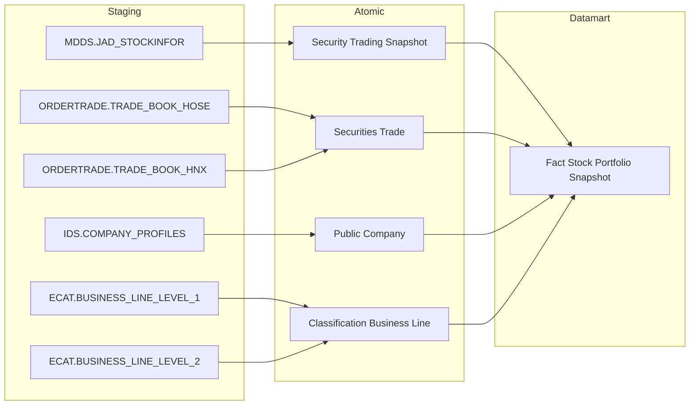
```mermaid
flowchart LR
    subgraph SRC["Staging"]
        S1A["MDDS.JAD_STOCKINFOR"]
        S1C["ORDERTRADE.TRADE_BOOK_HOSE"]
        S1D["ORDERTRADE.TRADE_BOOK_HNX"]
        S1E["IDS.COMPANY_PROFILES"]
        S1F["ECAT.BUSINESS_LINE_LEVEL_1"]
        S1G["ECAT.BUSINESS_LINE_LEVEL_2"]
    end
    subgraph SIL["Atomic"]
        A1A["Security Trading Snapshot"]
        A1C["Securities Trade"]
        A1D["Public Company"]
        A1E["Classification Business Line"]
    end
    subgraph GOLD["Datamart"]
        fct_stock_portfolio_snpst["Fact Stock Portfolio Snapshot"]
    end
    S1A --> A1A
    S1C --> A1C
    S1D --> A1C
    S1E --> A1D
    S1F --> A1E
    S1G --> A1E
    A1A --> fct_stock_portfolio_snpst
    A1C --> fct_stock_portfolio_snpst
    A1D --> fct_stock_portfolio_snpst
    A1E --> fct_stock_portfolio_snpst
```

> **Ghi chú nguồn Ngành:** Đường JOIN chuẩn: `Public Company.Business Line Level 1 Id` → `Classification Business Line.Classification Business Line Id` (không JOIN trực tiếp `IDS.CATEGORIES` — bảng này chỉ là join nội bộ, không tự sinh entity). `public_company_dim` (Datamart, dùng chung GSDC/QLCB/NDTNN) đã có sẵn cột đệm `Classification Business Line Name`. GSTT reuse nguyên trạng, không tạo Dimension riêng cho Ngành.
> **Ghi chú measure tổng hợp:** `Securities Trade` (Fact Append, grain = 1 lệnh khớp) thô hơn grain Fact — Tổng KL/GT, Tổng KL/GT thỏa thuận, KLNN ròng đều phải `SUM(...) GROUP BY Security Symbol Code, Trade Date` trước khi đặt lên Fact.
> **[SỬA 2026-09-14] Tách Fact riêng theo độ mịn rổ chỉ số — xem Cụm 1b:** `Fact Stock Portfolio Snapshot` nay thiết kế thuần theo độ mịn **mã CK × ngày**, KHÔNG còn FK `Index Constituent Dimension Id`. Trước đây FK này (nullable, trực tiếp trên Fact) khiến 1 mã CK thuộc N rổ chỉ số sinh N row Fact, các measure không phụ thuộc rổ chỉ số (Tổng KL, Tổng GT, KLNN ròng...) bị lặp giá trị trên từng row — rủi ro double-count nếu Dashboard không lọc đúng 1 Chỉ số. Toàn bộ nhu cầu phân tích theo độ mịn rổ chỉ số (chọn 1 chỉ số cụ thể, lọc nhóm chỉ số, SUM theo Index Code) nay chuyển sang `Fact Index Constituent Snapshot` (Cụm 1b) — Fact riêng theo độ mịn mã CK × rổ chỉ số × ngày, join sang Fact này qua `Symbol` khi cần.

##### Cụm 1b: Thành viên rổ chỉ số theo ngày (`Fact Index Constituent Snapshot`)

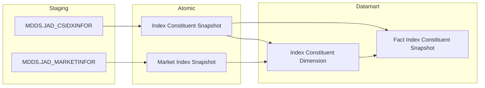
```mermaid
flowchart LR
    subgraph SRC["Staging"]
        S1I["MDDS.JAD_CSIDXINFOR"]
        S1M["MDDS.JAD_MARKETINFOR"]
    end
    subgraph SIL["Atomic"]
        A1I["Index Constituent Snapshot"]
        A1M["Market Index Snapshot"]
    end
    subgraph GOLD["Datamart"]
        fct_index_constituent_snpst["Fact Index Constituent Snapshot"]
        index_constituent_dim["Index Constituent Dimension"]
    end
    S1I --> A1I
    S1M --> A1M
    A1I --> fct_index_constituent_snpst
    A1I --> index_constituent_dim
    A1M --> index_constituent_dim
    index_constituent_dim --> fct_index_constituent_snpst
```

> **Grain:** 1 row / mã CK / rổ chỉ số / ngày giao dịch — Bridge (3 FK) dùng làm lọc/join theo rổ chỉ số. Nguồn `index_constituent_snapshot` (MDDS.JAD_CSIDXINFOR) đã có sẵn `Trading Date` đúng grain này (khác bản thiết kế cũ dựa trên SCD4A của Dimension).
> **Index Constituent Dimension đổi grain:** nay thuần mô tả rổ chỉ số — `Index Code`, `Index Id` — grain 1 row/Index Code, không còn chứa `Symbol`/`Floor Code`/`Add Date` (các thuộc tính mô tả *thành viên*, nay thuộc về Fact này).
> **[MỚI 2026-09-15, theo yêu cầu Design] `Index Name` bổ sung lên `Index Constituent Dimension`:** `Index Constituent Snapshot` (nguồn `MDDS.JAD_CSIDXINFOR`) không có attribute tên chỉ số — chỉ có `Index Code`/`Index Id`. Lấy `Index Name` bằng cách JOIN sang `Market Index Snapshot` (`MDDS.JAD_MARKETINFOR`, cùng entity đang dùng cho `Market Index Dimension` ở Cụm 2a/2b) theo **`Market Index Snapshot.Market Code = Index Constituent Snapshot.Index Code`** — cùng cơ chế lookup (không CASE WHEN thủ công) như `Market Index Dimension.Index Name` đã dùng ở `Fact Market Index Intraday` (Cụm 2b). Đây là quyết định thiết kế của Data Modeler: chấp nhận đẳng thức `Index Code = Market Code` làm join key cho mục đích lấy tên hiển thị — KHÔNG tự động đóng **O_GSTT_3** (gap đó còn phạm vi rộng hơn: cần xác nhận nghiệp vụ cho chiều ngược lại, từ 1 `Market Code` do UI truyền vào suy ra `Index Code` để lọc `Fact Index Constituent Snapshot` cho K_GSTT_47-52). Xem ghi chú Cụm 2a (dòng ~130).
> **[SỬA 2026-09-14, theo yêu cầu Design] 8 measure tính sẵn theo rổ chỉ số:** `Index Total Volume`/`Index Total Value` (KLGD/GTGD toàn rổ), `Index Foreign Net Volume`/`Index Foreign Net Value` (KLNN/GTNN ròng toàn rổ), `Index Total Negotiated Volume`/`Index Total Negotiated Value` (KLGD/GTGD thỏa thuận toàn rổ), `Index Market Cap`/`Index Free Float Market Cap` (Vốn hóa/Vốn hóa free-float toàn rổ) — mỗi cột SUM theo `Index Code + Trading Date`, nguồn Atomic mở rộng thêm `Security Trading Snapshot`, `Securities Trade`, `Public Company Share Statistics History`, `Listed Share Info` (không vẽ thêm node — theo đúng quy ước hiện có của file, diagram chỉ thể hiện driving entity chính, các bảng JOIN phụ nêu tại LLD). **Giá trị lặp lại trên mọi dòng Symbol cùng Index+Date** (denormalize có chủ đích — bridge không còn "factless" thuần túy) — bắt buộc dùng `MAX()`/`DISTINCT` khi truy vấn, không SUM lại.
> **[SỬA 2026-09-23] Cột `Index Market Index Value` (`idx_market_index_val`):** do commit TKNB 2026-09-22 thêm vào master registry + DDL nhưng thiếu ở LLD module GSTT và DML (lệch Gate 2/Gate 4) — nay đồng bộ đủ 4 tầng. Sửa `etl_logic`: bỏ tham chiếu `market_index_snapshot.rn` (không phải cột Atomic) và khóa chưa xác nhận `market_code = index_code`, thay bằng `ROW_NUMBER() ... ORDER BY Index Time DESC = 1` + khóa `Market Index Snapshot.Market Code = Index Constituent Snapshot.Index Code` (bảng mô tả jadapter, O_GSTT_3). Chưa có KPI GSTT nào dùng cột này.
> **KPI dùng Fact này:** K_GSTT_4 (chọn 1 Chỉ số), K_GSTT_62/63 (Bộ chỉ số thị trường/theo ngành) — join qua `Symbol`+`Trading Date`, không qua FK cố định trên `Fact Stock Portfolio Snapshot`; K_GSTT_47-52/54/61 (Nhóm 5/6/7/9/11/13/17/19/36/37, trừ Nhóm 23) và mẫu số K_GSTT_74/76 (Nhóm 24) nay đọc trực tiếp 8 cột tính sẵn ở trên (MAX, không JOIN+SUM lại).

##### Cụm 1c: Giao dịch theo phân loại nhà đầu tư (`Fact Investor Category Trading Snapshot`)

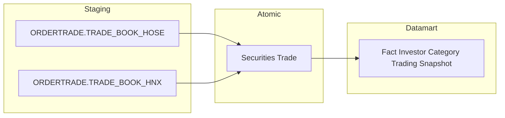
```mermaid
flowchart LR
    subgraph SRC["Staging"]
        S1C["ORDERTRADE.TRADE_BOOK_HOSE"]
        S1D["ORDERTRADE.TRADE_BOOK_HNX"]
    end
    subgraph SIL["Atomic"]
        A1C["Securities Trade"]
    end
    subgraph GOLD["Datamart"]
        fct_investor_category_trading_snpst["Fact Investor Category Trading Snapshot"]
    end
    S1C --> A1C
    S1D --> A1C
    A1C --> fct_investor_category_trading_snpst
```

> **[MỚI 2026-09-21, theo yêu cầu Data Modeler]** Nhóm 30/31 ("Xu hướng dòng tiền — Giao dịch theo phân loại Nhà đầu tư") trước đây lưu phân loại NĐT (Cá nhân/Tổ chức trong nước) thành 8 cột giá trị cố định (`Individual_Buy/Sell_Value/Volume`, `Domestic_Institution_Buy/Sell_Value/Volume`) trên `Fact Stock Portfolio Snapshot`, buộc tầng BI phải `CASE {nhánh} WHEN ... THEN individual_buy_val WHEN ... THEN domestic_institution_buy_val END` để switch cột theo lựa chọn Chiều "Phân loại nhà đầu tư" (K_GSTT_85) — không có cột vật lý nào đại diện cho chính "Phân loại nhà đầu tư" như 1 giá trị dữ liệu thật. Fact mới tách riêng, grain hẹp hơn (`mã CK × ngày × Phân loại NĐT`), có cột vật lý `Investor Category Code` — K_GSTT_85 trở thành FK/attribute thật, K_GSTT_86-94 (Nhóm 30/31) chỉ còn `SUM(...) WHERE Investor Category Code = :x`, không còn CASE WHEN. **Không đổi grain/cột của `Fact Stock Portfolio Snapshot`** — Nhóm 21 (Foreign)/Nhóm 29 (Proprietary)/Nhóm 37 (Proprietary Volume) tiếp tục dùng nguyên các cột đã có trên Fact đó, không bị ảnh hưởng.
> **[XÓA 2026-09-30 — All-Tier Cleanup, O_GSTT_47]** 10 cột `individual_*`/`domestic_institution_*` (net/buy/sell × val/vol) không còn KPI nào dùng từ khi Nhóm 30/31/37 chuyển sang `Fact Investor Category Trading Snapshot` — đã bỏ khỏi `Fact Stock Portfolio Snapshot` (Attributes, master, yaml, flat SQL, ERD).
> **Nguồn phân loại (BA_analyst_GSTT.csv dòng "Phân loại nhà đầu tư", STT 28/29/30/31 — **[SỬA 2026-09-23]** đồng bộ quy tắc đơn giản hoá BA 2026-09-22, thay bảng mã dài theo sàn):** phân nhánh theo thứ tự ưu tiên Tự doanh → Nước ngoài → Cá nhân/Tổ chức trong nước, đồng nhất HOSE/HNX:
> 1. **Tự doanh:** `Buy/Sell Client House Classification Code = '30'`.
> 2. **Nước ngoài:** `Buy/Sell Foreign Investor Type Code <> '00'`.
> 3. **Cá nhân** (loại trừ 1, 2): `Buy/Sell Investor Type Code = '8000'`.
> 4. **Tổ chức trong nước** — **[SỬA 2026-09-25, theo yêu cầu Data Modeler]** = (GT TC mua − GT TC bán) − (GT tự doanh mua − GT tự doanh bán); GT TC mỗi phía: `Foreign Investor Type Code = '00'` AND `Investor Type Code <> '8000'` (không còn điều kiện Client House, không còn "loại trừ 1, 2" theo thứ tự ưu tiên — tự doanh nằm trong tập TC và được trừ bằng số hạng tự doanh). Áp đồng bộ `fct_investor_category_trading_snpst`, `fct_investor_category_index_trading_snpst`, `fct_stock_portfolio_snpst.domestic_institution_*`. BA dòng 402 chưa cập nhật — O_GSTT_32.
> **[SỬA 2026-09-25] Hiển thị dòng 0:** Fact giữ cố định 4 dòng/phân loại/(mã CK hoặc chỉ số)/ngày — không đổi grain (đổi grain sẽ làm mất GT thỏa thuận ở chế độ Tổng GTGD). Detail Mapping Nhóm 30–33 thêm dòng FILTER `HAVING SUM(ABS(buy)) + SUM(ABS(sell)) <> 0` theo đúng cặp cột của chế độ đang xem (tổng / `matched_*` / `negotiated_*`) — ngày chỉ có giao dịch thỏa thuận không hiện ở chế độ Khớp lệnh (VD ACL 27/08/2026, board T4).
> **[SỬA 2026-09-23]** Fact này phục vụ Nhóm 31/32 (grain Mã CK). Nhóm 30/33 (grain Chỉ số) dùng `Fact Investor Category Index Trading Snapshot` (Cụm 1d) — cùng quy tắc phân loại.
> ETL populate riêng phía Mua (dùng `Buy ...`) và phía Bán (dùng `Sell ...`) — 1 giao dịch có thể có bên mua và bên bán thuộc 2 phân loại khác nhau, nên `Matched/Negotiated_Buy_Value` và `Matched/Negotiated_Sell_Value` được tính độc lập theo đúng phân loại của từng phía trước khi `UNION`/`FULL OUTER JOIN` theo `(Symbol, Trade Date, Investor Category Code)` — cùng cơ chế BA đã tham khảo ở SQL gốc Nhóm 31 (CTE `gt_mua_theo_ngay`/`gt_ban_theo_ngay`/`gt_rong_theo_ngay`).

##### Cụm 1d: Giao dịch theo phân loại nhà đầu tư theo chỉ số (`Fact Investor Category Index Trading Snapshot`)

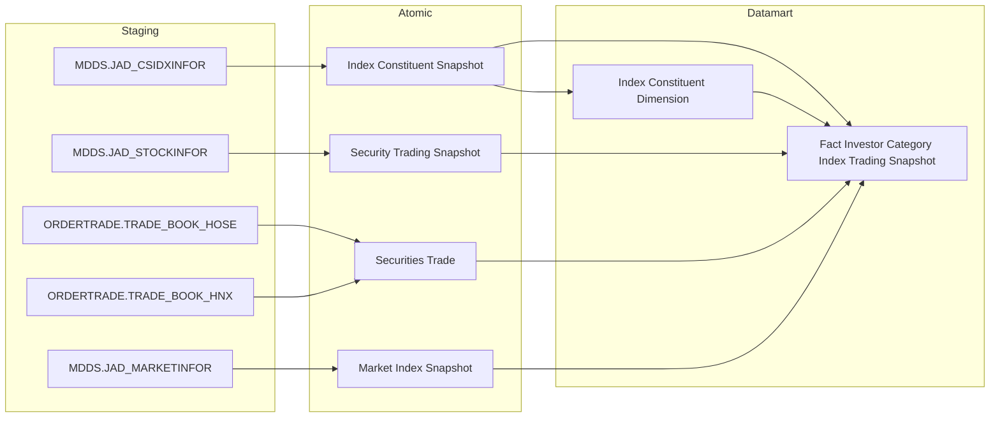
```mermaid
flowchart LR
    subgraph SRC["Staging"]
        S1I["MDDS.JAD_CSIDXINFOR"]
        S1A["MDDS.JAD_STOCKINFOR"]
        S1C["ORDERTRADE.TRADE_BOOK_HOSE"]
        S1D["ORDERTRADE.TRADE_BOOK_HNX"]
        S1M["MDDS.JAD_MARKETINFOR"]
    end
    subgraph SIL["Atomic"]
        A1I["Index Constituent Snapshot"]
        A1A["Security Trading Snapshot"]
        A1C["Securities Trade"]
        A1M["Market Index Snapshot"]
    end
    subgraph GOLD["Datamart"]
        Fact_Investor_Category_Index_Trading_Snapshot["Fact Investor Category Index Trading Snapshot"]
        Index_Constituent_Dimension["Index Constituent Dimension"]
    end
    S1I --> A1I
    S1A --> A1A
    S1C --> A1C
    S1D --> A1C
    S1M --> A1M
    A1I --> Fact_Investor_Category_Index_Trading_Snapshot
    A1A --> Fact_Investor_Category_Index_Trading_Snapshot
    A1C --> Fact_Investor_Category_Index_Trading_Snapshot
    A1M --> Fact_Investor_Category_Index_Trading_Snapshot
    A1I --> Index_Constituent_Dimension
    Index_Constituent_Dimension --> Fact_Investor_Category_Index_Trading_Snapshot
```

> **[MỚI 2026-09-23, Data Modeler duyệt]** Phục vụ Nhóm 30 (biểu đồ GT ròng theo chỉ số) và Nhóm 33 (a) (bản đồ nhiệt theo chỉ số). **Grain:** 1 row / Index Code / ngày giao dịch / Phân loại NĐT (4 dòng/chỉ số/ngày) — tách riêng khỏi `Fact Investor Category Trading Snapshot` (grain Mã CK) để không SUM runtime lệch hạt (Level 2 Chỉ số vs Level 4 Mã CK).
> **ETL 6 measure GT:** `Index Constituent Snapshot` (thành viên rổ tại `Trading Date`) JOIN `Security Trading Snapshot` (map Symbol → mã giao dịch: HOSE dùng `Symbol`, HNX/UPCOM dùng `ISIN Code` — cùng quy ước Cụm 1c) JOIN `Securities Trade` (cùng ngày, `Market Id Code IN ('UPX','STX','STK')`), phân loại từng phía Mua/Bán theo quy tắc Cụm 1c, rồi `SUM(Execution Value) GROUP BY Index Code, Trading Date, Investor Category Code`. `Matched_*` = `Board Type Code NOT IN ('T1','T2','T3','T4','T6','R1')`; `Negotiated_*` = `Board Type Code IN (...)`. 1 mã CK xuất hiện 1 lần/rổ/ngày → không double-count trong 1 rổ.
> **ETL 3 measure giá chỉ số:** `Market Index Snapshot` bản ghi cuối phiên (`ROW_NUMBER() OVER (PARTITION BY Market Code, Trading Date ORDER BY Index Time DESC) = 1`) JOIN theo `Market Index Snapshot.Market Code = Index Constituent Snapshot.Index Code` AND cùng `Trading Date` → `Market Index Value`, `Index Change`, `Index Percent Change`. Khóa này đã xác nhận cho K_GSTT_35 (O_GSTT_3, Resolved một phần). Giá trị lặp lại trên 4 dòng Phân loại NĐT (broadcast có chủ đích, Data Modeler chọn gộp vào cùng Fact) — truy vấn dùng `MAX()`.

##### Cụm 2a: Diễn biến chỉ số thị trường — snapshot cuối ngày (`Fact Market Index Snapshot`)

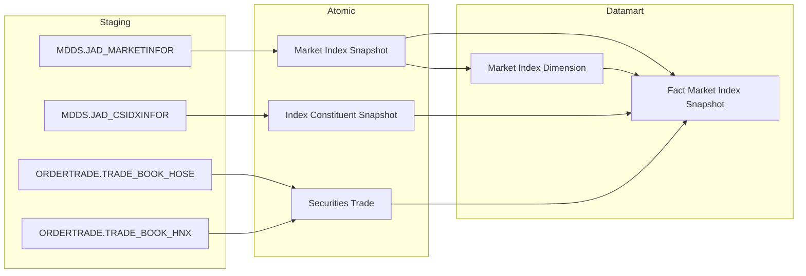
```mermaid
flowchart LR
    subgraph SRC["Staging"]
        S2A["MDDS.JAD_MARKETINFOR"]
        S2B["MDDS.JAD_CSIDXINFOR"]
        S2C["ORDERTRADE.TRADE_BOOK_HOSE"]
        S2D["ORDERTRADE.TRADE_BOOK_HNX"]
    end
    subgraph SIL["Atomic"]
        A2A["Market Index Snapshot"]
        A2B["Index Constituent Snapshot"]
        A2C["Securities Trade"]
    end
    subgraph GOLD["Datamart"]
        fct_market_index_snpst["Fact Market Index Snapshot"]
        market_index_dim["Market Index Dimension"]
    end
    S2A --> A2A
    S2B --> A2B
    S2C --> A2C
    S2D --> A2C
    A2A --> fct_market_index_snpst
    A2A --> market_index_dim
    A2B --> fct_market_index_snpst
    A2C --> fct_market_index_snpst
    market_index_dim --> fct_market_index_snpst
```

> **Ghi chú reuse cross-module:** `Fact Market Index Snapshot`/`Market Index Dimension` sở hữu bởi **QLKD**, GSTT mở rộng thêm cột trên Fact hiện có, không đổi grain (`1 market_code × 1 ngày`, bản ghi cuối phiên `rn=1`). Xem Section 4 — Reuse Analysis.
> **Ghi chú KLGD/GTGD/KLNN ròng/GTNN ròng của chỉ số:** Cần JOIN `Index Constituent Snapshot` (lấy danh sách mã CK thuộc rổ chỉ số) với `Securities Trade` để `SUM(Execution Volume/Value) GROUP BY Index Code, Trade Date` — measure pre-aggregate qua 2 tầng nguồn, đặt trực tiếp lên `Fact Market Index Snapshot`.
> **Ghi chú Index Code vs Market Code:** `Market Index Dimension` định danh theo `Market Code`/`Index Type Code`, còn `Index Constituent Dimension` (Nhóm 1) định danh theo `Index Code` — 2 hệ định danh khác nhau, không có join key 1-1 sẵn có qua `Market Code`. Chiều `Market Code → Index Code` cho K_GSTT_47-52 (Nhóm 5)/K_GSTT_39 (Nhóm 39) **vẫn Open** — xem O_GSTT_3. **[MỚI 2026-09-15]** Chiều `Index Constituent Dimension → Market Index Snapshot` (lấy `Index Name`, xem Cụm 1b) đã dùng đẳng thức `Index Code = Market Code` làm join key theo quyết định Data Modeler — nhưng đây chỉ giải quyết chiều lấy tên hiển thị cho 1 `Index Code` đã biết sẵn, KHÔNG tương đương với việc giải quyết O_GSTT_3 (vốn cần chiều ngược: từ `Market Code` do UI chọn suy ra đúng `Index Code` để lọc Bridge cho K_GSTT_47-52) — vẫn giữ nguyên Open cho phần đó. **[SỬA 2026-09-22, datamart-review]** Phát hiện khóa join RIÊNG BIỆT (không phải `Market Code = Index Code` ở trên) đã giải quyết được O_GSTT_3 cho trường hợp K_GSTT_35 (Nhóm 6 + Nhóm 39, lấy trực tiếp điểm số chỉ số): `Market Index Dimension.Index Name = Index Constituent Dimension.Index Code` (nguồn `market_index_snapshot.index_nm` ← `MDDS.JAD_MARKETINFOR.INDEXNAME`, người dùng xác nhận trực tiếp) — xem O_GSTT_3 (Resolved một phần) và Nhóm 6/Nhóm 39 trong Section 2. **[SỬA 2026-09-23 — ĐẢO NGƯỢC ghi chú 2026-09-22, SUPERSEDED]** Khóa `Index Name = Index Code` ở trên là SAI. Bảng mô tả jadapter (Data Modeler cung cấp 2026-09-23): `MARKETCODE` = getIndexCode (VD `HOSE`/`30`/`MID`/`SML`), `MARKETID` = getIndexID, `INDEXNAME` = getIndexName (tên hiển thị `VNINDEX`/`VN30`/`VNMIDCAP`/`VNSMALLCAP`); `JAD_CSIDXINFOR.INDEXCODE` = Mã chỉ số cùng hệ getIndexCode; SQL BA STT 5 nối `tjme.marketcode = idx.indexcode`, STT 18 lọc `INDEXCODE IN ('HOSE','HNX','UPCOM')`. → Khóa đúng duy nhất: **`Market Code = Index Code`** (chính là khóa 2026-09-15 đã dùng cho `Index Constituent Dimension.Index Name`). Toàn bộ công thức K_GSTT_35 (Nhóm 6/30/33/39), K_GSTT_38/39 (Nhóm 30/33), `idx_market_index_val` đã đổi sang khóa này.

##### Cụm 2b: Diễn biến chỉ số thị trường — realtime trong ngày (`Fact Market Index Intraday`)

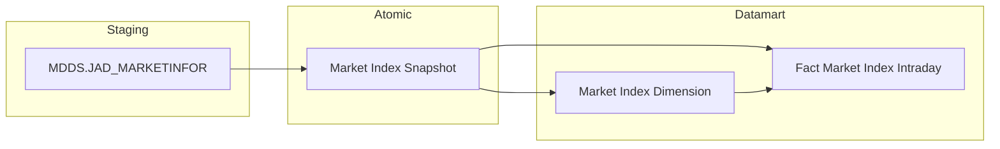
```mermaid
flowchart LR
    subgraph SRC["Staging"]
        S2E["MDDS.JAD_MARKETINFOR"]
    end
    subgraph SIL["Atomic"]
        A2D["Market Index Snapshot"]
    end
    subgraph GOLD["Datamart"]
        fct_market_index_intraday["Fact Market Index Intraday"]
        market_index_dim2["Market Index Dimension"]
    end
    S2E --> A2D
    A2D --> fct_market_index_intraday
    A2D --> market_index_dim2
    market_index_dim2 --> fct_market_index_intraday
```

> **Ghi chú grain:** Mục đích là vẽ biểu đồ đường/cột theo thời gian trong ngày — khác Fact EOD (1 row/ngày), dùng chung nguồn `Market Index Snapshot` nhưng KHÔNG lọc `rn=1`. Grain = **1 row / Market Code / Index Time** (theo đúng nguồn `JAD_MARKETINFOR`). Dashboard xử lý lại theo giờ ở tầng BI, không xử lý ở Datamart.
>
> **[GHI CHÚ 2026-09-07] Nguồn mới `Market Price Snapshot` chưa dùng được cho Fact này:** MDDS đã bổ sung Atomic entity `market_price_snapshot` (MDDS.JAD_TRADINGVIEWHISTORY1MIN/1DAY — nến OHLCV thật theo phút/ngày, đã dùng để thiết kế lại `Fact Security Trading Intraday` ở Nhóm 34, xem O_GSTT_11) — về nguyên tắc phù hợp hơn nguồn `Market Index Snapshot` hiện tại (tránh phải dùng `LAG()` trừ giá trị lũy kế để suy ra `Total Value At Time`). Tuy nhiên **chưa áp dụng được**: `market_price_snapshot.symbol` (định danh dạng TradingView, VD dự đoán "VNINDEX") không có join key xác nhận với `Market Index Dimension` (định danh theo `Market Code`/`Market Id` — HOSE/HNX/UPCOM) — cùng gap đã ghi nhận ở dòng ~100 ("2 hệ định danh khác nhau... PENDING xác nhận nghiệp vụ"). `BRD/Source/MDDS/brd_MDDS_JAD_TRADINGVIEWHISTORY1MIN.yaml` không có sample giá trị `SYMBOL` nào để verify. Giữ nguyên thiết kế hiện tại cho tới khi nghiệp vụ xác nhận mapping `symbol`↔`Market Code`.

##### Cụm 3a: Cổ đông lớn (`Fact Major Shareholder Ownership Snapshot`)

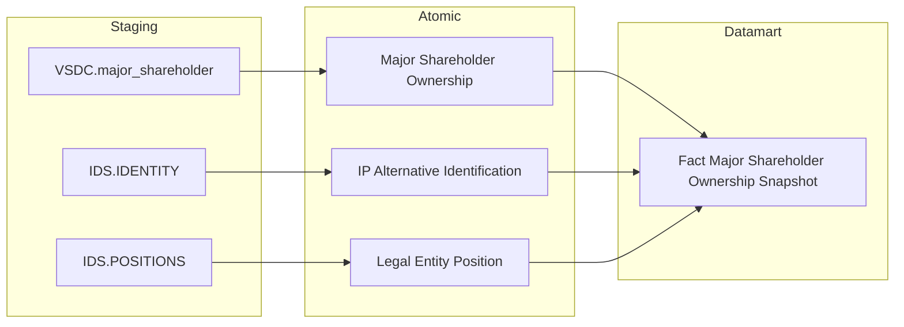
```mermaid
flowchart LR
    subgraph SRC["Staging"]
        S3A["VSDC.major_shareholder"]
        S3D["IDS.IDENTITY"]
        S3B["IDS.POSITIONS"]
    end
    subgraph SIL["Atomic"]
        A3A["Major Shareholder Ownership"]
        A3D["IP Alternative Identification"]
        A3B["Legal Entity Position"]
    end
    subgraph GOLD["Datamart"]
        fct_major_shareholder_ownership_snpst["Fact Major Shareholder Ownership Snapshot"]
    end
    S3A --> A3A
    S3D --> A3D
    S3B --> A3B
    A3A --> fct_major_shareholder_ownership_snpst
    A3D --> fct_major_shareholder_ownership_snpst
    A3B --> fct_major_shareholder_ownership_snpst
```

> **[THIẾT KẾ LẠI 2026-09-25]** Phục vụ Nhóm 35 và Nhóm 38 — BA chuyển nguồn cổ đông lớn sang VSDC `major_shareholder` (số liệu theo kỳ đầu/cuối, chọn theo ngày tham số). Thay `Operational Public Company Shareholding` (IDS `COMPANY_SHAREHOLDING`, đã bãi bỏ). Nối chức vụ IDS qua Số giấy tờ (chỉ trong ETL — không đưa PII lên Datamart).

##### Cụm 3b: Người nội bộ (`Operational Public Company Insider Ownership`)

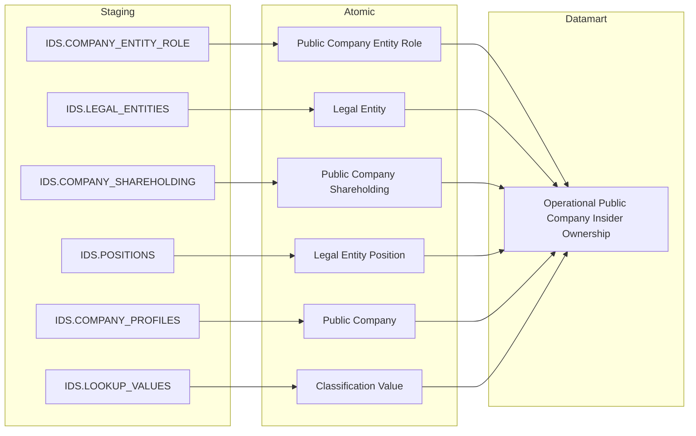
```mermaid
flowchart LR
    subgraph SRC["Staging"]
        S3E["IDS.COMPANY_ENTITY_ROLE"]
        S3F["IDS.LEGAL_ENTITIES"]
        S3G["IDS.COMPANY_SHAREHOLDING"]
        S3B["IDS.POSITIONS"]
        S3H["IDS.COMPANY_PROFILES"]
        S3I["IDS.LOOKUP_VALUES"]
    end
    subgraph SIL["Atomic"]
        A3E["Public Company Entity Role"]
        A3F["Legal Entity"]
        A3G["Public Company Shareholding"]
        A3B["Legal Entity Position"]
        A3H["Public Company"]
        A3I["Classification Value"]
    end
    subgraph GOLD["Datamart"]
        opr_public_company_insider_ownership["Operational Public Company Insider Ownership"]
    end
    S3E --> A3E
    S3F --> A3F
    S3G --> A3G
    S3B --> A3B
    S3H --> A3H
    S3I --> A3I
    A3E --> opr_public_company_insider_ownership
    A3F --> opr_public_company_insider_ownership
    A3G --> opr_public_company_insider_ownership
    A3B --> opr_public_company_insider_ownership
    A3H --> opr_public_company_insider_ownership
    A3I --> opr_public_company_insider_ownership
```

> **[MỚI 2026-10-01]** Phục vụ Nhóm 35 (danh sách người nội bộ). Driving = `Public Company Entity Role` (`role_tp_code = 'NNB'`), LEFT JOIN `Public Company Shareholding` theo (`pc_id`, `legal_entity_id`) và `Legal Entity Position` theo `legal_entity_id` (đúng SQL BA). Bảng Tác nghiệp current-state (Atomic `pc_shareholding`/`legal_entity_position` là SCD4A, BA không có tham số ngày) — Data Modeler duyệt 2026-10-01.

##### Cụm 4a: Kết xuất sổ lệnh HOSE (`Fact HOSE Securities Trade`)

```mermaid
flowchart LR
    subgraph SRC["Staging"]
        S4aA["ORDERTRADE.TRADE_BOOK_HOSE"]
        S4aB["ECAT.ECAT_29_HolidayInfo"]
    end
    subgraph SIL["Atomic"]
        A4aA["Securities Trade"]
        A4aB["Calendar Date"]
    end
    subgraph GOLD["Datamart"]
        fct_hose_securities_trade["Fact HOSE Securities Trade"]
        cdr_dt_dim_4a["Calendar Date Dimension"]
    end
    S4aA --> A4aA
    S4aB --> A4aB
    A4aA --> fct_hose_securities_trade
    A4aB --> cdr_dt_dim_4a
    cdr_dt_dim_4a --> fct_hose_securities_trade
```

> **[MỚI 2026-09-26]** Phục vụ Nhóm 43 (Data Explorer — kết xuất sổ lệnh HOSE). Fact Event grain 1 row / giao dịch khớp, lọc `Securities Trade.Source System Code` theo nhánh ORDERTRADE.TRADE_BOOK_HOSE; pass-through nguyên văn các cột BA yêu cầu (gồm cột PII — xem O_GSTT_36).

##### Cụm 4b: Kết xuất sổ lệnh HNX (`Fact HNX Securities Trade`)

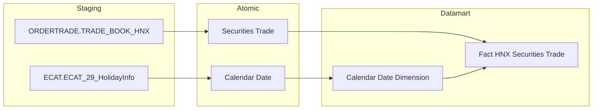
```mermaid
flowchart LR
    subgraph SRC["Staging"]
        S4bA["ORDERTRADE.TRADE_BOOK_HNX"]
        S4bB["ECAT.ECAT_29_HolidayInfo"]
    end
    subgraph SIL["Atomic"]
        A4bA["Securities Trade"]
        A4bB["Calendar Date"]
    end
    subgraph GOLD["Datamart"]
        fct_hnx_securities_trade["Fact HNX Securities Trade"]
        cdr_dt_dim_4b["Calendar Date Dimension"]
    end
    S4bA --> A4bA
    S4bB --> A4bB
    A4bA --> fct_hnx_securities_trade
    A4bB --> cdr_dt_dim_4b
    cdr_dt_dim_4b --> fct_hnx_securities_trade
```

> **[MỚI 2026-09-26]** Phục vụ Nhóm 44 (Data Explorer — kết xuất sổ lệnh HNX). Fact Event grain 1 row / giao dịch khớp, lọc `Securities Trade.Source System Code` theo nhánh ORDERTRADE.TRADE_BOOK_HNX; pass-through nguyên văn các cột BA yêu cầu (gồm cột PII — xem O_GSTT_36).

---

##### Cụm 4c: Kết xuất sổ lệnh — Order book HNX (`Fact HNX Securities Order`)

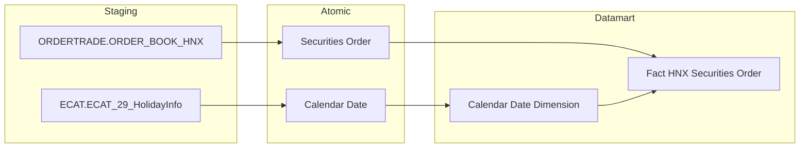
```mermaid
flowchart LR
    subgraph SRC["Staging"]
        S4cA["ORDERTRADE.ORDER_BOOK_HNX"]
        S4cB["ECAT.ECAT_29_HolidayInfo"]
    end
    subgraph SIL["Atomic"]
        A4cA["Securities Order"]
        A4cB["Calendar Date"]
    end
    subgraph GOLD["Datamart"]
        fct_hnx_securities_order["Fact HNX Securities Order"]
        cdr_dt_dim_4c["Calendar Date Dimension"]
    end
    S4cA --> A4cA
    S4cB --> A4cB
    A4cA --> fct_hnx_securities_order
    A4cB --> cdr_dt_dim_4c
    cdr_dt_dim_4c --> fct_hnx_securities_order
```

> **[MỚI 2026-09-29]** Phục vụ Nhóm 45 (Data Explorer — kết xuất sổ lệnh order book HNX). Fact Event grain 1 row / lệnh, lọc `Securities Order.Source System Code = 'ORDERTRADE_ORDER_BOOK_HNX'`; FK duy nhất là ngày giao dịch (role-playing `Trade Date Dimension Id`).

##### Cụm 4d: Kết xuất sổ lệnh — Order book HOSE (`Fact HOSE Securities Order`)

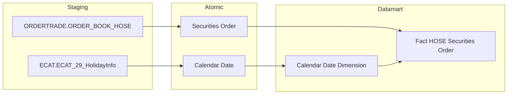
```mermaid
flowchart LR
    subgraph SRC["Staging"]
        S4dA["ORDERTRADE.ORDER_BOOK_HOSE"]
        S4dB["ECAT.ECAT_29_HolidayInfo"]
    end
    subgraph SIL["Atomic"]
        A4dA["Securities Order"]
        A4dB["Calendar Date"]
    end
    subgraph GOLD["Datamart"]
        fct_hose_securities_order["Fact HOSE Securities Order"]
        cdr_dt_dim_4d["Calendar Date Dimension"]
    end
    S4dA --> A4dA
    S4dB --> A4dB
    A4dA --> fct_hose_securities_order
    A4dB --> cdr_dt_dim_4d
    cdr_dt_dim_4d --> fct_hose_securities_order
```

> **[MỚI 2026-09-29]** Phục vụ Nhóm 46 (Data Explorer — kết xuất sổ lệnh order book HOSE). Fact Event grain 1 row / lệnh, lọc `Securities Order.Source System Code = 'ORDERTRADE_ORDER_BOOK_HOSE'`; FK duy nhất là ngày giao dịch (role-playing `Trade Date Dimension Id`).

## Section 2 — Tổng quan báo cáo

### Tab Dashboard thông tin về danh mục chứng khoán

#### Nhóm 1 - Bảng số liệu

> **Phân loại:** Phân tích
> **Atomic:** `Security Trading Snapshot` ← MDDS.JAD_STOCKINFOR — **READY** (Nguồn 2, approved) / `Securities Trade` ← ORDERTRADE.TRADE_BOOK_HOSE, TRADE_BOOK_HNX — **READY** (Nguồn 2, approved) / `Public Company` ← IDS.COMPANY_PROFILES — **READY** (Nguồn 1, approved) / `Classification Business Line` ← ECAT.BUSINESS_LINE_LEVEL_1, BUSINESS_LINE_LEVEL_2 — **READY** (Nguồn 1, approved) / `Index Constituent Snapshot` ← MDDS.JAD_CSIDXINFOR — **READY** (Nguồn 2, approved) — driving entity cho `Index Constituent Dimension` mới (xem ghi chú Section 1) / `Market Index Snapshot` ← MDDS.JAD_MARKETINFOR — **READY** (Nguồn 1, approved, reuse Nhóm 5) — dùng join_atomic để xác định "Có giao dịch" trên Calendar Date Dimension (K_GSTT_128, mới) / `Securities Company` ← SCMS.SC_FIRM_INFO — **draft** (Nguồn 2, reuse QLKD `securities_company_dim`) — fallback Ngành cho CTCK đại chúng (K_GSTT_2, xem ghi chú riêng dưới và O_GSTT_37)
>
> **Ghi chú "Có giao dịch"/"Bình quân tháng-năm" (K_GSTT_128–132, mới, 2026-09-05 — yêu cầu thiết kế trực tiếp từ user, không qua BA CSV):** Bổ sung cột mới **"Is Trading Date"** (`is_trading_date`, Indicator Y/N) lên `Calendar Date Dimension` (`cdr_dt_dim` — conformed, dùng chung toàn hệ thống, `partial` reuse) — `Y` nếu ngày đó có tồn tại bản ghi trên `Market Index Snapshot` (`EXISTS(... WHERE market_index_snapshot.trading_dt = cdr_dt.cdr_dt)`), `N` nếu không (cuối tuần/lễ). Dùng `market_index_snapshot` (grain 1 row/ngày, toàn thị trường) làm nguồn thay vì `security_trading_snapshot` (nhiều dòng/ngày theo mã CK) để tránh phải DISTINCT qua khối lượng dữ liệu lớn hơn nhiều. **"Ngày giao dịch gần nhất"** (tham số lọc mặc định cho dashboard/báo cáo giao dịch thị trường) = `MAX(cdr_dt_dim.cdr_dt) WHERE cdr_dt_dim.is_trading_date = 'Y'` — tính tại tầng BI, không cần KPI/cột riêng, chỉ cần K_GSTT_128 làm điều kiện filter. 4 KPI "bình quân tháng/năm" derive từ K_GSTT_13/14 đã có, `GROUP BY Symbol, cdr_dt_dim.year, cdr_dt_dim.month` (hoặc chỉ `year`), **filter `WHERE cdr_dt_dim.is_trading_date = 'Y'`** để loại ngày không giao dịch khỏi phép tính bình quân. Chỉ khai ghi chú 1 lần ở Nhóm 1 (nền tảng) — không lặp lại ở 34 Nhóm còn lại, cùng cách Calendar Date Dimension chỉ note 1 lần (theo xác nhận trực tiếp của user). **Lưu ý cross-module:** `cdr_dt_dim` hiện `modules_using: [NHNCK, GSDC]` — chưa liệt kê GSTT dù đã dùng từ trước (gap tồn đọng, tiện thể bổ sung); cột `is_trading_date` mới sẽ NULL/N cho các module không liên quan giao dịch thị trường, không ảnh hưởng ngược tới NHNCK/GSDC.

> **Ghi chú fallback Ngành cho CTCK (K_GSTT_2, [SỬA 2026-09-28], xem O_GSTT_37):** BA STT 1 ghi rõ "Đối với các mã là công ty chứng khoán vì IDS không nhập mình sẽ join ngược lại với SCMS để xem nó là cty đại chúng không" — CTCK không có trong IDS.COMPANY_PROFILES nên `Public Company Dimension Id` NULL. Bổ sung FK mới `Securities Company Dimension Id` (reuse `securities_company_dim`, sở hữu QLKD) — `LEFT JOIN securities_company ON securities_company.securities_code = symbol AND securities_company.pc_ind = 1 AND (securities_company.provisional_ind = 0 OR NULL)`. Khi khớp được, `Classification Business Line Name` fallback sang literal `'Tài chính - Ngân hàng'` (theo đúng yêu cầu BA). `Business Line Level 1 Code` KHÔNG có fallback — giữ NULL vì chưa xác nhận đúng `cl_business_line_code` thật của nhóm CTCK trong Fundamental table (data-driven, không tra được từ YAML) — mở O_GSTT_37 chờ Data Modeler xác nhận. **Nhân tiện phát hiện + sửa cùng lúc:** SUBSTR(Symbol,1,3) dùng để join trái phiếu (stock_tp_code='1') sang Public Company (BA yêu cầu 2026-09-22) có rủi ro va chạm mã nợ công/địa phương (VD trái phiếu HCM... trùng ticker HCM — HSC; trái phiếu [xx]GB... trùng các ticker tận cùng G như HPG/HNG/KHG/TNG/THG/HTG) — đã bổ sung bộ lọc loại trừ (xem `DTM_GSTT_fct_stock_portfolio_snpst.csv`, cột `Public Company Dimension Id`), danh sách tiền tố loại trừ chưa được Data Modeler xác nhận đầy đủ.

**Mockup:**

| Mã CK | Ngành | Sàn | Chỉ số | Loại phái sinh | Ngày đáo hạn | Giá TC | Giá ĐC | Thay đổi | % TĐ | Tổng KL | Tổng GT | Tổng KL PS | Tổng GT PS | Tổng KL TT | Tổng GT TT | KLNN ròng |
|---|---|---|---|---|---|---|---|---|---|---|---|---|---|---|---|---|
| VCB | Ngân hàng | HOSE | VN30 | — | — | 82.00 | 82.50 | +0.50 | +0.61% | 548 Tr | 22.1 Tỷ | 0 | 0 | 12 Tr | 1.0 Tỷ | +4 Tr |

**Source:** `Fact Stock Portfolio Snapshot` → `Security Trading Snapshot Dimension`, `Public Company Dimension`, `Calendar Date Dimension`, `Index Constituent Dimension`

**Bảng KPI:**

| KPI ID | Tên KPI | Đơn vị | Tính chất | Công thức | Ghi chú | Trạng thái |
|---|---|---|---|---|---|---|
| K_GSTT_1 | Mã CK | — | Chiều | `Security Trading Snapshot Dimension.Symbol` | **Sửa filter (2026-09-03, BA cập nhật):** Bản trước dùng code chữ `NOT IN ('B','1','BO','D')` — sai, không khớp giá trị thật lưu trong `Stock Type Code` (= `MDDS.JAD_STOCKINFOR.STOCKTYPE` numeric dạng string, KHÔNG phải scheme chữ ST/BO/MF/FU/OP/EF của bản tin MDDS gốc — 2 nguồn khác nhau, xem `classification_schemes.yaml` scheme `MDDS_STOCK_TYPE` hiện `values: []` chưa từng được điền). BA SQL gốc STT 1 xác nhận filter floor-dependent: `Filter: NOT ((Floor Code = '02' AND Stock Type Code IN ('1','4')) OR (Floor Code = '10' AND Stock Type Code = '1'))` — HNX loại Trái phiếu(1) + mã `'4'` (bản trước ghi nhầm "Chứng quyền, HNX không có CQ hợp lệ" — **[SỬA 2026-09-16]** đã xác nhận qua test query mã `'4'` trên HNX thực chất là **Phái sinh**, không phải Chứng quyền; xem `K_GSTT_122`/`stock_tp_nm`. Không đổi logic filter — Phái sinh cũng không phải cổ phiếu nên kết quả loại trừ vẫn đúng, chỉ sửa lại tên gọi bản chất trong ghi chú này); HOSE chỉ loại Trái phiếu(1); UPCOM/FDS không ràng buộc thêm | READY |
| K_GSTT_2 | Ngành | — | Chiều | `Public Company Dimension.Business Line Level 1 Code`, `COALESCE(Public Company Dimension.Classification Business Line Name, CASE WHEN Securities Company Dimension Id IS NOT NULL THEN 'Tài chính - Ngân hàng' END)` | **[SỬA 2026-09-28]** Bổ sung fallback CTCK qua Securities Company Dimension (reuse QLKD) — xem ghi chú riêng phía trên và O_GSTT_37. Business Line Level 1 Code không đổi (đệm sẵn từ `public_company_dim`, đã sửa JOIN theo Id — xem Section 1) | READY |
| K_GSTT_3 | Sàn | — | Chiều | `Security Trading Snapshot Dimension.Floor Code` | Scheme MDDS_FLOOR_CODE: 10-HOSE, 02-HNX, 04-UPCOM, 03-FDS | READY |
| K_GSTT_4 | Chỉ số | — | Chiều | `Index Constituent Dimension.Index Code` | **[SỬA 2026-09-14]** Filter qua `Fact Index Constituent Snapshot` (Bridge, Cụm 1b): `JOIN Fact Index Constituent Snapshot ON Symbol = Fact Stock Portfolio Snapshot.Symbol AND Trading Date = Fact Stock Portfolio Snapshot.Trading Date → JOIN Index Constituent Dimension WHERE Index_Code = :selected_index` — không còn FK cố định trên Fact. Xem ghi chú thiết kế ở Section 1 (Cụm 1b) | READY |
| K_GSTT_5 | Loại phái sinh | — | Chiều | `Security Trading Snapshot Dimension.Stock Type Code`, `Underlying Symbol` | Chỉ có giá trị khi Floor Code = '03' | READY |
| K_GSTT_6 | Phương thức khớp lệnh (thỏa thuận) | — | Chiều | — | **[DEPRECATED 2026-09-08 — Loại bỏ]** Không có giá trị khai thác độc lập dưới dạng Chiều/Slicer (Fact không có cột chiều này). Nghiệp vụ hiển thị trực tiếp 4 Measure độc lập trên bảng: Khớp lệnh (`total_vol` K_GSTT_13, `total_val` K_GSTT_14) và Thỏa thuận (`total_negotiated_vol` K_GSTT_17, `total_negotiated_val` K_GSTT_18) | DEPRECATED |
| K_GSTT_7 | Ngày | — | Chiều | `Calendar Date Dimension.Calendar Date` | Tham số lọc theo ngày giao dịch | READY |
| K_GSTT_8 | Ngày đáo hạn phái sinh | Ngày | Cơ sở | `Security Trading Snapshot Dimension.Maturity Date` | Chỉ có giá trị khi Floor Code = '03' | READY |
| K_GSTT_9 | Giá tham chiếu | VNĐ | Cơ sở | `Security Trading Snapshot Dimension.Reference Price` | — | READY |
| K_GSTT_10 | Giá đóng cửa | VNĐ | Cơ sở | `Security Trading Snapshot Dimension.Close Price` | — | READY |
| K_GSTT_11 | Thay đổi (+/-) | VNĐ | Cơ sở | `Security Trading Snapshot Dimension.Price Change` | = Giá đóng cửa − Giá TC | READY |
| K_GSTT_12 | % thay đổi | % | Phái sinh | `Price Change / Reference Price × 100` | Computed tại query layer | READY |
| K_GSTT_13 | Tổng KLGD khớp lệnh | Cổ phiếu | Phái sinh | `SUM(Securities Trade.Execution Volume WHERE Market Id Code IN ('UPX','STX','STO')) GROUP BY Symbol, Trade Date` | **[SỬA TÊN 2026-09-16, theo BA mới]** Đổi tên hiển thị từ "Tổng KL" → "Tổng KLGD khớp lệnh" — BA STT 1 nay tự làm rõ "khớp lệnh" ngay trong tên chỉ tiêu, không đổi công thức/nguồn/cột Fact (`total_vol`). Xác nhận lại quyết định `[DEPRECATED 2026-09-08]` K_GSTT_6 vẫn đúng — không cần khôi phục Dimension "Phương thức", đây chính là cách BA tự giải quyết bằng tên KPI tường minh thay vì slicer. **Sửa công thức (khác bản HLD trước, 2026-07-29):** Bản trước không filter Market Id — sai, BA SQL gốc STT 1 xác nhận `WHERE Market ID IN ('UPX','STX','STO')` (chỉ tính khớp lệnh cổ phiếu/chứng chỉ quỹ 3 sàn, loại trừ phái sinh DVX và trái phiếu BDO/HCX). Pre-aggregate GROUP BY Symbol/Trade Date. **[SỬA 2026-09-14]** Không còn cần `SELECT DISTINCT` — `Fact Stock Portfolio Snapshot` đã tách FK rổ chỉ số sang `Fact Index Constituent Snapshot` riêng (Cụm 1b), measure này nay đúng 1 giá trị/mã CK/ngày | READY |
| K_GSTT_14 | Tổng GTGD khớp lệnh | VNĐ | Phái sinh | `SUM(Securities Trade.Execution Value WHERE Market Id Code IN ('UPX','STX','STO')) GROUP BY Symbol, Trade Date` | **[SỬA TÊN 2026-09-16, theo BA mới]** Đổi tên hiển thị từ "Tổng GT" → "Tổng GTGD khớp lệnh" — cùng lý do K_GSTT_13, không đổi công thức/nguồn/cột Fact (`total_val`). **Sửa công thức (khác bản HLD trước, 2026-07-29):** cùng lý do K_GSTT_13 — BA SQL gốc STT 1 xác nhận filter `Market ID IN ('UPX','STX','STO')`. Pre-aggregate | READY |
| K_GSTT_15 | Tổng KL theo loại phái sinh khớp lệnh | Hợp đồng | Phái sinh | `SUM(Securities Trade.Execution Volume WHERE Market Id Code = 'DVX') GROUP BY Symbol, Trade Date` | **[SỬA 2026-09-17, đồng bộ BA mới]** Đổi tên thêm "khớp lệnh" — BA STT 1 xác nhận rõ tên "Tổng KL theo loại phái sinh KHỚP LỆNH". Không đổi filter — `Market Id Code = 'DVX'` (thị trường phái sinh) vốn không có board type thỏa thuận riêng, tên gọi mới chỉ xác nhận lại tính chất sẵn có. Pre-aggregate | READY |
| K_GSTT_16 | Tổng GT theo loại phái sinh khớp lệnh | VNĐ | Phái sinh | `SUM(Securities Trade.Execution Value WHERE Market Id Code = 'DVX') GROUP BY Symbol, Trade Date` | **[SỬA 2026-09-17, đồng bộ BA mới]** Cùng lý do K_GSTT_15. Pre-aggregate | READY |
| K_GSTT_343 | Tổng KL theo phái sinh thỏa thuận | Hợp đồng | Phái sinh | `SUM(Fact Stock Portfolio Snapshot.Total Derivative Negotiated Volume)` | **[MỚI 2026-09-29]** BA dòng 25 `Tổng KL theo phái sinh thỏa thuận` — Σ KLGD thỏa thuận phái sinh; Market Id DVX + bảng thỏa thuận T1–T4/T6/R1 (O_GSTT_44) | READY |
| K_GSTT_344 | Tổng GT theo phái sinh thỏa thuận | VNĐ | Phái sinh | `SUM(Fact Stock Portfolio Snapshot.Total Derivative Negotiated Value)` | **[MỚI 2026-09-29]** BA dòng 26 `Tổng GT theo phái sinh thỏa thuận` — Σ (Giá × KLGD) thỏa thuận phái sinh (O_GSTT_44) | READY |
| K_GSTT_17 | Tổng KL thỏa thuận | Cổ phiếu | Phái sinh | `SUM(Securities Trade.Execution Volume WHERE Market Id Code IN ('UPX','STX','STK') AND Board Type Code IN ('T1','T2','T3','T4','T6','R1')) GROUP BY Symbol, Trade Date` | **[SỬA FILTER 2026-09-11, đóng O_GSTT_20]** Xác nhận qua issue Thủy 2026-09-11 (HOSE: `MARKET_ID IN ('STK') AND BOARD_TYPE IN (...,'R1')`; HNX: `MARKET_ID IN ('STX','UPX') AND BOARD_ID IN (...,'R1')`) — bổ sung `Market Id Code` (thiếu từ bản gốc, rủi ro lẫn Bond Trading Volume dùng chung board code khác market) và `R1` (Negotiation Repo). Pre-aggregate | READY |
| K_GSTT_18 | Tổng GT thỏa thuận | VNĐ | Phái sinh | `SUM(Securities Trade.Execution Value WHERE Market Id Code IN ('UPX','STX','STK') AND Board Type Code IN ('T1','T2','T3','T4','T6','R1')) GROUP BY Symbol, Trade Date` | Cùng ghi chú sửa filter K_GSTT_17 (2026-09-11, đóng O_GSTT_20). Pre-aggregate | READY |
| K_GSTT_19 | KLNN ròng | Cổ phiếu | Phái sinh | `SUM(Buy Foreign Investor Type Code IN ('10','20') → Execution Volume WHERE Market Id Code IN ('UPX','STX','STO')) − SUM(Sell Foreign Investor Type Code IN ('10','20') → Execution Volume WHERE Market Id Code IN ('UPX','STX','STO')) GROUP BY Symbol, Trade Date` | **Sửa công thức (khác bản HLD trước, 2026-07-29):** Bản trước không filter Market Id. BA SQL gốc STT 1 tính riêng theo từng sàn — HOSE: `Market ID = 'STO'`; HNX/UPCOM: `Market ID IN ('STX','UPX')` (loại trừ DVX/BDX/HCX) — rồi cộng kl_nn_mua/kl_nn_ban 2 khối trước khi lấy hiệu; gộp tương đương `Market Id Code IN ('UPX','STX','STO')` áp cho cả 2 vế Buy/Sell. Pre-aggregate | READY |
| K_GSTT_144 | KLNN ròng thỏa thuận | Cổ phiếu | Phái sinh | — | **[DEPRECATED 2026-09-29 — BA đánh dấu Deleted]** BA STT 1 dòng 27 "KLNN ròng thỏa thuận" nay `Trạng thái mapping = Deleted` — đã bỏ cột `Foreign Net Negotiated Volume` khỏi `Fact Stock Portfolio Snapshot` (All-Tier Cleanup). KLNN ròng của tổng khớp lệnh + thỏa thuận vẫn có ở dòng BA 21. | DEPRECATED |
| K_GSTT_148 | Tổng KNNN ròng của phái sinh khớp lệnh | Hợp đồng | Phái sinh | `SUM(Buy Foreign Investor Type Code IN ('10','20') → Execution Volume WHERE Market Id Code = 'DVX') − SUM(Sell Foreign Investor Type Code IN ('10','20') → Execution Volume WHERE Market Id Code = 'DVX') GROUP BY Symbol, Trade Date` | **[MỚI 2026-09-17, bổ sung KPI thiếu phát hiện qua rà soát BA↔KPI toàn diện]** BA STT 1 có chỉ tiêu "Tổng KNNN ròng của phái sinh khớp lệnh" (KLNN mua − KLNN bán khớp lệnh) trước đây chưa được map — cùng công thức K_GSTT_19 (KLNN ròng cổ phiếu) nhưng scope sang thị trường phái sinh (`Market Id Code = 'DVX'`, không cần Board Type filter — cùng lý do K_GSTT_15/16). Cột mới `foreign_net_derivative_vol` trên `Fact Stock Portfolio Snapshot`. Pre-aggregate | READY |
| K_GSTT_122 | Loại chứng khoán | — | Chiều | `Security Trading Snapshot Dimension.Stock Type Name` — cột dẫn xuất bằng `CASE` từ `.Floor Code` + `.Stock Type Code` + `.Fund Type Code`: Floor `'10'` (HOSE): 1-TRAI_PHIEU, 2-CO_PHIEU, 3-(Fund `E`→ETF, `M`→CHUNG_CHI_QUY), 4-CHUNG_QUYEN; Floor `'02'`/`'04'` (HNX/UPCOM): 1-TRAI_PHIEU, 2-CO_PHIEU, 3-CHUNG_CHI_QUY, 4-PHAI_SINH, 5-CHUNG_QUYEN, 6-ETF; ELSE 'KHAC' | **[SỬA 2026-09-30 — BA GSTT 2026-09-30 dòng 9]** BA đổi CASE: nhãn trả về là MÃ (TRAI_PHIEU/CO_PHIEU/ETF/CHUNG_CHI_QUY/CHUNG_QUYEN/PHAI_SINH/KHAC) thay nhãn tiếng Việt; HOSE tách ETF/CCQ theo `fund_tp_code` `E`/`M`; HNX/UPCOM không tách theo Fund Type. Xem O_GSTT_48. **[SỬA 2026-09-16, đóng O_GSTT_15 phần (3b)]** BA STT 1 (Chiều/Done/Dữ liệu tĩnh). Materialize thành cột `stock_tp_nm` trên Dimension (2026-08-21) thay vì tính tại tầng BI — đã đồng bộ Attributes/registry/flat table. Bổ sung UPCOM (dùng chung bảng mã HNX, xác nhận Data Modeler 2026-09-16), tách ETF/CCQ qua Fund Type Code (cả HNX+HOSE), thêm nhánh Phái sinh (floor='02', stock_tp='4') và tách Chứng quyền(5)/ETF(6) trên HNX theo test query mới — xem đối chiếu với `K_GSTT_1` (mã '4' trên HNX). Còn `'03'`-FDS/`'06'`-corp-bond ngoài phạm vi sửa lần này — vẫn xem O_GSTT_15 | READY |
| K_GSTT_128 | Có giao dịch | — | Chiều | `Calendar Date Dimension.Is Trading Date` | **Mới (2026-09-05, yêu cầu trực tiếp từ user, không qua BA CSV).** Cờ Y/N — Y nếu ngày lịch là ngày thị trường thực sự mở cửa giao dịch (có bản ghi trên `Market Index Snapshot`), N nếu không. Khác `K_GSTT_7` "Ngày" (Calendar Date Dimension gốc, gồm mọi ngày kể cả T7/CN/lễ) — đây là cờ lọc bổ sung TRÊN cùng Dimension đó, không phải Dimension riêng. Dùng làm điều kiện `WHERE` để suy ra "ngày giao dịch gần nhất" = `MAX(Calendar Date) WHERE Is Trading Date = 'Y'` — tham số lọc mặc định cho dashboard/báo cáo giao dịch thị trường chứng khoán (xem ghi chú Nhóm 1 phía trên) | READY |
| K_GSTT_129 | KLGD bình quân tháng | Cổ phiếu | Phái sinh | `AVG(K_GSTT_13) GROUP BY Symbol, Calendar Date Dimension.Year, Calendar Date Dimension.Month WHERE Calendar Date Dimension.Is Trading Date = 'Y'` | **Mới (2026-09-05, yêu cầu trực tiếp từ user).** Bình quân theo số ngày giao dịch thực tế trong tháng (loại T7/CN/lễ/ngày không giao dịch khỏi mẫu số), không phải bình quân theo số ngày lịch | READY |
| K_GSTT_130 | KLGD bình quân năm | Cổ phiếu | Phái sinh | `AVG(K_GSTT_13) GROUP BY Symbol, Calendar Date Dimension.Year WHERE Calendar Date Dimension.Is Trading Date = 'Y'` | **Mới (2026-09-05, yêu cầu trực tiếp từ user).** Cùng logic K_GSTT_129, gộp theo năm thay vì tháng | READY |
| K_GSTT_131 | GTGD bình quân tháng | VNĐ | Phái sinh | `AVG(K_GSTT_14) GROUP BY Symbol, Calendar Date Dimension.Year, Calendar Date Dimension.Month WHERE Calendar Date Dimension.Is Trading Date = 'Y'` | **Mới (2026-09-05, yêu cầu trực tiếp từ user).** Cùng logic K_GSTT_129 nhưng trên Giá trị giao dịch (K_GSTT_14) thay vì Khối lượng | READY |
| K_GSTT_132 | GTGD bình quân năm | VNĐ | Phái sinh | `AVG(K_GSTT_14) GROUP BY Symbol, Calendar Date Dimension.Year WHERE Calendar Date Dimension.Is Trading Date = 'Y'` | **Mới (2026-09-05, yêu cầu trực tiếp từ user).** Cùng logic K_GSTT_130 nhưng trên Giá trị giao dịch (K_GSTT_14) thay vì Khối lượng | READY |

**Star Schema:**

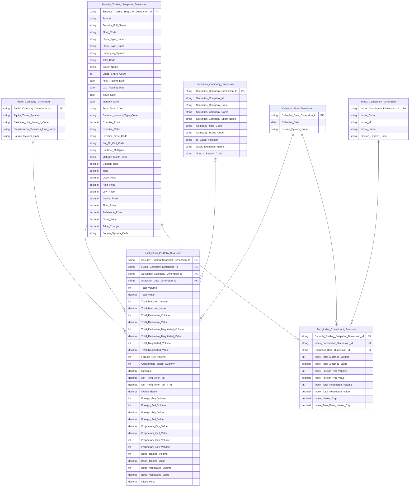
```mermaid
erDiagram
    Security_Trading_Snapshot_Dimension {
        string Security_Trading_Snapshot_Dimension_Id PK
        string Symbol
        string Security_Full_Name
        string Floor_Code
        string Stock_Type_Code
        string Stock_Type_Name
        string Underlying_Symbol
        string ISIN_Code
        string Issuer_Name
        int Listed_Share_Count
        date First_Trading_Date
        date Last_Trading_Date
        date Issue_Date
        date Maturity_Date
        string Fund_Type_Code
        string Covered_Warrant_Type_Code
        decimal Exercise_Price
        string Exercise_Ratio
        string Exercise_Style_Code
        string Put_Or_Call_Code
        string Contract_Multiplier
        string Maturity_Month_Year
        decimal Coupon_Rate
        decimal Yield
        decimal Open_Price
        decimal High_Price
        decimal Low_Price
        decimal Ceiling_Price
        decimal Floor_Price
        decimal Reference_Price
        decimal Close_Price
        decimal Price_Change
        string Source_System_Code
    }
    Public_Company_Dimension {
        string Public_Company_Dimension_Id PK
        string Equity_Ticker_Symbol
        string Business_Line_Level_1_Code
        string Classification_Business_Line_Name
        string Source_System_Code
    }
    Securities_Company_Dimension {
        string Securities_Company_Dimension_Id PK
        string Securities_Company_Id
        string Securities_Company_Code
        string Securities_Company_Name
        string Securities_Company_Short_Name
        string Company_Type_Code
        string Company_Status_Code
        string Is_Listed_Indicator
        string Stock_Exchange_Name
        string Source_System_Code
    }
    Calendar_Date_Dimension {
        string Calendar_Date_Dimension_Id PK
        date Calendar_Date
        string Source_System_Code
    }
    Index_Constituent_Dimension {
        string Index_Constituent_Dimension_Id PK
        string Index_Code
        string Index_Id
        string Index_Name
        string Source_System_Code
    }
    Fact_Index_Constituent_Snapshot {
        string Security_Trading_Snapshot_Dimension_Id FK
        string Index_Constituent_Dimension_Id FK
        string Snapshot_Date_Dimension_Id FK
        int Index_Total_Matched_Volume
        decimal Index_Total_Matched_Value
        int Index_Foreign_Net_Volume
        decimal Index_Foreign_Net_Value
        int Index_Total_Negotiated_Volume
        decimal Index_Total_Negotiated_Value
        decimal Index_Market_Cap
        decimal Index_Free_Float_Market_Cap
    }
    Fact_Stock_Portfolio_Snapshot {
        string Security_Trading_Snapshot_Dimension_Id FK
        string Public_Company_Dimension_Id FK
        string Securities_Company_Dimension_Id FK
        string Snapshot_Date_Dimension_Id FK
        int Total_Volume
        decimal Total_Value
        int Total_Matched_Volume
        decimal Total_Matched_Value
        int Total_Derivative_Volume
        decimal Total_Derivative_Value
        int Total_Derivative_Negotiated_Volume
        decimal Total_Derivative_Negotiated_Value
        int Total_Negotiated_Volume
        decimal Total_Negotiated_Value
        int Foreign_Net_Volume
        int Outstanding_Share_Quantity
        decimal Revenue
        decimal Net_Profit_After_Tax
        decimal Net_Profit_After_Tax_TTM
        decimal Owner_Equity
        int Foreign_Buy_Volume
        int Foreign_Sell_Volume
        decimal Foreign_Buy_Value
        decimal Foreign_Sell_Value
        decimal Proprietary_Buy_Value
        decimal Proprietary_Sell_Value
        int Proprietary_Buy_Volume
        int Proprietary_Sell_Volume
        int Bond_Trading_Volume
        decimal Bond_Trading_Value
        int Bond_Negotiated_Volume
        decimal Bond_Negotiated_Value
        decimal Close_Price
    }
    Security_Trading_Snapshot_Dimension ||--o{ Fact_Stock_Portfolio_Snapshot : " "
    Public_Company_Dimension |o--o{ Fact_Stock_Portfolio_Snapshot : " "
    Securities_Company_Dimension |o--o{ Fact_Stock_Portfolio_Snapshot : " "
    Calendar_Date_Dimension ||--o{ Fact_Stock_Portfolio_Snapshot : " "
    Security_Trading_Snapshot_Dimension ||--o{ Fact_Index_Constituent_Snapshot : " "
    Index_Constituent_Dimension ||--o{ Fact_Index_Constituent_Snapshot : " "
    Calendar_Date_Dimension ||--o{ Fact_Index_Constituent_Snapshot : " "
```

> **[SỬA 2026-09-14] Tách `Fact Index Constituent Snapshot` riêng (xem Cụm 1b, Section 1):** `Fact Stock Portfolio Snapshot` không còn FK `Index Constituent Dimension Id` — grain thuần mã CK × ngày. Nhu cầu phân tích theo rổ chỉ số (chọn 1 Chỉ số — K_GSTT_4; Bộ chỉ số thị trường/theo ngành — K_GSTT_62/63; SUM theo Index Code — K_GSTT_47-52/54/61) join qua `Fact Index Constituent Snapshot` (Factless, grain mã CK/rổ chỉ số/ngày) bằng `Symbol` + `Trading Date` — không còn rủi ro double-count trên các measure của `Fact Stock Portfolio Snapshot` vì Fact này không còn fan-out theo rổ chỉ số nữa.

**Lineage Mart → Báo cáo:**

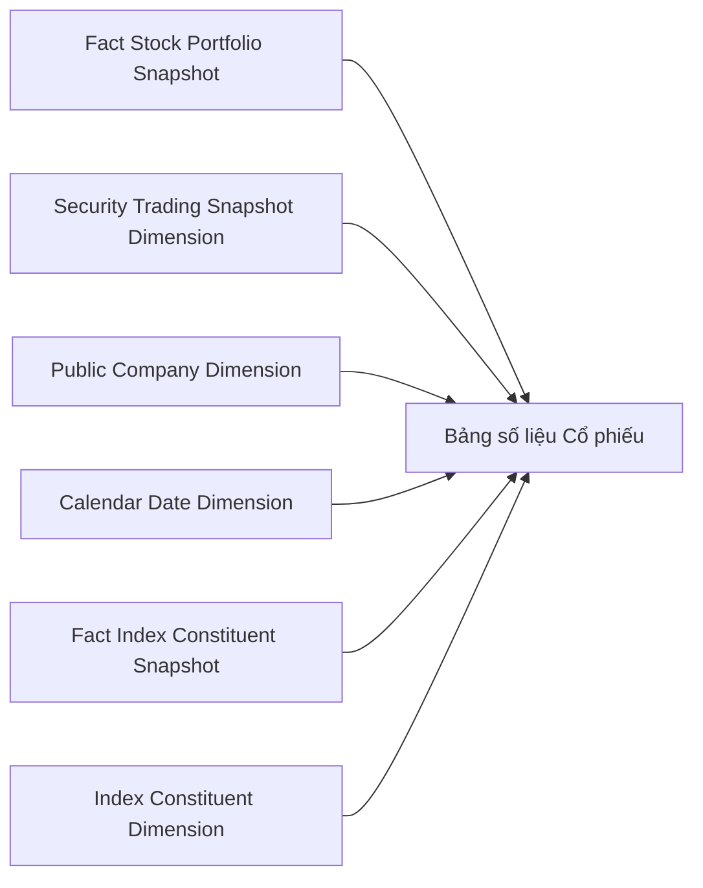
```mermaid
flowchart LR
    F1["Fact Stock Portfolio Snapshot"] --> RPT1["Bảng số liệu Cổ phiếu"]
    D1["Security Trading Snapshot Dimension"] --> RPT1
    D2["Public Company Dimension"] --> RPT1
    D3["Calendar Date Dimension"] --> RPT1
    F2["Fact Index Constituent Snapshot"] --> RPT1
    D4["Index Constituent Dimension"] --> RPT1
```

**Bảng grain:**

| Tên bảng | Grain |
|---|---|
| Fact Stock Portfolio Snapshot | 1 row / mã CK / ngày giao dịch |
| Security Trading Snapshot Dimension | 1 row / mã CK (SCD4A) |
| Public Company Dimension | 1 row / mã CK (SCD4A) |
| Securities Company Dimension | 1 row / CTCK (SCD4A) — reuse QLKD, fallback Ngành khi mã CK là CTCK |
| Calendar Date Dimension | 1 row / ngày |
| Fact Index Constituent Snapshot | 1 row / mã CK / rổ chỉ số / ngày giao dịch — Bridge + 8 measure tính sẵn theo Index+Date (lặp lại trên mọi dòng Symbol cùng rổ, sửa 2026-09-14) |
| Index Constituent Dimension | 1 row / Index Code (mô tả rổ chỉ số) |

> **Coverage rule (Bước 1a skill):** `Security Trading Snapshot Dimension` kéo dư thừa toàn bộ attribute hồ sơ mô tả chứng khoán từ `security_trading_snapshot` (Symbol, Security Full Name, Floor Code, Stock Type Code, Underlying Symbol, ISIN Code, Issuer Name, Listed Share Count, First/Last Trading Date, Issue Date, Maturity Date, Fund Type Code, Covered Warrant Type/Exercise Price/Ratio/Style Code, Put Or Call Code, Contract Multiplier, Maturity Month Year, Coupon Rate, Yield) — kể cả cột chưa cần cho Nhóm 1, để tránh phải bổ sung nhiều lần khi các Nhóm sau (Nhóm 2 — Trái phiếu, biểu đồ kỹ thuật, phái sinh...) cần đến. `Open Price`/`High Price`/`Low Price`/`Reference Price`/`Close Price`/`Price Change` giữ trên Dimension (không phải Fact) vì được dùng làm giá "hiện hành" hiển thị cùng hồ sơ mô tả — grain 1 row/mã CK snapshot ngày gần nhất (theo mockup BA), không phải để tính toán lịch sử theo nhiều ngày (bổ sung Open/High/Low tại Nhóm 3 theo coverage rule, cùng bản chất với Reference/Close/Change đã có ở Nhóm 1).
> **[SỬA 2026-09-14]** `Fact Stock Portfolio Snapshot` không còn fan-out theo rổ chỉ số (đã tách `Fact Index Constituent Snapshot` riêng, xem Cụm 1b) — measure trên Fact này (Total_Volume, Total_Value, Total_Derivative_Volume/Value, Total_Negotiated_Volume/Value, Foreign_Net_Volume...) nay đúng 1 giá trị/mã CK/ngày, không cần `SELECT DISTINCT` khi truy vấn không lọc theo Chỉ số.

---

#### Nhóm 2 - Bảng số liệu của trái phiếu

> **Phân loại:** Phân tích
> **Atomic:** `Security Trading Snapshot` ← MDDS.JAD_STOCKINFOR — **READY** (Nguồn 2, approved) / `Securities Trade` ← ORDERTRADE.TRADE_BOOK_HOSE, TRADE_BOOK_HNX — **READY** (Nguồn 2, approved)
>
> **Ghi chú nguồn (khác bản HLD cũ):** BA xác nhận trái phiếu niêm yết dùng **cùng** `MDDS.JAD_STOCKINFOR` với cổ phiếu (filter `Stock Type Code = '1'`), không phải entity riêng `MDDS.CorpBondInfor` như thiết kế trước — Note BA: "đổi lại do CorpBondInfor là trái phiếu riêng lẻ?". Do đó reuse toàn bộ `Fact Stock Portfolio Snapshot` + `Security Trading Snapshot Dimension` đã thiết kế ở Nhóm 1, không tạo Fact/Dimension riêng cho trái phiếu.

**Mockup:**

| Mã TP | Ngày | Giá TC | Giá ĐC | Giá mở cửa | Thay đổi | % TĐ | Ngày đáo hạn | KLGD | GTGD | YTM bình quân | Lãi suất |
|---|---|---|---|---|---|---|---|---|---|---|---|
| TCH2226 | 27/07/2026 | 102.5 | 103.0 | 102.8 | +0.5 | +0.49% | 15/03/2028 | 1.200 | 12.4 Tỷ | 6.8% | 7.2% |

**Source:** `Fact Stock Portfolio Snapshot` → `Security Trading Snapshot Dimension`, `Calendar Date Dimension`

**Bảng KPI:**

| KPI ID | Tên KPI | Đơn vị | Tính chất | Công thức | Ghi chú | Trạng thái |
|---|---|---|---|---|---|---|
| K_GSTT_20 | Mã trái phiếu | — | Chiều | `Security Trading Snapshot Dimension.Symbol` | Filter: `Stock Type Code = '1' AND Floor Code IN ('04','10','03','02')` | READY |
| K_GSTT_7 | Ngày | — | Chiều | `Calendar Date Dimension.Calendar Date` | Reuse từ Nhóm 1 | READY |
| K_GSTT_9 | Giá tham chiếu | VNĐ | Cơ sở | `Security Trading Snapshot Dimension.Reference Price` | Reuse từ Nhóm 1 | READY |
| K_GSTT_10 | Giá đóng cửa | VNĐ | Cơ sở | `Security Trading Snapshot Dimension.Close Price` | Reuse từ Nhóm 1 | READY |
| K_GSTT_21 | Giá mở cửa | VNĐ | Cơ sở | `Security Trading Snapshot Dimension.Open Price` | — | READY |
| K_GSTT_11 | Thay đổi (+/-) | VNĐ | Cơ sở | `Security Trading Snapshot Dimension.Price Change` | Reuse từ Nhóm 1 | READY |
| K_GSTT_22 | Ngày đáo hạn của trái phiếu | Ngày | Cơ sở | `Security Trading Snapshot Dimension.Maturity Date` | — | READY |
| K_GSTT_23 | KLGD khớp lệnh | Trái phiếu | Phái sinh | `SUM(Securities Trade.Execution Volume WHERE Market Id Code IN ('BDO','HCX') AND Board Type Code NOT IN ('T1','T2','T3','T4','T6','R1')) GROUP BY Symbol, Trade Date` | **[SỬA 2026-09-17, đồng bộ BA mới]** Đổi tên "KLGD"→"KLGD khớp lệnh" và đổi filter từ `IN ('G1','G2','G3','T1','T2','T3')` (trộn lẫn khớp lệnh+thỏa thuận) sang `NOT IN ('T1','T2','T3','T4','T6','R1')` (loại trừ thỏa thuận, cùng pattern K_GSTT_13/14 cổ phiếu) — BA STT 2 xác nhận rõ "KLGD khớp lệnh" (dòng con Done). Pre-aggregate — TP không có lô lẻ nên G4 không xuất hiện. Trái phiếu không xuất hiện trong nguồn `JAD_CSIDXINFOR` — không có row nào trên `Fact Index Constituent Snapshot` cho mã trái phiếu (không thuộc rổ chỉ số nào) | READY |
| K_GSTT_24 | GTGD khớp lệnh | VNĐ | Phái sinh | `SUM(Securities Trade.Execution Value WHERE Market Id Code IN ('BDO','HCX') AND Board Type Code NOT IN ('T1','T2','T3','T4','T6','R1')) GROUP BY Symbol, Trade Date` | **[SỬA 2026-09-17, đồng bộ BA mới]** Cùng lý do/filter K_GSTT_23. Pre-aggregate — cùng ghi chú FK NULL như K_GSTT_23 | READY |
| K_GSTT_345 | KLGD thỏa thuận | Trái phiếu | Phái sinh | `SUM(Fact Stock Portfolio Snapshot.Bond Negotiated Volume)` | **[MỚI 2026-09-29]** BA dòng 37 `KLGD thỏa thuận` — Σ KLGD thỏa thuận trái phiếu (Market Id BDO/HCX, bảng T1–T4/T6/R1; O_GSTT_44) | READY |
| K_GSTT_346 | GTGD thỏa thuận | VNĐ | Phái sinh | `SUM(Fact Stock Portfolio Snapshot.Bond Negotiated Value)` | **[MỚI 2026-09-29]** BA dòng 38 `GTGD thỏa thuận` — Σ GTGD thỏa thuận trái phiếu (O_GSTT_44) | READY |
| K_GSTT_25 | YTM bình quân | % | Cơ sở | `Security Trading Snapshot Dimension.Yield` | — | READY |
| K_GSTT_26 | Lãi suất | % | Cơ sở | `Security Trading Snapshot Dimension.Coupon Rate` | — | READY |

**Star Schema:** *(dùng chung `Fact Stock Portfolio Snapshot` + `Security Trading Snapshot Dimension` + `Calendar Date Dimension` đã vẽ ở Nhóm 1 — xem Nhóm 1 để có schema đầy đủ đã bổ sung `Coupon_Rate`, `Yield`. Trái phiếu không thuộc rổ chỉ số nào — không có row tương ứng trên `Fact Index Constituent Snapshot`.)*

**Lineage Mart → Báo cáo:**

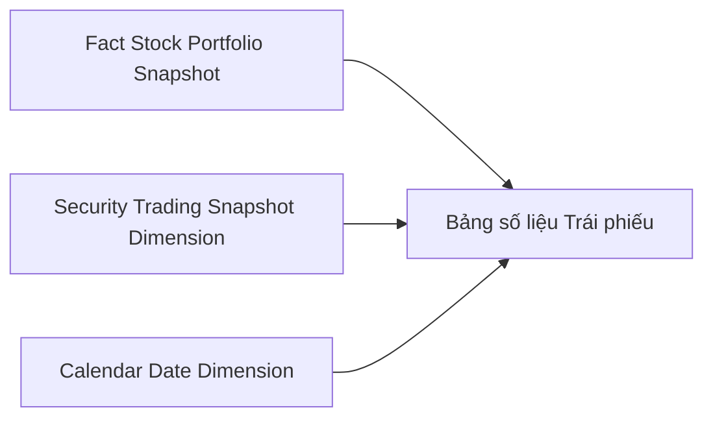
```mermaid
flowchart LR
    F1["Fact Stock Portfolio Snapshot"] --> RPT2["Bảng số liệu Trái phiếu"]
    D1["Security Trading Snapshot Dimension"] --> RPT2
    D3["Calendar Date Dimension"] --> RPT2
```

**Bảng grain:** *(giống Nhóm 1 — cùng Fact/Dimension, không grain riêng; trái phiếu không có row trên `Fact Index Constituent Snapshot`)*

---

#### Nhóm 3 - Biểu đồ kỹ thuật cổ phiếu

> **Phân loại:** Phân tích
> **Atomic:** `Security Trading Snapshot` ← MDDS.JAD_STOCKINFOR — **READY** (Nguồn 2, `design_status: approved` tại file LLD, 2026-07-03) / `Securities Trade` ← ORDERTRADE.TRADE_BOOK_HOSE, TRADE_BOOK_HNX — **READY** (Nguồn 2, approved) / `Public Company` ← IDS.COMPANY_PROFILES — **READY** (Nguồn 1, approved) / `Classification Business Line` ← ECAT.BUSINESS_LINE_LEVEL_1, BUSINESS_LINE_LEVEL_2 — **READY** (Nguồn 1, approved) / `Index Constituent Snapshot` ← MDDS.JAD_CSIDXINFOR — **READY** (Nguồn 2, approved)
>
> **Ghi chú tái sử dụng:** BA liệt kê 17 dòng con cho STT 3, nhưng 14/17 chỉ tiêu (Ngành, Sàn, Mã CK, Chỉ số, Loại phái sinh, Ngày, Giá đóng cửa, Giá tham chiếu, Thay đổi %, KLGD; riêng Phương thức khớp lệnh K_GSTT_6 đã DEPRECATED — loại bỏ) đã có KPI ID sẵn từ Nhóm 1/Nhóm 2 — reuse thẳng, không khai sinh KPI mới. Chỉ có 3 chỉ tiêu mới thật (Giá mở cửa, Giá cao nhất, Giá thấp nhất) — bổ sung 3 cột lên `Security Trading Snapshot Dimension` theo coverage rule. 2 chỉ tiêu còn lại (Doanh thu, Lợi nhuận sau thuế) cùng "Kỳ báo cáo" — xem ghi chú Dữ liệu động dưới đây.
> **Ghi chú Doanh thu/LNST/Kỳ báo cáo — Resolved 2026-08-26 (rule GSĐC):** Nguồn `IDS.data`/`report_catalog`/`rrow`/`rcol` (EAV báo cáo tài chính) nay truy vấn qua Atomic Nguồn 2: `public_company → pc_report_submission → fr_value → fr_catalog → fr_row_template → fr_column_template`. **[SỬA 2026-09-19, dev report SIT]** Chuỗi JOIN đã bỏ điều kiện `violation_report.base_dt` (sai ngữ nghĩa) — nay chốt đúng 1 báo cáo/kỳ (ưu tiên HN>TH>ME>RI, trùng lấy `submission_dt` mới nhất) rồi mới xếp hạng kỳ, xem chi tiết bên dưới. Doanh thu (`Revenue`, report_cd BCKQKD row_desc 10 DN/BH·03 TD)/LNST (`Net Profit After Tax`, row_desc 60 DN/BH·21 TD) là measure **bổ sung lên `Fact Stock Portfolio Snapshot` hiện có** (không tạo Fact riêng) — join qua FK `Public Company Dimension` đã có sẵn trên Fact. **[SỬA 2026-09-19, dev report SIT]** Doanh thu/LNST đổi từ công thức lùi-kỳ cứng theo lịch sang lấy kỳ QUÝ (1-4) gần nhất ĐÃ CÔNG BỐ tính đến ngày giao dịch (lookback, không rỗng vì kỳ lịch-lùi-1 chưa nộp); bỏ điều kiện `violation_report` (sai ngữ nghĩa — vi phạm CBTT không liên quan tới việc lấy số liệu đã duyệt); chốt đúng 1 báo cáo/kỳ (ưu tiên HN>TH>ME>RI) trước khi xếp hạng kỳ. `K_GSTT_30` (Kỳ báo cáo, hiển thị BI) giữ nguyên công thức lùi-kỳ cố định — đây là NHÃN HIỂN THỊ theo lịch, khác với kỳ DỮ LIỆU thực tế dùng để tính Doanh thu/LNST (nay là lookback); hai khái niệm có thể lệch nhau khi doanh nghiệp nộp trễ — cần lưu ý khi đối chiếu 2 cột trên BI.
> **[MỚI 2026-09-30 — Data Modeler yêu cầu, O_GSTT_51]** Bổ sung `Fact Security Trading Daily` (grain 1 mã CK × 1 ngày giao dịch) từ Atomic `Market Price Snapshot` (`market_price_snapshot`, MDDS.JAD_TRADINGVIEWHISTORY1DAY — nến OHLCV ngày). Quy tắc chọn nguồn theo khung thời gian của biểu đồ: **từ 1 tháng trở lên → nến ngày** (K_GSTT_349–353, mở/cao/thấp/đóng/KL); **trong ngày → nến phút** `Fact Security Trading Intraday` (Nhóm 34, K_GSTT_95–99); **ngày đơn lẻ** → K_GSTT_27/28/29/10 trên `Security Trading Snapshot Dimension` như cũ. K_GSTT_13 (KLGD khớp lệnh từ sổ lệnh, BA dòng 55) giữ nguyên — K_GSTT_353 là phiên bản KL của nến ngày.

**Mockup:**

| Mã CK | Ngành | Sàn | Chỉ số | Ngày | Giá mở | Giá cao | Giá thấp | Giá đóng | Giá TC | Thay đổi | % TĐ | KLGD | Doanh thu | LNST |
|---|---|---|---|---|---|---|---|---|---|---|---|---|---|---|
| GEX | Công nghiệp | HOSE | — | 11/05/2026 | 82.00 | 83.00 | 81.50 | 82.50 | 82.00 | +0.50 | +0.61% | 548 Tr | 3,276,672,448 | -15,609,651,666 |

**Source:** `Fact Stock Portfolio Snapshot` → `Security Trading Snapshot Dimension`, `Public Company Dimension`, `Calendar Date Dimension`, `Index Constituent Dimension`; `Fact Security Trading Daily` → `Security Trading Snapshot Dimension`, `Calendar Date Dimension`

**Bảng KPI:**

| KPI ID | Tên KPI | Đơn vị | Tính chất | Công thức | Ghi chú | Trạng thái |
|---|---|---|---|---|---|---|
| K_GSTT_2 | Ngành | — | Chiều | `Public Company Dimension.Business Line Level 1 Code`, `Classification Business Line Name` | Reuse từ Nhóm 1 | READY |
| K_GSTT_3 | Sàn | — | Chiều | `Security Trading Snapshot Dimension.Floor Code` | Reuse từ Nhóm 1 | READY |
| K_GSTT_1 | Mã CK | — | Chiều | `Security Trading Snapshot Dimension.Symbol` | Reuse từ Nhóm 1. BA lọc riêng "Mã CK cổ phiếu" (`Stock Type Code <> '1' AND Floor Code IN ('04','10','03','02') AND Market Id Code NOT IN ('BDO','HCX')`) — filter con của K_GSTT_1, không khai KPI mới | READY |
| K_GSTT_4 | Chỉ số | — | Chiều | `Index Constituent Dimension.Index Code` | Reuse từ Nhóm 1 | READY |
| K_GSTT_5 | Loại phái sinh | — | Chiều | `Security Trading Snapshot Dimension.Stock Type Code`, `Underlying Symbol` | Reuse từ Nhóm 1 | READY |
| K_GSTT_6 | Phương thức khớp lệnh (thỏa thuận) | — | Chiều | — | **[DEPRECATED 2026-09-08 — Loại bỏ]** Biểu đồ nến kỹ thuật (OHLC) và Volume chỉ sử dụng giao dịch khớp lệnh thực tế trên sàn (`total_vol` K_GSTT_13), không dùng giao dịch thỏa thuận | DEPRECATED |
| K_GSTT_7 | Ngày | — | Chiều | `Calendar Date Dimension.Calendar Date` | Reuse từ Nhóm 1 | READY |
| K_GSTT_27 | Giá mở cửa | VNĐ | Cơ sở | `Security Trading Snapshot Dimension.Open Price` | Mới — bổ sung cột lên Dimension theo coverage rule | READY |
| K_GSTT_28 | Giá cao nhất | VNĐ | Cơ sở | `Security Trading Snapshot Dimension.High Price` | Mới — bổ sung cột lên Dimension theo coverage rule | READY |
| K_GSTT_29 | Giá thấp nhất | VNĐ | Cơ sở | `Security Trading Snapshot Dimension.Low Price` | Mới — bổ sung cột lên Dimension theo coverage rule | READY |
| K_GSTT_10 | Giá đóng cửa | VNĐ | Cơ sở | `Security Trading Snapshot Dimension.Close Price` | Reuse từ Nhóm 1 | READY |
| K_GSTT_9 | Giá tham chiếu | VNĐ | Cơ sở | `Security Trading Snapshot Dimension.Reference Price` | Reuse từ Nhóm 1 | READY |
| K_GSTT_11 | Thay đổi (+/-) | VNĐ | Cơ sở | `Security Trading Snapshot Dimension.Price Change` | Reuse từ Nhóm 1 | READY |
| K_GSTT_13 | Khối lượng giao dịch khớp lệnh | Cổ phiếu | Phái sinh | `SUM(Securities Trade.Execution Volume WHERE Market Id Code IN ('UPX','STX','STK') AND Board Type Code NOT IN ('T1','T2','T3','T4','T6','R1')) GROUP BY Symbol, Trade Date` | **[SỬA 2026-09-16, đồng bộ theo BA mới]** Reuse từ Nhóm 1 — Nhóm 1 đã đổi nguồn `total_vol` → `total_matched_vol` (khớp lệnh thuần), Nhóm này tự nó đã đặt tên "khớp lệnh" từ trước nên khớp đúng định nghĩa mới, không cần đổi gì khác | READY |
| K_GSTT_30 | Kỳ báo cáo | — | Chiều | `CASE WHEN CEIL(MONTH(Calendar Date)/3.0)=1 THEN CONCAT(YEAR(Calendar Date)-1,'-Q4') ELSE CONCAT(YEAR(Calendar Date),'-Q',CEIL(MONTH(Calendar Date)/3.0)-1) END` | **Resolved 2026-08-26 — rule GSĐC.** Computed tại BI tier từ `Calendar Date` (`Ky_bao_cao`: quý hiện tại lùi 1 kỳ, lùi năm nếu Q1) — không lưu cột riêng trên Fact. **[SỬA 2026-09-19, dev report SIT]** Đây là NHÃN kỳ theo lịch (hiển thị), KHÔNG còn dùng chung logic chọn kỳ với Doanh thu/LNST nữa — Doanh thu/LNST (K_GSTT_31/32) nay lấy kỳ DỮ LIỆU thực tế gần nhất đã công bố (lookback), có thể khác kỳ lịch-lùi-1 hiển thị ở đây khi doanh nghiệp nộp trễ | READY |
| K_GSTT_31 | Doanh thu | VNĐ | Cơ sở | `Fact Stock Portfolio Snapshot.Revenue` | **Resolved 2026-08-26 — rule GSĐC.** Point-in-time theo kỳ báo cáo gần nhất đã công bố trước ngày giao dịch (K_GSTT_30) — join `public_company → pc_report_submission → fr_value → fr_catalog (BCKQKD, row_desc 10 DN/BH · 03 TD, col_desc 1) → fr_row_template → fr_column_template`, ưu tiên form HN>TH>ME>RI. Cột trên `Fact Stock Portfolio Snapshot`, join qua `Public Company Dimension` | READY |
| K_GSTT_32 | Lợi nhuận sau thuế | VNĐ | Cơ sở | `Fact Stock Portfolio Snapshot.Net Profit After Tax` | **Resolved 2026-08-26 — rule GSĐC.** Cùng cơ chế K_GSTT_31 (BCKQKD, row_desc 60 DN/BH · 21 TD, col_desc 1) | READY |
| K_GSTT_349 | Giá mở cửa theo ngày (nến ngày) | VNĐ | Cơ sở | `Fact Security Trading Daily.Daily Open Price` | **[MỚI 2026-09-30]** BA dòng 49 `Giá mở cửa` (`open`, giá giao dịch đầu tiên) — nến ngày TradingView. Khi lọc theo khung thời gian từ 1 THÁNG trở lên đọc nến ngày từ `Fact Security Trading Daily` (Atomic `market_price_snapshot` 1DAY, filter `src_stm_code`); ngày đơn lẻ giữ KPI cũ trên `Security Trading Snapshot Dimension`; khung trong ngày dùng `Fact Security Trading Intraday` (Nhóm 34). O_GSTT_51 | READY |
| K_GSTT_350 | Giá cao nhất theo ngày (nến ngày) | VNĐ | Cơ sở | `Fact Security Trading Daily.Daily High Price` | **[MỚI 2026-09-30]** BA dòng 50 `Giá cao nhất` (`high`) — nến ngày. Khi lọc theo khung thời gian từ 1 THÁNG trở lên đọc nến ngày từ `Fact Security Trading Daily` (Atomic `market_price_snapshot` 1DAY, filter `src_stm_code`); ngày đơn lẻ giữ KPI cũ trên `Security Trading Snapshot Dimension`; khung trong ngày dùng `Fact Security Trading Intraday` (Nhóm 34). O_GSTT_51 | READY |
| K_GSTT_351 | Giá thấp nhất theo ngày (nến ngày) | VNĐ | Cơ sở | `Fact Security Trading Daily.Daily Low Price` | **[MỚI 2026-09-30]** BA dòng 51 `Giá thấp nhất` (`low`) — nến ngày. Khi lọc theo khung thời gian từ 1 THÁNG trở lên đọc nến ngày từ `Fact Security Trading Daily` (Atomic `market_price_snapshot` 1DAY, filter `src_stm_code`); ngày đơn lẻ giữ KPI cũ trên `Security Trading Snapshot Dimension`; khung trong ngày dùng `Fact Security Trading Intraday` (Nhóm 34). O_GSTT_51 | READY |
| K_GSTT_352 | Giá đóng cửa theo ngày (nến ngày) | VNĐ | Cơ sở | `Fact Security Trading Daily.Daily Close Price` | **[MỚI 2026-09-30]** BA dòng 52 `Giá đóng cửa` (`closePrice`) — nến ngày. Khi lọc theo khung thời gian từ 1 THÁNG trở lên đọc nến ngày từ `Fact Security Trading Daily` (Atomic `market_price_snapshot` 1DAY, filter `src_stm_code`); ngày đơn lẻ giữ KPI cũ trên `Security Trading Snapshot Dimension`; khung trong ngày dùng `Fact Security Trading Intraday` (Nhóm 34). O_GSTT_51 | READY |
| K_GSTT_353 | Khối lượng giao dịch theo ngày (nến ngày) | Cổ phiếu | Cơ sở | `Fact Security Trading Daily.Daily Volume` | **[MỚI 2026-09-30]** BA dòng 55 `Khối lượng giao dịch` — phiên bản nến ngày (tổng KL khớp trong ngày, nguồn TradingView); phiên bản sổ lệnh giữ K_GSTT_13. Khi lọc theo khung thời gian từ 1 THÁNG trở lên đọc nến ngày từ `Fact Security Trading Daily` (Atomic `market_price_snapshot` 1DAY, filter `src_stm_code`); ngày đơn lẻ giữ KPI cũ trên `Security Trading Snapshot Dimension`; khung trong ngày dùng `Fact Security Trading Intraday` (Nhóm 34). O_GSTT_51 | READY |

**Star Schema:** *(dùng chung `Fact Stock Portfolio Snapshot` + `Security Trading Snapshot Dimension` (đã bổ sung `Open_Price`, `High_Price`, `Low_Price`) + `Public Company Dimension` + `Calendar Date Dimension` + `Index Constituent Dimension` đã vẽ ở Nhóm 1 — xem Nhóm 1. K_GSTT_31/32 (Doanh thu, LNST) Resolved 2026-08-26 — `Revenue`/`Net Profit After Tax` đã có trên `Fact Stock Portfolio Snapshot`, không có bảng mới.)*

**Star Schema — `Fact Security Trading Daily` (mới 2026-09-30):**

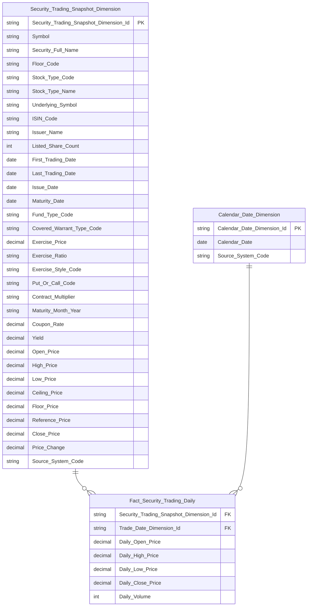
```mermaid
erDiagram
    Security_Trading_Snapshot_Dimension {
        string Security_Trading_Snapshot_Dimension_Id PK
        string Symbol
        string Security_Full_Name
        string Floor_Code
        string Stock_Type_Code
        string Stock_Type_Name
        string Underlying_Symbol
        string ISIN_Code
        string Issuer_Name
        int Listed_Share_Count
        date First_Trading_Date
        date Last_Trading_Date
        date Issue_Date
        date Maturity_Date
        string Fund_Type_Code
        string Covered_Warrant_Type_Code
        decimal Exercise_Price
        string Exercise_Ratio
        string Exercise_Style_Code
        string Put_Or_Call_Code
        string Contract_Multiplier
        string Maturity_Month_Year
        decimal Coupon_Rate
        decimal Yield
        decimal Open_Price
        decimal High_Price
        decimal Low_Price
        decimal Ceiling_Price
        decimal Floor_Price
        decimal Reference_Price
        decimal Close_Price
        decimal Price_Change
        string Source_System_Code
    }
    Calendar_Date_Dimension {
        string Calendar_Date_Dimension_Id PK
        date Calendar_Date
        string Source_System_Code
    }
    Fact_Security_Trading_Daily {
        string Security_Trading_Snapshot_Dimension_Id FK
        string Trade_Date_Dimension_Id FK
        decimal Daily_Open_Price
        decimal Daily_High_Price
        decimal Daily_Low_Price
        decimal Daily_Close_Price
        int Daily_Volume
    }
    Security_Trading_Snapshot_Dimension ||--o{ Fact_Security_Trading_Daily : " "
    Calendar_Date_Dimension ||--o{ Fact_Security_Trading_Daily : " "
```

**Lineage Mart → Báo cáo:**

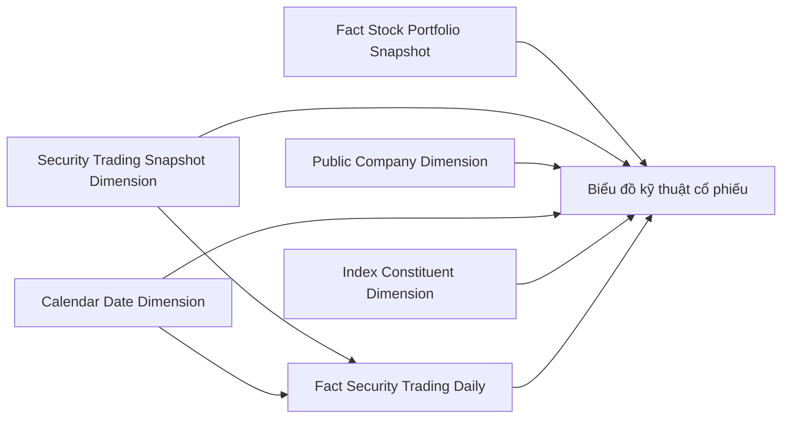
```mermaid
flowchart LR
    F1["Fact Stock Portfolio Snapshot"] --> RPT3["Biểu đồ kỹ thuật cổ phiếu"]
    D1["Security Trading Snapshot Dimension"] --> RPT3
    D2["Public Company Dimension"] --> RPT3
    D3["Calendar Date Dimension"] --> RPT3
    D4["Index Constituent Dimension"] --> RPT3
    F2["Fact Security Trading Daily"] --> RPT3
    D1 --> F2
    D3 --> F2
```

**Bảng grain:** *(Fact/Dimension dùng chung giống Nhóm 1 — không grain riêng)*

| Tên bảng | Grain |
|---|---|
| Fact Stock Portfolio Snapshot | 1 row / mã CK / ngày (bản ghi cuối phiên, `rn=1`) — dùng chung Nhóm 1, không đổi |
| Fact Security Trading Daily | 1 row / Symbol / ngày giao dịch (nến ngày) — FK `Calendar Date Dimension` qua `Trading Date` |

---

#### Nhóm 4 - Biểu đồ kỹ thuật trái phiếu — ⚠️ ĐÃ BỎ (DEPRECATED 2026-09-17)

> **[DEPRECATED 2026-09-17 — theo yêu cầu trực tiếp user]** Dashboard "Danh mục trái phiếu theo biểu đồ kỹ thuật" (STT 4) không còn cần thiết kế — BA đã quyết định loại bỏ dashboard này. `BA_analyst_GSTT.csv` (STT 4, 10 dòng con) tại thời điểm sửa vẫn còn ghi `Trạng thái mapping = Done` (BA team chưa cập nhật lại CSV) — quyết định bãi bỏ ghi nhận trực tiếp từ user, không qua cập nhật CSV.
>
> 100% KPI của Nhóm này (K_GSTT_20, 7, 30, 27, 28, 29, 10, 9, 11, 23) đều reuse từ Nhóm 1/2/3 — không có Fact/Dimension/cột nào tạo riêng cho Nhóm 4, nên bãi bỏ không ảnh hưởng thiết kế các Nhóm khác (K_GSTT_23 v.v. vẫn READY cho Nhóm 2). Đã chuyển 10 dòng liên quan tại `DTM_GSTT_Detail_Mapping.csv` (`nhom = "Nhóm 4 - ..."`) sang `column_role = DEPRECATED` — không xóa hẳn để giữ vết lịch sử.

**Bảng KPI:**

| KPI ID | Tên KPI | Đơn vị | Tính chất | Công thức | Ghi chú | Trạng thái |
|---|---|---|---|---|---|---|
| K_GSTT_20 | Mã trái phiếu | — | Chiều | — | [DEPRECATED 2026-09-17] Dashboard bãi bỏ | DEPRECATED |
| K_GSTT_7 | Ngày | — | Chiều | — | [DEPRECATED 2026-09-17] Dashboard bãi bỏ | DEPRECATED |
| K_GSTT_30 | Kỳ báo cáo | — | Chiều | — | [DEPRECATED 2026-09-17] Dashboard bãi bỏ | DEPRECATED |
| K_GSTT_27 | Giá mở cửa | VNĐ | Cơ sở | — | [DEPRECATED 2026-09-17] Dashboard bãi bỏ | DEPRECATED |
| K_GSTT_28 | Giá cao nhất | VNĐ | Cơ sở | — | [DEPRECATED 2026-09-17] Dashboard bãi bỏ | DEPRECATED |
| K_GSTT_29 | Giá thấp nhất | VNĐ | Cơ sở | — | [DEPRECATED 2026-09-17] Dashboard bãi bỏ | DEPRECATED |
| K_GSTT_10 | Giá đóng cửa | VNĐ | Cơ sở | — | [DEPRECATED 2026-09-17] Dashboard bãi bỏ | DEPRECATED |
| K_GSTT_9 | Giá tham chiếu | VNĐ | Cơ sở | — | [DEPRECATED 2026-09-17] Dashboard bãi bỏ | DEPRECATED |
| K_GSTT_11 | Thay đổi (+/-) | VNĐ | Cơ sở | — | [DEPRECATED 2026-09-17] Dashboard bãi bỏ | DEPRECATED |
| K_GSTT_23 | Khối lượng giao dịch | Trái phiếu | Phái sinh | — | [DEPRECATED 2026-09-17] Dashboard bãi bỏ | DEPRECATED |

---

#### Nhóm 5 - Diễn biến chỉ số thị trường

> **Phân loại:** Phân tích
> **Atomic:** `Market Index Snapshot` ← MDDS.JAD_MARKETINFOR — **READY** (Nguồn 1, approved 2026-07-03) / `Index Constituent Snapshot` ← MDDS.JAD_CSIDXINFOR — **READY** (Nguồn 2, approved) / `Securities Trade` ← ORDERTRADE.TRADE_BOOK_HOSE, TRADE_BOOK_HNX — **READY** (Nguồn 2, approved)
>
> **Ghi chú tái sử dụng:** BA liệt kê 23 dòng con — 22 KPI khai sinh (K_GSTT_4, K_GSTT_33, K_GSTT_34–54), 1 dòng trùng ("Giá" = điểm chỉ số gần nhất trong ngày, trùng hoàn toàn K_GSTT_35, không khai KPI mới). `Market Index Dimension`/`Fact Market Index Snapshot` reuse + mở rộng từ QLKD (xem ghi chú Cụm 2a). "Số cổ phiếu lưu hành" và "Vốn hóa thị trường" (sub-row 22, 23) tham chiếu nguồn VSDC (báo cáo "BM 1_Báo cáo về khối lượng chứng khoán đang lưu hành") — **Resolved 2026-08-26**: `IDS.COMPANY_SHARE_STATISTICS` (`pc_share_statistics`) chỉ SCD4A current-state, nhưng có bảng lịch sử theo ngày `pc_share_statistics_hstr` (`ds_snpst_dt`) — xem O_GSTT_2.

**Mockup:**

| Chỉ số | Ngày | Giá ĐC | Giá cao | Giá thấp | Thay đổi | % TĐ | Mã tăng | Mã giảm | Mã đứng giá | Mã trần | Mã sàn | KLGD | GTGD | KLGD TT | GTGD TT | KLNN ròng | GTNN ròng | Vốn hóa TT |
|---|---|---|---|---|---|---|---|---|---|---|---|---|---|---|---|---|---|---|
| VN-Index | 27/07/2026 | 1,245.32 | 1,250.10 | 1,238.50 | +5.20 | +0.42% | 245 | 180 | 32 | 12 | 5 | 850 Tr | 18.5 Tỷ | 45 Tr | 1.2 Tỷ | +80 Tỷ | +120 Tỷ | 5,842,000,000,000,000 |

**Source:** `Fact Market Index Snapshot` → `Market Index Dimension`, `Calendar Date Dimension`; `Fact Market Index Intraday` → `Market Index Dimension`, `Calendar Date Dimension`; `Fact Stock Portfolio Snapshot` → `Security Trading Snapshot Dimension`, `Index Constituent Dimension` (K_GSTT_53/54 — Số cổ phiếu lưu hành/Vốn hóa thị trường, SUM cộng dồn theo Index Code)

**Bảng KPI:**

| KPI ID | Tên KPI | Đơn vị | Tính chất | Công thức | Ghi chú | Trạng thái |
|---|---|---|---|---|---|---|
| K_GSTT_4 | Chỉ số | — | Chiều | `Market Index Dimension.Index Name` | **Sửa nguồn hiển thị (2026-09-08):** Bản trước hiển thị `Market Code` (mã kỹ thuật do FSS tự quy định, VD "30", không đảm bảo khớp tên chuẩn) — đổi sang `Index Name` (`index_nm`, map trực tiếp từ `MDDS.JAD_MARKETINFOR.INDEXNAME`, đã có sẵn ở Atomic `market_index_snapshot.index_nm`) để hiển thị đúng tên chuẩn VN-Index/HNX-Index/UPCoM-Index/VN30... `Market Code` vẫn giữ nguyên làm khóa join/filter nội bộ cho K_GSTT_47–52 (`mapping(Market Code)`), không đổi cơ chế filter. Reuse cơ chế Chiều, khác Dimension với K_GSTT_4 gốc (Nhóm 1 dùng Index Constituent Dimension) — đây là chỉ số thị trường, không phải rổ thành viên. Xem ghi chú Index Code vs Market Code | READY |
| K_GSTT_33 | Ngày | — | Chiều | `Calendar Date Dimension.Calendar Date` | Reuse cơ chế, Fact khác Nhóm 1 | READY |
| K_GSTT_34 | Theo giờ trong ngày | — | Chiều | `Fact Market Index Intraday.Index Time` | Chiều slicer theo khung giờ trong ngày, gắn trực tiếp trên grain của `Fact Market Index Intraday`. Dùng kèm FK `Calendar Date Dimension` (K_GSTT_33, xác định qua `Market Index Snapshot.Trading Date`) để filter theo ngày trước khi khai thác chi tiết theo giờ — 2 chiều bổ trợ nhau, không thay thế | READY |
| K_GSTT_35 | Giá đóng cửa (điểm chỉ số) | Điểm | Cơ sở | `Fact Market Index Snapshot.Market Index Value` | Đã có sẵn ở Fact QLKD. BA có 1 dòng riêng "Giá" (điểm chỉ số gần nhất trong ngày, cùng logic `rn=1` theo `indexTime`) — trùng hoàn toàn K_GSTT_35, không khai KPI mới | READY |
| K_GSTT_36 | Giá cao nhất | Điểm | Cơ sở | `Fact Market Index Snapshot.High Index` | Mới — bổ sung cột (mở rộng Fact QLKD) | READY |
| K_GSTT_37 | Giá thấp nhất | Điểm | Cơ sở | `Fact Market Index Snapshot.Low Index` | Mới — bổ sung cột (mở rộng Fact QLKD) | READY |
| K_GSTT_38 | Thay đổi (+/-) | Điểm | Cơ sở | `Fact Market Index Snapshot.Index Change` | Mới — bổ sung cột (mở rộng Fact QLKD) | READY |
| K_GSTT_39 | % thay đổi | % | Phái sinh | `Fact Market Index Snapshot.Index Percent Change` | Mới — bổ sung cột (mở rộng Fact QLKD) | READY |
| K_GSTT_40 | Số lượng mã tăng | Mã | Cơ sở | `Fact Market Index Snapshot.Advances Count` | Mới — bổ sung cột (mở rộng Fact QLKD) | READY |
| K_GSTT_41 | Số lượng mã giảm | Mã | Cơ sở | `Fact Market Index Snapshot.Declines Count` | Mới — bổ sung cột (mở rộng Fact QLKD) | READY |
| K_GSTT_42 | Số lượng mã đứng giá | Mã | Cơ sở | `Fact Market Index Snapshot.No Change Count` | Mới — bổ sung cột (mở rộng Fact QLKD) | READY |
| K_GSTT_43 | Số lượng mã tăng trần | Mã | Cơ sở | `Fact Market Index Snapshot.Ceiling Count` | Mới — bổ sung cột (mở rộng Fact QLKD) | READY |
| K_GSTT_44 | Số lượng mã giảm sàn | Mã | Cơ sở | `Fact Market Index Snapshot.Floor Count` | Mới — bổ sung cột (mở rộng Fact QLKD) | READY |
| K_GSTT_45 | Giá trị GD theo realtime | VNĐ | Cơ sở | `Fact Market Index Intraday.Total Value At Time` | Grain riêng (1 row/Market Code/Index Time) — xem Fact Market Index Intraday bên dưới | READY |
| K_GSTT_46 | Điểm của chỉ số theo realtime | Điểm | Cơ sở | `Fact Market Index Intraday.Market Index Value At Time` | Grain riêng (1 row/Market Code/Index Time) — xem Fact Market Index Intraday bên dưới | READY |
| K_GSTT_47 | KLGD của chỉ số | Cổ phiếu | Phái sinh | `MAX(Fact Index Constituent Snapshot.Index Total Matched Volume) WHERE Index Code = mapping(Market Code) GROUP BY Index Code, Trade Date` (đã tính sẵn trên Bridge — sửa 2026-09-14 theo yêu cầu Design) [SỬA 2026-09-14, review sheet Tổng hợp công thức] Đổi tên cột + loại trừ thỏa thuận (Board Type NOT IN T1-T6/R1) — khác BA_analyst_GSTT.csv STT5 (không filter), Data Modeler xác nhận theo sheet Tổng hợp công thức. | Total Volume đã filter Market Id Code IN ('UPX','STX','STO') sẵn từ ETL populate Fact — chỉ cần join thêm qua `Fact Index Constituent Snapshot` (Bridge, Cụm 1b) theo Symbol; cần mapping Market Code↔Index Code, xem ghi chú Cụm 2. **[SỬA 2026-09-14]** Trước đây Symbol nằm trực tiếp trên Index Constituent Dimension — nay chuyển sang Fact Index Constituent Snapshot (Bridge) | READY |
| K_GSTT_48 | GTGD của chỉ số | VNĐ | Phái sinh | `MAX(Fact Index Constituent Snapshot.Index Total Matched Value) WHERE Index Code = mapping(Market Code) GROUP BY Index Code, Trade Date` (đã tính sẵn trên Bridge — sửa 2026-09-14 theo yêu cầu Design) [SỬA 2026-09-14, review sheet Tổng hợp công thức] Đổi tên cột + loại trừ thỏa thuận (Board Type NOT IN T1-T6/R1) — khác BA_analyst_GSTT.csv STT5 (không filter), Data Modeler xác nhận theo sheet Tổng hợp công thức. | Cùng ghi chú K_GSTT_47 | READY |
| K_GSTT_49 | KLNN ròng (theo chỉ số) | Cổ phiếu | Phái sinh | `MAX(Fact Index Constituent Snapshot.Index Foreign Net Volume) WHERE Index Code = mapping(Market Code) GROUP BY Index Code, Trade Date` (đã tính sẵn trên Bridge, gộp Mua ròng-Bán ròng — sửa 2026-09-14 theo yêu cầu Design) | Kỹ thuật đủ nguồn giống K_GSTT_47/48 (JOIN Index Constituent + Securities Trade) — thiết kế READY dù BA ghi "Chưa có CSDL - Map biểu mẫu" (đánh giá: đây là ghi chú BA chưa chốt biểu mẫu hiển thị, không phải thiếu nguồn) | READY |
| K_GSTT_50 | GTNN ròng (theo chỉ số) | VNĐ | Phái sinh | `MAX(Fact Index Constituent Snapshot.Index Foreign Net Value) WHERE Index Code = mapping(Market Code) GROUP BY Index Code, Trade Date` (đã tính sẵn trên Bridge, gộp Mua ròng-Bán ròng — sửa 2026-09-14 theo yêu cầu Design) | Cùng ghi chú K_GSTT_49 | READY |
| K_GSTT_51 | KLGD thỏa thuận (chỉ số) | Cổ phiếu | Phái sinh | `MAX(Fact Index Constituent Snapshot.Index Total Negotiated Volume) WHERE Index Code = mapping(Market Code) GROUP BY Index Code, Trade Date` (đã tính sẵn trên Bridge — sửa 2026-09-14 theo yêu cầu Design) | **Sửa nguồn (2026-08-20, BA cập nhật):** BA đổi từ cột snapshot có sẵn (`Market Index Snapshot.PT Total Volume`) sang tự tính từ sổ lệnh (`TRADE_BOOK_HOSE/HNX`), lọc `Board Type Code IN ('T1'..'T6')` (đối chiếu SQL BA: nhánh `tong_kl_tt`, KHÔNG dùng `tong_kl` — cột đó là của K_GSTT_47, không lọc Board Type). `Total Negotiated Volume` đã pre-tách sẵn điều kiện Board Type này từ ETL populate Fact (cùng nguồn K_GSTT_17 "Tổng KL thỏa thuận", Nhóm 1) — chỉ cần SUM cộng dồn qua `Fact Index Constituent Snapshot` (Bridge, **[SỬA 2026-09-14]** trước đây qua Index Constituent Dimension trực tiếp) để lấy theo Index Code (khác K_GSTT_17 group theo Symbol). Đặt trên `Fact Stock Portfolio Snapshot` (Nhóm 1) để nhất quán với K_GSTT_47/48, KHÔNG còn dùng `Fact Market Index Snapshot.PT Total Volume` — cột này trên Market Index Snapshot nay không còn KPI nào tham chiếu (xem ghi chú Fact Market Index Snapshot) | READY |
| K_GSTT_52 | GTGD thỏa thuận (chỉ số) | VNĐ | Phái sinh | `MAX(Fact Index Constituent Snapshot.Index Total Negotiated Value) WHERE Index Code = mapping(Market Code) GROUP BY Index Code, Trade Date` (đã tính sẵn trên Bridge — sửa 2026-09-14 theo yêu cầu Design) | Cùng ghi chú K_GSTT_51 (sửa nguồn 2026-08-20) — dùng `Total Negotiated Value`, cùng nguồn K_GSTT_18 | READY |
| K_GSTT_53 | Số cổ phiếu lưu hành | Cổ phiếu | Cơ sở | `Fact Stock Portfolio Snapshot.Outstanding Share Quantity` | **Resolved 2026-08-26, sửa lookback 2026-09-08, [SỬA NGUỒN 2026-09-16, xem O_GSTT_22].** Trùng K_GSTT_55 (Nhóm 6) — cùng 1 chỉ tiêu. Nguồn nay là `listed_share_info` (VSDC `outstanding_shares`, `src_stm_code='VSDC_OUTSTANDING_SHARES'`) — đổi từ `pc_share_statistics_hstr` (IDS) vì IDS không có dữ liệu hàng ngày cho HNX/UPCOM, gây NULL vốn hóa/P-E/P-B trên UAT. Lấy bản ghi gần nhất `<= Trading Date` (lookback, cùng pattern Free Float Share Quantity). Cột đặt trên `Fact Stock Portfolio Snapshot` (Nhóm 1, join qua Public Company Dimension), KHÔNG phải Fact Market Index Snapshot — measure này theo mã CK, không theo market_code | READY |
| K_GSTT_54 | Vốn hóa thị trường | VNĐ | Phái sinh | `MAX(Fact Index Constituent Snapshot.Index Market Cap) GROUP BY Index Code` (đã tính sẵn trên Bridge theo Giá đóng cửa × Số cổ phiếu lưu hành toàn rổ — sửa 2026-09-14 theo yêu cầu Design, không cần SUM lại) | **Resolved 2026-08-26** — K_GSTT_53 đã có nguồn. Trùng K_GSTT_61 (Nhóm 6) — cùng 1 chỉ tiêu. Công thức đặt trên `Fact Stock Portfolio Snapshot` (Nhóm 1), không phải Fact Market Index Snapshot — đã sửa lại ghi chú Fact đích cho nhất quán với Nhóm 6 (2026-07-27) | READY |

**Star Schema:**

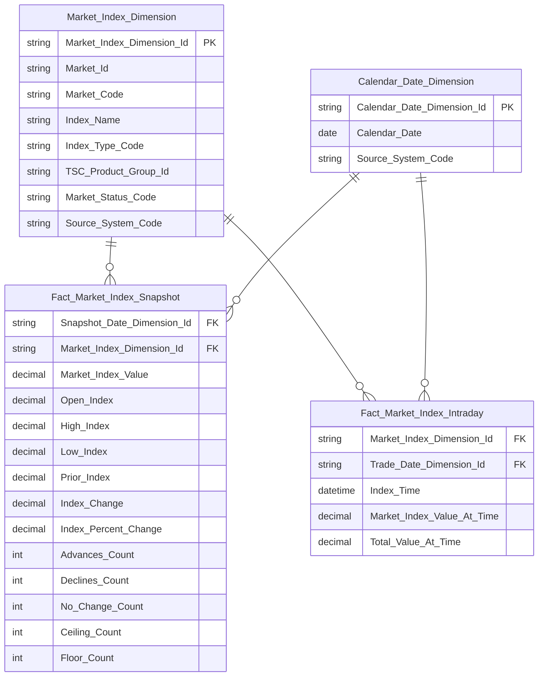
```mermaid
erDiagram
    Market_Index_Dimension {
        string Market_Index_Dimension_Id PK
        string Market_Id
        string Market_Code
        string Index_Name
        string Index_Type_Code
        string TSC_Product_Group_Id
        string Market_Status_Code
        string Source_System_Code
    }
    Calendar_Date_Dimension {
        string Calendar_Date_Dimension_Id PK
        date Calendar_Date
        string Source_System_Code
    }
    Fact_Market_Index_Snapshot {
        string Snapshot_Date_Dimension_Id FK
        string Market_Index_Dimension_Id FK
        decimal Market_Index_Value
        decimal Open_Index
        decimal High_Index
        decimal Low_Index
        decimal Prior_Index
        decimal Index_Change
        decimal Index_Percent_Change
        int Advances_Count
        int Declines_Count
        int No_Change_Count
        int Ceiling_Count
        int Floor_Count
    }
    Fact_Market_Index_Intraday {
        string Market_Index_Dimension_Id FK
        string Trade_Date_Dimension_Id FK
        datetime Index_Time
        decimal Market_Index_Value_At_Time
        decimal Total_Value_At_Time
    }
    Market_Index_Dimension ||--o{ Fact_Market_Index_Snapshot : " "
    Calendar_Date_Dimension ||--o{ Fact_Market_Index_Snapshot : " "
    Market_Index_Dimension ||--o{ Fact_Market_Index_Intraday : " "
    Calendar_Date_Dimension ||--o{ Fact_Market_Index_Intraday : " "
```

> **Fact Market Index Intraday có FK tới Calendar Date Dimension** — xác định qua `Market Index Snapshot.Trading Date` (`trading_dt`, nguồn `MDDS.JAD_MARKETINFOR`, data_domain Date, tách biệt với `Index Time` dạng Text) — cho phép filter/slicer theo ngày giao dịch trước khi phân tích chi tiết theo `Index Time` trong ngày đó.

**Lineage Mart → Báo cáo:**

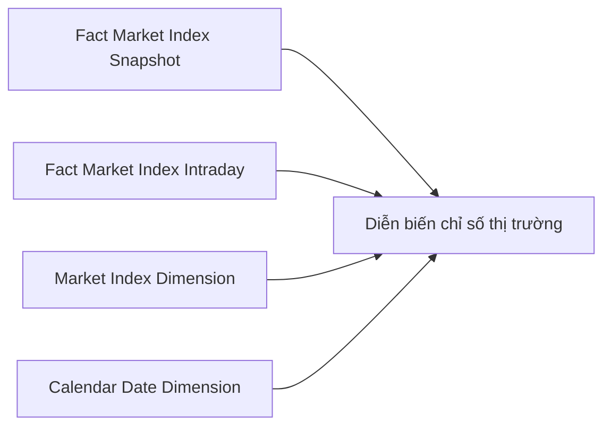
```mermaid
flowchart LR
    F1["Fact Market Index Snapshot"] --> RPT5["Diễn biến chỉ số thị trường"]
    F2["Fact Market Index Intraday"] --> RPT5
    D1["Market Index Dimension"] --> RPT5
    D2["Calendar Date Dimension"] --> RPT5
```

**Bảng grain:**

| Tên bảng | Grain |
|---|---|
| Fact Market Index Snapshot | 1 row / chỉ số thị trường (market_code) / ngày (bản ghi cuối phiên) — reuse + mở rộng từ QLKD |
| Fact Market Index Intraday | 1 row / chỉ số thị trường (market_code) / Index Time (theo phút, đúng nguồn) — có FK `Calendar Date Dimension` xác định qua `Trading Date` |
| Market Index Dimension | 1 row / combo (Market Id, Market Code) (SCD4A) — reuse từ QLKD |
| Calendar Date Dimension | 1 row / ngày |

> **Coverage rule:** Không áp dụng thêm cho `Market Index Dimension` (reuse nguyên trạng từ QLKD, không sửa cấu trúc Dimension). Coverage rule áp dụng cho `Fact Market Index Snapshot`: đã kéo đủ toàn bộ measure snapshot cuối ngày có thật trong Atomic `Market Index Snapshot` (Open/High/Low/Prior Index, Change, %Change, Advances/Declines/No Change/Ceiling/Floor Count) — không có measure nào trong Atomic entity này bị bỏ sót.
>
> **Sửa nguồn (2026-08-20):** Đã bỏ `PT_Total_Volume`/`PT_Total_Value` khỏi Fact này — K_GSTT_51/52 (KLGD/GTGD thỏa thuận) nay đổi nguồn sang aggregate từ `Fact Stock Portfolio Snapshot` (xem bảng KPI), không còn dùng cột snapshot trên `Fact Market Index Snapshot`. Cột Atomic `PT Total Volume/Value` gốc (`market_index_snapshot.pt_total_vol/val`) hiện không còn KPI nào trong module GSTT tham chiếu.
> **Sửa (2026-08-20, O_GSTT_13 Resolved):** Đã bỏ `Odd_Lot_Total_Volume`/`Odd_Lot_Total_Value` khỏi Fact này — không có Detail Mapping nào (mọi module) tham chiếu 2 cột này, không có căn cứ BA. Xem Section Vấn đề mở.

---

#### Nhóm 6 - Định giá thị trường

> **Phân loại:** Dashboard
> **Atomic:** `Security Trading Snapshot` ← MDDS.JAD_STOCKINFOR — **READY** (Nguồn 2, approved, reuse Nhóm 1) / `Public Company` ← IDS.COMPANY_PROFILES — **READY** (Nguồn 1, approved, reuse Nhóm 1) / `Classification Business Line` ← ECAT.BUSINESS_LINE_LEVEL_1, BUSINESS_LINE_LEVEL_2 — **READY** (Nguồn 1, approved, reuse Nhóm 1) / `Index Constituent Snapshot` ← MDDS.JAD_CSIDXINFOR — **READY** (Nguồn 2, approved, reuse Nhóm 1) / `Listed Share Info` ← VSDC `outstanding_shares` (`src_stm_code='VSDC_OUTSTANDING_SHARES'`) — **[SỬA 2026-09-16, xem O_GSTT_22]** đổi từ `Public Company Share Statistics`/`pc_share_statistics_hstr` (IDS) — IDS không có dữ liệu hàng ngày, gây NULL trên HNX/UPCOM / EAV báo cáo tài chính (`IDS.data`/`report_catalog`/`rrow`/`rcol` cho LNST/VCSH) — **Resolved 2026-08-26** theo rule GSĐC (join qua `public_company`/`pc_report_submission`/`fr_value`/`fr_catalog`/`fr_row_template`/`fr_column_template`, xem O_GSTT_1)
>
> **Ghi chú kiến trúc:** BA STT 6 gốc có 13 dòng con, dùng chung **1 Fact chính** — mở rộng `Fact Stock Portfolio Snapshot` (Nhóm 1, grain 1 row/mã CK/rổ chỉ số/ngày, đã có sẵn FK `Public Company Dimension`, `Index Constituent Dimension`, `Calendar Date Dimension`) cho 11/12 KPI. LNST/VCSH/Số cổ phiếu lưu hành đều link về Fact này qua `Public Company Dimension` (mã công ty) — đây là các measure THEO TỪNG MÃ, hiển thị đúng theo dòng Mã CK. **[SỬA 2026-09-22, datamart-review]** Riêng "Giá trị chỉ số" (K_GSTT_35) KHÔNG có measure tương ứng trên `Fact Stock Portfolio Snapshot`/`Fact Index Constituent Snapshot` — đây là điểm số do Sở GDCK công bố trực tiếp (không tính được bottom-up từ giá các mã thành viên như `idx_market_cap`/`idx_pe`), nên bắt buộc LOOKUP runtime sang `Fact Market Index Snapshot`/`Market Index Dimension` (QLKD) qua khóa `Market Index Dimension.Market Code = Index Constituent Dimension.Index Code` (xem Open Issue O_GSTT_3, phần đã Resolved một phần). Đây KHÔNG phải FK thiết kế sẵn trên Fact Stock Portfolio Snapshot — cùng cơ chế lookup runtime qua Symbol+Trading Date đã dùng cho K_GSTT_4/K_GSTT_62/63 (xem Cụm 1b).
> **[SỬA 2026-09-19, review Nhóm 6]** P/E/P/B/EPS/Vốn hóa thị trường **KHÔNG** tính theo từng mã CK — cột I (Độ chi tiết) của cả 4 dòng con này là `Danh mục chỉ số - theo giờ` (index-level), khác hẳn 10 Nhóm khác reuse cùng tên gọi "P/E/P/B/EPS thị trường" (Nhóm 7/9/11/13/15/17/19/21/36/37 — đã xác nhận Độ chi tiết = `Mã CK`/`Mã ck` ở toàn bộ 10 Nhóm đó, đúng công thức ratio từng mã `K_GSTT_58/59/60`). SQL tham khảo BA (dòng 96/98) tính đúng theo nguyên tắc "theo mã → SUM theo rổ": `Von_hoa_tung_ma` (Giá đóng cửa × Số CP lưu hành TỪNG MÃ) → `SUM(von_hoa của mã có LNST TTM)/SUM(LNST TTM)` GROUP BY Index Code + Date (P/E), tương tự cho P/B (VCSH) và EPS (`Tổng LNST/Tổng Số CP lưu hành` — xem O_GSTT_24). Do khác grain/công thức với `K_GSTT_58/59/60` (per-mã, dùng ở 10 Nhóm kia), Nhóm 6 dùng **KPI ID riêng K_GSTT_149/150/151**, tính sẵn trên `Fact Index Constituent Snapshot` (`idx_pe`/`idx_pb`/`idx_eps`) — cùng cơ chế SUM-rồi-broadcast đã dùng cho `idx_market_cap` (K_GSTT_61).
> **Sửa nguồn giá (khác SQL tham khảo BA):** SQL tham khảo của BA cho P/E/P/B/Vốn hóa dùng `marketIndex` (điểm chỉ số) làm giá theo mã CK — nhầm lẫn khái niệm (điểm chỉ số không phải giá cổ phiếu). Đã sửa dùng **Giá đóng cửa thật của từng mã CK** (K_GSTT_10) làm nguồn giá cho toàn bộ công thức P/E/P/B/Vốn hóa. Cần xác nhận lại với BA/nghiệp vụ trước khi lên LLD (xem O_GSTT_4).
> **[LOẠI BỎ 2026-09-11]** Chỉ tiêu "Ngành" (dòng con BA — `SELECT DISTINCT industry_cd, industry_name FROM IDS.categories`) đã bị loại khỏi Dashboard Định giá thị trường theo xác nhận trực tiếp — không còn hiển thị/filter theo Ngành ở Nhóm này nữa. BA_Valid Nhóm 6 giảm từ 13 → 12 dòng con. `K_GSTT_2` (Ngành) vẫn giữ nguyên, tiếp tục dùng ở Nhóm 1/3/7 — chỉ gỡ reference tại Nhóm 6.

**Mockup:**

> **[SỬA 2026-09-19]** `P/E`, `P/B`, `EPS`, `Vốn hóa TT` là chỉ tiêu **CỦA CẢ RỔ CHỈ SỐ** (K_GSTT_149/150/151/61) — giá trị lặp lại giống nhau trên MỌI dòng Mã CK thuộc cùng Chỉ số + Ngày (broadcast, không phải P/E riêng của VCB). `Giá đóng cửa`, `Số CP lưu hành`, `LNST`, `VCSH` mới là giá trị THEO TỪNG MÃ. `Giá trị chỉ số` cũng broadcast theo Chỉ số + Ngày (điểm số của cả rổ, không phải của riêng mã CK).

| Mã CK | sàn | Chỉ số | Ngày | Giá đóng cửa | Giá trị chỉ số | Số CP lưu hành | LNST | VCSH | P/E (của Chỉ số) | P/B (của Chỉ số) | EPS (của Chỉ số) | Vốn hóa TT (theo Chỉ số) |
|---|---|---|---|---|---|---|---|---|---|---|---|---|
| VCB | HOSE | VN30 | 27/07/2026 | 82.50 | 1,280.50 | 5,589,067,000 | 12,450,000,000 | 87,240,000,000 | 15.8 | 1.9 | 3,250 | 461,161,157,750,000 |
| ACB | HOSE | VN30 | 27/07/2026 | 24.10 | 1,280.50 | 3,860,000,000 | 6,200,000,000 | 41,500,000,000 | 15.8 | 1.9 | 3,250 | 461,161,157,750,000 |

**Source:** `Fact Stock Portfolio Snapshot` (mở rộng, Nhóm 1) → `Security Trading Snapshot Dimension`, `Public Company Dimension`, `Calendar Date Dimension`, `Index Constituent Dimension`; riêng K_GSTT_35 LOOKUP runtime sang `Fact Market Index Snapshot` + `Market Index Dimension` (reuse — sở hữu QLKD) qua khóa `Market Index Dimension.Market Code = Index Constituent Dimension.Index Code`.

**Bảng KPI:**

| KPI ID | Tên KPI | Đơn vị | Tính chất | Công thức | Ghi chú | Trạng thái |
|---|---|---|---|---|---|---|
| K_GSTT_4 | Chỉ số | — | Chiều | `Index Constituent Dimension.Index Code` | Reuse từ Nhóm 1 (không phải biến thể Market Index Dimension của Nhóm 5) | READY |
| K_GSTT_3 | sàn | — | Chiều | `Security Trading Snapshot Dimension.Floor Code` | Reuse từ Nhóm 1 | READY |
| K_GSTT_33 | Ngày | — | Chiều | `Calendar Date Dimension.Calendar Date` | Reuse từ Nhóm 1 | READY |
| K_GSTT_35 | Giá trị chỉ số | Điểm | Cơ sở | `LOOKUP Fact Market Index Snapshot ON Fact Market Index Snapshot.Market Index Dimension Id = Market Index Dimension.Market Index Dimension Id AND Market Index Dimension.Market Code = Index Constituent Dimension.Index Code AND Fact Market Index Snapshot.Snapshot Date Dimension Id = Calendar Date Dimension.Calendar Date Dimension Id → Fact Market Index Snapshot.Market Index Value` | **[SỬA 2026-09-22, datamart-review — hoàn thiện thiết kế]** Trước đây chỉ ghi `Fact Market Index Snapshot.Market Index Value` không kèm điều kiện JOIN — copy nhầm nguyên công thức của K_GSTT_35 ở Nhóm 5 (nơi grain trùng khớp tự nhiên với Fact Market Index Snapshot nên không cần JOIN), trong khi Nhóm 6 có grain khác (theo Index Code qua `Fact Stock Portfolio Snapshot`, không phải Market Code) — cùng loại lỗi Grain Mismatch như case K_GSTT_61. Đã bổ sung đúng khóa bridge `Market Index Dimension.Market Code = Index Constituent Dimension.Index Code` (nguồn `MDDS.JAD_MARKETINFOR.INDEXNAME`, xác nhận 2026-09-22) — giải quyết một phần Open Issue O_GSTT_3 (xem Section 5). Giá trị LẶP LẠI trên mọi dòng Mã CK cùng Chỉ số + Ngày (broadcast, giống K_GSTT_149-151/61). | READY |
| K_GSTT_10 | Giá đóng cửa | VNĐ | Cơ sở | `Security Trading Snapshot Dimension.Close Price` | Reuse từ Nhóm 1 — dòng con này của BA cùng công thức với "Giá trị chỉ số" ở trên (cả 2 cùng tham chiếu `marketIndex` gốc), không khai KPI mới | READY |
| K_GSTT_55 | Số cổ phiếu đang lưu hành | Cổ phiếu | Cơ sở | `Fact Stock Portfolio Snapshot.Outstanding Share Quantity` | **Resolved 2026-08-26, sửa lookback 2026-09-08, [SỬA NGUỒN 2026-09-16, xem O_GSTT_22].** Nguồn VSDC "BM 1_Báo cáo về khối lượng chứng khoán đang lưu hành" — nay lấy trực tiếp qua `listed_share_info` (`outstanding_shares`, `src_stm_code='VSDC_OUTSTANDING_SHARES'`, cùng nguồn với `Free Float Share Quantity`), thay cho `pc_share_statistics_hstr` (IDS) trước đây — IDS chỉ báo cáo theo quý/năm, không có biến động hàng ngày và chưa đồng bộ cho HNX/UPCOM trên UAT, khiến cột bị NULL 100% và kéo theo Vốn hóa/P-E/P-B bị NULL/0 (phát hiện qua review thực tế UAT, xem O_GSTT_22). Lấy bản ghi gần nhất `<= Trading Date` (lookback — tránh NULL khi NSD chọn ngày không phải ngày giao dịch). Cột trên `Fact Stock Portfolio Snapshot`, join qua `Public Company Dimension` | READY |
| K_GSTT_56 | LNST | VNĐ | Cơ sở | `Fact Stock Portfolio Snapshot.Net Profit After Tax` | **Resolved 2026-08-26 — rule GSĐC.** Point-in-time theo kỳ QUÝ (1-4) gần nhất ĐÃ CÔNG BỐ tính đến ngày giao dịch (lookback, **[SỬA 2026-09-19, dev report SIT]** bỏ công thức lùi-kỳ cứng theo lịch) — join `public_company → pc_report_submission → fr_value → fr_catalog (BCKQKD, row_desc 60 DN/BH · 21 TD, col_desc 1) → fr_row_template → fr_column_template`, chốt đúng 1 báo cáo/kỳ trước khi xếp hạng (ưu tiên HN>TH>ME>RI, trùng lấy `submission_dt` mới nhất). **[SỬA 2026-09-19, dev report SIT]** Đã bỏ điều kiện `violation_report` (sai ngữ nghĩa). Cột trên `Fact Stock Portfolio Snapshot`, join qua `Public Company Dimension`. Khác `Net Profit After Tax TTM` (dùng riêng cho P/E/EPS, xem K_GSTT_58/60) | READY |
| K_GSTT_57 | VCSH | VNĐ | Cơ sở | `Fact Stock Portfolio Snapshot.Owner Equity` | **Resolved 2026-08-26 — rule GSĐC.** Lấy kỳ gần nhất đã công bố tính đến ngày giao dịch (BCDKT, row_desc 400 DN/BH · 500 TD, col_desc 1) — lookback theo `submission_dt` thực tế (KHÔNG ép theo lịch `Ky_bao_cao` cố định như Doanh thu/LNST, và KHÔNG giới hạn quý 1-4 — chấp nhận cả kỳ bán niên/cả năm làm số liệu "gần nhất", vì VCSH là chỉ tiêu tại một thời điểm, không theo chu kỳ báo cáo cố định). **[SỬA 2026-09-19, dev report SIT]** Bỏ điều kiện `violation_report` (sai ngữ nghĩa) và bỏ điều kiện ẩn `CASE WHEN rpt_quarter=1..4 THEN ngày cuối quý END <= trading_dt` — CASE không ELSE khiến kỳ 5/6 luôn bị loại do NULL, VÔ TÌNH mâu thuẫn với chủ đích "không giới hạn quý" đã ghi ở trên; nay chỉ còn `submission_dt <= trading_dt` làm điều kiện thời gian. Chốt đúng 1 báo cáo/kỳ trước khi xếp hạng (ưu tiên HN>TH>ME>RI). Cột trên `Fact Stock Portfolio Snapshot`, join qua `Public Company Dimension` | READY |
| K_GSTT_149 | P/E thị trường | Lần | Chỉ tiêu phái sinh | `MAX(Fact Index Constituent Snapshot.Index PE) GROUP BY Index Code` (tính sẵn trên Bridge — `idx_pe` = SUM(Vốn hóa TOÀN BỘ mã trong rổ)/SUM(LNST TTM từng mã) GROUP BY Index Code + Date, cùng cơ chế `idx_market_cap`) | **[SỬA 2026-09-19, review Nhóm 6]** Tách khỏi `K_GSTT_58` (P/E TỪNG MÃ, dùng cho Nhóm 7/9/11/13/15/17/19/21/36/37 — Độ chi tiết `Mã CK`) — Nhóm 6 có Độ chi tiết `Danh mục chỉ số - theo giờ` (index-level) + SQL tham khảo BA dùng SUM/SUM GROUP BY marketCode, không phải ratio từng mã. **[SỬA 2026-09-19, theo yêu cầu trực tiếp]** Bỏ điều kiện lọc "chỉ tính vốn hóa của mã CÓ LNST TTM" ở tử số — nay tử số là tổng vốn hóa CẢ RỔ không điều kiện; mẫu số vẫn chỉ cộng LNST TTM của mã nào có dữ liệu (NULL tự động bị SUM bỏ qua). GIÁ TRỊ LẶP LẠI trên mọi dòng Symbol cùng Index+Date | READY |
| K_GSTT_150 | P/B thị trường | Lần | Chỉ tiêu phái sinh | `MAX(Fact Index Constituent Snapshot.Index PB) GROUP BY Index Code` (tính sẵn trên Bridge — `idx_pb` = SUM(Vốn hóa TOÀN BỘ mã trong rổ)/SUM(VCSH từng mã) GROUP BY Index Code + Date) | **[SỬA 2026-09-19, review Nhóm 6]** Tách khỏi `K_GSTT_59` (P/B TỪNG MÃ) — cùng lý do K_GSTT_149. **[SỬA 2026-09-19, theo yêu cầu trực tiếp]** Bỏ điều kiện lọc "chỉ tính vốn hóa của mã CÓ VCSH" ở tử số — cùng lý do K_GSTT_149 | READY |
| K_GSTT_151 | EPS thị trường | VNĐ | Chỉ tiêu phái sinh | `MAX(Fact Index Constituent Snapshot.Index EPS) GROUP BY Index Code` (tính sẵn trên Bridge — `idx_eps` = SUM(LNST TTM)/SUM(Số CP lưu hành) GROUP BY Index Code + Date, KHÔNG lọc mã thiếu LNST TTM ở mẫu số — xem O_GSTT_24) | **[SỬA 2026-09-19, review Nhóm 6]** Tách khỏi `K_GSTT_60` (EPS TỪNG MÃ) — cùng lý do K_GSTT_149. SQL tham khảo BA cho dòng EPS là bản sao SQL P/E/P/B, chưa có công thức EPS riêng — xem O_GSTT_24 | READY |
| K_GSTT_61 | Vốn hóa thị trường | VNĐ | Chỉ tiêu phái sinh | `MAX(Fact Index Constituent Snapshot.Index Market Cap) GROUP BY Index Code` (đã tính sẵn trên Bridge — K_GSTT_10 (Giá đóng cửa) × K_GSTT_55 (Số CP lưu hành) gộp sẵn thành `idx_market_cap`, không cần SUM lại — sửa 2026-09-14 theo yêu cầu Design) | **Resolved 2026-08-26** — K_GSTT_55 đã có nguồn. Trùng công thức K_GSTT_54 (Nhóm 5) — cùng 1 chỉ tiêu "Vốn hóa thị trường"; cả 2 đều đặt đúng trên `Fact Stock Portfolio Snapshot` (đã sửa lại Nhóm 5 để nhất quán, không phải Fact Market Index Snapshot) | READY |

**Star Schema:** Không có bảng mới — 100% reuse `Fact Stock Portfolio Snapshot` (đã có FK `Public Company Dimension`, `Index Constituent Dimension`, `Calendar Date Dimension`, `Security Trading Snapshot Dimension` từ Nhóm 1) cho 11/12 KPI. **Sửa 2026-08-26:** `Revenue`, `Net Profit After Tax`, `Net Profit After Tax TTM`, `Owner Equity` (rule GSĐC — O_GSTT_1) và `Outstanding Share Quantity` (`pc_share_statistics_hstr` — O_GSTT_2) đều đã Resolved. Toàn bộ 12/12 KPI Nhóm 6 nay READY (loại "Ngành" — xem ghi chú [LOẠI BỎ 2026-09-11] ở đầu Nhóm). Xem erDiagram tại Nhóm 1. **[SỬA 2026-09-22]** K_GSTT_35 là ngoại lệ duy nhất — không đặt trên `Fact Stock Portfolio Snapshot`, LOOKUP runtime sang `Fact Market Index Snapshot`/`Market Index Dimension` (reuse — sở hữu QLKD, erDiagram xem Cụm 2a `DTM_QLKD_HLD.md` hoặc Cụm 2, Nhóm 5 module này) qua khóa `Market Index Dimension.Market Code = Index Constituent Dimension.Index Code` — không phải FK cố định thiết kế sẵn trên Fact, không cần thêm cột/FK mới trên `Fact Stock Portfolio Snapshot`.

**Lineage Mart → Báo cáo:**

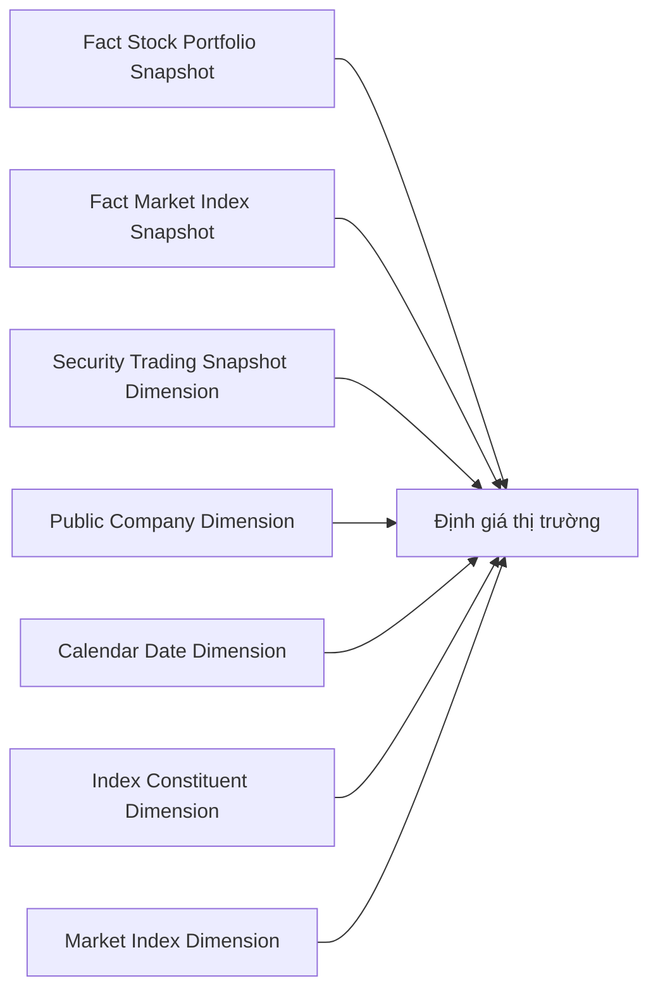
```mermaid
flowchart LR
    F1["Fact Stock Portfolio Snapshot"] --> RPT6["Định giá thị trường"]
    F2["Fact Market Index Snapshot"] --> RPT6
    D1["Security Trading Snapshot Dimension"] --> RPT6
    D2["Public Company Dimension"] --> RPT6
    D3["Calendar Date Dimension"] --> RPT6
    D4["Index Constituent Dimension"] --> RPT6
    D5["Market Index Dimension"] --> RPT6
```

**Bảng grain:** Không có bảng mới — cùng grain `Fact Stock Portfolio Snapshot` (1 row/mã CK/rổ chỉ số/ngày) đã có ở Nhóm 1 cho 11/12 KPI. **Sửa 2026-08-26:** `Revenue`, `Net Profit After Tax`, `Net Profit After Tax TTM`, `Owner Equity` (rule GSĐC), `Outstanding Share Quantity` (`pc_share_statistics_hstr`) đều đã Resolved, bổ sung lên đúng Fact này cùng grain — không còn cột PENDING nào trong Nhóm 6. **[SỬA 2026-09-22]** K_GSTT_35 lookup từ `Fact Market Index Snapshot` (`fct_market_index_snpst`, reuse — sở hữu QLKD) — grain 1 row/market_code/ngày, broadcast xuống grain Nhóm 6 qua khóa Market Code = Index Code (không làm thay đổi grain vật lý của `Fact Stock Portfolio Snapshot`).

> **Coverage rule:** Không áp dụng thêm cho Dimension nào (toàn bộ reuse nguyên trạng từ Nhóm 1). 5 measure mới (Revenue, Net Profit After Tax, Net Profit After Tax TTM, Owner Equity, Outstanding Share Quantity) đã bổ sung đủ lên `Fact Stock Portfolio Snapshot` — theo đúng nguyên tắc measure đặt tại true grain (mã CK/ngày), không tạo Fact riêng.

---

#### Nhóm 7 - Top khối lượng theo sàn, Bộ chỉ số tài chính, Bộ chỉ số ngành (bảng số liệu)

> **Phân loại:** Dashboard
> **Atomic:** 100% reuse Nhóm 1 (`Security Trading Snapshot`, `Securities Trade`, `Public Company`, `Classification Business Line`) + Nhóm 6 (`Public Company Share Statistics` Resolved 2026-08-26, sửa nguồn 2026-09-16 (`listed_share_info`, xem O_GSTT_2 + O_GSTT_22), EAV IDS Resolved 2026-08-26 (rule GSĐC, xem O_GSTT_1)) — không có nguồn mới.
>
> **Ghi chú tái sử dụng:** BA liệt kê 15 dòng con — 13 dòng đã có KPI ID sẵn từ Nhóm 1 (Mã CK, Sàn, Ngành, Ngày, KLGD, Giá, % thay đổi) và Nhóm 6 (Số CP lưu hành, Vốn hóa, LNST, P/E, VCSH, P/B) — reuse thẳng, không khai sinh KPI mới. Còn 2 dòng ("Bộ chỉ số thị trường", "Bộ chỉ số theo ngành") là 2 chỉ tiêu độc lập, khai sinh mới — xem ghi chú dưới đây.
> **Ghi chú "Bộ chỉ số thị trường"/"Bộ chỉ số theo ngành" (K_GSTT_62–63):** BA xác nhận cột nguồn thật là `Index Constituent Dimension.Index Code` (cùng cột vật lý với K_GSTT_4 — Chỉ số, Nhóm 1), nguồn `MDDS.JAD_CSIDXINFOR.INDEXCODE` — **không phải `Floor Code`** như bản thiết kế trước. Tuy dùng chung 1 cột vật lý, đây là 2 chỉ tiêu nghiệp vụ khác K_GSTT_4 (Chỉ số — chọn 1 rổ chỉ số cụ thể để lọc) và khác nhau: "Bộ chỉ số thị trường" (K_GSTT_62) = `Index Code IN ('HOSE','UPCOM','HNX')`; "Bộ chỉ số theo ngành" (K_GSTT_63) = `Index Code NOT IN ('HOSE','UPCOM','HNX')` (VD: VN30, HNX30...) — 2 slicer phân loại khác nhau trên dashboard, không phải cùng 1 khái niệm. Khai 2 KPI_ID mới, không thêm Fact/FK/Dimension (cùng dùng `Index Constituent Dimension` đã có). Đã cân nhắc phương án thêm FK mới `Fact Stock Portfolio Snapshot → Market Index Dimension` nhưng xác nhận không có join key Symbol↔Market Code trong Atomic hiện có (`Market Index Snapshot` không có attribute Symbol) — dùng thẳng `Index Constituent Dimension` sẵn có là đúng, không cần FK mới.
> **Ghi chú lịch sử renumber (2026-07-28):** 2 chỉ tiêu này ban đầu được khai sinh muộn (phát hiện sau khi Phase 2 đã hoàn tất tới Nhóm 39) và tạm gán ID K_GSTT_119/120 làm ngoại lệ ngoài thứ tự. Toàn bộ module đã được đánh số lại liên tục từ K_GSTT_1 theo đúng thứ tự Nhóm xuất hiện — 2 chỉ tiêu này nay có ID chính thức K_GSTT_62/63, nằm đúng vị trí tự nhiên ngay sau Nhóm 6 (K_GSTT_61). Không còn ngoại lệ về thứ tự ID trong toàn bộ HLD.
> **[SỬA 2026-09-07 — Kịch bản B, theo Note nghiệp vụ "UB_Phạm vi phân tích"]** BA/nghiệp vụ xác nhận nhóm dashboard "Top" (Nhóm 7-22, trừ Nhóm 9/10 — xem ghi chú riêng) có filter khoảng ngày (Từ ngày → Đến ngày), và KLGD/GTGD/KLNN ròng phải là **tổng cộng dồn trong khoảng đó**, không phải giá trị 1 ngày đơn như thiết kế cũ. Khai sinh K_GSTT_133 (KLGD range) + K_GSTT_139 (Từ ngày, chiều mới) tại Nhóm này — nguồn gốc cho toàn bộ Nhóm 8/11-22 reuse. K_GSTT_7 (Ngày) giữ nguyên ID/công thức, đổi tên hiển thị thành "Đến ngày" trong các Nhóm này. Giá/% thay đổi/Vốn hóa/LNST/P-E/P-B **không đổi** — vẫn là giá trị "tại Đến ngày" (snapshot), đúng theo Note nghiệp vụ.

**Mockup:**

| Mã CK | Sàn | Bộ chỉ số ngành | Ngành | Từ ngày | Đến ngày | KLGD | Giá | % thay đổi | Số CP lưu hành | Vốn hóa | LNST | P/E | VCSH | P/B |
|---|---|---|---|---|---|---|---|---|---|---|---|---|---|---|
| VCB | HOSE | VN30 | Ngân hàng | 01/07/2026 | 27/07/2026 | 8.2 Tỷ | 82.50 | +0.61% | *(pending)* | *(pending)* | *(pending)* | *(pending)* | *(pending)* | *(pending)* |

**Source:** `Fact Stock Portfolio Snapshot` → `Security Trading Snapshot Dimension`, `Public Company Dimension`, `Calendar Date Dimension`, `Index Constituent Dimension` — 100% reuse, Top-N theo KLGD (tổng khoảng ngày) tại tầng BI.

**Bảng KPI:**

| KPI ID | Tên KPI | Đơn vị | Tính chất | Công thức | Ghi chú | Trạng thái |
|---|---|---|---|---|---|---|
| K_GSTT_1 | Mã CK | — | Chiều | `Security Trading Snapshot Dimension.Symbol` | Reuse từ Nhóm 1 | READY |
| K_GSTT_3 | Sàn | — | Chiều | `Security Trading Snapshot Dimension.Floor Code` | Reuse từ Nhóm 1 | READY |
| K_GSTT_11 | Thay đổi giá (+/-) | VNĐ | Cơ sở | `Security Trading Snapshot Dimension.Price Change` | [SỬA 2026-09-23, rà soát BA↔DM] Reuse từ Nhóm 1 — BA dòng 109 "Thay đổi giá (+/-)" (Trường nguồn `change`) bị bỏ sót trước đây | READY |
| K_GSTT_62 | Bộ chỉ số thị trường | — | Chiều | `Index Constituent Dimension.Index Code` | Mới — cùng cột vật lý K_GSTT_4 (Chỉ số, Nhóm 1) nhưng khác chỉ tiêu nghiệp vụ: `Index Code IN ('HOSE','UPCOM','HNX')`. **[SỬA 2026-09-14]** Filter qua `Fact Index Constituent Snapshot` (Bridge, Cụm 1b) cùng cơ chế K_GSTT_4 — không còn FK cố định trên Fact | READY |
| K_GSTT_63 | Bộ chỉ số theo ngành | — | Chiều | `Index Constituent Dimension.Index Code` | Mới — cùng cột vật lý K_GSTT_4, khác chỉ tiêu nghiệp vụ: `Index Code NOT IN ('HOSE','UPCOM','HNX')` (VD: VN30, HNX30...). **[SỬA 2026-09-14]** Filter qua `Fact Index Constituent Snapshot` (Bridge, Cụm 1b) cùng cơ chế K_GSTT_4 — không còn FK cố định trên Fact | READY |
| K_GSTT_2 | Ngành | — | Chiều | `Public Company Dimension.Business Line Level 1 Code`, `Classification Business Line Name` | Reuse từ Nhóm 1 | READY |
| K_GSTT_139 | Từ ngày | — | Chiều | `Calendar Date Dimension.Calendar Date` | **[MỚI 2026-09-07]** Chiều lọc đầu khoảng ngày — dùng chung `Calendar Date Dimension`, vai trò filter khác K_GSTT_7 (điểm neo range, không phải FK grain riêng) | READY |
| K_GSTT_7 | Đến ngày | — | Chiều | `Calendar Date Dimension.Calendar Date` | **[SỬA 2026-09-07]** Đổi tên hiển thị từ "Ngày" — công thức/ID không đổi. Đóng vai trò mốc cuối khoảng ngày + ngày snapshot cho Giá/Vốn hóa/LNST/P-E/P-B | READY |
| K_GSTT_133 | KLGD khớp lệnh | Cổ phiếu | Phái sinh | `SUM(Securities Trade.Execution Volume) WHERE Trade Date BETWEEN :from_date AND :to_date AND Board Type Code NOT IN ('T1','T2','T3','T4','T6','R1') GROUP BY Symbol` | **[MỚI 2026-09-07]** Thay K_GSTT_13 (1 ngày) — tổng KLGD trong khoảng Từ ngày-Đến ngày, đã bao gồm filter Market Id Code IN ('UPX','STX','STO') kế thừa từ K_GSTT_13. Dùng làm tiêu chí sắp xếp Top-N | READY |
| K_GSTT_10 | Giá | VNĐ | Cơ sở | `Security Trading Snapshot Dimension.Close Price` | Reuse từ Nhóm 1 (K_GSTT_10 = Giá đóng cửa) | READY |
| K_GSTT_12 | % thay đổi | % | Phái sinh | `Price Change / Reference Price × 100` | Reuse từ Nhóm 1 | READY |
| K_GSTT_55 | Số cổ phiếu đang lưu hành | Cổ phiếu | Cơ sở | `Fact Stock Portfolio Snapshot.Outstanding Share Quantity` | Reuse từ Nhóm 6 — Resolved 2026-08-26, sửa nguồn 2026-09-16 (`listed_share_info`, xem O_GSTT_2 + O_GSTT_22) | READY |
| K_GSTT_61 | Vốn hóa | VNĐ | Chỉ tiêu phái sinh | `MAX(K_GSTT_10 (Giá đóng cửa) × K_GSTT_55 (Số CP lưu hành)) GROUP BY Symbol, Trade Date` (Vốn hóa TỪNG MÃ CK, không phải theo Index — sửa 2026-09-14, phát hiện qua review Data Modeler: bảng Top-N theo mã CK không phải theo rổ chỉ số, cùng pattern Nhóm 23) | Reuse từ Nhóm 6 — Resolved 2026-08-26 (K_GSTT_55 đã có nguồn) | READY |
| K_GSTT_56 | LNST | VNĐ | Cơ sở | `Fact Stock Portfolio Snapshot.Net Profit After Tax` | Reuse từ Nhóm 6 — Resolved 2026-08-26 (rule GSĐC, xem O_GSTT_1) | READY |
| K_GSTT_58 | P/E thị trường | Lần | Chỉ tiêu phái sinh | `K_GSTT_10 / (Fact Stock Portfolio Snapshot.Net Profit After Tax TTM / K_GSTT_55)` | Reuse từ Nhóm 6 — Resolved 2026-08-26. LNST dùng TTM 4 quý (rule GSĐC); K_GSTT_55 đã có nguồn (`listed_share_info`, sửa nguồn 2026-09-16 — xem O_GSTT_22) | READY |
| K_GSTT_57 | VCSH | VNĐ | Cơ sở | `Fact Stock Portfolio Snapshot.Owner Equity` | Reuse từ Nhóm 6 — Resolved 2026-08-26 (rule GSĐC, xem O_GSTT_1) | READY |
| K_GSTT_59 | P/B thị trường | Lần | Chỉ tiêu phái sinh | `K_GSTT_10 / (K_GSTT_57 / K_GSTT_55)` | Reuse từ Nhóm 6 — Resolved 2026-08-26. K_GSTT_57 (VCSH) và K_GSTT_55 (Số CP lưu hành) đều đã có nguồn | READY |
| K_GSTT_134 | GTGD khớp lệnh | VNĐ | Phái sinh | `SUM(Securities Trade.Execution Value) WHERE Trade Date BETWEEN :from_date AND :to_date AND Board Type Code NOT IN ('T1','T2','T3','T4','T6','R1') GROUP BY Symbol` | Reuse từ Nhóm 11 (K_GSTT_134) — BA dòng 112, Σ GTGD của khớp lệnh [BỔ SUNG 2026-09-29 theo BA mới] | READY |
| K_GSTT_341 | KLGD thỏa thuận | Cổ phiếu | Phái sinh | `SUM(Securities Trade.Execution Volume) WHERE Trade Date BETWEEN :from_date AND :to_date AND Market Id Code IN ('UPX','STX','STK') AND Board Type Code IN ('T1','T2','T3','T4','T6','R1') GROUP BY Symbol` | **[MỚI 2026-09-29]** BA dòng 113 — biến thể theo khoảng ngày của K_GSTT_17 (Nhóm 1); dùng làm tiêu chí sắp xếp Top-N. Cột Fact `Total Negotiated Volume` đã có — không thêm cột (O_GSTT_43) | READY |
| K_GSTT_342 | GTGD thỏa thuận | VNĐ | Phái sinh | `SUM(Securities Trade.Execution Value) WHERE Trade Date BETWEEN :from_date AND :to_date AND Market Id Code IN ('UPX','STX','STK') AND Board Type Code IN ('T1','T2','T3','T4','T6','R1') GROUP BY Symbol` | **[MỚI 2026-09-29]** BA dòng 114 — biến thể theo khoảng ngày của K_GSTT_18 (Nhóm 1); dùng làm tiêu chí sắp xếp Top-N. Cột Fact `Total Negotiated Value` đã có — không thêm cột (O_GSTT_43) | READY |

**Star Schema:** Không có bảng mới — 100% reuse `Fact Stock Portfolio Snapshot`, `Security Trading Snapshot Dimension`, `Public Company Dimension`, `Calendar Date Dimension`, `Index Constituent Dimension` đã vẽ ở Nhóm 1.

**Lineage Mart → Báo cáo:**

```mermaid
flowchart LR
    F1["Fact Stock Portfolio Snapshot"] --> RPT9["Top khối lượng theo sàn/Bộ chỉ số (bảng số liệu)"]
    D1["Security Trading Snapshot Dimension"] --> RPT9
    D2["Public Company Dimension"] --> RPT9
    D3["Calendar Date Dimension"] --> RPT9
    D4["Index Constituent Dimension"] --> RPT9
```

**Bảng grain:** Không có bảng mới — cùng grain `Fact Stock Portfolio Snapshot` đã có ở Nhóm 1.

> **Coverage rule:** Không áp dụng — Nhóm này không tạo/mở rộng Fact hay Dimension nào, thuần túy reuse + Top-N tại tầng BI.

---

#### Nhóm 8 - Top khối lượng theo sàn, Bộ chỉ số tài chính, Bộ chỉ số ngành (biểu đồ kỹ thuật)

> **Phân loại:** Dashboard
> **Atomic:** 100% reuse Nhóm 1/3/7 (`Security Trading Snapshot`, `Securities Trade`, `Public Company`, `Classification Business Line`) + Nhóm 3 (EAV IDS PENDING) — không có nguồn mới.
>
> **Ghi chú tái sử dụng:** BA liệt kê 13 dòng con — 11 dòng đã có KPI ID sẵn từ Nhóm 1 (Mã CK, Ngành, Sàn, Ngày, KLGD, Giá đóng cửa), Nhóm 3 (Giá mở/cao/thấp cửa, Doanh thu, LNST) và Nhóm 7 (Bộ chỉ số tài chính, Bộ chỉ số theo ngành) — reuse thẳng, không khai sinh KPI mới, không tạo/sửa Fact hay Dimension nào. Biến thể biểu đồ kỹ thuật của Nhóm 7 (cùng bộ chỉ tiêu Top-N theo KLGD, khác cách hiển thị). BA dùng "Doanh thu"/"LNST" (không có VCSH/P-E/P-B/Số CP lưu hành/Vốn hóa như Nhóm 7) — đúng pattern Nhóm 3/8, reuse K_GSTT_31/32.
> **Ghi chú "Bộ chỉ số tài chính"/"Bộ chỉ số theo ngành" (cập nhật 2026-07-28):** Cùng bản chất đã xác nhận ở Nhóm 7 — cả 2 là filter con của K_GSTT_4 (`Index Constituent Dimension.Index Code`, Nhóm 1): "Bộ chỉ số tài chính" = `Index Code IN ('HOSE','UPCOM','HNX')`, "Bộ chỉ số theo ngành" = `Index Code NOT IN ('HOSE','UPCOM','HNX')`. Reuse từ Nhóm 7, cả 2 đều READY.
> **[SỬA 2026-09-07]** KLGD đổi sang range-based (K_GSTT_133, reuse từ Nhóm 7) + bổ sung chiều "Từ ngày" (K_GSTT_139) — theo Note nghiệp vụ "UB_Phạm vi phân tích", cùng thay đổi áp dụng cho toàn bộ Nhóm 7-22 (trừ 9/10).

**Mockup:**

| Mã CK | Ngành | Sàn | Bộ chỉ số ngành | Từ ngày | Đến ngày | Giá mở | Giá cao | Giá thấp | Giá đóng | KLGD | Doanh thu | LNST |
|---|---|---|---|---|---|---|---|---|---|---|---|---|
| VCB | Ngân hàng | HOSE | VN30 | 01/07/2026 | 27/07/2026 | 82.00 | 83.00 | 81.50 | 82.50 | 8.2 Tỷ | — | — |

**Source:** `Fact Stock Portfolio Snapshot` → `Security Trading Snapshot Dimension`, `Public Company Dimension`, `Calendar Date Dimension`, `Index Constituent Dimension` — 100% reuse, Top-N theo KLGD (tổng khoảng ngày) tại tầng BI.

**Bảng KPI:**

| KPI ID | Tên KPI | Đơn vị | Tính chất | Công thức | Ghi chú | Trạng thái |
|---|---|---|---|---|---|---|
| K_GSTT_1 | Mã CK | — | Chiều | `Security Trading Snapshot Dimension.Symbol` | Reuse từ Nhóm 1 | READY |
| K_GSTT_2 | Ngành | — | Chiều | `Public Company Dimension.Business Line Level 1 Code`, `Classification Business Line Name` | Reuse từ Nhóm 1 | READY |
| K_GSTT_3 | Sàn | — | Chiều | `Security Trading Snapshot Dimension.Floor Code` | Reuse từ Nhóm 1 | READY |
| K_GSTT_62 | Bộ chỉ số tài chính | — | Chiều | `Index Constituent Dimension.Index Code` | Reuse từ K_GSTT_62 (Nhóm 7): `Index Code IN ('HOSE','UPCOM','HNX')` | READY |
| K_GSTT_63 | Bộ chỉ số theo ngành | — | Chiều | `Index Constituent Dimension.Index Code` | Reuse từ K_GSTT_63 (Nhóm 7): `Index Code NOT IN ('HOSE','UPCOM','HNX')` | READY |
| K_GSTT_139 | Từ ngày | — | Chiều | `Calendar Date Dimension.Calendar Date` | **[MỚI 2026-09-07]** Reuse từ Nhóm 7 | READY |
| K_GSTT_7 | Đến ngày | — | Chiều | `Calendar Date Dimension.Calendar Date` | **[SỬA 2026-09-07]** Đổi tên hiển thị từ "Ngày" | READY |
| K_GSTT_28 | Giá cao nhất | VNĐ | Cơ sở | `Security Trading Snapshot Dimension.High Price` | Reuse từ Nhóm 3 | READY |
| K_GSTT_29 | Giá thấp nhất | VNĐ | Cơ sở | `Security Trading Snapshot Dimension.Low Price` | Reuse từ Nhóm 3 | READY |
| K_GSTT_27 | Giá mở cửa | VNĐ | Cơ sở | `Security Trading Snapshot Dimension.Open Price` | Reuse từ Nhóm 3 | READY |
| K_GSTT_10 | Giá đóng cửa | VNĐ | Cơ sở | `Security Trading Snapshot Dimension.Close Price` | Reuse từ Nhóm 1 | READY |
| K_GSTT_133 | Khối lượng giao dịch khớp lệnh | Cổ phiếu | Phái sinh | `SUM(Securities Trade.Execution Volume) WHERE Trade Date BETWEEN :from_date AND :to_date AND Board Type Code NOT IN ('T1','T2','T3','T4','T6','R1') GROUP BY Symbol` | **[SỬA 2026-09-07]** Reuse từ K_GSTT_133 (Nhóm 7) — thay K_GSTT_13, tổng theo khoảng ngày — dùng làm tiêu chí sắp xếp Top-N | READY |
| K_GSTT_31 | Doanh thu | VNĐ | Cơ sở | `Fact Stock Portfolio Snapshot.Revenue` | Reuse từ Nhóm 3 — Resolved 2026-08-26 (rule GSĐC, xem O_GSTT_1) | READY |
| K_GSTT_32 | Lợi nhuận sau thuế | VNĐ | Cơ sở | `Fact Stock Portfolio Snapshot.Net Profit After Tax` | Reuse từ Nhóm 3 — Resolved 2026-08-26 (rule GSĐC, xem O_GSTT_1) | READY |

**Star Schema:** Không có bảng mới — 100% reuse `Fact Stock Portfolio Snapshot`, `Security Trading Snapshot Dimension`, `Public Company Dimension`, `Calendar Date Dimension`, `Index Constituent Dimension` đã vẽ ở Nhóm 1/3.

**Lineage Mart → Báo cáo:**

```mermaid
flowchart LR
    F1["Fact Stock Portfolio Snapshot"] --> RPT10["Top khối lượng theo sàn/Bộ chỉ số (biểu đồ kỹ thuật)"]
    D1["Security Trading Snapshot Dimension"] --> RPT10
    D2["Public Company Dimension"] --> RPT10
    D3["Calendar Date Dimension"] --> RPT10
    D4["Index Constituent Dimension"] --> RPT10
```

**Bảng grain:** Không có bảng mới — cùng grain `Fact Stock Portfolio Snapshot` đã có ở Nhóm 1.

> **Coverage rule:** Không áp dụng — Nhóm này không tạo/mở rộng Fact hay Dimension nào, thuần túy reuse + Top-N tại tầng BI.

---

#### Nhóm 9 - Top đột phá theo sàn, Bộ chỉ số tài chính, Bộ chỉ số ngành (bảng số liệu)

> **Phân loại:** Dashboard
> **Atomic:** 100% reuse Nhóm 1 (`Security Trading Snapshot`, `Securities Trade`) + Nhóm 6 (`Public Company Share Statistics` Resolved 2026-08-26, sửa nguồn 2026-09-16 (`listed_share_info`, xem O_GSTT_2 + O_GSTT_22), EAV IDS Resolved 2026-08-26 (rule GSĐC, xem O_GSTT_1)) + Nhóm 7 (Bộ chỉ số thị trường/ngành) — không có nguồn mới.
>
> **Ghi chú tái sử dụng (cập nhật 2026-09-05 — hợp nhất theo BA mới, xem O_GSTT_18):** BA liệt kê 20 dòng con — toàn bộ đã có KPI ID sẵn từ Nhóm 1 (Mã CK, Sàn, Ngày, Khối lượng, Giá, Thay đổi, % thay đổi) và Nhóm 6 (Số CP lưu hành, Vốn hóa, LNST, P/E, VCSH, P/B) — reuse thẳng; 4 measure rolling window (KLGDTB 5/10/20 ngày, Tỷ lệ KLGD/KLGDTB) khai sinh trực tiếp tại Nhóm này (K_GSTT_64–69, xem Bảng KPI). Không tạo/sửa Fact hay Dimension nào. BA 2026-09-05 đã gộp bỏ biến thể "toàn thị trường" (trước đây tách riêng Nhóm khác) — Sàn/Bộ chỉ số nay chỉ còn là slicer trong cùng 1 dashboard duy nhất.
> **Ghi chú "Bộ chỉ số ngành/bộ chỉ số thị trường" (BA gộp 1 dòng con thành 2 KPI — bảng KPI có 21 dòng dù BA chỉ 20 dòng con; cập nhật 2026-07-28):** Dòng con thứ 3 của BA gộp chung tên "Bộ chỉ số ngành/ bộ chỉ số thị trường" trong 1 dòng CSV duy nhất, nhưng đây là 2 khái niệm khác nhau đã tách riêng và xác nhận tại Nhóm 7 — cả 2 là filter con của K_GSTT_4 (`Index Constituent Dimension.Index Code`): "Bộ chỉ số thị trường" = `Index Code IN ('HOSE','UPCOM','HNX')`, "Bộ chỉ số theo ngành" = `Index Code NOT IN ('HOSE','UPCOM','HNX')`. Bảng KPI dưới đây tách đúng 2 dòng cho 1 dòng BA gộp này — không phải lỗi thừa KPI, cũng không phải trường hợp "trùng KPI" thông thường (nơi nhiều dòng BA cùng trỏ 1 KPI); ở đây là chiều ngược lại (1 dòng BA chứa 2 khái niệm chưa tách bạch).
> **[SỬA 2026-09-07 — NGOẠI LỆ, không áp dụng range-based]** Nhóm 7-22 chuyển KLGD/GTGD sang tổng theo khoảng ngày (K_GSTT_133/134, xem Nhóm 7) theo Note nghiệp vụ "UB_Phạm vi phân tích" — **Nhóm 9/10 loại trừ khỏi thay đổi này**. Lý do: K_GSTT_65/67/69 (Tỷ lệ KLGD/KLGDTB — tiêu chí "đột phá") định nghĩa tường minh là `K_GSTT_13 (ngày hiện tại) / KLGDTB N ngày` — bản chất phép so sánh khối lượng **1 phiên cụ thể** với trung bình động, đổi K_GSTT_13 sang tổng theo khoảng ngày sẽ phá vỡ ý nghĩa "đột phá trong ngày". Giữ nguyên K_GSTT_13 (1 ngày) cho Nhóm 9/10.

**Mockup:**

| Mã CK | Sàn | Bộ chỉ số ngành | Ngày | KLGDTB 5 ngày | Tỷ lệ 5 ngày | KLGDTB 10 ngày | Tỷ lệ 10 ngày | KLGDTB 20 ngày | Tỷ lệ 20 ngày | Khối lượng | Giá | Thay đổi | % thay đổi | Số CP lưu hành | Vốn hóa | LNST | P/E | VCSH | P/B |
|---|---|---|---|---|---|---|---|---|---|---|---|---|---|---|---|---|---|---|---|
| VCB | HOSE | VN30 | 27/07/2026 | 420 Tr | 1.3x | 400 Tr | 1.37x | 380 Tr | 1.44x | 548 Tr | 82.50 | +0.50 | +0.61% | *(pending)* | *(pending)* | *(pending)* | *(pending)* | *(pending)* | *(pending)* |

**Source:** `Fact Stock Portfolio Snapshot` → `Security Trading Snapshot Dimension`, `Public Company Dimension`, `Calendar Date Dimension`, `Index Constituent Dimension` — 100% reuse, rolling window + Top-N tại tầng BI.

**Bảng KPI:**

| KPI ID | Tên KPI | Đơn vị | Tính chất | Công thức | Ghi chú | Trạng thái |
|---|---|---|---|---|---|---|
| K_GSTT_1 | Mã CK | — | Chiều | `Security Trading Snapshot Dimension.Symbol` | Reuse từ Nhóm 1 | READY |
| K_GSTT_3 | Sàn | — | Chiều | `Security Trading Snapshot Dimension.Floor Code` | Reuse từ Nhóm 1 | READY |
| K_GSTT_62 | Bộ chỉ số thị trường | — | Chiều | `Index Constituent Dimension.Index Code` | Reuse từ K_GSTT_62 (Nhóm 7): `Index Code IN ('HOSE','UPCOM','HNX')` | READY |
| K_GSTT_63 | Bộ chỉ số theo ngành | — | Chiều | `Index Constituent Dimension.Index Code` | Reuse từ K_GSTT_63 (Nhóm 7): `Index Code NOT IN ('HOSE','UPCOM','HNX')` | READY |
| K_GSTT_7 | Ngày | — | Chiều | `Calendar Date Dimension.Calendar Date` | Reuse từ Nhóm 1 | READY |
| K_GSTT_64 | KLGDTB trong 5 ngày | Cổ phiếu | Phái sinh | `AVG(K_GSTT_13) OVER (PARTITION BY Symbol ORDER BY Trade Date ROWS BETWEEN 5 PRECEDING AND 1 PRECEDING)` | Khai sinh tại Nhóm này | READY |
| K_GSTT_65 | Tỷ lệ KLGD/KLGDTB 5 ngày | Lần | Phái sinh | `K_GSTT_13 (ngày hiện tại) / K_GSTT_64` | Khai sinh tại Nhóm này — dùng làm tiêu chí Top-N "đột phá" | READY |
| K_GSTT_66 | KLGDTB trong 10 ngày | Cổ phiếu | Phái sinh | `AVG(K_GSTT_13) OVER (PARTITION BY Symbol ORDER BY Trade Date ROWS BETWEEN 10 PRECEDING AND 1 PRECEDING)` | Khai sinh tại Nhóm này | READY |
| K_GSTT_67 | Tỷ lệ KLGD/KLGDTB 10 ngày | Lần | Phái sinh | `K_GSTT_13 (ngày hiện tại) / K_GSTT_66` | Khai sinh tại Nhóm này | READY |
| K_GSTT_68 | KLGDTB trong 20 ngày | Cổ phiếu | Phái sinh | `AVG(K_GSTT_13) OVER (PARTITION BY Symbol ORDER BY Trade Date ROWS BETWEEN 20 PRECEDING AND 1 PRECEDING)` | Khai sinh tại Nhóm này | READY |
| K_GSTT_69 | Tỷ lệ KLGD/KLGDTB 20 ngày | Lần | Phái sinh | `K_GSTT_13 (ngày hiện tại) / K_GSTT_68` | Khai sinh tại Nhóm này | READY |
| K_GSTT_13 | Khối lượng khớp lệnh | Cổ phiếu | Phái sinh | `SUM(Securities Trade.Execution Volume) WHERE Board Type Code NOT IN ('T1','T2','T3','T4','T6','R1') GROUP BY Symbol, Trade Date` | **[SỬA 2026-09-14, review khớp lệnh]** Đổi nguồn `total_vol` → `total_matched_vol` (loại trừ thỏa thuận) — khác Nhóm 1/3 (vẫn `total_vol`, không phải Top) | READY |
| K_GSTT_10 | Giá | VNĐ | Cơ sở | `Security Trading Snapshot Dimension.Close Price` | Reuse từ Nhóm 1 (K_GSTT_10 = Giá đóng cửa) | READY |
| K_GSTT_11 | Thay đổi (+/-) | VNĐ | Cơ sở | `Security Trading Snapshot Dimension.Price Change` | Reuse từ Nhóm 1 | READY |
| K_GSTT_12 | % thay đổi | % | Phái sinh | `Price Change / Reference Price × 100` | Reuse từ Nhóm 1 | READY |
| K_GSTT_55 | Số cổ phiếu đang lưu hành | Cổ phiếu | Cơ sở | `Fact Stock Portfolio Snapshot.Outstanding Share Quantity` | Reuse từ Nhóm 6 — Resolved 2026-08-26, sửa nguồn 2026-09-16 (`listed_share_info`, xem O_GSTT_2 + O_GSTT_22) | READY |
| K_GSTT_61 | Vốn hóa | VNĐ | Chỉ tiêu phái sinh | `MAX(K_GSTT_10 (Giá đóng cửa) × K_GSTT_55 (Số CP lưu hành)) GROUP BY Symbol, Trade Date` (Vốn hóa TỪNG MÃ CK, không phải theo Index — sửa 2026-09-14, phát hiện qua review Data Modeler: bảng Top-N theo mã CK không phải theo rổ chỉ số, cùng pattern Nhóm 23) | Reuse từ Nhóm 6 — Resolved 2026-08-26 (K_GSTT_55 đã có nguồn) | READY |
| K_GSTT_56 | LNST | VNĐ | Cơ sở | `Fact Stock Portfolio Snapshot.Net Profit After Tax` | Reuse từ Nhóm 6 — Resolved 2026-08-26 (rule GSĐC, xem O_GSTT_1) | READY |
| K_GSTT_58 | P/E thị trường | Lần | Chỉ tiêu phái sinh | `K_GSTT_10 / (Fact Stock Portfolio Snapshot.Net Profit After Tax TTM / K_GSTT_55)` | Reuse từ Nhóm 6 — Resolved 2026-08-26. LNST dùng TTM 4 quý (rule GSĐC); K_GSTT_55 đã có nguồn (`listed_share_info`, sửa nguồn 2026-09-16 — xem O_GSTT_22) | READY |
| K_GSTT_57 | VCSH | VNĐ | Cơ sở | `Fact Stock Portfolio Snapshot.Owner Equity` | Reuse từ Nhóm 6 — Resolved 2026-08-26 (rule GSĐC, xem O_GSTT_1) | READY |
| K_GSTT_59 | P/B thị trường | Lần | Chỉ tiêu phái sinh | `K_GSTT_10 / (K_GSTT_57 / K_GSTT_55)` | Reuse từ Nhóm 6 — Resolved 2026-08-26. K_GSTT_57 (VCSH) và K_GSTT_55 (Số CP lưu hành) đều đã có nguồn | READY |
| K_GSTT_14 | GTGD khớp lệnh | VNĐ | Phái sinh | `SUM(Fact Stock Portfolio Snapshot.Total Matched Value)` theo mã CK × ngày | Reuse từ Nhóm 1 (K_GSTT_14) — BA dòng 148 [BỔ SUNG 2026-09-29 theo BA mới] | READY |
| K_GSTT_17 | KLGD thỏa thuận | Cổ phiếu | Phái sinh | `SUM(Fact Stock Portfolio Snapshot.Total Negotiated Volume)` theo mã CK × ngày | Reuse từ Nhóm 1 (K_GSTT_17) — BA dòng 149 [BỔ SUNG 2026-09-29 theo BA mới] | READY |
| K_GSTT_18 | GTGD thỏa thuận | VNĐ | Phái sinh | `SUM(Fact Stock Portfolio Snapshot.Total Negotiated Value)` theo mã CK × ngày | Reuse từ Nhóm 1 (K_GSTT_18) — BA dòng 150 [BỔ SUNG 2026-09-29 theo BA mới] | READY |

**Star Schema:** Không có bảng mới — 100% reuse `Fact Stock Portfolio Snapshot`, `Security Trading Snapshot Dimension`, `Public Company Dimension`, `Calendar Date Dimension`, `Index Constituent Dimension` đã vẽ ở Nhóm 1. K_GSTT_64–68 (rolling window) không cần cột mới.

**Lineage Mart → Báo cáo:**

```mermaid
flowchart LR
    F1["Fact Stock Portfolio Snapshot"] --> RPT13["Top đột phá theo sàn/Bộ chỉ số (bảng số liệu)"]
    D1["Security Trading Snapshot Dimension"] --> RPT13
    D2["Public Company Dimension"] --> RPT13
    D3["Calendar Date Dimension"] --> RPT13
    D4["Index Constituent Dimension"] --> RPT13
```

**Bảng grain:** Không có bảng mới — cùng grain `Fact Stock Portfolio Snapshot` đã có ở Nhóm 1.

> **Coverage rule:** Không áp dụng — Nhóm này không tạo/mở rộng Fact hay Dimension nào, thuần túy reuse + rolling window/Top-N tại tầng BI.

---

#### Nhóm 10 - Top đột phá theo sàn, Bộ chỉ số tài chính, Bộ chỉ số ngành (biểu đồ kỹ thuật)

> **Phân loại:** Dashboard
> **Atomic:** 100% reuse Nhóm 1 (`Security Trading Snapshot`, `Securities Trade`) + Nhóm 3 (EAV IDS PENDING) + Nhóm 7 (Bộ chỉ số thị trường/ngành) + Nhóm 9 (rolling window) — không có nguồn mới.
>
> **Ghi chú tái sử dụng (cập nhật 2026-09-05 — hợp nhất theo BA mới, xem O_GSTT_18):** BA liệt kê 18 dòng con — toàn bộ đã có KPI ID sẵn từ Nhóm 1 (Mã CK, Sàn, Ngày, Thay đổi, Khối lượng), Nhóm 3 (Giá mở/cao/thấp/đóng cửa, Doanh thu, Lợi nhuận), Nhóm 7 (Bộ chỉ số thị trường/ngành) và Nhóm 9 (KLGDTB 5/10/20 ngày, Tỷ lệ KLGD/KLGDTB 5/10/20 ngày) — reuse thẳng, không khai sinh KPI mới, không tạo/sửa Fact hay Dimension nào. Biến thể biểu đồ kỹ thuật của Nhóm 9 (cùng bộ chỉ tiêu Top-N đột phá theo sàn/bộ chỉ số, khác cách hiển thị — biểu đồ nến/đường thay vì bảng). BA dùng "Doanh thu"/"Lợi nhuận" (không có VCSH/P-E/P-B/Số CP lưu hành/Vốn hóa như Nhóm 9) — đúng pattern Nhóm 3/8, reuse K_GSTT_31/32.
> **Ghi chú "Bộ chỉ số ngành/bộ chỉ số thị trường" (BA gộp 1 dòng con thành 2 KPI, giống Nhóm 9; cập nhật 2026-07-28):** Cùng bản chất đã xác nhận ở Nhóm 7 — cả 2 là filter con của K_GSTT_4 (`Index Constituent Dimension.Index Code`): "Bộ chỉ số thị trường" = `Index Code IN ('HOSE','UPCOM','HNX')`, "Bộ chỉ số theo ngành" = `Index Code NOT IN ('HOSE','UPCOM','HNX')`. Bảng KPI dưới đây có 19 dòng cho 18 dòng BA (cùng lý do +1 như Nhóm 9).
> **[SỬA 2026-09-07 — NGOẠI LỆ, không áp dụng range-based]** Cùng lý do Nhóm 9 (xem ghi chú tại đó) — K_GSTT_65/67/69 cần K_GSTT_13 (1 ngày) làm tử số "đột phá". Giữ nguyên K_GSTT_13.

**Mockup:**

| Mã CK | Sàn | Bộ chỉ số ngành | Ngày | KLGDTB 5 ngày | Tỷ lệ 5 ngày | KLGDTB 10 ngày | Tỷ lệ 10 ngày | KLGDTB 20 ngày | Tỷ lệ 20 ngày | Giá mở | Giá cao | Giá thấp | Giá đóng | Thay đổi | Khối lượng | Doanh thu | Lợi nhuận |
|---|---|---|---|---|---|---|---|---|---|---|---|---|---|---|---|---|---|
| VCB | HOSE | VN30 | 27/07/2026 | 420 Tr | 1.3x | 400 Tr | 1.37x | 380 Tr | 1.44x | 82.00 | 83.00 | 81.50 | 82.50 | +0.50 | 548 Tr | — | — |

**Source:** `Fact Stock Portfolio Snapshot` → `Security Trading Snapshot Dimension`, `Calendar Date Dimension`, `Index Constituent Dimension` — 100% reuse, rolling window + Top-N tại tầng BI.

**Bảng KPI:**

| KPI ID | Tên KPI | Đơn vị | Tính chất | Công thức | Ghi chú | Trạng thái |
|---|---|---|---|---|---|---|
| K_GSTT_1 | Mã CK | — | Chiều | `Security Trading Snapshot Dimension.Symbol` | Reuse từ Nhóm 1 | READY |
| K_GSTT_3 | Sàn | — | Chiều | `Security Trading Snapshot Dimension.Floor Code` | Reuse từ Nhóm 1 | READY |
| K_GSTT_62 | Bộ chỉ số thị trường | — | Chiều | `Index Constituent Dimension.Index Code` | Reuse từ K_GSTT_62 (Nhóm 7): `Index Code IN ('HOSE','UPCOM','HNX')` | READY |
| K_GSTT_63 | Bộ chỉ số theo ngành | — | Chiều | `Index Constituent Dimension.Index Code` | Reuse từ K_GSTT_63 (Nhóm 7): `Index Code NOT IN ('HOSE','UPCOM','HNX')` | READY |
| K_GSTT_7 | Ngày | — | Chiều | `Calendar Date Dimension.Calendar Date` | Reuse từ Nhóm 1 | READY |
| K_GSTT_64 | KLGDTB trong 5 ngày | Cổ phiếu | Phái sinh | `AVG(K_GSTT_13) OVER (PARTITION BY Symbol ORDER BY Trade Date ROWS BETWEEN 5 PRECEDING AND 1 PRECEDING)` | Reuse từ Nhóm 9 | READY |
| K_GSTT_65 | Tỷ lệ KLGD/KLGDTB 5 ngày | Lần | Phái sinh | `K_GSTT_13 (ngày hiện tại) / K_GSTT_64` | Reuse từ Nhóm 9 — dùng làm tiêu chí Top-N "đột phá" | READY |
| K_GSTT_66 | KLGDTB trong 10 ngày | Cổ phiếu | Phái sinh | `AVG(K_GSTT_13) OVER (PARTITION BY Symbol ORDER BY Trade Date ROWS BETWEEN 10 PRECEDING AND 1 PRECEDING)` | Reuse từ Nhóm 9 | READY |
| K_GSTT_67 | Tỷ lệ KLGD/KLGDTB 10 ngày | Lần | Phái sinh | `K_GSTT_13 (ngày hiện tại) / K_GSTT_66` | Reuse từ Nhóm 9 | READY |
| K_GSTT_68 | KLGDTB trong 20 ngày | Cổ phiếu | Phái sinh | `AVG(K_GSTT_13) OVER (PARTITION BY Symbol ORDER BY Trade Date ROWS BETWEEN 20 PRECEDING AND 1 PRECEDING)` | Reuse từ Nhóm 9 | READY |
| K_GSTT_69 | Tỷ lệ KLGD/KLGDTB 20 ngày | Lần | Phái sinh | `K_GSTT_13 (ngày hiện tại) / K_GSTT_68` | Reuse từ Nhóm 9 | READY |
| K_GSTT_27 | Giá mở cửa | VNĐ | Cơ sở | `Security Trading Snapshot Dimension.Open Price` | Reuse từ Nhóm 3 | READY |
| K_GSTT_28 | Giá cao nhất | VNĐ | Cơ sở | `Security Trading Snapshot Dimension.High Price` | Reuse từ Nhóm 3 | READY |
| K_GSTT_29 | Giá thấp nhất | VNĐ | Cơ sở | `Security Trading Snapshot Dimension.Low Price` | Reuse từ Nhóm 3 | READY |
| K_GSTT_10 | Giá đóng cửa | VNĐ | Cơ sở | `Security Trading Snapshot Dimension.Close Price` | Reuse từ Nhóm 1 | READY |
| K_GSTT_11 | Thay đổi (+/-) | VNĐ | Cơ sở | `Security Trading Snapshot Dimension.Price Change` | Reuse từ Nhóm 1 | READY |
| K_GSTT_13 | Khối lượng giao dịch khớp lệnh | Cổ phiếu | Phái sinh | `SUM(Securities Trade.Execution Volume) WHERE Board Type Code NOT IN ('T1','T2','T3','T4','T6','R1') GROUP BY Symbol, Trade Date` | **[SỬA 2026-09-14, review khớp lệnh]** Đổi nguồn `total_vol` → `total_matched_vol` (loại trừ thỏa thuận) — Reuse từ Nhóm 9, khác Nhóm 1/3 (vẫn `total_vol`, không phải Top) | READY |
| K_GSTT_31 | Doanh thu | VNĐ | Cơ sở | `Fact Stock Portfolio Snapshot.Revenue` | Reuse từ Nhóm 3 — Resolved 2026-08-26 (rule GSĐC, xem O_GSTT_1) | READY |
| K_GSTT_32 | Lợi nhuận sau thuế | VNĐ | Cơ sở | `Fact Stock Portfolio Snapshot.Net Profit After Tax` | Reuse từ Nhóm 3 — Resolved 2026-08-26 (rule GSĐC, xem O_GSTT_1) | READY |

**Star Schema:** Không có bảng mới — 100% reuse `Fact Stock Portfolio Snapshot`, `Security Trading Snapshot Dimension`, `Calendar Date Dimension`, `Index Constituent Dimension` đã vẽ ở Nhóm 1. K_GSTT_64–68 (rolling window) không cần cột mới.

**Lineage Mart → Báo cáo:**

```mermaid
flowchart LR
    F1["Fact Stock Portfolio Snapshot"] --> RPT14["Top đột phá theo sàn/Bộ chỉ số (biểu đồ kỹ thuật)"]
    D1["Security Trading Snapshot Dimension"] --> RPT14
    D3["Calendar Date Dimension"] --> RPT14
    D4["Index Constituent Dimension"] --> RPT14
```

**Bảng grain:** Không có bảng mới — cùng grain `Fact Stock Portfolio Snapshot` đã có ở Nhóm 1.

> **Coverage rule:** Không áp dụng — Nhóm này không tạo/mở rộng Fact hay Dimension nào, thuần túy reuse + rolling window/Top-N tại tầng BI.

---

#### Nhóm 11 - Top giá trị (bảng số liệu)

> **Phân loại:** Dashboard
> **Atomic:** 100% reuse Nhóm 1 (`Security Trading Snapshot`, `Securities Trade`, `Public Company`, `Classification Business Line`) + Nhóm 6 (`Public Company Share Statistics` Resolved 2026-08-26, sửa nguồn 2026-09-16 (`listed_share_info`, xem O_GSTT_2 + O_GSTT_22), EAV IDS Resolved 2026-08-26 (rule GSĐC, xem O_GSTT_1)) + Nhóm 7 (Bộ chỉ số thị trường/ngành) — không có nguồn mới.
>
> **Ghi chú tái sử dụng:** BA liệt kê 14 dòng con — toàn bộ đã có KPI ID sẵn từ Nhóm 1 (Mã CK, Sàn, Ngành, Ngày, GTGD = Tổng GT, Giá, % thay đổi), Nhóm 6 (Số CP lưu hành, Vốn hóa, LNST, P/E, VCSH, P/B) và Nhóm 7 (Bộ chỉ số thị trường/ngành) — reuse thẳng, không khai sinh KPI mới, không tạo/sửa Fact hay Dimension nào. Bản chất là Top-N sắp xếp theo GTGD (K_GSTT_14, `ORDER BY ... DESC LIMIT N`), cùng cấu trúc chỉ tiêu với Nhóm 7 nhưng đổi tiêu chí xếp hạng từ Khối lượng (K_GSTT_13) sang Giá trị giao dịch (K_GSTT_14).
> **Ghi chú "Bộ chỉ số ngành/bộ chỉ số thị trường" (BA gộp 1 dòng con thành 2 KPI, giống Nhóm 9/10; cập nhật 2026-07-28):** Cùng bản chất đã xác nhận ở Nhóm 7 — cả 2 là filter con của K_GSTT_4 (`Index Constituent Dimension.Index Code`): "Bộ chỉ số thị trường" = `Index Code IN ('HOSE','UPCOM','HNX')`, "Bộ chỉ số theo ngành" = `Index Code NOT IN ('HOSE','UPCOM','HNX')`. Bảng KPI dưới đây có 15 dòng cho 14 dòng BA (cùng lý do +1 như Nhóm 9/10).
> **[SỬA 2026-09-07]** GTGD đổi sang range-based (K_GSTT_134, khai sinh tại Nhóm này — reuse mẫu K_GSTT_133 Nhóm 7) + bổ sung chiều "Từ ngày" (K_GSTT_139, reuse Nhóm 7) — theo Note nghiệp vụ "UB_Phạm vi phân tích".

**Mockup:**

| Mã CK | Sàn | Bộ chỉ số ngành | Ngành | Từ ngày | Đến ngày | GTGD | Giá | % thay đổi | Số CP lưu hành | Vốn hóa | LNST | P/E | VCSH | P/B |
|---|---|---|---|---|---|---|---|---|---|---|---|---|---|---|
| VCB | HOSE | VN30 | Ngân hàng | 01/07/2026 | 27/07/2026 | 350 Tỷ | 82.50 | +0.61% | *(pending)* | *(pending)* | *(pending)* | *(pending)* | *(pending)* | *(pending)* |

**Source:** `Fact Stock Portfolio Snapshot` → `Security Trading Snapshot Dimension`, `Public Company Dimension`, `Calendar Date Dimension`, `Index Constituent Dimension` — 100% reuse, Top-N theo GTGD (tổng khoảng ngày) tại tầng BI.

**Bảng KPI:**

| KPI ID | Tên KPI | Đơn vị | Tính chất | Công thức | Ghi chú | Trạng thái |
|---|---|---|---|---|---|---|
| K_GSTT_1 | Mã CK | — | Chiều | `Security Trading Snapshot Dimension.Symbol` | Reuse từ Nhóm 1 | READY |
| K_GSTT_3 | Sàn | — | Chiều | `Security Trading Snapshot Dimension.Floor Code` | Reuse từ Nhóm 1 | READY |
| K_GSTT_62 | Bộ chỉ số thị trường | — | Chiều | `Index Constituent Dimension.Index Code` | Reuse từ K_GSTT_62 (Nhóm 7): `Index Code IN ('HOSE','UPCOM','HNX')` | READY |
| K_GSTT_63 | Bộ chỉ số theo ngành | — | Chiều | `Index Constituent Dimension.Index Code` | Reuse từ K_GSTT_63 (Nhóm 7): `Index Code NOT IN ('HOSE','UPCOM','HNX')` | READY |
| K_GSTT_2 | Ngành | — | Chiều | `Public Company Dimension.Business Line Level 1 Code`, `Classification Business Line Name` | Reuse từ Nhóm 1 | READY |
| K_GSTT_139 | Từ ngày | — | Chiều | `Calendar Date Dimension.Calendar Date` | **[MỚI 2026-09-07]** Reuse từ Nhóm 7 | READY |
| K_GSTT_7 | Đến ngày | — | Chiều | `Calendar Date Dimension.Calendar Date` | **[SỬA 2026-09-07]** Đổi tên hiển thị từ "Ngày" | READY |
| K_GSTT_134 | GTGD khớp lệnh | VNĐ | Phái sinh | `SUM(Securities Trade.Execution Value) WHERE Trade Date BETWEEN :from_date AND :to_date AND Board Type Code NOT IN ('T1','T2','T3','T4','T6','R1') GROUP BY Symbol` | **[MỚI 2026-09-07; SỬA TÊN 2026-09-17]** Thay K_GSTT_14 (1 ngày) — tổng GTGD trong khoảng Từ ngày-Đến ngày, đã bao gồm filter Market Id Code IN ('UPX','STX','STO') kế thừa từ K_GSTT_14. Dùng làm tiêu chí sắp xếp Top-N. Bổ sung "khớp lệnh" vào tên hiển thị — BA STT 11 xác nhận rõ "GTGD khớp lệnh"; logic đã đúng từ v4.12 (repoint sang `total_matched_val`), chỉ tên hiển thị sót lại chưa đổi | READY |
| K_GSTT_10 | Giá | VNĐ | Cơ sở | `Security Trading Snapshot Dimension.Close Price` | Reuse từ Nhóm 1 (K_GSTT_10 = Giá đóng cửa) | READY |
| K_GSTT_12 | % thay đổi | % | Phái sinh | `Price Change / Reference Price × 100` | Reuse từ Nhóm 1 | READY |
| K_GSTT_55 | Số cổ phiếu đang lưu hành | Cổ phiếu | Cơ sở | `Fact Stock Portfolio Snapshot.Outstanding Share Quantity` | Reuse từ Nhóm 6 — Resolved 2026-08-26, sửa nguồn 2026-09-16 (`listed_share_info`, xem O_GSTT_2 + O_GSTT_22) | READY |
| K_GSTT_61 | Vốn hóa | VNĐ | Chỉ tiêu phái sinh | `MAX(K_GSTT_10 (Giá đóng cửa) × K_GSTT_55 (Số CP lưu hành)) GROUP BY Symbol, Trade Date` (Vốn hóa TỪNG MÃ CK, không phải theo Index — sửa 2026-09-14, phát hiện qua review Data Modeler: bảng Top-N theo mã CK không phải theo rổ chỉ số, cùng pattern Nhóm 23) | Reuse từ Nhóm 6 — Resolved 2026-08-26 (K_GSTT_55 đã có nguồn) | READY |
| K_GSTT_56 | LNST | VNĐ | Cơ sở | `Fact Stock Portfolio Snapshot.Net Profit After Tax` | Reuse từ Nhóm 6 — Resolved 2026-08-26 (rule GSĐC, xem O_GSTT_1) | READY |
| K_GSTT_58 | P/E thị trường | Lần | Chỉ tiêu phái sinh | `K_GSTT_10 / (Fact Stock Portfolio Snapshot.Net Profit After Tax TTM / K_GSTT_55)` | Reuse từ Nhóm 6 — Resolved 2026-08-26. LNST dùng TTM 4 quý (rule GSĐC); K_GSTT_55 đã có nguồn (`listed_share_info`, sửa nguồn 2026-09-16 — xem O_GSTT_22) | READY |
| K_GSTT_57 | VCSH | VNĐ | Cơ sở | `Fact Stock Portfolio Snapshot.Owner Equity` | Reuse từ Nhóm 6 — Resolved 2026-08-26 (rule GSĐC, xem O_GSTT_1) | READY |
| K_GSTT_59 | P/B thị trường | Lần | Chỉ tiêu phái sinh | `K_GSTT_10 / (K_GSTT_57 / K_GSTT_55)` | Reuse từ Nhóm 6 — Resolved 2026-08-26. K_GSTT_57 (VCSH) và K_GSTT_55 (Số CP lưu hành) đều đã có nguồn | READY |
| K_GSTT_133 | KLGD khớp lệnh | Cổ phiếu | Phái sinh | `SUM(Securities Trade.Execution Volume) WHERE Trade Date BETWEEN :from_date AND :to_date AND Board Type Code NOT IN ('T1','T2','T3','T4','T6','R1') GROUP BY Symbol` | Reuse từ Nhóm 7 (K_GSTT_133) — BA dòng 184, Σ KLGD của khớp lệnh [BỔ SUNG 2026-09-29 theo BA mới] | READY |
| K_GSTT_341 | KLGD thỏa thuận | Cổ phiếu | Phái sinh | `SUM(Securities Trade.Execution Volume) WHERE Trade Date BETWEEN :from_date AND :to_date AND Market Id Code IN ('UPX','STX','STK') AND Board Type Code IN ('T1','T2','T3','T4','T6','R1') GROUP BY Symbol` | Reuse từ Nhóm 7 (K_GSTT_341) — BA dòng 185 [BỔ SUNG 2026-09-29 theo BA mới] | READY |
| K_GSTT_342 | GTGD thỏa thuận | VNĐ | Phái sinh | `SUM(Securities Trade.Execution Value) WHERE Trade Date BETWEEN :from_date AND :to_date AND Market Id Code IN ('UPX','STX','STK') AND Board Type Code IN ('T1','T2','T3','T4','T6','R1') GROUP BY Symbol` | Reuse từ Nhóm 7 (K_GSTT_342) — BA dòng 186 [BỔ SUNG 2026-09-29 theo BA mới] | READY |
| K_GSTT_11 | Thay đổi giá (+/-) | VNĐ | Cơ sở | `Security Trading Snapshot Dimension.Price Change` | Reuse từ Nhóm 7 (K_GSTT_11) — BA dòng 188 `Thay đổi giá (+/-)` [BỔ SUNG 2026-09-29, O_GSTT_46] | READY |

**Star Schema:** Không có bảng mới — 100% reuse `Fact Stock Portfolio Snapshot`, `Security Trading Snapshot Dimension`, `Public Company Dimension`, `Calendar Date Dimension`, `Index Constituent Dimension` đã vẽ ở Nhóm 1.

**Lineage Mart → Báo cáo:**

```mermaid
flowchart LR
    F1["Fact Stock Portfolio Snapshot"] --> RPT15["Top giá trị (bảng số liệu)"]
    D1["Security Trading Snapshot Dimension"] --> RPT15
    D2["Public Company Dimension"] --> RPT15
    D3["Calendar Date Dimension"] --> RPT15
    D4["Index Constituent Dimension"] --> RPT15
```

**Bảng grain:** Không có bảng mới — cùng grain `Fact Stock Portfolio Snapshot` đã có ở Nhóm 1.

> **Coverage rule:** Không áp dụng — Nhóm này không tạo/mở rộng Fact hay Dimension nào, thuần túy reuse + Top-N tại tầng BI.

---

#### Nhóm 12 - Top giá trị (biểu đồ kỹ thuật)

> **Phân loại:** Dashboard
> **Atomic:** 100% reuse Nhóm 1 (`Security Trading Snapshot`, `Securities Trade`, `Public Company`, `Classification Business Line`) + Nhóm 3 (EAV IDS PENDING) + Nhóm 7 (Bộ chỉ số thị trường/ngành) — không có nguồn mới.
>
> **Ghi chú tái sử dụng (sửa 2026-09-05 — rà soát BA↔KPI phát hiện KPI thừa):** BA liệt kê 13 dòng con — toàn bộ đã có KPI ID sẵn từ Nhóm 1 (Mã CK, Sàn, Ngành, Ngày, Thay đổi, Khối lượng giao dịch), Nhóm 3 (Giá mở/cao/thấp/đóng cửa, Doanh thu, Lợi nhuận) và Nhóm 7 (Bộ chỉ số thị trường/ngành) — reuse thẳng, không khai sinh KPI mới, không tạo/sửa Fact hay Dimension nào. Biến thể biểu đồ kỹ thuật của Nhóm 11 (đổi tiêu chí Top-N từ GTGD hiển thị dạng bảng sang biểu đồ nến/đường), cùng pattern Nhóm 3/8/10 dùng Doanh thu/Lợi nhuận (K_GSTT_31/32) thay vì bộ VCSH/P-E/P-B/Số CP lưu hành/Vốn hóa như Nhóm 11. Khác Nhóm 11 (Top-N theo GTGD K_GSTT_14), BA ở đây liệt kê chỉ tiêu hiển thị là "Khối lượng giao dịch" (K_GSTT_13) chứ không lặp lại GTGD — bản chất biểu đồ kỹ thuật ưu tiên hiển thị khối lượng thay vì giá trị, tiêu chí Top-N vẫn kế thừa GTGD từ Nhóm 11 ở tầng BI khi lọc danh sách mã hiển thị. **Đã xóa K_GSTT_4 "Chỉ số"** khỏi bảng KPI — rà soát lại BA STT=12 xác nhận không có dòng con "Chỉ số" nào (khác Nhóm 1/20 nơi Chỉ số thật sự là 1 dòng BA riêng); dòng này trước đây bị thêm nhầm theo suy diễn, không có căn cứ BA cho Nhóm này.
> **Ghi chú "Bộ chỉ số ngành/bộ chỉ số thị trường" (BA gộp 1 dòng con thành 2 KPI, giống Nhóm 9/10/11; cập nhật 2026-07-28):** Cùng bản chất đã xác nhận ở Nhóm 7 — cả 2 là filter con của K_GSTT_4 (`Index Constituent Dimension.Index Code`): "Bộ chỉ số thị trường" = `Index Code IN ('HOSE','UPCOM','HNX')`, "Bộ chỉ số theo ngành" = `Index Code NOT IN ('HOSE','UPCOM','HNX')`. Bảng KPI dưới đây có 14 dòng cho 13 dòng BA (cùng lý do +1 như Nhóm 9/10/11).
> **[SỬA 2026-09-07]** Khối lượng giao dịch đổi sang range-based (K_GSTT_133, reuse Nhóm 7) + bổ sung chiều "Từ ngày" (K_GSTT_139) + Top-N kế thừa GTGD range (K_GSTT_134, Nhóm 11) — theo Note nghiệp vụ "UB_Phạm vi phân tích".

**Mockup:**

| Mã CK | Sàn | Bộ chỉ số ngành | Ngành | Từ ngày | Đến ngày | Giá mở | Giá cao | Giá thấp | Giá đóng | Thay đổi | Khối lượng | Doanh thu | Lợi nhuận |
|---|---|---|---|---|---|---|---|---|---|---|---|---|---|
| VCB | HOSE | VN30 | Ngân hàng | 01/07/2026 | 27/07/2026 | 82.00 | 83.00 | 81.50 | 82.50 | +0.50 | 8.2 Tỷ | — | — |

**Source:** `Fact Stock Portfolio Snapshot` → `Security Trading Snapshot Dimension`, `Public Company Dimension`, `Calendar Date Dimension`, `Index Constituent Dimension` — 100% reuse, Top-N theo GTGD (tổng khoảng ngày) tại tầng BI.

**Bảng KPI:**

| KPI ID | Tên KPI | Đơn vị | Tính chất | Công thức | Ghi chú | Trạng thái |
|---|---|---|---|---|---|---|
| K_GSTT_1 | Mã CK | — | Chiều | `Security Trading Snapshot Dimension.Symbol` | Reuse từ Nhóm 1 | READY |
| K_GSTT_3 | Sàn | — | Chiều | `Security Trading Snapshot Dimension.Floor Code` | Reuse từ Nhóm 1 | READY |
| K_GSTT_62 | Bộ chỉ số thị trường | — | Chiều | `Index Constituent Dimension.Index Code` | Reuse từ K_GSTT_62 (Nhóm 7): `Index Code IN ('HOSE','UPCOM','HNX')` | READY |
| K_GSTT_63 | Bộ chỉ số theo ngành | — | Chiều | `Index Constituent Dimension.Index Code` | Reuse từ K_GSTT_63 (Nhóm 7): `Index Code NOT IN ('HOSE','UPCOM','HNX')` | READY |
| K_GSTT_2 | Ngành | — | Chiều | `Public Company Dimension.Business Line Level 1 Code`, `Classification Business Line Name` | Reuse từ Nhóm 1 | READY |
| K_GSTT_139 | Từ ngày | — | Chiều | `Calendar Date Dimension.Calendar Date` | **[MỚI 2026-09-07]** Reuse từ Nhóm 7 | READY |
| K_GSTT_7 | Đến ngày | — | Chiều | `Calendar Date Dimension.Calendar Date` | **[SỬA 2026-09-07]** Đổi tên hiển thị từ "Ngày" | READY |
| K_GSTT_27 | Giá mở cửa | VNĐ | Cơ sở | `Security Trading Snapshot Dimension.Open Price` | Reuse từ Nhóm 3 | READY |
| K_GSTT_28 | Giá cao nhất | VNĐ | Cơ sở | `Security Trading Snapshot Dimension.High Price` | Reuse từ Nhóm 3 | READY |
| K_GSTT_29 | Giá thấp nhất | VNĐ | Cơ sở | `Security Trading Snapshot Dimension.Low Price` | Reuse từ Nhóm 3 | READY |
| K_GSTT_10 | Giá đóng cửa | VNĐ | Cơ sở | `Security Trading Snapshot Dimension.Close Price` | Reuse từ Nhóm 1 | READY |
| K_GSTT_11 | Thay đổi (+/-) | VNĐ | Cơ sở | `Security Trading Snapshot Dimension.Price Change` | Reuse từ Nhóm 1 | READY |
| K_GSTT_133 | Khối lượng giao dịch khớp lệnh | Cổ phiếu | Phái sinh | `SUM(Securities Trade.Execution Volume) WHERE Trade Date BETWEEN :from_date AND :to_date AND Board Type Code NOT IN ('T1','T2','T3','T4','T6','R1') GROUP BY Symbol` | **[SỬA 2026-09-07]** Reuse từ K_GSTT_133 (Nhóm 7) — thay K_GSTT_13, tổng theo khoảng ngày — hiển thị trên biểu đồ, tiêu chí Top-N vẫn kế thừa GTGD range (K_GSTT_134) từ Nhóm 11 | READY |
| K_GSTT_31 | Doanh thu | VNĐ | Cơ sở | `Fact Stock Portfolio Snapshot.Revenue` | Reuse từ Nhóm 3 — Resolved 2026-08-26 (rule GSĐC, xem O_GSTT_1) | READY |
| K_GSTT_32 | Lợi nhuận sau thuế | VNĐ | Cơ sở | `Fact Stock Portfolio Snapshot.Net Profit After Tax` | Reuse từ Nhóm 3 — Resolved 2026-08-26 (rule GSĐC, xem O_GSTT_1) | READY |

**Star Schema:** Không có bảng mới — 100% reuse `Fact Stock Portfolio Snapshot`, `Security Trading Snapshot Dimension`, `Public Company Dimension`, `Calendar Date Dimension`, `Index Constituent Dimension` đã vẽ ở Nhóm 1 (Index Constituent Dimension vẫn cần cho K_GSTT_62/63, không phải cho K_GSTT_4 đã xóa).

**Lineage Mart → Báo cáo:**

```mermaid
flowchart LR
    F1["Fact Stock Portfolio Snapshot"] --> RPT16["Top giá trị (biểu đồ kỹ thuật)"]
    D1["Security Trading Snapshot Dimension"] --> RPT16
    D2["Public Company Dimension"] --> RPT16
    D3["Calendar Date Dimension"] --> RPT16
    D4["Index Constituent Dimension"] --> RPT16
```

**Bảng grain:** Không có bảng mới — cùng grain `Fact Stock Portfolio Snapshot` đã có ở Nhóm 1.

> **Coverage rule:** Không áp dụng — Nhóm này không tạo/mở rộng Fact hay Dimension nào, thuần túy reuse + Top-N tại tầng BI.

---

#### Nhóm 13 - Top giảm giá theo sàn (bảng số liệu)

> **Phân loại:** Dashboard
> **Atomic:** 100% reuse Nhóm 1 (`Security Trading Snapshot`, `Securities Trade`, `Public Company`, `Classification Business Line`) + Nhóm 6 (`Public Company Share Statistics` Resolved 2026-08-26, sửa nguồn 2026-09-16 (`listed_share_info`, xem O_GSTT_2 + O_GSTT_22), EAV IDS Resolved 2026-08-26 (rule GSĐC, xem O_GSTT_1)) — không có nguồn mới.
>
> **Ghi chú tái sử dụng (sửa 2026-09-05 — rà soát BA↔KPI phát hiện thiếu KPI):** BA liệt kê 14 dòng con — toàn bộ đã có KPI ID sẵn từ Nhóm 1 (Mã, Sàn, Ngành, Ngày, % thay đổi, KLGD, Giá) và Nhóm 6 (Số CP lưu hành, Vốn hóa, LNST, P/E, VCSH, P/B) — reuse thẳng, không khai sinh KPI mới, không tạo/sửa Fact hay Dimension nào. **Sửa lại ghi chú trước đó (từng ghi sai "không có Bộ chỉ số"):** rà soát lại BA hiện hành xác nhận STT=13 THỰC SỰ CÓ dòng con "Bộ chỉ số ngành/bộ chỉ số thị trường" (giống Nhóm 7/9/12/15/17/19/21) — đã bổ sung K_GSTT_62/63 vào bảng KPI, reuse đúng pattern các Nhóm trên.
> **Ghi chú "Bộ chỉ số ngành/bộ chỉ số thị trường" (BA gộp 1 dòng con thành 2 KPI, giống Nhóm 9/12/15/17/19/21; bổ sung 2026-09-05):** Cùng bản chất đã xác nhận ở Nhóm 7 — cả 2 là filter con của K_GSTT_4 (`Index Constituent Dimension.Index Code`): "Bộ chỉ số thị trường" = `Index Code IN ('HOSE','UPCOM','HNX')`, "Bộ chỉ số theo ngành" = `Index Code NOT IN ('HOSE','UPCOM','HNX')`. Bảng KPI dưới đây có 15 dòng cho 14 dòng BA (cùng lý do +1 như các Nhóm trên).
> **[SỬA 2026-09-07]** KLGD đổi sang range-based (K_GSTT_133, reuse Nhóm 7) + bổ sung chiều "Từ ngày" (K_GSTT_139) — theo Note nghiệp vụ "UB_Phạm vi phân tích".
> **[SỬA 2026-09-12]** Khai sinh **K_GSTT_145** thay `K_GSTT_12` làm tiêu chí Top-N "% thay đổi". Phát hiện qua review: `K_GSTT_12` lấy từ `Security Trading Snapshot Dimension` (giá trị `Price Change`/`Reference Price` của **1 phiên gần nhất**, không dùng chiều Từ ngày/Đến ngày) — dù bảng KPI đã có sẵn 2 chiều "Từ ngày"/"Đến ngày" từ 2026-09-07, công thức % thay đổi chưa từng được đổi sang so sánh theo khoảng đã chọn (tự ghi nhận tại ghi chú K_GSTT_133 Nhóm 7: "vẫn dùng làm tiêu chí Top-N dù không hiển thị trên Mockup"). K_GSTT_145 so sánh đúng Close Price tại Đến ngày với Close Price phiên giao dịch liền trước Từ ngày — cùng nhóm 4 Nhóm áp dụng: 13 (khai sinh)/14/19/20. K_GSTT_12 vẫn giữ nguyên, không đổi, cho các Nhóm khác đang dùng đúng ý nghĩa "1 phiên gần nhất" (Nhóm 1/2/7-12/15-18/21-37).
> **[SỬA 2026-09-14, ĐẢO NGƯỢC MỘT PHẦN quyết định 2026-09-12 — theo yêu cầu Data Modeler, ưu tiên sheet Tổng hợp công thức]** Cách hiểu 2026-09-12 ở trên SAI: rule BA thật ("% Thay đổi giá tại 1 ngày: (Giá đóng cửa / Giá tham chiếu - 1) × 100 — Đến ngày") không yêu cầu tính lại giá gốc bằng self-join theo Từ ngày — `Reference Price` (giá tham chiếu) đã tự mang đúng ý nghĩa "giá đóng cửa phiên liền trước" cho NGÀY ĐANG XÉT, không cần suy ra qua Từ ngày. Đã sửa `logic` K_GSTT_145 (Nhóm 13/14/19/20) bỏ hẳn self-join, dùng thẳng `Price Change`/`Reference Price` từ `Security Trading Snapshot Dimension` — **công thức nay giống hệt K_GSTT_12**. Chưa quyết định gộp K_GSTT_145 vào K_GSTT_12 (giữ nguyên KPI_ID riêng để không phá vỡ tham chiếu Top-N `ORDER BY` hiện có) — cần Data Modeler xác nhận thêm nếu muốn dọn gộp.

**Mockup:**

| Mã | Sàn | Bộ chỉ số ngành | Ngành | Từ ngày | Đến ngày | % thay đổi | KLGD | Giá | Số CP lưu hành | Vốn hóa | LNST | P/E | VCSH | P/B |
|---|---|---|---|---|---|---|---|---|---|---|---|---|---|---|
| ABC | HOSE | VN30 | Bất động sản | 01/07/2026 | 27/07/2026 | -6.85% | 210 Tr | 24.50 | *(pending)* | *(pending)* | *(pending)* | *(pending)* | *(pending)* | *(pending)* |

**Source:** `Fact Stock Portfolio Snapshot` → `Security Trading Snapshot Dimension`, `Public Company Dimension`, `Calendar Date Dimension` — 100% reuse, Top-N theo % thay đổi (tăng dần) tại tầng BI, lọc theo Sàn.

**Bảng KPI:**

| KPI ID | Tên KPI | Đơn vị | Tính chất | Công thức | Ghi chú | Trạng thái |
|---|---|---|---|---|---|---|
| K_GSTT_1 | Mã | — | Chiều | `Security Trading Snapshot Dimension.Symbol` | Reuse từ Nhóm 1 | READY |
| K_GSTT_3 | Sàn | — | Chiều | `Security Trading Snapshot Dimension.Floor Code` | Reuse từ Nhóm 1 | READY |
| K_GSTT_62 | Bộ chỉ số thị trường | — | Chiều | `Index Constituent Dimension.Index Code` | Bổ sung 2026-09-05 — reuse từ K_GSTT_62 (Nhóm 7): `Index Code IN ('HOSE','UPCOM','HNX')` | READY |
| K_GSTT_63 | Bộ chỉ số theo ngành | — | Chiều | `Index Constituent Dimension.Index Code` | Bổ sung 2026-09-05 — reuse từ K_GSTT_63 (Nhóm 7): `Index Code NOT IN ('HOSE','UPCOM','HNX')` | READY |
| K_GSTT_2 | Ngành | — | Chiều | `Public Company Dimension.Business Line Level 1 Code`, `Classification Business Line Name` | Reuse từ Nhóm 1 | READY |
| K_GSTT_139 | Từ ngày | — | Chiều | `Calendar Date Dimension.Calendar Date` | **[MỚI 2026-09-07]** Reuse từ Nhóm 7 | READY |
| K_GSTT_7 | Đến ngày | — | Chiều | `Calendar Date Dimension.Calendar Date` | **[SỬA 2026-09-07]** Đổi tên hiển thị từ "Ngày" | READY |
| K_GSTT_145 | % thay đổi | % | Phái sinh | `(Close Price tại Đến ngày − Reference Price tại Từ ngày) / Reference Price tại Từ ngày × 100` | **[SỬA 2026-09-14, khôi phục sau khi đọc đầy đủ sheet Tổng hợp công thức]** Đây là ROW 48 "% thay đổi giá trong kỳ" ("Chỉ tiêu dùng để lọc top mã chứng khoán tăng/giảm giá") — khác ROW 47 "% thay đổi giá (tại ngày cuối kỳ)" = K_GSTT_12. Chỉ Chức năng "Top tăng giá/giảm giá" có cả 2 Trường thông tin riêng biệt này; mọi Chức năng khác chỉ có ROW 47. **[SỬA tiếp 2026-09-14, đóng O_GSTT_21, đơn giản hóa theo góp ý Data Modeler]** Bổ sung cột `Reference Price` (`security_trading_snapshot.reference_price`, lưu theo ngày trên Fact — cùng pattern Close Price) — trường này do sàn tự công bố đúng theo quy tắc riêng từng sàn (HOSE/HNX = Close Price phiên trước, UPCOM = VWAP phiên trước), nên chỉ cần lấy đúng dòng Reference Price tại Từ ngày, KHÔNG cần self-join sang phiên trước đó hay CASE floor_code. Vẫn thay `K_GSTT_12` làm tiêu chí Top-N (`ORDER BY ... ASC`, giảm mạnh nhất lên đầu) | READY |
| K_GSTT_133 | KLGD khớp lệnh | Cổ phiếu | Phái sinh | `SUM(Securities Trade.Execution Volume) WHERE Trade Date BETWEEN :from_date AND :to_date AND Board Type Code NOT IN ('T1','T2','T3','T4','T6','R1') GROUP BY Symbol` | **[SỬA 2026-09-07]** Reuse từ K_GSTT_133 (Nhóm 7) — thay K_GSTT_13, tổng theo khoảng ngày. | READY |
| K_GSTT_10 | Giá | VNĐ | Cơ sở | `Security Trading Snapshot Dimension.Close Price` | Reuse từ Nhóm 1 (K_GSTT_10 = Giá đóng cửa) | READY |
| K_GSTT_55 | Số cổ phiếu đang lưu hành | Cổ phiếu | Cơ sở | `Fact Stock Portfolio Snapshot.Outstanding Share Quantity` | Reuse từ Nhóm 6 — Resolved 2026-08-26, sửa nguồn 2026-09-16 (`listed_share_info`, xem O_GSTT_2 + O_GSTT_22) | READY |
| K_GSTT_61 | Vốn hóa | VNĐ | Chỉ tiêu phái sinh | `MAX(K_GSTT_10 (Giá đóng cửa) × K_GSTT_55 (Số CP lưu hành)) GROUP BY Symbol, Trade Date` (Vốn hóa TỪNG MÃ CK, không phải theo Index — sửa 2026-09-14, phát hiện qua review Data Modeler: bảng Top-N theo mã CK không phải theo rổ chỉ số, cùng pattern Nhóm 23) | Reuse từ Nhóm 6 — Resolved 2026-08-26 (K_GSTT_55 đã có nguồn) | READY |
| K_GSTT_56 | LNST | VNĐ | Cơ sở | `Fact Stock Portfolio Snapshot.Net Profit After Tax` | Reuse từ Nhóm 6 — Resolved 2026-08-26 (rule GSĐC, xem O_GSTT_1) | READY |
| K_GSTT_58 | P/E thị trường | Lần | Chỉ tiêu phái sinh | `K_GSTT_10 / (Fact Stock Portfolio Snapshot.Net Profit After Tax TTM / K_GSTT_55)` | Reuse từ Nhóm 6 — Resolved 2026-08-26. LNST dùng TTM 4 quý (rule GSĐC); K_GSTT_55 đã có nguồn (`listed_share_info`, sửa nguồn 2026-09-16 — xem O_GSTT_22) | READY |
| K_GSTT_57 | VCSH | VNĐ | Cơ sở | `Fact Stock Portfolio Snapshot.Owner Equity` | Reuse từ Nhóm 6 — Resolved 2026-08-26 (rule GSĐC, xem O_GSTT_1) | READY |
| K_GSTT_59 | P/B thị trường | Lần | Chỉ tiêu phái sinh | `K_GSTT_10 / (K_GSTT_57 / K_GSTT_55)` | Reuse từ Nhóm 6 — Resolved 2026-08-26. K_GSTT_57 (VCSH) và K_GSTT_55 (Số CP lưu hành) đều đã có nguồn | READY |
| K_GSTT_134 | GTGD khớp lệnh | VNĐ | Phái sinh | `SUM(Securities Trade.Execution Value) WHERE Trade Date BETWEEN :from_date AND :to_date AND Board Type Code NOT IN ('T1','T2','T3','T4','T6','R1') GROUP BY Symbol` | Reuse từ Nhóm 11 (K_GSTT_134) — BA dòng 218, Σ GTGD của khớp lệnh [BỔ SUNG 2026-09-29 theo BA mới] | READY |
| K_GSTT_341 | KLGD thỏa thuận | Cổ phiếu | Phái sinh | `SUM(Securities Trade.Execution Volume) WHERE Trade Date BETWEEN :from_date AND :to_date AND Market Id Code IN ('UPX','STX','STK') AND Board Type Code IN ('T1','T2','T3','T4','T6','R1') GROUP BY Symbol` | Reuse từ Nhóm 7 (K_GSTT_341) — BA dòng 219 [BỔ SUNG 2026-09-29 theo BA mới] | READY |
| K_GSTT_342 | GTGD thỏa thuận | VNĐ | Phái sinh | `SUM(Securities Trade.Execution Value) WHERE Trade Date BETWEEN :from_date AND :to_date AND Market Id Code IN ('UPX','STX','STK') AND Board Type Code IN ('T1','T2','T3','T4','T6','R1') GROUP BY Symbol` | Reuse từ Nhóm 7 (K_GSTT_342) — BA dòng 220 [BỔ SUNG 2026-09-29 theo BA mới] | READY |
| K_GSTT_11 | Thay đổi giá (+/-) | VNĐ | Cơ sở | `Security Trading Snapshot Dimension.Price Change` | Reuse từ Nhóm 7 (K_GSTT_11) — BA dòng 215 `Thay đổi giá (+/-)` [BỔ SUNG 2026-09-29, O_GSTT_46] | READY |

**Star Schema:** Không có bảng mới — 100% reuse `Fact Stock Portfolio Snapshot`, `Security Trading Snapshot Dimension`, `Public Company Dimension`, `Calendar Date Dimension`, `Index Constituent Dimension` (bổ sung 2026-09-05 cho K_GSTT_62/63) đã vẽ ở Nhóm 1.

**Lineage Mart → Báo cáo:**

```mermaid
flowchart LR
    F1["Fact Stock Portfolio Snapshot"] --> RPT19["Top giảm giá theo sàn (bảng số liệu)"]
    D1["Security Trading Snapshot Dimension"] --> RPT19
    D2["Public Company Dimension"] --> RPT19
    D3["Calendar Date Dimension"] --> RPT19
    D4["Index Constituent Dimension"] --> RPT19
```

**Bảng grain:** Không có bảng mới — cùng grain `Fact Stock Portfolio Snapshot` đã có ở Nhóm 1.

> **Coverage rule:** Không áp dụng — Nhóm này không tạo/mở rộng Fact hay Dimension nào, thuần túy reuse + Top-N tại tầng BI.

---

#### Nhóm 14 - Top giảm giá theo sàn (biểu đồ kỹ thuật)

> **Phân loại:** Dashboard
> **Atomic:** 100% reuse Nhóm 1 (`Security Trading Snapshot`, `Securities Trade`, `Public Company`, `Classification Business Line`) + Nhóm 3 (EAV IDS PENDING) — không có nguồn mới.
>
> **Ghi chú tái sử dụng (cập nhật 2026-09-05 — hợp nhất theo BA mới, xem O_GSTT_18):** BA liệt kê 12 dòng con — toàn bộ đã có KPI ID sẵn từ Nhóm 1 (Mã, Chỉ số, Sàn, Ngành, Ngày, Khối lượng giao dịch) và Nhóm 3 (Giá mở/cao/thấp/đóng cửa, Doanh thu, Lợi nhuận sau thuế) — reuse thẳng, không khai sinh KPI mới, không tạo/sửa Fact hay Dimension nào. Biến thể biểu đồ kỹ thuật của Nhóm 13 (cùng tiêu chí Top-N theo % thay đổi tăng dần/giảm mạnh nhất theo sàn, khác cách hiển thị — biểu đồ nến/đường thay vì bảng). BA dùng "Doanh thu"/"Lợi nhuận sau thuế" (không có VCSH/P-E/P-B/Số CP lưu hành/Vốn hóa như Nhóm 13) — đúng pattern Nhóm 3/8, reuse K_GSTT_31/32. Khác Nhóm 13, ở đây BA liệt kê cả "Chỉ số" và "Sàn" cùng lúc.
> **[SỬA 2026-09-07]** Khối lượng giao dịch đổi sang range-based (K_GSTT_133, reuse Nhóm 7) + bổ sung chiều "Từ ngày" (K_GSTT_139) — theo Note nghiệp vụ "UB_Phạm vi phân tích".
> **[SỬA 2026-09-12]** Tiêu chí Top-N "% thay đổi" đổi sang `K_GSTT_145` (khai sinh tại Nhóm 13) thay `K_GSTT_12` — xem ghi chú chi tiết tại Nhóm 13. Không hiển thị cột "% thay đổi" trên mockup biểu đồ kỹ thuật này (cùng pattern Nhóm 8/10/12/16/18), nhưng vẫn dùng để chọn Top-N danh sách mã hiển thị.

**Mockup:**

| Mã | Chỉ số | Sàn | Ngành | Từ ngày | Đến ngày | Giá mở | Giá cao | Giá thấp | Giá đóng | Khối lượng | Doanh thu | Lợi nhuận sau thuế |
|---|---|---|---|---|---|---|---|---|---|---|---|---|
| ABC | VN30 | HOSE | Bất động sản | 01/07/2026 | 27/07/2026 | 26.00 | 26.20 | 24.30 | 24.50 | 210 Tr | — | — |

**Source:** `Fact Stock Portfolio Snapshot` → `Security Trading Snapshot Dimension`, `Public Company Dimension`, `Calendar Date Dimension`, `Index Constituent Dimension` — 100% reuse, Top-N theo % thay đổi (tăng dần) tại tầng BI, lọc theo Sàn.

**Bảng KPI:**

| KPI ID | Tên KPI | Đơn vị | Tính chất | Công thức | Ghi chú | Trạng thái |
|---|---|---|---|---|---|---|
| K_GSTT_1 | Mã | — | Chiều | `Security Trading Snapshot Dimension.Symbol` | Reuse từ Nhóm 1. BA gắn nhãn "Chỉ tiêu cơ sở" cho dòng này nhưng bản chất là khóa định danh mã CK — cùng KPI Chiều K_GSTT_1, không tách KPI mới | READY |
| K_GSTT_4 | Chỉ số | — | Chiều | `Index Constituent Dimension.Index Code` | Reuse từ Nhóm 1 | READY |
| K_GSTT_3 | Sàn | — | Chiều | `Security Trading Snapshot Dimension.Floor Code` | Reuse từ Nhóm 1 | READY |
| K_GSTT_2 | Ngành | — | Chiều | `Public Company Dimension.Business Line Level 1 Code`, `Classification Business Line Name` | Reuse từ Nhóm 1 | READY |
| K_GSTT_139 | Từ ngày | — | Chiều | `Calendar Date Dimension.Calendar Date` | **[MỚI 2026-09-07]** Reuse từ Nhóm 7 | READY |
| K_GSTT_7 | Đến ngày | — | Chiều | `Calendar Date Dimension.Calendar Date` | **[SỬA 2026-09-07]** Đổi tên hiển thị từ "Ngày" | READY |
| K_GSTT_27 | Giá mở cửa | VNĐ | Cơ sở | `Security Trading Snapshot Dimension.Open Price` | Reuse từ Nhóm 3 | READY |
| K_GSTT_28 | Giá cao nhất | VNĐ | Cơ sở | `Security Trading Snapshot Dimension.High Price` | Reuse từ Nhóm 3 | READY |
| K_GSTT_29 | Giá thấp nhất | VNĐ | Cơ sở | `Security Trading Snapshot Dimension.Low Price` | Reuse từ Nhóm 3 | READY |
| K_GSTT_10 | Giá đóng cửa | VNĐ | Cơ sở | `Security Trading Snapshot Dimension.Close Price` | Reuse từ Nhóm 1 | READY |
| K_GSTT_133 | Khối lượng giao dịch khớp lệnh | Cổ phiếu | Phái sinh | `SUM(Securities Trade.Execution Volume) WHERE Trade Date BETWEEN :from_date AND :to_date AND Board Type Code NOT IN ('T1','T2','T3','T4','T6','R1') GROUP BY Symbol` | **[SỬA 2026-09-07]** Reuse từ K_GSTT_133 (Nhóm 7) — thay K_GSTT_13, tổng theo khoảng ngày | READY |
| K_GSTT_31 | Doanh thu | VNĐ | Cơ sở | `Fact Stock Portfolio Snapshot.Revenue` | Reuse từ Nhóm 3 — Resolved 2026-08-26 (rule GSĐC, xem O_GSTT_1) | READY |
| K_GSTT_32 | Lợi nhuận sau thuế | VNĐ | Cơ sở | `Fact Stock Portfolio Snapshot.Net Profit After Tax` | Reuse từ Nhóm 3 — Resolved 2026-08-26 (rule GSĐC, xem O_GSTT_1) | READY |

**Star Schema:** Không có bảng mới — 100% reuse `Fact Stock Portfolio Snapshot`, `Security Trading Snapshot Dimension`, `Public Company Dimension`, `Calendar Date Dimension`, `Index Constituent Dimension` đã vẽ ở Nhóm 1.

**Lineage Mart → Báo cáo:**

```mermaid
flowchart LR
    F1["Fact Stock Portfolio Snapshot"] --> RPT20["Top giảm giá theo sàn (biểu đồ kỹ thuật)"]
    D1["Security Trading Snapshot Dimension"] --> RPT20
    D2["Public Company Dimension"] --> RPT20
    D3["Calendar Date Dimension"] --> RPT20
    D4["Index Constituent Dimension"] --> RPT20
```

**Bảng grain:** Không có bảng mới — cùng grain `Fact Stock Portfolio Snapshot` đã có ở Nhóm 1.

> **Coverage rule:** Không áp dụng — Nhóm này không tạo/mở rộng Fact hay Dimension nào, thuần túy reuse + Top-N tại tầng BI.

---

#### Nhóm 15 - Top vượt đỉnh theo sàn (bảng số liệu)

> **Phân loại:** Dashboard
> **Atomic:** 100% reuse Nhóm 1 (`Security Trading Snapshot`, `Securities Trade`, `Public Company`, `Classification Business Line`) + Nhóm 3 (`High Price`) + Nhóm 6 (`Public Company Share Statistics` Resolved 2026-08-26, sửa nguồn 2026-09-16 (`listed_share_info`, xem O_GSTT_2 + O_GSTT_22), EAV IDS Resolved 2026-08-26 (rule GSĐC, xem O_GSTT_1)) + Nhóm 7 (Bộ chỉ số thị trường/ngành) — không có nguồn mới.
>
> **Ghi chú tái sử dụng (cập nhật 2026-09-05 — hợp nhất theo BA mới, xem O_GSTT_18):** BA liệt kê 14 dòng con — toàn bộ đã có KPI ID sẵn từ Nhóm 1 (Mã, Sàn, Ngành, Ngày, Khối lượng, Giá, % thay đổi), Nhóm 3 (Giá cao nhất → Đỉnh cũ, xem ghi chú dưới đây), Nhóm 6 (LNST, VCSH, Số CP lưu hành, P/E, P/B) và Nhóm 7 (Bộ chỉ số thị trường/ngành) — reuse thẳng, không khai sinh KPI mới, không tạo/sửa Fact hay Dimension nào. Không có Vốn hóa (BA không yêu cầu ở dashboard này).
> **Ghi chú "Bộ chỉ số thị trường/bộ chỉ số ngành" (BA gộp 1 dòng con thành 2 KPI, giống Nhóm 9/13/14; cập nhật 2026-07-28):** Cùng bản chất đã xác nhận ở Nhóm 7 — cả 2 là filter con của K_GSTT_4 (`Index Constituent Dimension.Index Code`): "Bộ chỉ số thị trường" = `Index Code IN ('HOSE','UPCOM','HNX')`, "Bộ chỉ số theo ngành" = `Index Code NOT IN ('HOSE','UPCOM','HNX')`. Bảng KPI dưới đây có 15 dòng cho 14 dòng BA (cùng lý do +1 như Nhóm 9/13/14).
> **Ghi chú "Đỉnh cũ" — **[SỬA 2026-09-19, lần 4]** đảo ngược O_GSTT_6:** reuse K_GSTT_106 (Giá cao nhất 52 tuần, nay Max High Price — xem chi tiết đảo ngược ở Nhóm 36), không còn K_GSTT_28.
> **[SỬA 2026-09-07]** Mở rộng "Đỉnh cũ" thành 3 mốc thời gian theo Note nghiệp vụ "UB_Phạm vi phân tích" — reuse K_GSTT_140 (3 tháng), K_GSTT_141 (6 tháng), K_GSTT_106 (1 năm, không đổi công thức, chỉ đổi tên hiển thị). Cả 3 khai sinh gốc tại Nhóm 36 (Giá cao nhất N gần nhất). Đồng thời Khối lượng đổi sang range-based (K_GSTT_133) + bổ sung chiều "Từ ngày" (K_GSTT_139) — cùng thay đổi Nhóm 7-22.

**Mockup:**

| Mã | Sàn | Ngành | Bộ chỉ số ngành | Từ ngày | Đến ngày | Khối lượng | Giá | % thay đổi | Đỉnh cũ (3 tháng) | Đỉnh cũ (6 tháng) | Đỉnh cũ (1 năm) | LNST | VCSH | Số cổ phiếu lưu hành | P/E | P/B |
|---|---|---|---|---|---|---|---|---|---|---|---|---|---|---|---|---|
| XYZ | HOSE | Công nghệ | VN30 | 01/07/2026 | 27/07/2026 | 140 Tr | 45.20 | +6.90% | 44.80 | 43.60 | 45.50 | *(pending)* | *(pending)* | *(pending)* | *(pending)* | *(pending)* |

**Source:** `Fact Stock Portfolio Snapshot` → `Security Trading Snapshot Dimension`, `Public Company Dimension`, `Calendar Date Dimension`, `Index Constituent Dimension` — 100% reuse, Top-N theo % thay đổi (giảm dần) tại tầng BI, lọc theo Sàn.

**Bảng KPI:**

| KPI ID | Tên KPI | Đơn vị | Tính chất | Công thức | Ghi chú | Trạng thái |
|---|---|---|---|---|---|---|
| K_GSTT_1 | Mã | — | Chiều | `Security Trading Snapshot Dimension.Symbol` | Reuse từ Nhóm 1 | READY |
| K_GSTT_3 | Sàn | — | Chiều | `Security Trading Snapshot Dimension.Floor Code` | Reuse từ Nhóm 1 | READY |
| K_GSTT_2 | Ngành | — | Chiều | `Public Company Dimension.Business Line Level 1 Code`, `Classification Business Line Name` | Reuse từ Nhóm 1 | READY |
| K_GSTT_62 | Bộ chỉ số thị trường | — | Chiều | `Index Constituent Dimension.Index Code` | Reuse từ K_GSTT_62 (Nhóm 7): `Index Code IN ('HOSE','UPCOM','HNX')` | READY |
| K_GSTT_63 | Bộ chỉ số theo ngành | — | Chiều | `Index Constituent Dimension.Index Code` | Reuse từ K_GSTT_63 (Nhóm 7): `Index Code NOT IN ('HOSE','UPCOM','HNX')` | READY |
| K_GSTT_139 | Từ ngày | — | Chiều | `Calendar Date Dimension.Calendar Date` | **[MỚI 2026-09-07]** Reuse từ Nhóm 7 | READY |
| K_GSTT_7 | Đến ngày | — | Chiều | `Calendar Date Dimension.Calendar Date` | **[SỬA 2026-09-07]** Đổi tên hiển thị từ "Ngày" | READY |
| K_GSTT_133 | Khối lượng khớp lệnh | Cổ phiếu | Phái sinh | `SUM(Securities Trade.Execution Volume) WHERE Trade Date BETWEEN :from_date AND :to_date AND Board Type Code NOT IN ('T1','T2','T3','T4','T6','R1') GROUP BY Symbol` | **[SỬA 2026-09-07]** Reuse từ K_GSTT_133 (Nhóm 7) — thay K_GSTT_13, tổng theo khoảng ngày. | READY |
| K_GSTT_10 | Giá | VNĐ | Cơ sở | `Security Trading Snapshot Dimension.Close Price` | Reuse từ Nhóm 1 (K_GSTT_10 = Giá đóng cửa) | READY |
| K_GSTT_12 | % thay đổi | % | Phái sinh | `Price Change / Reference Price × 100` | Reuse từ Nhóm 1 — dùng làm tiêu chí sắp xếp Top-N (`ORDER BY ... DESC`, tăng mạnh nhất lên đầu) | READY |
| K_GSTT_140 | Đỉnh cũ (3 tháng) | VNĐ | Phái sinh | `MAX(Fact Stock Portfolio Snapshot.High Price) OVER (PARTITION BY Symbol ORDER BY Trading Date ROWS BETWEEN 64 PRECEDING AND CURRENT ROW)` | **[SỬA 2026-09-19, lần 4]** Reuse từ K_GSTT_140 (Nhóm 36) — xem ghi chú "Đỉnh cũ" ở trên | READY |
| K_GSTT_141 | Đỉnh cũ (6 tháng) | VNĐ | Phái sinh | `MAX(Fact Stock Portfolio Snapshot.High Price) OVER (PARTITION BY Symbol ORDER BY Trading Date ROWS BETWEEN 129 PRECEDING AND CURRENT ROW)` | **[SỬA 2026-09-19, lần 4]** Reuse từ K_GSTT_141 (Nhóm 36) — xem ghi chú "Đỉnh cũ" ở trên | READY |
| K_GSTT_106 | Đỉnh cũ (1 năm) | VNĐ | Phái sinh | `MAX(Fact Stock Portfolio Snapshot.High Price) OVER (PARTITION BY Symbol ORDER BY Trading Date ROWS BETWEEN 259 PRECEDING AND CURRENT ROW)` | **[SỬA 2026-09-19, lần 4]** Reuse từ K_GSTT_106 (Nhóm 36) — xem ghi chú "Đỉnh cũ" ở trên | READY |
| K_GSTT_56 | LNST | VNĐ | Cơ sở | `Fact Stock Portfolio Snapshot.Net Profit After Tax` | Reuse từ Nhóm 6 — Resolved 2026-08-26 (rule GSĐC, xem O_GSTT_1) | READY |
| K_GSTT_57 | VCSH | VNĐ | Cơ sở | `Fact Stock Portfolio Snapshot.Owner Equity` | Reuse từ Nhóm 6 — Resolved 2026-08-26 (rule GSĐC, xem O_GSTT_1) | READY |
| K_GSTT_55 | Số cổ phiếu đang lưu hành | Cổ phiếu | Cơ sở | `Fact Stock Portfolio Snapshot.Outstanding Share Quantity` | Reuse từ Nhóm 6 — Resolved 2026-08-26, sửa nguồn 2026-09-16 (`listed_share_info`, xem O_GSTT_2 + O_GSTT_22) | READY |
| K_GSTT_58 | P/E thị trường | Lần | Chỉ tiêu phái sinh | `K_GSTT_10 / (Fact Stock Portfolio Snapshot.Net Profit After Tax TTM / K_GSTT_55)` | Reuse từ Nhóm 6 — Resolved 2026-08-26. LNST dùng TTM 4 quý (rule GSĐC); K_GSTT_55 đã có nguồn (`listed_share_info`, sửa nguồn 2026-09-16 — xem O_GSTT_22) | READY |
| K_GSTT_59 | P/B thị trường | Lần | Chỉ tiêu phái sinh | `K_GSTT_10 / (K_GSTT_57 / K_GSTT_55)` | Reuse từ Nhóm 6 — Resolved 2026-08-26. K_GSTT_57 (VCSH) và K_GSTT_55 (Số CP lưu hành) đều đã có nguồn | READY |
| K_GSTT_134 | GTGD khớp lệnh | VNĐ | Phái sinh | `SUM(Securities Trade.Execution Value) WHERE Trade Date BETWEEN :from_date AND :to_date AND Board Type Code NOT IN ('T1','T2','T3','T4','T6','R1') GROUP BY Symbol` | Reuse từ Nhóm 11 (K_GSTT_134) — BA dòng 246, Σ GTGD của khớp lệnh [BỔ SUNG 2026-09-29 theo BA mới] | READY |
| K_GSTT_341 | KLGD thỏa thuận | Cổ phiếu | Phái sinh | `SUM(Securities Trade.Execution Volume) WHERE Trade Date BETWEEN :from_date AND :to_date AND Market Id Code IN ('UPX','STX','STK') AND Board Type Code IN ('T1','T2','T3','T4','T6','R1') GROUP BY Symbol` | Reuse từ Nhóm 7 (K_GSTT_341) — BA dòng 247 [BỔ SUNG 2026-09-29 theo BA mới] | READY |
| K_GSTT_342 | GTGD thỏa thuận | VNĐ | Phái sinh | `SUM(Securities Trade.Execution Value) WHERE Trade Date BETWEEN :from_date AND :to_date AND Market Id Code IN ('UPX','STX','STK') AND Board Type Code IN ('T1','T2','T3','T4','T6','R1') GROUP BY Symbol` | Reuse từ Nhóm 7 (K_GSTT_342) — BA dòng 248 [BỔ SUNG 2026-09-29 theo BA mới] | READY |
| K_GSTT_11 | Thay đổi giá (+/-) | VNĐ | Cơ sở | `Security Trading Snapshot Dimension.Price Change` | Reuse từ Nhóm 7 (K_GSTT_11) — BA dòng 250 `Thay đổi giá (+/-)` [BỔ SUNG 2026-09-29, O_GSTT_46] | READY |

**Star Schema:** Không có bảng mới — 100% reuse `Fact Stock Portfolio Snapshot`, `Security Trading Snapshot Dimension`, `Public Company Dimension`, `Calendar Date Dimension`, `Index Constituent Dimension` đã vẽ ở Nhóm 1.

**Lineage Mart → Báo cáo:**

```mermaid
flowchart LR
    F1["Fact Stock Portfolio Snapshot"] --> RPT23["Top vượt đỉnh theo sàn (bảng số liệu)"]
    D1["Security Trading Snapshot Dimension"] --> RPT23
    D2["Public Company Dimension"] --> RPT23
    D3["Calendar Date Dimension"] --> RPT23
    D4["Index Constituent Dimension"] --> RPT23
```

**Bảng grain:** Không có bảng mới — cùng grain `Fact Stock Portfolio Snapshot` đã có ở Nhóm 1.

> **Coverage rule:** Không áp dụng — Nhóm này không tạo/mở rộng Fact hay Dimension nào, thuần túy reuse + Top-N tại tầng BI.

---

#### Nhóm 16 - Top vượt đỉnh theo sàn (biểu đồ kỹ thuật)

> **Phân loại:** Dashboard
> **Atomic:** 100% reuse Nhóm 1 (`Security Trading Snapshot`, `Securities Trade`, `Public Company`, `Classification Business Line`) + Nhóm 3 (EAV IDS PENDING) + Nhóm 7 (Bộ chỉ số thị trường/ngành) — không có nguồn mới.
>
> **Ghi chú tái sử dụng (cập nhật 2026-09-05 — hợp nhất theo BA mới, xem O_GSTT_18):** BA liệt kê 12 dòng con — toàn bộ đã có KPI ID sẵn từ Nhóm 1 (Mã, Sàn, Ngành, Ngày, Khối lượng giao dịch), Nhóm 3 (Giá mở/cao/thấp/đóng cửa, Doanh thu, Lợi nhuận sau thuế) và Nhóm 7 (Bộ chỉ số thị trường/ngành) — reuse thẳng, không khai sinh KPI mới, không tạo/sửa Fact hay Dimension nào. Biến thể biểu đồ kỹ thuật của Nhóm 15 (cùng tiêu chí Top-N theo % thay đổi giảm dần/tăng mạnh nhất theo sàn, khác cách hiển thị). Khác Nhóm 15, BA không liệt kê "Đỉnh cũ" ở đây — biểu đồ kỹ thuật chỉ hiển thị giá thông thường. BA dùng "Doanh thu"/"Lợi nhuận sau thuế" (không có LNST/VCSH/Số CP lưu hành/P-E/P-B như Nhóm 15) — đúng pattern Nhóm 3/8, reuse K_GSTT_31/32.
> **Ghi chú "Bộ chỉ số thị trường/bộ chỉ số ngành" (BA gộp 1 dòng con thành 2 KPI, giống Nhóm 15; cập nhật 2026-07-28):** Cùng bản chất đã xác nhận ở Nhóm 7 — cả 2 là filter con của K_GSTT_4 (`Index Constituent Dimension.Index Code`): "Bộ chỉ số thị trường" = `Index Code IN ('HOSE','UPCOM','HNX')`, "Bộ chỉ số theo ngành" = `Index Code NOT IN ('HOSE','UPCOM','HNX')`. Bảng KPI dưới đây có 13 dòng cho 12 dòng BA (cùng lý do +1 như Nhóm 9/13/14/15).
> **[SỬA 2026-09-07]** Khối lượng đổi sang range-based (K_GSTT_133, reuse Nhóm 7) + bổ sung chiều "Từ ngày" (K_GSTT_139) — theo Note nghiệp vụ "UB_Phạm vi phân tích".

**Mockup:**

| Mã | Sàn | Ngành | Bộ chỉ số ngành | Từ ngày | Đến ngày | Giá mở | Giá cao | Giá thấp | Giá đóng | Khối lượng | Doanh thu | Lợi nhuận sau thuế |
|---|---|---|---|---|---|---|---|---|---|---|---|---|
| XYZ | HOSE | Công nghệ | VN30 | 01/07/2026 | 27/07/2026 | 43.00 | 45.50 | 42.80 | 45.20 | 140 Tr | — | — |

**Source:** `Fact Stock Portfolio Snapshot` → `Security Trading Snapshot Dimension`, `Public Company Dimension`, `Calendar Date Dimension`, `Index Constituent Dimension` — 100% reuse, Top-N theo % thay đổi (giảm dần) tại tầng BI, lọc theo Sàn.

**Bảng KPI:**

| KPI ID | Tên KPI | Đơn vị | Tính chất | Công thức | Ghi chú | Trạng thái |
|---|---|---|---|---|---|---|
| K_GSTT_1 | Mã | — | Chiều | `Security Trading Snapshot Dimension.Symbol` | Reuse từ Nhóm 1 | READY |
| K_GSTT_3 | Sàn | — | Chiều | `Security Trading Snapshot Dimension.Floor Code` | Reuse từ Nhóm 1 | READY |
| K_GSTT_2 | Ngành | — | Chiều | `Public Company Dimension.Business Line Level 1 Code`, `Classification Business Line Name` | Reuse từ Nhóm 1 | READY |
| K_GSTT_62 | Bộ chỉ số thị trường | — | Chiều | `Index Constituent Dimension.Index Code` | Reuse từ K_GSTT_62 (Nhóm 7): `Index Code IN ('HOSE','UPCOM','HNX')` | READY |
| K_GSTT_63 | Bộ chỉ số theo ngành | — | Chiều | `Index Constituent Dimension.Index Code` | Reuse từ K_GSTT_63 (Nhóm 7): `Index Code NOT IN ('HOSE','UPCOM','HNX')` | READY |
| K_GSTT_139 | Từ ngày | — | Chiều | `Calendar Date Dimension.Calendar Date` | **[MỚI 2026-09-07]** Reuse từ Nhóm 7 | READY |
| K_GSTT_7 | Đến ngày | — | Chiều | `Calendar Date Dimension.Calendar Date` | **[SỬA 2026-09-07]** Đổi tên hiển thị từ "Ngày" | READY |
| K_GSTT_27 | Giá mở cửa | VNĐ | Cơ sở | `Security Trading Snapshot Dimension.Open Price` | Reuse từ Nhóm 3 | READY |
| K_GSTT_28 | Giá cao nhất | VNĐ | Cơ sở | `Security Trading Snapshot Dimension.High Price` | Reuse từ Nhóm 3 | READY |
| K_GSTT_29 | Giá thấp nhất | VNĐ | Cơ sở | `Security Trading Snapshot Dimension.Low Price` | Reuse từ Nhóm 3 | READY |
| K_GSTT_10 | Giá đóng cửa | VNĐ | Cơ sở | `Security Trading Snapshot Dimension.Close Price` | Reuse từ Nhóm 1 | READY |
| K_GSTT_133 | Khối lượng giao dịch khớp lệnh | Cổ phiếu | Phái sinh | `SUM(Securities Trade.Execution Volume) WHERE Trade Date BETWEEN :from_date AND :to_date AND Board Type Code NOT IN ('T1','T2','T3','T4','T6','R1') GROUP BY Symbol` | **[SỬA 2026-09-07]** Reuse từ K_GSTT_133 (Nhóm 7) — thay K_GSTT_13, tổng theo khoảng ngày. % thay đổi (K_GSTT_12) vẫn dùng làm tiêu chí Top-N dù không hiển thị trên Mockup | READY |
| K_GSTT_31 | Doanh thu | VNĐ | Cơ sở | `Fact Stock Portfolio Snapshot.Revenue` | Reuse từ Nhóm 3 — Resolved 2026-08-26 (rule GSĐC, xem O_GSTT_1) | READY |
| K_GSTT_32 | Lợi nhuận sau thuế | VNĐ | Cơ sở | `Fact Stock Portfolio Snapshot.Net Profit After Tax` | Reuse từ Nhóm 3 — Resolved 2026-08-26 (rule GSĐC, xem O_GSTT_1) | READY |

**Star Schema:** Không có bảng mới — 100% reuse `Fact Stock Portfolio Snapshot`, `Security Trading Snapshot Dimension`, `Public Company Dimension`, `Calendar Date Dimension`, `Index Constituent Dimension` đã vẽ ở Nhóm 1.

**Lineage Mart → Báo cáo:**

```mermaid
flowchart LR
    F1["Fact Stock Portfolio Snapshot"] --> RPT24["Top vượt đỉnh theo sàn (biểu đồ kỹ thuật)"]
    D1["Security Trading Snapshot Dimension"] --> RPT24
    D2["Public Company Dimension"] --> RPT24
    D3["Calendar Date Dimension"] --> RPT24
    D4["Index Constituent Dimension"] --> RPT24
```

**Bảng grain:** Không có bảng mới — cùng grain `Fact Stock Portfolio Snapshot` đã có ở Nhóm 1.

> **Coverage rule:** Không áp dụng — Nhóm này không tạo/mở rộng Fact hay Dimension nào, thuần túy reuse + Top-N tại tầng BI.

---

#### Nhóm 17 - Top thủng đáy theo sàn (bảng số liệu)

> **Phân loại:** Dashboard
> **Atomic:** 100% reuse Nhóm 1 (`Security Trading Snapshot`, `Securities Trade`, `Public Company`, `Classification Business Line`) + Nhóm 3 (`Low Price`) + Nhóm 6 (`Public Company Share Statistics` Resolved 2026-08-26, sửa nguồn 2026-09-16 (`listed_share_info`, xem O_GSTT_2 + O_GSTT_22), EAV IDS Resolved 2026-08-26 (rule GSĐC, xem O_GSTT_1)) + Nhóm 7 (Bộ chỉ số thị trường/ngành) — không có nguồn mới.
>
> **Ghi chú tái sử dụng (cập nhật 2026-09-05 — hợp nhất theo BA mới, xem O_GSTT_18):** BA liệt kê 14 dòng con — toàn bộ đã có KPI ID sẵn từ Nhóm 1 (Mã CK, Sàn, Ngành, Ngày, Khối lượng, Giá, % thay đổi), Nhóm 3 (Giá thấp nhất → Đáy cũ, xem ghi chú dưới đây), Nhóm 6 (LNST, VCSH, Số CP lưu hành, P/E, P/B) và Nhóm 7 (Bộ chỉ số thị trường/ngành) — reuse thẳng, không khai sinh KPI mới, không tạo/sửa Fact hay Dimension nào. Cùng cấu trúc chỉ tiêu với Nhóm 15 (Top vượt đỉnh theo sàn), chỉ khác chiều Top-N và "Đáy cũ" thay "Đỉnh cũ".
> **Ghi chú "Bộ chỉ số thị trường/bộ chỉ số ngành" (BA gộp 1 dòng con thành 2 KPI, giống Nhóm 9/13/14/15/16; cập nhật 2026-07-28):** Cùng bản chất đã xác nhận ở Nhóm 7 — cả 2 là filter con của K_GSTT_4 (`Index Constituent Dimension.Index Code`): "Bộ chỉ số thị trường" = `Index Code IN ('HOSE','UPCOM','HNX')`, "Bộ chỉ số theo ngành" = `Index Code NOT IN ('HOSE','UPCOM','HNX')`. Bảng KPI dưới đây có 15 dòng cho 14 dòng BA (cùng lý do +1 như các Nhóm trên).
> **Ghi chú "Đáy cũ" — **[SỬA 2026-09-19, lần 4]** đảo ngược O_GSTT_6:** reuse K_GSTT_107 (Giá thấp nhất 52 tuần, nay Min Low Price — xem chi tiết đảo ngược ở Nhóm 36), không còn K_GSTT_29.
> **[SỬA 2026-09-07]** Mở rộng "Đáy cũ" thành 3 mốc thời gian theo Note nghiệp vụ "UB_Phạm vi phân tích" — reuse K_GSTT_142 (3 tháng), K_GSTT_143 (6 tháng), K_GSTT_107 (1 năm, không đổi công thức, chỉ đổi tên hiển thị). Cả 3 khai sinh gốc tại Nhóm 36 (Giá thấp nhất N gần nhất). Đồng thời Khối lượng đổi sang range-based (K_GSTT_133) + bổ sung chiều "Từ ngày" (K_GSTT_139).

**Mockup:**

| Mã ck | Sàn | Ngành | Bộ chỉ số ngành | Từ ngày | Đến ngày | Khối lượng | Giá | % thay đổi | Đáy cũ (3 tháng) | Đáy cũ (6 tháng) | Đáy cũ (1 năm) | LNST | VCSH | Số cổ phiếu lưu hành | P/E | P/B |
|---|---|---|---|---|---|---|---|---|---|---|---|---|---|---|---|---|
| DEF | HOSE | Xây dựng | VN30 | 01/07/2026 | 27/07/2026 | 82 Tr | 12.30 | -6.82% | 12.60 | 12.90 | 12.10 | *(pending)* | *(pending)* | *(pending)* | *(pending)* | *(pending)* |

**Source:** `Fact Stock Portfolio Snapshot` → `Security Trading Snapshot Dimension`, `Public Company Dimension`, `Calendar Date Dimension`, `Index Constituent Dimension` — 100% reuse, Top-N theo % thay đổi (tăng dần) tại tầng BI, lọc theo Sàn.

**Bảng KPI:**

| KPI ID | Tên KPI | Đơn vị | Tính chất | Công thức | Ghi chú | Trạng thái |
|---|---|---|---|---|---|---|
| K_GSTT_1 | Mã ck | — | Chiều | `Security Trading Snapshot Dimension.Symbol` | Reuse từ Nhóm 1 | READY |
| K_GSTT_3 | Sàn | — | Chiều | `Security Trading Snapshot Dimension.Floor Code` | Reuse từ Nhóm 1 | READY |
| K_GSTT_2 | Ngành | — | Chiều | `Public Company Dimension.Business Line Level 1 Code`, `Classification Business Line Name` | Reuse từ Nhóm 1 | READY |
| K_GSTT_62 | Bộ chỉ số thị trường | — | Chiều | `Index Constituent Dimension.Index Code` | Reuse từ K_GSTT_62 (Nhóm 7): `Index Code IN ('HOSE','UPCOM','HNX')` | READY |
| K_GSTT_63 | Bộ chỉ số theo ngành | — | Chiều | `Index Constituent Dimension.Index Code` | Reuse từ K_GSTT_63 (Nhóm 7): `Index Code NOT IN ('HOSE','UPCOM','HNX')` | READY |
| K_GSTT_139 | Từ ngày | — | Chiều | `Calendar Date Dimension.Calendar Date` | **[MỚI 2026-09-07]** Reuse từ Nhóm 7 | READY |
| K_GSTT_7 | Đến ngày | — | Chiều | `Calendar Date Dimension.Calendar Date` | **[SỬA 2026-09-07]** Đổi tên hiển thị từ "Ngày" | READY |
| K_GSTT_133 | Khối lượng khớp lệnh | Cổ phiếu | Phái sinh | `SUM(Securities Trade.Execution Volume) WHERE Trade Date BETWEEN :from_date AND :to_date AND Board Type Code NOT IN ('T1','T2','T3','T4','T6','R1') GROUP BY Symbol` | **[SỬA 2026-09-07]** Reuse từ K_GSTT_133 (Nhóm 7) — thay K_GSTT_13, tổng theo khoảng ngày. | READY |
| K_GSTT_10 | Giá | VNĐ | Cơ sở | `Security Trading Snapshot Dimension.Close Price` | Reuse từ Nhóm 1 (K_GSTT_10 = Giá đóng cửa) | READY |
| K_GSTT_12 | % thay đổi | % | Phái sinh | `Price Change / Reference Price × 100` | Reuse từ Nhóm 1 — dùng làm tiêu chí sắp xếp Top-N (`ORDER BY ... ASC`, giảm mạnh nhất lên đầu) | READY |
| K_GSTT_142 | Đáy cũ (3 tháng) | VNĐ | Phái sinh | `MIN(Fact Stock Portfolio Snapshot.Low Price) OVER (PARTITION BY Symbol ORDER BY Trading Date ROWS BETWEEN 64 PRECEDING AND CURRENT ROW)` | **[SỬA 2026-09-19, lần 4]** Reuse từ K_GSTT_142 (Nhóm 36) — xem ghi chú "Đáy cũ" ở trên | READY |
| K_GSTT_143 | Đáy cũ (6 tháng) | VNĐ | Phái sinh | `MIN(Fact Stock Portfolio Snapshot.Low Price) OVER (PARTITION BY Symbol ORDER BY Trading Date ROWS BETWEEN 129 PRECEDING AND CURRENT ROW)` | **[SỬA 2026-09-19, lần 4]** Reuse từ K_GSTT_143 (Nhóm 36) — xem ghi chú "Đáy cũ" ở trên | READY |
| K_GSTT_107 | Đáy cũ (1 năm) | VNĐ | Phái sinh | `MIN(Fact Stock Portfolio Snapshot.Low Price) OVER (PARTITION BY Symbol ORDER BY Trading Date ROWS BETWEEN 259 PRECEDING AND CURRENT ROW)` | **[SỬA 2026-09-19, lần 4]** Reuse từ K_GSTT_107 (Nhóm 36) — xem ghi chú "Đáy cũ" ở trên | READY |
| K_GSTT_56 | LNST | VNĐ | Cơ sở | `Fact Stock Portfolio Snapshot.Net Profit After Tax` | Reuse từ Nhóm 6 — Resolved 2026-08-26 (rule GSĐC, xem O_GSTT_1) | READY |
| K_GSTT_57 | VCSH | VNĐ | Cơ sở | `Fact Stock Portfolio Snapshot.Owner Equity` | Reuse từ Nhóm 6 — Resolved 2026-08-26 (rule GSĐC, xem O_GSTT_1) | READY |
| K_GSTT_55 | Số cổ phiếu đang lưu hành | Cổ phiếu | Cơ sở | `Fact Stock Portfolio Snapshot.Outstanding Share Quantity` | Reuse từ Nhóm 6 — Resolved 2026-08-26, sửa nguồn 2026-09-16 (`listed_share_info`, xem O_GSTT_2 + O_GSTT_22) | READY |
| K_GSTT_58 | P/E thị trường | Lần | Chỉ tiêu phái sinh | `K_GSTT_10 / (Fact Stock Portfolio Snapshot.Net Profit After Tax TTM / K_GSTT_55)` | Reuse từ Nhóm 6 — Resolved 2026-08-26. LNST dùng TTM 4 quý (rule GSĐC); K_GSTT_55 đã có nguồn (`listed_share_info`, sửa nguồn 2026-09-16 — xem O_GSTT_22) | READY |
| K_GSTT_59 | P/B thị trường | Lần | Chỉ tiêu phái sinh | `K_GSTT_10 / (K_GSTT_57 / K_GSTT_55)` | Reuse từ Nhóm 6 — Resolved 2026-08-26. K_GSTT_57 (VCSH) và K_GSTT_55 (Số CP lưu hành) đều đã có nguồn | READY |
| K_GSTT_134 | GTGD khớp lệnh | VNĐ | Phái sinh | `SUM(Securities Trade.Execution Value) WHERE Trade Date BETWEEN :from_date AND :to_date AND Board Type Code NOT IN ('T1','T2','T3','T4','T6','R1') GROUP BY Symbol` | Reuse từ Nhóm 11 (K_GSTT_134) — BA dòng 276, Σ GTGD của khớp lệnh [BỔ SUNG 2026-09-29 theo BA mới] | READY |
| K_GSTT_341 | KLGD thỏa thuận | Cổ phiếu | Phái sinh | `SUM(Securities Trade.Execution Volume) WHERE Trade Date BETWEEN :from_date AND :to_date AND Market Id Code IN ('UPX','STX','STK') AND Board Type Code IN ('T1','T2','T3','T4','T6','R1') GROUP BY Symbol` | Reuse từ Nhóm 7 (K_GSTT_341) — BA dòng 277 [BỔ SUNG 2026-09-29 theo BA mới] | READY |
| K_GSTT_342 | GTGD thỏa thuận | VNĐ | Phái sinh | `SUM(Securities Trade.Execution Value) WHERE Trade Date BETWEEN :from_date AND :to_date AND Market Id Code IN ('UPX','STX','STK') AND Board Type Code IN ('T1','T2','T3','T4','T6','R1') GROUP BY Symbol` | Reuse từ Nhóm 7 (K_GSTT_342) — BA dòng 278 [BỔ SUNG 2026-09-29 theo BA mới] | READY |
| K_GSTT_11 | Thay đổi giá (+/-) | VNĐ | Cơ sở | `Security Trading Snapshot Dimension.Price Change` | Reuse từ Nhóm 7 (K_GSTT_11) — BA dòng 279 `Thay đổi giá (+/-)` [BỔ SUNG 2026-09-29, O_GSTT_46] | READY |

**Star Schema:** Không có bảng mới — 100% reuse `Fact Stock Portfolio Snapshot`, `Security Trading Snapshot Dimension`, `Public Company Dimension`, `Calendar Date Dimension`, `Index Constituent Dimension` đã vẽ ở Nhóm 1.

**Lineage Mart → Báo cáo:**

```mermaid
flowchart LR
    F1["Fact Stock Portfolio Snapshot"] --> RPT27["Top thủng đáy theo sàn (bảng số liệu)"]
    D1["Security Trading Snapshot Dimension"] --> RPT27
    D2["Public Company Dimension"] --> RPT27
    D3["Calendar Date Dimension"] --> RPT27
    D4["Index Constituent Dimension"] --> RPT27
```

**Bảng grain:** Không có bảng mới — cùng grain `Fact Stock Portfolio Snapshot` đã có ở Nhóm 1.

> **Coverage rule:** Không áp dụng — Nhóm này không tạo/mở rộng Fact hay Dimension nào, thuần túy reuse + Top-N tại tầng BI.

---

#### Nhóm 18 - Top thủng đáy theo sàn (biểu đồ kỹ thuật)

> **Phân loại:** Dashboard
> **Atomic:** 100% reuse Nhóm 1 (`Security Trading Snapshot`, `Securities Trade`, `Public Company`, `Classification Business Line`) + Nhóm 3 (EAV IDS PENDING) + Nhóm 7 (Bộ chỉ số thị trường/ngành) — không có nguồn mới.
>
> **Ghi chú tái sử dụng (cập nhật 2026-09-05 — hợp nhất theo BA mới, xem O_GSTT_18):** BA liệt kê 13 dòng con — toàn bộ đã có KPI ID sẵn từ Nhóm 1 (Mã CK, Sàn, Ngành, Ngày, % thay đổi, Khối lượng giao dịch), Nhóm 3 (Giá mở/cao/thấp/đóng cửa, Doanh thu, Lợi nhuận sau thuế) và Nhóm 7 (Bộ chỉ số thị trường/ngành) — reuse thẳng, không khai sinh KPI mới, không tạo/sửa Fact hay Dimension nào. Biến thể biểu đồ kỹ thuật của Nhóm 17 (cùng tiêu chí Top-N theo % thay đổi tăng dần/giảm mạnh nhất theo sàn, khác cách hiển thị). Khác Nhóm 16 (biến thể tương ứng bên "vượt đỉnh"), BA ở đây liệt kê tường minh "% thay đổi" (K_GSTT_12) trong danh sách hiển thị — không chỉ dùng ngầm làm tiêu chí Top-N. Không có "Đáy cũ" — biểu đồ kỹ thuật chỉ hiển thị giá thông thường. BA dùng "Doanh thu"/"Lợi nhuận sau thuế" — đúng pattern Nhóm 3/8, reuse K_GSTT_31/32.
> **Ghi chú "Bộ chỉ số thị trường/bộ chỉ số ngành" (BA gộp 1 dòng con thành 2 KPI, giống Nhóm 17; cập nhật 2026-07-28):** Cùng bản chất đã xác nhận ở Nhóm 7 — cả 2 là filter con của K_GSTT_4 (`Index Constituent Dimension.Index Code`): "Bộ chỉ số thị trường" = `Index Code IN ('HOSE','UPCOM','HNX')`, "Bộ chỉ số theo ngành" = `Index Code NOT IN ('HOSE','UPCOM','HNX')`. Bảng KPI dưới đây có 14 dòng cho 13 dòng BA (cùng lý do +1 như các Nhóm trên).
> **[SỬA 2026-09-07]** Khối lượng đổi sang range-based (K_GSTT_133, reuse Nhóm 7) + bổ sung chiều "Từ ngày" (K_GSTT_139) — theo Note nghiệp vụ "UB_Phạm vi phân tích".

**Mockup:**

| Mã ck | Sàn | Ngành | Bộ chỉ số ngành | Từ ngày | Đến ngày | Giá mở | Giá cao | Giá thấp | Giá đóng | % thay đổi | Khối lượng | Doanh thu | Lợi nhuận sau thuế |
|---|---|---|---|---|---|---|---|---|---|---|---|---|---|
| DEF | HOSE | Xây dựng | VN30 | 01/07/2026 | 27/07/2026 | 12.60 | 12.70 | 12.10 | 12.30 | -6.82% | 82 Tr | — | — |

**Source:** `Fact Stock Portfolio Snapshot` → `Security Trading Snapshot Dimension`, `Public Company Dimension`, `Calendar Date Dimension`, `Index Constituent Dimension` — 100% reuse, Top-N theo % thay đổi (tăng dần) tại tầng BI, lọc theo Sàn.

**Bảng KPI:**

| KPI ID | Tên KPI | Đơn vị | Tính chất | Công thức | Ghi chú | Trạng thái |
|---|---|---|---|---|---|---|
| K_GSTT_1 | Mã ck | — | Chiều | `Security Trading Snapshot Dimension.Symbol` | Reuse từ Nhóm 1 | READY |
| K_GSTT_3 | Sàn | — | Chiều | `Security Trading Snapshot Dimension.Floor Code` | Reuse từ Nhóm 1 | READY |
| K_GSTT_2 | Ngành | — | Chiều | `Public Company Dimension.Business Line Level 1 Code`, `Classification Business Line Name` | Reuse từ Nhóm 1 | READY |
| K_GSTT_62 | Bộ chỉ số thị trường | — | Chiều | `Index Constituent Dimension.Index Code` | Reuse từ K_GSTT_62 (Nhóm 7): `Index Code IN ('HOSE','UPCOM','HNX')` | READY |
| K_GSTT_63 | Bộ chỉ số theo ngành | — | Chiều | `Index Constituent Dimension.Index Code` | Reuse từ K_GSTT_63 (Nhóm 7): `Index Code NOT IN ('HOSE','UPCOM','HNX')` | READY |
| K_GSTT_139 | Từ ngày | — | Chiều | `Calendar Date Dimension.Calendar Date` | **[MỚI 2026-09-07]** Reuse từ Nhóm 7 | READY |
| K_GSTT_7 | Đến ngày | — | Chiều | `Calendar Date Dimension.Calendar Date` | **[SỬA 2026-09-07]** Đổi tên hiển thị từ "Ngày" | READY |
| K_GSTT_27 | Giá mở cửa | VNĐ | Cơ sở | `Security Trading Snapshot Dimension.Open Price` | Reuse từ Nhóm 3 | READY |
| K_GSTT_28 | Giá cao nhất | VNĐ | Cơ sở | `Security Trading Snapshot Dimension.High Price` | Reuse từ Nhóm 3 | READY |
| K_GSTT_29 | Giá thấp nhất | VNĐ | Cơ sở | `Security Trading Snapshot Dimension.Low Price` | Reuse từ Nhóm 3 | READY |
| K_GSTT_10 | Giá đóng cửa | VNĐ | Cơ sở | `Security Trading Snapshot Dimension.Close Price` | Reuse từ Nhóm 1 | READY |
| K_GSTT_12 | % thay đổi | % | Phái sinh | `Price Change / Reference Price × 100` | Reuse từ Nhóm 1 — dùng làm tiêu chí sắp xếp Top-N (`ORDER BY ... ASC`, giảm mạnh nhất lên đầu) | READY |
| K_GSTT_133 | Khối lượng giao dịch khớp lệnh | Cổ phiếu | Phái sinh | `SUM(Securities Trade.Execution Volume) WHERE Trade Date BETWEEN :from_date AND :to_date AND Board Type Code NOT IN ('T1','T2','T3','T4','T6','R1') GROUP BY Symbol` | **[SỬA 2026-09-07]** Reuse từ K_GSTT_133 (Nhóm 7) — thay K_GSTT_13, tổng theo khoảng ngày | READY |
| K_GSTT_31 | Doanh thu | VNĐ | Cơ sở | `Fact Stock Portfolio Snapshot.Revenue` | Reuse từ Nhóm 3 — Resolved 2026-08-26 (rule GSĐC, xem O_GSTT_1) | READY |
| K_GSTT_32 | Lợi nhuận sau thuế | VNĐ | Cơ sở | `Fact Stock Portfolio Snapshot.Net Profit After Tax` | Reuse từ Nhóm 3 — Resolved 2026-08-26 (rule GSĐC, xem O_GSTT_1) | READY |

**Star Schema:** Không có bảng mới — 100% reuse `Fact Stock Portfolio Snapshot`, `Security Trading Snapshot Dimension`, `Public Company Dimension`, `Calendar Date Dimension`, `Index Constituent Dimension` đã vẽ ở Nhóm 1.

**Lineage Mart → Báo cáo:**

```mermaid
flowchart LR
    F1["Fact Stock Portfolio Snapshot"] --> RPT28["Top thủng đáy theo sàn (biểu đồ kỹ thuật)"]
    D1["Security Trading Snapshot Dimension"] --> RPT28
    D2["Public Company Dimension"] --> RPT28
    D3["Calendar Date Dimension"] --> RPT28
    D4["Index Constituent Dimension"] --> RPT28
```

**Bảng grain:** Không có bảng mới — cùng grain `Fact Stock Portfolio Snapshot` đã có ở Nhóm 1.

> **Coverage rule:** Không áp dụng — Nhóm này không tạo/mở rộng Fact hay Dimension nào, thuần túy reuse + Top-N tại tầng BI.

---

#### Nhóm 19 - Top tăng giá theo sàn (bảng số liệu)

> **Phân loại:** Dashboard
> **Atomic:** 100% reuse Nhóm 1 (`Security Trading Snapshot`, `Securities Trade`, `Public Company`, `Classification Business Line`) + Nhóm 6 (`Public Company Share Statistics` Resolved 2026-08-26, sửa nguồn 2026-09-16 (`listed_share_info`, xem O_GSTT_2 + O_GSTT_22), EAV IDS Resolved 2026-08-26 (rule GSĐC, xem O_GSTT_1)) + Nhóm 7 (Bộ chỉ số thị trường/ngành) — không có nguồn mới.
>
> **Ghi chú tái sử dụng (cập nhật 2026-09-05 — hợp nhất theo BA mới, xem O_GSTT_18):** BA liệt kê 14 dòng con — toàn bộ đã có KPI ID sẵn từ Nhóm 1 (Mã, Sàn, Ngành, Ngày, % thay đổi, KLGD, Giá), Nhóm 6 (LNST, VCSH, Số CP lưu hành, Vốn hóa, P/E, P/B) và Nhóm 7 (Bộ chỉ số thị trường/ngành) — reuse thẳng, không khai sinh KPI mới, không tạo/sửa Fact hay Dimension nào. Cùng cấu trúc chỉ tiêu với Nhóm 13 (Top giảm giá theo sàn) và Nhóm 15 (Top vượt đỉnh theo sàn, không có "Đỉnh cũ").
> **Ghi chú "Bộ chỉ số thị trường/bộ chỉ số ngành" (BA gộp 1 dòng con thành 2 KPI, giống Nhóm 9/13/14/15/16/17/18; cập nhật 2026-07-28):** Cùng bản chất đã xác nhận ở Nhóm 7 — cả 2 là filter con của K_GSTT_4 (`Index Constituent Dimension.Index Code`): "Bộ chỉ số thị trường" = `Index Code IN ('HOSE','UPCOM','HNX')`, "Bộ chỉ số theo ngành" = `Index Code NOT IN ('HOSE','UPCOM','HNX')`. Bảng KPI dưới đây có 15 dòng cho 14 dòng BA (cùng lý do +1 như các Nhóm trên).
> **[SỬA 2026-09-07]** KLGD đổi sang range-based (K_GSTT_133, reuse Nhóm 7) + bổ sung chiều "Từ ngày" (K_GSTT_139) — theo Note nghiệp vụ "UB_Phạm vi phân tích".
> **[SỬA 2026-09-12]** Tiêu chí Top-N "% thay đổi" đổi sang `K_GSTT_145` (khai sinh tại Nhóm 13 — Top giảm giá) thay `K_GSTT_12` — cùng lý do và công thức, chỉ đổi `ORDER BY ... DESC` (tăng mạnh nhất lên đầu) thay vì `ASC`. Xem ghi chú chi tiết tại Nhóm 13.

**Mockup:**

| Mã | Sàn | Ngành | Bộ chỉ số ngành | Từ ngày | Đến ngày | % thay đổi | KLGD | Giá | LNST | VCSH | Số cổ phiếu lưu hành | Vốn hóa | P/E | P/B |
|---|---|---|---|---|---|---|---|---|---|---|---|---|---|---|
| XYZ | HOSE | Công nghệ | VN30 | 01/07/2026 | 27/07/2026 | +6.90% | 140 Tr | 45.20 | *(pending)* | *(pending)* | *(pending)* | *(pending)* | *(pending)* | *(pending)* |

**Source:** `Fact Stock Portfolio Snapshot` → `Security Trading Snapshot Dimension`, `Public Company Dimension`, `Calendar Date Dimension`, `Index Constituent Dimension` — 100% reuse, Top-N theo % thay đổi (giảm dần) tại tầng BI, lọc theo Sàn.

**Bảng KPI:**

| KPI ID | Tên KPI | Đơn vị | Tính chất | Công thức | Ghi chú | Trạng thái |
|---|---|---|---|---|---|---|
| K_GSTT_1 | Mã | — | Chiều | `Security Trading Snapshot Dimension.Symbol` | Reuse từ Nhóm 1 | READY |
| K_GSTT_3 | Sàn | — | Chiều | `Security Trading Snapshot Dimension.Floor Code` | Reuse từ Nhóm 1 | READY |
| K_GSTT_2 | Ngành | — | Chiều | `Public Company Dimension.Business Line Level 1 Code`, `Classification Business Line Name` | Reuse từ Nhóm 1 | READY |
| K_GSTT_62 | Bộ chỉ số thị trường | — | Chiều | `Index Constituent Dimension.Index Code` | Reuse từ K_GSTT_62 (Nhóm 7): `Index Code IN ('HOSE','UPCOM','HNX')` | READY |
| K_GSTT_63 | Bộ chỉ số theo ngành | — | Chiều | `Index Constituent Dimension.Index Code` | Reuse từ K_GSTT_63 (Nhóm 7): `Index Code NOT IN ('HOSE','UPCOM','HNX')` | READY |
| K_GSTT_139 | Từ ngày | — | Chiều | `Calendar Date Dimension.Calendar Date` | **[MỚI 2026-09-07]** Reuse từ Nhóm 7 | READY |
| K_GSTT_7 | Đến ngày | — | Chiều | `Calendar Date Dimension.Calendar Date` | **[SỬA 2026-09-07]** Đổi tên hiển thị từ "Ngày" | READY |
| K_GSTT_145 | % thay đổi | % | Phái sinh | `(Close Price tại Đến ngày − Reference Price tại Từ ngày) / Reference Price tại Từ ngày × 100` | **[SỬA 2026-09-14]** Khôi phục theo Nhóm 13 (xem ghi chú tại đó — ROW 48 "% thay đổi giá trong kỳ", khác K_GSTT_12/ROW 47; dùng cột `Reference Price` lưu theo ngày, không self-join/CASE floor). Reuse từ K_GSTT_145 (Nhóm 13) — thay `K_GSTT_12` làm tiêu chí Top-N (`ORDER BY ... DESC`, tăng mạnh nhất lên đầu) | READY |
| K_GSTT_133 | KLGD khớp lệnh | Cổ phiếu | Phái sinh | `SUM(Securities Trade.Execution Volume) WHERE Trade Date BETWEEN :from_date AND :to_date AND Board Type Code NOT IN ('T1','T2','T3','T4','T6','R1') GROUP BY Symbol` | **[SỬA 2026-09-07]** Reuse từ K_GSTT_133 (Nhóm 7) — thay K_GSTT_13, tổng theo khoảng ngày. | READY |
| K_GSTT_10 | Giá | VNĐ | Cơ sở | `Security Trading Snapshot Dimension.Close Price` | Reuse từ Nhóm 1 (K_GSTT_10 = Giá đóng cửa) | READY |
| K_GSTT_56 | LNST | VNĐ | Cơ sở | `Fact Stock Portfolio Snapshot.Net Profit After Tax` | Reuse từ Nhóm 6 — Resolved 2026-08-26 (rule GSĐC, xem O_GSTT_1) | READY |
| K_GSTT_57 | VCSH | VNĐ | Cơ sở | `Fact Stock Portfolio Snapshot.Owner Equity` | Reuse từ Nhóm 6 — Resolved 2026-08-26 (rule GSĐC, xem O_GSTT_1) | READY |
| K_GSTT_55 | Số cổ phiếu đang lưu hành | Cổ phiếu | Cơ sở | `Fact Stock Portfolio Snapshot.Outstanding Share Quantity` | Reuse từ Nhóm 6 — Resolved 2026-08-26, sửa nguồn 2026-09-16 (`listed_share_info`, xem O_GSTT_2 + O_GSTT_22) | READY |
| K_GSTT_61 | Vốn hóa | VNĐ | Chỉ tiêu phái sinh | `MAX(K_GSTT_10 (Giá đóng cửa) × K_GSTT_55 (Số CP lưu hành)) GROUP BY Symbol, Trade Date` (Vốn hóa TỪNG MÃ CK, không phải theo Index — sửa 2026-09-14, phát hiện qua review Data Modeler: bảng Top-N theo mã CK không phải theo rổ chỉ số, cùng pattern Nhóm 23) | Reuse từ Nhóm 6 — Resolved 2026-08-26 (K_GSTT_55 đã có nguồn) | READY |
| K_GSTT_58 | P/E thị trường | Lần | Chỉ tiêu phái sinh | `K_GSTT_10 / (Fact Stock Portfolio Snapshot.Net Profit After Tax TTM / K_GSTT_55)` | Reuse từ Nhóm 6 — Resolved 2026-08-26. LNST dùng TTM 4 quý (rule GSĐC); K_GSTT_55 đã có nguồn (`listed_share_info`, sửa nguồn 2026-09-16 — xem O_GSTT_22) | READY |
| K_GSTT_59 | P/B thị trường | Lần | Chỉ tiêu phái sinh | `K_GSTT_10 / (K_GSTT_57 / K_GSTT_55)` | Reuse từ Nhóm 6 — Resolved 2026-08-26. K_GSTT_57 (VCSH) và K_GSTT_55 (Số CP lưu hành) đều đã có nguồn | READY |
| K_GSTT_134 | GTGD khớp lệnh | VNĐ | Phái sinh | `SUM(Securities Trade.Execution Value) WHERE Trade Date BETWEEN :from_date AND :to_date AND Board Type Code NOT IN ('T1','T2','T3','T4','T6','R1') GROUP BY Symbol` | Reuse từ Nhóm 11 (K_GSTT_134) — BA dòng 310, Σ GTGD của khớp lệnh [BỔ SUNG 2026-09-29 theo BA mới] | READY |
| K_GSTT_341 | KLGD thỏa thuận | Cổ phiếu | Phái sinh | `SUM(Securities Trade.Execution Volume) WHERE Trade Date BETWEEN :from_date AND :to_date AND Market Id Code IN ('UPX','STX','STK') AND Board Type Code IN ('T1','T2','T3','T4','T6','R1') GROUP BY Symbol` | Reuse từ Nhóm 7 (K_GSTT_341) — BA dòng 311 [BỔ SUNG 2026-09-29 theo BA mới] | READY |
| K_GSTT_342 | GTGD thỏa thuận | VNĐ | Phái sinh | `SUM(Securities Trade.Execution Value) WHERE Trade Date BETWEEN :from_date AND :to_date AND Market Id Code IN ('UPX','STX','STK') AND Board Type Code IN ('T1','T2','T3','T4','T6','R1') GROUP BY Symbol` | Reuse từ Nhóm 7 (K_GSTT_342) — BA dòng 312 [BỔ SUNG 2026-09-29 theo BA mới] | READY |
| K_GSTT_11 | Thay đổi giá (+/-) | VNĐ | Cơ sở | `Security Trading Snapshot Dimension.Price Change` | Reuse từ Nhóm 7 (K_GSTT_11) — BA dòng 307 `Thay đổi giá (+/-)` [BỔ SUNG 2026-09-29, O_GSTT_46] | READY |

**Star Schema:** Không có bảng mới — 100% reuse `Fact Stock Portfolio Snapshot`, `Security Trading Snapshot Dimension`, `Public Company Dimension`, `Calendar Date Dimension`, `Index Constituent Dimension` đã vẽ ở Nhóm 1.

**Lineage Mart → Báo cáo:**

```mermaid
flowchart LR
    F1["Fact Stock Portfolio Snapshot"] --> RPT31["Top tăng giá theo sàn (bảng số liệu)"]
    D1["Security Trading Snapshot Dimension"] --> RPT31
    D2["Public Company Dimension"] --> RPT31
    D3["Calendar Date Dimension"] --> RPT31
    D4["Index Constituent Dimension"] --> RPT31
```

**Bảng grain:** Không có bảng mới — cùng grain `Fact Stock Portfolio Snapshot` đã có ở Nhóm 1.

> **Coverage rule:** Không áp dụng — Nhóm này không tạo/mở rộng Fact hay Dimension nào, thuần túy reuse + Top-N tại tầng BI.

---

#### Nhóm 20 - Top tăng giá theo sàn (biểu đồ kỹ thuật)

> **Phân loại:** Dashboard
> **Atomic:** 100% reuse Nhóm 1 (`Security Trading Snapshot`, `Securities Trade`, `Public Company`, `Classification Business Line`) + Nhóm 3 (EAV IDS PENDING) + Nhóm 7 (Bộ chỉ số thị trường/ngành) — không có nguồn mới.
>
> **Ghi chú tái sử dụng (sửa 2026-09-05 — rà soát BA↔KPI phát hiện KPI thừa):** BA liệt kê 12 dòng con — toàn bộ đã có KPI ID sẵn từ Nhóm 1 (Mã, Sàn, Ngành, Ngày, Khối lượng giao dịch), Nhóm 3 (Giá mở/cao/thấp/đóng cửa, Doanh thu, Lợi nhuận sau thuế) và Nhóm 7 (Bộ chỉ số thị trường/ngành) — reuse thẳng, không khai sinh KPI mới, không tạo/sửa Fact hay Dimension nào. Biến thể biểu đồ kỹ thuật của Nhóm 19. BA gán "Chỉ tiêu cơ sở" cho dòng "Mã" (giống Nhóm 16) nhưng bản chất vẫn là khóa định danh — cùng KPI Chiều K_GSTT_1. **Đã xóa K_GSTT_4 "Chỉ số"** khỏi bảng KPI — rà soát lại BA STT=20 xác nhận không có dòng con "Chỉ số" nào, dòng này trước đây bị thêm nhầm.
> **Ghi chú "Bộ chỉ số thị trường/bộ chỉ số ngành" (BA gộp 1 dòng con thành 2 KPI, giống Nhóm 19; cập nhật 2026-07-28):** Cùng bản chất đã xác nhận ở Nhóm 7/19 — cả 2 là filter con của K_GSTT_4 (`Index Constituent Dimension.Index Code`): "Bộ chỉ số thị trường" = `Index Code IN ('HOSE','UPCOM','HNX')`, "Bộ chỉ số theo ngành" = `Index Code NOT IN ('HOSE','UPCOM','HNX')`. Bảng KPI dưới đây có 13 dòng cho 12 dòng BA (cùng lý do +1 như các Nhóm trên).
> **[SỬA 2026-09-07]** Khối lượng đổi sang range-based (K_GSTT_133, reuse Nhóm 7) + bổ sung chiều "Từ ngày" (K_GSTT_139) — theo Note nghiệp vụ "UB_Phạm vi phân tích".
> **[SỬA 2026-09-12]** Tiêu chí Top-N "% thay đổi" đổi sang `K_GSTT_145` (khai sinh tại Nhóm 13) thay `K_GSTT_12` — xem ghi chú chi tiết tại Nhóm 13/19. Không hiển thị cột "% thay đổi" trên mockup biểu đồ kỹ thuật này (cùng pattern Nhóm 8/10/12/14/16/18), nhưng vẫn dùng để chọn Top-N danh sách mã hiển thị.

**Mockup:**

| Mã | Sàn | Bộ chỉ số ngành | Ngành | Từ ngày | Đến ngày | Giá mở | Giá cao | Giá thấp | Giá đóng | Khối lượng | Doanh thu | Lợi nhuận sau thuế |
|---|---|---|---|---|---|---|---|---|---|---|---|---|
| XYZ | HOSE | VN30 | Công nghệ | 01/07/2026 | 27/07/2026 | 43.00 | 45.50 | 42.80 | 45.20 | 140 Tr | — | — |

**Source:** `Fact Stock Portfolio Snapshot` → `Security Trading Snapshot Dimension`, `Public Company Dimension`, `Calendar Date Dimension`, `Index Constituent Dimension` — 100% reuse, Top-N theo % thay đổi (giảm dần) tại tầng BI, lọc theo Sàn.

**Bảng KPI:**

| KPI ID | Tên KPI | Đơn vị | Tính chất | Công thức | Ghi chú | Trạng thái |
|---|---|---|---|---|---|---|
| K_GSTT_1 | Mã | — | Chiều | `Security Trading Snapshot Dimension.Symbol` | Reuse từ Nhóm 1 — BA gán "Chỉ tiêu cơ sở" nhưng bản chất là khóa định danh, không tách KPI mới | READY |
| K_GSTT_3 | Sàn | — | Chiều | `Security Trading Snapshot Dimension.Floor Code` | Reuse từ Nhóm 1 | READY |
| K_GSTT_62 | Bộ chỉ số thị trường | — | Chiều | `Index Constituent Dimension.Index Code` | Reuse từ K_GSTT_62 (Nhóm 7): `Index Code IN ('HOSE','UPCOM','HNX')` | READY |
| K_GSTT_63 | Bộ chỉ số theo ngành | — | Chiều | `Index Constituent Dimension.Index Code` | Reuse từ K_GSTT_63 (Nhóm 7): `Index Code NOT IN ('HOSE','UPCOM','HNX')` | READY |
| K_GSTT_2 | Ngành | — | Chiều | `Public Company Dimension.Business Line Level 1 Code`, `Classification Business Line Name` | Reuse từ Nhóm 1 | READY |
| K_GSTT_139 | Từ ngày | — | Chiều | `Calendar Date Dimension.Calendar Date` | **[MỚI 2026-09-07]** Reuse từ Nhóm 7 | READY |
| K_GSTT_7 | Đến ngày | — | Chiều | `Calendar Date Dimension.Calendar Date` | **[SỬA 2026-09-07]** Đổi tên hiển thị từ "Ngày" | READY |
| K_GSTT_27 | Giá mở cửa | VNĐ | Cơ sở | `Security Trading Snapshot Dimension.Open Price` | Reuse từ Nhóm 3 | READY |
| K_GSTT_28 | Giá cao nhất | VNĐ | Cơ sở | `Security Trading Snapshot Dimension.High Price` | Reuse từ Nhóm 3 | READY |
| K_GSTT_29 | Giá thấp nhất | VNĐ | Cơ sở | `Security Trading Snapshot Dimension.Low Price` | Reuse từ Nhóm 3 | READY |
| K_GSTT_10 | Giá đóng cửa | VNĐ | Cơ sở | `Security Trading Snapshot Dimension.Close Price` | Reuse từ Nhóm 1 | READY |
| K_GSTT_133 | Khối lượng giao dịch khớp lệnh | Cổ phiếu | Phái sinh | `SUM(Securities Trade.Execution Volume) WHERE Trade Date BETWEEN :from_date AND :to_date AND Board Type Code NOT IN ('T1','T2','T3','T4','T6','R1') GROUP BY Symbol` | **[SỬA 2026-09-07]** Reuse từ K_GSTT_133 (Nhóm 7) — thay K_GSTT_13, tổng theo khoảng ngày | READY |
| K_GSTT_31 | Doanh thu | VNĐ | Cơ sở | `Fact Stock Portfolio Snapshot.Revenue` | Reuse từ Nhóm 3 — Resolved 2026-08-26 (rule GSĐC, xem O_GSTT_1) | READY |
| K_GSTT_32 | Lợi nhuận sau thuế | VNĐ | Cơ sở | `Fact Stock Portfolio Snapshot.Net Profit After Tax` | Reuse từ Nhóm 3 — Resolved 2026-08-26 (rule GSĐC, xem O_GSTT_1) | READY |

**Star Schema:** Không có bảng mới — 100% reuse `Fact Stock Portfolio Snapshot`, `Security Trading Snapshot Dimension`, `Public Company Dimension`, `Calendar Date Dimension`, `Index Constituent Dimension` đã vẽ ở Nhóm 1 (Index Constituent Dimension vẫn cần cho K_GSTT_62/63, không phải cho K_GSTT_4 đã xóa).

**Lineage Mart → Báo cáo:**

```mermaid
flowchart LR
    F1["Fact Stock Portfolio Snapshot"] --> RPT32["Top tăng giá theo sàn (biểu đồ kỹ thuật)"]
    D1["Security Trading Snapshot Dimension"] --> RPT32
    D2["Public Company Dimension"] --> RPT32
    D3["Calendar Date Dimension"] --> RPT32
    D4["Index Constituent Dimension"] --> RPT32
```

**Bảng grain:** Không có bảng mới — cùng grain `Fact Stock Portfolio Snapshot` đã có ở Nhóm 1.

> **Coverage rule:** Không áp dụng — Nhóm này không tạo/mở rộng Fact hay Dimension nào, thuần túy reuse + Top-N tại tầng BI.

---

#### Nhóm 21 - Top nhà đầu tư nước ngoài theo sàn (bảng số liệu)

> **Phân loại:** Dashboard
> **Atomic:** 100% reuse Nhóm 1 (`Security Trading Snapshot`, `Securities Trade`, `Public Company`, `Classification Business Line`) + Nhóm 6 (`Public Company Share Statistics` Resolved 2026-08-26, sửa nguồn 2026-09-16 (`listed_share_info`, xem O_GSTT_2 + O_GSTT_22), EAV IDS Resolved 2026-08-26 (rule GSĐC, xem O_GSTT_1)) + Nhóm 7 (Bộ chỉ số thị trường/ngành) — 4 measure NĐTNN **ròng** (K_GSTT_135–138) khai sinh trực tiếp tại Nhóm này, không có nguồn mới khác. **[SỬA 2026-09-18]** Trước ghi nhầm là K_GSTT_70–73 — bộ đó là KLNN/GTNN mua-bán **gộp**, khai sinh tại Nhóm 23 (reuse ở Nhóm 27/37), không dùng ở Nhóm này.
>
> **Ghi chú tái sử dụng (cập nhật 2026-09-05 — hợp nhất theo BA mới, xem O_GSTT_18):** BA liệt kê 19 dòng con (dòng 307–325) — toàn bộ đã có KPI ID sẵn từ Nhóm 1 (Mã, Ngành, Sàn, Ngày, KLGD, Giá, % thay đổi), Nhóm 6 (LNST, VCSH, Số CP lưu hành, Vốn hóa, P/E, P/B) và Nhóm 7 (Bộ chỉ số thị trường/ngành) — reuse thẳng; 4 measure KL/GT mua-bán ròng NĐTNN khai sinh trực tiếp tại Nhóm này (K_GSTT_135–138, xem Bảng KPI). Không tạo/sửa Fact hay Dimension nào.
> **Ghi chú "Bộ chỉ số thị trường/bộ chỉ số ngành" (BA gộp 1 dòng con thành 2 KPI, giống Nhóm 9/10/11/12/15/16/17/18/19/20; cập nhật 2026-07-28):** Cùng bản chất đã xác nhận ở Nhóm 7 — cả 2 là filter con của K_GSTT_4 (`Index Constituent Dimension.Index Code`): "Bộ chỉ số thị trường" = `Index Code IN ('HOSE','UPCOM','HNX')`, "Bộ chỉ số theo ngành" = `Index Code NOT IN ('HOSE','UPCOM','HNX')`. Bảng KPI dưới đây có **21 dòng cho 19 dòng BA** — chênh +2: dòng BA "Bộ chỉ số thị trường/bộ chỉ số ngành" tách thành K_GSTT_62 + K_GSTT_63, và dòng BA "Ngày" tách thành "Từ ngày" (K_GSTT_139) + "Đến ngày" (K_GSTT_7) sau [SỬA 2026-09-07].
> **[SỬA 2026-09-18 — as-of semantics]** Nhóm này lọc theo khoảng ngày nhưng hiển thị 1 dòng/mã CK, trong khi `Fact Stock Portfolio Snapshot` có grain (mã CK, ngày giao dịch). Ba chỉ tiêu point-in-time **LNST (K_GSTT_56), VCSH (K_GSTT_57), Số CP lưu hành (K_GSTT_55)** phải lấy **giá trị tại `Đến ngày`** — Detail Mapping dùng `argMax(<cột>, cdr_dt_dim.cdr_dt)`. Trước đó dùng `SUM()` nên cộng lặp cùng một giá trị kỳ báo cáo qua N ngày (sai ×N). Cùng lớp lỗi đã sửa cho K_GSTT_61 (Vốn hóa) ngày 2026-09-14.
> **[SỬA 2026-09-07]** KLGD + KL/GT mua/bán ròng NĐTNN đổi sang range-based (K_GSTT_133 reuse Nhóm 7; K_GSTT_135–138 khai sinh tại Nhóm này) + bổ sung chiều "Từ ngày" (K_GSTT_139) — theo Note nghiệp vụ "UB_Phạm vi phân tích".

**Mockup:**

| Mã | Ngành | Sàn | Bộ chỉ số thị trường | Bộ chỉ số ngành | Từ ngày | Đến ngày | KLGD | Giá | Thay đổi (+/-) | % thay đổi | KL mua ròng | KL bán ròng | GT mua ròng | GT bán ròng | LNST | VCSH | Số cổ phiếu lưu hành | Vốn hóa | P/E | P/B |
|---|---|---|---|---|---|---|---|---|---|---|---|---|---|---|---|---|---|---|---|---|
| VCB | Ngân hàng | HOSE | HOSE | VN30 | 01/07/2026 | 27/07/2026 | 8.2 Tỷ | 82.50 | +0.50 | +0.61% | 180 Tr | -180 Tr | 15 Tỷ | -15 Tỷ | 33.000 Tỷ | 189.000 Tỷ | 5.57 Tỷ | 459.500 Tỷ | 13.9 | 2.4 |

**Source:** `Fact Stock Portfolio Snapshot` → `Security Trading Snapshot Dimension`, `Public Company Dimension`, `Calendar Date Dimension`, `Index Constituent Dimension` — 100% reuse.

**Bảng KPI:**

| KPI ID | Tên KPI | Đơn vị | Tính chất | Công thức | Ghi chú | Trạng thái |
|---|---|---|---|---|---|---|
| K_GSTT_1 | Mã | — | Chiều | `Security Trading Snapshot Dimension.Symbol` | Reuse từ Nhóm 1 | READY |
| K_GSTT_2 | Ngành | — | Chiều | `Public Company Dimension.Business Line Level 1 Code`, `Classification Business Line Name` | Reuse từ Nhóm 1 | READY |
| K_GSTT_3 | Sàn | — | Chiều | `Security Trading Snapshot Dimension.Floor Code` | Reuse từ Nhóm 1 | READY |
| K_GSTT_62 | Bộ chỉ số thị trường | — | Chiều | `Index Constituent Dimension.Index Code` | Reuse từ K_GSTT_62 (Nhóm 7): `Index Code IN ('HOSE','UPCOM','HNX')` | READY |
| K_GSTT_63 | Bộ chỉ số theo ngành | — | Chiều | `Index Constituent Dimension.Index Code` | Reuse từ K_GSTT_63 (Nhóm 7): `Index Code NOT IN ('HOSE','UPCOM','HNX')` | READY |
| K_GSTT_139 | Từ ngày | — | Chiều | `Calendar Date Dimension.Calendar Date` | **[MỚI 2026-09-07]** Reuse từ Nhóm 7 | READY |
| K_GSTT_7 | Đến ngày | — | Chiều | `Calendar Date Dimension.Calendar Date` | **[SỬA 2026-09-07]** Đổi tên hiển thị từ "Ngày" | READY |
| K_GSTT_133 | KLGD khớp lệnh | Cổ phiếu | Phái sinh | `SUM(Securities Trade.Execution Volume) WHERE Trade Date BETWEEN :from_date AND :to_date AND Board Type Code NOT IN ('T1','T2','T3','T4','T6','R1') GROUP BY Symbol` | **[SỬA 2026-09-07]** Reuse từ K_GSTT_133 (Nhóm 7) — thay K_GSTT_13, tổng theo khoảng ngày | READY |
| K_GSTT_10 | Giá | VNĐ | Cơ sở | `Security Trading Snapshot Dimension.Close Price` | Reuse từ Nhóm 1 (K_GSTT_10 = Giá đóng cửa) | READY |
| K_GSTT_11 | Thay đổi (+/-) | VNĐ | Cơ sở | `Security Trading Snapshot Dimension.Price Change` | Reuse từ Nhóm 1 bổ sung theo review. **[SỬA 2026-09-18]** Đơn vị `Base` → `VNĐ` (giá trị cột Tính chất lọt sang cột Đơn vị) và bổ sung prefix entity cho khớp 10 lần khai còn lại | READY |
| K_GSTT_12 | % thay đổi | % | Phái sinh | `Price Change / Reference Price × 100` | Reuse từ Nhóm 1 | READY |
| K_GSTT_135 | KL mua ròng (NĐTNN) | Cổ phiếu | Phái sinh | `SUM(Securities Trade.Execution Volume WHERE Buy Foreign Investor Type Code IN ('10','20')) - SUM(Securities Trade.Execution Volume WHERE Sell Foreign Investor Type Code IN ('10','20')) WHERE Trade Date BETWEEN :from_date AND :to_date GROUP BY Symbol` | **[SỬA 2026-09-18]** Sửa logic TỔNG Mua thành MUA RÒNG (SUM Mua - SUM Bán). Tầng BI tự filter chênh lệch > 0 | READY |
| K_GSTT_136 | KL bán ròng (NĐTNN) | Cổ phiếu | Phái sinh | `SUM(Securities Trade.Execution Volume WHERE Sell Foreign Investor Type Code IN ('10','20')) - SUM(Securities Trade.Execution Volume WHERE Buy Foreign Investor Type Code IN ('10','20')) WHERE Trade Date BETWEEN :from_date AND :to_date GROUP BY Symbol` | **[SỬA 2026-09-18]** Sửa logic TỔNG Bán thành BÁN RÒNG (SUM Bán - SUM Mua). Tầng BI tự filter chênh lệch > 0 | READY |
| K_GSTT_137 | GT mua ròng (NĐTNN) | VNĐ | Phái sinh | `SUM(Securities Trade.Execution Value WHERE Buy Foreign Investor Type Code IN ('10','20')) - SUM(Securities Trade.Execution Value WHERE Sell Foreign Investor Type Code IN ('10','20')) WHERE Trade Date BETWEEN :from_date AND :to_date GROUP BY Symbol` | **[SỬA 2026-09-18]** Sửa logic TỔNG Mua thành MUA RÒNG (SUM Mua - SUM Bán). Tầng BI tự filter chênh lệch > 0 | READY |
| K_GSTT_138 | GT bán ròng (NĐTNN) | VNĐ | Phái sinh | `SUM(Securities Trade.Execution Value WHERE Sell Foreign Investor Type Code IN ('10','20')) - SUM(Securities Trade.Execution Value WHERE Buy Foreign Investor Type Code IN ('10','20')) WHERE Trade Date BETWEEN :from_date AND :to_date GROUP BY Symbol` | **[SỬA 2026-09-18]** Sửa logic TỔNG Bán thành BÁN RÒNG (SUM Bán - SUM Mua). Tầng BI tự filter chênh lệch > 0 | READY |
| K_GSTT_56 | LNST | VNĐ | Cơ sở | `Fact Stock Portfolio Snapshot.Net Profit After Tax` | Reuse từ Nhóm 6 — Resolved 2026-08-26 (rule GSĐC, xem O_GSTT_1). **[SỬA 2026-09-18]** Point-in-time (BA dòng 320 dùng `rn = 1`), KHÔNG phải TTM — TTM chỉ dùng cho mẫu số P/E (BA dòng 324 `rn <= 4`). Detail Mapping đã map nhầm sang `Net Profit After Tax TTM`, đã đồng bộ lại | READY |
| K_GSTT_57 | VCSH | VNĐ | Cơ sở | `Fact Stock Portfolio Snapshot.Owner Equity` | Reuse từ Nhóm 6 — Resolved 2026-08-26 (rule GSĐC, xem O_GSTT_1) | READY |
| K_GSTT_55 | Số cổ phiếu đang lưu hành | Cổ phiếu | Cơ sở | `Fact Stock Portfolio Snapshot.Outstanding Share Quantity` | Reuse từ Nhóm 6 — Resolved 2026-08-26, sửa nguồn 2026-09-16 (`listed_share_info`, xem O_GSTT_2 + O_GSTT_22) | READY |
| K_GSTT_61 | Vốn hóa | VNĐ | Chỉ tiêu phái sinh | `MAX(K_GSTT_10 (Giá đóng cửa) × K_GSTT_55 (Số CP lưu hành)) GROUP BY Symbol, Trade Date` (Vốn hóa TỪNG MÃ CK, không phải theo Index — sửa 2026-09-14, phát hiện qua review Data Modeler: bảng Top-N theo mã CK không phải theo rổ chỉ số, cùng pattern Nhóm 23) | Reuse từ Nhóm 6 — Resolved 2026-08-26 (K_GSTT_55 đã có nguồn) | READY |
| K_GSTT_58 | P/E thị trường | Lần | Chỉ tiêu phái sinh | `K_GSTT_10 / (Fact Stock Portfolio Snapshot.Net Profit After Tax TTM / K_GSTT_55)` | Reuse từ Nhóm 6 — Resolved 2026-08-26. LNST dùng TTM 4 quý (rule GSĐC); K_GSTT_55 đã có nguồn (`listed_share_info`, sửa nguồn 2026-09-16 — xem O_GSTT_22) | READY |
| K_GSTT_59 | P/B thị trường | Lần | Chỉ tiêu phái sinh | `K_GSTT_10 / (K_GSTT_57 / K_GSTT_55)` | Reuse từ Nhóm 6 — Resolved 2026-08-26. K_GSTT_57 (VCSH) và K_GSTT_55 (Số CP lưu hành) đều đã có nguồn | READY |
| K_GSTT_134 | GTGD khớp lệnh | VNĐ | Phái sinh | `SUM(Securities Trade.Execution Value) WHERE Trade Date BETWEEN :from_date AND :to_date AND Board Type Code NOT IN ('T1','T2','T3','T4','T6','R1') GROUP BY Symbol` | Reuse từ Nhóm 11 (K_GSTT_134) — BA dòng 338, Σ GTGD của khớp lệnh [BỔ SUNG 2026-09-29 theo BA mới] | READY |
| K_GSTT_341 | KLGD thỏa thuận | Cổ phiếu | Phái sinh | `SUM(Securities Trade.Execution Volume) WHERE Trade Date BETWEEN :from_date AND :to_date AND Market Id Code IN ('UPX','STX','STK') AND Board Type Code IN ('T1','T2','T3','T4','T6','R1') GROUP BY Symbol` | Reuse từ Nhóm 7 (K_GSTT_341) — BA dòng 339 [BỔ SUNG 2026-09-29 theo BA mới] | READY |
| K_GSTT_342 | GTGD thỏa thuận | VNĐ | Phái sinh | `SUM(Securities Trade.Execution Value) WHERE Trade Date BETWEEN :from_date AND :to_date AND Market Id Code IN ('UPX','STX','STK') AND Board Type Code IN ('T1','T2','T3','T4','T6','R1') GROUP BY Symbol` | Reuse từ Nhóm 7 (K_GSTT_342) — BA dòng 340 [BỔ SUNG 2026-09-29 theo BA mới] | READY |

**Star Schema:** Không có bảng mới — 100% reuse `Fact Stock Portfolio Snapshot` (**[SỬA 2026-09-18]** Nhóm này KHÔNG thêm cột nào: K_GSTT_135–138 là DERIVED, tính hiệu tại tầng BI từ 4 cột gốc `foreign_buy_vol`/`foreign_sell_vol`/`foreign_buy_val`/`foreign_sell_val` đã có sẵn trên Fact), `Security Trading Snapshot Dimension`, `Public Company Dimension`, `Calendar Date Dimension`, `Index Constituent Dimension` đã vẽ ở Nhóm 1.

**Lineage Mart → Báo cáo:**

```mermaid
flowchart LR
    F1["Fact Stock Portfolio Snapshot"] --> RPT35["Top NĐT nước ngoài theo sàn (bảng số liệu)"]
    D1["Security Trading Snapshot Dimension"] --> RPT35
    D2["Public Company Dimension"] --> RPT35
    D3["Calendar Date Dimension"] --> RPT35
    D4["Index Constituent Dimension"] --> RPT35
```

**Bảng grain:** Không có bảng mới — cùng grain `Fact Stock Portfolio Snapshot` đã có ở Nhóm 1.

> **Coverage rule:** Không áp dụng — Nhóm này không tạo/mở rộng Fact hay Dimension nào, thuần túy reuse tại tầng BI.

---

#### Nhóm 22 - Top nhà đầu tư nước ngoài theo sàn (biểu đồ kỹ thuật)

> **Phân loại:** Dashboard
> **Atomic:** 100% reuse Nhóm 1 (`Security Trading Snapshot`, `Securities Trade`, `Public Company`, `Classification Business Line`) + Nhóm 3 (EAV IDS PENDING) + Nhóm 7 (Bộ chỉ số thị trường/ngành) — không có nguồn mới.
>
> **Ghi chú tái sử dụng (cập nhật 2026-09-05 — hợp nhất theo BA mới, xem O_GSTT_18):** BA liệt kê 12 dòng con — toàn bộ đã có KPI ID sẵn từ Nhóm 1 (Mã, Ngành, Sàn, Ngày, Khối lượng giao dịch), Nhóm 3 (Giá mở/cao/thấp/đóng cửa, Doanh thu, Lợi nhuận sau thuế) và Nhóm 7 (Bộ chỉ số thị trường/ngành) — reuse thẳng, không khai sinh KPI mới, không tạo/sửa Fact hay Dimension nào. Biến thể biểu đồ kỹ thuật của Nhóm 21, không lặp lại 4 measure NĐTNN trên biểu đồ.
> **Ghi chú "Bộ chỉ số thị trường/bộ chỉ số ngành" (BA gộp 1 dòng con thành 2 KPI; cập nhật 2026-07-28):** Cùng bản chất đã xác nhận ở Nhóm 7 — cả 2 là filter con của K_GSTT_4 (`Index Constituent Dimension.Index Code`): "Bộ chỉ số thị trường" = `Index Code IN ('HOSE','UPCOM','HNX')`, "Bộ chỉ số theo ngành" = `Index Code NOT IN ('HOSE','UPCOM','HNX')`. Bảng KPI dưới đây có 13 dòng cho 12 dòng BA (cùng lý do +1 như các Nhóm trên).
> **[SỬA 2026-09-07]** Khối lượng đổi sang range-based (K_GSTT_133, reuse Nhóm 7) + bổ sung chiều "Từ ngày" (K_GSTT_139) — theo Note nghiệp vụ "UB_Phạm vi phân tích".

**Mockup:**

| Mã | Ngành | Sàn | Bộ chỉ số ngành | Từ ngày | Đến ngày | Giá mở | Giá cao | Giá thấp | Giá đóng | Khối lượng | Doanh thu | Lợi nhuận sau thuế |
|---|---|---|---|---|---|---|---|---|---|---|---|---|
| VCB | Ngân hàng | HOSE | VN30 | 01/07/2026 | 27/07/2026 | 82.00 | 83.00 | 81.50 | 82.50 | 8.2 Tỷ | — | — |

**Source:** `Fact Stock Portfolio Snapshot` → `Security Trading Snapshot Dimension`, `Public Company Dimension`, `Calendar Date Dimension`, `Index Constituent Dimension` — 100% reuse.

**Bảng KPI:**

| KPI ID | Tên KPI | Đơn vị | Tính chất | Công thức | Ghi chú | Trạng thái |
|---|---|---|---|---|---|---|
| K_GSTT_1 | Mã | — | Chiều | `Security Trading Snapshot Dimension.Symbol` | Reuse từ Nhóm 1 | READY |
| K_GSTT_2 | Ngành | — | Chiều | `Public Company Dimension.Business Line Level 1 Code`, `Classification Business Line Name` | Reuse từ Nhóm 1 | READY |
| K_GSTT_3 | Sàn | — | Chiều | `Security Trading Snapshot Dimension.Floor Code` | Reuse từ Nhóm 1 | READY |
| K_GSTT_62 | Bộ chỉ số thị trường | — | Chiều | `Index Constituent Dimension.Index Code` | Reuse từ K_GSTT_62 (Nhóm 7): `Index Code IN ('HOSE','UPCOM','HNX')` | READY |
| K_GSTT_63 | Bộ chỉ số theo ngành | — | Chiều | `Index Constituent Dimension.Index Code` | Reuse từ K_GSTT_63 (Nhóm 7): `Index Code NOT IN ('HOSE','UPCOM','HNX')` | READY |
| K_GSTT_139 | Từ ngày | — | Chiều | `Calendar Date Dimension.Calendar Date` | **[MỚI 2026-09-07]** Reuse từ Nhóm 7 | READY |
| K_GSTT_7 | Đến ngày | — | Chiều | `Calendar Date Dimension.Calendar Date` | **[SỬA 2026-09-07]** Đổi tên hiển thị từ "Ngày" | READY |
| K_GSTT_27 | Giá mở cửa | VNĐ | Cơ sở | `Security Trading Snapshot Dimension.Open Price` | Reuse từ Nhóm 3 | READY |
| K_GSTT_28 | Giá cao nhất | VNĐ | Cơ sở | `Security Trading Snapshot Dimension.High Price` | Reuse từ Nhóm 3 | READY |
| K_GSTT_29 | Giá thấp nhất | VNĐ | Cơ sở | `Security Trading Snapshot Dimension.Low Price` | Reuse từ Nhóm 3 | READY |
| K_GSTT_10 | Giá đóng cửa | VNĐ | Cơ sở | `Security Trading Snapshot Dimension.Close Price` | Reuse từ Nhóm 1 | READY |
| K_GSTT_133 | Khối lượng giao dịch khớp lệnh | Cổ phiếu | Phái sinh | `SUM(Securities Trade.Execution Volume) WHERE Trade Date BETWEEN :from_date AND :to_date AND Board Type Code NOT IN ('T1','T2','T3','T4','T6','R1') GROUP BY Symbol` | **[SỬA 2026-09-07]** Reuse từ K_GSTT_133 (Nhóm 7) — thay K_GSTT_13, tổng theo khoảng ngày | READY |
| K_GSTT_31 | Doanh thu | VNĐ | Cơ sở | `Fact Stock Portfolio Snapshot.Revenue` | Reuse từ Nhóm 3 — Resolved 2026-08-26 (rule GSĐC, xem O_GSTT_1) | READY |
| K_GSTT_32 | Lợi nhuận sau thuế | VNĐ | Cơ sở | `Fact Stock Portfolio Snapshot.Net Profit After Tax` | Reuse từ Nhóm 3 — Resolved 2026-08-26 (rule GSĐC, xem O_GSTT_1) | READY |

**Star Schema:** Không có bảng mới — 100% reuse `Fact Stock Portfolio Snapshot`, `Security Trading Snapshot Dimension`, `Public Company Dimension`, `Calendar Date Dimension`, `Index Constituent Dimension` đã vẽ ở Nhóm 1.

**Lineage Mart → Báo cáo:**

```mermaid
flowchart LR
    F1["Fact Stock Portfolio Snapshot"] --> RPT36["Top NĐT nước ngoài theo sàn (biểu đồ kỹ thuật)"]
    D1["Security Trading Snapshot Dimension"] --> RPT36
    D2["Public Company Dimension"] --> RPT36
    D3["Calendar Date Dimension"] --> RPT36
    D4["Index Constituent Dimension"] --> RPT36
```

**Bảng grain:** Không có bảng mới — cùng grain `Fact Stock Portfolio Snapshot` đã có ở Nhóm 1.

> **Coverage rule:** Không áp dụng — Nhóm này không tạo/mở rộng Fact hay Dimension nào, thuần túy reuse tại tầng BI.

---

#### Nhóm 23 - Bản đồ nhiệt cổ phiếu/ngành theo vốn hóa/KLGD/GTGD/KLNN/GTNN

> **Phân loại:** Dashboard
> **Atomic:** 100% reuse Nhóm 1 (`Security Trading Snapshot`, `Public Company`, `Classification Business Line`) + Nhóm 6 (`Public Company Share Statistics` Resolved 2026-08-26) + Nhóm 21 (KL/GT mua-bán ròng NĐTNN) — không có nguồn mới.
>
> **Ghi chú tái sử dụng (sửa 2026-09-05 — rà soát BA↔KPI phát hiện thiếu KPI):** BA liệt kê 14 dòng con — 13 dòng đã có KPI ID sẵn từ Nhóm 1 (Mã, Ngành, Ngày, Giá, % thay đổi, KLGD, GTGD), Nhóm 6 (Số CP lưu hành, Vốn hóa) — reuse thẳng. **[SỬA 2026-09-18, review Nhóm 21]** Bốn chỉ tiêu KLNN/GTNN mua-bán **gộp** (K_GSTT_70–73) **khai sinh tại Nhóm này**, không phải reuse từ Nhóm 21 (Nhóm 21 dùng bộ ròng K_GSTT_135–138 từ [SỬA 2026-09-07]). Không khai sinh KPI nào khác, không tạo/sửa Fact hay Dimension nào. "KLNN mua"/"KLNN bán"/"GTNN mua"/"GTNN bán" ở đây cùng bản chất và cùng nguồn với K_GSTT_70–72 (Nhóm 21, KL/GT mua-bán ròng NĐTNN) — chỉ khác cách hiển thị (bản đồ nhiệt màu theo cường độ, thay vì bảng), không phải chỉ tiêu mới. Bản chất báo cáo là "bản đồ nhiệt" (treemap) — không có cấu trúc Datamart riêng, chỉ là biến thể trực quan hóa tại tầng BI trên cùng `Fact Stock Portfolio Snapshot`. Dòng thứ 14 ("tính % thay đổi giá của nhóm ngành") là chỉ tiêu mới — xem ghi chú dưới đây.
> **[MỚI 2026-09-22, BA bổ sung gấp 2 dòng "Giá trần"/"Giá sàn"]** BA thêm 2 dòng con mới vào STT 23 (Nguồn MDDS, Bảng nguồn JAD_STOCKINFOR, Trường nguồn `Celling`/`floor`, Đánh giá: Trùng) — BA liệt kê nay là **16 dòng con**. Atomic entity `Security Trading Snapshot` đã sẵn có `Ceiling Price`/`Floor Price` (nguồn `MDDS.JAD_STOCKINFOR.CEILING`/`.FLOOR`, đúng khớp `Celling`/`floor` BA ghi) — READY, chỉ chưa được kéo lên `Security Trading Snapshot Dimension` (coverage rule, cùng cách Nhóm 3 đã bổ sung Open/High/Low trước đây). **Bổ sung cột `Ceiling_Price`/`Floor_Price` lên Dimension** (đã đồng bộ cả 4 vị trí vẽ erDiagram của entity này trong file — Nhóm 1/25/30/33) và khai 2 KPI mới `K_GSTT_159`/`K_GSTT_160`, logic 1:1 trực tiếp từ cột nguồn, không qua derive.
> **Ghi chú "% thay đổi giá của nhóm ngành" (K_GSTT_123, mới, bổ sung 2026-09-05 — xem O_GSTT_19, chuyển READY 2026-09-08):** BA cho công thức `(Σ(Giá đóng cửa × KL CP lưu hành) / Σ(Giá tham chiếu × KL CP lưu hành) − 1) × 100` — % thay đổi bình quân gia quyền theo vốn hóa của TOÀN NGÀNH (khác K_GSTT_12 vốn là % thay đổi của TỪNG mã CK riêng lẻ), cùng nguồn `JAD_STOCKINFOR.closeprice`/`outstanding_shares` đã dùng cho K_GSTT_10/55. Dữ liệu cần GROUP BY Ngành. **Mâu thuẫn dữ liệu BA (2026-09-05):** cột "Loại dữ liệu" của dòng này ghi `Chưa có CSDL - Map biểu mẫu` (thường dành cho báo cáo giấy chưa số hóa) — nhưng Bảng nguồn/Trường nguồn lại ghi rõ nguồn online có thật (`JAD_STOCKINFOR`), và cột `Phân loại`/`Đánh giá` của dòng này đều để trống (khác mọi dòng khác trong Nhóm). **Xác nhận 2026-09-08 (Data Modeler, review issue thiết kế):** đây là BA mô tả nhầm cột "Loại dữ liệu" (copy-paste sai giá trị) — nguồn `JAD_STOCKINFOR.closeprice`/`referprice`/`outstanding_shares` đã có thật và đã dùng cho K_GSTT_10/55/61 (READY), dimension phân loại ngành (`classification_business_line_nm`) cũng đã có sẵn — đủ điều kiện thiết kế, không cần chờ BA sửa lại CSV. Chuyển **READY**, không tạo Fact/Dimension/cột mới — derive tại tầng BI từ cột đã có, GROUP BY Ngành.

> **[SỬA 2026-09-28, review chỉ tiêu Ngành]** Điều kiện FILTER "loại mã không map được Ngành" (K_GSTT_2, ghi chú gốc 2026-09-12 ở trên) nay **mở rộng** — CTCK đại chúng có Ngành fallback qua `Securities Company Dimension` (Nhóm 1, xem O_GSTT_37) nên KHÔNG còn bị loại khỏi heatmap. Quyết định gốc 2026-09-12 vẫn áp dụng cho mã thật sự không xác định được ngành qua cả 2 nguồn (VD trái phiếu Chính phủ/địa phương, đã loại khỏi so khớp SUBSTR — xem `Public Company Dimension Id` Nhóm 1).

> **[XÓA 2026-09-30 — All-Tier Cleanup, O_GSTT_45 mục 4]** BA đã bỏ 2 dòng "Tổng KLGD/GTGD khớp lệnh" khỏi STT 23 — gỡ K_GSTT_13/14 khỏi Nhóm này (2 ID vẫn dùng ở Nhóm khác; Fact/cột không đổi).

**Mockup:**

| Mã | Ngành | Ngày | Giá | Giá trần | Giá sàn | % thay đổi | Số cổ phiếu lưu hành | Vốn hóa | KLGD | GTGD | KLNN mua | KLNN bán | GTNN mua | GTNN bán |
|---|---|---|---|---|---|---|---|---|---|---|---|---|---|---|
| VCB | Ngân hàng | 27/07/2026 | 82.50 | 88.20 | 76.80 | +0.61% | *(pending)* | *(pending)* | 548 Tr | 22.1 Tỷ | 12 Tr | 8 Tr | 1.0 Tỷ | 0.6 Tỷ |

**Source:** `Fact Stock Portfolio Snapshot` → `Security Trading Snapshot Dimension`, `Public Company Dimension`, `Calendar Date Dimension` — 100% reuse, hiển thị dạng treemap (màu/kích thước ô theo Vốn hóa hoặc measure được chọn) tại tầng BI.

**Bảng KPI:**

| KPI ID | Tên KPI | Đơn vị | Tính chất | Công thức | Ghi chú | Trạng thái |
|---|---|---|---|---|---|---|
| K_GSTT_1 | Mã | — | Chiều | `Security Trading Snapshot Dimension.Symbol` | Reuse từ Nhóm 1 | READY |
| K_GSTT_2 | Ngành | — | Chiều | `Public Company Dimension.Business Line Level 1 Code`, `COALESCE(Public Company Dimension.Classification Business Line Name, CASE WHEN Securities Company Dimension Id IS NOT NULL THEN 'Tài chính - Ngân hàng' END)` | Reuse từ Nhóm 1 — **[SỬA 2026-09-28]** nay gồm fallback CTCK qua Securities Company Dimension, xem O_GSTT_37 | READY |
| K_GSTT_7 | Ngày | — | Chiều | `Calendar Date Dimension.Calendar Date` | Reuse từ Nhóm 1 | READY |
| K_GSTT_10 | Giá | VNĐ | Cơ sở | `Security Trading Snapshot Dimension.Close Price` | Reuse từ Nhóm 1 (K_GSTT_10 = Giá đóng cửa) | READY |
| K_GSTT_159 | Giá trần | VNĐ | Cơ sở | `Security Trading Snapshot Dimension.Ceiling Price` | **[MỚI 2026-09-22, BA bổ sung gấp]** Khai sinh tại Nhóm này — BA STT 23 dòng "Giá trần" (Nguồn MDDS.JAD_STOCKINFOR.Celling, Đánh giá: Trùng). Atomic `Security Trading Snapshot.Ceiling Price` đã READY sẵn — chỉ bổ sung cột lên Dimension theo coverage rule (cùng cách Nhóm 3 đã làm với Open/High/Low). Logic 1:1, không derive | READY |
| K_GSTT_160 | Giá sàn | VNĐ | Cơ sở | `Security Trading Snapshot Dimension.Floor Price` | **[MỚI 2026-09-22, BA bổ sung gấp]** Khai sinh tại Nhóm này — BA STT 23 dòng "Giá sàn" (Nguồn MDDS.JAD_STOCKINFOR.floor, Đánh giá: Trùng). Cùng cơ chế K_GSTT_159. Logic 1:1, không derive | READY |
| K_GSTT_12 | % thay đổi | % | Phái sinh | `Price Change / Reference Price × 100` | Reuse từ Nhóm 1 — dùng làm màu sắc ô treemap | READY |
| K_GSTT_55 | Số cổ phiếu đang lưu hành | Cổ phiếu | Cơ sở | `Fact Stock Portfolio Snapshot.Outstanding Share Quantity` | Reuse từ Nhóm 6 — Resolved 2026-08-26, sửa nguồn 2026-09-16 (`listed_share_info`, xem O_GSTT_2 + O_GSTT_22) | READY |
| K_GSTT_61 | Vốn hóa | VNĐ | Chỉ tiêu phái sinh | `MAX(K_GSTT_10 (Giá đóng cửa) × K_GSTT_55 (Số CP lưu hành)) GROUP BY Symbol, Trade Date` (Vốn hóa TỪNG MÃ CK, không phải theo Index — sửa 2026-09-14, phát hiện qua review Data Modeler: bảng Top-N theo mã CK không phải theo rổ chỉ số, cùng pattern Nhóm 23) | Reuse từ Nhóm 6 — Resolved 2026-08-26 (K_GSTT_55 đã có nguồn) — dùng làm kích thước ô treemap | READY |
| K_GSTT_70 | KLNN mua | Cổ phiếu | Phái sinh | `SUM(Securities Trade.Execution Volume WHERE Buy Foreign Investor Type Code IN ('10','20')) GROUP BY Symbol, Trade Date` | **[SỬA 2026-09-18, review Nhóm 21]** Khai sinh tại Nhóm này. Trước ghi "Reuse từ Nhóm 21" — sai từ [SỬA 2026-09-07] khi Nhóm 21 chuyển sang K_GSTT_135–138 (ròng, range-based), để K_GSTT_70 mồ côi không nhóm nào khai sinh. Đây là **KLNN mua GỘP**, KHÔNG phải ròng (công thức là SUM một chiều mua hoặc bán) | READY |
| K_GSTT_71 | KLNN bán | Cổ phiếu | Phái sinh | `SUM(Securities Trade.Execution Volume WHERE Sell Foreign Investor Type Code IN ('10','20')) GROUP BY Symbol, Trade Date` | **[SỬA 2026-09-18, review Nhóm 21]** Khai sinh tại Nhóm này. Trước ghi "Reuse từ Nhóm 21" — sai từ [SỬA 2026-09-07] khi Nhóm 21 chuyển sang K_GSTT_135–138 (ròng, range-based), để K_GSTT_71 mồ côi không nhóm nào khai sinh. Đây là **KLNN bán GỘP**, KHÔNG phải ròng (công thức là SUM một chiều mua hoặc bán) | READY |
| K_GSTT_72 | GTNN mua | VNĐ | Phái sinh | `SUM(Securities Trade.Execution Value WHERE Buy Foreign Investor Type Code IN ('10','20')) GROUP BY Symbol, Trade Date` | **[SỬA 2026-09-18, review Nhóm 21]** Khai sinh tại Nhóm này. Trước ghi "Reuse từ Nhóm 21" — sai từ [SỬA 2026-09-07] khi Nhóm 21 chuyển sang K_GSTT_135–138 (ròng, range-based), để K_GSTT_72 mồ côi không nhóm nào khai sinh. Đây là **GTNN mua GỘP**, KHÔNG phải ròng (công thức là SUM một chiều mua hoặc bán) | READY |
| K_GSTT_73 | GTNN bán | VNĐ | Phái sinh | `SUM(Securities Trade.Execution Value WHERE Sell Foreign Investor Type Code IN ('10','20')) GROUP BY Symbol, Trade Date` | **[SỬA 2026-09-18, review Nhóm 21]** Khai sinh tại Nhóm này. Trước ghi "Reuse từ Nhóm 21" — sai từ [SỬA 2026-09-07] khi Nhóm 21 chuyển sang K_GSTT_135–138 (ròng, range-based), để K_GSTT_73 mồ côi không nhóm nào khai sinh. Đây là **GTNN bán GỘP**, KHÔNG phải ròng (công thức là SUM một chiều mua hoặc bán) | READY |
| K_GSTT_123 | % thay đổi giá của nhóm ngành | % | Phái sinh | `(SUM(Security Trading Snapshot Dimension.Close Price × Fact Stock Portfolio Snapshot.Outstanding Share Quantity) / SUM(Security Trading Snapshot Dimension.Reference Price × Fact Stock Portfolio Snapshot.Outstanding Share Quantity) − 1) × 100 GROUP BY Public Company Dimension.Classification Business Line Name` | **Chuyển READY 2026-09-08** (mới 2026-09-05), xem ghi chú "% thay đổi giá của nhóm ngành" ở trên (O_GSTT_19) — BA mô tả nhầm cột "Loại dữ liệu", nguồn thực tế đã đủ. Không cần Fact/cột mới — derive tại tầng BI từ cột đã có (Close Price, Reference Price, Outstanding Share Quantity), GROUP BY Ngành | READY |
| K_GSTT_85 | Phân loại nhà đầu tư | — | Chiều | `Fact Investor Category Trading Snapshot.Investor Category Code` (Tự doanh / NĐTNN / Cá nhân trong nước / Tổ chức trong nước) | Reuse từ Nhóm 31/32 — BA dòng 367 (**mới**); quy tắc phân loại như STT 29–32 | READY |
| K_GSTT_347 | KLGD theo phân loại nhà đầu tư (khớp lệnh + thỏa thuận) | Cổ phiếu | Phái sinh | `SUM(Buy Volume) + SUM(Sell Volume)` theo Symbol × Trade Date × Investor Category Code | **[MỚI 2026-09-29]** BA dòng 377; cột `Buy Volume`/`Sell Volume` mới trên Fact (O_GSTT_45) | READY |
| K_GSTT_348 | GTGD theo phân loại nhà đầu tư (khớp lệnh + thỏa thuận) | VNĐ | Phái sinh | `SUM(Buy Value) + SUM(Sell Value)` theo Symbol × Trade Date × Investor Category Code | **[MỚI 2026-09-29]** BA dòng 378 (O_GSTT_45) | READY |

**Star Schema:** Không có bảng mới — 100% reuse `Fact Stock Portfolio Snapshot`, `Security Trading Snapshot Dimension`, `Public Company Dimension`, `Calendar Date Dimension` đã vẽ ở Nhóm 1. K_GSTT_123 không cần cột mới — derive tại tầng BI từ cột đã có (Close Price, Reference Price, Outstanding Share Quantity), GROUP BY Ngành. **[MỚI 2026-09-22]** `Security Trading Snapshot Dimension` bổ sung 2 cột `Ceiling_Price`/`Floor_Price` (đã đồng bộ mọi nơi vẽ entity này trong file — Nhóm 1/25/30/33) phục vụ K_GSTT_159/160.

**Lineage Mart → Báo cáo:**

```mermaid
flowchart LR
    F1["Fact Stock Portfolio Snapshot"] --> RPT37["Bản đồ nhiệt cổ phiếu/ngành theo Vốn hóa/KLGD/GTGD/KLNN/GTNN"]
    D1["Security Trading Snapshot Dimension"] --> RPT37
    D2["Public Company Dimension"] --> RPT37
    D3["Calendar Date Dimension"] --> RPT37
```

**Bảng grain:** Không có bảng mới — cùng grain `Fact Stock Portfolio Snapshot` đã có ở Nhóm 1.

> **Coverage rule:** Không áp dụng — Nhóm này không tạo/mở rộng Fact hay Dimension nào, thuần túy reuse tại tầng BI.

---

#### Nhóm 24 - Xu hướng dòng tiền — Tỷ trọng dòng tiền

> **Phân loại:** Dashboard
> **Atomic:** 100% reuse Nhóm 1 (`Security Trading Snapshot`, `Securities Trade`, `Index Constituent Snapshot`) + Nhóm 5 (`Market Index Snapshot`) + Nhóm 6 (`Public Company Share Statistics` Resolved 2026-08-26) — không có nguồn mới.
>
> **Ghi chú tái sử dụng (sửa 2026-09-05 — rà soát BA↔KPI phát hiện thiếu KPI):** BA liệt kê 12 dòng con — 7 dòng đã có KPI ID sẵn từ Nhóm 1 (Mã CK, Sàn, Chỉ số, Khối lượng giao dịch, Giá trị giao dịch, Giá đóng cửa, % Biến động giá) — reuse thẳng. 5 dòng còn lại ("Tỷ trọng trong chỉ số", "Điểm đóng góp theo vốn hóa lưu hành" + "...tương đối", "Điểm đóng góp theo vốn hóa tự do chuyển nhượng" + "...tương đối") là chỉ tiêu Free Float mới — xem ghi chú dưới đây. Trước đó bỏ sót 2 dòng biến thể "tương đối (%)" của Điểm đóng góp — nay đã bổ sung K_GSTT_124/125.
> **[SỬA 2026-09-07 — Kịch bản A, PENDING → READY]** Đã có nguồn cho cả 5 chỉ tiêu. `Free Float Share Quantity` (khối lượng cổ phiếu tự do chuyển nhượng) nay có trên Atomic `listed_share_info` (VSDC outstanding_shares — **[SỬA 2026-09-14, theo note Design/Implementation]** đổi từ `listed_security_info_snapshot`, atomic này chưa tồn tại trong hệ thống). `Index(t-1)` (chỉ số phiên trước) đã có sẵn trên `Fact Market Index Snapshot.Prior Index` (Nhóm 5). Công thức chuẩn: `w_i = (Giá đóng cửa × Khối lượng cp) / Σ(Giá đóng cửa × Khối lượng cp) theo toàn bộ mã cùng Index Code, cùng ngày` (tỷ trọng vốn hóa trong rổ chỉ số); `Return_i = K_GSTT_12` (% thay đổi giá mã i); `Contribution_i = w_i × Return_i × Index(t-1)`; `Percent_Contribution_i = Contribution_i / Index(t-1) × 100`. Khối lượng cp dùng K_GSTT_55 (Outstanding, đã Resolved) cho biến thể "lưu hành", dùng `listed_share_info.free_float_share_quantity` (JOIN trực tiếp qua `ticker_symbol = Symbol`) cho biến thể "tự do chuyển nhượng". **[SỬA 2026-09-14]** `PARTITION BY Index Code` (w_i/w_ff_i) nay join qua `Fact Index Constituent Snapshot` (Bridge, Cụm 1b) bằng Symbol + Trading Date — không còn FK trực tiếp từ `Fact Stock Portfolio Snapshot` sang Index Constituent.
> **[SỬA 2026-09-19, review Nhóm 24 — xem O_GSTT_25]** Ghi chú "Công thức chuẩn" ở trên ("theo toàn bộ mã cùng Index Code, cùng ngày") đã SAI so với BA — BA (dòng 356/358) minh thị `w_i` phải dùng vốn hóa **NGÀY T-1**, không phải cùng ngày với Return_i (ngày T). Trước đây K_GSTT_74/76 lấy `close_price`/`idx_market_cap` CỦA CHÍNH NGÀY T (cùng dòng Fact) làm trọng số — lệch 1 phiên so với Return_i (T) và Index(t-1) (T-1) dùng chung trong công thức Contribution. Đã sửa: bổ sung `prior_market_cap`/`prior_free_float_market_cap` (Fact Stock Portfolio Snapshot) và `idx_prior_market_cap`/`idx_prior_free_float_market_cap` (Fact Index Constituent Snapshot) — LAG 1 phiên (PARTITION BY Symbol/Index Code ORDER BY Trading Date), giá trị T-1 lưu sẵn trên dòng T, cùng pattern `Fact Market Index Snapshot.Prior Index`. K_GSTT_74/76 nay dùng đúng cặp cột LAG này. **Lưu ý còn mở:** BA có 2 khung tính (1 ngày và n ngày tùy chọn khoảng thời gian, dòng 356-364) — thiết kế hiện tại (và fix này) chỉ implement khung 1 ngày; khung n ngày (tương tự tham số `3_THANG/6_THANG/1_NAM` ở Nhóm 6) chưa có, xem O_GSTT_25.
> **[SỬA 2026-09-23, rà soát BA↔DM]** Bổ sung 6 KPI cho 6 dòng BA trước đây chưa có KPI riêng: K_GSTT_9 Giá tham chiếu (dòng 362 — BA ghi STT 26 nhưng Dashboard thuộc Nhóm này, xem O_GSTT_29), K_GSTT_170/171 (dòng 358/359 — vốn hóa mã / tổng vốn hóa rổ ngày t-1, khối lưu hành), K_GSTT_172/173 (dòng 367/368 — khối tự do chuyển nhượng), K_GSTT_174 (dòng 369 — W_i tự do chuyển nhượng; dòng 360 cùng tên = K_GSTT_74). Cả 5 KPI mới đọc cột vật lý đã có sẵn (tử/mẫu số của K_GSTT_74/76), không thêm cột. **Đối soát:** BA 17 dòng Done (STT 24) + dòng 362 = 18 ↔ HLD 18 KPI; dòng 357 "KLGD của tại ngày tra cứu/ KLGD5D" để trống Trạng thái mapping — chưa đưa vào.

**Mockup:**

| Mã ck | Sàn | Chỉ số | Tỷ trọng trong chỉ số (%) | Điểm đóng góp (lưu hành) | Điểm đóng góp (lưu hành) tương đối (%) | Điểm đóng góp (tự do CN) | Điểm đóng góp (tự do CN) tương đối (%) | Khối lượng giao dịch | Giá trị giao dịch | Giá đóng cửa | % Biến động giá |
|---|---|---|---|---|---|---|---|---|---|---|---|
| VCB | HOSE | VN30 | 2.15% | +0.45 | +0.036% | +0.42 | +0.034% | 548 Tr | 22.1 Tỷ | 82.50 | +0.61% |

**Source:** `Fact Stock Portfolio Snapshot` → `Security Trading Snapshot Dimension`, `Calendar Date Dimension`; `Fact Index Constituent Snapshot` (Bridge, lọc theo Index Code); `Fact Market Index Snapshot` (Prior Index); `listed_share_info` + `public_company` (Atomic, Free Float) — 10/10 chỉ tiêu READY.

**Bảng KPI:**

| KPI ID | Tên KPI | Đơn vị | Tính chất | Công thức | Ghi chú | Trạng thái |
|---|---|---|---|---|---|---|
| K_GSTT_1 | Mã ck | — | Chiều | `Security Trading Snapshot Dimension.Symbol` | Reuse từ Nhóm 1 | READY |
| K_GSTT_3 | Sàn | — | Chiều | `Security Trading Snapshot Dimension.Floor Code` | Reuse từ Nhóm 1 | READY |
| K_GSTT_4 | Chỉ số | — | Chiều | `Index Constituent Dimension.Index Code` | Reuse từ Nhóm 1 | READY |
| K_GSTT_9 | Giá tham chiếu | VNĐ | Cơ sở | `Security Trading Snapshot Dimension.Reference Price` | [SỬA 2026-09-23, rà soát BA↔DM] Reuse từ Nhóm 1 — BA dòng 362 (cột Dashboard = "Theo dõi tỷ trọng dòng tiền", mẫu số Return_i) BA cập nhật 2026-09-30 đã sửa STT thành 24 (dòng BA 391) — O_GSTT_29 Resolved | READY |
| K_GSTT_180 | Giá của chỉ số Index t-1 | Điểm | Cơ sở | `LOOKUP Fact Market Index Snapshot ON Market Code = Index Constituent Dimension.Index Code AND Snapshot Date Dimension Id → Fact Market Index Snapshot.Prior Index` | **[BỔ SUNG 2026-09-30 — BA dòng 393 mới]** Reuse từ Nhóm 40 (K_GSTT_180) — BA dòng 393 "Giá của chỉ số Index t-n" (Đánh giá: Trùng; `Marketindex t-1`/`t-n`). Cột `Prior Index` đã có (Nhóm 5), cũng là `Index(t-1)` trong công thức K_GSTT_75/76. Khung n ngày chưa thiết kế — O_GSTT_34 | READY |
| K_GSTT_74 | Tỷ trọng trong chỉ số (%) | % | Phái sinh | `Fact Stock Portfolio Snapshot.Prior Market Cap / Fact Index Constituent Snapshot.Index Prior Market Cap × 100` | **[SỬA 2026-09-19, review Nhóm 24 — xem O_GSTT_25]** SỬA BUG: trước đây dùng `(K_GSTT_10 × K_GSTT_55)/Index Market Cap` — vốn hóa CỦA CHÍNH NGÀY T, sai so với BA (dòng 356/358 — w_i phải là vốn hóa NGÀY T-1). Nay dùng `Prior Market Cap`/`Index Prior Market Cap` (LAG 1 phiên, lưu sẵn trên dòng T, cùng pattern `Prior Index`) | READY |
| K_GSTT_75 | Điểm đóng góp theo vốn hóa lưu hành | Điểm | Phái sinh | `(K_GSTT_74 / 100) × K_GSTT_12 × Fact Market Index Snapshot.Prior Index` | **[SỬA 2026-09-07]** READY — `Contribution_i = w_i × Return_i × Index(t-1)`, w_i = K_GSTT_74/100 (**[SỬA 2026-09-19]** nay đúng vốn hóa T-1, xem K_GSTT_74), Return_i = K_GSTT_12, Index(t-1) = Prior Index (Nhóm 5) | READY |
| K_GSTT_124 | Điểm đóng góp theo vốn hóa lưu hành — tương đối (%) | % | Phái sinh | `K_GSTT_75 / Fact Market Index Snapshot.Prior Index × 100` | **[SỬA 2026-09-07]** READY — kế thừa fix K_GSTT_74/75 [SỬA 2026-09-19] | READY |
| K_GSTT_76 | Điểm đóng góp theo vốn hóa tự do chuyển nhượng | Điểm | Phái sinh | `w_ff_i × K_GSTT_12 × Fact Market Index Snapshot.Prior Index`, `w_ff_i = Fact Stock Portfolio Snapshot.Prior Free Float Market Cap / Fact Index Constituent Snapshot.Index Prior Free Float Market Cap` | **[SỬA 2026-09-14]** Nguồn Free Float `listed_share_info` (VSDC outstanding_shares, `src_stm_code = 'VSDC_OUTSTANDING_SHARES'`). **[SỬA 2026-09-19, review Nhóm 24 — xem O_GSTT_25]** SỬA BUG cùng lý do K_GSTT_74 — `w_ff_i` nay dùng `Prior Free Float Market Cap`/`Index Prior Free Float Market Cap` (LAG 1 phiên) thay vì giá trị cùng ngày T | READY |
| K_GSTT_125 | Điểm đóng góp theo vốn hóa tự do chuyển nhượng — tương đối (%) | % | Phái sinh | `K_GSTT_76 / Fact Market Index Snapshot.Prior Index × 100` | **[SỬA 2026-09-07]** READY | READY |
| K_GSTT_13 | Khối lượng giao dịch khớp lệnh | Cổ phiếu | Phái sinh | `SUM(Securities Trade.Execution Volume WHERE Market Id Code IN ('UPX','STX','STK') AND Board Type Code NOT IN ('T1','T2','T3','T4','T6','R1')) GROUP BY Symbol, Trade Date` | **[SỬA 2026-09-16, đồng bộ theo BA mới]** Reuse từ Nhóm 1 — Nhóm 1 đã đổi nguồn `total_vol` → `total_matched_vol` (khớp lệnh thuần); BA STT 24 (Trùng, mô tả "Tính từ sổ lệnh khớp. Là KLGD khớp lệnh") khớp đúng định nghĩa mới | READY |
| K_GSTT_14 | Giá trị giao dịch khớp lệnh | VNĐ | Phái sinh | `SUM(Securities Trade.Execution Value WHERE Market Id Code IN ('UPX','STX','STK') AND Board Type Code NOT IN ('T1','T2','T3','T4','T6','R1')) GROUP BY Symbol, Trade Date` | **[SỬA 2026-09-16, đồng bộ theo BA mới; SỬA TÊN 2026-09-17]** Reuse từ Nhóm 1 — cùng lý do K_GSTT_13, đổi nguồn `total_val` → `total_matched_val`. Bổ sung "khớp lệnh" vào tên — BA STT 24 xác nhận rõ "Giá trị giao dịch khớp lệnh" | READY |
| K_GSTT_10 | Giá đóng cửa | VNĐ | Cơ sở | `Security Trading Snapshot Dimension.Close Price` | Reuse từ Nhóm 1 | READY |
| K_GSTT_12 | % Biến động giá | % | Phái sinh | `Price Change / Reference Price × 100` | Reuse từ Nhóm 1 (K_GSTT_12 = % thay đổi) | READY |
| K_GSTT_170 | Vốn hóa theo mã ngày t-1 (lưu hành) | VNĐ | Phái sinh | `Fact Stock Portfolio Snapshot.Prior Market Cap` | [SỬA 2026-09-23, rà soát BA↔DM] MỚI — BA dòng 358 (Khối lượng lưu hành t-1 × Giá đóng cửa t-1). Cột vật lý đã có sẵn (tử số của K_GSTT_74), nay hiển thị riêng | READY |
| K_GSTT_171 | Tổng vốn hóa theo chỉ số ngày t-1 (lưu hành) | VNĐ | Phái sinh | `MAX(Fact Index Constituent Snapshot.Index Prior Market Cap) GROUP BY Index Code, Snapshot Date` | [SỬA 2026-09-23, rà soát BA↔DM] MỚI — BA dòng 359 (Σ vốn hóa t-1 các mã thuộc rổ). Cột vật lý đã có sẵn (mẫu số K_GSTT_74), lặp lại trên mọi mã cùng rổ → MAX | READY |
| K_GSTT_172 | Vốn hóa tự do chuyển nhượng theo mã ngày t-1 | VNĐ | Phái sinh | `Fact Stock Portfolio Snapshot.Prior Free Float Market Cap` | [SỬA 2026-09-23, rà soát BA↔DM] MỚI — BA dòng 367 (Khối lượng tự do chuyển nhượng t-1 × Giá đóng cửa t-1). Cột vật lý đã có sẵn (tử số w_ff_i của K_GSTT_76) | READY |
| K_GSTT_173 | Tổng vốn hóa tự do chuyển nhượng theo chỉ số ngày t-1 | VNĐ | Phái sinh | `MAX(Fact Index Constituent Snapshot.Index Prior Free Float Market Cap) GROUP BY Index Code, Snapshot Date` | [SỬA 2026-09-23, rà soát BA↔DM] MỚI — BA dòng 368 (Σ vốn hóa tự do chuyển nhượng t-1 các mã thuộc rổ, Trường nguồn FRee_FLoat_Share). Cột vật lý đã có sẵn (mẫu số w_ff_i của K_GSTT_76) | READY |
| K_GSTT_174 | Tỷ trọng tự do chuyển nhượng trong chỉ số (%) | % | Phái sinh | `Fact Stock Portfolio Snapshot.Prior Free Float Market Cap / Fact Index Constituent Snapshot.Index Prior Free Float Market Cap × 100` | [SỬA 2026-09-23, rà soát BA↔DM] MỚI — BA dòng 369 "W_i = Tỷ trọng trong chỉ số (%) ngày t-1" của khối tự do chuyển nhượng (dòng 360 cùng tên = K_GSTT_74, khối lưu hành). Chính là w_ff_i đang dùng bên trong K_GSTT_76 | READY |

**Star Schema:** Không có bảng mới — reuse `Fact Stock Portfolio Snapshot`, `Security Trading Snapshot Dimension`, `Calendar Date Dimension`, `Fact Index Constituent Snapshot` (Bridge) đã vẽ ở Nhóm 1/Cụm 1b. Bổ sung 1 cột `Free_Float_Share_Quantity` lên `Fact Stock Portfolio Snapshot` (nguồn `listed_share_info`, **[SỬA 2026-09-14]** đổi từ `listed_security_info_snapshot` chưa tồn tại — join tại tầng ETL populate qua `Symbol = Ticker Symbol`, không phải FK surrogate). `Fact Market Index Snapshot.Prior Index` (đã có sẵn, vẽ ở Nhóm 5) dùng tại tầng BI khi tính K_GSTT_75/76/124/125 — join qua `Index Code`/`Trade Date` (qua Bridge `Fact Index Constituent Snapshot`), không phải FK vật lý giữa 2 Fact (không vẽ quan hệ Fact-to-Fact).

**Lineage Mart → Báo cáo:**

```mermaid
flowchart LR
    F1["Fact Stock Portfolio Snapshot"] --> RPT38["Xu hướng dòng tiền — Tỷ trọng"]
    D1["Security Trading Snapshot Dimension"] --> RPT38
    D4["Index Constituent Dimension"] --> RPT38
```

**Bảng grain:** Không có bảng mới — cùng grain `Fact Stock Portfolio Snapshot` đã có ở Nhóm 1.

> **Coverage rule:** Không áp dụng cho phần READY. 3 cột PENDING (Free Float) sẽ bổ sung lên `Fact Stock Portfolio Snapshot` khi có nguồn Atomic xác nhận.

---

#### Nhóm 25 - Xu hướng dòng tiền — Giao dịch nước ngoài (biểu đồ tổng giá trị GD khối ngoại)

> **Phân loại:** Dashboard
> **Atomic:** 100% reuse Nhóm 1 (`Security Trading Snapshot`, `Securities Trade`) + Nhóm 3 (`Open/High/Low Price`) + Nhóm 21 (KL/GT mua-bán ròng NĐTNN) — không có nguồn mới.
>
> **Ghi chú tái sử dụng (sửa 2026-09-05 — rà soát BA↔KPI phát hiện KPI thừa):** BA hiện chỉ còn liệt kê 8 dòng con — 4 dòng đã có KPI ID sẵn từ Nhóm 3 (Mã CK, Giá mở/cao/thấp/đóng cửa) — reuse thẳng, và 3 dòng "GTNN mua/bán/ròng theo từng time trong ngày" (Resolved 2026-09-04, xem ghi chú dưới). **Đã xóa K_GSTT_72/73/77 (GTNN mua/bán/ròng non-time)** khỏi bảng KPI — rà soát lại BA STT=25 xác nhận KHÔNG còn dòng con non-time nào cho Nhóm này (BA đã tinh gọn, chỉ giữ biến thể "theo time"); 3 KPI này vẫn tồn tại hợp lệ và tiếp tục reuse tại Nhóm 21/23, chỉ không còn hiển thị ở Nhóm 25.
> **Ghi chú "GTNN mua/bán/ròng theo từng time trong ngày" — Resolved 2026-09-04 (O_GSTT_8):** Nghiệp vụ xác nhận độ chi tiết = **theo phút**. Thiết kế mới `Fact Foreign Trading Minute Snapshot` (grain 1 row/Symbol/Trade Minute), driving table `securities_trade` GROUP BY Symbol + phút (truncate từ `trade_dt` + `trade_time`). Khác `Fact Security Trading Intraday` (Nhóm 34) — nguồn khác (`securities_trade` per-trade thay vì `security_trading_snapshot` per-tick) và grain khác (bucket theo phút thay vì theo từng thời điểm khớp lệnh), không dùng chung được.
> **[SO SÁNH VỚI O_GSTT_11 — xác nhận 2026-09-11, câu hỏi user "có nên còn tồn tại Fact này"]** Fact này KHÔNG mắc cùng lỗi bản chất mà `Fact Security Trading Intraday` từng mắc trước khi Resolved (O_GSTT_11): lỗi cũ của Intraday là **sai NGỮ NGHĨA GIÁ TRỊ** — nguồn cũ (`security_trading_snapshot`, per-tick) lưu O/H/L/C dạng **lũy kế-đến-thời-điểm-đó** (session-cumulative), bị hiểu nhầm thành nến OHLC thật trong đúng khung phút — sai bản chất dù đã parse đúng timestamp. Ngược lại, nguồn của Fact này (`securities_trade`, per-trade) là **giá trị rời rạc từng giao dịch khớp** (`execution_val`/`execution_vol`) — `SUM(...) GROUP BY phút` là phép cộng dồn đúng bản chất (giá trị GD phát sinh trong phút đó), không có vấn đề "lũy kế bị hiểu nhầm". Do đó Fact này **vẫn cần tồn tại** — đo lường dòng tiền NĐT nước ngoài theo phút, khác hẳn dữ liệu giá nến của Security Trading Intraday, không thể gộp/thay thế.
> **Cập nhật lưu ý kỹ thuật (2026-09-11):** Ghi chú "chưa có mẫu giá trị xác nhận định dạng" trước đây chưa tra `Source/ORDERTRADE_Columns.csv` — file này ĐÃ khai báo định dạng cột nguồn: `TRADE_BOOK_HOSE.TIME` = `Character(6)`, mô tả "hh24miss" (VD `093015` = 09:30:15); `TRADE_BOOK_HNX.TRADE_TIME` = `Character(9)` (nhiều khả năng có thêm phần mili-giây, mô tả DDL ghi "hh24misss" — nghi có lỗi chính tả, cần xác nhận thêm 1 dòng dữ liệu mẫu thật để chốt chính xác 3 ký tự cuối). **Quan trọng: HOSE và HNX dùng 2 tên cột gốc khác nhau (`TIME` vs `TRADE_TIME`) VÀ 2 độ dài khác nhau (6 vs 9 ký tự)** — ETL parse `trade_tms` ở tầng Atomic ODS **không thể dùng 1 công thức nối chuỗi duy nhất cho cả 2 sàn**, bắt buộc rẽ nhánh theo `src_stm_code`/nguồn gốc bản ghi. Không còn là "chưa xác nhận định dạng" (blocker mơ hồ) mà là "đã biết khung định dạng qua DDL, còn thiếu 1 sample thật để chốt nốt phần mili-giây của HNX" — không chặn thiết kế Datamart schema, nhưng Data Modeler/DBA cần lấy mẫu xác nhận trước khi build ETL parse thật.

**Mockup:**

| Mã ck | GTNN mua theo time | GTNN bán theo time | GTNN ròng theo time | Giá mở | Giá cao | Giá thấp | Giá đóng |
|---|---|---|---|---|---|---|---|
| VCB | *(pending)* | *(pending)* | *(pending)* | 82.00 | 83.00 | 81.50 | 82.50 |

**Source:** `Fact Stock Portfolio Snapshot` → `Security Trading Snapshot Dimension` cho 4/8 chỉ tiêu (Mã CK, Giá mở/cao/thấp/đóng cửa); `Fact Foreign Trading Minute Snapshot` (mới) → `Security Trading Snapshot Dimension`, `Calendar Date Dimension` cho 3 chỉ tiêu "theo từng time trong ngày" — Resolved 2026-09-04 (O_GSTT_8).

**Bảng KPI:**

| KPI ID | Tên KPI | Đơn vị | Tính chất | Công thức | Ghi chú | Trạng thái |
|---|---|---|---|---|---|---|
| K_GSTT_1 | Mã ck | — | Chiều | `Security Trading Snapshot Dimension.Symbol` | Reuse từ Nhóm 1 | READY |
| K_GSTT_12 | % thay đổi | % | Phái sinh | `Price Change / Reference Price × 100` | [SỬA 2026-09-23, rà soát BA↔DM] Reuse từ Nhóm 1 — BA dòng 382 bị bỏ sót. Biến thể n ngày (5/20 ngày) trong Mô tả BA chưa áp dụng — Nhóm này hiển thị theo phút trong 1 ngày | READY |
| K_GSTT_78 | GTNN mua theo từng time trong ngày | VNĐ | Phái sinh | `Fact Foreign Trading Minute Snapshot.Foreign Buy Value At Minute` | **Resolved 2026-09-04 (O_GSTT_8)** — nghiệp vụ xác nhận độ chi tiết theo phút. Fact mới, grain 1 row/Symbol/Trade Minute, nguồn `securities_trade` GROUP BY phút | READY |
| K_GSTT_79 | GTNN bán theo từng time trong ngày | VNĐ | Phái sinh | `Fact Foreign Trading Minute Snapshot.Foreign Sell Value At Minute` | Cùng ghi chú K_GSTT_78 | READY |
| K_GSTT_80 | GTNN ròng theo từng time trong ngày | VNĐ | Phái sinh | `K_GSTT_78 − K_GSTT_79` | Derive tại tầng BI từ K_GSTT_78/79, không cần cột Fact riêng | READY |
| K_GSTT_27 | Giá mở cửa | VNĐ | Cơ sở | `Security Trading Snapshot Dimension.Open Price` | Reuse từ Nhóm 3 | READY |
| K_GSTT_28 | Giá cao nhất | VNĐ | Cơ sở | `Security Trading Snapshot Dimension.High Price` | Reuse từ Nhóm 3 | READY |
| K_GSTT_29 | Giá thấp nhất | VNĐ | Cơ sở | `Security Trading Snapshot Dimension.Low Price` | Reuse từ Nhóm 3 | READY |
| K_GSTT_10 | Giá đóng cửa | VNĐ | Cơ sở | `Security Trading Snapshot Dimension.Close Price` | Reuse từ Nhóm 1 | READY |

**Star Schema:** Reuse `Fact Stock Portfolio Snapshot`, `Security Trading Snapshot Dimension` đã vẽ ở Nhóm 1 cho 4/8 chỉ tiêu (Mã CK + Giá). Vẽ mới `Fact Foreign Trading Minute Snapshot` cho 3 chỉ tiêu "theo từng time trong ngày" (K_GSTT_78–80) — xem erDiagram bên dưới.

```mermaid
erDiagram
    Security_Trading_Snapshot_Dimension ||--o{ Fact_Foreign_Trading_Minute_Snapshot : " "
    Calendar_Date_Dimension ||--o{ Fact_Foreign_Trading_Minute_Snapshot : " "
    Security_Trading_Snapshot_Dimension {
        string Security_Trading_Snapshot_Dimension_Id PK
        string Symbol
        string Security_Full_Name
        string Floor_Code
        string Stock_Type_Code
        string Stock_Type_Name
        string Underlying_Symbol
        string ISIN_Code
        string Issuer_Name
        int Listed_Share_Count
        date First_Trading_Date
        date Last_Trading_Date
        date Issue_Date
        date Maturity_Date
        string Fund_Type_Code
        string Covered_Warrant_Type_Code
        decimal Exercise_Price
        string Exercise_Ratio
        string Exercise_Style_Code
        string Put_Or_Call_Code
        string Contract_Multiplier
        string Maturity_Month_Year
        decimal Coupon_Rate
        decimal Yield
        decimal Open_Price
        decimal High_Price
        decimal Low_Price
        decimal Ceiling_Price
        decimal Floor_Price
        decimal Reference_Price
        decimal Close_Price
        decimal Price_Change
        string Source_System_Code
    }
    Calendar_Date_Dimension {
        string Calendar_Date_Dimension_Id PK
        date Calendar_Date
        string Source_System_Code
    }
    Fact_Foreign_Trading_Minute_Snapshot {
        string Security_Trading_Snapshot_Dimension_Id FK
        string Snapshot_Date_Dimension_Id FK
        datetime Trade_Minute
        decimal Foreign_Buy_Value_At_Minute
        decimal Foreign_Sell_Value_At_Minute
    }
```

**Lineage Mart → Báo cáo:**

```mermaid
flowchart LR
    D1["Security Trading Snapshot Dimension"] --> RPT39["Xu hướng dòng tiền — GD nước ngoài (biểu đồ GTNN)"]
    F2["Fact Foreign Trading Minute Snapshot"] --> RPT39
```

**Bảng grain:**

| Bảng | Grain |
|---|---|
| Fact Foreign Trading Minute Snapshot | 1 row / Symbol / Trade Minute (`trade_tms` truncate theo phút) — FK `Calendar Date Dimension` xác định qua `Trade Date` |

> **Coverage rule:** `Fact Foreign Trading Minute Snapshot` đã kéo đủ 2 measure BA yêu cầu (Buy/Sell Value At Minute) — GTNN ròng theo phút derive tại BI, không cần cột thứ 3.

---

#### Nhóm 26 - Xu hướng dòng tiền — Giao dịch nước ngoài (biểu đồ tổng giá trị GD khối ngoại theo chỉ số)

> **Phân loại:** Dashboard
> **Atomic:** 100% reuse — không có nguồn mới. `Fact Foreign Trading Minute Snapshot` (Nhóm 25), `Fact Index Constituent Snapshot` (Nhóm 1/7), `Fact Market Index Snapshot` (Nhóm 5).
>
> **[MỚI 2026-09-29] BA chèn màn hình mới vào STT 26** (đẩy Nhóm cũ 26–42 lên 27–43, xem O_GSTT_38). Màn hình là biến thể **theo chỉ số** của biểu đồ Nhóm 25 (theo mã CK): cùng bộ chỉ tiêu GTNN mua/bán/ròng theo thời điểm trong ngày, Giá đóng cửa, % thay đổi; BA đánh giá cả 6 dòng "Trùng". Dòng BA 391 ("Giá tham chiếu", Mã CK) mang STT 26 nhưng Dashboard thuộc Nhóm 24 — thiết kế theo Dashboard, không tính vào Nhóm này (S2 của `ba_hld_sync_check`).
>
> **Cách tính theo chỉ số (giả định, O_GSTT_41):** GTNN mua/bán tại từng phút của một chỉ số = tổng GTNN phút của các mã thuộc rổ chỉ số đó tại ngày đó — `Fact Foreign Trading Minute Snapshot` (mã CK × phút) nối `Fact Index Constituent Snapshot` (mã CK × chỉ số × ngày) qua `Security Trading Snapshot Dimension` và `Calendar Date Dimension` (drill-across qua conformed dimension, không FK Fact-to-Fact). GTNN ròng derive tại BI. Giá đóng cửa và % thay đổi lấy điểm chỉ số từ `Fact Market Index Snapshot` (khóa `market_code = index_code`, không nối theo tên chỉ số). Biến thể n ngày (5/20 ngày/đầu năm) trong SQL BA chưa áp dụng — giống Nhóm 25.

**Mockup:**

| Chỉ số | Thời điểm | GTNN mua | GTNN bán | GTNN ròng | Giá đóng cửa (điểm) | % thay đổi |
|---|---|---|---|---|---|---|
| VN30 | 09:30 | *(theo phút)* | *(theo phút)* | *(theo phút)* | 1,250.10 | +0.35% |

**Source:** `Fact Foreign Trading Minute Snapshot` + `Fact Index Constituent Snapshot` → `Index Constituent Dimension` (GTNN theo chỉ số); `Fact Market Index Snapshot` → `Market Index Dimension` (điểm chỉ số, % thay đổi).

**Bảng KPI:**

| KPI ID | Tên KPI | Đơn vị | Tính chất | Công thức | Ghi chú | Trạng thái |
|---|---|---|---|---|---|---|
| K_GSTT_4 | Chỉ số | — | Chiều | `Index Constituent Dimension.Index Name` | Reuse từ Nhóm 1 — BA dòng 412 | READY |
| K_GSTT_263 | GTNN mua theo từng time trong ngày — theo chỉ số | VNĐ | Cơ sở | `SUM(Fact Foreign Trading Minute Snapshot.Foreign Buy Value At Minute)` nối rổ chỉ số, `GROUP BY Index Code, Trade Minute` | **[MỚI 2026-09-29]** BA dòng 413; biến thể theo chỉ số của K_GSTT_78 — O_GSTT_41 | READY |
| K_GSTT_264 | GTNN bán theo từng time trong ngày — theo chỉ số | VNĐ | Cơ sở | `SUM(Fact Foreign Trading Minute Snapshot.Foreign Sell Value At Minute)` nối rổ chỉ số, `GROUP BY Index Code, Trade Minute` | **[MỚI 2026-09-29]** BA dòng 414; biến thể theo chỉ số của K_GSTT_79 | READY |
| K_GSTT_265 | GTNN ròng theo từng time trong ngày — theo chỉ số | VNĐ | Phái sinh | `K_GSTT_263 − K_GSTT_264` | **[MỚI 2026-09-29]** BA dòng 415; derive tại BI (cùng cơ chế K_GSTT_80) | READY |
| K_GSTT_35 | Giá đóng cửa (điểm chỉ số) | Điểm | Cơ sở | `Fact Market Index Snapshot.Market Index Value` | Reuse từ Nhóm 5/6 — BA dòng 416; nguồn BA ghi `JAD_STOCKINFOR.closePrice` nhưng độ chi tiết chỉ số — O_GSTT_41 | READY |
| K_GSTT_39 | % thay đổi (chỉ số) | % | Phái sinh | `Fact Market Index Snapshot.Index Percent Change` | Reuse từ Nhóm 5 — BA dòng 417 | READY |

**Star Schema:** Không thêm bảng mới — drill-across `Fact Foreign Trading Minute Snapshot` và `Fact Index Constituent Snapshot` qua `Security Trading Snapshot Dimension`/`Calendar Date Dimension`; `Fact Market Index Snapshot` qua `Market Index Dimension`.

```mermaid
erDiagram
    Security_Trading_Snapshot_Dimension ||--o{ Fact_Foreign_Trading_Minute_Snapshot : " "
    Security_Trading_Snapshot_Dimension ||--o{ Fact_Index_Constituent_Snapshot : " "
    Index_Constituent_Dimension ||--o{ Fact_Index_Constituent_Snapshot : " "
    Market_Index_Dimension ||--o{ Fact_Market_Index_Snapshot : " "
    Calendar_Date_Dimension ||--o{ Fact_Foreign_Trading_Minute_Snapshot : " "
    Calendar_Date_Dimension ||--o{ Fact_Index_Constituent_Snapshot : " "
    Calendar_Date_Dimension ||--o{ Fact_Market_Index_Snapshot : " "
    Security_Trading_Snapshot_Dimension {
        string Security_Trading_Snapshot_Dimension_Id PK
        string Symbol
        string Security_Full_Name
        string Floor_Code
        string Stock_Type_Code
        string Stock_Type_Name
        string Underlying_Symbol
        string ISIN_Code
        string Issuer_Name
        int Listed_Share_Count
        date First_Trading_Date
        date Last_Trading_Date
        date Issue_Date
        date Maturity_Date
        string Fund_Type_Code
        string Covered_Warrant_Type_Code
        decimal Exercise_Price
        string Exercise_Ratio
        string Exercise_Style_Code
        string Put_Or_Call_Code
        string Contract_Multiplier
        string Maturity_Month_Year
        decimal Coupon_Rate
        decimal Yield
        decimal Open_Price
        decimal High_Price
        decimal Low_Price
        decimal Ceiling_Price
        decimal Floor_Price
        decimal Reference_Price
        decimal Close_Price
        decimal Price_Change
        string Source_System_Code
    }
    Index_Constituent_Dimension {
        string Index_Constituent_Dimension_Id PK
        string Index_Code
        string Index_Id
        string Index_Name
        string Source_System_Code
    }
    Market_Index_Dimension {
        string Market_Index_Dimension_Id PK
        string Market_Id
        string Market_Code
        string Index_Name
        string Index_Type_Code
        string TSC_Product_Group_Id
        string Market_Status_Code
        string Source_System_Code
    }
    Calendar_Date_Dimension {
        string Calendar_Date_Dimension_Id PK
        date Calendar_Date
        string Source_System_Code
    }
    Fact_Foreign_Trading_Minute_Snapshot {
        string Security_Trading_Snapshot_Dimension_Id FK
        string Snapshot_Date_Dimension_Id FK
        datetime Trade_Minute
        decimal Foreign_Buy_Value_At_Minute
        decimal Foreign_Sell_Value_At_Minute
    }
    Fact_Index_Constituent_Snapshot {
        string Security_Trading_Snapshot_Dimension_Id FK
        string Index_Constituent_Dimension_Id FK
        string Snapshot_Date_Dimension_Id FK
        int Index_Total_Matched_Volume
        decimal Index_Total_Matched_Value
        int Index_Foreign_Net_Volume
        decimal Index_Foreign_Net_Value
        int Index_Total_Negotiated_Volume
        decimal Index_Total_Negotiated_Value
        decimal Index_Market_Cap
        decimal Index_Free_Float_Market_Cap
    }
    Fact_Market_Index_Snapshot {
        string Snapshot_Date_Dimension_Id FK
        string Market_Index_Dimension_Id FK
        decimal Market_Index_Value
        decimal Open_Index
        decimal High_Index
        decimal Low_Index
        decimal Prior_Index
        decimal Index_Change
        decimal Index_Percent_Change
        int Advances_Count
        int Declines_Count
        int No_Change_Count
        int Ceiling_Count
        int Floor_Count
    }
```

**Lineage Mart → Báo cáo:**

```mermaid
flowchart LR
    F1["Fact Foreign Trading Minute Snapshot"] --> RPT26["Xu hướng dòng tiền — GD nước ngoài (biểu đồ GTNN theo chỉ số)"]
    F2["Fact Index Constituent Snapshot"] --> RPT26
    F3["Fact Market Index Snapshot"] --> RPT26
```

**Bảng grain:**

| Bảng | Grain |
|---|---|
| Fact Foreign Trading Minute Snapshot | 1 row / Symbol / Trade Minute |
| Fact Index Constituent Snapshot | 1 row / Symbol / Index Code / Trade Date |
| Fact Market Index Snapshot | 1 row / Market Code / Trade Date |

---

#### Nhóm 27 - Xu hướng dòng tiền — Giao dịch nước ngoài (bản đồ nhiệt GTNN)

> **Phân loại:** Dashboard
> **Atomic:** 100% reuse Nhóm 1 (`Security Trading Snapshot`) + Nhóm 21 (GT mua/bán NĐTNN trên `Fact Stock Portfolio Snapshot`) — không có nguồn mới.
>
> **[SỬA 2026-09-23, rà soát BA↔DM — sửa sai measure]** BA liệt kê 6 dòng (dòng 383–388): Mã ck, **GTNN** mua (`foreignBuyVal`), **GTNN** bán (`foreignSellVal`), **GTNN** ròng (`foreignBuyVal - foreignSellVal`), % thay đổi, Giá đóng cửa — đo **GIÁ TRỊ**. Thiết kế trước dùng nhầm KLNN mua/bán/ròng (K_GSTT_70/71/19, **khối lượng**) — nay đổi sang GTNN: K_GSTT_72/73/77 (reuse, cột `Foreign Buy/Sell Value` đã có trên `Fact Stock Portfolio Snapshot`, cùng cách dùng ở Nhóm 37). Gỡ K_GSTT_70/71/19 khỏi Nhóm này (các ID vẫn giữ ở Nhóm gốc). Dòng BA 362 "Giá tham chiếu" mang STT 26 nhưng Dashboard thuộc Nhóm 24 — đã xếp vào Nhóm 24 (xem O_GSTT_29). Mô tả BA có tùy chọn 1/5/20 ngày ("không tính ngày tra cứu") — hiện thiết kế theo 1 ngày, biến thể n ngày chưa có slicer Từ/Đến ngày ở Nhóm này (ghi nhận O_GSTT_29).

**Mockup:**

| Mã ck | GTNN mua | GTNN bán | GTNN ròng | % thay đổi | Giá đóng cửa |
|---|---|---|---|---|---|
| VCB | 45.2 Tỷ | 31.8 Tỷ | +13.4 Tỷ | +0.61% | 82.50 |

**Source:** `Fact Stock Portfolio Snapshot` → `Security Trading Snapshot Dimension` — 100% reuse, hiển thị dạng treemap tại tầng BI.

**Bảng KPI:**

| KPI ID | Tên KPI | Đơn vị | Tính chất | Công thức | Ghi chú | Trạng thái |
|---|---|---|---|---|---|---|
| K_GSTT_1 | Mã ck | — | Chiều | `Security Trading Snapshot Dimension.Symbol WHERE Floor Code IN ('10','02','04','03') AND Stock Type Code <> '1'` | Reuse từ Nhóm 1 — điều kiện theo SQL tham khảo BA dòng 383 | READY |
| K_GSTT_72 | GTNN mua | VNĐ | Phái sinh | `SUM(Fact Stock Portfolio Snapshot.Foreign Buy Value) GROUP BY Symbol, Snapshot Date` | **[SỬA 2026-09-23]** Reuse từ Nhóm 21 — BA dòng 384 (`foreignBuyVal`), thay K_GSTT_70 (KLNN mua) dùng nhầm | READY |
| K_GSTT_73 | GTNN bán | VNĐ | Phái sinh | `SUM(Fact Stock Portfolio Snapshot.Foreign Sell Value) GROUP BY Symbol, Snapshot Date` | **[SỬA 2026-09-23]** Reuse từ Nhóm 21 — BA dòng 385 (`foreignSellVal`), thay K_GSTT_71 | READY |
| K_GSTT_77 | GTNN ròng | VNĐ | Phái sinh | `SUM(Fact Stock Portfolio Snapshot.Foreign Buy Value) − SUM(Fact Stock Portfolio Snapshot.Foreign Sell Value) GROUP BY Symbol, Snapshot Date` | **[SỬA 2026-09-23]** Reuse từ Nhóm 25 — BA dòng 386, thay K_GSTT_19 (KLNN ròng) | READY |
| K_GSTT_12 | % thay đổi | % | Phái sinh | `Price Change / Reference Price × 100` | Reuse từ Nhóm 1 — BA dòng 387 | READY |
| K_GSTT_10 | Giá đóng cửa | VNĐ | Cơ sở | `Security Trading Snapshot Dimension.Close Price` | Reuse từ Nhóm 1 — BA dòng 388 | READY |

**Star Schema:** Không có bảng mới — 100% reuse `Fact Stock Portfolio Snapshot`, `Security Trading Snapshot Dimension` đã vẽ ở Nhóm 1/21.

**Lineage Mart → Báo cáo:**

```mermaid
flowchart LR
    F1["Fact Stock Portfolio Snapshot"] --> RPT40["K_GSTT_1,72,73,77,12,10: Xu hướng dòng tiền — GD nước ngoài (bản đồ nhiệt GTNN)"]
    D1["Security Trading Snapshot Dimension"] --> RPT40
```

**Bảng grain:** Không có bảng mới — cùng grain `Fact Stock Portfolio Snapshot` đã có ở Nhóm 1.

> **Coverage rule:** Không áp dụng — Nhóm này không tạo/mở rộng Fact hay Dimension nào, thuần túy reuse tại tầng BI.

---

#### Nhóm 28 - Xu hướng dòng tiền — Giao dịch nước ngoài (bản đồ nhiệt GTNN theo chỉ số)

> **Phân loại:** Dashboard
> **Atomic:** 100% reuse Nhóm 1 (`Security Trading Snapshot`) + Nhóm 21 (`Fact Stock Portfolio Snapshot`: GT mua/bán NĐTNN) + Nhóm 34 (rổ chỉ số `Index Constituent Dimension`) — không có nguồn mới.
>
> **[MỚI 2026-09-30 — BA đánh số lại STT 28]** BA bổ sung màn hình "Xem biểu đồ tổng giá trị giao dịch khối ngoại — bản đồ nhiệt >> chỉ số" thành STT 28 riêng (7 dòng, dòng BA 424–430: Mã ck, Chỉ số, GTNN mua/bán/ròng, % thay đổi, Giá đóng cửa). Trước đó các dòng này nằm chung STT 28 với giao dịch tự doanh và được gắn tạm vào Nhóm tự doanh — nay tách; Nhóm tự doanh đánh số lại 29. Mọi KPI đều reuse: K_GSTT_1/10/12 (Nhóm 1), K_GSTT_72/73/77 (GTNN, Nhóm 27), K_GSTT_4 (Chỉ số, Nhóm 1). Dòng BA 425 `Chỉ số` chưa có Trạng thái mapping nhưng nguồn (JAD_MARKETINFOR.indexname) đã rõ. GTNN theo chỉ số = tổng GTNN của các mã trong rổ chỉ số tại ngày (drill-across qua `Index Constituent Dimension`, giả định như O_GSTT_41). Tùy chọn 5/20 ngày và từ đầu năm chưa có slicer (như Nhóm 27).

**Mockup:**

| Chỉ số | Mã ck | GTNN mua | GTNN bán | GTNN ròng | % thay đổi | Giá đóng cửa |
|---|---|---|---|---|---|---|
| VN30 | VCB | 45.2 Tỷ | 31.8 Tỷ | +13.4 Tỷ | +0.61% | 82.50 |

**Source:** `Fact Stock Portfolio Snapshot` → `Security Trading Snapshot Dimension` — 100% reuse, hiển thị dạng treemap tại tầng BI; lọc/nhóm theo `Index Constituent Dimension` qua rổ chỉ số.

**Bảng KPI:**

| KPI ID | Tên KPI | Đơn vị | Tính chất | Công thức | Ghi chú | Trạng thái |
|---|---|---|---|---|---|---|
| K_GSTT_1 | Mã ck | — | Chiều | `Security Trading Snapshot Dimension.Symbol WHERE Floor Code IN ('10','02','04','03') AND Stock Type Code <> '1'` | Reuse từ Nhóm 1 — điều kiện theo SQL tham khảo BA dòng 383 | READY |
| K_GSTT_4 | Chỉ số | — | Chiều | `Index Constituent Dimension.Index Name` (lọc qua rổ chỉ số theo mã CK) | Reuse từ Nhóm 1 — BA dòng 425 `Chỉ số` (JAD_MARKETINFOR.indexname); BA chưa điền Trạng thái mapping cho dòng này. Lọc rổ chỉ số theo mã CK như Nhóm 34 | READY |
| K_GSTT_72 | GTNN mua | VNĐ | Phái sinh | `SUM(Fact Stock Portfolio Snapshot.Foreign Buy Value) GROUP BY Symbol, Snapshot Date` | **[SỬA 2026-09-23]** Reuse từ Nhóm 21 — BA dòng 384 (`foreignBuyVal`), thay K_GSTT_70 (KLNN mua) dùng nhầm | READY |
| K_GSTT_73 | GTNN bán | VNĐ | Phái sinh | `SUM(Fact Stock Portfolio Snapshot.Foreign Sell Value) GROUP BY Symbol, Snapshot Date` | **[SỬA 2026-09-23]** Reuse từ Nhóm 21 — BA dòng 385 (`foreignSellVal`), thay K_GSTT_71 | READY |
| K_GSTT_77 | GTNN ròng | VNĐ | Phái sinh | `SUM(Fact Stock Portfolio Snapshot.Foreign Buy Value) − SUM(Fact Stock Portfolio Snapshot.Foreign Sell Value) GROUP BY Symbol, Snapshot Date` | **[SỬA 2026-09-23]** Reuse từ Nhóm 25 — BA dòng 386, thay K_GSTT_19 (KLNN ròng) | READY |
| K_GSTT_12 | % thay đổi | % | Phái sinh | `Price Change / Reference Price × 100` | Reuse từ Nhóm 1 — BA dòng 387 | READY |
| K_GSTT_10 | Giá đóng cửa | VNĐ | Cơ sở | `Security Trading Snapshot Dimension.Close Price` | Reuse từ Nhóm 1 — BA dòng 388 | READY |

**Star Schema:** Không có bảng mới — 100% reuse `Fact Stock Portfolio Snapshot`, `Security Trading Snapshot Dimension` đã vẽ ở Nhóm 1/21.

**Lineage Mart → Báo cáo:**

```mermaid
flowchart LR
    F1["Fact Stock Portfolio Snapshot"] --> RPT28["K_GSTT_1,4,72,73,77,12,10: Xu hướng dòng tiền — GD nước ngoài (bản đồ nhiệt GTNN theo chỉ số)"]
    D1["Security Trading Snapshot Dimension"] --> RPT28
    D2["Index Constituent Dimension"] --> RPT28
```

**Bảng grain:** Không có bảng mới — cùng grain `Fact Stock Portfolio Snapshot` đã có ở Nhóm 1.

> **Coverage rule:** Không áp dụng — Nhóm này không tạo/mở rộng Fact hay Dimension nào, thuần túy reuse tại tầng BI.

---

#### Nhóm 29 - Xu hướng dòng tiền — Giao dịch tự doanh

> **Phân loại:** Dashboard
> **Atomic:** 100% reuse Nhóm 1 (`Security Trading Snapshot`, `Securities Trade`) + Nhóm 37 (2 measure Volume tự doanh, reuse K_GSTT_114/115) — 2 measure Giá trị (K_GSTT_82/84) đã khai sinh sẵn tại Nhóm này từ trước, không có nguồn/cột Fact mới nào phát sinh do BA cập nhật 2026-09-05.
>
> **[SỬA 2026-09-30 — BA đánh số lại STT 28/29]** BA tách màn hình "bản đồ nhiệt khối ngoại theo chỉ số" thành STT 28 riêng; Nhóm này (STT 29, 13 dòng) chỉ còn giao dịch tự doanh. 4 KPI K_GSTT_4/72/73/77 (trước đây gắn tạm vào Nhóm này, đánh dấu [BỔ SUNG]) chuyển sang Nhóm 28.
> **Ghi chú tái sử dụng (cập nhật 2026-09-05 — BA bổ sung KL tự doanh mua/bán, xem O_GSTT_17):** BA liệt kê 13 dòng con (trước đó 7 dòng) — 5 dòng đã có KPI ID sẵn từ Nhóm 1 (Sàn, Mã CK, Giá đóng cửa, Thay đổi, % thay đổi) — reuse thẳng. "Phân loại của giao dịch tự doanh", "GT tự doanh mua", "GT tự doanh ròng", "GT tự doanh bán" là chỉ tiêu đã có (K_GSTT_81–84) — xem ghi chú dưới đây. "KL tự doanh mua"/"KL tự doanh bán" — **dedup check trước khi cấp ID mới phát hiện 2 chỉ tiêu này đã tồn tại sẵn** dưới dạng K_GSTT_114/115 (khai sinh tại Nhóm 37 — Data Explorer, cùng nguồn `Securities Trade.Buy/Sell Client House Classification Code`, đo Volume) — reuse thẳng 2 ID này, KHÔNG cấp ID mới (đã tự sửa lại sau khi phát hiện trùng với 1 lần cấp nhầm K_GSTT_123/124 trước đó). "GT tự doanh mua ròng"/"GT tự doanh bán ròng" — **Resolved 2026-09-05 (Phương án B, xác nhận trực tiếp bởi user):** đây là 2 chỉ tiêu THẬT SỰ khác K_GSTT_83, không phải trùng — xem ghi chú riêng bên dưới, đã khai K_GSTT_126/127.
> **Ghi chú "Giao dịch tự doanh" (K_GSTT_81, 82, 84, mới):** Atomic `Securities Trade` (Nguồn 1, entity approved) có sẵn 2 attribute riêng biệt cho từng chiều: `Buy Client House Classification Code`/`Sell Client House Classification Code` (scheme `ORDERTRADE_CLIENT_HOUSE_TYPE`: `10`=Client trade, `30`=House trade — House = tự doanh). "Phân loại của giao dịch tự doanh" (K_GSTT_81) là chiều lọc dựa trên chính giá trị này (`= '30'`); "GT tự doanh mua/bán" (K_GSTT_82/84) là `SUM(Execution Value) WHERE Buy/Sell Client House Classification Code = '30'`; "GT tự doanh ròng" (K_GSTT_83) = K_GSTT_82 − K_GSTT_84, tính tại tầng BI (có thể âm). Đặt 2 cột measure (Proprietary Buy Value, Proprietary Sell Value) lên `Fact Stock Portfolio Snapshot` — cùng grain mã CK/ngày, không đổi cấu trúc Fact.
> **Ghi chú "KL tự doanh mua/bán" (K_GSTT_114–115, reuse từ Nhóm 37, cập nhật 2026-09-05):** Cột `Proprietary Buy Volume`/`Proprietary Sell Volume` đã có sẵn trên `Fact Stock Portfolio Snapshot` (khai sinh khi thiết kế Nhóm 37 — Data Explorer) — cùng pattern K_GSTT_82/84 nhưng đo `Execution Volume` thay vì `Execution Value`. Không cần thêm cột Fact hay khai KPI_ID mới, chỉ hiển thị thêm ở dashboard Nhóm này.
> **Ghi chú "GT tự doanh mua ròng"/"GT tự doanh bán ròng" (K_GSTT_126–127, mới, Resolved 2026-09-05 — Phương án B, xem O_GSTT_17):** Khác K_GSTT_83 (1 cột "ròng" duy nhất, có thể âm/dương) — đây là **2 cột tách riêng trên giao diện**, mỗi cột chỉ nhận giá trị dương hoặc 0 (không âm): "GT tự doanh mua ròng" (K_GSTT_126) = `GREATEST(K_GSTT_82 − K_GSTT_84, 0)` (khi Mua > Bán mới có giá trị, ngược lại = 0); "GT tự doanh bán ròng" (K_GSTT_127) = `GREATEST(K_GSTT_84 − K_GSTT_82, 0)` (khi Bán > Mua mới có giá trị, ngược lại = 0). Cả 2 derive tại tầng BI từ K_GSTT_82/84 đã có, không cần cột Fact mới. K_GSTT_83 ("GT tự doanh ròng", có dấu) vẫn giữ nguyên, dùng cho mục đích khác (không bị 2 KPI mới này thay thế).

**Mockup:**

| Sàn | Mã ck | Phân loại GD tự doanh | Giá đóng cửa | Thay đổi | % thay đổi | GT tự doanh mua | KL tự doanh mua | GT tự doanh ròng | GT tự doanh mua ròng | GT tự doanh bán ròng | GT tự doanh bán | KL tự doanh bán |
|---|---|---|---|---|---|---|---|---|---|---|---|---|
| HOSE | VCB | Tự doanh | 82.50 | +0.50 | +0.61% | 3.2 Tỷ | 39 Nghìn | +1.1 Tỷ | 1.1 Tỷ | 0 | 2.1 Tỷ | 25 Nghìn |

**Source:** `Fact Stock Portfolio Snapshot` → `Security Trading Snapshot Dimension` — reuse cấu trúc Fact hiện có (2 cột Value khai sinh tại Nhóm này, 2 cột Volume đã có sẵn từ Nhóm 37).

**Bảng KPI:**

| KPI ID | Tên KPI | Đơn vị | Tính chất | Công thức | Ghi chú | Trạng thái |
|---|---|---|---|---|---|---|
| K_GSTT_3 | Sàn | — | Chiều | `Security Trading Snapshot Dimension.Floor Code` | Reuse từ Nhóm 1 | READY |
| K_GSTT_1 | Mã ck | — | Chiều | `Security Trading Snapshot Dimension.Symbol` | Reuse từ Nhóm 1 | READY |
| K_GSTT_81 | Phân loại của giao dịch tự doanh | — | Chiều | `Fact Stock Portfolio Snapshot.Proprietary Buy Value IS NOT NULL OR Proprietary Sell Value IS NOT NULL` | Client House Classification Code='30' (scheme `ORDERTRADE_CLIENT_HOUSE_TYPE`) đã tách sẵn thành cột riêng trên Fact — không filter lại Securities Trade ở tầng Datamart | READY |
| K_GSTT_10 | Giá đóng cửa | VNĐ | Cơ sở | `Security Trading Snapshot Dimension.Close Price` | Reuse từ Nhóm 1 | READY |
| K_GSTT_11 | Thay đổi (+/-) | VNĐ | Cơ sở | `Security Trading Snapshot Dimension.Price Change` | Reuse từ Nhóm 1 — bổ sung theo BA cập nhật 2026-09-05 | READY |
| K_GSTT_12 | % thay đổi | % | Phái sinh | `Price Change / Reference Price × 100` | Reuse từ Nhóm 1 — bổ sung theo BA cập nhật 2026-09-05 | READY |
| K_GSTT_82 | GT tự doanh mua | VNĐ | Phái sinh | `SUM(Securities Trade.Execution Value WHERE Buy Client House Classification Code = '30') GROUP BY Symbol, Trade Date` | Mới — Atomic Nguồn 1, cột mới trên `Fact Stock Portfolio Snapshot` | READY |
| K_GSTT_114 | KL tự doanh mua | Cổ phiếu | Phái sinh | `SUM(Securities Trade.Execution Volume WHERE Buy Client House Classification Code = '30') GROUP BY Symbol, Trade Date` | Reuse từ Nhóm 37 — cùng pattern K_GSTT_82, đo Khối lượng | READY |
| K_GSTT_83 | GT tự doanh ròng | VNĐ | Phái sinh | `K_GSTT_82 − K_GSTT_84` | Mới — derive tại tầng BI, không cần cột Fact riêng | READY |
| K_GSTT_126 | GT tự doanh mua ròng | VNĐ | Phái sinh | `GREATEST(K_GSTT_82 − K_GSTT_84, 0)` | Mới 2026-09-05 (Phương án B, xem O_GSTT_17) — chỉ dương/0, khác K_GSTT_83 (có dấu). Derive tại tầng BI | READY |
| K_GSTT_127 | GT tự doanh bán ròng | VNĐ | Phái sinh | `GREATEST(K_GSTT_84 − K_GSTT_82, 0)` | Mới 2026-09-05 (Phương án B, xem O_GSTT_17) — chỉ dương/0, khác K_GSTT_83 (có dấu). Derive tại tầng BI | READY |
| K_GSTT_84 | GT tự doanh bán | VNĐ | Phái sinh | `SUM(Securities Trade.Execution Value WHERE Sell Client House Classification Code = '30') GROUP BY Symbol, Trade Date` | Mới — Atomic Nguồn 1, cột mới trên `Fact Stock Portfolio Snapshot` | READY |
| K_GSTT_115 | KL tự doanh bán | Cổ phiếu | Phái sinh | `SUM(Securities Trade.Execution Volume WHERE Sell Client House Classification Code = '30') GROUP BY Symbol, Trade Date` | Reuse từ Nhóm 37 — cùng pattern K_GSTT_84, đo Khối lượng | READY |

**Star Schema:** Không có bảng mới — reuse `Fact Stock Portfolio Snapshot` đã vẽ ở Nhóm 1, cùng 4 cột `Proprietary_Buy_Value`, `Proprietary_Sell_Value`, `Proprietary_Buy_Volume`, `Proprietary_Sell_Volume` — 2 cột Value khai sinh tại Nhóm này, 2 cột Volume đã có sẵn từ Nhóm 37 (READY, có nguồn Atomic sẵn — `Buy/Sell Client House Classification Code`). K_GSTT_126/127 không cần cột mới — derive thuần tại BI từ 2 cột Value đã có.

**Lineage Mart → Báo cáo:**

```mermaid
flowchart LR
    F1["Fact Stock Portfolio Snapshot"] --> RPT27["Xu hướng dòng tiền — GD tự doanh"]
    D1["Security Trading Snapshot Dimension"] --> RPT27
```

**Bảng grain:** Không có bảng mới — cùng grain `Fact Stock Portfolio Snapshot` đã có ở Nhóm 1. Cột mới ở Nhóm này chỉ có K_GSTT_82/84 (Value); K_GSTT_114/115 (Volume) đã có sẵn từ Nhóm 37 — cùng grain mã CK/ngày.

> **Coverage rule:** Áp dụng cho `Fact Stock Portfolio Snapshot` — 2 measure Value (K_GSTT_82/84) khai sinh tại Nhóm này; 2 measure Volume theo Client House Classification Code (K_GSTT_114/115) đã có sẵn từ Nhóm 37, không cần bổ sung lại. Nhóm 30/31 cũng dùng lại 2 cột Value này cho GT tự doanh ròng theo phân loại NĐT.

---

#### Nhóm 30 - Xu hướng dòng tiền — Giao dịch theo phân loại Nhà đầu tư (biểu đồ GT ròng theo chỉ số)

> **Phân loại:** Dashboard
> **Atomic:** `Index Constituent Snapshot` (danh sách mã thành viên của rổ chỉ số theo ngày) + `Securities Trade` (GT mua/bán theo phân loại NĐT, cùng quy tắc phân loại Cụm 1c) + `Market Index Snapshot` (điểm chỉ số / thay đổi / % thay đổi); `Security Trading Snapshot` chỉ dùng để đổi Symbol → ISIN khi JOIN sổ lệnh HNX/UPCOM. **[SỬA 2026-09-23, rà soát]** Nhóm này KHÔNG có chiều/cột Mã CK — mã thành viên chỉ là khóa trung gian tại ETL để cộng dồn giao dịch (sổ lệnh chỉ ghi theo mã, không ghi theo chỉ số) lên cấp Index Code, đúng Note BA "Cần join vào JAD_CSIDXInfor để biết chỉ số bao gồm những mã ck nào" — tất cả Nguồn 1 `DataModel/Atomic/`, đã grep xác nhận attribute (`index_code`, `symbol`, `trading_dt`; `market_index_val`, `index_change`, `index_percent_change`, `index_nm`, `index_time`).
>
> **[THIẾT KẾ LẠI 2026-09-23 — BA tách Nhóm 30/31 cũ thành 4 Nhóm 30/31/32/33]** BA mới (`ba_slice.py --nhom 28`, dòng 402–409, 8 dòng) chỉ còn grain **Chỉ số** ("Độ chi tiết: Chỉ số") — bỏ Mã CK, bỏ Giá mở/cao/thấp/đóng cửa, bỏ 3 dòng "loại khớp lệnh" riêng; "Khớp lệnh" chuyển thành toggle: Mô tả dòng 407/408 ghi nguyên văn *"Tính từ sổ lệnh khớp — Nếu không chọn "Khớp lệnh": Là tổng GTGD."*, điều kiện khớp lệnh `BOARD_TYPE/BOARD_ID NOT IN ('T1', 'T2', 'T3', 'T4', 'T6', 'R1')` (Điều kiện chung dòng 402). Phần theo Mã CK của Nhóm 30 cũ chuyển sang Nhóm 31.
> **Quyết định thiết kế (Data Modeler duyệt 2026-09-23):**
> 1. **Grain Chỉ số dùng 1 Fact riêng** — `Fact Investor Category Index Trading Snapshot` (mới, Cụm 1d), grain 1 row/Index Code/ngày/Phân loại NĐT, chứa sẵn 6 measure GT (Buy/Sell/Matched Buy/Matched Sell/Negotiated Buy/Negotiated Sell) **và** 3 measure giá chỉ số (Market Index Value/Index Change/Index Percent Change). Không SUM runtime qua Bridge từ Fact mã CK — tránh Grain Mismatch (Level 2 Chỉ số ≠ Level 4 Mã CK, Bước 4B).
> 2. **Toggle "Khớp lệnh" = swap KPI:** KPI map dòng BA là bản **Tổng** (K_GSTT_161/162/163); khi NSD bật "Khớp lệnh", tầng BI swap sang K_GSTT_164/165/166 (GT mua/bán/ròng khớp lệnh theo chỉ số, khai sinh Nhóm 33) — mỗi KPI_ID đúng 1 công thức, không CASE theo tham số.
> 3. Giá/Thay đổi/% của chỉ số (dòng 404–406, Đánh giá "Trùng") reuse **K_GSTT_35/38/39** về mặt khái niệm, nhưng đọc từ cột vật lý trên Fact mới (ETL lookup `Market Index Snapshot` bản ghi cuối phiên `rn=1` theo khóa `Market Index Snapshot.Market Code = Index Constituent Snapshot.Index Code` — cùng khóa đã xác nhận cho K_GSTT_35 Nhóm 6, O_GSTT_3). Giá trị lặp lại trên 4 dòng Phân loại NĐT cùng Chỉ số + Ngày (broadcast có chủ đích) — truy vấn dùng `MAX()`, không SUM.
> **KPI bãi bỏ (DEPRECATED, giữ dòng để truy vết, không tính vào đối soát BA):** K_GSTT_86/87 (GT cá nhân/tổ chức trong nước ròng — 4 giá trị ròng cố định song song, nay thay bằng K_GSTT_163 GROUP BY Investor Category Code), K_GSTT_93/94 (đã DEPRECATED 2026-09-22). K_GSTT_1/27/28/29/10/11/12/83/77/90/91/92/153/154/155 gỡ khỏi Nhóm này (không còn dòng BA) — các ID vẫn giữ nguyên ở Nhóm gốc/Nhóm 31/32. **Đối soát số lượng:** BA 8 dòng ↔ HLD 8 KPI hiệu lực + 4 DEPRECATED (Δ = +4, toàn bộ là dòng DEPRECATED).
> **Ghi chú BA (🔵):** Điều kiện phía Bán của "Cá nhân/Tổ chức trong nước" ghi `buy_invest_type` — lỗi gõ, hiểu là `sell_invest_type` (phía Bán), giữ nguyên cách hiểu đã áp dụng từ 2026-09-22.

**Mockup:**

| Ngày | Chỉ số | Phân loại NĐT | Giá chỉ số | Thay đổi | % thay đổi | GT mua | GT bán | GT ròng |
|---|---|---|---|---|---|---|---|---|
| 23/09/2026 | VN30 | Cá nhân | 1,352.40 | +8.15 | +0.61% | 1,230 Tỷ | 1,050 Tỷ | +180 Tỷ |
| 23/09/2026 | VN30 | Nước ngoài | 1,352.40 | +8.15 | +0.61% | 410 Tỷ | 520 Tỷ | −110 Tỷ |

> Biểu đồ cột GT ròng: trục X = Phân loại NĐT (4 giá trị), 1 chuỗi theo Chỉ số chọn. Toggle "Khớp lệnh" bật → 3 cột GT mua/bán/ròng đổi sang K_GSTT_164/165/166.

**Source:** `Fact Investor Category Index Trading Snapshot` (mới) → `Index Constituent Dimension`, `Calendar Date Dimension`.

**Bảng KPI:**

| KPI ID | Tên KPI | Đơn vị | Tính chất | Công thức | Ghi chú | Trạng thái |
|---|---|---|---|---|---|---|
| K_GSTT_85 | Phân loại nhà đầu tư | — | Chiều | `Fact Investor Category Index Trading Snapshot.Investor Category Code` — 4 giá trị: Cá nhân, Tổ chức trong nước, Tự doanh, Nước ngoài | Reuse khái niệm từ K_GSTT_85 (khai sinh Nhóm 30 bản trước) — cùng bảng mã Classification Value, cùng quy tắc phân loại (Tự doanh `Client House Classification Code = '30'` → Nước ngoài `Foreign Investor Type Code <> '00'` → Cá nhân `Investor Type Code = '8000'` / Tổ chức trong nước `<> '8000'`), nay là cột vật lý trên Fact grain chỉ số | READY |
| K_GSTT_4 | Chỉ số | — | Chiều | `Index Constituent Dimension.Index Name` | Reuse từ Nhóm 1 — nhãn hiển thị chỉ số (VD "VN30"), JOIN qua `Fact Investor Category Index Trading Snapshot.Index Constituent Dimension Id` | READY |
| K_GSTT_35 | Giá của chỉ số | Điểm | Cơ sở | `MAX(Fact Investor Category Index Trading Snapshot.Market Index Value) GROUP BY Index Code, Snapshot Date` | Reuse khái niệm từ Nhóm 5 (dòng 404 "Trùng", nguồn BA `JAD_MARKETINFOR.marketIndex`). Cột vật lý mới trên Fact grain chỉ số — ETL: `Market Index Snapshot.Market Index Value` bản ghi cuối phiên (`ROW_NUMBER() OVER (PARTITION BY Market Code, Trading Date ORDER BY Index Time DESC) = 1`) JOIN `Market Index Snapshot.Market Code = Index Constituent Snapshot.Index Code` AND cùng `Trading Date`. Broadcast trên 4 dòng Phân loại NĐT → dùng MAX | READY |
| K_GSTT_38 | Thay đổi | Điểm | Cơ sở | `MAX(Fact Investor Category Index Trading Snapshot.Index Change) GROUP BY Index Code, Snapshot Date` | Reuse khái niệm từ Nhóm 5 (dòng 405 "Trùng", nguồn BA `indexchange`) — cùng cơ chế ETL K_GSTT_35, nguồn `Market Index Snapshot.Index Change` | READY |
| K_GSTT_39 | % thay đổi | % | Phái sinh | `MAX(Fact Investor Category Index Trading Snapshot.Index Percent Change) GROUP BY Index Code, Snapshot Date` | Reuse khái niệm từ Nhóm 5 (dòng 406 "Trùng", nguồn BA `indexpercentchange`) — cùng cơ chế ETL K_GSTT_35, nguồn `Market Index Snapshot.Index Percent Change` | READY |
| K_GSTT_161 | GT mua theo phân loại NĐT (theo chỉ số) | VNĐ | Phái sinh | `SUM(Fact Investor Category Index Trading Snapshot.Buy Value) GROUP BY Index Code, Snapshot Date, Investor Category Code` | **[MỚI 2026-09-23]** Dòng 407 "Giá trị mua theo phân loại nhà đầu tư" (Độ chi tiết: Chỉ số). KPI_ID mới vì khác grain K_GSTT_90 (Mã CK) — Iso-Grain Rule. `Buy Value` = tổng GTGD mua (không lọc Board Type) của mọi mã CK thuộc rổ tại ngày. Toggle "Khớp lệnh" → swap K_GSTT_164 | READY |
| K_GSTT_162 | GT bán theo phân loại NĐT (theo chỉ số) | VNĐ | Phái sinh | `SUM(Fact Investor Category Index Trading Snapshot.Sell Value) GROUP BY Index Code, Snapshot Date, Investor Category Code` | **[MỚI 2026-09-23]** Dòng 408 "Giá trị bán theo phân loại nhà đầu tư". Toggle "Khớp lệnh" → swap K_GSTT_165 | READY |
| K_GSTT_163 | GT ròng theo phân loại NĐT (theo chỉ số) | VNĐ | Phái sinh | `SUM(Fact Investor Category Index Trading Snapshot.Buy Value) − SUM(Fact Investor Category Index Trading Snapshot.Sell Value) GROUP BY Index Code, Snapshot Date, Investor Category Code` | **[MỚI 2026-09-23]** Dòng 409 "Giá trị ròng theo phân loại nhà đầu tư" (= GTGD mua − GTGD bán). Toggle "Khớp lệnh" → swap K_GSTT_166 | READY |
| K_GSTT_86 | GT cá nhân ròng | VNĐ | Phái sinh | — | **[DEPRECATED 2026-09-23]** BA mới không còn dòng tương ứng — thay bằng K_GSTT_163 lọc Investor Category Code = 'CA_NHAN'. Giữ dòng để truy vết | DEPRECATED |
| K_GSTT_87 | GT tổ chức trong nước ròng | VNĐ | Phái sinh | — | **[DEPRECATED 2026-09-23]** Cùng lý do K_GSTT_86 — thay bằng K_GSTT_163 lọc 'TO_CHUC_TRONG_NUOC' | DEPRECATED |
| K_GSTT_93 | GT mua ròng | VNĐ | Phái sinh | — | **[DEPRECATED 2026-09-22]** Không có dòng BA làm căn cứ (xem lịch sử Nhóm 30/31 bản 2026-09-22). Giữ dòng để truy vết | DEPRECATED |
| K_GSTT_94 | GT bán ròng | VNĐ | Phái sinh | — | **[DEPRECATED 2026-09-22]** Cùng lý do K_GSTT_93 | DEPRECATED |

**Star Schema:**

```mermaid
erDiagram
    Index_Constituent_Dimension {
        string Index_Constituent_Dimension_Id PK
        string Index_Code
        string Index_Id
        string Index_Name
        string Source_System_Code
    }
    Calendar_Date_Dimension {
        string Calendar_Date_Dimension_Id PK
        date Calendar_Date
        string Source_System_Code
    }
    Fact_Investor_Category_Index_Trading_Snapshot {
        string Index_Constituent_Dimension_Id FK
        string Snapshot_Date_Dimension_Id FK
        string Investor_Category_Code
        decimal Buy_Value
        decimal Sell_Value
        decimal Matched_Buy_Value
        decimal Matched_Sell_Value
        decimal Negotiated_Buy_Value
        decimal Negotiated_Sell_Value
        decimal Market_Index_Value
        decimal Index_Change
        decimal Index_Percent_Change
    }
    Index_Constituent_Dimension ||--o{ Fact_Investor_Category_Index_Trading_Snapshot : " "
    Calendar_Date_Dimension ||--o{ Fact_Investor_Category_Index_Trading_Snapshot : " "
```

> `Investor_Category_Code` là Classification Value thuần (`CA_NHAN`/`TO_CHUC_TRONG_NUOC`/`TU_DOANH`/`NUOC_NGOAI`) — không FK sang Dimension riêng (Rule #4). `Matched_*`/`Negotiated_*` phục vụ K_GSTT_164–169 (Nhóm 33) — cùng Fact, khai đủ ngay tại Nhóm này theo Coverage rule.

**Lineage Mart → Báo cáo:**

```mermaid
flowchart LR
    F1["Fact Investor Category Index Trading Snapshot"] --> RPT42["K_GSTT_85,4,35,38,39,161-163: Xu hướng dòng tiền — GD theo phân loại NĐT (biểu đồ GT ròng theo chỉ số)"]
    D4["Index Constituent Dimension"] --> RPT42
    D2["Calendar Date Dimension"] --> RPT42
```

**Bảng grain:** `Fact Investor Category Index Trading Snapshot` — 1 row / Index Code / ngày giao dịch / Phân loại NĐT (4 dòng/chỉ số/ngày). Presentation grain Nhóm 30 = 1 dòng/Chỉ số/Phân loại NĐT/ngày = Storage grain.

> **Coverage rule:** Áp dụng cho `Fact Investor Category Index Trading Snapshot` — khai đủ 6 measure GT (Tổng/Khớp lệnh/Thỏa thuận × Mua/Bán) + 3 measure giá chỉ số ngay tại Nhóm khai sinh, phục vụ luôn Nhóm 33 (bản đồ nhiệt theo chỉ số), không bổ sung lẻ tẻ.

---

#### Nhóm 31 - Xu hướng dòng tiền — Giao dịch theo phân loại Nhà đầu tư (biểu đồ GT ròng theo mã CK)

> **Phân loại:** Dashboard
> **Atomic:** 100% reuse `Fact Investor Category Trading Snapshot` (Cụm 1c — `Securities Trade`, `Security Trading Snapshot`) + `Security Trading Snapshot Dimension` (Nhóm 1) — không có nguồn mới.
>
> **[THIẾT KẾ LẠI 2026-09-23 — BA tách Nhóm 30/31 cũ thành 4 Nhóm 30/31/32/33]** BA mới (`ba_slice.py --nhom 29`, dòng 410–417, 8 dòng) là phần **theo Mã CK** tách từ Nhóm 30 cũ ("Độ chi tiết: Mã CK"), 4 phân khúc NĐT (Tự doanh/Cá nhân/Tổ chức trong nước/Nước ngoài). So với Nhóm 30 cũ: bỏ "Chỉ số", bỏ Giá mở/cao/thấp cửa, bỏ 3 dòng "loại khớp lệnh" riêng — "Khớp lệnh" thành toggle (Mô tả dòng 415/416: *"Tính từ sổ lệnh khớp — Nếu không chọn "Khớp lệnh": Là tổng GTGD."*).
> **Toggle "Khớp lệnh" = swap KPI** (Data Modeler duyệt 2026-09-23): KPI map dòng BA là bản **Tổng** K_GSTT_90/91/92; bật "Khớp lệnh" → BI swap sang K_GSTT_153/154/155 (GT mua/bán/ròng khớp lệnh theo mã CK, Nhóm 32). Không CASE theo tham số trong công thức.
> **Ghi chú BA (🔵):** "Câu lệnh tham khảo" của dòng 412 "Giá đóng cửa" và 413/414 "thay đổi"/"% thay đổi" là SQL cấp CHỈ SỐ (`JAD_MARKETINFOR.marketIndex`, `LAG(closeIndex)`) — copy nhầm từ Nhóm chỉ số. Thiết kế bám **Trường nguồn** + **Mô tả** của dòng (`JAD_STOCKINFOR.Closeprice`, "So sánh giữa giá tham chiếu với giá đóng cửa") → reuse K_GSTT_10/11/12 cấp Mã CK. Đề nghị BA sửa SQL tham khảo.
> **Đối soát số lượng:** BA 8 dòng ↔ HLD 8 KPI (Δ = 0).

**Mockup:**

| Ngày | Mã CK | Phân loại NĐT | Giá đóng cửa | Thay đổi | % thay đổi | GT mua | GT bán | GT ròng |
|---|---|---|---|---|---|---|---|---|
| 23/09/2026 | VCB | Cá nhân | 82.50 | +0.50 | +0.61% | 12.3 Tỷ | 9.8 Tỷ | +2.5 Tỷ |
| 23/09/2026 | VCB | Tự doanh | 82.50 | +0.50 | +0.61% | 1.4 Tỷ | 0.3 Tỷ | +1.1 Tỷ |

> Biểu đồ cột GT ròng theo 4 Phân loại NĐT cho 1 Mã CK chọn. Toggle "Khớp lệnh" bật → 3 cột GT đổi sang K_GSTT_153/154/155.

**Source:** `Fact Investor Category Trading Snapshot` → `Security Trading Snapshot Dimension`, `Calendar Date Dimension`.

**Bảng KPI:**

| KPI ID | Tên KPI | Đơn vị | Tính chất | Công thức | Ghi chú | Trạng thái |
|---|---|---|---|---|---|---|
| K_GSTT_85 | Phân loại nhà đầu tư | — | Chiều | `Fact Investor Category Trading Snapshot.Investor Category Code` — 4 giá trị: Cá nhân, Tổ chức trong nước, Tự doanh, Nước ngoài | Reuse từ Nhóm 30 (cùng bảng mã, cùng quy tắc phân loại) — cột vật lý trên Fact grain Mã CK | READY |
| K_GSTT_1 | Mã ck | — | Chiều | `Security Trading Snapshot Dimension.Symbol WHERE Floor Code IN ('10','02','04') AND Stock Type Code NOT IN ('B','1','BO','D')` | Reuse từ Nhóm 1. **[SỬA 2026-09-23, rà soát]** Điều kiện BA dòng 411 (`FloorCode IN ('10','02','04')`, `StockType NOT IN ('B','1','BO','D')`) KHÔNG được lọc sẵn tại ETL `Fact Investor Category Trading Snapshot` (ETL chỉ lọc `market_id_code IN ('UPX','STX','STK')`) — bản trước ghi "đã lọc sẵn" là sai, nay đưa điều kiện vào công thức | READY |
| K_GSTT_10 | Giá đóng cửa | VNĐ | Cơ sở | `Security Trading Snapshot Dimension.Close Price` | Reuse từ Nhóm 1 (dòng 412 "Trùng", Trường nguồn `Closeprice`) | READY |
| K_GSTT_11 | Thay đổi (+/-) | VNĐ | Cơ sở | `Security Trading Snapshot Dimension.Price Change` | Reuse từ Nhóm 1 (dòng 413 "Trùng", Mô tả "So sánh giữa giá tham chiếu với giá đóng cửa") | READY |
| K_GSTT_12 | % thay đổi | % | Phái sinh | `Price Change / Reference Price × 100` | Reuse từ Nhóm 1 (dòng 414 "Trùng", `ROUND((change / reference) * 100, 2)`) | READY |
| K_GSTT_90 | GT mua | VNĐ | Phái sinh | `SUM(Fact Investor Category Trading Snapshot.Buy Value) GROUP BY Symbol, Snapshot Date, Investor Category Code` | Dòng 415 "Giá trị mua theo phân loại nhà đầu tư" — bản Tổng GTGD (không lọc Board Type). Toggle "Khớp lệnh" → swap K_GSTT_153 | READY |
| K_GSTT_91 | GT bán | VNĐ | Phái sinh | `SUM(Fact Investor Category Trading Snapshot.Sell Value) GROUP BY Symbol, Snapshot Date, Investor Category Code` | Dòng 416 "Giá trị bán theo phân loại nhà đầu tư". Toggle "Khớp lệnh" → swap K_GSTT_154 | READY |
| K_GSTT_92 | GT ròng | VNĐ | Phái sinh | `SUM(Fact Investor Category Trading Snapshot.Buy Value) − SUM(Fact Investor Category Trading Snapshot.Sell Value) GROUP BY Symbol, Snapshot Date, Investor Category Code` | Dòng 417 "Giá trị ròng theo phân loại nhà đầu tư". Toggle "Khớp lệnh" → swap K_GSTT_155 | READY |

**Star Schema:**

```mermaid
erDiagram
    Security_Trading_Snapshot_Dimension {
        string Security_Trading_Snapshot_Dimension_Id PK
        string Symbol
        string Security_Full_Name
        string Floor_Code
        string Stock_Type_Code
        string Stock_Type_Name
        string Underlying_Symbol
        string ISIN_Code
        string Issuer_Name
        int Listed_Share_Count
        date First_Trading_Date
        date Last_Trading_Date
        date Issue_Date
        date Maturity_Date
        string Fund_Type_Code
        string Covered_Warrant_Type_Code
        decimal Exercise_Price
        string Exercise_Ratio
        string Exercise_Style_Code
        string Put_Or_Call_Code
        string Contract_Multiplier
        string Maturity_Month_Year
        decimal Coupon_Rate
        decimal Yield
        decimal Open_Price
        decimal High_Price
        decimal Low_Price
        decimal Ceiling_Price
        decimal Floor_Price
        decimal Reference_Price
        decimal Close_Price
        decimal Price_Change
        string Source_System_Code
    }
    Calendar_Date_Dimension {
        string Calendar_Date_Dimension_Id PK
        date Calendar_Date
        string Source_System_Code
    }
    Fact_Investor_Category_Trading_Snapshot {
        string Security_Trading_Snapshot_Dimension_Id FK
        string Snapshot_Date_Dimension_Id FK
        string Investor_Category_Code
        decimal Buy_Value
        decimal Sell_Value
        int Buy_Volume
        int Sell_Volume
        decimal Matched_Buy_Value
        decimal Matched_Sell_Value
        decimal Negotiated_Buy_Value
        decimal Negotiated_Sell_Value
    }
    Security_Trading_Snapshot_Dimension ||--o{ Fact_Investor_Category_Trading_Snapshot : " "
    Calendar_Date_Dimension ||--o{ Fact_Investor_Category_Trading_Snapshot : " "
```

> `Investor_Category_Code` là Classification Value thuần — không FK sang Dimension riêng (Rule #4). 100% reuse Fact đã có, không đổi cột.

**Lineage Mart → Báo cáo:**

```mermaid
flowchart LR
    F1["Fact Investor Category Trading Snapshot"] --> RPT43["K_GSTT_85,1,10-12,90-92: Xu hướng dòng tiền — GD theo phân loại NĐT (biểu đồ GT ròng theo mã CK)"]
    D1["Security Trading Snapshot Dimension"] --> RPT43
    D2["Calendar Date Dimension"] --> RPT43
```

**Bảng grain:** `Fact Investor Category Trading Snapshot` — 1 row / mã CK / ngày giao dịch / Phân loại NĐT. Presentation grain = Storage grain.

> **Coverage rule:** Không áp dụng — 100% reuse Fact Cụm 1c, không tạo/mở rộng bảng.

---

#### Nhóm 32 - Xu hướng dòng tiền — Giao dịch theo phân loại Nhà đầu tư (bản đồ nhiệt GT mua/bán ròng theo mã CK)

> **Phân loại:** Dashboard
> **Atomic:** 100% reuse `Fact Investor Category Trading Snapshot` (Cụm 1c) + `Security Trading Snapshot Dimension` (Nhóm 1) + `Fact Index Constituent Snapshot`/`Index Constituent Dimension` (Nhóm 1, lọc mã theo rổ chỉ số) — không có nguồn mới.
>
> **[THIẾT KẾ LẠI 2026-09-23 — BA tách Nhóm 30/31 cũ thành 4 Nhóm 30/31/32/33]** BA mới (`ba_slice.py --nhom 30`, dòng 418–431, 14 dòng) là phần **theo Mã CK** của Nhóm 31 cũ, chỉ 2 phân khúc — dòng 419 nguyên văn *"Phân loại nhà đầu tư : Tự doanh / Nước ngoài"*. 9 dòng giá trị = 3 nhóm (Tổng / Khớp lệnh / Thỏa thuận) × (Mua / Bán / Ròng). So với Nhóm 31 cũ: bỏ dòng "Chỉ số" (Note dòng 418 "Cần join vào JAD_CSIDXInfor để biết chỉ số bao gồm những mã ck nào" → giữ vai trò lọc mã theo rổ, gắn vào K_GSTT_1, không thành KPI riêng); bỏ "GT khớp lệnh"/"GT thỏa thuận" tổng 2 chiều và "Tổng GTGD theo phân loại NĐT" (không còn dòng BA).
> **Phạm vi phân khúc:** K_GSTT_85 chỉ nhận 2 giá trị `TU_DOANH`/`NUOC_NGOAI` tại Nhóm này (`WHERE Investor Category Code IN ('TU_DOANH','NUOC_NGOAI')`) — trước đây Nhóm 31 cũ để 4 giá trị, sai so với BA.
> **KPI bãi bỏ (DEPRECATED, giữ dòng để truy vết):** K_GSTT_88 (GT khớp lệnh), K_GSTT_89 (GT thỏa thuận), K_GSTT_152 (Tổng GTGD theo phân loại NĐT) — khai sinh Nhóm 31 cũ, BA mới không còn dòng tương ứng ở bất kỳ Nhóm nào. Cột vật lý `Matched/Negotiated Buy/Sell Value` vẫn giữ (dùng cho K_GSTT_153–158). **Đối soát số lượng:** BA 14 dòng ↔ HLD 14 KPI hiệu lực + 3 DEPRECATED (Δ = +3, toàn bộ là dòng DEPRECATED).

**Mockup:**

| Ngày | Mã CK | Phân loại NĐT | Giá | Thay đổi | % thay đổi | GT mua | GT bán | GT ròng | GT mua KL | GT bán KL | GT ròng KL | GT mua TT | GT bán TT | GT ròng TT |
|---|---|---|---|---|---|---|---|---|---|---|---|---|---|---|
| 23/09/2026 | VCB | Nước ngoài | 82.50 | +0.50 | +0.61% | 14.1 Tỷ | 12.0 Tỷ | +2.1 Tỷ | 10.1 Tỷ | 8.2 Tỷ | +1.9 Tỷ | 4.0 Tỷ | 3.8 Tỷ | +0.2 Tỷ |

> KL = khớp lệnh, TT = thỏa thuận. Bản đồ nhiệt: ô = Mã CK, màu theo GT ròng của phân khúc chọn.

**Source:** `Fact Investor Category Trading Snapshot` → `Security Trading Snapshot Dimension`, `Calendar Date Dimension`; lọc rổ chỉ số qua `Fact Index Constituent Snapshot` → `Index Constituent Dimension`.

**Bảng KPI:**

| KPI ID | Tên KPI | Đơn vị | Tính chất | Công thức | Ghi chú | Trạng thái |
|---|---|---|---|---|---|---|
| K_GSTT_1 | Mã chứng khoán | — | Chiều | `Security Trading Snapshot Dimension.Symbol` | Reuse từ Nhóm 1. Lọc theo rổ chỉ số (Note dòng 418): `Symbol IN (SELECT Symbol FROM Fact Index Constituent Snapshot JOIN Index Constituent Dimension WHERE Index Code = :chi_so AND cùng Snapshot Date)` — cùng cơ chế K_GSTT_4 Nhóm 1 | READY |
| K_GSTT_85 | Phân loại nhà đầu tư | — | Chiều | `Fact Investor Category Trading Snapshot.Investor Category Code WHERE Investor Category Code IN ('TU_DOANH','NUOC_NGOAI')` | Reuse từ Nhóm 30 — tại Nhóm này chỉ 2 giá trị Tự doanh / Nước ngoài (dòng 419) | READY |
| K_GSTT_10 | Giá | VNĐ | Cơ sở | `Security Trading Snapshot Dimension.Close Price` | Reuse từ Nhóm 1 (dòng 420, Trường nguồn `closePrice`) | READY |
| K_GSTT_11 | Thay đổi (+/-) | VNĐ | Cơ sở | `Security Trading Snapshot Dimension.Price Change` | Reuse từ Nhóm 1 (dòng 421, Trường nguồn `chage`) | READY |
| K_GSTT_12 | % thay đổi | % | Phái sinh | `Price Change / Reference Price × 100` | Reuse từ Nhóm 1 (dòng 422, `(change / giá_tham_chiếu) × 100`) | READY |
| K_GSTT_90 | GT mua | VNĐ | Phái sinh | `SUM(Fact Investor Category Trading Snapshot.Buy Value) GROUP BY Symbol, Snapshot Date, Investor Category Code` | Reuse từ Nhóm 31 — dòng 423 "GT Mua của tổng GTGT theo phân loại nhà đầu tư tự doanh/ nước ngoài" | READY |
| K_GSTT_91 | GT bán | VNĐ | Phái sinh | `SUM(Fact Investor Category Trading Snapshot.Sell Value) GROUP BY Symbol, Snapshot Date, Investor Category Code` | Reuse từ Nhóm 31 — dòng 424 "GT Bán của tổng GTGT theo phân loại nhà đầu tư tự doanh/ nước ngoài" | READY |
| K_GSTT_92 | GT ròng | VNĐ | Phái sinh | `SUM(Fact Investor Category Trading Snapshot.Buy Value) − SUM(Fact Investor Category Trading Snapshot.Sell Value) GROUP BY Symbol, Snapshot Date, Investor Category Code` | Reuse từ Nhóm 31 — dòng 425 "GT ròng theo phân loại nhà đầu tư tự doanh/ nước ngoài" | READY |
| K_GSTT_153 | GT mua khớp lệnh | VNĐ | Phái sinh | `SUM(Fact Investor Category Trading Snapshot.Matched Buy Value) GROUP BY Symbol, Snapshot Date, Investor Category Code` | Dòng 426 "GT Mua của khớp lệnh theo phân loại nhà đầu tư tự doanh/ nước ngoài". `Matched Buy Value` = Board Type NOT IN ('T1','T2','T3','T4','T6','R1'). Cũng là KPI swap khi bật toggle "Khớp lệnh" ở Nhóm 31 | READY |
| K_GSTT_154 | GT bán khớp lệnh | VNĐ | Phái sinh | `SUM(Fact Investor Category Trading Snapshot.Matched Sell Value) GROUP BY Symbol, Snapshot Date, Investor Category Code` | Dòng 427 "GT Bán của khớp lệnh theo phân loại nhà đầu tư tự doanh/ nước ngoài" | READY |
| K_GSTT_155 | GT ròng khớp lệnh | VNĐ | Phái sinh | `SUM(Fact Investor Category Trading Snapshot.Matched Buy Value) − SUM(Fact Investor Category Trading Snapshot.Matched Sell Value) GROUP BY Symbol, Snapshot Date, Investor Category Code` | Dòng 428 "GT ròng của khớp lệnh theo phân loại nhà đầu tư tự doanh/ nước ngoài" | READY |
| K_GSTT_156 | GT mua thỏa thuận | VNĐ | Phái sinh | `SUM(Fact Investor Category Trading Snapshot.Negotiated Buy Value) GROUP BY Symbol, Snapshot Date, Investor Category Code` | Dòng 429 "GT Mua của thỏa thuận theo phân loại nhà đầu tư tự doanh/ nước ngoài". `Negotiated Buy Value` = Board Type IN ('T1','T2','T3','T4','T6','R1') | READY |
| K_GSTT_157 | GT bán thỏa thuận | VNĐ | Phái sinh | `SUM(Fact Investor Category Trading Snapshot.Negotiated Sell Value) GROUP BY Symbol, Snapshot Date, Investor Category Code` | Dòng 430 "GT Bán của thỏa thuận theo phân loại nhà đầu tư tự doanh/ nước ngoài" | READY |
| K_GSTT_158 | GT ròng thỏa thuận | VNĐ | Phái sinh | `SUM(Fact Investor Category Trading Snapshot.Negotiated Buy Value) − SUM(Fact Investor Category Trading Snapshot.Negotiated Sell Value) GROUP BY Symbol, Snapshot Date, Investor Category Code` | Dòng 431 "GT ròng của thỏa thuận theo phân loại nhà đầu tư tự doanh/ nước ngoài" | READY |
| K_GSTT_88 | GT khớp lệnh | VNĐ | Phái sinh | — | **[DEPRECATED 2026-09-23]** BA mới không còn dòng "GT khớp lệnh" (tổng 2 chiều). Giữ dòng để truy vết | DEPRECATED |
| K_GSTT_89 | GT thỏa thuận | VNĐ | Phái sinh | — | **[DEPRECATED 2026-09-23]** Cùng lý do K_GSTT_88 | DEPRECATED |
| K_GSTT_152 | Tổng GTGD theo phân loại NĐT | VNĐ | Phái sinh | — | **[DEPRECATED 2026-09-23]** BA mới không còn dòng "Tổng GTGD" | DEPRECATED |

**Star Schema:** 100% reuse `Fact Investor Category Trading Snapshot` + `Security Trading Snapshot Dimension` + `Calendar Date Dimension` (vẽ tại Nhóm 31) và `Fact Index Constituent Snapshot` + `Index Constituent Dimension` (vẽ tại Nhóm 1) — không tạo bảng mới ở Nhóm này.

**Lineage Mart → Báo cáo:**

```mermaid
flowchart LR
    F1["Fact Investor Category Trading Snapshot"] --> RPT44["K_GSTT_1,85,10-12,90-92,153-158: Xu hướng dòng tiền — GD theo phân loại NĐT (bản đồ nhiệt theo mã CK)"]
    F2["Fact Index Constituent Snapshot"] --> RPT44
    D1["Security Trading Snapshot Dimension"] --> RPT44
    D4["Index Constituent Dimension"] --> RPT44
    D2["Calendar Date Dimension"] --> RPT44
```

**Bảng grain:** `Fact Investor Category Trading Snapshot` — 1 row / mã CK / ngày giao dịch / Phân loại NĐT. Presentation grain = Storage grain (lọc 2 phân khúc).

> **Coverage rule:** Không áp dụng — 100% reuse, không tạo/mở rộng bảng.

---

#### Nhóm 33 - Xu hướng dòng tiền — Giao dịch theo phân loại Nhà đầu tư (bản đồ nhiệt GT mua/bán ròng theo chỉ số)

> **Phân loại:** Dashboard
> **[THIẾT KẾ LẠI 2026-09-23 — BA 37 Nhóm]** BA (`ba_slice.py --nhom 31`, dòng 432–445, 14 dòng) là phần **theo Chỉ số** tách từ Nhóm 31 cũ. Bản BA trước gán chung STT 31 cho cả khối "Biểu đồ phân tích kỹ thuật" (HLD tạm gộp mockup (a)/(b)); BA nay đã tách khối đó sang **STT 32** → HLD tách tương ứng thành Nhóm 34 (O_GSTT_29 phần PTKT Resolved).
> **Atomic:** 100% reuse `Fact Investor Category Index Trading Snapshot` (khai sinh Nhóm 30, Cụm 1d) + `Index Constituent Dimension`. Mã CK chỉ là khóa trung gian tại ETL để cộng dồn giao dịch lên cấp Index Code — không có chiều Mã CK ở Nhóm này.
> **Phạm vi phân khúc:** dòng 433 nguyên văn *"Phân loại nhà đầu tư : Tự doanh / Nước ngoài"* → K_GSTT_85 chỉ nhận `TU_DOANH`/`NUOC_NGOAI`. 9 dòng giá trị (dòng 437–445) = 3 nhóm (Tổng / Khớp lệnh / Thỏa thuận) × (Mua / Bán / Ròng) ở cấp **Chỉ số** — Tổng reuse K_GSTT_161–163 (Nhóm 30); khai mới K_GSTT_164–166 (khớp lệnh, cũng là KPI swap của toggle "Khớp lệnh" Nhóm 30) và K_GSTT_167–169 (thỏa thuận). KPI_ID mới, không reuse K_GSTT_153–158 (cấp Mã CK) — Iso-Grain Rule. Giá/Thay đổi/% (dòng 434–436, Trường nguồn `marketIndex`/`indexchange`/`indexpercentchange`) reuse K_GSTT_35/38/39 như Nhóm 30.
> **Đối soát số lượng:** BA 14 dòng ↔ HLD 14 KPI (Δ = 0).

**Mockup:**

| Ngày | Chỉ số | Phân loại NĐT | Giá | Thay đổi | % thay đổi | GT mua | GT bán | GT ròng | GT mua KL | GT bán KL | GT ròng KL | GT mua TT | GT bán TT | GT ròng TT |
|---|---|---|---|---|---|---|---|---|---|---|---|---|---|---|
| 23/09/2026 | VN30 | Nước ngoài | 1,352.40 | +8.15 | +0.61% | 410 Tỷ | 520 Tỷ | −110 Tỷ | 350 Tỷ | 430 Tỷ | −80 Tỷ | 60 Tỷ | 90 Tỷ | −30 Tỷ |
**Source:** `Fact Investor Category Index Trading Snapshot` → `Index Constituent Dimension`, `Calendar Date Dimension`.

**Bảng KPI:**

| KPI ID | Tên KPI | Đơn vị | Tính chất | Công thức | Ghi chú | Trạng thái |
|---|---|---|---|---|---|---|
| K_GSTT_4 | Chỉ số | — | Chiều | `Index Constituent Dimension.Index Name` | Reuse từ Nhóm 1 — BA dòng 432. Nhãn hiển thị `Index Name` như Nhóm 1/30/39 | READY |
| K_GSTT_85 | Phân loại nhà đầu tư | — | Chiều | `Fact Investor Category Index Trading Snapshot.Investor Category Code WHERE Investor Category Code IN ('TU_DOANH','NUOC_NGOAI')` | Reuse từ Nhóm 30 — chỉ 2 giá trị Tự doanh / Nước ngoài (dòng 433) | READY |
| K_GSTT_35 | Giá | Điểm | Cơ sở | `MAX(Fact Investor Category Index Trading Snapshot.Market Index Value) GROUP BY Index Code, Snapshot Date` | Reuse từ Nhóm 30 (dòng 434, `marketIndex`) | READY |
| K_GSTT_38 | Thay đổi | Điểm | Cơ sở | `MAX(Fact Investor Category Index Trading Snapshot.Index Change) GROUP BY Index Code, Snapshot Date` | Reuse từ Nhóm 30 (dòng 435, `indexchange`) | READY |
| K_GSTT_39 | % thay đổi | % | Phái sinh | `MAX(Fact Investor Category Index Trading Snapshot.Index Percent Change) GROUP BY Index Code, Snapshot Date` | Reuse từ Nhóm 30 (dòng 436, `indexpercentchange`) | READY |
| K_GSTT_161 | GT mua theo phân loại NĐT (theo chỉ số) | VNĐ | Phái sinh | `SUM(Fact Investor Category Index Trading Snapshot.Buy Value) GROUP BY Index Code, Snapshot Date, Investor Category Code` | Reuse từ Nhóm 30 — dòng 437 "GT Mua của tổng GTGT theo phân loại nhà đầu tư tự doanh/ nước ngoài" | READY |
| K_GSTT_162 | GT bán theo phân loại NĐT (theo chỉ số) | VNĐ | Phái sinh | `SUM(Fact Investor Category Index Trading Snapshot.Sell Value) GROUP BY Index Code, Snapshot Date, Investor Category Code` | Reuse từ Nhóm 30 — dòng 438 "GT Bán của tổng GTGT theo phân loại nhà đầu tư tự doanh/ nước ngoài" | READY |
| K_GSTT_163 | GT ròng theo phân loại NĐT (theo chỉ số) | VNĐ | Phái sinh | `SUM(Fact Investor Category Index Trading Snapshot.Buy Value) − SUM(Fact Investor Category Index Trading Snapshot.Sell Value) GROUP BY Index Code, Snapshot Date, Investor Category Code` | Reuse từ Nhóm 30 — dòng 439 "GT ròng theo phân loại nhà đầu tư tự doanh/ nước ngoài" | READY |
| K_GSTT_164 | GT mua khớp lệnh (theo chỉ số) | VNĐ | Phái sinh | `SUM(Fact Investor Category Index Trading Snapshot.Matched Buy Value) GROUP BY Index Code, Snapshot Date, Investor Category Code` | **[MỚI 2026-09-23]** (a) Dòng 440 "GT Mua của khớp lệnh theo phân loại nhà đầu tư tự doanh/ nước ngoài". `Matched Buy Value` = Board Type NOT IN ('T1','T2','T3','T4','T6','R1'). Cũng là KPI swap toggle "Khớp lệnh" Nhóm 30 | READY |
| K_GSTT_165 | GT bán khớp lệnh (theo chỉ số) | VNĐ | Phái sinh | `SUM(Fact Investor Category Index Trading Snapshot.Matched Sell Value) GROUP BY Index Code, Snapshot Date, Investor Category Code` | **[MỚI 2026-09-23]** (a) Dòng 441 "GT Bán của khớp lệnh theo phân loại nhà đầu tư tự doanh/ nước ngoài" | READY |
| K_GSTT_166 | GT ròng khớp lệnh (theo chỉ số) | VNĐ | Phái sinh | `SUM(Fact Investor Category Index Trading Snapshot.Matched Buy Value) − SUM(Fact Investor Category Index Trading Snapshot.Matched Sell Value) GROUP BY Index Code, Snapshot Date, Investor Category Code` | **[MỚI 2026-09-23]** (a) Dòng 442 "GT ròng của khớp lệnh theo phân loại nhà đầu tư tự doanh/ nước ngoài" | READY |
| K_GSTT_167 | GT mua thỏa thuận (theo chỉ số) | VNĐ | Phái sinh | `SUM(Fact Investor Category Index Trading Snapshot.Negotiated Buy Value) GROUP BY Index Code, Snapshot Date, Investor Category Code` | **[MỚI 2026-09-23]** (a) Dòng 443 "GT Mua của thỏa thuận theo phân loại nhà đầu tư tự doanh/ nước ngoài". `Negotiated Buy Value` = Board Type IN ('T1','T2','T3','T4','T6','R1') | READY |
| K_GSTT_168 | GT bán thỏa thuận (theo chỉ số) | VNĐ | Phái sinh | `SUM(Fact Investor Category Index Trading Snapshot.Negotiated Sell Value) GROUP BY Index Code, Snapshot Date, Investor Category Code` | **[MỚI 2026-09-23]** (a) Dòng 444 "GT Bán của thỏa thuận theo phân loại nhà đầu tư tự doanh/ nước ngoài" | READY |
| K_GSTT_169 | GT ròng thỏa thuận (theo chỉ số) | VNĐ | Phái sinh | `SUM(Fact Investor Category Index Trading Snapshot.Negotiated Buy Value) − SUM(Fact Investor Category Index Trading Snapshot.Negotiated Sell Value) GROUP BY Index Code, Snapshot Date, Investor Category Code` | **[MỚI 2026-09-23]** (a) Dòng 445 "GT ròng của thỏa thuận theo phân loại nhà đầu tư tự doanh/ nước ngoài" | READY |

**Star Schema:** 100% reuse `Fact Investor Category Index Trading Snapshot` (khai sinh Nhóm 30) — vẽ lại đủ block theo quy tắc mỗi khối erDiagram độc lập.

```mermaid
erDiagram
    Index_Constituent_Dimension {
        string Index_Constituent_Dimension_Id PK
        string Index_Code
        string Index_Id
        string Index_Name
        string Source_System_Code
    }
    Calendar_Date_Dimension {
        string Calendar_Date_Dimension_Id PK
        date Calendar_Date
        string Source_System_Code
    }
    Fact_Investor_Category_Index_Trading_Snapshot {
        string Index_Constituent_Dimension_Id FK
        string Snapshot_Date_Dimension_Id FK
        string Investor_Category_Code
        decimal Buy_Value
        decimal Sell_Value
        decimal Matched_Buy_Value
        decimal Matched_Sell_Value
        decimal Negotiated_Buy_Value
        decimal Negotiated_Sell_Value
        decimal Market_Index_Value
        decimal Index_Change
        decimal Index_Percent_Change
    }
    Index_Constituent_Dimension ||--o{ Fact_Investor_Category_Index_Trading_Snapshot : " "
    Calendar_Date_Dimension ||--o{ Fact_Investor_Category_Index_Trading_Snapshot : " "
```

**Lineage Mart → Báo cáo:**

```mermaid
flowchart LR
    F4["Fact Investor Category Index Trading Snapshot"] --> RPT45["K_GSTT_4,85,35,38,39,161-169: Xu hướng dòng tiền — GD theo phân loại NĐT (bản đồ nhiệt theo chỉ số)"]
    D4["Index Constituent Dimension"] --> RPT45
    D2["Calendar Date Dimension"] --> RPT45
```

**Bảng grain:** `Fact Investor Category Index Trading Snapshot` — 1 row / Index Code / ngày giao dịch / Phân loại NĐT (lọc 2 phân khúc). Presentation grain = Storage grain.

> **Coverage rule:** Không áp dụng — 100% reuse Fact khai sinh ở Nhóm 30.

---

#### Nhóm 34 - Biểu đồ phân tích kỹ thuật

> **Phân loại:** Dashboard
> **[SỬA 2026-09-23 — BA 37 Nhóm]** BA tách khối này thành STT 32 riêng (dòng 446–459, 14 dòng) — HLD tách khỏi Nhóm 33 (bản trước tạm gộp). Thiết kế giữ nguyên như Nhóm PTKT bản trước. **Đối soát số lượng:** BA 14 ↔ HLD 14 (Δ = 0).
> **Atomic:** 100% reuse Nhóm 1 (`Security Trading Snapshot`, `Securities Trade`, `Index Constituent Snapshot`) + Nhóm 3 (`Open/High/Low Price`, EAV IDS PENDING) cho 8 chỉ tiêu cuối ngày. Riêng 5 KPI Intraday (K_GSTT_95-99): **[SỬA 2026-09-07 — Kịch bản D]** đổi nguồn sang `Market Price Snapshot` (`market_price_snapshot`, MDDS.JAD_TRADINGVIEWHISTORY1MIN — **READY**, Nguồn 1 `DataModel/Atomic/Product/dm_atm_market_price_snapshot-MDDS.JAD_TRADINGVIEWHISTORY1MIN.yaml`, đã grep xác nhận tồn tại thật) — nến giá OHLCV THẬT theo phút, thay cho workaround `trading_tms` cũ (xem ghi chú dưới).
>
> **Ghi chú tái sử dụng:** BA liệt kê 14 dòng con — 2 dòng đã có KPI ID sẵn từ Nhóm 1 (Mã, Chỉ số) — reuse thẳng. Khác các Nhóm khác, BA Nhóm 34 **không có "Ngày"/"Ngành"/"Sàn"/"Bộ chỉ số"** — thay vào đó có 2 bộ giá/KLGD riêng biệt: 5 dòng "... theo từng time trong 1 ngày" (grain intraday, mới) và 5 dòng thường không ghi "theo time" (đã reuse K_GSTT_27-29/10/13 — SQL tham khảo ghi rõ "Lấy giá trị cuối ngày", trùng hoàn toàn logic `rn=1` đã dùng cho `Security Trading Snapshot Dimension`), cùng Doanh thu/LNST (reuse Nhóm 3, PENDING). Bảng KPI có đúng 14 dòng cho 14 dòng BA — không có gộp Bộ chỉ số (khác Nhóm 19/20/21/22, BA nhóm này không có dòng đó).
> **Ghi chú 5 KPI Intraday (K_GSTT_95–99) — [SỬA 2026-09-07, Kịch bản D, thay thế thiết kế 2026-08-26]:** BA yêu cầu Giá mở/cao/thấp/đóng cửa + Khối lượng giao dịch **"theo từng time trong 1 ngày"** — khác hẳn 5 chỉ tiêu cùng tên không kèm "theo time" (đã reuse, lấy giá trị cuối ngày qua `rn=1`). Thiết kế cũ (2026-08-26) dùng cột `trading_tms` tự nối chuỗi trên `Security Trading Snapshot` (MDDS.JAD_STOCKINFOR, per-tick) — Open/High/Low/Close At Time thực chất là giá trị **lũy kế-đến-thời-điểm-đó** của tick gần nhất (session-cumulative), KHÔNG PHẢI nến OHLC thật trong đúng khung phút — sai bản chất biểu đồ kỹ thuật (candlestick). MDDS nay đã bổ sung Atomic entity chuyên dụng **`Market Price Snapshot`** (`market_price_snapshot`, gộp từ `MDDS.JAD_TRADINGVIEWHISTORY1MIN`/`...1DAY`, phân biệt qua `src_stm_code`) — nến giá OHLCV THẬT theo phút, đúng phục vụ biểu đồ TradingView/kỹ thuật. Thiết kế lại `Fact Security Trading Intraday` dùng nguồn này (filter `market_price_snapshot.src_stm_code = 'MDDS_JAD_TRADINGVIEWHISTORY1MIN'` — chỉ lấy bản ghi phút, không lấy bản ghi ngày), grain = **1 row/Symbol/(Trading Date, Processing Time)**, FK `Security Trading Snapshot Dimension` (join qua `symbol` — cùng field cả 2 phía, không cần mapping thủ công) + `Calendar Date Dimension` (reuse, xác định qua `Trading Date`). `Open/High/Low/Close Price At Time` (K_GSTT_95-98) = trực tiếp `market_price_snapshot.open_price`/`high_price`/`low_price`/`close_price` — đúng nến thật, không cần suy luận. "Khối lượng giao dịch theo từng time" (K_GSTT_99) — BA tự ghi chú nguồn `totaltrading` là **lũy kế từ đầu ngày, không phải khối lượng phát sinh riêng tại thời điểm đó**; `market_price_snapshot.vol` là KLGD phát sinh RIÊNG trong phút đó (khác lũy kế) nên phải tính lại bằng `SUM(market_price_snapshot.vol) OVER (PARTITION BY symbol, trading_dt ORDER BY processing_time)` (running sum trong ngày) để giữ đúng ngữ nghĩa lũy kế BA đã chốt — không suy diễn thành khối lượng tức thời dù nguồn mới hỗ trợ trực tiếp. `Trading Timestamp` (`trading_tms`, đổi ETL-derived nối `market_price_snapshot.trading_dt` + `' '` + `processing_time`, không còn phụ thuộc cột `trading_tms` cũ trên `Security Trading Snapshot`) chỉ dùng làm field xác định grain/order trên Fact, không khai KPI Chiều riêng (khác `Index Time` ở Cụm 2b có KPI K_GSTT_34) — số dòng KPI Nhóm 34 giữ nguyên 14, khớp 14 dòng con BA (xem Bước 5B #10). Xem O_GSTT_11 cập nhật ở Section 5.

**Mockup:**

| Mã | Chỉ số | Giá mở (time) | Giá cao (time) | Giá thấp (time) | Giá đóng (time) | KLGD (time) | Giá mở | Giá cao | Giá thấp | Giá đóng | Khối lượng | Doanh thu | Lợi nhuận sau thuế |
|---|---|---|---|---|---|---|---|---|---|---|---|---|---|
| VCB | VN30 | 82.00 (09:15) | 83.20 (10:30) | 81.50 (09:16) | 82.50 (14:45) | 320 Tr (10:30) | 82.00 | 83.00 | 81.50 | 82.50 | 548 Tr | — | — |

**Source:** `Fact Stock Portfolio Snapshot` → `Security Trading Snapshot Dimension`, `Index Constituent Dimension` (5 chỉ tiêu cuối ngày, reuse); `Fact Security Trading Intraday` (mới) → `Security Trading Snapshot Dimension`, `Calendar Date Dimension` (5 chỉ tiêu theo time).; `Fact Security Trading Daily` (reuse Nhóm 3, nến ngày từ 1 tháng) → `Security Trading Snapshot Dimension`, `Calendar Date Dimension`

**Bảng KPI:**

| KPI ID | Tên KPI | Đơn vị | Tính chất | Công thức | Ghi chú | Trạng thái |
|---|---|---|---|---|---|---|
| K_GSTT_1 | Mã | — | Chiều | `Security Trading Snapshot Dimension.Symbol` | Reuse từ Nhóm 1 | READY |
| K_GSTT_4 | Chỉ số | — | Chiều | `Index Constituent Dimension.Index Name` | Reuse từ Nhóm 1 — BA dòng 447. **[SỬA 2026-09-23]** Đổi `Index Code` → `Index Name` (nhãn hiển thị, thống nhất Nhóm 1/30/33/39) | READY |
| K_GSTT_95 | Giá mở cửa theo từng time trong ngày | VNĐ | Cơ sở | `Fact Security Trading Intraday.Open Price At Time` | **[SỬA 2026-09-07]** Grain intraday — 1 row/Symbol/(Trading Date, Processing Time). Nguồn `market_price_snapshot.open_price` (nến phút thật, thay `trading_tms` workaround cũ, xem O_GSTT_11) | READY |
| K_GSTT_96 | Giá cao nhất theo từng time trong ngày | VNĐ | Cơ sở | `Fact Security Trading Intraday.High Price At Time` | Cùng ghi chú K_GSTT_95 | READY |
| K_GSTT_97 | Giá thấp nhất theo từng time trong ngày | VNĐ | Cơ sở | `Fact Security Trading Intraday.Low Price At Time` | Cùng ghi chú K_GSTT_95 | READY |
| K_GSTT_98 | Giá đóng cửa theo từng time trong ngày | VNĐ | Cơ sở | `Fact Security Trading Intraday.Close Price At Time` | Cùng ghi chú K_GSTT_95 | READY |
| K_GSTT_99 | Khối lượng giao dịch theo từng time trong ngày | Cổ phiếu | Phái sinh | `Fact Security Trading Intraday.Cumulative Volume At Time` | Giữ nguyên bản chất lũy kế từ đầu ngày đúng như BA ghi chú nguồn `totaltrading` — `SUM(market_price_snapshot.vol) OVER (PARTITION BY symbol, trading_dt ORDER BY processing_time)`, không derive KLGD tức thời dù nguồn mới hỗ trợ trực tiếp. Cùng nguồn `market_price_snapshot` với K_GSTT_95 | READY |
| K_GSTT_27 | Giá mở cửa | VNĐ | Cơ sở | `Security Trading Snapshot Dimension.Open Price` | Reuse từ Nhóm 3 — BA ghi "Lấy giá trị cuối ngày" (rn=1), trùng hoàn toàn | READY |
| K_GSTT_28 | Giá cao nhất | VNĐ | Cơ sở | `Security Trading Snapshot Dimension.High Price` | Reuse từ Nhóm 3 — cùng ghi chú K_GSTT_27 | READY |
| K_GSTT_29 | Giá thấp nhất | VNĐ | Cơ sở | `Security Trading Snapshot Dimension.Low Price` | Reuse từ Nhóm 3 — cùng ghi chú K_GSTT_27 | READY |
| K_GSTT_10 | Giá đóng cửa | VNĐ | Cơ sở | `Security Trading Snapshot Dimension.Close Price` | Reuse từ Nhóm 1 — cùng ghi chú K_GSTT_27 | READY |
| K_GSTT_349 | Giá mở cửa theo ngày (nến ngày) | VNĐ | Cơ sở | `Fact Security Trading Daily.Daily Open Price` | **[BỔ SUNG 2026-09-30, O_GSTT_51/52]** Reuse từ Nhóm 3 (K_GSTT_349) — BA dòng 495 "Lấy giá trị cuối ngày" — khung thời gian từ 1 tháng trở lên: đọc nến ngày từ `Fact Security Trading Daily`; ngày đơn lẻ giữ KPI cũ trên `Security Trading Snapshot Dimension`. | READY |
| K_GSTT_350 | Giá cao nhất theo ngày (nến ngày) | VNĐ | Cơ sở | `Fact Security Trading Daily.Daily High Price` | **[BỔ SUNG 2026-09-30, O_GSTT_51/52]** Reuse từ Nhóm 3 (K_GSTT_350) — BA dòng 496 "Lấy giá trị cuối ngày" — khung thời gian từ 1 tháng trở lên: đọc nến ngày từ `Fact Security Trading Daily`; ngày đơn lẻ giữ KPI cũ trên `Security Trading Snapshot Dimension`. | READY |
| K_GSTT_351 | Giá thấp nhất theo ngày (nến ngày) | VNĐ | Cơ sở | `Fact Security Trading Daily.Daily Low Price` | **[BỔ SUNG 2026-09-30, O_GSTT_51/52]** Reuse từ Nhóm 3 (K_GSTT_351) — BA dòng 497 "Lấy giá trị cuối ngày" — khung thời gian từ 1 tháng trở lên: đọc nến ngày từ `Fact Security Trading Daily`; ngày đơn lẻ giữ KPI cũ trên `Security Trading Snapshot Dimension`. | READY |
| K_GSTT_352 | Giá đóng cửa theo ngày (nến ngày) | VNĐ | Cơ sở | `Fact Security Trading Daily.Daily Close Price` | **[BỔ SUNG 2026-09-30, O_GSTT_51/52]** Reuse từ Nhóm 3 (K_GSTT_352) — BA dòng 498 "Lấy giá trị cuối ngày" — khung thời gian từ 1 tháng trở lên: đọc nến ngày từ `Fact Security Trading Daily`; ngày đơn lẻ giữ KPI cũ trên `Security Trading Snapshot Dimension`. | READY |
| K_GSTT_13 | Khối lượng giao dịch khớp lệnh | Cổ phiếu | Phái sinh | `SUM(Securities Trade.Execution Volume WHERE Market Id Code IN ('UPX','STX','STK') AND Board Type Code NOT IN ('T1','T2','T3','T4','T6','R1')) GROUP BY Symbol, Trade Date` | **[SỬA 2026-09-16, đồng bộ theo BA mới]** Reuse từ Nhóm 1 — Nhóm 1 đã đổi nguồn `total_vol` → `total_matched_vol` (khớp lệnh thuần), tên KPI tại Nhóm này đã sẵn "khớp lệnh" nên khớp đúng | READY |
| K_GSTT_31 | Doanh thu | VNĐ | Cơ sở | `Fact Stock Portfolio Snapshot.Revenue` | Reuse từ Nhóm 3 — Resolved 2026-08-26 (rule GSĐC, xem O_GSTT_1) | READY |
| K_GSTT_32 | Lợi nhuận sau thuế | VNĐ | Cơ sở | `Fact Stock Portfolio Snapshot.Net Profit After Tax` | Reuse từ Nhóm 3 — Resolved 2026-08-26 (rule GSĐC, xem O_GSTT_1) | READY |

**Star Schema:** *(8 chỉ tiêu READY/PENDING không đổi grain — dùng chung `Fact Stock Portfolio Snapshot` + `Security Trading Snapshot Dimension` + `Index Constituent Dimension` đã vẽ ở Nhóm 1, không vẽ lại. 5 KPI Intraday (K_GSTT_95–99) — `Fact Security Trading Intraday` vẽ mới bên dưới.)*

```mermaid
erDiagram
    Security_Trading_Snapshot_Dimension {
        string Security_Trading_Snapshot_Dimension_Id PK
        string Symbol
        string Security_Full_Name
        string Floor_Code
        string Stock_Type_Code
        string Stock_Type_Name
        string Underlying_Symbol
        string ISIN_Code
        string Issuer_Name
        int Listed_Share_Count
        date First_Trading_Date
        date Last_Trading_Date
        date Issue_Date
        date Maturity_Date
        string Fund_Type_Code
        string Covered_Warrant_Type_Code
        decimal Exercise_Price
        string Exercise_Ratio
        string Exercise_Style_Code
        string Put_Or_Call_Code
        string Contract_Multiplier
        string Maturity_Month_Year
        decimal Coupon_Rate
        decimal Yield
        decimal Open_Price
        decimal High_Price
        decimal Low_Price
        decimal Ceiling_Price
        decimal Floor_Price
        decimal Reference_Price
        decimal Close_Price
        decimal Price_Change
        string Source_System_Code
    }
    Calendar_Date_Dimension {
        string Calendar_Date_Dimension_Id PK
        date Calendar_Date
        string Source_System_Code
    }
    Fact_Security_Trading_Intraday {
        string Security_Trading_Snapshot_Dimension_Id FK
        string Trade_Date_Dimension_Id FK
        datetime Trading_Timestamp
        decimal Open_Price_At_Time
        decimal High_Price_At_Time
        decimal Low_Price_At_Time
        decimal Close_Price_At_Time
        int Cumulative_Volume_At_Time
    }
    Security_Trading_Snapshot_Dimension ||--o{ Fact_Security_Trading_Intraday : " "
    Calendar_Date_Dimension ||--o{ Fact_Security_Trading_Intraday : " "
```

> **Fact Security Trading Intraday có FK tới Calendar Date Dimension** — **[SỬA 2026-09-07]** xác định qua `market_price_snapshot.trading_dt` (data_domain Date, tách biệt với `Trading Timestamp` dạng Timestamp, ETL-derived nối `trading_dt` + `processing_time`) — cho phép filter/slicer theo ngày giao dịch trước khi phân tích chi tiết theo `Trading Timestamp` trong ngày đó. Pattern giống hệt `Fact Market Index Intraday` (Cụm 2b, Section 1) — nhưng Cụm 2b vẫn dùng nguồn cũ `Market Index Snapshot` do gap mapping `symbol`↔`Market Code` chưa giải quyết (xem ghi chú Cụm 2b, Section 1).

**Lineage Mart → Báo cáo:**

```mermaid
flowchart LR
    F1["Fact Stock Portfolio Snapshot"] --> RPT44["Biểu đồ phân tích kỹ thuật"]
    F2["Fact Security Trading Intraday"] --> RPT44
    D1["Security Trading Snapshot Dimension"] --> RPT44
    F3["Fact Security Trading Daily"] --> RPT44
    D2["Calendar Date Dimension"] --> RPT44
    D4["Index Constituent Dimension"] --> RPT44
```

**Bảng grain:**

| Tên bảng | Grain |
|---|---|
| Fact Stock Portfolio Snapshot | 1 row / mã CK / ngày (bản ghi cuối phiên, `rn=1`) — dùng chung Nhóm 1, không đổi |
| Fact Security Trading Daily (reuse Nhóm 3) | 1 row / Symbol / ngày giao dịch (nến ngày) |
| Fact Security Trading Intraday | 1 row / Symbol / Trading Timestamp (`trading_tms`) — có FK `Calendar Date Dimension` xác định qua `Trading Date` |

> **Coverage rule:** Không áp dụng cho phần reuse `Fact Stock Portfolio Snapshot` (100% reuse, không đổi grain). `Fact Security Trading Intraday`: đã kéo đủ 4 measure giá (Open/High/Low/Close At Time) + 1 measure khối lượng lũy kế (Cumulative Volume At Time) — đúng tập measure BA yêu cầu cho biểu đồ phân tích kỹ thuật. **[SỬA 2026-09-07]** Nguồn `market_price_snapshot` không có measure nào khác ngoài OHLCV (không có Bid/Offer/Foreign như `Security Trading Snapshot` cũ) — không có measure bổ sung nào cần kéo thêm.

---

#### Nhóm 35 - Sở hữu và giao dịch nội bộ

> **Phân loại:** Dashboard
> **[THIẾT KẾ LẠI 2026-10-01, theo BA mapping lại Nhóm 35 — thay thiết kế 2026-09-25/30]** Màn hình gồm **2 danh sách**: (a) **cổ đông lớn** của mã (nguồn VSDC `major_shareholder`, có tooltip "xoay ngược" từ cổ đông ra các mã) và (b) **người nội bộ** của mã (nguồn IDS: `company_entity_role` vai trò `NNB` + `positions` + `company_shareholding`). BA 12 dòng (10 dòng STT 35 + 2 dòng 509/513 thiếu STT — xem O_GSTT_53) ↔ 12 KPI. Thay đổi so với bản trước:
> - **K_GSTT_120/121 đổi lại sang %** (BA dòng 503/504: `(current_shares_foreign_hold/total_issued_shares)*100`) — trước đây là SỐ CP.
> - **Quy tắc chọn kỳ cổ đông lớn đổi** (BA dòng 505–508, SQL mới): mốc as-of tính **theo từng mã** (`MAX` các ngày `begin/end ≤ :todate`), chỉ giữ cổ đông có kỳ chạm mốc đó; trước đây chọn theo từng cổ đông. Fact dùng chung với Nhóm 38 nên áp dụng cho cả 2 — xem O_GSTT_54.
> - **Phần người nội bộ chuyển hẳn sang IDS** (BA dòng 509–513): bảng Tác nghiệp mới **`Operational Public Company Insider Ownership`** (K_GSTT_354–358). K_GSTT_103b (VSDC, lọc có chức vụ) **bỏ** — BA không còn dòng này (thay bằng K_GSTT_356 nguồn IDS). Giữ gap theo quy tắc rút scope.
> - **K_GSTT_104** (chức vụ của cổ đông lớn, nối VSDC `id_number` ↔ IDS `identity_no`) không còn dòng BA ở Nhóm 35 (BA bỏ mô tả nối `id_number`) — **chuyển khai sinh sang Nhóm 38** (Nhóm 38 vẫn dùng), cột `position_code` trên Fact cổ đông lớn giữ nguyên.
> - Đổi tên theo BA: K_GSTT_103 → "Tỷ lệ sở hữu của cổ đông lớn", K_GSTT_177 → "Ngày cập nhật của cổ đông lớn" (Nhóm 38 reuse vẫn gọi tên cũ — cùng KPI).
> - Tooltip cổ đông → mã và tooltip người nội bộ **không thêm cột/bảng**: tooltip cổ đông lọc `major_shareholder_nm` trên Fact hiện có; tooltip người nội bộ lọc `legal_entity_code` trên bảng Tác nghiệp (Case 2 — hiển thị BI).
> Atomic:
> - `Major Shareholder Ownership` (`major_shareholder_ownership`) ← VSDC `major_shareholder` — **READY (mapping md)** `mapping_vsdc_ods_atm.md` Bảng 5, BK `ticker_symbol + identification_nbr`; chưa có YAML/manifest (Gate 0 WARNING, ngoại lệ mapping md như `foreign_ownership_info`)
> - `Foreign Ownership Info` ← VSDC `foreign_investor_info` — READY (mapping md) — dùng qua `Fact Public Company Foreign Ownership Snapshot` (NDTNN, reuse) cho K_GSTT_120/121
> - `Public Company Entity Role` (`pc_entity_role`) ← IDS.COMPANY_ENTITY_ROLE — **Nguồn 2, draft** (`lld_IDS_COMPANY_ENTITY_ROLE.yaml`, `role_tp_code`) — driving của danh sách người nội bộ (`role_tp_code = 'NNB'`)
> - `Legal Entity` (`legal_entity`) ← IDS.LEGAL_ENTITIES — **Nguồn 2, draft** (`lld_IDS_LEGAL_ENTITIES.yaml`, `legal_entity_nm`) — Tên người nội bộ
> - `Public Company Shareholding` (`pc_shareholding`) ← IDS.COMPANY_SHAREHOLDING — **Nguồn 1, draft** (`ownership_quantity`, `ownership_ratio_percentage`, `ownership_dt`, `deleted_ind`)
> - `Legal Entity Position` (`legal_entity_position`) ← IDS.POSITIONS — **Nguồn 1, draft** (`position_code`, `deleted_ind`)
> - `Public Company` (`public_company`) ← IDS.COMPANY_PROFILES — Nguồn 1 (mã cổ phiếu cho bảng Tác nghiệp)
> - `Classification Value` (`cl_value`, scheme `IDS_POSITION` ← IDS.LOOKUP_VALUES nhóm `POSITION`) — Nguồn 1 — tên chức vụ (`LOOKUP_VALUE_VN`) cho K_GSTT_355
> **PII:** Số giấy tờ định danh (`identification_nbr`) chỉ dùng trong ETL, **không** đưa lên Datamart/flat table (NĐ 13/2023) — grain key Fact cổ đông lớn dùng `major_shareholder_ownership_id` của Atomic. Bảng Tác nghiệp người nội bộ không kéo `business_registration_nbr`/số giấy tờ.
> **[SỬA 2026-09-30 — O_GSTT_50, sửa lỗi nhân dòng]** K_GSTT_120/121 là số liệu cấp CÔNG TY (1 mã × 1 ngày) nên KHÔNG đặt trên Fact cổ đông lớn (grain mã × cổ đông × ngày). Đọc từ `Fact Public Company Foreign Ownership Snapshot` (NDTNN, reuse); BI ghép 2 Fact qua `Public Company Dimension` + `Calendar Date Dimension` (drill-across). Snapshot NDTNN keyed theo `ds_snpst_dt` VSDC — ngày tham số không có snapshot thì lấy snapshot mới nhất ≤ ngày (as-of) ở lớp BI.

**Mockup:**

(a) Danh sách cổ đông lớn (tooltip: từ cổ đông ra danh sách mã)

| Mã cổ phiếu | Tên cổ đông | Số cổ phiếu sở hữu | Sở hữu nước ngoài | Sở hữu trong nước | Tỷ lệ sở hữu | Ngày cập nhật |
|---|---|---|---|---|---|---|
| VCB | Nguyễn Văn A | 1.500.000 | 22,5% | 77,5% | 1,85% | 20/08/2025 |

(b) Danh sách người nội bộ (tooltip: chi tiết người nội bộ)

| Tên người nội bộ | Chức vụ người nội bộ | Sở hữu của người nội bộ | Tỷ lệ sở hữu của người nội bộ | Ngày cập nhật |
|---|---|---|---|---|
| Trần Văn B | Thành viên HĐQT | 250.000 | 0,03% | 15/07/2025 |

**Source:** `Fact Major Shareholder Ownership Snapshot` → `Calendar Date Dimension`, `Public Company Dimension`; `Fact Public Company Foreign Ownership Snapshot` (reuse NDTNN) → `Calendar Date Dimension`, `Public Company Dimension`; `Operational Public Company Insider Ownership` (bảng Tác nghiệp, không FK Dimension)

**Bảng KPI:**

| KPI ID | Tên KPI | Đơn vị | Tính chất | Công thức | Ghi chú | Trạng thái |
|---|---|---|---|---|---|---|
| K_GSTT_100 | Mã cổ phiếu | — | Chiều | `fct_major_shareholder_ownership_snpst.ticker_symbol` | BA dòng 502 `major_shareholder.ticker_symbol`. Cũng là khóa lọc danh sách người nội bộ qua cột `equity_ticker_symbol` của `opr_public_company_insider_ownership` (K_GSTT_354–358) | READY |
| K_GSTT_120 | Sở hữu nước ngoài | % | Phái sinh | `Fact Public Company Foreign Ownership Snapshot.Current Foreign Holding Quantity / NULLIF(Fact Public Company Foreign Ownership Snapshot.Total Issued Share Quantity, 0) × 100` (cấp công ty: 1 mã CK × 1 ngày) | **[SỬA 2026-10-01 — BA đổi lại sang %]** BA dòng 503 `foreign_investor_info` `(current_shares_foreign_hold/total_issued_shares)*100`. Case 2 — tính tại BI từ 2 measure vật lý có sẵn của Fact NDTNN, không lưu cột %. Mẫu số 0/NULL → NULL. Ghép với Fact cổ đông lớn qua `Public Company Dimension` + ngày (as-of); KHÔNG SUM theo công ty | READY |
| K_GSTT_121 | Sở hữu trong nước | % | Phái sinh | `(Fact Public Company Foreign Ownership Snapshot.Total Issued Share Quantity − Fact Public Company Foreign Ownership Snapshot.Current Foreign Holding Quantity) / NULLIF(Fact Public Company Foreign Ownership Snapshot.Total Issued Share Quantity, 0) × 100` (cấp công ty) | **[SỬA 2026-10-01 — BA đổi lại sang %]** BA dòng 504 `(total_issued_shares - current_shares_foreign_hold)/total_issued_shares*100`. Cùng ghi chú K_GSTT_120 | READY |
| K_GSTT_101 | Tên cổ đông | — | Chiều | `fct_major_shareholder_ownership_snpst.major_shareholder_nm` | BA dòng 505 `shareholder_name`. Tooltip "xoay ngược từ cổ đông ra mã": BI lọc `major_shareholder_nm` = cổ đông được chọn trên cùng ngày, liệt kê mọi mã kèm K_GSTT_100/102/103/177 (Fact đã chứa mọi mã — Case 2, không thêm cột). Không có khóa định danh phi-PII nên đối chiếu theo tên — xem O_GSTT_54 | READY |
| K_GSTT_102 | Số cổ phiếu sở hữu | Cổ phiếu | Phái sinh | `CASE WHEN asof_dt = closing_balance_date THEN closing_share_quantity ELSE opening_share_quantity END` → `fct_major_shareholder_ownership_snpst.ownership_share_quantity` | **[SỬA 2026-10-01]** BA dòng 506 (SQL mới). `asof_dt` = `MAX` các ngày `opening/closing_balance_date ≤ :p_date` **theo từng mã**; chỉ giữ cổ đông có `opening` hoặc `closing = asof_dt`; trùng ngày ưu tiên số cuối kỳ. SQL BA có lỗi gõ (`a.snapshot_date` không tồn tại trong CTE `asof`; `a.snapshot_date = ms.end_period_shares` so ngày với số CP) — thiết kế theo ý định (so `asof_dt` với `end_period_date`). Tính sẵn tại ETL theo `:etl_date` — xem O_GSTT_54 | READY |
| K_GSTT_103 | Tỷ lệ sở hữu của cổ đông lớn | % | Phái sinh | `CASE WHEN asof_dt = closing_balance_date THEN closing_ratio ELSE opening_ratio END` → `fct_major_shareholder_ownership_snpst.ownership_ratio` | **[SỬA 2026-10-01]** BA dòng 507 — đổi tên từ "Tỷ lệ sở hữu"; cùng quy tắc chọn kỳ K_GSTT_102 | READY |
| K_GSTT_177 | Ngày cập nhật của cổ đông lớn | Ngày | Phái sinh | `asof_dt` → `fct_major_shareholder_ownership_snpst.ownership_update_dt` | **[SỬA 2026-10-01]** BA dòng 508 — đổi tên từ "Ngày cập nhật"; = mốc as-of của mã (`updated_date` trong SQL BA) | READY |
| K_GSTT_354 | Tên người nội bộ | — | Chiều | `opr_public_company_insider_ownership.legal_entity_nm` | **[MỚI 2026-10-01]** BA dòng 509 `legal_entities.ENTITY_NAME` (dòng thiếu STT/Phân loại — O_GSTT_53). Danh sách = người có vai trò `ROLE_TYPE_CD = 'NNB'` tại công ty (`pc_entity_role.role_tp_code = 'NNB'`), lọc theo mã qua `equity_ticker_symbol` (K_GSTT_100). Tooltip: lọc `legal_entity_code` trên cùng bảng | READY |
| K_GSTT_355 | Chức vụ người nội bộ | — | Chiều | `arrayStringConcat(opr_public_company_insider_ownership.position_nm, ', ')` | **[MỚI 2026-10-01, SỬA sau rà soát cột E/S]** BA dòng 510 — Trường nguồn `LOOKUP_VALUE_VN` (Bảng nguồn `LOOKUP_VALUES` nhóm `POSITION`) → hiển thị **tên chức vụ**: `position_nm` = `cl_value.cl_nm` (scheme `IDS_POSITION`); `position_code` giữ làm khóa lọc `has()`. Nối theo `legal_entity_id`, `deleted_ind = 0` — **đúng SQL BA** (chỉ nối `le.id`, không lọc `ACTIVE_FLG`, không nối theo công ty; Data Modeler duyệt 2026-10-01, O_GSTT_55). Array. Khác K_GSTT_104 (chức vụ của cổ đông lớn VSDC, Nhóm 38) | READY |
| K_GSTT_356 | Sở hữu của người nội bộ | Cổ phiếu | Cơ sở | `opr_public_company_insider_ownership.ownership_quantity` | **[MỚI 2026-10-01]** BA dòng 511 `company_shareholding.OWNERSHIP_QTY`, nối `pc_shareholding` cùng (`pc_id`, `legal_entity_id`) như BA (`csh.COMPANY_PROFILE_ID = cer.COMPANY_PROFILE_ID`), `deleted_ind = 0`. LEFT JOIN: người nội bộ chưa có dòng sở hữu → NULL (vẫn hiện trong danh sách). Thay K_GSTT_103b (VSDC) đã bỏ | READY |
| K_GSTT_357 | Tỷ lệ sở hữu của người nội bộ | % | Cơ sở | `opr_public_company_insider_ownership.ownership_ratio_percentage` | **[MỚI 2026-10-01]** BA dòng 512 `company_shareholding.OWNERSHIP_RATIO`, cùng điều kiện nối K_GSTT_356 | READY |
| K_GSTT_358 | Ngày cập nhật của người nội bộ | Ngày | Cơ sở | `opr_public_company_insider_ownership.ownership_dt` | **[MỚI 2026-10-01]** BA dòng 513 `company_shareholding.OWNERSHIP_DATE` — đúng Trường nguồn, lấy bản ghi sở hữu mới nhất (`ownership_dt` lớn nhất theo (công ty, người nội bộ)) (dòng thiếu STT/Phân loại và `Trạng thái mapping` trống — Data Modeler duyệt coi READY 2026-10-01, BA bổ sung sau — O_GSTT_53) | READY |

**Star Schema:**

```mermaid
erDiagram
    Calendar_Date_Dimension {
        string Calendar_Date_Dimension_Id PK
        date Calendar_Date
        string Source_System_Code
    }
    Public_Company_Dimension {
        string Public_Company_Dimension_Id PK
        string Equity_Ticker_Symbol
        string Business_Line_Level_1_Code
        string Classification_Business_Line_Name
        string Source_System_Code
    }
    Fact_Major_Shareholder_Ownership_Snapshot {
        string Snapshot_Date_Dimension_Id FK
        string Public_Company_Dimension_Id FK
        string Ticker_Symbol
        string Major_Shareholder_Ownership_Id
        string Major_Shareholder_Name
        bigint Ownership_Share_Quantity
        decimal Ownership_Ratio
        date Ownership_Update_Date
        string Position_Code
        string Source_System_Code
    }

    Fact_Public_Company_Foreign_Ownership_Snapshot {
        string Snapshot_Date_Dimension_Id FK
        string Public_Company_Dimension_Id FK
        string Ticker_Symbol
        int Total_Issued_Share_Quantity
        float Max_Foreign_Ownership_Ratio
        int Max_Foreign_Holding_Quantity
        int Current_Foreign_Holding_Quantity
        int Remaining_Foreign_Holding_Quantity
        string Source_System_Code
    }

    Operational_Public_Company_Insider_Ownership {
        string Public_Company_Entity_Role_Code PK
        string Public_Company_Code
        string Equity_Ticker_Symbol
        string Legal_Entity_Code
        string Legal_Entity_Name
        bigint Ownership_Quantity
        decimal Ownership_Ratio_Percentage
        date Ownership_Date
        string Position_Code
        string Position_Name
        string Source_System_Code
    }

    Calendar_Date_Dimension ||--o{ Fact_Major_Shareholder_Ownership_Snapshot : "Snapshot_Date_Dimension_Id"
    Public_Company_Dimension ||--o{ Fact_Major_Shareholder_Ownership_Snapshot : "Public_Company_Dimension_Id"
    Calendar_Date_Dimension ||--o{ Fact_Public_Company_Foreign_Ownership_Snapshot : "Snapshot_Date_Dimension_Id"
    Public_Company_Dimension ||--o{ Fact_Public_Company_Foreign_Ownership_Snapshot : "Public_Company_Dimension_Id"
```

> **Ghi chú:** `Operational_Public_Company_Insider_Ownership` là bảng Tác nghiệp denormalized (1 dòng = 1 người nội bộ × 1 công ty, trạng thái hiện hành tại ngày ETL) — không vẽ quan hệ FK Star Schema, lọc theo `Equity_Ticker_Symbol` ở BI. `Position_Code` là Array (ClickHouse `groupUniqArray`). Cột `Ownership_*` NULL khi người nội bộ chưa có dòng sở hữu.

**Lineage Mart → Báo cáo:**

```mermaid
flowchart LR
    subgraph Datamart["Datamart"]
        G1["Fact Major Shareholder Ownership Snapshot"]
        G2["Public Company Dimension"]
        G3["Calendar Date Dimension"]
        G4["Fact Public Company Foreign Ownership Snapshot (reuse NDTNN)"]
        G5["Operational Public Company Insider Ownership"]
    end
    subgraph RPT["Báo cáo"]
        R1["So huu va giao dich noi bo (K_GSTT_100-103, 120, 121, 177, 354-358)"]
    end
    G1 --> R1
    G2 --> R1
    G3 --> R1
    G4 --> R1
    G5 --> R1
    G2 --> G4
    G3 --> G4
```

**Bảng grain:**

| Tên bảng | Grain |
|---|---|
| Fact Major Shareholder Ownership Snapshot | 1 row / mã CK × cổ đông lớn × ngày tham số (mốc as-of của mã = `MAX` ngày `opening/closing_balance_date ≤ ngày`; chỉ giữ cổ đông có kỳ chạm mốc đó) |
| Fact Public Company Foreign Ownership Snapshot (reuse NDTNN) | 1 row = 1 mã CK × 1 ngày snapshot |
| Operational Public Company Insider Ownership | 1 row / (công ty đại chúng × người nội bộ có vai trò `NNB`) |
| Public Company Dimension | 1 row / công ty đại chúng |
| Calendar Date Dimension | 1 row / ngày |

---

#### Nhóm 36 - Báo cáo Thống kê định giá TTCK Việt Nam (BM021_MSS)

> **Phân loại:** Dashboard
> **Atomic:** 100% reuse Nhóm 1/3 (`Security Trading Snapshot`) cho 4/16 chỉ tiêu + `Listed Share Info` (VSDC, K_GSTT_55 **Resolved 2026-08-26**, sửa nguồn 2026-09-16; K_GSTT_109 "bình quân" **Resolved 2026-09-04, sửa cơ chế 2026-09-29 — WAOS thay AVG, xem ghi chú bên dưới**, xem O_GSTT_2) cho 2/16 + EAV IDS (**Resolved 2026-08-26, rule GSĐC** — LNST/VCSH, xem O_GSTT_1) cho 2/16 + `security_trading_snapshot.close_price` theo ngày, bổ sung trực tiếp lên `Fact Stock Portfolio Snapshot` (K_GSTT_106/107 **Resolved 2026-09-04**, xem O_GSTT_10) cho 2/16 + tổ hợp lại từ K_GSTT_56/57/109 đã Resolved cùng 5 cột WAOS mới (K_GSTT_110–113 + K_GSTT_58–59 **Resolved 2026-09-04, mẫu số/tử số sửa lại 2026-09-29 — xem ghi chú bên dưới**) cho 6/16 — 16/16 chỉ tiêu gốc BA Nhóm 36 đã READY.
> **[MỚI 2026-09-07]** Bổ sung 4 biến thể cửa sổ ngắn hơn cho K_GSTT_106/107 (K_GSTT_140–143, Giá cao/thấp nhất 3 tháng/6 tháng gần nhất) — cùng cơ sở `Close Price` trên `Fact Stock Portfolio Snapshot`, phục vụ yêu cầu "Đỉnh cũ/Đáy cũ" 3 mốc thời gian tại Nhóm 15/17 (Note nghiệp vụ "UB_Phạm vi phân tích"). Không cần Atomic/Fact mới — cùng window function pattern, chỉ đổi số phiên ROWS BETWEEN.
>
> **Ghi chú tái sử dụng (3 chỉ tiêu READY):** "Mã ck" (K_GSTT_1), "Giá đóng cửa" (K_GSTT_10) reuse từ Nhóm 1. "Ngày giao dịch đầu tiên" là attribute có sẵn theo coverage rule (Bước 1a) trên `Security Trading Snapshot Dimension` (`First Trading Date`, đã kéo dư thừa từ Nhóm 1 dù chưa dùng tới) — khai KPI mới K_GSTT_105.
> **Ghi chú "Khối lượng niêm yết hiện tại" (K_GSTT_108, mới):** Atomic `Security Trading Snapshot.Listed Share Count` (nguồn `MDDS.JAD_STOCKINFOR.LISTEDSHARE`) đã có sẵn theo coverage rule Nhóm 1 nhưng chưa khai KPI — đúng ý nghĩa "khối lượng niêm yết" (khác "khối lượng lưu hành" — 2 khái niệm khác nhau theo đúng BA phân biệt "niêm yết hiện tại" vs "đang lưu hành").
> **Ghi chú "Khối lượng lưu hành" / "lưu hành bình quân" — cả 2 Resolved:** K_GSTT_55 (point-in-time, qua `listed_share_info`/VSDC — xem O_GSTT_2) Resolved 2026-08-26, sửa nguồn 2026-09-16. K_GSTT_109 (bình quân) **Resolved 2026-09-04, SỬA CƠ CHẾ 2026-09-29** — không còn `AVG` theo ngày giao dịch trong "quý báo cáo hiện tại" (bản 2026-09-04 neo vào K_GSTT_30 "Kỳ báo cáo", nay đã **DEPRECATED** 2026-09-17 — công thức mất căn cứ), nay là cột vật lý `Weighted Average Outstanding Share Quantity` (WAOS — bình quân gia quyền theo số ngày hiệu lực bản ghi VSDC) tính theo đúng khung ngày của kỳ BCTC LNST gần nhất. Xem ghi chú mới bên dưới.
> **Ghi chú "Giá cao/thấp nhất 52 tuần gần nhất" — **[SỬA 2026-09-19, lần 4]**, đảo ngược lần 2/3:** Lịch sử: lần 1 dùng `High Price`/`Low Price`; lần 2/3 (2026-09-04) đổi sang `Close Price` theo "tài liệu BA bổ sung". Đối chiếu lại hôm nay: chính dòng BA STT 34 (SQL tham khảo `MAX(jm2.HIGH)`/`MIN(jm2.LOW)`) — dòng được viện dẫn làm căn cứ đổi sang Close Price ở lần 2/3 — lại nhất quán chỉ định HIGH/LOW, không phải Close Price. Quay lại `High Price`/`Low Price` theo ngày trên `Fact Stock Portfolio Snapshot` (`etl_logic_type = direct` từ `security_trading_snapshot.high_price`/`.low_price`, cùng grain 1 row/mã CK/ngày). Giữ nguyên window function 260 phiên. `Close Price` theo ngày (bổ sung ở lần 2) vẫn giữ trên Fact — đang dùng cho K_GSTT_145 (Nhóm 13/14/19/20) nên KHÔNG gỡ. Tài liệu "Bảng chỉ số thị trường, định giá và tài chính" cần BA xác nhận lại nếu công thức Close Price còn hiệu lực ở ngữ cảnh khác. Cùng gốc rễ với O_GSTT_6 (Đỉnh cũ/Đáy cũ, Nhóm 15/17 — reuse thẳng K_GSTT_106/107) — xem cập nhật Section 5. **[SỬA 2026-09-29, review Nhóm 36]** Đối chiếu lại SQL tham khảo BA (dòng nguồn "Gia_4_tuan" của mốc 4 tuần) cho thấy dùng `MAX/MIN(closePrice)` theo 28 ngày LỊCH — KHÁC High/Low Price + 20 phiên đang dùng cho K_GSTT_175/176. Data Modeler xác nhận **giữ nguyên** thiết kế hiện tại (High/Low Price, `ROWS BETWEEN 19 PRECEDING AND CURRENT ROW` — đã bao gồm phiên gần nhất), không đổi sang bản SQL tham khảo — không mở lại vòng đảo ngược lần 5.
> **Ghi chú "LNST"/"VCSH" — Resolved 2026-08-26:** Trùng hoàn toàn K_GSTT_56/57 (Nhóm 6, rule GSĐC — xem O_GSTT_1). Riêng biến thể "theo quý"/"bình quân 4 quý" (K_GSTT_110–113, 58–59 quý) — xem ghi chú EPS/Book Value bên dưới.
> **[SỬA 2026-09-29, review Nhóm 36 — sửa lỗi thiết kế chu kỳ, 5 chỉ tiêu K_GSTT_109/110/111/112/113]** Thiết kế 2026-09-04 định nghĩa mẫu số của EPS/Giá trị sổ sách là `AVG(Outstanding Share Quantity)` theo **ngày giao dịch trong quý lịch** của ngày đang xem — trong khi tử số (LNST/VCSH) từ bản sửa 2026-09-19 (dev report SIT) lấy theo **kỳ BCTC thực tế đã công bố gần nhất** (lookback theo `submission_dt`, có thể lệch nhiều quý so với quý lịch nếu doanh nghiệp nộp trễ) — 2 vế dùng 2 khái niệm "quý" khác nhau, vi phạm nguyên tắc tử số/mẫu số phải cùng kỳ báo cáo. Đối chiếu SQL tham khảo BA (CTE `WAOS_base`/`Khung_ngay_all`/`KLLH_binh_quan_all`) xác nhận bản chất đúng của "bình quân" là **WAOS (Weighted Average Outstanding Shares)** — bình quân gia quyền số cổ phiếu lưu hành theo số ngày lịch hiệu lực của từng bản ghi VSDC, tính trong ĐÚNG khung ngày [đầu quý, cuối quý] của kỳ BCTC đang dùng làm tử số (không phải quý lịch của ngày giao dịch). Thêm phát hiện: SQL tham khảo cho thấy LNST và VCSH xếp hạng kỳ báo cáo ĐỘC LẬP nhau — khung ngày cho EPS (theo kỳ LNST) và khung ngày cho GTSS (theo kỳ VCSH) là 2 khung khác nhau, không dùng chung 1 mẫu số như thiết kế cũ. Bổ sung 5 cột vật lý mới trên `Fact Stock Portfolio Snapshot`: `Weighted Average Outstanding Share Quantity` (+ biến thể `TTM`, theo khung LNST) và `Owner Equity Weighted Average Outstanding Share Quantity` (+ biến thể `TTM`, theo khung VCSH riêng) cùng `Owner Equity Average 4 Quarter` (VCSH bình quân cộng 4 kỳ rời rạc — **đảo ngược quyết định 2026-09-04** vốn diễn giải sai thành "giữ nguyên VCSH 1 quý, không cộng dồn"). K_GSTT_58 (P/E)/K_GSTT_59 (P/B) — basis (4-quý) giữ nguyên theo quyết định Data Modeler dù SQL tham khảo cho thấy P/B thực tế nên dùng basis 1-quý (K_GSTT_112) — chỉ đồng bộ lại thành phần nội suy theo công thức WAOS đã sửa, không đổi basis.
> **[SỬA 2026-09-23, rà soát BA↔DM]** Dòng 472/473 "Giá cao/thấp nhất **4/52** tuần gần nhất" — trước đây chỉ thiết kế mốc 52 tuần (K_GSTT_106/107) + 3/6 tháng (K_GSTT_140–143, theo UB_Phạm vi phân tích), thiếu mốc **4 tuần** — bổ sung K_GSTT_175/176 (cửa sổ 20 phiên, cùng cơ sở High/Low Price). Δ BA↔HLD = +6 (mỗi dòng BA tách 4 mốc thời gian 4 tuần/3 tháng/6 tháng/52 tuần).

**Mockup:**

| Mã ck | Ngày GD đầu tiên | Giá đóng cửa | Vốn hóa | Giá cao 52 tuần | Giá thấp 52 tuần | KL niêm yết | KL lưu hành | KL lưu hành BQ | LNST | EPS quý | EPS BQ 4Q | VCSH | GT sổ sách quý | GT sổ sách BQ 4Q | P/E | P/B |
|---|---|---|---|---|---|---|---|---|---|---|---|---|---|---|---|---|
| VCB | 31/07/2019 | 82.50 | *(pending)* | *(pending)* | *(pending)* | *(pending)* | *(pending)* | *(pending)* | *(pending)* | *(pending)* | *(pending)* | *(pending)* | *(pending)* | *(pending)* | *(pending)* | *(pending)* |

**Source:** `Fact Stock Portfolio Snapshot` → `Security Trading Snapshot Dimension` — 16/16 chỉ tiêu READY (LNST/VCSH Resolved 2026-08-26; KL lưu hành bình quân K_GSTT_109, Giá cao/thấp 52 tuần K_GSTT_106/107, EPS/Book Value quý K_GSTT_110–113, P/E/P-B quý K_GSTT_58/59 Resolved 2026-09-04, sửa cơ chế mẫu số/tử số 2026-09-29).

**Bảng KPI:**

| KPI ID | Tên KPI | Đơn vị | Tính chất | Công thức | Ghi chú | Trạng thái |
|---|---|---|---|---|---|---|
| K_GSTT_1 | Mã ck | — | Chiều | `Security Trading Snapshot Dimension.Symbol` | Reuse từ Nhóm 1 | READY |
| K_GSTT_105 | Ngày giao dịch đầu tiên | Ngày | Cơ sở | `Security Trading Snapshot Dimension.First Trading Date` | Mới — đã có sẵn theo coverage rule Nhóm 1, chưa khai KPI trước đó | READY |
| K_GSTT_10 | Giá đóng cửa | VNĐ | Cơ sở | `Security Trading Snapshot Dimension.Close Price` | Reuse từ Nhóm 1 | READY |
| K_GSTT_61 | Vốn hóa | VNĐ | Chỉ tiêu phái sinh | `MAX(K_GSTT_10 (Giá đóng cửa) × K_GSTT_55 (Số CP lưu hành)) GROUP BY Symbol, Trade Date` (Vốn hóa TỪNG MÃ CK, không phải theo Index — sửa 2026-09-14, phát hiện qua review Data Modeler: bảng Top-N theo mã CK không phải theo rổ chỉ số, cùng pattern Nhóm 23) | Reuse từ Nhóm 6 — Resolved 2026-08-26 (K_GSTT_55 đã có nguồn) | READY |
| K_GSTT_106 | Giá cao nhất 52 tuần gần nhất | VNĐ | Phái sinh | `MAX(Fact Stock Portfolio Snapshot.High Price) OVER (PARTITION BY Symbol ORDER BY Trading Date ROWS BETWEEN 259 PRECEDING AND CURRENT ROW)` | **[SỬA 2026-09-19, lần 4]** Đảo ngược lần 3 — đối chiếu lại trực tiếp SQL tham khảo BA (chính dòng nguồn STT 34 dùng để lập luận lần 2/3) cho thấy công thức gốc là `MAX(jm2.HIGH)`, KHÔNG phải Close Price. Tài liệu "Bảng chỉ số thị trường, định giá và tài chính" cần BA xác nhận lại nếu còn hiệu lực. Bổ sung lại cột `High Price` theo ngày lên `Fact Stock Portfolio Snapshot` (direct từ `security_trading_snapshot.high_price`, cùng grain 1 row/mã CK/ngày). Window function 260 phiên (≈ 52 tuần), tính tại tầng BI | READY |
| K_GSTT_107 | Giá thấp nhất 52 tuần gần nhất | VNĐ | Phái sinh | `MIN(Fact Stock Portfolio Snapshot.Low Price) OVER (PARTITION BY Symbol ORDER BY Trading Date ROWS BETWEEN 259 PRECEDING AND CURRENT ROW)` | **[SỬA 2026-09-19, lần 4]** Cùng ghi chú K_GSTT_106 — nguồn `security_trading_snapshot.low_price`, cơ sở Giá thấp nhất trong ngày (không phải Close Price) | READY |
| K_GSTT_140 | Giá cao nhất 3 tháng gần nhất | VNĐ | Phái sinh | `MAX(Fact Stock Portfolio Snapshot.High Price) OVER (PARTITION BY Symbol ORDER BY Trading Date ROWS BETWEEN 64 PRECEDING AND CURRENT ROW)` | **[SỬA 2026-09-19, lần 4]** Cùng cơ sở K_GSTT_106 (Giá cao nhất, không phải Close Price), cửa sổ 65 phiên ≈ 3 tháng. Dùng làm "Đỉnh cũ (3 tháng)" tại Nhóm 15 | READY |
| K_GSTT_141 | Giá cao nhất 6 tháng gần nhất | VNĐ | Phái sinh | `MAX(Fact Stock Portfolio Snapshot.High Price) OVER (PARTITION BY Symbol ORDER BY Trading Date ROWS BETWEEN 129 PRECEDING AND CURRENT ROW)` | **[SỬA 2026-09-19, lần 4]** Cùng cơ sở K_GSTT_106, cửa sổ 130 phiên ≈ 6 tháng. Dùng làm "Đỉnh cũ (6 tháng)" tại Nhóm 15 | READY |
| K_GSTT_142 | Giá thấp nhất 3 tháng gần nhất | VNĐ | Phái sinh | `MIN(Fact Stock Portfolio Snapshot.Low Price) OVER (PARTITION BY Symbol ORDER BY Trading Date ROWS BETWEEN 64 PRECEDING AND CURRENT ROW)` | **[SỬA 2026-09-19, lần 4]** Cùng cơ sở K_GSTT_107 (Giá thấp nhất), cửa sổ 65 phiên ≈ 3 tháng. Dùng làm "Đáy cũ (3 tháng)" tại Nhóm 17 | READY |
| K_GSTT_143 | Giá thấp nhất 6 tháng gần nhất | VNĐ | Phái sinh | `MIN(Fact Stock Portfolio Snapshot.Low Price) OVER (PARTITION BY Symbol ORDER BY Trading Date ROWS BETWEEN 129 PRECEDING AND CURRENT ROW)` | **[SỬA 2026-09-19, lần 4]** Cùng cơ sở K_GSTT_107, cửa sổ 130 phiên ≈ 6 tháng. Dùng làm "Đáy cũ (6 tháng)" tại Nhóm 17 | READY |
| K_GSTT_108 | Khối lượng niêm yết hiện tại | Cổ phiếu | Cơ sở | `Security Trading Snapshot Dimension.Listed Share Count` | Mới — đã có sẵn theo coverage rule Nhóm 1, chưa khai KPI trước đó | READY |
| K_GSTT_55 | Khối lượng cổ phiếu đang lưu hành | Cổ phiếu | Cơ sở | `Fact Stock Portfolio Snapshot.Outstanding Share Quantity` | Reuse từ Nhóm 6 — Resolved 2026-08-26, sửa nguồn 2026-09-16 (`listed_share_info`, xem O_GSTT_2 + O_GSTT_22) | READY |
| K_GSTT_109 | Khối lượng cổ phiếu đang lưu hành bình quân | Cổ phiếu | Phái sinh | `Fact Stock Portfolio Snapshot.Weighted Average Outstanding Share Quantity` | **[SỬA 2026-09-29]** Đổi từ `AVG(...)` theo ngày GD trong quý lịch (neo K_GSTT_30 đã DEPRECATED) sang cột vật lý WAOS (bình quân gia quyền theo số ngày hiệu lực bản ghi VSDC), tính theo khung ngày của kỳ BCTC LNST gần nhất — xem ghi chú Nhóm ở trên | READY |
| K_GSTT_56 | LNST | VNĐ | Cơ sở | `Fact Stock Portfolio Snapshot.Net Profit After Tax` | Reuse từ Nhóm 6 — Resolved 2026-08-26 (rule GSĐC, xem O_GSTT_1) | READY |
| K_GSTT_110 | EPS quý gần nhất | VNĐ | Phái sinh | `K_GSTT_56 (LNST quý gần nhất) / Fact Stock Portfolio Snapshot.Weighted Average Outstanding Share Quantity (khung kỳ LNST, cùng khung K_GSTT_109)` | **[SỬA 2026-09-29]** Mẫu số đổi sang cột WAOS vật lý (không còn `AVG` theo ngày GD trong quý lịch). Tử số vẫn LNST 1 quý gần nhất — KHÔNG dùng TTM dù tài liệu "Tổng hợp công thức" ghi nhầm "TTM" cho dòng này; SQL tham khảo BA xác nhận `EPS_quy_gan_nhat = l1.lnst` (LNST_all_ky rn=1) | READY |
| K_GSTT_57 | VCSH | VNĐ | Cơ sở | `Fact Stock Portfolio Snapshot.Owner Equity` | Reuse từ Nhóm 6 — Resolved 2026-08-26 (rule GSĐC, xem O_GSTT_1) | READY |
| K_GSTT_111 | EPS bình quân 4 quý gần nhất | VNĐ | Phái sinh | `Fact Stock Portfolio Snapshot.Net Profit After Tax TTM / Fact Stock Portfolio Snapshot.Weighted Average Outstanding Share Quantity TTM` | **[SỬA 2026-09-29]** Mẫu số đổi sang cột WAOS-TTM vật lý (khung MIN/MAX ngày của đúng 4 kỳ LNST đã dùng tính Net Profit After Tax TTM) — không còn `AVG` theo 4 quý lịch. Tử số giữ nguyên `Net Profit After Tax TTM` | READY |
| K_GSTT_112 | Giá trị sổ sách quý gần nhất | VNĐ | Phái sinh | `K_GSTT_57 (VCSH quý gần nhất, theo kỳ riêng của VCSH) / Fact Stock Portfolio Snapshot.Owner Equity Weighted Average Outstanding Share Quantity` | **[SỬA 2026-09-29]** Mẫu số đổi sang cột WAOS vật lý riêng theo khung kỳ VCSH — VCSH xếp hạng kỳ báo cáo ĐỘC LẬP với LNST (có thể lệch kỳ), nên KHÔNG dùng chung khung ngày với K_GSTT_110 | READY |
| K_GSTT_113 | Giá trị sổ sách bình quân 4 quý gần nhất | VNĐ | Phái sinh | `Fact Stock Portfolio Snapshot.Owner Equity Average 4 Quarter / Fact Stock Portfolio Snapshot.Owner Equity Weighted Average Outstanding Share Quantity TTM` | **[SỬA 2026-09-29, ĐẢO NGƯỢC quyết định 2026-09-04]** Quyết định cũ diễn giải "VCSH của 4 quý gần nhất" là VCSH tại 1 thời điểm, không cộng dồn — SAI, xác nhận qua SQL tham khảo BA (`VCSH_binh_quan_4quy = AVG(vcsh)` qua 4 kỳ VCSH rời rạc, `rn<=4`). Tử số nay dùng cột vật lý mới `Owner Equity Average 4 Quarter` (bình quân cộng 4 giá trị VCSH theo từng quý, NULL nếu thiếu kỳ). Mẫu số dùng WAOS-TTM theo khung kỳ VCSH (khác khung TTM của LNST dùng cho K_GSTT_111) | READY |
| K_GSTT_58 | P/E | Lần | Chỉ tiêu phái sinh | `K_GSTT_10 (Giá đóng cửa) / K_GSTT_111 (EPS bình quân 4 quý gần nhất)` | Resolved 2026-09-04 — dùng basis 4-quý (EPS TTM, K_GSTT_111) để nhất quán với K_GSTT_58 Nhóm 6. **[SỬA 2026-09-29]** Basis (4-quý) giữ nguyên theo quyết định Data Modeler — chỉ đồng bộ lại thành phần nội suy theo công thức WAOS đã sửa ở K_GSTT_111 (tránh 2 công thức lệch nhau cho cùng 1 khái niệm). **Lưu ý còn ambiguous:** BA mô tả dòng này là "biến thể theo quý" của K_GSTT_58 Nhóm 6 nhưng dùng chung ID 58 — nếu nghiệp vụ thực sự muốn P/E theo EPS 1-quý (K_GSTT_110) thay vì TTM, cần xác nhận lại và tách ID riêng (không tái dùng ID 58) | READY |
| K_GSTT_59 | P/B | Lần | Chỉ tiêu phái sinh | `K_GSTT_10 (Giá đóng cửa) / K_GSTT_113 (Giá trị sổ sách bình quân 4 quý gần nhất)` | Cùng lưu ý K_GSTT_58 — dùng basis 4-quý (K_GSTT_113) để nhất quán với K_GSTT_59 Nhóm 6. **[SỬA 2026-09-29]** Basis (4-quý) giữ nguyên theo quyết định Data Modeler dù SQL tham khảo BA cho thấy P/B thực tế nên dùng basis 1-quý (K_GSTT_112) — chỉ đồng bộ lại thành phần nội suy theo công thức đã sửa ở K_GSTT_113 (`Owner Equity Average 4 Quarter` thay vì VCSH đơn thuần) | READY |
| K_GSTT_175 | Giá cao nhất 4 tuần gần nhất | VNĐ | Phái sinh | `MAX(Fact Stock Portfolio Snapshot.High Price) OVER (PARTITION BY Symbol ORDER BY Trading Date ROWS BETWEEN 19 PRECEDING AND CURRENT ROW)` | [SỬA 2026-09-23, rà soát BA↔DM] MỚI — mốc 4 tuần (20 phiên) của BA dòng 472 "Giá cao nhất 4/52 tuần gần nhất" (Mô tả: "Giá cao nhất trong vòng 4 tuần gần nhất"); trước đây chỉ có 52 tuần. Cùng cơ sở High Price như K_GSTT_106 | READY |
| K_GSTT_176 | Giá thấp nhất 4 tuần gần nhất | VNĐ | Phái sinh | `MIN(Fact Stock Portfolio Snapshot.Low Price) OVER (PARTITION BY Symbol ORDER BY Trading Date ROWS BETWEEN 19 PRECEDING AND CURRENT ROW)` | [SỬA 2026-09-23, rà soát BA↔DM] MỚI — mốc 4 tuần (20 phiên) của BA dòng 473 "Giá thấp nhất 4/52 tuần gần nhất"; cùng cơ sở Low Price như K_GSTT_107 | READY |

**Star Schema:** Không có bảng mới cho phần READY — reuse `Security Trading Snapshot Dimension` (Nhóm 1). Phần PENDING (13/16 chỉ tiêu) chưa vẽ bảng nào cho tới khi có nguồn Atomic xác nhận.

**Lineage Mart → Báo cáo:**

```mermaid
flowchart LR
    F1["Fact Stock Portfolio Snapshot"] --> RPT46["Báo cáo BM021_MSS Thống kê định giá TTCK VN"]
    D1["Security Trading Snapshot Dimension"] --> RPT46
```

**Bảng grain:** Không có bảng mới — cùng grain `Fact Stock Portfolio Snapshot` đã có ở Nhóm 1.

> **Coverage rule:** Không áp dụng thêm — K_GSTT_105/98 đã có sẵn trên `Security Trading Snapshot Dimension` theo coverage rule từ Nhóm 1, chỉ mới khai KPI ID ở Nhóm này.

---

#### Nhóm 37 - Data Explorer: Giao dịch & thanh khoản

> **Phân loại:** Data Explorer
> **Atomic:** 100% reuse Nhóm 1/3/6/7/21/29/30/31 — bổ sung 3 measure mới ("KL mua/bán/ròng tự doanh" — Volume, khác GT tự doanh đã có ở Nhóm 29) — không có nguồn mới ngoài phạm vi đã xác nhận.
>
> **Ghi chú tái sử dụng:** BA liệt kê 37 dòng con — đây là Data Explorer tổng hợp lại gần như toàn bộ chỉ tiêu đã thiết kế qua các Nhóm 1-44. 31 dòng đã có KPI ID sẵn (reuse nguyên trạng): Mã CK/Sàn/Ngành/Ngày/Chỉ số (Nhóm 1), Giá tham chiếu/đóng/mở/cao/thấp, Thay đổi, % thay đổi (Nhóm 1/3), P/E/P/B/EPS/Vốn hóa thị trường (Nhóm 6, Resolved 2026-08-26), KLNN/GTNN mua/bán/ròng (Nhóm 21/25/27), KL thỏa thuận (Nhóm 1, K_GSTT_17), GT mua/bán/ròng tự doanh (Nhóm 29), GT mua/bán/ròng theo phân loại NĐT (Nhóm 31) — không khai sinh KPI mới cho 31 dòng này. 2 dòng "Tổng KL"/"Tổng GT" nay khai **KPI ID mới** K_GSTT_146/147 (xem ghi chú riêng bên dưới — không còn reuse K_GSTT_13/14 nữa). 3 dòng còn lại ("KL mua tự doanh", "KL bán tự doanh", "KL tự doanh ròng") là chỉ tiêu mới thật — xem ghi chú dưới đây. "KL mua"/"KL bán"/"KL ròng" theo phân loại NĐT (3 dòng cuối, không tính trùng vào các dòng trên) tổng quát hóa tương tự K_GSTT_90-91 (Nhóm 31) nhưng đo Volume thay Value — xem ghi chú.
> **Ghi chú "Tổng KL"/"Tổng GT" — tách KPI ID mới (K_GSTT_146/147, 2026-09-16):** Trước đây 2 dòng này reuse thẳng K_GSTT_13/14 (Nhóm 1). BA STT 1 (Nhóm 1) nay đổi tên thành "Tổng KLGD/GTGD khớp lệnh" kèm điều kiện lọc mới (`Market ID IN ('UPX','STX','STK')` + `Board Type NOT IN ('T1'..'T6','R1')`) — Nhóm 1 đã đổi nguồn K_GSTT_13/14 sang cột `total_matched_vol`/`total_matched_val` (khớp lệnh thuần) để khớp đúng BA. Nhưng BA STT 35 (dòng "Tổng KL"/"Tổng GT" tại chính Nhóm này) **không đổi** — vẫn `Market ID IN ('UPX','STX','STO')`, không lọc Board Type → vẫn là giá trị GỘP CẢ khớp lệnh + thỏa thuận (cột `total_vol`/`total_val` cũ, đúng theo xác nhận Data Modeler 2026-09-14 trong `datamart_attributes.csv`). Vì 2 chỉ tiêu nay có công thức khác nhau thật sự (không còn "cùng 1 con số"), tách thành KPI ID riêng K_GSTT_146/147 để tránh nhầm lẫn — không đổi cột Fact, không đổi giá trị hiển thị tại Nhóm này.
> **Ghi chú "KL mua/bán/ròng tự doanh" (K_GSTT_114–116, mới):** Cùng nguồn `Securities Trade.Buy/Sell Client House Classification Code = '30'` đã dùng cho GT tự doanh (K_GSTT_82/84/83, Nhóm 29), nhưng đo `Execution Volume` thay vì `Execution Value`. Đặt 2 cột measure mới (Proprietary Buy Volume, Proprietary Sell Volume) lên `Fact Stock Portfolio Snapshot` — cùng grain mã CK/ngày.
> **Ghi chú "KL mua/bán/ròng" theo phân loại NĐT (K_GSTT_117–119, mới):** Tổng quát hóa của K_GSTT_90/91 (Nhóm 31, đo Value) nhưng đo Volume — cùng công thức filter động theo Phân loại NĐT (K_GSTT_85, Nhóm 30), không cần cột Fact mới (đã có sẵn 8 cột nguồn Volume: Foreign Buy/Sell Volume, Proprietary Buy/Sell Volume — mới thêm ở Nhóm này).

**Mockup:**

| Mã CK | Sàn | Ngành | Ngày | Chỉ số | Giá TC | Giá ĐC | Giá mở | Giá cao | Giá thấp | Thay đổi | % TĐ | P/E | P/B | EPS | Tổng KL | Tổng GT | KLNN mua | KLNN bán | KLNN ròng | GTNN mua | GTNN bán | GTNN ròng | KL thỏa thuận | GT mua TD | GT bán TD | GT TD ròng | KL mua TD | KL bán TD | KL TD ròng | GT mua | GT bán | GT ròng | KL mua | KL bán | KL ròng | Vốn hóa TT |
|---|---|---|---|---|---|---|---|---|---|---|---|---|---|---|---|---|---|---|---|---|---|---|---|---|---|---|---|---|---|---|---|---|---|---|---|---|
| VCB | HOSE | Ngân hàng | 27/07/2026 | VN30 | 82.00 | 82.50 | 82.00 | 83.00 | 81.50 | +0.50 | +0.61% | 3.71 | 0.53 | 22.27 | 548 Tr | 22.1 Tỷ | 12 Tr | 8 Tr | +4 Tr | 1.0 Tỷ | 0.6 Tỷ | +0.4 Tỷ | 12 Tr | 3.2 Tỷ | 2.1 Tỷ | +1.1 Tỷ | 5 Tr | 3 Tr | +2 Tr | *(theo NĐT chọn)* | *(theo NĐT chọn)* | *(theo NĐT chọn)* | *(theo NĐT chọn)* | *(theo NĐT chọn)* | *(theo NĐT chọn)* | 461,161,157,750,000 |

**Source:** `Fact Stock Portfolio Snapshot` → `Security Trading Snapshot Dimension`, `Public Company Dimension`, `Calendar Date Dimension`, `Index Constituent Dimension` — mở rộng 2 cột mới (KL mua/bán tự doanh), phần lớn reuse.

**Bảng KPI:**

| KPI ID | Tên KPI | Đơn vị | Tính chất | Công thức | Ghi chú | Trạng thái |
|---|---|---|---|---|---|---|
| K_GSTT_1 | Mã CK | — | Chiều | `Security Trading Snapshot Dimension.Symbol` | Reuse từ Nhóm 1 | READY |
| K_GSTT_3 | Sàn | — | Chiều | `Security Trading Snapshot Dimension.Floor Code` | Reuse từ Nhóm 1 | READY |
| K_GSTT_2 | Ngành | — | Chiều | `Public Company Dimension.Business Line Level 1 Code`, `Classification Business Line Name` | Reuse từ Nhóm 1 | READY |
| K_GSTT_7 | Ngày | — | Chiều | `Calendar Date Dimension.Calendar Date` | Reuse từ Nhóm 1 | READY |
| K_GSTT_4 | Chỉ số | — | Chiều | `Index Constituent Dimension.Index Code` | Reuse từ Nhóm 1 | READY |
| K_GSTT_85 | Phân loại nhà đầu tư | — | Chiều | `Fact Investor Category Trading Snapshot.Investor Category Code` (Cá nhân / Tổ chức trong nước / Tự doanh / Nước ngoài) | **[CẬP NHẬT 2026-09-30 — BA dòng 533 mới]** BA bổ sung dòng chiều "Phân loại nhà đầu tư" (Tự doanh / Cá nhân / Tổ chức trong nước / Nước ngoài) với quy tắc tường minh: Tự doanh `client_house = 30`; NĐTNN `foreigner_investor_type <> 00`; Cá nhân trong nước `client_house = 10 AND foreigner = 00 AND invest_type = 8000`; Tổ chức trong nước `client_house = 10 AND foreigner = 00 AND invest_type <> 8000` (cột "Tổng GTGD"; Khớp lệnh thêm `BOARD NOT IN (T1,T2,T3,T4,T6,R1)`). **Đối chiếu ETL `investor_category_code`:** Cá nhân khớp (`'8000'`; `client_house <> 30` ≡ `= 10` nếu miền giá trị chỉ {10,30}), Tự doanh và Nước ngoài khớp. **Tổ chức trong nước KHÔNG giống BA:** BA ghi `client_house = 10 AND foreigner = 00 AND invest_type <> 8000`; ETL theo quyết định Data Modeler 2026-09-25 = (`foreigner = 00 AND invest_type <> 8000`) − Tự doanh, có thể ÂM nếu giao dịch tự doanh không thỏa điều kiện TC — xem O_GSTT_32/49 — **Data Modeler xác nhận GIỮ công thức ETL hiện tại (2026-09-30)**; BA cần cập nhật tài liệu theo công thức trừ Tự doanh. Reuse từ Nhóm 31 — BA dòng 558–563 (nhóm NĐT chọn từ bộ lọc) [BỔ SUNG 2026-09-29, O_GSTT_47] | READY |
| K_GSTT_9 | Giá tham chiếu | VNĐ | Cơ sở | `Security Trading Snapshot Dimension.Reference Price` | Reuse từ Nhóm 1 | READY |
| K_GSTT_10 | Giá đóng cửa | VNĐ | Cơ sở | `Security Trading Snapshot Dimension.Close Price` | Reuse từ Nhóm 1 | READY |
| K_GSTT_27 | Giá mở cửa | VNĐ | Cơ sở | `Security Trading Snapshot Dimension.Open Price` | Reuse từ Nhóm 3 | READY |
| K_GSTT_28 | Giá cao nhất | VNĐ | Cơ sở | `Security Trading Snapshot Dimension.High Price` | Reuse từ Nhóm 3 | READY |
| K_GSTT_29 | Giá thấp nhất | VNĐ | Cơ sở | `Security Trading Snapshot Dimension.Low Price` | Reuse từ Nhóm 3 | READY |
| K_GSTT_11 | Thay đổi (+/-) | VNĐ | Cơ sở | `Security Trading Snapshot Dimension.Price Change` | Reuse từ Nhóm 1 | READY |
| K_GSTT_12 | % thay đổi | % | Phái sinh | `Price Change / Reference Price × 100` | Reuse từ Nhóm 1 | READY |
| K_GSTT_58 | P/E thị trường | Lần | Chỉ tiêu phái sinh | `K_GSTT_10 / (Fact Stock Portfolio Snapshot.Net Profit After Tax TTM / K_GSTT_55)` | Reuse từ Nhóm 6 — Resolved 2026-08-26. LNST dùng TTM 4 quý (rule GSĐC); K_GSTT_55 đã có nguồn (`listed_share_info`, sửa nguồn 2026-09-16 — xem O_GSTT_22) | READY |
| K_GSTT_59 | P/B thị trường | Lần | Chỉ tiêu phái sinh | `K_GSTT_10 / (K_GSTT_57 / K_GSTT_55)` | Reuse từ Nhóm 6 — Resolved 2026-08-26. K_GSTT_57 (VCSH) và K_GSTT_55 (Số CP lưu hành) đều đã có nguồn | READY |
| K_GSTT_60 | EPS thị trường | VNĐ | Chỉ tiêu phái sinh | `Fact Stock Portfolio Snapshot.Net Profit After Tax TTM / K_GSTT_55` | Reuse từ Nhóm 6 — Resolved 2026-08-26. LNST dùng TTM 4 quý (rule GSĐC); K_GSTT_55 đã có nguồn (`listed_share_info`, sửa nguồn 2026-09-16 — xem O_GSTT_22) | READY |
| K_GSTT_146 | Tổng KL | Cổ phiếu | Phái sinh | `SUM(Securities Trade.Execution Volume WHERE Market Id Code IN ('UPX','STX','STO')) GROUP BY Symbol, Trade Date` | **[KPI ID MỚI 2026-09-16]** Trước đây reuse K_GSTT_13 (Nhóm 1) — nay tách ID riêng vì Nhóm 1 đã đổi định nghĩa K_GSTT_13 sang `total_matched_vol` (khớp lệnh thuần, loại thỏa thuận), trong khi BA STT 35 xác nhận "Tổng KL" tại Nhóm này vẫn GỘP CẢ khớp lệnh + thỏa thuận (Market ID STO, không lọc Board Type) — giữ nguyên cột Fact `total_vol` (combined), không đổi giá trị/công thức, chỉ đổi ID để không còn ngộ nhận là cùng 1 chỉ tiêu với Nhóm 1 | READY |
| K_GSTT_147 | Tổng GT | VNĐ | Phái sinh | `SUM(Securities Trade.Execution Value WHERE Market Id Code IN ('UPX','STX','STO')) GROUP BY Symbol, Trade Date` | **[KPI ID MỚI 2026-09-16]** Cùng lý do K_GSTT_146 — trước đây reuse K_GSTT_14 (Nhóm 1), nay tách ID riêng, giữ nguyên cột Fact `total_val` (combined, GỘP CẢ khớp lệnh + thỏa thuận theo BA STT 35) | READY |
| K_GSTT_70 | KLNN mua | Cổ phiếu | Phái sinh | `SUM(Execution Volume WHERE Buy Foreign Investor Type Code IN ('10','20'))` | Reuse từ Nhóm 21 | READY |
| K_GSTT_71 | KLNN bán | Cổ phiếu | Phái sinh | `SUM(Execution Volume WHERE Sell Foreign Investor Type Code IN ('10','20'))` | Reuse từ Nhóm 21 | READY |
| K_GSTT_19 | KLNN ròng | Cổ phiếu | Phái sinh | `K_GSTT_70 − K_GSTT_71` | Trùng hoàn toàn K_GSTT_19 (Nhóm 1) | READY |
| K_GSTT_72 | GTNN mua | VNĐ | Phái sinh | `SUM(Execution Value WHERE Buy Foreign Investor Type Code IN ('10','20'))` | Reuse từ Nhóm 21 | READY |
| K_GSTT_73 | GTNN bán | VNĐ | Phái sinh | `SUM(Execution Value WHERE Sell Foreign Investor Type Code IN ('10','20'))` | Reuse từ Nhóm 21 | READY |
| K_GSTT_77 | GTNN ròng | VNĐ | Phái sinh | `K_GSTT_72 − K_GSTT_73` | Trùng hoàn toàn K_GSTT_77 (Nhóm 25) | READY |
| K_GSTT_17 | KL thỏa thuận | Cổ phiếu | Phái sinh | `SUM(Execution Volume WHERE Market Id Code IN ('UPX','STX','STK') AND Board Type Code IN ('T1','T2','T3','T4','T6','R1'))` | Trùng hoàn toàn K_GSTT_17 (Tổng KL thỏa thuận, Nhóm 1 — sửa filter 2026-09-11, đóng O_GSTT_20) | READY |
| K_GSTT_82 | GT mua tự doanh | VNĐ | Phái sinh | `SUM(Execution Value WHERE Buy Client House Classification Code = '30')` | Reuse từ Nhóm 29 | READY |
| K_GSTT_84 | GT bán tự doanh | VNĐ | Phái sinh | `SUM(Execution Value WHERE Sell Client House Classification Code = '30')` | Reuse từ Nhóm 29 | READY |
| K_GSTT_83 | GT tự doanh ròng | VNĐ | Phái sinh | `K_GSTT_82 − K_GSTT_84` | Reuse từ Nhóm 29 | READY |
| K_GSTT_114 | KL mua tự doanh | Cổ phiếu | Phái sinh | `SUM(Securities Trade.Execution Volume WHERE Buy Client House Classification Code = '30') GROUP BY Symbol, Trade Date` | Mới — cùng nguồn K_GSTT_82, đo Volume thay Value, cột mới trên `Fact Stock Portfolio Snapshot` | READY |
| K_GSTT_115 | KL bán tự doanh | Cổ phiếu | Phái sinh | `SUM(Securities Trade.Execution Volume WHERE Sell Client House Classification Code = '30') GROUP BY Symbol, Trade Date` | Mới — cùng nguồn K_GSTT_84, đo Volume thay Value | READY |
| K_GSTT_116 | KL tự doanh ròng | Cổ phiếu | Phái sinh | `K_GSTT_114 − K_GSTT_115` | Mới — derive tại tầng BI | READY |
| K_GSTT_90 | GT mua | VNĐ | Phái sinh | `SUM(Fact Investor Category Trading Snapshot.Buy Value) GROUP BY Symbol, Trade Date, Investor Category Code` | Reuse từ Nhóm 31 **[SỬA 2026-09-29]** Đổi sang Fact Investor Category Trading Snapshot + chiều K_GSTT_85 (O_GSTT_47) | READY |
| K_GSTT_91 | GT bán | VNĐ | Phái sinh | `SUM(Fact Investor Category Trading Snapshot.Sell Value) GROUP BY Symbol, Trade Date, Investor Category Code` | Reuse từ Nhóm 31 **[SỬA 2026-09-29]** Đổi sang Fact Investor Category Trading Snapshot + chiều K_GSTT_85 (O_GSTT_47) | READY |
| K_GSTT_92 | GT ròng | VNĐ | Phái sinh | `K_GSTT_90 − K_GSTT_91` | Reuse từ Nhóm 31 | READY |
| K_GSTT_117 | KL mua | Cổ phiếu | Phái sinh | `SUM(Fact Investor Category Trading Snapshot.Buy Volume) GROUP BY Symbol, Trade Date, Investor Category Code` | Mới — tổng quát hóa K_GSTT_90, đo Volume thay Value, dùng lại 8 cột Volume đã có (Foreign/Proprietary Buy/Sell Volume) **[SỬA 2026-09-29]** Đổi sang Fact Investor Category Trading Snapshot + chiều K_GSTT_85 (O_GSTT_47) | READY |
| K_GSTT_118 | KL bán | Cổ phiếu | Phái sinh | `SUM(Fact Investor Category Trading Snapshot.Sell Volume) GROUP BY Symbol, Trade Date, Investor Category Code` | Mới — cùng cơ chế K_GSTT_117, chiều bán **[SỬA 2026-09-29]** Đổi sang Fact Investor Category Trading Snapshot + chiều K_GSTT_85 (O_GSTT_47) | READY |
| K_GSTT_119 | KL ròng | Cổ phiếu | Phái sinh | `SUM(Buy Volume) − SUM(Sell Volume) GROUP BY Symbol, Trade Date, Investor Category Code` | Mới — derive tại tầng BI **[SỬA 2026-09-29]** Đổi sang Fact Investor Category Trading Snapshot + chiều K_GSTT_85 (O_GSTT_47) | READY |
| K_GSTT_61 | Vốn hóa thị trường | VNĐ | Chỉ tiêu phái sinh | `MAX(K_GSTT_10 (Giá đóng cửa) × K_GSTT_55 (Số CP lưu hành)) GROUP BY Symbol, Trade Date` (Vốn hóa TỪNG MÃ CK, không phải theo Index — sửa 2026-09-14, phát hiện qua review Data Modeler: bảng Top-N theo mã CK không phải theo rổ chỉ số, cùng pattern Nhóm 23) | Reuse từ Nhóm 6 — Resolved 2026-08-26 (K_GSTT_55 đã có nguồn) | READY |

**Star Schema:** Không có bảng mới — reuse `Fact Stock Portfolio Snapshot` đã vẽ ở Nhóm 1/21/29/30, bổ sung 2 cột `Proprietary_Buy_Volume`, `Proprietary_Sell_Volume` (READY, cùng nguồn Client House Classification Code đã dùng cho GT tự doanh).

**Lineage Mart → Báo cáo:**

```mermaid
flowchart LR
    F1["Fact Stock Portfolio Snapshot"] --> RPT47["Data Explorer: Giao dịch & thanh khoản"]
    D1["Security Trading Snapshot Dimension"] --> RPT47
    D2["Public Company Dimension"] --> RPT47
    D3["Calendar Date Dimension"] --> RPT47
    D4["Index Constituent Dimension"] --> RPT47
```

**Bảng grain:** Không có bảng mới — cùng grain `Fact Stock Portfolio Snapshot` đã có ở Nhóm 1. 2 cột mới (K_GSTT_114/115) đặt cùng grain mã CK/ngày.

> **Coverage rule:** Áp dụng cho `Fact Stock Portfolio Snapshot` — bổ sung 2 measure Volume còn thiếu cho tự doanh (đã có Value ở Nhóm 29) để đủ cặp Volume/Value theo coverage rule, tránh bổ sung lẻ tẻ sau này.

---

#### Nhóm 38 - Data Explorer: Giao dịch & thanh khoản — Số cổ phiếu sở hữu

> **Phân loại:** Data Explorer
> **[THIẾT KẾ LẠI 2026-09-25, theo BA cập nhật]** BA chuyển nguồn sang VSDC `major_shareholder` (giống Nhóm 35) → Nhóm 36 reuse **`Fact Major Shareholder Ownership Snapshot`** (Nhóm 35), bỏ `Operational Public Company Shareholding` (IDS — đã bãi bỏ, xem Section 4). BA 7 dòng ↔ 7 KPI: 6 reuse Nhóm 35 (gồm K_GSTT_177 "Ngày cập nhật") + 1 KPI mới K_GSTT_178. Nhóm 38 không có "Sở hữu nước ngoài/trong nước".
> **Atomic:** 100% reuse Nhóm 35 (`major_shareholder_ownership`, `ip_alternative_identification`, `legal_entity_position`, `public_company`).

**Mockup:**

| Mã cổ phiếu | Tên cổ đông | Số cổ phiếu sở hữu | Tỷ lệ sở hữu | Ngày cập nhật | Chức vụ người nội bộ | Tổng tỷ lệ sở hữu cổ đông lớn (%) |
|---|---|---|---|---|---|---|
| VCB | Nguyễn Văn A | 1.500.000 | 1.85% | 20/08/2025 | Thành viên HĐQT | 12.40% |

**Source:** `Fact Major Shareholder Ownership Snapshot` → `Calendar Date Dimension`, `Public Company Dimension` — reuse Nhóm 35.

**Bảng KPI:**

| KPI ID | Tên KPI | Đơn vị | Tính chất | Công thức | Ghi chú | Trạng thái |
|---|---|---|---|---|---|---|
| K_GSTT_100 | Mã cổ phiếu | — | Chiều | `fct_major_shareholder_ownership_snpst.ticker_symbol` | Reuse Nhóm 35. BA dòng 523 | READY |
| K_GSTT_101 | Tên cổ đông | — | Chiều | `fct_major_shareholder_ownership_snpst.major_shareholder_nm` | Reuse Nhóm 35. BA dòng 524 | READY |
| K_GSTT_102 | Số cổ phiếu sở hữu | Cổ phiếu | Phái sinh | `fct_major_shareholder_ownership_snpst.ownership_share_quantity` | Reuse Nhóm 35 — chọn kỳ đầu/cuối theo ngày tham số. BA dòng 525 | READY |
| K_GSTT_103 | Tỷ lệ sở hữu | % | Phái sinh | `fct_major_shareholder_ownership_snpst.ownership_ratio` | Reuse Nhóm 35. BA dòng 526 | READY |
| K_GSTT_177 | Ngày cập nhật | Ngày | Phái sinh | `fct_major_shareholder_ownership_snpst.ownership_update_dt` | **[MỚI 2026-09-25]** Reuse KPI Nhóm 35 — BA dòng 527 (trước chưa có KPI, S4) | READY |
| K_GSTT_104 | Chức vụ người nội bộ | — | Chiều | `arrayStringConcat(fct_major_shareholder_ownership_snpst.position_code, ', ')` | **[KHAI SINH CHUYỂN TỪ NHÓM 35 — 2026-10-01]** BA dòng 528 — nối VSDC `id_number` ↔ IDS `IDENTITY.identity_no` (`ip_alternative_identification.identification_nbr`) → `legal_entity_position` của công ty cùng mã, còn hiệu lực tại ngày tham số (`appointment_dt ≤ ngày < dismissal_dt`) → cột `position_code` (Array) trên `Fact Major Shareholder Ownership Snapshot`. BA Nhóm 35 mới không còn dòng này (chức vụ người nội bộ của Nhóm 35 là K_GSTT_355 trên `Operational Public Company Insider Ownership`) | READY |
| K_GSTT_178 | Tổng tỷ lệ sở hữu của các cổ đông lớn | % | Cơ sở | `SUM(fct_major_shareholder_ownership_snpst.closing_ownership_ratio)` GROUP BY `ticker_symbol` | **[MỚI 2026-09-25]** BA dòng 529 (tên hiển thị "Sở hữu cổ đông lớn của người nội bộ/ban lãnh đạo"): Mô tả "Tổng tỷ lệ sở hữu của các cổ đông lớn", Trường nguồn `end_period_ratio` (tỷ lệ CUỐI KỲ, không chọn kỳ) → KPI mới, khác K_GSTT_103b Nhóm 35 (số CP người nội bộ). Cột mới `closing_ownership_ratio`. Xem O_GSTT_31 | READY |

**Star Schema:** Không có bảng mới — reuse `Fact Major Shareholder Ownership Snapshot` (xem Star Schema Nhóm 35), bổ sung 1 cột `Closing Ownership Ratio`.

**Lineage Mart → Báo cáo:**

```mermaid
flowchart LR
    subgraph Datamart["Datamart"]
        G1["Fact Major Shareholder Ownership Snapshot"]
        G3["Calendar Date Dimension"]
    end
    subgraph RPT["Báo cáo"]
        R1["Data Explorer: So co phieu so huu (K_GSTT_100-104, 177, 178)"]
    end
    G1 --> R1
    G3 --> R1
```

**Bảng grain:** Không có bảng mới — cùng grain `Fact Major Shareholder Ownership Snapshot` (1 row / mã CK × cổ đông lớn × ngày).

---

#### Nhóm 39 - Data Explorer: Giao dịch & thanh khoản — Chỉ số

> **Phân loại:** Data Explorer (Phân tích)
> **Atomic:** 100% reuse Nhóm 5/6 — `Market Index Snapshot` ← MDDS.JAD_MARKETINFOR, `Index Constituent Snapshot` ← MDDS.JAD_CSIDXINFOR, `Securities Trade` ← ORDERTRADE.TRADE_BOOK_HOSE/HNX — **READY** (Nguồn 1, approved). Không có nguồn mới.
>
> **[THIẾT KẾ LẠI 2026-09-26, theo BA cập nhật — supersede O_GSTT_28]** BA viết lại Nhóm 39 từ 9 dòng thành 21 dòng (dòng 530–550), toàn bộ `Đánh giá = Trùng`, nguồn `JAD_MARKETINFOR` (`indexName`, `marketIndex`, `open`, `Low`, `high`, `advances`, `declines`, `noChange`, `numberOfCe`, `numberOfFl`, `indexchange`, `indexpercentchange`) — tức toàn chỉ tiêu cấp **CHỈ SỐ**. Data Modeler xác nhận 2026-09-26: **grain hiển thị = 1 dòng / chỉ số / ngày** (giống Nhóm 5), dù cột "Độ chi tiết" BA vẫn ghi "Mã ck" (xem O_GSTT_33). Hệ quả:
> - Bỏ `K_GSTT_1` (Mã CK) khỏi Nhóm 39 — BA mới không có dòng Mã CK, và grain không còn theo mã.
> - `K_GSTT_4` quay về biến thể `Market Index Dimension.Index Name` (Nhóm 5).
> - `K_GSTT_35/36/37/38/39/40–44` lấy thẳng từ `Fact Market Index Snapshot` (grain chỉ số × ngày, không cần JOIN qua Bridge nữa).
> - `K_GSTT_47–52`, `K_GSTT_54`, `K_GSTT_149/150` dùng công thức cấp chỉ số (`MAX(...) GROUP BY Index Code, Trade Date` trên Bridge), cùng Nhóm 5/6. Khóa nối `Market Index Dimension.Market Code = Index Constituent Dimension.Index Code` — bằng chứng: SQL BA STT 5 nối `marketcode = indexcode` (xem H7, O_GSTT_3).
> - "Giá mở cửa" của chỉ số (dòng 532, `open`) chưa có KPI → khai mới `K_GSTT_179`, dùng cột **đã có sẵn** `Fact Market Index Snapshot.Open Index` (`open_index`, GSTT delta Nhóm 5 — chưa KPI nào dùng). Không mở rộng Fact.
> - "Vốn hóa" (dòng 548) dùng `K_GSTT_54` (vốn hóa rổ chỉ số, Nhóm 5), "P/e"/"P/b" (dòng 549/550) dùng `K_GSTT_149`/`K_GSTT_150` (P/E, P/B thị trường, Nhóm 6) — biến thể cấp chỉ số, KHÔNG dùng K_GSTT_58/59 (từng mã) để tránh Grain Mismatch (K_GSTT_61).
>
> **Ghi chú điều kiện KLGD/GTGD (dòng 542/543):** BA ghi `Market ID in ('STO','STX','UPX')` + khớp lệnh `BOARD_TYPE NOT IN ('T1','T2','T3','T4','T6','R1')` — khớp định nghĩa đang tính sẵn của `Index Total Matched Volume/Value` trên Bridge (K_GSTT_47/48, Nhóm 5). KLGD/GTGD thỏa thuận (dòng 546/547) = `Board Type IN (...)` — khớp `Index Total Negotiated Volume/Value` (K_GSTT_51/52, O_GSTT_12).

**Mockup:**

> Mỗi dòng = 1 chỉ số × 1 ngày (Level 2 — Rổ chỉ số).

| Chỉ số | Giá đóng cửa | Giá mở cửa | Thấp nhất | Cao nhất | Tăng | Giảm | Đứng | Trần | Sàn | Thay đổi | % TĐ | KLGD | GTGD | KLNN ròng | GTNN ròng | KLGD TT | GTGD TT | Vốn hóa | P/E | P/B |
|---|---|---|---|---|---|---|---|---|---|---|---|---|---|---|---|---|---|---|---|---|
| VN30 | 1,245.32 | 1,240.10 | 1,236.50 | 1,249.80 | 18 | 9 | 3 | 1 | 0 | +5.22 | +0.42% | 185 Tr | 5.6 N.Tỷ | +2.1 Tr | +80 Tỷ | 12 Tr | 0.4 N.Tỷ | 3.2 Tr.Tỷ | 13.5 | 1.9 |

**Source:** `Fact Market Index Snapshot` → `Market Index Dimension`, `Calendar Date Dimension`; `Fact Index Constituent Snapshot` (Bridge — K_GSTT_47–52/54/149/150) → `Index Constituent Dimension`.

**Bảng KPI:**

| KPI ID | Tên KPI | Đơn vị | Tính chất | Công thức | Ghi chú | Trạng thái |
|---|---|---|---|---|---|---|
| K_GSTT_4 | Chỉ số | — | Chiều | `Market Index Dimension.Index Name` | Reuse từ Nhóm 5 (K_GSTT_4, biến thể Market Index Dimension) — BA dòng 530 `indexName`. Đổi lại từ biến thể `Index Constituent Dimension` do grain chuyển về chỉ số (2026-09-26) | READY |
| K_GSTT_35 | Giá đóng cửa (điểm chỉ số) | Điểm | Cơ sở | `Fact Market Index Snapshot.Market Index Value` | Reuse từ Nhóm 5 (K_GSTT_35) — BA dòng 531 `marketIndex`, bản ghi cuối phiên `rn=1`. Case 1 | READY |
| K_GSTT_179 | Giá mở cửa (điểm chỉ số) | Điểm | Cơ sở | `Fact Market Index Snapshot.Open Index` | **[MỚI 2026-09-26]** BA dòng 532 `open`. Cột `open_index` đã có sẵn trên Fact (GSTT delta, Atomic `market_index_snapshot.open_index`) — chưa KPI nào dùng, không mở rộng Fact | READY |
| K_GSTT_37 | Giá thấp nhất | Điểm | Cơ sở | `Fact Market Index Snapshot.Low Index` | Reuse từ Nhóm 5 (K_GSTT_37) — BA dòng 533 `Low`. Case 1 | READY |
| K_GSTT_36 | Giá cao nhất | Điểm | Cơ sở | `Fact Market Index Snapshot.High Index` | Reuse từ Nhóm 5 (K_GSTT_36) — BA dòng 534 `high`. Case 1 | READY |
| K_GSTT_40 | Tăng | Mã | Cơ sở | `Fact Market Index Snapshot.Advances Count` | Reuse từ Nhóm 5 (K_GSTT_40) — BA dòng 535 `advances`. SQL tham khảo dòng 535 là SQL KLNN (chép nhầm từ dòng khác) — theo Trường nguồn `advances` (H10) | READY |
| K_GSTT_41 | Giảm | Mã | Cơ sở | `Fact Market Index Snapshot.Declines Count` | Reuse từ Nhóm 5 (K_GSTT_41) — BA dòng 536 `declines`. SQL tham khảo dòng 536 là SQL GTNN (chép nhầm) — theo Trường nguồn (H10) | READY |
| K_GSTT_42 | Đứng giá | Mã | Cơ sở | `Fact Market Index Snapshot.No Change Count` | Reuse từ Nhóm 5 (K_GSTT_42) — BA dòng 537 `noChange`. Case 1 | READY |
| K_GSTT_43 | Tăng trần | Mã | Cơ sở | `Fact Market Index Snapshot.Ceiling Count` | Reuse từ Nhóm 5 (K_GSTT_43) — BA dòng 538 `numberOfCe`. Case 1 | READY |
| K_GSTT_44 | Giảm sàn | Mã | Cơ sở | `Fact Market Index Snapshot.Floor Count` | Reuse từ Nhóm 5 (K_GSTT_44) — BA dòng 539 `numberOfFl`. Case 1 | READY |
| K_GSTT_38 | Thay đổi | Điểm | Cơ sở | `Fact Market Index Snapshot.Index Change` | Reuse từ Nhóm 5 (K_GSTT_38) — BA dòng 540 `indexchange`. Case 1 | READY |
| K_GSTT_39 | % Thay đổi | % | Phái sinh | `Fact Market Index Snapshot.Index Percent Change` | Reuse từ Nhóm 5 (K_GSTT_39) — BA dòng 541 `indexpercentchange`. Bỏ hàm giả `mapping(Index Code)` của bản trước — grain chỉ số không cần JOIN qua Bridge | READY |
| K_GSTT_47 | KLGD | Cổ phiếu | Phái sinh | `MAX(Fact Index Constituent Snapshot.Index Total Matched Volume) WHERE Index Constituent Dimension.Index Code = Market Index Dimension.Market Code GROUP BY Index Code, Trade Date` | Reuse từ Nhóm 5 (K_GSTT_47) — BA dòng 542, khớp lệnh (Board Type NOT IN T1–T6/R1). Case 1 | READY |
| K_GSTT_48 | GTGD | VNĐ | Phái sinh | `MAX(Fact Index Constituent Snapshot.Index Total Matched Value) WHERE Index Constituent Dimension.Index Code = Market Index Dimension.Market Code GROUP BY Index Code, Trade Date` | Reuse từ Nhóm 5 (K_GSTT_48) — BA dòng 543. Case 1 | READY |
| K_GSTT_49 | KLNN ròng | Cổ phiếu | Phái sinh | `MAX(Fact Index Constituent Snapshot.Index Foreign Net Volume) WHERE Index Constituent Dimension.Index Code = Market Index Dimension.Market Code GROUP BY Index Code, Trade Date` | Reuse từ Nhóm 5 (K_GSTT_49) — BA dòng 544 (Trường nguồn Execution Volume/Trade quantity — khối lượng, khớp H8). Case 1 | READY |
| K_GSTT_50 | GTNN ròng | VNĐ | Phái sinh | `MAX(Fact Index Constituent Snapshot.Index Foreign Net Value) WHERE Index Constituent Dimension.Index Code = Market Index Dimension.Market Code GROUP BY Index Code, Trade Date` | Reuse từ Nhóm 5 (K_GSTT_50) — BA dòng 545 (Trường nguồn Execution Value — giá trị, khớp H8). Case 1 | READY |
| K_GSTT_51 | KLGD thỏa thuận | Cổ phiếu | Phái sinh | `MAX(Fact Index Constituent Snapshot.Index Total Negotiated Volume) WHERE Index Constituent Dimension.Index Code = Market Index Dimension.Market Code GROUP BY Index Code, Trade Date` | Reuse từ Nhóm 5 (K_GSTT_51) — BA dòng 546 (Board Type IN T1–T6/R1). Case 1 | READY |
| K_GSTT_52 | GTGD thỏa thuận | VNĐ | Phái sinh | `MAX(Fact Index Constituent Snapshot.Index Total Negotiated Value) WHERE Index Constituent Dimension.Index Code = Market Index Dimension.Market Code GROUP BY Index Code, Trade Date` | Reuse từ Nhóm 5 (K_GSTT_52) — BA dòng 547. Case 1 | READY |
| K_GSTT_54 | Vốn hóa | VNĐ | Phái sinh | `MAX(Fact Index Constituent Snapshot.Index Market Cap) WHERE Index Constituent Dimension.Index Code = Market Index Dimension.Market Code GROUP BY Index Code, Trade Date` | Reuse từ Nhóm 5 (K_GSTT_54) — BA dòng 548 (Giá đóng cửa × Số CP lưu hành, gộp toàn rổ). Biến thể cấp chỉ số, không dùng vốn hóa từng mã | READY |
| K_GSTT_149 | P/e | Lần | Phái sinh | `MAX(Fact Index Constituent Snapshot.Index PE) WHERE Index Constituent Dimension.Index Code = Market Index Dimension.Market Code GROUP BY Index Code, Trade Date` | Reuse từ Nhóm 6 (K_GSTT_149, P/E thị trường) — BA dòng 549. Không dùng K_GSTT_58 (P/E từng mã) | READY |
| K_GSTT_150 | P/b | Lần | Phái sinh | `MAX(Fact Index Constituent Snapshot.Index PB) WHERE Index Constituent Dimension.Index Code = Market Index Dimension.Market Code GROUP BY Index Code, Trade Date` | Reuse từ Nhóm 6 (K_GSTT_150, P/B thị trường) — BA dòng 550. Không dùng K_GSTT_59 (P/B từng mã) | READY |

**Star Schema:** Không có bảng mới — 100% reuse `Fact Market Index Snapshot`, `Market Index Dimension`, `Calendar Date Dimension` (vẽ ở Nhóm 5) và `Fact Index Constituent Snapshot`, `Index Constituent Dimension` (vẽ ở Nhóm 1/6). `K_GSTT_179` dùng cột `Open_Index` đã có trong khối `Fact_Market_Index_Snapshot` ở Nhóm 5.

**Lineage Mart → Báo cáo:**

```mermaid
flowchart LR
    F1["Fact Market Index Snapshot"] --> RPT37["K_GSTT_4,35-44,47-52,54,149,150,179: Data Explorer Giao dịch & thanh khoản — Chỉ số"]
    F2["Fact Index Constituent Snapshot"] --> RPT37
    D1["Market Index Dimension"] --> RPT37
    D2["Index Constituent Dimension"] --> RPT37
    D3["Calendar Date Dimension"] --> RPT37
```

**Bảng grain:** Không có bảng mới — `Fact Market Index Snapshot` (1 row / chỉ số / ngày) + `Fact Index Constituent Snapshot` (1 row / mã CK / rổ chỉ số / ngày; measure cấp chỉ số lặp trên mọi mã cùng rổ nên lấy `MAX ... GROUP BY Index Code, Trade Date`). Presentation Grain Nhóm 39 = Level 2 (chỉ số × ngày) ≤ Storage Grain của cả 2 Fact.

> **Coverage rule:** Không áp dụng — Nhóm này không tạo/mở rộng Fact hay Dimension nào.

---

#### Nhóm 40 - Data Explorer: Điểm đóng góp chỉ số

> **Phân loại:** Data Explorer (Phân tích)
> **Atomic:** 100% reuse Nhóm 24 — `Security Trading Snapshot` ← MDDS.JAD_STOCKINFOR, `Index Constituent Snapshot` ← MDDS.JAD_CSIDXINFOR, `Market Index Snapshot` ← MDDS.JAD_MARKETINFOR, `Listed Share Info` ← VSDC.outstanding_shares, `Securities Trade` ← ORDERTRADE.TRADE_BOOK_HOSE/HNX — **READY**. Không có nguồn mới.
>
> **[MỚI 2026-09-26]** BA thêm Nhóm 40 (dòng 551–570, 19 dòng hợp lệ), toàn bộ `Đánh giá = Trùng` — bản Data Explorer của **Nhóm 24** (Xu hướng dòng tiền — Tỷ trọng dòng tiền): cùng công thức `Contribution_i = w_i × Return_i × Index(t-1)`, cùng 2 biến thể vốn hóa lưu hành / tự do chuyển nhượng. Grain hiển thị = **1 dòng / mã CK / rổ chỉ số / ngày** (Level 4, "Mã chứng khoán của rổ chỉ số đã lọc" — dòng 553), cùng grain Nhóm 24.
> - 17/19 dòng reuse nguyên KPI của Nhóm 24 (dẫn chiếu từng dòng ở cột Ghi chú).
> - "Giá chỉ số" (dòng 554, "Giá đóng cửa của chỉ số tại 1 ngày lọc") → `K_GSTT_35`, biến thể LOOKUP theo mã CK qua Bridge của Nhóm 6.
> - "Giá của chỉ số Index t-n" (dòng 561) chưa có KPI hiển thị riêng (ở Nhóm 24 chỉ là thành phần trong công thức K_GSTT_75/76) → khai mới `K_GSTT_180`, cột **đã có sẵn** `Fact Market Index Snapshot.Prior Index`. Không mở rộng Fact.
> - **Khung n ngày** (BA mô tả cả khung 1 ngày và khung n ngày ở dòng 555–568): kế thừa giới hạn đang mở của Nhóm 24 — thiết kế chỉ hiện thực khung 1 ngày (t-1, cột LAG 1 phiên lưu sẵn). Khung n ngày chưa thiết kế (xem O_GSTT_34).
> - Dòng 562/567 SQL tham khảo lấy `BM 1_Báo cáo về khối lượng chứng khoán đang lưu hành` cho khối lượng lưu hành — thiết kế dùng `Listed Share Info` (VSDC `outstanding_shares`), cùng quyết định O_GSTT_22 của Nhóm 6/24.

**Mockup:**

> Mỗi dòng = 1 mã CK trong rổ chỉ số đã lọc × 1 ngày. Giá chỉ số / Index t-1 lặp lại trên mọi mã cùng rổ.

| Sàn | Mã chỉ số | Mã CK | Giá chỉ số | Vốn hóa t-1 | Tổng vốn hóa rổ t-1 | W_i (%) | Giá ĐC | Giá TC | Return_i (%) | Index t-1 | Điểm đóng góp | Đóng góp tương đối | VH TDCN t-1 | Tổng VH TDCN t-1 | W_ff (%) | Điểm đóng góp TDCN | Đóng góp TDCN tương đối | GTGD khớp |
|---|---|---|---|---|---|---|---|---|---|---|---|---|---|---|---|---|---|---|
| HOSE | VN30 | VCB | 1,245.32 | 450 N.Tỷ | 3.2 Tr.Tỷ | 14.06 | 92,500 | 91,800 | +0.76 | 1,240.10 | +1.33 | +0.11 | 45 N.Tỷ | 0.9 Tr.Tỷ | 5.00 | +0.47 | +0.04 | 320 Tỷ |

**Source:** `Fact Stock Portfolio Snapshot` → `Security Trading Snapshot Dimension`, `Calendar Date Dimension`; `Fact Index Constituent Snapshot` (Bridge) → `Index Constituent Dimension`; `Fact Market Index Snapshot` → `Market Index Dimension` (lookup Giá chỉ số / Index t-1 qua `Market Code = Index Code`).

**Bảng KPI:**

| KPI ID | Tên KPI | Đơn vị | Tính chất | Công thức | Ghi chú | Trạng thái |
|---|---|---|---|---|---|---|
| K_GSTT_3 | Sàn | — | Chiều | `Security Trading Snapshot Dimension.Floor Code` | Reuse từ Nhóm 24 (K_GSTT_3) — BA dòng 551. Case 1 | READY |
| K_GSTT_4 | Mã chỉ số | — | Chiều | `Index Constituent Dimension.Index Code` | Reuse từ Nhóm 24 (K_GSTT_4, biến thể Index Constituent Dimension) — BA dòng 552. Case 1 | READY |
| K_GSTT_1 | Mã chứng khoán | — | Chiều | `Security Trading Snapshot Dimension.Symbol` | Reuse từ Nhóm 24 (K_GSTT_1) — BA dòng 553 "Mã chứng khoán của rổ chỉ số đã lọc" (lọc qua Bridge theo K_GSTT_4). Case 1 | READY |
| K_GSTT_35 | Giá chỉ số | Điểm | Cơ sở | `LOOKUP Fact Market Index Snapshot ON Fact Market Index Snapshot.Market Index Dimension Id = Market Index Dimension.Market Index Dimension Id AND Market Index Dimension.Market Code = Index Constituent Dimension.Index Code AND Fact Market Index Snapshot.Snapshot Date Dimension Id = Calendar Date Dimension.Calendar Date Dimension Id → Fact Market Index Snapshot.Market Index Value` | Reuse từ Nhóm 6 (K_GSTT_35, biến thể LOOKUP theo mã CK) — BA dòng 554. Giá trị lặp trên mọi mã cùng rổ. Case 1 | READY |
| K_GSTT_170 | Vốn hóa theo mã của ngày t-1 | VNĐ | Phái sinh | `Fact Stock Portfolio Snapshot.Prior Market Cap` | Reuse từ Nhóm 24 (K_GSTT_170) — BA dòng 555. Case 1 | READY |
| K_GSTT_171 | Tổng vốn hóa theo từng chỉ số của ngày t-1 | VNĐ | Phái sinh | `MAX(Fact Index Constituent Snapshot.Index Prior Market Cap) GROUP BY Index Code, Snapshot Date` | Reuse từ Nhóm 24 (K_GSTT_171) — BA dòng 556. Case 1 | READY |
| K_GSTT_74 | W_i = Tỷ trọng trong chỉ số (%) ngày t-1 | % | Phái sinh | `Fact Stock Portfolio Snapshot.Prior Market Cap / Fact Index Constituent Snapshot.Index Prior Market Cap × 100` | Reuse từ Nhóm 24 (K_GSTT_74) — BA dòng 557 (biến thể lưu hành). Case 2 | READY |
| K_GSTT_10 | Giá đóng cửa | VNĐ | Cơ sở | `Security Trading Snapshot Dimension.Close Price` | Reuse từ Nhóm 24 (K_GSTT_10) — BA dòng 558 `closePrice`. Case 1 | READY |
| K_GSTT_9 | Giá tham chiếu | VNĐ | Cơ sở | `Security Trading Snapshot Dimension.Reference Price` | Reuse từ Nhóm 24 (K_GSTT_9) — BA dòng 559 `reference`. Case 1 | READY |
| K_GSTT_12 | Return_i = % Biến động giá | % | Phái sinh | `Price Change / Reference Price × 100` | Reuse từ Nhóm 24 (K_GSTT_12) — BA dòng 560, khung 1 ngày. Case 2 | READY |
| K_GSTT_180 | Giá của chỉ số Index t-1 | Điểm | Cơ sở | `LOOKUP Fact Market Index Snapshot ON Fact Market Index Snapshot.Market Index Dimension Id = Market Index Dimension.Market Index Dimension Id AND Market Index Dimension.Market Code = Index Constituent Dimension.Index Code AND Fact Market Index Snapshot.Snapshot Date Dimension Id = Calendar Date Dimension.Calendar Date Dimension Id → Fact Market Index Snapshot.Prior Index` | **[MỚI 2026-09-26]** BA dòng 561 "Giá của chỉ số Index t-n" (khung 1 ngày: `Marketindex t-1`). Cột `Prior Index` đã có sẵn trên Fact (Nhóm 5), trước đây chỉ dùng trong công thức K_GSTT_75/76. Khung n ngày chưa thiết kế — O_GSTT_34 | READY |
| K_GSTT_75 | Điểm đóng góp theo vốn hóa của cổ phiếu đang lưu hành | Điểm | Phái sinh | `(K_GSTT_74 / 100) × K_GSTT_12 × Fact Market Index Snapshot.Prior Index` | Reuse từ Nhóm 24 (K_GSTT_75) — BA dòng 562. Case 2 | READY |
| K_GSTT_124 | Điểm đóng góp theo vốn hóa của cổ phiếu đang lưu hành điểm đóng góp tương đối | % | Phái sinh | `K_GSTT_75 / Fact Market Index Snapshot.Prior Index × 100` | Reuse từ Nhóm 24 (K_GSTT_124) — BA dòng 563 `(w_i × Return_i) × 100`. Case 2 | READY |
| K_GSTT_172 | Vốn hóa theo mã của ngày t-1 chuyển nhượng | VNĐ | Phái sinh | `Fact Stock Portfolio Snapshot.Prior Free Float Market Cap` | Reuse từ Nhóm 24 (K_GSTT_172) — BA dòng 564 (`FRee_FLoat_Share`). Case 1 | READY |
| K_GSTT_173 | Tổng vốn hóa theo từng chỉ số của ngày t-1 chuyển nhượng | VNĐ | Phái sinh | `MAX(Fact Index Constituent Snapshot.Index Prior Free Float Market Cap) GROUP BY Index Code, Snapshot Date` | Reuse từ Nhóm 24 (K_GSTT_173) — BA dòng 565. Case 1 | READY |
| K_GSTT_174 | W_i = Tỷ trọng trong chỉ số (%) ngày t-1 (tự do chuyển nhượng) | % | Phái sinh | `Fact Stock Portfolio Snapshot.Prior Free Float Market Cap / Fact Index Constituent Snapshot.Index Prior Free Float Market Cap × 100` | Reuse từ Nhóm 24 (K_GSTT_174) — BA dòng 566 (tên dòng trùng dòng 557; phân biệt theo vị trí trong khối "chuyển nhượng"). Case 2 | READY |
| K_GSTT_76 | Điểm đóng góp theo vốn hóa của cổ phiếu tự do chuyển nhượng | Điểm | Phái sinh | `w_ff_i × K_GSTT_12 × Fact Market Index Snapshot.Prior Index`, `w_ff_i = Fact Stock Portfolio Snapshot.Prior Free Float Market Cap / Fact Index Constituent Snapshot.Index Prior Free Float Market Cap` | Reuse từ Nhóm 24 (K_GSTT_76) — BA dòng 567. Case 2 | READY |
| K_GSTT_125 | Điểm đóng góp theo vốn hóa của cổ phiếu tự do chuyển nhượng tương đối | % | Phái sinh | `K_GSTT_76 / Fact Market Index Snapshot.Prior Index × 100` | Reuse từ Nhóm 24 (K_GSTT_125) — BA dòng 568. Case 2 | READY |
| K_GSTT_14 | Giá trị giao dịch khớp lệnh | VNĐ | Phái sinh | `SUM(Securities Trade.Execution Value WHERE Market Id Code IN ('UPX','STX','STK') AND Board Type Code NOT IN ('T1','T2','T3','T4','T6','R1')) GROUP BY Symbol, Trade Date` | Reuse từ Nhóm 24 (K_GSTT_14) — BA dòng 570 (khớp lệnh, Board Type NOT IN T1–T6/R1). Case 1 | READY |

**Star Schema:** Không có bảng mới — 100% reuse `Fact Stock Portfolio Snapshot`, `Fact Index Constituent Snapshot`, `Security Trading Snapshot Dimension`, `Index Constituent Dimension`, `Calendar Date Dimension` (vẽ ở Nhóm 1/24) và `Fact Market Index Snapshot`, `Market Index Dimension` (vẽ ở Nhóm 5).

**Lineage Mart → Báo cáo:**

```mermaid
flowchart LR
    F1["Fact Stock Portfolio Snapshot"] --> RPT38["K_GSTT_1,3,4,9,10,12,14,35,74-76,124,125,170-174,180: Data Explorer Điểm đóng góp chỉ số"]
    F2["Fact Index Constituent Snapshot"] --> RPT38
    F3["Fact Market Index Snapshot"] --> RPT38
    D1["Security Trading Snapshot Dimension"] --> RPT38
    D2["Index Constituent Dimension"] --> RPT38
    D3["Market Index Dimension"] --> RPT38
    D4["Calendar Date Dimension"] --> RPT38
```

**Bảng grain:** Không có bảng mới — cùng grain Nhóm 24: `Fact Stock Portfolio Snapshot` (1 row / mã CK / ngày), `Fact Index Constituent Snapshot` (1 row / mã CK / rổ chỉ số / ngày), `Fact Market Index Snapshot` (1 row / chỉ số / ngày — chỉ lookup, lặp trên mọi mã cùng rổ). Presentation Grain Nhóm 40 = Level 4 (mã CK trong rổ × ngày) ≤ Storage Grain Bridge.

> **Coverage rule:** Không áp dụng — Nhóm này không tạo/mở rộng Fact hay Dimension nào.

---

#### Nhóm 41 - Data Explorer: Giao dịch trái phiếu

> **Phân loại:** Data Explorer (Phân tích)
> **Atomic:** 100% reuse Nhóm 2 — `Security Trading Snapshot` ← MDDS.JAD_STOCKINFOR (filter trái phiếu `Stock Type Code = '1'`), `Securities Trade` ← ORDERTRADE.TRADE_BOOK_HOSE/HNX — **READY**. Không có nguồn mới.
>
> **[MỚI 2026-09-26]** BA thêm Nhóm 41 (dòng 571–581, 11 dòng), toàn bộ `Đánh giá = Trùng`, BA không ghi Bảng nguồn/Trường nguồn — bản Data Explorer của **Nhóm 2** (Bảng số liệu của trái phiếu). Grain = 1 dòng / mã trái phiếu / ngày (Level 4).
> - **Điều kiện KLGD/GTGD (dòng 578/579):** BA ghi `MARKET_ID IN ('STK','STX','UPX')` — đây là mã thị trường cổ phiếu, áp nguyên văn sẽ ra 0 cho trái phiếu (khả năng BA chép từ nhóm cổ phiếu). Data Modeler quyết định 2026-09-26: dùng mã đúng loại CK → reuse `K_GSTT_23/24` (`Market Id Code IN ('BDO','HCX')`, khớp lệnh) của Nhóm 2. Ghi O_GSTT_35 để BA sửa mô tả.
> - **Ngành (dòng 572) — [SỬA 2026-09-28, đóng O_GSTT_35 phần này]:** BA Mô tả xác nhận trực tiếp: "Phân ngành cấp 1 của doanh nghiệp. Thông tin theo dữ liệu của phần mềm IDS (Giám sát công ty đại chúng). Lấy cut chuỗi 3 kí tự đầu của mã trái phiếu" — khớp ĐÚNG cơ chế `SUBSTR(symbol,1,3) = Public Company.Equity Ticker Symbol` đã có sẵn trên `fct_stock_portfolio_snpst.public_company_dim_id` (nhánh `stock_tp_code='1'`, BA xác nhận 2026-09-22). Reuse thẳng `K_GSTT_2` (Nhóm 1), không cần khóa nối riêng như ghi chú cũ (bản trước ghi nhầm "mã trái phiếu không phải mã cổ phiếu tổ chức phát hành → không có khóa nối" — SAI, đây chính là cơ chế BA yêu cầu). READY.
> - "Giá mở cửa" (K_GSTT_21) có trên Nhóm 2 nhưng BA Nhóm 41 không có dòng này — không đưa vào.

**Mockup:**

| Mã TP | Ngành | Giá TC | Giá ĐC | Thay đổi | % TĐ | Ngày đáo hạn | KLGD | GTGD | YTM BQ | Lãi suất |
|---|---|---|---|---|---|---|---|---|---|---|
| TCH2226 | Bất động sản | 102.5 | 103.0 | +0.5 | +0.49% | 15/03/2028 | 1.200 | 12.4 Tỷ | 6.8% | 7.2% |

**Source:** `Fact Stock Portfolio Snapshot` → `Security Trading Snapshot Dimension`, `Public Company Dimension`, `Calendar Date Dimension` (giống Nhóm 2; Public Company Dimension nay dùng cho Ngành, xem ghi chú trên).

**Bảng KPI:**

| KPI ID | Tên KPI | Đơn vị | Tính chất | Công thức | Ghi chú | Trạng thái |
|---|---|---|---|---|---|---|
| K_GSTT_20 | Mã trái phiếu | — | Chiều | `Security Trading Snapshot Dimension.Symbol` | Reuse từ Nhóm 2 (K_GSTT_20) — BA dòng 571. Filter: `Stock Type Code = '1' AND Floor Code IN ('04','10','03','02')`. Case 1 | READY |
| K_GSTT_2 | Ngành | — | Chiều | `Public Company Dimension.Business Line Level 1 Code`, `COALESCE(Public Company Dimension.Classification Business Line Name, CASE WHEN Securities Company Dimension Id IS NOT NULL THEN 'Tài chính - Ngân hàng' END)` | **[SỬA 2026-09-28, đóng O_GSTT_35 phần Ngành]** BA dòng 572 Mô tả xác nhận SUBSTR(symbol,1,3) → khớp cơ chế Nhóm 1 (đã có sẵn cho nhánh trái phiếu). Reuse từ Nhóm 1, cùng công thức fallback CTCK (O_GSTT_37) | READY |
| K_GSTT_9 | Giá tham chiếu | VNĐ | Cơ sở | `Security Trading Snapshot Dimension.Reference Price` | Reuse từ Nhóm 2 (K_GSTT_9) — BA dòng 573. Case 1 | READY |
| K_GSTT_10 | Giá đóng cửa | VNĐ | Cơ sở | `Security Trading Snapshot Dimension.Close Price` | Reuse từ Nhóm 2 (K_GSTT_10) — BA dòng 574. Case 1 | READY |
| K_GSTT_11 | Thay đổi giá | VNĐ | Cơ sở | `Security Trading Snapshot Dimension.Price Change` | Reuse từ Nhóm 2 (K_GSTT_11) — BA dòng 575 "Giá đóng cửa − Giá tham chiếu". Case 1 | READY |
| K_GSTT_12 | % Thay đổi giá | % | Phái sinh | `Price Change / Reference Price × 100` | Reuse từ Nhóm 1 (K_GSTT_12) — BA dòng 576 "(Giá đóng cửa / Giá tham chiếu − 1) × 100". Case 2 | READY |
| K_GSTT_22 | Ngày đáo hạn | Ngày | Cơ sở | `Security Trading Snapshot Dimension.Maturity Date` | Reuse từ Nhóm 2 (K_GSTT_22) — BA dòng 577. Case 1 | READY |
| K_GSTT_23 | Khối lượng | Trái phiếu | Phái sinh | `SUM(Securities Trade.Execution Volume WHERE Market Id Code IN ('BDO','HCX') AND Board Type Code NOT IN ('T1','T2','T3','T4','T6','R1')) GROUP BY Symbol, Trade Date` | Reuse từ Nhóm 2 (K_GSTT_23) — BA dòng 578 (khớp lệnh). Dùng mã thị trường trái phiếu thay cho `'STK','STX','UPX'` BA ghi (O_GSTT_35). Case 1 | READY |
| K_GSTT_24 | Giá trị | VNĐ | Phái sinh | `SUM(Securities Trade.Execution Value WHERE Market Id Code IN ('BDO','HCX') AND Board Type Code NOT IN ('T1','T2','T3','T4','T6','R1')) GROUP BY Symbol, Trade Date` | Reuse từ Nhóm 2 (K_GSTT_24) — BA dòng 579 (khớp lệnh). Cùng ghi chú K_GSTT_23. Case 1 | READY |
| K_GSTT_25 | YTM BQ | % | Cơ sở | `Security Trading Snapshot Dimension.Yield` | **[CẬP NHẬT 2026-09-30 — BA dòng 623]** BA đổi tên "YTM BQ" → "YTM" (`JAD_STOCKINFOR.yield`, Đánh giá: Trùng) — vẫn cột `yield` trên `Security Trading Snapshot Dimension`; giữ tên KPI K_GSTT_25 (dùng chung Nhóm 2). Reuse từ Nhóm 2 (K_GSTT_25) — BA dòng 580. Case 1 | READY |
| K_GSTT_26 | Lãi suất của mã trái phiếu | % | Cơ sở | `Security Trading Snapshot Dimension.Coupon Rate` | Reuse từ Nhóm 2 (K_GSTT_26) — BA dòng 581. Case 1 | READY |

**Star Schema:** Không có bảng mới — giống Nhóm 2 (`Fact Stock Portfolio Snapshot`, `Security Trading Snapshot Dimension`, `Public Company Dimension`, `Calendar Date Dimension`).

**Lineage Mart → Báo cáo:**

```mermaid
flowchart LR
    F1["Fact Stock Portfolio Snapshot"] --> RPT39["K_GSTT_2,9-12,20,22-26: Data Explorer Giao dich trai phieu"]
    D1["Security Trading Snapshot Dimension"] --> RPT39
    D2["Public Company Dimension"] --> RPT39
    D3["Calendar Date Dimension"] --> RPT39
```

**Bảng grain:** Không có bảng mới — giống Nhóm 2 (1 row / mã trái phiếu / ngày).

---

#### Nhóm 42 - Data Explorer: Giao dịch phái sinh

> **Phân loại:** Data Explorer (Phân tích)
> **Atomic:** 100% reuse Nhóm 1 — `Security Trading Snapshot` ← MDDS.JAD_STOCKINFOR (phái sinh `Floor Code = '03'`), `Securities Trade` ← ORDERTRADE.TRADE_BOOK_HNX (`Market Id Code = 'DVX'`) — **READY**. Không có nguồn mới.
>
> **[MỚI 2026-09-26]** BA thêm Nhóm 42 (dòng 582–590, 9 dòng), toàn bộ `Đánh giá = Trùng`, BA không ghi Bảng nguồn/Trường nguồn — bản Data Explorer của phần phái sinh trong **Nhóm 1** (K_GSTT_8/15/16/148). Grain = 1 dòng / mã HĐTL / ngày (Level 4).
> - **Điều kiện Khối lượng/Giá trị/KLNN ròng (dòng 588–590):** BA ghi `MARKET_ID IN ('STK','STX','UPX')` — mã thị trường cổ phiếu, áp nguyên văn sẽ ra 0 cho phái sinh. Data Modeler quyết định 2026-09-26: dùng mã đúng loại CK → reuse `K_GSTT_15/16/148` (`Market Id Code = 'DVX'`). Ghi O_GSTT_35 để BA sửa mô tả.

**Mockup:**

| Mã HĐ | Ngày đáo hạn | Giá TC | Giá ĐC | Thay đổi | % TĐ | Khối lượng | Giá trị | KLNN ròng |
|---|---|---|---|---|---|---|---|---|
| VN30F2610 | 15/10/2026 | 1,244.0 | 1,248.5 | +4.5 | +0.36% | 210,000 HĐ | 52 N.Tỷ | +1,250 HĐ |

**Source:** `Fact Stock Portfolio Snapshot` → `Security Trading Snapshot Dimension`, `Calendar Date Dimension` (giống Nhóm 1).

**Bảng KPI:**

| KPI ID | Tên KPI | Đơn vị | Tính chất | Công thức | Ghi chú | Trạng thái |
|---|---|---|---|---|---|---|
| K_GSTT_1 | Mã chứng khoán | — | Chiều | `Security Trading Snapshot Dimension.Symbol` | Reuse từ Nhóm 1 (K_GSTT_1) — BA dòng 582. Filter phái sinh: `Floor Code = '03'`. Case 1 | READY |
| K_GSTT_8 | Ngày đáo hạn | Ngày | Cơ sở | `Security Trading Snapshot Dimension.Maturity Date` | Reuse từ Nhóm 1 (K_GSTT_8, Ngày đáo hạn phái sinh) — BA dòng 583. Case 1 | READY |
| K_GSTT_9 | Giá tham chiếu | VNĐ | Cơ sở | `Security Trading Snapshot Dimension.Reference Price` | Reuse từ Nhóm 1 (K_GSTT_9) — BA dòng 584. Case 1 | READY |
| K_GSTT_10 | Giá đóng cửa | VNĐ | Cơ sở | `Security Trading Snapshot Dimension.Close Price` | Reuse từ Nhóm 1 (K_GSTT_10) — BA dòng 585. Case 1 | READY |
| K_GSTT_11 | Thay đổi giá | VNĐ | Cơ sở | `Security Trading Snapshot Dimension.Price Change` | Reuse từ Nhóm 1 (K_GSTT_11) — BA dòng 586. Case 1 | READY |
| K_GSTT_12 | % Thay đổi giá | % | Phái sinh | `Price Change / Reference Price × 100` | Reuse từ Nhóm 1 (K_GSTT_12) — BA dòng 587. Case 2 | READY |
| K_GSTT_15 | Khối lượng | Hợp đồng | Phái sinh | `SUM(Securities Trade.Execution Volume WHERE Market Id Code = 'DVX') GROUP BY Symbol, Trade Date` | Reuse từ Nhóm 1 (K_GSTT_15) — BA dòng 588 (khớp lệnh). Dùng `'DVX'` thay cho `'STK','STX','UPX'` BA ghi (O_GSTT_35). Case 1 | READY |
| K_GSTT_16 | Giá trị | VNĐ | Phái sinh | `SUM(Securities Trade.Execution Value WHERE Market Id Code = 'DVX') GROUP BY Symbol, Trade Date` | Reuse từ Nhóm 1 (K_GSTT_16) — BA dòng 589. Cùng ghi chú K_GSTT_15. Case 1 | READY |
| K_GSTT_148 | KLNN Ròng | Hợp đồng | Phái sinh | `SUM(Buy Foreign Investor Type Code IN ('10','20') → Execution Volume WHERE Market Id Code = 'DVX') − SUM(Sell Foreign Investor Type Code IN ('10','20') → Execution Volume WHERE Market Id Code = 'DVX') GROUP BY Symbol, Trade Date` | Reuse từ Nhóm 1 (K_GSTT_148) — BA dòng 590 (khối lượng, NĐTNN `IN ('10','20')`, khớp H8). Case 1 | READY |

**Star Schema:** Không có bảng mới — giống Nhóm 1 (`Fact Stock Portfolio Snapshot`, `Security Trading Snapshot Dimension`, `Calendar Date Dimension`).

**Lineage Mart → Báo cáo:**

```mermaid
flowchart LR
    F1["Fact Stock Portfolio Snapshot"] --> RPT40["K_GSTT_1,8-12,15,16,148: Data Explorer Giao dịch phái sinh"]
    D1["Security Trading Snapshot Dimension"] --> RPT40
    D2["Calendar Date Dimension"] --> RPT40
```

**Bảng grain:** Không có bảng mới — giống Nhóm 1 (1 row / mã CK / ngày).

---

#### Nhóm 43 - Data Explorer: Kết xuất sổ lệnh — HOSE

> **Phân loại:** Data Explorer (Phân tích — Fact Event, grain giao dịch khớp)
> **Atomic:** `Securities Trade` ← ORDERTRADE.TRADE_BOOK_HOSE (`src_stm_code` nhánh HOSE) — **READY** (Nguồn 1, `DataModel/Atomic/Transaction/dm_atm_securities_trade-ORDERTRADE.TRADE_BOOK_HOSE.yaml`). BA ghi bảng staging `UAT_Hose_stg.trade_book`.
>
> **[MỚI 2026-09-26]** BA thêm Nhóm 43 (dòng 591–636, 46 dòng) — kết xuất nguyên văn sổ lệnh khớp của sàn HOSE, mỗi dòng BA = 1 cột sổ lệnh. Toàn bộ 46 cột có attribute tương ứng trên Atomic `Securities Trade` (đối chiếu 1-1 theo cột nguồn, cột Ghi chú).
> - **Bảng mới `Fact HOSE Securities Trade`** (Fact Event, append theo ngày giao dịch): Data Modeler chọn 2026-09-26 **2 bảng riêng theo sàn** (HOSE / HNX) thay vì 1 bảng union — khớp 1-1 màn hình BA, không có cột NULL theo sàn. Là Fact (append theo thời gian) chứ không phải Operational (SCD4A current-state) theo tiêu chí `naming_conventions.md`. Không tái sử dụng được bảng có sẵn: các Fact khác trên `securities_trade` (`fct_stock_portfolio_snpst`, `fct_investor_category_trading_snpst`, `foreign_investor_trading_detail_rpt`…) đều đã aggregate — không giữ grain giao dịch.
> - **Grain:** 1 row / giao dịch khớp (`Securities Trade Code`) — Level 6. FK duy nhất `Trade Date Dimension Id` → `Calendar Date Dimension` (lọc theo ngày giao dịch); mọi cột còn lại là degenerate attribute (Data Explorer hiển thị nguyên văn).
> - **Dữ liệu nhạy cảm (PII):** BA yêu cầu hiển thị số tài khoản, tên chủ tài khoản, PIN, tên trader. Data Modeler quyết định 2026-09-26 **giữ các cột này trên Datamart** (nghiệp vụ giám sát giao dịch cần tra cứu theo tài khoản) — ngoại lệ có chủ đích với quy tắc "PII chỉ dùng để JOIN"; bắt buộc phân quyền + masking ở tầng BI, xem O_GSTT_36. KPI PII đánh dấu `[PII]` ở cột Ghi chú.
> - **Khối lượng dữ liệu:** grain giao dịch — mỗi ngày nhiều triệu dòng; bảng phải partition theo `Trade Date`, chính sách lưu trữ lịch sử chờ xác nhận (O_GSTT_36).

**Mockup:**

> Lưới kết xuất: mỗi dòng = 1 giao dịch khớp, 46 cột theo đúng thứ tự BA; lọc theo Ngày giao dịch (+ Mã CK / Bảng giao dịch tùy chọn).

| trade_date | market_id | symbol | currency | board_type | trade_no | time | session | … |
|---|---|---|---|---|---|---|---|---|
| 26/09/2026 | STO | VCB | VND | G1 | 1024587 | 09:15:02 | 2 | … |

**Source:** `Fact HOSE Securities Trade` → `Calendar Date Dimension`

**Bảng KPI:**

| KPI ID | Tên KPI | Đơn vị | Tính chất | Công thức | Ghi chú | Trạng thái |
|---|---|---|---|---|---|---|
| K_GSTT_181 | trade_date | Ngày | Chiều | `Calendar Date Dimension.Calendar Date` (qua `Fact HOSE Securities Trade.Trade Date Dimension Id`) | BA dòng 591 `trade_date` ← Atomic `Securities Trade.Trade Date` (TRADE_DATE) | READY |
| K_GSTT_182 | market_id | — | Chiều | `Fact HOSE Securities Trade.Market Id Code` | BA dòng 592 `market_id` ← Atomic `Securities Trade.Market Id Code` (MARKET_ID) | READY |
| K_GSTT_183 | symbol | — | Chiều | `Fact HOSE Securities Trade.Security Symbol Code` | BA dòng 593 `symbol` ← Atomic `Securities Trade.Security Symbol Code` (SYMBOL) | READY |
| K_GSTT_184 | currency | — | Cơ sở | `Fact HOSE Securities Trade.Currency Code` | BA dòng 594 `currency` ← Atomic `Securities Trade.Currency Code` (CURRENCY) | READY |
| K_GSTT_185 | board_type | — | Chiều | `Fact HOSE Securities Trade.Board Type Code` | BA dòng 595 `board_type` ← Atomic `Securities Trade.Board Type Code` (BOARD_TYPE) | READY |
| K_GSTT_186 | trade_no | — | Cơ sở | `Fact HOSE Securities Trade.Securities Trade Code` | BA dòng 596 `trade_no` ← Atomic `Securities Trade.Securities Trade Code` (TRADE_ID). Tên cột BA (staging) khác tên cột nguồn Atomic — đối chiếu theo nghĩa, xác nhận ở LLD | READY |
| K_GSTT_187 | time | — | Cơ sở | `Fact HOSE Securities Trade.Trade Time` | BA dòng 597 `time` ← Atomic `Securities Trade.Trade Time` (TIME) | READY |
| K_GSTT_188 | session | — | Chiều | `Fact HOSE Securities Trade.Session Code` | BA dòng 598 `session` ← Atomic `Securities Trade.Session Code` (SESSION) | READY |
| K_GSTT_189 | execution_exec_price | VNĐ | Cơ sở | `Fact HOSE Securities Trade.Execution Price` | BA dòng 599 `execution_exec_price` ← Atomic `Securities Trade.Execution Price` (EXECUTION_EXEC_PRICE) | READY |
| K_GSTT_190 | execution_exec_price_ltp | VNĐ | Cơ sở | `Fact HOSE Securities Trade.Execution Price Versus LTP` | BA dòng 600 `execution_exec_price_ltp` ← Atomic `Securities Trade.Execution Price Versus LTP` (EXECUTION_EXEC_PRICE_LTP) | READY |
| K_GSTT_191 | execution_volume | Cổ phiếu | Cơ sở | `Fact HOSE Securities Trade.Execution Volume` | BA dòng 601 `execution_volume` ← Atomic `Securities Trade.Execution Volume` (EXECUTION_VOLUME) | READY |
| K_GSTT_192 | execution_value | VNĐ | Cơ sở | `Fact HOSE Securities Trade.Execution Value` | BA dòng 602 `execution_value` ← Atomic `Securities Trade.Execution Value` (EXECUTION_VALUE) | READY |
| K_GSTT_193 | execution_ltp | VNĐ | Cơ sở | `Fact HOSE Securities Trade.Execution Last Traded Price` | BA dòng 603 `execution_ltp` ← Atomic `Securities Trade.Execution Last Traded Price` (EXECUTION_LTP) | READY |
| K_GSTT_194 | execution_new_high_low_price | — | Cơ sở | `Fact HOSE Securities Trade.Execution New High Low Price Indicator` | BA dòng 604 `execution_new_high_low_price` ← Atomic `Securities Trade.Execution New High Low Price Indicator` (EXECUTION_NEW_HIGH_LOW_PRICE) | READY |
| K_GSTT_195 | buy_order_date | Ngày | Cơ sở | `Fact HOSE Securities Trade.Buy Order Date` | BA dòng 605 `buy_order_date` ← Atomic `Securities Trade.Buy Order Date` (BUY_ORDER_DATE) | READY |
| K_GSTT_196 | buy_order_time | — | Cơ sở | `Fact HOSE Securities Trade.Buy Order Time` | BA dòng 606 `buy_order_time` ← Atomic `Securities Trade.Buy Order Time` (BUY_ORDER_TIME) | READY |
| K_GSTT_197 | buy_order_accept_no | — | Cơ sở | `Fact HOSE Securities Trade.Buy Securities Order Code` | BA dòng 607 `buy_order_accept_no` ← Atomic `Securities Trade.Buy Securities Order Code` (BUY_ORDER_ACCEPT_ID). Tên cột BA (staging) khác tên cột nguồn Atomic — đối chiếu theo nghĩa, xác nhận ở LLD | READY |
| K_GSTT_198 | buy_brk_no | — | Cơ sở | `Fact HOSE Securities Trade.Buy Broker Id` | BA dòng 608 `buy_brk_no` ← Atomic `Securities Trade.Buy Broker Id` (BUY_BRK_ID). Tên cột BA (staging) khác tên cột nguồn Atomic — đối chiếu theo nghĩa, xác nhận ở LLD | READY |
| K_GSTT_199 | buy_brk | — | Cơ sở | `Fact HOSE Securities Trade.Buy Broker Name` | BA dòng 609 `buy_brk` ← Atomic `Securities Trade.Buy Broker Name` (BUY_BRK) | READY |
| K_GSTT_200 | buy_pin | — | Cơ sở | `Fact HOSE Securities Trade.Buy Account Pin Code` | BA dòng 610 `buy_pin` ← Atomic `Securities Trade.Buy Account Pin Code` (BUY_PIN). **[PII]** — phân quyền/masking BI, O_GSTT_36 | READY |
| K_GSTT_201 | buy_acct_no | — | Cơ sở | `Fact HOSE Securities Trade.Buy Account Number` | BA dòng 611 `buy_acct_no` ← Atomic `Securities Trade.Buy Account Number` (BUY_ACCT_NO). **[PII]** — phân quyền/masking BI, O_GSTT_36 | READY |
| K_GSTT_202 | buy_name | — | Cơ sở | `Fact HOSE Securities Trade.Buy Account Holder Name` | BA dòng 612 `buy_name` ← Atomic `Securities Trade.Buy Account Holder Name` (BUY_NAME). **[PII]** — phân quyền/masking BI, O_GSTT_36 | READY |
| K_GSTT_203 | buy_client_house_classification_code | — | Cơ sở | `Fact HOSE Securities Trade.Buy Client House Classification Code` | BA dòng 613 `buy_client_house_classification_code` ← Atomic `Securities Trade.Buy Client House Classification Code` (BUY_CLIENT_HOUSE_CLASSIFICATION_CODE) | READY |
| K_GSTT_204 | buy_invest_type | — | Cơ sở | `Fact HOSE Securities Trade.Buy Investor Type Code` | BA dòng 614 `buy_invest_type` ← Atomic `Securities Trade.Buy Investor Type Code` (BUY_INVEST_TYPE) | READY |
| K_GSTT_205 | buy_foreigner_investor_type | — | Cơ sở | `Fact HOSE Securities Trade.Buy Foreign Investor Type Code` | BA dòng 615 `buy_foreigner_investor_type` ← Atomic `Securities Trade.Buy Foreign Investor Type Code` (BUY_FOREIGNER_INVESTOR_TYPE) | READY |
| K_GSTT_206 | buy_order_price | VNĐ | Cơ sở | `Fact HOSE Securities Trade.Buy Order Price` | BA dòng 616 `buy_order_price` ← Atomic `Securities Trade.Buy Order Price` (BUY_ORDER_PRICE) | READY |
| K_GSTT_207 | buy_order_vol | Cổ phiếu | Cơ sở | `Fact HOSE Securities Trade.Buy Order Volume` | BA dòng 617 `buy_order_vol` ← Atomic `Securities Trade.Buy Order Volume` (BUY_ORDER_VOL) | READY |
| K_GSTT_208 | buy_trader_no | — | Cơ sở | `Fact HOSE Securities Trade.Buy Trader Number` | BA dòng 618 `buy_trader_no` ← Atomic `Securities Trade.Buy Trader Number` (BUY_TRADER_NO) | READY |
| K_GSTT_209 | buy_trader_name | — | Cơ sở | `Fact HOSE Securities Trade.Buy Trader Name` | BA dòng 619 `buy_trader_name` ← Atomic `Securities Trade.Buy Trader Name` (BUY_TRADER_NAME). **[PII]** — phân quyền/masking BI, O_GSTT_36 | READY |
| K_GSTT_210 | buy_reference_sequence_no | — | Cơ sở | `Fact HOSE Securities Trade.Buy Reference Sequence Number` | BA dòng 620 `buy_reference_sequence_no` ← Atomic `Securities Trade.Buy Reference Sequence Number` (BUY_REFERENCE_SEQUENCE_NO) | READY |
| K_GSTT_211 | sell_order_date | Ngày | Cơ sở | `Fact HOSE Securities Trade.Sell Order Date` | BA dòng 621 `sell_order_date` ← Atomic `Securities Trade.Sell Order Date` (SELL_ORDER_DATE) | READY |
| K_GSTT_212 | sell_order_time | — | Cơ sở | `Fact HOSE Securities Trade.Sell Order Time` | BA dòng 622 `sell_order_time` ← Atomic `Securities Trade.Sell Order Time` (SELL_ORDER_TIME) | READY |
| K_GSTT_213 | sell_order_accept_no | — | Cơ sở | `Fact HOSE Securities Trade.Sell Securities Order Code` | BA dòng 623 `sell_order_accept_no` ← Atomic `Securities Trade.Sell Securities Order Code` (SELL_ORDER_ACCEPT_ID). Tên cột BA (staging) khác tên cột nguồn Atomic — đối chiếu theo nghĩa, xác nhận ở LLD | READY |
| K_GSTT_214 | sell_brk_no | — | Cơ sở | `Fact HOSE Securities Trade.Sell Broker Id` | BA dòng 624 `sell_brk_no` ← Atomic `Securities Trade.Sell Broker Id` (SELL_BRK_ID). Tên cột BA (staging) khác tên cột nguồn Atomic — đối chiếu theo nghĩa, xác nhận ở LLD | READY |
| K_GSTT_215 | sell_brk | — | Cơ sở | `Fact HOSE Securities Trade.Sell Broker Name` | BA dòng 625 `sell_brk` ← Atomic `Securities Trade.Sell Broker Name` (SELL_BRK) | READY |
| K_GSTT_216 | sell_pin | — | Cơ sở | `Fact HOSE Securities Trade.Sell Account Pin Code` | BA dòng 626 `sell_pin` ← Atomic `Securities Trade.Sell Account Pin Code` (SELL_PIN). **[PII]** — phân quyền/masking BI, O_GSTT_36 | READY |
| K_GSTT_217 | sell_acct_no | — | Cơ sở | `Fact HOSE Securities Trade.Sell Account Number` | BA dòng 627 `sell_acct_no` ← Atomic `Securities Trade.Sell Account Number` (SELL_ACCT_NO). **[PII]** — phân quyền/masking BI, O_GSTT_36 | READY |
| K_GSTT_218 | sell_name | — | Cơ sở | `Fact HOSE Securities Trade.Sell Account Holder Name` | BA dòng 628 `sell_name` ← Atomic `Securities Trade.Sell Account Holder Name` (SELL_NAME). **[PII]** — phân quyền/masking BI, O_GSTT_36 | READY |
| K_GSTT_219 | sell_client_house_classification_code | — | Cơ sở | `Fact HOSE Securities Trade.Sell Client House Classification Code` | BA dòng 629 `sell_client_house_classification_code` ← Atomic `Securities Trade.Sell Client House Classification Code` (SELL_CLIENT_HOUSE_CLASSIFICATION_CODE) | READY |
| K_GSTT_220 | sell_invest_type | — | Cơ sở | `Fact HOSE Securities Trade.Sell Investor Type Code` | BA dòng 630 `sell_invest_type` ← Atomic `Securities Trade.Sell Investor Type Code` (SELL_INVEST_TYPE) | READY |
| K_GSTT_221 | sell_foreigner_investor_type | — | Cơ sở | `Fact HOSE Securities Trade.Sell Foreign Investor Type Code` | BA dòng 631 `sell_foreigner_investor_type` ← Atomic `Securities Trade.Sell Foreign Investor Type Code` (SELL_FOREIGNER_INVESTOR_TYPE) | READY |
| K_GSTT_222 | sell_order_price | VNĐ | Cơ sở | `Fact HOSE Securities Trade.Sell Order Price` | BA dòng 632 `sell_order_price` ← Atomic `Securities Trade.Sell Order Price` (SELL_ORDER_PRICE) | READY |
| K_GSTT_223 | sell_order_vol | Cổ phiếu | Cơ sở | `Fact HOSE Securities Trade.Sell Order Volume` | BA dòng 633 `sell_order_vol` ← Atomic `Securities Trade.Sell Order Volume` (SELL_ORDER_VOL) | READY |
| K_GSTT_224 | sell_trader_no | — | Cơ sở | `Fact HOSE Securities Trade.Sell Trader Number` | BA dòng 634 `sell_trader_no` ← Atomic `Securities Trade.Sell Trader Number` (SELL_TRADER_NO) | READY |
| K_GSTT_225 | sell_trader_name | — | Cơ sở | `Fact HOSE Securities Trade.Sell Trader Name` | BA dòng 635 `sell_trader_name` ← Atomic `Securities Trade.Sell Trader Name` (SELL_TRADER_NAME). **[PII]** — phân quyền/masking BI, O_GSTT_36 | READY |
| K_GSTT_226 | sell_reference_sequence_no | — | Cơ sở | `Fact HOSE Securities Trade.Sell Reference Sequence Number` | BA dòng 636 `sell_reference_sequence_no` ← Atomic `Securities Trade.Sell Reference Sequence Number` (SELL_REFERENCE_SEQUENCE_NO) | READY |

**Star Schema:**

```mermaid
erDiagram
    Calendar_Date_Dimension {
        string Calendar_Date_Dimension_Id PK
        date Calendar_Date
        string Source_System_Code
    }
    Fact_HOSE_Securities_Trade {
        string Trade_Date_Dimension_Id FK
        string Market_Id_Code
        string Security_Symbol_Code
        string Currency_Code
        string Board_Type_Code
        string Securities_Trade_Code
        string Trade_Time
        string Session_Code
        decimal Execution_Price
        decimal Execution_Price_Versus_LTP
        int Execution_Volume
        decimal Execution_Value
        decimal Execution_Last_Traded_Price
        string Execution_New_High_Low_Price_Indicator
        date Buy_Order_Date
        string Buy_Order_Time
        string Buy_Securities_Order_Code
        string Buy_Broker_Id
        string Buy_Broker_Name
        string Buy_Account_Pin_Code
        string Buy_Account_Number
        string Buy_Account_Holder_Name
        string Buy_Client_House_Classification_Code
        string Buy_Investor_Type_Code
        string Buy_Foreign_Investor_Type_Code
        decimal Buy_Order_Price
        int Buy_Order_Volume
        string Buy_Trader_Number
        string Buy_Trader_Name
        string Buy_Reference_Sequence_Number
        date Sell_Order_Date
        string Sell_Order_Time
        string Sell_Securities_Order_Code
        string Sell_Broker_Id
        string Sell_Broker_Name
        string Sell_Account_Pin_Code
        string Sell_Account_Number
        string Sell_Account_Holder_Name
        string Sell_Client_House_Classification_Code
        string Sell_Investor_Type_Code
        string Sell_Foreign_Investor_Type_Code
        decimal Sell_Order_Price
        int Sell_Order_Volume
        string Sell_Trader_Number
        string Sell_Trader_Name
        string Sell_Reference_Sequence_Number
    }
    Calendar_Date_Dimension ||--o{ Fact_HOSE_Securities_Trade : " "
```

**Lineage Mart → Báo cáo:**

```mermaid
flowchart LR
    F1["Fact HOSE Securities Trade"] --> RPT41["K_GSTT_181-226: Data Explorer Kết xuất sổ lệnh — HOSE"]
    D1["Calendar Date Dimension"] --> RPT41
```

**Bảng grain:**

| Tên bảng | Grain |
|---|---|
| Fact HOSE Securities Trade | 1 row / giao dịch khớp (HOSE) — Securities Trade Code × Trade Date |
| Calendar Date Dimension | 1 row / ngày |

> **Coverage rule:** Fact chỉ chứa đúng 45 cột degenerate + 1 FK ngày tương ứng 46 dòng BA — không kéo thêm attribute Atomic nào khác.

---

#### Nhóm 44 - Data Explorer: Kết xuất sổ lệnh — HNX

> **Phân loại:** Data Explorer (Phân tích — Fact Event, grain giao dịch khớp)
> **Atomic:** `Securities Trade` ← ORDERTRADE.TRADE_BOOK_HNX (`src_stm_code` nhánh HNX) — **READY** (Nguồn 1, `DataModel/Atomic/Transaction/dm_atm_securities_trade-ORDERTRADE.TRADE_BOOK_HNX.yaml`). BA ghi bảng staging `UAT_Hnx_stg.trade_book`.
>
> **[MỚI 2026-09-26]** BA thêm Nhóm 44 (dòng 637–672, 36 dòng) — kết xuất nguyên văn sổ lệnh khớp của sàn HNX, mỗi dòng BA = 1 cột sổ lệnh. Toàn bộ 36 cột có attribute tương ứng trên Atomic `Securities Trade` (đối chiếu 1-1 theo cột nguồn, cột Ghi chú).
> - **Bảng mới `Fact HNX Securities Trade`** (Fact Event, append theo ngày giao dịch): Data Modeler chọn 2026-09-26 **2 bảng riêng theo sàn** (HOSE / HNX) thay vì 1 bảng union — khớp 1-1 màn hình BA, không có cột NULL theo sàn. Là Fact (append theo thời gian) chứ không phải Operational (SCD4A current-state) theo tiêu chí `naming_conventions.md`. Không tái sử dụng được bảng có sẵn: các Fact khác trên `securities_trade` (`fct_stock_portfolio_snpst`, `fct_investor_category_trading_snpst`, `foreign_investor_trading_detail_rpt`…) đều đã aggregate — không giữ grain giao dịch.
> - **Grain:** 1 row / giao dịch khớp (`Securities Trade Code`) — Level 6. FK duy nhất `Trade Date Dimension Id` → `Calendar Date Dimension` (lọc theo ngày giao dịch); mọi cột còn lại là degenerate attribute (Data Explorer hiển thị nguyên văn).
> - **Dữ liệu nhạy cảm (PII):** BA yêu cầu hiển thị số tài khoản, tên chủ tài khoản. Data Modeler quyết định 2026-09-26 **giữ các cột này trên Datamart** (nghiệp vụ giám sát giao dịch cần tra cứu theo tài khoản) — ngoại lệ có chủ đích với quy tắc "PII chỉ dùng để JOIN"; bắt buộc phân quyền + masking ở tầng BI, xem O_GSTT_36. KPI PII đánh dấu `[PII]` ở cột Ghi chú.
> - **Khối lượng dữ liệu:** grain giao dịch — mỗi ngày nhiều triệu dòng; bảng phải partition theo `Trade Date`, chính sách lưu trữ lịch sử chờ xác nhận (O_GSTT_36).

**Mockup:**

> Lưới kết xuất: mỗi dòng = 1 giao dịch khớp, 36 cột theo đúng thứ tự BA; lọc theo Ngày giao dịch (+ Mã CK / Bảng giao dịch tùy chọn).

| trade_date | market_id | board_id | issue_code | trade_number | trade_time | trade_price | trade_quantity | … |
|---|---|---|---|---|---|---|---|---|
| 26/09/2026 | STX | G1 | SHS | 88421 | 09:00:05 | 16,500 | 1,000 | … |

**Source:** `Fact HNX Securities Trade` → `Calendar Date Dimension`

**Bảng KPI:**

| KPI ID | Tên KPI | Đơn vị | Tính chất | Công thức | Ghi chú | Trạng thái |
|---|---|---|---|---|---|---|
| K_GSTT_227 | trade_date | Ngày | Chiều | `Calendar Date Dimension.Calendar Date` (qua `Fact HNX Securities Trade.Trade Date Dimension Id`) | BA dòng 637 `trade_date` ← Atomic `Securities Trade.Trade Date` (TRADE_DATE) | READY |
| K_GSTT_228 | market_id | — | Chiều | `Fact HNX Securities Trade.Market Id Code` | BA dòng 638 `market_id` ← Atomic `Securities Trade.Market Id Code` (MARKET_ID) | READY |
| K_GSTT_229 | board_id | — | Chiều | `Fact HNX Securities Trade.Board Type Code` | BA dòng 639 `board_id` ← Atomic `Securities Trade.Board Type Code` (BOARD_ID) | READY |
| K_GSTT_230 | issue_code | — | Chiều | `Fact HNX Securities Trade.Security Symbol Code` | BA dòng 640 `issue_code` ← Atomic `Securities Trade.Security Symbol Code` (ISSUE_CODE) | READY |
| K_GSTT_231 | trade_number | — | Cơ sở | `Fact HNX Securities Trade.Securities Trade Code` | BA dòng 641 `trade_number` ← Atomic `Securities Trade.Securities Trade Code` (TRADE_NUMBER) | READY |
| K_GSTT_232 | trade_time | — | Cơ sở | `Fact HNX Securities Trade.Trade Time` | BA dòng 642 `trade_time` ← Atomic `Securities Trade.Trade Time` (TRADE_TIME) | READY |
| K_GSTT_233 | trade_price | VNĐ | Cơ sở | `Fact HNX Securities Trade.Execution Price` | BA dòng 643 `trade_price` ← Atomic `Securities Trade.Execution Price` (TRADE_PRICE) | READY |
| K_GSTT_234 | trade_quantity | Cổ phiếu | Cơ sở | `Fact HNX Securities Trade.Execution Volume` | BA dòng 644 `trade_quantity` ← Atomic `Securities Trade.Execution Volume` (TRADE_QUANTITY) | READY |
| K_GSTT_235 | session_id | — | Chiều | `Fact HNX Securities Trade.Session Code` | BA dòng 645 `session_id` ← Atomic `Securities Trade.Session Code` (SESSION_ID) | READY |
| K_GSTT_236 | sell_replace_cancel_classification_code | — | Cơ sở | `Fact HNX Securities Trade.Sell Order Action Type Code` | BA dòng 646 `sell_replace_cancel_classification_code` ← Atomic `Securities Trade.Sell Order Action Type Code` (SELL_REPLACE_CANCEL_CLASSIFICATION_CODE) | READY |
| K_GSTT_237 | sell_member_number | — | Cơ sở | `Fact HNX Securities Trade.Sell Broker Id` | BA dòng 647 `sell_member_number` ← Atomic `Securities Trade.Sell Broker Id` (SELL_MEMBER_NUMBER) | READY |
| K_GSTT_238 | sell_account_number | — | Cơ sở | `Fact HNX Securities Trade.Sell Account Number` | BA dòng 648 `sell_account_number` ← Atomic `Securities Trade.Sell Account Number` (SELL_ACCOUNT_NUMBER). **[PII]** — phân quyền/masking BI, O_GSTT_36 | READY |
| K_GSTT_239 | sell_order_type_code | — | Cơ sở | `Fact HNX Securities Trade.Sell Order Type Code` | BA dòng 649 `sell_order_type_code` ← Atomic `Securities Trade.Sell Order Type Code` (SELL_ORDER_TYPE_CODE) | READY |
| K_GSTT_240 | sell_order_condition_code | — | Cơ sở | `Fact HNX Securities Trade.Sell Order Condition Code` | BA dòng 650 `sell_order_condition_code` ← Atomic `Securities Trade.Sell Order Condition Code` (SELL_ORDER_CONDITION_CODE) | READY |
| K_GSTT_241 | sell_client_house_classification | — | Cơ sở | `Fact HNX Securities Trade.Sell Client House Classification Code` | BA dòng 651 `sell_client_house_classification` ← Atomic `Securities Trade.Sell Client House Classification Code` (SELL_CLIENT_HOUSE_CLASSIFICATION) | READY |
| K_GSTT_242 | sell_investor_classification_code | — | Cơ sở | `Fact HNX Securities Trade.Sell Investor Type Code` | BA dòng 652 `sell_investor_classification_code` ← Atomic `Securities Trade.Sell Investor Type Code` (SELL_INVESTOR_CLASSIFICATION_CODE) | READY |
| K_GSTT_243 | sell_order_quantity | Cổ phiếu | Cơ sở | `Fact HNX Securities Trade.Sell Order Volume` | BA dòng 653 `sell_order_quantity` ← Atomic `Securities Trade.Sell Order Volume` (SELL_ORDER_QUANTITY) | READY |
| K_GSTT_244 | sell_order_price | VNĐ | Cơ sở | `Fact HNX Securities Trade.Sell Order Price` | BA dòng 654 `sell_order_price` ← Atomic `Securities Trade.Sell Order Price` (SELL_ORDER_PRICE) | READY |
| K_GSTT_245 | buy_member_number | — | Cơ sở | `Fact HNX Securities Trade.Buy Broker Id` | BA dòng 655 `buy_member_number` ← Atomic `Securities Trade.Buy Broker Id` (BUY_MEMBER_NUMBER) | READY |
| K_GSTT_246 | buy_replace_cancel_classification_code | — | Cơ sở | `Fact HNX Securities Trade.Buy Order Action Type Code` | BA dòng 656 `buy_replace_cancel_classification_code` ← Atomic `Securities Trade.Buy Order Action Type Code` (BUY_REPLACE_CANCEL_CLASSIFICATION_CODE) | READY |
| K_GSTT_247 | buy_account_number | — | Cơ sở | `Fact HNX Securities Trade.Buy Account Number` | BA dòng 657 `buy_account_number` ← Atomic `Securities Trade.Buy Account Number` (BUY_ACCOUNT_NUMBER). **[PII]** — phân quyền/masking BI, O_GSTT_36 | READY |
| K_GSTT_248 | buy_order_type_code | — | Cơ sở | `Fact HNX Securities Trade.Buy Order Type Code` | BA dòng 658 `buy_order_type_code` ← Atomic `Securities Trade.Buy Order Type Code` (BUY_ORDER_TYPE_CODE) | READY |
| K_GSTT_249 | buy_order_condition_code | — | Cơ sở | `Fact HNX Securities Trade.Buy Order Condition Code` | BA dòng 659 `buy_order_condition_code` ← Atomic `Securities Trade.Buy Order Condition Code` (BUY_ORDER_CONDITION_CODE) | READY |
| K_GSTT_250 | buy_client_house_classification | — | Cơ sở | `Fact HNX Securities Trade.Buy Client House Classification Code` | BA dòng 660 `buy_client_house_classification` ← Atomic `Securities Trade.Buy Client House Classification Code` (BUY_CLIENT_HOUSE_CLASSIFICATION) | READY |
| K_GSTT_251 | buy_investor_classification_code | — | Cơ sở | `Fact HNX Securities Trade.Buy Investor Type Code` | BA dòng 661 `buy_investor_classification_code` ← Atomic `Securities Trade.Buy Investor Type Code` (BUY_INVESTOR_CLASSIFICATION_CODE) | READY |
| K_GSTT_252 | buy_order_quantity | Cổ phiếu | Cơ sở | `Fact HNX Securities Trade.Buy Order Volume` | BA dòng 662 `buy_order_quantity` ← Atomic `Securities Trade.Buy Order Volume` (BUY_ORDER_QUANTITY) | READY |
| K_GSTT_253 | buy_order_price | VNĐ | Cơ sở | `Fact HNX Securities Trade.Buy Order Price` | BA dòng 663 `buy_order_price` ← Atomic `Securities Trade.Buy Order Price` (BUY_ORDER_PRICE) | READY |
| K_GSTT_254 | message_sequence | — | Cơ sở | `Fact HNX Securities Trade.Message Sequence Number` | BA dòng 664 `message_sequence` ← Atomic `Securities Trade.Message Sequence Number` (MESSAGE_SEQUENCE) | READY |
| K_GSTT_255 | sell_order_reception_number | — | Cơ sở | `Fact HNX Securities Trade.Sell Securities Order Code` | BA dòng 665 `sell_order_reception_number` ← Atomic `Securities Trade.Sell Securities Order Code` (SELL_ORDER_RECEPTION_NUMBER) | READY |
| K_GSTT_256 | buy_order_reception_number | — | Cơ sở | `Fact HNX Securities Trade.Buy Securities Order Code` | BA dòng 666 `buy_order_reception_number` ← Atomic `Securities Trade.Buy Securities Order Code` (BUY_ORDER_RECEPTION_NUMBER) | READY |
| K_GSTT_257 | sell_quote_request_code | — | Cơ sở | `Fact HNX Securities Trade.Sell Quote Request Type Code` | BA dòng 667 `sell_quote_request_code` ← Atomic `Securities Trade.Sell Quote Request Type Code` (SELL_QUOTE_REQUEST_CODE) | READY |
| K_GSTT_258 | buy_quote_request_code | — | Cơ sở | `Fact HNX Securities Trade.Buy Quote Request Type Code` | BA dòng 668 `buy_quote_request_code` ← Atomic `Securities Trade.Buy Quote Request Type Code` (BUY_QUOTE_REQUEST_CODE) | READY |
| K_GSTT_259 | execution_price_of_spread_first | VNĐ | Cơ sở | `Fact HNX Securities Trade.Execution Price Spread First` | BA dòng 669 `execution_price_of_spread_first` ← Atomic `Securities Trade.Execution Price Spread First` (EXECUTION_PRICE_OF_SPREAD_FIRST) | READY |
| K_GSTT_260 | execution_price_of_spread_second | VNĐ | Cơ sở | `Fact HNX Securities Trade.Execution Price Spread Second` | BA dòng 670 `execution_price_of_spread_second` ← Atomic `Securities Trade.Execution Price Spread Second` (EXECUTION_PRICE_OF_SPREAD_SECOND) | READY |
| K_GSTT_261 | sell_foreign_investor_type_code | — | Cơ sở | `Fact HNX Securities Trade.Sell Foreign Investor Type Code` | BA dòng 671 `sell_foreign_investor_type_code` ← Atomic `Securities Trade.Sell Foreign Investor Type Code` (SELL_FOREIGN_INVESTOR_TYPE_CODE) | READY |
| K_GSTT_262 | buy_foreign_investor_type_code | — | Cơ sở | `Fact HNX Securities Trade.Buy Foreign Investor Type Code` | BA dòng 672 `buy_foreign_investor_type_code` ← Atomic `Securities Trade.Buy Foreign Investor Type Code` (BUY_FOREIGN_INVESTOR_TYPE_CODE) | READY |

**Star Schema:**

```mermaid
erDiagram
    Calendar_Date_Dimension {
        string Calendar_Date_Dimension_Id PK
        date Calendar_Date
        string Source_System_Code
    }
    Fact_HNX_Securities_Trade {
        string Trade_Date_Dimension_Id FK
        string Market_Id_Code
        string Board_Type_Code
        string Security_Symbol_Code
        string Securities_Trade_Code
        string Trade_Time
        decimal Execution_Price
        int Execution_Volume
        string Session_Code
        string Sell_Order_Action_Type_Code
        string Sell_Broker_Id
        string Sell_Account_Number
        string Sell_Order_Type_Code
        string Sell_Order_Condition_Code
        string Sell_Client_House_Classification_Code
        string Sell_Investor_Type_Code
        int Sell_Order_Volume
        decimal Sell_Order_Price
        string Buy_Broker_Id
        string Buy_Order_Action_Type_Code
        string Buy_Account_Number
        string Buy_Order_Type_Code
        string Buy_Order_Condition_Code
        string Buy_Client_House_Classification_Code
        string Buy_Investor_Type_Code
        int Buy_Order_Volume
        decimal Buy_Order_Price
        int Message_Sequence_Number
        string Sell_Securities_Order_Code
        string Buy_Securities_Order_Code
        string Sell_Quote_Request_Type_Code
        string Buy_Quote_Request_Type_Code
        decimal Execution_Price_Spread_First
        decimal Execution_Price_Spread_Second
        string Sell_Foreign_Investor_Type_Code
        string Buy_Foreign_Investor_Type_Code
    }
    Calendar_Date_Dimension ||--o{ Fact_HNX_Securities_Trade : " "
```

**Lineage Mart → Báo cáo:**

```mermaid
flowchart LR
    F1["Fact HNX Securities Trade"] --> RPT42["K_GSTT_227-262: Data Explorer Kết xuất sổ lệnh — HNX"]
    D1["Calendar Date Dimension"] --> RPT42
```

**Bảng grain:**

| Tên bảng | Grain |
|---|---|
| Fact HNX Securities Trade | 1 row / giao dịch khớp (HNX) — Securities Trade Code × Trade Date |
| Calendar Date Dimension | 1 row / ngày |

> **Coverage rule:** Fact chỉ chứa đúng 35 cột degenerate + 1 FK ngày tương ứng 36 dòng BA — không kéo thêm attribute Atomic nào khác (VD `Sell/Buy Reference Sequence Number`, `Execution Value` của nhánh HNX không có trong BA).

---

#### Nhóm 45 - Data Explorer: Kết xuất sổ lệnh — Order book HNX

> **Phân loại:** Data Explorer (Phân tích — Fact Event, grain lệnh)
> **Atomic:** `Securities Order` ← ORDERTRADE.ORDER_BOOK_HNX (`src_stm_code = 'ORDERTRADE_ORDER_BOOK_HNX'`) — **READY** (Nguồn 1, `DataModel/Atomic/Communication/dm_atm_securities_order-ORDERTRADE.ORDER_BOOK_HNX.yaml`, status approved).
>
> **[MỚI 2026-09-29]** BA thêm Nhóm 45 (dòng 715–744, 30 dòng) — kết xuất nguyên văn sổ lệnh (order book) sàn HNX, mỗi dòng BA = 1 cột sổ lệnh. Cả 30 cột có attribute tương ứng trên Atomic `Securities Order` (đối chiếu 1-1 theo cột nguồn, cột Ghi chú); toàn bộ đánh giá BA là "Trùng" (không có logic tính toán).
> - **Bảng mới `Fact HNX Securities Order`** (Fact Event, append theo ngày giao dịch): cùng quyết định 2026-09-26 cho sổ lệnh khớp — **2 bảng riêng theo sàn** (HOSE / HNX) thay vì 1 bảng union. Là Fact (append theo thời gian) chứ không phải Operational (SCD4A). Không tái sử dụng được bảng có sẵn: chưa có Fact nào giữ grain lệnh.
> - **Grain:** 1 row / lệnh (`Securities Order Code`) — Level 6. FK duy nhất `Trade Date Dimension Id` → `Calendar Date Dimension`; mọi cột còn lại là degenerate attribute (Data Explorer hiển thị nguyên văn).
> - **Dữ liệu nhạy cảm (PII):** 1 cột (`account_number`) — giữ trên Datamart theo quyết định ngoại lệ 2026-09-26 của Data Modeler cho Nhóm 43/44 (nghiệp vụ giám sát cần tra cứu theo tài khoản); bắt buộc phân quyền + masking ở tầng BI, xem O_GSTT_36 (đã mở rộng cho Nhóm 45/46). KPI PII đánh dấu `[PII]` ở cột Ghi chú.
> - **Khối lượng dữ liệu:** grain lệnh — mỗi ngày nhiều triệu dòng (lớn hơn sổ lệnh khớp); bảng phải partition theo `Trade Date`, chính sách lưu trữ lịch sử chờ xác nhận (O_GSTT_36).

**Mockup:**

> Lưới kết xuất: mỗi dòng = 1 lệnh, 30 cột theo đúng thứ tự BA; lọc theo Ngày giao dịch (+ Mã CK tùy chọn).

| trade_date | market_id | board_id | issue_code | order_accept_time | member_id | sell_buy_classification_code | account_number | … |
|---|---|---|---|---|---|---|---|---|
| 29/09/2026 | STX | G1 | SHS | 09:00:05 | 001 | … | … | … |

**Source:** `Fact HNX Securities Order` → `Calendar Date Dimension`

**Bảng KPI:**

| KPI ID | Tên KPI | Đơn vị | Tính chất | Công thức | Ghi chú | Trạng thái |
|---|---|---|---|---|---|---|
| K_GSTT_266 | trade_date | Ngày | Chiều | `Calendar Date Dimension.Calendar Date` (qua `Fact HNX Securities Order.Trade Date Dimension Id`) | BA dòng 715 `trade_date` ← Atomic `Securities Order.Trade Date` (TRADE_DATE) | READY |
| K_GSTT_267 | market_id | — | Chiều | `Fact HNX Securities Order.Market Id Code` | BA dòng 716 `market_id` ← Atomic `Securities Order.Market Id Code` (MARKET_ID). | READY |
| K_GSTT_268 | board_id | — | Chiều | `Fact HNX Securities Order.Board Type Code` | BA dòng 717 `board_id` ← Atomic `Securities Order.Board Type Code` (BOARD_ID). | READY |
| K_GSTT_269 | issue_code | — | Chiều | `Fact HNX Securities Order.Security Symbol Code` | BA dòng 718 `issue_code` ← Atomic `Securities Order.Security Symbol Code` (ISSUE_CODE). | READY |
| K_GSTT_270 | order_accept_time | — | Cơ sở | `Fact HNX Securities Order.Order Accept Time` | BA dòng 719 `order_accept_time` ← Atomic `Securities Order.Order Accept Time` (ORDER_ACCEPT_TIME). | READY |
| K_GSTT_271 | member_id | — | Cơ sở | `Fact HNX Securities Order.Broker Id` | BA dòng 720 `member_id` ← Atomic `Securities Order.Broker Id` (MEMBER_ID). | READY |
| K_GSTT_272 | sell_buy_classification_code | — | Cơ sở | `Fact HNX Securities Order.Side Indicator` | BA dòng 721 `sell_buy_classification_code` ← Atomic `Securities Order.Side Indicator` (SELL_BUY_CLASSIFICATION_CODE). | READY |
| K_GSTT_273 | account_number | — | Cơ sở | `Fact HNX Securities Order.Account Number` | BA dòng 722 `account_number` ← Atomic `Securities Order.Account Number` (ACCOUNT_NUMBER). **[PII]** — phân quyền/masking BI, O_GSTT_36 | READY |
| K_GSTT_274 | order_type_code | — | Chiều | `Fact HNX Securities Order.Order Type Code` | BA dòng 723 `order_type_code` ← Atomic `Securities Order.Order Type Code` (ORDER_TYPE_CODE). | READY |
| K_GSTT_275 | order_condition_code | — | Chiều | `Fact HNX Securities Order.Order Condition Code` | BA dòng 724 `order_condition_code` ← Atomic `Securities Order.Order Condition Code` (ORDER_CONDITION_CODE). | READY |
| K_GSTT_276 | client_house_classification_code | — | Chiều | `Fact HNX Securities Order.Client House Classification Code` | BA dòng 725 `client_house_classification_code` ← Atomic `Securities Order.Client House Classification Code` (CLIENT_HOUSE_CLASSIFICATION_CODE). | READY |
| K_GSTT_277 | investor_classification_code | — | Chiều | `Fact HNX Securities Order.Investor Type Code` | BA dòng 726 `investor_classification_code` ← Atomic `Securities Order.Investor Type Code` (INVESTOR_CLASSIFICATION_CODE). | READY |
| K_GSTT_278 | order_date | Ngày | Chiều | `Fact HNX Securities Order.Order Date` | BA dòng 727 `order_date` ← Atomic `Securities Order.Order Date` (ORDER_DATE). | READY |
| K_GSTT_279 | order_reject_reason_code | — | Cơ sở | `Fact HNX Securities Order.Order Reject Reason Code` | BA dòng 728 `order_reject_reason_code` ← Atomic `Securities Order.Order Reject Reason Code` (ORDER_REJECT_REASON_CODE). | READY |
| K_GSTT_280 | order_quantity | Cổ phiếu | Cơ sở | `Fact HNX Securities Order.Order Volume` | BA dòng 729 `order_quantity` ← Atomic `Securities Order.Order Volume` (ORDER_QUANTITY). | READY |
| K_GSTT_281 | order_price | VNĐ | Cơ sở | `Fact HNX Securities Order.Order Price` | BA dòng 730 `order_price` ← Atomic `Securities Order.Order Price` (ORDER_PRICE). | READY |
| K_GSTT_282 | public_quantity | Cổ phiếu | Cơ sở | `Fact HNX Securities Order.Public Volume` | BA dòng 731 `public_quantity` ← Atomic `Securities Order.Public Volume` (PUBLIC_QUANTITY). | READY |
| K_GSTT_283 | condition_price | VNĐ | Cơ sở | `Fact HNX Securities Order.Condition Price` | BA dòng 732 `condition_price` ← Atomic `Securities Order.Condition Price` (CONDITION_PRICE). | READY |
| K_GSTT_284 | order_reception_number | — | Cơ sở | `Fact HNX Securities Order.Order Reception Number` | BA dòng 733 `order_reception_number` ← Atomic `Securities Order.Order Reception Number` (ORDER_RECEPTION_NUMBER). | READY |
| K_GSTT_285 | original_order_reception_number | — | Cơ sở | `Fact HNX Securities Order.Original Order Reception Number` | BA dòng 734 `original_order_reception_number` ← Atomic `Securities Order.Original Order Reception Number` (ORIGINAL_ORDER_RECEPTION_NUMBER). | READY |
| K_GSTT_286 | original_order_type_code | — | Chiều | `Fact HNX Securities Order.Original Order Type Code` | BA dòng 735 `original_order_type_code` ← Atomic `Securities Order.Original Order Type Code` (ORIGINAL_ORDER_TYPE_CODE). | READY |
| K_GSTT_287 | session_id | — | Chiều | `Fact HNX Securities Order.Session Code` | BA dòng 736 `session_id` ← Atomic `Securities Order.Session Code` (SESSION_ID). | READY |
| K_GSTT_288 | order_remaining_quantity | Cổ phiếu | Cơ sở | `Fact HNX Securities Order.Remaining Quantity` | BA dòng 737 `order_remaining_quantity` ← Atomic `Securities Order.Remaining Quantity` (ORDER_REMAINING_QUANTITY). | READY |
| K_GSTT_289 | message_sequence | — | Cơ sở | `Fact HNX Securities Order.Message Sequence Number` | BA dòng 738 `message_sequence` ← Atomic `Securities Order.Message Sequence Number` (MESSAGE_SEQUENCE). | READY |
| K_GSTT_290 | replace_cancel | — | Chiều | `Fact HNX Securities Order.Order Action Type Code` | BA dòng 739 `replace_cancel` ← Atomic `Securities Order.Order Action Type Code` (REPLACE_CANCEL_CLASSIFICATION_CODE). | READY |
| K_GSTT_291 | quote_request_type | — | Chiều | `Fact HNX Securities Order.Quote Request Type Code` | BA dòng 740 `quote_request_type` ← Atomic `Securities Order.Quote Request Type Code` (QUOTE_REQUEST_TYPE). | READY |
| K_GSTT_292 | automated_cancel | — | Chiều | `Fact HNX Securities Order.Auto Cancel Reason Code` | BA dòng 741 `automated_cancel` ← Atomic `Securities Order.Auto Cancel Reason Code` (AUTOMATED_CANCEL_PROCESSING_CLASSIFICATION). | READY |
| K_GSTT_293 | order_id | — | Cơ sở | `Fact HNX Securities Order.Securities Order Code` | BA dòng 742 `order_id` ← Atomic `Securities Order.Securities Order Code` (ORDER_ID). | READY |
| K_GSTT_294 | original_order_id | — | Cơ sở | `Fact HNX Securities Order.Original Order Code` | BA dòng 743 `original_order_id` ← Atomic `Securities Order.Original Order Code` (ORIGINAL_ORDER_ID). | READY |
| K_GSTT_295 | foreign_investor_type_code | — | Chiều | `Fact HNX Securities Order.Foreign Investor Type Code` | BA dòng 744 `foreign_investor_type_code` ← Atomic `Securities Order.Foreign Investor Type Code` (FOREIGN_INVESTOR_TYPE_CODE). | READY |

**Star Schema:**

```mermaid
erDiagram
    Calendar_Date_Dimension ||--o{ Fact_HNX_Securities_Order : " "
    Calendar_Date_Dimension {
        string Calendar_Date_Dimension_Id PK
        date Calendar_Date
        string Source_System_Code
    }
    Fact_HNX_Securities_Order {
        date Trade_Date_Dimension_Id FK
        string Market_Id_Code
        string Board_Type_Code
        string Security_Symbol_Code
        string Order_Accept_Time
        string Broker_Id
        string Side_Indicator
        string Account_Number
        string Order_Type_Code
        string Order_Condition_Code
        string Client_House_Classification_Code
        string Investor_Type_Code
        date Order_Date
        string Order_Reject_Reason_Code
        int Order_Volume
        decimal Order_Price
        int Public_Volume
        decimal Condition_Price
        string Order_Reception_Number
        string Original_Order_Reception_Number
        string Original_Order_Type_Code
        string Session_Code
        int Remaining_Quantity
        int Message_Sequence_Number
        string Order_Action_Type_Code
        string Quote_Request_Type_Code
        string Auto_Cancel_Reason_Code
        string Securities_Order_Code
        string Original_Order_Code
        string Foreign_Investor_Type_Code
    }
```

**Lineage Mart → Báo cáo:**

```mermaid
flowchart LR
    F1["Fact HNX Securities Order"] --> RPT44["K_GSTT_266-295: Data Explorer Kết xuất sổ lệnh — Order book HNX"]
    D1["Calendar Date Dimension"] --> RPT44
```

**Bảng grain:**

| Tên bảng | Grain |
|---|---|
| Fact HNX Securities Order | 1 row / lệnh (HNX) — Securities Order Code × Trade Date |
| Calendar Date Dimension | 1 row / ngày |

> **Coverage rule:** Fact chỉ chứa đúng 29 cột degenerate + 1 FK ngày tương ứng 30 dòng BA — không kéo thêm attribute Atomic nào khác (VD `Order Status Code` của Atomic không có trong BA).

---

#### Nhóm 46 - Data Explorer: Kết xuất sổ lệnh — Order book HOSE

> **Phân loại:** Data Explorer (Phân tích — Fact Event, grain lệnh)
> **Atomic:** `Securities Order` ← ORDERTRADE.ORDER_BOOK_HOSE (`src_stm_code = 'ORDERTRADE_ORDER_BOOK_HOSE'`) — **READY** (Nguồn 1, `DataModel/Atomic/Communication/dm_atm_securities_order-ORDERTRADE.ORDER_BOOK_HOSE.yaml`, status approved).
>
> **[MỚI 2026-09-29]** BA thêm Nhóm 46 (dòng 745–789, 45 dòng) — kết xuất nguyên văn sổ lệnh (order book) sàn HOSE, mỗi dòng BA = 1 cột sổ lệnh. Cả 45 cột có attribute tương ứng trên Atomic `Securities Order` (đối chiếu 1-1 theo cột nguồn, cột Ghi chú); toàn bộ đánh giá BA là "Trùng" (không có logic tính toán).
> - **Bảng mới `Fact HOSE Securities Order`** (Fact Event, append theo ngày giao dịch): cùng quyết định 2026-09-26 cho sổ lệnh khớp — **2 bảng riêng theo sàn** (HOSE / HNX) thay vì 1 bảng union. Là Fact (append theo thời gian) chứ không phải Operational (SCD4A). Không tái sử dụng được bảng có sẵn: chưa có Fact nào giữ grain lệnh.
> - **Grain:** 1 row / lệnh (`Securities Order Code`) — Level 6. FK duy nhất `Trade Date Dimension Id` → `Calendar Date Dimension`; mọi cột còn lại là degenerate attribute (Data Explorer hiển thị nguyên văn).
> - **Dữ liệu nhạy cảm (PII):** 5 cột (`pin`, `acct_no`, `name`, `trader_no`, `trader_name`) — giữ trên Datamart theo quyết định ngoại lệ 2026-09-26 của Data Modeler cho Nhóm 43/44 (nghiệp vụ giám sát cần tra cứu theo tài khoản); bắt buộc phân quyền + masking ở tầng BI, xem O_GSTT_36 (đã mở rộng cho Nhóm 45/46). KPI PII đánh dấu `[PII]` ở cột Ghi chú.
> - **Khối lượng dữ liệu:** grain lệnh — mỗi ngày nhiều triệu dòng (lớn hơn sổ lệnh khớp); bảng phải partition theo `Trade Date`, chính sách lưu trữ lịch sử chờ xác nhận (O_GSTT_36).

**Mockup:**

> Lưới kết xuất: mỗi dòng = 1 lệnh, 45 cột theo đúng thứ tự BA; lọc theo Ngày giao dịch (+ Mã CK tùy chọn).

| trade_date | market_id | symbol | currency | board_type | order_date | order_time | session | … |
|---|---|---|---|---|---|---|---|---|
| 29/09/2026 | STO | VCB | VND | G1 | 29/09/2026 | 09:00:05 | 1 | … |

**Source:** `Fact HOSE Securities Order` → `Calendar Date Dimension`

**Bảng KPI:**

| KPI ID | Tên KPI | Đơn vị | Tính chất | Công thức | Ghi chú | Trạng thái |
|---|---|---|---|---|---|---|
| K_GSTT_296 | trade_date | Ngày | Chiều | `Calendar Date Dimension.Calendar Date` (qua `Fact HOSE Securities Order.Trade Date Dimension Id`) | BA dòng 745 `trade_date` ← Atomic `Securities Order.Trade Date` (TRADE_DATE) | READY |
| K_GSTT_297 | market_id | — | Chiều | `Fact HOSE Securities Order.Market Id Code` | BA dòng 746 `market_id` ← Atomic `Securities Order.Market Id Code` (MARKET_ID). | READY |
| K_GSTT_298 | symbol | — | Chiều | `Fact HOSE Securities Order.Security Symbol Code` | BA dòng 747 `symbol` ← Atomic `Securities Order.Security Symbol Code` (SYMBOL). | READY |
| K_GSTT_299 | currency | — | Chiều | `Fact HOSE Securities Order.Currency Code` | BA dòng 748 `currency` ← Atomic `Securities Order.Currency Code` (CURRENCY). | READY |
| K_GSTT_300 | board_type | — | Chiều | `Fact HOSE Securities Order.Board Type Code` | BA dòng 749 `board_type` ← Atomic `Securities Order.Board Type Code` (BOARD_TYPE). | READY |
| K_GSTT_301 | order_date | Ngày | Chiều | `Fact HOSE Securities Order.Order Date` | BA dòng 750 `order_date` ← Atomic `Securities Order.Order Date` (ORDER_DATE). | READY |
| K_GSTT_302 | order_time | — | Cơ sở | `Fact HOSE Securities Order.Order Time` | BA dòng 751 `order_time` ← Atomic `Securities Order.Order Time` (ORDER_TIME). | READY |
| K_GSTT_303 | session | — | Chiều | `Fact HOSE Securities Order.Session Code` | BA dòng 752 `session` ← Atomic `Securities Order.Session Code` (SESSION). | READY |
| K_GSTT_304 | modify_cancel | — | Chiều | `Fact HOSE Securities Order.Order Action Type Code` | BA dòng 753 `modify_cancel` ← Atomic `Securities Order.Order Action Type Code` (MODIFY_CANCEL). | READY |
| K_GSTT_305 | order_accept_id | — | Cơ sở | `Fact HOSE Securities Order.Order Accept Id` | BA dòng 754 `order_accept_id` ← Atomic `Securities Order.Order Accept Id` (ORDER_ACCEPT_ID). | READY |
| K_GSTT_306 | orig_order_accept_id | — | Cơ sở | `Fact HOSE Securities Order.Original Order Accept Id` | BA dòng 755 `orig_order_accept_id` ← Atomic `Securities Order.Original Order Accept Id` (ORIG_ORDER_ACCEPT_ID). | READY |
| K_GSTT_307 | side | — | Cơ sở | `Fact HOSE Securities Order.Side Indicator` | BA dòng 756 `side` ← Atomic `Securities Order.Side Indicator` (SIDE). | READY |
| K_GSTT_308 | brk_id | — | Cơ sở | `Fact HOSE Securities Order.Broker Id` | BA dòng 757 `brk_id` ← Atomic `Securities Order.Broker Id` (BRK_ID). | READY |
| K_GSTT_309 | brk | — | Cơ sở | `Fact HOSE Securities Order.Broker Name` | BA dòng 758 `brk` ← Atomic `Securities Order.Broker Name` (BRK). | READY |
| K_GSTT_310 | pin | — | Cơ sở | `Fact HOSE Securities Order.Account Pin Code` | BA dòng 759 `pin` ← Atomic `Securities Order.Account Pin Code` (PIN). **[PII]** — phân quyền/masking BI, O_GSTT_36 | READY |
| K_GSTT_311 | acct_no | — | Cơ sở | `Fact HOSE Securities Order.Account Number` | BA dòng 760 `acct_no` ← Atomic `Securities Order.Account Number` (ACCT_NO). **[PII]** — phân quyền/masking BI, O_GSTT_36 | READY |
| K_GSTT_312 | name | — | Cơ sở | `Fact HOSE Securities Order.Account Holder Name` | BA dòng 761 `name` ← Atomic `Securities Order.Account Holder Name` (NAME). **[PII]** — phân quyền/masking BI, O_GSTT_36 | READY |
| K_GSTT_313 | market_maker_order | — | Cơ sở | `Fact HOSE Securities Order.Market Maker Order Indicator` | BA dòng 762 `market_maker_order` ← Atomic `Securities Order.Market Maker Order Indicator` (MARKET_MAKER_ORDER). | READY |
| K_GSTT_314 | client_house_classification_code | — | Chiều | `Fact HOSE Securities Order.Client House Classification Code` | BA dòng 763 `client_house_classification_code` ← Atomic `Securities Order.Client House Classification Code` (CLIENT_HOUSE_CLASSIFICATION_CODE). | READY |
| K_GSTT_315 | invest_type | — | Chiều | `Fact HOSE Securities Order.Investor Type Code` | BA dòng 764 `invest_type` ← Atomic `Securities Order.Investor Type Code` (INVEST_TYPE). | READY |
| K_GSTT_316 | foreigner_investor_type | — | Chiều | `Fact HOSE Securities Order.Foreign Investor Type Code` | BA dòng 765 `foreigner_investor_type` ← Atomic `Securities Order.Foreign Investor Type Code` (FOREIGNER_INVESTOR_TYPE). | READY |
| K_GSTT_317 | order_type | — | Chiều | `Fact HOSE Securities Order.Order Type Code` | BA dòng 766 `order_type` ← Atomic `Securities Order.Order Type Code` (ORDER_TYPE). | READY |
| K_GSTT_318 | order_price | VNĐ | Cơ sở | `Fact HOSE Securities Order.Order Price` | BA dòng 767 `order_price` ← Atomic `Securities Order.Order Price` (ORDER_PRICE). | READY |
| K_GSTT_319 | order_vol | Cổ phiếu | Cơ sở | `Fact HOSE Securities Order.Order Volume` | BA dòng 768 `order_vol` ← Atomic `Securities Order.Order Volume` (ORDER_VOL). | READY |
| K_GSTT_320 | order_condition | — | Chiều | `Fact HOSE Securities Order.Order Condition Code` | BA dòng 769 `order_condition` ← Atomic `Securities Order.Order Condition Code` (ORDER_CONDITION). | READY |
| K_GSTT_321 | ltp | VNĐ | Cơ sở | `Fact HOSE Securities Order.Last Traded Price` | BA dòng 770 `ltp` ← Atomic `Securities Order.Last Traded Price` (LTP). | READY |
| K_GSTT_322 | execution_price | VNĐ | Cơ sở | `Fact HOSE Securities Order.Execution Price` | BA dòng 771 `execution_price` ← Atomic `Securities Order.Execution Price` (EXECUTION_PRICE). | READY |
| K_GSTT_323 | immed_matched_vol | Cổ phiếu | Cơ sở | `Fact HOSE Securities Order.Immediate Matched Volume` | BA dòng 772 `immed_matched_vol` ← Atomic `Securities Order.Immediate Matched Volume` (IMMED_MATCHED_VOL). | READY |
| K_GSTT_324 | matched_vol | Cổ phiếu | Cơ sở | `Fact HOSE Securities Order.Matched Volume` | BA dòng 773 `matched_vol` ← Atomic `Securities Order.Matched Volume` (MATCHED_VOL). | READY |
| K_GSTT_325 | order_rqty | Cổ phiếu | Cơ sở | `Fact HOSE Securities Order.Remaining Quantity` | BA dòng 774 `order_rqty` ← Atomic `Securities Order.Remaining Quantity` (ORDER_RQTY). | READY |
| K_GSTT_326 | order_price_ltp | VNĐ | Cơ sở | `Fact HOSE Securities Order.Order Spread` | BA dòng 775 `order_price_ltp` ← Atomic `Securities Order.Order Spread` (ORDER_PRICE_LTP). | READY |
| K_GSTT_327 | matched_ratio | % | Cơ sở | `Fact HOSE Securities Order.Matched Ratio` | BA dòng 776 `matched_ratio` ← Atomic `Securities Order.Matched Ratio` (MATCHED_RATIO). | READY |
| K_GSTT_328 | buy_up_sell_down_amt | VNĐ | Cơ sở | `Fact HOSE Securities Order.Price Change Amount` | BA dòng 777 `buy_up_sell_down_amt` ← Atomic `Securities Order.Price Change Amount` (BUY_UP_SELL_DOWN_AMT). | READY |
| K_GSTT_329 | buy_up_sell_down_tick | — | Cơ sở | `Fact HOSE Securities Order.Price Change Tick` | BA dòng 778 `buy_up_sell_down_tick` ← Atomic `Securities Order.Price Change Tick` (BUY_UP_SELL_DOWN_TICK). | READY |
| K_GSTT_330 | new_high_low_price | — | Cơ sở | `Fact HOSE Securities Order.New High Low Price Indicator` | BA dòng 779 `new_high_low_price` ← Atomic `Securities Order.New High Low Price Indicator` (NEW_HIGH_LOW_PRICE). | READY |
| K_GSTT_331 | order_status | — | Chiều | `Fact HOSE Securities Order.Order Status Code` | BA dòng 780 `order_status` ← Atomic `Securities Order.Order Status Code` (ORDER_STATUS). | READY |
| K_GSTT_332 | icd_bug_qty | Cổ phiếu | Cơ sở | `Fact HOSE Securities Order.Icd Bug Quantity` | BA dòng 781 `icd_bug_qty` ← Atomic `Securities Order.Icd Bug Quantity` (ICD_BUG_QTY). | READY |
| K_GSTT_333 | expected_execution_price | VNĐ | Cơ sở | `Fact HOSE Securities Order.Expected Execution Price` | BA dòng 782 `expected_execution_price` ← Atomic `Securities Order.Expected Execution Price` (EXPECTED_EXECUTION_PRICE). | READY |
| K_GSTT_334 | expected_execution_volume | Cổ phiếu | Cơ sở | `Fact HOSE Securities Order.Expected Execution Volume` | BA dòng 783 `expected_execution_volume` ← Atomic `Securities Order.Expected Execution Volume` (EXPECTED_EXECUTION_VOLUME). | READY |
| K_GSTT_335 | short_sell_indicator | — | Chiều | `Fact HOSE Securities Order.Short Sell Type Code` | BA dòng 784 `short_sell_indicator` ← Atomic `Securities Order.Short Sell Type Code` (SHORT_SELL_INDICATOR). | READY |
| K_GSTT_336 | trader_no | — | Cơ sở | `Fact HOSE Securities Order.Trader Number` | BA dòng 785 `trader_no` ← Atomic `Securities Order.Trader Number` (TRADER_NO). **[PII]** — phân quyền/masking BI, O_GSTT_36 | READY |
| K_GSTT_337 | trader_name | — | Cơ sở | `Fact HOSE Securities Order.Trader Name` | BA dòng 786 `trader_name` ← Atomic `Securities Order.Trader Name` (TRADER_NAME). **[PII]** — phân quyền/masking BI, O_GSTT_36 | READY |
| K_GSTT_338 | reference_sequence_no | — | Cơ sở | `Fact HOSE Securities Order.Reference Sequence Number` | BA dòng 787 `reference_sequence_no` ← Atomic `Securities Order.Reference Sequence Number` (REFERENCE_SEQUENCE_NO). | READY |
| K_GSTT_339 | order_id | — | Cơ sở | `Fact HOSE Securities Order.Securities Order Code` | BA dòng 788 `order_id` ← Atomic `Securities Order.Securities Order Code` (ORDER_ID). | READY |
| K_GSTT_340 | orig_order_id | — | Cơ sở | `Fact HOSE Securities Order.Original Order Code` | BA dòng 789 `orig_order_id` ← Atomic `Securities Order.Original Order Code` (ORIG_ORDER_ID). | READY |

**Star Schema:**

```mermaid
erDiagram
    Calendar_Date_Dimension ||--o{ Fact_HOSE_Securities_Order : " "
    Calendar_Date_Dimension {
        string Calendar_Date_Dimension_Id PK
        date Calendar_Date
        string Source_System_Code
    }
    Fact_HOSE_Securities_Order {
        date Trade_Date_Dimension_Id FK
        string Market_Id_Code
        string Security_Symbol_Code
        string Currency_Code
        string Board_Type_Code
        date Order_Date
        string Order_Time
        string Session_Code
        string Order_Action_Type_Code
        string Order_Accept_Id
        string Original_Order_Accept_Id
        string Side_Indicator
        string Broker_Id
        string Broker_Name
        string Account_Pin_Code
        string Account_Number
        string Account_Holder_Name
        string Market_Maker_Order_Indicator
        string Client_House_Classification_Code
        string Investor_Type_Code
        string Foreign_Investor_Type_Code
        string Order_Type_Code
        decimal Order_Price
        int Order_Volume
        string Order_Condition_Code
        decimal Last_Traded_Price
        decimal Execution_Price
        int Immediate_Matched_Volume
        int Matched_Volume
        int Remaining_Quantity
        decimal Order_Spread
        decimal Matched_Ratio
        decimal Price_Change_Amount
        int Price_Change_Tick
        string New_High_Low_Price_Indicator
        string Order_Status_Code
        int Icd_Bug_Quantity
        decimal Expected_Execution_Price
        int Expected_Execution_Volume
        string Short_Sell_Type_Code
        string Trader_Number
        string Trader_Name
        string Reference_Sequence_Number
        string Securities_Order_Code
        string Original_Order_Code
    }
```

**Lineage Mart → Báo cáo:**

```mermaid
flowchart LR
    F1["Fact HOSE Securities Order"] --> RPT45["K_GSTT_296-340: Data Explorer Kết xuất sổ lệnh — Order book HOSE"]
    D1["Calendar Date Dimension"] --> RPT45
```

**Bảng grain:**

| Tên bảng | Grain |
|---|---|
| Fact HOSE Securities Order | 1 row / lệnh (HOSE) — Securities Order Code × Trade Date |
| Calendar Date Dimension | 1 row / ngày |

> **Coverage rule:** Fact chỉ chứa đúng 44 cột degenerate + 1 FK ngày tương ứng 45 dòng BA — không kéo thêm attribute Atomic nào khác.

---

#### Nhóm 47 - Biểu đồ kỹ thuật phái sinh

> **Phân loại:** Phân tích
> **Atomic:** 100% reuse — không có nguồn mới. `Security Trading Snapshot` ← MDDS.JAD_STOCKINFOR, `Securities Trade` ← ORDERTRADE.TRADE_BOOK_HOSE/HNX (đã dùng ở Nhóm 1/3) — **READY**.
>
> **[MỚI 2026-09-29]** BA thêm Nhóm 47 (dòng 790–800, 11 dòng) — biểu đồ kỹ thuật (giá OHLC, KLGD, % thay đổi) cho hợp đồng phái sinh, tương tự biểu đồ kỹ thuật cổ phiếu (Nhóm 3). Toàn bộ 11 dòng đã có KPI ID sẵn từ Nhóm 1/2/3 (BA đánh giá "Trùng"/"Dễ") — reuse thẳng, **không khai sinh KPI, cột hay bảng mới**.
>
> - **Phạm vi hợp đồng phái sinh:** `Floor Code = '03'` (FDS). BA dòng 790 ghi đồng thời `StockType = 'FU'` (điều kiện chung) và `StockType = '4'` (SQL, HĐTL) — thiết kế lọc theo `Floor Code` như K_GSTT_5 hiện có, xem O_GSTT_42.
> - **Khối lượng giao dịch:** Σ KLGD khớp lệnh theo sản phẩm phái sinh (`Total Derivative Volume`, mã thị trường DVX như O_GSTT_35); dòng "Toàn thị trường" cộng ở tầng BI. Dòng 790 có "Câu lệnh tham khảo" là SQL ngành IDS (copy nhầm) — dùng cột "Trường nguồn" (`JAD_STOCKINFOR`).
> - **Kỳ báo cáo:** BA mô tả là tham số đầu vào (:year, :quarter), không map bảng; dùng lại nhãn K_GSTT_30 (O_GSTT_42).

**Source (bổ sung 2026-09-30):** `Fact Security Trading Daily` (reuse Nhóm 3, nến ngày từ 1 tháng) → `Security Trading Snapshot Dimension`, `Calendar Date Dimension`

**Bảng KPI:**

| KPI ID | Tên KPI | Đơn vị | Tính chất | Công thức | Ghi chú | Trạng thái |
|---|---|---|---|---|---|---|
| K_GSTT_5 | Sàn phẩm phái sinh | — | Chiều | `Security Trading Snapshot Dimension.Stock Type Code`, `Underlying Symbol` (lọc `Floor Code = '03'`) | Reuse từ Nhóm 3 — BA dòng 790 | READY |
| K_GSTT_1 | Mã phái sinh | — | Chiều | `Security Trading Snapshot Dimension.Symbol` (lọc `Floor Code = '03'`) | Reuse từ Nhóm 1 — BA dòng 791 | READY |
| K_GSTT_7 | Ngày | — | Chiều | `Calendar Date Dimension.Calendar Date` | Reuse từ Nhóm 1 — BA dòng 792 | READY |
| K_GSTT_30 | Kỳ báo cáo | — | Chiều | Nhãn kỳ dựng từ `Calendar Date` (CASE lùi kỳ, như Nhóm 3) | Reuse từ Nhóm 3 — BA dòng 793; BA ghi là tham số :year/:quarter (O_GSTT_42) | READY |
| K_GSTT_27 | Giá mở cửa | VNĐ | Cơ sở | `Security Trading Snapshot Dimension.Open Price` | Reuse từ Nhóm 3 — BA dòng 794 | READY |
| K_GSTT_28 | Giá cao nhất | VNĐ | Cơ sở | `Security Trading Snapshot Dimension.High Price` | Reuse từ Nhóm 3 — BA dòng 795 | READY |
| K_GSTT_29 | Giá thấp nhất | VNĐ | Cơ sở | `Security Trading Snapshot Dimension.Low Price` | Reuse từ Nhóm 3 — BA dòng 796 | READY |
| K_GSTT_10 | Giá đóng cửa | VNĐ | Cơ sở | `Security Trading Snapshot Dimension.Close Price` | Reuse từ Nhóm 1 — BA dòng 797 | READY |
| K_GSTT_349 | Giá mở cửa theo ngày (nến ngày) | VNĐ | Cơ sở | `Fact Security Trading Daily.Daily Open Price` | **[BỔ SUNG 2026-09-30, O_GSTT_51/52]** Reuse từ Nhóm 3 (K_GSTT_349) — BA dòng 795 — khung thời gian từ 1 tháng trở lên: đọc nến ngày từ `Fact Security Trading Daily`; ngày đơn lẻ giữ KPI cũ trên `Security Trading Snapshot Dimension`. Chưa xác nhận nến ngày TradingView có mã hợp đồng tương lai (FloorCode 03) — nếu không có thì các dòng này rỗng (O_GSTT_52). | READY |
| K_GSTT_350 | Giá cao nhất theo ngày (nến ngày) | VNĐ | Cơ sở | `Fact Security Trading Daily.Daily High Price` | **[BỔ SUNG 2026-09-30, O_GSTT_51/52]** Reuse từ Nhóm 3 (K_GSTT_350) — BA dòng 796 — khung thời gian từ 1 tháng trở lên: đọc nến ngày từ `Fact Security Trading Daily`; ngày đơn lẻ giữ KPI cũ trên `Security Trading Snapshot Dimension`. Chưa xác nhận nến ngày TradingView có mã hợp đồng tương lai (FloorCode 03) — nếu không có thì các dòng này rỗng (O_GSTT_52). | READY |
| K_GSTT_351 | Giá thấp nhất theo ngày (nến ngày) | VNĐ | Cơ sở | `Fact Security Trading Daily.Daily Low Price` | **[BỔ SUNG 2026-09-30, O_GSTT_51/52]** Reuse từ Nhóm 3 (K_GSTT_351) — BA dòng 797 — khung thời gian từ 1 tháng trở lên: đọc nến ngày từ `Fact Security Trading Daily`; ngày đơn lẻ giữ KPI cũ trên `Security Trading Snapshot Dimension`. Chưa xác nhận nến ngày TradingView có mã hợp đồng tương lai (FloorCode 03) — nếu không có thì các dòng này rỗng (O_GSTT_52). | READY |
| K_GSTT_352 | Giá đóng cửa theo ngày (nến ngày) | VNĐ | Cơ sở | `Fact Security Trading Daily.Daily Close Price` | **[BỔ SUNG 2026-09-30, O_GSTT_51/52]** Reuse từ Nhóm 3 (K_GSTT_352) — BA dòng 798 — khung thời gian từ 1 tháng trở lên: đọc nến ngày từ `Fact Security Trading Daily`; ngày đơn lẻ giữ KPI cũ trên `Security Trading Snapshot Dimension`. Chưa xác nhận nến ngày TradingView có mã hợp đồng tương lai (FloorCode 03) — nếu không có thì các dòng này rỗng (O_GSTT_52). | READY |
| K_GSTT_9 | Giá tham chiếu | VNĐ | Cơ sở | `Security Trading Snapshot Dimension.Reference Price` | Reuse từ Nhóm 1 — BA dòng 798 | READY |
| K_GSTT_12 | Thay đổi (%) | % | Phái sinh | `Price Change / Reference Price × 100` | Reuse từ Nhóm 1 — BA dòng 799 | READY |
| K_GSTT_15 | Khối lượng giao dịch | Hợp đồng | Phái sinh | `SUM(Fact Stock Portfolio Snapshot.Total Derivative Volume)` | Reuse từ Nhóm 1 (K_GSTT_15) — BA dòng 800; mã thị trường DVX (O_GSTT_35); "Toàn thị trường" cộng tại BI | READY |

**Star Schema:** *(dùng chung `Fact Stock Portfolio Snapshot` + `Security Trading Snapshot Dimension` + `Calendar Date Dimension` đã vẽ ở Nhóm 1 — không có bảng mới.)*

**Lineage Mart → Báo cáo:**

```mermaid
flowchart LR
    F1["Fact Stock Portfolio Snapshot"] --> RPT46["Biểu đồ kỹ thuật phái sinh"]
    D1["Security Trading Snapshot Dimension"] --> RPT46
    F3["Fact Security Trading Daily"] --> RPT46
    D2["Calendar Date Dimension"] --> RPT46
```

**Bảng grain:** *(giống Nhóm 1 — cùng Fact/Dimension, không grain riêng)*

`Fact Security Trading Daily` (reuse Nhóm 3): 1 row / Symbol / ngày giao dịch (nến ngày) — đã vẽ ở Nhóm 3.

---

#### Nhóm 48 - Biểu đồ kỹ thuật trái phiếu (thay Nhóm 4 đã bãi bỏ)

> **Phân loại:** Phân tích
> **Atomic:** 100% reuse — không có nguồn mới. `Security Trading Snapshot` ← MDDS.JAD_STOCKINFOR, `Securities Trade` ← ORDERTRADE.TRADE_BOOK_HOSE/HNX (đã dùng ở Nhóm 1/3) — **READY**.
>
> **[MỚI 2026-09-29]** BA thêm Nhóm 48 (dòng 801–803, 3 dòng) — biểu đồ trái phiếu (Mã trái phiếu, Giá đóng cửa, KLGD khớp lệnh). Toàn bộ 3 dòng đã có KPI ID sẵn từ Nhóm 1/2/3 (BA đánh giá "Trùng"/"Dễ") — reuse thẳng, **không khai sinh KPI, cột hay bảng mới**.
>
> - **Thay thế Nhóm 4:** biểu đồ kỹ thuật trái phiếu đã bãi bỏ 2026-09-17; BA đưa lại thành STT 47 với 3 chỉ tiêu (Mã trái phiếu, Giá đóng cửa, KLGD khớp lệnh). Các KPI reuse có sẵn của Nhóm 2/3 vẫn READY.
> - **Khối lượng giao dịch:** dùng `Bond Trading Volume` (Market Id IN (BDO,HCX), loại thỏa thuận T1-T4/T6/R1 và lô lẻ ở ETL). BA dòng 803 ghi `Market ID in (HCX)` hẹp hơn điều kiện Nhóm 2 (BDO, HCX) — giữ đồng bộ Nhóm 2, xem O_GSTT_42.
> - **Mã trái phiếu:** BA dòng 801 có điều kiện chung (`STOCKTYPE = '1'`) và câu lệnh tham khảo (`STOCKTYPE <> '1'`) ngược nhau — theo điều kiện chung như K_GSTT_20.

**Source (bổ sung 2026-09-30):** `Fact Security Trading Daily` (reuse Nhóm 3, nến ngày từ 1 tháng) → `Security Trading Snapshot Dimension`, `Calendar Date Dimension`

**Bảng KPI:**

| KPI ID | Tên KPI | Đơn vị | Tính chất | Công thức | Ghi chú | Trạng thái |
|---|---|---|---|---|---|---|
| K_GSTT_20 | Mã trái phiếu | — | Chiều | `Security Trading Snapshot Dimension.Symbol` (lọc `Stock Type Code = '1'` và `Floor Code IN ('04','10','03','02')`) | Reuse từ Nhóm 2 — BA dòng 801 | READY |
| K_GSTT_10 | Giá đóng cửa | VNĐ | Cơ sở | `Security Trading Snapshot Dimension.Close Price` | Reuse từ Nhóm 3 — BA dòng 802 | READY |
| K_GSTT_352 | Giá đóng cửa theo ngày (nến ngày) | VNĐ | Cơ sở | `Fact Security Trading Daily.Daily Close Price` | **[BỔ SUNG 2026-09-30, O_GSTT_51/52]** Reuse từ Nhóm 3 (K_GSTT_352) — BA dòng 803 — khung thời gian từ 1 tháng trở lên: đọc nến ngày từ `Fact Security Trading Daily`; ngày đơn lẻ giữ KPI cũ trên `Security Trading Snapshot Dimension`. Chưa xác nhận nến ngày TradingView có mã trái phiếu (STOCKTYPE 1, BDO/HCX) — nếu không có thì rỗng (O_GSTT_52). | READY |
| K_GSTT_23 | Khối lượng giao dịch | Trái phiếu | Phái sinh | `SUM(Fact Stock Portfolio Snapshot.Bond Trading Volume)` | Reuse từ Nhóm 2 — BA dòng 803; lọc khớp lệnh trái phiếu ở ETL | READY |

**Star Schema:** *(dùng chung `Fact Stock Portfolio Snapshot` + `Security Trading Snapshot Dimension` + `Calendar Date Dimension` đã vẽ ở Nhóm 1 — không có bảng mới.)*

**Lineage Mart → Báo cáo:**

```mermaid
flowchart LR
    F1["Fact Stock Portfolio Snapshot"] --> RPT47["Biểu đồ kỹ thuật trái phiếu"]
    D1["Security Trading Snapshot Dimension"] --> RPT47
    F3["Fact Security Trading Daily"] --> RPT47
    D2["Calendar Date Dimension"] --> RPT47
```

**Bảng grain:** *(giống Nhóm 1 — cùng Fact/Dimension, không grain riêng)*

`Fact Security Trading Daily` (reuse Nhóm 3): 1 row / Symbol / ngày giao dịch (nến ngày) — đã vẽ ở Nhóm 3.

---

## Section 3 — Mô hình tổng thể

### 3.1 graph TB

```mermaid
graph TB
    classDef dim fill:#E6F1FB,stroke:#185FA5,color:#0C447C
    classDef fact fill:#FAECE7,stroke:#993C1D,color:#4A1B0C
    classDef oper fill:#E8F5E9,stroke:#2E7D32,color:#1B5E20

    ScrTdgSnpstDim["Security Trading Snapshot Dimension"]:::dim
    PblcCoDim["Public Company Dimension"]:::dim
    CdrDtDim["Calendar Date Dimension"]:::dim
    IndexConstituentDim["Index Constituent Dimension"]:::dim
    MarketIndexDim["Market Index Dimension"]:::dim
    FctStockPortfolioSnpst["Fact Stock Portfolio Snapshot"]:::fact
    FctMarketIndexSnpst["Fact Market Index Snapshot"]:::fact
    FctMarketIndexIntraday["Fact Market Index Intraday"]:::fact
    FctScrTdgIntraday["Fact Security Trading Intraday"]:::fact
    FctScrTdgDaily["Fact Security Trading Daily"]:::fact
    FctInvestorCategoryTradingSnpst["Fact Investor Category Trading Snapshot"]:::fact
    FctInvestorCategoryIndexTradingSnpst["Fact Investor Category Index Trading Snapshot"]:::fact
    FctHoseSecuritiesTrade["Fact HOSE Securities Trade"]:::fact
    FctHnxSecuritiesTrade["Fact HNX Securities Trade"]:::fact
    FctMajorShareholderOwnershipSnpst["Fact Major Shareholder Ownership Snapshot"]:::fact
    OprPcInsiderOwnership["Operational Public Company Insider Ownership"]:::oper

    ScrTdgSnpstDim --> FctStockPortfolioSnpst
    PblcCoDim --> FctStockPortfolioSnpst
    CdrDtDim --> FctStockPortfolioSnpst
    IndexConstituentDim --> FctStockPortfolioSnpst
    MarketIndexDim --> FctMarketIndexSnpst
    MarketIndexDim --> FctMarketIndexIntraday
    CdrDtDim --> FctMarketIndexIntraday
    ScrTdgSnpstDim --> FctScrTdgIntraday
    CdrDtDim --> FctScrTdgIntraday
    ScrTdgSnpstDim --> FctScrTdgDaily
    CdrDtDim --> FctScrTdgDaily
    ScrTdgSnpstDim --> FctInvestorCategoryTradingSnpst
    CdrDtDim --> FctInvestorCategoryTradingSnpst
    IndexConstituentDim --> FctInvestorCategoryIndexTradingSnpst
    CdrDtDim --> FctInvestorCategoryIndexTradingSnpst
    CdrDtDim --> FctHoseSecuritiesTrade
    CdrDtDim --> FctHnxSecuritiesTrade
    PblcCoDim --> FctMajorShareholderOwnershipSnpst
    CdrDtDim --> FctMajorShareholderOwnershipSnpst
```

### 3.2 Bảng Phân tích (chỉ liệt kê Fact)

| Bảng | Pattern | Grain | KPI | Trạng thái |
|---|---|---|---|---|
| Fact Stock Portfolio Snapshot | Periodic Snapshot | 1 row / mã CK / ngày giao dịch (không còn FK rổ chỉ số — xem `Fact Index Constituent Snapshot`, sửa 2026-09-14) | K_GSTT_1–19 (Nhóm 1), K_GSTT_20–26 (Nhóm 2, reuse Nhóm 1), K_GSTT_27–29 (Nhóm 3, mới), K_GSTT_30 (Nhóm 3, Kỳ báo cáo — computed BI-tier), K_GSTT_31–32 (Nhóm 3, Resolved 2026-08-26 rule GSĐC: Doanh thu/LNST), Nhóm 4 (100% reuse Nhóm 2/3), K_GSTT_55–61 (Nhóm 6, toàn bộ Resolved 2026-08-26 — Số CP lưu hành qua `pc_share_statistics_hstr` (O_GSTT_2), LNST/VCSH qua rule GSĐC (O_GSTT_1), P/E/P/B/EPS/Vốn hóa theo đó cũng READY), Nhóm 7 (100% reuse Nhóm 1/6, Top-N theo KLGD), Nhóm 8 (100% reuse Nhóm 1/3, Top-N theo KLGD dạng biểu đồ), K_GSTT_62–63 (Nhóm 7, mới: Bộ chỉ số thị trường/theo ngành — cùng cột vật lý K_GSTT_4 nhưng 2 chỉ tiêu nghiệp vụ độc lập, reuse ở 13 Nhóm khác), Nhóm 8 (100% reuse Nhóm 1/3/7, Top-N theo KLGD dạng biểu đồ), K_GSTT_64–69 (Nhóm 9, rolling window KLGDTB/tỷ lệ đột phá 5/10/20 ngày, không cần cột mới), Nhóm 10 (100% reuse Nhóm 1/3/9, Top-N theo tỷ lệ đột phá dạng biểu đồ), Nhóm 9 (100% reuse Nhóm 1/6/7/9, Top-N theo tỷ lệ đột phá theo sàn/bộ chỉ số), Nhóm 10 (100% reuse Nhóm 1/3/7/9, Top-N theo tỷ lệ đột phá theo sàn/bộ chỉ số dạng biểu đồ), Nhóm 11 (100% reuse Nhóm 1/6/7, Top-N theo GTGD), Nhóm 12 (100% reuse Nhóm 1/3/7, Top-N theo GTGD dạng biểu đồ), Nhóm 13 (100% reuse Nhóm 1/6, Top-N theo % thay đổi giảm mạnh nhất), Nhóm 14 (100% reuse Nhóm 1/3, Top-N theo % thay đổi giảm mạnh nhất dạng biểu đồ), Nhóm 13 (100% reuse Nhóm 1/6, Top-N theo % thay đổi giảm mạnh nhất theo sàn), Nhóm 14 (100% reuse Nhóm 1/3, Top-N theo % thay đổi giảm mạnh nhất theo sàn dạng biểu đồ), Nhóm 15 (100% reuse Nhóm 1/3/6, Top-N theo % thay đổi tăng mạnh nhất "vượt đỉnh"), Nhóm 16 (100% reuse Nhóm 1/3, Top-N theo % thay đổi tăng mạnh nhất "vượt đỉnh" dạng biểu đồ), Nhóm 15 (100% reuse Nhóm 1/3/6/7, Top-N theo % thay đổi tăng mạnh nhất "vượt đỉnh" theo sàn/bộ chỉ số), Nhóm 16 (100% reuse Nhóm 1/3/7, Top-N theo % thay đổi tăng mạnh nhất "vượt đỉnh" theo sàn/bộ chỉ số dạng biểu đồ), Nhóm 17 (100% reuse Nhóm 1/3/6, Top-N theo % thay đổi giảm mạnh nhất "thủng đáy"), Nhóm 18 (100% reuse Nhóm 1/3, Top-N theo % thay đổi giảm mạnh nhất "thủng đáy" dạng biểu đồ), Nhóm 17 (100% reuse Nhóm 1/3/6/7, Top-N theo % thay đổi giảm mạnh nhất "thủng đáy" theo sàn/bộ chỉ số), Nhóm 18 (100% reuse Nhóm 1/3/7, Top-N theo % thay đổi giảm mạnh nhất "thủng đáy" theo sàn/bộ chỉ số dạng biểu đồ), Nhóm 19 (100% reuse Nhóm 1/6, Top-N theo % thay đổi tăng mạnh nhất "tăng giá"), Nhóm 20 (100% reuse Nhóm 1/3, Top-N theo % thay đổi tăng mạnh nhất "tăng giá" dạng biểu đồ), Nhóm 19 (100% reuse Nhóm 1/6/7, Top-N theo % thay đổi tăng mạnh nhất "tăng giá" theo sàn/bộ chỉ số), Nhóm 20 (100% reuse Nhóm 1/3/7, Top-N theo % thay đổi tăng mạnh nhất "tăng giá" theo sàn/bộ chỉ số dạng biểu đồ), K_GSTT_70–73 (Nhóm 21, mới: KL/GT mua-bán ròng NĐTNN, mở rộng Fact — reuse Nhóm 21), Nhóm 22 (100% reuse, biến thể biểu đồ không lặp measure NĐTNN), Nhóm 23 (100% reuse Nhóm 1/6/21, bản đồ nhiệt), K_GSTT_74–76/124–125 (Nhóm 24, Resolved 2026-09-07/O_GSTT_7, sửa nguồn Free Float 2026-09-14: Tỷ trọng/Điểm đóng góp qua `listed_share_info` + Bridge), K_GSTT_77 (Nhóm 25, GTNN ròng — derive từ K_GSTT_72/73), Nhóm 27 (100% reuse Nhóm 1/21, bản đồ nhiệt KLNN), K_GSTT_81–84 (Nhóm 29, mới: Phân loại + GT tự doanh mua/bán/ròng, mở rộng Fact), K_GSTT_105 (Nhóm 36, mới: Ngày GD đầu tiên/Khối lượng niêm yết — đã có sẵn theo coverage rule Nhóm 1, mới khai KPI), K_GSTT_106–107 (Nhóm 36, Resolved 2026-09-04: Giá cao/thấp 52 tuần dựa trên Giá đóng cửa, bổ sung cột Close Price theo ngày, mở rộng Fact — cũng reuse cho "Đỉnh cũ"/"Đáy cũ" Nhóm 15/17/17, xem O_GSTT_6), K_GSTT_109 (Nhóm 36, Resolved 2026-09-04: KL lưu hành bình quân qua `pc_share_statistics_hstr`), K_GSTT_110–113 (Nhóm 36, Resolved 2026-09-04: EPS/Book Value quý + bình quân 4 quý, tổ hợp lại từ K_GSTT_56/57/109 đã có, không cần Atomic mới), K_GSTT_114–119 (Nhóm 37, mới: KL mua/bán/ròng tự doanh + theo phân loại NĐT, mở rộng Fact + filter động) | READY |
| Fact Index Constituent Snapshot | Snapshot Fact (Bridge + measure tính sẵn) | 1 row / mã CK / rổ chỉ số / ngày giao dịch (8 measure SUM theo Index+Date, lặp lại trên mọi dòng Symbol cùng rổ) | K_GSTT_4 (Nhóm 1, chọn 1 Chỉ số), K_GSTT_62–63 (Nhóm 7, Bộ chỉ số thị trường/theo ngành), K_GSTT_47–52/54/61 (Nhóm 5/6/7/9/11/13/17/19/36/37, đọc trực tiếp measure tính sẵn), K_GSTT_74/76 (Nhóm 24, mẫu số Market Cap/Free Float Market Cap) — mới 2026-09-14, tách khỏi Fact Stock Portfolio Snapshot để hết fan-out; sửa 2026-09-14 bổ sung 8 measure theo yêu cầu Design | READY |
| Fact Market Index Snapshot | Periodic Snapshot | 1 row / chỉ số thị trường (market_code) / ngày (bản ghi cuối phiên) | K_GSTT_35–43, K_GSTT_47–51 (Nhóm 5, reuse + mở rộng Fact QLKD), Nhóm 39 (reuse Nhóm 5, grain chỉ số × ngày; K_GSTT_179 dùng cột `Open Index` có sẵn — 2026-09-26), Nhóm 40 (lookup Market Index Value / Prior Index qua Bridge — K_GSTT_35, K_GSTT_180) | READY |
| Fact Market Index Intraday | Transaction/Tick Snapshot | 1 row / chỉ số thị trường (market_code) / Index Time — FK `Calendar Date Dimension` qua `Trading Date` | K_GSTT_34, K_GSTT_45–46 (Nhóm 5, mới) | READY |
| Fact Security Trading Intraday | Transaction/Tick Snapshot | 1 row / mã CK (Symbol) / Trading Timestamp (`trading_tms`) — FK `Calendar Date Dimension` qua `Trading Date` | K_GSTT_95–99 (Nhóm 34, mới) | READY |
| Fact Security Trading Daily | Periodic Snapshot (nến ngày) | 1 row / mã CK (Symbol) / ngày giao dịch — FK `Calendar Date Dimension` qua `Trading Date` | K_GSTT_349–353 (Nhóm 3, mới; reuse K_GSTT_349–352 ở Nhóm 34, 47; K_GSTT_352 ở Nhóm 48) | READY |
| Fact Foreign Trading Minute Snapshot | Transaction/Minute Snapshot | 1 row / mã CK (Symbol) / Trade Minute (`trade_tms` truncate phút) — FK `Calendar Date Dimension` qua `Trade Date` | K_GSTT_78–80 (Nhóm 25, Resolved 2026-09-04, O_GSTT_8) | READY |
| Fact Investor Category Trading Snapshot | Periodic Snapshot | 1 row / mã CK / ngày giao dịch / Phân loại NĐT (Cá nhân, Tổ chức trong nước, Tự doanh, Nước ngoài) | K_GSTT_85, 90–92 (Nhóm 31), K_GSTT_85, 90–92, 153–158 (Nhóm 32) — **[SỬA 2026-09-23]** grain Mã CK; K_GSTT_86–89/93/94/152 DEPRECATED. Tách khỏi `Fact Stock Portfolio Snapshot` từ 2026-09-21, xem Cụm 1c | READY |
| Fact Investor Category Index Trading Snapshot | Periodic Snapshot | 1 row / Index Code / ngày giao dịch / Phân loại NĐT (Cá nhân, Tổ chức trong nước, Tự doanh, Nước ngoài) — 6 measure GT + 3 measure giá chỉ số (broadcast) | K_GSTT_85, 35, 38, 39, 161–163 (Nhóm 30, mới), K_GSTT_164–169 (Nhóm 33 (a), mới) — **[MỚI 2026-09-23]** xem Cụm 1d | READY |
| Fact HOSE Securities Trade | Event | 1 row / giao dịch khớp HOSE (Securities Trade Code) — FK `Calendar Date Dimension` qua `Trade Date Dimension Id` | K_GSTT_181–226 (Nhóm 43) | READY (mới 2026-09-26) |
| Fact HNX Securities Trade | Event | 1 row / giao dịch khớp HNX (Securities Trade Code) — FK `Calendar Date Dimension` qua `Trade Date Dimension Id` | K_GSTT_227–262 (Nhóm 44) | READY (mới 2026-09-26) |
| Fact HNX Securities Order | Event | 1 row / lệnh HNX (Securities Order Code) — FK `Calendar Date Dimension` qua `Trade Date Dimension Id` | K_GSTT_266–295 (Nhóm 45) | READY (mới 2026-09-29) |
| Fact HOSE Securities Order | Event | 1 row / lệnh HOSE (Securities Order Code) — FK `Calendar Date Dimension` qua `Trade Date Dimension Id` | K_GSTT_296–340 (Nhóm 46) | READY (mới 2026-09-29) |
| Fact Major Shareholder Ownership Snapshot | Periodic Snapshot | 1 row / mã CK × cổ đông lớn × ngày (mốc as-of của mã = `MAX` ngày `opening/closing_balance_date ≤ ngày`) — FK `Calendar Date Dimension` qua `Snapshot Date Dimension Id` | K_GSTT_100–103, 177 (Nhóm 35, mới 2026-09-25, sửa 2026-10-01); K_GSTT_100–104, 177, 178 (Nhóm 38) | READY |

### 3.3 Bảng Tác nghiệp

| Bảng | Grain | KPI | Trạng thái |
|---|---|---|---|
| Operational Public Company Insider Ownership | 1 row / (công ty đại chúng × người nội bộ có vai trò `NNB`) — trạng thái hiện hành tại ngày ETL | K_GSTT_354–358 (Nhóm 35) | READY (mới 2026-10-01) |

### 3.4 Bảng Dimension (chỉ liệt kê Dimension)

*Tất cả Dimension áp dụng SCD Type 4A (trừ khi ghi chú khác).*

| Dimension | Loại | Mô tả | Scheme | Trạng thái |
|---|---|---|---|---|
| Security Trading Snapshot Dimension | Reference per module | 1 row / mã CK — hồ sơ mô tả chứng khoán (tên, ISIN, tổ chức phát hành, ngày niêm yết, đặc điểm CW/OP/HĐTL/TP) + giá tham chiếu/đóng cửa gần nhất | MDDS_FLOOR_CODE | READY |
| Public Company Dimension | Conformed (dùng chung GSDC/QLCB/NDTNN) | 1 row / mã CK — thông tin công ty đại chúng, ngành | — | READY |
| Calendar Date Dimension | Conformed (dùng chung toàn hệ thống) | 1 row / ngày | — | READY |
| Index Constituent Dimension | Reference per module | 1 row / Index Code — mô tả rổ chỉ số (Index Code, Index Id). **[SỬA 2026-09-14]** Không còn chứa Symbol/Floor Code/Add Date (chuyển sang `Fact Index Constituent Snapshot`) — driving entity `Index Constituent Snapshot` ← MDDS.JAD_CSIDXINFOR | — | READY |
| Market Index Dimension | Conformed (sở hữu QLKD, dùng chung QLKD/NDTNN/GSTT) | 1 row / combo (Market Id, Market Code) — danh mục chỉ số thị trường (VN-Index/HNX/UPCOM/VN30) | MDDS_INDEX_TYPE | READY |

---

## Section 4 — Reuse Analysis

| Datamart Entity | datamart_table | reuse_status | Ghi chú |
|---|---|---|---|
| Fact Stock Portfolio Snapshot | fct_stock_portfolio_snpst | new | Chưa có trong master — Nhóm đầu tiên của module GSTT. Grain = mã CK/ngày. **[SỬA 2026-09-14]** Bỏ FK `Index Constituent Dimension Id` — tách sang `Fact Index Constituent Snapshot` riêng (xem Section 1, Cụm 1b) để hết fan-out theo rổ chỉ số. **Sửa 2026-09-08 (review dashboard "Giám sát danh mục đầu tư"):** FK `Public Company Dimension Id` đổi INNER JOIN → LEFT JOIN, nay cũng nullable — mã CK chưa có bản ghi công ty đại chúng (`public_company`) tương ứng vẫn được giữ trong Fact (trước đây bị loại mất cả dòng). Xem `DTM_GSTT_fct_stock_portfolio_snpst.csv` dòng `Public Company Dimension Id`. Nhóm 6 mở rộng thêm 6 cột (Outstanding Share Quantity, Revenue, Net Profit After Tax, Net Profit After Tax TTM, Owner Equity, và Financial Report Period End Date Dimension Id / `fr_period_end_dt_dim_id` — Role-Playing Date FK trỏ sang `cdr_dt_dim` cho Ngày kết thúc của kỳ BCTC gần nhất, làm phẳng thành `fr_period_end_dt` trên ClickHouse) — không đổi grain, join qua FK Public Company Dimension đã có sẵn. **Cập nhật 2026-08-26, chỉnh sửa 2026-09-08:** Revenue/Net Profit After Tax/Net Profit After Tax TTM/Owner Equity Resolved theo rule GSĐC — join `public_company → pc_report_submission → fr_value → fr_catalog → fr_row_template → fr_column_template` (Atomic Nguồn 2), point-in-time theo `Ky_bao_cao` (Revenue/LNST) hoặc lookback kỳ kết thúc `ngay_ket_thuc <= trading_dt` kèm `submission_dt <= trading_dt` (VCSH, LNST TTM 4 quý `rn<=4`, NULL nếu thiếu kỳ). **Cập nhật 2026-08-26 (O_GSTT_2), sửa lookback 2026-09-08:** Outstanding Share Quantity cũng Resolved — nguồn `pc_share_statistics_hstr` (bảng lịch sử theo ngày của `pc_share_statistics`), lấy bản ghi ACTIVE gần nhất `<= Trading Date` (lookback, không còn khớp đúng ngày như bản trước). Toàn bộ 5 cột mở rộng Nhóm 6 nay đều READY. Nhóm 21 mở rộng thêm 4 cột READY (Foreign Buy/Sell Volume, Foreign Buy/Sell Value — nguồn `Securities Trade.Buy/Sell Foreign Investor Type Code`, Atomic Nguồn 1 approved) — không đổi grain. Nhóm 29 mở rộng thêm 2 cột READY (Proprietary Buy/Sell Value — nguồn `Securities Trade.Buy/Sell Client House Classification Code`). Nhóm 30 mở rộng thêm 2 cột (Individual/Domestic Institution Net Value) và 8 cột (Individual/Domestic Institution Buy/Sell Value/Volume, cập nhật 2026-08-05) — nguồn Account Number breakdown. **[SỬA 2026-09-21]** 10 cột này **KHÔNG còn dùng cho Nhóm 30/31** — K_GSTT_85–94 đã chuyển sang `Fact Investor Category Trading Snapshot` (Cụm 1c, xem dòng riêng bên dưới), nguồn phân loại cũng đổi từ Account Number breakdown sang `Investor Type Code`. 10 cột này **vẫn giữ nguyên, còn dùng cho Nhóm 37** (K_GSTT_114-119) — không xóa, không đổi tên/nguồn của chúng. Nhóm 37 mở rộng thêm 2 cột READY (Proprietary Buy/Sell Volume — cùng nguồn Client House Classification Code, đo Volume thay Value) — tất cả không đổi grain mã CK/ngày. **[SỬA 2026-09-28, review chỉ tiêu Ngành]** Bổ sung FK mới `Securities Company Dimension Id` (nullable, reuse QLKD) — fallback Ngành cho CTCK đại chúng khi `Public Company Dimension Id` NULL; đồng thời sửa bộ lọc loại trừ SUBSTR-mapping trái phiếu Chính phủ/địa phương trên `Public Company Dimension Id` (xem O_GSTT_37) |
| Fact Investor Category Trading Snapshot | fct_investor_category_trading_snpst | new | **[MỚI 2026-09-21, theo yêu cầu Data Modeler]** Chưa có trong master. Tách khỏi `Fact Stock Portfolio Snapshot` để có cột vật lý `Investor Category Code` thay vì 4 cụm cột cố định + CASE WHEN (xem Section 1, Cụm 1c). Grain: 1 row/mã CK/ngày/Phân loại NĐT (Cá nhân, Tổ chức trong nước, Tự doanh, Nước ngoài). Nguồn `securities_trade` (ORDERTRADE.TRADE_BOOK_HOSE/HNX, Nguồn 1 approved) — `Buy/Sell Investor Type Code` (Cá nhân/Tổ chức, phân nhánh HOSE/HNX), `Buy/Sell Client House Classification Code='30'` (Tự doanh), `Buy/Sell Foreign Investor Type Code IN ('10','20')` (Nước ngoài). Phục vụ K_GSTT_85/90–92/153–158 (Nhóm 31/32, grain Mã CK — **[SỬA 2026-09-23]**). |
| Fact Investor Category Index Trading Snapshot | fct_investor_category_index_trading_snpst | new | **[MỚI 2026-09-23, Data Modeler duyệt]** Chưa có trong master. Grain khác `fct_investor_category_trading_snpst` (Index Code thay vì Mã CK) → không partial được (Lớp 3: cùng nguồn Atomic nhưng grain khác hẳn). Không reuse `fct_foreign_proprietary_trading_index_snpst` (TKNB, grain Trade Date × Index Code nhưng chỉ có NĐTNN/Tự doanh, không có Cá nhân/Tổ chức trong nước, không có chiều Phân loại NĐT). Nguồn `index_constituent_snapshot` + `security_trading_snapshot` + `securities_trade` + `market_index_snapshot` (Nguồn 1). Phục vụ K_GSTT_85/35/38/39/161–169 (Nhóm 30/33) |
| Security Trading Snapshot Dimension | security_trading_snpst_dim | new | Chưa có trong master. Schema đã áp dụng coverage rule (Bước 1a) ngay từ Nhóm 1 — bao gồm sẵn cột phục vụ Nhóm 2 (Coupon Rate, Yield) và các Nhóm biểu đồ/phái sinh sau này (ISIN, Issuer, CW/OP/HĐTL...). Nhóm 3 bổ sung `Open Price`, `High Price`, `Low Price` (nguồn Atomic Nguồn 2, `design_status: approved` 2026-07-03) |
| Index Constituent Dimension | index_constituent_dim | new | Chưa có trong master. Driving entity `Index Constituent Snapshot` ← MDDS.JAD_CSIDXINFOR — tách riêng khỏi `Security Trading Snapshot Dimension` vì khác driving Atomic entity/nguồn (xem lịch sử 3 lần sửa ở Section 1). **[SỬA 2026-09-14]** Grain đổi thành 1 row/Index Code (thuần mô tả rổ chỉ số: Index Code, Index Id) — Symbol/Floor Code/Add Date (thuộc tính *thành viên*) chuyển sang `Fact Index Constituent Snapshot` mới, không còn FK trực tiếp vào `Fact Stock Portfolio Snapshot` |
| Fact Index Constituent Snapshot | fct_index_constituent_snpst | new | **[MỚI 2026-09-14]** Chưa có trong master. Bridge (3 FK) — grain 1 row/mã CK/rổ chỉ số/ngày giao dịch, nguồn `index_constituent_snapshot` ← MDDS.JAD_CSIDXINFOR (đã có sẵn `Trading Date` đúng grain). Tách khỏi `Fact Stock Portfolio Snapshot` để giải quyết fan-out do 1 mã CK thuộc N rổ chỉ số — phục vụ K_GSTT_4 (chọn 1 Chỉ số), K_GSTT_62/63 (Bộ chỉ số thị trường/theo ngành). **[SỬA 2026-09-14, theo yêu cầu Design]** Bổ sung 8 measure tính sẵn theo rổ chỉ số (`Index Total Matched Volume/Value`, `Index Foreign Net Volume/Value`, `Index Total Negotiated Volume/Value`, `Index Market Cap`, `Index Free Float Market Cap` — SUM theo Index+Date, nguồn `security_trading_snapshot`/`securities_trade`/`pc_share_statistics_hstr`/`listed_share_info`) phục vụ K_GSTT_47-52/54/61 (10 Nhóm, trừ Nhóm 23) + mẫu số K_GSTT_74/76 (Nhóm 24) — thay JOIN+SUM tại Detail Mapping bằng cột tính sẵn (MAX, giá trị lặp lại trên mọi dòng Symbol cùng Index+Date). Đánh đổi: logic filter (isin_code/floor_code, board_tp_code) lặp song song với `Fact Stock Portfolio Snapshot` — 2 nơi tính cùng loại filter, rủi ro lệch nếu chỉ sửa 1 nơi khi nghiệp vụ đổi. |
| Fact Market Index Snapshot | fct_market_index_snpst | partial | Đã có trong master, sở hữu **QLKD** (reuse NDTNN K_NDTNN_34). GSTT (Nhóm 5) **mở rộng thêm 11 measure** (Open/High/Low/Prior Index, Change, %Change, Advances/Declines/No Change/Ceiling/Floor Count) — không đổi grain, không sửa 3 cột hiện có. **Sửa 2026-08-20:** đã bỏ `PT Total Volume/Value` (2 cột, K_GSTT_51/52 đổi nguồn sang `Fact Stock Portfolio Snapshot`) và `Odd Lot Total Volume/Value` (2 cột, O_GSTT_13 — measure dư thừa không có KPI/BA nào tham chiếu) — trước ghi 15 measure, nay còn 11. Đã cập nhật `modules_using` (+GSTT) và ghi chú tại `DTM_QLKD_HLD.md` Cụm 6b |
| Fact Market Index Intraday | fct_market_index_intraday | new | Chưa có trong master. GSTT tạo mới — grain 1 row/market_code/index_time (theo phút, đúng nguồn `Market Index Snapshot`) — khác grain với `fct_market_index_snpst` (1 row/market_code/ngày), phục vụ biểu đồ đường/cột theo thời gian trong ngày, không gộp chung để tránh trộn 2 grain trên 1 Fact. Có FK `Calendar Date Dimension` (reuse `cdr_dt_dim`, Lớp 1 Whitelist) xác định qua `Market Index Snapshot.Trading Date` — bổ sung 2026-07-28 để filter theo ngày trước khi khai thác chi tiết theo `Index Time` |
| Fact Security Trading Intraday | fct_security_trading_intraday | partial | **[SỬA 2026-09-07 — Kịch bản D]** Đã có trong master (thiết kế 2026-08-26) — đổi nguồn Atomic từ `Security Trading Snapshot` (workaround `trading_tms` nối chuỗi, giá trị lũy kế-tick sai bản chất nến) sang `Market Price Snapshot` (`market_price_snapshot`, MDDS.JAD_TRADINGVIEWHISTORY1MIN — nến OHLCV thật theo phút). Grain vẫn 1 row/Symbol/(Trading Date, Processing Time) — không đổi tên cột/grain logic, chỉ đổi nguồn Atomic đứng sau + công thức `etl_logic`. Khác grain với `security_trading_snpst_dim` (1 row/mã CK). Phục vụ biểu đồ phân tích kỹ thuật theo thời gian trong ngày, cùng pattern `Fact Market Index Intraday` (Cụm 2b — vẫn giữ nguồn cũ do gap mapping `symbol`↔`Market Code`). Có FK `Calendar Date Dimension` xác định qua `market_price_snapshot.trading_dt` |
| Fact Security Trading Daily | fct_security_trading_daily | new | **[MỚI 2026-09-30]** Chưa có trong master. Nến ngày OHLCV từ `Market Price Snapshot` (`market_price_snapshot`, MDDS.JAD_TRADINGVIEWHISTORY1DAY, filter `src_stm_code`) — cùng entity Atomic với Fact intraday nhưng grain ngày; phục vụ biểu đồ kỹ thuật cổ phiếu Nhóm 3 khi khung thời gian từ 1 tháng. Có FK `Calendar Date Dimension` (`Trade Date Dimension Id`) và `Security Trading Snapshot Dimension`. |
| Fact Foreign Trading Minute Snapshot | fct_foreign_trading_min_snpst | new | Chưa có trong master. GSTT tạo mới (Nhóm 25, Resolved 2026-09-04, O_GSTT_8) — grain 1 row/Symbol/Trade Minute (`trade_tms` truncate theo phút, cột mới bổ sung trên Atomic `Securities Trade` = nối chuỗi `trade_dt` + `' '` + `trade_time`, xem lưu ý profile định dạng `trade_time`). Khác `Fact Security Trading Intraday` — nguồn `securities_trade` (per-trade) thay vì `security_trading_snapshot` (per-tick), grain bucket theo phút thay vì theo thời điểm khớp lệnh. Có FK `Calendar Date Dimension` xác định qua `Trade Date` |
| Market Index Dimension | market_index_dim | reuse | Đã có trong master, sở hữu QLKD (reuse NDTNN). GSTT reuse nguyên trạng, không cần thêm cột — đã cập nhật `modules_using` (+GSTT) |
| Public Company Dimension | public_company_dim | reuse | Đã có trong master (module gốc GSDC, dùng chung QLCB/NDTNN) — đủ cột (Code + Name ngành đệm sẵn) cho nhu cầu GSTT, không cần thêm cột. Đã sửa logic JOIN nội bộ của cột `Classification Business Line Name` sang so khớp qua Id (2026-07-27) — không đổi cấu trúc schema. **[SỬA 2026-09-28]** Không phủ CTCK (CTCK không có trong IDS.COMPANY_PROFILES) — nay có fallback qua `Securities Company Dimension` (xem dòng dưới), xem ghi chú K_GSTT_2 tại Nhóm 1 và O_GSTT_37 |
| Securities Company Dimension | securities_company_dim | reuse | **[MỚI 2026-09-28]** Đã có trong master, sở hữu **QLKD** (nguồn SCMS.SC_FIRM_INFO, Nguồn 2 draft). GSTT reuse nguyên trạng, không cần thêm cột — dùng làm fallback Ngành cho CTCK đại chúng trên `Fact Stock Portfolio Snapshot` (FK mới `Securities Company Dimension Id`, xem Nhóm 1 K_GSTT_2 và O_GSTT_37). Đã cập nhật `modules_using` (+GSTT) |
| Calendar Date Dimension | cdr_dt_dim | reuse | Conformed Dimension — luôn reuse toàn hệ thống |
| Legal Entity Position Dimension | legal_entity_position_dim | **DEPRECATED** | **[BÃI BỎ 2026-09-25 — All-Tier Cleanup, Gate 8 L2-TABLE-ZERO-USAGE]** 0 KPI ở mọi module — chức vụ người nội bộ (K_GSTT_104) lấy thẳng `legal_entity_position` (Atomic) vào `fct_major_shareholder_ownership_snpst.position_code`. Đã xóa khỏi LLD/master/`datamart_model.yaml`/Entities. Ghi chú cũ: Chưa có trong master. Driving entity `Legal Entity Position` ← IDS.POSITIONS (Nguồn 1, draft) — phục vụ K_GSTT_104 (Chiều "Chức vụ người nội bộ", READY). Dùng độc lập như danh mục Chiều, đồng thời denormalize thêm Position Code lên `Operational Public Company Shareholding` (xem dòng dưới) |
| Fact Major Shareholder Ownership Snapshot | fct_major_shareholder_ownership_snpst | new | **[MỚI 2026-09-25]** Fact mới cho Nhóm 35 theo BA cập nhật nguồn VSDC `major_shareholder` — thay `opr_public_company_shareholding` (IDS) cho Nhóm 35; bảng Operational giữ nguyên cho Nhóm 38 **[SỬA 2026-10-01]** BA mapping lại Nhóm 35: đổi quy tắc chọn kỳ sang as-of theo từng mã (K_GSTT_102/103/177); không đổi cột. Bỏ K_GSTT_103b; K_GSTT_104 chỉ còn phục vụ Nhóm 38; K_GSTT_120/121 (Nhóm 35) đọc từ Fact NDTNN. |
| Operational Public Company Insider Ownership | opr_public_company_insider_ownership | new | **[MỚI 2026-10-01 — Data Modeler duyệt]** Chưa có trong master. Bảng Tác nghiệp cho danh sách người nội bộ Nhóm 35 (BA STT 35 dòng 509–513). Gộp `pc_entity_role` (driving, `role_tp_code = 'NNB'`) + `legal_entity` + `pc_shareholding` + `legal_entity_position` + `public_company` + `cl_value` (tên chức vụ). Không dùng lại `opr_public_company_shareholding` (DEPRECATED 2026-09-25, grain theo cổ đông nguồn `pc_shareholding`) vì driving/grain khác (người nội bộ theo vai trò). Grain: 1 row / (công ty × người nội bộ) |
| Operational Public Company Shareholding | opr_public_company_shareholding | **DEPRECATED** | **[BÃI BỎ 2026-09-25 — All-Tier Cleanup]** 0 KPI sau khi Nhóm 35/38 chuyển sang `Fact Major Shareholder Ownership Snapshot` (BA đổi nguồn sang VSDC `major_shareholder`); đã xóa khỏi LLD/master/`datamart_model.yaml`/Entities/flat table. Ghi chú cũ: **[MỚI 2026-09-12, đảo ngược O_GSTT_9]** Chưa có trong master. Gộp 3 nguồn: `pc_shareholding` ← IDS.COMPANY_SHAREHOLDING (Nguồn 1, draft — Ownership Quantity/Ratio, các cờ Shareholder), `legal_entity` ← IDS.LEGAL_ENTITIES (Nguồn 2, draft — Legal Entity Name), `foreign_ownership_info` ← VSDC `foreign_investor_info` (theo `DataModel/working/Atomic/lld/VSDC/mapping_vsdc_ods_atm.md` — chưa có LDM YAML/manifest chính thức, chấp nhận theo xác nhận trực tiếp của Data Modeler). Grain: 1 row/(Public Company × Legal Entity/cổ đông). Phục vụ Nhóm 35, Nhóm 38 (reuse) — 8/6 KPI tương ứng đều READY |
| Fact HOSE Securities Trade | fct_hose_securities_trade | new | **[MỚI 2026-09-26]** Chưa có trong master — Fact nào khác trên `securities_trade` đều đã aggregate, không giữ grain giao dịch. Data Modeler chọn 2 bảng riêng theo sàn (Nhóm 43 HOSE / Nhóm 44 HNX). Fact Event, FK `Trade Date Dimension Id` |
| Fact HNX Securities Trade | fct_hnx_securities_trade | new | **[MỚI 2026-09-26]** Như `Fact HOSE Securities Trade`, nhánh `ORDERTRADE.TRADE_BOOK_HNX` (Nhóm 44) |
| Fact HNX Securities Order | fct_hnx_securities_order | new | **[MỚI 2026-09-29]** Chưa có trong master — Fact giữ grain lệnh cho Data Explorer; Data Modeler chọn 2 bảng riêng theo sàn (giống sổ lệnh khớp). Nhánh `ORDERTRADE.ORDER_BOOK_HNX` (Nhóm 45) |
| Fact HOSE Securities Order | fct_hose_securities_order | new | **[MỚI 2026-09-29]** Chưa có trong master — Fact giữ grain lệnh cho Data Explorer; Data Modeler chọn 2 bảng riêng theo sàn (giống sổ lệnh khớp). Nhánh `ORDERTRADE.ORDER_BOOK_HOSE` (Nhóm 46) |

---

## Section 5 — Vấn đề mở

| Open Issue ID | Nhóm | Mô tả | Trạng thái |
|---|---|---|---|
| O_GSTT_1 | Nhóm 3, Nhóm 6, Nhóm 8, Nhóm 8, Nhóm 9, Nhóm 10, Nhóm 9, Nhóm 10, Nhóm 11, Nhóm 12, Nhóm 13, Nhóm 14, Nhóm 13, Nhóm 14, Nhóm 15, Nhóm 16, Nhóm 15, Nhóm 16, Nhóm 17, Nhóm 18, Nhóm 17, Nhóm 18, Nhóm 19, Nhóm 20, Nhóm 19, Nhóm 20, Nhóm 21, Nhóm 22, Nhóm 21, Nhóm 22, Nhóm 33, Nhóm 36, Nhóm 39 | K_GSTT_30 (Kỳ báo cáo), K_GSTT_31 (Doanh thu), K_GSTT_32 (Lợi nhuận sau thuế — Nhóm 3, reuse Nhóm 8/10/12/14/16/18/20/22/33), K_GSTT_56 (LNST), K_GSTT_57 (VCSH — Nhóm 6, reuse Nhóm 9/11/13/15/17/19/21/37) — **Resolved 2026-08-26, rule GSĐC.** Nguồn BA tham khảo `IDS.data`/`report_catalog`/`rrow`/`rcol` (EAV báo cáo tài chính) nay truy vấn qua Atomic Nguồn 2 theo đúng rule đã dùng ở GSDC (`Fact Public Company Financial Summary Snapshot`, `Datamart/lld/GSDC/DTM_GSDC_fct_public_company_financial_smy_snpst.csv`): join `public_company → pc_report_submission → fr_value → fr_catalog → fr_row_template → fr_column_template`, ưu tiên form HN>TH>ME>RI, ràng buộc `submission_dt`/`violation_report.base_dt` ≤ ngày giao dịch. Đã bổ sung 4 cột lên `Fact Stock Portfolio Snapshot` hiện có (join qua `Public Company Dimension`), không tạo Fact riêng: `Revenue` (Doanh thu, row_desc 10 DN/BH·03 TD), `Net Profit After Tax` (LNST point-in-time, row_desc 60 DN/BH·21 TD — dùng cho K_GSTT_31/32/56), `Net Profit After Tax TTM` (LNST TTM 4 quý, NULL nếu không đủ 4 kỳ — dùng riêng cho P/E/EPS K_GSTT_58/60), `Owner Equity` (VCSH, row_desc 400 DN/BH·500 TD — lookback `submission_dt`/`base_dt` gần nhất, KHÔNG ép lịch cố định như Revenue/LNST vì VCSH là chỉ tiêu tại 1 thời điểm). "Kỳ báo cáo" (K_GSTT_30) xác định qua `Ky_bao_cao` (quý hiện tại lùi 1 kỳ, lùi năm nếu Q1) — computed tại BI tier từ `Calendar Date`, không lưu cột riêng. K_GSTT_58-61 (P/E/P/B/EPS/Vốn hóa thị trường) từng PENDING do thiếu K_GSTT_55 (Số cổ phiếu lưu hành, nguồn VSDC BM1 khác hẳn rule GSĐC) — nay cũng đã Resolved cùng ngày qua O_GSTT_2 (`pc_share_statistics_hstr`). **[GHI CHÚ 2026-09-19]** Bản ghi lịch sử này giữ nguyên mô tả tại thời điểm 2026-08-26 (bao gồm điều kiện `violation_report.base_dt` và công thức `Ky_bao_cao` lùi-kỳ cứng) — CẢ HAI đã được thay thế qua dev report SIT 2026-09-19 (xem ghi chú Nhóm 6 dòng 440, K_GSTT_56/57 dòng 643-644, và O_GSTT_23). Không chỉnh sửa nội dung lịch sử ở đây, theo đúng tiền lệ O_GSTT_22. | Resolved |
| O_GSTT_2 | Nhóm 5, Nhóm 6, Nhóm 9, Nhóm 9, Nhóm 11, Nhóm 13, Nhóm 13, Nhóm 15, Nhóm 15, Nhóm 17, Nhóm 17, Nhóm 19, Nhóm 19, Nhóm 21, Nhóm 21, Nhóm 23, Nhóm 36, Nhóm 37 | K_GSTT_53/54 (Số cổ phiếu lưu hành, Vốn hóa thị trường — Nhóm 5), K_GSTT_55–61 (Số cổ phiếu lưu hành, P/E, P/B, EPS, Vốn hóa thị trường — Nhóm 6, reuse Nhóm 9/11/13/15/17/19/21/23/36/37) — nguồn BA tham khảo "BM 1_Báo cáo về khối lượng chứng khoán đang lưu hành" (VSDC, TT138/2025/TT-BTC Mẫu số 01). Tra cứu lại (2026-07-27) tìm thấy entity Atomic `Public Company Share Statistics` (`pc_share_statistics`, Nguồn 2 working/Atomic, draft) có attribute `Total Outstanding Share Quantity` theo từng `Public Company` — nhưng đây là bảng **SCD4A current-state, không có trường ngày lịch sử**, trong khi BA cần giá trị theo từng ngày giao dịch quá khứ → **grain mismatch**, không dùng trực tiếp làm nguồn Fact theo ngày được. **Resolved 2026-08-26** — Data Modeler xác nhận có bảng lịch sử theo ngày `pc_share_statistics_hstr` (companion table của `pc_share_statistics`, cùng pattern `_hstr` đã dùng ở NHNCK — VD `atm_scr_prac_org_emp_rpt_hstr`), grain 1 row/công ty/`ds_snpst_dt` (Date). **Sửa 2026-09-08:** đổi từ khớp đúng ngày sang lookback bản ghi gần nhất `<= trading_dt`. **Sửa 2026-09-16 (đồng bộ nguồn VSDC listed_share_info, khắc phục dứt điểm lỗi rỗng dữ liệu trên HNX/UPCOM):** Trên môi trường kiểm thử UAT thực tế, `pc_share_statistics_hstr` (nguồn IDS) chỉ có dữ liệu snapshot cho HOSE, hoàn toàn không có dữ liệu hàng ngày cho cổ phiếu HNX/UPCOM khiến `outstanding_share_quantity` và `idx_market_cap` bị NULL/0. Trong khi đó, bảng Atomic `listed_share_info` (nguồn VSDC `outstanding_shares`, `src_stm_code = 'VSDC_OUTSTANDING_SHARES'`) lưu đầy đủ số lượng cổ phiếu lưu hành (`outstanding_share_quantity`) và cổ phiếu tự do chuyển nhượng (`free_float_share_quantity`) cho toàn bộ các sàn HOSE/HNX/UPCOM theo ngày. Quyết định: Đổi nguồn `Outstanding Share Quantity` (trên `Fact Stock Portfolio Snapshot`) và `Index Market Cap` (trên `Fact Index Constituent Snapshot`) từ `pc_share_statistics_hstr` sang `listed_share_info` (VSDC), lấy bản ghi gần nhất `<= trading_dt` (lookback). Thống nhất 1 nguồn VSDC chuẩn xác cho toàn bộ các chỉ tiêu vốn hóa. Xem `DTM_GSTT_fct_stock_portfolio_snpst.csv` dòng `Outstanding Share Quantity` | Resolved |
| O_GSTT_3 | Nhóm 5, Nhóm 6, Nhóm 30, Nhóm 33, Nhóm 39 | K_GSTT_47–49 (KLGD/GTGD/KLNN ròng/GTNN ròng theo chỉ số) cần bảng mapping `Market Code ↔ Index Code` (VD: market_code='30' ↔ index_code='VN30') vì `Market Index Dimension` (định danh Market Code/Index Type Code) và `Index Constituent Dimension` (định danh Index Code) dùng 2 hệ định danh khác nhau, không có join key 1-1 sẵn có trong Atomic. Cần xác nhận với nghiệp vụ bảng mapping đầy đủ trước khi lên LLD — **vẫn Open cho K_GSTT_47-49** (Nhóm 5), chưa sửa trong lượt này. **[SỬA 2026-09-22, datamart-review — Resolved một phần]** Phần "lấy giá trị điểm chỉ số theo Index Code" (K_GSTT_35, Nhóm 6 + Nhóm 39) nay đã Resolved bằng khóa join khác — KHÔNG dùng `Market Code`, mà dùng `Market Index Dimension.Index Name = Index Constituent Dimension.Index Code` (nguồn xác nhận: `market_index_snapshot.index_nm` ← `MDDS.JAD_MARKETINFOR.INDEXNAME`, do người dùng chỉ định trực tiếp 2026-09-22). Đây là khóa RIÊNG BIỆT, không kế thừa/tương đương với khóa `Market Code = Index Code` đã dùng (rủi ro, xem ghi chú `[MỚI 2026-09-15]` ở Cụm 2) cho cột "Index Name" — khóa đó vẫn chỉ là quyết định phạm vi hẹp (LEFT JOIN lấy tên hiển thị), không giải quyết O_GSTT_3. Chiều `Market Code → Index Code` cho K_GSTT_47-52 (Nhóm 5) và K_GSTT_39 (Nhóm 39, "% thay đổi") **vẫn Open, ngoài phạm vi sửa lần này** — có thể cùng khóa `index_nm = index_code` áp dụng được, nhưng cần rà soát riêng (công thức các KPI đó lấy từ Bridge `Fact Index Constituent Snapshot` chứ không lookup trực tiếp `Fact Market Index Snapshot` như K_GSTT_35, cách áp dụng có thể khác). **[BỔ SUNG 2026-09-23]** Cùng khóa `Market Index Snapshot.Index Name = Index Constituent Snapshot.Index Code` áp dụng tại ETL `Fact Investor Category Index Trading Snapshot` (Cụm 1d) cho K_GSTT_35/38/39 Nhóm 30/33. **[SỬA 2026-09-23 — SUPERSEDED phần 2026-09-22]** Khóa `Index Name = Index Code` là SAI (INDEXNAME là tên hiển thị VNINDEX/VN30, không phải mã). Theo bảng mô tả jadapter + SQL BA STT 5 (`tjme.marketcode = idx.indexcode`): **`Market Code = Index Code`** là khóa đúng — đã áp dụng cho K_GSTT_35 (Nhóm 6/30/33/39), K_GSTT_38/39 (Nhóm 30/33), `idx_market_index_val`. Vì `Market Code` và `Index Code` cùng 1 hệ mã (getIndexCode), phần còn Open (K_GSTT_47–52 Nhóm 5, K_GSTT_39 Nhóm 39 còn dùng hàm giả `mapping(Index Code)`) nay có thể giải bằng phép bằng trực tiếp — chưa sửa trong lượt này. Rủi ro còn lại: `Market Index Dimension` grain là combo (Market Id, Market Code) — cần xác nhận `Market Code` không trùng giữa các sàn (VD HNX30) trước UAT. | Resolved một phần |
| O_GSTT_4 | Nhóm 6 | K_GSTT_58–61 (P/E/P/B/EPS/Vốn hóa thị trường) — SQL tham khảo của BA (CTE `GĐC`) lấy `marketIndex` (điểm chỉ số, từ `JAD_MARKETINFOR`) JOIN `JAD_CSIDXINFOR` rồi gán nhãn kết quả là giá theo `MCK` (mã CK) — đây là nhầm lẫn khái niệm tài chính (điểm chỉ số ≠ giá cổ phiếu; P/E/P/B/Vốn hóa thị trường chuẩn phải tính từ giá cổ phiếu thật). HLD đã tự sửa dùng Giá đóng cửa thật theo mã CK (K_GSTT_10, `Security Trading Snapshot Dimension.Close Price`) thay vì bám theo SQL BA. Cần xác nhận lại với BA/nghiệp vụ về nhầm lẫn này trước khi chốt Detail Mapping/LLD — nếu BA thực sự muốn dùng điểm chỉ số (không phải giá CP), công thức toàn bộ Nhóm 6 cần thiết kế lại | Open |
| O_GSTT_5 | Nhóm 7, Nhóm 8, Nhóm 9, Nhóm 10, Nhóm 11, Nhóm 12, Nhóm 15, Nhóm 16, Nhóm 17, Nhóm 18, Nhóm 19, Nhóm 20, Nhóm 21, Nhóm 22 | K_GSTT_62–63 ("Bộ chỉ số thị trường"/"Bộ chỉ số theo ngành") — **Resolved 2026-07-28.** Ban đầu BA liệt kê tách biệt nhưng không có filter/nguồn cụ thể, tự ghi chú "chưa có dữ liệu để xác thực" → PENDING. BA cung cấp lại logic qua hội thoại (chưa cập nhật vào BA CSV): cả 2 dùng cùng cột vật lý `Index Constituent Dimension.Index Code` (Nhóm 1) nhưng là 2 chỉ tiêu nghiệp vụ độc lập khác K_GSTT_4 (Chỉ số) — "Bộ chỉ số thị trường" (K_GSTT_62) = `Index Code IN ('HOSE','UPCOM','HNX')`, "Bộ chỉ số theo ngành" (K_GSTT_63) = `Index Code NOT IN ('HOSE','UPCOM','HNX')` (VD: VN30, HNX30...). Quá trình xử lý trải qua 3 lần sửa: lần 1 gán tạm ID chỉ trong ghi chú prose (không có trong bảng KPI thật) — phát hiện mâu thuẫn; lần 2 dùng chung K_GSTT_4 cho cả 2 filter — sau đó nhận ra đây là 2 khái niệm nghiệp vụ khác biệt, không nên gộp chung ID với nhau lẫn với K_GSTT_4; lần 3 khai 2 KPI_ID mới tạm thời K_GSTT_119/120 (ngoại lệ ngoài thứ tự, vì dải ID lúc đó đã dùng hết tới 118). Đã cân nhắc phương án thêm FK mới `Fact Stock Portfolio Snapshot → Market Index Dimension` nhưng xác nhận không có join key Symbol↔Market Code trong Atomic (`Market Index Snapshot` không có attribute Symbol) — dùng `Index Constituent Dimension` sẵn có, không cần FK/Fact/Dimension mới. Toàn bộ module sau đó được renumber liên tục từ K_GSTT_1 (2026-07-28) — 2 chỉ tiêu này nay có ID chính thức K_GSTT_62/63, đúng vị trí tự nhiên sau Nhóm 6, không còn là ngoại lệ. Cả 2 filter chuyển từ PENDING sang READY tại toàn bộ 14 Nhóm liên quan | Resolved |
| O_GSTT_6 | Nhóm 15, Nhóm 15, Nhóm 17, Nhóm 17 | K_GSTT_28 ("Đỉnh cũ"), K_GSTT_29 ("Đáy cũ" — Nhóm 17) — BA gán "Đánh giá" mức TB (có tính toán tổng hợp/logic phức tạp) cho cả 2 chỉ tiêu này trong bối cảnh dashboard "Top vượt đỉnh"/"Top thủng đáy", gợi ý cần so sánh với 1 mốc lịch sử (VD: đỉnh/đáy 52 tuần, N phiên gần nhất) — nhưng cột Bảng nguồn/Trường nguồn/Điều kiện chung/Câu lệnh tham khảo trong BA gốc chỉ ghi `MDDS.JAD_STOCKINFOR.high`/`.low` (Giá cao/thấp nhất trong ngày hiện tại), không có điều kiện lọc khoảng thời gian hay window function nào. **Resolved 2026-09-04:** Tài liệu nghiệp vụ BA bổ sung "Bảng chỉ số thị trường, định giá và tài chính" xác nhận định nghĩa chính thức: `Giá cao/thấp nhất 52 tuần gần nhất = Max/Min(Giá đóng cửa)` — trùng đúng khái niệm đã Resolved ở K_GSTT_106/107 (Nhóm 36). Đã đổi "Đỉnh cũ"/"Đáy cũ" (Nhóm 15/17) sang reuse thẳng K_GSTT_106/107 thay vì K_GSTT_28/29, dùng chung cột `Close Price` theo ngày mới bổ sung lên `Fact Stock Portfolio Snapshot`. **Lưu ý còn lại (không chặn Resolved):** tài liệu BA cũng liệt kê biến thể "4 tuần" (`Giá cao/thấp nhất 4 tuần gần nhất`) song song với 52 tuần — hiện KHÔNG có KPI/dashboard nào trong GSTT yêu cầu biến thể 4 tuần này (Nhóm 15/17 chỉ dùng "Đỉnh cũ"/"Đáy cũ" 1 giá trị, khớp 52 tuần); nếu nghiệp vụ sau này cần thêm biến thể 4 tuần, sẽ cần cấp KPI_ID mới (renumber, ngoài phạm vi resolve lần này). **[GHI CHÚ 2026-09-19]** Quyết định "Max/Min(Giá đóng cửa)" ở đây đã bị ĐẢO NGƯỢC — xem ghi chú "lần 4" tại Nhóm 15/17/36 và Bảng KPI tương ứng: đối chiếu lại trực tiếp SQL tham khảo BA (kể cả dòng STT 34 được viện dẫn làm căn cứ ở đây) cho thấy công thức đúng là Max(High Price)/Min(Low Price). Không sửa nội dung lịch sử bên dưới, theo đúng tiền lệ O_GSTT_1/O_GSTT_22. | Resolved |
| O_GSTT_7 | Nhóm 24 | K_GSTT_74–75 (Tỷ trọng trong chỉ số, Điểm đóng góp theo vốn hóa lưu hành/tự do chuyển nhượng) — BA yêu cầu công thức `Contribution = w × Return × Index(t-1)` cần trọng số (weight) theo Free Float (khối lượng cổ phiếu tự do chuyển nhượng, khác Số cổ phiếu lưu hành K_GSTT_55 đã PENDING). Đã tra cứu toàn bộ `DataModel/Atomic/` và `DataModel/working/Atomic/lld/` (bao gồm `Index Constituent Snapshot`, `Market Index Snapshot`) — không tìm thấy attribute nào tên Free Float/Weight/Tỷ trọng/Market Cap Contribution. **Resolved 2026-09-07** — bổ sung nguồn Free Float (khi đó ghi `listed_security_info_snapshot`, VSDC), chuyển K_GSTT_74–76/124–125 PENDING → READY. **[SỬA 2026-09-14, theo note Design/Implementation]** Atomic đó chưa tồn tại trong hệ thống — đổi nguồn thực tế về `listed_share_info` (VSDC outstanding_shares, `src_stm_code = 'VSDC_OUTSTANDING_SHARES'`); đồng thời bổ sung JOIN qua `Fact Index Constituent Snapshot` (Bridge) cho phần `PARTITION BY Index Code` — xem Nhóm 24 | Resolved |
| O_GSTT_8 | Nhóm 25 | **Resolved 2026-09-04:** K_GSTT_78–80 (GTNN mua/bán/ròng theo từng time trong ngày) — nghiệp vụ xác nhận độ chi tiết = **theo phút**. Thiết kế mới `Fact Foreign Trading Minute Snapshot` (grain 1 row/Symbol/Trade Minute, nguồn `securities_trade` GROUP BY phút). **[Cập nhật 2026-09-11 — xác nhận Fact vẫn cần tồn tại, không trùng lỗi O_GSTT_11]** Đã so sánh với `Fact Security Trading Intraday` (O_GSTT_11): lỗi cũ của Intraday là sai ngữ nghĩa giá trị (cumulative-tick bị hiểu nhầm thành nến), Fact này dùng `execution_val`/`execution_vol` rời rạc từng trade nên `SUM GROUP BY phút` đúng bản chất — không mắc lỗi tương tự, đo lường dòng tiền NĐTNN khác hẳn dữ liệu giá của Intraday. Tra `Source/ORDERTRADE_Columns.csv` xác nhận định dạng cột nguồn: HOSE `TIME` = `Character(6)` "hh24miss"; HNX `TRADE_TIME` = `Character(9)` (khác tên cột + độ dài, nghi có mili-giây) — ETL `trade_tms` ở tầng Atomic ODS phải rẽ nhánh theo sàn/`src_stm_code`, không dùng 1 công thức chung. Còn thiếu 1 sample dữ liệu thật để chốt chính xác 3 ký tự cuối của HNX trước khi build ETL — không chặn thiết kế Datamart | Resolved (đã xác nhận thêm 2026-09-11) |
| O_GSTT_9 | Nhóm 35 | K_GSTT_101–103 ("Tên cổ đông", "Số cổ phiếu sở hữu", "Tỷ lệ sở hữu") — BA tự đánh giá "Chưa có CSDL - Map biểu mẫu" cho cả 3 chỉ tiêu này (nguồn dự kiến `major_shareholder`, VSDC BM8). Tra cứu Atomic xác nhận có 1 entity khác (`Public Company Shareholding`/`pc_shareholding`, nguồn `IDS.COMPANY_SHAREHOLDING`, Nguồn 1 `dm_manifest.yaml`, status draft) phủ đúng khái niệm (Ownership Quantity/Ratio, Legal Entity Code) — về lý thuyết có thể dùng thay thế để lên READY ngay. **Xác nhận lại 2026-09-04:** đã trình bày phương án đổi nguồn sang `pc_shareholding` (IDS) cho human — quyết định: **giữ nguyên PENDING, chờ đồng bộ VSDC** (không đổi sang nguồn IDS thay thế), vì `IDS.COMPANY_SHAREHOLDING` có thể không phản ánh đúng/kịp dữ liệu "cổ đông lớn" VSDC gốc mà dashboard này cần. K_GSTT_120–121 (Sở hữu nước ngoài/trong nước, nguồn `vsdc_foreign_investor_info`) không có bất kỳ entity Atomic thay thế nào — PENDING thuần vì thiếu CSDL, không có phương án khác để cân nhắc. **[RESOLVED 2026-09-12 — đảo ngược quyết định trên, theo xác nhận trực tiếp của Data Modeler]** Chấp nhận dùng `pc_shareholding` (IDS.COMPANY_SHAREHOLDING) + `legal_entity` (IDS.LEGAL_ENTITIES) cho K_GSTT_101–103,103b — chuyển READY, chấp nhận rủi ro dữ liệu IDS có thể không kịp/khớp 100% với VSDC gốc. K_GSTT_120–121 cũng chuyển READY — dùng `foreign_ownership_info` theo mapping `DataModel/working/Atomic/lld/VSDC/mapping_vsdc_ods_atm.md` (chưa có LDM YAML/manifest chính thức, chấp nhận ngoại lệ theo xác nhận trực tiếp — cần Atomic team chính thức hóa thành LDM sau). Câu hỏi phụ về tên Nhóm "Sở hữu **và giao dịch** nội bộ" (không có KPI nào mô tả giao dịch phát sinh) vẫn còn treo, chưa hỏi BA | **Resolved** — 8/8 KPI Nhóm 35 READY. Còn 1 câu hỏi phụ (tên Nhóm "và giao dịch") chưa hỏi BA |
| O_GSTT_10 | Nhóm 36 | **Cập nhật 2026-09-04 (lần 3) — Resolved toàn bộ:** K_GSTT_109 (Khối lượng lưu hành bình quân) Resolved — `pc_share_statistics_hstr` có snapshot theo ngày, đủ điều kiện AVG theo quý. K_GSTT_106–107 (Giá cao/thấp 52 tuần) Resolved — cơ sở tính là `Close Price` theo ngày (đã sửa lại từ High/Low Price theo tài liệu BA bổ sung), bổ sung cột mới lên `Fact Stock Portfolio Snapshot`. **K_GSTT_110–113 (EPS/Book Value quý + bình quân 4 quý) Resolved** — đánh giá trước đó "hoàn toàn không có Atomic" là sai; thực tế LNST quý (K_GSTT_56), VCSH (K_GSTT_57), Số CP bình quân quý (K_GSTT_109) và Net Profit After Tax TTM (đã có sẵn trên Fact) đủ để ghép công thức, không cần Atomic/Fact mới, chỉ cần công thức BI-tier. **K_GSTT_58–59 (biến thể quý, Nhóm 36) cũng đã điền công thức READY** (dùng basis EPS/Book Value bình quân 4 quý — K_GSTT_111/113 — để nhất quán với K_GSTT_58/59 TTM ở Nhóm 6), nhưng còn 1 điểm chưa chắc chắn 100%: 2 dòng này tái dùng ID 58/59 dù Ghi chú BA gốc mô tả là "biến thể theo quý" khác với Nhóm 6 — nếu nghiệp vụ xác nhận cần đúng nghĩa "EPS/Book Value 1-quý" (không phải TTM 4-quý) thì phải tách ID mới (K_GSTT_120+, cần renumber, ngoài phạm vi lần này). **[GHI CHÚ 2026-09-19]** Quyết định "Max/Min(Giá đóng cửa)" ở đây đã bị ĐẢO NGƯỢC — xem ghi chú "lần 4" tại Nhóm 15/17/36 và Bảng KPI tương ứng: đối chiếu lại trực tiếp SQL tham khảo BA (kể cả dòng STT 34 được viện dẫn làm căn cứ ở đây) cho thấy công thức đúng là Max(High Price)/Min(Low Price). Không sửa nội dung lịch sử bên dưới, theo đúng tiền lệ O_GSTT_1/O_GSTT_22. | Resolved |
| O_GSTT_11 | Nhóm 34 | K_GSTT_95–99 (Giá mở/cao/thấp/đóng cửa, Khối lượng giao dịch — "theo từng time trong 1 ngày") — phát hiện bổ sung 2026-07-28 (bản trước đã bỏ sót hoàn toàn 5 KPI này, nhầm lẫn với 5 chỉ tiêu cùng tên không kèm "theo time"/snapshot cuối ngày). Atomic `Security Trading Snapshot` (MDDS.JAD_STOCKINFOR) có grain gốc theo từng thời điểm (BK = `HISTORYID`), field `Trading Time` (`trading_time`) kiểu Text chưa chuẩn hóa — chặn thiết kế chính thức `Fact Security Trading Intraday` cho tới khi profile xong định dạng. **Resolved 2026-08-26 (workaround).** Data Modeler quyết định bổ sung cột mới `Trading Timestamp` (`trading_tms`) trên Atomic `Security Trading Snapshot` — nối chuỗi `Trading Date` + `' '` + `Trading Time` tại tầng ODS. Đã thiết kế `Fact Security Trading Intraday` (grain 1 row/Symbol/Trading Timestamp) — nhưng workaround này lấy giá trị **lũy kế-đến-thời-điểm-đó** của tick gần nhất (session-cumulative O/H/L/C), không phải nến OHLC thật trong đúng khung phút — sai bản chất biểu đồ kỹ thuật. **[SỬA 2026-09-07 — Resolved đúng bản chất]** MDDS đã bổ sung Atomic entity chuyên dụng `Market Price Snapshot` (`market_price_snapshot`, MDDS.JAD_TRADINGVIEWHISTORY1MIN/1DAY — nến OHLCV thật theo phút/ngày, `design_status: approved`, Nguồn 1 `DataModel/Atomic/Product/`). Đổi nguồn `Fact Security Trading Intraday` sang entity này (filter `src_stm_code='MDDS_JAD_TRADINGVIEWHISTORY1MIN'`) — Open/High/Low/Close At Time nay lấy trực tiếp từ nến phút thật, không còn suy luận từ giá trị lũy kế tick. K_GSTT_99 (KLGD) vẫn giữ đúng ngữ nghĩa lũy kế BA đã chốt bằng `SUM(vol) OVER (...)` running sum, không đổi ngữ nghĩa dù nguồn mới hỗ trợ KLGD tức thời trực tiếp. Xem Nhóm 33, Section 3, Section 4. **Không áp dụng cho `Fact Market Index Intraday` (Cụm 2b)** — dù cùng loại vấn đề, `market_price_snapshot.symbol` (dạng TradingView, VD "VNINDEX") chưa có join key xác nhận với `Market Index Dimension` (định danh theo `Market Code`/`Market Id` — HOSE/HNX/UPCOM), không có sample giá trị nào trong `BRD/Source/MDDS/brd_MDDS_JAD_TRADINGVIEWHISTORY1MIN.yaml` để verify mapping — giữ nguyên thiết kế cũ (`Market Index Snapshot` + `LAG()`), chờ xác nhận nghiệp vụ về mapping `symbol`↔`Market Code` trước khi áp dụng Kịch bản D tương tự (xem ghi chú Cụm 2b, Section 1, dòng ~100). **Còn lại ngoài phạm vi resolve này:** giá trị lạ trong cột Note BA (`0,042361111`) chưa xác nhận lại với BA/DBA — không ảnh hưởng thiết kế Datamart, nên rà soát riêng nếu cần | Resolved (Nhóm 33) — Market Index Intraday (Cụm 2b) vẫn PENDING mapping symbol |
| O_GSTT_12 | Nhóm 5 | K_GSTT_51/52 (KLGD/GTGD thỏa thuận) — **Resolved 2026-08-20.** BA cập nhật đổi nguồn từ cột snapshot có sẵn (`Market Index Snapshot.PT Total Volume/Value`) sang tự tính từ sổ lệnh `TRADE_BOOK_HOSE/HNX`. Phát hiện mâu thuẫn khi đọc SQL tham khảo: cột "Điều kiện chung" ghi `Market ID IN ('STO','STX','UPX')` nhưng SQL đầy đủ BA cung cấp lại filter `MARKET_ID IN ('STX','UPX')`/`='STK'` (không có `'STO'`) — đây thực chất là điều kiện của K_GSTT_47/48 (KLGD/GTGD của chỉ số, khớp lệnh thông thường), và SQL của K_GSTT_51 + K_GSTT_52 trong BA hoàn toàn giống hệt nhau (copy chung 1 khối). Đã xác nhận trực tiếp với BA (2026-08-20): mấu chốt phân biệt "thỏa thuận" nằm ở nhánh tính sẵn `tong_kl_tt`/`tong_gt_tt` trong cùng SQL (filter thêm `Board Type Code/BOARD_ID IN ('T1','T2','T3','T4','T6')`), không phải `tong_kl`/`tong_gt`. Đã sửa công thức dùng `Fact Stock Portfolio Snapshot.Total Negotiated Volume/Value` (cùng nguồn Atomic đã pre-tách Board Type cho K_GSTT_17/18, Nhóm 1), SUM cộng dồn qua `Index Constituent Dimension` theo Index Code. Đồng bộ tại Nhóm 39 (Data Explorer, 100% reuse). Cột `PT_Total_Volume/Value` trên `Fact Market Index Snapshot` nay không còn KPI nào tham chiếu, đã loại khỏi erDiagram — measure mở rộng của GSTT trên Fact này giảm từ 15 xuống 13 | Resolved |
| O_GSTT_13 | Nhóm 5 | `Odd_Lot_Total_Volume`/`Odd_Lot_Total_Value` trong erDiagram `Fact Market Index Snapshot` — **Resolved 2026-08-20.** Xác nhận qua `grep` toàn bộ `Datamart/lld/DTM_*_Detail_Mapping.csv` (mọi module): không có Detail Mapping nào tham chiếu 2 cột này (`fct_market_index_snpst.odd_lot_total_vol/val`). Module TKNB có 2 KPI cùng tên "lô lẻ" (K_TKNB_1021/1022, K_TKNB_1208/1209) nhưng dùng nguồn hoàn toàn khác (`securities_trade`, Board Type `G4`/`T4`/`T6`) — trùng tên nghiệp vụ ngẫu nhiên, không liên quan. Xác nhận đây là measure dư thừa, không có căn cứ BA lẫn không nơi nào dùng — đã xóa khỏi thiết kế (xem cập nhật erDiagram + Attributes + registry + SQL Phase 3 QLKD) | Resolved |
| O_GSTT_16 | Nhóm 23, Nhóm 27, Nhóm 37 | K_GSTT_70–73 (KL/GT mua-bán **gộp** NĐTNN — khai sinh Nhóm 23, reuse Nhóm 27/37; **[SỬA 2026-09-18, review Nhóm 21]** trước ghi nhầm là Nhóm 21 và nhãn "ròng") — phát hiện bổ sung 2026-07-29 qua review: BA không cung cấp SQL tham khảo cho 4 dòng con này ở STT 35 (cột Câu lệnh tham khảo để trống), và cột Note của cả 4 dòng ghi rõ **"Cần check lại có bỏ loại giao dịch G7,G8"** (Board Type G7=Buy-in, G8=Sell-out — giao dịch xử lý vi phạm thanh toán, theo `classification_schemes.yaml`) — tức BA tự nhận chưa chắc chắn có cần loại trừ 2 loại giao dịch này khỏi công thức KL/GT mua-bán ròng NĐTNN hay không. HLD bản trước thiết kế cả 4 KPI là READY dứt khoát (dùng nguyên `Buy/Sell Foreign Investor Type Code IN ('10','20')`, không loại trừ G7/G8) mà chưa ghi nhận nghi vấn này. Cần xác nhận với BA/nghiệp vụ: (1) có cần bổ sung điều kiện loại trừ `Board Type Code NOT IN ('G7','G8')` vào công thức hay không, (2) nếu có, áp dụng đồng bộ cho cả 4 KPI gốc (Nhóm 21) và mọi Nhóm reuse (23/33) trước khi chốt Detail Mapping | Open |
| O_GSTT_14 | Nhóm 5, Nhóm 1 (Fact Stock Portfolio Snapshot, mọi KPI dùng `market_id_code`) | Mâu thuẫn giá trị Market ID: BA (SQL đầy đủ, nhiều dòng nhất quán — Nhóm 1 "Tổng KL/GT", Nhóm 5, Nhóm 39) dùng `'STK'` cho khớp lệnh HOSE; nhưng Atomic classification scheme `ORDERTRADE_MARKET_ID` (`classification_schemes.yaml`, approved) và khảo sát cột CSDL thực tế (`Source/ORDERTRADE_Columns.csv`, comment `TRADE_BOOK_HOSE.MARKET_ID`) đều ghi `'STO'` = "HoSE Stock", không có `'STK'` ở bất kỳ đâu trong Atomic. Module TKNB (hàng chục KPI, thiết kế độc lập trước GSTT) cũng dùng `'STO'` nhất quán. Đã xác nhận với BA (2026-08-20): `'STK'` là giá trị đúng bám sát logic BA mô tả, **Classification scheme có thể đã lỗi thời/cần cập nhật lại** — giữ nguyên `'STK'` trong 21 cột `fct_stock_portfolio_snpst` (GSTT). Chưa xác minh/sửa lại `classification_schemes.yaml` (ngoài phạm vi Datamart) hay đối chiếu lại các KPI TKNB dùng `'STO'` — cần rà soát riêng để xác nhận TKNB có cùng vướng lỗi này hay không trước khi kết luận toàn hệ thống | Open |
| O_GSTT_15 | Nhóm 1 | K_GSTT_122 ("Loại chứng khoán") — **(1) Resolved 2026-08-21:** domain `floor_code` đã xác nhận là `'02'` (HNX) / `'10'` (HOSE) theo scheme `MDDS_FLOOR_CODE`, rule đã cập nhật đúng literal. **Còn Open: (2) domain `stock_tp_code`** — rule dùng `'1'`–`'6'` trong khi scheme `MDDS_STOCK_TYPE` mô tả domain là `ST/BO/MF/FU/OP/EF/CW` (`values: []`, chưa liệt kê giá trị thật). Có bằng chứng ủng hộ hệ mã số: K_GSTT_20 (đã duyệt) dùng `stock_tp_code = '1'` cho trái phiếu — khớp rule mới. Nhưng K_GSTT_1 lại lọc `NOT IN ('B','1','BO','D')` (lẫn cả mã chữ), nên nguồn có thể chứa đồng thời 2 hệ mã. Cần profile giá trị thật của `MDDS.JAD_STOCKINFOR.stockType` và sync `values` vào `classification_schemes.yaml`. **(3) Resolved 2026-09-12 (data profiling `uat_mdds_stg.tmp_jad_stockinfor_eod`):** Xác nhận `stock_tp_code='4'` mang **2 ý nghĩa khác nhau tùy sàn** — floor `'10'` (HOSE) là Chứng quyền thật (`underlying_symbol` populated 1607/1607 mẫu, symbol dạng `C{mã CS}{kỳ đáo hạn}` VD `CACB2511`→underlying=ACB); floor `'03'` (FDS) là **HĐTL**, không phải Chứng quyền (`underlying_symbol` rỗng 70/70 mẫu, `contractmultiplier` mang giá trị thật `10000`/`100000` thay vì dummy `1.0`, symbol dạng số thuần `41B5G9000` không theo cấu trúc CW). Đã sửa CASE join Ngành (`Public Company Dimension Id`, `fct_stock_portfolio_snpst`) — bỏ `'03'` khỏi điều kiện floor của nhánh Chứng quyền (không đổi output vì floor `'03'` vốn đã luôn NULL do thiếu underlying_symbol, chỉ sửa cho đúng bản chất). **Độ phủ sàn UPCOM (`'04'`) và corp-bond (`'06'`) cho K_GSTT_122 vẫn Open** — chưa profiling, cần BA xác nhận UPCOM dùng chung bảng mã HNX hay không. **(4) [SỬA 2026-09-16, Resolved phần UPCOM]** Data Modeler xác nhận UPCOM (`floor='04'`) dùng chung bảng mã với HNX (`floor='02'`) — đã bổ sung vào CASE `stock_tp_nm`. **(5) [Resolved 2026-09-16, theo test query mới]** Trên HNX/UPCOM: `stock_tp_code='4'` thực chất là **Phái sinh** (không phải Chứng quyền như ghi nhận cũ ở `K_GSTT_1` — đã sửa lại ghi chú, không đổi logic filter); `stock_tp_code='5'` = Chứng quyền, `stock_tp_code='6'` = ETF (trước đây gộp chung `'5','6'` = 'Chứng quyền' — sai, đã tách). Đồng thời bổ sung tách ETF/Chứng chỉ quỹ qua `fund_tp_code` (`'E'`→ETF, khác→Chứng chỉ quỹ) cho cả 2 sàn khi `stock_tp_code='3'` — `fund_tp_code` đã có sẵn trên `Security Trading Snapshot`, chưa dùng trước đây. **`'06'`-corp-bond vẫn Open** — ngoài phạm vi sửa lần này, corp-bond code chưa profiling | Open — (2) domain số/chữ lẫn lộn còn treo, (3a) HĐTL/CW đã Resolved, (4)+(5) UPCOM/Phái sinh(4)/CQ(5)/ETF(6)/fund_tp_code đã Resolved 2026-09-16, (3b) corp-bond (`'06'`) còn Open |
| O_GSTT_17 | Nhóm 29 | "GT tự doanh mua ròng"/"GT tự doanh bán ròng" (BA cập nhật 2026-09-05, STT 27) — BA cung cấp công thức giống hệt nhau cho 2 dòng con này (`CL mua và bán = GT tự doanh mua - GT tự doanh bán`), và công thức này cũng trùng hệt K_GSTT_83 ("GT tự doanh ròng") đã có sẵn — nghi ngờ lỗi copy-paste của BA (2 tên gọi khác nhau nhưng không rõ khác gì về bản chất so với K_GSTT_83, hoặc so với nhau). KHÔNG khai KPI mới cho 2 dòng này — giữ nguyên K_GSTT_82/83/84 hiện có. Cần xác nhận với BA: (1) "GT tự doanh mua ròng"/"GT tự doanh bán ròng" có phải chỉ là 2 tên gọi khác của cùng K_GSTT_83, hay là 2 khái niệm nghiệp vụ khác (VD: lũy kế theo ngày khác nhau, hoặc phân theo Sàn/Bộ chỉ số riêng) mà BA chưa mô tả rõ công thức thật | Open |
| O_GSTT_18 | Toàn bộ 35 Nhóm | **Tái cấu trúc module 2026-09-05:** BA cập nhật `BA_analyst_GSTT.csv` hợp nhất còn đúng 35 nhóm (khớp 1:1 với 35 STT), gộp bỏ biến thể "toàn thị trường" (không lọc Sàn) từng được tách thành Nhóm riêng cho 7 chỉ tiêu Top-N (Khối lượng, Đột phá, Giảm giá, Vượt đỉnh, Thủng đáy, Tăng giá, NĐTNN) — mỗi chỉ tiêu trước đây có 4 Nhóm (toàn thị trường×bảng/biểu đồ + theo sàn×bảng/biểu đồ), nay BA chỉ còn liệt kê biến thể "theo sàn" (đã bao gồm sẵn slicer Sàn/Bộ chỉ số). Đã gộp/xóa 14 Nhóm dư thừa (đánh số cũ: 7,8,11,12,17,18,21,22,25,26,29,30,33,34), đánh số lại toàn bộ Section 2/3/4/5 liên tục 1→35 khớp đúng thứ tự STT BA hiện hành — KPI_ID (K_GSTT_1–122) giữ nguyên không đổi, chỉ đổi số hiệu "Nhóm N" và mọi tham chiếu chéo "Reuse từ Nhóm X"/"giống Nhóm Y". **Resolved 2026-09-05 (xác nhận trực tiếp bởi user):** đúng là không còn dashboard "toàn thị trường" riêng — Sàn/Bộ chỉ số nay là slicer optional trên cùng 1 dashboard; không chọn filter nào = mặc định hiển thị toàn thị trường. Giữ nguyên cấu trúc 35 Nhóm đã gộp, không khôi phục 14 Nhóm cũ | Resolved |
| O_GSTT_19 | Nhóm 23 | K_GSTT_123 ("% thay đổi giá của nhóm ngành") — bổ sung 2026-09-05, phát hiện qua rà soát đối chiếu số lượng BA↔KPI. BA cho công thức weighted-average `(Σ(Giá đóng cửa × KL CP lưu hành) / Σ(Giá tham chiếu × KL CP lưu hành) − 1) × 100`, nguồn `JAD_STOCKINFOR.closeprice`/`outstanding_shares` (đã dùng cho K_GSTT_10/55) — nhưng cột "Loại dữ liệu" của dòng BA này ghi `Chưa có CSDL - Map biểu mẫu` (mâu thuẫn với việc đã có Bảng nguồn/Trường nguồn cụ thể), và cột "Phân loại"/"Đánh giá" đều để trống (khác mọi dòng khác trong cùng Nhóm). Tạm đánh PENDING theo đúng gating "Loại dữ liệu" dù nguồn có vẻ đủ. **Resolved 2026-09-08 (Data Modeler xác nhận, review issue thiết kế):** BA mô tả nhầm cột "Loại dữ liệu" (giá trị không khớp với Bảng nguồn/Trường nguồn online đã ghi rõ) — nguồn `JAD_STOCKINFOR` đã có thật và đã dùng cho K_GSTT_10/55/61 (READY), dimension phân loại ngành cũng có sẵn. Không chờ BA sửa lại CSV — chuyển K_GSTT_123 READY, công thức GROUP BY Ngành derive tại tầng BI, không tạo Fact/Dimension/cột mới | Resolved |
| O_GSTT_20 | Nhóm 1 | Phát hiện 2026-09-09 khi thiết kế K_GSTT_144 ("KLNN ròng thỏa thuận", BA STT 1 dòng con 21): BA chỉ định filter Board Type/Board ID `IN ('T1','T2','T3','T4','T6','R1')` cho CẢ 3 chỉ tiêu "thỏa thuận" trong cùng Nhóm — K_GSTT_17 (Tổng KL thỏa thuận), K_GSTT_18 (Tổng GT thỏa thuận), và K_GSTT_144 (KLNN ròng thỏa thuận, mới). Tuy nhiên thiết kế hiện tại của K_GSTT_17/18 (`total_negotiated_vol`/`total_negotiated_val`, có từ trước) chỉ filter `IN ('T1','T2','T3','T4','T6')` — **thiếu `R1`** so với đặc tả BA gốc. **[Closed 2026-09-11]** Issue Thủy 2026-09-11 cung cấp đặc tả đầy đủ filter "thỏa thuận" theo sàn — HOSE: `MARKET_ID IN ('STK') AND BOARD_TYPE IN (...,'R1')`; HNX: `MARKET_ID IN ('STX','UPX') AND BOARD_ID IN (...,'R1')` — xác nhận cả 2 sàn đều cần `R1`, đồng thời phát hiện thêm cả 3 KPI (K_GSTT_17/18/144) đều thiếu điều kiện `Market Id Code IN ('UPX','STX','STK')` (rủi ro lẫn `Bond Trading Volume` dùng board code T1-T3 trên market BDO/HCX khác). Đã sửa cả 3 KPI trong `DTM_GSTT_fct_stock_portfolio_snpst.csv` — bổ sung `Market Id Code` + `R1` đồng nhất. **[Mở rộng lại 2026-09-17]** Rà soát toàn diện phát hiện thêm 2 KPI cùng loại thiếu sót chưa được lan truyền khi Closed lần đầu: `K_GSTT_88`/`K_GSTT_89` (Nhóm 31, "GT khớp lệnh"/"GT thỏa thuận" filter động theo Phân loại NĐT) cũng thiếu `R1` — do 2 KPI này tính trực tiếp tại tầng BI (DERIVED, không qua cột Fact `total_negotiated_val`) nên không được sửa cùng lượt 2026-09-11. Đã bổ sung `R1` cho cả 2 | **Closed (mở rộng 2026-09-17)** |
| O_GSTT_22 | Nhóm 6/Nhóm 1/toàn bộ Reuse `K_GSTT_55` | **[Critical Bug, phát hiện 2026-09-16 qua review thực tế UAT]** `Outstanding Share Quantity` (`K_GSTT_53`/`K_GSTT_55`) trên `Fact Stock Portfolio Snapshot` và `Index Market Cap` (`idx_market_cap`) trên `Fact Index Constituent Snapshot` đang lấy nguồn `pc_share_statistics_hstr` (IDS — hệ thống Công ty đại chúng, chỉ cập nhật theo quý/năm, không đồng bộ hàng ngày cho HNX/UPCOM trên UAT) trong khi cột song song `Free Float Share Quantity` trên cùng Fact đã đúng nguồn VSDC (`listed_share_info`). Hậu quả: `outstanding_share_quantity` NULL 100% trên UAT → `Vốn hóa thị trường` (K_GSTT_54/55/61), P/E, P/B đều NULL/0. Nguồn BA gốc (`BA_analyst_GSTT.csv:27085`) đã chỉ định rõ VSDC `outstanding_shares` — thiết kế trước đó (Resolved 2026-08-26, xem O_GSTT_2) chọn nhầm bảng IDS thay vì bảng VSDC đã nạp sẵn ở Atomic (`listed_share_info`). | Đổi nguồn `outstanding_share_quantity` (Fact Stock Portfolio Snapshot) và `idx_market_cap` (Fact Index Constituent Snapshot, tử số nhân với close_price) sang `listed_share_info.outstanding_share_quantity` (`src_stm_code='VSDC_OUTSTANDING_SHARES'`), đồng bộ hoàn toàn với `Free Float Share Quantity`/`Index Free Float Market Cap` đã đúng sẵn. Đã đồng bộ: LLD (`DTM_GSTT_fct_stock_portfolio_snpst.csv`, `DTM_GSTT_fct_index_constituent_snpst.csv`), master registry (`datamart_attributes.csv`), flat table DDL comment (`01_create_gstt_flat_tables.sql`), HLD (K_GSTT_53/55 và Atomic header Nhóm 6). Còn 1 số citation phụ ở narrative lịch sử/Atomic header của vài Nhóm reuse khác vẫn nhắc tên bảng cũ `pc_share_statistics_hstr` — không ảnh hưởng tính đúng đắn (LLD/flat table là nguồn sự thật cho ETL), sẽ dọn nốt khi có dịp sửa các Nhóm đó. | K_GSTT_53, K_GSTT_54, K_GSTT_55, K_GSTT_58, K_GSTT_59, K_GSTT_60, K_GSTT_61 và toàn bộ Nhóm reuse (7/9/11/13/17/19/23/32/33...) | Resolved 2026-09-16 |
| O_GSTT_23 | Nhóm 6 (K_GSTT_56/57/58/59/60), reuse toàn bộ Nhóm dùng Revenue/LNST/LNST TTM/VCSH | **[Phát hiện qua dev report SIT 2026-09-19, item 2]** `fr_value`, `fr_catalog`, `fr_row_template`, `fr_column_template`, `pc_report_submission` được join bằng bảng HIỆN HÀNH (current-state) — không có cơ chế snapshot/lịch sử nào trong Atomic (đã kiểm chứng: không cột nào tương đương `listed_share_info.ds_snpst_dt`). Hậu quả nghiệp vụ: tra cứu ngày quá khứ có thể trả về số liệu ĐÃ BỊ SỬA sau đó (báo cáo tài chính điều chỉnh/đính chính), không phản ánh đúng "những gì hệ thống biết tại ngày tra cứu"; và dữ liệu biến mất hoàn toàn nếu job nạp lỗi giữa chừng. **CHƯA SỬA** — đây là quyết định kiến trúc tầng Atomic (có cần bổ sung cột/bảng snapshot cho 5 entity trên theo đúng `etl_pattern: SCD4A` đã khai hay chấp nhận hạn chế này ở MVP), không thể tự quyết ở tầng Datamart. | Bổ sung cơ chế point-in-time ở tầng Atomic cho 5 entity trên (tương tự `listed_share_info.ds_snpst_dt` đã làm cho Outstanding Share Quantity) trước khi Datamart có thể tham chiếu đúng theo thiết kế SCD4A đã khai. | K_GSTT_31, K_GSTT_32, K_GSTT_56, K_GSTT_57, K_GSTT_58, K_GSTT_59, K_GSTT_60 và toàn bộ Nhóm reuse | Open |
| O_GSTT_24 | Nhóm 6 (K_GSTT_151 — EPS của chỉ số) | **[Phát hiện 2026-09-19, review Nhóm 6]** SQL tham khảo BA cho "EPS thị trường" (STT 6, dòng 98) là bản sao nguyên văn SQL của "P/E thị trường" (dòng 96) — không có cột `eps_chi_so` riêng trong SELECT cuối. Mô tả BA ("Tổng LNST/Tổng Khối lượng CP lưu hành") không nói rõ mẫu số (Tổng Số CP lưu hành) có cần loại trừ các mã KHÔNG có LNST TTM hay không — khác P/E/P/B, nơi SQL tham khảo minh thị lọc `SUM(CASE WHEN lnst_ttm IS NOT NULL THEN von_hoa END)`. Đã tạm implement `idx_eps` = SUM(LNST TTM)/SUM(Số CP lưu hành) KHÔNG lọc, theo đúng nghĩa đen Mô tả — nếu BA muốn nhất quán lọc như P/E/P/B thì mẫu số sẽ hụt bớt các mã thiếu LNST TTM. | Xác nhận lại với BA: mẫu số EPS chỉ số có cần lọc theo cùng điều kiện "mã có LNST TTM" như tử số P/E/P/B hay không. | K_GSTT_151 | Open |
| O_GSTT_28 | **Nhóm 39 — KẾT LUẬN CUỐI CÙNG (sau O_GSTT_26 và O_GSTT_27, cả hai đều SUPERSEDED): Nhóm 39 tính theo MÃ CK — grain KHÔNG đổi so với O_GSTT_26, chỉ có công thức "% thay đổi" là sai thật:** Sau khi O_GSTT_27 đảo ngược O_GSTT_26 về lại "theo chỉ số" (dựa trên cách đọc sai chữ "Mã chỉ số" trong sheet Tổng hợp công thức là tên grain), người dùng bác bỏ trực tiếp và dứt khoát 2 lần liên tiếp: **"nhóm 35 theo mã ck, nhóm 5 theo rổ chỉ số"**, đề nghị đọc lại `BA_analyst_GSTT.csv`. Xác nhận lại: BA Nhóm 5 ghi Độ chi tiết = "Danh mục chỉ số - theo giờ"; BA Nhóm 39 (STT 36) ghi Độ chi tiết = **"Mã ck"** cho toàn bộ 9 dòng — đúng quy ước "Mã ck" = mã chứng khoán dùng xuyên suốt BA_analyst_GSTT.csv (không phải "mã chỉ số" như suy diễn sai ở O_GSTT_27; dòng "Mã chỉ số" trong sheet Tổng hợp công thức chỉ liệt kê GIÁ TRỊ của cột Chỉ số — VNIndex/HNXIndex/UPCoM — không phải tên grain của báo cáo). **Resolved 2026-09-19 (lần cuối)** — khôi phục lại đúng thiết kế theo mã CK của O_GSTT_26 (K_GSTT_4 dùng `Index Constituent Dimension`, K_GSTT_35 JOIN qua Bridge theo mã CK, K_GSTT_47/48/49/50/51/52 bỏ MAX/GROUP BY, bổ sung K_GSTT_1), ĐỒNG THỜI giữ lại phần sửa thật của O_GSTT_27 (đổi K_GSTT_38 → K_GSTT_39, JOIN theo cùng cơ chế mã CK) và phần sửa mart_table/mart_column độc lập. | Khôi phục thiết kế theo mã CK (O_GSTT_26) + giữ lại fix K_GSTT_38→39 (O_GSTT_27) — xem ghi chú Nhóm 39 | K_GSTT_1, 4, 35, 39, 47, 48, 49, 50, 51, 52 | **SUPERSEDED 2026-09-26** — BA viết lại Nhóm 39 (21 dòng, toàn chỉ tiêu cấp chỉ số); Data Modeler chuyển grain về chỉ số × ngày, xem O_GSTT_33 |
| O_GSTT_27 | ⚠️ **SUPERSEDED 2026-09-19 (xem O_GSTT_28) — Nhóm 39 SỬA ĐÚNG (kế thừa từ O_GSTT_26 đã đảo ngược, xem bên dưới): sai KPI "thay đổi", không phải sai grain:** Người dùng phản hồi trực tiếp 2026-09-19 bác bỏ kết luận grain của O_GSTT_26 ("Nhóm 39 tính theo mã CK") — khẳng định lại Nhóm 39 tính theo CHỈ SỐ giống hệt Nhóm 5, đồng thời cung cấp trực tiếp sheet "Tổng hợp công thức" (9 dòng, khớp đúng 9 dòng BA STT 36) để đối chiếu lại. Đối chiếu cho thấy vấn đề THẬT không phải grain mà là: dòng thứ 3 sheet ghi "% thay đổi giá = (Giá đóng cửa/Giá tham chiếu − 1)×100" — PHẦN TRĂM — trong khi thiết kế dùng `K_GSTT_38` (Index Change, tuyệt đối, theo BA_analyst_GSTT.csv Nhóm 39 dòng 508 dùng LAG). Nhóm 5 vốn đã có sẵn cặp riêng biệt Thay đổi (K_GSTT_38, BA dòng 77)/% Thay đổi (K_GSTT_39, BA dòng 78) — Nhóm 39 lẽ ra phải reuse K_GSTT_39, không phải K_GSTT_38. ⚠️ **KẾT LUẬN GRAIN Ở ĐÂY SAI** — đã bị người dùng bác bỏ trực tiếp 2 lần ngay sau đó (xem O_GSTT_28): Nhóm 39 THỰC SỰ tính theo mã CK như O_GSTT_26 kết luận ban đầu, "Mã chỉ số" trong sheet Tổng hợp công thức chỉ là giá trị của cột Chỉ số, không phải tên grain. Riêng phần sửa K_GSTT_38→K_GSTT_39 vẫn ĐÚNG và được giữ lại trong O_GSTT_28. Giữ nguyên nội dung lịch sử này không xóa, theo đúng tiền lệ O_GSTT_6/O_GSTT_10/O_GSTT_22/O_GSTT_26. ~~**Resolved 2026-09-19** — đổi K_GSTT_38 → K_GSTT_39 cho Nhóm 39; đã ĐẢO NGƯỢC toàn bộ thay đổi grain sai của O_GSTT_26 (K_GSTT_4 về lại `Market Index Dimension`, K_GSTT_35 về lại lấy trực tiếp theo chỉ số, K_GSTT_47/48/49/50/51/52 khôi phục `MAX(...) GROUP BY Index Code`, bỏ K_GSTT_1 mới thêm nhầm).~~ | ~~Đổi K_GSTT_38 → K_GSTT_39; đảo ngược grain về theo chỉ số (giống Nhóm 5); giữ lại phần sửa mart_table/mart_column~~ | K_GSTT_4, 35, 38, 39, 47, 48, 49, 50, 51, 52 | **SUPERSEDED — xem O_GSTT_28** |
| O_GSTT_26 | ⚠️ **SUPERSEDED 2026-09-19 (xem O_GSTT_27) — Nhóm 39 sai grain: copy nguyên công thức cấp CHỈ SỐ từ Nhóm 5, trong khi BA yêu cầu cấp MÃ CK:** Phát hiện 2026-09-19 khi review lần lượt các Nhóm reuse (34, 35). Thiết kế trước đây coi Nhóm 39 là "biến thể trình bày" thuần túy của Nhóm 5 (Data Explorer lưới dữ liệu thô của cùng bộ chỉ tiêu, GHI RÕ trong ghi chú cũ "ở cấp độ chỉ số thị trường, không phải cấp mã CK") — nhưng đối chiếu lại BA cho thấy: Nhóm 5 (Diễn biến chỉ số thị trường) ghi Độ chi tiết = "Danh mục chỉ số - theo giờ" (đúng cấp chỉ số), còn Nhóm 39 (Data Explorer, STT 36 riêng) ghi Độ chi tiết = **"Mã ck"** cho toàn bộ 9 dòng — 2 Nhóm dùng CHUNG nguồn dữ liệu/công thức tính giá trị nhưng khác grain hiển thị. Thiết kế cũ vô tình đảo ngược: coi grain của Nhóm 39 giống Nhóm 5, dẫn tới dùng `MAX(...) GROUP BY Index Code` (đúng cho Nhóm 5) và biến thể `Market Index Dimension` cho K_GSTT_4 (đúng cho Nhóm 5) — cả 2 đều sai cho Nhóm 39. ⚠️ **KẾT LUẬN NÀY SAI** — đã bị người dùng bác bỏ trực tiếp ngay sau đó (xem O_GSTT_27): "Mã ck" trong BA ở đây không có nghĩa là "mã chứng khoán riêng lẻ"; Nhóm 39 thực chất tính theo CHỈ SỐ giống Nhóm 5. Toàn bộ thay đổi grain mô tả bên dưới đã bị ĐẢO NGƯỢC. Giữ nguyên nội dung lịch sử này không xóa, theo đúng tiền lệ O_GSTT_6/O_GSTT_10/O_GSTT_22. ~~**Resolved 2026-09-19** — sửa lại 9 KPI theo đúng grain "1 dòng/mã CK" (bỏ GROUP BY collapse, đổi K_GSTT_4 sang biến thể Index Constituent Dimension, đổi JOIN của K_GSTT_35/38 qua Bridge theo mã CK), bổ sung K_GSTT_1 (Mã CK) làm dimension nền tảng. Nhân tiện sửa luôn lỗi độc lập: `mart_table`/`mart_column` của K_GSTT_47/48/49/51/52 trước đó trỏ nhầm `Fact Stock Portfolio Snapshot` dù `logic` đã đúng dùng cột Bridge `fct_index_constituent_snpst` — không liên quan đến bug grain nhưng phát hiện cùng lúc khi rà lại 2 cột này.~~ | ~~Đã sửa 9 KPI + bổ sung K_GSTT_1 — xem ghi chú Nhóm 39~~ | K_GSTT_1, 4, 35, 38, 47, 48, 49, 50, 51, 52 | **SUPERSEDED — xem O_GSTT_27** |
| O_GSTT_25 | Nhóm 24 (K_GSTT_74/75/76/124/125) | **[Critical Bug, phát hiện 2026-09-19 qua review thiết kế]** Trọng số vốn hóa `w_i`/`w_ff_i` (K_GSTT_74/76) trước đây tính bằng `close_price × outstanding_share_quantity`/`idx_market_cap` **CỦA CHÍNH NGÀY T** (cùng dòng, cùng `snpst_dt_dim_id` với Return_i) — trong khi BA (dòng 356/357/358 STT 24) minh thị tên chính chỉ tiêu là "Vốn hóa theo mã **CỦA NGÀY T-1**"/"W_i = Tỷ trọng trong chỉ số (%) **NGÀY T-1**". Hậu quả: công thức `Contribution_i = w_i × Return_i × Index(t-1)` bị lệch 1 phiên giữa 3 thành phần — Return_i (K_GSTT_12, so Đóng cửa T với Tham chiếu T = Đóng cửa T-1) và Index(t-1) (đúng T-1) nhưng w_i lại lấy vốn hóa T (không phải T-1) — sai lý thuyết chuẩn "index point contribution" (trọng số phải cố định theo cơ cấu đầu kỳ, không đổi trong kỳ đo). **Resolved 2026-09-19** — xem ghi chú Nhóm 24. | Bổ sung `prior_market_cap`/`prior_free_float_market_cap` (`fct_stock_portfolio_snpst`, LAG 1 phiên theo Symbol) và `idx_prior_market_cap`/`idx_prior_free_float_market_cap` (`fct_index_constituent_snpst`, LAG 1 phiên theo Index Code) — cùng pattern `fct_market_index_snpst.prior_index` (giá trị T-1 lưu sẵn trên dòng T). K_GSTT_74/76 nay dùng các cột LAG này làm trọng số thay vì giá trị cùng ngày. **Chưa implement "Khung n ngày"** (BA dòng 356-364 có 2 khung: 1 ngày và n ngày tùy chọn khoảng thời gian — HLD hiện chỉ có khung 1 ngày, giống các Nhóm dùng `3_THANG/6_THANG/1_NAM` ở Nhóm 6) — cần xác nhận BA có yêu cầu khung n ngày cho Nhóm 24 hay chỉ cần 1 ngày. | K_GSTT_74, K_GSTT_75, K_GSTT_76, K_GSTT_124, K_GSTT_125 | Resolved 2026-09-19 (khung 1 ngày); khung n ngày — Open |
| O_GSTT_21 | Nhóm 13/14/19/20 | Phát hiện 2026-09-14 khi khôi phục công thức `K_GSTT_145` ("% thay đổi", tiêu chí Top-N theo khoảng Từ ngày→Đến ngày): sheet Tổng hợp công thức quy định Giá tham chiếu tại 1 ngày t = Giá đóng cửa ngày t-1 cho HOSE/HNX, nhưng **= Giá bình quân (VWAP) ngày t-1 cho UPCOM** — khác hẳn HOSE/HNX. Rà ban đầu chỉ tra LLD GSTT hiện có (`Fact Stock Portfolio Snapshot`, `Security Trading Snapshot Dimension`) — không thấy VWAP, kết luận nhầm là gap. **[Resolved 2026-09-14, cùng ngày]** Data Modeler chỉ ra MDDS đã có sẵn VWAP — tra lại `DataModel/Atomic/Product/dm_atm_security_trading_snapshot-MDDS.JAD_STOCKINFOR.yaml` xác nhận field `Average Price`/`average_price` ("Giá khớp trung bình", MDDS.JAD_STOCKINFOR.AVERAGEPRICE) tồn tại — nhưng Data Modeler góp ý tiếp: **không cần dùng Average Price + CASE floor** — đơn giản hơn nhiều là lưu thẳng `Reference Price` (`security_trading_snapshot.reference_price`) theo từng ngày trên Fact (cùng pattern Close Price). Trường này do chính sàn công bố, đã tự đúng theo quy tắc riêng từng sàn (HOSE/HNX/UPCOM) — không cần Datamart tự tái tạo qua self-join hay CASE floor_code nữa. Đã bổ sung cột `reference_price` lên `Fact Stock Portfolio Snapshot` và sửa `K_GSTT_145` lấy thẳng `Reference Price` tại đúng dòng Từ ngày | **Resolved** |
| O_GSTT_29 | Nhóm 33, Nhóm 35–39 | **[MỚI 2026-09-23]** BA gán chung STT 31 cho 2 khối khác nhau: "Xem bản đồ nhiệt GT mua ròng, GT bán ròng >> chỉ số" (14 dòng) và "Biểu đồ phân tích kỹ thuật" (14 dòng) — hậu quả của việc tách Nhóm 30/31 cũ nhưng chỉ dồn số +1 cho các STT phía sau. Tạm thời Data Modeler duyệt gộp cả 2 vào Nhóm 33 HLD (mockup (a)/(b), Δ = −1 do K_GSTT_4 dùng chung). **Trách nhiệm: BA Team** — đánh lại STT: PTKT = 32, dồn các STT phía sau +1 (Sở hữu 33, BM021 34, Data Explorer 35/36/37). Khi BA sửa, HLD/Detail Mapping tách Nhóm 33 (b) thành Nhóm 35 và đánh số lại tương ứng **[BỔ SUNG 2026-09-23]** Cùng loại lỗi STT: dòng 362 "Giá tham chiếu" ghi STT 26 nhưng Dashboard = "Theo dõi tỷ trọng dòng tiền" (Nhóm 24) — HLD xếp vào Nhóm 24. Nhóm 27: BA Mô tả có tùy chọn 1/5/20 ngày nhưng không có dòng Chiều Từ/Đến ngày — cần BA bổ sung. Nhóm 3 dòng "Thay đổi (%)": tên ghi % nhưng Trường nguồn `change` (tuyệt đối) — HLD giữ K_GSTT_11 theo Trường nguồn, cần BA xác nhận. **[CẬP NHẬT 2026-09-23 — BA 37 Nhóm]** BA đã tách "Biểu đồ phân tích kỹ thuật" sang STT 32 (Sở hữu 33, BM021 34, Data Explorer 35/36/37) — HLD/Detail Mapping đã tách Nhóm 33/34 và đánh số lại tương ứng → phần PTKT **Resolved**. Còn mở: (dòng 362/391 STT 26 → BA 2026-09-30 đã sửa thành STT 24: Resolved), Nhóm 27 tùy chọn 1/5/20 ngày, Nhóm 3 "Thay đổi (%)". | Resolved một phần |
| O_GSTT_30 | Nhóm 30, Nhóm 33 | **[MỚI 2026-09-23, rà soát → Resolved cùng ngày]** 2 rủi ro đã nêu: (1) Độ phủ chỉ số — SQL BA STT 18 lọc `JAD_CSIDXINFOR.INDEXCODE IN ('HOSE','HNX','UPCOM')` chứng tỏ CSIDXINFOR có thành viên cho cả chỉ số sàn (VNINDEX ↔ `HOSE`), không chỉ rổ VN30/MID/SML. (2) Khóa tên chỉ số không đồng nhất — đã thống nhất `Market Code = Index Code` cho mọi lookup (xem O_GSTT_3), `Index Constituent Dimension.Index Name` vốn đã đúng khóa này. | Resolved |
| O_GSTT_31 | Nhóm 35 | **[MỞ 2026-09-25 — CẬP NHẬT 2026-10-01]** (1) BA dòng 468 'Sở hữu cổ đông lớn của người nội bộ/ban lãnh đạo' — **đã được BA thay thế** (BA mapping lại 2026-10-01: 'Sở hữu của người nội bộ' nguồn IDS `company_shareholding`, K_GSTT_356); K_GSTT_103b bỏ. (2) Cầu nối chức vụ VSDC `id_number` = IDS `identity_no` nay chỉ còn phục vụ K_GSTT_104 (Nhóm 38) — rủi ro lệch định dạng/loại giấy tờ (SQL BA có JOIN `identity_type_cd = '4'` nhưng chỉ ở LEFT JOIN lookup, không lọc) vẫn còn. (3) Atomic `major_shareholder_ownership` mới có mapping md, chưa có YAML/manifest. | Resolved một phần — (1) đóng; còn mở (2) chờ BA xác nhận (Nhóm 38), (3) chờ Atomic chính thức hóa |
| O_GSTT_32 | Nhóm 30–33, 35 | **[MỞ 2026-09-25]** Data Modeler đổi công thức Tổ chức trong nước = (TC mua − TC bán) − (tự doanh mua − tự doanh bán), TC: `foreign_investor_type = '00' AND invest_type <> '8000'` — nhưng `BA_analyst_GSTT.csv` dòng 402 (và các dòng lặp lại cùng khối) vẫn ghi quy tắc cũ `client_house = '10' AND foreigner = '00' AND invest_type <> '8000'`; phía Bán vẫn chép nhầm `buy_invest_type`. Lưu ý hệ quả: GT Tổ chức trong nước mỗi phía có thể ÂM nếu có giao dịch tự doanh không thỏa `foreign = '00' AND invest_type <> '8000'` (VD tự doanh có mã NĐTNN). **[XÁC NHẬN 2026-09-30]** Data Modeler giữ công thức trừ Tự doanh (xem O_GSTT_49); BA bản 14:07 vẫn ghi `client_house = 10`. | Mở — chờ BA cập nhật file BA theo công thức mới |
| O_GSTT_33 | Nhóm 39 | **[MỚI 2026-09-26]** BA viết lại Nhóm 39 từ 9 lên 21 dòng (dòng 530–550), toàn chỉ tiêu cấp CHỈ SỐ từ `JAD_MARKETINFOR` (Giá mở/cao/thấp, Tăng/Giảm/Đứng giá/Trần/Sàn, Thay đổi, % thay đổi) + KLGD/GTGD/NN/thỏa thuận/Vốn hóa/P/E/P/B, nhưng cột "Độ chi tiết" vẫn ghi "Mã ck". Data Modeler quyết định **grain = 1 dòng / chỉ số / ngày** (thay O_GSTT_28): bỏ K_GSTT_1, K_GSTT_4 dùng biến thể `Market Index Dimension`, K_GSTT_35/39 lấy thẳng Fact Market Index Snapshot, Vốn hóa/P/E/P/B dùng biến thể cấp chỉ số (K_GSTT_54/149/150); khai mới K_GSTT_179 (Giá mở cửa chỉ số, cột `Open Index` có sẵn). Còn: SQL tham khảo dòng 535/536 (Tăng/Giảm) là SQL KLNN/GTNN chép nhầm — thiết kế theo Trường nguồn (H10). | Resolved (quyết định Data Modeler) — đề nghị BA sửa "Độ chi tiết" Nhóm 39 thành cấp chỉ số và SQL dòng 535/536 |
| O_GSTT_34 | Nhóm 24, Nhóm 40 | **[MỚI 2026-09-26]** [Nhóm 5 - Datamart chưa thiết kế Fact/Dim] BA mô tả điểm đóng góp theo **2 khung**: 1 ngày (t-1) và n ngày (t-n, theo khoảng ngày chọn). Thiết kế hiện chỉ hiện thực khung 1 ngày (cột LAG 1 phiên `Prior Market Cap`/`Prior Free Float Market Cap`/`Prior Index`). Khung n ngày cần vốn hóa/giá tham chiếu/điểm chỉ số tại ngày t-n động theo tham số → tính tại tầng BI trên chuỗi `Fact Stock Portfolio Snapshot`/`Fact Market Index Snapshot` hoặc bổ sung Fact. KPI ảnh hưởng: K_GSTT_12, 74–76, 124, 125, 170–174, 180. Đơn vị: Datamart Modeling Team. | Mở |
| O_GSTT_35 | Nhóm 41, Nhóm 42 | **[MỚI 2026-09-26]** (1) BA ghi điều kiện KLGD/GTGD/KLNN ròng của trái phiếu (dòng 578/579) và phái sinh (dòng 588–590) là `MARKET_ID IN ('STK','STX','UPX')` — mã thị trường cổ phiếu, áp nguyên văn cho kết quả 0. Data Modeler quyết định dùng mã đúng loại CK: TP `('BDO','HCX')` (K_GSTT_23/24), phái sinh `'DVX'` (K_GSTT_15/16/148) — đã áp dụng trong thiết kế (READY), chỉ còn chờ BA cập nhật lại mô tả cho khớp. (2) **[SỬA 2026-09-28, RESOLVED]** "Ngành" của trái phiếu (dòng 572, K_GSTT_2): BA Mô tả xác nhận trực tiếp cơ chế `SUBSTR(symbol,1,3) = Public Company.Equity Ticker Symbol` qua IDS — khớp đúng cơ chế đã có sẵn trên `fct_stock_portfolio_snpst.public_company_dim_id` (nhánh `stock_tp_code='1'`, BA xác nhận 2026-09-22, xem O_GSTT_37). Nhận định cũ "chưa có khóa nối" là sai — Reuse thẳng K_GSTT_2 (Nhóm 1), nay READY. | Resolved một phần (mục 1 chờ BA cập nhật mô tả, không chặn thiết kế; mục 2 Resolved) |
| O_GSTT_36 | Nhóm 43, Nhóm 44, Nhóm 45, Nhóm 46 | **[MỚI 2026-09-26]** Kết xuất sổ lệnh (`Fact HOSE Securities Trade`, `Fact HNX Securities Trade`) và từ 2026-09-29 sổ lệnh order book (`Fact HNX Securities Order` Nhóm 45, `Fact HOSE Securities Order` Nhóm 46; PII thêm: HNX `account_number`; HOSE `pin`, `acct_no`, `name`, `trader_no`, `trader_name`): (1) **PII** — BA yêu cầu số tài khoản, tên chủ tài khoản, PIN, tên trader (HOSE) / số tài khoản (HNX). Data Modeler quyết định giữ trên Datamart (nghiệp vụ giám sát giao dịch), ngoại lệ với quy tắc "PII chỉ dùng để JOIN" — cần BA/ATTT xác nhận ma trận phân quyền và masking ở tầng BI theo NĐ 13/2023 trước khi phát hành. (2) Khối lượng dữ liệu grain giao dịch (nhiều triệu dòng/ngày) — cần chốt thời gian lưu lịch sử trên Datamart + partition theo Trade Date. (3) Tên cột BA (staging `UAT_*_stg.trade_book`: `trade_no`, `buy/sell_order_accept_no`, `buy/sell_brk_no`) khác tên cột nguồn Atomic (`TRADE_ID`, `*_ORDER_ACCEPT_ID`, `*_BRK_ID`) — đã đối chiếu theo nghĩa, xác nhận lại ở LLD. KPI: K_GSTT_181–262. Đơn vị: BA + ATTT + Datamart Modeling Team. | Mở |
| O_GSTT_37 | Nhóm 1, Nhóm 23 | **[MỚI 2026-09-28, review chỉ tiêu Ngành K_GSTT_2]** (1) Fallback Ngành cho CTCK đại chúng (mã CK không có trong IDS.COMPANY_PROFILES) qua `Securities Company Dimension` (reuse QLKD, `SCMS.SC_FIRM_INFO`) gán literal `'Tài chính - Ngân hàng'` cho `Classification Business Line Name` theo đúng yêu cầu BA STT 1 — nhưng **`Business Line Level 1 Code` KHÔNG có fallback tương ứng** vì chưa xác nhận đúng `cl_business_line_id`/`cl_business_line_code` thật của nhóm CTCK trong bảng Fundamental `cl_business_line` (data-driven, không tra được từ YAML/scheme tĩnh) — cần Data Modeler xác nhận giá trị thật (VD qua profile 1 dòng dữ liệu CTCK mẫu) trước khi bổ sung fallback Code. (2) Đã bổ sung bộ lọc loại trừ trước khi áp SUBSTR(symbol,1,3) cho nhánh trái phiếu (stock_tp_code='1') trên `Public Company Dimension Id` — loại các mã trái phiếu Chính phủ/Kho bạc/chính quyền địa phương (pattern `[2 ký tự]GB...`, tiền tố `TD/TP/CP/QH/KB/BL`, hoặc `HCM.../HAN...`) khỏi so khớp để tránh gán nhầm Ngành của công ty niêm yết không liên quan (VD trái phiếu HCM... trùng ticker HCM — HSC; trái phiếu `[xx]GB...` trùng ticker HPG/HNG/KHG/TNG/THG/HTG). Danh sách tiền tố dựa trên quy ước thị trường nợ công phổ biến, **CHƯA được Data Modeler xác nhận đầy đủ 100%** — cần rà soát dữ liệu thật (`security_trading_snapshot` các mã `stock_tp_code='1'`) để bổ sung tiền tố còn thiếu nếu có. KPI: K_GSTT_2 (Nhóm 1, reuse Nhóm 3/7/8/11-22/23/37). Đơn vị: Data Modeler (mục 1), Data Modeler + Atomic Team (mục 2). | Mở |
| O_GSTT_38 | Nhóm 27–44 | **[MỚI 2026-09-29] BA chèn màn hình mới vào STT 26 → đánh số lại HLD/LLD:** BA_analyst_GSTT (800 dòng, so với 744 dòng bản trước) chèn 1 màn hình mới vào STT 26 ("Theo dõi giao dịch nước ngoài >> tổng giá trị GD khối ngoại >> theo chỉ số", 6 dòng), đẩy các STT cũ 26–42 lên +1 (đối chiếu theo cột Dashboard/báo cáo, không theo số lượng). Đã áp một lượt đồng thời cho HLD (heading, bảng KPI, Section 1/3/4/5), Detail Mapping (cột `nhom`), flat SQL, file Attributes GSTT, master và model.yaml (chỉ khối module GSTT), `kpi_index.csv`: cũ 26→27, 27→28, 28→29 … 42→43. Giữ nguyên các đoạn lịch sử dạng "đánh số lại Nhóm A→B" và các tham chiếu `STT N` (là số BA tại thời điểm ghi). **Chưa thiết kế** (BA mới): Nhóm 26 (màn hình mới), Nhóm 45–46 (Trade book/Order book HNX, HOSE — trước đây chưa có trong HLD), Nhóm 47 (phái sinh, 11 dòng), Nhóm 48 (trái phiếu, 3 dòng); **bổ sung nội dung**: Nhóm 1 (+4), 2 (+2), 7/9/11/13/15/17/19/21 (+3 mỗi Nhóm), 23 (+3), 28 (+6/+7), 35 (+1). Chi tiết ánh xạ trong memory `project_gstt_ba_update_0929`. Đơn vị: Data Modeler. **[CẬP NHẬT 2026-09-30]** BA chèn thêm STT 28 → HLD/LLD đã đánh số lại lần 2 (28–47 → 29–48), xem O_GSTT_48. | Resolved |
| O_GSTT_39 | Nhóm 29 | **[MỚI 2026-09-29] BA gộp 2 màn hình chung STT 28:** STT 28 mới gồm 13 dòng "Theo dõi giao dịch tự doanh" và 6 dòng "Theo dõi giao dịch nước ngoài >> tổng GT khối ngoại bản đồ nhiệt >> chỉ số" (màn hình mới). Theo H6 mặc định gộp 1 Nhóm HLD và đề nghị BA tách STT (dòng lệch được `ba_hld_sync_check` S2 nhận diện). Đơn vị: BA Team. **[CẬP NHẬT 2026-09-30]** BA đã tách STT 28 (bản đồ nhiệt GTNN theo chỉ số) và STT 29 (tự doanh) trong bản 14:07 — Resolved (xem O_GSTT_48). | Resolved |
| O_GSTT_40 | Toàn module | **[MỚI 2026-09-29] `DTM_GSTT_Entities.md/.csv` còn số Nhóm theo các lần đánh số cũ, không đồng bộ HLD** (VD `Fact Security Trading Intraday (phục vụ Nhóm 45)` cho Biểu đồ phân tích kỹ thuật vốn là Nhóm 34 sau đợt này; các cụm `Nhóm 1–45, 46, 47`, `Nhóm 49`). Không đổi máy móc vì không thể suy số đúng từ số cũ; cần đối chiếu từng entity khi thiết kế các Nhóm nội dung đổi. Đơn vị: Data Modeler. **Resolved 2026-09-29:** các tiêu đề `phục vụ Nhóm …` của Entities.md được tính lại tự động từ Detail Mapping (KPI dùng bảng đó, kể cả qua `index_constituent_dim`), 2 thẻ Nhóm lệch trong Entities.csv đã sửa; không còn số Nhóm cũ. | Resolved |
| O_GSTT_41 | Nhóm 26 | **[MỚI 2026-09-29] Nhóm 26 (GTNN theo chỉ số) — 3 giả định cần Data Modeler/BA xác nhận:** (1) BA đánh giá 6 dòng "Trùng" và ghi nguồn `JAD_STOCKINFOR` (mức mã CK, `:ma_ck`) dù độ chi tiết là chỉ số; thiết kế coi GTNN theo chỉ số = tổng GTNN từng phút của các mã thuộc rổ chỉ số (drill-across `Fact Foreign Trading Minute Snapshot` × `Fact Index Constituent Snapshot` qua Security Trading Snapshot Dimension + ngày) thay vì đọc trực tiếp một nguồn cấp chỉ số — K_GSTT_263–265 là KPI mới, không dùng lại K_GSTT_78–80. (2) Dòng "Giá đóng cửa"/"% thay đổi" ghi `JAD_STOCKINFOR.closePrice`/`(change / giá tham chiếu)` (mức mã CK); thiết kế dùng điểm chỉ số và % thay đổi chỉ số của `Fact Market Index Snapshot` (K_GSTT_35, K_GSTT_39) như Nhóm 30/33, khóa nối `market_code = index_code`. (3) SQL tham khảo BA của STT 26 là bản sao logic mức mã CK (`symbol = :ma_ck`), chưa có SQL riêng theo chỉ số — đề nghị BA cung cấp. KPI: K_GSTT_4, 35, 39, 263–265. Đơn vị: BA Team + Data Modeler. | Mở |
| O_GSTT_42 | Nhóm 47, Nhóm 48 | **[MỚI 2026-09-29] Nhóm 47 (biểu đồ kỹ thuật phái sinh) và Nhóm 48 (biểu đồ trái phiếu) — 100% reuse KPI có sẵn, 4 điểm mâu thuẫn trong BA cần xác nhận:** (1) Nhóm 47 dòng 790: điều kiện chung ghi `StockType = 'FU'` nhưng SQL cùng dòng dùng `StockType = '4'` (HĐTL); thiết kế lọc theo `Floor Code = '03'` như K_GSTT_5. "Câu lệnh tham khảo" của dòng này là SQL ngành IDS (`categories`), lệch chỉ tiêu — bỏ qua, dùng cột "Trường nguồn". (2) Nhóm 47 dòng 793 "Kỳ báo cáo" được BA mô tả là tham số đầu vào (`:year`, `:quarter`, không map bảng); thiết kế dùng lại nhãn kỳ K_GSTT_30 (CASE lùi kỳ như Nhóm 3) — nếu cần lọc theo năm/quý người dùng chọn thì phải bổ sung cột năm/quý từ `Calendar Date Dimension`. (3) Nhóm 47 dòng 800: điều kiện chung ghi `Market ID in (DVX)` nhưng phần "Khớp lệnh" lại liệt kê `STK/STX/UPX` — dùng DVX như O_GSTT_35 (`Total Derivative Volume`). (4) Nhóm 48 dòng 803 ghi `Market ID in (HCX)` hẹp hơn `BDO, HCX` của Nhóm 2 (`Bond Trading Volume`); dòng 801 có điều kiện chung (`STOCKTYPE = '1'`) ngược với câu lệnh tham khảo (`<> '1'`) — dùng điều kiện chung như K_GSTT_20. KPI: K_GSTT_1, 5, 7, 9, 10, 12, 15, 20, 23, 27–30. Đơn vị: BA Team. | Mở |
| O_GSTT_43 | Nhóm 7, 9, 11, 13, 15, 17, 19, 21 | **[MỚI 2026-09-29] Bảng Top — BA thêm dòng GTGD khớp lệnh, KLGD thỏa thuận, GTGD thỏa thuận:** (1) Khai sinh `K_GSTT_341` (KLGD thỏa thuận) và `K_GSTT_342` (GTGD thỏa thuận) dạng tổng theo khoảng ngày (`SUM(total_negotiated_vol/val) WHERE cdr_dt BETWEEN :from_date AND :to_date GROUP BY symbol`) — cùng cách K_GSTT_133/134; cột Fact `Total Negotiated Volume/Value` đã có nên không thêm cột. Nhóm 9 (Top đột phá, dùng KLGD theo ngày) dùng K_GSTT_14/17/18. (2) BA Nhóm 7 dòng 113 ghi điều kiện KLGD thỏa thuận là `Market ID in (UPX,STX,STO) and NOT IN ('T1','T2','T3','T4','T6','R1')` — "NOT IN" ngược nghĩa thỏa thuận (thỏa thuận là bảng T1–T6/R1); thiết kế giữ điều kiện đã xác nhận ở O_GSTT_20 (`Board Type IN (T1,T2,T3,T4,T6,R1)`). (3) Các dòng "Thay đổi giá (+/-)" (Nhóm 11/13/15/17/19) và "% thay đổi trong kỳ" (Nhóm 19) vẫn chưa ghép được KPI theo `ba_hld_sync_check` (tồn tại từ trước đợt này) — cần rà soát riêng. Đơn vị: BA Team + Data Modeler. | Mở |
| O_GSTT_44 | Nhóm 1, Nhóm 2 | **[MỚI 2026-09-29] Thêm 4 cột thỏa thuận vào `Fact Stock Portfolio Snapshot` theo BA mới** (Data Modeler duyệt theo khuyến nghị): `Total Derivative Negotiated Volume/Value` (Nhóm 1, BA dòng 25–26; K_GSTT_343/344) và `Bond Negotiated Volume/Value` (Nhóm 2, BA dòng 37–38; K_GSTT_345/346). ETL nhân bản từ cột khớp lệnh tương ứng, đổi bảng lệnh sang bảng thỏa thuận (`Board Type Code IN ('T1','T2','T3','T4','T6','R1')`); phái sinh giữ `Market Id Code = 'DVX'` (BA dòng 25–26 ghi điều kiện chung lẫn `STK/STX/UPX` như O_GSTT_35), trái phiếu giữ `BDO, HCX` như Nhóm 2 (BA dòng 37–38 ghi `HCX`). Chưa xác nhận dữ liệu thật: thị trường phái sinh có giao dịch thỏa thuận hay không — nếu không, 2 cột phái sinh sẽ luôn NULL/0. Cùng đợt: bãi bỏ K_GSTT_144 và cột `foreign_net_negotiated_vol` (BA đánh dấu Deleted). Đơn vị: Data Modeler. | Mở |
| O_GSTT_45 | Nhóm 23 | **[MỚI 2026-09-29] Bản đồ nhiệt (Nhóm 23) — chỉ tiêu theo Phân loại nhà đầu tư (BA dòng 367, 377, 378):** (1) "Phân loại NĐT" dùng lại K_GSTT_85 (`Investor Category Code`) — cùng quy tắc `buy/sell_client_house_classification`, `foreigner_investor_type`, `invest_type` như STT 29–32. (2) K_GSTT_347/348 (KLGD/GTGD theo phân loại) thiết kế là **tổng chiều mua + chiều bán** của phân loại đó trên `Fact Investor Category Trading Snapshot`; thêm 2 cột `Buy Volume`/`Sell Volume` (nhân bản `Buy/Sell Value`, thay `execution_val` bằng `execution_vol`). Cộng mua + bán làm một giao dịch giữa 2 nhà đầu tư cùng phân loại bị tính 2 lần — cần BA xác nhận có muốn chiều mua, chiều bán hay tổng. (3) BA Điều kiện chung dòng 377–378 ghi "Khớp lệnh + board <> T*" trong khi mô tả là "tổng khớp lệnh và thỏa thuận" — theo mô tả (cột Fact đã gồm cả khớp lệnh và thỏa thuận). (4) BA đã bỏ 2 dòng "Tổng KLGD/GTGD khớp lệnh" khỏi STT 23; K_GSTT_13/14 đã gỡ khỏi Nhóm 23 (2026-09-30, All-Tier Cleanup). Đơn vị: BA Team + Data Modeler. | Mở |
| O_GSTT_46 | Nhóm 11, 13, 15, 17, 19 | **[MỚI 2026-09-29] Bổ sung K_GSTT_11 (Thay đổi +/-) cho dòng BA "Thay đổi giá (+/-)":** dòng này (trường nguồn `change`) tồn tại ở mọi Nhóm Top nhưng Nhóm 11/13/15/17/19 chưa có KPI (Nhóm 7/9/21 đã có). Dùng lại K_GSTT_11 = `Security Trading Snapshot Dimension.Price Change`. BA ghi mô tả "% thay đổi giữa giá đóng cửa và giá tham chiếu" (sao chép nhầm từ dòng "% thay đổi"); thiết kế theo tên chỉ tiêu và trường nguồn (thay đổi tuyệt đối). Đơn vị: BA Team xác nhận. | Mở |
| O_GSTT_47 | Nhóm 37 | **[MỚI 2026-09-29] Data Explorer "Giao dịch & thanh khoản" thiếu chiều Phân loại nhà đầu tư:** các dòng BA 558–563 (GT/KL mua, bán, ròng) áp dụng điều kiện "theo nhóm NĐT từ bộ lọc" nhưng Nhóm chưa khai chiều K_GSTT_85 và logic 5 KPI (K_GSTT_90, 91, 117, 118, 119) còn placeholder `CASE {nhanh}` dựa cột theo nhóm trên Fact Stock Portfolio. Đã thêm K_GSTT_85 vào Nhóm và chuyển 5 KPI sang `Fact Investor Category Trading Snapshot` (dùng cột Buy/Sell Volume mới của O_GSTT_45). **Cần BA xác nhận quy tắc phân loại:** câu lệnh tham khảo dòng 558 ghi Cá nhân = `Invest Type IN ('1000','8000')` (HOSE) / `= '8000'` (HNX) và Tổ chức trong nước = `Invest Type 2000–6000`, trong khi dòng 367/444 (STT 23, 29–32) và ETL hiện tại chỉ dùng `'8000'` cho Cá nhân, `<> '8000'` cho Tổ chức; dòng 558 có Note "Cần check lại điều kiện". Các cột `individual_*`, `domestic_institution_*` trên `Fact Stock Portfolio Snapshot` không còn KPI nào dùng — đã xóa 2026-09-30. Đơn vị: BA Team + Data Modeler. **[CẬP NHẬT 2026-09-30]** BA dòng 533 (STT 37, Chiều/Done) đã ghi rõ quy tắc: Cá nhân trong nước `invest_type = 8000`, Tổ chức trong nước `invest_type <> 8000` (cùng `client_house = 10` và `foreigner = 00`) — khớp ETL với Cá nhân/Tự doanh/Nước ngoài; riêng Tổ chức trong nước BA ghi `client_house = 10` còn ETL trừ Tự doanh (O_GSTT_32/49); 10 cột `individual_*`/`domestic_institution_*` đã xóa khỏi `Fact Stock Portfolio Snapshot` (2026-09-30). | Resolved |
| O_GSTT_48 | Nhóm 1, 24, 28–29, 37, 41 | **[MỚI 2026-09-30 — BA cập nhật 14:07]** (1) BA thêm màn hình mới STT 28 (bản đồ nhiệt GTNN theo chỉ số, 7 dòng) → Nhóm 28–47 đánh số lại 29–48; tách 4 KPI K_GSTT_4/72/73/77 khỏi Nhóm 29 (tự doanh) sang Nhóm 28; BA dòng 425 `Chỉ số` chưa có Trạng thái mapping. (2) Nhóm 1 dòng 9 `Loại chứng khoán`: CASE mới trả về mã (TRAI_PHIEU/CO_PHIEU/ETF/CHUNG_CHI_QUY/CHUNG_QUYEN/PHAI_SINH/KHAC); HOSE tách ETF/CCQ theo `fund_tp_code` E/M, HNX/UPCOM không tách — đã sửa etl_logic `stock_tp_nm` (K_GSTT_122). (3) Nhóm 24 dòng 393 `Giá của chỉ số Index t-n` → reuse K_GSTT_180 (khung 1 ngày; n ngày O_GSTT_34); dòng 391 `Giá tham chiếu` đã đúng STT 24. (4) Nhóm 41 dòng 623 `YTM BQ` đổi tên `YTM` (cột `yield`). (5) Nhóm 42/45/46 chỉ bổ sung metadata bảng/trường nguồn — không đổi thiết kế. | Mở |
| O_GSTT_49 | Nhóm 23, 30–33, 37 | **[MỚI 2026-09-30] Tổ chức trong nước — BA vs ETL:** BA (mọi dòng "Phân loại nhà đầu tư", gồm dòng 533 mới) ghi `client_house = 10 AND foreigner = 00 AND invest_type <> 8000` (buy và sell; dòng bán chép nhầm `buy_invest_type`). ETL `investor_category_code` = (`foreigner = 00 AND invest_type <> 8000`) − Tự doanh theo quyết định Data Modeler 2026-09-25. Hai công thức chỉ bằng nhau khi mọi giao dịch tự doanh cũng thỏa `foreigner = 00 AND invest_type <> 8000`; nếu không, cột TC của ETL có thể ÂM. **Đề xuất:** đổi ETL sang đúng BA (`client_house = 10`, không trừ tự doanh) hoặc BA xác nhận giữ công thức trừ. Đơn vị: Data Modeler + BA. **[QUYẾT ĐỊNH 2026-09-30 — Data Modeler]** GIỮ công thức ETL hiện tại (TC = (`foreigner = 00 AND invest_type <> 8000`) − Tự doanh); không đổi sang `client_house = 10` của BA. Rủi ro cột TC âm khi giao dịch tự doanh không thỏa điều kiện TC được chấp nhận; BA cần cập nhật tài liệu/dòng 402, 444, 452, 461, 475, 533 và sửa lỗi chép `buy_invest_type` ở phía bán. | Closed — giữ ETL |
| O_GSTT_50 | Nhóm 35 | **[MỚI 2026-09-30 — sửa lỗi nhân dòng]** `Fact Major Shareholder Ownership Snapshot` (grain mã CK × cổ đông × ngày) chứa 2 cột cấp CÔNG TY `current_foreign_holding_quantity`, `domestic_holding_quantity` (JOIN `foreign_ownership_info` theo `ticker_symbol`) → giá trị lặp trên mọi cổ đông cùng mã/ngày, SUM/đếm ở BI bị nhân. **Đã sửa:** gỡ 2 cột khỏi Fact cổ đông lớn (Attributes, master, yaml, flat SQL, ERD, Cụm 3); K_GSTT_120/121 đọc từ `Fact Public Company Foreign Ownership Snapshot` (NDTNN, grain 1 mã CK × 1 ngày; K_GSTT_121 = `total_issued_share_quantity − current_foreign_holding_quantity`). BI ghép 2 Fact qua `Public Company Dimension` + `Calendar Date Dimension` (drill-across). **Lưu ý:** Fact NDTNN keyed theo `ds_snpst_dt` của VSDC — nếu ngày tham số không có snapshot cần lấy snapshot mới nhất ≤ ngày (as-of) ở lớp BI. | Resolved |
| O_GSTT_51 | Nhóm 3 | **[MỚI 2026-09-30 — Data Modeler yêu cầu]** Biểu đồ kỹ thuật cổ phiếu: khung thời gian lọc từ 1 THÁNG trở lên đọc nến ngày từ `Fact Security Trading Daily` (Atomic `market_price_snapshot` 1DAY) — K_GSTT_349–353 (mở/cao/thấp/đóng/KL nến ngày); khung trong ngày dùng `Fact Security Trading Intraday` (1MIN, Nhóm 34); ngày đơn lẻ giữ K_GSTT_27/28/29/10 trên `Security Trading Snapshot Dimension`. **Cần xác nhận:** (1) `market_price_snapshot.symbol` dùng chung mã CK và mã chỉ số, không có cột phân loại instrument — join tới `Security Trading Snapshot Dimension` theo `symbol` chỉ phủ mã chứng khoán, nến chỉ số (VNINDEX...) chưa map (cùng gap Cụm 2b); (2) nến ngày `vol` (TradingView) có thể khác K_GSTT_13 (sổ lệnh khớp lệnh) — BA dòng 55 chỉ định sổ lệnh; (3) ngưỡng "khung từ 1 tháng" do lớp BI quyết định; (4) HNX/UPCOM `symbol` nến có khớp `security_trading_snpst_dim.symbol` hay cần ISIN — chưa có mẫu dữ liệu. | Mở |
| O_GSTT_52 | Nhóm 34, 47, 48 | **[MỚI 2026-09-30 — mở rộng O_GSTT_51]** Áp quy tắc "khung thời gian từ 1 tháng → nến ngày" cho các biểu đồ kỹ thuật khác: Nhóm 34 (dòng BA 495–498 "Lấy giá trị cuối ngày") reuse K_GSTT_349–352; Nhóm 47 phái sinh (dòng 795–798) reuse K_GSTT_349–352; Nhóm 48 trái phiếu (dòng 803) reuse K_GSTT_352. Khối lượng vẫn theo BA: Nhóm 34 K_GSTT_13, Nhóm 47 K_GSTT_15, Nhóm 48 K_GSTT_23 (sổ lệnh), không dùng K_GSTT_353. **Chưa xác nhận:** `market_price_snapshot` 1DAY (TradingView) có chứa mã hợp đồng tương lai và trái phiếu hay không — nếu không, các KPI nến ngày của Nhóm 47/48 sẽ rỗng và cần giữ nguồn `Security Trading Snapshot Dimension`. | Mở |
| O_GSTT_53 | Nhóm 35 | **[MỚI 2026-10-01]** BA `BA_analyst_GSTT.csv` dòng 509 'Tên người nội bộ' và dòng 513 'Ngày cập nhật' (người nội bộ) **thiếu STT, Phân loại, Nhóm yêu cầu, Đánh giá, Độ chi tiết**; dòng 513 còn **thiếu `Trạng thái mapping`** (dòng 509 = Done). Theo H6, thiết kế theo cột Dashboard/báo cáo ('Sở hữu và giao dịch nội bộ') → gộp vào Nhóm 35 (K_GSTT_354 và K_GSTT_358). Theo quy tắc blank = Pending lẽ ra PENDING [Nhóm 1], nhưng **Data Modeler duyệt coi READY 2026-10-01** vì dòng 513 đã có đủ Bảng nguồn/Trường nguồn. Cần BA: gán STT = 35, điền Phân loại ('Chiều' cho dòng 509, 'Chỉ tiêu cơ sở' cho dòng 513) và `Trạng thái mapping` = Done. KPI: K_GSTT_354, K_GSTT_358. Trách nhiệm: BA Team | Mở — chờ BA bổ sung. `ba_hld_sync_check.py` S2 sẽ còn báo 2 dòng khóa '?' cho tới khi BA sửa |
| O_GSTT_54 | Nhóm 35, Nhóm 38 | **[MỚI 2026-10-01]** (1) SQL BA mới (dòng 505–508) chọn kỳ cổ đông lớn **theo từng mã** (`asof` = `MAX` ngày `begin/end ≤ :todate` của mã; chỉ giữ cổ đông có kỳ chạm mốc) thay vì theo từng cổ đông — đã áp dụng cho K_GSTT_102/103/177. `Fact Major Shareholder Ownership Snapshot` dùng chung Nhóm 38 (K_GSTT_100–104, 177, 178) mà BA Nhóm 38 chỉ mô tả CASE theo từng dòng, không có as-of theo mã → **BA xác nhận Nhóm 38 theo cùng quy tắc** (ảnh hưởng K_GSTT_178 = `SUM(closing_ratio)` theo mã: cổ đông đã rút khỏi báo cáo mới không còn bị cộng). (2) SQL BA có lỗi gõ: CTE `asof` chỉ có `updated_date` nhưng truy vấn dùng `a.snapshot_date`; `a.snapshot_date = ms.end_period_shares` so ngày với số CP (đúng ra `end_period_date`) — thiết kế theo ý định, BA nên sửa SQL. (3) Tooltip 'xoay ngược cổ đông → mã' (K_GSTT_101) đối chiếu **theo tên cổ đông** vì số giấy tờ là PII không đưa lên Datamart (NĐ 13/2023) — hai cổ đông trùng tên sẽ bị gộp; nếu cần chính xác, Atomic cần khóa định danh cổ đông phi-PII (vd surrogate theo `identification_nbr`). KPI: K_GSTT_101, 102, 103, 177, 178 | Mở — chờ BA xác nhận (1)(2); (3) chờ quyết định Data Modeler/Atomic |
| O_GSTT_55 | Nhóm 35 | **[MỚI 2026-10-01]** Danh sách người nội bộ (K_GSTT_354–358): (1) Nguồn Atomic `pc_entity_role` và `legal_entity` mới ở **Nguồn 2 (draft)** — chưa nằm trong `dm_manifest.yaml`. (2) Atomic `pc_entity_role` **không có cột `DELETE_FLG`/`ACTIVE_FLG`** (nguồn IDS có cả 2 — xem `IDS-ACTIVE-DELETE-FLAG-MAP.md`), trong khi SQL BA lọc `cer.DELETE_FLG = '0'`: giả định staging đã loại bản ghi xóa mềm; ETL **không** lọc ngày hiệu lực/`ACTIVE_FLG` (đúng SQL BA — Data Modeler duyệt 2026-10-01) nên người đã rời vai trò NNB vẫn hiện nếu bản ghi chưa xóa mềm. (3) SQL BA nối `positions` chỉ theo `le.id` — thiết kế **bám đúng SQL BA** (`deleted_ind = 0`, không lọc `active_ind`, không nối theo công ty; Data Modeler duyệt 2026-10-01): người có chức vụ ở nhiều công ty sẽ hiển thị gộp mọi chức vụ trên mọi dòng công ty — rủi ro do SQL BA, cần BA xác nhận. (3b) JOIN Atomic không có điều kiện `ds_rcrd_st = 'ACTIVE'` — cột kỹ thuật SCD4A không khai báo trong YAML Atomic (Gate 0 từ chối), theo thông lệ các Fact GSTT hiện có; ETL đọc bảng Atomic hiện hành. (4) `pc_shareholding.ownership_quantity` Atomic kiểu `int` (int32) — cổ đông nội bộ nắm > 2,147 tỷ CP sẽ tràn; Datamart dùng `bigint` nhưng giá trị gốc đã mất nếu Atomic tràn → Atomic Team đổi `Large Counter`. KPI: K_GSTT_354–358 | Mở — chờ BA xác nhận (2)(3), Atomic Team xử lý (1)(2)(4) |
