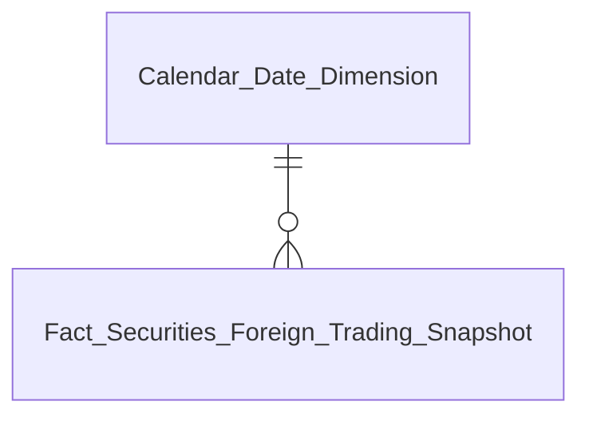
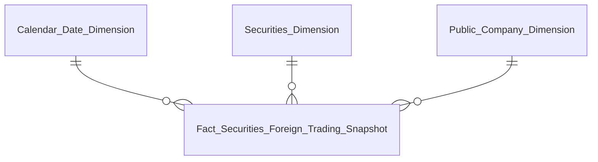
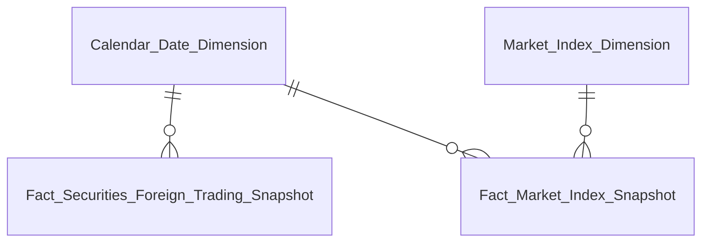

# DATAMART Entities Overview — NDTNN (Nhà Đầu Tư Nước Ngoài)

---

### Nhóm 1 — KPI Cards tổng quan (Box 1 READY)

#### Star schema

#### Bảng entity

| Datamart Entity | Loại | Reuse | Mô tả | Grain | KPI |
|---|---|---|---|---|---|
| Fact Securities Foreign Trading Snapshot | Fact Snapshot | reuse | Snapshot giá trị mua/bán NĐTNN theo mã CK và toàn thị trường | 1 row = 1 mã CK × 1 ngày | K_NDTNN_1-4 |
| Calendar Date Dimension | Dimension | reuse | Lịch ngày | 1 row / ngày | — |

---

### Nhóm 2 — Tổng giá trị mua/bán ròng của NĐTNN

#### Star schema

#### Bảng entity

| Datamart Entity | Loại | Reuse | Mô tả | Grain | KPI |
|---|---|---|---|---|---|
| Fact Securities Foreign Trading Snapshot | Fact Snapshot | reuse | Giá trị mua/bán ròng, Top ngành/mã | 1 row = 1 mã CK × 1 ngày | K_NDTNN_8-17,158-159 (+ reuse 1-4,19) |
| Securities Dimension | Dimension | new | Danh mục mã chứng khoán | 1 row / mã CK (SCD4A) | — |
| Public Company Dimension | Dimension | partial | Công ty đại chúng + nhóm ngành — bảng dùng chung GSDC/QLCB, NDTNN chỉ thêm 1 cột delta (Classification Business Line Name) | 1 row / công ty đại chúng (SCD2) | — |
| Calendar Date Dimension | Dimension | reuse | Lịch ngày | 1 row / ngày | — |

---

### Nhóm 5 — Tương quan Net Flow & VN-Index

#### Star schema

#### Bảng entity

| Datamart Entity | Loại | Reuse | Mô tả | Grain | KPI |
|---|---|---|---|---|---|
| Fact Securities Foreign Trading Snapshot | Fact Snapshot | reuse | Giá trị mua/bán ròng (reuse Nhóm 2) | 1 row = 1 mã CK × 1 ngày | K_NDTNN_33 |
| Fact Market Index Snapshot | Fact Snapshot | new | Điểm đóng cửa chỉ số VN-Index | 1 row = 1 chỉ số × 1 ngày | K_NDTNN_34 |
| Market Index Dimension | Dimension | new | Danh mục chỉ số thị trường | 1 row / combo Market_Id+Market_Code (SCD4A) | — |
| Calendar Date Dimension | Dimension | reuse | Lịch ngày | 1 row / ngày | — |

---

### Nhóm 11 — Hồ sơ định danh

#### Star schema

*Không có relationship line — bảng tác nghiệp, không qua Fact/Dimension*

#### Bảng entity

| Datamart Entity | Loại | Reuse | Mô tả | Grain | KPI |
|---|---|---|---|---|---|
| Operational Foreign Investor 360 Profile | Operational | new | Hồ sơ định danh 360° của NĐTNN | 1 row = 1 NĐT NN (trạng thái mới nhất) | K_NDTNN_58-63 |

---

### Nhóm 12 — Biến động tài sản (K_NDTNN_64 READY)

#### Star schema

*Không có relationship line — reuse trực tiếp Foreign Investor Dimension, không qua Fact*

#### Bảng entity

| Datamart Entity | Loại | Reuse | Mô tả | Grain | KPI |
|---|---|---|---|---|---|
| Foreign Investor Dimension | Dimension | new | Thông tin định danh NĐT nước ngoài | 1 row / NĐT NN (SCD4A current-state) | K_NDTNN_64 |

---

### Nhóm 13 — Lịch sử tuân thủ

#### Star schema

*Không có relationship line — bảng tác nghiệp, không qua Fact/Dimension*

#### Bảng entity

| Datamart Entity | Loại | Reuse | Mô tả | Grain | KPI |
|---|---|---|---|---|---|
| Operational Investor Compliance History | Operational | new | Lịch sử tuân thủ và xử phạt của NĐTNN | 1 row = 1 hành vi vi phạm × 1 đối tượng bị xử phạt | K_NDTNN_66-69,71 (K_NDTNN_70 Out-of-scope) |

---

### Nhóm 14 — Báo cáo thống kê tình hình giao dịch NĐTNN theo loại chứng khoán

#### Star schema

*Không có relationship line — bảng tác nghiệp, ETL populate độc lập (Securities Dimension chỉ dùng nội bộ ETL filter dòng FUND_CERT, không phải FK)*

#### Bảng entity

| Datamart Entity | Loại | Reuse | Mô tả | Grain | KPI |
|---|---|---|---|---|---|
| Foreign Investor Trading Statistics Report | Fact (report) | new | Báo cáo thống kê GT mua/bán/ròng NĐTNN theo 4 nhóm loại CK | 1 row = 1 ngày × 1 Security_Type_Group (STOCK/BOND/FUND_CERT/TOTAL) | K_NDTNN_72-83 |

---

### Nhóm 15 — Báo cáo thống kê tình hình giao dịch NĐTNN – biểu chi tiết

#### Star schema

*Không có relationship line — bảng tác nghiệp, denormalize hoàn toàn*

#### Bảng entity

| Datamart Entity | Loại | Reuse | Mô tả | Grain | KPI |
|---|---|---|---|---|---|
| Foreign Investor Trading Detail Report | Fact (report) | new | Báo cáo chi tiết giao dịch NĐTNN theo tài khoản | 1 row = 1 ngày × 1 Account_Number × 1 Symbol × 1 bên (Buy/Sell) | K_NDTNN_84-89 |

---

## Bảng PENDING (không thiết kế trong Phase 2)

Các bảng dưới đây 100% KPI/Nhóm dùng đều PENDING (Gap Atomic hoặc chờ nguồn) — không đưa vào Entities.csv, chờ Data Modeler xác nhận nguồn trước khi thiết kế lại LLD.

| Datamart Entity | Lý do PENDING | Issue |
|---|---|---|
| Fact Foreign Investor Registration Report (tên tạm) | Nguồn báo cáo PLVI-TT51 — cần xác nhận Report Code trong generic store TT51 | O_NDTNN_1, Cụm 1b |
| Fact Foreign Investor Capital Flow Report (tên tạm) | Nguồn báo cáo PLIV-TT51 — cần xác nhận Report Code | O_NDTNN_16, Cụm 5a |
| Fact Foreign Investor Portfolio Value Report (tên tạm) | Nguồn báo cáo PLIII-TT51 — cần xác nhận Report Code Mục II | O_NDTNN_21, Cụm 3a |
| Fact Public Company Foreign Ownership Snapshot (tên tạm) | BA yêu cầu nguồn báo cáo thủ công BM67 VSDC (chưa số hoá), không dùng entity IDS/FIMS đã có | O_NDTNN_22, Cụm 6 |
| NDTNN Regulatory Report Store | 100% Dữ liệu động (Nhóm 18-43) — cần xác nhận 26 Report Code riêng biệt | O_NDTNN_25, O_NDTNN_27, Cụm 7 |
| Fact Foreign Investor Portfolio Snapshot (grain 1 NĐT × 1 mã CK, Nhóm 8) | Thiếu measure giá đóng cửa chứng khoán trong FIMS/IDS — K_NDTNN_50 (Chiều) cũng chuyển PENDING vì đứng độc lập không measure | O_NDTNN_12, O_NDTNN_21 |
