# Data Mart HLD — Phân hệ Nhà Đầu Tư Nước Ngoài (NDTNN)

**Phiên bản:** 2.6
**Ngày:** 22/05/2026

---

## Quy ước trạng thái

| Ký hiệu | Ý nghĩa |
|---|---|
| READY | Atomic đủ — thiết kế đầy đủ |
| PENDING | Atomic chưa có — placeholder + lý do |

---

## Section 1 — Data Lineage: Source → Atomic → Data Mart

### Cụm 1: Đăng ký NĐT nước ngoài (Foreign Investor Registration)

Phục vụ Tab GIAO DỊCH Nhóm 1 — Box 2–4 (KPI tăng trưởng NĐT mới).

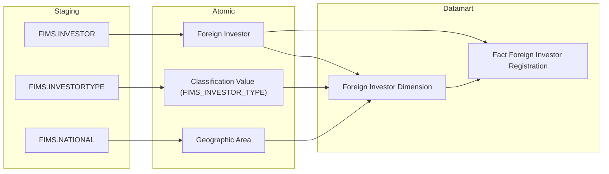
```mermaid
flowchart LR
    subgraph SRC["Staging"]
        S1["FIMS.INVESTOR"]
        S2["FIMS.INVESTORTYPE"]
        S3["FIMS.NATIONAL"]
    end

    subgraph SIL["Atomic"]
        SV1["Foreign Investor"]
        SV2["Classification Value (FIMS_INVESTOR_TYPE)"]
        SV3["Geographic Area"]
    end

    subgraph Datamart["Datamart"]
        G2["Foreign Investor Dimension"]
        G1["Fact Foreign Investor Registration"]
    end

    S1 --> SV1
    S2 --> SV2
    S3 --> SV3

    SV1 --> G1
    SV1 --> G2
    SV2 --> G2
    SV3 --> G2

    G2 --> G1
```

---

### Cụm 2: Hồ sơ 360° NĐT nước ngoài (Foreign Investor 360 Profile)

Phục vụ Tab NĐTNN 360 — Danh sách tìm kiếm + Sub-tab A Hồ sơ định danh.

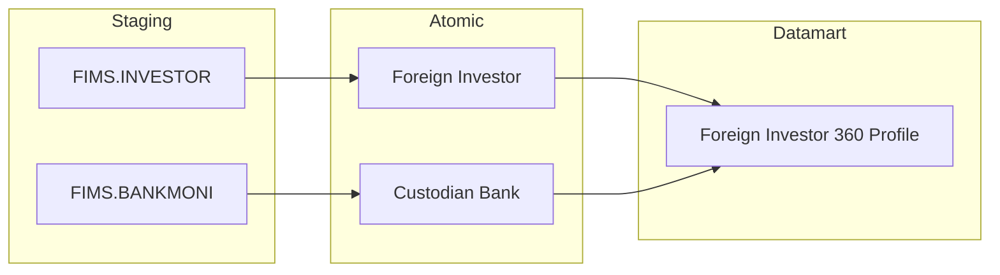
```mermaid
flowchart LR
    subgraph SRC["Staging"]
        S1["FIMS.INVESTOR"]
        S2["FIMS.BANKMONI"]
    end

    subgraph SIL["Atomic"]
        SV1["Foreign Investor"]
        SV2["Custodian Bank"]
    end

    subgraph Datamart["Datamart"]
        G1["Foreign Investor 360 Profile"]
    end

    S1 --> SV1
    S2 --> SV2

    SV1 --> G1
    SV2 --> G1
```

---

### Cụm 3: Danh mục chứng khoán NĐTNN (Foreign Investor Portfolio Snapshot)

Phục vụ Tab DANH MỤC Nhóm 6–8 + Tab NĐTNN 360 Sub-tab B + Tab DATA EXPLORER Nhóm 11b.

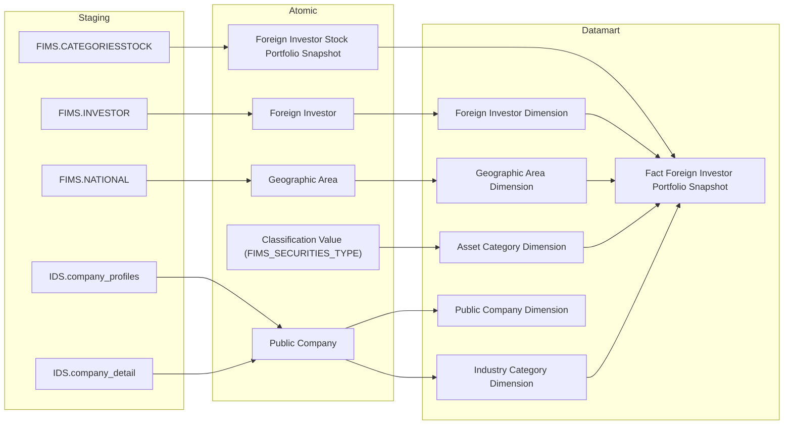
```mermaid
flowchart LR
    subgraph SRC["Staging"]
        S1["FIMS.CATEGORIESSTOCK"]
        S2["FIMS.INVESTOR"]
        S3["FIMS.NATIONAL"]
        S4["IDS.company_profiles"]
        S5["IDS.company_detail"]
    end

    subgraph SIL["Atomic"]
        SV1["Foreign Investor Stock Portfolio Snapshot"]
        SV2["Foreign Investor"]
        SV3["Geographic Area"]
        SV4["Public Company"]
        SV5["Classification Value (FIMS_SECURITIES_TYPE)"]
    end

    subgraph Datamart["Datamart"]
        G4["Asset Category Dimension"]
        G2["Foreign Investor Dimension"]
        G3["Geographic Area Dimension"]
        G5["Industry Category Dimension"]
        G6["Public Company Dimension"]
        G1["Fact Foreign Investor Portfolio Snapshot"]
    end

    S1 --> SV1
    S2 --> SV2
    S3 --> SV3
    S4 --> SV4
    S5 --> SV4

    SV1 --> G1
    SV2 --> G2
    SV3 --> G3
    SV4 --> G5
    SV4 --> G6
    SV5 --> G4

    G2 --> G1
    G3 --> G1
    G4 --> G1
    G5 --> G1
```

---

### Cụm 4: Lịch sử tuân thủ NĐTNN (Investor Compliance History)

Phục vụ Tab NĐTNN 360 — Sub-tab C Lịch sử tuân thủ. Atomic từ phân hệ Thanh Tra (luồng GS_).

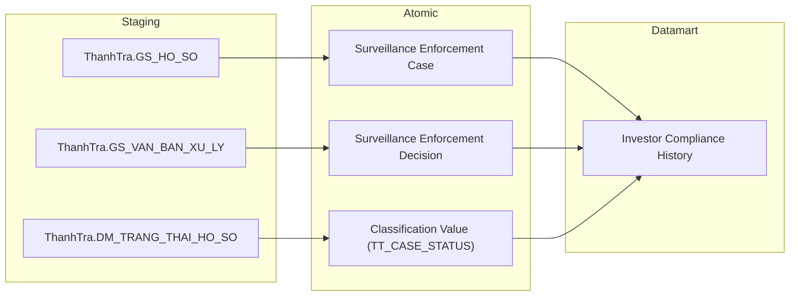
```mermaid
flowchart LR
    subgraph SRC["Staging"]
        S1["ThanhTra.GS_HO_SO"]
        S2["ThanhTra.GS_VAN_BAN_XU_LY"]
        S3["ThanhTra.DM_TRANG_THAI_HO_SO"]
    end

    subgraph SIL["Atomic"]
        SV1["Surveillance Enforcement Case"]
        SV2["Surveillance Enforcement Decision"]
        SV3["Classification Value (TT_CASE_STATUS)"]
    end

    subgraph Datamart["Datamart"]
        G1["Investor Compliance History"]
    end

    S1 --> SV1
    S2 --> SV2
    S3 --> SV3

    SV1 --> G1
    SV2 --> G1
    SV3 --> G1
```

---

### Cụm 5: Dòng vốn đầu tư gián tiếp (Foreign Investor Capital Flow)

Phục vụ Tab GIÁM SÁT DÒNG VỐN Nhóm 3–5 + Tab DATA EXPLORER Nhóm 11a. Atomic từ FIMS báo cáo NH lưu ký.

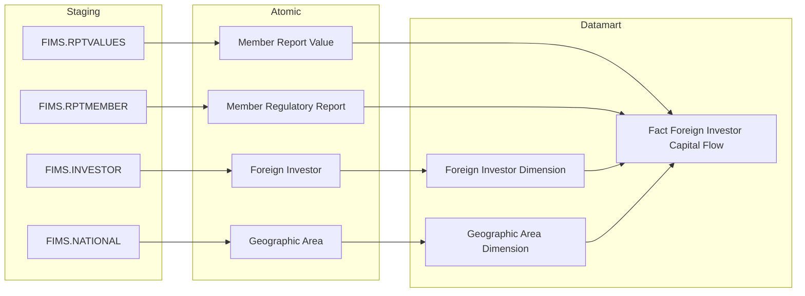
```mermaid
flowchart LR
    subgraph SRC["Staging"]
        S1["FIMS.RPTVALUES"]
        S2["FIMS.RPTMEMBER"]
        S3["FIMS.INVESTOR"]
        S4["FIMS.NATIONAL"]
    end

    subgraph SIL["Atomic"]
        SV1["Member Report Value"]
        SV2["Member Regulatory Report"]
        SV3["Foreign Investor"]
        SV4["Geographic Area"]
    end

    subgraph Datamart["Datamart"]
        G2["Foreign Investor Dimension"]
        G3["Geographic Area Dimension"]
        G1["Fact Foreign Investor Capital Flow"]
    end

    S1 --> SV1
    S2 --> SV2
    S3 --> SV3
    S4 --> SV4

    SV1 --> G1
    SV2 --> G1
    SV3 --> G2
    SV4 --> G3

    G2 --> G1
    G3 --> G1
```

---

### Cụm 6: Giới hạn sở hữu nước ngoài — ROOM (Foreign Ownership Snapshot)

Phục vụ Tab DANH MỤC Nhóm 9 (ROOM). Atomic từ IDS (`foreign_owner_limit` + `company_profiles`).

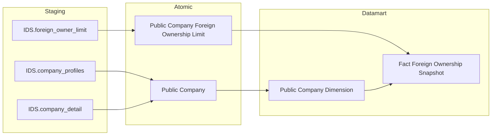
```mermaid
flowchart LR
    subgraph SRC["Staging"]
        S1["IDS.foreign_owner_limit"]
        S2["IDS.company_profiles"]
        S3["IDS.company_detail"]
    end

    subgraph SIL["Atomic"]
        SV1["Public Company Foreign Ownership Limit"]
        SV2["Public Company"]
    end

    subgraph Datamart["Datamart"]
        G2["Public Company Dimension"]
        G1["Fact Foreign Ownership Snapshot"]
    end

    S1 --> SV1
    S2 --> SV2
    S3 --> SV2

    SV1 --> G1
    SV2 --> G2

    G2 --> G1
```

---

### Cụm 7: Báo cáo TT51 — Generic Store (NDTNN Regulatory Report Store)

Phục vụ Tab DATA EXPLORER Nhóm 12 — 26 mẫu biểu TT51/2021.

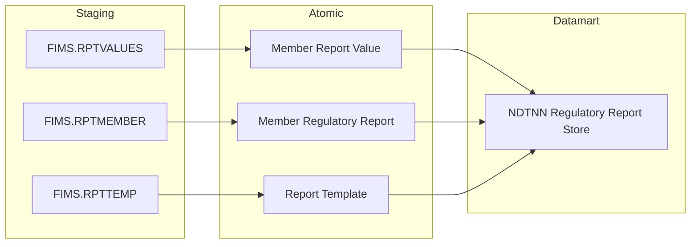
```mermaid
flowchart LR
    subgraph SRC["Staging"]
        S1["FIMS.RPTVALUES"]
        S2["FIMS.RPTMEMBER"]
        S3["FIMS.RPTTEMP"]
    end

    subgraph SIL["Atomic"]
        SV1["Member Report Value"]
        SV2["Member Regulatory Report"]
        SV3["Report Template"]
    end

    subgraph Datamart["Datamart"]
        G1["NDTNN Regulatory Report Store"]
    end

    S1 --> SV1
    S2 --> SV2
    S3 --> SV3

    SV1 --> G1
    SV2 --> G1
    SV3 --> G1
```

---

## Section 2 — Tổng quan báo cáo

### Tab: GIAO DỊCH

**Slicer chung:** Ngày (date picker — ví dụ: 12/31/2024)

---

#### Nhóm 1 — KPI Cards tổng quan

**Mockup:**

| Tỷ lệ tham gia | Tăng trưởng NĐT mới | Tăng trưởng NĐT Cá nhân mới | Tăng trưởng NĐT Tổ chức mới |
|:---:|:---:|:---:|:---:|
| **12.4** % | **2,450** Mã | **1,830** Mã | **620** Mã |

---

##### PENDING — Box 1: Tỷ lệ tham gia (STT 1–4)

**KPI liên quan:** Tỷ lệ tham gia, Tổng giá trị mua NĐTNN, Tổng giá trị bán NĐTNN, Tổng giá trị giao dịch toàn thị trường

**Lý do pending:** Công thức `(GT mua + GT bán NĐTNN) × 100 / (GT GD toàn thị trường × 2)` phụ thuộc hoàn toàn vào dữ liệu khớp lệnh từ SGDCK. Atomic entity cho giao dịch chứng khoán của NĐTNN chưa được thiết kế — không có entity FIMS nào thay thế được cho use case này.

**Atomic cần bổ sung:** Entity giao dịch CK NĐTNN từ SGDCK với attributes: Foreign Investor Buy Value, Foreign Investor Sell Value, Total Market Value, mã CK, ngày GD, sàn (HOSE/HNX/UPCoM).

**Mart dự kiến khi Atomic sẵn sàng:** `Fact Securities Foreign Trading Snapshot` — grain = 1 mã CK × 1 ngày giao dịch.

---

##### READY — Box 2–4: Tăng trưởng NĐT mới (STT 5–7)

> Phân loại: **Phân tích**
> Atomic: `Foreign Investor` ← FIMS.INVESTOR — **READY**
> Registration Date: FIMS.INVESTOR.DateCreated → Atomic attribute `Created Timestamp`

**Source:** `Fact Foreign Investor Registration` → `Foreign Investor Dimension`, `Calendar Date Dimension`

**Bảng KPI:**

| KPI ID | Tên | Đơn vị | Tính chất | Công thức / Mô tả |
|---|---|---|---|---|
| K_NDTNN_5 | Tăng trưởng NĐT mới | Mã | Flow (Base) | `COUNT(Investor Dimension Id)` WHERE `Registration Date` BETWEEN `01/01/Year(selected)` AND `selected_date` |
| K_NDTNN_6 | Tăng trưởng NĐT Cá nhân mới | Mã | Flow (Base) | K_NDTNN_5 + filter `Foreign Investor Dimension.Investor Object Type Code = 'INDIVIDUAL'` |
| K_NDTNN_7 | Tăng trưởng NĐT Tổ chức mới | Mã | Flow (Base) | K_NDTNN_5 + filter `Foreign Investor Dimension.Investor Object Type Code IN ('FUND', 'OTHER_ORG')` |
| K_NDTNN_5_YOY | YoY% NĐT mới | % | Derived | `(K_NDTNN_5[Year=Y] − K_NDTNN_5[Year=Y−1]) / K_NDTNN_5[Year=Y−1] × 100%` |

> **Lưu ý:** K_NDTNN_5, 6, 7 là Base — COUNT trực tiếp event trên fact. K6 + K7 = K5 (partition disjoint theo ObjectType). YTD = đếm event trong khoảng ngày. YoY là Derived — tính ở presentation layer.

**Star Schema:**

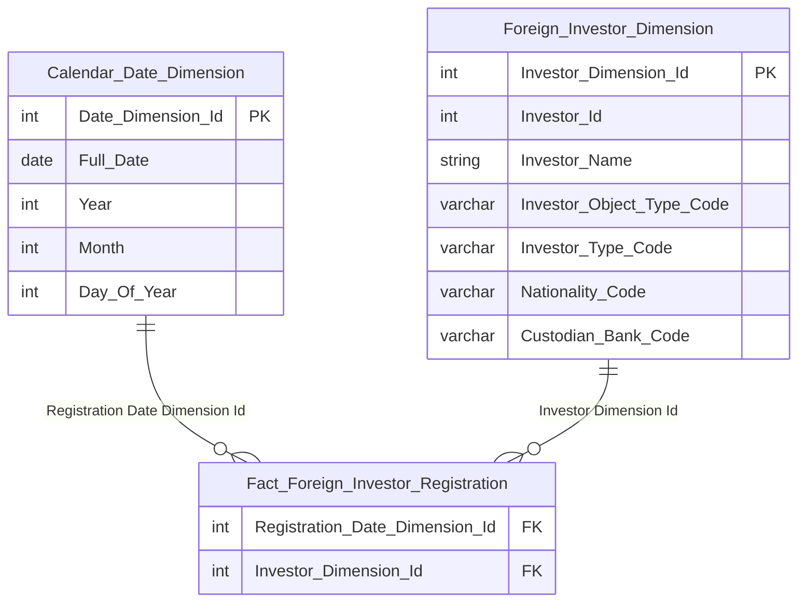
```mermaid
erDiagram
    Calendar_Date_Dimension {
        int Date_Dimension_Id PK
        date Full_Date
        int Year
        int Month
        int Day_Of_Year
    }
    Foreign_Investor_Dimension {
        int Investor_Dimension_Id PK
        int Investor_Id
        string Investor_Name
        varchar Investor_Object_Type_Code
        varchar Investor_Type_Code
        varchar Nationality_Code
        varchar Custodian_Bank_Code
    }
    Fact_Foreign_Investor_Registration {
        int Registration_Date_Dimension_Id FK
        int Investor_Dimension_Id FK
    }

    Calendar_Date_Dimension ||--o{ Fact_Foreign_Investor_Registration : "Registration Date Dimension Id"
    Foreign_Investor_Dimension ||--o{ Fact_Foreign_Investor_Registration : "Investor Dimension Id"
```

**Lineage Mart → Báo cáo:**

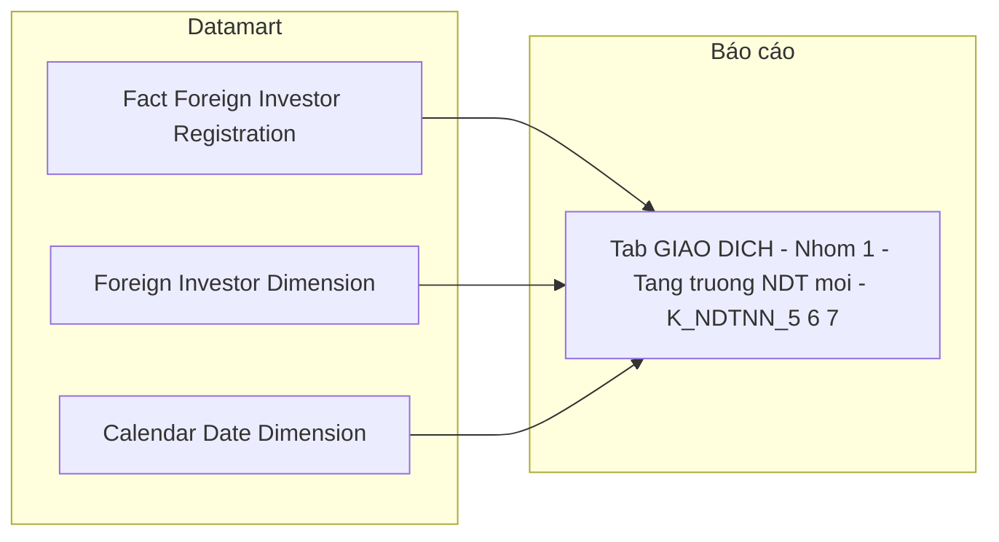
```mermaid
flowchart LR
    subgraph Datamart["Datamart"]
        G1["Fact Foreign Investor Registration"]
        G2["Foreign Investor Dimension"]
        G3["Calendar Date Dimension"]
    end
    subgraph RPT["Báo cáo"]
        R1["Tab GIAO DICH - Nhom 1 - Tang truong NDT moi - K_NDTNN_5 6 7"]
    end
    G1 --> R1
    G2 --> R1
    G3 --> R1
```

**Bảng grain:**

| Tên bảng | Grain |
|---|---|
| Fact Foreign Investor Registration | 1 row = 1 NĐT NN đăng ký mã giao dịch (event — 1 lần duy nhất per NĐT) |
| Foreign Investor Dimension | 1 row = 1 NĐT NN (SCD2) |
| Calendar Date Dimension | 1 row = 1 ngày đăng ký |

---

#### Nhóm 2 — Tổng giá trị mua/bán ròng của NĐTNN

**Mockup:**

| Bar chart | Lũy kế mua/bán ròng |
|:---|---:|
| Trục X: Tháng (Jan → Oct) | -8,300 B |
| Trục Y: Giá trị (tỉ đồng) | (lũy kế kỳ chọn) |

| TOP NGÀNH BÁN RÒNG | | TOP NGÀNH MUA RÒNG | | TOP MÃ BÁN RÒNG | | TOP MÃ MUA RÒNG | |
|:---|---:|:---|---:|:---|---:|:---|---:|
| Bất động sản | -1200B | Ngân hàng | +4500B | VHM | -700B | HPG | +3300B |
| Thực phẩm | -450B | Thép / Tài nguyên | +2800B | MSN | -400B | VCB | +600B |

**Slicer:** Từ ngày — Đến ngày (date range picker)

---

##### PENDING — Nhóm 2: Tổng GT mua/bán ròng + Lũy kế + Top ngành/mã (STT 8–16)

**KPI liên quan:**

| STT | Tên KPI | Ghi chú |
|---|---|---|
| 8 | Giá trị mua/bán ròng (theo tháng) | Bar chart — GT mua − GT bán per tháng |
| 11 | Lũy kế mua/bán ròng | SUM(GT ròng) trong khoảng ngày chọn |
| 13 | Top 5 ngành bán ròng | GROUP BY ngành, 5 ngành có GT ròng âm lớn nhất |
| 14 | Top 5 ngành mua ròng | GROUP BY ngành, 5 ngành có GT ròng dương lớn nhất |
| 15 | Top 5 mã bán ròng | GROUP BY mã CK, 5 mã có GT ròng âm lớn nhất |
| 16 | Top 5 mã mua ròng | GROUP BY mã CK, 5 mã có GT ròng dương lớn nhất |

**Lý do pending:** Tất cả KPI phụ thuộc dữ liệu khớp lệnh từ SGDCK. Top ngành cần thêm IDS-GSĐC để map mã CK → nhóm ngành. Không có Atomic entity FIMS nào thay thế được.

**Atomic cần bổ sung:**
- `Securities Foreign Trading Record` (SGDCK): Foreign Investor Buy/Sell Value, Total Market Value, mã CK, ngày GD, sàn
- `Listed Security` (SGDCK): mã CK, tên, sàn
- `Industry` (IDS-GSĐC): nhóm ngành, map với mã CK

**Mart dự kiến khi Atomic sẵn sàng:** `Fact Securities Foreign Trading Snapshot` — grain = 1 mã CK × 1 ngày GD

---

#### Nhóm 3 — Tỷ trọng giao dịch NĐTNN

**Mockup:**

```
TỶ TRỌNG GIAO DỊCH NĐTNN                    TỶ TRỌNG TB PHIÊN
Toàn bộ thị trường với nhóm ngành                        12.4%

Line chart — Trục X: ngày / Trục Y: % tỷ trọng (0–20%)
Series: Tỷ trọng GD NĐTNN theo ngày

TỶ TRỌNG THEO NGÀNH          TOP MÃ TỶ TRỌNG CAO
Ngân hàng        19.8%        FPT   53.3%
Bất động sản     18.4%        MWG   58.8%
```

**Slicer:** Từ ngày — Đến ngày (date range picker)

---

##### PENDING — Nhóm 3: Tỷ trọng GD NĐTNN (STT 17–21)

**KPI liên quan:**

| KPI ID | Tên KPI | Ghi chú |
|---|---|---|
| K_NDTNN_17 | Tỷ trọng TB phiên | (GT mua + GT bán NĐTNN) / (GT GD toàn thị trường × 2) trung bình trong khoảng ngày chọn |
| K_NDTNN_18 | Tỷ trọng GD NĐTNN theo ngày | Line chart — tỷ trọng per ngày GD |
| K_NDTNN_19 | Tỷ trọng theo ngành | (GT GD NĐTNN của ngành X) / (GT GD NĐTNN tổng) × 100% GROUP BY ngành |
| K_NDTNN_20 | Top mã tỷ trọng cao — Tỷ lệ sở hữu | Tỷ lệ sở hữu NĐTNN per mã CK (%) — từ `Fact Foreign Ownership Snapshot` — **READY**, đã thiết kế tại Nhóm 9 |
| K_NDTNN_21 | Tổng GT GD NĐTNN theo ngày | GT mua + GT bán NĐTNN per ngày |

**Lý do pending (K_NDTNN_17–19, 21):** Phụ thuộc dữ liệu khớp lệnh từ SGDCK. Không có Atomic entity FIMS thay thế.

**Atomic cần bổ sung:** `Securities Foreign Trading Record` (SGDCK) — Foreign Investor Buy/Sell Value per ngày GD, Total Market Value per ngày GD, mã CK, nhóm ngành.

**Mart dự kiến khi Atomic sẵn sàng:** `Fact Securities Foreign Trading Snapshot` — grain = 1 mã CK × 1 ngày GD (dùng chung với Nhóm 2).

---

### Tab: GIÁM SÁT DÒNG VỐN

**Slicer chung:** Từ ngày — Đến ngày (date range picker)

---

#### Nhóm 3 — KPI Cards: Dòng tiền vào / ra / ròng (STT 23–25)

> Phân loại: **Phân tích**
> Atomic: `Member Report Value` ← FIMS.RPTVALUES + `Member Regulatory Report` ← FIMS.RPTMEMBER — **READY**

**Mockup:**

| Dòng tiền vào | Dòng tiền ra | Dòng tiền ròng |
|:---:|:---:|:---:|
| **1,284.3** Tỉ đồng | **1,736.8** Tỉ đồng | **-452.5** Tỉ đồng |

**Source:** `Fact Foreign Investor Capital Flow` → `Calendar Date Dimension`

**Bảng KPI:**

| KPI ID | Tên | Đơn vị | Tính chất | Công thức / Mô tả |
|---|---|---|---|---|
| K_NDTNN_23 | Dòng tiền vào | Tỉ đồng | Flow (Base) | `SUM(Capital Amount)` WHERE `Event Type Code = 'IN'` AND `Report Date` BETWEEN Từ ngày AND Đến ngày |
| K_NDTNN_24 | Dòng tiền ra | Tỉ đồng | Flow (Base) | `SUM(Capital Amount)` WHERE `Event Type Code = 'OUT'` AND `Report Date` BETWEEN Từ ngày AND Đến ngày |
| K_NDTNN_25 | Dòng tiền ròng | Tỉ đồng | Derived | `SUM(Capital Amount WHERE IN) − SUM(Capital Amount WHERE OUT)` |

**Star Schema:**

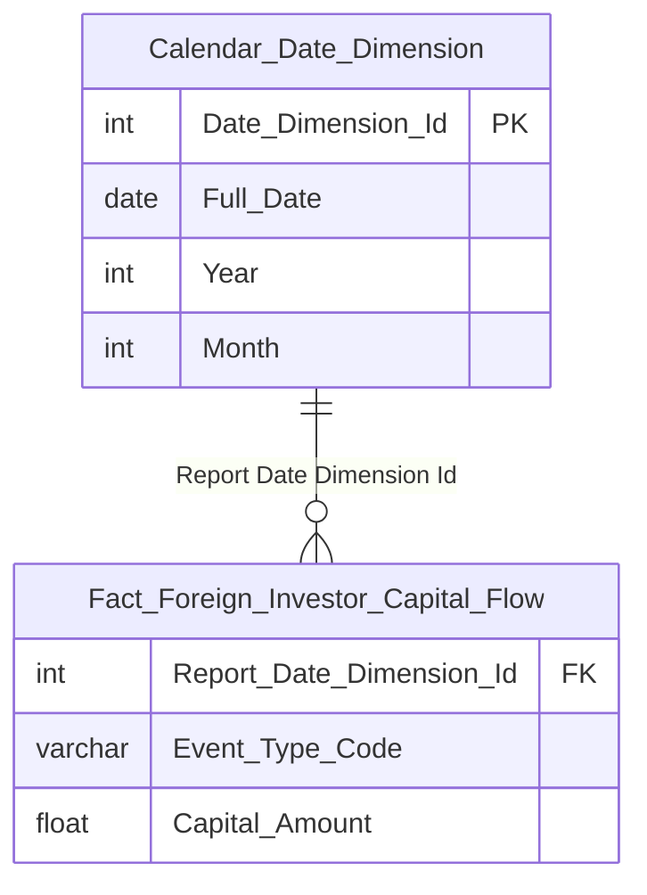
```mermaid
erDiagram
    Calendar_Date_Dimension {
        int Date_Dimension_Id PK
        date Full_Date
        int Year
        int Month
    }
    Fact_Foreign_Investor_Capital_Flow {
        int Report_Date_Dimension_Id FK
        varchar Event_Type_Code
        float Capital_Amount
    }

    Calendar_Date_Dimension ||--o{ Fact_Foreign_Investor_Capital_Flow : "Report Date Dimension Id"
```

**Lineage Mart → Báo cáo:**

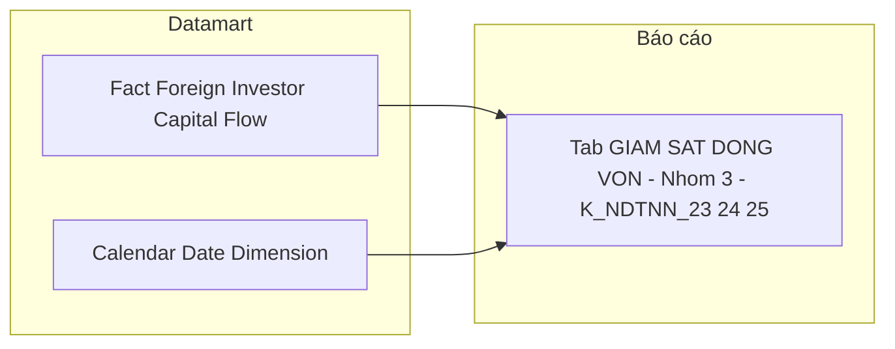
```mermaid
flowchart LR
    subgraph Datamart["Datamart"]
        G1["Fact Foreign Investor Capital Flow"]
        G2["Calendar Date Dimension"]
    end
    subgraph RPT["Báo cáo"]
        R1["Tab GIAM SAT DONG VON - Nhom 3 - K_NDTNN_23 24 25"]
    end
    G1 --> R1
    G2 --> R1
```

**Bảng grain:**

| Tên bảng | Grain |
|---|---|
| Fact Foreign Investor Capital Flow | 1 row = 1 sự kiện vào/ra vốn của 1 NĐT NN (Event — FIMS.RPTMEMBER × cell code IN/OUT) |
| Calendar Date Dimension | 1 row = 1 ngày (Report Date = FIMS.RPTMEMBER.DayReport) |

---

#### Nhóm 4 — Tương quan Net Flow & VN-Index (không STT trong BRD)

> Phân loại: **Phân tích**
> Atomic FIMS: `Member Report Value` — sẵn sàng (dòng tiền ròng)
> Atomic SGDCK: chưa có (Giá trị mua/bán ròng + VN-Index)

**Mockup** *(theo screenshot — 3 series line chart dual Y-axis)*:

| Series | Nguồn | Trục Y | Trạng thái |
|:---|:---|:---|:---|
| MUA/BÁN RÒNG (đỏ) | SGDCK | Trái (Tỉ đồng) | PENDING |
| DÒNG TIỀN RÒNG (xanh lá) | FIMS | Trái (Tỉ đồng) | READY |
| VN-INDEX (tím) | SGDCK | Phải (Điểm) | PENDING |

> **Ghi chú thiết kế:** 3 series từ 3 fact riêng biệt — presentation layer chịu trách nhiệm query độc lập và align theo trục tháng. Series Dòng tiền ròng reuse `Fact Foreign Investor Capital Flow` (Nhóm 3). 2 series còn lại chờ Atomic SGDCK.

**Bảng KPI:**

| KPI ID | Tên | Tính chất | Trạng thái |
|---|---|---|---|
| K_NDTNN_25b | Dòng tiền ròng lũy kế (tháng) | Derived — reuse K_NDTNN_25 aggregate by tháng | READY |
| K_NDTNN_22 | Giá trị mua/bán ròng (tháng) | Derived — từ `Fact Securities Foreign Trading Snapshot` | PENDING — chờ Atomic SGDCK |
| K_NDTNN_24b | Điểm đóng cửa VN-Index | Base — từ `Fact Market Index Snapshot` | PENDING — chờ Atomic SGDCK |

---

#### Nhóm 5 — Dòng vốn đầu tư gián tiếp nước ngoài (không STT trong BRD)

> Phân loại: **Phân tích**
> Atomic: `Member Report Value` + `Foreign Investor` + `Geographic Area` — **READY**

**Mockup** *(theo screenshot — stacked bar theo tháng + 4 bảng Top)*:

| Stacked bar | Trục X | Trục Y | Legend |
|:---|:---|:---|:---|
| Dòng vốn ròng theo loại hình NĐT | Tháng T1→T12 | Tỉ đồng | Cá nhân / Quỹ / Tổ chức khác quỹ |

**Slicer:** Từ ngày — Đến ngày + Loại hình NĐTNN + Quốc gia

**Source:** `Fact Foreign Investor Capital Flow` → `Foreign Investor Dimension`, `Geographic Area Dimension`, `Calendar Date Dimension`

**Bảng KPI:**

| KPI ID | Tên | Tính chất | Công thức / Mô tả |
|---|---|---|---|
| K_NDTNN_26 | Dòng vốn ròng | Derived | `SUM(Capital Amount WHERE IN) − SUM(Capital Amount WHERE OUT)` GROUP BY tháng / loại hình / quốc gia |
| K_NDTNN_27 | Dòng vốn ròng — Quỹ | Derived | K_NDTNN_26 WHERE `Foreign Investor Dimension.Investor Object Type Code = 'FUND'` |
| K_NDTNN_28 | Dòng vốn ròng — Cá nhân | Derived | K_NDTNN_26 WHERE `Foreign Investor Dimension.Investor Object Type Code = 'INDIVIDUAL'` |
| K_NDTNN_29 | Dòng vốn ròng — Tổ chức khác quỹ | Derived | K_NDTNN_26 WHERE `Foreign Investor Dimension.Investor Object Type Code = 'OTHER_ORG'` |
| K_NDTNN_30 | Top 5 quốc gia vào ròng | Derived | `SUM(IN) − SUM(OUT)` GROUP BY `Geographic Area Dimension.Geographic Area Name`, WHERE > 0, TOP 5 DESC |
| K_NDTNN_31 | Top 5 quốc gia rút ròng | Derived | Tương tự K_NDTNN_30, WHERE < 0, TOP 5 ASC |
| K_NDTNN_32 | Top 5 NĐT vào ròng | Derived | `SUM(IN) − SUM(OUT)` GROUP BY `Foreign Investor Dimension.Investor Name`, WHERE > 0, TOP 5 DESC |
| K_NDTNN_33 | Top 5 NĐT rút ròng | Derived | Tương tự K_NDTNN_32, WHERE < 0, TOP 5 ASC |

**Star Schema:**

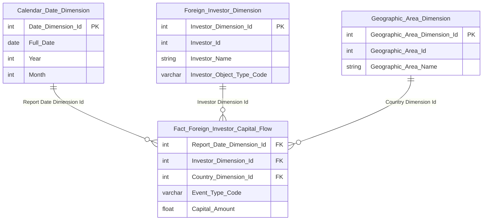
```mermaid
erDiagram
    Calendar_Date_Dimension {
        int Date_Dimension_Id PK
        date Full_Date
        int Year
        int Month
    }
    Foreign_Investor_Dimension {
        int Investor_Dimension_Id PK
        int Investor_Id
        string Investor_Name
        varchar Investor_Object_Type_Code
    }
    Geographic_Area_Dimension {
        int Geographic_Area_Dimension_Id PK
        int Geographic_Area_Id
        string Geographic_Area_Name
    }
    Fact_Foreign_Investor_Capital_Flow {
        int Report_Date_Dimension_Id FK
        int Investor_Dimension_Id FK
        int Country_Dimension_Id FK
        varchar Event_Type_Code
        float Capital_Amount
    }

    Calendar_Date_Dimension ||--o{ Fact_Foreign_Investor_Capital_Flow : "Report Date Dimension Id"
    Foreign_Investor_Dimension ||--o{ Fact_Foreign_Investor_Capital_Flow : "Investor Dimension Id"
    Geographic_Area_Dimension ||--o{ Fact_Foreign_Investor_Capital_Flow : "Country Dimension Id"
```

**Lineage Mart → Báo cáo:**

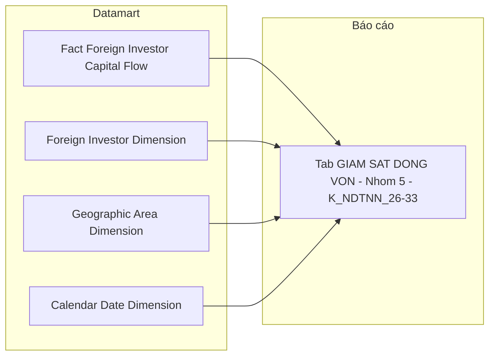
```mermaid
flowchart LR
    subgraph Datamart["Datamart"]
        G1["Fact Foreign Investor Capital Flow"]
        G2["Foreign Investor Dimension"]
        G3["Geographic Area Dimension"]
        G4["Calendar Date Dimension"]
    end
    subgraph RPT["Báo cáo"]
        R1["Tab GIAM SAT DONG VON - Nhom 5 - K_NDTNN_26-33"]
    end
    G1 --> R1
    G2 --> R1
    G3 --> R1
    G4 --> R1
```

**Bảng grain:**

| Tên bảng | Grain |
|---|---|
| Fact Foreign Investor Capital Flow | 1 row = 1 sự kiện vào/ra vốn của 1 NĐT NN (Event) |
| Foreign Investor Dimension | 1 row = 1 NĐT NN (SCD2) |
| Geographic Area Dimension | 1 row = 1 quốc gia (SCD2) |
| Calendar Date Dimension | 1 row = 1 ngày (Report Date = FIMS.RPTMEMBER.DayReport) |

---

### Tab: DANH MỤC

**Slicer chung:** Kỳ (Tháng + Năm) cho danh mục / Ngày (date picker) cho ROOM

---

#### Nhóm 6 — KPI Cards + Top: Tổng giá trị danh mục (không STT)

> Phân loại: **Phân tích**
> Atomic: `Foreign Investor Stock Portfolio Snapshot` (FIMS.CATEGORIESSTOCK) — **READY**. Xem O_NDTNN_5 về nguồn giá trị thị trường.

**Mockup:**

| Tổng GTDM | Danh mục Cá nhân | Danh mục Quỹ | Danh mục Tổ chức khác quỹ |
|:---:|:---:|:---:|:---:|
| **1,315** Tỉ đồng | **284.6** Tỉ đồng | **752.3** Tỉ đồng | **278.1** Tỉ đồng |

**Source:** `Fact Foreign Investor Portfolio Snapshot` → `Foreign Investor Dimension`, `Geographic Area Dimension`, `Calendar Date Dimension`

**Bảng KPI:**

| KPI ID | Tên | Đơn vị | Tính chất | Công thức / Mô tả |
|---|---|---|---|---|
| K_NDTNN_34 | Tổng giá trị danh mục | Tỉ đồng | Stock (Base) | `SUM(Portfolio Market Value)` WHERE Snapshot Month = tháng chọn |
| K_NDTNN_35 | Danh mục Cá nhân | Tỉ đồng | Derived | K_NDTNN_34 WHERE `Foreign Investor Dimension.Investor Object Type Code = 'INDIVIDUAL'` |
| K_NDTNN_36 | Danh mục Quỹ | Tỉ đồng | Derived | K_NDTNN_34 WHERE `Foreign Investor Dimension.Investor Object Type Code = 'FUND'` |
| K_NDTNN_37 | Danh mục Tổ chức khác quỹ | Tỉ đồng | Derived | K_NDTNN_34 WHERE `Foreign Investor Dimension.Investor Object Type Code = 'OTHER_ORG'` |
| K_NDTNN_38 | Top 5 quốc gia theo GTDM | Tỉ đồng | Derived | `SUM(Portfolio Market Value)` GROUP BY `Geographic Area Dimension.Geographic Area Name`, TOP 5 DESC |
| K_NDTNN_39 | Top 5 NĐT theo GTDM | Tỉ đồng | Derived | `SUM(Portfolio Market Value)` GROUP BY `Foreign Investor Dimension.Investor Name`, TOP 5 DESC |

**Star Schema:**

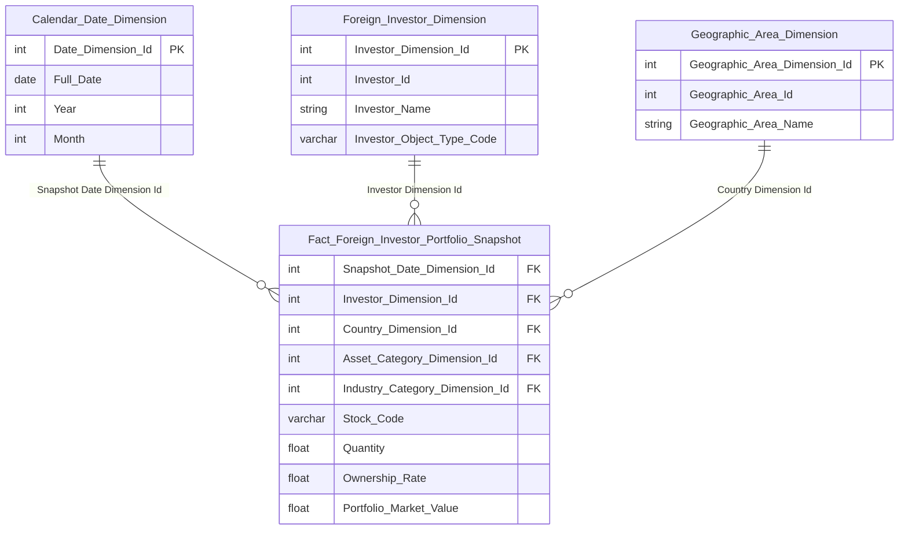
```mermaid
erDiagram
    Calendar_Date_Dimension {
        int Date_Dimension_Id PK
        date Full_Date
        int Year
        int Month
    }
    Foreign_Investor_Dimension {
        int Investor_Dimension_Id PK
        int Investor_Id
        string Investor_Name
        varchar Investor_Object_Type_Code
    }
    Geographic_Area_Dimension {
        int Geographic_Area_Dimension_Id PK
        int Geographic_Area_Id
        string Geographic_Area_Name
    }
    Fact_Foreign_Investor_Portfolio_Snapshot {
        int Snapshot_Date_Dimension_Id FK
        int Investor_Dimension_Id FK
        int Country_Dimension_Id FK
        int Asset_Category_Dimension_Id FK
        int Industry_Category_Dimension_Id FK
        varchar Stock_Code
        float Quantity
        float Ownership_Rate
        float Portfolio_Market_Value
    }

    Calendar_Date_Dimension ||--o{ Fact_Foreign_Investor_Portfolio_Snapshot : "Snapshot Date Dimension Id"
    Foreign_Investor_Dimension ||--o{ Fact_Foreign_Investor_Portfolio_Snapshot : "Investor Dimension Id"
    Geographic_Area_Dimension ||--o{ Fact_Foreign_Investor_Portfolio_Snapshot : "Country Dimension Id"
```

**Lineage Mart → Báo cáo:**

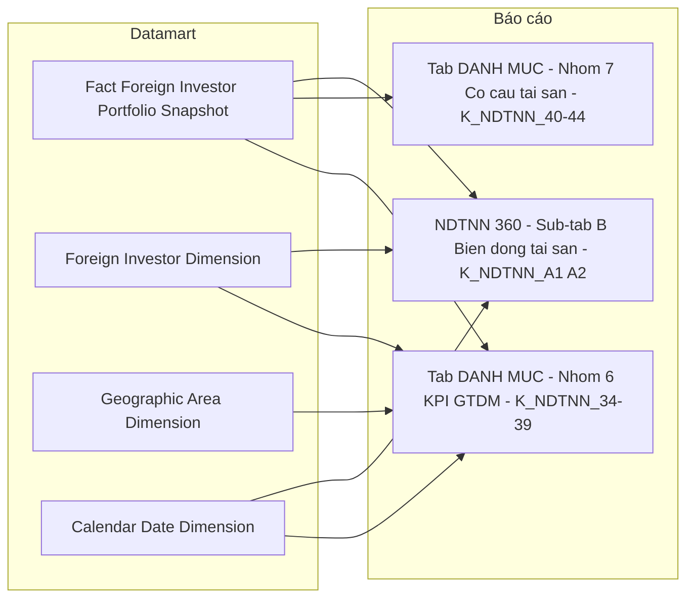
```mermaid
flowchart LR
    subgraph Datamart["Datamart"]
        G1["Fact Foreign Investor Portfolio Snapshot"]
        G2["Foreign Investor Dimension"]
        G3["Geographic Area Dimension"]
        G4["Calendar Date Dimension"]
    end
    subgraph RPT["Báo cáo"]
        R1["Tab DANH MUC - Nhom 6 KPI GTDM - K_NDTNN_34-39"]
        R2["Tab DANH MUC - Nhom 7 Co cau tai san - K_NDTNN_40-44"]
        R3["NDTNN 360 - Sub-tab B Bien dong tai san - K_NDTNN_A1 A2"]
    end
    G1 --> R1
    G2 --> R1
    G3 --> R1
    G4 --> R1
    G1 --> R2
    G1 --> R3
    G2 --> R3
    G4 --> R3
```

**Bảng grain:**

| Tên bảng | Grain |
|---|---|
| Fact Foreign Investor Portfolio Snapshot | 1 row = 1 NĐT NN × 1 mã tài sản × 1 tháng snapshot |
| Foreign Investor Dimension | 1 row = 1 NĐT NN (SCD2) |
| Geographic Area Dimension | 1 row = 1 quốc gia (SCD2) |
| Calendar Date Dimension | 1 row = 1 ngày (ngày cuối tháng = Snapshot Date) |

---

#### Nhóm 7 — Cơ cấu danh mục theo loại hình tài sản (không STT)

> Phân loại: **Phân tích**
> Atomic: `Foreign Investor Stock Portfolio Snapshot` — **READY**. Xem O_NDTNN_9 về mapping 5 loại tài sản.

**Mockup:**

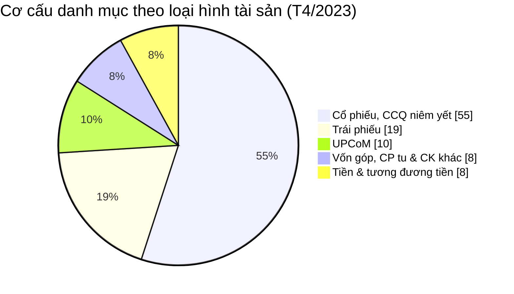
```mermaid
pie showData
    title Cơ cấu danh mục theo loại hình tài sản (T4/2023)
    "Cổ phiếu, CCQ niêm yết" : 55
    "Trái phiếu" : 19
    "UPCoM" : 10
    "Vốn góp, CP tu & CK khác" : 8
    "Tiền & tương đương tiền" : 8
```

**Source:** `Fact Foreign Investor Portfolio Snapshot` → `Asset Category Dimension`, `Calendar Date Dimension`

**Bảng KPI:**

| KPI ID | Tên | Đơn vị | Tính chất | Công thức / Mô tả |
|---|---|---|---|---|
| K_NDTNN_40 | GT tài sản — Cổ phiếu/CCQ niêm yết | Tỉ đồng | Derived | `SUM(Portfolio Market Value)` WHERE `Asset Category Dimension.Asset Category Code = 'LISTED_EQUITY'` |
| K_NDTNN_41 | GT tài sản — Trái phiếu | Tỉ đồng | Derived | WHERE `Asset Category Dimension.Asset Category Code = 'BOND'` |
| K_NDTNN_42 | GT tài sản — UPCoM | Tỉ đồng | Derived | WHERE `Asset Category Dimension.Asset Category Code = 'UPCOM'` |
| K_NDTNN_43 | GT tài sản — Vốn góp/CP tư/CK khác | Tỉ đồng | Derived | WHERE `Asset Category Dimension.Asset Category Code = 'OTHER_EQUITY'` |
| K_NDTNN_44 | GT tài sản — Tiền và tương đương | Tỉ đồng | Derived | WHERE `Asset Category Dimension.Asset Category Code = 'CASH'` |

**Star Schema:**

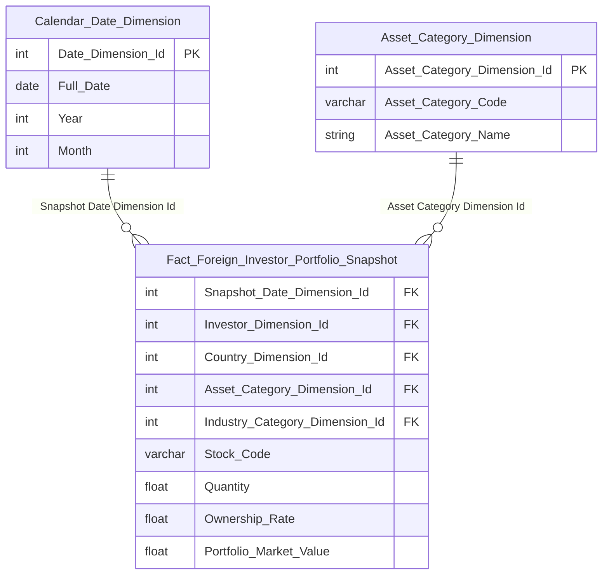
```mermaid
erDiagram
    Calendar_Date_Dimension {
        int Date_Dimension_Id PK
        date Full_Date
        int Year
        int Month
    }
    Asset_Category_Dimension {
        int Asset_Category_Dimension_Id PK
        varchar Asset_Category_Code
        string Asset_Category_Name
    }
    Fact_Foreign_Investor_Portfolio_Snapshot {
        int Snapshot_Date_Dimension_Id FK
        int Investor_Dimension_Id FK
        int Country_Dimension_Id FK
        int Asset_Category_Dimension_Id FK
        int Industry_Category_Dimension_Id FK
        varchar Stock_Code
        float Quantity
        float Ownership_Rate
        float Portfolio_Market_Value
    }

    Calendar_Date_Dimension ||--o{ Fact_Foreign_Investor_Portfolio_Snapshot : "Snapshot Date Dimension Id"
    Asset_Category_Dimension ||--o{ Fact_Foreign_Investor_Portfolio_Snapshot : "Asset Category Dimension Id"
```

**Lineage Mart → Báo cáo:**

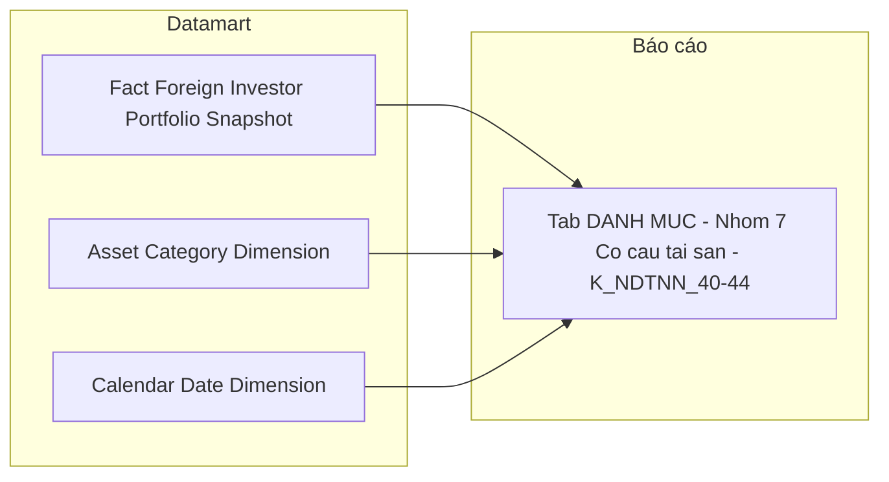
```mermaid
flowchart LR
    subgraph Datamart["Datamart"]
        G1["Fact Foreign Investor Portfolio Snapshot"]
        G2["Asset Category Dimension"]
        G3["Calendar Date Dimension"]
    end
    subgraph RPT["Báo cáo"]
        R1["Tab DANH MUC - Nhom 7 Co cau tai san - K_NDTNN_40-44"]
    end
    G1 --> R1
    G2 --> R1
    G3 --> R1
```

**Bảng grain:**

| Tên bảng | Grain |
|---|---|
| Fact Foreign Investor Portfolio Snapshot | 1 row = 1 NĐT NN × 1 mã tài sản × 1 tháng |
| Asset Category Dimension | 1 row = 1 loại tài sản (SCD2) |
| Calendar Date Dimension | 1 row = 1 ngày (ngày cuối tháng) |

---

#### Nhóm 8 — Bản đồ nhiệt phân ngành (không STT — nguồn IDS)

> Phân loại: **Phân tích**
> Atomic: `Public Company` (IDS.company_profiles + IDS.company_detail) — **READY**
> **Ghi chú thiết kế:** `Industry Category Dimension` là Conformed Dim ETL-derived từ `Public Company.Industry Category Level1/Level2 Code`. Join chain: `Fact Foreign Investor Portfolio Snapshot` → Stock Code → `Public Company` (IDS) → `Industry Category Dimension`.

**Mockup:**

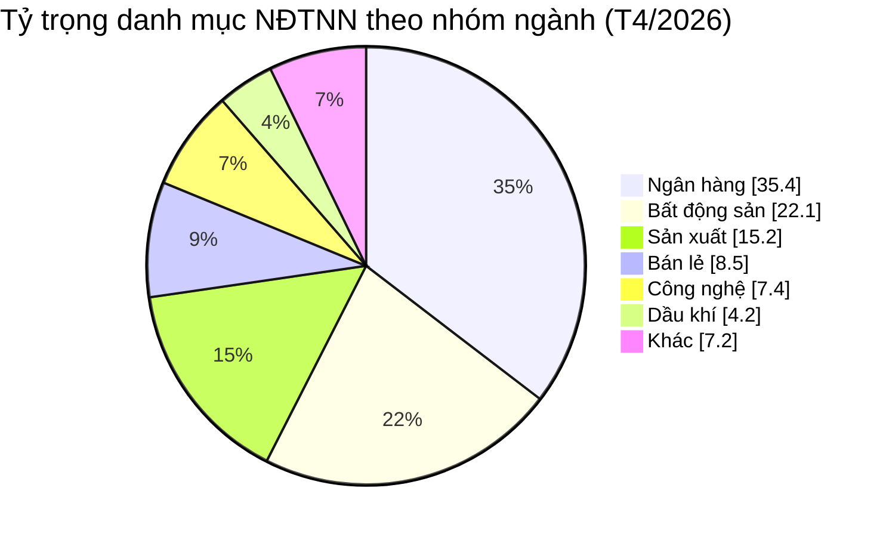
```mermaid
pie showData
    title Tỷ trọng danh mục NĐTNN theo nhóm ngành (T4/2026)
    "Ngân hàng" : 35.4
    "Bất động sản" : 22.1
    "Sản xuất" : 15.2
    "Bán lẻ" : 8.5
    "Công nghệ" : 7.4
    "Dầu khí" : 4.2
    "Khác" : 7.2
```

**Source:** `Fact Foreign Investor Portfolio Snapshot` → `Industry Category Dimension`, `Calendar Date Dimension`

**Bảng KPI:**

| KPI ID | Tên | Đơn vị | Tính chất | Công thức / Mô tả |
|---|---|---|---|---|
| K_NDTNN_51 | Tỷ trọng danh mục theo ngành | % | Derived | `SUM(Portfolio Market Value) WHERE Industry = X / SUM(Portfolio Market Value) × 100%` GROUP BY `Industry Category Dimension.Industry Category Name` |

**Star Schema:**

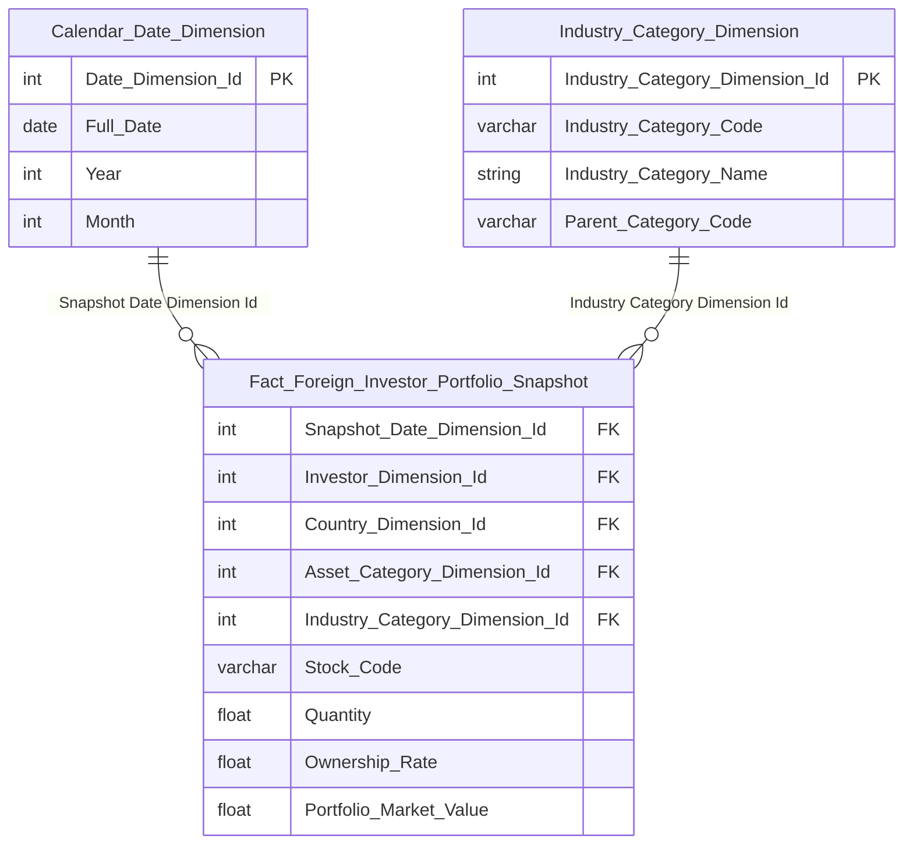
```mermaid
erDiagram
    Calendar_Date_Dimension {
        int Date_Dimension_Id PK
        date Full_Date
        int Year
        int Month
    }
    Industry_Category_Dimension {
        int Industry_Category_Dimension_Id PK
        varchar Industry_Category_Code
        string Industry_Category_Name
        varchar Parent_Category_Code
    }
    Fact_Foreign_Investor_Portfolio_Snapshot {
        int Snapshot_Date_Dimension_Id FK
        int Investor_Dimension_Id FK
        int Country_Dimension_Id FK
        int Asset_Category_Dimension_Id FK
        int Industry_Category_Dimension_Id FK
        varchar Stock_Code
        float Quantity
        float Ownership_Rate
        float Portfolio_Market_Value
    }

    Calendar_Date_Dimension ||--o{ Fact_Foreign_Investor_Portfolio_Snapshot : "Snapshot Date Dimension Id"
    Industry_Category_Dimension ||--o{ Fact_Foreign_Investor_Portfolio_Snapshot : "Industry Category Dimension Id"
```

**Lineage Mart → Báo cáo:**

```mermaid
flowchart LR
    subgraph Datamart["Datamart"]
        G1["Fact Foreign Investor Portfolio Snapshot"]
        G2["Industry Category Dimension"]
        G3["Calendar Date Dimension"]
    end
    subgraph RPT["Báo cáo"]
        R1["Tab DANH MUC - Nhom 8 Phan nganh - K_NDTNN_51"]
    end
    G1 --> R1
    G2 --> R1
    G3 --> R1
```

**Bảng grain:**

| Tên bảng | Grain |
|---|---|
| Fact Foreign Investor Portfolio Snapshot | 1 row = 1 NĐT NN × 1 mã tài sản × 1 tháng |
| Industry Category Dimension | 1 row = 1 nhóm ngành — ETL-derived từ Public Company.Industry Category Level1 Code (IDS) |
| Calendar Date Dimension | 1 row = 1 ngày (ngày cuối tháng) |

---

#### Nhóm 9 — Sở hữu NĐT nước ngoài ROOM (không STT — nguồn IDS)

> Phân loại: **Phân tích**
> Atomic: `Public Company Foreign Ownership Limit` (IDS.foreign_owner_limit) + `Foreign Investor Stock Portfolio Snapshot` (FIMS.CATEGORIESSTOCK) — **READY**
> K_NDTNN_45–49: READY. K_NDTNN_50 (Room theo ngành): PENDING — cần join thêm Industry Category

**Mockup:**

| MÃ "KÍN ROOM" (Foreign Owned = 100%) | | CHẠM NGƯỠNG CẢNH BÁO (Room còn lại < 5%) | |
|:---|---|:---|---|
| FPT | | MWG | 0.5% |

**Ghi chú thiết kế:**
- `Room tối đa` = `Public Company Foreign Ownership Limit.Max Ownership Rate` (IDS)
- `Tỷ lệ sở hữu hiện tại` = `SUM(Foreign Investor Stock Portfolio Snapshot.Ownership Rate)` GROUP BY mã CK — ETL pre-aggregate trước khi insert, 1 row per mã CK per ngày snapshot
- `Room còn lại` = `Max Ownership Rate − Total Ownership Rate` — tính tại query time, không lưu trong mart
- **ETL pattern:** `FIMS.CATEGORIESSTOCK` có grain 1 NĐT × 1 mã CK → ETL SUM(Ownership Rate) GROUP BY mã CK → join IDS.foreign_owner_limit → insert 1 row per mã CK vào Fact

**Bảng KPI:**

| KPI ID | Tên | Tính chất | Mô tả | Trạng thái |
|---|---|---|---|---|
| K_NDTNN_45 | Tỷ lệ sở hữu (theo mã CK) | Base | `SUM(Ownership Rate)` per mã CK — từ `Fact Foreign Ownership Snapshot` | READY |
| K_NDTNN_46 | Room tối đa | Base | `Max Ownership Rate` — từ `Public Company Foreign Ownership Limit` (IDS) | READY |
| K_NDTNN_47 | Room còn lại (%) | Derived | `Max Ownership Rate − Total Ownership Rate` — tính tại query layer | READY |
| K_NDTNN_48 | Danh sách kín room (Room còn lại = 0) | Derived | Filter `K_NDTNN_47 = 0` — hiển thị danh sách mã CK | READY |
| K_NDTNN_49 | Danh sách cảnh báo (Room còn lại < 5%) | Derived | Filter `K_NDTNN_47 < 5` ORDER BY Room còn lại ASC | READY |
| K_NDTNN_50 | Room theo ngành (%) | Derived | `SUM(Quantity NĐT) / SUM(Tổng cổ phiếu) × 100%` GROUP BY ngành | PENDING — cần nguồn tổng CP lưu hành |

**Source:** `Fact Foreign Ownership Snapshot` → `Public Company Dimension`, `Calendar Date Dimension`

**Star Schema:**

```mermaid
erDiagram
    Calendar_Date_Dimension {
        int Date_Dimension_Id PK
        date Full_Date
        int Year
        int Month
    }
    Public_Company_Dimension {
        int Public_Company_Dimension_Id PK
        varchar Stock_Code
        string Public_Company_Name
        varchar Industry_Category_Level1_Code
    }
    Fact_Foreign_Ownership_Snapshot {
        int Public_Company_Dimension_Id FK
        int Snapshot_Date_Dimension_Id FK
        float Total_Ownership_Rate
        float Max_Ownership_Rate
    }

    Calendar_Date_Dimension ||--o{ Fact_Foreign_Ownership_Snapshot : "Snapshot Date Dimension Id"
    Public_Company_Dimension ||--o{ Fact_Foreign_Ownership_Snapshot : "Public Company Dimension Id"
```

**Lineage Mart → Báo cáo:**

```mermaid
flowchart LR
    subgraph Datamart["Datamart"]
        G1["Fact Foreign Ownership Snapshot"]
        G2["Public Company Dimension"]
        G3["Calendar Date Dimension"]
    end
    subgraph RPT["Báo cáo"]
        R1["Tab DANH MUC - Nhom 9 ROOM - K_NDTNN_45-49"]
    end
    G1 --> R1
    G2 --> R1
    G3 --> R1
```

**Bảng grain:**

| Tên bảng | Grain |
|---|---|
| Fact Foreign Ownership Snapshot | 1 row = 1 mã CK × 1 ngày snapshot (ETL pre-aggregate SUM Ownership Rate từ nhiều NĐT) |
| Public Company Dimension | 1 row = 1 công ty đại chúng (SCD2) |
| Calendar Date Dimension | 1 row = 1 ngày |

---

### Tab: NĐTNN 360

**Mô tả chung:** Tra cứu hồ sơ 360° của từng NĐT nước ngoài. Chọn NĐT qua thanh tìm kiếm (Mã FII hoặc Tên NĐT) → hiển thị 3 sub-tab: Hồ sơ định danh / Biến động tài sản / Lịch sử tuân thủ.

**Slicer chung:** Mã FII hoặc Tên NĐT (search box) + Date picker.

---

#### Danh sách tìm kiếm NĐT

**Mockup:**

| # | Tên NĐT | Mã MSGD | Quốc gia | Loại hình | |
|---|---|---|---|---|---|
| 01 | Công ty A | FII001 | UK/VN | INSTITUTIONAL | 360° → |
| 02 | Quỹ tín dụng B | FII002 | Taiwan | INSTITUTIONAL | 360° → |

**Source:** `Foreign Investor 360 Profile`

**Bảng KPI:**

| KPI ID | Tên | Tính chất | Mô tả |
|---|---|---|---|
| K_NDTNN_L1 | Tên NĐT | Attribute | `Foreign Investor 360 Profile.Investor Name` |
| K_NDTNN_L2 | Mã MSGD | Attribute | `Foreign Investor 360 Profile.Investor Code` (= Transaction Code) |
| K_NDTNN_L3 | Quốc gia | Attribute | `Foreign Investor 360 Profile.Nationality Code` |
| K_NDTNN_L4 | Loại hình | Attribute | `Foreign Investor 360 Profile.Investor Type Code` |

---

#### Sub-tab A: Hồ sơ định danh — READY

> Phân loại: **Tác nghiệp**
> Atomic: `Foreign Investor` (FIMS.INVESTOR) + `Custodian Bank` (FIMS.BANKMONI) — **READY**

**Mockup:**

| THÔNG TIN CƠ BẢN | | ĐẠI DIỆN GIAO DỊCH |
|---|---|---|
| QUỐC TỊCH | UK/VN | NGUYỄN VĂN A |
| MÃ SỐ GIAO DỊCH (MSGD) | FII001 | CCCD: 0123xxxx5678 |
| NGÂN HÀNG LƯU KÝ | Ngân hàng A | Status: Verified |
| LOẠI HÌNH NĐT | Institutional | |

**Source:** `Foreign Investor 360 Profile` — lookup 1 NĐT theo Mã FII.

**Bảng KPI:**

| KPI ID | Tên | Tính chất | Mô tả — column trong bảng tác nghiệp |
|---|---|---|---|
| K_NDTNN_P1 | Quốc tịch | Attribute | `Nationality Code` — từ FIMS.INVESTOR.NaId lookup |
| K_NDTNN_P2 | Mã số giao dịch (MSGD) | Attribute | `Investor Code` = Transaction Code — FIMS.INVESTOR.TransactionCode |
| K_NDTNN_P3 | Ngân hàng lưu ký | Attribute | `Custodian Bank Name` — denorm từ FIMS.BANKMONI.Name qua INVESTOR.BankAddId |
| K_NDTNN_P4 | Loại hình NĐT | Attribute | `Investor Type Code` — FIMS.INVESTOR.InvestorTypeId |
| K_NDTNN_P5 | Đại diện giao dịch | Attribute | `Director Name` — FIMS.INVESTOR.Director |

**Schema bảng tác nghiệp:**

> `Investor_Id` — PK surrogate (ETL generated). `Investor_Code` — BK (FIMS.INVESTOR.TransactionCode), join anchor ETL debug.

```mermaid
erDiagram
    Foreign_Investor_360_Profile {
        string Investor_Id PK
        varchar Investor_Code
        string Investor_Name
        string English_Name
        varchar Investor_Object_Type_Code
        varchar Investor_Type_Code
        varchar Nationality_Code
        string Custodian_Bank_Name
        string Director_Name
        varchar Life_Cycle_Status_Code
        date Created_Date
    }

```

**Lineage Mart → Báo cáo:**

```mermaid
flowchart LR
    subgraph Datamart["Datamart"]
        G1["Foreign Investor 360 Profile"]
    end
    subgraph RPT["Báo cáo"]
        R1["NDTNN 360 - Danh sach tim kiem - K_NDTNN_L1 L2 L3 L4"]
        R2["NDTNN 360 - Sub-tab A Ho so dinh danh - K_NDTNN_P1 P2 P3 P4 P5"]
    end
    G1 --> R1
    G1 --> R2
```

**Bảng grain:**

| Tên bảng | Grain |
|---|---|
| Foreign Investor 360 Profile | 1 row = 1 NĐT NN (trạng thái mới nhất) |

---

#### Sub-tab B: Biến động tài sản — READY

> Phân loại: **Phân tích**
> Atomic: `Foreign Investor Stock Portfolio Snapshot` (FIMS.CATEGORIESSTOCK) — **READY**

**Mockup:**

```
GIÁ TRỊ DANH MỤC HIỆN TẠI
125,000 B

LỊCH SỬ BIẾN ĐỘNG TÀI SẢN (12 THÁNG)
Line chart — Trục X: T1 đến T12 / Trục Y: Giá trị (tỉ đồng)
```

**Source:** `Fact Foreign Investor Portfolio Snapshot` → `Foreign Investor Dimension`, `Calendar Date Dimension`

**Bảng KPI:**

| KPI ID | Tên | Đơn vị | Tính chất | Công thức / Mô tả |
|---|---|---|---|---|
| K_NDTNN_A1 | Giá trị danh mục hiện tại | Tỉ đồng | Stock (Base) | `SUM(Portfolio Market Value)` WHERE `Investor Dimension Id = selected` AND `Snapshot Date = MAX(Snapshot Date)` |
| K_NDTNN_A2 | Lịch sử giá trị danh mục 12 tháng | Tỉ đồng | Stock (Base) | `SUM(Portfolio Market Value)` WHERE `Investor Dimension Id = selected` GROUP BY Snapshot Date, lấy 12 tháng gần nhất |

**Star Schema:**

```mermaid
erDiagram
    Calendar_Date_Dimension {
        int Date_Dimension_Id PK
        date Full_Date
        int Year
        int Month
    }
    Foreign_Investor_Dimension {
        int Investor_Dimension_Id PK
        int Investor_Id
        string Investor_Name
        varchar Investor_Object_Type_Code
    }
    Fact_Foreign_Investor_Portfolio_Snapshot {
        int Snapshot_Date_Dimension_Id FK
        int Investor_Dimension_Id FK
        int Country_Dimension_Id FK
        int Asset_Category_Dimension_Id FK
        int Industry_Category_Dimension_Id FK
        varchar Stock_Code
        float Quantity
        float Ownership_Rate
        float Portfolio_Market_Value
    }

    Calendar_Date_Dimension ||--o{ Fact_Foreign_Investor_Portfolio_Snapshot : "Snapshot Date Dimension Id"
    Foreign_Investor_Dimension ||--o{ Fact_Foreign_Investor_Portfolio_Snapshot : "Investor Dimension Id"
```

**Lineage Mart → Báo cáo:**

```mermaid
flowchart LR
    subgraph Datamart["Datamart"]
        G1["Fact Foreign Investor Portfolio Snapshot"]
        G2["Foreign Investor Dimension"]
        G3["Calendar Date Dimension"]
    end
    subgraph RPT["Báo cáo"]
        R1["NDTNN 360 - Sub-tab B Bien dong tai san - K_NDTNN_A1 A2"]
    end
    G1 --> R1
    G2 --> R1
    G3 --> R1
```

**Bảng grain:**

| Tên bảng | Grain |
|---|---|
| Fact Foreign Investor Portfolio Snapshot | 1 row = 1 NĐT NN × 1 mã tài sản × 1 tháng snapshot |
| Foreign Investor Dimension | 1 row = 1 NĐT NN (SCD2) |
| Calendar Date Dimension | 1 row = 1 ngày (ngày cuối tháng = Snapshot Date) |

---

#### Sub-tab C: Lịch sử tuân thủ — READY

> Phân loại: **Tác nghiệp**
> Atomic: `Surveillance Enforcement Case` (TT.GS_HO_SO) + `Surveillance Enforcement Decision` (TT.GS_VAN_BAN_XU_LY) — **READY**

**Mockup:**

| NGÀY QUYẾT ĐỊNH | PHÂN LOẠI | NỘI DUNG / TRÍCH YẾU | MỨC ĐỘ | TRẠNG THÁI |
|:---|:---|:---|:---|:---|
| 15/10/2023 | REMINDER | Chậm báo cáo tỷ trọng sở hữu | LOW | Resolved |
| 12/05/2023 | ADMINISTRATIVE SANCTION | Giao dịch không công bố đúng thời hạn | MEDIUM | Penalty Paid |

**Source:** `Investor Compliance History` — denormalize từ `Surveillance Enforcement Case` + `Surveillance Enforcement Decision`, filter theo Investor Code = NĐT đang chọn.

**Bảng KPI:**

| KPI ID | Tên | Tính chất | Mô tả — column và Atomic source thực tế |
|---|---|---|---|
| K_NDTNN_C1 | Ngày quyết định | Attribute | `Decision Date` — từ `surveil_nfrc_dcsn.vln_rpt_dt` |
| K_NDTNN_C2 | Phân loại | Attribute | `Decision Status Code` (scheme TT_CASE_STATUS) — loại hình quyết định xử lý (nhắc nhở / xử phạt HC...) từ `surveil_nfrc_dcsn.dcsn_st_code` |
| K_NDTNN_C3 | Nội dung / Trích yếu | Attribute | `Penalty Content` — từ `surveil_nfrc_dcsn.pny_cntnt` |
| K_NDTNN_C4 | Mức độ | Attribute | `Case Status Code` (scheme TT_CASE_STATUS) — mức độ hồ sơ từ `surveil_nfrc_case.case_st_code` |
| K_NDTNN_C5 | Trạng thái | Attribute | `Case Status Code` (scheme TT_CASE_STATUS) — tiến độ/kết quả xử lý hồ sơ cha (đã khắc phục / đang xử lý...) từ `surveil_nfrc_case.case_st_code` |

**Schema bảng tác nghiệp:**

```mermaid
erDiagram
    Investor_Compliance_History {
        string Enforcement_Decision_Id PK
        varchar Investor_Code
        varchar Enforcement_Case_Code
        varchar Decision_Code
        date Decision_Date
        varchar Decision_Status_Code
        string Penalty_Content
        float Total_Penalty_Amount
        varchar Case_Status_Code
        string Case_Content
        varchar Business_Sector_Code
    }
```

**Lineage Mart → Báo cáo:**

```mermaid
flowchart LR
    subgraph Datamart["Datamart"]
        G1["Investor Compliance History"]
    end
    subgraph RPT["Báo cáo"]
        R1["NDTNN 360 - Sub-tab C Lich su tuan thu - K_NDTNN_C1 C2 C3 C4 C5"]
    end
    G1 --> R1
```

**Bảng grain:**

| Tên bảng | Grain |
|---|---|
| Investor Compliance History | 1 row = 1 quyết định xử phạt / văn bản xử lý của 1 NĐT NN |

---

### Tab: BÁO CÁO

**Slicer chung:** Kỳ báo cáo (Năm / Quý / Tháng), Loại báo cáo

#### Nhóm 10 — Báo cáo thống kê tình hình giao dịch NĐTNN

##### PENDING — Nhóm 10a: Báo cáo thống kê tổng hợp (STT 1–12 nhóm Báo cáo)

**KPI liên quan:** GT mua/bán/ròng theo loại CK (Cổ phiếu, Trái phiếu, CCQ) — tổng hợp theo tháng/quý/năm

**Lý do pending:** Phụ thuộc Atomic SGDCK (khớp lệnh theo loại CK) và VSDC (danh mục lưu ký). Chưa có Atomic entity.

**Atomic cần bổ sung:** `Securities Foreign Trading Record` (SGDCK), `Securities Custody Record` (VSDC)

**Mart dự kiến khi Atomic sẵn sàng:** `Fact Securities Foreign Trading Snapshot` — grain = 1 mã CK × 1 loại CK × 1 kỳ

##### PENDING — Nhóm 10b: Báo cáo chi tiết giao dịch (STT 1–6 nhóm Báo cáo chi tiết)

**KPI liên quan:** Tài khoản GD NĐTNN, Mã CK, KL mua/bán, GT mua/bán per NĐT per kỳ

**Lý do pending:** Cùng nguồn SGDCK. Grain chi tiết hơn Nhóm 10a — cần `Listed Security Dimension`.

**Atomic cần bổ sung:** `Securities Foreign Trading Record` (SGDCK)

**Mart dự kiến khi Atomic sẵn sàng:** `Fact Securities Foreign Trading Snapshot` — grain = 1 NĐT × 1 mã CK × 1 ngày GD

---

### Tab: DATA EXPLORER

**Mô tả tổng thể:** Data Explorer là tab tra cứu và xuất dữ liệu báo cáo nộp vào FIMS theo các biểu mẫu TT51/2021/TT-BTC.

---

#### Nhóm 11a — Data Explorer: Dòng vốn ròng của NĐTNN (READY)

> Phân loại: **Phân tích**
> Atomic: `Member Regulatory Report` ← FIMS.RPTMEMBER + `Member Report Value` ← FIMS.RPTVALUES — **READY**
> Ghi chú: Reuse `Fact Foreign Investor Capital Flow` — không tạo bảng Datamart mới

**Mockup:**

| Tháng | Quốc gia | Nhà đầu tư | Vốn vào ròng (Tỉ đồng) | Vốn rút ròng (Tỉ đồng) |
|---|---|---|---|---|
| T1/2024 | Hàn Quốc | GD437560 | +3.300 | 0 |
| T1/2024 | Nhật Bản | GD426069 | 0 | -700 |

**Bảng KPI:**

| KPI ID | Tên | Chiều / Measure | Mart | Logic |
|---|---|---|---|---|
| K_NDTNN_DE1a | Tháng | Chiều (SLICER) | Calendar Date Dimension | GROUP BY Calendar Date Dimension.Month — bắt buộc |
| K_NDTNN_DE1b | Quốc gia | Chiều (GROUP BY tùy chọn) | Geographic Area Dimension | GROUP BY Geographic Area Dimension.Geographic Area Name |
| K_NDTNN_DE1c | Nhà đầu tư | Chiều (GROUP BY tùy chọn) | Foreign Investor Dimension | GROUP BY Foreign Investor Dimension.Investor Name |
| K_NDTNN_DE1d | Vốn đầu tư vào ròng | Measure | Fact Foreign Investor Capital Flow | `SUM(Capital Amount) WHERE Event Type Code = 'IN'` GROUP BY các chiều đã chọn |
| K_NDTNN_DE1e | Vốn đầu tư rút ròng | Measure | Fact Foreign Investor Capital Flow | `SUM(Capital Amount) WHERE Event Type Code = 'OUT'` GROUP BY các chiều đã chọn |

**Source:** `Fact Foreign Investor Capital Flow` → `Foreign Investor Dimension`, `Geographic Area Dimension`, `Calendar Date Dimension`

**Lineage Mart → Báo cáo:**

```mermaid
flowchart LR
    subgraph Datamart["Datamart"]
        G1["Fact Foreign Investor Capital Flow"]
        G2["Foreign Investor Dimension"]
        G3["Geographic Area Dimension"]
        G4["Calendar Date Dimension"]
    end
    subgraph RPT["Báo cáo"]
        R1["Tab DATA EXPLORER - Nhom 11a - Dong von rong"]
    end
    G1 --> R1
    G2 --> R1
    G3 --> R1
    G4 --> R1
```

**Bảng grain:**

| Tên bảng | Grain |
|---|---|
| Fact Foreign Investor Capital Flow | 1 row = 1 sự kiện IN/OUT × 1 NĐT × 1 ngày báo cáo (reuse) |

---

#### Nhóm 11b — Data Explorer: Tổng giá trị danh mục của NĐTNN (READY)

> Phân loại: **Phân tích**
> Atomic: `Foreign Investor Stock Portfolio Snapshot` ← FIMS.CATEGORIESSTOCK — **READY**
> Ghi chú: Reuse `Fact Foreign Investor Portfolio Snapshot` — không tạo bảng Datamart mới

**Mockup:**

| Tháng | Quốc gia | Tên NĐT | Tổng GTDM (Tỉ đồng) |
|---|---|---|---|
| T1/2024 | Hàn Quốc | GD437560 | 4.500 |
| T1/2024 | Nhật Bản | GD426069 | 2.800 |

**Bảng KPI:**

| KPI ID | Tên | Chiều / Measure | Mart | Logic |
|---|---|---|---|---|
| K_NDTNN_DE2a | Tháng | Chiều (SLICER) | Calendar Date Dimension | GROUP BY Calendar Date Dimension.Month — bắt buộc |
| K_NDTNN_DE2b | Quốc gia | Chiều (GROUP BY tùy chọn) | Geographic Area Dimension | GROUP BY Geographic Area Dimension.Geographic Area Name |
| K_NDTNN_DE2c | Tên NĐT | Chiều (GROUP BY tùy chọn) | Foreign Investor Dimension | GROUP BY Foreign Investor Dimension.Investor Name |
| K_NDTNN_DE2d | Tổng giá trị danh mục | Measure | Fact Foreign Investor Portfolio Snapshot | `SUM(Portfolio Market Value)` GROUP BY các chiều đã chọn — Snapshot Date = last_day(selected_month) |

**Source:** `Fact Foreign Investor Portfolio Snapshot` → `Foreign Investor Dimension`, `Geographic Area Dimension`, `Calendar Date Dimension`

**Lineage Mart → Báo cáo:**

```mermaid
flowchart LR
    subgraph Datamart["Datamart"]
        G1["Fact Foreign Investor Portfolio Snapshot"]
        G2["Foreign Investor Dimension"]
        G3["Geographic Area Dimension"]
        G4["Calendar Date Dimension"]
    end
    subgraph RPT["Báo cáo"]
        R1["Tab DATA EXPLORER - Nhom 11b - Tong GTDM"]
    end
    G1 --> R1
    G2 --> R1
    G3 --> R1
    G4 --> R1
```

**Bảng grain:**

| Tên bảng | Grain |
|---|---|
| Fact Foreign Investor Portfolio Snapshot | 1 row = 1 NĐT × 1 mã tài sản × 1 tháng (reuse) |

---

#### Nhóm 12 — Data Explorer Pass-through Báo cáo TT51 (READY)

> Phân loại: **Tác nghiệp**
> Atomic: `Member Regulatory Report` ← FIMS.RPTMEMBER + `Member Report Value` ← FIMS.RPTVALUES + `Report Template` ← FIMS.RPTTEMP — **READY**
> Ghi chú: **26 mẫu biểu** TT51/2021 từ 8 nhóm đối tượng nộp. Thiết kế **1 bảng tác nghiệp Generic** (`NDTNN Regulatory Report Store`) — filter theo `Report Template Code` + `Member Object Type Code` để lấy đúng mẫu biểu.

**Mockup:**

| Loại báo cáo | Kỳ báo cáo | Mã báo cáo | Tên báo cáo | Mã chỉ tiêu | Tên chỉ tiêu | Giá trị |
|---|---|---|---|---|---|---|
| PLV_CTQLQ | Tháng 3/2026 | RPT-001 | Hoạt động QL DMĐT (PLV-TT51) | CT_01 | Tổng tài sản | 1,234,567 |
| PLIII_CTCK | Tháng 3/2026 | RPT-002 | Thống kê danh mục lưu ký (PLIII-TT51) | CT_05 | Số lượng NĐT | 98,765 |

**Bảng KPI:**

| KPI ID | Tên | Tính chất | Mart column | Logic |
|---|---|---|---|---|
| K_NDTNN_DE3 | Loại báo cáo | Attribute | `Report Template Code` | SELECT DISTINCT per `Member Object Type Code` + `Report Template Code` |
| K_NDTNN_DE4 | Kỳ báo cáo | Attribute | `Reporting Period Type Code` + `Period Value` + `Report Year` | SELECT DISTINCT kỳ WHERE `Report Template Code` = selected |
| K_NDTNN_DE5 | Mã báo cáo | Attribute | `Member Regulatory Report Code` | SELECT WHERE `Report Template Code` = selected AND period = selected |
| K_NDTNN_DE6 | Tên báo cáo | Attribute | `Report Template Name` | SELECT WHERE `Report Template Code` = selected |
| K_NDTNN_DE7 | Mã chỉ tiêu | Attribute | `Cell Code` | SELECT WHERE `Member Regulatory Report Code` = selected ORDER BY Cell Code |
| K_NDTNN_DE7b | Tên chỉ tiêu | Attribute | `Cell Name` | SELECT WHERE `Member Regulatory Report Code` = selected AND `Cell Code` = selected |
| K_NDTNN_DE8 | Giá trị | Attribute | `Cell Value` | SELECT WHERE `Member Regulatory Report Code` = selected AND `Cell Code` = selected |

**Schema bảng tác nghiệp:**

```mermaid
erDiagram
    NDTNN_Regulatory_Report_Store {
        string Member_Regulatory_Report_Id PK
        varchar Member_Regulatory_Report_Code
        varchar Report_Template_Code
        string Report_Template_Name
        varchar Member_Object_Type_Code
        varchar Member_Code
        varchar Reporting_Period_Type_Code
        int Period_Value
        int Report_Year
        date Report_Date
        date Submission_Date
        varchar Submission_Status_Code
        varchar Cell_Code
        string Cell_Name
        varchar Cell_Value
    }
```

**Lineage Mart → Báo cáo:**

```mermaid
flowchart LR
    subgraph Datamart["Datamart"]
        G1["NDTNN Regulatory Report Store"]
    end
    subgraph RPT["Báo cáo"]
        R1["Tab DATA EXPLORER - Nhom 12 - 26 mau bieu TT51"]
    end
    G1 --> R1
```

**Bảng grain:**

| Tên bảng | Grain |
|---|---|
| NDTNN Regulatory Report Store | 1 row = 1 lần nộp báo cáo (`Member Regulatory Report`) × 1 chỉ tiêu (`Cell Code`) |

---


### Bổ sung Loại 1 — KPI đã có trong HLD, đổi tên sang K_NDTNN_x

#### Tab: GIAO DỊCH — Nhóm 3 — Tỷ trọng GD NĐTNN

##### PENDING

**KPI liên quan:** K_NDTNN_17 – K_NDTNN_21

**Lý do pending:** Chờ Atomic SGDCK — Securities Foreign Trading Record

**Atomic cần bổ sung:** Atomic `Securities Foreign Trading Record` (SGDCK) — Foreign Investor Buy/Sell Value per ngày GD

**Mart dự kiến:**
- `Fact Securities Foreign Trading Snapshot` — grain: 1 mã CK × 1 ngày GD

| KPI ID | Tên KPI | Tính chất | Trạng thái |
|---|---|---|---|
| K_NDTNN_17 | Tỷ trọng TB phiên | Phái sinh | PENDING |
| K_NDTNN_18 | Tỷ trọng GD NĐTNN theo ngày | Phái sinh | PENDING |
| K_NDTNN_19 | Tỷ trọng theo ngành | Phái sinh | PENDING |
| K_NDTNN_20 | Top mã tỷ trọng cao — Tỷ lệ sở hữu | Phái sinh | PENDING |
| K_NDTNN_21 | Tổng GT GD NĐTNN theo ngày | Cơ sở | PENDING |

#### Tab: GIÁM SÁT DÒNG VỐN — Nhóm 4 — Tương quan Net Flow (bổ sung)

##### PENDING

**KPI liên quan:** K_NDTNN_22 – K_NDTNN_24b

**Lý do pending:** Chờ Atomic SGDCK — chuỗi thời gian mua/bán ròng tháng và VN-Index

**Atomic cần bổ sung:** Atomic `Securities Foreign Trading Record` (SGDCK) + `Market Index` (SGDCK)

**Mart dự kiến:**
- `Fact Securities Foreign Trading Snapshot` — grain: 1 tháng
- `Fact Market Index Snapshot` — grain: 1 ngày

| KPI ID | Tên KPI | Tính chất | Trạng thái |
|---|---|---|---|
| K_NDTNN_22 | Giá trị mua/bán ròng (tháng) | Phái sinh | PENDING |
| K_NDTNN_24b | Điểm đóng cửa VN-Index | Cơ sở | PENDING |

#### Tab: DANH MỤC — Nhóm 9 — ROOM sở hữu NĐTNN (bổ sung)

##### PENDING

**KPI liên quan:** K_NDTNN_50 – K_NDTNN_50

**Lý do pending:** Cần nguồn tổng cổ phiếu lưu hành theo ngành

**Atomic cần bổ sung:** Atomic `Public Company` (IDS) — cần bổ sung attribute tổng CP lưu hành per ngành

**Mart dự kiến:**
- Reuse `Fact Foreign Ownership Snapshot` — grain: 1 mã CK × 1 ngày

| KPI ID | Tên KPI | Tính chất | Trạng thái |
|---|---|---|---|
| K_NDTNN_50 | Room theo ngành (%) | Phái sinh | PENDING |

#### Tab: DATA EXPLORER — Nhóm 12 — Pass-through TT51 | Metadata điều hướng

##### PENDING

**KPI liên quan:** K_NDTNN_52 – K_NDTNN_58

**Lý do pending:** Thiếu trong DM — đổi tên từ K_NDTNN_DE3–8 sang K_NDTNN_52–58

**Atomic cần bổ sung:** Atomic `Member Regulatory Report` + `Member Report Value` + `Report Template` (FIMS) — READY

**Mart dự kiến:**
- `NDTNN Regulatory Report Store` — grain: 1 NĐTNN × 1 mẫu BC × 1 kỳ × 1 dòng chỉ tiêu

| KPI ID | Tên KPI | Tính chất | Trạng thái |
|---|---|---|---|
| K_NDTNN_52 | Loại báo cáo | Chiều | PENDING |
| K_NDTNN_53 | Kỳ báo cáo | Chiều | PENDING |
| K_NDTNN_54 | Mã báo cáo | Chiều | PENDING |
| K_NDTNN_55 | Tên báo cáo | Chiều | PENDING |
| K_NDTNN_56 | Mã chỉ tiêu | Chiều | PENDING |
| K_NDTNN_57 | Tên chỉ tiêu | Chiều | PENDING |
| K_NDTNN_58 | Giá trị | Cơ sở | PENDING |

---
### Bổ sung Loại 2 — BA NDTNN (99 dòng, trạng thái mapping trống)

#### Tab: BÁO CÁO — Nhóm — Báo cáo thống kê biểu chi tiết

##### PENDING

**KPI liên quan:** K_NDTNN_143 – K_NDTNN_148

**Lý do pending:** Chưa thiết kế Atomic source cho tab Báo cáo NĐTNN

**Atomic cần bổ sung:** Atomic `Securities Foreign Trading Record` (SGDCK)

**Mart dự kiến:**
- `Fact Securities Foreign Trading Snapshot` — grain: 1 mã CK × 1 ngày GD

| KPI ID | Tên KPI | Tính chất | Trạng thái |
|---|---|---|---|
| K_NDTNN_143 | Tài khoản giao dịch NĐTNN | Chiều | PENDING |
| K_NDTNN_144 | Mã CK | Chiều | PENDING |
| K_NDTNN_145 | KL mua chứng khoán | Phái sinh | PENDING |
| K_NDTNN_146 | KL bán CK | Phái sinh | PENDING |
| K_NDTNN_147 | GT mua chứng khoán | Phái sinh | PENDING |
| K_NDTNN_148 | GT bán chứng khoán | Phái sinh | PENDING |

#### Tab: BÁO CÁO — Nhóm — Báo cáo thống kê tình hình giao dịch

##### PENDING

**KPI liên quan:** K_NDTNN_131 – K_NDTNN_142

**Lý do pending:** Chưa thiết kế Atomic source cho tab Báo cáo NĐTNN

**Atomic cần bổ sung:** Atomic `Securities Foreign Trading Record` (SGDCK)

**Mart dự kiến:**
- `Fact Securities Foreign Trading Snapshot` — grain: 1 mã CK × 1 ngày GD

| KPI ID | Tên KPI | Tính chất | Trạng thái |
|---|---|---|---|
| K_NDTNN_131 | Cổ phiếu - GT NĐTNN mua chứng khoán (triệu VNĐ) | Phái sinh | PENDING |
| K_NDTNN_132 | Cổ phiếu - GT NĐTNN bán chứng khoán (triệu VNĐ) | Phái sinh | PENDING |
| K_NDTNN_133 | Cổ phiếu - GT NĐTNN mua/bán ròng chứng khoán (triệu VNĐ) | Phái sinh | PENDING |
| K_NDTNN_134 | Trái phiếu - GT NĐTNN mua chứng khoán (triệu VNĐ) | Phái sinh | PENDING |
| K_NDTNN_135 | Trái phiếu - GT NĐTNN bán chứng khoán (triệu VNĐ) | Phái sinh | PENDING |
| K_NDTNN_136 | Trái phiếu - GT NĐTNN mua/bán ròng chứng khoán (triệu VNĐ) | Phái sinh | PENDING |
| K_NDTNN_137 | CCQ - GT NĐTNN mua chứng khoán (triệu VNĐ) | Phái sinh | PENDING |
| K_NDTNN_138 | CCQ - GT NĐTNN bán chứng khoán (triệu VNĐ) | Phái sinh | PENDING |
| K_NDTNN_139 | CCQ - GT NĐTNN mua/bán ròng chứng khoán (triệu VNĐ) | Phái sinh | PENDING |
| K_NDTNN_140 | Tổng - GT NĐTNN mua chứng khoán (triệu VNĐ) | Phái sinh | PENDING |
| K_NDTNN_141 | Tổng - GT NĐTNN bán chứng khoán (triệu VNĐ) | Phái sinh | PENDING |
| K_NDTNN_142 | Tổng - GT NĐTNN mua/bán ròng chứng khoán (triệu VNĐ) | Phái sinh | PENDING |

#### Tab: DANH MỤC — Nhóm — Danh mục

##### PENDING

**KPI liên quan:** K_NDTNN_98 – K_NDTNN_119

**Lý do pending:** Chưa thiết kế đầy đủ cho tab Danh mục

**Atomic cần bổ sung:** Atomic `Foreign Investor Stock Portfolio Snapshot` (FIMS) + `Public Company Foreign Ownership Limit` (IDS)

**Mart dự kiến:**
- `Fact Foreign Investor Portfolio Snapshot` + `Fact Foreign Ownership Snapshot`

| KPI ID | Tên KPI | Tính chất | Trạng thái |
|---|---|---|---|
| K_NDTNN_98 | Tổng giá trị danh mục | Phái sinh | PENDING |
| K_NDTNN_99 | Loại hình nhà đầu tư | Chiều | PENDING |
| K_NDTNN_100 | Tổng giá trị danh mục của cá nhân | Phái sinh | PENDING |
| K_NDTNN_101 | Tổng giá trị danh mục của quỹ | Phái sinh | PENDING |
| K_NDTNN_102 | Tổng giá trị danh mục của tổ chức khác quỹ | Phái sinh | PENDING |
| K_NDTNN_103 | Top 5 quốc gia | Phái sinh | PENDING |
| K_NDTNN_104 | Top 5 NĐT | Phái sinh | PENDING |
| K_NDTNN_105 | Giá trị tài sản | Phái sinh | PENDING |
| K_NDTNN_106 | Loại tài sản | Chiều | PENDING |
| K_NDTNN_107 | Cổ phiếu, CCQ niêm yết | Phái sinh | PENDING |
| K_NDTNN_108 | Trái phiếu | Phái sinh | PENDING |
| K_NDTNN_109 | Upcom | Phái sinh | PENDING |
| K_NDTNN_110 | Giá trị vốn góp, mua cổ phần, quỹ thành viên và chứng khoán khác | Phái sinh | PENDING |
| K_NDTNN_111 | Tiền và tương đương với tiền | Phái sinh | PENDING |
| K_NDTNN_112 | Nhóm ngành | Chiều | PENDING |
| K_NDTNN_113 | Tỷ trọng theo ngành | Phái sinh | PENDING |
| K_NDTNN_114 | Tỷ lệ sở hữu (theo mã CK) | Cơ sở | PENDING |
| K_NDTNN_115 | Room còn lại (theo mã CK) | Phái sinh | PENDING |
| K_NDTNN_116 | Room tối đa | Cơ sở | PENDING |
| K_NDTNN_117 | Danh sách cạn kiệt room | Phái sinh | PENDING |
| K_NDTNN_118 | Room theo ngành (%) | Phái sinh | PENDING |
| K_NDTNN_119 | Room còn lại (cổ phiếu) | Phái sinh | PENDING |

#### Tab: DATA EXPLORER — Nhóm — Dòng vốn ròng của NĐTNN

##### PENDING

**KPI liên quan:** K_NDTNN_149 – K_NDTNN_153

**Lý do pending:** Chưa thiết kế từng chỉ tiêu chi tiết cho Data Explorer

**Atomic cần bổ sung:** Atomic `Member Report Value` (FIMS) + `Foreign Investor Capital Flow` (FIMS)

**Mart dự kiến:**
- `NDTNN Regulatory Report Store` + `Fact Foreign Investor Capital Flow`

| KPI ID | Tên KPI | Tính chất | Trạng thái |
|---|---|---|---|
| K_NDTNN_149 | Tháng | Chiều | PENDING |
| K_NDTNN_150 | Quốc gia | Phái sinh | PENDING |
| K_NDTNN_151 | Nhà đầu tư | Phái sinh | PENDING |
| K_NDTNN_152 | Vốn đầu tư vào ròng | Phái sinh | PENDING |
| K_NDTNN_153 | Vốn đầu tư rút ròng | Phái sinh | PENDING |

#### Tab: DATA EXPLORER — Nhóm — Tổng giá trị danh mục của NĐTNN

##### PENDING

**KPI liên quan:** K_NDTNN_154 – K_NDTNN_157

**Lý do pending:** Chưa thiết kế từng chỉ tiêu chi tiết cho Data Explorer

**Atomic cần bổ sung:** Atomic `Member Report Value` (FIMS) + `Foreign Investor Capital Flow` (FIMS)

**Mart dự kiến:**
- `NDTNN Regulatory Report Store` + `Fact Foreign Investor Capital Flow`

| KPI ID | Tên KPI | Tính chất | Trạng thái |
|---|---|---|---|
| K_NDTNN_154 | Tháng | Chiều | PENDING |
| K_NDTNN_155 | Quốc gia | Phái sinh | PENDING |
| K_NDTNN_156 | Tên NĐT | Phái sinh | PENDING |
| K_NDTNN_157 | Tổng giá trị danh mục | Phái sinh | PENDING |

#### Tab: GIAO DỊCH — Nhóm — Giao dịch

##### PENDING

**KPI liên quan:** K_NDTNN_59 – K_NDTNN_81

**Lý do pending:** Chưa thiết kế Atomic source chi tiết cho giao dịch NĐTNN (SGDCK)

**Atomic cần bổ sung:** Atomic `Securities Foreign Trading Record` (SGDCK)

**Mart dự kiến:**
- `Fact Securities Foreign Trading Snapshot` — grain: 1 mã CK × 1 ngày GD

| KPI ID | Tên KPI | Tính chất | Trạng thái |
|---|---|---|---|
| K_NDTNN_59 | Tỷ lệ tham gia | Phái sinh | PENDING |
| K_NDTNN_60 | Tổng giá trị mua của NĐTNN | Phái sinh | PENDING |
| K_NDTNN_61 | Tổng giá trị bán của NĐTNN | Phái sinh | PENDING |
| K_NDTNN_62 | Tổng giá trị giao dịch toàn thị trường | Phái sinh | PENDING |
| K_NDTNN_63 | Tăng trưởng NĐT mới | Phái sinh | PENDING |
| K_NDTNN_64 | Tăng trưởng NĐT mới là cá nhân | Phái sinh | PENDING |
| K_NDTNN_65 | Tăng trưởng NĐT mới là tổ chức | Phái sinh | PENDING |
| K_NDTNN_66 | Giá trị mua/bán ròng | Phái sinh | PENDING |
| K_NDTNN_67 | Ngành | Chiều | PENDING |
| K_NDTNN_68 | Mã CK | Chiều | PENDING |
| K_NDTNN_69 | Lũy kế mua/bán ròng | Phái sinh | PENDING |
| K_NDTNN_70 | Top ngành bán ròng | Phái sinh | PENDING |
| K_NDTNN_71 | Top ngành mua ròng | Phái sinh | PENDING |
| K_NDTNN_72 | Top mã bán ròng | Phái sinh | PENDING |
| K_NDTNN_73 | Top mã mua ròng | Phái sinh | PENDING |
| K_NDTNN_74 | Tỷ trọng giao dịch theo ngày | Phái sinh | PENDING |
| K_NDTNN_75 | Tổng giá trị giao dịch NĐTNN | Phái sinh | PENDING |
| K_NDTNN_76 | Tổng giá trị mua của NĐTNN | Phái sinh | PENDING |
| K_NDTNN_77 | Tổng giá trị bán của NĐTNN | Phái sinh | PENDING |
| K_NDTNN_78 | Tổng giá trị giao dịch toàn thị trường | Phái sinh | PENDING |
| K_NDTNN_79 | Tỷ trọng TB phiên | Phái sinh | PENDING |
| K_NDTNN_80 | Tỷ trọng theo ngành | Phái sinh | PENDING |
| K_NDTNN_81 | Top mã tỷ trọng cao | Phái sinh | PENDING |

#### Tab: GIÁM SÁT DÒNG VỐN — Nhóm — Giám sát dòng vốn

##### PENDING

**KPI liên quan:** K_NDTNN_82 – K_NDTNN_97

**Lý do pending:** Chưa thiết kế đầy đủ cho tab Giám sát dòng vốn

**Atomic cần bổ sung:** Atomic `Foreign Investor Capital Flow` (FIMS) + `Securities Foreign Trading Record` (SGDCK)

**Mart dự kiến:**
- `Fact Foreign Investor Capital Flow` + `Fact Securities Foreign Trading Snapshot`

| KPI ID | Tên KPI | Tính chất | Trạng thái |
|---|---|---|---|
| K_NDTNN_82 | Dòng tiền ròng | Phái sinh | PENDING |
| K_NDTNN_83 | Dòng tiền vào | Phái sinh | PENDING |
| K_NDTNN_84 | Dòng tiền ra | Phái sinh | PENDING |
| K_NDTNN_85 | Dòng vốn ròng | Phái sinh | PENDING |
| K_NDTNN_86 | Loại hình NĐTNN | Chiều | PENDING |
| K_NDTNN_87 | Quốc gia | Chiều | PENDING |
| K_NDTNN_88 | Quỹ | Phái sinh | PENDING |
| K_NDTNN_89 | Cá nhân | Phái sinh | PENDING |
| K_NDTNN_90 | Tổ chức khác quỹ | Phái sinh | PENDING |
| K_NDTNN_91 | Top 5 quốc gia vào ròng | Phái sinh | PENDING |
| K_NDTNN_92 | Top 5 quốc gia rút ròng | Phái sinh | PENDING |
| K_NDTNN_93 | Top 5 NĐT vào ròng | Phái sinh | PENDING |
| K_NDTNN_94 | Top 5 NĐT  rút ròng | Phái sinh | PENDING |
| K_NDTNN_95 | Dòng tiền ròng | Phái sinh | PENDING |
| K_NDTNN_96 | Giá trị mua/bán ròng | Phái sinh | PENDING |
| K_NDTNN_97 | Điểm đóng cửa chỉ số | Cơ sở | PENDING |

#### Tab: NĐTNN 360 — Nhóm — NĐT 360

##### PENDING

**KPI liên quan:** K_NDTNN_120 – K_NDTNN_130

**Lý do pending:** Chưa thiết kế đầy đủ cho tab NĐTNN 360

**Atomic cần bổ sung:** Atomic `Foreign Investor` (FIMS) + `Member Regulatory Report` (FIMS)

**Mart dự kiến:**
- `Foreign Investor 360 Profile` (tác nghiệp)

| KPI ID | Tên KPI | Tính chất | Trạng thái |
|---|---|---|---|
| K_NDTNN_120 | Quốc tịch | Cơ sở | PENDING |
| K_NDTNN_121 | Mã số giao dịch | Cơ sở | PENDING |
| K_NDTNN_122 | Ngân hàng lưu ký | Cơ sở | PENDING |
| K_NDTNN_123 | Loại hình nhà đầu tư | Cơ sở | PENDING |
| K_NDTNN_124 | Đại diện giao dịch | Cơ sở | PENDING |
| K_NDTNN_125 | Tổng giá trị danh mục | Cơ sở | PENDING |
| K_NDTNN_126 | Ngày quyết định | Chiều | PENDING |
| K_NDTNN_127 | Phân loại | Chiều | PENDING |
| K_NDTNN_128 | Nội dung/ Trích yếu | Cơ sở | PENDING |
| K_NDTNN_129 | Mức độ | Cơ sở | PENDING |
| K_NDTNN_130 | Trạng thái | Cơ sở | PENDING |

## Section 3 — Mô hình tổng thể (READY only)

```mermaid
graph TB
    classDef dim fill:#E6F1FB,stroke:#185FA5,color:#0C447C
    classDef fact fill:#FAECE7,stroke:#993C1D,color:#4A1B0C
    classDef oper fill:#E8F5E9,stroke:#2E7D32,color:#1B5E20

    DIM_DATE["Calendar Date Dimension"]:::dim
    DIM_INVESTOR["Foreign Investor Dimension"]:::dim
    DIM_GEO["Geographic Area Dimension"]:::dim
    DIM_ASSET["Asset Category Dimension"]:::dim
    DIM_INDUSTRY["Industry Category Dimension"]:::dim
    DIM_PUBCO["Public Company Dimension"]:::dim

    FACT_REG["Fact Foreign Investor Registration"]:::fact
    FACT_PORT["Fact Foreign Investor Portfolio Snapshot"]:::fact
    FACT_FLOW["Fact Foreign Investor Capital Flow"]:::fact
    FACT_ROOM["Fact Foreign Ownership Snapshot"]:::fact

    OPR_PROFILE["Foreign Investor 360 Profile"]:::oper
    OPR_COMPLY["Investor Compliance History"]:::oper
    OPR_REPORT["NDTNN Regulatory Report Store"]:::oper

    DIM_DATE --> FACT_REG
    DIM_INVESTOR --> FACT_REG

    DIM_DATE --> FACT_PORT
    DIM_INVESTOR --> FACT_PORT
    DIM_GEO --> FACT_PORT
    DIM_ASSET --> FACT_PORT
    DIM_INDUSTRY --> FACT_PORT

    DIM_DATE --> FACT_FLOW
    DIM_INVESTOR --> FACT_FLOW
    DIM_GEO --> FACT_FLOW

    DIM_DATE --> FACT_ROOM
    DIM_PUBCO --> FACT_ROOM
```

### Bảng Phân tích (Star Schema)

| Tên bảng Datamart | Mô tả | Fact Pattern | Grain | Nguồn Atomic chính |
|---|---|---|---|---|
| Fact Foreign Investor Registration | Ghi nhận sự kiện NĐT NN đăng ký mã giao dịch | Fact Event | 1 NĐT × 1 ngày đăng ký | Foreign Investor (FIMS) |
| Fact Foreign Investor Portfolio Snapshot | Snapshot danh mục chứng khoán NĐTNN theo tháng | Fact Snapshot | 1 NĐT × 1 mã tài sản × 1 tháng | Foreign Investor Stock Portfolio Snapshot (FIMS) |
| Fact Foreign Investor Capital Flow | Ghi nhận sự kiện vào/ra vốn đầu tư gián tiếp | Fact Event | 1 sự kiện vào/ra vốn × 1 NĐT × 1 ngày | Member Report Value (FIMS) |
| Fact Foreign Ownership Snapshot | Snapshot tỷ lệ sở hữu và giới hạn ROOM theo mã CK | Fact Snapshot | 1 mã CK × 1 ngày (ETL pre-agg từ FIMS.CATEGORIESSTOCK) | Public Company Foreign Ownership Limit (IDS) + Foreign Investor Stock Portfolio Snapshot (FIMS) |

### Bảng Tác nghiệp (Denormalized)

| Tên bảng Datamart | Mô tả | Grain | Nguồn Atomic chính |
|---|---|---|---|
| Foreign Investor 360 Profile | Hồ sơ định danh 360° của NĐTNN — trạng thái mới nhất | 1 row = 1 NĐT NN (trạng thái mới nhất) | Foreign Investor (FIMS) + Custodian Bank (FIMS) |
| Investor Compliance History | Lịch sử tuân thủ và xử phạt của NĐTNN | 1 row = 1 quyết định xử phạt per NĐT | Surveillance Enforcement Case + Decision (Thanh Tra) |
| NDTNN Regulatory Report Store | Generic store 26 mẫu biểu báo cáo TT51/2021 | 1 row = 1 lần nộp × 1 chỉ tiêu (Cell Code) | Member Regulatory Report + Report Value + Template (FIMS) |

### Bảng Dimension

*Tất cả Dimension áp dụng SCD Type 4A.*

| Tên bảng Datamart | Mô tả | Grain | Nguồn Atomic chính | Conformed |
|---|---|---|---|---|
| Calendar Date Dimension | Lịch ngày — ETL tự sinh trên mart | 1 row = 1 ngày | ETL generated | Có |
| Foreign Investor Dimension | Thông tin định danh NĐT nước ngoài | 1 row = 1 NĐT NN (SCD2) | Foreign Investor (FIMS) | Có |
| Geographic Area Dimension | Thông tin quốc gia / quốc tịch | 1 row = 1 quốc gia (SCD2) | Geographic Area (FIMS) | Có |
| Asset Category Dimension | Loại hình tài sản đầu tư (5 giá trị) | 1 row = 1 loại tài sản (SCD2) | Classification Value (FIMS_SECURITIES_TYPE) | Không |
| Industry Category Dimension | Nhóm ngành kinh tế — ETL-derived Conformed | 1 row = 1 nhóm ngành (SCD2) | Public Company (IDS) | Có |
| Public Company Dimension | Công ty đại chúng — mã CK + nhóm ngành | 1 row = 1 công ty đại chúng (SCD2) | Public Company (IDS) | Có |

---

## Section 4 — Vấn đề mở

| ID | Vấn đề | Giả định hiện tại | KPI liên quan | Trạng thái |
|---|---|---|---|---|
| O_NDTNN_1 | **Registration Date:** `FIMS.INVESTOR.DateCreated` là ngày tạo hồ sơ trên hệ thống — có thể khác ngày cấp mã GD thực tế nếu NĐT import từ VSDC batch. Cần xác nhận với BA field nào là ngày đăng ký chính thức. | Tạm dùng `DateCreated`. Nếu BA xác nhận field khác → update Atomic LLD + ETL rule. | K_NDTNN_5–7 | Open |
| O_NDTNN_2 | **Investor Object Type mapping:** `FIMS.INVESTOR.ObjectType` là INT (1=Cá nhân / 2=Tổ chức). Tổ chức bao gồm cả Quỹ và Tổ chức khác quỹ. Cần xác nhận ETL phân biệt Quỹ vs Tổ chức khác từ `ObjectType=2` hay cần join thêm `INVESTORTYPE`. | Tạm gộp chung `ObjectType=2` → filter thêm `INVESTORTYPE` để tách nếu cần. | K_NDTNN_6, K_NDTNN_7 | Open |
| O_NDTNN_3 | **Tỷ lệ tham gia + GT mua/bán ròng + Tỷ trọng GD (STT 1–4, 8–19, 21):** Toàn bộ phụ thuộc Atomic SGDCK chưa có. | Thiết kế bổ sung khi Atomic SGDCK sẵn sàng — không ảnh hưởng thiết kế hiện tại. | K_NDTNN_1–4, 8–19, 21 | Open — chờ Atomic SGDCK |
| O_NDTNN_4 | **Industry source — đã xác định là IDS:** BA ghi `IDS - GSĐC` nhưng ngành nghề công ty đại chúng nằm trong `Public Company` (IDS.company_profiles → category_l1_id/l2_id). Atomic READY. Join chain: FIMS.CATEGORIESSTOCK (mã CK) → `Public Company` (IDS, có ngành) → `Industry Category Dimension`. | Thiết kế theo IDS — `Industry Category Dimension` READY. | STT 13–14, Nhóm 8 | Closed |
| O_NDTNN_5 | **Portfolio Market Value source:** Atomic `CATEGORIESSTOCK` chỉ có `Quantity` và `Ownership Rate` — không có giá trị thị trường tính sẵn. Cần giá đóng cửa CK từ SGDCK để tính `Portfolio Market Value = Quantity × giá`. Cần kiểm tra FIMS.RPTVALUES trước. | Tạm ghi ETL derived — pending xác nhận nguồn. | K_NDTNN_34–44, A1–A2 | Open |
| O_NDTNN_6 | **Atomic Thanh Tra:** Đã có `Surveillance Enforcement Case` + `Surveillance Enforcement Decision`. Đã thiết kế `Investor Compliance History`. | Đã giải quyết. | K_NDTNN_C1–C5 | Closed |
| O_NDTNN_7 | **FK NĐT trong GS_HO_SO:** Atomic chỉ có `Subject Name` (text tự do — `GS_HO_SO.TEN_DOI_TUONG`) — không có FK sang `FIMS.INVESTOR`. ETL phải resolve qua text matching hoặc lookup bảng khác. | Tạm giả định resolve qua Subject Name match với `INVESTOR.name`. | K_NDTNN_C1–C5 | Open |
| O_NDTNN_8 | **Phân loại và Mức độ trên Sub-tab C:** Mockup hiển thị `REMINDER / ADMINISTRATIVE SANCTION` và `LOW / MEDIUM / HIGH` nhưng Atomic GS_ chỉ có scheme `TT_CASE_STATUS`. | C2 = `Decision Status Code` (`dcsn_st_code`) — loại hình quyết định. C4/C5 = `Case Status Code` (`case_st_code`) — mức độ và tiến độ hồ sơ cha. C4 và C5 cùng cột nguồn nhưng ngữ nghĩa hiển thị khác nhau — BA Thanh Tra xác nhận scheme đủ phân biệt. | K_NDTNN_C2, K_NDTNN_C4, K_NDTNN_C5 | Confirmed |
| O_NDTNN_9 | **Asset Category scheme:** 5 loại tài sản trong BRD cần mapping với scheme `FIMS_SECURITIES_TYPE`. Code cụ thể chưa profile. | Placeholder code (LISTED_EQUITY / BOND / UPCOM / OTHER_EQUITY / CASH) — chờ BA/Atomic confirm. | K_NDTNN_40–44 | Open |
| O_NDTNN_10 | **ROOM source — đã xác định là IDS:** `Public Company Foreign Ownership Limit` (IDS.foreign_owner_limit) có `Max Ownership Rate` = Room tối đa. Thiết kế `Fact Foreign Ownership Snapshot` = join FIMS.CATEGORIESSTOCK (Ownership Rate) + IDS.foreign_owner_limit (Max Ownership Rate) theo mã CK. K_NDTNN_45–49 READY. | Thiết kế theo IDS. K_NDTNN_45–49 đã có mart. | K_NDTNN_45–50 | Closed |
| O_NDTNN_11 | **Room theo ngành (K_NDTNN_50):** Cần tính `SUM(Quantity NĐT) / SUM(Tổng cổ phiếu niêm yết) × 100%` GROUP BY ngành. Phân tử lấy từ `Fact Foreign Ownership Snapshot`, mẫu số cần tổng cổ phiếu niêm yết per mã CK — Atomic chưa có. | Thiết kế bổ sung khi có nguồn tổng cổ phiếu lưu hành. | K_NDTNN_50 | Open — chờ nguồn tổng CP |
